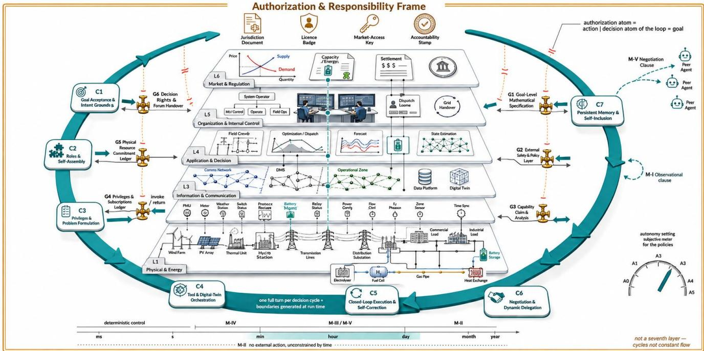

# A-CPES: A Reference Framework for Agentic AI in Cyber-Physical Energy Systems

1st Xiaoyu Zhang

School of Information Science and Engineering

Northeastern University

2nd Qiuye Sun

State Key Laboratory of Synthetical Automation for Process Industries

Shenyang, China

2410400@stu.neu.edu.cn

Northeastern University

Shenyang, China

3rd Jiachen Xu   
Department of Computer Science   
Aalborg University   
Aalborg, Denmark   
jiachenxu@cs.aau.dk

4th Zhongming Yao

College of Computer Science and Technology

Zhejiang University

Hangzhou, China

sunqiuye@ise.neu.edu.cn

yaozzzm@gmail.com

5th Yushuai Li

Department of Computer Science

Aalborg University

Aalborg, Denmark

yusli@cs.aau.dk

Abstract—Energy system operation contains a loop of work that automation has never taken over: posing the optimization problem the current cycle should solve, disposing of infeasibility, sequencing a solution into interlocked switching orders, assembling evidence no single model holds, negotiating adjustable capacity with many parties, and settling experience into practice. Licensed dispatchers carry all of it in person, and the rising share of variable renewable generation is making that loop turn faster than their number can grow. Agentic AI supplies the abilities it requires, but enters as the outer loop of control: it calls SCED and the other decision models rather than being called by them. We propose A-CPES, three nested rings, an authorization and accountability frame around an agentic control outer loop around a six-layer CPES core. We argue the loop is indivisible, tune where and how tightly it may close, state eight structural failure modes as falsifiable predictions, and specify six governance modules that rebuild the authorization frame until it covers the loop, before the loop starts turning.

Index Terms—agentic AI, LLM agents, cyber-physical energy systems, reference architecture, autonomy levels, AI governance

## I. INTRODUCTION

Energy system [1] operation contains a loop of work that automation has never taken over: deciding which optimization problem the current cycle should pose, diagnosing and disposing of infeasibility, translating a solution into switching orders that carry sequence and interlocks, assembling information no single model holds, negotiating adjustable capacity with many external parties, and settling what worked into standing practice. Licensed dispatchers carry all of it in person.

Rising variable renewable generation [2] makes that loop turn faster and more often: intra-day rolling rescheduling multiplies, uncertainty widens, infeasible cases become routine. Distributed resources and aggregators [3] multiply the parties to coordinate; multi-energy coupling [4] multiplies the adjustment options and their combinations. The loop’s workload grows at the speed of system scale, whereas the number of licensed dispatchers cannot grow in proportion.

Existing automation attaches to the system at points: model predictive control [5], reinforcement learning [6] and large language models [7] each do one designated thing, and none initiates, plans or closes a loop. Agentic AI can take this loop whole and keep it turning. It accepts a goal rather than an instruction, breaks it into steps itself, decides what to read and which tool to invoke [8], [9], executes closed loop and corrects itself against the result [10], delegates to other agents [11], and carries experience across sessions [12]. These are exactly the abilities the loop’s segments require, so supply and demand are meeting. Yet such systems remain rare in energy, and the few prototypes that exist [13]–[15] close their loop on a simulator.

Operators preparing to deploy are stuck on three questions. Which segments do we hand over, and where does a human take back? No vocabulary today says what the loop is made of (§III, §IV). Can we hand over only part of it? Starting small feels safest, but nobody has checked how much value survives (§III-B). How much autonomy, on what evidence may it be raised, and how is an incident traced? Existing scales are product tiers with no notion of setting or revalidating a level, and no agent counterpart of the sequence-of-events record (§IV-C, §V-B).

The root cause is that no single picture holds both languages at once: the authorization engineering of energy systems (mandate division, change-controlled settings, work permits, type testing, fault recording) and the agent capability language of AI (tool use, planning, memory, delegation). Both are mature, neither maps onto the other, and none of the three questions can be posed completely in either. Authorization here is moreover never granted after the fact, type testing and work permits putting the rule before the equipment, so writing the specification only once the loop is already turning would let an accomplished fact force the rule.

What is missing is therefore not a stronger model, nor another simulator-bound system, but a reference picture that aligns the two languages before deployment. We propose A-CPES, three nested rings (Fig. 1, detailed in §II): an authorization and accountability frame enclosing an agentic control outer loop, which encloses a six-layer CPES core. With it come a tuning of where the loop closes, on what time scale and at what autonomy (§IV), an atlas of eight failure modes (§V-A), and an enabling substrate with six governance modules (§V-B). It answers the three questions and establishes that the outer loop is indivisible: the smallest unit of coupling is not an integration point but a whole loop.

  
Fig. 1. The A-CPES framework. Every boundary in the six-layer core is drawn ex ante and statically. The outer loop turns one full revolution per decision cycle, traversing all six channels, and it is the initiator: it calls SCED and the other models, not the reverse. The outermost ring is the authorization frame, not a seventh layer: it takes no part in control flow and reaches the channels only through the gates G1–G6. The broken dashed lines from frame to gates are the core diagnosis: the frame’s atom of authorization is the action while the loop’s is the goal, so the frame does not cover the loop today.

## II. THE A-CPES FRAMEWORK

A-CPES renders the coupling as three nested rings (Fig. 1): a six-layer CPES core, the callee in control flow; an agentic control outer loop, the initiator, whose reach, tool set and delegation chain are generated at run time; and an authorization and accountability frame, fixing whose action this is and who answers for it.

Inner core. The core is anchored in SGAM, IEC 62357 and the NIST Smart Grid Framework [16]–[18] rather than invented here: the six layers re-cut SGAM’s domain-zone structure along gatekeeping mechanism, and Fig. 1 carries their contents. What matters here is when each boundary is drawn. L5 and L6 are bounded ex ante and institutionally, by dispatch jurisdiction, mandate documents and certification, and by market admission and settlement identity. L2 and L4 are bounded at design time, by measurement redundancy and time synchronization [19], [20], and by model scope, interfaces and version-frozen study cases; L4 hosts SCED [21] and state estimation [22]. L3 is bounded ex ante and mandatorily, by enforced isolation between the production-control and management-information zones. L1 is bounded by physical law, the N-1 criterion and device settings, and multi-energy coupling sits there rather than in a layer of its own, because a coupling asset is one physical object carrying commitments to several markets at once (P6). All six boundaries are therefore drawn ex ante and statically, which suffices for conventional automation, since it works inside a layer and crosses between layers over predefined interfaces.

Middle ring. The loop’s seven segments (C1 accept goal, C2 self-assemble context, C3 pose the problem, C4 orchestrate tools, C5 execute, C6 delegate, C7 consolidate) land on different layers, so every revolution traverses all six. The loop is the initiator, calling SCED and the other models rather than the reverse; and its boundaries are generated at run time, in what it reads, which tools it combines and whom it delegates to. Hence static boundaries cannot contain a dynamically generated loop.

Outer frame. The frame is not a seventh layer: it takes no part in control flow, and only decides whether the loop’s traversals are permitted. Its atom of authorization is the action, an order, an operating step or a setting value, drawn ex ante from the same source as the layers’ boundaries. So once the loop turns a full revolution, the same agent sits in two opposite relations: in control it is outside the energy system, in authorization it must remain inside it. §V-A derives eight structural consequences of this misalignment; §V-B rebuilds the frame until it covers.

## III. THE AGENTIC OUTER LOOP

Solvers, model predictive control and reinforcement learning all authorize objects that can be frozen: a constraint set and an objective, a model and a cost, an action space and frozen weights. Such objects are reviewable before deployment, exhaustively testable and version-sealed, which is why type testing and change-controlled settings apply to them. They are equipment, not people. The agentic loop offers no such object: what it does this revolution depends on what it read (C2), what it remembers (C7), which tools it holds (C4) and whom it delegated to (C6).

## A. The seven segments

C1 goal grounding attaches an operating goal stated in natural language to procedure clauses and market rules. C2 context self-assembly joins measurements, asset records, outage plans, weather and market information on its own initiative, and is the core increment an agent brings. C3 planning and problem posing decides what to pose and what to do when nothing is feasible. C4 tool and digital-twin orchestration combines solvers, simulators, forecasters and clearing engines at run time. C5 closed-loop execution and self-correction turns a solution into switching operations that carry sequence. C6 negotiation and dynamic delegation assembles adjustable resources across dispatch levels, aggregators and users. C7 persistent memory accumulates experience across sessions and forms operating preferences, and what settles there is organizational knowledge. Which layer each touches is drawn as the six channels of Fig. 1; which failure modes each produces is the “segment” column of Table I.

## B. Indivisibility

Could one adopt only some, plugging the agent in where needed? Without C1 a human must still translate the goal into a formal specification, the most labor-intensive step to begin with. Without C2 it is a script calling a solver over study cases already in L4, while what an infeasible case needs, outage reality, a weather swing, a market signal, is not in L4. Without C3 the assembled evidence has nowhere to be used and the agent is an expensive dashboard. Without C4 it talks but does not compute, so its output is not engineering-acceptable. Without C5 it stops at a plan rather than a command, leaving sequence, interlocks and procedural safety on the human. Without C6 the problems it poses have nobody to fulfill them. Without C7 it starts from zero each revolution, though the value of rolling dispatch lies exactly across cycles.

Incomplete agentic is ineffective agentic: the seven are pairwise preconditions forming a closed loop, so it must be given whole, and given whole it necessarily traverses all six layers. That is a structural necessity rather than an implementation choice.

## IV. TUNING THE OUTER LOOP

The loop must be given whole, so one question remains: where does it close, on what time scale, and how tightly, three graduations of one dial.

## A. Where the loop closes: five modes

In all five modes, all seven segments are running; what differs is where the loop closes. The human is not a removed segment but a gate on the loop. The independent variable is the closing layer, where the loop’s own action lands after one revolution with no human in between. Candidates are “nowhere” plus the six layers, but L2 and L3 cannot receive, since closing means the output becomes a commitment or an action there, whereas a measurement and a communication channel are only read and passed through. That leaves {∅, L5, L4, L1, L6}, and the closing layer decides everything else. On ∅ there is no external action and no time-scale constraint: M-I, observation closure. On L5 the human sits on the gate and every revolution passes it, so the scale follows the human decision cycle into hours to days: M-II, advisory closure (day-ahead plans, outage scheduling). On L4 problems and plans carry checkpoints naturally, so the human samples by segment at minutes to hours: M-III, approval closure, the running example here being intra-day rolling dispatch. On L1 there is no time for segment boundaries, so the human samples by time and holds an envelope, escalating on excursion, at seconds to minutes: M-IV, envelope closure (AVC, storage scheduling). On L6 a signed commitment cannot be withdrawn, leaving only afterthe-fact audit on the settlement cycle: M-V, negotiation closure (VPP aggregation).

M-I–M-IV descend the stack monotonically while the gate retreats from “every revolution” to “sampled by segment” to “holds an envelope only”, whereas M-V goes outward to other parties, closing on commitments rather than on a physical quantity, which is why it alone owns P6 and G5.

## B. Time scale and choice of closing position

The loop does not close onto the millisecond-to-second protection and primary frequency control loops, where determinism and type-testability are required and its run-time variability is a negative asset. Its value band is minutes to days, exactly where a human is already deciding on crosslayer information. In Fig. 1, M-I spans the whole axis because it does not close outward.

Three criteria choose the position: how much cross-layer information the decision needs, how physically irreversible an error is, and how much reaction time the human has. Intraday rolling dispatch lands on M-III: information is large, errors are partly correctable next cycle, humans have minutes, and M-IV would be excessive because disposing of an infeasible case touches whose authority is whose. M-II is insufficient, not because the agent does fewer segments but because the gate sits on the earliest stretch, so every revolution’s output lands on a human who must digest it and act within a fifteenminute cycle. The gate cannot open and close as fast as the loop turns, which is the supply-demand gap of §1 cashed out.

TABLE I  
FAILURE-MODE ATLAS. INCLUSION TEST: A PHENOMENON THAT STILL HOLDS UNDER “RL + FROZEN WEIGHTS + A PROJECTION LAYER” IS NOT LISTED, SO THE LAST COLUMN BEING UNIFORMLY “NO / PARTLY” IS DELIBERATE. ROWS FOLLOW OUTER-LOOP SEGMENT C1→C7.
<table><tr><td>#</td><td>Failure mode</td><td>Segment</td><td>Layers</td><td>Module</td><td>Property</td><td>Does it hold under RL?</td></tr><tr><td>P1</td><td>Context self-assembly crosses the mandatory security-zone boundary, and is the more offending the more useful</td><td>C2</td><td>L3</td><td>G4</td><td>Security</td><td>No | the observation vector is fixed</td></tr><tr><td>P2</td><td>Natural-language evidence becomes a new control channel, so prompt injection [25] becomes a question of where an</td><td>C2</td><td>L3</td><td>G4</td><td>Security</td><td>No | the observation vector is strongly typed</td></tr><tr><td>P3★</td><td>order came from Relaxing a constraint when the problem is infeasible = exercising an authority never granted</td><td>C3</td><td>L4→L1/L5</td><td>G1, G2</td><td>Safety</td><td>No | changing the problem is not in the action space</td></tr><tr><td>P4</td><td>Digital-twin fidelity gap, with the twin selected by the agent at run time</td><td>C4</td><td>L3, L4</td><td>G3, E</td><td>Robustness</td><td>Partly | run-time self-selection of fidelity is agentic-specific</td></tr><tr><td>P5</td><td>Terminal state satisfies N-1 while an intermediate state violates limits</td><td>C5</td><td>L1</td><td>G1</td><td>Safety</td><td>No | intermediate time steps are explicit decision variables</td></tr><tr><td>P6★</td><td>Multi-level dynamic delegation double-promises one physical resource, so the reserve on the books is fictitious</td><td>C6</td><td>L5, L6</td><td>G5</td><td>Accountability</td><td>No | there is no run-time delegation</td></tr><tr><td>P7</td><td>Memory forms operating practice that was never approved, and never raises an alarm</td><td>C7</td><td>L5</td><td>G6</td><td>Auditability</td><td>No | behavior stops drifting once weights are frozen</td></tr><tr><td>P8</td><td>Autonomy is earned under normal conditions but must be redeemed under rare ones</td><td>C7</td><td>cross-cut</td><td>G3</td><td>Robustness</td><td>No | the object under test is stable</td></tr></table>

TABLE II  
AUTONOMY SETTING SCHEDULE. A0 (NO ADOPTION) OMITTED.
<table><tr><td>Level</td><td>Authorized object (width of the G1 spec)</td><td></td><td>Modules Evidence required to promote</td></tr><tr><td>A1 read- only</td><td>reach of retrieval</td><td>G4, G6</td><td>provenance labels complete, replayable</td></tr><tr><td>visory</td><td>A2 ad- + admissible problem family</td><td>+ G1</td><td>accepted/rejected advice is explicable</td></tr><tr><td>A3</td><td>+ admissible bounded relaxation set (pose,</td><td>+ G2,</td><td>under rare conditions,</td></tr><tr><td>orch. A4</td><td>not execute)</td><td>G3</td><td>relaxation choices track physical importance</td></tr><tr><td>loop</td><td>+ trajectory envelope bounded + commitment quota</td><td>+ G5</td><td>whole-trajectory compliance (not terminal state) + zero commitment conflicts</td></tr><tr><td>A5 super- vised</td><td>the full quadruple</td><td>all + drills</td><td>takeover-drill records across rare conditions</td></tr></table>

## C. Autonomy levels A0–A5

Closing position says where the loop closes; autonomy says how tightly. A is the dial, M is where the loop closes when the dial is at that notch, as the right-hand ruler of Fig. 1 is drawn. Table II is a setting schedule; it lists no time scale, that being the intrinsic rhythm of the closing layer.

Autonomy is not a product tier but a quantity to be set like a protection setting, and revalidated whenever memory or the tool set changes, since otherwise the thing under test is no longer the thing that was tested (P8), and promotion evidence must be drawn from rare operating conditions rather than accumulated running hours. A separate condition governs continued possession: A4 and A5 require a periodic unplugthe-agent drill, withdrawing the agent and measuring whether on-duty staff can take over within the original time scale. This mirrors the anti-accident drill regime, with the object under test changed from equipment failure to agent absence, and is necessary because uneventful A4/A5 operation lets takeover skill decay silently [26], a decay that appears in none of the agent’s own metrics.

## V. FAILURE MODES AND GOVERNANCE MODULES

## A. The failure-mode atlas

Table I’s eight entries are necessary consequences of one structure, a complete outer loop turning on six statically bounded layers, stated as falsifiable predictions because such loops today close on simulators. Its last column answers “isn’t this just safe RL?”: an RL violation is detectable because the problem did not change; an agentic relaxation is not, because the changed problem became the baseline the check is run against (P3).

## B. Enabling substrate and governance modules

The six modules below are not shackles on the agent: each rewrites one stretch of the authorization frame from “per action” to “per goal and envelope”, until the frame covers the loop. Each names one reviewable, version-controlled object and pins to it something the loop generates at run time, and every isomorphism below runs from energy to AI, not the reverse. Three of them gate the channels an enabling substrate must open first, for C2 retrieval, C4 tool use and C6 delegation, only C5 already having one.

G1 Goal-level authorization specification rewrites what is authorized: orders give way to ⟨ problem family; relaxation set; trajectory envelope; commitment quota ⟩ [27], [28]. The freezable object agentic systems lack; cf. graded dispatch authority. (P3, P5)

G2 External safety veto layer rewrites where safety is im posed: the projection applies to the problem, not the action, since overreach happens at problem posing; shielding [23], [24] raised one level. (P3)

G3 Capability-closure analysis rewrites the unit of competence: the tool combination’s closure is authorized, not the tool list; cf. recomputing settings after a primary-circuit change. (P4, P8)

G4 Provenance and security-zone labeling rewrites the admission of evidence: source and zone labels, cross-zone use refused, natural language graded apart from measurements; cf. secondary-system security rules. (P1, P2)

G5 Physical resource commitment ledger rewrites the bookkeeping of commitments: each resolves to a unique redeemable physical quantity, globally exclusive across carriers; cf. reserve-capacity registers. (P6)

## G6 Decision recording and human handover rewrites

record and handover: freeze the input snapshot, retrieval hits, model version and seed, because an agent has no SOE; cf. fault recording and shift handover. (P7)

## VI. CONCLUSION

Coupling agentic AI with energy systems is not a matter of adding AI at a few points, but of letting one autonomous outer loop wrap the entire stack and turn. At that moment containment holds in control flow, while the frame of authorization and accountability still sits in the old per-action, perlayer form. The engineering to be done is to rebuild that frame until it covers, before the loop starts turning.

## REFERENCES

[1] Y. Li, H. Zhang, X. Liang, and B. Huang, “Event-triggered-based distributed cooperative energy management for multienergy systems,” IEEE Trans. Ind. Informat., vol. 15, no. 4, pp. 2008–2022, Apr. 2019.

[2] X. Zhang, Y. Li, T. Li, Y. Gui, Q. Sun, and D. W. Gao, “Digital twin empowered PV power prediction,” J. Mod. Power Syst. Clean Energy, vol. 12, no. 5, pp. 1472–1483, Sep. 2024.

[3] J. Xu, T. B. Pedersen, Z. Yao, T. Li, and Y. Li, “FOgym: A bottom-up home energy management framework based on flexoffers and multiagent reinforcement learning,” in Proc. 17th ACM Int. Conf. Future Sustain. Energy Syst. (e-Energy), Banff, Canada, pp. 303–320, 2026.

[4] X. Zhang, Q. Sun, J. Xu, T. Li, Y. Ding, and Y. Li, “LLMempowered reinforcement learning for optimal economic dispatch in cyber-physical energy systems,” IEEE Trans. Ind. Informat., early access, doi: 10.1109/TII.2026.3711747.

[5] M. Arnold and G. Andersson, “Model predictive control of energy storage including uncertain forecasts,” in Proc. PSCC, 2011.

[6] X. Zhang, Q. Sun, T. Li, Y. Song, Z. Yao, and Y. Li, “A survey on large language models enhanced reinforcement learning for smart grid,” J. Mod. Power Syst. Clean Energy, early access, doi: 10.35833/MPCE.2025.000685.

[7] M. Majumder et al., “Exploring the capabilities of large language models for power system analysis and operation,” IEEE Access, 2024.

[8] S. Yao et al., “ReAct: Synergizing reasoning and acting in language models,” in Proc. ICLR, 2023.

[9] T. Schick et al., “Toolformer: Language models can teach themselves to use tools,” in Proc. NeurIPS, 2023.

[10] N. Shinn et al., “Reflexion: Language agents with verbal reinforcement learning,” in Proc. NeurIPS, 2023.

[11] Q. Wu et al., “AutoGen: Enabling next-gen LLM applications via multiagent conversation,” in Proc. COLM, 2024.

[12] G. Wang et al., “Voyager: An open-ended embodied agent with large language models,” TMLR, 2024.

[13] “GridMind: LLMs-powered agents for power system analysis and operations,” in Proc. SC’25 Workshops, 2025, arXiv:2509.02494.

[14] “Grid-Agent: An LLM-powered multi-agent system for power grid control,” arXiv:2508.05702, 2025.

[15] “X-GridAgent: An LLM-powered agentic AI system for assisting power grid analysis,” arXiv:2512.20789, 2025.

[16] CEN-CENELEC-ETSI Smart Grid Coordination Group, “Smart grid reference architecture,” Tech. Rep., 2012.

[17] IEC TR 62357-1, “Power systems management and associated information exchange, Part 1: Reference architecture,” 2016.

[18] NIST, “Framework and roadmap for smart grid interoperability standards, release 4.0,” NIST SP 1108r4, 2021.

[19] Y. Yao, L. Chen, Z. Fang, Y. Gao, C. S. Jensen, and T. Li, “Camel: Efficient compression of floating-point time series,” Proc. ACM Manag. Data, vol. 2, no. 6, Art. no. 227, pp. 1–26, Dec. 2024.

[20] Y. Yao, H. Jie, L. Chen, T. Li, Y. Gao, and S. Wen, “TSec: An efficient and effective framework for time series classification,” in Proc. 40th IEEE Int. Conf. Data Eng. (ICDE), Utrecht, Netherlands, pp. 1394– 1406, 2024.

[21] F. Capitanescu et al., “State-of-the-art, challenges, and future trends in security constrained optimal power flow,” Electr. Power Syst. Res., vol. 81, no. 8, pp. 1731–1741, 2011.

[22] A. Abur and A. G. Exposito,´ Power System State Estimation: Theory and Implementation. Marcel Dekker, 2004.

[23] M. Alshiekh et al., “Safe reinforcement learning via shielding,” in Proc. AAAI, 2018.

[24] J. Achiam, D. Held, A. Tamar, and P. Abbeel, “Constrained policy optimization,” in Proc. ICML, 2017.

[25] K. Greshake et al., “Not what you’ve signed up for: Compromising real-world LLM-integrated applications with indirect prompt injection,” in Proc. ACM AISec, 2023.

[26] L. Bainbridge, “Ironies of automation,” Automatica, vol. 19, no. 6, pp. 775–779, 1983.

[27] T. Li, L. Chen, C. S. Jensen, and T. B. Pedersen, “TRACE: Real-time compression of streaming trajectories in road networks,” Proc. VLDB Endow., vol. 14, no. 7, pp. 1175–1187, Mar. 2021.

[28] D. Hu, Z. Fang, H. Fang, T. Li, C. Shen, L. Chen, and Y. Gao, “Estimator: An effective and scalable framework for transportation mode classification over trajectories,” IEEE Trans. Intell. Transp. Syst., vol. 25, no. 11, pp. 15562–15573, Nov. 2024.