# CDEG: Learning Decision-Critical Evidence for Long-Horizon Diagnostic Agents

Xiwei Dai∗, Zijie Meng∗, Zhiting Fan, Yixuan Tang, Ziru Niu, Zuozhu Liu†

Zhejiang University Hangzhou, Zhejiang, China

## Abstract

Unlike static medical question answering, long-horizon diagnosis captures the sequential nature of clinical practice: evidence is progressively acquired, integrated, and evaluated over multiple rounds of interaction before reaching a final diagnosis. However, existing doctor agents often fail when critical evidence is either not acquired or not adequately incorporated into diagnostic reasoning. Recent agentic approaches attempt to address these failures by reusing historical trajectories or distilled memories. But their diagnostic gains remain constrained because such experience may contain noisy or incidental information and is typically reused without validating which evidence actually drives diagnostic decisions. To address this limitation, we introduce CDEG, a graph-based framework that learns reusable decision-critical evidence from historical diagnostic trajectories. CDEG contrasts successful and failed trajectories from the same case to identify candidate evidence, validates their diagnostic impact through controlled counterfactual interventions, and organizes the resulting diagnosis–evidence–action relations into a structured graph. During inference, CDEG tracks the evolving patient evidence state to retrieve relevant diagnostic relations and selectively guide missing evidence acquisition or overlooked evidence reappraisal. Across in-domain and outof-distribution benchmarks with multiple doctor agent backbones, CDEG consistently improves diagnostic performance, achieving up to an 11.5% accuracy gain over vanilla agents. These results demonstrate that reliable long-horizon diagnosis requires moving beyond trajectory-level experience reuse toward evidence-level learning of the factors that truly shape clinical decisions.

## Introduction

Recent advances in medical language models have shifted diagnostic agents beyond static medical question answering toward long-horizon interactive diagnosis (Schmidgall et al. 2026; Almansoori, Kumar, and Cholakkal 2025; Li et al. 2024). Under partial observability, a doctor agent must acquire evidence from the patient environment through diagnostic tools, integrate it across turns, and decide when it is suficient for diagnosis (National Academies of Sciences, Engineering, and Medicine 2015). Yet vanilla agents often fail to acquire relevant evidence or overlook observations already available (Long, Bao, and Wei 2026; Li et al. 2024; Hsu et al. 2026; Fang et al. 2026), as illustrated in Figure 1. Therefore, a fundamental challenge in long-horizon diagnosis is how to identify and utilize the evidence that is truly critical for distinguishing diagnoses.

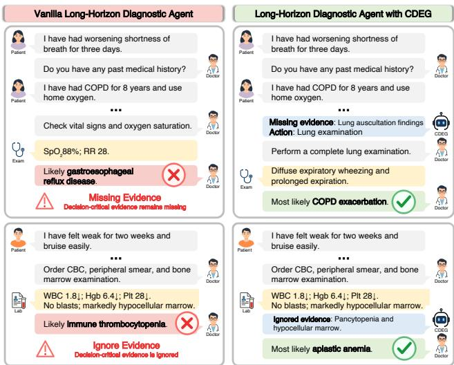  
Figure 1: Long-horizon diagnosis with and without CDEG. The vanilla doctor agent may fail when decision-critical evidence is missing or ignored. With CDEG, the doctor agent is prompted to acquire missing evidence or reappraise observed evidence, enabling it to reach the correct diagnosis.

Historical diagnostic trajectories record evidence, actions, and final decisions, ofering reusable experience for future interactions. Existing methods retrieve prior trajectories or distill them into reflections, strategies, and structured memories (Shinn et al. 2023; Zhao et al. 2024; Wang et al. 2025; Ren et al. 2026; Shen et al. 2026; Li, Du, and Guo 2026; Han et al. 2026). However, trajectories mix decision-relevant evidence with incidental observations, while outcomes do not reveal which evidence shaped the diagnosis. Recent methods attempt to improve experience reuse through trajectory refinement, applicability-aware retrieval, and memory management but still operate mainly at the trajectory or memoryunit level (Ouyang et al. 2026; Xiong et al. 2026). Thus, individual observations may be reused without establishing their diagnostic relevance.

Counterfactual reasoning ofers a potential way to resolve this ambiguity (Richens, Lee, and Johri 2020; Nagesh et al. 2023; Xu et al. 2022). By changing one observation while keeping the remaining evidence unchanged, it tests whether diagnostic preference changes. We extend this principle to historical diagnostic trajectories and regard evidence as decision-critical only when a controlled intervention on its availability or use consistently changes diagnostic preference. This selects evidence for reuse by its efect on decisions, rather than its co-occurrence with a successful outcome.

Building on this criterion, we introduce CDEG, a graphbased framework for learning reusable decision-critical evidence from historical diagnostic trajectories. CDEG contrasts each failed trajectory with a similar successful trajectory from the same case, uses controlled counterfactual tests to determine whether candidate evidence supports or blocks the corresponding diagnostic revision, and organizes the resulting diagnosis–evidence–action relations into a structured graph. During inference, CDEG matches the patient’s evolving evidence state to the graph to guide acquisition of missing evidence or reappraisal of overlooked observations. We evaluate CDEG on the in-domain (ID) MIMIC-IDx and out-of-distribution (OOD) AgentClinic benchmarks across four doctor-agent backbones (Johnson et al. 2023b,a, 2019; Schmidgall et al. 2026; Jin et al. 2021). CDEG improves average accuracy by 7.63% and 8.88% on the two benchmarks, respectively, with gains of up to 11.5%, consistently outperforming the vanilla agent and other experience-reuse methods. These results show that evidence-level learning provides a more reliable basis for experience reuse in long-horizon diagnosis. Our contributions are summarized as follows:

• We formulate trajectory reuse as an evidence-level learning problem and introduce CDEG to extract decisioncritical evidence from historical diagnostic trajectories.

• We develop a counterfactual validation method that contrasts successful and failed trajectories from the same case and retains only evidence that demonstrably afects diagnostic preference under controlled interventions.

• We construct a structured graph that uses the patient’s evolving evidence state to guide acquisition of missing evidence or reappraisal of overlooked evidence.

• We evaluate CDEG on ID and OOD benchmarks with various backbones, which consistently improves the vanilla agent and achieves the best diagnostic performance.

## Related Work

Long-Horizon Interactive Diagnosis. Long-horizon interactive diagnosis requires a doctor agent to acquire and integrate clinical evidence under partial observability before providing a final diagnosis. Interactive environments and benchmarks instantiate this setting through multi-turn patient interaction and diagnostic tools (Schmidgall et al. 2026; Almansoori, Kumar, and Cholakkal 2025; Jiang et al. 2025; Li et al. 2024). Recent methods improve evidence acquisition and diagnostic reasoning through targeted questioning, test selection, and iterative diagnosis (Qiu et al. 2025; Gao et al. 2026; Sanghvi et al. 2026; Hsu et al. 2026; Rose et al. 2025; Ren et al. 2025; Liu et al. 2025). Despite this progress, evidence acquisition remains challenging, and evidence already observed may still be ignored in the final diagnosis (Long, Bao, and Wei 2026; Fang et al. 2026).

Learning from Diagnostic Trajectories. A complementary line of works learns from prior trajectories to improve subsequent decisions. General agent methods retrieve trajectories as exemplars or distill them into verbal reflections, transferable lessons, reusable workflows, skill libraries, or reasoning memories (Zheng et al. 2024; Shinn et al. 2023; Zhao et al. 2024; Wang et al. 2025, 2024; Ouyang et al. 2026). Medical agents similarly retrieve prior cases or distill diagnostic trajectories into strategies and structured memories (Ren et al. 2026; Shen et al. 2026; Li, Du, and Guo 2026; Han et al. 2026). However, not all such experience is equally relevant or reliable for subsequent diagnosis, and its quality is not always explicitly assessed before reuse.

Counterfactual Reasoning in Medical Diagnosis. Counterfactual reasoning examines how diagnostic preference changes under controlled interventions on clinical evidence. Prior medical works use counterfactual inference and evidence perturbation for causal diagnosis, clinical prediction, and model explanation (Richens, Lee, and Johri 2020; Nagesh et al. 2023; Xu et al. 2022). Recent medical-LLM studies further modify symptoms, laboratory evidence, or diagnostic contexts to evaluate diagnostic anchoring and reasoning over competing diagnoses (Bhasuran et al. 2026; Chen et al. 2026; Mo et al. 2026; You et al. 2026; Qu and Färber 2026). These works use counterfactual reasoning mainly for case-level diagnosis, explanation, or evaluation. Our work instead applies counterfactual validation during graph construction to assess candidate evidence mined from successful and failed trajectories before incorporating them into CDEG.

## Methods

## Problem Setup

Long-horizon interactive diagnosis models clinical diagnosis as a multi-turn sequential decision-making process under partial observability, in which a doctor agent progressively acquires and integrates clinical evidence before providing a final diagnosis (Schmidgall et al. 2026; Li et al. 2024). Each clinical case is represented as $\boldsymbol { x } = ( \mathcal { E } _ { x } , y _ { x } ^ { * } )$ , where ${ \mathcal { E } } _ { x }$ denotes the patient environment and $y _ { x } ^ { * }$ is the reference diagnosis. The environment contains the complete case information but initially reveals only $o _ { 0 } .$ with additional evidence becoming available through subsequent interaction.

At interaction turn $t ,$ the doctor agent conditions on the interaction history $h _ { t }$ and selects its next action $a _ { t } \colon$

$$
h _ { t } = \big ( o _ { 0 } , ( a _ { i } , o _ { i } ) _ { i = 1 } ^ { t - 1 } \big ) , \qquad a _ { t } \sim \pi _ { \theta } ( \cdot \mid h _ { t } ) .\tag{1}
$$

where $\pi _ { \theta }$ denotes the doctor agent policy. The agent may interact with the patient, use diagnostic tools to review clinical history, obtain laboratory or imaging evidence, perform examinations, retrieve relevant knowledge, or provide a final diagnosis. Each action other than the final diagnostic action yields an observation $o _ { t } .$ , which is appended to the interaction history to form $h _ { t + 1 }$ for the next turn.

The interaction terminates when the agent executes the final diagnostic action $a _ { T }$ at turn $T _ { \ast }$ , yielding the trajectory:

$$
\tau = \left( o _ { 0 } , ( a _ { t } , o _ { t } ) _ { t = 1 } ^ { T - 1 } , a _ { T } \right) .\tag{2}
$$

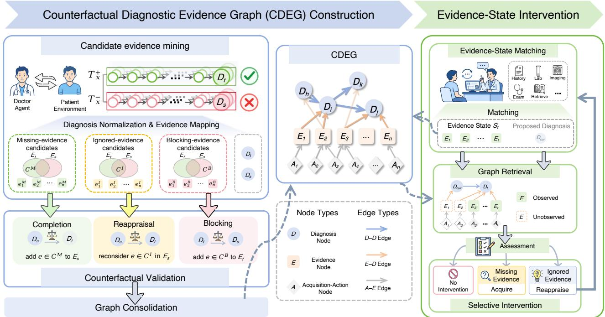  
Figure 2: Overview of CDEG. CDEG first compares successful and failed trajectories from the same case to mine candidates that may explain their diferent diagnoses. It then tests whether adding missing evidence, reconsidering observed evidence, or introducing evidence against a revision changes diagnostic preference, and consolidates the validated evidence with diagnoses and acquisition actions into a graph. At inference time, CDEG retrieves relevant diagnostic edges based on the current evidence and guides the doctor agent to acquire missing evidence, reconsider ignored evidence, or avoid unnecessary intervention.

Here, $a _ { T }$ is the final diagnostic action, and $D ( \tau )$ denotes the final diagnosis derived from the complete trajectory.

## Counterfactual Diagnostic Evidence Graph Construction

Figure 2 provides an overview of CDEG construction and evidence-state intervention. CDEG construction proceeds in three stages. We first mine candidate evidence by comparing successful and failed trajectories from the same case, then validate each candidate by testing whether it changes diagnostic preference, and finally organize the validated evidence with its associated diagnoses and acquisition actions into the graph.

Candidate Evidence Mining. For each case $x$ in the graph-construction split, we sample K independent rollouts of the doctor agent with the identical patient environment ${ \mathcal { E } } _ { x } ,$ yielding a set of trajectories $\mathcal { T } _ { x } = \{ \tau _ { x } ^ { ( k ) } \} _ { k = 1 } ^ { K }$ . We map the final diagnosis from each rollout to the same ICD-aligned label space as the reference diagnosis and partition the trajectories by diagnostic correctness:

$$
\begin{array} { r } { \mathcal { T } _ { x } ^ { + } = \{ \tau \in \mathcal { T } _ { x } \mid D ( \tau ) = y _ { x } ^ { * } \} , } \\ { \mathcal { T } _ { x } ^ { - } = \{ \tau \in \mathcal { T } _ { x } \mid D ( \tau ) \neq y _ { x } ^ { * } \} . } \end{array}\tag{3}
$$

With the patient case fixed across rollouts, we compare successful and failed trajectories to uncover evidence acquisition and utilization patterns that distinguish correct from incorrect diagnoses.

However, trajectories from the same case may reach identical diagnoses through diferent interaction histories. We therefore pair each failed trajectory with the most similar successful trajectory based on the action–observation history $\tau _ { \mathrm { p r e } }$ before the final diagnostic action. For each failed trajectory $\tau ^ { - }$ , we select

$$
\tau ^ { + * } = \underset { \tau ^ { + } \in \mathcal { T } _ { x } ^ { + } } { \arg \operatorname* { m a x } } \cos \left( \phi ( \tau _ { \mathrm { p r e } } ^ { - } ) , \phi ( \tau _ { \mathrm { p r e } } ^ { + } ) \right) ,\tag{4}
$$

where $\phi ( \cdot )$ maps the action–observation history into a semantic embedding. The pair $( \tau ^ { - } , \tau ^ { + * } )$ is retained only when this maximum similarity exceeds a predefined threshold. For each retained pair, we denote their final diagnoses as $D _ { s }$ and $D _ { t } ,$ respectively.

We further transform heterogeneous clinical observations in each retained pair to evidence atoms grounded in UMLS concepts (Bodenreider 2004). Each evidence atom represents a normalized clinical concept with its relevant attributes, including polarity, temporal status, numerical direction, and anatomical context. Observations mapped to the same evidence atom are merged while retaining their associated acquisition actions.

Let $E _ { s }$ and $E _ { t }$ denote the evidence atoms extracted from the failed and successful trajectories, respectively. Based on their relationships, We derive three candidate evidence sets:

$$
\begin{array} { r } { \mathcal { C } ^ { M } = E _ { t } \backslash E _ { s } , \qquad \mathcal { C } ^ { I } = E _ { t } \cap E _ { s } , \qquad \mathcal { C } ^ { B } = E _ { s } \backslash E _ { t } . } \end{array}\tag{5}
$$

where ${ \mathcal { C } } ^ { M } , { \mathcal { C } } ^ { I }$ , and $\mathcal { C } ^ { B }$ denote missing-evidence, ignoredevidence, and blocking-evidence candidates, respectively.

Evidence in $\mathcal { C } ^ { M }$ is acquired in the successful trajectory but absent from the failed trajectory, representing potential decision-critical evidence supporting the target diagnosis. Evidence in $\mathcal { C } ^ { I }$ appears in both trajectories, suggesting that the diagnostic discrepancy may stem from diferences in evidence interpretation or utilization. Evidence in $\mathcal { C } ^ { B }$ appears only in the failed trajectory and may support the source diagnosis, indicating when revision toward the target diagnosis is unwarranted.

Counterfactual Validation. Building on these candidate sets, we next evaluate which one can alter diagnostic preference under a controlled counterfactual intervention. For each candidate, we apply only its corresponding intervention while keeping all other evidence unchanged.

Given an evidence set, the verifier compares $D _ { s }$ and $D _ { t }$ and selects the diagnosis better supported by the available evidence. We measure whether the verifier’s preference changes after the intervention. To reduce order bias, all comparisons are repeated with the diagnosis order reversed, and a candidate is retained only if the same preference shift occurs in both orders. Accordingly, we perform diferent counterfactual interventions for the three candidate categories.

(1) Completion test. For each $\textit { e } \in \mathop { \mathcal { C } } ^ { M }$ , we add e to the failed-trajectory evidence $E _ { s }$ . If the verifier’s preference changes from $D _ { s }$ to $D _ { t }$ , e is retained as validated missing evidence, indicating its potential role in supporting the target diagnosis.

(2) Reappraisal test. For each $e \in \mathcal { C } ^ { I }$ , we keep $E _ { s }$ unchanged while explicitly exposing e during diagnosis comparison. If the verifier’s preference shifts from $D _ { s }$ to $D _ { t }$ , e is retained as validated ignored evidence, suggesting that the evidence was available but insuficiently utilized.

(3) Blocking test. For each $e \in \mathcal { C } ^ { B }$ , we add e to the successful-trajectory evidence $E _ { t }$ . If the verifier’s preference alters from $D _ { t }$ to $D _ { s }$ , e is retained as validated blocking evidence, indicating that revision toward the target diagnosis may be inappropriate when this evidence is present.

Graph Consolidation. We organize the counterfactually validated evidence, together with its associated diagnoses and acquisition actions, into the Counterfactual Diagnostic Evidence Graph:

$$
\mathcal { G } = \left( \mathcal { V } _ { D } , \mathcal { V } _ { E } , \mathcal { V } _ { A } , \mathcal { E } _ { A E } , \mathcal { E } _ { E D } , \mathcal { E } _ { D D } \right) ,\tag{6}
$$

where $\gamma _ { D } , \ \mathcal { V } _ { E }$ , and $\nu _ { A }$ denote diagnosis, evidence, and acquisition-action nodes, respectively. ${ \mathcal { E } } _ { A E }$ maps acquisition actions to their resulting evidence, $\bar { \mathcal { E } _ { E D } }$ links evidence to the diagnoses it supports, and $\mathcal { E } _ { D D }$ contains directed diagnosticrevision relations. Each $( D _ { s } , D _ { t } ) \in \mathcal { E } _ { D D }$ represents a revision from the diagnosis $D _ { s }$ in a failed trajectory to the diagnosis $D _ { t }$ in its paired successful trajectory for the same case. Such an edge is added in the graph only when counterfactual validation identifies evidence that shifts diagnostic preference from $D _ { \varepsilon }$ to $D _ { t }$ . Validated missing and ignored evidence are linked to $D _ { t }$ , while validated blocking evidence is connected to $D _ { s }$ . Therefore, each diagnostic revision relation retains both the evidence that promotes correction toward $D _ { t }$ and the evidence that favors retaining $D _ { s }$

## Evidence-State Intervention

At inference time, CDEG maintains an evolving patient evidence state $S _ { t } .$ , which contains graph evidence nodes corresponding to the observations acquired up to interaction turn t. Newly obtained observations from the patient environment are mapped to graph evidence nodes through hybrid matching, which combines exact and semantic similarity matching. The resulting evidence nodes are added to $S _ { t }$ and used for future graph retrieval.

Graph Retrieval. Given the current evidence state $S _ { t }$ CDEG retrieves the most related diagnosis-to-diagnosis edge. Specifically, for each $( D _ { s } , D _ { t } ) \in \mathsf { \bar { E } } _ { D D }$ , let $E _ { s  t }$ denote the evidence atoms associated with this edge. We measure the evidence coverage of the edge at turn t as:

$$
\mathrm { c o v } _ { t } ( D _ { s } , D _ { t } ) = \frac { | S _ { t } \cap E _ { s  t } | } { | E _ { s  t } | } .\tag{7}
$$

Before the doctor agent attempts to provide a final diagnosis, CDEG evaluates all edges in $\mathcal { E } _ { D D }$ and retrieves the one with the highest coverage if its score exceeds a predefined threshold. Once the doctor agent attempts to provide a final diagnosis, the proposed diagnosis is matched to a graph diagnosis node $D _ { \mathrm { c u r } }$ . CDEG then performs a localized retrieval over outgoing edges $( D _ { \mathrm { c u r } } , D _ { t } ) \in \mathcal { E } _ { D D }$ and selects the one with the highest coverage that exceeds the same threshold.

Selective Intervention. For the retrieved edge $( D _ { s } , D _ { t } )$ CDEG first determines whether the diagnostic revision is applicable to the current evidence state $S _ { t }$ . If evidence supporting $D _ { s }$ has already been observed, CDEG does not intervene along this edge. Otherwise, CDEG checks whether any evidence associated with $D _ { t }$ remains unobserved. If such evidence can be obtained through an available acquisition action, CDEG identifies a missing-evidence state and prompts the doctor agent to perform the corresponding acquisition action to obtain the missing evidence. If no further evidence can be acquired, CDEG considers diagnostic reappraisal when the doctor agent proposes $D _ { s }$ . It checks whether evidence associated with $D _ { t }$ is already present in $S _ { t }$ . CDEG identifies an ignored-evidence state and prompts the doctor agent to reappraise the observed evidence before finalizing its diagnosis.

After each non-final action, newly acquired evidence is added to $S _ { t }$ , and graph retrieval is repeated. When the doctor agent attempts to provide a final diagnosis, CDEG evaluates whether evidence acquisition or diagnostic reappraisal is required. If an intervention is triggered, the final diagnostic action is deferred and the interaction continues; otherwise, the proposed diagnosis is returned as the final output.

## Experiments

## Experimental Setup

Benchmarks. We evaluate CDEG on two long-horizon interactive diagnosis benchmarks. MIMIC-IDx serves as the ID benchmark and is constructed by integrating MIMIC-IV (Johnson et al. 2023b), MIMIC-IV-Note (Johnson et al. 2023a), and matched MIMIC-CXR records (Johnson et al. 2019). Each hospital admission is treated as a diagnostic case in which the patient environment initially exposes limited clinical information and additional evidence becomes available through subsequent interaction. Cases are partitioned at the patient level into disjoint graph-construction and evaluation sets. For OOD evaluation, we use the MedQA subset of AgentClinic (Schmidgall et al. 2026), which converts MedQA cases (Jin et al. 2021) into text-based interactive diagnostic scenarios. The CDEG is constructed solely from the MIMIC-IDx graph-construction set, with the held-out MIMIC-IDx set and AgentClinic used exclusively for evaluation. Additional benchmark construction details are provided in the supplementary material, and benchmark statistics are summarized in Table 1.

<table><tr><td>Benchmark</td><td>Source</td><td>Setting</td><td># Cases</td></tr><tr><td rowspan="2">MIMIC-IDx</td><td>MIMIC-IV</td><td>Graph Construction</td><td>573</td></tr><tr><td></td><td>ID Evaluation</td><td>200</td></tr><tr><td>AgentClinic</td><td>MedQA</td><td>OOD Evaluation</td><td>107</td></tr></table>

Table 1: Benchmark statistics and experimental settings.

Baselines. We compare CDEG with the Vanilla Agent and three baselines. Self-Reflection prompts the doctor agent to reconsider its diagnostic reasoning from the current interaction history before providing a final diagnosis. Trajectory RAG retrieves similar successful historical diagnostic trajectories as in-context examples. Flat Experience retrieves diagnostic experience distilled from historical trajectories as unstructured text. For each backbone and benchmark, all methods use the same patient environment, available tools, and interaction budget. Historical information is restricted to the graph-construction split, and retrieval-based baselines use the same retrieval encoder and retrieval budget.

Metrics. We primarily evaluate diagnostic quality using two complementary metrics, Accuracy (Acc.) and Similarity (Sim.). Accuracy measures the proportion of predicted diagnoses that are clinically consistent with the reference diagnoses, which is determined by GPT-5.6-Sol (OpenAI 2026a) under a predefined clinical evaluation rubric (Schmidgal et al. 2026). Similarity captures the semantic proximity between predicted and reference diagnoses and is computed as cosine similarity in the embedding space of MedEmbedlarge-v0.1 (Balachandran 2024).

We further evaluate how each enhanced agent afects the decision behavior of the vanilla agent using Correction (Corr.) (Hassoon et al. 2026) and Regression (Reg.) (Fang et al. 2026). For each backbone, diferent methods are compared with the vanilla agent on the same cases. Let $N _ { \mathrm { V } } ^ { - }$ and $N _ { \mathrm { V } } ^ { + }$ denote the numbers of cases diagnosed incorrectly and correctly by the vanilla agent, respectively. Let $N _ { \mathrm { f i x } }$ denote the cases where the enhanced agent corrects errors made by the vanilla agent, and $N _ { \mathrm { r e g } }$ denote the cases where the enhanced agent changes correct predictions of the vanilla agent into incorrect ones. We define the two metrics as:

$$
\mathrm { C o r r e c t i o n } = \frac { N _ { \mathrm { f i x } } } { N _ { \mathrm { V } } ^ { - } } , \qquad \mathrm { R e g r e s s i o n } = \frac { N _ { \mathrm { r e g } } } { N _ { \mathrm { V } } ^ { + } } .\tag{8}
$$

Implementation Details. During graph construction, Gemini-3.1-Pro (Google 2026) and Gemini-3-Flash-Preview (Google 2025) were used to sample K = 4 independent trajectories for each case in the MIMIC-IDx graphconstruction split. Qwen3-Embedding-0.6B (Zhang et al. 2025) was used as the trajectory encoder and as the retrieval encoder for all retrieval-based baselines. Each failed trajectory was paired with its most similar successful trajectory, and pairs were retained only when their cosine similarity exceeded 0.7. GPT-5.5 (OpenAI 2026b) was used to map clinical observations to UMLS-grounded evidence atoms and to verify candidate evidence through counterfactual validation. The resulting CDEG was frozen and shared across all doctor-agent backbones.

During inference, we compared Gemini-3-Flash-Preview (Google 2025), Gemini-3.1-Pro (Google 2026), GPT-5.6-Luna (OpenAI 2026a), and Claude-Sonnet-5 (Anthropic 2026) as doctor agent backbones. Newly acquired observations are mapped to graph evidence nodes through hybrid matching, which combines exact matching with SapBERT-based semantic matching using a similarity threshold of 0.72 (Liu et al. 2021). Proposed diagnoses are mapped to graph diagnosis nodes using the same procedure with a threshold of 0.65. Diagnostic revision relations are retrieved when their evidence coverage exceeds 0.6. All methods use a maximum interaction budget of 30 turns. Additional prompts and implementation settings are provided in the supplementary material.

## Main Results

As shown in Table 2, CDEG consistently improves diagnostic performance across all doctor agent backbones and both benchmarks. It increases the average accuracy across various backbones by 7.63% on MIMIC-IDx and 8.88% on AgentClinic. In contrast, Trajectory RAG and Flat Experience correct Vanilla Agent errors without producing consistent accuracy gains, suggesting that retrieving relevant historical experience alone is insuficient. The retained experience must also be reliable and applied under an appropriate evidence state. CDEG addresses both requirements by retaining evidence only when counterfactual intervention changes diagnostic preference and organizing the validated evidence into diagnostic revision relations for selective acquisition and reappraisal. Additionally, although CDEG is constructed only from Gemini-3-Flash-Preview and Gemini-3.1-Pro-Preview trajectories, it still improves GPT-5.6-Luna and Claude-Sonnet-5 on both benchmarks. Its gains further transfer to the OOD evaluation set AgentClinic, suggesting that the validated evidence captures reusable diagnostic relations rather than reasoning patterns specific to a particular doctor-agent backbone or benchmark.

## Ablation Studies

To further analyze the contributions of individual components, we conduct ablation studies on counterfactual validation for structured experience, diferent candidate evidence sets, evidence-state intervention, and diagnostic experience scaling. All studies use the MIMIC-IDx evaluation set with Gemini-3-Flash-Preview as the doctor-agent backbone.

<table><tr><td rowspan="2">Backbone</td><td rowspan="2">Method</td><td colspan="3">MIMIC-IDx (ID)</td><td colspan="3">AgentClinic (OOD)</td><td colspan="3">Avg.</td></tr><tr><td>Acc. (%)</td><td>Sim.</td><td>Corr. (%)</td><td>Acc. (%)</td><td>Sim.</td><td>Corr. (%)</td><td>Acc. (%)</td><td>Sim.</td><td>Corr. (%)</td></tr><tr><td rowspan="5">Gemini-3-Flash- Preview</td><td>Vanilla Agent</td><td>41.50</td><td>0.6584</td><td></td><td>60.75</td><td>0.8442</td><td></td><td>51.13</td><td>0.7513</td><td></td></tr><tr><td>+ Self-Reflection</td><td>47.00</td><td>0.6828</td><td>23.08</td><td>61.68</td><td>0.8515</td><td>21.43</td><td>54.34</td><td>0.7672</td><td>22.26</td></tr><tr><td>+ Trajectory RAG</td><td>45.00</td><td>0.6726</td><td>22.22</td><td>60.75</td><td>0.7904</td><td>30.95</td><td>52.88</td><td>0.7315</td><td>26.59</td></tr><tr><td>+ Flat Experience</td><td>48.50</td><td>0.6688</td><td>26.50</td><td>61.68</td><td>0.8161</td><td>35.71</td><td>55.09</td><td>0.7425</td><td>31.11</td></tr><tr><td>+ CDEG</td><td>53.00</td><td>0.6908</td><td>33.33</td><td>68.22</td><td>0.8576</td><td>45.24</td><td>60.61</td><td>0.7742</td><td>39.29</td></tr><tr><td rowspan="5">Gemini-3.1-Pro</td><td>Vanilla Agent</td><td>50.00</td><td>0.6733</td><td></td><td>66.36</td><td>0.8691</td><td></td><td>58.18</td><td>0.7712</td><td></td></tr><tr><td>+ Self-Reflection</td><td>47.00</td><td>0.6720</td><td>19.00</td><td>66.36</td><td>0.8674</td><td>25.00</td><td>56.68</td><td>0.7697</td><td>22.00</td></tr><tr><td>+ Trajectory RAG</td><td>52.50</td><td>0.6846</td><td>28.00</td><td>68.22</td><td>0.8690</td><td>30.56</td><td>60.36</td><td>0.7768</td><td>29.28</td></tr><tr><td>+ Flat Experience</td><td>50.00</td><td>0.6752</td><td>25.00</td><td>67.29</td><td>0.8721</td><td>33.33</td><td>58.65</td><td>0.7737</td><td>29.17</td></tr><tr><td>+ CDEG</td><td>59.00</td><td>0.7002</td><td>33.00</td><td>71.96</td><td>0.8924</td><td>36.11</td><td>65.48</td><td>0.7963</td><td>34.56</td></tr><tr><td rowspan="5">GPT-5.6-Luna</td><td>Vanilla Agent</td><td>50.00</td><td>0.6640</td><td></td><td>51.40</td><td>0.7474</td><td></td><td>50.70</td><td>0.7057</td><td></td></tr><tr><td>+ Self-Reflection</td><td>43.00</td><td>0.6613</td><td>16.00</td><td>50.47</td><td>0.7397</td><td>17.31</td><td>46.74</td><td>0.7005</td><td>16.66</td></tr><tr><td>+ Trajectory RAG</td><td>48.50</td><td>0.6718</td><td>22.00</td><td>47.66</td><td>0.7393</td><td>21.15</td><td>48.08</td><td>0.7056</td><td>21.58</td></tr><tr><td>+ Flat Experience</td><td>53.00</td><td>0.6741</td><td>24.00</td><td>48.60</td><td>0.7340</td><td>25.00</td><td>50.80</td><td>0.7041</td><td>24.50</td></tr><tr><td>+ CDEG</td><td>56.50</td><td>0.6942</td><td>33.00</td><td>62.62</td><td>0.7952</td><td>36.54</td><td>59.56</td><td>0.7447</td><td>34.77</td></tr><tr><td rowspan="5">Claude-Sonnet-5</td><td>Vanilla Agent</td><td>57.50</td><td>0.6666</td><td></td><td>54.21</td><td>0.7779</td><td></td><td>55.86</td><td>0.7223</td><td></td></tr><tr><td>+ Self-Reflection</td><td>58.00</td><td>0.6672</td><td>24.71</td><td>50.47</td><td>0.7531</td><td>24.49</td><td>54.24</td><td>0.7102</td><td>24.60</td></tr><tr><td>+ Trajectory RAG</td><td>63.00</td><td>0.6772</td><td>32.94</td><td>55.14</td><td>0.7663</td><td>28.57</td><td>59.07</td><td>0.7218</td><td>30.76</td></tr><tr><td>+ Flat Experience</td><td>60.50</td><td>0.6669</td><td>29.41</td><td>55.14</td><td>0.7629</td><td>22.45</td><td>57.82</td><td>0.7149</td><td>25.93</td></tr><tr><td>+ CDEG</td><td>61.00</td><td>0.7035</td><td>30.59</td><td>65.42</td><td>0.8331</td><td>46.94</td><td>63.21</td><td>0.7683</td><td>38.77</td></tr></table>

Table 2: Diagnostic performance on MIMIC-IDx and AgentClinic. Avg. denotes the macro-average over the two benchmarks. The best and second-best results for each backbone are indicated by boldface and underlining.

<table><tr><td>Variant</td><td>Acc. (%)</td><td>Sim.</td><td>Corr. (%)</td></tr><tr><td>CDEG</td><td>53.00</td><td>0.6908</td><td>33.33</td></tr><tr><td colspan="4">Counterfactual Validation for Structured Experience</td></tr><tr><td>Flat Experience w/o Counterfactual Validation</td><td>48.50 43.50</td><td>0.6688 0.6481</td><td>26.50 24.79</td></tr><tr><td colspan="4">Different Candidate Evidence Sets</td></tr><tr><td>w/o Missing Evidence</td><td>51.00</td><td>0.6865</td><td>25.64</td></tr><tr><td>w/o Ignored Evidence</td><td>49.00</td><td>0.6875</td><td>25.64</td></tr><tr><td>w/o Blocking Evidence</td><td>51.50</td><td>0.6904</td><td>30.77</td></tr><tr><td colspan="4">Evidence Selective Intervention</td></tr><tr><td>Acquisition Only</td><td>43.50</td><td>0.6702</td><td>19.66</td></tr><tr><td>Reappraisal Only</td><td>47.50</td><td>0.6769</td><td>29.91</td></tr></table>

Table 3: Ablation studies of CDEG on MIMIC-IDx using Gemini-3-Flash-Preview. CDEG is the full-model reference, and the best variant within each ablation group is underlined.

Counterfactual Validation for Structured Experience As shown in Table 3, removing counterfactual validation reduces accuracy from 53.00% to 43.50% and even performs worse than Flat Experience at 48.50%. This result shows that CDEG’s gains do not arise from graph structuring alone. The graph organizes trajectory-derived experience into structured diagnostic relations for eficient storage and retrieval, while the key advantage of CDEG lies in using counterfactual validation to determine which candidate evidence should be consolidated into the graph. By retaining only evidence that changes diagnostic preference, CDEG excludes noisy or incidental trajectory diferences and concentrates diagnostically useful information in the graph.

Diferent Candidate Evidence Sets As shown in Table 3, removing either missing or ignored evidence reduces Correction from 33.33% to 25.64%, indicating that both are important for broadening the coverage of decision-critical evidence represented in the graph. Without either, less validated evidence is available across diferent evidence states, weakening CDEG’s guidance for diagnostic correction. Removing blocking evidence causes a smaller decline to 30.77%, suggesting that it helps CDEG recognize the boundary conditions of a diagnostic revision and reduce inappropriate interventions under incompatible evidence states.

Evidence Selective Intervention As shown in Table 3, Reappraisal Only improves Correction by 10.25% over Acquisition Only, yet both underperform the complete CDEG. This pattern indicates that long-horizon diagnostic errors cannot be fully addressed by a single intervention. By dynamically selecting between acquisition and reappraisal according to the current evidence state, CDEG can capture correction opportunities missed by either intervention alone.

Diagnostic Experience Scaling As shown in Figure 3, increasing graph-construction data from 10% to 100% raises Correction from 19.66% to 33.33%, with Accuracy and Similarity improving in parallel. This trend suggests that additional diagnostic trajectories broaden the coverage of counterfactually validated diagnostic revision relations, allowing

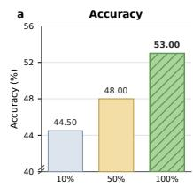

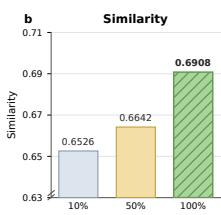

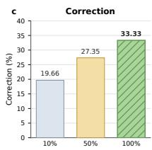  
Figure 3: Efect of diagnostic experience scaling.

<table><tr><td>Evidence Sufficiency</td><td># Cases</td><td>Errors (%)</td></tr><tr><td>Incomplete</td><td>59</td><td>50.43</td></tr><tr><td>Sufficient</td><td>44</td><td>37.60</td></tr><tr><td>Conflicting</td><td>14</td><td>11.97</td></tr><tr><td>Total</td><td>117</td><td>100.00</td></tr></table>

Table 4: Evidence states among incorrect trajectories produced by vanilla agent on MIMIC-IDx.

CDEG to provide relevant evidence guidance for a wider range of subsequent cases.

## Analysis

Evidence States at Diagnostic Failure We audit 117 incorrect trajectories produced by the vanilla agent on MIMIC-IDx, and categorize each trajectory by its evidence suficiency before final diagnostic commitment. The audit protocol is provided in the supplementary material. As shown in Table 4, only 11.97% of errors occur under conflicting evidence. In contrast, 50.43% arise from incomplete decisioncritical evidence acquisition, while another 37.60% occur despite such evidence already being available but insuficiently incorporated into the diagnosis. Together, these two failure modes account for 88.03% of all errors, showing that reliable long-horizon diagnosis hinges on efective management of decision-critical evidence across acquisition and use. CDEG explicitly addresses both failures by using the current evidence state to dynamically guide the doctor agent to acquire missing evidence or reappraise overlooked evidence.

Evidence-State Intervention and Diagnostic Stability As shown in Figure 4, CDEG achieves the lowest average Regression among the evaluated methods, with 17.70% on MIMIC-IDx and 14.62% on AgentClinic, while maintaining higher Correction exhibited in Table 2. This combination indicates that CDEG achieves a better balance between correcting diagnostic errors and preserving already correct diagnoses, rather than simply increasing the frequency of revision. This pattern is consistent with evidence-state intervention, which determines whether a retrieved diagnostic revision is applicable to the current evidence state before triggering acquisition or reappraisal.

Diagnostic Gains Beyond Longer Interaction As shown in Figure 5, CDEG improves diagnostic performance with only 1.41 and 1.27 additional turns on MIMIC-IDx and AgentClinic, indicating more eficient use of the interaction budget. Rather than indiscriminately extending the diagnostic process, CDEG uses the evidence state to selectively guide acquisition of missing evidence or reappraisal of observed evidence. This efect is particularly apparent for the GPT-5.6-Luna backbone on AgentClinic, where CDEG improves Accuracy by 11.22% while reducing the average interaction length by 0.71 turns, suggesting that it reduces inefective exploration and reaches an evidence state suficient for diagnosis more quickly. Tool-call counts exhibit the same pattern, further demonstrating that CDEG improves interaction eficiency through targeted evidence acquisition or reappraisal.

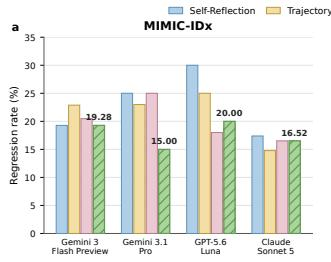

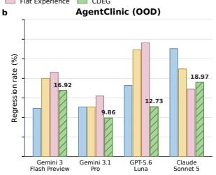  
Figure 4: Regression rates across doctor-agent backbones on MIMIC-IDx and AgentClinic.  
Vanil a Agent Self-Reflection Trajectory RAG Flat Experience CDEG

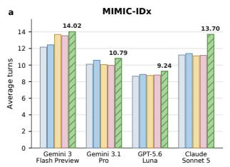

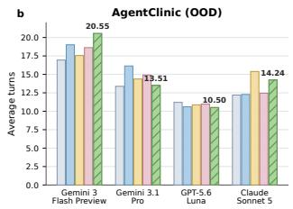

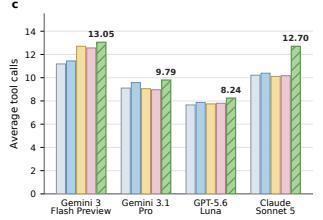

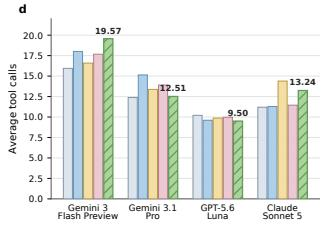  
Figure 5: Interaction turns and tool-call counts across doctoragent backbones on MIMIC-IDx and AgentClinic.

## Conclusion

We presented CDEG, a graph-based framework that learns reusable decision-critical evidence by contrasting successful and failed diagnostic trajectories, validating candidate evidence through controlled counterfactual interventions, and organizing validated evidence, diagnoses, and actions into a structured graph that guides acquisition or reappraisal according to the evolving patient evidence state. Across ID and OOD benchmarks with four doctor-agent backbones, CDEG consistently improves vanilla agent diagnostic performance, and achieves the best performance. In the future, we will explore online graph evolution for continual experience validation and extend CDEG to broader clinical scenarios.

## References

Almansoori, M.; Kumar, K.; and Cholakkal, H. 2025. MedAgentSim: Self-Evolving Multi-Agent Simulations for Realistic Clinical Interactions. In Medical Image Computing and Computer Assisted Intervention – MICCAI 2025, volume 15968 of Lecture Notes in Computer Science, 362–372. Springer Nature Switzerland.

Anthropic. 2026. Claude Sonnet 5 System Card. https: //www.anthropic.com/claude-sonnet-5-system-card. Accessed: 2026-07-28.

Balachandran, A. 2024. MedEmbed: Medical-Focused Embedding Models. https://github.com/abhinand5/MedEmbed. MedEmbed-large-v0.1. Accessed: 2026-07-28.

Bhasuran, B.; Prosperi, M.; Hanna, K.; Petrilli, J.; Washington, C. J.; and He, Z. 2026. Evaluation of Causal Reasoning for Large Language Models in Contextualized Clinical Scenarios of Laboratory Test Interpretation. npj Digital Medicine, 9(1): 487.

Bodenreider, O. 2004. The Unified Medical Language System (UMLS): Integrating Biomedical Terminology. Nucleic Acids Research, 32: D267–D270.

Chen, W.; Huang, G.; Wang, W.; and Zhu, Z. 2026. MedEinst: Benchmarking the Einstellung Efect in Medical LLMs through Counterfactual Diferential Diagnosis. In Proceedings of the 64th Annual Meeting of the Association for Computational Linguistics (Volume 1: Long Papers), 39778– 39798. San Diego, California, United States: Association for Computational Linguistics.

Fang, J.; Chen, R.; Yang, X.; Yu, J.; Xu, J.; Vinod, A.; Shi, W.; Chen, T.; Ji, H.; Zhai, C.; Ding, Y.; and Zhang, Y. 2026. Benchmarking Multi-turn Medical Diagnosis: Hold, Lure, and Self-Correction. arXiv:2604.04325.

Gao, Y.; Zhou, X.; Li, Y.; Zhao, Y.; and Liu, R. 2026. MedEx-Agent: Training LLM Agents to Ask, Examine, and Diagnose in Noisy Clinical Environments. arXiv:2605.07058.

Google. 2025. Gemini 3 Flash Preview. https://ai.google.dev/ gemini-api/docs/models/gemini-3-flash-preview. Accessed: 2026-07-28.

Google. 2026. Gemini 3.1 Pro Preview. https://ai.google. dev/gemini-api/docs/models/gemini-3.1-pro-preview. Accessed: 2026-07-28.

Han, X.; Fan, Y.; Zhao, S.; Wang, H.; and Qin, B. 2026. GSEM: Graph-based Self-Evolving Memory for Experience Augmented Clinical Reasoning. arXiv:2603.22096.

Hassoon, A.; Peng, X.; Irimia, R.; Lianjie, A.; Leo, H.; Bandeira, A.; Woo, H. Y. J.; Dredze, M.; Abdulnour, R.-E.; Mc-Donald, K. M.; Peterson, S.; and Newman-Toker, D. 2026. Evaluating the AI Potential as a Safety Net for Diagnosis: A Novel Benchmark of Large Language Models in Correcting Diagnostic Errors. medRxiv preprint. Version 1.

Hsu, H.-L.; Wang, Z.; Zhang, D.; Chen, N.-C.; Wang, J.; Ding, J.-E.; Hsu, C.-H.; Wang, G.; Liu, F.; Hung, F.-M.; Wu, C.; and Shen, L. 2026. MedAction: Towards Active Multi-turn Clinical Diagnostic LLMs. arXiv:2605.07305.

Jiang, Y.; Black, K. C.; Geng, G.; Park, D.; Zou, J.; Ng, A. Y.; and Chen, J. H. 2025. MedAgentBench: A Virtual EHR

Environment to Benchmark Medical LLM Agents. NEJM AI, 2(9): AIdbp2500144.

Jin, D.; Pan, E.; Oufattole, N.; Weng, W.-H.; Fang, H.; and Szolovits, P. 2021. What Disease Does This Patient Have? A Large-Scale Open Domain Question Answering Dataset from Medical Exams. Applied Sciences, 11(14): 6421.

Johnson, A.; Pollard, T.; Horng, S.; Celi, L. A.; and Mark, R. 2023a. MIMIC-IV-Note: Deidentified Free-Text Clinical Notes. PhysioNet. Version 2.2.

Johnson, A. E. W.; Bulgarelli, L.; Shen, L.; Gayles, A.; Shammout, A.; Horng, S.; Pollard, T. J.; Hao, S.; Moody, B.; Gow, B.; Lehman, L.-w. H.; Celi, L. A.; and Mark, R. G. 2023b. MIMIC-IV, a Freely Accessible Electronic Health Record Dataset. Scientific Data, 10: 1.

Johnson, A. E. W.; Pollard, T. J.; Berkowitz, S. J.; Greenbaum, N. R.; Lungren, M. P.; Deng, C.-y.; Mark, R. G.; and Horng, S. 2019. MIMIC-CXR, a De-identified Publicly Available Database of Chest Radiographs with Free-Text Re ports. Scientific Data, 6: 317.

Li, B.; Du, S.; and Guo, Y. 2026. Joint Optimization of Reasoning and Dual-Memory for Self-Learning Diagnostic Agent. arXiv:2604.07269.

Li, S. S.; Balachandran, V.; Feng, S.; Ilgen, J. S.; Pierson, E.; Koh, P. W.; and Tsvetkov, Y. 2024. MediQ: Question-Asking LLMs and a Benchmark for Reliable Interactive Clinical Reasoning. In Advances in Neural Information Processing Systems, volume 37, 28858–28888. Curran Associates, Inc.

Liu, F.; Shareghi, E.; Meng, Z.; Basaldella, M.; and Collier, N. 2021. Self-Alignment Pretraining for Biomedical Entity Representations. In Proceedings of the 2021 Conference of the North American Chapter of the Association for Computational Linguistics: Human Language Technologies, 4228–4238. Online: Association for Computational Linguistics.

Liu, X.; Sun, D.; Fung, Y.; Hakkani-Tur, D.; and Abdelzaher, T. F. 2025. DocCHA: Towards LLM-Augmented Interactive Online diagnosis System. In Proceedings of the 26th Annual Meeting of the Special Interest Group on Discourse and Dialogue, 609–619. Avignon, France: Association for Computational Linguistics.

Long, Z.; Bao, Z.; and Wei, Z. 2026. Strong Reasoning Isn’t Enough: Evaluating Evidence Elicitation in Interactive Diagnosis. arXiv:2601.19773.

Mo, K.; Venkatayogi, S.; Shaib, C.; Kouzy, R.; Xu, W.; Wallace, B. C.; and Li, J. J. 2026. Faithfulness vs. Safety: Evaluating LLM Behavior Under Counterfactual Medical Evidence. In Findings of the Association for Computational Linguistics: ACL 2026, 37053–37081. San Diego, California, United States: Association for Computational Linguistics.

Nagesh, S.; Mishra, N.; Naamad, Y.; Rehg, J. M.; Shah, M. A.; and Wagner, A. 2023. Explaining a Machine Learning Decision to Physicians via Counterfactuals. In Proceedings of the Conference on Health, Inference, and Learning, volume 209 of Proceedings of Machine Learning Research, 556–577. PMLR.

National Academies of Sciences, Engineering, and Medicine. 2015. Improving Diagnosis in Health Care. Washington, DC: The National Academies Press.

OpenAI. 2026a. GPT-5.6: Frontier Intelligence That Scales with Your Ambition. https://openai.com/index/gpt-5-6/. Accessed: 2026-07-28.

OpenAI. 2026b. Introducing GPT-5.5. https://openai.com/ index/introducing-gpt-5-5/. Accessed: 2026-07-28.

Ouyang, S.; Yan, J.; Hsu, I.-H.; Chen, Y.; Jiang, K.; Wang, Z.; Han, R.; Le, L. T.; Daruki, S.; Tang, X.; Tirumalashetty, V.; Lee, G.; Rofouei, M.; Lin, H.; Han, J.; Lee, C.-Y.; and Pfister, T. 2026. ReasoningBank: Scaling Agent Self-Evolving with Reasoning Memory. In The Fourteenth International Conference on Learning Representations.

Qiu, P.; Wu, C.; Liu, J.; Zheng, Q.; Liao, Y.; Wang, H.; Yue, Y.; Fan, Q.; Zhen, S.; Wang, J.; Gu, J.; Wang, Y.; Zhang, Y.; and Xie, W. 2025. Evolving Interactive Diagnostic Agents in a Virtual Clinical Environment. arXiv:2510.24654.

Qu, Z.; and Färber, M. 2026. MediEval: A Unified Medical Benchmark for Patient-Contextual and Knowledge-Grounded Reasoning in LLMs. In Proceedings of the 64th Annual Meeting of the Association for Computational Linguistics (Volume 1: Long Papers), 16150–16164. San Diego, California, United States: Association for Computational Linguistics.

Ren, R.; Wang, Y.; Liang, Y.; Luo, L.; Liu, J.; Wang, H.; Feng, C.; Zhang, Y.; Miao, C.; Wen, J.-R.; and Zhao, W. X. 2026. Emulating Clinician Cognition via Self-Evolving Deep Clinical Research. arXiv:2603.10677.

Ren, W.; Zhao, T.; Wang, L.; Wang, T.; and Honavar, V. G. 2025. DiaLLMs: EHR-Enhanced Clinical Conversational System for Clinical Test Recommendation and Diagnosis Prediction. In Findings of the Association for Computational Linguistics: ACL 2025, 25622–25635. Vienna, Austria: Association for Computational Linguistics.

Richens, J. G.; Lee, C. M.; and Johri, S. 2020. Improving the Accuracy of Medical Diagnosis with Causal Machine Learning. Nature Communications, 11(1): 3923.

Rose, D. P.; Hung, C.-C.; Lepri, M.; Alqassem, I.; Gashteovski, K.; and Lawrence, C. 2025. MEDDxAgent: A Unified Modular Agent Framework for Explainable Automatic Diferential Diagnosis. In Proceedings of the 63rd Annual Meeting of the Association for Computational Linguistics (Volume 1: Long Papers), 13803–13826. Vienna, Austria: Association for Computational Linguistics.

Sanghvi, A.; Akash, N.; Imam, R.; Sharma, A.; and Jain, M. 2026. MeDxAgent: Multi-Agent Consultation for Interactive Medical Diagnosis. arXiv:2606.03416.

Schmidgall, S.; Ziaei, R.; Harris, C.; Kim, J. W.; Reis, E. P.; Jopling, J.; and Moor, M. 2026. AgentClinic: A Multimodal Benchmark for Tool-Using Clinical AI Agents. npj Digital Medicine, 9(1): 499.

Shen, W.; Jian, B.; Li, J.; Liu, C.; Moll, J.; Hu, X.; Rueckert, D.; Li, H. B.; and Pan, J. 2026. Evo-MedAgent: Beyond One-Shot Diagnosis with Agents That Remember, Reflect, and Improve. arXiv:2604.14475.

Shinn, N.; Cassano, F.; Gopinath, A.; Narasimhan, K.; and Yao, S. 2023. Reflexion: Language Agents with Verbal Reinforcement Learning. In Advances in Neural Information Processing Systems, volume 36, 8634–8652. Curran Associates, Inc.

Wang, G.; Xie, Y.; Jiang, Y.; Mandlekar, A.; Xiao, C.; Zhu, Y.; Fan, L.; and Anandkumar, A. 2024. Voyager: An Open-Ended Embodied Agent with Large Language Models. Transactions on Machine Learning Research.

Wang, Z. Z.; Mao, J.; Fried, D.; and Neubig, G. 2025. Agent Workflow Memory. In Proceedings ofthe 42nd International Conference on Machine Learning, volume 267 of Proceedings ofMachine Learning Research, 63897–63911. PMLR.

Xiong, Z.; Lin, Y.; Xie, W.; He, P.; Liu, Z.; Tang, J.; Lakkaraju, H.; and Xiang, Z. 2026. How Memory Management Impacts LLM Agents: An Empirical Study of Experience-Following Behavior. In Proceedings ofthe 64th Annual Meeting of the Association for Computational Linguistics (Volume 1: Long Papers), 623–645. San Diego, California, United States: Association for Computational Linguistics.

Xu, R.; Yu, Y.; Zhang, C.; Ali, M. K.; Ho, J. C.; and Yang, C. 2022. Counterfactual and Factual Reasoning over Hypergraphs for Interpretable Clinical Predictions on EHR. In Proceedings of the 2nd Machine Learning for Health Symposium, volume 193 of Proceedings of Machine Learning Research, 259–278. PMLR.

You, Z.; Chen, X.; Vashishtha, A.; Du, S.; Erion-Barner, G.; Mei, H.; Peng, H.; and Guo, Y. 2026. Improving Clinical Diagnosis with Counterfactual Multi-Agent Reasoning. arXiv:2603.27820.

Zhang, Y.; Li, M.; Long, D.; Zhang, X.; Lin, H.; Yang, B.; Xie, P.; Yang, A.; Liu, D.; Lin, J.; Huang, F.; and Zhou, J. 2025. Qwen3 Embedding: Advancing Text Embedding and Reranking Through Foundation Models. arXiv:2506.05176.

Zhao, A.; Huang, D.; Xu, Q.; Lin, M.; Liu, Y.-J.; and Huang, G. 2024. ExpeL: LLM Agents Are Experiential Learners. In Proceedings of the Thirty-Eighth AAAI Conference on Artificial Intelligence, 19632–19642. Vancouver, Canada: AAAI Press.

Zheng, L.; Wang, R.; Wang, X.; and An, B. 2024. Synapse: Trajectory-as-Exemplar Prompting with Memory for Computer Control. In The Twelfth International Conference on Learning Representations.