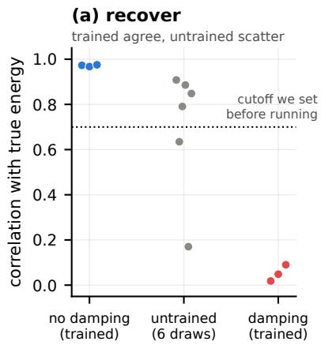
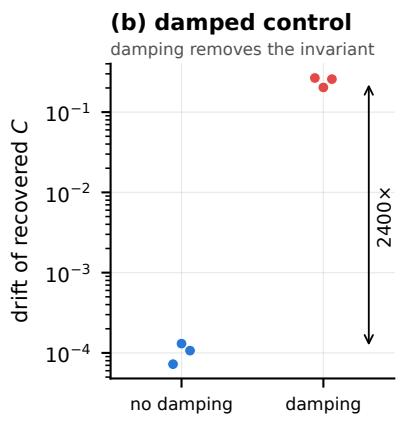
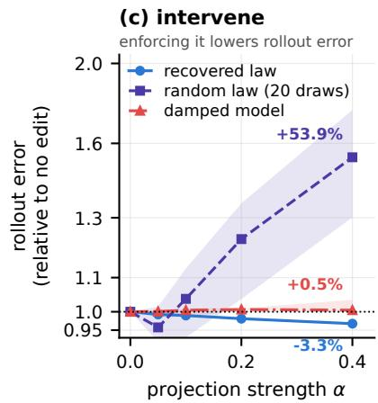
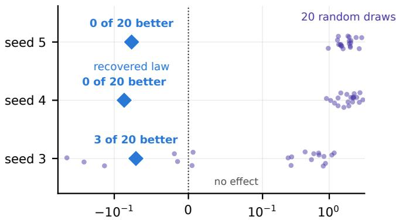
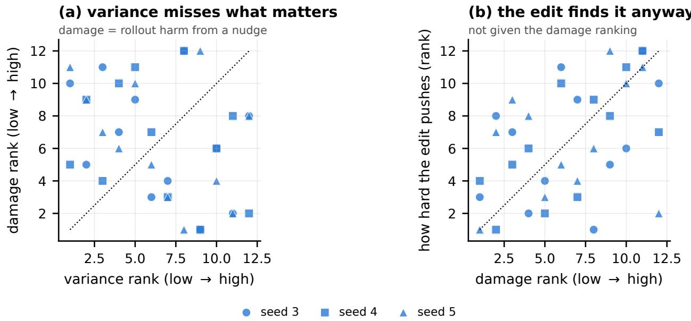
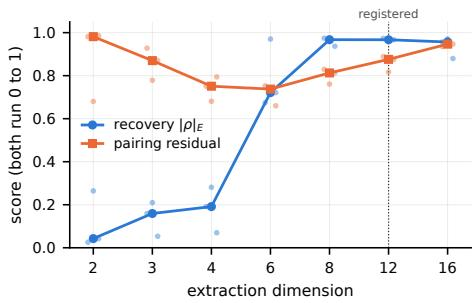
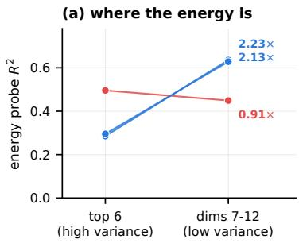
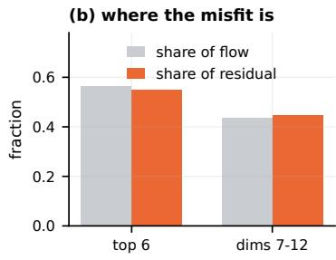

# Correcting a learned physical invariant improves world-model rollouts

Richard Bao Independent Researcher richardbao419@gmail.com

## Abstract

World models can predict video without learning dynamics that they reliably preserve. We test whether a frozen DreamerV3 trained only on pendulum video learns a scalar that its own latent transition treats as approximately conserved. A label-free search recovers the same energy-like invariant across independently trained conservative models, while the same procedure finds no comparable invariant in matched damped models. During autonomous rollouts, this quantity drifts. Projecting the latent state back toward its initial level set reduces rollout error in all three conservative models, whereas matched random constraints usually increase it. These results distinguish a dynamically meaningful invariant from a merely decodable correlate and reveal a concrete failure mode: a world model can learn a physical constraint from pixels yet violate that constraint when it imagines forward.

## 1 Introduction

World models learn to predict future observations and can use those predictions for planning. Good video prediction, however, does not by itself show that a model has learned the underlying dynamics of the system it observes. That distinction matters most when we ask the model to predict far beyond the trajectories it saw during training.

A common way to look for physical structure is to fit a probe from the hidden state to a physical variable. Probe accuracy tells us what information a latent representation retains, but not whether the model’s transition uses that information. Our own baseline makes this problem concrete. Six randomly initialized DreamerV3 models contain polynomial functions of their latent state that correlate with pendulum energy at up to 0.908. A strong correlation can therefore appear even before learning.

We therefore ask whether a trained world model contains a scalar that its own transition approximately preserves, and whether failures to preserve that scalar contribute to prediction error. We study a frozen DreamerV3 [Hafner et al., 2023] trained only on 64 × 64 video of a Gymnasium pendulum, with no physical labels and no actor or critic.

Independently trained models recover nearly identical energy-like invariants. Decodability alone does not explain this: randomly initialized Dreamers also produce strongly energy-correlated readouts, while matched models trained on damped dynamics contain no comparably conserved scalar. The recovered invariant then begins to drift during autonomous imagination. Correcting that drift improves 50-step predictions in every conservative model, whereas matched random corrections usually make them worse. Dreamer has learned a physical constraint that its own rollout dynamics fail to preserve.

## 2 Recovering a latent invariant

Model and data. We analyze the published DreamerV3 architecture [Hafner et al., 2023]: 13.5M parameters, categorical 32 × 32 stochastic latents, a convolutional encoder and decoder, Kullback–Leibler balancing, and unimix. We train only the world model, with no actor or critic.

The data come from Gymnasium’s Pendulum-v1 [Towers et al., 2024]. Each simulator step renders a 500 × 500 frame, which we crop to 448 × 448 and block-average to 64 × 64. We set the simulator state directly, sampling $\theta \sim U [ - 1 . 8 , 1 . 8 ]$ and $\dot { \theta } \sim U [ - 2 . 2 , 2 . 2 ]$ , and reject any trajectory that reaches the simulator’s $| \dot { \theta } | = 8$ speed clip, since clipping would break conservation. Actions are always zero. A single frame does not reveal velocity, so the model must infer $\dot { \theta }$ from the sequence.

  
Figure 1: Each point represents one model. (a) The three trained conservative models recover energy correlations between 0.967 and 0.975, while six untrained models span 0.17–0.91. (b) The recovered scalar changes very little within observation-conditioned trajectories for conservative models and much more for damped models. (c) Rollout error as a function of projection strength α, relative to no edit. Enforcing the recovered constraint lowers error; enforcing a matched random polynomial constraint usually raises $\mathrm { i t } ;$ applying the recovered constraint to a damped model changes little.

We train on 204 trajectories of 120 frames using Adam at $1 0 ^ { - 4 }$ , batch size 16, and sequence length 64, capped at 30 minutes of wall-clock time, which gives about 6,500 gradient steps. The remaining 52 trajectories are reserved as a post-training analysis set. Three independently trained seeds pass checks fixed before analysis: KL divergence above 1 nat, one-step decoding at least 4× better than predicting the dataset mean, and finite rollouts. Appendix A gives the remaining training details. Our claims concern a DreamerV3 world model trained on pendulum video, not DreamerV3 as a full reinforcement-learning agent.

Three kinds of latent trajectories. We use three latent trajectories and keep them separate throughout. An observation-conditioned trajectory is the sequence of deterministic recurrent states produced when the model receives the next real frame at every step. This is what the encoder returns on the analysis set.

The one-step transition $T$ is the model’s autonomous recurrent update with zero action and no new observation.

An imagination rollout starts from one encoded state and repeatedly applies T without supplying any later frames.

We estimate the latent flow by applying T once at each state of an observation-conditioned trajectory, so the transition is autonomous even though the states come from real video. Sections 3 and 4 measure conservation along observation-conditioned trajectories. Section 5 tests what happens to the same scalar under autonomous imagination.

Latent coordinates. After training we freeze the model. Let h denote the deterministic recurrent state on the analysis set and h¯ its mean. We take the top 12 principal directions of $h ,$ remove any direction with no support in the data, and let $P$ denote the resulting orthonormal map. All extraction, projection, and perturbation operate on

$$
z = P ^ { \top } ( h - { \bar { h } } ) .\tag{1}
$$

Let $F ( z )$ be the projection through P of the model’s one-step displacement $T ( h ) - h$ . Using the model’s own displacement avoids fitting a separate vector field and then analyzing that surrogate.

The candidate family. We look for the invariant among degree-4 polynomials in z. Writing $\varphi ( z )$ for the vector of monomials up to degree 4 in the 12 latent coordinates, a candidate is $C ( z ) = a ^ { \top } \varphi ( z )$ , and the search is over the coeficient vector a. There are 1819 such monomials, from $z _ { 1 }$ through $z _ { 1 } z _ { 2 } z _ { 3 } z _ { 4 }$ , excluding the constant term, which is conserved trivially. The pendulum’s energy is quadratic in ˙θ and needs polynomial terms to approximate cos θ, and the latent is an unknown nonlinear encoding of $( \theta , { \dot { \theta } } )$ rather than those coordinates themselves, so the family must be rich enough to express energy through that distortion while staying small enough to fit.

The invariance criterion. An invariant is constant along any one trajectory and difers between trajectories. We score a candidate by

$$
\operatorname { r a t i o } ( C ) \ = \ { \frac { \mathrm { m e a n ~ w i t h i n - t r a j e c t o r y ~ v a r i a n c e ~ o f } \ C } { \mathrm { t o t a l ~ v a r i a n c e ~ o f } \ C } } ,\tag{2}
$$

which is 0 for a perfectly conserved scalar and near 1 for one that wanders as much within a trajectory as across the dataset. The denominator keeps the criterion non-trivial: without it, $C = 0$ would score perfectly while distinguishing nothing.

Both variances are quadratic forms in a. With W the mean within-trajectory covariance of the features and T their total covariance, Equation 2 is $a ^ { \top } W a / a ^ { \top } T a$ , a Rayleigh quotient. Its minimiser is the eigenvector of the generalized problem $W a = \lambda T a$ with the smallest eigenvalue, and λ is the invariance ratio itself. One eigendecomposition returns the whole family, ranked from most to least conserved.

Selecting among conserved candidates. Conservation alone does not pick out a unique scalar. If C is conserved then so is any function of it, so $E , E ^ { 2 }$ and mixtures of E with other conserved quantities all sit near the top of the ranking, and the leading eigenvector is generally some combination of them. We therefore use flow alignment as a secondary criterion among the leading candidates, fitting C jointly with an antisymmetric operator B such that

$$
F \approx B \nabla C , \qquad B ^ { \top } = - B .\tag{3}
$$

This mirrors the Hamiltonian relation between a conserved quantity and the flow it generates: an antisymmetric operator maps the gradient of C to a direction tangent to its level set [Arnold, 1989]. Because $\nabla C ^ { \top } \dot { B } \nabla C = 0$ for any antisymmetric $B ,$ a scalar satisfying Equation 3 is constant along the flow by construction. The criterion also separates candidates the invariance ratio cannot: $E ^ { 2 }$ is exactly as conserved as E but does not pair with the same B.

The fit is bilinear, so fixing either a or B makes the other a least-squares problem and we alternate. It searches within the top eight eigenvectors from Equation 2, so the recovered C has eight efective degrees of freedom rather than 1819. That matters for a search run on 52 trajectories, where a free fit over the full basis could drive the in-sample ratio to zero by overfitting. Appendix A isolates the contribution of the flow criterion: conservation drives most of the recovery and intervention efect, while flow alignment mainly reduces variation across seeds.

Reference energy. We compare C with the textbook pendulum energy $\begin{array} { r } { E = \frac { 1 } { 6 } \dot { \theta } ^ { 2 } + 5 } \end{array}$ cos θ. Gymnasium uses a semi-implicit integrator, so it conserves a nearby shadow Hamiltonian $\tilde { H } = H + O ( \Delta t )$ rather than E itself [Hairer et al., 2006]. In our trajectories this produces about 12% relative oscillation in E without secular drift, which we treat as a noise floor.

The search sees only latent states and the model’s own one-step transition. It never sees $\theta , { \dot { \theta } }$ or $E .$ , and nothing in Equations 2 and 3 refers to them. Ground truth enters afterward, when we score the recovered C against E. We selected the extraction dimension on three development models and fixed it before evaluating the three models reported here.

Code and data. The extraction code, the run logs behind every figure and table, and the source of this paper are at https://github.com/Zarand3r/world-model-invariants. The figures regenerate from the committed logs without a GPU.

Preliminary experiments. We developed the extraction procedure in preliminary experiments on smaller recurrent models. Those experiments motivated the untrained, dissipative, and intervention controls used here, and we do not use them as evidence for the DreamerV3 results.

Table 1: The same extraction pipeline applied to conservative and damped models. Each range covers three seeds. No conservative seed overlaps any damped seed on any row.
<table><tr><td>statistic</td><td>conservative</td><td>damped</td><td>median ratio</td></tr><tr><td> $| \rho | _ { E }$ </td><td> $0 . 9 6 7 \mathrm { - } 0 . 9 7 5$ </td><td>0.018–0.090</td><td>20×</td></tr><tr><td>drift of C</td><td> $0 . 7 { - } 1 . 3 \times 1 0 ^ { - 4 }$ </td><td>0.203-0.266</td><td>2414×</td></tr><tr><td>held-out invariance ratio</td><td>0.0027-0.0121</td><td>0.983-0.994</td><td>282×</td></tr><tr><td>pairing residual</td><td>0.829–0.865</td><td>0.934–0.957</td><td> $\mathrm { n / a }$ </td></tr></table>

## 3 Training makes invariant recovery reproducible

At the extraction dimension fixed in advance, the three trained conservative models recover scalars with $| \rho | _ { E } = 0 . 9 7 3 , 0 . 9 6 7$ , and 0.975. Along observation-conditioned trajectories the recovered C has withintrajectory variance equal to $1 . 1 \times 1 0 ^ { - 4 }$ of its total variance, so it is nearly constant within a trajectory while still varying across trajectories. Table 1 reports this quantity as the drift of C. The held-out invariance ratio in the next row evaluates the invariance-only candidate rather than the jointly fitted $C ,$ so the two rows measure diferent objects.

The same pipeline applied to six randomly initialized DreamerV3 models gives $| \rho | _ { E }$ from 0.170 to 0.908. Four of the six exceed the 0.7 threshold we had inherited from the earlier architecture, so that threshold does not identify learning in DreamerV3. On a one-degree-of-freedom conservative pendulum, energy is essentially the only nontrivial scalar that is constant within a trajectory and difers across trajectories, so any latent that retains $( \theta , { \dot { \theta } } )$ can support a strong energy-correlated readout [Hewitt and Liang, 2019, Belinkov, 2022].

The trained and untrained groups do separate on two statistics without overlap. Every trained model scores above every untrained draw in energy correlation (0.967 versus 0.908 at the closest pair), and every trained model has a lower pairing residual than every untrained draw (0.865 versus 0.912). With three trained seeds and six random draws these non-overlaps are suggestive rather than statistically decisive, and we attach no p-value to them.

The more robust diference is reproducibility. The three trained models cluster between 0.967 and 0.975, while the six untrained models span 0.170–0.908. Training therefore appears to make the recovered scalar reproducible across independently trained models rather than merely making energy decodable.

## 4 The invariant disappears under matched damping

A search that produces a conserved-looking scalar for almost any latent representation would explain Section 3 without telling us anything about the learned dynamics. Matched models trained on a damped pendulum test that possibility.

For the damped system every trajectory converges to the same fixed point. Any continuous scalar that stays constant along all trajectories in the basin must be constant throughout that basin, so the state has no nontrivial first integral for the search to recover.

Choosing the damping level. Very strong damping creates a diferent problem: trajectories collapse into a small neighborhood of the fixed point, the latent becomes rank-deficient, and directions appear constant for trivial reasons. We fixed the damping level using only simulator states, before training any damped model, taking the largest damping ratio whose late-window spread across trajectories remained above 25% of the conservative reference. A stronger value, $\zeta = 0 . 1 5$ , leaves 0% of that spread and fails the criterion. The rule selects $\zeta = 0 . 0 3$ , which removes 17% of the energy per period while retaining 34% of the conservative spread. All three damped models pass the same training checks as the conservative models.

Four statistics separate without overlap. Table 1 shows the result. The recovered C varies about 2400× more within damped trajectories than within conservative ones, and the damped models have a held-out invariance ratio of 0.983–0.994 against 0.0027–0.0121 for the conservative models. Within the degree-4 family we search, the damped models contain no approximately conserved candidate.

The two arms share architecture, training budget, observation modality, and extraction procedure. The dynamics in the training data are the only diference. This does not prove that a damped model contains no conserved quantity of any possible form; it shows that the pipeline does not manufacture one when the underlying dynamics remove the corresponding conservation law.

## 5 Correcting invariant drift improves rollouts

If invariant drift contributes to rollout error, correcting that drift should improve prediction. If the recovered scalar is only a descriptive correlate, enforcing it has no reason to help. The recovered C stays nearly constant along observation-conditioned trajectories and drifts once the model rolls forward on its own, so the test is available.

At every imagined step we project the latent state back toward the level set defined by its initial value:

$$
z  z - \alpha \big ( C ( z ) - C _ { 0 } \big ) \frac { \nabla C ( z ) } { \| \nabla C ( z ) \| ^ { 2 } } ,\tag{4}
$$

where $C _ { 0 }$ is the value at the first encoded state. We map the correction back through P, leaving the part of h outside the extracted subspace unchanged. The correction runs inside the imagination loop, does not touch the decoder, and the model is never retrained.

Scoring and controls. We sweep $\alpha \in \{ 0 , 0 . 0 5 , 0 . 1 , 0 . 2 , 0 . 4 \}$ , identical for every arm, and score the slope of rollout error across the whole grid; taking the best α would give each arm five chances to look good. Rollout error is pixel mean squared error against the analysis set over 50 imagined steps. We fit C and evaluate the correction on the same analysis trajectories, so the absolute efect is in-sample with respect to invariant fitting; the comparison with random constraints remains matched, since both use the same trajectories.

We compare three interventions: each conservative model’s own recovered $C , \mathrm { a }$ random polynomial from the same degree-4 basis matched in norm, and each damped model’s own recovered C. We draw 20 random polynomials and apply the same 20 to each of the three conservative models, giving 60 model–constraint evaluations from 20 distinct constraints.

Figure 1c shows the dose response. At the strongest projection the recovered constraint lowers rollout error by 2.9%, 3.3%, and 3.5% across the three conservative models. Across the 60 random-constraint evaluations the median change is +53.9%, and 7 of 60 lower the error. The same edit on the damped models changes error by +0.5%. The recovered arm is also far more consistent across seeds: its per-model slopes span 0.016 against 3.71 for the random evaluations.

Specificity is not uniform. Figure 2 compares each model with its own 20-draw null. On two models no random constraint achieves a better dose-response slope than the recovered one. On the third, 3 of 20 do, 7 of 20 lower the error at the strongest projection, and the best random draw reaches −21.9% against −2.9% for the recovered constraint. We do not know why this model difers.

Enforcing the recovered invariant improves all three conservative models by 2.9–3.5%, while matched random constraints usually hurt. The improvement is specific to the recovered invariant on two models and not on the third.

The correction is not simply concentrated in the highest-variance latent directions. At a 40-step horizon, variance rank is negatively correlated with causal sensitivity in all three models $\left( - 0 . 3 6 4 , - 0 . 2 5 9 , - 0 . 4 0 6 \right)$ , while the correction preferentially acts along higher-sensitivity directions $\left( + 0 . 3 8 5 , + 0 . 6 9 2 , + 0 . 2 8 7 \right)$ . Appendix B gives the full perturbation and subspace analyses.

## 6 Limitations

This study covers one physical system, one degree of freedom, one architecture, and a much shorter training schedule than a standard DreamerV3 run. Three trained seeds and six random draws are enough to show non-overlapping ranges but not enough for a precise efect size, and we report ranges rather than confidence intervals throughout.

  
dose-response slope (negative = improves the rollout)  
Figure 2: Each row compares one model with its own null distribution. The 20 small marks are norm-matched random degree-4 constraints, using the same draws across models; the diamond is that model’s recovered constraint. Labels count the random constraints with a better dose-response slope than the recovered one.

The intervention efect is modest and not uniform. Enforcing the recovered invariant improves all three conservative models, but relative to matched random constraints the improvement is specific on only two of them. We fit C and evaluate the correction on the same analysis trajectories, so the absolute efect is in-sample with respect to invariant fitting.

Conservation, not the full extraction rule, carries the result. Selecting C by the invariance criterion alone recovers energy nearly as well and intervenes slightly better; flow alignment mainly reduces variation across seeds (Appendix A). The pairing residual does not track recovery quality across extraction dimension and should be read as a diagnostic rather than a confidence score.

The pendulum trajectories cross the separatrix, so 17% rotate rather than librate. We have not tested contacts, multiple interacting objects, nonzero actions, or systems whose frequency varies enough to identify a frequency-weighted accumulation of invariant error; the present experiments do not distinguish weighted from unweighted accumulation (Appendix C).

## 7 Related work

Probes establish that a variable can be recovered from a representation, but not that the model’s dynamics use or preserve it [Alain and Bengio, 2017]. Control tasks [Hewitt and Liang, 2019] and later critiques [Belinkov, 2022] show that probe accuracy mixes what the representation stores with what the probe can learn, and our untrained baseline is the same problem in a diferent form: four of six randomly initialized models exceed the threshold we had previously used. Work on emergent world representations goes further by intervening on the representation [Li et al., 2023, Nanda et al., 2023], which is the logic our rollout correction follows.

A separate literature imposes physical structure by design. Equation-discovery methods such as SINDy [Brunton et al., 2016] infer governing equations from observed trajectories, and Hamiltonian and Lagrangian networks [Greydanus et al., 2019, Cranmer et al., 2020] build conservation into an architecture so that it holds by construction. We instead ask whether such structure emerges in a conventionally trained world model, and analyze it after the fact using standard linear-algebraic tools related to Koopman and dynamic mode methods [Schmid, 2010].

World models are normally evaluated through prediction quality or control performance [Hafner et al., 2023, Ha and Schmidhuber, 2018, Schrittwieser et al., 2020]. Those metrics do not reveal whether the latent transition preserves a physical constraint it has learned. Our intervention tests whether violating a recovered latent constraint itself contributes to rollout error, and the damped arm tests whether the extraction procedure returns a conserved-looking scalar when the training dynamics have no such invariant. The disentanglement literature [Locatello et al., 2019] documents how readily an appealing structural claim about representations survives without that kind of control.

## 8 Conclusion

A DreamerV3 trained only on pendulum video learns an energy-like latent quantity that its own dynamics approximately preserve on observation-conditioned trajectories. Correlation alone does not establish this: randomly initialized models also admit strongly energy-correlated readouts. The stronger evidence comes from matched damping and intervention. The invariant disappears when the training dynamics are dissipative, and correcting its drift during autonomous imagination improves prediction in every conservative model.

The result exposes a specific gap between learning physical structure and respecting it during rollout. A world model can encode a useful dynamical constraint yet violate that constraint when it predicts autonomously. Whether this phenomenon survives in systems with actions, contacts, and multiple interacting objects is the main open question.

## A Experimental details and extraction ablations

Training. We set free bits to 0 rather than DreamerV3’s reference default of 1.0. The measured KL divergence settles near 1.8 nats, well above collapse, so the floor is inactive here. All three trained models pass the acceptance checks; none were discarded.

Data split. Training uses trajectories 0–203 of the 256-trajectory dataset. The remaining 52 form the analysis set. We fit C on those 52 trajectories and evaluate the Section 5 correction on the same 52, so the absolute efect is in-sample with respect to invariant fitting. The recovered and random-constraint arms use the same trajectories.

Scoring the correction over a grid. We score the slope of rollout error over the fixed α grid rather than the minimum on that grid. Taking the minimum selects the most favourable of five points after seeing the curve. In one diagnostic run that rule would have reported a 5.9% improvement for an arm whose error rose monotonically to twice baseline.

Flow alignment contributes reproducibility. Holding the candidate family, data, dimension, degree, and α grid fixed, we select C either by the invariance criterion alone or by the joint criterion. Conservation alone recovers energy at 0.950 against 0.973 for the joint rule, and gives a slightly better mean intervention slope (−0.087 against −0.077, winning on two of three models). The diference is in spread: recovery varies by 0.035 across seeds under conservation alone and by 0.008 under the joint rule.

The pairing residual does not track recovery. As the extraction dimension rises from 6 to 12, energy recovery improves from 0.721 to 0.967 while the pairing residual worsens from 0.738 to 0.876. Recovery already reaches 0.967 at dimension 8, where the residual is lower at 0.813. The added dimensions do not carry energy while resisting the Hamiltonian fit: directions 7–12 account for 44.9% of the residual and 43.5% of the flow. Figure 4 gives the sweep.

## B Latent sensitivity analyses

For each direction u of the extracted subspace we measure its variance and the damage a displacement along it does to an imagination rollout,

$$
V ( u ) = \mathrm { V a r } ( u ^ { \top } z ) , \qquad D _ { H } ( u ) = \mathbb { E } \big [ L _ { H } ( z + \epsilon u ) - L _ { H } ( z ) \big ] ,\tag{5}
$$

with $L _ { H }$ the H-step imagination error against the analysis set.

Calibrating the displacement. $\mathrm { A t } ~ \epsilon = 0 . 0 5 | z |$ the damage is about −0.5% of baseline with the sign varying across directions. Imagination is deterministic, so repeated unperturbed rollouts are identical and these values are not sampling noise. Damage for the leading direction runs $- 0 . 5 \% , + 3 . 1 \% , + 1 8 . 1 \% , + 4 6 . 4 \%$ and $+ 1 2 8 . 8 \%$ at $\epsilon / | z |$ of 0.05, 0.10, 0.25, 0.50, and 1.00. We use $\epsilon = 0 . 2 5 | z |$ , the smallest displacement whose damage exceeds 10% of baseline while the response still grows smoothly.

A displacement does not decay under imagination. After 40 steps it retains 6.3× its initial size at $\epsilon = 0 . 0 5 | z | , 2 . 8 \times \mathrm { a t } 0 . 2 5 | z |$ , and $1 . 9 \times \mathrm { ~ a t ~ } 0 . 5 | z |$ , as medians over the three models.

Variance and sensitivity at diferent horizons. At a 40-step horizon the two rankings anticorrelate on all three models $\left( - 0 . 3 6 4 , \right. - 0 . 2 5 9 , \left. - 0 . 4 0 6 \right)$ , with damage spanning 13.5× to 118.8× between the most and least consequential direction (Figure 3a). The ranking replicates: split-half rank correlation of $D _ { H }$ has median 0.95 across the settings we tried, with a minimum of 0.52 at the smallest displacement and longest horizon. The disagreement with variance does not extend to long horizons. Pooling three models and three displacements, median $\rho ( V , D _ { H } ) { \mathrm { i s } } - 0 . 2 5 2$ at horizon 20, negative in 9 of 9 settings; −0.196 at horizon 50, negative in 5 of 9; and $- 0 . 0 2 8$ at horizon 100, negative in 5 of 9, with one setting reaching +0.727. Once a rollout has diverged, high-amplitude directions dominate the error and the rankings realign.

The correction pushes along higher-damage directions at +0.385, +0.692, and +0.287 (Figure 3b), without having been given that ranking. The correlations stay well below 1, so the correction is only partly concentrated there. All of this is measured on the conservative models.

  
Figure 3: Each point is one of the 12 extracted directions, ranked within its own model; the dotted line marks equal ranks. (a) Variance rank against damage rank at a 40-step horizon. (b) Damage rank against the magnitude of the invariant correction along that direction.

Basis-independent properties reproduce better than coordinate selectors. The three models agree closely on quantities that need no choice of basis: energy recovery varies by 0.008, intervention slopes by 0.016, and the top-3 eigenvalue mass of $M _ { C } = \mathbb { E } [ g g ^ { \top } / \| g \| ^ { 2 } ]$ with $g = \nabla C$ by 0.046 (0.448, 0.441, 0.487). Selectors on individual coordinates are less stable: ranking coordinates by ∇C and keeping the top three gives intervention slopes of −0.075, +0.016, and −0.089, beating a variance ranking on two models and changing sign across seeds. An orthogonal projector onto the top eigenspace of $M _ { C }$ beats the variance selector on all three models, though on one it sits at the 41st percentile of 100 random rank-3 subspaces. Since the correction is rank one at each state, the spectrum of $M _ { C }$ measures how much $\boldsymbol { \nabla } C$ rotates as the state changes, and the amount is similar across models. This is consistent with the models encoding the same scalar in diferent latent coordinate systems, although we do not directly align their representations.

## C Additional sweeps

Energy outside the highest-variance directions. On two of three models, principal directions 7–12 carry about twice the energy information of the top six (2.23× and 2.13×); on the third the ratio reverses to 0.91. We report the models separately because a median would hide the sign change. Figure 5 shows the decomposition.

Accumulated invariant error. Accumulated invariant error predicts which rollouts degrade most: an integral predictor reaches $R ^ { 2 } = 0 . 1 8 7$ against 0.021 for a fitted power law in time at the horizon where both perform best, and shufling destroys the relation. The current experiments do not distinguish weighted from unweighted accumulation. In a nested comparison with 400 bootstrap resamples, the weighted term adds explanatory power beyond the unweighted term in 1 of 9 seed–horizon combinations, and the unweighted beyond the weighted in 0 of 9, at $n = 5 1 2$

  
Figure 4: Energy recovery and pairing residual against extraction dimension. Lines are medians over the three models; points are individual models. Both quantities are dimensionless.

  
Figure 5: (a) Energy-probe $R ^ { 2 }$ for the top six principal directions against directions 7–12, per model. (b) Fraction of latent flow and pairing residual carried by each group, medians over three models.

## References

Guillaume Alain and Yoshua Bengio. Understanding intermediate layers using linear classifier probes. In ICLR Workshop, 2017.

V. I. Arnold. Mathematical Methods of Classical Mechanics. Springer, 1989.

Yonatan Belinkov. Probing classifiers: Promises, shortcomings, and advances. Computational Linguistics, 48, 2022.

Steven L Brunton, Joshua L Proctor, and J Nathan Kutz. Discovering governing equations from data by sparse identification of nonlinear dynamical systems. PNAS, 113(15), 2016.

Miles Cranmer, Sam Greydanus, Stephan Hoyer, Peter Battaglia, David Spergel, and Shirley Ho. Lagrangian neural networks. In ICLR Workshop, 2020.

Samuel Greydanus, Misko Dzamba, and Jason Yosinski. Hamiltonian neural networks. In NeurIPS, 2019.

David Ha and J¨urgen Schmidhuber. Recurrent world models facilitate policy evolution. In NeurIPS, 2018.

Danijar Hafner, Jurgis Pasukonis, Jimmy Ba, and Timothy Lillicrap. Mastering diverse domains through world models. arXiv:2301.04104, 2023.

Ernst Hairer, Christian Lubich, and Gerhard Wanner. Geometric Numerical Integration. Springer, 2006.

John Hewitt and Percy Liang. Designing and interpreting probes with control tasks. In EMNLP, 2019.

Kenneth Li, Aspen K Hopkins, David Bau, Fernanda Vi´egas, Hanspeter Pfister, and Martin Wattenberg. Emergent world representations: Exploring a sequence model trained on a synthetic task. In ICLR, 2023.

Francesco Locatello, Stefan Bauer, Mario Lucic, Gunnar R¨atsch, Sylvain Gelly, Bernhard Sch¨olkopf, and Olivier Bachem. Challenging common assumptions in the unsupervised learning of disentangled representations. In ICML, 2019.

Neel Nanda, Andrew Lee, and Martin Wattenberg. Emergent linear representations in world models of self-supervised sequence models. In BlackboxNLP, 2023.

Peter J Schmid. Dynamic mode decomposition of numerical and experimental data. Journal of Fluid Mechanics, 656, 2010.

Julian Schrittwieser et al. Mastering atari, go, chess and shogi by planning with a learned model. Nature, 588, 2020.

Mark Towers et al. Gymnasium: A standard interface for reinforcement learning environments. arXiv:2407.17032, 2024.