# Deep Learning-Based Multi-User Communication Design for Dense IoT Networks: Interference-Aware Finite-Blocklength Communication and Preliminary MIMO Extensions

Arkadeep Sinha<sup>\*</sup>, Shubham Paul<sup>\*</sup>, R. Manivasakan<sup>\*</sup> Email: paulshubham96@outlook.com, arkadeepsinha98@gmail.com Indian Institute of Technology Madras

Abstract—Dense IoT networks require reliable communication6 despite limited spectrum and substantial multi-user interference2 while maintaining manageable receiver complexity. This work0 introduces a deep-learning-based end-to-end multi-user commu-2 nication design for interference-limited finite-blocklength IoT scenarios, focusing on short and medium blocklengths.

We extend a prior 2-user SiameseNet transceiver framework for interference suppression and noise robustness. Compared to conventional non-orthogonal access baselines, our method demonstrates strong Block Error Rate (BLER) performance across various scenarios without resorting to joint detection; the per-<sup>user</sup> <sup>decoder</sup> <sup>scales</sup> <sup>roughly</sup> <sup>linearly</sup> <sup>with</sup> <sup>the</sup> <sup>number</sup> <sup>of</sup> <sup>users.</sup>T

Further, we examine the robustness under interference mismatch and unequal interference strengths, critical for practical<sup>.</sup> deployments with heterogeneous devices. The Latent-space analysis reveals that the learned codeword distance increases as the[ effective per-user rate decreases, corroborating with the observed BLER improvements. In addition, we also present preliminary<sup>1</sup> results for a 2X2 MIMO setup under fixed-channel CSIT andv CSIR, indicating potential for extending the framework to IoT3 gateways with multiple antennas.<sup>2</sup>

Index Terms—Internet of Things (IoT), Multi-user interference,9 End-to-End learning, Interference-aware Communication, Short-2 blocklength coding, MIMO.2

## I. INTRODUCTION

In dense Internet of Things (IoT) networks, a large num-6 ber of connected devices transmit finite-blocklength packets<sup>2</sup> while managing a stringent spectrum, latency, and reliability<sub>v</sub> constraints. These packets, often short, may also differ in<sup>i</sup> blocklength depending on payload size and access conditions. Consequently, multi-user interference emerges as a signifi-<sub>a</sub> cant bottleneck, which requires communication strategies that enhance noise robustness, manage interference, and reduce decoding complexity in finite blocklengths.

Conventional methods limit the interference by orthogonalising resources (TDMA, FDMA, CDMA) and employing robust Forward Error Correction (FEC) like Polar [1], LDPC [2] and Turbo codes to meet error targets.

While these approaches are effective, these strategies can reduce spectral efficiency . Alternatives such as Non-Orthogonal Multiple Access (NOMA [3]) and Rate-Splitting Multiple Access (RSMA) [4]–[6] enhance spectral efficiency but often introduce complexities in joint detection [7]–[12], presenting scalability challenges, especially within low-complexity, scalable IoT environments.

DL allows End-to-End (E2E) physical-layer optimisation, integrating modulation, coding, and decoding, along with robustness techniques such as variational inference and backpropagation through non-differentiable channels [13], [14]. For NOMA, DL has supported joint detection and MIMO-SIC optimisation [15], [16]. However, prior work has not focused on E2E optimisation in high-interference regimes.

For Z-interference channels, a deep autoencoder (DAE-ZIC) was benchmarked in [17]. TwinNet and SiameseNet [18] leveraged interference for performance gains but were limited to two users. Our research work targets scenarios relevant to dense IoT connectivity, where multiple devices simultaneously compete for reliable transmission amid mutual interference. We assess Block Error Rate (BLER) performance as well as robustness against incorrect interference assumptions and varying interference strengths, analysing learned codeword geometry for insights into performance behaviour.

The main contributions of this paper are as follows:

• We generalise the SiameseNet transceiver model in [18], from 2-user scenario to 4-user and 8-user interferencelimited settings and provide a systematic BLER evaluation across these regimes.

• We investigate the robustness against practical mismatches, including mismatched interference strength and unequal interference strength assumptions.

• We analyse learned latent codeword geometry through minimum-distance and correlation measures to elucidate observed BLER trends.

• We compared our proposed approach and results to both orthogonal and non-orthogonal baselines, discussing associated decoding complexity trade-offs.

• We also provide preliminary 2×2 MIMO results under fixed-channel assumptions as a foundational step beyond single-input single-output (SISO) contexts.

The paper is structured as follows: Section II presents the System Model, Section III details the Siamese architecture and

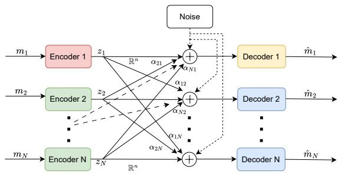  
Fig. 1. Multi-user interference system model for N users.

Decoding Complexity, Section IV reports BLER Performance, Section V provides preliminary Results with MIMO, and Section VI Analyses the Latent Codewords and Conclusions are drawn in Section VII.

## II. SYSTEM MODEL

The Siamese network of [18] considered two users with symmetric interference. Here we extend it for $N \in \{ 4 , 8 \}$ users. The interference model is shown in Fig. 1. The dashed lines indicate interferers not explicitly drawn. The interference from user $j$ to user i has magnitude $\alpha _ { i j }$ , with $\alpha _ { i j } = \alpha _ { j i }$

As in [18], user i maps a k-bit message $M _ { i } \in \{ 0 , 1 \} ^ { k }$ to a real n-length codeword $z _ { i }$ via

$$
E _ { i } \equiv F _ { \theta _ { i } } : M _ { i }  z _ { i } , \quad i \in \{ 1 , 2 , \ldots , N \} ,\tag{1}
$$

$$
\mathbb { E } \big [ \| z _ { i } \| _ { 2 } ^ { 2 } \big ] = n ,\tag{2}
$$

where $\theta _ { i }$ are the encoder parameters. The received vector at $R x _ { i }$ is

$$
y _ { i } = z _ { i } + \sum _ { \stackrel { j = 1 } { j \neq i } } ^ { N } \alpha _ { i j } z _ { j } + w _ { i } , \quad w _ { i } \sim { \mathcal N } ( 0 , \sigma ^ { 2 } ) .\tag{3}
$$

where $w _ { i }$ denotes white noise samples. Decoder $D _ { i }$ estimates $\hat { M _ { i } }$ from $y _ { i }$

$$
D _ { i } \equiv G _ { \phi _ { i } } : y _ { i } \to \hat { M } _ { i } , \quad i \in \{ 1 , 2 , \ldots , N \} ,\tag{4}
$$

$$
P _ { e } = \frac { 1 } { N } \sum _ { j = 1 } ^ { N } \mathrm { P r } \left( \hat { M } _ { j } \neq M _ { j } \right) ,\tag{5}
$$

where $\phi _ { i }$ are decoder parameters.

## III. SIAMESE ARCHITECTURE AND DECODING COMPLEXITY

## A. Model Structure and Design

Following the algorithm given in [18], interfering users learn from errors observed at both decoders. We modify the algorithm given in [18] to allow interference from all users.

The autoencoder comprises an encoder, a non-trainable channel layer (latent perturbations), and a decoder. As shown in Fig. 2, the encoder processes a one-hot input through a ReLU dense layer, a linear layer, batch normalisation, and an additive Gaussian layer (AWGN surrogate). The decoder uses a ReLU hidden layer, a linear layer, and a softmax output. Interference is added at the channel input.

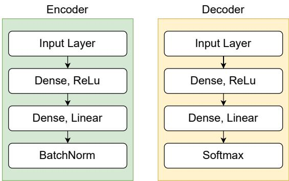  
Fig. 2. Encoder and Decoder Structure

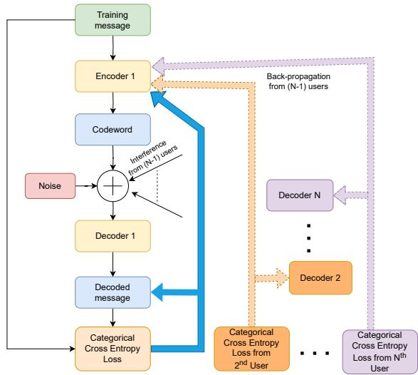  
Fig. 3. The Siamese Network Architecture and Training (extended to N users).

For N users and blocklength $L ,$ the hidden and encoder output (BatchNorm) sizes are $N L$ . The decoder has one ReLU hidden layer of size NL, followed by a linear layer and softmax. Interference from other users is injected at the current user’s channel input. We encourage the reader to refer [18] for further details about the model.

Fig. 3 shows the Siamese network architecture extended to N users. A small change in $\theta _ { i }$ affects all costs $\{ C _ { j } \} _ { j = 1 } ^ { N }$ , enabling joint encoder learning, as demonstrated in Algorithm 1. In contrast, small perturbations in $\phi _ { i }$ only affect $C _ { i }$ , so decoders are learned independently. This is indicated by backpropagation arrows: losses from User 2 feed only Decoder 2 and Encoder 1, not Decoder 1 or Decoder N.

## B. Decoder Complexity

The decoder for user i operates exclusively on $y _ { i } \in \mathbb { R } ^ { n }$ with a single hidden layer of size proportional to Nn (n is the length of the codeword), yielding forward-pass complexity $\mathcal { O } ( N n )$ , which scales linearly with N. In contrast, joint maximumlikelihood detection over all users requires $\mathcal { O } ( \bar { 2 } ^ { k N } )$ evaluations $\mathrm { ( e . g . , ~ 2 ^ { 6 4 } }$ for $N = 4 , k = 1 6 )$ , and NOMA-SIC requires N successive stages with inter-stage error propagation. Table I summarises representative operation counts for $N \in \{ 2 , 4 , 8 \}$

```latex
Algorithm 1 Training the Siamese network
1: while epoch $<$ maxepochs do
2: $\frac { E _ { b } } { N _ { 0 } }$ ← Uniform[1, 12] dB
3: $\begin{array} { r } { w _ { i } \gets \mathrm { A W G N } \Big ( \sigma \Big ( \frac { E _ { b } } { N _ { 0 } } \Big ) \Big ) } \end{array}$ for $i = 1 , \ldots , N$
4: $z _ { i } \gets E _ { \theta _ { i } } ( M _ { i } ) \mathrm { ~ } \mathrm { { f o r } } i = 1 , \dots , N$
5: $\begin{array} { r } { y _ { i }  z _ { i } + \sum _ { j \neq i } \alpha _ { i j } z _ { j } + w _ { i } } \end{array}$
6: $\hat { M } _ { i } \gets D _ { \phi _ { i } } ( y _ { i } )$
7: $C _ { i } \gets - \mathcal { L } [ \hat { M } _ { i } , M _ { i } ]$
8: $\phi _ { i }  \phi _ { i } - \eta \nabla _ { \phi _ { i } } C _ { i }$ for $i = 1 , \ldots , N$
9: $\begin{array} { r } { \theta _ { i }  \theta _ { i } - \eta \sum _ { j = 1 } ^ { N } \nabla _ { \theta _ { i } } C _ { j } } \end{array}$ for $i = 1 , \ldots , N$
10: end while
```

TABLE I  
PER-RECEIVER DECODING COMPLEXITY.
<table><tr><td>Method</td><td>Decoder Type</td><td>Per-receiver Complexity</td></tr><tr><td>SiameseNet (Proposed)</td><td>Per-user MLP</td><td>O(n)</td></tr><tr><td>Joint MLD</td><td>Exhaustive joint search</td><td> $O \left( n ^ { 2 ^ { k N } } \right)$ </td></tr><tr><td>NOMA</td><td>SIC over user streams</td><td> $O ( N C _ { \mathrm { d e c } } ^ { \setminus } ( n )  + . \ l { N n } )$ </td></tr><tr><td>RSMA</td><td>Common-stream SIC + private decoding</td><td>O ((N + 1) Cdec(n) + (N + 1)n)</td></tr><tr><td>TDMA / OMA</td><td>Single-user decoding per slot</td><td> $\stackrel { \prime } { O } ( \stackrel { \prime } { C } _ { \mathrm { d e c } } ( n ) )$ </td></tr></table>

## IV. BLER PERFORMANCE

In this section, we carry out experiments on the systems mentioned in the aforementioned section. We study the BLER performances of our models under different scenarios. Our experiments use the following combinations $( k , n ) :$ (4, 8), (16, 64), (256, 2048), for $N = 2 , 4$ and 8 respectively. These settings place the study in the finite-blocklength regime and span both short and medium blocklengths, allowing us to evaluate performance across a broader operating range rather than only the ultra-short regime.

We vary, $E _ { b } / N _ { 0 }$ from 0 to 8 dB, and allow each transmitter to interfere with all other receivers given by (3). For fair spectral efficiency, we compare with a TDMA baseline where N users transmit uncoded BPSK symbols per block at a coding rate of $1 / N$ (Both systems have an overall rate of 1bps/Hz).

## A. Benchmarks and Baselines

We compare the proposed SiameseNet design against two SIC-based reference schemes: power-domain non-orthogonal multiple access (NOMA) and rate-splitting multiple access (RSMA). In both baselines, the total transmit power is normalised as

$$
\sum _ { u = 1 } ^ { N } p _ { u } = N ,\tag{6}
$$

where u denotes the user and $p _ { u }$ denotes the transmit power of the $u ^ { t h }$ user. We use the shorthand

$$
h _ { i , j } = { \left\{ \begin{array} { l l } { 1 , } & { j = i , } \\ { \alpha , } & { j \neq i , } \end{array} \right. }\tag{7}
$$

so that the desired signal arrives with unit gain, while interfering users are scaled by the interference factor α.

For fairness, each user transmits k information bits and the baselines are configured to match the effective rate used by the SiameseNet design, $R = 1 / N$

a) NOMA baseline:: For the NOMA benchmark, the received signal at receiver i is

$$
y _ { i } = \sum _ { j = 1 } ^ { N } h _ { i , j } \sqrt { p _ { j } } x _ { j } + w _ { i } , \qquad w _ { i } \sim { \mathcal N } ( 0 , \sigma ^ { 2 } ) ,\tag{8}
$$

where $x _ { j }$ denotes the coded BPSK symbol stream of user $j .$ Under perfectly symmetric received powers (Experiment I later in this section), a deterministic SIC order is not naturally defined. Therefore, for the NOMA baseline, we use a random SIC order over the interfering users. We note that this choice removes one of NOMA’s principal advantages: an optimised decoding order derived from channel or power asymmetry [8]. This also implies that the optimal deployment of NOMA is contingent on a significant power differential between the 2 users, but our system is not constrained by such limitations. Under symmetric power conditions, no such ordering is naturally available, and the random order may underestimate NOMA’s true performance relative to settings where a power differential exists and a greedy decoding order can be applied.

Let $\pi _ { i } ( 1 ) , \pi _ { i } ( 2 ) , \ldots , \pi _ { i } ( N - 1 )$ denote a random ordering of the interfering users at receiver i. Receiver i successively decodes these interference streams, subtracts their reconstructed contributions, and then decodes its own stream. After cancelling the first $m - 1$ decoded interference streams, the residual signal is

$$
y _ { i } ^ { ( m ) } = y _ { i } - \sum _ { r = 1 } ^ { m - 1 } h _ { i , \pi _ { i } ( r ) } \sqrt { p _ { \pi _ { i } ( r ) } } \hat { x } _ { \pi _ { i } ( r ) } .\tag{9}
$$

After cancelling all N−1 interfering streams, the desired stream is decoded from

$$
\tilde { y } _ { i } = y _ { i } - \sum _ { r = 1 } ^ { N - 1 } h _ { i , \pi _ { i } ( r ) } \sqrt { p _ { \pi _ { i } ( r ) } } \hat { x } _ { \pi _ { i } ( r ) } .\tag{10}
$$

The Log Likelihood Ratio (LLR) for the current BPSK symbol is then calculated from the residual signal, followed by channel decoding.

b) RSMA baseline:: For the RSMA benchmark, each user splits its message into a common part and a private part. The transmitted signal of user u is written as

$$
s _ { u } = \sqrt { \beta p _ { u } } x _ { u , c } + \sqrt { ( 1 - \beta ) p _ { u } } x _ { u , p } , \qquad 0 \le \beta \le 1 ,\tag{11}
$$

where $x _ { u , c }$ and $x _ { u , p }$ denote the coded BPSK common and private streams, respectively, and $\beta$ controls the power split. The received signal at receiver i is

$$
y _ { i } = \sum _ { j = 1 } ^ { N } h _ { i , j } s _ { j } + w _ { i } .\tag{12}
$$

Each user still transmits a total of k information bits, now split as $k = k _ { c } + k _ { p }$ between common and private parts, with the overall effective rate matched to the SiameseNet design. At receiver i, the common streams are decoded first using SIC. Under symmetric power conditions, the common-stream decoding order is also taken to be random. Let $\rho _ { i } ( 1 ) , \rho _ { i } ( 2 ) , \ldots , \rho _ { i } ( N )$ denote the decoding order of the common streams. After cancelling the decoded common streams, the residual signal is

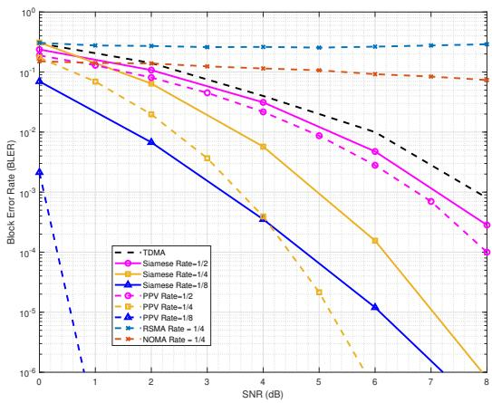  
Fig. 4. BLER versus SNR for $N \in \{ 2 , 4 , 8 \}$ under equal interference.

$$
\bar { y } _ { i } = y _ { i } - \sum _ { r = 1 } ^ { N } h _ { i , \rho _ { i } ( r ) } \sqrt { \beta p _ { \rho _ { i } ( r ) } } \hat { x } _ { \rho _ { i } ( r ) , c } .\tag{13}
$$

Receiver i then decodes its own private stream from

$$
\bar { y } _ { i } = \sqrt { ( 1 - \beta ) p _ { i } } x _ { i , p } + \alpha \sum _ { j = 1 , j \neq i } ^ { N } \sqrt { ( 1 - \beta ) p _ { j } } x _ { j , p } + w _ { i } .\tag{14}
$$

As with the NOMA baseline, the LLRs for the BPSK symbols are computed from the residual signal and passed to the channel decoder. Thus, the NOMA baseline performs full SIC over the interfering users before decoding the desired stream, while the RSMA baseline first removes the common parts and then decodes the desired private stream in the presence of residual private-user interference.

NOMA and RSMA are more suited to cases with unequal interference strengths, thus, for Experiment I, this should be treated as an indicative baseline.

For Experiment I, we plot the Polyanskiy-Poor-Verdu (PPV)´ [19] normal approximation for an equivalent single-user AWGN channel as a finite-blocklength benchmark, which helps contextualise the performance gap introduced by multi-user interference. We limit ourselves to only using PPV as an indicative bound, but a detailed quantitative analysis is not possible without a thorough information theoritic study of the system, but this is currently beyond the scope of the paper.

## B. Experiment I: Equal Interference from All Interferers

In this case, we assume all the signals are equally powerful and thus the interference strengths $( \alpha _ { i j } \mathbf { s } )$ are equal for all users $( \alpha _ { i j } = \alpha$ for all $i \neq j )$ . Fig. 4 shows that for $N \in \{ 2 , 4 , 8 \}$ the Siamese network outperforms TDMA. A standard TDMA, SiameseNet 2 user with rate 1/2, 4 user with rate 1/4 and 8 user with rate 1/8 all have the same overall rate of 1 bps/Hz. Increasing N lowers the per-user rate (from $1 / 2$ to 1/8), implicitly increasing the minimum distance and improving BLER beyond a crossover SNR. For 2 users we observe about 0.5 dB gain; for 4 users the gain is about 2.5 dB; the 8-user case improves further when compared with TDMA. We discuss the mechanism of this behaviour in Section VI.

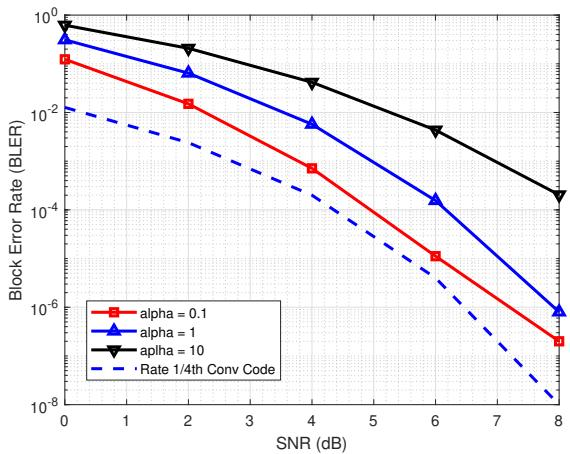  
Fig. 5. Per-user BLER for the 4-user case.

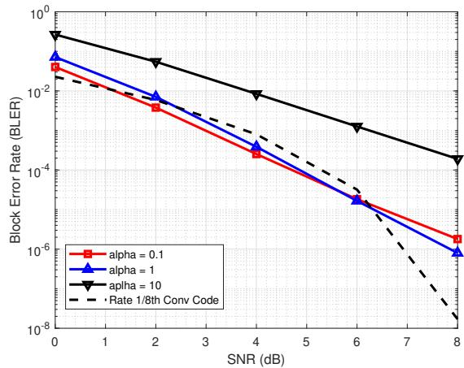  
Fig. 6. Per-user BLER for the 8-user case.

We also plot the corresponding PPV for Rates $1 / 2$ (2-user case), 1/4 (4-user case) and 1/8 (8-user case) and compare it with our results. Against the Rate=1/2 PPV, the performance is around 0.5 dB worse for 2-User, 1.5 dB worse for 4- User (Rate=1/4 PPV) and much worse for the 8-User. This highlights that our system is more suited to short blocklength systems than larger blocklength systems.

## C. Experiment II: Mismatched α: A Test for Robustness

In this scenario, we explore the impact of a mismatch in α. We use the model trained for $\alpha \ = \ 1$ and test it with different values of α. Fig. 7 shows the BLER performance with mismatched values of interferences. The BLER performance of the model (denoted by the solid blue line) is worse than what would be obtained with the correct model for $\alpha = 0 . 1$ (dashed blue line) , but the gap narrows with increasing SNR. On the other hand, for $\alpha = 1 0 .$ , the mismatched model performance (denoted by the solid red line) performs as good as the true model (dashed red line). This implies that our model has the ability to accommodate moderate errors in the estimation of the interference strength. A more detailed analysis of the performance is presented in Sec VI.

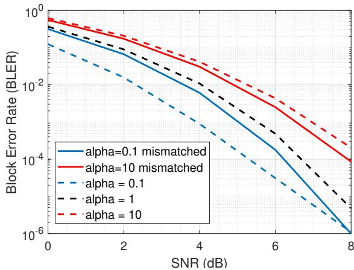  
Fig. 7. BLER with mismatched α (trained at $\scriptstyle \alpha = 1 ) .$

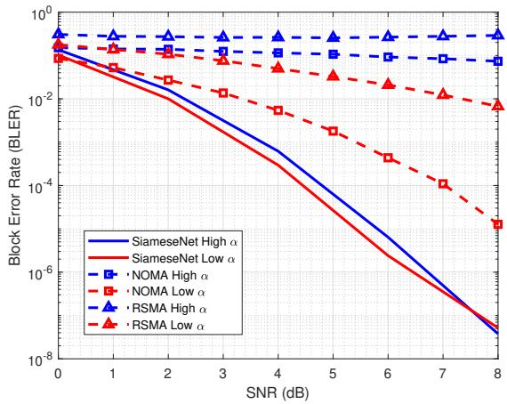  
Fig. 8. BLER with unequal interference strengths.

## D. Experiment III: Unequal Interference Strengths

In this experiment, we examine the case when the interferers have different/unequal interference strengths. We consider a scenario where $\alpha _ { 1 2 } = \alpha _ { 2 1 } = 1$ , but $\alpha _ { 1 3 } = \alpha _ { 1 4 } = \alpha _ { 2 3 } =$ $\alpha _ { 2 4 } = \alpha _ { 3 4 } = 0 . 1$ , that is, user 2 has a stronger interference with User 1 compared to users 3 and 4. Fig. 8 demonstrates the BLER performance of the users in this scenario. We Plot the high and low interferers for every scheme and compare it with our model. As we can observe, our model outperforms both NOMA and RSMA. A Further analysis of this ability needs a more thorough discussion, which is beyond the scope of this work and it will be explored in future.

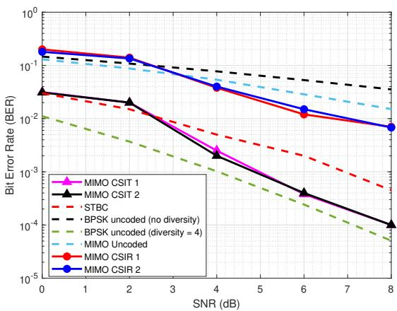  
Fig. 9. BER for $2 \times 2$ MIMO under CSIT/CSIR compared to baselines.

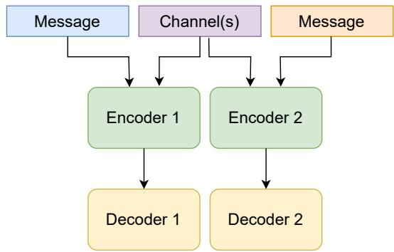  
Fig. 10. Model variant for MIMO with CSIT (encoder knows the channel).

## V. PRELIMINARY RESULTS WITH MIMO

The results in this section are intended only as a proof-ofconcept extension of the proposed framework to MIMO and do not constitute a general performance study over randomly varying channel ensembles. We study a $2 \times 2$ MIMO interference channel with i.i.d. complex Gaussian (Rayleigh) links and $\alpha { = } 1$ Channels are drawn once and held fixed during training. The Models are trained for 50 epochs (batch size 64) over 50000 messages using categorical cross-entropy to reduce BER. For a 2-user MIMO scenario, the input is a 4-bit message at rate $1 / 2 ,$ mapped to 8 symbols over two spatial streams (4 uses each), giving 1 bpcu per stream. Fig. 9 reports BER under CSIT and CSIR.

Scenario I: CSIT. Channel matrices are available at the transmitters. We implement a model similar to [18] with an additional encoder input for the channel (Fig. 10), enabling beamforming and coded spatial multiplexing (akin to STBC [20]). We compare with single-user $2 \times 2$ Alamouti STBC [21] (fourth-order diversity) and single-user $2 \times 2$ MIMO with ML decoding (second-order). STBC has 1 bpcu; our learned code achieves 1 bpcu per user (8 bits over 2 TX and 8 uses) for two simultaneous users and exhibits diversity behaviour consistent with fourth order under the fixed-channel setup. Within this setting, CSIT trends outperform STBC and are within ≈ 0.5 dB of uncoded BPSK with fourth-order diversity (Fig. 9).

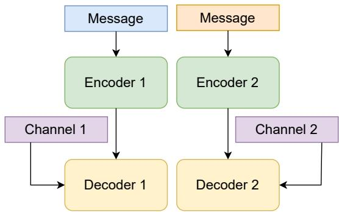  
Fig. 11. Model variant for MIMO with CSIR (decoder knows the channel).

Scenario II: CSIR. Channels are provided only to the decoders (Fig. 11). The end-to-end model learns channel-agnostic codewords and suppresses cross-user interference via increased inter-user separation while retaining redundancy for coding. Under the fixed-channel experiments, diversity behaviour is consistent with second order, with about 2 dB improvement over uncoded 2 × 2 MIMO (Fig. 9).

Caveat (applies to all MIMO results in Section V): Channels were drawn once and held fixed throughout training and evaluation. Therefore, the MIMO observations are preliminary and should not be interpreted as general performance over fading ensembles. In follow-up work, we will train and test over ensembles of randomly drawn Rayleigh realisations to evaluate channel-agnostic performance, diversity, and spectral efficiency.

TABLE II  
$d _ { \mathrm { m i n } }$ FOR α ∈ {0.1, 1} VERSUS USER COUNT AND EFFECTIVE RATE.
<table><tr><td rowspan=1 colspan=1>User count, R</td><td rowspan=1 colspan=1>2-user, 1/2</td><td rowspan=1 colspan=1>4-user, 1/4</td><td rowspan=1 colspan=1>8-user, 1/8</td></tr><tr><td rowspan=1 colspan=1>α = 1</td><td rowspan=1 colspan=1>2.97</td><td rowspan=1 colspan=1>3.91</td><td rowspan=1 colspan=1>5.51</td></tr><tr><td rowspan=1 colspan=1>α = 0.1</td><td rowspan=1 colspan=1>3.58</td><td rowspan=1 colspan=1>5.02</td><td rowspan=1 colspan=1>7.15</td></tr></table>

TABLE III  
RANGE OF ψ<sub>ii</sub> FOR THE α = 0.1 AND α = 1 CASES.
<table><tr><td rowspan=1 colspan=1>User Count, R</td><td rowspan=1 colspan=2>2-user, 1/2</td><td rowspan=1 colspan=2>4-user, 1/4</td><td rowspan=1 colspan=2>8-user, 1/8</td></tr><tr><td rowspan=1 colspan=1></td><td rowspan=1 colspan=1>Mean</td><td rowspan=1 colspan=1>Range</td><td rowspan=1 colspan=1>Mean</td><td rowspan=1 colspan=1>Range</td><td rowspan=1 colspan=1>Mean</td><td rowspan=1 colspan=1>Range</td></tr><tr><td rowspan=1 colspan=1> $\overline { { \alpha = 1 } }$ </td><td rowspan=1 colspan=1>89.99</td><td rowspan=1 colspan=1>19-149</td><td rowspan=1 colspan=1>89.99</td><td rowspan=1 colspan=1>18-152</td><td rowspan=1 colspan=1>89.99</td><td rowspan=1 colspan=1>10-140</td></tr><tr><td rowspan=1 colspan=1> $\overline { { \alpha = 0 . 1 } }$ </td><td rowspan=1 colspan=1>89.99</td><td rowspan=1 colspan=1>22-146</td><td rowspan=1 colspan=1>89.97</td><td rowspan=1 colspan=1>76-104</td><td rowspan=1 colspan=1>89.88</td><td rowspan=1 colspan=1>65-115</td></tr></table>

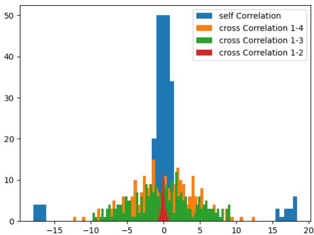  
Fig. 12. Correlation for 4 users α = 1 SiameseNet.

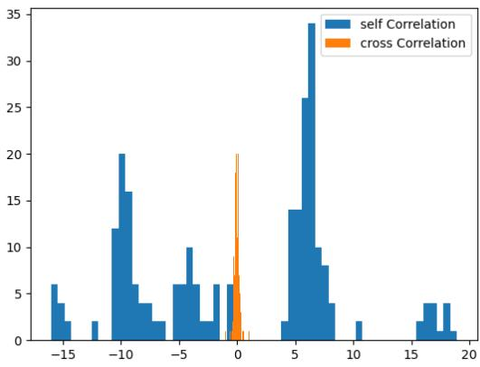  
Fig. 13. Correlation for 4 users α = 1 SiameseNet.

TABLE IV  
RANGE OF $\psi _ { i j }$ FOR THE α = 0.1 AND α = 1 CASES.
<table><tr><td rowspan=1 colspan=1>User Count, R</td><td rowspan=1 colspan=2>2-User, 1/2</td><td rowspan=1 colspan=2>4-User, 1/4</td><td rowspan=1 colspan=2>8-user, 1/8</td></tr><tr><td rowspan=1 colspan=1></td><td rowspan=1 colspan=1>Mean</td><td rowspan=1 colspan=1>Range</td><td rowspan=1 colspan=1>Mean</td><td rowspan=1 colspan=1>Range</td><td rowspan=1 colspan=1>Mean</td><td rowspan=1 colspan=1>Range</td></tr><tr><td rowspan=1 colspan=1> $\varpi = 1$ </td><td rowspan=1 colspan=1>89.99</td><td rowspan=1 colspan=1>89-91</td><td rowspan=1 colspan=1>90.00</td><td rowspan=1 colspan=1>88-92</td><td rowspan=1 colspan=1>89.99</td><td rowspan=1 colspan=1>88-92</td></tr><tr><td rowspan=1 colspan=1> $\overline { { \alpha = 0 . 1 } }$ </td><td rowspan=1 colspan=1>89.99</td><td rowspan=1 colspan=1>37-142</td><td rowspan=1 colspan=1>89.98</td><td rowspan=1 colspan=1>60-118</td><td rowspan=1 colspan=1>90.00</td><td rowspan=1 colspan=1>70-115</td></tr></table>

## VI. LATENT SPACE ANALYSIS

We analyse the encoders’ latent codewords to explain BLER via pairwise distances and correlations. The observed BLER trends are consistent with the learned inter-codeword separation, with the minimum distance $d _ { \mathrm { m i n } }$ emerging as the most informative geometric indicator in our experiments. Table II shows that $d _ { \mathrm { m i n } }$ increases as the effective per-user rate decreases (e.g., from 2 to 8 users), with a stronger effect at $\alpha { = } 0 . 1$ indicating that coding gain outweighs added interference.

Angles cluster near $9 0 °$ on average but depend on α: sameuser angles $\psi _ { i i }$ are closer to $9 0 ^ { \circ }$ for $\alpha { = } 0 . 1$ , while cross-user angles $\psi _ { i j }$ approach $9 0 °$ more at α=1 (Tables III, IV).

Consistent with Section IV, performance remains robust as interference scales because the model reduces cross-user correlation (Fig. 13). Orthogonalisation is selective: in Section IV-D (Fig. 12), user 1 approaches orthogonality relative to the dominant interferer (user 2; α=1) but not to weaker interferers (users 3–4), instead keeping redundancy for coding.

We do not design the model to explicitly reduce the correlation neither do we claim any guarantees on such a behaviour. More detailed research is necessary to make concrete claims on this behaviour. But that is beyond the scope of the current paper.

## VII. CONCLUSIONS

This paper demonstrated that end-to-end deep learning can effectively address multi-user interference in finite-blocklength IoT networks. By extending the two-user SiameseNet framework to 4 and 8 users, we showed that the approach scales gracefully while retaining the per-user decoder complexity, which scales logarithmically, whereas for joint detection, it scales exponentially.

The framework also exhibits strong practical robustness: the performance degrades gracefully under interference-strength mismatch and outperforms both NOMA and RSMA under unequal interference strengths, scenarios directly relevant to heterogeneous IoT deployments. Latent-space analysis provides a principled geometric insight into these gains, with the minimum distance increasing as the effective per-user rate decreases, confirming that coding gain outweighs added interference as the number of users grows.

Preliminary 2 × 2 MIMO results further suggest that the framework extends naturally towards multi-antenna IoT gateways, with CSIT results outperforming Alamouti STBC and CSIR results achieving second-order diversity behaviour.

These results establish a strong foundation for end-to-end learned transceivers in dense, interference-limited IoT scenarios. Future work will pursue fading-ensemble MIMO evaluation, adaptive interference-strength estimation, stronger IoToriented baselines, and an information-theoretic analysis of the learned code geometry.

## VIII. ACKNOWLEDGMENTS

The authors of this paper would like to thank Prof Nambi Seshadri of UC San Diego and Prof R David Koilpillai of IIT Madras for their guidance and support.

## REFERENCES

[1] E. Arikan, “A performance comparison of polar codes and reed-muller codes,” IEEE Communications Letters, vol. 12, no. 6, pp. 447–449, 2008.

[2] R. Gallager, “A simple derivation of the coding theorem and some applications,” IEEE Transactions on Information Theory, vol. 11, no. 1, pp. 3–18, 1965.

[3] Y. Saito, Y. Kishiyama, A. Benjebbour, T. Nakamura, A. Li, and K. Higuchi, “Non-orthogonal multiple access (noma) for cellular future radio access,” in 2013 IEEE 77th Vehicular Technology Conference (VTC Spring), 2013, pp. 1–5.

[4] Y. Mao, B. Clerckx, and V. O. Li, “Rate-splitting multiple access for downlink communication systems: bridging, generalizing, and outperforming sdma and noma,” EURASIP Journal on Wireless Communications and Networking, vol. 2018, no. 1, May 2018. [Online]. Available: http://dx.doi.org/10.1186/s13638-018-1104-7

[5] S. Bhattacharyya, S. Darshi, and Z. Lin, “Outage analysis of downlink rsma in vehicular cluster: A copula-based approach,” IEEE Wireless Communications Letters, vol. 14, no. 5, pp. 1486–1490, 2025.

[6] B. Clerckx, Y. Mao, E. A. Jorswieck, J. Yuan, D. J. Love, E. Erkip, and D. Niyato, “A primer on rate-splitting multiple access: Tutorial, myths, and frequently asked questions,” IEEE Journal on Selected Areas in Communications, vol. 41, no. 5, pp. 1265–1308, 2023.

[7] X. Su, H. Yu, W. Kim, C. Choi, and D. Choi, “Interference cancellation for non-orthogonal multiple access used in future wireless mobile networks,” EURASIP Journal on Wireless Communications and Networking, 2016.

[8] Y. Qit and M. Vaezi, “Noma decoding: Successive interference cancellation or maximum likelihood detection?” in 2024 58th Annual Conference on Information Sciences and Systems (CISS), 2024, pp. 1–6.

[9] P. Herath, A. Haghighat, and L. Canonne-Velasquez, “A low-complexity interference cancellation approach for noma,” in 2020 IEEE 91st Vehic ular Technology Conference (VTC2020-Spring), 2020, pp. 1–5.

[10] Y. Zhang, H. Zhang, H. Zhou, and W. Li, “Interference cooperation based resource allocation in noma terrestrial-satellite networks,” in 2021 IEEE Global Communications Conference (GLOBECOM), 2021, pp. 01–05.

[11] H. Jafarkhani, H. Maleki, and M. Vaezi, “Modulation and coding for noma and rsma,” Proceedings of the IEEE, vol. 112, no. 9, pp. 1179– 1213, 2024.

[12] G. Arora and A. Jaiswal, “Zero sic based rate splitting multiple access technique,” IEEE Communications Letters, vol. 26, no. 10, pp. 2430– 2434, 2022.

[13] V. Raj and S. Kalyani, “Design of communication systems using deep learning: A variational inference perspective,” IEEE Transactions on Cognitive Communications and Networking, vol. 6, no. 4, pp. 1320–1334, 2020.

[14] ——, “Backpropagating through the air: Deep learning at physical layer without channel models,” IEEE Communications Letters, vol. 22, no. 11, pp. 2278–2281, 2018.

[15] A. Emır, F. Kara, and H. Kaya, “Deep learning-based joint symbol detection for noma,” in 2019 27th Signal Processing and Communications Applications Conference (SIU), 2019, pp. 1–4.

[16] J.-M. Kang, I.-M. Kim, and C.-J. Chun, “Deep learning-based mimonoma with imperfect sic decoding,” IEEE Systems Journal, vol. 14, no. 3, pp. 3414–3417, 2020.

[17] X. Zhang and M. Vaezi, “Deep autoencoder-based z-interference channels,” in 2023 IEEE Wireless Communications and Networking Conference (WCNC), 2023, pp. 1–6.

[18] S. Paul, S. Senthil, P. Seshadri, N. Seshadri, and R. D. Koilpillai, “Learning robust representations for communications over interferencelimited channels,” in 2025 IEEE Wireless Communications and Networking Conference (WCNC), 2025, pp. 01–06.

[19] Y. Polyanskiy, H. V. Poor, and S. Verdu, “Channel coding rate in the finite blocklength regime,” IEEE Transactions on Information Theory, vol. 56, no. 5, pp. 2307–2359, 2010.

[20] D. Gore and A. Paulraj, “Space-time block coding with optimal antenna selection,” in 2001 IEEE International Conference on Acoustics, Speech, and Signal Processing. Proceedings (Cat. No.01CH37221), vol. 4, 2001, pp. 2441–2444 vol.4.

[21] S. Alamouti, “A simple transmit diversity technique for wireless communications,” IEEE Journal on Selected Areas in Communications, vol. 16, no. 8, pp. 1451–1458, 1998.