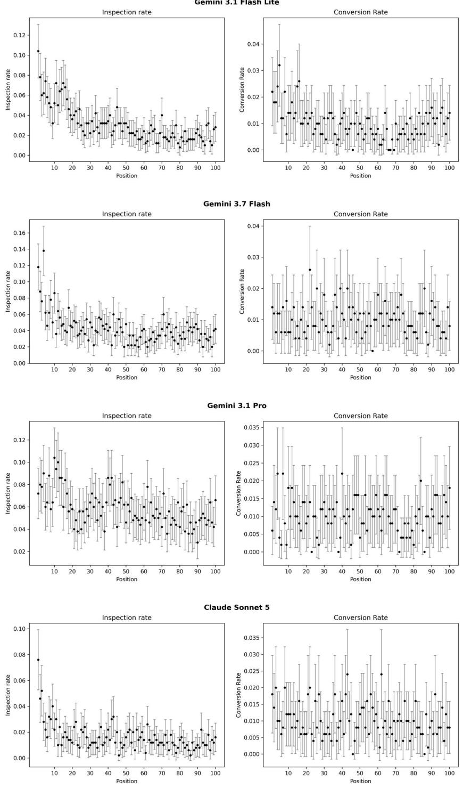
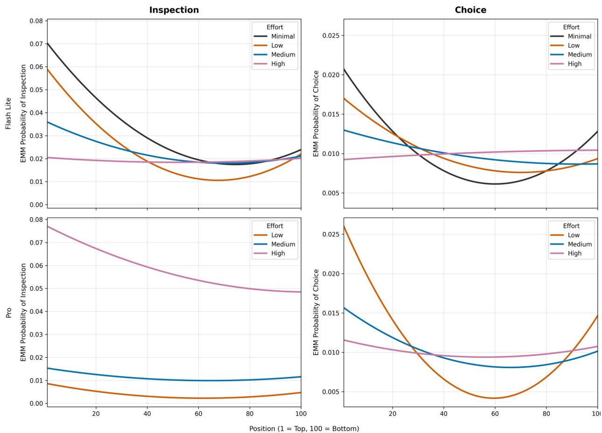

# Does Rank Still Matter? Position Bias When AI Agents Shop on Our Behalf

Davood Wadi

Desautels Faculty of Management, McGill University, 1001 Sherbrooke St. West, Montreal, QC H3A 1G5, Canada

ORCID: 0000-0003-4187-0187

Yu Ma

Desautels Faculty of Management, McGill University, 1001 Sherbrooke St. West, Montreal, QC H3A 1G5, Canada

ORCID: 0000-0003-0905-1237

Corresponding Author:

Davood Wadi

davood.wadi@hec.ca

# Does Rank Still Matter? Position Bias When AI Agents Shop on Our Behalf Abstract

Search rankings are valuable because human attention is scarce and sequential. Higher-placed alternatives are easier to find, so they are examined and bought more often. Consumers are now delegating search to AI agents that can ingest an entire results page at once. Randomizing the order of one hundred hotel listings across 5,000 AI agent sessions, we compare four large language models against human field data. AI agents search more deeply than humans and never decline to buy. Position still predicts which listings are inspected, but weakly and nonmonotonically: the middle of a results page has the lowest probability of inspection, not the bottom. Position reaches the choice stage for some models and not others, a heterogeneity that tracks neither provider nor capability. All models nonetheless converge on the same undominated listing. For agentic search, the attributes displayed on a results page matter more than placement within it.

Keywords: search rankings, AI agents, large language models, consumer search, consideration sets, delegated choice

## 1. Introduction

Ranking in search results has long been a strategic marketing variable. In human consumption, search engine optimization budgets and the premium paid for top slots are based on a well-documented human behavior. Alternatives placed higher are examined and bought more often. The canonical explanation is that ranking determines which alternatives enter the consideration set while leaving the consumer’s valuation of an inspected alternative untouched (Ursu 2018). Human search costs are attributed to biological constraints. Scanning a results page is sequential, scrolling and pagination take effort, and multi-attribute comparison is cognitively taxing, so human consumers show extreme satisficing. Research shows that with hotel search, humans make on average 1.12 clicks and 93% of sessions contain only one click (Ursu 2018). Therefore, rankings are valuable precisely because attention is scarce, ordered, and easily exhausted.

Consumers are now beginning to delegate various stages of consumption decision making to AI agents. Rather than sifting a results page themselves, they delegate the task to conversational AI agents that retrieve, compare, and increasingly transact on their behalf (Mogaji and Jain 2024; Hasselwander et al. 2026; Kumar et al. 2026). An AI agent can receive the entire results page at once, in its context window. It does not scroll and pays no marginal cost to read the hundredth listing compared to the first. Thus, if the power of rankings is an outcome of limited human attention, AI delegation should eliminate it.

However, AI agents, particularly, Language Language Models (LLMs) exhibit their own positional biases. Information placed in the middle of a long context is retrieved less reliably than information at either end (Liu et al. 2024). Rank may therefore continue to affect AI delegated consumption, through a mechanism independent of scrolling. Additionally, because human consideration sets are mostly degenerate (i.e., have only one alternative), an effect of rank on clicking is an effect on choice. Under AI delegation, however, it is unclear whether a positional advantage at the inspection stage survives to the purchase stage.

We study this by placing LLM agents in a hotel search environment, comparable to a human field benchmark. AI agents inspect listings and book through tool calls. The main experiment comprises 2,000 sessions across four major LLMs from two providers (i.e., Google and Anthropic). Follow-up experiments manipulate reasoning effort and prompt wording (3,000 sessions).

These lead to three findings. First, AI agents search substantially more (between 1.63 and 5.83 inspections per session) than humans (1.12 inspections per session). Moreover, unlike human consumers who decline to book a hotel a third of the time, every AI agent always booked a hotel (a pattern that survives stripping the instruction to recommend from the prompt).

Second, rank nonetheless continues to predict inspection for every LLM tested, although four to ten times more weakly than for humans. Rather than declining monotonically, for the LLMs tested (except Gemini 3.1 Pro) inspection falls from the top of the page to a minimum around ranks 68 to 74 and then rises again, so the bottom of the listing page is a better place to be than the middle (a phenomenon called the lost-in-the-middle effect; Liu et al. 2024).

Third, this positional advantage does not reach the booking stage. The average rank of the chosen hotel ranges from 44.0 to 49.7 (against the position-neutral value of 50.5). Choices concentrate overwhelmingly on a single undominated listing, which captures 78.2% of all bookings across LLMs. What little exposure to position remains is governed not by which LLM is delegated to, but by how much reasoning effort it is configured to spend. Increasing reasoning effort reduces the position effect to insignificance in both the least and most capable LLMs tested.

These findings make two contributions to research on AI delegated consumer search. Theoretically, we contrast the biological sources of position effects from the computational ones. The scrolling and attention costs that explain the value of rank for human consumers are absent for AI models, yet the effect of ranking on inspection survives. More consequentially, we show that delegating to AI agents breaks the link between inspection and choice, which used to make rankings economically valuable. For human consumers, an effect on the consideration set is an effect on demand, because the consideration set mostly holds one alternative. For AI agents, rank increases inspection but does not affect the final choice.

Managerially, this calls for the transformation of two common practices. Since placement on the top of the listing page does not systematically determine choice, and the bottom of the listing page is no longer the worst position to be, current SEO strategies must be adapted. Instead, managers should focus on maintaining strong organic signals like review scores, which remain a primary heuristic and trust indicator in online decision environments (Wadi et al. 2026a), driving choice even when rankings shift.

## 2. Background

Consumers do not evaluate every available alternative. They first assemble a small consideration set using fast and frugal filters, then choose within it (Hauser 2014). Because the first stage governs what is ever evaluated, it is a foundational driver of market demand and choice probabilities (Akchen and Mitrofanov 2025). Presentation order is one of the most powerful of these filters, and the reason is well understood. Rank, or position, determines which alternatives enter the consideration set rather than what they are worth after they enter.

As consumers migrate from pull-based results pages toward conversational AI assistants that retrieve, compare, and complete purchase tasks end to end (Mogaji and Jain 2024; Wadi and Ma 2026), delegation to AI agents could transform this dynamic. Large Language Models (LLMs) exhibit high fidelity in consumption settings. They reproduce human willingness-to-pay, price trade-offs, and brand structure with high accuracy (Brand et al. 2023; Li et al. 2024), although the same LLMs have been shown to display heuristics and biases in consumption settings (Wadi et al. 2026b).

Whereas human search leans on visual heuristics and intuitive, System 1 judgment, an AI agent extracts and synthesizes attributes computationally, through explicit multi-step reasoning over text loaded into its context window (Goli and Singh 2024; Lee et al. 2026). This difference can lead to vastly different inspection and choice behavior. For example, LLMs retrieve information from the beginning and end of a long context more reliably than information placed in the middle (Liu et al. 2024). If this behavior translates to product search, the position effect on inspection should take a U shape instead of the monotonically decreasing patterns seen in humans.

Moreover, most modern LLMs have reasoning capabilities, which means they deliberate on what action to take before they perform that action. Reasoning effort is a new variable that can be set by the users of modern LLMs. Therefore, reasoning effort could be an additional factor that could affect inspection and choice behavior.

In this research, we pose three research questions that we seek to answer through a series of experiments:

 RQ1. How does search delegated to an AI agent differ from human search in the depth of inspection?

 RQ2. Does presentation order shape what an agent inspects, and does it do so in the form observed in humans?

 RQ3. Does any position effect survive to the final booking, as it does for humans?

## 3. Experiment

In this experiment, our objective is to observe how an autonomous LLM agent navigates a search ranking environment when acting as a surrogate consumer. Therefore, we evaluate the agent’s behavior against a human benchmark. To ensure comparability with an established human benchmark, we replicate the context of the randomized field experiment conducted by Ursu (2018). The mapping of the consumer search environment to AI agents is detailed in Web Appendix C, and hotel data and search parameters are detailed in Web Appendix D.

## 3.1. Experiment design

To simulate the sequential search process, the hotel information was partitioned into two layers. The initial prompt displayed the hotel listing page (e.g., hotel name, review score, price nightly, price total, and an aggregated review\_score for each hotel). To obtain more information about a hotel, the LLM was required to utilize the inspect tool that resembled human clicks. Upon calling the inspect tool with a specific hotel’s ID, the environment returned detailed information about that hotel. This included the hotel’s star rating, specific amenities, granular sub-ratings for cleanliness and service, and detailed room availability and room price.

To eliminate the endogeneity bias inherent in search engine ranking algorithms, where higher-quality options are systematically placed at the top, the presentation order of the 100 hotels was fully randomized for each session.

We prompted the agent with a persona of a hotel booking assistant delegated by a traveler to evaluate options and book a room based on the trip parameters (see Table W2, Original, for the prompt). Trip parameters were chosen to match the modal search in the human benchmark (Ursu 2018), leading to an itinerary for two adults, no children, one room, and a two-night stay including a Saturday night (check-in 2026-05-30, check-out 2026-06-01).

## 3.2. Sample and procedure

Our sample consisted of proprietary LLMs from Google (Gemini 3.1 Pro, Gemini 3.7 Flash, and Gemini 3.1 Flash Lite)1 and Anthropic (Claude Sonnet 5). To investigate the out-ofthe-box experience with the LLMs, we used the default reasoning effort and sampling parameters (e.g., temperature and top-p).2. See Web Appendix F for the details the of LLMs and their parameters.

Following behavioral evaluation paradigms that emphasize repeated sampling for assessing LLM decision reliability (Wadi and Fredette 2025), each model completed 500 independent choice sessions. Within each session, the LLM was permitted to call the inspect tool sequentially as many times as it deemed necessary to evaluate the randomized list of 100 hotels. At any point, the LLM could use the submit\_choice tool to book a hotel. It could also terminate the session without making a booking, representing the outside option. Throughout the experiment, the exact chronological order of all tool calls was recorded.

## 3.3. Measures

For each session, every displayed hotel contributed one observation indicating whether it was inspected and whether it was ultimately chosen. Inspected was coded 1 when the agent invoked the inspect tool for a given hotel and 0 otherwise (an analogue of a click in the human benchmark). Chosen was coded 1 when the hotel was submitted as the final booking decision and 0 otherwise. Because the 100 hotel observations within a session were not independent, standard errors in the reduced-form models were clustered at the session level.

The principal independent variable was position, indexed from 1 to 100 based on the hotel’s randomized placement in on the listing page shown to the AI agent. We also used the attributes that were directly observable on the listing page as control variables. Price captured the nightly price for the hotel, while Review score captured the aggregate guest rating shown on the search-results page.

Moreover, we added two additional listing-page controls to approximate the original study’s covariates. Chain was coded as a binary indicator for the presence of a major hotel brand name in the listing title. Promotion was coded as a binary indicator for the presence of a visible discount badge on the listing page. These variables constitute the closest direct overlaps between information shown on Expedia at the time of writing and the reduced-form hotel characteristics from the original study (Ursu 2018; for details see Web Appendix D).

## 3.4. Results

We first describe how the AI agents search and choose when used with default settings, then compare them to the human benchmark.

First, AI agents search more than humans. Human consumers inspect 1.12 hotels per session, and 93% of their sessions contain a single inspection. Every AI agent searches more than this, with means ranging from 1.63 to 5.83 inspections per session (RQ1). Degenerate consideration sets (i.e., sessions with one inspection), which are the norm for people (93% of human sessions), occur in 0.8% to 37.4% of sessions for AI agents.

Second, human consumers who click at least once book 66% of the time and take the outside option 34% of the time, whereas all AI agents booked in 100% of sessions. We later test whether this is an artifact of the prompt asking for a recommendation.

How much an AI agent searches varies substantially across LLMs. The average number of inspections differs by a factor of more than three, with the shape of the distribution varying considerably. Some LLMs’ search depth is concentrated (Claude Sonnet 5, $M = 1 . 6 3 , S D = 0 . 4 9 )$ ), while others are heavily right skewed (Gemini 3.1 Pro, M =5.83 , S D = 4.78; Figure W1).

Table 1 Search behavior for AI agents versus human consumers.

<table><tr><td rowspan="5">N</td><td>Claude</td><td></td><td>Gemini</td><td></td><td>Human</td></tr><tr><td>Sonnet</td><td>Flash Lite</td><td>Flash</td><td>Pro (3.1)</td><td></td></tr><tr><td>5</td><td>(3.1)</td><td>(3.7)</td><td></td><td></td></tr><tr><td>500</td><td>500</td><td>500</td><td>500</td><td>166,036</td></tr><tr><td>Conversion rate 100.0%</td><td>100.0%</td><td>100.0%</td><td>100.0%</td><td>66.0%</td></tr><tr><td>Outside option selected</td><td>0.0%</td><td>0.0%</td><td>0.0%</td><td>0.0%</td><td>34.0%</td></tr><tr><td>Inspections per session</td><td></td><td></td><td></td><td></td><td></td></tr><tr><td>(M)</td><td>1.63</td><td>3.12</td><td>4.25</td><td>5.83</td><td>1.12</td></tr><tr><td>(Median)</td><td>2.00</td><td>3.00</td><td>4.00</td><td>5.00</td><td>1.00</td></tr><tr><td>(Mode)</td><td>2.00</td><td>3.00</td><td>4.00</td><td>1.00</td><td>1.00</td></tr><tr><td>(SD)</td><td>0.49</td><td>0.54</td><td>1.59</td><td>4.78</td><td>0.61</td></tr><tr><td>Sessions with one inspection</td><td>37.4%</td><td>0.8%</td><td>2.6%</td><td>20.8%</td><td>93.0%</td></tr><tr><td>Chose the first inspected</td><td>98.2%</td><td>62.0%</td><td>99.8%</td><td>60.4%</td><td></td></tr><tr><td>hotel Position of the chosen hotel</td><td></td><td></td><td>49.46</td><td></td><td></td></tr><tr><td>(M)</td><td>47.58</td><td>43.97</td><td></td><td>49.72</td><td></td></tr><tr><td>Modal choice proportion</td><td>95.8%</td><td>61.4%</td><td>100.0%</td><td>55.4%</td><td></td></tr></table>

Note. Human benchmark data adapted from Ursu (2018) (Table 1). The human sample includes only impressions with one or more clicks. Em-dashes (—) indicate metrics not applicable or available in the human field data.

## 3.4.1. Position effect on inspection

Because we randomize the order of the 100 hotels in every session, any relationship between position and behavior is causal by construction. For most LLMs, listings shown higher on the listing page are more likely to be inspected (Fig. 1, left panel). The position coefficient on inspection is negative and significant for all LLMs, ranging from −0.0002 to −0.0005 (all ps<0.001; Table 2, left panel), whereas the human benchmark is −0.0019 (p<0.001). AI agents show a position effect in the same direction as people, but four to ten times smaller. Moving a listing down ten ranks costs a human consumer about 1.9 percentage points of inspection probability, while it costs an AI agent between 0.2 and 0.5 points.3

The AI agent receives the entire listing page in its context window. It does not scroll to read further down, yet where a hotel ranks in the listing page still predicts whether the agent inspects it for more details (RQ2).

## 3.4.2. Position effect on choice

The effect of position on the final choice varies by LLMs. For Flash and Pro, it is indistinguishable from zero (-0.000014, p=0.338 and -0.000008, p=0.606, respectively). For

Sonnet, it is significant (-0.000035, p=0.018) but smaller than humans (-0.0001, $\mathrm { p } { < } 0 . 0 0 1 )$ . For Flash Lite, it is significant (-0.000080, p<0.001) and similar magnitude to humans (Table 2, right panel; Fig. 1, right panel; RQ3). To understand these mixed findings better, we next examine choice composition across LLMs.

Every LLM concentrates between 89.6% and 100% of its choices in the same five hotels out of 100, and shares the same modal choice (Table W3). The modal choice, citizenM New York Times Square, is undominated on price and review score, with the highest review score in the listing (4.7) at the lowest nightly price for that score (\$220). Its choice shares range from 55.4% to 100%, and pooled across LLMs this single listing captures 78.2% of all choices (1,563 of 2,000 sessions).

  
Fig. 1 Inspection rate by Position (left) and Conversion rate by Position (right).  
Note. Bars show 95% confidence interval. Positions are randomized across sessions.

Table 2 Linear probability models of inspection and choice with comparison to the human benchmark (Ursu 2018; Table 2)
<table><tr><td>Predictor</td><td colspan="6">Inspected</td><td colspan="4">Chosen</td></tr><tr><td>S</td><td></td><td>Gemini</td><td></td><td>Claude</td><td>Human</td><td></td><td>Gemini</td><td></td><td>Claude</td><td>Human</td></tr><tr><td></td><td>Flash Lite</td><td>Flash</td><td>Pro (3.1)</td><td>Sonnet 5</td><td></td><td>Flash Lite</td><td>Flash</td><td>Pro (3.1)</td><td>Sonnet 5</td><td></td></tr><tr><td></td><td>(3.1)</td><td>(3.7)</td><td></td><td></td><td></td><td>(3.1)</td><td>(3.7)</td><td></td><td></td><td></td></tr><tr><td>Position</td><td>-0.0005*</td><td>-0.0004*</td><td>-0.0003*</td><td>-0.0002*</td><td>-0.0019*</td><td>-0.0001*</td><td>&gt;-0.0001</td><td>&gt;-0.0001</td><td>&gt;-0.0001</td><td>-0.0001*</td></tr><tr><td></td><td>**</td><td>**</td><td>**</td><td>**</td><td>**</td><td>**</td><td>(&lt;0.0001)</td><td>(&lt;0.0001)</td><td>*</td><td>**</td></tr><tr><td></td><td>(&lt;0.0001)</td><td>(&lt;0.0001)</td><td>(&lt;0.0001)</td><td>(&lt;0.0001)</td><td>(&lt;0.0001)</td><td>(&lt;0.0001)</td><td></td><td></td><td>(&lt;0.0001)</td><td>(&lt;0.0001)</td></tr><tr><td>Price</td><td>-0.0001*</td><td>-0.0001*</td><td>-0.0003*</td><td>&gt;-0.0001</td><td>-0.0001*</td><td>&gt;-0.0001</td><td>&gt;-0.0001</td><td>&gt;-0.0001</td><td>&gt;-0.0001</td><td>&gt;-0.0001</td></tr><tr><td></td><td>**</td><td>**</td><td>**</td><td>***</td><td>**</td><td>***</td><td>***</td><td>***</td><td>***</td><td>***</td></tr><tr><td></td><td>(&lt;0.0001)</td><td>(&lt;0.0001)</td><td>(&lt;0.0001)</td><td>(&lt;0.0001)</td><td>(&lt;0.0001)</td><td>(&lt;0.0001)</td><td>(&lt;0.0001)</td><td>(&lt;0.0001)</td><td>(&lt;0.0001)</td><td>(&lt;0.0001)</td></tr><tr><td>Review</td><td>0.1466**</td><td>0.1967**</td><td>0.1282**</td><td>0.0757**</td><td>0.0012**</td><td>0.0470**</td><td>0.0439**</td><td>0.0264**</td><td>0.0439**</td><td>0.0002**</td></tr><tr><td>score</td><td>*</td><td>*</td><td>*</td><td>*</td><td>*</td><td>*</td><td>*</td><td>*</td><td>*</td><td>*</td></tr><tr><td></td><td>(0.0014)</td><td>(0.0033)</td><td>(0.0058)</td><td>(0.0012)</td><td>(0.0002)</td><td>(0.0003)</td><td>(&lt;0.0001)</td><td>(0.0012)</td><td>(0.0001)</td><td>(&lt;0.0001)</td></tr><tr><td>Chain</td><td>-0.0645*</td><td>-0.0839*</td><td>-0.0387*</td><td>-0.0304*</td><td>0.0022**</td><td>-0.0184*</td><td>-0.0124*</td><td>-0.0031*</td><td>-0.0128*</td><td>0.0003*</td></tr><tr><td>S</td><td colspan="3">Gemini</td><td>Claude</td><td>Human</td><td></td><td>Gemini</td><td></td><td>Claude</td><td>Human</td></tr><tr><td></td><td>Flash Lite</td><td>Flash</td><td>Pro (3.1)</td><td>Sonnet 5</td><td></td><td>Flash Lite</td><td>Flash</td><td>Pro (3.1)</td><td>Sonnet 5</td><td></td></tr><tr><td></td><td>(3.1) **</td><td>(3.7) **</td><td></td><td></td><td></td><td>(3.1)</td><td>(3.7)</td><td></td><td></td><td></td></tr><tr><td></td><td>(0.0013)</td><td>(0.0020)</td><td>**</td><td>**</td><td>*</td><td>**</td><td>**</td><td>*</td><td>**</td><td>(0.0001)</td></tr><tr><td>Promotio</td><td>-0.0042*</td><td></td><td>(0.0023)</td><td>(0.0008)</td><td>(0.0005)</td><td>(0.0005)</td><td>(&lt;0.0001)</td><td>(0.0010)</td><td>(0.0002)</td><td></td></tr><tr><td></td><td></td><td>-0.0186*</td><td>-0.0067*</td><td>0.0265**</td><td>0.0116**</td><td>0.0169**</td><td>0.0445**</td><td>0.0311**</td><td>0.0420**</td><td>0.0012**</td></tr><tr><td>n</td><td>*</td><td>**</td><td>*</td><td>*</td><td>*</td><td>*</td><td>*</td><td>*</td><td>*</td><td>*</td></tr><tr><td></td><td>(0.0014)</td><td>(0.0018)</td><td>(0.0025)</td><td>(0.0009)</td><td>(0.0005)</td><td>(0.0016)</td><td>(&lt;0.0001)</td><td>(0.0015)</td><td>(0.0006)</td><td>(0.0001)</td></tr><tr><td>Adjusted</td><td>0.0891</td><td>0.1077</td><td>0.0344</td><td>0.0573</td><td>0.0150</td><td>0.0351</td><td>0.0602</td><td>0.0242</td><td>0.0567</td><td>0.0030</td></tr><tr><td>R2</td><td></td><td></td><td></td><td></td><td></td><td></td><td></td><td></td><td></td><td></td></tr><tr><td>N</td><td>50,000</td><td>50,000</td><td>50,000</td><td>50,000</td><td>1,220,917</td><td>50,000</td><td>50,000</td><td>50,000</td><td>50,000</td><td>1,220,917</td></tr></table>

Note. Coefficients are from linear probability models. Standard errors clustered at the session level in parentheses. Price is reported in \$1 units to match the human benchmark. Control variables comprise hotel attributes displayed on the listing (i.e., search-results) page. The human benchmark’s results page displayed star rating and a location score, which Expedia’s current results page does not. Our controls therefore include price, review score, chain, and promotion only. Query characteristics and destination fixed effects are omitted because our design holds the query and destination fixed. \*p<0.05, \*\*p<0.01, \*\*\*p<0.001

## 3.4.3. Nonlinear position effects

For human consumers, the position effect on inspection is generally attributed to sequential scanning, where consumers read the listing page from top to bottom. This explanation does not translate to AI agents because the entire listing page is in the context window. An alternative explanation is the lost-in-the-middle phenomenon, in which LLMs retrieve information placed at the beginning and the end of a long context more reliably than information placed in the middle (Liu et al. 2024). If this drives the inspection result, the relationship between position and inspection should be U-shaped rather than monotone.

We re-estimate the OLS with position and position2 (position is rescaled to the unit interval for numerical stability). For the effect on inspection, the linear term is negative and significant (all ps<0.001) and the quadratic term is positive and significant for three of the four LLMs (Table W4). Inspection declines from the top of the listing page to a minimum between ranks 68 and 74 before increasing for the three LLMs with significant quadratic terms (Figure W2, left panel). The position effect for Flash, Flash Lite, and Sonnet is therefore a strong primacy effect combined with a weak recency effect, whereas for Pro is it mostly a primacy effect.

Because each session ends in one choice among 100 hotels, the mean choice probability is fixed at 0.01. Predicted choice probabilities remain close to this value across the full listing page for three of the four LLMs, and curvature in the final choice is significant in only one (Flash Lite; Table W4; Figure W2, right panel). The nonlinearity is confined to inspection and does not systematically transmit to the final choice.

The linear coefficient reported earlier therefore conceals a shape with no counterpart in human search. Human consumers face a monotone penalty in which each rank is worse than the one above it. AI agents face a penalty concentrated in the middle of the listing page, where the top and bottom ranks are inspected more often than the middle ones. Since we do not observe attention directly, lost-in-the-middle is an interpretation consistent with this pattern rather than a mechanism we identify.

## 3.4.4. Reasoning effort

Reasoning effort is a configurable parameter for modern LLMs that determines how many tokens the LLM allocates to internal deliberation before it responds. We manipulate the reasoning effort across all available levels for two LLMs from our main experiment. For Gemini 3.1 Flash Lite (lowest capability tier in Gemini family) we test the four available effort levels (minimal, low, medium, high). For Gemini 3.1 Pro (highest capability tier in Gemini family) we test the three available effort levels (low, medium, high), holding the prompt and the listing page fixed. This leads to 7 cells (500 replications per cell) and 3500 total replications.

With reasoning effort manipulation, conversion rate remains at 100% and the outside option is never selected (Table 3).

For the effect of position on inspection, the quadratic term is positive and significant at the lower effort levels of both LLMs and is not significant at the highest level (Table W5). The U-shape for the inspection curve accordingly loses its curvature as effort increases (Fig. 2, left panels). This provides evidence that higher reasoning effort can help mitigate the lost-in-themiddle effect in LLMs.

Moreover, the amount of search move in opposite directions across the two LLMs. Search depth falls from 3.12 to 1.91 inspections per session for Flash Lite and rises from 0.39 to 5.83 for Pro (Table 3; Table W5).

For the final choice, increasing the reasoning effort reduces the position effects for both LLMs and neither is significant at the highest effort level. The linear term moves from −0.0503 (p<0.001) to 0.0023 (p=0.707) for Flash Lite and from −0.0760 (p<0.001) to −0.0080 (p=0.221) for Pro. The quadratic position effect also decreases from 0.0418 (p<0.001) to −0.0010 (p=0.859) and from 0.0638 (p<0.001) to 0.0071 (p=0.260; Table W5). As a result, the pronounced U-shape observed at the lowest effort attenuates at the highest level of effort (Fig. 2, right panels). Furthermore, the average rank of the chosen hotel converges toward the positionneutral value of 50.5 (from 43.97 to 51.20 for Flash Lite and from 40.96 to 49.72 for Pro), and the modal choice proportion rises from 61.4% to 96.6% and from 48.0% to 55.4% (Table 3).

Reasoning effort is thus an important factor in the final choice, regardless of the capability of the LLM. It accounts for the curvature observed for Flash Lite in the previous section, because Flash Lite’s default reasoning effort is set to the lowest level (minimal) by Google. Because the two LLMs differ in their default reasoning effort (the cheaper one defaulting to the lowest effort level and the more capable one to the highest), out-of-the-box exposure to position depends on how an LLM is configured and not on capability alone.

  
Fig. 2 Estimated marginal means of the quadratic position effect under varying reasoning effort levels, illustrating the predicted probability of inspection and choice across search ranks for an average hotel.

## 3.4.5. Prompt variation

Two findings in the main analysis could be artifacts of how we instructed the AI agent. The original prompt asks the agent to recommend a hotel, which may force the 100% conversion rate and rule out the outside option, and its wording may imply that several hotels should be examined, which could inflate inspections relative to human consumers.

We therefore run 500 additional sessions with a reduced prompt (Table W2, Alternative) that states the trip parameters and the two available tools without asking for a recommendation and without language about how many hotels to examine. We used Gemini 3.1 Flash Lite, which produced the largest position effects on both inspection and the final choice.

The alternative prompt reproduces the pattern observed under the original prompt. Conversion remains at 100% and the outside option is never selected (Table 3). Search depth is marginally lower $( M _ { \mathrm { \tiny \mathrm { ~ A l t e r n a t i v e } } } = 2 . 9 2 \quad \mathrm { v s . } \ M _ { \mathrm { \tiny \mathrm { O r i g i n a l } } } = 3 . 1 2 )$ but remains far above the human benchmark $( M _ { \mathrm { H u m a n } } { = } 1 . 1 2 )$ . The position effect retains the same shape, magnitude, and significance. The linear term is negative and the quadratic term positive for both inspection (−0.1514, $\mathrm { p } { < } 0 . 0 0 1$ and 0.1086, $\mathrm { p } { < } 0 . 0 0 1 $ ) and the final choice (−0.0626, $\mathrm { p } { < } 0 . 0 0 1$ and 0.0524, $\mathrm { p } { < } 0 . 0 0 1 $ , matching the original prompt (Table W6). The modal choice is the same undominated hotel under both prompts (60.8% versus 61.4%; Table 3). Therefore, the recommendation and inspection instructions do not account for the reported findings.

## 4. Conclusion

We placed AI agents in a hotel search environment and compared with human field data. Under default settings, AI agents searched more deeply than human consumers (RQ1) and never declined to book. Position predicted which listings they inspected, although four to ten times more weakly than for humans. For all LLMs except Pro, the position effect was U-shaped, with inspection falling from the top of the page to a minimum near ranks 68 to 74 before rising again (RQ2). At the booking stage, rank mattered for two of the four LLMs (Sonnet and Flash Lite) but not for the other two (Flash and Pro). This heterogeneity did not track provider, capability tier, or search depth (RQ3). All four LLMs nonetheless converged on the same undominated listing, which captured 78.2% of all bookings.

The theoretical implication concerns the mechanism for the position effects on inspection. For human consumers, position effects are attributed to scrolling and the sequential exhaustion of attention. For AI agents, position effects take a U shape, which resembles the lostin-the-middle effects, whereby the AI agent has the weakest retrieval of information in the middle of the context window.

Moreover, some AI agents show significant effects of ranking on choice. For human consumers, an effect on the consideration set directly affects choice because the consideration set often holds a single alternative. In contrast, AI agents assembled multi-alternative consideration sets whose composition depended on rank, and for some LLMs their final choice was affected by rank. Nevertheless, all AI agents converged on the same modal listing. Position therefore shapes which alternatives enter the consideration set for every LLM, while its influence on the final booking varies across LLMs.

For practitioners, these findings provide insights on SEO in the era of agentic AI. Not all AI decision makers are affected equally by position when they make a choice. As a result, SEO strategy is conditional on the particular LLMs used as decision-makers by the platform or consumers. Furthermore, managers should focus on maintaining strong organic signals like review scores, which remain a primary heuristic and trust indicator in online decision environments (Wadi et al. 2026c), driving choice even when rankings shift.

For consumers who delegate consumption to LLMs, both which LLM they delegate to and how it is configured shape exposure to ranking effects. Raising the reasoning effort reduced the lost-in-the-middle effect for inspection and reduced the position effect on choice to insignificance. The pattern was consistence in both the least and the most capable LLM tested.

Notably, because the two LLMs differ in their default effort level, out-of-the-box exposure to ranking depends on configuration and not on capability alone.

Our study has several limitations. We fixed the query and destination in a hotel booking task. Other tasks with differing levels of attribute complexity could produce different results. Moreover, we observe a pattern consistent with lost-in-the-middle, but we do not identify it as the mechanism. Doing so would require attention-level access, which we did not have.

Finally, the LLMs tested are moving targets, and their positional biases may be reduced or eliminated in future releases through alignment training. Nevertheless, despite varying levels of susceptibility to position effects, all LLMs converged on the same undominated listing, even the ones susceptible to position effects.

## 5. Data availability statement

The data and the code to reproduce the analysis is available at the following anonymous repository:

https://osf.io/ch96f/overview?view\_only=7f0b2e144c2d4f28bbb3f7ca7314a14e

## References

Akchen Y-C, Mitrofanov D (2025) Consider or choose? The role and power of consideration sets. Management Science

Anthropic (2026) Model deprecations: API parameter deprecations. https://platform.claude.com/docs/en/about-claude/model-deprecations#api-parameterdeprecations. Accessed 17 July 2026

Brand J, Israeli A, Ngwe D (2023) Using LLMs for market research. Harvard business school marketing unit working paper

Goli A, Singh A (2024) Frontiers: Can large language models capture human preferences? Marketing Science 43:709–722

Google (2026) Gemini models: Sampling parameter deprecation. https://ai.google.dev/geminiapi/docs/latest-model#sampling-parameter-deprecation. Accessed 17 July 2026

Hasselwander M, Sunio V, Lah O, Mogaji E (2026) Toward agentic AI: User acceptance of a deeply personalized AI super assistant (AISA). Journal of Retailing and Consumer Services 89:104620

Hauser JR (2014) Consideration-set heuristics. Journal of Business Research 67:1688–1699

Kumar V, Kotler P, Kumar A (2026) Transformative marketing strategies in the era of new-age technologies: Principles, plan, purpose, and practice. Journal of the Academy of Marketing Science 54:1–27

Lee W-C, Lee J-S, Suh J (2026) Semantic divergence in AI-generated and human influencer product recommendations: A computational analysis of dual-agent communication in social commerce. Applied Sciences 16:2816

Li P, Castelo N, Katona Z, Sarvary M (2024) Frontiers: Determining the validity of large language models for automated perceptual analysis. Marketing Science 43:254–266

Liu NF, Lin K, Hewitt J, et al (2024) Lost in the middle: How language models use long contexts. Transactions of the association for computational linguistics 12:157–173

Mogaji E, Jain V (2024) How generative AI is (will) change consumer behaviour: Postulating the potential impact and implications for research, practice, and policy. Journal of consumer behaviour 23:2379–2389

Ursu RM (2018) The power of rankings: Quantifying the effect of rankings on online consumer search and purchase decisions. Marketing Science 37:530–552

Wadi D, Fredette M (2025) A monte-carlo sampling framework for reliable evaluation of large language models using behavioral analysis. Findings of the Association for Computational Linguistics: EMNLP 2025 9414–9432

Wadi D, Fredette M, Senecal S, Legoux R (2026a) Be careful what you pay for: The effect of performance contingent incentives on online product reviews. Journal of Research in Interactive Marketing 1–25

Wadi D, Ghodrat M, Philp M (2026b) Every token counts: Exact likert-scale distributions for measuring LLM attitudes and biases. arXiv preprint arXiv:260810503

Wadi D, Legoux R, Fredette M, Sénécal S (2026c) The interplay of altruism and financial incentives: Maximizing online reviews through effective messaging. Journal of Electronic Commerce Research 27:

Wadi D, Ma Y (2026) Shopping by algorithm: How agentic AI deploys human heuristics as a surrogate consumer