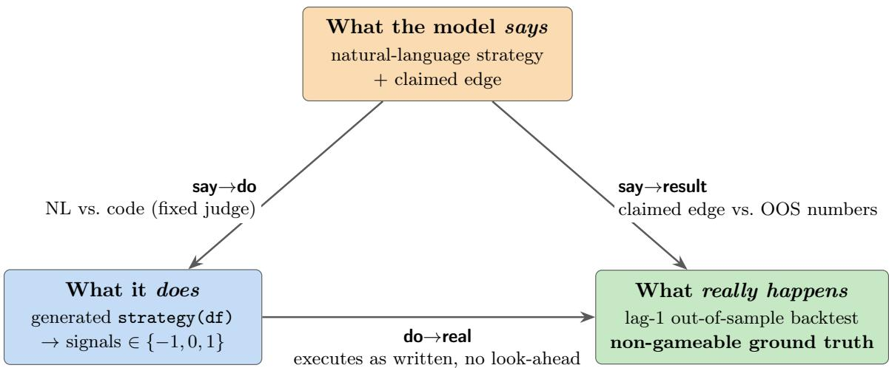
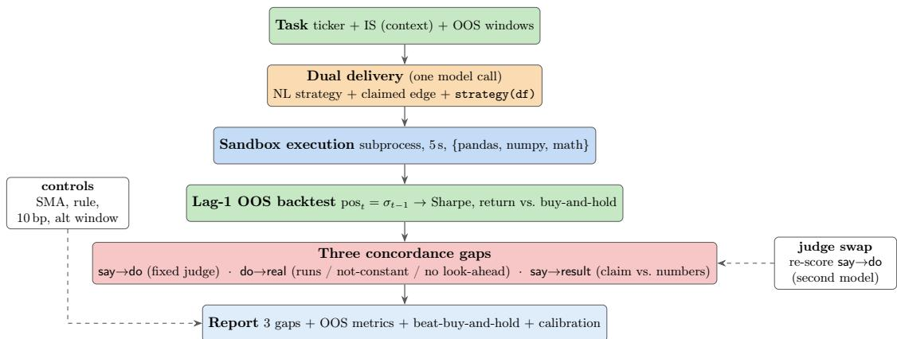
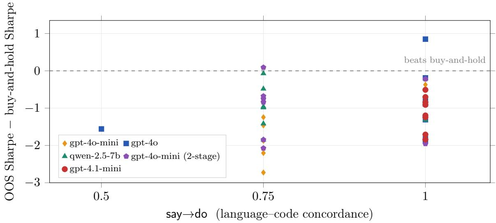
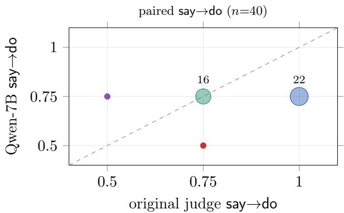
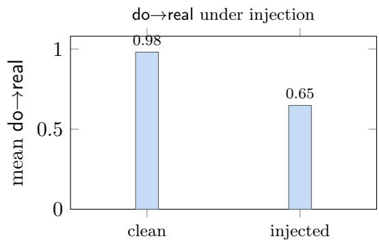

# FIDES: A Concordance Protocol for LLM-Generated Trading Strategies

Arther Tiana, Alex Dinga,\*, Simon Wua, Aaron Chana aDGrid AI

Corresponding author: alex.ding@dgrid.ai

## Abstract

An LLM asked for a trading strategy returns three artifacts at once: a natural-language rationale, an executable implementation, and—once run—a track record. Whether these are the same object is rarely checked. We present FIDES, a measurement protocol that treats them as three views to be reconciled rather than one deliverable to be graded. Through dual delivery— a single model call that returns both a natural-language strategy (with an explicit claimed edge) and a self-contained strategy(df) function—FIDES executes the code in a sandbox against a lag-one out-of-sample backtest the model cannot game, and scores three concordance gaps in [0, 1]: say→do (does the code implement the stated rules?), do→real (does it execute as written, without look-ahead?), and say→result (does the claimed edge survive the numbers?). On 8 liquid US ETFs across four models plus a two-stage elicitation arm (40 strategies; 2023–24 out-of-sample), three findings stand out, and none is flattering. First, concordance does not predict profit: the most speech–code consistent model (say→do = 1.00) still loses to buy-andhold, only 2 of 40 strategies beat it, and a plain sma(50,200) rule outperforms every model’s mean Sharpe. Second, self-assessment is badly calibrated: 32 of 40 strategies claim to beat buy-and-hold and exactly one does—a 3.1% hit rate. Third, the language–code judge is not an oracle: swapping it for a second model flips say→do on more than half of items (exact agreement 16/40, mean |∆| = 0.15). A look-ahead dose–response validates the execution gap—injecting Close.shift(-1) drops do→real by 0.33 on average—while we disclose, as a negative result, that our runtime future-information probe fired on neither clean nor injected code. We frame FIDES as a protocol for measurement fidelity, not a claim about market performance, and delimit external validity—including a model roster constrained to what our inference catalog served—as future work.

## 1 Introduction

Large language models are increasingly asked not merely to discuss markets but to produce trading strategies outright—as natural-language rationales, as runnable code, and, through agent frameworks, as systems that place orders [11, 25, 29]. A single such request returns three artifacts at once: the strategy the model states in prose, the strategy its code actually implements, and the track record that strategy realizes when run. It is natural to treat these as one deliverable and grade it—did the code run, was the return positive—but that skips the prior question of whether the three artifacts even describe the same strategy. A fluent rationale can be paired with code that quietly does something else; code that runs cleanly can be silently peeking at future bars; and a confident claim to beat the market can sit atop a track record that does not. In finance these gaps are not cosmetic: acting on a stated rationale when the code diverges, or trusting a backtest that looked ahead, loses real money.

No existing evaluation reconciles the three views jointly. Code-generation benchmarks measure functional correctness against hidden unit tests [1, 7], but there is no unit test for did the code implement the English, and a generated trading strategy has no reference implementation to dif against. Financial LLM benchmarks grade domain knowledge and question answering [24, 26–28], not the internal consistency of a produced strategy. Return-prediction and trading-agent studies pursue profit directly [11, 25, 29] and thereby inherit the well-documented hazards of that target— backtest overfitting, data snooping, and look-ahead bias [3, 4, 13, 23]—hazards acute enough that beating a passive benchmark out of sample is the exception, not the rule [2, 8], and severe enough that look-ahead leakage is now studied specifically for LLMs [5]. Closest in spirit, work on chainof-thought faithfulness shows that a model’s stated reasoning need not reflect the computation that produced its answer [9, 19]; but it operates on multiple-choice reasoning, where the “answer” is a label, rather than on an artifact whose correctness is settled by a non-gameable outcome.

We introduce FIDES, a measurement protocol that reconciles the three artifacts rather than grading one. FIDES uses dual delivery: a single model call returns both a natural-language strategy (with an explicit claimed edge) and a self-contained strategy(df) function, so the language and the code come from one act of reasoning and can be compared without a translation step. It then executes the code in a sandbox and scores three concordance gaps, each in [0, 1] with 1 fully concordant: say→do asks whether the code implements the stated rules, scored by a fixed, noncandidate language–code judge; do→real asks whether the code executes as written, without static look-ahead; and say→result asks whether the claimed edge survives the out-of-sample numbers. The load-bearing design choice is the anchor: outcomes come from a lag-one out-of-sample backtest the model cannot game—positions act on the prior bar, so the code cannot trade on information it should not have—and do→real and say→result are thereby grounded in what actually happened rather than in another model’s opinion (Figure 1). Profit is a side metric, and we deliberately do not repair or search over strategies to raise it: doing so would optimize the very quantity whose relationship to the stated logic we are trying to measure.

Across 8 liquid US ETFs and four models (40 strategies; 2023–24 out-of-sample), the protocol turns up three results, none of them flattering to the models. Concordance does not predict profit: the most speech–code consistent model scores a perfect say→do of 1.00 yet loses to buy-and-hold, only 2 of 40 strategies beat it, and a plain sma(50,200) rule outperforms every model’s mean Sharpe. Self-assessment is badly calibrated: 32 of 40 strategies claim to beat buy-and-hold and exactly one does, a 3.1% hit rate. And the language–code judge is not an oracle—swapping it for a second model flips say→do on more than half of items (exact agreement 16/40, mean $| \Delta | = 0 . 1 5 )$ , so a single judge’s scores should be read as one measurement, not ground truth. We validate the execution gap with a look-ahead dose–response (injecting Close.shift(-1) drops do→real by 0.33 on average) and, in the same spirit, disclose a negative result: our runtime future-information probe fired on neither clean nor injected code—a limitation of that probe rather than evidence of clean execution. This cheap-first, measure-what-you-can, audit-the-judge stance is shared with a broader line of the authors’ work on trustworthy evaluation [14, 16–18]; here the object—an LLM’s own trading strategy—and the mechanism—three gaps anchored by a non-gameable backtest—are new. We present FIDES as a protocol for measurement fidelity, not as a claim about market performance, and we are explicit that the model roster is constrained by what our inference catalog actually served (Section 4).

FIDES makes three contributions:

• A concordance protocol for generated strategies. Dual delivery plus three interval-valued gaps—say→do, do→real, say→result—that reconcile an LLM’s stated logic, its code, and its realized track record, anchored by a lag-one out-of-sample backtest the model cannot game

  
Figure 1: The three artifacts of an LLM trading strategy and the three gaps FIDES measures. A single model call (dual delivery) yields a natural-language strategy and its code; executing the code on a lag-one out-of-sample backtest yields a realized track record. Only the backtest is non-gameable ground truth. Each gap is scored in [0, 1] (1 = fully concordant); profit is treated as a side metric, not the objective.

(Section 3).

• An empirical study with uncomfortable findings. On 8 ETFs across four models we show that concordance does not predict profit, that models’ self-reported edge is badly calibrated, and that the language–code judge is not robust to being swapped—each quantified against passive, rule-based, and cost-adjusted baselines (Section 5).

• Honest diagnostics and delimited scope. A validated look-ahead dose–response, a disclosed failed runtime probe, a zero-LLM rule baseline, and a two-stage elicitation control, framed throughout as measurement fidelity with external validity—including model coverage—delimited as future work (Sections 5 and 6).

## 2 Related Work

LLMs for finance and trading. Domain models such as BloombergGPT [24] and open eforts such as FinGPT [28], together with benchmark suites [26, 27], establish that LLMs can be adapted to financial text; return-prediction and agentic-trading studies go further and ask models to forecast or to trade [11, 25, 29]. These eforts grade domain knowledge or chase realized profit. Neither asks our question—whether a single generated strategy’s prose, code, and outcome agree—which is prior to, and orthogonal to, whether the strategy makes money.

Evaluating generated code. Functional-correctness benchmarks score generated programs against held-out unit tests [1, 7], treating execution as ground truth. We adopt the same execute-to-verify philosophy but face a harder object: a trading strategy has no reference implementation, so there is no test that says whether the code matches the stated rules. FIDES therefore pairs execution (for do→real and say→result) with an explicit language–code comparison (for say→do), and anchors the former in a non-gameable market backtest rather than a unit test.

Faithfulness of stated reasoning. A model’s stated rationale need not reflect the computation that produced its output: chain-of-thought explanations can be plausible yet unfaithful [9, 19], even as chain-of-thought and self-consistency improve accuracy on reasoning [21, 22]. This literature motivates say→do, but it operates where the “answer” is a label; FIDES moves the question to an artifact—code—whose behaviour is settled by a backtest, so the say–do gap can be checked against something the model cannot argue with.

LLM-as-judge and its biases. Strong models are now standard evaluators [10, 30], but their verdicts carry documented biases—order efects, verbosity, and self-preference—and shift with superficial factors [6, 20]. Because say→do is the one gap we score with an LLM, we treat the judge as a measurement to be audited: we fix a non-candidate judge and re-score every item with a second model (Section 5), reporting the disagreement as a first-class result rather than assuming the judge is an oracle.

Backtest overfitting, data snooping, and look-ahead bias. A large finance literature shows that impressive backtests routinely fail out of sample—through overfitting, selection, and multiple testing [2–4], and through data snooping over trading rules [13, 23]—so that beating a passive benchmark is rare [8], and Sharpe ratios must be read with these hazards in mind [12]. Look-ahead leakage in particular is now studied for LLMs [5]. We take these as design constraints: our outcome anchor is a strict lag-one out-of-sample backtest, profit is never optimized inside the loop, and do→real includes an explicit look-ahead check whose sensitivity we validate by injection.

Trustworthy, cost-aware evaluation. FIDES continues a line of the authors’ work on cheapfirst, self-auditing evaluation [14–18]. The shared stance—measure what cheap signals can settle, escalate or distrust only where they cannot, and quantify the fallible component rather than hide it— carries over; the object (an LLM’s own trading strategy) and the mechanism (three gaps anchored by a non-gameable backtest) are new.

## 3 Protocol Design

## 3.1 Problem setup and notation

A task fixes a ticker and two date windows: an in-sample window (shown to the model as context only—no in-sample fitting is performed) and an out-of-sample (OOS) window on which the strategy is scored. A single model call on a task yields three things: a natural-language strategy s, a selfcontained function c = strategy(df), and a one-sentence claimed edge e. Executing c produces a signal series $\sigma \in \{ - 1 , 0 , 1 \} ^ { T }$ (short, flat, long), which a fixed backtester turns into an OOS Sharpe S and return R, alongside buy-and-hold references $S _ { \mathrm { b h } } , R _ { \mathrm { b h } }$ . FIDES reports three gaps, each in [0, 1] with 1 concordant: $g _ { \mathsf { s a y \to d o } } ( s , c ) , g _ { \mathsf { d o \to r e a l } } ( c , \sigma )$ , and $g _ { \mathsf { s a y \mathrm {  r e s u l t } } } ( e , S , R )$ . Profit (S, R) is retained as a side metric; the gaps, not the profit, are the object of study.

## 3.2 Dual delivery

The central elicitation choice is to obtain the prose and the code from one completion. A single prompt requests a rule-based daily strategy (inputs, entry/exit, risk controls, and a line Claimed edge: ...) and a function strategy(df) returning a signal series, under the explicit instruction to use only information available at the close of day t to trade t+1. Because both artifacts come from one act of reasoning, the say–do comparison is not confounded by a separate translation step.

As a control we also run a two-stage variant that elicits the prose and then, in a second call, asks for code implementing that prose; we treat it as an elicitation ablation, not as a distinct model (Section 5).

## 3.3 The three gaps

say→do: language vs. code. A fixed judge model $J _ { 0 } \cdot$ —deliberately not one of the models under test—reads the prose and the code and returns four binary checks: whether the long/short/flat direction rules match (d), whether the indicators and lookbacks named in the text appear in the code (i), whether exits and risk rules match or are jointly absent (x), and whether the code adds no material extra rule (m). The gap averages them,

$$
g _ { \mathsf { s a y \to d o } } = \frac { 1 } { 4 } ( d + i + x + m ) , \qquad d , i , x , m \in \{ 0 , 1 \} ,\tag{1}
$$

scored at temperature 0. As a zero-LLM ceiling we also compute a rule variant $g _ { \mathsf { s a y } \to \mathsf { d o } } ^ { \mathrm { r u l e } } \mathrm { . }$ the fraction of lookback numbers named in the prose that also appear literally in the code.

do→real: code vs. execution. Executed against real OHLCV in a sandbox, the code earns three binary credits—it runs to a valid signal series $( \rho ) ;$ the signals are not constant (α, i.e. not a degenerate all-long/short/flat series); and the code contains no static look-ahead (ℓ), where ℓ=0 if any of a small set of leakage patterns (e.g. .shift(-n), .pct\_change(-n), center=True, .iloc[...+1]) match the source:

$$
\begin{array} { r } { g _ { \mathsf { d o } \to \mathsf { r e a l } } = \frac { 1 } { 3 } ( \rho + \alpha + \ell ) , \qquad \rho , \alpha , \ell \in \{ 0 , 1 \} . } \end{array}\tag{2}
$$

say→result: claim vs. outcome. The claimed edge is parsed for testable assertions and each is checked against the OOS numbers: a claim to beat buy-and-hold requires $S > S _ { \mathrm { b h } } \land R > R _ { \mathrm { b h } } ;$ a claim about Sharpe requires $S > 0 ;$ ; a claim of profit requires $R > 0$ . The gap is 1 if all triggered checks pass, 0 if any fails, and 0.5 if no testable claim is detected:

$$
g _ { \mathsf { s a y \to r e s u l t } } = \left\{ \begin{array} { l l } { 1 } & { \mathrm { a l l ~ t r i g g e r e d ~ c h e c k s ~ p a s s , } } \\ { 0 } & { \mathrm { s o m e ~ t r i g g e r e d ~ c h e c k ~ f a i l s , } } \\ { 0 . 5 } & { \mathrm { n o ~ t e s t a b l e ~ c l a i m ~ d e t e c t e d . } } \end{array} \right.\tag{3}
$$

## 3.4 The non-gameable backtest

Outcomes come from a strict lag-one engine: the position on day t is the signal from day t−1, so a strategy cannot act on the same-day close it is reacting to,

$$
\begin{array} { r } { \mathrm { p o s } _ { t } = \sigma _ { t - 1 } , \qquad r _ { t } = \mathrm { p o s } _ { t } \Bigl ( \frac { C _ { t } } { C _ { t - 1 } } - 1 \Bigr ) - \frac { b } { 1 0 ^ { 4 } } | \mathrm { p o s } _ { t } - \mathrm { p o s } _ { t - 1 } | , } \end{array}\tag{4}
$$

with annualized Sharpe $S = \sqrt { 2 5 2 } \overline { { r } } / \mathrm { s t d } ( r )$ . The main run uses zero cost $\scriptstyle ( b = 0 )$ ; a robustness ablation uses $b { = } 1 0$ bp one-way on turnover. Buy-and-hold sets $\mathrm { p o s } _ { t } \equiv 1$ on the same OOS slice; a long-only sma(50,200) crossover on the same engine is a non-LLM rule baseline. Strategies are never repaired or searched to raise S, which would break the identification the protocol provides.

## 3.5 Sandbox

Code runs in a child process with a wall-clock timeout (5 s) and a whitelist of imports (pandas, numpy, math, statistics); returned signals are coerced, clipped to $\{ - 1 , 0 , 1 \}$ , and reindexed to the bar index. A failed run is recorded as a row (with ρ=0), never a crash. Figure 2 shows the pipeline.

  
Figure 2: End-to-end pipeline. One model call yields prose and code; the code is executed and backtested on a lag-one OOS engine; the three gaps (red hub) reconcile prose, code, and realized outcome. The judge for say→do is audited by re-scoring with a second model; SMA, zero-LLM rule, cost, and alternate-window controls feed the report.

## 4 Experimental Setup

Universe and windows. The universe is eight liquid US ETFs spanning equities, size, international, bonds, gold, and sectors (SPY, QQQ, IWM, EFA, TLT, GLD, XLF, XLE). The in-sample window 2018–2022 is provided to the model as context only; the primary OOS window is 2023–2024, and an alternate 2020–2021 window is used for regime robustness (Table 7). Data are daily OHLCV on real tickers.

Models and coverage. Four models are run under dual delivery—gpt-4o-mini, gpt-4o, gpt-4.1-mini, and qwen-2.5-7b-instruct—giving 32 strategies (4 × 8), plus a two-stage arm on gpt-4o-mini (8 more), for 40 routing units at seed 42 and temperature 0.2. Coverage is deliberately disclosed as a limitation: Claude, Gemini, DeepSeek, Llama-70B, and Qwen-72B all returned model-not-found on our inference catalog, so the roster is OpenAI-heavy with one open model. This is an infrastructure constraint, not a design choice, and we do not present the leaderboard as a broad model comparison.

Judge and swap. say→do is scored by gpt-4o-mini; because that model is also on the leaderboard, we disclose the conflict and re-score every item with a second judge, qwen-2.5-7b-instruct (which is in turn circular on the qwen-7b rows). We report both judges and treat neither as ground truth.

Controls and metrics. Table 1 lists the controls. We report the three gaps; OOS Sharpe and return against buy-and-hold; the beat-buy-and-hold rate; position density (fraction of non-flat days); and calibration of self-reported edge (claimed vs. actual beat-buy-and-hold).

## 5 Results

## 5.1 Leaderboard

Table 2 reports per-model means. Two patterns appear before any ablation. The language–code gap is high across the board (say→do 0.81–1.00) and execution is largely clean (do→real 0.75–1.00), but say→result collapses—three of five arms score 0.00, meaning their stated edge never survives the numbers. Profit tracks say→result, not the other two gaps: every dual model’s mean OOS Sharpe is near or below zero, the best being a marginal gpt-4o at +0.07, and none is competitive with a passive rule (Section 5.2). The two-stage arm’s 0.001 position density marks it as almost always flat (Section 5.6), not as a better strategy.

Table 1: Controls and baselines. FIDES measures gaps on the model strategies; these reference points isolate whether concordance tracks anything about performance, and stress the measurements.
<table><tr><td>Control</td><td>Mechanism</td><td>Role</td></tr><tr><td>Buy-and-hold</td><td>always long on the OOS slice</td><td>passive benchmark</td></tr><tr><td>SMA(50,200)</td><td>long when SMA50 &gt; SMA200, else flat</td><td>non-LLM rule</td></tr><tr><td>Rule say→do</td><td>lookback-number overlap, zero LLM</td><td>say→do ceiling</td></tr><tr><td>Two-stage</td><td>prose, then code in a second call</td><td>translation control</td></tr><tr><td>10 bp cost</td><td>one-way cost on |∆position|</td><td>friction robustness</td></tr><tr><td>Alt window</td><td>2020-2021 OOS</td><td>regime robustness</td></tr><tr><td>Judge swap</td><td>re-score say→do with a second model</td><td>judge-robustness au- dit</td></tr></table>

Table 2: Leaderboard (per-model means, n=8 tasks each). Gaps in [0, 1]; Sharpe is OOS. “Run fails” counts strategies that did not execute to a valid signal series. The two-stage row is an elicitation arm, not a fifth model.
<table><tr><td>Model</td><td>say→do</td><td>do→real</td><td>say→result</td><td>OOS Sharpe</td><td>e pos. dens.</td><td>fails</td></tr><tr><td>gpt-4.1-mini</td><td>1.000</td><td>0.917</td><td>0.000</td><td>-0.097</td><td>0.290</td><td>1</td></tr><tr><td>gpt-4o</td><td>0.938</td><td>1.000</td><td>0.125</td><td>+0.070</td><td>0.639</td><td>0</td></tr><tr><td>gpt-4o-mini</td><td>0.844</td><td>0.917</td><td>0.000</td><td>-0.341</td><td>0.307</td><td>1</td></tr><tr><td>qwen-2.5-7b</td><td>0.812</td><td>0.917</td><td>0.000</td><td>+0.030</td><td>0.776</td><td>1</td></tr><tr><td>gpt-4o-mini (two-stage)</td><td>0.812</td><td>0.750</td><td>0.500</td><td>-0.012</td><td>0.001</td><td>2</td></tr></table>

## 5.2 Concordance does not predict alpha

Figure 3 plots each strategy’s say→do against its Sharpe excess over buy-and-hold. If speech–code concordance bought performance, high-say→do points would sit above the zero line; they do not. gpt-4.1-mini, the only model with a perfect say→do of 1.00 on every task, lies entirely below zero—its most “faithful” strategies still lose to holding the ETF. Across all 40 strategies only 2 beat buy-and-hold on both Sharpe and return (Table 4), and the gate makes the non-relationship explicit: strategies with say→do=1.0 beat buy-and-hold once in 22 (4.5%), those with say→do<1.0 once in 18 (5.6%)—indistinguishable (Table 3). A plain sma(50,200) rule on the same engine averages 0.583 OOS Sharpe, above every model’s mean, and only 8 of 40 LLM strategies clear even that rule’s Sharpe.

The result survives perturbation: the beat-buy-and-hold count is 2 in the 2020–21 window and 2 after 10 bp costs (Table 4), and the two 2023–24 winners are not the same tasks as the 2020– 21 winners. Both 2023–24 winners are on TLT, and one is degenerate—a two-stage strategy that stayed flat while TLT fell, “beating” a declining benchmark without taking a position (Section B).

  
Figure 3: Concordance does not predict alpha. Each point is one strategy: x is its say→do score, y its OOS Sharpe minus buy-and-hold Sharpe (above the dashed line beats buy-and-hold on Sharpe). The perfect-say→do gpt-4.1-mini (red) is entirely below the line; only two of forty strategies clear it, both on TLT and one of them a flat degenerate.

Table 3: Gate: does higher say→do beat buyand-hold more often? It does not.
<table><tr><td>say→do bucket</td><td>n</td><td>beat buy-and-hold</td></tr><tr><td>= 1.0 (high)</td><td>22</td><td>1</td></tr><tr><td>&lt; 1.0 (low)</td><td>18</td><td>1</td></tr></table>

Table 4: Beating buy-and-hold is rare and fragile (/ 40).
<table><tr><td>Criterion</td><td>count</td></tr><tr><td>beat buy-and-hold, 2023-24</td><td>2</td></tr><tr><td>beat buy-and-hold, 2020–21</td><td>2</td></tr><tr><td>beat buy-and-hold, 2023–24 after 10 bp</td><td>2</td></tr><tr><td>OOS Sharpe &gt; SMA(50,200)</td><td>8</td></tr></table>

Concordance is thus necessary bookkeeping, not evidence of edge.

## 5.3 Self-assessment is badly calibrated

Models are confident and wrong. Of the 40 strategies, 32 explicitly claim to beat buy-and-hold; exactly 1 does—a 3.1% hit rate. This is why say→result is 0.00 for most arms (Table 2): the gap records claimed outperformance that the OOS numbers refuse. The lone two-stage say→result of 0.50 is not a counterexample—it is mostly the “no testable claim detected” default (Equation (3)) firing on terse two-stage rationales, not a detected-and-confirmed edge. A user acting on these models’ stated confidence would have been wrong 31 times out of 32.

## 5.4 The language–code judge is not an oracle

say→do is the one gap scored by an LLM, so we audit it by swapping the judge. Under the original judge (gpt-4o-mini) the five arms span 0.81–1.00; under a Qwen-7B judge they compress to a flat 0.72–0.75 (Table 5, Figure 4). The two judges agree exactly on 16 of 40 items, with mean absolute diference 0.15, and the model ranking collapses. Two caveats sharpen the reading: the original judge is itself on the leaderboard, and the swap judge shares a family with the qwen-7b rows it scores. A zero-LLM rule—counting lookback numbers common to prose and code—averages 0.975; the surface tokens almost always match, so this is a weak ceiling, not a substitute for the judge, and its near-saturation is itself evidence that say→do’s discriminating signal lives where a keyword rule cannot see. The lesson is not that one judge is right, but that a single judge’s score is one measurement: we report both and neither as ground truth.

Table 5: say→do under two judges. Rankings collapse; the swap judge compresses to ≈ 0.75.
<table><tr><td>Model</td><td>orig Qwen-7B</td></tr><tr><td>gpt-4.1-mini</td><td>1.000 0.750</td></tr><tr><td>gpt-4o</td><td>0.938 0.750</td></tr><tr><td>gpt-4o-mini</td><td>0.844 0.750</td></tr><tr><td>two-stage</td><td>0.812 0.750</td></tr><tr><td>qwen-2.5-7b</td><td>0.812 0.719</td></tr></table>

  
Figure 4: Bubble area ∝ count. Points sit on a flat $y { \approx } 0 . 7 5$ band, far from the y=x line for highsay→do items.

Table 6: Look-ahead diagnostics. The static check responds to injected leakage; the runtime probe does not fire either way (disclosed limitation).
<table><tr><td>Check</td><td>value</td></tr><tr><td>strategies injected (ran OK)</td><td>35</td></tr><tr><td>mean do→real drop after shift(-1)</td><td>0.333</td></tr><tr><td>runtime flag on clean code runtime flag on injected code</td><td>0 0</td></tr></table>

  
Figure 5: do→real before and after injecting Close.shift(-1) (35 running strategies).

## 5.5 Look-ahead dose–response, and an honest negative

Two of the three gaps are anchored by execution, so we validate the anchor rather than assume it. We inject a one-line look-ahead— Close.shift(-1) at the top of each strategy—and re-score. Over the 35 strategies that still run, mean do→real drops by exactly 0.333 (Figure 5, Table 6): the static look-ahead check catches the injected leakage in every case, the intended dose–response.

We also report a negative result plainly. An independent runtime probe—shufle post-cut prices and test whether in-sample-era signals move—fired on neither clean nor injected code (0 of 40 both times). This is a limitation of that probe, not evidence of clean execution: the shufle boundary (2022-06-01) and the observation window (through 2021-12-31) do not overlap, so a short-lookback strategy is unafected by construction. We keep the static check, drop the runtime claim, and flag the fix as future work (Section 7).

## 5.6 Dual vs. two-stage elicitation

Dual delivery is the default; two-stage (prose, then a separate code call) controls for the translation step. On the shared gpt-4o-mini base, dual is modestly higher on both language–code gaps (say→do 0.844 vs. 0.812; do→real 0.917 vs. 0.750). Two-stage looks less bad on Sharpe (−0.012 vs. −0.341) only because its strategies are almost always flat—position density 0.001 versus 0.307—so it neither loses nor wins. Staying out of the market is not a strategy; the concordance gaps, not the Sharpe, are the honest comparison.

## 6 Discussion

Implications. The headline is a separation. An LLM can be highly self-consistent—its code faithfully implements its prose—and still produce nothing that beats holding the asset. Concordance and competence are diferent axes, and conflating them, as a fluent, well-coded, confidently-captioned strategy invites, is exactly the error a procurement or deployment decision cannot aford. Two of our three gaps can be measured cheaply and reliably from execution; the third—self-reported edge—is the one to distrust, and it is both the most confident and the least calibrated signal in the system.

Practitioner guidance. Read the gaps separately, not as an average. do→real (does it run, without look-ahead) is a hard gate worth trusting. say→result (does the claim hold) should be treated as a claim to be checked against a non-gameable backtest, never taken at face value. say→do should be scored by a fixed judge that is not among the models under test, and reported alongside a swapped-judge number so readers can see its fragility. Profit should never be optimized inside the loop: repairing strategies to raise Sharpe destroys the identification the protocol provides.

Limitations. Several bound our claims. The sample is small (40 strategies, single seed at temperature 0.2), so we report efects, not confidence intervals. Model coverage is OpenAI-heavy with one open model, because Claude, Gemini, DeepSeek, Llama-70B, and Qwen-72B all returned not-found on our inference catalog—an infrastructure limitation, but a real one. The universe is eight liquid US ETFs and rule-based daily strategies only; we do not test intraday, multi-asset, portfolio, or learned strategies. The say→do judge is an LLM (audited but not resolved), the original judge sits on the leaderboard, and the swap judge is circular on its own family’s rows. say→result uses a keyword parser that returns “undetermined” when it cannot match a claim. Most importantly, FIDES measures internal concordance and execution fidelity, not tradability: a concordant, honestly-captioned strategy is not thereby a good one, and nothing here is investment advice or a claim that any model beats the market.

## 7 Conclusion and Future Work

We presented FIDES, a protocol that treats an LLM trading strategy as three artifacts to reconcile— the stated logic, the generated code, and the realized track record—and scores three concordance gaps anchored by a backtest the model cannot game. Across 8 ETFs and four models, concordance did not predict profit, self-reported edge was badly calibrated (1 of 32 claims held), and the one LLM-scored gap was not robust to swapping the judge; a look-ahead dose–response validated the execution gap while we disclosed a runtime probe that did not work. We frame these as measurement results and delimit external validity as future work.

The clearest next steps follow the limitations: broaden the model roster once catalog access allows and add seeds for confidence intervals; replace the keyword say→result parser with a claim extractor; fix the runtime look-ahead probe so its shufle boundary overlaps the observation window, or replace it with a stronger dynamic test; and extend beyond single-asset rule strategies toward portfolios and a genuine forward test, so that concordance can eventually be related to realized, out-of-sample tradability rather than to a closed backtest.

## References

[1] Jacob Austin, Augustus Odena, Maxwell Nye, Maarten Bosma, Henryk Michalewski, David Dohan, Ellen Jiang, Carrie Cai, Michael Terry, Quoc Le, and Charles Sutton. Program synthesis with large language models. arXiv preprint arXiv:2108.07732, 2021.

[2] David H. Bailey and Marcos López de Prado. The deflated Sharpe ratio: Correcting for selection bias, backtest overfitting, and non-normality. The Journal of Portfolio Management, 40(5):94–107, 2014.

[3] David H. Bailey, Jonathan M. Borwein, Marcos López de Prado, and Qiji Jim Zhu. Pseudomathematics and financial charlatanism: The efects of backtest overfitting on out-of-sample performance. Notices of the American Mathematical Society, 61(5):458–471, 2014.

[4] David H. Bailey, Jonathan M. Borwein, Marcos López de Prado, and Qiji Jim Zhu. The probability of backtest overfitting. Journal of Computational Finance, 20(4):39–70, 2017.

[5] Mostapha Benhenda. Look-ahead-bench: A standardized benchmark of look-ahead bias in point-in-time LLMs for finance. arXiv preprint arXiv:2601.13770, 2026.

[6] Guiming Hardy Chen, Shunian Chen, Ziche Liu, Feng Jiang, and Benyou Wang. Humans or LLMs as the judge? a study on judgement bias. In Proceedings of the 2024 Conference on Empirical Methods in Natural Language Processing (EMNLP), pages 8301–8327, 2024.

[7] Mark Chen, Jerry Tworek, Heewoo Jun, Qiming Yuan, Henrique Ponde de Oliveira Pinto, Jared Kaplan, Harri Edwards, Yuri Burda, Nicholas Joseph, Greg Brockman, et al. Evaluating large language models trained on code. arXiv preprint arXiv:2107.03374, 2021.

[8] Eugene F. Fama. Eficient capital markets: A review of theory and empirical work. The Journal of Finance, 25(2):383–417, 1970.

[9] Tamera Lanham, Anna Chen, Ansh Radhakrishnan, Benoit Steiner, Carson Denison, Danny Hernandez, Dustin Li, Esin Durmus, Evan Hubinger, Jackson Kernion, et al. Measuring faithfulness in chain-of-thought reasoning. arXiv preprint arXiv:2307.13702, 2023.

[10] Yang Liu, Dan Iter, Yichong Xu, Shuohang Wang, Ruochen Xu, and Chenguang Zhu. G-Eval: NLG evaluation using GPT-4 with better human alignment. In Proceedings of the 2023 Conference on Empirical Methods in Natural Language Processing (EMNLP), pages 2511–2522, 2023. arXiv:2303.16634.

[11] Alejandro Lopez-Lira and Yuehua Tang. Can ChatGPT forecast stock price movements? return predictability and large language models. arXiv preprint arXiv:2304.07619, 2023.

[12] William F. Sharpe. The Sharpe ratio. The Journal of Portfolio Management, 21(1):49–58, 1994.

[13] Ryan Sullivan, Allan Timmermann, and Halbert White. Data-snooping, technical trading rule performance, and the bootstrap. The Journal of Finance, 54(5):1647–1691, 1999.

[14] Arther Tian, Alex Ding, Frank Chen, Alan Wu, Aaron Chan, and Bruce Zhang. Design and evaluation of cost-aware PoQ for decentralized LLM inference. arXiv preprint arXiv:2512.16317, 2025.

[15] Arther Tian, Alex Ding, Frank Chen, Simon Wu, and Aaron Chan. Adaptive and robust cost-aware proof of quality for decentralized LLM inference networks. arXiv preprint arXiv:2601.21189, 2026.

[16] Arther Tian, Alex Ding, Frank Chen, Simon Wu, and Aaron Chan. A multi-dimensional quality scoring framework for decentralized LLM inference with proof of quality. arXiv preprint arXiv:2603.04028, 2026.

[17] Arther Tian, Alex Ding, Frank Chen, Simon Wu, and Aaron Chan. PoQ-Judge: A multiarchitecture evaluation framework for cost-aware proof-of-quality in decentralized LLM inference. arXiv preprint arXiv:2606.11196, 2026.

[18] Arther Tian, Alex Ding, Frank Chen, Simon Wu, and Aaron Chan. SFGA: A statistics-first gating architecture with adjudicative escalation for trustworthy SFT data procurement. arXiv preprint arXiv:2607.18960, 2026.

[19] Miles Turpin, Julian Michael, Ethan Perez, and Samuel R. Bowman. Language models don’t always say what they think: Unfaithful explanations in chain-of-thought prompting. In Advances in Neural Information Processing Systems (NeurIPS), volume 36, 2023. arXiv:2305.04388.

[20] Peiyi Wang, Lei Li, Liang Chen, Zefan Cai, Dawei Zhu, Binghuai Lin, Yunbo Cao, Qi Liu, Tianyu Liu, and Zhifang Sui. Large language models are not fair evaluators. In Proceedings of the 62nd Annual Meeting of the Association for Computational Linguistics (ACL), pages 9440–9450, 2024. arXiv:2305.17926.

[21] Xuezhi Wang, Jason Wei, Dale Schuurmans, Quoc Le, Ed Chi, Sharan Narang, Aakanksha Chowdhery, and Denny Zhou. Self-consistency improves chain of thought reasoning in language models. In International Conference on Learning Representations (ICLR), 2023. arXiv:2203.11171.

[22] Jason Wei, Xuezhi Wang, Dale Schuurmans, Maarten Bosma, Brian Ichter, Fei Xia, Ed Chi, Quoc V. Le, and Denny Zhou. Chain-of-thought prompting elicits reasoning in large language models. Advances in Neural Information Processing Systems (NeurIPS), 35:24824–24837, 2022. arXiv:2201.11903.

[23] Halbert White. A reality check for data snooping. Econometrica, 68(5):1097–1126, 2000.

[24] Shijie Wu, Ozan Irsoy, Steven Lu, Vadim Dabravolski, Mark Dredze, Sebastian Gehrmann, Prabhanjan Kambadur, David Rosenberg, and Gideon Mann. BloombergGPT: A large language model for finance. arXiv preprint arXiv:2303.17564, 2023.

[25] Yijia Xiao, Edward Sun, Di Luo, and Wei Wang. TradingAgents: Multi-agents LLM financial trading framework. arXiv preprint arXiv:2412.20138, 2024.

[26] Qianqian Xie, Weiguang Han, Xiao Zhang, Yanzhao Lai, Min Peng, Alejandro Lopez-Lira, and Jimin Huang. PIXIU: A large language model, instruction data and evaluation benchmark for finance. arXiv preprint arXiv:2306.05443, 2023.

[27] Qianqian Xie, Weiguang Han, Zhengyu Chen, Ruoyu Xiang, Xiao Zhang, Yueru He, Mengxi Xiao, Dong Li, Yongfu Dai, Duanyu Feng, et al. The FinBen: A holistic financial benchmark for large language models. In Advances in Neural Information Processing Systems (NeurIPS), volume 37, 2024. arXiv:2402.12659.

[28] Hongyang Yang, Xiao-Yang Liu, and Christina Dan Wang. FinGPT: Open-source financial large language models. arXiv preprint arXiv:2306.06031, 2023.

[29] Yangyang Yu, Haohang Li, Zhi Chen, Yuechen Jiang, Yang Li, Denghui Zhang, Rong Liu, Jordan W. Suchow, and Khaldoun Khashanah. FinMem: A performance-enhanced LLM trading agent with layered memory and character design. arXiv preprint arXiv:2311.13743, 2023.

[30] Lianmin Zheng, Wei-Lin Chiang, Ying Sheng, Siyuan Zhuang, Zhanghao Wu, Yonghao Zhuang, Zi Lin, Zhuohan Li, Dacheng Li, Eric P. Xing, Hao Zhang, Joseph E. Gonzalez, and Ion Stoica. Judging LLM-as-a-judge with MT-bench and chatbot arena. In Advances in Neural Information Processing Systems (NeurIPS), volume 36, 2023. arXiv:2306.05685.

## Appendix

## A Configuration

Table 7: Frozen v0 configuration.
<table><tr><td>Parameter</td><td>Value</td></tr><tr><td>universe</td><td>SPY, QQQ, IWM, EFA, TLT, GLD, XLF, XLE</td></tr><tr><td>in-sample (context only)</td><td>2018-01-01 - 2022-12-31</td></tr><tr><td>out-of-sample (primary)</td><td>2023-01-01- 2024-12-31</td></tr><tr><td>alt window (ablation)</td><td>2020-01-01 - 2021-12-31</td></tr><tr><td>dual models</td><td>gpt-4o-mini, gpt-4o, gpt-4.1-mini, qwen-2.5-7b-instruct</td></tr><tr><td>two-stage arm</td><td>gpt-4o-mini (elicitation ablation)</td></tr><tr><td>routing units</td><td>40 (32 dual + 8 two-stage)</td></tr><tr><td>seed / samples / temperature 42 / 1 / 0.2</td><td></td></tr><tr><td>backtest</td><td>post = σt−1; Sharpe ×√252</td></tr><tr><td>costs</td><td>0 bp (main); 10 bp one-way (ablation)</td></tr><tr><td>SMA baseline</td><td>50 / 200, long-only</td></tr><tr><td>sandbox</td><td>subprocess, 5 s, {pandas, numpy, math, statistics}</td></tr><tr><td>say→do judge lookback set (rule say→do)</td><td>gpt-4o-mini (orig); qwen-2.5-7b-instruct (swap) {5, 10, 14, 20, 21, 50, 100, 200}</td></tr></table>

## B The two “winners”

Only two of the forty strategies beat buy-and-hold on the 2023–24 window, both on TLT, and they illustrate opposite failure modes of reading a raw beat-buy-and-hold count.

Real-ish (gpt-4o / TLT). An RSI mean-reversion rule with a 20-day moving-average filter and a volume liquidity gate; claimed edge: that TLT “exhibits short-term mean-reversion . . . which should outperform a buy-and-hold.” It realized OOS Sharpe 0.759 vs. buy-and-hold −0.091 and return +0.084 vs. −0.055, at position density 0.098—a genuine, if sparse, edge on this one ticker and window.

Degenerate (gpt-4o-mini two-stage / TLT). A strategy that resolved to staying flat: zero position, zero return, and (correctly) no claim to beat buy-and-hold, so its say→result is undetermined rather than confirmed. It “beats” buy-and-hold only because TLT fell over the window and holding cash did not. Staying out of a falling asset is not a strategy; this row is why the calibration count of claimed-and-confirmed wins is 1, not 2.