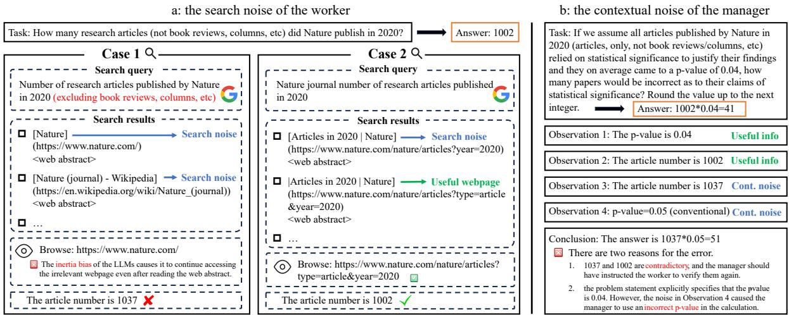
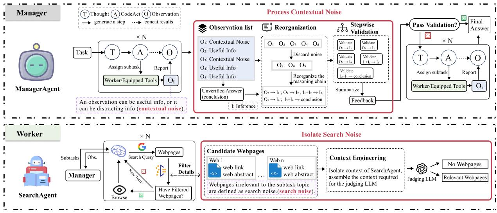
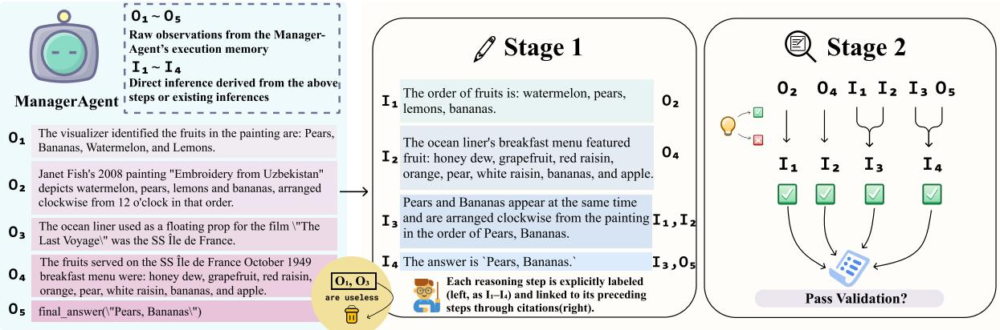
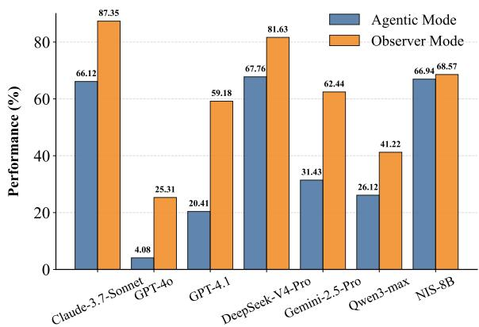
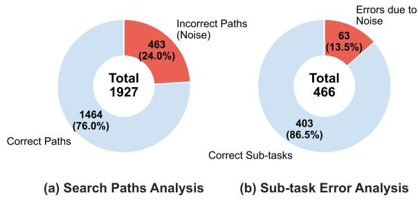
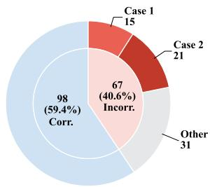
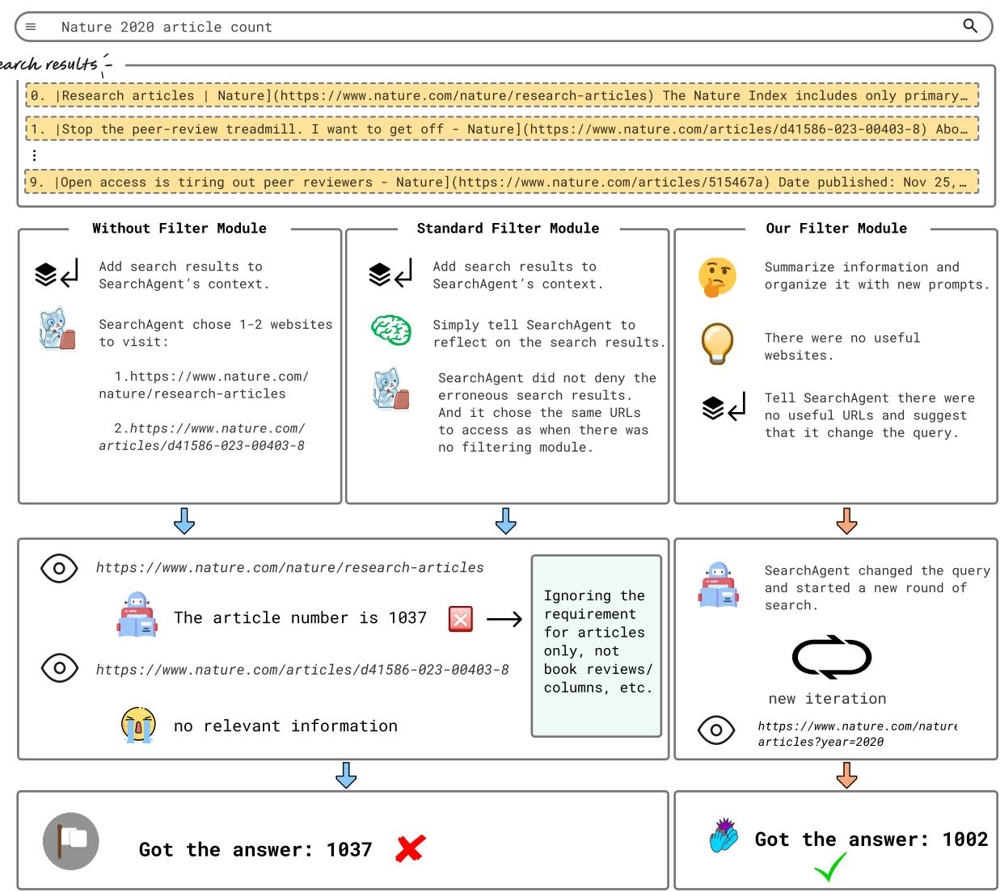
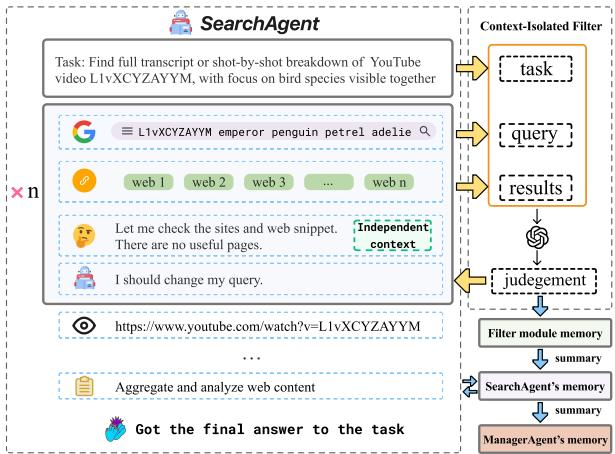
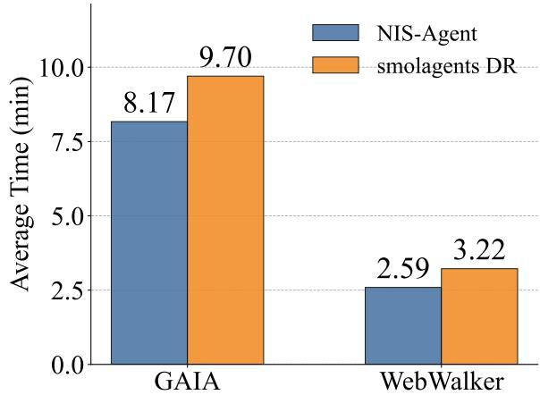

# From Inertia to Objectivity: Improving Deep Research Agents with Noise Isolation

Xiangxin Zhang<sup>1</sup>, Zhanwei Zhang<sup>2</sup>, Zhihang Fu<sup>3</sup>, Binbin Lin<sup>1</sup>, Wenxiao Wang<sup>1</sup>\*

<sup>1</sup>School of Software Technology, Zhejiang University

<sup>2</sup>State Key Lab of CAD&CG, Zhejiang University

<sup>3</sup>Alibaba Group

{xiangxinzhang, zhanweizhang, binbinlin, wenxiaowang}@zju.edu.cn zhihang.fzh@alibaba-inc.com

## Abstract

Web search agents powered by Large Language Models (LLMs) show strong promise, but deep research tasks expose a recurring failure mode: once an agent has produced a query, plan, or intermediate conclusion, it becomes less objective when later judging the consequences of that same action. We term this phenomenon inertia bias. To make it measurable, we introduce the IBIS benchmark, which controls the search observations while varying whether the model is evaluating the outcome of its own prior action. We find that models are substantially worse when they “own” the preceding search step, showing that self-authored action history can systematically distort subsequent judgment. We further show that this bias propagates into two forms of system-level degradation: search noise at the worker level and contextual noise at the manager level. To address this problem, we propose NIS-Agent, which applies context isolation at the two decision points most vulnerable to inertia bias: webpage triage and final-answer validation. Across GAIA, Web-WalkerQA, BrowseComp, and BrowseCompzh, NIS-Agent achieves competitive performance while reducing token cost by 33% compared to our baseline. We further train an 8B model to be intrinsically more resistant to inertia bias; under the same NIS-Agent framework, it attains average performance comparable to GPT-4o on deep research benchmarks.

## 1 Introduction

Large Language Models (LLMs) have rapidly evolved from simple predictors into powerful autonomous agents capable of multi-step reasoning, tool use, and complex planning (Java et al., 2025; Guo et al., 2024). These agent frameworks often employ iterative planning and execution loops (Yao et al., 2023; Significant Gravitas, 2023), and PlanBench frameworks (Valmeekam et al., 2023), augmented by memory mechanisms for long-horizon tasks (Packer et al., 2024; Xu et al., 2025). For existing web search agent frameworks, manager–worker communication patterns (Zhang et al., 2024) are commonly adopted. The manager devises high-level strategies and decomposes tasks, while the worker gathers relevant information for each subtask. Both the manager and the workers operate under the thought–action–observation paradigm (abbreviated as T, A, and O, respectively). Specifically, the manager formulates a plan (T), then invokes its own tools or the workers (A), and after receiving feedback (O), it continues iterating until it deems that a final answer has been obtained. For the worker, it first generates a query (T), then calls a tool to search for relevant webpages (A), obtains search results (O), selects the most relevant page (T), browses it (A), and acquires information (O), repeating this loop until enough evidence is collected to report back to the manager.

While these frameworks have achieved significant success, substantial limitations persist when they operate within open network environments, especially for deep research (see Section 2.2) tasks that require maintaining extensive contextual states. In this setting, we identify a specific agentic failure mechanism: LLMs tend to reinforce their own prior choices regardless of whether those choices were correct. We refer to this phenomenon as inertia bias. Concretely, once an agent has produced a query, plan, or intermediate conclusion, it becomes less objective when later judging the consequences of that same action. To rigorously investigate and quantify this phenomenon, we introduce IBIS (Inertia Bias in Information Seeking), a diagnostic benchmark designed to isolate the impact of contextual history on decision-making. IBIS specifically targets the information-seeking workflow of the worker, which involves generating a query, executing a search, and deciding whether to browse a page or revise the query. We construct scenarios where a query returns irrelevant search abstracts, making a re-search the only factually correct action. We then evaluate models under two controlled conditions. In Agentic Mode, the context includes the model’s own history of issuing that query. In Observer Mode, the same search results are presented as external information. We find that models in Agentic Mode fail significantly more often than in Observer Mode, demonstrating that LLMs lose objectivity when evaluating their own action history.

  
Figure 1: Two kinds of noise. Words in green and blue indicate useful information and noise, respectively. The words in red reveal the causes of the two types of noise. In subfigure (a), the <web abstract> denotes the summary information of webpages returned by Google search. For two seemingly similar queries, the results differ drastically. In Case 1, due to the inherent inertia bias of the LLMs, the worker continues searching along the query, and arrives at an incorrect answer. In subfigure (b), we omit the manager’s thought and action steps, retaining only the observation results. The contextual noise misleads the manager into faulty reasoning, ultimately yielding an incorrect answer.

This quantified inertia bias amplifies noise at two critical decision points in deep research agents. First, it generates search noise at the worker level (Figure 1(a)). Open network environments contain an overwhelming amount of heterogeneous information, and web search is highly sensitive to the wording of a query. After the SearchAgent steps onto an unproductive path, it could in principle reject that path in time by examining webpage abstracts alone. In practice, inertia bias makes the agent continue browsing pages that appear superficially relevant but are actually unhelpful. Second, the same self-reinforcing tendency creates contextual noise at the manager level (Figure 1(b)). If the manager forms an inaccurate plan or interpretation in the early stage, it tends to preserve that view as context grows longer and noisier. Instead of objectively reassessing the accumulated evidence, it selectively “cherry-picks” observations that appear compatible with its earlier thought, which can lead to premature termination or incorrect final answers.

To address this failure mode, we propose the Noise Isolation Search Agent (NIS-Agent), a web search framework designed to mitigate noise accumulation by restoring objectivity at key decision points. The main idea is not merely to reduce context length, but to isolate judgments from the agent’s own action history whenever that history is likely to bias subsequent decisions. Concretely, we introduce two context-isolation mechanisms. (i) For SearchAgent, we propose a context-isolated filter module that evaluates candidate webpages using only the task-relevant state, enabling the agent to reject irrelevant search results before browsing and thereby reducing search noise. (ii) For ManagerAgent, we propose an isolation-based stepwise validation module that reorganizes the reasoning chain and validates local inferences under isolated context, thereby reducing contextual noise near the final decision stage.

We build our agent on top of smolagents (Roucher et al., 2025b), and use the framework developed by the smolagents team for Deep Research, which we refer to as smolagents DR (Roucher et al., 2025a), as our initial baseline. Our experimental results demonstrate that NIS-Agent achieves a significant performance enhancement over the smolagents DR while reducing token cost by 33%. With stronger model configurations, NIS-Agent achieves state-of-the-art performance on both GAIA (Mialon et al., 2023) and WebWalkerQA (Wu et al., 2025a) benchmarks among open-source frameworks. Beyond mitigating inertia bias at inference time, we further train an 8B open-source model via SFT and GRPO to be intrinsically more resistant to it, yielding a small model whose deep-research performance is comparable to GPT-4o.

The contributions of our work are as follows:

• We identify inertia bias, an agentic failure mechanism in which LLMs lose objectivity toward their own action history, and we construct the IBIS benchmark to quantify it.

• We propose NIS-Agent, which uses context isolation to mitigate the noise accumulation exacerbated by inertia bias.

• We further train an 8B open-source model to be intrinsically less susceptible to inertia bias, achieving deep-research performance competitive with closed-source large models.

## 2 Related Work

## 2.1 Reasoning Bias and Self-Correction

LLMs exhibit persistent cognitive biases that hinder objective reasoning. Sycophancy describes the tendency to align with external user inputs rather than objective facts (Perez et al., 2022; Sharma et al., 2025), while confirmation bias causes models to favor evidence that supports a prior belief, skewing rationale generation (Wan et al., 2025). Inertia bias is distinct from both: its trigger is internal and action-oriented—the model becomes anchored to its own previously generated action (a query, plan, or intermediate conclusion) rather than to external human framing or a propositional belief. In agentic workflows, this broader family of biases undermines self-correction, as models often fail to detect errors within their own generated context (Huang et al., 2024). While frameworks such as Reflexion (Shinn et al., 2023) and CRITIC (Gou et al., 2024) introduce feedback loops to mitigate this, they typically operate within an accumulating context. We fundamentally decouple judgment from the model’s own action history and quantify the resulting loss of objectivity.

## 2.2 Deep Research

Deep research refers to conducting multi-step searches on the internet for complex tasks (OpenAI, 2025). For existing deep research agent frameworks, manager–worker communication patterns (Zhang et al., 2024) are commonly adopted. For the manager, reducing hallucinations and noise is crucial for improving system capability. For example, KnowAgent (Zhu et al., 2025b) introduces an action-knowledge base to constrain action path generation, Agent KB (Tang et al., 2025) utilizes a teacher model to guide the student model in searching and providing suggestions, and Agent Workflow Memory (Wang et al., 2024) reuses summarized sub-workflows. However, all of these methods rely on external experience databases. For the worker, ASCoT (Zhang et al., 2025) and Slow-Thinking (Gan et al., 2025) intervene at critical steps, while WebShaper (Tao et al., 2025) employs compositional Knowledge Projection (KP) operations to finely control the reasoning structure. Their common objective is to detect issues as early as possible and correct the action trajectory. Although these directions also modify how context is used, their main emphasis is memory reuse, action guidance, or early correction within the standard agent trajectory. By contrast, our work focuses on a distinct question: how to recover objectivity once the agent has become biased by its own action history. Accordingly, we use context isolation not as generic compression, but as a targeted debiasing intervention.

## 3 Inertia Bias in Information Seeking

To rigorously investigate and quantify inertia bias in LLM-based agents, we introduce the IBIS (Inertia Bias in Information Seeking) benchmark, a diagnostic benchmark designed to isolate the impact of action history on decision-making.

## 3.1 Inertia Bias as an Agentic Failure Mechanism

In our search pipeline, the ideal behavior is straightforward: the agent generates a query, inspects the returned abstracts, and abandons the current search path when those results are clearly irrelevant. However, when the agent evaluates those results together with its own preceding action history, the actual behavior differs systematically from this ideal. The model tends to select URLs even though the summaries already indicate that the current query is unproductive. This behavior reflects a form of path dependence to the agent’s own prior action.

As discussed in Section 2.1, this phenomenon is conceptually distinct from both sycophancy and confirmation bias. The source of influence is not external user framing, as in sycophancy, nor merely commitment to a prior belief, as in confirmation bias. Instead, the model becomes anchored to its own previously generated query, plan, or intermediate conclusion. For deep research agents, this distinction matters because the same self-reinforcing mechanism affects both page triage and answer validation. It therefore creates a unified failure mode that manifests as search noise at the worker level and contextual noise at the manager level.

  
Figure 2: Framework of NIS-Agent. The two components highlighted in red in the figure constitute the main focus of our optimization. Manager: ManagerAgent alternates between thought, codeact, and observation. The actions include invoking Worker or calling equipped tools. It continuously accumulates contextual noise during iteration. When it deems the answer ready, the system automatically triggers the validation module (see Section 4.2). If the answer passes validation, it is output immediately; otherwise, the ManagerAgent resumes the iteration. Worker: SearchAgent is responsible for collecting information from the web. We specifically optimized the filter stage (see Section 4.1) to mitigate search noise. Once collecting enough information, SearchAgent will organize and report it.

## 3.2 Dataset Construction

We first prompt qwen3-max (Team, 2025a) to generate 1,016 candidate factual question tasks across multiple domains. These tasks require specific, verifiable answers, such as statistics, dates, or measurements. For each task theme, the model also generates search queries with varying levels of specificity to simulate real-world user queries. Three independent LLMs, namely Gemini-2.5-Pro, DeepSeek-R1, and Claude-3.7-Sonnet, then score each candidate along three dimensions: the factual verifiability of the question, the uniqueness of the answer, and the consistency between the query and the information need. This scoring step yields 712 high-quality samples.

For each retained sample, we execute its query against Google Search. Three annotators then independently categorize the results, based on the retrieved web abstracts, into one of three classes. The first class is Should Re-search, where the abstracts are clearly irrelevant to the information need. The second class is Should Visit Page, where at least one result appears relevant based on its title and snippet. The third class is Should Return Answer, where the abstract already contains the answer. We keep only the samples on which all three annotators agree, and we discard the rest. This way, annotation quality and consistency are controlled without an additional arbitration step. The resulting agreement, measured by Fleiss’ κ, is 0.684, indicating substantial agreement. IBIS targets the decision point most directly related to inertia bias, namely whether to continue or abandon the current search path. We therefore retain only the first two categories, yielding 245 Should Re-search samples and 209 Should Visit Page samples. Full details of this protocol are provided in Appendix A.4.

## 3.3 Evaluation Protocol

The IBIS benchmark is established to evaluate two dimensions of agentic performance. First, to assess general reasoning capabilities in determining the optimal next step, we utilize the Full Set, measuring the model’s baseline accuracy in distinguishing whether search results are sufficient (warranting a page visit) or insufficient (necessitating a re-search). Second, to quantify the specific magnitude of inertia bias, we isolate the Should Re-search subset. In this subset, sticking to the current search path is factually incorrect. Therefore, a failure to reject the results serves as a direct indicator of the model’s irrational adherence to its previous action.

To rigorously decouple the influence of action history from content reasoning, we evaluate models under two controlled conditions with identical system prompts: Agentic Mode: The context includes a conversational history where the model itself explicitly calls the web\_search tool. The search results are presented as the direct observation of this self-initiated action, forcing the model to evaluate the outcome of its own decision. Observer Mode: The identical task and search results are provided as external reference information without an assistant turn indicating self-initiation. This places the model in a neutral stance, detaching the search results from its own authorship.

## 4 NIS-Agent

We propose the Noise Isolation Search Agent (NIS-Agent), a multi-agent framework for open-web deep research. Rather than redesigning the standard agent architecture, NIS-Agent intervenes at the two decision points most vulnerable to inertia bias: a context-isolated filter targets workerlevel search noise during webpage triage, and an isolation-based stepwise validation module targets manager-level contextual noise at final-answer validation. Figure 2 illustrates the framework.

## 4.1 Context-Isolated Filter Module

The SearchAgent issues a web\_search query and then chooses which returned webpages to browse. As established in Section 3, inertia bias makes this triage step unreliable: the agent tends to commit to webpages produced by its own query even when the abstracts already indicate they are irrelevant, wasting computation and injecting noise downstream.

To address this, we design a context-isolated filter module that screens candidate search results before webpage access. The key point is that the relevance judgment is deliberately separated from the SearchAgent’s full execution trajectory. A standard in-context filtering step is still asked to reason inside the same history that produced the current query, and thus remains vulnerable to rationalizing that query. Our module instead reconstructs a compact decision context from the task-relevant state and evaluates candidate webpages under isolation. This allows the model to judge whether the current search path should be continued or abandoned with greater objectivity. When relevance is insufficient, the module triggers adaptive query rewriting, thereby improving retrieval efficiency and accuracy. Figure 8 illustrates the workflow of this module.

## 4.2 Isolation-based Stepwise Validation Module

Existing methods either directly output the answer (Roucher et al., 2025b) or hand the entire reasoning trace to an LLM for validation (Wu et al., 2025a). Both reuse the same context that produced the answer, leaving the validation step exposed to inertia bias. We therefore introduce an isolationbased stepwise validation module, automatically triggered when the ManagerAgent first deems an answer ready. It audits the proposed solution in two stages. The workflow is shown in Figure 3. Stage 1: Reasoning Process Reorganization. In the first stage, the module extracts key reasoning steps from the ManagerAgent’s execution memory, including the original task description and the relevant tool-call sequences. It then reorganizes these scattered execution steps into a coherent reasoning chain. Each reasoning step is explicitly labeled and linked to its preceding steps through citations, ensuring that intermediate steps are properly referenced. Stage 2: Stepwise Reasoning Validation. In the second stage, the module independently verifies each reorganized reasoning step. To do so, it examines whether the inference logically follows from the referenced conditions by extracting these conditions, constructing condition-inference pairs, and evaluating correctness step by step. For any problematic steps, the module provides concrete suggestions for improvement. If all steps are valid, it confirms the final answer as correct. If the answer passes validation, the ManagerAgent produces the final answer. Otherwise, the ManagerAgent reevaluates the provided suggestions with full context and decides whether to overrule them or proceed with another round of iteration.

## 5 NIS-8B

NIS-Agent mitigates inertia bias at inference time on top of frontier closed-source models. We further ask whether a much smaller open-source model can be trained to be intrinsically less susceptible to inertia bias. We explore this question with a

Which of the fruits shown in the 2008 painting "Embroidery from Uzbekistan" were served as part of the October 1949 breakfast menu for the ocean liner that was later used as a floating prop for the film "The Last Voyage"? Give the items as a comma-separated list, ordering them in clockwise order based on their arrangement in the painting starting from the 12 o'clock position. Use the plural form of each fruit.

  
Figure 3: Workflow of the isolation-based stepwise validation module. This module is automatically triggered when the ManagerAgent generates its final answer for the first time. Stage 1: The module reorganizes the reasoning chain behind the ManagerAgent’s answer by extracting the raw execution history and pruning irrelevant context. In this process, each reasoning step is explicitly labeled, providing structured input for the next stage. Stage 2: For each step in the reasoning chain, we independently validate only the local inference between its premise and conclusion. For example, in $a  b  c ,$ we validate a → b and $b \to c$ separately. After obtaining all suggestions, they are fed back to the ManagerAgent as guidance for its subsequent actions (continue iterating or outputting the answer).

two-stage training pipeline on Qwen3-8B (Team, 2025b), resulting in a model we name NIS-8B.

## 5.1 Supervised Fine-tuning.

The SFT stage targets two complementary capabilities. The first is procedural competence: producing well-formed tool calls and adhering to the structured output protocol expected by an agent loop. For this, we draw on a publicly available tool-use corpus (Liu et al., 2024). The second is task-distribution warm-up for the subsequent RL stage: we synthesize decision examples following the IBIS construction protocol using a strong external teacher, supervising the model directly on gold actions. Since both data sources are disjoint from our evaluation benchmarks, the SFT stage does not contaminate the test sets we report on.

## 5.2 Reinforcement Learning with Group-Relative Policy Optimization.

SFT establishes an initial prior by imitating gold actions, but imitation alone cannot correct the model when it makes inertia-biased decisions during its own rollouts. We therefore continue training with GRPO (Shao et al., 2024) on top of the SFT checkpoint, allowing the model to internalize anti-inertia behavior through self-exploration and feedback.

Each training prompt places the agent immediately after its own first web\_search observation, so a rollout consists of a single tool-call decision:

revise the query, browse a candidate page, or terminate. We define the reward for this decision as

$$
R = 0 . 1 \cdot R _ { \mathrm { f o r m a t } } + 0 . 9 \cdot R _ { \mathrm { a c t i o n } } ,
$$

where $R _ { \mathrm { f o r m a t } }$ indicates whether the rollout adheres to the expected agent output protocol, and R<sub>action</sub> indicates whether the chosen action is judged correct against a pre-computed reference rubric (see Appendix D). Concentrating the reward at the exact decision point where inertia bias manifests provides a denser credit-assignment signal than evaluating the full trajectory’s final answer. The 0.1 / 0.9 weighting follows the practice established by WebSailor (Li et al., 2025a). Training details are reported in Appendix D.

## 6 Experiment

## 6.1 Experimental Setup

Benchmarks. We evaluate our method on two primary deep-research benchmarks: (i) GAIA (Mialon et al., 2023), a widely-adopted benchmark for General AI Assistants, with tasks spanning multimodal analysis, tool use, web search, and complex reasoning. This benchmark is organized into three difficulty levels from 1 (easiest) to 3 (hardest). (ii) WebWalkerQA (Wu et al., 2025a), which evaluates the ability of agents to browse subpages. In addition, to assess broader transferability, we further report results on BrowseComp (Wei et al.,

Table 1: Main experimental results. The best results are highlighted in bold, and the second-best are underlined. Results in gray are our own reproductions, as they were not officially reported. Except for methods marked with ‡, where the Pass@n metric was not explicitly stated in their official publications, all results are under the Pass@1 metric. † denotes that the method is evaluated on the text-only subset of the GAIA validation set (103 samples).
<table><tr><td rowspan="2">Method</td><td rowspan="2">Model</td><td colspan="4">General AI Assistant (GAIA)</td><td rowspan="2">WebWalkerQA Avg.</td></tr><tr><td>Level 1</td><td>Level 2</td><td>Level 3</td><td>Avg.</td></tr><tr><td>Agent-KB</td><td>GPT-4.1</td><td>79.25</td><td>58.14</td><td>34.62</td><td>61.21</td><td></td></tr><tr><td>smolagents DR</td><td>GPT-40</td><td>66.04</td><td>55.29</td><td>30.77</td><td>54.88</td><td>46.50</td></tr><tr><td>smolagents DR</td><td>GPT-4.1</td><td>69.81</td><td>60.47</td><td>34.62</td><td>59.39</td><td>53.00</td></tr><tr><td>OWL</td><td>Claude-3.7-Sonnet</td><td>84.91</td><td>68.60</td><td>42.31</td><td>69.70</td><td>-</td></tr><tr><td>OAgents</td><td>Claude-3.7-Sonnet</td><td>77.36</td><td>66.28</td><td>46.15</td><td>66.67</td><td></td></tr><tr><td>WebExplorer‡</td><td>Claude-Sonnet-4</td><td></td><td>一</td><td></td><td>68.30†</td><td>61.70</td></tr><tr><td>BrowseMaster‡</td><td>DeepSeek-R1-0528</td><td>1</td><td></td><td>一</td><td>68.00†</td><td>62.10</td></tr><tr><td>AWorld</td><td>Claude-Sonnet-4</td><td>一</td><td></td><td></td><td>67.89†</td><td></td></tr><tr><td>MiroFlow</td><td>GPT-5</td><td></td><td></td><td></td><td>71.90</td><td>52.60</td></tr><tr><td>MemoBrain</td><td>GLM-4.6</td><td>79.50</td><td>71.20</td><td>50.00</td><td>71.80</td><td>66.50</td></tr><tr><td>NIS-Agent(Ours)</td><td>GPT-4o</td><td>81.13</td><td>58.14</td><td>34.62</td><td>61.82</td><td>57.50</td></tr><tr><td>NIS-Agent(Ours)</td><td>GPT-4.1</td><td>83.02</td><td>67.44</td><td>38.46</td><td>67.88</td><td>59.00</td></tr><tr><td>NIS-Agent(Ours)</td><td>Claude-3.7-Sonnet</td><td>84.62</td><td>72.41</td><td>50.00</td><td>72.73</td><td>68.50</td></tr><tr><td>NIS-Agent(Ours)</td><td>DeepSeek-V4-Pro</td><td>84.91</td><td>83.72</td><td>65.38</td><td>81.21</td><td>75.00</td></tr><tr><td>NIS-Agent(Ours)</td><td>NIS-8B</td><td>83.92</td><td>63.95</td><td>26.92</td><td>63.64</td><td>59.00</td></tr></table>

2025) and BrowseComp-zh (Zhou et al., 2025). Finally, to show that inertia bias is not specific to deep research, we also study AIME 2024 (MAA, 2024) and AIME 2025 (MAA, 2025) in a separate reasoning-only setting.

For GAIA, we use its entire public validation set, which consists of 165 queries. For WebWalkerQA, BrowseComp and BrowseComp-zh, we randomly sample 200 examples, consistent with the settings used by most baselines. We adhere to the experimental setup of Webthinker (Li et al., 2025b), where the accuracy for these tasks is evaluated by Qwen2.5-72B-Instruct (Team, 2024). For AIME, we report average accuracy across five runs.

Models. We design our framework based on smolagents (Roucher et al., 2025b). For the main GAIA and WebWalkerQA experiments, we evaluate four model configurations: GPT-4o (OpenAI, 2024), GPT-4.1 (OpenAI, 2025), Claude 3.7 Sonnet (Anthropic, 2025a), and DeepSeek-V4-Pro (DeepSeek-AI, 2026). For the IBIS benchmark, we additionally include Gemini-2.5-Pro (DeepMind, 2025) and Qwen3-max (Team, 2025a). For the more challenging BrowseComp and BrowseComp-zh evaluations, we report results with Claude Sonnet 4 (Anthropic, 2025b).

Baselines. We compare our method against a broad set of strong deep research baselines. The open-source baselines include smolagents DR (Roucher et al., 2025a), BrowseMaster (Pang et al., 2025), AWorld (Xie et al., 2025), OWL (Hu et al., 2025), OAgents (Zhu et al., 2025a), Agent-KB (Tang et al., 2025), WebExplorer (Liu et al., 2025), MiroFlow (Su et al., 2026), Memo-Brain (Qian et al., 2026), Agentic Reasoning (Wu et al., 2025b). We also report closed-source systems, including OpenAI DR (OpenAI, 2025) and Metaso DR (Metaso, 2025).

## 6.2 Diagnosing Inertia Bias with IBIS

We utilize our proposed IBIS benchmark to explicitly quantify inertia bias across different LLMs. As shown in Figure 4, switching from Agentic Mode to Observer Mode yields a performance improvement of approximately 15% to 30% across almost all models. This significant gap empirically confirms the prevalence of inertia bias in mainstream LLMs. Notably, even in Observer Mode, the success rate for rejecting irrelevant results rarely exceeds 90%. This is primarily attributed to inherent model variance; as detailed in our analysis in Appendix B.1, models like GPT-4o exhibit a strong inherent preference for calling visit\_page regardless of context. Furthermore, NIS-8B shows minimal performance gap between the two modes, demonstrating stronger immunity to inertia bias. Since Agentic and Observer Mode share identical search results, this gap could in principle still reflect an interaction with search-result content rather than action-history ownership; a paired flip analysis in Appendix A.5 rules this out, showing that shallow surface features of the search results cannot predict which samples flip between modes (AUC ≈ 0.50). For results on the Should Visit Page subset and evaluation of our proposed Direct Mode, please refer to Appendix B.1.

  
Figure 4: Quantification of inertia bias on IBIS Should Re-search subset. Agentic Mode frames search results as self-initiated actions, while Observer Mode presents them as neutral external references.

## 6.3 Main Results in Deep Research

Main Results. Table 1 presents the main experimental results. Overall, NIS-Agent consistently outperforms existing workflow baselines. Specifically: (i) The comparisons using GPT-4.1 and GPT-4o provide direct evidence of our framework’s efficacy. Under both model configurations, NIS-Agent achieves substantial improvements over the smolagents DR baseline on both benchmarks, with gains reaching approximately 8 to 11 percentage points. (ii) When powered by Claude-3.7- Sonnet, NIS-Agent achieves 72.73% on GAIA and 68.50% on WebWalkerQA, outperforming competing frameworks that rely on models of comparable or even greater capability, such as OWL (Claude-3.7-Sonnet), WebExplorer (Claude-Sonnet-4) and MiroFlow (GPT-5). (iii) Equipped with DeepSeek-V4-Pro, the most capable frontier model at the time of evaluation, NIS-Agent sets a new state-of-theart among open-source frameworks on both benchmarks, achieving 81.21% on GAIA and 75.00% on

Table 2: Results on BrowseComp and BrowseComp-zh.
<table><tr><td>Framework</td><td>Model</td><td>BC</td><td>BC-zh</td></tr><tr><td>OpenAI DR</td><td>03-SFT</td><td>51.5</td><td>42.9</td></tr><tr><td>Metaso DR</td><td></td><td>12.0</td><td>45.3</td></tr><tr><td>Agentic Reasoning</td><td>Deepseek-R1</td><td>5.5</td><td>29.0</td></tr><tr><td>WebExplorer</td><td>Claude-Sonnet-4</td><td>12.2</td><td>29.1</td></tr><tr><td>NIS-Agent (Ours)</td><td>Claude-Sonnet-4</td><td>25.0</td><td>45.9</td></tr></table>

Table 3: Token usage on GAIA, measured as average tokens per query.
<table><tr><td>Method</td><td>Input</td><td>Output</td><td>Total</td></tr><tr><td>smolagents DR</td><td>217.6k</td><td>2.2k</td><td>219.8k</td></tr><tr><td>NIS-Agent</td><td>144.1k ↓33.8%</td><td>3.2k ↑45.5%</td><td>147.3k ↓33.0%</td></tr></table>

WebWalkerQA, surpassing all compared baselines by a substantial margin. (iv) NIS-8B, trained as described in Section 5, remains competitive with the closed-source variants on both benchmarks: under the same NIS-Agent framework, its average GAIA performance is comparable to using GPT-4o as the backbone (63.64 vs. 61.82), showing that the model can be trained to be intrinsically less susceptible to inertia bias.

More Challenging Tasks. To further evaluate the robustness of NIS-Agent beyond GAIA and WebWalkerQA, we additionally test it on BrowseComp and BrowseComp-zh. Table 2 shows that NIS-Agent achieves 25.0 on BrowseComp and 45.9 on BrowseComp-zh. These results substantially outperform the compared open-source baselines. Although OpenAI DR remains stronger on BrowseComp overall, NIS-Agent is highly competitive in this broader comparison and attains the best result among the listed systems on BrowseComp-zh.

Efficiency. As shown in Table 3, on GAIA with GPT-4o, the NIS-Agent reduces average total token usage per query by 33% relative to smolagents DR, mainly by cutting input tokens.

## 6.4 Ablation Study

We conduct ablation experiments to assess whether the gains of NIS-Agent indeed come from the two proposed context-isolation mechanisms. On the full GAIA validation set with GPT-4o as the backbone model, removing the context-isolated filter or the isolation-based stepwise validation module causes a clear performance drop, as shown in Table 4. Since the Stage 2 validation operates on the output of Stage 1, we cannot ablate it independently, so we instead stack the two stages along their dependency direction: adding Stage 1 alone already improves GAIA accuracy from 56.96 to 58.79, and further adding Stage 2 raises it to 61.82. Both modules and both validation stages thus contribute a distinct and non-redundant share of the overall gain. We report a qualitative analysis of the remaining failure cases, including cases where context isolation itself hurts performance, in Appendix C.4.4.

Table 4: Ablation study of NIS-Agent components on GAIA with GPT-4o. Since the Stage 2 validation operates on the output of Stage 1, we stack the two stages along their dependency direction rather than removing them independently.
<table><tr><td rowspan="2">Method</td><td rowspan="2">Filter</td><td colspan="2">Validation</td><td rowspan="2">Avg.</td></tr><tr><td>Stage 1</td><td>Stage 2</td></tr><tr><td>NIS-Agent</td><td>√</td><td>√</td><td>V</td><td>61.82</td></tr><tr><td>w/o Filter</td><td>X</td><td>√</td><td>√</td><td>59.39</td></tr><tr><td>w/o Stage 2</td><td>√</td><td>√</td><td>X</td><td>58.79</td></tr><tr><td>w/o Validation</td><td></td><td>x</td><td>X</td><td>56.96</td></tr></table>

Table 5: Transfer results of the isolation-based stepwise validation module on AIME. Results are Avg@5.
<table><tr><td>Method</td><td>Model</td><td>AIME 2024</td><td>AIME 2025</td></tr><tr><td>CoT Validation</td><td>GPT-40</td><td>13.7</td><td>7.3</td></tr><tr><td>Our Validation</td><td>GPT-4o</td><td>29.4</td><td>26.7</td></tr><tr><td>CoT Validation</td><td>GPT-4.1</td><td>49.3</td><td>35.3</td></tr><tr><td>Our Validation</td><td>GPT-4.1</td><td>74.7</td><td>68.7</td></tr></table>

We further study AIME 2024 and AIME 2025 by attaching our validation module to a ReAct pipeline. Both settings use the same problemsolving prompt and differ only in the validation procedure. As shown in Table 5, replacing a standard CoT-based validation scheme with our validation module yields substantial improvements for both GPT-4o and GPT-4.1. These results provide further evidence that inertia bias is an inherent weakness of LLMs in multi-step iterative reasoning. And our method generalizes beyond deep research tasks.

## 7 Conclusions

In this work, we identify inertia bias, the tendency of LLMs to reinforce their prior choices regardless of objective correctness, and quantify it with the IBIS benchmark. We show that this bias amplifies both search noise and contextual noise in deep research, and propose NIS-Agent to isolate the judgments most vulnerable to action-history ownership. We further train an 8B open-source model to be intrinsically more resistant to inertia bias, attaining performance comparable to GPT-4o.

## 8 Limitations

Our work has several limitations that suggest directions for future research.

Mechanistic Interpretability. While we have empirically identified and quantified inertia bias, our analysis currently treats the underlying Large Language Model primarily as a black box. We do not investigate the mechanistic origins of this phenomenon to determine whether it stems from specific attention patterns, pretraining data distributions, or artifacts of reinforcement learning alignment. A deeper understanding of the internal representations that drive this self-reinforcing tendency is necessary to effectively address the root cause of the bias.

Generalization across Domains. We validate inertia bias on two types of tasks: information seeking, where IBIS isolates the decision boundary between browsing a page and reformulating a query, and multi-step mathematical reasoning, where our validation module also improves performance on AIME 2024 and AIME 2025 (Table 5). We therefore do not claim that inertia bias is a fully general phenomenon across all agentic workflows; rather, we speculate that it may extend to other agentic scenarios, and we leave coding agents, embodied agents, and planning agents as future work.

Risks of Isolation and Validation Failures. NIS-Agent isolates and validates the model’s own action history to counteract inertia bias, but this intervention is not guaranteed to be correct at every step. If the context-isolated filter mistakenly discards a relevant page, or if the isolation-based validation module endorses a flawed intermediate conclusion, the agent may still return an overconfident final answer, potentially citing sources that do not actually support it. In high-stakes information-seeking settings, such errors could mislead a user who trusts the agent’s answer without independently verifying it. We therefore view NIS-Agent as a mitigation that reduces, rather than eliminates, the risk of selfreinforcing errors, and we recommend that deployments in high-stakes settings keep a human in the loop to verify cited evidence before acting on the agent’s conclusions.

## 9 Ethics Statement

The datasets used in this study are publicly available and have been pre-anonymized. Furthermore, the IBIS benchmark proposed in this work does not contain any information that identifies individuals, nor does it include any offensive content. We have manually verified the data to ensure it adheres to ethical standards and privacy requirements.

Regarding the preparation of the manuscript, Large Language Models (LLMs) were utilized solely for language polishing and grammatical improvements. The core content and original ideas were authored entirely by the researchers. We have carefully reviewed and verified all AI-assisted edits to ensure accuracy and to prevent any potential hallucinations or misinterpretations.

## References

Anthropic. 2025a. Claude 3.7 sonnet and claude code.

Anthropic. 2025b. Claude sonnet 4. https://www. anthropic.com/claude/sonnet.

Qianben Chen, Tianrui Qin, King Zhu, Qiexiang Wang, Chengjun Yu, Shu Xu, Jiaqi Wu, Jiayu Zhang, Xinpeng Liu, Xin Gui, Jingyi Cao, Piaohong Wang, Dingfeng Shi, He Zhu, Tiannan Wang, Yuqing Wang, Maojia Song, Tianyu Zheng, Ge Zhang, and 5 others. 2026. Search more, think less: Rethinking longhorizon agentic search for efficiency and generalization. Preprint, arXiv:2602.22675.

Google / DeepMind. 2025. Gemini 2.5 pro. https://cloud.google.com/vertex-ai/ generative-ai/docs/models/gemini/2-5-pro.

DeepSeek-AI. 2026. Deepseek-v4: Towards highly efficient million-token context intelligence.

Zeyu Gan, Yun Liao, and Yong Liu. 2025. Rethinking external slow-thinking: From snowball errors to probability of correct reasoning. Preprint, arXiv:2501.15602.

Zhibin Gou, Zhihong Shao, Yeyun Gong, Yelong Shen, Yujiu Yang, Nan Duan, and Weizhu Chen. 2024. Critic: Large language models can selfcorrect with tool-interactive critiquing. Preprint, arXiv:2305.11738.

Taicheng Guo, Xiuying Chen, Yaqi Wang, Ruidi Chang, Shichao Pei, Nitesh V. Chawla, Olaf Wiest, and Xiangliang Zhang. 2024. Large language model based multi-agents: A survey of progress and challenges. Preprint, arXiv:2402.01680.

Mengkang Hu, Yuhang Zhou, Wendong Fan, Yuzhou Nie, Bowei Xia, Tao Sun, Ziyu Ye, Zhaoxuan Jin, Yingru Li, Qiguang Chen, Zeyu Zhang, Yifeng Wang,

Qianshuo Ye, Bernard Ghanem, Ping Luo, and Guohao Li. 2025. Owl: Optimized workforce learning for general multi-agent assistance in real-world task automation. Preprint, arXiv:2505.23885.

Jie Huang, Xinyun Chen, Swaroop Mishra, Huaixiu Steven Zheng, Adams Wei Yu, Xinying Song, and Denny Zhou. 2024. Large language models cannot self-correct reasoning yet. Preprint, arXiv:2310.01798.

Abhinav Java, Ashmit Khandelwal, Sukruta Midigeshi, Aaron Halfaker, Amit Deshpande, Navin Goyal, Ankur Gupta, Nagarajan Natarajan, and Amit Sharma. 2025. Characterizing deep research: A benchmark and formal definition. Preprint, arXiv:2508.04183.

Kuan Li, Zhongwang Zhang, Huifeng Yin, Liwen Zhang, Litu Ou, Jialong Wu, Wenbiao Yin, Baixuan Li, Zhengwei Tao, Xinyu Wang, Weizhou Shen, Junkai Zhang, Dingchu Zhang, Xixi Wu, Yong Jiang, Ming Yan, Pengjun Xie, Fei Huang, and Jingren Zhou. 2025a. Websailor: Navigating super-human reasoning for web agent. Preprint, arXiv:2507.02592.

Xiaoxi Li, Jiajie Jin, Guanting Dong, Hongjin Qian, Yutao Zhu, Yongkang Wu, Ji-Rong Wen, and Zhicheng Dou. 2025b. Webthinker: Empowering large reasoning models with deep research capability. Preprint, arXiv:2504.21776.

Junteng Liu, Yunji Li, Chi Zhang, Jingyang Li, Aili Chen, Ke Ji, Weiyu Cheng, Zijia Wu, Chengyu Du, Qidi Xu, Jiayuan Song, Zhengmao Zhu, Wenhu Chen, Pengyu Zhao, and Junxian He. 2025. Webexplorer: Explore and evolve for training long-horizon web agents. Preprint, arXiv:2509.06501.

Zuxin Liu, Thai Hoang, Jianguo Zhang, Ming Zhu, Tian Lan, Shirley Kokane, Juntao Tan, Weiran Yao, Zhiwei Liu, Yihao Feng, Rithesh Murthy, Liangwei Yang, Silvio Savarese, Juan Carlos Niebles, Huan Wang, Shelby Heinecke, and Caiming Xiong. 2024. Apigen: Automated pipeline for generating verifiable and diverse function-calling datasets. Preprint, arXiv:2406.18518.

MAA. 2024. American invitational mathematics examination 2024. https://maa.org. AIME contest problems.

MAA. 2025. American invitational mathematics examination 2025. https://maa.org. AIME contest problems.

Metaso. 2025. Metaso deepresearch. https://metaso. cn/. Accessed: 2026-04.

Grégoire Mialon, Clémentine Fourrier, Craig Swift, Thomas Wolf, Yann LeCun, and Thomas Scialom. 2023. Gaia: a benchmark for general ai assistants. Preprint, arXiv:2311.12983.

OpenAI. 2024. Hello gpt-4o — openai. https:// openai.com/index/hello-gpt-4o/.

OpenAI. 2025. Introducing deep research.

OpenAI. 2025. Introducing gpt-4.1 in the api. https: //openai.com/index/gpt-4-1/.

Charles Packer, Sarah Wooders, Kevin Lin, Vivian Fang, Shishir G. Patil, Ion Stoica, and Joseph E. Gonzalez. 2024. Memgpt: Towards llms as operating systems. Preprint, arXiv:2310.08560.

Xianghe Pang, Shuo Tang, Rui Ye, Yuwen Du, Yaxin Du, and Siheng Chen. 2025. Browsemaster: Towards scalable web browsing via tool-augmented programmatic agent pair. Preprint, arXiv:2508.09129.

Ethan Perez, Sam Ringer, Kamile Lukoši˙ ut¯ e, Ka-˙ rina Nguyen, Edwin Chen, Scott Heiner, Craig Pettit, Catherine Olsson, Sandipan Kundu, Saurav Kadavath, Andy Jones, Anna Chen, Ben Mann, Brian Israel, Bryan Seethor, Cameron McKinnon, Christopher Olah, Da Yan, Daniela Amodei, and 44 others. 2022. Discovering language model behaviors with model-written evaluations. Preprint, arXiv:2212.09251.

Hongjin Qian, Zhao Cao, and Zheng Liu. 2026. Memobrain: Executive memory as an agentic brain for reasoning. Preprint, arXiv:2601.08079.

Aymeric Roucher, Albert Villanova del Moral, Thomas Wolf, Leandro von Werra, and Erik Kaunismäki. 2025a. Open-source deepresearch – freeing our search agents. https://huggingface.co/blog/ open-deep-research.

Aymeric Roucher, Albert Villanova del Moral, Thomas Wolf, Leandro von Werra, and Erik Kaunismäki. 2025b. ‘smolagents‘: a smol library to build great agentic systems. https://github.com/ huggingface/smolagents.

Zhihong Shao, Peiyi Wang, Qihao Zhu, Runxin Xu, Junxiao Song, Xiao Bi, Haowei Zhang, Mingchuan Zhang, Y. K. Li, Y. Wu, and Daya Guo. 2024. Deepseekmath: Pushing the limits of mathematical reasoning in open language models. Preprint, arXiv:2402.03300.

Mrinank Sharma, Meg Tong, Tomasz Korbak, David Duvenaud, Amanda Askell, Samuel R. Bowman, Newton Cheng, Esin Durmus, Zac Hatfield-Dodds, Scott R. Johnston, Shauna Kravec, Timothy Maxwell, Sam McCandlish, Kamal Ndousse, Oliver Rausch, Nicholas Schiefer, Da Yan, Miranda Zhang, and Ethan Perez. 2025. Towards understanding sycophancy in language models. Preprint, arXiv:2310.13548.

Noah Shinn, Federico Cassano, Edward Berman, Ashwin Gopinath, Karthik Narasimhan, and Shunyu Yao. 2023. Reflexion: Language agents with verbal reinforcement learning. Preprint, arXiv:2303.11366.

Significant Gravitas. 2023. AutoGPT.

Shiqian Su, Sen Xing, Xuan Dong, Muyan Zhong, Bin Wang, Xizhou Zhu, Yuntao Chen, Wenhai Wang, Yue Deng, Pengxiang Zhu, Ziyuan Liu, Tiantong Li, Jiaheng Yu, Zhe Chen, Lidong Bing, and Jifeng Dai. 2026. Miroflow: Towards high-performance and robust open-source agent framework for general deep research tasks. Preprint, arXiv:2602.22808.

Xiangru Tang, Tianrui Qin, Tianhao Peng, Ziyang Zhou, Daniel Shao, Tingting Du, Xinming Wei, Peng Xia, Fang Wu, He Zhu, Ge Zhang, Jiaheng Liu, Xingyao Wang, Sirui Hong, Chenglin Wu, Hao Cheng, Chi Wang, and Wangchunshu Zhou. 2025. Agent kb: Leveraging cross-domain experience for agentic problem solving. Preprint, arXiv:2507.06229.

Zhengwei Tao, Jialong Wu, Wenbiao Yin, Junkai Zhang, Baixuan Li, Haiyang Shen, Kuan Li, Liwen Zhang, Xinyu Wang, Yong Jiang, Pengjun Xie, Fei Huang, and Jingren Zhou. 2025. Webshaper: Agentically data synthesizing via information-seeking formalization. Preprint, arXiv:2507.15061.

Qwen Team. 2024. Qwen2.5: A party of foundation models.

Qwen Team. 2025a. Qwen3-max: Just scale it.

Qwen Team. 2025b. Qwen3 technical report. Preprint, arXiv:2505.09388.

Karthik Valmeekam, Matthew Marquez, Alberto Olmo, Sarath Sreedharan, and Subbarao Kambhampati. 2023. Planbench: An extensible benchmark for evaluating large language models on planning and reasoning about change. In Advances in Neural Information Processing Systems, volume 36, pages 38975–38987. Curran Associates, Inc.

Yue Wan, Xiaowei Jia, and Xiang Lorraine Li. 2025. Unveiling confirmation bias in chain-of-thought reasoning. Preprint, arXiv:2506.12301.

Zora Zhiruo Wang, Jiayuan Mao, Daniel Fried, and Graham Neubig. 2024. Agent workflow memory. Preprint, arXiv:2409.07429.

Jason Wei, Zhiqing Sun, Spencer Papay, Scott McKinney, Jeffrey Han, Isa Fulford, Hyung Won Chung, Alex Tachard Passos, William Fedus, and Amelia Glaese. 2025. Browsecomp: A simple yet challenging benchmark for browsing agents. Preprint, arXiv:2504.12516.

Jialong Wu, Wenbiao Yin, Yong Jiang, Zhenglin Wang, Zekun Xi, Runnan Fang, Linhai Zhang, Yulan He, Deyu Zhou, Pengjun Xie, and Fei Huang. 2025a. Webwalker: Benchmarking llms in web traversal. Preprint, arXiv:2501.07572.

Junde Wu, Jiayuan Zhu, Yuyuan Liu, Min Xu, and Yueming Jin. 2025b. Agentic reasoning: A streamlined framework for enhancing llm reasoning with agentic tools. Preprint, arXiv:2502.04644.

Zhitian Xie, Qintong Wu, Chengyue Yu, Chenyi Zhuang, and Jinjie Gu. 2025. Profile-aware maneuvering: A dynamic multi-agent system for robust gaia problem solving by aworld. Preprint, arXiv:2508.09889.

Wujiang Xu, Kai Mei, Hang Gao, Juntao Tan, Zujie Liang, and Yongfeng Zhang. 2025. A-mem: Agentic memory for llm agents. Preprint, arXiv:2502.12110.

Shunyu Yao, Jeffrey Zhao, Dian Yu, Nan Du, Izhak Shafran, Karthik Narasimhan, and Yuan Cao. 2023. React: Synergizing reasoning and acting in language models. In International Conference on Learning Representations (ICLR).

Dongxu Zhang, Ning Yang, Jihua Zhu, Jinnan Yang, Miao Xin, and Baoliang Tian. 2025. Ascot: An adaptive self-correction chain-of-thought method for latestage fragility in llms. Preprint, arXiv:2508.05282.

Yusen Zhang, Ruoxi Sun, Yanfei Chen, Tomas Pfister, Rui Zhang, and Sercan Ö. Arik. 2024. Chain of agents: Large language models collaborating on longcontext tasks. Preprint, arXiv:2406.02818.

Peilin Zhou, Bruce Leon, Xiang Ying, Can Zhang, Yifan Shao, Qichen Ye, Dading Chong, Zhiling Jin, Chenxuan Xie, Meng Cao, Yuxin Gu, Sixin Hong, Jing Ren, Jian Chen, Chao Liu, and Yining Hua. 2025. Browsecomp-zh: Benchmarking web browsing ability of large language models in chinese. Preprint, arXiv:2504.19314.

He Zhu, Tianrui Qin, King Zhu, Heyuan Huang, Yeyi Guan, Jinxiang Xia, Yi Yao, Hanhao Li, Ningning Wang, Pai Liu, Tianhao Peng, Xin Gui, Xiaowan Li, Yuhui Liu, Yuchen Eleanor Jiang, Jun Wang, Changwang Zhang, Xiangru Tang, Ge Zhang, and 5 others. 2025a. Oagents: An empirical study of building effective agents. Preprint, arXiv:2506.15741.

Yuqi Zhu, Shuofei Qiao, Yixin Ou, Shumin Deng, Shiwei Lyu, Yue Shen, Lei Liang, Jinjie Gu, Huajun Chen, and Ningyu Zhang. 2025b. KnowAgent: Knowledge-augmented planning for LLMbased agents. In Findings ofthe Associationfor Computational Linguistics: NAACL 2025, pages 3709– 3732, Albuquerque, New Mexico. Association for Computational Linguistics.

## A Additional Analysis of Inertia Bias in Web Search Agents

## A.1 The Phenomenon of Inertia Bias in the Search Process

In our agent search pipeline, we observe a discrepancy between the ideal and the actual behavior of the LLM. Ideally, the model should stop the search process once it determines that all retrieved results are irrelevant. However, when the agent design incorporates the full history of previous steps (including the LLM’s own queries), the model tends to continue selecting URLs even though it has already recognized them as irrelevant. This behavior reflects a form of path dependence or over-commitment.

• Step 1: Query Generation – The LLM produces a search query.

• Step 2: Result Retrieval – A search tool returns URLs and summaries.

• Step 3 (Ideal): If all results are irrelevant, stop the search.

• Observed Phenomenon: When the agent includes its full history, the LLM often continues selecting URLs even though they appear irrelevant.

## A.2 Quantitative Analysis of Inertia Bias.

Due to the iterative self-correcting capabilities inherent in autonomous agents, a failure during an initial search or browsing session does not necessarily preclude the possibility of recovering the correct path in subsequent steps. Consequently, relying solely on final task outcomes makes it difficult to quantitatively isolate task failures directly attributable to search noise caused by inertia bias. However, the negative impact of this bias is objectively real and measurable through process inefficiencies, specifically in the form of wasted reasoning steps and erroneous intermediate answers. Since current LLM-based automated evaluation methods are neither sufficiently realistic nor reliable enough to distinguish these subtle noise patterns from legitimate reasoning processes, we opted for a rigorous manual evaluation strategy.

To provide a precise quantitative assessment of how inertia bias affects performance, we conducted a manual statistical analysis focusing on errors induced by search noise and contextual noise. This study was executed using the smolagents + GPT-4.1 framework on the GAIA benchmark.

Impact of Search Noise. We analyzed the search noise resulting from inertia bias by recording the following metrics: (1) Total Searches: The total number of search actions performed. (2) Incorrect Paths due to Search Noise: The number of times search noise was not correctly identified, resulting in the agent following an incorrect path. (3) Total Sub-tasks: The total number of sub-tasks assigned to the SearchAgent (focusing on sub-tasks rather than macro-tasks, as each search is specific to a sub-task). (4) Sub-task Errors due to Search Noise: The number of times failing to identify search noise and following an incorrect path directly led to an erroneous conclusion for that sub-task. The results in Figure 5 indicate that search noise substantially impacts search efficiency, affecting 24.0% of total searches. Furthermore, although the agent can potentially compensate for invalid searches in subsequent iterations, the final conclusions of 13.5% of the sub-tasks are still adversely affected by this noise.

  
Figure 5: Analysis of search noise on GAIA. (a) Distribution of search paths, showing the proportion of incorrect paths caused by search noise. (b) Impact on sub-tasks, illustrating how search noise leads to erroneous conclusions.

  
Figure 6: Breakdown of errors by contextual noise on GAIA. The inner ring shows correct vs. incorrect answers, while the outer ring details the composition of errors: Case 1 (misinterpretation with complete observations) and Case 2 (premature termination with partial observations).

Impact of Contextual Noise. We further analyzed errors caused by context bias (noise) by categorizing them into two distinct cases: Case 1: The context contained all observations necessary to derive the final answer, and these observations were correct; however, the ManagerAgent reached an incorrect conclusion due to interference from other irrelevant information. Case 2: The context contained only partial observations necessary for the final answer (which were correct); however, due to interference from other information, the ManagerAgent prematurely concluded that sufficient information had been obtained, leading to an erroneous conclusion. As shown in Figure 6, contextual noise significantly influences the final conclusion. Among the incorrect answers, a notable portion resulted specifically from the agent’s inability to filter out contextual noise, either leading to misinterpretation of full information (Case 1) or premature termination based on partial information (Case 2).

## A.3 Conceptual Differentiation: Inertia Bias versus Related Biases

We place the conceptual differentiation in the appendix because the main text focuses on the empirical diagnosis and mitigation of inertia bias, while this section clarifies its boundary relative to adjacent bias categories.

Distinct triggering mechanism (vs. sycophancy). Sycophancy typically describes an LLM’s tendency to align with external user inputs or perceived human preferences, even when such alignment conflicts with facts (Perez et al., 2022; Sharma et al., 2025). Inertia bias is entirely internal. The model is not attempting to please the user; instead, it becomes irrationally anchored to its own previously generated action, such as a query, plan, or intermediate conclusion. One may loosely describe this as a form of “self-sycophancy,” but the operational trigger is different: the pressure comes from selfauthored action history rather than from external human framing.

Action-space focus (vs. confirmation bias). Confirmation bias usually concerns commitment to a prior belief or hypothesis, leading the model to favor evidence that supports that belief. Inertia bias, by contrast, is centered on the execution trajectory of the agent. It manifests as persistence in a flawed tool-use path or plan, even when new observations already indicate that the current trajectory should be revised. In this sense, the object of commitment is not merely a proposition, but the agent’s own prior action.

Behavioral measurability through IBIS. A further distinction of inertia bias in our work is that it is made behaviorally measurable. IBIS keeps the task and search observations fixed while manipulating whether the model “owns” the prior search action. This controlled design isolates the effect of action-history ownership on the next-step decision, enabling a more direct diagnosis of inertia bias than broad error-rate comparisons alone.

## A.4 Annotation Protocol and Quality Control

IBIS is not constructed in a single pass. We first prompt qwen3-max to generate 1,016 candidate samples spanning domains such as health, economy, technology, climate, and basic science. Three independent large models, namely Gemini-2.5-Pro, DeepSeek-R1, and Claude-3.7-Sonnet, then score each candidate along three dimensions: the factual verifiability of the question, the uniqueness of the answer, and the consistency between the query and the information need. Candidates that do not meet a minimum quality threshold on all three dimensions are discarded. This filtering step leaves 712 high-quality samples.

For each retained sample, we execute its query against Google Search. Three human annotators, acting as a neutral third party, then independently categorize the result based on the retrieved web abstract. Each sample is assigned to one of three classes. The first class is Should Re-search, where the abstracts are clearly irrelevant to the information need. The second class is Should Visit Page, where at least one result appears relevant based on its title and snippet. The third class is Should Return Answer, where the abstract already contains the answer, so visiting a page is unnecessary. A sample is retained only if all three annotators assign the same category. Any disagreement leads to exclusion rather than adjudication, so annotation quality and consistency are controlled without an additional arbitration step that could itself introduce bias. The resulting inter-annotator agreement, measured by Fleiss’ κ across the three categories, is 0.684, indicating substantial agreement. IBIS focuses on the decision point most directly tied to inertia bias, namely whether to continue or abandon the current search path. We therefore exclude the Should Return Answer category from the final benchmark, yielding the 245 Should Re-search and 209 Should Visit Page samples used throughout this paper.

## A.5 Ruling Out Surface-Feature Confounds via Paired Flip Analysis

Because Agentic Mode and Observer Mode share exactly the same task text and search results, differing only in whether the results are framed as the outcome of the model’s own prior action, our paired design already controls for the main effects of task content and search-result content. However, it does not by itself rule out an interaction between certain sample characteristics and the presentation mode. We therefore analyze pattern flips: samples in the Should Re-search subset that a given model answers correctly in one mode but incorrectly in the other, evaluated across the six general-purpose models studied in Figure 4.

Table 6: The effect of the context-isolated filter module on search efficiency. The table reports the average number of searches conducted by SearchAgent before and after the application of filtering. f/Ø denotes that no dedicated filter module is used, f/✓ denotes that the standard filter module is used, and f/□ denotes that the context-isolated filter module is used.
<table><tr><td>Method</td><td>Before Filter After Filter ↓</td></tr><tr><td> $\mathrm { N I S - A g e n t ^ { f / \mathrm { { 0 } } } }$  9.8</td><td>9.8</td></tr><tr><td> $\mathrm { N I S - A g e n t } ^ { \mathrm { f } / \sqrt { } }$  9.6</td><td>8.9↓9.18%</td></tr><tr><td> $\mathrm { N I S - A g e n t ^ { f / \square } }$  9.4</td><td>7.6↓22.45%</td></tr></table>

Empirically, flips are highly consistent in direction: 91.9% of flips point toward the inertia direction, i.e., the model correctly re-searches in Observer Mode but stays on the current search path in Agentic Mode, and this directional pattern holds consistently across models. To test whether this pattern could instead be explained by properties of the search results themselves, we extract 18 shallow surface features from each sample’s search results (e.g., number of results, snippet/title length, presence of date markers, query–snippet lexical overlap) and use them to predict (i) the direction of a flip and (ii) whether a given sample flips at all. Neither is predictable from these features: AUC $= 0 . 4 9 8 \ ( p \ : = \ : 0 . 5 6 )$ for flip direction and AUC $= 0 . 4 9 2 \ ( p = 0 . 6 4 )$ for flip occurrence, and no single feature’s correlation with the per-item Agenticvs-Observer gap survives multiple-comparison correction. These results indicate that the measured inertia-bias gap cannot be explained by the 18 shallow distributional features we measured, supporting our claim that it reflects action-history ownership rather than a search-result distribution artifact.

## B Additional Evidence for the Necessity of Isolation in Search

We specifically investigate why a dedicated contextisolated mechanism is necessary, rather than simply integrating a filtering step within the agent’s standard workflow. As established in Section 3, agents suffer from inertia bias—a tendency to rationalize their own prior actions. Consequently, when an agent is asked to self-evaluate search results within its own execution context, it lacks the objectivity to reject irrelevant information. Even when explicitly instructed to aggressively filter out non-essential content, the standard integrated approach yields suboptimal results compared to our isolated mechanism.

To this end, we conducted an additional set of contrastive experiments. For the filter module in SearchAgent, we adopt the GAIA subset mentioned in Section 6.3, which comprises 50 queries, and conducted a simple comparative experiment based on NIS-Agent. With GPT-4o as the base model, the results in Table 6 show that our module effectively filters out irrelevant webpages.

## B.1 Details of IBIS Experiments

We evaluate the 5 models mentioned in Section 6.1 and our trained model NIS-8B on the Should Visit Page subset. Furthermore, we employ our Context-Isolated Filter Module (Direct Mode) to independently assess the performance of different LLMs on the IBIS benchmark. The results are presented in Table 7. From the table, we observe the following:

• Divergent Model Tendencies. Models exhibit distinct behavioral biases regarding the next step. For instance, Claude-3.7-Sonnet maintains a more cautious stance, showing a higher propensity to call the web\_search tool to refine results. In contrast, GPT-4o demonstrates extreme confidence in its initial queries, heavily favoring the visit\_page tool, which leads to a collapse in performance on the Should Re-search task (only 4.08% accuracy in Agentic Mode).

• The “Confidence” from Inertia Bias. Interestingly, on the Should Visit Page subset, models in Agentic Mode consistently outperform those in Observer Mode. This does not imply superior reasoning in Agentic Mode; rather, it confirms the presence of inertia bias. Knowing its own action history, the model feels a “commitment” to its generated query and is statistically more inclined to click a page (visit\_page). This tendency artificially boosts accuracy when the page should be visited, but causes significant failures when the results are irrelevant (as seen in the Should Re-search subset). This contrast proves that the high performance in Agentic Mode on this subset is partly driven by bias rather than objective judgment.

• Validation of the Direct Mode Design. The Direct Mode is designed to evaluate relevance judgment by isolating the current query and candidate webpages from the model’s action history. On the Should Visit Page subset, Direct Mode achieves accuracy comparable to Agentic Mode and significantly higher than Observer Mode. This indicates that Direct Mode successfully avoids the performance degradation seen in Observer Mode, which stems from detaching the observation from the model’s own context. We argue that avoiding “search noise” (unnecessary browsing) must not come at the cost of missing relevant information. Therefore, a pure Observerstyle design—which lowers accuracy on valid pages—is unacceptable. In contrast, Direct Mode strikes an optimal balance: it maintains high recall on potential answers (matching the “confidence” of Agentic Mode) while significantly reducing the intake of irrelevant webpages compared to the biased Agentic Mode.

## C Details of NIS-Agent

## C.1 Workflow of Context-Isolated Filter Module

Figure 7 illustrates how NIS-Agent mitigates the inertia bias during the search phase.

Figure 8 illustrates the workflow of the contextisolated filter module.

## C.2 Web browser toolkit

Table 8 presents all search-related tools integrated into the SearchAgent.

## C.3 Implementation Details

On the GAIA and WebWalkerQA benchmarks, we set the temperature of all models to 0.0. For nonreasoning models, we limit the output token size to 4096. We implement the isolation-based stepwise validation module as a ValidationAgent, while conceptually it remains a module within the overall framework.

In terms of tool integration, we have authorized multiple Python standard libraries and third-party libraries for model code execution. The model can dynamically load and invoke the following libraries, ensuring that NIS-Agent is capable of

Task: If we assume all articles published by Nature in 2020 (articles, only, not book reviews/columns, etc) relied on statistical significance to justify their findings and they on average came to a p-value of 0.04, how many <sub>papers</sub> <sub>wou</sub>l<sub>d</sub> <sub>be</sub> <sub>incorrect</sub> <sub>as</sub> <sub>to</sub> <sub>their</sub> <sub>c</sub>l<sub>aims</sub> <sub>o</sub>f <sub>statistica</sub>l <sub>signi</sub>f<sub>icance</sub>? R<sub>ound</sub> <sub>the</sub> <sub>va</sub>l<sub>ue</sub> <sub>up</sub> <sub>to</sub> <sub>the</sub> <sub>next</sub> <sub>integer.</sub>

Subtask: Research how many research articles (excluding reviews, columns, etc.) were published by the journal "N<sub>a</sub>t<sub>u</sub>r<sub>e</sub> in 2020<sub>.</sub> Thi<sub>s</sub> <sub>s</sub>h<sub>ou</sub>ld b<sub>e</sub> th<sub>e</sub> t<sub>o</sub>t<sub>a</sub>l n<sub>u</sub>mb<sub>e</sub>r <sub>co</sub>nfirm<sub>e</sub>d fr<sub>o</sub>m <sub>c</sub>r<sub>e</sub>dibl<sub>e</sub> <sub>sou</sub>r<sub>ces</sub>, <sub>suc</sub>h <sub>as</sub> th<sub>e</sub> <sub>pu</sub>bli<sub>s</sub>h<sub>e</sub>r <sub>s</sub> editorial records or reputable journal indexing databases.

  
Figure 7: A comparison of search filter modules and their effect on answer accuracy. After obtaining the search results, the SearchAgent may process them in different ways. Without a filter module, the LLM simply selects a few seemingly most relevant webpages to visit. With a standard filter module, however, the selected pages are often still those that appear relevant but are in fact irrelevant, which is almost the same as the first case. In contrast, our filter module isolates the memory of the SearchAgent and retains only the most relevant content for evaluation, enabling a more objective judgment of relevance. It can also perform adaptive rewriting and re-iteration in time, thereby avoiding noise and making it easier to reach the correct answer.

<table><tr><td rowspan="7">images, tables, and web data.</td><td>handling complex input formats, including text, • requests</td><td>• pubchempy • PIL</td><td></td></tr><tr><td>• zipfile</td><td>• xml</td><td>• chess</td></tr><tr><td>• Os</td><td>• yahoo_finance • PyPDF2</td><td></td></tr><tr><td>• pandas</td><td>• Bio</td><td>• pptx</td></tr><tr><td>• numpy</td><td>• sklearn</td><td>• torch</td></tr><tr><td>16 • sympy</td><td>• scipy</td><td>• datetime</td></tr><tr><td>• json</td><td>• pydub</td><td>• fractions</td></tr></table>

Table 7: Model performance comparison on IBIS. The results represent the accuracy of the next-step decision. For the Should Visit Page task, calling the visit\_page tool is considered correct. Conversely, for the Should Re-search task, calling the web\_search tool is considered correct (whereas calling visit\_page is counted as an error).
<table><tr><td rowspan="2">Model</td><td colspan="3">Task: Should Visit Page</td><td colspan="3">Task: Should Re-search</td></tr><tr><td>Agentic Mode</td><td>Observer Mode</td><td>Direct Mode</td><td>Agentic Mode</td><td>Observer Mode</td><td>Direct Mode</td></tr><tr><td>Claude-3.7-Sonnet</td><td>97.61</td><td>89.95</td><td>97.61</td><td>66.12</td><td>87.35</td><td>75.51</td></tr><tr><td>deepseek-v4-pro</td><td>95.22</td><td>91.87</td><td>93.30</td><td>67.76</td><td>81.63</td><td>79.59</td></tr><tr><td>Gemini-2.5-Pro</td><td>98.09</td><td>96.17</td><td>98.56</td><td>31.43</td><td>62.44</td><td>46.12</td></tr><tr><td>GPT-4.1-2025-04-14</td><td>97.61</td><td>85.65</td><td>96.17</td><td>20.41</td><td>59.18</td><td>86.93</td></tr><tr><td>GPT-4o-2024-11-20</td><td>100.00</td><td>91.86</td><td>91.39</td><td>4.08</td><td>25.31</td><td>71.83</td></tr><tr><td>Qwen3-max</td><td>97.61</td><td>96.65</td><td>99.52</td><td>26.12</td><td>41.22</td><td>50.61</td></tr><tr><td>NIS-8B</td><td>97.61</td><td>91.87</td><td>92.34</td><td>66.94</td><td>68.57</td><td>73.46</td></tr></table>

Table 8: Web browser toolkit
<table><tr><td>Tool Name</td><td>Description</td><td>Input Parameters</td></tr><tr><td>web_search</td><td>Perform Google searches and retrieve search results</td><td>query, filter_year (optional)</td></tr><tr><td>fetch_html</td><td>Read and analyze the content of an HTML page</td><td>url, query</td></tr><tr><td>fetch_pdf</td><td>Read and analyze the content of a PDF page</td><td>url, query</td></tr><tr><td>visit_page</td><td>Returns transcript if the link is YouTube, otherwise downloads the web resource</td><td>url</td></tr><tr><td>find_archived_url</td><td>Finds historical content through web archive services</td><td>url, date</td></tr><tr><td>inspect_file_as_text</td><td>Reads the file as text and answers questions</td><td>file_path, question (optional)</td></tr></table>

  
Figure 8: Workflow of the context-isolated filter module. It extracts the task, query, and results from the SearchAgent’s memory and evaluates their relevance.

For both benchmarks, we report only the Pass@1 results, and all evaluations strictly follow the experimental protocols defined by GAIA and Web-WalkerQA. To ensure objectivity, we restrict our comparison of baselines to single-attempt performance metrics. This includes explicitly reported Pass@1 results and average accuracy scores from multiple experimental runs.

## C.4 Details of Deep Research Experiments

During the evaluation of smolagents DR, we modified the original smolagents DR code and integrated (or ported) some of NIS-Agent’s tools into smolagents DR to ensure a fair comparison. For example, since the original smolagents tool for viewing XLSX files could not recognize colors, we redeveloped a tool capable of identifying both colors and background graphics, and implemented it concurrently in both NIS-Agent and smolagents.

## C.4.1 Sources of Deep Research Results

All experimental results reported in paper are taken from the corresponding official papers. The only exception is the WebWalkerQA result for MiroFlow: since the original MiroFlow paper does not report a WebWalkerQA score, we use the reproduced result reported by Chen et al. (2026).

## C.4.2 Subset Reliability on WebWalkerQA

Due to the high cost of deep research tasks, evaluating on large benchmarks in full is prohibitive, and nearly all prior methods report results on a randomly sampled subset (e.g., WebExplorer, Browse-Master). Our use of 200 randomly sampled queries is consistent with this standard practice. To verify that our subset reliably reflects full-benchmark performance, we additionally ran NIS-Agent with Claude-3.7-Sonnet on the complete WebWalkerQA dataset (680 queries in total). The full-dataset accuracy is 69.26%, which is largely consistent with the 68.50% obtained on our 200-query subset. This confirms that random sampling of 200 queries provides a reliable estimate of performance on the full benchmark.

  
Figure 9: Average runtime per task.

## C.4.3 Run time

As shown in Figure 9, the average runtime of NIS-Agent is lower than that of smolagents DR. Furthermore, with the increase in task difficulty, the runtime savings achieved by NIS-Agent become more pronounced.

## C.4.4 Qualitative Failure Case Analysis

We manually inspect the trajectories of remaining failures on GAIA to understand where NIS-Agent still falls short. Failures attributable to context isolation itself are rare. The most common pattern occurs in the context-isolated filter module: a retrieved abstract appears only weakly relevant to the question, while the key evidence actually lies in the body of the page, and the filter mistakenly discards the page as irrelevant. For example, on a question that asks for a specific figure disclosed deep in a company’s annual report, the search snippet only mentions the report’s title and publication date, with no visible numeric content, so the filter judges the page as unrelated and skips it. Because NIS-Agent proceeds iteratively, a single such misjudgment does not always cause the task to fail outright; the agent can often recover through a followup search that surfaces the same evidence from a different page. For the isolation-based stepwise validation module, we do not observe a comparably recurring error pattern, since the ManagerAgent still sees the full context when acting on the validation module’s suggestions and can override a suggestion it judges unreasonable.

Beyond these isolation-specific cases, the large majority of remaining failures fall into four categories that are largely independent of context isolation. First, some tasks demand reasoning that exceeds the backbone model’s own ability, for instance multi-step arithmetic over figures scattered across several sources, so the agent retrieves the correct evidence but still derives the wrong final answer. Second, some tasks require chaining many search hops before the key evidence appears, and the agent exhausts its step budget before reaching it. Third, the target page for some tasks is very long, and the answer is buried in a location that keyword-based localization on the text browser fails to surface. Fourth, some target pages depend on JavaScript rendering or other dynamic content that our text-based browser tool cannot faithfully reproduce, so the relevant content is never made available to the agent in the first place.

## D Details of NIS-8B Training

Data. Both SFT and RL data follow the IBIS construction protocol: each prompt presents a multihop question, the agent’s first web\_search action, and a set of retrieved abstracts designed to require a non-trivial next decision. The SFT corpus contains 4,293 examples; the RL corpus contains 9,964 examples. Both are disjoint from our evaluation benchmarks.

For SFT, each prompt is paired with a gold action produced by a strong external teacher operating in Observer Mode, providing direct behavioral supervision on the inertia-bias decision point.

For RL, gold actions are not used as fixed supervised targets. Instead, each prompt is associated with a structured reference rubric generated offline by a strong evaluator (Claude Sonnet 4), and each rollout’s chosen action is graded online against this rubric during training.

Two-stage judge. A naive design would invoke a strong Observer-Mode LLM for every rollout, asking it to re-read the search results and judge the action in one pass. At GRPO group size K=32, this scales linearly with the number of rollouts and dominates the training cost. We instead decouple the judge into two stages:

Stage 1 (offline). Before training, we call a strong evaluator (Claude Sonnet 4 in our setup) once per prompt with the same isolationconditioned instruction used by the Observer-Mode evaluator at inference. Rather than returning a verdict, the evaluator emits a structured reference rubric containing (i) the correct next action category (open\_result, search\_again, or final\_answer), (ii) the acceptable evidence URLs or acceptable reframed queries that would qualify as correct, (iii) a list of disqualifying failure modes, and (iv) a onesentence grading instruction. This rubric is stored alongside the prompt as fixed metadata.

Stage 2 (online). At training time, each rollout’s chosen action is scored by a cheap model (qwen3-max) that receives only the research question, the agent’s prior query, the reference rubric, and the chosen action. The cheap model never sees the raw search results; its task is reduced from open-ended Observer-Mode reasoning to a short rule-following pass over the rubric.

We grade on action class as the primary signal. The cheap model maps the agent’s tool invocation to one of three classes—open\_result (jina\_fetch\_html / jina\_fetch\_pdf), search\_again (web\_search), or final\_answer (<final\_answer>)—and compares this class to the rubric’s prescribed next-action category. Tool-class mismatch (or a malformed action that does not parse into any class) is the only path to $R _ { \mathrm { a c t i o n } } = 0 .$ . When the class matches, a soft secondary check on the parameter distinguishes a clean choice from a degenerate one: an empty or obviously off-topic URL, a re-search query that merely echoes the prior query, or a final answer that is empty or unrelated to the grading instruction is downgraded to $R _ { \mathrm { a c t i o n } } = 0 . 7$ rather than scored as incorrect. The judge therefore returns a ternary verdict at temperature 0,

$$
R _ { \mathrm { a c t i o n } } \in \{ 0 , 0 . 7 , 1 \} ,
$$

which we found necessary because the rubric’s acceptable\_evidence and acceptable\_new\_queries lists are inevitably non-exhaustive; a hard binary cutoff at the parameter level discards partial-credit signal that the policy can still learn from. The rubric’s bad\_actions list is treated as a hard veto and forces an incorrect verdict regardless of class.

Because the rubric is generated once per prompt and reused across K rollouts and across epochs, the expensive call is a fixed cost amortized over the entire training run, while the per-rollout cost is held to a single short cheap-model call.

## E Details of IBIS Evaluation Modes

In this section, we introduce the implementation details of the two modes.

Observer Mode. In this configuration, the model is positioned as a neutral evaluator. The search results are embedded directly into the user’s input as external context, with no conversational history indicating that the model initiated the search.

messages = [   
{   
" role ": " system ",   
" content ": SYSTEM\_PROMPT ,   
" cache\_control ": {" type ": " ephemeral "}   
} ,   
{   
" role ": " user ",   
" content ": [   
{   
" type ": " text ",   
" text ": f" Task : { task\_theme }"   
} ,   
{   
" type ": " text ",   
" text ": f" Here are some search   
,→ results that may help you with this task :\n   
,→ \`\`\`\n{ search\_results }\n\`\`\`"   
} ,   
{   
" type ": " text ",   
" text ": "<system - reminder > You should   
,→ first consider whether these webpages are   
,→ helpful for completing the task based on the   
,→ summaries . If they are not helpful , you   
,→ need to search with a different query . Your   
,→ response should always be a tool call .</   
,→ system - reminder >"   
}   
]   
}   
]

Agentic Mode. In this configuration, we construct a synthetic conversation history to trigger the inertia bias. We explicitly inject an assistant message containing the tool call and a subsequent user message containing the observation. This structure forces the model to evaluate the consequences of its "own" prior action:

```python
messages = [
{
" role ": " system ",
" content ": SYSTEM_PROMPT ,
" cache_control ": {" type ": " ephemeral "}
} ,
{
" role ": " user ",
" content ": f" Task : { task_theme }"
} ,
{
" role ": " assistant ",
" content ": [
{
" type ": " text ",
" text ": f" Calling tools :\n"
f"[{{ ' id ': '{ tool_call_id }',
,→
f"'type ': 'function ',
f"'function ': {{' name ':
,→ web_search ', "
f"'arguments ': {{' query ': '{
,→ query } '}}}}}}] "
}
]
} ,
{
" role ": " user ",
" content ": [
{
" type ": " text ",
" text ": f" Call id: { tool_call_id }\
,→ nObservation :\n```\n{ search_results }\n```"
} ,
```

```json
{
" type ": " text ",
" text ": "<system - reminder >You should
,→ first consider whether these webpages are
,→ helpful for completing the task based on the
,→ summaries . If they are not helpful , you
,→ need to adjust the query and search again .
,→ Your response should always be a tool call
,→ .</ system - reminder >"
}
]
}
]
```

Note that an identical <system-reminder> is appended in both modes to ensure the model is explicitly aware of its option to reject the results.