# Is Next-Chunk Reasoning RL Really Better than SFT? Revisiting Training Strategies under no-CoT Data

Yinhao Tang<sup>1,2\*</sup> Youqing Fang<sup>1,2\*</sup> Yanan Sun<sup>2†</sup> Jiangning Liu<sup>2</sup> Ziyi Wang<sup>2</sup> Xun Zhao<sup>2</sup> Weiming Zhang<sup>1</sup> Bin Liu<sup>1</sup> Kuikun Liu<sup>2</sup> Wenwei Zhang<sup>2</sup> Kai Chen<sup>2</sup>

<sup>1</sup>University of Science and Technology of China <sup>2</sup>Shanghai AI Laboratory {tangyinhao,fangyq}@mail.ustc.edu.cn, {sunyanan}@pjlab.org.cn

## Abstract

Recent work proposes next-chunk reasoning RL for leveraging no-CoT data—corpora such as worked solutions and textbook derivations that contain reasoning-rich content but lack explicit chain-of-thought annotations. The method trains a model to generate implicit reasoning traces and rewards them by their ability to predict the next chunk of text. While promising, existing evaluations primarily compare against conventional SFT baselines, leaving open whether the gains come from the RL formulation itself or from more effectively exposing the model to no-CoT data. We address this question with a controlled study of next-chunk reasoning RL and a simple but previously overlooked alternative: Mixed SFT, a single supervised fine-tuning stage that jointly trains on no-CoT and long-CoT data. Despite its simplicity, Mixed SFT achieves a clearly higher post-RLVR performance ceiling than next-chunk reasoning RL while requiring over 60× less training compute. The advantage is consistent across in-domain mathematical reasoning and out-of-domain reasoning tasks. Moreover, we show that higher pre-RLVR accuracy does not necessarily translate into higher post-RLVR accuracy, highlighting the need to evaluate no-CoT training strategies in the context of the full post-training pipeline.

## 1 Introduction

Recent progress in reasoning-oriented posttraining has been largely driven by training on long chain-of-thought (CoT) demonstrations (Wei et al., 2022; Jaech et al., 2024; Guo et al., 2025; OpenAI et al.; Bai et al., 2026), which are typically obtained by rejection-sampling correct trajectories from a strong reasoning teacher, making them expensive to scale. In contrast, a far larger and more readily available portion of text, such as worked solutions, textbook derivations, and research papers, presents only conclusions or compressed explanations. These no-CoT data lack explicit reasoning traces but still carry the knowledge and solution patterns that reasoning models need to acquire, raising a central question for scaling reasoning post-training (Lambert et al., 2024; Zhang et al., 2025): how should they be turned into useful training signal?

A direct approach is to perform supervised finetuning (SFT) on no-CoT data (Wei et al., 2021; Zhou et al., 2023). Yet no-CoT data lacks explicit long-CoT traces, so naive SFT may distort the model’s existing reasoning format (Chu et al., 2025; Matsutani et al., 2025; Fang et al., 2026). In response, recent works turn to reinforcement learning (RL), specifically next-chunk reasoning (NCR), in which the model generates implicit reasoning and is rewarded for how well that reasoning predicts the next chunk of the corpus. Within NCR, two variants exist by prediction granularity: next-token reasoning (NTR) rewards prediction of the next token (e.g., RPT (Dong et al., 2025), RLP (Hatamizadeh et al., 2025), RMT (Tian et al., 2025)), while next-sentence reasoning (NSR) rewards future sentences or text spans (e.g., RLPT (Li et al., 2025), PretrainZero (Xing et al., 2025)). Both observe gains over SFT trained on the same no-CoT data, albeit at substantially higher training cost since each update step requires online rollouts, reward computation, and policy optimization.

While these reported gains are encouraging, they leave open whether the gains stem from the RL formulation itself or from more effectively exposing the model to no-CoT data. The existing comparisons primarily evaluate next-chunk reasoning RL against SFT baselines trained on no-CoT data alone, hereafter no-CoT SFT, which is not a reasonable reference for the subsequent RLVR stage: although several of these works initialize from a reasoning rather than a base model (Tab. 1), training on no-CoT data alone still disrupts the long-CoT format the model relies on, leaving the post-SFT checkpoint unable to produce the structured reasoning that RLVR builds upon. To preserve the long-CoT format while still injecting no-CoT knowledge, a natural alternative is Mixed SFT, a single stage that jointly trains on no-CoT and long-CoT data (Tab. 1); this is precisely the baseline we introduce. With Mixed SFT in place, we put the comparison to a direct test and ask: under the same no-CoT data and reinforcement learning with verifiable rewards (RLVR) budget, is nextchunk reasoning really more effective than SFT?

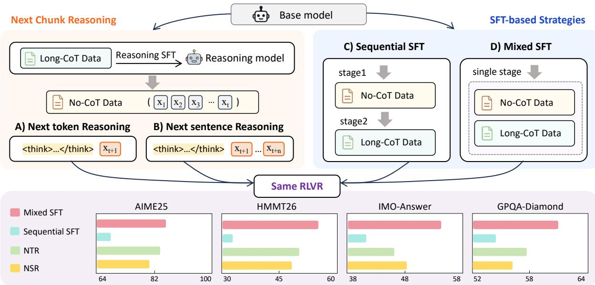  
Figure 1: Compared strategies for leveraging no-CoT data (top) and their post-RLVR performance (bottom). NCR applies RL rewards over predicted tokens (A: NTR) or sentences (B: NSR). Sequential SFT (C) trains on no-CoT and long-CoT data in two stages, while Mixed SFT (D) combines both in a single stage. All strategies share the same RLVR stage; bar charts show post-RLVR accuracy on four representative benchmarks, with Mixed SFT consistently achieving the highest scores.

Table 1: Summary of next-chunk reasoning RL methods, reporting their starting model (base or reasoning), whether they compare against a no-CoT SFT baseline, and whether they compare against Mixed SFT. RPT (Dong et al., 2025), RLP (Hatamizadeh et al., 2025), RMT (Tian et al., 2025), RLPT (Li et al., 2025), PretrainZero (Xing et al., 2025).
<table><tr><td>Method</td><td>Start Model No-CoT SFT Mixed SFT</td></tr><tr><td colspan="2">Next-token Reasoning</td></tr><tr><td>RPT reasoning</td><td>√</td></tr><tr><td>RLP base</td><td>x √ x</td></tr><tr><td>RMT reasoning</td><td>V x</td></tr><tr><td colspan="2"></td></tr><tr><td>Next-sentence Reasoning RLPT</td><td>x x</td></tr><tr><td>reasoning PretrainZero base</td><td>√ x</td></tr></table>

To answer this question, we move both nextchunk reasoning RL and SFT before RLVR and compare them from the same base model, avoiding confounds from prior post-training. In doing so, we also uncover a systematic bias in intermediatecheckpoint evaluation and show that how no-CoT data is organized within SFT matters as much as whether it is included.

Concretely, as illustrated in Fig. 1, we compare two paradigms from the same pre-trained base model: (i) next-chunk reasoning RL at different granularities, and (ii) two SFT strategies— Sequential SFT, which trains on no-CoT data first and then on long-CoT data to restore the long-CoT format, and Mixed SFT, which trains on both jointly in a single stage. Beyond the performance comparison, we conduct a mechanistic analysis to understand why NCR fails to outperform Mixed SFT: we show that NTR’s entropy filter does not select genuinely reasoning-hard tokens, that the generated traces degenerate into local completion, and that suppressing this collapse does not raise the post-RLVR ceiling. We further trace Mixed SFT’s pre-RLVR drop to a transient format mismatch that RLVR repairs. Together, these experiments and analyses lead to the following contributions:

• Conceptually, we identify an overlooked gap in recent NCR comparisons and introduce Mixed SFT as the missing baseline. Prior works compare NCR against SFT trained on no-CoT data alone, omitting the formulation that jointly trains on no-CoT and long-CoT data in a single stage.

• Empirically, we show that Mixed SFT is simpler, more effective, and substantially cheaper than next-chunk reasoning RL for leveraging no-CoT data. On the same no-CoT data, Mixed SFT reaches a clearly higher post-RLVR ceiling on both in-domain math and out-of-domain reasoning while requiring over 60× less training compute, indicating that its a better initialization for RLVR.

• Methodologically, we find that higher pre-RLVR accuracy does not necessarily translate into higher post-RLVR accuracy. In our experiments, Mixed SFT records the lowest pre-RLVR accuracy among all training strategies yet ends with the highest post-RLVR ceiling. This highlights the need to evaluate no-CoT training strategies in the context of the full post-training pipeline rather than at intermediate checkpoints.

• Analytically, we uncover the mechanisms behind different no-CoT training outcomes. Our analysis suggests that next-chunk reasoning objectives can collapse into local completion, while Mixed SFT preserves no-CoT signal that RLVR can amplify. These findings provide practical guidance for future work on reasoning-rich but trace-free data.

## 2 Experimental Setup

Models. Qwen3-30B-A3B-Base (Yang et al., 2025) serves as the base model throughout our experiments. We opt for a base checkpoint rather than an instruction-tuned one to ensure a clean, unified initialization free from prior post-training confounds.

Training data. All training data is crawled from AoPS (Art of Problem Solving, 2026). A subset of the collected problems is annotated with DeepSeek-V3.2 (Liu et al., 2025) to construct long-CoT data: we generate reasoning trajectories and retain only those whose final answer is correct, yielding 152K trajectories (≈1.95B tokens). Problems with brief original AoPS solutions, containing derivations but no explicit reasoning traces, serve as no-CoT data, totaling 421K solutions (≈0.53B tokens). A representative long-CoT trajectory and no-CoT solution are shown in Fig. 12 and Fig. 13. For the subsequent RLVR stage, we use DAPO-Math-17K (Yu et al., 2026) as the RL training set.

Training strategies. We compare five strategies: NCR at two granularities—NTR, instantiated with RPT (Dong et al., 2025), and NSR, instantiated with RLPT (Li et al., 2025)—along with Sequential SFT, Mixed SFT, and Reasoning SFT as a long-CoT-only baseline. Both NTR and NSR are initialized from Reasoning SFT. We exclude a standalone no-CoT SFT stage layered on top of Reasoning SFT, as this disrupts the long-CoT format and yields format-incoherent outputs. All five strategies are followed by the same RLVR stage using Group Relative Policy Optimization (GRPO) (Shao et al., 2024) with rule-based exact-match rewards on DAPO-Math-17K (Yu et al., 2026); full hyperparameter details are in the appendix.

Evaluation. We evaluate each model both before and after the RLVR stage, treating post-RLVR accuracy as the primary metric, as it reflects the ceiling each initialization enables, across in-domain (ID) and out-of-domain (OOD) benchmarks. The ID benchmarks are six competition-mathematics sets: AIME 2024/2025/2026 (Zhang and Team, 2024, 2025, 2026), HMMT 2025/2026 (Dekoninck et al., 2026), and IMO-Answer (Luong et al., 2025). The OOD benchmarks are HLE (Phan et al., 2025), GPQA-Diamond (Rein et al., 2023), and MMLU-Pro (Wang et al., 2024). We report avg@32 on AIME, HMMT, and IMO-Answer, avg@4 on GPQA-Diamond, and pass@1 on HLE and MMLU-Pro.

## 3 Main Results

Tab. 2 summarizes the post-RLVR performance of all five training strategies. We draw three key findings from this comparison and examine each in the following subsections:

(1) Mixed SFT is a stronger alternative to nextchunk reasoning RL. It achieves better post-RLVR performance on both in-domain and out-of-domain benchmarks.

(2) Mixed SFT clearly outperforms Sequential SFT, indicating that the way no-CoT data is incorporated matters.

(3) Pre-RLVR accuracy is not a reliable indicator of post-RLVR potential. A model with higher intermediate accuracy does not necessarily reach a higher final performance after RLVR.

Table 2: Performance of the compared no-CoT data utilization strategies, before and after RLVR, on in-domain (ID) and out-of-domain (OOD) reasoning benchmarks.
<table><tr><td rowspan="2">Method</td><td colspan="6">ID Reasoning</td><td colspan="3">OOD Reasoning</td></tr><tr><td>AIME24</td><td>AIME25</td><td>AIME26</td><td>HMMT25</td><td>HMMT26</td><td>IMO-Ans.</td><td>HLE</td><td>GPQA-Dia.</td><td>MMLU-Pro</td></tr><tr><td rowspan="2">Reasoning SFT + RLVR</td><td>73.33</td><td>64.17</td><td>54.42</td><td>34.16</td><td>32.88</td><td>34.50</td><td>6.91</td><td>46.21</td><td>74.89</td></tr><tr><td>81.98</td><td>76.67</td><td>65.10</td><td>43.33</td><td>39.39</td><td>47.25</td><td>7.22</td><td>56.94</td><td>73.95</td></tr><tr><td rowspan="2">Sequential SFT +RLVR</td><td>71.25</td><td>62.81</td><td>54.42</td><td>34.17</td><td>32.88</td><td>35.75</td><td>6.52</td><td>46.21</td><td>68.82</td></tr><tr><td>74.90</td><td>69.27</td><td>56.35</td><td>32.92</td><td>35.23</td><td>41.25</td><td>6.79</td><td>54.55</td><td>71.10</td></tr><tr><td rowspan="2">Mixed SFT + RLVR</td><td>45.52</td><td>42.50</td><td>20.94</td><td>10.42</td><td>15.91</td><td>12.50</td><td>6.71</td><td>36.24</td><td>56.61</td></tr><tr><td>87.50</td><td>85.73</td><td>70.42</td><td>55.00</td><td>51.52</td><td>54.00</td><td>9.24</td><td>60.98</td><td>75.84</td></tr><tr><td rowspan="2">Reasoning SFT + NTR + RLVR</td><td>74.69</td><td>67.29</td><td>53.75</td><td>36.77</td><td>34.38</td><td>38.00</td><td>7.59</td><td>53.66</td><td>73.46</td></tr><tr><td>87.50</td><td>84.38</td><td>69.38</td><td>50.42</td><td>47.16</td><td>46.50</td><td>7.68</td><td>57.70</td><td>74.03</td></tr><tr><td rowspan="2">Reasoning SFT + NSR + RLVR</td><td>74.27</td><td>63.54</td><td>56.88</td><td>38.33</td><td>38.33</td><td>36.00</td><td>7.46</td><td>42.93</td><td></td></tr><tr><td>85.52</td><td>80.92</td><td>72.19</td><td>48.85</td><td>46.02</td><td>48.25</td><td>7.72</td><td>56.31</td><td>70.31 74.89</td></tr></table>

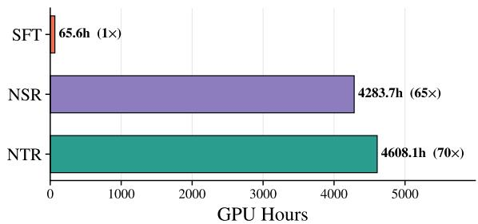  
Figure 2: GPU-hour training cost of each strategy on the same no-CoT data. NTR and NSR are measured at 160 steps, where both reach peak pre-RLVR accuracy.

## 3.1 Paradigm: SFT vs. next-chunk reasoning

We compare SFT and next-chunk reasoning RL along three axes: in-domain accuracy, OOD generalization, and training efficiency. Mixed SFT outperforms next-chunk reasoning RL on all three.

In-domain reasoning. As summarized in Tab. 2, Mixed SFT averages 67.4 post-RLVR across the six in-domain benchmarks (AIME 24/25/26, HMMT 25/26, IMO-Answer), 3.1 points above the next-best NTR (64.2) and 3.7 points above NSR (63.6). In short, SFT can effectively leverage no-CoT data without an explicit RL-based reasoningreconstruction objective.

OOD generalization. On the three OOD benchmarks HLE (Phan et al., 2025), GPQA-Diamond (Rein et al., 2023), and MMLU-Pro (Wang et al., 2024), Mixed SFT reaches the highest post-RLVR accuracy of 9.24, 60.98, and 75.84 respectively, surpassing both NTR and NSR by clear margins on each. Mixed SFT therefore outperforms next-chunk reasoning RL on OOD benchmarks as well, indicating that Mixed SFT’s advantage is not a math-specific overfit but extends to broader reasoning settings.

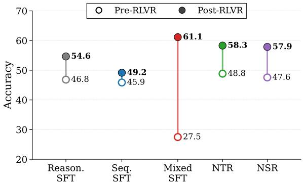  
Figure 3: Pre-RLVR and post-RLVR accuracy averaged over all nine reasoning benchmarks, shown as per-method dumbbells.

Training efficiency. SFT is also substantially more efficient. As shown in Fig. 2, both NTR and NSR consume over 60× more GPU hours than SFT on the same no-CoT data, since both require online rollouts, reward computation, and policy optimization, with NSR further depending on a generative reward model. The efficiency gap thus compounds the performance gap: next-chunk reasoning RL neither outperforms SFT nor is cheaper than it for leveraging no-CoT data.

## 3.2 Data combination: Mixed vs. Sequential SFT

Within SFT, Mixed SFT achieves a significantly higher final ceiling than Sequential SFT, showing that for no-CoT data, how it is organized with reasoning data matters as much as whether it is included. As shown in Fig. 4, Mixed SFT starts from the lowest pre-RLVR accuracy and trails the other methods early in RLVR training, but gradually catches up and overtakes them, ending with the highest ceiling on all three representative benchmarks.

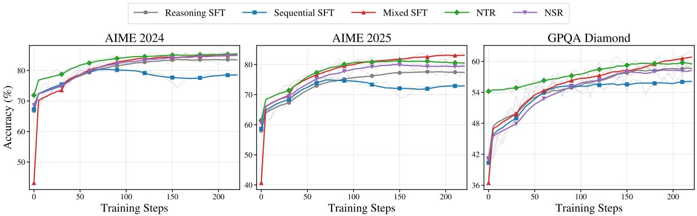  
Figure 4: Post-RLVR training curves of all five strategies on AIME 2024, AIME 2025, and GPQA-Diamond under the same RLVR stage.

Sequential SFT often records better pre-RLVR accuracy because its final stage is Reasoning SFT, whose long-CoT format aligns with evaluation; however, this stage also partially overwrites what was learned from no-CoT data, a phenomenon we quantify in Observation 6 of Sec. 4 via a post-RLVR retention probe on no-CoT problems. Mixed SFT instead exposes the model to both data types simultaneously: pre-RLVR accuracy drops due to the conflicting output structures, but no cross-stage forgetting occurs, preserving mathematical knowledge, derivation paths, and problem variants. RLVR then optimizes answer correctness from this richer initialization, yielding a higher final ceiling.

## 3.3 Evaluation timing: pre- vs. post-RLVR scores

Pre-RLVR scores do not reliably predict post-RLVR performance. As Fig. 3 shows, Mixed SFT has by far the lowest pre-RLVR accuracy of 27.5— roughly 20 points below every other method—yet the highest post-RLVR accuracy of 61.1, a pre-topost improvement of 33.7 points that is more than three times larger than any other method; the remaining four methods start from similar pre-RLVR levels between 45.9 and 48.8 and rise by 3.3 to 10.3 points. No-CoT data may not immediately improve explicit reasoning outputs, but it reshapes the model’s internal knowledge distribution, and RLVR amplifies these latent capabilities through verifiable rewards. The right criterion for evaluating a no-CoT initialization strategy is therefore not the immediate pre-RLVR score, but the post-RLVR ceiling it enables.

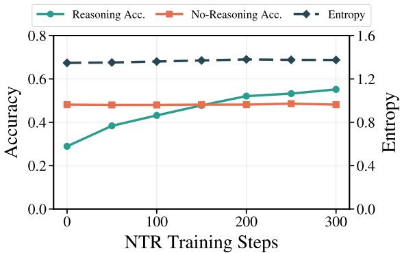  
Figure 5: Per-token entropy, reasoning accuracy, and noreasoning accuracy on 2,048 randomly sampled highentropy tokens, measured with NTR checkpoints across training steps.

## 4 Analysis

This section addresses three questions raised by the main results:

• First, does next-chunk reasoning RL bring genuine reasoning gains beyond what SFT on the same no-CoT data already achieves?

• Second, why does Mixed SFT recover from the lowest pre-RLVR accuracy to the highest post-RLVR ceiling?

• Third, why does Sequential SFT, which sees the same no-CoT and long-CoT data, end up well below Mixed SFT?

For the first question, we examine NTR from three angles—the targets it selects for supervision, the reasoning traces it produces, and whether its ceiling can be lifted by preserving exploration—and then rule out a token-coverage confound. For the second, we trace Mixed SFT’s pre-RLVR drop to a transient format mismatch that RLVR repairs. For the third, we use a post-RLVR retention probe to show that Sequential SFT’s second long-CoT stage partially erases what its first no-CoT stage absorbed, and that RLVR cannot recover the lost signal.

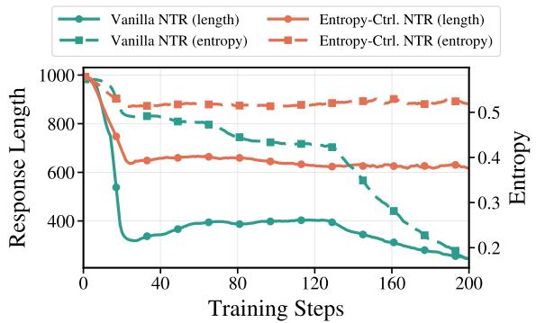  
(a) Training dynamics across steps.

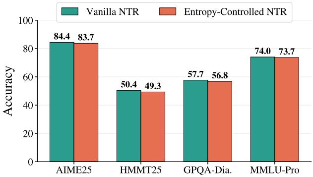  
(b) Post-RLVR accuracy.  
Figure 6: (a) Generation entropy and response length of vanilla NTR and the entropy-controlled variant across training steps. (b) Post-RLVR accuracy of the two variants on four representative benchmarks; per-benchmark numbers are in Tab. 9.

Observation 1: The Entropy Filter Does Not Select Reasoning-Hard Tokens. NTR rests on the claim that high-entropy tokens are the hard, reasoning-demanding targets worth optimizing, and accordingly supervises only the top-20% highest-entropy tokens of the no-CoT corpus (Dong et al., 2025). We test this claim directly. We randomly draw 2,048 tokens from the high-entropy pool and, across NTR checkpoints saved at increasing training steps, measure three quantities at these positions: the per-token entropy, the prediction accuracy with an explicit reasoning step (reasoning accuracy), and the accuracy of direct prediction (no-reasoning accuracy). As Fig. 5 shows, reasoning accuracy climbs steadily from 0.29 to 0.55 while the entropy of the same tokens stays almost flat; if entropy tracked predictive difficulty, such a large accuracy gain would be mirrored by a comparable entropy change. The no-reasoning accuracy is more direct evidence: it stays around 0.48 throughout, so nearly half of these tokens are already predicted correctly without any reasoning. High token entropy therefore reflects the local uncertainty of the raw corpus, not reasoning difficulty, and the entropy filter still admits a large fraction of tokens that demand no reasoning at all.

Observation 2: NTR’s Reasoning Traces Degenerate into Local Completion. Because many of the filtered targets are in fact locally predictable, NTR can satisfy its reconstruction reward without genuine reasoning. Fig. 6a shows the consequence: both generation entropy and response length decrease steadily during NTR training, indicating that the model’s outputs become shorter and more deterministic as training proceeds. Inspecting the generated traces confirms this—the model converges to a few repetitive templates across very different prefixes (Fig. 10, Appendix), performing a brief, template-like local completion of the immediate context rather than long-horizon reasoning. NSR exhibits the same tendency at the sentence level, where the predicted sentence is often a direct continuation of the preceding text; a representative NSR trajectory is shown in Fig. 11 (Appendix). In both cases the reconstruction reward is met by local pattern completion, not by the reasoning the objective is meant to elicit. This template collapse leaves NTR with little reasoning structure for the downstream RLVR stage to amplify.

Observation 3: Preserving Entropy Does Not Raise NTR’s Ceiling. The entropy collapse observed in NTR suggests a natural rescue hypothesis: perhaps NTR’s mediocre post-RLVR ceiling is caused by the collapse, and preserving exploration would let the model learn richer reasoning and reach a higher ceiling. We test this by modifying NTR training with two interventions that suppress the collapse, both detailed in App. G: rollout groups with high in-group success rate are stochastically dropped so that already-easy prompts cannot push the policy toward over-confident outputs (Luo et al., 2026; Xiong et al., 2025), and positive advantages are down-weighted relative to negative ones to keep the policy from converging onto a single template (Yu et al., 2026; Wang et al., 2025). As Fig. 6a shows, the interventions work: generation entropy stays near 0.52 and response length around 640 tokens throughout training. Yet Fig. 6b shows that this entropy-controlled NTR reaches a slightly lower post-RLVR ceiling than vanilla NTR on every benchmark. Entropy collapse is therefore not the cause of NTR’s mediocre ceiling; vanilla NTR reaches its ceiling by converging onto the peaked, template-like policy, and preventing that convergence only removes a usable solution without supplying a better one.

Table 3: Post-RLVR performance when NTR or NSR is inserted between Mixed SFT and RLVR, compared with Mixed SFT directly followed by RLVR.
<table><tr><td>Method</td><td>AIME24</td><td>AIME25</td><td>HMMT25</td><td>HMMT26</td></tr><tr><td>Mixed SFT</td><td>45.52</td><td>42.50</td><td>10.42</td><td>15.91</td></tr><tr><td>+ RLVR</td><td>87.50</td><td>85.73</td><td>55.00</td><td>51.52</td></tr><tr><td> $+ \mathrm { N T R } + \mathrm { R L V R }$ </td><td>86.35</td><td>84.58</td><td>53.73</td><td>50.50</td></tr><tr><td> $+ \mathrm { N S R } + \mathrm { R L V R }$ </td><td>87.21</td><td>84.67</td><td>53.15</td><td>49.52</td></tr></table>

Observation 4: NTR and NSR Add No Gain on Top of Mixed SFT. A final concern is a confound: next-chunk reasoning RL is far more expensive than SFT and therefore covers far fewer tokens of the no-CoT corpus, so SFT’s advantage might come from larger token exposure rather than from the training paradigm. To rule this out, we continue NTR or NSR training from the Mixed SFT model, which has already absorbed the full no-CoT corpus, and then apply the same RLVR stage. As Tab. 3 shows, inserting an NTR or NSR stage between Mixed SFT and RLVR leaves final performance almost unchanged, and slightly lower on several tasks. Once the model has been sufficiently exposed to no-CoT data through SFT, neither objective adds reasoning ability that RLVR can amplify. Taken together, these analyses suggest that the improvements of next-chunk reasoning RL over Reasoning SFT are not primarily delivered by its reasoning-reconstruction mechanism. A substantial fraction of its supervised targets are locally predictable, the generated traces tend toward template-like local completion, preserving exploration does not raise the ceiling, and once the same no-CoT corpus has been absorbed through SFT, an additional next-chunk reasoning RL stage no longer adds gains that RLVR can amplify.

Observation 5: Mixed SFT’s Pre-RLVR Drop Is a Transient Format Artifact. We now turn to the second question: why Mixed SFT, despite the lowest pre-RLVR accuracy, reaches the highest post-RLVR ceiling. The pre-RLVR drop comes from an output-structure mismatch between the two data types. Long-CoT data carries explicit thinking markers, long reasoning traces, and standardized answer formats, whereas no-CoT data resembles ordinary mathematical solutions with no unified reasoning boundaries or answer format. Training on both jointly temporarily destabilizes the output structure: the explicit reasoning process is sometimes skipped entirely, and the response format becomes inconsistent (Fig. 8, Appendix). This depresses pre-RLVR accuracy but does not erase what the model has learned. As Fig. 7 shows, during RLVR the format-compliance rate rises quickly and accuracy grows alongside it: verifiable rewards re-impose a consistent output format, while the model draws on the broader mathematical knowledge, derivation patterns, and problem variants absorbed during Mixed SFT, ultimately reaching a higher ceiling. The pre-RLVR drop is thus a transient format artifact, not a loss of capability, which is why pre-RLVR performance underestimates Mixed SFT and cannot predict the post-RLVR upper bound.

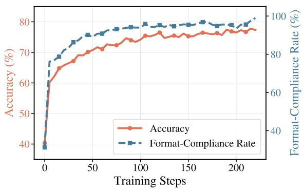  
Figure 7: Accuracy and format-compliance rate of Mixed SFT across RLVR training steps.

Table 4: Post-RLVR avg@8 on No-CoT Probe, a 100- problem retention probe randomly drawn from the no-CoT training corpus.
<table><tr><td>Method</td><td>No-CoT Probe</td></tr><tr><td>Sequential SFT + RLVR</td><td>59.19</td></tr><tr><td>Mixed SFT + RLVR</td><td>68.63</td></tr></table>

Observation 6: Sequential SFT Forgets No-CoT Knowledge Across Stages. The previous subsection asked why Mixed SFT recovers from its pre-RLVR drop. We now ask why Sequential SFT, which sees the same no-CoT and long-CoT data, ends up below Mixed SFT after RLVR. A direct pre-RLVR comparison would be unreliable, since Mixed SFT’s pre-RLVR outputs are formatunstable (Fig. 8, Appendix) while Sequential SFT’s are not; we therefore evaluate after the same RLVR stage, which equalizes the output format (Fig. 7). We randomly sample 100 problems from the no-

CoT training corpus as a retention probe—both pipelines saw these problems during their SFT stages, so any post-RLVR gap reflects how each preserved the no-CoT signal across SFT. We sample 8 responses per problem and report avg@8 in Tab. 4. Mixed SFT outperforms Sequential SFT on the probe, consistent with the view that Sequential SFT’s second long-CoT stage overwrites part of the no-CoT signal absorbed in its first stage, and that RLVR does not recover knowledge erased before it began.

## 5 Related Work

SFT for reasoning post-training. Supervised fine-tuning is the dominant way to inject data into post-training. Early SFT relied on instructionresponse pairs (FLAN (Wei et al., 2021), LIMA (Zhou et al., 2023)); with the rise of reasoning models, SFT was extended to explicit CoT data through bootstrapping (STaR (Zelikman et al., 2022)), distillation (Distilling Step-by-Step (Hsieh et al., 2023)), and large-teacher transfer (DeepSeek-R1-Distill (Guo et al., 2025)). Several recent works further show that mixing long-CoT and non-CoT data within a single SFT stage is itself effective: DeepSeek-R1’s second-stage SFT recovers non-reasoning ability (Guo et al., 2025); Qwen3’s Thinking Mode Fusion (Yang et al., 2025) jointly trains long-CoT and short responses; and LS-Mixture (Yu et al., 2025) pairs long-CoT trajectories with structure-preserved short rewrites to mitigate overthinking. These works, however, all place mixed SFT after reasoning-oriented RL, treating the mixture as a recovery step or a standalone post-training recipe. Our work studies the complementary question: whether Mixed SFT on long-CoT plus raw no-CoT text is the right way to initialize a subsequent RLVR stage, by systematically comparing Sequential SFT, Mixed SFT, and their combination with subsequent RLVR.

Next-chunk reasoning RL. Reinforcement learning has become a central paradigm for improving reasoning. RLHF (Christiano et al., 2017) aligns models with human preferences, while RLVR (Guo et al., 2025; Team et al., 2025; Shao et al., 2024) uses rule-based rewards over verifiable answers and has substantially advanced math and coding. Both depend on specialized data, namely costly preference annotations or verifiableanswer corpora, which motivates attempts to extend RL to broader natural text. Next-chunk reasoning RL converts no-CoT text into an RL-optimizable task: the model first generates reasoning, then is rewarded for predicting subsequent content. RPT (Dong et al., 2025) reformulates next-token prediction as next-token reasoning with prefix-matching rewards, but compares only against next-token-prediction continuation on the same no-CoT data and starts from a post-trained model with long-CoT behavior already built in. RLP (Hatamizadeh et al., 2025) moves this token-level objective into pretraining. RLPT (Li et al., 2025) raises the granularity from tokens to sentences with a generative reward model, but reports no SFT-only comparison. RMT (Tian et al., 2025) brings the idea into mid-training with dynamic token budgets and curriculum sampling, also without combining no-CoT with long-CoT in its SFT baseline. PretrainZero (Xing et al., 2025) extends this idea to span-level prediction starting from a base model, with an SFT baseline restricted to single-source no-CoT data. As Tab. 1 summarizes, none of these works evaluates next-chunk reasoning RL against an SFT baseline that combines no-CoT with long-CoT data, exactly the gap our work fills.

## 6 Discussion and Conclusion

This paper revisits whether next-chunk reasoning RL outperforms SFT for utilizing no-CoT data, comparing NTR, NSR, Sequential SFT, Mixed SFT, and Reasoning SFT under a unified RLVR budget from the same pre-trained base across six indomain and three out-of-domain reasoning benchmarks. Despite the lowest pre-RLVR accuracy, Mixed SFT reaches the highest post-RLVR ceiling on both in-domain and out-of-domain benchmarks while requiring over 60× less training compute. Mechanistically, next-chunk reasoning RL’s gains do not arise from genuine reasoning—its highentropy targets are largely locally predictable and its traces collapse into template-like completion— while Mixed SFT avoids the cross-stage forgetting that limits Sequential SFT and preserves the no-CoT signal that RLVR later amplifies. Our results also expose a methodological caveat: higher pre-RLVR accuracy does not imply higher post-RLVR accuracy, so no-CoT strategies should be evaluated through the full RLVR pipeline. For practitioners working under compute constraints, this points to data composition within the SFT stage rather than additional RL stages.

## References

Art of Problem Solving. 2026. Art of problem solving. https://artofproblemsolving.com/. Accessed: 2026-05-13.

Lei Bai, Jiaqi Cao, Chiyu Chen, Guanzhou Chen, Kai Chen, Guangran Cheng, Erfei Cui, Xuanlang Dai, Shengyuan Ding, Shangheng Du, and 1 others. 2026. Intern-s2-preview: Scientific agentic foundation model. arXiv preprint arXiv:2608.13505.

Paul F Christiano, Jan Leike, Tom Brown, Miljan Martic, Shane Legg, and Dario Amodei. 2017. Deep reinforcement learning from human preferences. Advances in neural information processing systems, 30.

Tianzhe Chu, Yuexiang Zhai, Jihan Yang, Shengbang Tong, Saining Xie, Dale Schuurmans, Quoc V Le, Sergey Levine, and Yi Ma. 2025. Sft memorizes, rl generalizes: A comparative study of foundation model post-training. arXiv preprint arXiv:2501.17161.

Jasper Dekoninck, Nikola Jovanovic, Tim Gehrunger,´ Kári Rögnvalddson, Ivo Petrov, Chenhao Sun, and Martin Vechev. 2026. Beyond benchmarks: Matharena as an evaluation platform for mathematics with llms. arXiv preprint arXiv:2605.00674.

Qingxiu Dong, Li Dong, Yao Tang, Tianzhu Ye, Yutao Sun, Zhifang Sui, and Furu Wei. 2025. Reinforcement pre-training. arXiv preprint arXiv:2506.08007.

Youqing Fang, Yinhao Tang, Yanan Sun, Jiangning Liu, Ziyi Wang, Xun Zhao, Bin Liu, Weiming Zhang, Kuikun Liu, Wenwei Zhang, and 1 others. 2026. Mindcopilot: Towards formalizing and evaluating granular human-llm co-writing. arXiv preprint arXiv:2605.23535.

Daya Guo, Dejian Yang, Haowei Zhang, Junxiao Song, Peiyi Wang, Qihao Zhu, Runxin Xu, Ruoyu Zhang, Shirong Ma, Xiao Bi, and 1 others. 2025. Deepseek-r1: Incentivizing reasoning capability in llms via reinforcement learning. arXiv preprint arXiv:2501.12948.

Ali Hatamizadeh, Syeda Nahida Akter, Shrimai Prabhumoye, Jan Kautz, Mostofa Patwary, Mohammad Shoeybi, Bryan Catanzaro, and Yejin Choi. 2025. Rlp: Reinforcement as a pretraining objective. arXiv preprint arXiv:2510.01265.

Cheng-Yu Hsieh, Chun-Liang Li, Chih-Kuan Yeh, Hootan Nakhost, Yasuhisa Fujii, Alex Ratner, Ranjay Krishna, Chen-Yu Lee, and Tomas Pfister. 2023. Distilling step-by-step! outperforming larger language models with less training data and smaller model sizes. In Findings of the Association for Computational Linguistics: ACL 2023, pages 8003–8017.

Aaron Jaech, Adam Kalai, Adam Lerer, Adam Richardson, Ahmed El-Kishky, Aiden Low, Alec Helyar, Aleksander Madry, Alex Beutel, Alex Carney, and 1 others. 2024. Openai o1 system card. arXiv preprint arXiv:2412.16720.

Nathan Lambert, Jacob Morrison, Valentina Pyatkin, Shengyi Huang, Hamish Ivison, Faeze Brahman, Lester James V Miranda, Alisa Liu, Nouha Dziri, Shane Lyu, and 1 others. 2024. Tulu 3: Pushing frontiers in open language model post-training. arXiv preprint arXiv:2411.15124.

Siheng Li, Kejiao Li, Zenan Xu, Guanhua Huang, Evander Yang, Kun Li, Haoyuan Wu, Jiajia Wu, Zihao Zheng, Chenchen Zhang, and 1 others. 2025. Reinforcement learning on pre-training data. arXiv preprint arXiv:2509.19249.

Aixin Liu, Aoxue Mei, Bangcai Lin, Bing Xue, Bingxuan Wang, Bingzheng Xu, Bochao Wu, Bowei Zhang, Chaofan Lin, Chen Dong, and 1 others. 2025. Deepseek-v3. 2: Pushing the frontier of open large language models. arXiv preprint arXiv:2512.02556.

Qin-Wen Luo, Sheng Ren, Xiang Chen, Rui Liu, Jun Fang, Naiqiang Tan, and Sheng-Jun Huang. 2026. Compress the easy, explore the hard: Difficultyaware entropy regularization for efficient llm reasoning. arXiv preprint arXiv:2602.22642.

Minh-Thang Luong, Dawsen Hwang, Hoang H Nguyen, Golnaz Ghiasi, Yuri Chervonyi, Insuk Seo, Junsu Kim, Garrett Bingham, Jonathan Lee, Swaroop Mishra, and 1 others. 2025. Towards robust mathematical reasoning. In Proceedings ofthe 2025 Conference on Empirical Methods in Natural Language Processing, pages 35406–35430.

Kohsei Matsutani, Shota Takashiro, Gouki Minegishi, Takeshi Kojima, Yusuke Iwasawa, and Yutaka Matsuo. 2025. Rl squeezes, sft expands: A comparative study of reasoning llms. arXiv preprint arXiv:2509.21128.

Agarwal S OpenAI, Lama Ahmad, Sam Altman, Greg Brockman, Sébastien Bubeck, and 1 others. gptoss-120b & gpt-oss-20b model card. 2025. URL https://arxiv. org/abs/2508.10925.

Long Phan, Alice Gatti, Ziwen Han, Nathaniel Li, Josephina Hu, Hugh Zhang, Chen Bo Calvin Zhang, Mohamed Shaaban, John Ling, Sean Shi, and 1 others. 2025. Humanity’s last exam. arXiv preprint arXiv:2501.14249.

David Rein, Betty Li Hou, Asa Cooper Stickland, Jackson Petty, Richard Yuanzhe Pang, Julien Dirani, Julian Michael, and Samuel R Bowman. 2023. Gpqa: A graduate-level google-proof q&a benchmark. arXiv preprint arXiv:2311.12022.

Zhihong Shao, Peiyi Wang, Qihao Zhu, Runxin Xu, Junxiao Song, Xiao Bi, Haowei Zhang, Mingchuan Zhang, YK Li, Yang Wu, and 1 others. 2024. Deepseekmath: Pushing the limits of mathematical reasoning in open language models. arXiv preprint arXiv:2402.03300.

Kimi Team, Angang Du, Bofei Gao, Bowei Xing, Changjiu Jiang, Cheng Chen, Cheng Li, Chenjun Xiao, C Du, C Liao, and 1 others. 2025. Kimi k1.

5: Scaling reinforcement learning with llms, 2025. URL https://arxiv. org/abs/2501.12599, 118.

Yijun Tian, Shaoyu Chen, Zhichao Xu, Yawei Wang, Jinhe Bi, Peng Han, and Wei Wang. 2025. Reinforcement mid-training. arXiv preprint arXiv:2509.24375.

Jiakang Wang, Runze Liu, Lei Lin, Wenping Hu, Xiu Li, Fuzheng Zhang, Guorui Zhou, and Kun Gai. 2025. Aspo: Asymmetric importance sampling policy optimization. arXiv preprint arXiv:2510.06062.

Yubo Wang, Xueguang Ma, Ge Zhang, Yuansheng Ni, Abhranil Chandra, Shiguang Guo, Weiming Ren, Aaran Arulraj, Xuan He, Ziyan Jiang, and 1 others. 2024. Mmlu-pro: A more robust and challenging multi-task language understanding benchmark. Advances in Neural Information Processing Systems, 37:95266–95290.

Jason Wei, Maarten Bosma, Vincent Y Zhao, Kelvin Guu, Adams Wei Yu, Brian Lester, Nan Du, Andrew M Dai, and Quoc V Le. 2021. Finetuned language models are zero-shot learners. arXiv preprint arXiv:2109.01652.

Jason Wei, Xuezhi Wang, Dale Schuurmans, Maarten Bosma, Fei Xia, Ed Chi, Quoc V Le, Denny Zhou, and 1 others. 2022. Chain-of-thought prompting elicits reasoning in large language models. Advances in neural information processing systems, 35:24824– 24837.

Xingrun Xing, Zhiyuan Fan, Jie Lou, Guoqi Li, Jiajun Zhang, and Debing Zhang. 2025. Pretrainzero: Reinforcement active pretraining. arXiv preprint arXiv:2512.03442.

Wei Xiong, Chenlu Ye, Baohao Liao, Hanze Dong, Xinxing Xu, Christof Monz, Jiang Bian, Nan Jiang, and Tong Zhang. 2025. Reinforce-ada: An adaptive sampling framework for reinforce-style llm training. arXiv e-prints, pages arXiv–2510.

An Yang, Anfeng Li, Baosong Yang, Beichen Zhang, Binyuan Hui, Bo Zheng, Bowen Yu, Chang Gao, Chengen Huang, Chenxu Lv, and 1 others. 2025. Qwen3 technical report. arXiv preprint arXiv:2505.09388.

Bin Yu, Hang Yuan, Haotian Li, Xueyin Xu, Yuliang Wei, Bailing Wang, Weizhen Qi, and Kai Chen. 2025. Long-short chain-of-thought mixture supervised finetuning eliciting efficient reasoning in large language models. arXiv preprint arXiv:2505.03469.

Qiying Yu, Zheng Zhang, Ruofei Zhu, Yufeng Yuan, Xiaochen Zuo, Yu Yue, Weinan Dai, Tiantian Fan, Gaohong Liu, Lingjun Liu, and 1 others. 2026. Dapo: An open-source llm reinforcement learning system at scale. Advances in Neural Information Processing Systems, 38:113222–113244.

Eric Zelikman, Yuhuai Wu, Jesse Mu, and Noah Goodman. 2022. Star: Bootstrapping reasoning with reasoning. Advances in Neural Information Processing Systems, 35:15476–15488.

Qiyuan Zhang, Fuyuan Lyu, Zexu Sun, Lei Wang, Weixu Zhang, Wenyue Hua, Haolun Wu, Zhihan Guo, Yufei Wang, Niklas Muennighoff, and 1 others. 2025. A survey on test-time scaling in large language models: What, how, where, and how well? arXiv preprint arXiv:2503.24235.

Yifan Zhang and Math-AI Team. 2024. American invitational mathematics examination (aime) 2024. https://huggingface.co/datasets/math-ai/ aime24. Hugging Face dataset.

Yifan Zhang and Math-AI Team. 2025. American invitational mathematics examination (aime) 2025. https://huggingface.co/datasets/math-ai/ aime25. Hugging Face dataset.

Yifan Zhang and Math-AI Team. 2026. American invitational mathematics examination (aime) 2026. https://huggingface.co/datasets/math-ai/ aime26. Hugging Face dataset.

Chunting Zhou, Pengfei Liu, Puxin Xu, Srinivasan Iyer, Jiao Sun, Yuning Mao, Xuezhe Ma, Avia Efrat, Ping Yu, Lili Yu, and 1 others. 2023. Lima: Less is more for alignment. Advances in Neural Information Processing Systems, 36:55006–55021.

## A Limitations

Mixing ratio in Mixed SFT. Our Mixed SFT experiments use a single fixed mixing ratio between no-CoT and long-CoT data. We do not explore how varying this ratio affects the resulting post-RLVR ceiling, the magnitude of the pre-RLVR drop, or the trade-off between absorbing no-CoT knowledge and preserving the long-CoT format. A systematic sweep over mixing ratios—including the regime where one source is scarce—is an important direction for future work and may further refine the recipe-level guidance offered by our analysis.

Domain coverage. Both the no-CoT training corpus and all evaluation benchmarks are mathematical. We do not investigate whether the same conclusions transfer to code generation, scientific reasoning outside of GPQA, multilingual tasks, or other domains in which no-CoT data may have different structural and token-level properties. Whether Mixed SFT remains the most effective way to leverage no-CoT data in such settings is an open question.

## B Training Details

Framework and hardware. All SFT and RL experiments are run on NVIDIA H200 GPUs. Every RL stage (NTR, NSR, and RLVR) uses 64 GPUs.

Training data. The long-CoT corpus contains 152K examples and roughly 1.95B tokens: queries are drawn from AoPS (Art of Problem Solving, 2026), reasoning trajectories are produced by DeepSeek-V3.2 (Liu et al., 2025) with the maximum generation length set to 64K tokens, and only trajectories with correct final answers are retained. The no-CoT corpus contains 421K examples and roughly 0.53B tokens, also crawled from AoPS. For the subsequent RLVR stage we use DAPO-Math-17K (Yu et al., 2026) as the RL training set. We additionally deduplicate all training data (long-CoT, no-CoT, and DAPO-Math-17K) against the evaluation benchmarks listed in App. C to prevent contamination.

SFT hyperparameters. All SFT stages (Reasoning SFT, Sequential SFT, and Mixed SFT) are trained for a single epoch with a maximum sequence length of 131,072 tokens.

RL hyperparameters. All RL stages share the same optimizer configuration: learning rate 1e−6, and the KL penalty against the reference model is disabled. The remaining stage-specific hyperparameters are listed in Tab. 5.

Table 5: RL hyperparameters for NTR, NSR, and RLVR. Max response length is reported in tokens.
<table><tr><td>Setting</td><td>NTR</td><td>NSR</td><td>RLVR</td></tr><tr><td>Global batch size</td><td>4096</td><td>256</td><td>256</td></tr><tr><td>Rollouts per prompt</td><td>64</td><td>16</td><td>16</td></tr><tr><td>Max response length</td><td>2K</td><td>32K</td><td>32K</td></tr><tr><td>Learning rate</td><td>1e-6</td><td>1e-6</td><td>1e-6</td></tr><tr><td>KL loss</td><td>off</td><td>off</td><td>off</td></tr></table>

Reward models. NTR uses token-level prefixmatching against the ground-truth continuation of the no-CoT corpus as the reward signal. NSR uses gpt-oss-120b (OpenAI et al.) with reasoning\_effort=high as a generative judge for sentence-level semantic consistency between the model’s prediction and the ground-truth segment. RLVR uses rule-based exact-match rewards against the verifiable answers in DAPO-Math-17K.

Reconstruction targets. NTR and NSR differ in how they sample reconstruction targets from the no-CoT corpus. For NTR, we first run Qwen3- 30B-A3B over the full no-CoT corpus to obtain per-token next-token entropies, and only keep the top-20% highest-entropy tokens as NTR prediction targets, on the assumption that low-entropy tokens are too predictable from local context to provide a meaningful learning signal. For NSR, we segment each no-CoT example into sentences and use the full set of segmented sentences as reconstruction targets, without entropy-based filtering.

Training objectives. We summarize here the perstep objectives of the SFT, NTR, and NSR stages compared in this work; all three are followed by the same RLVR stage. Let $\pi \theta$ denote the policy parameterized by θ.

SFT. Given a dataset D<sub>SFT</sub> of (prompt, response) pairs (x, y), the SFT loss is the standard tokenlevel negative log-likelihood,

$$
\begin{array} { r l } { \mathcal { L } _ { \mathrm { S F T } } ( \theta ) = } & { } \\ { - \mathbb { E } _ { ( x , y ) \sim \mathcal { D } _ { \mathrm { S F T } } } \left[ \displaystyle \frac { 1 } { | y | } \sum _ { t = 1 } ^ { | y | } \log \pi _ { \theta } ( y _ { t } \mid x , y _ { < t } ) \right] . } \end{array}\tag{1}
$$

The three SFT strategies in our comparison differ only in D : Reasoning SFT uses long-CoT data only, Sequential SFT runs two consecutive SFT stages (one on no-CoT, one on long-CoT), and Mixed SFT uses the union of both in a single stage.

NTR. Following Dong et al. (2025), NTR reframes next-token prediction as a reasoning task. Let $\mathcal { D } _ { \mathrm { N T R } }$ be the entropy-filtered prefix set defined above. For each prefix $x _ { < t } \in \mathcal { D } _ { \mathrm { N T R } }$ , the policy generates G rollouts $o ^ { i } = ( c ^ { i } , y ^ { i } ) \sim \pi _ { \theta } ( { \cdot } \mid x _ { < t } )$ where $c ^ { i }$ is the reasoning trace and $y ^ { i }$ is the predicted continuation. With prefix-matching reward against the ground-truth continuation $x _ { \geq t }$

$$
r ^ { i } = \left\{ \begin{array} { l l } { { 1 , } } & { { \bar { y } ^ { i } = \bar { x } _ { \geq t } [ 1 { : } l ] \mathrm { ~ a n d ~ } l \in \mathcal { L } _ { \mathrm { g t } } , } } \\ { { 0 , } } & { { \mathrm { o t h e r w i s e } , } } \end{array} \right.\tag{2}
$$

where ¯· denotes the byte sequence of a token sequence, $l = | \bar { y } ^ { i } |$ , and ${ \mathcal { L } } _ { \mathrm { g t } }$ is the set of cumulative byte lengths of tokens in $x _ { \geq t }$ . The NTR objective is the expected prefix-matching reward,

$$
\mathcal { T } _ { \mathrm { N T R } } ( \theta ) = \mathbb { E } _ { { x < t } \sim \mathcal { D } _ { \mathrm { N T R } } , \{ o ^ { i } \} \sim \pi _ { \theta } ( \cdot | x < t ) } [ r ^ { i } ] .\tag{3}
$$

NSR. Following Li et al. (2025), NSR replaces token-level prediction with sentence-level prediction. Let $\begin{array} { r c l } { { \mathcal D } _ { \mathrm { N S R } } } & { = } & { \{ ( s < i , s _ { i } ) \} } \end{array}$ be the sentence-segmented no-CoT corpus, where $s _ { < i } =$ $[ s _ { 1 } , \ldots , s _ { i - 1 } ]$ is the preceding context and $s _ { i }$ is the target sentence. For each $( s _ { < i } , s _ { i } )$ , the policy generates a rollout $o = ( c , { \hat { s } } _ { i } ) \sim \pi _ { \theta } ( { \cdot } \mid s _ { < i } )$ , with c the reasoning trace and $\hat { s } _ { i }$ the predicted next sentence extracted from the response. The reward is the binary judgment of a generative reward model $G _ { \mathrm { r m } }$

$$
r = G _ { \mathrm { r m } } ( \hat { s } _ { i } , s _ { i } ) \in \{ 0 , 1 \} ,\tag{4}
$$

and the NSR objective is

$$
\mathcal { T } _ { \mathrm { N S R } } ( \theta ) = \mathbb { E } _ { ( s _ { < i } , s _ { i } ) \sim \mathcal { D } _ { \mathrm { N S R } } , o \sim \pi _ { \theta } ( \cdot | s _ { < i } ) } [ r ] .\tag{5}
$$

Both $\mathcal { I } _ { \mathrm { N T R } }$ and J<sub>NSR</sub> are optimized via GRPO (Shao et al., 2024), and the same GRPO setup is reused for the subsequent RLVR stage on DAPO-Math-17K with rule-based exact-match rewards.

Licenses and intended use. The base model Qwen3-30B-A3B-Base (Yang et al., 2025), the long-CoT trajectory generator DeepSeek-V3.2 (Liu et al., 2025), the generative reward model gpt-oss-120b (OpenAI et al.), the no-CoT corpus crawled from AoPS (Art of Problem Solving, 2026), the DAPO-Math-17K RL training set (Yu et al., 2026), and the evaluation benchmarks listed in App. C are released under licenses permitting non-commercial research use, and our use is consistent with their stated terms.

Table 6: Decoding configuration used for evaluation across all methods and benchmarks.
<table><tr><td>Parameter</td><td>Value</td></tr><tr><td>max tokens</td><td>64 × 1024 0</td></tr><tr><td>top-k top-p</td><td>0.999</td></tr><tr><td>temperature</td><td>0.8</td></tr></table>

## C Evaluation Details

Decoding configuration. All benchmarks share the decoding hyperparameters in Tab. 6. The parsed model answer is extracted from \boxed{} or from the final-answer span following </think>, and is then compared against the canonical answer via exact match.

Benchmarks and evaluation settings. For each benchmark below, we briefly describe its content, the number of samples drawn per problem, and the metric used.

• AIME 2024 / 2025 / 2026 (Zhang and Team, 2024, 2025, 2026): 30 problems each, drawn from the official American Invitational Mathematics Examination; competition-level mathematical reasoning. We sample 32 responses per problem and report avg@32.

• HMMT 2025 / 2026 (Dekoninck et al., 2026): 30 problems each from the Harvard–MIT Mathematics Tournament; high-school competition mathematics. We sample 32 responses per problem and report avg@32.

• IMO-Answer (Luong et al., 2025): a benchmark of International Mathematical Olympiad–style problems with verifiable closed-form final answers, used to evaluate advanced competition-style mathematical reasoning. We sample 32 responses per problem and report avg@32.

• HLE (Phan et al., 2025): Humanity’s Last Exam, a cross-domain benchmark of frontierdifficulty closed-form questions spanning STEM and humanities, used here as an OOD reasoning benchmark. We sample 1 response per problem and report pass@1 (equivalent to avg@1).

• GPQA-Diamond (Rein et al., 2023): 198 expert-written graduate-level questions in physics, chemistry, and biology that require multi-step scientific reasoning beyond surface lookup, used here as an OOD reasoning benchmark. We sample 4 responses per problem and report avg@4.

Table 7: Per-benchmark pass@n comparison of different no-CoT data utilization strategies before and after RLVR. The setup mirrors Tab. 2 but reports pass@n rather than avg@n. <sup>†</sup>HLE and MMLU-Pro are reported as pass@1, i.e., a single sample per question, so their values coincide with those in the main table.
<table><tr><td>Method</td><td>AIME24</td><td>AIME25</td><td>AIME26</td><td>HMMT25</td><td>HMMT26</td><td>IMO-Ans.</td><td> $\mathrm { H L E ^ { \dagger } }$ </td><td>GPQA-Dia.</td><td> $\mathbf { M M L U - P r o } ^ { \dagger }$ </td></tr><tr><td rowspan="2">Reasoning SFT + RLVR</td><td>90.00</td><td>90.00</td><td>83.33</td><td>76.67</td><td>63.64</td><td>68.00</td><td>6.91</td><td>68.69</td><td>74.89</td></tr><tr><td>93.33</td><td>93.33</td><td>86.67</td><td>80.00</td><td>69.70</td><td>66.00</td><td>7.22</td><td>77.27</td><td>73.95</td></tr><tr><td rowspan="2">Sequential SFT +RLVR</td><td>90.00</td><td>90.00</td><td>86.67</td><td>76.67</td><td>66.67</td><td>58.00</td><td>6.52</td><td>67.17</td><td>68.82</td></tr><tr><td>90.00</td><td>90.00</td><td>86.67</td><td>70.00</td><td>66.67</td><td>72.00</td><td>6.79</td><td>75.76</td><td>71.10</td></tr><tr><td rowspan="2">Mixed SFT + RLVR</td><td>83.33</td><td>76.67</td><td>60.00</td><td>53.33</td><td>51.52</td><td>50.00</td><td>6.71</td><td>71.72</td><td>56.61</td></tr><tr><td>93.33</td><td>93.33</td><td>70.42</td><td>90.00</td><td>87.88</td><td>76.00</td><td>9.24</td><td>77.27</td><td>75.84</td></tr><tr><td rowspan="2">Reasoning SFT + NTR + RLVR</td><td>90.00</td><td>96.67</td><td>83.33</td><td>76.67</td><td>81.82</td><td>72.00</td><td>7.59</td><td>74.24</td><td>73.46</td></tr><tr><td>93.33</td><td>93.33</td><td>90.00</td><td>90.00</td><td>87.88</td><td>76.00</td><td>7.68</td><td>75.76</td><td>74.03</td></tr><tr><td rowspan="2">Reasoning SFT + NSR + RLVR</td><td>93.33</td><td>90.00</td><td>83.33</td><td>70.00</td><td>72.73</td><td>66.00</td><td>7.46</td><td>70.71</td><td>70.31</td></tr><tr><td>93.33</td><td>93.33</td><td>90.00</td><td>86.67</td><td>78.79</td><td>74.00</td><td>7.72</td><td>75.25</td><td>74.89</td></tr></table>

• MMLU-Pro (Wang et al., 2024): a multitask benchmark of roughly 12K knowledgeintensive multiple-choice questions across 14 subject domains, used here as an OOD reasoning benchmark. Due to its scale, we sample 1 response per question and report pass@1 (equivalent to avg@1).

For benchmarks evaluated with n > 1 samples per problem, the main table (Tab. 2) reports avg@n, the average correctness over the n samples, while the appendix table (Tab. 7) reports pass@n, the at-least-one-correct rate over the same samples.

## D Pass@n Per-Benchmark Results

Tab. 7 reports the per-benchmark pass@n numbers for the same set of strategies as the main results table (Tab. 2), where the main table reports avg@n. Pass@n measures whether at least one of n samples is correct and reflects the upper-bound capability of each strategy, while avg@n averages correctness across the n samples. At the pass@n level, post-RLVR scores saturate: top-performing methods reach 93.33 on AIME 2024/2025 and substantially compress the spread on HMMT and IMO-Answer relative to avg@n. Within this saturation regime, Mixed SFT still ties for or holds the top on eight of the nine benchmarks (AIME 2024/2025, HMMT 2025/2026, IMO-Answer, HLE, GPQA-Diamond, MMLU-Pro), with only AIME 2026 led by NTR and NSR. The clear advantage of Mixed SFT visible in the avg@n table (Tab. 2) is therefore partially compressed at the pass@n ceiling, because the upper-bound metric is less able to distinguish mature strategies whose best samples often agree. This further supports our choice of avg@n as the primary criterion: it captures expected persample quality, where the differences across initialization strategies remain clearly visible.

## E Mixed SFT Format Instability

Mixed SFT jointly trains on no-CoT and long-CoT data in a single stage. The two data sources differ substantially in output structure: long-CoT data uses explicit <think>. . . </think> markers, extended reasoning traces, and a standardized answer format, whereas no-CoT data resembles ordinary mathematical solutions with neither unified reasoning boundaries nor a fixed answer format. Exposing the model to both simultaneously creates conflicting structural conventions that the policy cannot yet resolve, temporarily destabilizing its output format even though the underlying mathematical content is largely preserved. This manifests as a pre-RLVR accuracy drop—not because the model has lost knowledge, but because the destabilized response patterns (such as multiple disjoint <think> segments or skipping reasoning entirely) degrade the quality of the produced solutions. RLVR’s verifier reward subsequently re-imposes a consistent format, at which point the accumulated mathematical knowledge from no-CoT data is fully expressed (Fig. 7).

Fig. 8 shows two representative failure modes observed before RLVR: (i) a response that contains multiple <think> tags, and (ii) a no-think direct answer where the <think> block is omitted entirely and the model jumps straight to the final answer. Both patterns disrupt the model’s reasoning process and lead to lower-quality solutions, even though the underlying mathematical knowledge from no-CoT data remains intact.

Table 8: Full per-benchmark version of the Mixed SFT ablation from Sec. 4. Inserting an extra next-chunk reasoning RL stage (NTR or NSR) between Mixed SFT and RLVR does not improve over directly applying RLVR on Mixed SFT.
<table><tr><td>Method</td><td>AIME24</td><td>AIME25</td><td>AIME26</td><td>HMMT25</td><td>HMMT26</td><td>IMO-Ans.</td><td>HLE</td><td>GPQA-Dia.</td><td>MMLU-Pro</td></tr><tr><td>Mixed SFT</td><td>45.52</td><td>42.50</td><td>20.94</td><td>10.42</td><td>15.91</td><td>12.50</td><td>6.71</td><td>36.24</td><td>56.61</td></tr><tr><td>Mixed SFT + RLVR</td><td>87.50</td><td>85.73</td><td>70.42</td><td>55.00</td><td>51.52</td><td>54.00</td><td>9.24</td><td>60.98</td><td>75.84</td></tr><tr><td>Mixed SFT + NTR + RLVR</td><td>86.35</td><td>84.58</td><td>70.21</td><td>53.73</td><td>50.50</td><td>52.25</td><td>7.69</td><td>56.44</td><td>74.36</td></tr><tr><td>Mixed SFT + NSR + RLVR</td><td>87.21</td><td>84.67</td><td>69.35</td><td>53.15</td><td>49.52</td><td>53.26</td><td>8.13</td><td>56.36</td><td>74.86</td></tr></table>

```markdown
[multi think response]
<think> We need to count number of colorings of ... <think>Let's
brute force count ... <think>Let's do Python with enumeration...I
need to simulate mentally or derive combinatorial count...
</think> ...Thus final answer: 100.
[no think response]
## Solution
1. **Verify the existence of an incenter...
2. **Calculate the volume \\( V \\) of the tetrahedron...
3. **Calculate the surface area \\( S \\) of the tetrahedron...
4. **Calculate the inradius \\( r \\)...
The final answer is \\( \\boxed{ 18 } \\)
```  
Figure 8: Two representative format-instability failure modes of Mixed SFT before RLVR: a no-think direct answer with the <think> block missing, and a response containing multiple <think> segments.

## F Full Per-Benchmark Results for the Mixed SFT Ablation

Tab. 8 reports the full per-benchmark version of the Mixed SFT ablation in Sec. 4, comparing Mixed SFT followed directly by RLVR against Mixed SFT followed by an intermediate NTR or NSR stage before the same RLVR. Across all eight benchmarks, inserting an extra next-chunk reasoning RL stage after Mixed SFT yields either comparable or lower post-RLVR accuracy than directly applying RLVR on Mixed SFT, consistent with the conclusion in Sec. 4.

## G Entropy-Controlled NTR: Full Results

Tab. 9 reports the per-benchmark numbers behind the bar chart in Fig. 6b. The entropy-controlled variant of NTR modifies vanilla NTR with two interventions designed to suppress entropy and length collapse. We describe both below.

Stochastic filtering of easy groups. For each rollout group, let $\rho = n _ { + } / n$ denote the in-group success rate, where n is the number of rollouts in the group and $n _ { + }$ is the number of rollouts whose verifier reward equals 1. The group is retained for the policy update with probability

$$
\begin{array} { r } { p _ { \mathrm { k e e p } } ( \rho ) = \left\{ \begin{array} { l l } { 1 , } & { \rho \leq 0 . 2 5 , } \\ { 1 - \displaystyle \frac { 6 } { 5 } ( \rho - 0 . 2 5 ) , } & { 0 . 2 5 < \rho \leq 1 . } \end{array} \right. } \end{array}\tag{6}
$$

A group is dropped from the update when an independent draw $u \sim$ Uniform(0, 1) exceeds $p _ { \mathrm { k e e p } } ( \rho )$ The function equals 1 for $\rho ~ \leq ~ 0 . 2 5$ (groups with few successes are always kept) and then decreases linearly to 0.1 at $\rho = 1 ;$ it is continuous in $\rho ,$ so easy groups are dropped with smoothly increasing probability rather than at a hard threshold. The intent is to reduce the influence of alreadyeasy prompts, whose remaining gradient is dominated by minor positive-advantage updates and would otherwise accelerate entropy collapse.

Adaptive down-weighting of positive advantages. Let $\bar { H }$ denote the per-token policy entropy averaged over the current batch of rollouts. For each token t in rollout i with raw GRPO advantage $A _ { i , t }$ , the entropy-controlled variant replaces $A _ { i , t }$ with

$$
\widetilde { A } _ { i , t } = \left\{ \begin{array} { l l } { 0 . 7 5 \cdot A _ { i , t } , } & { \mathrm { i f ~ } \bar { H } < 0 . 5 \mathrm { ~ a n d ~ } A _ { i , t } > 0 , } \\ { A _ { i , t } , } & { \mathrm { o t h e r w i s e } . } \end{array} \right.\tag{7}
$$

When the batch becomes over-confident $( \bar { H } \ <$ 0.5), only positive advantages are attenuated; negative advantages remain unchanged, which relatively up-weights their contribution to the policy gradient and counteracts the drift toward a single peaked template.

Result. Across all evaluated benchmarks, this entropy-controlled variant achieves lower post-RLVR accuracy than vanilla NTR, supporting our sentence-completion target as the user message.

Table 9: Per-benchmark post-RLVR accuracy of vanilla NTR vs. the entropy-controlled variant from Sec. 4. Both rows are followed by the same RLVR stage. Across all nine benchmarks, suppressing the entropy and length collapse lowers the final RLVR ceiling rather than raising it.
<table><tr><td></td><td colspan="6">ID Reasoning</td><td colspan="3">OOD Reasoning</td></tr><tr><td>Method</td><td>AIME24</td><td>AIME25</td><td>AIME26</td><td>HMMT25</td><td>HMMT26</td><td>IMO-Ans.</td><td>HLE</td><td>GPQA-Dia.</td><td>MMLU-Pro</td></tr><tr><td>Vanilla NTR</td><td>87.50</td><td>84.38</td><td>69.38</td><td>50.42</td><td>47.16</td><td>46.50</td><td>7.68</td><td>57.70</td><td>74.03</td></tr><tr><td>Entropy-Ctrl. NTR</td><td>86.42</td><td>83.71</td><td>67.50</td><td>49.33</td><td>45.45</td><td>44.75</td><td>7.21</td><td>56.81</td><td>73.66</td></tr></table>

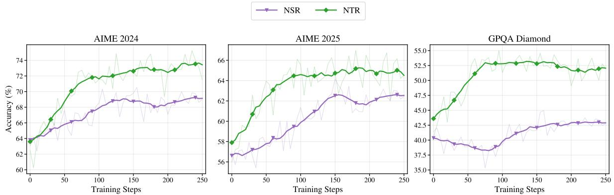  
Figure 9: Pre-RLVR training curves of NTR and NSR on three representative benchmarks under a 32K-token evaluation context. Both stages start from the same Reasoning SFT checkpoint and are evaluated periodically up to step 250 of their respective reconstruction-RL training.

claim in Sec. 4 that entropy collapse is not the cause of NTR’s mediocre ceiling.

## H NTR vs NSR Pre-RLVR Training Curves

Fig. 9 reports the per-step evaluation accuracy of NTR and NSR during their respective pre-RLVR training stages on AIME 2024, AIME 2025, and GPQA Diamond, evaluated under a 32K-token context. Both stages start from the same Reasoning SFT checkpoint and differ only in the reconstruction objective described in Sec. B: NTR uses tokenlevel prefix matching against high-entropy targets, while NSR uses a sentence-level generative judge. Starting from comparable initial accuracies on all three benchmarks, NTR improves more steeply than NSR and finishes slightly above NSR by step 250, with the gap most pronounced on GPQA Diamond. This 32K-context ordering is consistent with the 64K pre-RLVR numbers in Tab. 2, where NTR also slightly leads NSR on these benchmarks.

## I Prompts

We list below the system prompts used during NTR, NSR, and RLVR training. NTR additionally appends the no-CoT context as a user message; RLVR receives the math problem from DAPO-Math-17K as the user message; NSR receives a

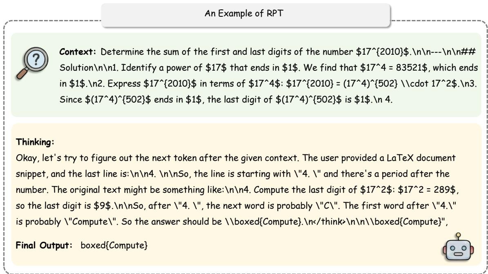  
Figure 10: Representative NTR prediction cases drawn from the top-20% highest-entropy targets of the no-CoT corpus. Even on these nominally uncertain targets, many cases can be solved by short, local-completion reasoning over a few preceding tokens rather than long-horizon inference, allowing the reconstruction reward to be satisfied without genuine reasoning.

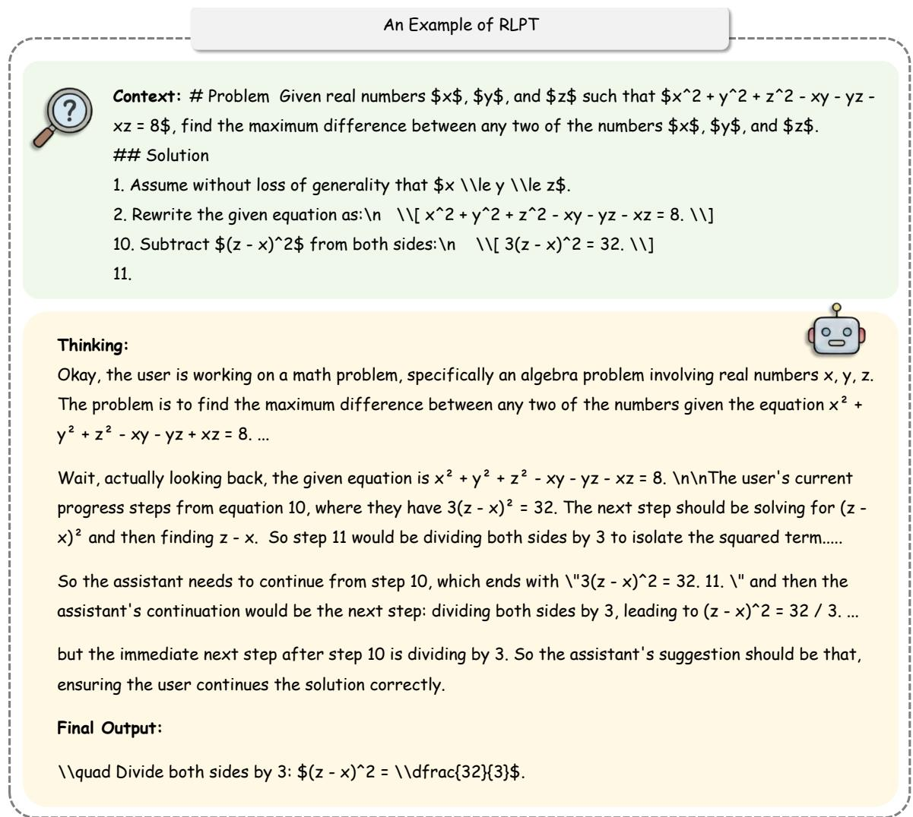  
Figure 11: Representative NSR training trajectory: a no-CoT prefix, the model’s intermediate thinking, and the predicted next sentence judged by the generative reward model.


Question: Let \$p\$ be the least prime number for which there exists a positive integer \$n\$ such that \$n^{6}+1\$ is divisible by \$p^{2}\$. Find the least positive integer \$m\$ such that \$m^{6}+1\$ is divisible by \$p^{2}\$.

## Thinking:


We are asked:\n\nLet p be the least prime number for which there exists a positive integer n such that n^6 + 1 is divisible by $\mathsf { p } ^ { \sim } { 2 } .$ . Find the least positive integer m such that $\mathsf { m } ^ { \sim } 6 + 1$ is divisible by p^2.\n\nWe need to find the smallest prime p for which there exists an n with $n { \hat { \mathbf { \Gamma } } } 6 + 1 \equiv 0$ mod $p ^ { \sim } 2$ , i.e., $\mathsf { p } ^ { \sim } { } ^ { 2 }$ divides n^6 + 1. Then among all such n, find the least positive integer m that satisfies $n { \hat { \mathbf { \Gamma } } } 6 + 1 \equiv 0$ mod p^2. The answer is m.\n\nThus the problem is: find minimal prime p for which there is a solution modulo p^2 to $\times { } ^ { \star } 6$ ≡ -1 mod p^2. Then find the smallest positive solution x (i.e., m). Provide m.\n\nThus need to examine primes p for which -1 is a 6th power residue modulo p^2.\n\nBut the existence of solution modulo p^2 is stronger than modulo p.\n\nLet's start.\n\nWe need p prime, $p ^ { \sim } 2$ | n^6 + 1.\n\nFirst, consider modulo p: need $n { \uparrow } 6 \equiv - 1$ (mod p). So -1 must be a 6th power modulo p. Equivalent to existence of an integer a such that ${ \mathfrak { a } } ^ { \bullet } 6 \equiv - 1$ (mod p). This is essentially that -1 is a 6th power residue modulo p.\n\nConsider p odd prime (p=2 maybe? let's see). For p=2, p^2=4. n^6 + 1 ≡ 0 mod $4 \Rightarrow n ^ { \prime } 6 \equiv - 1$ mod $4 \equiv 3$ mod 4. Since n^6 is a perfect 6th power; for any integer n, n mod 2: if n is even, ${ \mathfrak { n } } ^ { \bullet } 6 \equiv 0$ mod 4; if n odd, $\mathsf n \equiv 1$ mod $2 \Rightarrow n \uparrow 6 \equiv$ 1 mod 8? Wait mod 4: an odd number squared is 1 mod 8? Let's compute mod 4Final answer But we also need to ensure that p=5 indeed is the least prime such that n^6+1 divisible by p^2. Let's verify p=2,3 as earlier. p=2 fails. p=3 fails. p=5 works. So yes.\n\nThus final answer: 7.\n\nPotential pitfalls: The condition for p is that there exists n such that p^2 divides n^6+1. We may need to consider n=0? Positive integer n, so n>0. So n=0 not allowed.\n\nAlright.\n\nThus answer is 7.\n\nNow propose final answer.\n\nNow I'm going to produce final answer.\n\n

## Final Output:

The smallest prime \\(p\\) for which a positive integer \\(n\\) satisfies \n\n\\[\np^{2}\\mid   
n^{6}+1\n\\]\n\nmust first work modulo \\(p\\). \nIf \\(p\\mid n^{6}+1\\) then \\(n^{6}\\equiv-  
1\\pmod p\\). \nThus \\(-1\\) must be a quadratic residue modulo \\(p\\), because then we can take a   
square root \\(r\\) of \\(-1\\) and obtain \n\n\\[\nr^{2}\\equiv-1\\pmod   
p\\quad\\Longrightarrow\\quad r^{6}\\equiv(-1)^{3}\\equiv-1\\pmod p .\n\\]\n\nA prime \\(p\\) for   
which \\(-1\\) is a quadratic residue satisfies \\(p\\equiv1\\pmod 4\\). \nThe smallest odd prime with   
this property is \\(p=5\\).\n\nNow we need a solution of \n\n\\[\nx^{6}\\equiv-1\\pmod{5^{2}}   
\\;(=25).\n\\]\n\nIf \\(x^{2}\\equiv-1\\pmod{25}\\) then \\(x^{6}\\equiv(-1)^{3}\\equiv-  
1\\pmod{25}\\). \nSince \\(-1\\) is a quadratic residue modulo \\(5\\), Hensel’s lemma lifts the two   
solutions\nof \\(x^{2}\\equiv-1\\pmod5\\) to solutions modulo \\(25\\). \nThese lifted solutions are   
\n\n\\[\nx\\equiv 7\\pmod{25},\\qquad x\\equiv 18\\pmod{25}.\n\\]\n\nThus the integers whose sixth   
power is congruent to \\(-1\\) modulo \\(25\\) are exactly the numbers congruent to \\(7\\) or \\(18\\)   
(mod 25). \n\nThe least positive integer among them is   
\\(m=7\\).\n\n\\[\n7^{6}+1=117\\,650=25\\cdot4\\,706,\n\\]\nso indeed \\(5^{2}\\mid   
7^{6}+1\\).\n\n\\[\n\\boxed{7}\n\\]

Figure 12: Representative long-CoT training sample: a math problem paired with a step-by-step reasoning trajectory and final answer.


Question: Let the integers from \$1\$ to \$2n\$ be partitioned into two groups \$A\$ and \$B\$, each containing \$n\$ numbers. Prove that the pairwise sums of the numbers within each group (including the sum of each number with itself) have the same remainder when divided by \$2n\$. Specifically, show that each remainder from \$0\$ to \$2n-1\$ occurs the same number of times in the set of all such pairwise sums for group \$A\$ as it does for group \$B\$.

## Solution:


1. Consider the additive table of \$\\mathbb{Z}/(2n\\mathbb{Z})\$, which is a Latin square. This means that each of the numbers \$0, 1, \\ldots, 2n-1\$ occurs exactly once in each row and each column.\n2. Let \$A\$ and \$B\$ be a partition of \$\\mathbb{Z}/(2n\\mathbb{Z})\$ such that $\$ | A | =| B | = n\$ 123.$ Let \$C\$ and \$D\$ be another partition of \$\\mathbb{Z}/(2n\\mathbb{Z})\$ such that \$|C| = |D| = n\$.\n4. We aim to prove that for each \$x \\in \\mathbb{Z}/(2n\\mathbb{Z})\$, the number of ways \$N(x)\$ that \$x\$ can be written in the form \$x = a + c\$ (where \$a \\in A\$ and \$c \\in C\$) is the same as the number of ways \$N'(x)\$ that \$x\$ can be written in the form \$x = b + d\$ (where \$b \\in B\$ and \$d \\in D\$).\n5. Construct the additive table of \$\\mathbb{Z}/(2n\\mathbb{Z})\$ such that the first \$n\$ columns correspond to the elements of \$C\$, and the last \$n\$ columns correspond to the elements of \$D\$.\n6. Similarly, the first \$n\$ rows correspond to the elements of \$A\$, and the last \$n\$ rows correspond to the elements of \$B\$.\n7. In the \$n \\times n\$ square in the upper-left corner of the table, which corresponds to the sums of the form \$a + c\$, the number \$x\$ occurs exactly \$N(x)\$ times.\n8. Since each number \$x\$ occurs exactly \$n\$ times in the first \$n\$ rows and the first \$n\$ columns, it follows that \$x\$ must occur exactly \$n - N(x)\$ times in the \$n \\times n\$ square in the lower-left corner and the upper-right corner.\n9. By the same reasoning applied to the last \$n\$ rows and the last \$n\$ columns, \$x\$ occurs exactly \$N(x)\$ times in the \$n \\times n\$ square in the lower-right corner of the table.\n10. The number of times \$x\$ occurs in the lower-right \$n \\times n\$ square is exactly the number of ways \$N'(x)\$ that \$x\$ can be written as \$b + d\$.\n11. Therefore, \$N(x) = N'(x)\$ for all \$x \\in \\mathbb{Z}/(2n\\mathbb{Z})\$.\n12. To solve the original problem, choose \$C = A\$ and \$D = B\$.\n13. The conclusion also holds for differences instead of sums by choosing \$C = -A\$ and \$D = - B\$.\n\n\$\blacksquare\$

Figure 13: Representative no-CoT training sample: a math problem with a compressed solution that omits explicit reasoning traces.

## õ Prompt: RPT (Token-Level Reconstruction)

You are an expert reasoner with extensive experience in all areas. You approach problems through systematic thinking and rigorous reasoning. Your response should reflect deep understanding and precise logical thinking, making your solution path and reasoning clear to others. Please put your thinking process within <think>...</think> tags. Predict the next token and wrap it in \boxed{} given the context. \$Context\$

{context}

## õ Prompt: RLPT (Sentence-Level Reconstruction)

You are an expert reasoner with extensive experience in completion tasks. Please put your thinking process within <think>...</think> tags.

## õ Prompt: RLVR

You are an expert reasoner with extensive experience in all areas. You approach problems through systematic thinking and rigorous reasoning. Your response should reflect deep understanding and precise logical thinking, making your solution path and reasoning clear to others. Please put your thinking process within <think>...</think> tags.