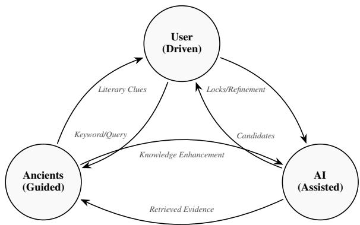
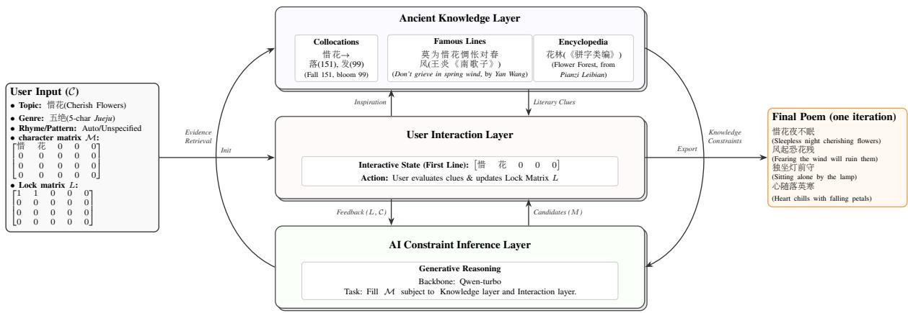
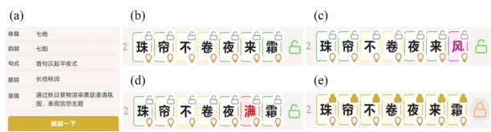
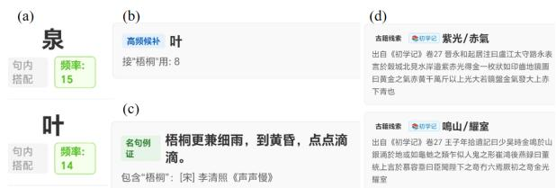
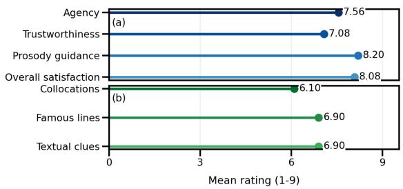

# Jiuge-Tuiqiao: An Interpretable Human-AI System for Classical Chinese Poetry Refinement

Yufeng Han1,2,3\*, Lifan Deng1,2,3,4\*, Cunliang Kong1,2,3,

Wenhao Li1,2,3, Xin Cong5, Yuzhuo Bai1,2,3, Kangyang Luo1,2,3, Maosong Sun1,2,3,6†

1Department of Computer Science and Technology, Tsinghua University, Beijing

2Beijing National Research Center For Information Science And Technology

3Institute for Artificial Intelligence, Tsinghua University, Beijing

4Rixin College, Tsinghua University 5Department of Statistics and Data Science, Tsinghua University 6Jiangsu Collaborative Innovation Center for Language Ability, Jiangsu Normal University, Xuzhou hanyufeng@mail.tsinghua.edu.cn, dlf24@mails.tsinghua.edu.cn

## Abstract

Classical Chinese poetry composition has long valued Tuiqiao, the iterative refinement of words, imagery, and prosody. However, many current AI poetry systems follow a one-shot generation paradigm, which reduces users to prompt providers and weakens their creative agency. We present Jiuge-Tuiqiao1, an interactive human-AI collaborative system for classical Chinese poetry composition. The system is designed around a triadic model: userdriven control, ancient-guided evidence, and AI-assisted generation. Users can lock characters or lines, receive real-time prosody feedback, and obtain interpretable refinement suggestions grounded in high-frequency collocations, PPL-ranked classical lines, and structured knowledge extracted from classical encyclopedias. This design turns AI from an autonomous generator into a background assistant that supports the user’s own process of poetic refinement. Preliminary experiments and user feedback suggest that Jiuge-Tuiqiao improves controllability, interpretability, and user engagement in classical poetry composition.

## 1 Introduction

Classical Chinese poetry composition emphasizes Tuiqiao: a constrained iterative refinement where poets balance semantic precision, tonal prosody, and aesthetic coherence. The well-known case of Jia Dao deliberating between “push the moonlit gate”(Seng Tui Yue Xia Men) and “knock the moonlit gate”(Seng Qiao Yue Xia Men) shows how poets weigh linguistic accuracy, emotional nuance and formal integrity. Therefore, Tuiqiao sharpens poetic language, and the process of Tuiqiao embodies the creator’s subjectivity — including linguistic competence, cultural literacy, and stylistic voice.

Current AI can produce fluent, aesthetic verses comparable to average human writing, but this oneshot paradigm creates interrelated technical gaps:

• Lack of Tuiqiao process: Existing “one-click generation” paradigm generate a complete poem from a prompt, but offer no mechanism for users to precisely intervene on unsatisfactory local elements. This makes iterative refinement—the very essence of Tuiqiao—impossible.

• Opaque recommendation: The alternatives systems provided are opaque: a black-box with no literary or linguistic justification. Users cannot tell why a candidate fits, nor verify it against classical precedents.

• Absence of creator agency: Most critically, users become only instruction-givers and passive receivers, unable to inject personal aesthetics, emotions, or style into refinement. This weakens the sense of authorship and makes the interaction closer to content consumption than creative composition.

To bridge the aforementioned gap, we present Jiuge-Tuiqiao. The system returns creative initiative to the poet by modeling a deep tripartite interaction among the user, the ancients, and AI (Fig1):

• User-driven: Users retain full control, can lock any satisfying character or line, and receive revision suggestions under those constraints — enabling true iterative refinement.

• Ancient-guided: A rich knowledge base (high-frequency collocations, famous lines and cues from ancient encyclopedias) provides literary or linguistically grounded suggestions, realizing “refinement following the ancients’ thinking”.

  
Figure 1: The collaborative workflow of Jiuge-Tuiqiao. It shows the relationship where the User maintains creative subjectivity, Ancient Knowledge provides knowledge guidance, and AI offers generative assistance.

• AI-assisted: AI steps to the background as a powerful language generation engine and knowledge retrieval tool, optimizing its outputs based on user feedback and knowledge constraints, rather than replacing the user’s creative agency.

We also integrate a dynamic prosody checking mechanism that provides real-time feedback on tonal patterns and rhyme using color coding, helping users attend to both formal prosody and semantic expression during the Tuiqiao process.

Jiuge-Tuiqiao is fully implemented and accessible via WeChat mini-program, open to poetry enthusiasts, teaching, and cultural dissemination, offering a complete workflow from generation, refinement to feedback. User studies show it significantly enhances creative agency and engagement, digitally perpetuating the traditional wisdom of Tuiqiao in the AI era.

## 2 Related Work

Classical Chinese Poetry Generation. Automated poetry generation has evolved from rule-based methods to neural architectures optimizing coherence and style (Yi et al., 2018a; Yang et al., 2018; Yi et al., 2018b). Recent research leverages Large Language Models (LLMs) for structural and imagery control, including unified GPT-2 frameworks (Hu and Sun, 2020), imagery-focused masking in PoemBERT (Huang and Shen, 2025), token-free character control in CharPoet (Yu et al., 2024), and domain-specific LoRA fine-tuning (Xie, 2025).

Interactive Poetry Systems. Shifting from oneclick generation, interactive systems emphasize human-AI collaboration. Platforms like Jiuge (Guo et al., 2019) and Yu Sheng (Ma et al., 2023) enable iterative draft revision. However, their recommendations are purely model-driven and lack literary justification. In contrast, Jiuge-Tuiqiao provides interpretable evidence from ancient encyclopedias and historical collocations to ground the refinement process.

Interactive AI in Other Domains. Interactive refinement and human-in-the-loop feedback have also enhanced argumentative writing training (Ding et al., 2025) and narrative coherence in storytelling (Mayer Martins et al., 2025). We extend this philosophy of collaborative, feedback-driven intervention to the highly constrained domain of classical Chinese poetry.

## 3 System Architecture

We formalize Jiuge-Tuiqiao as a human-AI collaborative, constrained iterative refinement process. This section presents its mathematical formalization, introduces a three-layer decoupled architecture, and models single refinement iterations via a finite state machine (FSM).

## 3.1 Problem Formulation

We model a poem as a partially observable character matrix M, with dimensions determined by its poetic form $( \mathbf { e . g . , } M _ { 8 \times 5 }$ for a 5-char lvshi). Each entry $M _ { i , j }$ contains either a Chinese character or a placeholder 0 awaiting completion or refinement.

Input Constraint Set C. The user defines the constraints as a set $\mathcal { C } = \{ \mathcal { K } , d , \mathcal { V } , \mathcal { P } , T \}$ , comprising topic keywords K, artistic description d, a target Pingshui Yun rhyme category Y, an optional first-line tonal pattern $\mathcal { P } \left( \mathrm { A p p e n d i x } \mathrm { A } \right)$ , and a versederived tonal matrix $T \in \{ P , Z , A \} ^ { n \times m }$ , where P, Z, A denote level, oblique, and flexible tones, respectively.

Interaction State & Objective. The interaction state uses a lock matrix $L \in \{ 0 , 1 \} ^ { n \times m }$ , where $L _ { i , j } = 1$ freezes a character and $L _ { i , j } = 0$ keeps it editable. One Tuiqiao step optimizes an implicit LLM scoring function S under user-defined and

  
Figure 2: System architecture and the triadic collaborative iterative Tuiqiao process. The core engine coordinates the Ancient Heritage, User Subjectivity, and AI Assistant layers through continuous feedback and evidence retrieval.

prosodic constraints:

$$
\begin{array} { r l } & { M ^ { * } = \arg \underset { M } { \operatorname* { m a x } } S ( M  { \lvert } K , d , \mathcal { P } ) , } \\ & { \mathrm { s . t . } \ M _ { i , j } ^ { * } = M _ { i , j } , \quad \forall ( i , j ) \mathrm { ~ w h e r e ~ } L _ { i , j } = 1 , } \\ & { \quad \mathrm { P a t t e r n } ( M ^ { * } , T )  1 , } \\ & { \quad \mathrm { R h y m e } ( M ^ { * } , \mathcal { V } )  1 , } \end{array}
$$

where S reflects coherence and user preferences. The lock constraint is enforced deterministically. The remaining prosodic functions correspond directly to our evaluation metrics (§6.2): Pattern requires regulated-verse compliance (including niandui adhesion); and Rhyme checks Pingshui Yun consistency on prescribed lines. The user retains ultimate agency to accept, reject, or manually revise candidates.

## 3.2 Triadic Collaborative Architecture

We implement a three-layer decoupled architecture to support user-driven, ancient-guided, and AI-assisted collaboration (Figure 2).

Interaction Layer. Captures fine-grained user operations (text input, character locking, suggestion selection) and translates them into system events. It dynamically updates the lock matrix L and constraint set C, maintaining full user control at each step.

Knowledge Layer. Grounded in classical scholarship, this layer provides literary justifications by integrating three types of knowledge (detailed in §4): (1) high-frequency collocations extracted from 320,000 lines of Tang and Song poetry; (2) famous line references ranked via PPL using Qwen3-32B on 1.8M historical poems; and (3) 11 classical encyclopedias (e.g., Hailu Suishi, Baikong Liutie) supplying imagery, antithesis, and rhyme words.

Constraint Inference Layer. Powered by Qwen-turbo, this core engine aggregates hard constraints (L, C) from the interaction layer and soft constraints (literary clues) from the knowledge layer. Through tailored prompt engineering and decoding strategies, it generates compliant poem candidates while positioning AI strictly as a background assistant.

## 3.3 Iterative Refinement Cycle

The continuous, user-led Tuiqiao process is modeled as a finite state machine (FSM) loop:

(1) Initialization: The user inputs constraints C (an d optionally a draft), and the system generates an initial poem matrix M.

(2) AI Generation: When the user triggers Tuiqiao, the system populates placeholders in M to produce candidate solutions.

(3) Review & Locking: The user evaluates candidates and either locks satisfactory tokens (updating the lock matrix L) or manually edits the text.

(4) Iterative Loop: Steps (2) and (3) repeat dynamically with the updated L until the user is satisfied.

Throughout this cycle, the AI engine is strictly confined to generating interpretable options, while the knowledge layer supplies historical precedents as evidence. Ultimate creative agency and editing rights remain entirely with the human user, fully operationalizing our triadic collaborative philosophy.

## 4 Methods

To ensure interpretability, Jiuge-Tuiqiao systematically integrates classical poetry knowledge with neural generation. For any refinement position, the system retrieves evidence from three knowledge sources: frequent co-occurrences, famous couplet matching, and ancient encyclopedia clues. Below, we detail the computation of each source and our joint fusion strategy.

## 4.1 Frequent Co-occurrence Retrieval

To discover habitual word pairings, we apply a ttest to assess collocation significance, filtering out spurious high-frequency pairings.

Preprocessing & Counting. We utilize 320,000 lines from Tang-Song jueju and lvshi poems from $\mathrm { S o u } { - } \mathrm { Y u n } ^ { 2 }$ . Lines are segmented using a dictionaryplus-metrical-foot method (Appendix B). After converting to simplified Chinese, filtering function words, and discarding short lines, we compute the global frequency $f ( w )$ for each word $w ,$ and the cooccurrence frequency $f ( w _ { i } , w _ { j } )$ for ordered pairs within the same line.

Significance Testing. Under the null hypothesis that words $w _ { i }$ and $w _ { j }$ appear independently within a line, their individual and joint probabilities are defined as $P ( w ) ~ = ~ f ( w ) / N$ and $P ( w _ { i } , w _ { j } ) =$ $f ( w _ { i } , w _ { j } ) / N$ , where N is the total line count. The t-statistic is calculated as:

$$
T ( w _ { i } , w _ { j } ) = \frac { P ( w _ { i } , w _ { j } ) - P ( w _ { i } ) P ( w _ { j } ) } { \sqrt { P ( w _ { i } , w _ { j } ) / N } } .
$$

We filter for pairs with $f ( w _ { i } , w _ { j } ) \ge 3$ and $T >$ 1.96 (95% confidence), sorting by descending $T$ to yield 28,739 high-frequency collocations.

Suggestion Generation. For a target position (i, j) with context words $\mathcal { W } _ { c t x }$ , candidate characters c are ranked by their highest t-value with any anchor word $w \in \mathcal { W } _ { c t x }$ , outputting the top candidates alongside their traceable collocation evidence.

## 4.2 Famous Couplet Matching via Perplexity

We employ Perplexity (PPL) as a proxy for canonical familiarity, assuming that lines with lower PPL are better predicted by a pretrained model and thus more likely to reflect canonical historical expressions.

Corpus Construction. From 1.8M+ historical poems (Pre-Qin to Qing dynasty) sourced from ${ \mathrm { S o u } } { \mathrm { - Y u n } } ^ { 1 }$ , we split texts by standard punctuation, filter out fragments shorter than 7 characters, and deduplicate to construct the candidate famous-line collection $\mathcal { D } _ { r a w }$

PPL Evaluation. Using Qwen3-32B, we compute the PPL for each line $s = ( x _ { 1 } , . . . , x _ { | s | } )$ to quantify its typicality in large-scale Chinese corpora:

$$
\mathrm { P P L } ( s ) = \exp \left( - \frac { 1 } { | s | } \sum _ { t = 1 } ^ { | s | } \log P ( x _ { t } \mid x _ { < t } ; \theta ) \right) .
$$

Binning & Suggestion Generation. To eliminate length bias (as longer lines inherently alter average PPL distributions), we stratify $\mathcal { D } _ { r a w }$ into distinct length bins using thresholds at 12 and 16 characters. For a target position $( i , j )$ and candidate character c, the system retrieves lines containing c that overlap with the context $\mathcal { W } _ { c t x }$ . Candidates are then ranked by ascending PPL within their respective length bins to serve as canonical evidence.

## 4.3 Ancient Encyclopedia Clue Retrieval

We extract structured textual data from 11 ancient Chinese encyclopedias—including topic-organized works (e.g., Hailu Suishi, Baikong Liutie) and rhyme-organized works $( \mathrm { e . g . }$ , Yunfu Qunyu)—to construct three specialized databases (detailed in Appendix C):

(1) Imagery Words, storing topic-specific poetic images and descriptions;

(2) Antithesis Words, containing parallel or antithetical word pairs;

(3) Rhyme Words, categorizing terms by their prescriptive rhyme categories.

Suggestion Generation. For a target position $( i , j )$ given the current word w and user keywords $\kappa .$ the system dynamically queries these databases. It retrieves relevant imagery clues based on $\kappa .$ , antithesis clues based on w (if parallel constraints apply), or rhyme clues matching the target rhyme $\mathcal { V } .$ These retrieved entries are returned directly to the user as explicit literary justifications.

## 4.4 Suggestion Organization and Presentation

The interface displays the suggestion lists from three knowledge sources in parallel as categorized cards. Users can browse this traceable evidence to either adopt a candidate or perform manual edits, preserving ultimate human agency over the final text.

## 5 User Interface

The Jiuge-Tuiqiao WeChat mini-program (Taro 4, React, FastAPI) features a human-centric interface that balances direct user control with multi-channel poetic knowledge.

  
Figure 3: Overview of system states: (a) metadata constraint initialization panel; (b–e) real-time feedback in the Character Grid Editor showing (b) valid compliance (green) and acceptable variants (yellow), (c) rhyme mismatch (purple), (d) tonal violation (red), and (e) userlocked tokens (gold fill).

Character Grid Editor. As the central workspace, this grid dynamically renders characters alongside multi-dimensional states (Figure 3). With a 500 ms debounce, it provides real-time feedback: green borders denote valid compliance and yellow marks acceptable variants (Figure 3b); purple signals rhyme mismatches (Figure 3c); and red indicates tonal violations (Figure 3d). A gold fill highlights user-locked tokens (Figure 3e). Explicit justifications accompany violations to streamline error correction.

Hierarchical Locking Mechanism. To preserve human creative agency, users can restrict AI generation at two granularities: (1) Character-level lock freezes individual cells $( L _ { i , j }  1$ , gold fill; Figure 3e) to preserve user tokens; (2) Line-level lock fixes an entire row, forcing the system to generate alternatives strictly for the remaining lines.

Interpretable Tuiqiao Panel. Clicking an unlocked cell activates a side panel aggregating evidence from four parallel knowledge channels (Figure 4): (1) High-frequency co-occurrence displays top collocates from a 28,739-entry table (§4.1, Figure 4a–b); (2) Famous-line samples shows up to five lines ranked by ascending PPL with full metadata (§4.2, Figure 4c); (3) Ancient encyclopedia clues supplies imagery, antithesis, or rhyme clues mined from 11 historical encyclopedias (§4.3, Figure 4d); and (4) LLM rationale provides precomputed, asynchronous justifications via an 8,000- capacity LFU cache to eliminate latency. Active Sou-Yun Integration hyperlinks grid characters for deeper historical inspection, delivering traceable evidence while leaving final decisions to the poet.

Revision History & Workflow. Each line maintains an independent undo/redo stack for singleclick version restoration. This supports an iterative co-creation loop: users initialize metadata (Figure 3a), generate candidates, lock satisfactory segments, and progressively refine tokens via the Tuiqiao panel under real-time validation until completion.

  
Figure 4: Multi-channel evidence in the Interpretable Tuiqiao Panel: (a–b) statistical high-frequency cooccurrence candidates, (c) ranked famous-line samples with metadata, and (d) textual clues retrieved from ancient encyclopedias.

## 6 Evaluation

We evaluate Jiuge-Tuiqiao across three dimensions: (1) a knowledge-source ablation study on clozefilling; (2) automatic prosodic metrics on generated poems; and (3) a human evaluation assessing creative experiences.

## 6.1 Ablation Study: Knowledge Source Contribution

Task and Setup. To isolate each knowledge source’s contribution, we design a controlled clozefilling task using 50 poem lines stratified by poem type. For each instance, we mask a contiguous twocharacter content word and prompt the backbone LLM (Qwen-turbo) to predict the blank under four conditions: (1) BASE: context only; (2) +FL: adds up to five PPL-ranked famous lines containing the anchor term; (3) +CO: adds top-20 co-occurrence phrases; and (4) BOTH: provides both sources simultaneously. We evaluate performance using Hit@1 (whether the original ground-truth word is the top-ranked candidate) and Hit@5 (whether the ground truth appears anywhere within the top five suggestions).

Results. As shown in Table 1, auxiliary knowledge significantly boosts performance over the BASE condition. While +FL yields the highest Hit@1 (60%) due to historical exact-matches, introducing co-occurrences (+CO and BOTH) expands the lexical search space. Notably, BOTH maintains the peak Hit@5 (60%) while slightly softening Hit@1 to 56%. This trade-off is ideal for an interactive assistant: famous lines preserve classical diction, while co-occurrence phrases inject stylistic diversity rather than merely forcing the reproduction of the ground truth.

<table><tr><td>Condition</td><td>Hit@1</td><td>Hit@5</td></tr><tr><td>BASE</td><td>12%</td><td>12%</td></tr><tr><td>+FL</td><td>60%</td><td>60%</td></tr><tr><td>+CO</td><td>36%</td><td>42%</td></tr><tr><td>BOTH</td><td>56%</td><td>60%</td></tr></table>

Table 1: Ablation results on cloze-filling. Combin ing both sources (BOTH) optimizes candidate diversity while maintaining peak Hit@5.

## 6.2 Automatic Prosody Evaluation

Setup & Metrics. We evaluate system-generated poems using 80 requests stratified across four forms (5/7-character jueju and lvshi) and four historical title-frequency tiers: high (top 10%), mid (10– 50%), low (50–90%), and rare (bottom 10%). We report rule-based correctness via Format (structural length), L-Pattern (line-level tonal accuracy), P-Pattern (global poem-level pattern adherence including nian-dui constraints), and Rhyme (Pingshui Yun consistency). Output diversity is quantified using Distinct-n and Self-BLEU (n ∈ {1, 2, 4}).

Results. As shown in Table 2, the system achieves perfect Format and Rhyme accuracy across all forms, alongside high line-level alignment (L-Pattern ≥ 91.25%). However, global constraints impose a strict bottleneck: poem-level adherence (P-Pattern) drops significantly for lvshi (15%–25%) compared to jueju (50%–65%), reflecting the complexity of compounding eight-line nian-dui requirements. Crucially, Table 3 confirms that these structural constraints do not induce mode collapse; lexical diversity remains high, with Distinct-4 reaching 1.0000 and Self-BLEU-4 at a low 0.1855.

<table><tr><td>Form</td><td>Format</td><td>L-Pattern</td><td>P-Pattern</td><td>Rhyme</td></tr><tr><td>5-char jueju</td><td>100%</td><td>96.25%</td><td>65%</td><td>100%</td></tr><tr><td>7-char jueju</td><td>100%</td><td>91.25%</td><td>50%</td><td>100%</td></tr><tr><td>5-char lvshi</td><td>100%</td><td>93.12%</td><td>25%</td><td>100%</td></tr><tr><td>7-char lvshi</td><td>100%</td><td>93.12%</td><td>15%</td><td>100%</td></tr></table>

Table 2: Automatic prosody accuracy by verse form.

<table><tr><td></td><td>1-gram</td><td>2-gram</td><td>4-gram</td></tr><tr><td>Distinct</td><td>0.9804</td><td>0.9995</td><td>1.0000</td></tr><tr><td>Self-BLEU</td><td>0.8983</td><td>0.5717</td><td>0.1855</td></tr></table>

Table 3: Output diversity metrics across generations.

  
Figure 5: Human evaluation ratings (9-point Likert scale) showing (a) four evaluation dimensions and (b) perceived utility of three knowledge sources.

## 6.3 User Evaluation

Setup. We conducted a preliminary user evaluation with 10 participants (poetry enthusiasts and researchers in classical Chinese literature). After composing at least one poem, each participant completed a 9-point Likert scale questionnaire (1 = strongly disagree, 9 = strongly agree) covering four dimensions: (1) Agency (active creative control), (2) Trustworthiness (suggestion credibility), (3) Prosody guidance (color feedback utility), and (4) Overall satisfaction. Open-ended qualitative feedback was also collected.

Results. As shown in Figure 5, participants rated the system positively overall. Prosody guidance scored highest (8.20/9), demonstrating that realtime color feedback effectively aided metrical revisions. Overall satisfaction (8.08/9) and agency (7.56/9) were high, confirming active user control over AI outputs. Trustworthiness and evidence utility scored 7.08/9. Among knowledge sources, users preferred famous lines and ancient textual clues over frequent collocations, prioritizing contextual literary evidence over statistical signals. Open-ended feedback highlighted that evidence panels (source lines, author attributions, citations) enhanced credibility and facilitated incontext learning.

## 7 Conclusion and Future Work

We presented Jiuge-Tuiqiao, a human-AI collaborative poetry composition system that recenters human agency through classical aesthetics. The framework implements a triadic design—integrating hierarchical locking, real-time prosody validation, and multi-channel traceable recommendations. Evaluation and user studies confirm that our transparent, evidence-grounded approach yields high prosodic compliance and significantly bolsters user trust over black-box alterna-

tives.

Future work will focus on four directions: (1) Personalized modeling to adapt recommendations to individual stylistic preferences across sessions; (2) Broader poetic forms extending constraints to irregular meters like ci (song-lyrics) and sanqu (aria); (3) Comprehensive user studies engaging larger, diverse participant pools to rigorously validate the system’s usability and long-term creative impact; and (4) Preference alignment utilizing interaction logs as training signals to fine-tune LLMs toward both high poetic quality and user agency.

## Ethics and Impact

Creative authorship and attribution. Jiuge-Tuiqiao is designed so that the human poet retains full creative initiative: the system provides options and evidence, never unilaterally inserting text without user acceptance. Nevertheless, AI-assisted composition raises genuine questions about authorship. We recommend that users who publish AIassisted poems disclose the assistance; the system’s export functionality includes a disclosure template for this purpose. We do not claim that AI-generated candidates carry the same creative authorship as wholly human-written verse.

Cultural preservation and accessibility. Classical Chinese poetry encodes millennia of cultural knowledge — prosodic conventions, canonical imagery,allusive traditions. By embedding the Pingshui Yun system, ancient encyclopedias, and a vast famous-line corpus into the interaction loop,Jiuge-Tuiqiao lowers the barrier to engaging with and practising this tradition, potentially reaching learners of Chinese as a second language and heritage communities outside China.

Potential biases. The knowledge base is constructed from historical corpora that skew heavily toward the Tang and Song dynasties and toward elite male authorship. As a result, recommended collocations and famous lines may systematically under-represent the poetic traditions of women poets, border literati, and minority-language contributors to the Chinese literary canon. Future versions should apply diversity-aware retrieval to broaden the representational range of suggestions.

Risk of creative dependency. A persistently available refinement tool may, over time, discourage users from developing independent prosodic intuition. The system mitigates this risk by displaying explanatory feedback for each prosodic violation rather than silently correcting it, and by making all knowledge sources and their justifications explicitly visible — encouraging users to learn why a suggestion is grounded in classical practice, not merely to accept it.

## References

Yuning Ding, Franziska Wehrhahn, and Andrea Horbach. 2025. FEAT-writing: An interactive training system for argumentative writing. In Proceedings of the 31st International Conference on Computational Linguistics: System Demonstrations, pages 217–225, Abu Dhabi, UAE. Association for Computational Linguistics.

Zhipeng Guo, Xiaoyuan Yi, Maosong Sun, Wenhao Li, Cheng Yang, Jiannan Liang, Huimin Chen, Yuhui Zhang, and Ruoyu Li. 2019. Jiuge: A humanmachine collaborative Chinese classical poetry generation system. In Proceedings of the 57th Annual Meeting of the Association for Computational Linguistics: System Demonstrations, pages 25–30, Florence, Italy. Association for Computational Linguistics.

Jinyi Hu and Maosong Sun. 2020. Generating major types of Chinese classical poetry in a uniformed framework. In Proceedings ofthe Twelfth Language Resources and Evaluation Conference, pages 4658– 4663, Marseille, France. European Language Resources Association.

Chihan Huang and Xiaobo Shen. 2025. PoemBERT: A dynamic masking content and ratio based semantic language model for Chinese poem generation. In Proceedings of the 31st International Conference on Computational Linguistics, pages 50–60, Abu Dhabi, UAE. Association for Computational Linguistics.

Jingkun Ma, Runzhe Zhan, and Derek F. Wong. 2023. Yu sheng: Human-in-loop classical Chinese poetry generation system. In Proceedings ofthe 17th Conference ofthe European Chapter ofthe Association for Computational Linguistics: System Demonstrations, pages 57–66, Dubrovnik, Croatia. Association for Computational Linguistics.

Jonas Mayer Martins, Ali Hamza Bashir, Muhammad Rehan Khalid, and Lisa Beinborn. 2025. Once upon a time: Interactive learning for storytelling with small language models. In Proceedings ofthe First BabyLM Workshop, pages 454–468, Suzhou, China. Association for Computational Linguistics.

Haotao Xie. 2025. System report for CCL25-eval task 5: New dataset and LoRA-fine-tuned qwen2.5. In Proceedings ofthe 24th China National Conference on Computational Linguistics (CCL 2025), pages 200– 205, Jinan, China. Chinese Information Processing Society of China.

Cheng Yang, Maosong Sun, Xiaoyuan Yi, and Wenhao Li. 2018. Stylistic Chinese poetry generation

via unsupervised style disentanglement. In Proceedings of the 2018 Conference on Empirical Methods in Natural Language Processing, pages 3960–3969, Brussels, Belgium. Association for Computational Linguistics.

Xiaoyuan Yi, Ruoyu Li, and Maosong Sun. 2018a. Chinese poetry generation with a salient-clue mechanism. In Proceedings ofthe 22nd Conference on Computational Natural Language Learning, pages 241–250, Brussels, Belgium. Association for Computational Linguistics.

Xiaoyuan Yi, Maosong Sun, Ruoyu Li, and Wenhao Li. 2018b. Automatic poetry generation with mutual reinforcement learning. In Proceedings of the 2018 Conference on Empirical Methods in Natural Language Processing, pages 3143–3153, Brussels, Belgium. Association for Computational Linguistics.

Chengyue Yu, Lei Zang, Jiaotuan Wang, Chenyi Zhuang, and Jinjie Gu. 2024. CharPoet: A Chinese classical poetry generation system based on tokenfree LLM. In Proceedings ofthe 62nd Annual Meeting ofthe Associationfor Computational Linguistics (Volume 3: System Demonstrations), pages 315–325, Bangkok, Thailand. Association for Computational Linguistics.

## A Rhyme Categories and First-line Tonal Patterns

Pingshui Yun Rhyme Categories (30 Level Tones). The system supports 30 Level Tone categories from the Pingshui Yun system.

Upper Level Tones $( \bot \mp \mp \frac { \mp } { \mp } ) :$ 东Dong,冬Dong, 江Jiang, 支Zhi, 微Wei, 鱼Yu, 虞Yu,齐Qi, 佳Jia, 灰Huei, 真Zhen, 文Wen, 元Yuan,寒Han, 删Shan.

Lower Level Tones (下平声): 先Xian, 萧Xiao,肴Yao, 豪Hao, 歌Ge, 麻Ma, 阳Yang, 庚Geng,青Qing, 蒸Zheng, 尤You, 侵Qin, 覃Tan, 盐Yan,咸Xian.

Tonal Pattern Matrices (7-character Jueju). Tonal constraints are modeled as matrices $T \in$ $\{ P , Z , A \} ^ { n \times m }$ , where P: Level tone (平声), Z: Oblique tone (仄声), and A: Flexible. The four globally valid patterns are consolidated below.

1. Level-start, Level-end (平起平收)

$$
T _ { L - L } = { \left[ \begin{array} { l l l l l l l } { A } & { P } & { A } & { Z } & { Z } & { P } & { P } \\ { A } & { Z } & { P } & { P } & { A } & { Z } & { P } \\ { A } & { Z } & { A } & { P } & { P } & { Z } & { Z } \\ { A } & { P } & { A } & { Z } & { Z } & { P } & { P } \end{array} \right] }
$$

2. Level-start, Oblique-end (平起仄收)

$$
T _ { L - O } = { \left[ \begin{array} { l l l l l l l } { A } & { P } & { A } & { Z } & { A } & { P } & { Z } \\ { A } & { Z } & { P } & { P } & { A } & { Z } & { P } \\ { A } & { Z } & { A } & { P } & { P } & { Z } & { Z } \\ { A } & { P } & { A } & { Z } & { Z } & { P } & { P } \end{array} \right] }
$$

3. Oblique-start, Level-end (仄起平收)

$$
T _ { O - L } = { \left[ \begin{array} { l l l l l l l } { A } & { Z } & { P } & { P } & { A } & { Z } & { P } \\ { A } & { P } & { A } & { Z } & { Z } & { P } & { P } \\ { A } & { P } & { A } & { Z } & { A } & { P } & { Z } \\ { A } & { Z } & { P } & { P } & { A } & { Z } & { P } \end{array} \right] }
$$

4. Oblique-start, Oblique-end (仄起仄收)

$$
T _ { O - O } = { \left[ \begin{array} { l l l l l l l } { A } & { Z } & { A } & { P } & { P } & { Z } & { Z } \\ { A } & { P } & { A } & { Z } & { Z } & { P } & { P } \\ { A } & { P } & { A } & { Z } & { A } & { P } & { Z } \\ { A } & { Z } & { P } & { P } & { A } & { Z } & { P } \end{array} \right] }
$$

## B Poem Segmentation Algorithm

Two-Stage Segmentation Strategy. The system employs a two-stage strategy to achieve grammarbased segmentation (G-Seg): (1) Candidate Generation: Based on a scoring dictionary and metrical rules, the system enumerates all possible paths via Depth-First Search (DFS) under maximum word length limits, globally selecting the top-K scoring candidate paths. (2) LLM Reranking: An LLM acts as a discriminator to select the optimal candidate that best adheres to grammatical norms from the top-K list.

<table><tr><td>Line Type</td><td>Boundary Rules</td><td>Length Rules</td></tr><tr><td rowspan="2">5-char</td><td>Pos 2: +0.8</td><td>2-char: +0.1</td></tr><tr><td>Pos 3: -0.3</td><td>1-char: -0.05</td></tr><tr><td rowspan="3">7-char</td><td>Pos 2, 4: +0.5</td><td>2-char: +0.1</td></tr><tr><td>Pos 3, 5: −0.3</td><td>1-char: -0.05</td></tr><tr><td></td><td>≥ 4-char: -0.1</td></tr><tr><td rowspan="2">General</td><td></td><td> $2 \mathrm { - c h a r } \mathrm { : + 0 . 0 5 }$ </td></tr><tr><td></td><td> $1 \mathrm { - c h a r } \mathrm { : - 0 . 0 5 }$ </td></tr></table>

Table 4: Metrical rhythm reward and penalty rules.

Dictionary Scoring Formula. The total score for a segmentation path is defined as Score = $\begin{array} { r } { \sum _ { w _ { i } \in \mathrm { p a t h } } \mathrm { S c o r e } _ { d i c t } ( w _ { i } ) + \mathrm { B o n u s } _ { m e t e r } ( w _ { i } ) } \end{array}$ . The base dictionary score $\mathbf { S c o r e } _ { d i c t } ( w )$ for a word w of length L integrates multiple empirical lexical features:

$$
\begin{array} { r l } { \mathrm { S c o r e } _ { d i c t } ( w ) = } & { } \\ & { ~ \mathrm { l o g } ( 1 + \mathrm { f r e q } ( w ) ) + 0 . 8 \cdot \mathrm { M I } _ { n o r m } ( w ) } \\ & { + 0 . 3 \cdot \mathrm { D i c t C o u n t } ( w ) + \mathrm { A l l u s i o n } ( w ) } \\ & { + \mathrm { L e n P r e f } ( L ) - \mathrm { O O V \_ P e n a l t y } , } \end{array}
$$

where $\mathbf { M I } _ { n o r m }$ represents normalized mutual information, and DictCount tracks occurrence counts across historical dictionaries. Allusion(w) adds +1.0 for established literary references. The length preference term is defined as LenPref(L) = {+0.5 for $L = 2 , + 0 . 2$ for $L = 3 , - 0 . 2$ for $L \geq$ 4}. Out-of-vocabulary (OOV) tokens receive a base score of −1.0 and an additional penalty of −0.1.

Metrical Constraints. To simulate natural classical Chinese recitation rhythms $( 2 + 3$ for 5- character and $2 + 2 + 3$ for 7-character lines), position- and length-specific bonuses (Bonusmeter) are applied directly following the operational rules defined in Table 4.

G-Seg Specification for LLM Reranking. In Stage 2, the LLM evaluates the top-K candidates via few-shot prompts under strict linguistic guidelines: (1) functional words (e.g., particles, adverbs, conjunctions) must stand alone as single characters whenever possible; (2) tightly coupled semantic entities (names like “Huang Siniang”, places) must be merged into single tokens; (3) contextual flexibility takes precedence over blindly preferring longer words. If no available candidate is grammatically sound, the LLM triggers a ‘WARNING’ fallback and outputs its self-corrected proper segmentation sequence.

## C Ancient Encyclopedias Database

To provide well-grounded philological and linguistic suggestions during the Tuiqiao process, our system constructs a structured knowledge base by extracting textual data from over ten representative classical Chinese encyclopedias (Leishu) and rhyme dictionaries spanning the Tang to Qing dynasties (e.g., Chuxueji, Taiping Yulan, and Peiwen Yunfu). Table 5 outlines the basic profiles and concrete database entry examples of these primary resources.

<table><tr><td>Book</td><td>Description</td><td>Content Example (Extracted Data)</td></tr><tr><td>《北堂书钞》 Beitang Shuchao</td><td>Compiled by Yu Shinan (Tang). An early extant encyclopedia focusing on politics and rituals, pre- serving numerous pre-Sui texts.</td><td>Keyword: 功业(Achievements) Volume: 4 Section:帝王(Emperors) Content:“四本具即帝初立，举而措之事业，功业赫赫，功盛德厚，功侔太古..”</td></tr><tr><td>《白孔六帖》 Baikong Liutie</td><td>Compiled by Bai Juyi (Tang) and Kong Chuan (Song). Collects phrases and sentences as source materials for poetry and essays.</td><td>Keyword: 天(Heaven) Volume: 1 Content:“(白)高明柔克(明天也柔克寒暑不干),阴骘下民(言天定下民之命)...”</td></tr><tr><td>《太平御览》 Taiping Yulan</td><td>A massive state-sponsored encyclopedia from the early Song Dynasty. It is highly comprehensive, detailedly categorized by heaven, earth, human, objects, etc.</td><td>Keyword: 太初(Vital Energy) Volume: 1 Section:天部—(Heaven) Content:“《易乾鉴度》曰：太初者，气之始也。《帝王世纪》曰：元气始荫， 谓之太初...</td></tr><tr><td>《艺文类聚》 Yiwen Leiju</td><td>Compiled by Ouyang Xun (Tang). A state- sponsored encyclopedia intertwining historical facts and literature (poems and prose) under a clear Confucian orthodox viewpoint.</td><td>Keyword: (Sun) Volume: 1 Ref Word: 天部上(Heaven) Content:“《易》曰：日月丽乎天。又曰：离为日。又曰：日中则昃，月盈则 食。天地盈虚，与时消息。而况于人乎，况于鬼神乎.”</td></tr><tr><td>《初学记》 Chuxueji</td><td>Compiled by Xu Jian (Tang). An introductory en- cyclopedia strictly organized by chapters (heaven, earth, etc.), drawing from historical literature and preserving ancient fragments.</td><td>Keyword:日(Sun) Volume: 1 Section: 天部(Heaven) Content:叙事(Narrative): &quot;说文云日者实也...&quot;;事对(Events):丽天&amp;出地(易曰 日月丽乎天百谷草木丽乎地文子曰日出于地...;诗文(Poetry):&quot;梁简文帝咏朝日诗 (团团出天外煜煜上层峰光随浪高下影逐树轻浓)..&quot;</td></tr><tr><td>《骈字类编》 Pianzi Leibian</td><td>Compiled by Shen Zongjing et al. under impe- rial order (Qing). It collects disyllabic compound words (Pianzi) with sources for phrasing refer- ence.</td><td>Keyword: 天地(Heaven and Earth) Volume: 1 Section: 天(Heaven) Content:“易干夫大人者与天地合其德，又坤天地变化草木蕃天地闭贤人隐...”</td></tr><tr><td>《海录碎事》 Hailu Suishi</td><td>Compiled by Ye Tinggui (Song). Supplements missing allusions from larger encyclopedias with concise entries of Tang poems and prose.</td><td>Keyword:天末(Horizon) Volume: 1 Section: 天(Heaven) Content:“沧波眇川汜白日隐天末（李白诗)..”</td></tr><tr><td>《佩文韵府》 Peiwen Yunfu</td><td>An imperially compiled Qing rhyme dictionary ar- ranged by 106 Pingshui Yun categories. It details characters in each group and provides phonologi- cal analysis for writers</td><td>Keyword: 东(East) Volume: 01之一 Tones: 上平声(Shangping) Rhyme:一东(Dong)(东德红切眷方也..) Words of Rhyme:自东(诗我来自东又自西自东)大东(诗遂荒大东)... Words of Pairs:渭北&amp;江东，日下&amp;天东，河内&amp;济东.. Excerpt:力障百川东，光升必自东...</td></tr><tr><td>《声韵启蒙》 Shengyun Qimeng</td><td>A Qing rhyme primer by Che Wanyu focusing on antithesis training.</td><td>Antithesis Pairs: “云”(Cloud) vs. “雨” (Rain); “雪”(Snow) vs. “风”(Wind)</td></tr><tr><td>《笠翁对韵》 Liweng Duiyun</td><td>A Qing rhyme primer by Li Yu for antithesis and allusion training.</td><td>Antithesis Pairs: “天” (Heaven) vs. “地”(Earth); “雨”(Rain) vs. “风”(Wind)</td></tr><tr><td>《龙文鞭影》 Longwen Bianying</td><td>A Ming primer by Xiao Liangyou utilizing four- character sentences to catalog historical names, places, and allusions.</td><td>Antithesis Pairs: “粗成四字”vs. “诲尔童蒙”</td></tr></table>

Table 5: Overview and data samples of the 11 utilized classical sourcebooks.

Data Processing and Knowledge Base Construction. Texts from the Siku Quanshu editions and verified open-source assets were systematically parsed, cleaned, and rule-filtered to unify disparate historical formats. The consolidated pipeline yields 503,908 structured records written across three distinct SQLite index tables to serve as explicit etymological anchors:

(1) Image Word Database (tb\_danci): Aggregates 6 sourcebooks (e.g., Beitang Shuchao, Taiping Yulan) to map a central thematic keyword (key\_word) to extensive imagery tokens historically favored by poets, attaching original definitions and cited literature contexts (content) as conceptual justifications during theme refinement.

(2) Antithesis Word Database (tb\_duizhang): Combines 5 phonological books (e.g., Chuxueji, Shengyun Qimeng) by extracting all original antithetical couplets (gen\_word\_f and gen\_word\_b) into a parallel-pair database. The system dynamically recommends position-specific antithetical words calibrated against the corresponding characters in parallel lines, returning classical source texts as reference.

(3) Rhyme Word Database (tb\_yunyu): Specially processes texts structured around rhyme schemas (primarily Peiwen Yunfu). It isolates the leading characters of Pingshui Yun categories (yun\_word) and their corresponding phrases (gen\_word) to supply rhyme-compliant generation candidates.

Ultimately, these verified text streams are not only injected into the language model as internal structure constraints (Constraint Inference Layer) but are also rendered explicitly to users via interactive cards, securing high interpretability and strict knowledge tracing for Jiuge-Tuiqiao framework.