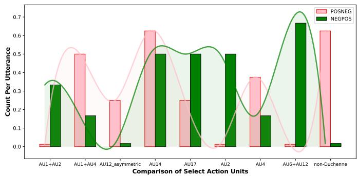
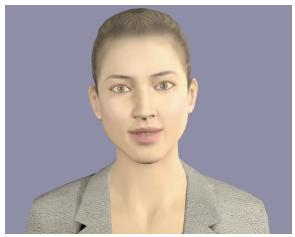
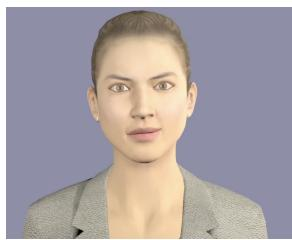
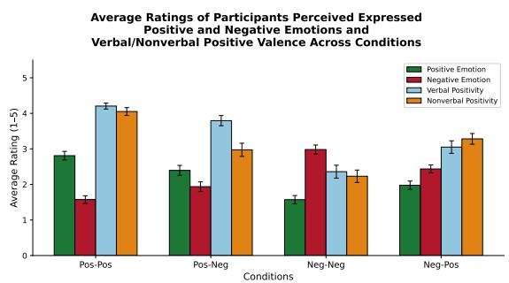
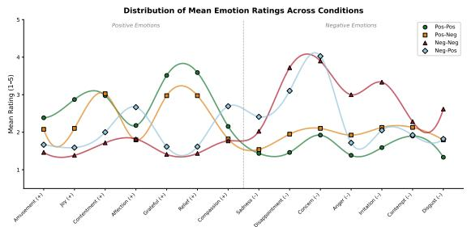

# LLM-Based Selection of Incongruent Verbal and Nonverbal Behavior for Virtual Humans

Parisa Ghanad Torshizi

Khoury College of Computer Science

Northeastern University

Boston, USA

ghanadtorshizi.p@northeastern.edu

Stacy Marsella

Khoury College of Computer Science

Northeastern University

Boston, USA

s.marsella@northeastern.edu

Abstract—Nonverbal behavior generation systems for virtual agents often take an utterance as input and generate nonverbal behaviors that emphasize or illustrate the content of the verbal channel. However, human nonverbal behavior is shaped by more than the the content of the speech. It is also influenced by speaker roles, interpersonal relationships, social context, and the cognitive and emotional states of the interactants. As a result, the nonverbal channel may reinforce, weaken, qualify, or even contradict the verbal channel. It may also reveal internal states that are hidden or only indirectly implied in speech, including emotional “leakage” that may be incidental to the immediate interaction.

Modeling this richer relationship between verbal and nonverbal behavior is important for designing virtual agents that exhibit realistic, human-like behavior. It is especially critical in training contexts that require nuanced social interpretation, such as counseling simulations involving virtual patients. Drawing on Ekman’s framework of verbal–nonverbal relationships, we propose a taxonomy of categories in which mismatches between verbal and nonverbal behavior can occur. We then examine alternative approaches for realizing these behaviors using large language models, focusing on whether LLMs can select contextually appropriate mismatched verbal and nonverbal behaviors from a given dialogue and social interaction context. Finally, we evaluate the resulting behaviors in a human-subject study, assessing whether context-driven nonverbal behavior, when embodied in a virtual human, produce the intended effects on observers.

Index Terms—Nonverbal behaviors, Virtual agents, Multimodal interaction, Intelligent interaction, Affective computing

## I. INTRODUCTION

Nonverbal behaviors play an important role in humanhuman interaction. They communicate information, convey emotions, leak attitudes, and influence the affective state of the speakers. They also play a vital role in defining relationships and managing interactions [1]. Their importance makes the generation of nonverbal behaviors a key agenda in the virtual human and social robotics research. Embodied social agents are now being deployed across many different applications, including healthcare and clinical trainings, education, workspace and interview training, marketing, entertainment, and gaming.

Virtual humans, in particular, are often designed to generate realistic and appropriate nonverbal behavior in line with how humans interact with each other. However, automated nonverbal generation approaches are often driven by the utterance being spoken [2]; the model generates a set of nonverbal behaviors that tend to illustrate or repeat what the virtual human is saying (the content of the verbal channel). Although this can produce coherent behaviors, they are limited in their ability to generate richer and more nuanced relations between verbal and nonverbal behavior.

In actual human-human interaction, nonverbal behaviors are far more expressive than simply repeating the verbal. Ekman [3] identified five semantic relationships between verbal and nonverbal channels: repeating, augmenting, illustrating, accenting, and contradicting. Although most nonverbal systems have focused on illustrating and repeating the verbal content, the contradiction relationship is comparatively underexplored. The mismatch between the verbal and the nonverbal channels is not always a communicative failure. Rather, it is a meaningful phenomenon that carries significant social and communicative information. The communicative intent of the speaker is beyond what each channel is conveying on its own. When a person verbally communicates something positive, their nonverbal behaviors may leak hidden negative emotions, or when a person verbally communicates criticism their nonverbal behaviors can remain friendly, warm, and open.

Additionally, nonverbal behaviors are under less conscious control than dialogue and, therefore, are often more indicative of one’s underlying emotions and attitudes. An example of their significance is in clinical settings [4], where nonverbal cues may be highly informative of a patient’s internal state, psychological processes, and emotional regulation. People make judgments about situations without knowing why, or feeling emotions like distress or anxiety which they cannot control or regulate. These emotions can be expressed nonverbally, unconsciously, and very difficult to translate into verbal expression [5].

The ability to generate such complex nonverbal behaviors has direct implications on the effectiveness of virtual humans. Consider that virtual agents are increasingly being designed to train therapists and counselors by taking the role of a virtual patient. In such contexts, the authenticity of the virtual agent’s nonverbal behavior is critical to the training outcome. A virtual patient that suppresses distress while verbally claiming to be fine or that masks emotional pain behind a composed exterior presents a far more realistic and pedagogically valuable interaction than one whose nonverbal behavior simply mirrors its words. Such nuanced behaviors allow trainee counselors to practice inferring a patient’s unregulated emotional state from nonverbal cues alone, a skill that is essential in real clinical practice. Beyond clinical training, similar demands arise in negotiation training, social skills development, and deception detection scenarios, where the complexity of the interaction cannot be captured without the ability to generate contradictory verbal and nonverbal behaviors.

Our focus in this paper is to explore automated, LLMbased approaches to selecting nonverbal behavior that realize more complex, flexible relations between verbal and nonverbal behavior, based on the interaction context, communicative intent, and mental states. The work builds on recent trends in the use of LLMs to select nonverbal behavior consistent with the role of the speaker and the context of interaction [6], [7], as well as personality [8]. This paper continues that thread, by looking into the question of how to design the nonverbal behavior generation system to enable it to generate richer nonverbal behaviors, those with more complex and layered communicative intents.

This raises another question in the design of virtual humans. What should the interface between the cognitive, emotional and dialog layers of the virtual human and its nonverbal behavior generation system be? Although current systems often only pass the utterance, if the situational context, relational dynamics, and social function of the interaction all shape nonverbal behavior, at times discordant with the words being spoken, then the interface must carry more than words.

To explore this issue in the context LLM behavior selection, we developed and evaluated different prompting approaches. The goal is to assess how well they can achieve such complex nonverbal behaviors. Drawing on social psychology research, we discuss a taxonomy of categories where the verbal and nonverbal behavior mismatch can occur. Using these categories, we explore different approaches to realizing these ore complex behaviors. Specifically, we explore alternative approaches to using large language models (LLMs), in terms of whether they can select mismatched verbal and nonverbal behaviors relevant to a provided dialog and social interaction context. We then evaluate the results in a human subject study to assess whether the resulting context-driven nonverbal behavior, when realized in a virtual human, has the intended effect on observers. The goal is to assess how well they can achieve richer and more complex nonverbal behavior. And, as a consequence, help determine the relation, the API, between the virtual human’s brain, utterance, and body. Our contributions are as follows: 1) Drawing on literature, we provide a taxonomy of cases where verbal nonverbal mismatch can occur.

2) We examine prompting approaches, varied by the levels of information provided, on their ability to select mismatched verbal nonverbal behavior.

3) We valuate these matched vs mismatched LLM-selected behaviors, in human-subject studies.

## II. BACKGROUND

## A. Verbal Nonverbal Relationships

Ekman [3] outlines several relationships between verbal and nonverbal behaviors; temporally and semantically. The nonverbal act can repeat, augment, illustrate, accent, and contradict the verbal content; it can anticipate, coincide with, substitute for or follow the words; and it can be unrelated to the verbal behavior. Several studies have looked at cases where these channels do not match. Jacob et al. [9] found that slight verbalnonverbal incongruence creates an impression of irony. Nuber et al. [10] showed this irony effect is significantly weaker in high-functioning autistic individuals compared to neurotypical people. The nonverbal channel can also convey information not apparent in speech. Mehrabian et al. [11] demonstrated that in deceitful communications, participants displayed more negative-affect nonverbals, suggesting unintentional leakage of internal states through the nonverbal channel.

## B. Nonverbal Generation Approaches

The computational approaches of nonverbal behavior generation has progressed, from rule-based approaches to more sophisticated data-driven approaches. Early techniques [12]– [16] relied on manually crafted heuristics that map input data to nonverbal behaviors. While these approaches offer interpretability and fine-grained control, they require extensive manual effort and do not allow for diverse, non-deterministic gesture generation, reducing the expressiveness of the virtual agent. Data-driven methods were proposed to address these limitations. Statistical approaches [17]–[22] modeled the relationship between gestures and speech by capturing the statistical properties of gesture distributions, offering more flexibility than rule-based systems. However, they still rely on features extracted from manually annotated data, which is laborintensive and time-consuming. Deep learning models provide even greater flexibility by learning direct mappings from utterances to body motions, improving diversity. However, they often lack semantic richness and offer limited control over generated outputs [2]. Several works have adopted LSTMs and GANs for body, hand, and face animation synthesis [23], [24]. Recent advances have increasingly centered on diffusion-based models [25]–[31] and LLM-driven approaches for controlled, semantically-rich co-speech gesture generation [32]–[34]. To address the limitations of data-driven approaches, several studies have explored LLMs for gesture selection, demonstrating their ability to produce semantically rich, context-appropriate gestures with a high degree of designer control [6]–[8], [35].

## III. TAXONOMY OF VERBAL NONVERBAL MISMATCH

We categorize the contexts in which a mistmatch relationship between verbal and nonverbal behavior occurs into the following categories, organized by their social function.

Irony. Researchers [36] [37] identify two types of irony, expressing the intention of scorn by commendation words (blame by praise; aka sarcastic irony), and expressing the intention of commendation by words of scorn(praise by blame; aka kind irony).

• Positive verbal, negative nonverbal: sarcastic irony

• Negative verbal, positive nonverbal: kind irony

Face Maintenance. Inspired by Goffman’s notion of facework [38], speaker either maintains their own face through forced positivity, keeping negative emotions unacknowledged, or maintains the other’s face through softened criticism, adding affiliative nonverbals to negative verbal content [39].

• Positive verbal, negative nonverbal: strategic politeness

• Negative verbal, positive nonverbal: softened criticism

Deception. Ekman [40] defines leakage as the betrayal of concealed information through nonverbal channels, identifying the leakge of both positive ans negative emotions.

• Positive verbal, negative nonverbal: negative leakage

• Negative verbal, positive nonverbal: positive leakage

Emotion Regulation. The speaker attempts to manage their own emotional display [41]. In suppression leakage, a negative internal state leaks through despite a positive verbal front [42]. In masking, the speaker successfully manages the suppression,; thus creating a mismatch between their negative words and non-negative nonverbals.

• Positive verbal, negative nonverbal: suppression leakage

• Negative verbal, positive nonverbal: masking

This taxonomy will be used to inspire our prompts, and the creation of scenarios where a verbal-nonverbal mismatch is likely to occur. Note that the goal of developing this taxonomy is not to explicitly include them in the prompts, but to create scenarios for which we can study LLMs ability to select mismatched behavior by evaluating different prompting approaches.

## IV. APPROACH

Prompting Approaches: We experimented with three prompting approaches, for their ability to realize contradictory relationship between verbal and nonverbal channels, extending beyond repeat relationship often seen in nonverbal see=lection models. These approaches vary in terms of the amount of information provided to the LLM:

Prompt 1 (Utterance Only): the LLM receives only the verbal utterance that the speaker is going to use, this approach imitates the current nonverbal generation systems that only take the utterance as an input and outputs the nonverbal behaviors.

Prompt 2 (Dialogue History): the LLM receives the dialogue history. This approach allows the model to infer social dynamics and contextual information from the dialogue.

Prompt 3 (Dialogue + Context): the LLM receives the dialogue history as Prompt 2 plus an explicit description of the situational context, and the relationship between the speakers.

Note that the overall intent for all three prompting approaches is to allow the context of the interaction to determine whether there should be a mismatch, rather than enforcing it. Enforcing it would presume some external agency would need to be implemented to determine mismatch. In contrast, we wanted to explore automation of the decision within LLM.

Scenarios: We designed eight scenarios, each associated with a sub-case in our verbal-nonverbal taxonomy. These scenarios were designed to serve as stimuli for a prompting experiment. Each scenario is a short dyadic interaction involving a specific relationship between speakers, specifically suggestive of a possible mismatch of verbal and nonverbal behaviors. These scenarios and their corresponding settings are as follows:

• Biting sarcasm: Workplace colleagues

• Playful sarcasm: Close friendship

• strategic politeness: Social hierarchy

• softened criticism: Mother son

• negative leakage: romantic relationship

• positive leakage: Sibling

• suppression leakage: Formal setting

• masking: counseling.

Scenarios Prompts For each scenario, we constructed three prompts corresponding to the three prompting approaches described above. All three prompting approaches, share the SYSTEM-PROMPT, which informs the LLM that verbal and nonverbal may have different relationships, either match or mismatch. The LLM is asked to return the nonverbal of the speaker for the given utterance in a systematic way, reporting all the Action Units (AUs), gaze and head movements along with their corresponding phrases in the utterance.

We also constructed a short dialogue history (3-5 turns) for each scenario that naturally builds up to a final utterance. This is provided to the LLM in the case of Prompt approaches 2 and 3. The dialogue history is designed to convey the social dynamics and emotional tension implicitly, without explicitly naming the speaker’s intent or whether there should be a mismatch between verbal and nonverbal. A short description of the context of the interaction was also constructed for each scenario, including relations between interactants. This is used in Prompt style 3, Dialogue + Context.

Here is an example of a Dialogue + Context Prompt. Note that a short description of the context of the interaction is first.

Speaker B is a junior employee in a team   
meeting.   
Speaker A is her senior manager who has   
just announced a new policy that significantly   
increases the team’s workload.   
Speaker A: I wanted to share some updates about   
how we’ll be handling project submissions   
going forward.   
Speaker A: Starting next month, all employees   
will be required to submit weekly progress   
reports in addition to the monthly reviews.   
Speaker A: I know it’s more work but I   
think it’ll really help us stay on track.   
Speaker A: So I’d love to hear if this plan   
works for the team.   
Speaker B: "Yes, I think this plan would   
work well for the team."

In addition, the prompts requested the LLM to provide an analysis of the scenario, a detailed description of the nonverbal behaviors, and the relation between the verbal and nonverbal behavior.

## V. OUTPUT ANALYSIS

As the first step to evaluate the approach, the 8 scenarios and three prompting approaches were tested, a total of 24 prompts to an LLM. All experiments were conducted using claudesonnet-4-6 via the Anthropic API. The model was run with a temperature of 0.7 and a maximum token limit of 1024.

## A. Claude Output Example

Here is Claude’s output for the aforementioned worker scenario and Dialogue + History prompt:

```markdown
## Scenario Analysis
<sub>**</sub>Context:<sub>**</sub> Speaker B is a junior employee
responding to a senior manager’s policy
announcement that increases workload.
There is a clear power dynamic.
Speaker B’s verbal response is
positive/agreeable, but the context
strongly suggests internal reservations.
### Nonverbal Behaviors of Speaker B:
- <sub>**</sub>AU6 (Cheek Raiser) + AU12 (Lip Corner
Puller): <sub>**</sub> Small, both sides | a
restrained, polite smile, not a full
genuine (Duchenne) smile; present during
<sub>*</sub>"Yes, I think this plan would work well"<sub>*</sub>
- <sub>**</sub>AU1 (Inner Brow Raise) + AU4 (Brow
Lowerer): <sub>**</sub> Small, both sides | subtle
tension in the brow region, briefly
visible at <sub>*</sub>"Yes"<sub>*</sub> before being suppressed
- <sub>**</sub>Nod:<sub>**</sub> Small, nod timed with <sub>*</sub>"Yes"<sub>*</sub>
- <sub>**</sub>Gaze:<sub>**</sub> Directed toward Speaker A
initially, then briefly shifts
downward/away around <sub>*</sub>"work well for the
team"<sub>*</sub> before returning
| a fleeting gaze aversion
- <sub>**</sub>AU17 (Chin Raiser) + AU23 (Lip
Tightener): Small, both sides | slight
lip pressing immediately after finishing
the sentence, suggesting suppressed expression
### Relationship: <sub>**</sub>Contradicting<sub>**</sub>
Speaker B’s words express agreement and
enthusiasm, but the nonverbals | the
suppressed brow tension, restrained non-
Duchenne smile, brief gaze aversion, and
lip tightening | signal underlying
discomfort or disagreement. The compliance
is socially performed due to the power
differential, while the face and gaze leak
concealed reservations.
```

## B. Output Assessment

We first qualitatively assessed the nonverbal behaviors selected by Claude. As exemplified in this worker scenario, we found the behaviors to be both very expressive and consistent with the type of situation and context that the specific prompt provides. The one difference we had with Claude is how it characterized non-Duchenne smiles. On the other hand, the behavior description is quite rich, providing information on the style and direction of the behavior (e.g., small, constrained, and downward), as well as on the timing (eg., brief, on the word Yes). This is critical to automatically mapping eventually to a character animation system. Prior research has had success realizing this automatic mapping using JSON [7].

We then drilled down to see how these different prompting techniques were influencing the behaviors being generated. Table I summarizes the total number of AUs and gaze shifts per prompt type, in the multiple scenarios (8 per prompt type). It also shows how many times each prompt result contrasted verbal and nonverbal behavior. In general, we see that increasing the context increased the richness of the behavior, not surprisingly. We then characterized each prompt

TABLE I: Total Action Units and Gaze Shifts per Prompt Type.
<table><tr><td>Prompt</td><td>AUs</td><td>Gaze Shift/Avert Nonverbal Contrast</td><td></td></tr><tr><td>Utterance</td><td>41</td><td>4</td><td>2/8</td></tr><tr><td>Dialogue History</td><td>39</td><td>7</td><td>5/8</td></tr><tr><td>Context + History</td><td>48</td><td>10</td><td>7/8</td></tr></table>

result in terms of whether the dialog and the nonverbal content individually conveyed positive or negative attitudes/emotions. Recall that the dialog was preselected by us, and therefore was positive or negative by design, whereas the nonverbal behavior was negative or positive based on Claude’s output. We see in Table II that increasing the context provided to Claude enables it to distinguish verbal and nonverbal information. Additionally, Table III illustrates that gaze shifts and aversions are generally more prominent in NEG nonverbal outputs.

Further drilling down into details, Figure 1 shows how different contrastive conditions have different distributions of nonverbals. Note it is only showing AUs where there is marked difference in occurences. These differences are consistent with one’s expectations.

## VI. HUMAN SUBJECT STUDY

We conducted two human subject studies to evaluate the LLM-generated nonverbal behaviors, using the data selected by Claude for Prompt 1 and Prompt 2, realized in a virtual human framework [43] and presented as video stimuli. Study 1 is a comparison study evaluating whether participants perceive a difference in the virtual human’s attitude between repeating and contradictory verbal-nonverbal conditions. Study 2 evaluates how participants perceive the emotions the virtual human is expressing across repeating and contradictory verbalnonverbal conditions.

TABLE II: Relation counts per Prompt Type.
<table><tr><td>Prompt</td><td>POSPOS</td><td>NEGNEG</td><td>POSNEG</td><td>NEGPOS</td></tr><tr><td>Utterance</td><td>3</td><td>3</td><td>1</td><td>1</td></tr><tr><td>Dialogue History</td><td>1</td><td>2</td><td>3</td><td>2</td></tr><tr><td>Context+History</td><td>0</td><td>1</td><td>4</td><td>3</td></tr></table>

TABLE III: Action Unit and Gaze Shift per Utterance.
<table><tr><td>Nonverbal Relation Action Units</td><td></td><td>Gaze Shifts/Aversions</td></tr><tr><td>POSPOS</td><td>5.0</td><td>0.0</td></tr><tr><td>POSNEG</td><td>5.38</td><td>1.75</td></tr><tr><td>NEGPOS</td><td>4.33</td><td>0.33</td></tr><tr><td>NEGNEG</td><td>6.5</td><td>0.83</td></tr></table>

  
Fig. 1: A selection AU counts per utterance, down selected based on which were notably different between POS NEG and NEG POS contrasts

## A. Stimuli

For both studies, we selected two scenarios from our stimulus set: the biting sarcasm scenario (two colleagues in a workplace setting) and the softened criticism scenario (a mother and her teenage son). For each scenario, the verbal utterance of Speaker B is constant, only the nonverbal behavior changes. The nonverbal behavior is either repeating (match) with the verbal content or contradicts it (mismatch). The nonverbal behaviors for the repeat condition were selected by the LLM using Prompt 1 (utterance only), as described in Section IV. The nonverbal behaviors for the contradict condition were selected by the LLM using Prompt 3 (dialogue + context), as described in Section IV. In these specific cases, In Prompt 1, the LLM has no contextual information and defaults to repeating behavior, while Prompt 3, the LLM infers the appropriate contradictory behavior from the situational and relational context.

In the biting sarcasm scenario, Speaker B’s verbal utterance is positive in valence. In the repeat condition, the LLMselected nonverbal behavior is also positive, resulting in a positive verbal-positive nonverbal pairing (pos-pos). In the contradict condition, the nonverbal behavior is negative, resulting in a positive verbal-negative nonverbal pairing (pos-neg), reflecting the biting sarcasm sub-case.

In the softened criticism scenario, Speaker B’s verbal utterance is negative in valence. In the repeat condition, the nonverbal behavior is also negative, resulting in a negative verbal-negative nonverbal pairing (neg-neg). In the contradict condition, the nonverbal behavior is positive and warm, resulting in a negative verbal-positive nonverbal pairing (neg-pos), reflecting the softened criticism sub-case.

## B. Virtual Human Realization

The above mentioned LLM-selected behaviors were realized in a virtual human framework.(An example: Figure 2). The realization included post-processing; the AU amounts and the timing of the behavior relative to words and phrases in the utterance had to be mapped to corresponding paramters in the animation system. Minor additions, specifically small AU1 and AU2 activations, were applied to adjust the virtual human’s default facial expression, as the LLM does not account for the character’s default skeleton and facial configuration, which could otherwise cause some behaviors to appear unnatural.

  
(a) pos-pos:  
AU2, AU6, AU12, Head Toss

  
(b) pos-neg:  
AU12 (Asymmetric), AU4  
Fig. 2: LLM-selected behavior realized in virtual human framework. The left image shows a frame of the pos-pos condition(positive verbal, positive nonverbal and match between verbal-nonverbal channels)- The right image shows the corresponding frame of the pos-neg condition(positive verbal, negative nonverbal and mismatch between verbal-nonverbal channels)

After realization, these stimuli were recorded as videos.

## C. Study 1: Comparison Study

The goal of this study is to examine whether the LLMselected nonverbal behavior influences the perceived attitude of a speaker when the verbal channel is held constant, across repeat and contradict conditions.

1) Study Design: This study follows a within-subject study design. Each participant receives two Comparison sets of videos, in a randomized order. In one set, they were shown two videos, pos-pos and pos-neg, displayed side-by-side. In the other set, they were shown two videos, neg-neg and neg-pos, displayed side-by-side. For each comparison set, participants were asked the following question: ”Which speaker has a more positive attitude?”, and in response, they were asked to select only one video.

2) Hypotheses: H1: LLM-selected nonverbal behaviors will shift the perception of the virtual human’ attitude to be more aligned with the attitude conveyed by the nonverbals.

• H1.a: In the case where the verbal content is positive, negative nonverbals lead to more negative perception of the speaker’s attitude, compared to when the nonverbals are positive.

• H1.b: In the case where the verbal content is negative, positive nonverbals lead to more positive perception of the speaker’s attitude, compared to when the nonverbals are negative.

3) Participants: 49 participants were recruited via Prolific (25 female, 24 male; ages 18–54), after excluding one who did not complete the experiment. The study was approved by University IRB board as an exempt study. All participants filled out an online consent form prior to the study. And they were compensated for their time through prolific, and according to prolific’s pay rates.

4) Analysis: The results were consistent with our hypotheses. In Comparison A, 43 out of 49 participants (87.8%) selected the pos-pos video as having a more positive attitude, while only 6 participants (12.2%) selected the pos-neg video. In Comparison B, 46 out of 49 participants (93.9%) selected the neg-pos video as having a more positive attitude, while only 3 participants (6.1%) selected the neg-neg video. Results demonstrate that LLM-selected nonverbals effectively convey their intended attitude information, confirming H1.

In Study 2 we examine the effect of repeating and contradicting verbal-nonverbal effect in more detail.

## D. Study 2

The goal of this study is to evaluate how participants perceive the feelings conveyed by the virtual human across the four verbal-nonverbal conditions (pos-pos, pos-neg, negneg, neg-pos). Unlike Study 1, which asked participants to compare two videos, Study 2 asks participants to rate each video independently, this allowed us to evaluate how the LLMgenerated nonverbal behavior impacts how the perception of virtual human’s expressed emotions.

1) Study Design: This study follows a within-subjects design. Each participant watched all four videos (pos-pos, posneg, neg-neg, neg-pos) in a randomized counterbalanced order. After watching each video, participants were asked to fill out a survey on the following items:

• The degree to which each of a set of emotions was being conveyed by the virtual human, using a 5-point Likert scale (1 = Strongly Disagree, 5 = Strongly Agree). This set of emotions was adopted from the Geneva Emotion Wheel (GEW) [44]. From this set, 13 most relevant emotions were picked, 7 of which are positive(Amusement, Joy, Contentment, Affection, Grateful, Relief, Compassion) and the other 7 being negative(Sadness, Disappointment, Anxiety, Anger, Irritation, Contempt, Disgust). Note that we made a slight modification to the original GEW, by replacing the emotion ”Love” with ”Affection”, and replacing the emotion ”Anxiety” with ”Concern”.

• The degree to which they perceived the verbal content to be positive.

• The degree to which they perceived the nonverbal content to be positive.

• An open-ended question on their perception of what the virtual human speaker is communicating.

## E. Hypotheses

H2: LLM-selected nonverbal behaviors will shift the perception of the virtual human’s expressed emotion to be more aligned with the valence of the nonverbals.

• H2.a: In the case where the verbal content is positive, negative nonverbals lead to more negative perception of the speaker’s emotion, compared to when the nonverbals are positive.

• H2.b: In the case where the verbal content is negative, positive nonverbals lead to more positive perception of the speaker’s emotion, compared to when the nonverbals are negative.

TABLE IV: Descriptive Analysis of Dependent Variables Across Conditions
<table><tr><td></td><td>Pos Emo</td><td>Neg Emo</td><td>VB Pos</td><td>NVB Pos</td></tr><tr><td>pos-pos</td><td>2.81 (0.76)</td><td>1.58 (0.66)</td><td>4.21 (0.52)</td><td>4.05 (0.69)</td></tr><tr><td>pos-neg</td><td>2.40 (0.87)</td><td>1.94 (0.84)</td><td>3.79 (0.89)</td><td>2.97 (1.16)</td></tr><tr><td>neg-neg</td><td>1.57 (0.73)</td><td>2.98 (0.79)</td><td>2.36 (1.14)</td><td>2.23 (1.09)</td></tr><tr><td>neg-pos</td><td>1.98 (0.73)</td><td>2.44 (0.71)</td><td>3.05 (1.10)</td><td>3.28 (0.94)</td></tr></table>

Note. N = 39. Values represent means with standard deviations in parentheses. Scores range from 1 (Strongly Disagree) to 5 (Strongly Agree). Pos Emo = positive emotion composite; Neg Emo = negative emotion composite; VB Pos = Verbal behavior positive valence; NVB-pos = Nonverbal behavior positive valence.

H3: The LLM’s intended valence, for the nonverbal behavior it selected, aligns with the valence of the nonverbal behavior perceived by the participants.

1) Participants: 39 participants were recruited via Prolific (16 female, 22 male, 1 non-binary; ages 18–54), after excluding one who did not complete the experiment. Participants from Study 1 were excluded from Study 2. The study was approved by university IRB board as an exempt study. All participants filled out an online consent from prior to the study. And they were compensated for their time through prolific, and according to prolific’s pay rates.

2) Descriptive Statistics: Positive and negative emotion composite scores were computed by averaging the seven positive emotion items and seven negative emotion items, respectively.Table IV, and Figure 3 report the means and standard deviation of independent variables, and Figure 4 report average of each emotion label across conditions.

  
Fig. 3: A demonstration of participants’ perception of speaker in different conditions

3) Analysis of Variance: A one-way repeated-measures analysis of variance (ANOVA) was conducted for each of the four dependent variables (positive emotion, negative emotion, verbal positive valence, and non-verbal positive valence) to examine the effect of condition (pospos, posneg, negneg, negpos) on participants’ responses. The Greenhouse-Geisser correction was applied where the assumption of sphericity was violated. Generalized eta-squared was reported as a measure of effect size. Where the omnibus ANOVA was significant, posthoc pairwise comparisons were conducted using estimated marginal means with a Bonferroni adjustment to correct for multiple comparisons. All analyses were conducted in R using the afex and emmeans packages.

  
Fig. 4: The distribution of speaker’s expressed emotions perceived by participant’s

TABLE V: One-Way Repeated-Measures ANOVA Results for Each Dependent Variable
<table><tr><td>Dependent Variable</td><td>df</td><td>F</td><td>p</td><td> $\eta _ { G } ^ { 2 }$ </td></tr><tr><td>Positive Emotion</td><td>2.21, 83.82</td><td>40.04</td><td>&lt;.001</td><td>.267</td></tr><tr><td>Negative Emotion</td><td>2.23, 84.56</td><td>37.22</td><td>&lt;.001</td><td>.336</td></tr><tr><td>Verbal Positivity</td><td>2.24, 85.15</td><td>29.14</td><td>&lt;.001</td><td>.365</td></tr><tr><td>Non-Verbal Positivity</td><td>2.66, 101.26</td><td>21.92</td><td>&lt;.001</td><td>.310</td></tr></table>

Note. Degrees of freedom were corrected using the Greenhouse–Geisser method. η<sup>2</sup> = generalized eta-squared.

A one-way repeated-measures ANOVA revealed a significant effect of condition on positive emotion, $F ( 2 . 2 1 , 8 3 . 8 2 ) =$ 40.04, $p < . 0 0 1 , \eta _ { G } ^ { 2 } = . 2 6 7$ . Bonferroni-corrected pairwise comparisons indicated that the pos-pos condition had significantly higher positive emotion than the pos-neg condition $\left( p = . 0 1 2 \right)$ . The neg-pos condition also scored significantly higher than the neg-neg condition $( p < . 0 0 1 )$ . Consistent with the H2.a and H2.b hypotheses.

There was a significant effect of condition on negative emotion, $F ( 2 . 2 3 , 8 4 . 5 6 ) \ = \ 3 7 . 2 2 , \ p \ < \ . 0 0 1 , \ \eta _ { G } ^ { 2 } \ = \ . 3 3 6$ Pairwise comparisons revealed that the pos-pos condition had significantly lower negative emotion than the pos-neg condition $( p = . 0 0 3 )$ . The neg-neg condition had significantly higher negative emotion than the neg-pos condition $( p = . 0 0 1 )$ Consistent with the H2.a and H2.b hypotheses.

A significant effect of condition on verbal positivity was found, $F ( 2 . 2 4 , 8 5 . 1 5 ) ~ = ~ 2 9 . 1 4 , ~ p ~ < ~ . 0 0 1 , ~ \eta _ { G } ^ { 2 } ~ = ~ . 3 6 5 .$ Pairwise comparisons showed that the pos-pos condition did not differ significantly from the pos-neg condition $( p = . 0 9 8 )$ However, the neg-pos condition scored significantly higher than the neg-neg condition (p = .002).

There was a significant effect of condition on non-verbal positivity, $F ( 2 . 6 6 , 1 0 1 . 2 6 ) \ : = \ : 2 1 . 9 2 , \ : p \ : < \ : . 0 0 1 , \ : \eta _ { G } ^ { 2 } \ : = \ : . 3 1 0$ Pairwise comparisons indicated that the pos-pos condition had significantly higher non-verbal positivity than the posneg condition $( p < . 0 0 1 )$ . The neg-pos condition also scored significantly higher than the neg-neg condition $( p \ < \ . 0 0 1 )$ . Consistent with the H3 hypothesis.

4) Qualitative Analysis: Looking at human participant’s free responses to the question as to what the virtual human is communicating, we see clear differences:

• pos-pos: Happy - no Sarcasm, Anger, Aggressiveness – They are trying to communicate how happy they are about the situation.

• pos-neg: Sarcasm, Anger, Aggressiveness

– The speaker’s words contradict her facial expression which expresses contempt and sarcasm

– again, that some deadline was just met. though she looks angry

• neg-pos: Compassion, disappointed, no anger expression, – The speaker’s communicating both concern and compassion with her words and expression.

– slight disappointment at her son’s grades.

• neg-neg: Anger, Disappointed, no compassion expression – They are angry with the person’s grades.

– The speaker is angrily telling her son that he must work on his grades.

– She is upset and angry about her son’s grades

## VII. DISCUSSION AND CONCLUSION

The results of these various studies show a common trend. The analysis of the output from Claude under 3 different promptings and 8 different scenarios revealed that providing a richer context in turn enriched the behavior provided, as one would expect. To achieve that richness, Claude’s output was selecting different action units, gazes and head movements based on the context. Furthermore, it enabled Claude to differentially use behaviors to go beyond simply illustrating the verbal information in order to reveal information implicit in the context provided by the context and dialogue history.

Human subject study 1 demonstrated that nonverbal behaviors when mapped to a virtual human were reliably interpreted as impacting the participants’ interpretation of the speaker’s attitude.

Human subject study 2 drilled down deeper to explore the emotions being conveyed to the subjects. Here we see that the nonverbals are reliably impacting the subject’s perception of the virtual human’s emotion. Behaviors selected to convey negative emotions led to perceptions of increased negativity and behaviors selected to convey positive emotions led to perceptions of increased positivity in virtual human. In addition, although we had no hypothesis, the nonverbal emotional valence appears to shift the perception of the emotional valence of the verbal channel. More positive interpretations of the nonverbals in the POS-POS was associated with more positive interpretations of the verbal channel compared to the corresponding POS-NEG condition, with a similar relation holding for NEG-POS and NEG-NEG. This is despite the verbal content as well as the prosody of the voice being identical across the NEG-NEG and NEG-POS as well POS-POS and POS-NEG conditions.

Comparing the alternative prompting approaches, it is clear the more context provided to Claude, the better it was at suggesting rich behavior that moved beyond simply illustrating the dialog. at the same time the approach we are exploring does cede control to the LLM to interpret the provided context

Although these results are promising, challenges remain to fully realize this approach. As the results section illustrates, Claude gave quite detailed instructions on when the behaviors occurred, the magnitude of the behaviors, the direction, and their speed. However, these nevertheless need to be mapped to the animation framework and associated 3D model of the character. This is especially critical for such subtle behaviors. And this must be done.

Another limitation is that we did not include gestures, postural shifts and voice prosody. This was largely due to unrelated implementation issues in the character animation system. It remains for future work to explore these other dimensions of nonverbal behavior. Finally, there is always a speed issue and the need for local implementation to ensure reasonable real time interactive behavior. Frankly, this is less of a concern since recent work suggests a RAG and SLM approach can effectively address this issue.

## VIII. CONCLUSION

In our paper, we proposed an LLM-based approach to generate rich nonverbal behaviors. We specifically explored cases where the nonverbal channel is not repeating the content of the verbal channel, often overlooked by the existing nonverbal generation systems. We evaluated alternative prompting approaches on their ability to select mismatched verbalnonverbal behaviors relevant to the interaction context. The results show the intended impact on the human perceptions of the virtual human. This work is a step towards richer embodied agent behavior.

## IX. ETHICAL STATEMENT

This study was approved by the author’s University Institutional Review Board as an exempt study. Participants were recruited through Prolific, provided informed consent prior to participation, were paid for their participation, and could withdraw at any time. Data were anonymized; no personally identifiable information beyond what Prolific requires for compensation was taken or retained. This work is a step toward richer nonverbal behavior in virtual humans. The findings reported here should be treated as exploratory, especially since the set of stimuli used was small. Any deployment of this kind of virtual human technology would need to be wary that the interaction with a virtual human capable of such rich behavior could have unintended consequences on the well-being of a human participant.

## REFERENCES

[1] J. K. Burgoon, D. B. Buller, and W. G. Woodall, “Nonverbal communication: The unspoken dialogue,” (No Title), 1996.

[2] S. Nyatsanga, T. Kucherenko, C. Ahuja, G. E. Henter, and M. Neff, “A comprehensive review of data-driven co-speech gesture generation,” in Computer Graphics Forum, vol. 42, no. 2. Wiley Online Library, 2023, pp. 569–596.

[3] P. Ekman, W. V. Friesen et al., The repertoire of nonverbal behavior: Categories, origins, usage and coding. Mouton de Gruyter Berlin, 1969, vol. 1.

[4] P. Philippot, R. Feldman, and E. Coats, “The role of nonverbal behavior in clinical settings: Nonverbal behavior in clinical settings,” 2003.

[5] P. Philippot, C. Douilliez, C. Baeyens, B. Francart, and F. Nef, “Le travail des emotions en th´ erapie comportementale et cognitive vers une´ psychotherapie exp´ erientielle,”´ Cahiers critiques de therapie familiale´ et de pratiques de reseaux´ , vol. 29, no. 2, pp. 87–122, 2002.

[6] L. B. Hensel, N. Yongsatianchot, P. Torshizi, E. Minucci, and S. Marsella, “Large language models in textual analysis for gesture selection,” in Proceedings of the 25th International Conference on Multimodal Interaction, 2023, pp. 378–387.

[7] P. G. Torshizi, L. B. Hensel, A. Shapiro, and S. C. Marsella, “Large language models for virtual human gesture selection,” in Proceedings of the 24th International Conference on Autonomous Agents and Multiagent Systems, 2025, pp. 2051–2059.

[8] B. Han, D. Kwon, S. Lin, K. Shrestha, and J. Gratch, “Can llms generate behaviors for embodied virtual agents based on personality traits?” in Proceedings of the 25th ACM International Conference on Intelligent Virtual Agents, 2025, pp. 1–10.

[9] H. Jacob, B. Kreifelts, S. Nizielski, A. Schutz, and D. Wildgruber,¨ “Effects of emotional intelligence on the impression of irony created by the mismatch between verbal and nonverbal cues,” PloS one, vol. 11, no. 10, p. e0163211, 2016.

[10] S. Nuber, H. Jacob, B. Kreifelts, A. Martinelli, and D. Wildgruber, “Attenuated impression of irony created by the mismatch of verbal and nonverbal cues in patients with autism spectrum disorder,” Plos one, vol. 13, no. 10, p. e0205750, 2018.

[11] A. Mehrabian, “Nonverbal betrayal of feeling.” Journal of Experimental Research in Personality, 1971.

[12] J. Cassell, H. H. Vilhjalmsson, and T. Bickmore, “Beat: the behavior´ expression animation toolkit,” in Proceedings of the 28th annual conference on Computer graphics and interactive techniques, 2001, pp. 477– 486.

[13] J. Lee and S. Marsella, “Nonverbal behavior generator for embodied conversational agents,” in International Workshop on Intelligent Virtual Agents. Springer, 2006, pp. 243–255.

[14] K. R. Thorisson, “Communicative humanoids: a computational model of´ psychosocial dialogue skills,” Ph.D. dissertation, Massachusetts Institute of Technology, 1996.

[15] J. Cassell, C. Pelachaud, N. Badler, M. Steedman, B. Achorn, T. Becket, B. Douville, S. Prevost, and M. Stone, “Animated conversation: rulebased generation of facial expression, gesture & spoken intonation for multiple conversational agents,” in Proceedings of the 21st annual conference on Computer graphics and interactive techniques, 1994, pp. 413–420.

[16] C. Pelachaud, V. Carofiglio, B. De Carolis, F. de Rosis, and I. Poggi, “Embodied contextual agent in information delivering application,” in Proceedings of the first international joint conference on Autonomous agents and multiagent systems: part 2, 2002, pp. 758–765.

[17] M. Kipp, Gesture generation by imitation: From human behavior to computer character animation. Universal-Publishers, 2005.

[18] M. Neff, M. Kipp, I. Albrecht, and H.-P. Seidel, “Gesture modeling and animation based on a probabilistic re-creation of speaker style,” ACM Transactions On Graphics (TOG), vol. 27, no. 1, pp. 1–24, 2008.

[19] K. Bergmann and S. Kopp, “Increasing the expressiveness for virtual agents. autonomous generation of speech and gesture for spatial description tasks,” in Proceedings of the 8th International Conference on Autonomous Agents and Multiagent Systems (AAMAS 2009), 2009.

[20] F. De Coninck, Z. Yumak, G. Sandino, and R. Veltkamp, “Nonverbal behavior generation for virtual characters in group conversations,” in 2019 IEEE International Conference on Artificial Intelligence and Virtual Reality (AIVR). IEEE, 2019, pp. 41–418.

[21] Y. Yang, J. Yang, and J. Hodgins, “Statistics-based motion synthesis for social conversations,” in Computer Graphics Forum, vol. 39, no. 8. Wiley Online Library, 2020, pp. 201–212.

[22] P. Jonell, T. Kucherenko, G. E. Henter, and J. Beskow, “Let’s face it: Probabilistic multi-modal interlocutor-aware generation of facial gestures in dyadic settings,” in Proceedings of the 20th ACM international conference on intelligent virtual agents, 2020, pp. 1–8.

[23] I. Habibie, W. Xu, D. Mehta, L. Liu, H.-P. Seidel, G. Pons-Moll, M. Elgharib, and C. Theobalt, “Learning speech-driven 3d conversational gestures from video,” in Proceedings of the 21st ACM international conference on intelligent virtual agents, 2021, pp. 101–108.

[24] Y. Yoon, B. Cha, J.-H. Lee, M. Jang, J. Lee, J. Kim, and G. Lee, “Speech gesture generation from the trimodal context of text, audio, and speaker

identity,” ACM Transactions on Graphics (TOG), vol. 39, no. 6, pp. 1–16, 2020.

[25] F. Zhang, N. Ji, F. Gao, and Y. Li, “Diffmotion: Speech-driven gesture synthesis using denoising diffusion model,” in International Conference on Multimedia Modeling. Springer, 2023, pp. 231–242.

[26] F. Zhang, N. Ji, F. Gao, B. Zhao, J. Wu, Y. Jiang, H. Du, Z. Ye, J. Zhu, W. Zhong et al., “Dim-gesture: Co-speech gesture generation with adaptive layer normalization mamba-2 framework,” arXiv preprint arXiv:2408.00370, 2024.

[27] M. H. Mughal, R. Dabral, I. Habibie, L. Donatelli, M. Habermann, and C. Theobalt, “Convofusion: Multi-modal conversational diffusion for cospeech gesture synthesis,” in Proceedings of the IEEE/CVF conference on computer vision and pattern recognition, 2024, pp. 1388–1398.

[28] A. Deichler, S. Mehta, S. Alexanderson, and J. Beskow, “Diffusionbased co-speech gesture generation using joint text and audio representation,” in Proceedings of the 25th International Conference on Multimodal Interaction, 2023, pp. 755–762.

[29] S. Yang, Z. Wu, M. Li, Z. Zhang, L. Hao, W. Bao, M. Cheng, and L. Xiao, “Diffusestylegesture: Stylized audio-driven co-speech gesture generation with diffusion models,” arXiv preprint arXiv:2305.04919, 2023.

[30] Y. Sun, Z. Xu, H. Zhou, J. Guan, Q. Yang, K. Wang, B. Liang, Y. Li, H. Feng, J. Wang et al., “Cosh-dit: Co-speech gesture video synthesis via hybrid audio-visual diffusion transformers,” arXiv preprint arXiv:2503.09942, 2025.

[31] X. He, Q. Huang, Z. Zhang, Z. Lin, Z. Wu, S. Yang, M. Li, Z. Chen, S. Xu, and X. Wu, “Co-speech gesture video generation via motiondecoupled diffusion model,” in Proceedings of the IEEE/CVF Conference on Computer Vision and Pattern Recognition, 2024, pp. 2263–2273.

[32] Q. Cheng, X. Li, and X. Fu, “Siggesture: Generalized co-speech gesture synthesis via semantic injection with large-scale pre-training diffusion models,” in SIGGRAPH Asia 2024 Conference Papers, 2024, pp. 1–11.

[33] B. Chen, Y. Li, Y. Zheng, Y.-X. Ding, and K. Zhou, “Motion-examplecontrolled co-speech gesture generation leveraging large language models,” in Proceedings ofthe Special Interest Group on Computer Graphics and Interactive Techniques Conference Conference Papers, 2025, pp. 1– 12.

[34] H. Pang, T. Ding, L. He, M. Tao, L. Zhang, and Q. Gan, “Llm gesticulator: leveraging large language models for scalable and controllable co-speech gesture synthesis,” in Eighth International Conference on Computer Graphics and Virtuality (ICCGV 2025), vol. 13557. SPIE, 2025, p. 1355702.

[35] P. G. Torshizi, L. B. Hensel, A. Shapiro, and S. C. Marsella, “A comparative study of large language models for gesture selection in virtual agents.”

[36] L. Anolli, R. Ciceri, and M. G. Infantino, “Irony as a game of implicitness: Acoustic profiles of ironic communication,” Journal of Psycholinguistic research, vol. 29, no. 3, pp. 275–311, 2000.

[37] N. Knox, “The word irony and its context, 1500-1755,” Journal of Aesthetics and Art Criticism, vol. 23, no. 2, 1964.

[38] E. Goffman, “On face-work: An analysis of ritual elements in social interaction,” Psychiatry, vol. 18, no. 3, pp. 213–231, 1955.

[39] V. Fletcher, “Facework and culture,” in Oxford Research Encyclopedia of Communication, 2016.

[40] P. Ekman and W. V. Friesen, “Nonverbal leakage and clues to deception,” Psychiatry, vol. 32, no. 1, pp. 88–106, 1969.

[41] J. J. Gross, “Emotion regulation,” Handbook of emotions, vol. 3, no. 3, pp. 497–513, 2008.

[42] M. Kazemitabar, S. P. Lajoie, and T. Doleck, “Analysis of emotion regulation using posture, voice, and attention: A qualitative case study,” Computers and Education Open, vol. 2, p. 100030, 2021.

[43] M. Thiebaux, S. Marsella, A. N. Marshall, and M. Kallmann, “Smartbody: Behavior realization for embodied conversational agents,” in Proceedings of the 7th International Joint Conference on Autonomous Agents and Multiagent Systems - Volume 1, ser. AAMAS ’08. Richland, SC: International Foundation for Autonomous Agents and Multiagent Systems, 2008, pp. 151–158. [Online]. Available: http://dl.acm.org/citation.cfm?id=1402383.1402409

[44] V. Sacharin, K. Schlegel, and K. R. Scherer, “Geneva emotion wheel rating study,” Center for Person, Kommunikation, Aalborg University, NCCR Affective Sciences. Aalborg University, Aalborg, vol. 1, pp. 695– 729, 2012.