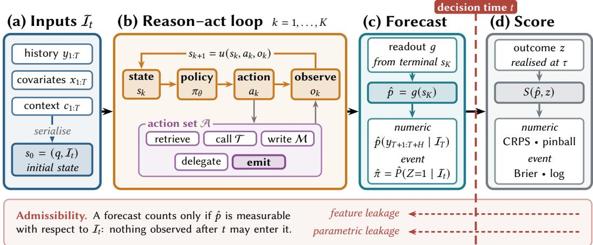
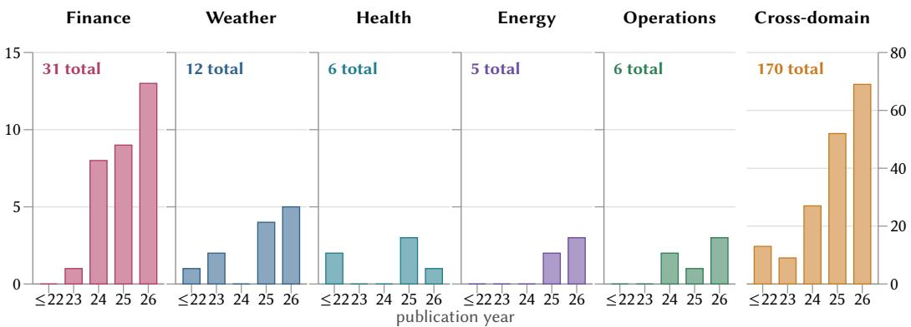
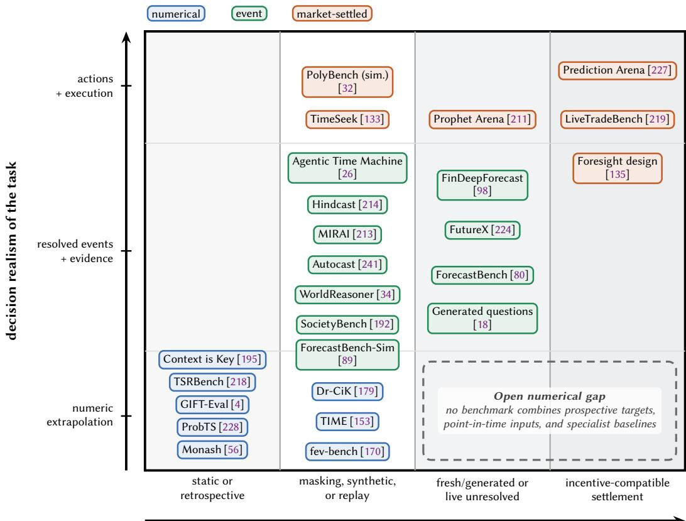

# LLM-based Agents for Forecasting and Prediction: Methods, Training, Evaluation, and Applications

XIAOGANG XU, Zhejiang University, China

JIAQI TANG✉, The Hong Kong University of Science and Technology, Hong Kong

JIANMIN CHEN and YINGYING YAN, Northwestern Polytechnical University, China

ZHENCHAO TANG and XIANGXIN ZHOU, Tencent, China

XIAOBIN HU, National University of Singapore, Singapore

WEI WEI, Northwestern Polytechnical University, China

JINFENG WU and QIFENG CHEN, The Hong Kong University of Science and Technology, Hong Kong   
LU ZHOU, Nanjing University of Aeronautics and Astronautics, China   
JIAFEI WU, ZHE LIU✉, and JIANWEI YIN, Zhejiang University, China   
WEIMIN ZHENG, Tsinghua University, China

Large language models (LLMs) now support forecasting systems that combine language-based reasoning with temporal data, evidence retrieval, external tools, and iterative prediction. We investigate LLM-based forecasting agents, meaning systems in which a language model contributes to a scored prediction about a future or currently unobserved target. We organize architectures into three groups. Standalone LLM workflows operate on encoded time series or event context. Tool- and retrieval-augmented agents incorporate external evidence. Hybrid systems pair LLMs with statistical or foundation models. We then review training methods and evaluation protocols. We examine negative as well as positive evidence, including sensitivity to small input perturbations, ablations in which the LLM component does not improve accuracy, and benchmark gains that may reflect contamination instead of temporal reasoning. We cover applications in finance, weather, health energy, and operations, and we summarize the benchmarks and datasets used for evaluation. The evidence indicates that measurement is a central limitation. Future work requires calibration under distribution shift, contamination-resistant live evaluation, explicit reporting of cost and accuracy together, and methods for handling feedback between deployed forecasts and the outcomes being forecast.

CCS Concepts: • General and reference; • Computing methodologies  Multi-agent systems; Natural language generation; Artificial intelligence;

Additional Key Words and Phrases: forecasting agents, LLM-based agents, large language models, time series forecasting, event forecasting, prediction

## ACM Reference Format:

Xiaogang Xu, Jiaqi Tang, Jianmin Chen, Yingying Yan, Zhenchao Tang, Xiangxin Zhou, Xiaobin Hu, Wei Wei, Jinfeng Wu, Qifeng Chen, Lu Zhou, Jiafei Wu, Zhe Liu, Jianwei Yin, and Weimin Zheng. 2026. LLM-based

†Corresponding to Jiaqi Tang (jtang092@connect.ust.hk) and Zhe Liu (zhe.liu@zju.edu.cn). Authors’ Contact Information: Xiaogang Xu, Zhejiang University, China; Jiaqi Tang, The Hong Kong University of Science and Technology, Hong Kong; Jianmin Chen; Yingying Yan, Northwestern Polytechnical University, China; Zhenchao Tang; Xiangxin Zhou, Tencent, China; Xiaobin Hu, National University of Singapore, Singapore; Wei Wei, Northwestern Polytechnical University, China; Jinfeng Wu; Qifeng Chen, The Hong Kong University of Science and Technology, Hong Kong; Lu Zhou, Nanjing University of Aeronautics and Astronautics, China; Jiafei Wu; Zhe Liu; Jianwei Yin, Zhejiang University, China; Weimin Zheng, Tsinghua University, China.

Permission to make digital or hard copies of all or part of this work for personal or classroom use is granted without fee provided that copies are not made or distributed for profit or commercial advantage and that copies bear this notice and the full citation on the first page. Copyrights for components of this work owned by others than the author(s) must be honored. Abstracting with credit is permitted. To copy otherwise, or republish, to post on servers or to redistribute to lists, requires prior specific permission and/or a fee. Request permissions from permissions@acm.org.   
© 2026 Copyright held by the owner/author(s). Publication rights licensed to ACM.   
ACM 1557-7341/2026/1-ART0   
https://doi.org/XXXXXXX.XXXXXXX

Agents for Forecasting and Prediction: Methods, Training, Evaluation, and Applications. ACM Comput. Surv. 0, 0, Article 0 (January 2026), 36 pages. https://doi.org/XXXXXXX.XXXXXXX

## 1 Introduction

Forecasting supports decisions in finance [124, 161, 168], public health [37, 159, 160], energy [66, 194], operations [50, 123], and climate response [15, 87, 150]. For decades the field relied on statistical and econometric models [72], and later on deep networks trained on structured numerical data [13, 104]. Large language models (LLMs) [21, 185] add semantic representations and capabilities for reasoning over events,policies, and explanatory contexts. Current evidence does not establish that LLMs can extrapolate numerical sequences more accurately than specialized forecasting models. In an agentic system, however, an LLM can retrieve evidence, invoke tools, and revise a forecast through multiple inference steps (Figure 1). These capabilities come with substantial trade-ofs. Forecasts that rely on unstructured evidence, such as news, filings, or health reports, may fail to improve accuracy or calibration over specialized models while requiring substantially more inference compute. One ablation study found that removing the language model component from several LLM-based forecasters left accuracy unchanged or improved it [178]. We thus focus on the conditions under which a language-based component improves a forecast enough to justify its cost.

We study systems in which an LLM contributes, through reasoning, representation, or control, to a scored prediction about a future target. The review follows how such systems are formulated, built, trained, evaluated, and deployed. Some operate as prompt-only workflows over encoded series or event context. Others retrieve documents, call tools, or iterate through a reason-and-act loop. Hybrid designs pair an LLM with a statistical or time-series foundation model and assign the language component a narrower role. The rest of the paper asks when that component is worth its cost, and which evaluation controls make a reported gain credible.

Early prompt-only work treated frozen LLMs as zero-shot forecasters over serialized numbers [61]. Later methods adapt language backbones to temporal data through reprogramming, alignment, or prompt learning [25, 76, 237], and they are now compared against purpose-built time-series foundation models [8, 42, 196]. Other systems assign probabilities to event questions, a line of work that grew from neural forecasting of world events [241]. Retrieval-and-reasoning methods have approached human-forecaster accuracy on selected question sets [64], and live benchmarks compare these systems with experts and prediction markets while reducing contamination risk [80, 224]. The same evaluation challenges recur across these designs, including lookahead leakage, pretraining contamination, and incomplete inference-cost reporting. These limitations also afect domain deployments, where reliability depends on controlling information availability, evaluation protocols, and computational costs.

Language-based evidence is particularly valuable when predictive signals are not fully represented in historical numerical observations. Policy announcements, filings, news, and outbreak reports may change an outlook before their efects appear in a numerical series [195]. An agent can retrieve timestamped evidence, call a specialist model or calculator, and preserve intermediate state as information arrives. These functions distinguish agentic forecasting from one-shot prompting, but they also introduce decisions about source validity, tool selection, stopping, and inference cost [33]. Greater agency thus enables adaptation without by itself demonstrating higher forecast accuracy.

Our operational boundary requires an LLM to contribute to a verifiable, explicitly scored prediction. Eligible outputs include points, predictive distributions, categories, and event probabilities, and prompt-only systems remain the least agentic endpoint of the comparison. We exclude narrative commentary without a scorable forecast, purely numerical transformers except as baselines, trajectory and motion prediction [204], retrospective causal inference, and general agent benchmarks without prediction tasks. This boundary covers both numerical and judgmental forecasting while keeping outcome-based evaluation common across architectures.

  
Fig. 1. Forecasting-agent pipeline corresponding to the formalism in Sections 2.3–2.4. Starting from the information set �, the agent executes a reason–act loop and uses the readout � to produce a forecast. An appropriate forecast score evaluates the forecast when the outcome is observed at �. The dashed line marks decision time �, and the backward arrows show feature and parametric leakage across that boundary. Seting � = 1 and = emit yields a prompt-only zero-shot forecaster.

Application constraints difer: finance evaluates returns as well as forecast scores, weather and health have strong specialist baselines, and energy and operations impose latency and integration limits (Section 6). Figure 3 groups the living corpus by application domain, placing general methods, benchmarks, and foundations in Cross-domain. These domains also expose diferent failure costs: a poorly calibrated probability, delayed warning, and unprofitable trading action cannot be compared through point error alone.

Prior papers cover LLM time-series architectures [231], trajectory and financial prediction [188, 204], or general data-science agents [157, 238]. Others focus on temporal reasoning, post-training, agent frameworks, multimodal fusion, or pre-agentic models [28, 31, 75, 171, 199].Existing architecture papers generally place less emphasis on tool-mediated control, live evidence, and outcomebased evaluation, while broader agent papers typically treat forecasting as one task among many. Reviews of temporal reasoning or post-training cover only parts of the forecasting pipeline. Our narrower, operational scope jointly examines numerical and event targets from formulation through deployment, including component ablations, calibration, contamination controls, inference costs (Section 5.5), and deployment risks (Section 7). Positive and negative results are judged under the same evidentiary standard.

Contributions. This study makes five contributions. First, we define the scope of LLM-based forecasting agents and place prompt-only models and tool-using systems on a single continuum of agency (Sections 2.3 and 2.4). Second, we provide a taxonomy spanning data representations, agent architectures, training paradigms, hybrid models, and tool augmentation (Figure 2). Third, we analyze evaluation challenges, including contamination, temporal leakage, aggregation, and comparisons with human forecasters (Section 5). Fourth, we examine how domain-specific constraints shape agent design across finance, weather, health, energy, and operations (Section 6). Fifth, we derive a research agenda from current measurement and deployment limitations (Section 7), and we apply a uniform evidentiary standard to both positive and negative results throughout.

## Problem Formulation

§2.3–2.5

Scoring rules Brier [20] • proper rules [55] • calibration [54] • leakage [62]   
Defining agency ReAct [212] • Reflexion [173] • Self-Refine [120]   
Pre-agentic models Box–Jenkins [19] • M4/M5 [122, 123] • DLinear [223]

## Representation & Orchestration §3.1–3.2

Serialisation TOKON [208] • patching [22] • LLMTime [61] • fusion [175]   
Prompts & context PromptCast [205] • LSTPrompt [107] • Context is Key [195]   
Single-agent MORFI [81] • MAP4TS [90] • STELLA [48] • UniCast [149]   
Multi-agent Nexus [43] • TradingAgents [198]

Tools, Evidence & Hybrids §3.3–3.5

Retrieval FLAIRR-TS [73] • TimeRAF [225]   
Program synthesis SEA-TS [203]   
Open-web research news reasoning [64] • AIA Forecaster [5] • proposed expert routing [23] • argumentation [59]   
Live evidence NSW-EPNews [16] • IoT streams [125]   
Statistical hybrids soybean LSTM [14] • regime ICL [10] • Kalman [184]   
Foundation models Chronos [8] • Moirai [196] • MOMENT [60] • Time-MoE [172]

## Training & Adaptation

§4

Eficient tuning GPT4TS [237] • Time-LLM [76] • TEMPO [25] • S2IP-LLM [146]   
RL and rewards Time-R1 [117] • TimeMaster [226] • outcome rewards [186]   
Ablation evidence no-LLM ablations [178] • in-context limits [239]

Evaluation §5

Series benchmarks GIFT-Eval [4] • Monash [56] • TFRBench [2] • FinTSBridge [191]

Event benchmarks ForecastBench [80] • FutureX [224] • MIRAI [213]

Calibration & UQ confidence [202] • conformal [6] • coverage [11] • UQ[44]

Leakage & cost unreported cost [131] • saturation [210] • hindcast replay [214]

Applications §6

Finance FinMem [220] • FinAgent [230] • FinCon [221] • M6 [124]

Weather & response GraphCast [87] • Pangu [15] • GenCast [152] • SIREN [138]

Health & epidemics COVID Hub [36] • PandemicLLM [46] • EPIFNP [78]

## Risks & Open Problems

§7

Overconfidence market losses [32] • solar flares [24] • perishable scores [53]

Tools & reflexivity tool privilege [209] • retrieval filtering [91] • LLM crowd aggregation [167]

Open problems ablation dispute [155] • human teams [129] • theory [162]

Fig. 2. Taxonomy of LLM-based agents for forecasting and prediction. Each branch identifies representative work and the part of the paper that discusses it. The first branch covers formulation, agency, and forecasting baselines in Section 2. The architecture branches distinguish systems that operate on an LLM’s interna representation from systems that connect the LLM to tools, external evidence, or other models. The fina branch summarizes risks and open problems that apply across all method families

Organization. Section 2 defines scope, tasks, agency, and baselines; Sections 3 and 4 cover architectures and training. Section 5 examines benchmarks, leakage, uncertainty, aggregation, and cost. Sections 6 and 7 address deployments, risks, and open problems, and Section 8 concludes.

## 2 Scope and Formulation

## 2.1 Scope

We include systems where an LLM functionally contributes, through reasoning, representation, or control, to a scored prediction about a target that is not yet observed at decision time and can be verified against outcomes using explicit scoring rules. Eligible outputs encompass point predictions, predictive distributions, categories, and event probabilities, excluding non-scorable narrative commentary. Purely numerical forecasting models without language components are excluded from the agent category but retained as baselines. By encompassing both prompt-only models and closed-loop agents, this boundary enables us to examine whether increased agency provides measurable predictive benefits.

  
Fig. 3. Publication-year distribution of references grouped by application domain. The panels cover Finance, Weather, Health, Energy, Operations, and Cross-domain. The applied panels share one vertical scale, while Cross-domain uses a larger scale.

The criterion admits targets of either form: numerical targets, typically benchmarked against statistical and foundation models [8, 61, 76], and event targets, typically benchmarked against human forecasters and prediction markets [64, 80, 241]. Section 2.3 formalizes both as one task. We exclude trajectory and motion prediction, which follow distinct task definitions and evaluation protocols [204], retrospective causal inference, which estimates historical efects rather than future outcomes, and general agent benchmarks without scored predictions.

## 2.2 Corpus Construction

We searched major scholarly databases, preprint platforms, and relevant AI and machine-learning venues using combinations of model terms (large language model, LLM, foundation model, and agent), task terms (forecasting, time series, prediction, event prediction, and nowcasting), and mecha nism terms (prompting, retrieval, tool use, multi-agent, calibration, and conformal). The corpus is maintained as a living snapshot of this literature.

We supplemented this search with backward citation search for foundational work in classical forecasting [19, 71], proper scoring rules [20, 54, 55], conformal prediction [169], forecasting competitions [122, 123], and human superforecasting [181]. We screened titles and abstracts before full-text review, retaining studies that propose, evaluate, or analyze LLM-based predictive systems or provide relevant benchmarks, datasets, metrics, or negative results. We excluded papers that use LLMs solely for data cleaning or report generation, position papers without empirical evidence or a new framework, and superseded workshop abstracts. For duplicate records, we cite the most complete published version.

Figure 3 and its accompanying data artifact report the current corpus size and its venue-status, publication-year, and application-domain distributions. Works tied to an application domain are assigned to that domain, while general methods, benchmarks, and foundations are classified as Cross-domain. These quantities may change as the living paper is updated. We explicitly note where contested claims rely solely on preprint evidence.

Two main limitations afect the reported results. First, a pilot audit of 12 benchmark papers found substantial disclosure gaps in its sample, including omitted agent scafolds and no inference-cost reporting among the eight agent papers [131]. Consequently, we avoid constructing cross-paper leaderboards. Second, retrospective benchmarks introduce contamination risks through pre-training data exposure or lookahead feature leakage [62] (see Section 2.3). For such benchmarks, we explicitly note whether studies controlled for contamination.

## 2.3 A Unified Formulation

Let $\textstyle { \mathcal { T } } _ { t }$ denote the information set available strictly before decision time $t ,$ and let $q$ denote the forecasting query, which specifies the prediction target, temporal horizon or event resolution rule, and required output. A forecasting task asks the forecaster to report a predictive distribution for an unobserved target � using the admissible information $\textstyle { \mathcal { T } } _ { t }$ under the task specification $q .$ The target is observed only after the forecast is issued.

When the target is real-valued, � specifies the target series and forecast horizon �. Given a series $y _ { 1 : T } \in \mathbb { R } ^ { T \times d }$ , covariates $x _ { 1 : T }$ , and unstructured context $c _ { 1 : T : }$ , the task is

$$
\hat { p } \big ( y _ { T + 1 : T + H } \big | \mathcal { I } _ { T } \big ) , \qquad \mathcal { I } _ { T } = \{ y _ { 1 : T } , x _ { 1 : T } , c _ { 1 : T } \} ,\tag{1}
$$

for forecast horizon �. A point forecast reports a summary functional of ${ \hat { p } } .$

When the target is a discrete event, � specifies the event question together with its resolution criterion and resolution date �. The task is

$$
\hat { \pi } = \hat { P } \big ( Z = 1 \big | \mathcal { I } _ { t } \big ) , \qquad t < \tau ,\tag{2}
$$

where $Z \in \{ 0 , 1 \}$ indicates an afirmative resolution. Multi-outcome questions and questions with numerical intervals generalize this expression to a predictive distribution over outcome space $z$

Equations (1) and (2) are two readouts of one underlying forecasting problem: predicting an unobserved target from admissible information. The appropriate evaluation depends on the form of the forecast. Probabilistic forecasts are evaluated using proper scoring rules [55]: event probabilities commonly use the Brier score [20] or logarithmic score, whereas continuous predictive distributions can be evaluated with the continuous ranked probability score (CRPS). Quantile forecasts are commonly evaluated with pinball loss, while point forecasts use error measures such as MAE, RMSE, MASE, or sMAPE. Proper probabilistic scores reward both calibration and sharpness and discourage unjustified confidence. For probabilistic forecasts, following Gneiting et al. [54], the central objective is to achieve sharp predictive distributions subject to calibration, namely statistical consistency between predictive distributions and observations. However, existing LLM forecasters often exhibit calibration challenges (Section 5.3).

A forecast is admissible only i $\dot { \cdot } \hat { p }$ is measurable with respect to $\textstyle { \mathcal { T } } _ { t }$ . Leakage undermines evaluation through two main modes: feature leakage, where covariates contain lookahead information unavailable at decision time [62], and parametric leakage, where pre-training data includes benchmark outcomes, which is a risk mitigated by live and simulated benchmarks [80, 89, 224].

## 2.4 What Makes a Forecaster an Agent

We represent LLM-based forecasting systems within a common agentic framework in which a language model contributes, through reasoning, representation, or control, to a verifiable forecast. The framework accommodates both prompt-only forecasters and systems that update their state through multiple actions and observations [30]. Formally, a system is represented as a tuple $( \pi _ { \theta } , \mathcal { A } , \mathcal { T } , \mathcal { M } , g )$ containing a policy, action space, tools, memory, and predictive readout. Starting from $s _ { 0 } = ( q , \mathcal { T } _ { t } )$ , it repeats

$$
a _ { k } \sim \pi _ { \theta } ( \cdot \mid s _ { k } ) , \quad o _ { k } = \operatorname { e x e c } ( a _ { k } ) , \quad s _ { k + 1 } = u ( s _ { k } , a _ { k } , o _ { k } ) ,\tag{3}
$$

until it emits $\hat { p } = g ( s _ { K } )$ , where � denotes the state-transition operator induced by actions, observations, and memory updates. Actions can include retrieval, tool calls, memory writes, delegation, and termination. The formulation extends ReAct [212] with a predictive readout. Self-critique methods [120] and verbal reinforcement [173] instantiate the update rule $u ,$ while learned tool invocation [163] defines access to $\mathcal { T }$

Agency is graded: when � = 1 and $\mathcal { A } = \left\{ \mathrm { E M I T } \right\}$ , the system reduces to the prompt-only zero-shot forecaster described in Section 3.1. Controller architectures instead use the LLM to coordinate specialized forecasting models, with their outputs incorporated into the agent state before the final predictive readout � (Section 3.5). We therefore treat agency as a graded property, operationalized primarily through the breadth of the action space  and the extent of observation-conditioned sequential control; � provides a useful but incomplete proxy for interaction depth.

Along this continuum, classical statistical models [19, 71] and deep sequence architectures [139, 234] map numerical history via fixed parameters. Foundation models enable zero-shot transfer but lack query-time parameter adaptation [8, 42, 196], whereas prompt-only systems such as LLMTime adapt only through their context window [61]. Forecasting-specific retrieval adds selected evidence at inference time [225], and multi-agent systems extend this process through structured deliberation [43, 198]. At a highly agentic end of this continuum, open-web deep-research agents dynamically expand the evidence incorporated into their agent state, requiring live, contamination resistant evaluation [98, 224].

In-context learning augments the model context with examples without updating model weights, while retrieval augments the agent state with selected historical segments or admissible external evidence at inference time. Forecasting retrievers must choose which segments to use [91, 225, 236]; tool-using systems separately must decide whether an invocation is necessary for the current model and task [33].

Observable traces enable process-fidelity evaluation, but coherent traces do not necessarily ensure faithful reasoning, because agents can produce conclusions unsupported by their preceding steps [190]. This discrepancy is particularly dificult to detect in forecasting, where true outcomes are unknown at decision time. TFRBench addresses part of this gap by evaluating agent-synthesized, numerically grounded traces over real time-series datasets [2].

## 2.5 Baselines

Numerical forecasting. Classical Box–Jenkins ARIMA models [19] and state-space models remain strong, low-cost baselines. M4 showed the competitiveness of combinations and hybrid methods [122], while leading M5 solutions relied heavily on boosted trees, cross-learning, covariates, and ensembles [123]. M6 further highlighted the distinction between predictive skill and profitable decisions [124]. These numerical baselines cannot directly consume qualitative sources such as news, events, or policy announcements without an additional representation or feature-extraction stage. Transformer variants target long-horizon forecasting via mechanisms like patch tokenization [139] and inverted attention [112]. However, a tuned single-layer linear model later matched many leading transformers [223], highlighting the need for strong baselines and evaluation protocols that do not merely reward model capacity, and that lesson applies directly to LLM-based forecasting. Time-series foundation models pre-train on heterogeneous corpora to support zero-shot forecasting, whereas prompt-only LLMs show fragile transfer that can be sensitive to small input perturbations and less accurate than statistical baselines [148]. Prominent architectures tokenize time series via value quantization [8], patch-based decoders [42], or any-variate multi-frequency attention [196], with broader variants exploring MoE routing, alternative objectives, and scaling [60, 111, 114, 172]. Standardized suites evaluate these zero-shot capabilities across diverse domains [4], with Section 3.5 examining their core design trade-ofs. Time-series foundation models (e.g., Chronos and TimesFM) are strong general-purpose baselines for numerical forecasting and are far smaller than frontier LLMs. Consequently, studies proposing LLM-based components must demonstrate clear performance gains over these dedicated baselines, yet Section 4.3 finds limited empirical evidence of such improvements.

Event and judgmental forecasting. Event forecasting requires diferent baselines because predictions are typically probabilities over discrete outcomes rather than numerical trajectories. General forecasting crowds provide an aggregation-based human reference [80], while expert superforecasters constitute a stronger judgmental baseline [80, 181]. Automated systems such as Autocast provide complementary machine baselines on forecasting-tournament questions [241]. LLM-based forecasters may approach crowd-level performance on selected question sets, but expert forecasters remain an important comparator [64, 80]. Market forecasts provide an additional reference for market-settled questions, although forecast quality should be evaluated separately from downstream returns. Section 5 examines these comparisons and their associated evaluation protocols.

## 3 Agent Architectures

We categorize forecasting architectures by how components interface with the LLM: (1) standalone LLMs using specific representations and prompts; (2) tool-augmented systems integrating programs, retrieval, or live evidence into the agent state; and (3) hybrid models pairing the LLM with statistical, deep learning, or time-series foundation backbones. These categories capture dominant coupling patterns rather than mutually exclusive system classes, since a system may combine retrieval, multi-agent orchestration, structured knowledge, and numerical forecasting backbones. Each setup adds distinct evaluation constraints: retrieval must prevent lookahead leakage, and hybrid designs must demonstrate gains over their standalone numerical baselines. These architectures realize the adaptive forecasting framework of Cheng et al. [31]. Throughout this section, we focus primarily on inference-time architecture and component coupling. Training-time parameter adaptation is discussed systematically in Section 4, although some systems reviewed here include learned or fine-tuned interfaces.

## 3.1 Serialization, Tokenization, and Prompt Content

Because text transformers lack native representations for real-valued quantities, their performance hinges on tokenization and serialization choices. The upper block of Table 1 categorizes these designs across three axes: numerical formatting, token segmentation, and accompanying contextual text.

PromptCast and LLMTime represent two contrasting strategies within this design space. Prompt-Cast frames forecasting as question-answering via sentence templates [205], whereas LLMTime feeds a frozen LLM bare digit sequences with space-delimited digits to control tokenization [61]. The contrast matters because sentence framing exposes task semantics, while digit spacing produces more regular token boundaries at greater context cost; neither choice establishes an advantage over a strong numerical baseline.

Numerical Encoding. Alternative tokenizations replace natural language with specialized units. Chronos quantizes values into learned vocabularies via backbone retraining [8], serving as a key baseline (Section 2.5). Patch tokenization, adapted from sequence models [139], groups time windows to provide a more eficient representation of local temporal patterns [22], while vision– language approaches process rendered charts to infer trends directly from pixels [81]. Surrounding text prompts also heavily impact performance; because manual templates are often suboptimal, some comparisons may reflect prompt tuning rather than fundamental model gains [206]. Finally, irregular formats pose distinct challenges, such as asynchronous event streams lacking fixed-width serializations [63] or clinical records arriving as temporally annotated narrative text [142].

General-purpose language tokenizers are optimized for natural-language statistics rather than numerical structure, which can lead to inconsistent tokenization ofadjacent values, loss ofnumerical locality, and ineficient token usage. LLMTime inserts spaces to obtain per-digit tokenization, improving positional regularity but adding nuisance tokens and lengthening the sequence [61]. Alternatively, TOKON normalizes each value into a single token, reducing sequence length by 2× to 3× while improving accuracy [208], which highlights key trade-ofs between context eficiency and numerical granularity.

Table 1. Representative forecasting systems organized by representation and control flow. The upper block varies forecast representation and context, whereas the lower block varies control flow from fixed refinement to open-web search. � counts model calls (Section 2.4).
<table><tr><td>System</td><td>Family</td><td>Forecast input / evidence</td><td>Forecast / control strategy</td><td>Calls / loop K</td></tr><tr><td>LLMTime [61]</td><td>Single-agent</td><td>Space-separated digit series</td><td>Zero-shot sequence continuation</td><td>1</td></tr><tr><td>TOKON [208]</td><td>Serialization</td><td>Ône token per series value</td><td>Vocabulary-fitted normalization</td><td>1</td></tr><tr><td>Patch prompting [22]</td><td>Serialization</td><td>Patched nearest-neighbor series</td><td>Trend + residual components</td><td>1</td></tr><tr><td>PromptCast [205]</td><td>Single-agent</td><td>Digits + task sentence</td><td>Fixed question template</td><td>1</td></tr><tr><td>Prompt mining [206]</td><td>Single-agent</td><td>Numerical text</td><td>Template search</td><td>1</td></tr><tr><td>Noise injection [217]</td><td>Prompt perturbation</td><td>Perturbed numerical text; synthetic noise</td><td>Sequence continuation</td><td>1</td></tr><tr><td>LSTPrompt [107]</td><td>Single-agent</td><td>Numerical text + horizon</td><td>Horizon-specific prompts</td><td>1</td></tr><tr><td>MAP4TS [90]</td><td>Prompt design</td><td>Numerical text + dataset</td><td>Global, local + statistical views</td><td>1</td></tr><tr><td>STELLA [48]</td><td>Single-agent</td><td>context Series + component</td><td>Mined semantic abstractions</td><td>1</td></tr><tr><td>LLM-Mixer [85]</td><td>Learned encoder</td><td>summaries Multiscale embeddings +</td><td>Task-specific text prompt</td><td>1</td></tr><tr><td>UniCast [149]</td><td>Learned prompt</td><td>descriptors Series + image + text</td><td>Instance-conditioned soft prompt</td><td>1</td></tr><tr><td>MORFI [81]</td><td>Single-agent</td><td>embeddings Chart + price text</td><td>Multimodal chain-of-thought</td><td>1</td></tr><tr><td>LLM-transformer fusion [175]</td><td>Fused encoder</td><td>Projected patches + Transformer features</td><td>Gated semantic / temporal fusion</td><td>1</td></tr><tr><td>FLAIRR-TS [73]</td><td>Forecaster + refiner</td><td>Numerical series</td><td>Test-time prompt optimization</td><td></td></tr><tr><td>CastFSR [180]</td><td>Single-agent loop</td><td>Series + context</td><td>Fast / slow / reflective modes</td><td>Fixed, small Adaptive</td></tr><tr><td>Cross-RAG [91]</td><td>Retrieval-augmented</td><td>Numerical series</td><td>Query-retrieval cross-attention</td><td>1</td></tr><tr><td>SERAF [236]</td><td>Retrieval-augmented</td><td>Series + text</td><td>Joint numerical + text retrieval</td><td>1</td></tr><tr><td>TimeRAF [225]</td><td>Retrieval-augmented</td><td>Numerical series</td><td>Learnable retriever</td><td>1</td></tr><tr><td>Nexus [43]</td><td>Multi-agent</td><td>Series + event text</td><td>Macro / micro role decomposition</td><td></td></tr><tr><td>TradingAgents [198]</td><td>Multi-agent</td><td>Market + text</td><td>Role-based deliberation</td><td>Role-dependent Role-dependent</td></tr><tr><td>ElliottAgents [35]</td><td>Multi-agent</td><td>Market + text</td><td>Natural-language debate</td><td>Role-dependent</td></tr><tr><td>TimeSeriesScientist [232]</td><td>Multi-agent pipeline</td><td>Series + diagnostics</td><td>Curate, plan, forecast + report</td><td>Four staged roles</td></tr><tr><td>CastFlow [145]</td><td>Role-specialized</td><td>Series + text</td><td>Plan, act, forecast + reflect</td><td>Fixed reflective</td></tr><tr><td>KairosAgent [49]</td><td>workflow Reasoner + forecaster</td><td>Series + text</td><td>Fused semantic reasoning</td><td>cycle Multi-turn; per-turn</td></tr><tr><td>TimeClaw [102]</td><td>Generalist runtime</td><td>Numerical arrays + text</td><td>Executable temporal tools</td><td>credit Variable;</td></tr><tr><td>SEA-TS [203]</td><td></td><td>Code-writing agent Numerical series + generated</td><td>Evolutionary algorithm search</td><td>tool-bounded Unbounded search</td></tr><tr><td>AIA Forecaster [5]</td><td>Multi-agent research</td><td>code Live web news</td><td>Search + reconciliation</td><td>Unbounded;</td></tr><tr><td>ForecastAgentSearch [23]</td><td>Proposed</td><td>Expert-agent pool</td><td>Proposed expert ranking</td><td>arbitrated Not evaluated</td></tr><tr><td>Argumentative MAS [59]</td><td>multi-expert design Multi-agent</td><td>Retrieved news</td><td>Structured argument</td><td>Debate rounds</td></tr><tr><td>ForecastCompass [29]</td><td>judgmental Memory-augmented</td><td>Question context + memory</td><td>Factor + calibration recall</td><td>Memory-fed</td></tr></table>

Clean token boundaries do not ensure that embeddings preserve numerical order or distance. One hybrid design applies reversible normalization, sends projected numerical patches to an LLM branch, and fuses them with a temporal transformer [175]; related hybrids likewise preserve a dedicated numerical pathway rather than relying on text serialization alone [201] (Section 3.5).

Because quadratic self-attention costs force a trade-of between numerical precision and lookback context length, patching groups adjacent observations into tokens to reduce attention cost and expand the efective lookback window [139], while encoding granularity can limit the resolution of predictive distributions [61] (Section 5.3). A key evaluation gap remains: existing studies often change serialization together with prompts and backbones rather than isolating encoding efects on a fixed benchmark. This coupling makes forecast error an incomplete diagnostic: a model may fail because it misreads the encoded history, because it cannot extrapolate the pattern, or both. Fixed-backbone comparisons should therefore pair forecasting with an input-reconstruction task, separating numerical fidelity from predictive ability.

Prompt and Context Design. Beyond value encoding, methods leverage remaining context space to supply structured task semantics. MAP4TS incorporates dataset-level context, local dynamics, statistical properties, and temporal dependencies into its prompt [90], while STELLA extracts trend, seasonal, and residual components as structured semantic summaries [48]. Both frameworks perform signal decomposition externally, using the extracted features to guide LLM predictions.

LSTPrompt separates prompts by forecast horizon and periodically prompts the model to reassess its strategy [107], while LLM-Mixer multi-scales temporal features before conditioning the backbone with task-specific text prompts [85]. Both adapt chain-of-thought principles [193] to task decomposition. Unlike standard reasoning tasks, however, forecasting intermediate steps cannot be validated before target observation, which is a limitation that multi-turn control-flow architectures seek to address (Section 3.2).

UniCast uses a learned distiller to generate instance-conditioned prompts from time-series, image, and text inputs [149], bridging manual prompting and parameter adaptation. Related approaches partially fine-tune normalization layers [237] or align time-series patches with textual prototypes [76]. Because these methods incur training overheads absent in zero-shot prompting, Section 4 classifies them under parameter adaptation.

Robustness to Perturbations. Reported input noise efects remain inconsistent: injected noise improved zero-shot accuracy in one study [217], while small perturbations sharply degraded forecasts in another [148]. This discrepancy likely stems from interactions between perturbations and value encodings, mirroring broader degradation in LLM reasoning under noisy inputs [183] and highlighting unresolved sensitivity to surface-level changes.

On standard numerical benchmarks, removing or replacing the LLM component can leave accuracy unchanged or improved [178], indicating that representation studies may optimize an interface to a non-contributing module. This occurs either because purely numerical benchmarks lack load-bearing text or because representation is not the limiting factor. Isolating these mechanisms requires a factorial design varying encoding quality and LLM presence on text-rich tasks, which is an experiment built on existing components [178, 208] but not yet reported (Section 5.1).

## 3.2 Single Pass, Refinement, and Multi-Agent Orchestration

Representation and control flow constrain one another. A loop cannot recover information discarded during serialization, while accurate encoding alone may provide limited benefit if the architecture cannot revise an incorrect initial forecast. We distinguish single-pass calls, bounded refinement, role-specialized multi-agent workflows, and open-web research loops. Their call count � is not a complete cost measure because communication topology and retrieved context also determine latency and token use [143]. Open-web loops additionally vary the evidence set across queries, which improves access to post-training events but weakens reproducibility.

Refinement and Adaptive Routing. Iterative generation–evaluation loops (� > 1) allow test-time adaptation without gradient updates. FLAIRR-TS reports benchmark improvements from retrievalaugmented refinement, but each pass adds model calls and its cost-efectiveness across backbones and datasets remains unresolved [73]. Dynamic routing (e.g., CastFSR [180]) allocates compute by switching between fast, contextual, and reflective modes based on series complexity. While promising for cost eficiency (Section 5.5), aggregate benchmarks have not yet established router reliability on challenging cases. TimeRAF shows that selectively weighting retrieved historical segments can improve forecasts [225]. TFRBench separately evaluates grounded trace quality and trace-conditioned forecast gains, but does not isolate retrieval as the causal mechanism [2] (Section 3.3).

Role Specialization and Native Execution. Multi-agent frameworks distribute compute across specialized roles, either by structural signal decomposition (e.g., macro/micro dynamics in Nexus [43]) or domain-role division (e.g., analysts and traders in TradingAgents [198]). Because these setups encode distinct domain assumptions, empirical validation of one role architecture does not generalize to others. CastFlow assigns planning, action, forecasting, and reflection to a workflow in which a dedicated forecaster retains responsibility for numerical prediction [145]. KairosAgent similarly couples a language reasoner to a time-series foundation model but uses turn-level credit to distinguish useful reasoning steps from the final trajectory [49]. This division of labor is motivated by weak LLM ablation results: language modules can process context and control, while numerical modules preserve temporal inductive biases. It also creates a new burden, since final-error metrics alone cannot determine whether a failure arose from reasoning, handof, or prediction. TimeClaw identifies datatype and process misalignment, together with temporal-resolution distortion, when general text interfaces mediate time-series work [102]. On TimeSage-MT, models are relatively stronger at memory and chaining but remain weak in numerical accuracy and analytical grounding [84]. These results motivate evaluating native execution and reasoning quality separately from final prediction accuracy.

## 3.3 Tool Use, Program Synthesis, and Open-Web Research

An LLM moves beyond prompt-only forecasting when it calls APIs, executes code, or queries search engines to expand its accessible information state during inference (Table 2). These systems build on foundational agentic mechanisms such as tool integration [163], interleaved reasoning–action loops [212], self-critique/reflection [120, 173], and multi-agent orchestration [197].

Feedback and Tool Choice. Unlike many tool-use tasks where within-episode feedback is immediate, prospective forecasting targets may only resolve after deployment. FLAIRR-TS instead uses retrieval and validation-driven iterative refinement and reports lower benchmark MAE, at the cost of repeated model calls [73]. The outcome delay also motivates consistency objectives that reward alignment between reasoning and action before resolution [30]. Because correctness is unavailable within the episode, validation can reject malformed outputs or inconsistent rationales but cannot verify the prediction itself.

Tool value depends on the model and task: stronger backbones may bypass tools that weaker models require, so fixed budgets do not transfer across architectures [33]. Agents also select overprivileged tools when cheaper options sufice [209], adding safety and inference costs. Policies should therefore govern both tool availability and call necessity.

Retrieval and Program Synthesis. TimeRAF retrieves historical segments, Cross-RAG downweights unhelpful series, and joint shape-text retrieval addresses nonstationarity errors [91, 225, 236]. Evidence must also satisfy decision-time constraints [62]. The Bayesian Linguistic Forecaster limits context growth by updating a compressed probability-and-text belief state [134]; its long-horizon trade-of against raw retrieval remains untested. Relevance without timestamp admissibility can raise apparent accuracy by importing unavailable evidence, so retrieval quality and temporal validity require separate ablations.

Code-writing agents can generate executable forecasting programs rather than emitting direct predictions. For example, SEA-TS searches over algorithmic candidates, evaluates them on heldout data, and evolves code based on error metrics [203]. The resulting program is inspectable, executable, reusable without recurring frontier-model calls, and completely bypasses the numerical tokenization pitfalls detailed in Section 3.1. Held-out error supplies immediate feedback that direct event forecasting lacks, but repeated search against one validation split can overfit model selection.

Table 2. LLM couplings: external evidence (top), numerical foundation-model baselines (middle), and hybrid or controller forecasters (botom). Final-block systems require comparisons with the middle block, not only classical baselines.
<table><tr><td>System / study</td><td>Family</td><td>Coupled component</td><td>LLM role</td><td>Forecast target / setting</td></tr><tr><td>TimeRAF [225]</td><td>Retrieval</td><td>Knowledge base + foundation model</td><td>Retrieval for the base model</td><td>Zero-shot series; retrieved evidence</td></tr><tr><td>Cross-RAG [91]</td><td>Retrieval</td><td>Retrieved series</td><td>Query-retrieval cross-attention</td><td>Time-series benchmarks</td></tr><tr><td>Zhou et al. [240]</td><td>Structured knowledge</td><td>LBSN knowledge graph</td><td>Meta-path graph reasoning</td><td>Socioeconomic indicators; benchmarks</td></tr><tr><td>Nexus [43]</td><td>Structured knowledge</td><td>News + event streams</td><td>Staged multi-agent decomposition</td><td>Time-series benchmarks</td></tr><tr><td>EventCast [67]</td><td>Structured knowledge</td><td>Demand model + event text</td><td>Extracts event evidence</td><td>E-commerce demand; case study</td></tr><tr><td>Chronos-2 [7]</td><td>Foundation model</td><td>Group attention; T5 lineage</td><td>None; general baseline</td><td>Cross-domain zero-shot; covariates</td></tr><tr><td>Toto 2.0 [82]</td><td>Foundation model</td><td>Decoder-only; 4M-2.5B</td><td>None; scaling baseline</td><td>Telemetry zero-shot;</td></tr><tr><td>Timer-S1 [115]</td><td>Foundation model</td><td>parameters 8.3B sparse mixture of</td><td>None; frontier baseline</td><td>observability GIFT-Eval state of the art;</td></tr><tr><td>Xihe [177]</td><td>Foundation model</td><td>experts Hierarchical interleaved attention</td><td>None; scaling baseline</td><td>univariate Size-scaling zero-shot; univariate</td></tr><tr><td>Reverso [51]</td><td>Foundation model</td><td>Efficient 2.6M-parameter backbone</td><td>None; low-cost baseline</td><td>Compute-limited zero-shot; univariate</td></tr><tr><td>CoRA [154]</td><td>Foundation-model adapter</td><td>Frozen TSFM + modality encoders</td><td>GCE + zero-initialized injection</td><td>Covariate-aware forecasting</td></tr><tr><td>TimesFM [42]</td><td>Foundation model</td><td>Patched decoder-only transformer</td><td>None; purpose-built baseline</td><td>Cross-domain zero-shot; univariate</td></tr><tr><td>Moirai [196]</td><td>Foundation model</td><td>Any-variate attention encoder</td><td>None; purpose-built baseline</td><td>Cross-frequency zero-shot; multivariate</td></tr><tr><td>UniCast [149]</td><td>Hybrid</td><td>Frozen foundation model</td><td>Instance-conditioned context</td><td>General forecasting; series + text + images</td></tr><tr><td>LLIAM [52]</td><td>Hybrid</td><td>Foundation-model backbone</td><td>LoRA-adapted forecaster</td><td>General forecasting; text-serialized series</td></tr><tr><td>Benjamim et al. [14]</td><td>Hybrid</td><td>LSTM</td><td>Sentiment feature extractor</td><td>Soybean futures; news text</td></tr><tr><td>Niu et al. [141]</td><td>Controller</td><td>Prophet, XGBoost, LSTM pool</td><td>Coordinator over baseline forecasts</td><td>Low-carbon microgrids; synthetic data</td></tr></table>

Program inspection improves auditability without by itself guaranteeing temporal validity or out-of-distribution performance.

Open-Web Research and Memory. News-search systems can approach human crowds on some event-question sets [5, 64]. Implementations use supervisor reconciliation or structured argumentation [5, 59]; ForecastAgentSearch proposes expert-agent ranking without forecasting experiments [23]. Live, future-resolving questions reduce the risk of parametric leakage [98, 224], but open-web access adds security risk (Section 7). ForecastCompass stores predictive factors separately from calibration lessons and updates both after question resolution, providing a non-gradient form of forecasting-specific memory [29]. Whether such memory tracks distribution shifts better than fixed model weights remains untested.

## 3.4 Structured Knowledge and Live Evidence

Tool libraries grant agents operational actions, whereas knowledge graphs provide relational evidence to interpret. One socioeconomic prediction system uses an LBSN graph with dynamic subgraph and meta-path reasoning [240]. Separately, Li and Song [96] prove an evidence-relative trade-of for incomplete knowledge graphs: a deterministic grounding rule cannot reject every unsupported trajectory while retaining every valid trajectory whose evidence is missing. Applying that result to scored forecasting remains an open problem.

Knowledge Validity. Theologitis and Suciu [182] translate natural-language claims into SQL queries and return exact supporting or counterexample records from relational databases. Adapting this verification pattern to filter inconsistent candidate forecasts, rather than generating predictions directly from incomplete evidence, remains largely unexplored. EventCast draws future operational events from an existing expert database and converts them into summaries for a demand model [67]. At a higher level, Nitu et al. [140] report attention-based fusion of structured ERP sales records with LLM-derived embeddings from external text. Neither result establishes query-level guarantees for source coverage or temporal validity.

Streaming and Live Evidence. Time-aligned news can provide additional predictive signals beyond numerical energy-price history, although current evidence is retrospective rather than a deployed stream [16]. Architectures incorporate event context through staged components [43] or feed extracted news signals to numerical forecasting models [70, 201]. A renewable-energy review identifies edge, IoT, latency, and interoperability constraints as deployment challenges rather than evaluated routing gains [125]. Live protocols reduce the risk of leakage through unresolved questions, daily ingestion, timestamp-locked snapshots, live market states, or generated tasks [32, 80, 98, 219, 224]. Foresight Arena’s prospective on-chain results remain pending [135], while retrospective masking retains residual risk [119]. FutureX also documents fabricated or stale web evidence [224]; vetted corpora trade coverage for safety. Explicit propagation of source validity or evidence decay into predictive distributions remains uncommon among current agents. Robust retrieval therefore requires provenance, timestamps, and expiration criteria.

## 3.5 Hybrid Pairing with Statistical and Foundation Models

Hybrid systems pair LLMs with quantitative models for feature extraction, control, or end-to-end forecasting. They should be evaluated against strong numerical controls such as Chronos-2 and TimesFM [7, 42]. M4 and M5 show the competitiveness of combinations, covariates, trees, and ensembles [122, 123]; downstream decision results must also be separated from forecast error [229]. Lower point error need not improve operational utility, and an expensive LLM may only reproduce covariates already available to the numerical model.

One narrow and testable role is text-derived feature extraction. An LLM can convert news into sentiment for an LSTM, or convert promotional calendars into structured events for a demand model [14, 67]. This arrangement reuses one language-model call across many horizons and retains the numerical model’s inductive biases. A key limitation is compression: a scalar sentiment or event label can discard timing, uncertainty, and interactions present in the source text. The informative ablation therefore compares the text-derived feature with strong numerical covariates, not only with a context-free model.

Numerical Backbones and Controllers. Mahmud et al. [121] compare ARIMA, LSTM, and their hybrid, while Qureshi et al. [156] compare ARIMA, XGBoost, and a hybrid. LLM-assisted multibackbone systems instead use language context alongside numerical priors or candidate models [141]. M4 and M5 provide shared data and metrics but do not causally isolate each pipeline component [122, 123]; most LLM-augmented hybrids likewise compare only against bare numerical models. The marginal value of language therefore remains confounded by text content, parameter scale, and temporal generalization. Asaad et al. [10] condition a frozen LLM on estimated market regimes and in-context examples to predict next-day realized variance directly; the LLM does not control a separate numerical forecaster. The reported LLM predictor outperforms classical baselines, while a separate quantitative study estimates latent regimes from return dynamics [184]. These results do not isolate whether the LLM gain comes from regime labels, demonstration matching, or language pre-training. Liao et al. [103] use an LLM to revise air-ticket sales forecasts from business context after a numerical model produces its initial prediction. This contextual revision is distinct from classical statistical–neural residual modeling, and its retrospective case studies do not establish production deployment or general gains at matched cost. Evaluating a controller against only a fixed default model conflates routing quality with candidate-pool performance; proper evaluation requires comparisons with both random selection and an oracle selector.

Foundation-Model Baselines. Foundation models use distinct representations and heads. Chronos quantizes values, TimesFM maps continuous patches to point forecasts, and Sundial generates raw continuous values [8, 42, 114]. Timer uses autoregressive generation, scaled in Timer-S1 with sparse MoE routing [115, 116]; alternatives include MOMENT’s masked reconstruction, Moirai’s anyvariate attention, and other MoE designs [60, 172, 196]. Frozen feature quality also correlates across forecasting and classification tasks [12]. Direct distributional heads difer from post-hoc intervals (Section 2.3). Within-family evaluations of Toto 2.0, Xihe, and Timer-S1 report improvements with increasing scale, but these curves do not establish the best cross-architecture accuracy at a fixed budget.

Cross-Modal Interfaces. LLIAM uses low-rank adaptation to fine-tune backbones (Section 4) [52]. Representation-alignment methods address modality mismatch [215], whereas gated fusion combines LLM semantic representations with temporal-Transformer features [175]. TimeRAF ofers nonparametric retrieval of historical series without backbone updates [225]. UniCast is not a re trieval method: it learns an instance-conditioned prompt and modality router around a frozen time-series foundation model [149].

## 4 Training and Adaptation

Section 3 organized forecasting systems primarily by their inference-time architecture and component coupling. This section instead focuses on how model parameters, interfaces, and policies are adapted during training, and how these choices afect forecasting behavior and inference cost. The supervision structure also dictates optimization dynamics: step-wise numerical targets provide dense rewards, whereas binary events are resolved only after long delays, altering credit assignment and calibration dynamics.

## 4.1 Adaptation and Inference-Time Compute

Most adaptation methods freeze the pretrained LLM weights and train a lightweight interface. GPT4TS updates normalization and positional-embedding parameters, whereas Time-LLM freezes the LLM weights and trains a reprogramming layer that maps input patches into the LLM embedding space, together with task-specific prompt context. Thus, GPT4TS adapts selected parameters inside the pretrained LLM, while Time-LLM adapts the input interface around a frozen LLM (Table 3). This distinction afects transfer: updating selected model parameters may fit target-specific distribution shifts but can reduce the reusability of pretrained representations, whereas input reprogramming leaves the LLM weights unchanged but remains constrained by the pretrained embedding space, tokenization, and context length.

Learned Interfaces. Numerical and token spaces can be aligned by contrastive or branch objectives [110, 176], prompt embeddings [25, 146], or direct autoregressive tokenization [113]. These interfaces should be compared using the same pretrained LLM, data splits, preprocessing, and tuning budget, rather than only against independently tuned published baselines. Otherwise, an apparent gain may reflect diferences in model size, pretraining data, preprocessing, or tuning budget rather than improved cross-modal alignment. LoRA reduces trainable parameters through low-rank adaptation or importance-based module selection [52, 101]. Updating more parameters may better fit target-specific distribution shifts, but can also reduce the transferability of pretrained representations [12, 215]. CoRA trains causal condition injection over frozen encoders, while MM-PostTrain trains an LLM reviser over a numerical prior [109, 154]. ChatTS uses synthetic time series with known attributes to train cross-modal alignment, whereas STRIDE distills reasoning traces into

Table 3. Forecasting adaptation from lightweight interfaces to reinforcement learning on delayed events. Numerical horizons yield dense loss; binary events yield one outcome at resolution.
<table><tr><td>Method</td><td>Adaptation</td><td>Updated component</td><td>Training / calibration signal</td><td>Connected modalities</td></tr><tr><td>GPT4TS [237]</td><td>Partial fine-tuning</td><td>Normalization + positional layers</td><td>Forecast loss (dense)</td><td>Values to token embeddings</td></tr><tr><td>Time-LLM [76]</td><td>Reprogramming</td><td>Patch reprogramming layer</td><td>Forecast loss (dense)</td><td>Patch to text prototype</td></tr><tr><td>TEST [176] TEMPO [25]</td><td>Embedding alignment Prompt pool + fine-tuning</td><td>Series encoder Decomposition prompts</td><td>Contrastive + forecast losses Forecast loss (dense)</td><td>Series to text prototype Trend / seasonality to</td></tr><tr><td>CALF [110] AutoTimes [113]</td><td>Cross-modal fine-tuning</td><td>Dual-branch adapters</td><td>Feature + output alignment</td><td>prompt Numerical to text branch</td></tr><tr><td></td><td>Autoregressive adaptation</td><td>Projection layers</td><td>Next-token forecast loss (dense)</td><td>Series as token sequence</td></tr><tr><td>LLIAM [52] Time-R1 [117]</td><td>Low-rank adaptation Reinforcement learning</td><td>LoRA matrices Full policy</td><td>Forecast loss (dense) Temporal rule reward (dense)</td><td>Text-serialized series Reasoning to</td></tr><tr><td>TimeMaster [226]</td><td>SFT then RL</td><td>Full policy</td><td>Format + accuracy reward</td><td>timestamped fact Series image to reasoning</td></tr><tr><td>TimeRFT [97]</td><td>Reinforcement fine-tuning</td><td>TSFM policy</td><td>(dense) Per-step / variable reward</td><td>Numerical error to</td></tr><tr><td>CastFlow [145]</td><td>SFT then workflow RL</td><td>Role-specialized policies</td><td>Workflow reward (sparse)</td><td>reward Context to role</td></tr><tr><td>Outcome-RL [186]</td><td>GRPO + ReMax</td><td>Full policy</td><td>Delayed Brier reward (sparse)</td><td>composition News evidence to</td></tr><tr><td>Question synthesis [27]</td><td>GRPO at scale</td><td>Full policy</td><td>Accuracy + Brier reward</td><td>probability Retrieved news to</td></tr><tr><td>FutureWorld [65]</td><td>Live RL environment</td><td>Full policy</td><td>(sparse) Delayed outcome reward</td><td>probability In-loop retrieval to</td></tr><tr><td>Market reward [93]</td><td>Reward substitution</td><td>Full policy</td><td>(sparse) Market-price reward (dense)</td><td>probability</td></tr><tr><td>RLCR [41]</td><td>RL with confidence target</td><td>Policy output sequence</td><td></td><td>Market state to probability</td></tr><tr><td>Calibrated VR [174]</td><td>Masked verifiable-reward</td><td></td><td>Correctness + proper-score reward</td><td>Reasoning to stated confidence</td></tr><tr><td></td><td>RL</td><td>Gradient-masked policy</td><td>State-conditioned empirical-rate reward</td><td>Evidence state to probability</td></tr><tr><td>Beta-Bernoulli [39]</td><td>Post-hoc correction</td><td>External calibrator</td><td>Outcomes + crowd forecasts</td><td>Score to calibrated probability</td></tr></table>

continuous encoder representations to reduce inference-time chain-of-thought overhead [1, 200].   
Their generalization under shift remains unverified [199].

Inference-Time Adaptation. Inference-time compute yields mixed results: verified reasoning traces can improve performance, whereas excessive reasoning tokens may reduce accuracy, extended deliberation may worsen calibration, and tested prompt interventions often fail to improve accuracy [2, 136, 165, 235]. Repeated sampling ofers little numerical diversity, whereas input perturbation and contextual gating can improve selected forecasts [68, 147]. Useful compute therefore diversifies or filters information rather than repeating unchanged inputs. Forecasting systems can also externalize experience as reusable memory instead of updating model weights [233]. Residual replay bufers provide another form of online adaptation while leaving the forecasting model weights unchanged [40]. The relative robustness of these methods to abrupt regime shifts and gradual novelty has not yet been evaluated.

## 4.2 Reinforcement Learning and Calibration

Supervised fine-tuning optimizes forecast outputs from labeled targets, whereas reinforcement learning optimizes the expected reward of sampled trajectories and may afect both intermediate actions and final outputs. For online binary-event forecasting, outcome rewards are sparse and delayed. A forecast of 0.7 is calibrated only in aggregate; under perfect calibration, approximately 30% of such events resolve negatively. Proper scores such as negative Brier, optimized through GRPO or ReMax, reward probability estimation rather than raw confidence [55, 186]; one 14B model matches the reported accuracy of larger frontier models while achieving better calibration. This result suggests, but does not establish, that reward design can partly ofset model-scale diferences.

Outcome and Market Rewards. Resolved events provide automated ground-truth labels over time [187]. Synthesizing tens of thousands of news-based forecasting questions enables RL with accuracy and Brier rewards; the resulting model is evaluated on FutureX and out-of-distribution calibration, but live-capital and expert-tournament transfer remain untested [27]. FutureWorld lets a policy retrieve evidence for open questions and receive an outcome reward after resolution [65]. Outcome-only rewards are sparse and high-variance and provide weak credit assignment for intermediate actions; under some training setups, they may also encourage base-rate policies. Market prices provide more frequent proxy targets but may contain liquidity, herding, and participant errors [92, 93]. Resolved questions may also appear in pretraining data. Studies should therefore document the knowledge cutof and data provenance, and evaluate prospectively on questions that were unresolved during training (Section 5.2).

The two reward sources therefore trade variance for bias. A binary resolution is authoritative but reveals little about which search or reasoning action helped, while a market trajectory supplies many intermediate targets whose prices may reflect liquidity, herding, or participant error. Training reports should identify which actions receive credit and whether reward density changes calibration rather than only accuracy.

Dense and Calibration Rewards. Dense step-wise and variable rewards can improve performance in some numerical forecasting models [97, 117, 226]. Agentic systems can additionally use workflowlevel or turn-level rewards to assign credit across a multi-stage reasoner–forecaster process [49, 145]. Proper-score theory explains why correctness alone does not penalize overconfidence [55]. Empirically, adding Brier score to correctness rewards improves accuracy and calibration [41]. However, applying a reward to a single realized outcome can induce outcome-rationalizing reasoning.

A post-hoc Beta–Bernoulli calibrator instead uses a text encoder and mixture-valued output, and outperforms forecasting-specific fine-tuning without imposing a monotone two-parameter correction [39] (Section 5.3). A possible leakage pathway is that gradients from a realized outcome encourage rationales that explain the observed label rather than beliefs supported by decisiontime evidence. State-conditioned rewards and gradient masking may reduce this pathway, but finite-sample estimation still introduces noise when states are grouped by similarity. A computecontrolled comparison should therefore evaluate proper-score training and an external calibrator using matched data, model, and compute budgets. Otherwise, policy updates may receive credit for correcting an output distortion that a simpler calibrator could fix.

## 4.3 Ablation Evidence

Evidence on the incremental value of language-model components in time-series forecasting is mixed. One ablation study reports that replacing or removing the LLM component leaves accuracy unchanged or improves it, and that smaller models trained from scratch can outperform pretrained LLMs at lower compute [178]. By contrast, a larger-scale re-evaluation reports positive languagemodel contributions and attributes earlier null results to limited evaluation scale [155]. Because these studies use diferent protocols, a decisive comparison should hold datasets, horizons, splits, preprocessing, tuning budgets, and random seeds fixed, and should report paired uncertainty intervals for the incremental language-model efect.

Such a comparison must also keep the surrounding scafold fixed. Removing the LLM while changing encoders, normalization, preprocessing, or tuning budget evaluates a diferent system rather than the marginal contribution of language pretraining.

Recent critiques argue that aggregate rankings can obscure practical capability and decisive design choices such as global versus local modeling [132, 151], reinforcing the need for leak-resistant benchmarks and contamination audits (Section 5.2) [95]. To establish the incremental value of language components, systems should report ablations against purpose-built numerical forecasters,

Table 4. Forecasting benchmarks grouped into numerical, event, and market-setled tasks. Within each block, entries are ordered by the strength of their temporal and contamination controls. Returns and payofs measure downstream decisions and are not substitutes for proper scores of predictive distributions.
<table><tr><td>Benchmark</td><td>Forecast task</td><td>Data / evidence source</td><td>Leakage / temporal control</td><td>Primary metric</td></tr><tr><td>Monash archive [56]</td><td>Numerical</td><td>Curated public series</td><td>Static archive; none</td><td>MASE, sMAPE</td></tr><tr><td>ProbTS [228]</td><td>Numerical; probabilistic</td><td>Standard benchmark suites</td><td>Static archive; none</td><td>CRPS, point error</td></tr><tr><td>Context is Key [195]</td><td>Numerical + text</td><td>Series + written context</td><td>Static archive; none</td><td>Region-weighted CRPS</td></tr><tr><td>GIFT-Eval [4]</td><td></td><td>Numerical; zero-shot Static multi-domain archive</td><td>No universal training-overlap guarantee</td><td>MASE, CRPS</td></tr><tr><td>TSRBench [218]</td><td>Reasoning; multimodal</td><td>Multi-task series corpus</td><td>Fixed capability / task categories</td><td>Per-capability results</td></tr><tr><td>fev-bench [170]</td><td>Numerical;</td><td>100 real tasks; 46 with</td><td>Rolling origins; held-out</td><td>Skill score; bootstrap CI</td></tr><tr><td>Dr-CiK [179]</td><td>covariates Numerical + retrieval</td><td>covariates Search-recovered context</td><td>windows Timestamped evidence pool</td><td>Region-weighted CRPS</td></tr><tr><td>TIME [153]</td><td>Numerical; zero-shot</td><td>50 fresh datasets; 98 tasks</td><td>Non-overlapping rolling windows; fresh-data control</td><td>MASE, CRPS; pattern / task ranks</td></tr><tr><td>Autocast [241]</td><td>Event</td><td>Forecasting tournaments</td><td>Retrospective cutoff</td><td>Brier, accuracy</td></tr><tr><td>MIRAI [213]</td><td>Event; agentic</td><td>Relations event database</td><td>Temporal masking</td><td>Relation / event F1; distributions</td></tr><tr><td>WorldReasoner [34]</td><td>Event + reasoning</td><td>Retrospective resolved</td><td>Simulated dates; evidence /</td><td>Probability, evidence,</td></tr><tr><td>SocietyBench [192]</td><td>Event; counterfactual</td><td>events Social-world scenarios</td><td>graph audit Anonymized entities + dates</td><td>graph Calibration + temporal</td></tr><tr><td>Hindcast [214]</td><td>Event; replay</td><td>Resolved markets</td><td>Frozen pre-cutoff corpus</td><td>accuracy Brier / accuracy; market</td></tr><tr><td>Agentic Time</td><td>Event; replay</td><td>Cutoff-filtered web</td><td>Approximate historical web</td><td>distance Offline replay score</td></tr><tr><td>Machine [26] Generated questions [18]</td><td>Event</td><td>reconstruction Agent-written and resolved</td><td>state Generated after cutoff</td><td></td></tr><tr><td>ForecastBench [80]</td><td>Event</td><td>Markets, platforms, series</td><td>Unresolved at submission</td><td>Validity rate, Brier Brier vs. human baseline</td></tr><tr><td>FutureX [224]</td><td>Event; agentic</td><td>Live daily pipeline</td><td>Live; unresolved</td><td>Accuracy at resolution</td></tr><tr><td>ForecastBench-Sim [89]</td><td>Event; counterfactual</td><td>Simulated world</td><td>Unresolvable in reality</td><td>Simulator proper score</td></tr><tr><td>TimeSeek [133]</td><td>Event; market-settled</td><td>Market lifecycle snapshots</td><td>Lifecycle-stratified sampling</td><td></td></tr><tr><td>PolyBench [32]</td><td>Event + simulated</td><td>Historical Polymarket order</td><td>Timestamp-locked snapshots</td><td>Skill by lifecycle stage Brier + simulated return</td></tr><tr><td></td><td>trading</td><td>books</td><td></td><td></td></tr><tr><td>Prophet Arena [211]</td><td>Event; market-settled</td><td>Live market questions</td><td>Live; unresolved</td><td>Calibration and trading analyses</td></tr><tr><td>Prediction Arena [227] Foresight Arena [135]</td><td>Event; market-settled Event; proposed</td><td>Live markets; real capital Commit-reveal market</td><td>Live; capital at risk Prospective results pending</td><td>Realized profit / loss Brier score; Alpha score</td></tr><tr><td></td><td>on-chain</td><td>design</td><td></td><td></td></tr><tr><td>LiveTradeBench [219]</td><td>Trading</td><td>Live market state</td><td>Live</td><td>Return (not a proper score)</td></tr><tr><td>FinDeepForecast [98]</td><td>Event; financial</td><td>Continuously generated tasks</td><td>Live</td><td>Task-level accuracy</td></tr></table>

especially on univariate tasks [7, 82]. LLM-specific training is most strongly motivated when the task requires unstructured context, genuinely novel events, or evaluated explanations for decision makers; these criteria should be defined and measured (Section 5.1).

## 5 Evaluation

Reliable evaluation requires leak-resistant, point-in-time benchmarks and reporting of appropriate forecast scores, uncertainty quality for probabilistic outputs, and inference costs. Numerical and event targets use diferent baselines, but both require predictions to depend only on information available before the decision time; benchmark construction must also audit pre-training contamination. Table 4 compares temporal and contamination controls together with the primary metrics.

## 5.1 Numerical and Event Benchmarks

Monash, GIFT-Eval, and ProbTS support broad numerical comparisons, but static archives cannot guarantee absence from pre-training data [4, 56, 228]. FEV-Bench uses rolling evaluation and bootstrapped skill scores across 100 real tasks, 46 of which include covariates [170]; TIME reports

50 recently collected datasets, 98 operationally aligned tasks, and non-overlapping rolling windows [153]. Data collected after a model’s training period can reduce the risk of parametric overlap, whereas rolling-origin evaluation preserves deployment order and can reveal performance changes across time.These controls address diferent threats.

Capability and Context Evaluation. Specialized benchmarks isolate intermediate capabilities. TSRBench reports that increasing model scale improves perception and reasoning but not necessarily final prediction accuracy, whereas TFRBench evaluates reasoning traces separately from final forecasts; multi-turn protocols test consistency across repeated interactions [2, 84, 218]. Other benchmarks separate temporal order, spatial structure, magnitude, asset-pricing scenarios, or irregular-event handling [63, 130, 191]. These decompositions matter because better perception or a more plausible trace does not imply a better forecast. Reporting only an aggregate score can hide a system that captures temporal order but fails on magnitude, horizon, or downstream action selection. Multimodal benchmarks must verify that text adds predictive signal. LLM forecasters often underuse context and that protocol choices can overstate the apparent gain [108, 195]. Under text collapse, arbitrary filler produces the same boost because the context branch acts as a contentindependent transformation [137]. Scenario and agentic benchmarks test context application and retrieval [74, 179], but none isolate the incremental contribution of written context (Section 4.3).

Live, Market, and Replay Evaluation. Event benchmarks compare systems with crowds and markets, where ensembling drives substantial gains [64, 167, 241]. MIRAI masks post-cutof evidence to evaluate retrieval jointly with forecasting, ForecastBench reports that expert forecasters outperform the evaluated models, and FutureX documents the vulnerability of live retrieval to fabricated web pages [80, 213, 224].

Market benchmarks difer in the realism of their decision setting. Prediction Arena exposes live capital to risk, whereas PolyBench simulates execution on historical, timestamp-locked order books and reports losses for many evaluated systems [32, 227]. Foresight Arena specifies an on-chain commit–reveal design, but prospective results are not yet available [135]. Pooling early- and latestage market questions can also confound the sampling strategy with forecasting ability [133]. Replay benchmarks restore reproducibility through frozen corpora or reconstructed historical web states, but their agreement with live performance remains unknown [26, 214]. Automated pipelines can generate questions and resolve them later with high reported validity, which can scale live and replay evaluation [18].

Rationale Auditing. WorldReasoner and SocietyBench audit forecasts using evidence, causal graphs, or entity/date shifts [34, 192]. Simulated worlds create counterfactuals that are harder to memorize, but their transfer to real-world forecasting remains uncertain [89]. Accuracy often declines as evaluation data move further beyond the model’s training period, making the documented cutof an essential reporting item [38]. A system may outperform a general crowd while trailing expert forecasters, and diferent question distributions prevent direct cross-benchmark rankings [80]. Rationale audits test whether a forecast is supported by admissible evidence; they do not establish that the rationale caused the reported probability. Simulated and live evaluations therefore answer complementary questions: the former strengthens contamination control, while the latter preserves institutional cues and real base rates.

## 5.2 Contamination and Leakage

Having defined admissible forecasts under $\textstyle { \mathcal { T } } _ { t }$ and distinguished feature from parametric leakage (Section 2.3), evaluation now relies on data audits, temporal partitioning, and outcome-independent consistency checks. This subsection compares the guarantees and limitations of leakage controls.

Leakage Sources. Feature leakage, where models use covariates unavailable at decision time, confounds model capability with information availability, necessitating strict point-in-time reconstruction of historical data including revisions [62]. Dataset reuse can also create train–test sample overlap and temporal overlap among correlated series, producing optimistic, non-generalizable evaluations [128]. Parametric leakage embeds benchmark data directly into model weights, rendering dataset cleaning insuficient. TSFMAudit reveals that text-adapted loss detectors are unreliable for time-series models, as low forecast loss often reflects series smoothness or strong generalization rather than memorization [95]. Consequently, large-scale audits verifying zero-shot claims on standard archives remain unavailable. This is important negative evidence: a detector failure does not prove contamination, but it also prevents a clean zero-shot guarantee. Fresh post-cutof data and prospective tasks remain stronger controls than inferring memorization from unusually low loss.

Leakage-Resistant Evaluation. Date-masked retrospective evaluation fixes the information cutof to approximate decision-time context, although residual parametric-leakage risks remain [119]. Live benchmarks reduce outcome memorization by testing unresolved questions, but each item expires at resolution (Section 5.1). Replay against frozen or cutof-filtered corpora can block post-decision retrieval while preserving ofline reproducibility; its agreement with live performance still requires direct validation [26, 214]. Studies should specify the evaluation design and enumerate the leakage vectors that remain. Consistency checking evaluates logical and arithmetic constraints across a set of forecasts before resolution, providing an outcome-independent coherence diagnostic [144]. The evidence links incoherence with higher resolution-based error, but coherence should be treated as a necessary diagnostic at most, not a suficient ranking criterion. Benchmark shortcuts can also confound reasoning claims with retrieval or memorized domain knowledge [210]. Cutof contamination and diversity-based aggregation gains do not by themselves prove overlap in pretraining corpora [45]. A 12-paper pilot audit reports scafold and cost-disclosure gaps, motivating shared live infrastructure [131].

Figure 4 maps representative benchmarks by contamination control and decision relevance. Its decision-critical numerical region remains empty: FEV-Bench improves ranking precision and TIME uses fresh data, but both remain ofline [153, 170]. Numerical evaluation could adopt frozen-corpus replay, post-cutof generation, or market settlement.

The map separates freshness from decision relevance: strong temporal controls do not guarantee deployment realism, while market settlement does not supply a numerical baseline. Evaluations should report both dimensions. The empty region is therefore a research gap rather than a claim that live markets are universally superior. A benchmark enters that region only when it combines pointin-time numerical inputs, realistic downstream decisions, and a specialist numerical comparator under the same protocol.

## 5.3 Scoring and Uncertainty

MAE and RMSE can rank models diferently, while composite criteria add tail sensitivity [57]. Predictive distributions require proper scores for calibration and sharpness [55]; PolyBench’s overconfident losses illustrate the need [32]. Evaluations must also report inference costs, especially for deep ensembles [78].

Proper scores penalize misplaced confidence and difuse predictions together; calibration alone is insuficient because an uninformative base-rate forecast can be calibrated but not sharp.

Confidence Elicitation. Closed APIs typically expose only verbalized confidence, which correlates weakly with accuracy and underperforms output sampling [202]. Alternative uncertainty measures encode diferent assumptions: sample entropy neglects unobserved sequence probability [86], while semantic-clustering methods such as CSS depend on the chosen embedding representation [9].

  
resistance to contamination and leakage  
Fig. 4. All forecasting benchmarks in Table 4, positioned by documented contamination and leakage control and decision relevance. Coordinates summarize reported design properties, not measured rankings. PolyBench uses simulated execution; Foresight Arena is a proposed design without prospective results.

Multi-forecast aggregation (Section 5.4) addresses errors that no single-model uncertainty estimate can reliably quantify.

On prediction markets, frontier models report probabilities exceeding observed frequencies with reasoning-enhanced variants exhibiting higher expected calibration error due to extended deliberation inflating confidence without new evidence [136]. This mirrors the high-confidence financial losses seen in live market benchmarks (Section 5.1) [32]; Section 7 details this broader overconfidence issue.

Linear probing of open-weight model activations yields better-calibrated probabilities than verbalized forecasts, and many forecasts are largely determined before reasoning tokens are generated [162]. This temporal separation indicates a faithfulness gap without establishing that every trace merely rationalizes a fixed answer. Models also update conservatively and inconsistently when exposed to post-cutof evidence [222], revealing failures that static calibration tests miss.

Correction and Task-Specific Uncertainty. The learned Beta–Bernoulli calibrator (Section 4.2) uses a text encoder and mixture-valued output and can outperform forecasting-specific fine-tuning [39]. Proper-score training is another option [41]; Singh et al. [174] show that state-conditioned empiricalrate rewards and gradient masking are safer than naive single-outcome calibration rewards. Conformal prediction ofers finite-sample marginal coverage under exchangeability [6], with reported coverage gains for extreme AI weather forecasts and annual totals [11]. Marginal guarantees still do not ensure conditional coverage during rare tail events

A review of 40 uncertainty quantification methods highlights limited ecological validity, an overemphasis on epistemic uncertainty, and the need for human-collaborative representations alongside calibration metrics [44]. Climate evidence instead distinguishes epistemic ensemble disagreement from aleatoric uncertainty: the former tracks shift and error, whereas the latter becomes unreliable under shift [126]. Scalar confidence also discards spatial dependencies critical to physical forecasting (Section 6.2).

## 5.4 Aggregation and Human–Agent Hybrids

Aggregation is central to human forecasting [181]. On event targets, LLM ensembles can approach human crowd performance even when individual models lag [167]. These gains depend on error diversity alongside individual skill, because a weaker forecaster with uncorrelated errors can add more value than a stronger but redundant model [3]. Learned aggregators can therefore outperform all pool members by exploiting disagreement signals [45].

Diversity and Deliberation. Cross-model deliberation improves accuracy in heterogeneous groups but not homogeneous same-model groups, although the study does not directly measure errorpattern distinctness as the mechanism [164]. Assigning unique evidence subsets likewise avoids herding and encourages substantive revisions compared with sharing identical evidence [100]. Multi-agent evaluations should report both model diversity and evidence overlap (Section 3.2).

Human and Architectural Aggregation. A preregistered study shows that AI assistance improves human forecast accuracy even when the assistant is prompted to be overconfident, but it does not isolate the mechanism behind the gain [166]. A preliminary human–AI pilot associates collaborative traits with joint performance, so interaction design should be treated as an evaluation variable rather than a universal determinant [129]. Valid baselines must include both general crowds and expert superforecasters (Section 5.1) [80]. Alur et al. [5] match superforecaster benchmarks by combining subquestion search, supervisor reconciliation, and calibration. Other studies evaluate argumentative coherence within one prediction and probabilistic consistency across related questions; these are distinct properties and should not be conflated with numerical aggregation [58, 144].

## 5.5 Cost

Evaluations should separate development cost from per-query cost and report accuracy together with model calls, tokens, and latency. FLAIRR-TS improves accuracy through repeated refinement [73]; however, multi-agent topology changes latency, call consolidation can discard tool information, and compute budgets are not directly comparable across diferent models [33, 143, 158]. At minimum, reports should include calls per prediction, input and output tokens, wall-clock latency, and the strongest low-cost baseline at the same operating point. Some time-series foundation models support eficient zero-shot forecasting through small architectures or sparse mixture-of-experts routing [47, 172]. Small models can also match or outperform LLM forecasters at lower compute on pure numerical tasks [178], while conformal prediction provides marginal post-hoc coverage guarantees only under its stated assumptions [6]. Evaluations should therefore report a cost–accuracy frontier and include explicit non-reasoning baselines whenever unstructured evidence is absent.

Deployment and Distillation. A renewable-energy review identifies latency, edge-hardware, and interoperability constraints but does not empirically establish tiered routing [125]. Because tool value depends on the model and workload, these results motivate adaptive invocation rather than a fixed tool policy [33]. Distillation can reduce inference cost, but the accounting must include the cost of generating teacher trajectories [79, 99].

Table 5. Forecasting systems by application and evaluation.The botom block contains specialized non-LLM baselines. In the cited studies, no LLM-based system has been shown to surpass these baselines on the primary weather or epidemiological forecast targets listed here (Section 6.2).
<table><tr><td>System / study</td><td>Forecast domain</td><td>Core method</td><td>Inputs</td><td>Evaluation setting</td></tr><tr><td>FinMem [220]</td><td>Equity trading</td><td>Memory hierarchy + risk persona</td><td>News + prices</td><td>Historical backtest</td></tr><tr><td>FinAgent [230]</td><td>Multi-asset trading</td><td>Tool-augmented multimodal agent</td><td>Text + prices + charts</td><td>Historical backtest</td></tr><tr><td>FinCon [221]</td><td>Portfolio management</td><td>Conceptual-verbal reinforcement</td><td>Filings + news + prices</td><td>Historical backtest</td></tr><tr><td>FinPos [105]</td><td>Equity trading</td><td>Position-aware policy</td><td>Prices + text</td><td>Historical-market backtest</td></tr><tr><td>SIREN [138]</td><td>Extreme-weather warning</td><td>Experience-grounded agents</td><td>Text + sensors</td><td>Warning-to-action chain</td></tr><tr><td>PandemicLLM [46]</td><td>Epidemic forecasting</td><td>LLM over multimodal signals</td><td>Policy + genomic + counts</td><td>Retrospective historical</td></tr><tr><td>AgentRx [77]</td><td>Clinical prediction</td><td>Multimodal agent benchmark</td><td>Records + images +</td><td>periods Held-out clinical tasks</td></tr><tr><td>NSW-EPNews [16]</td><td>Electricity price</td><td>News-augmented benchmark</td><td>notes Prices + news</td><td>Multi-step-ahead backtest</td></tr><tr><td>EventCast [67]</td><td>E-commerce demand</td><td>Event knowledge + numerical model</td><td>Sales + event text</td><td>Retrospective backtest</td></tr><tr><td>Liao et al. [103]</td><td>Air-ticket demand</td><td>Agentic context revision</td><td>Series + business context</td><td>Retrospective case studies</td></tr><tr><td>GraphCast [87]</td><td>Global weather</td><td>Graph network on reanalysis</td><td>Gridded fields</td><td>Deterministic verification</td></tr><tr><td>GenCast [152]</td><td>Global weather</td><td>Diffusion ensemble</td><td>Gridded fields</td><td>Probabilistic verification</td></tr><tr><td>Aurora [17]</td><td>Earth system</td><td>Pre-trained; task fine-tuning</td><td>Multi-domain fields</td><td>Multi-task verification</td></tr><tr><td>COVID-19 Hub [36]</td><td>Epidemic forecasting</td><td>Multi-team quantile ensemble</td><td>Surveillance counts</td><td>Prospective weekly score</td></tr><tr><td>EPIFNP [78]</td><td>Epidemic forecasting</td><td>Functional neural process</td><td>Surveillance counts</td><td>Real-time flu evaluation</td></tr><tr><td>Mahmud et al. [121]</td><td>Epidemic forecasting</td><td>Hybrid ARIMA-LSTM</td><td>Case counts</td><td>Retrospective split</td></tr></table>

## 6 Applications

Application domains impose diferent decision objectives and evaluation constraints (Table 5). In finance, forecast quality must be separated from portfolio returns; weather requires comparison with specialist numerical models; health forecasting requires prospective evaluation and careful handling of provisional data; and energy and operations add real-time integration constraints. Across these domains, LLMs are primarily used for unstructured context, workflow control, and explanation, while evidence that they improve numerical extrapolation remains limited.

## 6.1 Finance and Prediction Markets

Financial agents use LLMs for memory, multimodal perception, deliberation, and explanation. FinMem uses multi-timescale memory and explicit risk settings, whereas FinAgent processes charts, news, and prices [220, 230]. FinCon uses language-based feedback, TradingAgents simulates rolebased agent interactions, and ElliottAgents adds technical-analysis constraints [35, 198, 221]. Other systems evaluate explanations together with classification or portfolio outcomes, or modularize financial-agent capabilities [83, 207].

Directional price predictions do not directly determine trading positions. FinPos and FinRS evaluate policies that map forecasts to positions and model continuous position management and multi-timescale risk, rather than isolated trades [105, 106]. Studies should therefore report forecast quality separately from position-dependent returns. This distinction is operational as well as metric-based: identical probabilities can produce diferent returns under diferent position sizing, turnover, and risk limits.

Hybrid financial models assign narrower roles to LLMs, such as extracting directional sentiment, confidence, or asset-dependence features [70, 216]. In regime-conditioned volatility forecasting, a frozen LLM directly predicts realized variance and outperforms the reported classical baselines, but the study does not isolate which component produces the gain [10]. Existing evaluations therefore do not establish whether workflow agents or feature-based hybrids provide higher accuracy at matched cost.

Table 6. Documented failure modes by component. The first group lowers observed performance; the second can inflate scores or understate uncertainty and requires calibration, leakage, or reporting audits (Section 5.2).  
Component Documented failure modes   
Observed as lowerforecast or task performance   
Representation Number fragmentation [208]; ignored predictive context [195]; merged-call information loss [158]   
Temporal Failed zero-shot reasoning [127]; in-context limits [239]; temporal-validity violations [224]; retrieval under   
shift [236]   
Reasoning Reasoning–answer mismatch [190]; knowing–doing tool gap [33]; perturbation brittleness [148];   
over-privileged tool choice [209]   
Detected by calibration, leakage, or reporting audits   
Calibration Unreliable verbal confidence [202]; entropy omits unseen mass [86]; failed tail coverage [11];   
reasoning-induced miscalibration [136]   
Systemic Decision-time feature leakage [62]; perishable benchmark scores [53]; retrieval-confounded shortcuts [210];   
sampled reporting gaps [131]

Market-linked evidence is less favorable: PolyBench reports simulated losses on historical orderbook snapshots [32], while LiveTradeBench evaluates live market states [219]. M6 likewise documents a gap between forecasting and investment performance [124]. Because returns conflate predictive skill with execution and position sizing, evaluations should separately report proper probability scores, portfolio returns, passive baselines, and execution costs. InvestorBench emphasizes decision quality rather than a separate proper forecast score [94], whereas FinDeepForecast supports prospective task evaluation [98].

## 6.2 Weather, Energy, Others

Specialized AI weather models provide strong numerical baselines. FourCastNet matches operational IFS at short leads for large-scale variables and exceeds it for selected fine-scale variables [150]; Pangu-Weather, GraphCast, GenCast, and Aurora report broader gains on their evaluated targets [15, 17, 87, 152]. No LLM agent matches these systems in numerical prediction; weather agents such as SIREN and DORA instead support downstream response workflows [138, 189]. For these agents, the relevant comparison is not an LLM-generated weather field against a specialist numeri cal model. It is whether language-based coordination improves warning interpretation, tool use, jurisdiction selection, or response timing while the numerical forecast is held fixed. Such workflow gains should not be reported as improved meteorological skill.

In energy forecasting, time-aligned news and quantile/conformal calibration complement numerical baselines [16, 69]; a renewable-energy review identifies latency and edge constraints that motivate, but do not empirically prove, selective LLM routing [125]. EventCast incorporates promotions and holidays through an event database and LLM summaries for e-commerce demand [67], while Liao et al. [103] revise air-ticket forecasts with business context in retrospective case studies. Evaluations should account for prediction-interval variance [88] and measure incremental agent value over raw model outputs under domain-relevant costs.

## 7 Risks and Open Problems

LLM forecasting introduces overconfidence, tool-access, and reflexivity risks. Table 6 distinguishes failures that primarily degrade forecasting performance from evaluation pathologies that can inflate apparent performance or mask miscalibration. The following discussion uses this distinction to motivate priorities for measurement, training, and theory.

Overconfidence. Fluent explanations can mask miscalibration: verbal confidence is not reliably aligned with accuracy, and trading-oriented full system show that high confidence can persist even when decisions incur losses [32, 202]. Proper scoring rules and coverage tests are therefore necessary because surrogate uncertainty metrics do not necessarily track realized forecast reliability [24, 44]. Rationale length should not be treated as evidence of forecast quality or calibration. Retrospective benchmark results can become stale as models and data change, while apparent performance can also be inflated by decision-time leakage [53, 62]. Reporting audits additionally identify gaps in scafold and cost disclosure, but disclosure quality alone does not establish forecast validity [131].

Tool access and reflexivity. Broad tool permissions can turn a forecasting error into an unnecessary order, alert, or other downstream action [209]. Open-web retrieval can expose live forecasters to fabricated or low-quality evidence, whereas restricting retrieval to vetted corpora reduces this risk at the potential cost of timeliness [224]. As agents gain access to more tools, the set of possible downstream actions grows, increasing the potential consequence of a forecasting error. In reflexive domains such as markets, published forecasts can influence the outcomes they are intended to predict. Because ensemble gains depend on both component skill and error diversity, deployment should monitor correlated failure modes rather than model accuracy alone [3]. Prospective marketlinked benchmarks could test such feedback, but existing evaluations do not yet establish reflexive efects: some rely on historical simulation, while prospective evidence remains pending [32, 135].

Measurement priorities. Unresolved or continuously refreshed questions, simulated environments, replay-based evaluation, and consistency checks address diferent forms of leakage, benchmark staleness, and evaluation instability [80, 89, 144, 214, 224]. Point-in-time covariates strengthen temporal validity but do not by themselves prevent leakage through retrieval, benchmark construction, or subsequently revised labels. Because these mechanisms address diferent failure pathways, no single evaluation protocol is suficient. Ablations should hold the surrounding scafold fixed while removing or replacing the LLM component, and the full system should also be compared with zeroshot LLM, classical/statistical, and time-series foundation-model baselines [7, 8, 42, 71, 155, 178]. To test whether language inputs add value, evaluations should include settings in which predictive text contains information absent from the numerical inputs, which LLM systems can otherwise underuse [195]. Forecast scores should be reported alongside tool calls, token use, latency, and monetary cost, which remain inconsistently documented in reporting audits of agent-based forecasting [131]. Because the value of tool use and the efects of excessive reasoning vary across models and tasks, routing policies require backbone- and workload-specific evaluation [33, 235].

Training and adaptation. Proper-score training should be compared with learned post-hoc calibration, which can outperform forecasting-specific fine-tuning [39, 55]. Because naive single-outcome rewards can corrupt reasoning, comparisons should include state-conditioned, gradient-masked rewards on unresolved questions [174]. One realized outcome can reward luck rather than a calibrated predictive belief. Under regime shifts, similarity retrieval degrades and regime-conditioned methods add state-estimation error [10, 236]. External memory and online residual adaptation avoid weight retraining [40, 233], but benchmarks must still measure break-detection delay, post-break error, and recovery.

Shared protocols and collaboration. Although both target types estimate predictive distributions, event protocols emphasize live evaluation and aggregation, while numerical protocols emphasize horizons, distributional metrics, and foundation-model baselines. A shared protocol for readouts (1) and (2) should define decision-time information and require proper scores. Common admissibility rules would permit comparison without erasing target-specific horizons or actions. Human–agent collaboration also needs direct tests. Assistance can improve human accuracy, AIA Forecaster matches one superforecaster benchmark, and a separate evaluation still places frontier LLMs below experts [5, 118, 166]. A pilot links collaborative traits to joint performance [129]; diverse-model deliberation helps where homogeneous groups do not, so evaluations should track diversity and ensemble performance [164].

## 8 Conclusion

Evidence for LLM-based forecasting agents remains mixed. Their most plausible role is where forecasting requires language evidence, event semantics, tool interaction, or auditable explanations. These capabilities can complement structured models, but do not establish LLMs as general replacements for statistical, numerical, or time-series foundation models. Text can provide useful predictive information, yet systems often underuse it [195]. Controlled ablations are therefore important because gains may arise from retrieval, prompts, interfaces, aggregation, or numerical backbones rather than the LLM itself; removing the language component can leave accuracy unchanged or improved [178].

Current conclusions are limited by decision-time leakage, pre-training contamination, benchmark staleness, incomplete calibration and cost reporting, and reliance on retrospective evaluation [53, 62, 131]. ForecastBench uses unresolved questions and finds experts ahead of evaluated models, while PolyBench reports simulated execution losses rather than live-capital evidence [32, 80]. Evaluation should therefore consider proper scores, uncertainty quality, inference cost, and decision relevance alongside predictive accuracy.

Studies should use live or time-stamped evidence, train and evaluate probabilities with proper scores and calibration-aware objectives [55, 174], and report component-level ablations against strong non-LLM baselines. Model calls, tokens, latency, and development costs should accompany predictive scores. Retrieved evidence and tool actions should have auditable provenance, while deployment should monitor distribution shift, correlated errors, and forecast-induced feedback. Hybrid systems should be used only when their semantic or interactive capabilities provide measurable decision value at acceptable cost. The central question is when LLM participation yields a reproducible improvement over simpler alternatives.

## References

[1] Md Atik Ahamed, Mihir Parmar, Palash Goyal, Chun-Liang Li, Qiang Cheng, Tomas Pfister, and Jinsung Yoon. 2026. Reasoning-Aware Training for Time Series Forecasting. arXiv:2605.08625 (2026).

[2] Md Atik Ahamed, Mihir Parmar, Palash Goyal, Yiwen Song, Long T. Le, Qiang Cheng, Chun-Liang Li, Hamid Palangi, Jinsung Yoon, and Tomas Pfister. 2026. TFRBench: A Reasoning Benchmark for Evaluating Forecasting Systems. In International Conference on Machine Learning (ICML 2026).

[3] Matthew Aitchison, Scott Jeen, Toby Shevlane, and Ben Day. 2026. Diversity is the Strength of the AI Crowd. In ICML 2026 Workshop on Forecasting as a New Frontier ofIntelligence.

[4] Ibrahim Taha Aksu, Gerald Woo, Juncheng Liu, Xu Liu, Chenghao Liu, Silvio Savarese, Caiming Xiong, and Doyen Sahoo. 2024. GIFT-Eval: A Benchmark For General Time Series Forecasting Model Evaluation. In NeurIPS 2024 Workshop on Time Series in the Age ofLarge Models.

[5] Rohan Alur, Bradly C. Stadie, Daniel Kang, Ryan Chen, Matt McManus, Michael Rickert, Tyler Lee, Michael Federici, Richard Zhu, Dennis Fogerty, Hayley Williamson, Nina Lozinski, Aaron Linsky, and Jasjeet S. Sekhon. 2025. AIA Forecaster: Technical Report. arXiv:2511.07678 (2025).

[6] Anastasios N. Angelopoulos and Stephen Bates. 2023. Conformal Prediction: A Gentle Introduction. Foundations and Trends in Machine Learning (2023).

[7] Abdul Fatir Ansari, Oleksandr Shchur, Jaris Küken, Andreas Auer, Boran Han, Pedro Mercado, Syama Sundar Rangapuram, Huibin Shen, Lorenzo Stella, Xiyuan Zhang, Mononito Goswami, Shubham Kapoor, Danielle C. Maddix, Pablo Guerron, Tony Hu, Junming Yin, Nick Erickson, Prateek Mutalik Desai, Hao Wang, Huzefa Rangwala, George Karypis, Yuyang Wang, and Michael Bohlke-Schneider. 2025. Chronos-2: From Univariate to Universal Forecasting. arXiv:2510.15821 (2025).

[8] Abdul Fatir Ansari, Lorenzo Stella, Caner Turkmen, Xiyuan Zhang, Pedro Mercado, Huibin Shen, Oleksandr Shchur, Syama Sundar Rangapuram, Sebastian Pineda Arango, Shubham Kapoor, Jasper Zschiegner, Danielle C. Maddix, Hao Wang, Michael W. Mahoney, Kari Torkkola, Andrew Gordon Wilson, Michael Bohlke-Schneider, and Yuyang Wang. 2024. Chronos: Learning the Language of Time Series. Transactions on Machine Learning Research (2024).

[9] Shuang Ao, Stefan Rueger, and Advaith Siddharthan. 2024. CSS: Contrastive Semantic Similarities for Uncertainty Quantification of LLMs. In Proceedings ofthe Fortieth Conference on Uncertainty in Artificial Intelligence (PMLR 244).

[10] Saba Asaad, Shayan Mohajer Hamidi, and Ali Bereyhi. 2026. Regime-aware Financial Volatility Forecasting via In-Context Learning. In ICLR 2026 Workshop on Advances in Financial AI.

[11] Anna Asch, Raphael Rossellini, Pedram Hassanzadeh, and Rebecca Willett. 2026. Rigorous uncertainty quantification of probabilistic AI weather forecasts with conformal prediction. arXiv:2606.19642 (2026).

[12] Andreas Auer, Daniel Klotz, Sebastian Böck, and Sepp Hochreiter. 2025. Pre-trained Forecasting Models: Strong Zero-Shot Feature Extractors for Time Series Classification. In NeurIPS 2025 Workshop on Recent Advances in Time Series Foundation Models (BERT2S).

[13] Konstantinos Benidis, Syama Sundar Rangapuram, Valentin Flunkert, Yuyang Wang, Danielle Maddix, Caner Turkmen, Jan Gasthaus, Michael Bohlke-Schneider, David Salinas, Lorenzo Stella, et al. 2022. Deep learning for time series forecasting: Tutorial and literature survey. Comput. Surveys (2022).

[14] Marco Antonio França Benjamim, Samuel Bellido Rodrigues, Lucas da Silva Ribeiro, Levi Lopes Teixeira, Tasia Hickmann, and Jairo Marlon Correa. 2026. SOYBEAN PRICE FORECASTING VIA HYBRID LSTM-LLM ARCHITECTURE: STATISTICAL AND ECONOMIC EVALUATION OF BRAZILIAN AGRIBUSINESS NEWS SENTIMENT. Revista de Geopolítica (2026).

[15] Kaifeng Bi, Lingxi Xie, Hengheng Zhang, Xin Chen, Xiaotao Gu, and Qi Tian. 2023. Accurate medium-range globa weather forecasting with 3D neural networks. Nature (2023).

[16] Zhaoge Bi, Linghan Huang, Haolin Jin, Qingwen Zeng, and Huaming Chen. 2025. NSW-EPNews: A News-Augmented Benchmark for Electricity Price Forecasting with LLMs. arXiv:2506.11050 (2025).

[17] Cristian Bodnar, Wessel P. Bruinsma, Ana Lucic, Megan Stanley, Anna Allen, Johannes Brandstetter, Patrick Garvan, Maik Riechert, Jonathan A. Weyn, Haiyu Dong, Jayesh K. Gupta, Kit Thambiratnam, Alexander T. Archibald, Chun Chieh Wu, Elizabeth Heider, Max Welling, Richard E. Turner, and Paris Perdikaris. 2025. A Foundation Model for the Earth System. Nature (2025).

[18] Nikos I. Bosse, Peter Mühlbacher, Jack Wildman, Lawrence Phillips, and Dan Schwarz. 2026. Automating Forecasting Question Generation and Resolution for AI Evaluation. In ICLR 2026 AIMS Workshop.

[19] George E. P. Box, Gwilym M. Jenkins, Gregory C. Reinsel, and Greta M. Ljung. 2015. Time Series Analysis: Forecasting and Control. Wiley.

[20] Glenn W. Brier. 1950. Verification of Forecasts Expressed in Terms of Probability. Monthly Weather Review (1950).

[21] Tom Brown, Benjamin Mann, Nick Ryder, Melanie Subbiah, Jared D Kaplan, Prafulla Dhariwal, Arvind Neelakantan, Pranav Shyam, Girish Sastry, Amanda Askell, et al. 2020. Language Models are Few-Shot Learners. Advances in Neural Information Processing Systems (2020).

[22] Mayank Bumb, Anshul Vemulapalli, Sri Harsha Vardhan Prasad Jella, Anish Gupta, An La, Ryan A. Rossi, Hongjie Chen, Franck Dernoncourt, Nesreen K. Ahmed, and Yu Wang. 2025. Forecasting Time Series with LLMs via Patch Based Prompting and Decomposition. In Proceedings of the 39th Pacific Asia Conference on Language, Information and Computation (PACLIC 2025).

[23] Miaomiao Cai, He Chang, Yunshan Ma, and See kiong Ng. 2026. ForecastAgentSearch: Towards a Multi-Expert Agent Search System for Geopolitical Event Forecasting. In SIGIR 2026 AgentSearch Workshop

[24] Enrico Camporeale and Thomas E. Berger. 2025. Verification of the NOAA Space Weather Prediction Center solar flare forecast (1998-2024). Space Weather (2025).

[25] Defu Cao, Furong Jia, Sercan O Arik, Tomas Pfister, Yixiang Zheng, Wen Ye, and Yan Liu. 2024. TEMPO: Promptbased Generative Pre-trained Transformer for Time Series Forecasting. In International Conference on Learning Representations.

[26] Jingyi Chai, Bingyang Zheng, Xiangrui Liu, Hao Lu, Zihang Zhou, Tianchen Wang, Kemeng Zhang, and Siheng Chen. 2026. Agentic Time Machine as an Infrastructure for Future-Event Forecasting. arXiv:2606.21013 (2026).

[27] Nikhil Chandak, Shashwat Goel, Ameya Pandurang Prabhu, Moritz Hardt, and Jonas Geiping. 2026. Curating the Future: A Scalable Recipe for Training Open-Ended Forecasters. In International Conference on Machine Learning (ICML 2026).

[28] Ching Chang, Yidan Shi, Defu Cao, Wei Yang, Jeehyun Hwang, Haixin Wang, Jiacheng Pang, Wei Wang, Yan Liu, Wen-Chih Peng, and Tien-Fu Chen. 2025. A Survey of Reasoning and Agentic Systems in Time Series with Large Language Models. Transactions on Machine Learning Research (2025).

[29] Yurui Chang, Yongkang Du, Yuanpu Cao, Jinghui Chen, and Lu Lin. 2026. ForecastCompass: Guiding Agentic Forecasting with Adaptive Factor Memory. arXiv:2605.30858 (2026).

[30] Jialin Chen, Aosong Feng, Harshit Verma, Siyi Gu, Haiwen Wang, Ali Maatouk, Yixuan He, Yifeng Gao, Leandros Tassiulas, and Rex Ying. 2026. Reasoning through Verifiable Forecast Actions: Consistency-Grounded RL for Financial LLMs. arXiv:2605.21975 (2026).

[31] Mingyue Cheng, Xiaoyu Tao, Qi Liu, Ze Guo, and Enhong Chen. 2026. Position: Beyond Model-Centric Prediction – Agentic Time Series Forecasting. arXiv:2602.01776 (2026).

[32] Pu Cheng, Juncheng Liu, and Yunshen Long. 2026. PolyBench: Benchmarking LLM Forecasting and Trading Capabilities on Live Prediction Market Data. arXiv:2604.14199 (2026).

[33] Yize Cheng, Chenrui Fan, Mahdi JafariRaviz, Keivan Rezaei, and Soheil Feizi. 2026. Model-Adaptive Tool Necessity Reveals the Knowing-Doing Gap in LLM Tool Use. arXiv:2605.14038 (2026).

[34] Yizhou Chi, Eric Chamoun, Zifeng Ding, and Andreas Vlachos. 2026. WorldReasoner: Evaluating Whether Language Model Agents Forecast Events with Valid Reasoning. arXiv:2606.11816 (2026).

[35] Jarosław A. Chudziak and Michał Wawer. 2024. ElliottAgents: A Natural Language-Driven Multi-Agent System for Stock Market Analysis and Prediction. In Proceedings of the 38th Pacific Asia Conference on Language, Information and Computation (PACLIC 2024).

[36] Estee Y. Cramer, Yuxin Huang, Yijin Wang, Evan L. Ray, Matthew Cornell, Johannes Bracher, Andrea Brennen, Alvaro J. Castro Rivadeneira, Aaron Gerding, Katie House, Dasuni Jayawardena, Abdul Hannan Kanji, Ayush Khandelwal, Khoa Le, Vidhi Mody, Vrushti Mody, Jarad Niemi, Ariane Stark, Apurv Shah, Nutcha Wattanchit, Martha W. Zorn, Nicholas G. Reich, and US COVID-19 Forecast Hub Consortium. 2022. The United States COVID-19 Forecast Hub Dataset. Scientific Data (2022).

[37] Estee Y Cramer, Evan L Ray, Velma K Lopez, Johannes Bracher, Andrea Brennen, Alvaro J Castro Rivadeneira, Aaron Gerding, Tilmann Gneiting, Katie H House, Yuxin Huang, et al. 2022. Evaluation of individual and ensemble probabilistic forecasts of COVID-19 mortality in the United States. Proceedings ofthe National Academy ofSciences (2022).

[38] Hui Dai, Ryan Teehan, and Mengye Ren. 2025. Are LLMs Prescient? A Continuous Evaluation using Daily News as the Oracle. In Proceedings ofthe 42nd International Conference on Machine Learning, PMLR 267.

[39] Hui Dai, Ryan Teehan, Parsa Torabian, and Mengye Ren. 2026. Aligning LLMs with Human Uncertainty: A Beta-Bernoulli Calibrator for LLM Forecasting. arXiv:2605.27668 (2026).

[40] Xilin Dai, Yiding Liu, Hongjie Xia, Yifan Hu, Zewei Dong, Jiang-Ming Yang, and Qiang Xu. 2026. Learning the Context of Errors: Black-Box Online Adaptation of Time Series Foundation Models. arXiv:2606.14222 (2026).

[41] Mehul Damani, Isha Puri, Stewart Slocum, Idan Shenfeld, Leshem Choshen, Yoon Kim, and Jacob Andreas. 2026. Beyond Binary Rewards: Training LMs to Reason About Their Uncertainty. In International Conference on Learning Representations (ICLR 2026).

[42] Abhimanyu Das, Weihao Kong, Rajat Sen, and Yichen Zhou. 2024. A decoder-only foundation model for time-series forecasting. In Proceedings of the 41st International Conference on Machine Learning, PMLR 235.

[43] Sarkar Snigdha Sarathi Das, Palash Goyal, Mihir Parmar, Nanyun Peng, Vishy Tirumalashetty, Chun-Liang Li, Rui Zhang, Jinsung Yoon, and Tomas Pfister. 2026. Nexus: An Agentic Framework for Time Series Forecasting. arXiv:2605.14389 (2026).

[44] Siddartha Devic, Tejas Srinivasan, Jesse Thomason, Willie Neiswanger, and Vatsal Sharan. 2025. From Calibration to Collaboration: LLM Uncertainty Quantification Should Be More Human-Centered. arXiv:2506.07461 (2025).

[45] Igor Douven. 2026. Wisdom of LLM Crowds: Aggregation and Contamination in Language Model Ensembles. arXiv:2607.18269 (2026).

[46] Hongru Du, Yang Zhao, Jianan Zhao, Shaochong Xu, Xihong Lin, Yiran Chen, Lauren M. Gardner, and Hao ’Frank’ Yang. 2025. Advancing real-time infectious disease forecasting using large language models. Nature Computational Science (2025).

[47] Vijay Ekambaram, Arindam Jati, Pankaj Dayama, Sumanta Mukherjee, Nam H. Nguyen, Wesley M. Giford, Chandra Reddy, and Jayant Kalagnanam. 2024. Tiny Time Mixers (TTMs): Fast Pre-trained Models for Enhanced Zero/Few-Shot Forecasting of Multivariate Time Series. In Advances in Neural Information Processing Systems 37.

[48] Junjie Fan, Hongye Zhao, Linduo Wei, Jiayu Rao, Guijia Li, Jiaxin Yuan, Wenqi Xu, and Yong Qi. 2025. STELLA: Guiding Large Language Models for Time Series Forecasting with Semantic Abstractions. arXiv:2512.04871 (2025).

[49] Kun Feng, Ziwei Shan, Yuchen Fang, Yiyang Tan, Sihan Lu, Shuqi Gu, Lintao Ma, Xingyu Lu, and Kan Ren. 2026. KairosAgent: Agentic Time Series Forecasting with Fused Semantic Reasoning. arXiv:2605.30002 (2026).

[50] Robert Fildes, Konstantinos Nikolopoulos, Sven F Crone, and Aris A Syntetos. 2008. Forecasting and operationa research: a review. Journal ofthe Operational Research Society (2008).

[51] Xinghong Fu, Yanhong Li, Georgios Papaioannou, and Yoon Kim. 2026. Reverso: Eficient Time Series Foundation Models for Zero-shot Forecasting. arXiv:2602.17634 (2026).

[52] M. Germán-Morales, A. J. Rivera-Rivas, M. J. del Jesus Díaz, and C. J. Carmona. 2025. Transfer Learning with Foundational Models for Time Series Forecasting using Low-Rank Adaptations. Information Fusion (2025).

[53] Sankalp Gilda and Shlok Gilda. 2026. Position: Evaluation Scores Are Perishable Knowledge Claims. In Proceedings of the Fifth Workshop on Generation, Evaluation and Metrics (GEM), ACL 2026.

[54] Tilmann Gneiting, Fadoua Balabdaoui, and Adrian E. Raftery. 2007. Probabilistic Forecasts, Calibration and Sharpness. Journal of the Royal Statistical Society: Series B (2007).

[55] Tilmann Gneiting and Adrian E. Raftery. 2007. Strictly Proper Scoring Rules, Prediction, and Estimation. J. Amer. Statist. Assoc. (2007).

[56] Rakshitha W. Godahewa, Christoph Bergmeir, Geofrey I. Webb, Rob J. Hyndman, and Pablo Montero-Manso. 2021. Monash Time Series Forecasting Archive. In Proceedings of the Neural Information Processing Systems Track on Datasets and Benchmarks 1.

[57] Adolfo González and Víctor Parada. 2025. Hierarchical Evaluation Function: A Multi-Metric Approach for Optimizing Demand Forecasting Models. arXiv:2508.13057 (2025).

[58] Deniz Gorur, Antonio Rago, and Francesca Toni. 2025. Argumentatively Coherent Judgmental Forecasting. In ECAI 2025, Frontiers in Artificial Intelligence and Applications 413.

[59] Deniz Gorur, Antonio Rago, and Francesca Toni. 2026. Retrieval- and Argumentation-Enhanced Multi-Agent LLMs for Judgmental Forecasting. In Proceedings of the 25th International Conference on Autonomous Agents and Multiagent Systems (AAMAS 2026).

[60] Mononito Goswami, Konrad Szafer, Arjun Choudhry, Yifu Cai, Shuo Li, and Artur Dubrawski. 2024. MOMENT: A Family of Open Time-series Foundation Models. In Proceedings of the 41st International Conference on Machine Learning, PMLR 235.

[61] Nate Gruver, Marc Finzi, Shikai Qiu, and Andrew Gordon Wilson. 2023. Large Language Models Are Zero-Shot Time Series Forecasters. In Advances in Neural Information Processing Systems 36.

[62] Mao Guan and Qian Chen. 2026. Leakage-Aware Benchmarking of LLM Forecasting: Real-Time Nowcasts as the Decision-Time Input for Macro Factor Ranking. arXiv:2606.22719 (2026).

[63] Shubham Gupta, Thibaut Durand, Graham W. Taylor, and Lilian Bialokozowicz. 2025. LAST SToP for Modeling Asynchronous Time Series. In Proceedings ofthe 42nd International Conference on Machine Learning, PMLR 267.

[64] Danny Halawi, Fred Zhang, Yueh-Han Chen, and Jacob Steinhardt. 2024. Approaching Human-Level Forecasting with Language Models. In Advances in Neural Information Processing Systems 37.

[65] Zhixin Han, Yanzhi Zhang, Chuyang Wei, Maohang Gao, Xiawei Yue, Kefei Chen, Yu Zhuang, Haoxiang Guan, Jiyan He, Jian Li, Yitong Duan, Yu Shi, Mengting Hu, and Shuxin Zheng. 2026. FutureWorld: A Live Reinforcement Learning Environment for Predictive Agents with Real-World Outcome Rewards. arXiv:2604.26733 (2026).

[66] Tao Hong, Pierre Pinson, Shu Fan, Hamidreza Zareipour, Alberto Troccoli, and Rob J Hyndman. 2016. Probabilistic energy forecasting: Global energy forecasting competition 2014 and beyond. International Journal of Forecasting (2016).

[67] Congcong Hu, Yuang Shi, Fan Huang, Yang Xiang, Zhou Ye, Ming Jin, and Shiyu Wang. 2026. EventCast: Hybrid Demand Forecasting in E-Commerce with LLM-Based Event Knowledge. arXiv:2602.07695 (2026).

[68] Ruijin Hua, Zichuan Liu, Kun Zhang, and Yiyuan Yang. 2026. Diversified Scaling Inference in Time Series Foundation Models. arXiv:2601.17376 (2026).

[69] Yutian Huang, Yachao Zhu, Gang Lei, Allen Wang, and Jianguo Zhu. 2026. LLM-Enhanced Short-Term Electricity Price Forecasting Method for Australian Electricity Market. Applied Sciences (2026).

[70] Sayed Akif Hussain, Qiu-Shi Chen, Syed Amer Hussain, Syed Atif Hussain, Asma Komal, and Muhammad Imran Khalid. 2026. Improving Financial Forecasting with a Synergistic LLM-Transformer Architecture: A Hybrid Approach to Stock Price Prediction. ICCK Transactions on Intelligent Systematics (2026).

[71] Rob J. Hyndman and George Athanasopoulos. 2021. Forecasting: Principles and Practice. OTexts.

[72] Rob J Hyndman and Yeasmin Khandakar. 2008. Automatic time series forecasting: the forecast package for R. Journal of Statistical Software (2008).

[73] Gunjan Jalori, Preetika Verma, and Sercan O. Arik. 2025. FLAIRR-TS - Forecasting LLM-Agents with Iterative Refinement and Retrieval for Time Series. In Findings ofthe Association for Computational Linguistics: EMNLP 2025.

[74] Jinkwan Jang, Hyunbin Jin, Hyungjin Park, Kyubyung Chae, and Taesup Kim. 2026. What If TSF: A Benchmark for Reframing Forecasting as Scenario-Guided Multimodal Forecasting. arXiv:2601.08509 (2026).

[75] Yushan Jiang, Kanghui Ning, Zijie Pan, Xuyang Shen, Jingchao Ni, Wenchao Yu, Anderson Schneider, Haifeng Chen, Yuriy Nevmyvaka, and Dongjin Song. 2025. Multi-modal Time Series Analysis: A Tutorial and Survey. arXiv:2503.13709 (2025).

[76] MingJin, Shiyu Wang, Lintao Ma, Zhixuan Chu, James Y. Zhang, Xiaoming Shi, Pin-Yu Chen, Yuxuan Liang, Yuan-Fang Li, Shirui Pan, and Qingsong Wen. 2024. Time-LLM: Time Series Forecasting by Reprogramming Large Language Models. In International Conference on Learning Representations.

[77] Baraa Al Jorf and Farah E. Shamout. 2026. AgentRx: A Benchmark Study of LLM Agents for Multimodal Clinical Prediction Tasks. arXiv:2605.10286 (2026).

[78] Harshavardhan Kamarthi, Lingkai Kong, Alexander Rodríguez, Chao Zhang, and B. Aditya Prakash. 2021. When in Doubt: Neural Non-Parametric Uncertainty Quantification for Epidemic Forecasting. In Advances in Neural Information Processing Systems 34 (NeurIPS 2021).

[79] Minki Kang, Jongwon Jeong, Seanie Lee, Jaewoong Cho, and Sung Ju Hwang. 2025. Distilling LLM Agent into Small Models with Retrieval and Code Tools. arXiv:2505.17612 (2025).

[80] Ezra Karger, Houtan Bastani, Chen Yueh-Han, Zachary Jacobs, Danny Halawi, Fred Zhang, and Philip E. Tetlock. 2025. ForecastBench: A Dynamic Benchmark of AI Forecasting Capabilities. In International Conference on Learning Representations.

[81] Tina Khezresmaeilzadeh, Parsa Razmara, Mohammad Erfan Sadeghi, Seyedarmin Azizi, and Erfan Baghaei Potraghloo. 2025. MORFI: Mutimodal Zero-Shot Reasoning for Financial Time-Series Inference. In Proceedings ofthe IEEE/CVF International Conference on Computer Vision Workshops (ICCVW 2025).

[82] Emaad Khwaja, Chris Lettieri, Gerald Woo, Eden Belouadah, Marc Cenac, Guillaume Jarry, Enguerrand Paquin, Xunyi Zhao, Viktoriya Zhukov, Othmane Abou-Amal, Chenghao Liu, Ameet Talwalkar, and David Asker. 2026. Toto 2.0: Time Series Forecasting Enters the Scaling Era. arXiv:2605.20119 (2026).

[83] Kelvin J. L. Koa, Yunshan Ma, Ritchie Ng, and Tat-Seng Chua. 2024. Learning to Generate Explainable Stock Predictions using Self-Reflective Large Language Models. In Proceedings ofthe ACM Web Conference 2024.

[84] Yaxuan Kong, Qingren Yao, Yuqi Nie, Yichen Li, Yilei Shao, Stefan Zohren, Anna Vettoruzzo, Joaquin Vanschoren, Ming Jin, and Qingsong Wen. 2026. TimeSage-MT: A Multi-Turn Benchmark for Evaluating Agentic Time Series Reasoning. arXiv:2606.01498 (2026).

[85] Md Kowsher, Md. Shohanur Islam Sobuj, Nusrat Jahan Prottasha, E. Alejandro Alanis, Ozlem Garibay, and Niloofar Yousefi. 2025. LLM-Mixer: Multiscale Mixing in LLMs for Time Series Forecasting. In Proceedings ofthe 4th Table Representation Learning Workshop (ACL 2025).

[86] Lucie Kunitomo-Jacquin, Edison Marrese-Taylor, and Ken Fukuda. 2025. On the Role of Unobserved Sequences on Sample-based Uncertainty Quantification for LLMs. arXiv:2510.04439 (2025).

[87] Remi Lam, Alvaro Sanchez-Gonzalez, Matthew Willson, Peter Wirnsberger, Meire Fortunato, Ferran Alet, Suman Ravuri, Timo Ewalds, Zach Eaton-Rosen, Weihua Hu, Alexander Merose, Stephan Hoyer, George Holland, Orio Vinyals, Jacklynn Stott, Alexander Pritzel, Shakir Mohamed, and Peter Battaglia. 2023. Learning skillful medium-range global weather forecasting. Science (2023).

[88] Andreas Lebedev, Abhinav Das, Sven Pappert, and Stephan Schlüter. 2025. Analyzing Uncertainty Quantification in Statistical and Deep Learning Models for Probabilistic Electricity Price Forecasting. arXiv:2509.19417 (2025).

[89] Jaeho Lee, Nick Merrill, and Ezra Karger. 2026. ForecastBench-Sim: A Simulated-World Forecasting Benchmark. In Forecast@ICML 2026 Workshop.

[90] Suchan Lee, Jihoon Choi, Sohyeon Lee, Minseok Song, Bong-Gyu Jang, Hwanjo Yu, and Soyeon Caren Han. 2025. MAP4TS: A Multi-Aspect Prompting Framework for Time-Series Forecasting with Large Language Models. arXiv:2510.23090 (2025).

[91] Seunghan Lee, Jaehoon Lee, Jun Seo, Sungdong Yoo, Minjae Kim, Tae Yoon Lim, Dongwan Kang, Hwanil Choi, SoonYoung Lee, and Wonbin Ahn. 2026. Not All Retrievals are Useful: Cross-Attention for Input-Aware RAG in Time Series Forecasting. In KDD Workshop on Mining and Learning from Time Series. arXiv:2603.14709 https: //arxiv.org/abs/2603.14709

[92] Sang-Woo Lee, Sohee Yang, Donghyun Kwak, and Noah Y. Siegel. 2025. Advancing Event Forecasting through Massive Training of Large Language Models: Challenges, Solutions, and Broader Impacts. arXiv:2507.19477 (2025).

[93] Amit Arnold Levy. 2026. Reinforcement Learning for LLM-based Event Forecasting. arXiv:2606.15917 (2026).

[94] Haohang Li, Yupeng Cao, Yangyang Yu, Shashidhar Reddy Javaji, Zhiyang Deng, Yueru He, Yuechen Jiang, Zining Zhu, Koduvayur Subbalakshmi, Guojun Xiong, Jimin Huang, Lingfei Qian, Xueqing Peng, Qianqian Xie, and Jordan W. Suchow. 2024. INVESTORBENCH: A Benchmark for Financial Decision-Making Tasks with LLM-based Agent. arXiv:2412.18174 (2024).

[95] Hongkai Li, Shifeng Xie, Lefei Shen, Zhuo Li, Mouxiang Chen, Xiaobin Zhang, Han Fu, Jianling Sun, Xiaoxue Ren, and Chenghao Liu. 2026. TSFMAudit: Data Contamination Auditing in Forecasting Time Series Foundation Models. arXiv:2605.26161 (2026).

[96] Jiaqi Li and Fanghui Song. 2026. Grounding LLM Reasoning under Incomplete Graph Evidence. arXiv:2606.30247 (2026).

[97] Siyang Li, Yize Chen, Zijie Zhu, Yuxin Pan, Yan Guo, Ming Huang, and Hui Xiong. 2026. TimeRFT: Stimulating Generalizable Time Series Forecasting for TSFMs via Reinforcement Finetuning. arXiv:2605.00015 (2026).

[98] Xiangyu Li, Xuan Yao, Guohao Qi, Fengbin Zhu, Kelvin J. L. Koa, Xiang Yao Ng, Ziyang Liu, Xingyu Ni, Chang Liu, Yonghui Yang, Yang Zhang, Wenjie Wang, Fuli Feng, Chao Wang, Huanbo Luan, Xiaofen Xing, Xiangmin Xu, Tat-Seng Chua, and Ke-Wei Huang. 2026. FinDeepForecast: A Live Multi-Agent System for Benchmarking Deep Research Agents in Financial Forecasting. arXiv:2601.05039 (2026).

[99] Yuqi Li, Kuiye Ding, Chuanguang Yang, Szu-Yu Chen, and Yingli Tian. 2026. Distilling Time Series Foundation Models for Eficient Forecasting. In ICASSP 2026 - IEEE International Conference on Acoustics, Speech and Signal Processing.

[100] Yuante Li, Yicheng Tao, Kate Zhang, Taozhi Wang, Gefei Gu, and Yaxin Zhou. 2026. Diverse Evidence, Better Forecasts: Multi-Agent Deliberation Under Information Asymmetry. arXiv:2607.01661 (2026).

[101] Yuze Li and Wei Zhu. 2026. TRACE: Time Series Parameter Eficient Fine-Tuning. Neurocomputing (2026).

[102] Zihao Li, Kaifeng Jin, Yuanchen Bei, Jiaru Zou, Avaneesh Kumar, Xuying Ning, Yanjun Zhao, Mengting Ai, Baoyu Jing, Hanghang Tong, and Jingrui He. 2026. Harnessing Generalist Agents for Contextualized Time Series. arXiv:2606.05404 (2026).

[103] Yuhua Liao, Zetian Wang, Qiangqiang Nie, and Zhenhua Zhang. 2026. Bridging the Last Mile of Time Series Forecasting with LLM Agents. arXiv:2606.02497 (2026).

[104] Bryan Lim and Stefan Zohren. 2021. Time-series forecasting with deep learning: a survey. Philosophical Transactions ofthe Royal Society A (2021).

[105] Bijia Liu and Ronghao Dang. 2025. FinPos: A Position-Aware Trading Agent System for Real Financial Markets. arXiv:2510.27251 (2025).

[106] Bijia Liu and Ronghao Dang. 2025. FINRS: A Risk-Sensitive Trading Framework for Real Financial Markets. arXiv:2511.12599 (2025).

[107] Haoxin Liu, Zhiyuan Zhao, Jindong Wang, Harshavardhan Kamarthi, and B. Aditya Prakash. 2024. LSTPrompt: Large Language Models as Zero-Shot Time Series Forecasters by Long-Short-Term Prompting. In Findings ofthe Association for Computational Linguistics: ACL 2024.

[108] Haoxin Liu, Yichen Zhou, Rajat Sen, B. Aditya Prakash, and Abhimanyu Das. 2026. Rethinking Multimodal Time-Series Forecasting Evaluation. In International Conference on Machine Learning (ICML 2026).

[109] Haoxin Liu, Yichen Zhou, Rajat Sen, B. Aditya Prakash, and Abhimanyu Das. 2026. Rethinking Post-Training Recipes for Multimodal Time-Series Forecasting. arXiv:2605.29401 (2026).

[110] Peiyuan Liu, Hang Guo, Tao Dai, Naiqi Li, Jigang Bao, Xudong Ren, Yong Jiang, and Shu-Tao Xia. 2025. CALF: Aligning LLMs for Time Series Forecasting via Cross-modal Fine-Tuning. Proceedings of the AAAI Conference on Artificial Intelligence (2025).

[111] Xu Liu, Juncheng Liu, Gerald Woo, Taha Aksu, Yuxuan Liang, Roger Zimmermann, Chenghao Liu, Junnan Li, Silvio Savarese, Caiming Xiong, and Doyen Sahoo. 2025. Moirai-MoE: Empowering Time Series Foundation Models with Sparse Mixture of Experts. In Proceedings ofthe 42nd International Conference on Machine Learning.

[112] Yong Liu, Tengge Hu, Haoran Zhang, Haixu Wu, Shiyu Wang, Lintao Ma, and Mingsheng Long. 2024. iTransformer: Inverted Transformers Are Efective for Time Series Forecasting. In International Conference on Learning Representations.

[113] Yong Liu, Guo Qin, Xiangdong Huang, Jianmin Wang, and Mingsheng Long. 2024. AutoTimes: Autoregressive Time Series Forecasters via Large Language Models. In Advances in Neural Information Processing Systems.

[114] Yong Liu, Guo Qin, Zhiyuan Shi, Zhi Chen, Caiyin Yang, Xiangdong Huang, Jianmin Wang, and Mingsheng Long. 2025. Sundial: A Family of Highly Capable Time Series Foundation Models. In International Conference on Machine Learning.

[115] Yong Liu, Xingjian Su, Shiyu Wang, Haoran Zhang, Haixuan Liu, Yuxuan Wang, Zhou Ye, Yang Xiang, Jianmin Wang, and Mingsheng Long. 2026. Timer-S1: A Billion-Scale Time Series Foundation Model with Serial Scaling. arXiv:2603.04791 (2026).

[116] Yong Liu, Haoran Zhang, Chenyu Li, Xiangdong Huang, Jianmin Wang, and Mingsheng Long. 2024. Timer: Generative Pre-trained Transformers Are Large Time Series Models. In International Conference on Machine Learning.

[117] Zijia Liu, Peixuan Han, Haofei Yu, Haoru Li, and Jiaxuan You. 2025. Time-R1: Towards Comprehensive Temporal Reasoning in LLMs. arXiv:2505.13508 (2025).

[118] Janna Lu. 2025. Evaluating LLMs on Real-World Forecasting Against Expert Forecasters. arXiv:2507.04562 (2025).

[119] Yiding Ma, Chengyun Ruan, Kaibo Huang, Zhongliang Yang, and Linna Zhou. 2026. OracleProto: A Reproducible Framework for Benchmarking LLM Native Forecasting via Knowledge Cutof and Temporal Masking. arXiv:2605.03762 (2026).

[120] Aman Madaan, Niket Tandon, Prakhar Gupta, Skyler Hallinan, Luyu Gao, Sarah Wiegrefe, Uri Alon, Nouha Dziri, Shrimai Prabhumoye, Yiming Yang, Shashank Gupta, Bodhisattwa Prasad Majumder, Katherine Hermann, Sean Welleck, Amir Yazdanbakhsh, and Peter Clark. 2023. Self-Refine: Iterative Refinement with Self-Feedback. In Advances in Neural Information Processing Systems 36.

[121] Al Mahmud, Syed Husni Noor Syed Hatim Noor, Kamarul Imran Musa, Firdaus Mohamad Hamzah, Zainab Mat Yudin, Noorshaida Kamaruddin, Ashwini M. Madawana, and Mohamad Arif Awang Nawi. 2025. Hybrid ARIMA-LSTM for COVID-19 forecasting: a comparative AI modeling study. PeerJ Computer Science (2025).

[122] Spyros Makridakis, Evangelos Spiliotis, and Vassilios Assimakopoulos. 2020. The M4 Competition: 100,000 Time Series and 61 Forecasting Methods. International Journal ofForecasting (2020).

[123] Spyros Makridakis, Evangelos Spiliotis, and Vassilios Assimakopoulos. 2022. M5 Accuracy Competition: Results, Findings, and Conclusions. International Journal of Forecasting (2022).

[124] Spyros Makridakis, Evangelos Spiliotis, Ross Hollyman, Fotios Petropoulos, Norman R. Swanson, and Anil Gaba. 2025. The M6 forecasting competition: Bridging the gap between forecasting and investment decisions. International Journal ofForecasting (2025).

[125] Pavan Manjunath and Thomas Pruefer. 2026. LLM Agent Based Renewable Energy Forecasting Using Edge and IoT Data A Review of Solar Wind Weather and Grid Aware Decision Support. arXiv:2605.25141 (2026).

[126] Devin M. McAfee and Elizabeth A. Barnes. 2026. Am I Confused or Is This Confusing?: Deep Ensembles for ENSO Uncertainty Quantification. Machine Learning: Earth (2026).

[127] Mike A. Merrill, Mingtian Tan, Vinayak Gupta, Thomas Hartvigsen, and Tim Althof. 2024. Language Models Still Struggle to Zero-shot Reason about Time Series. In Findings ofthe Association for Computational Linguistics: EMNLP 2024.

[128] Marcel Meyer, Sascha Kaltenpoth, Kevin Zalipski, and Oliver Müller. 2025. Rethinking Evaluation in the Era of Time Series Foundation Models: (Un)known Information Leakage Challenges. arXiv:2510.13654 (2025).

[129] Vivienne Ming. 2026. Human Capital, Not Model Benchmarks, Predicts Hybrid Intelligence in Forecasting. arXiv:2607.02467 (2026).

[130] John R. Minnick, Jinghui Geng, Kamran Hussain, Jesus Gonzalez-Ferrer, Ash Robbins, Mohammed A. Mostajo-Radji, David Haussler, Jason K. Eshraghian, and Mircea Teodorescu. 2026. SpikeProphecy: A Large-Scale Benchmark for Autoregressive Neural Population Forecasting. arXiv:2605.12992 (2026).

[131] Mahdi Naser Moghadasi and Faezeh Ghaderi. 2026. What Twelve LLM Agent Benchmark Papers Disclose About Themselves: A Pilot Audit and an Open Scoring Schema. arXiv:2605.21404 (2026).

[132] Valentina Moretti, Ivan Marisca, Cesare Alippi, and Andrea Cini. 2026. Position: Current Benchmarking Hinders Rea Progress in Deep Learning for Time Series Forecasting. In International Conference on Machine Learning (ICML 2026).

[133] Hamza Mostafa, Om Shastri, and Dennis Lee. 2026. TimeSeek: Temporal Reliability of Agentic Forecasters. arXiv:2604.04220 (2026).

[134] Kevin Murphy. 2026. Agentic Forecasting using Sequential Bayesian Updating of Linguistic Beliefs. In ICML AI Forecasting Workshop 2026.

[135] Maksym Nechepurenko and Pavel Shuvalov. 2026. Foresight Arena: An On-Chain Benchmark for Evaluating AI Forecasting Agents. arXiv:2605.00420 (2026).

[136] Lukas Nel. 2025. Do Large Language Models Know What They Don’t Know? Kalshibench: A New Benchmark for Evaluating Epistemic Calibration via Prediction Markets. arXiv:2512.16030 (2025).

[137] Huu Hiep Nguyen, Minh Hoang Nguyen, Dung Nguyen, and Hung Le. 2026. Does Text Actually Help? Uncovering and Resolving Text Collapse in Multimodal Time Series Forecasting. arXiv:2606.19413 (2026).

[138] Hang Ni, Weijia Zhang, Fan Liu, Mengqian Lu, and Hao Liu. 2026. SIREN: Towards End-to-End Extreme-Weather Early Warning with Experience-Grounded LLM Agents. arXiv:2607.24588 (2026)

[139] Yuqi Nie, Nam H. Nguyen, Phanwadee Sinthong, and Jayant Kalagnanam. 2023. A Time Series is Worth 64 Words: Long-term Forecasting with Transformers. In International Conference on Learning Representations

[140] Fariha Noor Nitu, Mohammad Nasir Uddin, Md Sayem Khan, Molay Kumar Roy, Kazi Abu Jahed, and Arun Kumar Gharami. 2026. Multimodal Demand Forecasting in Supply Chains: Integrating Large Language Models with ERP Data for Enhanced Decision Support. International Journal of Computer Science & Information System (2026).

[141] Zhenyong Niu, Guanquan Dai, Rongsheng Zhou, Hammad Armghan, Naghmash Ali, Jiaxin Lv, Shunqi Zeng, and Weixiang Zhang. 2026. Forecasting and Optimization in Low-Carbon Microgrids: A Hybrid LLM-Based Approach With Synthetic Data and Prophet-XGBoost Baselines. International Transactions on Electrical Energy Systems (2026).

[142] Shahriar Noroozizadeh, Sayantan Kumar, George H. Chen, and Jeremy C. Weiss. 2025. Temporally annotated textua time series from PubMed Open Access clinical case reports. doi:10.1101/2025.11.01.25339297

[143] Abdelghny Orogat, Ana Rostam, and Essam Mansour. 2026. Understanding Multi-Agent LLM Frameworks: A Unified Benchmark and Experimental Analysis. arXiv:2602.03128 (2026)

[144] Daniel Paleka, Abhimanyu Pallavi Sudhir, Alejandro Alvarez, Vineeth Bhat, Adam Shen, Evan Wang, and Florian Tramèr. 2025. Consistency Checks for Language Model Forecasters. In International Conference on Learning Representations (ICLR 2025).

[145] Bokai Pan, Mingyue Cheng, Zhiding Liu, Shuo Yu, Xiaoyu Tao, Yuchong Wu, Qi Liu, Defu Lian, and Enhong Chen. 2026. CastFlow: Learning Role-Specialized Agentic Workflows for Time Series Forecasting. arXiv:2604.27840 (2026).

[146] Zijie Pan, Yushan Jiang, Sahil Garg, Anderson Schneider, Yuriy Nevmyvaka, and Dongjin Song. 2024. S IP-LLM: Semantic Space Informed Prompt Learning with LLM for Time Series Forecasting. In Proceedings ofthe 41stInternational Conference on Machine Learning.

[147] Manya Pandey, Dhruv Kumar, Murari Mandal, and Saurabh Deshpande. 2026. GITCO: Gated Inference-Time Context Optimization in TSFMs. In ICML 2026 Workshop on Foundation Models for Structured Data.

[148] Junwoo Park, Hyuck Lee, Dohyun Lee, Daehoon Gwak, and Jaegul Choo. 2025. Revisiting LLMs as Zero-Shot Time Series Forecasters: Small Noise Can Break Large Models. In Proceedings of the 63rd Annual Meeting of the Association

for Computational Linguistics (Volume 2: Short Papers).

[149] Sehyuk Park, Soyeon Caren Han, and Eduard Hovy. 2025. UniCast: A Unified Framework for Instance-Conditioned Multimodal Time-Series Forecasting. arXiv:2508.11954 (2025).

[150] Jaideep Pathak, Shashank Subramanian, Peter Harrington, Sanjeev Raja, Ashesh Chattopadhyay, Morteza Mardani, Thorsten Kurth, David Hall, Zongyi Li, Kamyar Azizzadenesheli, Pedram Hassanzadeh, Karthik Kashinath, and Animashree Anandkumar. 2022. FourCastNet: A Global Data-driven High-resolution Weather Model using Adaptive Fourier Neural Operators. arXiv:2202.11214 (2022)

[151] Thanapol Phungtua-eng and Yoshitaka Yamamoto. 2026. Are We Winning the Wrong Game? Revisiting Evaluation Practices for Long-Term Time Series Forecasting. arXiv:2603.08156 (2026).

[152] Ilan Price, Alvaro Sanchez-Gonzalez, Ferran Alet, Tom R. Andersson, Andrew El-Kadi, Dominic Masters, Timo Ewalds, Jacklynn Stott, Shakir Mohamed, Peter Battaglia, Remi Lam, and Matthew Willson. 2025. Probabilistic weather forecasting with machine learning. Nature (2025).

[153] Zhongzheng Qiao, Sheng Pan, Anni Wang, Viktoriya Zhukova, Yong Liu, Xudong Jiang, Qingsong Wen, Mingsheng Long, Ming Jin, and Chenghao Liu. 2026. It’s TIME: Towards the Next Generation of Time Series Forecasting Benchmarks. In International Conference on Machine Learning (ICML 2026).

[154] Guo Qin, Zhi Chen, Yong Liu, Zhiyuan Shi, Haixuan Liu, Xiangdong Huang, Jianmin Wang, and Mingsheng Long. 2025. CoRA: Covariate-Aware Adaptation of Time Series Foundation Models. arXiv:2510.12681 (2025).

[155] Xin Qiu, Junlong Tong, Yirong Sun, Yunpu Ma, Wei Zhang, and Xiaoyu Shen. 2026. Rethinking the Role of LLMs in Time Series Forecasting. arXiv:2602.14744 (2026).

[156] Moiz Qureshi, Hasnain Iftikhar, Paulo Canas Rodrigues, Mohd Ziaur Rehman, and S. A. Atif Salar. 2024. Statistical Modeling to Improve Time Series Forecasting Using Machine Learning, Time Series, and Hybrid Models: A Case Study of Bitcoin Price Forecasting. Mathematics (2024).

[157] Mizanur Rahman, Amran Bhuiyan, Mohammed Saidul Islam, Md Tahmid Rahman Laskar, Ridwan Mahbub, Ahmed Masry, Shafiq Joty, and Enamul Hoque. 2025. LLM-Based Data Science Agents: A Survey of Capabilities, Challenges, and Future Directions. arXiv:2510.04023 (2025).

[158] Aninda Ray. 2026. Agent Capsules: Quality-Gated Granularity Control for Multi-Agent LLM Pipelines. arXiv:2605.00410 (2026).

[159] Nicholas G Reich, Logan C Brooks, Spencer J Fox, Sasikiran Kandula, Craig J McGowan, Evan Moore, Dave Osthus, Evan L Ray, Abhinav Tushar, Teresa K Yamana, et al. 2019. A collaborative multiyear, multimodel assessment of seasonal influenza forecasting in the United States. Proceedings ofthe National Academy ofSciences (2019).

[160] Alexander Rodríguez, Harshavardhan Kamarthi, Pulak Agarwal, Javen Ho, Mira Patel, Suchet Sapre, and B Aditya Prakash. 2022. Data-centric epidemic forecasting: A survey. arXiv:2207.09370 (2022).

[161] Lukas Ryll and Sebastian Seidens. 2019. Evaluating the performance of machine learning algorithms in financia market forecasting: A comprehensive survey. arXiv:1906.07786 (2019).

[162] Raphaël Sarfati, Pratyush Ranjan Tiwari, Siddharth Boppana, Christopher J. Earls, Srikar Varadaraj, and Eric Ho. 2026. What LLM Forecasters Know but Don’t Say: Probing Internal Representations for Calibration and Faithfulness. arXiv:2607.08046 (2026).

[163] Timo Schick, Jane Dwivedi-Yu, Roberto Dessì, Roberta Raileanu, Maria Lomeli, Eric Hambro, Luke Zettlemoyer, Nicola Cancedda, and Thomas Scialom. 2023. Toolformer: Language Models Can Teach Themselves to Use Tools. In Advances in Neural Information Processing Systems.

[164] Paul Schneider and Amalie Schramm. 2025. The Wisdom of Deliberating AI Crowds: Does Deliberation Improve LLM-Based Forecasting? arXiv:2512.22625 (2025).

[165] Philipp Schoenegger, Cameron R. Jones, Philip E. Tetlock, and Barbara Mellers. 2025. Prompt Engineering Large Language Models’ Forecasting Capabilities. arXiv:2506.01578 (2025)

[166] Philipp Schoenegger, Peter S. Park, Ezra Karger, Sean Trott, and Philip E. Tetlock. 2025. AI-Augmented Predictions: LLM Assistants Improve Human Forecasting Accuracy. ACM Transactions on Interactive Intelligent Systems (2025).

[167] Philipp Schoenegger, Indre Tuminauskaite, Peter S. Park, Rafael Valdece Sousa Bastos, and Philip E. Tetlock. 2024. Wisdom of the Silicon Crowd: LLM Ensemble Prediction Capabilities Rival Human Crowd Accuracy. Science Advances (2024).

[168] Omer Berat Sezer, Mehmet Ugur Gudelek, and Ahmet Murat Ozbayoglu. 2020. Financial time series forecasting with deep learning: A systematic literature review: 2005–2019. Applied Soft Computing (2020)

[169] Glenn Shafer and Vladimir Vovk. 2008. A Tutorial on Conformal Prediction. Journal ofMachine Learning Research (2008).

[170] Oleksandr Shchur, Abdul Fatir Ansari, Caner Turkmen, Lorenzo Stella, Nick Erickson, Pablo Guerron, Michael Bohlke-Schneider, and Yuyang Wang. 2025. fev-bench: A Realistic Benchmark for Time Series Forecasting. arXiv:2509.26468 (2025).

[171] Feifei Shi, Xueyan Yin, Kang Wang, Wanyu Tu, Qifu Sun, and Huansheng Ning. 2025. Large Language models for Time Series Analysis: Techniques, Applications, and Challenges. arXiv:2506.11040 (2025).

[172] Xiaoming Shi, Shiyu Wang, Yuqi Nie, Dianqi Li, Zhou Ye, Qingsong Wen, and Ming Jin. 2025. Time-MoE: Billion-Scale Time Series Foundation Models with Mixture of Experts. In International Conference on Learning Representations.

[173] Noah Shinn, Federico Cassano, Edward Berman, Ashwin Gopinath, Karthik Narasimhan, and Shunyu Yao. 2023. Reflexion: Language Agents with Verbal Reinforcement Learning. In Advances in Neural Information Processing Systems.

[174] Sadanand Singh, Allam Reddy, and Manan Chopra. 2026. Verifiable Rewards for Calibrated Probabilistic Forecasting. arXiv:2607.00164 (2026).

[175] Chen Su, Yuanhe Tian, Qinyu Liu, Jun Zhang, and Yan Song. 2025. Fusing Large Language Models with Tempora Transformers for Time Series Forecasting. arXiv:2507.10098 (2025).

[176] Chenxi Sun, Hongyan Li, Yaliang Li, and Shenda Hong. 2024. TEST: Text Prototype Aligned Embedding to Activate LLM’s Ability for Time Series. In International Conference on Learning Representations.

[177] Yinbo Sun, Yuchen Fang, Zhibo Zhu, Jia Li, Yu Liu, Qiwen Deng, Jun Zhou, Hang Yu, Xingyu Lu, and Lintao Ma. 2025. Xihe: Scalable Zero-Shot Time Series Learner Via Hierarchical Interleaved Block Attention. arXiv:2510.21795 (2025).

[178] Mingtian Tan, Mike A. Merrill, Vinayak Gupta, Tim Althof, and Thomas Hartvigsen. 2024. Are Language Models Actually Useful for Time Series Forecasting?. In Advances in Neural Information Processing Systems 37.

[179] Yihong Tang, Andrew Robert Williams, Arjun Ashok, Vincent Zhihao Zheng, Lijun Sun, Alexandre Drouin, Issam H. Laradji, Étienne Marcotte, and Valentina Zantedeschi. 2026. Dr-CiK: A Testbed for Foresight-Driven Agents. arXiv:2605.27904 (2026).

[180] Xiaoyu Tao, Mingyue Cheng, Bokai Pan, Chuang Jiang, Huanjian Zhang, Tian Gao, Yaguo Liu, Qi Liu, and Enhong Chen. 2026. CastFSR: A Fast–Slow–Reflect Agentic Reasoning Framework for Context-Aware Time Series Forecasting. arXiv:2608.03031 (2026).

[181] Philip E. Tetlock and Dan Gardner. 2015. Superforecasting: The Art and Science of Prediction. Crown Publishing Group.

[182] Michael Theologitis and Dan Suciu. 2026. Thucy: An LLM-based Multi-Agent System for Claim Verification across Relational Databases. In AAAI 2026 Workshop on Large Language Models and Agents for Multi-Agent Systems (LaMAS).

[183] Chang Tian, Matthew B. Blaschko, Mingzhe Xing, Xiuxing Li, Yinliang Yue, and Marie-Francine Moens. 2025. Large Language Models Reasoning Abilities Under Non-Ideal Conditions After RL-Fine-Tuning. arXiv:2508.04848 (2025).

[184] Chunxia Tian, Roengchai Tansuchat, and Songsak Sriboonchitta. 2026. Regime-Aware Stock Index Forecasting Under Latent Market States: A Hybrid Statistical Learning Framework with Cross-Market Validation. Forecasting (2026).

[185] Hugo Touvron, Thibaut Lavril, Gautier Izacard, Xavier Martinet, Marie-Anne Lachaux, Timothée Lacroix, Baptiste Rozière, Naman Goyal, Eric Hambro, Faisal Azhar, et al. 2023. LLaMA: Open and Eficient Foundation Language Models. arXiv:2302.13971 (2023).

[186] Benjamin Turtel, Danny Franklin, Kris Skotheim, Luke Hewitt, and Philipp Schoenegger. 2025. Outcome-based Reinforcement Learning to Predict the Future. Transactions on Machine Learning Research (2025).

[187] Benjamin Turtel, Paul Wilczewski, Danny Franklin, and Kris Skothiem. 2026. Future-as-Label: Scalable Supervision from Real-World Outcomes. arXiv:2601.06336 (2026).

[188] Pham Hoang Vuong, Lam Hung Phu, Tran Hong Van Nguyen, Le Nhat Duy, Pham The Bao, and Tan Dat Trinh. 2024. A bibliometric literature review of stock price forecasting: From statistical model to deep learning approach. Science Progress (2024).

[189] Junjue Wang, Weihao Xuan, Heli Qi, Pengyu Dai, Kunyi Liu, Hongruixuan Chen, Zhuo Zheng, Junshi Xia, Stefano Ermon, and Naoto Yokoya. 2026. Can LLM Agents Respond to Disasters? Benchmarking Heterogeneous Geospatial Reasoning in Emergency Operations. arXiv:2605.11633 (2026).

[190] Yufeng Wang. 2026. Doing What They Say, Not What They Reason: Locating the Faithfulness Gap in LLM Agents. arXiv:2606.00476 (2026).

[191] Yanlong Wang, Jian Xu, Tiantian Gao, Hongkang Zhang, Shao-Lun Huang, Danny Dongning Sun, and Xiao-Ping Zhang. 2025. FinTSBridge: A New Evaluation Suite for Real-world Financial Prediction with Advanced Time Series Models. In ICLR 2025 Workshop on Financial AI.

[192] Zhenran Wang, Zhonghan Bian, Jinsong Li, and Zhangyang Qi. 2026. SocietyBench: Forecasting Counterfactual Social-World Evolution. arXiv:2608.04009 (2026).

[193] Jason Wei, Xuezhi Wang, Dale Schuurmans, Maarten Bosma, Brian Ichter, Fei Xia, Ed Chi, Quoc V. Le, and Denny Zhou. 2022. Chain-of-Thought Prompting Elicits Reasoning in Large Language Models. In Advances in Neural Information Processing Systems 35.

[194] Rafał Weron. 2014. Electricity price forecasting: A review of the state-of-the-art with a look into the future. International Journal of Forecasting (2014).

[195] Andrew Robert Williams, Arjun Ashok, Étienne Marcotte, Valentina Zantedeschi, Jithendaraa Subramanian, Roland Riachi, James Requeima, Alexandre Lacoste, Irina Rish, Nicolas Chapados, and Alexandre Drouin. 2025. Context

is Key: A Benchmark for Forecasting with Essential Textual Information. In Proceedings ofthe 42nd International Conference on Machine Learning.

[196] Gerald Woo, Chenghao Liu, Akshat Kumar, Caiming Xiong, Silvio Savarese, and Doyen Sahoo. 2024. Unified Training of Universal Time Series Forecasting Transformers. In Proceedings ofthe 41st International Conference on Machine Learning.

[197] Qingyun Wu, Gagan Bansal, Jieyu Zhang, Yiran Wu, Beibin Li, Erkang Zhu, Li Jiang, Xiaoyun Zhang, Shaokun Zhang, Jiale Liu, Ahmed Hassan Awadallah, Ryen W White, Doug Burger, and Chi Wang. 2024. AutoGen: Enabling Next-Gen LLM Applications via Multi-Agent Conversations. In First Conference on Language Modeling.

[198] Yijia Xiao, Edward Sun, Di Luo, and Wei Wang. 2024. TradingAgents: Multi-Agents LLM Financial Trading Framework. arXiv:2412.20138 (2024).

[199] Shifeng Xie, Ambroise Odonnat, Zehao Xiao, Lei Zan, Malik Tiomoko, Lujia Pan, Themis Palpanas, Boris N. Oreshkin, Chenghao Liu, and Keli Zhang. 2026. Post-Training in Time Series Foundation Models: A Unifying Framework. arXiv:2607.20002 (2026).

[200] Zhe Xie, Zeyan Li, Xiao He, Longlong Xu, Xidao Wen, Tieying Zhang, Jianjun Chen, Rui Shi, and Dan Pei. 2025. ChatTS: Aligning Time Series with LLMs via Synthetic Data for Enhanced Understanding and Reasoning. Proceedings ofthe VLDB Endowment (2025).

[201] Jiahong Xiong, Chengsen Wang, Haifeng Sun, Yuhan Jing, Qi Qi, Zirui Zhuang, Lei Zhang, Jianxin Liao, and Jingyu Wang. 2025. Beyond Statistical Analysis: Multimodal Framework for Time Series Forecasting with LLM-Driven Temporal Pattern. In Proceedings ofthe Thirty-Fourth International Joint Conference on Artificial Intelligence.

[202] Miao Xiong, Zhiyuan Hu, Xinyang Lu, Yifei Li, Jie Fu, Junxian He, and Bryan Hooi. 2024. Can LLMs Express Their Uncertainty? An Empirical Evaluation of Confidence Elicitation in LLMs. In The Twelfth International Conference on Learning Representations.

[203] Longkun Xu, Xiaochun Zhang, Qiantu Tuo, and Rui Li. 2026. SEATS: Self-Evolving Agent for Autonomous Code Generation of Time Series Forecasting Algorithms. arXiv:2603.04873 (2026).

[204] Yi Xu, Ruining Yang, Yitian Zhang, Jianglin Lu, Mingyuan Zhang, Yizhou Wang, Lili Su, and Yun Fu. 2025. Trajectory Prediction Meets Large Language Models: A Survey. arXiv:2506.03408 (2025).

[205] Hao Xue and Flora D. Salim. 2024. PromptCast: A New Prompt-Based Learning Paradigm for Time Series Forecasting. IEEE Transactions on Knowledge and Data Engineering (2024).

[206] Hao Xue, Tianye Tang, Ali Payani, and Flora D. Salim. 2024. Prompt Mining for Language Models-based Mobility Flow Forecasting. In Proceedings ofthe 32nd ACM International Conference on Advances in Geographic Information Systems.

[207] Hongyang Yang, Boyu Zhang, Neng Wang, Cheng Guo, Xiaoli Zhang, Likun Lin, Junlin Wang, Tianyu Zhou, Mao Guan, Runjia Zhang, and Christina Dan Wang. 2024. FinRobot: An Open-Source AI Agent Platform for Financia Applications using Large Language Models. arXiv:2405.14767 (2024).

[208] Janghoon Yang. 2025. TOKON: TOKenization-Optimized Normalization for time series analysis with a large language model. In 2025 22nd International Conference on Electrical Engineering/Electronics, Computer, Telecommunications and Information Technology (ECTI-CON).

[209] Kaiyue Yang, Yuyan Bu, Jingwei Yi, Yuchi Wang, Biyu Zhou, Juntao Dai, Songlin Hu, and Yaodong Yang. 2026. When Lower Privileges Sufice: Investigating Over-Privileged Tool Selection in LLM Agents. arXiv:2606.20023 (2026).

[210] Linying Yang, Vik Shirvaikar, Oscar Clivio, and Fabian Falck. 2024. A Critical Review of Causal Reasoning Benchmarks for Large Language Models. In AAAI 2024 Workshop on Large Language Models and Knowledge Graphs (LLM-CP).

[211] Qingchuan Yang, Simon Mahns, Sida Li, Anri Gu, Jibang Wu, and Haifeng Xu. 2025. LLM-as-a-Prophet: Understanding Predictive Intelligence with Prophet Arena. arXiv:2510.17638 (2025).

[212] Shunyu Yao, Jefrey Zhao, Dian Yu, Nan Du, Izhak Shafran, Karthik Narasimhan, and Yuan Cao. 2023. ReAct: Synergizing Reasoning and Acting in Language Models. In The Eleventh International Conference on Learning Representations.

[213] Chenchen Ye, Ziniu Hu, Yihe Deng, Zijie Huang, Mingyu Derek Ma, Yanqiao Zhu, and Wei Wang. 2025. MIRAI: Evaluating LLM Agents for Event Forecasting. In Socially Responsible Language Modelling Research (SEA) at NeurIPS 2025.

[214] Xiao Ye, Jacob Dineen, Evan Zhu, Shijie Lu, Kevin Song, and Ben Zhou. 2026. Hindcast: Replaying Prediction Markets to Evaluate LLM Forecasters. arXiv:2607.14051 (2026).

[215] Xianyao Ye, Shengdong Du, Haochen Shi, Jie Hu, Yan Yang, and Tianrui Li. 2024. TS-PTLM: Enhancing General Time Series Analysis with Pre-Trained Language Models. In 2024 10th International Conference on Computer and Communications (ICCC).

[216] Wensheng Yi. 2026. Paradigm Shift in Quantitative Investment Driven by Large Language Models and Graph Spatiotemporal Networks: A Deep Empirical Study based on Market-Implied Sentiment and Neuro-Symbolic Systems. WSEAS TRANSACTIONS ONCIRCUITS AND SYSTEMS (2026).

[217] Xingyou Yin, Ceyao Zhang, Min Hu, and Kai Chen. 2026. Enhancing Zero-Shot Time Series Forecasting in Of the-Shelf LLMs via Noise Injection Prompting. In Findings ofthe Association for Computational Linguistics: ACL 2026.

[218] Fangxu Yu, Xingang Guo, Lingzhi Yuan, Haoqiang Kang, Hongyu Zhao, Lianhui Qin, Furong Huang, Bin Hu, and Tianyi Zhou. 2026. TSRBench: A Comprehensive Multi-task Multi-modal Time Series Reasoning Benchmark for Generalist Models. In Forty-third International Conference on Machine Learning.

[219] Haofei Yu, Fenghai Li, and Jiaxuan You. 2025. LiveTradeBench: Seeking Real-World Alpha with Large Language Models. arXiv:2511.03628 (2025).

[220] Yangyang Yu, Haohang Li, Zhi Chen, Yuechen Jiang, Yang Li, Jordan W. Suchow, Denghui Zhang, and Khaldoun Khashanah. 2025. FinMem: A Performance-Enhanced LLM Trading Agent With Layered Memory and Character Design. IEEE Transactions on Big Data (2025).

[221] Yangyang Yu, Zhiyuan Yao, Haohang Li, Zhiyang Deng, Yuechen Jiang, Yupeng Cao, Zhi Chen, Jordan Suchow, Zhenyu Cui, Rong Liu, Zhaozhuo Xu, Denghui Zhang, Koduvayur Subbalakshmi, Guojun Xiong, Yueru He, Jimin Huang, Dong Li, and Qianqian Xie. 2024. FinCon: A Synthesized LLM Multi-Agent System with Conceptual Verba Reinforcement for Enhanced Financial Decision Making. In Advances in Neural Information Processing Systems 37.

[222] Zhangdie Yuan, Zifeng Ding, and Andreas Vlachos. 2026. Do Language Models Update their Forecasts with New Information?. In Forecasting Workshop at ICML 2026.

[223] Ailing Zeng, Muxi Chen, Lei Zhang, and Qiang Xu. 2023. Are Transformers Efective for Time Series Forecasting? Proceedings ofthe AAAI Conference on Artificial Intelligence (2023).

[224] Zhiyuan Zeng, Jiashuo Liu, Siyuan Chen, Tianci He, Yali Liao, Yixiao Tian, Jinpeng Wang, Zaiyuan Wang, Yang Yang, Lingyue Yin, Mingren Yin, Zhenwei Zhu, Tianle Cai, Zehui Chen, Jiecao Chen, Yantao Du, Xiang Gao, Jiacheng Guo, Liang Hu, Jianpeng Jiao, Xiangsheng Li, Jingkai Liu, Shuang Ni, Zhoufutu Wen, Ge Zhang, Kaiyuan Zhang, Xin Zhou, Jose Blanchet, Xipeng Qiu, Mengdi Wang, and Wenhao Huang. 2025. FutureX: An Advanced Live Benchmark for LLM Agents in Future Prediction. arXiv:2508.11987 (2025).

[225] Huanyu Zhang, Chang Xu, Yi-Fan Zhang, Zhang Zhang, Liang Wang, and Jiang Bian. 2025. TimeRAF: Retrieval-Augmented Foundation Model for Zero-Shot Time Series Forecasting. IEEE Transactions on Knowledge and Data Engineering (2025).

[226] Junru Zhang, Lang Feng, Xu Guo, Yuhan Wu, Yabo Dong, and Duanqing Xu. 2025. TimeMaster: Training Time-Series Multimodal LLMs to Reason via Reinforcement Learning. In NeurIPS 2025 Workshop on Bridging Language, Agent, and World Models for Reasoning and Planning (BERT2S).

[227] Jaden Zhang, Gardenia Liu, Oliver Johansson, Hileamlak Yitayew, Kamryn Ohly, and Grace Li. 2026. Prediction Arena: Benchmarking AI Models on Real-World Prediction Markets. arXiv:2604.07355 (2026).

[228] Jiawen Zhang, Xumeng Wen, Zhenwei Zhang, Shun Zheng, Jia Li, and Jiang Bian. 2024. ProbTS: Benchmarking Point and Distributional Forecasting across Diverse Prediction Horizons. In Advances in Neural Information Processing Systems 37.

[229] Weiqian Zhang, Songsong Li, Zhichang Guo, and Yizhe Yang. 2023. A hybrid forecasting model based on deep learning feature extraction and statistical arbitrage methods for stock trading strategies. Journal of Forecasting (2023).

[230] Wentao Zhang, Lingxuan Zhao, Haochong Xia, Shuo Sun, Jiaze Sun, Molei Qin, Xinyi Li, Yuqing Zhao, Yilei Zhao, Xinyu Cai, Longtao Zheng, Xinrun Wang, and Bo An. 2024. A Multimodal Foundation Agent for Financial Trading: Tool-Augmented, Diversified, and Generalist. In Proceedings ofthe 30th ACM SIGKDD Conference on Knowledge Discovery and Data Mining.

[231] Xiyuan Zhang, Ranak Roy Chowdhury, Rajesh K. Gupta, and Jingbo Shang. 2024. Large Language Models for Time Series: A Survey. In Proceedings ofthe Thirty-Third International Joint Conference on Artificial Intelligence.

[232] Haokun Zhao, Xiang Zhang, Jiaqi Wei, Yiwei Xu, Yuting He, Siqi Sun, and Chenyu You. 2025. TimeSeriesScientist: A General-Purpose AI Agent for Time Series Analysis. arXiv:2510.01538 (2025).

[233] Chenyu Zhou, Huacan Chai, Wenteng Chen, Zihan Guo, Rong Shan, Yuanyi Song, Tianyi Xu, Yingxuan Yang, Aofan Yu, Weiming Zhang, Congming Zheng, Jiachen Zhu, Zeyu Zheng, Zhuosheng Zhang, Xingyu Lou, Changwang Zhang, Zhihui Fu, Jun Wang, Weiwen Liu, Jianghao Lin, and Weinan Zhang. 2026. Externalization in LLM Agents: A Unified Review of Memory, Skills, Protocols and Harness Engineering. arXiv:2604.08224 (2026).

[234] Haoyi Zhou, Shanghang Zhang, Jieqi Peng, Shuai Zhang, Jianxin Li, Hui Xiong, and Wancai Zhang. 2021. Informer: Beyond Eficient Transformer for Long Sequence Time-Series Forecasting. Proceedings of the AAAI Conference on Artificial Intelligence (2021).

[235] Shu Zhou, Rui Ling, Junan Chen, Xin Wang, Tao Fan, and Hao Wang. 2026. When More Thinking Hurts: Overthinking in LLM Test-Time Compute Scaling. arXiv:2604.10739 (2026).

[236] Shiqiao Zhou, Zipeng Wu, Holger Schöner, Edouard Fouché, IAG Wilson, and Shuo Wang. 2026. Semantics-Enhanced Retrieval-Augmented Time Series Forecasting. In Forecasting Workshop at ICML 2026.

[237] Tian Zhou, Peisong Niu, Xue Wang, Liang Sun, and Rong Jin. 2023. One Fits All: Power General Time Series Analysis by Pretrained LM. In Advances in Neural Information Processing Systems 36.

[238] Xuanhe Zhou, Junxuan He, Wei Zhou, Haodong Chen, Zirui Tang, Haoyu Zhao, Xin Tong, Guoliang Li, Youmin Chen, Jun Zhou, Zhaojun Sun, Binyuan Hui, Shuo Wang, Conghui He, Zhiyuan Liu, Jingren Zhou, and Fan Wu. 2025. A Survey of LLM \$\times\$ DATA. arXiv:2505.18458 (2025)

[239] Yufa Zhou, Yixiao Wang, Surbhi Goel, and Anru R. Zhang. 2025. Why Do Transformers Fail to Forecast Time Series In-Context? arXiv:2510.09776 (2025).

[240] Zhilun Zhou, Jingyang Fan, Yu Liu, Fengli Xu, Depeng Jin, and Yong Li. 2024. Synergizing LLM Agents and Knowledge Graph for Socioeconomic Prediction in LBSN. arXiv:2411.00028 (2024).

[241] Andy Zou, Tristan Xiao, Ryan Jia, Joe Kwon, Mantas Mazeika, Richard Li, Dawn Song, Jacob Steinhardt, Owain Evans, and Dan Hendrycks. 2022. Forecasting Future World Events with Neural Networks. In Advances in Neural Information Processing Systems 35.