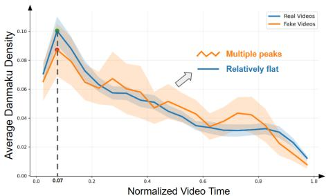
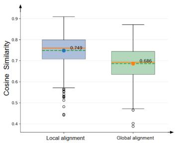
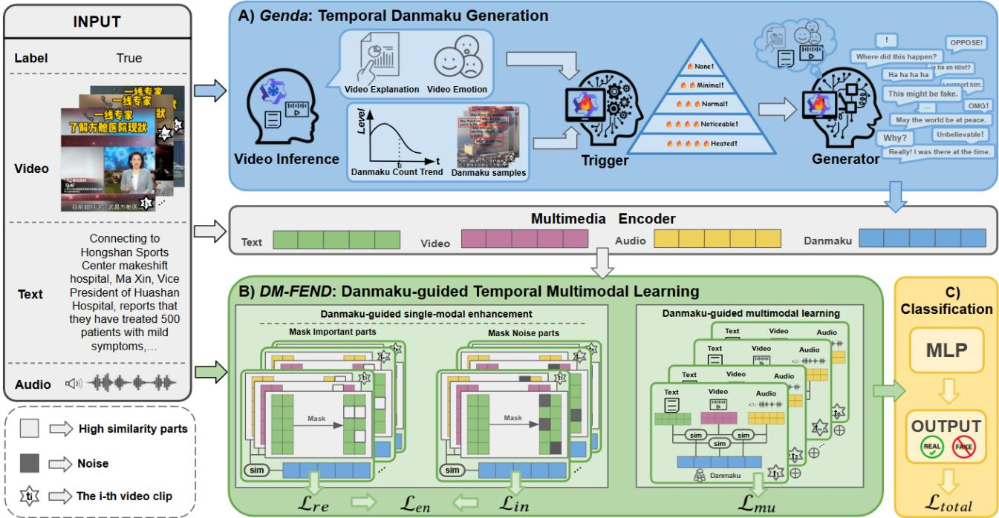
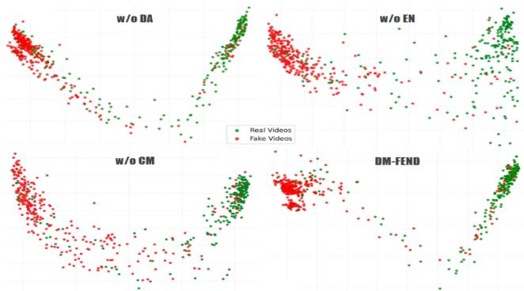
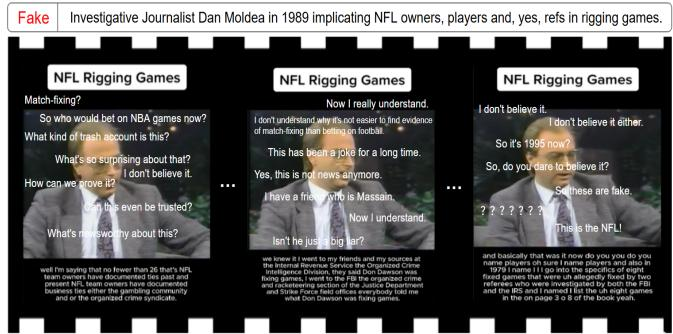

# Let the Bullets Fly: Multimodal Fake News Detection with Temporal-Aligned Generative Danmaku

Xiansheng Luo Yangzhou University Yangzhou, Jiangsu, China mz220240305@stu.yzu.edu.cn

Chaowei Zhang∗† Yangzhou University Yangzhou, Jiangsu, China cwzhang@yzu.edu.cn

Yi Zhu   
Yangzhou University   
Yangzhou, Jiangsu, China   
zhuyi@yzu.edu.cn   
Zewei Zhang   
Auburn University   
Auburn, Alabama, USA   
zez0001@auburn.edu

Jipeng Qiang Yangzhou University Yangzhou, Jiangsu, China jpqiang@yzu.edu.cn

## Abstract

The social interactions among crowds via Danmaku (a.k.a., bullet comments) on modern multimedia platforms can facilitate both viewpoint conflicts and consensus, providing fine-grained discriminative social signals that can benefit fake news detection. However, the inherent accumulation latency ofDanmaku in real-world scenarios violates the real-time necessity of fake news detection, making the studies of Danmaku-related fake news detection underexplored. To break this violation, we simulate this temporal-aware user interactive process by proposing a novel temporal Generative danmaku framework, called Genda, which consists of: (1) a Danmaku Trigger for predicting the timing and intensity of user reactions; and (2) a Danmaku Generator for synthesizing corresponding semantic and emotional expressions, thereby mutually constructing a temporally aligned and human-like pseudo Danmaku streams. To make the generated Danmaku useful for identifying fake news videos, we further design a Danmaku-guided Temporal Multimodal fake news detection model - DM-FEND, which enables fine-grained multimodal interactions among video, audio, text, and Danmaku, enhancing dynamic modalities alignment and semantic noise inhibition. The experimental results demonstrate that DM-FEND consistently outperforms state-of-the-art baselines across both Chinese (FakeSV) and English (FakeTT) benchmarks. Further ablations vali date the crucial role of temporal Danmaku modeling in enhancing robustness and discriminative capability. Finally, this study ofers a bright and robust solution for multimodal fake news detection in modern social interactive fashions by bridging the temporal inconsistency between news and user behaviors. To ensure reproducibility, the code and data used in this study are released at: https://github.com/126541/Let-the-Bullets-Fly.

CCS Concepts   
• Security and privacy → Human and societal aspects of security and privacy; • Information systems → Multimedia information systems.

Keywords

Fake News Detection, Temporal Danmaku Generation, Multimodal Alignment, Temporal Awareness

Xiansheng Luo, Chaowei Zhang, Zewei Zhang, Yi Zhu, and Jipeng Qiang. 2026. Let the Bullets Fly: Multimodal Fake News Detection with Temporal-Aligned Generative Danmaku. In Proceedings ofthe 35th ACM International Conference on Multimedia (MM ’26), November 10–14, 2026, Rio de Janeiro, Brazil. ACM, New York, NY, USA, 10 pages. https://doi.org/10.1145/3767308. 3836426

## 1 Introduction

The proliferation of new-fashion multimedia platforms like TikTok shifted news exhibition into a highly compressed and fast-paced mode [8, 13, 27], aggravating the spread of fake news and necessitating urgent and real-time detection strategies [34, 41]. These new-shape platforms foster diverse and dynamic user engagement, including traditional static user comments [20] and temporal-aware Danmaku [5, 37], which is known as bullet comments overlaying the video playback. These interactions can boost viewpoint collisions among crowds, catalyzing the formation of collective consensus or stark conflicts. Such highly discriminative social interactive signals provide invaluable contextual cues for fake news detection. Unlike conventional comments that typically reflect a global, post-hoc evaluation of the entire video, Danmaku is intrinsically endowed with a temporal nature and synchronizes precisely with the video content [10]. In particular, the fine-grained temporal sensitivity of Danmaku is crucial for identifying fleeting segments of fabricated information within the video stream, highlighting its unique potential and imperative value for research. Despite this, Danmaku use in multimodal fake news detection remains underexplored due to the conflict between its accumulation latency in real-world scenarios and real-time fake news detection.

Current mainstream short video-oriented fake news detection predominantly focuses on analyzing the intrinsic authenticity of the multimedia content, including forensic traces of video splicing and editing, audio manipulations designed to hijack audience emotions [4, 19, 44, 52], or multi-view causal reasoning [6, 24, 55] and debiasing techniques [12, 25, 57], to uncover deceptive visual patterns. However, these content-centric detectors struggle to capture the complex semantic traces and societal context surrounding the news, which often fall short when sophisticated manipulations leave negligible visual artifacts or true videos are maliciously miscontextualized. Some of the other video fake news detectors utilize social interaction signals, including propagation traces among crowds [21, 22, 28, 53] and user comments [26, 38, 48], as auxiliary modalities to extract the public’s stance and collective wisdom. Given the sparsity of interactions during the early stages of news propagation, pioneering comment-based methods have leveraged LLMs to synthesize high-quality pseudo-comments for fake news detection [47, 49, 51, 54]. Can VLLMs be used to synthesize high-fidelity Danmaku streams for short videos? Beyond their temporal and frame-aligned characteristics, variations in Danmaku density reflect content significance and the intensity ofuser opinion conflicts. Thus, generating Danmaku that accurately models both timing and diverse semantic reactions remains a major challenge.

To encounter this obstacle, we propose Genda, a novel temporal Danmaku generation framework that simulates the timeaware interactive process of crowd responses. Unlike existing comment generation methods, Genda models the underlying generation mechanism of user reactions during video playback, thereby reconstructing representative collective feedback in the absence of real-time interaction data. Specifically, Genda decomposes the process of temporal-aligned Danmaku generation into two collabo rative sub-tasks: (1) a Danmaku Trigger, which models the temporal evolution of video content and emotions to predict when user reactions are likely to occur and their corresponding intensity; and (2) a Danmaku Generator, which is conditioned on the trigger’s sig nals, further generates semantic-aware and diverse emotional bullet comments aligned with the current video frames. Such synthetic temporally aligned Danmaku streams using Genda compensate for the absence of user interaction signals in the early stage of news propagation, providing fine-grained supervision for subsequent modeling. Furthermore, the produced Danmaku can help the detectors locate potential anomalous segments and understand the evolving relationships among diferent modalities over time.

To take advantage of Genda for facilitating fake news detection, we propose DM-FEND, a Danmaku-guided multimodal fake news detector, which leverages Danmaku as intermediate signals to facilitate the interactions among video, audio, and text at the segment level, thereby capturing local cross-modal inconsistencies and suppressing decision-irrelevant information. In detail, we first design a Danmaku-guided unimodal learning mechanism that reconstructs high-saliency tokens to strengthen decision-relevant semantic cues and suppresses low-saliency tokens to reduce seman tic noise, thereby improving unimodal representation quality. Then, we further perform multimodal learning by modeling pairwise interactions among modalities and aligning them with Danmaku signals, aiming to capture cross-modal inconsistencies from the perspective of user reactions. Finally, DM-FEND aggregates multimodal representations over the entire temporal sequence, jointly modeling content evolution and user responses to determine the authenticity of short videos. Overall, the main contributions of this study are presented as follows:

• This study initially introduces Danmaku into multimodal fake news detection. To bridge the gap between Danmaku accumulation latency and the necessity of real-time detection, we propose a temporal Danmaku generation framework - Genda, which consists of a Danmaku trigger and a Danmaku generator, aiming at constructing temporally aligned and human-like pseudo bullet comments.

• To utilize the generated Danmaku stream for facilitating fake news detection, we develop DM-FEND, which enables fine-grained multimodal interactions among video, audio, text, and Danmaku, enhancing dynamic modality alignment and semantic noise suppression.

• Our conducted extensive experiments on two short-video datasets demonstrate that DM-FEND consistently outperforms baseline methods across various evaluation metrics, including fine-tuned unimodal models, prompt-based approaches on large language models, and SOTA baselines.

## 2 Fake News Detection in the Era of LMs

Mainstream studies on fake news detection primarily focus on analyzing the authenticity of news content across modalities, aiming to identify misleading patterns [33, 40], semantic inconsistencies [50], or manipulation cues directly [42] from the input data. In other words, these methods attempt to improve robustness and capture richer semantic relationships by integrating complementary signals across modalities, thereby assisting the task of fake news detection. With the recent advancement of AI techniques, such a type of the approaches has evolved from traditional neural architectures to large-scale pre-trained models (a.k.a., LMs), and further to multimodal frameworks that jointly model heterogeneous information sources [22]. For example, recent relevant studies often leverage large language models or vision-language models to enhance reasoning ability and cross-modal understanding [17, 36, 43, 45, 51]. However, these approaches heavily rely on content representations and implicit reasoning processes, overlooking the dynamic nature of information evolution. Specifically, they fail to explicitly model how users perceive, interpret, and react to content over time, leading to a gap between content understanding and user-level perception modeling.

Some of the other SOTA studies explore the usability of data augmentation [1, 14, 18] and generation-based strategies [30, 43, 56] in the area of fake news detection, aiming at improving the generalizability of detectors as well as enriching the diversity of news. Such types of approaches typically leverage LMs to generate supplementary supervision signals, such as reasoning chains [46], counterfactual samples [42], or extra multimodal content [11], thereby improving the diversity and informativeness ofnews data. For example, recent researchers manipulate prompting or instruction tuning to perform multi-step reasoning and uncover latent deceptive patterns [15], while some other generative approaches synthesize additional data distributions to improve robustness under domain shifts. Furthermore, a few studies also attempt to construct explanationguided or reasoning-enhanced representations to reinforce the interpretability of fake news detection models [3]. However, they neither capture the temporal dynamics of user interactions nor learn how collective responses evolve alongside content, limiting their abilities in reflecting real-world perception processes.

  
(a) Temporal Density of Danmaku in Video

  
(b) Semantic relatedness between Danmaku and Video  
Figure 1: (a) Temporal distribution of Danmaku across real and fake videos, showing consistent early-stage concentration and distinct evolution patterns. (b) Semantic relatedness comparison between Danmaku and video content.

Compared to the existing approaches, we shift our focus to temporally grounded user interaction modeling. Specifically, we propose a temporal Danmaku generation framework, called Genda, which simulates the time-aware evolution of crowd interactions in news videos to produce high-quality pseudo Danmaku streams of news, thereby addressing the inherent latency of Danmaku in realworld scenarios as well as enabling the reconstruction of realistic interaction signals in early stages. Upon this, we further develop DM-FEND, a Danmaku-guided multimodal framework that integrates generative Danmaku with video, audio, and text at the video clip level, thereby bridging the gap between content representation and user perception. Such a design allows our approach to capture clip-level cross-modal inconsistencies and reflect user temporal interaction in real-world news scenarios, leading to more robust and accurate fake news detection.

## 3 Why does Danmaku work?

To validate the usability of temporal-aware Danmaku streams in fake news detection, we collect 100 short news videos from Bilibili to examine the temporal distribution of Danmaku for real and fake videos. As shown in Fig. 1a, we first compute the average Danmaku density over time by normalizing video timelines to [0, 1]. It can be observed from Fig. 1a that both real and fake videos exhibit a similar global pattern, where Danmaku density rapidly increases at the beginning (peaking happens at $t \approx 0 . 0 7 )$ and gradually declines thereafter, suggesting that Danmaku reflects structured collective responses. However, we can also observe a notable diference between real and fake videos, where real cases show a smooth and monotonic decay after the peak, yet fake ones exhibit stronger local fluctuations. Moreover, fake videos present larger variance across samples, indicating more diverse reaction patterns, whereas real videos demonstrate more consistent temporal dynamics.

To further examine the alignment between Danmaku and video content, we conduct the empirical study of (1) the semantic relatedness comparison between Danmaku and corresponding local segments (See Local alignment in Fig. 1b), and (2) the the semantic relatedness comparison between Danmaku and the entire video (See Global alignment in Fig. 1b). As shown in Fig. 1b, Local alignment achieves a higher average semantic similarity (i.e., 0.749) than that of Global alignment (i.e., 0.686), demonstrating that Danmaku is more closely associated with local semantics than global content. These observations suggest that Danmaku streams can be used as fine-grained temporal signals with both structured evolution and strong local alignment. Therefore, we can confirm that it is reasonable and essential to utilize Danmaku streams as dynamic social interactive signals for capturing temporal multimodal interactions, thereby facilitating the detection of fake news in terms of short videos. In the subsequent sections of the paper, we illustrate the details of our proposed temporal-aligned generative Danmaku framework - Genda and Danmaku-guided multimodal fake news detection system - DM-FEND.

## 4 Genda: Temporal Generative Danmaku

The proposed Genda framework simulates the temporal generation process of Danmaku by modeling how users perceive and react to video content over time. As illustrated in Fig. 2(A), there are three key modules involved in Genda, including (1) video understanding module, (2) Danmaku trigger, and Danmaku generator. More details about the implementation of Genda are shown as follows.

## 4.1 Problem Definition

The fake news detection in short videos can be formulated as a binary classification task. Let $\mathcal { D } = \{ V _ { 1 } , V _ { 2 } , . . . , V _ { n } \}$ denote a dataset of short videos, where � is the total number of news video samples. A randomly selected video $V _ { i }$ is associated with a corresponding label $y _ { i } \in \left\{ 0 , 1 \right\}$ , where $y _ { i } = 1$ indicates fake news, vice versa for $y _ { i } = 0$ Specifically, �� maintains multiple modalities, including video, audio, and text. We denote the multimodal input as: $V _ { i } = \{ x _ { i } ^ { v } , x _ { i } ^ { a } , x _ { i } ^ { t } \}$ where $x _ { i } ^ { v } , x _ { i } ^ { a }$ , and $\boldsymbol { x } _ { i } ^ { t }$ represent the video, audio, and textual content, respectively. To capture fine-grained temporal dynamics, each video is further decomposed into a sequence of temporal segments, $V = \left\{ s _ { 1 } , s _ { 2 } , \ldots \ldots , s _ { N } \right\}$ , where � is the number of segments in video $V .$ For each segment $s _ { i } ,$ we aim to model its corresponding Danmaku signal $d _ { i , j } ,$ , which reflects user reactions aligned with the temporal progression of the video. Since real Danmaku may not always be available in early stages, we employ a generation framework to approximate the Danmaku distribution: $d _ { i , j } \sim P _ { \theta } ( d \mid s _ { i , j } )$ , where $P _ { \theta }$ denotes the learned generation model. Based on the multimodal content and generated Danmaku, the objective is to learn a nonlinear mapping $f : \{ V _ { i } , D _ { i } \}  y _ { i }$ , where $D _ { i } = \{ d _ { i , 1 } , d _ { i , 2 } , . . . , d _ { i , N _ { i } } \}$ denotes the Danmaku sequence associated with video � . The goal is to leverage temporally aligned Danmaku as dynamic supervision to improve fake news detection.

  
Figure 2: The workflow of our proposed approach. (A) Genda: a temporal Generative Danmaku module that models user interaction dynamics by performing segment-level video understanding, followed by a Danmaku Trigger to estimate reaction intensity and a Danmaku Generator to produce semantically and temporally aligned Danmaku. (B) DM-FEND: a Danmaku guided temporal multimodal learning module that enhances unimodal representations via importance-aware and noise-aware masking, and captures fine-grained cross-modal interactions among text, video, audio, and Danmaku. (C) Classification block: temporally aggregated multimodal representations are fed into an MLP for final fake news prediction.

## 4.2 Video Understanding

We decompose each video into a series ofshort segments and extract a structured representation of each segment to obtain fine-grained temporal semantics. Given an input video � with duration � , we partition it into � non-overlapping segments, as shown in the formula below 1.

$$
V = \big \{ s _ { 1 } , s _ { 2 } , . . . , s _ { N } \big \} , \quad N = \left\lfloor \frac { T } { \Delta t } \right\rfloor + 1 ,\tag{1}
$$

where each segment has a fixed duration $\Delta t = 4$ seconds. For each segment $s _ { i } ,$ we uniformly sample 12 frames $\mathcal { F } _ { i }$ to preserve both static and dynamic visual cues, ensuring that temporal transitions and salient events are adequately captured. Then, we employ a vision-language model $M _ { v l }$ to perform segment-level multimodal reasoning. Each segment is represented as:

$$
z _ { i } = M _ { v l } ( \mathcal { F } _ { i } , \mathrm { t e x t } , p _ { i } ) = \{ c _ { i } , e _ { i } , p _ { i } \}\tag{2}
$$

where $c _ { i }$ and $e _ { i }$ denote semantic content and emotional tone, $\mathbf { \nabla } \mathcal { P } \boldsymbol { i } =$ $\frac { i } { N }$ encodes the relative temporal position. By injecting temporal context, the model learns to interpret each segment within the

global narrative, capturing its semantic content, emotional tone, narrative role, and potential reaction cues. The video modality is finally represented as a temporally ordered sequence:

$$
Z = \{ z _ { 1 } , z _ { 2 } , . . . , z _ { N } \} ,\tag{3}
$$

where $z _ { i }$ can be viewed as a semantic trajectory at �th clip stamp of $Z$ that jointly encodes corresponding content evolution, emotional dynamics, and interaction signals. This representation provides a unified foundation for modeling temporally aligned user reactions in subsequent modules.

## 4.3 Danmaku Trigger

The Danmaku Trigger aims to model when and how strongly users react to video content by learning a temporal reaction intensity function over video segments. Unlike conventional classificationbased approaches, we formulate this problem as an ordinal-aware latent intensity modeling task, which captures the gradual evolution of user engagement. For each segment $s _ { i } ,$ we construct a unified representation by integrating semantic, emotional, and contextual signals derived from the Video Understanding module, as shown in the formula below 4.

$$
h _ { i } = f _ { \theta } ( z _ { i } , m _ { i } , h _ { i } ^ { m e t a } )\tag{4}
$$

where $m _ { i }$ and $h _ { i } ^ { m e t a }$ represent auxiliary contextual information such as textual hints and video popularity. The function �� (·) is instantiated by a large language model with LoRA adaptation, enabling eficient yet expressive modeling of temporal user perception. For modeling ordinal intensity, we quantify user reaction as a latent continuous intensity score $\varphi _ { i } ,$ which reflects the underlying strength of audience engagement for segment $s _ { i } .$ . Instead of directly predicting discrete labels, we project this continuous score onto ordinal levels through a set of learnable monotonic thresholds:

$$
P ( y _ { i } > k \mid \varphi _ { i } ) = \sigma \left( \varphi _ { i } - \sum _ { j = 1 } ^ { k } \mathrm { s o f t p l u s } ( \delta _ { j } ) \right) ,\tag{5}
$$

where $y _ { i } \in \{ 0 , 1 , 2 , 3 , 4 \}$ denotes the discrete Danmaku intensity level of segment $s _ { i } ,$ , corresponding to None, Minimal, Normal, Noticeable, and Heated, respectively. The variable $k \in \{ 0 , 1 , 2 , 3 \}$ represents the ordinal threshold index, and the condition $y _ { i } > k$ indicates whether the reaction intensity exceeds the �-th level. Here, $\{ \delta _ { j } \}$ are unconstrained parameters used to construct ordered thresholds via cumulative softplus, ensuring monotonicity, and $\sigma ( \cdot )$ denotes the sigmoid function.

During inference, the predicted intensity level $\hat { y } _ { i }$ is determined by counting how many thresholds are surpassed by $\varphi _ { i }$ , resulting in a final prediction in the same ordinal set {0, 1, 2, 3, 4}. This formulation captures the ordinal structure of reaction intensity while allowing smooth transitions across levels, enabling the model to represent subtle variations in user engagement as a continuous latent process.

## 4.4 Danmaku Generator

The Danmaku Generator aims to synthesize human-like Danmaku conditioned on video content and predicted user reaction signals. Building upon the segment representation $z _ { i }$ (Video Understanding) and the reaction intensity $\hat { y } _ { i }$ (Danmaku Trigger), we formulate the generation process as a conditional social response modeling task. For each segment $s _ { i } ,$ we generate Danmaku conditioned on semantic content, predicted reaction intensity, temporal context, and latent user style. Specifically, the generation process is modeled as:

$$
d _ { i , j } \sim P _ { \theta } \big ( d \mid z _ { i } , \hat { y } _ { i } , p _ { i } , s _ { j } \big ) , \quad s _ { j } \sim S ,\tag{6}
$$

where $z _ { i }$ encodes semantic and emotional information, $\hat { y } _ { i }$ denotes the predicted reaction intensity level, $\mathcal { P } i$ represents the temporal position, and $s _ { j }$ is a latent style variable sampled from a predefined distribution $s$ to simulate diverse user personas. Under this formulation, $\hat { y } _ { i }$ controls the overall reaction strength, determining both the content characteristics and the number of generated Danmakus, while $s _ { j }$ introduces stylistic variability to produce natural and diverse expressions. This design enables the generator to produce temporally aligned, semantically coherent, and human-like Dan maku, efectively approximating real user interaction behaviors.

We implement the generator using a large language model with LoRA fine-tuning, enabling eficient adaptation while preserving strong generative capabilities. As a result, the generated Danmaku forms a temporally coherent and human-like interaction stream, where each segment is associated with responses that reflect its semantic content, emotional tone, and reaction intensity. Furthermore, we analyzed Pseudo Danmaku Quality in section A of the supplementary document.

## 5 Danmaku-guided Fake News Detection

Our proposed Danmaku-guided temporal multimodal learning frame work, DM-FEND, efectively leverages temporally aligned Danmaku signals for fake news detection. As illustrated in Fig. 2, the framework first employs a Multimedia Encoder to extract segment-level representations from multiple modalities, including text, video, audio, and Danmaku. Specifically, each modality is encoded into a sequence of feature embeddings, forming a unified multimodal representation space that preserves both semantic and temporal information. Based on these encoded features, DM-FEND further consists of two complementary components: (1) Danmaku-guided unimodal learning, which refines each modality under the guidance of Danmaku signals, and (2) Danmaku-guided multimodal learning, which models cross-modal interactions and aligns them with user reaction dynamics, as illustrated in Fig. 2(B)

## 5.1 Danmaku-guided Unimodal Learning

To enhance unimodal representations under the guidance of Danmaku, we design a Danmaku-conditioned masking and reconstruction framework that enables the model to focus on salient content while suppressing noise. For a given video segment $s _ { i } ,$ let �� denote the Danmaku representation generated by the Danmaku Generator, and let $\boldsymbol { x } _ { i } ^ { m } \in \mathbb { R } ^ { \hat { L } _ { m } \times D }$ denote the token-level feature sequence of modality � ∈ {video, audio}, where $L _ { m }$ is the number of tokens and $D$ is the feature dimension. We first compute a Danmakuconditioned saliency score:

$$
\alpha _ { i } = S ( x _ { i } ^ { m } , d _ { i } ) , \quad \alpha _ { i } \in \mathbb { R } ^ { L _ { m } } ,\tag{7}
$$

where $s ( \cdot )$ maps each token to a scalar importance value, reflecting how strongly it is associated with user reactions encoded in $d _ { i } .$ Based on $\alpha _ { i } ,$ , we derive two complementary token subsets: - $M _ { i } ^ { t o p }$ : the index set of top-ranked tokens (high-saliency), - $M _ { i } ^ { l o w }$ the index set of bottom-ranked tokens (low-saliency). We then construct masked representations by replacing selected tokens with a learnable mask embedding and re-encoding them. Let $\hat { x } _ { i } ^ { m }$ denote the reconstructed features from $M _ { i } ^ { t o p }$ masking, and let $\tilde { x } _ { i } ^ { m }$ denote the features under $M _ { i } ^ { l o w }$ masking. The overall training objective is defined as shown in Eq. 8.

$$
\mathcal { L } _ { e n } = \overbrace { \frac { 1 } { | M _ { i } ^ { t o p } | } \sum _ { t \in M _ { i } ^ { t o p } } { \| \hat { x } _ { i , t } ^ { m } - x _ { i , t } ^ { m } \| _ { 2 } ^ { 2 } } } ^ { \mathcal { L } _ { r e } } + \overbrace { 1 - \cos \left( \mathrm { P o o l } ( x _ { i } ^ { m } ) , \mathrm { P o o l } ( \hat { x } _ { i } ^ { m } ) \right) } ^ { \mathcal { L } _ { i n } } + \mathcal { R } ( s _ { i } ) ,\tag{8}
$$

where: $- \hat { x } _ { i , t } ^ { m }$ denotes the reconstructed feature of token $t , - \operatorname { P o o l } ( { \mathord { \cdot } } )$ is a mean pooling function over tokens, - cos(·, ·) denotes cosine similarity, - $\mathbf { \nabla } _ { - } \mathcal { R } ( s _ { i } )$ is a regularization term encouraging a balanced saliency distribution. The first term $\mathcal { L } _ { r e }$ enforces the model to recover masked high-saliency tokens, encouraging it to capture semantically important content. The second term $\mathcal { L } _ { i n }$ promotes invariance by aligning the original representation with the noisemasked representation, improving robustness to irrelevant information. The third term $\mathcal { R } ( s _ { i } )$ prevents degenerate solutions by regularizing the saliency distribution. Through this dual masking mechanism, the model learns to distinguish informative content from noise under the guidance of Danmaku $d _ { i } ,$ leading to more robust and discriminative unimodal representations.

Table 1: This paper validates the performance of various baseline methods against our proposed method on the FakeSV and FakeTT datasets. Best results are highlighted in bold, and second-best results are highlighted with underlines. Paired t-tests were used to test the statistical significance of all baselines (p < 0.05), and significant diferences are indicated by (\*).
<table><tr><td rowspan="2">Models</td><td colspan="4">FakeSV</td><td colspan="4">FakeTT</td></tr><tr><td>Acc</td><td>Mac-F1</td><td>Prec</td><td>Rec</td><td>Acc</td><td>Mac-F1</td><td>Prec</td><td>Rec</td></tr><tr><td colspan="9">Unimodal Baselines</td></tr><tr><td>Text(Bert)</td><td>81.36</td><td>81.29</td><td>81.36</td><td>81.33</td><td>76.54</td><td>75.00</td><td>74.70</td><td>77.24</td></tr><tr><td>Image(CLIP-vit)</td><td>73.99</td><td>73.97</td><td>75.65</td><td>75.35</td><td>68.90</td><td>68.49</td><td>71.02</td><td>73.73</td></tr><tr><td>Audio(wav2vec2)</td><td>75.52</td><td>75.13</td><td>76.86</td><td>76.37</td><td>70.54</td><td>69.77</td><td>71.75</td><td>74.00</td></tr><tr><td>Video(VideoMAEv2)</td><td>72.86</td><td>72.58</td><td>72.53</td><td>72.71</td><td>73.24</td><td>71.92</td><td>71.81</td><td>74.39</td></tr><tr><td colspan="9">LMs Prompting Benchmarks</td></tr><tr><td>GPT-5-mini</td><td>75.46</td><td>74.04</td><td>76.54</td><td>73.70</td><td>64.49</td><td>56.74</td><td>66.00</td><td>58.97</td></tr><tr><td>InternVL2.5-8B</td><td>67.51</td><td>66.87</td><td>67.85</td><td>66.38</td><td>59.27</td><td>58.33</td><td>60.25</td><td>59.64</td></tr><tr><td>Qwen2.5-VL-7B</td><td>66.19</td><td>65.60</td><td>67.39</td><td>67.22</td><td>59.09</td><td>58.37</td><td>59.74</td><td>59.38</td></tr><tr><td colspan="9">Multimodal Detectors</td></tr><tr><td>SV-FEND (Qi et al. 2023)</td><td>80.88</td><td>80.54</td><td>80.18</td><td>80.62</td><td>77.14</td><td>75.63</td><td>75.12</td><td>77.56</td></tr><tr><td>FakingRecipe (Bu et al. 2024)</td><td>85.06</td><td>84.54</td><td>85.69</td><td>84.08</td><td>79.60</td><td>77.94</td><td>77.25</td><td>79.39</td></tr><tr><td>ExMRD (Hong et al. 2025)</td><td>83.39</td><td>82.81</td><td>83.97</td><td>82.37</td><td>79.80</td><td>79.19</td><td>78.68</td><td>81.93</td></tr><tr><td>FakeSV-VLM (Wang et al. 2025)</td><td>86.16</td><td>85.74</td><td>86.61</td><td>85.34</td><td>78.93</td><td>77.85</td><td>77.47</td><td>80.68</td></tr><tr><td>SGAN (Li et al. 2026)</td><td>85.24</td><td>84.88</td><td>85.35</td><td>84.61</td><td>79.60</td><td>77.76</td><td>77.12</td><td>78.88</td></tr><tr><td>DM-FEND</td><td>87.01*</td><td>86.68*</td><td>86.77*</td><td>90.66*</td><td>83.43*</td><td>82.92*</td><td>85.94*</td><td>85.80*</td></tr></table>

## 5.2 Danmaku-guided Multimodal Learning

Based on the enhanced unimodal representations, we further model cross-modal interactions under the guidance of temporally aligned Danmaku. The key idea is to treat Danmaku �� as an intermediate supervisory signal that aligns diferent modalities at the segment level and enhances discriminative representation learning. For each segment $s _ { i } ,$ let $x _ { i } ^ { m } \in \mathbb { R } ^ { D }$ denote the enhanced representation of modality � ∈ {text, video, audio}, and let $d _ { i } ~ \in ~ \mathbb { R } ^ { D }$ denote the corresponding Danmaku representation. We construct pairwise multimodal representations and align them with Danmaku via contrastive learning. The crossmodal consistency loss is defined as:

$$
\mathcal { L } _ { c m } = \frac { 1 } { 3 } \sum _ { ( a , b ) } \mathcal { L } _ { c o } \Big ( d _ { i } , \phi ( x _ { i } ^ { a } , x _ { i } ^ { b } ) \Big ) ,\tag{9}
$$

where (�, �) ∈ {(text, video), (text, audio), (video, audio)}, � (·, ·) denotes a fusion function for modality pairs, and $\mathcal { L } _ { c o } ( \cdot , \cdot )$ is an InfoNCE-based contrastive loss. This objective encourages modality pairs that correspond to the same segment to be aligned with the associated Danmaku, while pushing apart mismatched pairs. To acquire the representation of videos, we aggregate segment-level multimodal representations across time to obtain a video-level feature, and optimize it jointly with the classification and similarity objectives:

$$
\left\{ \begin{array} { c } { h _ { i } = \mathcal { A } \big ( \{ x _ { i } ^ { m } \} _ { m } , \{ d _ { i } \} \big ) , } \\ { \mathcal { L } _ { m u } = \mathcal { L } _ { c l } + \mathcal { L } _ { c m } + \mathcal { L } _ { v s } , } \end{array} \right.\tag{10}
$$

where A(·) denotes temporal aggregation and multimodal fusion, ℎ� is the video-level representation, $\mathcal { L } _ { c l }$ is the classification loss, $\mathcal { L } _ { c m }$ is the Danmaku-guided cross-modal consistency loss. Overall, this module leverages Danmaku as a temporally aligned supervision signal to guide both segment-level cross-modal alignment and video-level representation learning, enabling the model to capture consistent patterns as well as subtle cross-modal inconsistencies for fake news detection.

## 5.3 Binary Classification

Based on the learned multimodal representation, we perform final fake news classification at the video level. Specifically, the aggregated representation $h _ { i } \in \mathbb { R } ^ { D }$ encodes both multimodal content evolution and user reaction dynamics, as illustrated in Fig. 2(C) The entire framework is optimized in an end-to-end manner with a unified objective:

$$
\mathcal { L } _ { t o t a l } = \lambda _ { 1 } \mathcal { L } _ { e n } + \lambda _ { 2 } \mathcal { L } _ { m u } ,\tag{11}
$$

$\lambda _ { 1 } , \lambda _ { 2 }$ are trade-of hyperparameters. This unified formulation enables joint optimization of representation learning, cross-modal alignment, and final decision-making under Danmaku supervision.

## 6 Experiments

Implementation Details: We use Qwen2.5-VL-7B-Instruct1 for segment-level video understanding and LoRA-tune Qwen2.5- 7B-Instruct2 as both the Danmaku Trigger and Generator. Training uses a maximum sequence length of 896, batch size 2, gradient accumulation 8, learning rate 4 × 10−5, 2 epochs, and FP16 precision. We define five ordinal classes—None, Minimal, Normal, Noticeable, and Heated—with four thresholds and a distribution regularization coefficient of 0.2. For DM-FEND, we train for 30 epochs using AdamW with batch size 4, a base learning rate of $3 \times 1 0 ^ { - 5 }$ , a text encoder learning rate of $1 \times 1 0 ^ { - 6 }$ , and weight decay of $5 \times 1 0 ^ { - 4 }$ . Audio and video feature dimensions are 768 and 1408, respectively. The model uses a hidden size of 768, 8 attention heads, 2 temporal layers, and a dropout rate of 0.1. Performance is evaluated using Accuracy (Acc), Macro F1 (Mac-F1), fake-class F1 (Mis-F1), Precision (Prec), and Recall (Rec), as shown in Tables1 & 2.

Datasets: We evaluate our approach on two real-world fake news video benchmarks, FakeSV [31]3 and FakeTT [4]4.

Baselines: We select diverse baselines for performance comparison, including unimodal baselines, LMs prompting benchmarks, and SOTA multimodal fake news detectors. For unimodal baselines, we evaluate text, image, audio, and video models based on BERT [9], CLIP-ViT [32], wav2vec2 [2], and VideoMAEv2 [39], respectively. For LMs benchmarks, we adopt GPT-5-mini [35], InternVL2.5-8B [7], and Qwen2.5-VL-7B [29]. For multimodal detectors, we investigate various representative approaches, including SV-FEND [31], FakingRecipe [4], ExMRD [16], FakeSV-VLM [42], and SGAN [23]. These baselines cover a wide range of paradigms, enabling a comprehensive evaluation of our proposed DM-FEND.

## 6.1 Results and Analysis

Table 1 presents the performance comparison between our proposed DM-FEND and various baseline methods on the FakeSV and FakeTT datasets. From the results, we draw the following observations.

First, DM-FEND consistently achieves the best performance across all evaluation metrics on both datasets. On FakeSV, our method attains 87.01% in accuracy and 86.68% in Macro-F1, outperforming the strongest baseline, FakeSV-VLM, by 0.85% and 0.94%, respectively. More notably, our model achieves a substantial improvement in Recall, indicating a stronger ability to detect dificult or ambiguous fake news instances. On FakeTT, the improvements are even more significant, where DM-FEND surpasses the best baseline (ExMRD) by 3.63% in accuracy and 3.73% in Macro-F1. These gains validate the efectiveness of temporally aligned Danmaku.

Second, unimodal models and large language models (LMs) exhibit relatively limited performance compared to multimodal approaches. For example, the best unimodal model (Text-BERT) achieves 81.36% accuracy on FakeSV and 76.54% on FakeTT, which is significantly lower than multimodal methods. Similarly, LMs such as GPT-5-mini achieve only 64.49% accuracy on FakeTT, indicating that relying solely on reasoning without explicit multimodal alignment is insuficient. These results highlight the necessity of modeling cross-modal interactions for fake news detection.

Third, compared with state-of-the-art multimodal methods, DM-FEND demonstrates clear advantages. While strong baselines such as FakingRecipe and SGAN achieve competitive results (e.g., around 85% accuracy on FakeSV and 79% on FakeTT), they mainly rely on global fusion or static alignment. In contrast, our method explicitly models temporally aligned Danmaku as dynamic supervision, enabling fine-grained segment-level alignment and noise suppression, which leads to more robust performance. Finally, we conduct further ablation studies and detailed analyses in subsequent sections to investigate the contributions of each component.

## 6.2 Ablation Study

Table 2: Ablation study of diferent components. DA: Temporal Danmaku Generation, EN: Danmaku-guided unimodal learning , CM: Danmaku-guided multimodal learning.
<table><tr><td rowspan="2">DA EN</td><td rowspan="2">CM</td><td colspan="2">FakeSV</td><td colspan="2">FakeTT</td></tr><tr><td>Acc</td><td>Mis-F1</td><td>Acc</td><td>Mis-F1</td></tr><tr><td rowspan="3">X X X X X</td><td>X</td><td>81.49</td><td>80.64</td><td>77.58</td><td>76.95</td></tr><tr><td></td><td>83.12</td><td>82.87</td><td>79.79</td><td>79.81</td></tr><tr><td>X</td><td>83.72</td><td>82.47</td><td>80.39</td><td>80.26</td></tr><tr><td rowspan="4">X X ×</td><td>X</td><td>82.95</td><td>84.83</td><td>80.16</td><td>83.42</td></tr><tr><td></td><td>84.32</td><td>83.56</td><td>81.18</td><td>80.20</td></tr><tr><td></td><td>83.39</td><td>85.58</td><td>80.64</td><td>83.66</td></tr><tr><td>X</td><td>84.39</td><td>86.34</td><td>82.09</td><td>84.46</td></tr><tr><td>DM-FEND</td><td></td><td>87.01</td><td>88.64</td><td>83.43</td><td>85.84</td></tr></table>

To investigate the contribution of each component in our framework, we conduct ablation studies on three key modules: temporal Danmaku generation (DA), Danmaku-guided unimodal learning (EN), and Danmaku-guided multimodal learning (CM). The results are summarized in Table 2, and the corresponding feature distributions are visualized in Fig. 3.

First, when none of the proposed components are applied, the model achieves an accuracy of 81.49% on FakeSV and 77.58% on FakeTT, showing relatively low performance. This indicates that standard multimodal modeling without Danmaku guidance is insuficient to capture complex cross-modal inconsistencies. Second, introducing each module individually consistently improves performance. Specifically, incorporating only the CM module increases the accuracy on FakeSV by 1.63%, demonstrating the efectiveness of modeling cross-modal interactions. Similarly, adding only EN further improves performance, indicating that refining unimodal representations helps reduce noise and improve feature quality. When only DA is introduced, the model also achieves notable gains, with the Mis-F1 on the FakeTT dataset improving by 6.47%, showing that Danmaku provides efective supervisory signals. Third, combining multiple modules further enhances performance. Notably, even without the Danmaku generation module (DA), jointly apply ing EN and CM already achieves strong results, reaching 84.32% accuracy on FakeSV. This indicates that enhancing unimodal representations and modeling cross-modal interactions alone can provide substantial improvements. Further incorporating Danmaku with other modules leads to additional gains. For example, integrating DA with CM improves the accuracy on FakeSV to 83.39%, while combining DA with EN achieves 84.39%. These results indicate that Danmaku plays a complementary role by enhancing both unimodal optimization and cross-modal alignment. From Fig. 3, we observe that introducing Danmaku leads to more compact intraclass clusters and clearer inter-class boundaries, demonstrating its efectiveness in guiding representation learning.

  
Figure 3: Visualized comparison between DM-FEND and its representative variants on the FakeSV dataset using Principal Component Analysis (PCA). Green represents real news sample points, and red represents fake news sample points.

Finally, when all three components are jointly applied, the model achieves the best performance on both datasets. Compared with the base model, the accuracy improves by 5.52% on FakeSV and 5.85% on FakeTT. As shown in Fig. 3 (DM-FEND), the feature distributions exhibit the most distinct separation between real and fake samples, with minimal overlap and well-structured clusters. This demonstrates that the three modules are highly complementary, and that modeling temporally aligned Danmaku as dynamic supervision is crucial for efective multimodal fake news detection. In section B of the supplementary document, we analyze the performance of replacing Danmaku with traditional comments in this framework.

## 6.3 Case Study on Genda

To further illustrate the efectiveness of Danmaku in capturing finegrained temporal signals, we present a case study in Fig. 4. From a temporal perspective, Danmaku is closely aligned with the corresponding video segments. In Clip 1, the video mainly introduces the event, while the Danmaku captures initial reactions such as surprise and mild skepticism (e.g., “Match-fixing?”). These comments match the visual content, where no clear contradiction has yet emerged. In Clip 2, as the action unfolds, the Danmaku becomes more specific and directly responds to the scene. Comments such as “Yes, this is not news anymore.” and “Now I understand.” correspond closely to the visual evidence, showing that viewers react to concrete details rather than making generic judgments. In Clip 3, when the critical text appears, the Danmaku strongly highlights deceptive signals. Statements such as “So it’s 1995 now? These are fake.” directly identify inconsistencies, suggesting that this segment contains key evidence of falsification. This shows that Danmaku can reveal the moments most indicative of misleading or manipulated content.

  
Figure 4: Case study of a short video with the video cliplevel pseudo Danmaku generated using our proposed Genda framework.

Overall, this case shows that the pseudo Danmaku generated by Genda is not only temporally aligned with video content but also provides fine-grained cues that help localize potential fake signals. Such alignment enables the model to identify when and where inconsistencies occur, thereby improving the precision of fake news detection. We have also added failure cases in section C of the supplementary document.

## 7 Conclusion

This paper initially attempts to utilize Danmaku, which is known as bullet comments, that usually occur in short videos, for facilitating the detection of multimodal fake news. To bridge the gap between the cumulative latency of the Danmaku streams and the necessity of real-time fake news detection, we introduce a novel temporal-aligned Danmaku generation framework, namely Genda. Specifically, Genda simulates the dynamic process of user reactions during video playback by integrating a Danmaku Trigger and a Danmaku Generator, enabling the reconstruction of realistic interaction signals even in the absence of real-time user feedback. To make the generated Danmaku using Genda good for usages, we further propose DM-FEND, a Danmaku-guided temporal multimodal fake news detection model that supports fine-grained interactions among video, audio, text, and Danmaku at the clip-level of videos. Furthermore, DM-FEND enhances unimodal representations by masking important regions and noise regions under the guidance of Danmaku, as well as strengthening cross-modal alignment through Danmaku-aware multimodal learning. The experimental results on two real-world short video datasets demonstrate that DM-FEND outperforms various types of baselines, including unimodal detectors, LM-based benchmarks, and SOTA task-specific multimodal fake news detection approaches. In the future, we will incorporate contextual information of news, such as external knowledge or social propagation networks, to further improve the realism and reliability of Danmaku.

## Acknowledgments

This study is partially supported by the National Natural Science Foundation of China (62403412, 62273248), the Natural Science Foundation of the Higher Education Institutions of Jiangsu Province of China under grant 23KJB520040, the National Language Commission of China (ZDI145-71), and the Open Project Program of Key Laboratory of Knowledge Engineering with BigData (the Ministry of Education of China, NO.BigKEOpen2025-06).

## References

[1] Ahmet Okan Arık, Gizem Parlayandemir, and Serra Çelik. 2026. LLM-based data augmentation for text classification on imbalanced datasets: A case study on fake news detection. Egyptian Informatics Journal 33 (2026), 100886.

[2] Alexei Baevski, Yuhao Zhou, Abdelrahman Mohamed, and Michael Auli. 2020. wav2vec 2.0: A framework for self-supervised learning of speech representations. Advances in neural information processing systems 33 (2020), 12449–12460.

[3] Yangxiao Bai and Kaiqun Fu. 2024. A large language model-based fake news detection framework with rag fact-checking. In 2024 IEEE International Conference on Big Data (BigData). IEEE, 8617–8619.

[4] Yuyan Bu, Qiang Sheng, Juan Cao, Peng Qi, Danding Wang, and Jintao Li. 2024. Fakingrecipe: Detecting fake news on short video platforms from the perspective of creative process. In Proceedings ofthe 32nd ACM International Conference on Multimedia. 1351–1360.

[5] Yuyan Chen, Songzhou Yan, Qingpei Guo, Jiyuan Jia, Zhixu Li, and Yanghua Xiao. 2024. Hotvcom: Generating buzzworthy comments for videos. In Findings ofthe Association for Computational Linguistics: ACL 2024. 2198–2224.

[6] Ziwei Chen, Linmei Hu, Weixin Li, Yingxia Shao, and Liqiang Nie. 2023. Causal intervention and counterfactual reasoning for multi-modal fake news detection. In Proceedings ofthe 61st Annual Meeting ofthe Association for Computational Linguistics (Volume 1: Long Papers). 627–638.

[7] Zhe Chen, Jiannan Wu, Wenhai Wang, Weijie Su, Guo Chen, Sen Xing, Muyan Zhong, Qinglong Zhang, Xizhou Zhu, Lewei Lu, et al. 2024. Internvl: Scaling up vision foundation models and aligning for generic visual-linguistic tasks. In Proceedings of the IEEE/CVF conference on computer vision and pattern recognition. 24185–24198.

[8] Zicheng Cheng and Yanlin Li. 2024. Like, comment, and share on TikTok: Ex ploring the efect of sentiment and second-person view on the user engagement with TikTok news videos. Social Science Computer Review 42, 1 (2024), 201–223.

[9] Jacob Devlin, Ming-Wei Chang, Kenton Lee, and Kristina Toutanova. 2019. Bert: Pre-training of deep bidirectional transformers for language understanding. In Proceedings of the 2019 conference of the North American chapter of the association for computational linguistics: human language technologies, volume 1 (long and short papers). 4171–4186.

[10] Anam Fatima, Yi Yu, Janak Kapuriya, Julien Lalanne, and Jainendra Shukla. 2025. Semantic Frame Aggregation-Based Transformer for Live Video Comment Generation. IEEE Transactions on Multimedia (2025).

[11] Lifang Fu and Shuai Liu. 2023. Multimodal fake news detection incorporating external knowledge and user interaction feature. Advances in Multimedia 2023, 1 (2023), 8836476.

[12] Shuzhi Gong, Richard Sinnott, Jianzhong Qi, and Cecile Paris. 2025. Unseen fake news detection through casual debiasing. In Companion Proceedings ofthe ACM on Web Conference 2025. 981–985.

[13] Ma Haitao, D Abbas-Ali, and Wangli Ping. 2024. TikTok research on the intermediary role of short video news in braking through local realtions. Media and Communication Reasearch 5, 2 (2024), 66–71.

[14] Suhaib Kh Hamed, Mohd Juzaiddin Ab Aziz, and Mohd Ridzwan Yaakub. 2025. A data augmentation approach based on various GAN models to address class imbalance in fine-grained multimodal fake news datasets. Computing 107, 1 (2025), 52.

[15] Chen Han, Yijia Ma, Jin Tan, Wenzhen Zheng, and Xijin Tang. 2026. Beyond Detection: Exploring Evidence-based Multi-Agent Debate for Misinformation Intervention and Persuasion. In Proceedings of the AAAI Conference on Artificial Intelligence, Vol. 40. 38542–38550.

[16] Rongpei Hong, Jian Lang, Jin Xu, Zhangtao Cheng, Ting Zhong, and Fan Zhou. 2025. Following clues, approaching the truth: Explainable micro-video rumor detection via chain-of-thought reasoning. In Proceedings of the ACM on web conference 2025. 4684–4698.

[17] Shuguo Hu, Jun Hu, and Huaiwen Zhang. 2025. Synergizing llms with global label propagation for multimodal fake news detection. In Proceedings ofthe 63rd Annual Meeting of the Association for Computational Linguistics (Volume 1: Long Papers). 1426–1440.

[18] Jiaheng Hua, Xiaodong Cui, Xianghua Li, Keke Tang, and Peican Zhu. 2023. Multimodal fake news detection through data augmentation-based contrastive learning. Applied Soft Computing 136 (2023), 110125.

[19] Minyoung Huh, Andrew Liu, Andrew Owens, and Alexei A Efros. 2018. Fighting fake news: Image splice detection via learned self-consistency. In Proceedings of the European conference on computer vision (ECCV). 101–117.

[20] Di Huo, Peng Zou, and Yingchao Lu. 2025. Live vs. static comments: Empirical analysis of their diferential efects on user evaluation of online videos. Journal ofTheoretical and Applied Electronic Commerce Research 20, 2 (2025), 102.

[21] Jooyeon Kim, Behzad Tabibian, Alice Oh, Bernhard Schölkopf, and Manuel Gomez-Rodriguez. 2018. Leveraging the crowd to detect and reduce the spread of fake news and misinformation. In Proceedings of the eleventh ACM international conference on web search and data mining. 324–332.

[22] Mingxin Li, Yuchen Zhang, Haowei Xu, Xianghua Li, Chao Gao, and Zhen Wang. 2025. Learning complex heterogeneous multimodal fake news via social latent network inference. In Proceedings ofthe AAAI Conference on Artificial Intelligence, Vol. 39. 433–441.

[23] Pijian Li, Qingbao Huang, Feng Shuang, Yi Cai, Haonan Cheng, and Qing Li. 2026. Anchor-based Multimodal Verification: A Dynamic Query Framework for Fake News Forensics in Short Videos. IEEE Transactions on Information Forensics and Security (2026).

[24] Moyang Liu, Kaiying Yan, Yukun Liu, Ruibo Fu, Zhengqi Wen, Xuefei Liu, and Chenxing Li. 2025. Deconfounded Reasoning for Multimodal Fake News Detection via Causal Intervention. arXiv preprint arXiv:2504.09163 (2025).

[25] Qiang Liu, Junfei Wu, Shu Wu, and Liang Wang. 2024. Out-of-distribution evidence-aware fake news detection via dual adversarial debiasing. IEEE Transactions on Knowledge and Data Engineering 36, 11 (2024), 6801–6813.

[26] Qiong Nan, Qiang Sheng, Juan Cao, Yongchun Zhu, Danding Wang, Guang Yang, and Jintao Li. 2025. Exploiting user comments for early detection of fake news prior to users’ commenting. Frontiers ofComputer Science 19, 10 (2025), 1910354.

[27] Nic Newman. 2022. How publishers are learning to create and distribute news on TikTok. (2022).

[28] Abhishek Patidar and Debanjan Sadhya. 2025. FakeThreads: Investigating Fake News Dissemination Patterns in Threads. IEEE Transactions on Computational Social Systems (2025).

[29] Bowen Peng, Jefrey Quesnelle, Honglu Fan, and Enrico Shippole. 2023. Yarn: Eficient context window extension of large language models. arXiv preprint arXiv:2309.00071 (2023).

[30] Xirui Peng, Qiming Xu, Zheng Feng, Haopeng Zhao, Lianghao Tan, Yan Zhou, Zecheng Zhang, Chenwei Gong, and Yingqiao Zheng. 2024. Automatic news generation and fact-checking system based on language processing. arXiv preprint arXiv:2405.10492 (2024).

[31] Peng Qi, Yuyan Bu, Juan Cao, Wei Ji, Ruihao Shui, Junbin Xiao, Danding Wang, and Tat-Seng Chua. 2023. Fakesv: A multimodal benchmark with rich social context for fake news detection on short video platforms. In Proceedings ofthe AAAI Conference on Artificial Intelligence, Vol. 37. 14444–14452.

[32] Alec Radford, Jong Wook Kim, Chris Hallacy, Aditya Ramesh, Gabriel Goh, Sandhini Agarwal, Girish Sastry, Amanda Askell, Pamela Mishkin, Jack Clark, et al. 2021. Learning transferable visual models from natural language supervision. In International conference on machine learning. PmLR, 8748–8763.

[33] Hejamadi Rama Moorthy, NJ Avinash, NS Krishnaraj Rao, KR Raghunandan, Radhakrishna Dodmane, Jeremy Joseph Blum, and Lubna A Gabralla. 2025. Dual stream graph augmented transformer model integrating BERT and GNNs for context aware fake news detection. Scientific reports 15, 1 (2025), 25436.

[34] Fransisco Ruak. 2023. The impact of TikTok on combating and filtering hoax news: A mixed-methods study. Kampret Journal 3, 1 (2023), 22–32.

[35] Aaditya Singh, Adam Fry, Adam Perelman, Adam Tart, Adi Ganesh, Ahmed El-Kishky, Aidan McLaughlin, Aiden Low, AJ Ostrow, Akhila Ananthram, et al. 2025. Openai gpt-5 system card. arXiv preprint arXiv:2601.03267 (2025).

[36] Yanshen Sun, Jianfeng He, Limeng Cui, Shuo Lei, and Chang-Tien Lu. 2024. Exploring the deceptive power of llm-generated fake news: A study of real-world detection challenges. arXiv preprint arXiv:2403.18249 (2024).

[37] Yuchong Sun, Bei Liu, Xu Chen, Ruihua Song, and Jianlong Fu. 2024. Vico: Engaging video comment generation with human preference rewards. In Proceedings ofthe 6th ACM International Conference on Multimedia in Asia. 1–1.

[38] Zhenhua Tan and Tao Zhang. 2026. Emotion-semantic interaction network for fake news detection: Perspectives on question and non-question comment semantics. Information Processing & Management 63, 2 (2026), 104391.

[39] Zhan Tong, Yibing Song, Jue Wang, and Limin Wang. 2022. Videomae: Masked autoencoders are data-eficient learners for self-supervised video pre-training. Advances in neural information processing systems 35 (2022), 10078–10093.

[40] Stephanie Jean Tsang. 2026. Misinformation, disinformation, and fake news? Proposing a typology framework of false information. Journalism 27, 3 (2026), 719–739.

[41] Jennifer A Ty and John Ivan C Maurat. 2025. Exploring the Influence of Social Media Usage on Fake News Perception and Propagation Using Social Network Anaylsis. In 2025 IEEE Symposium on Wireless Technology & Applications (ISWTA). IEEE, 1–6.

[42] Junxi Wang, Yaxiong Wang, Lechao Cheng, and Zhun Zhong. 2025. Fakesvvlm: Taming vlm for detecting fake short-video news via progressive mixture ofexperts adapter. arXiv preprint arXiv:2508.19639 (2025).

[43] Jingwei Wang, Ziyue Zhu, Chunxiao Liu, Rong Li, and Xin Wu. 2024. LLM Enhanced multimodal detection of fake news. PloS one 19, 10 (2024), e0312240.

[44] Wenhao Wang, Mingxin Li, Jiao Qiao, Haotong Du, Xianghua Li, Chao Gao, and Zhen Wang. 2025. MFAE: Multimodal Feature Adaptive Enhancement for Fake News Video Detection. In Proceedings of the 34th ACM International Conference on Information and Knowledge Management. 3082–3092.

[45] Bingbing Xie, Xiaoxiao Ma, Xue Shan, Amin Beheshti, Jian Yang, Hao Fan, and Jia Wu. 2024. Multiknowledge and LLM-inspired heterogeneous graph neural network for fake news detection. IEEE Transactions on Computational Social Systems 12, 2 (2024), 682–694.

[46] Yingrui Xu, Jingguo Ge, Guangxu Lyu, Guoyi Li, and Hui Li. 2024. Multimodal fake news detection based on chain-of-thought prompting large language models. In 2024 IEEE International Conference on Systems, Man, and Cybernetics (SMC). IEEE, 559–566.

[47] Xuankai Yang, Yan Wang,Jiajie Zhu, Pengfei Ding, Hongyang Liu, Xiuzhen Zhang, and Huan Liu. 2026. Cross-Domain Fake News Detection on Unseen Domains via LLM-Based Domain-Aware User Modeling. arXiv preprint arXiv:2602.01726 (2026).

[48] Ming Ye, Guozheng Rao, Xin Wang, Li Zhang, Jiayin Zhang, and Yuantao Sun. 2025. Fake News Detection Model Based on Competitive Wisdom and Conflict Debate. In International Conference on Intelligent Computing. Springer, 431–442.

[49] Jingyuan Yi, Zeqiu Xu, Tianyi Huang, and Peiyang Yu. 2025. Challenges and innovations in llm-powered fake news detection: A synthesis of approaches and future directions. In Proceedings ofthe 2025 2nd international conference on generative artificial intelligence and information security. 87–93.

[50] Hongzhu Yu, Hongchen Wu, Xiaochang Fang, Meng Li, and Huaxiang Zhang. 2025. SR-CIBN: Semantic relationship-based consistency and inconsistency balancing network for multimodal fake news detection. Neurocomputing 635

(2025), 129997.

[51] Chaowei Zhang, Zongling Feng, Zewei Zhang, Jipeng Qiang, Guandong Xu, and Yun Li. 2025. Is llms hallucination usable? llm-based negative reasoning for fake news detection. In Proceedings of the AAAI Conference on Artificial Intelligence, Vol. 39. 1031–1039.

[52] Chaowei Zhang, Ashish Gupta, Christian Kauten, Amit V Deokar, and Xiao Qin. 2019. Detecting fake news for reducing misinformation risks using analytics approaches. European journal ofoperational research 279, 3 (2019), 1036–1052.

[53] Chaowei Zhang, Ashish Gupta, Xiao Qin, and Yi Zhou. 2023. A computational approach for real-time detection of fake news. Expert Systems with Applications 221 (2023), 119656.

[54] Chaowei Zhang, Xiansheng Luo, Zewei Zhang, Yi Zhu, Jipeng Qiang, and Longwei Wang. 2026. Acting flatterers via llms sycophancy: Combating clickbait with llms opposing-stance reasoning. In Proceedings of the ACM Web Conference 2026. 3195–3206.

[55] Chaowei Zhang, Zhicong Wang, Zewei Zhang, Yi Zhu, Jipeng Qiang, and Yuchao Huang. 2026. Turning hallucinations into knowledge: Towards identifying clickbait using LLM-generated fallacies. Information Processing & Management 63, 8 (2026), 104905.

[56] Litian Zhang, Xiaoming Zhang, Chaozhuo Li, Ziyi Zhou, Jiacheng Liu, Feiran Huang, and Xi Zhang. 2024. Mitigating social hazards: Early detection of fake news via difusion-guided propagation path generation. In Proceedings ofthe 32nd ACM International Conference on Multimedia. 2842–2851.

[57] Yongchun Zhu, Qiang Sheng, Juan Cao, Shuokai Li, Danding Wang, and Fuzhen Zhuang. 2022. Generalizing to the future: Mitigating entity bias in fake news detection. In Proceedings ofthe 45th international ACMSIGIR conference on research and development in information retrieval. 2120–2125.