# Machine Learning Assisted Inverse Design of Pixelated mmWave Patch Antennas

Nadeem Rather †, Holger Claussen †‡§ Lester Ho †,

† Tyndall National Institute, Dublin, Ireland;

‡ University College Cork, Ireland;

§ Trinity College Dublin, Ireland.

{nadeem.rather, holger.claussen, lester.ho}@tyndall.ie

Abstract—In this paper, a machine learning-assisted framework for the inverse design of pixelated millimetre-wave patch antennas targeting the 22–30 GHz band is presented. The antenna surface is represented as a 19×23 binary pixel grid on a Rogers RT/duroid 5880 substrate, where each pixel is either metal or empty, with a continuous electrical path from the feed enforced by design. An initial dataset of approximately 6,000 full-wave CST simulations was collected from structuredrandom pixel patterns, of which only around 40% achieved a resonance with |S11| ≤ −10 dB anywhere in the band, resulting in an imbalanced dataset. To improve simulation efficiency, an XGBoost binary classifier was trained on this data to distinguish resonant from non-resonant patterns before simulation. Using the classifier as a pre-simulation filter, an additional 4,000 patterns were selected and simulated, raising the overall proportion of resonant designs in the combined 10,000-sample dataset from approximately 40% to 52%. A hybrid CNN– BiLSTM forward surrogate was then trained on this augmented dataset to predict the full complex $S _ { 1 1 }$ response across 801 frequency points, using a physics-guided composite loss that explicitly emphasises resonance dip accuracy. Finally, an inverse design model was developed that optimises in a compact 64- dimensional latent space using gradient descent to generate pixel patterns matching a desired $S _ { 1 1 }$ specification. The results show good agreement between the surrogate-predicted and CST-simulated $| S _ { 1 1 } |$ responses for the generated designs and demonstrate the feasibility of automatically designing and reconfiguring antenna structures.

Index Terms—Millimetre-wave antenna, pixelated antenna, inverse design, surrogate model, XGBoost, CNN-BiLSTM, dataset augmentation, ${ \bar { \mathbf { 5 0 } } } ,$ mmWave.

## I. INTRODUCTION

The global deployment of fifth-generation (5G) wireless networks has increased the demand for compact planar antennas that operate reliably across the millimetre-wave (mmWave) spectrum [1]–[4]. Among the available antenna technologies, the microstrip patch antenna remains widely used because of its low profile, ease of fabrication, and compatibility with integrated circuits. A conventional microstrip antenna consists of four main elements: the radiating patch, substrate, ground plane, and feed mechanism. The patch is commonly implemented using standard geometries such as rectangular, circular, triangular, or elliptical shapes, which simplify analysis and fabrication while providing acceptable radiation performance. However, once the substrate and feed structure are fixed, these conventional shapes offer limited geometric flexibility and restrict the exploration of alternative radiating topologies. To address this limitation, topology optimisation methods have been introduced in which the radiating surface is discretised into a grid of conductive and non-conductive cells.

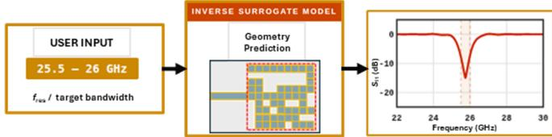  
Fig. 1. Overview of an AI-assisted inverse patch antenna design process

These pixelated antenna structures convert the design problem into a high-dimensional combinatorial optimisation problem with binary design variables [5]–[7].

Pixel-based antenna synthesis enables the exploration of a substantially larger design space and can reveal nonconventional geometries with improved impedance matching, bandwidth, or radiation characteristics. However, the number of possible configurations increases exponentially with the number of pixels. For example, a grid containing 300 pixels corresponds to a search space of $2 ^ { 3 0 0 }$ possible layouts, making direct exhaustive evaluation impractical. Accurate evaluation of possible antenna layouts generally requires full-wave electromagnetic (EM) simulation using tools such as CST Microwave Studio or Ansys HFSS [8]. Although these simulators provide reliable characterisation of antenna performance, each simulation may require several minutes, making large-scale design exploration computationally demanding. To reduce this cost, surrogate modelling and machine learning (ML) techniques have been adopted to approximate the relationship between antenna geometry and EM response [9]–[15].

Once trained, these models can provide rapid predictions and thereby reduce the number of expensive EM simulations required during design optimisation. The role of ML-assisted methods in antenna design has also been emphasised in recent surveys on 5G microstrip antenna development [16].

For example, in [10], a multilayer perceptron was trained using EM simulation data to approximate the $S _ { 1 1 }$ response of a reconfigurable microstrip antenna and support faster optimisation.

Similarly, Taguchi-assisted neural network models have been used to predict the reflection coefficient of mmWave antennas while reducing the number of repeated full-wave simulations required during parameter tuning [11]. More recently, deep learning approaches have shown improved performance for high-dimensional antenna representations. In particular, convolutional neural networks (CNNs) are well suited to pixel-based antenna layouts because they can extract spatial features directly from binary patterns. In [12] an accurate forward and inverse design for pixelated mmWave antennas is developed using deep convolutional models trained on large datasets. Furthermore, in [13] a combined CNNbased surrogate with binary particle swarm optimisation for pixel antenna design is reported with accurate prediction of reflection coefficients for optimised layouts.

Despite these advances, efficient generation of training data remains a major challenge for surrogate-based design of pixelated antennas. Randomly generated pixel layouts rarely exhibit acceptable antenna performance, which leads to highly imbalanced datasets in which only a small fraction of samples produce meaningful resonance behaviour. In [13], only 12.6% of over 150,000 randomly generated 10×10 pixel layouts produced a usable resonance, highlighting the scale of this inefficiency. As a result, simulation resources are often spent on designs with limited value for surrogate training.

In this paper, a novel end-to-end machine-learning assisted design pipeline for pixelated mmWave patch antennas in the 22–30 GHz band is presented. The proposed approach integrates ML-assisted dataset augmentation, a hybrid CNN– BiLSTM forward surrogate for complex $S _ { 1 1 }$ prediction, and latent-space inverse design using a single pipeline.

## II. ANTENNA STRUCTURE AND DATASET

The pixelated antenna is developed on a grounded Rogers RT/duroid 5880 substrate with relative permittivity $\varepsilon _ { r } { = } 2 . 2$ loss tangent tan $\delta { = } 0 . 0 0 0 9$ , and thickness $h { = } 0 . 5 0 8 \mathrm { m m }$ The substrate dimensions are $1 6 \times 1 2 . 5 \mathrm { m m ^ { 2 } }$ with a copper thickness of $t { = } 0 . 0 3 5 \ : \mathrm { m m }$ . The top surface consists of $\mathrm { { 0 . 5 } { \times } 0 . 5 \mathrm { { m m ^ { 2 } } } }$ square copper pixels with zero gap, forming a 19×23 grid. Structural margins of 1.5 mm at the upper and lower edges and 4.5 mm at the right edge confine the active pixel area to $1 9 \times 2 3 { = } 4 3 7$ sites. A fixed feed line occupying columns 1–11 of the centre row (row 10 of 19) is kept fixed. Furthermore, to retain a patch shape some of the pixels within the pixelated surface area are excluded leaving 300 binary-valued pixels available for optimisation. The resulting design space spans approximately $\bar { 2 } ^ { 3 0 0 }$ possible geometries. Fig. 2 illustrates the full pixelated surface with all pixel states visible.

A key challenge in building a useful training dataset for this problem is that purely random binary pixel patterns tend to produce geometries with disconnected metallic islands that have no electrical path to the feed and therefore cannot radiate. To address this, a structured-random generation strategy was adopted, where patterns are drawn from seven predefined shape families: rect block, rect ring, split ring, symmetric mirror, stub patch, scatter connected, and inset patch. Each family defines a broad antenna topology class, with the geometry within each class fully randomised across anchor position, patch dimensions, growth direction, and pixel density, providing wide coverage of each topological region of the design space. Two constraints are enforced on every generated pattern: the total number of active pixels must be at least 20, and the metal pattern must form a single connected region with a continuous path back to the feed strip.

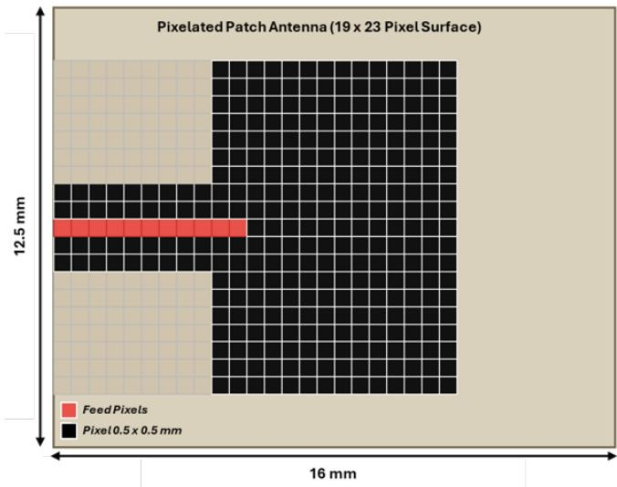  
Fig. 2. Full pixelated patch antenna surface on Rogers RT/duroid 5880 $( 1 \bar { 6 } \times 1 2 . 5 $ mm, $\varepsilon _ { r } { = } 2 . 2$ , h=0.508 mm). All 300 optimisable metal pixels are shown in black. The fixed feed line (cols. 1–11, row 10) is shown in red. Grey regions are structurally excluded.

Patterns are generated with equal quota per family to ensure balanced topological coverage. All EM simulations were performed in CST Microwave Studio using the timedomain solver over 22–30 GHz, yielding the complex $S _ { 1 1 } ( f )$ response sampled at 801 uniformly spaced frequency points per design. A Python script was used to interface with CST for geometry generation, simulation, and result export.

## III. MACHINE LEARNING MODELLING

As shown in Fig. 3, the ML modelling was carried out in three phases: (i) classifier-guided dataset augmentation, (ii) forward surrogate training, and (iii) latent-space inverse optimisation.

## A. Classifier-Guided Data Augmentation

An initial set of approximately 6,000 pixel patterns was generated using the structured-random strategy described in Section II and simulated in CST. Each pattern was labelled resonant (positive class) if its deepest point, min $_ f | S _ { 1 1 } ( f ) | _ { \mathrm { d B } }$ , fell below −10 dB anywhere in 22– 30 GHz, and non-resonant (negative class) otherwise.

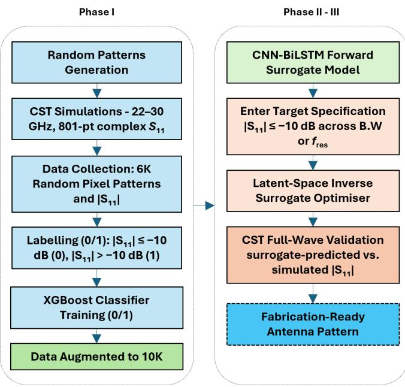  
Fig. 3. End-to-end system pipeline. An XGBoost classifier screens possible patterns to augment the CST dataset. A CNN-BiLSTM forward surrogate and a convolutional AE prior are trained on the augmented dataset. The inverse optimiser searches the 64-d AE latent space through the frozen surrogate to generate antenna patterns satisfying the target S11 specification.

TABLE I  
CLASSIFIER BENCHMARK ON THE 6K BALANCED DATASET. BEST RESULT PER MODEL ACROSS FIVE RANDOM SEEDS. BOLD: BEST PER COLUMN.
<table><tr><td>Model</td><td>Acc.</td><td>F1</td><td>AUC</td><td>Train-Val Gap</td></tr><tr><td>Random Forest</td><td>80.1%</td><td>0.796</td><td>0.874</td><td>14.7%</td></tr><tr><td>XGBoost</td><td>77.4%</td><td>0.768</td><td>0.844</td><td>4.4%</td></tr><tr><td>LightGBM</td><td>77.2%</td><td>0.772</td><td>0.839</td><td>3.4%</td></tr><tr><td>SVM</td><td>75.9%</td><td>0.761</td><td>0.827</td><td>4.1%</td></tr><tr><td>Logistic Reg.</td><td>71.0%</td><td>0.706</td><td>0.790</td><td>3.6%</td></tr></table>

Approximately 40% of the initial patterns were resonant, leaving the dataset heavily skewed toward non-resonant designs. To improve the efficiency of further data collection, five binary classifiers were evaluated to distinguish resonant from non-resonant patterns prior to simulation. A balanced subset of 4,178 samples (2,089 per class) was used for training, with stratified 70/15/15 train/validation/test splits. The models were evaluated using test accuracy, macro F1-score, ROC AUC, and train-to-validation accuracy gap, as reported in Table I. XGBoost was selected for the augmentation step as it achieved the highest test accuracy among models with a low train-to-validation gap (77.4%, $\Delta { = } 4 . 4 \% )$ , indicating reliable generalisation to unseen pixel patterns [17].

Although Random Forest achieved higher accuracy, its large train-to-validation gap of 14.7% suggests overfitting that would reduce its reliability as a screener on new unseen patterns.

The model used a maximum tree depth of 3, a learning rate of 0.1, and subsampling at the sample and feature level, with the number of boosting rounds determined by early stopping on the validation log-loss. The trained XGBoost classifier was then used to score a large pool of newly generated random patterns and retain only those predicted to be resonant for CST simulation. An additional 4,000 patterns were selected and simulated in this way, expanding the total dataset to approximately 10,000 samples. The proportion of resonant designs in the combined dataset increased from approximately 40% to 52%, confirming that the classifierguided selection meaningfully enhanced the training dataset as compared to uniform random simulation.

## B. Forward Surrogate Model (CNN-BiLSTM)

1) Architecture: As shown in Fig. 4, the forward surrogate maps a binary 19×23 pixel pattern to the 801- point complex $S _ { 1 1 }$ spectrum over 22–30 GHz. The network consists of: (i) a convolutional spatial encoder comprising three Conv2D–BatchNorm–GELU blocks with kernel sizes 7, 5, and 3, each followed by a residual block, with channel depths progressing $1 {  } 6 4 {  } 1 2 8 {  } 1 9 2 {  } 2 5 6$ , followed by global average pooling to produce a 256-dimensional feature vector; (ii) a frequency projection head comprising two linear layers $( 2 5 6 \to 5 1 2 \to 8 0 1 \times 1 2 8 )$ with BatchNorm, GELU, and Dropout (p=0.25) that reshapes the output to an 801×128 sequence; and (iii) a 2-layer bidirectional LSTM that models inter-frequency correlations and outputs a 801×2 real/imaginary $S _ { 1 1 }$ tensor. Dropout $\scriptstyle ( p = 0 . 2 5 )$ is applied within both the encoder and the LSTM.

2) Loss Function: Training minimises a composite loss:

$$
\mathcal { L } = \lambda _ { 1 } \mathcal { L } _ { \mathrm { R e / I m } } + \lambda _ { 2 } \mathcal { L } _ { \mathrm { d B } } + \lambda _ { 3 } \mathcal { L } _ { \mathrm { d e p t h } } + \lambda _ { 4 } \mathcal { L } _ { \mathrm { f r e q } } + \lambda _ { 5 } \mathcal { L } _ { \mathrm { s l o p e } } ,\tag{1}
$$

where $\mathcal { L } _ { \mathrm { R e / I m } }$ is the MSE on the complex $S _ { 1 1 } ; \mathcal { L } _ { \mathrm { d B } }$ is a Huber loss (δ=3 dB) on the dB-magnitude; ${ \mathcal { L } } _ { \mathrm { d e p t h } }$ is an L1 loss on the predicted resonance dip depth; $\mathcal { L } _ { \mathrm { f r e q } }$ is an L1 loss on the predicted resonance frequency, computed via a differentiable soft-argmin estimator; both ${ \mathcal { L } } _ { \mathrm { d e p t h } }$ and $\mathcal { L } _ { \mathrm { f r e q } }$ are computed over resonant samples (true $| S _ { 1 1 } | _ { \mathrm { d B } } < - 1 0 \mathrm { d B } )$ and $\mathcal { L } _ { \mathrm { s l o p e } }$ is the MSE on the first-order finite difference of the dB spectrum, which penalises non-smooth predictions that would not occur in a real EM simulation. The weights are set to $( \lambda _ { 1 } , \lambda _ { 2 } , \lambda _ { 3 } , \lambda _ { 4 } , \lambda _ { 5 } ) { = } ( 1 . 0 , 2 . 0 , 4 . 0 , 1 5 . 0 , 0 . 3 )$

3) Training: The full 10,000-sample dataset was split 70/15/15 (stratified, seed 42) into approximately 7,000 training, 1,500 validation, and 1,500 test samples. The model was trained for up to 200 epochs, with training stopped early if no improvement was seen for 30 consecutive epochs. The AdamW optimiser was used with a peak learning rate of $5 \times 1 0 ^ { - 5 }$ and weight decay of $1 0 ^ { - 4 }$ . The learning rate was increased linearly over the first 3 epochs before following a cosine decay schedule, which prevents large weight updates at the start of training.

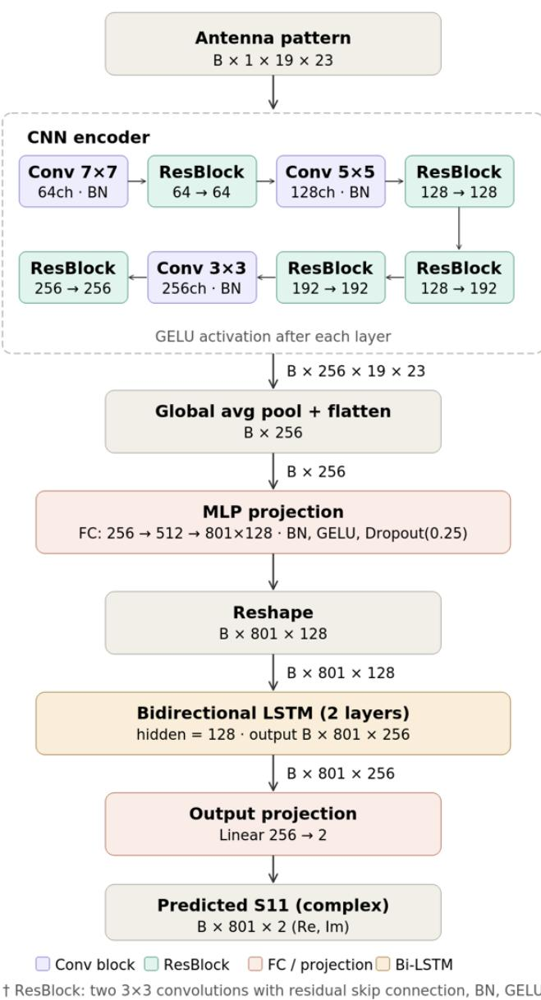  
Fig. 4. CNN-BiLSTM forward surrogate architecture. The spatial encoder extracts geometric features from the binary pixel pattern, the frequency projection head reshapes them into a per-frequency sequence, and the bidirectional LSTM models inter-frequency correlations to output the full complex $S _ { 1 1 }$ spectrum.

To reduce the effect of class imbalance, resonant samples were drawn 4× more frequently during training using a weighted sampler. Random horizontal and vertical flips of the pixel pattern were also applied as data augmentation.

## C. Convolutional Autoencoder

Direct optimisation over the full 19×23 binary pixelated antenna surface can produce disconnected or physically invalid patterns that cannot radiate. To address this, a convolutional autoencoder (AE) is trained on all the pixelated antenna patterns to learn a compact latent representation of feasible antenna geometries, providing a structured search space for the inverse optimiser. The encoder compresses a 1×19×23 binary pattern through three Conv2D blocks with channel depths 1→32→64→128, where the second and third convolutions use stride 2, reducing the spatial resolution to a 128×5×6 feature map that is then projected to a 64- dimensional latent vector z. The decoder reconstructs the pattern via bilinear upsampling and convolution, outputting per-pixel logits.

The training loss combines binary cross-entropy with a total-variation regulariser:

$$
\begin{array} { r } { \mathcal { L } _ { \mathrm { A E } } = \mathcal { L } _ { \mathrm { B C E } } + \lambda _ { \mathrm { T V } } \mathcal { L } _ { \mathrm { T V } } , \quad \lambda _ { \mathrm { T V } } = 1 0 ^ { - 3 } , } \end{array}\tag{2}
$$

trained with AdamW $( \mathrm { l r } { = } 1 0 ^ { - 3 } )$ for up to 150 epochs with early stopping (patience = 15).

## D. Latent-Space Inverse Optimiser

The inverse design problem is formulated as gradient descent in the AE latent space. Rather than optimising the 437 binary pixel values directly, the search is carried out in the 64-dimensional latent space of the trained AE, which constrains possible patterns to physically valid antenna geometries and reduces the dimensionality of the problem:

$$
\mathbf { z } ^ { * } = \arg \operatorname* { m i n } _ { \mathbf { z } } ~ \mathcal { L } _ { \mathrm { i n v } } \big ( f _ { \mathrm { s u r } } \big ( \Pi ( \sigma ( g _ { \mathrm { A E } } ( \mathbf { z } ) ) ) \big ) , \mathbf { y } _ { \mathrm { t g t } } \big ) + \mathcal { R } ( \mathbf { z } ) ,\tag{3}
$$

where $g _ { \mathrm { A E } }$ is the frozen AE decoder, $\sigma$ is the sigmoid function, Π is a connectivity projection operator, $f _ { \mathrm { s u r } }$ is the frozen forward surrogate, and $\mathcal { R } ( \mathbf { z } )$ combines $\ell _ { 1 }$ sparsity, total-variation, pixel-area, and $\ell _ { 2 } \cdot$ -latent regularisers. The target loss ${ \mathcal { L } } _ { \mathrm { i n v } }$ penalises in-band $\vert S _ { 1 1 } \vert$ values above −11 dB (1 dB margin) and suppresses spurious resonances outside a ±1 GHz guard band around the target.

At every optimisation step, the continuous decoder output is passed through a sigmoid and thresholded to produce a binary pattern. The binarised pattern then undergoes connected-component labelling; only the largest metal region contiguous with the feed is retained, ensuring every possible geometry is both electrically active and fabrication-ready. A straight-through estimator [18] passes gradients through this discrete step so that the optimisation can continue uninterrupted. Optimisation runs for 1,000 steps using Adam with a cosine annealing schedule $( \mathrm { l r } _ { 0 } { = } 0 . 0 5 )$

To improve robustness, a K=4 dropout ensemble of surrogate passes is used at each step, along with cyclic frequency shifts (±60, ±120 bins) applied to the target band, which reduces sensitivity to surrogate frequency bias. A multi-start strategy is also employed in which a population of latent vectors is independently initialised and optimised, with half seeded from encoded resonant training patterns and the remainder drawn from a standard normal distribution. The possible antenna yielding the minimum in-band predicted $| S _ { 1 1 } | _ { \mathrm { d B } }$ after convergence is selected as the final design.

TABLE II  
CNN-BILSTM FORWARD SURROGATE PERFORMANCE METRICS
<table><tr><td>Metric</td><td>Train</td><td>Val</td><td>Test</td></tr><tr><td>MAE,  $| S _ { 1 1 } | _ { \mathrm { d B } }$ </td><td>1.305</td><td>1.547</td><td>1.548</td></tr><tr><td>RMSE,  $| S _ { 1 1 } | _ { \mathrm { d B } }$ </td><td>2.218</td><td>2.725</td><td>2.735</td></tr><tr><td>MAE,  $f _ { \mathrm { r e s } }$  depth  $\left( \mathrm { d B } \right) ^ { * }$ </td><td>3.213</td><td>5.844</td><td>5.742</td></tr><tr><td>MAE,  $f _ { \mathrm { r e s } }$  centre frequency  $\boldsymbol { ( \mathrm { G H z ) } } ^ { * }$ </td><td>0.576</td><td>0.681</td><td>0.724</td></tr></table>

## IV. RESULTS

## A. Forward Surrogate Performance

Table II reports the CNN-BiLSTM surrogate performance across the train, validation, and test splits of the 10K dataset. The broadband MAE and RMSE are consistent between validation and test (1.55 and 2.74 dB respectively), confirming that the model generalises well to unseen patterns. Resonant metrics are computed over the 52% of samples with a true $\lvert S _ { 1 1 } \rvert$ minimum below −10 dB. The surrogate achieves a mean dip frequency MAE of 0.72 GHz across the test set; the inverse optimiser’s multi-start selection strategy consistently favours candidates where the surrogate prediction is most reliable, yielding closer agreement in the validated designs shown below.

## B. Inverse Design Results

To validate the full pipeline, four antenna patterns were generated by the inverse optimiser, each targeting a different frequency band within 22–30 GHz. Each pattern was exported to CST and simulated using the full-wave timedomain solver to verify the surrogate prediction. A design is considered successful if the CST-simulated $\vert S _ { 1 1 } \vert$ reaches −10 dB or below within the target band.

For the first case, a target $f _ { \mathrm { r e s } }$ range of 26.5–27.5 GHz was specified. The inverse-optimised pixel pattern is shown in Fig. 5a, while the surrogate-predicted and CST-simulated $\lvert S _ { 1 1 }$ | responses are compared in Fig. 5e. The predicted centre $f _ { \mathrm { r e s } }$ was 27.76 GHz, while the CST-simulated centre $f _ { \mathrm { r e s } }$ was 27 GHz, giving a frequency error of 0.76 GHz and $\Delta | S _ { 1 1 } | = 5 . 5 \mathrm { d B }$

For the second case, a target $f _ { \mathrm { r e s } }$ range of 22–23 GHz was specified. The pixel pattern and $\vert S _ { 1 1 } \vert$ comparison are shown in Figs. 5b and 5f. Both the predicted and CST-simulated centre $f _ { \mathrm { r e s } }$ were 22.7 GHz, with $\Delta | S _ { 1 1 } | = 0 . 4 4 \mathrm { d B }$ , showing close agreement between the surrogate and simulation.

For the third case, a target $f _ { \mathrm { r e s } }$ range of 27–28 GHz was specified. The pixel pattern and $\vert S _ { 1 1 } \vert$ comparison are shown in Figs. 5c and 5g. The predicted centre $f _ { \mathrm { r e s } }$ was 27.38 GHz and the CST-simulated centre $f _ { \mathrm { r e s } }$ was 27.4 GHz, giving $\Delta | S _ { 1 1 } | = 0 . 1 8 \mathrm { d B }$

For the fourth case, a target $f _ { \mathrm { r e s } }$ of 25 GHz was specified. The pixel pattern and $\vert S _ { 1 1 } \vert$ comparison are shown in Figs. 5d and 5h. The predicted centre $f _ { \mathrm { r e s } }$ was 24.95 GHz and the CST-simulated centre $f _ { \mathrm { r e s } }$ was 25.12 GHz, giving $\Delta | S _ { 1 1 } | =$ 1.4 dB.

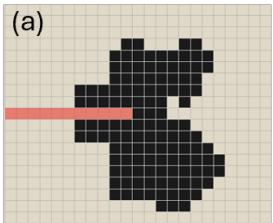

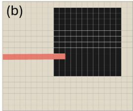

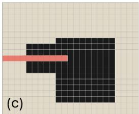

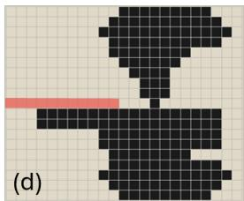

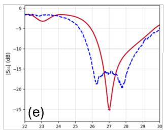

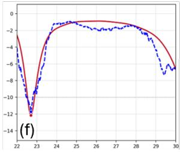

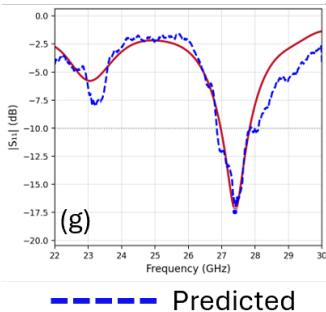

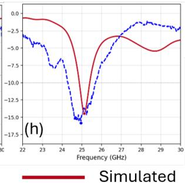  
Fig. 5. Inverse-designed pixelated patch antennas and their $\lvert S _ { 1 1 } \rvert$ responses. (a)–(d) optimised pixel patterns for target bands 26.5–27.5, 22–23, 27–28, and 25 GHz respectively. (e)–(h) corresponding surrogate-predicted (dashed) vs. CST-simulated (solid) |S11|dB responses.

Across the four designs, three show frequency errors below 0.2 GHz and depth errors below 1.5 dB, confirming that the surrogate provides a reliable gradient signal for inverse optimisation. The first design shows a larger depth discrepancy of 5.5 dB, which is consistent with the test-set dip depth MAE of 5.74 dB reported in Table II. All four CST-simulated patterns achieved $| S _ { 1 1 } | \le - 1 0 \mathrm { d B }$ within the specified target band, satisfying the design objective in every case.

The results show that the pipeline consistently produces connected, feed-attached pixel patterns that resonate within the specified target band across the 22–30 GHz range. The bidirectional LSTM and the composite $\mathcal { L } _ { \mathrm { d e p t h } } / \mathcal { L } _ { \mathrm { f r e q } }$ loss terms were found to be key contributors to surrogate accuracy, while connectivity projection at every optimisation step ensured that all generated patterns maintain a continuous electrical path to the feed.

## V. CONCLUSION AND FUTURE WORK

In this paper, a novel surrogate-assisted inverse design process for pixelated mmWave patch antennas was proposed. An XGBoost binary classifier was used as a pre-simulation filter for dataset augmentation, raising the proportion of resonant designs from approximately 40% to 52% across a combined dataset of ${ \sim } 1 0 { , } 0 0 0$ simulations. A CNN-BiLSTM forward surrogate trained on this dataset predicts the full complex $S _ { 1 1 }$ spectrum at 801 frequency points over 22– 30 GHz, guided by a physics-aware composite loss. A 64- dimensional convolutional AE prior constrains the inverse search to the manifold of feasible antenna geometries; gradient descent through the frozen surrogate with connectivity projection yields fabrication-ready pixel patterns satisfying a target $| S _ { 1 1 } | \le - 1 0 \mathrm { d B }$ specification. Four inverse-designed geometries were presented and validated against full-wave simulation. It was shown, that the proposed approach enables to automatically design and configure effective custom antenna structures.

Future work will proceed along three directions. First, the inverse-designed prototypes will be fabricated and measured. This will quantify the simulation-to-hardware gap and establish the practical accuracy limits of the surrogate model under real fabrication tolerances. Second, the framework will be extended to incorporate radiation pattern, gain, and efficiency as additional design targets alongside $S _ { 1 1 }$ . Third, the pipeline will be extended to two-port bandpass filter synthesis using the same pixelated topology, requiring the surrogate to predict the full scattering matrix and the inverse loss to enforce prescribed passband insertion loss and stopband rejection simultaneously.

## ACKNOWLEDGMENT

This publication has emanated from research conducted with the financial support of Research Ireland under Grant number 13/RC/2077 P2. For the purpose of Open Access, the author has applied a CC BY public copyright licence to any Author Accepted Manuscript version arising from this submission.

## REFERENCES

[1] B. P. Shariff, T. Ali, P. R. Mane, and P. Kumar, “Array antennas for mmwave applications: A comprehensive review,” IEEE Access, vol. 10, pp. 126 728–126 766, 2022.

[2] T. S. Rappaport, S. Sun, R. Mayzus, H. Zhao, Y. Azar, K. Wang, G. N. Wong, J. K. Schulz, M. Samimi, and F. Gutierrez, “Millimeter wave mobile communications for 5G cellular: It will work!” IEEE Access, vol. 1, pp. 335–349, 2013.

[3] J. Zhang, X. Ge, Q. Li, M. Guizani, and Y. Zhang, “5g millimeterwave antenna array: Design and challenges,” IEEE Wireless communications, vol. 24, no. 2, pp. 106–112, 2016.

[4] A. S. Mohammed, S. Kamal, M. F. Ain, Z. A. Ahmad, U. Ullah, M. Othman, R. Hussin, and M. F. Ab Rahman, “A review of microstrip patch antenna design at 28 ghz for 5g applications system,” International Journal of Scientific & Technology Research, vol. 8, no. 10, pp. 341–352, 2019.

[5] T. Qiu, X. Shi, J. Wang, Y. Li, S. Qu, Q. Cheng, T. Cui, and S. Sui, “Deep learning: a rapid and efficient route to automatic metasurface design,” Advanced Science, vol. 6, no. 12, p. 1900128, 2019.

[6] J. P. Jacobs, “Accurate modeling by convolutional neural-network regression of resonant frequencies of dual-band pixelated microstrip antenna,” IEEE Antennas and Wireless Propagation Letters, vol. 20, no. 12, pp. 2417–2421, 2021.

[7] A. Ghadimi, V. Nayyeri, M. Khanjarian, M. Soleimani, and O. M. Ramahi, “A systematic approach for mutual coupling reduction between microstrip antennas using pixelization and binary optimization,” IEEE Antennas and Wireless Propagation Letters, vol. 19, no. 12, pp. 2048–2052, 2020.

[8] CST, “Cst studio suite electromagnetic field simulation software, https://www.3ds.com/products-services/simulia/products/cst-studiosuite/,” 2021.

[9] W.-T. Li, H.-S. Tang, C. Cui, Y.-Q. Hei, and X.-W. Shi, “Efficient online data-driven enhanced-XGBoost method for antenna optimization,” IEEE Transactions on Antennas and Propagation, vol. 70, no. 7, pp. 5993–5998, 2022.

[10] P. Mahouti, “Design optimization of a pattern reconfigurable microstrip antenna using differential evolution and 3d em simulation-based neural network model,” International Journal of RF and Microwave Computer-Aided Engineering, vol. 29, no. 8, p. e21796, 2019.

[11] A. K. Dwivedi, V. Singh, Y. Alzahrani, R. K. Chaitanya, S. K. Singh, S. Singh, K. Parashar, and M. Tolani, “A taguchi neural network–based optimization of a dual-port, dual-band mimo antenna encompassing the 28/34 ghz millimeter wave regime,” Scientific Reports, vol. 15, no. 1, p. 6026, 2025.

[12] H. M. Torun, H. Yu, N. Dasari, V. C. K. Chekuri, A. Singh, J. Kim, S. K. Lim, S. Mukhopadhyay, and M. Swaminathan, “Deep-learning enabled generalized inverse design of multi-port RF and sub-terahertz passives and integrated circuits,” Nature Communications, vol. 15, no. 1, p. 10743, 2024.

[13] S. Chen, G.-H. Sun, and K. Wang, “Inverse design of microstrip antennas based on deep learning,” Electronics, vol. 14, no. 13, p. 2510, 2025.

[14] S. Koziel, N. Calik, P. Mahouti, and M. A. Belen, “Low-cost and highly accurate behavioral modeling of antenna structures by means of knowledge-based domain-constrained deep learning surrogates,” IEEE Transactions on Antennas and Propagation, vol. 71, no. 1, pp. 105– 118, 2023.

[15] Y. Sharma, H.-H. Zhang, and H. Xin, “Machine learning techniques for optimizing design of double T-shaped monopole antenna,” IEEE Transactions on Antennas and Propagation, vol. 68, no. 7, pp. 5658– 5663, 2020.

[16] M. S. Rana, S. M. R. Islam, and S. Sarker, “A comprehensive review on conventional and machine learning-assisted design of 5G microstrip patch antenna,” Electronics, vol. 13, no. 19, p. 3819, 2024.

[17] G. C. Cawley and N. L. Talbot, “On over-fitting in model selection and subsequent selection bias in performance evaluation,” The Journal of Machine Learning Research, vol. 11, pp. 2079–2107, 2010.

[18] Y. Bengio, N. Leonard, and A. Courville, “Estimating or propagating´ gradients through stochastic neurons for conditional computation,” arXiv preprint arXiv:1308.3432, 2013.