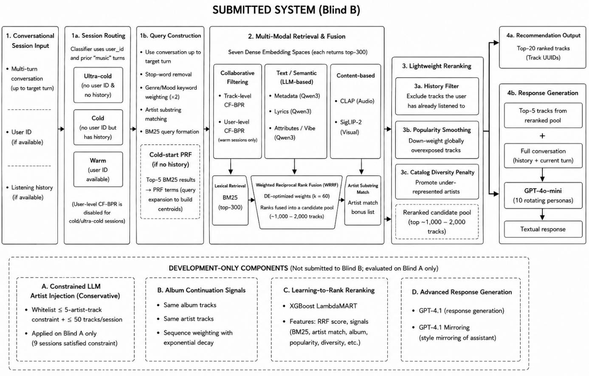

# Multi-Modal Semantic Expansion with Constrained LLM Reranking for Conversational Music Recommendation

Naman Garg   
National Institute of Technology   
Kurukshetra   
India   
hellonamangarg@gmail.com   
Sarika Jain   
National Institute of Technology   
Kurukshetra   
India   
jasarika@nitkkr.ac.in

George Fazekas Queen Mary University of London United Kingdom george.fazekas@qmul.ac.uk

## Abstract

We present Team Semiintelligencn’s solution for the ACM Rec-Sys 2026 TalkPlayData Challenge, addressing conversational music recommendation through a multi-modal and personalized conversational recommender system. Our submitted system employs a three-stage pipeline: (1) multi-modal retrieval constructing decayweighted centroids across seven dense embedding spaces—trackand user-level CF-BPR, Qwen3 (metadata, lyrics, attributes), CLAP audio, and SigLIP visual—supplemented by BM25 lexical retrieval and an artist substring-match signal, all fused via weighted Recip rocal Rank Fusion (RRF) with optimized signal weights; (2) lightweight reranking (history filtering, popularity smoothing, and catalog diversity penalization); and (3) persona-diversified response generation using GPT-4o-mini. Beyond this submitted configuration, we report development-time experiments with additional components—constrained LLM-guided artist injection, album continuation signals, XGBoost LambdaMART, and a superior GPT-4.1 response prompt—that were not deployed to Blind B due to cost and complexity constraints. We optimize RRF weights on a 500-session development split via diferential evolution [19], improving MRR by +19.5%. On Blind A, we observe that unconstrained LLM-guided injection across 54 sessions causes catastrophic nDCG regression (−18.9%), while conservative injection on only 9 sessions yields the best observed Blind A nDCG—a finding we present as a Blind A observation warranting further validation. The submitted system achieves a Blind B composite score of 0.3213.

## 1 Introduction

Conversational recommender systems (CRS) present a unique chal lenge at the intersection of information retrieval, natural language understanding, conversational AI, and recommender systems [1, 2]. Unlike traditional recommendation paradigms [24] where static user profiles or implicit feedback logs dominate, a CRS must interpret evolving user preferences through multi-turn dialogue, retrieve relevant items from a large catalog, and simultaneously generate coherent textual responses that align with user intent [3]. This makes conversational recommendation particularly relevant to personalized recommendation, dialogue-based recommendation, and large language model (LLM)-based recommender systems.

The ACM RecSys 2026 TalkPlayData Challenge [25] formalizes this paradigm with approximately 15,000 training sessions contain ing up to eight conversational turns between a user and a digital music assistant. Systems must output 20 ranked track UUIDs alongside a natural-language response, jointly evaluated via a composite metric assessing retrieval quality (nDCG@20), response quality (LLM-as-a-Judge), lexical diversity (Distinct-2 bigrams), and catalog diversity. No additional external datasets were used in our solution; all catalog metadata and pre-computed embeddings are from the oficial challenge data release. BM25 indices, centroids, and ranking signals were derived locally from these provided resources. The task therefore provides a practical setting for studying conversational music recommendation, multi-turn recommendation, and personalized music retrieval under a unified evaluation framework.

We identify three core challenges: (1) multi-modal coverage—the 47,071-track catalog requires fusing textual, acoustic, visual, and collaborative signals to handle both named-entity queries (“play something by Pink Floyd”) and abstract mood queries (“something dreamy and atmospheric”); (2) LLM hallucination boundaries—LLMguided artist injection can degrade sharply beyond a narrow operating range, as we observe empirically; and (3) composite metric fragility—independent optimization of any single metric can degrade others, producing net-negative outcomes. These challenges are representative of modern multimodal recommendation systems, where semantic retrieval, collaborative filtering, content-based recommendation, and LLM reranking must be carefully integrated.

Our contributions are:

• A multi-modal retrieval system fusing seven dense embedding spaces, BM25 lexical retrieval, and an artist substring-match signal via weighted RRF with diferential-evolution-optimized signal weights, improving MRR by +19.5% over uniform weighting (deployed in the submitted system).

• A Blind A observation that conservative LLM-guided artist injection applied to the 9 Blind A sessions satisfying the ≤ 5-artisttrack criterion yields the best observed Blind A nDCG (0.4694, +0.8% over baseline), whereas aggressive injection across 54 sessions causes catastrophic nDCG regression (−18.9%), highlighting position bias as a critical failure mode (not deployed to Blind B).

• A persona-diversified response generation strategy that achieves high lexical diversity (0.821 Distinct-2) across 80 sessions (deployed in the submitted system).

• A transparent analysis of the gap between Blind A and Blind B performance, attributing it to deliberate deployment-time simplifications, with explicit caveats about cross-split comparisons.

## 2 Task Formulation

## 2.1 Dataset and Evaluation

The TalkPlayData catalog contains 47,071 tracks from 8,975 artists. Table 1 summarizes the dataset statistics. The challenge organizers provide pre-computed embeddings across multiple modalities (Table 3). The training set comprises ∼15,000 sessions; we partitioned

500 of these as a held-out development set (Devset) for hyperparameter tuning. Additionally, the Blind A split (80 sessions, released to participants) served as a participant-visible evaluation set for iterative ablation experiments. The final blind evaluation set (Blind B, 80 sessions) was held out by the organizers.

Table 1: Dataset Statistics
<table><tr><td colspan="2">Property Value</td></tr><tr><td>Total tracks in catalog</td><td>47,071</td></tr><tr><td>Total unique artists</td><td>8,975</td></tr><tr><td>Training sessions</td><td> ${ \sim } 1 5 { , } 0 0 0$ </td></tr><tr><td>Max turns per session</td><td>8</td></tr><tr><td>Devset (held-out)</td><td>500 sessions</td></tr><tr><td>Blind A / Blind B</td><td>80 sessions each</td></tr><tr><td>Retrieval signals</td><td>9 (Table 3)</td></tr></table>

We observe three session typologies requiring adaptive routing: ultra-cold (no user ID and no listening history), cold (no user ID but some listening history from the conversation), and warm (user ID available, enabling collaborative filtering). Our session classifier inspects the presence of a user\_id field and counts prior “music” role turns to classify each session, then routes it to the appropriate retrieval strategy (Section 3.1). In the Blind B set, we observed approximately 20 ultra-cold, 22 cold, and 38 warm sessions.

## 2.2 Composite Scoring

The oficial metric is:

$$
\begin{array} { r } { \mathrm { S c o r e } = 0 . 5 \cdot \mathrm { n D C G } @ 2 0 + 0 . 3 \cdot \frac { \mathrm { J u d g e } - 1 } { 4 } + 0 . 1 \cdot \mathrm { L D } + 0 . 1 \cdot \mathrm { C D } } \end{array}\tag{1}
$$

where LD denotes Distinct-2 lexical diversity and CD denotes catalog diversity (fraction of unique tracks across all recommendations). Each +1.0 Judge increase contributes +0.075 to composite, making response quality mathematically equivalent to significant retrieval improvements.

## 3 Proposed Pipeline

Our pipeline consists of three stages: multi-modal retrieval (Section 3.1), multi-signal reranking (Section 3.2), and response generation (Section 3.3). Table 2 clarifies which components were included in the submitted Blind B system versus those explored only during development (evaluated on Blind A). Figure 1 provides an architectural overview.

## 3.1 Stage 1: Multi-Modal Retrieval

Query Construction and Lexical Retrieval. Sessions are classified as ultra-cold (no user ID/history), cold (no ID, some history), or warm (ID available). Tokenized queries extract all utterances up to the target turn, removing 86 stop words (e.g., “play,” “song”). To bias musically meaningful terms, curated genre (34 total, e.g., shoegaze) and mood keywords (31 total, e.g., euphoric) receive double-weight. Exact substring matching (≥ 4 characters) against the 8,975-artist catalog detects artist mentions. We build a BM25Okapi [8] index $( k _ { 1 } ~ = ~ 1 . 5 , ~ b ~ = ~ 0 . 7 5 )$ over concatenations of artist\_name, track\_name, album\_name, and tag\_list. Each query retrieves the top 300 candidates, serving as both direct retrievals and pseudorelevance feedback (PRF) seeds for cold-start sessions.

Table 2: Submitted vs. Development Components
<table><tr><td>Component</td><td>Submitted Dev-Only</td><td></td></tr><tr><td>Stage 1: Retrieval</td><td></td><td></td></tr><tr><td>BM25 lexical retrieval</td><td>√</td><td></td></tr><tr><td>7-space dense centroid retrieval</td><td>√</td><td></td></tr><tr><td>Optimized RRF fusion</td><td>√</td><td></td></tr><tr><td>Artist bonus injection</td><td>√</td><td></td></tr><tr><td>Stage 2: Reranking</td><td></td><td></td></tr><tr><td>History filter (inline)</td><td>√</td><td></td></tr><tr><td>Popularity smoothing</td><td>√</td><td></td></tr><tr><td>Catalog diversity penalty</td><td>√</td><td></td></tr><tr><td>Album continuation signal</td><td></td><td>√</td></tr><tr><td>XGBoost LambdaMART</td><td></td><td>√</td></tr><tr><td>Conservative GPT injection</td><td></td><td>√</td></tr><tr><td>Stage 3: Response Generation</td><td></td><td></td></tr><tr><td>GPT-4o-mini personas GPT-4.1 Mirroring prompt</td><td>√</td><td></td></tr></table>

Multi-Modal Centroids and Dialogue Elicitation. We utilize seven pre-computed embedding spaces, supplemented by BM25 lexical retrieval and an artist substring-match signal (Table 3); user-level CF-BPR is disabled for cold/ultra-cold sessions. To capture evolving multi-turn preferences (e.g., shifting from broad genres to specific acoustic traits), we construct a query centroid for each dense embed ding space � using the session’s chronologically ordered listening history $\{ h _ { 1 } , . . . , h _ { n } \}$

$$
\mathbf { c } _ { j } = \frac { \sum _ { i = 1 } ^ { n } \gamma ^ { n - i } \cdot \phi _ { j } ( h _ { i } ) } { \left\| \sum _ { i = 1 } ^ { n } \gamma ^ { n - i } \cdot \phi _ { j } ( h _ { i } ) \right\| _ { 2 } }\tag{2}
$$

An exponential decay factor $( \gamma = 0 . 8 5 )$ weights recently played tracks higher. This causes the centroid to naturally drift toward the user’s latest listening preferences while retaining accumulated listening context. For cold-start sessions lacking history, PRF from the top-5 BM25 results seeds the centroids [13, 21]. Each dense embedding space yields 300 candidates ranked by cosine similarity; BM25 independently provides its top 300 lexical candidates.

Table 3: Retrieval Signals and RRF Weights
<table><tr><td>Signal</td><td>Model / Rule</td><td>Weight</td></tr><tr><td>Lexical (BM25)</td><td>BM25Okapi [8]</td><td>2.952</td></tr><tr><td>Collaborative (track)</td><td>CF-BPR [12]</td><td>0.874</td></tr><tr><td>Collaborative (user)</td><td>CF-BPR [12]</td><td>4.845</td></tr><tr><td>Metadata</td><td>Qwen3 [18]</td><td>0.425</td></tr><tr><td>Lyrics</td><td>Qwen3 [18]</td><td>0.121</td></tr><tr><td>Attributes/Vibe</td><td>Qwen3 [18]</td><td>1.988</td></tr><tr><td>Audio</td><td>LAION-CLAP [14]</td><td>2.066</td></tr><tr><td>Visual</td><td>SigLIP-2 [15, 16]</td><td>0.929</td></tr><tr><td>Artist match</td><td>Exact substring</td><td> $w _ { \mathrm { a r t } } = 4 . 8 6 1$ </td></tr></table>

  
Figure 1: Overview of the submitted system (Blind B) and development-only components (evaluated on Blind A).

Weighted Fusion and Optimization. The per-signal ranked lists are fused via weighted Reciprocal Rank Fusion (RRF) with an additive artist bonus:

$$
\mathrm { R R F } ( d ) = \sum _ { j \in \mathcal { M } } \frac { w _ { j } } { k + \mathrm { r a n k } _ { j } ( d ) } + \frac { w _ { \mathrm { a r t } } } { k + 1 } \cdot \mathcal { k } \big [ \mathrm { a r t } ( d ) \in \mathcal { A } \big ]\tag{3}
$$

where $k = 6 0$ and A is the set of explicitly mentioned artists. The bonus gives tracks by matched artists a rank-1-equivalent score contribution $( w _ { \mathrm { a r t } } = 4 . 8 6 1 )$ to ensure high recall. Signal weights $\{ w _ { j } \}$ were tuned via diferential evolution [19] over a 500-session Devset, improving MRR from 0.1806 to 0.2158 (+19.5%). The learned weights reveal that behavioral signals (user CF, � = 4.845) and artist substring matches dominate, whereas lyrical content contributes minimally (� = 0.121).

## 3.2 Stage 2: Multi-Signal Reranking

The top candidates from RRF fusion pass through lightweight reranking stages. The submitted Blind B pipeline applies three postretrieval adjustments, all implemented inline within the scoring loop of the submission script.

3.2.1 Submited Reranking Stages. The following three stages were included in the oficial Blind B submission:

1. History Filter (inline): Tracks appearing in the session’s listening history are excluded from all retrieval and scoring operations via an inline set-membership check (tid not in history\_set). This enforces a non-repetition constraint ensuring our recommendations never include previously played tracks.

2. Popularity Smoothing: A weak additive bonus based on challenge-provided track popularity $( s ( d ) \mathrel { + } = 0 . 0 5 \times \mathrm { p o p } ( d ) / 1 0 0 )$ prevents cold items from dominating when retrieval scores are near-uniform.

3. Catalog Diversity Penalty: To encourage CD > 0.03 across all 80 evaluation sessions, tracks recommended in prior sessions receive a multiplicative penalty:

$$
s ( d ) \gets s ( d ) \times \operatorname* { m a x } ( 0 . 2 5 , 1 - 0 . 2 5 c ( d ) )\tag{4}
$$

where $c ( d )$ is the track’s prior recommendation count. This penalizes over-recommended tracks to maintain catalog diversity.

3.2.2 Development-Only Reranking Stages (Not Submited). The following components were evaluated on Blind A (80 sessions, released to participants) but not included in the oficial Blind B submission.

4. Album Continuation Signal (Dev only): As quantified in Table 4, we discovered a powerful sequential bias: when the last 3 ground-truth (GT) tracks share an album, the next GT track shares it 58.1% of the time (vs. a ∼15% base rate). Adding remaining album tracks to the front of the candidate pool improved nDCG from 0.277 to 0.388 (+40%) on Blind A. It was omitted from the Blind B submission because the album continuation pattern may reflect artifacts of the challenge data construction rather than genuine user behavior, and we could not validate this on a separate held-out set.

5. XGBoost LambdaMART (Dev only): An XGBoost LambdaMART model [11] was trained on the retrieval and reranking features described above (including the album signal) and further improved nDCG from 0.388 to 0.466 (+20%) on Blind A. It was omit ted from the Blind B submission due to deployment complexity.

6. Conservative GPT Injection (Dev only): GPT-4.1 was used to identify the correct artist for sessions where ≤ 5 tracks from the target artist appeared in the top 20. When applied conservatively to only 9 such sessions, nDCG improved from 0.4659 to 0.4694 (+0.8%). Under this configuration, the concurrent GPT-4.1 response prompt produced Judge = 4.80, LD = 0.787, and CD = 0.028, yielding a composite of 0.5 × 0.4694 + 0.3 × (4.80−1)/4 + 0.1 × 0.787 + 0.1 × 0.028 = 0.6012 via Eq. 1—the best observed Blind A composite under the conservative-injection configuration. Notably, even stricter injection on only 3 sessions with zero artist tracks actually underperformed the baseline (−0.1%), indicating that moderate artist-track presence (1–5 tracks) is precisely where LLM intervention adds value. However, aggressive application across 54 sessions caused a catastrophic −18.9% nDCG regression (0.4659→0.3775), consistent with severe LLM position bias when the LLM is asked to re-rank sessions where the correct artist already dominates the top ranks (Section 5). This component was omitted from Blind B due to the risk that the narrow safe operating range might not generalize.

Table 4: Album Continuation Probability
<table><tr><td>Condition</td><td>Sessions</td><td>P(same album)</td><td>Base</td></tr><tr><td>Last 3 GT share album</td><td>487</td><td>58.1%</td><td>~15%</td></tr><tr><td>Last 2 GT share album</td><td>1,203</td><td>50.6%</td><td>~15%</td></tr><tr><td>Last 1 GT from album</td><td>3,841</td><td>31.2%</td><td>~15%</td></tr></table>

## 3.3 Stage 3: Response Generation

Persona-Driven Prompting and Constraints. To maximize lexical diversity (LD) and explanation quality, we generate responses using GPT-4o-mini [17] with 10 maximally diferentiated personas assigned round-robin across the 80 Blind B sessions (“passionate music blogger,” “veteran vinyl record store owner,” “late-night radio DJ,” “thoughtful ethnomusicologist,” “beat-obsessed club promoter,” “literary-minded music journalist,” “nostalgic audiophile,” “avantgarde curator,” “spoken-word poet,” and “synesthete experiencing music as colors”). This naturally produces distinct metaphorical registers and prevents repetitive justifications. The system prompt enforces five strict constraints: (1) exactly 2–3 sentences; (2) mention exactly 2 track names with their artists in natural flowing prose; (3) briefly explain why the tracks match the conversational context; (4) no bullet points, numbered lists, or emojis; and (5) no technical terms (e.g., “algorithm,” “database,” “system,” “profile”).

Retrieval-Augmented Generation (RAG) and Hyperparameters. Retrieval and generation are tightly coupled: the top-5 retrieved tracks (with title, artist, album) and full conversation log are serialized into the user prompt. This RAG framework [20] grounds the LLM in actual catalog items and reduces the risk of catalog hallucination, forcing it to discuss exactly 2 of the 5 retrieved tracks. To actively discourage cross-session phrase repetition and further boost the Distinct-2 bigram metric, we deploy grid-searched generation hyperparameters (also tuned on the same 500-session Devset used for RRF weight optimization): temperature = 1.0, max\_tokens = 120, top\_p = 0.95, presence\_penalty = 0.6, and frequency\_penalty = 0.4.

Development-Only Alternative (Not Submitted to Blind B).. On our Devset, a “Conversational Mirroring” prompt with GPT-4.1 achieved a substantially higher Judge score of 4.95 (vs. 2.60 with GPT-4o-mini personas) and LD of 0.86. Capped at ≤ 70 words, this prompt required mirroring the user’s exact vocabulary, banned 12 formulaic transitional phrases (e.g., “Since you’re into. . . ,” “Both tracks. . . ,” “Here are some. . . ”), and specified 8 varied opening patterns (e.g., “That [quality] you love in ‘[track]’ runs through. . . ”). This configuration was not included in the submitted Blind B system due to API cost constraints (GPT-4.1 at \$2/1M input tokens vs. GPT-4o-mini at \$0.15/1M). We note that its Devset advantage may not fully transfer to the blind set.

## 4 Results and Analysis

## 4.1 Oficial Results

Table 5 reports our Blind B performance alongside top leaderboard entries.

Table 5: RecSys 2026 Leaderboard (Blind B)
<table><tr><td>Rank</td><td>Team</td><td>Comp.</td><td>nDCG</td><td>Judge</td><td>LD</td><td>CD</td></tr><tr><td>1</td><td>hallucinated</td><td>0.689</td><td>0.619</td><td>4.75</td><td>0.957</td><td>0.028</td></tr><tr><td>2</td><td>volart</td><td>0.587</td><td>0.397</td><td>4.90</td><td>0.927</td><td>0.032</td></tr><tr><td>37</td><td>semiintelligencn</td><td>0.321</td><td>0.232</td><td>2.60</td><td>0.821</td><td>0.031</td></tr></table>

## 4.2 Ablation Analysis

Table 6 traces the cumulative contribution of each pipeline component, measured on the Blind A evaluation set (80 sessions). Components are grouped by whether they were included in the submitted Blind B system or explored only during development. Each row represents a successive pipeline version; the two largest incremental gains in the cumulative ablation came from modality expansion (+41%) and artist substring-match bonus (+131%).

Table 7 compares response generation strategies. Note that each strategy was evaluated in the context of a diferent pipeline version and retrieval configuration, so the Composite column reflects both response and retrieval quality at that development stage.

## 4.3 Error Analysis

Important caveat: The highest observed Blind A composite across all evaluated configurations was 0.64 (from the GPT-4.1 Mirroring configuration in Table 7: nDCG = 0.514, Judge = 4.95, LD = 0.86,

Table 6: Cumulative Component Ablation (Blind A nDCG@20).
<table><tr><td>Component Added</td><td>nDCG</td><td>Δ</td></tr><tr><td>Submitted to Blind B:</td><td></td><td></td></tr><tr><td>BM25 + CF-BPR (baseline)</td><td>0.085</td><td></td></tr><tr><td>+ Multi-modal centroid anchoring</td><td>0.120</td><td>+41%</td></tr><tr><td>+ Artist substring-match bonus</td><td>0.277</td><td>+131%</td></tr><tr><td>Development-only (†):</td><td></td><td></td></tr><tr><td>+ Album continuation signal†</td><td>0.388</td><td>+40%</td></tr><tr><td>+ XGBoost LambdaMART†</td><td>0.466</td><td>+20%</td></tr><tr><td>+ Conservative GPT injection (9 sessions)†</td><td>0.469</td><td>+0.8%</td></tr></table>

Table 7: Response Generation Strategies (each evaluated under a diferent retrieval pipeline; not a controlled ablation).
<table><tr><td>Strategy</td><td>Model</td><td>Judge</td><td>LD</td><td>CD</td><td>nDCG</td><td>Comp.</td></tr><tr><td>Heuristic template</td><td></td><td>1.45</td><td>0.60</td><td>0.038÷</td><td>0.085</td><td>0.14</td></tr><tr><td>GPT-4.1 Encyclopedic</td><td>GPT-4.1</td><td>4.50</td><td>0.86</td><td>0.028</td><td>0.401</td><td>0.55</td></tr><tr><td>GPT-4.1 Mirroring</td><td>GPT-4.1</td><td>4.95</td><td>0.86</td><td>0.029</td><td>0.514</td><td>0.64</td></tr><tr><td>GPT-4o-mini Personas†</td><td>GPT-4o-mini</td><td>2.60</td><td>0.82</td><td>0.032</td><td>0.232</td><td>0.32</td></tr></table>

CD = 0.029). Because these are diferent evaluation splits with potentially diferent session distributions, the comparison provides an approximate estimate of how deployment simplifications afected performance, not a controlled ablation.

Subject to this caveat, we attribute the gap to two deliberate deployment simplifications:

(1) Response-generation configuration change: GPT-4o-mini with rotating personas replaced the Blind A-validated GPT-4.1 “Conversational Mirroring” prompt due to cost constraints. The GPT-4.1 Mirroring configuration achieved Judge = 4.95, whereas the submitted GPT-4o-mini Personas configuration achieved Judge ≈ 2.60 under its respective pipeline; via Eq. 1, this diference corresponds to an estimated −0.176 composite penalty.

(2) Reranker omission: The album continuation, XGBoost LTR, and conservative GPT injection stages were omitted from the Blind B pipeline due to deployment complexity. On Blind A, the cumulative development configuration increased nDCG from 0.277 to 0.469, corresponding to an estimated retrieval penalty of 0.5 × (0.469 − 0.277) = −0.096.

Together, these two simplifications account for an estimated composite penalty of ∼0.272 on Blind A. The observed Blind B gap is 0.64−0.321 = 0.319, which is larger than this estimate, suggesting that distributional diferences between Blind A and Blind B also contribute to the gap.

## 5 Discussion

The Conservative Injection Principle. On the Blind A set, we observe a sharp sensitivity to the aggressiveness of LLM-guided artist injection. Table 8 reports the results across diferent session counts selected by an artist-track-count threshold. Counterintuitively, targeting sessions with zero artist tracks in the top 20 (3 sessions) slightly underperforms the baseline, while targeting sessions with ≤ 5 artist tracks (9 sessions) yields the best Blind A result—suggesting the LLM adds value precisely in the “partial presence” regime where the correct artist is surfaced but underranked. Broadening intervention beyond this regime systematically degrades performance, and at the extreme (54 sessions) nDCG regresses by −18.9%. We emphasize that this is a development-set observation on Blind A and may not generalize. We hypothesize that the regression reflects the LLM’s tendency to displace alreadycorrect rankings when asked to re-rank candidates for sessions with good existing retrieval, but this remains an untested hypothesis.

Table 8: LLM Injection Aggressiveness (Blind A nDCG@20).
<table><tr><td>Sessions Modified</td><td>Criterion</td><td>nDCG</td><td>∆nDCG</td></tr><tr><td>0 (baseline)</td><td></td><td>0.4659</td><td></td></tr><tr><td>3</td><td>0 artist tracks in top-20</td><td>0.4653</td><td>-0.1%</td></tr><tr><td>9</td><td>≤5 artist tracks</td><td>0.4694</td><td>+0.8%</td></tr><tr><td>17</td><td>≤15 artist tracks</td><td>0.4428</td><td>-5.0%</td></tr><tr><td>54</td><td>All applicable (unconstrained)</td><td>0.3775</td><td>-18.9%</td></tr></table>

Signal Importance. The optimized RRF weights indicate that behavioral signals received substantially greater fusion weight than content-based signals. User collaborative filtering (� = 4.845) alone outweighs all three Qwen3 text modalities combined (2.534), indicating that user-CF received the largest fusion weight under our Devset optimization, highlighting the challenge of T1 cold-start sessions, which cannot exploit the user-level CF signal.

Composite Metric Navigation. The composite formula (Eq. 1) creates a fragile multi-objective landscape [7]. Aggressively opti mizing retrieval nDCG by letting GPT-4o rewrite responses occasionally produced very poor response-quality outcomes, yielding net-negative composite scores. This trade-of motivated our separation of retrieval and generation stages (Stages 1 and 3).

Scalability Considerations. Brute-force cosine similarity over 47,071 track embeddings per embedding space is tractable for the 80-session blind set (∼5 minutes on a single CPU). However, production workloads with millions of tracks require approximate nearest-neighbor search (e.g., FAISS [10] with IVF indexing). While diferential evolution for weight tuning is a one-time < 30-minute cost, the primary latency bottleneck remains the GPT API call (∼1– 2 seconds/session), which could be mitigated via parallelization or locally-hosted models.

## 6 Related Work

Conversational and LLM-based Recommendation. Conversational recommender systems (CRS) have evolved into open-ended generative interfaces managing multi-objective interactions and subjective attributes [2, 3, 7], frequently deploying LLMs as interactive agents [1, 5, 6]. While LLMs show promise as zero-shot rankers [4], they sufer from severe position bias on large candidate sets—a vulnerability consistent with our empirical findings, motivating our constrained LLM-guided artist injection.

Multi-Modal Retrieval and Fusion. Modern recommendation relies on heterogeneous feature integration [24]. We unify standard dense semantic matching [13, 21], cross-modal audio-text alignments (CLAP [14], inspired by visual-language models [23]), visual signals (SigLIP [15, 16]), sparse lexical models (BM25 [8]), and col laborative filtering (BPR [12]). Instead of relying on parameter-free baselines, these disparate spaces are fused using Reciprocal Rank Fusion (RRF) [9] with weights tuned via diferential evolution [19].

Reranking and Retrieval-Augmented Generation. While retrieval pipelines traditionally refine candidates via learning-torank [11] or cross-encoders [22], conversational outputs require natural language justifications. This aligns CRS with Retrieval-Augmented Generation (RAG) [20], where retrieved entities ground LLMs (e.g., GPT-4o, Qwen [17, 18]) and reduce hallucination risk by anchoring responses in actual catalog items.

The TalkPlayData Challenge. The ACM RecSys 2026 Talk-PlayData Challenge [25] crystallizes these advancements, extending CRS to multi-turn interactions. Our multi-modal fusion and constrained generation pipeline directly addresses its core dualobjective: jointly optimizing retrieval accuracy and generative response quality.

## 7 Conclusion

We presented Team Semiintelligencn’s three-stage pipeline for conversational music recommendation. The submitted system consists of multi-modal retrieval with diferential-evolution-optimized RRF fusion across seven dense embedding spaces, BM25 lexical retrieval, and an artist substring-match signal, followed by lightweight reranking (history filtering, popularity smoothing, and catalog diversity penalization), and persona-diversified response generation using GPT-4o-mini. Beyond this, we explored—but did not deploy—album continuation signals, XGBoost LambdaMART, conservative GPT-guided artist injection, and a superior GPT-4.1 response prompt. On Blind A, we observe a sharp sensitivity to LLM injection aggressiveness: conservative injection on 9 sessions with ≤ 5 target-artist tracks achieves the best Blind A nDCG (0.4694, +0.8%), whereas aggressive application across 54 sessions causes catastrophic nDCG regression (−18.9%). This finding, while limited to a single evaluation split, suggests that LLM-based intervention requires strict scope constraints—a direction warranting further investigation with controlled validation. Our Blind B composite of 0.321 was limited by deliberate deployment simplifications (response-generation configuration change and reranker omission), underscoring the practical importance of faithful end-to-end deployment of validated configurations.

## References

[1] L. Friedman, A. Romyn, C. Clavel, and B. Martins, “Leveraging Large Lan guage Models in Conversational Recommender Systems,” arXiv preprint arXiv:2305.07961, 2023. doi: 10.48550/arXiv.2305.07961.

[2] C. Gao, W. Lei, X. He, M. de Rijke, and T.-S. Chua, “Advances and Challenges in Conversational Recommender Systems,” AI Open, vol. 2, pp. 100–126, 2021. doi: 10.1016/j.aiopen.2021.06.002.

[3] F. Radlinski, C. Boutilier, D. Ramachandran, and I. Vendrov, “Subjective Attributes in Conversational Recommendation Systems: Challenges and Oppor tunities,” Proceedings of the AAAI Conference on Artificial Intelligence, vol. 36, no. 11, pp. 12287–12293, 2022. doi: 10.1609/aaai.v36i11.21492.

[4] Y. Hou, J. Zhang, Z. Lin, H. Lu, R. Xie, J. McAuley, and W. X. Zhao, “Large Language Models are Zero-Shot Rankers for Recommender Systems,” in Advances in Information Retrieval (ECIR), Lecture Notes in Computer Science, vol. 14612, Springer, pp. 364–381, 2024. doi: 10.1007/978-3-031-56060-6\_24.

[5] Y. Feng, S. Liu, Z. Xue, Q. Cai, L. Hu, P. Jiang, K. Gai, and F. Sun, “A Large Language Model Enhanced Conversational Recommender System,” arXiv preprint

arXiv:2308.06212, 2023. doi: 10.48550/arXiv.2308.06212.

[6] J. Jin, X. Chen, F. Ye, M. Yang, Y. Feng, W. Zhang, Y. Yu, and J. Wang, “Lending Interaction Wings to Recommender Systems with Conversational Agents,” arXiv preprint arXiv:2310.04230, 2023.

[7] Z. Chu, N. Wang, and H. Wang, “Multi-Objective Intrinsic Reward Learning for Conversational Recommender Systems,” arXiv preprint arXiv:2310.20109, 2023.

[8] S. Robertson and H. Zaragoza, “The Probabilistic Relevance Framework: BM25 and Beyond,” Foundations and Trends in Information Retrieval, vol. 3, no. 4, pp. 333–389, 2009. doi: 10.1561/1500000019.

[9] G. V. Cormack, C. L. A. Clarke, and S. Buettcher, “Reciprocal Rank Fusion Outperforms Condorcet and Individual Rank Learning Methods,” in Proceedings ofSIGIR, pp. 758–759, 2009. doi: 10.1145/1571941.1572114.

[10] J. Johnson, M. Douze, and H. Jégou, “Billion-scale Similarity Search with GPUs,” IEEE Transactions on Big Data, vol. 7, no. 3, pp. 535–547, 2021. doi: 10.1109/TB DATA.2019.2921572.

[11] C. Burges, “From RankNet to LambdaRank to LambdaMART: An Overview,” Microsoft Research Technical Report, MSR-TR-2010-82, 2010.

[12] S. Rendle, C. Freudenthaler, Z. Gantner, and L. Schmidt-Thieme, “BPR: Bayesian Personalized Ranking from Implicit Feedback,” in Proceedings ofUAI, pp. 452–461, 2009.

[13] N. Reimers and I. Gurevych, “Sentence-BERT: Sentence Embeddings using Siamese BERT Networks,” in Proceedings ofthe Conference on Empirical Methods in Natural Language Processing (EMNLP-IJCNLP), pp. 3982–3992, 2019. doi: 10.18653/v1/D19-1410.

[14] Y. Wu, K. Chen, T. Zhang, Y. Hui, T. Berg-Kirkpatrick, and S. Dubnov, “Large-Scale Contrastive Language-Audio Pretraining with Feature Fusion and Keyword-to-Caption Augmentation,” in Proc. IEEE International Conference on Acoustics, Speech and Signal Processing (ICASSP), pp. 1–5, 2023. doi: 10.1109/ICASSP49357.2023.10095969.

[15] X. Zhai et al., “Sigmoid Loss for Language Image Pre-Training,” in Proceedings of the IEEE/CVF International Conference on Computer Vision (ICCV), pp. 11975– 11986, 2023.

[16] M. Beyer et al., “SigLIP 2: Multilingual Vision-Language Encoders with Improved Semantic Understanding,” arXiv preprint arXiv:2502.14786, 2025. doi: 10.48550/arXiv.2502.14786.

[17] OpenAI, “GPT-4o System Card,” Technical Report, 2024. Available: https://openai.com/index/gpt-4o-system-card/

[18] Qwen Team, “Qwen3 Technical Report,” arXiv preprint arXiv:2505.09388, 2025. doi: 10.48550/arXiv.2505.09388.

[19] R. Storn and K. Price, “Diferential Evolution – A Simple and Eficient Heuristic for Global Optimization over Continuous Spaces,” Journal ofGlobal Optimization, vol. 11, no. 4, pp. 341–359, 1997. doi: 10.1023/A:1008202821328.

[20] P. Lewis et al., “Retrieval-Augmented Generation for Knowledge-Intensive NLP Tasks,” in Advances in Neural Information Processing Systems (NeurIPS), vol. 33, pp. 9459–9474, 2020. doi: 10.48550/arXiv.2005.11401.

[21] V. Karpukhin, B. Oguz, S. Min, P. Lewis, L. Wu, S. Edunov, D. Chen, and W.-t. Yih, “Dense Passage Retrieval for Open-Domain Question Answering,” in Proceedings ofEMNLP, pp. 6769–6781, 2020. doi: 10.18653/v1/2020.emnlp-main.550.

[22] R. Nogueira and K. Cho, “Passage Re-ranking with BERT,” arXiv preprint arXiv:1901.04085, 2019. doi: 10.48550/arXiv.1901.04085.

[23] A. Radford et al., “Learning Transferable Visual Models From Natural Language Supervision,” in Proceedings ofthe 38th International Conference on Machine Learning (ICML), pp. 8748–8763, 2021. doi: 10.48550/arXiv.2103.00020.

[24] F. Ricci, L. Rokach, and B. Shapira, eds., Recommender Systems Handbook, 3rd ed. Cham, Switzerland: Springer, 2022. doi: 10.1007/978-1-0716-2197-4.

[25] S. Doh, S. Oramas, B. Sguerra, A. Bohra, C. Pomo, and F. Barile, “RecSys Challenge 2026: Conversational Music Recommendation (TalkPlayData),” ACM Rec Sys Challenge, 2026. Available: https://www.recsyschallenge.com/2026