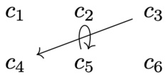
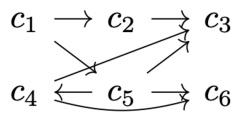
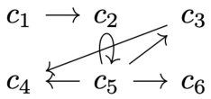
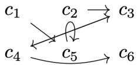
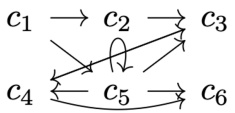
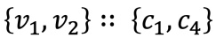
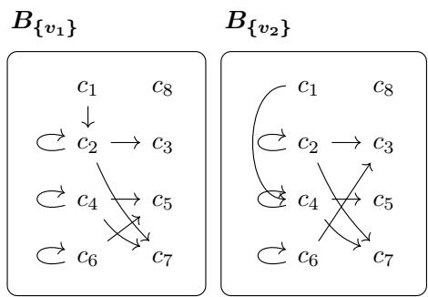
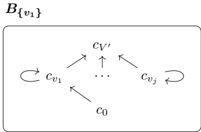
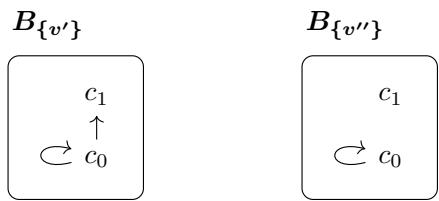

# Multi-Winner Voting with Argumentative Ballots

Ryuta Arisaka<sup>1∗</sup>and Hirotaka Ono<sup>2</sup>

<sup>1</sup> D<sub>epa</sub>rtm<sub>e</sub>nt <sub>o</sub>f Inf<sub>o</sub>rm<sub>a</sub>ti<sub>cs,</sub> K<sub>yo</sub>t<sub>o</sub> Uni<sub>ve</sub>r<sub>s</sub>it<sub>y,</sub> K<sub>yo</sub>t<sub>o,</sub> J<sub>apa</sub>n <sup>2</sup> D<sub>epar</sub>t<sub>men</sub>t <sub>o</sub>f M<sub>a</sub>th<sub>ema</sub>ti<sub>ca</sub>l I<sub>n</sub>f<sub>orma</sub>ti<sub>cs,</sub> N<sub>agoya</sub> U<sub>n</sub>i<sub>vers</sub>it<sub>y,</sub> Ai<sub>c</sub>hi<sub>,</sub> J<sub>apan</sub> ryutaarisaka@gmail.com, ono@i.nagoya-u.ac.jp

## Abstract

We introduce multi-winner voting with argumentative ballots (MVArg) and investigate theoretical properties. As our conceptual contribution, we generalise approval ballots to ar-<sub>gumen</sub>t<sub>a</sub>ti<sub>ve</sub> b<sub>a</sub>ll<sub>o</sub>t<sub>s,</sub> th<sub>ere</sub>b<sub>y a</sub>ll<sub>ow</sub>i<sub>ng vo</sub>t<sub>ers</sub> t<sub>o express</sub> d<sub>e</sub>f<sub>ea-</sub> <sub>s</sub>ibl<sub>e pre</sub>f<sub>erences over can</sub>did<sub>a</sub>t<sub>es.</sub> W<sub>e accor</sub>di<sub>ng</sub>l<sub>y genera</sub>li<sub>se</sub> voter cohesion and justified representation axioms JR, PJR and EJR. As our theoretical contribution, we establish several key results. First, MVArg is strictly more expressive than multi-winner voting with approval ballots (MV). Second, our notions of cohesion and justified representation are conservative generalisations of their counterparts in MV. Third, the MVArg counterpart of JR can always be satisfied, whereas the counterparts of PJR and EJR cannot always be. Fourth, <sub>a</sub>lth<sub>oug</sub>h <sub>ver</sub>if<sub>y</sub>i<sub>ng w</sub>h<sub>e</sub>th<sub>er a w</sub>i<sub>nner se</sub>t <sub>sa</sub>ti<sub>s</sub>fi<sub>es</sub> th<sub>e</sub> MVA<sub>rg</sub> counterpart of JR is already coNP-hard, such a winner set <sub>can</sub> b<sub>e</sub> <sub>cons</sub>t<sub>ruc</sub>t<sub>e</sub>d i<sub>n</sub> <sub>po</sub>l<sub>ynom</sub>i<sub>a</sub>l ti<sub>me.</sub> All d<sub>e</sub>fi<sub>n</sub>iti<sub>ons,</sub> <sub>propo-</sub> <sub>s</sub>iti<sub>ons, aux</sub>ili<sub>ary</sub> l<sub>emmas an</sub>d th<sub>eorems</sub> h<sub>ave</sub> b<sub>een</sub> f<sub>orma</sub>li<sub>se</sub>d <sub>an</sub>d <sub>mec</sub>h<sub>an</sub>i<sub>ca</sub>ll<sub>y</sub> <sub>c</sub>h<sub>ec</sub>k<sub>e</sub>d i<sub>n</sub> L<sub>ean</sub> 4<sub>.</sub>

## 1 Introduction

F<sub>rom</sub> <sub>par</sub>li<sub>amen</sub>t<sub>ary</sub> <sub>e</sub>l<sub>ec</sub>ti<sub>ons</sub> <sub>an</sub>d <sub>par</sub>ti<sub>c</sub>i<sub>pa</sub>t<sub>ory</sub> b<sub>u</sub>d<sub>ge</sub>ti<sub>ng</sub> t<sub>o</sub> <sub>recommen</sub>d<sub>a</sub>ti<sub>on</sub> f<sub>orma</sub>ti<sub>on,</sub> <sub>co</sub>ll<sub>ec</sub>ti<sub>ve</sub> d<sub>ec</sub>i<sub>s</sub>i<sub>on</sub> <sub>ma</sub>ki<sub>ng</sub> <sub>requ</sub>i<sub>res se</sub>l<sub>ec</sub>ti<sub>ng mu</sub>lti<sub>p</sub>l<sub>e w</sub>i<sub>nners.</sub> A <sub>prom</sub>i<sub>nen</sub>t <sub>mo</sub>d<sub>e</sub>l f<sub>or</sub> such tasks is approval-based multi-winner voting, where each <sub>vo</sub>t<sub>er recor</sub>d<sub>s a se</sub>t <sub>o</sub>f <sub>accep</sub>t<sub>a</sub>bl<sub>e can</sub>did<sub>a</sub>t<sub>es an</sub>d <sub>a vo</sub>ti<sub>ng ru</sub>l<sub>e</sub> <sub>aggrega</sub>t<sub>es</sub> th<sub>e resu</sub>lti<sub>ng approva</sub>l <sub>pro</sub>fil<sub>e</sub> i<sub>n</sub>t<sub>o a</sub> fi<sub>xe</sub>d<sub>-s</sub>i<sub>ze se</sub>t <sub>o</sub>f <sub>w</sub>i<sub>nners.</sub>

A <sub>cen</sub>t<sub>ra</sub>l <sub>concern</sub> i<sub>n approva</sub>l<sub>-</sub>b<sub>ase</sub>d <sub>mu</sub>lti<sub>-w</sub>i<sub>nner vo</sub>t<sub>-</sub> ing is proportional representation. Intuitively, a suficiently l<sub>arge se</sub>t <sub>o</sub>f <sub>vo</sub>t<sub>ers</sub> th<sub>a</sub>t <sub>agrees on su</sub>fi<sub>c</sub>i<sub>en</sub>tl<sub>y many can</sub>di<sub>-</sub> d<sub>a</sub>t<sub>es s</sub>h<sub>ou</sub>ld <sub>see</sub> it<sub>s pre</sub>f<sub>erre</sub>d <sub>can</sub>did<sub>a</sub>t<sub>es represen</sub>t<sub>e</sub>d i<sub>n</sub> th<sub>e</sub> <sub>w</sub>i<sub>nn</sub>i<sub>ng se</sub>t<sub>,</sub> i<sub>n propor</sub>ti<sub>on</sub> t<sub>o</sub> th<sub>e group</sub>’<sub>s</sub> d<sub>egree o</sub>f <sub>co</sub>h<sub>e-</sub> <sub>s</sub>i<sub>on.</sub> Thi<sub>s</sub> id<sub>ea</sub> h<sub>as</sub> l<sub>e</sub>d b<sub>o</sub>th t<sub>o me</sub>th<sub>o</sub>d<sub>s</sub> f<sub>or se</sub>l<sub>ec</sub>ti<sub>ng w</sub>i<sub>nner</sub> sets (Lackner and Skowron 2023) and to justified representation axioms, such as JR, PJR and EJR (Aziz et al. 2017; Sánchez-Fernández et al. 2026), which <sub>p</sub>rovide qualitative f<sub>a</sub>i<sub>rness cr</sub>it<sub>er</sub>i<sub>a</sub> f<sub>or eva</sub>l<sub>ua</sub>ti<sub>ng suc</sub>h <sub>me</sub>th<sub>o</sub>d<sub>s.</sub> Th<sub>ese</sub> id<sub>eas</sub> h<sub>ave a</sub>l<sub>so</sub> i<sub>n</sub>fl<sub>uence</sub>d <sub>rea</sub>l <sub>par</sub>ti<sub>c</sub>i<sub>pa</sub>t<sub>ory</sub> b<sub>u</sub>d<sub>ge</sub>ti<sub>ng processes</sub> (Peters and Skowron 2020).

N<sub>o</sub>t<sub>w</sub>ith<sub>s</sub>t<sub>an</sub>di<sub>ng</sub> thi<sub>s</sub> <sub>success,</sub> <sub>a</sub> <sub>recen</sub>t <sub>soc</sub>i<sub>a</sub>l <sub>exper</sub>i<sub>men</sub>t su<sub>gg</sub>ests t<sup>h</sup>at voters <sub>p</sub>erce<sup>i</sup>ve more ex<sub>p</sub>ress<sup>i</sup>ve <sup>i</sup>n<sub>p</sub>ut <sup>f</sup>ormats as better reflectin<sub>g</sub> their <sub>p</sub>references than a<sub>pp</sub>roval votin<sub>g</sub> (Yan<sub>g</sub> et al. 2024). Full rankin<sub>g</sub>s are, of course, unrealistic both com<sub>p</sub>utationall<sub>y</sub> and o<sub>p</sub>erationall<sub>y</sub> in man<sub>y</sub> settin<sub>g</sub>s (Lan<sub>g</sub> and Xia 2016). Nevertheless, findin<sub>g</sub> an alternative format th<sub>a</sub>t <sub>a</sub>ll<sub>ows vo</sub>t<sub>ers</sub> t<sub>o express</sub> th<sub>e</sub>i<sub>r pre</sub>f<sub>erences</sub> i<sub>n more</sub> d<sub>e</sub>t<sub>a</sub>il <sub>rema</sub>i<sub>ns</sub> d<sub>es</sub>i<sub>ra</sub>bl<sub>e.</sub>

With this motivation, we propose argumentative ballots f<sub>or mu</sub>lti<sub>-w</sub>i<sub>nner vo</sub>ti<sub>ng.</sub> Th<sub>e un</sub>d<sub>er</sub>l<sub>y</sub>i<sub>ng pr</sub>i<sub>nc</sub>i<sub>p</sub>l<sub>e</sub> i<sub>s</sub> th<sub>a</sub>t <sub>o</sub>f abstract argumentationframeworks (Dung 1995), originally i<sub>n</sub>t<sub>ro</sub>d<sub>uce</sub>d f<sub>or reason</sub>i<sub>ng a</sub>b<sub>ou</sub>t <sub>argumen</sub>t<sub>a</sub>ti<sub>ve</sub> di<sub>a</sub>l<sub>ogues.</sub> A<sub>n</sub> <sub>a</sub>b<sub>s</sub>t<sub>rac</sub>t <sub>argumen</sub>t<sub>a</sub>ti<sub>on</sub> f<sub>ramewor</sub>k <sub>mo</sub>d<sub>e</sub>l<sub>s argumen</sub>t<sub>a</sub>ti<sub>ve</sub> i<sub>n-</sub> formation as a directed graph of entities. It encodes attack and defence relationships among entities. As a very simple exam<sub>p</sub><sup>l</sup>e, $c _ { 3 }  c _ { 2 }  c _ { 1 }$ ex<sub>p</sub>resses t<sup>h</sup>at $c _ { 3 }$ <sub>a</sub>tt<sub>ac</sub>k<sub>s</sub> $c _ { 2 }$ <sub>w</sub>hi<sub>c</sub>h <sub>a</sub>tt<sub>ac</sub>k<sub>s</sub> $c _ { 1 }$ . Normall<sub>y</sub> (Dun<sub>g</sub> 1995), $c _ { 3 }$ th<sub>en</sub> d<sub>e</sub>f<sub>en</sub>d<sub>s</sub> $c _ { 1 }$ <sub>an</sub>d b<sub>o</sub>th $c _ { 3 }$ <sub>an</sub>d $c _ { 1 }$ (but not $c _ { 2 } )$ are acceptable. In multi-winner <sub>vo</sub>ti<sub>ng w</sub>ith <sub>argumen</sub>t<sub>a</sub>ti<sub>ve</sub> b<sub>a</sub>ll<sub>o</sub>t<sub>s, every vo</sub>t<sub>er rece</sub>i<sub>ves a</sub> b<sub>a</sub>l<sub>-</sub> l<sub>o</sub>t <sub>on</sub> <sub>w</sub>hi<sub>c</sub>h th<sub>e</sub> <sub>can</sub>did<sub>a</sub>t<sub>es</sub> <sub>are</sub> <sub>wr</sub>itt<sub>en.</sub> I<sub>ns</sub>t<sub>ea</sub>d <sub>o</sub>f <sub>mar</sub>ki<sub>ng</sub> <sub>eac</sub>h <sub>can</sub>did<sub>a</sub>t<sub>e</sub> <sub>as</sub> <sub>approve</sub>d <sub>or</sub> <sub>no</sub>t <sub>approve</sub>d <sub>as</sub> i<sub>n</sub> <sub>an</sub> <sub>or</sub>di<sub>nary</sub> <sub>approva</sub>l b<sub>a</sub>ll<sub>o</sub>t<sub>,</sub> th<sub>e</sub> <sub>vo</sub>t<sub>er</sub> <sub>can</sub> d<sub>raw</sub> <sub>arrows</sub> b<sub>e</sub>t<sub>ween</sub> <sub>can</sub>di<sub>-</sub> d<sub>a</sub>t<sub>es</sub> t<sub>o express a</sub>tt<sub>ac</sub>k <sub>c</sub>l<sub>a</sub>i<sub>ms.</sub> A<sub>pprova</sub>l b<sub>y a se</sub>t <sub>o</sub>f <sub>vo</sub>t<sub>ers</sub> i<sub>s</sub> d<sub>e</sub>t<sub>erm</sub>i<sub>ne</sub>d <sub>w</sub>ith <sub>respec</sub>t t<sub>o</sub> th<sub>e</sub> <sub>com</sub>bi<sub>ne</sub>d di<sub>rec</sub>t<sub>e</sub>d <sub>grap</sub>h <sub>o</sub>bt<sub>a</sub>i<sub>ne</sub>d f<sub>rom</sub> th<sub>e</sub>i<sub>r a</sub>tt<sub>ac</sub>k <sub>c</sub>l<sub>a</sub>i<sub>ms.</sub>

$$
\begin{array} { r l } & { \boxed { \begin{array} { l } { \mathrm { A l i c e ' s \ b a l l o t } } \\ { c _ { 3 } \quad \quad c _ { 2 } \longrightarrow c _ { 1 } } \\ { \quad } \end{array} } } \end{array} \qquad \begin{array} { r l } { \qquad } & { \underline { { \mathrm { B o b " s \ b a l l o t } } } } \\ { \qquad } & { \left( \begin{array} { l l } { \phantom { - } c _ { 3 } \longrightarrow c _ { 2 } \quad } & { c _ { 1 } } \\ { \phantom { - } c _ { 3 } \longrightarrow c _ { 2 } \quad } & { c _ { 1 } } \end{array} \right) } \end{array}
$$

With th<sub>ese</sub> t<sub>wo argumen</sub>t<sub>a</sub>ti<sub>ve</sub> b<sub>a</sub>ll<sub>o</sub>t<sub>s,</sub> Ali<sub>ce approves</sub> b<sub>o</sub>th $c _ { 3 }$ <sub>an</sub>d $c _ { 2 }$ b<sub>u</sub>t <sub>no</sub>t $c _ { 1 }$ <sub>.</sub> B<sub>o</sub>b <sub>approves</sub> b<sub>o</sub>th $c _ { 3 }$ <sub>an</sub>d $c _ { 1 }$ b<sub>u</sub>t <sub>no</sub>t $c _ { 2 } .$ <sub>.</sub> C<sub>o</sub>ll<sub>ec</sub>ti<sub>ve</sub>l<sub>y,</sub> Ali<sub>ce an</sub>d B<sub>o</sub>b <sub>approve</sub> $c _ { 3 }$ <sub>an</sub>d $c _ { 1 }$ b<sub>u</sub>t <sub>no</sub>t $c _ { 2 } .$ <sub>.</sub> Th<sub>e correspon</sub>di<sub>ng or</sub>di<sub>nary approva</sub>l b<sub>a</sub>ll<sub>o</sub>t<sub>s wou</sub>ld <sub>y</sub>i<sub>e</sub>ld <sub>co</sub>ll<sub>ec</sub>ti<sub>ve approva</sub>l <sub>on</sub>l<sub>y o</sub>f $c _ { 3 }$ (from the individual a<sub>pp</sub>rovals $\{ c _ { 3 } , c _ { 2 } \}$ <sub>an</sub>d $\{ c _ { 3 } , c _ { 1 } \} )$ <sub>.</sub> S<sub>o, argumen</sub>t<sub>a</sub>ti<sub>ve</sub> b<sub>a</sub>ll<sub>o</sub>t<sub>s a</sub>ll<sub>ow co</sub>l<sub>-</sub> l<sub>ec</sub>ti<sub>ve approva</sub>l<sub>s</sub> t<sub>o</sub> b<sub>e more express</sub>i<sub>ve:</sub> th<sub>e same</sub> i<sub>n</sub>di<sub>v</sub>id<sub>ua</sub>l <sub>approva</sub>l <sub>se</sub>t<sub>s may g</sub>i<sub>ve r</sub>i<sub>se</sub> t<sub>o</sub> dif<sub>eren</sub>t <sub>co</sub>ll<sub>ec</sub>ti<sub>ve approva</sub>l<sub>s</sub> d<sub>epen</sub>di<sub>ng on</sub> th<sub>e un</sub>d<sub>er</sub>l<sub>y</sub>i<sub>ng a</sub>tt<sub>ac</sub>k <sub>an</sub>d d<sub>e</sub>f<sub>ence re</sub>l<sub>a</sub>ti<sub>ons.</sub> Thi<sub>s a</sub>dditi<sub>ona</sub>l <sub>express</sub>i<sub>veness ra</sub>i<sub>ses</sub> th<sub>e cen</sub>t<sub>ra</sub>l <sub>ques</sub>ti<sub>ons o</sub>f this paper: how should voter cohesion and justified repre-<sub>sen</sub>t<sub>a</sub>ti<sub>on</sub> b<sub>e</sub> d<sub>e</sub>fi<sub>ne</sub>d <sub>w</sub>h<sub>en</sub> <sub>approva</sub>l<sub>s</sub> <sub>are</sub> i<sub>n</sub>d<sub>uce</sub>d <sub>argumen</sub>t<sub>a-</sub> ti<sub>ve</sub>l<sub>y, an</sub>d t<sub>o w</sub>h<sub>a</sub>t <sub>ex</sub>t<sub>en</sub>t <sub>are</sub> th<sub>e compu</sub>t<sub>a</sub>ti<sub>ona</sub>l <sub>a</sub>d<sub>van</sub>t<sub>ages</sub> <sub>o</sub>f <sub>approva</sub>l<sub>-</sub>b<sub>ase</sub>d <sub>mu</sub>lti<sub>-w</sub>i<sub>nner</sub> <sub>vo</sub>ti<sub>ng</sub> <sub>preserve</sub>d i<sub>n</sub> thi<sub>s</sub> <sub>se</sub>t<sub>-</sub> ti<sub>ng</sub>?

Aft<sub>er</sub> t<sub>ec</sub>h<sub>n</sub>i<sub>ca</sub>l <sub>pre</sub>li<sub>m</sub>i<sub>nar</sub>i<sub>es</sub> i<sub>n</sub> S<sub>ec</sub>ti<sub>on</sub> 2<sub>,</sub> <sub>we</sub> <sub>ma</sub>k<sub>e</sub> th<sub>e</sub> f<sub>o</sub>ll<sub>ow</sub>i<sub>ng con</sub>t<sub>r</sub>ib<sub>u</sub>ti<sub>ons.</sub>

1. We introduce multi-winner voting with argumentative ballots (MVArg) (Section 3.1).

2. We show that MVArg is a conservative generalisation of the standard approval-based multi-winner voting (MV) (Lackner and Skowron 2023). At the same time, MVArg i<sub>s</sub> <sub>s</sub>t<sub>r</sub>i<sub>c</sub>tl<sub>y</sub> <sub>more</sub> <sub>express</sub>i<sub>ve:</sub> f<sub>or</sub> fi<sub>xe</sub>d i<sub>n</sub>di<sub>v</sub>id<sub>ua</sub>l <sub>approva</sub>l sets, MV determines a unique collective approval outcome, whereas MVArg may induce diferent collective approvals (Section 3.2).

3. We define notions of voter cohesion for MVArg and establish several of their theoretical properties (Section 3.3).

4. We formulate the MVArg counterparts of JR, PJR and EJR (Section 4.1).

5<sub>.</sub> W<sub>e s</sub>h<sub>ow</sub> th<sub>a</sub>t th<sub>ey are conserva</sub>ti<sub>ve genera</sub>li<sub>sa</sub>ti<sub>ons o</sub>f JR, PJR and EJR (Section 4.2). A winner set providing (the fairness defined in) the MVArg’s counterpart of JR always exists. For the MVArg counterparts of PJR and EJR, <sub>we</sub> id<sub>en</sub>tif<sub>y a</sub>dditi<sub>ona</sub>l <sub>co</sub>h<sub>es</sub>i<sub>on cons</sub>t<sub>ra</sub>i<sub>n</sub>t<sub>s</sub> th<sub>a</sub>t <sub>res</sub>t<sub>ore</sub> existence (Section 4.3). Verifying whether a given winner set provides (the fairness defined in) the MVArg counterpart of JR is already coNP-hard, even though such a winner set can be constructed in polynomial time (Section 4.4).

T<sub>ec</sub>h<sub>n</sub>i<sub>ca</sub>ll<sub>y,</sub> <sub>we</sub> i<sub>n</sub>t<sub>ro</sub>d<sub>uce</sub> <sub>a</sub> di<sub>rec</sub>t i<sub>n</sub>d<sub>uc</sub>ti<sub>ve</sub> <sub>cover</sub>i<sub>ng</sub> <sub>argu-</sub> <sub>men</sub>t f<sub>or</sub> th<sub>e ex</sub>i<sub>s</sub>t<sub>ence</sub> th<sub>eorems, w</sub>hi<sub>c</sub>h t<sub>o</sub> th<sub>e</sub> b<sub>es</sub>t <sub>o</sub>f <sub>our</sub> knowledge is a novel proof strategy in the study of justified re<sub>p</sub>resentat<sup>i</sup>on.

T<sub>oge</sub>th<sub>er,</sub> th<sub>ese resu</sub>lt<sub>s s</sub>h<sub>ow w</sub>h<sub>a</sub>t <sub>rema</sub>i<sub>ns va</sub>lid<sub>, w</sub>h<sub>a</sub>t <sub>c</sub>h<sub>anges, an</sub>d <sub>w</sub>h<sub>a</sub>t b<sub>ecomes compu</sub>t<sub>a</sub>ti<sub>ona</sub>ll<sub>y</sub> h<sub>ar</sub>d<sub>er w</sub>h<sub>en</sub> <sub>approva</sub>l b<sub>a</sub>ll<sub>o</sub>t<sub>s are rep</sub>l<sub>ace</sub>d b<sub>y argumen</sub>t<sub>a</sub>ti<sub>ve</sub> b<sub>a</sub>ll<sub>o</sub>t<sub>s.</sub>

A L<sub>ean</sub> 4 f<sub>orma</sub>li<sub>sa</sub>ti<sub>on o</sub>f <sub>a</sub>ll d<sub>e</sub>fi<sub>n</sub>iti<sub>ons, propos</sub>iti<sub>ons</sub> (Pro<sub>p</sub>ositions 1 throu<sub>g</sub>h 7), auxiliar<sub>y</sub> lemmas (Lemmas 1 throu<sub>g</sub>h 3) and theorems (Theorems 1 throu<sub>g</sub>h 8), to-<sub>ge</sub>th<sub>er w</sub>ith th<sub>e accompany</sub>i<sub>ng</sub> J<sub>ava</sub> i<sub>mp</sub>l<sub>emen</sub>t<sub>a</sub>ti<sub>on o</sub>f GreedyGrounded for Theorem 8, is provided as supporting <sub>ma</sub>t<sub>er</sub>i<sub>a</sub>l <sub>w</sub>ith th<sub>e ar</sub>Xi<sub>v su</sub>b<sub>m</sub>i<sub>ss</sub>i<sub>on.</sub>

## Related work

Approval-based multi-winner voting. (Aziz et al. 2017) introduced JR and EJR for approval-based multi-winner voting, and (Sánchez-Fernández et al. 2026) introduced PJR, which li<sub>es</sub> b<sub>e</sub>t<sub>ween</sub> th<sub>em.</sub> Th<sub>ese ax</sub>i<sub>oms</sub> f<sub>orma</sub>li<sub>se group</sub> f<sub>a</sub>i<sub>rness:</sub> <sub>su</sub>fi<sub>c</sub>i<sub>en</sub>tl<sub>y</sub> l<sub>arge groups o</sub>f <sub>vo</sub>t<sub>ers</sub> th<sub>a</sub>t <sub>agree on su</sub>fi<sub>c</sub>i<sub>en</sub>tl<sub>y</sub> <sub>many can</sub>did<sub>a</sub>t<sub>es s</sub>h<sub>ou</sub>ld b<sub>e represen</sub>t<sub>e</sub>d i<sub>n</sub> th<sub>e w</sub>i<sub>nn</sub>i<sub>ng se</sub>t<sub>.</sub> I<sub>n</sub> thi<sub>s c</sub>l<sub>ass</sub>i<sub>ca</sub>l <sub>se</sub>tti<sub>ng, approva</sub>l<sub>s are pr</sub>i<sub>m</sub>iti<sub>ve an</sub>d <sub>co</sub>ll<sub>ec</sub>ti<sub>ve</sub> approvals are monotonic. MVArg difers in that approvals are i<sub>n</sub>d<sub>uce</sub>d b<sub>y vo</sub>t<sub>ers</sub>’ <sub>argumen</sub>t<sub>a</sub>ti<sub>ve</sub> b<sub>a</sub>ll<sub>o</sub>t<sub>s an</sub>d <sub>may</sub> b<sub>ecome</sub> <sub>non-mono</sub>t<sub>on</sub>i<sub>c</sub> <sub>w</sub>h<sub>en</sub> b<sub>a</sub>ll<sub>o</sub>t<sub>s</sub> <sub>are</sub> <sub>com</sub>bi<sub>ne</sub>d<sub>.</sub> J<sub>us</sub>tifi<sub>e</sub>d <sub>repre-</sub> sentation therefore needs to be reformulated for MVArg.

Collective choice and participatory institutions. In instit<sub>u</sub>ti<sub>ona</sub>l <sub>se</sub>tti<sub>ngs suc</sub>h <sub>as par</sub>ti<sub>c</sub>i<sub>pa</sub>t<sub>ory</sub> b<sub>u</sub>d<sub>ge</sub>ti<sub>ng, a</sub> li<sub>m</sub>it<sub>e</sub>d <sub>por</sub>tf<sub>o</sub>li<sub>o</sub> <sub>s</sub>h<sub>ou</sub>ld <sub>prov</sub>id<sub>e</sub> <sub>represen</sub>t<sub>a</sub>ti<sub>on</sub> t<sub>o</sub> <sub>co</sub>h<sub>es</sub>i<sub>ve</sub> <sub>groups</sub> of citizens (Peters and Skowron 2020; Peters, Piercz<sub>y</sub>ński, and Skowron 2021; Brill et al. 2023). A<sub>pp</sub>roval-based models <sub>genera</sub>ll<sub>y</sub> t<sub>rea</sub>t <sub>repor</sub>t<sub>e</sub>d <sub>approva</sub>l<sub>s</sub> <sub>as</sub> <sub>pr</sub>i<sub>m</sub>iti<sub>ve.</sub> I<sub>n</sub> <sub>po</sub>li<sub>cy</sub> d<sub>e-</sub> <sub>c</sub>i<sub>s</sub>i<sub>ons,</sub> h<sub>owever,</sub> <sub>a</sub>lt<sub>erna</sub>ti<sub>ves</sub> <sub>may</sub> b<sub>e</sub> <sub>eva</sub>l<sub>ua</sub>t<sub>e</sub>d <sub>re</sub>l<sub>a</sub>ti<sub>ona</sub>ll<sub>y:</sub> one project may substitute for another (Jain, Sornat, and Talmon 2020), undermine its rationale, or answer an objection to it. MVArg allows for retaining such relations. While our contribution remains axiomatic and computational, MVArg <sub>o</sub>f<sub>ers</sub> <sub>a</sub> f<sub>oun</sub>d<sub>a</sub>ti<sub>on</sub> f<sub>or</sub> <sub>s</sub>t<sub>u</sub>d<sub>y</sub>i<sub>ng</sub> <sub>represen</sub>t<sub>a</sub>ti<sub>on</sub> <sub>w</sub>h<sub>en</sub> <sub>co</sub>ll<sub>ec-</sub> ti<sub>ve eva</sub>l<sub>ua</sub>ti<sub>ons</sub> d<sub>epen</sub>d <sub>on exp</sub>li<sub>c</sub>itl<sub>y repor</sub>t<sub>e</sub>d <sub>reasons.</sub>

Structured and conditional preferences. MVArg is also related to votin<sub>g</sub> in combinatorial domains (Lan<sub>g</sub> and Xia 2016) and conditional <sub>p</sub>reference lan<sub>g</sub>ua<sub>g</sub>es such as CP-nets (Boutilier et al. 2004), where outcomes are structured and <sub>pre</sub>f<sub>erences may</sub> d<sub>epen</sub>d <sub>on re</sub>l<sub>a</sub>ti<sub>ons among</sub> i<sub>ssues or var</sub>i<sub>-</sub> ables. The source of these dependences is diferent in MVArg: d<sub>epen</sub>d<sub>enc</sub>i<sub>es ar</sub>i<sub>se</sub> f<sub>rom a</sub>tt<sub>ac</sub>k <sub>an</sub>d d<sub>e</sub>f<sub>ence re</sub>l<sub>a</sub>ti<sub>ons</sub> i<sub>ns</sub>id<sub>e</sub> <sub>argumen</sub>t<sub>a</sub>ti<sub>ve</sub> b<sub>a</sub>ll<sub>o</sub>t<sub>s, an</sub>d <sub>can</sub>did<sub>a</sub>t<sub>e approva</sub>l<sub>s are</sub> i<sub>n</sub>d<sub>uce</sub>d b<sub>y accep</sub>t<sub>a</sub>bilit<sub>y seman</sub>ti<sub>cs.</sub> S<sub>pec</sub>ifi<sub>ca</sub>ll<sub>y,</sub> i<sub>ns</sub>t<sub>ea</sub>d <sub>o</sub>f <sub>represen</sub>t<sub>-</sub> ing preferences over bundles of candidates, MVArg represents justificatory relations among individually selectable candid<sub>a</sub>t<sub>es.</sub> A<sub>ccep</sub>ti<sub>ng one can</sub>did<sub>a</sub>t<sub>e may un</sub>d<sub>erm</sub>i<sub>ne or</sub> d<sub>e</sub>f<sub>en</sub>d <sub>an-</sub> <sub>o</sub>th<sub>er.</sub> O<sub>ur concern</sub> i<sub>s</sub> th<sub>ere</sub>f<sub>ore no</sub>t <sub>pre</sub>f<sub>erence op</sub>ti<sub>m</sub>i<sub>sa</sub>ti<sub>on</sub> <sub>over s</sub>t<sub>ruc</sub>t<sub>ure</sub>d <sub>ou</sub>t<sub>comes,</sub> b<sub>u</sub>t <sub>propor</sub>ti<sub>ona</sub>l <sub>represen</sub>t<sub>a</sub>ti<sub>on</sub> <sub>w</sub>h<sub>en</sub> th<sub>e accep</sub>t<sub>a</sub>bilit<sub>y o</sub>f <sub>can</sub>did<sub>a</sub>t<sub>es</sub> i<sub>s reason-</sub>d<sub>epen</sub>d<sub>en</sub>t<sub>.</sub>

Argumentation and voting. Abstract argumentation frameworks were introduced b<sub>y</sub> (Dun<sub>g</sub> 1995) as directed <sub>g</sub>ra<sub>p</sub>hs of <sub>argumen</sub>t<sub>s</sub> <sub>an</sub>d <sub>a</sub>tt<sub>ac</sub>k<sub>s,</sub> t<sub>oge</sub>th<sub>er</sub> <sub>w</sub>ith <sub>seman</sub>ti<sub>cs</sub> d<sub>e</sub>t<sub>erm</sub>i<sub>n</sub>i<sub>ng</sub> <sub>accep</sub>t<sub>a</sub>bilit<sub>y.</sub> S<sub>evera</sub>l <sub>wor</sub>k<sub>s com</sub>bi<sub>ne argumen</sub>t<sub>a</sub>ti<sub>on an</sub>d <sub>vo</sub>t<sub>-</sub> in<sub>g</sub>. (Leite and Martins 2011) incor<sub>p</sub>orate <sub>p</sub>ositive and ne<sub>g</sub>ative votes into ar<sub>g</sub>umentation frameworks; (Awad et al. 2017) study judgment aggregation over argument labels in a fixed framework; and (Bernreiter et al. 2024) combine a<sub>pp</sub>roval <sub>vo</sub>ti<sub>ng an</sub>d <sub>a</sub>b<sub>s</sub>t<sub>rac</sub>t <sub>argumen</sub>t<sub>a</sub>ti<sub>on</sub> t<sub>o se</sub>l<sub>ec</sub>t <sub>represen</sub>t<sub>a</sub>ti<sub>ve</sub> <sub>accep</sub>t<sub>a</sub>bl<sub>e</sub> <sub>se</sub>t<sub>s</sub> <sub>o</sub>f <sub>argumen</sub>t<sub>s.</sub> Th<sub>ese</sub> <sub>wor</sub>k<sub>s</sub> l<sub>arge</sub>l<sub>y</sub> <sub>assume</sub> <sub>a</sub> fi<sub>xe</sub>d <sub>un</sub>d<sub>er</sub>l<sub>y</sub>i<sub>ng</sub> <sub>argumen</sub>t<sub>a</sub>ti<sub>on</sub> f<sub>ramewor</sub>k <sub>an</sub>d <sub>pr</sub>i<sub>m</sub>iti<sub>ve</sub> votes or a<sub>pp</sub>rovals over its ar<sub>g</sub>uments. More recentl<sub>y</sub>, (Naoki Susami and R<sub>y</sub>uta Arisaka 2026) have ex<sub>p</sub>licitl<sub>y</sub> assumed l<sub>oca</sub>l <sub>a</sub>b<sub>s</sub>t<sub>rac</sub>t <sub>argumen</sub>t<sub>a</sub>ti<sub>on</sub> f<sub>ramewor</sub>k<sub>s an</sub>d <sub>one g</sub>l<sub>o</sub>b<sub>a</sub>l <sub>a</sub>b<sub>-</sub> <sub>s</sub>t<sub>rac</sub>t <sub>argumen</sub>t<sub>a</sub>ti<sub>on</sub> f<sub>ramewor</sub>k<sub>.</sub> Still<sub>,</sub> th<sub>e</sub>i<sub>r wor</sub>k d<sub>oes no</sub>t materialise collective approvals and its objective remains to filter acceptability semantics. In contrast, MVArg uses an ar-<sub>gumen</sub>t<sub>a</sub>ti<sub>on</sub> f<sub>ramewor</sub>k <sub>as eac</sub>h <sub>vo</sub>t<sub>er</sub>’<sub>s</sub> b<sub>a</sub>ll<sub>o</sub>t<sub>: approva</sub>l<sub>s are</sub> d<sub>er</sub>i<sub>ve</sub>d f<sub>rom</sub> th<sub>ose</sub> b<sub>a</sub>ll<sub>o</sub>t<sub>s, an</sub>d <sub>can</sub> th<sub>ere</sub>f<sub>ore</sub> b<sub>ecome non-</sub> <sub>mono</sub>t<sub>on</sub>i<sub>c un</sub>d<sub>er</sub> b<sub>a</sub>ll<sub>o</sub>t <sub>com</sub>bi<sub>na</sub>ti<sub>on.</sub> R<sub>a</sub>th<sub>er</sub> th<sub>an aggrega</sub>t<sub>-</sub> i<sub>ng eva</sub>l<sub>ua</sub>ti<sub>ons o</sub>f <sub>argumen</sub>t<sub>s w</sub>ithi<sub>n a</sub> fi<sub>xe</sub>d f<sub>ramewor</sub>k<sub>, we</sub> <sub>genera</sub>li<sub>se</sub> <sub>approva</sub>l<sub>-</sub>b<sub>ase</sub>d <sub>mu</sub>lti<sub>-w</sub>i<sub>nner</sub> <sub>vo</sub>ti<sub>ng</sub> b<sub>y</sub> <sub>a</sub>ll<sub>ow</sub>i<sub>ng</sub> <sub>argumen</sub>t<sub>a</sub>ti<sub>on</sub> f<sub>ramewor</sub>k<sub>s as</sub> b<sub>a</sub>ll<sub>o</sub>t<sub>s.</sub>

## 2 Technical Preliminaries

Multi-winner voting and justified representation. Let $V \equiv \{ v _ { 1 } , \ldots , v _ { n } \}$ b<sub>e a se</sub>t <sub>o</sub>f <sub>vo</sub>t<sub>ers,</sub> l<sub>e</sub>t $C \equiv \{ c _ { 1 } , \ldots , c _ { m } \}$ b<sub>e</sub> <sub>a se</sub>t <sub>o</sub>f <sub>can</sub>did<sub>a</sub>t<sub>es,</sub> l<sub>e</sub>t $A \equiv ( A _ { v _ { 1 } } , \ldots , A _ { v _ { n } } )$ <sub>—w</sub>h<sub>ere</sub> $A _ { v _ { i } }$ i<sub>s a</sub> <sub>su</sub>b<sub>se</sub>t <sub>o</sub>f $C -$ be the voters’ approval profile, and let k be the number of winners not greater than |C|. Then, $( V , C , A , k )$ is a multi-winner voting profile. In this paper, ${ \mathfrak { M } } ^ { { \mathfrak { M } } }$ d<sub>eno</sub>t<sub>es</sub> th<sub>e</sub> <sub>se</sub>t <sub>o</sub>f <sub>a</sub>ll <sub>mu</sub>lti<sub>-w</sub>i<sub>nner</sub> <sub>vo</sub>ti<sub>ng</sub> <sub>pro</sub>fil<sub>es.</sub>

L<sub>e</sub>t $A _ { V ^ { \prime } } ^ { \forall }$ d<sub>eno</sub>t<sub>e</sub> $\cap _ { v \in V ^ { \prime } } A _ { v }$ <sub>.</sub> F<sub>or</sub> <sub>any</sub> <sub>su</sub>b<sub>se</sub>t $V ^ { \prime }$ of V and any <sub>can</sub>did<sub>a</sub>t<sub>e</sub> $c \in C , V ^ { \prime }$ approves c if (if and only if) $c \in A _ { V ^ { \prime } } ^ { \forall }$ $\mathsf { S o } , A _ { V } ^ { \forall }$ <sub>′</sub> i<sub>s</sub> th<sub>e</sub> <sub>se</sub>t <sub>o</sub>f <sub>a</sub>ll <sub>can</sub>did<sub>a</sub>t<sub>es</sub> $V ^ { \prime }$ <sup>a</sup>pp<sup>ro</sup>v<sup>es</sup>. <sup>For</sup> <sup>an</sup>y <sub>su</sub>b<sub>se</sub>t $V ^ { \prime } \operatorname { o f } V$ and any positive integer l, $, V ^ { \prime }$ is l-cohesive if $( 1 ) | V ^ { \prime } | \geq l \cdot ( | V | / k )$ <sub>,</sub> <sub>an</sub>d $( 2 ) | A _ { V ^ { \prime } } ^ { \forall } | \geq l .$ 1

<table><tr><td colspan="2">(blank ballot)</td><td rowspan="2"> $\{ v _ { 1 } \} : : \{ c _ { 1 } , c _ { 5 } \}$ </td><td rowspan="2"> $\{ v _ { 2 } \} : : \{ c _ { 1 } , c _ { 2 } , c _ { 4 } \}$ </td><td rowspan="2"> $\{ v _ { 3 } \} : : \ \{ c _ { 1 } , c _ { 2 } , c _ { 3 } , c _ { 6 } \}$ </td></tr><tr><td rowspan="2"></td><td rowspan="2"> $c _ { 1 }$  C2  $c _ { 3 }$ </td><td rowspan="2"></td></tr><tr><td> $c _ { 1 } \longrightarrow c _ { 2 } \qquad c _ { 3 }$  7  $c _ { 4 } \longleftarrow c _ { 5 } \longrightarrow c _ { 6 }$   $c _ { 4 } \xrightarrow [ ] { } c _ { 5 }  c _ { 6 }$ </td><td></td></tr><tr><td></td><td></td><td></td><td></td><td></td></tr><tr><td></td><td></td><td> $\{ v _ { 1 } , v _ { 3 } \} : : \{ c _ { 1 } \}$ </td><td> $\{ v _ { 2 } , v _ { 3 } \} : : \{ c _ { 1 } , c _ { 2 } , c _ { 4 } \}$ </td><td> $\{ v _ { 1 } , v _ { 2 } , v _ { 3 } \} : : \{ c _ { 1 } , c _ { 3 } , c _ { 6 } \}$ </td></tr></table>

Figure 1: The first row from left to right: a blank ballot; $v _ { 1 } \ ' _ { \mathrm { s } }$ b<sub>a</sub>ll<sub>o</sub>t <sub>approv</sub>i<sub>ng</sub> $c _ { 1 }$ <sub>an</sub>d $^ { c _ { 5 } ; }$ v<sub>2</sub>’s ballot approving $c _ { 1 } , c _ { 2 }$ <sub>an</sub>d c ; and $v _ { 3 } \mathrm { ^ { * } s }$ b<sub>a</sub>ll<sub>o</sub>t <sub>approv</sub>i<sub>ng</sub> $c _ { 1 } , c _ { 2 } , c _ { 3 }$ <sub>an</sub>d $c _ { 6 } .$ . The second row from left to right: $\{ v _ { 1 } , v _ { 2 } \} \mathrm { s }$ <sub>co</sub>ll<sub>ec</sub>ti<sub>ve</sub> <sub>approva</sub>l <sub>o</sub>f $c _ { 1 }$ <sub>an</sub>d $c _ { 4 } ; \{ v _ { 1 } , v _ { 3 } \} \} _ { \mathrm { ~ S ~ } }$ <sub>co</sub>ll<sub>ec</sub>ti<sub>ve</sub> <sub>approva</sub>l <sub>o</sub>f $c _ { 1 } ; \{ v _ { 2 } , v _ { 3 } \} \} _ { \mathrm { } }$ <sub>co</sub>ll<sub>ec</sub>ti<sub>ve</sub> <sub>approva</sub>l <sub>o</sub>f $c _ { 1 } , c _ { 2 }$ <sub>an</sub>d $^ { c _ { 4 } ; }$ <sub>an</sub>d $\{ v _ { 1 } , v _ { 2 } , v _ { 3 } \} ^ { \circ } \mathrm { s }$ <sub>co</sub>ll<sub>ec</sub>ti<sub>ve approva</sub>l <sub>o</sub>f $c _ { 1 } , c _ { 3 }$ <sub>an</sub>d $c _ { 6 }$

For an<sub>y</sub> winner set W, which is a subset of C with $| W | =$ k, W satisfies, or, following the terminology in (Aziz et al. 2017), provides:

• JR if<sub>,</sub> for an<sub>y</sub> subset $V ^ { \prime }$ of V, if $V ^ { \prime }$ is 1-cohesive, then th<sub>ere</sub> i<sub>s some</sub> $v \in V ^ { \prime }$ <sub>suc</sub>h th<sub>a</sub>t $| W \cap A _ { \{ v \} } ^ { \forall } | \geq 1$

• PJR if<sub>,</sub> for an<sub>y</sub> subset $V ^ { \prime }$ of V , if $V ^ { \prime }$ is l-cohesive, then $\begin{array} { r } { | W \cap \bigcup _ { v \in V ^ { \prime } } \bar { A } _ { \{ v \} } ^ { \forall } | \geq l . } \end{array}$

• EJR if<sub>,</sub> for an<sub>y</sub> subset $V ^ { \prime }$ of V , if $V ^ { \prime }$ is l-cohesive, then th<sub>ere</sub> i<sub>s some</sub> $\dot { v } \in V ^ { \prime }$ <sub>suc</sub>h th<sub>a</sub>t $| W \cap A _ { \{ v \} } ^ { \forall } | \geq l$

These are justified representation axioms. For $x \in \mathfrak { M } ^ { \mathfrak { M } }$ <sub>,</sub> l<sub>e</sub>t ν be a member of $\{ J \dot { R } , P J R , E J R \}$ <sub>, an</sub>d l<sub>e</sub>t $\nu ( x )$ b<sub>e</sub> th<sub>e se</sub>t of all subsets W of C such that W provides: JR if ν is $J R ;$ PJR if ν is $P J R ;$ and EJR if ν is EJR. Then:

• ∅ ⊂ EJR(x) ⊆ P JR(x) ⊆ JR(x).

• Some member of ν(x) is <sub>p</sub>ol<sub>y</sub>nomial-time com<sub>p</sub>utable.

• Verification of membershi<sub>p</sub> of W in $E J R ( x )$ <sub>, as we</sub>ll <sub>as</sub> th<sub>a</sub>t i<sub>n</sub> $P J R ( x )$ <sub>,</sub> i<sub>s co</sub>NP<sub>-co</sub>m<sub>p</sub>l<sub>e</sub>t<sub>e.</sub>

• Verification of membershi<sub>p</sub> of W in $J R ( x )$ i<sub>s</sub> <sub>po</sub>l<sub>ynom</sub>i<sub>a</sub>l<sub>-</sub>ti<sub>me</sub> d<sub>ec</sub>id<sub>a</sub>bl<sub>e.</sub>

Grounded acceptance in abstract argumentation. Let $( A r g , R )$ be an abstract ar<sub>g</sub>umentation framework (Dun<sub>g</sub> 1995) where Arg is a finite set of entities (called arguments) and R is a subset of Arg × Arg. a attacks a<sup>′</sup> if $( a , \bar { a } ^ { \prime } ) \in R .$ Let Arg<sup>′</sup> be a subset of Arg. Arg<sup>′</sup> is conflict-free if, for any $a _ { 1 } \in A r g ^ { \prime }$ <sub>an</sub>d $a _ { 2 } \in A r g ^ { \prime } , ( a _ { 1 } , a _ { 2 } ) \not \in R$ . Arg<sup>′</sup> defends an <sup>ar</sup>gu<sup>ment</sup> $a \in A r g$ if<sub>,</sub> f<sub>or</sub> <sub>any</sub> $a ^ { \prime } \in A r g ,$ if $( a ^ { \prime } , a ) \in R ,$ th<sub>en</sub> th<sub>ere</sub> i<sub>s some</sub> $\bar { a } ^ { \prime \prime } \in A r g ^ { \prime }$ <sub>suc</sub>h th<sub>a</sub>t $( \smile ^ { \prime \prime } , a ^ { \prime } ) \in \mathring { R } . \ A r g ^ { \prime }$ is admissible if $A r g ^ { \prime }$ i<sub>s</sub> <sub>con</sub>fli<sub>c</sub>t<sub>-</sub>f<sub>ree</sub> <sub>an</sub>d<sub>,</sub> f<sub>or</sub> <sub>any</sub> $a \in A r g ^ { \prime }$ Arg<sup>′</sup> defends a. The grounded extension is then defined as a set o<sup>f</sup> ar<sub>g</sub>uments $A r g ^ { \prime }$ <sub>sa</sub>ti<sub>s</sub>f<sub>y</sub>i<sub>ng</sub> th<sub>e</sub> f<sub>o</sub>ll<sub>ow</sub>i<sub>ng con</sub>diti<sub>ons.</sub>

• Arg′ is admissible and<sub>,</sub> for an<sub>y</sub> ar<sub>g</sub>ument $a \in A r g .$ <sub>,</sub> if Arg<sup>′</sup> defends $^ { a , }$ then a is in $A r { \dot { g } } ^ { \prime }$

$A r g ^ { \prime }$ i<sub>s</sub> th<sub>e</sub> l<sub>eas</sub>t <sub>suc</sub>h <sub>se</sub>t <sub>o</sub>f <sub>argumen</sub>t<sub>s.</sub>

Th<sub>e</sub> f<sub>o</sub>ll<sub>ow</sub>i<sub>ng</sub> f<sub>ac</sub>t<sub>s</sub> h<sub>o</sub>ld f<sub>or</sub> <sub>every</sub> $( A r g , R )$ (Dun<sub>g</sub> 1995).

• Let $\mathcal { P } ( . . . )$ d<sub>eno</sub>t<sub>e</sub> th<sub>e power se</sub>t <sub>o</sub>f $\cdots$ th<sub>e groun</sub>d<sub>e</sub>d <sub>ex</sub>t<sub>en-</sub> <sub>s</sub>i<sub>on</sub> i<sub>s po</sub>l<sub>ynom</sub>i<sub>a</sub>l<sub>-</sub>ti<sub>me compu</sub>t<sub>a</sub>bl<sub>e as</sub> th<sub>e</sub> l<sub>eas</sub>t fi<sub>xpo</sub>i<sub>n</sub>t <sub>o</sub>f $F : { \bar { \mathcal { P } } } ( { \bar { A } } r g ) \to { \mathcal { P } } ( A r g )$ d<sub>e</sub>fi<sub>ne</sub>d <sub>as:</sub> $F ( A r g ^ { \prime } ) = { \bf \bar { \{ } }  a \in$ $A r g \mid A r g ^ { \prime }$ defends a}.

• Ever<sub>y</sub> $( A r g , R )$ h<sub>as a un</sub>i<sub>que groun</sub>d<sub>e</sub>d <sub>ex</sub>t<sub>ens</sub>i<sub>on.</sub>

Other t<sub>yp</sub>es of extensions exist (Baroni and Giacomin 2007), b<sub>u</sub>t i<sub>n genera</sub>l th<sub>ey enco</sub>d<sub>e more</sub> di<sub>spu</sub>t<sub>a</sub>bl<sub>e accep</sub>t<sub>ance, are</sub> <sub>no</sub>t <sub>un</sub>i<sub>que an</sub>d <sub>can</sub> b<sub>e compu</sub>t<sub>a</sub>ti<sub>ona</sub>ll<sub>y more</sub> d<sub>eman</sub>di<sub>ng.</sub>

## 3 Multi-Winner Voting with Argumentative Ballots

## 3.1 Conceptualisation

A<sub>s</sub> b<sub>r</sub>i<sub>e</sub>fl<sub>y</sub> d<sub>escr</sub>ib<sub>e</sub>d i<sub>n</sub> S<sub>ec</sub>ti<sub>on</sub> 1<sub>, argumen</sub>t<sub>a</sub>ti<sub>ve</sub> b<sub>a</sub>ll<sub>o</sub>t<sub>s a</sub>ll<sub>ow</sub> <sub>vo</sub>t<sub>ers</sub> t<sub>o repor</sub>t th<sub>e</sub>i<sub>r a</sub>tt<sub>ac</sub>k <sub>c</sub>l<sub>a</sub>i<sub>ms.</sub>

Example 1 (City projects) . A city receives daily com-<sub>p</sub>l<sub>a</sub>i<sub>n</sub>t<sub>s a</sub>b<sub>ou</sub>t <sub>conges</sub>ti<sub>on on</sub> th<sub>e ma</sub>i<sub>n roa</sub>d b<sub>e</sub>t<sub>ween</sub> Di<sub>s</sub>t<sub>r</sub>i<sub>c</sub>t<sub>s</sub> A and B. It has proposed six projects to mitigate congestion:

c<sub>1</sub> : build a new subway line,

c : widen the main road,

c<sub>3</sub> : build a new tram line,

c<sub>4</sub> : build high-frequency bus lanes,

c<sub>5</sub> : introduce congestion pricing,

$c _ { 6 }$ : build a large parking garage.

Three projects will be selected. Voters $v _ { 1 } , v _ { 2 } , v _ { 3 }$ cast ar-<sub>gumen</sub>t<sub>a</sub>ti<sub>ve</sub> b<sub>a</sub>ll<sub>o</sub>t<sub>s over</sub> th<sub>ese can</sub>did<sub>a</sub>t<sub>es.</sub> A bl<sub>an</sub>k b<sub>a</sub>ll<sub>o</sub>t<sub>,</sub> <sub>s</sub>h<sub>own</sub> i<sub>n</sub> th<sub>e</sub> fi<sub>rs</sub>t <sub>co</sub>l<sub>umn</sub> <sub>o</sub>f th<sub>e</sub> fi<sub>rs</sub>t <sub>row</sub> <sub>o</sub>f Fi<sub>gure</sub> 1<sub>,</sub> <sub>con-</sub> t<sub>a</sub>i<sub>ns</sub> <sub>a</sub>ll <sub>can</sub>did<sub>a</sub>t<sub>es</sub> <sub>an</sub>d <sub>no</sub> <sub>a</sub>tt<sub>ac</sub>k<sub>s;</sub> b<sub>y</sub> d<sub>e</sub>f<sub>au</sub>lt<sub>,</sub> th<sub>ey</sub> <sub>are</sub> <sub>a</sub>ll <sub>ap-</sub> <sub>prove</sub>d<sub>.</sub> B<sub>y</sub> d<sub>raw</sub>i<sub>ng</sub> <sub>arrows,</sub> <sub>vo</sub>t<sub>ers</sub> <sub>supp</sub>l<sub>y</sub> th<sub>e</sub>i<sub>r</sub> <sub>a</sub>tt<sub>ac</sub>k <sub>c</sub>l<sub>a</sub>i<sub>ms.</sub> $c _ { i } \to c _ { j }$ <sub>on</sub> <sub>a</sub> b<sub>a</sub>ll<sub>o</sub>t <sub>spec</sub>ifi<sub>ca</sub>ll<sub>y</sub> <sub>means</sub> th<sub>a</sub>t <sub>accep</sub>t<sub>ance</sub> <sub>o</sub>f $c _ { i }$ <sub>un</sub>d<sub>erm</sub>i<sub>nes</sub> th<sub>e</sub> <sub>case</sub> f<sub>or</sub> $c _ { j }$ <sub>.</sub> Th<sub>e</sub> b<sub>a</sub>ll<sub>o</sub>t<sub>s</sub> b<sub>y</sub> $v _ { 1 } , v _ { 2 }$ <sub>an</sub>d $v _ { 3 }$ are i<sub>n</sub> th<sub>e secon</sub>d<sub>,</sub> thi<sub>r</sub>d <sub>an</sub>d f<sub>our</sub>th <sub>co</sub>l<sub>umns o</sub>f th<sub>e</sub> fi<sub>rs</sub>t <sub>row.</sub>

v : Approves $c _ { 1 }$ <sub>an</sub>d $c _ { 5 }$ <sub>w</sub>ith th<sub>e a</sub>tt<sub>ac</sub>k <sub>c</sub>l<sub>a</sub>i<sub>ms:</sub>

$c _ { 1 }  c _ { 2 } \colon { } ^ { \ast } \mathrm { A }$ <sub>new su</sub>b<sub>way</sub> li<sub>ne un</sub>d<sub>erm</sub>i<sub>nes</sub> th<sub>e case</sub> f<sub>or</sub> <sub>w</sub>id<sub>en</sub>i<sub>ng ma</sub>i<sub>n roa</sub>d<sub>.</sub>”

$c _ { 5 } \right. \{ c _ { 3 } , c _ { 4 } , c _ { 6 } \} \colon ^ { \left. } ($ C<sub>onges</sub>ti<sub>on</sub> <sub>pr</sub>i<sub>c</sub>i<sub>ng</sub> <sub>un</sub>d<sub>erm</sub>i<sub>nes</sub> th<sub>e</sub> <sub>case</sub> f<sub>or a new</sub> t<sub>ram</sub> li<sub>ne,</sub> hi<sub>g</sub>h<sub>-</sub>f<sub>requency</sub> b<sub>us</sub> l<sub>anes an</sub>d <sup>a</sup> <sup>lar</sup>g<sup>e</sup> p<sup>arkin</sup>g g<sup>ara</sup>g<sup>e</sup>.<sup>”</sup>

v<sub>2</sub>: Approves $c _ { 1 } , c _ { 2 }$ <sub>an</sub>d $c _ { 4 }$ <sub>w</sub>ith th<sub>e a</sub>tt<sub>ac</sub>k <sub>c</sub>l<sub>a</sub>i<sub>ms:</sub>

$c _ { 1 }  c _ { 5 } , c _ { 2 }  c _ { 3 }$ <sub>an</sub>d $c _ { 4 }  \{ c _ { 3 } , c _ { 6 } \}$ : (All similarl<sub>y</sub>)

v<sub>3</sub>: Approves $c _ { 1 } , c _ { 2 } , c _ { 3 } , c _ { 6 }$ <sub>w</sub>ith th<sub>e a</sub>tt<sub>ac</sub>k <sub>c</sub>l<sub>a</sub>i<sub>ms:</sub>

$c _ { 3 }  c _ { 4 } \mathrm { : }$ (Similarl<sub>y</sub>)

$c _ { 5 }  c _ { 5 } \colon ^ { 6 \prime }$ Th<sub>e</sub> <sub>case</sub> f<sub>or</sub> <sub>conges</sub>ti<sub>on</sub> <sub>pr</sub>i<sub>c</sub>i<sub>ng</sub> i<sub>s</sub> <sub>uncon</sub>di<sub>-</sub> ti<sub>ona</sub>ll<sub>y un</sub>d<sub>erm</sub>i<sub>ne</sub>d<sub>.</sub>”

E<sub>ac</sub>h <sub>vo</sub>t<sub>er</sub> i<sub>n</sub>di<sub>v</sub>id<sub>ua</sub>ll<sub>y</sub> <sub>approves</sub> th<sub>e</sub> <sub>can</sub>did<sub>a</sub>t<sub>es</sub> i<sub>n</sub> th<sub>e</sub> <sub>groun</sub>d<sub>e</sub>d <sub>ex</sub>t<sub>ens</sub>i<sub>on</sub> <sub>o</sub>f th<sub>e</sub> <sub>correspon</sub>di<sub>ng</sub> <sub>argumen</sub>t<sub>a</sub>ti<sub>on</sub> f<sub>ramewor</sub>k<sub>.</sub> F<sub>or a se</sub>t <sub>o</sub>f <sub>vo</sub>t<sub>ers,</sub> th<sub>e a</sub>tt<sub>ac</sub>k <sub>c</sub>l<sub>a</sub>i<sub>ms</sub> i<sub>n</sub> th<sub>e</sub>i<sub>r</sub> b<sub>a</sub>l<sub>-</sub> l<sub>o</sub>t<sub>s</sub> <sub>are</sub> <sub>poo</sub>l<sub>e</sub>d t<sub>oge</sub>th<sub>er,</sub> <sub>an</sub>d th<sub>e</sub> <sub>group</sub> <sub>co</sub>ll<sub>ec</sub>ti<sub>ve</sub>l<sub>y</sub> <sub>approves</sub> th<sub>e can</sub>did<sub>a</sub>t<sub>es</sub> i<sub>n</sub> th<sub>e groun</sub>d<sub>e</sub>d <sub>ex</sub>t<sub>ens</sub>i<sub>on o</sub>f th<sub>e com</sub>bi<sub>ne</sub>d f<sub>ramewor</sub>k<sub>, as s</sub>h<sub>own</sub> i<sub>n</sub> th<sub>e secon</sub>d <sub>row.</sub>

Thi<sub>s</sub> <sub>pro</sub>d<sub>uces</sub> <sub>non-mono</sub>t<sub>on</sub>i<sub>c</sub> <sub>co</sub>ll<sub>ec</sub>ti<sub>ve</sub> <sub>approva</sub>l<sub>s.</sub> F<sub>or</sub> exam<sub>p</sub><sup>l</sup>e, voter $v _ { 1 }$ a<sup>l</sup>one <sup>d</sup>oes not a<sub>pp</sub>rove $c _ { 4 } ,$ b<sub>ecause</sub> $v _ { 1 }$ <sup>a</sup>p<sup>-</sup> p<sup>ro</sup>v<sup>es</sup> $c _ { 5 }$ <sub>an</sub>d $c _ { 5 }$ <sub>a</sub>tt<sub>ac</sub>k<sub>s</sub> $c _ { 4 } .$ <sub>.</sub> H<sub>owever,</sub> i<sub>n</sub> th<sub>e</sub> <sub>com</sub>bi<sub>ne</sub>d b<sub>a</sub>ll<sub>o</sub>t <sub>o</sub>f $\{ v _ { 1 } , v _ { 2 } \} , c _ { 1 }$ i<sub>s approve</sub>d <sub>an</sub>d $c _ { 1 }$ attacks c . The attack claim $c _ { 5 }  c _ { 4 }$ i<sub>s</sub> th<sub>ere</sub>f<sub>ore</sub> <sub>neu</sub>t<sub>ra</sub>li<sub>se</sub>d<sub>,</sub> <sub>an</sub>d $c _ { 4 }$ <sup>b</sup>ecomes a<sub>pp</sub>rove<sup>d</sup> <sup>b</sup><sub>y</sub> $\{ v _ { 1 } , v _ { 2 } \}$ <sub>.</sub> I<sub>n o</sub>th<sub>er wor</sub>d<sub>s, a</sub>ddi<sub>ng a vo</sub>t<sub>er</sub>’<sub>s</sub> b<sub>a</sub>ll<sub>o</sub>t <sub>can</sub> t<sub>urn</sub> <sub>a prev</sub>i<sub>ous</sub>l<sub>y non-approve</sub>d <sub>can</sub>did<sub>a</sub>t<sub>e</sub> i<sub>n</sub>t<sub>o an approve</sub>d <sub>one.</sub> Thi<sub>s</sub> i<sub>s</sub> i<sub>mposs</sub>ibl<sub>e</sub> i<sub>n</sub> <sub>s</sub>t<sub>an</sub>d<sub>ar</sub>d <sub>approva</sub>l b<sub>a</sub>ll<sub>o</sub>t<sub>s,</sub> <sub>w</sub>h<sub>ere</sub> <sub>ap-</sub> <sub>prova</sub>l<sub>s are pr</sub>i<sub>m</sub>iti<sub>ve an</sub>d d<sub>o no</sub>t <sub>c</sub>h<sub>ange w</sub>h<sub>en</sub> b<sub>a</sub>ll<sub>o</sub>t<sub>s are</sub> <sub>com</sub>bi<sub>ne</sub>d<sub>.</sub> ♠

We now formalise this intuition by defining argumentative voting profiles and approvals.

Definition 1 (Argumentative voting profile) Let $V \equiv$ $\{ v _ { 1 } , \ldots , v _ { n } \}$ b<sub>e a se</sub>t <sub>o</sub>f <sub>vo</sub>t<sub>ers</sub> l<sub>e</sub>t $\bar { C } \equiv \{ c _ { 1 } , \ldots , c _ { m } \}$ b<sub>e a</sub> <sub>se</sub>t <sub>o</sub>f <sub>can</sub>did<sub>a</sub>t<sub>es, an</sub>d l<sub>e</sub>t $B \equiv ( B _ { \{ v _ { 1 } \} } , \ldots , B _ { \{ v _ { n } \} } ) \ / .$ <sub>—w</sub>h<sub>ere</sub> $B _ { \{ v _ { i } \} }$ i<sub>s</sub> <sub>an</sub> <sub>a</sub>b<sub>s</sub>t<sub>rac</sub>t <sub>argumen</sub>t<sub>a</sub>ti<sub>on</sub> f<sub>ramewor</sub>k $\left( C , R _ { v _ { i } } \right)$ <sub>—</sub>b<sub>e</sub> voters’ argumentative ballots, and let k be the number of winners not greater than |C|. Then, $( V , C , B , k )$ is an argumentative voting $_ { p r o f i l e . } \dot { \mathfrak { M } } ^ { \mathfrak { 2 1 } }$ d<sub>eno</sub>t<sub>es</sub> th<sub>e</sub> <sub>se</sub>t <sub>o</sub>f <sub>a</sub>ll <sub>argumen</sub>t<sub>a</sub>ti<sub>ve</sub> <sub>vo</sub>ti<sub>ng</sub> <sub>pro</sub>fil<sub>es.</sub> ♣

Example 1 gives rise to an argumentative voting profile $( \{ v _ { 1 } , \bar { v } _ { 2 } , v _ { 3 } \} , \{ c _ { 1 } , . . . , c _ { 6 } \} , B , 3 )$ where B is as given in the second, third andfourth columns ofthefirst row in Figure 1.

U<sub>n</sub>l<sub>ess s</sub>t<sub>a</sub>t<sub>e</sub>d <sub>o</sub>th<sub>erw</sub>i<sub>se, we</sub> fi<sub>x an ar</sub>bit<sub>rary argumen</sub>t<sub>a</sub>ti<sub>ve</sub> <sub>vo</sub>ti<sub>ng</sub> <sub>pro</sub>fil<sub>e</sub> $( V , C , B , k )$ <sub>.</sub> Wh<sub>en we wr</sub>it<sub>e</sub> ${ \bar { V } } ,$ it i<sub>s</sub> th<sub>e</sub> fi<sub>rs</sub>t <sub>componen</sub>t <sub>o</sub>f th<sub>e</sub> <sub>argumen</sub>t<sub>a</sub>ti<sub>ve</sub> <sub>vo</sub>ti<sub>ng</sub> <sub>pro</sub>fil<sub>e,</sub> <sub>an</sub>d <sub>s</sub>i<sub>m</sub>il<sub>ar</sub>l<sub>y</sub> f<sub>or</sub> <sub>a</sub>ll <sub>o</sub>th<sub>er</sub> <sub>sym</sub>b<sub>o</sub>l<sub>s.</sub>

Definition 2 (Approvals in argumentative voting profile) F<sub>or</sub> <sub>any</sub> <sub>su</sub>b<sub>se</sub>t ${ \hat { V } } ^ { \prime }$ <sub>o</sub>f $V$ <sub>an</sub>d <sub>any</sub> <sub>can</sub>did<sub>a</sub>t<sub>e</sub> $c \in \breve { C } , V ^ { \prime }$ approves c if c is in the grounded extension of $( C , \bigcup _ { v \in V ^ { \prime } } \bar { R _ { v } } )$ $B _ { V } ^ { \forall }$ <sub>′</sub> d<sub>eno</sub>t<sub>es</sub> th<sub>e se</sub>t <sub>o</sub>f <sub>a</sub>ll <sub>can</sub>did<sub>a</sub>t<sub>es approve</sub>d b<sub>y</sub> $\bar { V ^ { \prime } } . \quad \clubsuit$ In Example 1, $B _ { \{ v _ { 1 } \} } ^ { \forall }$ is $\{ c _ { 1 } , c _ { 5 } \} , \ B _ { \{ v _ { 2 } \} } ^ { \forall }$ is $\{ c _ { 1 } , c _ { 2 } , c _ { 4 } \}$ $B _ { \{ v _ { 1 } , v _ { 2 } \} } ^ { \forall } \ i s \ \{ c _ { 1 } , c _ { 4 } \} , \ B _ { \{ v _ { 1 } , v _ { 2 } , v _ { 3 } \} } ^ { \forall }$ is $\{ c _ { 1 } , c _ { 3 } , c _ { 6 } \}$ with the $r e \mathrm { - }$ maining collective approvals shown in Figure 1.

## 3.2 Relationship between $\mathfrak { M } ^ { \mathfrak { M } }$ and $\mathfrak { M } ^ { \mathfrak { A } }$

A <sub>mu</sub>lti<sub>-w</sub>i<sub>nner</sub> <sub>vo</sub>ti<sub>ng</sub> <sub>pro</sub>fil<sub>e</sub> i<sub>s</sub> <sub>enco</sub>d<sub>e</sub>d i<sub>n</sub>t<sub>o</sub> $\mathfrak { M } ^ { \mathfrak { A } }$ p<sup>reser</sup>v<sup>in</sup>g <sup>a</sup>pp<sup>ro</sup>v<sup>als</sup>.

Proposition 1 (Approval-preserving transformation) There is some function $\tau : { \mathfrak { M } } ^ { \mathfrak { M } } \to { \mathfrak { M } } ^ { { \mathfrak { A } } }$ such that, for any $( V , C , A , k ) \in \mathfrak { M } ^ { \mathfrak { M } } , \tau ( V , C , A , k ) = ( V , C , B , k )$ (for some B) and that $A _ { V ^ { \prime } } ^ { \forall } = B _ { V } ^ { \forall }$ <sub>′</sub> for any non-empty subset $\bar { V } ^ { \prime } o f V$

τ can be instantiated in many ways, but $( B _ { \{ v _ { 1 } \} } , \ldots , B _ { \{ v _ { | V | } \} } )$ <sub>w</sub>h<sub>ere</sub> $B _ { \{ v _ { i } \} }$ i<sub>s</sub> $( C , \{ ( c , c ) \mid c \not \in A _ { v _ { i } } \} )$ i<sub>s one o</sub>f th<sub>e s</sub>i<sub>mp</sub>l<sub>es</sub>t<sub>.</sub> I<sub>n</sub> thi<sub>s</sub> i<sub>ns</sub>t<sub>an</sub>ti<sub>a</sub>ti<sub>on,</sub> <sub>an</sub> <sub>uncon</sub>diti<sub>ona</sub>l <sub>non-approva</sub>l <sub>on</sub> th<sub>e</sub> <sub>s</sub>t<sub>an</sub>d<sub>ar</sub>d <sub>approva</sub>l b<sub>a</sub>ll<sub>o</sub>t i<sub>s a se</sub>lf<sub>-</sub>l<sub>oop aroun</sub>d th<sub>e can</sub>did<sub>a</sub>t<sub>e.</sub>

Continuing Example 1, let $( \{ v _ { 1 } , v _ { 2 } , v _ { 3 } \}$ $\{ c _ { 1 } , \ldots , c _ { 6 } \} , A , 3 )$ be such that, for any $v \in \{ v _ { 1 } , v _ { 2 } , v _ { 3 } \}$ $\begin{array} { r l r } { A _ { \{ v \} } ^ { \forall } } & { { } = } & { B _ { \{ v \} } ^ { \forall } } \end{array}$ . The above concrete τ returns $( \{ v _ { 1 } , v _ { 2 } , v _ { 3 } \} , \{ c _ { 1 } , . . . , c _ { 6 } \} , B ^ { \prime } , 3 )$ where $B ^ { \prime }$ comprises thefollowing argumentative ballots.

$$
\begin{array}{c} \begin{array} { r l } & { \underbrace { B _ { \{ v _ { 1 } \} } ^ { \prime } } _ { \begin{array} { l } { c _ { 1 } } \\ { c _ { 2 } } \\ { c _ { 3 } } \end{array} } \underbrace { c _ { 2 } \overbrace { \wp } } _ { \begin{array} { l } { c _ { 4 } } \\ { c _ { 5 } } \end{array} } } \end{array} ) ( \begin{array} { l l l } { \begin{array} { l l l } { B _ { \{ v _ { 2 } \} } ^ { \prime } } & & { B _ { \{ v _ { 3 } \} } ^ { \prime } } & \\ { c _ { 1 } } & { c _ { 2 } } & \\ { c _ { 3 } } \end{array} } \\ { \begin{array} { l l l } { c _ { 5 } } & { c _ { 4 } } & { \Rightarrow } \\ { c _ { 5 } } \end{array} } & { c _ { 6 } } \end{array} ) ( \begin{array} { l l l } { c _ { 1 } } & & { c _ { 2 } } \\ & { c _ { 3 } } & \\ { c _ { 5 } } & { c _ { 4 } } & \\ { c _ { 5 } } \end{array} )  \end{array}
$$

It holds that $B _ { \{ v \} } ^ { \prime \forall } = A _ { \{ v \} } ^ { \forall }$

Thi<sub>s</sub> <sub>approva</sub>l<sub>-preserv</sub>i<sub>ng</sub> t<sub>rans</sub>f<sub>orma</sub>ti<sub>on</sub> <sub>o</sub>f<sub>ers</sub> <sub>an</sub> <sub>argu-</sub> <sub>men</sub>t<sub>a</sub>ti<sub>ve</sub> i<sub>n</sub>t<sub>erpre</sub>t<sub>a</sub>ti<sub>on o</sub>f b<sub>a</sub>ll<sub>o</sub>t <sub>com</sub>bi<sub>na</sub>ti<sub>on</sub> i<sub>n</sub> ${ \mathfrak { M } } ^ { { \mathfrak { M } } }$ <sub>: co</sub>l<sub>-</sub> l<sub>ec</sub>ti<sub>ve approva</sub>l b<sub>y a se</sub>t <sub>o</sub>f <sub>vo</sub>t<sub>ers</sub> i<sub>s</sub> th<sub>e resu</sub>lt <sub>o</sub>f <sub>poo</sub>li<sub>ng</sub> th<sub>e</sub> <sub>a</sub>tt<sub>ac</sub>k <sub>c</sub>l<sub>a</sub>i<sub>ms</sub> i<sub>n</sub> th<sub>e</sub>i<sub>r</sub> b<sub>a</sub>ll<sub>o</sub>t<sub>s</sub> <sub>an</sub>d <sub>o</sub>bt<sub>a</sub>i<sub>n</sub>i<sub>ng</sub> <sub>approve</sub>d <sub>can</sub>di<sub>-</sub> d<sub>a</sub>t<sub>es</sub> i<sub>n</sub> th<sub>e resu</sub>lti<sub>ng</sub> f<sub>ramewor</sub>k<sub>.</sub> A<sub>ggrega</sub>ti<sub>on o</sub>f <sub>a</sub>tt<sub>ac</sub>k<sub>s</sub> b<sub>y</sub> <sub>un</sub>i<sub>on</sub> <sub>repro</sub>d<sub>uces</sub> <sub>exac</sub>tl<sub>y</sub> th<sub>e</sub> <sub>co</sub>ll<sub>ec</sub>ti<sub>ve</sub> <sub>approva</sub>l<sub>s</sub> i<sub>n</sub> $\mathfrak { M } ^ { \mathfrak { M } }$

A<sub>s</sub> f<sub>or</sub> <sub>mono</sub>t<sub>on</sub>i<sub>c</sub>it<sub>y</sub> <sub>o</sub>f <sub>co</sub>ll<sub>ec</sub>ti<sub>ve</sub> <sub>approva</sub>l<sub>s</sub> i<sub>n</sub> $\mathfrak { M } ^ { \mathfrak { M } }$ :

Fact 1 (Approval monotonicity in ${ \mathfrak { M } } ^ { { \mathfrak { M } } } )$ Let $( V , C , A , k )$ be a multi-winner voting profile in ${ \mathfrak { M } } ^ { \mathfrak { M } } . \ H V _ { 1 } ^ { \prime }$ and V<sup>′</sup> are non-empty subsets of V and $i f V _ { 1 } ^ { \prime } \subseteq V _ { 2 } ^ { \prime }$ , then $\dot { A } _ { V _ { 2 } ^ { \prime } } ^ { \forall } \subseteq \dot { A } _ { V _ { 1 } ^ { \prime } } ^ { \forall }$

τ preserves it in $\mathfrak { M } ^ { \mathfrak { A } }$ <sub>,</sub> b<sub>u</sub>t<sub>, as ev</sub>id<sub>ence</sub>d i<sub>n</sub> Fi<sub>gure</sub> 1<sub>,</sub> it i<sub>s no</sub>t th<sub>e</sub> un<sup>i</sup>versa<sup>l</sup> <sub>p</sub>ro<sub>p</sub>ert<sub>y</sub> o<sup>f</sup> $\mathfrak { M } ^ { \mathfrak { A } }$ <sub>.</sub> I<sub>n</sub> f<sub>ac</sub>t<sub>,</sub> f<sub>or some argumen</sub>t<sub>a</sub>ti<sub>ve</sub> <sub>vo</sub>ti<sub>ng pro</sub>fil<sub>e, approva</sub>l <sub>se</sub>t<sub>s can s</sub>t<sub>r</sub>i<sub>c</sub>tl<sub>y grow</sub> i<sub>n s</sub>i<sub>ze</sub> $e . g .$ $B _ { \{ v _ { 1 } , v _ { 3 } \} } ^ { \forall } \subset B _ { \{ v _ { 1 } , v _ { 2 } , v _ { 3 } \} } ^ { \forall }$ in Figure 1, for some, they can shrink i<sub>n s</sub>i<sub>ze, an</sub>d f<sub>or some o</sub>th<sub>er,</sub> th<sub>e s</sub>i<sub>ze o</sub>f <sub>approva</sub>l <sub>se</sub>t<sub>s s</sub>t<sub>ays</sub> th<sub>e</sub> same but their members change e.g. $B _ { \{ v _ { 1 } \} } ^ { \forall } \neq B _ { \{ v _ { 1 } , v _ { 2 } \} } ^ { \forall }$ but $| B _ { \{ v _ { 1 } \} } ^ { \forall } | = | B _ { \{ v _ { 1 } , v _ { 2 } \} } ^ { \forall } | = 2 .$

Proposition 2 (No bijection) There is no function $\tau ^ { \prime } :$ ${ \mathfrak { M } } ^ { 2 1 ^ { \bullet } } \to { \mathfrak { M } } ^ { \mathfrak { M } }$ such that, for any $( V , C , \bar { B } , k ) \ \in \ \mathfrak { M } ^ { \mathfrak { A } }$ $\tau ^ { \prime } ( V , C , B , k )$ is $( V , C , A , \dot { k } )$ (for some A) and that $B _ { V ^ { \prime } } ^ { \forall } =$ $A _ { V } ^ { \forall } ,$ <sub>′</sub> for any non-empty subset $V ^ { \prime } o f V .$

P<sub>ropos</sub>iti<sub>on</sub> 2 <sub>c</sub>l<sub>ar</sub>ifi<sub>es</sub> th<sub>e</sub> <sub>sense</sub> i<sub>n</sub> <sub>w</sub>hi<sub>c</sub>h $\mathfrak { M } ^ { \mathfrak { A } }$ i<sub>s</sub> <sub>more</sub> <sub>ex-</sub> <sub>press</sub>i<sub>ve</sub> th<sub>an</sub> $\mathfrak { M } ^ { \mathfrak { M } }$ <sub>.</sub> I<sub>n</sub> ${ \mathfrak { M } } ^ { { \mathfrak { M } } }$ <sub>, once</sub> th<sub>e</sub> i<sub>n</sub>di<sub>v</sub>id<sub>ua</sub>l <sub>approva</sub>l <sub>se</sub>t<sub>s</sub> <sub>are</sub> fi<sub>xe</sub>d<sub>,</sub> th<sub>e co</sub>ll<sub>ec</sub>ti<sub>ve approva</sub>l <sub>o</sub>f <sub>every vo</sub>t<sub>er se</sub>t i<sub>s</sub> fi<sub>xe</sub>d <sub>as</sub> th<sub>e</sub>i<sub>r</sub> i<sub>n</sub>t<sub>ersec</sub>ti<sub>on.</sub> I<sub>n</sub> $\mathfrak { M } ^ { \sharp }$ <sub>,</sub> b<sub>y</sub> <sub>con</sub>t<sub>ras</sub>t<sub>,</sub> t<sub>wo</sub> <sub>vo</sub>ti<sub>ng</sub> <sub>pro</sub>fil<sub>es</sub> <sub>may</sub> i<sub>n</sub>d<sub>uce</sub> th<sub>e</sub> <sub>same</sub> i<sub>n</sub>di<sub>v</sub>id<sub>ua</sub>l <sub>approva</sub>l<sub>s</sub> b<sub>u</sub>t dif<sub>eren</sub>t <sub>co</sub>l<sub>-</sub> l<sub>ec</sub>ti<sub>ve approva</sub>l<sub>s,</sub> b<sub>ecause a</sub>tt<sub>ac</sub>k<sub>s</sub> f<sub>rom</sub> dif<sub>eren</sub>t b<sub>a</sub>ll<sub>o</sub>t<sub>s can</sub> i<sub>n</sub>t<sub>erac</sub>t th<sub>roug</sub>h d<sub>e</sub>f<sub>ence a</sub>ft<sub>er com</sub>bi<sub>na</sub>ti<sub>on.</sub> A<sub>rgumen</sub>t<sub>a</sub>ti<sub>ve</sub> b<sub>a</sub>ll<sub>o</sub>t<sub>s</sub> th<sub>ere</sub>f<sub>ore re</sub>t<sub>a</sub>i<sub>n re</sub>l<sub>a</sub>ti<sub>ona</sub>l i<sub>n</sub>f<sub>orma</sub>ti<sub>on</sub> th<sub>a</sub>t i<sub>s</sub> l<sub>os</sub>t i<sub>n</sub> <sub>or</sub>di<sub>nary</sub> b<sub>a</sub>ll<sub>o</sub>t<sub>s.</sub> P<sub>ropos</sub>iti<sub>ons</sub> 1 <sub>an</sub>d 2 t<sub>oge</sub>th<sub>er</sub> <sub>s</sub>h<sub>ow</sub> th<sub>a</sub>t $\mathfrak { M } ^ { \mathfrak { A } }$ <sub>repro</sub>d<sub>uces every mu</sub>lti<sub>-w</sub>i<sub>nner vo</sub>ti<sub>ng pro</sub>fil<sub>e w</sub>hil<sub>e a</sub>l<sub>so a</sub>d<sub>-</sub> <sub>m</sub>itti<sub>ng co</sub>ll<sub>ec</sub>ti<sub>ve-approva</sub>l <sub>pa</sub>tt<sub>erns</sub> th<sub>a</sub>t <sub>are no</sub>t <sub>rea</sub>li<sub>se</sub>d i<sub>n</sub> $\mathfrak { M } ^ { \mathfrak { M } }$

## 3.3 Argumentative cohesion and $( l , m , n )$ -cohesion

W<sub>e now</sub> f<sub>ormu</sub>l<sub>a</sub>t<sub>e</sub> th<sub>e no</sub>ti<sub>ons o</sub>f <sub>co</sub>h<sub>es</sub>i<sub>on</sub> i<sub>n</sub> $\mathcal { M } ^ { \mathfrak { A } }$ <sub>.</sub> I<sub>n or-</sub> di<sub>nary</sub> <sub>approva</sub>l <sub>vo</sub>ti<sub>ng,</sub> <sub>co</sub>h<sub>es</sub>i<sub>on</sub> i<sub>s</sub> h<sub>ere</sub>dit<sub>ary:</sub> if <sub>a</sub> <sub>se</sub>t <sub>o</sub>f voters collectively approves at least l candidates, then ever<sub>y</sub> non-em<sub>p</sub>t<sub>y</sub> su<sup>b</sup>set a<sup>l</sup>so <sup>d</sup>oes so. <sup>A</sup>r<sub>g</sub>umentat<sup>i</sup>ve a<sub>pp</sub>rova<sup>l</sup>s <sub>are non-mono</sub>t<sub>on</sub>i<sub>c, so</sub> thi<sub>s</sub> h<sub>ere</sub>dit<sub>ary proper</sub>t<sub>y may</sub> f<sub>a</sub>il<sub>.</sub> W<sub>e</sub> therefore measure cohesion by how widely approval of l <sub>can</sub>did<sub>a</sub>t<sub>es pers</sub>i<sub>s</sub>t<sub>s across</sub> th<sub>e se</sub>t’<sub>s su</sub>b<sub>se</sub>t<sub>s.</sub> W<sub>e ma</sub>k<sub>e</sub> th<sub>e</sub> f<sub>o</sub>l<sub>-</sub> lowing observation about l-cohesion in $( V , C , A , k ) \in { \mathfrak { M } } ^ { \mathfrak { M } }$ if $V ^ { \prime } \subseteq V$ is l-cohesive, there are at least $2 ^ { l \cdot ( | V | / k ) } - 1$ di<sub>s-</sub> ti<sub>nc</sub>t <sub>su</sub>b<sub>se</sub>t<sub>s</sub> <sub>o</sub>f $V ^ { \prime }$ <sub>suc</sub>h th<sub>a</sub>t<sub>,</sub> f<sub>or</sub> <sub>eac</sub>h $V ^ { \prime \prime }$ <sub>o</sub>f th<sub>em,</sub> $| A _ { V ^ { \prime \prime } } ^ { \forall } | \geq l .$ S<sub>o,</sub> th<sub>e</sub> k<sub>ey</sub> id<sub>ea</sub> i<sub>s</sub> t<sub>o</sub> <sub>s</sub>hift <sub>our</sub> f<sub>ocus</sub> t<sub>o</sub> <sub>su</sub>fi<sub>c</sub>i<sub>en</sub>tl<sub>y</sub> <sub>agree</sub>i<sub>ng</sub> subsets. With this insight, we define l-eligibility.

Definition 3 (l-eligibility) Let $V ^ { \prime }$ be a subset of V. V<sup>′</sup> is leligible if $V ^ { \prime }$ <sup>i</sup>s non-em<sub>p</sub>t<sub>y</sub> an<sup>d</sup> $| B _ { V ^ { \prime } } ^ { \forall } | \geq l .$ By eligible $( l , V ^ { \prime } )$ we denote the set of all l-eligible subsets of $V ^ { , } , \bar { i } . e . \mathrm { ~ } \dot { \left\{ V ^ { \prime \prime } \subseteq \right. }$ $V ^ { \prime } \mid V ^ { \prime \prime }$ is l-eligible}. ♣

In Example $I , \{ v _ { 1 } \}$ is 1- and $2 \AA - e l i g i b l e \mathrm { - } o r$ up to $2 - e l i g i b l e$ $\{ v _ { 1 } , v _ { 3 } \}$ is 1-eligible. $\{ v _ { 1 } , v _ { 2 } , v _ { 3 } \}$ is up to 3-eligible. Generally, $V ^ { j }$ is up to $B _ { V ^ { \prime } } ^ { \forall } | \dot { - e l i g i b l e }$

We now formulate argumentative l-cohesion based on the <sub>coun</sub>t<sub>s o</sub>f <sub>e</sub>li<sub>g</sub>ibl<sub>e se</sub>t<sub>s:</sub>

Definition 4 (Argumentative l-cohesion) Let $V ^ { \prime }$ b<sub>e a su</sub>b<sub>-</sub> set of V, let $\mathcal { P } ( \bar { V } ^ { \prime } )$ b<sub>e</sub> th<sub>e se</sub>t <sub>o</sub>f <sub>a</sub>ll <sub>su</sub>b<sub>se</sub>t<sub>s o</sub>f $V ^ { \prime }$ <sub>, an</sub>d l<sub>e</sub>t l be a positive integer. V<sup>′</sup> $V ^ { \prime }$ is argumentative l-cohesive if th<sub>ere ex</sub>i<sub>s</sub>t<sub>s a su</sub>b<sub>se</sub>t ${ \bf { \bar { \boldsymbol { V } } } } ^ { \prime \prime }$ <sub>o</sub>f $V ^ { \prime }$ <sub>suc</sub>h th<sub>a</sub>t $V ^ { \prime \prime }$ is l-eligible and |eligible $( l , V ^ { \prime \prime } ) | \ge 2 ^ { l \cdot | V | / k } - 1$ ♣

The number of winners $( = k )$ is 3 in Example 1.

• Any non-empty subset of $\{ v _ { 1 } , v _ { 2 } , v _ { 3 } \}$ is argumentative 1-cohesive.

$\{ v _ { 1 } , v _ { 2 } \} , \{ v _ { 2 } , v _ { 3 } \}$ and $\{ v _ { 1 } , v _ { 2 } , v _ { 3 } \}$ are argumentative 2- cohesive. The others are not.

The size requirement that a l-cohesive set contains at least $l \cdot | V | / k$ <sub>vo</sub>t<sub>ers</sub> i<sub>s</sub> i<sub>mp</sub>li<sub>c</sub>it i<sub>n</sub> D<sub>e</sub>fi<sub>n</sub>iti<sub>on</sub> 4<sub>.</sub>

Proposition 3 (Implicit size requirement) Let $V ^ { \prime }$ be a non-empty subset of V and let l be a positive integer. $I f$ |eligible $( \bar { l } , V ^ { \prime } ) | \ge \operatorname { \bar { 2 } } ^ { l \cdot | V | / k } - 1$ , then necessarily $| \check { V } ^ { \prime } | \overset { \cdot } { \geq }$ $\dot { l } \cdot | \bar { V } | / \dot { k }$

Monotonicity holds for argumentative l-cohesion.

Proposition 4 (Monotonicity of argumentative cohesion) Let ${ \bar { V } } ^ { \prime }$ be a non-empty subset of $\check { V }$ and let l be a positive integer. $H ⁄ V ^ { \prime }$ is argumentative l-cohesive, then for any superset $\breve { V } _ { s u p e r } o f V ^ { \breve { \prime } } , V _ { s u p e r }$ is argumentative l-cohesive.

This relaxation (even if we a<sub>pp</sub>l<sub>y</sub> the same relaxation for $\mathfrak { M } ^ { \mathfrak { M } }$ and make the standard l-cohesion similarl<sub>y</sub> monotonic) <sub>w</sub>ill t<sub>urn</sub> <sub>ou</sub>t t<sub>o</sub> b<sub>e</sub> <sub>comp</sub>l<sub>e</sub>t<sub>e</sub>l<sub>y</sub> h<sub>arm</sub>l<sub>ess</sub> f<sub>or</sub> <sub>w</sub>i<sub>nner</sub> <sub>se</sub>l<sub>ec</sub>ti<sub>on</sub> (Theorem 1 in Section 4).

At ti<sub>mes,</sub> th<sub>oug</sub>h<sub>, s</sub>t<sub>ronger no</sub>ti<sub>ons o</sub>f <sub>co</sub>h<sub>es</sub>i<sub>on are</sub> d<sub>es</sub>i<sub>r-</sub> <sub>a</sub>bl<sub>e.</sub> T<sub>o</sub> thi<sub>s en</sub>d<sub>, we</sub> i<sub>n</sub>t<sub>ro</sub>d<sub>uce</sub> t<sub>wo con</sub>diti<sub>ons on co</sub>h<sub>es</sub>i<sub>on.</sub> The first one requires that at least m $( m ~ \leq ~ l )$ common <sub>can</sub>did<sub>a</sub>t<sub>es are approve</sub>d b<sub>y a</sub>ll <sub>e</sub>li<sub>g</sub>ibl<sub>e su</sub>b<sub>se</sub>t<sub>s.</sub> Th<sub>e secon</sub>d one requires that every non-empty subset approves at least n $( n \leq l )$ <sub>can</sub>did<sub>a</sub>t<sub>es.</sub>

Definition ${ \ \mathfrak { s } } ( ( l , m , n )$ -cohesion) Let $V ^ { \prime }$ b<sub>e a su</sub>b<sub>se</sub>t <sub>o</sub>f $V ,$ let l be a positive integer and let m, n be non-negative integers not <sub>g</sub>reater t<sup>h</sup>an $l . \ V ^ { \prime } \ \mathrm { i s } \ ( l , m , n )$ -cohesive if

$1 . \ V ^ { \prime }$ is argumentative l-cohesive.

2<sub>.</sub> $\begin{array} { r } { m \leq \vert \bigcap _ { V ^ { \prime \prime } \in \mathsf { e l i g i b l e } ( l , V ^ { \prime } ) } B _ { V ^ { \prime \prime } } ^ { \forall } \vert } \end{array}$ . (Common candidates)

3<sub>.</sub> $n \leq m i n _ { \emptyset \neq V ^ { \prime \prime } \subseteq V ^ { \prime } } | B _ { V ^ { \prime \prime } } ^ { \forall } |$ . (Minimum approval count) ♣

In Example 1, for instance,

$\{ v _ { 1 } \} i s \ ( 1 , m _ { 1 } , n _ { 1 } )$ )-cohesive for all $0 \leq m _ { 1 } \leq 1$ and all $0 \leq n _ { 1 } \leq 1$

$\{ v _ { 2 } \}$ is 1.m<sub>2</sub>.n<sub>2</sub>-cohesive for all $0 \leq m _ { 2 } \leq 1$ and all $0 \leq n _ { 2 } \leq 1 .$

$\{ v _ { 1 } , v _ { 2 } \} i s ( l _ { 1 2 } , m _ { 1 2 } , n _ { 1 2 } )$ -cohesive for all $1 \leq l _ { 1 2 } \leq 2 ,$ $a l l 0 \le m _ { 1 2 } \le 1$ and all $0 \leq n _ { 1 2 } \leq l _ { 1 2 }$

$\{ v _ { 1 } , v _ { 3 } \} \ i s \ ( 1 , m _ { 1 3 } , n _ { 1 3 } )$ -cohesive for all $0 \leq m _ { 1 3 } \leq 1$ and al $: 0 \leq n _ { 1 3 } \leq 1 .$

$\{ v _ { 1 } , v _ { 2 } , v _ { 3 } \}$ is $( l _ { 1 2 3 } , m _ { 1 2 3 } , n _ { 1 2 3 } )$ -cohesive for all $1 \ \leq$ $l _ { 1 2 3 } \leq 2 , a l l 0 \leq m _ { 1 2 3 } \leq 1$ and all $0 \leq n _ { 1 2 3 } \leq 1$

Proposition 5 (Conservation) Let $V ^ { \prime }$ be a subset ofV and let l be a positive integer. $V ^ { \prime }$ is argumentative l-cohesive if $V ^ { \prime } i s ( l , 0 , 0 )$ -cohesive.

Proposition 6 (Cohesion monotonicity) Let $V ^ { \prime }$ be a subset $o f { \bar { V } }$ , let l be a positive integer, and let $m ,$ n be non-negative integers. Let m<sup>′</sup> be a non-negative integer not greater than $m ,$ and let n<sup>′</sup> be a non-negative integer not greater than n. If $V ^ { \prime } i s ( l , m , n )$ -cohesive, then $V ^ { \prime } i s \not \left( l , m ^ { \prime } , \stackrel { \sim } { n ^ { \prime } } \right)$ -cohesive.

I<sub>n</sub> <sub>a</sub> li<sub>m</sub>it<sub>e</sub>d <sub>case,</sub> $( l , m , n )$ <sub>-co</sub>h<sub>es</sub>i<sub>on can</sub> b<sub>e</sub> lift<sub>e</sub>d t<sub>o</sub> $( l , ( m + 1 ) , n )$ <sub>-co</sub>h<sub>es</sub>i<sub>on or</sub> $( l , m , ( n + 1 ) )$ )-cohesion.

Proposition 7 (Lifting) Let $V ^ { \prime }$ be a subset of V, let l be a positive integer and let n be a non-negative integer. $H V ^ { \prime }$ is $\bar { ( l , 0 , n ) }$ )-cohesive and l-eligible, then $\breve { V ^ { \prime } } i s ( l , 1 , \breve { n } )$ -cohesive.

## 4 Justified Representation

## 4.1 Justified representation axioms

We now introduce justified representation axioms for $\mathfrak { M } ^ { \mathfrak { A } }$ Th<sub>e ma</sub>i<sub>n</sub> difi<sub>cu</sub>lt<sub>y</sub> i<sub>s as</sub> f<sub>o</sub>ll<sub>ows.</sub> O<sub>n</sub> th<sub>e one</sub> h<sub>an</sub>d<sub>,</sub> f<sub>or a mu</sub>lti<sub>-</sub> <sub>w</sub>i<sub>nner vo</sub>ti<sub>ng pro</sub>fil<sub>e</sub> $\begin{array} { r } { ( V , C , A , k ) , A _ { V ^ { \prime } } ^ { \forall } = \bigcap _ { v \in V ^ { \prime } } A _ { \{ v \} } ^ { \forall } } \end{array}$ , so <sub>any can</sub>did<sub>a</sub>t<sub>e approve</sub>d b<sub>y a se</sub>t <sub>o</sub>f <sub>vo</sub>t<sub>ers</sub> i<sub>s a</sub>l<sub>so approve</sub>d i<sub>n</sub>di<sub>v</sub>id<sub>ua</sub>ll<sub>y; on</sub> th<sub>e o</sub>th<sub>er</sub> h<sub>an</sub>d<sub>,</sub> f<sub>or an argumen</sub>t<sub>a</sub>ti<sub>ve vo</sub>ti<sub>ng</sub> <sub>pro</sub>fil<sub>e</sub> $( V , \dot { C } , B , k )$ <sub>,</sub> it <sub>can</sub> b<sub>e</sub> th<sub>a</sub>t $\begin{array} { r } { B _ { V ^ { \prime } } ^ { \forall } \breve { \neq } \bigcap _ { v \in V ^ { \prime } } B _ { \{ v \} } ^ { \forall } } \end{array}$ <sub>.</sub> E<sub>x-</sub> <sub>amp</sub>l<sub>e</sub> 1 i<sub>s</sub> <sub>a</sub> <sub>concre</sub>t<sub>e</sub> <sub>suc</sub>h <sub>case.</sub> S<sub>ome</sub> <sub>can</sub>did<sub>a</sub>t<sub>e</sub> <sub>approve</sub>d b<sub>y a se</sub>t <sub>o</sub>f <sub>vo</sub>t<sub>ers may on</sub>l<sub>y</sub> b<sub>e approve</sub>d b<sub>y</sub> th<sub>e par</sub>ti<sub>cu</sub>l<sub>ar se</sub>t <sub>an</sub>d <sub>no</sub>t b<sub>y</sub> it<sub>s s</sub>t<sub>r</sub>i<sub>c</sub>t <sub>super-</sub>/<sub>su</sub>b<sub>-se</sub>t<sub>s.</sub>

Recall JR, PJR and EJR from Section 2, even though th<sub>ey</sub> <sub>are</sub> <sub>mean</sub>t t<sub>o</sub> <sub>sa</sub>ti<sub>s</sub>f<sub>y</sub> th<sub>e</sub> d<sub>eman</sub>d<sub>s</sub> <sub>o</sub>f <sub>se</sub>t<sub>s</sub> <sub>o</sub>f <sub>vo</sub>t<sub>ers,</sub> <sub>any</sub> <sub>w</sub>i<sub>nner</sub> <sub>se</sub>t $W$ <sub>prov</sub>idi<sub>ng</sub> $\mathsf { J R } / \mathsf { P J R } / \mathsf { E J R }$ i<sub>s necessar</sub>il<sub>y a su</sub>b<sub>se</sub>t <sub>o</sub>f $\textstyle \bigcup _ { v \in V } A _ { v } ;$ h<sub>ence</sub> $W$ i<sub>s</sub> id<sub>en</sub>tifi<sub>a</sub>bl<sub>e</sub> b<sub>y</sub> <sub>compar</sub>i<sub>ng</sub> it <sub>aga</sub>i<sub>ns</sub>t i<sub>n</sub>di<sub>v</sub>id<sub>ua</sub>l<sub>s</sub>’ <sub>approva</sub>l<sub>s a</sub>l<sub>one.</sub> Th<sub>e a</sub>b<sub>ove-</sub>d<sub>escr</sub>ib<sub>e</sub>d dif<sub>erence</sub> <sub>sugges</sub>t<sub>s</sub> th<sub>a</sub>t<sub>,</sub> <sub>w</sub>ith <sub>an</sub> <sub>argumen</sub>t<sub>a</sub>ti<sub>ve</sub> <sub>vo</sub>ti<sub>ng</sub> <sub>pro</sub>fil<sub>e,</sub> <sub>we</sub> <sub>may</sub> <sub>genu</sub>i<sub>ne</sub>l<sub>y</sub> h<sub>ave</sub> t<sub>o</sub> <sub>se</sub>l<sub>ec</sub>t <sub>w</sub>i<sub>nners</sub> f<sub>rom</sub> <sub>among</sub> <sub>co</sub>ll<sub>ec</sub>ti<sub>ve</sub>l<sub>y</sub> <sub>approve</sub>d <sub>can</sub>did<sub>a</sub>t<sub>es.</sub>

T<sub>o</sub> <sub>accoun</sub>t f<sub>or</sub> thi<sub>s</sub> di<sub>s</sub>ti<sub>nc</sub>ti<sub>on,</sub> <sub>we</sub> <sub>anc</sub>h<sub>or</sub> $W  { \mathbf { \bar { s } } }$ <sub>prov</sub>i<sub>s</sub>i<sub>on</sub> t<sub>o</sub> <sub>approva</sub>l<sub>s</sub> <sub>o</sub>f <sub>e</sub>li<sub>g</sub>ibl<sub>e</sub> <sub>se</sub>t<sub>s,</sub> <sub>w</sub>hi<sub>c</sub>h <sub>g</sub>i<sub>ves</sub> <sub>us:</sub>

Definition 6 (Justified representation axioms) Let $W$ b<sub>e</sub> a size-k subset of C. Let $h : \mathbb { N } \to \mathbb { N } \times \mathbb { N }$ b<sub>e</sub> <sub>suc</sub>h th<sub>a</sub>t<sub>:</sub> $h ( l ) \ : = \ : ( h _ { 1 } ( l ) , h _ { 2 } ( l ) ) ; 0 \ : < \ : l ; 0 \ : \leq \ : h _ { 1 } ( l ) \ : \leq \ : l ;$ <sub>an</sub>d $0 ~ \leq$ $h _ { 2 } ( l ) \leq l .$ With respect to h, W provides

$\mathsf { A r g J R }$ if<sub>,</sub> f<sub>or</sub> <sub>any</sub> $( 1 , h _ { 1 } ( 1 ) , h _ { 2 } ( 1 ) )$ <sub>-co</sub>h<sub>es</sub>i<sub>ve su</sub>b<sub>se</sub>t $V ^ { \prime }$ of V, there is some $\mathsf { \bar { V } } ^ { \prime \prime } \in \mathsf { e l i g i b l e } ( \mathsf { \bar { 1 } } , V ^ { \prime } )$ <sub>suc</sub>h th<sub>a</sub>t $| W \cap$ $B _ { V ^ { \prime \prime } } ^ { \forall } | \geq 1$

$\mathsf { A r g P J R }$ if<sub>,</sub> f<sub>or any</sub> $( l , h _ { 1 } ( l ) , h _ { 2 } ( l ) )$ )-cohesive subset $V ^ { \prime }$ <sub>o</sub>f $V ,$ <sub>,</sub> it h<sub>o</sub>ld<sub>s</sub> th<sub>a</sub>t $\begin{array} { r } { \left| W \cap ( \bigcup _ { V ^ { \prime \prime } \in \mathsf { e l i g i b l e } ( l , V ^ { \prime } ) } B _ { V ^ { \prime \prime } } ^ { \forall } ) \right| \geq l . } \end{array}$

$\mathsf { A r g E J R }$ if<sub>,</sub> f<sub>or</sub> <sub>any</sub> $( l , h _ { 1 } ( l ) , h _ { 2 } ( l ) )$ <sub>-co</sub>h<sub>es</sub>i<sub>ve su</sub>b<sub>se</sub>t $V ^ { \prime }$ <sub>o</sub>f $V ,$ th<sub>ere</sub> i<sub>s</sub> <sub>some</sub> $ { \boldsymbol { v } } \in  { \boldsymbol { V } } ^ { \prime }$ <sub>suc</sub>h th<sub>a</sub>t $| W \cap$ $\begin{array} { r } { ( \bigcup _ { V ^ { \prime \prime } \in \mathsf { e l i g i b l e } ( l , V ^ { \prime } ) , v \in V ^ { \prime \prime } } B _ { V ^ { \prime \prime } } ^ { \forall } ) | \geq l . } \end{array}$

$\mathsf { A r g E J R - S p o t i f f }$ , <sup>f</sup>or an<sub>y</sub> $( l , h _ { 1 } ( l ) , h _ { 2 } ( l ) )$ )-cohesive subset $V ^ { \prime }$ of V, there is some $\dot { V } ^ { \prime \prime } \in \mathsf { e l i g i b l e } ( l , V ^ { \prime } )$ <sub>suc</sub>h th<sub>a</sub>t $| W \cap B _ { V ^ { \prime \prime } } ^ { \forall } | \geq l .$ ♣

If $V ^ { \prime }$ i<sub>s</sub> $( l , h _ { 1 } ( l ) , h _ { 2 } ( l ) )$ <sub>-co</sub>h<sub>es</sub>i<sub>ve,</sub>

• For ArgPJR: for each of l winners $c _ { 1 } , \dotsc , c _ { l } \in W$ <sub>,</sub> it h<sub>as</sub> to be approved by some l-eligible subset of $V ^ { \prime }$

• For ArgEJR: there has to be some individual $v \in V ^ { \prime }$ <sub>suc</sub>h that, for each of l winners $c _ { 1 } , \dotsc , c _ { l } \in W$ <sub>,</sub> it i<sub>s approve</sub>d by some l-eligible subset of $V ^ { \prime }$ that contains v.

Clearly, they do not just compare W against approvals <sub>a</sub>t i<sub>n</sub>di<sub>v</sub>id<sub>ua</sub>l l<sub>eve</sub>l<sub>.</sub> It i<sub>s,</sub> h<sub>owever, poss</sub>ibl<sub>e</sub> t<sub>o requ</sub>i<sub>re</sub> th<sub>a</sub>t W be compared against a single eligible set. Hence, we have a stronger axiom ArgEJR-Spot of ArgEJR. ArgJR and ArgPJR can be equally strengthened into ArgJR-Spot and ArgPJR-Spot, but ArgJR-Spot is ArgJR itself, and ArgPJR-Spot collapses onto ArgEJR-Spot.

In Example $I , k = 3 ,$ , so there are twenty possibilities for W. With respect to h where each of h(1) and h(2) is either (0, 0) or (1, 1),

• Ten of them provide ArgEJR-Spot.

– Any W with $c _ { 1 } ~ \in ~ W$ and $W \neq \{ c _ { 1 } , c _ { 3 } , c _ { 6 } \}$ , plus $\{ c _ { 2 } , c _ { 4 } , c _ { 5 } \}$ provide it.

• Eleven of them provide ArgEJR.

$\{ c _ { 4 } , c _ { 5 } , c _ { 6 } \}$ provides ArgEJR but not ArgEJR-Spot.

• Fourteen of them provide ArgPJR.

$\{ c _ { 2 } , c _ { 3 } , c _ { 5 } \} , ~ \{ c _ { 2 } , c _ { 5 } , c _ { 6 } \}$ and $\{ c _ { 3 } , c _ { 4 } , c _ { 5 } \}$ provide $\mathsf { \bar { A } r g P J R }$ but not ArgEJR.

• Fifteen ofthem provide ArgJR.

$\textbf { - } \left\{ c _ { 1 } , c _ { 3 } , c _ { 6 } \right\}$ provides ArgJR but not ArgPJR.

With respect to h where $h ( l ) = ( l , l ) ( l \in \{ 1 , 2 \} ) , \{ v _ { 1 } , v _ { 2 } \}$ ceases to be $( 2 , h _ { 1 } ( 2 ) , h _ { 2 } ( 2 ) )$ -cohesive. Provision of $\mathsf { \backslash A r g P J R }$ and ArgJR remains unchanged. For the others:

• Twelve of them provide ArgEJR-Spot.

$\{ c _ { 2 } , c _ { 3 } , c _ { 5 } \}$ and $\{ c _ { 2 } , c _ { 5 } , c _ { 6 } \}$ additionally provide ArgEJR-Spot.

• Fourteen of them provide ArgEJR.

$\{ c _ { 3 } , c _ { 4 } , c _ { 5 } \}$ and $\{ c _ { 4 } , c _ { 5 } , c _ { 6 } \}$ provide ArgEJR but not ArgEJR-Spot.

A<sub>s</sub> thi<sub>s</sub> ill<sub>us</sub>t<sub>ra</sub>ti<sub>on s</sub>h<sub>ows, grea</sub>t<sub>er va</sub>l<sub>ues</sub> f<sub>or</sub> $h _ { 1 } ( l )$ <sub>an</sub>d $h _ { 2 } ( l )$ l<sub>ea</sub>d t<sub>o</sub> f<sub>ewer, or a</sub>t b<sub>es</sub>t th<sub>e same num</sub>b<sub>er o</sub>f<sub>, requ</sub>i<sub>re-</sub> ments for a size-k subset of C to satisf<sub>y</sub> in order to provide the axioms. As such, two particular h make canonical cases: the permissive h is such that $h ( l ) = ( 0 , 0 )$ for all l; and the robust h is such that $h ( l ) = ( l , \dot { l } )$ for all l.

I<sub>n</sub> th<sub>e rema</sub>i<sub>n</sub>d<sub>er, we es</sub>t<sub>a</sub>bli<sub>s</sub>h<sub>: correspon</sub>d<sub>ence w</sub>ith $\mathsf { J } \mathsf { R } ,$ PJR and EJR (Section 4.2); unconditional provision of $\mathsf { A r g J R }$ and provision under robust h for the stronger axioms (Section 4.3); and <sub>p</sub>ol<sub>y</sub>nomial-time construction but coNP-hard verification for $\mathsf { A i r g J R }$ (Section 4.4).

## 4.2 Representation correspondence results

P<sub>ropos</sub>iti<sub>on</sub> 1 <sub>gave an approva</sub>l<sub>-preserv</sub>i<sub>ng em</sub>b<sub>e</sub>ddi<sub>ng o</sub>f <sub>mu</sub>lti<sub>-w</sub>i<sub>nner vo</sub>ti<sub>ng pro</sub>fil<sub>es</sub> i<sub>n</sub>t<sub>o argumen</sub>t<sub>a</sub>ti<sub>ve ones.</sub>

Let ν be a member of $\{ { A r g J R ^ { h } } , { \overline { { { A r g P J } } } } { R ^ { h } } , { A r g E J } { R ^ { h } }$ $A r g E J R S ^ { h } \}$ <sub>, an</sub>d l<sub>e</sub>t $\nu \big ( V , C , B , k \big )$ be the set of all size-k subsets W of C such that W provides: ArgJR with respect to h if ν is $A r g J R ^ { h }$ ; ArgPJR with respect to h if ν is $A r g P J R ^ { h } ; \mathsf { A r g E J R }$ with respect to h if ν is $A r g E J R ^ { h } ;$ and ArgEJR-Spot with respect to h if ν is $A r g E J R S ^ { h }$ Th<sub>en,</sub> th<sub>e</sub> f<sub>o</sub>ll<sub>ow</sub>i<sub>ng correspon</sub>d<sub>ence resu</sub>lt<sub>s</sub> h<sub>o</sub>ld<sub>.</sub>

Theorem 1 (Preservation of $\mathfrak { M } ^ { \mathfrak { M } }$ representations) Let $x \equiv ( V , C , A , k )$ be a member of $\mathfrak { M } ^ { \mathfrak { M } }$ . For any size-k subset W of C and any h,

$W \in J R ( x ) i f W \in A r g J R ^ { h } ( \tau ( x ) ) .$

• W ∈ P JR(x) if W ∈ ArgP JRh(τ (x)).

$$
W \in E J R ( x ) i f W \in A r g E J R ^ { h } ( \tau ( x ) )
$$

$$
i f f W \in A r \dot { g } \dot { E } \ddot { J } R S ^ { h } ( \tau ( x ) \bar { ) } .
$$

The set inclusions among justified representation axioms i<sub>n</sub> $\mathfrak { M } ^ { \mathfrak { A } }$ are as ex<sub>p</sub>ecte<sup>d</sup>.

Theorem 2 (Inclusion hierarchy) Let $x ~ \equiv ~ ( V , C , B , k )$ be a member of $\mathfrak { M } ^ { \mathfrak { A } }$ , then, with respect to every $h ,$ $A r g E J R S ^ { h } ( x ) \subseteq A r g E J R ^ { h } ( x ) \subseteq \ A r g P J R ^ { h } ( \dot { x } ) \subseteq$ $A r g J R ^ { h } ( x ) .$

Al<sub>so,</sub> th<sub>ey</sub> <sub>are</sub> <sub>separa</sub>bl<sub>e.</sub>

Theorem 3 (Separations) For each of the following statements, there exist an argumentative voting profile $x \quad \equiv$ $( V , C , B , k )$ , a size-k subset W of C and an h for which the statement holds.

$W \in A r g E J R ^ { h } ( x )$ and $W \not \in A r g E J R S ^ { h } ( x )$

$W \in A r g P J R ^ { h } ( x )$ and $W \not \in A r g E J R ^ { h } ( x )$

$W \in A r g J R ^ { h } ( x )$ and $W \not \in A r g P J R ^ { h } ( x )$

## 4.3 Existence results

Provision of only ArgJR is unconditionally guaranteed.

Theorem 4 (Existence for ArgJR) For any $( V , C , B , k ) \in$ $\mathfrak { M } ^ { \mathfrak { A } }$ , with respect to any h, there is some size-k subset $\dot { W } o f$ C such that W provides ArgJR.

Theorem 5 (Impossibility for ArgPJR/ArgEJR/ArgEJR-Spot) For any $\rho ~ \in ~ \{ \mathsf { A r g P J R , A r g E J R , A r g E J R - S p o t } \}$ , there is some $( \dot { V } , \dot { C } , B , \dot { k } ) \in \mathfrak { M } ^ { 2 1 }$ and some h such that, with respect to $h ,$ no size-k subset W of C provides $\rho .$

```latex
Algorithm 1: GreedyGrounded algorithm
Input: An argumentative voting profile $( V , C , B , k )$
Output: A size-k subset of C.
1: out $ \quad \emptyset . \quad A l l o c \quad  \quad \{ ( v , 0 ) \quad | \quad v \quad \in \quad V \}$
$\begin{array} { r l } { D } & { { }  \ \emptyset . } \end{array}$ waiting not $\mathsf { A t t k d } ( C , \{ V ^ { \prime } \subseteq V ^ { \prime } |$
f<sub>or some</sub> $c \in C , \bar { V ^ { \prime } } = ( V \backslash \{ v \in \bar { V } | \exists c ^ { \prime } . ( \overline { { c } } ^ { \prime } , c ) \in$
$R _ { v } \} ) V ^ { \prime }$ i<sub>s</sub> <sub>a</sub> <sub>max</sub>i<sub>ma</sub>l <sub>se</sub>t <sub>sa</sub>ti<sub>s</sub>f<sub>y</sub>i<sub>ng:</sub> $\forall c ^ { \prime } \in C . ( c ^ { \prime } , c )$ ̸∈
$\textstyle \bigcup _ { v \in V ^ { \prime } } R _ { v }$ <sub>an</sub>d $| V ^ { \prime } | \geq | V | / k \} ) ^ { \cdot }$ <sub>.</sub> // i<sub>n</sub>iti<sub>a</sub>li<sub>se.</sub>
2: while true do
while waiting $\neq \emptyset$ do
4<sub>:</sub> $( c , V ^ { \prime } ) \mathrm { ~  ~ { ~  ~ } ~ } \mathrm { a }$ greatest member of waiting.
waiting ← waitin $g \backslash \{ ( c , V ^ { \prime } ) \}$ . out $ o u t \cup \{ c \}$
f<sub>or eac</sub>h $v \in V ^ { \prime } , A l \bar { l } o c \bar { [ { v } ] }  \bar { A } l l o c [ { v } ] + 1 .$
5<sub>:</sub> if $| o u t | = k$ then
6<sub>:</sub> return out.
7<sub>:</sub> end if
8<sub>:</sub> if $V ^ { \prime }$ is not a key in D then
9: $D \gets D \cup \{ ( \mathbf { \bar { \boldsymbol { V } } } ^ { \prime } , \{ c \} ) \}$
10<sub>:</sub> else
11<sub>:</sub> $D [ V ^ { \prime } ]  D [ V ^ { \prime } ] \cup \{ c \} .$
12<sub>:</sub> end if
13<sub>:</sub> end while
14<sub>:</sub> waiting $\begin{array} { r l } {  } & { { } \bigcup _ { V ^ { \prime } \in k e y s ( D ) } } \end{array}$ notAttkd(C\(D[V<sup>′</sup>] ∪
$\{ c \in C \mid \exists c ^ { \prime } \in D [ V ^ { \prime } ] . ( { \overset { \sim } { c ^ { \prime } } } , c ) \in \bigcup _ { v \in V ^ { \prime } } R _ { v } \} ) , \{ V ^ { \prime } \} )$
15<sub>:</sub> if waiting $= \emptyset$ then
16<sub>:</sub> return a size-k subset of C that contains out.
17<sub>:</sub> end if
18: end while
```

Nonetheless, the robust h gives us the following result.

Theorem 6 (Existence for all) For any $\rho \in \{ \mathsf { A r g P J R }$ $\mathsf { A r g E J R , A r g E J R - S p o t } \}$ and for any argumentative voting profile $( V , \bar { C } , B , k ) \in \mathfrak { M } ^ { \mathfrak { A } }$ there is some size-k subset W of C such that W provides ρ with respect to the robust h.

## 4.4 Computational complexity results

Verification is coNP-hard for ArgJR and thus for all axioms.

Theorem 7 (Verification hardness) With respect to any h, determining ifa given size-k subset W ofC provides ArgJR, ArgPJR, ArgEJR or ArgEJR-Spot is coNP-hard.

Nevertheless, a size-k winner set providing ArgJR with respect to any h can be constructed in polynomial time. GreedyGrounded in Algorithm 1 takes $( \bar { V } , \bar { C } , B , k )$ <sub>as</sub> th<sub>e</sub> input and outputs a size-k subset of C.

Th<sub>ere</sub> <sub>are</sub> th<sub>ree</sub> <sub>aux</sub>ili<sub>ary</sub> d<sub>a</sub>t<sub>a</sub> <sub>s</sub>t<sub>ruc</sub>t<sub>ures.</sub>

1. Alloc : V → N records an allocation score of each voter. F<sub>or</sub> $v \in V ,$ the greater its value Alloc[v] is, the more allocated v is considered to be.

2. D is a partial map from voter subsets $( \subseteq { \mathcal { P } } ( V ) )$ t<sub>o can</sub>di<sub>-</sub> d<sub>a</sub>t<sub>e su</sub>b<sub>se</sub>t<sub>s</sub> $( \subseteq { \mathcal { P } } ( C ) )$ <sub>.</sub> It <sub>recor</sub>d<sub>s</sub> th<sub>e can</sub>did<sub>a</sub>t<sub>es se</sub>l<sub>ec</sub>t<sub>e</sub>d <sub>on</sub> b<sub>e</sub>h<sub>a</sub>lf <sub>o</sub>f <sub>eac</sub>h <sub>s</sub>t<sub>ore</sub>d <sub>su</sub>b<sub>se</sub>t <sub>o</sub>f <sub>vo</sub>t<sub>ers.</sub> $k e y s ( D )$ d<sub>e-</sub> notes the set of keys in D, and $D [ V ^ { \prime } ]$ d<sub>eno</sub>t<sub>es</sub> th<sub>e va</sub>l<sub>ue</sub> <sub>o</sub>f $V ^ { \prime } \in k e y s ( D )$

3. The priority set waiting contains pairs of $C \times \mathcal { P } ( V )$ <sub>ran</sub>k<sub>e</sub>d i<sub>n</sub> th<sub>e</sub> f<sub>o</sub>ll<sub>ow</sub>i<sub>ng or</sub>d<sub>er:</sub> $( c _ { 1 } , \dot { V } _ { 1 } ^ { \prime } ) \ge ( c _ { 2 } , V _ { 2 } ^ { \prime } )$ (with <sup>non-em</sup>p<sup>t</sup>y $V _ { 1 } ^ { \prime }$ <sub>an</sub>d $V _ { 2 } ^ { \prime } )$ if th<sub>ere</sub> i<sub>s some</sub> i<sub>n</sub>t<sub>eger</sub> $0 \leq x$ <sub>suc</sub>h th<sub>a</sub>t<sub>,</sub> f<sub>or</sub> <sub>every</sub> i<sub>n</sub>t<sub>eger</sub> $0 \leq y < x .$ <sub>,</sub> th<sub>e same num-</sub> b<sub>er o</sub>f $y$ <sub>occurs</sub> i<sub>n</sub> th<sub>e mu</sub>lti<sub>se</sub>t<sub>s</sub> $\Psi { v } { \in } V _ { 1 } ^ { \prime } \{ A l l o c [ v ] \}$ <sub>an</sub>d $\Psi { v } { \in } V _ { 2 } ^ { \prime } \left\{ A l l o c [ v ] \right\}$ , and the multiplicity of x is greater in $\grave { \uplus } _ { v \in V _ { 1 } ^ { \prime } } \{ A l l o c [ v ] \}$ <sub>.</sub> Th<sub>us,</sub> <sub>pa</sub>ir<sub>s</sub> r<sub>ep</sub>r<sub>ese</sub>ntin<sub>g</sub> m<sub>o</sub>r<sub>e</sub> <sub>vo</sub>t<sub>e</sub>r<sub>s</sub> <sub>w</sub>ith l<sub>ow a</sub>ll<sub>oca</sub>ti<sub>on scores rece</sub>i<sub>ve</sub> hi<sub>g</sub>h<sub>er pr</sub>i<sub>or</sub>it<sub>y.</sub>

The waiting set is enerated b a function notAttkd : $\mathcal { P } ( C ) \times \mathcal { P } ( \mathcal { P } ( V ) )  \mathbf { \mathcal { P } } ( C \times \mathcal { P } ( V ) )$ <sub>, w</sub>hi<sub>c</sub>h i<sub>s suc</sub>h th<sub>a</sub>t notAttkd $( { \dot { C } } ^ { \prime } , \{ V _ { 1 } ^ { \prime } , \dots , V _ { i } ^ { \prime } \} ) = \{ ( { \dot { c } } , { \dot { V } } ^ { \prime } ) \ | \ c \in C ^ { \prime }$ and ∃1 $\leq$ $i \ \leq \ j . ( V ^ { \prime } \ = \ V _ { i } ^ { \prime }$ <sub>an</sub>d $\forall \bar { c } ^ { \prime } \in C ^ { \prime } . ( c ^ { \prime } , c ) \notin \left( ( C ^ { \prime } \times C ^ { \prime } ) \cap \right.$ $( \cup _ { v \in V _ { i } ^ { \prime } } R _ { v } ) ) ) \}$ . For example, notAttkd $( C ^ { \prime } , \{ \dot { V } _ { 1 } ^ { \prime } , V _ { 2 } ^ { \prime } \} )$ conta<sup>i</sup>ns ever<sub>y</sub> <sub>p</sub>a<sup>i</sup>r $\left( c _ { i } , V _ { i } ^ { \prime } \right) ( i \in \{ 1 , 2 \} )$ <sub>suc</sub>h th<sub>a</sub>t $c _ { i } \in C ^ { \prime }$ <sub>an</sub>d $V _ { i } ^ { \prime }$ does not attack c in the graph $\begin{array} { r } { ( C ^ { \prime } , ( C ^ { \prime } \times C ^ { \prime } ) \cap \bigcup _ { v \in V _ { \ast } ^ { \prime } } R _ { v } ) } \end{array}$

With these, GreedyGrounded constructs its output.

F<sub>or eac</sub>h $c \in C ,$ if $V ^ { \prime } \subseteq V$ does not attack c in $( C , \bigcup _ { v \in V ^ { \prime } } R _ { v } ) , | V ^ { \prime } | \geq | V | / k$ <sub>, an</sub>d i<sub>s a max</sub>i<sub>ma</sub>l <sub>suc</sub>h <sub>se</sub>t<sub>,</sub> th<sub>en</sub> $( c , V ^ { \prime } )$ is added into waiting (line 1). The algorithm <sub>repea</sub>t<sub>e</sub>dl<sub>y</sub> <sub>removes</sub> <sub>a</sub> hi<sub>g</sub>h<sub>es</sub>t<sub>-pr</sub>i<sub>or</sub>it<sub>y</sub> <sub>pa</sub>i<sub>r</sub> $( c _ { x } , V _ { x } ^ { \prime } )$ f<sub>rom</sub> waiting, $c _ { x }$ is added to out, and Alloc is updated for memb<sub>ers o</sub>f $V ^ { \prime }$ (line 4). D is also u<sub>p</sub>dated (lines $8 \sim 1 2 )$ <sub>.</sub> If th<sub>e</sub> initial waiting set yields fewer than k winners, the algorithm t<sub>r</sub>i<sub>es</sub> t<sub>o</sub> f<sub>avour mem</sub>b<sub>ers o</sub>f $k e y s ( D )$ <sub>w</sub>ith <sub>more w</sub>i<sub>nners.</sub> S<sub>o,</sub> it generates a new waiting set comprising all $( c _ { x } , V _ { x } ^ { \prime } )$ <sub>w</sub>h<sub>ere</sub> $\tilde { c _ { x } } ^ { - } \in ( C \backslash D [ V _ { x } ^ { \prime } ] ) , V _ { x } ^ { \prime } \in \bar { k } e y s ( D )$ <sub>an</sub>d $\bar { D ( V _ { x } ^ { \prime } ] }$ d<sub>e</sub>f<sub>en</sub>d<sub>s</sub> $c _ { x }$ i<sub>n</sub> $( C , \dot { \bigcup _ { v \in V _ { r } ^ { \prime } } } \dot { R _ { v } } )$ (line $1 4 ) . ^ { 2 }$ Selection continues (line 4) until k distinct winners are selected (lines 5∼7) or a new waiting set is em<sub>p</sub>t<sub>y</sub> (line 15) in which case the remainin<sub>g</sub> winners are arbitrar<sub>y</sub> (line 16).

Th<sub>e</sub> i<sub>nvar</sub>i<sub>an</sub>t<sub>s</sub> th<sub>a</sub>t $D [ V ^ { \prime } ] \subseteq B _ { V } ^ { \forall }$ <sub>′</sub> <sup>f</sup>or ever<sub>y</sub> $V ^ { \prime } \in k e y s ( D )$ and that keys(D) < k hold at every execution of line 3.

Theorem 8 (Polynomial-time construction) For any $( V , C , B , k ) \in \dot { \mathfrak { M } } ^ { \mathfrak { A } }$ and any h, GreedyGrounded computes in polynomial time a size-k subset W ofC providing ArgJR with respect to h. With adjacency-matrix representations, its running time is $O ( k ^ { 2 } \cdot | \dot { V } | \cdot | C | ^ { \dot { 2 } } )$

The running time with an incremental implementation of: the union graphs; grounded-extension computationsfor each fixed $V ^ { \prime } \in k \bar { e } y s ( \bar { D } ) ,$ ; andpriority updates, is $O ( k \cdot | V | \cdot | C | ^ { 2 } )$

## 5 Conclusions

W<sub>e</sub> i<sub>n</sub>t<sub>ro</sub>d<sub>uce</sub>d <sub>mu</sub>lti<sub>-w</sub>i<sub>nner</sub> <sub>vo</sub>ti<sub>ng</sub> <sub>w</sub>ith <sub>argumen</sub>t<sub>a</sub>ti<sub>ve</sub> b<sub>a</sub>l<sub>-</sub> l<sub>o</sub>t<sub>s,</sub> <sub>w</sub>h<sub>ere</sub> <sub>approva</sub>l<sub>s</sub> <sub>are</sub> i<sub>n</sub>d<sub>uce</sub>d b<sub>y</sub> <sub>groun</sub>d<sub>e</sub>d <sub>accep</sub>t<sub>ance.</sub> Th<sub>e</sub> f<sub>ramewor</sub>k <sub>conserva</sub>ti<sub>ve</sub>l<sub>y</sub> <sub>genera</sub>li<sub>ses</sub> <sub>approva</sub>l <sub>vo</sub>ti<sub>ng</sub> <sub>w</sub>hil<sub>e</sub> <sub>re</sub>t<sub>a</sub>i<sub>n</sub>i<sub>ng</sub> <sub>re</sub>l<sub>a</sub>ti<sub>ona</sub>l i<sub>n</sub>f<sub>orma</sub>ti<sub>on</sub> th<sub>a</sub>t <sub>or</sub>di<sub>nary</sub> <sub>approva</sub>l b<sub>a</sub>ll<sub>o</sub>t<sub>s</sub> d<sub>o no</sub>t <sub>cap</sub>t<sub>ure.</sub>

I<sub>n</sub>di<sub>v</sub>id<sub>ua</sub>l <sub>approva</sub>l<sub>s</sub> <sub>may</sub> b<sub>e</sub> fi<sub>xe</sub>d<sub>,</sub> b<sub>u</sub>t <sub>com</sub>bi<sub>n</sub>i<sub>ng</sub> b<sub>a</sub>ll<sub>o</sub>t<sub>s</sub> <sub>can</sub> l<sub>ea</sub>d t<sub>o</sub> dif<sub>eren</sub>t <sub>co</sub>ll<sub>ec</sub>ti<sub>ve approva</sub>l<sub>s</sub> th<sub>roug</sub>h <sub>a</sub>tt<sub>ac</sub>k <sub>an</sub>d defence. This non-monotonicity demands that justified rep-<sub>resen</sub>t<sub>a</sub>ti<sub>on</sub> b<sub>e re</sub>f<sub>ormu</sub>l<sub>a</sub>t<sub>e</sub>d<sub>.</sub>

Our ar umentative cohesion notions and justified re resentation axioms ArgJR, $\mathsf { A r g P J R }$ $\mathsf { A r g E J R }$ <sub>an</sub>d $\mathsf { A r g E J R - }$ Spot conservatively generalise JR, PJR and $\mathsf { E J R } .$ an<sup>d</sup> <sub>p</sub>re-<sub>serve</sub> th<sub>e</sub>i<sub>r</sub> i<sub>nc</sub>l<sub>us</sub>i<sub>on</sub> hi<sub>erarc</sub>h<sub>y.</sub> W<sub>e s</sub>h<sub>owe</sub>d th<sub>a</sub>t <sub>a w</sub>i<sub>nner se</sub>t providing ArgJR always exists, whereas winner sets providing the stronger axioms need not exist. The robust h restores <sub>ex</sub>i<sub>s</sub>t<sub>ence</sub> f<sub>or a</sub>ll <sub>o</sub>f th<sub>em.</sub> Id<sub>en</sub>tif<sub>y</sub>i<sub>ng a more prec</sub>i<sub>se</sub> b<sub>oun</sub>d<sub>-</sub> <sub>ary rema</sub>i<sub>ns open.</sub> C<sub>ompu</sub>t<sub>a</sub>ti<sub>ona</sub>ll<sub>y, a w</sub>i<sub>nner se</sub>t <sub>sa</sub>ti<sub>s</sub>f<sub>y</sub>i<sub>ng</sub> ArgJR is polynomial-time constructible, even though verifying whether a given winner set provides it is coNP-hard.

F<sub>u</sub>t<sub>ure wor</sub>k i<sub>nc</sub>l<sub>u</sub>d<sub>es a</sub>d<sub>ap</sub>ti<sub>ng</sub> f<sub>ur</sub>th<sub>er represen</sub>t<sub>a</sub>ti<sub>on ax-</sub> ioms (Kala<sub>y</sub>ci, Jiu, and Kem<sub>p</sub>e 2025; Brill et al. 2023), incor-<sub>p</sub>oratin<sub>g</sub> candidate costs (Peters, Piercz<sub>y</sub>ński, and Skowron 2021), understandin<sub>g</sub> strate<sub>g</sub>ic behaviour, and develo<sub>p</sub>in<sub>g</sub> <sub>prac</sub>ti<sub>ca</sub>l <sub>me</sub>th<sub>o</sub>d<sub>s</sub> f<sub>or</sub> <sub>e</sub>li<sub>c</sub>iti<sub>ng</sub> <sub>argumen</sub>t<sub>a</sub>ti<sub>ve</sub> b<sub>a</sub>ll<sub>o</sub>t<sub>s.</sub>

## Author Contributions

R<sub>.</sub>A<sub>.:</sub> C<sub>oncep</sub>t<sub>ua</sub>li<sub>sa</sub>ti<sub>on, me</sub>th<sub>o</sub>d<sub>o</sub>l<sub>ogy,</sub> f<sub>orma</sub>l <sub>ana</sub>l<sub>ys</sub>i<sub>s,</sub> i<sub>n-</sub> <sub>ves</sub>ti<sub>ga</sub>ti<sub>on,</sub> <sub>so</sub>ft<sub>ware,</sub> <sub>va</sub>lid<sub>a</sub>ti<sub>on</sub> <sub>an</sub>d <sub>wr</sub>iti<sub>ng</sub> <sub>-</sub> <sub>or</sub>i<sub>g</sub>i<sub>na</sub>l d<sub>ra</sub>ft<sub>.</sub> H<sub>.</sub>O<sub>.:</sub> F<sub>orma</sub>l <sub>ana</sub>l<sub>ys</sub>i<sub>s o</sub>f th<sub>e proo</sub>f <sub>o</sub>f Th<sub>eorem</sub> 7<sub>.</sub>

## Acknowledgements

Thi<sub>s</sub> <sub>wo</sub>rk <sub>was</sub> <sub>suppo</sub>rt<sub>e</sub>d in <sub>pa</sub>rt b<sub>y</sub> JSPS KAKENHI Gr<sub>a</sub>nt N<sub>um</sub>b<sub>er</sub> 25K15245<sub>.</sub>

## References

A<sub>wa</sub>d<sub>,</sub> E<sub>.;</sub> B<sub>oo</sub>th<sub>,</sub> R<sub>.;</sub> T<sub>o</sub>h<sub>m</sub>é<sub>,</sub> F<sub>.; an</sub>d R<sub>a</sub>h<sub>wan,</sub> I<sub>.</sub> 2017<sub>.</sub> J<sub>u</sub>d<sub>ge-</sub> ment Aggregation in Multi-Agent Argumentation. Journal of Logic and Computation, 27(1): 227–259.

A<sub>z</sub>i<sub>z,</sub> H<sub>.;</sub> B<sub>r</sub>ill<sub>,</sub> M<sub>.;</sub> C<sub>on</sub>it<sub>zer,</sub> V<sub>.;</sub> Elki<sub>n</sub>d<sub>,</sub> E<sub>.;</sub> F<sub>reeman,</sub> R<sub>.; an</sub>d W<sub>a</sub>l<sub>s</sub>h<sub>,</sub> T<sub>.</sub> 2017<sub>.</sub> J<sub>us</sub>tifi<sub>e</sub>d <sub>represen</sub>t<sub>a</sub>ti<sub>on</sub> i<sub>n approva</sub>l<sub>-</sub>b<sub>ase</sub>d committee voting. Social Choice and Welfare, 48: 461–485.

B<sub>aron</sub>i<sub>,</sub> P<sub>.; an</sub>d Gi<sub>acom</sub>i<sub>n,</sub> M<sub>.</sub> 2007<sub>.</sub> O<sub>n pr</sub>i<sub>nc</sub>i<sub>p</sub>l<sub>e-</sub>b<sub>ase</sub>d evaluation of extension-based argumentation semantics. Artificial Intelligence, 171(10-15): 675–700.

B<sub>ernre</sub>it<sub>er,</sub> M<sub>.;</sub> M<sub>a</sub>l<sub>y,</sub> J<sub>.;</sub> N<sub>ar</sub>di<sub>,</sub> O<sub>.; an</sub>d W<sub>o</sub>lt<sub>ran,</sub> S<sub>.</sub> 2024<sub>.</sub> C<sub>om</sub>bi<sub>n</sub>i<sub>ng</sub> V<sub>o</sub>ti<sub>ng an</sub>d Ab<sub>s</sub>t<sub>rac</sub>t A<sub>rgumen</sub>t<sub>a</sub>ti<sub>on</sub> t<sub>o</sub> U<sub>n</sub>d<sub>er-</sub> stand Online Discussions. In Proceedings of the 23rd International Conference on Autonomous Agents and Multiagent Systems (AAMAS’24), 170–179.

B<sub>ou</sub>tili<sub>e</sub>r<sub>,</sub> C<sub>.;</sub> Br<sub>a</sub>fm<sub>a</sub>n<sub>,</sub> R<sub>.</sub> I<sub>.;</sub> D<sub>o</sub>m<sub>s</sub>hl<sub>a</sub>k<sub>,</sub> C<sub>.;</sub> H<sub>oos,</sub> H<sub>.</sub> H<sub>.;</sub> <sub>an</sub>d P<sub>oo</sub>l<sub>e,</sub> D<sub>.</sub> 2004<sub>.</sub> CP<sub>-ne</sub>t<sub>s:</sub> A T<sub>oo</sub>l f<sub>or</sub> R<sub>epresen</sub>ti<sub>ng</sub> <sub>an</sub>d R<sub>eason</sub>i<sub>ng w</sub>ith C<sub>on</sub>diti<sub>ona</sub>l C<sub>e</sub>t<sub>er</sub>i<sub>s</sub> P<sub>ar</sub>ib<sub>us</sub> P<sub>re</sub>f<sub>erence</sub> Statements. Journal ofArtificial Intelligence Research, 21: 135<sub>–</sub>191<sub>.</sub>

Brill<sub>,</sub> M<sub>.;</sub> F<sub>o</sub>r<sub>s</sub>t<sub>e</sub>r<sub>,</sub> S<sub>.;</sub> L<sub>ac</sub>kn<sub>e</sub>r<sub>,</sub> M<sub>.;</sub> M<sub>a</sub>l<sub>y,</sub> J<sub>.;</sub> <sub>a</sub>nd P<sub>e</sub>t<sub>e</sub>r<sub>s,</sub> J<sub>.</sub> 2023<sub>.</sub> P<sub>ropor</sub>ti<sub>ona</sub>lit<sub>y</sub> i<sub>n</sub> <sub>approva</sub>l<sub>-</sub>b<sub>ase</sub>d <sub>par</sub>ti<sub>c</sub>i<sub>pa</sub>t<sub>ory</sub> b<sub>u</sub>d<sub>-</sub> geting. In Proceedings of the Thirty-Seventh AAAI Conference on Artificial Intelligence and Thirty-Fifth Conference on Innovative Applications of Artificial Intelligence and Thirteenth Symposium on Educational Advances in Artificial Intelligence (AAAI’23/IAAI’23/EAAI’23), 5524–5531.

D<sub>ung,</sub> P<sub>.</sub> M<sub>.</sub> 1995<sub>.</sub> O<sub>n</sub> th<sub>e</sub> A<sub>ccep</sub>t<sub>a</sub>bilit<sub>y</sub> <sub>o</sub>f A<sub>rgumen</sub>t<sub>s</sub> <sub>an</sub>d It<sub>s</sub> F<sub>u</sub>nd<sub>a</sub>m<sub>e</sub>nt<sub>a</sub>l R<sub>o</sub>l<sub>e</sub> in N<sub>o</sub>nm<sub>o</sub>n<sub>o</sub>t<sub>o</sub>ni<sub>c</sub> R<sub>easo</sub>nin<sub>g,</sub> L<sub>og</sub>i<sub>c</sub> Programming, and n-Person Games. Artificial Intelligence, 77(2): 321–357.

J<sub>a</sub>i<sub>n,</sub> P<sub>.;</sub> S<sub>orna</sub>t<sub>,</sub> K<sub>.;</sub> <sub>an</sub>d T<sub>a</sub>l<sub>mon,</sub> N<sub>.</sub> 2020<sub>.</sub> P<sub>ar</sub>ti<sub>c</sub>i<sub>pa</sub>t<sub>ory</sub> Budgeting with Project Interactions. In Proceedings of the Twenty-Ninth International Joint Conference on Artificial Intelligence, (IJCAI’20), 386–392.

K<sub>a</sub>l<sub>ayc</sub>i<sub>,</sub> Y<sub>.</sub> H<sub>.;</sub> Ji<sub>u,</sub> J<sub>.;</sub> <sub>a</sub>nd K<sub>e</sub>m<sub>pe,</sub> D<sub>.</sub> 2025<sub>.</sub> F<sub>u</sub>ll Pr<sub>opo</sub>rti<sub>o</sub>n<sub>a</sub>l Justified Representation. In Proceedings of the 24th International Conference on Autonomous Agents and Multiagent Systems (AAMAS’25), 1070–1078.

Lackner, M.; and Skowron, P. 2023. Multi-Winner Voting with Approval Preferences. Springer Cham.

L<sub>ang,</sub> J<sub>.; an</sub>d Xi<sub>a,</sub> L<sub>.</sub> 2016<sub>.</sub> V<sub>o</sub>ti<sub>ng</sub> i<sub>n</sub> C<sub>om</sub>bi<sub>na</sub>t<sub>or</sub>i<sub>a</sub>l D<sub>o-</sub> mains. In Handbook ofComputational Social Choice, 197– 222<sub>.</sub> C<sub>am</sub>b<sub>r</sub>id<sub>ge</sub> U<sub>n</sub>i<sub>vers</sub>it<sub>y</sub> P<sub>ress.</sub>

L<sub>e</sub>it<sub>e,</sub> J<sub>.;</sub> <sub>an</sub>d M<sub>ar</sub>ti<sub>ns,</sub> J<sub>.</sub> 2011<sub>.</sub> S<sub>oc</sub>i<sub>a</sub>l Ab<sub>s</sub>t<sub>rac</sub>t A<sub>rgumen-</sub> tation. In Proceedings of the Twenty-Second International Joint Conference on Artificial Intelligence (IJCAI’11), 2287– 2292<sub>.</sub>

N<sub>ao</sub>ki S<sub>usam</sub>i <sub>an</sub>d R<sub>yu</sub>t<sub>a</sub> A<sub>r</sub>i<sub>sa</sub>k<sub>a.</sub> 2026<sub>.</sub> R<sub>epresen</sub>t<sub>a</sub>ti<sub>on</sub> G<sub>uaran</sub>t<sub>ees</sub> f<sub>or</sub> M<sub>u</sub>lti<sub>-</sub>A<sub>gen</sub>t K<sub>now</sub>l<sub>e</sub>d<sub>ge</sub> I<sub>n</sub>t<sub>egra</sub>ti<sub>on v</sub>i<sub>a</sub> Ab<sub>-</sub> <sub>s</sub>t<sub>rac</sub>t A<sub>rgumen</sub>t<sub>a</sub>ti<sub>on</sub> <sub>an</sub>d Th<sub>e</sub>i<sub>r</sub> C<sub>ompu</sub>t<sub>a</sub>ti<sub>ona</sub>l C<sub>omp</sub>l<sub>ex</sub>it<sub>y.</sub> In Proceedings of the Eleventh International Conference on Computational Models of Argument (COMMA’26) (to appear).

P<sub>e</sub>t<sub>ers,</sub> D<sub>.;</sub> Pi<sub>erczy</sub>ń<sub>s</sub>ki<sub>,</sub> G<sub>.; an</sub>d Sk<sub>owron,</sub> P<sub>.</sub> 2021<sub>.</sub> P<sub>ropor-</sub> ti<sub>ona</sub>l P<sub>ar</sub>ti<sub>c</sub>i<sub>pa</sub>t<sub>ory</sub> B<sub>u</sub>d<sub>ge</sub>ti<sub>ng w</sub>ith Additi<sub>ve</sub> Utiliti<sub>es.</sub> I<sub>n</sub> Proceedings ofAdvances in Neural Information Processing Systems (NeurIPS’21), 12726–12737.

P<sub>e</sub>t<sub>ers,</sub> D<sub>.;</sub> <sub>an</sub>d Sk<sub>owron,</sub> P<sub>.</sub> 2020<sub>.</sub> P<sub>ropor</sub>ti<sub>ona</sub>lit<sub>y</sub> <sub>an</sub>d th<sub>e</sub> Limits of Welfarism. In Proceedings of the Twenty First ACM Conference on Economics and Computation (EC’20), 793–794<sub>.</sub>

Sá<sub>nc</sub>h<sub>ez-</sub>F<sub>ern</sub>á<sub>n</sub>d<sub>ez,</sub> L<sub>.;</sub> Elki<sub>n</sub>d<sub>,</sub> E<sub>.;</sub> L<sub>ac</sub>k<sub>ner,</sub> M<sub>.;</sub> G<sub>arc</sub>í<sub>a,</sub> N<sub>.</sub> F<sub>.;</sub> F<sub>es</sub>t<sub>eus,</sub> J<sub>.</sub> A<sub>.;</sub> V<sub>a</sub>l<sub>,</sub> P<sub>.</sub> B<sub>.; a</sub>nd Sk<sub>ow</sub>r<sub>o</sub>n<sub>,</sub> P<sub>.</sub> 2026<sub>.</sub> Pr<sub>opo</sub>r<sub>-</sub> tional Justified Representation. Artificial Intelligence, 353: 104503<sub>.</sub>

Y<sub>ang,</sub> J<sub>.</sub> C<sub>.;</sub> H<sub>aus</sub>l<sub>a</sub>d<sub>en,</sub> C<sub>.</sub> I<sub>.;</sub> P<sub>e</sub>t<sub>ers,</sub> D<sub>.;</sub> P<sub>ournaras,</sub> E<sub>.;</sub> H<sub>ng-</sub> <sub>g</sub>li F<sub>r</sub>i<sub>c</sub>k<sub>er,</sub> R<sub>.; an</sub>d H<sub>e</sub>lbi<sub>ng,</sub> D<sub>.</sub> 2024<sub>.</sub> D<sub>es</sub>i<sub>gn</sub>i<sub>ng</sub> Di<sub>g</sub>it<sub>a</sub>l V<sub>o</sub>ti<sub>ng</sub> S<sub>ys</sub>t<sub>ems</sub> f<sub>or</sub> Citi<sub>zens:</sub> A<sub>c</sub>hi<sub>ev</sub>i<sub>ng</sub> F<sub>a</sub>i<sub>rness an</sub>d L<sub>e-</sub> gitimacy in Participatory Budgeting. Digital Government: Research and Practice.

## Appendix: Proofs

Thi<sub>s appen</sub>di<sub>x con</sub>t<sub>a</sub>i<sub>ns a</sub>ll <sub>proo</sub>f<sub>s o</sub>f th<sub>e c</sub>l<sub>a</sub>i<sub>ms</sub> i<sub>n</sub> th<sub>e ma</sub>i<sub>n</sub> t<sub>ex</sub>t<sub>.</sub> T<sub>o p</sub>r<sub>ove</sub> Pr<sub>opos</sub>iti<sub>o</sub>n 2<sub>, we use</sub> L<sub>e</sub>mm<sub>a</sub> 1<sub>.</sub> T<sub>o p</sub>r<sub>ove</sub> Th<sub>eo</sub>r<sub>e</sub>m 1<sub>, we use</sub> L<sub>e</sub>mm<sub>a</sub> 3<sub>.</sub> T<sub>o p</sub>r<sub>ove</sub> Th<sub>eo</sub>r<sub>e</sub>m 5<sub>, we use</sub> L<sub>emmas</sub> 1 <sub>an</sub>d 2<sub>.</sub> Th<sub>ese</sub> l<sub>emmas appear</sub> i<sub>n</sub> th<sub>e</sub> fi<sub>na</sub>l <sub>sec-</sub> ti<sub>on.</sub> Th<sub>e ex</sub>i<sub>s</sub>t<sub>ence proo</sub>f<sub>s</sub> f<sub>or</sub> Th<sub>eorem</sub> 4 <sub>an</sub>d i<sub>n par</sub>ti<sub>cu</sub>l<sub>ar</sub> Th<sub>eorem</sub> $^ { 6 , }$ <sub>use a</sub> di<sub>rec</sub>t i<sub>n</sub>d<sub>uc</sub>ti<sub>ve cover</sub>i<sub>ng argumen</sub>t<sub>, ra</sub>th<sub>er</sub> th<sub>an op</sub>ti<sub>m</sub>i<sub>sa</sub>ti<sub>on o</sub>f <sub>a spec</sub>ifi<sub>c vo</sub>ti<sub>ng ru</sub>l<sub>e.</sub> T<sub>o</sub> th<sub>e</sub> b<sub>es</sub>t <sub>o</sub>f <sub>our</sub> k<sub>now</sub>l<sub>e</sub>d<sub>ge,</sub> thi<sub>s proo</sub>f <sub>s</sub>t<sub>ra</sub>t<sub>egy</sub> i<sub>s nove</sub>l i<sub>n</sub> th<sub>e s</sub>t<sub>u</sub>d<sub>y o</sub>f justified representation. All proofs are certified in Lean 4.

## A1 Proofs of Propositions

Proof of Proposition 1. Let $\kappa : { \mathfrak { M } } ^ { { \mathfrak { M } } } \to { \mathfrak { M } } ^ { { \mathfrak { A } } }$ b<sub>e a</sub> f<sub>unc</sub>ti<sub>on</sub> with the same domain and co-domain as τ. If κ satisfies the following condition, κ is an instantiation of τ: for any $( V , C , A , k ) \ { \stackrel { \smile } { \in } } \ { \mathfrak { M } } ^ { { \mathfrak { M } } }$ <sub>,</sub> l<sub>e</sub>t $( V , C , B , k )$ d<sub>eno</sub>t<sub>e</sub> $\kappa ( V , C , A , k )$ <sup>f</sup>or an<sub>y</sub> $v \in V$ an<sup>d</sup> an<sub>y</sub> $c \in C$

• if $c \in A _ { v } .$ <sub>,</sub> th<sub>en</sub> th<sub>ere</sub> i<sub>s</sub> <sub>no</sub> $c ^ { \prime } \in C$ <sub>suc</sub>h th<sub>a</sub>t $( c ^ { \prime } , c )$ i<sub>s</sub> <sub>an</sub> <sub>e</sub>d<sub>ge</sub> i<sub>n</sub> $B _ { \{ v \} }$

• for an<sub>y</sub> $( C , R _ { v } ^ { \prime } )$ <sub>w</sub>h<sub>ere</sub> $R _ { v } ^ { \prime }$ i<sub>nc</sub>l<sub>u</sub>d<sub>es a</sub>ll <sub>e</sub>d<sub>ges</sub> i<sub>n</sub> $B _ { \{ v \} }$ if $c \notin A _ { v }$ , then c is not in the grounded extension of $( C , R _ { v } ^ { \prime } )$

One such κ is: for any $x \ \in \ { \mathfrak { M } } ^ { \mathfrak { M } } , \kappa ( x ) \ \equiv \ ( V , C , B , k )$ <sub>comes w</sub>ith $B ~ = ~ ( \dot { B _ { \{ v _ { 1 } \} } } , \ldots , B _ { \{ v _ { | V | } \} } )$ <sub>w</sub>h<sub>ere</sub> $B _ { \{ v _ { i } \} }$ i<sub>s</sub> $( C , \{ ( c , c ) \mid c \not \in A _ { v _ { i } } \} )$ □

Proof of Proposition 2. Use collective approval gadgets; L<sub>emma</sub> 1<sub>.</sub> Ob<sub>v</sub>i<sub>ous, s</sub>i<sub>nce</sub> F<sub>ac</sub>t 1 h<sub>o</sub>ld<sub>s</sub> f<sub>or</sub> $\bar { \tau ^ { \prime } } ( V , C , \tilde { B } , k )$ b<sub>u</sub>t d<sub>oes no</sub>t <sub>nee</sub>d h<sub>o</sub>ld f<sub>or</sub> $( V , C , B , k )$ □

Proof of Proposition 3. If $| V ^ { \prime } | < l \cdot | V | / k$ <sub>,</sub> th<sub>e num</sub>b<sub>er o</sub>f <sub>su</sub>b<sub>se</sub>t<sub>s o</sub>f $V ^ { \prime }$ i<sub>s s</sub>t<sub>r</sub>i<sub>c</sub>tl<sub>y sma</sub>ll<sub>er</sub> th<sub>an</sub> $2 ^ { l \cdot | \ddot { V } | / k }$ <sub>.</sub> E<sub>ven</sub> if <sub>every</sub> non-empty subset is l-eligible, $| \mathsf { e l i g i b l e } ( l , V ^ { \prime } ) |$ i<sub>s</sub> <sub>s</sub>t<sub>r</sub>i<sub>c</sub>tl<sub>y</sub> <sub>sma</sub>ll<sub>er</sub> th<sub>an</sub> $2 ^ { l \cdot | V | / k } - 1$ □

Proof of Proposition 4. $V _ { s u p e r }$ contains all l-eligible <sub>su</sub>b<sub>se</sub>t<sub>s o</sub>f $V ^ { \prime }$ □

Proof of Proposition 5. If: Vacuous. Only if: The first <sub>con</sub>diti<sub>on</sub> h<sub>o</sub>ld<sub>s</sub> b<sub>y assump</sub>ti<sub>on.</sub> Th<sub>e secon</sub>d <sub>con</sub>diti<sub>on</sub> h<sub>o</sub>ld<sub>s</sub> b<sub>ecause</sub> $\begin{array} { r } { | \bigcap _ { V ^ { \prime \prime } \in \mathsf { e l i g i b l e } ( l , V ^ { \prime } ) } B _ { V ^ { \prime \prime } } ^ { \forall } | } \end{array}$ i<sub>s a</sub>t l<sub>eas</sub>t 0<sub>.</sub> Th<sub>e</sub> thi<sub>r</sub>d condition holds because min ${ \bf \Lambda } ^ { \prime \prime } \subseteq V ^ { \prime } \left| B _ { V ^ { \prime \prime } } ^ { \forall } \right|$ i<sub>s a</sub>t l<sub>eas</sub>t $0 . \quad \boxed { }$

Proof of Proposition 6. If $V ^ { \prime }$ i<sub>s</sub> $( l , m , n )$ <sub>-co</sub>h<sub>es</sub>i<sub>ve,</sub> th<sub>en:</sub>

• Ever<sub>y</sub> member of eligible(l, V ′) a<sub>pp</sub>roves at least m same <sub>can</sub>did<sub>a</sub>t<sub>es, w</sub>hi<sub>c</sub>h <sub>means a</sub>t l<sub>eas</sub>t $m ^ { \prime }$ <sub>same can</sub>did<sub>a</sub>t<sub>es are</sub> <sup>a</sup>pp<sup>ro</sup>v<sup>ed</sup>.

• Ever<sub>y</sub> non-em<sub>p</sub>t<sub>y</sub> subset of $V ^ { \prime }$ approves at least n candid<sub>a</sub>t<sub>es, w</sub>hi<sub>c</sub>h <sub>means a</sub>t l<sub>eas</sub>t $n ^ { \prime }$ <sub>can</sub>did<sub>a</sub>t<sub>es are approve</sub>d<sub>.</sub>

Proof of Proposition 7. By assumption, $V ^ { \prime }$ is l-eligible. S<sub>o,</sub> $B _ { V ^ { \prime } } ^ { \forall } \neq \widehat { \varnothing }$ . Thus, there must exist a candidate c in $\textstyle \bigcap _ { v \in V ^ { \prime } } B _ { \{ v \} } ^ { \forall }$ <sub>w</sub>hi<sub>c</sub>h i<sub>s no</sub>t <sub>a</sub>tt<sub>ac</sub>k<sub>e</sub>d i<sub>n</sub> $B _ { V ^ { \prime } }$ <sub>.</sub> F<sub>or, o</sub>th<sub>erw</sub>i<sub>se,</sub> $B _ { V ^ { \prime } }$ <sub>wou</sub>ld <sub>con</sub>t<sub>a</sub>i<sub>n no una</sub>tt<sub>ac</sub>k<sub>e</sub>d <sub>can</sub>did<sub>a</sub>t<sub>e an</sub>d $B _ { V ^ { \prime } } ^ { \forall }$ <sub>wou</sub>ld b<sub>e</sub> <sub>a</sub>n <sub>e</sub>m<sub>p</sub>t<sub>y</sub> <sub>se</sub>t<sub>.</sub> H<sub>e</sub>n<sub>ce,</sub> f<sub>o</sub>r <sub>a</sub>n<sub>y</sub> <sub>su</sub>b<sub>se</sub>t $V ^ { \prime \prime }$ <sub>o</sub>f $V ^ { \prime } , c \in B _ { V ^ { \prime \prime } } ^ { \forall } . \sqcup$

## A2 Proofs of Theorems

Proof of Theorem 1. Let $( V , C , B , k )$ d<sub>eno</sub>t<sub>e</sub> $\tau ( x )$ B<sub>y</sub> Pr<sub>opos</sub>iti<sub>o</sub>n 1<sub>,</sub> f<sub>o</sub>r <sub>a</sub>n<sub>y</sub> n<sub>o</sub>n<sub>-e</sub>m<sub>p</sub>t<sub>y su</sub>b<sub>se</sub>t $V ^ { \prime }$ <sub>o</sub>f $\dot { V }$ $\begin{array} { r } { ( \hat { \bigcap } _ { v \in V ^ { \prime } } \dot { A } _ { v } ) = A _ { V ^ { \prime } } ^ { \forall } = B _ { V ^ { \prime } } ^ { \forall } } \end{array}$

For the first obligation, Only if: Let $\Gamma ( 1 )$ d<sub>eno</sub>t<sub>e</sub> th<sub>e se</sub>t <sub>o</sub>f <sub>a</sub>ll <sub>non-emp</sub>t<sub>y su</sub>b<sub>se</sub>t<sub>s</sub> $V ^ { \prime }$ <sub>o</sub>f $\dot { V }$ <sub>suc</sub>h th<sub>a</sub>t ${ \bf \ddot { \boldsymbol { V } } ^ { \prime } }$ is 1-cohesive in x and that there is no strict non-empty subset $V ^ { \prime \prime }$ <sub>o</sub>f $V ^ { \prime }$ <sub>suc</sub>h th<sub>a</sub>t $V ^ { \prime \prime }$ is 1-cohesive in x. Since $\check { W }$ provides JR, for each $V ^ { \prime } \in \Gamma ( 1 )$ <sub>,</sub> th<sub>ere</sub> i<sub>s some</sub> $v \in V ^ { \prime }$ <sub>suc</sub>h th<sub>a</sub>t $| W \cap A _ { \{ v \} } ^ { \forall } | \geq 1$ For any 1-cohesive subset $V _ { \alpha } ^ { \prime }$ in x not in $\Gamma ( 1 )$ <sub>,</sub> th<sub>ere</sub> i<sub>s some</sub> $V ^ { \prime } \in \dot { \Gamma } ( 1 )$ <sub>suc</sub>h th<sub>a</sub>t $V ^ { \prime } \subset V _ { o } ^ { \prime }$

B<sub>y</sub> L<sub>emma</sub> $3 , V ^ { \prime } \mathrm { i s } \left( 1 , 1 , 1 \right)$ <sub>-co</sub>h<sub>es</sub>i<sub>ve</sub> i<sub>n</sub> $\tau ( x )$ <sub>an</sub>d th<sub>a</sub>t th<sub>ere</sub> i<sub>s no s</sub>t<sub>r</sub>i<sub>c</sub>t <sub>non-emp</sub>t<sub>y su</sub>b<sub>se</sub>t $V ^ { \prime \prime }$ <sub>o</sub>f $V ^ { \prime }$ <sub>suc</sub>h th<sub>a</sub>t $V ^ { \prime \prime }$ i<sub>s ar-</sub> gumentative 1-cohesive in $\tau ( x )$ <sub>.</sub> Si<sub>nce</sub> $\{ v \} \in \mathsf { e l i g i b l e } ( l , V ^ { \prime } )$ $\lvert W \cap B _ { \{ v \} } ^ { \forall } \rvert \ge 1$ <sub>.</sub> B<sub>y</sub> P<sub>ropos</sub>iti<sub>on</sub> $6 , V ^ { \prime } \mathrm { { i s } } ^ { \prime } ( 1 , h _ { 1 } \bar { ( 1 ) } , \dot { h _ { 2 } } ( 1 ) )$ <sub>co</sub>h<sub>es</sub>i<sub>ve</sub> i<sub>n</sub> $\tau ( x )$ <sub>.</sub> B<sub>y</sub> Pr<sub>opos</sub>iti<sub>o</sub>n 4<sub>,</sub> f<sub>o</sub>r <sub>a</sub>n<sub>y</sub> <sub>supe</sub>r<sub>se</sub>t $V _ { s u p e r }$ <sub>o</sub>f $V ^ { \prime } , \ V _ { s u p e r }$ is argumentative 1-cohesive. If $V _ { s u p e r }$ i<sub>s</sub> $( 1 , h _ { 1 } ( 1 ) , h _ { 2 } ( 1 ) )$ )-cohesive, $\{ v \} \in \mathsf { e l i g i b l e } ( 1 , V _ { s u p e r } ) .$ <sub>;</sub> <sub>o</sub>th<sub>-</sub> <sub>erw</sub>i<sub>se,</sub> th<sub>ere</sub> i<sub>s</sub> <sub>no</sub>thi<sub>ng</sub> t<sub>o</sub> <sub>s</sub>h<sub>ow.</sub>

If: Let $\Delta ( h , 1 )$ ) denote the set of all non-empty subsets $V ^ { \prime }$ <sub>o</sub>f $V$ <sub>suc</sub>h th<sub>a</sub>t $\dot { V ^ { \prime } } \mathrm { i s } ( 1 , h _ { 1 } ( 1 ) , h _ { 2 } ( 1 ) )$ <sub>-co</sub>h<sub>es</sub>i<sub>ve</sub> i<sub>n</sub> $\tau ( x )$ <sub>an</sub>d th<sub>a</sub>t th<sub>ere</sub> i<sub>s no s</sub>t<sub>r</sub>i<sub>c</sub>t <sub>non-emp</sub>t<sub>y su</sub>b<sub>se</sub>t $V ^ { \prime \prime } ~ \mathrm { o f } ~ V ^ { \prime }$ <sub>suc</sub>h th<sub>a</sub>t $V ^ { \prime \prime } \mathrm { i s } ( 1 , h _ { 1 } ( 1 ) , h _ { 2 } ( 1 ) )$ <sub>-co</sub>h<sub>es</sub>i<sub>ve</sub> i<sub>n</sub> $\tau ( x )$ . Since W provides $\mathsf { A r g J R }$ <sub>w</sub>ith <sub>respec</sub>t t<sub>o</sub> $h ,$ f<sub>or eac</sub>h $\dot { V ^ { \prime } } \stackrel { \prime } { \in } \Delta ( h , 1 )$ <sub>,</sub> th<sub>ere</sub> i<sub>s</sub> some $V ^ { \prime \prime } \in \mathsf { e l i g i b l e } ( 1 , V ^ { \prime } )$ <sub>suc</sub>h th<sub>a</sub>t $| W \cap B _ { V ^ { \prime \prime } } ^ { \forall } | \geq 1$ <sub>.</sub> Si<sub>nce,</sub> b<sub>y</sub> F<sub>ac</sub>t 1 <sub>an</sub>d P<sub>ropos</sub>iti<sub>on</sub> 1<sub>,</sub> $V ^ { \prime }$ i<sub>s</sub> $( 1 , 1 , 1 )$ <sub>-co</sub>h<sub>es</sub>i<sub>ve</sub> i<sub>n</sub> $\tau ( x )$ th<sub>ere</sub> i<sub>s</sub> i<sub>n par</sub>ti<sub>cu</sub>l<sub>ar some</sub> $v \in V ^ { \prime \prime }$ <sub>suc</sub>h th<sub>a</sub>t $| W \cap B _ { \{ v \} } ^ { \forall } | \geq \stackrel { \cdot } { 1 }$ <sup>F</sup>or an<sub>y</sub> $( 1 , h _ { 1 } ( 1 ) , h _ { 2 } ( 1 ) )$ <sub>-co</sub>h<sub>es</sub>i<sub>ve su</sub>b<sub>se</sub>t $V _ { o } ^ { \prime }$ i<sub>n</sub> $\tau ( x )$ <sub>no</sub>t i<sub>n</sub> $\Delta ( h , \bar { 1 ) }$ <sub>,</sub> th<sub>ere</sub> i<sub>s some</sub> $\hat { V } ^ { \prime } \in \Delta ( h , 1 )$ <sub>suc</sub>h th<sub>a</sub>t $V ^ { \prime } \stackrel { \cdot } { \subset } V _ { o } ^ { \prime }$ <sub>an</sub>d th<sub>a</sub>t $\mathfrak { v } \in \mathsf { e l i g i b l e } ( 1 , V _ { o } ^ { \prime } )$ f<sub>or eac</sub>h $v \in V ^ { \prime }$

B<sub>y</sub> L<sub>emma</sub> $3 , V ^ { \prime }$ is 1-cohesive in x and that there is no str<sup>i</sup>ct non-em<sub>p</sub>t<sub>y</sub> su<sup>b</sup>set $V ^ { \prime \prime }$ <sub>o</sub>f $V ^ { \prime }$ <sub>suc</sub>h th<sub>a</sub>t $V ^ { \prime \prime }$ is 1-cohesive i<sub>n</sub> $x .$ T<sub>r</sub>i<sub>v</sub>i<sub>a</sub>ll<sub>y,</sub> $\vert W \cap A _ { \{ v \} } ^ { \forall } \vert \geq 1$ . <sup>For</sup> <sup>an</sup>y <sup>s</sup>up<sup>erset</sup> $V _ { s u p e r }$ <sub>o</sub>f $V ^ { \prime } , v \in V _ { s u p e r }$

For the second obligation, Only if: For each $1 \leq l \leq k ,$ let Γ(l) denote the set of all non-empty subsets $V ^ { \prime }$ of V such th<sub>a</sub>t ${ \dot { V } } ^ { j }$ is l-cohesive in x and that there is no strict non-empty <sub>su</sub>b<sub>se</sub>t $V ^ { \prime \prime }$ <sub>o</sub>f $V ^ { \prime }$ <sub>suc</sub>h th<sub>a</sub>t $V ^ { \prime \prime }$ is l-cohesive in x. Since W <sub>prov</sub>id<sub>es</sub> $\mathsf { P J R } .$ <sub>,</sub> f<sub>or eac</sub>h $1 \leq l \leq k$ <sub>an</sub>d <sub>eac</sub>h $V ^ { \prime } \in \Gamma ( l )$ $\begin{array} { r } { | W \cap \bigcup _ { v \in V ^ { \prime } } A _ { \{ v \} } ^ { \forall } | \geq l } \end{array}$ . For any l-cohesive subset $V _ { o } ^ { \prime }$ in x <sub>no</sub>t i<sub>n</sub> $\Gamma ( l )$ <sub>,</sub> th<sub>ere</sub> i<sub>s some</sub> $V ^ { \prime } \in \Gamma ( l )$ <sub>suc</sub>h th<sub>a</sub>t $V ^ { \prime } \subset V _ { o } ^ { \prime }$

B<sub>y</sub> L<sub>emma</sub> 3<sub>,</sub> $V ^ { \prime }$ i<sub>s</sub> $( l , l , l )$ <sub>-co</sub>h<sub>es</sub>i<sub>ve</sub> i<sub>n</sub> $\tau ( x )$ <sub>an</sub>d th<sub>a</sub>t th<sub>ere</sub> i<sub>s no s</sub>t<sub>r</sub>i<sub>c</sub>t <sub>non-emp</sub>t<sub>y su</sub>b<sub>se</sub>t $V ^ { \prime \prime }$ <sub>o</sub>f $V ^ { \prime }$ <sub>suc</sub>h th<sub>a</sub>t $V ^ { \prime \prime }$ i<sub>s</sub> argumentative l-cohesive in $\tau ( x )$ <sub>.</sub> Si<sub>nce</sub> $\{ v \} \in \mathsf { e l i g i b l e } ( l , V ^ { \prime } )$ f<sub>or eac</sub>h $\begin{array} { r } { v \in V ^ { \prime } , | W \cap \bigcup _ { v \in V ^ { \prime } } B _ { \{ v \} } ^ { \forall } | \geq l } \end{array}$ <sub>.</sub> Th<sub>en, c</sub>l<sub>ear</sub>l<sub>y,</sub> $\begin{array} { r } { | W \cap ( \bigcup _ { V ^ { \prime \prime } \in { \mathsf { e l i g i b l e } } ( l , V ^ { \prime } ) } B _ { V ^ { \prime \prime } } ^ { \forall } ) | \geq l } \end{array}$ . <sup>For</sup> <sup>an</sup>y <sup>s</sup>up<sup>erset</sup> $V _ { s u p e r }$ <sub>o</sub>f $V ^ { \prime } , \mathrm { i f } \ V _ { s u p e r }$ i<sub>s</sub> $( \dot { l } , h _ { 1 } ( \dot { l } ) , h _ { 2 } ( \dot { l } ) )$ <sub>-co</sub>h<sub>es</sub>i<sub>ve</sub> i<sub>n</sub> $\tau ( x )$ <sub>,</sub> th<sub>en</sub> f<sub>or</sub> <sub>eac</sub>h $v \in V ^ { \prime } , \{ v \} \in \mathsf { e l i g i b l e } ( \dot { l } , V _ { s u p e r } ) ;$ <sub>o</sub>th<sub>erw</sub>i<sub>se,</sub> th<sub>ere</sub> i<sub>s</sub> <sub>no</sub>thi<sub>ng</sub> t<sub>o</sub> <sub>s</sub>h<sub>ow.</sub>

If: For each $1 \leq l \leq k$ <sub>,</sub> l<sub>e</sub>t $\Delta ( h , l )$ d<sub>eno</sub>t<sub>e</sub> th<sub>e se</sub>t <sub>o</sub>f <sub>a</sub>ll <sup>non-em</sup>p<sup>t</sup>y <sup>s</sup>u<sup>bsets</sup> $V ^ { \prime }$ of V such that $V ^ { \prime } \mathrm { i s } ( l , h _ { 1 } ( l ) , h _ { 2 } ( l ) ) .$ <sub>co</sub>h<sub>es</sub>i<sub>ve</sub> i<sub>n</sub> $\tau ( x )$ <sub>an</sub>d th<sub>a</sub>t th<sub>ere</sub> i<sub>s no s</sub>t<sub>r</sub>i<sub>c</sub>t <sub>non-emp</sub>t<sub>y su</sub>b<sub>se</sub>t $V ^ { \prime \prime }$ <sub>o</sub>f $V ^ { \prime }$ <sub>suc</sub>h th<sub>a</sub>t $V ^ { \prime \prime } \mathrm { i s } ( l , h _ { 1 } ( l ) , h _ { 2 } ( l ) )$ )-cohesive in $\tau ( x )$ Si<sub>nce</sub> $W$ <sub>prov</sub>id<sub>es</sub> $\mathsf { A r g } \mathsf { P }$ JR with respect to h, for each $1 \leq \dot { l } \leq$ k and each $V ^ { \prime } \in \Delta ( \bar { h } , l )$ <sub>,</sub> th<sub>ere</sub> i<sub>s some</sub> $V ^ { \prime \prime } \in \mathsf { e l i g i b l e } ( \overline { { l } } , V ^ { \prime } )$ <sub>suc</sub>h th<sub>a</sub>t $| W \cap ( \bigcup _ { V ^ { \prime \prime } \in | { \mathrm { i g i b l e } } ( l , V ^ { \prime } ) } B _ { V ^ { \prime \prime } } ^ { \forall } ) | \ \geq \ l .$ Si<sub>nce,</sub> b<sub>y</sub> F<sub>ac</sub>t 1 <sub>an</sub>d P<sub>ropos</sub>iti<sub>on</sub> $1 , \ \bar { V } ^ { \prime } \ \mathrm { i s } \ \bar { ( } l , l , l )$ <sub>-co</sub>h<sub>es</sub>i<sub>ve</sub> i<sub>n</sub> $\tau ( x )$ $\begin{array} { r } { \bigcup _ { V ^ { \prime \prime } \in \mathrm { e l i g i b l e } ( l , V ^ { \prime } ) } B _ { V ^ { \prime \prime } } ^ { \vee } \subseteq \bigcup _ { v \in V ^ { \prime } } B _ { \{ v \} } ^ { \vee } , \stackrel { \mathrm { s o } } { \mathrm { s o } } } \end{array}$ <sub>,</sub> i<sub>n par</sub>ti<sub>cu</sub>l<sub>ar, we</sub> h<sub>ave</sub> $\begin{array} { r } { | W \cap ( \bigcup _ { v \in V ^ { \prime } } B _ { \{ v \} } ^ { \forall } ) | \geq l } \end{array}$ <sub>.</sub> H<sub>ence,</sub> $\begin{array} { r } { | W \cap \bigcup _ { v \in V ^ { \prime } } A _ { \{ v \} } ^ { \forall } | \ge } \end{array}$ l. For any $( l , h _ { 1 } ( l ) , h _ { 2 } ( \bar { l } ) )$ <sub>-co</sub>h<sub>es</sub>i<sub>ve su</sub>b<sub>se</sub>t $V _ { o } ^ { \prime } \mathrm { i n } \tau ( x )$ <sub>no</sub>t i<sub>n</sub> $\Delta ( h , l )$ <sub>,</sub> th<sub>ere</sub> i<sub>s some</sub> $\hat { V } ^ { \prime } \in \Delta ( h , l )$ <sub>suc</sub>h th<sub>a</sub>t $V ^ { \prime } \stackrel { } { \subset } V _ { o } ^ { \prime }$ <sub>an</sub>d th<sub>a</sub>t $v \in \mathsf { e l i g i b l e } ( l , V _ { o } ^ { \prime } )$ f<sub>or eac</sub>h $\ u _ { 1 } \in V ^ { \prime }$

F<sub>or</sub> th<sub>e</sub> thi<sub>r</sub>d <sub>o</sub>bli<sub>ga</sub>ti<sub>on,</sub> fi<sub>rs</sub>tl<sub>y</sub> f<sub>or:</sub> $W \in A r g E J R ^ { h } ( \tau ( x ) )$ if $W ~ \in ~ { \cal A } r g { \cal E } { \breve { J } } R S ^ { h } { \left( \tau ( x ) \right) }$ , Only if: Since $\dot { W }$ p<sup>ro-</sup> <sub>v</sub>id<sub>es</sub> $\mathsf { A r g E J R }$ <sub>w</sub>ith <sub>respec</sub>t t<sub>o</sub> $h ,$ , <sup>f</sup>or an<sub>y</sub> $( l , h _ { 1 } ( l ) , h _ { 2 } \bar { ( l ) } ) \cdot$ <sub>co</sub>h<sub>es</sub>i<sub>ve su</sub>b<sub>se</sub>t $V ^ { \prime }$ <sub>o</sub>f $V ,$ <sub>,</sub> th<sub>ere</sub> i<sub>s</sub> <sub>some</sub> $\bar { \boldsymbol { v } } \in \dot { \mathrm { ~ \scriptsize ~ \textit ~ { ~ V ~ } ~ } }$ <sub>suc</sub>h th<sub>a</sub>t $\begin{array} { r } { | W \cap ( \bigcup _ { V ^ { \prime \prime } \in \mathsf { e l i g i b l e } ( l , V ^ { \prime } ) , v \in V ^ { \prime \prime } } B _ { V ^ { \prime \prime } } ^ { \forall } ) | \geq l . } \end{array}$ Si<sub>nce</sub> $\begin{array} { r } { \bigcup _ { V ^ { \prime \prime } \in \mathsf { e l i g i b l e } ( l , V ^ { \prime } ) , v \in V ^ { \prime \prime } } B _ { V ^ { \prime \prime } } ^ { \forall } = B _ { \left\{ v \right\} } ^ { \forall } } \end{array}$ b<sub>y</sub> F<sub>ac</sub>t 1 <sub>an</sub>d P<sub>ropos</sub>i<sub>-</sub> ti<sub>on</sub> 1<sub>,</sub> it f<sub>o</sub>ll<sub>ows</sub> th<sub>a</sub>t $| W \cap B _ { \{ v \} } ^ { \forall } | \geq l .$ . If: Since W provides ArgEJR-Spot with respect to $h ,$ <sup>f</sup>or an<sub>y</sub> $( l , h _ { 1 } ( l ) , h _ { 2 } ( l ) ) \cdot$ <sub>co</sub>h<sub>es</sub>i<sub>ve su</sub>b<sub>se</sub>t $V ^ { \prime }$ of V, there is some $\bar { V ^ { \prime \prime } } \in \mathsf { e l i g i b l e } ( \bar { l } , \bar { V ^ { \prime } } )$ <sub>suc</sub>h th<sub>a</sub>t $| W \cap B _ { V ^ { \prime \prime } } ^ { \forall } | \geq l .$ B<sub>y</sub> F<sub>ac</sub>t 1 <sub>an</sub>d P<sub>ropos</sub>iti<sub>on</sub> 1<sub>,</sub> it f<sub>o</sub>ll<sub>ows</sub> th<sub>a</sub>t $| W \cap \mathop { B _ { \{ v \} } ^ { \forall } } | \geq l$ <sup>f</sup>or an<sub>y</sub> $v \in V ^ { \prime \prime }$ . So, let v be a <sub>mem</sub>b<sub>er o</sub>f $V ^ { \prime \prime }$ <sub>.</sub> B<sub>y</sub> F<sub>ac</sub>t 1 <sub>an</sub>d P<sub>ropos</sub>iti<sub>on</sub> 1<sub>,</sub> it f<sub>o</sub>ll<sub>ows</sub> th<sub>a</sub>t $\begin{array} { r } { | W \cap ( \bigcup _ { V _ { o } ^ { \prime \prime } \in \mathsf { e l i g i b l e } ( l , V ^ { \prime } ) , v \in V _ { o } ^ { \prime \prime } } B _ { V _ { o } ^ { \prime \prime } } ^ { \forall } ) | \geq l . } \end{array}$

N<sub>ow</sub> f<sub>or:</sub> $W \in E J R ( x )$ if $W \in A r g E J R S ^ { h } ( \tau ( x ) )$ Only if: For each $1 \leq l \leq k$ <sub>,</sub> l<sub>e</sub>t $\Gamma ( l )$ d<sub>eno</sub>t<sub>e</sub> th<sub>e se</sub>t <sub>o</sub>f <sub>a</sub>ll <sup>non-em</sup>p<sup>t</sup>y <sup>s</sup>u<sup>bsets</sup> $V ^ { \prime }$ of V such that $V ^ { \prime }$ is l-cohesive in x <sub>an</sub>d th<sub>a</sub>t th<sub>ere</sub> i<sub>s no s</sub>t<sub>r</sub>i<sub>c</sub>t <sub>non-emp</sub>t<sub>y su</sub>b<sub>se</sub>t $V ^ { \prime \prime }$ <sub>o</sub>f $V ^ { \prime }$ <sub>suc</sub>h th<sub>a</sub>t $V ^ { \prime \prime }$ is l-cohesive in x. Since $\dot { W }$ provides EJR, for each $1 \leq l \leq { \mathrm { ~ } } j$ k and each $V ^ { \prime } \in \Gamma ( l )$ <sub>,</sub> th<sub>ere</sub> i<sub>s some</sub> $v \in V ^ { \prime }$ <sub>suc</sub>h th<sub>a</sub>t $| \overline { { { W } } } \cap A _ { \{ v \} } ^ { \forall } | \geq l$ . For any l-cohesive subset $V _ { o } ^ { \prime }$ in x not i<sub>n</sub> $\Gamma ( l )$ <sub>,</sub> th<sub>ere</sub> i<sub>s some</sub> $V ^ { \prime } \in \Gamma ( l )$ <sub>suc</sub>h th<sub>a</sub>t $V ^ { \prime } \subset V _ { o } ^ { \prime }$

B<sub>y</sub> L<sub>emma</sub> 3<sub>,</sub> $V ^ { \prime }$ i<sub>s</sub> $( l , l , l )$ <sub>-co</sub>h<sub>es</sub>i<sub>ve</sub> i<sub>n</sub> $\tau ( x )$ <sub>an</sub>d th<sub>a</sub>t th<sub>ere</sub> i<sub>s no s</sub>t<sub>r</sub>i<sub>c</sub>t <sub>non-emp</sub>t<sub>y su</sub>b<sub>se</sub>t $V ^ { \prime \prime }$ <sub>o</sub>f $V ^ { \prime }$ <sub>suc</sub>h th<sub>a</sub>t $V ^ { \prime \prime }$ i<sub>s ar-</sub> gumentative l-cohesive in $\tau ( x )$ <sub>.</sub> Si<sub>nce</sub> $\{ v \} \in$ eligibl $\mathsf { a } ( l , V ^ { \prime } )$ $\lvert W \cap B _ { \{ v \} } ^ { \forall } \rvert \ge l .$ <sub>.</sub> B<sub>y</sub> Pr<sub>opos</sub>iti<sub>o</sub>n 6<sub>,</sub> ${ \dot { V ^ { \prime } } }$ i<sub>s</sub> $( l , \bar { h _ { 1 } } ( l ) , \bar { h _ { 2 } } ( l ) ) \cdot$ <sub>co</sub>h<sub>es</sub>i<sub>ve</sub> i<sub>n</sub> $\tau ( x )$ <sub>.</sub> B<sub>y</sub> Pr<sub>opos</sub>iti<sub>o</sub>n 4<sub>,</sub> f<sub>o</sub>r <sub>a</sub>n<sub>y supe</sub>r<sub>se</sub>t $V _ { s u p e r }$ <sub>o</sub>f $V ^ { \prime } , \ V _ { s u p e r }$ is argumentative l-cohesive. If $V _ { s u p e r }$ i<sub>s</sub> $( l , h _ { 1 } ( l ) , h _ { 2 } \ ' ( l ) )$ )-cohesive, $\{ v \} \in$ eligible(l, V<sub>super</sub>); other-<sub>w</sub>i<sub>se,</sub> th<sub>ere</sub> i<sub>s no</sub>thi<sub>ng</sub> t<sub>o s</sub>h<sub>ow.</sub>

If: For each $1 \leq l \leq k .$ <sub>,</sub> l<sub>e</sub>t $\Delta ( h , l )$ d<sub>eno</sub>t<sub>e</sub> th<sub>e se</sub>t <sub>o</sub>f <sub>a</sub>ll <sup>non-em</sup>p<sup>t</sup>y <sup>s</sup>u<sup>bsets</sup> $V ^ { \prime }$ <sub>o</sub>f $V$ <sub>suc</sub>h th<sub>a</sub>t $V ^ { \prime }$ i<sub>s</sub> $( l , h _ { 1 } ( l ) , h _ { 2 } ( l ) )$ <sub>co</sub>h<sub>es</sub>i<sub>ve</sub> i<sub>n</sub> $\tau ( x )$ <sub>an</sub>d th<sub>a</sub>t th<sub>ere</sub> i<sub>s no s</sub>t<sub>r</sub>i<sub>c</sub>t <sub>non-emp</sub>t<sub>y su</sub>b<sub>se</sub>t $V ^ { \prime \prime }$ <sub>o</sub>f $V ^ { \prime }$ <sub>suc</sub>h th<sub>a</sub>t $V ^ { \prime \prime } \mathrm { i s } ( l , h _ { 1 } ( l ) , h _ { 2 } ( l ) )$ )-cohesive in $\tau ( x )$ Since W provides ArgEJR-Spot with respect to $h ,$ f<sub>or</sub> <sub>eac</sub>h $1 \leq l \leq \bar { k }$ <sub>an</sub>d <sub>eac</sub>h $V ^ { \prime } \in \Delta ( h , l )$ <sub>,</sub> th<sub>ere</sub> i<sub>s some</sub> $V ^ { \prime \prime } \in$ $\mathsf { e l i g i b l e } ( l , V ^ { \prime } )$ <sub>suc</sub>h th<sub>a</sub>t $| W \cap \dot { B } _ { V ^ { \prime \prime } } ^ { \forall } | \geq l .$ Si<sub>nce,</sub> b<sub>y</sub> F<sub>ac</sub>t 1 <sub>an</sub>d P<sub>ropos</sub>iti<sub>on</sub> 1<sub>,</sub> $V ^ { \prime }$ i<sub>s</sub> $( l , l , l )$ <sub>-co</sub>h<sub>es</sub>i<sub>ve</sub> i<sub>n</sub> $\tau ( x )$ <sub>,</sub> th<sub>ere</sub> i<sub>s</sub> i<sub>n</sub> <sub>par</sub>ti<sub>cu</sub>l<sub>ar some</sub> $v \in V ^ { \prime \prime }$ <sub>suc</sub>h th<sub>a</sub>t $| W \cap B _ { \{ v \} } ^ { \forall } | \geq l .$ . <sup>F</sup>or an<sub>y</sub> $( l , h _ { 1 } ( l ) , h _ { 2 } ( l ) ) \cdot$ <sub>-co</sub>h<sub>es</sub>i<sub>ve su</sub>b<sub>se</sub>t $V _ { o } ^ { \prime }$ i<sub>n</sub> $\tau ( x )$ <sub>no</sub>t i<sub>n</sub> $\Delta ( h , l )$ th<sub>ere</sub> i<sub>s</sub> <sub>some</sub> $V ^ { \prime } \in \Delta ( h , l )$ <sub>suc</sub>h th<sub>a</sub>t $\dot { V } ^ { \prime } \subset V _ { o } ^ { \prime }$ <sub>an</sub>d th<sub>a</sub>t $v \in \mathsf { e l i g i b l e } ( l , V _ { o } ^ { \prime } )$ f<sub>or eac</sub>h $v \in V ^ { \prime }$

B<sub>y</sub> L<sub>emma</sub> $3 , V ^ { \prime }$ is l-cohesive in x and that there is no str<sup>i</sup>ct non-em<sub>p</sub>t<sub>y</sub> su<sup>b</sup>set $V ^ { \prime \prime }$ <sub>o</sub>f $V ^ { \prime }$ <sub>suc</sub>h th<sub>a</sub>t $V ^ { \prime \prime }$ is l-cohesive in x. Trivially, $\vert W \cap A _ { \{ v \} } ^ { \forall } \vert \geq l .$ <sup>For an</sup>y <sup>s</sup>up<sup>erset</sup> $V _ { s u p e r }$ <sub>o</sub>f $V ^ { \prime } , v \in V _ { s u p e r } .$ □

Proof of Theorem 2. Let $W$ b<sub>e a mem</sub>b<sub>er o</sub>f $A r g E J R S ^ { h } ( x )$ . <sup>B</sup><sub>y</sub> assum<sub>p</sub>t<sup>i</sup>on, <sup>f</sup>or an<sub>y</sub> $( l , h _ { 1 } ( l ) , h _ { 2 } ( l ) ) \cdot$ <sub>co</sub>h<sub>es</sub>i<sub>ve su</sub>b<sub>se</sub>t ${ \dot { V } } ^ { \prime }$ <sub>o</sub>f $V _ { ; }$ <sub>,</sub> th<sub>ere</sub> i<sub>s some</sub> $V ^ { \prime \prime } \in$ eligible $( l , V ^ { \prime } )$ <sub>suc</sub>h th<sub>a</sub>t $| W \cap B _ { V ^ { \prime \prime } } ^ { \forall } | \geq l .$ I<sub>mp</sub>li<sub>c</sub>itl<sub>y,</sub> $| \mathsf { e l i g i b l e } ( l , V ^ { \prime } ) | ~ \geq ~ 1$ . Let v be a member of $V ^ { \prime \prime } .$ <sub>.</sub> Si<sub>nce</sub> $\begin{array} { l l l } { \mathbf { \dot { B } } _ { V ^ { \prime \prime } } ^ { \forall } } & { \subseteq } \cup _ { V _ { a } }  \end{array}$ ∈eligible(l,V <sup>′</sup>),v∈V<sub>x</sub> $W \in$ $A r g E J R ^ { h } ( x )$ <sub>,</sub> <sub>as</sub> <sub>requ</sub>i<sub>re</sub>d<sub>.</sub>

Next, let W be a member of $A r g E J R ^ { h } ( x )$ <sub>.</sub> It i<sub>s</sub> <sub>s</sub>t<sub>ra</sub>i<sub>g</sub>ht<sub>-</sub> f<sub>orwar</sub>d t<sub>o see</sub> th<sub>a</sub>t $W \in A r g P J \bar { R ^ { h } } ( x )$

$$
W
$$

$$
A r g P J R ^ { h } ( x )
$$

$$
W \in A r g J R ^ { h } ( x )
$$

Proof of Theorem 3. As we saw in section 4.1, Example 1 is th<sub>e w</sub>it<sub>ness.</sub> B<sub>u</sub>t <sub>a</sub>l<sub>so,</sub> i<sub>n genera</sub>l<sub>,</sub> th<sub>e secon</sub>d <sub>an</sub>d th<sub>e</sub> thi<sub>r</sub>d <sub>are</sub> i<sub>mme</sub>di<sub>a</sub>t<sub>e</sub> f<sub>rom</sub> Th<sub>eorem</sub> 1 <sub>an</sub>d th<sub>e</sub> k<sub>nown resu</sub>lt<sub>s</sub> th<sub>a</sub>t $\mathsf { J } \mathsf { R } ,$ PJR and EJR do not coincide. This leaves the first obligation <sub>s</sub>till t<sub>o ver</sub>if<sub>y.</sub>

Let x be $( \{ v _ { 1 } , v _ { 2 } \} , \{ c _ { 1 } , . . . , c _ { 8 } \} , B , 3 )$ <sub>w</sub>h<sub>ere</sub> $B _ { \{ v _ { 1 } \} }$ <sub>an</sub>d $B _ { \{ v _ { 2 } \} }$ <sub>are as s</sub>h<sub>own</sub> b<sub>e</sub>l<sub>ow.</sub>



W<sub>e</sub> h<sub>ave:</sub> ${ \cal B } _ { \{ v _ { 1 } \} } ^ { \forall } \ = \ \{ c _ { 1 } , c _ { 3 } , c _ { 8 } \} , \ { \cal B } _ { \{ v _ { 2 } \} } ^ { \forall } \ = \ \{ c _ { 1 } , c _ { 5 } , c _ { 8 } \}$ $B _ { \{ v _ { 1 } , v _ { 2 } \} } ^ { \forall } = \{ c _ { 1 } , c _ { 7 } , c _ { 8 } \}$

S<sub>o,</sub> $\{ v _ { 1 } \} , \{ v _ { 2 } \}$ <sub>an</sub>d $\{ v _ { 1 } , v _ { 2 } \}$ <sub>are</sub> 1<sub>-e</sub>li<sub>g</sub>ibl<sub>e,</sub> 2<sub>-e</sub>li<sub>g</sub>ibl<sub>e an</sub>d 3-eli<sub>g</sub>ible. Hare Quota is $| \{ v _ { 1 } , v _ { 2 } \} | / 3$ , so $\{ v _ { 1 } \}$ <sub>an</sub>d $\left\{ v _ { 2 } \right\}$ are <sub>argumen</sub>t<sub>a</sub>ti<sub>ve</sub> 1<sub>-co</sub>h<sub>es</sub>i<sub>ve, an</sub>d $\{ v _ { 1 } , v _ { 2 } \}$ i<sub>s argumen</sub>t<sub>a</sub>ti<sub>ve</sub> $^ { 1 - , }$ 2- and 3-cohesive. Let h be the permissive $h ,$ i.e. $h ( l ) =$ $( 0 , 0 )$ for every positive integer l. Then, $\{ v _ { 1 } \}$ <sub>an</sub>d $\{ v _ { 2 } \}$ are $( 1 , 0 , 0 )$ )-cohesive, and $\{ v _ { 1 } , \bar { v } _ { 2 } \}$ i<sub>s</sub> $( 1 , 0 , \dot { 0 } ) \dot { - } , ~ ( 2 , 0 , \dot { 0 } ) \dot { - }$ <sub>an</sub>d $( 3 , 0 , 0 )$ <sub>-co</sub>h<sub>es</sub>i<sub>ve.</sub>

Let W be $\{ c _ { 1 } , c _ { 3 } , c _ { 7 } \}$ <sub>.</sub> Th<sub>en,</sub>

$$
\bullet \ | B _ { \{ v _ { 1 } , v _ { 2 } \} } ^ { \forall } \cap W | = 2 .
$$

$$
\bullet \ | B _ { \{ v _ { 1 } \} } ^ { \forall } \cap W | = 2 .
$$

$$
\bullet \ | B _ { \{ v _ { 2 } \} } ^ { \forall } \cap W | = 1 .
$$

S<sub>o,</sub> f<sub>or eac</sub>h <sub>su</sub>b<sub>se</sub>t $V ^ { \prime \prime }$ <sub>o</sub>f $\{ v _ { 1 } , v _ { 2 } \} , 3 > \lvert B _ { V ^ { \prime \prime } } ^ { \forall } \cap W \rvert$ <sub>an</sub>d $W \not \in A r g E J R S ^ { h } ( x )$ <sub>.</sub> O<sub>n</sub> th<sub>e o</sub>th<sub>er</sub> h<sub>an</sub>d<sub>,</sub>

$$
\bullet \ | ( \bigcup _ { V ^ { \prime \prime } \in \mathsf { e l i g i b l e } ( 3 , \{ v _ { 1 } , v _ { 2 } \} ) , v _ { 1 } \in V ^ { \prime \prime } } B _ { V ^ { \prime \prime } } ^ { \forall } ) \cap W | = 3 \geq 3 .
$$

$$
\begin{array} { r l } & { \bullet \ | ( \bigcup _ { V ^ { \prime \prime } \in \mathsf { e l i g i b l e } ( 2 , \{ v _ { 1 } , v _ { 2 } \} ) , v _ { 1 } \in V ^ { \prime \prime } } B _ { V ^ { \prime \prime } } ^ { \vee } ) \cap W | \ = \ 3 \ \geq \ 2 . } \\ & { \ | ( \bigcup _ { V ^ { \prime \prime } \in \mathsf { e l i g i b l e } ( 1 , \{ v _ { 1 } , v _ { 2 } \} ) , v _ { 1 } \in V ^ { \prime \prime } } B _ { V ^ { \prime \prime } } ^ { \vee } ) \cap W | = 3 \geq 1 . } \end{array}
$$

$$
\bullet \ | ( \bigcup _ { V ^ { \prime \prime } \in \mathrm { e l i g i b l e } ( 1 , \{ v _ { 1 } \} ) , v _ { 1 } \in V ^ { \prime \prime } } B _ { V ^ { \prime \prime } } ^ { \forall } ) \cap W | = 2 \geq 1 .
$$

$$
\bullet \ | ( \bigcup _ { V ^ { \prime \prime } \in \mathrm { e l i g i b l e } ( 1 , \{ v _ { 2 } \} ) , v _ { 2 } \in V ^ { \prime \prime } } B _ { V ^ { \prime \prime } } ^ { \forall } ) \cap W | = 1 \geq 1 .
$$

S<sub>o,</sub> $W \in A r g E J R ^ { h } ( x )$

Proof of Theorem 4. Proofstrategy. We establish existence directly through an inductive covering argument, rather than by identifying a size-k winner set that optimises a preselected scoring objective. The induction maintains a residualcapacity invariant relating the remaining seats $( \leq k )$ to the voters whose cohesive demands are not yet covered. The same proofstrategy is used in Theorem 6.

W<sub>e say</sub> th<sub>a</sub>t <sub>a su</sub>b<sub>se</sub>t $C ^ { \prime }$ of C covers a subset $V _ { x } ^ { \prime }$ of V if, <sup>f</sup>or an<sub>y</sub> $\bar { ( 1 , h _ { 1 } ( 1 ) , h _ { 2 } ( 1 ) ) }$ )-cohesive subset $V ^ { \prime }$ <sub>o</sub>f $\overset { \underset { \omega } { \omega } } { V }$ <sub>,</sub> if $V ^ { \prime } \cap$ $V _ { x } ^ { \prime } \neq \bar { \varnothing }$ <sub>,</sub> th<sub>en</sub> th<sub>ere</sub> i<sub>s some</sub> $V ^ { \prime \prime } \in$ eligible $( 1 , V ^ { \prime } )$ <sub>suc</sub>h th<sub>a</sub>t $\tilde { V ^ { \prime \prime } } \stackrel { \prime } { \cap } \tilde { V _ { x } ^ { \prime } } \neq \varnothing$ <sub>an</sub>d th<sub>a</sub>t $1 \leq | B _ { V ^ { \prime \prime } } ^ { \forall } \cap C ^ { \prime } |$ |. By $\mathsf { c o v e r } ( C ^ { \prime } )$ $( C ^ { \prime } \subseteq { \tilde { C } } )$ <sub>, we</sub> d<sub>eno</sub>t<sub>e</sub> th<sub>e</sub> l<sub>arges</sub>t <sub>su</sub>b<sub>se</sub>t $V ^ { \prime }$ <sub>o</sub>f $V$ <sub>covere</sub>d b<sub>y</sub> C<sup>′</sup>.

F<sub>or</sub> <sub>any</sub> <sub>su</sub>b<sub>se</sub>t $C ^ { \prime }$ of C, let cohesion rank of $C ^ { \prime }$ b<sub>e:</sub>

• 1 if some subset of (V\cover(C′)) is $( 1 , h _ { 1 } ( 1 ) , h _ { 2 } ( 1 ) ) \cdot$ <sub>co</sub>h<sub>es</sub>i<sub>ve;</sub>

• 0 if there is no such subset<sub>,</sub>

and let residual of $C ^ { \prime }$ b<sub>e</sub> $\vert V \backslash \mathsf { c o v e r } ( C ^ { \prime } ) \vert$

F<sub>or any su</sub>b<sub>se</sub>t $C ^ { \prime } \mathrm { o f } C$ <sub>, we prove</sub> b<sub>y</sub> i<sub>n</sub>d<sub>uc</sub>ti<sub>on on co</sub>h<sub>es</sub>i<sub>on</sub> <sub>ran</sub>k <sub>o</sub>f ${ \dot { C } } ^ { \prime }$ <sub>an</sub>d <sub>su</sub>bi<sub>n</sub>d<sub>uc</sub>ti<sub>on on res</sub>id<sub>ua</sub>l <sub>o</sub>f $C ^ { \prime }$ th<sub>a</sub>t<sub>,</sub> if $( k -$ $| C ^ { \prime } | ) \cdot ( | V | / k ) \geq$ residua $( C ^ { \prime } )$ <sub>,</sub> th<sub>en</sub> th<sub>e c</sub>l<sub>a</sub>i<sub>m</sub> h<sub>o</sub>ld<sub>s.</sub>

Base case: Cohesion rank of $C ^ { \prime }$ i<sub>s</sub> 0<sub>.</sub> Th<sub>en, necessar</sub>il<sub>y,</sub> <sub>res</sub>id<sub>ua</sub>l <sub>o</sub>f $C ^ { \prime }$ is 0. W is any size-k subset of C such that $C ^ { \prime } \subseteq W$

Inductive case: Assume that the claim holds for any subset $C ^ { \prime }$ ofC with $( k - | C ^ { \prime } | ) \cdot ( | V | / k ) \geq { \mathsf { r e s i d u a l } } ( C ^ { \prime } )$ f<sub>or co</sub>h<sub>es</sub>i<sub>on</sub> rank of 0. We prove it for any subset $C ^ { \prime } \operatorname { o f } C$ <sub>w</sub>ith $\left( k - | C ^ { \prime } | \right)$ $\left( | V | / k \right) \geq$ residual(C<sup>′</sup>) and cohesion rank of 1. By the definition of residual, necessarily residua $\lvert ( C ^ { \prime } ) \geq 1 \cdot ( \lvert \dot { V } \rvert / k )$ Th<sub>en, necessar</sub>il<sub>y</sub> $( k - | C ^ { \prime } | ) \cdot \operatorname { \dot { ( } } | V | / k ) \geq 1 \cdot \operatorname { \overline { { ( } } } | V | / k )$ , so <sub>necessar</sub>il<sub>y</sub> $k \geq | \dot { C ^ { \prime } } | + 1$

L<sub>e</sub>t $V ^ { \dagger }$ b<sub>e an</sub> $( 1 , h _ { 1 } ( 1 ) , h _ { 2 } ( 1 ) )$ <sub>-co</sub>h<sub>es</sub>i<sub>ve su</sub>b<sub>se</sub>t <sub>o</sub>f $( V \backslash \mathsf { c o v e r } ( C ^ { \prime } ) )$ . By the definition of argumentative 1- <sub>co</sub>h<sub>es</sub>i<sub>on,</sub> th<sub>ere ex</sub>i<sub>s</sub>t<sub>s a su</sub>b<sub>se</sub>t $V ^ { \prime \prime }$ <sub>o</sub>f $V ^ { \prime }$ <sub>suc</sub>h th<sub>a</sub>t $V ^ { \prime \prime }$ i<sub>s</sub> $( 1 , h _ { 1 } ( 1 ) , h _ { 2 } ( 1 ) )$ )-cohesive and 1-eligible. By Proposition 7, th<sub>ere ex</sub>i<sub>s</sub>t<sub>s some</sub> $v \in V ^ { \prime \prime }$ <sub>suc</sub>h th<sub>a</sub>t $\dot { | B _ { \{ v \} } ^ { \forall } } \cap \mathbf { \dot { B } } _ { V ^ { \prime \prime } } ^ { \forall } \dot { | } \geq 1$

Let c be a member of $B _ { \{ v \} } ^ { \forall } \cap B _ { V ^ { \prime \prime } } ^ { \forall }$ <sub>′ an</sub>d l<sub>e</sub>t $C ^ { \prime \prime }$ b<sub>e</sub> $C ^ { \prime } \cup \{ c \}$ Then, |cover $( C ^ { \prime \prime } ) | \geq | { \mathsf { c o v e r } } ( C ^ { \prime } ) | + 1 \cdot ( | V | / k )$ <sub>.</sub> It h<sub>o</sub>ld<sub>s</sub> th<sub>a</sub>t residual $( C ^ { \prime \prime } ) \stackrel { \cdot } { = }$ residua $( C ^ { \prime } ) - \mathrm { \ i } \cdot ( | V | / \dot { k } )$ <sub>.</sub> I<sub>n</sub> th<sub>e</sub> <sub>mean</sub>ti<sub>me,</sub> $( k - | C ^ { \prime \prime } | ) \geq ( k - | C ^ { \prime } | ) - 1$ <sub>.</sub> S<sub>o,</sub> $( k ^ { ' } - | C ^ { \prime \prime } | ) \cdot ( | V | / k ) \geq$ residua $\begin{array} { r } { \mathsf { I } ( \dot { C } ^ { \prime } ) - \dot { \mathsf { I } } \cdot ( \vert \dot { V } \vert / \dot { k } ) \ge \mathsf { r e s i d u a l } ( C ^ { \prime \prime } ) } \end{array}$ <sub>.</sub> If <sub>co</sub>h<sub>es</sub>i<sub>on ran</sub>k <sub>o</sub>f $C ^ { \prime \prime } \mathrm { i s } \mathrm { \dot { 0 } } .$ <sub>,</sub> <sub>we</sub> <sub>app</sub>l<sub>y</sub> i<sub>n</sub>d<sub>uc</sub>ti<sub>on</sub> h<sub>ypo</sub>th<sub>es</sub>i<sub>s</sub> <sub>o</sub>f <sub>ma</sub>i<sub>n</sub> i<sub>n</sub>d<sub>uc</sub>ti<sub>on.</sub> If <sub>co</sub>h<sub>es</sub>i<sub>on ran</sub>k <sub>o</sub>f $C ^ { \prime \prime }$ is 1, we apply induction hypothesis <sub>o</sub>f <sub>su</sub>bi<sub>n</sub>d<sub>uc</sub>ti<sub>on.</sub> □

Proof of Theorem 5. Suppose an argumentative voting profil<sub>e</sub> $( \{ v _ { 1 } , \ldots , v _ { 1 2 } \} , C , B , \hat { 1 } 2 )$ where B is such that it satisfies <sub>a</sub>ll th<sub>e</sub> f<sub>o</sub>ll<sub>ow</sub>i<sub>ng con</sub>diti<sub>ons.</sub>

• for an<sub>y</sub> $1 \leq i \leq 1 2 , B _ { \{ v _ { i } \} } ^ { \forall } = \{ c _ { 0 } \}$

• for an<sub>y</sub> $\begin{array} { r } { 1 \leq i _ { 1 } < i _ { 2 } \leq 1 2 , B _ { \{ v _ { i _ { 1 } } , v _ { i _ { 2 } } \} } ^ { \forall } = \{ c _ { 0 } , c _ { i _ { 1 } i _ { 2 } } ^ { 1 } \} . } \end{array}$

• for an<sub>y</sub> $1 \ \leq \ i _ { 1 } \ < \ i _ { 2 } \ < \ i _ { 3 } \ \leq \ 1 2 , \ B _ { \{ v _ { i _ { 1 } } , \ldots , v _ { i _ { 3 } } \} } ^ { \forall } \ =$ $\{ c _ { 0 } , c _ { i _ { 1 } i _ { 2 } i _ { 3 } } ^ { 1 } \}$

• for $\begin{array} { r } { \mathrm { a n y ~ 1 } \leq i _ { 1 } < i _ { 2 } < i _ { 3 } < i _ { 4 } \leq 1 2 , B _ { \{ v _ { i _ { 1 } } , \dots , v _ { i _ { 4 } } \} } ^ { \forall } = } \end{array}$ $\{ c _ { 0 } , c _ { i _ { 1 } \dots i _ { 4 } } ^ { 1 } , c _ { i _ { 1 } \dots i _ { 4 } } ^ { 2 } \} .$

• for $\mathrm { a n y } 1 \leq i _ { 1 } < i _ { 2 } < i _ { 3 } < i _ { 4 } < i _ { 5 } \leq 1 2 ,$ B<sup>∀</sup> <sub>{vi ,...,vi }</sub> = {c<sub>0</sub>, c<sup>1</sup><sub>i1...i5</sub> , c<sup>2</sup><sub>i1...i5</sub> }.

• for an<sub>y</sub> $1 \ \leq \ i _ { 1 } \ < \ \cdots \ < \ i _ { 6 } \ \leq \ 1 2 , \ B _ { \{ v _ { i _ { 1 } } , \ldots , v _ { i _ { 6 } } \} } ^ { \forall } \ =$ $\{ c _ { 0 } , c _ { i _ { 1 } . . . i _ { 6 } } ^ { 1 } , c _ { i _ { 1 } . . . i _ { 6 } } ^ { 2 } \}$

• for an<sub>y</sub> $1 \ \leq \ i _ { 1 } \ < \ \cdot \ \cdot \ < \ i _ { 7 } \ \leq \ 1 2 , \ B _ { \{ v _ { i _ { 1 } } , \ldots , v _ { i _ { 7 } } \} } ^ { \forall } \ =$ $\{ c _ { 0 } , c _ { i _ { 1 } \dots i _ { 7 } } ^ { 1 } , c _ { i _ { 1 } \dots i _ { 7 } } ^ { 2 } , c _ { i _ { 1 } \dots i _ { 7 } } ^ { 3 } \}$

• for an<sub>y</sub> 1 ≤ i<sub>1</sub> < · · · < i<sub>8</sub> ≤ 12<sub>,</sub> B∀<sub>{vi ,...,vi }</sub> = $\{ c _ { 0 } , c _ { i _ { 1 } \dots i _ { 8 } } ^ { 1 } , c _ { i _ { 1 } \dots i _ { 8 } } ^ { 2 } , c _ { i _ { 1 } \dots i _ { 8 } } ^ { 3 } \}$

• for an<sub>y</sub> 1 ≤ i<sub>1</sub> < · · · < i<sub>9</sub> ≤ 12<sub>,</sub> B∀<sub>{vi ,...,vi }</sub> = $\{ c _ { 0 } , c _ { i _ { 1 } \dots i _ { 9 } } ^ { 1 } , c _ { i _ { 1 } \dots i _ { 9 } } ^ { 2 } , c _ { i _ { 1 } \dots i _ { 9 } } ^ { 3 } \}$

$$
1 \leq i _ { 1 } < \cdots < i _ { 1 0 } \leq 1 2 , B _ { \{ v _ { i _ { 1 } } , \ldots , v _ { i _ { 1 0 } } \} } ^ { \forall } =
$$

$$
\{ c _ { 0 } , c _ { i _ { 1 } \ldots i _ { 1 0 } } ^ { 1 } , c _ { i _ { 1 } \ldots i _ { 1 0 } } ^ { 2 } , c _ { i _ { 1 } \ldots i _ { 1 0 } } ^ { 3 } , c _ { i _ { 1 } \ldots i _ { 1 0 } } ^ { 4 } \} .
$$

• for $\begin{array} { r } { \mathrm { a n y ~ 1 ~ \leq ~ } i _ { 1 } < \cdots < i _ { 1 1 } \leq 1 2 , B _ { \{ v _ { i _ { 1 } } , \ldots , v _ { i _ { 1 1 } } \} } ^ { \forall } = } \end{array}$ $\{ c _ { 0 } , c _ { i _ { 1 } \ldots i _ { 1 1 } } ^ { 1 } , c _ { i _ { 1 } \ldots i _ { 1 1 } } ^ { 2 } , c _ { i _ { 1 } \ldots i _ { 1 1 } } ^ { 3 } , c _ { i _ { 1 } \ldots i _ { 1 1 } } ^ { 4 } \} .$

$$
\bullet B _ { \{ v _ { i _ { 1 } } , \ldots , v _ { i _ { 1 2 } } \} } ^ { \forall } = \{ c _ { 0 } , c _ { i _ { 1 } \ldots i _ { 1 2 } } ^ { 1 } , c _ { i _ { 1 } \ldots i _ { 1 2 } } ^ { 2 } , c _ { i _ { 1 } \ldots i _ { 1 2 } } ^ { 3 } , c _ { i _ { 1 } \ldots i _ { 1 2 } } ^ { 4 } \} .
$$

B<sub>y</sub> L<sub>emmas</sub> 1 <sub>an</sub>d 2<sub>,</sub> thi<sub>s</sub> $B$ is constructible. C contains all that appear above, and all that are needed to construct B with co<sup>ll</sup>ect<sup>i</sup>ve a<sub>pp</sub>rova<sup>l</sup> <sub>g</sub>a<sup>d</sup><sub>g</sub>ets an<sup>d</sup> non-a<sub>pp</sub>rova<sup>l</sup> <sub>g</sub>a<sup>d</sup><sub>g</sub>ets.

Let h be the ermissive $h , i . e . \ h _ { 1 } ( \bar { l } ) \bar { = } 0$ <sub>an</sub>d $\bar { h } _ { 2 } ( l ) = 0$ Hare Quota is $| \dot { \{ \boldsymbol v _ { 1 } , \dots , \boldsymbol v _ { 1 2 } \} } | / 1 2 = \dot { 1 } , \boldsymbol \ s \boldsymbol \sigma _ { \mathrm { \scriptsize { 1 } } }$ , if a subset W of C is to provide $\mathsf { \mathbb { A } r g P J R } .$ <sub>,</sub> th<sub>en:</sub>

1<sub>.</sub> $| W \cap B _ { \{ v _ { 1 } \} } ^ { \forall }$ | must be at least 1. So W must contain $c _ { 0 }$

2<sub>.</sub> $\begin{array} { r } { | W \cap ( \bigcup _ { V ^ { \prime \prime } \in { \mathsf { e l i g i b l e } } ( 2 , \{ v _ { 1 } , v _ { 2 } , v _ { 3 } \} ) } B _ { V ^ { \prime \prime } } ^ { \forall } ) | , } \end{array}$ $\begin{array} { r } { | W \cap ( \bigcup _ { V ^ { \prime \prime } \in \mathsf { e l i g i b l e } ( 2 , \{ v _ { 4 } , v _ { 5 } , v _ { 6 } \} ) } B _ { V ^ { \prime \prime } } ^ { \forall } ) | , } \end{array}$ $\begin{array} { r } { | W \cap ( \bigcup _ { V ^ { \prime \prime } \in { \mathsf { e l i g i b l e } } ( 2 , \{ v _ { 7 } , v _ { 8 } , v _ { 9 } \} ) } B _ { V ^ { \prime \prime } } ^ { \forall } ) | } \end{array}$ <sub>an</sub>d $\begin{array} { r } { | W \cap ( \bigcup _ { V ^ { \prime \prime } \in { \mathsf { e l i g i b l e } } ( 2 , \{ v _ { 1 0 } , v _ { 1 1 } , v _ { 1 2 } \} ) } B _ { V ^ { \prime \prime } } ^ { \forall } ) | } \end{array}$ <sub>mus</sub>t b<sub>e a</sub>t l<sub>eas</sub>t 2<sub>.</sub> Si<sub>nce</sub> th<sub>e</sub> f<sub>our se</sub>t<sub>s</sub> $\left\{ v _ { 1 } , v _ { 2 } , v _ { 3 } \right\} , \left\{ v _ { 4 } , v _ { 5 } , v _ { 6 } \right\} , \left\{ v _ { 7 } , v _ { 8 } , v _ { 9 } \right\} , \left\{ v _ { 1 0 } , v _ { 1 1 } , v _ { 1 2 } \right\}$ d<sub>o no</sub>t <sub>s</sub>h<sub>are s</sub>i<sub>ze-</sub>2 <sub>or s</sub>i<sub>ze-</sub>3 <sub>su</sub>b<sub>se</sub>t<sub>s, an</sub>d <sub>s</sub>i<sub>nce no</sub> size-1 subsets are 2-eligible, W must contain one of $\{ c _ { i _ { 1 } i _ { 2 } } ^ { 1 } , c _ { i _ { 1 } i _ { 3 } } ^ { 1 } , c _ { i _ { 2 } i _ { 3 } } ^ { 1 } , c _ { i _ { 1 } i _ { 2 } i _ { 3 } } ^ { 1 } \}$ f<sub>or</sub> th<sub>e</sub> $( 2 , h _ { 1 } ( 2 ) , h _ { 2 } ( 2 ) )$ <sub>co</sub>h<sub>es</sub>i<sub>ve su</sub>b<sub>se</sub>t $\{ v _ { 1 } , v _ { 2 } , v _ { 3 } \}$ <sub>.</sub> With <sub>no</sub> l<sub>oss o</sub>f <sub>genera</sub>lit<sub>y,</sub><sup>3</sup> we assume W contains $c _ { i _ { 1 } i _ { 2 } } ^ { 1 }$ <sub>.</sub> Si<sub>m</sub>il<sub>ar</sub>l<sub>y</sub> f<sub>or</sub> th<sub>e o</sub>th<sub>ers,</sub> with no loss of generality, we assume W contains $c _ { i _ { 4 } i _ { 5 } } ^ { 1 } ,$ $c _ { i _ { 7 } i _ { 8 } } ^ { 1 }$ <sub>an</sub>d $c _ { i _ { 1 0 } i _ { 1 1 } } ^ { 1 }$

3. |W $\cap ( \bigcup _ { V ^ { \prime \prime } \in { \mathsf { e l i g i b l e } } ( 3 , \{ v _ { 1 } , \ldots , v _ { 6 } \} ) } B _ { V ^ { \prime \prime } } ^ { \forall } ) |$ <sub>an</sub>d $\begin{array} { r } { \left| W \cap ( \bigcup _ { V ^ { \prime \prime } \in \mathsf { e l i g i b l e } ( 3 , \{ v _ { 7 } , \ldots , v _ { 1 2 } \} ) } B _ { V ^ { \prime \prime } } ^ { \forall } ) \right| } \end{array}$ <sub>mus</sub>t b<sub>e a</sub>t l<sub>eas</sub>t 3<sub>.</sub> N<sub>ow,</sub> th<sub>e</sub> t<sub>wo se</sub>t<sub>s</sub> $\{ v _ { 1 } , \ldots , v _ { 6 } \}$ <sub>an</sub>d $\{ v _ { 7 } , \ldots , v _ { 1 2 } \}$ d<sub>o no</sub>t <sub>s</sub>h<sub>are s</sub>i<sub>ze-</sub>4 <sub>or s</sub>i<sub>ze-</sub>5 <sub>su</sub>b<sub>se</sub>t<sub>s, an</sub>d <sub>no s</sub>i<sub>ze-</sub>1<sub>,</sub> <sub>s</sub>i<sub>ze-</sub>2 <sub>or s</sub>i<sub>ze-</sub>3 <sub>su</sub>b<sub>se</sub>t i<sub>s</sub> 3<sub>-e</sub>li<sub>g</sub>ibl<sub>e.</sub> With <sub>no</sub> l<sub>oss o</sub>f generality, we assume W contains $c _ { i _ { 1 } i _ { 2 } i _ { 3 } i _ { 4 } } ^ { 1 }$ <sub>an</sub>d $c _ { i _ { 1 } i _ { 3 } i _ { 4 } i _ { 5 } } ^ { 1 }$ f<sub>or</sub> th<sub>e</sub> $( 3 , h _ { 1 } ( 3 ) , h _ { 2 } ( 3 )$ )-cohesive set $\{ v _ { 1 } , \ldots , v _ { 6 } \}$ <sub>,</sub> <sub>an</sub>d $c _ { i _ { 7 } i _ { 8 } i _ { 9 } i _ { 1 0 } } ^ { 1 } \mathrm { a n d } \stackrel { \cdot 1 } { c _ { i _ { 7 } i _ { 9 } i _ { 1 0 } i _ { 1 1 } } } $ f<sub>or</sub> $\{ v _ { 7 } , \ldots , v _ { 1 2 } \}$

4<sub>.</sub> $\begin{array} { r } { | W \cap ( \bigcup _ { V ^ { \prime \prime } \in \mathsf { e l i g i b l e } ( 4 , \{ v _ { 1 } , \ldots , v _ { 9 } \} ) } B _ { V ^ { \prime \prime } } ^ { \forall } ) | } \end{array}$ <sub>mus</sub>t b<sub>e a</sub>t l<sub>eas</sub>t 4<sub>.</sub> N<sub>o s</sub>i<sub>ze-</sub>1<sub>, s</sub>i<sub>ze-</sub>2<sub>, s</sub>i<sub>ze-</sub>3<sub>, s</sub>i<sub>ze-</sub>4<sub>, s</sub>i<sub>ze-</sub>5 <sub>or s</sub>i<sub>ze-</sub>6 <sub>su</sub>b<sub>se</sub>t <sub>o</sub>f $\{ v _ { 1 } , \ldots , v _ { 9 } \}$ i<sub>s</sub> 4<sub>-e</sub>li<sub>g</sub>ibl<sub>e.</sub> With <sub>no</sub> l<sub>oss</sub> <sub>o</sub>f <sub>genera</sub>lit<sub>y,</sub> we assume W contains $c _ { i _ { 1 } i _ { 2 } i _ { 3 } i _ { 4 } i _ { 5 } i _ { 6 } i _ { 7 } } ^ { 1 } , c _ { i _ { 1 } i _ { 3 } i _ { 4 } i _ { 5 } i _ { 6 } i _ { 7 } i _ { 8 } } ^ { 1 }$ <sub>an</sub>d $c _ { i _ { 1 } i _ { 4 } i _ { 5 } i _ { 6 } i _ { 7 } i _ { 8 } i _ { 9 } } ^ { 1 } .$

5<sub>.</sub> $\begin{array} { r } { \vert W \cap ( \bigcup _ { V ^ { \prime \prime } \in \mathsf { e l i g i b l e } ( 5 , \{ v _ { 1 } , \ldots , v _ { 1 2 } \} ) } B _ { V ^ { \prime \prime } } ^ { \forall } ) \vert } \end{array}$ <sub>mus</sub>t b<sub>e a</sub>t l<sub>eas</sub>t 5<sub>.</sub> N<sub>o s</sub>i<sub>ze-</sub>1<sub>, s</sub>i<sub>ze-</sub>2<sub>, s</sub>i<sub>ze-</sub>3<sub>, s</sub>i<sub>ze-</sub>4<sub>, s</sub>i<sub>ze-</sub>5 <sub>or s</sub>i<sub>ze-</sub> 6<sub>, s</sub>i<sub>ze-</sub>7<sub>, s</sub>i<sub>ze-</sub>8 <sub>or s</sub>i<sub>ze-</sub>9 <sub>su</sub>b<sub>se</sub>t <sub>o</sub>f $\{ v _ { 1 } , \ldots , v _ { 1 2 } \}$ i<sub>s</sub> 5<sub>-e</sub>li<sub>g</sub>ibl<sub>e.</sub> With <sub>no</sub> l<sub>oss o</sub>f <sub>genera</sub>lit<sub>y, we assume</sub> W contains $c _ { i _ { 1 } i _ { 2 } i _ { 3 } i _ { 4 } i _ { 5 } i _ { 6 } i _ { 7 } i _ { 8 } i _ { 9 } i _ { 1 0 } } ^ { 1 } , c _ { i _ { 1 } i _ { 3 } i _ { 4 } i _ { 5 } i _ { 6 } i _ { 7 } i _ { 8 } i _ { 9 } i _ { 1 0 } i _ { 1 1 } } ^ { 1 } ,$ $c _ { i _ { 1 } i _ { 4 } i _ { 5 } i _ { 6 } i _ { 7 } i _ { 8 } i _ { 9 } i _ { 1 0 } i _ { 1 1 } i _ { 1 2 } } ^ { 1 }$ <sub>an</sub>d $c _ { i _ { 1 } i _ { 2 } i _ { 4 } i _ { 5 } i _ { 6 } i _ { 7 } i _ { 8 } i _ { 9 } i _ { 1 0 } i _ { 1 1 } } ^ { 1 } .$

$| W | = 1 6$ is now strictly greater than 12. So, there is no W <sub>prov</sub>idi<sub>ng</sub> $\mathsf { A r g P J R }$ f<sub>or</sub> thi<sub>s argumen</sub>t<sub>a</sub>ti<sub>ve vo</sub>ti<sub>ng pro</sub>fil<sub>e an</sub>d $h .$

B<sub>y</sub> <sub>con</sub>t<sub>rapos</sub>iti<sub>ve</sub> <sub>o</sub>f Th<sub>eorem</sub> 2<sub>,</sub> thi<sub>s</sub> i<sub>mposs</sub>ibilit<sub>y</sub> <sub>resu</sub>lt extends to ArgEJR and ArgEJR-Spot. □

Proof of Theorem 6. We say that a subset $C ^ { \prime }$ <sub>o</sub>f $C$ covers a <sub>su</sub>b<sub>se</sub>t $V _ { x } ^ { \prime } \operatorname { o f } V$ if<sub>,</sub> f<sub>or</sub> <sub>any</sub> $( l , \dot { h } _ { 1 } ( l ) , h _ { 2 } ( l ) )$ <sub>-co</sub>h<sub>es</sub>i<sub>ve su</sub>b<sub>se</sub>t $V ^ { \prime }$ of V, if $\overset { \triangledown ^ { \prime } } { V ^ { \prime } } \cap V _ { x } ^ { \prime } \ne \emptyset$ <sub>,</sub> th<sub>en</sub> th<sub>ere</sub> i<sub>s some</sub> $\mathsf { \bar { V } } ^ { \prime \prime } \in \mathsf { e l i g i b l e } ( l , V ^ { \prime } )$ <sub>suc</sub>h th<sub>a</sub>t $V ^ { \prime \prime } \cap \overset { \sim } { V } _ { x } ^ { \prime } \neq \emptyset$ <sub>an</sub>d th<sub>a</sub>t $l \leq | B _ { V ^ { \prime \prime } } ^ { \forall } \cap C ^ { \prime } | . \mathbf { B } \mathbf { \bar { y } } { \mathsf { c o v e r } } ( C ^ { \prime } )$

$( C ^ { \prime } \subseteq C )$ <sub>,</sub> <sub>we</sub> d<sub>eno</sub>t<sub>e</sub> th<sub>e</sub> l<sub>arges</sub>t <sub>su</sub>b<sub>se</sub>t $V ^ { \prime }$ of V covered by $C ^ { \prime } .$

F<sub>or</sub> <sub>any</sub> <sub>su</sub>b<sub>se</sub>t $C ^ { \prime }$ of C, let cohesion rank of $C ^ { \prime }$ b<sub>e:</sub>

• the maximum inte<sub>g</sub>er i with which some subset of (V \cover(C<sup>′</sup>)) is $( i , h _ { 1 } ( i ) , h _ { 2 } ( i ) )$ <sub>-co</sub>h<sub>es</sub>i<sub>ve;</sub>

• 0 if there is no such subset<sub>,</sub>

and let residual of $C ^ { \prime }$ b<sub>e</sub> $\vert V \backslash \mathsf { c o v e r } ( C ^ { \prime } ) \vert$

F<sub>or any su</sub>b<sub>se</sub>t $C ^ { \prime }$ of C, we prove b<sub>y</sub> induction on cohesion <sub>ran</sub>k <sub>o</sub>f ${ \dot { C } } ^ { \prime }$ <sub>an</sub>d <sub>su</sub>bi<sub>n</sub>d<sub>uc</sub>ti<sub>on on res</sub>id<sub>ua</sub>l <sub>o</sub>f $C ^ { \prime }$ th<sub>a</sub>t<sub>,</sub> if $( k -$ $| C ^ { \prime } | ) \cdot ( | V | / k ) \geq$ residua $( C ^ { \prime } )$ <sub>,</sub> th<sub>en</sub> th<sub>e</sub> <sub>c</sub>l<sub>a</sub>i<sub>m</sub> h<sub>o</sub>ld<sub>s.</sub>

Base case: Cohesion rank of $C ^ { \prime }$ i<sub>s</sub> 0<sub>.</sub> Th<sub>en, necessar</sub>il<sub>y,</sub> <sub>res</sub>id<sub>ua</sub>l <sub>o</sub>f $C ^ { \prime }$ is 0. W is any size-k subset of C such that $C ^ { \prime } \subseteq W$

Inductive case: Assume that the claim holds for an subset $C ^ { \prime }$ <sub>o</sub>f $C$ <sub>w</sub>ith $( k - | C ^ { \prime } | ) \cdot ( | V | / k ) \geq \mathsf { r e s i d u a l } ( C ^ { \prime } )$ up <sup>to</sup> cohesion rank of i. We prove it for any subset $C ^ { \prime }$ of C with $( k - | C ^ { \prime } | ) \cdot ( | V | / k ) \geq$ residual(C<sup>′</sup>) and cohesion rank of i+1. By the definition ofresidual, necessarily residual $\left( C ^ { \prime } \right) \geq$ $( i + 1 ) \cdot ( | V | / k )$ <sub>.</sub> Th<sub>en, necessar</sub>il<sub>y</sub> $( k - | \dot { C } ^ { \prime } | ) \cdot ( | V | / k ) \geq$ $( i + 1 ) \cdot ( | V | / k )$ <sub>, so necessar</sub>il<sub>y</sub> $k \geq | C ^ { \prime } | \dot { + } ( \dot { i } + \ddot { 1 } )$

L<sub>e</sub>t $V ^ { \prime }$ b<sub>e an</sub> $( ( i + 1 ) , h _ { 1 } ( i + 1 ) , h _ { 2 } ( i + 1 ) )$ <sub>-co</sub>h<sub>es</sub>i<sub>ve</sub> <sub>su</sub>b<sub>se</sub>t <sub>o</sub>f $( V \backslash \mathsf { c o v e r } ( C ^ { \prime } ) )$ <sub>, an</sub>d l<sub>e</sub>t $c _ { 1 } , \ldots , c _ { i + 1 }$ b<sub>e</sub> $i + 1$ <sub>mem</sub>b<sub>ers o</sub>f $\begin{array} { r } { \bigcap _ { V ^ { \prime \prime } \in { \mathsf { e l i g i b l e } } ( i + 1 , V ^ { \prime } ) } B _ { V ^ { \prime \prime } } ^ { \forall } } \end{array}$ <sub>.</sub> Si<sub>nce</sub> $h _ { 1 } ( i + 1 ) =$ $h _ { 2 } ( i + 1 ) = i + 1$ <sub>,</sub> th<sub>ere</sub> i<sub>s some</sub> $v \in V ^ { \prime }$ <sub>suc</sub>h th<sub>a</sub>t th<sub>ese</sub> $i + 1$ <sub>mem</sub>b<sub>ers are</sub> i<sub>n</sub> $B _ { \{ v \} } ^ { \forall }$ <sub>.</sub> Th<sub>us,</sub> f<sub>or any</sub> $( l , h _ { 1 } ( l ) , h _ { 2 } ( l ) ) \ –$ <sub>co</sub>h<sub>es</sub>i<sub>ve su</sub>b<sub>se</sub>t $V _ { 1 } ^ { \prime }$ <sub>o</sub>f $\dot { V } ,$ if $V _ { 1 } ^ { \prime }$ <sub>con</sub>t<sub>a</sub>i<sub>ns</sub> $v ,$ it h<sub>o</sub>ld<sub>s</sub> th<sub>a</sub>t th<sub>ere</sub> i<sub>s some</sub> $V _ { 1 } ^ { \prime \prime } ~ \bar { \in }$ eligible(l, $\dot { V } _ { 1 } ^ { \prime } \big )$ (namely, {v}) such that $l \le | B _ { V _ { * } ^ { \prime \prime } } ^ { \forall } \cap W |$ . Hence, |cover $( C ^ { \prime } \cup \{ c _ { 1 } , \ldots , c _ { i + 1 } \} ) | \ \geq$ |cover $( C ^ { \acute { \prime } } ) | + ( i + 1 ) \cdot ( | V | / k )$ <sub>.</sub> L<sub>e</sub>t $C ^ { \prime \prime }$ b<sub>e</sub> $C ^ { \prime } \cup \{ c _ { 1 } , \ldots , c _ { i + 1 } \}$ It holds that residual $\ddot { ( C ^ { \prime \prime } ) } \stackrel { \cdot \cdot } { \leq }$ residual $( C ^ { \prime } ) - ( i + 1 ) \cdot ( | V | / k )$ I<sub>n</sub> th<sub>e mean</sub>ti<sub>me,</sub> $( k - | C ^ { \prime \prime } | ) \geq ( k - | C ^ { \prime } | ) - ( i + 1 ) ! \mathrm { \cdot } \mathrm { S o }$ $( k - | C ^ { \prime \prime } | ) \cdot ( | V | / \dot { k } ) \geq$ residual $( C ^ { \prime } ) - ( i + 1 ) \cdot ( | V | / k ) \geq$ residua $( \overbrace { C } ^ { \prime \prime } )$ <sub>.</sub> If <sub>co</sub>h<sub>es</sub>i<sub>on ran</sub>k <sub>o</sub>f $C ^ { \acute { \prime } \prime }$ i<sub>s s</sub>t<sub>r</sub>i<sub>c</sub>tl<sub>y sma</sub>ll<sub>er</sub> th<sub>an</sub> $i + 1$ <sub>,</sub> <sub>we</sub> <sub>app</sub>l<sub>y</sub> i<sub>n</sub>d<sub>uc</sub>ti<sub>on</sub> h<sub>ypo</sub>th<sub>es</sub>i<sub>s</sub> <sub>o</sub>f <sub>ma</sub>i<sub>n</sub> i<sub>n</sub>d<sub>uc</sub>ti<sub>on.</sub> If <sub>co</sub>h<sub>es</sub>i<sub>on ran</sub>k <sub>o</sub>f $C ^ { \prime \prime }$ i<sub>s</sub> $i + 1$ <sub>,</sub> <sub>we</sub> <sub>app</sub>l<sub>y</sub> i<sub>n</sub>d<sub>uc</sub>ti<sub>on</sub> h<sub>ypo</sub>th<sub>es</sub>i<sub>s</sub> <sub>o</sub>f <sub>su</sub>bi<sub>n</sub>d<sub>uc</sub>ti<sub>on.</sub>

Hence, with respect to h, W provides $\mathsf { A r g E J R }$ -Spot, and b<sub>y</sub> Th<sub>eorem</sub> $^ { 2 , }$ also ArgEJR and ArgPJR. □

Proof of Theorem 7. We prove coNP-hardness by reducing C<sub>lique</sub> t<sub>o</sub> th<sub>e comp</sub>l<sub>emen</sub>t <sub>o</sub>f th<sub>e ver</sub>ifi<sub>ca</sub>ti<sub>on pro</sub>bl<sub>em.</sub>

L<sub>e</sub>t $G \equiv ( U , E )$ be an undirected graph and let q be an i<sub>n</sub>t<sub>eger</sub> <sub>grea</sub>t<sub>er</sub> th<sub>an</sub> <sub>or</sub> <sub>equa</sub>l t<sub>o</sub> 2<sub>.</sub> W<sub>e</sub> <sub>cons</sub>t<sub>ruc</sub>t<sub>,</sub> i<sub>n</sub> <sub>po</sub>l<sub>ynom</sub>i<sub>a</sub>l ti<sub>me, an argumen</sub>t<sub>a</sub>ti<sub>ve vo</sub>ti<sub>ng pro</sub>fil<sub>e</sub> $( V , C , B , k )$ <sub>an</sub>d <sub>a s</sub>i<sub>ze-</sub> k winner set $W \subseteq C$ such that G has a clique of size $q$ if W f<sub>a</sub>il<sub>s</sub> t<sub>o prov</sub>id<sub>e</sub> th<sub>e ax</sub>i<sub>om un</sub>d<sub>er cons</sub>id<sub>era</sub>ti<sub>on.</sub>

Construction of $( V , C , B , k )$ . Let k be $\lceil | U | / q \rceil$ . <sup>F</sup>or ever<sub>y</sub> $u \in U$ <sub>, we crea</sub>t<sub>e a</sub> di<sub>s</sub>ti<sub>nc</sub>t <sub>vo</sub>t<sub>er</sub> $v _ { u } . \mathrm { W e }$ <sub>a</sub>l<sub>so crea</sub>t<sub>e</sub> $q k - | \bar { U } |$ <sub>vo</sub>t<sub>ers</sub> dif<sub>eren</sub>t f<sub>rom</sub> th<sub>em, so</sub> th<sub>a</sub>t $| V | = q k$

Let W be $\{ c _ { 1 } , \ldots , c _ { k } \}$ <sub>an</sub>d l<sub>e</sub>t $c _ { 0 }$ b<sub>e suc</sub>h th<sub>a</sub>t $c _ { 0 } ~ \notin$ W. For each $i \in \{ 1 , \ldots , k \}$ <sub>, we crea</sub>t<sub>e a can</sub>did<sub>a</sub>t<sub>e</sub> $c _ { t } ^ { \circ }$ F<sub>or eac</sub>h $e ~ \equiv ~ \{ u , \dot { u } ^ { \prime } \} ~ \not \in ~ \bar { E }$ <sub>, we crea</sub>t<sub>e</sub> fi<sub>ve can</sub>did<sub>a</sub>t<sub>es</sub> $c _ { e } ^ { \bullet } , c _ { e , u } ^ { \diamond } , c _ { e , u ^ { \prime } } ^ { \diamond } , c _ { e , u } ^ { \star }$ <sub>an</sub>d $c _ { e , u ^ { \prime } } ^ { \star } . \mathrm { A l s o } .$ <sub>,</sub> l<sub>e</sub>t $\{ v _ { 1 } ^ { \times } , \ldots , v _ { q k - | U | } ^ { \times } \}$ b<sub>e</sub> $( V \backslash \{ v _ { u _ { 1 } } , \dotsc , v _ { u _ { | U | } } \} )$ ). For each $v _ { i } ^ { \times } \left( 1 \leq j \leq q k - | U | \right)$ , we <sub>crea</sub>t<sub>e a can</sub>did<sub>a</sub>t<sub>e</sub> $c _ { v _ { i } ^ { \times . } } c$ i<sub>s</sub> th<sub>en</sub> $\mathcal { \dot { W } } \cup \{ c _ { 0 } \} \cup \{ c _ { 1 } ^ { \circ } , . . . , c _ { k } ^ { \circ } \} \cup$ $\bigcup _ { e \equiv \{ u , u ^ { \prime } \} \notin E } \{ c _ { e } ^ { \bullet } , c _ { e , u } ^ { \diamond ^ { \prime } } , c _ { e , u ^ { \prime } } ^ { \diamond } , c _ { e , u } ^ { \star } , c _ { e , u ^ { \prime } } ^ { \star } \} \cup \{ c _ { v _ { 1 } ^ { \times } } , \ldots , c _ { v _ { i } ^ { \times } } \}$

No<sub>w,</sub> for e<sub>v</sub>er<sub>y</sub> $v \in V$ , <sup>ever</sup>y $t \in \{ 1 , \ldots , k \}$ an<sup>d</sup> ever<sub>y</sub> $e \equiv \{ u , u ^ { \prime } \} \not \in \bar { E }$ <sub>,</sub> <sub>we</sub> i<sub>n</sub>t<sub>ro</sub>d<sub>uce</sub> th<sub>e</sub> f<sub>o</sub>ll<sub>ow</sub>i<sub>ng</sub> <sub>a</sub>tt<sub>ac</sub>k<sub>s</sub> i<sub>n</sub> $v { \mathrm { s } }$ b<sub>a</sub>ll<sub>o</sub>t<sub>:</sub>

1<sub>.</sub> $\left( c _ { t } ^ { \circ } , c _ { t } \right)$ <sub>.</sub> S<sub>o, un</sub>l<sub>ess</sub> $c _ { t } ^ { \circ }$ i<sub>s</sub> d<sub>e</sub>f<sub>ea</sub>t<sub>e</sub>d<sub>,</sub> $c _ { t } \in W$ i<sub>s no</sub>t <sub>accep</sub>t<sub>e</sub>d<sub>.</sub> 2<sub>.</sub> $( c _ { e , u } ^ { \diamond } , c _ { e } ^ { \bullet } ) , ( c _ { e , u ^ { \prime } } ^ { \diamond } , c _ { e } ^ { \bullet } )$ <sub>an</sub>d $\left( c _ { e } ^ { \bullet } , c _ { t } ^ { \circ } \right)$ ). So, every ballot cont<sub>a</sub>i<sub>ns</sub> $\left| \{ \{ u , u ^ { \prime } \} \ | \ \{ u , u ^ { \prime } \} \ \notin \ E \} \right|$ <sub>a</sub>tt<sub>ac</sub>k<sub>ers o</sub>f $c _ { t } ^ { \circ }$ <sub>an</sub>d t<sub>wo</sub> <sub>a</sub>tt<sub>ac</sub>k<sub>ers</sub> f<sub>or eac</sub>h <sub>o</sub>f th<sub>e a</sub>tt<sub>ac</sub>k<sub>ers.</sub>

S<sub>econ</sub>d<sub>,</sub> f<sub>or every</sub> $e \equiv \{ u , u ^ { \prime } \} \not \in E$ <sub>, we</sub> i<sub>n</sub>t<sub>ro</sub>d<sub>uce</sub> $( c _ { e , u } ^ { \star } , c _ { e , u } ^ { \diamond } )$ i<sub>n</sub> $v _ { u } \mathrm { ' s }$ b<sub>a</sub>ll<sub>o</sub>t<sub>, an</sub>d $( c _ { e , u ^ { \prime } } ^ { \star } , c _ { e , u ^ { \prime } } ^ { \diamond } )$ i<sub>n</sub> $v _ { u ^ { \prime } } { \mathrm { s } }$ b<sub>a</sub>ll<sub>o</sub>t<sub>.</sub> ${ \bf S o , }$ i<sub>n a com-</sub> bi<sub>ne</sub>d b<sub>a</sub>ll<sub>o</sub>t <sub>o</sub>f <sub>vo</sub>t<sub>ers</sub> i<sub>nc</sub>l<sub>u</sub>di<sub>ng</sub> $v _ { u }$ <sub>an</sub>d $v _ { u ^ { \prime } } , c _ { e } ^ { \bullet }$ i<sub>s accep</sub>t<sub>e</sub>d<sub>,</sub> <sub>an</sub>d th<sub>us</sub> <sub>a</sub>ll <sub>can</sub>did<sub>a</sub>t<sub>es</sub> i<sub>n</sub> $W$ are acce<sub>p</sub>te<sup>d</sup>. Fi<sub>na</sub>ll<sub>y,</sub> f<sub>or</sub> <sub>every</sub> $v _ { j } ^ { \times } \ ( 1 \leq j \leq q k - | U | )$ an<sup>d</sup> ever<sub>y</sub> $t \in$ $\{ 1 , \ldots , k \}$ <sub>, we</sub> i<sub>n</sub>t<sub>ro</sub>d<sub>uce</sub> $( c _ { v _ { i } ^ { \times } } , c _ { t } ^ { \circ } )$ i<sub>n</sub> $v _ { j } ^ { \times , } { \mathrm { s } }$ b<sub>a</sub>ll<sub>o</sub>t<sub>.</sub> $\mathrm { S o } .$ <sub>,</sub> i<sub>n</sub> <sub>a</sub> <sub>com</sub>bi<sub>ne</sub>d b<sub>a</sub>ll<sub>o</sub>t <sub>o</sub>f <sub>vo</sub>t<sub>ers</sub> i<sub>nc</sub>l<sub>u</sub>di<sub>ng any</sub> $v _ { j } ^ { \times }$ <sub>, a</sub>ll <sub>can</sub>did<sub>a</sub>t<sub>es</sub> i<sub>n</sub> $W$ are accepted. B comprises all these ballots, and this <sub>conc</sub>l<sub>u</sub>d<sub>es</sub> th<sub>e po</sub>l<sub>ynom</sub>i<sub>a</sub>l<sub>-</sub>ti<sub>me cons</sub>t<sub>ruc</sub>ti<sub>on o</sub>f $( V , C , B , k )$

Correctness ofthe reduction. Let us first show that, for <sup>an</sup>y <sup>non-em</sup>p<sup>t</sup>y <sup>subset</sup> $V ^ { \prime }$ <sub>o</sub>f $V , W \subseteq B _ { V } ^ { \forall }$ if th<sub>ere</sub> i<sub>s some</sub> $j \in \{ 1 , \dots , q k - | U | \}$ <sub>suc</sub>h th<sub>a</sub>t $v _ { i } ^ { \times } \in V ^ { \prime }$ <sub>or</sub> th<sub>ere</sub> i<sub>s some</sub> $e \equiv \{ u , u ^ { \prime } \} \not \in E$ <sub>suc</sub>h th<sub>a</sub>t $\{ v _ { u } , \stackrel { \cdot } { v } _ { u ^ { \prime } } \} \ \subseteq { V } ^ { \prime }$ . If: vacuous from the construction. Only if: we show the contrapositive. S<sub>uppose</sub> th<sub>e</sub>r<sub>e</sub> i<sub>s</sub> n<sub>o</sub> $j \in \{ 1 , \cdot \cdot \cdot , q k - | U | \}$ <sub>suc</sub>h th<sub>a</sub>t $\dot { v } _ { i } ^ { \times } \in V ^ { \prime }$ <sub>an</sub>d <sub>no</sub> $e \equiv \{ u , u ^ { \prime } \} \notin E$ <sub>suc</sub>h th<sub>a</sub>t $\{ v _ { u } , v _ { u ^ { \prime } } \} \subseteq V ^ { \prime } .$ <sub>.</sub> Th<sub>en,</sub> <sup>f</sup>or ever<sub>y</sub> $e = \{ u , \dot { u } ^ { \prime } \} \not \in E$ <sub>,</sub> it h<sub>o</sub>ld<sub>s</sub> th<sub>a</sub>t $c _ { e } ^ { \bullet }$ i<sub>s no</sub>t <sub>accep</sub>t<sub>e</sub>d i<sub>n</sub> $B _ { V ^ { \prime } } ^ { \forall }$ <sub>, an</sub>d th<sub>a</sub>t <sub>a</sub>t l<sub>eas</sub>t <sub>one a</sub>tt<sub>ac</sub>k<sub>er o</sub>f $c _ { e } ^ { \bullet }$ i<sub>s</sub> i<sub>n</sub> $B _ { V ^ { \prime } } ^ { \forall }$ <sub>.</sub> H<sub>ence,</sub> <sup>f</sup>or ever<sub>y</sub> $t \in \{ 1 , \ldots , k \}$ , ever<sub>y</sub> attac<sup>k</sup>er $c _ { e } ^ { \bullet }$ <sub>o</sub>f $c _ { t } ^ { \circ }$ i<sub>s a</sub>tt<sub>ac</sub>k<sub>e</sub>d b<sub>y some accep</sub>t<sub>e</sub>d <sub>can</sub>did<sub>a</sub>t<sub>e.</sub> Th<sub>ere</sub>f<sub>ore</sub> $c _ { t } ^ { \circ } \in B _ { V } ^ { \forall } ,$ <sub>′.</sub> Si<sub>nce</sub> $c _ { t } ^ { \circ }$ <sub>a</sub>tt<sub>ac</sub>k<sub>s</sub> $c _ { t } ,$ <sub>,</sub> it f<sub>o</sub>ll<sub>ows</sub> th<sub>a</sub>t $c _ { t } \notin B _ { V } ^ { \forall } .$

We now show correctness of the reduction. Only if: Suppose G has a size-q clique $Q \subseteq U$ <sub>.</sub> L<sub>e</sub>t $V _ { Q } ^ { \prime }$ b<sub>e</sub> $\{ v _ { u } \mid u \in Q \}$ t<sup>h</sup>en <sup>f</sup>or ever<sub>y</sub> non-em<sub>p</sub>t<sub>y</sub> su<sup>b</sup>set $V ^ { \prime \prime }$ <sub>o</sub>f $\dot { V } _ { Q } ^ { \prime } , c _ { 0 } \in B _ { V ^ { \prime \prime } } ^ { \forall }$ <sub>an</sub>d $V ^ { \prime \prime }$ is 1-eligible. Hence, |eligibl $: ( 1 , V _ { O } ^ { \prime } ) | = 2 ^ { | V _ { Q } ^ { \prime } | } - 1 =$ $2 ^ { q } - 1 = 2 ^ { | V | / k } - 1$ <sub>.</sub> Th<sub>ere</sub>f<sub>ore,</sub> $V _ { Q } ^ { \prime }$ i<sub>s</sub> $( 1 , 1 , 1 )$ <sub>-co</sub>h<sub>es</sub>i<sub>ve.</sub> B<sub>y</sub> Pr<sub>opos</sub>iti<sub>o</sub>n 6<sub>,</sub> $V _ { Q } ^ { \prime }$ i<sub>s</sub> $( 1 , h _ { 1 } ( 1 ) , \dot { h _ { 2 } } ( 1 ) )$ )-cohesive for ever<sub>y</sub> h. Now, because Q is a clique, $V _ { Q } ^ { \prime }$ <sub>con</sub>t<sub>a</sub>i<sub>ns no</sub> $v _ { j } ^ { \times }$ $j \in \{ 1 , \dots , q k - | U | \}$ <sub>, an</sub>d th<sub>ere</sub> i<sub>s no</sub> $\left\{ u , u ^ { \prime } \right\} \not \in E$ <sub>suc</sub>h th<sub>a</sub>t $\{ v _ { u } , v _ { u ^ { \prime } } \} \subseteq V _ { Q } ^ { \prime }$ <sub>.</sub> H<sub>ence,</sub> f<sub>or</sub> <sub>any</sub> <sub>su</sub>b<sub>se</sub>t ${ \dot { V } } ^ { \prime \prime }$ <sub>o</sub>f $V _ { Q } ^ { \prime }$ <sub>,</sub> it h<sub>o</sub>ld<sub>s</sub> th<sub>a</sub>t $W \cap B _ { V ^ { \prime \prime } } ^ { \forall } = \emptyset$ <sub>.</sub> Th<sub>ere</sub>f<sub>ore,</sub> <sub>w</sub>ith <sub>respec</sub>t t<sub>o</sub> <sub>any</sub> $h ,$ $W$ f<sub>a</sub>il<sub>s</sub> t<sub>o prov</sub>id<sub>e</sub> $\mathsf { A r g J R }$

F<sub>or</sub> $l = 1$ , ArgPJR, ArgEJR and ArgEJR-Spot also re-<sub>qu</sub>i<sub>re</sub> th<sub>e</sub> <sub>ex</sub>i<sub>s</sub>t<sub>ence</sub> <sub>o</sub>f <sub>a</sub>t l<sub>eas</sub>t <sub>one</sub> <sub>can</sub>did<sub>a</sub>t<sub>e</sub> i<sub>n</sub> $W$ <sup>a</sup>pp<sup>ro</sup>v<sup>ed</sup> b<sub>y an appropr</sub>i<sub>a</sub>t<sub>e e</sub>li<sub>g</sub>ibl<sub>e su</sub>b<sub>se</sub>t<sub>.</sub> Si<sub>nce no e</sub>li<sub>g</sub>ibl<sub>e su</sub>b<sub>se</sub>t <sub>o</sub>f $\dot { V } _ { Q } ^ { \prime }$ <sub>approves</sub> <sub>any</sub> <sub>can</sub>did<sub>a</sub>t<sub>e</sub> i<sub>n</sub> $W$ , with respect to every h, W f<sub>a</sub>il<sub>s</sub> t<sub>o</sub> <sub>prov</sub>id<sub>e</sub> th<sub>ese</sub> <sub>ax</sub>i<sub>oms.</sub>

If: We show the contrapositive. Suppose that $G$ h<sub>as</sub> <sub>no</sub> size-q clique. Then, we must show that W provides every axiom. Let l be a positive integer not greater than k and l<sub>e</sub>t $V ^ { \prime }$ b<sub>e a</sub> $( l , h _ { 1 } ( l ) , h _ { 2 } ( l ) )$ )-cohesive subset of $V$ <sub>.</sub> Si<sub>nce</sub> $V ^ { \prime }$ is argumentative l cohesive, by Proposition $3 , \ | V ^ { \prime } | \ \ge \ l$ $| V | / \breve { k } = l \cdot q$ <sub>.</sub> W<sub>e cons</sub>id<sub>er cases.</sub>

Case $\boldsymbol { v } _ { i } ^ { \times } \in V ^ { \prime }$ for some $j \in \{ 1 , \ldots , q k - | U | \} \ : \ U \quad \subseteq$ $B _ { \{ v _ { i } ^ { \times } \} } ^ { \forall }$ <sub>.</sub> Si<sub>nce</sub> $| W | = k$ <sub>an</sub>d $l \ \leq \ k , \ \{ v _ { j } ^ { \times } \}$ is l-eligible <sub>an</sub>d $| W \cap B _ { \{ v _ { j } ^ { \times } \} } ^ { \forall } | \geq l .$

Case, otherwise : Since $| V ^ { \prime } | \geq l \cdot q \geq q$ and G has no size-$q$ <sub>c</sub>li<sub>que,</sub> th<sub>ere ex</sub>i<sub>s</sub>t $u , u ^ { \prime } \in U$ <sub>suc</sub>h th<sub>a</sub>t $\{ v _ { u } , v _ { u ^ { \prime } } \} \subseteq V ^ { \prime }$ <sub>an</sub>d th<sub>a</sub>t $\{ u , u ^ { \prime } \} \not \in E$ <sub>.</sub> Si<sub>nce</sub> $W \subseteq B _ { \{ v _ { u } , v _ { u ^ { \prime } } \} } ^ { \forall } , \{ v _ { u } , v _ { u ^ { \prime } } \}$ i<sub>s</sub> l-eligible. Also, $| W \cap B _ { \{ v _ { u } , v _ { u ^ { \prime } } \} } ^ { \forall } | \geq l .$

Hence, W provides ArgEJR-Spot with respect to any h. By Th<sub>eorem</sub> $2 , W$ <sub>prov</sub>id<sub>es</sub> <sub>every</sub> <sub>ax</sub>i<sub>om</sub> <sub>w</sub>ith <sub>respec</sub>t t<sub>o</sub> <sub>any</sub> $h .$

W<sub>e</sub> h<sub>ave</sub> <sub>prove</sub>d th<sub>a</sub>t th<sub>e</sub> <sub>comp</sub>l<sub>emen</sub>t <sub>o</sub>f th<sub>e</sub> <sub>ver</sub>ifi<sub>ca</sub>ti<sub>on</sub> problem is NP-hard. Hence, verification is coNP-hard for each axiom with respect to any h. □

Proof of Theorem 8. Run-time of Algorithm 1  . We assume that each ballot is represented by an adjacency matrix over $C ,$ <sub>so</sub> th<sub>a</sub>t <sub>w</sub>h<sub>e</sub>th<sub>er</sub> $c _ { 1 }$ <sub>a</sub>tt<sub>ac</sub>k<sub>s</sub> $c _ { 2 }$ i<sub>n a vo</sub>t<sub>er</sub>’<sub>s</sub> b<sub>a</sub>ll<sub>o</sub>t <sub>can</sub> b<sub>e c</sub>h<sub>ec</sub>k<sub>e</sub>d i<sub>n cons</sub>t<sub>an</sub>t ti<sub>me.</sub> Alt<sub>erna</sub>ti<sub>ve s</sub>t<sub>an</sub>d<sub>ar</sub>d <sub>represen</sub>t<sub>a</sub>ti<sub>ons, suc</sub>h <sub>as</sub> <sub>e</sub>d<sub>ge</sub> li<sub>s</sub>t<sub>s,</sub> d<sub>o</sub> <sub>no</sub>t <sub>a</sub>f<sub>ec</sub>t <sub>po</sub>l<sub>ynom</sub>i<sub>a</sub>l<sub>-</sub>ti<sub>me</sub> <sub>compu</sub>t<sub>a</sub>bilit<sub>y,</sub> <sub>a</sub>lth<sub>oug</sub>h th<sub>ey</sub> <sub>may</sub> <sub>c</sub>h<sub>ange</sub> th<sub>e</sub> <sub>prec</sub>i<sub>se</sub> <sub>runn</sub>i<sub>ng</sub> ti<sub>me.</sub>

S<sub>e</sub>t <sub>opera</sub>ti<sub>ons over su</sub>b<sub>se</sub>t<sub>s o</sub>f $V$ <sub>an</sub>d $C$ <sub>are</sub> i<sub>mp</sub>l<sub>emen</sub>t<sub>e</sub>d b<sub>y</sub> li<sub>s</sub>t<sub>s</sub> <sub>or</sub> <sub>arrays,</sub> <sub>an</sub>d th<sub>ere</sub>f<sub>ore</sub> t<sub>a</sub>k<sub>e</sub> <sub>po</sub>l<sub>ynom</sub>i<sub>a</sub>l ti<sub>me</sub> i<sub>n</sub> $| V |$ and |C|.

To construct the initial waiting set, Algorithm 1 com-<sub>pu</sub>t<sub>es,</sub> f<sub>or eac</sub>h <sub>can</sub>did<sub>a</sub>t<sub>e</sub> $c \in C .$ th<sub>e</sub> l<sub>arges</sub>t <sub>vo</sub>t<sub>er se</sub>t $\dot { V } _ { c } ~ = ~ \{ v ~ \in ~ V ~ | ~ v ^ { \ast } \mathrm { s }$ b<sub>a</sub>ll<sub>o</sub>t <sub>con</sub>t<sub>a</sub>i<sub>ns no a</sub>tt<sub>ac</sub>k <sub>aga</sub>i<sub>ns</sub>t $c \}$ F<sub>or</sub> <sub>a</sub> fi<sub>xe</sub>d <sub>pa</sub>i<sub>r</sub> $( c , v )$ , checking whether v attacks c re-<sub>qu</sub>i<sub>res</sub> <sub>scann</sub>i<sub>ng</sub> <sub>a</sub>ll <sub>poss</sub>ibl<sub>e</sub> <sub>a</sub>tt<sub>ac</sub>k<sub>ers</sub> $c ^ { \prime } \in C$ <sub>an</sub>d t<sub>es</sub>ti<sub>ng</sub> <sub>w</sub>h<sub>e</sub>th<sub>er</sub> $( c ^ { \prime } , c ) \bar { \in } \bar { R _ { v } }$ <sub>.</sub> Thi<sub>s</sub> t<sub>a</sub>k<sub>es</sub> $O ( | C | )$ ti<sub>me.</sub> Si<sub>nce</sub> th<sub>ere</sub> are |C| candidates and $| V |$ <sub>vo</sub>t<sub>ers,</sub> <sub>cons</sub>t<sub>ruc</sub>ti<sub>ng</sub> <sub>a</sub>ll <sub>se</sub>t<sub>s</sub> $V _ { c }$ t<sub>a</sub>k<sub>es</sub> $\dot { O } ( | V | | C | ^ { 2 } )$ ti<sub>me.</sub> Th<sub>e s</sub>i<sub>ze c</sub>h<sub>ec</sub>k<sub>s</sub> $| V _ { c } | \geq | V | / k$ t<sub>a</sub>k<sub>e</sub> at most $\ddot { O } ( | \dot { V } | | \dot { C } | )$ ) time in total, and are therefore dominated <sup>b</sup><sub>y</sub> $O ( | V | | \ddot { C } | ^ { 2 } )$

N<sub>ex</sub>t <sub>cons</sub>id<sub>er an up</sub>d<sub>a</sub>t<sub>e s</sub>t<sub>ep.</sub> Th<sub>e a</sub>l<sub>gor</sub>ith<sub>m wor</sub>k<sub>s w</sub>ith <sub>p</sub>a<sup>i</sup>rs $( c , V ^ { \prime } )$ <sub>,</sub> <sub>w</sub>h<sub>ere</sub> $c \in C$ <sub>an</sub>d $V ^ { \prime } \subseteq \bar { V }$ <sub>.</sub> F<sub>or a</sub> fi<sub>xe</sub>d <sub>vo</sub>t<sub>er</sub> set $V ^ { \prime }$ <sub>, compu</sub>ti<sub>ng w</sub>hi<sub>c</sub>h <sub>can</sub>did<sub>a</sub>t<sub>es are una</sub>tt<sub>ac</sub>k<sub>e</sub>d <sub>un</sub>d<sub>er</sub> th<sub>e</sub> <sub>com</sub>bi<sub>ne</sub>d b<sub>a</sub>ll<sub>o</sub>t <sub>o</sub>f $V ^ { \prime }$ <sub>can</sub> b<sub>e</sub> d<sub>one</sub> b<sub>y</sub> <sub>scann</sub>i<sub>ng</sub> <sub>a</sub>ll <sub>vo</sub>t<sub>ers</sub> i<sub>n</sub> $V ^ { \prime }$ <sub>an</sub>d <sub>a</sub>ll <sub>or</sub>d<sub>ere</sub>d <sub>pa</sub>i<sub>rs o</sub>f <sub>can</sub>did<sub>a</sub>t<sub>es.</sub> Thi<sub>s cos</sub>t<sub>s a</sub>t <sub>mos</sub>t $O ( | V | | C | ^ { 2 } )$ ti<sub>me.</sub> All <sub>o</sub>th<sub>er</sub> <sub>opera</sub>ti<sub>ons</sub> i<sub>n</sub> th<sub>e</sub> <sub>same</sub> <sub>up</sub>d<sub>a</sub>t<sub>e</sub> step, such as updating out, $A l l o c$ <sub>,</sub> <sub>an</sub>d $D _ { \colon }$ , test<sup>i</sup>n<sub>g</sub> set memb<sub>ers</sub>hi<sub>p,</sub> <sub>an</sub>d <sub>compar</sub>i<sub>ng</sub> <sub>pr</sub>i<sub>or</sub>iti<sub>es,</sub> <sub>are</sub> <sub>po</sub>l<sub>ynom</sub>i<sub>a</sub>ll<sub>y</sub> b<sub>oun</sub>d<sub>e</sub>d <sup>b</sup><sub>y</sub> $O ( | V | | C | ^ { 2 } )$

It remains to bound the total cost of recomputing waiting. Si<sub>nce</sub> Al<sub>gor</sub>ith<sub>m</sub> 1 t<sub>erm</sub>i<sub>na</sub>t<sub>es</sub> <sub>once</sub> $| o u t | = k ,$ <sub>,</sub> <sub>an</sub>d <sub>s</sub>i<sub>nce</sub> b<sub>y</sub> <sub>cons</sub>t<sub>ruc</sub>ti<sub>on</sub> th<sub>ere are a</sub>t <sub>mos</sub>t $k - 1$ <sub>vo</sub>t<sub>er se</sub>t<sub>s</sub> i<sub>n</sub> $k e y s ( D )$ <sub>we</sub> h<sub>ave</sub> $| k e y s ( D ) | <$ k throu hout the execution.

F<sub>or eac</sub>h $V ^ { \prime } ~ \in ~ k e y s ( D )$ <sub>,</sub> th<sub>e</sub> <sub>pa</sub>i<sub>rs</sub> th<sub>a</sub>t <sub>can</sub> b<sub>e</sub> <sub>new</sub>l<sub>y</sub> added to waiting are computed by inspecting the combi<sub>ne</sub>d b<sub>a</sub>ll<sub>o</sub>t $( C , \bar { \bigcup } _ { v \in V ^ { \prime } } R _ { v } )$ <sub>an</sub>d th<sub>e can</sub>did<sub>a</sub>t<sub>es</sub> th<sub>a</sub>t <sub>rema</sub>i<sub>n</sub> <sub>re</sub>l<sub>evan</sub>t <sub>a</sub>ft<sub>er</sub> t<sub>a</sub>ki<sub>ng</sub> $D [ V ^ { \prime } ]$ i<sub>n</sub>t<sub>o</sub> <sub>accoun</sub>t<sub>.</sub> Thi<sub>s</sub> <sub>compu</sub>t<sub>a</sub>ti<sub>on</sub> <sub>can</sub> b<sub>e per</sub>f<sub>orme</sub>d i<sub>n</sub> $\dot { O } ( | \dot { V } | | C | ^ { 2 } )$ ti<sub>me</sub> f<sub>or eac</sub>h fi<sub>xe</sub>d $V ^ { \prime }$ Si<sub>nce</sub> $| k e y s ( D ) | < k$ , one recomputation of waiting takes $O ( k | V | | \check { C } | ^ { 2 } )$ ti<sub>me.</sub>

Finally, the number of recomputations of waiting is bounded by k. Let $k ^ { \prime }$ denote |out| right before the first ex-<sub>ecu</sub>ti<sub>on o</sub>f li<sub>ne</sub> 14<sub>.</sub> It h<sub>o</sub>ld<sub>s</sub> th<sub>a</sub>t $k ^ { \prime } = \mathbf { \bar { \Pi } } | k e y s ( D )$ |. If $k ^ { \prime } = 0 ,$ then after the execution of line 14, waiting = ∅ and line 16 i<sub>s execu</sub>t<sub>e</sub>d<sub>.</sub> Oth<sub>erw</sub>i<sub>se,</sub> b<sub>y</sub> th<sub>e</sub> d<sub>e</sub>fi<sub>n</sub>iti<sub>on o</sub>f li<sub>ne</sub> 14<sub>,</sub> f<sub>or eac</sub>h $V ^ { \prime } \in k e y s ( D )$ an<sup>d</sup> an<sub>y</sub> <sub>p</sub>a<sup>i</sup>r $( c , V ^ { \prime } ) \in w a i t i n g , c \notin D [ V ^ { \prime } ]$ Thus, if the main loop is executed k times, there is at least one $V ^ { \prime } \in k e y s ( D )$ <sub>suc</sub>h th<sub>a</sub>t $| D [ V ^ { \prime } ] | \geq k$ <sub>.</sub> Thi<sub>s</sub> <sub>means</sub> th<sub>a</sub>t $| o u t | = k$

H<sub>ence</sub> th<sub>e</sub> t<sub>o</sub>t<sub>a</sub>l <sub>cos</sub>t <sub>o</sub>f <sub>a</sub>ll <sub>recompu</sub>t<sub>a</sub>ti<sub>ons</sub> i<sub>s</sub> $O ( k ^ { 2 } | V | | C | ^ { 2 } )$ <sub>.</sub> Addi<sub>ng</sub> th<sub>e</sub> $O ( | V | | C | ^ { 2 } )$ i<sub>n</sub>iti<sub>a</sub>li<sub>sa</sub>ti<sub>on</sub> <sub>cos</sub>t d<sub>oes no</sub>t <sub>c</sub>h<sub>ange</sub> th<sub>e</sub> b<sub>oun</sub>d<sub>.</sub> Th<sub>ere</sub>f<sub>ore</sub> Al<sub>gor</sub>ith<sub>m</sub> 1 <sub>runs</sub> i<sub>n</sub> $O ( k ^ { 2 } | V | | C | ^ { 2 } )$ ti<sub>me un</sub>d<sub>er</sub> th<sub>e presen</sub>t <sub>assump</sub>ti<sub>on</sub> th<sub>a</sub>t <sub>eac</sub>h ballot is represented by an adjacency matrix over $C .$ <sub>.</sub> With <sub>o</sub>th<sub>er represen</sub>t<sub>a</sub>ti<sub>ons suc</sub>h <sub>as e</sub>d<sub>ge</sub> li<sub>s</sub>t<sub>s,</sub> Al<sub>gor</sub>ith<sub>m</sub> 1 <sub>s</sub>till <sub>runs</sub> i<sub>n po</sub>l<sub>ynom</sub>i<sub>a</sub>l ti<sub>me.</sub>

Th<sub>e</sub> J<sub>ava</sub> i<sub>mp</sub>l<sub>emen</sub>t<sub>a</sub>ti<sub>on</sub> i<sub>s</sub> i<sub>n</sub> th<sub>e supp</sub>l<sub>emen-</sub> t<sub>ary</sub> <sub>ma</sub>t<sub>er</sub>i<sub>a</sub>l<sub>,</sub> <sub>as</sub> th<sub>e</sub> <sub>gree</sub>d<sub>y</sub>G<sub>roun</sub>d<sub>e</sub>d <sub>me</sub>th<sub>o</sub>d i<sub>n</sub> GreedyGroundedDemo.java, and runs in $O ( k ^ { 2 } | V | | C | ^ { 2 } )$

A better run-time bound. Note that the waiting set needs t<sub>o</sub> b<sub>e</sub> <sub>up</sub>d<sub>a</sub>t<sub>e</sub>d <sub>on</sub>l<sub>y</sub> i<sub>ncremen</sub>t<sub>a</sub>ll<sub>y.</sub> Aft<sub>er</sub> <sub>a</sub> <sub>pa</sub>i<sub>r</sub> $( c , V ^ { \prime } )$ i<sub>s</sub> <sub>se</sub>l<sub>ec</sub>t<sub>e</sub>d<sub>,</sub> th<sub>e</sub> i<sub>ncremen</sub>t<sub>a</sub>l i<sub>mp</sub>l<sub>emen</sub>t<sub>a</sub>ti<sub>on</sub> <sub>recompu</sub>t<sub>es</sub> <sub>on</sub>l<sub>y</sub> th<sub>e</sub> <sub>can</sub>did<sub>a</sub>t<sub>e</sub> <sub>pa</sub>i<sub>rs</sub> <sub>assoc</sub>i<sub>a</sub>t<sub>e</sub>d <sub>w</sub>ith th<sub>e</sub> <sub>a</sub>f<sub>ec</sub>t<sub>e</sub>d <sub>vo</sub>t<sub>er</sub> <sub>se</sub>t $V ^ { \prime }$ , rather than recomputing waiting from all voter sets in $k e y s ( D )$ <sub>.</sub> F<sub>or</sub> <sub>a</sub> fi<sub>xe</sub>d ${ \dot { V } } ^ { \prime }$ <sub>,</sub> thi<sub>s</sub> <sub>up</sub>d<sub>a</sub>t<sub>e</sub> <sub>cos</sub>t<sub>s</sub> $O ( | V | | C | ^ { 2 } )$ <sub>.</sub> Si<sub>nce</sub> at most k recomputations are done before $| o u t | = k ,$ th<sub>e</sub> t<sub>o</sub>t<sub>a</sub>l <sub>up</sub>d<sub>a</sub>t<sub>e cos</sub>t i<sub>s</sub> $\dot { O } ( k | V | | C | ^ { 2 } )$ <sub>.</sub> Si<sub>nce</sub> th<sub>e</sub> i<sub>n</sub>iti<sub>a</sub>li<sub>sa</sub>ti<sub>on cos</sub>t i<sub>s</sub> $\dot { O } ( | V | | C | ^ { 2 } )$ <sub>,</sub> th<sub>e overa</sub>ll <sub>runn</sub>i<sub>ng</sub> ti<sub>me</sub> i<sub>s</sub> $O ( k | V | | C | ^ { 2 } )$

Th<sub>e</sub> J<sub>ava</sub> i<sub>mp</sub>l<sub>emen</sub>t<sub>a</sub>ti<sub>on o</sub>f thi<sub>s</sub> i<sub>ncremen-</sub> t<sub>a</sub>l <sub>vers</sub>i<sub>on</sub> i<sub>s</sub> i<sub>n</sub> th<sub>e</sub> <sub>supp</sub>l<sub>emen</sub>t<sub>ary</sub> <sub>ma</sub>t<sub>er</sub>i<sub>a</sub>l<sub>,</sub> <sub>as</sub> th<sub>e gree</sub>d<sub>y</sub>G<sub>roun</sub>d<sub>e</sub>dI<sub>ncremen</sub>t<sub>a</sub>l <sub>me</sub>th<sub>o</sub>d i<sub>n</sub> GreedyGroundedDemo.java, and runs in $O ( k | V | | C | ^ { 2 } )$ ).

Correctness ofAlgorithm 1. Theorem 4 proved that a sizek subset W of C providing $\mathsf { A r g J R }$ with respect to any h exists f<sub>or every mem</sub>b<sub>er o</sub>f $\mathfrak { M } ^ { \mathfrak { A } }$

F<sub>or eac</sub>h <sub>can</sub>did<sub>a</sub>t<sub>e</sub> $c \in C .$ <sub>,</sub> Al<sub>gor</sub>ith<sub>m</sub> 1 <sub>compu</sub>t<sub>es</sub> th<sub>e</sub> <sup>l</sup>ar<sub>g</sub>est voter set $V _ { c } ^ { \prime } \subseteq V$ <sub>w</sub>h<sub>ose mem</sub>b<sub>ers</sub> d<sub>o no</sub>t <sub>a</sub>tt<sub>ac</sub>k $c .$ H<sub>ence,</sub> if th<sub>ere</sub> i<sub>s a</sub> $( 1 , h _ { 1 } ( 1 ) , h _ { 2 } ( 1 ) )$ <sub>-co</sub>h<sub>es</sub>i<sub>ve se</sub>t <sub>o</sub>f <sub>vo</sub>t<sub>ers,</sub> th<sub>en</sub> f<sub>or every max</sub>i<sub>ma</sub>l $( 1 , h _ { 1 } ( 1 ) , h _ { 2 } ( 1 )$ )-cohesive set of voters $V ^ { \prime }$ that is itself 1-eligible, the initial waiting set contains <sub>a</sub>t l<sub>eas</sub>t <sub>one pa</sub>i<sub>r</sub> $( c , V _ { c } ^ { \prime } )$ <sub>suc</sub>h th<sub>a</sub>t $V _ { c } ^ { \prime } = V ^ { \prime }$ <sub>.</sub> W<sub>e</sub> di<sub>v</sub>id<sub>e cases</sub> by the size of the initial waiting set.

Case |waiting| $\leq k$ <sub>:</sub> Al<sub>gor</sub>ith<sub>m</sub> 1 <sub>a</sub>dd<sub>s every</sub> $c \in C$ occurring in the members of waiting to out. Thus, any size-k <sub>su</sub>b<sub>se</sub>t <sub>o</sub>f $C$ that contains out provides ArgJR (with respect to an<sub>y</sub> h).

Case |waiting| $> k : \mathbf { A }$ l<sub>gor</sub>ith<sub>m</sub> 1 <sub>se</sub>l<sub>ec</sub>t<sub>s a</sub> hi<sub>g</sub>h<sub>es</sub>t<sub>-pr</sub>i<sub>or</sub>it<sub>y</sub> <sub>p</sub>a<sup>i</sup>r $( c , V _ { c } ^ { \prime } )$ in waiting each time. With Theorem $4 \mathrm { { : } s }$ cover, $\{ c \}$ <sub>covers a</sub>t l<sub>eas</sub>t $V _ { c } ^ { \prime }$ <sub>w</sub>hi<sub>c</sub>h i<sub>s a</sub>t l<sub>eas</sub>t <sub>as</sub> l<sub>arge as</sub> $| V | / k . { \dot { \mathrm { I f } } } ^ { } \{ c \}$ covers $V ,$ then any size-k subset of $\bar { C }$ th<sub>a</sub>t includes c provides ArgJR with respect to any h. If {c} d<sub>oes no</sub>t <sub>cover</sub> $V$ <sub>,</sub> th<sub>ere are a</sub>t l<sub>eas</sub>t $\lceil \lvert V \rvert / k \rceil$ <sub>vo</sub>t<sub>ers w</sub>h<sub>o</sub> h<sub>ave no</sub>t b<sub>een covere</sub>d<sub>.</sub> N<sub>ecessar</sub>il<sub>y,</sub> th<sub>e</sub>i<sub>r scores are</sub> 0<sub>.</sub> Th<sub>e</sub> hi<sub>g</sub>h<sub>es</sub>t<sub>-pr</sub>i<sub>or</sub>it<sub>y</sub> <sub>pa</sub>i<sub>r</sub> $( c _ { x } , V _ { x } ^ { \prime } )$ i<sub>n</sub> $w a i t i n g \backslash \{ ( c , V _ { c } ^ { \prime } ) \}$ i<sub>s</sub> th<sub>ere</sub>f<sub>ore suc</sub>h th<sub>a</sub>t $| V _ { x } ^ { \prime } | \overset { \cdot } { = } | V | / k$

This selection process continues, and it takes at most k additions to out before out covers $V .$ □

## A3 Claims and Proofs of Auxiliary Lemmas

Lemma 1 (Collective approval gadgets) Let an argumentative voting profile $( V , \mathsf { \bar { C } } , B , k )$ be such that it satisfies the following conditions.

1. V has a non-empty subset $V ^ { \prime } \equiv \{ v _ { 1 } , \ldots , v _ { j } \}$

2. C has a subset $\left\{ c _ { 0 } , c _ { v _ { 1 } } , \ldots , c _ { v _ { j } } , c _ { V ^ { \prime } } \right\}$

3. B satisfies the following conditions.

(a) $\begin{array} { r } { c _ { 0 } \in \bigcap _ { v \in V ^ { \prime } } B _ { \{ v \} } ^ { \forall } } \end{array}$

(b) for any $x , y ~ \in ~ \{ 1 , \ldots , j \} , ~ ( c _ { v _ { x } } , c _ { v _ { x } } ) ~ \in ~ R _ { v _ { y } }$ and $( c _ { v _ { x } } , c _ { V ^ { \prime } } ) \in R _ { v _ { y } }$

(c) for any y ∈ {1, . . . , j}, (c<sub>0</sub>, c<sub>vy</sub> ) ∈ R<sub>vy</sub> and $\begin{array} { r } { ( c _ { 0 } , c _ { v _ { y } } ) \notin \bigcup _ { v \in ( V \setminus \{ v _ { y } \} ) } \bar { R _ { v } } . } \end{array}$

(d) for any $y \in \{ 1 , \dotsc , j \}$ , no other attacks among members of $\left\{ c _ { 0 } , c _ { v _ { 1 } } , \ldots , c _ { v _ { j } } , c _ { V ^ { \prime } } \right\}$ exist in $R _ { v _ { y } }$

For any non-empty subset $V _ { x } ^ { \prime }$ of V , if c<sub>V</sub>′ $\in \ B _ { V _ { x } ^ { \prime } } ^ { \forall }$ , then $V ^ { \prime } \subseteq V _ { x } ^ { \prime }$

Proof. $B _ { \{ v _ { 1 } \} }$ i<sub>s s</sub>h<sub>own</sub> b<sub>e</sub>l<sub>ow</sub> f<sub>or</sub> $\left\{ c _ { 0 } , c _ { v _ { 1 } } , \ldots , c _ { v _ { j } } , c _ { V ^ { \prime } } \right\}$



If c<sub>V</sub>′ is approved by $V _ { x } ^ { \prime } ,$ it h<sub>as</sub> t<sub>o</sub> b<sub>e</sub> th<sub>a</sub>t $V ^ { \prime } \subseteq V _ { x } ^ { \prime }$ □

Lemma 2 (Non-approval gadgets) Let an argumentative voting profile $( V , C , B , k )$ be such that it satisfies the following conditions.

1. V has a non-empty subset $V _ { 1 } ^ { \prime }$ such that $V _ { 2 } ^ { \prime } \equiv ( V \backslash V _ { 1 } ^ { \prime } )$ is non-empty.

2. C has a subset $\{ c _ { 0 } , c _ { 1 } \}$ .

3. for any $v \in V , ( c _ { 0 } , c _ { 0 } ) \in R _ { v }$

4. for any $v \in V _ { 1 } ^ { \prime } , ( c _ { 0 } , c _ { 1 } ) \in R _ { v } .$

5. for any $v \in V$ , no other attacks among $\left\{ c _ { 0 } , c _ { 1 } \right\}$ exist in $R _ { v }$

For any non-empty subset V<sup>′</sup> of V , $i f V ^ { \prime } \cap V _ { 1 } ^ { \prime } \neq \emptyset ,$ , then $c _ { 1 } \notin \dot { B _ { V } ^ { \forall } } ,$

Proof. $B _ { \{ v ^ { \prime } \} }$ f<sub>or</sub> $\boldsymbol { v ^ { \prime } } \in V _ { 1 } ^ { \prime }$ <sub>an</sub>d $B _ { \{ v ^ { \prime \prime } \} }$ f<sub>or</sub> $v ^ { \prime \prime } \in V _ { 2 } ^ { \prime }$ are <sub>s</sub>h<sub>own</sub> b<sub>e</sub>l<sub>ow.</sub>



Si<sub>nce</sub> $c _ { 0 } \notin B _ { V } ^ { \forall }$ <sub>′</sub> <sup>f</sup>or an<sub>y</sub> $V ^ { \prime } \subseteq V , v ^ { \prime } \in V ^ { \prime }$ i<sub>mp</sub>li<sub>es</sub> th<sub>a</sub>t $c _ { 1 } \notin B _ { V ^ { \prime } } ^ { \forall }$ □

Lemma 3 (Cohesion correspondence in τ) Let

$x ~ \equiv ~ ( V , C , A , k )$ be a member $o f \mathfrak { M } ^ { \mathfrak { M } }$ . For any nonempty subset $V ^ { \prime } o f V$ and any positive integer l,

1. $H V ^ { \prime }$ is l-cohesive in $x ,$ then $V ^ { \prime }$ is $( l , l , l )$ -cohesive in $\tau ( x )$

2. $H V ^ { \prime }$ is argumentative l-cohesive in $\tau ( x )$ , then there is a non-empty subset $V ^ { \prime \prime } o f V ^ { \prime }$ such that $V ^ { \prime \prime }$ is argumentative l-cohesive in $\tau ( x )$ and l-cohesive in x.

3. $H V ^ { \prime }$ is argumentative l-cohesive in $\tau ( x )$ and l-cohesive in x, then for any non-empty subset $\dot { V } ^ { \prime \prime } o f V ^ { \prime } , i f V ^ { \prime \prime }$ is argumentative l-cohesive in $\tau ( x )$ , then $V ^ { \prime \prime }$ is l-cohesive in x.

Proof. For the first obligation, if $V ^ { \prime }$ is l-cohesive in $( V , C , A , k )$ <sub>,</sub> th<sub>en</sub> $| V ^ { \prime } | \ge l ^ { ' } \cdot ( | V | / k )$ <sub>an</sub>d $| A _ { V ^ { \prime } } ^ { \forall } | \geq l .$ <sup>B</sup><sub>y</sub> F<sub>ac</sub>t 1<sub>,</sub> f<sub>o</sub>r <sub>a</sub>n<sub>y</sub> n<sub>o</sub>n<sub>-e</sub>m<sub>p</sub>t<sub>y</sub> <sub>su</sub>b<sub>se</sub>t $V ^ { \acute { \prime } \prime }$ <sub>o</sub>f ${ \dot { V } } ^ { \prime }$ <sub>,</sub> it h<sub>o</sub>ld<sub>s</sub> th<sub>a</sub>t $A _ { V ^ { \prime } } ^ { \forall } \ \subseteq \ A _ { V ^ { \prime \prime } } ^ { \forall } . \ \mathrm { S o } .$ eligible $( l , V ^ { \prime } )$ com<sub>p</sub>r<sup>i</sup>ses a<sup>ll</sup> non-em<sub>p</sub>t<sub>y</sub> <sub>su</sub>b<sub>se</sub>t<sub>s o</sub>f $V ^ { \prime }$ . Then, |eligible( $\bar { l } , \bar { V } ^ { \prime } ) | \bar { \geq } 2 ^ { l \cdot ( | V | / k ) } - 1$ <sub>an</sub>d $\begin{array} { r } { l \leq \vert \bigcap _ { V ^ { \prime \prime } \in \mathsf { e l i g i b l e } ( l , V ^ { \prime } ) } \bar { B } _ { V ^ { \prime \prime } } ^ { \bar { \forall } } \vert } \end{array}$ <sub>an</sub>d $l \stackrel { \cdot \cdot } { \leq } m i n _ { \varnothing \neq V ^ { \prime \prime } \subseteq V ^ { \prime } } | B _ { V ^ { \prime \prime } } ^ { \forall } |$ $\mathbf { S o } , V ^ { \prime }$ i<sub>s</sub> $( l , l , l )$ <sub>-co</sub>h<sub>es</sub>i<sub>ve.</sub>

F<sub>or</sub> th<sub>e secon</sub>d <sub>o</sub>bli<sub>ga</sub>ti<sub>on, suppose</sub> $V ^ { \prime }$ i<sub>s argumen</sub>t<sub>a</sub>ti<sub>ve</sub> l-cohesive in $\tau ( V , C , \bar { A } , k )$ <sub>.</sub> If ${ \hat { V } } ^ { \prime }$ i<sub>s</sub> $( l , l , l )$ <sub>-co</sub>h<sub>es</sub>i<sub>ve,</sub> th<sub>en</sub> <sub>c</sub>l<sub>ear</sub>l<sub>y</sub> $V ^ { \prime }$ is l-cohesive in $( V , C , A , k )$ Oth<sub>erw</sub>i<sub>se,</sub> th<sub>ere</sub> i<sub>s</sub> <sup>a</sup> <sup>non-em</sup>p<sup>t</sup>y <sup>s</sup>u<sup>bset</sup> $V _ { x } ^ { \prime \prime }$ <sub>o</sub>f ${ \dot { V } } ^ { \prime }$ <sub>suc</sub>h th<sub>a</sub>t $( V ^ { \prime } \backslash V _ { x } ^ { \prime \prime } ) \mathrm { i s } ( l , l , l )$ <sub>co</sub>h<sub>es</sub>i<sub>ve</sub> i<sub>n</sub> $\dot { \tau } ( V , C , A , k )$ b<sub>u</sub>t $V ^ { \prime } \cup \{ v \}$ i<sub>s no</sub>t $( l , l , l ) \mathrm { - c c }$ h<sub>es</sub>i<sub>ve</sub> i<sub>n</sub> $\tau ( V , C , A , \dot { k } )$ f<sub>or eac</sub>h $v \in V _ { x } ^ { \prime \prime }$ <sub>.</sub> L<sub>e</sub>t $V ^ { \prime \prime }$ d<sub>eno</sub>t<sub>e</sub> $( V ^ { \prime } \backslash V _ { x } ^ { \prime \prime } )$ th<sub>en</sub> $V ^ { \prime \prime }$ is l-cohesive in $( V , C , { \bar { A } } , k )$

F<sub>or</sub> th<sub>e</sub> thi<sub>r</sub>d <sub>o</sub>bli<sub>ga</sub>ti<sub>on,</sub> <sub>suppose</sub> $V ^ { \prime }$ is argumentative l-<sub>co</sub>h<sub>es</sub>i<sub>ve</sub> i<sub>n</sub> $\tau ( V , C , A , k )$ and l-cohesive in $( V , C , A , k )$ Si<sub>nce</sub> $V ^ { \prime }$ i<sub>s</sub> th<sub>en</sub> $( l , l , \dot { l } )$ )-cohesive in $\tau ( V , \dot { C } , A , k )$ <sub>,</sub> f<sub>or</sub> an<sub>y</sub> su<sup>b</sup>set $V ^ { \prime \prime }$ <sub>o</sub>f $\dot { V } ^ { \prime } , \dot { 1 } \mathrm { f } ^ { \prime } V ^ { \prime \prime }$ is argumentative l-cohesive i<sub>n</sub> $\mathsf { \tau } _ { \tau } ( V , C , A , k )$ <sub>,</sub> th<sub>en</sub> $V ^ { \prime \prime }$ is necessarily l-cohesive in $( V , C , A , k )$ □