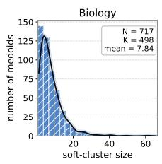
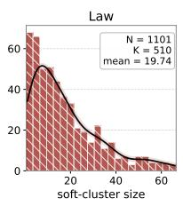
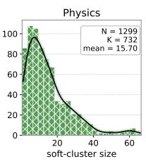
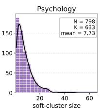
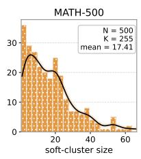
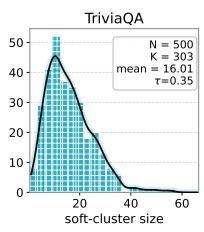
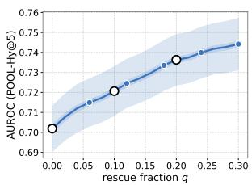
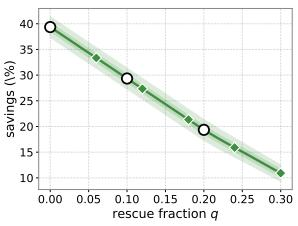
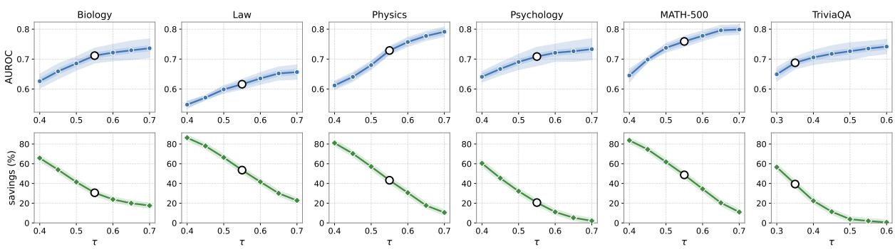
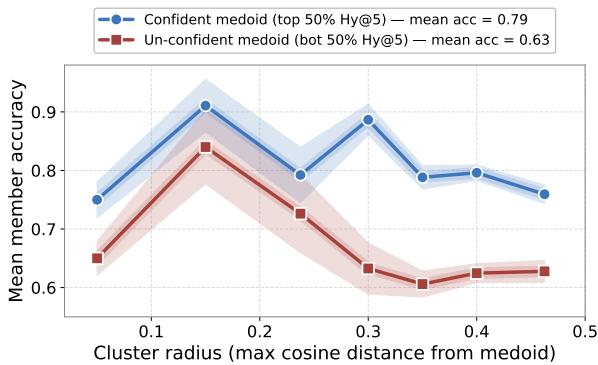

# POOL: Propagated Uncertainty Over Lookalikes

Rounak Sharma, Ananya B. Sai, Soumyabrata Pal

Adobe Research, India

{rounaksharma, ananyasai, soumyabratap}@adobe.com

## Abstract

Black-box large language models need confidence scores that can separate likely-correct from likely-incorrect outputs, enabling systems to prioritize human review, route uncertain cases to stronger models, or choose abstention thresholds on development data. Yet existing confidence estimators face a cost-quality trade-off: verbal confidence is cheap but is often overconfident, while sampling-based uncertainty is more informative but scales linearly with the number of samples per query. We propose POOL (Propagated Uncertainty Over Lookalikes), a cost-efficient framework that addresses this trade-off taking inspiration from group-testing. POOL clusters query stems with overlaps, evaluates a base estimator on representative medoids, softly propagates confidence scores to nearby queries, and selectively evaluates high-disagreement cases. We instantiate this framework with HY@p, a hybrid estimator that combines verbal confidence with spectral answer diversity computed from the negative von Neumann entropy of sampled answer embeddings. Across six domains from three datasets and five black-box LLMs, HY@5 achieves higher average AU-ROC than verbal confidence and VN@10 sampling while using half as many samples as VN@10. POOL-HY@5 retains 93.5–97.9% of its AUROC while saving 19.3–39.3% of generations. On paraphrase-dense workloads, generation savings rise to 73-76%, showing that semantic redundancy can be leveraged to lower confidence-estimation costs.

## 1 Introduction

Large language models are increasingly deployed in settings where a wrong answer can be very costly. In such systems, confidence scores accompanying the answers play a key role. They determine when to abstain, when to route a query to a stronger model or human expert, how to allocate limited inference budget, or flag outputs for review (Geifman and El-Yaniv, 2017; Kadavath et al., 2022).

For black-box models accessed only through an API, confidence estimation must satisfy two constraints at once: (accuracy) it must separate likely correct from likely incorrect answers, and (cost) it must be cheap enough to feasibly run over large benchmarks or production-scale query streams.

Existing black-box signals occupy different positions on this trade-off and largely fall into two families. (i) Verbal confidence (VC) asks the model to self-report a numeric confidence value alongside its answer (Xiong et al., 2024; Tian et al., 2023). This is cheap, requiring only one generation per query but often suffers from overconfidence and score saturation. Specifically, prior works find that vanilla verbalized confidence values are concentrated in high-confidence bins, often between 80% and 100%, even when accuracy is substantially lower (Xiong et al., 2024). (ii) Samplingbased estimators instead draw multiple stochastic answers and measure their agreement or diversity, either via semantic clustering (Kuhn et al., 2023; Farquhar et al., 2024), or through spectral properties of answer embeddings (Nikitin et al., 2024). These methods are usually more discriminative, especially when verbal confidence collapses, but their cost scales linearly with the number of samples p per query. This makes the stronger confidence estimation approach much less scalable.

We argue that this trade-off is partly an artifact of treating every query independently. Real query batches are rarely arbitrary sets of unrelated inputs. Benchmarks, tutoring systems, customersupport logs, and repeated user workloads often contain questions that share topics, templates, or near-duplicate query stems / cores.

Classical group testing exploits a related principle: when items are structured, expensive tests can be shared across groups and followed by targeted tests only where needed (Dorfman, 1943). At a high level, classical group testing creates overlapping clusters of items, does tests that are representative of entire cluster and finally, for each item, uses results from all clusters the item belongs to infer. We adapt these principles to black-box LLM confidence estimation.

We propose POOL (Propagated Uncertainty Over Lookalikes), a group-testing-inspired framework for cost-efficient black-box confidence estimation. Given any per-query confidence estimator, POOL first clusters query stems in an embedding space (allowing overlaps between clusters) and then evaluates the estimator on cluster medoids to obtain representative scores of the entire cluster. Now, for each query, we propagate representative scores from the clusters the query belongs to using soft similarity-based weights - aggregating the propagated scores allows the algorithm to compute the final query-specific confidence. Finally, we spend a small rescue budget on high-disagreement cases, that is, disagreement between the propagated scores, improving the reliability of estimation wherever required. Since POOL treats the base confidence estimator as a black box, it can serve as a wrapper over off-the-shelf query-specific estimators such as verbal confidence, sampling-based uncertainty without changing their internals.

We analyse the effects of POOL using multiple base query-specific estimators: verbal confidence (VC), spectral sample-diversity confidence (VN@p), and a simple hybrid of the two we introduce as HY@p.

The goal of HY@p is to test whether two standard black-box signals can be combined into a stronger low-cost query-specific method for POOL - empirically speaking, indeed HY@5 achieves the best average AUROC among the per-query baselines across five datasets and five black-box LLMs. To the best of our knowledge, the hybrid query-specific estimator of confidence has not been empirically studied in literature. Our main contribution, POOL, preserves most of this ranking quality while reducing the average number of generations per query. With HY@5 as the base estimator, POOL retains 93.5–97.9% of unpooled AUROC while saving 39.3%, 29.3%, and 19.3% of confidence-estimation generations as the rescue budget increases. On paraphrase-augmented workloads, savings rise to 73-76%, confirming that semantic redundancy in the input batch is a usable resource for cheaper confidence estimation.

To summarize, our main contributions are:

1. We propose POOL, a method-agnostic framework that reduces black-box confidence-estimation cost by sharing estimator calls across semantic query neighborhoods. Inspired by the classical group testing framework, we follow a similar set of steps namely (1) create overlapping clusters of queries in an embedding space (2) perform representative tests and obtain confidence estimates for the entire cluster as a whole (3) obtain queryspecific confidence estimate by aggregating estimates from clusters the query belongs to.

2. POOL, in addition, uses rescue budget - for queries where the cluster-specific scores have high disagreement, POOL uses additional tests to reduce variance and improve the estimate.

3. We evaluate POOL with multiple base queryspecific estimators across six domains from three datasets and five LLMs, demonstrating substantial generation savings while preserving most of the query-specific estimator’s AUROC. In essence, POOL gives us excellent tradeoff points between AUROC (how good our confidence estimation is) versus the LLM calls/generation cost.

## 2 Related Works

Our work sits at the intersection of confidence estimation for black-box LLMs and cost-efficient group-testing methods. We review the following lines of related work: verbal confidence elicitation, sampling-based uncertainty estimation, and classical group testing.

Verbal and prompt-based confidence. A growing body of work studies whether LLMs can reliably assess their own uncertainty without access to internal logits. Kadavath et al. (2022) demonstrated that large language models exhibit partial selfknowledge: when asked whether a given statement is true, they produce calibrated probabilities that improve with scale. Lin et al. (2022) trained models to express uncertainty in natural language, while Tian et al. (2023) and Xiong et al. (2024) showed that prompting strategies (e.g., chain-of-thought, top-k elicitation) can substantially improve the calibration of self-reported confidence in RLHF-tuned chat models. A common failure mode is confidence collapse: instruction-tuned models often report uniformly high confidence, limiting the discriminative power of verbal confidence alone (Xiong et al., 2024).

Sampling-based uncertainty estimation. Drawing multiple stochastic generations and measuring their agreement is a natural analogue of deep ensembles (Lakshminarayanan et al., 2017), adapted to the setting where one samples from a single model rather than training multiple networks. Wang et al. (2023) used majority-vote self-consistency as both an accuracy booster and an implicit confidence signal. Manakul et al. (2023) proposed SelfCheckGPT, which detects hallucinations by measuring inter-sample consis tency in a fully black-box setting without reference documents. Kuhn et al. (2023) introduced semantic entropy, which clusters generations by meaning and computes entropy over cluster probabilities, removing sensitivity to surface-level variation; Farquhar et al. (2024) extended this to detect hallucinations in long-form generation. Duan et al. (2024) observed that not all tokens contribute equally to semantic meaning and proposed re-weighting token-level uncertainty by relevance. Most closely related to our VN@p baseline, Nikitin et al. (2024) proposed kernel language entropy, which computes the Von Neumann entropy of a Gram matrix over answer embeddings, providing a continuous, clustering-free measure of semantic dispersion. Our work builds on their estimator but contributes an orthogonal dimension: we show that hybridizing it with verbal confidence recovers signal when either channel degrades, and that group testing can dramatically reduce the number of generations required at the benchmark level.

Group testing and pooled evaluation. Classical group testing, introduced by Dorfman (1943) for efficient screening of blood samples, identifies defective items by testing pools rather than individuals. The theory has been extensively developed (Aldridge et al., 2019) and applied in domains from genomics to communication. To our knowledge, we are the first to apply a group-testing reduction to confidence estimation for LLMs: by clustering semantically similar questions and evaluating only cluster representatives, we convert the per-query cost of any confidence estimator into a per-cluster cost, with the compression ratio determined by the structure of the benchmark.

## 3 Method

We study black-box confidence estimation: given a query $x _ { i }$ from a batch $\mathcal { X } = \{ x _ { 1 } , \ldots , x _ { N } \}$ , produce a scalar score ${ \hat { s } } _ { i } \in \mathbb { R }$ that is high when the model’s answer is likely correct and low otherwise. We first review five per-query estimators (§3.1)

that serve as the base method M, then introduce POOL, which treats M as a black box and amortizes its cost across semantically related queries in two tiers (§3.2–3.4). All query stems are embedded by a fixed encoder $\phi ( \cdot )$ to unit-norm vectors $q _ { i } ;$ similarities are cosine. We study confidence estimation as a ranking problem, that is, the goal is to assign scores that separate likely-correct from likely-incorrect outputs, not to produce calibrated probabilities.

## 3.1 Per-Query Base Estimators

Let $M : \mathcal { X } $ R be a per-query confidence estimator with cost $g _ { M }$ generations per call. These estimators are designed to calculate the confidence for each query separately. We consider five instantiations of such base queries namely Verbal Confidence (VC), Sample-diversity confidence $( \mathrm { V N } @ p )$ Hybrid confidence (HY@p), Majority agreement $( \mathbf { M A J } @ p )$ , Semantic entropy $( \mathrm { S E } @ p )$ . The details of each of the estimators could be found in Appendix C. The results for comparison of base estimators VC, VN@10, HY@5 with their POOL versions are included in §4.1 while the comparison results for the base estimators can be found in Tables 8, 9, 10, 11, 12 of Appendix B.

The remainder treats M as a black box with cost $_ { g M } ;$ any of the above or any future per-query estimator plugs in unchanged.

## 3.2 Tier-1: Representative Selection and Soft Propagation

Representative selection. We pick K medoid indices $\mathcal { M } = \{ m _ { 1 } , \ldots , m _ { K } \} \subseteq \{ 1 , \ldots , N \}$ that cover the batch in stem-embedding space, by agglomerative clustering with average linkage and cosine cutoff $\tau \in ( 0 , 1 )$ . For each cluster $C _ { k }$

$$
m _ { k } = \arg \operatorname* { m a x } _ { i \in C _ { k } } \ { \frac { 1 } { | C _ { k } | } } \sum _ { j \in C _ { k } } \langle q _ { i } , q _ { j } \rangle .\tag{1}
$$

τ controls the compression ratio $c \ { \triangleq } \ K / N \ \in$ (0, 1]; smaller τ yields fewer, larger clusters. Cluster labels are discarded after this step — only the set M is reused.

Base evaluation on medoids. We invoke M once per medoid, $s _ { k } = M ( x _ { m _ { k } } )$ , consuming $K g _ { M }$ generations — the Tier-1 floor cost.

Soft attention over medoids. For each query i, identify the medoids within cosine threshold $\theta \in$ (0, 1):

$$
\mathcal { N } _ { i } = \{ k : \langle q _ { i } , q _ { m _ { k } } \rangle \geq \theta \} ,\tag{2}
$$

falling back to the single nearest medoid if ${ \mathcal { N } } _ { i } = \emptyset$ and capping at the top $k _ { \mathrm { m a x } }$ by similarity. With $u _ { i k } \triangleq \langle q _ { i } , q _ { m _ { k } } \rangle$ and temperature $T > 0$

$$
w _ { k } ( i ) = \frac { \exp ( u _ { i k } / T ) } { \sum _ { k ^ { \prime } \in \mathcal { N } _ { i } } \exp ( u _ { i k ^ { \prime } } / T ) } ,\tag{3}
$$

and the Tier-1 estimate is

$$
\mu _ { i } = \sum _ { k \in \mathcal { N } _ { i } } w _ { k } ( i ) s _ { k } .\tag{4}
$$

Each query draws signal from every sufficiently close medoid rather than a single hard partition: queries near boundaries blend from both sides.

Disagreement signal (free). The same weights yield a per-query reliability indicator,

$$
\begin{array} { r } { d _ { i } = \sqrt { \sum _ { k \in \mathcal { N } _ { i } } w _ { k } ( i ) ( s _ { k } - \mu _ { i } ) ^ { 2 } } , } \end{array}\tag{5}
$$

the weighted standard deviation of the medoid scores feeding $\mu _ { i }$ . Small $d _ { i }$ means the neighbours agreed and $\mu _ { i }$ is faithful; large $d _ { i }$ means the soft average hides a conflict. No extra compute is required, $d _ { i }$ reuses the values already in Eqs. 3–4.

## 3.3 Tier-2: Disagreement-Triggered Rescue

Given a user-controlled rescue fraction $q \in [ 0 , 1 - c ]$ the rescue set is the top- $\lceil q N \rceil$ non-medoid queries by $d _ { i }$ :

$$
\begin{array} { r } { \mathcal { R } = \mathrm { t o p } _ { \lceil q N \rceil } \big \{ d _ { i } : i \notin \mathcal { M } \big \} . } \end{array}\tag{6}
$$

We evaluate M directly on each rescued query and overwrite its soft estimate. The final per-query score is

$$
\hat { s } _ { i } = \left\{ \begin{array} { l l } { s _ { k ( i ) } , } & { i \in \mathcal { M } , m _ { k ( i ) } = i , } \\ { M ( x _ { i } ) , } & { i \in \mathcal { R } , } \\ { \mu _ { i } , } & { \mathrm { o t h e r w i s e } . } \end{array} \right.\tag{7}
$$

Allocating Tier-2 query-by-query is strictly finer than at the cluster level: a single high-disagreement query inside an otherwise-confident cluster is rescued individually, while uniformly confident clusters consume no extra budget regardless of size.

## 3.4 Cost and Hyperparameters

The total cost is $K + \lceil q N \rceil$ base-method calls, giving

$$
\mathbb { E } [ \mathrm { c o s t } \mathrm { p e r } \mathrm { q u e r y } ] = ( c + q ) g _ { M } , \qquad c \triangleq K / N .\tag{8}
$$

At $q = 0$ the cost collapses to the Tier-1 floor c $g _ { M } ;$ at $q = 1 - c$ every non-medoid query is rescued and the un-pooled base estimator $g _ { M }$ is recovered. POOL has five hyperparameters:

τ cluster cutoff; controls K (Tier-1 budget).

$\theta$ soft-attention threshold; defines N<sub>i</sub>.

$T$ softmax temperature; peakiness of attention.

k<sub>max</sub> per-query attention cap.

q Tier-2 rescue fraction; cost–quality dial.

$\tau$ (which sets the Tier-1 floor cost via $c = K / N )$ and $q$ (the Tier-2 operating point) are deploymentlevel cost knobs that trade AUROC for compute by construction and are not tuned.

## 3.5 Algorithm

Algorithm 1 summarizes the full procedure. Clustering and similarity computations are performed once per batch on embeddings; only the $K + \lceil q N \rceil$ base-method calls incur generation cost.

## 4 Experiments

Datasets. We evaluate on six domains across three benchmarks. From MMLU-Pro (Wang et al., 2024) we use four domains — biology, physics, law, psychology — spanning fact-heavy and reasoning-heavy multiple-choice. To complement the bounded MCQ format we add MATH-500 (Lightman et al., 2023), a competition-math benchmark with free-form numeric answers and TriviaQA (Joshi et al., 2017) an open-domain trivia benchmark of free-form short-answer questions answered closed-book (no supporting passage).

Models. We use five black-box LLMs across three families: GPT-4.1-nano, GPT-5-nano, GPT-5-mini, Claude-Haiku-4.5, Llama-3.3-70B-Instruct. GPT-5-nano and GPT-5-mini run with reasoning at the low effort setting; the rest are nonreasoning. Stems and answers are embedded with black-box embedding model text-embedding-3- small (§4.1). We also test POOL with open weight embedding models bge-large-en-v1.5, e5-large-v2 (Appendix F) to validate their generalization across different embedding models. For paraphrase query and adversarial-twin query generation in §4.2 and §4.3 we used GPT-5 in reasoning mode.

Baselines. We evaluate against two categories of baselines. The first compares POOL’s complete two-tier pipeline, end-to-end, against alternative estimators of comparable cost: rand + kNN (random anchor selection with k-nearest-neighbour propagation), the supervised probes P(IK)-LR and P(IK)- MLP (q+a) (Kadavath et al., 2022), and APRI-COT (Ulmer et al., 2024). The second category isolates the rescue mechanism: each method retains POOL’s Tier-1 soft propagation but replaces its Tier-2 rescue rule with an alternative selector, re-evaluating the queries chosen at random, those nearest a cluster boundary, or those that inherited the lowest or the highest propagated confidence. We compare all four against POOL’s disagreementbased rescue. The details of the baselines could be found in Appendix D. The comparison results of POOL with end-to-end baselines are in Table 3 and comparison with rescue strategies is present in Table 4.

Algorithm 1 POOL: two-tier wrapper around a base confidence estimator M.   
Input: batch $\{ x _ { i } \} _ { i = 1 } ^ { N }$ <sub>1</sub>, stem embeddings {q<sub>i</sub>}, base estimator M with cost $_ { g _ { M } ; }$ hyperparameters $( \tau , \theta , T , k _ { \mathrm { m a x } } , q ) .$   
Output: per-query scores $\{ \hat { s } _ { i } \} _ { i = 1 } ^ { N } .$   
Tier-1: representative selection and soft propagation   
1: $\{ C _ { 1 } , \dotsc , { \bar { C } } _ { K } \}  \mathbf { A }$ gglomerativeCluster({q<sub>i</sub>}, cutoff $1 - \tau .$ , average linkage) ▷ K disjoint clusters of similar queries   
2: for $k = 1 , \ldots , K$ do   
3: $\begin{array} { r } { m _ { k } \gets \arg \operatorname* { m a x } _ { i \in C _ { k } } \frac { 1 } { | C _ { k } | } \sum _ { j \in C _ { k } } \langle q _ { i } , q _ { j } \rangle } \end{array}$ ▷ medoid: most central member   
4: $s _ { k } \gets M ( x _ { m _ { k } } )$ ▷ K base-method calls; the Tier-1 floor cost   
5: end for   
6: for $i = 1 , \ldots , N$ do   
7: $\mathcal { N } _ { i }  \{ k : \langle q _ { i } , q _ { m _ { k } } \rangle \geq \theta \}$ , capped at top- $k _ { \mathrm { m a x } }$ by similarity ▷ soft neighbour set; may contain > 1 medoid   
8: $\mathbf { i f } \mathcal { N } _ { i } = \varnothing$ then $\tilde { \mathcal { N } _ { i } } \stackrel {  } {  } \{ \mathrm { a r g } \operatorname* { m a x } _ { k } \langle q _ { i } , \bar { q _ { m _ { k } } } \rangle \}$ ▷ fallback for isolated queries   
9: end if   
10: $w _ { k } ( i ) \mathop { \longleftarrow } \mathrm { s o f t m a x } _ { k \in \mathcal { N } _ { i } } \left( \langle q _ { i } , q _ { m _ { k } } \rangle / T \right)$ ▷ weights peak on the closest medoid   
11: $\begin{array} { r } { \mu _ { i }  \sum _ { k \in \mathcal { N } _ { i } } w _ { k } ( i ) s _ { k } } \end{array}$ ▷ soft estimate: weighted avg of neighbour scores   
12: $\begin{array} { r } { d _ { i } \gets \sqrt { \sum _ { k \in \mathcal { N } _ { i } } w _ { k } ( i ) ( s _ { k } - \mu _ { i } ) ^ { 2 } } } \end{array}$ ▷ disagreement: free reliability indicator   
13: end for   
Tier-2: disagreement-triggered rescue   
14: $\mathcal { R } \gets \mathrm { t o p } { - } \lceil \dot { q } N \rceil$ non-medoid queries ranked by $d _ { i }$ ▷ queries whose neighbours disagree most   
15: for $\boldsymbol { r } \in \bar { \mathcal { R } }$ do   
16: evaluate $M ( x _ { r } )$ ▷ ⌈qN⌉ extra base-method calls   
17: end for   
Assemble outputs   
18: for $i = 1 , \ldots , N$ do   
19: $\mathbf { i f } \ i = m _ { k }$ for some k then $\hat { s } _ { i } \gets s _ { k }$ ▷ medoid: already evaluated in Tier-1   
20: else i ${ \mathrm { ~ i ~ } } \in \mathcal { R }$ then $\hat { s } _ { i } \gets M ( x _ { i } )$ ▷ rescued: true score from Tier-2   
21: else $\hat { s } _ { i } \gets \mu _ { i }$ ▷ otherwise: soft estimate   
22: end if   
23: end for   
24: return $\{ \hat { s } _ { i } \} _ { i = 1 } ^ { N }$

Metric We evaluate our method using two metrics namely AUROC and ECE commonly used for confidence estimation in literature. The details for the metrics are in Appendix E. Detailed results comparing baselines with our proposed framework POOL on AUROC are in Table 1 and those on ECE are presented in Table 2.

Setup. To isolate ranking quality from sampling noise in the underlying answer, the correctness label for each query is taken from the first sampled answer and reused across all methods.

## 4.1 Main Results

Table 1 reports per-cell AUROC for the three base estimators and six POOL variants across all (model, dataset) cells. Table 5 reports the corresponding cost savings, averaged across the models for each dataset and expressed relative to each method’s own base estimator.

Key observations. The per-query baselines in Table 1 show a stable ranking: VC is weakest (0.689 avg AUROC), VN@10 a clear step above (0.737), and HY@5 the strongest (0.752). The value of HY@5 is efficiency: with only five samples it matches or beats VN@10 (ten samples) in 19 of 30 cells (mean +0.014 AUROC; one-sided $p { = } 0 . 0 7 )$

POOL preserves this ranking while sliding cost along the rescue dial q (see Section 3.3). Averaged over all cells, POOL-HY@5 retains 93.4%/95.9%/97.9% of unpooled HY@5 AU-ROC at 39.3%/29.3%/19.3% savings $\quad ( q \quad =$ $0 / 0 . 1 0 / 0 . 2 0 )$ , and POOL-VN@10 traces a parallel curve (93.5%/95.8%/97.4%). The results above vary only the rescue fraction $q ,$ at a fixed cutoff τ . In fact τ (see §3.2) is a second cost– quality knob: it decides how many queries POOL evaluates directly, so a higher τ gives higher AU-ROC but smaller savings, and a lower τ gives larger savings but lower AUROC (see Fig. 3 for effect of τ). We hold τ fixed per dataset and expose q as the single user-facing dial.











  
Figure 1: Soft-cluster size distribution (members per medoid under POOL’s attention rule) for all benchmarks. Heavier right tails (Law, Physics, MATH-500) reflect denser topical redundancy and translate directly into higher POOL compression (Table 5). Psychology has the lightest tail and correspondingly the smallest savings.

<table><tr><td rowspan="2">Model</td><td rowspan="2">Dataset</td><td colspan="3">Baselines</td><td colspan="3">POOL-VN@10</td><td colspan="3">POOL-HY@5</td></tr><tr><td>Vc</td><td>VN@10</td><td>HY@5</td><td>q=0</td><td>q=0.10</td><td>q=0.20</td><td>q=0</td><td>q=0.10</td><td>q=0.20</td></tr><tr><td rowspan="6">GPT-4.1-nano</td><td>Biology</td><td>0.679</td><td>0.754</td><td>0.758</td><td>0.698</td><td>0.723</td><td>0.744</td><td>0.713</td><td>0.732</td><td>0.762</td></tr><tr><td>Law</td><td>0.530</td><td>0.641</td><td>0.599</td><td>0.596</td><td>0.605</td><td>0.616</td><td>0.567</td><td>0.569</td><td>0.572</td></tr><tr><td>Physics</td><td>0.746</td><td>0.777</td><td>0.798</td><td>0.707</td><td>0.729</td><td>0.747</td><td>0.718</td><td>0.744</td><td>0.773</td></tr><tr><td>Psychology</td><td>0.630</td><td>0.744</td><td>0.716</td><td>0.730</td><td>0.743</td><td>0.753</td><td>0.700</td><td>0.702</td><td>0.726</td></tr><tr><td>MATH-500</td><td>0.700</td><td>0.896</td><td>0.869</td><td>0.822</td><td>0.837</td><td>0.843</td><td>0.804</td><td>0.813</td><td>0.812</td></tr><tr><td>TriviaQA</td><td>0.686</td><td>0.761</td><td>0.748</td><td>0.672</td><td>0.707</td><td>0.721</td><td>0.668</td><td>0.695</td><td>0.723</td></tr><tr><td rowspan="6">GPT-5-mini</td><td>Biology</td><td>0.745</td><td>0.727</td><td>0.788</td><td>0.661</td><td>0.678</td><td>0.716</td><td>0.707</td><td>0.747</td><td>0.754</td></tr><tr><td>Law</td><td>0.696</td><td>0.725</td><td>0.746</td><td>0.666</td><td>0.668</td><td>0.691</td><td>0.671</td><td>0.692</td><td>0.701</td></tr><tr><td>Physics</td><td>0.770</td><td>0.781</td><td>0.803</td><td>0.701</td><td>0.707</td><td>0.715</td><td>0.721</td><td>0.743</td><td>0.773</td></tr><tr><td>Psychology</td><td>0.773</td><td>0.728</td><td>0.796</td><td>0.705</td><td>0.713</td><td>0.734</td><td>0.752</td><td>0.783</td><td>0.792</td></tr><tr><td>MATH-500</td><td>0.550</td><td>0.794</td><td>0.725</td><td>0.722</td><td>0.734</td><td>0.760</td><td>0.696</td><td>0.710</td><td>0.720</td></tr><tr><td>TriviaQA</td><td>0.683</td><td>0.723</td><td>0.715</td><td>0.676</td><td>0.679</td><td>0.691</td><td>0.688</td><td>0.712</td><td>0.710</td></tr><tr><td rowspan="6">GPT-5-nano</td><td>Biology</td><td>0.773</td><td>0.785</td><td>0.819</td><td>0.745</td><td>0.764</td><td>0.787</td><td>0.751</td><td>0.780</td><td>0.816</td></tr><tr><td>Law</td><td>0.633</td><td>0.726</td><td>0.713</td><td>0.647</td><td>0.677</td><td>0.687</td><td>0.632</td><td>0.661</td><td>0.686</td></tr><tr><td>Physics</td><td>0.834</td><td>0.792</td><td>0.860</td><td>0.729</td><td>0.730</td><td>0.743</td><td>0.784</td><td>0.803</td><td>0.821</td></tr><tr><td>Psychology</td><td>0.730</td><td>0.742</td><td>0.774</td><td>0.731</td><td>0.747</td><td>0.770</td><td>0.752</td><td>0.766</td><td>0.784</td></tr><tr><td>MATH-500</td><td>0.663</td><td>0.805</td><td>0.811</td><td>0.755</td><td>0.792</td><td>0.780</td><td>0.744</td><td>0.773</td><td>0.789</td></tr><tr><td>TriviaQA</td><td>0.754</td><td>0.796</td><td>0.810</td><td>0.742</td><td>0.771</td><td>0.767</td><td>0.751</td><td>0.780</td><td>0.783</td></tr><tr><td rowspan="6">Claude-Haiku-4.5</td><td>Biology</td><td>0.783</td><td>0.727</td><td>0.800</td><td>0.699</td><td>0.716</td><td>0.727</td><td>0.766</td><td>0.793</td><td>0.813</td></tr><tr><td>Law</td><td>0.658</td><td>0.652</td><td>0.672</td><td>0.601</td><td>0.623</td><td>0.632</td><td>0.608</td><td>0.629</td><td>0.630</td></tr><tr><td>Physics</td><td>0.815</td><td>0.671</td><td>0.801</td><td>0.621</td><td>0.634</td><td>0.644</td><td>0.725</td><td>0.751</td><td>0.776</td></tr><tr><td>Psychology</td><td>0.766</td><td>0.714</td><td>0.790</td><td>0.701</td><td>0.702</td><td>0.715</td><td>0.749</td><td>0.777</td><td>0.792</td></tr><tr><td>MATH-500</td><td>0.803</td><td>0.834</td><td>0.829</td><td>0.783</td><td>0.765</td><td>0.763</td><td>0.780</td><td>0.783</td><td>0.797</td></tr><tr><td>TriviaQA</td><td>0.741</td><td>0.759</td><td>0.773</td><td>0.675</td><td>0.699</td><td>0.709</td><td>0.704</td><td>0.731</td><td>0.749</td></tr><tr><td rowspan="6">Llama-3.3-70B</td><td>Biology</td><td>0.583</td><td>0.646</td><td>0.629</td><td>0.626</td><td>0.627</td><td>0.640</td><td>0.621</td><td>0.615</td><td>0.610</td></tr><tr><td>Law</td><td>0.551</td><td>0.608</td><td>0.613</td><td>0.564</td><td>0.575</td><td>0.578</td><td>0.602</td><td>0.609</td><td>0.615</td></tr><tr><td>Physics</td><td>0.716</td><td>0.752</td><td>0.778</td><td>0.681</td><td>0.703</td><td>0.720</td><td>0.696</td><td>0.732</td><td>0.750</td></tr><tr><td>Psychology</td><td>0.551</td><td>0.597</td><td>0.598</td><td>0.585</td><td>0.605</td><td>0.635</td><td>0.590</td><td>0.600</td><td>0.610</td></tr><tr><td>MATH-500</td><td>0.546</td><td>0.774</td><td>0.749</td><td>0.788</td><td>0.754</td><td>0.761</td><td>0.771</td><td>0.774</td><td>0.788</td></tr><tr><td>TriviaQA</td><td>0.589</td><td>0.697</td><td>0.654</td><td>0.642</td><td>0.664</td><td>0.662</td><td>0.626</td><td>0.622</td><td>0.663</td></tr><tr><td colspan="2">Average</td><td>0.689</td><td>0.737</td><td>0.752</td><td>0.689</td><td>0.706</td><td>0.718</td><td>0.702</td><td>0.721</td><td>0.736</td></tr></table>

Table 1: AUROC across all (model, dataset) cells for the three per-query baselines (VC, VN@10, HY@5) and six POOL variants (two base methods × three rescue budgets). POOL configuration $( \tau , \theta , T , k _ { \mathrm { m a x } } ) =$ (0.55, 0.40, 0.1, 10) is fixed across all cells, except TriviaQA, whose dispersed open-domain stems use $\tau = 0 . 3 5$ (θ = 0.20) to reach a comparable ∼3 gen/q operating point (τ is the cost dial, §3.4); only the rescue fraction q varies. GPT-5-nano and GPT-5-mini use reasoning effort low; the remaining backbones are non-reasoning models.

Per-dataset savings (Table 5) track the compression ratio $K / N$ (see §3.2), which is datasetdependent but model-independent and set from the unlabeled stems alone. POOL’s savings scale with stem redundancy. The dense MMLU-Pro/MATH-500 splits give 20–54% savings at $\tau = 0 . 5 5$ (most on Law/MATH-500, least on Psychology); TriviaQA’s dispersed stems need a looser $\tau = 0 . 3 5$ to reach a comparable 39%. In all cases τ is set from the unlabeled stems: since the compression $c = K / N$ depends only on stem geometry and not on correctness, choosing τ picks a compute budget rather than optimizing the ranking metric. Because $K / N$ is fixed by the stem clustering, savings are identical for both POOL-VN@10 and POOL-HY@5 variants at any q: the base estimator sets the AUROC ceiling and POOL slides it horizontally by an amount determined entirely by workload structure.



  
Figure 2: The two faces of the rescue fraction q, averaged across all 30 (model, dataset) cells. Left: POOL-Hy@5 AUROC rises smoothly with q. Right: cost savings vs. unpooled HY@5 fall linearly with q. Open circles mark the three operating points $q \in$ {0, 0.10, 0.20} used in Table 1; q is a single, predictable cost-quality dial.

<table><tr><td>Estimator</td><td>AUROC</td><td>ECE</td></tr><tr><td>HY@5 (calibrated)</td><td>0.752</td><td>0.044</td></tr><tr><td>POOL-HY@5  $( q = 0 )$ </td><td>0.702</td><td>0.037</td></tr><tr><td>POOL-HY@5  $( q = 0 . 2 0 )$ </td><td>0.736</td><td>0.038</td></tr></table>

Table 2: Calibration of HY@5 vs. POOL-HY@5, averaged over all 30 (model, dataset) cells. ECE uses 15 equal-width bins; scores are Platt-scaled via 5-fold CV and evaluated out-of-fold.

## 4.2 Adversarial Stress Test

Setup. To probe POOL under its hardest case, we construct adversarial twins: questions edited by a single word or phrase so the stem stays nearly identical but the correct answer flips (GPT-5 generated and answer verified). We add 946 twins in total, 445 for Biology and 501 for Psychology and run GPT-5-nano on a mixed batch of the originals plus their twins. A twin nearly duplicates its original’s stem, so it co-clusters with the (confident) original and inherits its propagated score, a deliberate worst case for stem-based propagation. We report twin-subset AUROC with cost savings vs. unpooled HY@5. (Table 6)

Results. POOL exposes two knobs that both counter this case: a higher cutoff τ separates twins from their originals, and the rescue budget q reevaluates flagged twins directly. Table 6 shows the effect is largely recoverable: at $( \tau , q ) = ( 0 . 7 5 , 0 . 2 0 )$ twin AUROC reaches 0.757 (Biology) and 0.786 (Psychology) 94–96% of the unpooled base, while still saving 10–22% of generations. Robustness to adversarial near-duplicates is thus controllable through the same deployment dials.

<table><tr><td>Method</td><td>Paradigm</td><td colspan="2">AUROC</td></tr><tr><td></td><td></td><td> $q = 0$ </td><td> $q = 0 . 2$ </td></tr><tr><td>P(IK)-LR</td><td>supervised</td><td colspan="2">0.618</td></tr><tr><td>P(IK)-MLP (q+a)</td><td>supervised</td><td colspan="2">0.586</td></tr><tr><td>APRICOT</td><td>supervised</td><td colspan="2">0.576</td></tr><tr><td>rand + kNN</td><td>zero-label</td><td>0.685</td><td>0.713</td></tr><tr><td>POOL-HY@5</td><td>zero-label</td><td>0.702</td><td>0.736</td></tr><tr><td>HY @5 (un-pooled)</td><td>ceiling</td><td colspan="2">0.752</td></tr></table>

Table 3: End-to-end baselines vs. POOL, avg AUROC over 30 cells. Supervised probes train on labels (no sampling). Zero-label propagation methods are shown budget-matched at $q = 0$ and $q = 0 . 2 ;$ the kNN baselines use a random rescue (no disagreement signal), POOL uses its disagreement rescue.

<table><tr><td>Rescue strategy</td><td>AUROC</td><td>% oracle</td></tr><tr><td>Tier-1 only  $( q = 0 )$ </td><td>0.702</td><td>0%</td></tr><tr><td>Tier1 + random</td><td>0.724</td><td>52%</td></tr><tr><td>Tier1 + boundary</td><td>0.726</td><td>57%</td></tr><tr><td>Tier1 + high-conf</td><td>0.725</td><td>55%</td></tr><tr><td>Tier1 + low-conf</td><td>0.728</td><td>61%</td></tr><tr><td>Tier1 + disagreement (POOL)</td><td>0.736</td><td>80%</td></tr><tr><td>Tier1 + oracle (upper bound)</td><td>0.745</td><td>100%</td></tr></table>

Table 4: Rescue-selection strategies at fixed Tier-1 base = HY@5 and budget $q = 0 . 2 0$ , avg over 30 cells. % oracle is the fraction of the oracle rescue’s AUROC gain over Tier-1 that each rule recovers. POOL’s disagreement signal captures the most.

## 4.3 Test on Paraphrase-Augmented Datasets

Setup. Many production workloads (FAQs, customer support, tutoring) contain semantically nearduplicate questions that the standard MMLU-Pro splits lack. We build paraphrase-augmented Biology and Psychology splits by asking an LLM for two paraphrases of each stem, with options and gold answer held fixed; rephrases whose intended answer changes under a re-ask are discarded. This triples the density of semantically similar queries at the same nominal difficulty. We run GPT-5-nano and report AUROC with cost savings vs. the unpooled base.

  
Figure 3: The two faces of the cluster-cutoff knob τ. Top: AUROC of POOL-Hy@5 (q =0) rises monotonically with τ. Bottom: cost savings vs. un-pooled HY@5 fall monotonically with τ. Each line is the mean across all five models with shaded SEM. The mirror-image behaviour confirms the cost equation (c + q) g<sub>M</sub>: τ trades quality against compute on a smooth, predictable curve.

<table><tr><td>Dataset</td><td>q=0</td><td>q=0.10</td><td>q=0.20</td></tr><tr><td>Biology</td><td>30.6%</td><td>20.6%</td><td>10.6%</td></tr><tr><td>Law</td><td>53.5%</td><td>43.5%</td><td>33.5%</td></tr><tr><td>Physics</td><td>43.2%</td><td>33.2%</td><td>23.2%</td></tr><tr><td>Psychology</td><td>20.6%</td><td>10.6%</td><td>0.6%</td></tr><tr><td>MATH-500</td><td>48.7%</td><td>38.7%</td><td>28.7%</td></tr><tr><td>TriviaQA</td><td>39.4 %</td><td>29.4 %</td><td>19.4 %</td></tr><tr><td>Average</td><td>39.3%</td><td>29.3%</td><td>19.3%</td></tr></table>

Table 5: Cost savings of POOL relative to its base estimator, per dataset, averaged across all models. Each cell reports $1 - \mathrm { g e n / q _ { P O O L } / g e n / q _ { b a s e } . }$ Savings are identical for POOL-VN@10 and POOL-HY@5 at any fixed q.
<table><tr><td></td><td></td><td colspan="2">Biology</td><td colspan="2">Psychology</td></tr><tr><td>T</td><td>q</td><td>AUROC</td><td>sav.</td><td>AUROC</td><td>sav.</td></tr><tr><td></td><td>Base HY@5</td><td>0.808</td><td>一</td><td>0.819</td><td>一</td></tr><tr><td>0.55</td><td>0.00</td><td>0.669</td><td>54%</td><td>0.636</td><td>47%</td></tr><tr><td>0.55</td><td>0.20</td><td>0.714</td><td>34%</td><td>0.687</td><td>27%</td></tr><tr><td>0.75</td><td>0.00</td><td>0.705</td><td>42%</td><td>0.674</td><td>30%</td></tr><tr><td>0.75</td><td>0.20</td><td>0.757</td><td>22%</td><td>0.786</td><td>10%</td></tr></table>

Table 6: Adversarial twins (GPT-5-nano). Twinsubset AUROC and cost savings of POOL-HY@5. Raising the cutoff τ and rescue budget q recovers most of the base AUROC while retaining savings.

Results. Where the adversarial twins are POOL’s worst case, genuine paraphrases are its best case: the near-duplicates are truly answerpreserving, so propagation stays accurate and compression is high. At q =0, POOL-HY@5 saves 73– 76% of generations while retaining ∼96% of unpooled AUROC (0.814→0.783 Biology, 0.753→ 0.726 Psychology), and POOL-VN@10 retains 97–99% (Table 7). POOL’s compression thus scales with genuine cluster density when workloads contain real near-duplicates, the representativeselection layer turns that structure into a nearproportional reduction in LLM calls, with no change to the underlying estimator.

## 5 Conclusion

We introduced POOL, a group-testing-inspired framework for cost-efficient black-box confidence estimation. Rather than evaluating a confidence estimator independently on every query, POOL amortizes estimator calls across semantic neighborhoods. Since POOL treats the base estimator as a black box, it can be applied to any confidence estimator method.

As a supporting instantiation, we evaluated HY@p, a simple hybrid base estimator that combines verbal confidence with spectral sample diversity. HY@5 provides a strong low-cost base method for POOL, outperforming the individual black-box signals on average while using fewer samples than VN@10. Across six domains from three datasets and five LLMs, POOL-HY@5 retains 93.5–97.9% of unpooled HY@5 AUROC while saving between 19.3% - 39.3% of generations depending on the rescue budget. We show the savings on generations in paraphrase-dense workloads rise to 73 − 76% showing that compression scales with workload redundancy.

Open directions include adaptive medoid selection that adjusts granularity to local embedding density, alternative rescue triggers (low absolute soft estimate, or a learned selector), and extending the framework to open-ended generation.

## Limitations

Batch availability and cold-start. POOL operates on a batch of queries where the full set is available upfront for clustering, medoid selection, and the score propagation to proceed. This would be different for the online settings where queries arrive one at a time. More practically, POOL faces a coldstart problem: on a freshly deployed system with no query history, there are no cached medoid scores to propagate from, and one could end up evaluating every query individually resulting in identical costs to the unpooled base estimator. The framework’s savings accrue only once a sufficient query cache has been built. We recommend a warm-up phase in which the first $N _ { \mathrm { w a r m } }$ queries are evaluated with the unpooled estimator, their stem embeddings and confidence scores stored, and the medoid structure reconstructed incrementally as the cache grows. Once the cache reaches a stable compression ratio $c = K / N$ , POOL can be activated and subsequent queries routed through the propagation layer. The required $N _ { \mathrm { w a r m } }$ is workload-dependent: denser topical workloads (e.g., customer-support FAQs) converge faster than sparse, open-domain benchmarks.

Input-space propagation assumption. We note that POOL currently propagates confidence scores based on cosine similarity between query stem embeddings, implicitly assuming that similar inputs yield similar confidence profiles. While Figure 4 provides aggregate empirical support for this assumption in majority scenarios, it may break down in extreme adversarial scenarios. We stress test this and report the results in Table 6. We also note that this limitation is inherent to any similarity-based approach rather than POOL alone. We believe further research in areas such as embeddings and clustering strategies can further address these limitations.

## References

Matthew Aldridge, Oliver Johnson, and Jonathan Scarlett. 2019. Group testing: an information theory perspective. Foundations and Trends® in Communications and Information Theory, 15(3-4):196–392.

Robert Dorfman. 1943. The detection of defective members of large populations. The Annals of mathematical statistics, 14(4):436–440.

Jinhao Duan, Hao Cheng, Shiqi Wang, Alex Zavalny, Chenan Wang, Renjing Xu, Bhavya Kailkhura, and Kaidi Xu. 2024. Shifting attention to relevance: Towards the predictive uncertainty quantification of free-

form large language models. In Proceedings of the 62nd Annual Meeting of the Association for Computational Linguistics (Volume 1: Long Papers), pages 5050–5063.

Sebastian Farquhar, Jannik Kossen, Lorenz Kuhn, and Yarin Gal. 2024. Detecting hallucinations in large language models using semantic entropy. Nature, 630(8017):625–630.

Yonatan Geifman and Ran El-Yaniv. 2017. Selective classification for deep neural networks. Advances in neural information processing systems, 30.

Mandar Joshi, Eunsol Choi, Daniel S. Weld, and Luke Zettlemoyer. 2017. Triviaqa: A large scale distantly supervised challenge dataset for reading comprehension. Preprint, arXiv:1705.03551.

Saurav Kadavath, Tom Conerly, Amanda Askell, Tom Henighan, Dawn Drain, Ethan Perez, Nicholas Schiefer, Zac Hatfield-Dodds, Nova DasSarma, Eli Tran-Johnson, and 1 others. 2022. Language models (mostly) know what they know. arXiv preprint arXiv:2207.05221.

Lorenz Kuhn, Yarin Gal, and Sebastian Farquhar. 2023. Semantic uncertainty: Linguistic invariances for uncertainty estimation in natural language generation. arXiv preprint arXiv:2302.09664.

Balaji Lakshminarayanan, Alexander Pritzel, and Charles Blundell. 2017. Simple and scalable predictive uncertainty estimation using deep ensembles. Advances in neural information processing systems, 30.

Hunter Lightman, Vineet Kosaraju, Yura Burda, Harri Edwards, Bowen Baker, Teddy Lee, Jan Leike, John Schulman, Ilya Sutskever, and Karl Cobbe. 2023. Let’s verify step by step. arXiv preprint arXiv:2305.20050.

Stephanie Lin, Jacob Hilton, and Owain Evans. 2022. Teaching models to express their uncertainty in words. Trans. Mach. Learn. Res., 2022.

Potsawee Manakul, Adian Liusie, and Mark Gales. 2023. Selfcheckgpt: Zero-resource black-box hallucination detection for generative large language models. In Proceedings of the 2023 conference on empirical methods in natural language processing, pages 9004– 9017.

Alexander Nikitin, Jannik Kossen, Yarin Gal, and Pekka Marttinen. 2024. Kernel language entropy: Finegrained uncertainty quantification for llms from semantic similarities. Advances in Neural Information Processing Systems, 37:8901–8929.

Katherine Tian, Eric Mitchell, Allan Zhou, Archit Sharma, Rafael Rafailov, Huaxiu Yao, Chelsea Finn, and Christopher Manning. 2023. Just ask for calibration: Strategies for eliciting calibrated confidence scores from language models fine-tuned with human feedback. In Proceedings of the 2023 Conference

  
Figure 4: Mean member accuracy of clusters whose medoid lies in the top vs. bottom half of HY@5 scores, binned by cluster radius and averaged over all (model, dataset) cells $( \tau ~ = ~ 0 . 5 5$ , 4,442 multi-member clusters). Members of confident-medoid clusters are correct ∼ 79% of the time; members of un-confident-medoid clusters only $\sim 6 3 \% - { \bf a } \sim 1 6$ -point gap that persists across every radius bin and motivates weighting medoid contributions by their reliability during propagation.

on Empirical Methods in Natural Language Processing, pages 5433–5442, Singapore. Association for Computational Linguistics.

Dennis Ulmer, Martin Gubri, Hwaran Lee, Sangdoo Yun, and Seong Oh. 2024. Calibrating large language models using their generations only. In Proceedings of the 62nd Annual Meeting of the Association for Computational Linguistics (Volume 1: Long Papers), pages 15440–15459, Bangkok, Thailand. Association for Computational Linguistics.

Xuezhi Wang, Jason Wei, Dale Schuurmans, Quoc V Le, Ed H. Chi, Sharan Narang, Aakanksha Chowdhery, and Denny Zhou. 2023. Self-consistency improves chain of thought reasoning in language models. In The Eleventh International Conference on Learning Representations.

Yubo Wang, Xueguang Ma, Ge Zhang, Yuansheng Ni, Abhranil Chandra, Shiguang Guo, Weiming Ren, Aaran Arulraj, Xuan He, Ziyan Jiang, Tianle Li, Max Ku, Kai Wang, Alex Zhuang, Rongqi Fan, Xiang Yue, and Wenhu Chen. 2024. Mmlu-pro: A more robust and challenging multi-task language understanding benchmark. Preprint, arXiv:2406.01574.

Miao Xiong, Zhiyuan Hu, Xinyang Lu, YIFEI LI, Jie Fu, Junxian He, and Bryan Hooi. 2024. Can LLMs express their uncertainty? an empirical evaluation of confidence elicitation in LLMs. In The Twelfth International Conference on Learning Representations.

## A Ethics Statement

This work introduces a method to reduce the cost of confidence estimation for black-box LLMs, with the goal of making selective prediction and abstention mechanisms more accessible. All experiments use publicly available academic benchmarks (MMLU-Pro, MATH-500, and TriviaQA); no private or personally identifiable data was collected, and no human subjects were involved.

Table 7: Paraphrase-augmented datasets (GPT-5- nano). AUROC and cost savings on the 3×-density Biology/Psychology splits; POOL at $( \tau , \theta , T , k _ { \mathrm { m a x } } ) =$ $( 0 . 5 5 , 0 . 4 0 , 0 . 1 , 1 0 )$ . Savings depend only on the compression ratio and q, so they coincide for both POOL variants.
<table><tr><td colspan="2"></td><td colspan="2">Biology-Ext</td><td colspan="2">Psychology-Ext</td></tr><tr><td>Method</td><td>q</td><td>AUROC</td><td>sav.</td><td>AUROC</td><td>sav.</td></tr><tr><td colspan="2">VN@10 (unpooled) HY@5 (unpooled)</td><td>0.773</td><td>一</td><td>0.736</td><td>一</td></tr><tr><td colspan="2"></td><td>0.814</td><td>一</td><td>0.753</td><td>一</td></tr><tr><td rowspan="3">POOL-VN@10</td><td>0.00</td><td>0.763</td><td>76%</td><td>0.716</td><td>73%</td></tr><tr><td>0.10</td><td>0.767</td><td>66%</td><td>0.718</td><td>63%</td></tr><tr><td>0.20</td><td>0.780</td><td>56%</td><td>0.724</td><td>53%</td></tr><tr><td rowspan="3">POOL-HY@5</td><td>0.00</td><td>0.783</td><td>76%</td><td>0.726</td><td>73%</td></tr><tr><td>0.10</td><td>0.793</td><td>66% 56%</td><td>0.733 0.730</td><td>63%</td></tr><tr><td>0.20</td><td>0.810</td><td></td><td></td><td>53%</td></tr></table>

No new models were trained.

POOL’s explicit goal is to reduce the number of LLM API calls required for confidence estimation. Table 15 documents the full per-query cost; at the most expensive operating point $( q = 0 . 2 0 )$ , average per-query cost is ${ \sim } \$ 2.5{ \times } 10^ { - 4 }$ using the cheapest backbone. The clustering and embedding overhead adds less than 3% to total cost. We did not train any new models; all computation involved inference calls to existing commercial and open-weight APIs. We have used AI assistants for writing improvements of the paper.

## B Additional Results

The hybrid combination choice. Table 13 ablates the z-scored sum that defines HY@5. Fusing the two channels lifts AUROC by ∼ 0.06 over either alone, confirming that VC and VN@5 carry complementary error modes. Within the space of linear combinations, performance is essentially flat $- \alpha \in [ 0 . 2 5 , 0 . 7 5 ]$ all score within 0.008 of the equal-weight default (0.745–0.753), so the choice α = 0.5 removes one hyperparameter without cost. The functional form matters more than the weighting: replacing the sum with max(·, ·) loses 0.04 AUROC (a single over-confident channel can promote wrong answers), while min(·, ·) does nearly as well as sum. Finally, z-scoring is essential: dropping it costs 0.017 AUROC because the two channels live on incompatible scales and VN otherwise dominates the sum.

<table><tr><td rowspan="2">Model</td><td rowspan="2">Dataset</td><td colspan="3">Baselines</td><td colspan="3">POOL-VN@5</td><td colspan="3">POOL-HY@10</td></tr><tr><td>VC</td><td>VN@5</td><td>HY@10</td><td>q=0</td><td>q=0.10</td><td>q=0.20</td><td>q=0</td><td>q=0.10</td><td>q=0.20</td></tr><tr><td rowspan="6">GPT-4.1-nano</td><td>Biology</td><td>0.679</td><td>0.734</td><td>0.777</td><td>0.680</td><td>0.702</td><td>0.727</td><td>0.720</td><td>0.736</td><td>0.768</td></tr><tr><td>Law</td><td>0.530</td><td>0.618</td><td>0.611</td><td>0.576</td><td>0.587</td><td>0.601</td><td>0.577</td><td>0.585</td><td>0.591</td></tr><tr><td>Physics</td><td>0.746</td><td>0.736</td><td>0.818</td><td>0.680</td><td>0.695</td><td>0.723</td><td>0.730</td><td>0.760</td><td>0.784</td></tr><tr><td>Psychology</td><td>0.630</td><td>0.671</td><td>0.746</td><td>0.674</td><td>0.669</td><td>0.695</td><td>0.718</td><td>0.724</td><td>0.749</td></tr><tr><td>MATH-500</td><td>0.700</td><td>0.858</td><td>0.882</td><td>0.804</td><td>0.807</td><td>0.828</td><td>0.816</td><td>0.832</td><td>0.829</td></tr><tr><td>TriviaQA</td><td>0.686</td><td>0.714</td><td>0.770</td><td>0.647</td><td>0.664</td><td>0.701</td><td>0.684</td><td>0.713</td><td>0.738</td></tr><tr><td rowspan="6">GPT-5-mini</td><td>Biology</td><td>0.745</td><td>0.695</td><td>0.775</td><td>0.650</td><td>0.664</td><td>0.695</td><td>0.707</td><td>0.752</td><td>0.758</td></tr><tr><td>Law</td><td>0.696</td><td>0.700</td><td>0.748</td><td>0.659</td><td>0.672</td><td>0.681</td><td>0.671</td><td>0.687</td><td>0.704</td></tr><tr><td>Physics</td><td>0.770</td><td>0.691</td><td>0.832</td><td>0.664</td><td>0.649</td><td>0.673</td><td>0.740</td><td>0.763</td><td>0.793</td></tr><tr><td>Psychology</td><td>0.773</td><td>0.645</td><td>0.809</td><td>0.649</td><td>0.648</td><td>0.668</td><td>0.765</td><td>0.790</td><td>0.803</td></tr><tr><td>MATH-500</td><td>0.550</td><td>0.714</td><td>0.805</td><td>0.690</td><td>0.703</td><td>0.703</td><td>0.728</td><td>0.751</td><td>0.775</td></tr><tr><td>TriviaQA</td><td>0.683</td><td>0.681</td><td>0.742</td><td>0.673</td><td>0.668</td><td>0.695</td><td>0.696</td><td>0.720</td><td>0.723</td></tr><tr><td rowspan="6">GPT-5-nano</td><td>Biology</td><td>0.773</td><td>0.768</td><td>0.823</td><td>0.691</td><td>0.703</td><td>0.717</td><td>0.762</td><td>0.792</td><td>0.826</td></tr><tr><td>Law</td><td>0.633</td><td>0.708</td><td>0.717</td><td>0.641</td><td>0.659</td><td>0.680</td><td>0.629</td><td>0.656</td><td>0.674</td></tr><tr><td>Physics</td><td>0.834</td><td>0.749</td><td>0.863</td><td>0.695</td><td>0.701</td><td>0.720</td><td>0.792</td><td>0.806</td><td>0.831</td></tr><tr><td>Psychology</td><td>0.730</td><td>0.692</td><td>0.790</td><td>0.707</td><td>0.717</td><td>0.735</td><td>0.762</td><td>0.778</td><td>0.795</td></tr><tr><td>MATH-500</td><td>0.663</td><td>0.760</td><td>0.830</td><td>0.712</td><td>0.734</td><td>0.735</td><td>0.748</td><td>0.778</td><td>0.800</td></tr><tr><td>TriviaQA</td><td>0.754</td><td>0.742</td><td>0.818</td><td>0.713</td><td>0.729</td><td>0.736</td><td>0.754</td><td>0.792</td><td>0.797</td></tr><tr><td rowspan="6">Claude-Haiku-4.5</td><td>Biology</td><td>0.783</td><td>0.690</td><td>0.807</td><td>0.679</td><td>0.689</td><td>0.717</td><td>0.771</td><td>0.790</td><td>0.812</td></tr><tr><td>Law</td><td>0.658</td><td>0.619</td><td>0.685</td><td>0.574</td><td>0.589</td><td>0.594</td><td>0.621</td><td>0.651</td><td>0.645</td></tr><tr><td>Physics</td><td>0.815</td><td>0.688</td><td>0.791</td><td>0.638</td><td>0.660</td><td>0.664</td><td>0.720</td><td>0.741</td><td>0.762</td></tr><tr><td>Psychology</td><td>0.766</td><td>0.693</td><td>0.795</td><td>0.684</td><td>0.694</td><td>0.698</td><td>0.757</td><td>0.777</td><td>0.790</td></tr><tr><td>MATH-500</td><td>0.803</td><td>0.777</td><td>0.855</td><td>0.770</td><td>0.756</td><td>0.733</td><td>0.783</td><td>0.785</td><td>0.803</td></tr><tr><td>TriviaQA</td><td>0.741</td><td>0.691</td><td>0.798</td><td>0.640</td><td>0.641</td><td>0.658</td><td>0.719</td><td>0.741</td><td>0.773</td></tr><tr><td rowspan="6">Llama-3.3-70B</td><td>Biology</td><td>0.583</td><td>0.615</td><td>0.645</td><td>0.601</td><td>0.595</td><td>0.613</td><td>0.629</td><td>0.630</td><td>0.623</td></tr><tr><td>Law</td><td>0.551</td><td>0.592</td><td>0.611</td><td>0.577</td><td>0.583</td><td>0.588</td><td>0.581</td><td>0.583</td><td>0.591</td></tr><tr><td>Physics</td><td>0.716</td><td>0.715</td><td>0.798</td><td>0.650</td><td>0.668</td><td>0.684</td><td>0.714</td><td>0.748</td><td>0.769</td></tr><tr><td>Psychology</td><td>0.551</td><td>0.571</td><td>0.609</td><td>0.554</td><td>0.559</td><td>0.579</td><td>0.597</td><td>0.615</td><td>0.626</td></tr><tr><td>MATH-500</td><td>0.546</td><td>0.737</td><td>0.788</td><td>0.775</td><td>0.743</td><td>0.734</td><td>0.784</td><td>0.783</td><td>0.786</td></tr><tr><td>TriviaQA</td><td>0.589</td><td>0.622</td><td>0.711</td><td>0.604</td><td>0.612</td><td>0.636</td><td>0.643</td><td>0.659</td><td>0.680</td></tr><tr><td colspan="2">Average</td><td>0.689</td><td>0.696</td><td>0.768</td><td>0.665</td><td>0.672</td><td>0.687</td><td>0.711</td><td>0.731</td><td>0.747</td></tr></table>

Table 8: Appendix AUROC table – same setup as Table 1 but with VN@5 (instead of VN@10) and HY@10 (instead of HY@5). POOL configuration $( \theta , T , k _ { \operatorname* { m a x } } ) = ( 0 . 4 0 , 0 . 1 , 1 0 )$ with τ = 0.55 (MMLU-Pro/MATH-500) and τ =0.35 (TriviaQA); only q varies.

The fusion premise: Vc and Vn@p are weakly correlated. Table 14 reports pairwise Spearman rank correlations between the five per-query signals, averaged across all 30 cells. VC is only weakly correlated with $\mathrm { V N } @ 5 ( \rho = 0 . 2 4 )$ and VN@10 $( \rho { = } 0 . 2 8 )$ – the two channels carry largely independent information, which is the empirical foundation for fusing them into HY@p. By contrast, same-family signals are strongly correlated (VN@5 vs. VN@10: $\rho { = } 0 . 6 5 ;$ HY@5 vs. HY@10: $\rho = 0 . 8 9 )$ , confirming that increasing p refines the ranking rather than producing a qualitatively new signal. Finally, Spearman correlation with the binary correctness label y rises from VC/VN@5 (∼ 0.29) to HY@10 (0.378), showing the same hierarchy as AUROC and confirming that the gains come from genuine signal combination rather than coincidence.

Embedding and clustering overhead is ∼1% of LLM cost. Table 15 reports the full cost breakdown for POOL-HY@5 at $q = 0 . 2 0$ , the most expensive operating point we report. Per query, POOL incurs ∼3.3–5.0 LLM generations and ∼2.2–3.0 embedding calls. Even when we use the cheapest LLM in our pool (gpt-4.1-nano, the choice that maximises the embedding fraction), embedding dollars account for only 0.7–2.3% of total per-query cost, averaging 1.18%. For the larger backbones (GPT-5-mini, Claude-Haiku-4.5, Llama-3.3-70B), this fraction drops further because LLM unit prices rise but embedding prices are unchanged. Clustering and PSD projection are pure

<table><tr><td>Dataset</td><td>q=0</td><td> $q { = } 0 . 1 0$ </td><td> $q = 0 . 2 0$ </td></tr><tr><td>Biology</td><td>30.6%</td><td>20.6%</td><td>10.6%</td></tr><tr><td>Law</td><td>53.5%</td><td>43.5%</td><td>33.5%</td></tr><tr><td>Physics</td><td>43.2%</td><td>33.2%</td><td>23.2%</td></tr><tr><td>Psychology</td><td>20.6%</td><td>10.6%</td><td>0.6%</td></tr><tr><td>MATH-500</td><td>48.7%</td><td>38.7%</td><td>28.7%</td></tr><tr><td>TriviaQA</td><td>39.4 %</td><td>29.4 %</td><td>19.4 %</td></tr><tr><td>Average</td><td>39.3%</td><td>29.3%</td><td>19.3%</td></tr></table>

Table 9: Cost savings of POOL over its base estimator, per dataset, averaged across all five models. Savings are identical for every $\mathrm { P O O L } – M$ variant $( M \in \{ \mathrm { V i n } @ 5 , \mathrm { V N } @ 1 0 _ { ! }$ , HY@5, HY@10, MAJ@5, MAJ@10, SE@5, SE@10}) at any fixed $q ,$ because the per-query cost formula $\left( c + q \right) g _ { M }$ makes the base-method factor $g _ { M }$ cancel out in the ratio, the relative reduction depends only on the clustering compression $c { = } K / N$ and the rescue fraction q.

CPU operations (no API calls) and complete in $< 1$ second per split on a single core, a negligible overhead compared to LLM-call latency $( { \sim } 1 { - } 3 s$ per generation). The gen/q metric used throughout the paper is therefore a close lower bound on total cost: adding embedding, clustering, and similarity-search overheads multiplies it by at most 1.02–1.03× in the worst case.

## C Per-Query Base Estimator

Verbal confidence (VC). Elicit the model’s selfreported confidence alongside its answer, normalized to [0, 1]:

$$
M _ { \mathrm { V C } } ( x _ { i } ) = \mathrm { V C } ( x _ { i } ) , \qquad g _ { \mathrm { V C } } = 1 .\tag{9}
$$

VC is cheap and prone to confidence collapse, but reflects the model’s own commitment, which sample-based estimators cannot recover.

Sample-diversity confidence $( \mathbf { V } \mathbf { N } @ p )$ . Draw $p$ independent answers for $x _ { i }$ , embed each with a fixed encoder $\psi ( \cdot )$ , and form the Gram matrix $S \in$ $\mathbb { R } ^ { p \times p }$ with $S _ { j k } = \langle \psi ( \tau _ { j } ) , \psi ( \tau _ { k } ) \rangle$ . After PSD projection and trace-normalisation $\rho _ { i } = S _ { + } / \mathrm { T r } ( S _ { + } )$ with eigenvalues $\{ \lambda _ { k } \}$ ,

$$
M _ { \mathrm { V N } } \omega _ { p } ( x _ { i } ) = \sum _ { k = 1 } ^ { p } \lambda _ { k } \log \lambda _ { k } , \qquad g _ { \mathrm { V N } } \omega _ { p } = p .\tag{10}
$$

This is negative von Neumann entropy, so higher values (closer to zero) indicate spectrally concentrated samples and therefore higher confidence.

Hybrid confidence (HY@p). VC fails when the model is confidently wrong; VN@p fails when paraphrases of a single wrong answer concentrate the spectrum artificially. We fuse the two channels

on a common scale,

$$
M _ { \mathrm { H Y } } \omega _ { p } ( x _ { i } ) = z \big ( M _ { \mathrm { V C } } ( x _ { i } ) \big ) + z \big ( M _ { \mathrm { V N } } \omega _ { p } ( x _ { i } ) \big ) ,\tag{11}
$$

where $z ( u ) = ( u - \bar { u } ) / \sigma _ { u }$ is benchmark-wise standardisation. For POOL-wrapped HY $ @ p ,$ the $z -$ score statistics are estimated only from evaluated medoid/rescue calls, so normalization does not require scoring unevaluated queries. VC is elicited alongside one of the $p$ samples, so $g _ { \mathrm { H Y }  @ p } \ = \ p .$ (see additional experiments in Tables 13 and 14 of Appendix B.)

Majority agreement $( \mathbf { M A J } @ p )$ . The simplest discrete sampling signal: take the fraction of the $p$ samples whose parsed answer matches the modal one (Wang et al., 2023),

$$
M _ { \mathrm { M A J @ } p } ( x _ { i } ) = \frac { 1 } { p } \big | \{ j : \tau _ { i , j } = \mathrm { m o d e } ( \tau _ { i , \cdot } ) \} \big | ,\tag{12}
$$

with $g _ { \mathrm { M A J } @ p } \ = \ p .$ . Strong as a default baseline but ignores partial agreement among paraphrased answers.

Semantic entropy (SE@p). The discretecluster analogue of VN@p (Kuhn et al., 2023): build hard semantic equivalence classes by unionfind on $\langle \psi ( \tau _ { i , j } ) , \psi ( \tau _ { i , k } ) \rangle \geq \eta$ , then take the negative Shannon entropy over cluster sizes {|c|},

$$
M _ { \mathrm { S E } @ p } ( x _ { i } ) = \sum _ { c } \frac { | c | } { p } \log \frac { | c | } { p } ,\tag{13}
$$

with $g _ { \mathrm { S E }  @ p } = p$ . VN@p is a spectral relaxation of the same quantity that avoids the threshold $\eta .$

## D Baseline Details

Category 1: end-to-end baselines. These produce a full per-query confidence estimate and are compared against our complete Tier-1+Tier-2 pipeline.

<table><tr><td rowspan="2">Model</td><td rowspan="2">Dataset</td><td colspan="2">Baselines</td><td colspan="3">POOL-MAJ@5</td><td colspan="3">POOL-MAJ@10</td></tr><tr><td>MAJ@5</td><td>MAJ@10</td><td>q=0</td><td>q=0.10</td><td>q=0.20</td><td>q=0</td><td>q=0.10</td><td>q=0.20</td></tr><tr><td rowspan="6">GPT-4.1-nano</td><td>Biology</td><td>0.742</td><td>0.772</td><td>0.710</td><td>0.730</td><td>0.759</td><td>0.724</td><td>0.748</td><td>0.772</td></tr><tr><td>Law</td><td>0.633</td><td>0.658</td><td>0.590</td><td>0.610</td><td>0.621</td><td>0.603</td><td>0.620</td><td>0.623</td></tr><tr><td>Physics</td><td>0.761</td><td>0.802</td><td>0.703</td><td>0.723</td><td>0.728</td><td>0.724</td><td>0.746</td><td>0.765</td></tr><tr><td>Psychology</td><td>0.674</td><td>0.735</td><td>0.665</td><td>0.664</td><td>0.688</td><td>0.723</td><td>0.737</td><td>0.744</td></tr><tr><td>MATH-500</td><td>0.866</td><td>0.896</td><td>0.812</td><td>0.828</td><td>0.827</td><td>0.831</td><td>0.847</td><td>0.854</td></tr><tr><td>TriviaQA</td><td>0.717</td><td>0.758</td><td>0.656</td><td>0.666</td><td>0.701</td><td>0.682</td><td>0.701</td><td>0.726</td></tr><tr><td rowspan="6">GPT-5-mini</td><td>Biology</td><td>0.674</td><td>0.698</td><td>0.619</td><td>0.626</td><td>0.646</td><td>0.642</td><td>0.653</td><td>0.671</td></tr><tr><td>Law</td><td>0.701</td><td>0.721</td><td>0.657</td><td>0.674</td><td>0.687</td><td>0.663</td><td>0.678</td><td>0.690</td></tr><tr><td>Physics</td><td>0.724</td><td>0.780</td><td>0.659</td><td>0.664</td><td>0.691</td><td>0.695</td><td>0.710</td><td>0.728</td></tr><tr><td>Psychology</td><td>0.656</td><td>0.700</td><td>0.658</td><td>0.660</td><td>0.676</td><td>0.698</td><td>0.706</td><td>0.720</td></tr><tr><td>MATH-500</td><td>0.750</td><td>0.806</td><td>0.690</td><td>0.705</td><td>0.714</td><td>0.719</td><td>0.741</td><td>0.751</td></tr><tr><td>TriviaQA</td><td>0.702</td><td>0.708</td><td>0.668</td><td>0.664</td><td>0.691</td><td>0.666</td><td>0.666</td><td>0.690</td></tr><tr><td rowspan="6">GPT-5-nano</td><td>Biology</td><td>0.740</td><td>0.781</td><td>0.701</td><td>0.702</td><td>0.740</td><td>0.745</td><td>0.743</td><td>0.772</td></tr><tr><td>Law</td><td>0.709</td><td>0.735</td><td>0.654</td><td>0.691</td><td>0.696</td><td>0.664</td><td>0.677</td><td>0.697</td></tr><tr><td>Physics</td><td>0.757</td><td>0.791</td><td>0.699</td><td>0.726</td><td>0.722</td><td>0.738</td><td>0.762</td><td>0.758</td></tr><tr><td>Psychology</td><td>0.699</td><td>0.740</td><td>0.703</td><td>0.712</td><td>0.726</td><td>0.730</td><td>0.742</td><td>0.764</td></tr><tr><td>MATH-500</td><td>0.748</td><td>0.797</td><td>0.719</td><td>0.737</td><td>0.745</td><td>0.747</td><td>0.786</td><td>0.788</td></tr><tr><td>TriviaQA</td><td>0.742</td><td>0.780</td><td>0.717</td><td>0.722</td><td>0.718</td><td>0.748</td><td>0.754</td><td>0.758</td></tr><tr><td rowspan="6">Claude-Haiku-4.5</td><td>Biology</td><td>0.710</td><td>0.748</td><td>0.699</td><td>0.718</td><td>0.741</td><td>0.727</td><td>0.740</td><td>0.758</td></tr><tr><td>Law</td><td>0.635</td><td>0.675</td><td>0.589</td><td>0.609</td><td>0.611</td><td>0.615</td><td>0.645</td><td>0.661</td></tr><tr><td>Physics</td><td>0.724</td><td>0.727</td><td>0.676</td><td>0.695</td><td>0.710</td><td>0.680</td><td>0.698</td><td>0.719</td></tr><tr><td>Psychology</td><td>0.684</td><td>0.716</td><td>0.693</td><td>0.711</td><td>0.709</td><td>0.712</td><td>0.728</td><td>0.732</td></tr><tr><td>MATH-500</td><td>0.763</td><td>0.827</td><td>0.763</td><td>0.748</td><td>0.703</td><td>0.792</td><td>0.771</td><td>0.758</td></tr><tr><td>TriviaQA</td><td>0.691</td><td>0.744</td><td>0.639</td><td>0.655</td><td>0.665</td><td>0.664</td><td>0.688</td><td>0.708</td></tr><tr><td rowspan="6">Llama-3.3-70B</td><td>Biology</td><td>0.589</td><td>0.625</td><td>0.581</td><td>0.565</td><td>0.571</td><td>0.607</td><td>0.605</td><td>0.608</td></tr><tr><td>Law</td><td>0.602</td><td>0.616</td><td>0.577</td><td>0.588</td><td>0.592</td><td>0.562</td><td>0.588</td><td>0.585</td></tr><tr><td>Physics</td><td>0.710</td><td>0.756</td><td>0.655</td><td>0.680</td><td>0.695</td><td>0.690</td><td>0.714</td><td>0.726</td></tr><tr><td>Psychology</td><td>0.591</td><td>0.611</td><td>0.569</td><td>0.578</td><td>0.597</td><td>0.600</td><td>0.613</td><td>0.644</td></tr><tr><td>MATH-500</td><td>0.756</td><td>0.782</td><td>0.766</td><td>0.750</td><td>0.754</td><td>0.778</td><td>0.752</td><td>0.743</td></tr><tr><td>TriviaQA</td><td>0.620</td><td>0.662</td><td>0.613</td><td>0.607</td><td>0.639</td><td>0.639</td><td>0.647</td><td>0.661</td></tr><tr><td>Average</td><td></td><td>0.702</td><td>0.738</td><td>0.670</td><td>0.680</td><td>0.692</td><td>0.693</td><td>0.707</td><td>0.719</td></tr></table>

Table 10: Appendix AUROC table for MAJ@5 and MAJ@10 baselines and their POOL variants. Same setup as Table 1; POOL configuration $( \theta , T , k _ { \operatorname* { m a x } } ) { = } ( 0 . 4 0 , 0 . 1 , 1 0 )$ with τ =0.55 (MMLU-Pro/MATH-500) and τ =0.35 (TriviaQA); only q varies.

rand+kNN is zero-label; the other three are supervised methods adapted from other settings to our black-box, per-query ranking task. All three use the same text-embedding-3-small stem embeddings as POOL and are granted label access transductively within each cell (a deliberately generous setup): they are trained on labeled folds and evaluated out-of-fold (repeated stratified 5-fold crossvalidation), then scored by AUROC for a like-forlike comparison.

• rand+kNN. Evaluate the base estimator M on K queries chosen uniformly at random (K = number of POOL medoids, so the budget matches), and predict every remaining query by softmax-similarity-weighted k-NN regression (k=10, T=0.1) of the evaluated scores over stem embeddings.

• P(IK)-LR (Kadavath et al., 2022). The original P(IK) fine-tunes an “I-know” head with access to model internals; since our setting is blackbox, we implement it as an external logisticregression probe mapping the frozen questionstem embedding to correctness.

• P(IK)-MLP (q+a) (Kadavath et al., 2022). The stronger variant: a multi-layer-perceptron probe on the concatenated stem and first-answer embeddings, under the same protocol.

• APRICOT (Ulmer et al., 2024). Originally a calibration method trained over model generations; we adapt its cluster-accuracy formulation to a per-query score, cluster the stem embeddings (k-means), set each query’s target to its cluster’s training accuracy, and fit a ridge regressor from stem embedding to that target, read out as the confidence.

<table><tr><td colspan="2">Dataset</td><td colspan="2">Baselines</td><td colspan="3">POOL-SE@5</td><td colspan="3">POOL-SE@10</td></tr><tr><td colspan="2">Model</td><td>SE@5</td><td>SE@10</td><td>q=0</td><td>q=0.10</td><td>q=0.20</td><td>q=0</td><td>q=0.10</td><td>q=0.20</td></tr><tr><td rowspan="6">GPT-4.1-nano</td><td>Biology</td><td>0.685</td><td>0.699</td><td>0.670</td><td>0.661</td><td>0.690</td><td>0.678</td><td>0.666</td><td>0.683</td></tr><tr><td>Law</td><td>0.619</td><td>0.638</td><td>0.583</td><td>0.587</td><td>0.603</td><td>0.599</td><td>0.604</td><td>0.604</td></tr><tr><td>Physics</td><td>0.666</td><td>0.692</td><td>0.644</td><td>0.648</td><td>0.655</td><td>0.656</td><td>0.669</td><td>0.680</td></tr><tr><td>Psychology</td><td>0.651</td><td>0.712</td><td>0.651</td><td>0.651</td><td>0.670</td><td>0.711</td><td>0.725</td><td>0.730</td></tr><tr><td>MATH-500</td><td>0.839</td><td>0.863</td><td>0.797</td><td>0.793</td><td>0.818</td><td>0.818</td><td>0.821</td><td>0.830</td></tr><tr><td>TriviaQA</td><td>0.716</td><td>0.752</td><td>0.644</td><td>0.664</td><td>0.692</td><td>0.666</td><td>0.694</td><td>0.716</td></tr><tr><td rowspan="6">GPT-5-mini</td><td>Biology</td><td>0.618</td><td>0.650</td><td>0.562</td><td>0.574</td><td>0.591</td><td>0.583</td><td>0.605</td><td>0.615</td></tr><tr><td>Law</td><td>0.696</td><td>0.717</td><td>0.658</td><td>0.670</td><td>0.681</td><td>0.665</td><td>0.668</td><td>0.688</td></tr><tr><td>Physics</td><td>0.657</td><td>0.685</td><td>0.623</td><td>0.601</td><td>0.629</td><td>0.635</td><td>0.641</td><td>0.647</td></tr><tr><td>Psychology</td><td>0.653</td><td>0.694</td><td>0.656</td><td>0.665</td><td>0.676</td><td>0.694</td><td>0.703</td><td>0.711</td></tr><tr><td>MATH-500</td><td>0.713</td><td>0.764</td><td>0.684</td><td>0.684</td><td>0.693</td><td>0.710</td><td>0.704</td><td>0.711</td></tr><tr><td>TriviaQA</td><td>0.674</td><td>0.681</td><td>0.648</td><td>0.637</td><td>0.677</td><td>0.657</td><td>0.656</td><td>0.687</td></tr><tr><td rowspan="6">GPT-5-nano</td><td>Biology</td><td>0.675</td><td>0.703</td><td>0.641</td><td>0.663</td><td>0.662</td><td>0.701</td><td>0.718</td><td>0.722</td></tr><tr><td>Law</td><td>0.694</td><td>0.715</td><td>0.640</td><td>0.665</td><td>0.669</td><td>0.646</td><td>0.668</td><td>0.680</td></tr><tr><td>Physics</td><td>0.669</td><td>0.690</td><td>0.622</td><td>0.620</td><td>0.647</td><td>0.647</td><td>0.653</td><td>0.655</td></tr><tr><td>Psychology</td><td>0.685</td><td>0.727</td><td>0.696</td><td>0.703</td><td>0.723</td><td>0.725</td><td>0.738</td><td>0.758</td></tr><tr><td>MATH-500</td><td>0.719</td><td>0.781</td><td>0.682</td><td>0.696</td><td>0.710</td><td>0.746</td><td>0.775</td><td>0.770</td></tr><tr><td>TriviaQA</td><td>0.734</td><td>0.762</td><td>0.714</td><td>0.718</td><td>0.725</td><td>0.733</td><td>0.760</td><td>0.752</td></tr><tr><td rowspan="6">Claude-Haiku-4.5</td><td>Biology</td><td>0.663</td><td>0.682</td><td>0.666</td><td>0.685</td><td>0.702</td><td>0.670</td><td>0.669</td><td>0.690</td></tr><tr><td>Law</td><td>0.616</td><td>0.655</td><td>0.576</td><td>0.595</td><td>0.597</td><td>0.604</td><td>0.626</td><td>0.638</td></tr><tr><td>Physics</td><td>0.660</td><td>0.647</td><td>0.632</td><td>0.640</td><td>0.648</td><td>0.612</td><td>0.617</td><td>0.632</td></tr><tr><td>Psychology</td><td>0.670</td><td>0.698</td><td>0.678</td><td>0.682</td><td>0.695</td><td>0.694</td><td>0.695</td><td>0.711</td></tr><tr><td>MATH-500</td><td>0.737</td><td>0.795</td><td>0.748</td><td>0.739</td><td>0.705</td><td>0.741</td><td>0.728</td><td>0.723</td></tr><tr><td>TriviaQA</td><td>0.662</td><td>0.708</td><td>0.627</td><td>0.627</td><td>0.635</td><td>0.638</td><td>0.657</td><td>0.655</td></tr><tr><td rowspan="6">Llama-3.3-70B</td><td>Biology</td><td>0.573</td><td>0.585</td><td>0.592</td><td>0.573</td><td>0.578</td><td>0.607</td><td>0.588</td><td>0.590</td></tr><tr><td>Law</td><td>0.591</td><td>0.599</td><td>0.571</td><td>0.577</td><td>0.593</td><td>0.557</td><td>0.569</td><td>0.574</td></tr><tr><td>Physics</td><td>0.635</td><td>0.667</td><td>0.606</td><td>0.629</td><td>0.647</td><td>0.631</td><td>0.651</td><td>0.658</td></tr><tr><td>Psychology</td><td>0.580</td><td>0.600</td><td>0.555</td><td>0.564</td><td>0.580</td><td>0.584</td><td>0.601</td><td>0.626</td></tr><tr><td>MATH-500</td><td>0.748</td><td>0.778</td><td>0.781</td><td>0.746</td><td>0.741</td><td>0.793</td><td>0.763</td><td>0.764</td></tr><tr><td>TriviaQA</td><td>0.612</td><td>0.645</td><td>0.590</td><td>0.586</td><td>0.616</td><td>0.643</td><td>0.657</td><td>0.659</td></tr><tr><td colspan="2">Average</td><td>0.670</td><td>0.699</td><td>0.648</td><td>0.651</td><td>0.665</td><td>0.668</td><td>0.677</td><td>0.686</td></tr></table>

Table 11: Appendix AUROC table for SE@5 and SE@10 baselines and their POOL variants. Same setup as Table 1; POOL configuration $( \theta , T , k _ { \operatorname* { m a x } } )$ =(0.40, 0.1, 10) with τ =0.55 (MMLU-Pro/MATH-500) and τ =0.35 (TriviaQA); only q varies.

Despite their label access, these supervised probes rank poorly (Table 3): predicting correctness from the stem embedding alone without observing the model’s samples is close to predicting question difficulty, which correlates only weakly with whether a given model gets a given instance right. The few hundred labeled examples available per cell compound this (the

MLP overfits and trails the logistic probe), and APRICOT’s cluster-level target captures only coarse topic difficulty. Notably these methods calibrate well but rank weakly, the opposite of what confidence ranking requires so even labelsupervised input probes fall well short of zerolabel POOL, which instead reads signal directly from the model’s sampled behaviour.

Category 2: rescue-selection baselines. These share our Tier-1 soft-attention propagation and differ only in the Tier-2 rescue rule: given a budget of ⌈qN⌉ extra evaluations, each ranks the nonmedoid queries by a criterion and replaces the topranked queries’ propagated scores with their true

<table><tr><td>Model</td><td>Dataset</td><td>VC</td><td>VN@5</td><td>VN@10</td><td>HY@5</td><td>HY@10</td><td>MAJ@5</td><td>MAJ@10</td><td>SE@5</td><td>SE@10</td></tr><tr><td rowspan="6">GPT-4.1-nano</td><td>Biology</td><td>0.679</td><td>0.734</td><td>0.754</td><td>0.758</td><td>0.777</td><td>0.742</td><td>0.772</td><td>0.685</td><td>0.699</td></tr><tr><td>Law</td><td>0.530</td><td>0.618</td><td>0.641</td><td>0.599</td><td>0.611</td><td>0.633</td><td>0.658</td><td>0.619</td><td>0.638</td></tr><tr><td>Physics</td><td>0.746</td><td>0.736</td><td>0.777</td><td>0.798</td><td>0.818</td><td>0.761</td><td>0.802</td><td>0.666</td><td>0.692</td></tr><tr><td>Psychology</td><td>0.630</td><td>0.671</td><td>0.744</td><td>0.716</td><td>0.746</td><td>0.674</td><td>0.735</td><td>0.651</td><td>0.712</td></tr><tr><td>MATH-500</td><td>0.700</td><td>0.858</td><td>0.896</td><td>0.869</td><td>0.882</td><td>0.866</td><td>0.896</td><td>0.839</td><td>0.863</td></tr><tr><td>TriviaQA</td><td>0.686</td><td>0.714</td><td>0.761</td><td>0.748</td><td>0.770</td><td>0.717</td><td>0.758</td><td>0.716</td><td>0.752</td></tr><tr><td rowspan="6">GPT-5-mini</td><td>Biology</td><td>0.745</td><td>0.695</td><td>0.727</td><td>0.788</td><td>0.775</td><td>0.674</td><td>0.698</td><td>0.618</td><td>0.650</td></tr><tr><td>Law</td><td>0.696</td><td>0.700</td><td>0.725</td><td>0.746</td><td>0.748</td><td>0.701</td><td>0.721</td><td>0.696</td><td>0.717</td></tr><tr><td>Physics</td><td>0.770</td><td>0.691</td><td>0.781</td><td>0.803</td><td>0.832</td><td>0.724</td><td>0.780</td><td>0.657</td><td>0.685</td></tr><tr><td>Psychology</td><td>0.773</td><td>0.645</td><td>0.728</td><td>0.796</td><td>0.809</td><td>0.656</td><td>0.700</td><td>0.653</td><td>0.694</td></tr><tr><td>MATH-500</td><td>0.550</td><td>0.714</td><td>0.794</td><td>0.725</td><td>0.805</td><td>0.750</td><td>0.806</td><td>0.713</td><td>0.764</td></tr><tr><td>TriviaQA</td><td>0.683</td><td>0.681</td><td>0.723</td><td>0.715</td><td>0.742</td><td>0.702</td><td>0.708</td><td>0.674</td><td>0.681</td></tr><tr><td rowspan="6">GPT-5-nano</td><td>Biology</td><td>0.773</td><td>0.768</td><td>0.785</td><td>0.819</td><td>0.823</td><td>0.740</td><td>0.781</td><td>0.675</td><td>0.703</td></tr><tr><td>Law</td><td>0.633</td><td>0.708</td><td>0.726</td><td>0.713</td><td>0.717</td><td>0.709</td><td>0.735</td><td>0.694</td><td>0.715</td></tr><tr><td>Physics</td><td>0.834</td><td>0.749</td><td>0.792</td><td>0.860</td><td>0.863</td><td>0.757</td><td>0.791</td><td>0.669</td><td>0.690</td></tr><tr><td>Psychology</td><td>0.730</td><td>0.692</td><td>0.742</td><td>0.774</td><td>0.790</td><td>0.699</td><td>0.740</td><td>0.685</td><td>0.727</td></tr><tr><td>MATH-500</td><td>0.663</td><td>0.760</td><td>0.805</td><td>0.811</td><td>0.830</td><td>0.748</td><td>0.797</td><td>0.719</td><td>0.781</td></tr><tr><td>TriviaQA</td><td>0.754</td><td>0.742</td><td>0.796</td><td>0.810</td><td>0.818</td><td>0.742</td><td>0.780</td><td>0.734</td><td>0.762</td></tr><tr><td rowspan="6">Claude-Haiku-4.5</td><td>Biology</td><td>0.783</td><td>0.690</td><td>0.727</td><td>0.800</td><td>0.807</td><td>0.710</td><td>0.748</td><td>0.663</td><td>0.682</td></tr><tr><td>Law</td><td>0.658</td><td>0.619</td><td>0.652</td><td>0.672</td><td>0.685</td><td>0.635</td><td>0.675</td><td>0.616</td><td>0.655</td></tr><tr><td>Physics</td><td>0.815</td><td>0.688</td><td>0.671</td><td>0.801</td><td>0.791</td><td>0.724</td><td>0.727</td><td>0.660</td><td>0.647</td></tr><tr><td>Psychology</td><td>0.766</td><td>0.693</td><td>0.714</td><td>0.790</td><td>0.795</td><td>0.684</td><td>0.716</td><td>0.670</td><td>0.698</td></tr><tr><td>MATH-500</td><td>0.803</td><td>0.777</td><td>0.834</td><td>0.829</td><td>0.855</td><td>0.763</td><td>0.827</td><td>0.737</td><td>0.795</td></tr><tr><td>TriviaQA</td><td>0.741</td><td>0.691</td><td>0.759</td><td>0.773</td><td>0.798</td><td>0.691</td><td>0.744</td><td>0.662</td><td>0.708</td></tr><tr><td rowspan="6">Llama-3.3-70B</td><td>Biology</td><td>0.583</td><td>0.615</td><td>0.646</td><td>0.629</td><td>0.645</td><td>0.589</td><td>0.625</td><td>0.573</td><td>0.585</td></tr><tr><td>Law</td><td>0.551</td><td>0.592</td><td>0.608</td><td>0.613</td><td>0.611</td><td>0.602</td><td>0.616</td><td>0.591</td><td>0.599</td></tr><tr><td>Physics</td><td>0.716</td><td>0.715</td><td>0.752</td><td>0.778</td><td>0.798</td><td>0.710</td><td>0.756</td><td>0.635</td><td>0.667</td></tr><tr><td>Psychology</td><td>0.551</td><td>0.571</td><td>0.597</td><td>0.598</td><td>0.609</td><td>0.591</td><td>0.611</td><td>0.580</td><td>0.600</td></tr><tr><td>MATH-500</td><td>0.546</td><td>0.737</td><td>0.774</td><td>0.749</td><td>0.788</td><td>0.756</td><td>0.782</td><td>0.748</td><td>0.778</td></tr><tr><td>TriviaQA</td><td>0.589</td><td>0.622</td><td>0.697</td><td>0.654</td><td>0.711</td><td>0.620</td><td>0.662</td><td>0.612</td><td>0.645</td></tr><tr><td>Average</td><td></td><td>0.689</td><td>0.696</td><td>0.737</td><td>0.752</td><td>0.768</td><td>0.702</td><td>0.738</td><td>0.670</td><td>0.699</td></tr></table>

Table 12: All nine per-query (point-based) confidence estimators evaluated across five models and six datasets. VC = verbal confidence; VN@p = spectral sample-diversity (negative von Neumann entropy of p answer embeddings); HY ${ \underline { { \widehat { a } } } } p = \mathbf { Z } { \mathrm { - s c o r e d } }$ sum of VC and VN@p; MAJ@p = self-consistency / majority-vote fraction; SE@p = discrete semantic entropy (Shannon entropy over union-find clusters of answer embeddings, η = 0.85). GPT-5-nano and GPT-5-mini use reasoning effort low; the rest are non-reasoning. Each method costs p generations per query (VC costs 1).

base score.

• Random : uniformly random non-medoids (averaged over seeds).

• Boundary : propagated score closest to the batch median.

• Confidence tails : highest / lowest propagated score $\mu _ { i }$

• Disagreement (ours) : highest weighted standard deviation $d _ { i }$ of the medoid scores feeding $\mu _ { i }$

• Oracle : highest true propagation error $\lvert \mu _ { i }$ $M ( x _ { i } ) |$ ; an upper bound requiring labels we do not have at test.

## E Metric Details

We evaluate confidence estimates with two complementary metrics: the Area Under the Receiver Operating Characteristic curve (AUROC) for ranking quality and the Expected Calibration Error (ECE) for calibration quality.

AUROC. For each query x an estimator produces a scalar confidence score $s ( x )$ , which we evaluate against the binary correctness label $y ( x ) \in$ $\{ 0 , 1 \}$ of the answer. AUROC is the area under the curve traced by the true-positive rate against the false-positive rate as the decision threshold is swept over all values of s; equivalently, it is the probability that a randomly chosen correct answer receives a higher score than a randomly chosen incorrect one. It therefore measures only how well the scores separate correct from incorrect outputs, independent of any threshold: 0.5 is chance and 1.0 is perfect separation. Because AUROC is invariant to any monotone rescaling of the scores, estimators that live on different scales (e.g. the [0, 1] verbal confidence VC and the unbounded z-scored HY@p) are directly comparable, which is why we adopt it as the primary metric throughout.

<table><tr><td>Combination</td><td>AUROC</td></tr><tr><td>Hy@5 (default, z(Vc)+z(Vn@5))</td><td>0.752</td></tr><tr><td>pure Vc</td><td>0.689</td></tr><tr><td rowspan="4">pure Vn@5  $\alpha { = } 0 . 2 5 \ : ( 0 . 2 5 z ( V c ) + 0 . 7 5 z ( V n ) )$   $\alpha { = } 0 . 7 5 \ ( 0 . 7 5 z ( V c ) + 0 . 2 5 z ( V n ) )$ </td><td>0.696</td></tr><tr><td>0.750</td></tr><tr><td>0.745</td></tr><tr><td>0.714</td></tr><tr><td> $\operatorname* { m a x } ( \mathrm { z } ( \mathrm { V c } ) , \mathrm { z } ( \mathrm { V n } @ 5 ) )$   $\operatorname* { m i n } ( \mathbf { z } ( \mathrm { V c } ) , \mathbf { z } ( \mathrm { V n } @ 5 ) )$ </td><td>0.748</td></tr><tr><td> $\mathrm { V c } + \mathrm { V n } @ 5 ( \mathrm { n o ~ z } { \mathrm { - s c o r i n g } } )$ </td><td>0.736</td></tr></table>

Table 13: Hybrid score combination ablation for HY@5. AUROC averaged across all 30 (model, dataset) cells. z(·) denotes benchmark-wise standardisation. All variants cost 5 generations per query.
<table><tr><td></td><td>Vc</td><td> $\mathrm { V N } @ 5$ </td><td> $\mathrm { V N } @ 1 0$ </td><td> $\mathrm { H Y } @ 5$ </td><td> $\mathrm { H Y } @ 1 0$ </td></tr><tr><td>Vc</td><td>1.000</td><td></td><td></td><td></td><td></td></tr><tr><td>VN@5</td><td>0.242</td><td>1.000</td><td></td><td></td><td></td></tr><tr><td>VN@10</td><td>0.278</td><td>0.650</td><td>1.000</td><td></td><td></td></tr><tr><td>HY@5</td><td>0.762</td><td>0.710</td><td>0.587</td><td>1.000</td><td></td></tr><tr><td>HY@10</td><td>0.757</td><td>0.552</td><td>0.748</td><td>0.892</td><td>1.000</td></tr><tr><td>ρvs. y</td><td>0.289</td><td>0.285</td><td>0.336</td><td>0.356</td><td>0.378</td></tr></table>

Table 14: Pairwise Spearman rank correlations between the five per-query confidence signals, averaged across all 30 (model, dataset) cells. The lower triangle is shown. Weakly-correlated signals (VC vs. VN@p) are precisely the ones whose z-scored sum produces the strongest hybrid HY@p; strongly-correlated signals are different sample budgets of the same estimator family. The bottom row reports each method’s Spearman correlation with the binary correctness label y the strength of the underlying confidence signal.

ECE. AUROC ignores the absolute value of a score, but deployment uses such as abstention and routing require the scores to behave like probabilities. The Expected Calibration Error measures this: predictions are partitioned into M equal-width confidence bins $B _ { 1 } , \ldots , B _ { M }$ over [0, 1], and

$$
\mathrm { E C E } = \sum _ { m = 1 } ^ { M } \frac { | B _ { m } | } { N } \big | \operatorname { a c c } ( B _ { m } ) - \operatorname { c o n f } ( B _ { m } ) \big | ,
$$

where $\operatorname { a c c } ( B _ { m } )$ is the empirical accuracy and conf $\left( B _ { m } \right)$ the mean predicted confidence in bin $B _ { m } , \vert B _ { m } \vert$ is the bin population, and N the number of queries; we use $M = 1 5$ . Since VN@p and HY@p are unbounded (they are z-scored, not probabilities), we first map each score to a probability by Platt scaling (a one-dimensional logistic regression). To avoid optimistic bias, the Platt map is fit with 5-fold cross-validation and each score is calibrated out-of-fold (predicted only by folds it did not train on). For VC we additionally report the raw self-reported confidence (divided by 100) with no fitting, to show the uncalibrated starting point. Lower ECE is better; 0 denotes perfect calibration.

## F Additional Embedding Models

All main experiments use text-embedding-3-small for stem and answer embeddings. To check that POOL’s behaviour does not hinge on this choice, we repeat the evaluation with two open-source encoders, bge-large-en-v1.5 and e5-large-v2. The ranking and the cost–quality trade-off are preserved across all three (Table 16).

One subtlety requires care. Because τ and θ are absolute cosine thresholds while cosine-similarity scales differ sharply across encoders (mean pairwise similarity ≈0.17 for text-embedding-3-small versus ≈0.45–0.50 for bge/e5), a single fixed τ would induce very different compression ratios and confound embedding quality with threshold miscalibration. We therefore recalibrate τ per encoder to a matched mean compression $K / N$ (keeping $\theta = \tau - 0 . 1 5 )$

<table><tr><td>Dataset</td><td>gen/q</td><td>emb-calls/q</td><td>LLM $/q</td><td></td><td>embed $/q | emb / (LLM+emb)</td></tr><tr><td>Biology</td><td>4.47</td><td>2.37</td><td> $\mathbb { \$ 2 . 67 \times 10^ { - 4 } }$ </td><td> $\mathbb { \$ 0 .02 \times 10^ { - 4 } }$ </td><td>0.79%</td></tr><tr><td>Law</td><td>3.32</td><td>2.97</td><td> $\$ 2.49\times10^ { - 4 }$ </td><td> $\mathbb { S } 0 . 0 6 \times 1 0 ^ { - 4 }$ </td><td>2.27%</td></tr><tr><td>Physics</td><td>3.84</td><td>2.79</td><td> $\$ 2.35\times10^ { - 4 }$ </td><td> $\mathbb { S } 0 . 0 3 \times 1 0 ^ { - 4 }$ </td><td>1.19%</td></tr><tr><td>Psychology</td><td>4.97</td><td>2.40</td><td> $\$ 2.94\times10^ { - 4 }$ </td><td> $\mathbb { \$ 0 .02 \times 10^ { - 4 } }$ </td><td>0.69%</td></tr><tr><td>MATH-500</td><td>3.56</td><td>2.15</td><td> $\$ 2.17 \times10^ { - 4 }$ </td><td> $\mathbb { \$ 0 .02 \times 10^ { - 4 } }$ </td><td>0.97%</td></tr><tr><td>Average</td><td></td><td></td><td> $\$ 2.52\times10^ { - 4 }$ </td><td> $\pmb { \$ 0 .03 \times 10^ { - 4 } }$ </td><td>1.18%</td></tr></table>

Table 15: Full cost breakdown for POOL-HY@5 at q = 0.20 (the most expensive operating point reported in the paper), per dataset. Per-query LLM cost is $\left( ( K / N ) + q \right)$ · 5 generations. Per-query embedding cost is 1 stem embedding plus the unique answer-text embeddings needed for the sampled generations. Prices are 2026 OpenAI public list for the cheapest LLM (gpt-4.1-nano, \$0.10/\$0.40 per 1M input/output tokens) and text-embedding-3-small (\$0.02 per 1M tokens); the cheaper LLM choice makes the embedding fraction look as large as possible (conservative defense). Token counts use ∼0.25 tokens/character for question stems, an 80-token prompt overhead per LLM call, an average 120-token generation, and a 50-token average answer-embedding input.

so that savings are held comparable and Table 16 isolates the effect of the embedding alone.

<table><tr><td></td><td></td><td colspan="3">POOL-HY@5</td></tr><tr><td>Embedding</td><td>HY@5 (base)</td><td> $q = 0$ </td><td> $q { = } 0 . 1 0$ </td><td> $q = 0 . 2 0$ </td></tr><tr><td>text-embedding-3-small</td><td>0.752</td><td>0.702</td><td>0.721</td><td>0.736</td></tr><tr><td>bge-large-en-v1.5</td><td>0.753</td><td>0.699</td><td>0.717</td><td>0.729</td></tr><tr><td> ${ \tt e } 5 \mathrm { - } 1 \mathsf { a r g e - v } 2$ </td><td>0.755</td><td>0.685</td><td>0.704</td><td>0.717</td></tr></table>

Table 16: Average AUROC across embedding encoders, with τ recalibrated per encoder to a matched mean compression $K / N \left( \theta = \tau - 0 . 1 5 \right)$

```json
["...", "..."]}
```

## G Prompts

## P<sup>mcq</sup><sub>VC</sub> : Verbal-Confidence Prompt (MMLU-Pro, Multiple-Choice)

You are a careful expert answering multiple-choice questions.

Question: {question}

Options: A. {option 1} · · · J. {option 10}

Pick the single best option. Then express your confidence as an integer 0–100. End with two lines exactly:

Answer: <letter>

Confidence: <0–100>

## P<sup>math</sup><sub>VC</sub> : Verbal-Confidence Prompt (MATH-500)

You are a careful mathematician. Show brief reasoning, then give the final answer in \boxed{...}.

Problem: {question}

Solve the problem and report your confidence on a 0–100 scale. End with exactly two lines:

Answer: \boxed{<final answer>}

Confidence: <0–100>

Be calibrated: 100 means absolutely certain, 0 means pure guess.

## P<sup>trivia</sup>: Verbal-Confidence Prompt (Closed-Book TriviaQA)

## You are a careful expert. Follow the output format exactly.

Answer the following trivia question from your own knowledge (no documents are provided).

Question: {question}

Respond with exactly two lines and nothing else—no explanation, no extra words. The answer must be the shortest possible (a name, entity, date, or short phrase):

Answer: <short answer>

Confidence: <integer 0–100>

## P<sub>para</sub>: Paraphrase Generation Prompt

You rewrite multiple-choice question stems while strictly preserving their meaning so that the correct option does not change. You never alter the options, never reveal the answer, and never add or remove information that would change which option is correct.

You are given an MMLU-Pro {category} multiple-choice question. Rewrite the question stem (not the options) in two different ways.

## Hard requirements:

• Each rewrite must preserve the original meaning exactly.

• The correct option must remain unchanged. Do NOT shift difficulty, add hints, or eliminate options implicitly.

• Do NOT mention or include the options in your rewrite.

• Keep the rewrite a single self-contained question.

• Use natural fluent English; vary sentence structure and word choice; avoid trivial token-level edits.

• Each rewrite at most ∼1.5× the length of the original.

Return STRICT JSON: {"rephrases":

## P<sub>adv</sub>: Adversarial Twin Generation Prompt

You create adversarial twin multiplechoice questions for a robustness study on confidence estimation. You are precise and output only valid JSON.

Original question ({category}): {stem}

Options: {options}

Correct answer: {gold\_letter}. {gold\_text}

Task. Produce an adversarial twin such that:

1. The twin stem is a minimal rephrase of the original—keep almost all wording, structure, and length; change exactly one critical entity / quantity / condition so the correct answer changes.

2. The twin is well-formed with exactly one correct answer.

3. The option list keeps the original correct answer verbatim as an incorrect distractor, plus the new correct answer.

4. The change must genuinely flip the answer—not a cosmetic edit and not merely inserting “not”.

Return JSON with keys: {twin\_stem, changed\_entity, options, gold\_letter, new\_answer\_text, original\_answer\_letter}