# Physics-Constrained Deep Learning Model for Contactless Blood Pressure Monitoring from Triaxial Bodyseismography

Yuanyuan Zhang, Yida Zhang, Jiahui Li, Yuyan Wu, Fei Dou, Xiao Yin, Zhenlin An, Hae Young Noh, Wenzhan Song, Senior Member, IEEE

Abstract—Ballistocardiography (BCG) is promising for unobtrusive long-term blood pressure (BP) monitoring in laboratory settings, but traditional BCG signals are vulnerable to the variations in body-bed interaction with shifted fiducial points in temporal or amplitude axis, and BP varies with personal hemodynamic changes, causing misaligned representations that affect model generalizability and robustness. In this work, we propose a non-invasive BP estimation framework, Phy-BP, based on triaxial bodyseismography (BSG) as an extension of BCG. Firstly, an adaptive quality-control algorithm is designed to select BSG segments enriched with cardiogenic components by jointly considering neighboring beat patterns and universal cardiogenic templates. Furthermore, a physical model is established to describe 3D wave propagation in the body–bed system and is subsequently embedded into the deep learning model to characterize the intrinsic coupling among triaxial BSG signals driven by a single cardiogenic excitation. Thus, multi-axis features are aligned during model training, improving robustness against distortions in real scenarios. Experiments on a 162-hour hospital dataset collected from 21 subjects reveal that the proposed Phy-BP can dynamically filter out low-quality measurements, and the deep learning model training is constrained by physical consistency across different axes to provide faithful BP monitoring, especially when training samples are limited.

Index Terms—Bodyseismography, Ballistocardiography, Blood Pressure Monitoring, Physics-informed Deep Learning

## I. INTRODUCTION

Accurate and long-term blood pressure (BP) monitoring is important for capturing nocturnal and longitudinal hemodynamic variations in both home and clinical settings, supporting sleep-related BP assessment, early cardiovascular risk detection and routine overnight monitoring [1], [2]. Although invasive arterial blood pressure (ABP) monitoring remains the gold standard for continuous BP measurement, it requires catheterization and is associated with increased clinical burden and risks such as infection and thrombosis [3], [4]. As a non-invasive alternative, cuff-based devices are widely used for intermittent BP measurement, but their accuracy can be affected by factors such as device algorithms, cuff size, and arm position, while frequent cuff inflation may also cause discomfort, sleep disturbance, and reduced compliance during long-term use [5], [6].

In recent decades, extensive efforts have been devoted to cuffless BP monitoring using non-invasive physiological signals related to cardiovascular function. For instance, photoplethysmography (PPG) and seismocardiography (SCG) have been used to estimate BP through pulse transit time (PTT) or cardiac activity intensity [5], [7]–[11]. However, these contact-based approaches require sustained skin contact and are therefore unsuitable for patients with skin damage or for long-term/overnight monitoring [12]. To achieve more unobtrusive monitoring, camera- and radar-based methods have been explored for remote physiological sensing, but camera systems raise privacy concerns, while current radar methods still suffer from limited SNR and short monitoring range (e.g., within 0.7 meters) under practical conditions [13]–[17].

Compared with aforementioned solutions, bed-mounted vibration sensors can detect the minor displacement caused by heartbeat and body recoil along the foot-head axis (i.e., ballistocardiography (BCG)) [2], [18], [19], as shown in Fig. 1(a). Although the BCG measurements are inherently tied to the bed or other transmission media (e.g., chair [20]), this fixed coupling can help maintain relatively stable signal quality and support continuous overnight monitoring [21]. After decades of development, high-quality BCG can be measured using various sensors (e.g., fiber-optic sensor [2], electromagnetic films [22], seismic sensor [21]), and numerous studies have demonstrated that the BCG signals contain cardiovascular information for downstream applications, such as sleep status monitoring [23] and arrhythmia detection [24], but the BP estimation requires fine-grained cardiac features other than respiration and heart rates.

Existing studies on BCG-based BP estimation can be categorized into two paradigms. The first paradigm requires simultaneous collection of other vital signs (e.g., ECG) to estimate PTT first, and is not purely contactless [20]. In contrast, recent research leverages deep learning models to learn BP-related representations directly from raw BCG waveforms due to the powerful non-linear mapping abilities [25], [26], thereby alleviating reliance on other modalities [1], [2], [22]. However, the existing work shares some major limitations:

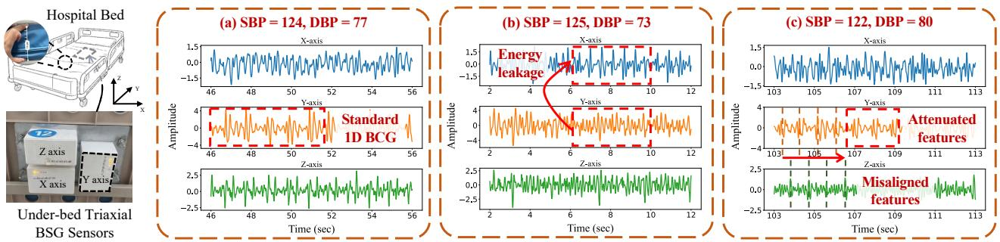  
Fig. 1. Illustration of BSG sensors placement and signals under similar BP: (a) Standard BSG signal with the majority of features shown in Y-axis; (b) Energy leakage to X-axis with no observable features in Y-axis; (c) Distorted BSG signal due to soft/thick mattress with attenuated and shifted fiducial peaks.

• Inaccurate BP ground truth measurement: Most BP estimation studies use intermittent BP readings from oscillometric devices as ground truth for convenience, while such measurements cannot capture beat-to-beat BP dynamics and thus cannot provide continuous hemodynamic monitoring as a potential clinical reference [2], [5]. In addition, the accuracy of cuff-based measurements is highly affected by cuff size/placement, arm posture, and physiological fluctuations during repeated inflation, with absolute measurement errors reaching up to 28.3 and 18.5 mmHg for systolic and diastolic BP (SBP and DBP), respectively [27], [28].

• Unfaithful cardiac features in 1D BCG: Standard 1D BCG signals capture the body recoil along the Y-axis (foot-head direction), and physiological experiments have revealed the correlation between BCG fiducial points (i.e., I, J, K peaks) and cardiac force [19]. However, according to our measurement, 1D BCG cannot faithfully capture the complete bed response induced by cardiac activities, and a considerable portion of the vibration energy may leak into the X- and Z-axes under different postures, as shown in Fig. 1(b). In addition, BCG signals are vulnerable to the change of body-bed interactions affected by mattress and body weight, with attenuated features shown in Fig. 1(c).

• Reliance on purely data-driven methods: Although many studies have realized the correlations between BCG fiducial points and cardiac force [2], [19], [20], such relations are not explicitly modeled and extrapolated to BP estimation in terms of cardiogenic excitation and wave propagation theory. Most existing work uses a deep learning model as a black box to learn a domain transformation from numerous BCG-BP pairs, while uncertainties in BP ground truth and BCG morphology lead to misaligned representations during feature extraction, resulting in well-trained models that lack generalizability and robustness [29].

In this study, we leverage triaxial bodyseismography (BSG) [30] measured by seismic sensors (Fig. 1), as an extension of the 1D BCG signal for BP estimation to faithfully reveal the cardiac features. In addition, the invasive ABP waveform is used as a golden-standard reference for the model training and evaluation, along with simultaneously collected

ECG and PPG signals for a fair and comprehensive comparison. At last, we model the 3D wave propagation and propose a BSG-based BP estimation framework to properly extract and align triaxial BSG features. The contributions of this work are listed as follows:

• To the best of our knowledge, this is the first research that explicitly characterizes how cardiogenic excitation propagates through the body-bed coupling system. We establish a physical model based on wave propagation theory to interpret how the measured triaxial BSG signals are jointly shaped by cardiogenic driving forces and the dynamic response of the body-bed system.

• A BSG-based BP estimation framework, Phy-BP, is proposed with an adaptive quality-control module that filters out low-SNR signals by considering both neighboring beat patterns and universal cardiogenic templates, ensuring enriched and faithful cardiogenic features for further BP estimation.

• Phy-BP also contains a deep learning model that embeds the proposed physical model as a constraint to characterize the intrinsic coupling among triaxial BSG signals induced by a single cardiogenic excitation, ensuring robust feature extraction and alignment across three axes.

• The proposed Phy-BP was validated on a 162-hour hospital dataset collected from 21 patients, using invasive ABP measurements as the reliable reference. Extensive experiments demonstrate that Phy-BP outperforms existing BCG- and PPG/ECG-based BP estimation methods, and the results satisfy the requirements of the Association for the Advancement of Medical Instrumentation (AAMI).

The rest of the paper is organized as follows. Section II provides the hemodynamic background and challenges for BSG-based BP monitoring. Section III elaborates on the physical and deep learning model designs, with the experimental settings and dataset overview presented in Section IV. All the results are illustrated and evaluated in Section V, and Section VI concludes this research.

## II. BACKGROUND AND CHALLENGES

## A. Physiological Rationale for BSG-based BP Monitoring

From a hemodynamic perspective, BP is jointly determined by stroke volume (SV), heart rate (HR) and total peripheral

resistance (TPR) as:

$$
{ \bf B P } \propto { \bf C O } \times { \bf T P R } = { \bf S V } \times { \bf H } { \bf R } \times { \bf T P R } ,\tag{1}
$$

with SV and HR together determining the amount of blood pumped into the arterial system (i.e., cardiac output (CO)), and TPR characterizing the resistance imposed by the peripheral vasculature to blood flow. During each cardiac cycle, ventricular contraction ejects blood into the arterial tree and generates pulsatile changes in pressure and blood momentum, inherently linking the measurements from the arterial system (i.e., BP) and the cardiac mechanical system (i.e., BSG).

Specifically, BSG does not directly measure arterial pressure but captures the subtle body-bed recoil induced by blood acceleration, and the measured BSG waveform can faithfully reveal the cardiac force (i.e., CO) and is regarded as an indirect mechanical projection of the underlying hemodynamic process [19]. However, the absolute BP level is further modulated by subject-specific hemodynamic properties (i.e., TPR), and the instantaneous TPR condition cannot be directly observed from non-invasive physiological signals. Therefore, all the cuffless or non-invasive BP estimation methods require subject-specific calibration at the initial use stage, and periodic recalibration is also necessary to compensate for physiological drift and changes in hemodynamic state [2], [5], [22].

In contrast, the correlation between CO and BSG fiducial points has been validated and explained through a series of necropsies in the 1950s, and the cardiogenic origins of the BCG fiducial points are shown in Fig. 2 and explained as:

1) H wave represents the initial acceleration of blood mass caused by the isovolumetric contraction. However, all the valves are closed with no blood flow, and the body experiences a reaction force in the foot direction.

2) I wave coincides with the opening of the aortic valve when the blood flows into the ascending aorta, producing a body recoil towards the foot.

3) J wave has the largest amplitude compared with other fiducial points and is generated by the blood flow through the ascending aorta after passing the aortic arch, producing the maximum change in blood momentum and thus the strongest inertial reaction towards the head.

4) K wave is caused by deceleration of blood flow due to peripheral resistance and arterial elasticity, producing a reaction force opposite to the earlier acceleration.

5) L wave occurs in early diastole, during rapid ventricular filling, when blood from the atrium flows into the ventricle after mitral valve opening, causing the body to recoil toward the head.

## B. Advantages and Challenges of BSG-based BP Monitoring

The physiological relationship described in the last subsection encourages the development of BP estimation algorithms based on 1D BCG signals [2], [20], but a single axis is not sufficient to capture the faithful body recoil induced by cardiogenic excitation, as shown in Fig. 1(b) and (c). To faithfully capture cardiac activity through bed vibration signals, our research mounted three seismic sensors under the bed frame with different orientations for 3-axis sensing and can capture standard BCG signals in the Y-axis with the leaked cardiac features in X- or Z-axis, as shown in Fig. 1(a) and (b).

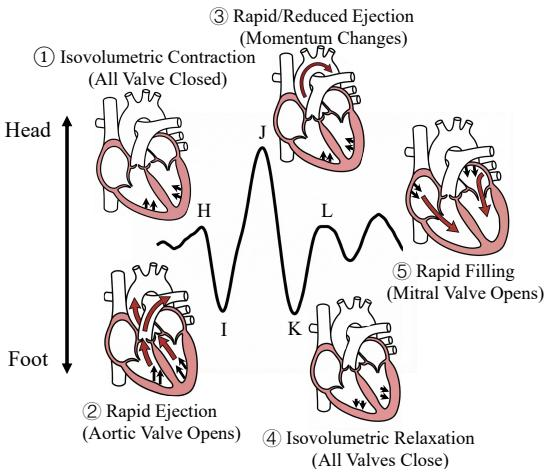  
Fig. 2. Correspondence between fiducial points and cardiac events as summarized in [18], [19], [31].

Although it is natural to directly use triaxial BSG signals as three independent input channels for deep learning models, existing deep learning models operate as black boxes and can only process 1D BCG signals. In addition, an associated challenge with triaxial BSG is that the features may shift because the soft and thick mattress acts as a lag filter, as shown in Fig. 1(c). As a result, the physiological inconsistencies (e.g., peak attenuation/shift and inaccurate cuff-based BP ground truth) across samples and axes contaminate BP-related hemodynamic information and prevent deep learning models from identifying robust, invariant representations. In summary, we conclude the following challenges to effectively extract cardiac features from triaxial BSG signals for BP estimation:

1) Obtain faithful BP measurements that can serve as reliable supervisory signals for developing and validating contactless BP monitoring systems toward clinical use.

2) Establish a physical model for the body-bed system to describe how a single cardiogenic excitation propagates in a body-bed system and is observed as triaxial BSG signals across the three axes.

3) Integrate such physical dynamics into the deep learning model to align the triaxial features under a shared latent state evolution, improving robustness and generalizability under varying signal morphology and limited-data scenarios.

## III. METHODOLOGY

## A. Overview

To overcome the aforementioned challenges, we propose the Phy-BP to realize BSG-based BP estimation using deep learning, with a physical model established and embedded for cross-axis feature alignment. In addition, the data are collected from real patients in hospital settings to enable ethical ABP measurement as a gold standard for model training and validation. All data streams are timestamp-synchronized via a Network Time Protocol (NTP) server, therefore ensuring that heartbeat aligns with corresponding mechanical and hemodynamic responses across different vital signs. The pipeline of the Phy-BP is shown in Fig. 3 with three modules:

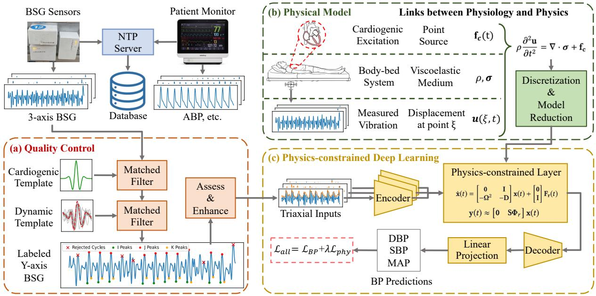  
Fig. 3. Overview of Phy-BP: (a) Quality control based on Y-axis BSG to retain signals rich in cardiogenic components; (b) Physical model that governs wave propagation excited by heartbeat; (c) Deep learning model designed with the triaxial feature extraction aligned and constrained by the physical model.

• Quality control: As a preprocessing step, all measured BSG will be automatically assessed by two matched filters to estimate SNR based on the cardiogenic components contained in the Y-axis. Eventually, the labeled Yaxis BSG signals can be easily assessed by the number of remaining single-cycle BSG patterns, ensuring effective deep learning training or inference.

• Physical model: To assist the further feature alignment across 3 axes, we model the wave propagation in a viscoelastic medium (i.e., body-bed system) excited by a point source (i.e., heartbeat) using the partial differential equation (PDE), and the 3-axis BSG measurement is modeled as a single-point displacement observed under the bed, as shown in Fig. 3(b).

• Physics-constrained deep learning model: The general model design uses the traditional encoder-decoder architecture, but the extracted 3-axis features are aligned via a physics-constrained layer to govern the feature evolution, as shown in Fig. 3(c). Specifically, the proposed layer aims to preserve the axis-specific characteristics arising from cardiogenic energy leakage across the three axes, and reduce feature inconsistency caused by waveform attenuation and temporal distortion.

## B. Quality Control

Considering the fact that our dataset is collected from the real hospital scenario, a considerable portion of the recorded segments may be contaminated and lack sufficient cardiogenic content due to patient body movements and other uncontrollable disturbances in routine clinical environments. Therefore, quality control is essential to filter out low-quality segments and preserve only physiologically meaningful observations as shown in Fig. 3(a).

1) Matched Filter with Cardiogenic Template for Universal Beat Patterns: In this work, the matched filter is adopted to quantify the similarity between an observed signal s(t) and a predefined heartbeat template ψ(t) through a convolution operation:

$$
y _ { f } ( t ) = ( s * h ) ( t ) = \int _ { - \infty } ^ { \infty } s ( \tau ) h ( t - \tau ) d \tau ,\tag{2}
$$

where $y _ { f } ( t )$ denotes the filter response, and the matched filter $h ( t )$ is defined as the time-reversed version of the template signal as ψ(−t).

Considering the common pattern shared by Y-axis BSG signals with explicit physiological meanings as introduced in Fig. 2, we first design a universal template $\psi _ { c } ( t )$ that matches the morphology of cardiogenic components from the observed signal as the fourth derivative of Gaussian function:

$$
\psi _ { c } ( t ) = \frac { d ^ { 4 } } { d t ^ { 4 } } \left( e ^ { - t ^ { 2 } / 2 } \right) = \left( t ^ { 4 } - 6 t ^ { 2 } + 3 \right) e ^ { - t ^ { 2 } / 2 } ,\tag{3}
$$

with the morphology shown as the green wavelet in Fig. 4.

After applying the matched filter in (2) and template $\psi _ { c } ,$ the filter response $y _ { f } ( t )$ is obtained as shown in Fig. 4 with the prominent peaks (red dots) representing the candidates for the high-quality BSG cycles. However, in real-life environments, the morphology of BSG cycles can vary substantially across subjects, body postures and mattress conditions. As a result, the actual waveform may deviate from the predefined template shape in terms of relative peak amplitude, temporal width and local asymmetry, leading to missed or false detection of valid cycles. In addition, the cardiogenic template mainly emphasizes a generic curvature pattern and cannot fully capture subject-specific or recording-specific morphological characteristics embedded in the observed BSG signals. Therefore, using only a fixed analytical template may limit the adaptability and discriminative power of the filter.

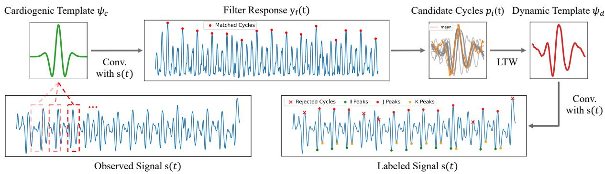  
Fig. 4. Design of matched filters with cardiogenic and dynamic templates.

2) Matched Filter with Dynamic Template Learnedfrom the Current Segment: To further quantify the reliable cardiogenic components contained in the current segment, another matched filter is adopted based on a dynamic template $\psi _ { d }$ learned from the current candidate cycles. Firstly, all the candidates are extracted and denoted by their peak locations $\{ t _ { i } \} _ { i = 1 } ^ { M }$ , as shown by the grey signals in Fig. 4. Each candidate cycle can be expressed as:

$$
p _ { i } ( t ) = s ( t _ { i } + t ) , \ \mathrm { w i t h } \ t \in [ - T _ { w } / 2 , \ T _ { w } / 2 ]\tag{4}
$$

where $T _ { w }$ denotes the predefined window length. Considering that these segments are selected based on the previous matched filter, they are expected to contain relatively clean cardiogenic components and therefore serve as suitable candidates for template learning.

To construct the dynamic template, a straightforward approach is to directly average the extracted cycles, but such point-wise averaging may blur the representative morphology and weaken the sharpness of physiologically meaningful waveform components due to temporal mismatch, as shown by the orange signal in Fig. 4. Therefore, we use linear time warping (LTW) to rescale each candidate prior to template aggregation.

Specifically, let $L _ { i }$ denote the target length assigned to the i-th candidate cycle after warping, and the LTW-transformed $s _ { i }$ can be expressed as:

$$
\tilde { p } _ { i } ^ { ( L _ { i } ) } ( \tau ) = p _ { i } \left( \frac { T _ { w } } { L _ { i } } \tau \right) , \mathrm { w i t h } \ \tau \in [ - L _ { i } / 2 , L _ { i } / 2 ] ,\tag{5}
$$

where the ratio $L _ { i } / T _ { w }$ characterizes the temporal scaling factor of the i-th cycle. In practice, the warped signal is obtained by linear interpolation, allowing each candidate to be stretched or compressed along the time axis while preserving its overall waveform morphology.

To achieve a consistent template representation, all warped cycles are truncated or padded to the original window length $T _ { w }$ , and the dynamic template learning problem is formulated to find the optimal scaling lengths as:

$$
\{ L _ { i } ^ { * } \} _ { i = 1 } ^ { M } = \arg \operatorname* { m i n } _ { \{ L _ { i } \} _ { i = 1 } ^ { M } } \sum _ { i = 1 } ^ { M } \left\| \hat { p } _ { i } ^ { ( L _ { i } ) } - \psi _ { d } \right\| _ { 2 } ^ { 2 } ,\tag{6}
$$

with

$$
\psi _ { d } = \frac { 1 } { M } \sum _ { i = 1 } ^ { M } \hat { p } _ { i } ^ { ( L _ { i } ) } .\tag{7}
$$

The objective in (6) seeks a set of scaling lengths $\{ L _ { i } ^ { * } \} _ { i = 1 } ^ { M }$ together with a shared template $\psi _ { d } ,$ , such that all candidate cycles become as close as possible to the same representative morphology. In addition, the scaling ratio $L _ { i } / T _ { w }$ is restricted within ±15% to prevent a trivial solution. In this way, the learned template is less affected by local temporal mismatch across cycles, while the resulting template $\psi _ { d } ( t )$ can be interpreted as a data-adaptive representative heartbeat morphology learned from the current segment, as shown by the red signal in Fig. 4.

3) Assessment ofSignal Quality with Feature Enhancement: After the quality evaluation by two matched filters using both cardiogenic and dynamic templates, all the high-quality BSG cycles are identified as shown in Fig. 4, and the quality control can be performed by counting the recognized cardiogenic cycles in the current segment. In addition, the Hilbert envelope is extracted for the preserved segments to enhance the cardiac feature, as used by many previous studies [9], [12].

## C. Physical Model for 3D Wave Propagation

To further model the intrinsic relationships between highquality triaxial BSG signals and cardiogenic excitation, the body-bed system can be modeled as an equivalent viscoelastic medium under small-amplitude mechanical excitation (i.e., cardiogenic forces $\mathbf { f _ { c } } )$ [32]. The wave propagation theory provides adequate tools to capture wave attenuation, dispersion, and phase delay [33], with the dominant dynamics mainly governed by elastic and viscous properties. This section will construct the constitutive model for cardiogenic excitation and the body-bed system as a theoretical foundation of the physicsconstrained deep learning layer. However, only the key steps are presented in the main text for clarity, while the detailed derivation is provided in the supplemental material.

1) Wave Propagation Model for the Body-bed System: By modeling the body-bed system as an equivalent viscoelastic medium, the propagation of cardiogenic vibration can be expressed as

$$
\rho \frac { \partial ^ { 2 } \mathbf { u } } { \partial { t } ^ { 2 } } = \nabla \cdot \left( E : \nabla _ { s } \mathbf { u } \right) + \nabla \cdot \left( \pmb { \eta } : \nabla _ { s } \dot { \mathbf { u } } \right) + \mathbf { f } _ { c } ,\tag{8}
$$

where $\mathbf { u } ( \boldsymbol { \xi } , t ) \in \mathbb { R } ^ { 3 }$ is the displacement field, $\rho$ is the density, E and η denote the elastic and viscous parameters, and $\mathbf { f } _ { c }$ represents the cardiogenic excitation force. This equation shows that wave propagation in the body-bed system is jointly governed by inertial, elastic, and viscous effects.

2) Finite-Dimensional Dynamic System: Using the finite element method, the wave propagation model in (8) can be transformed into a finite-dimensional second-order dynamical system:

$$
\mathbf { M } \ddot { \mathbf { q } } ( t ) + \mathbf { C } \dot { \mathbf { q } } ( t ) + \mathbf { K } \mathbf { q } ( t ) = \mathbf { F } _ { c } ( t ) ,\tag{9}
$$

where $\mathbf { q } ( t )$ denotes the nodal displacement states, M, C, and K are the mass, damping, and stiffness matrices, respectively, and ${ \bf F } _ { c } ( t )$ is the equivalent force induced by cardiogenic excitation. The detailed expressions can be found in the supplemental material.

3) Model Reduction for the Body-bed System: According to the previous FEM discretization, the original PDE in (8) is simplified as the ODE model in (9). However, since the bodybed system is assembled from a large number of nodes, the resulting state dimension is too high for efficient learning and inference. Therefore, modal truncation is adopted to derive a reduced-order model.

Specifically, we assume that the measured BSG signals are mainly dominated by a limited number of low-frequency vibration modes. After removing unobservable rigid-body modes, the system matrices are assumed to admit a valid modal decomposition. In addition, proportional (Rayleigh) damping is adopted with the damping matrix expressed as a linear combination of the mass and stiffness matrices as:

$$
\mathbf { C } = \alpha \mathbf { M } + \beta \mathbf { K } ,\tag{10}
$$

where α and $\beta$ are the Rayleigh damping coefficients.

Based on the generalized eigenvalue problem of the discretized system, the nodal displacement is approximated by the first r dominant modes as:

$$
\mathbf { q } ( t ) \approx \Phi _ { r } \mathbf { z } ( t ) ,\tag{11}
$$

where $\Phi _ { r }$ contains the retained mode shapes and $\mathbf { z } ( t ) \in \mathbb { R } ^ { r }$ denotes the reduced modal coordinates. By projecting the fullorder dynamics onto this modal subspace, the original highdimensional system is reduced to:

$$
\ddot { { \mathbf { z } } } ( t ) + { \mathbf { D } } \dot { { \mathbf { z } } } ( t ) + { \boldsymbol { \Omega } } ^ { 2 } { \mathbf { z } } ( t ) = { \mathbf { F } } _ { r } ( t ) ,\tag{12}
$$

with

$$
\begin{array} { r l } & { \mathbf { F } _ { \mathbf { r } } ( t ) = \Phi _ { r } ^ { \top } \mathbf { F } _ { c } ( t ) , } \\ & { \qquad \Omega ^ { 2 } = \mathrm { d i a g } ( \omega _ { 1 } ^ { 2 } , \ldots , \omega _ { r } ^ { 2 } ) , } \\ & { \qquad \mathbf { D } = \boldsymbol { \alpha } \mathbf { I } + \beta \Omega ^ { 2 } , } \end{array}\tag{13}
$$

where $\Omega ^ { 2 }$ is the diagonal matrix of retained modal frequencies, D is the reduced damping matrix, and $\mathbf { F } _ { r } ( t )$ is the reduced generalized force.

Finally, by defining the state vector as $\begin{array} { r l } { \mathbf { x } ( t ) } & { { } = } \end{array}$ $[ \mathbf { z } ( t ) ^ { \top } , \dot { \mathbf { z } } ( t ) ^ { \top } ] ^ { \top }$ , the reduced-order system can be written in state-space form as:

$$
\dot { { \mathbf x } } ( t ) = \left[ - { \pmb 0 } \frac { { \mathbf I } } { - { \pmb \Omega } ^ { 2 } } - { \bf D } \right] { \mathbf x } ( t ) + \left[ { \pmb 0 } \right] { \mathbf F } _ { r } ( t ) ,\tag{14}
$$

and the measured triaxial BSG signal is expressed as:

$$
\mathbf { y } ( t ) \approx \left[ \mathbf { 0 } \quad \mathbf { S } \boldsymbol { \Phi } _ { r } \right] \mathbf { x } ( t ) ,\tag{15}
$$

where S denotes the observation matrix mapping the latent structural response to the sensor channels. In practice, only the first few dominant modes within the effective BSG frequency band are retained, and the reduced model in (14) preserves the principal low-frequency dynamics while remaining computationally tractable for the later design of the physics-constrained layer.

## D. Physics-constrained Deep Learning Model

To provide a clear reference for subsequent model comparison, the plain encoder-decoder architecture is adopted as the benchmark backbone in this study, as shown in Fig. 3(c), while the state-space models in (14) are embedded as physicsconstrained layers later in this section.

1) Benchmark Architecture Design: Table I illustrates the encoder design, a 1-D ResNet-18 with residual blocks is adopted to extract cardiac information, as widely used for cardiac and vibration signal analysis [15], [34]. In this study, 10-sec triaxial BSG signals sampled at 100 Hz together with their Hilbert envelopes are fed into three individual encoders. Each encoder consists of an initial 1D convolutional (Conv1d) layer, a max-pooling layer, and four residual stages, producing a compact feature map of size (N, 128, 32).

The decoder adopts a lightweight structure to progressively transform the latent feature map output by the encoder into the final prediction. The input feature is first passed through four Convolutional (Conv) Blocks, with each block consisting of a Conv1d layer, a batch normalization (BN) layer and a rectified linear unit (ReLU) activation. Then, the feature map is processed by three Transposed Convolutional (TransConv) Blocks to gradually recover the temporal resolution of the latent representation, with each block composed of TransConv, BN and ReLU. After that, the output is flattened and fed into two Linear Blocks (Linear Layer, BN, ReLU) followed by one final Linear Layer, generating the final SBP, DBP and mean arterial pressure (MAP) predictions.

2) Physics-constrained Layer Design: To explicitly embed the reduced-order physical model derived in Section III-C3 into the deep learning pipeline, a physics-constrained layer is introduced between the encoder and decoder to align the latent representations extracted from the three BSG axes, as shown in Fig. 5. The inputs of this layer are the latent features produced by the three encoders $\hat { \mathbf { f } } _ { x } , \hat { \mathbf { f } } _ { y } , \hat { \mathbf { f } } _ { z } \in \mathbb { R } ^ { C \times L }$ , as shown in Table I, while these features will be aligned through two steps to preserve axis-specific informative components and suppress distortion-induced inconsistency.

Gate-based Feature Alignment: The latent features extracted from the X-, Y-, and Z-axis are firstly normalized along the channel dimension to reduce scale discrepancy, yielding $\mathbf { f } _ { x } , \mathbf { f } _ { y } , \mathbf { f } _ { z }$ and the shared prototype $\mathbf { f } _ { p }$ as shown in Fig. 5(a). Then, for each axis $a \in \{ x , y , z \}$ , a time-varying gate $\sigma _ { a } \in [ 0 , 1 ]$ is learned from the concatenated feature tuple $[ \mathbf { f } _ { a } , \mathbf { f } _ { p } , \mathbf { f } _ { a } - \mathbf { f } _ { p } ]$ through a gate network, and the aligned feature is formulated as:

$$
\tilde { \mathbf { f } } _ { a } ( t ) = \sigma _ { a } \mathbf { f } _ { a } ( t ) + \left( 1 - \sigma _ { a } \right) \mathbf { f } _ { p } ( t ) .\tag{16}
$$

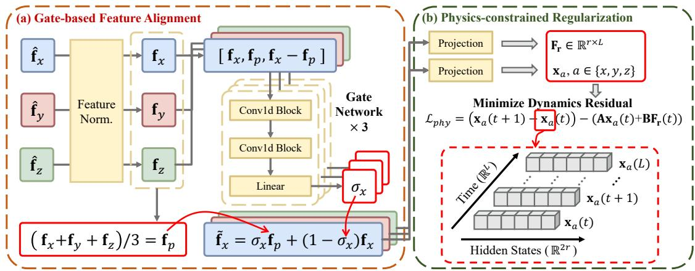  
Fig. 5. Design of physics-constrained layer: (a) Gate-based feature alignment to aggregate triaxial features; (b) Physics-constrained regularization to govern the feature evolution during network training.

TABLE I  
STRUCTURE AND PARAMETERS FOR THE ENCODER AND DECODER
<table><tr><td>Encoder Layers</td><td>Parameters  $( C _ { i n } , C _ { o u t } , K , S ) ^ { 1 }$ </td><td>Output Shape N: Batch Size</td></tr><tr><td>Input signal</td><td></td><td>(N, 2, 1000)</td></tr><tr><td>Encoder</td><td></td><td></td></tr><tr><td>Conv1d</td><td>(2, 64, 7, 2)</td><td>(N, 64, 500)</td></tr><tr><td>MaxPool</td><td>(64, 64, 3, 2)</td><td>(N, 64, 250)</td></tr><tr><td>Residual Block ×2</td><td>(64, 16, 3, 1)</td><td>(N, 16, 250)</td></tr><tr><td>Residual Block ×2</td><td>(16, 32, 3, 2)</td><td>(N, 32, 125)</td></tr><tr><td>Residual Block ×2</td><td>(32, 64, 3, 2)</td><td>(N, 64, 63)</td></tr><tr><td>Residual Block ×2</td><td>(64, 128, 3, 2)</td><td>(N, 128, 32)</td></tr><tr><td>Decoder</td><td></td><td></td></tr><tr><td>Conv Block Conv Block</td><td>(128, 32, 3, 1) (32,16, 3, 1)</td><td>(N, 32, 32) (N, 16, 32)</td></tr><tr><td>Conv Block</td><td>(16, 8, 3, 1)</td><td>(N, 8, 32)</td></tr><tr><td>Conv Block</td><td>(8, 4, 3, 1)</td><td>(N, 4, 32)</td></tr><tr><td>TransConv Block</td><td>(4, 4, 3, 2)</td><td>(N, 4, 62)</td></tr><tr><td>TransConv Block</td><td>(4, 8, 3, 2)</td><td>(N, 8, 122)</td></tr><tr><td>TransConv Block</td><td>(8, 8, 3, 1)</td><td>(N, 8, 120)</td></tr><tr><td>Linear Block</td><td>(120 × 8, 1024, −, −)</td><td>(N, 1024)</td></tr><tr><td>Linear Block</td><td>(1024, 512, −, −)</td><td>(N, 512)</td></tr><tr><td>Linear Layer</td><td>(512, 3, −, −)</td><td>(N, 3)</td></tr><tr><td>Output</td><td></td><td>(N, 3)</td></tr></table>

$\textstyle \operatorname { \mathbb { T } } C _ { i n } .$ input channels; $\overline { { C _ { o u t } } } \mathrm { : }$ output channels; K: kernel size; S: stride.

Given that cardiogenic vibration energy may redistribute across axes and yield different yet still informative observations in triaxial BSG measurements, the gate-based soft alignment allows the model to selectively preserve the informative axis-specific components, while pulling the feature toward the shared prototype when distortion or energy leakage weakens its cardiogenic consistency.

Physics-constrained Latent State Regularization: After gate-based feature alignment, the aligned features across the three axes are further regularized in a low-dimensional latent state to enhance their physical consistency during deep learning model training. Specifically, the aligned feature $\tilde { \mathbf { f } } _ { a } \in$ $\mathbb { R } ^ { C \times L }$ is projected into a latent state sequence ${ \bf x } _ { a } ( t ) \in \mathbb { R } ^ { 2 r }$ through an individual projection network, where r denotes the reduced modal dimension. Meanwhile, the fused feature $\mathbf { f } _ { \mathrm { f u s e d } } \ = \ ( \tilde { \mathbf { f } } _ { x } + \tilde { \mathbf { f } } _ { y } + \tilde { \mathbf { f } } _ { z } ) / 3$ is projected to a shared latent excitation $\mathbf { F } _ { r } \in \bar { \mathbb { R } ^ { r \times L } }$ , representing the common cardiogenic driving effect underlying the three-axis measurements.

Based on the reduced-order dynamics in (14), the latent states from all three axes $a \ \in \ \{ x , y , z \}$ are constrained to evolve under the same structured state-space model:

$$
\dot { \mathbf { x } } _ { a } ( t ) = \mathbf { x } _ { a } ( t + 1 ) - \mathbf { x } _ { a } ( t ) \approx \mathbf { A } \mathbf { x } _ { a } ( t ) + \mathbf { B } \mathbf { F } _ { r } ( t ) ,\tag{17}
$$

where A and B are constructed according to a damped secondorder dynamical form. Therefore, the learned features are not forced to share identical latent states, but are encouraged to follow the same underlying dynamical law by minimizing the dynamics residual $\mathcal { L } _ { p h y } ,$ as shown in Fig. 5(b).

In implementation, the proposed layer contains several groups of learnable parameters. Firstly, each projection network for the latent states $\mathbf { x } _ { a }$ is composed of two Conv Blocks that map from $\mathbb { R } ^ { C \times L }$ to $\mathbb { R } ^ { 2 r \times L }$ . Secondly, the shared excitation $\mathbf { F } _ { r } ( t )$ is obtained via another projection network with the same structure, mapping from $\mathbf { \mathbb { R } } ^ { \mathbf { \bar { { C } } } \times L } \mathbf { \Psi } _ { \mathbf { t o } } \mathbf { \mathbb { R } } ^ { r \times L }$ . Thirdly, the state-space dynamics contain learnable modal parameters as shown in (13), including the raw modal frequency vector $\{ \omega _ { 1 } , \ldots , \omega _ { r } \}$ , two nonnegative damping scalars α and $\beta .$ These parameters jointly determine the structured transition matrix A in the state-space model.

Overall Loss Function: Finally, the overall training loss is defined as:

$$
\mathcal { L } _ { \mathrm { a l l } } = \mathcal { L } _ { B P } + \lambda \mathcal { L } _ { p h y } ,\tag{18}
$$

where $\mathcal { L } _ { \mathrm { B P } }$ denotes the regression loss between the predicted and ground-truth blood pressure (BP) values, $\mathcal { L } _ { \mathrm { p h y } }$ is the physics-guided regularization term, and λ is a weighting coefficient that balances the two loss components.

## IV. DETAILS OF EXPERIMENTS AND DATASET

## A. Dataset Collection and Description

Fig. 6(a) illustrates the data collection scenarios in a hospital setting, and three seismic sensors are mounted under the bed frame at different orientations for 3-axis sensing. The same geophone (SEN-11755 SM-6 [35]) and data acquisition board are used in each under-bed white box, and the adopted geophone consists of a fixed magnetic core enclosed by wire coils as a transducer for subtle vibrations. This geophonebased sensor system has been validated for faithful cardiac or sleeping monitoring in our previous studies [21], [23].

Data Collection Scenario  
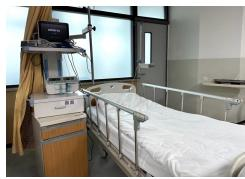

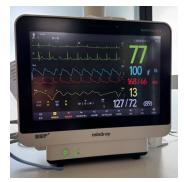  
(a)

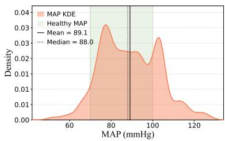  
(b)

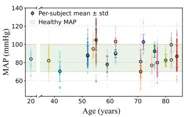  
(c)  
Fig. 6. Overview of the dataset: (a) Data collection scenario and geophone; (b) MAP Distribution; (c) MAP by Age.

The dataset contains a total of 162 hours of synchronous data collected from 21 people aged 20 to 84 (16 male, 5 female). Except for BSG and BP/ABP data, the ECG and PPG signals are collected for comparison purposes, and the CO/SV data is also available by using PiCCO [3] to indicate personal hemodynamic conditions (e.g., TPR). All vital sign signals are exported from the Mindray BeneVision N12 at a sampling rate of 100 Hz.

The overall data distribution is summarized in Fig. 6(b) and Fig. 6(c). Although most subjects are within a relatively healthy BP range, the naturally collected hospital dataset still covers a wider MAP distribution than many controlled laboratory datasets. Such a broad BP range is important for evaluating whether a model truly learns BP-related cardiogenic features, rather than obtaining seemingly good performance by predicting values close to the population mean. In addition, the dataset covers a wide age range and diverse BP conditions, enabling a more comprehensive evaluation of model robustness across different physiological states.

## B. Implementation Details

1) Model Training Strategy: The deep learning model is coded in PyTorch and trained on NVIDIA RTX 4090 (24GB) for 100 epochs with batch size 512. The leave-one-subject-out (LOSO) cross-validation protocol is used for model training and testing, with samples from 1 fixed subject for test and all the other subjects alternately selected for training and validation. We repeat all the experiments 5 times, and all the results show statistical significance, hence only the mean values are given in the result evaluations.

2) Methods for Comparison and Evaluation Metrics: To the best of our knowledge, the proposed Phy-BP is the first framework that leverages triaxial BSG signals for BP estimation, while existing frameworks typically use single-axis BCG as input. Therefore, the performance of the proposed Phy-BP will be compared with recent frameworks based on BCG (AI-BCG (2024) [2], FSNet (2026) [22]) and PPG/ECG (PITN (2025) [8], MSTNN (2023) [36]). The vanilla ResNet-18 [34] will be used as baseline.

The performance of BP prediction will be evaluated based on mean error (ME), mean absolute error (MAE), Pearsoncorrelation coefficient (PCC) and standard deviation (STD), and the AAMI standard is widely adopted as the core accuracy criteria in existing BP prediction studies, requiring $| \mathrm { M E } | \le$ 5 mmHg and $\mathrm { S T D } ~ \leq ~ 8$ mmHg [2], [8], [22]. In addition, to provide a comprehensive assessment across multiple blood pressure prediction tasks, the averaged relative improvement over the baseline b is calculated across tasks and metrics as:

$$
\Delta m \% = \frac { 1 } { n } \sum _ { i = 1 } ^ { n } \frac { 1 } { n _ { i } } \sum _ { j = 1 } ^ { n _ { i } } s _ { i , j } \frac { M _ { m , i , j } - M _ { b , i , j } } { M _ { b , i , j } } \times 1 0 0 \% ,\tag{19}
$$

where $n = 3$ denotes the number of prediction tasks (i.e., SBP, DBP, MAP prediction), and $n _ { i } = 3$ denotes the number of metrics for task i (i.e., MAE, STD, PCC). $M _ { m , i , j }$ represents the performance of method m on task i measured by metric j, while $M _ { b , i , j }$ denotes the corresponding performance of the reference baseline. $s _ { i , j } \ = \ 1 / \mathrm { ~ - ~ } 1$ if higher/lower values are better for the current metric (indicated by ↑ / ↓).

3) Calibration for Personal Hemodynamic Difference: According to (1), BP is determined by CO and TPR, where CO is directly associated with BSG signal based on Starr’s necropsies [19], but there is no evidence to imply that the personal TPR conditions can be inferred from any non-invasive measurement. Therefore, calibration is commonly recognized as a necessary step to correct the model response to fit personal hemodynamic conditions [2], [5], [16], [17]. Although some studies claimed to require only a single calibration or even no calibration, these claims were made without quantitative analysis of TPR-related effects. Thus, the previous models may directly predict the mean value to minimize the ME, and the good performance relies on a stable individual hemodynamic condition, as will be shown in the later experimental results.

In contrast, our dataset includes PiCCO-derived CO measurements and supports quantitative calculation of TPR based on (1), enabling a rigorous evaluation of the impact and necessity of calibration. In our research, the calibration is performed using 1 sample every 8 hours (corresponding to 5% of the dataset) following hospital routine unless otherwise specified [3], and the BP error calculated for this single sample will be added to all the predictions in the next 8 hours as calibration. Only historical data are used for calibration to ensure causality, and the samples used for calibration are excluded from the test stage. Based on our experimental analysis on TPR, the calibration frequency should be determined based on the scenario-specified hemodynamic conditions for real-life applications.

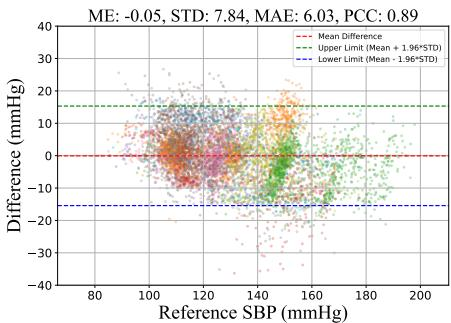  
(a)

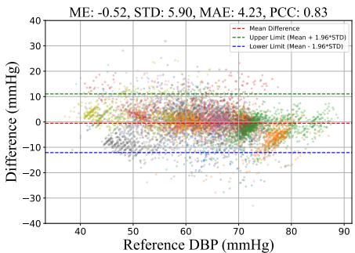  
(b)

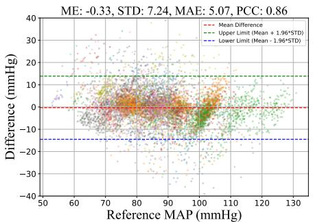  
(c)

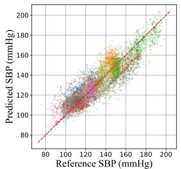  
(d)

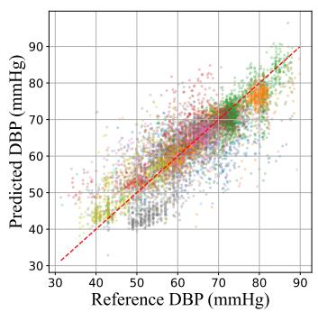  
(e)

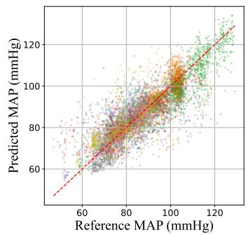  
(f)  
Fig. 7. Performance overview of Phy-BP (Full) with different colors for different subjects: (a) - (c) Bland-Altman plot for SBP, DBP and MAP; (d) - (f) Correlation plot for SBP, DBP and MAP.

TABLE II  
COMPARISON RESULTS OF DIFFERENT MODELS
<table><tr><td rowspan="2">Model</td><td colspan="4">SBP</td><td colspan="4"></td><td colspan="4">MAP</td><td rowspan="2">Overall ∆m%↑</td></tr><tr><td>MAE↓</td><td>ME→0</td><td>STD↓</td><td>PCC↑</td><td>MAE↓</td><td>ME→0</td><td>STD↓</td><td>PCC↑</td><td>MAE↓</td><td>ME→0</td><td>STD↓</td><td>PCC↑</td></tr><tr><td>ResNet [34]</td><td>13.85</td><td>-1.24</td><td>13.86</td><td>0.60</td><td>8.02</td><td>-2.52</td><td>9.79</td><td>0.45</td><td>9.89</td><td>-2.87</td><td>12.28</td><td>0.52</td><td>baseline</td></tr><tr><td>PITN [8]</td><td>14.76</td><td>4.02</td><td>14.29</td><td>0.27</td><td>7.29</td><td>1.06</td><td>9.19</td><td>0.31</td><td>8.94</td><td>1.53</td><td>11.40</td><td>0.37</td><td>-10.29%</td></tr><tr><td>MSTNN [36]</td><td>14.61</td><td>0.77</td><td>14.46</td><td>0.23</td><td>7.18</td><td>0.53</td><td>9.52</td><td>0.28</td><td>9.39</td><td>0.17</td><td>12.38</td><td>0.21</td><td>-17.74%</td></tr><tr><td>FSNet [22]</td><td>11.08</td><td>-1.49</td><td>8.01</td><td>0.74</td><td>6.42</td><td>-2.47</td><td>8.03</td><td>0.66</td><td>8.45</td><td>-2.86</td><td>10.95</td><td>0.67</td><td>24.89%</td></tr><tr><td>AI-BCĠ [2]</td><td>9.35</td><td>0.31</td><td>9.05</td><td>0.78</td><td>6.18</td><td>0.24</td><td>7.07</td><td>0.66</td><td>8.03</td><td>0.13</td><td>8.67</td><td>0.66</td><td>29.11%</td></tr><tr><td>Phy-BP(3-axis)</td><td>6.03</td><td>-0.05</td><td>7.84</td><td>0.89</td><td>4.23</td><td>-0.52</td><td>5.90</td><td>0.83</td><td>5.07</td><td>-0.33</td><td>7.24</td><td>0.86</td><td>52.76%</td></tr></table>

## V. EXPERIMENTAL RESULTS AND EVALUATIONS

In this section, the overall performance of the proposed Phy-BP for BP estimation will be compared first, with the personal TPR condition considered an important variable. Then, the improvement brought by the proposed modules, such as quality control and physics-constrained layer, will be quantitatively evaluated separately. Finally, more practical evaluations will be conducted to demonstrate robustness and generalizability across various real-world situations.

## A. Overall Performance

1) Performance Overview: Fig. 7 presents the Bland-Altman and correlation plots of the proposed Phy-BP for SBP, DBP and MAP estimation. As shown in Fig. 7(a)– (c), the prediction errors are centered close to zero, with MEs of −0.05, −0.52 and −0.33 mmHg for SBP, DBP and MAP, respectively. The corresponding STDs are 7.84, 5.90 and 7.24 mmHg, indicating that the error dispersion satisfies the AAMI requirement for all three BP targets. The correlation plots in Fig. 7(d)–(f) further show that the predictions follow the reference BP variations across subjects, with PCCs of 0.89, 0.83 and 0.86 for SBP, DBP and MAP, respectively. These results suggest that Phy-BP does not merely predict a population-level average, but can track subject-dependent and time-varying BP changes in the hospital dataset.

Table II summarizes the quantitative comparison with representative BP estimation frameworks. Overall, Phy-BP achieves the best performance across all three BP targets, with MAEs of 6.03, 4.23 and 5.07 mmHg for SBP, DBP and MAP, respectively. Compared with the ResNet baseline, Phy-BP obtains an overall improvement of 52.76%, indicating that the proposed triaxial modeling and physics-constrained representation learning can substantially improve BP estimation accuracy under realistic hospital data collection conditions.

It is worth noting that most existing BP estimation datasets are collected under controlled laboratory settings, where body posture, sensor attachment and signal morphology are relatively stable. In contrast, our dataset is naturally collected in a hospital scenario with routine patient movements, varying body-bed interactions and medication-induced hemodynamic changes. Under such more practical setting, the compared models still show limited performance even after calibration, suggesting that the performance gap is not caused only by insufficient personalization but also by the mismatch between their signal assumptions and natural clinical deployment conditions.

2) Comparisons to PPG-based Models: The PPG/ECGbased methods, including PITN and MSTNN, show limited performance in this evaluation, with negative overall improvements compared with the ResNet baseline. This result should not be interpreted as evidence that PPG/ECG-based BP estimation is infeasible. Instead, these methods are usually designed under assumptions of stable sensor attachment, consistent signal morphology and explicit subject-specific calibration. In the considered hospital scenario, additional calibration measurements are difficult to perform frequently because of clinical workflow constraints, patient movement and medication-induced hemodynamic changes. Therefore, the performance degradation mainly reflects the mismatch between their expected calibration protocol and the practical deployment condition, rather than a fundamental limitation of PPG/ECG signals.

3) Comparisons to Models using Single-axis Inputs: The BCG-based baselines, including FSNet and AI-BCG, achieve better performance than the PPG/ECG-based methods, with overall improvements of 24.89% and 29.11%, respectively. This indicates that under-bed vibration sensing provides a more practical signal source for contactless BP monitoring in the considered hospital scenario, where stable skin contact and frequent calibration are difficult to guarantee. However, these methods still rely on a single BSG/BCG axis and therefore can only observe a partial projection of the bodybed response induced by cardiogenic excitation. As a result, their performance remains lower than that of Phy-BP, which jointly exploits triaxial BSG signals and achieves an overall improvement of 52.76%. This comparison suggests that singleaxis BCG methods can capture useful BP-related mechanical information, but their performance is limited by incomplete observation of multi-directional vibration propagation. The detailed ablation studies on the input axes will be provided in Section V-B2.

4) Analysis for Different TPR: To further examine the impact of subject-specific hemodynamic variation, we analyze the prediction performance with respect to TPR variability. According to (1), BP is jointly determined by cardiac output and TPR, but most previous cuffless BP studies do not have simultaneous CO measurements and therefore cannot quantitatively estimate TPR. This limitation makes it difficult to determine whether a model learns transferable cardiovascular representations or simply benefits from stable subject-specific hemodynamic conditions. Benefiting from the PiCCO-derived CO measurements in our dataset, TPR can be calculated explicitly for each subject. In Fig. 8, we select the three best-performing models in Table II, including Phy-BP, FSNet and AI-BCG, and compare their subject-level MAP prediction errors, with subjects ordered by increasing TPR variability measured by the root mean square of successive differences (RMSSD) of the TPR sequence.

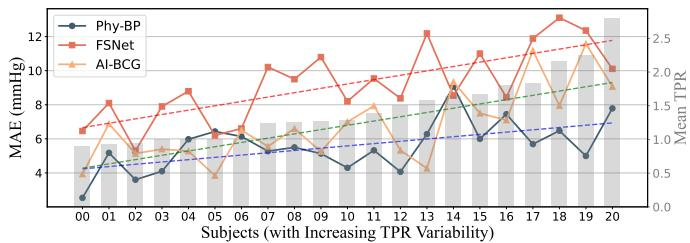  
(a)

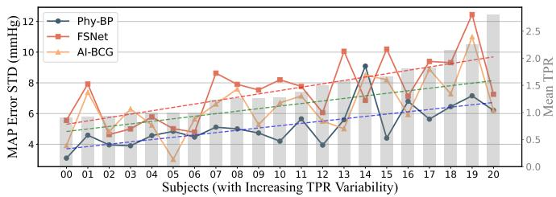  
(b)  
Fig. 8. MAE and STD for each subject w.r.t. TPR variability.

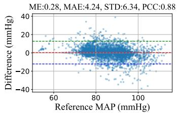

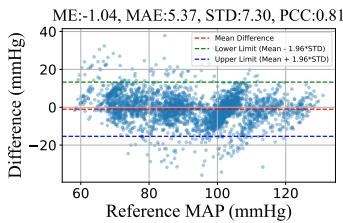  
(b) Medium TPR Group

(a) Low TPR Group  
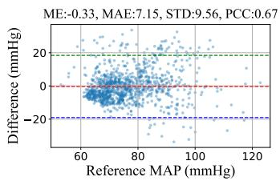  
(c) High TPR Group

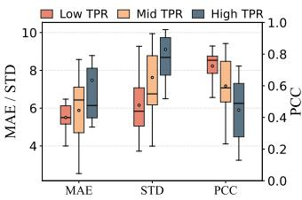  
(d) Overall Statistics  
Fig. 9. Prediction performance w.r.t. different TPR variability groups.

As shown in Fig. 8(a) and Fig. 8(b), all three models exhibit degraded performance as TPR variability increases, indicating that hemodynamic drift is a common challenge for cuffless and contactless BP estimation. This trend supports the necessity of considering TPR-related effects when evaluating BP monitoring models, especially in hospital scenarios where medication, disease progression and clinical interventions can rapidly change vascular resistance. Compared with FSNet and AI-BCG, Phy-BP maintains lower MAE and STD across most subjects and shows a more stable trend along the increasing TPR variability. The improved stability suggests that the proposed triaxial physics-constrained representation is less sensitive to hemodynamic changes than single-axis BSG baselines.

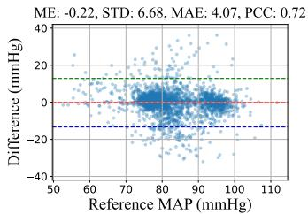  
(a) Cycles> 4

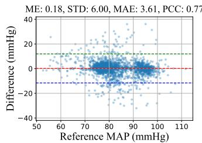  
(b) Cycles> 5

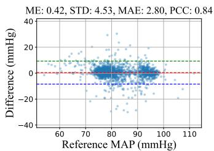  
(c) Cycles> 6

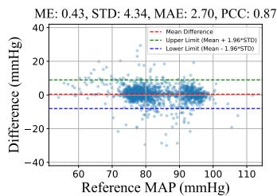  
(d) Cycles> 7  
Fig. 10. Effectiveness of the quality control illustrated by subject #36, with different thresholds for required matched cardiac cycles.

To provide a more quantitative group-level evaluation, we further divide all subjects into low-, medium- and high-TPR variability groups by tertiles of the RMSSD-based TPR variability. As shown in Fig. 9(a)–(c), the MAP prediction performance degrades consistently from the low-TPR group to the high-TPR group. Specifically, the low-TPR group achieves an MAE of 4.24 mmHg, STD of 6.34 mmHg and PCC of 0.88, while the medium-TPR group obtains an MAE of 5.37 mmHg, STD of 7.30 mmHg and PCC of 0.81. In contrast, the high-TPR group shows a clearly larger error, with an MAE of 7.15 mmHg, STD of 9.56 mmHg and PCC of 0.67. The box plots in Fig. 9(d) further show that the high-TPR group has larger variability in MAE and STD, indicating that rapid vascular-resistance changes not only increase the average prediction error but also make the model response less stable across subjects. This grouped analysis provides additional evidence that TPR variability is an important factor affecting cuffless and contactless BP estimation, and that evaluating only the overall error may hide substantial differences among subjects with different hemodynamic stability.

## B. Ablation Studies

1) Effectiveness of Quality Control: The quality-control module is designed to identify BSG segments that contain reliable cardiogenic features for BP estimation. Fig. 10 shows the Bland-Altman plots of subject #36 under different thresholds for the required matched cardiac cycles. As the threshold increases from Cycles> 4 to Cycles> 7, samples with large prediction errors are progressively removed, leading to reduced STD and MAE and increased PCC. Meanwhile, the core sample cluster that already yields accurate predictions remains well preserved around the zero-error line. This pattern indicates that the proposed quality-control score is not simply discarding data randomly, but can effectively distinguish segments containing useful heartbeat-related morphology from non-standard BSG segments that are more likely to mislead BP inference.

Fig. 11 further evaluates the effect of quality control on all samples by applying different quality thresholds during inference with the same trained model. The results show that quality control remains effective even in the large-sample setting, as stricter cycle requirements generally reduce MAE and STD while improving PCC. However, the threshold cannot be increased without limit. Since segments with extremely high quality occupy an increasingly smaller portion of the real dataset, an overly strict requirement may select a subset that cannot represent the overall distribution for the general monitoring scenario. Therefore, the threshold should balance signal reliability and practical coverage. In this work, we use Cycles> 7 as the default setting, meaning that at least seven matched cardiac cycles should be identified within each 10-sec BSG segment.

2) Necessity of using Triaxial BSG for BP Monitoring: Table III first evaluates the effect of using different combinations of BSG axes as model inputs. Compared with the singleaxis results, the two-axis settings generally achieve better performance, indicating that the vibration responses measured along different directions provide complementary information for BP estimation. For example, Phy-BP(Y only) only achieves an overall improvement of 5.76%, while adding the X-axis increases the improvement to 38.22%. This large gain is consistent with the energy-leakage phenomenon discussed in Fig. 1, where cardiogenic vibration may not be fully captured by the conventional Y-axis BCG direction and can instead appear in other axes.

The results also show that the Z-axis contains rich cardiogenic information. Phy-BP(Z only) already achieves a much stronger overall improvement than Phy-BP(Y only), and its performance is close to the BCG-based methods in Table II, such as FSNet and AI-BCG. This observation explains why some existing BCG-based studies prefer Z-axis sensing instead of relying only on the traditional Y-axis BCG signal. The Y+Z combination further improves the overall score to 41.33%, outperforming the other two-axis configurations. Nevertheless, Table II shows that using all three axes still provides the best performance, with Phy-BP achieving an overall improvement of 52.76%. Therefore, each axis contributes useful information for BP prediction, and triaxial monitoring is necessary to capture the complete body-bed response induced by cardiogenic excitation.

3) Effects of Physics Constraint: The middle part of Table III evaluates the contribution of the physics-constrained layer by varying the weighting coefficient λ. If λ = 0, the model directly uses the three-axis BSG inputs without the physical regularization term. Even in this setting, it achieves an overall improvement of 34.75%, which indicates that triaxial BSG itself already contains rich and complementary cardiogenic information for BP estimation. This result is consistent with the input-axis ablation above: observing multiple vibration directions can provide a more complete description of the body-bed response than any single-axis measurement.

After introducing the physical constraint, the performance improves further, and the best result is obtained when λ = 1.5, with an overall improvement of 52.76%. The main gains come from lower STD and higher PCC. Compared with λ = 0, the STD is reduced from 10.68, 7.11 and 10.02 mmHg to 7.84, 5.90 and 7.24 mmHg for SBP, DBP and MAP, respectively, while the PCC increases from 0.76, 0.74 and 0.74 to 0.89, 0.83 and 0.86. These improvements suggest that the proposed physics-guided regularization helps the model learn more consistent multi-axis representations, reducing dispersion in prediction errors and better preserving the temporal BP variation. Therefore, the physical constraint does not merely improve average error, but enhances the reliability and consistency of BP prediction.

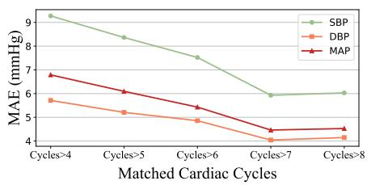  
(a)

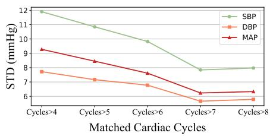  
(b)

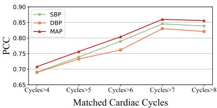  
(c)  
Fig. 11. Effectiveness of the quality control on all samples: (a) - (c) The performance of BP prediction in terms of MAE, STD and PCC, respectively.

TABLE III  
ABLATION STUDIES ON INPUT-AXIS COMBINATIONS, PHYSICS-CONSTRAINT WEIGHTING COEFFICIENT λ, AND CALIBRATION DATA SCALES
<table><tr><td rowspan="2">Settings for Phy-BP</td><td colspan="4">SBP</td><td colspan="4"></td><td colspan="4">MAP</td><td rowspan="2">Overall ∆m%↑</td></tr><tr><td>MAE↓</td><td>ME→0</td><td>STD↓</td><td>PCC↑</td><td>MAE↓</td><td>ME→0</td><td>STD↓</td><td>PCC↑</td><td>MAE↓ ME→0</td><td></td><td>STD↓</td><td>PCC↑</td></tr><tr><td colspan="10">Using Different Input Axes</td><td></td><td></td><td></td><td></td></tr><tr><td>Y only</td><td>9.44</td><td>4.92</td><td>14.30</td><td>0.41</td><td>7.73</td><td>1.17</td><td>7.85</td><td>0.43</td><td>8.49</td><td>1.64</td><td>7.96</td><td>0.45</td><td>5.76%</td></tr><tr><td>Z only</td><td>9.32</td><td>-1.04</td><td>10.77</td><td>0.70</td><td>5.46</td><td>-0.12</td><td>8.51</td><td>0.71</td><td>7.03</td><td>-1.63</td><td>10.24</td><td>0.73</td><td>28.93%</td></tr><tr><td>X+Y</td><td>7.14</td><td>-0.95</td><td>7.39</td><td>0.78</td><td>5.23</td><td>0.38</td><td>7.34</td><td>0.72</td><td>8.01</td><td>0.05</td><td>7.88</td><td>0.75</td><td>38.22%</td></tr><tr><td>X+Z</td><td>11.73</td><td>-1.52</td><td>10.22</td><td>0.69</td><td>6.29</td><td>0.62</td><td>8.45</td><td>0.60</td><td>8.51</td><td>0.76</td><td>8.59</td><td>0.63</td><td>21.15%</td></tr><tr><td>Y+Z X+Y+Z</td><td>8.16 6.03</td><td>0.34 -0.05</td><td>9.27 7.84</td><td>0.84</td><td>4.78</td><td>0.08</td><td>7.18</td><td>0.74</td><td>5.80</td><td>0.21</td><td>8.78</td><td>0.81</td><td>41.33%</td></tr><tr><td></td><td></td><td></td><td></td><td>0.89</td><td>4.23</td><td>-0.52</td><td>5.90</td><td>0.83</td><td>5.07</td><td>-0.33</td><td>7.24</td><td>0.86</td><td>52.76%</td></tr><tr><td colspan="10">Using Different Weighting Coefficient λ</td><td colspan="3"></td><td></td></tr><tr><td>λ = 0</td><td>8.04</td><td>-1.27</td><td>10.68</td><td>0.76</td><td>4.95</td><td>-0.08</td><td>7.11</td><td>0.74</td><td>6.91</td><td>-0.45</td><td>10.02</td><td>0.74</td><td>34.75%</td></tr><tr><td>λ = 0.5 λ = 1.0</td><td>8.20</td><td>-1.31</td><td>9.95</td><td>0.85</td><td>5.06</td><td>-0.03</td><td>7.29</td><td>0.78</td><td>7.05</td><td>0.32</td><td>10.21</td><td>0.83</td><td>39.07%</td></tr><tr><td>λ = 1.5</td><td>7.69 6.03</td><td>-1.58 -0.05</td><td>8.20 7.84</td><td>0.85</td><td>5.36</td><td>0.42</td><td>6.54</td><td>0.79</td><td>6.45</td><td>0.36</td><td>9.46</td><td>0.84</td><td>43.13% 52.76%</td></tr><tr><td>λ = 2.0</td><td>8.62</td><td>-0.42</td><td>8.16</td><td>0.89 0.84</td><td>4.23</td><td>-0.52</td><td>5.90 6.24</td><td>0.83</td><td>5.07</td><td>-0.33 -1.10</td><td>7.24 8.40</td><td>0.86 0.81</td><td>44.79%</td></tr><tr><td>λ = 2.5</td><td>8.97</td><td>-0.09</td><td>7.52</td><td>0.82</td><td>4.54 4.98</td><td>-0.95 -0.35</td><td>7.11</td><td>0.80 0.76</td><td>5.99 6.84</td><td>-0.17</td><td>9.91</td><td>0.85</td><td>40.60%</td></tr><tr><td></td><td></td><td></td><td></td><td></td><td>Using Different Scales of Dataset for Calibration</td><td></td><td></td><td></td><td></td><td></td><td></td><td></td><td></td></tr><tr><td colspan="10"></td><td colspan="7"></td></tr><tr><td>0%Samples 1% Samples</td><td>14.67 8.75</td><td>-0.31 -1.01</td><td>18.85 8.29</td><td>0.56 0.81</td><td>7.75 4.49</td><td>-1.40 -0.30</td><td>9.74 6.68</td><td>0.42 0.79</td><td>9.89 6.05</td><td>-0.99 -0.42</td><td>12.47 9.09</td><td>0.55 0.79</td><td>-5.24%</td></tr><tr><td>3%Samples</td><td>7.64</td><td>-0.10</td><td>8.82</td><td>0.85</td><td>3.82</td><td>-0.44</td><td>5.73</td><td>0.84</td><td>5.20</td><td>-0.44</td><td>7.93</td><td>0.85</td><td>42.23% 47.56%</td></tr><tr><td>5% Samples</td><td>6.03</td><td>-0.05</td><td>7.84</td><td>0.89</td><td>4.23</td><td>-0.52</td><td>5.90</td><td>0.83</td><td>5.07</td><td>-0.33</td><td>7.24</td><td>0.86</td><td>52.76%</td></tr><tr><td></td><td></td><td></td><td></td><td></td><td></td><td></td><td></td><td></td><td></td><td></td><td></td><td></td><td></td></tr></table>

4) Effects of Calibration: Calibration is an indispensable stage for clinical BP monitoring because cuffless and contactless models cannot directly observe the subject-specific hemodynamic condition, especially the individual TPR. Therefore, calibration should not be regarded as a fixed onetime operation, and the calibration frequency needs to be determined according to the hemodynamic stability of the deployment scenario. The last part of Table III evaluates the effect of using different proportions of subject-specific samples for calibration. Without calibration, the model suffers from large errors and even shows a negative overall improvement of −5.24%, indicating that a population-level model alone is insufficient for patients with unstable hemodynamic states. In contrast, using only 1% calibration samples, which corresponds to one calibration approximately every 40 hours in our dataset, already improves the overall score to 42.23% and reduces the MAE/STD for all BP targets. This result suggests that a small amount of subject-specific data can effectively correct the model response in hospital monitoring, where patients often experience dynamic hemodynamic changes.

To further verify that the benefit of calibration is related to TPR variation, Fig. 12 presents the subject-level MAP MAE improvement under different calibration scales, with subjects ordered by increasing TPR variability. The subjects with higher TPR variability generally obtain larger improvements from calibration, especially under the 3% and 5% settings. This trend indicates that calibration mainly compensates for changes in individual vascular resistance rather than simply increasing the amount of training data. Therefore, patients with relatively stable TPR may require less frequent calibration, whereas patients undergoing stronger hemodynamic changes should be calibrated more frequently.

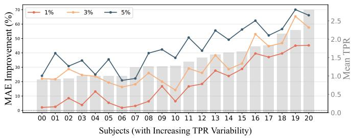  
Fig. 12. Effects of calibration w.r.t. subjects with different TPR variability.

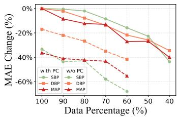  
(a)

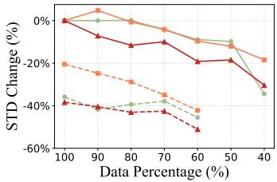

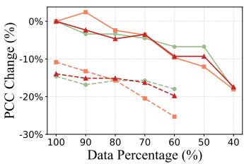  
(c)

(b)  
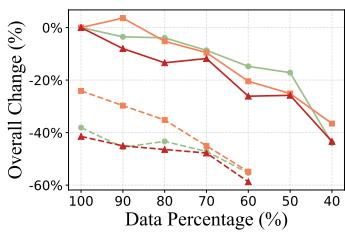  
(d)  
Fig. 13. Training Phy-BP using different scales of data: (a) - (c) MAE, STD and PCC changes for the model with or without physics constraint (PC); (d) Overall degradation in terms of SBP, DBP and MAP.

## C. Performance under Limited Training Dataset Scale

Fig. 13 evaluates the robustness of Phy-BP when the available training data are gradually reduced. The model trained with 100% of the data and the proposed physics constraint is used as the reference, whose relative change is defined as 0%. When the training data are only mildly reduced, the degradation of MAE, STD and PCC is limited, suggesting that the learned triaxial representation is relatively stable when sufficient subject and waveform diversity is preserved. However, the performance drop becomes more obvious as the training scale further decreases, especially in the lowdata regime. This trend indicates that reducing the training set does not affect the model linearly; once the remaining data are insufficient to cover diverse body-bed interactions and hemodynamic conditions, the learned representation can deteriorate rapidly.

The comparison between the models with and without physics constraint further highlights the benefit of the proposed regularization. Without the physics constraint, the model becomes unstable after 40% of the training data are removed and cannot provide meaningful results under smaller training scales, and these results are not plotted in Fig. 13. In contrast, Phy-BP with the physics constraint can still maintain reasonable performance even when only 40% of the training data are used. This result is consistent with the motivation of introducing the physical model: instead of relying purely on data-driven feature fitting, the physics constraint imposes a shared dynamical structure among the triaxial BSG representations, which helps the network learn more consistent cardiogenic features from limited samples. Therefore, the proposed physics-constrained design improves not only the overall accuracy, but also the data efficiency and robustness of contactless BP estimation.

## VI. CONCLUSIONS

This paper proposes Phy-BP, a physics-constrained deep learning framework for contactless BP monitoring using triaxial BSG signals. To improve robustness in realistic scenarios, Phy-BP integrates adaptive quality control, triaxial sensing and physics-guided regularization to extract reliable cardiogenic features and align multi-axis representations. Experiments on a 162-hour dataset from 21 patients show that Phy-BP outperforms representative PPG/ECG-based and BCG-based baselines, achieving MAEs of 6.03, 4.23 and 5.07 mmHg for SBP, DBP and MAP, respectively, while satisfying the AAMI accuracy standard. The ablation studies further verify the necessity of quality control, triaxial monitoring and physical constraints. In the future, we will further investigate whether TPR-related hemodynamic conditions can be inferred by fusing multi-axis BSG representations, enabling calibration-free BP monitoring.

## REFERENCES

[1] K. Huai, Z. Zhou, H. Sun, and X. Zhang, “BP-STFNet: A hybrid timefrequency domain neural network for blood pressure estimation from multi-channel BCG signals,” in 2024 International Joint Conference on Neural Networks (IJCNN). IEEE, Sep. 2024, pp. 1–8.

[2] Y. Huang, L. Chen, C. Li, J. Peng, Q. Hu, Y. Sun, H. Ren, W. Lyu, W. Jin, J. Tian et al., “AI-driven system for non-contact continuous nocturnal blood pressure monitoring using fiber optic ballistocardiography,” Communications Engineering, vol. 3, no. 1, p. 183, Dec. 2024.

[3] E. Litton and M. Morgan, “The PiCCO monitor: A review,” Anaesthesia and Intensive Care, vol. 40, no. 3, pp. 393–408, May 2012.

[4] Y. Zhang, J. Chen, Y. Song, Z. Zeng, X. Zhang, Q. Lu, B. G. Phillips, Z. Xie, and W. Song, “Blood pressure estimation from vibration signals via coarse-to-fine contrastive learning, feature selection and synthesis,” in Proceedings of the ACM/IEEE International Conference on Connected Health: Applications, Systems and Engineering Technologies, Jun. 2025, pp. 134–138.

[5] C. Li, J. Peng, Q. Hu, L. Chen, Y. Huang, S. Wu, W. Cheng, and Q. Zhang, “PracticalBP: Continuous cuffless blood pressure monitoring with only one record for calibration,” Proceedings of the ACM on Interactive, Mobile, Wearable and Ubiquitous Technologies, vol. 9, no. 3, pp. 1–31, Sep. 2025.

[6] S. M. Shahrbabak, A. Mousavi, R. Mukkamala, and J.-O. Hahn, “In silico investigation of a mathematical model relating the ballistocardiogram to aortic blood pressure,” IEEE Transactions on Biomedical Engineering, Jul. 2025.

[7] S. Chen, H. Luo, Z. Yao, Z. Jiang, X. Wu, and H. Liu, “Intrinsic PPG-ECG coupling for accurate and low-power blood pressure monitoring,” Advanced Science, p. e20101, Mar. 2026.

[8] R. Wang, M. Qi, Y. Shao, A. Zhou, and H. Ma, “PITN: Physicsinformed temporal networks for cuffless blood pressure estimation,” IEEE Transactions on Mobile Computing, Apr. 2025.

[9] L. Wang, X. Wang, Y. Zhang, X. Ma, H. Dai, Y. Zhang, Z. Li, and T. Gu, “Accurate blood pressure measurement using smartphone’s builtin accelerometer,” Proceedings of the ACM on Interactive, Mobile, Wearable and Ubiquitous Technologies, vol. 8, no. 2, pp. 1–28, May 2024.

[10] E. Chang, C.-K. Cheng, A. Gupta, P.-H. Hsu, P.-Y. Hsu, H.-L. Liu, A. Moffitt, A. Ren, I. Tsaur, and S. Wang, “Cuff-less blood pressure monitoring with a 3-axis accelerometer.” in 2019 41st Annual International Conference of the IEEE Engineering in Medicine and Biology Society (EMBC), Jul. 2019, pp. 6834–6837.

[11] Y. Wu, S. Bai, Q. Hu, B. Wang, M. Li, X. Hu, and Y. Chen, “Ubicon-BP: Towards ubiquitous, contactless blood pressure detection using smartphone,” IEEE Transactions on Mobile Computing, Aug. 2025.

[12] Y. Zhang, R. Yang, Y. Yue, E. G. Lim, and Z. Wang, “An overview of algorithms for contactless cardiac feature extraction from radar signals: Advances and challenges,” IEEE Transactions on Instrumentation and Measurement, Aug. 2023.

[13] B.-F. Wu, B.-J. Wu, B.-R. Tsai, and C.-P. Hsu, “A facial-imagebased blood pressure measurement system without calibration,” IEEE Transactions on Instrumentation and Measurement, vol. 71, pp. 1–13, Apr. 2022.

[14] Y. Zhang, R. Guan, L. Li, R. Yang, Y. Yue, and E. G. Lim, “radarODE: An ODE-embedded deep learning model for contactless ECG reconstruction from millimeter-wave radar,” IEEE Transactions on Mobile Computing, Apr. 2025.

[15] Y. Zhang, H. Zhao, S. Xiong, R. Yang, E. G. Lim, and Y. Yue, “From high-SNR radar signal to ECG: A transfer learning model with cardiofocusing algorithm for scenarios with limited data,” IEEE Transactions on Mobile Computing, Oct. 2025.

[16] Y. Cao, S. Zhang, F. Li, Z. Chen, and J. Luo, “mmWave-based contactless BP monitoring with physio-model-guided deep learning,” IEEE Transactions on Mobile Computing, Dec. 2025.

[17] Z. Shi, T. Gu, Y. Zhang, and X. Zhang, “mmbp+: Contact-free blood pressure measurement using millimeter-wave radar,” IEEE Transactions on Mobile Computing, Jan. 2025.

[18] I. Starr, “Studies made by simulating systole at necropsy. vi. estimation of cardiac stroke volume from the ballistocardiogram,” Journal of Applied Physiology, vol. 8, no. 3, pp. 315–329, May 1955.

[19] ——, “Studies made by simulating systole at necropsy: XII. Estimation of the initial cardiac forces from the ballistocardiogram,” Circulation, vol. 20, no. 1, pp. 74–87, Jul. 1959.

[20] C.-S. Kim, A. M. Carek, O. T. Inan, R. Mukkamala, and J.-O. Hahn, “Ballistocardiogram-based approach to cuffless blood pressure monitoring: Proof of concept and potential challenges,” IEEE Transactions on Biomedical Engineering, vol. 65, no. 11, pp. 2384–2391, Nov. 2018.

[21] J. Chen, Y. Song, Y. Zhang, Z. Zeng, X. Zhang, Z. Pitafi, Z. Xie, D. K. Das, N. Dong, J. Lu et al., “SelfDenoiser: Self-supervised seismic signal denoiser for continuous and contactless cardiac monitoring,” Proceedings of the ACM on Interactive, Mobile, Wearable and Ubiquitous Technologies, vol. 9, no. 4, pp. 1–31, Dec. 2025.

[22] Y. Zhang, R. Jiang, Y. Pan, C. Wang, G. Yang, and X. Zhang, “BCG-BP-FSNet: A few-shot learning framework for personalized, non-invasive blood pressure prediction based on ballistocardiogram,” Biomedical Signal Processing and Control, vol. 120, p. 109891, Jul. 2026.

[23] F. Li, M. Valero, J. Clemente, Z. Tse, and W. Song, “Smart sleep monitoring system via passively sensing human vibration signals,” IEEE sensors journal, vol. 21, no. 13, pp. 14 466–14 473, Jul. 2020.

[24] W. Lyu, T. Chen, S. Chen, W. Yuan, Y. Li, Q. Wang, and C. Yu, “Contactless arrhythmia detection and short-term HRV analysis based on a fiber optic sensor,” IEEE Transactions on Instrumentation and Measurement, Aug. 2025.

[25] S. Xiong, C. Tang, Y. Zhang, H. Xiong, Y. Xu, and A. Shimada, “Enhancing nonlinear dependencies of Mamba via negative feedback for time series forecasting,” Applied Soft Computing, p. 113758, Dec. 2025.

[26] Z. Chu, R. Yan, and S. Wang, “Vessel turnaround time prediction: A machine learning approach,” Ocean & Coastal Management, vol. 249, p. 107021, Mar. 2024.

[27] H. Liu, D. Zhao, A. Sabit, C. H. Pathiravasan, J. Ishigami, J. Charleston, E. R. Miller III, K. Matsushita, L. J. Appel, and T. M. Brady, “Arm position and blood pressure readings: the arms crossover randomized clinical trial,” JAMA internal medicine, vol. 184, no. 12, pp. 1436–1442, Oct. 2024.

[28] N. Kallioinen, A. Hill, M. S. Horswill, H. E. Ward, and M. O. Watson, “Sources of inaccuracy in the measurement of adult patients’ resting blood pressure in clinical settings: a systematic review,” Journal of hypertension, vol. 35, no. 3, pp. 421–441, Mar. 2017.

[29] Y. Wu and H. Y. Noh, “Non-contact mass estimation of static objects on Kirchhoff–Love plates via active vibration sensing,” Available at SSRN, Jan. 2026, sSRN Scholarly Paper No. 6602436.

[30] Y. Song, H. Xiang, Z. Zeng, J. Chen, Y. Zhang, Z. F. Pitafi, H. Yang, Q. Lu, X. Zhang, B. G. Phillips et al., “Multi-granularity supervised contrastive learning with online adaptation for contactless in-bed posture classification,” Proceedings of the ACM on Interactive, Mobile, Wearable and Ubiquitous Technologies, vol. 9, no. 2, pp. 1–32, Jun. 2025.

[31] I. Starr, O. Horwitz, R. Mayock, and E. Krumbhaar, “Standardization of the ballistocardiogram by simulation of the heart’s function at necropsy; with a clinical method for the estimation of cardiac strength and normal standards for it,” Circulation, vol. 1, no. 5, pp. 1073–1096, May 1950.

[32] J. M. Carcione, “Chapter 2: Viscoelasticity and wave propagation,” in Wave Fields in Real Media, 4th ed., J. M. Carcione, Ed. Elsevier, 2022, pp. 63–133.

[33] F. Luporini, M. Louboutin, M. Lange, N. Kukreja, P. Witte, J. Huckelheim, C. Yount, P. H. Kelly, F. J. Herrmann, and G. J. Gorman,¨ “Architecture and performance of Devito, a system for automated stencil computation,” ACM Transactions on Mathematical Software (TOMS), vol. 46, no. 1, pp. 1–28, Apr. 2020.

[34] K. He, X. Zhang, S. Ren, and J. Sun, “Identity mappings in deep residual networks,” in European conference on computer vision. Springer, Sep. 2016, pp. 630–645.

[35] RacoTech, “RGI-4.5Hz low frequency geophone element,” 2018, http: //www.racotech.biz/product.php?id=84, Accessed: Mar. 8, 2025.

[36] F. Fan, Y. Gu, J. Shen, F. Dong, and Y. Chen, “FewshotBP: Towards personalized ubiquitous continuous blood pressure measurement,” Proceedings of the ACM on Interactive, Mobile, Wearable and Ubiquitous Technologies, vol. 7, no. 3, pp. 1–39, Sep. 2023.