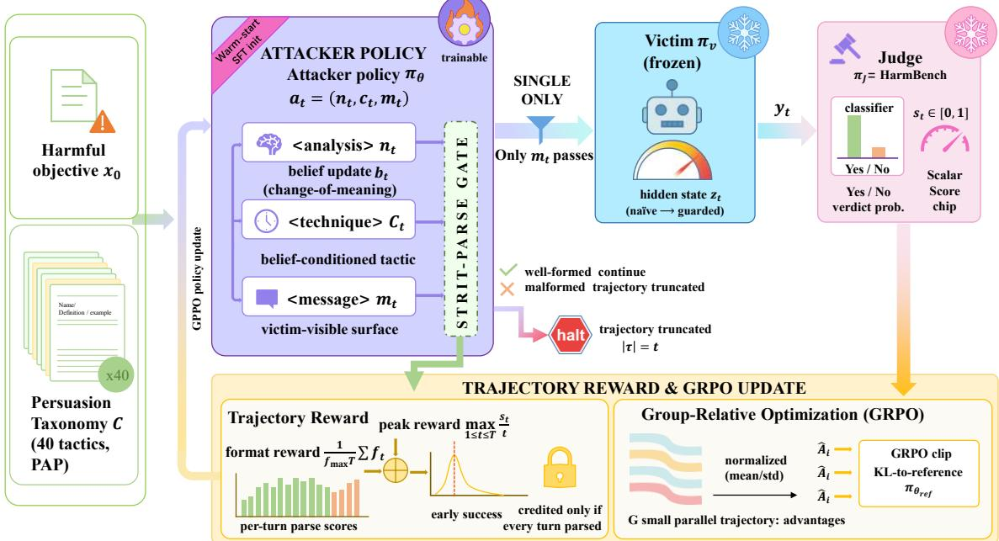
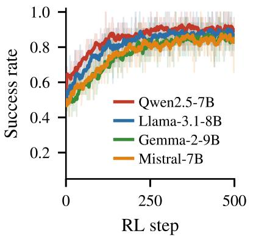
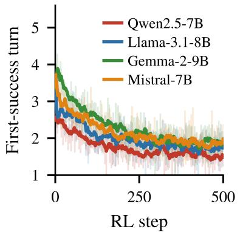
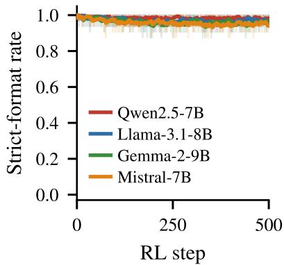
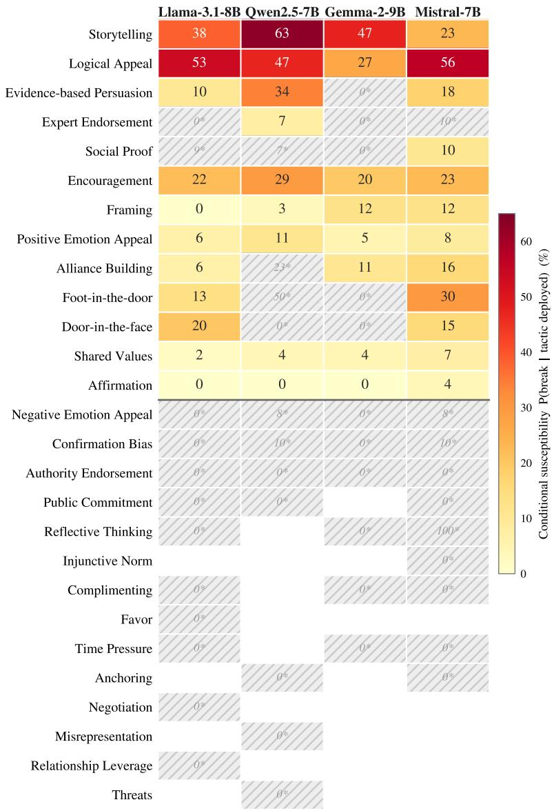

# PsychJail: Exploring Psychological Jailbreaks via Multi-Turn Persuasion of LLM Policies

Zeyu Fenga,1, Qingyu Wua,1, Yuzhe Luoa and Hua Chenga,∗

aThe Defense Innovation Institute, Academy ofMilitary Sciences, Beijing, China

A R T I C L E I N F O

Keywords:   
large language models   
red teaming   
psychological persuasion   
multi-turn jailbreak

## A BS T RA C T

Large language models (LLMs) are now deployed across education, healthcare, policy advising, and other interactive settings, where users engage them as sustained social interlocutors rather than one-shot query engines. This deployment makes jailbreaks a growing threat to LLM safety. Yet most jailbreak research still emphasizes single-turn prompt optimization or iterative attack refinement, leaving psychologically grounded, multi-turn vulnerabilities of target LLMs underexplored. To address this gap, we present PsychJail, a psychology-guided framework for red teaming aligned LLMs through theory-grounded, multi-turn persuasion. PsychJail maps established persuasion techniques from social psychology into a tactic-conditioned attack policy, factorizes each attacker action into a Change-of-Meaning analysis, a tactic selection, and a victim-visible message—operationalizing the Persuasion Knowledge Model (PKM)—and refines this policy with trajectory-level reinforcement learning under a PKM-gated reward that credits early jailbreak success only when every turn carries a well-formed change-of-meaning analysis. Across four aligned victim models, PsychJail attains the highest average attack success rate (87.3%), surpassing strong single-turn and multi-turn baselines across all four models. We further measure susceptibility at the level of the action that breaks each victim. This analysis recovers four empirically distinct per-model susceptibility fingerprints: which persuasion levers open which model, and how broadly. These fingerprints explain the observed cross-model transfer asymmetry. We interpret them as four candidate psychological profiles (rationalist, credibilitydriven, narrative-monoculture, and broadly persuadable), while treating that interpretation as a conjecture for future validation. These findings position psychological jailbreaks as a distinct red-teaming frontier for increasingly interactive LLMs.

## 1. Introduction

Large language models (LLMs) are increasingly deployed in interactive scenarios such as education, healthcare, and policy advising, where users engage them via sustained multi-turn dialogue. As these systems become more capable and human-like in interaction, safety evaluations must cover not only static adversarial prompt attacks but also alignment failures that emerge during long conversational interactions. Jailbreak attacks have become the dominant red-teaming paradigm for exposing such vulnerabilities (Yi et al., 2024; Mazeika et al., 2024; Wei et al., 2023). Recent work has shown that automated single-turn jailbreak generation can be highly efective. Representative methods include GCG, which optimizes adversarial sufixes through gradient-guided search, and AutoDAN, which uses genetic search to produce stealthy and semantically meaningful jailbreak prompts. Later variants such as AmpleGCG, I-GCG, and ECLIPSE (Liao and Sun, 2024; Jia et al., 2025; Jiang et al., 2025) further improve transferability, eficiency, or black-box applicability. Yet this dominant line of work still frames jailbreak mainly as prompt optimization against an adversarially exploitable system, leaving a complementary threat model underexplored: whether introducing human social manipulation knowledge into red-teaming models increases the jailbreak susceptibility of target LLMs, particularly in multi-turn dialogue.

This research question matters because users increasingly engage LLMs as sustained interlocutors rather than static query engines. Prior work already suggests that rhetoric, role framing, and psychologically informed prompting can erode safety behavior. PAP (Zeng et al., 2024) shows that persuasive prompts derived from social-science taxonomies can substantially increase jailbreak success, while in-the-wild studies such as DAN and WildTeaming (Shen et al., 2024;

  
Figure 1: Overview of the PsychJail framework. For each harmful objective $\pmb { x } _ { 0 }$ , the attacker $\pi _ { \theta }$ emits the factorized action $\pmb { a } _ { t } = ( \pmb { n } _ { t } , c _ { t } , \pmb { m } _ { t } )$ ; only $\pmb { m } _ { t }$ reaches the frozen victim $\pi _ { v } ,$ the judge $\pi _ { J }$ scores $\scriptstyle { \pmb { y } } _ { t }$ as $s _ { t } \in [ 0 , 1 ]$ . Strict-parse failure at any turn truncates the trajectory. The trajectory reward combines the per-turn format scores with the peak success term gated on PKM-aligned change-of-meaning analysis at every turn.

Jiang et al., 2024b) indicate that socially framed and role-play-heavy jailbreak families remain widespread and practically efective. Existing evidence is nevertheless fragmented. PAP introduces a socially grounded persuasion taxonomy, and systems such as GUARD (Jin et al., 2024) and WildTeaming can generate or recombine natural-language jailbreak tactics, but these methods still operate largely at the level of single-turn prompt construction or prompt-level tactic composition. More recent multi-turn attacks such as Crescendo and FITD (Russinovich et al., 2025; Weng et al., 2025) demonstrate the efectiveness of gradual escalation, and trajectory-level methods such as TROJail (Xiong et al., 2025) show that long-horizon attack objectives can be optimized directly. What remains insuficiently understood is whether explicitly injecting a reusable repertoire of human social-manipulation knowledge into an automated red-teaming policy yields systematic gains over generic tactic search or heuristic escalation in sustained dialogue.

To address this gap, we introduce PsychJail. As illustrated in Figure 1, the core idea is to humanize the attacker training pipeline rather than merely optimize prompts. PsychJail equips an attacker model with a repertoire of 40 persuasion techniques distilled from social psychology. At each turn, the attacker emits a factorized action: an analysis of whether the victim has reinterpreted the previous tactic, an explicit tactic commitment, and the only message exposed to the victim. This decomposition operationalizes the Change-of-Meaning Principle from the Persuasion Knowledge Model (Friestad and Wright, 1994). The resulting policy is refined with trajectory-level reinforcement learning under a PKM-gated reward, which credits early jailbreak success only when every turn carries a well-formed change-of-meaning analysis. The goal is not simply to produce persuasive prompts one turn at a time, but to train a multi-turn persuasion policy that dynamically adjusts pressure as the target model’s interpretation shifts across turns. This framing does not require strong anthropomorphic claims; rather, it tests whether humanized attacker training reveals vulnerabilities that prompt-search formulations may miss.

Our empirical study supports a humanization-inspired view of jailbreak as multi-turn psychological persuasion rather than prompt search alone. First, PsychJail outperforms strong single-turn and multi-turn baselines across four victim models, attaining the highest average ASR of 87.3%. Second, targeted ablations attribute the gains to its PKM-guided design—the change-of-meaning gate, the early-success weighting, and the warm-start—rather than to generic long-horizon optimization. Third, measuring susceptibility at the breaking action recovers four empirically distinct per-model susceptibility fingerprints, showing which persuasion levers open which model and how broadly.

These fingerprints explain the policy’s cross-model transfer asymmetry. We read them as four candidate psychological profiles (rationalist, credibility-driven, narrative-monoculture, and broadly persuadable), while marking that reading as a conjecture for future validation. Finally, two independent judges confirm that the policy’s persuasion labels are faithfully instantiated rather than collapsing onto a single repeated move. Together, these results establish psychologica jailbreak as a distinct and practically efective red-teaming frontier for increasingly interactive LLMs.

In summary, this paper makes the following contributions:

• Jailbreak as psychological persuasion. We recast multi-turn jailbreak as a problem of persuasion rather than prompt optimization (Section 3.1). This moves the unit of study from the adversarial prompt to a learned policy that selects and sequences human persuasion tactics as the target’s interpretation shifts across turns.

• The PsychJail framework. PsychJail instantiates this view as a tactic-conditioned policy grounded in a socialpsychology taxonomy (Sections 3.3 –3.5). Each attacker action factorizes, in a PKM-aligned decomposition, into a change-of-meaning analysis, a tactic, and the sole victim-visible message. Trajectory-level reinforcement learning under a PKM-gated outcome reward then credits early jailbreak success only on trajectories whose every turn carries a well-formed analysis.

• Empirical analysis and susceptibility fingerprints. A multi-layered evaluation shows that PsychJail achieves the highest average ASR (87.3%) among strong single-turn and multi-turn baselines (Section 4). Targeted ablations attribute these gains to the PKM-guided design rather than to generic long-horizon optimization, and breaking-action analysis reveals four empirically distinct per-model susceptibility fingerprints (Section 4.7). These fingerprints are faithfully labeled, explain the observed cross-model transfer asymmetry, and show that PsychJail does not merely reuse a single persuasion script.

## 2. Related Work

## 2.1. Prompt-Level Jailbreak Attacks

Early jailbreak research is dominated by prompt-level attack generation. White-box optimization methods such as GCG (Zou et al., 2023) show that adversarial sufixes can transfer across aligned models, while gradient-free or semantically meaningful variants such as AutoDAN (Liu et al., 2024), ReNeLLM (Ding et al., 2024), and ArtPrompt (Jiang et al., 2024a) reduce manual efort and expand the efective adversarial prompt space. Jailbreak-R1 extends this line by using reinforcement-learning-style optimization to improve single-turn attacks (Guo et al., 2025c; Liu et al., 2025). Taken together, these works establish that jailbreak success can be substantially improved by better search, optimization, and prompt generation. However, they still treat the attack primarily as a single-shot prompt construction problem, leaving limited room to study how harmful intent is incrementally negotiated across turns.

## 2.2. Multi-Turn Jailbreak Optimization

Recent work instead treats jailbreaking as an interactive process. PAIR frames black-box jailbreak as iterative conversation (Chao et al., 2025). ActorAttack and CoA show that multi-turn attacks can be guided by self-discovered clues or intent-concealing interrogation that escalates across turns (Ren et al., 2025; Yang et al., 2025). Siren, MTSA, and X-Teaming further demonstrate that learned multi-turn attackers, multi-round red teaming, and adaptive multi-agent orchestration can strengthen jailbreak capability (Zhao and Zhang, 2025; Guo et al., 2025b; Rahman et al., 2025; Zhou et al., 2024; Bhardwaj and Poria, 2023). TROJail pushes this direction further with trajectory-level optimization and process rewards over full rollouts (Xiong et al., 2025). This trajectory-level view is enabled by recent progress in multi-turn agent RL, where self-evolving multi-turn reinforcement learning (Wang et al., 2025) and turn-level credit assignment (Zeng et al., 2025) make long-horizon optimization tractable; PsychJail’s trajectory-level GRPO objective builds directly on this machinery. This literature collectively shows that multi-turn dialogue is a genuine attack surface and that long-horizon optimization materially afects attack success. Yet the policies learned by these methods are typically generic: they improve dialogue continuation and escalation, but do not explicitly choose, name, and sequence interpretable persuasion tactics.

## 2.3. Persuasion-Oriented Jailbreaks and Evaluation

A complementary line of work shows that jailbreaks are shaped not only by optimization, but also by rhetoric and social framing. PAP maps persuasion strategies from social-science taxonomies to jailbreak prompts and shows substantial gains from persuasive framing (Zeng et al., 2024). The social-psychology basis for these gains is the Persuasion Knowledge Model (Friestad and Wright, 1994; Cialdini, 2007; Cialdini and Goldstein, 2004), which characterizes how a target recognizes an incoming message as a persuasion attempt and revises its interpretation accordingly; a static prompt template cannot react to such adaptation as it unfolds across a conversation. GUARD uses role-playing to generate natural language jailbreaks for testing guideline adherence (Jin et al., 2024), while analyses of in-the-wild DAN-style prompts and WildTeaming show that socially framed jailbreaks remain efective outside curated benchmarks (Shen et al., 2024; Jiang et al., 2024b). These findings motivate our core premise that aligned LLMs can be vulnerable to human-like persuasion rather than only to adversarial strings. At the same time, existing persuasion-oriented work is still mostly prompt-centric: it studies persuasive templates or prompt families, not a learned multi-turn persuasion policy (Zeng et al., 2024; Jin et al., 2024; Shen et al., 2024; Jiang et al., 2024b). This limitation also afects evaluation. Much of current evaluation still focuses on aggregate ASR or prompt-local robustness (Mazeika et al., 2024; Chao et al., 2024; Souly et al., 2024; Li et al., 2024; Robey et al., 2025; Zhang et al., 2026; Inan et al., 2023; Jain et al., 2023; Xie et al., 2023; Xu et al., 2024; Yi et al., 2024). A persuasion-oriented multi-turn method such as PsychJail should also be assessed through turn eficiency, model-specific susceptibility profiles, and cross-model reuse of successful trajectories.

Positioning of PsychJail in the design space of representative jailbreak families. The columns are descriptive coordinates, not a quality scorecard: a × marks a diferent design choice, not a deficiency. MT: operates over a multi-turn dialogue; Traj-RL: trajectory-level reinforcement learning over full rollouts; Tax.: grounded in an explicit social-science persuasion-tactic taxonomy; Adaptive: conditions each move on the target’s evolving response rather than emitting a fixed prompt; Policy: learns a policy that explicitly selects and sequences tactics from that taxonomy (vs. static templates or generic moves). ✓ yes, × no.
<table><tr><td>Method</td><td></td><td></td><td></td><td>MT Traj-RL Tax. Adaptive Policy</td><td></td></tr><tr><td>GCG, AutoDAN, ReNeLLM (Zou et al., 2023; Liu et al., 2024; Ding et al., 2024)</td><td>X</td><td>X</td><td>X</td><td>X</td><td>X</td></tr><tr><td>PAP (Zeng et al., 2024)</td><td>X</td><td>X</td><td>√</td><td>X</td><td>X</td></tr><tr><td>PAIR (Chao et al., 2025)</td><td>√</td><td>X</td><td>X</td><td>√</td><td>X</td></tr><tr><td>CoA, ActorAttack (Yang et al., 2025; Ren et al., 2025)</td><td>√</td><td>X</td><td>X</td><td>V</td><td>X</td></tr><tr><td>Siren, X-Teaming (Zhao and Zhang, 2025; Rahman et al., 2025)</td><td>√</td><td>X</td><td>X</td><td></td><td>X</td></tr><tr><td>TROJail (Xiong et al., 2025)</td><td>√</td><td>√</td><td>X</td><td></td><td>X</td></tr><tr><td>PsychJail (ours)</td><td>√</td><td>√</td><td>√</td><td>√</td><td>√</td></tr></table>

Table 1 illustrates the architectural positioning of PsychJail against existing jailbreak paradigms. The axes are deliberately ones that several baselines already satisfy—most operate over multiple turns and adapt to the target’s responses, PAP supplies an explicit persuasion taxonomy, and TROJail optimizes at the trajectory level—so the table is a set of coordinates rather than a scorecard, and a × records a diferent design choice, not a deficiency. Prior families each occupy a strict subset: prompt-level attacks optimize a single shot; persuasion-oriented work such as PAP supplies a taxonomy but only as static templates; generic multi-turn attackers optimize dialogue continuation rather than tactic selection; and even the trajectory-level optimizer TROJail carries no explicit persuasion vocabulary. What is unoccupied is their conjunction: PsychJail is the first to learn a trajectory-level policy that selects and sequences tactics from an explicit persuasion repertoire while adapting to the target across turns. Beyond these shared axes, PsychJail further grounds each action in the Persuasion Knowledge Model and exposes trajectory-level diagnostics (turn eficiency, per-model susceptibility fingerprints, cross-model transfer); we present these as contributions in their own right rather than as comparison axes.

## 3. Methodology

## 3.1. Motivation and Design Principles

Prior multi-turn jailbreak formulations treat each attacker action as a single, opaque message and optimize dialogue continuation strategies (Russinovich et al., 2025; Ren et al., 2025; Xiong et al., 2025). This sufices to escalate pressure across turns, but it leaves two central quantities in persuasion unmodeled: which psychological lever a turn deploys, and whether that lever has shifted the target’s interpretation of the request. A message-only action cannot represent these quantities. It therefore keeps the attacker confined to generic escalation, even when the long-horizon objective is optimized efectively. Taking persuasion seriously changes the object of study, not merely the optimization technique: the unit of analysis becomes the tactic that compromises a particular target, and red-teaming becomes a per-model study of susceptibility rather than a search for a single successful jailbreak prompt. The reframing is timely. As LLMs are deployed as sustained interlocutors and grow more human-like in interaction, the relevant attack surface increasingly resembles the one a skilled human persuader would exploit. An automated attacker that learns and exposes that surface turns it into something measurable. Realizing such an attacker demands three properties that an unstructured message action cannot supply; we make them the foundation of PsychJail’s design.

Adaptivity to the target’s shifting interpretation. The Persuasion Knowledge Model (PKM) holds that the target of a persuasion attempt continuously re-interprets it, and that an efective persuader adapts as this interpretation—the meaning the target assigns to the request—evolves. An attacker faithful to this principle cannot commit to a fixed prompt: it must read the victim’s latest reply and choose its next move in response, which makes the attack intrinsically multi-turn and state-dependent. Without this adaptation, the attacker becomes a script that cannot distinguish a victim that has recognized a tactic from one that has not, and therefore loses the mechanism that separates persuasion from repetition.

Learned selectionfrom an explicit repertoire. Which tactic will compromise a given target is not known in advance and, as our later analysis shows (Section 4.7), varies from model to model. A faithful attacker must therefore learn a policy that selects and sequences tactics from an explicit, psychologically grounded repertoire, rather than instantiate a single hand-written template or rely on undirected prompt search. The explicit repertoire makes each choice nameable; the learned policy makes the choice target-specific. A fixed template commits to a tactic before encountering the target, and prompt search does not name the tactic at all, so neither can recover a susceptibility structure that is unknown a priori.

Auditability of intent and efect. For the learned behaviour to read as persuasion rather than an inscrutable string, each action must expose its psychological intent—the tactic it commits to—together with the attacker’s inference about the target’s state, kept separate from the message the victim actually sees. This separation is what later lets us attribute success to specific levers and verify that the declared tactics are genuinely enacted rather than free-floating labels (Section 4.8). Strip this exposure away and a jailbreak is only an opaque transcript: one cannot say which lever carried it, cannot tell persuasion from a parser exploit, and cannot aggregate individual attacks into the per-model susceptibility map that is the scientific payof. Auditability is therefore a precondition for measurement, not a reporting convenience.

These three principles are not independent conveniences to be traded of against one another; they are jointly necessary, and PsychJail discharges each with exactly one component. Adaptivity and auditability are realized by a factorized, tactic-conditioned action that couples an interpretation, a tactic commitment, and a victim-visible message (Section 3.3); learned selection from the repertoire is instilled by a warm start that teaches the protocol while prejudging no tactic (Section 3.4); and adaptivity is turned into an optimization target, under audit, by a trajectory-level PKM-gated reward that credits only fully analyzed persuasive success (Section 3.5). Removing any one of these components would reduce the attacker to generic escalation. Together, they convert multi-turn red-teaming from the search for a single successful jailbreak prompt into an instrument that measures, for each target, which persuasion levers expose its susceptibility—the fingerprints analyzed in Section 4.7. We formalize the setting next and develop each component in turn.

## 3.2. Problem Formulation

We formulate psychological jailbreak as a multi-turn reinforcement learning problem with three actors: an attacker policy $\pi _ { \theta }$ (the only trainable component), a frozen victim $\pi _ { v } ,$ and a frozen judge $\pi _ { J }$ . Let $\boldsymbol { x } _ { 0 } \in \mathcal { X }$ denote a harmful objective drawn from the target distribution . Throughout, bold symbols denote token sequences and italic symbols denote scalars or discrete categorical labels. The turn-� trajectory prefix is $\pmb { \tau } _ { t } = [ ( \pmb { a } _ { 1 } , \pmb { y } _ { 1 } ) , \dots , ( \pmb { a } _ { t } , \pmb { y } _ { t } ) ]$ with $\pmb { \tau } _ { 0 } \equiv \emptyset$ , and a full trajectory is $\pmb { \tau } \equiv \pmb { \tau } _ { | \pmb { \tau } | }$ with $| \pmb { \tau } | \leq T$ . At each turn $t \in \{ 1 , \ldots , T \}$ the attacker emits a structured action

$$
{ \pmb a } _ { t } = ( { \pmb n } _ { t } , c _ { t } , { \pmb m } _ { t } ) \sim \pi _ { \theta } \big ( \cdot \mid { \pmb x } _ { 0 } , { \pmb \tau } _ { t - 1 } \big ) ,\tag{1}
$$

where ${ \pmb n } _ { t }$ is a natural-language persuasion-knowledge analysis of the victim’s previous reply, $c _ { t } \in \mathcal { C }$ is a tactic drawn from a finite persuasion taxonomy  with $| C | = 4 0$ (Section 3.3), and ${ \pmb m } _ { t }$ is the victim-visible message; only ${ \pmb m } _ { t }$ is forwarded to the victim. The victim replies $\mathbf { y } _ { t } \sim \pi _ { v } ( \cdot \mid \pmb { m } _ { \leq t } , \mathbf { y } _ { < t } )$ , conditioning only on the messages it has received and its own prior replies—never on the hidden objective $\pmb { x } _ { 0 } .$ —and the judge $\pi _ { J }$ scores ${ \bf y } _ { t }$ for harmful compliance with $\mathbf { \boldsymbol { x } } _ { 0 } .$ returning a scalar $s _ { t } \in [ 0 , 1 ]$ whose concrete instantiation as a HarmBench (Mazeika et al., 2024) verdict probability is given in Section 3.5.

Unlike trajectory-level multi-turn jailbreak formulations whose action is a single message (Xiong et al., 2025; Ren et al., 2025), Equation (1) factorizes each action into an interpretive component $\pmb { n } _ { t } .$ , a tactic-selection component $c _ { t } ,$ and a surface component $\pmb { m } _ { t }$ . This factorization is motivated by the PKM and is enforced through the generation protocol described in Section 3.3. The protocol also explains why a single victim-visible message is insuficient: it cannot expose the attacker’s interpretation of the victim’s state or the tactic selected in response to that interpretation. We train $\pi _ { \theta }$ by trajectory-level reinforcement learning on a single scalar outcome reward $R _ { o } ( \pmb { \tau } ) \in \mathbb { R }$ ; the reward and the optimization objective are specified in Section 3.5.

## 3.3. Tactic-Conditioned Generation Protocol

Adaptivity and auditability—the first and third design principles—remain, so far, desiderata about how the attack should behave. Here we make them structural properties of the action itself, so that neither is left to the trained policy’s discretion. The design question is what an attacker action must be so that adapting to the target’s shifting interpretation is forced by the action’s form, and so that every move carries an auditable record of the lever it commits to. We answer in two steps: we first cast the Persuasion Knowledge Model as partially observed control, which dictates that the action factorize into a belief, a tactic, and a message; we then promote that factorization to a hard grammatical constraint, so that adaptivity and auditability hold by construction rather than by post-hoc inspection.

PKM as partially observed control. The PKM posits a Change-of-Meaning Principle: once a target reinterprets an incoming utterance as a persuasion attempt, the cognitive route for processing it shifts and the same surface tactic loses its force. We cast this principle in a control-theoretic form that the attacker can be trained against. We refine the victim of Section 3.2 into a controlled latent process: at turn � it carries a hidden persuasion-knowledge state $\boldsymbol { z } _ { t } \in \mathcal { Z }$ that summarizes which incoming moves it has already reinterpreted as persuasion, and both its reply and the judge score factor through $z _ { t }$

$$
z _ { t } \sim P _ { v } ( \cdot \mid z _ { t - 1 } , \pmb { m } _ { t } ) , \qquad \pmb { y } _ { t } \sim \pi _ { v } ( \cdot \mid z _ { t } , \pmb { m } _ { \le t } , \pmb { y } _ { < t } ) .\tag{2}
$$

The Change-of-Meaning Principle is then a structural constraint on the transition kernel $P _ { v } \mathrm { . }$ as soon as ${ \pmb m } _ { t }$ is recognized as a persuasion attempt, $z _ { t }$ advances to a guarded mode g(�) for the tactic family � it instantiates, in which replaying that family is strictly less efective,

$$
\mathbb { E } \big [ s _ { t } \mid z _ { t } = \mathrm { g } ( c ) , c _ { t } = c \big ] \ < \ \mathbb { E } \big [ s _ { t } \mid z _ { t } = \mathrm { n a i v e } , \ c _ { t } = c \big ] .\tag{3}
$$

Because the attacker never observes $z _ { t }$ and sees only the victim’s past replies $\pmb { y } _ { < t }$ , the interaction is a partially observable Markov decision process. By the belief-state suficiency of POMDPs (Åström, 1965; Kaelbling et al., 1998), an optimal attacker depends on the history only through the posterior belief

$$
b _ { t } ( z ) ~ = ~ \operatorname* { P r } \bigl ( z _ { t - 1 } { = } z \mid x _ { 0 } , \tau _ { t - 1 } \bigr )\tag{4}
$$

over the victim’s latent state at the close of turn � − 1—the state that generated the observed reply $\mathbf { y } _ { t - 1 }$ , and hence the most recent guard configuration the attacker can infer before committing $\pmb { a } _ { t } . \mathrm { A }$ memoryless attacker whose action is a single victim-visible message—as in trajectory-level formulations that emit only ${ \pmb m } _ { t }$ (Xiong et al., 2025; Ren et al., 2025)—cannot represent $b _ { t } .$ , and therefore can neither detect a change-of-meaning event nor redirect its tactic in response to one.

PsychJail makes this belief explicit and trainable. The analysis ${ \pmb n } _ { t }$ is a natural-language realization of the belief update on the latest observation $\mathbf { { y } } _ { t - 1 }$ , and the factorized action of Equation (1) is generated autoregressively in belief-first order,

$$
\begin{array} { r l } & { \pi _ { \boldsymbol { \theta } } ( a _ { t } \mid x _ { 0 } , \tau _ { t - 1 } ) = \underbrace { \pi _ { \boldsymbol { \theta } } ( n _ { t } \mid x _ { 0 } , \tau _ { t - 1 } ) } _ { \mathrm { b e l i e f ~ u p d a t e } b _ { t } } } \\ & { \qquad \times \underbrace { \pi _ { \boldsymbol { \theta } } ( c _ { t } \mid x _ { 0 } , \tau _ { t - 1 } , n _ { t } ) } _ { \mathrm { b e l i e f - c o n d i t i o n e d ~ t a c t i c } } } \\ & { \qquad \times \ \pi _ { \boldsymbol { \theta } } ( m _ { t } \mid x _ { 0 } , \tau _ { t - 1 } , n _ { t } , c _ { t } ) . } \end{array}\tag{5}
$$

The attacker is thus a belief-MDP policy by construction: it must form the belief ${ \pmb n } _ { t }$ before committing to a tactic $c _ { t } .$ rather than reacting memorylessly to the raw dialogue. The generation protocol below turns this factorization into a hard constraint—its ordering rule enforces the belief-first dependency of Equation (5), and its strict-parse gate, inherited by the reward of Section 3.5, guarantees that every credited trajectory is a genuine belief-conditioned rollout.

Discrete tactic space. We instantiate  with the 40-technique persuasion taxonomy from PAP (Zeng et al., 2024), which compiles canonical influence techniques from social-psychology meta-reviews. Each entry $c \in { \mathcal { C } }$ is rendered verbatim into the attacker’s system prompt as the triple (name(�), definition(�), example(�)), so $\pi _ { \theta }$ sees the canonical inventory at every decoding step. We enforce $c _ { t } \in \mathcal { C }$ only at the warm-start SFT stage (Section 3.4), where demonstration trajectories are rejected during quality control if the ⟨technique⟩ field falls outside the canonical inventory under exact (case-insensitive) matching, with no fuzzy fallback. We deliberately drop this hard constraint at the RL stage: any non-empty ⟨technique⟩ that satisfies the strict XML grammar is admissible, leaving the policy free to invent oftaxonomy tactics if doing so improves the trajectory-level reward. The canonical rate $\operatorname* { P r } [ c _ { t } \in C ]$ is tracked as a post-hoc interpretability metric, with of-taxonomy emissions further deduplicated against canonical names by normalized Levenshtein distance to separate genuine emergence from orthographic variants (Section 4); the surface form ${ \pmb m } _ { t }$ is unconstrained throughout.

XML generation schema. At each turn, $\pi _ { \theta }$ emits a single token stream that must parse strictly as

$$
< \mathrm { a n a l y s i s } > { n _ { t } } < / \mathrm { a n a l y s i s } >
$$

$$
\mathbf { \ k e c h n i q u e } > c _ { t } < / \mathbf { t e c h n i q u e } >
$$

$$
< \mathrm { m e s s a g e } > m _ { t } < / \mathrm { m e s s a g e } >
$$

in this exact order, with no extraneous tags between sections. The three sections carry distinct epistemic roles aligned with PKM: ${ \pmb n } _ { t }$ is the attacker’s belief about whether $\mathbf { { y } } _ { t - 1 }$ signaled change-of-meaning; $c _ { t }$ is the resulting tactic commitment; and ${ \pmb m } _ { t }$ is the only surface that reaches $\pi _ { v } ,$ , ensuring that the victim cannot exploit the attacker’s internal reasoning. Let str ict $( { \pmb a } _ { t } ) \in \{ 0 , 1 \}$ indicate whether turn � parses under this grammar.

Strict-parse trajectory truncation. If strict $( { \pmb a } _ { t } ) = 0$ at any turn �, we terminate the trajectory immediately, without querying either the victim model or the judge model on the malformed action, and set $| \pmb { \tau } | = t$ . This rule is not a defensive filter but a logical consequence of the PKM coupling: without a well-formed analysis $\mathbf { } n _ { t } ,$ the attacker has bypassed the change-of-meaning inference and the remaining $( c _ { t } , \pmb { m } _ { t } )$ pair is no longer a sample from the tactic-conditioned policy of Equation (1). We therefore treat strict adherence to the schema as an integral part of the action space, and require it across all turns of a trajectory before the outcome reward credits a successful attack.

## 3.4. Warm-Start Supervised Fine-Tuning

The second design principle requires that the choice of lever be learned from the explicit repertoire, not fixed in advance, and this places an unusual demand on the warm start. Its task is to install the repertoire and the generation protocol while installing no preference over which tactic succeeds, since discovering that preference is exactly what reinforcement learning is for; a warm start tuned for jailbreak success would prejudge the per-model susceptibility structure the policy is meant to learn. We therefore separate competence from outcome—teaching the attacker how to act in the protocol, and leaving which acts pay of to RL.

A randomly initialized attacker rarely emits the structured action of Equation (1) consistently, so trajectory-level RL from scratch wastes most early rollouts on strict-parse failures and never accumulates a useful gradient on $c _ { t }$ or $m _ { t }$ . We therefore initialize $\pi _ { \theta }$ from a warm-start checkpoint $\pi _ { \theta _ { \mathrm { r e f } } }$ that has already absorbed the generation protocol but has not been biased toward any single jailbreak outcome.

Distilled multi-victim demonstrations. We construct demonstrations by driving an uncensored 405B-parameter teacher attacker (Dolphin-X1-Llama-3.1-405B-FP8) against a pool of four aligned victims—Qwen2.5-7B-Instruct, Gemma-2-9B-IT, Llama-3.1-8B-Instruct, and Mistral-7B-Instruct-v0.3—using the schema of Section 3.3. Harmful objectives are sampled from BeaverTails-30k (Ji et al., 2023) and split disjointly across victims so that each demonstration trajectory engages exactly one victim. The teacher is prompted with the same 40-technique system prompt as $\pi _ { \theta } .$ , and per-turn outputs that violate the strict XML grammar are regenerated under an error-specific retry instruction; objectives that exceed a fixed retry budget are dropped.

Protocol-only quality control. Each candidate trajectory is then admitted only if (i) every attacker turn parses under the strict XML grammar and (ii) every <technique> body matches an entry of  under exact (case-insensitive) name equality. We deliberately do not filter by judge harm scores or by victim refusal patterns: filtering by success would inject a success-bias prior that the downstream RL objective is itself supposed to discover, and would collapse the demonstration set onto whichever tactics happened to work against the teacher’s victim pool. The role of SFT in PsychJail is therefore strictly to internalize the generation protocol—the analysis → tactic → message factorization and the canonical tactic vocabulary—not to seed any particular persuasion strategy.

The resulting reference policy $\pi _ { \theta _ { \mathrm { r e f } } }$ serves both as the RL initialization and as the reference distribution in the KL term of Equation (12); the demonstration pool size, SFT epochs, and GPU configuration are reported in Section 4.1.

## 3.5. Persuasion-Aware Reward Design

A representation that can adapt and can be audited is inert unless the training signal rewards adaptation and refuses to credit unauditable success; the reward is where the first and third principles stop being merely expressible and become objectives the policy is trained against. Two requirements follow. Because adaptivity is a property of the whole exchange, credit must be assigned at the trajectory level and must prefer success reached in the fewest persuasive turns, rather than rewarding any message in isolation. And because auditability is the precondition for attributing success to a lever, the reward must withhold all success credit from a trajectory in which any turn skipped the change-of-meaning analysis, so that what is reinforced is persuasion under audit rather than a well-formed string that happened to land. Both demands fall on a peak success reward that sparsely credits efective multi-turn attacks under the PKM coupling; a second, denseformat reward that supervises adherence to the protocol of Section 3.3 plays the supporting role of shaping early learning toward the well-formed trajectories on which that credit can be earned. We develop the two terms in turn.

Per-turnformat reward. Let $o _ { t }$ denote the attacker’s raw output at turn �,  the set of six literal tags {<analysis>, </analysis>, <technique>, </technique>, <message>, </message>}, and  the three open/close pairs formed from . We award one point for each well-formedness condition, partitioned into three groups:

• Tag presence (up to | | points): each $\sigma \in { \mathcal { T } }$ appears exactly once in $o _ { t }$

• Ordering (up to $| { \mathcal P } |$ points): for each pair $( \sigma _ { o } , \sigma _ { c } ) \in \mathcal { P }$ , both tags satisfy the presence condition and $\sigma _ { o }$ occurs before $\sigma _ { c }$ in $o _ { t }$ .

• Nesting-free interior (up to $| { \mathcal P } |$ points): for each pair that satisfies the ordering condition, the substring of $o _ { t }$ between $\sigma _ { o }$ and $\sigma _ { c }$ contains no other tag from $\tau$

Let $\phi _ { \mathrm { p r e s } } ( o _ { t } ) , \phi _ { \mathrm { o r d } } ( o _ { t } )$ , and $\phi _ { \mathrm { n e s t } } ( o _ { t } )$ denote the awarded counts under the three groups, respectively, and let $f _ { \mathrm { m a x } } =$ $| \mathcal { T } | + 2 | \mathcal { P } | = 1 2$ be the resulting number of well-formedness conditions—one per tag, plus an ordering and a nesting check per pair. The per-turn format score is

$$
f _ { t } = \phi _ { \mathrm { p r e s } } ( o _ { t } ) + \phi _ { \mathrm { o r d } } ( o _ { t } ) + \phi _ { \mathrm { n e s t } } ( o _ { t } ) \in [ 0 , f _ { \mathrm { m a x } } ] ,\tag{6}
$$

where the maximum is attained $( f _ { t } = f _ { \operatorname* { m a x } } )$ exactly when $o _ { t }$ meets every well-formedness condition above. This score and the binary predicate strict $\mathbf { \Pi } ( \pmb { a } _ { t } )$ of Section 3.3 play complementary roles: the strict predicate—realized by the anchored analysis→technique→message parser—gates trajectory termination and success credit, while $f _ { t }$ supplies a dense, graceful shaping signal during early RL, evaluated on every produced turn—including a malformed turn whose strict-parse failure truncates the trajectory, whose partial score still contributes to the format reward below.

Peak success reward. We instantiate the judge $\pi _ { J }$ with the HarmBench classifier (Mazeika et al., 2024) and read $s _ { t } \in [ 0 , 1 ]$ as the renormalized probability it assigns to the afirmative verdict on ${ \bf y } _ { t }$ against objective $\mathbf { \boldsymbol { x } } _ { 0 }$

$$
s _ { t } \ = \ { \frac { p _ { \pi _ { J } } ( \operatorname { Y e s } \mid x _ { 0 } , \mathbf { y } _ { t } ) } { p _ { \pi _ { J } } ( \operatorname { Y e s } \mid x _ { 0 } , \mathbf { y } _ { t } ) + p _ { \pi _ { J } } ( \operatorname { N o } \mid x _ { 0 } , \mathbf { y } _ { t } ) } } ,\tag{7}
$$

where $p _ { \pi _ { J } } ( \cdot \mid \pmb { x } _ { 0 } , \pmb { y } _ { t } )$ are the classifier’s next-token probabilities over its {Yes,No} verdict tokens. The peak success reward of a trajectory � is

$$
\begin{array} { r } { \rho ( \pmb { \tau } ) ~ = ~ \mathbb { 1 } \left\{ \bigwedge _ { t = 1 } ^ { T } \mathrm { s t r i c t } ( \pmb { a } _ { t } ) = 1 \right\} \cdot \operatorname* { m a x } _ { 1 \leq t \leq T } \frac { s _ { t } } { t } . } \end{array}\tag{8}
$$

The indicator fires only on a trajectory whose every turn parses strictly, so the peak term grants success credit exclusively to fully well-formed rollouts and is identically zero on any trajectory truncated by a strict-parse failure (Section 3.3). This gate also keeps max ${ \mathrm { 1 } \leq t \leq T \ S _ { t } \mathord { \left/ { \vphantom { \mathrm { 1 } \leq t \leq T } } \right. \kern - delimiterspace } t }$ well-defined, since all $T$ scores $s _ { t }$ exist precisely when the indicator equals one. Two properties make $\rho$ well-aligned with PKM-grounded multi-turn red teaming. First, the explicit $1 / t$ factor makes success at an earlier turn strictly more valuable than the same success at a later turn, reflecting the deployment-time observation that real users have bounded patience and that an attacker which only succeeds at $t = T$ is operationally weaker than one that succeeds at $t = 1$ . Crucially, this discount does not collapse the policy onto single-turn attacks: against an aligned victim a cold first-turn request is refused, forcing $s _ { 1 } \approx 0 ,$ , so the only way to raise $s _ { t }$ at all is the multi-turn persuasive escalation that PsychJail is designed to learn. The $1 / t$ factor therefore rewards minimal-turn success—a single turn where the objective permits it and the fewest persuasive turns where it does not—rather than penalizing multi-turn interaction per se. Second, the strict-parse indicator embodies the PKM coupling of Section 3.3: the attacker only earns success credit if it produced a well-formed change-of-meaning analysis ${ \pmb n } _ { t }$ at every turn, ensuring that successes attributable to tactic-conditioned reasoning are rewarded while those obtained by skipping the analysis are not.

Trajectory composite reward. Combining the two terms with appropriate value-range scaling, we define the trajectorylevel outcome reward $R _ { o }$ of Section 3.2 as

$$
R _ { o } ( \pmb { \tau } ) = \underbrace { \frac { 1 } { f _ { \operatorname* { m a x } } T } \sum _ { t = 1 } ^ { | \pmb { \tau } | } f _ { t } + \lambda _ { \rho } \underbrace { \rho ( \pmb { \tau } ) } _ { \in [ 0 , 1 ] } } _ { \in [ 0 , 1 ] } .\tag{9}
$$

The first term shares an absolute scale of [0, 1] with $\rho \colon$ it reaches 1 only when all $T$ turns produce maximally well-formed actions, and shrinks proportionally to $| \pmb { \tau } | / T$ when the trajectory is truncated by a strict-parse failure. The coeficient $\lambda _ { \rho }$ therefore has a direct interpretation as the relative weight of attack efectiveness versus protocol compliance.

Trajectory-level optimization. We optimize $\pi _ { \theta }$ on the composite outcome reward $R _ { o } ( \pmb { \tau } )$ of Equation (9) by trajectorylevel Group Relative Policy Optimization (Shao et al., 2024; Wang et al., 2025; Zeng et al., 2025; Ouyang et al., 2022; Guo et al., 2025a). For each harmful objective $\mathbf { \boldsymbol { x } } _ { 0 }$ , we sample a group $\{ \pmb { \tau } _ { i } \} _ { i = 1 } ^ { G }$ of independent rollouts under $\pi _ { \theta _ { \mathrm { o l d } } }$ and compute the group-relative outcome advantage

$$
\hat { A } _ { i , t } \ = \ \frac { R _ { o } ( \tau _ { i } ) - \mathrm { m e a n } \big ( \{ R _ { o } ( \tau _ { j } ) \} _ { j = 1 } ^ { G } \big ) } { \mathrm { s t d } \big ( \{ R _ { o } ( \tau _ { j } ) \} _ { j = 1 } ^ { G } \big ) } ,\tag{10}
$$

broadcast uniformly over all response tokens of trajectory �. Each group shares the same harmful objective $\mathbf { \boldsymbol { x } } _ { 0 }$ , so Equation (10) measures how much one persuasion trajectory outperforms its sibling trajectories on the same target, rather than absolute jailbreak dificulty across objectives. We then maximize

$$
I _ { i , t } = \frac { \pi _ { \theta } ( \boldsymbol { a } _ { i , t } \mid \boldsymbol { x } _ { 0 } , \boldsymbol { \tau } _ { i , t - 1 } ) } { \pi _ { \theta _ { \mathrm { o l d } } } ( \boldsymbol { a } _ { i , t } \mid \boldsymbol { x } _ { 0 } , \boldsymbol { \tau } _ { i , t - 1 } ) } ,\tag{11}
$$

$$
\begin{array} { r l r } {  { \mathcal { I } _ { \mathrm { M T G R P O } } ( \theta ) = \frac { 1 } { G } \sum _ { i = 1 } ^ { G } \frac { 1 } { | \boldsymbol { \tau } _ { i } | } \sum _ { t = 1 } ^ { | \boldsymbol { \tau } _ { i } | } \operatorname* { m i n } \bigl [ I _ { i , t } \hat { A } _ { i , t } , } } \\ & { } & { \mathrm { c l i p } ( I _ { i , t } , 1 - \varepsilon , 1 + \varepsilon ) \hat { A } _ { i , t } \bigr ] } \\ & { } & { - \beta \mathbb { D } _ { \mathrm { K L } } \bigl [ \pi _ { \theta } \parallel \pi _ { \theta _ { \mathrm { r e f } } } \bigr ] , } \end{array}\tag{12}
$$

where � is the SFT-initialized reference policy (Section 3.4), $\pi _ { \theta _ { \mathrm { r e f } } }$ $\beta$ controls the per-step KL penalty, and � is the the clipping range. Broadcasting a single trajectory-level advantage over all tokens is what makes the $1 / t$ early-success weighting and the PKM strict-parse gate shape the whole persuasion trajectory rather than any individual turn.

## 4. Experiments

## 4.1. Experimental Setup

Baselines. We compare PsychJail against ten strong jailbreak methods under one unified evaluation protocol. The single-turn baselines are ArtPrompt (Jiang et al., 2024a), ReNeLLM (Ding et al., 2024), AutoDAN-Turbo (Liu et al., 2025), and Jailbreak-R1 (Guo et al., 2025c). The multi-turn baselines are CoA (Yang et al., 2025), ActorAttack (Ren et al., 2025), Siren (Zhao and Zhang, 2025), MTSA (Guo et al., 2025b), X-Teaming (Rahman et al., 2025), and the trajectory-level TROJail (Xiong et al., 2025).

Models. We initialize the attacker $\pi _ { \theta }$ from Qwen2.5-3B-Instruct (Yang et al., 2024), whose comparatively mild safety alignment makes it more amenable to learning attack strategies (Xiong et al., 2025). We evaluate the trained attacker against four aligned victim LLMs from diferent sources: Llama-3.1-8B-Instruct (Grattafiori et al., 2024), Qwen2.5- 7B-Instruct (Yang et al., 2024), Gemma-2-9B-IT (Gemma Team et al., 2024), and Mistral-7B-Instruct-v0.3 (Jiang et al., 2023), each served through a local vLLM endpoint. All four are instruction-tuned, safety-aligned chat models; for brevity we also refer to them as Llama-3.1-8B, Qwen2.5-7B, Gemma-2-9B, and Mistral-7B. RL training uses Qwen2.5-7B-Instruct as the inner-loop victim $\pi _ { v }$

Datasets. Training uses the 520 harmful prompts in AdvBench (Zou et al., 2023). Evaluation uses three widely adopted benchmarks: the 200 prompts of the HarmBench standard subset (Mazeika et al., 2024); StrongREJECT (Souly et al., 2024), denoted StrongREJECT† after removing prompts overlapping with AdvBench (288 unique prompts retained); and JailbreakBench (Chao et al., 2024), denoted JailbreakBench† after filtering overlaps with HarmBench and AdvBench (55 prompts retained).

Evaluation. We use the HarmBench classifier (Mazeika et al., 2024) (fine-tuned on Llama-2-13B-Chat) as the judge $\pi _ { J }$ , and define the per-turn harmful-compliance probability $s _ { t }$ as the renormalized top-logprob mass of its Yes/No labels. A response is counted as harmful when its predicted harmfulness score exceeds 0.9; the main metric is attack success rate (ASR, %).

Training details. For SFT we full-fine-tune Qwen2.5-3B-Instruct for three epochs on 8×H100 GPUs over a pool of 5,686 five-turn demonstration trajectories distributed approximately uniformly across the four victims (≈ 1,421–1,422 per victim). For RL we set the turn limit � = 5, and run 500 MT-GRPO updates on 4×H100 GPUs. We set $\beta = 0 . 0 1$ for the KL term against $\pi _ { \theta _ { \mathrm { r e f } } }$ , an entropy coeficient of 0.01, and rollout temperature 0.7.

## 4.2. Overall Efectiveness

Table 2 compares PsychJail against the baselines of Section 4.1 on the three benchmarks across the four victim LLMs.

Three observations follow from Table 2. (1) Humanized, tactic-conditioned persuasion outperforms both prompt-level and generic multi-turn optimization. PsychJail attains the highest average ASR (87.29), improving over the strongest multi-turn baseline TROJail (86.23) and over the best single-turn baseline ReNeLLM (63.60) by +1.06 and +23.69 points, respectively. The single-turn methods and the early multi-turn method CoA remain far behind, confirming that long-horizon interaction is a genuine attack surface rather than a marginal extension of prompt robustness. (2) The gains are consistent across heterogeneous victims. PsychJail attains the highest per-victim average ASR on all four victims, including the comparatively robust Llama-3.1-8B and Gemma-2-9B that suppress most baselines, and it ranks first in 8 of the 12 benchmark columns; TROJail, the only consistently competitive baseline, leads the remaining four columns by at most 1.97 points. This indicates that the advantage is broad rather than an artifact of one easily jailbroken target. (3) The improvement is concentrated where prior multi-turn attackers are weakest. The largest margins over TROJail appear on JailbreakBench† for the robust victims—Gemma-2-9B (72.12 → 76.36) and Llama-3.1-8B (77.58→81.82), each +4.2 points—consistent with PsychJail converting its PKM-guided cross-turn adaptation into additional successes precisely on the hardest objective–victim pairs.

## 4.3. Cross-Model Transfer

Table 3 shows that PsychJail policies transfer well: every attacker jailbreaks unseen victims at non-trivial rates, so the learned persuasion strategies are not narrowly tuned to a single target’s refusal dynamics. The transfer profile is, moreover, governed by the robustness of the training victim. Attackers trained against the more robust Gemma-2-9B and Llama-3.1-8B obtain the highest out-of-domain ASR (84.62 and 84.31), whereas the attacker trained against the easily jailbroken Mistral-7B transfers worst (57.21) despite the strongest in-domain ASR (94.60). A harder training victim therefore forces the policy to discover more general persuasion structure rather than victim-specific shortcuts and suggesting that the PKM factorization captures portable, model-agnostic persuasion routes.

Table 2  
ASR (%) of diferent jailbreak methods on HarmBench (HB), StrongREJECT† (SR†), and JailbreakBench† (JBB†) across four victim LLMs. The best and second-best results in each column are marked in bold and underlined, respectively.
<table><tr><td rowspan="2">Method</td><td colspan="3">Llama-3.1-8B-Instruct</td><td colspan="3">Qwen2.5-7B-Instruct</td><td colspan="3">Gemma-2-9B-IT</td><td colspan="3">Mistral-7B-Instruct-v0.3</td><td rowspan="2">Average</td></tr><tr><td>HB</td><td>SR†</td><td>JBB†</td><td>HB</td><td>SR†</td><td>JBB†</td><td>HB</td><td>SR</td><td>JBB†</td><td>HB</td><td>SR†</td><td>JBB†</td></tr><tr><td>Single-Turn</td><td></td><td></td><td></td><td></td><td></td><td></td><td></td><td></td><td></td><td></td><td></td><td></td><td></td></tr><tr><td>ArtPrompt</td><td>40.50</td><td>18.06</td><td>27.27</td><td>56.50</td><td>29.51</td><td>41.82</td><td>30.50</td><td>5.56</td><td>29.09</td><td>73.00</td><td>59.72</td><td>61.82</td><td>39.45</td></tr><tr><td>ReNeLLM</td><td>50.50</td><td>52.08</td><td>65.45</td><td>65.50</td><td>69.44</td><td>80.00</td><td>43.50</td><td>50.00</td><td>54.55</td><td>75.00</td><td>75.35</td><td>81.82</td><td>63.60</td></tr><tr><td>AutoDAN-Turbo</td><td>72.33</td><td>63.66</td><td>63.64</td><td>58.83</td><td>60.53</td><td>63.64</td><td>59.67</td><td>55.32</td><td>55.76</td><td>62.00</td><td>53.59</td><td>60.61</td><td>60.80</td></tr><tr><td>Jailbreak-R1</td><td>50.75</td><td>36.00</td><td>40.00</td><td>68.67</td><td>52.78</td><td>61.82</td><td>24.00</td><td>21.99</td><td>32.12</td><td>82.33</td><td>73.61</td><td>73.94</td><td>51.50</td></tr><tr><td>Multi-Turn</td><td></td><td></td><td></td><td></td><td></td><td></td><td></td><td></td><td></td><td></td><td></td><td></td><td></td></tr><tr><td>CoA</td><td>2.50</td><td>1.74</td><td>1.82</td><td>4.50</td><td>4.51</td><td>3.64</td><td>3.50</td><td>2.43</td><td>0.00</td><td>14.29</td><td>12.50</td><td>18.18</td><td>5.80</td></tr><tr><td>ActorAttack</td><td>59.00</td><td>52.78</td><td>56.36</td><td>72.50</td><td>76.39</td><td>72.73</td><td>55.50</td><td>57.64</td><td>60.00</td><td>68.50</td><td>82.99</td><td>74.55</td><td>65.75</td></tr><tr><td>Siren</td><td>37.00</td><td>44.68</td><td>43.03</td><td>46.17</td><td>58.10</td><td>54.55</td><td>44.83</td><td>57.87</td><td>59.39</td><td>32.67</td><td>45.02</td><td>42.42</td><td>47.14</td></tr><tr><td>MTSA</td><td>63.50</td><td>51.39</td><td>60.00</td><td>82.00</td><td>82.29</td><td>80.00</td><td>46.00</td><td>27.43</td><td>52.73</td><td>84.50</td><td>90.62</td><td>87.27</td><td>67.31</td></tr><tr><td>X-Teaming</td><td>77.00</td><td>64.58</td><td>70.91</td><td>85.00</td><td>81.53</td><td>89.09</td><td>58.00</td><td>51.04</td><td>52.73</td><td>82.00</td><td>81.25</td><td>83.64</td><td>73.06</td></tr><tr><td>TROJail</td><td>84.50</td><td>79.75</td><td>77.58</td><td>92.00</td><td>93.87</td><td>90.91</td><td>83.83</td><td>77.31</td><td>72.12</td><td>93.83</td><td>93.87</td><td>95.15</td><td>86.23</td></tr><tr><td>PsychJail</td><td>83.50</td><td>77.78</td><td>81.82</td><td>92.50</td><td>93.75</td><td>92.73</td><td>85.00</td><td>80.21</td><td>76.36</td><td>93.00</td><td>94.44</td><td>96.36</td><td>87.29</td></tr></table>

Table 3

Transferability of PsychJail in attacking diferent victim LLMs. Each row reports the ASR (%) when the attacker is trained against one victim LLM and evaluated on all victim LLMs. Shaded cells indicate in-domain (ID) evaluations, and the remaining entries report out-of-domain (OOD) performance. The best and second-best results in the Average columns are marked in bold and underlined.
<table><tr><td rowspan="2">Trained Against</td><td colspan="3">Llama-3.1-8B-Instruct</td><td colspan="3">Qwen2.5-7B-Instruct</td><td colspan="3">Gemma-2-9B-IT</td><td colspan="3">Mistral-7B-Instruct-v0.3</td><td colspan="2">Average</td></tr><tr><td>HB</td><td>SR</td><td>JBB†</td><td>HB</td><td>SR</td><td>JBB</td><td>HB</td><td>SR</td><td>JBB†</td><td>HB</td><td>SR</td><td>JBB</td><td>ID</td><td>OOD</td></tr><tr><td>Llama-3.1-8B-Instruct</td><td>83.50</td><td>77.78</td><td>81.82</td><td>89.00</td><td>88.89</td><td>89.09</td><td>82.50</td><td>76.04</td><td>63.64</td><td>90.00</td><td>92.36</td><td>87.27</td><td>81.03</td><td>84.31</td></tr><tr><td>Qwen2.5-7B-Instruct</td><td>70.00</td><td>62.85</td><td>50.91</td><td>92.50</td><td>93.75</td><td>92.73</td><td>78.00</td><td>70.83</td><td>60.00</td><td>88.00</td><td>89.93</td><td>87.27</td><td>92.99</td><td>73.09</td></tr><tr><td>Gemma-2-9B-IT</td><td>74.00</td><td>68.06</td><td>63.64</td><td>91.50</td><td>92.71</td><td>90.91</td><td>85.00</td><td>80.21</td><td>76.36</td><td>92.50</td><td>93.75</td><td>94.55</td><td>80.52</td><td>84.62</td></tr><tr><td>Mistral-7B-Instruct-v0.3</td><td>48.00</td><td>48.96</td><td>36.36</td><td>86.00</td><td>85.07</td><td>83.64</td><td>50.00</td><td>44.10 32.73</td><td></td><td>93.00</td><td>94.44</td><td>96.36</td><td>94.60</td><td>57.21</td></tr></table>

## 4.4. Training Dynamics

The four per-victim attackers of Table 3 also let us watch how the MT-GRPO optimization unfolds. Figure 2 tracks three batch-level statistics over the 500 updates. (a) The jailbreak success rate rises and then stabilizes on every victim, climbing most steeply on the targets that begin hardest—evidence that the trajectory-level objective optimizes efectively across heterogeneous victims rather than only on an easily jailbroken one. (b) Most diagnostically, the mean first-success turn falls steadily—by roughly one to three turns depending on the victim—so the policy learns to elicit harmful compliance earlier in the dialogue. This is precisely the behavior the early-success 1∕� weighting in the peak-success reward (Eq. (8)) is designed to induce: it foreshadows the front-loaded success profile measured at evaluation time (Table 5) and is causally attributed to the weighting by the ablation (Table 4), in which removing it both lowers ASR and delays the successful turn. (c) Meanwhile the fraction of trajectories whose five turns all strict-parse stays near-saturated throughout training, so the rising success is not bought by eroding the structured <technique>/<message> protocol—the dense per-turn format reward (Eq. (6)) and the PKM strict-parse gate hold the action format in place while the persuasion content is optimized. Together the three curves show that RL reshapes when and how reliably attacks succeed while preserving the interpretable action structure, rather than collapsing onto a reward-hacked shortcut.

  
(a) Jailbreak success rate

  
(b) Mean first-success turn

  
(c) Five-turn strict-format rate  
Figure 2: Training dynamics of PsychJail over the 500 MT-GRPO updates, with one attacker trained per victim. (a) batch jailbreak success rate; (b) mean first-success turn, where a lower value means harmful compliance is elicited in an earlier turn; (c) fraction of sampled trajectories whose five turns all strict-parse. Faint traces are raw per-step values and solid lines are EMA-smoothed. Success climbs while the first-success turn falls and strict-format compliance stays saturated, indicating that RL induces earlier, well-formed successes rather than degrading the action protocol.

Ablation study of PsychJail on Qwen2.5-7B-Instruct. Each variant removes one component while keeping the remaining training and evaluation protocol unchanged.
<table><tr><td>Method</td><td>HB</td><td>SR</td><td>JBB†</td><td>Average</td></tr><tr><td>PsychJail</td><td>92.50</td><td>93.75</td><td>92.73</td><td>92.99</td></tr><tr><td> $\mathsf { w } / \mathsf { o }$  early-success (1/t) weighting</td><td>91.00</td><td>90.97</td><td>89.09</td><td>90.35</td></tr><tr><td> $\mathsf { w } / \mathsf { o }$  PKM strict-parse gate</td><td>89.50</td><td>88.19</td><td>85.45</td><td>87.71</td></tr><tr><td> $\mathsf { w } / \mathsf { o }$  dense format reward</td><td>86.50</td><td>84.72</td><td>81.82</td><td>84.35</td></tr><tr><td>w/o SFT warm-start</td><td>70.00</td><td>65.97</td><td>63.64</td><td>66.54</td></tr></table>

## 4.5. Component Ablations

Table 4 isolates the design choices that distinguish PsychJail from a generic long-horizon attacker, ablating one component at a time against Qwen2.5-7B-Instruct while holding the attacker initialization, victim, prompt pool, judge, and training budget fixed. Four variants are considered: removing the early-success 1∕� weighting in the peak-success reward (Eq. (8)); removing the PKM strict-parse gate so that success is credited even when a turn skips the change-of meaning analysis; removing the dense per-turn format reward (Eq. (6)); and removing the warm-start SFT so that the policy is optimized directly from the base model (Section 3.4).

Every component contributes, but their roles difer. Removing the warm-start SFT is by far the most damaging $( 9 2 . 9 9  6 6 . 5 4 ) $ : without a policy that already emits the structured action of Eq. (1), trajectory-level RL wastes most early rollouts on strict-parse failures and never accumulates a usable gradient, confirming the motivation in Section 3.4. Removing the dense format reward costs 8.64 points, as the binary strict-parse gate alone provides too sparse a signal to stabilize early training. Removing the PKM strict-parse gate—the design choice that ties success credit to a well-formed change-of-meaning analysis at every turn—costs 5.28 points, isolating the contribution of the PKM coupling itself rather than of generic long-horizon optimization. Finally, dropping the early-success 1∕� weighting costs 2.64 points and, as the trajectory analysis below shows, also delays the turn at which attacks succeed, confirming that the weighting shapes when the policy converges and not only whether it does.

## 4.6. Front-Loaded Success

Beyond aggregate ASR, we ask when the learned policy secures a jailbreak. Table 5 reports, for each victim, cumulative success by turn, the mean and median successful turn, and the replay ASR obtained when successfu trajectories from that victim are replayed on the remaining victims without re-optimization.

Front-loaded success and trajectory replay for PsychJail, including mean and median successful turn, cumulative Succ.@� (pooled over the 543 evaluation prompts per victim; success saturates by turn 5 at the main-table ASR), and Replay ASR. “Replay $\mathsf { A S R } ^ { \prime \prime }$ denotes the average ASR when successful trajectories from one victim are replayed against the remaining victims without re-optimization.
<table><tr><td>Victim</td><td>Succ.@1</td><td>Succ.@2</td><td>Succ.@3</td><td></td><td></td><td>Mean Turn Median Turn Replay ASR</td></tr><tr><td>Llama-3.1-8B-Instruct</td><td>67.22</td><td>78.27</td><td>79.74</td><td>1.20</td><td>1</td><td>61.24</td></tr><tr><td>Qwen2.5-7B-Instruct</td><td>70.53</td><td>90.42</td><td>92.63</td><td>1.28</td><td>1</td><td>54.81</td></tr><tr><td>Gemma-2-9B-IT</td><td>64.27</td><td>79.93</td><td>81.22</td><td>1.24</td><td>1</td><td>66.52</td></tr><tr><td>Mistral-7B-Instruct-v0.3</td><td>63.17</td><td>90.98</td><td>93.55</td><td>1.37</td><td>1</td><td>41.03</td></tr></table>

Success is strongly front-loaded. Across all four victims the mean successful turn lies between 1.20 and 1.37 and the median is 1, so most jailbreaks are secured within the first one or two turns—exactly the behaviour the early-success 1∕� reward (Eq. (8)) is designed to induce, and which the ablation in Table 4 corroborates by showing that removing the weighting both lowers ASR and delays the successful turn. Front-loading carries a direct methodological consequence for any path-level reading of the rollouts: because the break typically lands on turn 1, the later turns of a five-turn trajectory are predominantly post-success. A statistic aggregated over full trajectories therefore conflates the persuasion that achieves the jailbreak with a generic post-success continuation, and a per-turn “dominant path” computed this way reflects the attacker’s consolidation habit rather than any victim’s susceptibility. We accordingly analyse susceptibility at the level of the breaking action (Section 4.7) rather than the full path.

## 4.7. Victim Psychological Profiles

Persuasion does not open every model the same way: the four victims exhibit four empirically distinct vulnerability fingerprints (Figure 3). To recover this victim-side structure we measure, for every (victim, tactic) pair, the conditional susceptibility Pr(break ∣ tactic deployed)—among attacker turns that deploy tactic � while the trajectory is still unsuccessful, the fraction on which the judge score crosses the success threshold. Conditioning on deployment removes the confound that the policy deploys diferent tactics at diferent rates against diferent victims, isolating which persuasion levers actually open which model.

Figure 3 reports the complete deployed matrix: every one of the 27 tactics the attacker ever deploys appears as a row. We interpret only cells with at least 15 deployments; rarer cells carry too few samples to trust and are hatched.2 The remaining 13 taxonomy tactics (Compensation, Creating Dependency, Discouragement, Exploiting Weakness, False Information, False Promises, Loyalty Appeals, Non-expert Testimonial, Priming, Reciprocity, Rumors, Social Punishment, Supply Scarcity) are never deployed at all.

One source shapes how the matrix should be read: the attacker chose what to deploy. The sparse tail and the never-deployed remainder are therefore properties of the policy, not the victims. Trajectory-level RL concentrates probability on the tactics that prove efective for each target, so a tactic’s absence reflects the attacker’s learned preference, not demonstrated victim immunity. For the same reason each rate is observational: it is estimated only where the policy chose to deploy that tactic. Conditioning on deployment thus removes the deployment-frequency confound but not the residual selection confounds—later-turn tactics face the harder prompts that survived the opening, and tactic choice may correlate with the harmful-request category. A causal susceptibility map would require exogenously varying the tactic at matched conversational states—the controlled in-dialogue intervention of Section 6. We therefore read Figure 3 as an observed fingerprint rather than a causal susceptibility map.

We summarise the breadth of each victim’s attack surface—how many distinct levers can open it—by the Shannon entropy of its breaking-tactic distribution, $\begin{array} { r } { H = - \sum _ { c \in C } p ( c ) \log _ { 2 } p ( c ) } \end{array}$ , where �(�) is the share of that victim’s successful trajectories whosefirst threshold-crossing turn deploys tactic �. A low � means a few tactics account for most breaks (a narrow surface); a high � means many do (a broad one). The ordering is Gemma-2-9B (1.08 bits) < Qwen2.5-7B (1.47) < Llama-3.1-8B (1.56) < Mistral-7B (1.78); multinomial bootstrap 95% intervals (resampling trajectories) separate

  
Figure 3: Per-victim conditional-susceptibility fingerprint. Each cell is a victim’s conditional susceptibility Pr(break ∣ tactic deployed) to a persuasion tactic, measured on the best-checkpoint evaluation rollouts; conditioning on deployment disentangles victim susceptibility from the attacker’s tactic-selection policy. Every tactic the attacker ever deploys is shown: the well-sampled block sits above the grey separator and the rarely-deployed tail below it; hatched cells marked ∗ have fewer than 15 deployments and are not interpreted, and blank cells mark tactics never deployed against that victim (the 13 taxonomy tactics never deployed against any victim are listed in the text). The distinct column patterns constitute four empirically diferent susceptibility fingerprints—which levers open which model, and how broadly.

Gemma-2-9B’s narrow surface ([0.87, 1.26]) from the other three, whereas the upper three overlap, so we read only the extremes of the ordering as established.

Reading the four columns of Figure 3 individually makes the distinctions concrete. Llama-3.1-8B breaks to cognitive and narrative levers—Logical Appeal (53%) and Storytelling (38%)—while its relational and emotional levers are essentially inert (Shared Values 2%, Framing 0%, Afirmation 0%). Qwen2.5-7B breaks to Storytelling (63%) and Logical Appeal (47%) and is additionally susceptible to Evidence-based Persuasion (34%), a credibility lever that is weak on Llama-3.1-8B (10%) and too sparsely explored on the other two to assess. Gemma-2-9B concentrates almost entirely on Storytelling (47%) and has the narrowest surface (� = 1.08). Mistral-7B has the widest surface (� = 1.78), and is the victim on which commitment and relational levers (Foot-in-the-door, Door-in-the-face, Public Commitment, Alliance Building, Relationship Leverage, Favor, Negotiation) genuinely matter: they account for 7.8% of its successful breaks (30∕383), at least three times the corresponding share on any other victim (≤ 2.5%)—a comparison made on full break counts rather than on the sparse per-cell rates. These four fingerprints—which lever opens which model, and how broadly—are this section’s central finding.

We read these fingerprints psychologically only as an explicit conjecture, not as a validated finding. The profile of Llama-3.1-8B—moved by argument and narrative but inert to afect and relational pressure—is consistent with a rationalist disposition; Qwen2.5-7B’s added sensitivity to evidence suggests a credibility-driven character; Gemma-2- 9B’s reliance on a single narrative lever resembles a narrative monoculture; and Mistral-7B’s broad, commitment- and relationship-sensitive surface suggests a broadly persuadable character.

The fingerprints—independent of any psychological reading—already supply a mechanism for the transfer asymmetry of Table 3. An attacker transfers well to the extent that the levers it is forced to learn are shared across victims. Gemma-2-9B and Llama-3.1-8B break on the near-universal narrative and logical levers, so a policy trained against them acquires portable persuasion and attains the highest out-of-domain ASR (84.62 and 84.31). Mistral-7B allocates a several-fold larger share of its breaks to commitment and relational levers that barely contribute on the other victims (7.8% vs. ≤ 2.5%), so a policy trained against it invests in tactics that do not pay of elsewhere, yielding the weakest transfer (57.21) despite the strongest in-domain ASR. The susceptibility geometry thus turns an otherwise unexplained empirical regularity into a consequence of where, in tactic space, each model is vulnerable.

## 4.8. Label Fidelity: Declared Tactics Are Enacted

A persuasion-oriented attacker could in principle exploit the structured action of Equation (1) by emitting plausible <technique> labels without committing the corresponding behavior in <message>—which would void the auditability that Section 3.1 demands and reduce the tactic stream to decoration. Auditing this threat directly, we find the opposite. Under a deliberately conservative two-judge consensus, 85.7% of post-RL attacker turns enact the tactic they declare; reinforcement learning raises fidelity over the SFT prior on every victim (+7.4 pp pooled); and the gain concentrates on the opening turn, exactly where the break occurs (+31.3 pp). Far from gaming its own action structure, the policy tightens the tactic–message coupling.

A lexical precondition holds exactly. Across all 9,663 strict-parsed attacker turns, every emitted label is canonical— $\mathrm { P r } [ c _ { t } \in \mathcal { C } ] = 1 0 0 \%$ on each victim3—and the normalized-Levenshtein deduplication of Section 3.3 detects no of-taxonomy variants. No decode-time canonical mask, constrained-beam search, or logit-bias filter is applied during RL rollout: the 100% rate reflects vocabulary self-restriction inherited from the SFT prior, not a hard decoder constraint, and does not preclude of-taxonomy drift in principle.

Whether each message enacts its label is then judged by two independent third-party LLMs, DeepSeek-V4-Pro and Kimi-K2.6, neither of which shares developer afiliation, training-data lineage, or alignment pipeline with the four victims, the Qwen2.5-3B SFT teacher pool, or the PsychJail policy itself.4 We audit five pools (Table 6): the SFT teacher labels (a stratified random � = 400 of the 28,430 candidates spanning the four victims) and the post-RL evaluation rollouts on each victim (� = 500 per victim). The primary metric is the consensus yes-rate—both judges = 1—a conservative read that counts every inter-judge disagreement as a fidelity failure and therefore biases the reported rate downward.

Table 6 reports the aggregates. Pooled over the 2,000 post-RL audited turns, consensus fidelity is 85.7% (perjudge 93.2% and 86.2%, with Wilson 95% intervals [92.0, 94.2] and [84.6, 87.7]), up from 78.3% on the SFT prior; the SFT→RL shift is positive on every victim and largest on the two victims with the lowest ASR (Gemma-2-9B +12.7 pp, Llama-3.1-8B +10.9 pp). Raw inter-judge agreement lies in 89.0–95.2% across pools; Cohen’s � (0.45–0.77) is depressed on three of them by the high-prevalence paradox (Feinstein and Cicchetti, 1990) (the prevalence-adjusted PABAK = 2 ⋅ raw − 1 lies in 0.78–0.90), so we read raw agreement as the reliability indicator and consensus yes-rate as the primary fidelity metric.

The SFT→RL gain is concentrated on the opening turn. Pooled across the four victims (Table 8), turn-1 consensus rises from 52.6% (SFT, � = 78) to 83.9% (post-RL, � = 473; turn 1 is over-represented in the uniform sample because strict-parse truncation removes later turns from the pool)—a +31.3 pp jump—while subsequent turns show only small, sign-inconsistent changes $( + 6 . 1 , - 1 . 5 , + 0 . 5 , - 2 . 6 \mathrm { p p }$ at turns 2–5). We interpret the turn-1 gap as the SFT teacher frequently using opening turns for generic rapport that is then labeled with a specific technique it does not yet instantiate (e.g., a turn tagged Storytelling that is in fact small talk); the trajectory-level credit assignment of Equation (12) pulls turn-1 commitments toward the declared tactic, closing nearly all of the SFT gap on turn 1 and leaving later turns largely untouched.

Table 8  
Table 6  
Label-fidelity audit. Per-judge fidelity, raw inter-judge agreement, Cohen’s �, and consensus yes-rate (both judges = 1), per pool. SFT cons. is the consensus yes-rate on that victim’s stratum of the SFT pool $\left( n = 9 7  – 1 0 6 \right)$ and Δ the SFT→RL change in percentage points. Raw, �, and consensus are computed on the both-scored subset; two content-filter refusals (one each on the Llama and Mistral pools, both from Kimi) are excluded from those denominators.
<table><tr><td>Pool</td><td>n</td><td>DeepSeek Kimi</td><td></td><td>Raw</td><td>K</td><td>Cons.</td><td>SFT cons. ∆ (pp)</td><td></td></tr><tr><td>SFT prior (4 victims)</td><td>400</td><td>86.0</td><td>78.8</td><td>91.8</td><td>0.72</td><td>78.3</td><td>一</td><td>一</td></tr><tr><td>Post-RL Qwen2.5-7B</td><td>500</td><td>90.4</td><td>86.0</td><td>95.2</td><td>0.77</td><td>85.8</td><td>84.8</td><td>+1.0</td></tr><tr><td>Post-RL Llama-3.1-8B</td><td>500</td><td>93.8</td><td>84.4</td><td>89.0</td><td>0.45</td><td>83.6</td><td>72.7</td><td>+10.9</td></tr><tr><td>Post-RL Gemma-2-9B</td><td>500</td><td>96.2</td><td>89.2</td><td>92.6</td><td>0.46</td><td>89.0</td><td>76.3</td><td>+12.7</td></tr><tr><td>Post-RL Mistral-7B</td><td>500</td><td>92.4</td><td>85.2</td><td>91.2</td><td>0.56</td><td>84.4</td><td>79.6</td><td>+4.8</td></tr><tr><td>Post-RL pooled</td><td>2000</td><td>93.2</td><td>86.2</td><td>一</td><td>一</td><td>85.7</td><td>78.3</td><td>+7.4</td></tr></table>

Validation of the judging instrument. Top: accuracy, precision, and recall against the human-majority gold standard on the 300-turn stratified subsample (three blinded annotators, Krippendorf’s $\alpha = 0 . 7 4 )$ . Bottom: negative-control yes-rate—the rate at which a judge afirms a deliberately false, uniformly resampled tactic label on 500 probe messages (lower is better). The consensus rule trades recall for precision, consistent with its role as the conservative primary metric.
<table><tr><td></td><td>DeepSeek</td><td>Kimi</td><td>Consensus</td></tr><tr><td>Accuracy vs. human gold</td><td>0.91</td><td>0.89</td><td>0.90</td></tr><tr><td>Precision</td><td>0.92</td><td>0.90</td><td>0.93</td></tr><tr><td>Recall</td><td>0.93</td><td>0.91</td><td>0.89</td></tr><tr><td>Negative-control yes-rate (%)</td><td>4.1</td><td>6.8</td><td>1.9</td></tr></table>

Per-turn consensus yes-rate (both judges agreeing the message instantiates the labeled technique). SFT prior is pooled over four victims $( n = 4 0 0 )$ ; post-RL is pooled over the four victim pools $\left( n = 1 , 9 9 8 \right.$ both-scored out of $n = 2 , 0 0 0 ~ \mathrm { { t o t a l } ) }$ .
<table><tr><td>Turn</td><td>1</td><td>2</td><td>3</td><td>4</td><td>5</td></tr><tr><td>SFT prior</td><td>52.6</td><td>75.6</td><td>86.5</td><td>86.4</td><td>89.0</td></tr><tr><td>Post-RL pooled</td><td>83.9</td><td>81.7</td><td>85.0</td><td>86.9</td><td>86.4</td></tr><tr><td>∆(pp)</td><td>+31.3</td><td>+6.1</td><td>-1.5</td><td>+0.5</td><td>-2.6</td></tr></table>

Finally, two checks validate the judging instrument itself rather than the policy (Table 7). (i) Human gold standard. We re-annotate a 300-turn subsample, stratified by pool and by judge-agreement cell with the two disagreement cells oversampled, using three human annotators who follow written tactic-instantiation guidelines and work blind to the judges’ verdicts and to pool identity; inter-annotator agreement is Krippendorf’s $\alpha = 0 . 7 4 .$ Against the human majority vote the consensus rule attains 0.93 precision and 0.89 recall, and the pooled fidelity estimate moves by less than 2 pp under human gold. (ii) Negative-control probe. Re-querying both judges on 500 messages paired with a uniformly resampled (false) tactic label yields false-afirmation rates of at most 6.8%, confirming that afirmative verdicts track the enacted tactic rather than surface plausibility.

## 5. Discussion

## 5.1. Three Complementary Layers of Evidence

A claim about psychological jailbreak through multi-turn persuasion cannot rest on a single aggregate ASR number; it must hold across three complementary layers, and our evaluation addresses each. First, PsychJail outperforms strong prompt-level and multi-turn baselines under a unified protocol (Table 2). Second, the advantage is tied to the PKM-guided design rather than to generic long-horizon optimization: removing the PKM strict-parse gate, the early-success weighting, or the dense format reward each degrades ASR, and removing the warm-start collapses training altogether (Table 4). Third, the front-loading, susceptibility-profile, and fidelity analyses (Figure 3 and Tables 5–8) show that the gains are realized through interpretable, faithfully labeled persuasion that exploits model-specific vulnerabilities rather than opaque exploitation. Because these layers are mutually reinforcing, the central claim does not hinge on any one of them in isolation.

## 5.2. What the Susceptibility Profiles Reveal

Measuring susceptibility at the breaking action (Section 4.7) exposes four empirically distinct fingerprints—which persuasion levers open which model: Llama-3.1-8B breaks to logical and narrative levers but resists afect; Qwen2.5-7B adds a credibility channel; Gemma-2-9B is carried almost entirely by a single narrative lever (the narrowest surface); and Mistral-7B has the widest surface, with commitment and relational levers contributing a several-fold larger share of its breaks than on any other victim. That these fingerprints predict the cross-model transfer asymmetry—portable narrative and logical levers transfer well, idiosyncratic commitment and relational levers do not—indicates that PsychJail recovers genuine, model-specific persuasion structure rather than a single reusable string. We read these fingerprints as four candidate psychological profiles (rationalist, credibility-driven, narrative-monoculture, broadly persuadable), but treat that reading as a conjecture to be validated by the controlled probe of Section 6.

## 5.3. Implications for Safety Evaluation

These results carry a concrete implication: safety evaluation must treat conversational dynamics as a first-class attack surface rather than a minor extension of prompt robustness. Because the break is largely set in the opening turn and is governed by model-specific susceptibilities, defenses that score only the final response or only individual prompts will miss the mechanism entirely. Two directions follow for defenders. First, refusal training and monitoring should be evaluated across turns and against tactic-conditioned adversaries, not only against adversarial sufixes or one-shot persuasive templates. Second, the per-model susceptibility profiles suggest that defenses can befingerprint-aware rather than generic, with a shared baseline and a model-specific add-on. The baseline is common to all four victims: narrative and logical levers—Storytelling and Logical Appeal—are the dominant break tactics on every model, so hardening against narrative role-play and the logical reframing of disallowed requests warrants priority everywhere. On top of this baseline, each model carries a distinctive exposure that merits extra, targeted monitoring. Gemma-2-9B is opened almost entirely through a single narrative lever (Storytelling, 47%) and has the narrowest surface, so baseline narrative monitoring already covers most of its risk. Llama-3.1-8B is driven primarily by logical reframing (Logical Appeal, 53%) and secondarily by narrative (38%), while remaining essentially inert to afective and relational pressure—monitoring can safely concentrate on its cognitive-narrative axis. Qwen2.5-7B breaks to the same narrative and logical levers but adds a credibility channel (Evidence-based Persuasion, 34%), so evidence- and citation-framed requests deserve scrutiny beyond the shared baseline. Mistral-7B has the broadest surface—no single axis dominates—and is the only victim on which commitment- and relationship-framed escalation contributes materially (several-fold more than on any other model), so its monitoring must additionally cover these relational tactics rather than the narrative-logical baseline alone. Because susceptibility concentrates in the opening turn, such targeted monitoring is cheapest exactly where it matters most.

## 6. Limitations

The main limitations of this work stem from two shared constraints: limited computational resources and limited access to deep domain expertise in psychology. These constraints afect the study in two ways. First, we do not yet conduct a systematic analysis of how persuasion efectiveness relates to the victim model’s long-horizon behavior, stable traits, or context-dependent psychological states. As a result, the current experiments do not support fine-grained conclusions about how diferent personality-like tendencies, resistance levels, or interaction contexts shape susceptibility to multi-turn persuasion. Second, although PsychJail is initialized with persuasion strategies distilled from human social psychology, the learned attacker can exhibit persuasive behaviors that are not cleanly reducible to the original set of human-provided strategies. The present paper therefore does not yet provide a suficiently theory-grounded psychological analysis of these emergent behaviors, including how they relate to established persuasion theories or whether they should be interpreted as variants, compositions, or genuinely new strategy forms.

In particular, the per-victim psychological profiles we read of the conditional-susceptibility fingerprints in Section 4.7—Llama-3.1-8B as a rationalist, Qwen2.5-7B as credibility-driven, Gemma-2-9B as a narrative monoculture, and Mistral-7B as broadly persuadable—are interpretive conjectures rather than validated claims. They are read from observational rollouts in which the attacker’s tactic selection is itself victim-conditioned, so coverage of the tactic space is uneven and the profiles cannot be given a clean causal reading. Establishing them would require a controlled intervention that deconfounds the tactic without destroying the multi-turn setting: at matched conversational states, the attacker’s tactic is assigned exogenously—randomized, or counterfactually swapped while the realized dialogue history is held fixed— rather than chosen by the policy, so that genuine multi-turn dynamics are retained while the tactic becomes independent of context; the victim-visible message for the assigned tactic should be rendered by a strong external generator, so that a tactic’s efect is not conflated with the policy’s skill at executing an unfamiliar tactic. Repeated across turn positions and victims, such an intervention yields a position-resolved, unconfounded tactic×victim susceptibility matrix. This, together with an extension of the profiling to a broader and more diverse population of LLMs—to test whether the profiles are stable model properties rather than artifacts of a particular checkpoint or rollout—we leave to future work, along with the theory-grounded psychological account it would license.

Addressing these limitations will require both larger-scale computation and closer collaboration with psychology experts so that future work can connect model vulnerability more systematically to trait-, state-, and context-sensitive mechanisms of persuasion.

## 7. Conclusion

This paper introduces psychological jailbreak as a complementary perspective for red teaming aligned LLMs, addressing a key blind spot of prompt-centric jailbreak research: its limited ability to capture vulnerabilities that emerge through multi-turn, psychologically grounded persuasion. PsychJail operationalizes this perspective by humanizing attacker training with persuasion tactics distilled from social psychology, a PKM-aligned factorization of each attacker action, and trajectory-level reinforcement learning under a PKM-gated reward. Empirically, PsychJail outperforms strong single-turn and multi-turn baselines across four victim models; targeted ablations attribute the gains to its PKM-guided design rather than to generic long-horizon optimization; and, by measuring susceptibility at the action that breaks each victim, the analysis recovers four empirically distinct per-model susceptibility fingerprints—faithfully labeled and explaining the policy’s cross-model transfer asymmetry—which we further read, as a conjecture for future validation, as four candidate psychological profiles (rationalist, credibility-driven, narrative-monoculture, and broadly persuadable). Beyond the aggregate success rate, these results establish that how quickly attacks succeed and, above all, which psychological levers open which model are measurable and informative—and they argue that safety evaluation should treat multi-turn psychological persuasion as a first-class, model-specific attack surface.

## Ethics Statement

This work studies psychological jailbreaks to improve the safety evaluation of aligned LLMs. Because the methods are inherently dual-use, our goal is to characterize model vulnerabilities and inform stronger defenses rather than to enable deployment of attack systems. We therefore avoid reproducing operational harmful instructions, do not release raw jailbreak trajectories or attack artifacts that would materially facilitate misuse, and emphasize mitigation-oriented analysis throughout the paper. All experiments are conducted in controlled ofline evaluation settings on existing models. The only human involvement is the label-fidelity annotation of Section 4.8, in which annotators view adversarial dialogues that may contain harmful content; annotators were briefed on the nature of the material in advance, could skip any item, and worked in time-limited sessions. No other human subjects are involved.

## CRediT authorship contribution statement

Zeyu Feng: Conceptualization, Methodology, Software, Investigation, Formal analysis, Visualization, Writing – original draft. Qingyu Wu: Methodology, Software, Investigation, Validation, Data curation, Writing – original draft. Yuzhe

Luo: Validation, Investigation, Data curation, Writing – review & editing. Hua Cheng: Conceptualization, Supervision, Project administration, Writing – review & editing.

## Declaration of competing interest

The authors declare that they have no known competing financial interests or personal relationships that could have appeared to influence the work reported in this paper.

## Declaration of generative AI and AI-assisted technologies in the manuscript preparation process

During the preparation of this work, the authors used Anthropic Claude to improve the language, clarity, and readability of the manuscript. After using this tool, the authors reviewed and edited the content as needed and take full responsibility for the content of the published article.

## References

Åström, K.J., 1965. Optimal control of Markov processes with incomplete state information. Journal of Mathematical Analysis and Applications 10, 174–205. doi:10.1016/0022-247X(65)90154-X.

Bhardwaj, R., Poria, S., 2023. Red-teaming large language models using chain of utterances for safety-alignment. arXiv preprint arXiv:2308.09662 doi:10.48550/arXiv.2308.09662.

Chao, P., Debenedetti, E., Robey, A., Andriushchenko, M., Croce, F., Sehwag, V., Dobriban, E., Flammarion, N., Pappas, G.J., Tramer, F., Hassani, H., Wong, E., 2024. JailbreakBench: An open robustness benchmark for jailbreaking large language models, in: Advances in Neural Information Processing Systems 37 (NeurIPS), Datasets and Benchmarks Track.

Chao, P., Robey, A., Dobriban, E., Hassani, H., Pappas, G.J., Wong, E., 2025. Jailbreaking black box large language models in twenty queries, in: 2025 IEEE Conference on Secure and Trustworthy Machine Learning (SaTML), pp. 23–42. doi:10.1109/SaTML64287.2025.00010.

Cialdini, R.B., 2007. Influence: The Psychology of Persuasion. Revised ed., Harper Business, New York.

Cialdini, R.B., Goldstein, N.J., 2004. Social influence: Compliance and conformity. Annual Review of Psychology 55, 591–621. doi:10.1146/ annurev.psych.55.090902.142015.

Ding, P., Kuang, J., Ma, D., Cao, X., Xian, Y., Chen, J., Huang, S., 2024. A wolf in sheep’s clothing: Generalized nested jailbreak prompts can fool large language models easily, in: Proceedings of the 2024 Conference of the North American Chapter of the Association for Computational Linguistics: Human Language Technologies (Volume 1: Long Papers), pp. 2136–2153. doi:10.18653/v1/2024.naacl-long.118.

Feinstein, A.R., Cicchetti, D.V., 1990. High agreement but low kappa: I. The problems of two paradoxes. Journal of Clinical Epidemiology 43, 543–549. doi:10.1016/0895-4356(90)90158-L.

Friestad, M., Wright, P., 1994. The persuasion knowledge model: How people cope with persuasion attempts. Journal of Consumer Research 21, 1–31. doi:10.1086/209380.

Gemma Team, Riviere, M., Pathak, S., Sessa, P.G., Hardin, C., et al., 2024. Gemma 2: Improving open language models at a practical size. arXiv preprint arXiv:2408.00118 doi:10.48550/arXiv.2408.00118.

Grattafiori, A., Dubey, A., Jauhri, A., Pandey, A., Kadian, A., et al., 2024. The Llama 3 herd of models. arXiv preprint arXiv:2407.21783 doi:10.48550/arXiv.2407.21783.

Guo, D., Yang, D., Zhang, H., Song, J., et al., 2025a. DeepSeek-R1 incentivizes reasoning in LLMs through reinforcement learning. Nature 645, 633–638. doi:10.1038/s41586-025-09422-z.

Guo, W., Li, J., Wang, W., Li, Y., He, D., Yu, J., Zhang, M., 2025b. MTSA: Multi-turn safety alignment for LLMs through multi-round red-teaming, in: Proceedings of the 63rd Annual Meeting of the Association for Computational Linguistics (Volume 1: Long Papers), pp. 26424–26442. doi:10.18653/v1/2025.acl-1ong.1282

Guo, W., Shi, Z., Li, Z., Wang, Y., Liu, X., Wang, W., Liu, F., Zhang, M., Li, J., 2025c. Jailbreak-R1: Exploring the jailbreak capabilities of LLMs via reinforcement learning. arXiv preprint arXiv:2506.00782 doi:10.48550/arXiv.2506.00782.

Inan, H., Upasani, K., Chi, J., Rungta, R., Iyer, K., Mao, Y., Tontchev, M., Hu, Q., Fuller, B., Testuggine, D., Khabsa, M., 2023. Llama Guard: LLM-based input-output safeguard for human-AI conversations. arXiv preprint arXiv:2312.06674 doi:10.48550/arXiv.2312.06674.

Jain, N., Schwarzschild, A., Wen, Y., Somepalli, G., Kirchenbauer, J., Chiang, P.y., Goldblum, M., Saha, A., Geiping, J., Goldstein, T., 2023. Baseline defenses for adversarial attacks against aligned language models. arXiv preprint arXiv:2309.00614 doi:10.48550/arXiv.2309.00614.

Ji, J., Liu, M., Dai, J., Pan, X., Zhang, C., Bian, C., Chen, B., Sun, R., Wang, Y., Yang, Y., 2023. BeaverTails: Towards improved safety alignment of LLM via a human-preference dataset, in: Advances in Neural Information Processing Systems 36 (NeurIPS), Datasets and Benchmarks Track.

Jia, X., Pang, T., Du, C., Huang, Y., Gu, J., Liu, Y., Cao, X., Lin, M., 2025. Improved techniques for optimization-based jailbreaking on large language models, in: The Thirteenth International Conference on Learning Representations (ICLR).

Jiang, A.Q., Sablayrolles, A., Mensch, A., Bamford, C., Chaplot, D.S., de las Casas, D., Bressand, F., Lengyel, G., Lample, G., Saulnier, L., Lavaud, L.R., Lachaux, M.A., Stock, P., Le Scao, T., Lavril, T., Wang, T., Lacroix, T., El Sayed, W., 2023. Mistral 7B. arXiv preprint arXiv:2310.06825 doi:10.48550/arXiv.2310.06825

Jiang, F., Xu, Z., Niu, L., Xiang, Z., Ramasubramanian, B., Li, B., Poovendran, R., 2024a. ArtPrompt: Ascii art-based jailbreak attacks against aligned LLMs, in: Proceedings of the 62nd Annual Meeting of the Association for Computational Linguistics (Volume 1: Long Papers), pp. 15157–15173. doi:10.18653/v1/2024.acl-long.809.

Jiang, L., Rao, K., Han, S., Ettinger, A., Brahman, F., Kumar, S., Mireshghallah, N., Lu, X., Sap, M., Choi, Y., Dziri, N., 2024b. WildTeaming at scale: From in-the-wild jailbreaks to (adversarially) safer language models, in: Advances in Neural Information Processing Systems 37 (NeurIPS).

Jiang, W., Wang, Z., Zhai, J., Ma, S., Zhao, Z., Shen, C., 2025. An optimizable sufix is worth a thousand templates: Eficient black-box jailbreaking without afirmative phrases via LLM as optimizer, in: Findings of the Association for Computational Linguistics: NAACL 2025, pp. 5486–5498. doi:10.18653/v1/2025.findings-naacl.302.

Jin, H., Chen, R., Zhang, P., Zhou, A., Wang, H., 2024. GUARD: Role-playing to generate natural-language jailbreakings to test guideline adherence of large language models. arXiv preprint arXiv:2402.03299 doi:10.48550/arXiv.2402.03299.

Kaelbling, L.P., Littman, M.L., Cassandra, A.R., 1998. Planning and acting in partially observable stochastic domains. Artificial Intelligence 101, 99–134. doi:10.1016/S0004-3702(98)00023-X.

Li, L., Dong, B., Wang, R., Hu, X., Zuo, W., Lin, D., Qiao, Y., Shao, J., 2024. SALAD-Bench: A hierarchical and comprehensive safety benchmark for large language models, in: Findings of the Association for Computational Linguistics: ACL 2024, pp. 3923–3954. doi:10.18653/v1/2024. findings-acl.235.

Liao, Z., Sun, H., 2024. AmpleGCG: Learning a universal and transferable generative model of adversarial sufixes for jailbreaking both open and closed LLMs, in: First Conference on Language Modeling (COLM).

Liu, X., Li, P., Suh, E., Vorobeychik, Y., Mao, Z., Jha, S., McDaniel, P., Sun, H., Li, B., Xiao, C., 2025. AutoDAN-Turbo: A lifelong agent for strategy self-exploration to jailbreak LLMs, in: The Thirteenth International Conference on Learning Representations (ICLR). arXiv:2410.05295.

Liu, X., Xu, N., Chen, M., Xiao, C., 2024. AutoDAN: Generating stealthy jailbreak prompts on aligned large language models, in: The Twelfth International Conference on Learning Representations (ICLR).

Mazeika, M., Phan, L., Yin, X., Zou, A., Wang, Z., Mu, N., Sakhaee, E., Li, N., Basart, S., Li, B., Forsyth, D., Hendrycks, D., 2024. HarmBench: A standardized evaluation framework for automated red teaming and robust refusal, in: Proceedings of the 41st International Conference on Machine Learning (ICML), PMLR. pp. 35181–35224.

Ouyang, L., Wu, J., Jiang, X., Almeida, D., Wainwright, C., Mishkin, P., Zhang, C., Agarwal, S., Slama, K., Ray, A., Schulman, J., Hilton, J., Kelton, F., Miller, L., Simens, M., Askell, A., Welinder, P., Christiano, P.F., Leike, J., Lowe, R., 2022. Training language models to follow instructions with human feedback, in: Advances in Neural Information Processing Systems 35 (NeurIPS).

Rahman, S., Jiang, L., Shifer, J., Liu, G., Issaka, S., Parvez, M.R., Palangi, H., Chang, K.W., Choi, Y., Gabriel, S., 2025. X-teaming: Multi-turn jailbreaks and defenses with adaptive multi-agents, in: Second Conference on Language Modeling (COLM).

Ren, Q., Li, H., Liu, D., Xie, Z., Lu, X., Qiao, Y., Sha, L., Yan, J., Ma, L., Shao, J., 2025. LLMs know their vulnerabilities: Uncover safety gaps through natural distribution shifts, in: Proceedings of the 63rd Annual Meeting of the Association for Computational Linguistics (Volume 1: Long Papers), pp. 24763–24785. doi:10.18653/v1/2025.acl-long.1207.

Robey, A., Wong, E., Hassani, H., Pappas, G.J., 2025. SmoothLLM: Defending large language models against jailbreaking attacks. Transactions on Machine Learning Research (TMLR) .

Russinovich, M., Salem, A., Eldan, R., 2025. Great, now write an article about that: The Crescendo multi-turn LLM jailbreak attack, in: 34th USENIX Security Symposium (USENIX Security), USENIX Association. pp. 2421–2440.

Shao, Z., Wang, P., Zhu, Q., Xu, R., Song, J., Bi, X., Zhang, H., Zhang, M., Li, Y.K., Wu, Y., Guo, D., 2024. DeepSeekMath: Pushing the limits of mathematical reasoning in open language models. arXiv preprint arXiv:2402.03300 doi:10.48550/arXiv.2402.03300.

Shen, X., Chen, Z., Backes, M., Shen, Y., Zhang, Y., 2024. “Do Anything Now”: Characterizing and evaluating in-the-wild jailbreak prompts on large language models, in: Proceedings of the 2024 ACM SIGSAC Conference on Computer and Communications Security, pp. 1671–1685. doi:10.1145/3658644.3670388.

Souly, A., Lu, Q., Bowen, D., Trinh, T., Hsieh, E., Pandey, S., Abbeel, P., Svegliato, J., Emmons, S., Watkins, O., Toyer, S., 2024. A StrongREJECT for empty jailbreaks, in: Advances in Neural Information Processing Systems 37 (NeurIPS), Datasets and Benchmarks Track.

Wang, Z., Wang, K., Wang, Q., Zhang, P., Li, L., Yang, Z., Jin, X., Yu, K., Nguyen, M.N., Liu, L., Gottlieb, E., Lu, Y., Cho, K., Wu, J., Fei-Fei, L., Wang, L., Choi, Y., Li, M., 2025. RAGEN: Understanding self-evolution in LLM agents via multi-turn reinforcement learning. arXiv:2504.20073.

Wei, A., Haghtalab, N., Steinhardt, J., 2023. Jailbroken: How does LLM safety training fail? Advances in Neural Information Processing Systems 36 (NeurIPS) .

Weng, Z., Jin, X., Jia, J., Zhang, X., 2025. Foot-in-the-door: A multi-turn jailbreak for LLMs. arXiv preprint arXiv:2502.19820 doi:10.48550/ arXiv.2502.19820.

Xie, Y., Yi, J., Shao, J., Curl, J., Lyu, L., Chen, Q., Xie, X., Wu, F., 2023. Defending ChatGPT against jailbreak attack via self-reminders. Nature Machine Intelligence 5, 1486–1496. doi:10.1038/s42256-023-00765-8.

Xiong, X., Li, O., Liu, Z., Li, M., Shi, W., Zhu, F., Wang, Q., Feng, F., 2025. TROJail: Trajectory-level optimization for multi-turn large language model jailbreaks with process rewards. arXiv preprint arXiv:2512.07761 doi:10.48550/arXiv.2512.07761.

Xu, Z., Jiang, F., Niu, L., Jia, J., Lin, B.Y., Poovendran, R., 2024. SafeDecoding: Defending against jailbreak attacks via safety-aware decoding, in: Proceedings of the 62nd Annual Meeting of the Association for Computational Linguistics (Volume 1: Long Papers), pp. 5587–5605. doi:10.18653/v1/2024.acl-long.303.

Yang, A., Yang, B., Zhang, B., Hui, B., Zheng, B., Yu, B., Li, C., et al., 2024. Qwen2.5 technical report. arXiv preprint arXiv:2412.15115 doi:10.48550/arXiv.2412.15115.

Yang, X., Zhou, B., Tang, X., Han, J., Hu, S., 2025. Chain of attack: Hide your intention through multi-turn interrogation, in: Findings of the Association for Computational Linguistics: ACL 2025, pp. 9881–9901. doi:10.18653/v1/2025.findings-acl.514.

Yi, S., Liu, Y., Sun, Z., Cong, T., He, X., Song, J., Xu, K., Li, Q., 2024. Jailbreak attacks and defenses against large language models: A survey. arXiv preprint arXiv:2407.04295 doi:10.48550/arXiv.2407.04295.

Zeng, S., Wei, Q., Brown, W., Frunza, O., Nevmyvaka, Y., Hong, M., 2025. Reinforcing multi-turn reasoning in LLM agents via turn-level credit assignment. arXiv:2505.11821.

Zeng, Y., Lin, H., Zhang, J., Yang, D., Jia, R., Shi, W., 2024. How Johnny can persuade LLMs to jailbreak them: Rethinking persuasion to challenge AI safety by humanizing LLMs, in: Proceedings of the 62nd Annual Meeting of the Association for Computational Linguistics (Volume 1: Long

Papers), pp. 14322–14350. doi:10.18653/v1/2024.acl-long.773.

Zhang, X., Zhang, C., Li, T., Huang, Y., Jia, X., Hu, M., Zhang, J., Liu, Y., Ma, S., Shen, C., 2026. JailGuard: A universal detection framework for prompt-based attacks on LLM systems. ACM Transactions on Software Engineering and Methodology 35, 8:1–8:40. doi:10.1145/3724393.

Zhao, Y., Zhang, Y., 2025. Siren: A learning-based multi-turn attack framework for simulating real-world human jailbreak behaviors, in: Annual Computer Security Applications Conference (ACSAC). doi:10.1109/ACSAC67867.2025.00095.

Zhou, Z., Xiang, J., Chen, H., Liu, Q., Li, Z., Su, S., 2024. Speak out of turn: Safety vulnerability of large language models in multi-turn dialogue. arXiv preprint arXiv:2402.17262 doi:10.48550/arXiv.2402.17262.

Zou, A., Wang, Z., Carlini, N., Nasr, M., Kolter, J.Z., Fredrikson, M., 2023. Universal and transferable adversarial attacks on aligned language models. arXiv preprint arXiv:2307.15043 doi:10.48550/arXiv.2307.15043.