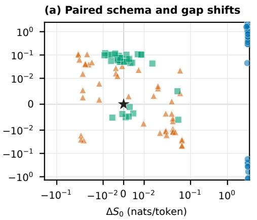
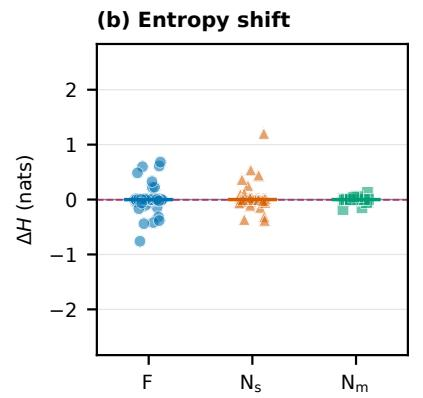
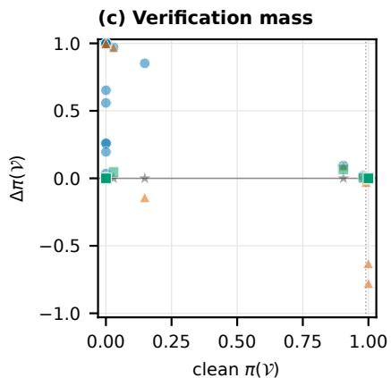
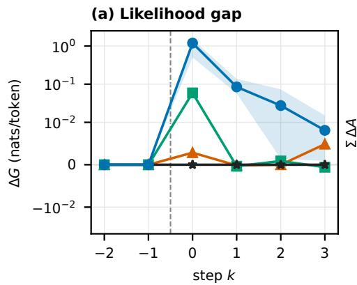
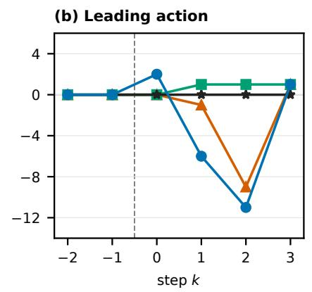
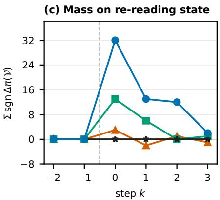

# Robustness Analysis of Agentic AI to Inconsistent and Incomplete Tool Responses

Jiachen Xu   
Department of Computer Science   
Aalborg University   
Aalborg, Denmark   
jiachenxu@cs.aau.dk   
Torben Bach Pedersen   
Department of Computer Science   
Aalborg University   
Aalborg, Denmark   
tbp@cs.aau.dk

Xiaoyu Zhang School of Information Science and Engineering Northeastern University Shenyang, China 2410400@stu.neu.edu.cn

Abstract—Robustness to a bad tool return means answering it in the way that return calls for, which depends on how the tool went wrong. A tool that has failed and a tool that returns a wellformed falsehood are different problems with different remedies. We ask whether the two already differ at the moment the return arrives. This is a qualitative pilot study: we score decision points under teacher forcing rather than running agents to completion. We inject controlled faults into a retail customer-service domain and read two channels off the model’s log-probabilities: the likelihood of the returned content under the tool schema alone and under the whole trajectory, and its distribution over the legal actions, read for both shape and where the mass sits. An incomplete return is legible in every case, being improbable under the schema alone in a range no other condition enters, and it moves the mass toward the tools that re-read state wherever there is room to move. An inconsistent return leaves the schema channel untouched and registers in the likelihood comparison on the field whose true value the context already carries verbatim, not on the one whose contradiction runs through the domain policy. The action distribution gives each condition a distinct signature, but orders them by how far the return bears on the next action rather than by fault family. Carrying the same readings to the calls that follow the injection, where the scored return is the same in every condition and only the context differs, holds that asymmetry and adds a second one: the incomplete return makes every later return harder to predict, on every task where a later call exists, while neither inconsistent return moves that comparison at all; and the falsified status, which the comparison never registers, displaces the agent’s leading action as reliably as the failed call does, sending it on to a call that changes state where the failed call sends it back to read state again. Recognition is therefore asymmetric: each condition is legible in some channel, and no channel is legible on all of them.

Index Terms—language agents, tool use, robustness, noisy tool feedback, fault diagnosis, uncertainty quantification, predictive entropy

## I. INTRODUCTION

A robust tool-using agent is not one that never meets a bad tool return, but one that answers a bad return in the way that return calls for, and what it calls for depends on how the tool

Zhongming Yao College of Computer Science and Technology Zhejiang University Hangzhou, China yaozzzm@gmail.com

Yushuai Li   
Department of Computer Science   
Aalborg University   
Aalborg, Denmark   
yusli@cs.aau.dk

went wrong. Robustness therefore rests on a prior question: at the moment a return arrives, can the agent tell what kind of return it has been given? Tool-using language agents are brittle under realistic noise, and the diagnostic usually reported for that brittleness is step-wise reasoning entropy [1], [2]: on clean trajectories [3] entropy decays as the agent converges on a solution, whereas on trajectories [4] polluted by tool noise it rises from the middle of the episode onward. The same measurements show agents in explicit reasoning mode to be less robust to tool noise rather than more, because they absorb the corrupted evidence and build a fluent, internally consistent chain of reasoning upon it. Where the curve does rise, it reports that something has gone wrong without reporting what.

Noise, however, is not one thing [1], [2]. A response is incomplete when the evidence is absent from it, the call having failed or the payload arrived truncated, so that what is missing shows in its own shape. It is inconsistent when well-formed, schema-valid and internally coherent, yet wrong against something outside itself: the user’s stated intent, or the return of an earlier call [5], [6]. The distinction is practical rather than taxonomic: incompleteness calls for a retry or a graceful degradation, inconsistency for cross-checking the claim against an independent source. An agent that applies the wrong remedy is no better off than one that applies none. A single curve [7], [8] summarizing a completed episode cannot supply that choice, and the family that most needs supplying is the one that leaves the curve flat.

Predictive entropy for structured prediction [9] and semantic entropy, which clusters meaning-equivalent samples before measuring dispersion [10], both flag unreliable generations from the model’s own distribution, but both read a completed single-turn answer, as agent robustness benchmarks read a completed episode. We read at the tool-return boundary of a ReAct-style loop [11], and ask which family a fault belongs to rather than whether an answer is hallucinated. What to read there follows from how the two families differ. An error string is improbable with respect to the tool’s own schema: nothing in the shape of a legitimate return anticipates it. A falsified field is flawless at that level, and is improbable only with respect to what the trajectory [12] already holds, the user’s stated intent and the returns of earlier calls. The two are anomalous relative to different things, which is why one curve is unlikely to carry both, and it fixes what to read in its place: the returned string scored twice, once under the tool schema alone and once under the whole prefix, and the two compared. Entropy we keep, but read at the boundary and defined over the agent’s legal actions rather than over vocabulary tokens; alongside it we record where the mass of that distribution has gone.

Whether the two channels tell the families apart at the instant a return enters the context is what we put to the retail domain of τ2-bench [13], replacing a single tool return with a controlled substitute and leaving everything before it byte-identical: either the error string the environment itself produces, or a schema-valid payload with one field falsified. The inconsistent family is built twice, on two fields of the same payload that differ in whether the true value is already present in the prefix verbatim or the contradiction has to be reached through the domain policy. Which of the two moves was fixed as a reading before anything was scored, and it is what separates a channel registering a collision of strings from one registering a claim meeting a rule.

Two things follow. On the likelihood side the asymmetry is sharp: an incomplete return is improbable under the tool schema alone, in a region no other condition enters, whereas an inconsistent one leaves that channel untouched and registers only where the injected value collides with one already written into the context verbatim. The action distribution responds to all three conditions, but it orders them by how far the returned content bears on the action that comes next rather than by the family the fault belongs to, and only the incomplete return moves the agent’s mass toward the tools that re-read state. Carried to the calls that follow, where the scored return is byte-identical across conditions and only the context differs, the first asymmetry holds and a second appears: the falsified status leaves the likelihood comparison exactly where it found it, yet displaces the agent’s leading action as reliably as the failed call does, and onto a call that changes state rather than one that reads it again. The distinction is therefore already present at the boundary, and no single quantity carries it.

## II. MEASUREMENT DESIGN

## A. Setting and notation

We work in the retail domain of $\tau ^ { 2 }$ -bench [13], [14], comprising 114 tasks over 16 tools. The agent runs a ReActstyle loop [11]: at each decision point it either calls one of the 16 tools or replies to the user, and the return of a call is appended to the context before the next decision point.

Write i for the decision point immediately before the injection site and $\tau _ { < i }$ for the trajectory prefix that precedes it, comprising the domain policy, the user’s turns, and every earlier call with its return; u denotes the user’s stated intent inside that prefix. Let o be the true return of the call made at step i, o˜ the substitute we insert in its place, and | · | the length of a string in tokens. Returned strings are read under two conditionings,

$$
c _ { 0 } = \{ { \mathrm { t o o l ~ s c h e m a } } \} , \qquad c _ { 1 } = c _ { 0 } \cup \{ \tau _ { < i } , u \} ,\tag{1}
$$

which are nested by construction.

Every quantity below is read from log-probabilities under a fixed prefix. The action distribution after an injection is read the same way, by inserting the return into the context and scoring the candidate actions; measurement is confined to the single decision point that follows, which makes π closed-form rather than an empirical frequency. Prefixes are produced by replaying the reference action sequence of each task against the real domain database, so all arms share a byte-identical prefix at decision point i, and every row is differenced against a clean row that differs from it in exactly one tool return.

## B. Quantities

Two conditional surprisals. A returned string x is scored under each of the two conditionings of Eq. (1), normalized per token, and the two are compared:

$$
\begin{array} { r } { S _ { k } ( x ) = - \frac { 1 } { | x | } \log P ( x \mid c _ { k } ) , \qquad k \in \{ 0 , 1 \} , } \end{array}\tag{2}
$$

$$
\begin{array} { r } { G ( x ) = S _ { 1 } ( x ) - S _ { 0 } ( x ) , } \end{array}\tag{3}
$$

where $S _ { 0 }$ reads the string against the tool schema alone, $S _ { 1 }$ reads it against the whole prefix, and G is therefore what the trajectory adds to the schema.

Action-distribution entropy. The action set A has size $K =$ 17: the 16 tools and the reply. We read the probability of each of these events directly: the model’s next-token distribution gives the probability that the output begins a tool call, the tool-name continuation splits that mass across the 16 tools, and the remainder is the probability of replying. This yields a genuine probability vector π over A, from which we take the entropy

$$
H ( \pi ) = - \sum _ { j = 1 } ^ { K } \pi _ { j } \log \pi _ { j } ,\tag{4}
$$

where $\pi _ { j }$ is the probability of the j-th action. Defining entropy over the legal action set rather than over vocabulary tokens avoids the main confounds of token-level entropy, namely high-entropy free-form reasoning text, near-zero-entropy formatting scaffolding, and argument slots copied verbatim from context. The resulting quantity is bounded by log K and coincides with the policy entropy familiar from reinforcement learning [15]. Entropy describes the shape of π and not its location, so we record the location separately: $a ^ { \star } = \arg \operatorname* { m a x } _ { j } \pi _ { j }$ is the leading action, a is the reference action prescribed at that step, and $A = \nVdash [ a ^ { \star } = a ]$ records whether the two agree.

Grouped action probabilities. We also record where the mass goes: $\pi ( \mathcal { V } )$ on the two tools that re-read mutable state, $\pi ( \mathcal { W } )$ on the seven the benchmark marks as write actions, and π on the reply. A fall in π(V) is a fall in the mass the agent puts on going back to check.

Paired contrast. Entropy drifts as a conversation lengthens and the surprisals are model-subjective, so every quantity is reported relative to the paired clean row of the same task at the same step. For any quantity X,

$$
\Delta X = X ( \tilde { o } ) - X ( o ) ,\tag{5}
$$

the injected value minus the true one. Applied to Eq. (4) this is $\Delta H = H ( \pi \mid \tilde { o } ) - H ( \pi \mid o )$ , in which the pre-injection term cancels exactly. Applied to $A$ it takes the values −1, 0 and +1, recording a leading action displaced from the reference one, left where it was, or moved onto it.

How the signs read. A tampered field is syntactically flawless and type-correct, so it is unremarkable under $S _ { 0 } .$ , and its anomaly can surface only under $S _ { 1 }$ , where the trajectory records what the user has said and what earlier tools have returned. An execution failure behaves the other way round, being improbable under the schema alone. Since additional context normally makes content easier to predict, G should be clearly negative on clean returns, with a contradiction pushing it toward zero. For the action distribution, a negative $\Delta H$ means the injected return concentrated it and and a positive one dispersed it; concentration is uninformative on its own, being what a false convergence looks like and equally what a confident retry looks like, so we read it together with the most probable action and with where the mass went.

## C. Injection design

The injection site is the first call to get\_order\_details at position two or later, this return being the most informationdense payload in the domain and the site being required to fall mid-trajectory. Fixing the site by tool rather than by index holds the field vocabulary constant across tasks; the index varies, but it does not act as a confound, because each row is differenced against its own clean prefix at the same index.

Four arms are constructed at that site: a clean arm C, a failed-return arm F standing for the incomplete family, and two inconsistent arms $\mathsf { N } _ { \mathsf { s } }$ and $\Nu _ { \mathrm { m } } ,$ , whose shared letter marks the family and whose subscript names the field that is falsified. These labels are used in place of the full names throughout. C leaves o in place. F replaces the payload with the error string the environment itself produces, the limiting case of an incomplete response in which nothing of the payload survives. The inconsistent family is realized twice, on two different fields of the same payload: $\mathsf { N } _ { \mathsf { s } }$ rewrites the order status to another legal value from its seven-value enumeration, which changes which actions the domain policy permits; $\mathsf { N } _ { \mathsf { m } }$ rewrites a payment-method identifier to one that is well-formed but does not belong to this user. The two differ in how the contradiction is available. In $\mathsf { N } _ { \mathsf { m } }$ the true value appears verbatim earlier in the prefix, so the conflict is one of tokens; in $\mathsf { N } _ { \mathsf { s } }$ the user has described the state of the order in prose, so the conflict has to be reached through meaning. Running both is deliberate: if the trace we are looking for depends on the contradiction being literal, two fields will show it and one field would not.

One control makes the comparison interpretable. Contamination has to be invisible to any channel that does not consult the trajectory: a corruption already improbable under the schema alone carries the signature of an execution failure, and the two families stop being separated by the manipulation. Schema validation intercepts out-of-schema values, which is why $\mathsf { N } _ { \mathsf { s } }$ is restricted to the enumeration of legal statuses. Validation alone is not sufficient, however, because $S _ { 0 }$ is a likelihood over the serialized payload rather than a validator, and it will register a record whose fields are individually legal yet jointly incoherent, such as a cancelled order that still carries fulfillment records. We therefore report $S _ { 0 }$ alongside the other quantities instead of thresholding it, so that whether the manipulation stayed inside the schema channel is visible in Fig. 1 rather than asserted here. Only the returned payload is perturbed, so the database and every other tool continue to report true values and the contradiction is genuine.

Tasks enter the paired set when their reference action sequence is non-empty, contains a qualifying injection site with at least one further action, and replays without error, and when the clean baseline does not already contradict the user’s stated beliefs; 53 of the 114 qualify. The two error arms enter independently wherever their target field exists, so the 189 scored decision points are not $5 3 \times 4 ;$ Table I gives the count per arm.

Each quantity above is read once at the decision point that follows the site. A return, however, stays in the context after the decision it first informs, so we repeat the readout along the trajectory. Write s for the index of the injected call and let the step index k count calls from it, so that $k = 0$ is the injected call itself: G at step k scores the return of call $s + k ,$ and π at step k is read at the decision point that issues call $s + k + 1$ , the first decision at which that return is in the context. Only the payload at $k = 0$ is ever substituted and the database is untouched, so every return at $k \geq 1$ is byteidentical across the four arms, and so is its likelihood under the schema alone; at those steps $\Delta G$ reduces to $\Delta S _ { 1 }$ exactly, and payload length, tool identity and the schema cancel inside the paired difference. Every prefix at $k \leq - 1$ is byte-identical across arms as well, so the four curves coincide there.

All quantities are scored with Qwen3-8B [16] in bfloat16 on NVIDIA A40, using HuggingFace transformers 5.15.0 with PyTorch 2.6.0+cu124, and scoring runs at batch size one with sdpa attention, TF32 disabled, and KV caching disabled.

## III. WHAT WE OBSERVE

## A. The likelihood gap

G is negative on every clean return without exception: all 53 clean rows carry the same sign, so the two conditionings are comparable and the paired shifts below can be read.

Fig. 1(a) places each arm against its own clean row, which sits at the origin by construction. The failed-return arm F moves along the schema axis and moves there uniformly: $\Delta S _ { 0 }$ is positive on all 53 of its rows, and it reaches a region of that axis no other arm enters. The two inconsistent arms do not move along it at all, staying inside the linear zone around zero where the clean rows already differ among themselves. This is the control of Section II-C, and it is read off the horizontal axis rather than asserted. The separation is not an artefact of length: an F return is a short error string where the other arms carry a full record, and $S _ { 0 }$ is a per-token mean, but scoring only the first token of every return, so that all arms are compared over the same length, leaves it intact and still admits no row of any other arm into that region.

  
C (0, 0) F (n=53) Ns (n=46) Nm (n=37)  
Fig. 1. F alone leaves the schema axis in (a) and alone gives $\pi ( \nu )$ a direction in (c); the inconsistent arms are told apart only vertically in (a) and in the tails of (b). F is the failed return, $\mathsf { N } _ { \mathsf { s } }$ and $\mathsf { N } _ { \mathsf { m } }$ the falsified order status and payment identifier (Section II-C). Every quantity is paired against the same task’s C row, which therefore sits at the origin of (a) and on $y = 0$ in (c). (a) The $( \Delta S _ { 0 } , \Delta G )$ plane, both axes symmetric-log. (b) $\Delta H$ per arm against the full ± log 17 range of the action entropy, medians as horizontal bars; the dashed line, at minus the median clean entropy, marks the furthest a median row could fall. (c) Paired change in π(V) against its clean starting level; the dotted line marks the 0.99 ceiling most clean rows already sit on.

The same arm also moves up the gap axis, on 45 of 53 rows, which is expected: an error string is improbable under both conditionings, and the two effects do not cancel. Of the inconsistent arms, $\mathsf { N } _ { \mathsf { m } }$ moves up on 30 of its 37 rows, whereas $\mathsf { N } _ { \mathsf { s } }$ does not move in either direction, with 26 of 46 rows above zero and 25 of 46 to the right of it.

The two inconsistent arms are the comparison this design was built to make, and it fixes two readings in advance: a literal collision between the injected value and one already present in the prefix if only $\mathsf { N } _ { \mathsf { m } }$ moves, a policy-mediated conflict if $\mathsf { N } _ { \mathsf { s } }$ moves as well. It is the first, and Table II settles it from inside each arm rather than from the comparison between them. Within each arm the field, the injection and the scoring are identical, so its two groups differ only in what the prefix already contains; both groupings were fixed when the injection specifications were checked, before any scoring. Six $\mathsf { N } _ { \mathsf { m } }$ rows sit at a site the trajectory reaches before get\_user\_details has ever been called, so the true identifier is absent from the prefix; on those the gap moves down on all six, against 30 of the 31 rows where the identifier is present verbatim. Symmetrically, the $\mathsf { N } _ { \mathsf { s } }$ rows whose contradiction must pass through the policy (the user states no status, and the gated action is on the order returned at the site) are flat at 6 of $^ { 1 4 , }$ indistinguishable from the eight rows where the injected field is constrained by nothing in the prefix at all. What the gap registers here is a token colliding with a token, not a claim colliding with a rule, and this bounds what the quantity can be expected to detect rather than only what it detected here.

TABLE I  
PAIRED MOVEMENT PER ARM, COUNTED AGAINST EACH TASK’S OWN CLEAN ROW C. ENTRIES ARE ROW COUNTS; THE RIGHT-HAND BLOCK RESTRICTS TO THE TASKS WHOSE CLEAN ENTROPY CLEARS 0.01 NATS, AND H COUNTS THOSE FALLING BACK BELOW IT.
<table><tr><td></td><td colspan="3">All rows</td><td colspan="3">Entropy headroom</td></tr><tr><td>Arm</td><td>n</td><td> $\Delta S _ { 0 } > 0$ </td><td> $\Delta G > 0$ </td><td>n</td><td> $H < 0 . 0 1$ </td><td>action changes</td></tr><tr><td>F</td><td>53</td><td>53</td><td>45</td><td>22</td><td>15</td><td>15</td></tr><tr><td> $\mathsf { N } _ { \mathsf { s } }$ </td><td>46</td><td>25</td><td>26</td><td>20</td><td>8</td><td>6</td></tr><tr><td> $\mathsf { N } _ { \mathsf { m } }$ </td><td>37</td><td>18</td><td>30</td><td>16</td><td>2</td><td>0</td></tr></table>

TABLE II

WHERE THE LIKELIHOOD GAP MOVES INSIDE THE INCONSISTENT FAMILY. ENTRIES COUNT ROWS WITH $\Delta G > 0$
<table><tr><td> $\mathrm { A r m }$ </td><td>Prefix contains</td><td>n</td><td> $\Delta G > 0$ </td></tr><tr><td> $\mathsf { N } _ { \mathsf { m } }$ </td><td>the true value, verbatim</td><td>31</td><td>30</td></tr><tr><td> $\mathsf { N } _ { \mathsf { m } }$ </td><td>no occurrence of it yet</td><td>6</td><td>0</td></tr><tr><td> $\mathsf { N } _ { \mathsf { s } }$ </td><td>a contradiction via the policy</td><td>14</td><td>6</td></tr><tr><td> $\mathsf { N } _ { \mathsf { s } }$ </td><td>nothing constraining the field</td><td>8</td><td>4</td></tr></table>

## B. Entropy

The action distribution at this site is concentrated before anything is injected: its median entropy over the clean rows is about 0.005 nats against a maximum of log $1 7 \approx 2 . 8 3$ , and 31 of the 53 clean rows fall below 0.01 nats, where π is already close to a point mass and a paired shift has almost nothing to move. Fig. 1(b) is drawn against the full range, so the scale is visible rather than implied, and the action-distribution counts in Table I are taken on the 22 rows that clear that floor. Every arm is read on those same 22 tasks, and its n falls below 22 only where its target field is absent.

A return can sharpen the distribution without changing what the agent would do, and can move the peak without sharpening it. Read together, entropy and the most probable action give the three arms three distinct behaviours.

Under F the distribution sharpens and redirects at once. Of the 22 rows with room to move, entropy ends below 0.01 nats on 15 and the most probable action changes on 15, eleven of those to a tool that re-reads state and nine to a second call on the order whose first call failed. On the 31 rows already at the floor it does neither.

The two inconsistent arms behave unlike each other. Only $\mathsf { N } _ { \mathsf { s } }$ puts uncertainty where there was none: two of its rows begin below the floor and end above 0.5 nats, one at $\Delta H =$ $+ 1 . 2 0 ,$ where F reaches at most +0.22 from that same floor and $\mathsf { N } _ { \mathsf { m } } + 0 . 0 0 2$ ; where there is room to move, entropy ends below the floor on 8 of 20 rows and the most probable action changes on 6. By contrast, $\mathsf { N } _ { \mathsf { m } }$ leaves the distribution where it found it: $| \Delta H |$ reaches at most 0.18 across its 37 rows, and the most probable action is unchanged on all 37, the 16 with room to move included.

The three readings order the arms alike, and the order is not the boundary between the two families. It follows instead how far the returned content bears on the action that comes next: an absent return leaves that choice to be made again, a rewritten status changes which actions the domain policy permits, and a rewritten payment identifier changes only the value a later action would carry.

## C. Where the probability mass goes

A change in the most probable action is a change of leader; it does not say how much mass moved, and on the rows where the leader does not change it can still move. The grouped probabilities answer that. π(V) on clean returns is bimodal rather than spread: 35 of the 53 rows sit above 0.99 and 14 below 0.01, with 4 in between. Fig. 1(c) therefore plots each arm’s paired change against its own clean starting level, so that the ceiling is part of the picture rather than hidden inside an average.

The arm F moves this quantity wherever it can be moved. On the 18 tasks whose clean distribution leaves room, it raises $\pi ( \nu )$ on every one of them, from below one half to essentially one; across all 53 rows it rises on 34, falls on 2, and is unchanged on 17 of the 35 that began at the ceiling, ending at or above 0.99 on 46.

The inconsistent arms carry no such direction, with $\mathsf { N } _ { \mathsf { s } }$ raising $\pi ( \nu )$ on 17 rows and lowering it on 14, and $\mathsf { N } _ { \mathsf { m } }$ raising it on 15 and lowering it on 2. π(W) is below 0.01 on 46 of the 53 clean rows and $\pi _ { r }$ is smaller still, so neither is in a position to register a change at this site and we draw no claim from them. What the concentration of π orders by degree, its destination separates outright: only the incomplete return moves mass toward re-reading state, and it moves it wherever there is room.

## D. What the return leaves behind

A return stays in the context after the decision it first informs, and reading the same quantities at the calls that follow separates the two families a second time, under a control the site itself cannot offer. $\mathrm { A t } \ k \geq 1$ the scored string is the same bytes in every arm and so is its likelihood under the schema alone, on all 301 paired rows; the gap difference is then a difference of trajectory surprisals and nothing else, and what remains is attributable to the prefix.

Under that control the families come apart. One call past the site, F raises G on every task where the call exists, 51 of 51, with a median of +0.085 nats per token and an interquartile range of $[ + 0 . 0 5 8 , + 0 . 1 3 8 ]$ that does not reach zero; a sign test on that count returns $p < 1 0 ^ { - 1 5 }$ . Neither inconsistent arm moves at all: Ns is positive on 22 of 45 and $\mathsf { N } _ { \mathsf { m } }$ on 18 of 37, with medians of −0.0002 and −0.0004. The F trace then fades, $\mathrm { t o \ t i 0 . 0 2 8 }$ on 32 of 41 at $k = 2$ and +0.008 on 14 of 19 at $k = 3 .$ , while the inconsistent arms stay flat throughout; restricting to the 19 tasks whose reference sequence reaches every step leaves the shape unchanged, with F positive on 19 of 19 at $k = 1$ . The point at $k = 0$ is drawn on the same axis but is not the same measurement, the scored string there being the substituted payload itself: what the gap reports at the site is a property of the string inserted, and what it reports afterwards a property of the context that string leaves behind.

The shape of the action distribution carries none of this. The median ∆H is within 0.0011 nats of zero at every arm and every step, so the floor of Section III-B holds along the whole trajectory rather than only at the site. Its location separates the arms again, and not in the order the gap gives. Counted against each task’s own clean row, F moves $a ^ { \star }$ off the reference action on 9 tasks and onto it on 3 at $k = 1$ , and on 14 against 3 at $k = 2 ; \mathsf { N } _ { \mathsf { s } }$ shows the same asymmetry one call later and more weakly, 10 against 1 at $k = 2 ; \mathsf { N } _ { \mathsf { m } }$ moves it on no task at any step. The absolute agreement rate is a property of the task suite rather than of the manipulation, being 0.62, 0.55, 0.66 and 0.47 on the clean arm at $k = 0$ through 3, so only the paired differences are read.

That leaves F and $\mathsf { N } _ { \mathsf { s } }$ alike in Fig. 2(b), and where the leader goes tells them apart. Pooling every displacement at $k \geq 1$ F moves $a ^ { \star }$ onto a tool that re-reads state on 16 of its 28, fourteen of them a second call on the very order whose first call failed, and $\pi ( \mathcal { V } )$ carries the same direction as a mass: it rises on a net 32 tasks at the site, 13 at $k = 1$ and 12 at $k = 2$ before returning to zero. $\mathsf { N } _ { \mathsf { s } }$ does the opposite. None of its 15 displacements is onto a tool that re-reads state and nine are onto a write action, eight of them the same one, while $\pi ( \mathcal { V } )$ registers nothing at any step. The two arms the leading action cannot distinguish move the agent in opposite directions, and the one the gap never registers is the one whose leader ends on a call that changes state rather than one that reads it again.

## IV. DISCUSSION

Each channel is a function of something different, and its blind spot follows from that. G compares two likelihoods over the same string, so it can register a value the prefix has already written out but not one the prefix rules out through the domain policy; the action distribution is a function of the state the return implies rather than of the return itself, and so orders the arms by how much of the option set changes, indifferent to why the return is wrong. Neither, therefore, is a function of the observation and the policy jointly. A payload that contradicts nothing yet still misleads—a plausible note about a return policy no other tool can confirm—should on this account leave no trace in either channel [17], and separating the merely contradictory from the consequential needs a quantity of that joint kind. The two families we did not inject follow from the same account. An irrelevant return carries content the trajectory does not anticipate, so the likelihood comparison should move on it much as it moves on an inconsistent one, registering the return without telling the two apart; an ambiguous one contradicts nothing and should leave that comparison where it found it, while being the one family with a reason to disperse the action distribution rather than concentrate it. Both are predictions here, not results.

  
Fig. 2. Each condition leaves a trace, but not in the same channel and not at the same moment. Every quantity is paired against the same task’s C row at the same step; k counts calls from the injected one, so returns at $k \geq .$ 1 are byte-identical across arms and the arms coincide left of the dashed line. (a) $\Delta G ,$ medians on a symmetric-log axis, with the interquartile range of F shaded. (b) Net paired change in whether the leading action is the reference action; negative is away from it. (c) Net paired direction of π(V), the mass on the two tools that re-read state, as tasks up minus tasks down. Counts in Table III.

TABLE III  
PAIRED MOVEMENT AT EACH STEP FROM THE INJECTION SITE. THE FIRST BLOCK COUNTS ROWS WHOSE GAP ROSE, OUT OF THE ROWS WHERE THE STEP EXISTS; THOSE DENOMINATORS APPLY TO THE TWO BLOCKS BELOW, WHICH GIVE NET TASK COUNTS.
<table><tr><td></td><td>Arm</td><td> $k = 0$ </td><td> $k = 1$ </td><td> $k = 2$ </td><td> $k = 3$ </td></tr><tr><td rowspan="3"> $\Delta G > 0$ </td><td>F</td><td>45/53</td><td>51/51</td><td>32/41</td><td>14/19</td></tr><tr><td> $\mathsf { N } _ { \mathsf { s } }$ </td><td>26/46</td><td>22/45</td><td>19/39</td><td>12/19</td></tr><tr><td> $\mathsf { N } _ { \mathsf { m } }$ </td><td>30/37</td><td>18/37</td><td>22/33</td><td>6/17</td></tr><tr><td rowspan="3">∑∆A</td><td> $\mathsf { F }$ </td><td>+2</td><td>-6</td><td>-11</td><td>+1</td></tr><tr><td> $\mathsf { N } _ { \mathsf { s } }$ </td><td>0</td><td>-1</td><td>-9</td><td>+1</td></tr><tr><td> $\mathsf { N } _ { \mathsf { m } }$ </td><td>0</td><td>+1</td><td>+1</td><td>+1</td></tr><tr><td rowspan="3">∑sgn ∆π(V)</td><td> $\mathsf { F }$ </td><td>+32</td><td>+13</td><td>+12</td><td>+2</td></tr><tr><td> $\mathsf { N } _ { \mathsf { s } }$ </td><td>+3</td><td>-2</td><td>+1</td><td>-1</td></tr><tr><td> $\mathsf { N } _ { \mathsf { m } }$ </td><td>+13</td><td>+6</td><td>0</td><td>+1</td></tr></table>

The curves of Fig. 2 are a controlled version of the degradation an agent shows after bad context rather than a reproduction of it. In a live rollout that degradation has two sources, a context that has been polluted and an agent that acts on the pollution and drifts further off course; replaying the reference sequence forces the action at every step and removes the second, which is what makes the trace at $k \geq 1$ attributable to the prefix, and equally what stops it from being read as a task-completion effect. How far the forced trajectory has drifted from what the model would have done is measured rather than assumed: the reference action stops being the most probable one on a third to a half of rows by $k = 2$ even on the clean arm, which is where we stop reading the tail.

The reading is qualitative and bounded in the obvious ways: decision points are scored under teacher forcing rather than an agent run to completion, so what we report is an immediate response and not a task outcome; each arm enters wherever its target field exists, so counts are exact within an arm and only indicative across arms; and the results rest on one domain, one model, one injection site, and template rather than adversarial noise.

## V. CONCLUSION

We asked whether a tool that has failed and a tool that returns a well-formed falsehood already look different at the moment the return arrives. They do, but not in one place. On the likelihood side the asymmetry is sharp: the incomplete return is improbable under the tool schema itself, whereas the inconsistent one leaves that channel untouched and surfaces only where the injected value collides with one already written into the prefix. The action distribution registers all three conditions but orders them by how far the returned content bears on the action that comes next: the failed call sharpens the distribution and redirects it toward re-reading state, the falsified status alone creates uncertainty where there was none, and the falsified identifier moves neither. Carried to the calls that follow the injection, where the scored return is the same bytes in every condition, the asymmetry holds and gains a second edge: the failed call is the only condition the likelihood comparison still registers, and the falsified status, which it never registers, is the one whose leading action ends on a call that changes state rather than one that reads it again. Whether that ordering tracks the consequence of a return rather than its provenance is what a crossed design would settle, placing faults of both families at sites where the legal action set does and does not change.

## REFERENCES

[1] R. Wang, Y. Chen, Y. Wang, C. Wu, J. Fang, X. Cai, Q. Gu, H. Su, A. Zhang, X. Wang, X. Cai, and T.-S. Chua, “AgentNoiseBench: Benchmarking robustness of tool-using LLM agents under noisy condition,” in Proc. 43rd Int. Conf. Mach. Learn. (ICML), Seoul, South Korea, 2026.

[2] Y. Chen, X. Cai, J. Fang, Z. Han, Y. Wang, Y. Shi, Y. Zhang, Q. Gu, X. Cai, X. Wang, A. Zhang, and T.-S. Chua, “Learning to act under noise: Enhancing agent robustness via noisy environments,” arXiv preprint arXiv:2605.27209, 2026.

[3] T. Li, R. Huang, L. Chen, C. S. Jensen, and T. B. Pedersen, “Compression of uncertain trajectories in road networks,” Proc. VLDB Endow., vol. 13, no. 7, pp. 1050–1063, Mar. 2020.

[4] T. Li, L. Chen, C. S. Jensen, and T. B. Pedersen, “TRACE: Real-time compression of streaming trajectories in road networks,” Proc. VLDB Endow., vol. 14, no. 7, pp. 1175–1187, Mar. 2021.

[5] H. Xu, Z. Zhu, L. Pan, Z. Wang, S. Zhu, D. Ma, R. Cao, L. Chen, and K. Yu, “Reducing tool hallucination via reliability alignment,” in Proc. 42nd Int. Conf. Mach. Learn. (ICML), Vancouver, Canada, pp. 69992–70006, 2025.

[6] Y. Zhang, J. Chen, J. Wang, Y. Liu, C. Yang, C. Shi, X. Zhu, Z. Lin, H. Wan, Y. Yang, T. Sakai, T. Feng, and H. Yamana, “ToolBeHonest: A multi-level hallucination diagnostic benchmark for tool-augmented large language models,” in Proc. 2024 Conf. Empirical Methods Nat. Lang. Process. (EMNLP), Miami, Florida, USA, pp. 11388–11422, 2024.

[7] Y. Yao, L. Chen, Z. Fang, Y. Gao, C. S. Jensen, and T. Li, “Camel: Efficient compression of floating-point time series,” Proc. ACM Manag. Data, vol. 2, no. 6, Art. no. 227, pp. 1–26, Dec. 2024.

[8] Y. Yao, H. Jie, L. Chen, T. Li, Y. Gao, and S. Wen, “TSec: An efficient and effective framework for time series classification,” in Proc. 40th IEEE Int. Conf. Data Eng. (ICDE), Utrecht, Netherlands, pp. 1394– 1406, 2024.

[9] A. Malinin and M. Gales, “Uncertainty estimation in autoregressive structured prediction,” in Proc. 9th Int. Conf. Learn. Represent. (ICLR), Virtual Event, Austria, 2021.

[10] S. Farquhar, J. Kossen, L. Kuhn, and Y. Gal, “Detecting hallucinations in large language models using semantic entropy,” Nature, vol. 630, no. 8017, pp. 625–630, Jun. 2024.

[11] S. Yao, J. Zhao, D. Yu, N. Du, I. Shafran, K. Narasimhan, and Y. Cao, “ReAct: Synergizing reasoning and acting in language models,” in Proc. 11th Int. Conf. Learn. Represent. (ICLR), Kigali, Rwanda, 2023.

[12] D. Hu, Z. Fang, H. Fang, T. Li, C. Shen, L. Chen, and Y. Gao, “Estimator: An effective and scalable framework for transportation mode classification over trajectories,” IEEE Trans. Intell. Transp. Syst., vol. 25, no. 11, pp. 15562–15573, Nov. 2024.

[13] V. Barres, H. Dong, S. Ray, X. Si, and K. Narasimhan, “τ2-Bench: Evaluating conversational agents in a dual-control environment,” in Proc. 43rd Int. Conf. Mach. Learn. (ICML), Seoul, South Korea, 2026.

[14] S. Yao, N. Shinn, P. Razavi, and K. Narasimhan, “τ-bench: A benchmark for tool-agent-user interaction in real-world domains,” in Proc. 13th Int. Conf. Learn. Represent. (ICLR), Singapore, pp. 74824–74876, 2025.

[15] G. Zhang, H. Geng, X. Yu, Z. Yin, Z. Zhang, Z. Tan, H. Zhou, Z.-Z. Li, X. Xue, Y. Li, Y. Zhou, Y. Chen, C. Zhang, Y. Fan, Z. Wang, S. Huang, F. P. Velez, Y. Liao, H. Wang, M. Yang, H. Ji, J. Wang, S. Yan, P. Torr, and L. Bai, “The landscape of agentic reinforcement learning for LLMs: A survey,” Trans. Mach. Learn. Res., Jan. 2026.

[16] A. Yang, A. Li, B. Yang, B. Zhang, B. Hui, B. Zheng, B. Yu, C. Gao, C. Huang, C. Lv, C. Zheng, D. Liu, F. Zhou, F. Huang, F. Hu, H. Ge, H. Wei, H. Lin, J. Tang, J. Yang, J. Tu, J. Zhang, J. Yang, J. Yang, J. Zhou, J. Zhou, J. Lin, K. Dang, K. Bao, K. Yang, L. Yu, L. Deng, M. Li, M. Xue, M. Li, P. Zhang, P. Wang, Q. Zhu, R. Men, R. Gao, S. Liu, S. Luo, T. Li, T. Tang, W. Yin, X. Ren, X. Wang, X. Zhang, X. Ren, Y. Fan, Y. Su, Y. Zhang, Y. Zhang, Y. Wan, Y. Liu, Z. Wang, Z. Cui, Z. Zhang, Z. Zhou, and Z. Qiu, “Qwen3 technical report,” arXiv preprint arXiv:2505.09388, 2025.

[17] Q. Zhan, Z. Liang, Z. Ying, and D. Kang, “InjecAgent: Benchmarking indirect prompt injections in tool-integrated large language model agents,” in Findings Assoc. Comput. Linguistics: ACL 2024, Bangkok, Thailand, pp. 10471–10506, 2024.