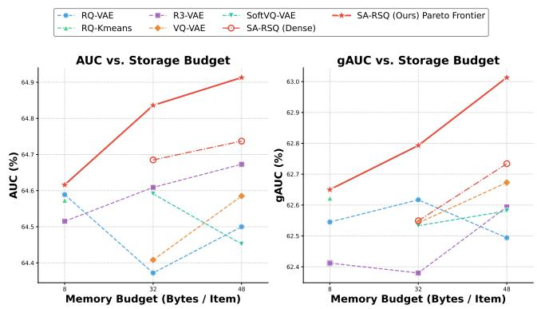
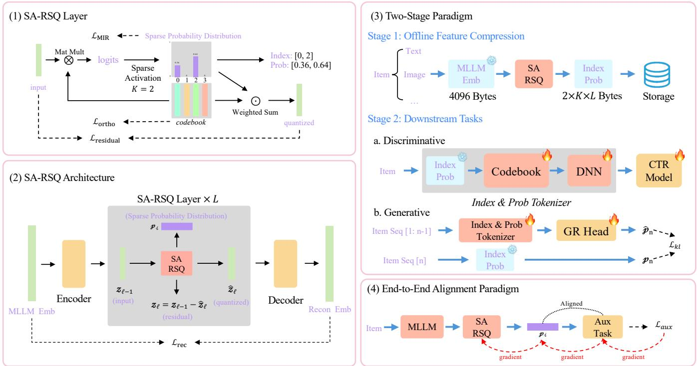

# SA-RSQ: A Versatile Sparse Representation Framework for Multi-modal Recommender Systems

Xiang Wang   
Tianjin University   
Tianjin, China   
wangx0502@tju.edu.cn   
Kang Yang   
Meituan   
Beijing, China   
yangkang29@meituan.com   
Shigang Quan   
Meituan   
Beijing, China   
quanshigang@meituan.com   
Sitong Chen   
Meituan   
Beijing, China   
chensitong10@meituan.com

Xingxing Wang Meituan Beijing, China wangxingxing04@meituan.com

Tingzhen Chang Meituan Beijing, China changtingzhen@meituan.com

Yabo Fan   
Meituan   
Beijing, China   
fanyabo@meituan.com   
Zhaodian He   
Institute of Software Chinese   
Academy of Sciences   
Beijing, China   
hezhaodian20@mails.ucas.ac.cn

## Abstract

Deploying high-dimensional multimodal features in industrial recommender systems incurs substantial storage and latency overhead. Hard quantization is compact but introduces boundary distortion, whereas dense soft quantization couples representation quality to the limited storage budget. We propose Sparse Activation-based Residual Soft Quantization (SA-RSQ), which uses Top-� sparse routing and softmax weights to store compact (Index, Probability) tuples. The stored tuples decouple per-item storage from codebook dimensionality; for a fixed selected support, gradients propagate through the routing weights and weighted reconstruction without relying on a straight-through estimator. Experiments on a proprietary food-delivery advertising dataset show favorable reconstruction-performance and CTR trade-ofs across storage budgets of 8–48 bytes per item. A preliminary Next-Distribution Prediction study and a one-week online A/B test further demonstrate the practical potential of SA-RSQ, with relative lifts of +2.51% in CTR and +3.66% in CPM.

## Keywords

Recommender Systems, Feature Compression, Residual Quantization, Sparse Activation

## 1 Introduction

Modern recommender systems are undergoing a profound paradigm shift, increasingly leveraging high-dimensional semantic features (e.g., multimodal representations of 2048 dimensions or higher) extracted by Multimodal Large Language Models (MLLMs) to enhance semantic representation capabilities, particularly for cold-start scenarios [28, 40]. However, directly deploying these dense vectors in industrial-scale systems serving hundreds of millions of items incurs prohibitive storage overhead and inference latency botlenecks. To alleviate this storage botleneck, existing approaches widely adopt RQ-VAE-based cascaded hard quantization techniques [12, 15, 18, 23, 33, 34] to drastically compress these features into ultra-short discrete Semantic IDs (typically requiring only 8 bytes).

Nevertheless, such extreme compression comes at the cost of irreversible semantic distortion, which is particularly detrimental to recommender systems that heavily rely on fine-grained similarity discrimination. In essence, the current landscape presents a missing middle ground between extreme compression (with severe information loss) and high-dimensional embeddings (with prohibitive storage overhead), with no principled mechanism to smoothly trade of between the two.

Among these limitations, one fundamental issue is boundary distortion: the arg min operation forces semantically similar items (e.g., “iPhone 15” and “iPhone 15 Pro”) to either share the same discrete ID or receive entirely diferent ones depending on boundary proximity, erasing the continuous distance structure essential for fine-grained recommendation systems. Furthermore, increasing residual stages to compensate yields diminishing returns, as additional stages introduce more quantization noise than useful signal, ultimately causing semantic collapse [18]. Beyond representation quality, hard assignment requires the Straight-Through Estimator (STE) for gradient approximation [3, 18], whose inherent bias both destabilizes training and prevents true end-to-end alignment between representation learning and downstream objectives [32]. As a consequence, the resulting Semantic IDs are frozen after generation: the quantization model optimizes a reconstruction objective while the downstream recommender pursues CTR/CVR targets, and this fundamental objective mismatch renders hard-coded SIDs perpetually misaligned with task-specific requirements. Finally, distances between discrete IDs in the symbolic

∗Corresponding author

space are fundamentally unmeasurable, precluding meaningful semantic similarity computation in the quantized domain.

To overcome the non-diferentiability of hard quantization, recent works explore soft quantization (e.g., SoftVQ-VAE [5]), which bypasses STE by multiplying soft assignment distributions with the codebook to produce low-dimensional dense embeddings. However, under the stringent storage constraints of recommender systems (e.g., 32 bytes can store at most 16 dimensions in Float16 format), projecting 2048D MLLM representation vectors into such a narrow botleneck imposes severe fiting pressure on the encoder, leading to severe semantic collapse; while naively increasing dimensions would proportionally inflate storage costs. This naturally raises a critical open question: Can we find an optimal Pareto trade-ofbetween high-dimensional dense embeddings (with prohibitive storage) and discrete Semantic IDs (with irreversible distortion and non-diferentiability)?

To this end, this paper proposes Sparse Activation-based Residual SoftQuantization (SA-RSQ). Our core insight is breaking the strong coupling between storage footprint and semantic representation ability. We use Top-� support selection followed by a masked softmax [8, 30], yielding compact (Index, Prob) tuples. The support selection is discrete, but for a fixed support the probabilities, codebook values, and weighted reconstruction remain diferentiable; this avoids the straight-through estimator used by hard quantization. Since only sparse routing tuples are stored, the per-item footprint is decoupled from codebook dimensionality. At inference, a table lookup and probability-weighted sum reconstruct the representation.

In summary, SA-RSQ efectively decouples storage constraints from representation dimensionality, establishing a measurable and diferentiable semantic space that bridges the gap between extreme hard compression and memory-intensive dense embeddings. The core contributions of this work are summarized as follows:

(1) Diferentiable Sparse Soft Quantization: We propose SA-RSQ, a sparse soft quantization framework that replaces heuristic STE-based routing with diferentiable Top-� sparse routing, enabling flexible storage-performance trade-ofs from 8 to 48 bytes.

(2) Superior Compression-Performance Trade-ofs: Ofline experiments demonstrate favorable trade-ofs between storage eficiency and recommendation performance under the evaluated budgets. Its probabilistic representations also support a preliminary “Next-Distribution Prediction” formulation for generative recommendation.

(3) Industrial Deployment Validation: SA-RSQ has been de ployed in a Food Delivery Advertising Platform, where online A/B tests demonstrate practical efectiveness with relative improvements of +2.51% in CTR and +3.66% in CPM over the production baseline.

To support reproducibility, we release the core implementation of SA-RSQ at https://github.com/WishArdently/SA-RSQ.

## 2 Related Work

## 2.1 Vector Quantization for Representation Compression

Vector quantization (VQ) has a long history in signal processing and information retrieval. Product Quantization (PQ) [15] decomposes vectors into disjoint sub-spaces and quantizes each independently. Optimized Product Quantization (OPQ) [10] further learns a rotation matrix to minimize distortion. In the deep learning era, VQ-VAE [33] introduced a learnable discrete codebook within the VAE framework via the Straight-Through Estimator (STE) [3], and RQ-VAE [18] extends it to cascaded residual quantization for hierarchical semantic IDs, while R3-VAE [34] learns the codebook through soft aggregation during training followed by a hard arg max truncation to obtain semantic IDs.

  
Figure 1: Overall performance comparison of various representation compression methods. Our SA-RSQ achieves a favorable trade-of between compression eficiency and recommendation performance.

In recommender systems, VQ-Rec [12] leverages vectorquantized representations for transferable sequential recommendation. QARM [23] employs residual K-Means for industrial-scale multi-modal semantic IDs. Despite achieving extreme compression (e.g., 8 bytes per item), all these methods rely on hard assignment via arg min, which leads to (1) item collision—semantically similar items mapped to identical codes—and (2) STE-induced optimization instability that hinders end-to-end alignment with downstream objectives.

## 2.2 Semantic IDs for Generative Recommendation

Generative recommendation formulates item retrieval as sequenceto-sequence generation [36]. TIGER [28] first established the “Next-Token Prediction” (NTP) paradigm by autoregressively generating RQ-VAE semantic IDs. Subsequent works advance this paradigm along multiple axes: LETTER [35] and TokenRec [27] design learnable tokenizers that integrate collaborative signals into ID construction; ETEGRec [20] enables end-to-end joint optimization of tokenization and generation; OneRec [7] and PLUM [11] demonstrate industrial-scale deployment at Kuaishou and YouTube respectively; LongSID [13] and FORGE [9] address eficiency and robustness of ID generation; OneRec-Think [21] further integrates explicit chain-of-thought reasoning into generative recommendation; and GRID [16] provides a modular framework for systematic evaluation.

Despite recent progress, the NTP paradigm inherits fundamental limitations of hard quantization: the discrete IDs create a non-diferentiable boundary preventing true end-to-end opti mization, and autoregressive decoding sufers from accumulation of prediction errors. These observations motivate our “Next-Distribution Prediction” paradigm, where the generator predicts continuous sparse probability distributions over the codebook, enabling diferentiable training and graceful error tolerance.

## 3 Methodology

In this section, we detail the Sparse Activation-based Residual Soft Quantization (SA-RSQ) framework. As illustrated in Figure 2, SA-RSQ compresses high-dimensional semantic embeddings while decoupling storage constraints from representation dimensionality. Its weighted reconstruction is diferentiable once the Top-� support is fixed.

In the following, we first formalize the core residual soft quanti zation paradigm and its optimization objectives. Subsequently, we elaborate on its flexible integration into downstream recommendation systems, covering both industrial two-stage deployment and end-to-end alignment.

## 3.1 Diferentiable Sparse Routing

Iterative Residual Formulation. Similar to standard RQ-VAE [18], our framework employs an Encoder-Decoder architecture. The input item embedding $\mathbf { x } \in \mathbb { R } ^ { D }$ is first mapped into a lower-dimensional latent space $\mathbf { h } = \mathrm { E n c o d e r } ( \mathbf { x } ) \in \mathbb { R } ^ { d }$ , seting the initial residual $\mathbf { r } _ { 0 } = \mathbf { h }$ . The quantization cascades through � stages, with the �-th stage maintaining a learnable codebook $\bar { \mathbf { C } ^ { ( l ) } } \in \mathbb { R } ^ { \breve { V } \times d }$

The critical departure from traditional RQ-VAE lies in replacing the non-diferentiable arg min hard assignment with a continuous soft approximation $\hat { \mathbf { r } } _ { l - 1 }$ (the exact mechanism is detailed in Section 3.1). The residual vector is iteratively refined, and the final recon structed representation x̂ is generated by decoding the aggregated approximations:

$$
\mathbf r _ { l } = \mathbf r _ { l - 1 } - \hat { \mathbf r } _ { l - 1 }\tag{1}
$$

$$
\hat { \mathbf { x } } = \mathrm { D e c o d e r } \left( \sum _ { l = 1 } ^ { L } \hat { \mathbf { r } } _ { l - 1 } \right)\tag{2}
$$

This formulation preserves the cascaded compression structure. The residual updates and weighted sums are diferentiable; the discrete support changes induced by Top-� selection are treated as fixed within each forward pass.

Sparse Activation via Truncated Softmax. To overcome the information botleneck of hard assignment (i.e., arg min) while maintaining extreme storage eficiency, we propose a sparse soft activation mechanism. For the �-th residual layer, given the input residual vector $\mathbf { r } _ { l - 1 } \in \mathbb { R } ^ { d }$ and the codebook $\mathbf { C } ^ { ( l ) } \in \bar { \mathbb { R } } ^ { V \times d }$ containing � code words, we first compute the similarity logits $\mathbf { z } ^ { ( l ) } \in \mathbb { R } ^ { V }$ between the input and all code words via scaled dot-product:

$$
z _ { i } ^ { ( l ) } = \frac { { \bf r } _ { l - 1 } \cdot c _ { i } ^ { ( l ) } } { \sqrt { d } } , \quad \forall i \in \{ 1 , 2 , \dots , V \}\tag{3}
$$

Standard soft quantization [5, 32] applies a dense Softmax over all code words, which incurs prohibitive storage costs. Inspired by the sparsely-gated routing mechanisms in Mixture-of-Experts (MoE) [30] and sparse atention models [25], we instead enforce structural sparsity by retaining only the Top-� most relevant code words. Specifically, we define an index set $\mathcal { I } _ { k }$ containing the indices of the � largest values in �, and apply a masking operation to the logits:

$$
\tilde { z } _ { i } ^ { ( l ) } = \left\{ \begin{array} { l l } { z _ { i } ^ { ( l ) } , } & { \mathrm { i f } i \in \mathcal { I } _ { k } } \\ { - \infty , } & { \mathrm { o t h e r w i s e } } \end{array} \right.\tag{4}
$$

Subsequently, the masked logits are passed through a Softmax function to obtain a sparse probability distribution $\mathbf { p } ^ { ( l ) } \in \mathbb { R } ^ { V }$ :

$$
\mathcal { P } _ { i } ^ { ( l ) } = \frac { \exp ( \tilde { z } _ { i } ^ { ( l ) } ) } { \sum _ { j = 1 } ^ { V } \exp ( \tilde { z } _ { j } ^ { ( l ) } ) }\tag{5}
$$

Due to the −∞ masking, the probabilities for all non-Top-� code words become exactly zero. This operation projects the dense logits onto a sparse probability simplex, ensuring that exactly � positions are activated. The support selection itself is discrete, while the masked-softmax weights are diferentiable with respect to the selected logits.

Finally, the quantized representation for the �-th layer is constructed as the convex combination of the active code words weighted by their sparse probabilities:

$$
\hat { \mathbf { r } } _ { l - 1 } = \sum _ { i \in \mathcal { I } _ { k } } p _ { i } ^ { ( l ) } c _ { i } ^ { ( l ) }\tag{6}
$$

During ofline processing, we only need to store the � active indices and their corresponding non-zero probabilities $( \mathrm { i . e . , }$ the Index & Prob format). In the reported accounting, each index is a 16-bit unsigned integer and each probability is a Float16 value; the shared codebook and model parameters are excluded from the peritem budget. Thus, an index-only tuple costs 2�� bytes and an Index+Prob tuple costs 4�� bytes: $L { = } 4 , K { = } 1$ gives 8 bytes, $L { = } 2 , K { = } 4$ gives 32 bytes, and $L { = } 4 , K { = } 3$ gives 48 bytes. This accounting assumes $V \overset { \cdot } { \leq } 2 ^ { 1 6 }$ and no additional per-item padding.

Curriculum Sparsity Annealing. Applying Top-� masking from the outset restricts gradient flow and hinders global semantic exploration. To prevent this premature pruning, we introduce a Cosine Sparsity Annealing schedule [22, 31]. Training initiates with fully dense activation $( k ( 0 ) = V )$ for unhindered updates. At step �, the active budget �(�) dynamically decays to the target sparsity $k _ { t g t }$ via a cosine factor �(�):

$$
\eta ( t ) = \frac { 1 } { 2 } \left( 1 + \cos \left( \frac { \pi t } { T _ { a n n } } \right) \right)\tag{7}
$$

$$
k ( t ) = \operatorname* { m a x } \left( k _ { t g t } , \left. k _ { t g t } + ( V - k _ { t g t } ) \eta ( t ) \right. \right)\tag{8}
$$

where $T _ { a n n }$ is the total annealing steps. This schedule balances exploration and exploitation, reaching $k _ { t g t }$ before inference so that the stored support satisfies the target budget.

## 3.2 Optimization Objectives

To train SA-RSQ, we design a joint optimization objective comprising four components: global reconstruction, layer-wise residual approximation, geometric regularization, and mutual information maximization.

  
Figure 2: The overall architecture of SA-RSQ. (1) The core layer utilizes diferentiable Top-� activation to extract sparse (Index, Prob) tuples, reconstructing features via probability-weighted summation. (2) The multi-layer residual architecture for progressive quantization. (3) The two-stage deployment paradigm, which decouples storage from dimensionality by freezing sparse tuples while fine-tuning the codebook. (4) The end-to-end alignment paradigm, where sparse probabilities serve as a diferentiable routing medium to backpropagate downstream gradients without STE approximations.

Global and Layer-wise Reconstruction. To faithfully reconstruct the original embedding x, we apply a global Mean Squared Error (MSE) loss $\mathcal { L } _ { r e c o n } .$ Furthermore, unlike hard quantization [18, 33] which relies on heuristic commitment losses with stop-gradients, our diferentiable architecture inherently aligns the encoder and codebook. To explicitly stabilize cascaded training and prevent representation collapse, we introduce a Layer-wise Residual Reconstruction Loss $( \mathcal { L } _ { r e s i d u a l } )$ to minimize the approximation error at each stage:

$$
\mathcal { L } _ { r e c o n } = \| \mathbf { x } - \hat { \mathbf { x } } \| _ { 2 } ^ { 2 }\tag{9}
$$

$$
\mathcal { L } _ { r e s i d u a l } = \sum _ { l = 1 } ^ { L } \| { \bf r } _ { l - 1 } - \hat { { \bf r } } _ { l - 1 } \| _ { 2 } ^ { 2 }\tag{10}
$$

where $\hat { \bf x }$ is the final reconstructed embedding and $\hat { \mathbf { r } } _ { l - 1 }$ is the softquantized representation at stage �. This explicitly encourages the sparse routing to discover the optimal convex combination ofcodewords that tightly bounds the incoming residual.

Geometric Codebook Regularization via Orthogonality. While orthogonal regularization is widely used to disentangle representations [4, 19], we repurpose it as a crucial geometric constraint for our codebooks. Hard quantization [10, 12, 15, 18, 23, 33] treats codewords as rigid centroids. In contrast, SA-RSQ treats them as basis vectors for soft linear combinations. To maximize the spanning capacity of these combinations and eliminate spatial redundancy [2], we apply an Orthogonal Loss to penalize the cosine similarity between distinct codewords within each codebook $\mathbf { c } ^ { ( l ) }$

$$
\mathcal { L } _ { o r t h o } = \sum _ { l = 1 } ^ { L } \frac { 1 } { V ( V - 1 ) } \sum _ { i \neq j } \frac { \mathbf { c } _ { i } ^ { ( l ) } \cdot \mathbf { c } _ { j } ^ { ( l ) } } { \| \mathbf { c } _ { i } ^ { ( l ) } \| _ { 2 } \times \| \mathbf { c } _ { j } ^ { ( l ) } \| _ { 2 } }\tag{11}
$$

By enforcing mutual orthogonality, $\mathcal { L } _ { o r t h o }$ ensures that the selected Top-� codewords are highly independent, thereby maximizing the expressiveness of the reconstructed continuous space.

Codebook Optimization via Information Maximization. A critical challenge in quantization is codebook collapse [33], where only a small fraction of codewords are utilized. Instead of relying on heuristic, non-diferentiable tricks like “codebook restarts” [29], we propose a principled and diferentiable solution based on Mutual Information Regularization (MIR).

Following information-theoretic paradigms [14, 17], we maximize the mutual information �(X; Z) between the inputs X and the soft assignments Z. This equates to maximizing the marginal batch entropy � (Z) while minimizing the conditional sample entropy � (Z|X). Formally, let $\mathit { p } _ { i , j }$ denote the probability of the �-th sample activating the �-th codeword in a batch of size �. The sample entropy loss is defined as:

$$
\mathcal { L } _ { s a m p l e } = - \frac { 1 } { B } \sum _ { i = 1 } ^ { B } \sum _ { j = 1 } ^ { V } \mathcal { P } _ { i , j } \log \mathcal { P } _ { i , j }\tag{12}
$$

Minimizing $\mathcal { L } _ { s a m p l e }$ enforces microscopic sparsity, encouraging sharp, highly discriminative distributions for individual items. Conversely, the batch entropy loss relies on the mean activation probability $\begin{array} { r } { \bar { p } _ { j } = \frac { 1 } { B } \sum _ { i = 1 } ^ { B } p _ { i , j } ; } \end{array}$

$$
\mathcal { L } _ { b a t c h } = - \sum _ { j = 1 } ^ { V } \bar { p } _ { j } \log \bar { p } _ { j }\tag{13}
$$

Maximizing $\mathcal { L } _ { b a t c h }$ enforces macroscopic uniformity, ensuring all codewords are explored evenly. The overall MIR loss balances both objectives:

$$
\mathcal { L } _ { M I R } = \mathcal { L } _ { s a m p l e } - \alpha \mathcal { L } _ { b a t c h }\tag{14}
$$

where $\alpha > 0$ is a hyper-parameter.

While Top-� masking blocks gradient flow for unselected logits, our Cosine Sparsity Annealing inherently resolves this: a large $k ( t )$ in early training enables $\mathcal { L } _ { b a t c h }$ to uniformly distribute codewords across the latent space, ensuring that as �(�) decays toward $k _ { t g t } ,$ , diverse items naturally activate distinct codewords at the batch level, sustaining efective gradient coverage throughout training.

Overall Training Objective. Combining the aforementioned components, the total loss function for the first-stage pre-training of SA-RSQ is formulated as:

$$
\mathcal { L } _ { t o t a l } = \mathcal { L } _ { r e c o n } + \lambda _ { 1 } \mathcal { L } _ { r e s i d u a l } + \lambda _ { 2 } \mathcal { L } _ { o r t h o } + \lambda _ { 3 } \mathcal { L } _ { M I R }\tag{15}
$$

where $\lambda _ { 1 } , \lambda _ { 2 } ,$ , and $\lambda _ { 3 }$ are hyper-parameters controlling the relative importance of residual approximation, geometric independence, and information-theoretic regularization, respectively.

## 3.3 Integration with Recommender Systems

Two-Stage Paradigm. As illustrated in Figure 2 (2), to meet the stringent latency and memory constraints of industrial recom mender systems [6, 24, 41], we deploy SA-RSQ via a two-stage paradigm. In the ofline phase, we extract and freeze the sparse routing tuples (�����, ����) for all items. Remarkably, this guarantees a strict storage upper bound of $\mathcal { O } ( k \times L )$ bytes per item. During the online phase, the downstream model merely performs lightweight lookups and weighted summations over a trainable codebook. Consequently, this paradigm enables CTR models to leverage high-fidelity 2048D semantics while maintaining a negligible memory footprint.

End-to-End Alignment Paradigm. A fundamental flaw of traditional discrete IDs [18, 23, 33] is the optimization misalignment: the quantization model is optimized for reconstruction, which is agnostic to downstream recommendation objectives. As depicted in Figure 2 (4), SA-RSQ addresses this via the End-to-End Alignment Paradigm. The sparse probabilities $\mathbf { \nabla } \mathcal { P } d , i$ serve as a diferentiable routing medium. For a fixed Top-� support, downstream gradients backpropagate through the weighted sum and update the upstream encoder and codebook without a straight-through estimator [3]; gradients do not diferentiate through changes in the discrete support.

In practice, we introduce an ofline Proxy Co-training module as a lightweight alignment instantiation. Following collaborative alignment paradigms [26, 37, 38], we apply an auxiliary contrastive loss on item pairs. Because the routing weights are diferentiable for a fixed support, this proxy signal fine-tunes the sparse probabilities and injects task-specific collaborative signals before downstream deployment (Section 4.4).

## 4 Experiments

In this section, we conduct comprehensive experiments to evaluate the efectiveness of SA-RSQ. We systematically benchmark its performance against state-of-the-art quantization methods under strictly controlled storage budgets. Furthermore, we provide indepth ablation studies to validate its core mechanisms, explore its potential in generative recommendation paradigms, and report its commercial gains in real-world online A/B tests.

## 4.1 Experiment Setup

Dataset. We evaluate our framework on a large-scale industrial dataset from a food-delivery advertising platform, comprising hundreds of millions of items. The raw item semantics are 2048D vectors extracted by a pre-trained MLLM [1]. The dataset, user/item identifiers, exact interaction counts, density, and partition cardinalities are proprietary and cannot be released; consequently, this paper reports scale and dimensionality but not those exact statistics. We do not claim that the results transfer to public benchmarks without further evaluation.

Downstream Model. Since SA-RSQ provides model-agnostic item representations, we adopt the Deep Interest Network (DIN) [41] as a representative backbone. To isolate information retention from downstream capacity, we unify the final item representation dimension to $D _ { m o d e l } = 1 6$ for all compression formats.

For 32/48-byte budgets, we report the reconstructed continuous embeddings (Dense Emb) of hard-quantization baselines rather than excessively long SIDs. This is an upper-bound-style comparison under relaxed storage constraints, while the sparse tuple rows use the explicit per-item accounting in Section 3.1. All methods use the same downstream backbone and final dimension.

Evaluation Metrics. We evaluate downstream CTR prediction with AUC and gAUC. We report Reconstruction Loss (RL), the MSE between original and reconstructed embeddings, and Semantic Cohesion (SC) [34]. SC is the diference between positive-pair similarity (PosSC) and negative-pair similarity (NegSC). The tables report point estimates from the common evaluation pipeline; repeated-seed standard deviations and confidence intervals are not available in the current production evaluation.

## 4.2 Main Results in Discriminative Task

Table 1 summarizes the downstream CTR performance under strictly aligned storage budgets (Bytes/Item). SA-RSQ consistently outperforms all baselines, yielding three key observations:

Table 1: Overall performance comparison of various representation compression methods on downstream CTR prediction. We strictly align the storage budget (Bytes/Item) to evaluate the optimal trade-ofbetween memory eficiency and recommendation accuracy. The best and second-best results are highlighted in bold and underlined, respectively
<table><tr><td>Bytes/Item</td><td>Method</td><td>Format Details</td><td>AUC(%)↑</td><td>gAUC (%) ↑</td><td>RL↓</td><td>PosSC ↑</td><td>NegSC ↓</td><td>SC ↑</td></tr><tr><td>4096</td><td>Qwen3-VL (Original)</td><td>2048D Dense</td><td>OOM</td><td>OOM</td><td></td><td>1</td><td></td><td></td></tr><tr><td rowspan="4">8</td><td>RQ-VAE</td><td>4-layer SID</td><td>64.589</td><td>62.545</td><td>0.4010</td><td>0.5276</td><td>0.0046</td><td>0.5230</td></tr><tr><td>R-Kmeans</td><td>4-layer SID</td><td>64.573</td><td>62.622</td><td>0.5336</td><td>0.6907</td><td>0.1831</td><td>0.5076</td></tr><tr><td>R3-VAE</td><td>4-layer SID</td><td>64.515</td><td>62.412</td><td>0.3279</td><td>0.7805</td><td>0.0605</td><td>0.7200</td></tr><tr><td>SA-RSQ (Ours)</td><td>L=4, K=1 (Index)</td><td>64.616</td><td>62.650</td><td>0.2394</td><td>0.8535</td><td>0.1541</td><td>0.6994</td></tr><tr><td rowspan="6">32</td><td>RQ-VAE</td><td>16D Dense Emb</td><td>64.372</td><td>62.617</td><td>0.3934</td><td>0.8751</td><td>0.0100</td><td>0.8651</td></tr><tr><td>R3-VAE</td><td>16D Dense Emb</td><td>64.609</td><td>62.380</td><td>0.3461</td><td>0.9961</td><td>0.8692</td><td>0.1269</td></tr><tr><td>VQ-VAE</td><td>16D Dense Emb</td><td>64.408</td><td>62.542</td><td>0.6215</td><td>0.8343</td><td>0.0146</td><td>0.8197</td></tr><tr><td>SoftVQ-VAE</td><td>16D Dense Emb</td><td>64.452</td><td>62.533</td><td>0.4430</td><td>0.9673</td><td>0.1592</td><td>0.8081</td></tr><tr><td>SA-RSQ (Ours)</td><td>16D Dense Emb</td><td>64.685</td><td>62.549</td><td>0.3119</td><td>0.8944</td><td>0.0046</td><td>0.8898</td></tr><tr><td>SA-RSQ (Ours)</td><td>L=2, K=4 (Index+Prob)</td><td>64.836</td><td>62.793</td><td>0.1660</td><td>0.9055</td><td>0.0012</td><td>0.9043</td></tr><tr><td rowspan="6">48</td><td>RQ-VAE</td><td>24D Dense Emb</td><td>64.500</td><td>62.494</td><td>0.3962</td><td>0.8318</td><td>0.0094</td><td>0.8224</td></tr><tr><td>R3-VAE</td><td>24D Dense Emb</td><td>64.673</td><td>62.594</td><td>0.3343</td><td>0.9902</td><td>0.8635</td><td>0.1267</td></tr><tr><td>VQ-VAE</td><td>24D Dense Emb</td><td>64.585</td><td>62.673</td><td>0.6301</td><td>0.8147</td><td>0.0119</td><td>0.8028</td></tr><tr><td>SoftVQ-VAE</td><td>24D Dense Emb</td><td>64.591</td><td>62.581</td><td>0.4334</td><td>0.9571</td><td>0.1130</td><td>0.8441</td></tr><tr><td>SA-RSQ (Ours)</td><td>24D Dense Emb</td><td>64.737</td><td>62.734</td><td>0.2653</td><td>0.9190</td><td>0.0061</td><td>0.9129</td></tr><tr><td>SA-RSQ (Ours)</td><td>L=4, K=3 (Index+Prob)</td><td>64.913</td><td>63.013</td><td>0.1553</td><td>0.9205</td><td>0.0026</td><td>0.9179</td></tr></table>

Superiority under Extreme Compression (8 Bytes). Even when constrained to store only discrete Indices (discarding probabilities during inference), SA-RSQ (� = 1, � = 4) achieves the highest AUC (64.616) among 8-byte baselines. This indicates that our sparse soft routing mechanism cultivates a fundamentally more expressive codebook than the rigid assignments or suboptimal approximations prevalent in prior quantization methods [18, 23, 33, 34]

The Power of Sparse Probabilities (32 & 48 Bytes). When bud gets allow the storage of complete (Index, Prob) tuples, SA-RSQ shows consistent gains in the reported configurations. At 32 bytes, SA-RSQ (� = 2, � = 4) reaches AUC 64.836, above the 16D Dense Embedding baselines (≈ 64.6). At 48 bytes, it reaches the highest reported AUC (64.913) and gAUC (63.013). These results are consistent with the hypothesis that sparse routing preserves more of the high-dimensional semantic space than the evaluated dense baselines [5, 18, 33, 34].

High-Fidelity Reconstruction Drives Accuracy. We observe a clear negative correlation between RL and CTR performance. Although traditional methods [5, 18, 33, 34] sufer irreversible information loss (RL > 0.3), SA-RSQ drastically reduces RL to 0.1553 (at 48 bytes). Powered by superior structural metrics (PosSC, NegSC), SA-RSQ faithfully preserves continuous finegrained semantics. This efectively mitigates the ”item collision” problem, providing downstream models with richer and more accurate collaborative filtering signals.

Across the configurations reported in Table 1, SA-RSQ provides a favorable storage–accuracy trade-of. The figure and table describe a frontier over the evaluated configurations; they do not establish global Pareto optimality over all possible methods or hyperparameters.

## 4.3 Exploratory Study: Generative Recommendation

While the primary focus of this work lies in feature compression for discriminative CTR models, we conduct a preliminary exploratory study to validate the potential of SA-RSQ in Generative Recommender Systems (GR).

Setup. We adopt a standard Transformer-based sequential architecture [39] and train it on a million-scale industrial user interaction dataset, which is sampled from the aforementioned Food Delivery Advertising Platform. We compare two generative paradigms: 1) Next Token Prediction (NTP): The model autoregressively predicts discrete SIDs using standard Cross-Entropy. For fair comparison, all baselines [18, 23, 34] and our SA-RSQ use a 4-layer hard discrete configuration $( L ~ = ~ 4 , K ~ = ~ 1 )$ . 2) Next Distribution Prediction (NDP): the model predicts continuous distributions optimized via KL divergence against SA-RSQ’s sparse routing tuples $( L = 2 , K = 4 )$ . The target Top-� support is fixed when computing this loss.

Preliminary Results. The generative retrieval performance ( Recall@� and NDCG@�) is reported in Table 2. Under the traditional NTP paradigm, SA-RSQ’s discrete indices already outperform other hard quantization baselines, indicating a superior underlying codebook quality. More interestingly, when transitioning to the proposed NDP paradigm, SA-RSQ achieves further performance gains across all metrics (e.g., R@10 improves from 0.0088 to 0.0096).

These preliminary results suggest that probabilistic targets are feasible in this setup. They are not evidence that NDP is a complete or generally superior generative recommendation paradigm.

Table 2: Preliminary results on Generative Recommendation. NTP denotes traditional Next Token Prediction (using discrete IDs), while NDP denotes our proposed Next Distribution Prediction (using sparse probabilities).
<table><tr><td>Paradigm</td><td>Method</td><td>R@10</td><td>N@10</td><td>R@20</td><td>N@20</td></tr><tr><td rowspan="5">NTP</td><td>RQ-VAE</td><td>0.0068</td><td>0.0045</td><td>0.0105</td><td>0.0045</td></tr><tr><td>R-Kmeans</td><td>0.0057</td><td>0.0031</td><td>0.0086</td><td>0.0038</td></tr><tr><td>R3-VAE</td><td>0.0075</td><td>0.0043</td><td>0.0105</td><td>0.0051</td></tr><tr><td>SA-RSQ</td><td>0.0088</td><td>0.0050</td><td>0.0126</td><td>0.0060</td></tr><tr><td>SA-RSQ</td><td>0.0096</td><td>0.0059</td><td>0.0131</td><td>0.0072</td></tr></table>

## 4.4 Ablation Study

To deeply understand the contribution of each component in the SA-RSQ framework, we conduct a comprehensive ablation study by removing six key modules respectively. The results are summarized in Table 3.

Table 3: Comprehensive ablation study of SA-RSQ. ‘Usage’ represents the codebook utilization rate.
<table><tr><td>Variant</td><td>AUC (%) ↑</td><td>RL ↓</td><td>Usage (%) ↑</td><td>SC ↑</td></tr><tr><td>w/o  $\mathcal { L } _ { r e s i d u a l }$ </td><td>64.622</td><td>0.3212</td><td>73.2</td><td>0.7997</td></tr><tr><td>w/o Lortho</td><td>64.565</td><td>0.2720</td><td>68.4</td><td>0.8005</td></tr><tr><td>w/o  $\mathcal { L } _ { M I R }$ </td><td>64.587</td><td>0.2413</td><td>24.5</td><td>0.2446</td></tr><tr><td>w/o Proxy Co-training</td><td>64.746</td><td>0.1419</td><td>99.3</td><td>0.1014</td></tr><tr><td>w/o Curriculum Learning</td><td>64.741</td><td>0.4942</td><td>15.9</td><td>0.1587</td></tr><tr><td>w/o top-k Mask</td><td>64.604</td><td>0.2515</td><td>49.7</td><td>0.1035</td></tr><tr><td>Full Model (SA-RSQ)</td><td>64.913</td><td>0.1553</td><td>100%</td><td>0.9179</td></tr></table>

Objective Functions. Removing the layer-wise residual loss $( \mathcal { L } _ { r e s i d u a l } )$ drops the AUC to 64.622 and increases RL to 0.3212, confirming that deep supervision is vital for stabilizing cascaded quantization. Discarding the orthogonality loss $( \mathcal { L } _ { o r t h o } )$ similarly degrades performance as codewords lose their mutually exclusive representation power. Crucially, removing the Mutual Information Regularization $( \mathcal { L } _ { M I R } )$ triggers a catastrophic codebook collapse, with Usage plummeting to 24.5% and SC dropping to 0.2446. This strongly validates that MIR is indispensable for maintaining macroscopic uniformity and preventing dead codes.

Alignment & Routing Mechanisms. Removing the lightweight Proxy Co-training causes a severe drop in Semantic Cohesion (SC) from 0.9179 to 0.1014, alongside an AUC decline. This result is consistent with proxy contrastive learning injecting collaborative signals into the ofline compression phase. Furthermore, without Curriculum Learning, the model fails to explore the semantic space, leading to the worst RL (0.4942) and 15.9% Usage. Finally, removing the Top-� mask (degenerating to dense soft quantization) degrades AUC to 64.604. These results support the contribution of the routing and annealing components in the evaluated seting.

## 4.5 Online A/B Tests

To measure deployment impact, we conducted a one-week A/B test on the food-delivery advertising platform using 10% of production trafic. We evaluated several configurations for each method online and report the peak configuration for each method in Table 4, relative to a production baseline without multimodal features. SA-RSQ produced relative lifts of +2.51% in CTR and +3.66% in CPM. Traffic counts, confidence intervals, p-values, guardrail metrics, and the number of online trials are withheld by the production system; the reported peak values should therefore be interpreted as deployment evidence rather than a significance analysis. We also report storage but do not provide p99 latency or throughput measurements, which remain important deployment limitations.

Table 4: Online A/B test results. We report the peak online improvements for each method across various configurations, measured against a production baseline without multi-modal features.
<table><tr><td>Method</td><td>Optimal Online Config</td><td>CTR Imp.(%)</td><td>CPM Imp.(%)</td></tr><tr><td>RQ-VAE</td><td>4-layer SID</td><td>0.96</td><td>1.27</td></tr><tr><td>R3-VAE</td><td>24D Dense Emb</td><td>0.85</td><td>0.97</td></tr><tr><td>VQ-VAE</td><td>24D Dense Emb</td><td>1.26</td><td>1.68</td></tr><tr><td>R-Kmeans</td><td>4-layer SID</td><td>0.91</td><td>1.21</td></tr><tr><td>SA-RSQ</td><td> $L = 4 , K = 3$ </td><td>2.51</td><td>3.66</td></tr></table>

## 5 Conclusion

In this paper, we propose Sparse Activation-based Residual Soft Quantization (SA-RSQ) for compressing high-dimensional MLLM embeddings in industrial recommender systems. Top-� support selection with masked-softmax weights produces compact (Index, Prob) tuples; for a fixed support, weighted reconstruction and routing probabilities remain diferentiable without a straightthrough estimator. On the proprietary dataset, SA-RSQ provides favorable trade-ofs across the evaluated 8–48 byte configurations. A preliminary generative study and a one-week online A/B test suggest practical potential, while the lack of public data, repeatedrun uncertainty, and detailed latency statistics limits the strength of broader claims.

Future work should evaluate NDP on public or shareable benchmarks, report uncertainty and system-level latency, and study robustness across domains before treating distribution prediction as a general generative recommendation paradigm.

## References

[1] Shuai Bai, Yuxuan Cai, Ruizhe Chen, Keqin Chen, Xionghui Chen, Zesen Cheng, Lianghao Deng, Wei Ding, Chang Gao, Chunjiang Ge, et al. 2025. Qwen3-vl technical report. arXiv preprint arXiv:2511.21631 (2025).

[2] N Bansal, X Chen, and Z Wang. 1810. Can we gain more from orthogonality regularizations in training deep cnns? arxiv 2018. arXiv preprint arXiv:1810.09102 (1810).

[3] Yoshua Bengio, Nicholas Léonard, and Aaron Courville. 2013. Estimating or propagating gradients through stochastic neurons for conditional computation. arXiv preprint arXiv:1308.3432 (2013).

[4] Yukuo Cen, Jianwei Zhang, Xu Zou, Chang Zhou, Hongxia Yang, and Jie Tang. 2020. Controllable multi-interest framework for recommendation. In Proceedings ofthe 26th ACM SIGKDD international conference on knowledge discovery & data mining. 2942–2951.

[5] Hao Chen, Ze Wang, Xiang Li, Ximeng Sun, Fangyi Chen, Jiang Liu, Jindong Wang, Bhiksha Raj, Zicheng Liu, and Emad Barsoum. 2025. Softvq-vae: Eficient 1-dimensional continuous tokenizer. In Proceedings of the Computer Vision and Patern Recognition Conference. 28358–28370.

[6] Paul Covington, Jay Adams, and Emre Sargin. 2016. Deep neural networks for youtube recommendations. In Proceedings of the 10th ACM conference on recom mender systems. 191–198.

[7] Jiaxin Deng, Shiyao Wang, Kuo Cai, Lejian Ren, Qigen Hu, Weifeng Ding, Qiang Luo, and Guorui Zhou. 2025. Onerec: Unifying retrieve and rank with generative recommender and iterative preference alignment. arXiv preprint arXiv:2502.18965 (2025).

[8] William Fedus, Barret Zoph, and Noam Shazeer. 2022. Switch transformers: Scal ing to trillion parameter models with simple and eficient sparsity. Journal of Machine Learning Research 23, 120 (2022), 1–39.

[9] Kairui Fu, Tao Zhang, Shuwen Xiao, Ziyang Wang, Xinming Zhang, Chenchi Zhang, Yuliang Yan, Junjun Zheng, Yu Li, Zhihong Chen, et al. 2025. Forge: Forming semantic identifiers for generative retrieval in industrial datasets. arXiv preprint arXiv:2509.20904 (2025).

[10] Tiezheng Ge, Kaiming He, Qifa Ke, and Jian Sun. 2014. Optimized Product Quantization. IEEE Transactions on Patern Analysis and Machine Intelligence 36 (2014), 744–755. https://api.semanticscholar.org/CorpusID:6033212

[11] Ruining He, Lukasz Heldt, Lichan Hong, Raghunandan Keshavan, Shifan Mao, Nikhil Mehta, Zhengyang Su, Alicia Tsai, Yueqi Wang, Shao-Chuan Wang, et al. 2026. Plum: Adapting pre-trained language models for industrial-scale generative recommendations. In Proceedings ofthe ACM Web Conference 2026. 8093– 8104.

[12] Yupeng Hou, Zhankui He, Julian McAuley, and Wayne Xin Zhao. 2023. Learning vector-quantized item representation for transferable sequential recommenders. In Proceedings ofthe ACM Web Conference 2023. 1162–1171.

[13] Yupeng Hou, Jiacheng Li, Ashley Shin, Jinsung Jeon, Abhishek Santhanam, Wei Shao, Kaveh Hassani, Ning Yao, and Julian McAuley. 2025. Generating long semantic ids in parallel for recommendation. In Proceedings of the 31st ACM SIGKDD Conference on Knowledge Discovery and Data Mining V. 2. 956–966.

[14] Weihua Hu, Takeru Miyato, Seiya Tokui, Eiichi Matsumoto, and Masashi Sugiyama. 2017. Learning discrete representations via information maximizing self-augmented training. In International conference on machine learning. PMLR, 1558–1567.

[15] Herve Jegou, Mathijs Douze, and Cordelia Schmid. 2010. Product quantization for nearest neighbor search. IEEE transactions on patern analysis and machine intelligence 33, 1 (2010), 117–128.

[16] Clark Mingxuan Ju, Liam Collins, Leonardo Neves, Bhuvesh Kumar, Louis Yufeng Wang, Tong Zhao, and Neil Shah. 2025. Generative Recom mendation with Semantic IDs: A Practitioner’s Handbook. In Proceedings ofthe 34th ACM International Conference on Information and Knowledge Management. 6420–6425.

[17] Andreas Krause, Pietro Perona, and Ryan Gomes. 2010. Discriminative clustering by regularized information maximization. Advances in neural information processing systems 23 (2010).

[18] Doyup Lee, Chiheon Kim, Saehoon Kim, Minsu Cho, and Wook-Shin Han. 2022. Autoregressive image generation using residual quantization. In Proceedings of the IEEE/CVF conference on computer vision and patern recognition. 11523– 11532.

[19] Chao Li, Zhiyuan Liu, Mengmeng Wu, Yuchi Xu, Huan Zhao, Pipei Huang, Guo liang Kang, Qiwei Chen, Wei Li, and Dik Lun Lee. 2019. Multi-interest network with dynamic routing for recommendation at Tmall. In Proceedings ofthe 28th ACM international conference on information and knowledge management. 2615– 2623.

[20] Enze Liu, Bowen Zheng, Cheng Ling, Lantao Hu, Han Li, and Wayne Xin Zhao. 2025. Generative recommender with end-to-end learnable item tokenization. In Proceedings ofthe 48th International ACM SIGIR Conference on Research and Development in Information Retrieval. 729–739.

[21] Zhanyu Liu, Shiyao Wang, Xingmei Wang, Rongzhou Zhang, Jiaxin Deng, Honghui Bao, Jinghao Zhang, Wuchao Li, Pengfei Zheng, Xiangyu Wu, et al. 2025. Onerec-think: In-text reasoning for generative recommendation. arXiv preprint arXiv:2510.11639 (2025).

[22] Ilya Loshchilov and Frank Huter. 2016. Sgdr: Stochastic gradient descent with warm restarts. arXiv preprint arXiv:1608.03983 (2016).

[23] Xinchen Luo, Jiangxia Cao, Tianyu Sun, Jinkai Yu, Rui Huang, Wei Yuan, Hezheng Lin, Yichen Zheng, Shiyao Wang, Qigen Hu, et al. 2025. Qarm: Quantitative alignment multi-modal recommendation at kuaishou. In Proceedings of the

34th ACM International Conference on Information and Knowledge Management. 5915–5922.

[24] Maxim Naumov, Dheevatsa Mudigere, Hao-Jun Michael Shi, Jianyu Huang, Narayanan Sundaraman, Jongsoo Park, Xiaodong Wang, Udit Gupta, Carole Jean Wu, Alisson G Azzolini, et al. 2019. Deep learning recommenda tion model for personalization and recommendation systems. arXiv preprint arXiv:1906.00091 (2019).

[25] Ben Peters, Vlad Niculae, and André FT Martins. 2019. Sparse sequence-tosequence models. In Proceedings of the 57th Annual Meeting of the Association for Computational Linguistics. 1504–1519.

[26] Ruihong Qiu, Zi Huang, Hongzhi Yin, and Zijian Wang. 2022. Contrastive Learning for Representation Degeneration Problem in Sequential Recommendation. In Proceedings ofthe Fifteenth ACM International Conference on Web Search and Data Mining (WSDM ’22). ACM, 813–823. doi:10.1145/3488560.3498433

[27] Haohao Qu, Wenqi Fan, Zihuai Zhao, and Qing Li. 2025. Tokenrec: Learning to tokenize id for llm-based generative recommendations. IEEE Transactions on Knowledge and Data Engineering (2025).

[28] Shashank Rajput, Nikhil Mehta, Anima Singh, Raghunandan Hulikal Keshavan, Trung Vu, Lukasz Heldt, Lichan Hong, Yi Tay, Vinh Tran, Jonah Samost, et al. 2023. Recommender systems with generative retrieval. Advances in Neural Information Processing Systems 36 (2023), 10299–10315.

[29] Ali Razavi, Aaron Van den Oord, and Oriol Vinyals. 2019. Generating diverse high-fidelity images with vq-vae-2. Advances in neural information processing systems 32 (2019).

[30] Noam Shazeer, Azalia Mirhoseini, Krzysztof Maziarz, Andy Davis, Quoc Le, Geofrey Hinton, and Jef Dean. 2017. Outrageously large neural networks: The sparsely-gated mixture-of-experts layer. arXiv preprint arXiv:1701.06538 (2017).

[31] Petru Soviany, Radu Tudor Ionescu, Paolo Rota, and Nicu Sebe. 2022. Curriculum learning: A survey. International Journal ofComputer Vision 130, 6 (2022), 1526– 1565.

[32] Yuhta Takida, Takashi Shibuya, WeiHsiang Liao, Chieh-Hsin Lai, Junki Ohmura, Toshimitsu Uesaka, Naoki Murata, Shusuke Takahashi, Toshiyuki Kumakura, and Yuki Mitsufuji. 2022. Sq-vae: Variational bayes on discrete representation with self-annealed stochastic quantization. arXiv preprint arXiv:2205.07547 (2022).

[33] Aaron Van Den Oord, Oriol Vinyals, et al. 2017. Neural discrete representation learning. Advances in neural information processing systems 30 (2017).

[34] Qiang Wan, Ze Yang, Dawei Yang, Ying Fan, Xin Yan, and Siyang Liu. 2026. R3- VAE: Reference Vector-Guided Rating Residual Quantization VAE for Generative Recommendation. arXiv preprint arXiv:2604.11440 (2026).

[35] Wenjie Wang, Honghui Bao, Xinyu Lin, Jizhi Zhang, Yongqi Li, Fuli Feng, See-Kiong Ng, and Tat-Seng Chua. 2024. Learnable item tokenization for generative recommendation. In Proceedings of the 33rd ACM International Conference on In formation and Knowledge Management. 2400–2409.

[36] Wenjie Wang, Xinyu Lin, Fuli Feng, Xiangnan He, and Tat-Seng Chua. 2023. Generative recommendation: Towards next-generation recommender paradigm. arXiv preprint arXiv:2304.03516 (2023).

[37] Jiancan Wu, Xiang Wang, Fuli Feng, Xiangnan He, Liang Chen,Jianxun Lian, and Xing Xie. 2021. Self-supervised Graph Learning for Recommendation. In Proceedings of the 44th International ACM SIGIR Conference on Research and Development in Information Retrieval (SIGIR ’21). ACM, 726–735. doi:10.1145/3404835.3462862

[38] Yiqing Xie, Jiaming Shen, Sha Li, Yuning Mao, and Jiawei Han. 2022. Eider: Empowering document-level relation extraction with eficient evidence extraction and inference-stage fusion. In Findings ofthe Association for Computational Linguistics: ACL 2022. 257–268.

[39] Jiaqi Zhai, Lucy Liao, Xing Liu, Yueming Wang, Rui Li, Xuan Cao, Leon Gao, Zhaojie Gong, Fangda Gu, Michael He, et al. 2024. Actions speak louder than words: Trillion-parameter sequential transducers for generative recommenda tions. arXiv preprint arXiv:2402.17152 (2024).

[40] Bowen Zheng, Yupeng Hou, Hongyu Lu, Yu Chen, Wayne Xin Zhao, Ming Chen, and Ji-Rong Wen. 2024. Adapting large language models by integrating collaborative semantics for recommendation. In 2024 IEEE 40th International Conference on Data Engineering (ICDE). IEEE, 1435–1448.

[41] Guorui Zhou, Xiaoqiang Zhu, Chenru Song, Ying Fan, Han Zhu, Xiao Ma, Yanghui Yan, Junqi Jin, Han Li, and Kun Gai. 2018. Deep interest network for click-through rate prediction. In Proceedings ofthe 24th ACM SIGKDD international conference on knowledge discovery & data mining. 1059–1068.