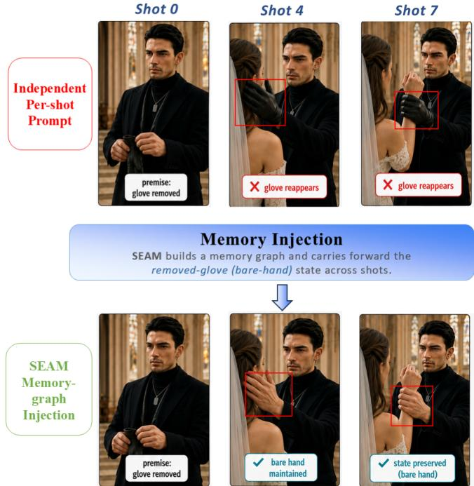
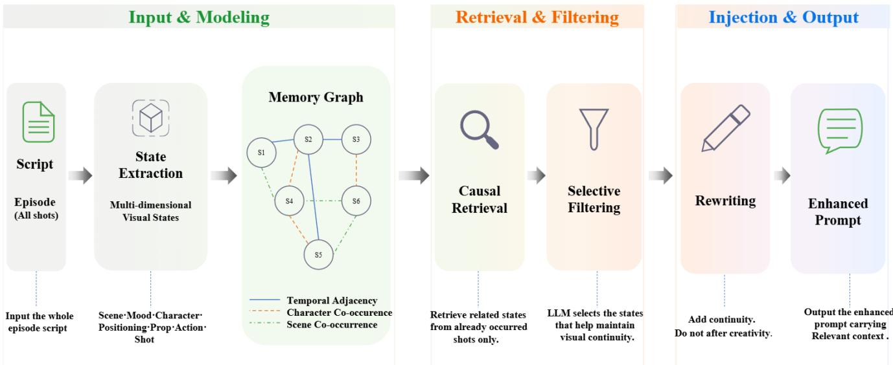
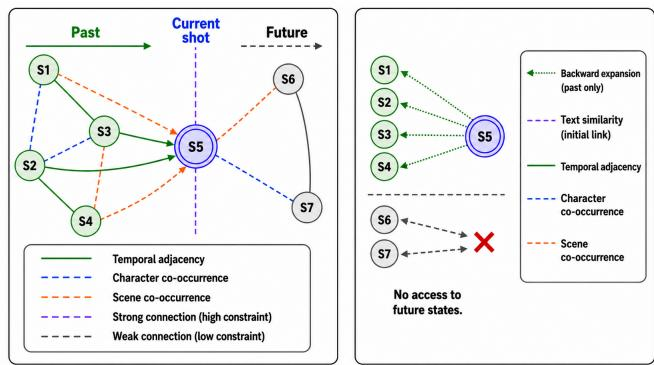
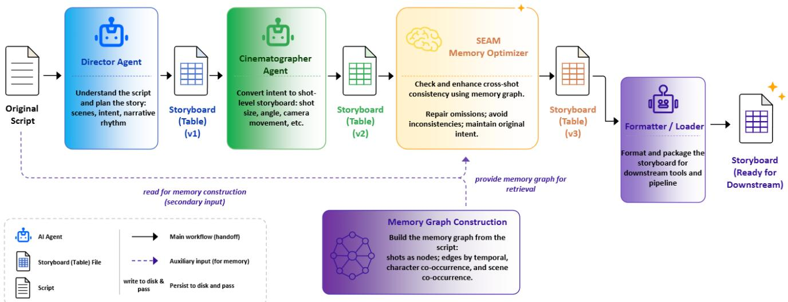
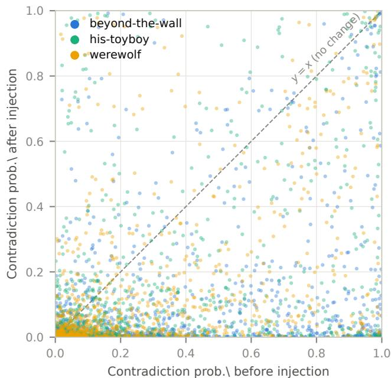
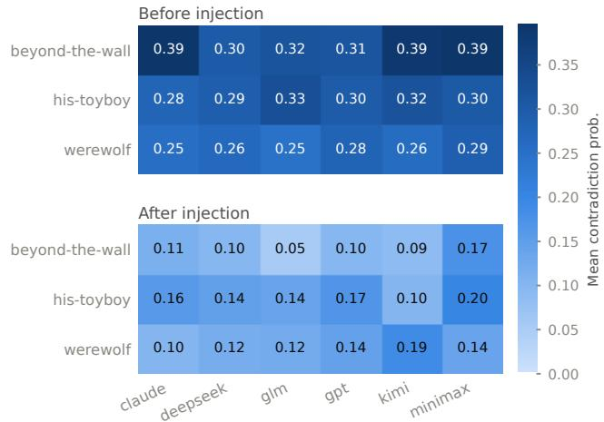
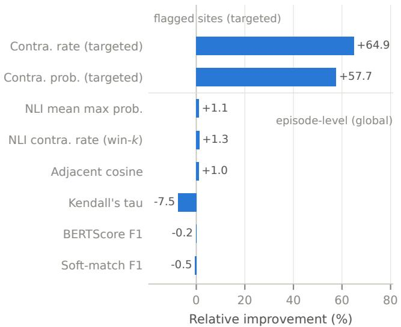
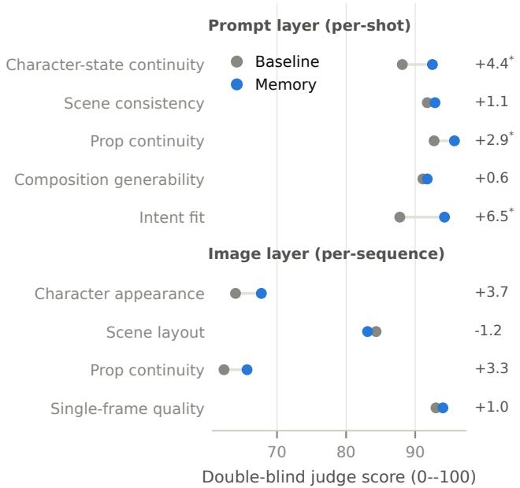

# SEAM: Shot Entity-Atribute Memory for Consistent Short-Drama Generation at Scale

Jiaqi Liu Shanghai Jiao Tong University Shanghai, China jkliu189@gmail.com

Jian Wang   
CreativeFitting   
Shanghai, China   
jim.wang@creativefitting.ai

Maolin Ran Shanghai Jiao Tong University Shanghai, China maolinr03@sjtu.edu.cn

Weiwen Liu∗ Shanghai Jiao Tong University Shanghai, China wwliu@sjtu.edu.cn

Yong Yu Shanghai Jiao Tong University Shanghai, China yyu@sjtu.edu.cn

Xiaoyang Lu Shanghai Jiao Tong University Shanghai, China xiaoyangl@sjtu.edu.cn

Jianghao Lin Shanghai Jiao Tong University Shanghai, China linjianghao@sjtu.edu.cn

Weinan Zhang∗ Shanghai Jiao Tong University Shanghai, China wnzhang@sjtu.edu.cn

## Abstract

Short-drama generation has grown into a large, industrialized pipeline, and as it scales from isolated shots to the episode level, visual continuity has become a critical bottleneck. Current agent frameworks generate each shot in isolation, so context drifts across shots, and props, character posture, and blocking turn inconsistent. Once assembled, these small discrepancies amplify into severe vi- sual breaks. We present SEAM (Shot Entity-Attribute Memory), a training-free, model-agnostic memory graph that repairs continuity entirely at the prompt-text layer by extracting a multi-dimensional state for every shot, retrieving only causally prior context over the resulting graph, filtering it selectively, and injecting the surviving constraints by natural-language prompt rewriting. We further release SEAM-Bench, a double-blind continuity storyboarding bench- mark, on which SEAM raises cross-episode continuity recall from 0.700 to 0.946, generalizes across six mainstream text models, and yields consistent, though not yet significant, gains at the generatedimage layer. Deployed as a mandatory stage in CreativeFitting’s SEAM-Agent production pipeline over 201 shots, SEAM reaches a 96.5% director-acceptance rate with zero unsafe injections; a conservative counterfactual attributes at least 21.9 percentage points of that rate to its cross-episode memory.

## CCS Concepts

• Computing methodologies → Natural language generation; Image and video generation; • Information systems → Retrieval models and ranking.

Keywords Memory graph, Short-drama generation, Retrieval augmentation

ACM Reference Format:   
Jiaqi Liu, Maolin Ran, Xiaoyang Lu, Jian Wang, Weiwen Liu, Jianghao Lin, Yong Yu, and Weinan Zhang. 2027. SEAM: Shot Entity-Attribute Memory for Consistent Short-Drama Generation at Scale. In Proceedings ofthe 33rd ACM SIGKDD Conference on Knowledge Discovery and Data Mining (KDD ’27), August 2027, San Jose, CA, USA. ACM, New York, NY, USA, 14 pages. https://doi.org/XXXXXXX.XXXXXXX

## 1 Introduction

Short drama, a form of vertical, fast, multi-episode video fiction, is one of the fastest-growing segments of digital entertainment, and its production is now being reshaped by generative AI [10, 39, 40]. Its industrial workflow is highly standardized, spanning script writing, storyboarding, keyframe generation, and video synthesis, and agent frameworks increasingly absorb the repetitive labor around a professional director rather than replace the creative core [34]. The commercial stakes are already concrete: fully AI-generated titles now compete with live-action ones for the same audience, as on CreativeFitting’s Reel.AI, one such platform serving AI-generated short dramas worldwide and the production setting we study in this paper. What makes the domain distinctive is its scale: a single title routinely spans tens of episodes with tens of shots each, so one production comprises thousands of shots that must remain mutually coherent.

At this scale, visual continuit is the central bottleneck, because each shot’s prompt is generated in isolation and carries no persistent state memory. As shown in Figure 1, per-shot keyframe generation loses the glove that Shot 0 removed and lets it reappear in Shots 4 and 7; injecting the prior state from SEAM’s memory graph carries the bare-hand state forward, and both shots stay con- sistent. Generators follow their prompts faithfully, so they amplify rather than absorb such contradictions, and over thousands of shots the drift accumulates into visual breaks a human editor must repair by hand.

  
Figure 1: Cross-shot continuity break vs. SEAM repair. Top: per-shot independent generation loses an earlier state (a removed glove reappears), a contradiction no single shot can catch. Bottom: SEAM injects the prior state from its memory graph into the shot prompt, carrying it forward so the contradiction disappears.

Prior work enforces consistency inside a specific generator [2, 14, 15, 24], anchors it to 3D scenes or to video generated end to end [20, 43], or reuses generic retrieval and memory systems built for factual question answering [4, 12, 42]. All of them leave the storyboard prompt layer unaddressed, yet that layer is where the repair belongs: it sits upstream of every generator and stays read able and editable by the director. Repairing continuity there, inside a live production pipeline, raises three challenges that existing methods do not resolve. C1: Heterogeneous, evolving visual state. A shot’s continuity depends on many dimensions at once (scene, atmosphere, characters and their states, spatial blocking, props, actions, camera style), each carrying forward or changing indepen dently as the story progresses; unstructured text memory cannot represent this structured, multi-dimensional state. C2: Causal and selective reuse. Only prior state may be reused, so that causality is preserved, and only the truly relevant fragments should be injected, since indiscriminate copying overrides the director’s creative intent. C3: Generality and pluggability. Generative backbones iterate rapidly, so a deployable remedy cannot be rebuilt whenever the un- derlying image or video model is replaced. It must be training-free, model-agnostic, pluggable as a standalone stage, and able to add continuity without altering the shot grammar or visual intent the director specified.

Guided by these challenges, we cast continuity as a retrieval- and-injection problem over cross-shot shared state. For C1, we parse each shot into a multi-dimensional state node and connect nodes by temporal-adjacency, character-co-occurrence, and sceneco-occurrence edges, turning the evolving state into an explicit, queryable memory graph. For C2, we retrieve only the relevant prior state and let an LLM selectively decide which candidates to inject; the visual description is then rewritten naturally, so continuity is added while the shot grammar and the director’s intent stay intact. For C3, the whole procedure operates purely at the prompt-text layer and touches neither the model weights nor the downstream backbone, so it plugs in as a standalone stage and keeps working unchanged when the image or video model is swapped out. We call this framework SEAM, a Shot Entity-Attribute Memory graph, and embed it as one stage of SEAM-Agent, a multi-agent storyboarding pipeline that any script-to-screen system can adopt and that we run in commercial production.

Contributions. This paper makes the following contributions:

• We introduce SEAM, the first shot entity-attribute memory graph for storyboard-layer continuity. To our knowledge this is the first work to repair short-drama continuity at the storyboard prompt layer: each shot becomes a multi-dimensional visual state node, the temporal, character, and scene relations governing continuity become typed edges, and cross-shot consistency becomes a retrieval-and-injection problem over this graph.

• We instantiate it as a training-free, prompt-text-layer procedure of three stages (state extraction with graph construction, causal retrieval with selective filtering, natural-rewrite injection) that touches neither model weights nor the downstream backbone, so the stage stays model-agnostic and survives backbone upgrades.

• We release SEAM-Bench, a double-blind continuity storyboarding benchmark1 that standardizes continuity evaluation for industrial short-drama generation at both the prompt and image layers.

• We validate SEAM in live commercial production. Deployed as a mandatory stage of the SEAM-Agent pipeline in CreativeFitting’s production system, it reaches a 96.5% director-acceptance rate over 201 shots, cutting the manual continuity inspection a polished AI short drama otherwise demands from directors— evidence that the design holds outside the benchmark.

Section 2 surveys related work; Section 3 formalizes the problem and the continuity criterion; Section 4 presents SEAM, its memory graph, and its integration into SEAM-Agent; Section 5 reports SEAM-Bench, the three-layer evaluation, and the online deploy- ment evidence.

## 2 Related Work

## 2.1 Agentic Short-Drama Production

The rise of short drama has motivated dedicated datasets, genera- tion pipelines, and evaluation protocols. Large script corpora pair screenplays with shooting scripts [35], while agents take comple-mentary creative roles: director–actor collaboration for control- lable script writing [9], personalized frameworks carrying a single sentence to a produced drama [33], and geometry-guided control of cinematography [47]. The same role decomposition scales to feature-length work, where multi-agent movie pipelines distribute director, screenwriter, and storyboard-artist roles across LLM or VLM agents to plan and render multi-scene video [10, 39, 40], with parallel eforts supplying synchronized sound [37]. How to score the result is itself unsettled: these systems predominantly report human Likert ratings or a single LLM judge [34, 39], leaving conclusions resting on one evaluator family, whereas story-visualization benchmarks supply image-side protocols for character identity and scene consistency [13, 36, 49] and storyboard-level benchmarks have begun to probe cinematographic quality [21, 46]. Delta. These pipelines automate authoring and rendering end to end but treat consistency as a byproduct of the generator or of scene-level plan- ning, leaving no explicit representation of what carries over between shots, and no benchmark evaluates cross-episode continuity at the storyboard text layer alongside the keyframes rendered from it. We isolate and repair continuity at the textual storyboard that directors and downstream tools actually consume, via a shot-level memory graph deployed as a pipeline stage rather than a standalone generator, and release SEAM-Bench to check a continuity claim at the prompt layer and the image layer at once.

## 2.2 Memory for Cross-Shot Consistency

A lar e bod ofwork seeks visual consistenc across shots or frames. One line bakes it into the generator: cinematic models render co- herent multi-shot sequences in a single pass [24], memory-flow methods propagate state across long-video generation [15], and diffusion extensions carry identity through transition tokens, caches, or entity-grounded scheduling [16, 18, 23]. A second anchors gen-eration to an external structure such as a storyboard or a memory pack for 3D scenes [20, 43]. A third works in the image domain, preserving character identity across story panels by extracting a reusable character [3], controlling multi-character layout [7], interleaving text with images [41], grounding identity referentially [2], or repairing inconsistent panels after the fact [1]; that such an-choring is load-bearing is confirmed by character-stable pipelines reporting catastrophic drops once it is removed [14]. A separate line asks instead how an a ent should store and retrieve what it has seen, arguing that episodic memory is the missing piece over long horizons [26, 45] and structuring retrieval through graph based RAG [12], associative reuse [42], or persistent multimodal memory [4, 31], with continuity checked reference-free through entity graphs [8] or NLI contradiction detection [17]. Delta. The first three lines operate on pixels, latents, or a specific generator and are largely training-based or backbone-coupled, hard to insert into a model-heterogeneous pipeline; the memory machinery is instead built for factual recall. Visual continuity difers in what must be stored and in what may be reused: the unit of memory is a shot’s multi-dimensional visual state rather than a proposition, the relations governing reuse are temporal adjacency and character/scene co-occurrence rather than semantic relatedness, and reuse must be strictly causal. SEAM adopts the retrieval-and-injection view but instantiates it over these shot-level states one level earlier than the generator, at the storyboard prompt-text layer, staying training-free and model-agnostic.

## 3 Preliminaries

This section fixes the notation for short dramas and shots, states the generation task, and defines the continuity criterion our core metric is built on. The memory graph is the heart of our design rather than background, so it is defined where it is used (Section 4.2.1).

Dramas and shots. A short drama is an episode-ordered set $\mathcal { D } =$ $\{ E _ { 1 } , \dots , E _ { M } \}$ of � episodes, whose �-th episode $E _ { m } = \left( s _ { 1 } , \ldots , s _ { n _ { m } } \right)$ is a temporally ordered sequence of $n _ { m }$ shots $( 1 \leq m \leq M )$ . Each shot $s _ { i }$ is a structured tuple

$$
s _ { i } = ( \ell _ { i } , \ \kappa _ { i } , \ x _ { i } , \ t _ { i } , \ C _ { i } , \ P _ { i } ) ,\tag{1}
$$

where $\ell _ { i } \in \mathcal { L }$ is the scene/location, �� the shot grammar (shot size, angle, movement), $x _ { i }$ the visual description, �� the dialogue, and $C _ { i } \subseteq C , P _ { i } \subseteq \mathcal { P }$ the characters and props active in the shot. Here $c , \mathcal { P }$ and $\mathcal { L }$ are the drama-wide universes of characters, props and scenes, respectively; the shot index � runs within an episode, and where cross-episode context matters it is read in the global shot order that D induces.

Generation task. The pipeline produces, for each shot, a prompt $\mathbf { \nabla } \mathcal { P } i$ that a downstream image/video generator consumes. Writing $f _ { \theta }$ for the shotlist-authoring model with parameters � (an LLM backbone in all our experiments), the per-shot, stateless baseline is

$$
\begin{array} { r } { p _ { i } = f _ { \theta } ( s _ { i } ) , } \end{array}\tag{2}
$$

that is, the prompt depends only on the current shot and carries no cross-shot state. This is the condition our memory stage is measured against.

Continuity and continuity recall. Continuity concerns the persistent entities of a drama—its characters, props and scenes—whose visual attributes should stay consistent across shots unless the nar- rative motivates a change. For an entity $e \in C \cup \mathcal { P } \cup \mathcal { L }$ we write $\pi _ { i } ( e )$ for its state projection: the visual attributes (character appearance, prop possession, scene layout) that shot �� ascribes to �, with $\pi _ { i } ( e ) = \emptyset$ when � is inactive in that shot. For a shot pair $i < j$ in which � is active in both, a continuity defect $\delta ( e , i , j ) = 1$ is recorded when $\pi _ { i } ( e )$ contradicts $\pi _ { j } ( e )$ without narrative motivation. This grounds the continuity recall

$$
\mathrm { R e c a l l } = \frac { \# \{ \mathrm { d e f e c t s ~ s u c c e s s f u l l y ~ r e p a i r e d } \} } { \# \{ \mathrm { d e f e c t s ~ j u d g e d ~ i n ~ n e e d ~ o f ~ r e p a i r } \} } ,\tag{3}
$$

our core metric for repairing cross-shot and cross-episode continuity (measured in Section 5).

## 4 Methodology

In this section, we introduce our Shot Entity-Attribute Memory graph for short-drama storyboarding (i.e., SEAM).

## 4.1 Overview

Guided by the three challenges of Section 1 (C1 heterogeneous evolving state, C2 causal selective reuse, C3 training-free modelagnostic delivery), our methodology has two parts: how continuity is represented and repaired, and how the repair is delivered inside a live production system. For the first, we design SEAM, a cross-shot continuity memory graph that turns the retrieval-and-injection view of continuity into an executable, prompt-text-layer procedure: from the episode script we extract a structured multi-dimensional visual state for every shot and link the states into a directed memory graph whose temporal, character, and scene edges govern continu- ity; when the shotlist is (re-)authored, we retrieve only the causally prior context, filter it selectively to discard redundant or conflicting fragments, and rewrite the shot’s visual description so the surviving continuity is woven in while the shot grammar and the director’s intent stay intact. SEAM runs in an online LLM-driven mode, used for every result reported in this paper, and a deterministic ofline mode that substitutes rules for each LLM call so the stage still runs where no model is reachable. For the second, we embed SEAM into SEAM-Agent, our multi-agent storyboarding pipeline, as a mandatory “memory-optimizer” stage that builds the graph from the script, consumes the upstream shotlist, and repairs continuity shot by shot before rendering; because it reads the script and rewrites only the textual shotlist, it depends on neither the upstream authoring model nor the downstream backbone.

## 4.2 SEAM: A Cross-Shot Continuity Memory Graph

As shown in Figure 2, SEAM is organized as three stages operating entirely at the prompt-text layer: state extraction and graph construction, graph retrieval with selective filtering, and natural- rewrite injection. We describe each in turn.

4.2.1 State Extraction and Graph Construction. Whereas the state projection $\pi _ { i }$ of Section 3 tracks one entity at a time, our memory represents a whole shot at once. The extractor takes the episode script as input and, for every shot $s _ { i }$ it induces (Eq. (1)), produces a �-dimensional visual state $\pmb { \sigma } _ { i } = ( \sigma _ { i } ^ { 1 } , \dots , \sigma _ { i } ^ { d } )$ , whose $d = 8$ dimen- sions cover scene, atmosphere, characters, character states, spatial blocking, props, actions, and camera style (Table 9). We formulate the extraction as an operator

$$
\sigma _ { i } = \Phi ( s _ { i } ) ,\tag{4}
$$

which is instantiated in the online mode by prompting an LLM with a fixed dimension template that returns one structured record per shot, and, in the ofline mode, by deterministic rule-based parsing of the same script. Heterogeneous sources are first normalized into a unified shot stream, so Φ applies uniformly regardless of the source format, and the dimension set is configurable rather than fixed by the formulation; $d = 8$ is the instantiation used throughout this paper.

Over the resulting states we construct a directed memory graph $G = \left( V , E \right)$ . Its nodes � are the shot-state nodes $v _ { i }$ (each carrying $\pmb { \sigma } _ { i } )$ together with resource-entity nodes materialized for the recurring characters, props, and scenes, and we connect nodes through the three relation types that carry continuity: a temporal-adjacency relation linking a shot to its neighbors within a window $| i - j | \leq$ $N ,$ , a character-co-occurrence relation linking shots that share a character $( C _ { i } \cap C _ { j } \neq \emptyset )$ , and a scene-co-occurrence relation linking shots set in the same place $( \ell _ { i } ~ = ~ \ell _ { j } )$ . Each edge $( i , j )$ carries a continuity weight $w _ { i j } \in \left[ 0 , 1 \right]$ that grades how strongly the earlier shot constrains the later one, from a hard must-continue link $( w _ { i j } =$ 1) down to a weak association. In the online mode the relation type and weight of every edge are inferred by an LLM over overlapping shot windows and then deduplicated by keeping, for each ordered pair and type, the edge of maximum weight; in the ofline mode the same three relations are recovered by deterministic co-occurrence and adjacency rules. These relations jointly determine which earlier shots are eligible to constrain the current one (Figure 3(a)), and the weights $w _ { i j }$ drive the weighted, multi-hop expansion used during retrieval.

4.2.2 Graph Retrieval and Selective Filtering. To repair shot $s _ { i } ,$ we retrieve a continuity context $\mathcal { K } _ { i } = \mathrm { R e t r i e v e } ( G _ { < i } , s _ { i } )$ from the prior subgraph $G _ { < i ; }$ , the part of� induced by nodes with index $j < i .$ This enforces causality: a shot may inherit state from what has already happened, never from the future, so no forward leakage can occur.

We support two complementary retrieval modes. When a shot carries explicit resource references, we take its prior state by resource overlap: writing $R _ { i } = C _ { i } \cup P _ { i } \cup \{ \ell _ { i } \}$ for its resource set, we collect the prior nodes $\{ v _ { j } \in G _ { < i } \mid R _ { j } \cap R _ { i } \neq \emptyset \}$ and keep the most recent states of the shared characters, props, and scenes; when no prior node overlaps, we fall back to the last few preceding nodes so the context is never empty. For arbitrary inputs without such references, we instead perform text-matched retrieval with edge ex- pansion, first scoring every prior node $v _ { j } \in G _ { < i }$ by a lightweight lexical overlap with $s _ { i }$

$$
\mathrm { s i m } ( s _ { i } , v _ { j } ) = \mathrm { m i n } \Big ( 1 , ~ \frac { | T ( s _ { i } ) \cap T ( v _ { j } ) | } { | T ( s _ { i } ) | } + \beta [ C _ { i } \cap C _ { j } \neq \emptyset ] \Big ) ,\tag{5}
$$

where $T ( \cdot )$ is a token set that mixes whole words with character- level bigrams so that the score stays robust across languages, the first term is the recall of the query tokens, and the second term adds a bonus $\beta$ when the two shots share a named character. We keep the top-� prior nodes with sim $> 0$ as seeds $S _ { i }$ , and then expand ℎ hops backward along the temporal, character, and scene relations, traversing only edges whose weight clears a threshold ��� $\geq \tau ,$

$$
\mathcal { K } _ { i } = \bigcup _ { v \in S _ { i } } \mathrm { E x p a n d } _ { \leq h } ^ { \mathrm { b w d } } ( v ; G _ { < i } , \tau ) ,\tag{6}
$$

where Expand collects the nodes reachable within ℎ backward hops. The backward-only direction over $G _ { < i }$ enforces causality at the graph level, while � prunes weak associations so expansion does not drown the relevant context. The expansion recovers entities absent from the immediate neighbors yet continuous over a longer range (Figure 3(b)); with no explicit edges it falls back to implicit links induced on the fly. Our lexical scoring follows the probabilis- tic relevance tradition of BM25 [29] but uses no embeddings, so retrieval adds no model dependency.

Not every retrieved candidate should be injected. Indiscriminate concatenation of $\mathcal { K } _ { i }$ would overwrite legitimate creative change and pollute the prompt with redundant or conflicting context. We therefore apply a selective filtering step that judges each candidate independently. For a candidate $c \in \mathcal { K } _ { i }$ , a decision function returns a keep/discard indicator together with a justification,

$$
\phi ( c , s _ { i } ) \in \{ 0 , 1 \} , \qquad \mathcal { K } _ { i } ^ { \ast } = \{ c \in \mathcal { K } _ { i } \mid \phi ( c , s _ { i } ) = 1 \} ,\tag{7}
$$

where $\phi$ is realized in the online mode by an LLM that scores candidates against $s _ { i }$ under an explicit rubric, discarding one that stands on its own, is redundant, or is separated from $s _ { i }$ by a scene cut, and keeping one only when it supplies genuine cross-shot continuity, with an auditable justification. In the ofline mode $\phi$ degrades to a conservative rule that keeps a candidate whenever the shot has any prior context. Retaining only $\mathcal { K } _ { i } ^ { * }$ is what makes the memory selective.

  
Figure 2: SEAM overview. The episode script is parsed into multi-dimensional shot states, which are linked into a memory graph by temporal, character, and scene edges. For each shot of the upstream shotlist, causally prior context is retrieved, filtered selectively, and rewritten into the visual description, yielding a continuity-enriched prompt.

  
Figure 3: (a) The three relation types (temporal, character, and scene). (b) Graph retrieval with backward edge expansion over the prior subgraph $G _ { < i }$

4.2.3 Natural-Rewrite Injection. Given the filtered context $\mathcal { K } _ { i } ^ { * }$ , an injection operator � produces the continuity-enriched prompt

$$
p _ { i } = g ( s _ { i } , \mathcal { K } _ { i } ^ { * } ) ,\tag{8}
$$

which replaces the stateless $f _ { \theta } ( s _ { i } )$ of Eq. (2). We realize � in two modes. The preferred mode is a natural rewrite: an LLM weaves the retained continuity into the visual description $x _ { i }$ in the direc- tor’s own register, adding only the continuity constraints while leaving the shot grammar �� and the visual semantics unchanged. Because an unconstrained rewrite could silently drift from the di rector’s intent, we accept the rewritten description $x _ { i } ^ { \prime }$ only when it passes a guard $\mathcal { V } ( x _ { i } ^ { \prime } , x _ { i } )$ that (i) bounds the length ratio $| x _ { i } ^ { \prime } | / | x _ { i } | \in$ $[ \rho _ { \mathrm { m i n } } , \rho _ { \mathrm { m a x } } ] , ( \mathrm { i i }$ ) preserves every resource reference of $x _ { i : }$ , and (iii) keeps its structural markers; a rewrite failing the guard is rejected and the shot reverts to its previous description. As a lightweight fallback, a mechanical injection mode appends $\mathcal { K } _ { i } ^ { * }$ at a fixed prompt position without an LLM. Both modes add continuity rather than rewriting intent, and the guard preserves the director’s original creative decisions.

## 4.3 SEAM-Agent: SEAM Within a Multi-Agent Pipeline

In this section, we describe how SEAM is deployed as one stage of SEAM-Agent. As shown in Figure 4, SEAM-Agent is a serial multi-agent pipeline in which the agents communicate through shotlist artifacts on disk, and SEAM operates as a memory optimizer between authoring and rendering.

4.3.1 Pipeline Structure. SEAM-Agent comprises four serial stages. A Director Agent reads the episode script and drafts the overall scene intent and narrative beats; a Cinematographer Agent turns that intent into a concrete shotlist, assigning the shot grammar �� (shot size, angle, and movement) to each shot; the SEAM Memory Optimizer performs cross-shot continuity repair over that shotlist; and a Formatter standardizes the result into the tabular schema that downstream tools consume. Each stage writes an artifact that the next stage reads, so the chain is decoupled at the file level. SEAM is a mandatory stage in this chain, not an optional pass that runs afterward, so every shotlist the pipeline emits has been continuity- checked before the downstream keyframe and video generators consume it.

4.3.2 SEAM as the Memory-Optimizer Stage. The memory optimizer takes two inputs: the episode script, from which it builds and persists the memory graph, and the upstream shotlist, whose descriptions it repairs. Applying the three-stage procedure of Section 4.2, it extracts the shot states into �, retrieves and filters each shot’s prior context over $G _ { < i } ,$ and rewrites the description via Eq. (8), emitting $p _ { i } = g ( s _ { i } , \mathcal { K } _ { i } ^ { * } )$ in place of the stateless baseline $f _ { \theta } ( s _ { i } )$ of Eq. (2). Because state accumulates across episodes, the retrieved context spans earlier shots of the current episode and prior episodes alike, which is what lets the optimizer repair the cross-episode breaks that dominate long titles. Since it operates solely at the prompt-text layer, it is decoupled from both the au- thoring model and the downstream backbone, a property we verify with the six-model results of Section 5.

  
Figure 4: SEAM sits as the “memory optimizer” stage, placed after the authoring agents and before the loader. It builds the memory graph from the episode script and repairs continuity shot by shot over the shotlist that the authoring agents have already generated.

## 5 Experiments

We study three research questions. Q1: does the memory graph repair the cross-shot and cross-episode continuity defects a stateless pipeline leaves behind? Q2: is this repair model-agnostic across heterogeneous backbones? Q3: do prompt-layer repairs survive the text-to-image stage and stay measurable in the keyframes?

## 5.1 Experimental Setup

SEAM-Bench. As summarized in Table 1, SEAM-Bench is a shortdrama continuity storyboarding benchmark over three produced dramas totaling 68 episodes, referred to throughout by the short identifiers ofthe released data: his-toyboy (His Toyboy: The Billionaire’s Trap), beyond-the-wall (Beyond the Wall), and werewolf (You Are My Cure, My Undoing). We release two kinds of material: the original scripts forming the pipeline input ��, and reference images—character/scene visual anchors from a semantically re named, deduplicated pool—serving as fixed keyframe input and as the image-layer gold standard. Expert human-director storyboards annotated shot by shot are the professional reference, but remain restricted by copyright, held out from the release, and used only for evaluation and unblinding.

Setup. We evaluate six heterogeneous text models (claude, deepseek-v4-pro, glm-5.1, gpt-5.4, kimi-k2.6, minimax-m2.7). Per episode, each backbone produces an uninjected shotlist1 (Eq. (2)) and a memory-injected shotlist2 (Eq. (8)). The two CSVs are columnand shot-aligned, making every comparison a paired within-model contrast whose only varying factor is memory injection. Keyframes come from Nano Banana Pro on both variants under identical references and template skeletons, from which we extract 900 test instances for the image layer, of which 820 returned an image. Scoring is delegated to Gemini 3 Pro, excluded from the six evaluated backbones so that no model judges its own storyboards.

Table 1: SEAM-Bench data statistics. AI shots are counted on the claude run; other backbones difer by < 5%.
<table><tr><td>Drama</td><td> $\mathrm { E p . }$ </td><td>Human</td><td>AI</td><td>Ref. img.</td></tr><tr><td>his-toyboy</td><td>23</td><td>754</td><td>907</td><td>15</td></tr><tr><td>beyond-the-wall</td><td>20</td><td>659</td><td>814</td><td>31</td></tr><tr><td>werewolf</td><td>25</td><td>826</td><td>997</td><td>12</td></tr><tr><td>Total</td><td>68</td><td>2,239</td><td>2,718</td><td>58</td></tr></table>

Evaluation protocol. Storyboarding has no established automatic text-layer metric, and recent script-to-screen systems rely on human Likert ratings or LLM judges alone [34, 39]. To keep no conclusion resting on a single evaluator family, we pair a double-blind LLM judge with a CPU-only ofline metric suite assembled from adjacent literatures [5, 8, 17, 19, 21, 22, 28, 44, 46]. The suite scores a storyboard along four complementary axes: agreement with the human director, accuracy of the cinematography fields, camera-label distribution, and reference-free continuity. An im- age layer then scores the rendered keyframes against their refer- ences [6, 13, 25, 27, 30, 32, 36, 48, 49]. Definitions and formulas are deferred to Appendix A, where Table 8 lists every abbreviation used below. In the double-blind judge, conditions appear as “A/B” with sources hidden and deterministically counterbalanced, revealed only after scoring; the prompt layer is scored on five dimensions and the image layer on four. Every baseline-vs-memory contrast is paired at the episode level and tested with the Wilcoxon signed- rank test under Holm correction [11, 38] (∗: corrected � < 0.05). The 80 renders refused by the provider’s safety filter (triggered by sensitive plot content, near-symmetric across conditions: 412 baseline vs.

Table 2: Q1 continuity recall (his-toyboy, 23 episodes). The control restricts retrieval to the current episode, so it surfaces fewerjudgeable defects; #Judged is therefore part ofthe efect rather than a fixed denominator (see text).
<table><tr><td>Condition</td><td>Recall↑</td><td>#Judged</td><td>#Modified</td></tr><tr><td>Control (episode-local retrieval)</td><td>0.700</td><td>10</td><td>7</td></tr><tr><td>SEAM (cross-episode graph)</td><td>0.946</td><td>37</td><td>35</td></tr></table>

408 memory images survive) are dropped pairwise, so a shot enters the image metrics only if both conditions rendered it, leaving 403 paired shots. The NLI and image layers run on beyond-the-wall, the rest on all three dramas.

## 5.2 Main Results (Q1/Q2/Q3)

Q1: memory injection repairs continuity. Three measurements triangulate the repair efect. First, we turn to continuity recall (Eq. (3)). As shown in Table 2, on his-toyboy (23 episodes) the memory graph repairs 35 of the 37 defects the judge rules in need of repair (0.946), against 7 of 10 (0.700) for a control whose retrieval is re-stricted to the current episode. The two conditions do not share a denominator, and the reason is itself part of the result: a defect can only be judged once retrieval surfaces the prior state it contradicts, so the episode-local control yields 3.7× fewer candidate sites. SEAM therefore improves on two axes at once, exposing 27 additional genuine defects and repairing a larger fraction of those it exposes; the recall column understates the gap, since those 27 are left unrepaired rather than counted against the control. Rest ing on diferent defect populations, this measurement establishes that cross-episode retrieval is what makes defects addressable, and we rely on the next two, both computed per shot, for the magni tude of the repair. Second, the targeted state-conditioned contra- diction probe scores each filter-flagged shot (Section 4.2.2) against its graph-retrieved expected state as NLI premise, before versus after injection. Table 3 reports the outcome: across all 2,946 flagged shots, mean contradiction probability drops from 0.308 to 0.131 and the threshold-exceeding fraction from 0.264 to 0.093, removing roughly two thirds of the contradiction mass at the targeted sites in every drama–backbone cell, with a residual 4–7% resisting repair that Figure 5 exposes and Section 5.4 takes up. Third, the double- blind prompt-layerjudgment over six backbones (30 model-episodes, episodes 1–5 of beyond-the-wall, the same subset carrying the image layer) favors memory on all five dimensions. As Table 5 and Figure 8 show, character-state continuity (+4.4, �=0.82), prop continuity (+2.9, �=0.77), and intent fit (+6.5, �=0.90) stay significant after Holm correction.

Q2: model-agnosticism. Table 4 consolidates the per-model evidence across the three metric families. Recall (panel a) is high in all 18 drama–backbone cells, from 0.667 (claude on his-toyboy) to 1.000 (minimax on beyond-the-wall), with per-model means spanning 0.731–0.992. The targeted contradiction drop (panel b) holds throughout, mean probability falling from the 0.29–0.35 band to 0.10–0.17. The blind gains (panel c) are positive on 17 of 18 model–dimension entries; the sole exception, prop continuity for glm-5.1, is a −0.04 shift rounding to zero. The spread reflects each model’s style, yet the direction never reverses, evidence of model- agnosticism.

Table 3: Targeted state-conditioned contradiction on repairflagged shots. The premise is the graph-expected entity state and the score is the NLI contradiction probability before vs. after injection, pooled over six backbones per drama and weighted by flagged-shot count.
<table><tr><td></td><td></td><td colspan="2">Mean prob.↓</td><td colspan="2">Rate (p≥0.5)↓</td></tr><tr><td>Drama</td><td>#Flag.</td><td>before</td><td>after</td><td>before</td><td>after</td></tr><tr><td>beyond-the-wall</td><td>1,085</td><td>0.344</td><td>0.106</td><td>0.320</td><td>0.069</td></tr><tr><td>his-toyboy</td><td>923</td><td>0.302</td><td>0.157</td><td>0.255</td><td>0.122</td></tr><tr><td>werewolf</td><td>938</td><td>0.273</td><td>0.133</td><td>0.209</td><td>0.091</td></tr><tr><td>All</td><td>2,946</td><td>0.308</td><td>0.131</td><td>0.264</td><td>0.093</td></tr></table>

Table 4: Per-model results over the six backbones in three metric groups: (a) continuity recall per drama—btw (beyond-the-wall), hty (his-toyboy), wlf (werewolf)—and its mean; (b) targeted contradiction probability before/after injection, pooled over dramas and weighted by flaggedshot count (�); (c) blind prompt-layer gains Δ=M−B on the memory-edited dimensions (Table 8). Every cell improves, answering Q2 in the afirmative.
<table><tr><td rowspan="2">Backbone</td><td colspan="4">(a) Recall↑</td><td colspan="3">(b) Contradiction</td><td colspan="3">(c) ∆Blind↑</td></tr><tr><td>BTW</td><td>HTY</td><td>WLF</td><td>mean</td><td>n</td><td>bef.↓</td><td>aft.↓</td><td>CSC</td><td>PRP</td><td>IFIT</td></tr><tr><td>claude</td><td>0.760</td><td>0.667</td><td>0.767</td><td>0.731</td><td>178</td><td>0.321</td><td>0.129</td><td>+5.1</td><td>+0.9</td><td>+4.9</td></tr><tr><td>deepseek</td><td>0.912</td><td>0.959</td><td>0.915</td><td>0.929</td><td>863</td><td>0.286</td><td>0.115</td><td>+9.9</td><td>+5.9</td><td>+15.8</td></tr><tr><td>glm-5.1</td><td>0.983</td><td>0.947</td><td>0.960</td><td>0.963</td><td>248</td><td>0.308</td><td>0.116</td><td>+3.5</td><td>-0.0</td><td>+2.8</td></tr><tr><td>gpt-5.4</td><td>0.994</td><td>0.988</td><td>0.995</td><td>0.992</td><td>548</td><td>0.294</td><td>0.135</td><td>+2.1</td><td>+1.1</td><td>+2.8</td></tr><tr><td>kimi</td><td>0.961</td><td>0.928</td><td>0.960</td><td>0.950</td><td>399</td><td>0.353</td><td>0.103</td><td>+2.7</td><td>+1.0</td><td>+7.6</td></tr><tr><td>minimax</td><td>1.000</td><td>0.967</td><td>0.993</td><td>0.987</td><td>710</td><td>0.319</td><td>0.167</td><td>+3.0</td><td>+8.8</td><td>+4.8</td></tr></table>

The ranking is not an artifact of defect volume. Judged defects per episode vary by an order of magnitude across cells (1.7–19.8, or 3.6–13.7 per model), yet five of six per-model means land in a tight 0.93–0.99 band. claude is the sole outlier, lowest on recall not because it judges more defects (it flags the fewest) but because its rewrites are the most conservative, and recall counts a defect repaired only when a changed description is emitted; on the blind judgment it still posts among the largest character-state gains (+5.1). Since recall cannot separate “no rewrite” from “wrong rewrite,” we triangulate with the targeted probe and the blind judge.

Q3: transfer to the image layer. As Table 5b shows, at the generated-image layer the blind judge still prefers memory on the two dimensions injection actually edits, character appearance (+3.7) and prop continuity (+3.3), while scene layout and frame quality stay flat. With only �=30 sequence pairs these deltas do not reach significance, so we answer Q3 only directionally: transfer is visible but attenuated by the stochastic text-to-image stage.

Ofline metrics: what moves and what does not. Table 6 shows how the ofline suite separates targeted repair from global drift. Against the human director the paired shifts sit in the third decimal and the divergences stay at zero, since injection edits entity-state phrases without touching the cinematography fields, while the reference-free layer moves in the expected direction on every axis; we return to this contrast in Section 5.4, where the two-thirds targeted drop quantifies it. The ofline image embeddings show the same attenuation, all six scores flat at this sample size, consistent with generation noise dominating.

Table 5: Double-blind LLM judgment (0–100) per dimension, pooled over six backbones (beyond-the-wall, ep. 1–5): B baseline, M memory, Δ=M−B (∗ Holm-corrected $\textstyle p < 0 . 0 5 )$ ; �=30 model-episodes and 30 sequences.
<table><tr><td colspan="6">(a) Prompt layer (per-shot)</td></tr><tr><td></td><td>csc↑</td><td>SCON↑</td><td>PRP↑</td><td>CGEN↑</td><td>IFIT↑</td></tr><tr><td>B</td><td>88.1</td><td>91.8</td><td>92.7</td><td>91.1</td><td>87.8</td></tr><tr><td>M</td><td>92.5</td><td>92.9</td><td>95.7</td><td>91.7</td><td>94.2</td></tr><tr><td>Δ</td><td>+4.4*</td><td>+1.1</td><td>+2.9*</td><td>+0.6</td><td>+6.5*</td></tr><tr><td colspan="6">(b) Image layer (per-sequence)</td></tr><tr><td></td><td>CAPP↑</td><td>SLAY↑</td><td>PRPI↑</td><td>SFQ↑</td><td></td></tr><tr><td>B</td><td>64.0</td><td>84.3</td><td>62.3</td><td>93.0</td><td></td></tr><tr><td>M</td><td>67.7</td><td>83.1</td><td>65.7</td><td>94.0</td><td></td></tr><tr><td>Δ</td><td>+3.7</td><td>-1.2</td><td>+3.3</td><td>+1.0</td><td></td></tr></table>

Table 6: Ofline text-layer metrics over 408 model-episodes, reference-based (top) and reference-free (bottom): s1 baseline, s2 memory, Δ=s2−s1 (∗ Holm-corrected $p < 0 . 0 5 ) ;$ ↑/↓ is the improvement direction. js pools the three divergences, bit-identical across conditions; NLI runs on beyond-the-wall (�=192).
<table><tr><td></td><td>SM-F1↑</td><td>BS-F1↑</td><td>SZ-ACC↑</td><td>Kτ↑</td><td>Js↓</td></tr><tr><td>s1</td><td>0.4755</td><td>0.6379</td><td>0.318</td><td>0.446</td><td>fixed</td></tr><tr><td>s2</td><td>0.4731</td><td>0.6367</td><td>0.313</td><td>0.412</td><td>fixed</td></tr><tr><td>Δ</td><td>-0.002*</td><td>-0.001*</td><td>-0.005</td><td>-0.034*</td><td>0.000</td></tr><tr><td></td><td>EOD↑</td><td>ACOS-M↑</td><td>ACOS-N↑</td><td>NLI-CR↓</td><td>NLI-MP↓</td></tr><tr><td>s1</td><td>11.06</td><td>0.4860</td><td>0.148</td><td>0.668</td><td>0.656</td></tr><tr><td>s2</td><td>11.06</td><td>0.4908</td><td>0.148</td><td>0.660</td><td>0.649</td></tr><tr><td>Δ</td><td>0.000</td><td>+0.005*</td><td>0.000</td><td>-0.009*</td><td>-0.007*</td></tr></table>

## 5.3 Online Deployment Evidence for Memory Efectiveness

Beyond the ofline suite, we report a live online run of SEAM as the mandatory memory-optimization stage of SEAM-Agent in Creativ- eFitting’s production system, over a freshly produced short-drama of four consecutive episodes (201 shots), whose deployment architecture is detailed in Appendix B. Human annotators decide acceptance under a human-specified four-state standard, a proxy for director acceptance.

As summarized in Table 7, SEAM reached an overall director- acceptance rate of 96.5% at a zero unsafe-injection error rate, counting an injection unsafe ifit contradicts the shot it edits or overwrites the director’s stated intent. The residual misses share one failure mode: a persistent state is tracked correctly in some shots of a run but not all, so the injection is incomplete rather than wrong. To bound how much of the rate the memory explains, we compute a pessimistic counterfactual: reclassifying every accepted shot whose repair drew on a prior episode as a miss drops acceptance to 74.6%, a lower bound of Δ = 21.9 pp on the contribution of cross-episode memory. It is conservative: it discards such a shot outright instead of crediting the episode-local continuity it would still have received. The mechanism is restrained: it injects into only 27.4% ofshots, with minimal fragments (median ratio 27.6%) and non-injected shots unchanged to the byte, so memory adds continuity without rewriting intent, corroborating Q1 in production. These storyboards carry commercially released work: titles from this pipeline reach viewers on Reel.AI, where Lost Before I Found You has topped the DataEye overseas micro-drama heat ranking by a wide margin over the live-action titles that otherwise dominate it. Chart position is no controlled measurement and we claim no causal credit, but it does place the 96.5% on production work, not on a pilot.

Table 7: Online memory-efectiveness over the four deployed episodes. The counterfactual row is a conservative lower bound: every cross-episode-dependent repair reclassified as a miss.
<table><tr><td>Metric</td><td>Value</td></tr><tr><td>Shots evaluated</td><td>201</td></tr><tr><td>Director-acceptance rate↑</td><td>96.5%</td></tr><tr><td>w/o cross-episode memory (lower bound)↑</td><td>74.6%</td></tr><tr><td>memory attribution (∆)↑</td><td>+21.9pp</td></tr><tr><td>Selective memory-injection rate</td><td>27.4%</td></tr><tr><td>Injection edit locality (median)</td><td>27.6%</td></tr><tr><td>Unsafe-injection error rate↓</td><td>0.0%</td></tr></table>

## 5.4 Further Analysis

Targeted repair versus global dilution. As shown in Figure 7, which puts the two measurement scopes on a common relative scale, the contradiction rate and probability improve by 64.9% and 57.7% at the flagged sites, whereas every episode-level metric moves by at most 1.3%. The ratio indicates a sparse efect, not a weak one: the filter flags roughly one shot in ten, so an episode-level aver- age spreads a near-total repair over an order of magnitude more unafected shots, which is why we measure continuity at flagged sites and why Table 6 stays flat. Nor is the drop carried by a favor- able subset: Figure 6 resolves Table 3 into all 18 drama–backbone cells, and the mean probability falls in every one, from 0.25–0.39 to 0.05–0.20, so the repair floor is set by the memory graph, not the authoring model.

Failure modes and limitations. We report the failures directly. (i) Not every judged defect is repaired: 37 judged versus 35 modified for Q1, and 4–7% of flagged shots stay above threshold, which Figure 5 makes visible as the mass above the diagonal. (ii) Imagelayer transfer, as Table 5b reports, is directional but not significant at �=30, so Q3 rests on the weakest evidence ofthe three. (iii) Kendall’s � drops under injection (0.446 to 0.412, $\textstyle p \ < \ 0 . 0 5 )$ , a reordering side efect the rewrite guard does not constrain. (iv) Camera-angle accuracy stays near 0.20 in both conditions, so the shot-grammar gap remains open. Two limits further bound the evidence: one judge family supplies both the recall labels and the blind scores, mitigated but not removed by the ofline suite; and the fallback modes of Section 4.2 are unevaluated.

## 6 Conclusion

We presented SEAM, a training-free, model-agnostic memory graph that repairs cross-shot and cross-episode continuity in prompt text. It lifts continuity recall from 0.700 to 0.946, stays positive across six text models (0.731–0.992), and transfers directionally to im-ages. SEAM-Bench is released, and SEAM runs as a mandatory SEAM-Agent stage in production. Future work targets video-layer evaluation.

## References

[1] Kiymet Akdemir, Tahira Kazimi, and Pinar Yanardag. 2025. Audit & Repair: An Agentic Framework for Consistent Story Visualization in Text-to-Image Difusion Models. arXiv:2506.18900v1

[2] Aditya Arora, Akshita Gupta, Pau Rodriguez, and Marcus Rohrbach. 2026. ReCap: Lightweight Referential Grounding for Coherent Story Visualization. arXiv:2604.18575v1

[3] Omri Avrahami, Amir Hertz, Yael Vinker, Moab Arar, Shlomi Fruchter, Ohad Fried, Daniel Cohen-Or, and Dani Lischinski. 2024. The Chosen One: Consistent Characters in Text-to-Image Difusion Models. In ACM SIGGRAPH 2024 Conference Papers (SIGGRAPH ’24). Association for Computing Machinery, New York, NY, USA, Article 26, 12 pages. doi:10.1145/3641519.3657430

[4] Chunliang Chen, Ming Guan, Xiao Lin, Jiaxu Li, Luxi Lin, Qiyi Wang, Xiangyu Chen, Jixiang Luo, Changzhi Sun, Dell Zhang, and Xuelong Li. 2025. TeleMem: Building Long-Term and Multimodal Memory for Agentic AI. arXiv:2601.06037v4

[5] Robin Courant, Nicolas Dufour, Xi Wang, Marc Christie, and Vicky Kalogeiton. 2025. E.T. the Exceptional Trajectories: Text-to-Camera-Trajectory Generation with Character Awareness. In Computer Vision – ECCV 2024 (Lecture Notes in Computer Science, Vol. 15062). S rin er, Cham, Switzerland, 464–480. doi:10.1007/ 978-3-031-73235-5\_26

[6] Stephanie Fu, Netanel Tamir, Shobhita Sundaram, Lucy Chai, Richard Zhang, Tali Dekel, and Phillip Isola. 2023. DreamSim: Learning New Dimensions of Human Visual Similarity using Synthetic Data. In Advances in Neural Information Processin S stems (NeurIPS), Vol. 36. Curran Associates Inc., Red Hook, NY, USA. doi:10.52202/075280-2208

[7] Yuan Gong, Youxin Pang, Xiaodong Cun, Menghan Xia, Yingqing He, Haoxin Chen, Longyue Wang, Yong Zhang, Xintao Wang, Ying Shan, and Yujiu Yang. 2023. Interactive Story Visualization with Multiple Characters. In SIGGRAPH Asia 2023 Conference Papers (SA ’23). Association for Computing Machinery, New York, NY, USA, Article 101, 10 pages. doi:10.1145/3610548.3618184

[8] Camille Guinaudeau and Michael Strube. 2013. Graph-based Local Coherence Modeling. In Proceedings ofACL. Association for Computational Linguistics, Sofia, Bulgaria, 93–103. https://aclanthology.org/P13-1010

[9] Senyu Han, Lu Chen, Li-Min Lin, Zhengshan Xu, and Kai Yu. 2024. IBSEN: Director-Actor Agent Collaboration for Controllable and Interactive Drama Script Generation. In Proceedings of the 62nd Annual Meeting of the Association for Computational Linguistics (Volume 1: Long Papers). Association for Computational Linguistics, Bangkok, Thailand, 1607–1619. doi:10.18653/v1/2024.acl-long.88

[10] Liu He, Yizhi Song, Hejun Huang, Pinxin Liu, Yunlong Tang, Daniel Aliaga, and Xin Zhou. 2024. Kubrick: Multimodal Agent Collaborations for Synthetic Video Generation. arXiv:2408.10453v2

[11] Sture Holm. 1979. A Simple Sequentially Rejective Multiple Test Procedure. Scandinavian Journal ofStatistics 6, 2 (1979), 65–70. https://www.jstor.org/stable/ 4615733

[12] Yiqian Huang, Shiqi Zhang, and Xiaokui Xiao. 2025. KET-RAG: A Cost-Eficient Multi-Granular Indexing Framework for Graph-RAG. arXiv:2502.09304v2

[13] Ziqi Huang, Yinan He, Jiashuo Yu, Fan Zhang, Chenyang Si, Yuming Jiang, Yuanhan Zhang, Tianxing Wu, Qingyang Jin, Nattapol Chanpaisit, Yaohui Wang, Xin uan Chen, Limin Wan , Dahua Lin, Yu Qiao, and Ziwei Liu. 2024. VBench: Comprehensive Benchmark Suite for Video Generative Models. In IEEE/CVF Conference on Computer Vision and Pattern Recognition (CVPR). IEEE, Seattle, WA, USA, 21807–21818. https://openaccess.thecvf.com/content/CVPR2024/html Huang\_VBench\_Comprehensive\_Benchmark\_Suite\_for\_Video\_Generative\_ Models\_CVPR\_2024\_paper.html

[14] Cha an Jain, Rishant Sharma, Archit Gar , Ishan Bhanuka, Pratik Naran , and Dhruv Kumar. 2025. Lights, Camera, Consistency: A Multistage Pipeline for Character-Stable AI Video Stories. arXiv:2512.16954v1

[15] Sihui Ji, Xi Chen, Shuai Yang, Xin Tao, Pengfei Wan, and Hengshuang Zhao. 2025. MemFlow: Flowing Adaptive Memory for Consistent and Eficient Long Video Narratives. arXiv:2512.14699v1

[16] Ozgur Kara, Krishna Kumar Singh, Feng Liu, Duygu Ceylan, James M. Rehg, and Tobias Hinz. 2025. ShotAdapter: Text-to-Multi-Shot Video Generation with Difusion Models. In Proceedings ofthe IEEE/CVF Conference on Computer Vision and Pattern Recognition (CVPR). IEEE, Nashville, TN, USA, 28405–28415. https://openaccess.thecvf.com/content/CVPR2025/html/Kara\_ShotAdapter\_ Text-to-Multi-Shot\_Video\_Generation\_with\_Difusion\_Models\_CVPR\_2025\_ paper.html

[17] Philippe Laban, Tobias Schnabel, Paul N. Bennett, and Marti A. Hearst. 2022. SummaC: Re-Visiting NLI-based Models for Inconsistency Detection in Summa- rization. Transactions ofthe Association for Computational Linguistics 10 (2022), 163–177. doi:10.1162/tacl a 00453

[18] Yixuan Lai, Tianjia Shao, Weijia Dou, Siyu Zhu, and Jingdong Wang. 2026. GroundShot: Visually Consistent Multi-Shot Long Video Generation via Entity Grounded Shot Scheduling. arXiv:2606.20799v3

[19] Moritz Laurer, Wouter van Atteveldt, Andreu Casas, and Kasper Welbers. 2024. Less Annotating, More Classifying: Addressing the Data Scarcity Issue of Super vised Machine Learning with Deep Transfer Learning and BERT-NLI. Political

Analysis 32, 1 (2024), 84–100. doi:10.1017/pan.2023.20

[20] Bingliang Li, Zhenhong Sun, Jiaming Bian, Yuehao Wu, Yifu Wang, Hong- dong Li, Yatao Bian, Huadong Mo, and Daoyi Dong. 2026. StoryBlender: Inter-Shot Consistent and Editable 3D Storyboard with Spatial-temporal Dynamics. arXiv:2604.03315v1

[21] Yuzhi Li, Haojun Xu, and Feng Tian. 2025. From Shots to Stories: LLM-Assisted Video Editing with Unified Language Representations. arXiv:2505.12237v1

[22] Xiaoqiang Luo. 2005. On Coreference Resolution Performance Metrics. In Proceedings of HLT/EMNLP. Association for Computational Linguistics, Vancouver, British Columbia Canada 25–32

[23] Xiangyang Luo, Qingyu Li, Xiaokun Liu, Wenyu Qin, Miao Yang, Meng Wang, Pengfei Wan, Di Zhang, Kun Gai, and Shao-Lun Huang. 2025. FilmWeaver: Weav- ing Consistent Multi-Shot Videos with Cache-Guided Autoregressive Difusion. arXiv:2512.11274v1

[24] Yihao Meng, Hao Ouyang, Yue Yu, Qiuyu Wang, Wen Wang, Ka Leong Cheng, Hanlin Wang, Yixuan Li, Cheng Chen, Yanhong Zeng, Yujun Shen, and Huamin Qu. 2025. HoloCine: Holistic Generation of Cinematic Multi-Shot Long Video Narratives. arXiv:2510.20822v1

[25] Maxime Oquab, Timothée Darcet, Théo Moutakanni, Huy Vo, Marc Szafraniec, Vasil Khalidov, Pierre Fernandez, Daniel Haziza, Francisco Massa, Alaaeldin El-Noub , Mahmoud Assran, Nicolas Ballas, Wojciech Galuba, Russell Howes, Po-Yao Huan , Shan -Wen Li, Ishan Misra, Michael Rabbat, Vasu Sharma, Gabriel Synnaeve, Hu Xu, Hervé Jégou, Julien Mairal, Patrick Labatut, Armand Joulin, and Piotr Bojanowski. 2024. DINOv2: Learning Robust Visual Features without Supervision. Transactions on Machine Learning Research (2024). https://openreview.net/forum?id=a68SUt6zFt

[26] Mathis Pink, Qinyuan Wu, Vy Ai Vo, Javier Turek, Jianing Mu, Alexander Huth, and Mariya Toneva. 2025. Position: Episodic Memory is the Missing Piece for Long-Term LLM Agents. arXiv:2502.06975v1

[27] Alec Radford, Jong Wook Kim, Chris Hallacy, Aditya Ramesh, Gabriel Goh, Sandhini Agarwal, Girish Sastry, Amanda Askell, Pamela Mishkin, Jack Clark, Gretchen Krueger, and Ilya Sutskever. 2021. Learning Transferable Visual Models From Natural Language Supervision. In Proceedings ofthe 38th International Conference on Machine Learning (Proceedings of Machine Learning Research, Vol. 139). PMLR, Virtual Event, 8748–8763. https://proceedings.mlr.press/v139/radford21a. html

[28] Nils Reimers and Iryna Gurevych. 2019. Sentence-BERT: Sentence Embeddings using Siamese BERT-Networks. In Proceedings ofEMNLP-IJCNLP. Association for Computational Linguistics, Hong Kong, China, 3982–3992. doi:10.18653/v1/D19- 1410

[29] Stephen Robertson and Hugo Zaragoza. 2009. The Probabilistic Relevance Frame work: BM25 and Beyond. Foundations and Trends in Information Retrieval 3, 4 (2009), 333–389. doi:10.1561/1500000019

[30] Nataniel Ruiz, Yuanzhen Li, Varun Jampani, Yael Pritch, Michael Rubinstein, and Kfir Aberman. 2023. DreamBooth: Fine Tuning Text-to-Image Difusion Models for Subject-Driven Generation. In IEEE/CVF Conference on Computer Vision and Pattern Recognition (CVPR). IEEE, Vancouver, BC, Canada, 22500–22510. https://openaccess.thecvf.com/content/CVPR2023/html/Ruiz\_ DreamBooth\_Fine\_Tuning\_Text-to-Image\_Difusion\_Models\_for\_Subject-Driven\_Generation\_CVPR\_2023\_paper.html

[31] Samarth Sarin, Lovepreet Singh, Bhaskarjit Sarmah, and Dhagash Mehta. 2025. Memoria: A Scalable Agentic Memory Framework for Personalized Conversa tional AI. arXiv:2512.12686v1

[32] Christoph Schuhmann, Romain Beaumont, Richard Vencu, Cade Gordon, Ross Wightman, Mehdi Cherti, Theo Coombes, Aarush Katta, Clayton Mullis, Mitchell Wortsman, Patrick Schramowski, Srivatsa Kundurthy, Katherine Crowson, Lud wig Schmidt, Robert Kaczmarczyk, and Jenia Jitsev. 2022. LAION-5B: An open large-scale dataset for training next Generation Image-Text Models. In Advances in Neural Information Processin S stems, Vol. 35. Curran Associates, Inc., New Orleans, LA, USA. doi:10.52202/068431-1833

[33] Yufei Shi, Weilon Yan, Naixuan Huan , Yuchen Chen, Chen u Zhan , Tao He, Si Yong Yeo, and Ming Li. 2026. One Sentence, One Drama: Personalized Short-Form Drama Generation via Multi-Agent Systems. arXiv:2605.22144v1

[34] Kunpeng Song, Tingbo Hou, Zecheng He, Haoyu Ma, Jialiang Wang, Animesh Sinha, Sam Tsai, Yaqiao Luo, Xiaoliang Dai, Li Chen, Xide Xia, Peizhao Zhang, Peter Vajda, Ahmed Elgammal, and Felix Juefei-Xu. 2025. Llama Learns to Direct: DirectorLLM for Human-Centric Video Generation. In Proceedings of the 36th British Machine Vision Conference (BMVC). BMVA, Shefield, UK. https: //bmvc2025.bmva.org/proceedings/896

[35] Jing Tang, Quanlu Jia, Yuqiang Xie, Zeyu Gong, Xiang Wen, Jiayi Zhang, Yalong Guo, Guibin Chen, and Jiangping Yang. 2024. SkyScript-100M: 1,000,000,000 Pairs of Scripts and Shooting Scripts for Short Drama. arXiv:2408.09333v2

[36] Yoad Tewel, Omri Kaduri, Rinon Gal, Yoni Kasten, Lior Wolf, Gal Chechik, and Yuval Atzmon. 2024. Training-Free Consistent Text-to-Image Generation. ACM Transactions on Graphics 43, 4, Article 52 (2024), 18 pages. doi:10.1145/3658157

[37] Zixuan Wang, Chi-Keung Tang, and Yu-Wing Tai. 2025. ReelWave: Multi-Agentic Movie Sound Generation through Multimodal LLM Conversation. arXiv:2503.07217v3

[38] Frank Wilcoxon. 1945. Individual Comparisons by Ranking Methods. Biometrics Bulletin 1, 6 (1945), 80–83. doi:10.2307/3001968

[39] Weijia Wu, Zeyu Zhu, and Mike Zheng Shou. 2025. Automated Movie Generation via Multi-Agent CoT Planning. arXiv:2503.07314v1

[40] Tianyidan Xie, Zhentao Huang, Mingjie Wang, Xin Huang, Jun Zhou, Minglun Gong, and Zili Yi. 2026. CineAGI: Character-Consistent Movie Creation through LLM-Orchestrated Multi-Modal Generation and Cross-Scene Integration. arXiv:2604.23579v1

[41] Shuai Yang, Yuying Ge, Yang Li, Yukang Chen, Yixiao Ge, Ying Shan, and Yingcong Chen. 2024. SEED-Story: Multimodal Long Story Generation with Large Language Model. arXiv:2407.08683v2

[42] Kai Zhang, Xinyuan Zhang, Ejaz Ahmed, Hongda Jiang, Caleb Kumar, Kai Sun, Zhaojiang Lin, Sanat Sharma, Shereen Oraby, Aaron Colak, Ahmed Aly, Anuj Kumar, Xiaozhong Liu, and Xin Luna Dong. 2025. AssoMem: Scalable Memory QA with Multi-Signal Associative Retrieval. arXiv:2510.10397v1

[43] Peixuan Zhang, Zijian Jia, Kaiqi Liu, Shuchen Weng, Si Li, and Boxin Shi. 2025. STAGE: Storyboard-Anchored Generation for Cinematic Multi-shot Narrative. arXiv:2512.12372v2

[44] Tianyi Zhang, Varsha Kishore, Felix Wu, Kilian Q. Weinberger, and Yoav Artzi. 2020. BERTScore: Evaluating Text Generation with BERT. In International Conference on Learning Representations (ICLR). OpenReview.net, Addis Ababa, Ethiopia. https://openreview.net/forum?id=SkeHuCVFDr

[45] Zeyu Zhang, Xiaohe Bo, Chen Ma, Rui Li, Xu Chen, Quanyu Dai, Jieming Zhu, Zhenhua Dong, and Ji-Rong Wen. 2024. A Survey on the Memory Mechanism of Large Language Model based Agents. arXiv:2404.13501v1

[46] Mingzhe Zheng, Dingjie Song, Guanyu Zhou, Jun You, Jiahao Zhan, Xuran Ma, Xinyuan Song, Ser-Nam Lim, Qifeng Chen, and Harry Yang. 2025. CML-Bench: A Framework for Evaluating and Enhancing LLM-Powered Movie Scripts Generation. arXiv:2510.06231v1

[47] Hengji Zhou, Sijie Liu, Jianrun Chen, Xingchen Zou, Lianghao Xia, and Liqiang Nie. 2026. DramaDirector: Geometry-Guided Short Drama Generation. arXiv:2606.24107v2

[48] Jinsong Zhou, Yihua Du, Xinli Xu, Luozhou Wang, Zijie Zhuang, Yehang Zhang, Shuaibo Li, Xiaojun Hu, Bolan Su, and Ying-cong Chen. 2026. VideoMemory: To ward Consistent Video Generation via Memory Integration. arXiv:2601.03655v1

[49] Cailin Zhuang, Ailin Huang, Yaoqi Hu, Jingwei Wu, Wei Cheng, Jiaqi Liao, Hongyuan Wang, Xinyao Liao, Weiwei Cai, Hengyuan Xu, Xuanyang Zhang, Xianfang Zeng, Zhewei Huang, Gang Yu, and Chi Zhang. 2026. ViStoryBench: Comprehensive Benchmark Suite for Story Visualization. In Proceedings of the IEEE/CVF Conference on Computer Vision and Pattern Recognition (CVPR). IEEE, Denver, CO, USA, 9455–9466. https://openaccess.thecvf.com/content/ CVPR2026/papers/Zhuang\_ViStoryBench\_Comprehensive\_Benchmark\_Suite\_ for\_Story\_Visualization\_CVPR\_2026\_paper.pdf

## A Metric Definitions

This appendix gives the full definition, formula, and computation of every metric used in Section 5. Table 8 is the master abbreviation list; the abbreviations are used throughout the experiment tables. Unless stated otherwise, all embedding-based metrics use the multilingual sentence encoder paraphrase-multilingual-MiniLM-L12-v2 with $L _ { 2 ^ { - } }$ normalized outputs, so that a dot product equals a cosine similarity. This encoder is chosen because AI prompts are in Eng- lish while human-director descriptions are in Chinese, requiring cross-lingual alignment. Every metric runs on CPU.

Continuity recall (rec). The core continuity metric. For an entity � and a shot pair $i < j$ in which � is active in both, a continuity defect $\delta ( e , i , j ) = 1$ is recorded when $\pi _ { i } ( e )$ contradicts $\pi _ { j } ( e )$ with- out narrative motivation (Section 3). The LLM judge labels which defects need repair and which repairs succeed, giving Eq. (3):

$$
\mathtt { R E C } = \frac { \# \{ \mathrm { d e f e c t s ~ s u c c e s s f u l l y ~ r e p a i r e d } \} } { \# \{ \mathrm { d e f e c t s ~ j u d g e d ~ i n ~ n e e d ~ o f ~ r e p a i r } \} } \in [ 0 , 1 ] .
$$

Alignment layer (reference-based). AI and human-director storyboards segment the same script at diferent granularities, so we soft-align them before any field comparison. The per-shot visual descriptions of both sides are encoded and form a cosine similarity matrix sim $\in \mathbb { R } ^ { N _ { \mathrm { A I } } \times M _ { \mathrm { h u m a n } } } ;$ a Hungarian assignment on −sim yields the optimal one-to-one matching, and pairs with similarity below $\tau _ { \operatorname* { m i n } } { = } 0 . 3$ are discarded (CEAF-style [22]).

Soft-match P/R/F1 (sm-p/r/f1). Let Φ∗ be the total similarity mass of the retained matched pairs, $N _ { \mathrm { A I } }$ the AI shot count, and $M _ { \mathrm { h u m a n } }$ the human-director shot count. Then

$$
\mathrm { s } \mathbf { { M } } \mathrm { - } \mathbf { { P } } = { \frac { \Phi ^ { * } } { N _ { \mathrm { A I } } } } , \quad \mathrm { s } \mathbf { { M } } \mathrm { - } \mathbf { { R } } = { \frac { \Phi ^ { * } } { M _ { \mathrm { h u m a n } } } } , \quad \mathrm { s } \mathbf { { M } } \mathrm { - } \mathbf { { F } } 1 = { \frac { 2 \mathrm { s } \mathbf { { M } } \mathrm { - } \mathbf { { P } } \cdot \mathrm { \ s } \mathbf { { M } } \mathrm { - } \mathbf { { R } } } { \mathrm { { S M } } \mathrm { - } \mathbf { { P } } + \mathrm { \ s } \mathbf { { M } } \mathrm { - } \mathbf { { R } } } } .\tag{9}
$$

These measure how well the AI storyboard matches the director’s in both semantics and shot count.

BERTScore F1 (bs-f1). For every matched description pair we compute a token-level BERTScore with the multilingual bert-base-multilingual-cased checkpoint and report the mean $F _ { 1 }$ over pairs. It captures matched-pair description quality at a finer granularity than the sentence-level cosine.

Kendall’s � (k�). Sorting matched pairs by their AI-side index and reading of the reference-side indices gives a permutation; with � concordant and � discordant pairs over � matched shots,

$$
\kappa \tau = \frac { C - D } { n ( n - 1 ) / 2 } \in [ - 1 , 1 ] ,
$$

measuring how well the AI shot ordering preserves the director’s ordering.

Field layer (reference-based). On the matched pairs we compare three cinematography fields, each normalized by a regex rule table into a closed label set: shot size (7 classes), camera angle (9 classes), and camera movement (12 classes, multi-label). Unmatched raw val-ues map to unknown and each field additionally reports its coverage (comparable pairs / matched pairs).

Table 8: Master list of metric abbreviations. “Dir.” is the im- provement direction: ↑ higher is better, ↓ lower is better.
<table><tr><td>Abbr.</td><td>Full name</td><td>Dir.</td></tr><tr><td colspan="3">Alignment layer (reference-based) ←</td></tr><tr><td>SM-P</td><td>Soft-Match Precision</td><td></td></tr><tr><td>SM-R</td><td>Soft-Match Recall</td><td>↑</td></tr><tr><td>SM-F1</td><td>Soft-Match F1</td><td>↑</td></tr><tr><td>BS-F1</td><td>BERTScore F1</td><td>←</td></tr><tr><td>Kt</td><td>Kendall&#x27;s τ (ordering)</td><td>↑</td></tr><tr><td colspan="3">Field layer (reference-based)</td></tr><tr><td>SZ-ACC</td><td>Shot-size Accuracy</td><td></td></tr><tr><td>SZ-F1</td><td>Shot-size macro-F1</td><td></td></tr><tr><td>AN-ACC</td><td>Camera-angle Accuracy</td><td>↑</td></tr><tr><td>AN-F1</td><td>Camera-angle macro-F1</td><td>↑ ↑</td></tr><tr><td>MV-JAC</td><td>Movement Jaccard (multi-label)</td><td></td></tr><tr><td colspan="3">Distribution layer (reference-based)</td></tr><tr><td>SZ-JS</td><td>Shot-size distribution JS div.</td><td></td></tr><tr><td>AN-JS</td><td>Camera-angle distribution JS div.</td><td></td></tr><tr><td>MV-JS</td><td>Movement distribution JS div.</td><td></td></tr><tr><td colspan="3">Reference-free layer</td></tr><tr><td>EOD</td><td>Entity Out-Degree</td><td></td></tr><tr><td>ACOS-M</td><td>Adjacent Cosine (mean)</td><td></td></tr><tr><td>ACOS-N</td><td>Adjacent Cosine (min)</td><td></td></tr><tr><td>NLI-CR</td><td>NLI Contradiction Rate</td><td></td></tr><tr><td>NLI-MP</td><td>NLI Mean max contradiction Prob.</td><td></td></tr><tr><td colspan="3">Targeted probe (state-conditioned)</td></tr><tr><td>TC-P</td><td>Targeted Contradiction Prob.</td><td></td></tr><tr><td>TC-R</td><td>Targeted Contradiction Rate</td><td></td></tr><tr><td colspan="3">Image layer</td></tr><tr><td>CREF</td><td>Character-Reference DINOv2 sim.</td><td>↑ ↓</td></tr><tr><td>CSELF</td><td>Character self-consistency (DreamSim dist.)</td><td></td></tr><tr><td>SREF</td><td>Scene-Reference DINOv2 sim.</td><td>↑</td></tr><tr><td>SSELF</td><td>Scene self-consistency DINOv2 sim.</td><td>↑ ↑</td></tr><tr><td>CLIP-T</td><td>CLIP-T prompt fidelity</td><td>↑</td></tr><tr><td>AES</td><td>LAION Aesthetic score</td><td></td></tr><tr><td colspan="3">Double-blind judge, prompt layer</td></tr><tr><td>CSC</td><td>Character-State Continuity</td><td></td></tr><tr><td>SCON</td><td>Scene Consistency</td><td></td></tr><tr><td>PRP</td><td>Prop Continuity</td><td></td></tr><tr><td>CGEN</td><td>Composition Generability</td><td></td></tr><tr><td>IFIT</td><td>Intent Fit</td><td>↑</td></tr><tr><td colspan="3">Double-blind judge, image layer</td></tr><tr><td>CAPP</td><td>Character Appearance</td><td></td></tr><tr><td>SLAY</td><td>Scene Layout</td><td>↑</td></tr><tr><td>PRPI</td><td>Prop Continuity (image)</td><td>↑ ↑</td></tr><tr><td>SFQ</td><td>Single-Frame Quality</td><td></td></tr><tr><td colspan="3">Continuity recall (LLM-judged)</td></tr><tr><td>REC</td><td>Continuity Recall</td><td></td></tr></table>

Accuracy and macro-F1 (sz/an-acc, sz/an-f1). For the singlelabel size and angle fields, accuracy is the fraction of matched pairs with pred=gold, and macro-F1 is the unweighted mean of per-class $F _ { 1 }$ over classes appearing in gold or pred.

Movement Jaccard (mv-jac). Movement is multi-label; for each matched pair with label sets � (pred) and � (gold),

$$
\mathrm { \Delta } _ { \mathrm { M V - J A C } } = \frac { 1 } { | \mathcal { M } | } \sum _ { ( A , B ) \in \mathcal { M } } \frac { | A \cap B | } { | A \cup B | } \in [ 0 , 1 ] .
$$

Table 9: Multi-dimensional definition of shot state (�=8 dimensions), referenced from Section 4.2.1.
<table><tr><td>Dimension</td><td>Meaning</td></tr><tr><td>scene</td><td>physical scene / location</td></tr><tr><td>atmosphere</td><td>lighting, color tone, mood</td></tr><tr><td>characters</td><td>on-screen characters</td></tr><tr><td>character states</td><td>per-character emotion and posture</td></tr><tr><td>spatial</td><td>spatial relations / blocking of characters, objects</td></tr><tr><td>props</td><td>key props and possession relations</td></tr><tr><td>actions</td><td>in-shot actions / events</td></tr><tr><td>camera style</td><td>shot size / angle / movement</td></tr></table>

Distribution layer (reference-based, alignment-free). This layer compares label distributions without any shot alignment, sidestepping shot-count mismatch. For each field, per-episode label histograms $P \left( \mathrm { A I } \right)$ and $Q$ (director) are built over the closed label space with $\varepsilon { = } 1 0 ^ { - 6 }$ smoothing and normalized (multi-label movement is expanded per label). With $M = { \textstyle \frac { 1 } { 2 } } ( P + Q )$ and base-2 logarithms,

$$
\begin{array} { r } { \mathrm { J s } = \frac { 1 } { 2 } D _ { \mathrm { K L } } ( P \| M ) + \frac { 1 } { 2 } D _ { \mathrm { K L } } ( Q \| M ) \in [ 0 , 1 ] , } \end{array}
$$

computed as sz-js, an-js, mv-js. Lower means the AI camera- language distribution is closer to the professional director’s.

Reference-free layer. These metrics need no human reference and are computed on a single storyboard.

Entity out-degree (eod). Characters and props are CSV columns, so no NER is needed. The shot–entity bipartite graph is projected onto a shot graph; for every pair $\textit { i } < \textit { j }$ the edge weight is the number of shared entities. With � shots,

$$
\mathrm { { E O D } } = \frac { 1 } { n } \sum _ { i < j } \bigl | \mathrm { e n t } ( i ) \cap \mathrm { e n t } ( j ) \bigr | ,
$$

measuring cross-shot entity carry-over [8].

Adjacent cosine (acos-m, acos-n). With $\mathbf { v } _ { i }$ the encoded descrip tion of shot �, we report the mean and min of adjacent similarities $\mathbf { v } _ { i } \cdot \mathbf { v } _ { i + 1 }$ , measuring local coherence [46].

NLI contradiction (nli-cr, nli-mp). Using the multilingual NLI model mDeBERTa-v3-base-xnli. . . -2mil7 [19], each shot $h _ { i }$ is scored against its previous �=3 shots as premises, and the shot-level contradiction score is the maximum:

$$
c _ { i } = \operatorname* { m a x } _ { i - k \leq j < i } P _ { \mathrm { N L I } } ( \mathrm { c o n t r a d i c t i o n } \mid h _ { i } , h _ { j } ) .\tag{10}
$$

We then report nli-mp, the episode mean of $c _ { i } ,$ and nli-cr, the fraction of shots with $c _ { i } \geq 0 . 5$ (SummaC-style [17]).

Targeted state-conditioned contradiction probe. The targeted probe measures repair only at the sparse sites the selective filter flags. For each flagged modification we take the graph-expected entity state as the NLI premise and score the shot description as hypothesis, before and after injection. Over the flagged set we report

$$
\mathrm { T C - P } = \mathrm { m e a n } \ o f \ : P _ { \mathrm { N L I } } ( \mathrm { c o n t r a d i c t i o n } \mid \mathrm { e x p e c t e d } \mathrm { s t a t e } , d ) ,
$$

$$
\mathrm { T C - R } = \mathrm { f r a c t i o n ~ o f ~ f l a g g e d ~ s h o t s ~ w i t h ~ } P _ { \mathrm { N L I } } \geq 0 . 5 ,
$$

Figure 5: Targeted state-conditioned contradiction probability before vs. after memory injection for all 2,946 repairflagged shots (three dramas × six backbones, one point per shot). Points below the �=� diagonal are repaired; the mass collapsing onto the �-axis corresponds to the two-thirds con- tradiction drop of Table $^ { 3 , }$ and the sparse above-diagonal points are the residual failures discussed in Section 5.4.  
  
Figure 6: Mean targeted contradiction probability per drama– backbone cell, before (top) and after (bottom) memory injection. All 18 cells improve, from a 0.25–0.39 band down to 0.05–0.20 (Section 5.4).

for � ∈ {before, after}. Repair is efective when the after value drops well below the before value. Figure 5 plots all 2,946 shot-level before/after pairs behind Table 3.

Image layer. Keyframes are scored with open vision checkpoints on CPU, with a sha1 feature cache. Face crops use MediaPipe Blaze- Face (confidence 0.5, box expanded 30%) with a full-image fallback when no face is found (detection rate 0.48). Metrics are computed only on shots that both conditions generated successfully, so safety- filter refusals never bias the pairing.

  
Figure 7: Relative improvement at flagged sites versus at the episode level. The two targeted metrics gain 57.7% and 64.9%; every global metric moves by at most 1.3%, the dilution efect of Section 5.4.

  
Figure 8: Double-blind judge scores by dimension (data of Table 5): baseline (gray) vs. memory (blue), pooled over six backbones; ∗ Holm-corrected $\textit { p } < \ 0 . 0 5$ . The prompt layer shows large, significant gains on the dimensions injection edits, while image-layer deltas point the same way but are attenuated by the stochastic text-to-image stage (Q3).

DINOv2similarities (cref, sref, sself). With DINOv2 (facebook/ dinov2-base) CLS embeddings, $L _ { 2 } \cdot$ -normalized: cref is the mean cosine between a generated face crop and the character reference faces; sref the mean full-image cosine between a generated frame

Figure 9: Online deployment of SEAM as the memory- optimization stage of the SEAM-Agent storyboarding pipeline in CreativeFitting’s production system. A script flows through the Director, Cinematographer, and SEAM Memory Optimizer agents to the Formatter/Loader and on to downstream rendering. Solid arrows are system data flow; the bidirectional arrows are asset query and write-back against the shared repository; dashed arrows are the feedback from directors and editors that keeps a human in the loop; the highlighted block is the core SEAM-Agent pipeline.

and its scene reference; sself the mean full-image cosine between generated frames sharing a scene. All in [−1, 1], higher is better.

Character self-consistency (cself). For frames sharing a character, we average the DreamSim distance [6] (dino\_vitb16, distance $= 1 - \cos )$ . Lower means a more stable cross-shot appearance.

CLIP-T (clip-t). Mean cosine between the CLIP (clip-vitbase-patch32) image embedding and the text embedding of the visual-description part of the keyframe prompt, measuring image–prompt fidelity.

Aesthetic (aes). The LAION improved-aesthetic linear head [32] on a CLIP ViT-L/14 embedding, yielding a 1–10 single-frame quality score.

Statistics. All baseline-vs-memory contrasts are paired at the episode level. We use the Wilcoxon signed-rank test [38] on the diferences dif = memory − baseline (fewer than six nonzero pairs yields no �-value); the matched-pairs rank-biserial efect size is $r = ( W _ { + } - W _ { - } ) / ( W _ { + } + W _ { - }$ −); and �-values are Holm-corrected within each metric family at �=0.05 [11] ( ∗ marks corrected $\textstyle p < 0 . 0 5 )$ .

## B Online Deployment Architecture

This appendix details the production pipeline behind the online run of Section 5.3. In CreativeFitting’s system, SEAM is not a standalone tool but the memory-optimization stage of SEAM-Agent, a multiagent storyboarding pipeline that turns a raw episode script into a rendering-ready shotlist. Figure 9 shows the full data flow.

A script enters the pipeline and passes through three agents in sequence. The Director Agent decomposes the script into shots and fixes pacing and narrative intent; the Cinematographer Agent assigns shot size, camera angle, and movement, and resolves each shot’s entities against the shared Asset Repository: it queries asset IDs and fills back the matched ones, while unmatched items re- main text-only and are never forced onto a wrong asset. The SEAM Memory Optimizer is where SEAM runs as a mandatory stage: it extracts the multi-dimensional shot state, retrieves causally prior context from the memory graph, filters it selectively, and rewrites the afected visual descriptions, so continuity is repaired before the shotlist ever reaches a renderer. Finally the Formatter/Loader serializes the enriched shotlist for Downstream Rendering.

Two loops close the system around the directors who own the creative intent. The repaired storyboard is written back to the VFS Storyboard Repository, from which a director or editor may issue manual re-editfeedback; this path keeps a human in the loop, letting them override any stage without leaving the pipeline. Separately, the Formatter/Loader reports runtime events to a Telemetry System that tracks production scale, repair rate, and reliability. The accep- tance figures of Section 5.3 are read directly from the annotated shotlists rather than from this channel, so they reflect the human decisions themselves and not aggregated monitoring counters (Table 7).