# Shaping the Evolutionary Dynamics of Robot Morphology via Adaptive Control Learning

Junru Songa,2, Yang Yangb,2, Yaqing Xuc, Ying Wena,d, Wei Pengb, Guozhen Lib, Wei'en Zhoub,1, Wen Yaob,1

aShanghai Jiao Tong University, Shanghai 200240, China bIntelligent Game and Decision Laboratory, Beijing 100048, China cRenmin University of China, Beijing 100872, China dShanghai Innovation Institute, Shanghai 200232, China

## Abstract

Robot co-design via bi-level optimization couples within-lifetime controller learning for fitness evaluation with cross-generational morphological evolution. Prior work has established that well-adapted morphology facilitates faster control learning, a property termed morphological intelligence. Yet how control learning reciprocally shapes morphological evolution remains unexplored. This paper examines both directions for a holistic account of brain-body interplay. We first show that morphological contributions to control learning decouple into two orthogonal dimensions. We formalize the convergence speed as morphological intelligence and identify the performance ceiling as a complementary quantity termed true potential. A concise functional relation is then established to jointly characterize both quantities from individual learning curves, which, when aggregated at the population level, capture evolutionary profiles. Through extensive experiments on simulated voxel-based soft robots, we reveal that premature fitness evaluation systematically underestimates true potential and biases selection towards fast learners. This restricts design space exploration, compromising both optimization efficiency and morphological diversity. Notably, the widely recognized morphological Baldwin effect emerges as an artifact of this bias rather than a general evolutionary tendency. We therefore propose AdaControl, which monitors disproportionate selection for morphological intelligence during evolution and allocates minimally sufficient control learning for unbiased fitness evaluation. With AdaControl, a simple genetic algorithm rivals state-of-the-art generative-model-based co-design methods in discovering diverse high-performing designs while cutting computation by up to 80% versus exhaustive control. More broadly, we reveal how learning and evolution interact across timescales to shape embodied intelligence, shedding light on the whole

picture of brain-body co-evolution.

Keywords: Bi-level optimization, Evolutionary bias, Morphological intelligence, Soft robot co-design

## 1. Introduction

The emergence of intelligence and adaptive behavior is fundamentally rooted in the interplay between brain, body, and environment (Buason et al., 2005). Living organisms exploit their morphology and its interaction with the environment to substantially reduce the cognitive demands of behavioral control (Li et al., 2016; Ghazi-Zahedi, 2019). Drawing on this insight, robotics research has confirmed that well-adapted robot morphology can similarly alleviate the computational demands of control, a principle formalized as morphological intelligence (Ghazi-Zahedi, 2019).

Inspired by such brain-body synergy observed in nature (Pfeifer and Bongard, 2006; Pfeifer et al., 2014), robot co-design seeks to jointly optimize morphology and control, typically formulated as a bi-level problem coupling two processes on distinct timescales. The inner loop optimizes a dedicated sensorimotor controller for each candidate morphology and evaluates its task performance. The outer loop employs evolutionary algorithms (EAs) to maintain and refine a population of morphological designs based on evaluated fitness. Within this framework, a landmark finding is the morphological Baldwin effect (Gupta et al., 2021), where morphological intelligence was observed to increase monotonically throughout evolution, widely cited as evidence that evolution inherently favors morphologies that learn faster. However, the interaction between evolution and learning is not one-directional, as the latter provides essential fitness signals that govern which morphologies survive and proliferate (Eiben and Hart, 2020; Mertan and Cheney, 2025). Nevertheless, most co-design studies treat control configurations as fixed, subjective design choices (Bhatia et al., 2021; Hu et al., 2022, 2023; Song et al., 2024; Liu et al., 2026; Wang et al., 2026; Rossi et al., 2026), overlooking how they could shape morphological evolution across generations. Goff and Hart (2021) offered preliminary evidence that simpler controllers yield higher morphological diversity, but this study was confined to rigid robots, flat-terrain locomotion, and controllers with only a few dozen parameters, leaving its relevance to more general settings unclear.

In this work, we address this gap by jointly examining both timescales. A central insight we provide is that the control learning curve of an individual robot reflects not only the quality of its controller but also fundamental properties of the underlying morphology. We formalize this observation through a concise functional relation that decouples morphological contributions to control learning into two orthogonal quantities. Specifically, morphological intelligence captures the convergence speed of control learning afforded by a morphology, while true potential represents its performance ceiling. These quantities can be estimated from observed learning curves through simple non-linear regression and, when aggregated at the population level, yield quantitative indicators of evolutionary behaviors.

We base our experiments on simulated voxel-based soft robots (VSRs) (Hiller and Lipson, 2011; Bhatia et al., 2021). VSRs are composed of elastic cubic blocks interconnected in a grid-like layout and achieve motion through volumetric actuation. The compliance of soft materials gives rise to rich inter-voxel and morphology-environment interactions. This produces sophisticated evolutionary landscapes that well represent real-world co-design challenges (Mertan and Cheney, 2025). Using the genetic algorithm (GA) (Michalewicz, 2013) and proximal policy optimization (PPO) (Schulman et al., 2017), canonical choices for morphological evolution and control learning in the literature (Bhatia et al., 2021; Song et al., 2024; Zhao et al., 2026), we conduct extensive experiments across a spectrum of control complexities. We report a key finding: prematurely terminated control learning systematically underestimates true potential of candidate morphologies and biases natural selection towards robots that learn faster in their early lifetime at the expense of long-term performance. This in turn hampers design space exploration and compromises both optimization efficiency and morphological diversity of robot co-design. Notably, the morphological Baldwin effect reported in Gupta et al. (2021) emerges as a special case of this bias rather than a general evolutionary phenomenon.

These findings motivate AdaControl, an adaptive algorithm that schedules control learning based on observed evolutionary behavior. In each generation, AdaControl begins with a minimal learning budget and performs tentative natural selection. Leveraging the proposed quantification of morphological intelligence, it monitors whether survivors are disproportionately biased towards fast learners and progressively extends the population's learning cycle until such disparity diminishes. This largely ensures unbiased fitness evaluation at minimal computational cost, guarding against both truncated learning and indiscriminate exhaustive training. We demonstrate that, with AdaControl, a simple genetic algorithm matches the optimization efficiency of exhaustive control with up to 80% less computation and rivals state-of-the-art co-design methods built on deep generative models, while uncovering a more diverse repertoire of highperforming morphologies.

The contributions of this work are summarized as follows:

• We introduce a novel data-driven perspective that extracts the intrinsic learning profile of morphologies from control learning curves, providing quantitative tools for analyzing evolutionary dynamics at the population level.

• We reinterpret the morphological Baldwin effect, widely regarded as a general evolutionary principle, as an artifact of prematurely terminated control learning, identifying the configuration of control as a critical yet overlooked driver of evolutionary outcomes.

• Through AdaControl, we demonstrate that principled fitness evaluation is a more fundamental determinant of robot co-design performance than the choice of search strategy, as validated extensively on simulated VSRs. Our findings pave the way for more scalable robot co-design and offer new insights into brain-body co-evolution in learning-based robotic systems.

The rest of this paper is organized as follows. Section 2 introduces voxelbased soft robots, the co-design algorithm, and morphological intelligence. Section 3 presents the mathematical framework to formalize the learning profile of morphologies, with motivating experiments. Section 4 details AdaControl. Section 5 reports experimental results and analyses. Section 6 concludes the paper.

## 2. Preliminaries

## 2.1. Voxel-Based Soft Robots

Voxel-based soft robots (VSRs) consist of elastic cubic blocks, or voxels interconnected in a grid-like layout. Unlike rigid robots with articulated limbs, VSRs exploit the compliance of soft materials to achieve far greater degrees of freedom, with motion driven by volumetric actuation of designated actuator voxels (see Fig. 1(a)). This compliance makes VSRs particularly suited to unstructured environments requiring adaptability. However, it also gives rise to complex interactions among voxels and between the robot and its environment, producing a rich yet underexplored interplay between morphology and control.

Numerous simulation platforms have been developed for VSRs (Huang et al., 2020; Bhatia et al., 2021; Huang et al., 2021; Dubied et al., 2022; Medvet et al., 2020; Li et al., 2025; Shen et al., 2026). We adopt Evolution Gym (EvoGym) (Bhatia et al., 2021) for its lightweight physics engine, accessible Python interface, and diverse task suite. As illustrated in Fig. 1(b), EvoGym supports five material types to span an expressive design space: empty (0), rigid (1), soft (2), horizontal actuator (3), and vertical actuator (4). The underlying physics is modeled through a mass-spring system with cross-braced springs and penaltybased frictional contact (Bhatia et al., 2021).

We evaluate on three EvoGym task environments: Carrier-v0, Pusher-v0, and BridgeWalker-v0 (Fig. 1(a)), hereafter referred to as Carrier, Pusher, and BridgeWalker for brevity. The first two involve transporting a rectangular box through different strategies, while the third requires locomotion across a deformable terrain. Together they span manipulation and locomotion, two canonical application domains, and serve as established benchmarks in the co-design literature (Bhatia et al., 2021; Wang et al., 2023; Song et al., 2025; Liu et al., 2026; Fang et al., 2025).

Our work relies on simulated VSRs due to the prohibitive cost of physical fabrication. Nevertheless, recent advances in soft robot manufacturing, including pneumatic polymer chambers (Kriegman et al., 2020b; Legrand et al., 2023) and biologically based self-replicating systems (Kriegman et al., 2020a, 2021), are narrowing the sim-to-real gap. We expect the insights developed here to inform future studies on the evolutionary dynamics of physical soft robots.

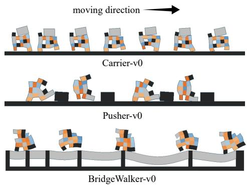  
(a) Task environments

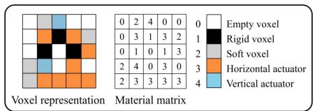

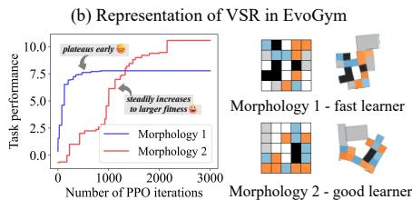  
(c) Learning curves of two example morphologies  
Figure 1: (a) Task environments used for benchmarking. (b) Two-dimensional VSR representation in EvoGym (Bhatia et al., 2021). (c) Two representative morphologies from preliminary experiments, illustrating the distinction between fast and good learners.

## 2.2. Robot Co-design

Robot co-design jointly optimizes morphological designs and sensorimotor controllers to achieve intelligent behaviors. This is typically formulated as a bi-level optimization problem (Fig. 2(a)):

$$
x ^ { * } = \arg \operatorname* { m a x } _ { x \in \mathcal { X } } f ( x , c ^ { * } ) ,\tag{1}
$$

$$
{ \mathrm { s . t . ~ } } c ^ { * } = \arg \operatorname* { m a x } _ { c \in { \mathcal { C } } } f ( x , c ) ,\tag{2}
$$

where X and C denote the morphology and controller spaces, respectively, and $f ( x , c )$ evaluates the task performance of morphology x under controller c. The inner and outer loops are detailed below.

## 2.2.1. Inner loop

The inner loop optimizes a dedicated controller for each candidate morphology (Fig. 2(b)). When controllers are parameterized as deep neural networks, reinforcement learning (RL) is the predominant optimization method. RL proceeds by alternating between environment sampling and policy updates, with each such cycle termed an iteration. The resulting task performance, measured as the cumulative reward over a complete episode, serves as the fitness of the morphology. We parameterize each controller as a multi-layer perceptron (MLP) that maps environmental observations to actuation signals, one per actuator voxel. In EvoGym, each signal drives an expansion or contraction of the corresponding actuator relative to its rest volume, transitioning the environment to the next state and closing the perception-action loop.

## 2.2.2. Outer loop

The outer loop evolves morphological designs using evolutionary algorithms such as the genetic algorithm (GA) (Michalewicz, 2013), Bayesian optimization (Pelikan and Pelikan, 2005), and CPPN-NEAT (Stanley, 2007). A population of morphologies is maintained and iteratively refined through stochastic variation, guided by fitness scores from the inner loop. We adopt the GA variant adapted for VSRs in Bhatia et al. (2021). In each generation, morphologies are evaluated and ranked by fitness. Top-ranking individuals survive and undergo random voxel mutations to produce the next generation. This cycle repeats until a pre-specified evaluation budget is exhausted.

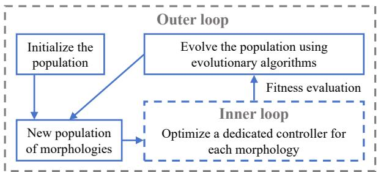  
(a) Bi-level optimization

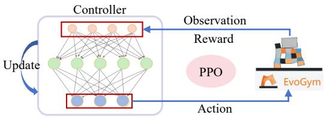  
(b) Control optimization  
Figure 2: Robot co-design.

Note that PPO (Schulman et al., 2017) and GA (Michalewicz, 2013) are both canonical algorithms widely adopted in robot co-design, intentionally selected here to ensure the generality of our findings. The reader is referred to Bhatia et al. (2021) for implementation details.

A major bottleneck in co-design is the expensive per-morphology controller optimization in the inner loop. Existing remedies include action inheritance (Liu et al., 2024a) and policy transfer (Liu et al., 2024b; Chen et al., 2024). A more radical alternative is Lamarckian inheritance, where a shared universal controller (Gupta et al., 2022; Strgar and Kriegman, 2026) is updated and passed across generations. However, such strategies have been found prone to premature convergence, as the inherited controller favors morphologies with first-mover advantage in control and fails to generalize to novel designs (Mertan and Cheney, 2024, 2025). These findings highlight that the configuration of control learning can profoundly shape evolutionary outcomes, and that dedicated per-morphology control optimization remains the most reliable paradigm in co-design, based on which our work is conducted.

## 2.3. Morphological Intelligence

The concept of morphological computation, introduced in the early 2000s (Maass et al., 2002; Pfeifer and Bongard, 2006), originally characterized how physical body-environment interactions can perform computations that would otherwise burden the controller. However, the term gradually became narrowly associated with physical reservoir computing (Hauser et al., 2011; Füchslin et al., 2013; Müller and Hoffmann, 2017). To address this limitation, Ghazi-Zahedi (2019) proposed morphological intelligence as a broader framework, defined as “the reduction of computational cost for the brain (or controller) resulting from the exploitation of the morphology and its interaction with the environment." Woodward and Sitti (2018) instantiated this concept as the reduction of slipping events on uneven terrains through passive mechanics. In the context of learningbased control, Gupta et al. (2021) assessed morphological intelligence through the speed and performance of reinforcement learning, and observed an everincreasing trend throughout evolution termed the morphological Baldwin effect.

Quantifying morphological intelligence remains an open challenge. Ghazi-Zahedi (2019) introduced a causal model of sensorimotor loops and employed information-theoretic methods to measure morphological contributions to control. Other approaches (Polani, 2011; Rückert and Neumann, 2013) frame the problem as an optimization task, examining how much control complexity can be reduced while preserving intelligent behavior. These methods, however, are generally confined to simplified dynamic systems or require computationally involved analysis, limiting their applicability to learning-based soft robotic systems. Inspired by the perspective of Gupta et al. (2021), we propose to quantify morphological intelligence directly from control learning curves via non-linear regression and introduce a complementary quantity, true potential, capturing the performance ceiling of a morphology. Together, these provide a complete characterization of a morphology's intrinsic learning profile that can be aggregated at the population level to track evolutionary trends, as detailed in Section 3.

## 3. Morphological Intelligence and True Potential

## 3.1. Qualitative Analysis

As discussed in Section 2.3, Gupta et al. (2021) assessed morphological intelligence through the speed and performance of reinforcement learning. However, the RL learning curves reported in Gupta et al. (2021) exhibit clear rising trends at termination, suggesting that control learning was cut short before convergence. This means that while task performance achieved within fixed iterations does reflect morphological quality, it captures only part of the picture. The maximal performance attainable after full convergence, which we term the true potential of a morphology, is an equally important yet distinct dimension of morphological quality.

Crucially, fast learning does not imply high true potential. To verify this, we conduct a preliminary experiment on Carrier following the GA implementation of Bhatia et al. (2021), but extend PPO training to 3000 iterations to ensure convergence. Fig. 1(c) shows the learning curves of two representative morphologies (quantitative results in Section 3.4). Morphology 1 is a fast learner that reaches decent performance early but plateaus at a modest level. Morphology 2 learns more slowly but ultimately achieves substantially higher performance. Notably, at 1000 iterations, a commonly adopted setting in prior work, Morphology 1 outperforms Morphology 2, rendering the latter's true potential invisible to the selection process.

## 3.2. Definitions

Building on the above observations, we formally define the two core concepts of this work, in the context of learning-based robotic systems.

Definition 1 (True potential). The true potential of a robot morphology is the upper limit of task performance attainable after control learning fully converges.

Definition 2 (Morphological intelligence, MI). The morphological intelligence (MI) of a robot morphology is the convergence speed of its control learning process towards its true potential.

In the RL setting, task performance corresponds to cumulative episodic reward, and morphological intelligence to the convergence rate of the learning curve. Our definitions refine the perspective of Gupta et al. (2021), who assessed morphological intelligence as “the speed and performance of reinforcement learning." We disambiguate performance, which in Gupta et al. (2021) was evaluated at fixed and arbitrary iteration counts, into the maximal performance after convergence, termed true potential. This separation yields two orthogonal dimensions of morphological contribution to intelligent behavior, enabling more systematic analysis of their respective roles and interactions.

## 3.3. Quantification

We now formalize the above concepts mathematically. Let $\alpha ,$ A, and C denote morphological intelligence, true potential, and control complexity, respectively. Control complexity can in principle be modulated through either network architecture or training duration. Here we adopt the latter, defining C as the number of RL iterations, which allows different complexities to be compared using the same network as it is progressively trained. We model the dependence of task performance on morphology and control with a hyperbolic tangent:

$$
f ( x , C ) = A \cdot \operatorname { t a n h } \left( { \frac { C } { C ^ { * } } } \cdot \alpha \right) + \epsilon ,\tag{3}
$$

where x denotes a robot morphology and $C ^ { * }$ the number of iterations required for control learning to fully saturate. Normalizing by $C ^ { * }$ makes α a dimensionless convergence rate, while A shares the dimension of task performance and depends on the reward function. The noise term € accounts for stochasticity in both controller optimization and environmental dynamics. The hyperbolic tangent is chosen for its simplicity and its ability to approximate the saturating nature of learning curves observed in our experiments. Alternative functional forms may be considered for scenarios with irregular convergence behavior. The parameters of interest, α and A, are estimated via non-linear regression as follows.

Both α and A are treated as trainable parameters and initialized randomly. We minimize the mean squared error between Eq. (3) and the observed learning curve via gradient descent. For a specific morphology $x ,$

$$
\begin{array} { r l } & { \displaystyle { A ^ { * } } , \alpha ^ { * } \gets \arg \operatorname* { m i n } _ { A , \alpha } \frac { 1 } { | { \mathcal S } | } \sum _ { C _ { i } \in { \mathcal S } } ( f _ { i } - f ( x , C _ { i } ) ) ^ { 2 } } \\ & { \quad \quad \quad \quad \equiv \arg \underset { A , \alpha } { \operatorname* { m i n } } \frac { 1 } { | { \mathcal S } | } \sum _ { C _ { i } \in { \mathcal S } } \left( f _ { i } - A \cdot \operatorname { t a n h } \left( \frac { C _ { i } } { C ^ { * } } \cdot \alpha \right) \right) ^ { 2 } , } \\ & { \quad \quad \quad \quad \quad \mathrm { s . t . ~ } \alpha > 0 , } \end{array}
$$

where $s$ is the set of evaluation points along the learning curve, with $C _ { i }$ and $f _ { i }$ the iteration count and observed performance at the i-th point. To enforce $\alpha > 0$ , we reparameterize as $\alpha = \exp ( \tilde { \alpha } )$ with $\tilde { \alpha } \in \mathbb { R }$ . A is unconstrained, as task performance need not be positive. For notational simplici $\mathrm { \Delta t y , }$ the estimates $A ^ { * }$ and $\alpha ^ { * }$ are hereafter written as $A$ and α. With only two parameters, the estimation procedure incurs negligible computational overhead.

## 3.4. Quantitative Analysis

Using the preliminary experiment on Carrier described in Section 3.1, we estimate the morphological intelligence and true potential of all high-performing morphologies. As shown in Fig. 3, the two quantities exhibit no significant correlation, with a Spearman's rank correlation coefficient of 0.05 $\left( p \mathrm { - v a l u e = 0 . 2 3 } \right)$ 1 This confirms that morphological intelligence and true potential are nearly $o r \mathrm { - }$ thogonal dimensions of morphological quality. A natural consequence is that prematurely terminated control learning would implicitly favor fast learners at the expense of morphologies with high true potential, biasing evolutionary outcomes.

## 4. AdaControl

In Section 5, we validate through extensive experiments that prematurely terminated control learning indeed biases natural selection towards fast learners, narrowing the evolutionary search to a restricted subspace and consequently compromising both optimization efficiency and morphological diversity. While simply prolonging control learning can mitigate this bias, it is a brute-force solution that quickly becomes infeasible under limited computational budgets. We instead propose AdaControl, an adaptive algorithm that monitors evolutionary dynamics and calibrates control complexity accordingly.

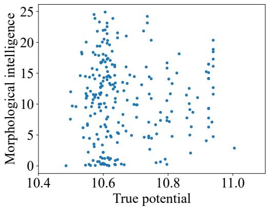  
Figure 3: Morphological intelligence versus true potential for 250 high-performing morphologies (top 5% of 1,000 evaluated solutions × five independent trials). No significant correlation is observed (Spearman's $\rho = 0 . 0 5 , p = 0 . 2 3 )$ , though the variance of morphological intelligence narrows at higher true potential.

AdaControl builds on the quantification framework of Section 3. In each generation, control learning begins at a minimal number of iterations. A pseudo step of natural selection is then performed based on currently evaluated fitness, tentatively identifying survivors. Rather than immediately proceeding to mutation, AdaControl pauses to assess potential bias. The morphological intelligence of the entire population is estimated, and the ratio r of survivor-average to population-average morphological intelligence is computed. An r substantially exceeding 1 signals that fast learners are disproportionately favored due to insufficient control learning. In this case, all controllers resume training for an additional increment of iterations, and the pseudo selection is repeated. This loop continues until r falls below a pre-specified threshold $r _ { \mathrm { t h r } } ,$ at which point natural selection is deemed unbiased and evolution proceeds normally. Each pseudo step incurs only negligible overhead for morphological intelligence estimation, yet ensures that control learning is neither prematurely curtailed nor wastefully prolonged. Robot co-design with AdaControl is illustrated in Fig. 4 and outlined in Algorithm 1.

## 5. Experimental Study

## 5.1. Experimental Setup

Our experiments are conducted on simulated VSRs in EvoGym (Bhatia et al., 2021). Following prior work (Bhatia et al., 2021; Liu et al., 2024a; Song et al., 2024, 2025), the VSR grid size is set to $5 \times 5 ,$ which already yields over $1 0 ^ { 1 7 }$ possible morphologies, producing an expressive and challenging design space while remaining tractable for standard evolutionary algorithms (Mertan and Cheney, 2025). We evaluate on three tasks: Carrier-v0, Pusher-v0, and BridgeWalker-v0 (Fig. 1(a)), spanning object manipulation and locomotion.

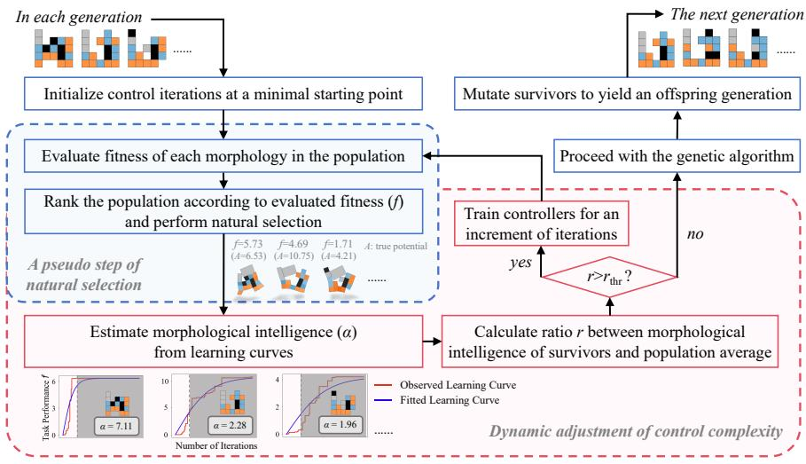  
Figure 4: Overview of robot co-design with AdaControl. In each generation, the population undergoes progressive control learning with iteratively increased iterations until the morphological intelligence of survivors is sufficiently close to the population average. In each pseudo step of natural selection, only the observed segments of learning curves (unshaded areas) are used for estimating morphological intelligence.

Algorithm 1: Robot Co-design with AdaControl   
Input: Evaluation budget M, population size N, survival rate s, MI ratio   
threshold $r _ { \mathrm { t h r } } ,$ min. iterations $L ,$ max. iterations U, increment I   
Output: All evaluated morphologies M   
1 Initialize population P randomly;   
2 ${ \mathcal { M } } \gets P ;$ evals ← 0;   
3 while evals $< M$ do   
4 Train controller of each robot in P for L iterations;   
5 iters $ L ;$   
6 repeat   
7 Select top $s \times N$ by fitness as survivors $s ; \mathrm { ~  ~ { ~ \mu ~ } ~ } / /$ pseudo selection   
8 Estimate α for all robots in P via Eq. (3);   
9 $r  \overline { { \alpha } } s / \overline { { \alpha } } _ { P } ;$   
10 if $r > r _ { t h r }$ and iters $< U$ then extend all controllers by I iterations;   
iters $\gets i t e r s + I ;$   
11 until $r \leq r _ { t h r }$ or iters $\geq U ;$   
12 Mutate $s$ to produce offspring $S ^ { \prime } { ; }$   
13 $P  \mathcal { S } \cup \mathcal { S } ^ { \prime } ; \mathcal { M }  \mathcal { M } \cup \mathcal { S } ^ { \prime } ;$ evals ← evals + |S′|;   
14 return $\mathcal { M } ;$

The outer loop uses GA (Michalewicz, 2013) for morphological evolution and the inner loop uses PPO (Schulman et al., 2017) for control optimization, both canonical and widely adopted algorithms in the co-design literature (Bhatia et al., 2021; Song et al., 2024; Zhao et al., 2026), ensuring the generality of our

findings.

To examine the impact of control complexity on morphological evolution, we vary the number of PPO iterations across five levels: 200, 500, 1000, and 2000 as weak complexities, and 3000 as the strong complexity, empirically found sufficient to reveal the true potential of most morphologies (we accordingly set $C ^ { * } = 3 0 0 0 )$ . For brevity, we refer to the corresponding controllers as weak and strong controllers. For AdaControl, control complexity is dynamically adjusted per Section 4. The minimal iterations L is set to 500, half the commonly adopted setting (Bhatia et al., 2021; Song et al., 2024, 2025), allowing AdaControl to incrementally approach the appropriate complexity without excessive initial cost. The upper limit U is set to 2000, which we find already largely eliminates selection bias while keeping computation manageable. The increment I is set to 100. The MI ratio threshold $r _ { \mathrm { t h r } }$ is set to 1.1, selected through the procedure described in Section 5.6.

All experiments are allocated 1000 robot evaluations for fair comparison. Population size is 25, and the survival rate linearly decreases from 60% to 8% over the course of evolution, following Bhatia et al. (2021). Results are averaged over five independent trials. All experiments are conducted on a server with Intel Xeon processors at 2.20 GHz without GPU acceleration.

In experiments with weak control and AdaControl, all evolved morphologies are re-evaluated using strong controllers to ensure fair performance comparison. This re-evaluation is performed solely for rigorous experimental analysis and is unnecessary in practical deployment.

Our experiments address the following questions:

• Q1: To what extent does weak control complexity underestimate true potential?

• Q2: Does this underestimation bias evolutionary processes as conjectured in Section 3?

• Q3: How do such biases affect optimization efficiency and morphological diversity?

• Q4: Does AdaControl effectively resolve these issues?

## 5.2. Evaluation Metrics

We assess evolutionary processes with three metrics:

• Morphological intelligence (MI): the convergence speed of control learning, quantified as in Section 3. This metric is central to both our analysis of evolutionary bias and the dynamic scheduling in AdaControl. For comparative studies across control configurations, MI is computed from the complete learning curves of strong controllers, analogous to the re-evaluation of true potential described below. Within AdaControl, where complete curves are unavailable, MI is instead estimated from the learning curve segments observed up to the current iteration.

• Maximal true potential: the true potential of the best morphology found, evaluated with strong controllers (3000 PPO iterations), plotted against computational cost to yield performance curves reflecting optimization efficiency. We avoid the term fitness to prevent ambiguity regarding which control complexity is used for evaluation.

• Morphological diversity: following Saito and Oka (2024), we identify high-performing morphologies as those exceeding the top k% quantile of true potential across all experiments $( k = 5$ , following Song et al. (2024)), and report the average pairwise edit distance among them. Diversity reflects a co-design system's capacity to discover varied capable designs (Medvet et al., 2021; Pigozzi et al., 2023).

## 5.3. Baselines

Beyond GA with various fixed control complexities, we compare against three additional baselines. MorphVAE (Song et al., 2024) and LASeR (Song et al., 2025) are state-of-the-art VSR co-design algorithms based on deep generative models. MorphVAE fits a variational autoencoder (VAE) to the distribution of high-performing morphologies and samples new candidates from the learned latent space, with the VAE iteratively updated after each round of natural selection. LASeR replaces the VAE with a pre-trained large language model, leveraging its in-context learning and generation capabilities to fit and sample morphologies. FitControl adapts the self-adaptive learning cycle of Le Goff and Hart (2024), which schedules per-morphology training duration based on a target fitness improvement δ. We adopt this scheduling mechanism within our synchronous population-based framework for controlled comparison.

## 5.4. Impact of Control Complexity on Evolutionary Bias

## 5.4.1. Underestimation of True Potential

We first validate that 3000 PPO iterations suffices to accurately estimate true potential. In the strong-control experiments, learning curves converge well before this budget, with average convergence iterations of 2200.78, 2216.28, and 1731.16 for Carrier, Pusher, and BridgeWalker, respectively (Table 1, last column). Here, a learning curve is deemed converged when performance first reaches within 5% of its peak value $f _ { \mathrm { m a x } }$ . We therefore adopt 3000 iterations as the strong control complexity, serving as the ground-truth reference for evaluating true potential and benchmarking all other control configurations.

Table 1: Mean and standard deviation of PPO convergence iterations under different control complexities.
<table><tr><td rowspan="2">Task</td><td colspan="5">Control Complexity</td></tr><tr><td>200</td><td>500</td><td>1000</td><td>2000</td><td>3000</td></tr><tr><td>Carrier</td><td> $2 0 8 6 . 4 0 \pm 7 4 3 . 6 7$ </td><td> $1 9 9 5 . 4 6 \pm 8 0 2 . 6 5$ </td><td> $2 0 6 4 . 8 9 \pm 7 6 8 . 6 4$ </td><td> $2 1 1 6 . 8 2 \pm 7 3 5 . 3 5$ </td><td> $2 2 0 0 . 7 8 \pm 6 7 4 . 6 2$ </td></tr><tr><td>Pusher</td><td> $2 0 9 4 . 5 7 \pm 6 8 5 . 2 1$ </td><td> $2 0 8 0 . 4 4 \pm 7 0 8 . 5 3$ </td><td> $2 1 4 1 . 0 1 \pm 6 7 9 . 0 3$ </td><td> $2 1 4 5 . 0 9 \pm 6 4 6 . 1 9$ </td><td> $2 2 1 6 . 2 8 \pm 6 3 4 . 4 5$ </td></tr><tr><td>BridgeWalker</td><td> $1 6 3 3 . 3 8 \pm 8 5 5 . 0 6$ </td><td> $1 4 8 1 . 0 7 \pm 8 5 2 . 3 5$ </td><td> $1 5 8 9 . 4 0 \pm 8 4 3 . 9 5$ </td><td> $1 6 9 1 . 1 5 \pm 8 2 0 . 7 9$ </td><td> $1 7 3 1 . 1 6 \pm 8 1 9 . 9 2$ </td></tr></table>

We now investigate whether and to what extent weak control underestimates true potential (Q1). For each weak complexity, we run co-design experiments and compare the population averages of weak-control-evaluated fitness against true potential. Fig. 5 reports Carrier results with two-tailed t-test p-values annotated. Pusher and BridgeWalker yield qualitatively consistent results and are omitted for brevity. Two findings emerge: (a) weak controllers consistently underestimate true potential, with statistically significant discrepancies at 200, 500, and 1000 iterations; (b) the gap narrows with increasing control complexity and becomes insignificant at 2000 iterations. These results confirm that the underestimation, while pronounced under weak control, can be effectively alleviated by extending control learning.

Strong Control Weak Control

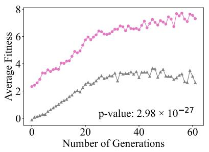  
(a) Control complexity = 200

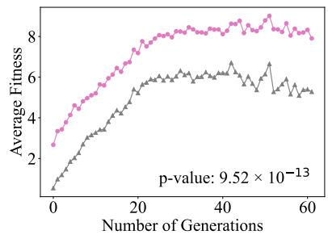  
(b) Control complexity = 500

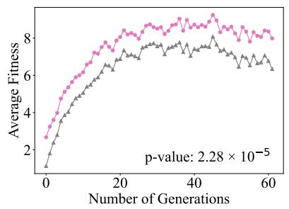  
(c) Control complexity = 1000

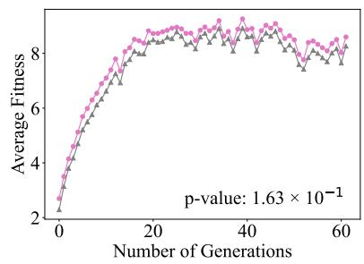  
(d) Control complexity = 2000  
Figure 5: True potential versus weak-control-evaluated fitness under varying control complexities in Carrier. Annotated p-values are from two-tailed t-tests.

## 5.4.2. Evolutionary Biases of Weak Controllers

The preceding results show that weak control systematically underestimates true potential. A natural follow-up is whether this underestimation translates into biased natural selection (Q2). To test this, we re-rank survivors by true potential rather than weak-control fitness. As shown in Fig. 6, weaker controllers produce survivors that rank progressively lower in true potential, confirming that selection increasingly deviates from true morphological quality. Fig. 7 further compares the learning curves of high-performing morphologies evolved under different control complexities. Individual curves are plotted in gray, with colored curves showing the average for each complexity. Weaker controllers consistently select morphologies with steeper initial learning curves, while stronger controllers (2000 and 3000 iterations) yield gentler average curves, indicating greater tolerance for slow but ultimately superior learners. This pattern is quantitatively confirmed in Table 1 and Fig. 8: morphologies evolved under weaker control converge faster and exhibit systematically higher MI.

These results answer Q2 affirmatively: prematurely terminated control learning biases natural selection towards fast learners and substantially shapes evolutionary outcomes. Strong control, by contrast, more faithfully evaluates true potential and thereby preserves slow but capable morphologies. Notably, the morphological Baldwin effect reported in Gupta et al. (2021) emerges as a special case of this bias rather than a general evolutionary phenomenon, arising specifically when control learning is insufficient to distinguish fast learners from good ones.

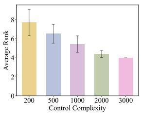  
(a) Carrier

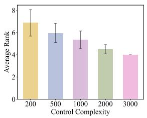  
(b) Pusher

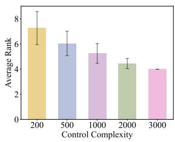  
(c) BridgeWalker  
Figure 6: Average ranking of survivors when re-sorted by true potential rather than weakcontrol fitness. Lower rankings indicate greater deviation from true-potential-based selection.

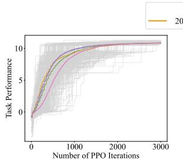  
(a) Carrier

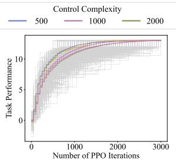  
(b) Pusher

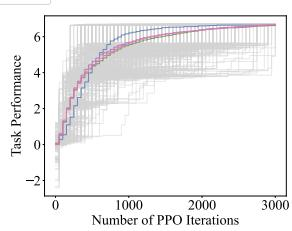  
(c) BridgeWalker  
Figure 7: Learning curves of high-performing morphologies evolved under different control complexities. Individual curves in gray; colored curves show the average per complexity.

## 5.5. Impact of Evolutionary Bias on Co-Design Performance

In this section, we examine how the evolutionary biases identified above affect co-design performance (Q3) and evaluate AdaControl as a remedy (Q4).

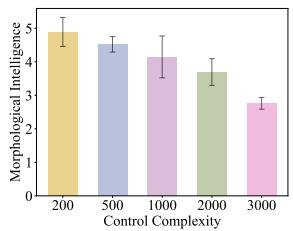  
(a) Carrier

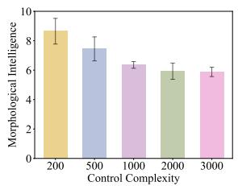  
(b) Pusher

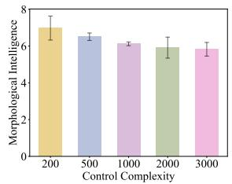  
(c) BridgeWalker  
Figure 8: Average MI of all evaluated morphologies throughout evolution under different control complexities.

We analyze three dimensions: morphological intelligence dynamics, optimization efficiency, and morphological diversity.

## 5.5.1. Morphological Intelligence

Section 5.4 established that weak control biases selection towards higher MI. We now examine how this bias evolves across generations. Fig. 9 plots the population-average MI of survivors against generation number. Under weak control, MI exhibits a clear upward trend, most pronounced at 200 iterations, indicating that the preference for fast learners compounds over successive generations. Strong control maintains MI at a stable, moderate level. AdaControl substantially reduces MI growth relative to weak control across all three tasks, with near-complete stabilization in Carrier and Pusher and a more moderate effect in BridgeWalker, while using far fewer PPO iterations than strong control (Table 2).

The more pronounced MI growth in BridgeWalker raises the question of whether $r _ { \mathrm { t h r } } = 1 . 1$ is overly lenient for this task. However, as shown in Section 5.6, tightening the threshold does not improve design space coverage, leading us to identify two competing factors simultaneously governed by rthr.

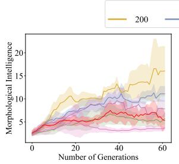  
(a) Carrier

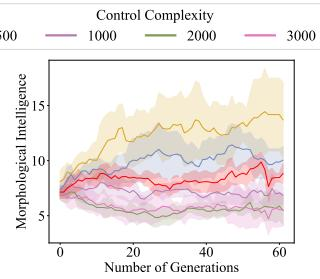  
(b) Pusher

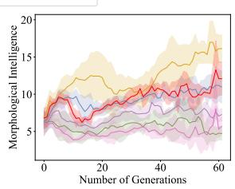  
(c) BridgeWalker  
Figure 9: Population-average MI of survivors per generation. Shaded areas indicate standard deviation. Weak control produces a rising MI trend, signaling accumulating bias; strong control and AdaControl maintain stable MI.

Table 2: Average PPO iterations per evaluation for AdaControl and FitControl (mean ± std). AdaControl reduces control learning cost by 65–81% relative to strong control (3000 iterations) while achieving comparable or superior optimization efficiency and morphological diversity.
<table><tr><td>Task</td><td>AdaControl</td><td>FitControl</td></tr><tr><td>Carrier</td><td> $1 0 6 3 . 6 2 \pm 1 9 4 . 4 8$ </td><td> $1 6 3 1 . 6 4 \pm 3 2 4 . 5 9$ </td></tr><tr><td>Pusher</td><td> $6 0 9 . 8 2 \pm 1 2 4 . 6 2$ </td><td> $1 9 5 9 . 4 0 \pm 2 1 1 . 1 1$ </td></tr><tr><td>BridgeWalker</td><td> $5 8 4 . 0 0 \pm 6 2 . 2 9$ </td><td> $1 4 4 3 . 4 5 \pm 8 1 . 2 4$ </td></tr></table>

## 5.5.2. Optimization Efficiency

We assess optimization efficiency by plotting the best true potential found against the number of robot evaluations (Fig. 10) and against cumulative PPO iterations on a logarithmic scale (Fig. 11). Note that MorphVAE and LASeR follow their original experimental settings with 1000 PPO iterations for control learning.

In terms of evaluation count (Fig. 10), higher control complexity generally yields better efficiency, as unbiased fitness evaluation enables more thorough exploration and avoidance of local optima. AdaControl achieves performance comparable to strong control across all three tasks while using far fewer PPO iterations per evaluation. FitControl is competitive in Carrier and Pusher but offers less consistent gains in BridgeWalker. The diminishing gap between 2000 and 3000 iterations suggests that simply prolonging control learning faces diminishing returns.

The advantage of adaptive scheduling is more evident when efficiency is measured by cumulative control learning cost (Fig. 11). For the same iteration budget, AdaControl discovers substantially higher-performing morphologies than strong control, or equivalently, reaches comparable performance at a fraction of the cost. This advantage arises from AdaControl's flexible allocation of control resources, which concentrates additional learning on generations where selection bias is detected rather than distributing iterations uniformly across all evaluations. Such targeted scheduling mitigates the tension between optimization efficiency and morphological diversity inherent in fixed-complexity approaches (see Section 5.5.3).

Compared with MorphVAE and LASeR, AdaControl enables a simple GA to rival co-design methods built on sophisticated generative models, demonstrating that principled control scheduling can substitute for search-level complexity. Moreover, the GA-based approach entirely avoids the overhead of training and querying deep generative models, further reducing total computational cost. The contrast with FitControl is equally informative: both methods dynamically adjust control learning, yet AdaControl substantially outperforms FitControl while using considerably fewer PPO iterations (Table 2). We attribute this to a fundamental difference in scheduling philosophy. FitControl adjusts training duration at the individual level based on per-morphology fitness signals, whereas AdaControl operates at the population level, directly targeting the selection bias that arises between individuals. Since fitness evaluation ultimately serves natural selection across candidate solutions, our results suggest that control scheduling guided by population-level indicators is more effective than individual-level heuristics.

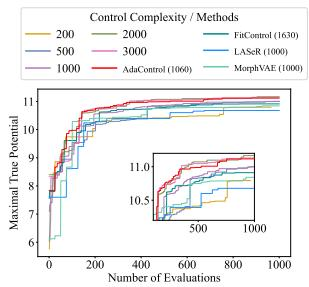  
(a) Carrier

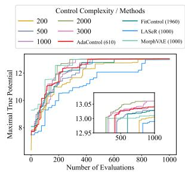  
(b) Pusher

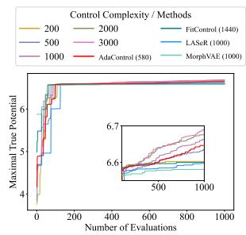  
(c) BridgeWalker  
Figure 10: Optimization efficiency measured by number of robot evaluations. Numbers in parentheses denote average PPO iterations. Insets magnify the later stages of evolution.

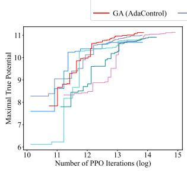  
(a) Carrier

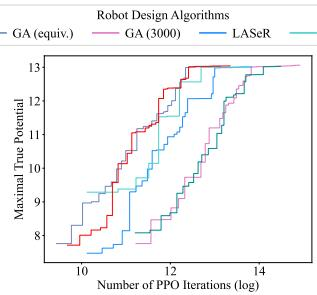  
(b) Pusher

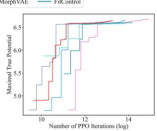  
(c) BridgeWalker  
Figure 11: Optimization efficiency measured by cumulative PPO iterations (log scale). "equiv." denotes the fixed complexity approximately matching AdaControl's average iterations (1000 for Carrier, 500 for Pusher and BridgeWalker).

## 5.5.3. Morphological Diversity

Morphological diversity offers the most direct window into how evolutionary bias constrains design space exploration. As shown in Fig. 12, diversity of high-performing morphologies increases nearly monotonically with control complexity under fixed schemes, reflecting that more thorough fitness evaluation preserves a wider range of viable evolutionary trajectories. To contextualize AdaControl, we fit linear regression lines to the fixed-complexity results and position AdaControl according to its average PPO iterations. Across all three tasks, AdaControl achieves diversity substantially exceeding the trend predicted by its computational cost. In Carrier and Pusher, AdaControl even surpasses the diversity of strong control while consuming less than half the computation. This diversity gain stems from AdaControl's targeted allocation of learning resources: by investing additional iterations specifically in generations where fast learners dominate selection, it opens evolutionary pathways that uniform training would leave unexplored. As shown in Fig. 12, AdaControl also achieves higher diversity than all baselines, including the state-of-the-art generative-model-based methods MorphVAE and LASeR as well as the adaptive FitControl, corroborating the advantage of population-level control scheduling discussed above.

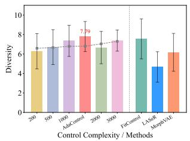  
(a) Carrier

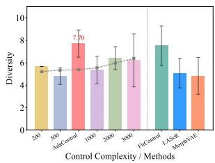  
(b) Pusher

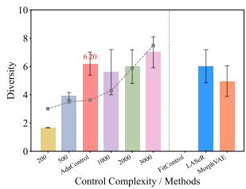  
(c) BridgeWalker  
Figure 12: Diversity of high-performing morphologies under different control schemes. Left: GA with fixed complexities and AdaControl, positioned by average PPO iterations, with dashed regression line from fixed-complexity results. Right: FitControl, LASeR, and MorphVAE. FitControl is absent in (c) as it did not produce any high-performing morphology in BridgeWalker.

In summary, conventional co-design with fixed control complexity faces an inherent tension between computational cost and evolutionary performance. AdaControl resolves this by dynamically investing computation where bias is detected, achieving strong optimization efficiency and superior diversity simultaneously. This advantage traces back to the analytical perspective proposed in this work: by extracting morphological properties directly from control learning profiles and tracking their population-level statistics, we uncover the interplay between control learning and selection bias, which in turn naturally motivates AdaControl as a bias-aware scheduling algorithm.

## 5.6. Threshold Selection for AdaControl

Rather than setting $r _ { \mathrm { t h r } }$ subjectively, we adopt a principled selection procedure based on morphological diversity, which directly measures how thoroughly evolution explores the design space. We sweep $r _ { \mathrm { t h r } } \in \{ 1 . 0 4 , 1 . 0 7 , 1 . 1 , 1 . 1 3 , 1 . 1 6$ 1.2} and report diversity against total cumulative PPO iterations in Fig. 13.

For Pusher and BridgeWalker, diversity peaks at $r _ { \mathrm { t h r } } = 1 . 1$ . Larger thresholds (1.13, 1.16, 1.2) conserve computation but leave MI bias uncorrected, restricting the search to a fast-learner subspace. Contrary to expectation, stricter thresholds (1.07, 1.04) also reduce diversity despite greater computational investment. A plausible explanation is that near-convergent control learning produces highly deterministic fitness rankings, reducing the stochasticity in natural selection that helps sustain population diversity and accelerating convergence along narrow evolutionary paths. This effect appears most pronounced in BridgeWalker, where faster learning convergence (Table 1) makes the population more susceptible to such premature convergence. These results suggest that $r _ { \mathrm { t h r } }$ shapes evolutionary behaviors in more nuanced ways, simultaneously modulating MI bias and selection stochasticity that affect design space coverage in opposing directions. Diversity peaks where the two are balanced, which also accounts for the residual MI growth in BridgeWalker (Fig. 9(c)), where the optimal threshold tolerates moderate bias to preserve selection stochasticity. For Carrier, $r _ { \mathrm { t h r } } = 1 . 1$ uses the fewest iterations while achieving near-optimal diversity. Other thresholds incur substantially higher computational costs with only marginal diversity changes. Based on these results, $r _ { \mathrm { t h r } } = 1 . 1$ is selected as the operating point for all experiments.

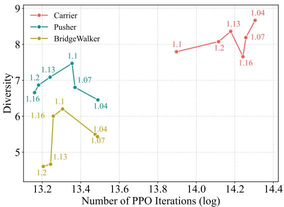  
Figure 13: Diversity of high-performing morphologies versus total PPO iterations (log scale) for different MI ratio thresholds $r _ { \mathrm { t h r } }$ Each point is labeled with its threshold value.

## 5.7. Interpretability Analysis

Having established the evolutionary bias towards high MI and its implications for co-design, we now conduct a preliminary investigation into the physical underpinnings of morphological intelligence. Taking Carrier as an example, we examine the relationship between MI and three morphological attributes: (a) energy efficiency measured by Cost of Work (COW); (b) the number of empty voxels; (c) the number of soft voxels. Following Gupta et al. (2021), COW is defined as the energy consumed per unit mass to accomplish the task:

$$
\mathrm { C O W } = { \frac { E } { M g r } } ,\tag{4}
$$

where $E$ is the total energy expenditure, measured as the absolute sum of actuation signals; M is the robot mass, measured as the number of non-empty voxels; $r$ is the cumulative episodic reward; and $g$ is the gravitational acceleration, omitted from our calculation as it is constant across all robots.

As shown in Fig. 14(a), robots with higher MI exhibit lower COW, mirroring the pattern observed for rigid robots in Gupta et al. (2021) and suggesting that morphologically intelligent soft robots are better able to exploit passive bodyenvironment dynamics for energy-efficient behavior. The relationship between MI and the number of empty voxels follows an inverted U-shape (Fig. 14(b)). A moderate number of empty voxels appears to reduce structural constraints and enable more compliant deformations, facilitating easier control. Beyond a certain point, however, overly sparse structures may give rise to interaction dynamics too complex to be effectively exploited. A similar non-monotonic pattern is observed for soft voxels (Fig. 14(c)), partly consistent with Corucci et al. (2016), with the decline at higher counts admitting a similar explanation.

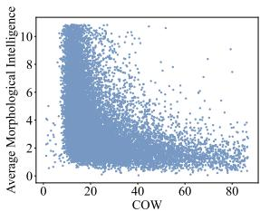  
(a) Energy efficiency

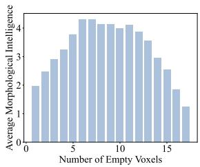  
(b) Number of empty voxels

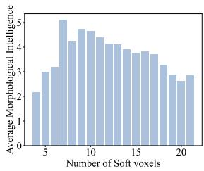  
(c) Number of soft voxels  
Figure 14: Relationship between MI and morphological attributes in Carrier. (a) Each point represents one morphology. (b)-(c) Morphologies with the same voxel count are aggregated; only the mean MI is shown.

These findings suggest that energy efficiency and structural composition are key physical attributes underpinning MI in voxel-based soft robots, and offer concrete insight into which regions of the design space are favored by biased evolutionary processes.

## 6. Conclusion

In this work, we investigate the brain-body co-evolution of learning-based robotic systems across two timescales, and reveal that the configuration of control learning is a critical yet overlooked determinant of morphological evolution. By decomposing the intrinsic learning profile of morphologies into morphological intelligence and true potential, we provide a quantitative framework that exposes how prematurely terminated control learning biases selection and gives rise to the morphological Baldwin effect as a special case. AdaControl, grounded in population-level MI monitoring, resolves this bias with minimally sufficient computation and demonstrates that evaluation fidelity, rather than search sophistication, is the primary bottleneck in co-design. Our threshold selection analysis further uncovers a dual role of the MI ratio threshold in governing both MI bias and selection stochasticity, offering a nuanced understanding of how control scheduling shapes evolutionary exploration.

Our findings are established on simulated voxel-based soft robots across three tasks. Whether our findings generalize to other morphological representations, task domains, and physical platforms remains to be verified (Wang et al., 2025;

Stölzle et al., 2025). On the algorithmic side, our threshold selection analysis reveals task-dependent behavior, motivating the development of adaptive threshold mechanisms that self-calibrate during evolution. More broadly, control complexity extends beyond training duration to encompass network architecture and learning algorithms, each of which may interact with morphological evolution in distinct ways that our framework is well positioned to investigate further.

## Acknowledgments

The authors would like to thank Prof. Feifei Wang for her valuable guidance and Zhongmin Liang for her contributions to this work. This work is supported by the Intelligent Game and Decision Laboratory and the Zhiqiang Foundation.

## References

Bhatia, J., Jackson, H., Tian, Y., Xu, J., Matusik, W., 2021. Evolution Gym: A large-scale benchmark for evolving soft robots. Advances in Neural Information Processing Systems 34, 2201–2214.

Buason, G., Bergfeldt, N., Ziemke, T., 2005. Brains, bodies, and beyond: Competitive co-evolution of robot controllers, morphologies and environments. Genetic Programming and Evolvable Machines 6, 25–51.

Chen, L.Y., Hari, K., Dharmarajan, K., Xu, C., Vuong, Q., Goldberg, K., 2024. Mirage: Cross-embodiment zero-shot policy transfer with cross-painting, in: Robotics: Science and Systems.

Corucci, F., Cheney, N., Lipson, H., Laschi, C., Bongard, J., 2016. Material properties affect evolution's ability to exploit morphological computation in growing soft-bodied creatures.

Dubied, M., Michelis, M.Y., Spielberg, A., Katzschmann, R.K., 2022. Sim-toreal for soft robots using differentiable FEM: Recipes for meshing, damping, and actuation. IEEE Robotics and Automation Letters 7, 5015–5022.

Eiben, A., Hart, E., 2020. If it evolves it needs to learn, in: Proceedings of the 2020 Genetic and Evolutionary Computation Conference Companion, pp. 1383-1384.

Fang, J., Sun, Y., Ma, C., Lu, Q., Yao, L., 2025. RoboMoRe: LLM-based robot co-design via joint optimization of morphology and reward. arXiv preprint arXiv:2506.00276.

Füchslin, R.M., Dzyakanchuk, A., Flumini, D., Hauser, H., Hunt, K.J., Luchsinger, R.H., Reller, B., Scheidegger, S., Walker, R., 2013. Morphological computation and morphological control: steps toward a formal theory and applications. Artificial life 19, 9–34.

Ghazi-Zahedi, K., 2019. Morphological Intelligence: Measuring the Body's Contribution to Intelligence. Springer, Cham, Switzerland.

Goff, L.K.L., Hart, E., 2021. On the challenges of jointly optimising robot morphology and control using a hierarchical optimisation scheme, in: Proceedings of the genetic and evolutionary computation conference companion, pp. 1498–1502.

Gupta, A., Fan, L., Ganguli, S., Fei-Fei, L., 2022. MetaMorph: Learning universal controllers with transformers, in: The Tenth International Conference on Learning Representations.

Gupta, A., Savarese, S., Ganguli, S., Fei-Fei, L., 2021. Embodied intelligence via learning and evolution. Nature communications 12, 5721.

Hauser, H., Ijspeert, A.J., Füchslin, R.M., Pfeifer, R., Maass, W., 2011. Towards a theoretical foundation for morphological computation with compliant bodies. Biological cybernetics 105, 355–370.

Hiller, J., Lipson, H., 2011. Automatic design and manufacture of soft robots. IEEE Transactions on Robotics 28, 457–466.

Hu, J., Whitman, J., Choset, H., 2023. GLSO: grammar-guided latent space optimization for sample-efficient robot design automation, in: Conference on Robot Learning, PMLR. pp. 1321–1331.

Hu, J., Whitman, J., Travers, M., Choset, H., 2022. Modular robot design optimization with generative adversarial networks, in: 2022 International Conference on Robotics and Automation (ICRA), IEEE. pp. 4282–4288.

Huang, W., Huang, X., Majidi, C., Jawed, M.K., 2020. Dynamic simulation of articulated soft robots. Nature communications 11, 2233.

Huang, Z., Hu, Y., Du, T., Zhou, S., Su, H., Tenenbaum, J.B., Gan, C., 2021. PlasticineLab: A soft-body manipulation benchmark with differentiable physics, in: The Ninth International Conference on Learning Representations.

Kriegman, S., Blackiston, D., Levin, M., Bongard, J., 2020a. A scalable pipeline for designing reconfigurable organisms. Proceedings of the National Academy of Sciences 117, 1853–1859.

Kriegman, S., Blackiston, D., Levin, M., Bongard, J., 2021. Kinematic selfreplication in reconfigurable organisms. Proceedings of the National Academy of Sciences 118, e2112672118.

Kriegman, S., Nasab, A.M., Shah, D., Steele, H., Branin, G., Levin, M., Bongard, J., Kramer-Bottiglio, R., 2020b. Scalable sim-to-real transfer of soft robot designs, in: 2020 3rd IEEE international conference on soft robotics (RoboSoft), IEEE. pp. 359–366.

Le Goff, L., Hart, E., 2024. Improving efficiency of evolving robot designs via self-adaptive learning cycles and an asynchronous architecture, in: Proceedings of the Genetic and Evolutionary Computation Conference Companion, pp. 1607–1615.

Legrand, J., Terryn, S., Roels, E., Vanderborght, B., 2023. Reconfigurable, multi-material, voxel-based soft robots. IEEE Robotics and Automation Letters 8, 1255–1262.

Li, G., Müller, U.K., van Leeuwen, J.L., Liu, H., 2016. Fish larvae exploit edge vortices along their dorsal and ventral fin folds to propel themselves. Journal of The Royal Society Interface 13, 20160068.

Li, M., Kong, L., Kriegman, S., 2025. Generating freeform endoskeletal robots, in: The Thirteenth International Conference on Learning Representations.

Liu, S., Yan, J., Wang, H., Jin, Y., 2026. Morphology evolution for embodied robot design with a classifier-guided diffusion model. IEEE Transactions on Evolutionary Computation 30, 1039–1053.

Liu, S., Yao, W., Wang, H., Peng, W., Yang, Y., 2024a. Rapidly evolving soft robots via action inheritance. IEEE Transactions on Evolutionary Computation 28, 1674–1688.

Liu, X., Pathak, D., Zhao, D., 2024b. Meta-evolve: Continuous robot evolution for one-to-many policy transfer, in: The Twelfth International Conference on Learning Representations.

Maass, W., Natschläger, T., Markram, H., 2002. Real-time computing without stable states: A new framework for neural computation based on perturbations. Neural computation 14, 2531–2560.

Medvet, E., Bartoli, A., De Lorenzo, A., Seriani, S., 2020. 2D-VSR-Sim: A simulation tool for the optimization of 2-d voxel-based soft robots. SoftwareX 12, 100573.

Medvet, E., Bartoli, A., Pigozzi, F., Rochelli, M., 2021. Biodiversity in evolved voxel-based soft robots, in: Proceedings of the Genetic and Evolutionary Computation Conference, pp. 129–137.

Mertan, A., Cheney, N., 2024. Investigating premature convergence in cooptimization of morphology and control in evolved virtual soft robots, in: European Conference on Genetic Programming (Part of EvoStar), Springer. pp. 38–55.

Mertan, A., Cheney, N., 2025. Evolutionary brain-body co-optimization consistently fails to select for morphological potential. arXiv preprint arXiv:2508.17464.

Michalewicz, Z., 2013. Genetic algorithms+ data structures= evolution programs. Springer Science & Business Media.

Müller, V.C., Hoffmann, M., 2017. What is morphological computation? on how the body contributes to cognition and control. Artificial life 23, 1-24.

Pelikan, M., Pelikan, M., 2005. Bayesian optimization algorithm. Hierarchical Bayesian optimization algorithm: toward a new generation of evolutionary algorithms , 31–48.

Pfeifer, R., Bongard, J., 2006. How the body shapes the way we think: a new view of intelligence. MIT press, Cambridge, MA.

Pfeifer, R., Iida, F., Lungarella, M., 2014. Cognition from the bottom up: on biological inspiration, body morphology, and soft materials. Trends in cognitive sciences 18, 404–413.

Pigozzi, F., Medvet, E., Bartoli, A., Rochelli, M., 2023. Factors impacting diversity and effectiveness of evolved modular robots. ACM Transactions on Evolutionary Learning 3, 1–33.

Polani, D., 2011. An informational perspective on how the embodiment can relieve cognitive burden, in: 2011 IEEE symposium on artificial life (ALIFE), IEEE. pp. 78–85.

Rossi, E., Nielsen, E., Iacca, G., 2026. Evolutionary emergence of distributed neural network controllers in voxel-based soft robots, in: Applications of Evolutionary Computation (EvoApplications), Springer. pp. 150–166.

Rückert, E.A., Neumann, G., 2013. Stochastic optimal control methods for investigating the power of morphological computation. Artificial Life 19, 115- 131.

Saito, T., Oka, M., 2024. Effective design and interpretation in voxel-based soft robotics: A part assembly approach with Bayesian optimization, in: Artificial Life Conference Proceedings 36, MIT Press. p. 26.

Schulman, J., Wolski, F., Dhariwal, P., Radford, A., Klimov, O., 2017. Proximal policy optimization algorithms. arXiv preprint arXiv:1707.06347 .

Shen, L., Huang, K., Zhao, W., Liu, H., 2026. EvoGymCM: Harnessing continuous material stiffness for soft robot co-design. arXiv preprint arXiv:2604.08258

Song, J., Yang, Y., Peng, W., Zhou, W., Wang, F., Yao, W., 2024. MorphVAE: Advancing morphological design of voxel-based soft robots with variational autoencoders, in: Proceedings of the AAAI Conference on Artificial Intelligence, pp. 10368–10376.

Song, J., Yang, Y., Xiao, H., Peng, W., Yao, W., Wang, F., 2025. LASeR: Towards diversified and generalizable robot design with large language models, in: The Thirteenth International Conference on Learning Representations.

Stanley, K.O., 2007. Compositional pattern producing networks: A novel abstraction of development. Genetic programming and evolvable machines 8, 131-162.

Stölzle, M., Pagliarani, N., Stella, F., Hughes, J., Laschi, C., Rus, D., Cianchetti, M., Della Santina, C., Zardini, G., 2025. Soft yet effective robots via holistic co-design. arXiv preprint arXiv:2505.03761 .

Strgar, L., Kriegman, S., 2026. Accelerated co-design of robots through morphological pretraining, in: The Fourteenth International Conference on Learning Representations.

Wang, J., Pan, S., Serra-Gomez, A., Wei, X., Xie, Y., 2026. Evolving embodied intelligence: Graph neural network-driven co-design of morphology and control in soft robotics. arXiv preprint arXiv:2603.19582 .

Wang, Y., Chen, Z., Zhang, T., Yin, Q., Chang, Y., Li, Z., Wang, L., Wang, X., 2025. Embodied co-design for rapidly evolving agents: Taxonomy, frontiers, and challenges. arXiv preprint arXiv:2512.04770 .

Wang, Y., Wu, S., Zhang, T., Chang, Y., Fu, H., Fu, Q., Wang, X., 2023. Preco: Enhancing generalization in co-design of modular soft robots via brain-body pre-training, in: Conference on Robot Learning, PMLR. pp. 478–498.

Woodward, M.A., Sitti, M., 2018. Morphological intelligence counters foot slipping in the desert locust and dynamic robots. Proceedings of the National Academy of Sciences 115, E8358–E8367.

Zhao, J., Peng, W., Wang, H., Zhou, W., Yang, Y., Yao, W., 2026. Cross-task collaborative optimization based on knowledge transfer for soft robot design. IEEE Transactions on Evolutionary Computation 30, 898–910.