# SkillAlchemy: Open-World Agent Skill Creation

Hengjun Wang<sup>1</sup>, Shuyue Wei<sup>2\*</sup>, Boyi Liu<sup>1</sup>, Jun Yang<sup>3</sup>, Yongxin Tong<sup>1\*</sup>

<sup>1</sup>State Key Laboratory of Complex & Critical Software Environment, Beihang University, Beijing, China <sup>2</sup>Joint SDU–NTU Centre for Artificial Intelli<sub>g</sub>ence Research (C-FAIR), Shandon<sub>g</sub> Universit<sub>y</sub>, Jinan, China <sup>3</sup>S<sub>c</sub>h<sub>oo</sub>l <sub>o</sub>f A<sub>u</sub>t<sub>oma</sub>ti<sub>on,</sub> N<sub>or</sub>th<sub>wes</sub>t<sub>ern</sub> P<sub>o</sub>l<sub>y</sub>t<sub>ec</sub>h<sub>n</sub>i<sub>ca</sub>l U<sub>n</sub>i<sub>vers</sub>it<sub>y,</sub> Xi’<sub>an,</sub> Chi<sub>na</sub>

## Abstract

A<sub>gen</sub>t <sub>s</sub>kill<sub>s are reusa</sub>bl<sub>e proce</sub>d<sub>ura</sub>l <sub>ar</sub>tif<sub>ac</sub>t<sub>s</sub> th<sub>a</sub>t <sub>ex</sub>t<sub>en</sub>d l<sub>an-</sub> <sub>guage agen</sub>t<sub>s w</sub>ith <sub>spec</sub>i<sub>a</sub>li<sub>ze</sub>d <sub>wor</sub>kfl<sub>ows,</sub> t<sub>oo</sub>l <sub>conven</sub>ti<sub>ons,</sub> <sub>an</sub>d d<sub>oma</sub>i<sub>n</sub> b<sub>e</sub>h<sub>av</sub>i<sub>ors a</sub>t i<sub>n</sub>f<sub>erence</sub> ti<sub>me.</sub> H<sub>owever, crea</sub>ti<sub>ng</sub> <sub>re</sub>li<sub>a</sub>bl<sub>e s</sub>kill<sub>s s</sub>till d<sub>epen</sub>d<sub>s</sub> l<sub>arge</sub>l<sub>y on</sub> h<sub>uman au</sub>th<sub>ors</sub>hi<sub>p, mo</sub>d<sub>e</sub>l <sub>pr</sub>i<sub>ors, or execu</sub>ti<sub>on</sub> t<sub>races.</sub> Th<sub>ese sources are o</sub>ft<sub>en unava</sub>il<sub>-</sub> <sub>a</sub>bl<sub>e</sub> f<sub>or un</sub>f<sub>am</sub>ili<sub>ar</sub> t<sub>as</sub>k<sub>s, sugges</sub>ti<sub>ng</sub> th<sub>e nee</sub>d t<sub>o crea</sub>t<sub>e s</sub>kill<sub>s</sub> from open-world materials. In this paper, we study openworld skill creation: given an underspecified skill brief and a <sub>source-access spec</sub>ifi<sub>ca</sub>ti<sub>on, a crea</sub>t<sub>or mus</sub>t di<sub>scover</sub> b<sub>e</sub>h<sub>av</sub>i<sub>or-</sub> <sub>re</sub>l<sub>evan</sub>t <sub>requ</sub>i<sub>remen</sub>t<sub>s om</sub>itt<sub>e</sub>d b<sub>y</sub> th<sub>e</sub> b<sub>r</sub>i<sub>e</sub>f <sub>an</sub>d d<sub>e</sub>t<sub>erm</sub>i<sub>ne</sub> how broadly each source-derived procedure is justified. We <sub>propose</sub> S<sub>kill</sub>A<sub>lchemy, an a</sub>d<sub>m</sub>i<sub>ss</sub>i<sub>on-cen</sub>t<sub>ere</sub>d f<sub>ramewor</sub>k f<sub>or source-groun</sub>d<sub>e</sub>d <sub>s</sub>kill <sub>crea</sub>ti<sub>on.</sub> S<sub>kill</sub>A<sub>lchemy</sub> id<sub>en</sub>tifi<sub>es</sub> i<sub>mp</sub>li<sub>c</sub>it <sub>requ</sub>i<sub>remen</sub>t<sub>s</sub> th<sub>roug</sub>h <sub>con</sub>t<sub>ras</sub>ti<sub>ve ev</sub>id<sub>ence, a</sub>d<sub>m</sub>it<sub>s</sub> <sub>can</sub>did<sub>a</sub>t<sub>e proce</sub>d<sub>ures</sub> b<sub>ase</sub>d <sub>on ev</sub>id<sub>ence-suppor</sub>t<sub>e</sub>d <sub>scope, an</sub>d <sub>comp</sub>il<sub>es</sub> th<sub>e a</sub>d<sub>m</sub>itt<sub>e</sub>d <sub>con</sub>t<sub>en</sub>t i<sub>n</sub>t<sub>o a grammar-gu</sub>id<sub>e</sub>d <sub>s</sub>kill <sub>pac</sub>k<sub>age.</sub> E<sub>x</sub>t<sub>ens</sub>i<sub>ve exper</sub>i<sub>men</sub>t<sub>s across</sub> 87 S<sub>kills</sub>B<sub>ench v</sub>1<sub>.</sub>1 t<sub>as</sub>k<sub>s</sub> d<sub>emons</sub>t<sub>ra</sub>t<sub>e</sub> th<sub>a</sub>t <sub>our</sub> S<sub>kill</sub>A<sub>lchemy</sub> i<sub>mproves pass ra</sub>t<sub>e</sub> <sub>over</sub> <sub>no-s</sub>kill <sub>execu</sub>ti<sub>on</sub> b<sub>y</sub> 19<sub>.</sub>9<sub>pp</sub> <sub>an</sub>d th<sub>e</sub> <sub>s</sub>t<sub>ronges</sub>t <sub>au</sub>t<sub>oma</sub>t<sub>e</sub>d b<sub>ase</sub>li<sub>ne</sub> b<sub>y</sub> 8<sub>.</sub>6<sub>pp an</sub>d i<sub>s compara</sub>bl<sub>e</sub> t<sub>o</sub> h<sub>uman-cura</sub>t<sub>e</sub>d <sub>s</sub>kill<sub>s.</sub>

## 1 Introduction

A<sub>gen</sub>t <sub>s</sub>kill<sub>s are reusa</sub>bl<sub>e proce</sub>d<sub>ura</sub>l <sub>ar</sub>tif<sub>ac</sub>t<sub>s</sub> th<sub>a</sub>t <sub>ena</sub>bl<sub>e</sub> l<sub>anguage agen</sub>t<sub>s</sub> t<sub>o</sub> d<sub>ynam</sub>i<sub>ca</sub>ll<sub>y</sub> l<sub>oa</sub>d <sub>an</sub>d <sub>execu</sub>t<sub>e spec</sub>i<sub>a</sub>li<sub>ze</sub>d <sub>wor</sub>kfl<sub>ows an</sub>d d<sub>oma</sub>i<sub>n-spec</sub>ifi<sub>c</sub> b<sub>e</sub>h<sub>av</sub>i<sub>ors a</sub>t i<sub>n</sub>f<sub>erence</sub> ti<sub>me.</sub> I<sub>n curren</sub>t <sub>agen</sub>t <sub>ecosys</sub>t<sub>ems, a s</sub>kill i<sub>s common</sub>l<sub>y pac</sub>k<sub>age</sub>d <sub>as</sub> a files<sub>y</sub>stem-based artifact centered on a SKILL.md file with metadata (e.g., skill descriptions) and instructions and may b<sub>un</sub>dl<sub>e scr</sub>i<sub>p</sub>t<sub>s, re</sub>f<sub>erences, asse</sub>t<sub>s, or o</sub>th<sub>er resources</sub> th<sub>a</sub>t <sub>an</sub> a<sub>g</sub>ent can load on demand (Anthro<sub>p</sub>ic 2026a; O<sub>p</sub>enAI 2026a).

E<sub>qu</sub>i<sub>pp</sub>i<sub>ng agen</sub>t<sub>s w</sub>ith <sub>s</sub>kill<sub>s ena</sub>bl<sub>es</sub> th<sub>em</sub> t<sub>o per</sub>f<sub>orm a w</sub>id<sub>e</sub> <sub>range o</sub>f <sub>prac</sub>ti<sub>ca</sub>l t<sub>as</sub>k<sub>s</sub> b<sub>eyon</sub>d <sub>mo</sub>d<sub>e</sub>l <sub>pr</sub>i<sub>ors,</sub> i<sub>nc</sub>l<sub>u</sub>di<sub>ng co</sub>d<sub>e-</sub> <sub>genera</sub>ti<sub>on wor</sub>kfl<sub>ows,</sub> d<sub>a</sub>t<sub>a-ana</sub>l<sub>ys</sub>i<sub>s p</sub>i<sub>pe</sub>li<sub>nes an</sub>d d<sub>ocumen</sub>t<sub>-</sub> <sub>p</sub>rocessin<sub>g</sub> routines (Zhou et al. 2026a; Li et al. 2026; Liu et al. 2026a). Des<sub>p</sub>ite their efectiveness and flexibilit<sub>y</sub> <sub>as</sub> d<sub>ep</sub>l<sub>oymen</sub>t<sub>-</sub>ti<sub>me</sub> <sub>ex</sub>t<sub>ens</sub>i<sub>ons,</sub> <sub>ex</sub>i<sub>s</sub>ti<sub>ng</sub> <sub>s</sub>kill<sub>s</sub> <sub>are</sub> t<sub>yp</sub>i<sub>ca</sub>ll<sub>y</sub> <sub>crea</sub>t<sub>e</sub>d b<sub>y</sub> <sub>exper</sub>t<sub>s,</sub> <sub>genera</sub>t<sub>e</sub>d f<sub>rom</sub> <sub>mo</sub>d<sub>e</sub>l <sub>pr</sub>i<sub>ors,</sub> <sub>or</sub> di<sub>s</sub>till<sub>e</sub>d from reasonin<sub>g</sub> traces (Zhao et al. 2024; Ni et al. 2026; Liu et al. 2026b; Zhan<sub>g</sub> et al. 2026a; Yan<sub>g</sub> et al. 2026).

H<sub>owever,</sub> th<sub>ese rou</sub>t<sub>es re</sub>l<sub>y on a</sub> di<sub>s</sub>ti<sub>nc</sub>t <sub>proce</sub>d<sub>ura</sub>l k<sub>now</sub>l<sub>-</sub> <sub>e</sub>d<sub>ge</sub> <sub>source</sub> th<sub>a</sub>t i<sub>s</sub> <sub>no</sub>t <sub>a</sub>l<sub>ways</sub> <sub>access</sub>ibl<sub>e.</sub> E<sub>xper</sub>t<sub>-cra</sub>ft<sub>e</sub>d <sub>s</sub>kill<sub>s</sub> d<sub>eman</sub>d <sub>ex</sub>t<sub>ens</sub>i<sub>ve manua</sub>l l<sub>a</sub>b<sub>or, mo</sub>d<sub>e</sub>l <sub>pr</sub>i<sub>ors</sub> li<sub>m</sub>it <sub>se</sub>lf<sub>-</sub> <sub>genera</sub>t<sub>e</sub>d <sub>s</sub>kill<sub>s,</sub> <sub>an</sub>d t<sub>race-</sub>b<sub>ase</sub>d <sub>s</sub>kill<sub>s</sub> <sub>requ</sub>i<sub>re</sub> <sub>arc</sub>hi<sub>ve</sub>d <sub>execu-</sub> ti<sub>on</sub> t<sub>races.</sub> Th<sub>ese assump</sub>ti<sub>ons</sub> b<sub>rea</sub>k d<sub>own mos</sub>t <sub>severe</sub>l<sub>y</sub> f<sub>or</sub> <sub>un</sub>f<sub>am</sub>ili<sub>ar</sub> t<sub>as</sub>k<sub>s</sub> <sub>or</sub> <sub>capa</sub>biliti<sub>es,</sub> <sub>prec</sub>i<sub>se</sub>l<sub>y</sub> <sub>w</sub>h<sub>en</sub> <sub>new</sub> <sub>cus</sub>t<sub>om</sub> <sub>s</sub>kill<sub>s are urgen</sub>tl<sub>y requ</sub>i<sub>re</sub>d<sub>.</sub> I<sub>n suc</sub>h <sub>cases, use</sub>f<sub>u</sub>l <sub>proce</sub>d<sub>ura</sub>l knowled<sub>g</sub>e ma<sub>y</sub> alread<sub>y</sub> be in o<sub>p</sub>en-world materials (includin<sub>g</sub> documentation, re<sub>p</sub>ositories and issue re<sub>p</sub>orts) <sub>y</sub>et remains l<sub>arge</sub>l<sub>y un</sub>d<sub>er-exp</sub>l<sub>o</sub>it<sub>e</sub>d f<sub>or reusa</sub>bl<sub>e agen</sub>t <sub>s</sub>kill <sub>spec</sub>ifi<sub>ca</sub>ti<sub>ons.</sub>

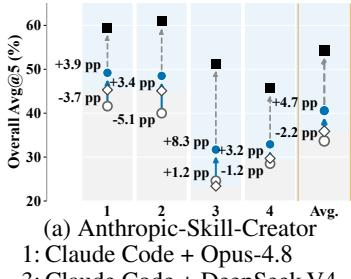

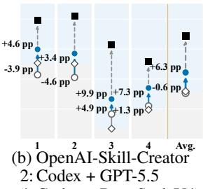  
F<sup>i</sup>gure 1: Pilot Study: Open-world source access improves skill <sub>crea</sub>ti<sub>on</sub> b<sub>u</sub>t d<sub>oes no</sub>t <sub>c</sub>l<sub>ose</sub> th<sub>e gap</sub> t<sub>o</sub> h<sub>uman-cura</sub>t<sub>e</sub>d <sub>s</sub>kill<sub>s</sub>.

Pilot Study. We examine two questions on SkillsBench v1.1 (Li et al. 2026): whether access to open-world sources improves automatic skill creation and whether such access alone closes the gap to human-curated skills? We use two <sub>represen</sub>t<sub>a</sub>ti<sub>ve o</sub>fi<sub>c</sub>i<sub>a</sub>l <sub>s</sub>kill <sub>crea</sub>t<sub>ors re</sub>l<sub>ease</sub>d b<sub>y</sub> A<sub>n</sub>th<sub>rop</sub>i<sub>c</sub> and O<sub>p</sub>enAI (Anthro<sub>p</sub>ic 2026d; O<sub>p</sub>enAI 2026a). Each creator b<sub>u</sub>ild<sub>s s</sub>kill<sub>s</sub> f<sub>or</sub> th<sub>e same</sub> t<sub>as</sub>k<sub>s w</sub>ith <sub>an</sub>d <sub>w</sub>ith<sub>ou</sub>t <sub>we</sub>b <sub>access,</sub> <sub>an</sub>d th<sub>e resu</sub>lti<sub>ng s</sub>kill<sub>s are execu</sub>t<sub>e</sub>d b<sub>y</sub> th<sub>e same</sub> d<sub>owns</sub>t<sub>ream</sub> a<sub>g</sub>ents (as in Fi<sub>g</sub>ure 1). Without web access, the <sub>g</sub>enerated <sub>s</sub>kill<sub>s per</sub>f<sub>orm</sub> 1<sub>.</sub>4 <sub>percen</sub>t<sub>age po</sub>i<sub>n</sub>t<sub>s</sub> b<sub>e</sub>l<sub>ow no-s</sub>kill <sub>execu</sub>ti<sub>on</sub> <sub>on average across</sub> f<sub>our agen</sub>t<sub>–mo</sub>d<sub>e</sub>l <sub>con</sub>fi<sub>gura</sub>ti<sub>ons.</sub> With <sub>we</sub>b <sub>access, every con</sub>fi<sub>gura</sub>ti<sub>on</sub> i<sub>mproves</sub> b<sub>y</sub> 6<sub>.</sub>9 <sub>po</sub>i<sub>n</sub>t<sub>s on</sub> <sub>average over</sub> it<sub>s w</sub>ith<sub>ou</sub>t<sub>-we</sub>b <sub>coun</sub>t<sub>erpar</sub>t <sub>an</sub>d b<sub>y</sub> 5<sub>.</sub>5 <sub>po</sub>i<sub>n</sub>t<sub>s</sub> <sub>over no-s</sub>kill <sub>execu</sub>ti<sub>on.</sub> H<sub>owever,</sub> th<sub>e s</sub>t<sub>ronger we</sub>b<sub>-groun</sub>d<sub>e</sub>d <sub>crea</sub>t<sub>or rema</sub>i<sub>ns a</sub>b<sub>ou</sub>t 14 <sub>po</sub>i<sub>n</sub>t<sub>s</sub> b<sub>e</sub>hi<sub>n</sub>d h<sub>uman-cura</sub>t<sub>e</sub>d <sub>s</sub>kill<sub>s.</sub> Th<sub>ese resu</sub>lt<sub>s s</sub>h<sub>ow</sub> th<sub>a</sub>t <sub>open-wor</sub>ld <sub>sources are</sub> b<sub>ene</sub>fi<sub>c</sub>i<sub>a</sub>l b<sub>u</sub>t i<sub>nsu</sub>fi<sub>c</sub>i<sub>en</sub>t f<sub>or re</sub>li<sub>a</sub>bl<sub>e s</sub>kill <sub>crea</sub>ti<sub>on, mo</sub>ti<sub>va</sub>ti<sub>ng</sub> th<sub>e cen</sub>t<sub>ra</sub>l <sub>ques</sub>ti<sub>on o</sub>f thi<sub>s wor</sub>k<sub>:</sub> h<sub>ow can re</sub>li<sub>a</sub>bl<sub>e agen</sub>t <sub>s</sub>kill<sub>s</sub> b<sub>e crea</sub>t<sub>e</sub>d f<sub>rom</sub> <sub>open-wor</sub>ld <sub>sources</sub>? E<sub>ven</sub> <sub>w</sub>ith <sub>we</sub>b <sub>groun</sub>di<sub>ng,</sub> th<sub>e</sub> b<sub>e</sub>tt<sub>er we</sub>b<sub>-access crea</sub>t<sub>or rema</sub>i<sub>ns a</sub>b<sub>ou</sub>t 14 <sub>po</sub>i<sub>n</sub>t<sub>s</sub> b<sub>e</sub>hi<sub>n</sub>d human-curated skills, motivating our diagnosis: open-world sources are informative but not skill-ready as they contain implicit decisions, local examples, and context-dependent practices rather than validated reusable procedures. Specifi-<sub>ca</sub>ll<sub>y,</sub> <sub>conver</sub>ti<sub>ng</sub> <sub>open-wor</sub>ld <sub>sources</sub> i<sub>n</sub>t<sub>o</sub> <sub>reusa</sub>bl<sub>e</sub> <sub>s</sub>kill<sub>s</sub> i<sub>s</sub> challen<sub>g</sub>in<sub>g</sub> for two reasons (as illustrated in Fi<sub>g</sub>ure 2).

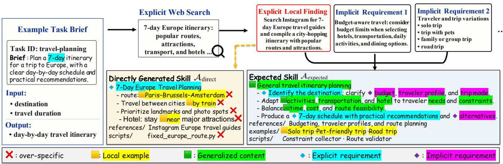  
F<sup>i</sup>gure 2: Example illustrating why open-world skill creation is non-trivial: ① task briefs underspecify implicit requirements, and ② directly adopting open-world findings without scope justification may lead to over-specific practices being mistaken for reusable instructions.

• Task briefs under-specify operational requirements. A task brief typically states the immediate objective but l<sub>eaves</sub> i<sub>mp</sub>li<sub>c</sub>it th<sub>e requ</sub>i<sub>remen</sub>t<sub>s,</sub> f<sub>a</sub>il<sub>ure mo</sub>d<sub>es, an</sub>d <sub>oper-</sub> <sub>a</sub>ti<sub>ona</sub>l b<sub>oun</sub>d<sub>ar</sub>i<sub>es nee</sub>d<sub>e</sub>d f<sub>or a reusa</sub>bl<sub>e s</sub>kill<sub>.</sub> U<sub>s</sub>i<sub>ng</sub> th<sub>e</sub> b<sub>r</sub>i<sub>e</sub>f di<sub>rec</sub>tl<sub>y as a re</sub>t<sub>r</sub>i<sub>eva</sub>l <sub>query preserves</sub> th<sub>ese</sub> bli<sub>n</sub>d <sub>spo</sub>t<sub>s.</sub> I<sub>n</sub>di<sub>v</sub>id<sub>ua</sub>l <sub>sources are a</sub>l<sub>so organ</sub>i<sub>ze</sub>d <sub>aroun</sub>d th<sub>e</sub>i<sub>r</sub> own subjects rather than around the complete target capability. Thus, reliable skill creation must discover missing requirements beyond the briefbefore acquiring evidence.

• Open-world findings do not justify their reusable scope. A <sub>source-spec</sub>ifi<sub>c</sub> fi<sub>n</sub>di<sub>ng o</sub>ft<sub>en m</sub>i<sub>xes a reusa</sub>bl<sub>e prac</sub>ti<sub>ce</sub> <sub>w</sub>ith l<sub>oca</sub>l d<sub>e</sub>t<sub>a</sub>il<sub>s, suc</sub>h <sub>as</sub> h<sub>ar</sub>d<sub>co</sub>d<sub>e</sub>d <sub>parame</sub>t<sub>ers, pre</sub>f<sub>erre</sub>d t<sub>oo</sub>l<sub>s,</sub> fi<sub>xe</sub>d i<sub>npu</sub>t<sub>s, or env</sub>i<sub>ronmen</sub>t<sub>-spec</sub>ifi<sub>c assump</sub>ti<sub>ons.</sub> The single occurrence is insuficient to justify promoting the entire finding into a persistent instruction. The skill creation therefore needs to determine scope across cases, promoting consistent practices into general instructions, retaining context-bound ones as scoped examples, and excluding candidates whose support is weak or conflicting.

W<sub>e</sub> f<sub>ormu</sub>l<sub>a</sub>t<sub>e</sub> th<sub>e open-wor</sub>ld <sub>s</sub>kill <sub>crea</sub>ti<sub>on as a source-</sub> grounded procedure-admission problem, i.e., given an under-<sub>spec</sub>ifi<sub>e</sub>d <sub>s</sub>kill b<sub>r</sub>i<sub>e</sub>f <sub>an</sub>d <sub>a se</sub>t <sub>o</sub>f h<sub>e</sub>t<sub>erogeneous sources,</sub> th<sub>e</sub> <sub>s</sub>kill <sub>crea</sub>t<sub>or mus</sub>t fi<sub>rs</sub>t <sub>recover a</sub>b<sub>sen</sub>t <sub>requ</sub>i<sub>remen</sub>t<sub>s</sub> f<sub>rom</sub> th<sub>e</sub> b<sub>r</sub>i<sub>e</sub>f <sub>an</sub>d th<sub>en</sub> d<sub>ec</sub>id<sub>e w</sub>h<sub>e</sub>th<sub>er eac</sub>h <sub>can</sub>did<sub>a</sub>t<sub>e</sub> i<sub>s</sub> li<sub>cense</sub>d <sub>as</sub> <sub>a reusa</sub>bl<sub>e</sub> i<sub>ns</sub>t<sub>ruc</sub>ti<sub>on, rema</sub>i<sub>ns a scope</sub>d <sub>examp</sub>l<sub>e, or s</sub>h<sub>ou</sub>ld b<sub>e exc</sub>l<sub>u</sub>d<sub>e</sub>d<sub>.</sub> T<sub>o a</sub>dd<sub>ress</sub> th<sub>ese c</sub>h<sub>a</sub>ll<sub>enges, we propose</sub> S<sub>kil-</sub> <sub>l</sub>A<sub>lchemy, a</sub> f<sub>ramewor</sub>k th<sub>a</sub>t t<sub>rans</sub>f<sub>orms an un</sub>d<sub>erspec</sub>ifi<sub>e</sub>d d<sub>escr</sub>i<sub>p</sub>ti<sub>on o</sub>f <sub>a</sub> t<sub>arge</sub>t t<sub>as</sub>k <sub>or capa</sub>bilit<sub>y</sub> i<sub>n</sub>t<sub>o an agen</sub>t<sub>-usa</sub>bl<sub>e</sub> <sub>s</sub>kill<sub>.</sub> It di<sub>scovers</sub> i<sub>mp</sub>li<sub>c</sub>it <sub>requ</sub>i<sub>remen</sub>t<sub>s an</sub>d <sub>a</sub>d<sub>m</sub>it<sub>s</sub> i<sub>ns</sub>t<sub>ruc-</sub> tions only when open-world evidence justifies their scope. S<sub>kill</sub>A<sub>lchemy</sub> i<sub>s</sub> <sub>no</sub>t <sub>mere</sub>l<sub>y</sub> <sub>a</sub> <sub>re</sub>t<sub>r</sub>i<sub>eva</sub>l <sub>p</sub>i<sub>pe</sub>li<sub>ne,</sub> b<sub>u</sub>t <sub>an</sub> admission-centered framework operates in three stages. (i) Implicit Requirement Discovery (§3.3) lifts the brief to its <sub>un</sub>d<sub>er</sub>l<sub>y</sub>i<sub>ng capa</sub>bilit<sub>y,</sub> id<sub>en</sub>tifi<sub>es om</sub>itt<sub>e</sub>d <sub>opera</sub>ti<sub>ona</sub>l di<sub>men-</sub> sions, and converts them into focused research questions. (ii) Grounded Procedure Admission (§3.4) aggregates relevant fi<sub>n</sub>di<sub>ngs an</sub>d <sub>a</sub>d<sub>m</sub>it<sub>s a can</sub>did<sub>a</sub>t<sub>e as a reusa</sub>bl<sub>e</sub> i<sub>ns</sub>t<sub>ruc</sub>ti<sub>on on</sub>l<sub>y</sub> when the evidence supports both the action and its scope. (iii) Skill Package Compilation (§3.5) organizes admitted proced<sub>ures</sub> <sub>an</sub>d <sub>scope</sub>d <sub>examp</sub>l<sub>es</sub> i<sub>n</sub>t<sub>o</sub> <sub>an</sub> i<sub>ns</sub>t<sub>a</sub>ll<sub>a</sub>bl<sub>e</sub> <sub>s</sub>kill <sub>pac</sub>k<sub>age</sub> <sub>us</sub>i<sub>ng</sub> th<sub>e s</sub>kill <sub>grammar an</sub>d t<sub>as</sub>k<sub>-re</sub>l<sub>evan</sub>t <sub>exemp</sub>l<sub>ars.</sub>

O<sub>ur ma</sub>i<sub>n con</sub>t<sub>r</sub>ib<sub>u</sub>ti<sub>ons are summar</sub>i<sub>ze</sub>d <sub>as</sub> f<sub>o</sub>ll<sub>ows.</sub>

• We formulate o<sub>p</sub>en-world skill creation as a source-<sub>groun</sub>d<sub>e</sub>d <sub>proce</sub>d<sub>ure-a</sub>d<sub>m</sub>i<sub>ss</sub>i<sub>on pro</sub>bl<sub>em,</sub> id<sub>en</sub>tif<sub>y</sub>i<sub>ng</sub> t<sub>wo</sub> k<sub>ey c</sub>h<sub>a</sub>ll<sub>enges</sub> i<sub>n conver</sub>ti<sub>ng an un</sub>d<sub>erspec</sub>ifi<sub>e</sub>d b<sub>r</sub>i<sub>e</sub>f <sub>an</sub>d h<sub>e</sub>t<sub>erogeneous sources</sub> i<sub>n</sub>t<sub>o a reusa</sub>bl<sub>e s</sub>kill<sub>:</sub> i<sub>mp</sub>li<sub>c</sub>it <sub>re-</sub> quirement discovery and procedure-scope justification.

• We <sub>p</sub>ro<sub>p</sub>ose SkillAlchemy<sub>,</sub> a skill-creation framework th<sub>a</sub>t t<sub>urns</sub> i<sub>mp</sub>li<sub>c</sub>it <sub>requ</sub>i<sub>remen</sub>t<sub>s</sub> i<sub>n</sub> b<sub>r</sub>i<sub>e</sub>f<sub>s</sub> i<sub>n</sub>t<sub>o</sub> f<sub>ocuse</sub>d t<sub>ar-</sub> <sub>ge</sub>t<sub>s</sub> f<sub>or open-wor</sub>ld k<sub>now</sub>l<sub>e</sub>d<sub>ge acqu</sub>i<sub>s</sub>iti<sub>on an</sub>d d<sub>e</sub>t<sub>erm</sub>i<sub>nes</sub> <sub>w</sub>h<sub>e</sub>th<sub>er source</sub> fi<sub>n</sub>di<sub>ngs warran</sub>t <sub>genera</sub>l i<sub>ns</sub>t<sub>ruc</sub>ti<sub>ons,</sub> l<sub>oca</sub>l <sub>examp</sub>l<sub>es, or exc</sub>l<sub>us</sub>i<sub>ons o</sub>f <sub>an</sub> i<sub>ns</sub>t<sub>a</sub>ll<sub>a</sub>bl<sub>e s</sub>kill <sub>pac</sub>k<sub>age.</sub>

• We evaluate SkillAlchemy over 87 tasks from Skills-B<sub>ench across</sub> f<sub>our agen</sub>t<sub>–mo</sub>d<sub>e</sub>l <sub>con</sub>fi<sub>gura</sub>ti<sub>ons.</sub> O<sub>ur</sub> f<sub>rame-</sub> <sub>wo</sub>rk im<sub>p</sub>r<sub>oves</sub> <sub>pass</sub> r<sub>a</sub>t<sub>e</sub> b<sub>y</sub> 19<sub>.</sub>9 <sub>pe</sub>r<sub>ce</sub>nt<sub>age</sub> <sub>po</sub>int<sub>s</sub> <sub>ove</sub>r <sub>no-s</sub>kill <sub>execu</sub>ti<sub>on an</sub>d b<sub>y</sub> 8<sub>.</sub>6 <sub>percen</sub>t<sub>age po</sub>i<sub>n</sub>t<sub>s over</sub> th<sub>e</sub> <sub>s</sub>t<sub>ronges</sub>t <sub>au</sub>t<sub>oma</sub>ti<sub>c s</sub>kill<sub>-crea</sub>ti<sub>on</sub> b<sub>ase</sub>li<sub>ne, compara</sub>bl<sub>e</sub> t<sub>o</sub> th<sub>e</sub> h<sub>uman-cura</sub>t<sub>e</sub>d <sub>s</sub>kill<sub>s.</sub> Abl<sub>a</sub>ti<sub>on s</sub>t<sub>u</sub>di<sub>es</sub> f<sub>ur</sub>th<sub>er ex-</sub> am<sup>i</sup>ne re<sub>q</sub>u<sup>i</sup>rement covera<sub>g</sub>e an<sup>d</sup> unsu<sub>pp</sub>orte<sup>d</sup> <sub>p</sub>roce<sup>d</sup>ure <sub>a</sub>d<sub>m</sub>i<sub>ss</sub>i<sub>on.</sub>

## 2 Related Work

Skills for Agents. Agent skills are typically treated as <sub>reusa</sub>bl<sub>e proce</sub>d<sub>ura</sub>l <sub>ar</sub>tif<sub>ac</sub>t<sub>s ra</sub>th<sub>er</sub> th<sub>an or</sub>di<sub>nary promp</sub>t<sub>s</sub> or atomic tool calls (Jian<sub>g</sub> et al. 2026; Zhou et al. 2026a; Vercel 2026). SkillAct (Liu et al. 2024) shows that addin<sub>g</sub> <sub>reusa</sub>bl<sub>e s</sub>kill <sub>a</sub>b<sub>s</sub>t<sub>rac</sub>ti<sub>ons</sub> t<sub>o ex</sub>i<sub>s</sub>ti<sub>ng promp</sub>ti<sub>ng me</sub>th<sub>o</sub>d<sub>s</sub> (e.g., ReAct (Yao et al. 2023)) improves agent performance on interactive tasks such as ALFWorld (Shridhar et al. 2021). Skill<sub>s-</sub>i<sub>n-</sub>th<sub>e-</sub>Wild f<sub>ur</sub>th<sub>er exam</sub>i<sub>nes w</sub>h<sub>e</sub>th<sub>er agen</sub>t<sub>s can e</sub>f<sub>ec-</sub> ti<sub>ve</sub>l<sub>y</sub> l<sub>everage</sub> <sub>s</sub>kill<sub>s</sub> i<sub>n</sub> <sub>rea</sub>li<sub>s</sub>ti<sub>c</sub> <sub>se</sub>tti<sub>ngs,</sub> <sub>w</sub>h<sub>ere</sub> <sub>use</sub>f<sub>u</sub>l <sub>s</sub>kill<sub>s</sub> <sub>nee</sub>d t<sub>o</sub> b<sub>e</sub> <sub>re</sub>t<sub>r</sub>i<sub>eve</sub>d f<sub>rom</sub> <sub>a</sub> l<sub>arge</sub> <sub>an</sub>d <sub>no</sub>i<sub>sy</sub> <sub>co</sub>ll<sub>ec</sub>ti<sub>on</sub> <sub>ra</sub>th<sub>er</sub> than bein<sub>g</sub> manuall<sub>y</sub> curated (Liu et al. 2026a). To<sub>g</sub>ether, th<sub>ese s</sub>t<sub>u</sub>di<sub>es es</sub>t<sub>a</sub>bli<sub>s</sub>h <sub>an ar</sub>tif<sub>ac</sub>t<sub>-cen</sub>t<sub>r</sub>i<sub>c v</sub>i<sub>ew o</sub>f th<sub>e s</sub>kill<sub>s</sub> lif<sub>ecyc</sub>l<sub>e,</sub> i<sub>n w</sub>hi<sub>c</sub>h <sub>s</sub>kill<sub>s can</sub> b<sub>e cons</sub>t<sub>ruc</sub>t<sub>e</sub>d<sub>, represen</sub>t<sub>e</sub>d<sub>,</sub> <sub>re</sub>t<sub>r</sub>i<sub>eve</sub>d<sub>,</sub> i<sub>nvo</sub>k<sub>e</sub>d<sub>, an</sub>d <sub>eva</sub>l<sub>ua</sub>t<sub>e</sub>d<sub>.</sub> Withi<sub>n suc</sub>h <sub>a</sub> lif<sub>ecyc</sub>l<sub>e,</sub> <sub>s</sub>kill <sub>cons</sub>t<sub>ruc</sub>ti<sub>on</sub> d<sub>e</sub>t<sub>erm</sub>i<sub>nes w</sub>h<sub>a</sub>t <sub>proce</sub>d<sub>ura</sub>l k<sub>now</sub>l<sub>e</sub>d<sub>ge</sub> i<sub>s</sub> <sub>concep</sub>t<sub>ua</sub>li<sub>ze</sub>d i<sub>n</sub>t<sub>o</sub> th<sub>e repos</sub>it<sub>ory</sub> i<sub>n</sub> th<sub>e</sub> fi<sub>rs</sub>t <sub>p</sub>l<sub>ace,</sub> th<sub>ere</sub>b<sub>y</sub> di<sub>-</sub> <sub>rec</sub>tl<sub>y s</sub>h<sub>ap</sub>i<sub>ng</sub> th<sub>e u</sub>tilit<sub>y o</sub>f <sub>a</sub>ll d<sub>owns</sub>t<sub>ream s</sub>kill <sub>use.</sub> Ali<sub>gne</sub>d <sub>w</sub>ith thi<sub>s</sub> li<sub>ne o</sub>f <sub>researc</sub>h<sub>, our</sub> S<sub>kill</sub>A<sub>lchemy s</sub>t<sub>u</sub>di<sub>es</sub> h<sub>ow</sub> t<sub>o</sub> <sub>pro</sub>d<sub>uce</sub> th<sub>e s</sub>kill <sub>ar</sub>tif<sub>ac</sub>t<sub>s</sub> f<sub>rom open-wor</sub>ld <sub>source ma</sub>t<sub>er</sub>i<sub>a</sub>l<sub>s.</sub>

Skill Creation. Skill creation methods can be categorized by the source of candidate skill content. (i) Human-authored skills. Expert-written or benchmark-provided skills (Li et al. 2026) encode human <sub>p</sub>rocedural knowled<sub>g</sub>e and serve as strong reference artifacts. (ii) Interaction traces based skill creation. Vo<sub>y</sub>a<sub>g</sub>er (Wan<sub>g</sub> et al. 2023) builds an executable skill librar<sub>y</sub> from o<sub>p</sub>en-ended embodied interaction. Ex<sub>p</sub>eL (Zhao et al. 2024) learns reusable lessons from task ex<sub>p</sub>erience without u<sub>p</sub>datin<sub>g</sub> model wei<sub>g</sub>hts. SkillGen (Ma et al. 2026) <sub>syn</sub>th<sub>es</sub>i<sub>zes au</sub>dit<sub>a</sub>bl<sub>e s</sub>kill<sub>s</sub> f<sub>rom success</sub>f<sub>u</sub>l <sub>an</sub>d f<sub>a</sub>il<sub>e</sub>d t<sub>races</sub> and checks their net intervention efect. CoEvoSkills (Zhan<sub>g</sub> et al. 2026b) iterativel<sub>y</sub> evolves multi-file skill <sub>p</sub>acka<sub>g</sub>es usin<sub>g</sub> <sub>surroga</sub>t<sub>e ver</sub>ifi<sub>ca</sub>ti<sub>on an</sub>d <sub>execu</sub>ti<sub>on</sub> f<sub>ee</sub>db<sub>ac</sub>k<sub>.</sub> T<sub>oge</sub>th<sub>er,</sub> th<sub>ese</sub> <sub>me</sub>th<sub>o</sub>d<sub>s s</sub>h<sub>ow</sub> h<sub>ow execu</sub>ti<sub>on recor</sub>d<sub>s can</sub> b<sub>e</sub> t<sub>rans</sub>f<sub>orme</sub>d i<sub>n</sub>t<sub>o reusa</sub>bl<sub>e proce</sub>d<sub>ura</sub>l k<sub>now</sub>l<sub>e</sub>d<sub>ge, w</sub>h<sub>ere</sub> th<sub>e ma</sub>i<sub>n ev</sub>i<sub>-</sub> d<sub>ence comes</sub> f<sub>rom o</sub>b<sub>serve</sub>d <sub>a</sub>tt<sub>emp</sub>t<sub>s,</sub> f<sub>a</sub>il<sub>ures, successes, or</sub> intervention efects. (iii) Broad-source and scafolded skill creation. Oficial skill creation workflows provide general-<sub>purpose</sub> <sub>sca</sub>f<sub>o</sub>ld<sub>s</sub> f<sub>or</sub> <sub>au</sub>th<sub>or</sub>i<sub>ng</sub> <sub>an</sub>d i<sub>mprov</sub>i<sub>ng</sub> <sub>s</sub>kill<sub>s</sub> f<sub>rom</sub> available context (Anthro<sub>p</sub>ic 2026d; O<sub>p</sub>enAI 2026d). O<sub>p</sub>en-Skill (Yan et al. 2026) retrieves documentation, re<sub>p</sub>ositories, <sub>an</sub>d <sub>we</sub>b <sub>resources</sub> t<sub>o</sub> b<sub>u</sub>ild t<sub>rans</sub>f<sub>era</sub>bl<sub>e s</sub>kill<sub>s an</sub>d <sub>ver</sub>ifi<sub>ca</sub>ti<sub>on</sub> anchors. SkillGenBench (Zhou et al. 2026b) benchmarks skill <sub>genera</sub>ti<sub>on</sub> f<sub>rom repos</sub>it<sub>ory- an</sub>d d<sub>ocumen</sub>t<sub>-groun</sub>d<sub>e</sub>d <sub>sources.</sub>

S<sub>kill</sub>A<sub>lchemy</sub> i<sub>s c</sub>l<sub>oses</sub>t t<sub>o</sub> th<sub>e</sub> b<sub>roa</sub>d<sub>-source crea</sub>ti<sub>on</sub> li<sub>ne.</sub> R<sub>a</sub>th<sub>er</sub> th<sub>an</sub> t<sub>rea</sub>ti<sub>ng re</sub>t<sub>r</sub>i<sub>eve</sub>d <sub>or prov</sub>id<sub>e</sub>d <sub>source con</sub>t<sub>en</sub>t <sub>as s</sub>kill <sub>con</sub>t<sub>en</sub>t di<sub>rec</sub>tl<sub>y,</sub> it <sub>per</sub>f<sub>orms</sub> k<sub>now</sub>l<sub>e</sub>d<sub>ge acqu</sub>i<sub>s</sub>iti<sub>on</sub> <sub>an</sub>d <sub>ev</sub>id<sub>ence aggrega</sub>ti<sub>on</sub> b<sub>e</sub>f<sub>ore s</sub>kill <sub>crea</sub>ti<sub>on, w</sub>hi<sub>c</sub>h f<sub>ocus</sub> <sub>comp</sub>l<sub>emen</sub>t<sub>s</sub> h<sub>uman-au</sub>th<sub>ore</sub>d <sub>an</sub>d t<sub>race-</sub>b<sub>ase</sub>d <sub>crea</sub>ti<sub>on.</sub>

## 3 Method

## 3.1 Problem Formulation

We study open-world skill creation, where evidence needed t<sub>o</sub> <sub>cons</sub>t<sub>ruc</sub>t <sub>a</sub> <sub>reusa</sub>bl<sub>e</sub> <sub>s</sub>kill i<sub>s</sub> <sub>no</sub>t <sub>assume</sub>d t<sub>o</sub> b<sub>e</sub> <sub>organ</sub>i<sub>ze</sub>d <sub>as</sub> <sub>a</sub> t<sub>as</sub>k<sub>-comp</sub>l<sub>e</sub>t<sub>e corpus</sub> b<sub>u</sub>t <sub>mus</sub>t b<sub>e</sub> id<sub>en</sub>tifi<sub>e</sub>d <sub>an</sub>d <sub>acqu</sub>i<sub>re</sub>d f<sub>rom</sub> h<sub>e</sub>t<sub>erogeneous sources</sub> $( e . g .$ ., repositories, documents or a<sub>g</sub>ent ex<sub>p</sub>erience) under a s<sub>p</sub>ecified access <sub>p</sub>olic<sub>y</sub>.

Th<sub>e</sub> i<sub>npu</sub>t i<sub>s a</sub> t<sub>up</sub>l<sub>e</sub> $( g , { \mathcal { S } } , { \mathcal { C } } ) \colon ( i )$ <sub>an un</sub>d<sub>erspec</sub>ifi<sub>e</sub>d <sub>s</sub>kill b<sub>r</sub>i<sub>e</sub>f $^ { g , }$ <sub>name</sub>l<sub>y a s</sub>h<sub>or</sub>t <sub>na</sub>t<sub>ura</sub>l<sub>-</sub>l<sub>anguage</sub> d<sub>escr</sub>i<sub>p</sub>ti<sub>on o</sub>f th<sub>e</sub> task or capability the skill should support, (ii) a source-access <sub>spec</sub>ifi<sub>ca</sub>ti<sub>on</sub> $\boldsymbol { \mathcal { S } }$ d<sub>e</sub>fi<sub>n</sub>i<sub>ng perm</sub>itt<sub>e</sub>d <sub>source</sub> t<sub>ypes, re</sub>t<sub>r</sub>i<sub>eva</sub>l <sub>c</sub>h<sub>anne</sub>l<sub>s, an</sub>d <sub>exc</sub>l<sub>us</sub>i<sub>ons</sub> $( e . g .$ ., documentation, repositories, or existin<sub>g</sub> skills), and $( i i i )$ <sub>execu</sub>ti<sub>on an</sub>d <sub>pac</sub>k<sub>ag</sub>i<sub>ng cons</sub>t<sub>ra</sub>i<sub>n</sub>t<sub>s</sub> $\mathcal { C } \left( e . g . \right.$ ., available tools and required artifact structure). A skill creator $\Phi$ <sub>maps</sub> th<sub>ese</sub> i<sub>npu</sub>t<sub>s</sub> t<sub>o</sub> <sub>an</sub> i<sub>ns</sub>t<sub>a</sub>ll<sub>a</sub>bl<sub>e</sub> <sub>s</sub>kill <sub>pac</sub>k<sub>age,</sub>

$$
\begin{array} { r } { \mathcal { A } : = \langle \mathrm { S K I L L } . \mathrm { m d } , \mathcal { X } \rangle = \Phi ( g , S , \mathcal { C } ) , } \end{array}\tag{1}
$$

In this work, the skill <sub>p</sub>acka<sub>g</sub>e A follows the files<sub>y</sub>stembased skill convention centered on SKILL.md and o<sub>p</sub>tionall<sub>y</sub> b<sub>un</sub>dli<sub>ngs</sub> $\mathcal { X } \left( e . g . \right.$ ., references, examples and scripts).

Source-Grounded Procedure Admission. Unlike a docu-<sub>men</sub>t <sub>summar</sub>i<sub>za</sub>ti<sub>on, w</sub>hi<sub>c</sub>h <sub>preserves w</sub>h<sub>a</sub>t th<sub>e sources s</sub>t<sub>a</sub>t<sub>e,</sub> an agent skill must specify reusable procedures: when an i<sub>ns</sub>t<sub>ruc</sub>ti<sub>on</sub> <sub>app</sub>li<sub>es,</sub> <sub>w</sub>h<sub>a</sub>t th<sub>e</sub> <sub>agen</sub>t <sub>s</sub>h<sub>ou</sub>ld d<sub>o</sub> <sub>an</sub>d <sub>pro</sub>d<sub>uce,</sub> <sub>an</sub>d th<sub>e con</sub>diti<sub>ons un</sub>d<sub>er w</sub>hi<sub>c</sub>h it f<sub>a</sub>il<sub>s or</sub> f<sub>a</sub>ll<sub>s ou</sub>t<sub>s</sub>id<sub>e scope.</sub> Th<sub>e</sub> aim of open-world skill creation is therefore not to compress <sub>or summar</sub>i<sub>ze a</sub> fi<sub>xe</sub>d <sub>source co</sub>ll<sub>ec</sub>ti<sub>on</sub> b<sub>u</sub>t t<sub>o acqu</sub>i<sub>re ev</sub>id<sub>ence</sub> <sub>ma</sub>t<sub>er</sub>i<sub>a</sub>l<sub>s un</sub>d<sub>er</sub> $s$ <sub>an</sub>d d<sub>ec</sub>id<sub>e w</sub>h<sub>e</sub>th<sub>er eac</sub>h <sub>can</sub>did<sub>a</sub>t<sub>e proce-</sub> d<sub>ure s</sub>h<sub>ou</sub>ld b<sub>e a</sub>d<sub>m</sub>itt<sub>e</sub>d <sub>as a genera</sub>l i<sub>ns</sub>t<sub>ruc</sub>ti<sub>on, re</sub>t<sub>a</sub>i<sub>ne</sub>d <sub>as</sub> a scoped example or notes, or just be excluded from the skill.

## 3.2 Framework Overview

Design Rationale. Existing oficial general-purpose skill cre-<sub>a</sub>ti<sub>on</sub> <sub>wor</sub>kfl<sub>ows</sub> t<sub>yp</sub>i<sub>ca</sub>ll<sub>y</sub> <sub>au</sub>th<sub>or</sub> <sub>a</sub> <sub>s</sub>kill di<sub>rec</sub>tl<sub>y</sub> f<sub>rom</sub> th<sub>e</sub> t<sub>as</sub>k brief and available context (Anthro<sub>p</sub>ic 2026d; O<sub>p</sub>enAI 2026d). Wh<sub>en</sub> th<sub>e</sub> b<sub>r</sub>i<sub>e</sub>f i<sub>s</sub> <sub>un</sub>d<sub>erspec</sub>ifi<sub>e</sub>d<sub>,</sub> thi<sub>s</sub> <sub>process</sub> <sub>en</sub>t<sub>ang</sub>l<sub>es</sub> th<sub>ree</sub> distinct decisions, i.e., what omitted by the brief should be i<sub>nves</sub>ti<sub>ga</sub>t<sub>e</sub>d<sub>,</sub> <sub>w</sub>h<sub>e</sub>th<sub>er</sub> <sub>a</sub> <sub>source-</sub>d<sub>er</sub>i<sub>ve</sub>d <sub>can</sub>did<sub>a</sub>t<sub>e</sub> i<sub>s</sub> <sub>suppor</sub>t<sub>e</sub>d b<sub>eyon</sub>d it<sub>s</sub> l<sub>oca</sub>l <sub>con</sub>t<sub>ex</sub>t<sub>, an</sub>d h<sub>ow</sub> th<sub>e a</sub>d<sub>m</sub>itt<sub>e</sub>d <sub>con</sub>t<sub>en</sub>t <sub>s</sub>h<sub>ou</sub>ld b<sub>e expresse</sub>d i<sub>n</sub> th<sub>e</sub> fi<sub>na</sub>l <sub>ar</sub>tif<sub>ac</sub>t<sub>.</sub> S<sub>kill</sub>A<sub>lchemy separa</sub>t<sub>es</sub> th<sub>ese</sub> d<sub>ec</sub>i<sub>s</sub>i<sub>ons exp</sub>li<sub>c</sub>it <sub>an</sub>d <sub>reso</sub>l<sub>ves</sub> th<sub>em sequen</sub>ti<sub>a</sub>ll<sub>y.</sub> It fi<sub>rs</sub>t di<sub>scovers</sub> i<sub>mp</sub>li<sub>c</sub>it <sub>requ</sub>i<sub>remen</sub>t<sub>s an</sub>d <sub>acqu</sub>i<sub>res ev</sub>id<sub>ence</sub> f<sub>or</sub> th<sub>em,</sub> th<sub>en</sub> d<sub>e</sub>t<sub>erm</sub>i<sub>nes w</sub>hi<sub>c</sub>h <sub>can</sub>did<sub>a</sub>t<sub>e proce</sub>d<sub>ures are</sub> <sub>suppor</sub>t<sub>e</sub>d <sub>a</sub>t <sub>w</sub>hi<sub>c</sub>h <sub>scope, an</sub>d fi<sub>na</sub>ll<sub>y comp</sub>il<sub>es</sub> th<sub>e a</sub>d<sub>m</sub>itt<sub>e</sub>d <sub>con</sub>t<sub>en</sub>t <sub>as an</sub> i<sub>ns</sub>t<sub>a</sub>ll<sub>a</sub>bl<sub>e s</sub>kill <sub>pac</sub>k<sub>age.</sub> Thi<sub>s separa</sub>ti<sub>on</sub> i<sub>s</sub> th<sub>e</sub> <sub>cen</sub>t<sub>ra</sub>l d<sub>es</sub>i<sub>gn c</sub>h<sub>o</sub>i<sub>ce o</sub>f <sub>our</sub> f<sub>ramewor</sub>k<sub>.</sub>

Three-Stage Creation Process. Figure 3 illustrates the f<sub>o</sub>ll<sub>ow</sub>i<sub>ng</sub> th<sub>ree-s</sub>t<sub>age wor</sub>kfl<sub>ow</sub> th<sub>roug</sub>h <sub>a runn</sub>i<sub>ng examp</sub>l<sub>e.</sub>

• Stage 1: implicit requirement discovery identifies behavior-<sub>re</sub>l<sub>evan</sub>t di<sub>s</sub>ti<sub>nc</sub>ti<sub>ons om</sub>itt<sub>e</sub>d i<sub>n</sub> b<sub>r</sub>i<sub>e</sub>f<sub>s,</sub> t<sub>urns</sub> th<sub>em</sub> i<sub>n</sub>t<sub>o</sub> f<sub>o-</sub> <sub>cuse</sub>d <sub>researc</sub>h <sub>ques</sub>ti<sub>ons, an</sub>d <sub>acqu</sub>i<sub>res s</sub>t<sub>ruc</sub>t<sub>ure</sub>d fi<sub>n</sub>di<sub>ngs.</sub>

• Stage 2: evidence-grounded procedure admission a<sub>gg</sub>re-<sub>ga</sub>t<sub>es</sub> fi<sub>n</sub>di<sub>ngs</sub> th<sub>a</sub>t <sub>a</sub>dd<sub>ress</sub> th<sub>e same s</sub>it<sub>ua</sub>ti<sub>ons, ma</sub>k<sub>es con-</sub> fli<sub>c</sub>t<sub>s</sub> <sub>an</sub>d <sub>m</sub>i<sub>ss</sub>i<sub>ng</sub> <sub>suppor</sub>t <sub>exp</sub>li<sub>c</sub>it<sub>,</sub> <sub>an</sub>d di<sub>s</sub>till<sub>s</sub> <sub>suppor</sub>t<sub>e</sub>d <sub>con</sub>t<sub>en</sub>t i<sub>n</sub>t<sub>o genera</sub>l i<sub>ns</sub>t<sub>ruc</sub>ti<sub>ons or scope</sub>d <sub>examp</sub>l<sub>es.</sub>

• Stage 3: skill package compilation renders admitted in-<sub>s</sub>t<sub>ruc</sub>ti<sub>ons</sub> <sub>an</sub>d <sub>scope</sub>d <sub>examp</sub>l<sub>es</sub> <sub>as</sub> <sub>an</sub> i<sub>ns</sub>t<sub>a</sub>ll<sub>a</sub>bl<sub>e</sub> <sub>pac</sub>k<sub>age</sub> <sub>un</sub>d<sub>er a corpus-</sub>d<sub>er</sub>i<sub>ve</sub>d <sub>s</sub>kill <sub>grammar.</sub>

W<sub>r</sub>iti<sub>ng</sub> $\Phi _ { 1 } , \Phi _ { 2 } , \Phi _ { 3 }$ for the three stages, they jointly com-<sub>p</sub>ose the whole o<sub>p</sub>en-world skill creation <sub>p</sub>i<sub>p</sub>eline of Eq. (1),

$$
( g , { \cal S } ) \stackrel { \Phi _ { 1 } } { \longrightarrow } ( Q , { \cal F } ) \stackrel { \Phi _ { 2 } } { \longrightarrow } ( R ^ { g } , R ^ { e } ) \stackrel { \Phi _ { 3 } } { \longrightarrow } { \cal A } .\tag{2}
$$

<sub>w</sub>h<sub>ere</sub> $Q$ i<sub>s</sub> th<sub>e se</sub>t <sub>o</sub>f <sub>researc</sub>h <sub>ques</sub>ti<sub>ons,</sub> $F$ th<sub>e s</sub>t<sub>ruc</sub>t<sub>ure</sub>d fi<sub>n</sub>di<sub>ngs,</sub> $R ^ { g }$ th<sub>e a</sub>d<sub>m</sub>itt<sub>e</sub>d <sub>genera</sub>l i<sub>ns</sub>t<sub>ruc</sub>ti<sub>ons, an</sub>d $R ^ { e }$ th<sub>e</sub> <sub>re</sub>t<sub>a</sub>i<sub>ne</sub>d <sub>scope</sub>d <sub>examp</sub>l<sub>es.</sub> C<sub>an</sub>did<sub>a</sub>t<sub>es a</sub>d<sub>m</sub>itt<sub>e</sub>d t<sub>o ne</sub>ith<sub>er</sub> $R ^ { g }$ nor $R ^ { e }$ <sub>are</sub> <sub>exc</sub>l<sub>u</sub>d<sub>e</sub>d<sub>.</sub> Th<sub>ese</sub> i<sub>n</sub>t<sub>erme</sub>di<sub>a</sub>t<sub>e</sub> <sub>ou</sub>t<sub>pu</sub>t<sub>s</sub> <sub>are</sub> <sub>preserve</sub>d <sub>as</sub> <sub>exp</sub>li<sub>c</sub>it <sub>provenance</sub> <sub>recor</sub>d<sub>s,</sub> <sub>w</sub>h<sub>ereas</sub> $R ^ { g }$ <sub>an</sub>d $R ^ { e }$ <sub>are</sub> <sub>comp</sub>il<sub>e</sub>d i<sub>n</sub>t<sub>o</sub> th<sub>e</sub> <sub>s</sub>kill <sub>con</sub>t<sub>en</sub>t <sub>un</sub>d<sub>er</sub> $\mathcal { C } .$ <sub>.</sub> Th<sub>e</sub> f<sub>o</sub>ll<sub>ow</sub>i<sub>ng</sub> th<sub>ree</sub> <sub>su</sub>b<sub>sec</sub>ti<sub>ons</sub> d<sub>escr</sub>ib<sub>e</sub> th<sub>ese</sub> <sub>crea</sub>ti<sub>on</sub> <sub>s</sub>t<sub>ages</sub> <sub>su</sub>b<sub>sequen</sub>tl<sub>y.</sub>

## 3.3 Implicit Requirement Discovery

Operational Framing. A task brief may describe a requested i<sub>ns</sub>t<sub>ance,</sub> <sub>w</sub>h<sub>ereas</sub> <sub>a</sub> <sub>reusa</sub>bl<sub>e</sub> <sub>s</sub>kill <sub>mus</sub>t <sub>opera</sub>t<sub>e</sub> <sub>over</sub> <sub>a</sub> f<sub>am</sub>il<sub>y</sub> of instances. Given a brief g and source-access specification $\mathcal { S } , \Phi _ { 1 }$ <sup>ma</sup>p<sup>s</sup> $g$ t<sub>o an opera</sub>ti<sub>ona</sub>l f<sub>rame</sub> $L _ { g } = { \mathrm { F r a } } { \mathrm { { i n e } } } ( g )$ <sub>.</sub> Th<sub>e</sub> f<sub>rame</sub> t<sub>rea</sub>t<sub>s</sub> b<sub>r</sub>i<sub>e</sub>f<sub>-spec</sub>ifi<sub>c</sub> <sub>va</sub>l<sub>ues</sub> <sub>as</sub> <sub>can</sub>did<sub>a</sub>t<sub>e</sub> <sub>opera</sub>ti<sub>ona</sub>l f<sub>ac</sub>t<sub>ors an</sub>d <sub>exposes</sub> th<sub>e proce</sub>d<sub>ura</sub>l d<sub>ec</sub>i<sub>s</sub>i<sub>ons</sub> l<sub>e</sub>ft <sub>unspec</sub>ifi<sub>e</sub>d f<sub>or</sub> <sub>pro</sub>d<sub>uc</sub>i<sub>ng</sub> th<sub>e</sub> <sub>reques</sub>t<sub>e</sub>d <sub>ou</sub>t<sub>pu</sub>t<sub>,</sub> h<sub>an</sub>dli<sub>ng</sub> f<sub>a</sub>il<sub>ures,</sub> <sub>an</sub>d <sub>ver</sub>if<sub>y</sub>i<sub>ng</sub> th<sub>e</sub> <sub>resu</sub>lt<sub>.</sub> F<sub>or</sub> <sub>examp</sub>l<sub>e,</sub> <sub>a</sub> b<sub>r</sub>i<sub>e</sub>f <sub>reques</sub>ti<sub>ng</sub> “<sub>a</sub> 7<sub>-</sub>d<sub>ay</sub> f<sub>am</sub>il<sub>y</sub> t<sub>r</sub>i<sub>p</sub> t<sub>o</sub> E<sub>urope</sub>” <sub>con</sub>t<sub>a</sub>i<sub>ns</sub> i<sub>ns</sub>t<sub>ance-spec</sub>ifi<sub>c</sub> <sub>va</sub>l<sub>ues</sub> <sub>suc</sub>h as 7-day, family trip, and Europe. The operational frame instead represents them as candidate factors such as duration, traveler type, and destination, rather than hard-coding them i<sub>n</sub>t<sub>o a reusa</sub>bl<sub>e proce</sub>d<sub>ure.</sub> Th<sub>e</sub> f<sub>rame</sub> th<sub>ere</sub>f<sub>ore proposes</sub> <sub>opera</sub>ti<sub>ona</sub>l f<sub>ac</sub>t<sub>ors</sub> f<sub>or</sub> i<sub>nves</sub>ti<sub>ga</sub>ti<sub>on ra</sub>th<sub>er</sub> th<sub>an</sub> t<sub>rea</sub>ti<sub>ng</sub> th<sub>em</sub> <sub>as requ</sub>i<sub>remen</sub>t<sub>s an</sub>d <sub>a</sub> f<sub>ac</sub>t<sub>or</sub> b<sub>ecomes an</sub> i<sub>mp</sub>li<sub>c</sub>it <sub>opera</sub>ti<sub>ona</sub>l f<sub>ac</sub>t<sub>or on</sub>l<sub>y w</sub>h<sub>en acqu</sub>i<sub>re</sub>d <sub>ev</sub>id<sub>ence s</sub>h<sub>ows</sub> th<sub>a</sub>t <sub>vary</sub>i<sub>ng</sub> it <sub>c</sub>h<sub>anges proce</sub>d<sub>ura</sub>l b<sub>e</sub>h<sub>av</sub>i<sub>or.</sub>

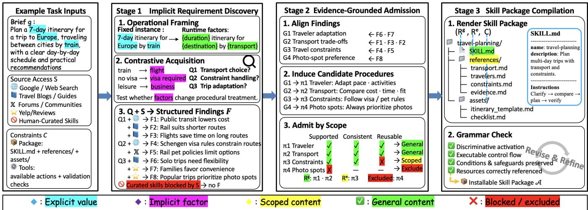  
F<sup>i</sup>gure 3: Overview of SkillAlchemy: $\Phi _ { 1 }$ <sub>conver</sub>t<sub>s</sub> <sub>an</sub> <sub>un</sub>d<sub>erspec</sub>ifi<sub>e</sub>d b<sub>r</sub>i<sub>e</sub>f i<sub>n</sub>t<sub>o</sub> f<sub>ocuse</sub>d <sub>ques</sub>ti<sub>ons</sub> <sub>an</sub>d <sub>s</sub>t<sub>ruc</sub>t<sub>ure</sub>d fi<sub>n</sub>di<sub>ngs,</sub> $\Phi _ { 2 }$ i<sub>n</sub>d<sub>uces</sub> <sub>can</sub>did<sub>a</sub>t<sub>e</sub> <sub>proce</sub>d<sub>ures</sub> <sub>an</sub>d <sub>a</sub>d<sub>m</sub>it<sub>s</sub> th<sub>em</sub> <sub>v</sub>i<sub>a</sub> th<sub>e</sub> <sub>ev</sub>id<sub>ence-suppor</sub>t<sub>e</sub>d <sub>scope,</sub> <sub>an</sub>d $\Phi _ { 3 }$ <sub>comp</sub>il<sub>es</sub> th<sub>e</sub> <sub>a</sub>d<sub>m</sub>itt<sub>e</sub>d <sub>con</sub>t<sub>en</sub>t i<sub>n</sub>t<sub>o</sub> <sub>an</sub> <sub>agen</sub>t <sub>s</sub>kill <sub>pac</sub>k<sub>age.</sub>

Contrastive Evidence Acquisition. Directly searching with th<sub>e or</sub>i<sub>g</sub>i<sub>na</sub>l b<sub>r</sub>i<sub>e</sub>f t<sub>en</sub>d<sub>s</sub> t<sub>o re</sub>t<sub>r</sub>i<sub>eve repea</sub>t<sub>e</sub>d <sub>ev</sub>id<sub>ence a</sub>b<sub>ou</sub>t th<sub>e same</sub> l<sub>oca</sub>l i<sub>ns</sub>t<sub>ance, w</sub>h<sub>ereas open-en</sub>d<sub>e</sub>d <sub>requ</sub>i<sub>remen</sub>t <sub>expans</sub>i<sub>on may</sub> i<sub>n</sub>t<sub>ro</sub>d<sub>uce many con</sub>diti<sub>ons unre</sub>l<sub>a</sub>t<sub>e</sub>d t<sub>o s</sub>kill b<sub>e</sub>h<sub>av</sub>i<sub>or.</sub> Th<sub>us,</sub> S<sub>kill</sub>A<sub>lchemy</sub> <sub>cons</sub>t<sub>ruc</sub>t<sub>s</sub> <sub>pa</sub>i<sub>re</sub>d <sub>acqu</sub>i<sub>s</sub>i<sub>-</sub> t<sup>i</sup>on tar<sub>g</sub>ets $h = \langle d , x , x ^ { \prime } \rangle$ , where x and $x ^ { \prime }$ <sub>are ma</sub>t<sub>c</sub>h<sub>e</sub>d t<sub>as</sub>k <sub>con</sub>t<sub>ex</sub>t<sub>s</sub> th<sub>a</sub>t dif<sub>er</sub> <sub>a</sub>l<sub>ong</sub> <sub>one</sub> <sub>can</sub>did<sub>a</sub>t<sub>e</sub> <sub>opera</sub>ti<sub>ona</sub>l f<sub>ac</sub>t<sub>or</sub> $d .$ Here, a source-stated applicability boundary along d counts <sub>as</sub> <sub>ev</sub>id<sub>ence</sub> th<sub>a</sub>t th<sub>e</sub> <sub>correspon</sub>di<sub>ng</sub> <sub>componen</sub>t h<sub>as</sub> dif<sub>er-</sub> <sub>en</sub>t <sub>app</sub>li<sub>ca</sub>bilit<sub>y</sub> <sub>across</sub> th<sub>e</sub> <sub>ma</sub>t<sub>c</sub>h<sub>e</sub>d <sub>con</sub>t<sub>ex</sub>t<sub>s</sub> <sub>w</sub>hil<sub>e</sub> <sub>m</sub>i<sub>ss</sub>i<sub>ng</sub> <sub>ev</sub>id<sub>ence</sub> f<sub>or e</sub>ith<sub>er con</sub>t<sub>ex</sub>t <sub>a</sub>l<sub>one</sub> d<sub>oes no</sub>t <sub>es</sub>t<sub>a</sub>bli<sub>s</sub>h <sub>suc</sub>h <sub>a</sub> dif<sub>erence.</sub> A t<sub>arge</sub>t <sub>may</sub> <sub>vary</sub> <sub>a</sub> d<sub>ec</sub>l<sub>are</sub>d f<sub>ac</sub>t<sub>or</sub> t<sub>o</sub> t<sub>es</sub>t <sub>w</sub>h<sub>e</sub>th<sub>er</sub> <sub>a proce</sub>d<sub>ure</sub> t<sub>rans</sub>f<sub>ers</sub> b<sub>eyon</sub>d th<sub>e see</sub>d i<sub>ns</sub>t<sub>ance, or an om</sub>itt<sub>e</sub>d f<sub>ac</sub>t<sub>or</sub> t<sub>o</sub> t<sub>es</sub>t <sub>w</sub>h<sub>e</sub>th<sub>er</sub> th<sub>e</sub> b<sub>r</sub>i<sub>e</sub>f l<sub>ac</sub>k<sub>s</sub> <sub>a</sub> b<sub>e</sub>h<sub>av</sub>i<sub>or-c</sub>h<sub>ang</sub>i<sub>ng</sub> condition. Specifically, (i) a substitution probe varies a subject, method, or tool within the same capability family. For <sub>examp</sub>l<sub>e, a su</sub>b<sub>s</sub>tit<sub>u</sub>ti<sub>on pro</sub>b<sub>e may rep</sub>l<sub>ace a</sub> f<sub>am</sub>il<sub>y</sub> t<sub>rave</sub>l<sub>er</sub> <sub>w</sub>ith <sub>a so</sub>l<sub>o</sub> t<sub>rave</sub>l<sub>er w</sub>hil<sub>e</sub> k<sub>eep</sub>i<sub>ng</sub> th<sub>e</sub> d<sub>es</sub>ti<sub>na</sub>ti<sub>on an</sub>d d<sub>u-</sub> ration fixed. (ii) A boundary probe introduces an omitted precondition, failure, or operating constraint. (iii) A neighbor probe compares the target with a sibling capability under th<sub>e same ou</sub>t<sub>pu</sub>t i<sub>n</sub>t<sub>er</sub>f<sub>ace.</sub> E<sub>ac</sub>h t<sub>arge</sub>t i<sub>s conver</sub>t<sub>e</sub>d i<sub>n</sub>t<sub>o a</sub> f<sub>ocuse</sub>d <sub>ques</sub>ti<sub>on as</sub>ki<sub>ng w</sub>h<sub>e</sub>th<sub>er</sub> th<sub>e ma</sub>t<sub>c</sub>h<sub>e</sub>d <sub>con</sub>t<sub>ex</sub>t<sub>s requ</sub>i<sub>re</sub> dif<sub>eren</sub>t t<sub>rea</sub>t<sub>men</sub>t i<sub>n any componen</sub>t $k \in \mathcal { K } = \{ c , a , \overset { \cdot } { r } , v \}$ <sub>w</sub>h<sub>ere</sub> $c , a , r ,$ , and v denote conditions, action, recovery, and <sub>ver</sub>ifi<sub>ca</sub>ti<sub>on,</sub> <sub>respec</sub>ti<sub>ve</sub>l<sub>y.</sub> Th<sub>ese</sub> <sub>componen</sub>t<sub>s</sub> <sub>c</sub>h<sub>arac</sub>t<sub>er</sub>i<sub>zes</sub> procedural behavior rather than just prescribing the layout of t<sup>h</sup>e SKILL.md. <sup>F</sup>or <sup>fi</sup>n<sup>di</sup>ngs $F _ { h }$ acquired for targets h, let

$$
K _ { F } ( h ) = \left\{ k \in \mathcal { K } \mid F _ { h } \mid = \operatorname { T r e a t } _ { k } ( x ) \neq \operatorname { T r e a t } _ { k } ( x ^ { \prime } ) \right\}\tag{3}
$$

O<sub>n</sub>l<sub>y</sub> <sub>w</sub>h<sub>en</sub> $K _ { F } ( h ) \neq \emptyset$ d<sub>oes</sub> S<sub>kill</sub>A<sub>lchemy recor</sub>d <sub>an</sub> i<sub>m-</sub> <sub>p</sub>li<sub>c</sub>it <sub>requ</sub>i<sub>remen</sub>t t<sub>o con</sub>diti<sub>on proce</sub>d<sub>ura</sub>l b<sub>e</sub>h<sub>av</sub>i<sub>or on</sub> $d ,$ t<sub>oge</sub>th<sub>er</sub> <sub>w</sub>ith th<sub>e</sub> <sub>a</sub>f<sub>ec</sub>t<sub>e</sub>d <sub>componen</sub>t<sub>s</sub> <sub>an</sub>d <sub>any</sub> <sub>ev</sub>id<sub>ence-</sub> <sub>s</sub>t<sub>a</sub>t<sub>e</sub>d b<sub>oun</sub>d<sub>ary.</sub> E<sub>v</sub>id<sub>ence</sub> <sub>suppor</sub>ti<sub>ng</sub> th<sub>e</sub> <sub>same</sub> t<sub>rea</sub>t<sub>men</sub>t <sub>across non-equ</sub>i<sub>va</sub>l<sub>en</sub>t <sub>con</sub>t<sub>ex</sub>t<sub>s</sub> i<sub>s re</sub>t<sub>a</sub>i<sub>ne</sub>d <sub>as cross-con</sub>t<sub>ex</sub>t i<sub>nvar</sub>i<sub>ance ev</sub>id<sub>ence.</sub> C<sub>on</sub>fli<sub>c</sub>ti<sub>ng</sub> fi<sub>n</sub>di<sub>ngs rema</sub>i<sub>n exp</sub>li<sub>c</sub>it<sub>,</sub> <sub>w</sub>h<sub>ereas</sub> i<sub>nsu</sub>fi<sub>c</sub>i<sub>en</sub>t <sub>ev</sub>id<sub>ence</sub> l<sub>eaves</sub> th<sub>e con</sub>t<sub>ras</sub>t <sub>unreso</sub>l<sub>ve</sub>d<sub>.</sub> Fi<sub>na</sub>ll<sub>y,</sub> $\Phi _ { 1 }$ returns <sub>q</sub>uest<sup>i</sup>ons $Q$ <sub>an</sub>d <sub>s</sub>t<sub>ruc</sub>t<sub>ure</sub>d fi<sub>n</sub>di<sub>ngs</sub> $F _ { ; }$ <sub>w</sub>hi<sub>c</sub>h <sub>rema</sub>i<sub>n source-groun</sub>d<sub>e</sub>d <sub>o</sub>b<sub>serva</sub>ti<sub>ons ra</sub>th<sub>er</sub> th<sub>an ex-</sub> <sub>ecu</sub>t<sub>a</sub>bl<sub>e</sub> <sub>p</sub>r<sub>oce</sub>d<sub>u</sub>r<sub>es.</sub> N<sub>ex</sub>t<sub>,</sub> St<sub>age</sub> $2 ~ \Phi _ { 2 }$ d<sub>e</sub>t<sub>erm</sub>i<sub>nes w</sub>h<sub>e</sub>th<sub>er</sub> these findings are justified to be general instructions, scoped <sub>examp</sub>l<sub>es,</sub> <sub>or</sub> <sub>exc</sub>l<sub>us</sub>i<sub>ons.</sub>

## 3.4 Evidence-Grounded Procedure Admission

Decision-Aligned Induction. Since the findings F remain ti<sub>e</sub>d t<sub>o</sub> l<sub>oca</sub>l <sub>source con</sub>t<sub>ex</sub>t<sub>s,</sub> $\Phi _ { 2 }$ fi<sub>rs</sub>t <sub>groups</sub> fi<sub>n</sub>di<sub>ngs</sub> b<sub>y</sub> th<sub>e</sub> <sub>proce</sub>d<sub>ura</sub>l d<sub>ec</sub>i<sub>s</sub>i<sub>on</sub> th<sub>ey</sub> i<sub>n</sub>f<sub>orm,</sub> <sub>ra</sub>th<sub>er</sub> th<sub>an</sub> b<sub>y</sub> th<sub>e</sub>i<sub>r</sub> <sub>source</sub> t<sub>op</sub>i<sub>c</sub> <sub>or</sub> d<sub>ocumen</sub>t<sub>,</sub>

$$
\{ G _ { 1 } , \dots , G _ { m } \}  \mathrm { A l i g n } ( F ) , \qquad \pi _ { j }  \mathrm { I n d u c e } ( G _ { j } ) .\tag{4}
$$

E<sub>ac</sub>h St<sub>age-</sub>1 fi<sub>n</sub>di<sub>ng re</sub>t<sub>a</sub>i<sub>ns</sub> th<sub>e acqu</sub>i<sub>s</sub>iti<sub>on</sub> t<sub>arge</sub>t th<sub>a</sub>t <sub>pro-</sub> d<sub>uce</sub>d $\mathbf { i t } ,$ it<sub>s opera</sub>ti<sub>ng con</sub>t<sub>ex</sub>t<sub>, an</sub>d th<sub>e</sub> t<sub>rea</sub>t<sub>men</sub>t <sub>repor</sub>t<sub>e</sub>d by the source. Using this information, Align(·) places findi<sub>ngs a</sub>b<sub>ou</sub>t th<sub>e same</sub> d<sub>ec</sub>i<sub>s</sub>i<sub>on po</sub>i<sub>n</sub>t<sub>, suc</sub>h <sub>as rou</sub>t<sub>e se</sub>l<sub>ec</sub>ti<sub>on,</sub> <sub>accommo</sub>d<sub>a</sub>ti<sub>on c</sub>h<sub>o</sub>i<sub>ce, or</sub> f<sub>a</sub>il<sub>ure</sub> h<sub>an</sub>dli<sub>ng,</sub> i<sub>n</sub>t<sub>o one group</sub> $G _ { j }$ <sub>, w</sub>hil<sub>e preserv</sub>i<sub>ng</sub> th<sub>e</sub>i<sub>r recor</sub>d<sub>e</sub>d <sub>con</sub>diti<sub>ons.</sub> Th<sub>e</sub> i<sub>n</sub>d<sub>uce</sub>d <sub>can</sub>did<sub>a</sub>t<sub>e</sub> i<sub>s represen</sub>t<sub>e</sub>d <sub>as</sub> $\pi _ { j } = \langle c _ { j } , a _ { j } , r _ { j } , v _ { j } , P _ { j } \rangle$ <sub>, w</sub>h<sub>ere</sub> $c _ { j }$ <sub>recor</sub>d<sub>s</sub> it<sub>s app</sub>li<sub>ca</sub>bilit<sub>y con</sub>diti<sub>ons.</sub> $a _ { j } , r _ { j }$ <sub>,</sub> <sub>an</sub>d $v _ { j }$ d<sub>eno</sub>t<sub>e</sub> it<sub>s</sub> <sub>ac</sub>ti<sub>on,</sub> <sub>recovery,</sub> <sub>an</sub>d <sub>ver</sub>ifi<sub>ca</sub>ti<sub>on</sub> <sub>componen</sub>t<sub>s</sub> <sub>an</sub>d $\mathbf { \bar { \it P } } _ { j }$ <sup>ma</sup>p<sup>s</sup> <sub>eac</sub>h <sub>popu</sub>l<sub>a</sub>t<sub>e</sub>d <sub>componen</sub>t t<sub>o</sub> th<sub>e</sub> fi<sub>n</sub>di<sub>ngs</sub> th<sub>a</sub>t <sub>suppor</sub>t it<sub>.</sub> I<sub>n</sub>d<sub>uc</sub>ti<sub>on</sub> i<sub>nc</sub>l<sub>u</sub>d<sub>es on</sub>l<sub>y con</sub>t<sub>en</sub>t di<sub>rec</sub>tl<sub>y suppor</sub>t<sub>e</sub>d b<sub>y</sub> fi<sub>n</sub>d<sub>-</sub> i<sub>ngs</sub> i<sub>n</sub> $G _ { j }$ <sub>.</sub> It <sub>may</sub> <sub>canon</sub>i<sub>ca</sub>li<sub>ze</sub> <sub>synonymous</sub> <sub>source</sub> t<sub>erms,</sub> b<sub>u</sub>t d<sub>oes no</sub>t <sub>genera</sub>li<sub>ze name</sub>d <sub>en</sub>titi<sub>es or</sub> fi<sub>xe</sub>d <sub>c</sub>h<sub>o</sub>i<sub>ces</sub> b<sub>e-</sub> <sub>yon</sub>d th<sub>e</sub>i<sub>r o</sub>b<sub>serve</sub>d <sub>con</sub>t<sub>ex</sub>t<sub>s un</sub>l<sub>ess cross-con</sub>t<sub>ex</sub>t <sub>ev</sub>id<sub>ence</sub> <sub>suppor</sub>t<sub>s</sub> d<sub>o</sub>i<sub>ng</sub> <sub>so.</sub> C<sub>an</sub>did<sub>a</sub>t<sub>es</sub> <sub>w</sub>ith<sub>ou</sub>t <sub>suppor</sub>ti<sub>ng</sub> <sub>ev</sub>id<sub>ence</sub> <sub>are</sub> l<sub>e</sub>ft <sub>unspec</sub>ifi<sub>e</sub>d<sub>.</sub> Wh<sub>en</sub> dif<sub>eren</sub>t t<sub>rea</sub>t<sub>men</sub>t<sub>s</sub> <sub>are</sub> <sub>suppor</sub>t<sub>e</sub>d <sub>un</sub>d<sub>er</sub> di<sub>s</sub>ti<sub>nc</sub>t <sub>recor</sub>d<sub>e</sub>d <sub>con</sub>diti<sub>ons,</sub> th<sub>e can</sub>did<sub>a</sub>t<sub>e re</sub>t<sub>a</sub>i<sub>ns</sub> th<sub>em</sub> <sub>as separa</sub>t<sub>e con</sub>diti<sub>ona</sub>l <sub>cases, an</sub>d i<sub>ncompa</sub>tibl<sub>e</sub> t<sub>rea</sub>t<sub>men</sub>t<sub>s</sub> <sub>un</sub>d<sub>er ma</sub>t<sub>c</sub>h<sub>e</sub>d <sub>con</sub>diti<sub>ons rema</sub>i<sub>n unreso</sub>l<sub>ve</sub>d <sub>con</sub>fli<sub>c</sub>t<sub>s.</sub>

Scope-Aware Admission. For each candidate procedure $\pi _ { j } ,$ S<sub>kill</sub>A<sub>lchemy cons</sub>t<sub>ruc</sub>t<sub>s an a</sub>d<sub>m</sub>i<sub>ss</sub>i<sub>on recor</sub>d <sub>as</sub> f<sub>o</sub>ll<sub>ows,</sub>

$$
\begin{array} { r } { \mathcal { D } ( \pi _ { j } ) = \langle F _ { j } ^ { + } , F _ { j } ^ { - } , \sigma _ { j } \rangle , } \end{array}
$$

<sub>w</sub>h<sub>ere</sub> $\sigma _ { j }$ is the widest applicability scope justified by the <sub>curren</sub>t <sub>ev</sub>id<sub>ence,</sub> $F _ { j } ^ { + }$ <sub>con</sub>t<sub>a</sub>i<sub>ns</sub> fi<sub>n</sub>di<sub>ngs suppor</sub>ti<sub>ng</sub> th<sub>e com-</sub> <sub>ponen</sub>t<sub>s</sub> <sub>spec</sub>ifi<sub>e</sub>d i<sub>n</sub> $\pi _ { j }$ <sub>w</sub>ithi<sub>n</sub> $\sigma _ { j }$ <sub>,</sub> <sub>an</sub>d $F _ { j } ^ { - }$ <sub>con</sub>t<sub>a</sub>i<sub>ns</sub> fi<sub>n</sub>di<sub>ngs</sub> <sub>prescr</sub>ibi<sub>ng</sub> i<sub>ncompa</sub>tibl<sub>e</sub> t<sub>rea</sub>t<sub>men</sub>t <sub>un</sub>d<sub>er</sub> <sub>over</sub>l<sub>app</sub>i<sub>ng</sub> <sub>opera</sub>t<sub>-</sub> i<sub>ng</sub> <sub>con</sub>diti<sub>ons.</sub> $c _ { j }$ i<sub>s</sub> <sub>par</sub>t <sub>o</sub>f th<sub>e</sub> <sub>proce</sub>d<sub>ure,</sub> <sub>w</sub>h<sub>ereas</sub> $\sigma _ { j }$ <sub>recor</sub>d<sub>s</sub> h<sub>ow</sub> b<sub>roa</sub>dl<sub>y</sub> th<sub>e ava</sub>il<sub>a</sub>bl<sub>e ev</sub>id<sub>ence</sub> li<sub>censes</sub> th<sub>a</sub>t <sub>proce</sub>d<sub>ure.</sub> A candidate is supported if every component specified in $\pi _ { j }$ i<sub>s</sub> b<sub>ac</sub>k<sub>e</sub>d b <sub>ev</sub>id<sub>ence un</sub>d<sub>er</sub> th<sub>e con</sub>diti<sub>ons</sub> f<sub>or w</sub>hi<sub>c</sub>h it i<sub>s</sub> claimed. It is consistent if no unresolved conflicting finding <sub>app</sub>li<sub>es un</sub>d<sub>er ma</sub>t<sub>c</sub>h<sub>e</sub>d <sub>con</sub>diti<sub>ons w</sub>ithi<sub>n</sub> $\sigma _ { j }$ <sub>.</sub> Wh<sub>en</sub> th<sub>e ev</sub>i<sub>-</sub> d<sub>ence</sub> <sub>suppor</sub>t<sub>s</sub> th<sub>e</sub> <sub>can</sub>did<sub>a</sub>t<sub>e</sub> <sub>on</sub>l<sub>y</sub> <sub>un</sub>d<sub>er</sub> <sub>a</sub> <sub>narrower</sub> <sub>scope,</sub> S<sub>kill</sub>A<sub>lchemy res</sub>t<sub>r</sub>i<sub>c</sub>t<sub>s</sub> $\sigma _ { j }$ t<sub>o</sub> th<sub>a</sub>t <sub>scope</sub> b<sub>e</sub>f<sub>ore a</sub>d<sub>m</sub>i<sub>ss</sub>i<sub>on.</sub> A supported and consistent candidate is reusable only when the procedure is justified beyond a single source-local case: either an eli<sub>g</sub>ible source under S ex<sub>p</sub>licitl<sub>y</sub> states broader <sub>app</sub>li<sub>ca</sub>bilit<sub>y, or compa</sub>tibl<sub>e ev</sub>id<sub>ence suppor</sub>t<sub>s</sub> th<sub>e same</sub> t<sub>rea</sub>t<sub>-</sub> <sub>men</sub>t <sub>across non-equ</sub>i<sub>va</sub>l<sub>en</sub>t <sub>con</sub>t<sub>ex</sub>t<sub>s</sub> id<sub>en</sub>tifi<sub>e</sub>d b<sub>y</sub> $\Phi _ { 1 } .$ L<sub>e</sub>t $S _ { j }$ $C _ { j } .$ <sub>, an</sub>d $U _ { j }$ d<sub>eno</sub>t<sub>e w</sub>h<sub>e</sub>th<sub>er</sub> $\pi _ { j }$ i<sub>s suppor</sub>t<sub>e</sub>d<sub>, cons</sub>i<sub>s</sub>t<sub>en</sub>t<sub>, an</sub>d <sub>reusa</sub>bl<sub>e, respec</sub>ti<sub>ve</sub>l<sub>y.</sub> Th<sub>e a</sub>d<sub>m</sub>i<sub>ss</sub>i<sub>on</sub> d<sub>ec</sub>i<sub>s</sub>i<sub>on</sub> i<sub>s,</sub>

$$
\begin{array} { r } { \mathrm { A d m i t } ( \pi _ { j } ) = \left\{ \begin{array} { l l } { \mathrm { G e N E R A L , } } & { S _ { j } \wedge C _ { j } \wedge U _ { j } , } \\ { \mathrm { S c o r e p , } } & { S _ { j } \wedge C _ { j } \wedge \neg U _ { j } , } \\ { \mathrm { E x c L U D E , } } & { \mathrm { o t h e r w i s e . } } \end{array} \right. } \end{array}\tag{5}
$$

Th<sub>e genera</sub>l <sub>can</sub>did<sub>a</sub>t<sub>es</sub> f<sub>orm</sub> $R ^ { g }$ <sub>an</sub>d <sub>are comp</sub>il<sub>e</sub>d <sub>as reusa</sub>bl<sub>e</sub> i<sub>ns</sub>t<sub>ruc</sub>ti<sub>ons.</sub> S<sub>cope</sub>d <sub>can</sub>did<sub>a</sub>t<sub>es</sub> f<sub>orm</sub> $R ^ { e }$ <sub>an</sub>d <sub>are re</sub>t<sub>a</sub>i<sub>ne</sub>d <sub>as</sub> <sub>con</sub>t<sub>ex</sub>t<sub>-</sub>b<sub>oun</sub>d <sub>examp</sub>l<sub>es.</sub> E<sub>xc</sub>l<sub>u</sub>d<sub>e</sub>d <sub>can</sub>did<sub>a</sub>t<sub>es rema</sub>i<sub>n</sub> i<sub>n</sub> th<sub>e</sub> <sub>au</sub>dit <sub>recor</sub>d <sub>an</sub>d <sub>are no</sub>t <sub>passe</sub>d t<sub>o</sub> $\Phi _ { 3 }$ <sub>as</sub> th<sub>e s</sub>kill <sub>con</sub>t<sub>en</sub>t<sub>.</sub>

## 3.5 Skill Package Compilation

P<sub>ac</sub>k<sub>age comp</sub>il<sub>a</sub>ti<sub>on</sub> d<sub>oes no</sub>t <sub>crea</sub>t<sub>e new proce</sub>d<sub>ures</sub> b<sub>u</sub>t <sub>maps</sub> th<sub>e a</sub>d<sub>m</sub>itt<sub>e</sub>d <sub>proce</sub>d<sub>ures</sub> i<sub>n</sub>t<sub>o an execu</sub>t<sub>a</sub>bl<sub>e s</sub>kill <sub>ar</sub>tif<sub>ac</sub>t<sub>.</sub> Gi<sub>ven</sub> <sub>a</sub>d<sub>m</sub>itt<sub>e</sub>d i<sub>ns</sub>t<sub>ruc</sub>ti<sub>ons</sub> $R ^ { g }$ , sco<sub>p</sub>e<sup>d</sup> exam<sub>p</sub><sup>l</sup>es $R ^ { e }$ <sub>,</sub> <sub>an</sub>d <sub>cons</sub>t<sub>ra</sub>i<sub>n</sub>t<sub>s</sub> $\mathcal { C } , \Phi _ { 3 }$ <sub>ren</sub>d<sub>ers</sub> th<sub>em, w</sub>ith<sub>ou</sub>t <sub>c</sub>h<sub>ang</sub>i<sub>ng a</sub>d<sub>m</sub>itt<sub>e</sub>d scope, as a stan<sup>d</sup>ar<sup>d</sup> s<sup>kill</sup> pac<sup>k</sup>age conta<sup>i</sup>n<sup>i</sup>ng SKILL.md an<sup>d</sup> o<sub>p</sub>tional bundled resources X,

$$
\begin{array} { r } { \mathcal { A } = \operatorname { R e n d e r } ( R ^ { g } , R ^ { e } ; \mathcal { C } ) = \langle \operatorname { S K I L } \operatorname { I . r . m d } , \chi \rangle . } \end{array}\tag{6}
$$

S<sub>pec</sub>ifi<sub>ca</sub>ll<sub>y,</sub> S<sub>kill</sub>A<sub>lchemy wr</sub>it<sub>es</sub> th<sub>e s</sub>kill <sub>name an</sub>d <sub>a</sub> d<sub>escr</sub>i<sub>p</sub>ti<sub>on o</sub>f <sub>w</sub>h<sub>a</sub>t th<sub>e s</sub>kill d<sub>oes an</sub>d <sub>w</sub>h<sub>en</sub> it <sub>s</sub>h<sub>ou</sub>ld b<sub>e</sub> use<sup>d</sup> to t<sup>h</sup>e YAML <sup>f</sup>rontmatter o<sup>f</sup> SKILL.md. <sup>I</sup>t t<sup>h</sup>en ren<sup>d</sup>ers th<sub>e a</sub>d<sub>m</sub>itt<sub>e</sub>d <sub>proce</sub>d<sub>ures,</sub> t<sub>oge</sub>th<sub>er w</sub>ith th<sub>e</sub>i<sub>r app</sub>li<sub>ca</sub>bilit<sub>y</sub> <sub>con</sub>diti<sub>ons an</sub>d <sub>sa</sub>f<sub>eguar</sub>d<sub>s, as execu</sub>t<sub>a</sub>bl<sub>e</sub> i<sub>ns</sub>t<sub>ruc</sub>ti<sub>ons</sub> i<sub>n</sub> it<sub>s</sub> b<sub>o</sub>d<sub>y.</sub> S<sub>uppor</sub>ti<sub>ng con</sub>t<sub>en</sub>t <sub>no</sub>t <sub>nee</sub>d<sub>e</sub>d i<sub>n</sub> th<sub>e</sub> i<sub>n</sub>iti<sub>a</sub>ll<sub>y</sub> l<sub>oa</sub>d<sub>e</sub>d <sub>SKILL.md con</sub>t<sub>ex</sub>t i<sub>s ex</sub>t<sub>erna</sub>li<sub>ze</sub>d <sub>as op</sub>ti<sub>ona</sub>l b<sub>un</sub>dl<sub>e</sub>d <sub>re-</sub> sources X and referenced from SKILL.md, e.g., detail notes an<sup>d</sup> scope<sup>d</sup> examp<sup>l</sup>es <sup>i</sup>n references $/ \star ,$ <sub>execu</sub>t<sub>a</sub>bl<sub>e rou-</sub> t<sup>i</sup>nes <sup>i</sup>n scripts/ , an<sup>d</sup> temp<sup>l</sup>ates or stat<sup>i</sup>c resources <sup>i</sup>n assets/ .

Fi<sub>na</sub>ll<sub>y,</sub> S<sub>kill</sub>A<sub>lchemy uses a corpus-</sub>d<sub>er</sub>i<sub>ve</sub>d <sub>s</sub>kill <sub>gram-</sub> mar $\mathcal { G } _ { \mathrm { s k i l l } }$ <sub>,</sub> di<sub>s</sub>till<sub>e</sub>d f<sub>rom numerous pu</sub>bli<sub>c qua</sub>lifi<sub>e</sub>d <sub>s</sub>kill<sub>s,</sub> t<sub>o</sub> <sub>gu</sub>id<sub>e</sub> <sub>pac</sub>k<sub>age</sub> <sub>organ</sub>i<sub>za</sub>ti<sub>on.</sub> Th<sub>e</sub> <sub>grammar</sub> <sub>supp</sub>li<sub>es</sub> <sub>recurren</sub>t <sub>presen</sub>t<sub>a</sub>ti<sub>on</sub> <sub>pa</sub>tt<sub>erns</sub> f<sub>or</sub> d<sub>escr</sub>i<sub>p</sub>ti<sub>ons,</sub> <sub>execu</sub>t<sub>a</sub>bl<sub>e</sub> <sub>sequences</sub> <sub>or con</sub>diti<sub>ona</sub>l <sub>s</sub>t<sub>ruc</sub>t<sub>ures, app</sub>li<sub>ca</sub>bilit<sub>y con</sub>diti<sub>ons, sa</sub>f<sub>eguar</sub>d<sub>s,</sub> <sub>an</sub>d <sub>progress</sub>i<sub>ve</sub> di<sub>sc</sub>l<sub>osure</sub> th<sub>roug</sub>h <sub>pac</sub>k<sub>age-re</sub>l<sub>a</sub>ti<sub>ve re</sub>f<sub>er-</sub> <sub>ences.</sub> It <sub>a</sub>f<sub>ec</sub>t<sub>s</sub> h<sub>ow a</sub>d<sub>m</sub>itt<sub>e</sub>d <sub>con</sub>t<sub>en</sub>t i<sub>s ren</sub>d<sub>ere</sub>d<sub>,</sub> b<sub>u</sub>t d<sub>oes</sub> not add new procedures or broaden the admitted scope. (The complete skill grammar is provided in supplementary materials.)

## 4 Experiments

## 4.1 Experimental Setup

Evaluation benchmark. We follow SkillsBench v1.1 (Li et al. 2026) and evaluate all 87 tasks across 8 domains. We <sub>repor</sub>t <sub>avg</sub>@5 <sub>pass ra</sub>t<sub>e, compu</sub>t<sub>e</sub>d <sub>as</sub> th<sub>e mean ver</sub>ifi<sub>e</sub>d <sub>success</sub> <sub>ra</sub>t<sub>e over</sub> 5 i<sub>n</sub>d<sub>epen</sub>d<sub>en</sub>t <sub>runs</sub> f<sub>or eac</sub>h t<sub>as</sub>k<sub>.</sub> D<sub>oma</sub>i<sub>n scores are</sub> <sub>average</sub>d <sub>over</sub> t<sub>as</sub>k<sub>s o</sub>f <sub>eac</sub>h d<sub>oma</sub>i<sub>n, w</sub>hil<sub>e</sub> th<sub>e overa</sub>ll <sub>score</sub> i<sub>s average</sub>d <sub>over a</sub>ll t<sub>as</sub>k<sub>s.</sub>

Compared baselines. We compare SkillAlchemy against <sub>s</sub>i<sub>x</sub> b<sub>ase</sub>li<sub>nes, cover</sub>i<sub>ng a no-s</sub>kill <sub>se</sub>tti<sub>ng, a</sub> h<sub>uman-au</sub>th<sub>ore</sub>d <sub>re</sub>f<sub>erence, an</sub>d f<sub>our au</sub>t<sub>oma</sub>t<sub>e</sub>d <sub>s</sub>kill<sub>-cons</sub>t<sub>ruc</sub>ti<sub>on me</sub>th<sub>o</sub>d<sub>s.</sub> M<sub>ore</sub> i<sub>mp</sub>l<sub>emen</sub>t<sub>a</sub>ti<sub>on an</sub>d <sub>con</sub>fi<sub>gura</sub>ti<sub>on</sub> d<sub>e</sub>t<sub>a</sub>il<sub>s are prov</sub>id<sub>e</sub>d i<sub>n</sub> th<sub>e supp</sub>l<sub>emen</sub>t<sub>ary ma</sub>t<sub>er</sub>i<sub>a</sub>l<sub>.</sub>

• No Skill. The a<sub>g</sub>ent uses onl<sub>y</sub> task descri<sub>p</sub>tions and visible <sub>con</sub>t<sub>ex</sub>t<sub>, w</sub>ith<sub>ou</sub>t i<sub>ns</sub>t<sub>a</sub>ll<sub>e</sub>d <sub>s</sub>kill<sub>s or</sub> t<sub>as</sub>k<sub>-spec</sub>ifi<sub>c proce</sub>d<sub>ura</sub>l <sub>gu</sub>id<sub>ance.</sub>

• Human-Curated Skill (Li et al. 2026). The a<sub>g</sub>ent uses th<sub>e or</sub>i<sub>g</sub>i<sub>na</sub>l h<sub>uman-au</sub>th<sub>ore</sub>d t<sub>as</sub>k<sub>-spec</sub>ifi<sub>c s</sub>kill<sub>s re</sub>l<sub>ease</sub>d <sub>w</sub>ith S<sub>kills</sub>B<sub>ench v</sub>1<sub>.</sub>1 <sub>w</sub>ith<sub>ou</sub>t <sub>any mo</sub>difi<sub>ca</sub>ti<sub>on.</sub>

• Anthropic Skill-Creator (Anthro<sub>p</sub>ic 2026d). It an oficial <sub>s</sub>kill <sub>crea</sub>t<sub>or re</sub>l<sub>ease</sub>d b<sub>y</sub> A<sub>n</sub>th<sub>rop</sub>i<sub>c, w</sub>hi<sub>c</sub>h d<sub>ra</sub>ft<sub>s s</sub>kill i<sub>ns</sub>t<sub>ruc</sub>ti<sub>ons,</sub> <sub>eva</sub>l<sub>ua</sub>t<sub>es</sub> th<sub>em</sub> <sub>on</sub> <sub>represen</sub>t<sub>a</sub>ti<sub>ve</sub> <sub>promp</sub>t<sub>s,</sub> <sub>an</sub>d it<sub>era</sub>ti<sub>ve</sub>l<sub>y rev</sub>i<sub>ses</sub> th<sub>e s</sub>kill b<sub>ase</sub>d <sub>on eva</sub>l<sub>ua</sub>ti<sub>on</sub> f<sub>ee</sub>db<sub>ac</sub>k<sub>.</sub>

• OpenAI Skill-Creator (O<sub>p</sub>enAI 2026d). It an oficial <sub>s</sub>kill <sub>crea</sub>t<sub>or</sub> f<sub>rom</sub> O<sub>pen</sub>AI<sub>, w</sub>hi<sub>c</sub>h <sub>sca</sub>f<sub>o</sub>ld<sub>s a mo</sub>d<sub>u</sub>l<sub>ar</sub> <sub>s</sub>kill <sub>pac</sub>k<sub>age, a</sub>dd<sub>s re</sub>l<sub>evan</sub>t <sub>resources, an</sub>d <sub>va</sub>lid<sub>a</sub>t<sub>es</sub> th<sub>e</sub> <sub>pac</sub>k<sub>age</sub> b<sub>e</sub>f<sub>ore eva</sub>l<sub>ua</sub>ti<sub>on.</sub>

• OpenSkill (Yan et al. 2026). It retrieves o<sub>p</sub>en-world knowl-<sub>e</sub>d<sub>ge an</sub>d <sub>ver</sub>ifi<sub>ca</sub>ti<sub>on anc</sub>h<sub>ors, syn</sub>th<sub>es</sub>i<sub>zes a s</sub>kill<sub>, an</sub>d <sub>re</sub>fi<sub>nes</sub> it <sub>aga</sub>i<sub>ns</sub>t th<sub>e se</sub>lf<sub>-cons</sub>t<sub>ruc</sub>t<sub>e</sub>d <sub>v</sub>i<sub>r</sub>t<sub>ua</sub>l t<sub>as</sub>k<sub>s.</sub>

• MUSE-Autoskill (Lin et al. 2026). It distills task-solvin<sub>g</sub> <sub>exper</sub>i<sub>ence</sub> i<sub>n</sub>t<sub>o reusa</sub>bl<sub>e proce</sub>d<sub>ures, va</sub>lid<sub>a</sub>ti<sub>on s</sub>t<sub>eps, an</sub>d <sub>common</sub> f<sub>a</sub>il<sub>ure mo</sub>d<sub>es</sub> f<sub>or re</sub>li<sub>a</sub>bl<sub>e</sub> d<sub>owns</sub>t<sub>ream execu</sub>ti<sub>on.</sub>

Configurations. To provide a fair comparison, we also enable <sub>we</sub>b <sub>access</sub> f<sub>or s</sub>kill <sub>crea</sub>t<sub>ors</sub> f<sub>rom</sub> A<sub>n</sub>th<sub>rop</sub>i<sub>c an</sub>d O<sub>pen</sub>AI<sub>, as</sub> <sub>w</sub>ith <sub>o</sub>th<sub>er</sub> b<sub>ase</sub>li<sub>nes.</sub> W<sub>e eva</sub>l<sub>ua</sub>t<sub>e</sub> f<sub>our con</sub>fi<sub>gura</sub>ti<sub>ons spann</sub>i<sub>ng</sub> two a<sub>g</sub>ent runtimes and three models: Claude Code (Anthro<sub>p</sub>ic 2026b) with Dee<sub>p</sub>Seek-V4-Pro (Dee<sub>p</sub>Seek-AI 2026) and Claude O<sub>p</sub>us 4.8 (Anthro<sub>p</sub>ic 2026c), and Codex (O<sub>p</sub>enAI 2026b) with Dee<sub>p</sub>Seek-V4-Pro and GPT-5.5 (O<sub>p</sub>enAI 2026c). M<sub>ore</sub> i<sub>mp</sub>l<sub>emen</sub>t<sub>a</sub>ti<sub>on</sub> d<sub>e</sub>t<sub>a</sub>il<sub>s a</sub>b<sub>ou</sub>t th<sub>e eva</sub>l<sub>ua</sub>ti<sub>on pro</sub>t<sub>oco</sub>l <sub>are prov</sub>id<sub>e</sub>d i<sub>n supp</sub>l<sub>emen</sub>t<sub>ary ma</sub>t<sub>er</sub>i<sub>a</sub>l<sub>s.</sub>

## 4.2 Main Results

T<sub>a</sub>bl<sub>e</sub> 1 <sub>repor</sub>t<sub>s</sub> th<sub>e comp</sub>l<sub>e</sub>t<sub>e overa</sub>ll <sub>per</sub>f<sub>ormance an</sub>d th<sub>e</sub> d<sub>oma</sub>i<sub>n-</sub>l<sub>eve</sub>l <sub>resu</sub>lt<sub>s across a</sub>ll f<sub>our agen</sub>t<sub>-mo</sub>d<sub>e</sub>l <sub>con</sub>fi<sub>gura-</sub> ti<sub>ons.</sub>

Overall Performance. SkillAlchemy achieves the high-<sub>es</sub>t <sub>overa</sub>ll <sub>per</sub>f<sub>ormance</sub> i<sub>n</sub> th<sub>ree o</sub>f th<sub>e</sub> f<sub>our agen</sub>t<sub>-mo</sub>d<sub>e</sub>l <sub>con</sub>fi<sub>gura</sub>ti<sub>ons.</sub> Thi<sub>s</sub> <sub>excee</sub>d<sub>s</sub> <sub>no-s</sub>kill <sub>execu</sub>ti<sub>on</sub> b<sub>y</sub> 19<sub>.</sub>9 <sub>per-</sub> <sub>cen</sub>t<sub>age po</sub>i<sub>n</sub>t<sub>s an</sub>d th<sub>e s</sub>t<sub>ronges</sub>t <sub>au</sub>t<sub>oma</sub>t<sub>e</sub>d b<sub>ase</sub>li<sub>ne,</sub> MUSE<sub>-</sub> A<sub>u</sub>t<sub>os</sub>kill<sub>,</sub> b<sub>y</sub> 8<sub>.</sub>6 <sub>percen</sub>t<sub>age</sub> <sub>po</sub>i<sub>n</sub>t<sub>s.</sub> At th<sub>e</sub> <sub>aggrega</sub>t<sub>e</sub> l<sub>eve</sub>l<sub>,</sub> S<sub>kill</sub>A<sub>lchemy reac</sub>h<sub>es an o</sub>b<sub>serve</sub>d <sub>avg</sub>@5 <sub>o</sub>f 55<sub>.</sub>8%<sub>,</sub> 1<sub>.</sub>5 <sub>percen</sub>t<sub>age po</sub>i<sub>n</sub>t<sub>s a</sub>b<sub>ove</sub> th<sub>e</sub> H<sub>uman-</sub>C<sub>ura</sub>t<sub>e</sub>d Skill<sub>.</sub> W<sub>e a</sub>l<sub>so</sub> re<sub>p</sub>ort 95% confidence intervals for both conditions in §4.3.

<table><tr><td>Agent</td><td>Model</td><td>Skill Setting</td><td>Overall (n = 87)</td><td>∆ (pp)</td><td>Soft. (n = 16) </td><td>Office (n = 14) (n = 14)</td><td>Sci.</td><td>Media (n = 5)</td><td>Cyber (n = 7) (n = 9) (</td><td>Fin.</td><td>Ind. (n = 14) </td><td>Math (n = 8)</td></tr><tr><td colspan="2">Claude Code DeepSeek-V4-Pro</td><td>No Skill</td><td>23.4</td><td>1</td><td>22.5</td><td>32.9</td><td>18.6</td><td>20.0</td><td>14.3</td><td>26.7</td><td>25.7</td><td>20.0</td></tr><tr><td colspan="2">Claude Code DeepSeek-V4-Pro</td><td>Anthropic Skill-Creator</td><td>31.7</td><td>+8.3</td><td>35.0</td><td>35.7</td><td>32.9</td><td>44.0</td><td>22.9</td><td>13.3</td><td>34.3</td><td>32.5</td></tr><tr><td colspan="2">Claude Code DeepSeek-V4-Pro</td><td>OpenÅI Skill-Creator</td><td>33.3</td><td>+9.9</td><td>33.8</td><td>41.4</td><td>44.3</td><td>32.0</td><td>22.9</td><td>17.8</td><td>28.6</td><td>35.0</td></tr><tr><td colspan="2">Claude Code DeepSeek-V4-Pro</td><td>Human-Curated Skill</td><td>51.3</td><td>+27.9</td><td>43.8</td><td>47.1</td><td>72.9</td><td>80.0</td><td>42.9</td><td>40.0</td><td>44.3</td><td>50.0</td></tr><tr><td colspan="2">Claude Code DeepSeek-V4-Pro</td><td>OpenSkill</td><td>42.3</td><td>+18.9</td><td>35.0</td><td>38.6</td><td>61.4</td><td>68.0</td><td>37.1</td><td>28.9</td><td>37.1</td><td>42.5</td></tr><tr><td colspan="2">Claude Code DeepSeek-V4-Pro</td><td>MUSE-Autoskill</td><td>43.2</td><td>+19.8</td><td>37.5</td><td>38.6</td><td>61.4</td><td>64.0</td><td>40.0</td><td>31.1</td><td>37.1</td><td>45.0</td></tr><tr><td colspan="2">Claude Code DeepSeek-V4-Pro</td><td>SKILLALCHEMY</td><td>54.7</td><td>+31.3</td><td>53.8</td><td>54.3</td><td>65.7</td><td>72.0</td><td>57.1</td><td>48.9</td><td>44.3</td><td>50.0</td></tr><tr><td colspan="2">Claude Code</td><td>No Skill</td><td>45.3</td><td></td><td>56.3</td><td>55.7</td><td>57.1</td><td>32.0</td><td>57.1</td><td>15.6</td><td>32.9</td><td>37.5</td></tr><tr><td colspan="2">Claude Code</td><td>Opus 4.8</td><td>Anthropic Skill-Creator</td><td>49.2 +3.9</td><td>56.3</td><td>55.7</td><td>62.9</td><td>56.0</td><td>57.1</td><td>17.8</td><td>42.9</td><td>35.0</td></tr><tr><td colspan="2">Claude Code</td><td>Opus 4.8 Opus 4.8</td><td>OpenÅI Skill-Creator</td><td>49.9</td><td>+4.6 55.0</td><td>57.1</td><td>65.7</td><td>52.0</td><td>54.3</td><td>17.8</td><td>45.7</td><td>37.5</td></tr><tr><td colspan="2">Claude Code</td><td>Opus 4.8</td><td>Human-Curated Skill</td><td>59.5</td><td>+14.2 57.5</td><td>68.6</td><td>75.7</td><td>80.0</td><td>60.0</td><td>51.1</td><td>45.7</td><td>40.0</td></tr><tr><td colspan="2">Claude Code</td><td>Opus 4.8</td><td>OpenSkill</td><td>51.5 +6.2</td><td>51.3</td><td>60.0</td><td>68.6</td><td>72.0</td><td>51.4</td><td>44.4</td><td>40.0</td><td>22.5</td></tr><tr><td colspan="2">Claude Code</td><td>Opus 4.8</td><td>MUSE-Autoskill</td><td>53.3 +8.0</td><td>51.3</td><td>64.3</td><td>68.6</td><td>76.0</td><td>57.1</td><td>44.4</td><td>41.4</td><td>25.0</td></tr><tr><td colspan="2">Claude Code</td><td>SKILLALCHEMY</td><td></td><td>60.9 +15.6</td><td>63.8</td><td>71.4</td><td>81.4</td><td>64.0</td><td>57.1</td><td>48.9</td><td>47.1</td><td>40.0</td></tr><tr><td colspan="2">Codex</td><td>Opus 4.8 No Skill</td><td></td><td>29.7</td><td>42.5</td><td>35.7</td><td>28.6</td><td>8.0</td><td>22.9</td><td>28.9</td><td>21.4</td><td>30.0</td></tr><tr><td colspan="2">Codex</td><td>DeepSeek-V4-Pro DeepSeek-V4-Pro</td><td>Anthropic Skill-Creator</td><td>32.9</td><td>1 +3.2 45.0</td><td>38.6</td><td>24.3</td><td>20.0</td><td>40.0</td><td>20.0</td><td>30.0</td><td>35.0</td></tr><tr><td colspan="2">Codex</td><td>DeepSeek-V4-Pro</td><td>OpenÅI Skill-Creator</td><td>37.0</td><td>+7.3 42.5</td><td></td><td>45.7 42.9</td><td>12.0</td><td>42.9</td><td>24.4</td><td>30.0</td><td>37.5</td></tr><tr><td colspan="2">Codex</td><td>DeepSeek-V4-Pro</td><td>Human-Curated Skill</td><td>45.7</td><td>+16.0 52.5</td><td>52.9</td><td>41.4</td><td>52.0</td><td>62.9</td><td>28.9</td><td>32.9</td><td>50.0</td></tr><tr><td colspan="2">Codex</td><td>DeepSeek-V4-Pro</td><td>OpenSkill</td><td>40.7 +11.0</td><td>47.5</td><td>45.7</td><td>37.1</td><td>48.0</td><td>54.3</td><td>26.7</td><td>30.0</td><td>42.5</td></tr><tr><td colspan="2">Codex</td><td>DeepSeek-V4-Pro</td><td>MUSE-Autoskill</td><td>40.2 +10.5</td><td>43.8</td><td>48.6</td><td>35.7</td><td>48.0</td><td>60.0</td><td>24.4</td><td>28.6</td><td>42.5</td></tr><tr><td colspan="2">Codex</td><td>DeepSeek-V4-Pro</td><td>SKILLALCHEMY</td><td>43.9 +14.2</td><td>46.2</td><td>48.6</td><td>47.1</td><td>36.0</td><td>48.6</td><td>42.2</td><td>34.3</td><td>45.0</td></tr><tr><td colspan="2">Codex</td><td></td><td></td><td></td><td>57.5</td><td>58.6</td><td>48.6</td><td>20.0</td><td></td><td></td><td></td><td>57.5</td></tr><tr><td colspan="2">Codex</td><td>GPT-5.5</td><td>No Skill Anthropic Skill-Creator</td><td>45.1 48.5</td><td>+3.4 58.8</td><td>60.0</td><td>51.4</td><td>20.0</td><td>51.4</td><td>11.1 17.8</td><td>34.3 48.6</td><td>52.5</td></tr><tr><td colspan="2">Codex</td><td>GPT-5.5 GPT-5.5</td><td>OpenÅI Skill-Creator</td><td>48.5</td><td>+3.4 60.0</td><td>62.9</td><td>48.6</td><td></td><td>51.4</td><td></td><td>42.9</td><td>52.5</td></tr><tr><td colspan="2">Codex</td><td></td><td>Human-Curated Skill</td><td></td><td>+15.8 60.0</td><td>62.9</td><td></td><td>28.0</td><td>51.4</td><td>20.0</td><td></td><td>57.5</td></tr><tr><td colspan="2">Codex</td><td>GPT-5.5 GPT-5.5</td><td>OpenSkill</td><td>60.9 49.4</td><td>+4.3 50.0</td><td>48.6</td><td>75.7 64.3</td><td>60.0</td><td>65.7</td><td>33.3</td><td>62.9</td><td>47.5</td></tr><tr><td colspan="2">Codex</td><td>GPT-5.5</td><td>MUSE-Autoskill</td><td>52.0</td><td></td><td>70.0</td><td>54.3</td><td>44.0 24.0</td><td>57.1</td><td>28.9 17.8</td><td>47.1 45.7</td><td></td></tr><tr><td colspan="2">Codex</td><td>GPT-5.5</td><td>SKILLALCHEMY</td><td>63.7</td><td>+6.9 53.8 +18.6 66.3</td><td>70.0</td><td>74.3</td><td>52.0</td><td>65.7 71.4</td><td>37.8</td><td>57.1</td><td>67.5 70.0</td></tr></table>

Tab<sup>l</sup>e 1: Main results on SkillsBench. n is the task number and $\Delta = p _ { \mathrm { s k i l l } } - p _ { \mathrm { n o - s k i l l } }$ <sub>repor</sub>t<sub>s</sub> th<sub>e</sub> dif<sub>erence</sub> f<sub>rom</sub> <sub>no-s</sub>kill i<sub>n</sub> <sub>percen</sub>t<sub>age</sub> <sub>po</sub>i<sub>n</sub>t<sub>s.</sub>

Domain-Level Analysis. Figure 4 reveals a clear domain-level <sub>asymme</sub>t<sub>ry</sub> b<sub>e</sub>t<sub>ween</sub> S<sub>kill</sub>A<sub>lchemy an</sub>d th<sub>e</sub> h<sub>uman-cura</sub>t<sub>e</sub>d<sub>,</sub> <sub>w</sub>ith <sub>con</sub>fi<sub>gura</sub>ti<sub>ons we</sub>i<sub>g</sub>ht<sub>e</sub>d <sub>equa</sub>ll<sub>y w</sub>ithi<sub>n eac</sub>h d<sub>oma</sub>i<sub>n.</sub> S<sub>kill</sub>A<sub>lchemy per</sub>f<sub>orms</sub> b<sub>e</sub>tt<sub>er</sub> i<sub>n</sub> Fi<sub>nance an</sub>d E<sub>conom</sub>i<sub>cs,</sub> S<sub>o</sub>ft<sub>ware</sub> E<sub>ng</sub>i<sub>neer</sub>i<sub>ng, an</sub>d Ofi<sub>ce</sub> T<sub>as</sub>k<sub>s, w</sub>h<sub>ereas</sub> M<sub>e</sub>di<sub>a</sub> i<sub>s</sub> th<sub>e on</sub>l<sub>y</sub> d<sub>oma</sub>i<sub>n w</sub>ith <sub>a su</sub>b<sub>s</sub>t<sub>an</sub>ti<sub>a</sub>l d<sub>e</sub>fi<sub>c</sub>it<sub>.</sub> A t<sub>as</sub>k<sub>-</sub>l<sub>eve</sub>l <sub>exam</sub>i<sub>na</sub>ti<sub>on o</sub>f <sub>a</sub>ll M<sub>e</sub>di<sub>a</sub> t<sub>as</sub>k<sub>s</sub> id<sub>en</sub>tifi<sub>es a recurr</sub>i<sub>ng con</sub>t<sub>en</sub>t gap: the generated skills capture the overall solution procedure but less consistently preserve the specific steps and calibrated parameter choices used at failure-prone stages. This refines th<sub>e</sub> t<sub>as</sub>k<sub>-</sub>l<sub>eve</sub>l <sub>var</sub>i<sub>a</sub>bilit<sub>y repor</sub>t<sub>e</sub>d i<sub>n pr</sub>i<sub>or wor</sub>k b<sub>y</sub> id<sub>en</sub>tif<sub>y</sub>i<sub>ng</sub> <sub>execu</sub>ti<sub>on-cr</sub>iti<sub>ca</sub>l d<sub>e</sub>t<sub>a</sub>il <sub>preserva</sub>ti<sub>on as a p</sub>l<sub>aus</sub>ibl<sub>e source o</sub>f the remainin<sub>g g</sub>a<sub>p</sub> (Yan et al. 2026; Lin et al. 2026; Zhan<sub>g</sub> et al. 2026a).

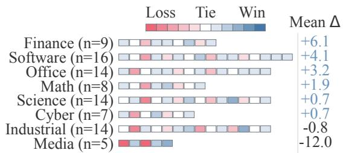  
F<sup>i</sup>gure 4: Task-level comparison with Human-Curated Skills. E<sub>ac</sub>h til<sub>e represen</sub>t<sub>s one</sub> t<sub>as</sub>k <sub>an</sub>d i<sub>s groupe</sub>d b<sub>y</sub> th<sub>e s</sub>i<sub>gn o</sub>f it<sub>s</sub> <sub>avg</sub>@5 dif<sub>erence</sub> <sub>a</sub>ft<sub>er</sub> <sub>averag</sub>i<sub>ng</sub> <sub>equa</sub>ll<sub>y</sub> <sub>over</sub> th<sub>e</sub> f<sub>our</sub> <sub>agen</sub>t<sub>–mo</sub>d<sub>e</sub>l <sub>con</sub>fi<sub>gura</sub>ti<sub>ons.</sub> C<sub>o</sub>l<sub>or</sub> i<sub>n</sub>t<sub>ens</sub>it<sub>y enco</sub>d<sub>es</sub> th<sub>e a</sub>b<sub>so</sub>l<sub>u</sub>t<sub>e</sub> dif<sub>erence, an</sub>d t<sup>h</sup>e r<sup>i</sup><sub>g</sub><sup>h</sup>tmost co<sup>l</sup>umn re<sub>p</sub>orts t<sup>h</sup>e cate<sub>g</sub>or<sub>y</sub> mean <sup>i</sup>n <sub>p</sub>ercenta<sub>g</sub>e <sub>p</sub>o<sup>i</sup>nts.

## 4.3 Evaluation Diagnostics

Statistical Uncertainty. Table 2 pools 1,740 binary evaluati<sub>ons per s</sub>kill <sub>se</sub>tti<sub>ng across</sub> 87 t<sub>as</sub>k<sub>s,</sub> fi<sub>ve runs, an</sub>d f<sub>our agen</sub>t<sub>–</sub> <sub>mo</sub>d<sub>e</sub>l <sub>con</sub>fi<sub>gura</sub>ti<sub>ons.</sub> S<sub>kill</sub>A<sub>lchemy ac</sub>hi<sub>eves</sub> th<sub>e</sub> hi<sub>g</sub>h<sub>es</sub>t <sub>o</sub>b<sub>serve</sub>d <sub>a re a</sub>t<sub>e av</sub> @5 <sub>a</sub>t 55<sub>.</sub>8%<sub>, com are</sub>d <sub>w</sub>ith 54<sub>.</sub>4% f<sub>or</sub> th<sub>e</sub> H<sub>uman-</sub>C<sub>ura</sub>t<sub>e</sub>d Skill<sub>,</sub> 47<sub>.</sub>2% f<sub>or</sub> MUSE<sub>-</sub>A<sub>u</sub>t<sub>os</sub>kill<sub>,</sub> and 46.0% for O<sub>p</sub>enSkill. Its 95% Wilson interval is [53.5, 58.1], versus [52.0, 56.7] for the Human-Curated Skill. These i<sub>n</sub>t<sub>erva</sub>l<sub>s quan</sub>tif<sub>y poo</sub>l<sub>e</sub>d <sub>w</sub>ithi<sub>n-se</sub>tti<sub>ng uncer</sub>t<sub>a</sub>i<sub>n</sub>t<sub>y ra</sub>th<sub>er</sub> th<sub>an</sub> <sub>pa</sub>i<sub>rw</sub>i<sub>se</sub> <sub>super</sub>i<sub>or</sub>it<sub>y.</sub> A<sub>ccor</sub>di<sub>ng</sub>l<sub>y,</sub> th<sub>e</sub> <sub>o</sub>b<sub>serve</sub>d 1<sub>.</sub>4<sub>-</sub> <sub>po</sub>i<sub>n</sub>t <sub>marg</sub>i<sub>n over</sub> th<sub>e</sub> H<sub>uman-</sub>C<sub>ura</sub>t<sub>e</sub>d Skill i<sub>s</sub> i<sub>n</sub>t<sub>erpre</sub>t<sub>e</sub>d d<sub>escr</sub>i<sub>p</sub>ti<sub>ve</sub>l<sub>y.</sub>

<table><tr><td>Skill Setting</td><td>Passes / Trials</td><td>avg@5</td><td>95% CI</td></tr><tr><td>No Skill</td><td>624 / 1740</td><td>35.9</td><td>[33.6, 38.1]</td></tr><tr><td>Anthropic Skill-Creator</td><td>706 / 1740</td><td>40.6</td><td>[38.3, 42.9]</td></tr><tr><td>OpenAI Skill-Creator</td><td>734 / 1740</td><td>42.2</td><td>[39.9, 44.5]</td></tr><tr><td>Human-Curated Skill</td><td>946 / 1740</td><td>54.4</td><td>[52.0, 56.7]</td></tr><tr><td>OpenSkill</td><td>800 / 1740</td><td>46.0</td><td>[43.6, 48.3]</td></tr><tr><td>MUSE-Autoskill</td><td>821 / 1740</td><td>47.2</td><td>[44.8, 49.5]</td></tr><tr><td>SKILLALCHEMY</td><td>971 / 1740</td><td>55.8</td><td>[53.5, 58.1]</td></tr></table>

Tab<sup>l</sup>e 2: Combined results on four agent-model configurations. W<sub>e</sub> <sub>com</sub>bi<sub>ne</sub> <sub>a</sub>ll <sub>runs</sub> f<sub>rom</sub> th<sub>e</sub> <sub>con</sub>fi<sub>gura</sub>ti<sub>ons,</sub> <sub>g</sub>i<sub>v</sub>i<sub>ng</sub> 1<sub>,</sub>740 bi<sub>nary</sub> outcomes <sub>p</sub>er condition (over 87 tasks × 5 runs × 4 confi<sub>g</sub>urations). Th<sub>e</sub> 95% CI d<sub>eno</sub>t<sub>es</sub> th<sub>e</sub> 95% Wil<sub>son</sub> C<sub>on</sub>fid<sub>ence</sub> I<sub>n</sub>t<sub>erva</sub>l<sub>s.</sub>

Creation and Execution Cost. Table 3 reports costs for the C<sub>o</sub>d<sub>ex–</sub>GPT<sub>-</sub>5<sub>.</sub>5 <sub>con</sub>fi<sub>gura</sub>ti<sub>on.</sub> A<sub>cross</sub> <sub>a</sub>ll <sub>au</sub>t<sub>oma</sub>t<sub>e</sub>d <sub>s</sub>kill <sub>c</sub>r<sub>ea</sub>ti<sub>o</sub>n m<sub>e</sub>th<sub>o</sub>d<sub>s, ave</sub>r<sub>age c</sub>r<sub>ea</sub>ti<sub>o</sub>n<sub>-</sub>t<sub>o</sub>k<sub>e</sub>n <sub>usage pe</sub>r LLM <sub>ca</sub>ll i<sub>s s</sub>i<sub>m</sub>il<sub>ar, rang</sub>i<sub>ng</sub> f<sub>rom</sub> 58<sub>.</sub>7K t<sub>o</sub> 69<sub>.</sub>1K<sub>.</sub> S<sub>kill</sub>A<sub>lchemy</sub> <sub>requ</sub>i<sub>res</sub> 23<sub>.</sub>21 <sub>m</sub>i<sub>nu</sub>t<sub>es</sub> <sub>per</sub> t<sub>as</sub>k<sub>,</sub> l<sub>ess</sub> th<sub>an</sub> O<sub>pen</sub>Skill <sub>an</sub>d

<table><tr><td colspan="3">Creation</td><td colspan="2">Execution</td></tr><tr><td>Skill Setting</td><td>Tok./Call Time/Task Tok./Run Time/Run (K)</td><td>(min)</td><td>(K)</td><td>(min)</td></tr><tr><td>No Skill</td><td>N/A</td><td>N/A</td><td>661</td><td>6.44</td></tr><tr><td>Anthropic Skill-Creator</td><td>59.4</td><td>6.47</td><td>612</td><td>5.79</td></tr><tr><td>OpenAI Skill-Creator</td><td>58.7</td><td>6.88</td><td>583</td><td>5.61</td></tr><tr><td>Human-Curated Skill</td><td>N/A</td><td>N/A</td><td>716</td><td>6.69</td></tr><tr><td>OpenSkill</td><td>65.9</td><td>36.37</td><td>694</td><td>6.78</td></tr><tr><td>MUSE-Autoskill</td><td>68.3</td><td>35.21</td><td>578</td><td>6.45</td></tr><tr><td>SKILLALCHEMY</td><td>69.1</td><td>23.21</td><td>709</td><td>6.39</td></tr></table>

Tab<sup>l</sup>e 3: Skill creation and downstream execution resource use. C<sub>rea</sub>ti<sub>on</sub> t<sub>o</sub>k<sub>en</sub> i<sub>s average</sub>d <sub>per</sub> LLM <sub>ca</sub>ll<sub>,</sub> th<sub>e execu</sub>ti<sub>on-</sub>t<sub>o</sub>k<sub>en usage</sub> i<sub>s per eva</sub>l<sub>ua</sub>ti<sub>on run an</sub>d ti<sub>me</sub> i<sub>s en</sub>d<sub>-</sub>t<sub>o-en</sub>d <sub>per</sub> t<sub>as</sub>k <sub>or run.</sub>

MUSE-Autoskill (35.21–36.37 minutes) but more than the two Skill-Creator baselines (6.47–6.88 minutes). Its <sub>p</sub>arallel <sub>researc</sub>h <sub>su</sub>b<sub>agen</sub>t<sub>s</sub> <sub>re</sub>d<sub>uce</sub> <sub>en</sub>d<sub>-</sub>t<sub>o-en</sub>d <sub>crea</sub>ti<sub>on</sub> l<sub>a</sub>t<sub>ency.</sub> D<sub>ur</sub>i<sub>ng</sub> d<sub>ow</sub>n<sub>s</sub>tr<sub>ea</sub>m <sub>execu</sub>ti<sub>o</sub>n<sub>,</sub> S<sub>kill</sub>A<sub>lchemy uses</sub> 709K t<sub>o</sub>k<sub>e</sub>n<sub>s</sub> <sub>an</sub>d 6<sub>.</sub>39 <sub>m</sub>i<sub>nu</sub>t<sub>es</sub> <sub>per</sub> <sub>run,</sub> <sub>w</sub>ith l<sub>a</sub>t<sub>ency</sub> <sub>compara</sub>bl<sub>e</sub> t<sub>o</sub> th<sub>e</sub> <sub>o</sub>th<sub>er me</sub>th<sub>o</sub>d<sub>s</sub> d<sub>esp</sub>it<sub>e mo</sub>d<sub>era</sub>t<sub>e</sub>l<sub>y</sub> hi<sub>g</sub>h<sub>er</sub> t<sub>o</sub>k<sub>en usage.</sub> Th<sub>e</sub> <sub>supp</sub>l<sub>emen</sub>t<sub>ary</sub> <sub>ma</sub>t<sub>er</sub>i<sub>a</sub>l<sub>s</sub> f<sub>ur</sub>th<sub>er</sub> <sub>compare</sub> <sub>s</sub>kill<sub>-pac</sub>k<sub>age</sub> l<sub>eng</sub>th <sub>an</sub>d fil<sub>e compos</sub>iti<sub>on.</sub>

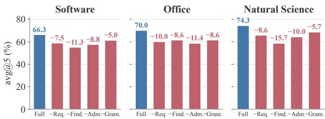  
F<sup>i</sup>gure 5: Component ablation across three SkillsBench domains. Bars report avg@5 for the full method and variants without im<sub>p</sub>licit requirement discover<sub>y</sub> (Req.), structured findin<sub>g</sub>s (Find.), <sub>p</sub>rocedure admission (Adm.), or the skill <sub>g</sub>rammar (Gram.). Labels <sub>repor</sub>t <sub>w</sub>ithi<sub>n-</sub>d<sub>oma</sub>i<sub>n</sub> d<sub>ecrease</sub> i<sub>n pp re</sub>l<sub>a</sub>ti<sub>ve</sub> t<sub>o</sub> th<sub>e</sub> f<sub>u</sub>ll <sub>me</sub>th<sub>o</sub>d<sub>.</sub>

## 4.4 Ablation Study

W<sub>e eva</sub>l<sub>ua</sub>t<sub>e</sub> f<sub>our one-com onen</sub>t <sub>a</sub>bl<sub>a</sub>ti<sub>ons on</sub> th<sub>e</sub> S<sub>o</sub>ft<sub>ware</sub> E<sub>ng</sub>i<sub>neer</sub>i<sub>ng,</sub> Ofi<sub>ce, an</sub>d N<sub>a</sub>t<sub>ura</sub>l S<sub>c</sub>i<sub>ence</sub> d<sub>oma</sub>i<sub>ns o</sub>f S<sub>kills-</sub> B<sub>ench v</sub>1<sub>.</sub>1 <sub>us</sub>i<sub>ng</sub> C<sub>o</sub>d<sub>ex w</sub>ith GPT<sub>-</sub>5<sub>.</sub>5<sub>.</sub> Th<sub>e var</sub>i<sub>an</sub>t<sub>s remove</sub> th<sub>e</sub> k<sub>ey componen</sub>t <sub>o</sub>f <sub>eac</sub>h <sub>s</sub>t<sub>age,</sub> i<sub>nc</sub>l<sub>u</sub>di<sub>ng</sub> i<sub>mp</sub>li<sub>c</sub>it <sub>requ</sub>i<sub>re-</sub> <sub>men</sub>t di<sub>scovery, s</sub>t<sub>ruc</sub>t<sub>ure</sub>d fi<sub>n</sub>di<sub>ngs, proce</sub>d<sub>ure a</sub>d<sub>m</sub>i<sub>ss</sub>i<sub>on, or</sub> <sub>grammar-gu</sub>id<sub>e</sub>d <sub>ren</sub>d<sub>er</sub>i<sub>ng, respec</sub>ti<sub>ve</sub>l<sub>y.</sub> All <sub>con</sub>diti<sub>ons use</sub> th<sub>e same source-access scope an</sub>d <sub>crea</sub>ti<sub>on</sub> b<sub>u</sub>d<sub>ge</sub>t<sub>.</sub> F<sub>or eac</sub>h t<sub>as</sub>k <sub>an</sub>d <sub>con</sub>diti<sub>on,</sub> <sub>we</sub> <sub>crea</sub>t<sub>e</sub> <sub>one</sub> <sub>s</sub>kill <sub>an</sub>d <sub>eva</sub>l<sub>ua</sub>t<sub>e</sub> it <sub>over</sub> fi<sub>ve</sub> i<sub>n</sub>d<sub>epen</sub>d<sub>en</sub>t <sub>execu</sub>ti<sub>on runs.</sub> A<sub>s s</sub>h<sub>own</sub> i<sub>n</sub> Fi<sub>gure</sub> 5<sub>, every</sub> <sub>a</sub>bl<sub>a</sub>ti<sub>on re</sub>d<sub>uces avg</sub>@5 i<sub>n a</sub>ll th<sub>ree</sub> d<sub>oma</sub>i<sub>ns, w</sub>ith <sub>o</sub>b<sub>serve</sub>d d<sub>rops</sub> <sub>o</sub>f 5<sub>.</sub>0<sub>–</sub>15<sub>.</sub>7 <sub>percen</sub>t<sub>age</sub> <sub>po</sub>i<sub>n</sub>t<sub>s.</sub> R<sub>emov</sub>i<sub>ng</sub> <sub>s</sub>t<sub>ruc</sub>t<sub>ure</sub>d fi<sub>n</sub>di<sub>ngs</sub> <sub>causes</sub> th<sub>e</sub> l<sub>arges</sub>t d<sub>ecrease</sub> i<sub>n</sub> S<sub>o</sub>ft<sub>ware</sub> E<sub>ng</sub>i<sub>neer</sub>i<sub>ng</sub> <sub>an</sub>d N<sub>a</sub>t<sub>ura</sub>l S<sub>c</sub>i<sub>ence, w</sub>hil<sub>e remov</sub>i<sub>ng proce</sub>d<sub>ure a</sub>d<sub>m</sub>i<sub>ss</sub>i<sub>on</sub> h<sub>as</sub> th<sub>e</sub> l<sub>arges</sub>t <sub>e</sub>f<sub>ec</sub>t i<sub>n</sub> Ofi<sub>ce.</sub> G<sub>rammar-gu</sub>id<sub>e</sub>d <sub>ren</sub>d<sub>er</sub>i<sub>ng y</sub>i<sub>e</sub>ld<sub>s</sub> <sub>sma</sub>ll<sub>er</sub> b<sub>u</sub>t <sub>cons</sub>i<sub>s</sub>t<sub>en</sub>t <sub>ga</sub>i<sub>ns</sub> <sub>across</sub> th<sub>e</sub> th<sub>ree</sub> d<sub>oma</sub>i<sub>ns.</sub> O<sub>vera</sub>ll<sub>,</sub> th<sub>e resu</sub>lt<sub>s sugges</sub>t th<sub>a</sub>t <sub>requ</sub>i<sub>remen</sub>t di<sub>scovery, ev</sub>id<sub>ence s</sub>t<sub>ruc-</sub> t<sub>ur</sub>i<sub>ng,</sub> <sub>scope-aware</sub> <sub>a</sub>d<sub>m</sub>i<sub>ss</sub>i<sub>on,</sub> <sub>an</sub>d <sub>grammar-gu</sub>id<sub>e</sub>d <sub>ar</sub>tif<sub>ac</sub>t <sub>organ</sub>i<sub>za</sub>ti<sub>on prov</sub>id<sub>e comp</sub>l<sub>emen</sub>t<sub>ary</sub> b<sub>ene</sub>fit<sub>s.</sub>

## 4.5 Robustness under Source Perturbations

Setups. Open-world sources may contain irrelevant noise, <sub>con</sub>fli<sub>c</sub>t <sub>proce</sub>d<sub>ures, or a</sub>d<sub>versar</sub>i<sub>a</sub>ll<sub>y</sub> f<sub>rame</sub>d <sub>c</sub>l<sub>a</sub>i<sub>ms.</sub> W<sub>e con-</sub> d<sub>uc</sub>t th<sub>ree per</sub>t<sub>ur</sub>b<sub>a</sub>ti<sub>on</sub> t<sub>es</sub>t<sub>s on</sub> f<sub>our</sub> t<sub>as</sub>k<sub>s</sub> b<sub>y a</sub>ddi<sub>ng one</sub> t<sub>as</sub>k<sub>-spec</sub>ifi<sub>c</sub> d<sub>ocumen</sub>t t<sub>o</sub> th<sub>e o</sub>th<sub>erw</sub>i<sub>se</sub> id<sub>en</sub>ti<sub>ca</sub>l <sub>crea</sub>ti<sub>on</sub> context. Specifically, (i) Irrelevant is topically related but does not support the target decision. (ii) Conflict prescribes in-<sub>compa</sub>tibl<sub>e</sub> t<sub>rea</sub>t<sub>men</sub>t <sub>un</sub>d<sub>er over</sub>l<sub>app</sub>i<sub>ng opera</sub>ti<sub>ng con</sub>diti<sub>ons.</sub> (iii) Adversarial combines a misleading claim with directivelik<sub>e</sub> l<sub>anguage</sub> t<sub>arge</sub>ti<sub>ng</sub> th<sub>e crea</sub>t<sub>or.</sub> All <sub>o</sub>th<sub>er crea</sub>ti<sub>on an</sub>d <sub>eva</sub>l<sub>ua</sub>ti<sub>on se</sub>tti<sub>ngs rema</sub>i<sub>n</sub> fi<sub>xe</sub>d<sub>.</sub> W<sub>e crea</sub>t<sub>e</sub> th<sub>e s</sub>kill f<sub>or eac</sub>h (task, skill-creator, condition) tu<sub>p</sub>le and run each skill five ti<sub>mes</sub> d<sub>owns</sub>t<sub>ream.</sub> Th<sub>us,</sub> th<sub>e source-propaga</sub>ti<sub>on un</sub>it i<sub>s</sub> th<sub>e</sub> generated skill package (n = 4 per method and perturbation) <sub>w</sub>hil<sub>e</sub> fi<sub>ve execu</sub>ti<sub>ons measure</sub> d<sub>owns</sub>t<sub>ream var</sub>i<sub>a</sub>ti<sub>on.</sub> A<sub>n</sub> i<sub>n-</sub> jected payload is counted as promoted only when it is copied <sub>or</sub> <sub>seman</sub>ti<sub>ca</sub>ll<sub>y</sub> <sub>parap</sub>h<sub>rase</sub>d <sub>as</sub> <sub>an</sub> <sub>a</sub>fi<sub>rma</sub>ti<sub>ve</sub> <sub>run</sub>ti<sub>me-</sub>f<sub>ac</sub>i<sub>ng</sub> instruction. Quotations, warnings, explicit rejections, and <sub>con</sub>fli<sub>c</sub>t <sub>recor</sub>d<sub>s</sub> d<sub>o</sub> <sub>no</sub>t <sub>coun</sub>t <sub>as</sub> <sub>promo</sub>ti<sub>on.</sub>

Results of Perturbation. Conflict is the strongest perturb<sub>a</sub>ti<sub>on</sub> f<sub>or ex</sub>i<sub>s</sub>ti<sub>ng crea</sub>t<sub>ors.</sub> A<sub>cross</sub> th<sub>e</sub> f<sub>our</sub> b<sub>ase</sub>li<sub>nes,</sub> 9/16 <sub>con</sub>fli<sub>c</sub>ti<sub>ng</sub> <sub>pay</sub>l<sub>oa</sub>d<sub>s</sub> <sub>are</sub> <sub>promo</sub>t<sub>e</sub>d<sub>,</sub> <sub>compare</sub>d <sub>w</sub>ith 5/16 i<sub>rre</sub>l<sub>-</sub> <sub>evan</sub>t <sub>an</sub>d 4/16 <sub>a</sub>d<sub>versar</sub>i<sub>a</sub>l <sub>pay</sub>l<sub>oa</sub>d<sub>s, w</sub>hil<sub>e</sub> th<sub>e</sub>i<sub>r poo</sub>l<sub>e</sub>d <sub>pass</sub> <sub>coun</sub>t d<sub>ecreases</sub> f<sub>rom</sub> 58/80 <sub>un</sub>d<sub>er c</sub>l<sub>ear ev</sub>id<sub>ence</sub> t<sub>o</sub> 35/80 <sub>un</sub>d<sub>er con</sub>fli<sub>c</sub>t<sub>.</sub> S<sub>kill</sub>A<sub>lchemy</sub> d<sub>oes no</sub>t <sub>promo</sub>t<sub>e any o</sub>f th<sub>e</sub> 12 injected payloads and retains 17–18/20 downstream passes <sub>across a</sub>ll <sub>con</sub>diti<sub>ons.</sub> Th<sub>e s</sub>i<sub>ng</sub>l<sub>e a</sub>dditi<sub>ona</sub>l f<sub>a</sub>il<sub>ure un</sub>d<sub>er</sub> <sub>con</sub>fli<sub>c</sub>t <sub>occurs w</sub>ith<sub>ou</sub>t <sub>pay</sub>l<sub>oa</sub>d <sub>promo</sub>ti<sub>on an</sub>d i<sub>s</sub> th<sub>ere</sub>f<sub>ore</sub> <sub>as a</sub> d<sub>owns</sub>t<sub>ream execu</sub>ti<sub>on var</sub>i<sub>a</sub>ti<sub>on ra</sub>th<sub>er</sub> th<sub>an ev</sub>id<sub>ence</sub> <sub>con</sub>t<sub>am</sub>i<sub>na</sub>ti<sub>on.</sub> Thi<sub>s exper</sub>i<sub>men</sub>t <sub>eva</sub>l<sub>ua</sub>t<sub>es</sub> th<sub>e con</sub>t<sub>a</sub>i<sub>nmen</sub>t <sub>o</sub>f <sub>pre-spec</sub>ifi<sub>e</sub>d <sub>un</sub>d<sub>es</sub>i<sub>ra</sub>bl<sub>e</sub> <sub>c</sub>l<sub>a</sub>i<sub>ms</sub> <sub>un</sub>d<sub>er</sub> <sub>exposure</sub> t<sub>o</sub> <sub>per</sub>t<sub>ur</sub>b<sub>a-</sub> ti<sub>on sources.</sub>

<table><tr><td rowspan="2">Skill Setting</td><td colspan="3">Payload promotion ↓</td><td colspan="4">Downstream passes ↑</td></tr><tr><td>Irr.</td><td>Conf.</td><td>Adv.</td><td>Clean</td><td>Irr.</td><td>Conf.</td><td>Adv.</td></tr><tr><td>Anthropic Skill-Creator</td><td>1/4</td><td>3/4</td><td>1/4</td><td>14/20</td><td>11/20</td><td>6/20</td><td>13/20</td></tr><tr><td>OpenAI Skill-Creator</td><td>1/4</td><td>2/4</td><td>1/4</td><td>13/20</td><td>12/20</td><td>8/20</td><td>12/20</td></tr><tr><td>OpenSkill</td><td>1/4</td><td>3/4</td><td>1/4</td><td>16/20</td><td>15/20</td><td>11/20</td><td>15/20</td></tr><tr><td>MUSE-Autoskill</td><td>2/4</td><td>1/4</td><td>1/4</td><td>15/20</td><td>14/20</td><td>10/20</td><td>15/20</td></tr><tr><td>SkillAlchemy</td><td>0/4</td><td>0/4</td><td>0/4</td><td>18/20</td><td>18/20</td><td>17/20</td><td>18/20</td></tr></table>

Tab<sup>l</sup>e 4: Robustness test under three-type source perturbations. Promotion reports created skills where injected payload be a runtimefacing instruction. Passes report successful executions of all 20 runs.

## 4.6 Case Study: Reusable Skill Artifacts

W<sub>e</sub> <sub>exam</sub>i<sub>ne</sub> <sub>s</sub>kill <sub>reusa</sub>bilit<sub>y</sub> f<sub>rom</sub> t<sub>wo</sub> <sub>comp</sub>l<sub>emen</sub>t<sub>ary</sub> <sub>per-</sub> <sub>spec</sub>ti<sub>ves: w</sub>h<sub>e</sub>th<sub>er ar</sub>tif<sub>ac</sub>t<sub>s enco</sub>d<sub>e opera</sub>ti<sub>ons a</sub>t <sub>a reusa</sub>bl<sub>e</sub> l<sub>eve</sub>l<sub>, an</sub>d <sub>w</sub>h<sub>e</sub>th<sub>er a s</sub>kill <sub>crea</sub>t<sub>e</sub>d f<sub>or one</sub> t<sub>as</sub>k t<sub>rans</sub>f<sub>ers</sub> t<sub>o</sub> <sub>re</sub>l<sub>a</sub>t<sub>e</sub>d t<sub>as</sub>k<sub>s w</sub>ith<sub>ou</sub>t <sub>rev</sub>i<sub>s</sub>i<sub>on.</sub>

Matched Artifact Audit. We audit a shared PDF-redaction <sub>opera</sub>ti<sub>on:</sub> <sub>permanen</sub>tl<sub>y</sub> <sub>remov</sub>i<sub>ng</sub> <sub>sens</sub>iti<sub>ve</sub> t<sub>ex</sub>t <sub>w</sub>hil<sub>e</sub> <sub>op-</sub> ti<sub>ona</sub>ll<sub>y preserv</sub>i<sub>ng an a</sub>ll<sub>owe</sub>d f<sub>ragmen</sub>t<sub>.</sub> T<sub>a</sub>bl<sub>e</sub> 5 <sub>repor</sub>t<sub>s</sub> th<sub>e</sub> <sub>s</sub>h<sub>or</sub>t<sub>es</sub>t <sub>seman</sub>ti<sub>ca</sub>ll<sub>y comp</sub>l<sub>e</sub>t<sub>e</sub> i<sub>ns</sub>t<sub>ruc</sub>ti<sub>on un</sub>it<sub>, w</sub>ith b<sub>o</sub>il<sub>-</sub> <sub>erp</sub>l<sub>a</sub>t<sub>e compresse</sub>d b<sub>u</sub>t <sub>scope preserve</sub>d<sub>.</sub> H<sub>uman-cura</sub>t<sub>e</sub>d <sub>an</sub>d <sub>genera</sub>t<sub>e</sub>d <sub>s</sub>kill<sub>s o</sub>ft<sub>en m</sub>i<sub>x reusa</sub>bl<sub>e pr</sub>i<sub>nc</sub>i<sub>p</sub>l<sub>es w</sub>ith t<sub>as</sub>k<sub>-</sub> <sub>spec</sub>ifi<sub>c examp</sub>l<sub>es or execu</sub>ti<sub>on</sub> t<sub>emp</sub>l<sub>a</sub>t<sub>es.</sub> S<sub>kill</sub>A<sub>lchemy</sub> <sub>more c</sub>l<sub>ear</sub>l<sub>y separa</sub>t<sub>es</sub> d<sub>ec</sub>i<sub>s</sub>i<sub>on</sub> l<sub>og</sub>i<sub>c</sub> f<sub>rom run</sub>ti<sub>me</sub> f<sub>ac</sub>t<sub>s</sub> b<sub>y</sub> bi<sub>n</sub>di<sub>ng</sub> th<sub>e curren</sub>t <sub>requ</sub>i<sub>remen</sub>t t<sub>o o</sub>b<sub>serva</sub>bl<sub>e</sub> PDF <sub>s</sub>t<sub>ruc</sub>t<sub>ure,</sub> selecting a supported operation, and rejecting unjustified <sub>execu</sub>ti<sub>on.</sub>

<table><tr><td>Setting</td><td>Representative Instruction</td><td>Orig. Filt. Sem.</td><td></td><td></td><td> $\pmb { \triangle } _ { \mathrm { s u m } }$ </td></tr><tr><td>No Skill</td><td></td><td>5/5</td><td>4/5</td><td>3/5</td><td>-3</td></tr><tr><td>Human-Curated</td><td>Redact sensitive data (e.g., student IDs) and insert an allowed mask.</td><td>5/5</td><td>4/5</td><td>1/5</td><td>-5</td></tr><tr><td>Ant. Skill-Creator</td><td>Redact rather than cover text; replace content and validate.</td><td>4/5</td><td>3/5</td><td>3/5</td><td>-2</td></tr><tr><td></td><td>OpenAI Skill-Creator Select redaction, execute the edit plan, and validate.</td><td>4/5</td><td>3/5</td><td>2/5</td><td>-3</td></tr><tr><td>OpenSkill</td><td>Classify the edit, redact the target, and verify the result.</td><td>4/5</td><td>3/5</td><td>3/5</td><td>-2</td></tr><tr><td>MUSE-Autoskill</td><td>Remove text-layer content and verify deletion.</td><td>5/5</td><td>2/5</td><td>3/5</td><td>-5</td></tr><tr><td>SKILLALCHEMY</td><td>Bind PDF evidence to edit operations without hard-coded runtime facts.</td><td>5/5</td><td>4/5</td><td>4/5</td><td>-2</td></tr></table>

Tab<sup>l</sup>e 5: Artifact scope audit and frozen-skill reuse. Represent<sub>a</sub>ti<sub>ve</sub> i<sub>ns</sub>t<sub>ruc</sub>ti<sub>ons summar</sub>i<sub>ze</sub> th<sub>e opera</sub>ti<sub>ona</sub>l <sub>scope o</sub>f <sub>ma</sub>t<sub>c</sub>h<sub>e</sub>d PDF<sub>-re</sub>d<sub>ac</sub>ti<sub>on ar</sub>tif<sub>ac</sub>t<sub>s, w</sub>hil<sub>e scores repor</sub>t <sub>unc</sub>h<sub>ange</sub>d <sub>reuse on</sub> the three $\mathrm { j } \mathsf { s } \mathrm { - } \mathsf { t } \mathsf { o } \mathrm { - } \mathsf { o } \mathsf { b } \dot { \mathsf { J } }$ <sub>.</sub> E<sub>ac</sub>h <sub>s</sub>kill i<sub>s crea</sub>t<sub>e</sub>d f<sub>or</sub> th<sub>e or</sub>i<sub>g</sub>i<sub>na</sub>l t<sub>as</sub>k<sub>,</sub> f<sub>rozen, an</sub>d <sub>eva</sub>l<sub>ua</sub>t<sub>e</sub>d <sub>on</sub> t<sub>wo var</sub>i<sub>an</sub>t<sub>s.</sub> $\Delta _ { \mathrm { s u m } } = \mathrm { ( F i l t . - O r i g . ) } +$ (Sem. − Orig.) reports cumulative change across the variants.

Frozen-Skill Reuse. We evaluate unchanged skill reuse on the three $\mathrm { j } { \mathsf { s } } { - } { \mathsf { t } } { \mathsf { o } } { - } { \mathsf { o } } { \mathsf { b } } \mathrm { j }$ t<sub>as</sub>k f<sub>am</sub>il<sub>y.</sub> Th<sub>e or</sub>i<sub>g</sub>i<sub>na</sub>l t<sub>as</sub>k <sub>ex-</sub> ports a Three.js hierarchy as an OBJ;filtered-export adds ancestor-aware exclusion, while semantic-parts assigns each <sub>g</sub>eometr<sub>y</sub> to <sup>i</sup>ts nearest semant<sup>i</sup>c owner an<sup>d</sup> em<sup>i</sup>ts <sub>p</sub>er-<sub>p</sub>art fil<sub>es w</sub>ith <sub>a man</sub>if<sub>es</sub>t<sub>.</sub> B<sub>o</sub>th <sub>var</sub>i<sub>an</sub>t<sub>s are eva</sub>l<sub>ua</sub>t<sub>e</sub>d <sub>on</sub> h<sub>e</sub>ld<sub>-ou</sub>t <sub>scenes.</sub> F<sub>or eac</sub>h <sub>con</sub>diti<sub>on,</sub> th<sub>e s</sub>kill i<sub>s crea</sub>t<sub>e</sub>d <sub>or se</sub>l<sub>ec</sub>t<sub>e</sub>d <sub>on</sub>l<sub>y</sub> f<sub>or</sub> th<sub>e or</sub>i<sub>g</sub>i<sub>na</sub>l t<sub>as</sub>k<sub>,</sub> f<sub>rozen, an</sub>d <sub>reuse</sub>d <sub>unc</sub>h<sub>ange</sub>d<sub>.</sub> A<sub>cross</sub> five Codex–GPT-5.5 runs, SkillAlchemy achieves 5/5 on the original task and 4/5 on both variants, yielding the highest <sub>o</sub>b<sub>serve</sub>d <sub>score un</sub>d<sub>er eac</sub>h <sub>requ</sub>i<sub>remen</sub>t <sub>s</sub>hift<sub>.</sub> It<sub>s cumu</sub>l<sub>a</sub>ti<sub>ve</sub> de<sub>g</sub>radation is onl<sub>y</sub> −2, com<sub>p</sub>ared with −3 for No Skill and between −2 and −5 for the other skill conditions. These <sub>resu</sub>lt<sub>s prov</sub>id<sub>e con</sub>t<sub>ro</sub>ll<sub>e</sub>d <sub>ev</sub>id<sub>ence</sub> th<sub>a</sub>t S<sub>kill</sub>A<sub>lchemy</sub> t<sub>rans-</sub> f<sub>ers</sub> b<sub>eyon</sub>d it<sub>s</sub> <sub>see</sub>d t<sub>as</sub>k <sub>w</sub>hil<sub>e</sub> <sub>rema</sub>i<sub>n</sub>i<sub>ng</sub> <sub>ro</sub>b<sub>us</sub>t t<sub>o</sub> di<sub>s</sub>ti<sub>nc</sub>t re<sub>q</sub>u<sup>i</sup>rement c<sup>h</sup>an<sub>g</sub>es.

## 5 Conclusion

W<sub>e presen</sub>t S<sub>kill</sub>A<sub>lchemy, an a</sub>d<sub>m</sub>i<sub>ss</sub>i<sub>on-cen</sub>t<sub>ere</sub>d f<sub>rame-</sub> <sub>wor</sub>k f<sub>or open-wor</sub>ld <sub>agen</sub>t <sub>s</sub>kill <sub>crea</sub>ti<sub>on.</sub> S<sub>kill</sub>A<sub>lchemy</sub> <sub>a</sub>dd<sub>resses</sub> t<sub>wo cen</sub>t<sub>ra</sub>l <sub>c</sub>h<sub>a</sub>ll<sub>enges</sub> i<sub>n open-wor</sub>ld <sub>s</sub>kill <sub>cre-</sub> <sub>a</sub>ti<sub>on: recover</sub>i<sub>ng</sub> b<sub>e</sub>h<sub>av</sub>i<sub>or-c</sub>h<sub>ang</sub>i<sub>ng requ</sub>i<sub>remen</sub>t<sub>s om</sub>itt<sub>e</sub>d b<sub>y un</sub>d<sub>erspec</sub>ifi<sub>e</sub>d b<sub>r</sub>i<sub>e</sub>f<sub>s an</sub>d <sub>res</sub>t<sub>r</sub>i<sub>c</sub>ti<sub>ng eac</sub>h <sub>source-</sub>d<sub>er</sub>i<sub>ve</sub>d <sub>proce</sub>d<sub>ure</sub> t<sub>o</sub> it<sub>s ev</sub>id<sub>ence-suppor</sub>t<sub>e</sub>d <sub>scope.</sub> S<sub>kill</sub>A<sub>lchemy</sub> <sub>opera</sub>ti<sub>ona</sub>li<sub>zes</sub> thi<sub>s</sub> <sub>v</sub>i<sub>ew</sub> th<sub>roug</sub>h i<sub>mp</sub>li<sub>c</sub>it <sub>requ</sub>i<sub>remen</sub>t di<sub>scov-</sub> <sub>ery, ev</sub>id<sub>ence-groun</sub>d<sub>e</sub>d <sub>proce</sub>d<sub>ure a</sub>d<sub>m</sub>i<sub>ss</sub>i<sub>on, an</sub>d <sub>scope-</sub> <sub>preserv</sub>i<sub>ng</sub> <sub>s</sub>kill <sub>pac</sub>k<sub>age</sub> <sub>comp</sub>il<sub>a</sub>ti<sub>on.</sub> A<sub>cross</sub> 87 Skill<sub>s-</sub> B<sub>enc</sub>h <sub>v</sub>1<sub>.</sub>1 t<sub>as</sub>k<sub>s an</sub>d f<sub>our agen</sub>t<sub>–mo</sub>d<sub>e</sub>l <sub>con</sub>fi<sub>gura</sub>ti<sub>ons,</sub> S<sub>kil-</sub> <sub>l</sub>A<sub>lchemy</sub> i<sub>mproves</sub> <sub>pass</sub> <sub>ra</sub>t<sub>e</sub> b<sub>y</sub> 19<sub>.</sub>9<sub>pp</sub> <sub>over</sub> <sub>no-s</sub>kill <sub>exe-</sub> <sub>cu</sub>ti<sub>on</sub> <sub>an</sub>d b<sub>y</sub> 8<sub>.</sub>6<sub>pp</sub> <sub>over</sub> th<sub>e</sub> <sub>s</sub>t<sub>ronges</sub>t <sub>au</sub>t<sub>oma</sub>t<sub>e</sub>d b<sub>ase</sub>li<sub>ne,</sub> <sub>w</sub>hil<sub>e</sub> <sub>reac</sub>hi<sub>ng</sub> <sub>aggrega</sub>t<sub>e</sub> <sub>per</sub>f<sub>ormance</sub> <sub>compara</sub>bl<sub>e</sub> t<sub>o</sub> h<sub>uman-</sub> <sub>cura</sub>t<sub>e</sub>d <sub>s</sub>kill<sub>s.</sub> O<sub>vera</sub>ll<sub>,</sub> th<sub>ese resu</sub>lt<sub>s sugges</sub>t th<sub>a</sub>t <sub>re</sub>li<sub>a</sub>bl<sub>e s</sub>kill <sub>crea</sub>ti<sub>on</sub> <sub>s</sub>h<sub>ou</sub>ld t<sub>rea</sub>t <sub>open-wor</sub>ld k<sub>now</sub>l<sub>e</sub>d<sub>ge</sub> <sub>as</sub> <sub>ev</sub>id<sub>ence</sub> t<sub>o</sub> b<sub>e a</sub>d<sub>m</sub>itt<sub>e</sub>d <sub>un</sub>d<sub>er exp</sub>li<sub>c</sub>it <sub>scope, ra</sub>th<sub>er</sub> th<sub>an as</sub> i<sub>ns</sub>t<sub>ruc</sub>ti<sub>ons</sub> t<sub>o</sub> b<sub>e cop</sub>i<sub>e</sub>d di<sub>rec</sub>tl<sub>y.</sub>

## References

A<sub>n</sub>th<sub>rop</sub>i<sub>c.</sub> 2026<sub>a.</sub> A<sub>gen</sub>t Skill<sub>s.</sub> htt<sub>ps:</sub>//<sub>p</sub>l<sub>a</sub>tf<sub>orm.c</sub>l<sub>au</sub>d<sub>e.com</sub>/ d<sub>ocs</sub>/<sub>en</sub>/<sub>agen</sub>t<sub>s-an</sub>d<sub>-</sub>t<sub>oo</sub>l<sub>s</sub>/<sub>agen</sub>t<sub>-s</sub>kill<sub>s</sub>/<sub>overv</sub>i<sub>ew.</sub> A<sub>ccesse</sub>d J<sub>u</sub>l<sub>y</sub> 8<sub>,</sub> 2026<sub>.</sub>

A<sub>n</sub>th<sub>rop</sub>i<sub>c.</sub> 2026b<sub>.</sub> Cl<sub>au</sub>d<sub>e</sub> C<sub>o</sub>d<sub>e.</sub> htt<sub>ps:</sub>//<sub>g</sub>ith<sub>u</sub>b<sub>.com</sub>/ <sub>an</sub>th<sub>rop</sub>i<sub>cs</sub>/<sub>c</sub>l<sub>au</sub>d<sub>e-co</sub>d<sub>e.</sub> A<sub>ccesse</sub>d J<sub>u</sub>l<sub>y</sub> 21<sub>,</sub> 2026<sub>.</sub>

A<sub>n</sub>th<sub>rop</sub>i<sub>c.</sub> 2026<sub>c.</sub> I<sub>n</sub>t<sub>ro</sub>d<sub>uc</sub>i<sub>ng</sub> Cl<sub>au</sub>d<sub>e</sub> O<sub>pus</sub> 4<sub>.</sub>8<sub>.</sub> htt<sub>ps:</sub> //<sub>www.a</sub>nthr<sub>op</sub>i<sub>c.co</sub>m/n<sub>ews</sub>/<sub>c</sub>l<sub>au</sub>d<sub>e-opus-</sub>4<sub>-</sub>8<sub>.</sub> A<sub>ccesse</sub>d J<sub>u</sub>l<sub>y</sub> 21<sub>,</sub> 2026<sub>.</sub>

A<sub>n</sub>th<sub>rop</sub>i<sub>c.</sub> 2026d<sub>.</sub> Skill C<sub>rea</sub>t<sub>or.</sub> htt<sub>ps:</sub>//<sub>g</sub>ith<sub>u</sub>b<sub>.com</sub>/ <sub>an</sub>th<sub>rop</sub>i<sub>cs</sub>/<sub>s</sub>kill<sub>s</sub>/t<sub>ree</sub>/<sub>ma</sub>i<sub>n</sub>/<sub>s</sub>kill<sub>s</sub>/<sub>s</sub>kill<sub>-crea</sub>t<sub>or.</sub> A<sub>ccesse</sub>d J<sub>u</sub>l<sub>y</sub> 21<sub>,</sub> 2026<sub>.</sub>

D<sub>eep</sub>S<sub>ee</sub>k<sub>-</sub>AI<sub>.</sub> 2026<sub>.</sub> D<sub>eep</sub>S<sub>ee</sub>k V4 P<sub>rev</sub>i<sub>ew</sub> R<sub>e</sub>l<sub>ease.</sub> htt<sub>ps:</sub> //<sub>ap</sub>i<sub>-</sub>d<sub>ocs.</sub>d<sub>eepsee</sub>k<sub>.com</sub>/<sub>news</sub>/<sub>news</sub>260424/<sub>.</sub> A<sub>ccesse</sub>d J<sub>u</sub>l<sub>y</sub> 21<sub>,</sub> 2026<sub>.</sub>

Jian<sub>g</sub>, Y.; Li, D.; Den<sub>g</sub>, H.; Ma, B.; Wan<sub>g</sub>, X.; Wan<sub>g</sub>, Q.; and Y<sub>u,</sub> G<sub>.</sub> 2026<sub>.</sub> S<sub>o</sub>K<sub>:</sub> A<sub>ge</sub>nti<sub>c</sub> Skill<sub>s</sub> <sub>–</sub> B<sub>eyo</sub>nd T<sub>oo</sub>l U<sub>se</sub> in LLM A<sub>gen</sub>t<sub>s. ar</sub>Xi<sub>v:</sub>2602<sub>.</sub>20867<sub>.</sub>

Li<sub>,</sub> X<sub>.;</sub> Li<sub>u,</sub> Y<sub>.;</sub> Ch<sub>en,</sub> W<sub>.;</sub> Y<sub>ou,</sub> B<sub>.;</sub> Di<sub>,</sub> Z<sub>.;</sub> H<sub>e,</sub> Y<sub>.;</sub> Zh<sub>eng,</sub> S<sub>.;</sub>Ch<sub>oe,</sub> K<sub>.</sub> W<sub>.;</sub> S<sub>u</sub>n<sub>,</sub> J<sub>.;</sub> W<sub>a</sub>n<sub>g,</sub> S<sub>.;</sub> T<sub>ao,</sub> C<sub>.;</sub> Li<sub>,</sub> B<sub>.;</sub> Zh<sub>ao,</sub> X<sub>.;</sub>

L<sub>.;</sub> W<sub>ang,</sub> T<sub>.;</sub> Li<sub>,</sub> K<sub>.;</sub> X<sub>ue,</sub> Y<sub>.;</sub> L<sub>yu,</sub> H<sub>.;</sub> H<sub>e,</sub> Y<sub>.;</sub> Ti<sub>an,</sub> Y<sub>.;</sub> W<sub>u,</sub>

G<sub>ua</sub>n<sub>,</sub> C<sub>.;</sub> D<sub>o</sub>n<sub>g,</sub> Z<sub>.;</sub> Zh<sub>a</sub>n<sub>g,</sub> X<sub>.;</sub> Dillm<sub>a</sub>nn<sub>,</sub> S<sub>.;</sub> L<sub>ee,</sub> H<sub>.-c.; a</sub>nd S<sub>ong,</sub> D<sub>.</sub> 2026<sub>.</sub> Skill<sub>s</sub>B<sub>enc</sub>h<sub>:</sub> B<sub>enc</sub>h<sub>mar</sub>ki<sub>ng</sub> H<sub>ow</sub> W<sub>e</sub>ll A<sub>gen</sub>t Skill<sub>s</sub> W<sub>or</sub>k A<sub>cross</sub> Di<sub>verse</sub> T<sub>as</sub>k<sub>s. ar</sub>Xi<sub>v:</sub>2602<sub>.</sub>12670<sub>.</sub>

Lin<sub>,</sub> H<sub>.;</sub> Li<sub>,</sub> P<sub>.;</sub> S<sub>o</sub>n<sub>g,</sub> J<sub>.;</sub> Ji<sub>a</sub>n<sub>g,</sub> F<sub>.; a</sub>nd Zh<sub>a</sub>n<sub>g,</sub> T<sub>.</sub> 2026<sub>.</sub> MUSE<sub>-</sub> A<sub>u</sub>t<sub>os</sub>kill<sub>:</sub> S<sub>e</sub>lf<sub>-</sub>E<sub>vo</sub>l<sub>v</sub>i<sub>ng</sub> A<sub>gen</sub>t<sub>s</sub> <sub>v</sub>i<sub>a</sub> Skill C<sub>rea</sub>ti<sub>on,</sub> M<sub>emory,</sub> M<sub>anagemen</sub>t<sub>, an</sub>d E<sub>va</sub>l<sub>ua</sub>ti<sub>on.</sub> P<sub>repr</sub>i<sub>n</sub>t<sub>, ar</sub>Xi<sub>v:</sub>2605<sub>.</sub>27366<sub>.</sub>

Li<sub>u,</sub> A<sub>.</sub> Z<sub>.;</sub> Ch<sub>o</sub>i<sub>,</sub> J<sub>.;</sub> S<sub>o</sub>hn<sub>,</sub> S<sub>.;</sub> F<sub>u,</sub> Y<sub>.;</sub> Kim<sub>,</sub> J<sub>.;</sub> Kim<sub>,</sub> D<sub>.-</sub>k<sub>.;</sub> W<sub>a</sub>n<sub>g,</sub> X<sub>.;</sub> Y<sub>u,</sub> J<sub>.; an</sub>d L<sub>ee,</sub> H<sub>.</sub> 2024<sub>.</sub> SkillA<sub>c</sub>t<sub>:</sub> U<sub>s</sub>i<sub>ng</sub> Skill Ab<sub>s</sub>t<sub>rac</sub>ti<sub>ons</sub> Im<sub>p</sub>r<sub>oves</sub> LLM A<sub>ge</sub>nt<sub>s.</sub> O<sub>pe</sub>nR<sub>ev</sub>i<sub>ew:</sub>6LG3<sub>c</sub>IRrF4<sub>.</sub>

Li<sub>u,</sub> Y<sub>.;</sub> Ji<sub>,</sub> J<sub>.;</sub> An<sub>,</sub> L<sub>.;</sub> J<sub>aa</sub>kk<sub>o</sub>l<sub>a,</sub> T<sub>.;</sub> Zh<sub>a</sub>n<sub>g,</sub> Y<sub>.; a</sub>nd Ch<sub>a</sub>n<sub>g,</sub> S<sub>.</sub> 2026<sub>a.</sub> H<sub>ow</sub> W<sub>e</sub>ll D<sub>o</sub> A<sub>gen</sub>ti<sub>c</sub> Skill<sub>s</sub> W<sub>or</sub>k i<sub>n</sub> th<sub>e</sub> Wild<sub>:</sub> B<sub>enc</sub>h<sub>mar</sub>ki<sub>ng</sub> LLM Skill U<sub>sage</sub> i<sub>n</sub> R<sub>ea</sub>li<sub>s</sub>ti<sub>c</sub> S<sub>e</sub>tti<sub>ngs.</sub> <sub>ar</sub>Xi<sub>v:</sub>2604<sub>.</sub>04323<sub>.</sub>

Liu, Y.; Su, Z.; Xie, L.; Zhan<sub>g</sub>, Y.; Zon<sub>g</sub>, Q.; Guo, J.; Xie, Z.; Ji, Y<sub>.;</sub> Yi<sub>m,</sub> Y<sub>.;</sub> L<sub>uo,</sub> H<sub>.;</sub> R<sub>en,</sub> X<sub>.;</sub> Ch<sub>enyu,</sub> R<sub>.;</sub> Li<sub>,</sub> H<sub>.; an</sub>d S<sub>ong,</sub> Y<sub>.</sub> 2026b<sub>.</sub> SkillR<sub>ev</sub>i<sub>se:</sub> I<sub>mprov</sub>i<sub>ng</sub> LLM<sub>-</sub>A<sub>u</sub>th<sub>ore</sub>d A<sub>gen</sub>t Skill<sub>s</sub> <sub>v</sub>i<sub>a</sub> T<sub>race-</sub>C<sub>on</sub>diti<sub>one</sub>d Skill R<sub>ev</sub>i<sub>s</sub>i<sub>on. ar</sub>Xi<sub>v:</sub>2606<sub>.</sub>01139<sub>.</sub>

M<sub>a,</sub> Y<sub>.;</sub> H<sub>ua</sub>n<sub>g,</sub> Y<sub>.;</sub> B<sub>ao,</sub> H<sub>.;</sub> Zh<sub>ua</sub>n<sub>g,</sub> H<sub>.;</sub> Sh<sub>u</sub>kl<sub>a,</sub> S<sub>.;</sub> G<sub>a</sub>ll<sub>ey,</sub> M<sub>.;</sub> Zh<sub>ang,</sub> X<sub>.; an</sub>d F<sub>euerr</sub>i<sub>ege</sub>l<sub>,</sub> S<sub>.</sub> 2026<sub>.</sub> SkillG<sub>en:</sub> V<sub>er</sub>ifi<sub>e</sub>d I<sub>n</sub>f<sub>erence-</sub>Ti<sub>me</sub> A<sub>gen</sub>t Skill S<sub>yn</sub>th<sub>es</sub>i<sub>s. ar</sub>Xi<sub>v:</sub>2605<sub>.</sub>10999<sub>.</sub>

Ni<sub>,</sub> J<sub>.;</sub> Li<sub>u,</sub> Y<sub>.;</sub> Li<sub>u,</sub> X<sub>.;</sub> S<sub>u</sub>n<sub>,</sub> Y<sub>.;</sub> Zh<sub>ou,</sub> M<sub>.;</sub> Ch<sub>e</sub>n<sub>g,</sub> P<sub>.;</sub> W<sub>a</sub>n<sub>g,</sub> D<sub>.;</sub> Zh<sub>ao,</sub> E<sub>.;</sub> Ji<sub>ang,</sub> X<sub>.; an</sub>d Ji<sub>ang,</sub> G<sub>.</sub> 2026<sub>.</sub> T<sub>race</sub>2Skill<sub>:</sub> Distill Trajectory-Local Lessons into Transferable Agent Skill<sub>s. ar</sub>Xi<sub>v:</sub>2603<sub>.</sub>25158<sub>.</sub>

O<sub>pen</sub>AI<sub>.</sub> 2026<sub>a.</sub> B<sub>u</sub>ild Skill<sub>s.</sub> htt<sub>ps:</sub>//l<sub>earn.c</sub>h<sub>a</sub>t<sub>gp</sub>t<sub>.com</sub>/d<sub>ocs</sub>/ b<sub>u</sub>ild<sub>-s</sub>kill<sub>s.</sub> A<sub>ccesse</sub>d J<sub>u</sub>l<sub>y</sub> 21<sub>,</sub> 2026<sub>.</sub>

O<sub>pe</sub>nAI<sub>.</sub> 2026b<sub>.</sub> C<sub>o</sub>d<sub>ex</sub> CLI<sub>.</sub> htt<sub>ps:</sub>//<sub>g</sub>ith<sub>u</sub>b<sub>.co</sub>m/<sub>ope</sub>n<sub>a</sub>i/<sub>co</sub>d<sub>ex.</sub> A<sub>ccesse</sub>d J<sub>u</sub>l<sub>y</sub> 21<sub>,</sub> 2026<sub>.</sub>

O<sub>pe</sub>nAI<sub>.</sub> 2026<sub>c.</sub> GPT<sub>-</sub>5<sub>.</sub>5 S<sub>ys</sub>t<sub>e</sub>m C<sub>a</sub>rd<sub>.</sub> htt<sub>ps:</sub>//<sub>ope</sub>n<sub>a</sub>i<sub>.co</sub>m/ i<sub>n</sub>d<sub>ex</sub>/<sub>gp</sub>t<sub>-</sub>5<sub>-</sub>5<sub>-sys</sub>t<sub>em-car</sub>d/<sub>.</sub> A<sub>ccesse</sub>d J<sub>u</sub>l<sub>y</sub> 21<sub>,</sub> 2026<sub>.</sub>

O<sub>pen</sub>AI<sub>.</sub> 2026d<sub>.</sub> Skill C<sub>rea</sub>t<sub>or.</sub> htt<sub>ps:</sub>//<sub>g</sub>ith<sub>u</sub>b<sub>.com</sub>/<sub>opena</sub>i/ <sub>s</sub>kill<sub>s</sub>/t<sub>ree</sub>/<sub>ma</sub>i<sub>n</sub>/<sub>s</sub>kill<sub>s</sub>/<sub>.sys</sub>t<sub>em</sub>/<sub>s</sub>kill<sub>-crea</sub>t<sub>or.</sub> A<sub>ccesse</sub>d J<sub>u</sub>l<sub>y</sub> 21<sub>,</sub> 2026<sub>.</sub>

Sh<sub>r</sub>idh<sub>ar,</sub> M<sub>.;</sub> Y<sub>uan,</sub> X<sub>.;</sub> Côté<sub>,</sub> M<sub>.-</sub>A<sub>.;</sub> Bi<sub>s</sub>k<sub>,</sub> Y<sub>.;</sub> T<sub>r</sub>i<sub>sc</sub>hl<sub>er,</sub> A<sub>.; an</sub>d H<sub>aus</sub>k<sub>nec</sub>ht<sub>,</sub> M<sub>.</sub> 2021<sub>.</sub> ALFW<sub>or</sub>ld<sub>:</sub> Ali<sub>gn</sub>i<sub>ng</sub> T<sub>ex</sub>t <sub>an</sub>d E<sub>m</sub>b<sub>o</sub>di<sub>e</sub>d E<sub>nv</sub>i<sub>ronmen</sub>t<sub>s</sub> f<sub>or</sub> I<sub>n</sub>t<sub>erac</sub>ti<sub>ve</sub> L<sub>earn</sub>i<sub>ng.</sub> I<sub>n</sub> International Conference on Learning Representations.

V<sub>erce</sub>l<sub>.</sub> 2026<sub>.</sub> <sub>s</sub>kill<sub>s.s</sub>h<sub>:</sub> Th<sub>e</sub> O<sub>pen</sub> A<sub>gen</sub>t Skill<sub>s</sub> E<sub>cosys</sub>t<sub>em.</sub> htt<sub>ps:</sub>//<sub>www.s</sub>kill<sub>s.s</sub>h/<sub>.</sub> A<sub>ccesse</sub>d J<sub>une</sub> 3<sub>,</sub> 2026<sub>.</sub>

W<sub>a</sub>n<sub>g,</sub> G<sub>.;</sub> Xi<sub>e,</sub> Y<sub>.;</sub> Ji<sub>a</sub>n<sub>g,</sub> Y<sub>.;</sub> M<sub>a</sub>ndl<sub>e</sub>k<sub>a</sub>r<sub>,</sub> A<sub>.;</sub> Xi<sub>ao,</sub> C<sub>.;</sub> Zh<sub>u,</sub> Y<sub>.;</sub> F<sub>an,</sub> L<sub>.; an</sub>d A<sub>nan</sub>dk<sub>umar,</sub> A<sub>.</sub> 2023<sub>.</sub> V<sub>oyager:</sub> A<sub>n</sub> O<sub>pen-</sub>E<sub>n</sub>d<sub>e</sub>d E<sub>m</sub>b<sub>o</sub>di<sub>e</sub>d A<sub>gen</sub>t <sub>w</sub>ith L<sub>arge</sub> L<sub>anguage</sub> M<sub>o</sub>d<sub>e</sub>l<sub>s.</sub> <sub>ar</sub>Xi<sub>v:</sub>2305<sub>.</sub>16291<sub>.</sub>

Y<sub>an,</sub> Z<sub>.;</sub> S<sub>ong,</sub> D<sub>.;</sub> Zh<sub>ang,</sub> H<sub>.;</sub> Li<sub>ang,</sub> W<sub>.;</sub> Zh<sub>ang,</sub> Y<sub>.;</sub> D<sub>a</sub>i<sub>,</sub>Y<sub>.;</sub> H<sub>e,</sub> L<sub>.;</sub> Y<sub>u,</sub> P<sub>.</sub> S<sub>.;</sub> X<sub>u,</sub> R<sub>.;</sub> Li<sub>,</sub> X<sub>.; an</sub>d S<sub>un,</sub> L<sub>.</sub> 2026<sub>.</sub>O<sub>pen</sub>Skill<sub>:</sub> O<sub>pen-</sub>W<sub>or</sub>ld S<sub>e</sub>lf<sub>-</sub>E<sub>vo</sub>l<sub>u</sub>ti<sub>on</sub> f<sub>or</sub> LLM A<sub>gen</sub>t<sub>s.</sub><sub>ar</sub>Xi<sub>v:</sub>2606<sub>.</sub>06741<sub>.</sub>

Yan<sub>g</sub>, Y.; Li, J.; Pan, Q.; Zhan, B.; Cai, Y.; Du, L.; Zhou, J.; Chen, K.; Chen, Q.; Li, X.; Zhan<sub>g</sub>, B.; and He, L. 2026. A<sub>u</sub>t<sub>o</sub>Skill<sub>:</sub> E<sub>xper</sub>i<sub>ence-</sub>D<sub>r</sub>i<sub>ven</sub> Lif<sub>e</sub>l<sub>ong</sub> L<sub>earn</sub>i<sub>ng</sub> <sub>v</sub>i<sub>a</sub> Skill S<sub>e</sub>lf<sub>-</sub>E<sub>vo</sub>l<sub>u</sub>ti<sub>on. ar</sub>Xi<sub>v:</sub>2603<sub>.</sub>01145<sub>.</sub>

Y<sub>ao,</sub> S<sub>.;</sub> Zh<sub>ao,</sub> J<sub>.;</sub> Y<sub>u,</sub> D<sub>.;</sub> D<sub>u,</sub> N<sub>.;</sub> Sh<sub>a</sub>fr<sub>a</sub>n<sub>,</sub> I<sub>.;</sub> N<sub>a</sub>r<sub>as</sub>imh<sub>a</sub>n<sub>,</sub> K<sub>.; a</sub>nd C<sub>ao,</sub> Y<sub>.</sub> 2023<sub>.</sub> R<sub>e</sub>A<sub>c</sub>t<sub>:</sub> S<sub>y</sub>n<sub>e</sub>r<sub>g</sub>i<sub>z</sub>in<sub>g</sub> R<sub>easo</sub>nin<sub>g a</sub>nd Acting in Language Models. In International Conference on Learning Representations.

Zh<sub>a</sub>n<sub>g,</sub> G<sub>.;</sub> Zh<sub>u,</sub> E<sub>.;</sub> Zh<sub>ou,</sub> J<sub>.;</sub> Ji<sub>a,</sub> C<sub>.; a</sub>nd W<sub>a</sub>n<sub>g,</sub> H<sub>.</sub> 2026<sub>a.</sub> SkillE<sub>vo</sub>l<sub>ver:</sub> Skill L<sub>earn</sub>i<sub>ng as a</sub> M<sub>e</sub>t<sub>a-</sub>Skill<sub>.</sub> <sub>ar</sub>Xi<sub>v:</sub>2605<sub>.</sub>10500<sub>.</sub>

Zh<sub>ang,</sub> H<sub>.;</sub> F<sub>an,</sub> S<sub>.;</sub> Z<sub>ou,</sub> H<sub>.</sub> P<sub>.;</sub> Ch<sub>en,</sub> Y<sub>.;</sub> W<sub>ang,</sub> Z<sub>.;</sub> Zh<sub>ou,</sub> J<sub>.;</sub> Li<sub>,</sub> C<sub>.;</sub> H<sub>ua</sub>n<sub>g,</sub> W<sub>.-</sub>C<sub>.;</sub> Y<sub>ao,</sub> Y<sub>.;</sub> Zh<sub>e</sub>n<sub>g,</sub> K<sub>.;</sub> <sub>e</sub>t <sub>a</sub>l<sub>.</sub> 2026b<sub>.</sub> C<sub>oevos</sub>kill<sub>s:</sub> S<sub>e</sub>lf<sub>-evo</sub>l<sub>v</sub>i<sub>ng</sub> <sub>agen</sub>t <sub>s</sub>kill<sub>s</sub> <sub>v</sub>i<sub>a</sub> <sub>co-evo</sub>l<sub>u</sub>ti<sub>onary</sub> verification. arXiv preprint arXiv:2604.01687.

Zhao, A.; Huan<sub>g</sub>, D.; Xu, Q.; Lin, M.; Liu, Y.-J.; and Huan<sub>g</sub>, G<sub>.</sub> 2024<sub>.</sub> E<sub>xpe</sub>L<sub>:</sub> LLM A<sub>ge</sub>nt<sub>s</sub> Ar<sub>e</sub> E<sub>xpe</sub>ri<sub>e</sub>nti<sub>a</sub>l L<sub>ea</sub>rn<sub>e</sub>r<sub>s.</sub> In Proceedings of the AAAI Conference on Artificial Intelligence, <sub>vo</sub>l<sub>ume</sub> 38<sub>,</sub> 19632<sub>–</sub>19642<sub>.</sub>

Zh<sub>ou,</sub> Y<sub>.;</sub> Sh<sub>u,</sub> W<sub>.;</sub> S<sub>u,</sub> Y<sub>.;</sub> D<sub>u,</sub> W<sub>.;</sub> F<sub>ang,</sub> Y<sub>.; an</sub>d Li<sub>n,</sub> X<sub>.</sub> 2026<sub>a.</sub> A C<sub>ompre</sub>h<sub>ens</sub>i<sub>ve</sub> S<sub>urvey</sub> <sub>on</sub> A<sub>gen</sub>t Skill<sub>s:</sub> T<sub>axonomy,</sub> T<sub>ec</sub>h<sub>n</sub>i<sub>ques,</sub> <sub>an</sub>d A<sub>pp</sub>li<sub>ca</sub>ti<sub>ons.</sub> <sub>ar</sub>Xi<sub>v:</sub>2605<sub>.</sub>07358<sub>.</sub>

Zhou, Y.; Zhan<sub>g</sub>, Z.; Chen<sub>g</sub>, Z.; Zhan<sub>g</sub>, S.; Lan, Q.; Chen, Z.; Yan<sub>g</sub>, Z.; Xu, Q.; Chen, R.; Wan<sub>g</sub>, H.; and Hu, S. 2026b. SkillG<sub>en</sub>B<sub>enc</sub>h<sub>:</sub> B<sub>enc</sub>h<sub>mar</sub>ki<sub>ng</sub> Skill G<sub>enera</sub>ti<sub>on</sub> Pi<sub>pe</sub>li<sub>nes</sub> f<sub>o</sub>r LLM A<sub>ge</sub>nt<sub>s. a</sub>rXi<sub>v:</sub>2605<sub>.</sub>18693<sub>.</sub>

Thi<sub>s appen</sub>di<sub>x prov</sub>id<sub>es</sub> th<sub>e</sub> i<sub>mp</sub>l<sub>emen</sub>t<sub>a</sub>ti<sub>on an</sub>d <sub>ana</sub>l<sub>ys</sub>i<sub>s</sub> d<sub>e</sub>t<sub>a</sub>il<sub>s</sub> <sub>suppor</sub>ti<sub>ng</sub> th<sub>e</sub> <sub>ma</sub>i<sub>n</sub> <sub>paper.</sub> A<sub>ppen</sub>di<sub>x</sub> A d<sub>ocumen</sub>t<sub>s</sub> th<sub>e eva</sub>l<sub>ua</sub>ti<sub>on pro</sub>t<sub>oco</sub>l<sub>.</sub> A<sub>ppen</sub>di<sub>x</sub> B <sub>ana</sub>l<sub>yzes genera</sub>t<sub>e</sub>d <sub>s</sub>kill <sub>pac</sub>k<sub>ages.</sub> A<sub>ppen</sub>di<sub>x</sub> C d<sub>escr</sub>ib<sub>es</sub> h<sub>ow</sub> th<sub>e s</sub>kill <sub>grammar</sub> i<sub>s</sub> d<sub>er</sub>i<sub>ve</sub>d <sub>an</sub>d <sub>use</sub>d<sub>.</sub> A<sub>ppen</sub>di<sub>x</sub> D<sub>.</sub>1 <sub>an</sub>d A<sub>ppen</sub>di<sub>x</sub> D<sub>.</sub>2 <sub>presen</sub>t <sub>ma</sub>t<sub>c</sub>h<sub>e</sub>d <sub>execu</sub>ti<sub>on an</sub>d <sub>process-</sub>l<sub>eve</sub>l <sub>case s</sub>t<sub>u</sub>di<sub>es.</sub> Fi<sub>na</sub>ll<sub>y,</sub> A<sub>pp</sub>endix E re<sub>p</sub>roduces re<sub>p</sub>resentative SKILL.md files for i<sub>nspec</sub>ti<sub>on.</sub>

## A Experimental Protocol

Thi<sub>s sec</sub>ti<sub>on</sub> d<sub>ocumen</sub>t<sub>s</sub> b<sub>ase</sub>li<sub>ne repro</sub>d<sub>uc</sub>ti<sub>on, eva</sub>l<sub>ua</sub>ti<sub>on</sub> i<sub>so</sub>l<sub>a</sub>ti<sub>on, an</sub>d th<sub>e s</sub>h<sub>are</sub>d <sub>run</sub>ti<sub>me con</sub>fi<sub>gura</sub>ti<sub>on</sub> b<sub>e</sub>hi<sub>n</sub>d th<sub>e</sub> <sub>repor</sub>t<sub>e</sub>d <sub>exper</sub>i<sub>men</sub>t<sub>a</sub>l <sub>resu</sub>lt<sub>s.</sub>

## A.1 Baseline Implementation Details

OpenSkill. We reproduce the main OpenSkill procedure d<sub>escr</sub>ib<sub>e</sub>d i<sub>n</sub> th<sub>e ma</sub>i<sub>n paper.</sub> Th<sub>e me</sub>th<sub>o</sub>d fi<sub>rs</sub>t <sub>rea</sub>d<sub>s</sub> th<sub>e v</sub>i<sub>s</sub>ibl<sub>e</sub> task information and performs a creation search D and an i<sub>n</sub>d<sub>epen</sub>d<sub>en</sub>t <sub>ver</sub>ifi<sub>ca</sub>ti<sub>on searc</sub>h $D _ { v }$ <sub>.</sub> It th<sub>en p</sub>l<sub>ans an</sub>d <sub>crea</sub>t<sub>es</sub> th<sub>e s</sub>kill <sub>an</sub>d <sub>eva</sub>l<sub>ua</sub>t<sub>es</sub> it <sub>w</sub>ith <sub>a v</sub>i<sub>r</sub>t<sub>ua</sub>l <sub>ver</sub>ifi<sub>er.</sub> Aft<sub>er a</sub> f<sub>a</sub>il<sub>e</sub>d <sub>v</sub>i<sub>r</sub>t<sub>ua</sub>l t<sub>es</sub>t<sub>,</sub> th<sub>e me</sub>th<sub>o</sub>d d<sub>e</sub>t<sub>erm</sub>i<sub>nes w</sub>h<sub>e</sub>th<sub>er</sub> th<sub>e</sub> f<sub>a</sub>il<sub>ure ar</sub>i<sub>ses</sub> f<sub>rom a s</sub>kill d<sub>e</sub>f<sub>ec</sub>t <sub>or a</sub> k<sub>now</sub>l<sub>e</sub>d<sub>ge gap an</sub>d <sub>re</sub>fi<sub>nes</sub> th<sub>e s</sub>kill f<sub>or</sub> <sub>up</sub> t<sub>o</sub> th<sub>ree roun</sub>d<sub>s.</sub> W<sub>e</sub> f<sub>o</sub>ll<sub>ow</sub> th<sub>e repor</sub>t<sub>e</sub>d <sub>se</sub>tti<sub>ngs o</sub>f <sub>a</sub>t <sub>mos</sub>t f<sub>our s</sub>kill<sub>s,</sub> th<sub>ree re</sub>fi<sub>nemen</sub>t <sub>roun</sub>d<sub>s,</sub> th<sub>ree</sub> t<sub>arge</sub>t<sub>e</sub>d <sub>searc</sub>h<sub>es,</sub> <sub>a pass</sub> th<sub>res</sub>h<sub>o</sub>ld <sub>o</sub>f 1<sub>.</sub>0<sub>, an</sub>d <sub>a</sub>t <sub>mos</sub>t 60 <sub>v</sub>i<sub>r</sub>t<sub>ua</sub>l<sub>-ver</sub>ifi<sub>er</sub> t<sub>es</sub>t<sub>s.</sub> F<sub>or eac</sub>h <sub>con</sub>fi<sub>gura</sub>ti<sub>on, we use</sub> th<sub>e correspon</sub>di<sub>ng ma</sub>i<sub>n-paper</sub> <sub>mo</sub>d<sub>e</sub>l f<sub>or s</sub>kill <sub>crea</sub>ti<sub>on an</sub>d d<sub>owns</sub>t<sub>ream execu</sub>ti<sub>on.</sub>

MUSE-Autoskill. We reproduce MUSE-Autoskill following th<sub>e</sub> <sub>s</sub>kill<sub>-</sub>di<sub>s</sub>till<sub>a</sub>ti<sub>on</sub> <sub>proce</sub>d<sub>ure</sub> d<sub>escr</sub>ib<sub>e</sub>d i<sub>n</sub> th<sub>e</sub> <sub>ma</sub>i<sub>n</sub> <sub>paper.</sub> F<sub>or eac</sub>h t<sub>as</sub>k<sub>,</sub> th<sub>e me</sub>th<sub>o</sub>d di<sub>s</sub>till<sub>s reusa</sub>bl<sub>e proce</sub>d<sub>ures,</sub> k<sub>ey</sub> <sub>opera</sub>ti<sub>ons,</sub> <sub>va</sub>lid<sub>a</sub>ti<sub>on</sub> <sub>s</sub>t<sub>eps,</sub> <sub>an</sub>d <sub>common</sub> <sub>errors</sub> i<sub>n</sub>t<sub>o</sub> <sub>a</sub> t<sub>as</sub>k<sub>-</sub> l<sub>eve</sub>l <sub>s</sub>kill<sub>, w</sub>hi<sub>c</sub>h i<sub>s</sub> th<sub>en</sub> i<sub>ns</sub>t<sub>a</sub>ll<sub>e</sub>d <sub>w</sub>ith<sub>ou</sub>t f<sub>ur</sub>th<sub>er mo</sub>difi<sub>ca</sub>ti<sub>on</sub> f<sub>or</sub> d<sub>owns</sub>t<sub>ream eva</sub>l<sub>ua</sub>ti<sub>on.</sub>

## A.2 Evaluation Isolation Protocol

Isolation During Skill Creation. Our evaluation separates two stages. In the skill-creation stage, a skill-creation method t<sub>a</sub>k<sub>es a</sub> t<sub>as</sub>k b<sub>r</sub>i<sub>e</sub>f t<sub>oge</sub>th<sub>er w</sub>ith th<sub>e source ma</sub>t<sub>er</sub>i<sub>a</sub>l<sub>s perm</sub>itt<sub>e</sub>d b<sub>y</sub> it<sub>s pro</sub>t<sub>oco</sub>l <sub>an</sub>d <sub>pro</sub>d<sub>uces an</sub> i<sub>ns</sub>t<sub>a</sub>ll<sub>a</sub>bl<sub>e s</sub>kill <sub>pac</sub>k<sub>age,</sub> i.e., a SKILL.md artifact and its bundled resources. In the evaluation stage, the produced skill is loaded by a fresh d<sub>owns</sub>t<sub>ream</sub> <sub>agen</sub>t th<sub>a</sub>t <sub>a</sub>tt<sub>emp</sub>t<sub>s</sub> th<sub>e</sub> t<sub>as</sub>k<sub>,</sub> <sub>an</sub>d <sub>a</sub> b<sub>enc</sub>h<sub>mar</sub>k verifier scores the resulting submission. Evaluation-only assets are kept separate from skill creation.

T<sub>a</sub>bl<sub>e</sub> A<sub>.</sub>1 di<sub>s</sub>ti<sub>ngu</sub>i<sub>s</sub>h<sub>es</sub> th<sub>e</sub> f<sub>our</sub> <sub>eva</sub>l<sub>ua</sub>ti<sub>on-on</sub>l<sub>y</sub> <sub>asse</sub>t t<sub>ypes</sub> f<sub>rom</sub> th<sub>e</sub> i<sub>n</sub>f<sub>orma</sub>ti<sub>on</sub> <sub>ava</sub>il<sub>a</sub>bl<sub>e</sub> d<sub>ur</sub>i<sub>ng</sub> <sub>s</sub>kill <sub>crea</sub>ti<sub>on.</sub> Th<sub>e</sub> Skill<sub>s</sub>B<sub>enc</sub>h <sub>run</sub>ti<sub>me</sub> d<sub>oes</sub> <sub>no</sub>t <sub>expose</sub> h<sub>e</sub>ld<sub>-ou</sub>t i<sub>npu</sub>t<sub>s,</sub> <sub>orac</sub>l<sub>e ar</sub>tif<sub>ac</sub>t<sub>s, or ver</sub>ifi<sub>er</sub> l<sub>og</sub>i<sub>c</sub> t<sub>o</sub> th<sub>e eva</sub>l<sub>ua</sub>t<sub>e</sub>d <sub>agen</sub>t<sub>.</sub> O<sub>ur</sub> <sub>crea</sub>ti<sub>on</sub> <sub>pro</sub>t<sub>oco</sub>l <sub>exc</sub>l<sub>u</sub>d<sub>es</sub> <sub>a</sub>ll f<sub>our</sub> <sub>asse</sub>t t<sub>ypes</sub> f<sub>rom</sub> <sub>au</sub>t<sub>oma</sub>t<sub>e</sub>d <sub>s</sub>kill<sub>-crea</sub>ti<sub>on me</sub>th<sub>o</sub>d<sub>s.</sub> Th<sub>e</sub> H<sub>uman-</sub>C<sub>ura</sub>t<sub>e</sub>d Skill i<sub>s moun</sub>t<sub>e</sub>d <sub>on</sub>l<sub>y</sub> f<sub>or</sub> it<sub>s eva</sub>l<sub>ua</sub>ti<sub>on con</sub>diti<sub>on an</sub>d i<sub>s never prov</sub>id<sub>e</sub>d <sub>as a</sub> <sub>source</sub> d<sub>ur</sub>i<sub>ng crea</sub>ti<sub>on.</sub>

<table><tr><td>Evaluation-only asset</td><td>Role in evaluation and isolation</td></tr><tr><td>Held-Out Task inputs</td><td>Task inputs reserved for downstream evaluation. Creators receive only the visible task description and context. Kept separate by the benchmark run- time and our protocol.</td></tr><tr><td>Oracle/Reference Assets</td><td>Reference solutions, gold outputs, or expected artifacts used to establish task success. Isolated by the benchmark run- time and our protocol.</td></tr><tr><td>Verifier Implementations</td><td>Scoring Programs whose task-specific criteria map a submission to a pass/fail signal. Isolated by the benchmark run- time and our protocol.</td></tr><tr><td>Human-Curated Skill</td><td>Human-Authored Packages used only in the curated evaluation condition, not as creation sources.</td></tr></table>

Table A.1: Evaluation-only assets excluded during skill creation. The benchmark runtime isolates evaluation-time <sub>s</sub>t<sub>a</sub>t<sub>e</sub> f<sub>rom</sub> th<sub>e</sub> d<sub>owns</sub>t<sub>ream</sub> <sub>agen</sub>t<sub>,</sub> <sub>w</sub>hil<sub>e</sub> <sub>our</sub> <sub>pro</sub>t<sub>oco</sub>l <sub>app</sub>li<sub>es</sub> th<sub>e s</sub>t<sub>a</sub>t<sub>e</sub>d <sub>exc</sub>l<sub>us</sub>i<sub>ons</sub> t<sub>o a</sub>ll <sub>s</sub>kill<sub>-crea</sub>ti<sub>on me</sub>th<sub>o</sub>d<sub>s.</sub>

F<sub>or</sub> W<sub>e</sub>b<sub>-ena</sub>bl<sub>e</sub>d <sub>crea</sub>ti<sub>on, we exc</sub>l<sub>u</sub>d<sub>e</sub> Skill<sub>s</sub>B<sub>enc</sub>h<sub>-re</sub>l<sub>a</sub>t<sub>e</sub>d <sub>pages</sub> f<sub>rom</sub> <sub>re</sub>t<sub>r</sub>i<sub>eva</sub>l<sub>.</sub> W<sub>e</sub> <sub>app</sub>l<sub>y</sub> thi<sub>s</sub> <sub>exc</sub>l<sub>us</sub>i<sub>on</sub> <sub>cons</sub>i<sub>s</sub>t<sub>en</sub>tl<sub>y</sub> <sub>across a</sub>ll <sub>au</sub>t<sub>oma</sub>t<sub>e</sub>d <sub>s</sub>kill<sub>-crea</sub>ti<sub>on me</sub>th<sub>o</sub>d<sub>s.</sub> Thi<sub>s</sub> k<sub>eeps</sub> W<sub>e</sub>b <sub>access un</sub>d<sub>er a common source po</sub>li<sub>cy an</sub>d <sub>preserves</sub> th<sub>e same</sub> <sub>eva</sub>l<sub>ua</sub>ti<sub>on</sub> <sub>se</sub>t<sub>up</sub> <sub>across</sub> <sub>me</sub>th<sub>o</sub>d<sub>s.</sub>

## A.3 Runtime Configuration

M<sub>o</sub>d<sub>e</sub>l <sub>en</sub>d<sub>po</sub>i<sub>n</sub>t<sub>s are supp</sub>li<sub>e</sub>d th<sub>roug</sub>h <sub>our</sub> API l<sub>ayer us</sub>i<sub>ng</sub> th<sub>e</sub> <sub>exac</sub>t id<sub>en</sub>tifi<sub>ers</sub> <sub>gp</sub>t5<sub>.</sub>5<sub>-</sub>2026<sub>.</sub>4<sub>.</sub>23<sub>,</sub> <sub>c</sub>l<sub>au</sub>d<sub>e-opus-</sub>4<sub>.</sub>8<sub>,</sub> <sub>an</sub>d d<sub>eepsee</sub>k<sub>-v</sub>4<sub>-pro.</sub> Th<sub>e</sub> d<sub>eepsee</sub>k<sub>-v</sub>4<sub>-pro en</sub>d<sub>po</sub>i<sub>n</sub>t <sub>serves</sub> th<sub>e</sub> <sub>prev</sub>i<sub>ew c</sub>h<sub>ec</sub>k<sub>po</sub>i<sub>n</sub>t<sub>, w</sub>hi<sub>c</sub>h <sub>we</sub> d<sub>eno</sub>t<sub>e as</sub> D<sub>eep</sub>S<sub>ee</sub>k<sub>-</sub>V4<sub>-</sub>P<sub>ro-</sub> P<sub>rev</sub>i<sub>ew</sub> i<sub>n</sub> th<sub>e</sub> <sub>appen</sub>di<sub>x</sub> t<sub>ex</sub>t<sub>.</sub> A<sub>gen</sub>t <sub>an</sub>d <sub>a</sub>d<sub>ap</sub>t<sub>er</sub> <sub>vers</sub>i<sub>ons</sub> <sub>are p</sub>i<sub>nne</sub>d b<sub>y</sub> th<sub>e</sub> Skill<sub>s</sub>B<sub>enc</sub>h <sub>run</sub>ti<sub>me:</sub> C<sub>o</sub>d<sub>ex v</sub>0<sub>.</sub>128<sub>.</sub>0 <sub>w</sub>ith <sub>co</sub>d<sub>ex-acp v</sub>0<sub>.</sub>0<sub>.</sub>45<sub>, an</sub>d Cl<sub>au</sub>d<sub>e</sub> C<sub>o</sub>d<sub>e v</sub>2<sub>.</sub>1<sub>.</sub>160 <sub>w</sub>ith <sub>c</sub>l<sub>au</sub>d<sub>e-agen</sub>t<sub>-acp v</sub>0<sub>.</sub>40<sub>.</sub>0<sub>.</sub> All <sub>runs use</sub> Skill<sub>s</sub>B<sub>enc</sub>h <sub>comm</sub>it 34256d1. Ex<sub>p</sub>eriments are executed on Ubuntu 22.04.5 LTS with an Intel Xeon Platinum 8360Y CPU (144 lo<sub>g</sub>ical CPUs), 1.0 TiB of s<sub>y</sub>stem memor<sub>y</sub>, and ei<sub>g</sub>ht NVIDIA A100- SXM4<sub>-</sub>80GB GPU<sub>s.</sub> W<sub>e se</sub>t th<sub>e</sub> t<sub>e</sub>m<sub>pe</sub>r<sub>a</sub>t<sub>u</sub>r<sub>e</sub> t<sub>o</sub> 0<sub>.</sub>2 d<sub>u</sub>rin<sub>g</sub> <sub>s</sub>kill <sub>crea</sub>ti<sub>on, w</sub>hil<sub>e</sub> d<sub>owns</sub>t<sub>ream execu</sub>ti<sub>on uses</sub> th<sub>e</sub> d<sub>e</sub>f<sub>au</sub>lt d<sub>eco</sub>di<sub>ng con</sub>fi<sub>gura</sub>ti<sub>on o</sub>f th<sub>e</sub> b<sub>enc</sub>h<sub>mar</sub>k <sub>runner.</sub>

## B Generated Skill Artifacts Analysis

Thi<sub>s sec</sub>ti<sub>on ana</sub>l<sub>yzes</sub> h<sub>ow s</sub>kill<sub>-crea</sub>ti<sub>on me</sub>th<sub>o</sub>d<sub>s</sub> di<sub>s</sub>t<sub>r</sub>ib<sub>u</sub>t<sub>e</sub> <sub>execu</sub>t<sub>a</sub>bl<sub>e gu</sub>id<sub>ance an</sub>d <sub>suppor</sub>ti<sub>ng ma</sub>t<sub>er</sub>i<sub>a</sub>l <sub>across</sub> th<sub>e</sub>i<sub>r</sub> <sub>genera</sub>t<sub>e</sub>d <sub>s</sub>kill <sub>pac</sub>k<sub>ages.</sub> W<sub>e</sub> <sub>compare</sub> <sub>ma</sub>i<sub>n-</sub>fil<sub>e</sub> <sub>scope</sub> <sub>an</sub>d <sub>pac</sub>k<sub>age compos</sub>iti<sub>on</sub> t<sub>o</sub> d<sub>e</sub>t<sub>erm</sub>i<sub>ne w</sub>h<sub>e</sub>th<sub>er</sub> th<sub>e run</sub>ti<sub>me-</sub>f<sub>ac</sub>i<sub>ng</sub> i<sub>ns</sub>t<sub>ruc</sub>ti<sub>ons rema</sub>i<sub>n</sub> f<sub>ocuse</sub>d <sub>w</sub>hil<sub>e</sub> d<sub>e</sub>t<sub>a</sub>il<sub>e</sub>d <sub>ev</sub>id<sub>ence</sub> i<sub>s orga-</sub> <sub>n</sub>i<sub>ze</sub>d i<sub>n</sub> <sub>suppor</sub>ti<sub>ng</sub> <sub>resources.</sub>

Main-File Scope. The upper row of Figure A.1 shows that the median to<sub>p</sub>-level SKILL.md len<sub>g</sub>th is a<sub>pp</sub>roximatel<sub>y</sub> 144– 157 li<sub>nes</sub> <sub>across</sub> <sub>con</sub>fi<sub>gura</sub>ti<sub>ons,</sub> <sub>a</sub>lth<sub>oug</sub>h l<sub>onger</sub> t<sub>as</sub>k<sub>-spec</sub>ifi<sub>c</sub> <sub>pac</sub>k<sub>ages</sub> <sub>occur.</sub> I<sub>n</sub> th<sub>e</sub> <sub>pac</sub>k<sub>ag</sub>i<sub>ng</sub> d<sub>es</sub>i<sub>gn</sub> <sub>o</sub>f S<sub>kill</sub>A<sub>lchemy,</sub> th<sub>e</sub> t<sub>op-</sub>l<sub>eve</sub>l fil<sub>e</sub> <sub>re</sub>t<sub>a</sub>i<sub>ns</sub> th<sub>e</sub> t<sub>r</sub>i<sub>ggers,</sub> <sub>proce</sub>d<sub>ures,</sub> d<sub>ec</sub>i<sub>s</sub>i<sub>on</sub> b<sub>oun</sub>d<sub>ar</sub>i<sub>es,</sub> <sub>expec</sub>t<sub>e</sub>d <sub>ou</sub>t<sub>pu</sub>t<sub>s,</sub> <sub>an</sub>d t<sub>as</sub>k bi<sub>n</sub>di<sub>ngs</sub> <sub>requ</sub>i<sub>re</sub>d d<sub>ur</sub>i<sub>ng</sub> <sub>execu</sub>ti<sub>on.</sub> D<sub>e</sub>t<sub>a</sub>il<sub>e</sub>d <sub>ev</sub>id<sub>ence</sub> <sub>an</sub>d <sub>scope</sub>d <sub>examp</sub>l<sub>es</sub> <sub>no</sub>t <sub>nee</sub>d<sub>e</sub>d i<sub>n</sub> th<sub>e</sub> i<sub>n</sub>iti<sub>a</sub>l <sub>con</sub>t<sub>ex</sub>t <sub>are</sub> <sub>p</sub>l<sub>ace</sub>d i<sub>n</sub> <sub>pac</sub>k<sub>age-re</sub>l<sub>a</sub>ti<sub>ve</sub> <sub>re</sub>f<sub>erence</sub> fil<sub>es.</sub>

(c)  
(a)  
(c)  
(a)  
(b)  
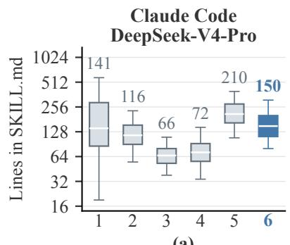

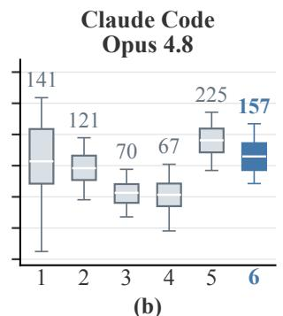

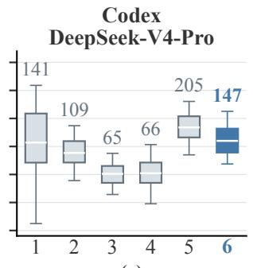

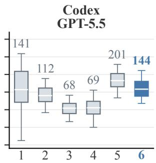  
(d)

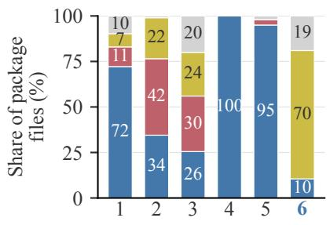

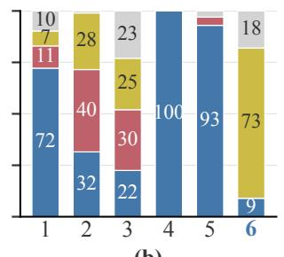

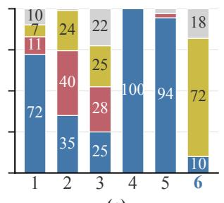

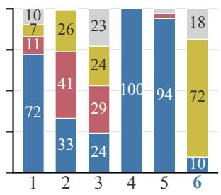  
(d)  
Figure A.1: Skill package anatomy across four agent–model configurations. Columns (a)–(d) correspond to Claude Code with D<sub>eep</sub>S<sub>ee</sub>k<sub>-</sub>V4<sub>-</sub>Pr<sub>o-</sub>Pr<sub>ev</sub>i<sub>ew,</sub> Cl<sub>au</sub>d<sub>e</sub> C<sub>o</sub>d<sub>e w</sub>ith O<sub>pus</sub> 4<sub>.</sub>8<sub>,</sub> C<sub>o</sub>d<sub>ex w</sub>ith D<sub>eep</sub>S<sub>ee</sub>k<sub>-</sub>V4<sub>-</sub>Pr<sub>o-</sub>Pr<sub>ev</sub>i<sub>ew, a</sub>nd C<sub>o</sub>d<sub>ex w</sub>ith GPT<sub>-</sub>5<sub>.</sub>5<sub>.</sub> Th<sub>e</sub> u<sub>pp</sub>er row re<sub>p</sub>orts main-file len<sub>g</sub>th distributions, and the lower row re<sub>p</sub>orts the <sub>p</sub>ro<sub>p</sub>ortions of SKILL.md, scri<sub>p</sub>ts, references, <sub>an</sub>d <sub>o</sub>th<sub>er</sub> fil<sub>es.</sub>

Package Organization. The lower row of Fi ure A.1 shows th<sub>a</sub>t th<sub>e s</sub>kill<sub>-crea</sub>t<sub>or</sub> b<sub>ase</sub>li<sub>nes</sub> t<sub>en</sub>d t<sub>o pac</sub>k<sub>age reusa</sub>bl<sub>e opera-</sub> ti<sub>ons as genera</sub>t<sub>e</sub>d <sub>scr</sub>i<sub>p</sub>t<sub>s, w</sub>h<sub>ereas</sub> S<sub>kill</sub>A<sub>lchemy represen</sub>t<sub>s</sub> them as <sub>p</sub>rocedures in SKILL.md and <sub>p</sub>laces su<sub>pp</sub>ortin<sub>g</sub> d<sub>e</sub>t<sub>a</sub>il<sub>s</sub> i<sub>n scope</sub>d <sub>re</sub>f<sub>erences.</sub> O<sub>pen</sub>Skill <sub>an</sub>d MUSE<sub>-</sub>A<sub>u</sub>t<sub>os</sub>kill i<sub>ns</sub>t<sub>ea</sub>d <sub>concen</sub>t<sub>ra</sub>t<sub>e mos</sub>t <sub>o</sub>f th<sub>e</sub>i<sub>r user-</sub>f<sub>ac</sub>i<sub>ng</sub> fil<sub>es</sub> i<sub>n</sub> th<sub>e</sub> main SKILL.md. B<sub>y</sub> ac<sub>q</sub>uirin<sub>g</sub> information from o<sub>p</sub>en-world <sub>sources an</sub>d <sub>organ</sub>i<sub>z</sub>i<sub>ng</sub> d<sub>e</sub>t<sub>a</sub>il<sub>e</sub>d <sub>suppor</sub>ti<sub>ng</sub> k<sub>now</sub>l<sub>e</sub>d<sub>ge</sub> i<sub>n re</sub>f<sub>-</sub> <sub>erence</sub> fil<sub>es,</sub> S<sub>kill</sub>A<sub>lchemy preserves</sub> b<sub>roa</sub>d <sub>ex</sub>t<sub>erna</sub>l <sub>suppor</sub>t <sub>w</sub>ith<sub>ou</sub>t <sub>p</sub>l<sub>ac</sub>i<sub>ng a</sub>ll <sub>source-spec</sub>ifi<sub>c</sub> d<sub>e</sub>t<sub>a</sub>il<sub>s</sub> i<sub>n</sub> th<sub>e core run</sub>ti<sub>me</sub> i<sub>ns</sub>t<sub>ruc</sub>ti<sub>ons, w</sub>hil<sub>e ac</sub>hi<sub>ev</sub>i<sub>ng per</sub>f<sub>ormance compara</sub>bl<sub>e</sub> t<sub>o</sub> human-curated skills. Com<sub>p</sub>lete re<sub>p</sub>resentative SKILL.md fil<sub>es</sub> f<sub>or a</sub>ll <sub>s</sub>i<sub>x s</sub>kill<sub>-</sub>b<sub>ear</sub>i<sub>ng con</sub>diti<sub>ons are prov</sub>id<sub>e</sub>d i<sub>n</sub> A<sub>p-</sub> <sub>pen</sub>di<sub>x</sub> E<sub>.</sub>

## C Details of Skill Grammar

Thi<sub>s</sub> <sub>sec</sub>ti<sub>on</sub> <sub>expan</sub>d<sub>s</sub> th<sub>e</sub> <sub>grammar-gu</sub>id<sub>e</sub>d <sub>comp</sub>il<sub>a</sub>ti<sub>on</sub> i<sub>n</sub>t<sub>ro-</sub> d<sub>uce</sub>d i<sub>n</sub> S<sub>ec</sub>ti<sub>on</sub> 3<sub>.</sub>5 <sub>o</sub>f th<sub>e ma</sub>i<sub>n paper.</sub> S<sub>ec</sub>ti<sub>on</sub> C<sub>.</sub>1 d<sub>e</sub>t<sub>a</sub>il<sub>s</sub> <sub>grammar</sub> <sub>cons</sub>t<sub>ruc</sub>ti<sub>on,</sub> S<sub>ec</sub>ti<sub>on</sub> C<sub>.</sub>2 <sub>ma</sub>k<sub>es</sub> it<sub>s</sub> <sub>opera</sub>ti<sub>ona</sub>l <sub>ru</sub>l<sub>es</sub> <sub>exp</sub>li<sub>c</sub>it<sub>,</sub> <sub>an</sub>d S<sub>ec</sub>ti<sub>on</sub> C<sub>.</sub>3 <sub>exp</sub>l<sub>a</sub>i<sub>ns</sub> h<sub>ow</sub> th<sub>e</sub> <sub>grammar</sub> <sub>gu</sub>id<sub>es</sub> <sub>pac</sub>k<sub>age</sub> <sub>ren</sub>d<sub>er</sub>i<sub>ng.</sub>

## C.1 Skill Grammar Construction

W<sub>e</sub> d<sub>er</sub>i<sub>ve</sub> th<sub>e</sub> <sub>s</sub>kill <sub>grammar</sub> f<sub>rom</sub> <sub>pu</sub>bli<sub>c</sub> <sub>s</sub>kill<sub>s</sub> i<sub>n</sub>d<sub>exe</sub>d b<sub>y</sub> htt<sub>ps:</sub>//<sub>s</sub>kill<sub>s.s</sub>h/<sub>, pr</sub>i<sub>or</sub>iti<sub>z</sub>i<sub>ng</sub> fi<sub>rs</sub>t<sub>-par</sub>t<sub>y co</sub>ll<sub>ec</sub>ti<sub>ons</sub> f<sub>rom</sub> A<sub>n-</sub> th<sub>rop</sub>i<sub>c,</sub> V<sub>erce</sub>l<sub>,</sub> Mi<sub>croso</sub>ft<sub>,</sub> S<sub>upa</sub>b<sub>ase, an</sub>d R<sub>emo</sub>ti<sub>on.</sub> W<sub>e a</sub>dd <sub>commun</sub>it<sub>y-con</sub>t<sub>r</sub>ib<sub>u</sub>t<sub>e</sub>d <sub>s</sub>kill<sub>s</sub> <sub>across</sub> t<sub>op</sub>i<sub>c</sub> <sub>groups,</sub> <sub>remove</sub> d<sub>up</sub>li<sub>ca</sub>t<sub>es,</sub> <sub>an</sub>d <sub>re</sub>t<sub>a</sub>i<sub>n</sub> <sub>pac</sub>k<sub>ages</sub> <sub>w</sub>ith <sub>parsea</sub>bl<sub>e</sub> <sub>me</sub>t<sub>a</sub>d<sub>a</sub>t<sub>a,</sub> <sub>nonemp</sub>t<sub>y</sub> i<sub>ns</sub>t<sub>ruc</sub>ti<sub>ons, an</sub>d <sub>au</sub>dit<sub>a</sub>bl<sub>e source</sub> id<sub>en</sub>tifi<sub>ers.</sub> Th<sub>e</sub> <sub>resu</sub>lti<sub>ng</sub> <sub>qua</sub>lit<sub>y-</sub>filt<sub>ere</sub>d <sub>se</sub>t <sub>correspon</sub>d<sub>s</sub> t<sub>o</sub> th<sub>e</sub> <sub>pu</sub>bli<sub>c</sub> <sub>qua</sub>li<sub>-</sub> fi<sub>e</sub>d <sub>s</sub>kill<sub>s</sub> <sub>re</sub>f<sub>erre</sub>d t<sub>o</sub> i<sub>n</sub> th<sub>e</sub> <sub>ma</sub>i<sub>n</sub> <sub>paper.</sub>

W<sub>e ex</sub>t<sub>rac</sub>t <sub>recurren</sub>t <sub>pac</sub>k<sub>age-</sub>l<sub>eve</sub>l <sub>pa</sub>tt<sub>erns</sub> i<sub>ns</sub>t<sub>ea</sub>d <sub>o</sub>f t<sub>as</sub>k<sub>-</sub> <sub>spec</sub>ifi<sub>c con</sub>t<sub>en</sub>t<sub>.</sub> Th<sub>ey cover spec</sub>ifi<sub>c</sub> t<sub>r</sub>i<sub>ggers, execu</sub>t<sub>a</sub>bl<sub>e an</sub>d <sub>con</sub>diti<sub>ona</sub>l <sub>proce</sub>d<sub>ures, app</sub>li<sub>ca</sub>bilit<sub>y</sub> b<sub>oun</sub>d<sub>ar</sub>i<sub>es, sa</sub>f<sub>eguar</sub>d<sub>s,</sub> <sub>ver</sub>ifi<sub>a</sub>bl<sub>e ou</sub>t<sub>pu</sub>t<sub>s, scope</sub>d <sub>examp</sub>l<sub>es, an</sub>d <sub>progress</sub>i<sub>ve</sub> di<sub>sc</sub>l<sub>o-</sub> <sub>sure</sub> th<sub>roug</sub>h <sub>pac</sub>k<sub>age-re</sub>l<sub>a</sub>ti<sub>ve re</sub>f<sub>erences.</sub> A <sub>mec</sub>h<sub>an</sub>i<sub>ca</sub>l <sub>ru</sub>b<sub>r</sub>i<sub>c</sub> <sub>recor</sub>d<sub>s me</sub>t<sub>a</sub>d<sub>a</sub>t<sub>a,</sub> t<sub>r</sub>i<sub>gger spec</sub>ifi<sub>c</sub>it<sub>y, execu</sub>t<sub>a</sub>bl<sub>e s</sub>t<sub>eps, exp</sub>li<sub>c</sub>it b<sub>oun</sub>d<sub>ar</sub>i<sub>es, examp</sub>l<sub>es, an</sub>d <sub>re</sub>f<sub>erence sec</sub>ti<sub>ons, an</sub>d <sub>re</sub>t<sub>a</sub>i<sub>ns</sub> th<sub>e</sub> t<sub>op-scor</sub>i<sub>ng</sub> <sub>por</sub>ti<sub>on</sub> f<sub>or</sub> d<sub>er</sub>i<sub>v</sub>i<sub>ng</sub> <sub>qua</sub>lit<sub>y-we</sub>i<sub>g</sub>ht<sub>e</sub>d <sub>pa</sub>tt<sub>erns.</sub> Th<sub>e</sub> filt<sub>ere</sub>d <sub>corpus</sub> id<sub>en</sub>tifi<sub>es presen</sub>t<sub>a</sub>ti<sub>on pa</sub>tt<sub>erns ra</sub>th<sub>er</sub> th<sub>an</sub> <sub>cer</sub>tif<sub>y</sub>i<sub>ng</sub> <sub>s</sub>kill <sub>qua</sub>lit<sub>y,</sub> <sub>an</sub>d th<sub>e</sub> <sub>ma</sub>i<sub>n-paper</sub> <sub>a</sub>bl<sub>a</sub>ti<sub>on</sub> <sub>eva</sub>l<sub>ua</sub>t<sub>es</sub> th<sub>e</sub>i<sub>r con</sub>t<sub>r</sub>ib<sub>u</sub>ti<sub>on</sub> t<sub>o</sub> S<sub>kill</sub>A<sub>lchemy.</sub>

## C.2 Operational Skill Grammar

We use grammar to mean a corpus-derived operational <sub>sc</sub>h<sub>ema,</sub> <sub>no</sub>t <sub>a</sub> t<sub>o</sub>k<sub>en-</sub>l<sub>eve</sub>l f<sub>orma</sub>l <sub>grammar.</sub> F<sub>o</sub>ll<sub>ow</sub>i<sub>ng</sub> th<sub>e</sub> <sub>ma</sub>i<sub>n</sub> <sub>paper,</sub> it<sub>s</sub> <sub>ro</sub>l<sub>e</sub> i<sub>s</sub> t<sub>o</sub> <sub>gu</sub>id<sub>e</sub> h<sub>ow</sub> <sub>a</sub>d<sub>m</sub>itt<sub>e</sub>d <sub>con</sub>t<sub>en</sub>t i<sub>s</sub> <sub>expresse</sub>d i<sub>n</sub> th<sub>e</sub> fi<sub>na</sub>l <sub>ar</sub>tif<sub>ac</sub>t<sub>.</sub> It <sub>supp</sub>li<sub>es</sub> <sub>recurren</sub>t <sub>presen</sub>t<sub>a</sub>ti<sub>on</sub> <sub>pa</sub>tt<sub>erns</sub> f<sub>or</sub> d<sub>escr</sub>i<sub>p</sub>ti<sub>ons, execu</sub>t<sub>a</sub>bl<sub>e sequences or con</sub>diti<sub>ona</sub>l <sub>s</sub>t<sub>ruc</sub>t<sub>ures,</sub> <sub>app</sub>li<sub>ca</sub>bilit<sub>y con</sub>diti<sub>ons, sa</sub>f<sub>eguar</sub>d<sub>s, ver</sub>ifi<sub>a</sub>bl<sub>e ou</sub>t<sub>pu</sub>t<sub>s, an</sub>d <sub>progress</sub>i<sub>ve</sub> di<sub>sc</sub>l<sub>osure</sub> th<sub>roug</sub>h <sub>pac</sub>k<sub>age-re</sub>l<sub>a</sub>ti<sub>ve re</sub>f<sub>erences.</sub> T<sub>a</sub>bl<sub>e</sub> A<sub>.</sub>2 <sub>ma</sub>k<sub>es</sub> th<sub>ese pa</sub>tt<sub>erns exp</sub>li<sub>c</sub>it<sub>.</sub> E<sub>ac</sub>h <sub>componen</sub>t <sub>o</sub>f<sub>ers a sma</sub>ll <sub>se</sub>t <sub>o</sub>f <sub>organ</sub>i<sub>za</sub>ti<sub>on c</sub>h<sub>o</sub>i<sub>ces an</sub>d <sub>guar</sub>d<sub>s aga</sub>i<sub>ns</sub>t <sub>a</sub> <sub>recurren</sub>t <sub>s</sub>kill<sub>-wr</sub>iti<sub>ng</sub> f<sub>a</sub>il<sub>ure.</sub> S<sub>kill</sub>A<sub>lchemy se</sub>l<sub>ec</sub>t<sub>s among</sub> th<sub>ese c</sub>h<sub>o</sub>i<sub>ces accor</sub>di<sub>ng</sub> t<sub>o</sub> th<sub>e a</sub>d<sub>m</sub>itt<sub>e</sub>d <sub>con</sub>t<sub>en</sub>t <sub>an</sub>d t<sub>as</sub>k <sub>s</sub>t<sub>ruc</sub>t<sub>ure ra</sub>th<sub>er</sub> th<sub>an</sub> i<sub>mpos</sub>i<sub>ng one</sub> fi<sub>xe</sub>d t<sub>emp</sub>l<sub>a</sub>t<sub>e.</sub>

<table><tr><td>Component</td><td>Choices and enforced property</td></tr><tr><td>Activation metadata</td><td>Choices: keyword, context, explicit, hybrid, or always-on activation. Purpose: state what the skill does and when it should be invoked, avoiding missed or unrelated activation.</td></tr><tr><td>Workflow form</td><td>Choices: ordered steps, a decision tree, template filling, or operation cards. Purpose: match the structure to procedure dependencies and expose branch conditions.</td></tr><tr><td>Executable procedure</td><td>Form: condition, action, observable output, and a supported failure route. Purpose: replace vague advice with instructions an agent can execute and inspect.</td></tr><tr><td>Applicability boundary</td><td>Choices: source, version, capability, scope, legal, or confidence limits. Purpose: preserve scope and prevent unsupported generalization across tasks and contexts.</td></tr><tr><td>Verification form</td><td>Choices: a postcondition, checklist, or artifact check. Purpose: express an admitted verification component as a directly observable output.</td></tr><tr><td>Output contract</td><td>Choices: an analysis report, executable code, conversation, checklist, or task-dependent mixture. Purpose: make the output usable by its downstream consumer. Placement: core instructions in SKILL . md,</td></tr><tr><td>Progressive disclosure</td><td>details in references/, routines in scripts/, and static resources in asset s/. Purpose: control initial context while keeping supporting material reachable. Form: complete metadata, concrete runtime</td></tr><tr><td>Package organization</td><td>instructions, and package-relative links to optional resources. Purpose: keep the core instructions executable while supporting progressive disclosure.</td></tr></table>

Table A.2: The operational skill grammar used for package organization. The grammar constrains organization and <sub>execu</sub>ti<sub>on</sub> f<sub>orm;</sub> it d<sub>oes no</sub>t <sub>supp</sub>l<sub>y</sub> t<sub>as</sub>k k<sub>now</sub>l<sub>e</sub>d<sub>ge or overr</sub>id<sub>e</sub> th<sub>e ev</sub>id<sub>ence-</sub>b<sub>ase</sub>d <sub>a</sub>d<sub>m</sub>i<sub>ss</sub>i<sub>on process.</sub>

## C.3 Grammar-Guided Compilation

D<sub>u</sub>rin<sub>g pac</sub>k<sub>age</sub> r<sub>e</sub>nd<sub>e</sub>rin<sub>g,</sub> S<sub>kill</sub>A<sub>lchemy uses</sub> th<sub>e g</sub>r<sub>a</sub>mm<sub>a</sub>r t<sub>o</sub> <sub>se</sub>l<sub>ec</sub>t <sub>an</sub> <sub>execu</sub>t<sub>a</sub>bl<sub>e</sub> <sub>an</sub>d i<sub>nspec</sub>t<sub>a</sub>bl<sub>e</sub> <sub>presen</sub>t<sub>a</sub>ti<sub>on</sub> f<sub>or</sub> th<sub>e</sub> <sub>a</sub>d<sub>m</sub>itt<sub>e</sub>d <sub>con</sub>t<sub>en</sub>t<sub>.</sub> Th<sub>e se</sub>l<sub>ec</sub>t<sub>e</sub>d <sub>pa</sub>tt<sub>erns ma</sub>k<sub>e</sub> th<sub>e</sub> i<sub>n</sub>t<sub>en</sub>d<sub>e</sub>d <sub>use</sub> di<sub>s</sub>ti<sub>ngu</sub>i<sub>s</sub>h<sub>a</sub>bl<sub>e</sub> f<sub>rom</sub> <sub>near</sub>b<sub>y</sub> t<sub>as</sub>k<sub>s,</sub> <sub>organ</sub>i<sub>ze</sub> <sub>proce</sub>d<sub>ures</sub> as an a<sub>pp</sub>ro<sub>p</sub>r<sup>i</sup>ate se<sub>q</sub>uence or con<sup>di</sup>t<sup>i</sup>ona<sup>l</sup> structure, <sub>p</sub>reserve <sub>app</sub>li<sub>ca</sub>bilit<sub>y</sub> <sub>con</sub>diti<sub>ons</sub> <sub>an</sub>d <sub>sa</sub>f<sub>eguar</sub>d<sub>s,</sub> <sub>an</sub>d <sub>p</sub>l<sub>ace</sub> <sub>op</sub>ti<sub>ona</sub>l <sub>resources</sub> b<sub>e</sub>hi<sub>n</sub>d <sub>pac</sub>k<sub>age-re</sub>l<sub>a</sub>ti<sub>ve re</sub>f<sub>erences.</sub> Thi<sub>s gu</sub>id<sub>ance</sub> <sub>c</sub>h<sub>anges on</sub>l<sub>y organ</sub>i<sub>za</sub>ti<sub>on an</sub>d <sub>presen</sub>t<sub>a</sub>ti<sub>on:</sub> it <sub>canno</sub>t <sub>a</sub>dd <sub>pro-</sub> <sub>ce</sub>d<sub>ures,</sub> b<sub>roa</sub>d<sub>en</sub> th<sub>e</sub>i<sub>r</sub> <sub>scope,</sub> <sub>or</sub> <sub>a</sub>lt<sub>er</sub> th<sub>e</sub> <sub>suppor</sub>ti<sub>ng</sub> <sub>ev</sub>id<sub>ence.</sub> T<sub>as</sub>k<sub>-spec</sub>ifi<sub>c ver</sub>ifi<sub>ca</sub>ti<sub>on appears</sub> i<sub>n</sub> th<sub>e pac</sub>k<sub>age on</sub>l<sub>y w</sub>h<sub>en</sub> it i<sub>s</sub> <sub>an</sub> <sub>a</sub>d<sub>m</sub>itt<sub>e</sub>d <sub>componen</sub>t <sub>o</sub>f <sub>a</sub> <sub>proce</sub>d<sub>ure;</sub> th<sub>e</sub> <sub>grammar</sub> <sub>can express</sub> th<sub>a</sub>t <sub>componen</sub>t <sub>as a pos</sub>t<sub>con</sub>diti<sub>on, c</sub>h<sub>ec</sub>kli<sub>s</sub>t<sub>, or</sub> <sub>ar</sub>tif<sub>ac</sub>t <sub>c</sub>h<sub>ec</sub>k b<sub>u</sub>t d<sub>oes no</sub>t i<sub>nven</sub>t <sub>one.</sub>

Illustrative Instantiation. Suppose the admitted content re-<sub>qu</sub>i<sub>res a wor</sub>kb<sub>oo</sub>k t<sub>o</sub> b<sub>e reca</sub>l<sub>cu</sub>l<sub>a</sub>t<sub>e</sub>d <sub>a</sub>ft<sub>er</sub> f<sub>ormu</sub>l<sub>a e</sub>dit<sub>s an</sub>d <sub>reopene</sub>d t<sub>o con</sub>fi<sub>rm</sub> d<sub>e</sub>li<sub>vere</sub>d <sub>va</sub>l<sub>ues.</sub> Th<sub>e grammar ren</sub>d<sub>ers</sub> th<sub>e proce</sub>d<sub>ure as an or</sub>d<sub>ere</sub>d <sub>sequence an</sub>d <sub>expresses</sub> th<sub>e a</sub>d<sub>m</sub>it<sub>-</sub> t<sub>e</sub>d d<sub>e</sub>li<sub>vere</sub>d<sub>-va</sub>l<sub>ue ver</sub>ifi<sub>ca</sub>ti<sub>on as a pos</sub>t<sub>con</sub>diti<sub>on.</sub> It <sub>p</sub>l<sub>aces</sub> <sub>any a</sub>d<sub>m</sub>itt<sub>e</sub>d <sub>eng</sub>i<sub>ne-spec</sub>ifi<sub>c</sub> d<sub>e</sub>t<sub>a</sub>il<sub>s</sub> i<sub>n a pac</sub>k<sub>age-re</sub>l<sub>a</sub>ti<sub>ve</sub> <sub>re</sub>f<sub>erence w</sub>h<sub>en</sub> th<sub>ey are no</sub>t <sub>nee</sub>d<sub>e</sub>d i<sub>n</sub> th<sub>e</sub> i<sub>n</sub>iti<sub>a</sub>ll<sub>y</sub> l<sub>oa</sub>d<sub>e</sub>d i<sub>ns</sub>t<sub>ruc</sub>ti<sub>ons.</sub> Th<sub>e reca</sub>l<sub>cu</sub>l<sub>a</sub>ti<sub>on requ</sub>i<sub>remen</sub>t<sub>, ver</sub>ifi<sub>ca</sub>ti<sub>on s</sub>t<sub>ep,</sub> <sub>an</sub>d <sub>eng</sub>i<sub>ne</sub> d<sub>e</sub>t<sub>a</sub>il<sub>s mus</sub>t <sub>s</sub>till <sub>come</sub> f<sub>rom a</sub>d<sub>m</sub>itt<sub>e</sub>d <sub>ev</sub>id<sub>ence.</sub>

Takeaways. The grammar separates the presentation of skill-<sub>wr</sub>iti<sub>ng</sub> d<sub>ec</sub>i<sub>s</sub>i<sub>ons</sub> f<sub>rom</sub> th<sub>e a</sub>d<sub>m</sub>i<sub>ss</sub>i<sub>on o</sub>f t<sub>as</sub>k<sub>-spec</sub>ifi<sub>c</sub> k<sub>now</sub>l<sub>-</sub> <sub>e</sub>d<sub>ge.</sub> A<sub>ny s</sub>kill<sub>-crea</sub>ti<sub>on me</sub>th<sub>o</sub>d <sub>can use</sub> th<sub>e same pa</sub>tt<sub>erns</sub> t<sub>o ma</sub>k<sub>e ac</sub>ti<sub>va</sub>ti<sub>on exp</sub>li<sub>c</sub>it<sub>, proce</sub>d<sub>ures execu</sub>t<sub>a</sub>bl<sub>e,</sub> b<sub>oun</sub>d<sub>-</sub> <sub>ar</sub>i<sub>es v</sub>i<sub>s</sub>ibl<sub>e, ou</sub>t<sub>pu</sub>t<sub>s ver</sub>ifi<sub>a</sub>bl<sub>e, an</sub>d <sub>suppor</sub>ti<sub>ng resources</sub> l<sub>oa</sub>d<sub>a</sub>bl<sub>e on</sub> d<sub>eman</sub>d<sub>.</sub> It<sub>s</sub> t<sub>rans</sub>f<sub>era</sub>bl<sub>e con</sub>t<sub>r</sub>ib<sub>u</sub>ti<sub>on</sub> i<sub>s</sub> th<sub>ere</sub>f<sub>ore</sub> <sub>no</sub>t <sub>a</sub> fi<sub>xe</sub>d t<sub>emp</sub>l<sub>a</sub>t<sub>e,</sub> b<sub>u</sub>t <sub>a compac</sub>t <sub>comp</sub>il<sub>a</sub>ti<sub>on sc</sub>h<sub>ema</sub> f<sub>or</sub> t<sub>urn</sub>i<sub>ng a</sub>d<sub>m</sub>itt<sub>e</sub>d k<sub>now</sub>l<sub>e</sub>d<sub>ge</sub> i<sub>n</sub>t<sub>o an agen</sub>t<sub>-usa</sub>bl<sub>e pac</sub>k<sub>age</sub> f<sub>or</sub> d<sub>owns</sub>t<sub>ream use.</sub>

## D Case Study

## D.1 Execution Case Study

Thi<sub>s case s</sub>t<sub>u</sub>d<sub>y uses ma</sub>t<sub>c</sub>h<sub>e</sub>d <sub>runs</sub> t<sub>o s</sub>h<sub>ow w</sub>h<sub>y ou</sub>t<sub>pu</sub>t<sub>s</sub> th<sub>a</sub>t <sub>sa</sub>ti<sub>s</sub>f<sub>y mos</sub>t t<sub>as</sub>k <sub>cr</sub>it<sub>er</sub>i<sub>a can s</sub>till f<sub>a</sub>il <sub>w</sub>h<sub>en a spec</sub>ifi<sub>c</sub> <sub>numer</sub>i<sub>ca</sub>l <sub>requ</sub>i<sub>remen</sub>t i<sub>s m</sub>i<sub>sse</sub>d<sub>.</sub>

Matched Comparison. SkillsBench v1.1 contains 6 easy, 53 <sub>me</sub>di<sub>um, an</sub>d 28 h<sub>ar</sub>d t<sub>as</sub>k<sub>s.</sub> W<sub>e</sub> id<sub>en</sub>tif<sub>y</sub> 33 t<sub>as</sub>k<sub>s</sub> f<sub>or w</sub>hi<sub>c</sub>h <sub>a</sub>ll <sub>seven con</sub>diti<sub>ons pro</sub>d<sub>uce va</sub>lid t<sub>as</sub>k<sub>-</sub>l<sub>eve</sub>l <sub>an</sub>d <sub>ver</sub>ifi<sub>er-cr</sub>it<sub>er</sub>i<sub>on</sub> <sub>resu</sub>lt<sub>s.</sub> Thi<sub>s ma</sub>t<sub>c</sub>h<sub>e</sub>d <sub>se</sub>t <sub>con</sub>t<sub>a</sub>i<sub>ns</sub> 3 <sub>easy,</sub> 21 <sub>me</sub>di<sub>um, an</sub>d 9 h<sub>ar</sub>d t<sub>as</sub>k<sub>s.</sub> Th<sub>e seven con</sub>diti<sub>ons are</sub> N<sub>o</sub> Skill<sub>,</sub> H<sub>uman-</sub> C<sub>ura</sub>t<sub>e</sub>d Skill<sub>,</sub> A<sub>n</sub>th<sub>rop</sub>i<sub>c</sub> Skill<sub>-</sub>C<sub>rea</sub>t<sub>or,</sub> O<sub>pen</sub>AI Skill<sub>-</sub>C<sub>rea</sub>t<sub>or,</sub> O<sub>pen</sub>Skill<sub>,</sub> MUSE<sub>-</sub>A<sub>u</sub>t<sub>os</sub>kill<sub>, an</sub>d S<sub>kill</sub>A<sub>lchemy.</sub> All <sub>case-</sub> <sub>s</sub>t<sub>u</sub>d<sub>y</sub> <sub>runs</sub> <sub>use</sub> C<sub>o</sub>d<sub>ex</sub> <sub>w</sub>ith GPT<sub>-</sub>5<sub>.</sub>5<sub>.</sub> F<sub>or</sub> <sub>eac</sub>h di<sub>sp</sub>l<sub>aye</sub>d <sub>case,</sub> <sub>we compare</sub> th<sub>e same</sub> fi<sub>ve runs w</sub>ith th<sub>e same</sub> b<sub>enc</sub>h<sub>mar</sub>k <sub>vers</sub>i<sub>on an</sub>d t<sub>as</sub>k i<sub>npu</sub>t<sub>s,</sub> th<sub>en</sub> id<sub>en</sub>tif<sub>y</sub> th<sub>e ver</sub>ifi<sub>er cr</sub>it<sub>er</sub>i<sub>on</sub> th<sub>a</sub>t d<sub>e</sub>t<sub>erm</sub>i<sub>nes</sub> th<sub>e pass</sub>/f<sub>a</sub>il <sub>ou</sub>t<sub>come.</sub> V<sub>er</sub>ifi<sub>er-cr</sub>it<sub>er</sub>i<sub>on coverage</sub> <sub>suppor</sub>t<sub>s</sub> thi<sub>s</sub> di<sub>agnos</sub>i<sub>s an</sub>d i<sub>s no</sub>t <sub>an a</sub>dditi<sub>ona</sub>l b<sub>enc</sub>h<sub>mar</sub>k <sub>me</sub>t<sub>r</sub>i<sub>c.</sub> Fi<sub>gure</sub> A<sub>.</sub>2 <sub>s</sub>h<sub>ows one me</sub>di<sub>um</sub> t<sub>as</sub>k <sub>an</sub>d <sub>one</sub> h<sub>ar</sub>d t<sub>as</sub>k <sub>se</sub>l<sub>ec</sub>t<sub>e</sub>d f<sub>rom</sub> th<sub>e ma</sub>t<sub>c</sub>h<sub>e</sub>d <sub>se</sub>t<sub>.</sub> Th<sub>e pa</sub>l<sub>e-go</sub>ld i<sub>nse</sub>t <sub>summa-</sub> <sub>r</sub>i<sub>zes</sub> th<sub>e</sub> t<sub>as</sub>k <sub>requ</sub>i<sub>remen</sub>t hi<sub>g</sub>hli<sub>g</sub>ht<sub>e</sub>d b<sub>y</sub> th<sub>e</sub> S<sub>kill</sub>A<sub>lchemy</sub> <sub>ar</sub>tif<sub>ac</sub>t<sub>.</sub>

Case 1: Numerical conditioning. The medium task re-<sub>qu</sub>i<sub>res con</sub>diti<sub>on</sub>i<sub>ng</sub> d<sub>e</sub>t<sub>ec</sub>t<sub>or s</sub>t<sub>ra</sub>i<sub>n an</sub>d <sub>searc</sub>hi<sub>ng an</sub> i<sub>n</sub>t<sub>eger</sub> <sub>mass gr</sub>id <sub>w</sub>ith th<sub>ree wave</sub>f<sub>orm approx</sub>i<sub>man</sub>t<sub>s.</sub> A <sub>su</sub>b<sub>m</sub>i<sub>ss</sub>i<sub>on</sub> must re<sub>p</sub>ort the ex<sub>p</sub>ected si<sub>g</sub>nal-to-noise ratio (SNR) and t<sub>o</sub>t<sub>a</sub>l <sub>mass</sub> f<sub>or eac</sub>h <sub>approx</sub>i<sub>man</sub>t<sub>.</sub> All <sub>seven con</sub>diti<sub>ons sa</sub>ti<sub>s</sub>f<sub>y</sub> <sub>a</sub>t l<sub>eas</sub>t <sub>e</sub>i<sub>g</sub>ht <sub>o</sub>f <sub>n</sub>i<sub>ne ver</sub>ifi<sub>er cr</sub>it<sub>er</sub>i<sub>a</sub> i<sub>n every ma</sub>t<sub>c</sub>h<sub>e</sub>d <sub>run.</sub> H<sub>uman-</sub>C<sub>ura</sub>t<sub>e</sub>d Skill<sub>,</sub> O<sub>pen</sub>Skill<sub>, an</sub>d MUSE<sub>-</sub>A<sub>u</sub>t<sub>os</sub>kill <sub>pass</sub> 5/5 <sub>runs,</sub> f<sub>o</sub>ll<sub>owe</sub>d b<sub>y</sub> S<sub>kill</sub>A<sub>lchemy</sub> <sub>a</sub>t 4/5 <sub>an</sub>d N<sub>o</sub> Skill <sub>a</sub>t 3/5<sub>, w</sub>hil<sub>e</sub> b<sub>o</sub>th <sub>s</sub>kill<sub>-crea</sub>t<sub>or con</sub>diti<sub>ons rema</sub>i<sub>n a</sub>t 0/5<sub>.</sub> Th<sub>e</sub> f<sub>a</sub>il<sub>-</sub> <sub>ures</sub> <sub>ar</sub>i<sub>se</sub> f<sub>rom</sub> <sub>an</sub> i<sub>ncorrec</sub>t <sub>recovere</sub>d SNR <sub>sca</sub>l<sub>e</sub> <sub>or</sub> b<sub>es</sub>t <sub>mass</sub> d<sub>esp</sub>it<sub>e o</sub>th<sub>erw</sub>i<sub>se we</sub>ll<sub>-</sub>f<sub>orme</sub>d <sub>ou</sub>t<sub>pu</sub>t<sub>s.</sub> I<sub>n</sub> th<sub>e unsuccess</sub>f<sub>u</sub>l

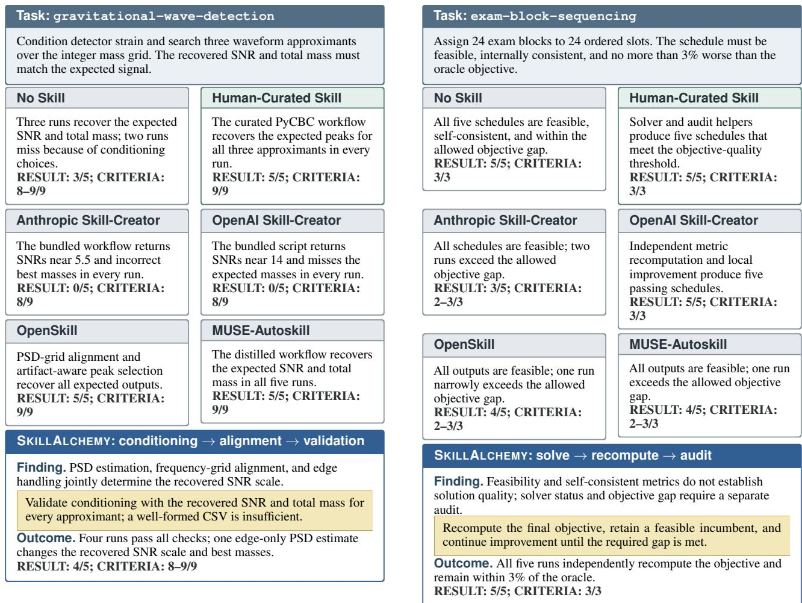  
(a) Matched-filter conditionin<sub>g</sub>  
(b) Objective-qualit<sub>y</sub> audit  
Figure A.2: Case-level comparison across all seven conditions. Results use Codex with GPT-5.5. Result counts successes over fi<sub>ve ma</sub>t<sub>c</sub>h<sub>e</sub>d <sub>runs, an</sub>d C<sub>riteria g</sub>i<sub>ves ver</sub>ifi<sub>er-cr</sub>it<sub>er</sub>i<sub>on coverage.</sub> S<sub>uccess requ</sub>i<sub>res a</sub>ll <sub>cr</sub>it<sub>er</sub>i<sub>a.</sub>

S<sub>kill</sub>A<sub>lchemy run, an e</sub>d<sub>ge-on</sub>l<sub>y power spec</sub>t<sub>ra</sub>l d<sub>ens</sub>it<sub>y es</sub>ti<sub>-</sub> <sub>ma</sub>t<sub>e s</sub>i<sub>m</sub>il<sub>ar</sub>l<sub>y c</sub>h<sub>anges</sub> th<sub>e recovere</sub>d SNR <sub>sca</sub>l<sub>e an</sub>d <sub>se</sub>l<sub>ec</sub>t<sub>e</sub>d <sub>masses.</sub> Thi<sub>s case</sub> i<sub>so</sub>l<sub>a</sub>t<sub>es numer</sub>i<sub>ca</sub>l <sub>con</sub>diti<sub>on</sub>i<sub>ng ra</sub>th<sub>er</sub> th<sub>an</sub> <sub>an ar</sub>tif<sub>ac</sub>t<sub>-</sub>f<sub>orma</sub>t f<sub>a</sub>il<sub>ure.</sub>

Case 2: Objective quality. The hard task assigns 24 exam bl<sub>oc</sub>k<sub>s</sub> t<sub>o</sub> 24 <sub>or</sub>d<sub>ere</sub>d <sub>s</sub>l<sub>o</sub>t<sub>s an</sub>d <sub>requ</sub>i<sub>res a</sub> f<sub>eas</sub>ibl<sub>e sc</sub>h<sub>e</sub>d<sub>u</sub>l<sub>e</sub> whose objective is within 3% of the oracle value. All outputs i<sub>n</sub> th<sub>e ma</sub>t<sub>c</sub>h<sub>e</sub>d <sub>runs are</sub> f<sub>eas</sub>ibl<sub>e an</sub>d i<sub>n</sub>t<sub>erna</sub>ll<sub>y cons</sub>i<sub>s</sub>t<sub>en</sub>t<sub>.</sub> N<sub>o</sub> Skill<sub>,</sub> H<sub>uman-</sub>C<sub>ura</sub>t<sub>e</sub>d Skill<sub>,</sub> O<sub>pen</sub>AI Skill<sub>-</sub>C<sub>rea</sub>t<sub>or, an</sub>d S<sub>kill</sub>A<sub>lchemy pass</sub> 5/5 <sub>runs.</sub> A<sub>n</sub>th<sub>rop</sub>i<sub>c</sub> Skill<sub>-</sub>C<sub>rea</sub>t<sub>or passes</sub> 3/5<sub>, w</sub>hil<sub>e</sub> O<sub>pen</sub>Skill <sub>an</sub>d MUSE<sub>-</sub>A<sub>u</sub>t<sub>os</sub>kill <sub>eac</sub>h <sub>pass</sub> 4/5 because their remaining runs exceed the allowed objective <sub>gap.</sub> Th<sub>us,</sub> f<sub>eas</sub>ibilit<sub>y</sub> <sub>an</sub>d <sub>se</sub>lf<sub>-cons</sub>i<sub>s</sub>t<sub>en</sub>t <sub>repor</sub>t<sub>e</sub>d <sub>me</sub>t<sub>r</sub>i<sub>cs</sub> d<sub>o</sub> <sub>no</sub>t b<sub>y</sub> th<sub>emse</sub>l<sub>ves es</sub>t<sub>a</sub>bli<sub>s</sub>h th<sub>a</sub>t th<sub>e</sub> fi<sub>na</sub>l <sub>so</sub>l<sub>u</sub>ti<sub>on</sub> i<sub>s accep</sub>t<sub>a</sub>bl<sub>e</sub> f<sub>or</sub> b<sub>enc</sub>h<sub>mar</sub>k <sub>eva</sub>l<sub>ua</sub>ti<sub>on.</sub>

Takeaways. The two cases expose a shared failure pattern:

<sub>s</sub>t<sub>ruc</sub>t<sub>ura</sub>l <sub>va</sub>lidit<sub>y an</sub>d <sub>near-comp</sub>l<sub>e</sub>t<sub>e cr</sub>it<sub>er</sub>i<sub>on coverage</sub> d<sub>o no</sub>t <sub>guaran</sub>t<sub>ee</sub> t<sub>as</sub>k <sub>success.</sub> N<sub>umer</sub>i<sub>ca</sub>l <sub>p</sub>i<sub>pe</sub>li<sub>nes requ</sub>i<sub>re c</sub>h<sub>ec</sub>k<sub>s</sub> <sub>on</sub> t<sub>as</sub>k<sub>-</sub>d<sub>e</sub>t<sub>erm</sub>i<sub>n</sub>i<sub>ng compu</sub>t<sub>a</sub>ti<sub>ons, w</sub>hil<sub>e op</sub>ti<sub>m</sub>i<sub>za</sub>ti<sub>on</sub> t<sub>as</sub>k<sub>s</sub> require objective-quality checks beyond feasibility. Skill artif<sub>ac</sub>t<sub>s</sub> <sub>s</sub>h<sub>ou</sub>ld th<sub>ere</sub>f<sub>ore</sub> t<sub>rans</sub>l<sub>a</sub>t<sub>e</sub> d<sub>ec</sub>i<sub>s</sub>i<sub>ve</sub> t<sub>as</sub>k <sub>requ</sub>i<sub>remen</sub>t<sub>s</sub> i<sub>n</sub>t<sub>o exp</sub>li<sub>c</sub>it<sub>,</sub> t<sub>as</sub>k<sub>-spec</sub>ifi<sub>c va</sub>lid<sub>a</sub>ti<sub>on s</sub>t<sub>eps.</sub>

## D.2 Implicit-Requirement Web Search

Thi<sub>s</sub> <sub>case</sub> <sub>s</sub>t<sub>u</sub>d<sub>y</sub> <sub>exam</sub>i<sub>nes</sub> h<sub>ow</sub> <sub>searc</sub>h f<sub>ram</sub>i<sub>ng</sub> <sub>an</sub>d <sub>ev</sub>id<sub>ence</sub> <sub>syn</sub>th<sub>es</sub>i<sub>s</sub> d<sub>e</sub>t<sub>erm</sub>i<sub>ne</sub> <sub>w</sub>h<sub>e</sub>th<sub>er</sub> W<sub>e</sub>b <sub>access</sub> i<sub>mproves</sub> <sub>genera</sub>t<sub>e</sub>d <sub>s</sub>kill<sub>s</sub> i<sub>n</sub> <sub>prac</sub>ti<sub>ce.</sub>

Compared workflows. We compare a direct creator (OpenAI Skill-Creator), a retrieval-based method (O<sub>p</sub>enSkill), and S<sub>kill</sub>A<sub>lchemy, w</sub>hi<sub>c</sub>h <sub>com</sub>bi<sub>nes</sub> i<sub>mp</sub>li<sub>c</sub>it <sub>requ</sub>i<sub>remen</sub>t di<sub>scov-</sub> <sub>ery w</sub>ith <sub>con</sub>t<sub>ras</sub>ti<sub>ve ev</sub>id<sub>ence acqu</sub>i<sub>s</sub>iti<sub>on.</sub> F<sub>or eac</sub>h <sub>wor</sub>kfl<sub>ow,</sub> <sub>we</sub> t<sub>race</sub> it<sub>s ques</sub>ti<sub>ons, re</sub>t<sub>r</sub>i<sub>eve</sub>d <sub>ev</sub>id<sub>ence, an</sub>d fi<sub>na</sub>l<sub>-ar</sub>tif<sub>ac</sub>t

<sub>sa</sub>f<sub>eguar</sub>d<sub>s.</sub>

Representative task. weighted-gdp-calc requires <sub>expo</sub>rt<sub>s,</sub> im<sub>po</sub>rt<sub>s, a</sub>nd GDP f<sub>o</sub>r <sub>s</sub>i<sub>x</sub> GCC <sub>cou</sub>ntri<sub>es ove</sub>r 2019<sub>–</sub> 2023<sub>.</sub> Th<sub>e</sub> <sub>agen</sub>t <sub>mus</sub>t <sub>a</sub>dd <sub>au</sub>dit<sub>a</sub>bl<sub>e</sub> f<sub>ormu</sub>l<sub>as</sub> t<sub>o</sub> <sub>an</sub> <sub>ex</sub>i<sub>s</sub>ti<sub>ng</sub> <sub>wor</sub>kb<sub>oo</sub>k<sub>, compu</sub>t<sub>e coun</sub>t<sub>ry s</sub>t<sub>a</sub>ti<sub>s</sub>ti<sub>cs an</sub>d <sub>a</sub> GDP<sub>-we</sub>i<sub>g</sub>ht<sub>e</sub>d <sub>reg</sub>i<sub>ona</sub>l <sub>mean, reca</sub>l<sub>cu</sub>l<sub>a</sub>t<sub>e</sub> th<sub>e</sub> fil<sub>e, an</sub>d <sub>preserve</sub> th<sub>e wor</sub>kb<sub>oo</sub>k <sub>s</sub>t<sub>ruc</sub>t<sub>ure</sub> <sub>an</sub>d f<sub>orma</sub>tti<sub>ng.</sub>

Process comparison. The OpenAI Skill-Creator focuses <sub>on</sub> f<sub>ormu</sub>l<sub>a seman</sub>ti<sub>cs, om</sub>itti<sub>ng eng</sub>i<sub>ne compa</sub>tibilit<sub>y an</sub>d <sub>cac</sub>h<sub>e</sub>d<sub>-va</sub>l<sub>ue va</sub>lid<sub>a</sub>ti<sub>on.</sub> O<sub>pen</sub>Skill <sub>re</sub>t<sub>r</sub>i<sub>eves</sub> th<sub>ese r</sub>i<sub>s</sub>k<sub>s</sub> b<sub>u</sub>t d<sub>oes no</sub>t <sub>connec</sub>t th<sub>em</sub> t<sub>o preserv</sub>i<sub>ng an</sub>d d<sub>e</sub>li<sub>ver</sub>i<sub>ng</sub> th<sub>e</sub> <sub>wor</sub>kb<sub>oo</sub>k<sub>.</sub> S<sub>kill</sub>A<sub>lchemy</sub> t<sub>urns</sub> i<sub>n</sub>t<sub>erac</sub>ti<sub>ng</sub> <sub>execu</sub>ti<sub>on</sub> <sub>r</sub>i<sub>s</sub>k<sub>s</sub> i<sub>n</sub>t<sub>o sa</sub>f<sub>eguar</sub>d<sub>s on</sub> th<sub>e</sub> d<sub>e</sub>li<sub>vere</sub>d <sub>ar</sub>tif<sub>ac</sub>t<sub>.</sub>

From evidence to executable checks. Retrieved document<sub>a</sub>ti<sub>on</sub> h<sub>e</sub>l<sub>ps on</sub>l<sub>y w</sub>h<sub>en</sub> it b<sub>ecomes c</sub>h<sub>ec</sub>k<sub>s on</sub> th<sub>e su</sub>b<sub>m</sub>itt<sub>e</sub>d <sub>ar</sub>tif<sub>ac</sub>t<sub>.</sub> F<sub>unc</sub>ti<sub>on</sub> <sub>seman</sub>ti<sub>cs</sub> d<sub>o</sub> <sub>no</sub>t <sub>ensure</sub> <sub>eng</sub>i<sub>ne</sub> <sub>compa</sub>tibil<sub>-</sub> it<sub>y, reca</sub>l<sub>cu</sub>l<sub>a</sub>ti<sub>on, or curren</sub>t <sub>cac</sub>h<sub>e</sub>d <sub>va</sub>l<sub>ues, w</sub>hil<sub>e separa</sub>t<sub>e</sub>l<sub>y</sub> <sub>re</sub>t<sub>r</sub>i<sub>eve</sub>d <sub>r</sub>i<sub>s</sub>k<sub>s</sub> d<sub>o no</sub>t <sub>ensure w</sub>h<sub>o</sub>l<sub>e-wor</sub>kb<sub>oo</sub>k <sub>va</sub>lid<sub>a</sub>ti<sub>on.</sub> S<sub>kill</sub>A<sub>lchemy connec</sub>t<sub>s</sub> th<sub>ese concerns</sub> i<sub>n</sub>t<sub>o one execu</sub>ti<sub>on</sub> <sub>pa</sub>th th<sub>a</sub>t <sub>preserves s</sub>t<sub>ruc</sub>t<sub>ure, wr</sub>it<sub>es compa</sub>tibl<sub>e</sub> f<sub>ormu</sub>l<sub>as,</sub> <sub>reca</sub>l<sub>cu</sub>l<sub>a</sub>t<sub>es, reopens</sub> th<sub>e save</sub>d fil<sub>e, an</sub>d <sub>ver</sub>ifi<sub>es va</sub>l<sub>ues</sub> i<sub>n</sub> th<sub>e</sub> fi<sub>na</sub>l d<sub>e</sub>li<sub>vere</sub>d fil<sub>e.</sub>

Takeaways. Queries derived from implicit requirement dis-<sub>covery ma</sub>k<sub>e</sub> W<sub>e</sub>b <sub>ev</sub>id<sub>ence ac</sub>ti<sub>ona</sub>bl<sub>e</sub> b<sub>y conver</sub>ti<sub>ng execu-</sub> ti<sub>on r</sub>i<sub>s</sub>k<sub>s</sub> i<sub>n</sub>t<sub>o ar</sub>tif<sub>ac</sub>t <sub>c</sub>h<sub>ec</sub>k<sub>s.</sub> H<sub>ere,</sub> di<sub>rec</sub>t <sub>an</sub>d b<sub>roa</sub>d <sub>searc</sub>h l<sub>eave cr</sub>iti<sub>ca</sub>l <sub>sa</sub>f<sub>eguar</sub>d<sub>s</sub> i<sub>ncomp</sub>l<sub>e</sub>t<sub>e, w</sub>h<sub>ereas</sub> S<sub>kill</sub>A<sub>lchemy</sub> <sub>connec</sub>t<sub>s</sub> th<sub>em</sub> t<sub>o c</sub>h<sub>ec</sub>k<sub>s on</sub> th<sub>e</sub> fi<sub>na</sub>l d<sub>e</sub>li<sub>vere</sub>d <sub>ar</sub>tif<sub>ac</sub>t<sub>.</sub>

<table><tr><td>Method</td><td>Search design, evidence, and outcome</td></tr><tr><td>OpenAI Skill-Creator</td><td>Framing: task-relevant spreadsheet functions. Evidence: Microsoft function documentation and openpyxl formula-writing guidance. Outcome: calculation-engine compatibility and cached-value validation remain uncovered;</td></tr><tr><td>OpenSkill</td><td>Framing: technologies for general spreadsheet construction. Evidence: workbook properties, recalculation engines, Excel functions, and IMF interfaces. Outcome: the risks are retrieved but not connected to a delivered-file requirement; 0/5 runs pass.</td></tr><tr><td>SKILLALCHEMY</td><td>Framing: omitted execution risks identified through implicit requirement discovery and boundary probes. Evidence: formula compatibility, recalculation, cached values, array alignment, reference stability, economic semantics, and workbook preservation. Outcome: the evidence</td></tr></table>

Table A.3: Search strategy, retrieved evidence, and downstream result on weighted-gdp-calc. Retrieved cont<sub>en</sub>t i<sub>s summar</sub>i<sub>ze</sub>d f<sub>rom</sub> th<sub>e s</sub>kill<sub>-crea</sub>ti<sub>on searc</sub>h <sub>recor</sub>d<sub>s.</sub>

## E Examples for SKILL.md

F<sub>or a</sub>ll <sub>s</sub>i<sub>x s</sub>kill<sub>-</sub>b<sub>ear</sub>i<sub>ng con</sub>diti<sub>ons, we repro</sub>d<sub>uce</sub> th<sub>e comp</sub>l<sub>e</sub>t<sub>e</sub> runtime-facin<sub>g</sub> SKILL.md for glm-lake-mendota, t<sub>rea</sub>ti<sub>ng</sub> th<sub>e a</sub>li<sub>gne</sub>d <sub>mo</sub>d<sub>u</sub>l<sub>e</sub> f<sub>rom mo</sub>d<sub>u</sub>l<sub>ar</sub> H<sub>uman-</sub>C<sub>ura</sub>t<sub>e</sub>d Skill and O enSkill out uts as their SKILL.md. All numeri<sub>ca</sub>l <sub>c</sub>h<sub>ec</sub>k<sub>s</sub> i<sub>n</sub> thi<sub>s sec</sub>ti<sub>on use pu</sub>bli<sub>c or crea</sub>t<sub>or-genera</sub>t<sub>e</sub>d <sub>ar</sub>tif<sub>ac</sub>t<sub>s; s</sub>kill <sub>crea</sub>ti<sub>on accesses no</sub> Skill<sub>s</sub>B<sub>enc</sub>h h<sub>e</sub>ld<sub>-ou</sub>t i<sub>n-</sub> <sub>pu</sub>t<sub>s, orac</sub>l<sub>e asse</sub>t<sub>s, or ver</sub>ifi<sub>er</sub> i<sub>mp</sub>l<sub>emen</sub>t<sub>a</sub>ti<sub>ons.</sub> I<sub>n</sub> E<sub>.</sub>6<sub>, pa</sub>th<sub>s,</sub> d<sub>a</sub>t<sub>es, an</sub>d t<sub>arge</sub>t<sub>s</sub> bi<sub>n</sub>d th<sub>e wor</sub>kfl<sub>ow</sub> t<sub>o v</sub>i<sub>s</sub>ibl<sub>e</sub> t<sub>as</sub>k <sub>con</sub>t<sub>ex</sub>t<sub>,</sub> <sub>w</sub>hil<sub>e</sub> th<sub>e can</sub>did<sub>a</sub>t<sub>e parame</sub>t<sub>ers are exp</sub>li<sub>c</sub>itl<sub>y scope</sub>d t<sub>o</sub> L<sub>a</sub>k<sub>e</sub> M<sub>en</sub>d<sub>o</sub>t<sub>a ev</sub>id<sub>ence; none are</sub> t<sub>rans</sub>f<sub>era</sub>bl<sub>e</sub> d<sub>e</sub>f<sub>au</sub>lt<sub>s.</sub> W<sub>e pre-</sub> <sub>serve source</sub> li<sub>ne num</sub>b<sub>ers an</sub>d <sub>proce</sub>d<sub>ures an</sub>d t<sub>rans</sub>lit<sub>era</sub>t<sub>e</sub> <sub>sym</sub>b<sub>o</sub>l<sub>s</sub> f<sub>or p</sub>dfL<sub>a</sub>T<sub>e</sub>X<sub>.</sub> S<sub>e</sub>l<sub>ec</sub>t<sub>e</sub>d <sub>spans preserve</sub> th<sub>e surroun</sub>d i<sub>ng</sub> t<sub>ex</sub>t <sub>w</sub>hil<sub>e prov</sub>idi<sub>ng a rea</sub>di<sub>ng gu</sub>id<sub>e.</sub> Bl<sub>ue mar</sub>k<sub>s an</sub> explicit requirement stated by the task, while purple marks an implicit requirement that is necessary for successful execution b<sub>u</sub>t <sub>mus</sub>t b<sub>e</sub> di<sub>scovere</sub>d b<sub>eyon</sub>d th<sub>e promp</sub>t<sub>.</sub> O<sub>range mar</sub>k<sub>s a</sub> scoped local example, and green marks generalized content intended to transfer be<sub>y</sub>ond the current instance. A red ✗ identifies an over-specific use of local evidence beyond its <sub>suppor</sub>t<sub>e</sub>d <sub>scope.</sub> B<sub>r</sub>i<sub>e</sub>f <sub>assessmen</sub>t<sub>s</sub> <sub>appear</sub> i<sub>mme</sub>di<sub>a</sub>t<sub>e</sub>l<sub>y</sub> <sub>a</sub>ft<sub>er</sub> th<sub>e</sub> <sub>re</sub>l<sub>evan</sub>t <sub>source</sub> bl<sub>oc</sub>k<sub>,</sub> <sub>w</sub>hil<sub>e</sub> <sub>neu</sub>t<sub>ra</sub>l <sub>gray</sub> <sub>assessmen</sub>t<sub>s</sub> d<sub>escr</sub>ib<sub>e o</sub>th<sub>er</sub> li<sub>m</sub>it<sub>a</sub>ti<sub>ons w</sub>ith<sub>ou</sub>t i<sub>n</sub>t<sub>ro</sub>d<sub>uc</sub>i<sub>ng ano</sub>th<sub>er anno-</sub> t<sub>a</sub>ti<sub>on ca</sub>t<sub>egory.</sub> Th<sub>e gu</sub>id<sub>e</sub> b<sub>e</sub>l<sub>ow summar</sub>i<sub>zes</sub> th<sub>ese co</sub>l<sub>ors.</sub>

13 ## Key Calibration Parameters

23 ## Parameter Effects

## E.1 Human-Curated Skill

Useful domain heuristics, but limited task <sub>g</sub>roundin<sub>g</sub> and several unsco<sub>p</sub>ed local rules. (92 source lines.)

SKILL.md (Human-Curated Skill)

1 --   
2 name: glm-calibration   
3 description: Calibrate GLM parameters for water temperature simulation . Use when you need to   
adjust model parameters to minimize RMSE between simulated and observed temperatures .   
4 license: MIT   
5 --   
6   
7 # GLM Calibration Guide   
8   
9 ## Overview   
10   
11 GLM calibration involves adjusting physical parameters to minimize the difference between   
simulated and observed water temperatures. The goal is typically to achieve RMSE < 2.0°C . ✗   
Over-specific threshold The benchmark’s 2°C acce<sub>p</sub>tance threshold is <sub>p</sub>resented as a <sub>g</sub>eneral definition of <sub>g</sub>ood GLM calibration.

```typescript
15 | Parameter | Section | Description | Default | Range |
17 | `Kw` | `&light` | Light extinction coefficient (m 0.3 0.1 - 0.5 ✗
18 | `coef_mix_hyp` | `&mixing` | Hypolimnetic mixing coefficient | 0.5 | 0.3 - 0.7 | ✗
19 | `wind_factor` `&meteorology` Wind speed scaling factor 1.0 | 0.7 1.3 | ✗
20 `lw_factor` `&meteorology` Longwave radiation scaling 1.0 | 0.7 - 1.3 | ✗
21 `ch` `&meteorology` Sensible heat transfer coefficient 0.0013 0.0005 0.002 ✗
```

Unscoped local defaults The fixed values and ranges are potentially useful examples, but the skill gives no lake, GLM configuration, or evidence b<sub>oun</sub>d<sub>ary</sub> f<sub>or</sub> th<sub>em.</sub>

```python
33 ## Calibration with Optimization
34 ```python
35 from scipy.optimize import minimize
36
37 def objective(x):
38 Kw, coef_mix_hyp, wind_factor, lw_factor, ch = x
39
40 # Modify parameters
41 params = {
42 ’Kw’: round(Kw, 4),
43 ’coef_mix_hyp’: round(coef_mix_hyp, 4),
```

```markdown
SKILL.md (Human-Curated Skill) (continued)
44 ’wind_factor’: round(wind_factor, 4),
45 ’lw_factor’: round(lw_factor, 4),
46 ’ch’: round(ch, 6)
47 }
48 modify_nml(’glm3.nml’, params)
49
50 # Run GLM
51 subprocess.run([’glm’], capture_output=True)
52
53 # Calculate RMSE
54 rmse = calculate_rmse(sim_df, obs_df)
55 return rmse
Implementation gap The displayed code is not directly executable: modify_nml, calculate_rmse, sim_df, and obs_df are undefined.
56
57 # Initial values (defaults)
58 x0 = [0.3, 0.5, 1.0, 1.0, 0.0013]
59
60 # Run optimization
61 result = minimize(
62 objective,
63 x0,
64 method=’Nelder-Mead’
65 options={’maxiter’: 150}
66 )
67 ```
68
69 ## Manual Calibration Strategy
70
71 1. Start with default parameters, run GLM, calculate RMSE
72 2. Adjust one parameter at a time
73 3. If surface too warm → increase `wind_factor`
74 4. If deep water too warm → increase `Kw`
75 5. If stratification too weak → decrease `coef_mix_hyp`
76 6. Iterate until RMSE < 2.0°C ✗
77
78 ## Common Issues
79
80 | Issue | Likely Cause | Solution |
81 |
82 | Surface too warm Low wind mixing Increase `wind_factor`
83 | Deep water too warm Too much light penetration Increase `Kw
84 | Weak stratification Too much mixing Decrease `coef_mix_hyp`
85 | Overall warm bias Heat budget too high Decrease `lw_factor` or `ch
86
87 ## Best Practices
88
89 Change one parameter at a time when manually calibrating
90 Keep parameters within physical ranges
91 - Use optimization for fine-tuning after manual adjustment
92 - Target RMSE < 2.0°C for good calibration ✗
Repeated local rule The same task-specific threshold is reused as both a universal stopping rule and a universal quality judgment.
```

## E.2 Anthropic Skill-Creator

Task-aware and o<sub>p</sub>erational, but one coordinate <sub>p</sub>olic<sub>y</sub> selects semantics b<sub>y</sub> score. (114 source lines.)

```markdown
1
2 name: glm-lake-mendota-skill
3 description: Use this skill whenever a task asks you to run, calibrate, or evaluate the General
Lake Model for Lake Mendota temperature simulations using glm3.nml, bcs forcing CSVs,
field_temp_oxy.csv observations, and an RMSE target . It guides GLM execution, NetCDF temperature
scoring, and conservative parameter iteration without hardcoding a solution.
4
5
6 # GLM Lake Mendota Solver Workflow
7
8 This skill helps solve Lake Mendota General Lake Model tasks where the final deliverables are:
9
10 - `/root/output/output.nc`
11 final calibrated parameters saved in `/root/glm3.nml`
12 - vertical water temperature RMSE against `/root/field_temp_oxy.csv` below the requested threshold
13
14 Do not treat this skill as a reference solution. It is a reusable workflow, scoring harness, and
calibration checklist . You still need to run GLM, inspect the outputs, and choose parameters based
on the current sandbox.
15
16 ## First Moves
17
18 1. Work from `/root` unless the user explicitly stages the model elsewhere.
19 2. Confirm these inputs exist:
20 `/usr/local/bin/glm`
21 `/root/glm3.nml`
22 `/root/bcs/meteo.csv`
23 `/root/bcs/yahara.csv`
24 `/root/bcs/pheasant.csv`
25 `/root/bcs/outflow.csv`
26 `/root/field_temp_oxy.csv`
27 3. Read `references/task_environment.md` for the data shape observed when this skill was created .
28 4. Read `references/sources.md` before changing model settings; it records the public
documentation used to ground this workflow.
29 5. Run a lightweight environment check:
30
31 ```bash
32 python /path/to/this-skill/scripts/inspect_environment.py -root /root
33
34
35 The checker prints paths, CSV columns, date ranges, observation depth ranges , and the key
`glm3.nml` blocks. It does not run a simulation.
Environment requirements The task names inputs, but it does not state that their schema, coverage, depth range, and working directory must be
<sub>va</sub>lid<sub>a</sub>t<sub>e</sub>d b<sub>e</sub>f<sub>ore ca</sub>lib<sub>ra</sub>ti<sub>on.</sub>
36
37 ## Run GLM
38
39 GLM reads `glm3.nml` in the working simulation directory. Keep the task’s relative paths intact
unless a GLM log proves they are wrong. In this task, the configuration points at `bcs/...` CSV
files and writes `output/output.nc` .
40
41 ```bash
42 cd /root
```

```markdown
SKILL.md (Anthropic Skill-Creator) (continued)
43 mkdir -p output
44 /usr/local/bin/glm
45 ```
46
47 After each run, confirm `/root/output/output.nc` exists . If GLM fails, inspect the terminal log
first; most failures are path, time-format, or malformed namelist edits .
48
49 ## Score Temperature RMSE
50
51 Score against the observation points, not just a regular grid. The bundled scorer opens the NetCDF
output, infers the temperature variable and vertical coordinate, interpolates to each `(datetime,
depth)` observation , and reports RMSE.
52
53 ```bash
54 python /path/to/this-skill/scripts/score_glm_temperature.py \
55 -nc /root/output/output.nc \
56 -obs /root/field_temp_oxy.csv \
57 -json /root/output/rmse.json
58 ```
59
60 The scorer tries both direct-depth and elevation-to-depth vertical interpretations and reports the
lower-RMSE orientation . If it cannot infer the output schema, inspect the dataset with `python -
<<’PY’` and `xarray.open_dataset(...)`, then rerun with explicit `-temp-var`, `-time-dim`, and
`-depth-dim`. ✗
Score-selected coordinate semantics Choosing whichever vertical interpretation yields lower RMSE can hide a coordinate error. Coordinate
<sub>mean</sub>i<sub>ng s</sub>h<sub>ou</sub>ld b<sub>e es</sub>t<sub>a</sub>bli<sub>s</sub>h<sub>e</sub>d f<sub>rom sc</sub>h<sub>ema or source ev</sub>id<sub>ence.</sub>
61
62 ## Calibrate Conservatively
63
64 Use short, logged candidate runs . Change a small set of physically meaningful parameters, score,
keep the best reproducible candidate , and avoid broad blind edits that make the nml hard to trust.
65
66 Parameters worth checking first in this task type :
67
68 - Surface forcing multipliers in `&meteorology`: `wind_factor`, `sw_factor`, `lw_factor`,
`at_factor`, `rh_factor`
69 Heat/light penetration in `&light`: `Kw` and, only if needed, `light_extc` / `energy_frac`.
70 - Vertical mixing in `&mixing`: `coef_wind_stir`, `coef_mix_conv`, `coef_mix_shear`,
`coef_mix_turb`, `coef_mix_KH`, `coef_mix_hyp`, and `deep_mixing`.
71 - Inflow placement and thermal influence in `&inflow`: `inflow_factor`, `strm_hf_angle`,
`strmbd_slope`, `strmbd_drag`.
72 - Winter behavior in `&snowice` and `&sediment` if errors cluster under ice or near the bottom.
Task-type examples These parameter families are concrete starting points; they are not claimed to be universal optima.
73
74 Use `scripts/patch_glm_nml.py` for careful single-line nml edits:
75
76 ```bash
77 python /path/to/this-skill/scripts/patch_glm_nml.py /root/glm3.nml \
78 -set meteorology. wind_factor=1.08 \
79 -set mixing. coef_wind_stir=0.28 \
80 -set light.Kw=0.34
81
82
83 You can run one candidate and score it in one command:
84
85 ```bash
```

SKILL.md (Anthropic Skill-Creator) (continued)

86 python /path/to/this-skill/scripts/run\_candidate.py \   
87 -root /root \   
88 -glm /usr/local/bin/glm \   
89 -set meteorology. wind\_factor=1.08 \   
90 -set mixing. coef\_wind\_stir=0.28 \   
91 -set light.Kw=0.34   
92   
93   
94 Keep a simple run log with parameters and RMSE. When a candidate improves RMSE, leave those   
parameters in \`/root/glm3.nml\` and rerun GLM once from a clean \`/root/output\` directory to verify   
the final output is reproducible .   
95   
96 ## Practical Calibration Pattern   
97   
98 1. Run and score the unmodified baseline .   
99 2. Inspect residuals by time and depth if RMSE is high:   
100 warm/cold bias across most depths often points to radiation, air temperature, longwave, or   
light attenuation.   
101 surface-only errors often point to wind, heat flux, and near-surface mixing.   
102 deep-water or stratification timing errors often point to mixing, light attenuation, sediment   
heat, or inflow placement.   
103 winter-only errors often point to snow/ice and meteorological forcing.   
104 3. Sweep one parameter family at a time with a small grid . Keep values near the original   
configuration unless the residual pattern justifies moving farther.   
105 4. Re-run the best candidate and re-score after every accepted change.   
106 5. Stop when RMSE is below the requested target and GLM can run successfully with the final   
\`/root/glm3.nml\` .

Reusable calibration loop Baseline, residual diagnosis, bounded parameter-family changes, and clean reruns form a transferable process.

107   
108 ## Guardrails   
109   
110 - Do not fetch or copy a reference answer for this exact benchmark.   
111 - Do not delete files outside \`/root/output\` during solver runs.   
112 - Do not change the required simulation dates unless the task prompt changes.   
113 - Do not report success from CSV point outputs alone; the expected artifact is   
\`/root/output/output.nc\` .   
114 - Preserve the final working parameters in \`/root/glm3.nml\` .

## E.3 OpenAI Skill-Creator

Good artifact handlin<sub>g</sub>, but a fixed time tolerance is <sub>p</sub>romoted without validation. (101 source lines.)

1 --   
2 name: glm-lake-mendota-skill   
3 description: Calibrate and validate a General Lake Model (GLM) Lake Mendota case using glm3.nml,   
bcs forcing CSV files, field\_temp\_oxy.csv observations, and output/output.nc. Use when asked to   
run GLM, tune vertical water-temperature simulation accuracy, compute RMSE against observed   
temperature profiles , or leave final GLM parameters in glm3.nml for a Lake Mendota-style benchmark   
sandbox.   
4 --   
5   
6 # GLM Lake Mendota Calibration   
7   
8 ## Overview   
9

KILL.md (OpenAI Skill-Creator) (continued)   
10 Use this skill to turn the Lake Mendota GLM sandbox into a reproducible calibration loop. The   
target benchmark requires \`/root/output/output.nc\` , a successful \`/usr/local/bin/glm\` run, and   
final tuned parameters saved in \`/root/glm3.nml\` .   
11   
12 Do not solve by fabricating NetCDF output or editing observations. Run GLM with physically   
plausible namelist changes , score the simulation, and keep the final parameters in \`glm3.nml\`.   
13   
14 ## Source Grounding   
15   
16 Before changing modeling logic, read \`references/glm-mendota-notes.md\`. It records the public GLM   
and glmtools sources used for this skill plus the inspected sandbox data shape .   
17   
18 ## Workflow   
19   
20 1. Confirm the sandbox files exist:   
21 \`/usr/local/bin/glm\`   
22 \`/root/glm3.nml\`   
23 \`/root/bcs/meteo.csv\`, \`/root/bcs/yahara.csv\`, \`/root/bcs/pheasant.csv\`,   
\`/root/bcs/outflow.csv\`   
24 \`/root/field\_temp\_oxy.csv\`   
25 2. Inspect the current namelist. Preserve the required period and output path unless they are   
wrong:   
26 \`time.start = ’2009-01-01 12:00:00 ’   
27 \`time.stop = ’2015-12-30 12:00:00   
28 \`output.out\_dir = ’output’\`   
29 \`output.out\_fn = ’output’\`   
30 3. Run the baseline model from \`/root\` :   
31 \`\`\`bash   
32 cd /root   
33 mkdir -p output   
34 /usr/local/bin/glm   
35   
36 4. Score the run:   
37 \`\`\`bash   
38 python /path/to/this-skill/scripts/score\_glm\_output.py \   
39 -obs /root/field\_temp\_oxy.csv \   
40 -nc /root/output/output.nc   
41   
42 5. Tune one small group of physically meaningful parameters at a time , run GLM, and rescore. Good   
first candidates for this case are:   
43 Light attenuation: \`light.Kw\`   
44 Vertical mixing: \`mixing.coef\_mix\_conv\`, \`mixing.coef\_wind\_stir\`, \`mixing.coef\_mix\_shear\`,   
\`mixing.coef\_mix\_turb\`, \`mixing.coef\_mix\_KH\`, \`mixing.coef\_mix\_hyp\`   
45 Surface forcing multipliers: \`meteorology.wind\_factor\`, \`meteorology.sw\_factor\`,   
\`meteorology.lw\_factor\`, \`meteorology.at\_factor\`   
46 Drag/transfer coefficients: \`meteorology.cd\`, \`meteorology.ce\`, \`meteorology.ch\`   
47 6. Stop when the temperature RMSE is below 2 degrees C or when further tuning is clearly   
unproductive. Leave the winning \`/root/glm3.nml\` in place and ensure \`/root/output/output.nc\` is   
from that same configuration .   
Artifact consistency Th<sub>e</sub> t<sub>as</sub>k <sub>requ</sub>i<sub>res</sub> <sub>a</sub> <sub>runna</sub>bl<sub>e</sub> fi<sub>na</sub>l <sub>nm</sub>l<sub>,</sub> b<sub>u</sub>t d<sub>oes</sub> <sub>no</sub>t <sub>exp</sub>li<sub>c</sub>itl<sub>y</sub> <sub>say</sub> th<sub>a</sub>t th<sub>e</sub> d<sub>e</sub>li<sub>vere</sub>d <sub>ou</sub>t<sub>pu</sub>t <sub>mus</sub>t b<sub>e</sub> <sub>regenera</sub>t<sub>e</sub>d f<sub>rom</sub> th<sub>a</sub>t   
<sub>exac</sub>t <sub>con</sub>fi<sub>gura</sub>ti<sub>on.</sub>   
48   
49 ## Helper Scripts   
50   
51 Use scripts from this skill folder; do not copy large blocks by hand.   
52

ILL.md (OpenAI Skill-Creator) (continued)   
53 ### Patch namelist scalars   
54   
55 \`\`\`bash   
56 python scripts/patch\_glm\_nml.py /root/glm3.nml \   
57 -set light.Kw=0.35 \   
58 -set mixing. coef\_wind\_stir=0.30   
59   
60   
61 The patcher replaces existing scalar assignments inside a named namelist section while preserving   
the rest of the file .   
62   
63 ### Run and score one candidate   
64   
65 \`\`\`bash   
66 python scripts/run\_glm\_candidate.py \   
67 -root /root \   
68 -glm /usr/local/bin/glm \   
69 -set light.Kw=0.35 \   
70 -set mixing. coef\_wind\_stir=0.30   
71 \`\`\`   
72   
73 This backs up \`glm3.nml\` , applies settings, clears stale \`output.nc\` , runs GLM, then prints RMSE   
if output was produced.   
Candidate lifecycle Backup, targeted patching, stale-output removal, execution, and scoring form a reusable safety pattern.   
74   
75 ### Coordinate-search calibration   
76   
77 \`\`\`bash   
78 python scripts/calibrate\_glm\_mendota.py -root /root -glm /usr/local/bin/glm -passes 2   
-max-runs 80   
79 \`\`\`   
80   
81 This tries a conservative coordinate search over common GLM thermal parameters, keeps the best   
namelist , and leaves the best output in \`/root/output/output.nc\`. If the script stalls or GLM is   
slow, interrupt it and continue manually from the best JSON log it has printed.   
82   
83 ## Scoring Details   
84   
85 \`score\_glm\_output.py\` compares observation rows with columns \`datetime\`, \`depth\`, and \`temp\` to a   
GLM NetCDF temperature variable. It finds the nearest model time within 12 hours , interpolates the   
model profile to observation depth , skips missing pairs , and reports overall RMSE in degrees C. ✗   
Fixed matching tolerance The 12-hour rule is neither task-stated nor derived from the output cadence; it may change both the match set and the   
<sub>re or</sub>t<sub>e</sub>d RMSE<sub>.</sub>   
86   
87 If the NetCDF schema differs , inspect the dataset with:   
88   
89 \`\`\`bash   
90 python - <<’PY’   
91 import xarray as xr   
92 ds = xr.open\_dataset(’/root/output/output.nc’)   
93 print(ds)   
94 PY   
95   
96   
97 Then rerun the scorer with explicit names, for example:   
98

2 name: glm-calibration-loop   
3 description: Use when a future agent must orchestrate repeatable GLM thermal calibration by   
proposing bounded parameters, editing the namelist, running GLM, scoring temperature results, and   
retaining the best reproducible configuration .   
4 --   
5   
6 ## When To Use   
7   
8 Use this skill when the user needs a GLM water-temperature simulation to meet a quantitative   
agreement target against observations . It coordinates namelist editing, simulation execution,   
time-axis validation , and RMSE scoring without hard-coding final calibrated values.   
9   
10 Do not use this skill to create a one-shot solver, alter raw observations, or guess hidden   
evaluation behavior. It should guide a reusable, transparent calibration process .   
11   
12 ## Procedure   
13   
14 1. Establish a baseline run. Parse the namelist, validate input files , validate the GLM run target   
for the host platform , run GLM unchanged if possible, validate the saved time axis , score the   
baseline, and record diagnostics .   
15 2. Define calibration parameters with explicit bounds and units . Candidate levers include light   
attenuation, shortwave and longwave scaling, wind scaling, heat exchange coefficients, drag,   
mixing parameters, and active ice or snow parameters.   
16 3. Exclude high-risk fields unless justified . Morphometry, raw forcing records, and observation   
data should not be routine calibration targets.   
17 4. Normalize parameter scales before optimization so that derivative-free searches do not   
overemphasize large numeric ranges.   
18 5. For each candidate: patch the namelist with a parser, validate the written namelist, run GLM   
from the correct working directory with a platform-appropriate executable or interpreter , verify   
NetCDF results , validate the time axis, compute the RMSE with documented matching rules , and log   
parameters plus metrics.   
19 6. Reject candidates that fail namelist validation, fail platform execution checks, fail   
simulation execution, lack required result variables, have an incomplete or shifted time axis ,   
produce no matched observation-model pairs , or rely on undocumented coordinate assumptions .   
20 7. Use structured search or derivative-free optimization. Practical patterns include bounded grid   
refinement, coordinate search, Nelder-Mead with transformed variables, or CMA-style search with   
normalized parameters.   
21 8. Track the best candidate by the primary metric and keep secondary diagnostics such as bias,   
seasonal behavior, depth-specific errors , group-wise RMSE, and number of matched pairs .   
22 9. Stop when the target metric is reached , the improvement has stalled, or the run budget is   
exhausted.   
23 10. Re-run the best configuration from a clean state , verify that the score and execution path are   
reproducible, regenerate any supporting score summaries from the final matched table, and leave

SKILL.md (OpenAI Skill-Creator) (continued)

```shell
99 ```bash
100 python scripts/score_glm_output.py -nc /root/output/output.nc -obs /root/field_temp_oxy.csv
-temp-var temp -depth-var z
Unresolved coordinate meaning The schema can be overridden, but the example does not establish whether z is height or observation depth
b<sub>e</sub>f<sub>ore</sub> <sub>us</sub>i<sub>ng</sub> it<sub>.</sub>
101
```

## E.4 OpenSkill

Hi<sub>g</sub>hl<sub>y</sub> reusable, but too abstract to instantiate the current task directl<sub>y</sub>. (49 source lines.)

SKILL.md (OpenSkill)

the namelist and model results consistent with that best run.   
Strong reusable structure The skill captures a robust calibration lifecycle without hard-coding a final answer.   
24   
25 ## Calibration Checks   
26   
27 Before changing parameters, confirm that the model is reading the intended meteorological, inflow,   
outflow, and light files. A bad path, timestamp mismatch, incomplete saved time axis , or invalid   
run wrapper should be fixed before parameter optimization.   
28   
29 Use scientifically plausible bounds . For example, scaling factors should remain near defensible   
measurement uncertainty unless the data source has known bias; mixing and drag changes should be   
constrained to physically meaningful ranges.   
30   
31 Score enough time and depth coverage to avoid overfitting to sparse matches. If the objective   
improves while coverage collapses , treat the candidate as invalid or at least suspect.   
Hidden evaluation validity Match count and time-depth coverage are not requested explicitly, but are essential to prevent a misleadingly low score.   
32   
33 ## Logging Pattern   
34   
35 For each candidate, record: candidate id, parameter values, changed namelist fields, run status,   
platform run method, result validation status, time-axis validation status, RMSE, match count,   
time coverage, depth coverage , group-wise diagnostics, and notes about warnings.   
36   
37 Keep logs human-readable and machine-readable where practical, but do not encode final calibrated   
constants into the reusable skill itself.   
38   
39 ## Pitfalls   
40   
41 Improving RMSE by editing observations or forcing data is usually invalid calibration .   
42   
43 Execution failures caused by an incompatible binary or script launcher are setup failures, not   
calibration evidence. Fix the run method before interpreting model quality.   
44   
45 Time-axis mismatches can change depth-band or seasonal match counts and make a score summary   
disagree with recomputed metrics. Fix saved-time coverage and regenerate summaries before tuning   
parameters.   
46   
47 Ice periods, stratified periods, and turnover periods can respond to different parameters; inspect   
residual patterns rather than optimizing a single number blindly .   
48   
49 Result files may be stale after failed runs . Confirm timestamps and rerun the best candidate   
cleanly before declaring success.   
Under-instantiated for this task The skill never grounds its workflow in the provided paths, dates, output name, GLM schema, or Lake   
M<sub>en</sub>d<sub>o</sub>t<sub>a-spec</sub>ifi<sub>c ev</sub>id<sub>ence, so a so</sub>l<sub>ver s</sub>till h<sub>as</sub> t<sub>o recons</sub>t<sub>ruc</sub>t th<sub>e concre</sub>t<sub>e proce</sub>d<sub>ure.</sub>

## E.5 MUSE-Autoskill

Broad o<sub>p</sub>erational covera<sub>g</sub>e, with an unders<sub>p</sub>ecified exact-time matchin<sub>g p</sub>olic<sub>y</sub>. (165 source lines.) SKILL.md (MUSE-Autoskill)

1 --   
2 name: glm-lake-mendota-skill   
3 description: Calibrate and verify a General Lake Model run for Lake Mendota vertical   
4 water temperature by running a baseline simulation, scoring NetCDF output against   
5 field temperature profiles, and applying a compact physically informed parameter   
6 sweep only when needed.   
7 version: 1.0.0   
8 tags:   
9 - glm   
10 - lake-modeling   
11 - lake-mendota   
12 - calibration   
13 - netcdf   
14 - water-temperature   
15 - rmse   
16 inputs:   
17 - glm\_nml\_path   
18 - forcing\_directory   
19 - field\_temperature\_csv   
20 - output\_nc\_path   
21 - target\_start\_date   
22 - target\_stop\_date   
23 - rmse\_threshold   
24 outputs:   
25 - calibrated\_glm\_nml   
26 - simulation\_output\_nc   
27 - rmse\_report   
28 - verification\_summary   
29 --   
30   
31 # GLM Lake Mendota Calibration Skill   
32   
33 ## When to use   
34   
35 Use this skill when an agent must produce a valid General Lake Model \`output.nc\` for Lake Mendota   
over a requested date range , verify simulated vertical water temperature against observed field   
temperature profiles, and leave behind a runnable final \`glm3.nml\` whose RMSE is below the task   
threshold .   
36   
37 This skill is intended for practical calibration work where a baseline GLM setup already exists   
and only compact, physically informed parameter changes should be made.   
38   
39 ## Core principles   
40   
41 - Always run and score the existing setup before calibration .   
42 - Fix configuration, forcing, date, and output-path problems before tuning parameters .   
43 - Preserve the original namelist text as the base for candidate edits.   
44 - Change only required date/output fields and a small set of calibration parameters .   
45 - Score every candidate with the same RMSE routine used for the baseline .   
46 - Prefer compact physically meaningful sweeps over random or broad search.   
47 - Treat positive volume as the indicator of active GLM layers .   
48 - Exclude inactive-layer fill values and implausible temperatures before interpolation.   
49 - Compare observations to modeled depth below the moving simulated surface, not raw \`z\` .

50 - Final verification must be run after the final GLM rerun so \`glm3.nml\` and \`output.nc\`   
correspond exactly .   
Implicit execution requirements Active-layer semantics, coordinate conversion, invalid-value filtering, and final artifact consistency are necessary   
b<sub>u</sub>t <sub>a</sub>b<sub>sen</sub>t f<sub>rom</sub> th<sub>e</sub> t<sub>as</sub>k b<sub>r</sub>i<sub>e</sub>f<sub>.</sub>   
51   
52 ## Recommended tools and libraries   
53   
54 - GLM executable: \`glm\` or \`glm3\` , located with \`command -v glm\` or \`command -v glm3\`   
55 - Shell utilities: \`ls\`, \`rm\`, \`grep\`, \`du\`, \`find\`   
56 - Python 3 executable: prefer \`python3\`; do not assume \`python\` exists   
57 - Python libraries:   
58 \`csv.DictReader\` for observation CSV parsing   
59 \`datetime\` for timestamp parsing   
60 \`math\` for RMSE calculation   
61 \`numpy\` for finite filtering and linear interpolation   
62 \`netCDF4.Dataset\` and \`netCDF4.num2date\` for NetCDF inspection and time conversion   
63 - Namelist editing:   
64 Prefer a namelist-safe parser if available   
65 - Otherwise use constrained regex replacement that changes only the target scalar value before   
any inline comment   
Implementation-specific fallback The tool stack is concrete and usable, although the regex fallback is less robust than a namelist-aware parser.   
66   
67 ## Workflow   
68   
69 1. Inspect the GLM setup before changing anything.   
70   
71 Read the provided \`glm3.nml\` from \`glm\_nml\_path\`. List forcing CSV files in   
\`forcing\_directory\`. Preview the field temperature CSV header and first few rows from   
\`field\_temperature\_csv\`. Locate the GLM executable with \`command -v glm\` or \`command -v glm3\`.   
72   
73 Confirm the namelist points to \`target\_start\_date\`, \`target\_stop\_date\`, and \`output\_nc\_path\` .   
If any of those required fields are wrong, update only those fields. Do not tune calibration   
parameters during this inspection step.   
74   
75 2. Run a clean baseline simulation.   
76   
77 From the directory containing \`glm3.nml\`, remove stale GLM outputs such as \`output.nc\`,   
\`lake.csv\`, and outlet or outflow CSV files. Then execute the GLM binary from that same directory.   
78   
79 Treat a nonzero exit status or missing \`output.nc\` as a configuration or forcing failure. Fix   
that failure before attempting calibration.   
80   
81 3. Inspect the generated NetCDF.   
82   
83 Use \`python3\`, \`netCDF4.Dataset\`, and \`num2date\` to open \`output\_nc\_path\`.   
84   
85 Verify expected variables such as \`time\`, \`z\`, \`V\`, and \`temp\`. Print or record dimensions,   
variable shapes, units, first timestamp, and last timestamp . Confirm the output covers the   
requested period .   
86   
87 4. Compute RMSE against field observations.   
88   
89 Read observations from \`field\_temperature\_csv\` with \`csv.DictReader\`. Skip rows where depth or   
temperature is \`NA\` . Parse timestamps with the CSV datetime format.   
90

```csv
SKILL.md (MUSE-Autoskill) (continued)
91 Convert NetCDF model times to Python datetimes using `num2date`. For each observation timestamp
that matches a model time , extract the corresponding `z`, `V`, and `temp arrays. ✗
Exact-time matching assumption The wording implies exact model-time matches without first verifying alignment or defining a justified
t<sub>o</sub>l<sub>erance,</sub> <sub>so</sub> <sub>va</sub>lid <sub>o</sub>b<sub>serva</sub>ti<sub>ons</sub> <sub>may</sub> b<sub>e</sub> <sub>s</sub>il<sub>en</sub>tl<sub>y</sub> l<sub>os</sub>t<sub>.</sub>
92
93 Keep only active layers where volume is positive and `z`, `V`, and `temp` are finite. Reject
GLM fill values and implausible temperatures, for example by requiring `abs(temp) < 100` .
94
95 Convert model `z` coordinates to depth below the simulated surface using:
96
97 `depth = surface_z - z`
98
99 Sort modeled layers by increasing depth. Linearly interpolate simulated temperature to each
observed depth with NumPy. Count matched observations and missing observations . Compute:
100
101 `RMSE = sqrt(mean((modeled_temp - observed_temp)^2))`
102
103 The RMSE report must include RMSE, matched count, missing count, date coverage , and any
skipped-row reasons.
104
105 5. Decide whether calibration is needed.
106
107 If baseline RMSE is below `rmse_threshold` and date/output checks pass, keep the original
parameters and finish with the baseline output.
108
109 If baseline RMSE is above threshold, run a compact calibration sweep . Do not use broad random
search. Preserve the original namelist text as the base for every candidate and edit only targeted
scalar values.
110
111 6. Sweep physically relevant Lake Mendota GLM parameters first.
112
113 Prioritize parameters that influence heat flux, wind mixing, and light attenuation:
114
115 Radiation scaling: `sw_factor `lw_factor`
116 - Optional atmospheric scaling: `at_factor`
117 - Wind forcing scale: `wind_factor`
118 Light attenuation: `Kw`
119 - Selected mixing terms if present, especially `coef_wind_stir`
120
121 Use modest ranges around the baseline . First test individual parameter changes. Then run small
combined grids over parameters that individually improve RMSE.
Correctly scoped local parameters Th<sub>e parame</sub>t<sub>er</sub> li<sub>s</sub>t i<sub>s exp</sub>li<sub>c</sub>itl<sub>y</sub> ti<sub>e</sub>d t<sub>o</sub> L<sub>a</sub>k<sub>e</sub> M<sub>en</sub>d<sub>o</sub>t<sub>a an</sub>d i<sub>s</sub> th<sub>ere</sub>f<sub>ore a</sub> l<sub>oca</sub>l <sub>examp</sub>l<sub>e, no</sub>t <sub>a un</sub>i<sub>versa</sub>l <sub>ru</sub>l<sub>e.</sub>
122
123 Wind and shortwave/longwave scaling are often high-leverage for this task, but keep all changes
conservative enough to avoid destabilizing or breaking GLM.
124
125 7. Score every candidate immediately .
126
127 For each candidate parameter set:
128
129 - Write candidate values into `glm3.nml`
130 - Delete stale outputs
131 - Run `glm` or `glm3`
132 - Skip failed runs
133 Score the resulting `output.nc` with the same RMSE routine
```

SKILL.md (MUSE-Autoskill) (continued)

134 - Track RMSE, matched count, missing count, and changed parameters   
135   
136 Do not stop at the first borderline pass if time allows. Continue the compact sweep to gain   
margin below \`rmse\_threshold\`.   
137   
138 8. Restore the best parameter set and rerun .   
139   
140 After the sweep, write the best parameter set into \`glm3.nml\`. Run GLM one final time from a   
clean output state.   
141   
142 This final rerun is required. Do not leave \`output.nc\` from a candidate run that does not   
exactly match the final saved namelist .   
143   
144 9. Independently verify final artifacts .   
145   
146 After the final rerun:   
147   
148 - Recompute RMSE from final \`output\_nc\_path\`   
149 - Inspect \`glm3.nml\` for start date, stop date, output directory/file, and changed calibration   
keys   
150 - Open \`output.nc\` with \`netCDF4.Dataset\`   
151 - Confirm first and last timestamps cover the requested period   
152 - Confirm \`output.nc\` exists and has nontrivial size   
153   
154 The final verification summary must report final RMSE , matched observation count, missing   
observation count , output path, first timestamp, last timestamp, and the small set of changed   
parameters.   
155   
156 10. Handle common pitfalls explicitly.   
157   
158 - Use \`python3\`; \`python\` may be unavailable.   
159 - Skip observation rows containing \`NA\`.   
160 - Do not treat all NetCDF array entries as active layers .   
161 - Identify active GLM layers by positive volume.   
162 - Exclude huge inactive-layer fill values before interpolation.   
163 - Bound plausible temperatures, for example \`abs(temp) < 100\` .   
164 - Convert model \`z\` to depth below the moving simulated surface .   
165 - Verify final artifacts only after the final rerun .   
Remaining limitation Coverage is broad, but much of the skill remains a checklist; it gives less evidence-backed explanation for why a failure   
<sub>occurs</sub> <sub>or</sub> <sub>w</sub>hi<sub>c</sub>h <sub>res</sub>id<sub>ua</sub>l <sub>s</sub>h<sub>ou</sub>ld <sub>se</sub>l<sub>ec</sub>t th<sub>e</sub> <sub>nex</sub>t <sub>parame</sub>t<sub>er.</sub>

## E.6 SkillAlchemy

More im<sub>p</sub>licit requirements and reusable s<sub>y</sub>nthesis, with task-local bindin<sub>g</sub>s ke<sub>p</sub>t in sco<sub>p</sub>e. (254 source lines.)

1   
2 name: glm-lake-mendota   
3 description: >-   
4 Runs the General Lake Model (GLM 3.x) to simulate vertical lake water temperature and   
5 calibrates its parameters until sim-vs-observation RMSE drops below a target (e.g. < 2 degC).   
Sparse task anchor Only the core objective is blue. Paths, commands, and validation mechanisms are classified by where they come from, not   
<sub>reco</sub>l<sub>ore</sub>d bl<sub>ue mere</sub>l<sub>y</sub> b<sub>ecause</sub> th<sub>ey</sub> h<sub>e</sub>l<sub>p execu</sub>t<sub>e</sub> th<sub>e</sub> t<sub>as</sub>k<sub>.</sub>   
6 Covers the whole closed loop: edit glm3.nml, run glm, extract the (time, depth) temperature   
7 field from output.nc, score it against field profiles, diagnose the residual, pick the next

SKILL.md (SkillAlchemy) (continued)   
8 knob. Use for the Lake Mendota task when the visible context provides glm3.nml, output.nc,   
9 field observations, a date window, and an RMSE target. For another GLM temperature task,   
10 reuse only the general loop after its task-local bindings and model conventions are revalidated .   
11 version: 0.1.0   
12   
13   
14 # GLM Lake Temperature Simulation & Calibration   
15   
16 A GLM task looks like "run a model". It is really a <sub>\*\*</sub> closed calibration loop <sub>\*\*</sub>:   
17   
18 \`\`\`   
19 edit glm3.nml -> run glm -> extract temp(time, depth) -> score vs obs -> diagnose residual -> next   
knob   
20 \`\`\`   
21   
22 The commands below instantiate this loop for the visible Lake Mendota task. Treat its paths, dates,   
23 target, and candidate parameters as <sub>\*\*</sub> task-local bindings, not reusable defaults <sub>\*\*</sub>. For another GLM   
24 setup, re-identify and validate those bindings before following the general loop .   
Task-scoped instantiation Concrete paths, dates, targets, and candidate parameters bind the general loop to the visible task and must be   
<sub>re-es</sub>t<sub>a</sub>bli<sub>s</sub>h<sub>e</sub>d b<sub>e</sub>f<sub>ore</sub> <sub>reuse.</sub>   
25   
26 <sub>\*\*</sub>The three facts that decide whether you succeed.<sub>\*\*</sub> Internalise them before touching anything:   
27   
28 1. <sub>\*\*</sub> \`z\` in \`output.nc\` is bottom-up, and it is a HEIGHT, not a depth .<sub>\*\*</sub> Layer index \`0\` is the   
29 lake <sub>\*\*</sub>bottom<sub>\*\*</sub>; index \`NS[t]-1\` is the <sub>\*\*</sub>surface<sub>\*\*</sub>. Reading \`temp[t,0]\` as "surface   
30 temperature" is a likely way to fail this task. The mistake can return a plausible but incorrect   
31 temperature and RMSE, with no exception, no warning, and no obvious sign that the depth   
32 convention was misread.   
33 2. <sub>\*\*</sub> GLM’s exit code is not a success signal .<sub>\*\*</sub> Its \`main()\` ends in an unconditional \`exit(0)\`.   
34 Non-zero reliably means failure; zero means nothing at all . Success has to be defined as:   
35 \`output.nc\` exists <sub>\*\*</sub>and<sub>\*\*</sub> its \`time\` axis spans the requested window <sub>\*\*</sub>and<sub>\*\*</sub> \`temp\` is finite .   
36 3. <sub>\*\*</sub> Relative paths in the nml bind to the process CWD <sub>\*\*</sub>, not to the nml’s own location -- GLM’s C   
37 source contains no path-resolution code whatsoever. \`out\_dir=’output’\` means   
38 \`\$PWD/output\`. <sub>\*\*</sub> Always \`cd\` to the nml’s directory before running .<sub>\*\*</sub>   
Implicit requirements beyond the prompt Coordinate semantics, unreliable exit codes, and CWD-dependent paths are not visible in the task   
b<sub>r</sub>i<sub>e</sub>f<sub>,</sub> <sub>ye</sub>t <sub>eac</sub>h <sub>can</sub> <sub>pro</sub>d<sub>uce</sub> <sub>p</sub>l<sub>aus</sub>ibl<sub>e-</sub>l<sub>oo</sub>ki<sub>ng</sub> f<sub>a</sub>l<sub>se</sub> <sub>success.</sub>   
39   
40 --   
41   
42 ## Activation Rules   
43   
44 <sub>\*\*</sub>Apply these instructions when:<sub>\*\*</sub>   
45 - The visible task concerns Lake Mendota temperature simulation or vertical-profile calibration   
46 - It provides a \`glm3.nml\`, forcing directory, observation file, expected output, and date window   
47 - It specifies a calibration metric and target for the delivered GLM artifacts   
48 - For another GLM setup, reuse only the loop after rebinding and validating every task-local input   
49 - Post-hoc analysis of a GLM run: extracting temperature, comparing to field profiles, plotting   
profiles   
50   
51 <sub>\*\*</sub>Do NOT trigger on:<sub>\*\*</sub>   
52 - Generic NetCDF reading with no lake model involved → just use \`netCDF4\`/\`xarray\` directly   
53 - Other lake/reservoir models (FLake, Simstrat, GOTM, MyLake, CE-QUAL-W2) -- the nml, the output   
54 layout and the calibration knobs are all different. Only the <sub>\*</sub>loop shape<sub>\*</sub> transfers .   
Scope boundary The transferable claim is explicitly limited to the loop structure; task paths, schemas, dates, and calibration values must be   
<sub>reva</sub>lid<sub>a</sub>t<sub>e</sub>d i<sub>n</sub> <sub>a</sub> <sub>new</sub> <sub>se</sub>t<sub>up.</sub>

SKILL.md (SkillAlchemy) (continued)   
55 - Water <sub>\*\*</sub>quality<sub>\*\*</sub>/biogeochemistry calibration (AED2: oxygen, nutrients, chlorophyll).   
Temperature   
56 is calibrated first and frozen; this skill stops there.   
57 - Statistical / ML lake-temperature prediction (LSTM, process-guided DL) -- no GLM binary in the   
loop   
58 - Pure hydrology (streamflow, rainfall-runoff) with no lake thermal structure   
59   
60   
61   
62 ## Agentic Protocol   
63   
64 Work the loop in this order . <sub>\*\*</sub>Do not skip Step 1 or Step 3<sub>\*\*</sub> -- they are the two places where   
65 silence is mistaken for success.   
66   
67 <sub>\*\*</sub>Step 0 -- Read the model card before acting .<sub>\*\*</sub> Read \`references/sop\_models.md\` and match your   
68 current stage to a card (H1-H9). The cards carry the evidence, the failure modes, and the exact   
69 commands. Come back here for the sequencing.   
70   
71 <sub>\*\*</sub>Step 1 Establish ground truth about the environment (never assume it).<sub>\*\*</sub>   
72 \`\`\`bash   
73 ldd /usr/local/bin/glm | grep -i "not found" # missing libnetcdf.so.X? -> troubleshooting.md   
74 head -3 /root/bcs/meteo.csv /root/field\_temp\_oxy.csv   
75 python3 scripts/nml\_edit.py dump -nml /root/glm3.nml # what is actually in the config   
76 \`\`\`   
77 A missing shared library is an <sub>\*\*</sub>environment<sub>\*\*</sub> problem, not a modelling problem . Fix it before   
78 anything else, or every run will "succeed" and write nothing.   
79   
80 <sub>\*\*</sub>Step 2 -- Get one baseline run to completion, from the right directory .<sub>\*\*</sub>   
81 \`\`\`bash   
82 python3 scripts/run\_glm.py -nml /root/glm3.nml -glm /usr/local/bin/glm   
83 \`\`\`   
84 This \`cd\`s to \`/root\` for you and then verifies the artefact instead of the exit code -- it   
85 recomputes the expected record count from \`start\`/\`stop\`/\`dt\`/\`nsave\` and checks the actual \`time\`   
86 axis against it . Do not hand-roll \`glm\` invocations; the CWD trap is why this script exists.   
87   
88 <sub>\*\*</sub>Step 3 -- Introspect \`output.nc\` before you trust any recipe about it.<sub>\*\*</sub>   
89 \`\`\`bash   
90 python3 scripts/extract\_temp.py -nc /root/output/output.nc -header # or: ncdump -h   
91   
92 Confirm you see \`NS(time)\`, \`z(time,z,lat,lon)\`, \`temp(time,z,lat,lon)\`, and \`time\` with   
93 \`units = "hours since ..."\`. If the names differ, your GLM is a different build -- consult the   
94 version table in \`references/sop\_models.md\` (H3) rather than guessing .   
Evidence-to-protocol synthesis Concrete environment and schema findings are converted into a reusable order of operations rather than copied as   
<sub>un</sub>i<sub>versa</sub>l <sub>cons</sub>t<sub>an</sub>t<sub>s.</sub>   
95   
96 <sub>\*\*</sub>Step 4 Score the baseline under the fixed metric.<sub>\*\*</sub>   
97 \`\`\`bash   
98 python3 scripts/eval\_rmse.py -nc /root/output/output.nc -obs /root/field\_temp\_oxy.csv -target   
2.0   
99 \`\`\`   
100 This prints the pooled RMSE, the bias, and the breakdown <sub>\*\*</sub> by depth band and by season <sub>\*\*</sub>. The   
101 breakdown is not decoration -- it is the input to Step 5. A whole-column RMSE that looks fine while   
102 the hypolimnion is 3 °C off is the normal state of an uncalibrated GLM, and the aggregate hides   
it.   
103   
104 <sub>\*\*</sub>Step 5 -- Diagnose the residual, then pick the knob .<sub>\*\*</sub> Use the mapping table below (full version,

```csv
105 with the physics and the citations, in H7). <sub>**</sub> Do not grid-search .<sub>**</sub> Each residual pattern points
at
106 a specific, physically-motivated parameter ; move that one.
Diagnostic generalization The skill turns residual structure into a principled next action instead of promoting one local parameter setting.
107
108 <sub>**</sub>Step 6 -- Calibrate, staged and bounded .<sub>**</sub>
109 ```bash
110 python3 scripts/calibrate.py -nml /root/glm3.nml -obs /root/field_temp_oxy.csv \
111 -params ch,lw_factor,sw_factor,sed_temp_mean -target 2.0 -calib-frac 0.5
112 ```
113 For this Lake Mendota task, the command uses four parameters selected by a Morris sensitivity screen
114 (Ladwig et al., HESS 2021). It iterates in a scratch directory , then <sub>**</sub> writes the winning
115 parameters back into the real nml and re-runs in place <sub>**</sub> -- so the delivered nml genuinely
116 reproduces the delivered `output.nc`. Runs are seconds-scale; dozens of iterations are cheap.
117
118 <sub>**</sub>Step 7 -- Gate the delivery . This is the last thing you do.<sub>**</sub>
119 ```bash
120 python3 scripts/verify_delivery.py -nc /root/output/output.nc -nml /root/glm3.nml \
121 -obs /root/field_temp_oxy.csv -start 2009-01-01 -stop 2015-12-30 - target 2.0
122
123 Five checks: the file exists ; the time axis covers the window ; `temp` is finite and physical ;
<sub>**</sub>the
124 final nml re-runs cleanly and reproduces that time axis<sub>**</sub>; RMSE is under target . Exit 0 only if
all
Delivery requirements discovered The task asks for a runnable final nml, but not the full artifact, coverage, physical-validity, and clean-rerun gate
<sub>nee</sub>d<sub>e</sub>d t<sub>o</sub> <sub>es</sub>t<sub>a</sub>bli<sub>s</sub>h th<sub>a</sub>t <sub>c</sub>l<sub>a</sub>i<sub>m.</sub>
125 five pass. If you did any iterating outside `/root`, this is what catches the fact that you never
126 copied the answer back.
127
128
129
130 ## Core Operation Models
131
132 | # | Model | Core proposition | Source |
133 |--|---- -|- -|
134 | H1 | <sub>**</sub>Run GLM Without Losing Your Output<sub>**</sub> | Relative nml paths bind to CWD , never to the nml.
`cd` to the nml dir. `out_dir` is created with `mkdir(2)` -- one level only | GLM C source
(`glm_main.c`, no `chdir`/`realpath` anywhere) |
135 | H2 | <sub>**</sub>Never Trust GLM’s Exit Code<sub>**</sub> | `main()` ends in unconditional `exit(0)`. Define success
as artefact + full time axis + finite temp | GLM `src/glm_main.c`; LakeEnsemblR issues #279, #288
|
136 | H3 | <sub>**</sub>The Lagrangian Layer Trap<sub>**</sub> ! | `z` = layer-TOP height above the <sub>**</sub>bottom<sub>**</sub>, bottom-up .
Index 0 = bottom, `NS[t]-1` = surface. Slice by `NS[t]`; padding is ≥1e30 and `_FillValue` is
compile-time optional | GLM `glm_ncdf.c` + glmtools + glm-py, verified numerically on a real
`output.nc` |
137 | H4 | <sub>**</sub> Midpoint Interpolation to a Depth Grid <sub>**</sub> | Temperature attaches to layer <sub>**</sub>midpoints<sub>**</sub>,
not tops. Nodes `[0]+mids+[z_surf]`, values `[T<sub>0</sub>]+T+[T_last]`, linear interp, out-of-column →
<sub>**</sub>NaN not clamped<sub>**</sub> | glmtools `resample_depth()` in `R/get_var.R` |
138 | H5 | <sub>**</sub>The Fixed RMSE Convention <sub>**</sub> | Pooled over all matched (time, depth); sim interpolated
<sub>**</sub>in depth onto obs depths<sub>**</sub>; time matched at calendar-day precision; unmatched dropped; ice and
surface <sub>**</sub>not<sub>**</sub> excluded | glmtools `dot_compare_to_field.R` + `calib_helpers.R`; LakeEnsemblR
`calc_fit.R` |
139 | H6 | <sub>**</sub> Staged Calibration, Not Grid Search <sub>**</sub> | Screen → cap at 4-6 params → heat budget →
light/structure (`Kw`) → bottom (`sed_temp_mean`) → mixing efficiencies last | Ladwig et al. HESS
2021; Feldbauer et al. HESS 2025; Bruce et al. 2018 |
```

```markdown
KILL.md (SkillAlchemy) (continued)
140 | H7 | <sub>**</sub> Residual Diagnosis → Knob Selection <sub>**</sub> | Each residual pattern maps to a specific knob
with a physical justification. Read the residual, don’t sweep the space | R03 synthesis of HESS
2025 / Bruce 2018 / glmGUI 2020 |
141 | H8 | <sub>**</sub>Know When To Stop<sub>**</sub> | ≥3 °C = broken. ~2 °C = passing but mediocre. 1.3-1.6 °C = good for
Mendota . <sub>**</sub><1.0 °C = suspicious<sub>**</sub> | Bruce (Mendota 1.60); Ladwig (1.96 total, surface 1.30, bottom
2.43) |
142 | H9 | <sub>**</sub> Editing the nml Safely <sub>**</sub> | Fortran namelist, `!` comments, array-length rule is `len >=
count`. Surgical key-value edits + round-trip verification. Never regex-rewrite wholesale | GLM
`glm_init.c`; AED config docs
Operation models The evidence is consolidated into reusable models for execution, scoring, calibration, and safe editing.
143
144 Full cards -- with inputs, exact actions, evidence URLs, failure modes and confidence -- in
145 `references/sop_models.md`. <sub>**</sub>H3 is the one that decides the task.<sub>**</sub>
146
147 ### Residual → knob (the short version)
148
149 | What the residual looks like Move this Which way
150 |--|--|--|
151 | Warm/cold bias at <sub>**</sub>all<sub>**</sub> depths | `sw_factor`, `lw_factor` | down if warm, up if cold |
152 | <sub>**</sub> Surface/epilimnion <sub>**</sub> too warm in summer | `ce` (latent heat loss), then `ch`; `wind_factor` |
up |
153 | <sub>**</sub>Surface<sub>**</sub> too cold | `ch`/`ce` down, `sw_factor` up | -- |
154 | <sub>**</sub> Thermocline too deep <sub>**</sub> / not enough stratification | `Kw` <sub>**</sub>first<sub>**</sub>; then `wind_factor`, `cd`
down | `Kw` up |
155 | <sub>**</sub> Thermocline too shallow <sub>**</sub> / won’t mix down | `Kw` down; then `wind_factor`, `coef_mix_shear`
up | --
156 | <sub>**</sub> Hypolimnion/bottom too cold <sub>**</sub> | `sed_temp_mean` (deep zone, 3-8 °C); then `coef_mix_hyp` | up
157 | <sub>**</sub> Hypolimnion too warm <sub>**</sub> | `sed_temp_mean` down; `coef_mix_hyp` down | down |
158 | <sub>**</sub> Winter / under-ice <sub>**</sub> bias | `sed_temp_mean` (dominant under ice), `lw_factor` | -- |
159 | Turnover too early/late | `wind_factor`, `coef_mix_conv` | up ⇒ earlier |
Residual-to-action abstraction Error patterns are mapped to physically motivated parameter families, increasing transfer beyond the original run.
160
161 Physics, directions, bounds and citations for every row: H7 in `references/sop_models.md`.
162
163
164
165 ## Output Style
166
167 - Lead with the metric and verdict: "Pooled RMSE is below the task-defined target; the dominant
168 bias is in the hypolimnion." Then explain.
169 Show the command you ran and the output that matters. Not the whole log.
170 - Name the knob and the reason together: "the bottom is too warm, so `sed_temp_mean` comes down" --
171 never "let me tune some parameters".
172 - When you cite a fact, cite it the way a person would: "Ladwig’s Mendota calibration got surface
173 1.30 °C but bottom 2.43 °C" -- not "according to H8 in sop_models.md".
174 - State uncertainty where the evidence is thin (the under-ice knob mapping is physics-derived, not
175 measured). Do not launder inference into fact .
176 - Banned: "let me systematically analyse...", "according to the model card...", "would you like me
177 to continue?". Answer, then stop.
178
179 --
180
181 ## Output Modes
182
```

185 | <sub>\*\*</sub> Diagnose <sub>\*\*</sub> | A run finished and the RMSE is too high | Pooled RMSE + bias → depth-band & seasonal breakdown → the one residual pattern that dominates → the knob it implies → the next command |

186 | <sub>\*\*</sub> Bootstrap <sub>\*\*</sub> | Fresh environment, nothing has run yet | \`ldd\` + forcing-file survey + nml dump → baseline run → \`ncdump -h\` → baseline RMSE. No parameter changes yet |

187 | <sub>\*\*</sub> Calibrate <sub>\*\*</sub> | Baseline is sound, RMSE needs to come down | The parameter set + the bounds + why those params → the loop → the iteration log → best params, with the calibration/validation split reported |

194 ## Boundary Rules

196 1. <sub>\*\*</sub> No answer key exists in this skill , by design.<sub>\*\*</sub> No calibrated parameter set for Lake Mendota 197 is supplied anywhere in this pack. The literature gives <sub>\*</sub>search bounds and starting points<sub>\*</sub>, not

200 2. <sub>\*\*</sub> Never tune the metric to hit the target .<sub>\*\*</sub> The RMSE convention (H5) is fixed. Different   
201 aggregation choices can materially change RMSE on the same simulation, so the requested   
202 convention is a task-local binding rather than a tunable choice. Excluding the ice season or   
203 surface layer is not a result; no such exclusion exists in glmtools or LakeEnsemblR.

207 data is wrong and the parameter is absorbing the error. Investigate rather than widening the bound.

208 5. <sub>\*\*</sub>RMSE < 1.0 °C whole-column should be disbelieved.<sub>\*\*</sub> No published GLM study on a Mendota-like 209 lake reports one. Suspect a broken obs↔sim match (unit error, wrong depth convention, near-empty

213 7. Scope: water temperature only, GLM only . Not AED2 water quality, not other lake models. The   
214 \`coef\_mix\_hyp\` bounds here assume the Weinstock \`deep\_mixing\` option -- <sub>\*\*</sub>its units change with   
215 that setting<sub>\*\*</sub>; check it before applying any bound.   
216 8. <sub>\*\*</sub> Evidence boundary .<sub>\*\*</sub> Everything here traces to the GLM C source, the glmtools/glm-py reader   
217 source, or peer-reviewed literature -- all URLs in \`references/sources.md\`. Claims that are   
218 <sub>\*</sub>inferred<sub>\*</sub> rather than read are labelled as such in the cards; keep the label. Information   
219 current as of the sources cited (GLM 3.x, literature through 2025).

Local evidence remains scoped Mendota measurements, literature ranges, commands, and parameter examples are retained as scoped evidence. Th<sub>e reusa</sub>bl<sub>e c</sub>l<sub>a</sub>i<sub>m</sub> i<sub>s</sub> th<sub>e va</sub>lid<sub>a</sub>ti<sub>on or</sub> di<sub>agnos</sub>ti<sub>c pr</sub>i<sub>nc</sub>i<sub>p</sub>l<sub>e, so no over-spec</sub>ifi<sub>c mar</sub>k<sub>er</sub> i<sub>s nee</sub>d<sub>e</sub>d<sub>.</sub>

224   
225 \`examples/worked\_session.md\` walks four scenarios end to end. Read it if you want to see the loop   
226 before running it -- especially the two where the correct move is to distrust the result :   
227   
228 - <sub>\*\*</sub> Bootstrap <sub>\*\*</sub> -- cold start: \`ldd\` → nml dump → baseline run → \`ncdump -h\` → baseline RMSE, in   
that   
229 order, touching no parameters until the last step.   
230 <sub>\*\*</sub> Diagnose <sub>\*\*</sub> a residual concentrated in the hypolimnion (+2.97 °C, worst in summer) points at   
231 exactly one knob (\`sed\_temp\_mean\`), and explicitly <sub>\*</sub>not<sub>\*</sub> at \`sw\_factor\`, which would trade away   
a   
232 surface fit that is already good.   
233 - <sub>\*\*</sub>The suspiciously good result <sub>\*\*</sub> -- RMSE comes back at 0.62 °C. It is not a win: \`N = 37\` of   
\~2800   
234 observations, because the obs↔sim time match silently collapsed. A number that beats the target   
235 for the wrong reason is worse than one that misses it.   
236 - <sub>\*\*</sub> Delivery <sub>\*\*</sub> the trap people actually lose on: iterating in a scratch dir, then shipping an   
nml   
237 that reproduces something other than the delivered \`output.nc\`. Check 4 of \`verify\_delivery.py   
238 is what catches it.   
Worked local cases Concrete sessions illustrate the generalized protocol without being presented as universal solutions.

240 ## References   
241   
242 | File | What it holds | Read it when |   
243 |----|-   
244 | \`references/sop\_models.md\` | The 9 operation cards (H1-H9), 8 fields each, with evidence URLs |   
Always -- Step 0 of the protocol |   
245 | \`references/nml\_reference.md\` | Every nml block + the Mendota starting config; parameter tiers,   
bounds, units; CSV forcing contracts; the literature inconsistencies | Before changing any   
parameter |   
246 | \`references/troubleshooting.md\` | 22 failure modes: symptom → cause → confirm → fix. "First 60   
seconds" checklist | GLM misbehaves, or produces nothing |   
247 | \`references/sources.md\` | Every URL used, what it establishes, confidence. How to re-verify this   
skill yourself | You doubt a claim here (you should) |   
248 | \`references/research\_notes.md\` | The evidence summary, the contradictions found, what stays   
uncertain | You want the reasoning, not the rule |   
249 | \`references/R01\`-\`R05\` | Raw research reports (GLM source reads, literature, numerical   
verification) | Full provenance for any single claim |   
250 | \`scripts/\` | \`nml\_edit\` · \`run\_glm\` · \`extract\_temp\` · \`eval\_rmse\` · \`calibrate\` ·   
\`verify\_delivery\` | Throughout -- they encode the traps |   
251   
252 Three checks a skeptical solver should personally re-run : \`ncdump -h output.nc\` (confirm the dims   
253 and vars), glmtools’ \`resample\_depth()\` (confirm the midpoint convention), GLM’s \`glm\_main.c\`   
254 (confirm the unconditional \`exit(0)\`). Do not take this skill’s word for any of them.