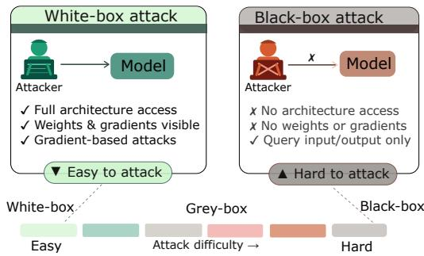
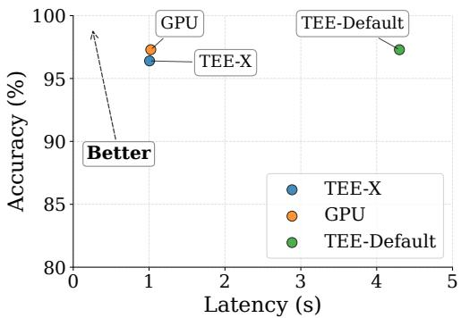
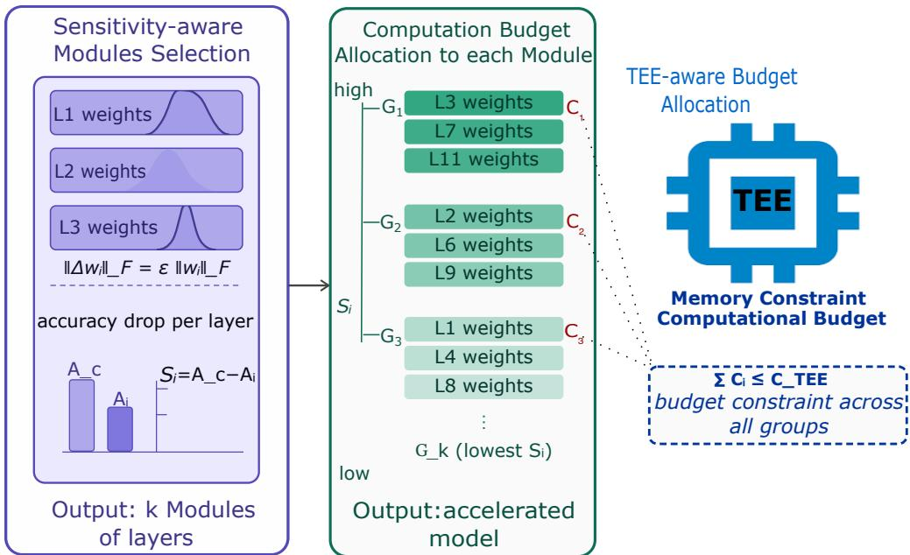
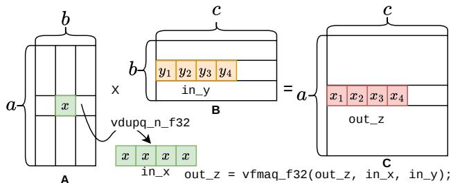
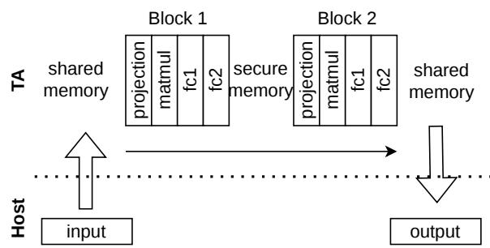

# TEE-X: TEE-aware Acceleration Framework for Large Vision Models at the Edge

Kurt M Wilson2,∗, Mohaiminul Al Nahian1,∗, Abeer Matar A. Almalky1,∗, Sadat Shahriyar3,∗,

Souvik Kundu4, Zhishan Guo2, Abdullah Al Arafat3, Adnan Siraj Rakin

1Binghamton University (SUNY) 2North Carolina State University 3Florida International University 4Intel ∗ Equal contribution

## Abstract

Despite their remarkable success, machine learning models, particularly in vision applications, are alarmingly vulnerable to a range of security threats. One key factor in the attack landscape is the distinction between white-box and black-box threat models, as the latter poses challenges that limit attack efectiveness when access to model information is limited. As a result, using Trusted Execution Environments (TEEs) enhances security for machine learning applications by protecting model confidentiality and execution integrity, efectively shifting the execution environment from the white-box to the black-box side of the threat model spectrum. While adopting TEEs for large vision models, e.g., Vision Transformers (ViTs), is crucial for enhancing security and privacy, significant challenges related to memory constraints and increased computational latency must be addressed, especially in time-sensitive edge applications where safety and privacy are paramount. The objective of this work is to enable large vision models to be fully hosted within TEEs, achieving GPU-level inference latency for time-sensitive edge vision applications while maintaining performance. To this end, we propose TEE-X, a TEE-aware acceleration framework that introduces a sensitivity-aware modularization technique and enables vectorization in TEE inference. This design is validated on OP-TEE for Arm TrustZone, configured to optimize performance on the NVIDIA Jetson AGX Xavier for eficient edge vision applications using ViT models. The findings reveal that TEE-X delivers an efective TEE-aware acceleration framework that achieves minimal accuracy-latency trade-ofs while ensuring fast and secure edge inference for vision models.

## 1 Introduction

Machine learning (ML) models have made significant strides across various tasks, demonstrating strong performance in many areas, particularly in vision applications [6, 4]. Despite their success, prior studies have demonstrated that these models remain highly vulnerable to a broad spectrum of security attacks, including: memory fault injections [56, 8, 38, 39, 52, 1, 63, 65], sidechannels [21, 13, 9, 41, 51, 54, 61, 26, 27], and adversarial attacks [5, 28, 62, 17, 2, 36, 30, 19, 53, 58, 34, 10, 29]. These vulnerabilities highlight the ongoing need for improved security measures in the deployment of ML models, especially in vision applications, that are susceptible to these attacks.

  
Figure 1: Overview of attack types categorized according to diferent threat model settings.

As shown in Figure 1, these attacks are generally classified based on their threat assumptions, which range from white-box to black-box scenarios. In white-box attacks, adversaries are assumed to have complete access to the target model, including its architecture and parameters [2, 30, 19, 53, 58, 34, 10, 29], thereby substantially simplifying the attack process and often leading to a significant impact on model security. In contrast, black-box attacks represent a considerably more challenging threat model, where adversaries have no direct access to the model internals and can only interact with the system through input-output queries or indirect observations [53, 45, 47]. Consequently, the efectiveness and feasibility of attacks in black-box settings are substantially constrained compared to those in white-box settings.

As a result, being on the black-box side of the spectrum has motivated the security community to adopt Trusted Execution Environments (TEEs) for ML applications, which provide an isolated and protected execution enclave often constraining the attack threat model more closer to a black-box spectrum [14, 33, 46, 23, 11, 25, 43, 42, 49, 35]. These TEEs have been adopted as a defensive mechanism to enforce two primary objectives, model confidentiality (privacy) and execution integrity during inference (security). By isolating model execution within protected hardware boundaries, TEEs efectively shift the attack surface from the white-box to the black-box side of the spectrum (as shown in Fig. 1). While adopting TEEs for ML models to provide security and privacy protection is pivotal, the key challenge in adopting TEEs, especially for large vision models such as Vision Transformers (ViTs), stems from the memory and computational (e.g., latency) bottlenecks they introduce. Deploying a large vision model inside a TEE presents three primary bottlenecks: i) The memory capacity of the TEE is limited, which makes it challenging for some of the larger models to fit inside a TEE. ii) Executing these models within TEE introduces considerable computational overhead and inference latency compared to native GPU execution. iii) The above two challenges become further exacerbated in edge applications [55], where inference is time sensitive, at the same time, TEE-enabled inference is even more important in edge applications where safety (e.g., self-driving car [37]) and privacy( e.g, healthcare [18]) are a priority.

To address this, existing approaches for deploying ML models within TEEs have adopted two alternative design choices. The first category is based on model partitioning, where parts or layers of the network are executed within the secure enclave, while the remaining components are ofloaded to the untrusted environment to alleviate the stringent memory constraints imposed by TEEs [33, 46, 23, 49]. The second category adopts operation-aware execution strategies, selectively placing sensitive operations inside the TEE while ofloading computationally intensive operations to on-chip memory or external accelerators to improve execution eficiency [14, 35]. While these methods are efective at partially reducing inference costs (e.g., latency), they still fall short of GPU-only inference time, which is critical, especially for edge applications. At the same time, exiting the TEE at any stage of model inference still leaves the attacker with additional information (e.g., layers) outside the TEE to exploit. This motivated our proposed approach to designing an acceleration method that enables hosting entire large vision models inside TEEs while achieving on-par GPU inference latency and maintaining model performance.

To this end, we propose TEE-X, a TEE-aware acceleration framework to run the entire model inference inside secure enclaves. Unlike prior approaches that rely on model partitioning or ofloading operations to untrusted accelerators, TEE-X enables complete in-enclave execution by designing a novel sensitivity-aware modularization technique combined with TEEaware computational budget assignment for each module. On the TEE side, for the first time, vectorization is enabled using Arm Neon SIMD instructions to perform a multiply-accumulate operation, providing GPU-like parallelism. The proposed optimization is designed to achieve two objectives: i) TEE-X ensures secure, fully protected model inference using the strong security benefits of TEEs. ii) Meeting the performance demands of large-scale edge vision applications (ref. Figure 2). To evaluate our proposed solution, we stress test TEE-X on an edge vision

  
Figure 2: Comparison of DeiT-small inference in: GPU, TEE, and accelerated using TEE-X.

application where the evaluation model is ViTs due to their substantially larger model sizes and higher computational complexity compared to other vision architectures, and on TrustZone within an Armv8 edge device (NVIDIA Jetson AGX Xavier) using a limited trusted memory carveout size. The results demonstrate that TEE-X provides an efective TEE-aware acceleration framework that achieves negligible accuracy–latency trade-ofs while ensuring faster, more secure edge inference for vision models.

## 2 Background and Related Work

Trusted Execution Environments (TEEs) are hardware-isolated execution environments designed to securely store sensitive data and models, and to protect computations from external access. Popular TEE technologies include Intel SGX [31], AMD SEV [20], and Arm TrustZone [3]. Despite their security advantages, TEEs sufer from limited memory capacity and performance overhead, which pose challenges for deploying large ML models. Following prior studies [14, 33, 44, 46], we assume that the TEE operates as a trusted enclave within a potentially untrusted host system, including GPUs. Under this threat model, all data, mode parameters, and computations inside the TEE are considered secure. Although side-channel attacks against TEEs have been explored in prior works [60, 16, 50], they are outside the scope of this paper.

Vision Models inside TEEs. Several studies [14, 33, 46, 23, 11, 25, 43, 42, 49, 35] have investigated the deployment of vision models within secure enclaves. However, these frameworks largely overlook the unique architectural properties and system-level challenges associated with ViTs. In addition, many existing approaches only partially execute model components inside the enclave, rather than fully encapsulating the entire model within the secure environment. This fragmented execution design also introduces significant and often unavoidable latency overhead compared to standard GPU-based inference. Therefore, this work focuses on developing an eficient acceleration technique that enables full model execution within TEEs while minimizing latency overhead introduced by secure-enclave constraints and closely matching native GPU inference performance.

## 3 TEE-X: TEE-aware Acceleration Framework

We propose TEE-X, designed to host large vision models such as ViTs within TEEs, informed by TEEs’ strict memory and computation budgets. At the same time, the proposed acceleration should preserve the model performance (i.e., accuracy and latency demand of the edge application). The proposed acceleration mechanism is motivated by two design principles: First, for a given application and TEE, we are bound by strict memory and latency budgets, especially for real-time edge models that must deliver model output within a strict latency window. Second, while maintaining the budget, the model acceleration method must maintain its accuracy. These two design principles are inversely proportional; i.e., in general, a smaller, faster model tends to be less accurate than its larger and higher-latency counterpart [15]. To address this, our proposed TEE-X has two components: first, Modularization, which is a TEE-aware computation budget allocation and model optimization technique & second, Vectorization, which utilizes Arm Neon vectorization support with fused multiply-accumulation operation and cache-friendly access, in order to boost the Modularization technique in achieving on-par edge GPU performance.

## 3.1 Modularization: TEE-aware computation budget allocation

The first component modularization technique consists of the following steps: the first component performs a sensitivity-aware module selection of the weight matrices of a ViT model that will run inside a TEE with an equal computation budget, where each module consists of a subset of the weight matrices. The intuition behind this design choice is that layers with equal sensitivity should receive a similar computationa budget. Once the modules are created, TEE reports the total available computation budget to match GPU acceleration. Informed by this budget, we propose allocating a computation budget to each module based on its prior sensitivity ranking, ensuring that the total computation budget is met. Once the module is created and its corresponding budget is allocated, the final step practically realizes the TEE-aware budget allocation by learning a transformation of each module’s weight vector that reflects the allocated computational budget while performing layer-wise input and weight multiplication. This ensures that allocating a higher computation budget to more sensitive layers preserves the accuracy budget, while an aggressive reduction in the computation budget in less sensitive regions helps maintain the latency budget. The overview of TEE-X is illustrated in Figure 3.

Step-1: Sensitivity-aware Module Selection. Let $W = \{ w _ { 1 } , w _ { 2 } , \ldots , w _ { L } \}$ be the weights of a pre-trained ViT model consisting of L layers. The goal of this step is to partition the weight matrix into groups with equal sensitivity levels. Hence, we propose to rank the layers based on a layer-wise sensitivity metric $S _ { i }$ (defined in section 3.2). The layers are divided into K modules $\{ \mathcal { G } _ { k } | k = 1 , 2 , \ldots , K \}$ , where layers with a similar level of sensitivity are grouped together in the same module.

  
Figure 3: Overview of TEE-X’ modularization steps.

Step-2: Computation Budget Allocation to Each Module. Let $x _ { i } \in \mathbb { R } ^ { N \times n }$ i be the input of the i-th layer with $w _ { i } \in \mathbb { R } ^ { n _ { i } \times n _ { o } }$ . Then the activation/output of the layer is $x _ { i + 1 } = g ( x _ { i } \times w _ { i } )$ , where $g ( . )$ is an activation function. The key computational demands come from $x _ { i } \times w _ { i }$ . To optimize/minimize the computational load within TEE, we propose to learn a transformation of each $w _ { i }$ such that the overall computation for $x _ { i } \times w _ { i }$ is minimized. Let $w _ { i }$ is transformed to $A _ { i } \in \mathbb { R } ^ { n _ { i } \times h _ { i } }$ and $B _ { i } \in \mathbb { R } ^ { h _ { i } \times n _ { o } }$ . Now, $h _ { i }$ will control the computation requirements for $x _ { i } \times w _ { i } = ( x _ { i } \times A _ { i } ) \times B _ { i }$ , which we define as the computational budget of the i-th layer.

To speed up the computation within TEE, $h _ { i }$ should be smaller than a factor $\begin{array} { r } { \mathcal { C } \propto \frac { T _ { g p u } } { T _ { T E E } } } \end{array}$ , where $T _ { g p u }$ and $T _ { T E E }$ are per-operation times of GPU and TEE execution, to keep the TEE inference time on par with $\mathrm { G P U ' s }$ . Let $h _ { k }$ be the computational budget of each layer in module $\mathcal { G } _ { k }$ and $n _ { g _ { k } }$ be the number of layers in $\mathcal { G } _ { k }$ . Then the budget assignment to each module can be found by solving:

$$
\operatorname * { a r g m a x } _ { \{ h _ { k } \} _ { k = 1 } ^ { K } } { A \big ( \{ h _ { k } \} _ { k = 1 } ^ { K } \big ) } \quad \mathrm { s . t . } \quad \sum _ { k = 1 } ^ { K } { n _ { g _ { k } } h _ { k } } \leq \mathbb { C } , \ h _ { k } \in \mathbb { Z } ^ { + }\tag{1}
$$

here, $\mathcal { A } ( \{ h _ { k } \} _ { k = 1 } ^ { K } )$ denotes the model accuracy obtained after assigning dimension $h _ { k }$ to module $\mathcal { G } _ { k }$ and C is available computational budget of TEE.

Step-3. Realization of TEE-aware Budget Allocation. Let $\tau \colon w _ { i }  A _ { i }$ be a learned transformer and $B _ { i } : A _ { i }  w _ { i }$ is a linear transformer such that $w _ { i } = A _ { i } \times B _ { i }$ . Once the computational budgets from Step-2 are found, all such $\mathcal { T } \mathrm { { s } }$ and $B _ { i } { } ^ { \ ' } \mathrm { s }$ can be learned to decompose each weight matrix in the model. Note that solving Eq. 1 exactly is computationally expensive. The objective function is not available in closed form and depends on training $\tau , B _ { i }$ for each possible budget configuration $h _ { k }$ for each module subject to the budget constraint, C.

Therefore, instead of solving Eq. 1 directly, we use a sensitivity-guided rule-based allocation. We divide this total computation budget among modules based on the aggregate sensitivity score of a module’s layers relative to the total sensitivity score of all layers. If the k-th module $\mathcal { G } _ { k }$ has ${ n } _ { g k }$ layers, then the assigned compute budget to each layer of that module, $h _ { k }$ is given by

$$
h _ { k } = \frac { \sum _ { \forall j \in \mathcal { G } _ { k } } S _ { j } } { \sum _ { \forall i \in L } S _ { i } } \cdot \frac { \mathbb { C } } { n _ { g k } }\tag{2}
$$

Eq. 2 ensures that we remain within computation budget, i.e., $\sum n _ { g k } \cdot h _ { k } = \mathbb { C }$ . Once we have assigned this budget to each module, we jointly train the transformation networks across all modules.

## 3.2 Proposed Sensitivity Metric and Training the Transformation Networks

Proposed Layer Sensitivity Metric $( S _ { i } )$ . To measure the sensitivity of each layer, we perturb one layer at a time while keeping the others fixed. For the i-th layer, we sample a random Gaussian noise tensor $g _ { i } \sim \mathcal { N } ( 0 , I )$ , where $g _ { i }$ has the same dimension as $w _ { i }$ . The weight perturbation $\Delta w _ { i }$ is defined as:

$$
\Delta w _ { i } = \epsilon \| w _ { i } \| _ { F } \cdot \frac { g _ { i } } { \| g _ { i } \| _ { F } } ,
$$

where $\epsilon$ is the perturbation budget such that the Frobenius norm of the weight perturbation $\| \Delta w _ { i } \| _ { F }$ is proportional to the Frobenius norm of the layer weights, $\lVert \boldsymbol { w } _ { i } \rVert _ { F }$

The perturbed layer weight is given by $\widetilde { w } _ { i } = w _ { i } + \Delta w _ { i }$ . Only $w _ { i }$ is replaced by $\widetilde { w } _ { i }$ during the evaluation, while the remaining layers are kept unchanged.

Let ${ \mathcal { A } } _ { \mathrm { w } }$ denote the accuracy of the original model, and let $\mathcal { A } _ { \widetilde { w } _ { i } }$ denote the accuracy after perturbing the i-th layer. The sensitivity score, $S _ { i }$ of layer i is defined as the resulting accuracy drop:

$$
S _ { i } = \mathcal { A } _ { \mathrm { w } } - \mathcal { A } _ { \widetilde { w } _ { i } }\tag{3}
$$

A larger $S _ { i }$ indicates that the layer is more sensitive to perturbation, which is used as a criterion for our TEE computation budget allocation.

Training of the Transformation Network. To realize the acceleration framework proposed in Section $3 . 1$ we need to train the transformation networks $\mathcal { T } _ { k }$ and $B _ { k }$ for each of the $\mathcal { G } _ { k }$ modules. Let $F ( \cdot )$ denote the original pretrained ViT model, and let $\hat { F } ( \cdot )$ denote the transformed model consisting of the transformation networks $\mathcal { T } _ { k }$ and $B _ { k }$ . For an input sample x with label $y ,$ the transformed model produces $\hat { y } = \hat { F } ( x )$ . We optimize the transformed model using three complementary losses, defined as follows:

$$
\begin{array} { r l r } {  { \mathcal { L } _ { \mathrm { C E } } = - \sum _ { i } y _ { i } \log ( \hat { y } _ { i } ) , \quad \mathcal { L } _ { \mathrm { K D } } = \tau ^ { 2 } \mathrm { K L } ( \sigma ( F ( x ) / \tau ) \Big \| \sigma ( \hat { F } ( x ) / \tau ) ) , } } \\ & { } & \\ { \qquad \mathcal { L } _ { \mathrm { M S E } } = \displaystyle \frac { 1 } { L } \sum _ { i = 1 } ^ { L } \| x _ { i } w _ { i } - \hat { x } _ { i + 1 } \| _ { 2 } ^ { 2 } . } \end{array}
$$

here, $\sigma ( \cdot )$ denotes the softmax function, and $\tau$ is the distillation temperature. The term $x _ { i } w _ { i }$ represents the original output of the i-th layer, while $\hat { x } _ { i + 1 }$ represents the corresponding output produced by the transformed operation. The cross-entropy loss, $\mathcal { L } _ { \mathrm { C E } }$ preserves task performance with respect to the ground-truth labels. The knowledge distillation loss, ${ \mathcal { L } } _ { \mathrm { K D } }$ preserves the output behavior of the original pretrained ViT. The MSE loss, $\mathcal { L } _ { \mathrm { M S E } }$ aligns the transformed layer outputs with the original layer outputs.

All module-wise transformation networks and linear transforms are optimized jointly by solving

$$
\operatorname* { m i n } _ { \{ \mathcal { T } _ { k } , B _ { k } \} _ { k = 1 } ^ { K } } \mathcal { L } _ { \mathrm { t o t a l } } = \operatorname* { m i n } _ { \{ \mathcal { T } _ { k } , B _ { k } \} _ { k = 1 } ^ { K } } ( \mathcal { L } _ { \mathrm { C E } } + \lambda _ { \mathrm { K D } } \mathcal { L } _ { \mathrm { K D } } + \lambda _ { \mathrm { M S E } } \mathcal { L } _ { \mathrm { M S E } } ) ,\tag{4}
$$

where $\lambda _ { \mathrm { K D } }$ and $\lambda _ { \mathrm { M S E } }$ control the contributions of the distillation and output-alignment losses, respectively. After training, each learned transformation network $\mathcal { T } _ { k }$ is used to generate the transformed weights $A _ { k } = \mathcal { T } _ { k } ( w _ { k } )$ for all layers in module $\mathcal { G } _ { k }$ . During inference, we store only the generated transformed weights $\left\{ A _ { k } \right\}$ and the corresponding module-wise linear transforms $\{ B _ { k } \}$ , which reduces both the memory footprint and the computation required inside the TEE.

Computational Budget of TEE (C). To keep the model inference time on par with the GPU inference, we need to compute the maximum TEE computational budget C. To perform $x _ { i } \times w _ { i }$ , the GPU inference time is $2 N n _ { i } n _ { o } T _ { g p u }$ , which is an approximation of the amount of FLOP counts times per-operation time. Then the corresponding TEE computational budget $h _ { i }$ for on-par GPU performance is given by:

$$
h _ { i } = \frac { n _ { i } n _ { o } } { n _ { i } + n _ { o } } \cdot \frac { T _ { g p u } } { T _ { T E E } }\tag{5}
$$

Then, the total computational budget of TEE is $\mathbb { C } = \textstyle \sum _ { \forall i } h _ { i }$ to maintain GPU performance. Our evaluation shows that using this theoretical budget for module-level computation allocation also matches GPU-leve performance in practical TEE implementations.

## 3.3 Vectorization: TEE Acceleration Support

To eficiently perform matrix multiplication and residual addition in the trusted application (TA) within the TEE without a GPU, we use SIMD vectorization wherever possible. We use Arm Neon’s 128-bit-wide registers, which can store and operate on four 32-bit floats simultaneously. Combined with Arm’s fused-multiply-accumulate instruction and cache-friendly access ordering, we can accelerate tensor operations compared to naive serialized implementations. Furthermore, to reduce data de-

  
Figure 4: Overview of Vectorization Step: Vectorizing C = $A \times B$

pendencies and make eficient use of the instruction pipeline, we unroll the inner loop to write results to four wide registers at a time.

For single batch inference, this allows TEE-X to match the host/GPU performance for some configurations. For batch sizes beyond 1, which make better use of the parallelism available within the GPU, the performance gap will increase, as the GPU will be able to progress on multiple inputs within the batch at the same time, whereas our parallelism is column-wise within a single input.

Illustrative Example. Figure 4 shows an example of a vectorized matrix multiply operation, where we perform the multiply-accumulate step to multiple values within a row. To perform parallel multiplyaccumulate operations, we utilize 128-bit wide registers to process four float32 values simultaneously. A scalar from A is broadcast into all four slots of register $\mathrm { i n \_ x \ n s ( v d u p q \_ n \_ f 3 2 ) }$ , while a 4-float segment from a row in B is loaded into in\_y (vld1q\_f32). These are then processed alongside the current values loaded into out\_z via Fused Multiply-Accumulate (vfmaq\_f32). This allows us to compute four results in parallel before storing out\_z back into the result matrix C, significantly increasing computational density. This process uses three 128-bit wide registers.

## 4 Experimental Evaluation

## 4.1 TEE and Hardware implementation details

We implement TEE-X with OP-TEE on Arm Trust-Zone. The implementation is split into two parts: the host application and the trusted application (TA). The host application runs in a non-secure world and has access to hardware peripherals, storage, and the network. The host has access to all system memory, except for a small TrustZone memory carve-out available only to the trusted application running within TrustZone.

Vectorization. Attempting to use the GPU within the TA could result in exposure of the network weights and intermediary data, so we perform the layer operations on the CPU. To improve CPU inference speed, we use Arm Neon SIMD instructions to perform parallel multiply-accumulate operations, providing some GPU-like parallelism.

During the inner loop of matrix multiplication, we broadcast a single scalar from one operand across all four lanes of a 128-bit float32x4\_t register, and load four contiguous floats from the other operand into a separate vector register. The fused multiply-accumulate instruction (vfmaq\_f32) then produces four results in parallel. To take advantage of pipelining, we unroll across four independent accumulator registers, advancing by 16 columns per inner loop, breaking the dependency chain between successive multiply-accumulate operations. We do similar steps for residuals, bias addition, and layer normalization to update multiple values per iteration.

  
Figure 5: Inference of two consecutive blocks in the TA. The input gets sent to the TA as a pointer to shared memory. Working memory and block results are kept in secure memory, except for the outputs of the last block, which gets placed into shared memory. The shared memory pointer gets passed to the host as the output, which can read the result.

To use Neon within the TA, OP-TEE must be compiled with CFG\_WITH\_VFP, which adds support for saving and loading Neon registers during context switches. This adds two small sources of overhead: For the very first vector instruction in the TA after a context switch, an interrupt records the usage of the Neon registers. On the next context switch, OP-TEE checks whether a vector instruction has run, and if so, stores the state of the extra registers. The overhead is minor compared to the performance gains from vectorization, but it is important to minimize frequent host communication.

Transferring Weights and Inputs. For eficient transfer of encoded weights and inputs to the TA, and to reduce TA memory usage, we used shared memory allocated by the host. The host application loads the weights into normal world memory, and marks it as accessible to the TA with TEEC\_RegisterSharedMemory, and passes it to TA commands as a pointer. Shared memory does not count against the TrustZone memory limit. We minimize communication between the host and TA as much as possible while still balancing memory usage. For example, when consecutive layers are run on the TA, we do not send the intermediate results back and forth to the host. All compressed weights stay loaded in TA memory, and intermediate tensors are always kept in secure memory. We allocate intermediate tensors as soon as they are needed, and deallocate them as soon as they’re read for the last time. This reduces peak memory usage, allowing TEE-X to be used on TEEs with smaller memory limits.

Hardware Platform. We evaluate on an Nvidia Jetson AGX Xavier, which has an 8-core 64-bit Armv8.2 CPU at 2.2 GHz and an integrated Volta GPU. We build upon the default Linux filesystem image from Nvidia with OP-TEE. We fix the CPU frequency to 2.2 GHz, and assign the inference process to one CPU core.

## 4.2 Evaluation Setting

Models and Datasets. We evaluate TEE-X on multiple models: DeiT-Small and DeiT-Base [48], which are widely used representative ViT architectures with diferent capacity levels. For benchmarking, we use two standard image classification datasets: CIFAR-10 [22], consisting of 32×32 images across 10 classes, and ImageNet [7], which contains 224×224 high-resolution images spanning 1,000 classes.

Hyperparameters and Experimental Setup. In all cases, we divide our model into $K = 3$ modules. The number of layers per module is fixed to be $( L / 3 - 1 ) , L / 3 , ( L / 3 + 1 )$ . For DeiT-small and DeiT-base, this translates to 3, 4, and 5 layers in each module. For each module, we train transformation networks for attn\_qkv, attn\_proj, mlp\_fc1, mlp\_ $_ - f c 2$ . The network $\mathcal { T } _ { k }$ is a 2 linear layer MLP with pre- and post-afine transform, and $B _ { k }$ is a single linear layer. We exclude the first, last and LayerNorm layers from transformations. The transformation network parameters are quantized to 4-bit with quantization aware training and first and last layer is quantized in 8-bit. For CIFAR-10, we train the models for 500 epochs with learning rate $1 e - 4$ and $5 e - 5$ respectively for small and base models with batch size 256. For ImageNet, we train for 300 epochs with a batch size 1024 and a learning rate $2 e - 4$ . We set $\lambda _ { \mathrm { K D } }$ to be 1e1 and 1e3 for CIFAR-10 and ImageNet respectively and $\lambda _ { \mathrm { M S E } }$ is chosen to be 1.0. Our most demanding experiment can be performed using a single A6000 GPU with 48GB VRAM.

Evaluation Criteria We evaluate TEE-X to answer four key criteria: (C1) preserving the ViT accuracy, (C2) achieving GPU-comparable inference latency, (C3) outperforming existing acceleration techniques and TEE-based frameworks, and (C4) improving security by transitioning models toward a black-box setting.

TEE-X Accuracy and Latency (Answers for C1 and C2) Trade-ofs. Table 1 demonstrates that TEE-X achieves substantial model size reduction while preserving high classification accuracy across diferent computation reduction factors C. Under $\mathcal { C } = 0 . 5$ and $\mathcal { C } = 0 . 4$ , the accuracy degradation remains below 1% while reducing the model size by more than an order of magnitude. Even with the aggressive reduction setting of $\mathcal { C } = 0 . 2$ , where the DeiT-Small model is compressed by approximately $4 7 \times$ , the accuracy drop is limited to only 2.65%.

In terms of inference latency, TEE-X provides a flexible trade-of between accuracy and execution speed.

Table 1: Model size, Accuracy, inference time, and memory of DeiT-Small (Original vs Inside TEE) on CIFAR-10 under diferent computation reduction factors C. Accuracy (%) is reported. Peak Mem. (MB) is the peak memory utilization inside a TEE at inference time.
<table><tr><td>Method</td><td>Model Size (MB)</td><td>Accuracy</td><td>Avg Layer Time (ms)</td><td>Avg Time (ms)</td><td>Peak Mem. (MB)</td></tr><tr><td>Baseline Host (GPU)</td><td>82.66</td><td>97.29</td><td>82.62</td><td>1022.35</td><td>154.78</td></tr><tr><td>TEE-X (C = 0.5)</td><td>3.48 (23×)</td><td>96.48</td><td>58.24 (1.42×)</td><td>1082.67</td><td>21.91</td></tr><tr><td>TEE-X (C = 0.4)</td><td>2.93 (28×)</td><td>96.40</td><td>51.76 (1.60×)</td><td>1006.74</td><td>18.14</td></tr><tr><td>TEE-X  $\stackrel { \cdot } { ( } { \mathcal { C } } = 0 . 2 \stackrel { \cdot } { ) }$ </td><td>1.75 (47×)</td><td>94.64</td><td>48.02 (1.72×)</td><td>957.13</td><td>10.13</td></tr></table>

For a higher computation budget $( \ c = 0 . 5 )$ , TEE-X preserves near-baseline accuracy with comparable GPU inference latency, while more aggressive settings $\left( \ { \mathcal { C } } = 0 . 2 \right)$ further reduce inference time and can even outperform GPU-based execution using proposed modularization and vectorization support. These results demonstrate that TEE-X outperforms existing compact vision models while enabling eficient and secure execution within TEEs.

Overall, these results satisfy C1 and C2 by showing that TEE-X efectively reduces the memory and computational overhead of ViTs, enabling full deployment inside edge TEEs while maintaining strong accuracy and eficient inference performance.

Comparison with Competitive Methods (Answers for C3). We evaluate TEE-X from two complementary perspectives: SOTA TEE-based frameworks and traditional model acceleration techniques.

Comparison with SOTA TEE-based frameworks. Existing TEE-based frameworks generally fall into two categories: model partitioning [33, 46, 23, 49], where only part of the model is executed inside the enclave while the rest runs in an untrusted region, and operation splitting, where individual computations are ofloaded across trusted and untrusted domains. As shown in Table 2, both approaches introduce a noticeable latency gap compared to GPU-based inference due to frequent enclave transitions and communication overhead.

Table 2: Impact of TEE-X’s modularization compared to SOTA TEE-based model partitioning. Since this is a software optimization comparison, we applied vectorization acceleration to the competition as well.

In contrast, TEE-X achieves comparable and in some settings even lower inference latency than GPU execution, while

<table><tr><td>Method</td><td>Latency (ms)</td></tr><tr><td>Naive full model in TEE</td><td>1792.42</td></tr><tr><td>Model Partitioning [33, 46, 23, 49]</td><td>1463.80</td></tr><tr><td>Operation-aware Execution [14, 35]</td><td>3127.73</td></tr><tr><td>TEE-X</td><td>1082.67</td></tr></table>

still ensuring full-model execution entirely within the TEE, providing far superior security benefits highlighted in C4.

Comparing with traditional acceleration techniques. historically, model acceleration techniques such as low-bit quantization [24] and pruning [57] have been widely used to reduce computational cost. As shown in Table 3, both approaches significantly degrade model accuracy compared to the original model.

Table 3: TEE-X and acceleration methods on DeiTsmall on ImageNet.

Moreover, these software optimizations lack hardware support in TEE environments, particularly for low-bit (2-

<table><tr><td>Model</td><td>Acc.(%)</td><td>TEE Ope. Support</td></tr><tr><td>Baseline (84.1 MB)</td><td>79.72</td><td></td></tr><tr><td>Pruning [57] (33 MB)</td><td>60.51</td><td>X</td></tr><tr><td>2-bit Quantization [24] (6.18 MB)</td><td>71.90</td><td>X</td></tr><tr><td>TEE-X (4.63 MB)</td><td>76.44</td><td>√</td></tr></table>

bit) quantization and aggressive pruning configurations. In contrast, as highlighted in Table 3, TEE-X is the only approach that can reduce model computation while maintaining reasonable performance on ImageNet, with a lower memory footprint.

Security benefit of hosting the entire model on TEE (Answers for C4 ). Beyond accelerating vision model execution within TEEs, TEE-X also shifts the deployment closer to a blackbox attack spectrum, as illustrated in Figure 1. To evaluate this transition, we analyze the model’s robustness under black-box attack scenarios. Table 4 highlights the vulnerability of vision models under both white-box and black-box threat settings. The results show that attack success rates are significantly higher in the white-box setting, while black-box attacks are considerably less efective. This gap indicates that reducing model exposure strengthens robustness

Table 4: White-box (WB) and black-box (BB) attacks on DeiT-B. Attack success rate (ASR, %) is reported.
<table><tr><td>Type</td><td>Setting</td><td>ASR (%)</td></tr><tr><td>Adversarial Attacks</td><td>WB [32] BB [64]</td><td>99.40 60.00</td></tr><tr><td>Bit-Flip Attack</td><td>WB [40] BB</td><td>100.0 0.0</td></tr></table>

against adversaries with limited access. Consequently, TEE-X not only accelerates inference within TEEs but also helps preserve the security of the accelerated models, which is critical in edge vision applications.

Table 5: Accuracy and model size comparison (Original vs Inside TEE) on ImageNet for DeiT-Small under diferent computation reduction factors C. Accuracy (%) is reported.
<table><tr><td rowspan="2">Model</td><td colspan="2">Original</td><td colspan="2"> $c = \mathbf { 0 . 6 6 }$ </td><td colspan="2">C = 0.5</td></tr><tr><td>Model Size (MB)</td><td>Acc.</td><td>Model Size (MB)</td><td> $\mathbf { A c c } .$ </td><td>Model Size (MB)</td><td>Acc.</td></tr><tr><td>DeiT-Small</td><td>84.11</td><td>79.72</td><td>4.63</td><td>76.44</td><td>3.81</td><td>75.79</td></tr></table>

Table 6: Accuracy and model size comparison (Original vs Inside TEE) on CIFAR-10 for DeiT-Base under diferent computation reduction factors C. Accuracy (%) is reported.

<table><tr><td rowspan="2">Model</td><td colspan="2">Original</td><td colspan="2">C = 0.5</td><td colspan="2">C = 0.4</td><td colspan="2">C = 0.2</td></tr><tr><td>Model Size (MB)</td><td>Acc.</td><td>Model Size (MB)</td><td>Acc.</td><td>Model Size (MB)</td><td>Acc.</td><td>Model Size (MB)</td><td>Acc.</td></tr><tr><td>DeiT-Base</td><td>327.33</td><td>97.55</td><td>12.83</td><td>97.22</td><td>10.47</td><td>97.04</td><td>5.80</td><td>95.57</td></tr></table>

## 4.2.1 Ablation Study

Diferent Dataset. Table 5 reports the performance of DeiT-small on ImageNet using diferent reduction factors, further demonstrating the efectiveness of TEE-X on more complex tasks. Despite the aggressive reduction to only 3.81 MB, the reduced DeiT-Small model still achieves competitive accuracy compared to lightweight vision models of similar size, such as ResNet20 [12] and ShufleNetV2 [59], on ImageNet.

Diferent Architecture. Table 6 evaluates DeiT-Base on CIFAR-10 under multiple computation reduction factors. The result is consistent across diferent datasets as TEE-X provides a reasonable trade-of between accuracy and model acceleration/size.

Ablation study of each component of TEE-X. We compare the performance impact of each component of the proposed TEE-X in terms of two primary metrics: accuracy & latency. We take two baselines: worst-case (naively running the entire model on TEE) and best-case (host GPU). It is evident from Table 7 that the proposed TEE-X performance (1.08s) is par with GPU host-only inference, with a substantial

Table 7: Impact of each component of TEE-X on DeiT-S on the CIFAR-10 dataset.
<table><tr><td>Method</td><td>Acc.(%)</td><td>Inference Time (s)</td></tr><tr><td>Baseline (Naive full model TEE)</td><td>97.29</td><td>4.43</td></tr><tr><td>TEE-X (w/o modularization)</td><td>97.29</td><td>1.80</td></tr><tr><td>TEE-X (w/o vectorization)</td><td>96.48</td><td>1.77</td></tr><tr><td>TEE-X</td><td>96.48</td><td>1.08</td></tr><tr><td>Host (GPU)</td><td>97.29</td><td>1.02</td></tr></table>

gain compared to naive TEE implementation. If we remove the modularization component, then the model accuracy remains unchanged while inference time increases by 80 % (1.8s) compared to TEE-X, underscoring the need for the modularization step. Similarly, removing the vectorization component will slow TEE-X performance by 77 % (1.77s), emphasizing that both modularization and vectorization have been critica towards achieving on-par GPU acceleration.   
Table

Ablation of Computation Budget Assignment Strategy. Table 8 shows the efect of diferent computation budget assignment strategy on the accuracy performance of a model. An alternative strategy would be to uniformly assign the same computation budget to all layers. The results clearly indicate that the proposed TEE-X following Eqn. 2 to assign

Table 8: Efect of Diferent Computation Budget Assignment Strategy in TEE for Diferent C.
<table><tr><td>Method</td><td>C = 0.2</td><td>C = 0.4</td></tr><tr><td>Uniform Budget</td><td>91.27</td><td>93.55</td></tr><tr><td>TEE-X (Ours)</td><td>94.64</td><td>96.40</td></tr></table>

computation budget across diferent modules helps maintain model performance, especially under strict budgets.

## 5 Conclusion

In this work, we introduce TEE-X, a TEE-aware acceleration framework that enables eficient inference of large vision models in edge applications within secure memory. TEE-X addresses the bottlenecks to the full deployment of ViTs in TEEs: limited secure memory, high latency, and the constraint of preserving accuracy under a strict computation budget. To achieve this, we propose sensitivity-based modularization, TEE-aware computation-budget allocation, and SIMD-based vectorized execution within Arm TrustZone. Overall, TEE-X demonstrates a practical way to achieve near-GPU inference latency with high accuracy while keeping the entire model execution within trusted memory, thereby avoiding the security limitations of partitioning- or ofloading-based approaches.

## References

[1] Sabbir Ahmed, Ranyang Zhou, Shaahin Angizi, and Adnan Siraj Rakin. Deep-troj: An inference stage trojan insertion algorithm through eficient weight replacement attack. In Proceedings of the IEEE/CVF Conference on Computer Vision and Pattern Recognition, pages 24810–24819, 2024.

[2] Naveed Akhtar and Ajmal Mian. Threat of adversarial attacks on deep learning in computer vision: A survey. Ieee Access, 6:14410–14430, 2018.

[3] Tiago Alves. Trustzone: Integrated hardware and software security. Information Quarterly, 3:18–24, 2004.

[4] Nicolas Carion, Francisco Massa, Gabriel Synnaeve, Nicolas Usunier, Alexander Kirillov, and Sergey Zagoruyko. End-to-end object detection with transformers. In European conference on computer vision, pages 213–229. Springer, 2020.

[5] Nicholas Carlini and David Wagner. Towards evaluating the robustness of neural networks. In 2017 ieee symposium on security and privacy (sp), pages 39–57. Ieee, 2017.

[6] Chun-Fu Richard Chen, Quanfu Fan, and Rameswar Panda. Crossvit: Cross-attention multi-scale vision transformer for image classification. In Proceedings of the IEEE/CVF international conference on computer vision, pages 357–366, 2021.

[7] Jia Deng, Wei Dong, Richard Socher, Li-Jia Li, Kai Li, and Li Fei-Fei. Imagenet: A large-scale hierarchical image database. In 2009 IEEE conference on computer vision and pattern recognition, pages 248–255. Ieee, 2009.

[8] Jianshuo Dong, Han Qiu, Yiming Li, Tianwei Zhang, Yuanjie Li, Zeqi Lai, Chao Zhang, and Shu-Tao Xia. One-bit flip is all you need: When bit-flip attack meets model training. In Proceedings of the IEEE/CVF International Conference on Computer Vision, pages 4688–4698, 2023.

[9] Daniel Gruss, Clémentine Maurice, and Stefan Mangard. Rowhammer. js: A remote software-induced fault attack in javascript. In Detection of Intrusions and Malware, and Vulnerability Assessment: 13th International Conference, DIMVA 2016, San Sebastián, Spain, July 7-8, 2016, Proceedings 13, pages 300–321. Springer, 2016.

[10] Yanyang Han, Ju Liu, Xiaoxi Liu, Xiao Jiang, Lingchen Gu, Xuesong Gao, and Weiqiang Chen. Enhancing adversarial transferability with partial blocks on vision transformer. Neural Computing and Applications, 34(22):20249–20262, 2022.

[11] Lucjan Hanzlik, Yang Zhang, Kathrin Grosse, Ahmed Salem, Maximilian Augustin, Michael Backes, and Mario Fritz. Mlcapsule: Guarded ofline deployment of machine learning as a service. In Proceedings of the IEEE/CVF conference on computer vision and pattern recognition, pages 3300–3309, 2021.

[12] Kaiming He, Xiangyu Zhang, Shaoqing Ren, and Jian Sun. Deep residual learning for image recognition. In Proceedings of the IEEE conference on computer vision and pattern recognition, pages 770–778, 2016.

[13] Sanghyun Hong, Michael Davinroy, Yiˇgitcan Kaya, Stuart Nevans Locke, Ian Rackow, Kevin Kulda, Dana Dachman-Soled, and Tudor Dumitraş. Security analysis of deep neural networks operating in the presence of cache side-channel attacks, 2020.

[14] Jiahui Hou, Huiqi Liu, Yunxin Liu, Yu Wang, Peng-Jun Wan, and Xiang-Yang Li. Model protection: Real-time privacy-preserving inference service for model privacy at the edge. IEEE Transactions on Dependable and Secure Computing, 19(6):4270–4284, 2021.

[15] Andrew G Howard, Menglong Zhu, Bo Chen, Dmitry Kalenichenko, Weijun Wang, Tobias Weyand, Marco Andreetto, and Hartwig Adam. Mobilenets: Eficient convolutional neural networks for mobile vision applications. arXiv preprint arXiv:1704.04861, 2017.

[16] Tianlin Huo, Xiaoni Meng, Wenhao Wang, Chunliang Hao, Pei Zhao, Jian Zhai, and Mingshu Li. Bluethunder: A 2-level directional predictor based side-channel attack against sgx. IACR Transactions on Cryptographic Hardware and Embedded Systems, pages 321–347, 2020.

[17] Andrew Ilyas, Shibani Santurkar, Dimitris Tsipras, Logan Engstrom, Brandon Tran, and Aleksander Madry. Adversarial examples are not bugs, they are features. Advances in neural information processing systems, 32, 2019.

[18] Mohd Javaid, Abid Haleem, Ravi Pratap Singh, and Mumtaz Ahmed. Computer vision to enhance healthcare domain: An overview of features, implementation, and opportunities. Intelligent Pharmacy, 2(6):792–803, 2024.

[19] Ameya Joshi, Gauri Jagatap, and Chinmay Hegde. Adversarial token attacks on vision transformers. arXiv preprint arXiv:2110.04337, 2021.

[20] David Kaplan, Jeremy Powell, and Tom Woller. Amd memory encryption. White paper, 13:12, 2016.

[21] Yoongu Kim, Ross Daly, Jeremie Kim, Chris Fallin, Ji Hye Lee, Donghyuk Lee, Chris Wilkerson, Konrad Lai, and Onur Mutlu. Flipping bits in memory without accessing them: An experimental study of dram disturbance errors. ACM SIGARCH Computer Architecture News, 42(3):361–372, 2014.

[22] Alex Krizhevsky and Geofrey Hinton. Learning multiple layers of features from tiny images. Technical Report TR-2009, University of Toronto, Toronto, Ontario, Canada, 2009.

[23] Taegyeong Lee, Zhiqi Lin, Saumay Pushp, Caihua Li, Yunxin Liu, Youngki Lee, Fengyuan Xu, Chenren Xu, Lintao Zhang, and Junehwa Song. Occlumency: Privacy-preserving remote deep-learning inference using sgx. In The 25th Annual international conference on mobile computing and networking, pages 1–17, 2019.

[24] Yanjing Li, Sheng Xu, Baochang Zhang, Xianbin Cao, Peng Gao, and Guodong Guo. Q-vit: Accurate and fully quantized low-bit vision transformer. Advances in neural information processing systems, 35:34451–34463, 2022.

[25] Yuepeng Li, Deze Zeng, Lin Gu, Quan Chen, Song Guo, Albert Zomaya, and Minyi Guo. Lasagna: Accelerating secure deep learning inference in sgx-enabled edge cloud. In Proceedings of the ACM symposium on cloud computing, pages 533–545, 2021.

[26] Chris S. Lin, Joyce Qu, and Gururaj Saileshwar. GPUHammer: Rowhammer attacks on GPU memories are practical. In 34th USENIX Security Symposium (USENIX Security 25), pages 5719–5738, Seattle, WA, August 2025. USENIX Association.

[27] Chris S. Lin, Yuqin Yan, Guozhen Ding, Joyce Qu, Joseph Zhu, David Lie, and Gururaj Saileshwar. GPUBreach: Privilege escalation attacks on GPUs using rowhammer. In Proceedings of the 47th IEEE Symposium on Security and Privacy, SP ’26, 2026.

[28] Yanpei Liu, Xinyun Chen, Chang Liu, and Dawn Song. Delving into transferable adversarial examples and black-box attacks. arXiv preprint arXiv:1611.02770, 2016.

[29] Peizhuo Lv, Hualong Ma, Jiachen Zhou, Ruigang Liang, Kai Chen, Shengzhi Zhang, and Yunfei Yang. Dbia: Data-free backdoor attack against transformer networks. In 2023 IEEE International Conference on Multimedia and Expo (ICME), pages 2819–2824, 2023.

[30] Kaleel Mahmood, Rigel Mahmood, and Marten Van Dijk. On the robustness of vision transformers to adversarial examples. In Proceedings of the IEEE/CVF international conference on computer vision, pages 7838–7847, 2021.

[31] Frank McKeen, Ilya Alexandrovich, Alex Berenzon, Carlos V Rozas, Hisham Shafi, Vedvyas Shanbhogue, and Uday R Savagaonkar. Innovative instructions and software model for isolated execution. Hasp@ isca, 10(1), 2013.

[32] Di Ming, Peng Ren, Yunlong Wang, and Xin Feng. Boosting the transferability of adversarial attack on vision transformer with adaptive token tuning. In A. Globerson, L. Mackey, D. Belgrave, A. Fan, U. Paquet, J. Tomczak, and C. Zhang, editors, Advances in Neural Information Processing Systems, volume 37, pages 20887–20918. Curran Associates, Inc., 2024.

[33] Fan Mo, Ali Shahin Shamsabadi, Kleomenis Katevas, Soteris Demetriou, Ilias Leontiadis, Andrea Cavallaro, and Hamed Haddadi. Darknetz: towards model privacy at the edge using trusted execution environments. In Proceedings of the 18th International Conference on Mobile Systems, Applications, and Services, pages 161–174, 2020.

[34] Muzammal Naseer, Kanchana Ranasinghe, Salman Khan, Fahad Shahbaz Khan, and Fatih Porikli. On improving adversarial transferability of vision transformers. arXiv preprint arXiv:2106.04169, 2021.

[35] Tushar Nayan, Ziqi Zhang, and Ruimin Sun. Secureinfer: Heterogeneous tee-gpu architecture for privacy-critical tensors for large language model deployment. arXiv preprint arXiv:2510.19979, 2025.

[36] Nicolas Papernot, Patrick McDaniel, Ian Goodfellow, Somesh Jha, Z. Berkay Celik, and Ananthram Swami. Practical black-box attacks against machine learning. In Proceedings of the 2017 ACM on Asia Conference on Computer and Communications Security, ASIA CCS ’17, page 506–519, New York, NY, USA, 2017. Association for Computing Machinery.

[37] Aditya Prakash, Kashyap Chitta, and Andreas Geiger. Multi-modal fusion transformer for end-to-end autonomous driving. In Proceedings of the IEEE/CVF conference on computer vision and pattern recognition, pages 7077–7087, 2021.

[38] Adnan Siraj Rakin, Zhezhi He, and Deliang Fan. Bit-flip attack: Crushing neural network with progressive bit search. In Proceedings of the IEEE/CVF International Conference on Computer Vision, pages 1211–1220, 2019.

[39] Adnan Siraj Rakin, Zhezhi He, and Deliang Fan. Tbt: Targeted neural network attack with bit trojan. In Proceedings of the IEEE/CVF Conference on Computer Vision and Pattern Recognition (CVPR), pages 13198–13207, 2020.

[40] Adnan Siraj Rakin, Zhezhi He, Jingtao Li, Fan Yao, Chaitali Chakrabarti, and Deliang Fan. T-bfa: Targeted bit-flip adversarial weight attack. IEEE Transactions on Pattern Analysis and Machine Intelligence, 44(11):7928–7939, 2021.

[41] Mark Seaborn and Thomas Dullien. Exploiting the dram rowhammer bug to gain kernel privileges. Black Hat, 15:71, 2015.

[42] Tianxiang Shen, Ji Qi, Jianyu Jiang, Xian Wang, Siyuan Wen, Xusheng Chen, Shixiong Zhao, Sen Wang, Li Chen, Xiapu Luo, et al. {SOTER}: Guarding black-box inference for general neural networks at the edge. In 2022 USENIX Annual Technical Conference (USENIX ATC 22), pages 723–738, 2022.

[43] Youren Shen, Hongliang Tian, Yu Chen, Kang Chen, Runji Wang, Yi Xu, Yubin Xia, and Shoumeng Yan. Occlum: Secure and eficient multitasking inside a single enclave of intel sgx. In Proceedings of the Twenty-Fifth International Conference on Architectural Support for Programming Languages and Operating Systems, pages 955–970, 2020.

[44] Yun Shen, Xinlei He, Yufei Han, and Yang Zhang. Model stealing attacks against inductive graph neural networks. In 2022 IEEE Symposium on Security and Privacy (SP), pages 1175–1192. IEEE, 2022.

[45] Yucheng Shi, Yahong Han, Yu-an Tan, and Xiaohui Kuang. Decision-based black-box attack against vision transformers via patch-wise adversarial removal. Advances in Neural Information Processing Systems, 35:12921–12933, 2022.

[46] Zhichuang Sun, Ruimin Sun, Changming Liu, Amrita Roy Chowdhury, Long Lu, and Somesh Jha. Shadownet: A secure and eficient on-device model inference system for convolutional neural networks. In 2023 IEEE Symposium on Security and Privacy (SP), pages 1596–1612. IEEE, 2023.

[47] Yinghao Tang, Jinbiao Lu, Xingkai Kang, Yuhang Li, and Hongchen Guo. Black-box adversarial attack against transformer-based object detection models in vehicular networks. In International Conference on Algorithms and Architectures for Parallel Processing, pages 12–21. Springer, 2024.

[48] Hugo Touvron, Matthieu Cord, Matthijs Douze, Francisco Massa, Alexandre Sablayrolles, and Hervé Jégou. Training data-eficient image transformers & distillation through attention. In International conference on machine learning, pages 10347–10357. PMLR, 2021.

[49] Florian Tramer and Dan Boneh. Slalom: Fast, verifiable and private execution of neural networks in trusted hardware. arXiv preprint arXiv:1806.03287, 2018.

[50] Jo Van Bulck, Marina Minkin, Ofir Weisse, Daniel Genkin, Baris Kasikci, Frank Piessens, Mark Silberstein, Thomas F Wenisch, Yuval Yarom, and Raoul Strackx. Foreshadow: Extracting the keys to the intel {SGX} kingdom with transient {Out-of-Order} execution. In 27th USENIX Security Symposium (USENIX Security 18), pages 991–1008, 2018.

[51] Victor Van Der Veen, Yanick Fratantonio, Martina Lindorfer, Daniel Gruss, Clémentine Maurice, Giovanni Vigna, Herbert Bos, Kaveh Razavi, and Cristiano Giufrida. Drammer: Deterministic rowhammer attacks on mobile platforms. In Proceedings of the 2016 ACM SIGSAC conference on computer and communications security, pages 1675–1689, 2016.

[52] Jialai Wang, Yuxiao Wu, Weiye Xu, Yating Huang, Chao Zhang, Zongpeng Li, Mingwei Xu, and Zhenkai Liang. Your scale factors are my weapon: Targeted bit-flip attacks on vision transformers via scale factor manipulation. In Proceedings of the Computer Vision and Pattern Recognition Conference, pages 20103–20112, 2025.

[53] Yuxuan Wang, Jiakai Wang, Zixin Yin, Ruihao Gong, Jingyi Wang, Aishan Liu, and Xianglong Liu. Generating transferable adversarial examples against vision transformers. In Proceedings of the 30th ACM International Conference on Multimedia, pages 5181–5190, 2022.

[54] Yuan Xiao, Xiaokuan Zhang, Yinqian Zhang, and Radu Teodorescu. One bit flips, one cloud flops: Cross-VM row hammer attacks and privilege escalation. In 25th USENIX Security Symposium (USENIX Security 16), pages 19–35, Austin, TX, August 2016. USENIX Association.

[55] Yiwen Xu, Tariq M Khan, Yang Song, and Erik Meijering. Edge deep learning in computer vision and medical diagnostics: a comprehensive survey. Artificial Intelligence Review, 58(3):93, 2025.

[56] Fan Yao, Adnan Siraj Rakin, and Deliang Fan. {DeepHammer}: Depleting the intelligence of deep neural networks through targeted chain of bit flips. In 29th USENIX Security Symposium (USENIX Security 20), pages 1463–1480, 2020.

[57] Fang Yu, Kun Huang, Meng Wang, Yuan Cheng, Wei Chu, and Li Cui. Width & depth pruning for vision transformers. In Proceedings of the AAAI conference on artificial intelligence, volume 36, pages 3143–3151, 2022.

[58] Zenghui Yuan, Pan Zhou, Kai Zou, and Yu Cheng. You are catching my attention: Are vision transformers bad learners under backdoor attacks? In Proceedings of the IEEE/CVF Conference on Computer Vision and Pattern Recognition, pages 24605–24615, 2023.

[59] Xiangyu Zhang, Xinyu Zhou, Mengxiao Lin, and Jian Sun. Shuflenet: An extremely eficient convolutional neural network for mobile devices. In Proceedings of the IEEE conference on computer vision and pattern recognition, pages 6848–6856, 2018.

[60] Xiaohan Zhang, Jinwen Wang, Yueqiang Cheng, Qi Li, Kun Sun, Yao Zheng, Ning Zhang, and Xinghua Li. Interface-based side channel in tee-assisted networked services. IEEE/ACM Transactions on Networking, 32(1):613–626, 2023.

[61] Zhi Zhang, Yueqiang Cheng, Dongxi Liu, Surya Nepal, Zhi Wang, and Yuval Yarom. Pthammer: Cross-user-kernel-boundary rowhammer through implicit accesses. In 2020 53rd Annual IEEE/ACM International Symposium on Microarchitecture (MICRO), pages 28–41. IEEE, 2020.

[62] Yunqing Zhao, Tianyu Pang, Chao Du, Xiao Yang, Chongxuan Li, Ngai-Man Man Cheung, and Min Lin. On evaluating adversarial robustness of large vision-language models. Advances in Neural Information Processing Systems, 36:54111–54138, 2023.

[63] Mengxin Zheng, Qian Lou, and Lei Jiang. Trojvit: Trojan insertion in vision transformers. In Proceedings of the IEEE/CVF Conference on Computer Vision and Pattern Recognition, pages 4025–4034, 2023.

[64] Chao Zhou, Xiaowen Shi, and Yuan-Gen Wang. Query-eficient hard-label black-box attack against vision transformers. Applied Soft Computing, 183(C), November 2025.

[65] Xuan Zhou, Souvik Kundu, Dake Chen, Jie Huang, and Peter Beerel. What makes vision transformers robust towards bit-flip attack? In International Conference on Pattern Recognition, pages 424–438. Springer, 2024.