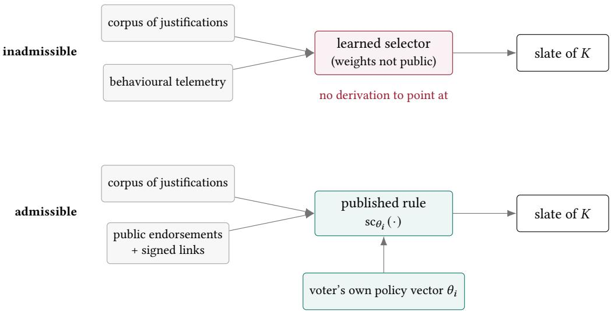
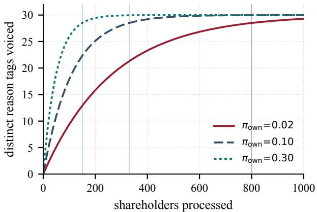
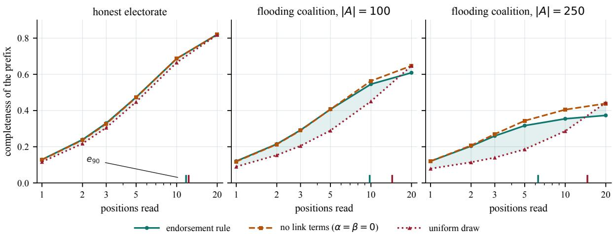

# Rules Before Oracles: Auditable, User-Configurable Argument Selection for Deliberative Polling

MUNTASER SYED, Florida Institute of Technology, USA MARKUS ZANKER, Free University of Bozen-Bolzano, Italy MARIUS SILAGHI∗, Florida Institute of Technology, USA

Background: A deliberative poll asks people to decide only after considering the arguments that bear on the decision. Once submitted arguments outnumber what anyone will read, some mechanism must choose which of them each voter sees, and that choice acquires a large share of the decision. Contemporary practice delegates it to opaque learned rankers, so a participant cannot recompute, attribute or contest the exposure that shaped their vote.

Objectives: We ask whether argument selection in a binding civic process can be a published rule over publicly recomputable evidence, with free arameters held b the individual voter, and what such a constraint costs. We treat le ibilit /ex lainabilit as an admissibility condition on the class of usable mechanisms rather than as an objective to be traded against accuracy, and we quantify the trade-of that is thereby foreclosed.

Methods: We formalise a oll as an alternative-based information s stem over bi olar justification sets, define three com lementar evaluation instruments for jud in a served slate: (i) set covera e of the live reason vocabular , (ii) the order in which covera e arrives, and (iii) ca tured endorsement mass. We also state the Subsumin Justification Problem with a greedy submodular bound used strictly as an evaluation ceiling, and give seven checkable criteria for a civic recommender and a rule satisfying all seven: a one-hop reversed endorsement flow whose only policy parameter is a relation-weight function. An agentic simulator instantiates � constituent agents and persists every slate at the instant of every vote; we report roughly 17,000 seeded, seed-paired runs over two propositions.

Results: In terms of coverage of live reason vocabulary fraction, served slates fall only 0.035 ± 0.013 short of a label-reading ceiling that upper-bounds every selection procedure, opaque ones included, so the entire competitive advantage available to an unconstrained ranker is bounded and small. On set coverage alone with solely non-degenerate authoring the rule is statistically indistinguishable from a uniformly random slate; we show that null is an artefact of an order-blind, charity-blind instrument. Under the two remaining evaluation instruments, the rule has a clear efect: it leads at every slate prefix by a margin that widens with adversarial pressure (−5.7 positions of depth-to-90% at a quarter-electorate coalition), and it dominates on endorsement mass by a factor of 3.3. Once a realistic fraction of submissions carries no reasons, the coverage margin returns and grows monotonically, with the two link summands — exactly inert on a uniformly good corpus — supplying 91% of it. Label-homogeneous flooding collapses completeness from 0.81 to 0.34 under a flat weight policy but only to 0.44 under an author-count-normalised one; a coalition co-signing to defeat the normalisation makes itself monotonically weaker.

Conclusions: Serving as a key security control, the weight policy carries significant completeness value (10%). The choice between ranking arms is a position on a coverage-versus-mass frontier rather than a fact, which is precisely the kind of choice only a legible rule can hand to the person it afects. We map the construction onto an existing open-source peer-to-peer platform, where per-peer local evaluation turns configurability from an operator’s concession into a structural property.

## 1 Introduction

In an assembly small enough that everyone hears everything, nobody has to decide what gets heard. Every real electorate is larger than that, so a selection step is unavoidable: something decides which of the thousands of submitted reasons appear on the screen of a voter about to cast a ballot. That step is where the power sits. The tally is public and checkable; the slate of arguments that produced the votes is usually neither. This manuscript takes the position that in a binding civic process the selection step is a piece of democratic procedure and must be built like one — a rule published in advance, computed over evidence any participant can retrieve and recompute, with the free parameters belonging to the individual voter rather than to whoever runs the servers. The key insight that makes this practical is that the property we actually want from a slate — that its reasons jointly span the reasons in play — is a set-level property of the served collection, and set-level properties can be pursued through the structure of the argumentation graph without ever interpreting the text; a rule that reads only endorsement counts and signed links is therefore both good enough to use and far harder to bend without leaving a public trace. Technically we model a poll as an alternative-based information system, measure a served slate along three axes rather than one, exhibit a one-hop reversed endorsement-flow rule whose sole policy lever is a relation-weight function, evaluate it inside a seed-controlled agentic simulator against a greedy submodular ceiling and under coordinated attack, and map the result onto an existing peer-to-peer deliberation platform. The contributions are:

• A charter for civic recommenders (Section 4): address seven operational criteria — 1. determinism, 2. evidence locality, 3. author blindness, 4. semantic abstinence, 5. reproducibility, 6. contestability, 7. configurability — each with the test that discharges it and the observable that would show it failing, argued as admissibility conditions rather than objectives; an opaque learned ranker fails four by construction.

• A three-instrument model of what a slate is for (Section 3): define an alternative-based poll over bipolar justification sets and measure 1. completeness of coverage against the reason vocabulary live at the instant of each vote; 2. a prefix-sensitive family of order measures; 3. captured endorsement mass. The Subsuming Justification Problem is stated with its weighted and componentwise variants, and a greedy $( 1 - e ^ { - 1 } )$ ) cover to be used strictly as an evaluation ceiling.

• A rule that meets the charter (Sections 4–5): a one-hop reversed endorsement flow over rebuttal and reinforcement links, with a per-voter policy vector making the rule individually configurable without making it individually unpredictable; and Abas, a seed-controlled simulator of � constituent agents that persists every served slate before the ballot it informed, yielding some 17,000 runs across sensitivity sweeps, a degenerate authoring sweep, ranking-term ablations and five adversarial families.

• A measured price for the charter (Section 7.3): the coverage fraction distance between the served slates and a label-reading greedy ceiling that upper-bounds every selection procedure on the same pool is 0.031 ± 0.014, against a temporal component of 0.163 that no procedure of any kind could recover.

• Experimental results and what a ranking rule is actually for (Sections 8–8.5): on set coverage alone, with solely non-degenerate authoring, the rule does not separate from a uniformly random slate, its two link summands are all but inert, and under flooding the random slate even wins. We show it is an artefact of an order-blind instrument and an implausibly charitable authoring model: under an order-sensitive reading the rule leads at every prefix with the margin growing under attack, and once a realistic fraction of submissions fails to justify, the coverage margin returns, rises monotonically with that fraction, and makes the link summands worth as much as the whole ranking advantage — by squaring the discrimination the electorate already exercises.

• An empirical manipulation result with a named defence (Section 9): under authentication, hub-riding is harmless and label-homogeneous flooding is not; author-count normalisation retains 0.08–0.12 of completeness that a flat policy loses; a rate- and corpus-matched control isolates homogeneity as four fifths of the cause; and the obvious escalation — co-signing links to inflate the normalising numerator — makes the coalition monotonically weaker.

• A peer-to-peer realisation and a normative reading (Sections 10 and 13): a component-by-component mapping onto DirectDemocracy Peer-to-Peer (DDP2P), covering identity and census, gossip synchronisation and local evaluation over partial replicas; and an argument for why legible procedure is constitutive rather than decorative.

The remainder of this section states the exposure problem and previews what the measurements turned out to say. Section 2 reviews the literatures the work sits between, Section 3 builds the formal object and its three instruments, Section 4 states the charter and the rule, Section 5 describes the simulator and Section 6 the protocol. Sections 7–9 report the non-degenerate authoring attack-free sweeps and the price of semantic abstinence, the null result and its two resolutions, and the adversarial sweeps. Section 10 maps the design onto DDP2P, Section 11 discusses, Section 12 lists what would change the conclusions, Section 13 makes the normative argument, and Section 14 concludes.

## 1.1 The exposure problem, and the position taken here

The legitimacy of a collective decision has never rested on the tally alone. From Mill’s marketplace of ideas to Habermas’s account of communicative rationality (Habermas 1984; Mill 1859), the tradition holds that a decision earns authority from the quality of the discourse preceding it. Fishkin turned that into a measurable protocol (Fishkin 1991; Fishkin et al. 2000): draw a stratified sample, expose it to balanced material and structured discussion, measure how opinion moves. Deployments across many countries report the same qualitative finding — considered opinion difers systematically from raw opinion, and partisan cues lose their grip once people meet the reasons behind positions (Fishkin 2009; Luskin et al. 2002) — and the protocol’s weakness is cost, a facilitated cohort of a few hundred being an expensive instrument that does not obviously scale to a national electorate (Lukensmeyer and Brigham 2005).

Digital platforms remove that barrier and immediately install another. When a hundred thousand people submit reasons, nobody reads the corpus; each person reads a slate. Call this the exposure problem: given a growing corpus of justifications and a per-voter display budget of � items, how should the slate be chosen so that the reasons in play are represented in what voters actually see? Getting it wrong produces three distinct harms, and they call for diferent remedies:

• Temporal inequity: in a sequential process the corpus is thin at the start and rich at the end, so early voters decide against a narrower reason space than late voters through no fault of their own; at the reference configuration the spread of per-voter completeness within a single run is about 0.21, five times the variation between one entire run and another.

• Silent narrowing: a selector tuned for engagement converges on whatever holds attention, which in political material is typically what confirms a prior (Pariser 2011; Sunstein 2007; Willson 2014), and the narrowing is silent because no individual slate looks censored — the missing reasons are simply never surfaced.

• Unfalsifiable influence: if the selector is a learned model, a participant who suspects their side is being systematically under-surfaced cannot establish it, cannot recompute the ranking, cannot point at the clause that produced the outcome, and cannot distinguish deliberate suppression from an artefact of training data (Burrell 2016; Lipton 2018). A civic process unable to answer “why was I shown this?” with a checkable derivation has replaced procedural legitimacy with trust in an operator.

The position of this manuscript follows from the last two harms in particular, and it is a position about admissibility, not about performance. We do not claim that opaque rankers rank badly. We claim that opaque ranking is the wrong frame for a civic slate: the object produced is not a personalised feed but a piece of the public record of what a voter was shown, and a public record must be reconstructible. Legibility therefore determines which procedures may be used at all, and questions of comparative quality arise only among those that qualify — the same structure as the secret ballot, which nobody defends on the grounds that it measures preferences more accurately than open voting. Section 4.2 states the criteria in a form that can be checked against an implementation, and every subsequent section is written so that a reader can see which criterion each design decision is discharging. Figure 1 states the commitment in one picture.

  
Fig. 1. The two pipelines. Both consume the same corpus and both emit � items. The upper one additionally consumes behavioural telemetry and passes it through parameters nobody outside can inspect, so a disputed slate has no derivation to point at. The lower one consumes only evidence every participant can already retrieve — who endorsed what, and which signed links exist — and exposes its policy parameters to the individual voter, so a disputed slate reduces either to a disputed input, which is checkable, or to a disputed policy, which is arguable. This manuscript treats the diference as a condition of admissibility rather than as a term in an objective.

## 1.2 What the measurements turned out to say

In a simplified setting where all justification authors correctly express their reasons (non-degenerate authoring), the fraction of the live reason vocabulary covered by a served slate, a simplified optimization objective for the motivatin harms, does not difer si nificantl between our rule and random selection.

With metrics that evaluate the ordering of justifications within the slate, and/or under a realistic electorate with degenerate authoring, the rule shows strong benefits over the control alternatives.

## 1.3 Why the substrate maters

A published rule evaluated on a server the operator controls is a large improvement over an unpublished one, and it stops short. The operator still decides which endorsements are in the database, when the index refreshes, and whose items quietly stop being returned. Configurability granted by an operator is revocable by the same operator, and reproducibility asserted by an operator is a claim about a machine nobody else can inspect. The natural terminus of the argument is an architecture in which each participant holds their own replica of the items they care about and evaluates the rule locally over it. DDP2P — DirectDemocracyP2P — is an existing open-source Java platform built on precisely that premise (M. C. Silaghi, Alhamed, et al. 2013; M. C. Silaghi, Qin, Alhamed, et al. 2013): peers keep independent databases of self-contained items, name them by global identifiers derived from public keys and content digests, and converge by push–pull gossip. Section 10 shows the model developed here maps onto DDP2P’s item types with very little impedance mismatch, and that doing so converts several criteria of the charter from policy promises into structural facts.

## 2 Background and Related Work

This work sits at the junction of five literatures: (1) the empirical political science of deliberative polling, (2) the formal theory of bipolar argumentation, (3) computational social choice for participatory processes, (4) the systems literature on recommendation and its manipulation, and (5) the peer-to-peer work that supplies the substrate. A sixth — the use of large language models as simulated populations — supplies the register in which the evaluation is conducted. We state below what we take from each and, where it matters, what we deliberately do not take.

Deliberative polling and its scaling problem. Deliberative polling instruments a simple hypothesis: opinion formed after ex osure to balanced ar ument difers s stematicall from o inion measured cold (Fishkin 1991; Fishkin et al. 2000). The canonical design draws a stratified sample, supplies balanced briefing material, runs moderated small-group discussion, and re-measures. Results across many deployments are consistent in direction — movement is largest where the initial position was least informed (Fishkin 2009; Luskin et al. 2002) — and the efect survives when artisan cues are stri ed from the material (Price et al. 2002). The desi n constraint is that facilitation does not scale: cohorts are a few hundred and the per-participant cost is that of a small conference (Lukensmeyer and Brigham 2005). Digital deployments relax that constraint and inherit a new one (Tolbert et al. 2009; Toots 2019): with a corpus no participant reads in full, the balance of the briefing material is no longer something an organiser curates but something a selection mechanism produces, per voter, in real time. We take the goal — reasoned exposure before the ballot — and treat selection, rather than facilitation, as the object to be engineered.

Bipolar argumentation. Dung’s abstract frameworks model a debate as a directed attack graph and define acceptability through extensions (Dung 1995). Bipolar frameworks add a support relation alongside attack (Cayrol and Lagasquie-Schiex 2013, 2005), and the handbook literature surveys the resulting semantic landscape (Amgoud et al. 2008; Baroni et al. 2018); labelled bipolar frameworks give a unified semantics for the many readings ofsupport and make the choice among them explicit (Gonzalez et al. 2021), and the correspondence with logic programming has since been settled in detail (Alcântara and Cordeiro 2025). Value-based extensions attach audience-relative preferences to arguments and thereby explain rational disagreement between audiences that accept the same facts (Bench-Capon and Dunne 2007), which is close in spirit to the per-voter policy vector of Section 4.6. Our use of this apparatus is deliberately shallow, and the shallowness is a design commitment. We adopt the bipolar signature — two relations of opposite polarity over a set of items — and decline the semantics: we compute no extensions and pronounce no argument acceptable or defeated. The reason is Criterion 4 (semantic abstinence, Section 4.2) — any semantics deciding which arguments survive is a machine deciding which arguments a voter should stop considering, exactly the authority a civic slate must not delegate. Links here are evidence about relevance, not adjudication of truth. That commitment also distinguishes this work from dialectical-quality measures over exchanges between parties (Rocha et al. 2026), which judge the argumentation; Prakken and Sartor on argument schemes in law (Prakken 2001) and the procedural tradition running back to Robert’s rules (Robert 1915) are closer to the role links play here, structuring who may speak to what rather than who is right.

Computational social choice for participatory processes. A parallel line asks how collective decisions should be composed once participation is mediated by software. Liquid democracy has been given an algorithmic treatment with explicit accuracy guarantees and failure modes (Kahng et al. 2021); representative committees can be sampled from peers so that the committee’s decisions track the electorate’s (Meir et al. 2021); proposing and voting have been unified as aggregation over a metric space (Bulteau et al. 2021); and proportionality has been extended from one-shot elections to sequential decision making (Chandak et al. 2026). The complexity of outcome determination in judgment aggregation is likewise mapped (Endriss et al. 2020). This literature aggregates positions; the present work is upstream of it, concerning what a voter is shown before a position is formed, and the two are complementary: any of these aggregation rules can sit downstream of the slate mechanism studied here.

Argument mining and its role here. Argument mining extracts claims, premises and relations from text (Lippi and Torroni 2016; Stab and Gurevych 2017); retrieval systems rank passages by argumentative quality (Carenini and Moore 2006; Wachsmuth et al. 2018); and argumentative dialogue agents use such structures to conduct persuasive exchanges (Chalaguine and Hunter 2020). These techniques are how the reason labels of Section 3.2 would be produced in a real deployment, and we assume nothing better than what they currently deliver. Their placement in the architecture is the point. Label extraction is an authoring-time operation: it runs once per item, its output is attached to the item, it is visible to the author, and it can be contested and corrected before the item is ever served. Selection is a serving-time operation over that frozen output. Keeping a language model strictly on the authoring side of that line means a disputed slate never requires anyone to reason about model internals; it requires them to point at a label they think is wrong, which is a claim about a public artefact. Section 12 returns to what happens when the labels themselves are adversarial.

Civic platforms with algorithmic assistance. Deployed systems already make these choices. Polis clusters participants by agreement pattern and surfaces statements that bridge clusters (Small et al. 2021), an approach with a genuine claim to representativeness whose clustering step nevertheless requires the operator’s pipeline to be trusted; hybrid participatory systems go further and estimate the values behind participants’ textual motivations, disambiguating them interactively (Liscio et al. 2025), which is the closest published treatment of the authoring-time inference we place of the serving path. Deliberation-support platforms have been surveyed for their argumentation structures (Brenneis et al. 2021; Mancini 2015), and recent work examines language models as facilitators (Behrendt et al. 2024; Tessler et al. 2024), with Tessler et al. reporting that a model-generated statement can find more common ground than a human mediator. That result is real and we do not dispute it. Our objection is categorical rather than empirical: a mediator whose reasoning cannot be reconstructed is unsuitable for a binding process regardless of measured quality, for the same reason that a demonstrably accurate but unauditable vote count is unsuitable. The regulatory direction is consistent — the Digital Services Act obliges very large platforms to disclose recommender parameters and ofer a non-profiling option (European Parliament and Council 2022), and the AI Act imposes transparency and human-oversight duties on systems used in democratic processes (European Parliament and Council 2024) — and sycophancy (Sharma et al. 2023) and measurable political leaning in pretrained models (Feng et al. 2023) are further reasons to keep such models of the serving path.

Diversity, coverage and manipulation in recommendation. Ranking by predicted relevance alone yields redundant lists; maximal marginal relevance trades relevance against novelty (Carbonell and Goldstein 1998), and aggregate diversity has been studied as a system-level objective (Adomavicius and Kwon 2012). Multi-stakeholder recommendation observes that platform, provider and consumer objectives diverge (Burke 2017); recency-aware work notes the drift of freshness a ainst ualit (Chakrabort et al. 2019); and conce tual modellin of ex lainable recommenders has ma ed what an ex lanation of a recommendation can even be (Caro-Martínez et al. 2021). Our com leteness functional is a covera e objective in this famil , with the civic-s ecific twist that the covered universe is the set of reasons live at the moment ofthe vote rather than a static catalogue. The manipulation literature is more directly load-bearing for Section 9. Shilling attacks against collaborative filtering inject profiles to promote a target item (Lam and Riedl 2004; Shardanand and Maes 1995); Sybil attacks manufacture identities to acquire disproportionate influence (Douceur 2002); eclipse attacks isolate a peer’s view of the network (Singh et al. 2006); and election manipulation on social networks has been analysed as seeding and edge modification, with the hardness of each variant established (Castiglioni et al. 2021). Eigenvector-style ranking schemes (Page et al. 1999) are structurally susceptible to link farms, which is precisely why our rule takes exactly one hop and no iteration to a fixed point: Section 9.1 confirms empirically that hub-riding is inert against it, and Section 9.2 shows where the residual exposure lives.

Agentic simulation as an evaluation method. Generative agents with memory and planning reproduce plausible social behaviour in sandboxed environments (Park et al. 2023); language models conditioned on demographic profiles reproduce survey response distributions (Argyle et al. 2023); multi-agent orchestration frameworks have matured (Q. Wu et al. 2024); and the method has been applied to social-science questions directly (Bail 2024). Our simulator belongs to this family and inherits its central caveat: agent behaviour is a model of constituent behaviour, not evidence about it. We therefore restrict every claim to statements about mechanism under a stated behavioural model — comparisons between ranking arms, sensitivities to structural parameters, responses to attacks — and make no claim about the magnitude any quantity would take in a human electorate.

Decentralised infrastructure for civic processes. Structured overlays give scalable key-based routing (Maymounkov and Mazières 2002); epidemic protocols give robust eventual dissemination (Demers et al. 1988); conflict-free replicated data types give convergence without coordination (Shapiro et al. 2011); hash trees give compact integrity proofs (Merkle 1988); blockchains give append-only public ledgers (Nakamoto 2008), with transparency-log constructions applied to update integrity (Nikitin et al. 2017) and cryptographic scrutiny of agreement protocols (Miller 2020); and decentralised social platforms have explored gossip-based dissemination (Boutet et al. 2013). DDP2P occupies a specific position: it is not a ledger and not a DHT, but a gossip-replicated store of self-contained, signed items designed for petition drives and organisational decision-making (M. C. Silaghi, Alhamed, et al. 2013; M. C. Silaghi, Qin, Alhamed, et al. 2013; M. C. Silaghi and Roussev 2014). Its research programme covers the pieces a civic deployment actually needs — decentralised census construction and verification (Qin, M. C. Silaghi, Hussien, et al. 2014; Qin, M. C. Silaghi, Matsui, et al. 2013b), detection of false identities (Qin, M. C. Silaghi, Matsui, et al. 2013a), peer reputation (Qin, M. C. Silaghi, Matsui, et al. 2013c), supernodes for peers behind NAT (Alhamed and M. C. Silaghi 2014), protocol stacking and update propagation (Alhamed, M. C. Silaghi, Hussien, Stansifer, et al. 2013; Alhamed, M. C. Silaghi, Hussien, and Yang 2013), meta-level recommendation over decentralised data (Alhamed, Zanker, et al. 2016), trust and key management (M. C. Silaghi, Qin, Matsui, et al. 2016), interface studies for non-expert users (Alqahtani and M. C. Silaghi 2016, 2017; Kattamuri et al. 2005), its logical foundations (Roussev and M. C. Silaghi 2017), related vehicular deployments (O. Dhannoon et al. 2013; O. A. Dhannoon 2013), and the motivating argument for why participation is worth the engineering (M.-C. Silaghi et al. 2017). Section 10 builds on that stack rather than proposing a new one.

## 3 The Object: An Alternative-Based Poll and Three Ways to Judge a Slate

Before anything can be recommended, the thing being recommended over has to be defined, and before any recommender can be judged, the standard of judgement has to be fixed. This section does both. The object is an alternative-based information system: a poll in which each side of the question carries its own set of justifications, and in which typed links between justifications carry the polarity of the relations participants assert between them. The standard is deliberately plural. We define three instruments — how much of the live reason vocabulary a slate covers, how early in the slate that coverage arrives, and how much of the electorate’s expressed endorsement the slate captures — because Section 8 will show that any one of them alone gives a misleading verdict. We then state the combinatorial problem that coverage induces, prove it hard, and construct the greedy bound we use as an evaluation ceiling, with an explicit statement of the discipline governing that bound’s use.

## 3.1 Polls, sides, and justifications

A poll asks a question with a finite set of mutually exclusive alternatives. Throughout we take the binary case — support or oppose a motion — because it is the case civic petitions actually present and because it keeps

the notation legible; nothing in the construction depends on it, and Section 14 notes the multi-alternative generalisation.

Definition 3.1 (Alternative-based poll). An alternative-based poll is a tuple

$$
\Pi = \left. { \mathcal I } ^ { + } , { \mathcal I } ^ { - } , { \mathcal R } ^ { \ominus } , { \mathcal R } ^ { \oplus } , \omega _ { \mathrm { c } } , \omega _ { \mathrm { r } } \right.\tag{1}
$$

where ${ \mathcal { T } } ^ { + }$ and $\mathcal { T } ^ { - }$ are finite sets of justifications attached to the supporting and opposing alternatives respectivel $\mathrm { y } ^ { 1 } ; \mathcal { R } ^ { \ominus } \subseteq \mathcal { T } \times \mathcal { I }$ with ${ \mathcal { T } } = { \mathcal { T } } ^ { + } \cup { \mathcal { T } }$ − is the rebuttal relation, read ${ } ^ { \mathfrak { s } } ( j , k ) \in \mathcal { R } ^ { \ominus }$ asserts that � tells against $k " ;$ $\mathcal { R } ^ { \oplus } \subseteq \mathcal { T } \times \mathcal { T }$ is the reinforcement relation, read $^ { * } j$ tells in favour of $k ^ { \ast } ; \omega _ { \mathrm { c } } : \mathcal { T }  \mathbb { R } _ { \ge 0 }$ assigns each justification a civic weight; and $\omega _ { \mathrm { r } } : \mathcal { R } ^ { \ominus } \cup \mathcal { R } ^ { \oplus }  \mathbb { R } _ { \ge 0 }$ assigns each link a weight.

Three features carry the design. The two relations are typed but not signed at the level of the tuple: polarity lives in which relation a link belongs to, and the score function of Section 4.4 attaches a separate coeficient to each, so a participant may configure how much a rebuttal counts relative to a reinforcement — a substantive editorial choice — without reaching inside the graph. The civic weight $\omega _ { \mathrm { c } }$ is the endorsement count: how many constituents cast their ballot citing that item. It is a public tally, not a quality judgement, and no part of the construction asks whether an item deserves the endorsements it has. Finally $\omega _ { \mathrm { r } }$ is where policy lives: Section 4.5 shows that choosing it flat or normalised by the number of distinct authors behind the link moves completeness under coordinated flooding by 0.08–0.12, an order of magnitude larger than any other design decision here.

## 3.2 Reason vocabularies and the live denominator

Coverage requires a universe to cover. We obtain it by labelling each justification with the reasons it invokes.

Definition 3.2 (Reason labelling). Fix a finite reason vocabulary Λ. A labelling is a map $\lambda : \mathcal { T } \to 2 ^ { \Lambda }$ assigning each justification the non-empty set of reasons it invokes2.

Just for evaluation in reported experiments, labels are associated at authoring time (Section 2), stored on the item, and never recomputed at serving time; a deployment publishes its vocabulary and its extraction procedure. The denominator is the subtler half. Comparing a slate against the full vocabulary Λ would penalise an early voter’s slate for failing to see reasons nobody had yet written, which is exactly the temporal inequity of Section 1.1 — a real phenomenon, but one to measure separately rather than fold into the score of the recommender. We therefore evaluate against what existed.

Definition 3.3 (Live vocabulary). For a voter � casting a ballot at time $t _ { i } ,$ , let $\mathcal { T } _ { t _ { i } }$ be the set of justifications submitted strictly before $t _ { i } ,$ and let the live vocabulary on side $\sigma \in \{ + , - \}$ be $\begin{array} { r } { \Lambda _ { t _ { i } } ^ { \sigma } = \bigcup _ { j \in \mathcal { T } ^ { \sigma } \cap \mathcal { T } _ { t _ { i } } } \lambda ( j ) } \end{array}$

Definition 3.4 (Slate completeness). Let $S _ { i } ^ { \sigma } \subseteq \mathcal { T } ^ { \sigma } \cap \mathcal { T } _ { t _ { i } }$ be the slate of at most � justifications served to voter � on side �. Its completeness is

$$
c _ { i } ^ { \sigma } ~ = ~ \frac { \big | ~ \bigcup _ { j \in S _ { i } ^ { \sigma } } \lambda ( j ) ~ \big | } { \big | ~ \Lambda _ { t _ { i } } ^ { \sigma } ~ \big | } ~ \in ~ [ 0 , 1 ] ,\tag{2}
$$

with $c _ { i } ^ { \sigma } = 1$ by convention when $\Lambda _ { t _ { i } } ^ { \sigma } = \emptyset$ . The combined completeness of a run over � voters, by averaging, is

$$
\bar { c } = \frac 1 { 2 N } \sum _ { i = 1 } ^ { N } \bigl ( c _ { i } ^ { + } + c _ { i } ^ { - } \bigr ) .\tag{3}
$$

Completeness is defined per voter and per side, and (3) aggregates a voter’s two values by averaging them. Averaging permits compensation: a slate that covers one side well and the other badly scores the same as one that covers both indiferently. A flooding coalition attacks one side, so this is precisely the configuration in which the reported number and the experienced one can come apart. We therefore also run evaluations with the average over a voter’s two sides replaced by the minimum,

$$
c _ { i } ^ { \operatorname* { m i n } } \ = \ \operatorname* { m i n } \bigl ( c _ { i } ^ { + } , c _ { i } ^ { - } \bigr ) , \qquad \bar { c } ^ { \operatorname* { m i n } } \ = \ \frac { 1 } { N } \sum _ { i = 1 } ^ { N } c _ { i } ^ { \operatorname* { m i n } } ,\tag{4}
$$

under which a voter is served exactly as well as their worse-covered side and is granted no credit for coverage they did not lose.

Two properties of (2) deserve to be stated here rather than discovered later, because between them they account for the entire narrative arc of Section 8.

Remark 1 (Order blindness). $c _ { i } ^ { \sigma }$ depends on $S _ { i } ^ { \sigma }$ only as a set. Permuting the slate leaves it unchanged. Completeness therefore cannot, even in principle, distinguish a ranking rule from any procedure that returns the same � items in a diferent order — and when $\vert \mathcal { T } ^ { \sigma } \cap \mathcal { T } _ { t _ { i } } \vert$ is not much larger than �, it cannot distinguish it from a random draw either, because both return nearly the same set.

Remark 2 (Charity blindness). $c _ { i } ^ { \sigma }$ credits an item for the labels it carries, assumed to be a nonempty set of a size above some given positive threshold, whatever the quality of the argument attached to them. If every submission in the corpus is a well-formed argument on its own side, every item is worth roughly the same to this measure, and no selection rule can beat a random draw by much. The measure only rewards discrimination when there is something to discriminate against.

## 3.3 Three instruments: coverage, order, and endorsement mass

A slate is a sequence, presented to a person with finite attention, drawn from a corpus the electorate has already expressed opinions about. Each clause supports a diferent question about whether the slate was well chosen, and we report all three because Section 8 shows they disagree in ways that matter.

Instrument I: coverage. Completeness �¯ per Definition 3.4. It answers: were the reasons in play represented at all? It is the natural formalisation of the balance requirement inherited from deliberative polling, and it is order-blind and charity-blind per Remarks 1–2.

Instrument II: order. Real readers do not consume slates uniformly. Let $S _ { i } ^ { \sigma } = \langle j _ { 1 } , \ldots \rangle _ { K } \rangle$ now be an ordered slate, and define the prefix coverage at depth �,

$$
\boldsymbol { p } _ { i } ^ { \sigma } ( \boldsymbol { m } ) ~ = ~ \frac { \big | ~ \bigcup _ { u \leq m } \lambda ( \boldsymbol { j } _ { u } ) ~ \big | } { \big | ~ \Lambda _ { t _ { i } } ^ { \sigma } ~ \big | } , \qquad \boldsymbol { m } = 1 , . . . , K ,\tag{5}
$$

so that $p _ { i } ^ { \sigma } ( K ) = c _ { i } ^ { \sigma }$ recovers Instrument I. From the prefix profile we take three summaries. The area under the prefix curve $\begin{array} { r } { \mathrm { A U C } _ { i } ^ { \sigma } = K ^ { - 1 } \sum _ { m = 1 } ^ { K } p _ { i } ^ { \sigma } ( m ) } \end{array}$ is the coverage enjoyed by a reader who stops at a uniformly random depth. The rank-discounted coverage weights each reason by where it first appears,

$$
\begin{array} { r } { \mathrm { R D C } _ { i } ^ { \sigma } \ = \ \left( \sum _ { t \leq \vert \Lambda _ { t _ { i } } ^ { \sigma } \vert } \frac { 1 } { \log _ { 2 } \left( 1 + t \right) } \right) ^ { - 1 } \sum _ { \ell \in \Lambda _ { t _ { i } } ^ { \sigma } } \frac { \mathcal { H } [ \ell \ \mathrm { s e r v e d } ] } { \log _ { 2 } \left( 1 + \mathrm { p o s } _ { i } ^ { \sigma } ( \ell ) \right) } , } \end{array}\tag{6}
$$

where ⊮[ℓ served] is an indicator function evaluating to 1 if the reason ℓ appears on at least one item of the slate served to voter � on side �, and 0 otherwise, pos�(ℓ) is the position of the first slate item carrying ℓ and the normaliser is the value a slate would attain by covering the whole live vocabulary as early as positions allow, the normalizer being replaced with 1 at the beginning when that is needed to avoid division by 0. Finally $e _ { 9 0 }$ is the smallest level � with $p _ { i } ^ { \sigma } ( m ) \geq 0 . 9 c _ { i } ^ { \sigma } -$ — how deep the reader must go to obtain nine tenths of what that slate was ever going to give them. Instrument II answers: did the coverage arrive early enough to be read?

Instrument III: endorsement mass. A slate can cover the vocabulary while serving nothing that any constituent actually adopted. Define

$$
\begin{array} { r } { \mathrm { M } _ { i } ^ { \sigma } \ = \ \frac { \sum _ { j \in S _ { i } ^ { \sigma } } \omega _ { \mathrm { c } } \left( j \right) } { \operatorname* { m a x } _ { T \subseteq \mathcal { T } ^ { \sigma } \cap \mathcal { T } _ { t _ { i } } , \ | T | \leq K } \ \sum _ { j \in T } \omega _ { \mathrm { c } } \left( j \right) } , } \end{array}\tag{7}
$$

the share of the maximum achievable endorsement weight that the served slate captured. Instrument III answers: did the slate show the voter what the electorate had actually taken $u p ?$ It is the axis on which Section 8.5 finds the random baseline dominated by a factor of 3.3, and the axis on which the greedy oracle of Section 3.5 stops dominating under attack. Nothing in the design privileges one instrument: Section 8.5 treats them jointly, as a frontier over which a participant — not the system — chooses a position, and that this is even expressible is a consequence of Criterion 7 (configurability, Section 4.2).

## 3.4 The Subsuming Justification Problem

Instrument I induces a combinatorial problem which we name and characterise, both because it locates the construction in complexity terms and because its hardness is what licenses the greedy bound ofthe next subsection. Say that $S \subseteq \mathcal { T } ^ { \sigma }$ subsumes a target vocabulary $L \subseteq \Lambda$ when $\begin{array} { r } { \bigcup _ { j \in S } \lambda ( j ) \supseteq L } \end{array}$

Definition 3.5 (Subsuming Justification Problem, SJP). Instance: a labelled justification set $( \mathcal { T } ^ { \sigma } , \lambda )$ , a target $L \subseteq \Lambda ^ { \sigma }$ , and a budget $K \in \mathbb { N } .$ . Question: does some $S \subseteq \mathcal { T } ^ { \sigma }$ with $| S | \le K$ subsume �?

Proposition 3.6. SJP is NP-complete.

Proof. Membership: a certificate � with $| S | \le K$ is verified by computing $\cup _ { j \in S } \lambda ( j )$ and testing containment of $L ,$ in time linear in $\textstyle \sum _ { j \in S } | \lambda ( j ) |$ . Hardness: reduce from Set Cover (Karp 1972). Given a universe $U , \mathbf { a }$ family $\mathcal { F } = \{ F _ { 1 } , \ldots , F _ { n } \}$ of subsets of $U _ { i }$ , and a budget $K ,$ put $\Lambda = U ,$ , create one justification $j _ { r }$ per $F _ { r }$ with $\lambda ( j _ { r } ) = F _ { r }$ , set $L = U$ , and keep the budget. Any � of size $\le K$ subsuming � maps to a cover of size $\le K$ and conversely; the construction is linear in the instance size. □

Two variants matter o erationall . Weighted SJP adds $\mu : \Lambda \to { \mathbb { R } _ { \geq 0 } }$ and a threshold � and asks whether some $S$ with $| S | \le K$ attains $\begin{array} { r } { \mu ( \bigcup _ { j \in S } \lambda ( j ) ) \geq \tau ; } \end{array}$ it inherits hardness at $\mu \equiv 1 , \tau = | L |$ , and its interest is normative rather than computational, since $\mu$ is where a deployment would encode that some reasons must not be crowded out — minority-held reasons, statutory considerations — exactly the kind of parameter that must be published in advance rather than learned, a learned $\mu$ being an unaccountable editorial line. Componentwise $S \mathcal { J } P$ reflects that a slate covering one side well and the other badly is not balanced: given budgets $K ^ { + } , K ^ { - }$ and targets $L ^ { + } , L ^ { - }$ it asks for $S ^ { + } , S ^ { - }$ with $| S ^ { \sigma } | \le K ^ { \sigma }$ subsuming $L ^ { \sigma }$ for both �. Since the two sides share no items it decomposes into two independent SJP instances — which is why (3) averages per-side completeness rather than pooling the vocabularies: pooling would let a slate compensate a neglected side with an over-covered one, the opposite of balance.

## 3.5 The greedy ceiling, and the discipline governing its use

Since coverage is the objective of an NP-hard problem, an exact optimum is not an available comparator. A standard bound ${ \mathrm { i } } s ,$ and it happens to be tight enough to be informative. Given $( \mathcal { T } ^ { \sigma } \cap \mathcal { T } _ { t _ { i } } , \lambda )$ , target $\Lambda _ { t _ { i } } ^ { \sigma }$ and budget $K ,$ the greedy cover selects, � times, the item maximising the number of not-yet-covered reasons it contributes, breaking ties by a published deterministic key.

Proposition 3.7. The reason count $f ( S ) = | \cup _ { j \in S } \lambda ( j ) |$ is monotone and submodular, so the greedy cover attains at least $\left( 1 - e ^ { - 1 } \right) \approx 0$ .632 ofthe optimal value at budget � (Nemhauser et al. 1978), and no polynomial-time algorithm improves the ratio unless $P = N P \left( F e i g e \right.$ 1998; Hochbaum 1997).

Proof. Monotonicity is immediate. For submodularity, take $S \subseteq T$ and $j \not \in T$ ; then $f ( S \cup \{ j \} ) - f ( S ) =$ $| \lambda ( j ) \setminus \bigcup _ { k \in S } \lambda ( k ) | \geq | \lambda ( j ) \setminus \bigcup _ { k \in T } \lambda ( k ) | = f ( T \cup \{ j \} ) - f ( T )$ , since the subtracted set is larger. The bound and its optimality follow. □

The greedy cover reads � directly — a semantic operation requiring the selector to know what each item is about and to choose items for what the sa . It therefore violates Criterion 4 (semantic abstinence) outri ht, and because it must inspect every candidate’s labels it also fails Criterion 2 (evidence locality); both are stated with their tests in Section 4.2. It is not a candidate mechanism, yet we compare against it constantly, which requires stating the discipline explicitly.

Principle 1 (Oracle discipline). Like the labels, the greedy cover appears in this manuscript only on the evaluation path. It is computed ofline, from the persisted database, after the poll has closed. No agent ever sees a slate it produced; no served slate was ever influenced by it; it is not proposed, and could not be adopted, as a deployable selection rule. Its role is to answer one question that no admissible mechanism can answer about itself: how much coverage was available in this pool at all?

Principle 1 is what makes the number in Section 7.3 meaningful. Because the greedy cover reads the labels, its coverage upper-bounds — to within the 0.632 factor, and in practice far more tightly — what any selection procedure applied to the same pool could have achieved, including an arbitrarily good opaque learned ranker. The gap between the served slates and that ceiling is therefore not the price of our particular rule against some better rule; it is the price of the entire admissible class against the unreachable best case, and Section 7.3 measures it at $0 . 0 3 1 \pm 0 . 0 1 4$

## 3.6 Reach: what a slate can be held responsible for

A rule that reads only endorsements and one-hop links cannot serve what it cannot see. Making that horizon explicit turns a limitation into a specification. The reach of a justification � at time � is $\rho _ { t } ( j ) = \{ j \} \cup \{ k : ( j , k ) \in$ $\mathcal { R } ^ { \bar { \ominus } } \cup \mathcal { R } ^ { \oplus } , k \in \mathcal { T } _ { t } \}$ , and � is visible to the rule at � if $\omega _ { \mathrm { c } } ( j ) > 0 \mathrm { o r } \omega _ { \mathrm { c } } ( k ) > 0$ for some $k \in \rho _ { t } ( j )$

Proposition 3.8 (Partial-replica sufficiency). Evaluating the endorsement rule ofSection 4.4 for the items in a candidate pool � requires only the endorsement counts $o f \backslash \cup _ { j \in P } \rho _ { t } ( j )$ and the link tuples out of �. It requires no global view of $\mathcal { T } , \mathcal { R } ^ { \ominus } o r \mathcal { R } ^ { \oplus }$ . This is immediate from the score (8) given in Section 4.4: the score of� is a function of $\omega _ { \mathrm { c } } ( j )$ and of $\dot { \omega } _ { \mathrm { c } } ( k )$ for � ranging over �’s out-neighbours only.

Proposition 3.8 is the technical fact that makes Section 10 possible. A peer holding a partial replica computes exactly the same scores for the items it holds as a peer holding everything, which is what allows every participant to run the rule themselves rather than trust an operator to run it for them. It also delimits responsibility: a brand-new item with no endorsements and no incoming links from endorsed material is invisible to the rule, and no amount of tunin chan es that. Cold-start items surface when someone reads them — which is what the authoring-side random exploration of Section 5.2 is for — and not before.

## 3.7 A worked example

The following instance is small enough to check by hand and exhibits every phenomenon the experiments will measure at scale.

Example 3.9 (Municipal night-bus extension). A city puts to its residents: extend the night-bus network to the outer districts? At the moment resident � opens the ballot, the supporting side holds five justifications and the opposing side four. Labels are drawn from a published vocabulary; endorsement counts $\omega _ { \mathrm { c } }$ are the public tallies.

<table><tr><td>id gist</td><td></td><td> $\omega _ { \mathrm { c } }$ </td><td>labels λ</td></tr><tr><td colspan="4">supporting side  ${ \mathcal { T } } ^ { + }$ </td></tr><tr><td> $s _ { 1 }$ </td><td>shift workers stranded after 23:00</td><td>46</td><td>ACCESS, EQUITY</td></tr><tr><td> $s _ { 2 }$ </td><td>night transit cuts drink-driving crashes</td><td>31</td><td>SAFETY</td></tr><tr><td> $s _ { 3 }$ </td><td>same rolling stock, marginal cost only</td><td>12</td><td>COST</td></tr><tr><td> $s _ { 4 }$ </td><td>shift workers are mostly low-income</td><td>4</td><td>EQUITY</td></tr><tr><td> $s _ { 5 }$ </td><td>fewer night cars lowers emissions</td><td>3</td><td>CLIMATE</td></tr><tr><td colspan="4">opposing side  ${ \mathcal { T } } ^ { - }$ </td></tr><tr><td> $o _ { 1 }$ </td><td>subsidy competes with school repairs</td><td>39</td><td>COST, PRIORITIES</td></tr><tr><td> $o _ { 2 }$ </td><td>measured outer-district demand is very low</td><td>28</td><td>DEMAND</td></tr><tr><td> $o _ { 3 }$ </td><td>depot noise at 02:00 in residential streets</td><td>9</td><td>AMENITY</td></tr><tr><td> $o _ { 4 }$ </td><td>rosters would breach the rest agreement</td><td>2</td><td>LABOUR</td></tr></table>

Both live vocabularies have five reasons, so $| \Lambda ^ { + } | = | \Lambda ^ { - } | = 5 .$ . The links asserted so far are $( s _ { 3 } , o _ { 1 } ) \in \mathcal { R } ^ { \ominus }$ (marginal cost tells against the subsidy objection), $( s _ { 4 } , s _ { 1 } ) \in \mathcal { R } ^ { \oplus } , ( s _ { 2 } , o _ { 3 } ) \in \mathcal { R } ^ { \ominus } , ( o _ { 2 } , s _ { 1 } ) \in \mathcal { R } ^ { \ominus }$ and $( o _ { 4 } , o _ { 1 } ) \in \mathcal { R } ^ { \oplus }$ The display budget is $K = 2$ per side.

What each procedure serves. Take the rule of Section 4.4 at the reference policy $\alpha = \beta = 0 . 5 , \omega _ { \mathrm { r } } \equiv 1$ . On the supporting side, $\operatorname { s c } ( s _ { 1 } ) = 4 6 , \operatorname { s c } ( s _ { 2 } ) = 3 1 + 0 . 5 \cdot 9 = 3 5 . 5 , \operatorname { s c } ( s _ { 3 } ) = 1 2 + 0 . 5 \cdot 3 9 = 3 1 . 5 , \operatorname { s c } ( s _ { 4 } ) = 4 + 0 . 5 \cdot 4 6 = 2 7$ $\displaystyle { \mathrm { s c } } ( s _ { 5 } ) = 3 .$ . The rule serves $\langle s _ { 1 } , s _ { 2 } \rangle$ , covering {access, eqity, safety}: completeness $3 / 5 = 0 . 6 0 \mathrm { ; }$ , prefix profile $p ( 1 ) = 0 . 4 0 , p ( 2 ) = 0 . 6 0$ . The greedy cover reads labels and serves $\{ s _ { 1 } , s _ { 3 } \}$ or $\left\{ s _ { 1 } , s _ { 5 } \right\} -$ also 0.60, since no pair here exceeds three reasons. A uniform draw serves 2.4 distinct reasons in expectation, i.e. completeness 0.48.

Where the instruments diverge. Let the draw return $\{ s _ { 1 } , s _ { 5 } \}$ , which it does as often as any other pair: its coverage is $3 / 5 ,$ equal to the rule’s, so on Instrument I the two procedures are indistinguishable on this run. On Instrument III they are not: the rule captures $\mathrm { M } ^ { + } = 7 7 / 7 7 = 1$ .00 against $4 9 / 7 7 = 0 . 6 4$ for $\{ s _ { 1 } , s _ { 5 } \}$ and $1 5 / 7 7 = 0 . 1 9$ for $\left\{ s _ { 3 } , s _ { 5 } \right\}$ . The voter shown $\left\{ { { s } _ { 3 } } , { { s } _ { 5 } } \right\}$ met two reasons four of their neighbours had ever endorsed; the voter shown $\langle s _ { 1 } , s _ { 2 } \rangle$ met the two that seventy-seven had.

Where the link terms earn their place. Item $s _ { 3 }$ ranks fourth on its own endorsements and is promoted to third by the rebuttal coeficient because it speaks to the most endorsed item on the other side — but ranking on endorsements alone would place it third as well. That is the inertia of Section 8.1 in miniature: on a uniformly competent corpus the link terms reorder items that were already adjacent. Now replace �5 by a submission $s _ { 5 } ^ { \prime }$ carrying the label climate and no actual reason: a sentence of agreement, correctly labelled, endorsed by nobody, asserting no links. Coverage is blind to the substitution, so a uniform draw serves $s _ { 5 } ^ { \prime }$ exactly as often as it served $s _ { 5 } ;$ the rule scores it 0, both because nobody endorsed it and because it points at nothing anyone endorsed. That double penalty — the squaring of discrimination measured in Section 8.4 — is invisible here only because the instance contains one such item. At the fractions Section 8.3 reports it is worth as much as the whole ranking advantage.

## 4 The Charter: Criteria Before Objectives

This section states what a selection mechanism must satisfy to be used in a binding civic process, and exhibits a rule that satisfies it. The order of presentation within this section is itself part of the argument: the criteria come before the rule as conditions on the admissible class and the rule follows as one member of that class chosen for its simplicity. We begin with what opacity costs in concrete operational terms, state the seven criteria with their tests, argue that they are prior to rather than commensurable with measured quality, give the rule, isolate the one line of it that is a security control, and close on how per-voter configuration is possible without dissolving the shared record.

## 4.1 What opacity costs, concretely

The case against an opaque selector here is not that such systems are inaccurate; it is that some operations a civic process requires become impossible, and it is worth naming them as operations rather than as values.

Recomputation: a participant who disputes a slate should be able to obtain the same slate from the same inputs, which with published weights over public evidence is arithmetic, whereas with a learned selector the participant would need the model, its parameters, the exact feature vector at serving time and the personalisation state — and even a cooperative operator disclosing all four supplies a recomputation nobody outside can independently verify was the one actually run.

Attribution: when a slate is wrong, a process needs to say which input made it wrong, and under the rule of Section 4.4 the answer is a term — this item ranked here because it carried these endorsements and pointed at those items — whereas under a learned ranker the answer is that the output is a function of the training distribution, post-hoc attribution methods producing explanations that are themselves unverifiable (Lipton 2018; Rudin 2019); surveys of explainability for supervised learning make the gap between an explanation and a derivation plain (Burkart and Huber 2021).

Explanation: a voter is owed an account of why their slate contains what it contains, and that account must be the computation rather than a story fitted to it. Under the rule it is the score read aloud and cannot drift from the mechanism because it is the mechanism, whereas a learned selector explains itself through a second model whose account is plausible to the recipient rather than identical to the computation that ran (Caro-Martínez et al. 2021). An explanation a voter cannot check against the public record is indistinguishable from persuasion.

Contest: a dispute must terminate, and under the rule it terminates in one of three ways — an endorsement tally is wrong and tallies are public, a link is wrong and links are signed by their authors, or the policy is wrong and that is a political argument conducted in the open — whereas under an opaque selector the dispute has no terminating move, which converts every disagreement about content into a standing grievance about the operator.

emphBounded drift: a published rule changes when someone changes it and the change is a dif, whereas a learned selector changes whenever it is retrained, whenever the population shifts and whenever a feature pipeline is updated, so its behaviour last month is not recoverable — and a civic record that cannot be reconstructed a year later is not a record.

None of these costs is ofset by better ranking, because none is a ranking property. This is the structural reason the criteria below are stated as admissibility conditions rather than as objectives to be weighed, and it is also where this construction parts company with the fairness-and-accountability literature that treats such properties as quantities to optimise: proposals for socially responsible AI (Cheng et al. 2021) and critiques of fairness as a single formal target (Weinberg 2022) both proceed by asking what a system should maximise, whereas the question here is which systems may be used at all.

## 4.2 Seven criteria, with their tests

Each criterion below is stated so that an auditor can check it a ainst an im lementation, to ether with the observable that would show it violated. They are numbered for reference throughout the rest of this manuscript; every subsequent design decision is annotated with the criterion it discharges.

Criterion 1 (Determinism). Given the same evidence and the same policy vector, the mechanism returns the same slate. Test: run it twice on a frozen snapshot; the outputs are identical, ties included. Violation looks like:

Table 1. The seven criteria a ainst three mechanism families. – denotes failure b construction rather than b im lementation choice: no amount of engineering efort within that family recovers the property. The greedy cover is included because it appears throughout the evaluation and it is important to be explicit that it is inadmissible; see Principle 1.
<table><tr><td></td><td>endorsement rule (§4.4)</td><td>greedy cover (§3.5)</td><td>learned ranker</td></tr><tr><td>C1 determinism</td><td>yes</td><td>yes</td><td>only if frozen</td></tr><tr><td>C2 evidence locality</td><td>one hop</td><td>whole pool –</td><td>unbounded –</td></tr><tr><td>C3 author blindness</td><td>yes</td><td>tie-breaks</td><td>learned from behaviour –</td></tr><tr><td>C4 semantic abstinence</td><td>yes</td><td>reads labels –</td><td>reads everything –</td></tr><tr><td>C5 reproducibility</td><td>yes</td><td>yes</td><td>needs exact checkpoint –</td></tr><tr><td>C6 contestability</td><td>per-term</td><td>per-item</td><td>post-hoc only –</td></tr><tr><td>C7 configurability</td><td>per voter</td><td>fixed</td><td>operator-held –</td></tr></table>

two participants with identical configurations and identical local data seeing diferent slates, with no published reason.

Criterion 2 (Evidence locality). The score of an item depends only on that item and on a bounded, explicitly specified neighbourhood of it. Test: perturb an item outside the declared neighbourhood; the score does not move. Violation looks like: a global fixed point, or any quantity whose value depends on the whole corpus, which makes both partial-replica evaluation and local reasoning about a dispute impossible.

Criterion 3 (Author blindness). No term in the score refers to who wrote an item, beyond counting distinct authors where a policy explicitly calls for it. Test: permute author identities across items; the ranking is invariant. Violation looks like: reputation, seniority, or verified-account status entering the ranking — reintroducing the influence hierarchy that a poll is supposed to flatten.

Criterion 4 (Semantic abstinence). The serving-time mechanism does not read the content of items. Test: replace every item’s text with an opaque identifier; the slate is unchanged. Violation looks like: the selector deciding, at serving time, what an argument means or whether it is any good — which is the specific authority a civic slate must not delegate, and which the greedy cover of Section 3.5 openly exercises, hence Principle 1.

Criterion 5 (Reproducibility). Every served slate is recomputable after the fact from persisted evidence. Test: from the archive, reconstruct any historical slate exactly, including the state of the corpus at that instant. Violation looks like: an audit that can establish what was tallied but not what was shown.

Criterion 6 (Contestability). Every slate decomposes into named contributions, each traceable to a public artefact. Test: for any served item, produce the list of (term, evidence, value) triples summing to its score. Violation looks like: an explanation that is itself a model output.

Criterion 7 (Configurability). The policy parameters are held by the individual participant receiving it, not by the operator, and the participant can change them and observe the efect. Test: two participants with diferent policies, same evidence, obtain diferent and separately correct slates. Violation looks like: a single operator-chosen ranking presented as neutral, or a personalisation the participant cannot inspect or switch of.

Table 1 summarises how three mechanism families fare. The pattern is not that learned rankers score lower; it is that they are disqualified on four criteria at once, by construction rather than by implementation quality.

## 4.3 Why this is not an empirical hypothesis

A natural objection runs: the assertion that rule-based selection is preferable, is never tested against a learned alternative. The objection is well formed and the answer governs how the rest of the results should be read. The claim is normative and it is a claim about admissibility: a mechanism that cannot be recomputed, attributed, explained, contested or reconstructed is unsuitable for a binding civic process — not that it ranks worse. A comparison against a learned ranker would report a diference in coverage or in some downstream engagement statistic, and whatever number came out could not bear on the claim, since a learned ranker covering more of the live vocabulary would still fail C2, C4, C5 and C6 and would still leave a disputing participant with no terminating move. The structure is familiar from other civic procedures. The secret ballot is not defended on the grounds that it measures preferences more accurately than open voting — it plainly measures some things less well, since it destroys the ability to audit an individual’s vote — but because the procedure must possess a property that outranks measurement quality. Double-entry bookkeeping is not the most compact representation of a firm’s accounts; rules of order do not produce the fastest decisions. In each case a procedural property is treated as prior, and eficiency questions are settled within the class of procedures that possess it.

What is legitimately empirical, and what this manuscript tests, is everything downstream of that commitment: how much does the commitment cost?, answered against a ceiling that upper-bounds every mechanism including inadmissible ones (Section 7.3); which terms of the rule earn their place?, answered by ablation, including the finding that two of them earn nothing on a charitable corpus and a great deal on a realistic one (Sections 8.1 and 8.3); which policy choices are security controls?, answered by adversarial sweep (Section 9.2); and where does the choice between configurations actually lie?, answered by a frontier rather than an optimum (Section 8.5).

## 4.4 The endorsement rule

We now give a mechanism satisfying all seven criteria. Its simplicity is a feature.

Definition 4.1 (Endorsement rule). Let $E ( j ) = \omega _ { \mathrm { c } } ( j )$ be the endorsement count of item �. Given a policy vector $\theta = \left( \alpha , \beta , \omega _ { \mathrm { r } } \right)$ with $\alpha , \beta \in \mathbb { R } ,$ , the endorsement score of � at time � is

$$
\begin{array} { l } { \displaystyle \mathsf { s c } _ { \theta } ( j ) ~ = ~ E ( j ) ~ + ~ \alpha \sum _ { ( j , k ) \in \mathcal { R } ^ { \oplus } , { k \in \mathcal { I } _ { t } } } \omega _ { \mathrm { r } } ( j , k ) E ( k ) ~ + ~ \beta \sum _ { ( j , k ) \in \mathcal { R } ^ { \ominus } , { k \in \mathcal { I } _ { t } } } \omega _ { \mathrm { r } } ( j , k ) E ( k ) . } \end{array}\tag{8}
$$

The slate served to voter � on side � is the top-� of $\mathcal { T } ^ { \sigma } \cap \mathcal { T } _ { t _ { i } }$ by ${ \tt S C } \theta _ { i }$ , ties broken by a published deterministic key (ascending item identifier).

The direction of both summands is the load-bearing detail and is easy to get backwards. An item is credited for the endorsements of what it points at, not for links pointing at it. An item that rebuts a heavily endorsed objection is thereby promoted, because a voter about to accept that objection has a specific interest in seeing the response to it; and an item reinforcing a heavily endorsed claim is promoted because it deepens material the electorate has already taken up. Reversing the direction would reward being talked about, which is the property a coordinated group can manufacture most cheaply — and it is why the eigenvector family, which propagates credit backwards along links to a fixed point (Page et al. 1999), is structurally exposed to link farms in a way Equation (8) is not. Section 9.1 confirms this: a coalition that constructs a hub and points the whole corpus at it gains nothing measurable.

The rule discharges the charter as follows. It is a closed-form arithmetic expression over integers and published constants, hence C1. It reads � and �’s out-neighbours and nothing else, hence C2, which by Proposition 3.8 is also what makes per-peer evaluation more possible. No term names an author, and where a policy counts authors it counts distinct ones without regard to which, hence C3. No term reads text, hence C4 — note that � appears nowhere in (8); labels are used to evaluate slates and never to choose them, exactly the asymmetry Principle 1 protects. Persisting endorsements and links with timestamps makes every historical slate recomputable, hence C5. And each of the three summands is separately displayable against the artefacts that produced it, hence C6. C7 is the subject of Section 4.6. Algorithm 1 states the serving procedure for a peer holding a partial replica.

Algorithm 1: ScoreAndServe — serve a slate for one voter on one side   
Given: candidate pool $\overline { { P \subseteq { \mathcal { T } } ^ { \sigma } \cap { \mathcal { T } } _ { t } } }$ ; endorsement counts � on $\overline { { P \cup \bigcup _ { j \in P } \rho _ { t } ( j ) } }$ ; out-links of $P ;$ voter policy   
$\theta = ( \alpha , \beta , \omega _ { \mathrm { r } } )$ ; budget �   
Yields: ordered slate $\langle j _ { 1 } , . . . , j _ { \operatorname* { m i n } ( K , | P | ) } \rangle$ and, for each, its score decomposition   
1 foreach $j \in P$ do   
2 $\begin{array} { r } { a \gets \sum _ { ( j , k ) \in \mathcal { R } ^ { \oplus } , k \in \mathcal { T } _ { t } } \omega _ { \mathrm { r } } ( j , k ) E ( k ) ; } \end{array}$   
3 $\begin{array} { r } { r  \sum _ { ( j , k ) \in \mathcal { R } ^ { \ominus } , k \in \mathcal { T } _ { t } } \omega _ { \mathrm { r } } ( j , k ) E ( k ) ; } \end{array}$   
4 sc $j ] \gets E ( j ) + \alpha a + \beta r ;$   
5 why[�] ← (own, �(�)), (reinforces, ��), (rebuts, $\beta r ) \rangle$   
6 end   
7 sort � by sc descending, ties by ascending identifier;   
8 return the first min(�, |�|) items of � with their why records;

Note that Algorithm 1 returns the decomposition alongside the slate rather than ofering it on request. Contestability that must be asked for is contestability most participants never exercise; the interface of Section 5.6 shows the terms next to each served item.

## 4.5 The weight policy is the whole game

Equation (8) has three policy parameters and they are not of equal consequence. Varying � and $\beta$ across their plausible range moves completeness by amounts we could not distinguish from noise in the attack-free regime (Section 8.1); changing �r as seen next moves it by 0.08–0.12 under coordinated attack (Section 9.2). We compare two policies: the flat policy $\omega _ { \mathrm { r } } ^ { \mathrm { f l a t } } ( j , k ) = 1$ , and the author-normalised policy

$$
\omega _ { \mathrm { r } } ^ { \mathrm { n o r m } } ( j , k ) = \frac { | A ( j , k ) | } { \operatorname* { m a x } \bigl ( 1 , V ^ { \sigma ( k ) } \bigr ) } ,\tag{9}
$$

where $A ( j , k )$ is the set of distinct participants who have asserted the link $( j , k )$ and $V ^ { \sigma }$ is the number of participants who have cast a ballot on side � so far. Stating the normalisation in terms of distinct authors is what keeps it compatible with C3: it counts how many separate people stand behind a claimed relation and is indiferent to which people they are. Its efect on a coordinated coalition is direct. A coalition of size � can multiply the number of links it asserts freely, but under (9) each link is worth only the distinct authorship behind it, so the coalition’s total link credit scales with � rather than with its output; Section 9.2 measures the resulting diference at 0.08–0.12 of completeness. The obvious escalation is to co-sign — have all � members assert the same links so that $| A ( j , k ) | = m$ and the numerator recovers. Section 9.6 reports what happens, and the result is pleasantly counter-intuitive: completeness rises monotonically with the degree of co-signing, because co-signing concentrates the coalition’s identities on a small set of links instead of spreading them across many, so the same authorship budget buys fewer distinct promoted items and the coalition’s own material crowds itself out. Table 2 gives the two policies side by side.

## 4.6 Configurability without incoherence

C7 asks that the policy belong to the participant. The immediate worry is that this dissolves the shared object: if everyone sees a diferent slate, what is the common record the deliberation is about? The resolution is a matter of what varies and what does not. What varies is the policy vector $\theta _ { i } = ( \alpha _ { i } , \beta _ { i } , \omega _ { \mathrm { r } } ^ { ( i ) } , K _ { i } )$ , plus optionally a reason emphasis $\mu _ { i }$ in the sense of weighted SJP. A participant who wants the strongest objections to positions they already hold sets $\beta$ high; one who wants depth on established claims sets � high; one who distrusts coordinated authorship adopts (9); one who wants a longer slate raises �. These are editorial stances, they are legitimately personal, and none is the kind of thing an operator should be choosing on anyone’s behalf3. What does not vary is everything else: the corpus, the endorsement tallies, the link set, the labels, and the rule itself. Two participants with diferent � compute diferent slates from identical public evidence, and each can compute the other’s exactly. This is what distinguishes configuration from personalisation: a personalised feed difers because the system holds a private model of the user, whereas a configured slate difers because the user set a published parameter, and the diference is fully explained by that parameter. Under configuration a disagreement about slates reduces to a disagreement about policy, arguable in public; under personalisation it reduces to nothing at all.

Table 2. The two relation-weight policies. The last column previews Section 9.2: mean combined completeness under a flooding coalition holding a quarter of the electorate, at the reference configuration.
<table><tr><td>policy</td><td> $\omega _ { \mathrm { r } } ( j , k )$ </td><td>reads</td><td>under flood</td></tr><tr><td>flat</td><td>1</td><td>nothing beyond the link&#x27;s existence</td><td>0.34</td></tr><tr><td>author-normalised</td><td> $\left| A ( j , k ) \right| / \operatorname* { m a x } ( 1 , V ^ { \sigma ( k ) } )$ </td><td>how many distinct people asserted it, against how many voted on that side</td><td>0.44</td></tr></table>

Proposition 4.2 (Charter closure under configuration). Ifthe rule satisfies C1–C6 for every fixed �, then the family $\{ \operatorname { s c } _ { \theta } \} _ { \theta \in \Theta }$ satisfies them for participant-chosen �, provided �� is recorded alongside the slate. Determinism, locality, author blindness and semantic abstinence hold pointwise in � and are inherited; reproducibility and contestability require the auditor to know which � was in force, and persisting $( \theta _ { i } , t _ { i } )$ with each slate — as Section 5.5 does — supplies it.

Proposition 4.2 is why Section 5.5 stores the policy vector with every served slate, and why Section 8.5 can present its main finding as a frontier rather than an optimum: once the choice between ranking arms is a position on a trade-of between coverage and endorsement mass, there is no system-level answer to which position is right, and C7 is what lets the question be handed to the person it afects.

## 4.7 Rules of order as algorithms of interaction

The idea that rocedure constitutes rather than merel re ulates deliberation is older than an of this. Robert’s Rules ofOrder (Robert 1915) are a specification for a distributed system with adversarial participants: recognition of the floor is admission control; the motion stack is a well-founded orderin uaranteein termination; the requirement to speak to the motion is a relevance predicate; limits on repeat speech are rate limiting; and the prohibition on impugning motives is a type restriction on admissible utterances. None of it was derived from a theor of ood outcomes, but from the observation that without such constraints an assembl is ca tured by whoever is loudest and most persistent. Our construction translates the same instinct into a setting where the floor is a screen: the published rule is the standing order, author blindness is the convention that the chair recognises members rather than reputations, and the persistence of Section 5.5 is the minutes. DDP2P’s own rule that a motion admits one active argumentation per voter at a time (M. C. Silaghi, Alhamed, et al. 2013) is an anti-filibuster device with an exact parliamentary ancestor, and formal work on procedural argumentation makes the correspondence explicit (Prakken 2001; M. C. Silaghi and Roussev 2014). The relevant inheritance is not any particular clause but the stance: an assembly’s rules must be knowable in advance by everyone bound by them, which is a constraint on the form of the rules, not a preference about their content.

## 5 Abas: An Agentic Instrument for Auditable Deliberation

Everything in Sections 3 and 4 is a specification. To find out what it does one needs an electorate, and human electorates are not available for parameter sweeps. Abas — Agent-Based Argument Simulator — instantiates � constituent agents against a real implementation of the poll object, runs the round protocol to completion, and persists enough state that every served slate can be reconstructed afterwards. This section describes the agent, the round, the model of submissions that fail to justify, the arms compared, what is stored, and the interface through which a participant would inspect any of it. The design commitment throughout is that the simulator is an instrument, not a product demonstration: it is built so that its own outputs can be audited, and Section 5.5 is where that commitment is cashed.

## 5.1 The constituent agent

Each agent holds a scalar opinion � ∈ [−1, 1] on the motion, drawn once at initialisation, and a short position text generated from that opinion by a topic-specific generator. The opinion determines the ballot direction stochastically, so agents near the centre are genuinely uncertain; the position text is what the agent uses to judge which existing material speaks for it, through TF–IDF cosine similarity (Manning et al. 2008; Spärck Jones 1972).

Two properties of the agent matter for how the results should be read. First, agents do not update their opinion in response to what they are shown: the simulator measures exposure, not persuasion, and a model of persuasion would import assumptions we have no basis for. Second, agent behaviour is a model of constituent behaviour, not evidence about it, in the sense of Section 2; every claim we make is a claim about mechanism under a stated model. Section 12 states the specific form this caveat takes for each result, and in one case — the degenerate-authoring result — it is load-bearing enough that we state it twice

## 5.2 The round protocol

Agents are processed in identifier order, each one completing the sequence of Algorithm 2 before the next begins. Because the corpus therefore grows underneath the sequence, the live vocabulary of Definition 3.3 genuinely difers between the first and last agent, which is what makes the temporal inequity of Section 1.1 measurable rather than assumed.

Adoption is restricted to the served slate — an agent can only cite what it was shown — which couples the recommender to the endorsement tallies and makes the system a feedback loop rather than a passive display. And the authoring branch draws labels from the side’s vocabulary independently of the slate, so corpus growth is driven by the authoring draw and not by what was served; this is why the ablations of Section 8 are clean, all ranking arms seeing a bit-identical corpus and difering only in which � items of it were displayed. Link targets are chosen by the agent, not the system: a rebuttal aims at the opposing item least similar to the author’s position, a reinforcement at the same-side item most similar to it

## 5.3 Submissions that fail to justify

In the first set of experiments we report here, the authoring model had every agent who wrote anything write a well-formed argument carrying two to five genuine reasons for the side it had voted. Section 8.1 reports the price of that charity: under it, almost any twenty items cover almost everything, and there is nothing for a ranking rule to do. Real deliberative corpora are not like that: a large share of contributions state a position without giving a logically valid reason for it, and a further share give what the author takes to be a reason for their position but which is in fact a reason for the other side. We model both, with two parameters.

� — degenerate fraction. The share of own-authored items that fail to justify. Swept over {0, 0.1, 0.3, 0.5, 0.7}. � — erroneous-support share. Of those, the share that are erroneous supports — content belonging to the opposing side, filed under this one — rather than merely reason-free. Swept over {0.1, 0.2, 0.4}.

Algorithm 2: One constituent’s turn   
Given: agent � with opinion $\theta _ { a }$ and position text $x _ { a } ;$ poll state at time �; policy �; budget �; action   
probabilities �reuse, �abst, �own with �reuse + �abst + �own = 1; link probability �lnk   
1 �+ ← ScoreAndServe(J+ ∩ J�, �, �); �− ← ScoreAndServe(J− ∩ J�, �, �);   
2 persist $\langle a , t , \theta , S ^ { + } , S ^ { - } \rangle$ ; // before any ballot is cast   
3 � ← ballot direction drawn from $\theta _ { a } ;$   
4 $u  \mathcal { U } [ 0 , 1 ) ;$ ;   
5 if $u < \pi _ { \mathrm { r e u s e } }$ then   
6 � ← PickFromSlate $( S ^ { v } , x _ { a } )$ ; // similarity-weighted draw from the served slate   
7 record ballot for � citing �; increment $E ( j ) ;$   
8 else if $u < \pi _ { \mathrm { r e u s e } } + \pi _ { \mathrm { a b s t } }$ then   
9 record ballot for � with no citation;   
10 else   
11 if � authors degenerately (Section 5.3) then   
12 � ← WriteWithoutReason $( x _ { a } , v )$   
13 else   
14 � ← WriteNew $( x _ { a } , v )$ ; // fresh item, labels from the side vocabulary   
15 end   
16 insert $j ;$ record ballot for � citing �;   
17 if $\mathcal { U } [ 0 , 1 ) < \pi _ { \mathrm { l n k } }$ then   
18 AssertLinks(�) ; // one rebuttal at an opposing item, one reinforcement at a   
same-side item   
19 end   
20 end

A reason-free item carries a osition and no labels: it occu ies a slate slot and contributes nothin to an union. An erroneous su ort carries labels belonging to the other side: it occu ies a slot and inflates the denominator with vocabular that does not belon to the side it was filed under.

Two implementation choices make the resulting comparisons trustworthy. First, who authors degenerately is drawn of a dedicated random stream, so raising � changes the content of afected items while leaving the corpus skeleton — which agents author, how many items exist, which links form, how many ballots are cast — bit-identical across the entire grid; every comparison in Section 8.3, across arms and across grid points alike, is therefore exactly paired. Second, completeness is measured against the genuine vocabulary, a reason counting towards a side’s denominator only if it is a canonical reason for that side. This is the conservative choice: counting opposite-side labels would let erroneous supports inflate the very quantity they are supposed to damage and would reward a slate for surfacing them. We record the denominator-inflating variant alongside so that the size of the measurement artefact is visible rather than assumed away, and Section 8.3 reports it.

## 5.4 Ranking arms and the evaluation ceiling

The arms compared throughout Sections 7–9 are identical in every respect except the ranking step of Algorithm 2.   
full The published rule, (8) with both link summands active.

endorse-only $\alpha = \beta = 0 :$ a raw endorsement count.

enhance-only $\beta = 0 :$ reinforcement summand retained.

Algorithm 3: GreedyCover — evaluation ceiling only; not a deployable mechanism   
Given: live pool �, labelling � (read directly — violates C4), live vocabulary $\Lambda _ { t } ^ { \sigma }$ , budget �   
Yields: a �-subset of � and its completeness   
1 $\begin{array} { r } { S  \emptyset ; \quad C  \emptyset ; } \end{array}$   
2 for 1 to min $( K , \left| P \right| )$ do   
3 $j ^ { \star } \gets \arg \operatorname* { m a x } _ { { j \in P \backslash S } } \big | \lambda ( j ) \ : \backslash \ : C \big | ,$ ties by ascending identifier;   
4 $\mathbf { i f } \ | \lambda ( j ^ { \star } ) \setminus C | = 0$ then break;   
5 $S \gets S \cup \{ j ^ { \star } \} ; C \gets C \cup \lambda ( j ^ { \star } ) ;$   
6 end   
7 return � and $| C | / | \Lambda _ { t } ^ { \sigma } | ;$

atack-only � = 0: rebuttal summand retained.

random The score is ignored and the slate is drawn uniformly from the live pool, using a generator seeded independently of the main stream so that stances, actions and link choices are consumed identically across arms and the comparison stays seed-paired.

Alongside these we compute, on the evaluation path only and subject to Principle 1, the greedy cover of Section 3.5. Algorithm 3 states it explicitly so that what it reads — and therefore why it is inadmissible — is on the page.

## 5.5 Persistence: the record is the point

Every run writes a single relational database holding: the agents and their initialisation parameters; every justification with its author, side, timestamp and labels; every link with its author, type and endpoints; every ballot with its direction, citation and timestamp; the simulation parameters and seed; and — the entry that matters — every served slate, stored with the identifier of the constituent it was served to, the instant, the policy vector in force, and the item identifiers in served order.

This is what makes C5 and C6 testable rather than asserted. Any historical slate can be reconstructed exactly, the corpus state at that instant with it, and the score decomposition of every served item recomputed and checked against the ranking actually served. It is also what makes the ordering and endorsement-mass instruments of Sections 8.2 and 8.5 computable at all, since both read served position. A pipeline logging only the aggregate metric would have required the entire experiment to be repeated.

## 5.6 Inspecting the record

A record nobody can read discharges nothing. Abas ships a browser over the persisted database that presents, for any constituent: the two slates they were served, in order; for each served item, the decomposition (own, �(�)), (reinforces, ��) and (rebuts, ��) produced by Algorithm 1; the links that contributed each term, with their authors; and the ballot that followed. It also presents the counterfactual a participant most often wants — the slate the same evidence would have produced under a diferent policy vector — which is C7 made concrete rather than promised. The interface is deliberately unremarkable: tables and links, no visualisation of anything the arithmetic does not literally contain. The design literature on decentralised civic tools is consistent about non-expert users needing the model of the system to be simple enough to hold in mind (Alqahtani and M. C. Silaghi 2016, 2017; Kattamuri et al. 2005), and a three-term sum is about the limit of what one can expect a participant to check while deciding how to vote.

Table 3. The reference configuration characterised: BRA proposition, $\pi _ { \mathrm { o w n } } = 0 . 1 0 , K = 2 0 , \pi _ { \mathrm { l n k } } = 0 . 6 0 , N = 1 0 0 0 ,$ , author- normalised $\omega _ { \mathrm { r } } ;$ mean ± standard deviation over ten seeds. Completeness is that of the slate the endorsement rule actually served. “Within-run spread” is the standard deviation of per-constituent completeness inside a single run, averaged over seeds: it measures temporal inequity, not experimental noise, and at 0.213 it is more than five times the across-seed variation.
<table><tr><td>Quantity</td><td>Mean</td><td>Std</td></tr><tr><td>Combined completeness, mean over constituents</td><td>0.806</td><td>0.038</td></tr><tr><td>Combined completeness, median over constituents</td><td>0.886</td><td>0.042</td></tr><tr><td>Within-run spread of completeness</td><td>0.213</td><td>0.032</td></tr><tr><td>Live endorsing vocabulary (of 30)</td><td>30.0</td><td>0.0</td></tr><tr><td>Live opposing vocabulary (of 30)</td><td>29.9</td><td>0.3</td></tr><tr><td>Authored endorsing justifications</td><td>48.3</td><td>6.6</td></tr><tr><td>Authored opposing justifications</td><td>49.7</td><td>6.8</td></tr><tr><td>Rebuttal links</td><td>346</td><td>19</td></tr><tr><td>Reinforcement links</td><td>342</td><td>15</td></tr><tr><td>Total links</td><td>688</td><td>33</td></tr><tr><td>Endorsing ballots</td><td>500.9</td><td>15.1</td></tr><tr><td>Opposing ballots</td><td>499.1</td><td>15.1</td></tr></table>

## 6 Experimental Setup

This section fixes the protocol so that every number in Sections 7–9 can be located. Two propositions are used throughout, one reference configuration anchors all sweeps; the adversary families are stated with the exact capability each is granted; and the statistical conventions are declared in advance, including where we do not correct for multiplicity and what we therefore do not claim. A third proposition is used for the refresh-interval scenario of Section 9.4.

## 6.1 Propositions

UBI asks “Should one address the AI revolution by introducing basic income?”, with thirty canonical reasons per side spanning fiscal, labour-market, administrative, distributive and political-economy considerations. BRA asks “Should one address the AI revolution by introducing basic resource assurance (minimal healthy housing, food, and emergency healthcare)?”. A third proposition, OPT-OUT, asks “Should primary school pupils be able to study without computers and an internet connection?”, with thirty canonical reasons per side spanning pedagogical, developmental, equity-of-access and administrative considerations. It is used only in Section 9.4, where the question is whether a protocol parameter held fixed everywhere else changes the conclusions.

## 6.2 Reference configuration

Unless a sweep states otherwise: � = 1000 constituents; action probabilities $\pi _ { \mathrm { o w n } } = 0 . 1 0 , \pi _ { \mathrm { r e u s e } } = 0 . 5 0 , \pi _ { \mathrm { a b s t } } = 0 . 4 0 ;$ link probability $\pi _ { \mathrm { l n k } } = 0 . 6 0 ;$ slate size � = 20 per side; author-normalised weight policy (9); policy coeficients $\alpha = \beta$ at the implementation default; score caches re-read after every constituent (� = 1), the interval swept in Section 9.4. Table 3 characterises what this produces and establishes that the regime is not degenerate in either direction: the vocabulary saturates, the corpus is roughly 50 items per side against a 30-label vocabulary, and the ballot split is near even.

## 6.3 Structural levers of the non-degenerate authoring reference configuration

In the first set of experiments with non-degenerate authoring, four structural levers are swept one at a time about the reference point, ten seeds per cell, both propositions: authoring rate $\pi _ { \mathrm { o w n } } \in \{ 0 . 0 2 , 0 . 0 5 , 0 . 1 0 , 0 . 2 0 , 0 . 3 0 \}$ with �reuse : $; ~ \pi _ { \mathrm { a b s t } }$ held at 5 : 4; slate size $K \in \{ 5 , 1 0 , 1 5 , 2 0 , 3 0 \}$ ; link rate $\pi _ { \mathrm { l n k } } \in \{ 0 . 2 0 , 0 . 4 0 , 0 . 6 0 , 0 . 8 0 , 1 . 0 0 \}$ ; electorate $N \in \{ 2 0 0 , 5 0 0 , 1 0 0 0 , 2 0 0 0 , 5 0 0 0 \}$ . The ranking ablation runs five arms at $K \in \{ 5 , 1 0 , 2 0 , 3 0 \}$ with 100 seed-paired seeds per cell (4000 runs) and repeats three arms at $K = 2 0$ under attack (1800 runs). The degenerate-authoring sweep runs three arms over $G \in \{ 0 , 0 . 1 , 0 . 3 , 0 . 5 , 0 . 7 \} \times E \in \{ 0 . 1 , 0 . 2 , 0 . 4 \}$ with 50 seeds per cell per proposition (3900 runs). The adversarial families are described next. In total the results below rest on roughly 17,000 seeded runs.

## 6.4 Adversary model

In this set of experiments, authentication is assumed to hold: the census is well-formed, nobody votes twice, and no endorsement is forged. Sybil resistance is therefore out ofscope as an attack and in scope as an infrastructure requirement, which is where Section 10 takes it up. What a coalition controls is what its members write, where they point their links, and when they act. Coalition sizes are 0, 5, 10, 15, 20 and 25 percent of �, and members are spread evenly through the processing order, so they enjoy no first-mover endorsement cascade and must rely on the graph for visibility. The attacks studied are:

Hub-riding. Members author items in the ordinary way and attach reinforcement links to the most endorsed same-side item, attempting to launder its endorsement mass into their own score.

Label flooding. Members author on every turn, drawing both labels from a single shared pair, link on every turn, and aim those links at the two most endorsed items. The clones carry real corpus labels, so any damage is redundancy, not label absence.

Heterogeneous control. Identical to flooding in authoring rate, link rate and link targeting, but each member draws its label pair independently: the rate- and corpus-matched control isolating homogeneity. A second variant restores most-related link targeting, isolating hub aiming as a residual.

Co-signed flooding. The coalition is partitioned into groups of size $C ;$ each group publishes one poison item per side and every member endorses it and re-asserts the same links, driving the distinct-author numerator of (9) from one to the group’s per-side size. $C \in \{ 1 , 2 , 5 , 1 0 , 2 5 , 5 0 \}$ at coalitions of a tenth and a quarter, both propositions, both weight policies (4800 runs). � = 1 reproduces the flooding sweep exactly, to the last stored digit, and serves as an in-family control.

Nothing in the implementation obstructs any of these strategies. In particular the relation store admits repeated (from, to) assertions from distinct authors, which is exactly what makes the co-signing numerator movable — we did not defend against the attack by refusing to represent it.

## 6.5 Statistical conventions

Comparisons between arms are seed-paired and tested with a two-sided paired �-test on per-seed means; com- parisons between configurations that do not share seeds use Welch’s unequal-variance test. Reported intervals are across-seed standard deviations unless stated. Where many contrasts are computed on the same stored runs — notably the twenty-four ordering contrasts of Section 8.2 — we report the raw �-values without multiplicity correction and say so at the point of use, and any contrast whose significance would not survive a Bonferroni adjustment at that family size is described as suggestive rather than established. We have not adjusted for the number of hypotheses across the manuscript as a whole, and readers should treat efects at $p \approx 1 0 ^ { - 2 }$ accordingly; the efects we build arguments on sit at $p < 1 0 ^ { - 1 0 }$

  
Fig. 2. Vocabulary saturation under three authoring rates, anchored at the measured saturation points (≈ 800 constituents at $\pi _ { \mathrm { o w n } } = 0 . 0 2 , \approx 1 5 0$ at $\pi _ { \mathrm { o w n } } = 0 . 3 0$ , in runs of $N = 1 0 0 0 )$ ; the vertical rules mark the measured anchors and the shape between them is illustrative. The area to the left of each curve is the o ulation that voted a ainst a reason s ace still under construction — the quantity a deployment reduces by raising the authoring rate, not by ranking beter.

## 7 Results I: An Atack-Free Electorate

We begin with an electorate in which every participant who writes anything writes a competent argument for the side they support (non-degenerate authoring). This regime answers two questions well and one question misleadingly. It establishes which structural levers govern how much of the live reason vocabulary a served slate covers — and the answer, that everything which matters works by enriching the corpus before the voter arrives rather than by selecting more cleverly from it, is stable across both propositions. It establishes what the charter of Section 4 costs, by measuring the served slates against a label-reading ceiling that upper-bounds every mechanism including the ones the charter excludes.

## 7.1 What the reference configuration produces

Table 3 gives the characterisation. Mean combined completeness is $0 . 8 0 6 \pm 0 . 0 3 8$ on BRA and $0 . 8 0 4 \pm 0 . 0 3 2$ on UBI: a constituent at the reference configuration meets, on average, four fifths of the reasons that existed on each side at the moment they voted.

The number that deserves more attention is the within-run spread, 0.213. This is the standard deviation of completeness across constituents inside a single run, and it is more than five times the standard deviation between runs. The dominant source of variation in what a voter sees is therefore not the seed, the configuration, or the recommender — it is when in the sequence the voter arrived. Early constituents vote against a vocabulary that is still assembling itself; late ones vote against a mature one. This is the temporal inequity of Section 1.1, measured, and it is an inequality in the informational conditions of the ballot that no choice of selection rule addresses. Figure 2 shows how the saturation point moves with authoring rate, and the area to the left of each curve is the population that voted early enough for it to matter.

## 7.2 Which levers move coverage

Table 4 gives every setting of every lever on both propositions. The ordering is unambiguous and identical across them.

Table 4. Mean combined completeness �¯ at every seting of every lever, both propositions, author-normalised weight policy, ten seeds er cell. Setin s run left to ri ht in the order iven in the row label the reference setin is in bold. Across-seed � runs 0.013–0.082 throughout and is tabulated per cell in the online appendix. In the authoring-rate row $\pi _ { \mathrm { r e u s e } } = 0 . 5 0$ is fixed and $\pi _ { \mathrm { a b s t } }$ absorbs the remainder; all other levers are held at reference.
<table><tr><td>Lever (settings)</td><td>prop.</td><td colspan="5">ē by setting</td></tr><tr><td rowspan="2"> $\pi _ { \mathrm { o w n } } \in \{ 0 . 0 2 , 0 . 0 5 , 0 . 1 0 , 0 . 2 0 , 0 . 3 0 \}$ </td><td>BRA</td><td>0.702</td><td>0.713</td><td>0.806</td><td>0.841</td><td>0.878</td></tr><tr><td>UBI</td><td>0.684</td><td>0.751</td><td>0.804</td><td>0.853</td><td>0.873</td></tr><tr><td rowspan="2"> $K \in \{ 5 , 1 0 , 1 5 , 2 0 , 3 0 \}$ </td><td>BRA</td><td>0.448</td><td>0.666</td><td>0.763</td><td>0.806</td><td>0.833</td></tr><tr><td>UBI</td><td>0.448</td><td>0.666</td><td>0.768</td><td>0.804</td><td>0.832</td></tr><tr><td rowspan="2"> $\pi _ { \mathrm { l n k } } \in \{ 0 . 2 0 , 0 . 4 0 , 0 . 6 0 , 0 . 8 0 , 1 . 0 0 \}$ </td><td>BRA</td><td>0.806</td><td>0.804</td><td>0.806</td><td>0.804</td><td>0.804</td></tr><tr><td>UBI</td><td>0.799</td><td>0.801</td><td>0.804</td><td>0.805</td><td>0.802</td></tr><tr><td rowspan="2"> $N \in \{ 2 0 0 , 5 0 0 , 1 0 0 0 , 2 0 0 0 , 5 0 0 0 \}$ </td><td>BRA</td><td>0.691</td><td>0.744</td><td>0.806</td><td>0.850</td><td>0.904</td></tr><tr><td>UBI</td><td>0.680</td><td>0.732</td><td>0.804</td><td>0.865</td><td>0.894</td></tr></table>

Slate size spans widest — 0.44 at $K = 5$ to 0.83 at $K = 3 0 \mathrm { - } \mathrm { a n d }$ is bounded above by the corpus, since a slate cannot cover reasons nobody has written. The fifth through fifteenth slots contribute the overwhelming majority; slots beyond the twentieth add two to three points per block, and only because the rule is label-blind, so lower-ranked but reason-novel items keep entering. A label-reading selector would exhaust the vocabulary earlier and then add nothing. Authoring rate follows: raising $\pi _ { 0 \mathrm { { w n } } }$ from 0.02 to 0.30 lifts com leteness from 0.70 to 0.88, by the mechanism visible in Figure $2 - { \mathfrak { a } }$ higher rate saturates the vocabulary sooner, so a smaller fraction of the electorate votes against an immature reason space. It is the cheapest lever per point gained, and one a deployment pulls through interface design and prompting rather than through algorithms. Electorate size behaves identically, 0.69 at $N = 2 0 0$ rising to 0.90 at $N = 5 0 0 0$ , with the diference that it is not a design parameter; it is worth stating because it means the construction gets better at scale, the opposite of the usual finding for deliberative procedures.

Among these levers, link rate does essentially nothing: completeness moves by 0.004 across a fivefold change in linking activity, on both propositions. This is the first appearance of a fact Section 8.1 will sharpen considerably. It does not mean links are useless — links are what the rebuttal and reinforcement summands read, and Section 8.3 shows they carry real weight once the corpus contains material worth discriminating against. It means that in a corpus where every item is a competent argument, the ordering induced by the links reshufles items that were going to be served anyway.

## 7.3 The price of semantic abstinence, measured

Section 3.5 introduced the greedy cover as an evaluation ceiling and Principle 1 confined it to the evaluation path. Here we spend it. For every slate served in the reference cell we also compute, over the identical pool and at the identical cache refresh, the slate a label-reading greedy selector would have returned, scoring both with the same measure. This answers the question the charter leaves open: not whether some excluded procedure could score higher, but whether the admissible class contains a procedure good enough to use.

It does. Against the end-of-round vocabulary (Table 5) the endorsement rule serves $0 . 8 0 6 \pm 0 . 0 3 8$ where the ceiling reaches $0 . 8 3 7 \pm 0 . 0 3 4 \mathrm { : a }$ gap of $0 . 0 3 1 \pm 0 . 0 1 4 ,$ or 3.7% of the ceiling, positive in all ten seeds and never exceeding 0.059. Reading the labels is worth about three points of completeness.

The second block is the more consequential reading. Scored against the vocabulary actually live when each slate was served — the denominator of Definition 3.4 — the ceiling attains 1.000 in every seed and the served slates $0 . 9 6 8 \pm 0 . 0 1 5$ . The ceiling saturates because the reference cell ends with a thirty-label vocabulary per side against a twenty-item slate, so a spanning sub-collection almost always exists; the $( 1 - e ^ { - 1 } )$ worst case of Proposition 3.7 is nowhere near binding at this scale. The 0.194 shortfall from �¯ = 1 therefore decomposes into two very unequal parts: a selection component of 0.031, which is what abstaining from the labels costs, and a temporal component of 0.163 — vocabulary that did not yet exist when the slate was assembled, which no procedure of any kind, rule-based or learned or label-omniscient, could have shown that voter. Four fifths of the measured incompleteness is a property of sequential deliberation rather than of the recommender.

Table 5. Served completeness against the label-reading greedy ceiling, reference configuration (BRA), summarised over ten seeds; the per-seed rows are in the online appendix. The ceiling is evaluated on the same pool and at the same cache refresh as the served slate, so the gap isolates selection quality rather than index staleness. The left block scores against the end-of-round vocabulary, the right block against the vocabulary live at the moment of serving (Definition 3.4). The ceiling saturates the live vocabulary in every seed, so the two gaps almost coincide and the residual shortfall in the left block is temporal rather than algorithmic.
<table><tr><td></td><td colspan="3">End-of-round vocabulary</td><td colspan="3">Live vocabulary</td></tr><tr><td></td><td>Served</td><td>Ceiling</td><td>Gap</td><td>Served</td><td>Ceiling</td><td>Gap</td></tr><tr><td>Mean over seeds</td><td>0.806</td><td>0.837</td><td>0.031</td><td>0.968</td><td>1.000</td><td>0.032</td></tr><tr><td>Std over seeds</td><td>0.038</td><td>0.034</td><td>0.014</td><td>0.015</td><td>0.000</td><td>0.015</td></tr><tr><td>Minimum</td><td>0.750</td><td>0.793</td><td>0.011</td><td>0.940</td><td>1.000</td><td>0.011</td></tr><tr><td>Maximum</td><td>0.862</td><td>0.888</td><td>0.059</td><td>0.989</td><td>1.000</td><td>0.060</td></tr></table>

This governs how the rest of the manuscript should be read. Every lever of Section 7.2 that moves completeness substantially does so by attacking the temporal component; the selection component is small and is the only one any better selection procedure could recover, so a learned ranker ofered the same pool could at best close 0.031, and only by reading what C4 forbids.

## 8 Results II: What the Coverage Measure Could Not See

This section reports the ablation — does the rule beat not ranking at all? — and the answer, on set coverage with non-degenerate authoring, is no. It reports that null in full, with the seeds on which the ranked and random slates were bit-identical, because a manuscript arguing for legibility owes its readers the result that embarrassed it. It then shows that the null is an artefact of two things: an instrument that discards order by construction, and an authoring model in which every submission is worth reading. Correcting either one dissolves it. Correcting both reveals that the two link summands, which the ablation found exactly inert, are worth as much as the entire ranking advantage once the corpus contains material a rule should keep of the slate. The section closes on the third instrument, endorsement mass, which shows that the random baseline was never competitive on any axis except the one we happened to be measuring.

## 8.1 The null result, for non-degenerate authoring

Five arms, identical in every respect but the ranking step (Section 5.4), 100 seed-paired seeds per cell, four slate sizes, both propositions — 4000 runs. One property of the model makes the comparison unusually clean: corpus growth is driven by the authoring draw and not by the slate, so all arms see a bit-identical corpus (102.4 items and 694 links at zero attackers, 326.4 and 1035 at a quarter-electorate coalition), and the served slate is the only thing that difers.

The link terms are all but inert. Table 6 gives the non-degenerate authoring attack-free sweep. No two of the four ranked arms separate by more than 0.004, and of the twenty-four seed-paired contrasts between ranked arms only one survives a Bonferroni correction for that many comparisons: at $K = 5$ the enhance-only arm leads the pure endorsement count by 0.0039 $( p = 0 . 0 0 1 )$ . At that same slate size 58 of the 100 BRA seeds are bit-identical between the full rule and the pure endorsement count; at $K = 2 0$ about a fifth of seeds still are.

Table 6. Ranking-term ablation in an non-degenerate authoring atack-free electorate: mean combined completeness pooled over the two propositions, 100 seed-paired seeds per cell. The live pool holds about 51 items per side throughout, so � is also a proxy for the fraction of the pool served. Across-seed � runs $0 . 0 2 6 \mathrm { - } 0 . 0 4 9$ for the four ranked arms and 0.015–0.025 for the random arm.
<table><tr><td>K</td><td>full</td><td>endorse-only</td><td>enhance-only</td><td>attack-only</td><td>random</td></tr><tr><td>5</td><td>0.4500</td><td>0.4470</td><td>0.4509</td><td>0.4498</td><td>0.4475</td></tr><tr><td>10</td><td>0.6706</td><td>0.6708</td><td>0.6712</td><td>0.6723</td><td>0.6652</td></tr><tr><td>20</td><td>0.8205</td><td>0.8199</td><td>0.8202</td><td>0.8213</td><td>0.8181</td></tr><tr><td>30</td><td>0.8511</td><td>0.8505</td><td>0.8510</td><td>0.8510</td><td>0.8506</td></tr></table>

The mechanism is arithmetic rather than mysterious. Under author normalisation a relation weight is the number of distinct authors of an edge divided by the constituents voting that side, which at the reference configuration ranges from 0.002 to 0.023; multiplied by the endorsement count of a hub it yields a bonus that never exceeded 0.96 in the state we instrumented. The gap in raw endorsements at the �-boundary was 3 in that same state. A bonus smaller than the boundary gap reorders items within the slate without changing which items are in it — and completeness, by Remark 1, reads only the union of what is served. The link terms are not doing nothing. They are doing something the instrument is constitutionally unable to see.

The random baseline is not beaten, and under attack it wins. At non-degenerate authoring and zero attackers the rule leads by 0.8205 against 0.8181, a margin of 0.0024 that is suggestive at $\mathnormal { p } = 0 . 0 3 4$ and does not survive correction for the number of contrasts; at a tenth of the electorate the rule trails, 0.6088 against $0 . 6 4 7 2 \left( - 0 . 0 3 8 5 \right.$ $p \approx 5 \times 1 0 ^ { - 2 7 } )$ ; at a quarter it trails further, 0.3731 against 0.4437 (−0.0706, $p \approx 3 \times 1 0 ^ { - 3 9 } )$ , all seed-paired over 200 runs per comparison. The direction is the mechanism rather than an anomaly: the ranked arms read the endorsement tallies the coalition inflates, and a uniform draw does not, so the clones the flood manufactures reach the slate through the ranking step and not around it. The three-way comparison at the largest coalition is the one to sit with: the author-normalised policy reaches 0.3695 on BRA and 0.3768 on UBI, the random slate 0.4419 and 0.4456, the flat policy 0.2279 and 0.2195. Read at face value the flat policy is some twenty-two points worse than not ranking at all, and author normalisation buys back about two thirds of that deficit but not the whole of it, leaving the rule seven points short of the uniform draw — its virtue under attack is the limiting of amplification rather than the delivery of coverage. The random arm also carries less than half the across-seed variance of the ranked arms under attack $( \sigma \approx 0 . 0 3 5$ against 0.078), an efect we do not currently model.

modelling assumption responsible. A learned selector exhibiting the same null would have ofered a metric that failed to move and an unbounded space of explanations.

## 8.2 Order: what a ranking rule is actually for

Completeness is invariant to slate order (Remark 1), and a ranking rule is precisely a claim about order. $m \in$ {1, 2, 3, 5, 10, 20}, the area under the prefix curve, rank-discounted coverage, and $e _ { 9 0 } , \quad$ at $K = 2 0$ , pooled over both propositions and seed-paired across arms.

Table 7 and Figure 3 give the result, and it is unambiguous in exactly the way Table 6 was not. At every prefix short of the full slate the endorsement rule leads the uniform draw, and the lead grows with adversarial pressure. In an attack-free electorate the gains are small but uniformly significant: �1 +0.0094 $( \rho \approx 1 0 ^ { - 1 0 } )$ ), $p _ { 5 } + 0 . 0 1 9 8$ $( 7 \times 1 0 ^ { - 1 5 } )$ , AUC +0.0135 (3 × 10−19), RDC +0.0347 (10−17), �90 −0.40 positions $( 5 \times 1 0 ^ { - 1 0 } )$ . At a coalition of a tenth of the electorate they become $p _ { 5 } + 0 . 1 0 1 6 , \mathrm { A U C } + 0 . 0 5 5 8$ and $e _ { 9 0 } - 3$ .14 positions, all at $p \approx 2 \times 1 0 ^ { - 3 4 } ;$ at a quarter, $p _ { 1 } + 0 . 0 3 3 5 , p _ { 5 } + 0 . 1 3 8 7$ , AUC +0.0796, RDC +0.1788 and $e _ { 9 0 } - 5 . 6 9 $ positions, all at $p \leq 5 \times 1 0 ^ { - 3 4 }$

  
Fig. 3. Prefix coverage against slate depth at $K = 2 0 ,$ , pooled over both propositions, 2800 stored runs. Panels: atack-free electorate, coalition at a tenth, coalition at a quarter. The shaded region is what the endorsement rule delivers above the uniform draw at each de th; ticks on the axis mark $e _ { 9 0 } .$ , the de th at which each arm reaches nine tenths of its own fina coverage. The three arms meet at $m = 2 0$ in the atack-free panel and separate everywhere before it, by a margin that widens with atack; under atack the endorsement rule ends $m = 2 0$ below the draw — the only quantity Table 6 could see — and leads it at every earlier depth.

The reading is direct. A constituent under a quarter-electorate coalition who reads the ranked slate reaches nine tenths of that slate’s coverage after 8.9 items; one reading the uniform draw needs 14.6. Both slates end at the same $p _ { 2 0 } - \mathrm { w h i c h }$ is why Table 6 saw nothing — but they are not the same object for anyone with finite attention. The coalition succeeds at filling the corpus and fails at placing its material where the reader is. That the margin grows under attack inverts the natural expectation that an adversary manipulating the graph would degrade the rule’s ordering advantage. What happens instead is that as the pool fills with redundant clones, the diference between ordering by endorsement flow and not ordering at all becomes the diference between a reader meeting distinct reasons early and a reader wading through duplicates — a distinction that barely exists in a clean pool and dominates in a polluted one.

The link terms remain nearly invisible on this instrument too. Comparing the full rule against endorse-only, no contrast reaches significance at zero or a tenth attackers; at a quarter, RDC gains 0.013 $( p = 0 . 0 1 1 )$ and AUC gains 0.004 $( p = 0 . 0 2 7 )$ . With twenty-four contrasts computed on the same stored runs and no multiplicity correction (Section 6.5), we report this as suggestive and nothing more. The next subsection is where the link terms stop being suggestive.

## 8.3 Degenerate authoring: giving the rule something to discriminate against

The second correction addresses Remark 2. Under the model of Section 7 every submission is a competent argument, so every item is worth roughly the same to a coverage measure and no rule can beat a draw by much. Section 5.3 introduced two parameters — the degenerate fraction � and the erroneous-support share � — and this subsection sweeps them: three arms, $G \in \{ 0 , 0 . 1 , 0 . 3 , 0 . 5 , 0 . 7 \} , E \in \{ 0 . 1 , 0 . 2 , 0 . 4 \}$ , 50 seeds per cell per proposition,

Table 7. Ordering measures at $K = 2 0 ,$ , pooled over both propositions, seed-paired, 2800 stored runs. $\phi _ { m }$ is prefix coverage at depth �; AUC is the mean over depths; RDC is rank-discounted coverage $( 6 ) ; e _ { 9 0 }$ is the depth reaching nine tenths of that slate’s own final coverage (lower is beter). |�| is the coalition size out of $N = 1 0 0 0$ . Note that $\hbar { 2 0 } -$ the only column completeness can see — agrees across arms to within 0.005 in the atack-free electorate, and under atack moves against the ranked rule while every earlier column moves for it.
<table><tr><td>|A|</td><td>arm</td><td> $\pmb { \mathscr { p } } _ { 1 }$ </td><td> $\pmb { \mathscr { P } } 3$ </td><td> $\pmb { \mathscr { P } } 5$ </td><td> $\pmb { \mathit { p } } _ { 1 0 }$ </td><td>AUC</td><td>RDC</td><td> $e _ { 9 0 }$ </td><td> $ { \mathcal { P } } 2 0$ </td></tr><tr><td rowspan="3">0</td><td>full</td><td>0.1290</td><td>0.3301</td><td>0.4738</td><td>0.6865</td><td>0.4466</td><td>1.3298</td><td>11.74</td><td>0.8205</td></tr><tr><td>endorse-only</td><td>0.1281</td><td>0.3267</td><td>0.4720</td><td>0.6872</td><td>0.4451</td><td>1.3258</td><td>11.68</td><td>0.8199</td></tr><tr><td>random</td><td>0.1165</td><td>0.3054</td><td>0.4476</td><td>0.6650</td><td>0.4284</td><td>1.2833</td><td>12.28</td><td>0.8181</td></tr><tr><td rowspan="3">100</td><td>full</td><td>0.1205</td><td>0.2919</td><td>0.4066</td><td>0.5457</td><td>0.3648</td><td>1.0705</td><td>9.79</td><td>0.6088</td></tr><tr><td>endorse-only</td><td>0.1182</td><td>0.2898</td><td>0.4068</td><td>0.5635</td><td>0.3732</td><td>1.1021</td><td>10.49</td><td>0.6474</td></tr><tr><td>random</td><td>0.0901</td><td>0.2048</td><td>0.2894</td><td>0.4509</td><td>0.3060</td><td>0.9544</td><td>14.38</td><td>0.6472</td></tr><tr><td rowspan="3">250</td><td>full</td><td>0.1200</td><td>0.2597</td><td>0.3167</td><td>0.3545</td><td>0.2712</td><td>0.7884</td><td>6.29</td><td>0.3731</td></tr><tr><td>endorse-only</td><td>0.1201</td><td>0.2699</td><td>0.3435</td><td>0.4050</td><td>0.2974</td><td>0.8670</td><td>7.97</td><td>0.4389</td></tr><tr><td>random</td><td>0.0790</td><td>0.1400</td><td>0.1857</td><td>0.2864</td><td>0.2082</td><td>0.6676</td><td>14.61</td><td>0.4437</td></tr></table>

3900 runs, zero failures, twenty minutes of wall clock. Because degenerate authorship is drawn of a dedicated stream, the corpus skeleton is bit-identical across the whole grid and every comparison is exactly paired.

Table 8 gives the result: the margin the coverage instrument could not find in Table 6 reappears as soon as there is anything to discriminate against, and grows monotonically with how much there is. $\mathrm { A t } G = 0$ the arms are all but indistinguishable, matching the attack-free sweep of Table $6 \left( + 0 . 0 0 3 3 , p = 0 . 0 1 8 \right) -$ the control establishing that the sweep measures what it claims. $\mathrm { A t } G = 0 . 1$ the rule already leads the uniform draw by 0.0059 $( p = 7 \times 1 0 ^ { - 4 } )$ ; by $G = 0 . 7$ it leads by 0.0471 $( p = 8 \times 1 0 ^ { - 1 4 } )$ , more than an order of magnitude larger. The served degenerate share tracks it: at $G = 0 . 7$ the rule serves 66.6% degenerate material against the 70.5% corpus base rate a uniform draw returns, significant at $ { p ^ { \mathrm { ~ < ~ } 1 0 ^ { - 6 } } }$ in every cell.

Raising � — moving degenerate items from reason-free towards erroneous-support — consistently shrinks the margin, by 0.005 to 0.010 across the grid. This is the expected direction and a useful sanity check: an erroneous support carries real labels and real endorsement potential, so a rule reading only endorsements and links finds it harder to distinguish from a genuine item than a reason-free stub. The rule’s advantage is largest exactly where the material is most obviously worthless. We also record the measurement artefact rather than assuming it away: scoring against the denominator-inflating variant at � = 0.3, � = 0.4 gives 0.6227 where the genuine-vocabulary measure gives 0.7424, because erroneous supports push the apparent per-side vocabulary from 29.6 labels to 44.8. Reporting the raw variant would have made every arm look worse and credited slates for surfacing material filed on the wrong side; the genuine-vocabulary measure of Section 5.3 is the conservative choice and is what Table 8 reports throughout.

Ordering and coverage now agree. $\mathrm { A t } G = 0 . 7 , E = 0 . 1$ the rule reaches $p _ { 5 } = 0 . 4 1 5 8$ against the draw’s 0.1862, AUC 0.3629 against 0.2104, and $e _ { 9 0 }$ of 7.39 against 13.25. The two instruments that disagreed in Sections 8.1 and 8.2 disagree because of the authoring model, and once it is corrected they say the same thing.

## 8.4 Why the link terms square the discrimination

Table 8’s last column is the surprise. The link summands, worth −0.0000 at $G = 0$ , are worth +0.0617 at $G = 0 . 7$ — which is 93% of the full margin over the uniform draw. Terms that Table 6 found all but inert become, in a realistic corpus, the substance of the rule. This subsection explains why, by measuring the graph directly.

Table 8. Degenerate authoring: mean combined completeness against the genuine reason vocabulary, pooled over both propositions, 100 runs per cell, seed-paired across arms. � is the fraction of own-authored items that fail to justify; � is the share of those that are erroneous supports rather than reason-free. �-values are two-sided Wilcoxon signed-rank tests on the full-minus-random contrast. The $G = 0$ row reproduces the atack-free sweep of Table 6 and serves as the control.
<table><tr><td>G</td><td>E</td><td>full</td><td>endorse-only</td><td>random</td><td>full – random</td><td>p</td><td>full – endorse</td></tr><tr><td>0.0</td><td>一</td><td>0.8232</td><td>0.8233</td><td>0.8199</td><td>+0.0033</td><td>0.018</td><td>-0.0000</td></tr><tr><td>0.1</td><td>0.1</td><td>0.7996</td><td>0.7982</td><td>0.7940</td><td>+0.0056</td><td> $2 . 3 \times 1 0 ^ { - 3 }$ </td><td>+0.0014</td></tr><tr><td>0.1</td><td>0.4</td><td>0.7993</td><td>0.7982</td><td>0.7940</td><td>+0.0053</td><td> $5 . 5 \times 1 0 ^ { - 3 }$ </td><td>+0.0011</td></tr><tr><td>0.3</td><td>0.1</td><td>0.7479</td><td>0.7323</td><td>0.7268</td><td>+0.0210</td><td> $3 . 6 \times 1 0 ^ { - 1 2 }$ </td><td>+0.0156</td></tr><tr><td>0.3</td><td>0.4</td><td>0.7424</td><td>0.7323</td><td>0.7268</td><td>+0.0156</td><td> $9 . 2 \times 1 0 ^ { - 9 }$ </td><td>+0.0102</td></tr><tr><td>0.5</td><td>0.1</td><td>0.6639</td><td>0.6242</td><td>0.6248</td><td>+0.0392</td><td> $4 . 9 \times 1 0 ^ { - 1 5 }$ </td><td>+0.0397</td></tr><tr><td>0.5</td><td>0.4</td><td>0.6538</td><td>0.6242</td><td>0.6248</td><td>+0.0290</td><td> $4 . 5 \times 1 0 ^ { - 1 2 }$ </td><td>+0.0295</td></tr><tr><td>0.7</td><td>0.1</td><td>0.5764</td><td>0.5147</td><td>0.5104</td><td>+0.0661</td><td> $2 . 9 \times 1 0 ^ { - 1 6 }$ </td><td>+0.0617</td></tr><tr><td>0.7</td><td>0.4</td><td>0.5596</td><td>0.5147</td><td>0.5104</td><td>+0.0492</td><td> $1 . 9 \times 1 0 ^ { - 1 4 }$ </td><td>+0.0449</td></tr></table>

Recall the direction of (8): an item is credited for the endorsements of what it points at. So the question is whether a degenerate author’s outgoing links land on lower-endorsed targets than a genuine author’s do. Instrumenting 100 runs at $G = 0 . 7 , E = 0 . 4$ gives the answer in one table of five numbers per item class:
<table><tr><td>item class</td><td>count</td><td>own endorsements</td><td>reinforcement out-edges</td><td>per item</td><td>link credit</td></tr><tr><td>genuine</td><td>30.2</td><td>11.04</td><td>196.1</td><td>6.5</td><td>274.25</td></tr><tr><td>erroneous support</td><td>28.6</td><td>6.95</td><td>117.5</td><td>4.1</td><td>136.28</td></tr><tr><td>reason-free</td><td>43.6</td><td>1.43</td><td>34.2</td><td>0.8</td><td>38.12</td></tr></table>

On endorsements alone, genuine items lead reason-free ones by a factor of 7.7. On link credit they lead by a factor of 7.2 — and the two factors multiply, because an item’s link credit is the sum of its targets’ endorsements and a degenerate item both asserts fewer links (0.8 per item against 6.5) and aims the few it asserts at material nobody adopted. The link summands do not introduce new discrimination. They square the discrimination already present in the endorsement count.

This also explains the inertness at $G = 0$ without special pleading. When every item is genuine, every item has both a healthy endorsement count and healthy out-edges into other well-endorsed items; squaring a ratio of one leaves one. The link terms were never a mechanism for separating good arguments from good arguments. They are a mechanism for separating arguments from non-arguments, and we had not given them any non-arguments.

One limitation must be stated here rather than deferred, because it governs the reading of the entire subsection. The chain rests on a single modelled fact — degenerate items are adopted less (1.43 endorsements against 11.04) — and that fact follows from the simulator’s adoption step, which selects from the served slate by TF–IDF cosine similarity to the agent’s position text (Section 5.1). It is a property of the agents, not of the rule. The finding is therefore that the rule inherits and amplifies whatever discrimination the electorate itselfexercises. The estimation of the rate at which human electorate discriminates is an empirical question this manuscript does not attempt to answer (Section 12).

## 8.5 Coverage against endorsement mass

The third instrument closes the account. Sections 8.1 and 8.2 left an uncomfortable residue: on coverage the uniform draw was never beaten, and under flooding attacks it beat the rule. Instrument III (7) asks the question coverage cannot — did the slate show the voter what the electorate had actually taken up? — and the answer is that the draw was never competitive.

Table 9. Coverage against endorsement mass (7) across five regimes, pooled over both propositions. � is the degenerate fraction at $E = 0 . 1 ; \left| A \right|$ is coalition size out of � = 1000. The greedy ceiling atains coverage 1.0000 in every regime, so only its mass is shown. The uniform draw is level with the rule on coverage in the atack-free regime and ahead of it under atack, and loses on mass everywhere, by a factor rising to 3.3; the ceiling dominates on mass in the three atack-free regimes and is dominated in both atacked ones.
<table><tr><td></td><td colspan="3">coverage</td><td colspan="3">endorsement mass</td><td>ceiling</td></tr><tr><td>regime</td><td>full</td><td>end.-only</td><td>random</td><td>full</td><td>end.-only</td><td>random</td><td>mass</td></tr><tr><td> $G = 0 ,$  no coalition</td><td>0.8232</td><td>0.8233</td><td>0.8199</td><td>0.7560</td><td>0.7601</td><td>0.4906</td><td>0.7905</td></tr><tr><td> $G = 0 . 3$ </td><td>0.7479</td><td>0.7323</td><td>0.7268</td><td>0.7458</td><td>0.7610</td><td>0.4915</td><td>0.7645</td></tr><tr><td> $G = 0 . 7$ </td><td>0.5764</td><td>0.5147</td><td>0.5104</td><td>0.7215</td><td>0.7590</td><td>0.4906</td><td>0.7920</td></tr><tr><td> $\vert A \vert = 1 0 0$ </td><td>0.6088</td><td>0.6474</td><td>0.6472</td><td>0.6895</td><td>0.6943</td><td>0.2916</td><td>0.5875</td></tr><tr><td> $| A | = 2 5 0$ </td><td>0.3731</td><td>0.4389</td><td>0.4437</td><td>0.5460</td><td>0.5579</td><td>0.1673</td><td>0.3809</td></tr></table>

Table 9 gives five regimes: the attack-free non-degenerate corpus, two degenerate-authoring levels, and two coalition sizes. The uniform draw captures 0.49 of the achievable endorsement mass in the attack-free regime against the rule’s 0.76, and 0.17 against 0.55 at a quarter-electorate coalition — a factor of 3.3. Its coverage — level with the rule in the attack-free regime, ahead of it under attack — is purchased entirely by serving material nobody had adopted. A voter shown the random slate met at least as many reasons, attached to items their fellow constituents had, in the main, passed over.

The greedy ceiling behaves in a way worth dwelling on. It attains coverage 1.0000 in every regime, as Section 7.3 led one to expect. On endorsement mass it dominates the rule in the three attack-free regimes (0.79 against 0.76 at $G = 0 )$ and is dominated under attack (0.38 a ainst 0.55 at a uarter-electorate coalition). Under floodin , the label-reading selector buys its perfect coverage by abandoning what constituents endorsed — it reaches for the rare labels, which under a homogeneity attack are the ones the coalition has not saturated and which almost nobody has adopted. The inadmissible mechanism is not merely inadmissible; on the axis that measures whether a slate reflects the electorate, it is worse under exactly the conditions a civic deployment must survive.

Finally, at $G = 0 . 5$ the link terms buy +2.8 points of coverage for −2.4 points of endorsement mass. That is not an error and not a defect. It is a frontier: the two link summands trade breadth of reasons against fidelity to what people endorsed, and there is no system-level fact about which is correct. It is exactly the kind of question C7 exists to hand to the person it afects, and Section 11 takes up what it means that our clearest quantitative finding turns out to be a menu rather than an answer.

## 9 Results III: A Coalition in the Electorate

We now admit a coordinated coalition under the model of Section 6.4: authentication holds, so nobody votes twice and no endorsement is forged, and the coalition’s only instruments are what it writes, where it points its links, and when it acts. The two natural strategies produce opposite outcomes, and the contrast is the most useful result in this manuscript for anyone actually deploying such a system — it says that the intuitive attack is harmless, that the unintuitive one is severe, and that the defence against the severe one is a single line of the specification. We then decompose the damage to establish what causes it, and give the coalition its best available escalation to establish that the defence does not merely displace the problem.

## 9.1 Hub-riding is inert

When coalition members author ordinary items and attach reinforcement links to the leading same-side item, in order to launder its endorsement mass into their own score, completeness does not move. At every coalition size, on both propositions, the change from the zero-attacker cell is statistically indistinguishable from zero $( n = 2 0 0$ seeds per cell, all $p > 0 . 5 0$ under Welch’s test), and the two weight policies difer by less than 0.002.

The reason is structural. Completeness is a property of a union of sets, and exchanging one ordinary item for another changes which elements contribute to the union without changing the union much. Hub-riding achieves its proximate goal — the attacker’s argument gets seen — while leaving the informational quality of the slate intact. Whether this constitutes an attack at all is a fair question: a system in which arguing that your point extends a popular point makes your point more visible is arguably working as designed, and this is one of the few places where the right response to an adversarial finding is to accept the behaviour rather than defend against it.

The result also confirms the design choice of Section 4.4 empirically. (8) takes exactly one hop and computes no fixed point, so there is no eigenvector to farm (Page et al. 1999); a coalition that constructs a hub and points its whole corpus at it gains a bounded, one-hop bonus and nothing compounding.

## 9.2 Label flooding, and the weight policy as a security control

The picture inverts entirely when the clones are label-identical. Table 10 gives the sweep, 200 seeds per cell, spread timing so the coalition enjoys no first-mover cascade. Under the author-normalised policy completeness falls from 0.816 at zero attackers to 0.377 at a quarter of the electorate on BRA, and 0.815 to 0.372 on UBI. Under the flat policy the same coalition drives it to 0.228 and 0.219. Every non-zero cell difers from its baseline at $p < . 0 0 1$ , and every normalised-versus-flat comparison at a non-zero coalition size difers at $p < . 0 0 1$ as well.

The defence margin — the completeness that author normalisation retains and a flat policy loses — is 0.117 at a coalition of five percent, widens to 0.181 at fifteen and eases to 0.151 at twenty-five. Section 4.5 claimed the relation-weight function is a security control rather than a tuning knob; this is the measurement behind the claim, and it should be read against Section 7.2, where the four structural levers of the attack-free regime were the only things that moved completeness at all.

The arithmetic behind the defence is Example 3.9 scaled up. Under the flat policy a lone clone’s link into the hub transfers the hub’s entire endorsement mass, so every clone inherits a score comparable to the most successful non-coalition item in the pool and the top of the ranking fills with duplicates. Under author normalisation the same link transfers a fraction $| A ( j , k ) | / V ^ { \sigma }$ ; a solo clone inherits about a thousandth of the hub’s mass. To buy what the flat policy gives away, the coalition must make many members assert the same link — which means the cost of the attack scales with its size, and, more importantly, that the attack becomes visible in the public link record as an anomalous concentration of identical assertions. A defence that converts a covert manipulation into an overt one is doing exactly what a civic mechanism should do, and note that it does so without any term that reads which participants asserted the link: (9) counts distinct authors and remains compliant with C3.

## 9.3 The mean over sides hides how one-sided the damage is

One caveat applies to both aggregators in Equations 4 and 3. About 2% of constituents — 19.6 of 987 at the reference configuration — receive a slate on one side only and so contribute a single value, whereas the factor 1/2� in (3) resumes two. The fi ure we re ort as �¯ throu hout is the mean over slates actuall served, which coincides with (3) when every voter is served on both sides and otherwise sits 0.003–0.007 below it, the one-sided voters being those whose remaining side is the sparse one; �¯min is necessarily restricted to the voters served on both. Both discrepancies are an order of magnitude smaller than any efect discussed here, but the asymmetry is worth naming: an unserved side is a coverage failure that neither equation counts as one.

The substantive conclusions are unchan ed. The minimum tracks the mean at an ofset of 0.04–0.08 across the whole grid, the damage it registers is 5–13% larger than the mean’s at every coalition size, and the advantage of author normalisation over a flat policy is not merely preserved but wider under it, 0.133–0.188 against 0.118–0.182, at the same significance. The choice of aggregator does not decide any claim we make.

Table 10. Flooding atack under spread timing: mean combined completeness against coalition size, both weight policies, both propositions, 200 seeds per cell. The final column gives the defence margin — how much completeness author normalisation retains that a flat policy loses — averaged over the two propositions. Hub-riding, not shown, produces no significant change at any coalition size.
<table><tr><td></td><td colspan="2">BRA</td><td colspan="2">UBI</td><td></td></tr><tr><td>Coalition</td><td>normalised</td><td>flat</td><td>normalised</td><td>flat</td><td>margin</td></tr><tr><td>0%</td><td>0.816</td><td>0.814</td><td>0.815</td><td>0.814</td><td></td></tr><tr><td>5%</td><td>0.713</td><td>0.597</td><td>0.708</td><td>0.590</td><td>0.117</td></tr><tr><td>10%</td><td>0.608</td><td>0.440</td><td>0.602</td><td>0.427</td><td>0.172</td></tr><tr><td>15%</td><td>0.519</td><td>0.340</td><td>0.514</td><td>0.331</td><td>0.181</td></tr><tr><td>20%</td><td>0.443</td><td>0.282</td><td>0.430</td><td>0.265</td><td>0.163</td></tr><tr><td>25%</td><td>0.377</td><td>0.228</td><td>0.372</td><td>0.219</td><td>0.151</td></tr></table>

What it does change is what a reader can see. Table 11 reports, for the same runs as Table 10, the mean over voters of the worse-covered side, the mean within-voter gap between the two sides, and the share of constituents whose worse side falls below one half. The gap roughly doubles under attack, from 0.085 with no coalition to 0.15–0.16 at the largest ones: flooding does not lower coverage evenly, it unbalances it. The last column is the consequence. At a 15% coalition under author normalisation the mean reads 0.52, which invites the reading that a typical voter still meets half of the reasons; in those same runs 58% of constituents have a side below 0.5, and under a flat policy 94% do. Both statements are true of the same electorate, and only the first is visible in (3).

Table 11. Side imbalance under label flooding, on the runs of Table 10 (200 seeds per cell, pooled over the two propositions). “min” is �¯min of (4), “gap” the mean over voters of the diference between their two sides, and $^ { * } < 0 . 5 ^ { * }$ the share of voters whose worse side falls below one half.
<table><tr><td></td><td colspan="3">author-normalised</td><td colspan="3">flat</td></tr><tr><td>Coalition</td><td>min</td><td>gap</td><td>&lt;0.5</td><td>min</td><td>gap</td><td>&lt;0.5</td></tr><tr><td>0%</td><td>0.779</td><td>0.085</td><td>0.118</td><td>0.777</td><td>0.086</td><td>0.118</td></tr><tr><td>5%</td><td>0.661</td><td>0.107</td><td>0.130</td><td>0.528</td><td>0.138</td><td>0.348</td></tr><tr><td>10%</td><td>0.538</td><td>0.140</td><td>0.257</td><td>0.351</td><td>0.168</td><td>0.782</td></tr><tr><td>15%</td><td>0.447</td><td>0.144</td><td>0.581</td><td>0.259</td><td>0.155</td><td>0.941</td></tr><tr><td>20%</td><td>0.359</td><td>0.158</td><td>0.878</td><td>0.194</td><td>0.160</td><td>0.987</td></tr><tr><td>25%</td><td>0.300</td><td>0.150</td><td>0.978</td><td>0.149</td><td>0.149</td><td>0.997</td></tr></table>

We keep (3) as the reported instrument. It is linear, so a drop in it decomposes into the per-voter and per-side contributions that make an attack attributable to a subpopulation, and it is the expectation of the coverage seen by a reader who stops at a uniformly random point, which is the quantity the three measures are jointly framed around; the minimum has neither property. But the mean supports a narrower reading than it appears to. A completeness of 0.52 is a statement about an average side, not about an average voter, and an adversary who concentrates on one side is rewarded by exactly that diference. Where a deployment sets a threshold below which it will not certify a poll, the threshold belongs on the imbalance, not on the mean.

## 9.4 The refresh interval maters only when someone is atacking

Score caches are re-read after every constituent (Section 6.2), so no slate is scored against a snapshot older than the vote before it. Widening the interval to � constituents makes it the latency of the endorsement feedback loop, and that lag reinterprets both preceding results at once: a coalition accumulating endorsement mass gets � votes of head start before the quantity it inflates is read again, and a rule scoring against a stale snapshot is not ranking the corpus the constituent is about to see. What lags is the tallies and the relation weights, not the corpus: a newly authored item is appended and forces a re-rank at any �. Crossing � = 200 against the reported $M = 1$ with the coalition makes the objection an estimable interaction. The experiment was run on a third proposition, OPT-OUT (should primary pupils be able to study without computers and an internet connection?, thirty canonical reasons per side spanning pedagogical, developmental, equity-of-access and administrative considerations), and is reported on its own rather than pooled with the two of Section 6.1: � ∈ {1, 200} crossed with no coalition against the co-signed flood of Section 9.6 at a tenth of the electorate in groups of $C = 5 { \mathrm { ; } }$ three arms, the two extremes of the degenerate axis, 50 seeds shared across all four corners, 1200 runs.

Table 12 supports two conclusions of diferent kinds. With no coalition the interval changes nothing the ordering claims rest on: on the non-degenerate pool full−random is −0.0011 at � = 1 and −0.0015 at $M = 2 0 0$ (both $p > 0 . 5 )$ , both consistent with the attack-free contrast of Table 7 (+0.0024, suggestive only); under degenerate authoring the rule’s advantage is +0.0222 and +0.0202 $( 4 \times 1 0 ^ { - 6 } , 1 \times 1 0 ^ { - 5 } )$ — the same efect whether the loop is fresh or two hundred votes stale. With the coalition the interval matters, in the unhelpful direction: lagging the refresh to $M = 2 0 0$ raises the ranked arm by 0.013 of completeness and leaves the uniform draw untouched. The interaction — the efect of the lag on full−random under attack minus the same efect without — is +0.0136 on the non-degenerate pool (95% CI [+0.0062, +0.0209], $\ p = 5 \times 1 0 ^ { - 4 } )$ and +0.0069 under degenerate authoring (CI [−0.0011, +0.0150], � = 0.089).

Table 12. Completeness at the four corners of the refresh-interval × coalition results table, OPT-OUT, 50 seeds per cell, author-normalised weights, co-signed flood at � = 5. � is the number of constituents between cache refreshes; � = 1 is the reference confi uration. The full−random rows are seed- aired diferences with two-sided aired �-tests. � is inert at � = 0.
<table><tr><td></td><td></td><td colspan="2">no coalition</td><td colspan="2">10% coalition</td></tr><tr><td>Load</td><td>arm</td><td>M = 1</td><td>M = 200</td><td>M = 1</td><td>M = 200</td></tr><tr><td rowspan="4">G = 0</td><td>full</td><td>0.815</td><td>0.815</td><td>0.707</td><td>0.720</td></tr><tr><td>endorse-only</td><td>0.815</td><td>0.815</td><td>0.717</td><td>0.729</td></tr><tr><td>random</td><td>0.816</td><td>0.816</td><td>0.742</td><td>0.742</td></tr><tr><td>full-random</td><td>-0.0011</td><td>-0.0015</td><td>-0.0348***</td><td>-0.0216***</td></tr><tr><td rowspan="4"> $G = 0 . 5 , E = 0 . 4$ </td><td>full</td><td>0.642</td><td>0.640</td><td>0.534</td><td>0.539</td></tr><tr><td>endorse-only</td><td>0.625</td><td>0.625</td><td>0.527</td><td>0.538</td></tr><tr><td>random</td><td>0.620</td><td>0.620</td><td>0.552</td><td>0.552</td></tr><tr><td>full-random</td><td>+0.0222***</td><td>+0.0202***</td><td>-0.0174**</td><td>-0.0124*</td></tr></table>

The mechanism is the order-invariance of Remark 1, visible slate b slate; Table 13 isolates each arm. random never consults the cached scores, and its slates are identical item for item and position for position across intervals at every corner, so its completeness is exactly equal on all 50 seeds. endorse-only is exactly invariant too, but only without a coalition: over ten seeds its 19,702 slates have identical membership at � = 1 and � = 200 while 93% are served in a diferent order, which completeness cannot see. Under the coalition that breaks — at seed 3 only 801 of 1988 slates keep their membership — and completeness moves $+ 0 . 0 1 2 0 \ ( 5 \times 1 0 ^ { - 1 0 } )$ . What the flood supplies is not staleness but speed: it makes tallies move far enough within one window for the stale snapshot to select a diferent twenty items. full also reads relation weights, whose staleness changes which items are served on 40% of slates at $G = 0$ and 49% at $G = 0 . 5$ even with no attacker, but there the coverage gained and lost cancels (−0.0004, −0.0020, both $ { p } > 0 . 3 5 )$

The prefix measures agree at both intervals. Ranking’s lead peaks at $\hbar 5$ in five of the eight corner-by-load cells and between ${ \pmb p } _ { 2 }$ and $ { p _ { 1 0 } }$ in the rest: under degenerate authoring it is +0.1363 against +0.1133 with no coalition and +0.0786 against +0.0652 with one. The lead is lost before the full slate in one cell only — the non-degenerate pool under attack at $M = 2 0 0 , + 0 . 0 0 1 1$ at $\hbar 5$ and −0.0006 at $\scriptstyle p _ { 1 0 } :$ , the corner leaving a ranking rule least to discriminate between. Scoring each constituent on the worse-served of their two sides rather than averaging leaves the pattern intact: full−random on that side is −0.0365 and −0.0222 under attack on the non-degenerate pool, +0.0208 and +0.0213 under degenerate authoring without one (all $\displaystyle p < 5 \times 1 0 ^ { - 4 } )$ , and the gap between a constituent’s two slates is null in all eight cell $( p \geq 0 . 2 6 )$

Table 13. Cost of lagging the refresh interval, per arm: mean seed-paired $M = 2 0 0$ minus $M = 1$ completeness, OPT-OUT, 50 seeds. exact marks cells in which the two intervals produce the same completeness on every seed to the last stored digit, so no test applies.
<table><tr><td></td><td></td><td colspan="2">no coalition</td><td colspan="2">10% coalition</td></tr><tr><td>Load</td><td>arm</td><td>Δ</td><td> $\boldsymbol { p }$ </td><td></td><td>∆ p</td></tr><tr><td rowspan="3"> $G = 0$ </td><td>full</td><td>-0.0004</td><td>0.79</td><td>+0.0132</td><td> $3 \times 1 0 ^ { - 4 }$ </td></tr><tr><td>endorse-only</td><td>0.0000</td><td>exact</td><td>+0.0120</td><td> $5 \times { 1 0 } ^ { - 1 0 }$ </td></tr><tr><td>random</td><td>0.0000</td><td>exact</td><td>0.0000</td><td>exact</td></tr><tr><td rowspan="3"> $G = 0 . 5 , E = 0 . 4$ </td><td>full</td><td>-0.0020</td><td>0.36</td><td>+0.0050</td><td>0.17</td></tr><tr><td>endorse-only</td><td>0.0000</td><td>exact</td><td>+0.0110</td><td> $4 \times 1 0 ^ { - 5 }$ </td></tr><tr><td>random</td><td>0.0000</td><td>exact</td><td>0.0000</td><td>exact</td></tr></table>

Two contrasts, at $p = 0 . 0 4 3$ and $\mathnormal { p } = 0 . 0 8 9$ , are the kind Section 6.5 asks be read as suggestive; the null without a coalition, the interaction on the non-degenerate pool and the exact invariance of the unranked arm do not depend on them. For the charter the reading is a small negative one, worth stating because the opposite is the intuitive guess. � is a published policy parameter like (9), and refreshing after every vote sounds like the setting that keeps up best with an attack. It is not: under a coalition the shorter interval carries the flood into the ranked slates slightly faster and leaves the uniform draw exactly where it was, and with no coalition it changes nothing. Reporting at $M = 1$ is thus the conservative choice — at $M = 2 0 0$ the rule would have looked 0.013 better under attack than it does — and the defence remains the line that counts distinct authors, not the rate at which its inputs are read.

## 9.5 The collapse is homogeneity, not hyperactivity

A flooding attacker difers from a non-coalition constituent in four ways at once, and only one of them is the claim. It authors on every turn rather than with probability $\pi _ { \mathrm { o w n } } ;$ ; it authors the same narrow label set as every other member; it links on ever turn rather than with robabilit $\pi _ { \mathrm { l n k } } ;$ and it aims its links at the two most endorsed items rather than at the most related one. The first and third inflate the corpus and the link graph, the fourth concentrates endorsement mass, and any of them could depress completeness alone, so comparing a coalition a ainst an attacker-free baseline confounds all four. We therefore ran the two rate-matched controls of Section 6.4, at every coalition size, on both propositions, under both weight policies, 100 seeds per cell, seed-paired with the flooding sweep (4000 runs). The match is tight — at a tenth of the electorate on BRA the flooding arm produces 190.6 items and 837 links against the heterogeneous control’s 191.6 and $8 3 4 - s 0$ the arms difer in label distribution and in nothing else the pipeline can observe.

Table 14 gives the decomposition. Hyperactivity is real but small: a coalition holding a quarter of the electorate that authors and links on every turn with heterogeneous labels costs 0.067 of completeness under normalisation, for an innocuous reason — tripling the corpus enlarges the denominator $| \Lambda ^ { \sigma } |$ faster than a fixed twent -item slate can cover it. Homogeneity costs 0.380 on top of that. Across coalition sizes and both weight policies, between 78% and 85% of the collapse is attributable to label homogeneity alone, and the share rises with coalition size: volume damage saturates while homogeneity damage does not. Hub aiming, isolated by the third arm, is negligible under normalisation (≤ 0.006 at every coalition size, all $p \ge 0 . 1 4 )$ and worth at most 0.024 under the flat policy — consistent with the mechanism, since author normalisation is precisely the rule that discounts many identical assertions aimed at one target. Two findings now agree from opposite directions: Section 7.2 found link volume harmless, and this control finds authoring volume largely harmless too. What the pipeline cannot absorb is many voices saying one thing.

Table 14. Decomposing the flooding collapse, pooled over the two propositions, 100 seeds per cell. Heterogeneous is the rate-and corpus-matched control in which atackers author and link at the same inflated rates and aim at the same hubs but draw labels independently. $\Delta _ { \mathrm { v o l } }$ is completeness lost to sheer volume (baseline minus heterogeneous); $\Delta _ { \mathrm { h o m } }$ is the additional loss atributable to label homogeneity alone (heterogeneous minus flooding). Every $\Delta _ { \mathrm { h o m } }$ is significant at $p < 1 0 ^ { - 4 0 }$ under Welch’s test.
<table><tr><td></td><td colspan="3">mean completeness</td><td colspan="2">decomposition</td><td></td></tr><tr><td>Coalition</td><td>heterog.</td><td>flooding</td><td>(baseline)</td><td> $\Delta _ { \mathrm { v o l } }$ </td><td> $\Delta _ { \mathrm { h o m } }$ </td><td>homog. share</td></tr><tr><td colspan="7">author-normalised weights</td></tr><tr><td>5%</td><td>0.797</td><td>0.711</td><td>0.821</td><td>0.024</td><td>0.086</td><td>79%</td></tr><tr><td>10%</td><td>0.780</td><td>0.609</td><td>0.821</td><td>0.040</td><td>0.172</td><td>81%</td></tr><tr><td>15%</td><td>0.772</td><td>0.519</td><td>0.821</td><td>0.049</td><td>0.253</td><td>84%</td></tr><tr><td>20%</td><td>0.762</td><td>0.435</td><td>0.821</td><td>0.058</td><td>0.328</td><td>85%</td></tr><tr><td>25%</td><td>0.753</td><td>0.373</td><td>0.821</td><td>0.067</td><td>0.380</td><td>85%</td></tr><tr><td colspan="7">flat weights</td></tr><tr><td>5%</td><td>0.769</td><td>0.595</td><td>0.818</td><td>0.049</td><td>0.174</td><td>78%</td></tr><tr><td>10%</td><td>0.750</td><td>0.437</td><td>0.818</td><td>0.068</td><td>0.313</td><td>82%</td></tr><tr><td>15%</td><td>0.743</td><td>0.341</td><td>0.818</td><td>0.074</td><td>0.402</td><td>84%</td></tr><tr><td>20%</td><td>0.737</td><td>0.275</td><td>0.818</td><td>0.081</td><td>0.462</td><td>85%</td></tr><tr><td>25%</td><td>0.731</td><td>0.224</td><td>0.818</td><td>0.087</td><td>0.507</td><td>85%</td></tr></table>

## 9.6 The coalition cannot coordinate its way out

The defence argument of Section 9.2 describes what a coalition must do to defeat normalisation; it does not show that doing it fails. A co-signing coalition is strictly more powerful than one that does not, since co-signing costs it nothing in membership, so we gave it the capability. The coalition is partitioned into groups of �; each group publishes one poison item per side, and every member endorses that item and re-asserts the same two links from it, driving the distinct-author numerator of (9) from one to the group’s per-side size. � = 1 is the attack of Table 10 and reproduces its per-seed completeness exactly, to the last stored digit, across all eight cells — an in-family control. We swept � ∈ {1, 2, 5, 10, 25, 50} at coalitions of a tenth and a quarter, both propositions, both weight policies, 4800 runs.

Table 15 reports the cleanest finding in the manuscript: coordination is strictly counterproductive. Completeness rises monotonically in � at every coalition size, on both propositions, under both weight policies. The uncoordinated � = 1 attack is the coalition’s optimum within the family, and a fully coordinated coalition holding a quarter of the electorate leaves completeness at 0.759 against an attacker-free baseline of 0.815 — it has spent a quarter of the electorate to buy six points.

The reason is a rate mismatch the coalition cannot escape. Raising the numerator requires spending members on one item; members are finite; so the number of payload-carrying items falls as 1/� while the co-signature count rises only linearly, and it rises against a denominator — constituents voting that side — that co-signing does not touch. Measured on BRA at the 25% coalition, going from � = 1 to � = 50 multiplies mean co-signers per edge by 3.4 and the most concentrated edge by 1.8, while cutting poison items from 250.1 to 10.0, a factor of 25. The non-coalition corpus is unmoved throughout (76.3 items at $C = 1 , 7 6 . 7 \mathrm { a t } C = 5 0 )$ . Completeness is damaged by items occupying slate slots, and the coalition has traded away twenty-five of those for every threefold gain in transfer.

Table 15. The coordinated adversary, pooled over the two propositions, 100 seeds per cell. Group size � is the number of coalition members sharing one poison item and co-signing its links; � = 1 is the uncoordinated atack of Table 10. Payload items and co-signers per edge are measured on BRA at the 25% coalition. Completeness rises monotonically with � in every cell: coordination helps the electorate, not the coalition.
<table><tr><td rowspan="2">C</td><td colspan="2">coalition&#x27;s position</td><td colspan="2">10% coalition</td><td colspan="2">25% coalition</td></tr><tr><td>payload items</td><td>co-signers/edge</td><td>normalised</td><td>flat</td><td>normalised</td><td>flat</td></tr><tr><td>1</td><td>250</td><td>1.6</td><td>0.609</td><td>0.437</td><td>0.373</td><td>0.224</td></tr><tr><td>2</td><td>188</td><td>2.0</td><td>0.644</td><td>0.494</td><td>0.425</td><td>0.268</td></tr><tr><td>5</td><td>97</td><td>3.0</td><td>0.710</td><td>0.629</td><td>0.530</td><td>0.404</td></tr><tr><td>10</td><td>50</td><td>4.1</td><td>0.755</td><td>0.735</td><td>0.612</td><td>0.537</td></tr><tr><td>25</td><td>20</td><td>5.3</td><td>0.785</td><td>0.781</td><td>0.722</td><td>0.711</td></tr><tr><td>50</td><td>10</td><td>5.5</td><td>0.793</td><td>0.792</td><td>0.759</td><td>0.754</td></tr></table>

Note also what happens to the gap between the two weight policies as � rises: it closes, from 0.149 at $C = 1$ to 0.005 at � = 50 at the 25% coalition. This is the expected signature. Normalisation exists to discount solo assertions; when the coalition co-signs everything, the two policies are computing nearly the same quantity, and the coalition has arrived at a regime where its own concentration is what limits it.

## 9.7 What the adversarial results say about the charter

Three consequences, each an argument for legibility rather than an argument that merely happens to be compatible with it. First, the efective defence is a published policy parameter, not a detector: nothing in this section trains a classifier, scores a participant’s trustworthiness, or removes anyone’s material. (9) is one line, it counts distinct authors, and it is worth ten points of completeness against a coalition holding a quarter of the electorate. A deployment can publish it, a participant can verify it was applied, and an adversary who reads it learns only that the attack is expensive — the property one wants a published defence to have.

Second, the defence works by making the attack visible. A coalition that pays the cost of co-signing writes its coordination into the public link record, where an anomalous concentration of identical assertions from distinct authors is directly observable by anyone holding a replica. A learned ranker that resisted the same attack would do so through parameters nobody can inspect, leaving participants unable to distinguish successful defence from successful attack.

Third, the results relocate rather than remove the residual risk. Under authentication the surviving exposure is not manipulation of the ranking — hub-riding is inert, co-signing is self-defeating — but corpus capture: a coalition large enough simply crowds the reason space with redundancy, and Section 9.5 shows four fifths of the damage comes from that homogeneity rather than from anything the selector does. The corresponding mitigations are not ranking mitigations. They are census integrity (Section 10), which is what bounds coalition size at all, and slate capacity, which Section 7.2 shows is the widest lever available. A recommender is not where this class of attack should be defeated, and a charter-compliant one at least makes that visible on the record.

## 10 Peer-to-Peer Realisation on DDP2P

The charter of Section 4 can be honoured on a central server, but only as a promise. Determinism, evidence locality and reproducibility are properties of a computation, and if one party owns the machine that performs it, participants are trusting that party’s word about what ran — and configurability granted by an operator is revocable by the same operator. The remedy is architectural: give each participant a replica of the items they care about and let them evaluate the rule themselves. Proposition 3.8 already established that this is possible, because (8) reads only an item and its out-neighbours. This section shows that DDP2P (M. C. Silaghi, Alhamed, et al. 2013; M. C. Silaghi, Qin, Alhamed, et al. 2013) supplies almost everything else: what the platform provides, how the model’s objects land on its item types, the identity problem that decentralisation makes harder, evaluation over an incomplete replica, and what the empirical findings of Sections 8–9 imply for a peer deployment specifically.

What the platform provides. DDP2P is a project developing an open-source platform for decentralised deliberative petition drives, built around commitments that turn out to be the ones the charter needs. Items are self-contained and globally identified: every peer record, organisation, constituent, motion, justification, signature, vote, witnessing statement, news item and translation carries everything needed to interpret it and is named by an identifier derived from a public key with a creation date, or from a digest of its content (M. C. Silaghi, Alhamed, et al. 2013). Identifiers compose hierarchically — an organisation’s derives from its founding parameters, a motion’s from the organisation and its text, a justification’s from the motion and its own text, a vote’s from the motion, the constituent and the justification cited — so two peers who have never communicated agree on the name of everything and semantically distinct items cannot collide. Synchronisation is push–pull gossip with a horizon (Demers et al. 1988; M. C. Silaghi, Qin, Alhamed, et al. 2013): a request carries the requester’s interests and a time horizon and the answer carries items newer than that horizon, with no global index and no authoritative replica. Connectivity needs no owned infrastructure: directory servers help peers find each other and data servers hold items for ofline peers, but neither is trusted, both are replaceable, and their content is verifiable against signatures; whether a peer relays for others is under that peer’s own control, by explicit design (Alhamed and M. C. Silaghi 2014), and mobile ad hoc and vehicular operation have been studied as extreme cases of the same idea (O. Dhannoon et al. 2013; O. A. Dhannoon 2013). Finally, organisations are rules rather than accounts: an organisation is a definition of a constituency and a jurisdiction, constituencies may be defined recursively with membership settled by a membership referendum — a fixpoint grassroots organisations resolve bottom-up rather than by administrative decree (M. C. Silaghi, Alhamed, et al. 2013) — motions are Robert’s motions (Section 4.7), and justifications are the arguments attached to signatures.

Mapping the model onto the platform. Table 16 gives the correspondence. It is close to one-to-one, unsurprisingly since the model of Section 3 was distilled from this line of work (Kattamuri et al. 2005; M. C. Sila hi and Roussev 2014; M.-C. Silaghi et al. 2017), but the residual mismatches are where the engineering lies, and two rows carry most of the weight. The reason labelling � is new, and if labels were assigned centrally the assigning party would hold semantic power over visibility — exactly the concentration C4 exists to prevent. The safe arrangement is that labels are declared by the justification’s own author as part of the signed item, so a label is a claim like any other: checkable against the text by any reader and disputable through the ordinary argumentation mechanism. A mining pipeline (Section 2) may propose labels, but its proposals are advisory items, not ground truth; this leaves � adversarially controllable, which Section 12 takes up. The slate S� is likewise new, and need not leave the device at all — though a constituent who wants a public record of what they saw can publish it as a signed item, converting C5 from a platform guarantee into a personally held receipt, which is the strongest form the criterion can take.

Identity: the one thing decentralisation makes harder. Everything above assumes endorsement counts mean something, which assumes identities are not free. In a centralised deployment with an authenticated roll this is the registrar’s problem; open peer-to-peer membership makes it the system’s problem, and it is the classical one (Douceur 2002). DDP2P’s answer is a decentralised census with witnessing: constituents certify one another’s existence and eligibility, the certifications are signed items propagating like any other, and reputation over the witnessing graph estimates how much of the claimed population is real (Qin, M. C. Silaghi, Hussien, et al. 2014;

Table 16. Mapping the alternative-based poll of Definition 3.1 onto DDP2P item types. Entries marked new are what a deployment would have to add; everything else already exists.
<table><tr><td>Model component</td><td>DDP2P item</td><td>Deployment note</td></tr><tr><td>poll II</td><td>motion within an organisation</td><td>direct; the organisation supplies the constituency and  $\omega _ { \mathrm { c } }$ </td></tr><tr><td> $\mathcal { T } ^ { + } , \mathcal { T } ^ { - }$ </td><td>justifications typed by signature polarity</td><td>direct</td></tr><tr><td> $\mathcal { R } ^ { \ominus }$ </td><td>claimed_refutes between justifications</td><td>direct; the claim is signed by its author and never adjudicated</td></tr><tr><td> ${ \mathcal { R } } ^ { \oplus }$ </td><td>claimed_subsumes / includes</td><td>direct; more_recent additionally orders revisions</td></tr><tr><td> $\omega _ { \mathrm { c } }$ </td><td>constituent record, organisation rules</td><td>direct; membership class or shareholding</td></tr><tr><td> $E ( j )$ </td><td>votes citing j</td><td>direct; every vote is a signed item naming the justification it cites</td></tr><tr><td> $\omega _ { \mathrm { r } }$ </td><td></td><td>new: the policy of Section 4.5, computed locally from the count of distinct authors of the same link</td></tr><tr><td> $\lambda$ </td><td></td><td>new: reason labels, author-declared or mined; used for audit and evaluation only, never inside ScoreAndServe()</td></tr><tr><td>slate  $S _ { i }$ </td><td></td><td>new: computed locally; optionally published as a signed item so the participant holds a receipt</td></tr><tr><td> $\theta _ { i }$ </td><td>local configuration</td><td>new: per-peer policy vector, never transmitted</td></tr></table>

Qin, M. C. Silaghi, Matsui, et al. 2013a,b,c), with a Bayesian extension of the web-of-trust idea estimating the number of distinct eligible signatories behind a set of signatures — directly the quantity a petition threshold depends on (M. C. Silaghi, Qin, Matsui, et al. 2016). The structural point is that diferent observers may run diferent eligibility criteria over the same signed census data and reach their own conclusions: the platform supplies verifiable evidence, not a verdict. That is C7 at the level of the constituency rather than the slate. Section 6 assumes this problem solved, and the assumption is what makes the adversarial results interpretable — under authentication a coalition cannot inflate � and the link graph is the only surface left. It also means census integrity is not a side condition but the binding constraint: Section 9.7 located the residual risk in corpus capture, and what bounds corpus capture is what bounds coalition size.

Evaluating the rule on an incomplete replica. A peer holds what it has synchronised, generally a subset of what exists. This is the sharpest technical objection to local evaluation and Proposition 3.8 only half answers it.

Proposition 10.1 (Monotone degradation). Let $\mathcal { T } ^ { \prime } \subseteq \mathcal { T } ^ { \sigma }$ be the items a peer holds and $S ^ { \prime }$ the slate Algorithm 1 produces from them. Then $S ^ { \prime }$ is exactly the slate the same rule and policy would produce on the full pool restricted to ${ \mathcal { T } } ^ { \prime }$ . Missing items can only lower achievable completeness, never corrupt the score of a held item. Missing votes and links, however, lower the computed score ofa held item, so the peer’s scores are lower bounds on the true ones.

The second halfis the whole dificulty. A peer holding a justification but not yet the votes citing it underestimates $E ;$ a peer missing links underestimates inherited standing. Three mitigations apply, all ordinary distributed s stems en ineerin . Votes and links are small items and are rioritised in the ull re uest over justification text, so counting evidence converges faster than the corpus. The score is a sum of non-negative terms, so partial evidence yields a lower bound and the interface can state the replica’s coverage of the known item count — a peer can be told it holds 94% of the votes and decide whether that is enough to act on. And the underlying structure is append-only with union merge, so replicas converge without conflict resolution in the manner of a grow-only set (Shapiro et al. 2011), while a digest exchange in the style of Merkle hashing (Merkle 1988) makes divergence cheap to detect. Algorithm 4 states the resulting local cycle, including the reporting step that makes incompleteness visible. There is a real trade here: a centralised deployment computes the rule on complete evidence and asks you to trust the computation, whereas a decentralised one computes a verifiable rule on evidence that may be incomplete and tells you how incomplete it is. For a civic process the second is the better failure mode, because incompleteness is visible and declining trustworthiness is not.

Algorithm 4: Local slate computation on a peer holding a partial replica   
Given: local store D; motion �; local policy �; neighbour set N; horizon ℎ   
Yields: a slate, plus a checkable statement of the evidence it rests on   
1 foreach � ∈ N do   
2 send a request naming �, this peer’s interests, and horizon ℎ;   
3 D ← MergeSigned(D, signed items returned by �) ; // union of signed items; no conflict   
resolution needed   
4 end   
5 discard items whose signature or identifier derivation fails to verify;   
6 � ← tally of held votes per justification;   
7 �r ← policy of � applied to held links;   
8 S ← ScoreAndServe(held items of �, �, �);   
9 report alongside S: counts of held votes, links and justifications, and the horizon ℎ;   
10 return S;

What the findings imply for a peer deployment. Three results change their character when read against this substrate rather than a server. Ordering matters more, not less: Section 8.2 found the rule’s advantage over an unordered draw concentrated in the first few positions, and on a peer holding an incomplete replica the efective slate is shorter still, so the fraction of the value delivered by the first five items rises. Degenerate authoring is more likely, not less: open membership lowers the cost of submitting, which is the point, and raises the share of submissions that fail to justify — exactly the regime where Section 8.3 finds the rule’s margin largest and Section 8.4 finds the link summands supplying most of it, so the two terms a server deployment might reasonably drop as inert are the terms a peer deployment most needs. The weight policy must be local: Section 9.2 makes � a security control worth ten points of completeness, and on a server the operator picks it for everyone whereas on a peer each participant picks it and can compute what the other choice would have given them. Since some of these choices are frontier positions with no correct answer (Section 8.5), configurability stops being a feature and becomes the only coherent way to hold a parameter that is simultaneously a security control and a value judgement.

## 11 Discussion

The results admit a compact summary: the charter is cheap, the instrument matters more than the mechanism, the security lives in one line of policy, and the remaining choices are not the system’s to make. Each cuts against a default assumption about civic recommenders — that transparency costs accuracy, that one quality metric sufices, that robustness comes from detection, and that a well-designed system should decide.

The charter is cheap, and the cheapness is measurable. Section 7.3 put the price of semantic abstinence at 0.031 ± 0.014 against a ceiling that upper-bounds every procedure applied to the same pool, admissible or not, and four fifths of the observed incompleteness was vocabulary that did not yet exist, which no procedure recovers.

The entire competitive advantage available to an unconstrained learned ranker is therefore three points of completeness, purchased by reading what C4 forbids — against 0.10 for raising the authoring rate from 0.02 to 0.10 and 0.14 for doubling the slate. The usual argument for opacity is that legibility costs quality and the cost is unknown; here it is known, bounded, and small relative to the levers a deployment actually controls.

The instrument mattered more than the mechanism. The most transferable lesson is methodological. We evalu-ated a ranking rule with a set functional and concluded, across 4000 seed-paired runs, that it was indistinguishable from a random subset — an artefact of the measurement that two remarks derivable from the definition (Remarks 1–2) predicted in advance. Coverage-style aggregates are the default in the diversity-aware recommender literature (Adomavicius and Kwon 2012; Carbonell and Goldstein 1998), and any evaluation of a civic selector reporting only such an aggregate is exposed to the same null.

Robustness came from policy, not from detection. Nothing in Section 9 trains a classifier, scores trustworthiness, or removes material. The efective defence is (9): count distinct authors, divide b voters on that side. It is one line, publishable, verifiable by any participant, and worth 0.151–0.181 of completeness against a coalition holding a fifth of the electorate; the available escalation makes the coalition monotonically weaker. Two features generalise. The defence works by making the attack expensive and visible — a co-signing coalition writes its coordination into the ublic link record — and it is com atible with author blindness, since (9) counts how man distinct people asserted a link and never which, so robustness did not require reintroducing the reputation hierarchy C3 exists to exclude. That these are compatible was not obvious in advance. Section 9.7 also relocated rather than removed the residual risk: under authentication what survives is corpus capture, which belongs to census integrity and slate capacity rather than to ranking.

Section 8.5 found that at � = 0.5 the link summands buy 2.8 points of coverage for 2.4 points of endorsement mass. That is not a result with a right answer but a frontier position, and choosing among such positions is choosing between breadth of reasons represented and fidelity to what constituents took up. We take this as the strongest available argument for C7, and it arrived from an unexpected direction: the case for participant-held parameters is usually made on autonomy grounds, whereas here it is forced by the measurements. A platform that picked a point on that frontier and presented it as neutral would be making a political choice while denying it.

Four consequences follow for deployment. Invest in authoring, not in ranking: the dominant lever is how quickly the reason space matures, and the selection component of the shortfall is a fifth the size of the temporal one. Publish the weight policy and treat it as a security control: it is the one parameter with an order-of-magnitude efect under attack, and a deployment shipping a flat default has left its main defence unarmed without the participant being able to tell. Regulatory alignment is already close: the Digital Services Act requires very large platforms to disclose recommender parameters and ofer a non-profiling option (European Parliament and Council 2022), and the AI Act imposes transparency and human-oversight duties on systems used in democratic processes (European Parliament and Council 2024). A published rule over public evidence with participant-held parameters satisfies the letter of both without a compliance layer, because there is nothing to disclose that is not already disclosed.

## 12 Limitations

The following would change our conclusions, and we list them in descending order of how much. Several are stated more sharply than a reader would infer from the results alone, because we would rather over-declare than have a finding survive on an unexamined assumption.

The electorate is simulated. Every number here describes agents, not people. Adoption is TF–IDF similarity to a position text; opinions do not update; nobody gets bored, persuaded, or strategic beyond the modelled coalitions. Following Section 2 we restrict claims to statements about mechanism under a stated model. Nothing here licenses a claim about the magnitude any quantity would take in a human electorate.

The mechanism result rests on one modelled fact. The degenerate-authoring findings of Sections 8.3 and 8.4 descend from the observation that degenerate items are adopted less — 1.45 endorsements against 10.94 — and that follows from the simulator’s cosine-similarity adoption step, a property of the agents rather than of the rule. The finding is that the rule inherits and amplifies whatever discrimination the electorate itselfexercises. If a human electorate endorsed reason-free submissions at the same rate as reasoned ones, the link summands would revert to the inertness of Table 6, and the coverage margin would go with them. We regard establishing that adoption rate empirically as the single most valuable follow-up in this programme.

One round. Constituents vote once. Multi-round deliberation with opinion revision would change adoption dynamics, the endorsement distribution, and probably the link structure. Whether the rule’s ordering advantage survives revision is untested. This was implemented but not thoroughly evaluated.

Statistical multiplicity. Section 6.5 declares that we do not correct across the manuscript. The ordering contrasts of Section 8.2 number twenty-four; the two link-term efects at $p \approx 1 0 ^ { - 2 }$ are reported as suggestive and should not be built on. The efects we do build on sit at $p < 1 0 ^ { - 1 0 }$ and would survive any reasonable correction.

Sybil resistance is assumed, not demonstrated. Under a broken census every result in Section 9 fails, since a coalition that mints identities mints endorsements. DDP2P’s witnessed-census line (Qin, M. C. Silaghi, Hussien, et al. 2014; Qin, M. C. Silaghi, Matsui, et al. 2013b; M. C. Silaghi, Qin, Matsui, et al. 2016) is the intended answer and we have not evaluated it here. Section 10 states the dependency; this is the largest gap between the manuscript and a deployment.

Partial replicas are analysed, not measured. Proposition 10.1 bounds the degradation and Algorithm 4 declares the evidence, but we ran no experiment with peers holding genuinely divergent replicas. The prediction of Section 10 — that ordering matters more under partial replication — is untested.

Fairness across minority positions is unexamined. Endorsement mass rewards what constituents took up. Whether (8) systematically disadvantages minority positions, whose reasons appear in fewer items and therefore accumulate less endorsement, is an open and important question that the weighted variant of Section 3.4 anticipates syntactically without answering.

## 13 Work, Meaning, and the E-Citizen

A manuscript about the mechanics of argument selection owes its readers an account of why the mechanics matter, and the answer is not confined to the integrity of any particular poll. The argument has four steps: procedure is constitutive of collective agency rather than decorative; the historical obstacle to genuine self-government has been the time it consumes; artificial intelligence, by absorbing productive labour, removes that obstacle in a way no previous technology has; and the role of citizen is therefore available as a destination for human efort in a way it has not been for two and a half millennia — provided the instruments of that role remain legible to the people exercising it. The final clause is where this section rejoins the rest of the manuscript.

That Robert’s rules of order were the salt which turned a mob into a society (Robert 1915; M. C. Silaghi 2025) is a claim about what makes collective reasoning possible at all. A crowd has volume; an assembly has a procedure for converting volume into a decision, and the procedure is what everyone can agree to precisely because it constrains form rather than content. One can accept a rule about who speaks next without accepting anything about what they will say — which is why procedural agreements survive substantive disagreements. The charter of Section 4.2 carries that idea into the selection step, the one place where digital deliberation has so far had no procedure whatsoever: we regulate speaking time in a parliament to the minute, and we let an unpublished model decide which of a hundred thousand submitted reasons a voter sees. Semantic abstinence is the descendant of content-indiference in the chair; configurability descends from the assembly’s authority over its own rules; contestability descends from the appeal from the chair. The novelty is not the principle but that it must now be enforced in software, because that is where the procedure has migrated.

Athenian democracy worked, to the extent it did, because a body of citizens had time to do it. Assembly attendance, jury service and rotation through ofice consume days, not minutes, and are impossible for people whose waking hours are claimed by subsistence. Athens solved the time problem with slavery: the enfranchised were free to deliberate because the disenfranchised did the work (Narcisse 2012). Every subsequent expansion of the franchise inherited the structural problem without the solution. Representative democracy is, read uncharitably, a device for economising on citizens’ time — elect somebody to be the citizen for you, on the grounds that you have a job — and it produces the characteristic modern experience of participation as a thin, performative gesture. That thinness has been described as a kitsch of the political form (M. C. Silaghi 2025), borrowing a diagnosis developed for aesthetics (Calinescu 1987; Lazare 1999): the surface features of the real thing, arranged for easy consumption, with the deliberation removed. The literature on why participation platforms fail (Bright and Margetts 2016; Toots 2019) is largely a catalogue of the same thinness, and the finding that direct-democracy processes educate the citizens who use them (Smith and Tolbert 2004; Tolbert et al. 2009) is the other side of the coin. There is a direct line from that diagnosis to the exposure problem of Section 1.1: a slate assembled by an unpublished model, shown to a voter who cannot recompute it, is the kitsch form of deliberative exposure — the appearance of having met the arguments, with the part that would make the meeting real removed.

The anxious question about artificial intelligence and work is whether it will take our jobs, and the productivity framing ofthe fourth industrial revolution (Schwab 2017) does not settle it. But the anxiety contains an assumption worth naming: that the only worthwhile use of human time is producing goods and services. Set that aside and the picture inverts. Self-government has always been constrained by a shortage of citizen-hours, and a technology that discharges productive labour is by construction a technology that produces them. What Athens obtained by enslaving people, an automated economy could obtain without enslaving anyone — and where the Athenian arrangement was a moral defect of that society, the same structural position occupied by machines is available to be read as a strength of ours (M. C. Silaghi 2025). This is not a prediction: time released from labour goes wherever the surrounding institutions send it. It is a claim about what becomes possible — that for the first time since a slave economy made it possible for a few, citizenship as a substantial, time-consuming, skilled activity becomes available to many. An epistemic argument runs alongside the ethical one. The case for inclusive deliberation over rule by the competent is that cognitive diversity does work no amount of individual expertise substitutes for (Landemore 2013, 2012); that argument is only cashable if the varied body is actually reasoning, which costs time, so the epistemic case for inclusion and the material case for citizen-hours are the same case seen from two sides. It also explains why the quantity measured here is coverage of the reason vocabulary rather than agreement: the value of a large deliberating public lies in the reasons it collectively holds, and a selection step that loses them destroys precisely what made inclusion worth having. Our own measurements make the argument in miniature: Section 7.2 found that persuading one constituent in ten to write a reason instead of one in fifty is worth as much completeness as multiplying the electorate fivefold. The binding constraint is not how many people vote but how many think in public, and that is a quantity measured in hours.

The argument has an obvious failure mode, and it is the one this manuscript is built to forestall. If the same technolo that releases the time also assembles the ar uments, filters the objections and decides which considerations a citizen encounters, then the citizen-hours have been created and simultaneously hollowed out: one would have the leisure of the Athenian and the informational position of a spectator, and the role would be available and not worth occupying. This is why C4 and C7 are the two criteria that matter most, and why Section 4.3 declines to trade them for coverage. A citizen who can recompute why they were shown what they were shown is exercising judgement; one who cannot is receiving a service. The diference does not show up in any completeness measure — Section 7.3 put its entire measurable cost at 0.031 — and it is the whole diference between the two futures. It also sets the correct place for a language model in a civic system, which is not nowhere: Section 2 places extraction at authoring time, visible to the author and contestable before serving, so a model may help a person say what they mean. What it must not do is decide, at serving time and unaccountably, which of those meanings anyone meets. The line is exactly the one between assisting a citizen and replacing one.

## 14 Conclusions

We set out to show that the selection step in a deliberative poll can be democratic procedure rather than infrastructure: a published rule over public evidence, with parameters held by the people it afects. The construction is an alternative-based oll over bi olar justification sets, judged by three instruments — coverage of the live reason vocabulary, the order in which that coverage arrives, and the endorsement mass captured — and served by a one-hop reversed endorsement flow whose only policy lever is a relation-weight function. Seven criteria state what makes a mechanism admissible at all, and the rule satisfies all seven. This section states what was established, what was not, and what comes next.

What the measurements established, across roughly 17,000 seeded runs: the levers that govern coverage are the ones that mature the corpus, not the ones that select from it; the price of semantic abstinence is $0 . 0 3 1 \pm 0 . 0 1 4$ against a ceiling that bounds every mechanism including inadmissible ones, with four fifths of the residual shortfall temporal rather than algorithmic; set coverage on non-degenerate authoring alone cannot distinguish the rule from a random draw, and the reasons are properties of the instrument that we state as Remarks ${ 1 - 2 } ;$ on an order-sensitive reading the rule leads at every prefix short of the full slate, by a margin that widens under attack and reaches −8.3 positions of $e _ { 9 0 }$ at a quarter-electorate coalition; once a realistic fraction of submissions fails to justify, the coverage margin returns and grows monotonically, with the link summands supplying 93% of it at $G = 0 . 7$ by squaring the electorate’s own discrimination; on endorsement mass the random baseline loses by a factor of 3.3 and the greedy ceiling stops dominating under attack; hub-riding is inert; label flooding is severe and the weight policy is worth 0.151–0.181 against it; four fifths of that damage is homogeneity rather than volume; and a co-signing coalition makes itself monotonically weaker.

What was not established is listed in Section 12 and led by two items: that a human electorate discriminates against unjustified submissions at anything like the modelled rate, on which the mechanism result depends; and that census integrity holds, on which every adversarial result depends.

The claim we would defend most firmly is not that this rule ranks well. It is that the question “why was I shown this?” must have an answer that is a table of numbers rather than a narrative, and that a system built to that constraint turns out to cost about three points of coverage, to be more robust than we expected, and to be far easier to understand when it is wrong.

## A note on scope and provenance

This manuscript is an independently written, extended treatment of a line of work by the same labs. It is not the camera-ready version of any conference paper and it reproduces no text, figure, table, algorithm or example from one. Every definition, proposition, algorithm, worked example, figure and table here was composed for this document; the notation, the three-instrument framing, the seven criteria and their tests, the worked example of Section 3.7, and all diagrams are original to it. Where the underlying research programme has been reported elsewhere, the overlap is one of subject matter and of numerical results computed from the same experimental runs, not of expression. Results attributed to prior work are cited as such. The extensions developed here include the ordering and endorsement-mass instruments, the degenerate-authoring model and its mechanism analysis, the coverage-versus-mass frontier, the elaborated criteria and their audit tests, and the side balance evaluation.

## Tools, data and reproducibility

All simulations were run with a seeded pseudorandom generator; every run records its seed, its full parameter set, and every served slate in served order together with the policy vector in force (Section 5.5). The run databases and the analysis scripts that produce every table and figure are made available at https://github.com/devfitcs/ABAS. Language-model assistance was used in drafting and editing prose; all technical content, experimental design, analysis and conclusions are the author’s.

## References

G. Adomavicius and Y. Kwon. 2012. “Improving Aggregate Recommendation Diversity Using Ranking-Based Techniques.” IEEE Transactions on Knowledge and Data Engineering, 24, 5, 896–911.

J. Alcântara and R. Cordeiro. 2025. “On the Equivalence between Logic Programs and Bipolar Argumentation Frameworks.” Journal ofArtificial Intelligence Research, 84. doi:10.1613/jair.1.18086.

K. Alhamed and M. C. Silaghi. 2014. “User Freedom: To Be or Not to Be a ‘Supernode’.” In: Proceedings ofthe 14th IEEE International Conference on Peer-to-Peer Computing (P2P 2014). IEEE, London, UK, 1–5.

K. Alhamed, M. C. Silaghi, I. Hussien, R. Stansifer, and Y. Yang. 2013. “Stacking the Deck Attack on Software Updates: Solution by Distributed Recommendation of Testers.” In: Proceedings of the IEEE/WIC/ACM International Conference on Intelligent Agent Technology (IAT 2013). IEEE, Atlanta, GA, 293–300.

K. Alhamed, M. C. Silaghi, I. Hussien, and Y. Yang. 2013. “Security by Decentralized Certification of Automatic Updates for Open Source Software Controlled b Volunteers.” In: Proceedings ofthe International Workshop on Decentralized Coordination (DC 2013). Melbourne, FL.

K. Alhamed, M. Zanker, S. Elmane, and M. C. Silaghi. 2016. “P2P Meta-Recommenders: Aggregated Diversity Maximization as a Bulwark against Attacks on Reviewers.” In: Proceedings of the IEEE/WIC/ACM International Conference on Web Intelligence (WI 2016). IEEE, Omaha, NE, 208–215.

A. Alqahtani and M. C. Silaghi. 2016. “Evaluation Technique for Argumentation Architectures from the Perspective of Human Cognition.” In: Proceedings of the Twenty-Ninth International Florida Artificial Intelligence Research Society Conference (FLAIRS-29), Poster Abstracts. AAAI Press.

A. Alqahtani and M. C. Silaghi. 2017. “Human-Computer Interaction in a Debate Decision Support System.” In: Proceedings of the Thirtieth International Florida Artificial Intelligence Research Society Conference (FLAIRS-30). AAAI Press, 773.

L. Amgoud, C. Cayrol, M.-C. Lagasquie-Schiex, and P. Livet. 2008. “On Bipolarity in Argumentation Frameworks.” International Journal of Intelligent Systems, 23, 10, 1062–1093.

L. P. Argyle, E. C. Busby, N. Fulda, J. R. Gubler, C. Rytting, and D. Wingate. 2023. “Out of One, Many: Using Language Models to Simulate Human Samples.” Political Analysis, 31, 3, 337–351.

C. A. Bail. 2024. “Can Generative AI Improve Social Science?” Proceedings of the National Academy of Sciences, 121, 21, e2314021121.

P. Baroni, D. Gabbay, M. Giacomin, and L. van der Torre, (Eds.) . 2018. Handbook ofFormal Argumentation, Volume 1. College Publications, London.

M. Behrendt, S. S. Wagner, M. Ziegele, L. Wilms, A. Stoll, D. Heinbach, and S. Harmeling. 2024. “AQuA — Combining Experts’ and Non Experts’ Views to Assess Deliberation Quality in Online Discussions Using LLMs.” In: Proceedings of the First Workshop on Language-Driven Deliberation Technology (DELITE). ELRA and ICCL, 1–12.

T. J. M. Bench-Capon and P. E. Dunne. 2007. “Argumentation in Artificial Intelligence.” Artificial Intelligence, 171, 10–15, 619–641.

A. Boutet, D. Frey, R. Guerraoui, A. Jégou, and A.-M. Kermarrec. 2013. “WhatsUp: A Decentralized Instant News Recommender.” In: Proceedings ofthe 27th IEEE International Symposium on Parallel and Distributed Processing (IPDPS 2013). IEEE, 741–752.

M. Brenneis, M. Behrendt, and S. Harmeling. 2021. “How Will I Argue? A Dataset for Evaluating Recommender Systems for Argumentations.” In: Proceedings of the 22nd Annual Meeting of the Special Interest Group on Discourse and Dialogue (SIGDIAL 2021). Association for Com utational Lin uistics, 360–367.

J. Bri ht and H. Mar etts. 2016. “Bi Data and Public Polic : Can It Succeed Where E-Partici ation Has Failed?” Policy & Internet, 8, 3, 218–224.

L. Bulteau et al.. 2021. “Aggregation over Metric Spaces: Proposing and Voting in Elections, Budgeting, and Legislation.” Journal ofArtificial Intelligence Research, 70, 1413–1439. doi:10.1613/jair.1.12388.

N. Burkart and M. F. Huber. 2021. “A Survey on the Explainability of Supervised Machine Learning.” Journal ofArtificial Intelligence Research, 70, 245–317. doi:10.1613/jair.1.12228.

R. Burke. 2017. “Multisided Fairness for Recommendation.” arXiv preprint arXiv:1707.00093. Presented at the Workshop on Fairness, Accountability and Transparency in Machine Learning (FAT/ML).

J. Burrell. 2016. “How the Machine ‘Thinks’: Understanding Opacity in Machine Learning Algorithms.” Big Data & Society, 3, 1, 1–12.

M. Calinescu. 1987. Five Faces ofModernity: Modernism, Avant-Garde, Decadence, Kitsch, Postmodernism. Duke Universit Press, Durham, NC.

J. Carbonell and J. Goldstein. 1998. “The Use of MMR, Diversity-Based Reranking for Reordering Documents and Producing Summaries.” In: Proceedings ofthe 21st Annual International ACM SIGIR Conference on Research and Development in Information Retrieval. ACM, 335–336.

G. Carenini and J. D. Moore. 2006. “Generating and Evaluating Evaluative Arguments.” Artificial Intelligence, 170, 11, 925–952.

M. Caro-Martínez, G. Jiménez-Díaz, and J. A. Recio-García. 2021. “Conceptual Modeling of Explainable Recommender Systems: An Ontological Formalization to Guide Their Design and Development.” Journal ofArtificial Intelligence Research, 71, 557–589. doi:10.1613/jair.1.12789.

M. Castiglioni et al.. 2021. “Election Manipulation on Social Networks: Seeding, Edge Removal, Edge Addition.” Journal ofArtificial Intelligence Research, 71, 1049–1090. doi:10.1613/jair.1.12826.

C. Cayrol and M.-C. Lagasquie-Schiex. 2013. “Bipolarity in Argumentation Graphs: Towards a Better Understanding.” International Journal of Approximate Reasoning, 54, 7, 876–899.

C. Cayrol and M.-C. Lagasquie-Schiex. 2005. “On the Acceptability of Arguments in Bipolar Argumentation Frameworks.” In: Symbolic and Quantitative Approaches to Reasoning with Uncertainty (ECSQARU 2005) (Lecture Notes in Computer Science). Vol. 3571. Springer, Berlin, Heidelber 378–389.

A. Chakraborty, S. Ghosh, N. Ganguly, and K. P. Gummadi. 2019. “Optimizing the Recency-Relevance-Diversity Trade-Ofs in Non-Personalized News Recommendations.” Information Retrieval Journal, 22, 5, 447–475.

L. A. Chalaguine and A. Hunter. 2020. “A Persuasive Chatbot Using a Crowd-Sourced Argument Graph and Concerns.” In: Computational Models ofArgument (COMMA 2020) (Frontiers in Artificial Intelligence and Applications). Vol. 326. IOS Press, 9–20.

N. Chandak, S. Goel, and D. Peters. 2026. “Proportional Aggregation of Preferences for Sequential Decision Making.” Journal ofArtificial Intelligence Research, 85. doi:10.1613/jair.1.18660.

L. Cheng, K. R. Varshney, and H. Liu. 2021. “Socially Responsible AI Algorithms: Issues, Purposes, and Challenges.” Journal ofArtificial Intelligence Research, 71, 1137–1181. doi:10.1613/jair.1.12814.

A. Demers, D. Greene, C. Hauser, W. Irish, J. Larson, S. Shenker, H. Sturgis, D. Swinehart, and D. Terry. 1988. “Epidemic Algorithms for Replicated Database Maintenance.” ACM SIGOPS Operating Systems Review, 22, 1, 8–32.

O. Dhannoon, R. Vishen, and M. C. Sila hi. 2013. “Content Dissemination over VANET: Boostin Utilit -Based Heuristics Usin Interests.” In: Proceedings ofthe International Conference on Connected Vehicles and Expo (ICCVE 2013). IEEE, 106–113.

O. A. Dhannoon. 2013. “Multiplexing Content Exchange for Petition Drives in VANETs: Receiver Interest and Sender Utility.” M.Sc. thesis. Florida Institute of Technology, Melbourne, FL.

J. R. Douceur. 2002. “The Sybil Attack.” In: Peer-to-Peer Systems (IPTPS 2002) (Lecture Notes in Computer Science). Vol. 2429. Springer, 251–260.

P. M. Dung. 1995. “On the Acceptability of Arguments and Its Fundamental Role in Nonmonotonic Reasoning, Logic Programming and �-Person Games.” Artificial Intelligence, 77, 2, 321–357.

U. Endriss et al.. 2020. “The Complexity Landscape of Outcome Determination in Judgment Aggregation.” Journal of Artificial Intelligence Research, 69, 687–731. doi:10.1613/jair.1.11970.

European Parliament and Council. 2022. Regulation (EU) 2022/2065 on a Single Market for Digital Services (Digital Services Act). Oficial Journal of the European Union, L 277, 27 October 2022. (2022).

European Parliament and Council. 2024. Regulation (EU) 2024/1689 Laying Down Harmonised Rules on Artificial Intelligence (Artificial Intelligence Act). Oficial Journal of the European Union, L series, 12 July 2024. (2024).

U. Feige. 1998. “A Threshold of ln � for Approximating Set Cover.” Journal of the ACM, 45, 4, 634–652.

S. Feng, C. Y. Park, Y. Liu, and Y. Tsvetkov. 2023. “From Pretraining Data to Language Models to Downstream Tasks: Tracking the Trails of Political Biases Leading to Unfair NLP Models.” Proceedings ofthe 61st Annual Meeting ofthe Association for Computational Linguistics (ACL 2023), 11737–11762.

J. S. Fishkin. 1991. Democracy and Deliberation: New Directions for Democratic Reform. Yale University Press, New Haven, CT

J. S. Fishkin. 2009. When the People Speak: Deliberative Democracy and Public Consultation. Oxford University Press, Oxford, UK.

J. S. Fishkin, R. C. Luskin, and R. Jowell. 2000. “Deliberative Polling and Public Consultation.” Parliamentary Afairs, 53, 4, 657–666.

M. G. E. Gonzalez et al.. 2021. “Labeled Bipolar Argumentation Frameworks.” Journal of Artificial Intelligence Research, 70, 1557–1636. doi:10.1613/jair.1.12394.

J. Habermas. 1984. The Theory ofCommunicative Action, Volume 1: Reason and the Rationalization ofSociety. Translated by Thomas McCarthy. Beacon Press, Boston, MA.

D. S. Hochbaum. 1997. “Approximating Covering and Packing Problems: Set Cover, Vertex Cover, Independent Set, and Related Problems.” In: Approximation Algorithms for NP-Hard Problems. Ed. by D. S. Hochbaum. PWS Publishing, Boston, MA, 94–143.

A. Kahng, S. Mackenzie, and A. Procaccia. 2021. “Liquid Democracy: An Algorithmic Perspective.” Journal ofArtificial Intelligence Research, 70, 1223–1252. doi:10.1613/jair.1.12261.

R. M. Karp. 1972. “Reducibility among Combinatorial Problems.” In: Complexity ofComputer Computations. Plenum Press, New York, NY, 85–103.

K. Kattamuri, M.-C. Silaghi, C. Kaner, R. Stansifer, and M. Zanker. 2005. “Supporting Debates over Citizen Initiatives.” In: Proceedings of the 2005 National Conference on Digital Government Research (dg.o 2005). Digital Government Society of North America, 279–280.

S. K. Lam and J. Riedl. 2004. “Shilling Recommender Systems for Fun and Profit.” In: Proceedings ofthe 13th International Conference on World Wide Web (WWW2004). ACM, 393–402.

H. Landemore. 2013. “Deliberation, Cognitive Diversity, and Democratic Inclusiveness: An Epistemic Argument for the Random Selection of Representatives.” Synthese, 190, 7, 1209–1231.

H. Landemore. 2012. Democratic Reason: Politics, Collective Intelligence, and the Rule ofthe Many. Princeton University Press, Princeton, NJ. D. Lazare. 1999. “Modernism as Kitsch: Hilton Kramer’s Thirty-Year Culture War.” The Bafler, 13, 27–33.

M. Lippi and P. Torroni. 2016. “Argumentation Mining: State of the Art and Emerging Trends.” ACM Transactions on Internet Technology, 16, 2, 1–25.

Z. C. Lipton. 2018. “The Mythos of Model Interpretability.” Communications ofthe ACM, 61, 10, 36–43.

E. Liscio et al.. 2025. “Value Preferences Estimation and Disambiguation in Hybrid Participatory Systems.” Journal of Artificial Intelligence Research, 82, 819–850. doi:10.1613/jair.1.14958.

C. J. Lukensmeyer and S. Brigham. 2005. “Taking Democracy to Scale: Large Scale Interventions—For Citizens.” The Journal ofApplied Behavioral Science, 41, 1, 47–60.

R. C. Luskin, J. S. Fishkin, and R. Jowell. 2002. “Considered Opinions: Deliberative Polling in Britain.” British Journal ofPolitical Science, 32, 3, 455–487.

P. Mancini. 2015. “Why It Is Time to Redesign Our Political System.” European View, 14, 1, 69–75.

C. D. Manning, P. Raghavan, and H. Schütze. 2008. Introduction to Information Retrieval. Cambridge University Press, Cambridge, UK

P. Maymounkov and D. Mazières. 2002. “Kademlia: A Peer-to-Peer Information System Based on the XOR Metric.” In: Peer-to-Peer Systems (IPTPS 2002) (Lecture Notes in Computer Science). Vol. 2429. Springer, 53–65.

R. Meir, F. Sandomirskiy, and M. Tennenholtz. 2021. “Representative Committees of Peers.” Journal ofArtificial Intelligence Research, 71, 401–429. doi:10.1613/jair.1.12521.

R. C. Merkle. 1988. “A Digital Signature Based on a Conventional Encryption Function.” Advances in Cryptology — CRYPTO ’87. Lecture Notes in Computer Science 293, 369–378.

J. S. Mill. 1859. On Liberty. Project Gutenberg eBook no. 34901, released January 10, 2011. Walter Scott Publishing Co., Ltd., London, Felling-on-Tyne; New York, and Melbourne. https://www.gutenberg.org/files/34901/34901-h/34901-h.htm.

G. Miller. 2020. The Intelligence Coup ofthe Century. The Washington Post, 11 Februar 2020. htt s://www.washin ton ost.com/ ra hics/2020 /world/national-security/cia-crypto-encryption-machines-espionage/. (2020).

S. Nakamoto. 2008. Bitcoin: A Peer-to-Peer Electronic Cash System. https://bitcoin.org/bitcoin.pdf. White paper. (2008).

T. Narcisse. 2012. “The African Origins of the Athenian Democracy.” In: Proceedings of the 43rd National Conference of Black Political Scientists (NCOBPS).

G. L. Nemhauser, L. A. Wolsey, and M. L. Fisher. 1978. “An Analysis of Approximations for Maximizing Submodular Set Functions—I.” Mathematical Programming, 14, 1, 265–294.

K. Nikitin, E. Kokoris-Kogias, P. Jovanovic, N. Gailly, L. Gasser, I. Khofi, J. Cappos, and B. Ford. 2017. “CHAINIAC: Proactive Software-Update Transparency via Collectively Signed Skipchains and Verified Builds.” In: Proceedings ofthe 26th USENIX Security Symposium. USENIX Association, 1271–1287.

L. Page, S. Brin, R. Motwani, and T. Winograd. 1999. “The PageRank Citation Ranking: Bringing Order to the Web.” Stanford InfoLab Technical Report 1999-66.

E. Pariser. 2011. The Filter Bubble: What the Internet Is Hiding from You. Penguin Press, New York, NY.

J. S. Park, J. C. O’Brien, C. J. Cai, M. R. Morris, P. Liang, and M. S. Bernstein. 2023. “Generative Agents: Interactive Simulacra of Human Behavior.” In: Proceedings ofthe 36th Annual ACM Symposium on User Interface Software and Technology (UIST 2023). ACM, 1–22.

H. Prakken. 2001. Formalizing Robert’s Rules ofOrder: An Experiment in Automating Mediation ofGroup Decision Making. Tech. rep. GMD Report 12. GMD — German National Research Center for Information Technology.

V. Price, J. N. Cappella, and L. Nir. 2002. “Does Disagreement Contribute to More Deliberative Opinion?” Political Communication, 19, 1, 95–112.

S. Qin, M. C. Silaghi, I. Hussien, M. Yokoo, T. Matsui, and K. Hirayama. 2014. “Open Census for Addressing False Identity Attacks in Agent-Based Decentralized Social Networks.” In: Proceedings ofthe 13th International Conference on Autonomous Agents and Multiagent Systems (AAMAS 2014). IFAAMAS, Paris, France, 1591–1592.

S. Qin, M. C. Silaghi, T. Matsui, M. Yokoo, and K. Hirayama. 2013a. “Addressing False Identity Attacks in Action-Based P2P Social Networks with an Open Census.” In: Proceedings of the IEEE/WIC/ACM International Conference on Web Intelligence (WI 2013). IEEE, Atlanta, GA, 50–57.

S. Qin, M. C. Silaghi, T. Matsui, M. Yokoo, and K. Hirayama. 2013b. “P2P Decentralized Population Census.” In: Proceedings ofthe International Workshop on Decentralized Coordination (DC 2013). Melbourne, FL.

S. Qin, M. C. Silaghi, T. Matsui, M. Yokoo, and K. Hirayama. 2013c. “Reputation System for Decentralized Population Census.” In: Proceedings of the IJCAI Workshop on Incentives and Trust in E-Commerce (WIT-EC 2013). Beijing, China, 37–48.

H. M. Robert. 1915. Robert’s Rules ofOrder Revised for Deliberative Assemblies. (4th ed.). Scott, Foresman and Company, Chicago, IL.

V. H. N. Rocha, F. G. Cozman, and S. Villata. 2026. “Assessing the Minimal Dialectical Quality in Argumentation: A Neuro-Symbolic Approach Integrating Argument Mining, Quality Assessment, and Probabilistic Reasoning.” Journal of Artificial Intelligence Research, 86. doi:10.1613/jair.1.21868.

R. Roussev and M. C. Silaghi. 2017. “A Logic for Making Hard Decisions.” In: Proceedings of the Thirtieth International Florida Artificial Intelligence Research Society Conference (FLAIRS-30). AAAI Press, 712–716.

C. Rudin. 2019. “Stop Explaining Black Box Machine Learning Models for High Stakes Decisions and Use Interpretable Models Instead.” Nature Machine Intelligence, 1, 5, 206–215.

K. Schwab. 2017. The Fourth Industrial Revolution. Currency, New York, NY.

M. Shapiro, N. Preguiça, C. Baquero, and M. Zawirski. 2011. “Conflict-Free Replicated Data Types.” Stabilization, Safety, and Security of Distributed Systems (SSS 2011). Lecture Notes in Computer Science 6976, 386–400.

U. Shardanand and P. Maes. 1995. “Social Information Filtering: Algorithms for Automating ‘Word of Mouth’.” In: Proceedings ofthe SIGCHI Conference on Human Factors in Computing Systems (CHI ’95). ACM, 210–217.

M. Sharma et al.. 2023. “Towards Understanding Sycophancy in Language Models.” arXiv preprint arXiv:2310.13548.

M. C. Silaghi. 2025. “Representative Democracy as Kitsch, and Artificial Intelligence’s Promise of Emancipation.” In: Global Modernity from Coloniality to Pandemic: A Cross-Disciplinary Perspective. Routledge, London. Chap. 15, 349–370.

M. C. Silaghi, K. Alhamed, O. Dhannoon, S. Qin, R. Vishen, R. Knowles, et al.. 2013. “DirectDemocracyP2P—Decentralized Deliberative Petition Drives.” In: Proceedings ofthe 13th IEEE International Conference on Peer-to-Peer Computing (P2P 2013). IEEE, Trento, Italy, 1–2.

M. C. Sila hi, S. Qin, K. Alhamed, T. Matsui, M. Yokoo, and K. Hira ama. 2013. “P2P Petition Drives and Deliberation of Shareholders.” In: Proceedings ofthe International Workshop on Decentralized Coordination (DC 2013). Melbourne, FL.

M. C. Silaghi, S. Qin, T. Matsui, M. Yokoo, and K. Hirayama. 2016. “Bayesian Network-Based Extension for PGP—Estimating Petition Support.” In: Proceedings ofthe Twenty-Ninth International Florida Artificial Intelligence Research Society Conference (FLAIRS-29). AAAI Press.

M. C. Silaghi and R. Roussev. 2014. Recommending the Most Encompassing Opposing and Endorsing Arguments in Debates. Tech. rep. arXiv:1411.5416. https://arxiv.org/abs/1411.5416. Florida Institute of Technology.

M.-C. Silaghi, R. Roussev, and B. Alfurhood. 2017. “Why Do They Vote That?” In: Proceedings ofthe Thirtieth International Florida Artificial Intelligence Research Society Conference (FLAIRS-30). AAAI Press, Marco Island, FL, 128–133.

A. Singh, T.-W. Ngan, P. Druschel, and D. S. Wallach. 2006. “Eclipse Attacks on Overlay Networks: Threats and Defenses.” In: Proceedings of the 25th IEEE International Conference on Computer Communications (INFOCOM 2006). IEEE, 1–12.

C. Small, M. Bjorkegren, T. Erkkilä, L. Shaw, and C. Megill. 2021. “Polis: Scaling Deliberation by Mapping High Dimensional Opinion Spaces.” In: Proceedings of the AAAI Symposium on Computational Approaches to Online Collective Deliberation. AAAI Press.

D. A. Smith and C. J. Tolbert. 2004. Educated by Initiative: The Efects ofDirect Democracy on Citizens and Political Organizations in the American States. University of Michigan Press, Ann Arbor, MI.

K. Spärck Jones. 1972. “A Statistical Interpretation of Term Specificity and Its Application in Retrieval.” Journal ofDocumentation, 28, 1, 11–21.

C. Stab and I. Gurevych. 2017. “Parsing Argumentation Structures in Persuasive Essays.” Computational Linguistics, 43, 3, 619–659.

C. R. Sunstein. 2007. Republic.com 2.0. Princeton University Press, Princeton, NJ.

M. H. Tessler et al.. 2024. “AI Can Help Humans Find Common Ground in Democratic Deliberation.” Science, 386, 6719, eadq2852.

C. J. Tolbert, D. A. Smith, and J. C. Green. 2009. “Strategic Voting and Legislative Redistricting Reform: District and Statewide Representational Winners and Losers.” Political Research Quarterly, 62, 1, 92–109.

M. Toots. 2019. “Why E-Participation Systems Fail: The Case of Estonia’s Osale.ee.” Government Information Quarterly, 36, 3, 546–559.

H. Wachsmuth, S. Syed, and B. Stein. 2018. “Retrieval of the Best Counterargument without Prior Topic Knowledge.” In: Proceedings of the 56th Annual Meeting ofthe Association for Computational Linguistics (ACL 2018). Association for Computational Linguistics, 241–251.

L. Weinberg. 2022. “Rethinking Fairness: An Interdisciplinary Survey of Critiques of Hegemonic ML Fairness Approaches.” Journal ofArtificial Intelligence Research, 74, 75–109. doi:10.1613/jair.1.13196.

M. Willson. 2014. “The Politics of Social Filtering.” Convergence: The International Journal ofResearch into New Media Technologies, 20, 2, 218–232.

Q. Wu et al.. 2024. “AutoGen: Enabling Next-Gen LLM Applications via Multi-Agent Conversation.” In: Proceedings ofthe First Conference on Language Modeling (COLM 2024).

## A The Comparison This Manuscript Declines to Run

Section 4.3 states in the body why no learned-ranker baseline appears in this manuscript. This appendix records what such an experiment would have to look like to be worth running.

The claim is normative and concerns admissibility, not performance. It says that a mechanism which cannot be recomputed, attributed, contested or reconstructed is unsuitable for a binding civic process. A comparison against a learned ranker would report a diference in coverage, in ordering, or in some downstream engagement statistic. Whatever number emerged could not bear on the claim: a learned ranker covering more of the live vocabulary would still fail C2, C4, C5 and C6, and would still leave a disputing participant with no terminating move. Running the comparison and declining to act on its result would be theatre; running it and acting on its result would concede that legibility is a quantity to be traded, which is the position this manuscript exists to reject.

## Three supporting observations:

The comparison that does bear on a real question was run. Section 7.3 measures the served slates against a label-reading greedy cover which, by Proposition 3.7, upper-bounds what any selection procedure could achieve on the same pool — a learned ranker included, and by a wide margin, since the ceiling saturates the live vocabulary in every seed. The answer, 0.035 ± 0.013, bounds the entire competitive advantage available to an unconstrained mechanism. That is strictly more informative than beating one particular trained model, because it is a bound rather than a match result.

The precedent structure is familiar. The secret ballot is not defended on the grounds that it measures preferences more accurately than open voting — it plainly measures some things less well, since it destroys the ability to audit an individual’s vote. It is defended because a procedural property outranks measurement quality. Double-entry bookkeeping is not the most compact representation of a firm’s accounts. Rules of order do not produce the fastest decisions. In each case the procedural property is treated as prior, and eficiency questions are settled within the admissible class.

A learned baseline would import the very opacity at issue. Its behaviour would depend on training data, objective, and the operating point chosen by whoever tuned it — all under our control as the authors, and none of it inspectable by a reader. A result favouring our rule would be unconvincing for exactly that reason, and a result favouring the learned ranker would be equally unconvincing. The experiment has no configuration in which its outcome is informative.

## A.1 What would make such an experiment worth running

A reader who rejects the admissibility framing is entitled to ask what evidence would move us, and there is a specific answer. The interesting experiment is not ranker versus rule on coverage. It is participant behaviour under a disputed slate: give two matched populations the same corpus and the same served items, difering only in whether the selection can be recomputed and decomposed, then measure whether participants contest slates, whether contests terminate, and whether reported trust in the outcome difers. That experiment tests the actual claim — that legibility does procedural work — and its outcome could genuinely change our position or its strength, in either direction. It requires human participants and is out of scope for a simulation study; we regard it as the most valuable experiment this line of work has not yet done, and it belongs on the roadmap of Section 14 alongside the field deployment.