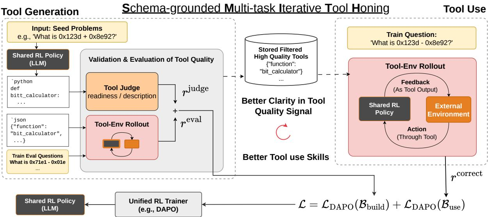

# J<sub>o</sub>i<sub>n</sub>t O<sub>p</sub>ti<sub>m</sub>i<sub>za</sub>ti<sub>on o</sub>f T<sub>oo</sub>l C<sub>rea</sub>ti<sub>on an</sub>d U<sub>se</sub> f<sub>or</sub> <sup>L</sup>a<sup>r</sup>ge <sup>L</sup>a<sup>n</sup>guage <sup>M</sup>o<sup>d</sup>e<sup>l A</sup>ge<sup>nt</sup>s

Zhi R<sub>u</sub>i T<sub>am</sub><sup>1,2</sup><sub>,</sub> Chi<sub>e</sub>h<sub>-</sub>Y<sub>en</sub> Li<sub>n</sub><sup>1</sup><sub>,</sub> Y<sub>un-</sub>N<sub>ung</sub> Ch<sub>en</sub><sup>2</sup><sub>,</sub> Sh<sub>ao-</sub>H<sub>ua</sub> S<sub>un</sub><sup>1,2</sup> <sub>an</sub>d H<sub>ung-y</sub>i L<sub>ee</sub><sup>2</sup> <sup>1</sup>Appier AI Research, <sup>2</sup>National Taiwan University

T<sub>oo</sub>l<sub>-augmen</sub>t<sub>e</sub>d l<sub>anguage mo</sub>d<sub>e</sub>l<sub>s are</sub> b<sub>oun</sub>d<sub>e</sub>d b<sub>y</sub> th<sub>e</sub> API<sub>s</sub> h<sub>umans</sub> b<sub>o</sub>th<sub>ere</sub>d t<sub>o wr</sub>it<sub>e; ex</sub>i<sub>s</sub>ti<sub>ng</sub> t<sub>oo</sub>l<sub>-crea</sub>ti<sub>on</sub> <sub>sys</sub>t<sub>ems pa</sub>t<sub>c</sub>h thi<sub>s</sub> b<sub>y promp</sub>ti<sub>ng a</sub> f<sub>rozen</sub> LLM <sub>a</sub>t i<sub>n</sub>f<sub>erence</sub> ti<sub>me,</sub> l<sub>eav</sub>i<sub>ng</sub> th<sub>e mo</sub>d<sub>e</sub>l th<sub>a</sub>t <sub>wr</sub>it<sub>es a</sub> t<sub>oo</sub>l d<sub>ecoup</sub>l<sub>e</sub>d f<sub>rom</sub> th<sub>e one</sub> th<sub>a</sub>t <sub>uses</sub> it<sub>, w</sub>ith <sub>no s</sub>i<sub>gna</sub>l th<sub>a</sub>t th<sub>e sc</sub>h<sub>emas</sub> it <sub>pro</sub>d<sub>uces are sc</sub>h<sub>emas</sub> it <sub>can</sub> i<sub>nvo</sub>k<sub>e.</sub> We <sub>p</sub>ro<sub>p</sub>ose SMITH (Schema-<sub>g</sub>rounded Multi-task Iterative Tool Honin<sub>g</sub>)<sub>,</sub> a reinforcement learnin<sub>g</sub> framework that jointl trains tool creation and tool use inside a sin le olic . Each rollout is either a build task (write a tool from a few exam les) or a use task (invoke a ooled tool on a held-out uestion). Three se arate <sub>rewar</sub>d <sub>axes ca</sub>t<sub>c</sub>h <sub>sc</sub>h<sub>ema, co</sub>d<sub>e, an</sub>d <sub>ou</sub>t<sub>come</sub> f<sub>a</sub>il<sub>ures</sub> i<sub>n</sub>d<sub>epen</sub>d<sub>en</sub>tl<sub>y, so eac</sub>h f<sub>a</sub>il<sub>ure mo</sub>d<sub>e con</sub>t<sub>r</sub>ib<sub>u</sub>t<sub>es</sub> its own gradient. A 4B Qwen3 trained with SMITH on 13 procedural reasoning tasks with exact verifiers reac<sup>h</sup>es 79.8 macro-average accuracy on <sup>h</sup>e<sup>l</sup>d-out tas<sup>k</sup>s, t<sup>h</sup>e <sup>b</sup>est across a<sup>ll</sup> eva<sup>l</sup>uated met<sup>h</sup>ods and a<sup>h</sup>ead o<sup>f</sup> an untrained 30B-A3B too<sup>l</sup>-writer. It a<sup>l</sup>so reac<sup>h</sup>es 40.4 on Ta<sup>b</sup>MWP-Hard and 42.6 on out-o<sup>f</sup>-domain GQA (+7.6 over the best same-backbone inference-time baseline), without any visual or tabular training data. Tools written by our 4B models also lifted the performance of LFM-2.5-350M and Qwen3-30B-A3B under <sub>same reason</sub>i<sub>ng</sub> t<sub>as</sub>k<sub>s.</sub>

Code Project Page

## 1<sub>.</sub> I<sub>n</sub>t<sub>ro</sub>d<sub>uc</sub>ti<sub>on</sub>

Human progress depends on accumulated tools. Rather than solving every problem from first principles, people rely on instruments refined over generations [4, 11]. Large Language Models (LLMs) face a similar limitation: relying only on parametric memory restricts their ability to perform exact computation [5], access up-to-date knowledge [3], and carry out reliable symbolic reasoning [9]. Tool-augmented LLMs were introduced to overcome these limits [12, 26, 27]. By invoking external interfaces such as calculators, code interpreters, and search engines, models can solve problems beyond what is encoded in their frozen weights.

However, existing tool-augmented systems still rely on fixed, human-designed toolsets. Such predefined APIs may be incomplete, poorly matched to new tasks, or entirely unavailable, placing a hard limit on model capability. This motivates a shift from static tool use to dynamic tool creation, where models synthesize reusable callable functions on demand. LATM [2] first explored this direction by prompting GPT-4 to generate JSON-schema tools from demonstrations, and later work incorporated retrieval, verification, and multi-stage generation pipelines [17, 31, 35]. Despite this progress, existing methods do not explicitly optimize for tool quality or reusability during training of LLMs. Moreover, they separate tool creation from tool use: a stronger model writes the tool while a weaker model invokes it [2, 35]. As a result, the tool creator is never incentivized to design schemas it can reliably use itself. A key open problem is therefore how to train a single model to become both a better tool creator and a better tool user.

Reinforcement learning provides a natural framework for this objective [1, 23, 34]: a model can create a tool, apply it to held-out queries, and directly optimize against answer correctness. Yet, training under this paradigm introduces two major challenges. First, rewar<sup>d</sup> <sup>d</sup>ecomposition: a generated tool contains both a schema (e.g., function name, parameters, and types) and a backend implementation (e.g., executable Python code). Failures in these two components require diferent corrective signals, making reward assignment nontrivial. Second, circu<sup>l</sup>ar eva<sup>l</sup>uation: evaluating tool quality requires a judge, but self-evaluation is inherently unreliable [19], while fixed external evaluators raise questions about trustworthiness and alignment [36]. In addition, a competent evaluator must itself understand tool use well enough to assess whether a schema is practically callable and reusable across harder downstream queries.

To address these challenges, we propose SMITH (Sc<sup>h</sup>ema-groun<sup>d</sup>e<sup>d</sup> Mu<sup>l</sup>ti-tas<sup>k</sup> Iterative Too<sup>l</sup> Honing), a reinforcement learning framework that jointly trains tool creation and tool use within a single policy. SMITH disentangles schema and implementation failures through three complementary reward signals: execution accuracy, LLM-as-judge quality, and format consistency. To reduce circular evaluation, the judge is periodically synchronized from the evolving policy rather than sharing live training weights, enabling the evaluator to improve alongside the policy while maintaining stability. Finally, SMITH evaluates tools created on simpler tasks using harder downstream queries, explicitly rewarding reusable abstractions rather than task-specific shortcuts.

We train SMITH on 13 procedural task families from Reasoning-Gym [25] and evaluate both in-domain generalization and zero-shot transfer to unseen benchmarks. Our 4B model achieves the best overall heldout Reasoning-Gym performance (79.8% macro accuracy), outperforming inference-time tool-writing frameworks such as LATM [2], CRAFT [35], Trove [31], and KTCE [17], as well as models distilled from substantially larger teachers. Despite using far fewer decoding tokens, SMITH also surpasses a 30B inference-time tool writer on unseen tasks. Beyond procedural reasoning, SMITH transfers zero-shot to entirely new modalities: it achieves state-of-the-art performance on TabMWP-Hard and improves GQA visual question answering by up to +7.6 points over same-backbone baselines, despite never being trained on tabular or visual data. The learned tools further generalize across models: tools written by our 4B policy enable a frozen 350M model to match the performance of a 30B tool writer. Finally, the same training recipe consistently improves both Qwen3-8B and Granite-3.3-8B, suggesting that jointly optimizing tool creation and tool use under structured rewards is a scalable path toward reusable and transferable tool-building capabilities.

## 2<sub>.</sub> SMITH<sub>:</sub> S<sub>c</sub>h<sub>ema-groun</sub>d<sub>e</sub>d <sub>mu</sub>lti<sub>-</sub>t<sub>as</sub>k it<sub>era</sub>ti<sub>ve</sub> t<sub>oo</sub>l h<sub>on</sub>i<sub>ng</sub>

SMITH is a multi-task RL framework that jointly trains two complementary skills: tool creation (build) and tool use. In the build task the model synthesizes a reusable tool, expressed as both a Python function and an OpenAI-compatible JSON schema, a structured description of the function’s name, parameters, and types that exposes the tool through a standard invocation interface. In the use task the model sees only this compact JSON schema (not the underlying code) and must invoke the tool to answer a held-out question. This schema-grounded design forces the model to produce concise, self-contained interfaces: a tool whose schema is ambiguous or incomplete will fail at use time, providing a direct training signal for schema quality.

We train the shared policy using DAPO [34], a clip-higher variant of GRPO [23] that stabilizes entropy and avoids reward collapse during on-policy rollouts. Each training step samples a batch ℬ of prompts split into two equal halves, $\left| \mathcal { B } _ { \mathrm { b u i l d } } \right| = \left| \mathcal { B } _ { \mathrm { u s e } } \right| = B / 2$ . Keeping the two reward streams structurally separate while training on the same policy allows the two skills to reinforce each other.

  
Figure 1 ∣ SMITH jointly trains tool creation and tool use in a single shared policy. The build task rewards schema correctness and execution accuracy; the use task rewards answer correctness using only the schema. Because the same model that writes a tool must also invoke it, ambiguous or broken schemas are penalized directly—a feedback loop that prompting-only approaches cannot provide.

Tas<sup>k f</sup>ormu<sup>l</sup>ation. For each training instance of tool generation, the policy receives �=4 questionanswer pairs $\{ ( q _ { i } , a _ { i } ) \} _ { i = 1 } ^ { N }$ as context for problem induction: the model must infer a general solution strategy and express it as both a Python function � and an OpenAI-compatible JSON schema �. A disjoint set of �=16 held-out questions $\dot { \mathcal { T } } = \{ ( q _ { j } , a _ { j } ) \} _ { j = 1 } ^ { K }$ is then used to evaluate the generated tool without the model ever observing the ground truth answers at generation time. For use tasks, the model instead receives a single target question and must invoke a tool from the pool (if one exists for the category) or first build one from the same � in-context examples before invoking it.

## 2<sub>.</sub>1<sub>.</sub> B<sub>u</sub>ild t<sub>as</sub>k <sub>rewar</sub>d<sub>s</sub>

Eva<sup>l</sup>uation rewar<sup>d</sup>. The generated tool $( \mathcal { C } , \mathcal { S } )$ is evaluated against the hidden test set $\tau$ . Each question $q _ { j }$ is presented to an evaluator model $\pi ^ { \mathrm { e v a l } }$ that may call the generated tool; a correct answer requires both a successful tool invocation and an output verified by an LLM equivalence judge. $\pi ^ { \mathrm { e v a l } }$ is initialized from the same base checkpoint as the policy and is periodically refreshed by copying the latest policy weights, providing a stable but improving evaluation target without the instability of evaluating against the live training weights. The evaluation reward is the fraction of test questions answered correctly:

$$
r ^ { \mathrm { e v a l } } = \frac { 1 } { \left| \mathcal { T } \right| } \sum _ { j = 1 } ^ { \left| \mathcal { T } \right| } \mathbf { 1 } \Big [ \pi ^ { \mathrm { e v a l } } \big ( q _ { j } \mid \mathcal { C } , \mathcal { S } \big ) \approx a _ { j } \Big ] .\tag{1}
$$

Counting only answers obtained through a successful tool call prevents the policy from exploiting the fallback of text-only reasoning, which would bypass the tool-writing objective entirely.

Format rewar<sup>d</sup>. We apply a format reward $r ^ { \mathrm { f m t } } \in \left\{ 0 , r _ { f } \right\} ( r _ { f } = 0 . 5 )$ when the response contains exactly one Python block and one JSON block whose function names and parameter signatures are mutually consistent. If the generated response cannot be parsed into a valid (�<sub>,</sub> �) pair (e.g. missing code or schema), the rollout is terminated early and all reward axes are set to zero; $r ^ { \mathrm { f m t } } = 0$ alone does not terminate the rollout. The build environment reward folds the format and evaluation signals together:

$$
\begin{array} { r } { r _ { \mathrm { b u i l d } } ^ { \mathrm { e n v } } = r ^ { \mathrm { f m t } } + r ^ { \mathrm { e v a l } } . } \end{array}\tag{2}
$$

Ju<sup>d</sup>ge rewar<sup>d</sup>. A separate LLM judge $\pi ^ { \mathrm { j u d g e } }$ scores the generated tool on three axes: code correctness $s _ { \mathrm { c o d e } } ,$ schema quality � , and an overall quality score $s _ { \mathrm { o v e r a l l } } \in \left[ 0 , 1 \right]$ . A schema-code alignment check is applied after scoring: if the function signatures in � and $\boldsymbol { s }$ disagree, the score is halved; a syntax error in � yields a fixed negative reward to penalize broken code:

$$
\begin{array} { r } { r ^ { \mathrm { j u d g e } } = \left\{ \begin{array} { l l } { - 0 . 5 } & { \mathrm { i f ~ } \mathcal { C } \mathrm { ~ c o n t a i n s ~ a ~ s y n t a x ~ e r r o r } , } \\ { 0 . 5 \cdot s _ { \mathrm { o v e r a l l } } } & { \mathrm { i f ~ } \mathrm { s c h e m a ~ a n d ~ c o d e ~ s i g n a t u r e s ~ d i s a g r e e } , } \\ { s _ { \mathrm { o v e r a l l } } } & { \mathrm { o t h e r w i s e } . } \end{array} \right. } \end{array}\tag{3}
$$

Crucially, $r ^ { \mathrm { j u d g e } }$ is not folded into $r _ { \mathrm { b u i l d } } ^ { \mathrm { e n v } } ;$ it is passed to DAPO as an independent reward axis with its own coeficient, keeping the execution signal and the semantic quality signal disentangled. The build task therefore contributes two independent reward axes to DAPO:

$$
\big ( r _ { \mathrm { b u i l d } } ^ { \mathrm { e n v } } = r ^ { \mathrm { f m t } } + r ^ { \mathrm { e v a l } } , \quad r ^ { \mathrm { j u d g e } } \big ) ,\tag{4}
$$

exposing format consistency, execution accuracy, and judge quality as the three reward signals that govern build-task learning, complemented by a single correctness axis from the use task. Any tool with $r ^ { \mathrm { e v a l } } > 0$ is added to the shared Tool Pool $\mathcal { P }$ for reuse in subsequent use-task rollouts (Section 2.2).

## 2.2. Use task rewards

For use tasks the model executes a multi-turn dialogue with the tool for up to $T { = } 5$ turns, terminating early when the model produces a final answer or fails to emit a valid tool call.

Correctness rewar<sup>d</sup>. Let $c \in \{ 0 , 1 \}$ indicate whether the final answer matches the ground truth $a ^ { * }$ verified by string normalization, with an LLM equivalence judge as a fallback. To penalize turn-budget exhaustion, the correctness score is scaled by an eficiency multiplier $\eta ( \rho )$ that decays as the turn fraction

$\rho = \mathrm { m i n } ( n / T , 1 )$ grows. We define a minimum reward floor $\eta _ { \mathrm { m i n } }$ to ensure the policy is never strictly indiferent to correctness, even at the turn limit:

$$
\begin{array} { r } { r ^ { \mathrm { c o r r e c t } } = 2 c \cdot \eta ( \rho ) , \qquad \eta ( \rho ) = \left\{ 1 - 2 \big ( 1 - \eta _ { \mathrm { m i d } } \big ) \rho \right. \rho \le 0 . 5 , } \\ { \operatorname* { m a x } \bigl ( \eta _ { \mathrm { m i n } } , \eta _ { \mathrm { m i d } } \big ( 1 - 2 ( \rho - 0 . 5 ) \big ) ^ { 2 } \big ) \quad \rho > 0 . 5 . } \end{array}\tag{5}
$$

The piecewise form is continuous at $\rho = 0 . 5$ by construction: both branches evaluate to $\eta _ { \mathrm { m i d } }$ at the boundary. We set $\eta _ { \mathrm { m i n } } = 0 . 3$ and $\eta _ { \mathrm { m i d } } = 0 . 7 ;$ with these values the floor activates at $\rho \approx 0 . 8 3$ (after 5 turns). These values were chosen based on small-scale preliminary runs and held fixed throughout all experiments. The use task therefore contributes a single reward axis to DAPO : $r ^ { \mathrm { c o r r e c t } }$ the eficiencyweighted final-answer correctness defined in Eq. 5; tool-execution success is implicit, since correctness requires a valid tool invocation. Together with the two build axes (Eq. 4), this gives three independent reward axes for joint policy optimization.

Joint po<sup>l</sup>icy up<sup>d</sup>ate. Each training batch is a disjoint union $B = B _ { \mathrm { b u i l d } } \sqcup B _ { \mathrm { u s e } }$ with $\left| B _ { \mathrm { b u i l d } } \right| = \left| B _ { \mathrm { u s e } } \right| = B / 2$ where � is the per-iteration batch size. This keeps the gradient contribution from each task balanced. DAPO computes per-prompt advantages independently within each generation group and accumulates gradients across both task types in a single backward pass:

$$
\begin{array} { r } { \mathcal { L } = \mathcal { L } _ { \mathrm { D A P O } } \big ( \mathcal { B } _ { \mathrm { b u i l d } } \big ) + \mathcal { L } _ { \mathrm { D A P O } } \big ( \mathcal { B } _ { \mathrm { u s e } } \big ) . } \end{array}\tag{6}
$$

Because both losses share the same policy parameters �, gradients from build and use prompts jointly update the model in every step, with no explicit advantage combination across task types.

## 3. Ex<sub>p</sub>eriments

## 3.1. Trainin<sub>g</sub> tasks

We train on 13 tas<sup>k</sup> categories from Reasoning-Gym (RG) [25], selected for three properties: answers are exact and automatically verifiable (enabling reward computation without human annotation), each task exposes a curriculum of dificulty levels (enabling the easy-to-hard protocol described in Sec. 3.4), and questions can be generated procedurally. The categories span arithmetic (bitwise arithmetic, cryptarithmetic), algorithms (bit counting, LCM, GCD, base conversion, isomorphic string), algebra (polynomial equations, polynomial multiplication), games (countdown, Tower of Hanoi), and logical reasoning (knightsand-knaves, Caesar cipher). This design separates tool-writing quality from instance dificulty: a correct tool induced on easy examples must generalize to hard examples without further adaptation, a separation unavailable in fixed-label benchmarks where harder instances cannot be generated on demand.

## 3<sub>.</sub>2<sub>.</sub> E<sub>va</sub>l<sub>ua</sub>ti<sub>on</sub> b<sub>enc</sub>h<sub>mar</sub>k<sub>s</sub>

We measure transfer at three levels of increasing distance from training : RG (Seen) and RG (Unseen).

RG (Seen). Macro-average accuracy over the 13 training task categories, evaluated at the hardest curriculum level. This measures whether the learned policy produces tools that generalize beyond easy induction contexts to harder instances of the same task families.

RG (Unseen). Macro-average accuracy over 10 RG tas<sup>k</sup>s withheld entirely from RL training, spanning: arithmetic (calendar arithmetic, complex arithmetic, time intervals); algebra (Chinese remainder theorem, simple equations); algorithms (group anagrams); and logic & games (ab, self-referential sequence, syllogism, Puzzle-24). While these categories appear in RG (Seen), the specific problem types are entirely absent from training, probing cross-task generalization within Reasoning-Gym.

Out-o<sup>f</sup>-<sup>d</sup>omain <sup>b</sup>enc<sup>h</sup>mar<sup>k</sup>s. Ta<sup>b</sup>MWP-Har<sup>d</sup>: a strengthened variant of TabMWP [16]; the original is trivially solved in CoT (96.8% EM) because tables average <10 rows and 2 columns, so we extend rows to up to 5,000 and add unrelated columns (Appendix M). GQA [10]: visual question answering, requiring visual tools. Together these cover the three most relevant tool-use classes (computation, knowledge access, non-textual modality) per Wang et al. [30].

## 3<sub>.</sub>3<sub>.</sub> M<sub>o</sub>d<sub>e</sub>l<sub>s an</sub>d t<sub>ra</sub>i<sub>n</sub>i<sub>ng con</sub>fi<sub>gura</sub>ti<sub>on</sub>

We use Qwen3-4B-Instruct [33] as the primary target for its strong instruction-following and tool use ability. For all training, we fine-tune with LoRA $( r = 6 4 , \alpha = 1 2 8 )$ to reduce the training compute. We train with DAPO [34] for 60 gradient steps across 13 task categories, with generation and use tasks at a 1:1 ratio within each batch, $n _ { \mathrm { g e n } } { = } 8$ rollouts per prompt, temperature 0.7, $\beta { = } 0 . 0 1$ (KL coeficient), learning rates $6 \times { 1 0 } ^ { - 5 }$ (4B) and $1 \times { 1 0 } ^ { - 5 }$ (8B). The Tool Pool (Appendix E) caches up to 20 verified tools per category; each use-task rollout injects 1 domain tool (from the correct category) and 2 distractor tools (from unrelated categories, forcing the model to identify and invoke the correct schema) into the prompt.

## 3<sub>.</sub>4<sub>.</sub> T<sub>ra</sub>i<sub>n</sub>/t<sub>es</sub>t <sub>sp</sub>lit d<sub>es</sub>i<sub>gn</sub> f<sub>or easy-</sub>t<sub>o-</sub>h<sub>ar</sub>d t<sub>rans</sub>f<sub>er</sub>

We separate the dificulty of tool induction from the dificulty of tool evaluation. For each RG task, the induction context is drawn from the easier curriculum bands (train), while the tool evaluation set is drawn from the hardest band (test); the exact mapping is task-specific. The reward $r ^ { \mathrm { e v a l } }$ (Sec. 2.1) is therefore sharply reduced for any tool that merely pattern-matches the easy induction context without abstracting the underlying algorithm, pushing the policy toward tools that are concise, interpretable, and reusable. Unlike prior inference-time tool-generation frameworks [2, 17, 31, 35], which evaluate tools on the same dificulty distribution used to create them, our protocol forces an easy-to-hard generalization gap at every step.

The complete per-task split for all 13 categories is in Appendix F.

## 3.5. Baselines

All baselines use Qwen3-4B-Instruct unless noted. Stan<sup>d</sup>ar<sup>d</sup> CoT provides the no-tool ceiling. However, in GQA since LLMs cannot process visual information without external visual tool, the LLMs can only answer based on its knowledge learned from textual world.

LATM [2], CRAFT [35], Trove [31], and KTCE [17] all create tools at inference time with a frozen Qwen3-4B-Instruct backbone, difering only in scafolding complexity; comparing them on the same backbone tests whether RL training adds value beyond prompt engineering.<sup>1</sup> We additionally evaluate

LATM wit<sup>h</sup> Qwen3-30B-A3B as a deliberate scaling probe, isolating whether sheer model size on the same inference-time harness can close the gap to RL training. ReToo<sup>l</sup> (4B <sup>d</sup>isti<sup>ll</sup> Qwen-32B) [6] is a multi-turn code-execution policy (up to 10 turns) distilled from Qwen-32B traces that never produces a reusable schema; including it isolates the contribution of the schema-grounded tool representation, since both approaches use execution feedback but only SMITH produces reusable callable schemas. LATM (4B <sup>d</sup>isti<sup>ll</sup> GPT-4.1) fine-tunes the backbone on tool-writing trajectories generated by GPT-4.1; comparing against it tests whether RL training over an explicit reward signal yields better tools than behavioral cloning from a stronger frozen oracle.

Eva<sup>l</sup>uation protoco<sup>l</sup>. We report macro-average accuracy with two Reasoning-Gym averages: RG (Seen) over the 13 training categories and RG (Unseen) over the 10 held-out categories.

## 3.6. Main results

We compare SMITH against inference-time tool-creation baselines (LATM, CRAFT, TroVE, KTCE), distillation baselines (ReTool 4B distilled from Qwen-32B; LATM 4B distilled from GPT-4.1), and a larger model (Qwen3-30B-A3B) on LATM, all on the same evaluation protocol. Two findings stand out in Table 1. First, against distillation: SMITH (4B, RL) generalizes more reliably than 4B models distilled from much larger oracles, attaining the highest held-out RG accuracy overall (79.9) versus 63.2 for ReTool and 65.8 for LATM-distilled. ReTool in particular leads on RG (Seen) (92.2 vs. our 85.2) but loses nearly 30 points on RG (Unseen), indicating that rejection-sampled distillation overfits to the demonstrator’s training distribution rather than learning a transferable build-and-use policy. Second, against more elaborate scafolds: SMITH’s simple scafold LATM is simply write multiple versions of tools and then pick the best, is the strongest results on RG (Seen) at 85.2 and beats every scafolding baseline on RG (Unseen), including CRAFT (76.5), KTCE (65.1), and TroVE (55.9). In addition to beating larger models Qwen3-30B-A3B Instruct and a distilled version of Qwen3 4B from GPT-4.1 responses through rejection sampling finetuning. These results suggest that learning how to build a tool from a verifiable reward outperforms both behavioral cloning from a stronger oracle and hand-engineered retrieval/refinement loops.

Third, on token eficiency: SMITH achieves the strongest aggregate accuracy with the smallest output budget at 100 tokens on average, roughly 32× fewer than Standard CoT (3,206) and 6× fewer than ReTool (633), while input usage remains modest at 664 tokens, comparable to LATM (607) and well below CRAFT (1,226) and ReTool (1,707). The asymmetry is informative: scafolding baselines such as CRAFT and the distillation-trained ReTool spend far more input tokens on retrieved exemplars or stitched prompts, and CoT spends its budget on long unconditioned reasoning, yet none recovers SMITH’s holdout accuracy. This shows that the RL objective shifts the work out of decode-time reasoning and into reusable tool code, so each query is resolved by a short tool invocation rather than a long chain of thought.

For all baselines TroVE, CRAFT and KTCE we did manually inspect the original codebase and found some python code parsing issues when running on Qwen3-4B. Hence we have fixed those issues in our revision. We also tried to modify the TroVE original prompts and we found it did not perform any better or significantly worse than the original prompt.

Table 1 ∣ Reasoning-Gym results (Qwen3-4B-Instruct); CRAFT, TroVE, KTCE, ReTool, LATM-distill, and SMITH report mean±std over seeded re-evaluations. SMITH leads held-out generalization (RG Unseen 79.9) over distilled models (ReTool 63.2, LATM-distill 65.8) and every scafolding baseline, using 32× fewer output tokens than standard CoT. Fixing baseline grading bugs raises TroVE’s RG (Unseen) from 40.6 to 55.9 and KTCE’s from 48.7 to 65.1. RG (Seen/Unseen): macro-average over training/held-out tasks. <sup>∗</sup>LATM prompt rewritten for schema clarity. I/O: input / output tokens.
<table><tr><td rowspan="2">Method</td><td>Seen</td><td colspan="6">Unseen RG</td><td rowspan="2">I/0</td></tr><tr><td>Avg</td><td>Logic</td><td>Game</td><td>Algebra</td><td>Arith</td><td>Algo</td><td>Avg</td></tr><tr><td>Standard CoT</td><td>58.0</td><td>49.9</td><td>60.3</td><td>56.8</td><td>62.7</td><td>48.6</td><td>55.7</td><td>173 / 3,206</td></tr><tr><td>LATM* [2]</td><td>77.6</td><td>53.9</td><td>55.5</td><td>38.6</td><td>53.0</td><td>90.2</td><td>58.3</td><td>607/174</td></tr><tr><td>LATM* - Qwen3-30B-A3B</td><td>74.0</td><td>68.7</td><td>64.2</td><td>97.3</td><td>56.5</td><td>84.0</td><td>74.1</td><td>659/405</td></tr><tr><td>CRAFT [35]</td><td>74.1±0.7</td><td>27.4±1.3</td><td>89.5±0.0</td><td>94.2±1.2</td><td>76.6±1.1</td><td>95.0±0.0</td><td>76.5±0.4</td><td>1,226 / 418</td></tr><tr><td>Trove [31]</td><td>52.6±0.4</td><td>60.7±2.4</td><td>10.6±1.3</td><td>51.2±3.5</td><td>59.8±0.8</td><td>97.0±0.0</td><td>55.9±0.6</td><td>347 /575</td></tr><tr><td>KTCE [17]</td><td>61.0±1.5</td><td>60.2±1.5</td><td>79.8±1.6</td><td>70.6±0.3</td><td>45.6±0.4</td><td>69.3±1.8</td><td>65.1±0.2</td><td>319/404</td></tr><tr><td>ReTool (distill Qwen-32B)</td><td>92.2±0.8</td><td>50.3±2.3</td><td>55.0±0.8</td><td>48.7±0.6</td><td>79.8±2.7</td><td>82.4±0.1</td><td>63.2±0.4</td><td>1,707 / 633</td></tr><tr><td>LATM (distill GPT-4.1)</td><td>81.7±4.4</td><td>37.6±15.2</td><td>58.1±12.2</td><td>91.3±7.7</td><td>51.6±10.4</td><td>93.2±5.9</td><td>65.8±4.1</td><td>638/207</td></tr><tr><td>SMITH</td><td>85.2±2.7</td><td>74.2±0.6</td><td>63.7±1.1</td><td>97.9±2.6</td><td>70.6±2.1</td><td>93.0±0.4</td><td>79.9±2.2</td><td>664/100</td></tr></table>

Table 2 ∣ Tools from SMITH’s RL-trained 4B writer enable a 350M model (LFM2.5) to match a 30B tool writer on held-out tasks (42.9 vs. 41.5 RG Unseen), showing that SMITH’s tools encode genuinely generalizable solutions that transfer across model families. First row is the no-tool baseline. RG (Seen)/(Unseen): macro-average accuracy (%). Best per column in <sup>b</sup>o<sup>ld</sup>.
<table><tr><td>Method</td><td>RG (Seen)</td><td>RG (Unseen)</td><td>TabMWP</td><td>GQA</td></tr><tr><td>LFM2.5-350M (no tool)</td><td>14.2</td><td>11.6</td><td>0.0</td><td>0.1</td></tr><tr><td>+ Qwen3-4B-Instruct (tool writer)</td><td>36.8</td><td>23.4</td><td>4.2</td><td>0.1</td></tr><tr><td>+ Qwen3-30B-A3B (tool writer)</td><td>10.4</td><td>41.5</td><td>4.1</td><td>0.1</td></tr><tr><td>+ RL on LFM2.5-350M</td><td>39.1</td><td>30.2</td><td>4.2</td><td>0.1</td></tr><tr><td>+ RL 4B (Ours)</td><td>38.9</td><td>42.9</td><td>4.1</td><td>0.1</td></tr></table>

## 3<sub>.</sub>7<sub>.</sub> T<sub>oo</sub>l<sub>s</sub> t<sub>rans</sub>f<sub>er across mo</sub>d<sub>e</sub>l <sub>sca</sub>l<sub>e</sub>

A natural question is whether the tools synthesized by SMITH encode genuinely generalized solutions or whether they only work with the same policy model that wrote them. We test both directions: pairing SMITH’s 4B writer with a much smaller consumer and with a much larger one.

Sma<sup>ll</sup>er stu<sup>d</sup>ent. We pair our best fine-tuned 4B tool generation model with LFM2.5-350M [15], a 350 M-parameter small model with strong tool use ability, to use those tools at inference time. Table 2 shows that pairing LFM2.5-350M with our RL 4B tool-generation model increases holdout RG accuracy from 11.6 to 42.9, matching the much larger Qwen3-30B-A3B-Instruct writer (41.5); in training tasks, our 4B model (21.1) actually exceeds the 30B untrained model (10.4). We also train SMITH model using LFM2.5 as reward signal on tool generation, while it performs the best in RG Seen set but underperforms on RG Unseen.

Larger consumer. The complementary question is whether the 4B writer remains useful once a much stronger tool user is available, the practical deployment setting where one could simply let the larger model write its own tool instead. We pair tools generated by our RL-trained 4B writer with Qwen3-30B-A3B-Instruct as the tool consumer and compare against ${ \mathrm { L A T M } } ^ { * }$ , where the same 30B model both writes and uses its own tool, across the 25 tasks the two configurations share (10 held-out RG, 13 seen RG, TabMWP-Hard, GQA). Table 3 shows the SMITH-4B-written tools lift the 30B consumer on every group, most sharply on TabMWP-Hard (0.7 → 38.8), and raise the task-weighted overall score from 70.2 to 76.6. A stronger tool user therefore does not make its own self-written tool preferable: the RL-trained 4B writer’s tools remain a better source of tools than the 30B model’s own. Taken together, these two results show that SMITH’s tools transfer in both directions, down to a 350M model and up to a 30B model, so the 4B writer is a viable drop-in tool provider regardless of which model ultimately consumes its tools.

Table 3 ∣ Tools written by SMITH’s RL-trained 4B writer lift a Qwen3-30B-A3B-Instruct consumer above the same 30B model writing tools for itself $\left( \mathrm { L A T M } ^ { * } \right)$ on every group, with the largest gain on TabMWP-Hard $( 0 . 7  3 8 . 8 )$ , showing the 4B writer is a viable drop-in tool provider even when a much larger model is available to consume its tools. Overall: task-count-weighted average over the 25 shared tasks (10 held-out RG + 13 seen RG + TabMWP-Hard + GQA). Best per column in <sup>b</sup>o<sup>ld</sup>.
<table><tr><td>Method</td><td>Held-out RG (10 tasks)</td><td>Seen RG (13 tasks)</td><td>TabMWP-Hard</td><td>GQA</td><td>Overall</td></tr><tr><td> $\mathrm { L A T M } ^ { * }$  (30B writes its own tool)</td><td>71.9</td><td>78.1</td><td>0.7</td><td>20.2</td><td>70.2</td></tr><tr><td>SMITH-4B to 30B consumer</td><td>74.5</td><td>84.6</td><td>38.8</td><td>30.2</td><td>76.6</td></tr></table>

Table 4 ∣ OOD generalization (Qwen3-4B-Instruct). SMITH leads on TabMWP-Hard (40.4 vs. next best TroVE 36.4) and ranks second on GQA (42.6), making it the only 4B method without oracle distillation to top either column. Bold = best, underline = second-best.
<table><tr><td></td><td colspan="6">Baselines</td><td colspan="2">Distilled</td><td></td></tr><tr><td>Task</td><td>CoT</td><td>LATM</td><td>LATM* (30B)</td><td>CRAFT</td><td>TroVE</td><td>KTCE</td><td>ReTool</td><td>LATM (distill)</td><td>SMITH</td></tr><tr><td>TabMWP-Hard</td><td>7.2</td><td>19.7</td><td>0.7</td><td>30.0</td><td>36.4</td><td>27.2</td><td>3.0</td><td>7.1</td><td>40.4</td></tr><tr><td>GQA</td><td>11.5</td><td>35.0</td><td>29.8</td><td>21.9</td><td>21.4</td><td>0.0</td><td>26.1</td><td>56.0</td><td>42.6</td></tr></table>

## 3<sub>.</sub>8<sub>.</sub> O<sub>u</sub>t<sub>-o</sub>f<sub>-</sub>di<sub>s</sub>t<sub>r</sub>ib<sub>u</sub>ti<sub>on eva</sub>l<sub>ua</sub>ti<sub>on</sub>

To probe transfer beyond Reasoning-Gym, we evaluate on a tabular-reasoning benchmark (TabMWP-Hard) and a visual-reasoning benchmark (GQA), neither of which is represented during training. Table 4 shows SMITH leading TabMWP-Hard at 40.4, ahead of the closest baseline TroVE (36.4), and reaching second on GQA at 42.6, trailing only LATM distilled from GPT-4.1 (56.0). We do not claim parity on perception: GPT-4.1 distillation embeds visual primitives our self-trained writer never sees during RL, and the gap is the cost of avoiding oracle supervision. What does transfer without distillation is the self-supervised tool-creation loop. SMITH outperforms every scafolding baseline on both OOD benchmarks and is the only 4B same-backbone method without oracle distillation to lead either column.

Table 5 ∣ SMITH improves over the base model on every backbone tested. On Qwen3-8B it raises held-out RG from 72.2 to 81.7 and TabMWP-Hard from 42.4 to 56.7; Granite-3.3-8B follows the same trend despite a weaker starting point, confirming the training signal is not model-family specific. RG (Seen/Unseen): macro-average over training/held-out tasks. Best per column in <sup>b</sup>o<sup>ld</sup>.
<table><tr><td>Method</td><td>RG (Seen)</td><td>RG (Unseen)</td><td>TabMWP</td><td>GQA</td></tr><tr><td>QwEN3-8B (baseline)</td><td>72.6</td><td>72.2</td><td>42.4</td><td>17.3</td></tr><tr><td>SMITH: Qwen3-8B</td><td>79.4</td><td>81.7</td><td>56.7</td><td>28.7</td></tr><tr><td>SMITH: Self-Judge</td><td>74.7</td><td>85.9</td><td>54.5</td><td>16.3</td></tr><tr><td>GRANITE-3.3-8B (baseline)</td><td>31.2</td><td>22.0</td><td>3.9</td><td>7.8</td></tr><tr><td>SMITH: Granite-3.3-8B</td><td>39.1</td><td>28.5</td><td>4.5</td><td>11.7</td></tr></table>

Table 6 ∣ SMITH improves external tool-calling (BFCL v4, no-web) across all backbones, with the largest gain on Qwen3-8B (43.3→55.8), despite never seeing BFCL schemas, multi-turn traces, or judges during RL training. Bold = best, underline = second-best.
<table><tr><td colspan="3">Qwen3-4B-Instruct</td><td colspan="2">Qwen3-8B</td><td colspan="2">Granite-3.3-8B</td></tr><tr><td>Metric</td><td>Base</td><td>SMITH</td><td>Base</td><td>SMITH</td><td>Base</td><td>SMITH</td></tr><tr><td>BFCLv4</td><td>45.1</td><td>48.6</td><td>43.3</td><td>55.8</td><td>36.3</td><td>38.7</td></tr></table>

## 3<sub>.</sub>9<sub>.</sub> S<sub>ca</sub>li<sub>ng</sub> <sub>across</sub> b<sub>ac</sub>kb<sub>ones</sub>

To test whether SMITH’s training signal transfers across model sizes and families, we apply the same RL recipe to Qwen3-8B and Granite-3.3-8B. Table 5 shows that for Qwen3-8B, SMITH improves both the accuracy in-distribution (72.6 → 79.4) and the holdout RG accuracy (72.2 → 81.7) and lifts the OOD TabMWP-Hard from 42.4 to 56.7. While Granite-3.3-8B starts from a much weaker base (RG Seen 31.2, Unseen 22.0) yet follows the same trend: SMITH lifts RG (Seen) to 39.1, RG (Unseen) to 28.5, and GQA from 7.8 to 11.7.

We further test whether SMITH still works when the judge signal comes from the policy itself rather than an external 30B-A3B model. The Se<sup>lf</sup>-Ju<sup>d</sup>ge variant prompts Qwen3-8B with the same judge template used for 30B-A3B, scoring its own rollouts. Self-judging improves held-out RG (81.7 → 85.9, the best in the table) but trades of in-distribution accuracy and OOD GQA (28.7 → 16.3), suggesting the smaller judge is a weaker but less biased signal on training-task distributions.

## 3<sub>.</sub>10<sub>.</sub> G<sub>enera</sub>li<sub>za</sub>ti<sub>on</sub> t<sub>o ex</sub>t<sub>erna</sub>l t<sub>oo</sub>l<sub>-ca</sub>lli<sub>ng</sub>

Beyond benchmarks where the model writes its own tools, we test whether SMITH’s build-and-use objective transfers to externally specified function-calling APIs using BFCL v4 (no-web subset) [20]. Table 6 shows that SMITH lifts BFCL overall accuracy on both Qwen backbones, from 45.1 to 48.6 on Qwen3-4B and from 43.3 to 55.8 on Qwen3-8B, the largest absolute gain in the table. Since BFCL schemas, multi-turn traces, and judges are never seen during RL, the improvement isolates a learned tool-use prior rather than benchmark-specific fitting.

Table 7 ∣ Reward-structure ablation (Qwen3-4B-Instruct). $\pi ^ { \mathrm { e v a l } }$ : model that invokes the generated tool at eval (30B-A3B/4B: separate model; $s e l f { \mathrm { : } }$ same RL’d policy). Too<sup>l</sup> Use: whether $\pi ^ { \mathrm { { e v a l } } }$ calls the tool rather than only writing it. Decoupled build/use does not beat single-model Tool Create on RG (Unseen) (58.9 vs. 68.8), so joint training, not specialization, drives the gain; only the full SMITH objective wins on aggregate, with individual benchmarks split between K=1 (TabMWP) and No LLM Judge (GQA). Best per column <sup>b</sup>o<sup>ld</sup>, second-best underlined. RG(S)/(U): Seen/Unseen.
<table><tr><td>Method</td><td> $\pmb { \pi } ^ { \mathrm { e v a l } }$ </td><td>Tool Use</td><td>RG (S)</td><td>RG (U)</td><td>TabMWP</td><td>GQA</td></tr><tr><td>QWEN3-4B-INSTRUCT</td><td>一</td><td>一</td><td>61.85</td><td>47.01</td><td>19.70</td><td>20.86</td></tr><tr><td>TOOL CREATE</td><td>30B-A3B</td><td>No</td><td>77.43</td><td>59.39</td><td>15.60</td><td>37.01</td></tr><tr><td>TOOL CREATE</td><td>4B</td><td>No</td><td>73.88</td><td>68.80</td><td>17.70</td><td>35.82</td></tr><tr><td>DECOUPLED CREATE/USE</td><td>30B-A3B</td><td>Yes</td><td>76.44</td><td>58.93</td><td>13.90</td><td>35.04</td></tr><tr><td>SMITH : No SYNC</td><td>4B</td><td>Yes</td><td>80.29</td><td>66.89</td><td>25.81</td><td>24.58</td></tr><tr><td>SMITH : No LLM JUDGE</td><td>self</td><td>Yes</td><td>82.57</td><td>67.81</td><td>18.30</td><td>42.63</td></tr><tr><td>SMITH:K=1</td><td>self</td><td>Yes</td><td>78.64</td><td>73.93</td><td>46.77</td><td>32.30</td></tr><tr><td>SMITH : FULL</td><td>self</td><td>Yes</td><td>86.61</td><td>78.33</td><td>40.40</td><td>42.62</td></tr></table>

## 3.11. Ablation

To isolate the factors driving SMITH’s gains, we ablate the reward structure on Qwen3-4B-Instruct and compare against four configurations: (1) Tool Create, where the reward depends only on the quality of the generated code; (2) Decoupled Build/Use, which pairs the row-1 30B-A3B builder with a separately trained 4B tool-use specialist, testing whether joint training (not specialization) is the active ingredient; (3) SMITH: No LLM Judge, which couples tool creation with execution success but drops the judge signal; and (4) the full SMITH objective, which keeps the LLM-as-judge signal as a separate axis. Table 7 shows that each component contributes incrementally: tool creation alone yields a strong RG (Seen) bump but leaves OOD GQA underperforming; the decoupled pair fails to beat single-model Tool Create on RG Unseen (58.9 vs. 68.8), confirming that joint training, not specialization, drives the gain; coupling build and use jointly lifts in-distribution accuracy but hurts held-out transfer; only the full SMITH objective achieves the best aggregate score, indicating that disentangling process quality from outcome correctness is essential for cross-domain robustness.

## 4<sub>.</sub> Li<sub>m</sub>it<sub>a</sub>ti<sub>ons an</sub>d di<sub>scuss</sub>i<sub>ons</sub>

Sca<sup>l</sup>e, ju<sup>d</sup>ge <sup>d</sup>epen<sup>d</sup>ence, an<sup>d b</sup>ase priors. All trained policies are at most 8B parameters and the quality judge has 30B activated parameters, a regime chosen for compute feasibility; whether the gains persist, saturate, or invert at the 70B+ scale is an open question, and our Self-Judge ablation (Table 5) is only a partial probe of judge-size dependence, since dropping the external judge improves held-out RG but degrades OOD GQA. Finally, SMITH executes generated Python at every step inside a sandbox, but we do not formally certify that adversarial prompts cannot induce unsafe tools, and we report no human evaluation of schema readability or developer-facing reusability.

Open Questions. 1. In SMITH, a tool is one Python function plus a JSON schema. Richer artifacts are not evaluated in this work. For example, skills package workflow instructions in a SKILL.md file together with optional scripts, references, templates, and other resources. MCP servers, by contrast, use the Model Context Protocol to expose tools, resources, prompts, and instructions to a model; they are not themselves bundles of procedures and scripts. Supporting the generation of such multi-file or server-backed artifacts would require extending SMITH’s output representation and validation pipeline. Iterative or multi-turn generation may be useful for this setting, but is not inherently required. We leave this extension to future work.

2. Throughout SMITH training, we never observed the model issue parallel tool calls in a single turn or generate multiple tools at once. We suspect this reflects both the base model’s tendency toward single-tool use and our reward design, which does not encourage multi-tool generation or parallel execution. Since parallel calls are common in real-world settings such as deep research, we believe SMITH could naturally extend to these settings, which we leave to future work.

## 5<sub>.</sub> Conclusion

We introduced SMITH, a reinforcement learning framework that jointly trains a single language model to create and use reusable tools, closing the feedback loop between tool writer and tool user so the policy is optimized directly on its own execution outcomes. Trained on 13 Reasoning-Gym tasks, our 4B model attains the highest held-out RG accuracy among all evaluated methods (79.8), leads TabMWP-Hard, and writes tools that transfer to a 350 M student never seen during training, matching the quality of tools produced by a model an order of magnitude larger. The same recipe lifts Qwen3-8B and Granite-3.3-8B without modification, indicating that coupling creation and use inside a single trained policy is a scalable path to generalization: the tools a model writes become precisely the tools it can reliably invoke, without a larger frozen teacher, a more complex scafold, or out-of-domain supervision.

## A<sub>c</sub>k<sub>now</sub>l<sub>e</sub>d<sub>gmen</sub>t<sub>s</sub>

This work was supported in part by the National Science and Technology Council, Taiwan, under the Grants 115-2628-E-002-023-MY4, 112-2223-E-002-012-MY5, 115-2628-E-002-006, 115-2223-E-002- 005-MY3, and 115-2634-F-002-012, the Taiwan Centers of Excellence in Artificial Intelligence, and the Center of Data Intelligence: Technologies, Applications, and Systems, NTU (grant nos. 115L900901). Shao-Hua Sun was supported by the Yushan Fellow Program of the Ministry of Education, Taiwan.

## Referen<sub>c</sub>e<sub>s</sub>

[1] Yuntao Bai, Andy Jones, Kamal Ndousse, Amanda Askell, Anna Chen, Nova DasSarma, Dawn Drain, Stanislav Fort, Deep Ganguli, Tom Henighan, et al. Training a helpful and harmless assistant with reinforcement learning from human feedback. arXiv preprint arXiv:2204.05862, 2022.

[2] Tianle Cai, Xuezhi Wang, Tengyu Ma, Xinyun Chen, and Denny Zhou. Large language models as tool makers. In International Conference on Learning Representations, 2024.

[3] Jefrey Cheng, Marc Marone, Orion Weller, Dawn Lawrie, Daniel Khashabi, and Benjamin Van Durme. Dated data: Tracing knowledge cutofs in large language models. In First Conference on Language Modeling, 2024.

[4] Andy Clark and David Chalmers. The extended mind. Analysis, 1998.

[5] Karl Cobbe, Vineet Kosaraju, Mohammad Bavarian, Mark Chen, Heewoo Jun, Lukasz Kaiser, Matthias Plappert, Jerry Tworek, Jacob Hilton, Reiichiro Nakano, et al. Training verifiers to solve math word problems. arXiv preprint arXiv:2110.14168, 2021.

[6] Jiazhan Feng, Shijue Huang, Xingwei Qu, Ge Zhang, Yujia Qin, Baoquan Zhong, Chengquan Jiang, Jinxin Chi, and Wanjun Zhong. Retool: Reinforcement learning for strategic tool use in llms. arXiv preprint arXiv:2504.11536, 2025.

[7] Luyu Gao, Aman Madaan, Shuyan Zhou, Uri Alon, Pengfei Liu, Yiming Yang, Jamie Callan, and Graham Neubig. Pal: Program-aided language models. In International Conference on Machine Learning, 2023.

[8] Jonas Gehring, Kunhao Zheng, Jade Copet, Vegard Mella, Taco Cohen, and Gabriel Synnaeve. Rlef: Grounding code llms in execution feedback with reinforcement learning. In International Conference on Machine Learning, 2025.

[9] Zhibin Gou, Zhihong Shao, Yeyun Gong, Yujiu Yang, Minlie Huang, Nan Duan, Weizhu Chen, et al. Tora: A tool-integrated reasoning agent for mathematical problem solving. In International Conference on Learning Representations, 2024.

[10] Drew A Hudson and Christopher D Manning. Gqa: A new dataset for real-world visual reasoning and compositional question answering. In Proceedings of the IEEE/CVF Conference on Computer Vision and Pattern Recognition, 2019.

[11] Edwin Hutchins. Cognition in the Wild. MIT Press, 1995.

[12] Mojtaba Komeili, Kurt Shuster, and Jason Weston. Internet-augmented dialogue generation. In Proceedings of the 60th Annual Meeting of the Association for Computational Linguistics, 2022.

[13] Hung Le, Yue Wang, Akhilesh Deepak Gotmare, Silvio Savarese, and Steven Chu Hong Hoi. Coderl: Mastering code generation through pretrained models and deep reinforcement learning. In Advances in Neural Information Processing Systems, 2022.

[14] Junnan Li, Dongxu Li, Caiming Xiong, and Steven Hoi. Blip: Bootstrapping language-image pretraining for unified vision-language understanding and generation. In International conference on machine learning, pages 12888–12900. PMLR, 2022.

[15] Liquid AI. Lfm2 technical report. arXiv preprint arXiv:2511.23404, 2025.

[16] Pan Lu, Liang Qiu, Kai-Wei Chang, Ying Nian Wu, Song-Chun Zhu, Tanmay Rajpurohit, Peter Clark, and Ashwin Kalyan. Dynamic prompt learning via policy gradient for semi-structured mathematical reasoning. In International Conference on Learning Representations, 2023.

[17] Zhiyuan Ma, Zhenya Huang, Jiayu Liu, Minmao Wang, Hongke Zhao, and Xin Li. Automated creation of reusable and diverse toolsets for enhancing llm reasoning. In Proceedings of the AAAI Conference on Artificial Intelligence, 2025.

[18] Matthias Minderer, Alexey Gritsenko, Austin Stone, Maxim Neumann, Dirk Weissenborn, Alexey Dosovitskiy, Aravindh Mahendran, Anurag Arnab, Mostafa Dehghani, Zhuoran Shen, et al. Simple open-vocabulary object detection. In European conference on computer vision, pages 728–755. Springer, 2022.

[19] Arjun Panickssery, Samuel R. Bowman, and Shi Feng. LLM evaluators recognize and favor their own generations. In Advances in Neural Information Processing Systems, 2024.

[20] Shishir G. Patil, Huanzhi Mao, Charlie Cheng-Jie Ji, Fanjia Yan, Vishnu Suresh, Ion Stoica, and Joseph E. Gonzalez. The berkeley function calling leaderboard (bfcl): From tool use to agentic evaluation of large language models. In International Conference on Machine Learning, 2025.

[21] Cheng Qian, Emre Can Acikgoz, Qi He, Hongru WANG, Xiusi Chen, Dilek Hakkani-Tür, Gokhan Tur, and Heng Ji. Toolrl: Reward is all tool learning needs. In Neural Information Processing Systems, 2025.

[22] Timo Schick, Jane Dwivedi-Yu, Roberto Dessì, Roberta Raileanu, Maria Lomeli, Eric Hambro, Luke Zettlemoyer, Nicola Cancedda, and Thomas Scialom. Toolformer: Language models can teach themselves to use tools. In Advances in Neural Information Processing Systems, 2023.

[23] Zhihong Shao, Peiyi Wang, Qihao Zhu, Runxin Xu, Junxiao Song, Xiao Bi, Haowei Zhang, Mingchuan Zhang, YK Li, Yang Wu, et al. Deepseekmath: Pushing the limits of mathematical reasoning in open language models. arXiv preprint arXiv:2402.03300, 2024.

[24] Aarohi Srivastava, Abhinav Rastogi, Abhishek Rao, Abu Awal Md Shoeb, Abubakar Abid, Adam Fisch, Adam R Brown, Adam Santoro, Aditya Gupta, Adrià Garriga-Alonso, et al. Beyond the imitation game: Quantifying and extrapolating the capabilities of language models. Transactions on Machine Learning Research, 2023.

[25] Zafir Stojanovski, Oliver Stanley, Joe Sharratt, Richard Jones, Abdulhakeem Adefioye, Jean Kaddour, and Andreas Köpf. Reasoning gym: Reasoning environments for reinforcement learning with verifiable rewards. In Advances in Neural Information Processing Systems, 2025.

[26] Ross Taylor, Marcin Kardas, Guillem Cucurull, Thomas Scialom, Anthony Hartshorn, Elvis Saravia, Andrew Poulton, Viktor Kerkez, and Robert Stojnic. Galactica: A large language model for science. arXiv preprint arXiv:2211.09085, 2022.

[27] Romal Thoppilan, Daniel De Freitas, Jamie Hall, Noam Shazeer, Apoorv Kulshreshtha, Heng-Tze Cheng, Alicia Jin, Taylor Bos, Leslie Baker, Yu Du, et al. Lamda: Language models for dialog applications. arXiv preprint arXiv:2201.08239, 2022.

[28] Jiongxiao Wang, Qiaojing Yan, Yawei Wang, Yijun Tian, Soumya Smruti Mishra, Zhichao Xu, Megha Gandhi, Panpan Xu, and Lin Lee Cheong. Reinforcement learning for self-improving agent with skill library. arXiv preprint arXiv:2512.17102, 2025.

[29] Xingyao Wang, Yangyi Chen, Lifan Yuan, Yizhe Zhang, Yunzhu Li, Hao Peng, and Heng Ji. Executable code actions elicit better llm agents. In International Conference on Machine Learning, 2024.

[30] Zhiruo Wang, Zhoujun Cheng, Hao Zhu, Daniel Fried, and Graham Neubig. What are tools anyway? a survey from the language model perspective. In First Conference on Language Modeling, 2024.

[31] Zhiruo Wang, Graham Neubig, and Daniel Fried. Trove: Inducing verifiable and eficient toolboxes for solving programmatic tasks. In International Conference on Machine Learning, 2024.

[32] Zora Zhiruo Wang, Apurva Gandhi, Graham Neubig, and Daniel Fried. Inducing programmatic skills for agentic tasks. In Second Conference on Language Modeling, 2025.

[33] An Yang, Anfeng Li, Baosong Yang, Beichen Zhang, Binyuan Hui, Bo Zheng, Bowen Yu, Chang Gao, Chengen Huang, Chenxu Lv, et al. Qwen3 technical report. arXiv preprint arXiv:2505.09388, 2025.

[34] Qiying Yu, Zheng Zhang, Ruofei Zhu, Yufeng Yuan, Xiaochen Zuo, Yu Yue, Weinan Dai, Tiantian Fan, Gaohong Liu, Lingjun Liu, et al. Dapo: An open-source llm reinforcement learning system at scale. In Advances in Neural Information Processing Systems, 2025.

[35] Lifan Yuan, Yangyi Chen, Xingyao Wang, Yi Fung, Hao Peng, and Heng Ji. Craft: Customizing llms by creating and retrieving from specialized toolsets. In International Conference on Learning Representations, 2024.

[36] Lianmin Zheng, Wei-Lin Chiang, Ying Sheng, Siyuan Zhuang, Zhanghao Wu, Yonghao Zhuang, Zi Lin, Zhuohan Li, Dacheng Li, Eric P. Xing, Hao Zhang, Joseph E. Gonzalez, and Ion Stoica. Judging LLM-as-a-judge with MT-bench and chatbot arena. In Advances in Neural Information Processing Systems, 2023.

## A<sub>pp</sub>endices

## A<sub>.</sub> R<sub>e</sub>l<sub>a</sub>t<sub>e</sub>d <sub>wor</sub>k<sub>s</sub>

Early tool-augmented LLMs invoke search engines or self-supervised API calls to extend parametric memory [12, 22, 27], but are bounded by a fixed, human-curated toolset.

LATM [2] introduced dynamic tool creation, using a powerful LLM to write reusable tools a weaker model can invoke, yielding stronger performance on BIG-Bench [24]. Subsequent works added increasingly complex scafolding: CRAFT [35] builds a retrieval-augmented tool library with verification; Trove [31] introduces tool induction and verification pipelines; and KTCE [17] automates creation and evaluation through multi-stage decomposition. Despite their diferences, all of these systems treat tool writing as a prompting problem at inference time, leaving tool quality to emerge incidentally from generation rather than from an explicit objective and none couples tool creation with tool use in a joint learning objective.

A parallel line applies RL to code and tool generation: CodeRL [13], RLEF [8] use execution feedback to train better code generators and ToolRL[21] shows tailored design reward can help tool use, while ReTool [6] trains models to invoke tools more reliably without addressing creation. The closest work is SAGE [28], which frames skill creation as an RL objective; however, SAGE uses a single question for creation and a single for validation, limiting generalization across diverse task categories. Our work difers in three key respects: we jointly train tool creation and use across 13 procedural task categories; we validate each generated tool on up to 16 held-out questions; and we apply an LLM judge scoring correctness, schema quality, and overall tool quality as an independent reward signal.

SMITH sits at the intersection of program-aided reasoning [7, 29] and program induction [32], inheriting their use of executable code, synthesis of reusable procedures, and utility of compounding tools between tasks. It departs from all three by making these capabilities explicit RL objectives: the build task directly rewards concise, interpretable, and reusable tool synthesis, while the use task closes the loop by ensuring what the model writes is what it can reliably invoke.

## B<sub>.</sub> L<sub>essons</sub> L<sub>earne</sub>d i<sub>n</sub> D<sub>es</sub>i<sub>gn</sub>i<sub>ng</sub> V<sub>er</sub>ifi<sub>er</sub> R<sub>ewar</sub>d<sub>s an</sub>d LLM<sub>-as-</sub>J<sub>u</sub>d<sub>ge</sub>

## B.1. S<sub>y</sub>stem Overview

The training system fine-tunes Qwen3-4B-Instruct on two interleaved task types with DAPO loss and LoRA (� = 64). In <sup>b</sup>ui<sup>ld</sup> tas<sup>k</sup>s, the model writes a Python function and a matching OpenAI-compatible JSON schema, validated and scored by three independent signals: a structural verifier, a LoRA-synced evaluator that runs held-out test questions through the generated tool, and an LLM judge scoring code quality. In use tas<sup>k</sup>s, the model is given a pre-built tool schema and must invoke it correctly to answer a question; reward is rule-based answer matching.

In the configuration analysed here (which difers from the final system), the LLM judge was a fixed external model (Qwen3-30B) rather than the self-synced policy checkpoint used in the final SMITH design.

The total reward for a build trajectory is:

$$
r _ { \mathrm { b u i l d } } = \underbrace { r _ { \mathrm { f o r m a t } } } _ { \mathrm { v e r i f i e r } } + \underbrace { r _ { \mathrm { e v a l } } } _ { \mathrm { L o R A ~ e v a l u a t o r } } + \underbrace { w _ { j } \cdot r _ { \mathrm { j u d g e } } } _ { \mathrm { L L M i u d g e } } , \quad w _ { j } = 0 . 5\tag{7}
$$

where $r _ { \mathrm { f o r m a t } } \in \{ 0 , 0 . 5 , 1 . 0 \}$ encodes schema–function-name alignment (0.5) and parameter alignment (0.5), $r _ { \mathrm { e v a l } } \ \in \ \left[ 0 , 1 \right]$ is the fraction of test questions answered correctly by the generated tool, and $r _ { \mathrm { j u d g e } } \in \left[ - 0 . 5 , 1 \right]$ is the normalised LLM judge score. Note that the final system tightens $r _ { \mathrm { f o r m a t } }$ to a binary {0<sub>,</sub> 0.5} signal granted only when both function-name and parameter alignment hold simultaneously (Section 2.1); the additive {0<sub>,</sub> 0.5<sub>,</sub> 1.0} form above is specific to the configuration analysed in this appendix.

## B.2. O<sup>b</sup>serve<sup>d</sup> Fa<sup>il</sup>ure: build/env\_reward Co<sup>ll</sup>apse

Quantitative trajectory. Table 8 shows per-step metrics logged during training. The LoRA sync occurs at step 5 (checkpoints are saved every 5 steps). A sharp regression is visible from step 6 onward.

Table 8 ∣ Key build-task metrics per optimizer step. The LoRA sync that loads eval\_lora\_step5 into the evaluator server fires after step 5’s metrics are logged. Steps 6–7 are the first rollouts with the synced evaluator.
<table><tr><td>Step</td><td></td><td>env_reward eval_reward step1</td><td> $\_ { \pm \circ \dot { \bf 1 } 1 }$ </td><td></td><td>fn_mismatch param_mismatch judge_reward</td><td></td></tr><tr><td>1</td><td>1.363</td><td>0.386</td><td>34.9%</td><td>23.4%</td><td>11.5%</td><td>0.460</td></tr><tr><td>2</td><td>1.809</td><td>0.466</td><td>10.4%</td><td>8.3%</td><td>2.1%</td><td>0.614</td></tr><tr><td>3</td><td>2.026</td><td>0.557</td><td>2.1%</td><td>1.0%</td><td>1.0%</td><td>0.670</td></tr><tr><td>4</td><td>2.043</td><td>0.684</td><td>9.4%</td><td>5.2%</td><td>3.6%</td><td>0.710</td></tr><tr><td>5</td><td>2.123</td><td>0.662</td><td>2.6%</td><td>0.0%</td><td>2.6%</td><td>0.722</td></tr><tr><td colspan="7">LoRA sync applied after step 5</td></tr><tr><td>6</td><td>1.641</td><td>0.500</td><td>23.9%</td><td>13.5%</td><td>10.4%</td><td>0.561</td></tr><tr><td>7</td><td>1.402</td><td>0.332</td><td>28.6%</td><td>14.1%</td><td>14.1%</td><td>0.453</td></tr></table>

Attri<sup>b</sup>ution o<sup>f</sup> t<sup>h</sup>e <sup>d</sup>rop. Since $r _ { \mathrm { e v a l } }$ is averaged over all build states including step1 failures (which receive $r _ { \mathrm { e v a l } } = 0 )$ , the $r _ { \mathrm { e v a l } }$ collapse follows directly from the step1\_fail spike. We verified this by inspecting rollout event logs: at step 6, 46 out of 238 build states failed step1 (19.3%), versus 5 out of 197 at step 5 (2.5%). Of those 46 failures, 26 were schema\_function\_mismatch and 20 were schema\_param\_mismatch.

Crucially, the evaluator was notfailing. No connection errors or exceptions appeared during tool evaluation. Items that did reach the evaluator scored 5.26/8 test questions on average at step 6, close to the 5.44/8 at step 5. The drop in build\_eval\_reward is almost entirely explained by the increased fraction of step1-failed states receiving a forced score of zero.

## B.3. Root Cause Anal<sub>y</sub>sis

## B.3.1. Naming Drift

At step 6, the model began generating code with several plausible function names, while the schema referenced one that was not present as a top-level callable. We term this naming drift. Figure 2 shows a representative failure.

Table 9 ∣ Penalty for a schema that names a function absent from the code.  
```python
def _gcd(a: int, b: int) -> int:
while b:
a, b = b, a % b
return a
def calculate_lcm(a: int, b: int) -> int:
return (a * b) // _gcd(a, b)
def find_lcm_of_numbers(a: int, b: int) -> int:
return calculate_lcm(a, b)
[{"type": "function", "function": {
"name": "find_lcm",
"parameters": {"type": "object",
"properties": {"a": {"type": "integer"},
"b": {"type": "integer"}},
"required": ["a", "b"]}}}]
```

Figure 2 ∣ Naming drift example. The schema references find\_lcm, which does not appear as a top-level callable in the generated code.

## B.3.2. Reward Signal Misalignment

The drift persisted because the verifier and the judge applied inconsistent penalties for the same error:

<table><tr><td>Component</td><td>Condition</td><td>Penalty</td></tr><tr><td></td><td></td><td>Structural verifier fn name absent r = 0, trajectory terminates</td></tr><tr><td>LLM judge</td><td>fn name absent</td><td>r × 0.5 (partial credit)</td></tr></table>

Because step1-failed trajectories are terminated before the judge scoring phase, the judge never observes naming-drift failures directly. It therefore systematically rewarded the multi-function code style that accompanied high-scoring outputs at step 5, reinforcing it via the step 5 gradient update. By step 6, the drift had progressed far enough that the schema function name was no longer present in the generated code.

Observation. When a verifier and an LLM judge jointly determine reward, any property treated as a hard failure by the verifier must also yield zero in the judge. Partial credit for conditions that are hard failures in the verifier creates a gradient toward outputs that pass the judge but fail the verifier.

## B.3.3. Secondary Factor: LoRA-Synced Evaluator

The LoRA sync at step 5 replaces the base-model evaluator with the current training checkpoint, on the rationale that improved tool-building ability yields a stronger usability signal for � <sub>l</sub>. In practice the synced evaluator was not the primary cause of the collapse: the mean per-item test score fell only mildly (5.44 → 5.26 out of 8), while the step1-failure rate increase was the dominant driver. A brief accuracy drop immediately post-sync is nonetheless expected, as tool-use ability tends to lag behind tool-building improvements in the early steps of RL training.

Observation. LoRA-syncing the evaluator with the training checkpoint is sound in principle, but evaluator signal quality should be monitored at each sync to distinguish evaluator degradation from policy regression.

## B.4. Lessons for Reward and Jud<sub>g</sub>e Desi<sub>g</sub>n

We derive five concrete lessons from this failure.

## B.4.1. Lesson 1: Hard Failures Must Be Hard Everywhere

Pitfall. A verifier condition that zeroes out the entire trajectory reward should also zero out the judge component, not merely halve it.

In our case, the judge applied:

```python
if not aligned:
if reason.startswith("syntax error in code:"):
score = -0.5 # hard negative
else:
score *= 0.5 # soft halving -- fn-absent treated same
# as minor param mismatch
```

Figure 3 ∣ Original (buggy) misalignment handling: function-absent receives only a soft penalty.

The fix distinguishes the severity of each misalignment type:

Lesson. For every binary constraint that the verifier enforces with reward = 0, audit the judge’s scoring path and ensure it applies the same zero (or negative) for states where that constraint is violated. Partial credit for fatal structural errors creates a false gradient.

## B.4.2. Lesson 2: Align the Judge Prompt to the Verifier’s Hard Constraints

The judge prompt rewarded “descriptive naming” and “well-decomposed functions” without specifying that the schema’s name field must exist as a top-level callable. As a result, the judge gave high code\_clarity scores to multi-function outputs regardless of whether the schema function was present.

```python
if not aligned:
if reason.startswith("syntax error in code:"):
score = -0.5 # unparseable -- keep strong negative
elif "not found in code" in reason:
score = 0.0 # schema fn absent: hard zero, same as verifier
else:
score *= 0.5 # softer issues: param mismatch, over-promise
```  
Figure 4 ∣ Fixed misalignment handling: function-absent is now a hard zero.

We extended the prompt with:

• An explicit Step 3 instruction: “The schema name must appear verbatim as a top-level def before any other analysis. If not, assign schema\_code\_alignment=0 and overall\_quality=0 immediately.”

• Two scored examples (D and E) illustrating the naming-drift anti-pattern and the thin-wrapper anti-pattern respectively.

• Updated code\_clarity rubric language that explicitly penalises thin wrappers (score 1–2) and multi-function code where the schema-named function is not the direct implementation.

Lesson. Every structural constraint enforced by the verifier should appear explicitly in the judge prompt, ideally with a scored counterexample. The judge cannot penalise a failure mode it has not been told to look for.

## B.4.3. Lesson 3: The Reward Gap Between Verifier and Judge Is a Gradient Leak

Let $S _ { \mathrm { b a d } }$ be the set of outputs that fail the verifier’s hard constraint (schema function absent from code). For a GRPO update, outputs in $S _ { \mathrm { b a d } }$ received:

$$
r _ { \mathrm { t o t a l } } ( \mathbf { y } ) = 0 + 0 + w _ { j } \cdot r _ { j } ( \mathbf { y } ) \quad \mathbf { y } \in S _ { \mathrm { b a d } } ,\tag{8}
$$

where the verifier and evaluator terms are both zero, but the judge term $w _ { j } \cdot r _ { j } > 0$ if the judge gave partial credit. If the judge assigns $r _ { j } = 0 . 4$ and $w _ { j } = 0 . 5$ , the output in $ { S _ { \mathrm { b a d } } }$ earns a total reward of 0.2 (positive), even though the verifier called it completely broken.

Under GRPO, the advantage $A ( \mathbf { y } ) = r _ { \mathrm { t o t a l } } ( \mathbf { y } ) - \bar { r }$ is positive whenever $r _ { j } ( \mathbf { y } ) > 2 \bar { r }$ (since $w _ { j } = 0 . 5 )$ . This means the policy is actively reinforced toward producing outputs in $S _ { \mathrm { b a d } }$ when they score well on the judge. We call this the reward gap: the judge’s non-zero floor creates a gradient leak that partly cancels the verifier’s hard zero.

Pitfall. With � reward components combined additively, any component that assigns positive reward to verifier-failed outputs will create a gradient leak. The larger the judge weight $w _ { j }$ and the higher the judge’s partial score for broken outputs, the stronger the gradient toward structural failures.

Lesson. When combining a hard verifier with a soft LLM judge, consider gating the judge signal: apply �<sub>�</sub> = 0 whenever the verifier assigns � = 0, regardless of what the judge scores. Alternatively, use the judge signal only as a tiebreaker among verifier-passing outputs, not as an independent additive axis.

## B.4.4. Lesson 4: Log Structural Sub-Metrics as First-Class Signals

The aggregate reward trajectory at steps 1–5 looked healthy: build/env\_reward was rising and judge\_reward was stable (Table 8). The impending failure was invisible in these aggregates. It was only visible in the two sub-metric columns: fn\_mismatch had been declining from 23.4% (step 1) to 0.0% (step 5), while param\_mismatch had converged to 1–3%. A monitoring system that tracked only aggregate reward would have declared the run healthy at step 5; the structural failure at step 6 would have appeared sudden and unexplained.

Pitfall. Aggregate reward metrics (env\_reward, eval\_reward, judge\_reward) reflect the mean over all constraint dimensions simultaneously. A model that learns to satisfy one constraint better while silently degrading another can maintain or even improve its aggregate score until the neglected constraint crosses a critical threshold. The aggregate cannot distinguish this pattern from genuine all-round improvement.

In our case, the correct monitoring surface was:

• step1\_fail rate. The fraction of build rollouts that fail the structural verifier at the first check. This is the earliest observable symptom of naming drift or format breakdown; it should be logged every step, not inferred from eval\_reward.

• fn\_mismatch rate. The fraction of rollouts where the schema name field does not appear as a top-level callable in the generated code. This constraint is either satisfied or violated; its rate should stay near zero after training stabilises.

• param\_mismatch rate. The fraction of rollouts where the schema’s parameter list does not match the function signature. A separate, independently trackable constraint.

These sub-metrics are the concrete example of Principle 3 in Table 10: they make it possible to detect which specific structural constraint is degrading, and to respond with a targeted fix (as in Lesson 1 and Lesson 2) rather than a global hyper-parameter change.

A practical implementation note: because step1-failed rollouts are terminated before the evaluator and judge run, step1\_fail is the only signal that captures them. Setting a monitoring alert on step1\_fail > 10% would have triggered at step 6 immediately, before eval\_reward had time to collapse all the way to the values observed at step 7.

Lesson. Log each structural constraint-violation rate as an independent time-series metric, not as a component folded into aggregate reward. Set threshold-based alerts on violation rates, not on aggregate reward alone. When a violation rate that was decreasing suddenly spikes (even by a few percentage points), investigate immediately: this is an early warning sign of the reward-misalignment failure described in Lessons 1–3.

## B.4.5. Lesson 5: Emergent Style Transfer Can Corrupt Structural Constraints

A subtle consequence of RL with a combined reward is that the policy can learn a style associated with high-reward outputs and transfer that style even to outputs where it causes structural failures.

In our case, multi-function code with helper functions was correlated with high �<sub>eval</sub> at steps 3–5 (betterstructured tools passed more test questions). The policy learned “helper functions → high reward” as a latent heuristic. At step 6, this heuristic overrode the schema-naming constraint: the model wrote elaborate helper structures but the schema function name no longer anchored to any of them.

This is a form of reward hacking that is dificult to detect from the reward trajectory alone, because the style that causes the failure was associated with correct behaviour earlier in training. The failure is only visible in the structural sub-metrics (fn\_mismatch rate).

Lesson. Monitor sub-metric trajectories across training steps, not just their endpoint values. When a structural constraint violation rate that was decreasing suddenly increases, suspect that the policy has learned a correlated style feature that is generalising beyond the constraint boundary. Structural constraints should be hard-coded into the reward (verifier) rather than expressed through soft proxy signals (LLM judge).

## B.5. Summar<sub>y</sub> of Desi<sub>g</sub>n Princi<sub>p</sub>les

Table 10 summarizes the five lessons as actionable design principles for practitioners building verifier + LLM-as-judge reward pipelines.

Table 10 ∣ Design principles for combining a structural verifier with an LLM-as-judge reward signal in RL training for code generation.

<table><tr><td># Principle</td><td></td><td>Implication</td></tr><tr><td></td><td>1 Hard failures must be hard everywhere.</td><td>If the verifier zeros a trajectory, the judge must also return zero for that condition. Never apply partial credit to a fatal struc- tural error.</td></tr><tr><td></td><td>2 Align the judge prompt to verifier constraints.</td><td>Every binary constraint enforced by the ver- ifier should appear verbatim in the judge prompt, with a scored negative example.</td></tr><tr><td></td><td>3 Log structural sub-metrics as first-class signals.</td><td>Track each constraint-violation rate indepen- dently. Set alerts on violation rates, not only on aggregate reward.</td></tr><tr><td></td><td>4 Gate the judge signal on verifier pass.</td><td>Apply rj = 0 whenever the verifier assigns r = 0 to prevent gradient leaks from judge partial credit.</td></tr><tr><td></td><td>5 Structural constraints belong in the verifier, not the judge. RL policies transfer styles associated with</td><td>high reward. If a structural property can be enforced exactly by a rule, enforce it as a hard verifier check rather than as a soft judge preference.</td></tr></table>

## C. LLM-as-Jud<sub>g</sub>e Prom<sub>p</sub>t (v5.0)

We reproduce below the complete system prompt supplied to the LLM-as-judge component of our buildtask reward pipeline (Section 2.1). The judge receives each generated tool (a Python function together with its OpenAI-compatible JSON schema) and returns a structured JSON object with five numeric quality scores and three structured text fields. The prompt is presented verbatim to support reproducibility.

## LLM-as-Judge Prompt (v5.0)

You are a code reviewer evaluating Python tool implementations and their OpenAI function-calling schemas. These tools are used by LLMs to solve mathematical and reasoning tasks via tool-calling.

## I<sub>mpor</sub>t<sub>an</sub>t<sub>:</sub> <sub>w</sub>h<sub>a</sub>t t<sub>o</sub> l<sub>oo</sub>k f<sub>or</sub>

Do not attempt to mentally execute the code or verify that it produces correct numeric outputs; that approach is unreliable. Instead, assess the tool based on structural signals you can directly observe in the code and schema.

## Re<sub>q</sub>uired anal<sub>y</sub>sis <sub>p</sub>rocess

Complete these steps before scoring.

Step 1: Check code structure for red flags. Look for these specific problems (list every one you find):

Incomp<sup>l</sup>ete <sup>i</sup>mp<sup>l</sup>ementat<sup>i</sup>on: pass, TODO, NotImplementedError, empty branches, functions that only handle a subset of cases (e.g. only quadratic when the task is general polynomial).

• Fragi<sup>l</sup>e parsing: regex-based math parsing instead of proper libraries (sympy, numpy, ast); hardcoded patterns that won’t generalise.

• Wrong approac<sup>h</sup>: algorithm doesn’t match the task type (e.g. brute-force search for a task that needs symbolic math).

Missing error pat<sup>h</sup>s: bare except: pass that silently swallows errors; returning empty/None on failure without indication.

• Har<sup>d</sup>co<sup>d</sup>e<sup>d</sup> <sup>l</sup>imits: magic numbers, fixed-size assumptions, only works for specific input dimensions.

• Truncate<sup>d</sup> co<sup>d</sup>e: function ends abruptly, code was cut of mid-implementation.

Step 2: Check if the code covers the task. Compare the task type and sample questions against what the code actually implements. A tool that handles only linear equations when Q1 is a cubic is fundamentally inadequate, regardless of how clean the code looks.

Step 3: Schema–code comparison. Compare schema parameter names, types, and descriptions against the function signature. Note every mismatch.

Step 4: Assess tool API design. If an LLM only sees the schema (not the code), could it construct correct function calls? Are parameter names and descriptions clear enough?

## Scored exam<sub>p</sub>les

Study these examples carefully. They show common pitfalls, especially tools that look polished but are structurally broken.

Example A: Good tool (high scores).

Tas<sup>k</sup>: count\_bits Q1: “How many 1 bits are in the binary representation of 76,778,227?” Expected: 14

def count\_one\_bits ( n ) :   
return bin ( n ) . count ( ’1 ’)

## S<sub>c</sub>hem<sub>a:</sub>

{   
" name ": " count\_one\_bits " ,

" parameters ": {   
" properties ": {   
"n": {   
" type ": " integer ",   
" description ": "The non - negative integer whose binary   
representation is to be analyzed for the count of 1   
bits ."   
}   
},   
" required ": [" n "]   
}   
}

Correct scores:

{   
" red\_flags ": " none " ,   
" task\_coverage ": " yes -- bin () . count () handles any non - negative   
integer ",   
" code\_correctness ": 4 , " code\_clarity ": 4 ,   
" schema\_quality ": 4, " schema\_code\_alignment ": 5, "   
overall\_quality ": 4   
}

Why: Simple, correct approach using a reliable built-in that generalises to all inputs. Schema matches code exactly. Not 5 because there is no input validation (negative numbers give wrong results).

Example B: Polished but broken tool (low scores despite good appearance). Tas<sup>k</sup>: polynomial\_equations Q1: “Solve q\*\*5 + 21\*q\*\*4 + 44\*q\*\*3 + 45 = 0” Expected: −18.6398, −2.0423, −1.3908

```python
import math
def solve_quadratic_equation (a, b, c):
" " " Solves ␣ a * q ^2 ␣ + ␣ b * q ␣ + ␣ c ␣ = ␣ 0 ␣ and ␣ returns ␣ real ␣ decimal ␣
solutions ."""
if abs (a) < 1e -10:
if abs (b) < 1e -10:
return "0.0 " if abs (c) < 1e -10 else ""
return f"{-c/b:.4 f}"
discriminant = b **2 - 4* a * c
if discriminant < 0:
return ⅡⅡ
```

S<sub>c</sub>hem<sub>a:</sub>

{   
" name ": " solve\_quadratic\_equation " ,   
" parameters ": {   
" properties ": {

```jsonl
"a": {" type ": " number "},
"b": {" type ": " number "},
"c": {" type ": " number "}
},
" required ": ["a", "b", "c"]
}
}
```

## Correct scores:

" red\_flags ": " function only handles quadratic ( degree 2)   
equations   
but Q1 is degree 5; hardcoded to 3 coefficients ",   
" task\_coverage ": "no -- cannot solve any polynomial above   
degree 2,   
which is the primary task requirement ",   
" code\_correctness ": 1 , " code\_clarity ": 4 ,   
" schema\_quality ": 4, " schema\_code\_alignment ": 2, "   
overall\_quality ": 1

Why: The code looks clean (good naming, typed parameters, proper docstring) but it fundamentally cannot solve the task: it handles only degree-2 polynomials while the task requires general polynomial solving. schema\_code\_alignment is 2 because the schema doesn’t warn users that it only handles quadratics.

Example C: Ugly but functional tool (moderate scores).   
Tas<sup>k</sup>: polynomial\_equations Q1: “Solve q\*\*5 + 21\*q\*\*4 + 44\*q\*\*3 + 45 = 0”   
Expected: −18.6398, −2.0423, −1.3908

```python
def solve_equation ( equation_str ) :
from sympy import symbols , solve , Eq , sympify
q = symbols (’q’)
expr = sympify ( equation_str . replace ( ’= ␣ 0 ’ , ’ ’) . strip () )
solutions = solve ( Eq ( expr , 0) , q )
real_sols = [ complex (s). real for s in solutions
if abs ( complex (s). imag ) < 1e -6]
return ’ ,␣ ’. join ( f ’{ s :.4 f } ’ for s in sorted ( real_sols ) )
```

## S<sub>c</sub>hem<sub>a:</sub>

{   
" name ": " solve\_equation ",   
" parameters ": {   
" properties ": {   
" equation\_str ": {   
" type ": " string " ,   
" description ": "The equation to solve "   
}   
} ,   
" required ": [" equation\_str "]

## Correct scores:

" red\_flags ": " uses sympify on raw string input ( fragile );   
schema   
description is vague ; single string argument instead of   
structured   
input " ,   
" task\_coverage ": " yes -- sympy . solve handles arbitrary   
polynomial   
degrees " ,   
" code\_correctness ": 3, " code\_clarity ": 1,   
" schema\_quality ": 1 , " schema\_code\_alignment ": 4 , "   
overall\_quality ": 2

Why: The approach is correct (sympy.solve handles arbitrary polynomials), but the API is weak: one opaque string argument and a vague schema description. An LLM might pass the equation in a format sympify can’t parse. code\_correctness is 3 (not higher) because sympify on raw strings is fragile. Overall 2: despite API flaws the core algorithm works.

## K<sub>ey</sub> l<sub>esson</sub> f<sub>rom</sub> th<sub>e</sub> <sub>examp</sub>l<sub>es</sub>

Example B is the trap to avoid: <sup>d</sup>o not give high scores just because code is well-structured, well-named, or has good parameter decomposition. If the approach cannot handle the task (Step 2 fails), code\_correctness must be 0–2 regardless of code quality. Example C shows the reverse: ugly code with a correct approach deserves higher code\_correctness than polished code with a wrong approach.

## Scorin<sub>g</sub> rubrics (0–5)

code\_correctness (0–5): structural soundness: does the code implement a viable approach for the task?

0 No implementation, syntax errors, or completely unrunnable.

1 Critical structural flaws: incomplete branches, truncated implementation, or approach fundamentally wrong for the task type.

2 Approach is plausible but has significant gaps: only handles a subset of cases, fragile parsing, or swallows errors silently.

3 Solid implementation with minor structural concerns (e.g. no input validation, hardcoded limits that might not cover all cases).

4 Clean implementation using appropriate libraries/algorithms; handles the task type fully.

5 Robust implementation with explicit error handling, input validation, and appropriate algorithm choice.

code\_clarity (0–5): naming quality and argument design for LLM usability

0 No meaningful function: bare code snippet or hardcoded answer with no parameters.

1 Cryptic function name (e.g. f, run); all input is one opaque string argument.

2 Generic name (e.g. solve, process); arguments poorly named or bundled into one dict/string.

3 Name indicates purpose (e.g. calculate\_area); arguments separated but could be decomposed further.

4 Descriptive name; arguments well-decomposed into typed parameters (e.g. operator: str, a: float, b: float instead of expression: str).

5 Self-documenting: precise function name; each argument is atomic, well-typed, and named so an LLM can call it without examples.

schema\_quality (0–5): OpenAI schema completeness and accuracy

0 No schema or malformed JSON.

1 Missing required fields, wrong types, no descriptions.

2 Vague or misleading descriptions; types partially wrong.

3 Adequate descriptions, correct types, but missing format details or constraints.

4 Precise descriptions, correct types, required list correct.

5 Descriptions specify exact input format, constraints, value ranges, and examples.

schema\_code\_alignment (0–5): does the schema accurately represent what the code does?

0 Schema describes a completely diferent function.

1 Parameter names or types contradict the function signature.

2 Schema describes idealised behaviour the code doesn’t implement.

3 Mostly aligned but schema over-promises (e.g. claims to handle cases the code skips).

4 Minor discrepancy only (e.g. one description slightly of).

5 Schema is a precise contract for the actual implementation.

overall\_quality (0–5): holistic: would an LLM get correct answers using this tool? Important: overall\_quality cannot excee<sup>d</sup> code\_correctness + 1. A tool with broken code is not redeemed by a nice schema.

0 Unusable: no working code or no schema.

1 Broken: critical structural flaws prevent reliable use.

2 Marginal: plausible approach but too many gaps for reliable results.

3 Functional: solid approach, works for the common case.

4 Good: correct approach, clear API, accurate schema.

5 Excellent: robust implementation with great API design.

## Out<sub>p</sub>ut format

Respond with on<sup>l</sup>y a JSON object:

{   
" red\_flags ": "< list every structural problem found   
in Step 1 ,   
or ’none ’ if clean >",   
" task\_coverage ": "<yes/ partially /no -- does the code   
cover the   
task type and sample questions ? >" ,   
" reasoning ": " <1 -2 sentences justifying scores   
based on the   
red flags and task coverage above >" ,

" code\_correctness ": <int 0-5>,   
" code\_clarity ": <int 0-5>,   
" schema\_quality ": <int 0-5>,   
" schema\_code\_alignment ": < int 0 -5 > ,   
" overall\_quality ": <int 0-5>   
}

## D<sub>.</sub> B<sub>u</sub>ild <sub>an</sub>d U<sub>se</sub> T<sub>as</sub>k P<sub>romp</sub>t T<sub>emp</sub>l<sub>a</sub>t<sub>es</sub>

This appendix documents the prompt templates used during SMITH training. All prompts are held fixed throughout training; no prompt engineering is done between training runs.

## D<sub>.</sub>1<sub>.</sub> B<sub>u</sub>ild<sub>-</sub>T<sub>as</sub>k P<sub>romp</sub>t

The build task follows a two-part message structure: a system message that establishes the model’s role, and a user message that combines detailed tool-writing instructions with the �=4 in-context (question, answer) pairs.

<sup>S</sup>ys<sup>t</sup>e<sup>m</sup> <sup>m</sup>essage.   
Build-Task System Message   
You are an expert tool builder.

User message structure. The user message concatenates three components in order:

1. Too<sup>l</sup>-ma<sup>k</sup>er instruction <sup>bl</sup>oc<sup>k</sup>. A fixed multi-paragraph prompt (abridged below) specifying:

• Core principles: the model proposes, execution verifies (“Model Proposes, You Dispose”); parameters must be atomic and typed; function names must follow a Verb-Noun convention.

• Best practices: use standard libraries (sympy, numpy) over fragile regex; handle edge cases explicitly; never hard-code input-specific values.

• Schema requirements: the name field must match the top-level Python function name exactly; every parameter must have a description; the required array must list all mandatory parameters.

• Outputformat instruction: the response must contain exact<sup>l</sup>y one “‘python block and exact<sup>l</sup>y one “‘json block; no other text is permitted.

2. In-context examp<sup>l</sup>es. �=4 question-answer pairs from the easy dificulty band of the current task category, formatted as:

```javascript
Question 1: {q_1}\n Answer: {a_1}\n\n Question 2: {q_2}\n Answer: {a_2}\n\n
```

3. Hidden metadata. A <tool\_rl\_metadata>...</tool\_rl\_metadata> block containing JSONencoded task metadata (task category, test set, ground truth answers). This block is appended by the training harness and stripped before the prompt is sent to the policy, so the model never observes the ground-truth test answers during generation.

Too<sup>l</sup> constraints. Every build-task instance additionally specifies two naming constraints that are checked by the structural verifier: the generated function must be named solve and must accept a single parameter named question. These constraints are stated in the instruction block and enforced by the format reward $r ^ { \mathrm { f m t } }$

## D.2. Use-Task Prom<sub>p</sub>t

The use task presents the model with a tool (in JSON schema form) and asks it to invoke the tool to answer a question. The model sees only the OpenAI-compatible schema, never the underlying Python code, testing whether the schema is clear enough to drive correct invocation.

<sup>S</sup>ys<sup>t</sup>e<sup>m</sup> <sup>m</sup>essage.

Use-Task System Message

You are a helpful assistant that can build tools and then use them.

Too<sup>l</sup> injection. The tool schemas available to the model are injected via the standard tools parameter of the OpenAI chat-completion API. Each use-task rollout receives up to �=3 schemas: 1 domain tool (from the correct category) and 2 distractor tools (from randomly selected other categories). This forces the model to identify and invoke the correct schema rather than calling the first available tool by default.

User message. The user message contains only the target question:

Use-Task User Message (template)

Solve the following question. When you have the final answer, present it as:\n \boxed{your answer here}\n\n {question text}

Mu<sup>l</sup>ti-turn <sup>d</sup>ia<sup>l</sup>ogue. The model responds with an OpenAI tool\_calls message specifying which schema to invoke and with what arguments. The training harness executes the Python function, formats the return value as a role: tool message, and appends it to the conversation. This continues for up to �=5 turns; the final answer must be presented inside a \boxed{} delimiter.

## D.3. Evaluator Prom<sub>p</sub>t for <sub>�</sub><sup>eval</sup>

The evaluator model �<sup>eval</sup> (Sec. 2.1) answers each of the �=16 held-out test questions using the generated tool, following the same use-task prompt structure described above. Crucially:

• On<sup>l</sup>y t<sup>h</sup>e JSON sc<sup>h</sup>ema is shown; the evaluator never receives the Python implementation.

• Correctness is verified by an LLM equivalence judge (Section 2.1) that compares the evaluator’s final answer with the ground truth; exact string matching is used as a fast-path fallback.

• Counting ru<sup>l</sup>e: a question counts as correct only if the evaluator’s final answer was produced via eval a successful tool call. A text-only answer (without invoking the tool) does not contribute to � preventing the evaluator from exploiting its own reasoning ability to bypass the tool-use objective.

• LoRA sync<sup>h</sup>ronisation: $\pi ^ { \mathrm { e v a l } }$ is periodically refreshed by copying the latest training checkpoint weights (every 5 gradient steps), providing an improving evaluation target as the policy becomes a better tool user. See Appendix B for a detailed discussion of the synchronisation artefacts this can introduce.

## E. Tool Pool Desi<sub>g</sub>n

The Tool Pool � is a lightweight caching mechanism that decouples tool creation from tool use within a single training batch. Once a build-task rollout produces a valid tool, subsequent use-task rollouts in the same and future batches can invoke it directly without re-running the build step. This section documents the pool’s internal structure, admission criteria, eviction policy, distractor selection, and initialisation.

## E.1. Pool Structure

� is a thread-safe dictionary keyed by task category:

$$
\mathcal { P } : \mathrm { { c a t e g o r y }  [ \{ p y t h o n \_ c o d e , \ o p e n a i \_ t o o l s , \ q u a l i t y \} ] }
$$

Each entry stores the raw Python function string, the list of OpenAI-compatible tool schema dicts, and the evaluation quality score �<sup>eval</sup> at the time of admission. Access is protected by a single re-entrant lock, allowing concurrent rollout workers to read and write without data races.

The task category ofeach rollout is parsed from the dataset row identifier (e.g. the key "bitwise\_arithmetic-trainmaps to category "bitwise\_arithmetic").

## E<sub>.</sub>2<sub>.</sub> Ad<sub>m</sub>i<sub>ss</sub>i<sub>on</sub> C<sub>r</sub>it<sub>er</sub>i<sub>on</sub>

A tool generated during a build-task rollout is admitted to the pool if and only if $r ^ { \mathrm { e v a l } } > 0 .$ , i.e. the tool answers at least one of the �=16 held-out test questions correctly. Tools with $r ^ { \mathrm { { e v a l } } } = 0$ (including format failures and execution errors) are discarded and never cached.

## E.3. Ca<sub>p</sub>acit<sub>y</sub> Ca<sub>p</sub> and Eviction Polic<sub>y</sub>

Each category bucket is capped at �=20 entries. When a new tool is admitted and the bucket is already full, the entry with the <sup>l</sup>owest �<sup>eval</sup> score is evicted to make room. If multiple entries share the same minimum score, the o<sup>ld</sup>est entry (i.e. the one inserted earliest) is chosen as the tiebreaker, implementing a “quality-first, recency-as-tiebreaker” policy.

This eviction policy has a natural curriculum efect: as training advances and the policy writes better tools, the pool’s minimum quality threshold rises organically. Use-task rollouts in later training steps therefore face a higher-quality and more competitive pool than in the early steps, providing an implicit dificulty curriculum without any explicit scheduling.

## E<sub>.</sub>4<sub>.</sub> R<sub>e</sub>t<sub>r</sub>i<sub>eva</sub>l <sub>an</sub>d Di<sub>s</sub>t<sub>rac</sub>t<sub>or</sub> S<sub>e</sub>l<sub>ec</sub>ti<sub>on</sub>

When a use-task rollout arrives for category �:

1. Domain too<sup>l</sup>s. Up to $m _ { d } = 1$ tool is retrieved from $\mathcal { P } [ k ]$ , taken from the most recently admitted entries (last inserted). If $\mathcal { P } [ k ]$ is empty, the use-task rollout performs a fresh build pass first.

2. Distractor too<sup>l</sup>s. Up to $m _ { \mathrm { d i s t } } { = } 2$ tools are drawn from categories $k ^ { \prime }$ ≠ � with non-empty buckets. One tool is sampled uniformly at random from each eligible category, and the selected categories are shufled before injection, maximising diversity across rollouts.

3. Prompt injection. The domain tool and distractor tools are concatenated into a single tools list and passed to the OpenAI API, exactly as if the model had built all three itself. The model must identify the correct tool by schema inspection and invoke it with the right arguments.

The combination of 1 domain tool and 2 distractors means the model cannot succeed by calling the first tool at random: it must parse the schemas, identify which function is relevant to the question, and construct a valid argument dict.

## E<sub>.</sub>5<sub>.</sub> I<sub>n</sub>iti<sub>a</sub>li<sub>sa</sub>ti<sub>on</sub>

The pool starts empty at the beginning of training. In the first training steps, all use-task rollouts that require a category not yet covered by the pool must first perform a build pass. The 1:1 ratio of build and use tasks in each batch (Sec. 2.1) ensures that build tasks fire frequently enough in the early steps to populate the pool quickly.

Once a category bucket crosses the threshold of at least one valid tool, subsequent use-task rollouts in that category switch to the pool-retrieval path and skip the build step, saving approximately one LLM forward pass per afected rollout.

## F<sub>.</sub> F<sub>u</sub>ll E<sub>asy-</sub>t<sub>o-</sub>H<sub>ar</sub>d Difi<sub>cu</sub>lt<sub>y</sub> S<sub>p</sub>lit f<sub>or</sub> All 13 T<sub>ra</sub>i<sub>n</sub>i<sub>ng</sub> T<sub>as</sub>k<sub>s</sub>

Section 3.4 describes the easy-to-hard training protocol and gives a detailed example for the cryptarithm task. This appendix provides the complete mapping for all 13 training categories: the induction dificulty band (from which the �=4 in-context examples are drawn) and the evaluation dificulty band (against which �<sup>eval</sup> is computed).

The dificulty bands are defined per-task by progressively harder instantiation parameters in Reasoning-Gym’s procedural generator. Band labels follow the generator’s internal scale: higher numbers correspond to harder instances. For every task, the induction context uses the easiest band (Band 2) and the evaluation set uses the hardest available band. This separation ensures that a tool which merely memorises the induction examples scores zero on the evaluation set; only a tool that encodes the underlying algorithm generalises across the gap.

Training an<sup>d</sup> eva<sup>l</sup>uation set sizes. For each task, the training set (induction band) consists of 500 instances at dificulty Band 2. For tasks whose easy-to-hard gap is large enough to warrant it, an additional 500 instances from Band 3 (medium) are included in training, though the evaluation set always draws from the hardest available band. The evaluation set used to compute �<sup>eval</sup> at each rollout step consists of �=16 instances sampled at inference time from the hardest dificulty band. Final benchmark accuracy (reported in Table 1) is measured over 70 instances per dificulty level, stratified uniformly across all bands.

Tas<sup>k</sup>-category mapping. The 13 training categories span five higher-level groups: Arithmetic (bitwise arithmetic, cryptarithmetic), Algorithms (bit counting, LCM, GCD, base conversion, isomorphic string), Algebra (polynomial equations, polynomial multiplication), Games (countdown, Tower of Hanoi), and Logic (knights and knaves, Caesar cipher). This spread ensures that the RL policy is exposed to a variety of algorithm types, preventing the easy-to-hard protocol from specialising to a single reasoning pattern.

## G. OOD Inference Protocol for TabMWP-Hard and GQA

Section 3.2 describes the two out-of-domain benchmarks but does not detail the exact inference procedure. This appendix documents the protocol used for TabMWP-Hard and GQA, which mirrors the Reasoning-Gym evaluation loop as closely as possible so that diferences in performance can be attributed to domain shift rather than to evaluation asymmetry.

## G<sub>.</sub>1<sub>.</sub> Sin<sub>g</sub>le Build-Then-Use Loo<sub>p</sub>

At evaluation time, for every benchmark the model performs a single build pass, then applies the resulting tool to every test instance:

1. Build pass. A small set of reference (question, answer) pairs is sampled from the benchmark’s own training (or validation) split and presented to the model using the standard build-task prompt (Appendix D). The model generates a single Python function and a matching OpenAI-compatible JSON schema in one forward pass.

2. No retry. If the build pass fails (syntax error, schema–code mismatch, or execution error), the tool is discarded and every test instance in that run receives a score of zero. No additional build attempts are made.

3. Use pass. Each test question is presented to the model together with the generated tool’s JSON schema in standard OpenAI function-calling format. The model may issue up to �=5 tool calls before producing a final answer. A test question scores 1 if the model invokes the tool and the returned answer matches the ground truth, and 0 otherwise.

This “single-shot build-then-use” structure is identical to the Reasoning-Gym evaluation loop used for RG (Seen) and RG (Unseen): the same tool that was induced from easy in-context examples is applied without modification to all test instances.

## G.2. In-Context Exam<sub>p</sub>les

In-context examples for the build pass are drawn from each benchmark’s own training split, ensuring the model has a domain-appropriate induction context:

TabMWP-Hard. We sample �=4 (question, table, answer) triples from the original TabMWP training split (before augmentation). The table is serialised as a plain-text pipe-delimited string and prepended to the question text, matching the format of the test instances. The same examples are used for every evaluation run.

GQA. We sample �=10 (question, answer) pairs from the GQA training split. As described in Appendix H, no image is shown in the build context; the model instead sees only the question strings and must infer how to compose the visual primitives to answer them. A larger in-context set (�=10 vs. �=4) is used for GQA because the diversity of visual question types is higher and more examples are needed for the model to infer a general strategy.

## G.3. Protocol Diferences from the RG Trainin<sub>g</sub> Loo<sub>p</sub>

Three diferences distinguish the OOD evaluation protocol from the training-time Reasoning-Gym loop:

1. Easy-to-<sup>h</sup>ar<sup>d</sup> gap is a<sup>b</sup>sent. For Reasoning-Gym, the induction context is drawn from easy curriculum bands while the evaluation set is drawn from hard bands (Sec. 3.4). For OOD benchmarks there is no such dificulty stratification; in-context examples and test instances are drawn from the same distribution.

2. Too<sup>l</sup> Poo<sup>l</sup> is not use<sup>d</sup>. At evaluation time, no pre-built tools from the training Tool Pool are injected. The model always performs a fresh build from the provided in-context examples.

3. Eva<sup>l</sup>uation reward $( r ^ { \mathrm { e v a l } } )$ is not compute<sup>d</sup>. �<sup>eval</sup> is a training-time signal used to grade tools against a held-out set of RG instances. At OOD evaluation time, the only signal is final test-split accuracy.

Together, these diferences mean that OOD performance reflects the model’s ability to generalise its tool-writing strategy to new domains, not its ability to exploit training-distribution shortcuts.

## H. GQA Visual Tool Setup

Because SMITH is trained exclusively on text-based Reasoning-Gym tasks, the model has no direct perception ability at evaluation time. To enable it to answer GQA questions nonetheless, we provide a fixed set of three visual primitive functions that are pre-implemented and served via a local API. The model’s job during the build task is to compose these primitives into a reusable tool; it never has to implement low-level vision code itself.

## H<sub>.</sub>1<sub>.</sub> Vi<sub>sua</sub>l P<sub>r</sub>i<sub>m</sub>iti<sub>ve</sub> F<sub>unc</sub>ti<sub>ons</sub>

Three primitives are available to the model:

1. locate\_objects(image\_b64, object\_name): Uses OWL-ViT [18] (owlvit-base-patch16) to perform open-vocabulary object detection. Returns a list of bounding boxes in $\left[ x _ { 1 } , y _ { 1 } , x _ { 2 } , y _ { 2 } \right]$ ] format for all detected instances of object\_name within the base-64-encoded JPEG image image\_b64.

2. visual\_qa(image\_b64, question): Uses BLIP-VQA [14] (Salesforce/blip-vqa-base) to answer a free-form natural language question about the image. Returns a short free-text answer string.

3. crop\_region(image\_b64, boxes): A pure-Python utility (no neural model) that crops the image to the first bounding box in boxes, with a 1.5× padding margin, and returns the cropped region as a new base-64 JPEG string.

All three primitives are served by a FastAPI server at localhost:8000 (configurable via the \$GQA\_SERVER\_URL environment variable).

## H.2. Ima<sub>g</sub>e Encodin<sub>g</sub>

GQA test images are loaded from the HuggingFace dataset [anonymous]/gqa-testdev-balanced. Before each tool invocation, the PIL image for the current question is encoded as a base-64 JPEG string and bound to the Python global variable IMAGE. The generated tool code always reads from this global; it does not accept an image path or URL argument. This design keeps the tool interface simple (question: str → str) while still providing image access:

# Tool interface (fixed across all GQA tools)   
def solve(question: str) -> str:   
# IMAGE is pre-loaded as a global b64-encoded JPEG   
objects = locate\_objects(IMAGE, ...)   
answer = visual\_qa(IMAGE, question)   
return answer

## H.3. Build-Task Prompt for GQA

Before the standard tool-maker instruction block, the build-task prompt is prepended with a primitives context block that (a) declares the three available functions with their full signatures and docstrings, and (b) instructs the model that it must compose these primitives rather than re-implementing vision logic. The key constraint injected into the prompt is:

“Your generated tool must accept only question: str, compose the primitives above as needed, and return the answer as a plain string. Do not re-implement locate\_objects, visual\_qa, or crop\_region; call them directly.”

The �=10 in-context examples shown to the model during the build task are sampled uniformly at random from the GQA training split. Each example is a (question, answer) pair; no image is shown in the build-task prompt itself, so the model must reason about image content solely through the lens of the available primitives.

## H<sub>.</sub>4<sub>.</sub> T<sub>oo</sub>l S<sub>e</sub>l<sub>ec</sub>ti<sub>on an</sub>d E<sub>va</sub>l<sub>ua</sub>ti<sub>on</sub>

Because visual tool generation is noisier than text-only tool generation (the model has no direct visual feedback during tool writing), we generate �=10 candidate tool proposals and select the best-performing one:

1. Sample �=10 reference (question, answer) pairs from the GQA training split as the in-context build context.

2. Generate �=10 candidate Python tools using the build-task prompt.

3. Evaluate each candidate on a disjoint validation set of 100 questions drawn from the GQA training split; record per-candidate validation accuracy.

4. Select the candidate with the highest validation accuracy as the final tool.

5. Apply the selected tool to the full GQA test split; report test-split accuracy.

A failed build (syntax error or schema mismatch) receives validation accuracy zero and is never selected unless all � candidates fail, in which case a fallback empty-response is returned and every test question scores zero.

## H<sub>.</sub>5<sub>.</sub> An<sub>s</sub>wer Verifi<sub>c</sub>ation

GQA answers are short free-form strings (e.g. “yes”, “blue”, “3”). We use exact string match after lowercasing and whitespace stripping. No LLM equivalence judge is applied; the simplicity of GQA answers makes rule-based exact match suficient and avoids judge overhead at the scale of 2,516 test questions.

## I. ReTool Evaluation Setu<sub>p</sub>

ReTool [6] is included as a distillation baseline to isolate the contribution of the schema-grounded tool representation: both ReTool and SMITH use execution feedback, but only SMITH produces reusable callable schemas. This appendix documents the specific checkpoint, training configuration, and evaluation protocol used for our ReTool results.

## I<sub>.</sub>1<sub>.</sub> Ch<sub>ec</sub>k<sub>po</sub>i<sub>n</sub>t <sub>an</sub>d T<sub>ra</sub>i<sub>n</sub>i<sub>ng</sub> C<sub>on</sub>fi<sub>gura</sub>ti<sub>on</sub>

We fine-tune Qwen3-4B-Instruct on the oficial ReTool-SFT dataset (JoeYing/ReTool-SFT on HuggingFace), which contains code-execution trajectories distilled from Qwen-32B. Training uses QLoRA with the following hyperparameters:

This matches the LoRA configuration used for SMITH (�=64, �=128), so that any performance diference between ReTool and SMITH is attributable to the training objective rather than the adapter capacity.

## I<sub>.</sub>2<sub>.</sub> Evaluation Protocol on Reasonin<sub>g</sub>-G<sub>y</sub>m and OOD Benchmarks

Co<sup>d</sup>e execution. ReTool operates in a multi-turn loop: the model generates code in <code>‘‘‘pytho n...

‘‘‘</code> blocks, a sandbox executes each block and returns output wrapped in <interpreter>o utput</interpreter> tags, and the model continues reasoning from the execution trace. We allow up to $T _ { \mathrm { r t } } { = } 1 0$ code-execution rounds per question. A question terminates when the model emits an <answer>\boxed{...}</answer> block, or when the turn budget is exhausted. The final answer is extracted from the \boxed{} delimiters inside the <answer> tag.

Reasoning-Gym an<sup>d</sup> Ta<sup>b</sup>MWP-Har<sup>d</sup>. Each test question is presented directly to the ReTool model with its standard system prompt; no tool schema or in-context examples are provided. Because ReTool generates per-question code rather than a reusable schema, there is no build pass or tool pool: every question triggers a fresh code-generation episode.

GQA a<sup>d</sup>aptation. Answering GQA questions requires access to visual primitives. We adapt ReTool for GQA by (a) augmenting the system prompt with descriptions of the three visual primitive functions (locate\_objects, visual\_qa, crop\_region; see Appendix H) and (b) prepending the primitive implementation code to every sandbox execution block so that import-free calls succeed. With these additions, ReTool can incorporate vision into its reasoning chains via direct function calls, on equal footing with SMITH’s composed tool.

## I.3. Ke<sub>y</sub> Distinction from SMITH

ReTool and SMITH both use execution feedback, but difer in two structural respects that are the central comparison axis of this work:

1. Reusa<sup>b</sup>i<sup>l</sup>ity. ReTool generates ephemeral code per question; the code is discarded after each turn. SMITH generates a callable JSON schema, a structured interface that can be stored in the Tool Pool and reused across many questions without re-running the build step.

2. Training signa<sup>l</sup>. ReTool is trained by behavioural cloning from a 32B oracle. SMITH is trained end-to-end from a verifiable reward, with no strong oracle required at training time.

ReTool achieves the highest in-distribution accuracy on RG (Seen) (92.0 vs. our 86.6), reflecting the advantage of a 32B distillation oracle on seen task families. SMITH’s advantage emerges on held-out transfer (RG Unseen, GQA, TabMWP-Hard), where the reusable schema and RL-trained generalisation provide a structural edge over per-question code generation.

## J. LATM (distill GPT-4.1) Baseline Setu<sub>p</sub>

The LATM (4B <sup>d</sup>isti<sup>ll</sup> GPT-4.1) baseline tests whether behavioural cloning from a strong frozen oracle can match RL training over an explicit reward signal. The oracle is GPT-4.1, which generates tool-writing trajectories for each of the 13 training task categories; a Qwen3-4B model is then fine-tuned on these trajectories. This appendix documents the data collection pipeline, the fine-tuning configuration, and the evaluation protocol.

## J.1. Trajectory Collection

Orac<sup>l</sup>e mo<sup>d</sup>e<sup>l</sup>. Tool-writing trajectories are generated by GPT-4.1 via the OpenAI API. For each task category, GPT-4.1 is given the same build-task instruction block used in SMITH (Appendix D), together with �=5 question-answer pairs sampled from the easy dificulty band.

Trajectory vo<sup>l</sup>ume. For each task category, we collect �=8 generation attempts per skill-set sample, where a skill set is a particular draw of � in-context examples. Both tool-making trajectories (oracle response = Python code + JSON schema) and tool-use rollouts (multi-turn conversations where the tool is invoked successfully to produce a correct answer) are retained.

Too<sup>l</sup>-use ro<sup>ll</sup>out co<sup>ll</sup>ection. After tool generation, a frozen Qwen3-4B-Instruct model performs up to 10 tool-call rounds for each training question using the oracle-generated schema. Multi-turn conversations are retained only when (a) the tool call executed without error and (b) the produced answer matched the ground truth. Up to 1,000 such conversations are collected per task category to balance dataset size across categories.

Distractor augmentation. To teach the student model to select the correct tool among multiple candidates, each retained tool-use conversation is augmented with distractor schemas at two rates: 50% of examples receive one distractor (from a randomly chosen diferent category) and 90% receive a second distractor. Augmentation applies the same pool-retrieval logic as SMITH (Appendix E), ensuring comparability.

The final dataset contains tool-making conversations and distractor-augmented tool-use conversations for all 13 training categories.

## J.2. Fine-Tunin<sub>g</sub> Confi<sub>g</sub>uration

We fine-tune Qwen3-4B -Instruct on the collected SFT dataset using full-parameter fine-tuning (no LoRA adapter). The training hyperparameters are:

Fine-tuning uses full-parameter updates (not LoRA), in contrast to SMITH’s LoRA configuration (�=64, �=128). This means the LATM distilled model modifies all model weights and may have a larger efective capacity for memorising the oracle’s style. The comparison therefore tests training signal quality (RL reward vs. behavioural cloning) rather than model capacity.

## J.3. Evaluation Protocol

At evaluation time, the fine-tuned LATM model is evaluated using the standard build-then-use inference protocol (Appendix G). No oracle model is involved at test time; the student model generates tools autonomously from the �=4 in-context examples. Results are reported across RG (Seen), RG (Unseen), TabMWP-Hard, and GQA in Table 1 and Table 4.

## J.4. Com<sub>p</sub>arison to SMITH

The key structural diference between LATM (distill GPT-4.1) and SMITH is the source of the training signal:

• LATM (<sup>d</sup>isti<sup>ll</sup> GPT-4.1) trains by imitating GPT-4.1 outputs. The student learns to reproduce what GPT-4.1 writes, regardless of whether those tools actually execute correctly on held-out instances.

• SMITH trains from a verifiable execution reward. Every gradient update is conditioned on whether the generated tool answered the held-out test questions correctly; no oracle demonstrations are required.

LATM (distill GPT-4.1) achieves strong in-distribution accuracy (83.3 on RG Seen) because GPT-4.1 generates high-quality tools for the training task categories. SMITH’s advantage emerges on transfer benchmarks (RG Unseen 79.8 vs. 66.4; GQA 42.6 vs. 56.0<sup>†</sup>), where the execution reward drives the policy toward tools that generalise beyond the oracle’s demonstrated style.

<sup>†</sup>The GPT-4.1 distillation gap on GQA reflects that GPT-4.1 has native visual understanding and generates visual primitives the 4B student can imitate; SMITH reaches its GQA score entirely through the self-supervised tool-creation loop without visua oracle data.

## K. A<sub>g</sub>entic Loo<sub>p</sub> Com<sub>p</sub>arison: KTCE<sub>,</sub> CRAFT<sub>,</sub> TroVE<sub>,</sub> and SMITH

This appendix provides a detailed, implementation-level comparison of the agentic designs of the three baseline systems evaluated in Section 3.5 (KTCE [17], CRAFT [35], and TroVE [31]) alongside our own SMITH framework. The central axis of variation is when tool creation happens relative to test-time inference.

## K.1. Positionin<sub>g</sub> Overview

Table 14 situates each system along the tool-creation timeline before discussing the per-system loops in detail.

## K<sub>.</sub>2<sub>.</sub> KTCE<sub>:</sub> Ofli<sub>ne</sub> E<sub>vo</sub>l<sub>u</sub>ti<sub>onary</sub> C<sub>rea</sub>ti<sub>on w</sub>ith O<sub>n</sub>li<sub>ne</sub> R<sub>e</sub>t<sub>r</sub>i<sub>eva</sub>l<sub>-</sub>th<sub>en-</sub>S<sub>o</sub>l<sub>ve</sub>

KTCE separates tool creation from inference with a hard boundary. All tool work happens before any test problem is seen.

<sup>Ofli</sup>ne p<sup>h</sup>ase. Training problems are grouped by mathematical subfield using BGE-M3 embeddings and �-means clustering. For each subfield cluster, an LLM generates candidate Python functions; semantically near-duplicate candidates are collapsed via agglomerative clustering (similarity ≥ 0.80), and one verified tool per cluster is selected by majority-vote execution. This initial toolset then enters a 5-iteration evolutionary loop:

1. Eva<sup>l</sup>uate: run all training problems in the subfield through the current toolset; record per-tool usage frequency (Freq) and tool success rate (TSR). Compute a composite loss � $\sum Q _ { \mathrm { t o o l } } + \beta Q _ { \mathrm { s e t } } + \gamma \operatorname* { m a x } \bigl ( 0 , n - k \bigr )$ .

2. De<sup>l</sup>ete: LLM decides which tools (up to 3–5) to remove based on low frequency and success rate.

3. Modif<sub>y</sub>: for each tool with TSR/Freq ≤ 0.90, generate an evolved version using failure examples as context; validate by execution before substituting.

4. A<sup>dd</sup>: LLM proposes new tools for problems currently uncovered; validated by execution before insertion.

5. Ro<sup>llb</sup>ac<sup>k</sup>: if loss increases, revert to the previous iteration and pass failure context to the next modify/add step.

Each tool record carries a natural-language experience\_pool: usage examples accumulated during the evaluate step. The final toolset is organised as a two-level map: Field → Subfield → [tool].

## Online <sub>p</sub>hase (<sub>p</sub>er test <sub>p</sub>roblem).

1. Retrieve the subfield from per-problem metadata.

2. LLM ca<sup>ll</sup> 1: model reads a numbered list of subfield tools and selects which to use; output parsed for tool indices.

3. LLM ca<sup>ll</sup> 2: model generates Python code that calls the selected tools, augmented by BGE-M3-ranked few-shot examples from the experience pool. Code is executed; output (hint) is captured.

4. LLM ca<sup>ll</sup> 3: chain-of-thought extraction of the final answer from the hint.

LLM ca<sup>ll</sup>s at test time: 3 (retrieval select + code-gen + CoT extract).

## K<sub>.</sub>3<sub>.</sub> CRAFT<sub>:</sub> Ofli<sub>ne</sub> Di<sub>vers</sub>it<sub>y-</sub>S<sub>amp</sub>l<sub>e</sub>d C<sub>rea</sub>ti<sub>on</sub> <sub>w</sub>ith M<sub>u</sub>lti<sub>-</sub>Vi<sub>ew</sub> R<sub>e</sub>t<sub>r</sub>i<sub>eva</sub>l

CRAFT constructs its tool library ofline using GPT-4 for both creation and abstraction steps, then switches to GPT-3.5-turbo for inference.

<sup>Ofli</sup>ne p<sup>h</sup>ase. Training problems are sampled in diversity-maximising epochs: epoch 0 draws 200 random problems; each subsequent epoch ranks remaining problems by their minimum SimCSE cosine similarity to already-sampled problems and takes the 100 most dissimilar. For each sampled problem:

1. LLM ca<sup>ll</sup> 1 (GPT-4): generate a specific Python solution for this problem. Execute and grade; discard if incorrect.

2. LLM ca<sup>ll</sup> 2 (GPT-4): abstract the specific solution into a general parametric function with a docstring. Execute the abstract tool; discard if non-executable.

Surviving tools are deduplicated by function-name similarity. Each tool is then encoded into four SimCSE vectors: (i) function name, (ii) one-line explanation, (iii) full docstring, (iv) the original problem that generated the tool. These are stored as vector\_library.pt for retrieval.

## Online <sub>p</sub>hase (<sub>p</sub>er test <sub>p</sub>roblem).

1. Encode the test question with SimCSE; score against all four vector views in the library; retrieve top-� tools (� = 3 → 2 → 1 if context overflows).

2. LLM ca<sup>ll</sup> 1: question + retrieved tool code (pasted inline) → generate a new specific solution that may call or extend the retrieved functions.

3. LLM ca<sup>ll</sup> 2: question + new solution → generate the API call expression.

4. Execute retrieved tools + new code + API call; grade against ground truth.

LLM ca<sup>ll</sup>s at test time: 2 (code-gen + API call).

## K.4. TroVE: Online Streamin<sub>g</sub> Creation with Fre<sub>q</sub>uenc<sub>y</sub>-Based For<sub>g</sub>ettin<sub>g</sub>

TroVE has no ofline pre-processing phase. The library starts from a minimal default toolbox (standard imports) and grows as test problems are processed in order.

## <sup>O</sup>n<sup>li</sup>ne p<sup>h</sup>ase (per test pro<sup>bl</sup>em, processe<sup>d</sup> sequent<sup>i</sup>a<sup>ll</sup>y). Three modes are run in parallel for each problem:

1. Import mo<sup>d</sup>e: the full current library is injected into the prompt; the LLM generates a solution using existing functions.

2. Create mo<sup>d</sup>e: only the default (initial) library is shown; the LLM generates a solution and defines new helper functions it believes can be reused.

3. S<sup>k</sup>ip mo<sup>d</sup>e: no library is shown; the LLM generates a plain Python solution.

Each mode’s response is executed and graded. The best response (by correctness, then executability) is selected:

• If import wins: increment the usage-frequency counter for each called function.

• If create wins and execution succeeded: add the new functions to the library.

Periodic for<sub>g</sub>ettin<sub>g</sub>. Every 500 problems, tools whose frequency falls below log (�) (where � is the number of problems processed so far) are pruned from the library. Problems whose winning tool was pruned are queued for re-generation using only the import and skip modes after all problems have been processed.

LLM ca<sup>ll</sup>s at test time: 3 per pro<sup>bl</sup>em (one per mode, run in parallel). Later problems benefit from tools created for earlier ones; the result therefore depends on problem order.

## K<sub>.</sub>5<sub>.</sub> SMITH<sub>:</sub> RL<sub>-</sub>T<sub>ra</sub>i<sub>ne</sub>d T<sub>oo</sub>l C<sub>rea</sub>ti<sub>on</sub> C<sub>oup</sub>l<sub>e</sub>d <sub>w</sub>ith T<sub>oo</sub>l U<sub>se</sub>

SMITH does not prompt a frozen model to write tools at test time. Instead, it trains a 4B model via RL to be a capable too creator, jointly optimising tool creation and tool use inside a single learning objective.

<sup>T</sup>ra<sup>i</sup>n<sup>i</sup>ng <sup>l</sup>oop. Training alternates between two task types on 13 procedural task categories from Reasoning-Gym:

• Bui<sup>ld</sup> tas<sup>k</sup>s: given a task description and a small set of in-context examples, generate a Python function and a matching OpenAI-compatible JSON schema in a single forward pass. Three independent reward signals are computed: execution accuracy on held-out questions $\left( r _ { \mathrm { e v a l } } \right)$ , LLM-as-judge code quality $( r _ { \mathrm { j u d g e } } ,$ see Appendix C), and format consistency of the JSON schema $\left( r _ { \mathrm { f o r m a t } } \right)$ . Correctness reward is granted only when the final answer is produced through a successful tool invocation, removing any incentive to substitute text-only reasoning.

• Use tas<sup>k</sup>s: given a tool from the shared pool, invoke it correctly to answer a held-out question; reward is rule-based answer matching.

The shared pool admits tools only after they pass execution evaluation. As the pool fills, weaker tools are evicted, creating an implicit curriculum that exposes the policy to progressively stronger competition.

## Online <sub>p</sub>hase (<sub>p</sub>er test <sub>p</sub>roblem).

1. Bui<sup>ld</sup>: 1 LLM pass generates the Python function and JSON schema.

2. Use: LLM invokes the tool via the schema; execution returns the result; LLM synthesises the final answer.

LLM ca<sup>ll</sup>s at test time: ∼3 (build + invoke + answer synthesis). Unlike all baselines, the model has been trained to write the kind of tool it can also reliably invoke.

## K.6. Full Com<sub>p</sub>arison Table

Table 15 summarises all dimensions across the four systems.

Table 15 ∣ Implementation-level comparison of agentic tool-creation designs.

<table><tr><td>Dimension</td><td>KTCE</td><td>CRAFT</td><td>TroVE</td><td>SMITH</td></tr><tr><td>Tool creation trigger</td><td>Per knowledge- Per training subfield cluster problem of training data</td><td>(diversity- sampled across epochs)</td><td>Per test problem that yields a novel, executable function</td><td>RL training rollout on build tasks</td></tr><tr><td>Tool structure</td><td>Python function + name / docstring / experience_pohbedding</td><td>Python function + docstring + 4 SimCSE vectors</td><td>Python function + docstring + frequency counter</td><td>Python function + OpenAI JSON schema</td></tr><tr><td>Tool verification</td><td>Execution + majority-vote during creation; loss-tracked during optimization</td><td>Execution + answer correctness at both specific and abstract stages</td><td>Implicit: tool enters library only if full solution executes correctly and wins 3-way selection</td><td>Execution accuracy as RL reward; format consistency as separate reward axis</td></tr><tr><td>Optimization / refinement</td><td>Explicit 5-iteration evolutionary loop: evaluate → compute loss → LLM delete / modify / add →</td><td>None (one-shot: create, validate, deduplicate)</td><td>Implicit frequency- based forgetting: low-reuse tools pruned every 500 examples</td><td>RL training is the optimization loop; gradient updates improve the tool-writing policy itself</td></tr><tr><td>Retrieval mechanism</td><td>rollback if worse Two-stage: (1) subfield lookup from metadata; (2) LLM reads numbered list and selects tools</td><td>Multi-view SimCSE similarity across 4 views (name, explanation, docstring,</td><td>None; entire current library injected into the import-mode prompt, library size bounded</td><td>None at test time; model generates the required tool directly (trained to do so)</td></tr><tr><td>Tool reuse across problems</td><td>Yes (fixed toolset shared across all test problems)</td><td>original question) Yes (fixed library shared across all test problems)</td><td>by trimming Yes (tools created for problem i available for problem i+1</td><td>Yes (shared execution- verified pool)</td></tr><tr><td>Order dependency</td><td>No (offline toolset is order- independent)</td><td>No (offline library is order- problems independent)</td><td>onward) Yes; later benefit from tools created for earlier ones, and shuffling</td><td>No at inference (pool is pre-built)</td></tr><tr><td>Agent loop at inference</td><td>Linear: subfield lookup → LLM selects tools → LLM generates code → execute → LLM CoT</td><td>Linear: multi-view retrieve → LLM generates code (may extend tool) → LLM generates API</td><td>changes results 3-way parallel per problem (import / create / skip) → select best → conditionally</td><td>Build: 1-pass generation of function + schema; Use: invoke → execute → synthesise</td></tr><tr><td>LLM calls at test time</td><td>extract 3 (retrieval select + code-gen + CoT extract)</td><td>call → execute 2 (code-gen + API call)</td><td>update library 3 (one per parallel mode)</td><td>answer ~3 (build + invoke + answer synthesis)</td></tr><tr><td>LLM calls during tool creation</td><td>100s-1000s total (5 iters × N problems × multiple calls per iter, per subfield)</td><td>2 per training sample (specific solution + abstraction), both GPT-4</td><td>0 (no offline phase)</td><td>RL training rollouts (amortised into model weights)</td></tr><tr><td>Semantic embeddings</td><td>BGE-M3 (clustering, dedup, few-shot</td><td>SimCSE (diversity sampling + multi-view</td><td>None</td><td>None</td></tr><tr><td>Training required?</td><td>retrieval) No</td><td>retrieval) No</td><td>No</td><td>Yes (RL fine-tuning)</td></tr><tr><td>Primary model(s)</td><td>GPT-3.5-turbo (retrieval, solve, evolve); BGE-M3 for embeddings</td><td>GPT-4 (construction); GPT-3.5-turbo (inference); SimCSE (retrieval)</td><td>CodeLlama-7b (default) or any OpenAI- compatible model</td><td>4B RL-trained model</td></tr></table>

## K.7. Ke<sub>y</sub> Conce<sub>p</sub>tual Distinctions

<sup>Wh</sup>at t<sup>h</sup>e <sup>LLM</sup> sees at <sup>i</sup>n<sup>f</sup>erence. The four systems difer fundamentally in how a tool is presented to the model at solve time:

• KTCE pastes tool code, docstring, and experience-pool examples inline into the solution prompt; the LLM writes new code that calls the tool functions directly.

• CRAFT pastes retrieved tool code inline; the LLM writes new code that may call or extend the retrieved functions.

• TroVE pastes the entire current library of function definitions into the import-mode prompt; the LLM writes code that imports from the toolbox by name.

• SMITH presents the tool as an OpenAI function-calling schema (not raw code); the LLM issues a tool\_calls message, the Python function is invoked externally, and the result is returned as a tool role message before the LLM synthesises the final answer.

<sup>Th</sup>e opt<sup>i</sup>m<sup>i</sup>zat<sup>i</sup>on target. KTCE and TroVE both maintain an evolving tool library, but their optimization strategies are orthogonal: KTCE applies an explicit LLM-driven delete/modify/add loop with loss-guided rollback, while TroVE applies implicit population pressure through frequency-based forgetting. CRAFT applies no post-creation optimization. SMITH’s optimization is the RL training process itself; rather than refining individual tools after the fact, gradient descent directly improves the policy that generates tools, making each new tool better than the last.

<sup>Th</sup>e retr<sup>i</sup>eva<sup>l b</sup>ott<sup>l</sup>enec<sup>k</sup>. KTCE and CRAFT require a retrieval step before any tool can be used; retrieval quality therefore bounds solution quality. TroVE sidesteps this by injecting the entire library into the prompt, but this only works because frequency-based trimming keeps the library small enough to fit in context. SMITH eliminates retrieval entirely: the trained model writes the tool it needs from scratch in one pass, bypassing any index or library lookup.

## L<sub>.</sub> B<sub>ase</sub>li<sub>ne</sub> F<sub>a</sub>il<sub>ure</sub> A<sub>na</sub>l<sub>ys</sub>i<sub>s</sub>

This appendix documents implementation-level failure modes we observed when evaluating KTCE [17] and TroVE [31] with Qwen3-4B-Instruct-2507 on our benchmark suite. These observations inform the token-cost and accuracy numbers reported in Table 1 and motivate several methodological choices in our evaluation pipeline.

## L<sub>.</sub>1<sub>.</sub> KTCE<sub>:</sub> Th<sub>ree</sub> C<sub>ompoun</sub>di<sub>ng</sub> F<sub>a</sub>il<sub>ure</sub> M<sub>o</sub>d<sub>es</sub>

Inspecting per-question inference outputs across all 24 tasks reveals three distinct failure modes that together explain KTCE’s uneven task profile.

<sup>F</sup>a<sup>il</sup>ure <sup>M</sup>o<sup>d</sup>e <sup>1</sup>: <sup>P</sup>rogrammat<sup>i</sup>c so<sup>l</sup>ver <sup>b</sup>ypass. KTCE’s inference code falls back to a hand-coded solve dispatcher when no LLM is configured or when the tool retrieval step returns an empty set. Tasks such as bitwise\_arithmetic, count\_bits, tower\_of\_hanoi, and isomorphic\_string are solved entirely by this dispatcher, reaching 100% accuracy without a single LLM call. While this inflates overall averages, it also masks the failure of the tool-generation pipeline for those categories: the evolutionary toolset produced for these tasks was never invoked.

Conversely, tasks whose programmatic solver is incomplete or absent drop to near-zero: cryptarithm (5.7%), knights\_knaves (4.8%), and polynomial\_equations (1.1%) all fall into this category. GQA reaches 0% because the dispatcher has no implementation for visual question answering.

<sup>F</sup>a<sup>il</sup>ure <sup>M</sup>o<sup>d</sup>e <sup>2</sup>: <sup>S</sup>tu<sup>b</sup> too<sup>l</sup> generat<sup>i</sup>on. For approximately half the tasks in our suite, KTCE’s ofline evolutionary loop produces a degenerate tool, specifically a function whose body is simply return "". A representative example from the ab task:

```python
def solve_ab(problem: str) -> str:
return ""
```

When the LLM subsequently generates code that calls solve\_ab, code execution succeeds but yields an empty string, causing the grader to mark the answer incorrect. Accuracy for stub-tool tasks therefore depends entirely on whether \_extract\_final\_answer can recover a usable answer from the raw model response, efectively reducing KTCE to a plain chain-of-thought baseline. Tasks where the model can reason textually without the tool still score well (syllogism: 96.7%, gcd: 96.2%), while computation-heavy tasks that genuinely need a working tool collapse (ab: 0%, group\_anagrams: 0%, base\_conversion: 0%).

<sup>F</sup>a<sup>il</sup>ure <sup>M</sup>o<sup>d</sup>e <sup>3</sup>: <sup>LLM</sup> en<sup>d</sup>po<sup>i</sup>nt <sup>i</sup>nsta<sup>bili</sup>ty. Inspecting individual inference-output files reveals that many runs experienced intermittent LLM failures: the API call returned an empty response, causing \_solve\_with\_llm to return early with no generated code and no token-usage record. For example, the ab task has only 64 of 210 entries with a real LLM response. This also corrupts the aggregated all\_results.json, which can be silently overwritten by a subsequent failed re-run, replacing real API token counts with tokenizer-estimated zeros. We therefore read token usage from individual inference\_output/\*.json files and skip entries where completion\_tokens = 0 when computing the Avg. Tokens figure in Table 1.

<sup>P</sup>er-tas<sup>k</sup> <sup>b</sup>rea<sup>kd</sup>own. Table 16 summarises all three failure modes across the full task suite.

## L.2. TroVE: Missin<sub>g</sub> Token-Usa<sub>g</sub>e Records

TroVE uses a two-phase pipeline: Phase 1 (validate split) grows the tool library; Phase 2 (test split, frozen library) is used for scoring. Token usage is stored in the results files only when the OpenAI-compatible backend records it. Inspecting the Phase 2 results across 20 tasks, 12 tasks have no stored token\_usage whatsoever.

The load\_trove\_token\_average function previously fell back to reconstructing the prompt by rendering TroVE’s Mako templates with the initial three-function toolbox. However, Phase 2 prompts actually include the learned library from Phase 1, which can be substantially larger. Using the initial toolbox for reconstruction produces a prompt of only ∼179 characters (∼45 tokens), far smaller than the real prompt, leading to a severely underestimated average of 691 tokens.

We correct this by computing the macro-average token count only over tasks that have real API-recorded usage (8 of 20 tasks), yielding 829 tokens. This figure is itself a lower bound: the 12 excluded tasks plausibly have larger prompts due to larger learned libraries, so the true TroVE average likely exceeds 829 tokens per question.

## M<sub>.</sub> T<sub>a</sub>bMWP<sub>-</sub>H<sub>ar</sub>d<sub>:</sub> D<sub>a</sub>t<sub>ase</sub>t C<sub>ons</sub>t<sub>ruc</sub>ti<sub>on</sub> <sub>an</sub>d A<sub>ugmen</sub>t<sub>a</sub>ti<sub>on</sub>

Standard CoT achieves 96.8% on the original TabMWP benchmark (Table 1), making it an unreliable signal of tabular reasoning ability: a model that simply identifies the named entity in a small, clean table and reads of its value will score near-perfectly. This appendix documents the augmentation pipeline used to construct Ta<sup>b</sup>MWP-Har<sup>d</sup>, a harder evaluation set derived from the same problems, and illustrates each transformation step with concrete examples from the dataset.

## M.1. Table T<sub>yp</sub>e Covera<sub>g</sub>e

TabMWP tables are first assigned to one of seven structural types via a deterministic rule-based classifier (priority-ordered: Stem-and-Leaf, Financial Ledger, Two-Way, Function Table, Price Rate, Price List, Named Count). We select t<sup>h</sup>ree types for full augmentation: Financial Ledger, Price List, and Two-Way.

Stem-and-Leaf tables are excluded because the key space is inherently bounded: stems are single digits 0–9, so at most 10 − ∣existing stems∣ distractor rows can ever be added. A table with five existing stems leaves room for at most five new ones, far too few to bury the target row or challenge a model’s lookup ability. Function Table entries are similarly excluded because distractor rows must extend the exact linear sequence, leaving no freedom to generate confusingly adjacent keys. The three selected types admit arbitrarily large distractor pools and support both large-scale row injection and adversarial near-miss construction.

## M.2. Au<sub>g</sub>mentation Pi<sub>p</sub>eline

Each selected entry passes through four sequential stages:

1. Distractor row injection. Up to 2,000 type-compatible rows are inserted at random positions, growing the table from a handful of rows to hundreds or thousands.

2. Near-miss row insertion. An LLM (or rule-based fallback) generates rows whose first-column key is similar but distinct from the key the question asks about, and places them immediately adjacent to the target row.

3. LLM co<sup>l</sup>umn augmentation. A language model proposes 3–4 additional columns that are contextually plausible for the table’s domain but do not help answer the question. For Price List tables, which carry no header in their original format, the LLM simultaneously names the existing columns and invents new ones, injecting a proper header row.

4. Two-step va<sup>l</sup>i<sup>d</sup>ity gate. The LLM first answers the question from the original table to confirm it can reach the correct answer, then verifies the augmented table still contains the necessary information. Entries that fail either step are discarded.

Entries that survive all four stages are further checked for key collisions (Section M.6) before being written to the final dataset.

## M<sub>.</sub>3<sub>.</sub> W<sub>or</sub>k<sub>e</sub>d E<sub>xamp</sub>l<sub>e</sub> A<sub>:</sub> T<sub>wo-</sub>W<sub>ay</sub> T<sub>a</sub>bl<sub>e</sub>

<sup>O</sup>r<sup>i</sup>g<sup>i</sup>na<sup>l</sup> ta<sup>bl</sup>e. The original entry is a five-row, three-column philanthropic-donation table. The question asks for the diference between two specific people’s donations to a specific cause.

<table><tr><td colspan="2">Original table: Two-WAY (5 rows × 3 columns)</td><td></td></tr><tr><td>Person</td><td> Animal rights  Clean water</td><td></td></tr><tr><td>Eve</td><td>|$4 $15</td><td></td></tr></table>

<table><tr><td colspan="4">$12 $5</td></tr><tr><td>Eli Bridgette</td><td>$9</td><td>$11</td><td></td></tr><tr><td>Kamal</td><td>$18</td><td> $11</td><td></td></tr><tr><td>Janelle</td><td> $13</td><td> $13</td><td></td></tr><tr><td colspan="4">Q: How much more money did Eve donate to clean water than Eli? A: $10</td></tr></table>

Answering requires only two lookups in a clean, five-row table, trivial for any language model that can parse basic tabular text.

After distractor injection. 2,000 rows are requested; the generator samples entity names from a dataset-wide pool, produces per-column values within each column’s observed type and range (integer currency for this table), and shufles all rows into random positions. The target rows (Eve and Eli) are buried at arbitrary ofsets.

<sup>Af</sup>ter near-m<sup>i</sup>ss <sup>i</sup>nsert<sup>i</sup>on. The LLM identifies “Eve” and “Eli” as the two keys referenced by the question and inserts similarly-named rows immediately adjacent to each target. Because this is a person-name table, the generated near-miss keys are phonetically or orthographically close (e.g. “Ev”, “Elliot”) with deliberately diferent dollar values.

<sup>Af</sup>ter <sup>LLM</sup> co<sup>l</sup>umn augmentat<sup>i</sup>on. The LLM proposes four additional columns that fit a philanthropic context but do not encode the answer: Membership Year, Donation Method, Annual Giving Level, and Recurring Donor. Python snippets supplied by the LLM fill all rows with plausible values. The final table has 7 co<sup>l</sup>umns and 308 rows.

Augmented table: Two-Way (308 rows × 7 columns, excerpt)   
Person Animal rights | Clean water | Membership Year | Donation Method | Annual Giving Level | Recurring   
... ... ... ... ...   
Patty \$11 \$6 2013 Check Silver | F   
Sports \$4 \$13 2018 Bank Transfer Platinum T   
Eve | \$4 \$15 2018 PayPal Gold | T← target   
Ev \$6 \$9 2019 Bank Transfer Silver F← near-miss   
Elliot \$10 \$11 2021 Credit Card Bronze | F← near-miss   
Trisha \$7 \$10 2015 Check Platinum T   
| ...

A model reading this table must: (1) locate the correct row among hundreds, (2) ignore four irrelevant columns to read the right value, and (3) not be misled by the adjacent near-miss entries whose names difer by only one or two characters.

## M.4. Worked Exam<sub>p</sub>le B: Price List Table (Missin<sub>g</sub> Header)

<sup>O</sup>r<sup>i</sup>g<sup>i</sup>na<sup>l</sup> ta<sup>bl</sup>e. Price List tables in the original TabMWP dataset carry no <sup>h</sup>ea<sup>d</sup>er row: every line is a data row in the format item name | \$price. The following entry has four rows and asks about the combined cost of two items.

Original table: Price List (4 rows, no <sup>h</sup>ea<sup>d</sup>er)   
orange cone shell | \$0.05   
spiral snail shell | \$0.03   
purple clam shell | \$0.03   
scallop shell | \$0.08   
Q: Cassie has \$0.18. How much money will Cassie have left if she buys a spiral snail shell and a scallop   
shell? A: \$0.07

After distractor injection. New item–price rows are generated from a dataset-wide item pool, matched to the existing whole-cent price format and \$0.03–\$0.08 range. Items are paired to form compound names (e.g. "bag of peanuts digital camera") so that distractor keys can never accidentally match a single-word original key.

<sup>Af</sup>ter near-m<sup>i</sup>ss <sup>i</sup>nsert<sup>i</sup>on. The LLM generates rows whose names are semantically related but distinct from the two answer items (“spiral snail shell” and “scallop shell”). Because size or variant sufixes (e.g. “spiral snail shell (small)”) are explicitly forbidden in the prompt, the LLM instead invents natural-language variants: spiral whelk shell, striped snail shell, scallop valve, giant scallop shell. These are inserted near the target rows so that a model skimming for “shell” will encounter multiple plausible but incorrect candidates.

After LLM column au<sub>g</sub>mentation (with header injection). Because the original table has no header, the LLM is asked to perform two tasks simultaneously: (a) name the two existing columns, and (b) propose 3–4 new columns. It returns names for the existing columns (Shell Type, Unit Price) plus new columns (Inventory Count, Origin Region, Shell Grade, Supplier ID). A header row is constructed and prepended to the table. The final table has 6 co<sup>l</sup>umns and 316 rows.

Shell Type Unit Price Inventory Count Region Grade | Supplier ID   
bag of peanuts | \$0.06 126 Arctic C SUP-1083   
scallop shell \$0.08 405 Atlantic| C SUP-1084 ← target   
night’s stay at ... | \$0.05 | 158 Pacific B SUP-1085   
spiral snail shell | \$0.03 | 400 Arctic | C SUP-1232 ← target   
spiral whelk shell | \$0.06 10 Atlantic| B SUP-1240 ← near-miss   
striped snail shell | \$0.04 | 316 Arctic C 1 SUP-1241 ← near-miss   
scallop valve \$0.07 | 175 Indian C SUP-1242 ← near-miss   
giant scallop shell | \$0.12 | 260 Pacific | C SUP-1243 ← near-miss   
| | | |

This example illustrates two dificulties simultaneously: the missing-header case that forces the LLM to infer column semantics before it can construct the header, and the cluster of near-miss shell names with plausible but wrong prices that surrounds both target rows.

## M.5. LLM Column Pro<sub>p</sub>osal Mechanism

Column augmentation is performed by gpt-oss-120b via the Together API. To keep the prompt tractable regardless of how many distractor rows were added, the LLM is shown only the original (unaugmented) table for domain context; the number of rows to fill, �, is derived from the full augmented table.

For each proposed column, the LLM supplies a short Python snippet that builds a list called values with exactly � elements. The snippet may use random, math, and string from the standard library, enabling varied but deterministic outputs (seeded per entry). A hard deduplication pass discards any proposed column whose name (case-insensitive) already exists in the table, preventing the LLM from reinstating existing columns under a slightly diferent spelling. At most four new columns are accepted per entry.

For Price List tables the prompt is extended to ask for names for the existing columns as well, using the format:

```jsonl
{"existing_column_names": ["Shell Type", "Unit Price"],
"columns": [{"column_name": "Inventory Count",
"python_code": "values = [random.randint(1,500) for _ in range(n_rows)]"},
...]}
```

The injected header is then built by concatenating the existing-column names and the new-column names in order, ensuring a well-formed header even for tables that were originally headerless.

## M<sub>.</sub>6<sub>.</sub> C<sub>o</sub>lli<sub>s</sub>i<sub>on</sub> A<sub>vo</sub>id<sub>ance</sub>

Two independent mechanisms ensure that no distractor or near-miss row introduces an ambiguous or incorrect ground truth.

<sup>K</sup>ey-<sup>l</sup>eve<sup>l</sup> co<sup>lli</sup>s<sup>i</sup>on guar<sup>d</sup>. The distractor generators maintain the set of first-column keys present in the original table and filter every candidate key against it before inclusion. For Price List tables, compound item names (e.g. “apple bread” from pairing “apple” and “bread” from the pool) prevent accidental single-word matches. For Financial Ledger tables, new transactions reuse only dates already present in the original ledger; extending the date range would shift “end-of-period” balance answers. After all rows are merged, a deterministic validator scans the augmented table and flags any original key that appears more than once; entries with any such collision are discarded.

<sup>A</sup>nswer-va<sup>l</sup>ue near-m<sup>i</sup>ss va<sup>lid</sup>ator. Near-miss rows are designed to confuse the model’s row selection, not to carry a numerically correct value. After near-miss insertion, the LLM is given the list of newly added rows, the question, and the ground-truth answer, and asked to issue a keep or remove decision for each row according to four criteria: (i) the row’s values would accidentally reproduce the correct answer when used with the original table; (ii) the row’s first-column key already exists in the original table (duplicate key); (iii) the row’s value format is inconsistent with the table (e.g. missing \$ signs in a currency table); (iv) the row’s label comes from a diferent semantic domain than the other row labels (e.g. a sport name in a table of person names). A rule-based pre-filter handles criterion (ii) before the LLM call, removing exact-key duplicates without spending API tokens. Rows flagged remove are deleted from the augmented table; entries where no near-miss rows survive the filter are discarded entirely rather than retained without adversarial pressure.

## N. Com<sub>p</sub>ute and Trainin<sub>g</sub> Cost

All SMITH training runs were performed on a single NVIDIA RTX 6000 Pro GPU. Each training session, covering one model size and one tool-pool configuration, took between 36 and 72 hours to complete depending on rollout length, number of pooled tools, and the size of the policy backbone (Qwen3-4B, Qwen3-8B, or Granite-3.3-8B). We report this to make the cost of reproducing our results explicit: the recipe is reachable on a single workstation-class GPU and does not require multi-node clusters.

## O<sub>.</sub> T<sub>ro</sub>VE B<sub>ase</sub>li<sub>ne:</sub> A C<sub>on</sub>t<sub>ro</sub>ll<sub>e</sub>d P<sub>romp</sub>t<sub>-</sub>T<sub>un</sub>i<sub>ng</sub> Abl<sub>a</sub>ti<sub>on</sub>

Appendix K.4 describes TroVE’s [31] online import/create/skip loop, and Appendix L documents implementation-level failure modes we found in TroVE and KTCE. A separate concern is whether TroVE’s prompt is simply under-tuned: every baseline in this paper uses that framework’s own default, unmodified prompt, so a reviewer could reasonably ask whether a small amount of prompt engineering would close part of the gap to SMITH. We test this directly with a controlled ablation on the shared reasoning prompt template (used by every procedurally-generated reasoning task with no task-specific overlay), run with Qwen3-4B-Instruct-2507 under TroVE’s own frozen-toolbox import/skip evaluation protocol (Appendix K.4).

## O.1. Versions com<sub>p</sub>ared

• v1 (<sup>b</sup>ase<sup>l</sup>ine). The original, unmodified prompt (online\_create/online\_import/online\_skip), byte-identical to what every non-ablation TroVE result elsewhere in this paper uses, and TroVE’s registered default whenever no other version is explicitly requested.

• v2 (<sup>b</sup>un<sup>dl</sup>e<sup>d</sup> revision). v1 plus three simultaneous changes: (a) an instruction to use plain ASCII punctuation, added after observing model-generated curly quotes triggering SyntaxErrors at execution time; (b) an explicit “if the toolbox is empty, still write code from scratch” fallback sentence; and (c) a second worked example in online\_import.

• v3 (punctuation on<sup>l</sup>y). v1 plus only change (a).

• v4 (wor<sup>k</sup>e<sup>d</sup> examp<sup>l</sup>e on<sup>l</sup>y). v1 plus only change (c). Change (b) is a documented no-op under the current harness — the injected toolbox is merged with a 3-entry stdlib-import seed set (toolbox/reasoning.py) before every call, so it is never actually empty — and is omitted from both ablation arms.

Because v2 bundles three independent changes, an observed regression cannot be attributed to any single one of them; v3 and v4 isolate changes (a) and (c) respectively so the responsible change can be identified.

## O.2. Results

Table 17 reports strict exact-match accuracy for all four versions on the eight reasoning tasks with complete, artifact-free data (same frozen toolbox, same 100–350 test instances per task, paired by question). Significance is a two-sided exact McNemar test on paired correct/incorrect outcomes against v1.

Three of the eight tasks are already at or near ceiling for every version (count\_bits and isomorphic\_string at 100.0% throughout; chinese\_theorem at 96–100%, where v2’s apparent 96.0%→100.0% jump is not significant, $p = 0 . 1 2 5$ , since it comes from only 4 errors total) and knights\_knaves is flat across all four versions (50.5–52.9%; the largest deviation from v1 is v4’s +1.9 points, $p = 0 . 6 2 )$ . On the remaining four tasks, every significant diference from v1 is a regression: v3 and v4 each independently reproduce part of v2’s damage on caesar\_cipher (59.2%→49.5%, � = 0.008, and →51.5%, � = 0.028, respectively, with no significant diference between v3 and v4 themselves, $p = 0 . 6 7 )$ and on polynomial\_multiplication $( 5 2 . 7 \%  4 5 . 8 \% , p = 0 . 0 3 7$ , for v3; v4’s 51.3% is not significantly diferent from v1, $p = 0 . 7 4 )$ . On polynomial\_equations, only v3 regresses significantly (37.9%→31.4%, � = 0.039); v4 is statistically indistinguishable from v1 $( p = 0 . 7 8 )$ . Whenever v3 and v4 difer, v4 (the worked example alone) sits closer to v1 than v3 (the punctuation instruction alone) or the full v2 bundle, suggesting the ASCII-punctuation instruction is the larger contributor to v2’s regression on the two polynomial tasks, while both changes contribute comparably on caesar\_cipher.

<sup>G</sup>ra<sup>di</sup>ng caveats. The two tasks marked <sup>�</sup> use exact-string-match grading that is sensitive to formatting choices unrelated to reasoning quality. For polynomial\_multiplication, re-grading with symbolic (sympy) equivalence instead of exact string match raises every version’s accuracy (v1: 68.0%, v2: 53.1%, v3: 54.5%, v4: 59.6%) but preserves the significance of the v1–v2, v1–v3, and v1–v4 gaps $\left( p = 5 . 7 \times { 1 0 } ^ { - 6 } , 3 . 8 \times { 1 0 } ^ { - 5 } \right.$ , and 0.028). For bitwise\_arithmetic, we found the entire strict-accuracy spread is an artifact: predictions are marked wrong whenever they omit the gold answer’s 0x hex prefix (e.g. gold 0x7975b8c1 vs. a numerically-identical prediction 7975b8c1). Re-grading by numeric value instead of exact string, all four versions are statistically indistinguishable and near-ceiling (v1: 99.3%, v2: 99.3%, v3: 97.5%, v4: 100.0%; � ≥ 0.18 for every version against v1), so bitwise\_arithmetic in fact shows no genuine prompt efect at all.

<sup>E</sup>xc<sup>l</sup>u<sup>d</sup>e<sup>d</sup> tas<sup>k</sup>s an<sup>d</sup> a <sup>l</sup>arger-sca<sup>l</sup>e spot c<sup>h</sup>ec<sup>k</sup>. Two further reasoning tasks, tower\_of\_hanoi and cryptarithm, are omitted from Table 17 because their evaluation logs repeat identical question text across many underlying instances (e.g. the same “3-disk Tower of Hanoi” prompt appears 70 times), which collapses a question-keyed paired significance test down to only 3 and 10 efectively distinct comparisons out of 210 logged instances each — too few to support any conclusion. As a higher-power spot check on our largest reasoning task, GSM8K (� = 1319, roughly 4–13× larger than any task in Table 17), v1 reaches 91.1%, matched closely by v2’s 90.2% (� = 0.25) and v3’s 90.8% (� = 0.78) — consistent with the pattern above, no version we tested ever significantly outperforms the original prompt.

<sup>T</sup>a<sup>k</sup>eaway. Across every task where the comparison is statistically meaningful, neither isolated change in v2 (nor v2 itself) ever significantly outperforms v1, and on the tasks where v2 was known to regress, both isolated changes still regress relative to v1, just less severely. This is why every non-ablation TroVE result reported in this paper (Table 1, Table 4) uses the original v1 prompt: among the four versions we tested, it is the strongest one available, so the gap between TroVE and SMITH is not an artifact of an under-tuned TroVE prompt.

Table 11 ∣ Induction context and evaluation dificulty bands for all 13 SMITH training tasks. Induction band defines the dificulty of examples shown in the �=4 build-task context. Evaluation band defines the dificulty of instances used to compute �<sup>eval</sup>. Key dificulty axis is the parameter that grows from easy to hard.
<table><tr><td>Task</td><td>Category</td><td>Induction band (easy)</td><td>Evaluation (hard)</td><td>band Key difficulty axis</td></tr><tr><td>Bitwise arithmetic</td><td></td><td>Arithmetic Expression depth 2</td><td>Expression depth 4-5 Nesting depth of the</td><td>bit-operation expres- sion tree</td></tr><tr><td>Cryptarithmetic</td><td></td><td>Arithmetic ≤ 8 unique letters ≥ 9 unique letters, Number of unique (easy/mediumpuz-including10-letter letters(exponential zles)</td><td>puzzles such FORTY+TEN+TEN=SIXTY</td><td>as search space growth)</td></tr><tr><td>Bit counting</td><td>Algorithms Integer values</td><td> ${ { 1 - 1 0 } ^ { 6 } }$ </td><td> ${ 1 0 } ^ { 7 } { - } 1 0 ^ { 8 }$  Integer values</td><td>Magnitude of the input integer</td></tr><tr><td>LCM</td><td></td><td>Algorithms 2 numbers, values 1– 3-4 numbers, values Count and magnitude 50</td><td>100-500</td><td>of operands</td></tr><tr><td>GCD</td><td></td><td>Algorithms 2 numbers, values 1– 3-4 numbers, values Count and magnitude 500</td><td>1,000-5,000</td><td>of operands</td></tr><tr><td>Base conversion</td><td></td><td>Algorithms Bases 2–10, values 1– Bases 2-16, values Target base range and 500</td><td>2,000-5,000</td><td>magnitude of the num- ber</td></tr><tr><td>Isomorphic string</td><td></td><td>Algorithms String length 10–19</td><td>String length 31–40</td><td>String length (longer strings require tracking more character map- pings)</td></tr><tr><td>Polynomial equations Polynomial multiplication Algebra</td><td>Algebra</td><td>2–3 terms, degree 1–2, 5–6 terms, degree 3–5, Polynomial degree and coefficients 1-10</td><td>coefficients 1–50</td><td>number of terms 2–3 terms per poly- 5-6 terms, degree 3-5, Degree, term count,</td></tr><tr><td></td><td></td><td>2 polynomials, coeffi- ficients 1-12 cients 1-5</td><td>nomial, degree 1-2, 2–3 polynomials, coef- and number of polyno-</td><td>mials to multiply</td></tr><tr><td>Countdown</td><td>Games</td><td>100</td><td>4 numbers, target 10– 6 numbers, target 10– Number of available 200</td><td>operands and target range</td></tr><tr><td>Tower of Hanoi</td><td>Games</td><td>moves)</td><td>moves)</td><td>3 disks (7 optimal 5 disks (31 optimal Number of disks (so- lution length grows as  $2 ^ { n } - 1 )$ </td></tr><tr><td>Knights and Knaves</td><td>Logic</td><td>width 3</td><td>2 characters, depth 2, 4 characters, depth 4, Number of characters width 5</td><td>and depth of logical de- duction tree</td></tr><tr><td>Caesar cipher</td><td>Logic 10</td><td>3-10 words, rotation 1– 12–20 words, rotation Text length and rota-</td><td>15-25</td><td>tion offset (larger off- sets are less guessable)</td></tr></table>

Table 12 ∣ ReTool fine-tuning hyperparameters.
<table><tr><td>Hyperparameter</td><td>Value</td></tr><tr><td>Base model</td><td>QWEN3-4B-INSTRUCT</td></tr><tr><td>Training dataset</td><td>JoeYing/ReTool-SFT</td></tr><tr><td>Adapter</td><td>QLoRA (4-bit NF4, double quantisation)</td></tr><tr><td>LoRA rank r</td><td>64</td></tr><tr><td>LoRA α</td><td>128</td></tr><tr><td>LoRA dropout</td><td>0.05</td></tr><tr><td>LoRA target modules</td><td>all linear layers</td></tr><tr><td>Epochs</td><td>6</td></tr><tr><td>Sequence length</td><td>5,120 tokens</td></tr><tr><td>Gradient accumulation</td><td>8</td></tr><tr><td>Micro-batch size</td><td>2</td></tr><tr><td>Optimizer</td><td>paged_adamw_32bit</td></tr><tr><td>LR schedule</td><td>Cosine</td></tr><tr><td>Learning rate</td><td> $4 \times { 1 0 } ^ { - 5 }$ </td></tr><tr><td>Warmup fraction</td><td>0.1</td></tr></table>

Table 13 ∣ LATM (distill GPT-4.1) fine-tuning hyperparameters.
<table><tr><td>Hyperparameter</td><td>Value</td></tr><tr><td>Base model</td><td>QWEN3-4B-INSTRUCT</td></tr><tr><td>Adapter</td><td>None (full fine-tuning)</td></tr><tr><td>Epochs</td><td>4</td></tr><tr><td>Sequence length</td><td>16,000 tokens</td></tr><tr><td>Gradient accumulation</td><td>18</td></tr><tr><td>Micro-batch size</td><td>2</td></tr><tr><td>Optimizer</td><td>adamw_torch</td></tr><tr><td>LR schedule</td><td>Cosine</td></tr><tr><td>Learning rate</td><td> $4 \times { 1 0 } ^ { - 5 }$ </td></tr><tr><td>Warmup fraction</td><td>0.1</td></tr><tr><td>Training format</td><td>Chat template; train on assistant turns only</td></tr></table>

Table 14 ∣ Tool-creation timing, model modification, and cross-problem reuse for each system.
<table><tr><td>System</td><td>Tool creation timing</td><td>Weights changed?</td><td>Tools survive across problems?</td></tr><tr><td>KTCE</td><td>Fully offline (before any test problem)</td><td>No</td><td>Yes (fixed toolset)</td></tr><tr><td>CRAFT</td><td>Fully offline (before any test problem)</td><td>No</td><td>Yes (fixed library)</td></tr><tr><td>TroVE</td><td>Online / streaming (during test inference)</td><td>No</td><td>Yes (library grows sequentially)</td></tr><tr><td>SMITH</td><td>Trained offline via RL</td><td>Yes</td><td>Yes (quality-filtered pool)</td></tr></table>

Table 16 ∣ Per-task KTCE diagnostic breakdown (Qwen3-4B-Instruct-2507). Real LLM calls counts entries with completion\_tokens > 0 in the per-question inference output files. Stub tool indicates the generated tool body unconditionally returns an empty string.
<table><tr><td>Task</td><td>Acc. (%)</td><td>N</td><td>Real LLM calls</td><td>Stub tool</td><td>Failure mode</td></tr><tr><td>ab</td><td>0.0</td><td>210</td><td>64/210</td><td>Yes</td><td> $\mathrm { F M } 2 + \mathrm { F M } 3$ </td></tr><tr><td>base_conversion</td><td>0.0</td><td>210</td><td>0 /210</td><td>Yes</td><td> $\mathrm { F M } 2 + \mathrm { F M } 3$ </td></tr><tr><td>bitwise_arithmetic</td><td>100.0</td><td>280</td><td>0/280</td><td>N/A</td><td>FM1 (solver)</td></tr><tr><td>caesar cipher</td><td>82.4</td><td>210</td><td>0 / 210</td><td>No</td><td>FM1 (solver)</td></tr><tr><td>calendar_arithmetic</td><td>66.7</td><td>198</td><td>198 /198</td><td>Yes</td><td>FM2</td></tr><tr><td>chinese_theorem</td><td>100.0</td><td>100</td><td>0/100</td><td>No</td><td>FM1 (solver)</td></tr><tr><td>complex_arithmetic</td><td>25.0</td><td>200</td><td>200/200</td><td>Yes</td><td>FM2</td></tr><tr><td>count_bits</td><td>100.0</td><td>210</td><td>0 / 210</td><td>No</td><td>FM1 (solver)</td></tr><tr><td>countdown</td><td>78.6</td><td>210</td><td>210 /210</td><td>Yes</td><td>FM2</td></tr><tr><td>cryptarithm</td><td>5.7</td><td>210</td><td>0/210</td><td>No</td><td>FM1 (incomplete solver)</td></tr><tr><td>gcd</td><td>96.2</td><td>210</td><td>210 / 210</td><td>Yes</td><td>FM2</td></tr><tr><td>gqa</td><td>0.0</td><td>2516</td><td>0/2516</td><td>No</td><td>FM1 (no solver)</td></tr><tr><td>group_anagrams</td><td>0.0</td><td>200</td><td>200/200</td><td>Yes</td><td>FM2</td></tr><tr><td>gsm8k</td><td>50.9</td><td>1319</td><td>0 /1319</td><td>No</td><td>FM1 (solver)</td></tr><tr><td>isomorphic_string</td><td>100.0</td><td>350</td><td>0/350</td><td>No</td><td>FM1 (solver)</td></tr><tr><td>knights_knaves</td><td>4.8</td><td>210</td><td>0/ 210</td><td>No</td><td>FM1 (incomplete solver)</td></tr><tr><td>lcm</td><td>18.1</td><td>210</td><td>210 /210</td><td>Yes</td><td>FM2</td></tr><tr><td>polynomial_equations</td><td>1.1</td><td>280</td><td>0/280</td><td>No</td><td>FM1 (incomplete solver)</td></tr><tr><td>polynomial_mult.</td><td>66.1</td><td>280</td><td>0/280</td><td>No</td><td>FM1 (solver)</td></tr><tr><td>puzzle24</td><td>40.1</td><td>382</td><td>382/382</td><td>Yes</td><td>FM2</td></tr><tr><td>self_reference</td><td>75.6</td><td>234</td><td>234/234</td><td>Yes</td><td>FM2</td></tr><tr><td>simple_equations</td><td>16.0</td><td>16</td><td>16/16</td><td>Yes</td><td>FM2</td></tr><tr><td>syllogism</td><td>96.7</td><td>210</td><td>210 / 210</td><td>Yes</td><td>FM2</td></tr><tr><td>tabmwp</td><td>56.0</td><td>3152</td><td>0/3152</td><td>No</td><td>FM1 (solver)</td></tr><tr><td>tower_of_hanoi</td><td>100.0</td><td>210</td><td>0 / 210</td><td>No</td><td>FM1 (solver)</td></tr></table>

Table 17 ∣ TroVE prompt-tuning ablation (Qwen3-4B-Instruct-2507, frozen-toolbox import/skip evaluation, strict exact-match grading). <sup>∗</sup>: significantly diferent from v1 $( p < 0 . 0 5$ , two-sided exact McNemar test, paired by question). caesar\_cipher’s on-disk v2 run is an 8-example smoke test that predates the full sweep and is excluded as unreliable $( ^ { \mathfrak { c } } \mathrm { e x c l . } ^ { \mathfrak { n } } )$ ; its v1 $/ \mathrm { v } 3 / \mathrm { v } 4$ columns all use the same full 196-question matched set. No configuration ever significantly outperforms v1.
<table><tr><td>Task</td><td>N</td><td>v1</td><td>v2 (bundled)</td><td>v3 (punct.)</td><td>v4 (example)</td></tr><tr><td>bitwise_arithmeticª</td><td>280</td><td>55.0</td><td> $2 7 . 5 ^ { * }$ </td><td> $4 0 . 4 ^ { * }$ </td><td> $4 5 . 4 ^ { * }$ </td></tr><tr><td>caesar_cipher</td><td>196</td><td>59.2</td><td>excl.</td><td> $4 9 . 5 ^ { * }$ </td><td> $5 1 . 5 ^ { * }$ </td></tr><tr><td>chinese_theorem</td><td>100</td><td>96.0</td><td>100.0</td><td>96.0</td><td>96.0</td></tr><tr><td>count_bits</td><td>210</td><td>100.0</td><td>100.0</td><td>100.0</td><td>100.0</td></tr><tr><td>isomorphic_string</td><td>350</td><td>100.0</td><td>100.0</td><td>100.0</td><td>100.0</td></tr><tr><td>knights_knaves</td><td>210</td><td>51.0</td><td>50.5</td><td>51.0</td><td>52.9</td></tr><tr><td>polynomial_equations</td><td>280</td><td>37.9</td><td>36.1</td><td> $3 1 . 4 ^ { * }$ </td><td>38.9</td></tr><tr><td>polynomial_multiplicationª</td><td>275</td><td>52.7</td><td> $3 6 . 4 ^ { * }$ </td><td> $4 5 . 8 ^ { * }$ </td><td>51.3</td></tr></table>