# A Judge Should Know What Changed: Construct Validity for LLM-as-a-Judge Evaluation

Jianlin Chen<sup>∗1</sup>, Wenhui Chen<sup>†2</sup>, Ziyao Lin<sup>‡2</sup>, and Chi Man Vong<sup>§2</sup>

<sup>1</sup>South China University of Technology <sup>2</sup>University of Macau

## Abstract

An evaluator is a measurement instrument, and an instrument can be reliable without being valid. The judge literature has established the first failure thoroughly: judges are inconsistent, and they move on surface properties (length, format, register, injected metadata) that should not change a verdict. The more basic property is untested. A valid judge must satisfy two conditions, not one: it must not change its verdict under an edit that preserves the construct, and it must change its verdict under a minimal edit that changes the construct. We formalise the pair as a two-dimensional profile (invariance S, construct sensitivity R) and prove that the coordinates are independent (Proposition 1), that R is uninterpretable without S (Proposition 2), and that the profile admits no total order, so a scalar summary necessarily discards a comparison a reader may need (Proposition 3). We then measure it, over 7 judges and 4 domains, against minimal interventions along 7 construct slots and 5 register-only controls, with direction established by human annotators rather than by any model at a pre-registered agreement bar of 0.75, and generation, verification and judging drawn from three disjoint model families. Every profile is read of a frontier we obtain by eliciting a graded verdict and cutting it ourselves, so all judges are compared on identical terms whatever their vendor exposes. At matched invariance $S \geq 0 . 9 0$ judges sit at $S = 0 . 9 4 5$ against R = 0.319: reliable, and markedly less responsive to construct change than their reliability suggests.

The failure is structured, and the structure is the result. Overclaiming decomposes into scope (how many situations a claim covers) and strength (how hard it commits to each), a distinction the nearest works reach and then deliberately unify, theoretically [27] and empirically [25]. We treat the unification as a hypothesis with a stated refutation condition, and it does not survive. Judge sensitivity to the two axes difers by +0.121 at matched invariance, with the same sign on all 7 judges across vendors, parameter scales and reasoning modes; a bootstrap over base items excludes zero, an axis-label permutation null gives $p < 0 . 0 0 2$ , and the gap is larger on the subset where all 3 annotators agreed. The one length bias we can measure runs against the efect, so +0.121 is a lower bound. Judges register that a claim now covers more and largely miss that it now commits harder. The two axes further respond with opposite sign to accuracy pressure, which supplies a mechanism for the reported paradox that prompting for accuracy increases overgeneralisation [41]: pooling the axes hides it.

Why is a gap this basic not in the record? Because the rulers leak. Across 5 public label sets, a frozen family reading only surface form, given the same paired input the judge gets, reproduces 55%–67% of their labels, including 67.4% of MT-Bench’s human votes. RewardBench’s length control is the sharpest case: constraining chosen responses to be no longer than rejected ones did not remove the confound but inverted it, leaving prefer the shorter response correct on 59.7% of pairs. And whether a set leaks turns out to be a property of the set and the input mode together, which is why validation power is defined relative to a mode (Definition 6). High judge agreement is therefore not evidence of valid evaluation. We release the interventions, the human direction labels, the elicitation pilot, the diagnostic, and a checklist.

## 1 Introduction

A judge is an instrument, and the field has spent two years establishing that this instrument is noisy. Judges disagree with humans more than raw agreement suggests, they disagree with themselves across reorderings, and they move on properties that carry no information about quality: response length [60], list and emphasis formatting [59], the order the candidates are shown in [54], injected metadata about the author [33]. Reward models show the same pattern, well enough that benchmarks are now designed against it [22, 29, 30].

Every one of those results tests the same half of the same property. Each asks: the construct did not change, so did the verdict stay put? That is invariance, and failing it makes an instrument unreliable. Passing it does not make an instrument valid. A thermometer welded to a fixed reading is perfectly invariant to everything.

The untested half. A valid judge must satisfy two conditions. Under an edit that preserves the construct, the verdict must not change. Under a minimal edit that changes the construct, it must. Prior judge evaluation measures the first and, to our knowledge, never the second. We measure both, as a profile V(J) = (S, R), and report that judges are far more invariant than they are sensitive.

This reframes what a high agreement number licenses. Reliability and validity come apart, and a judge can be stable, unbiased on every surface property yet tested, and still fail to notice when the thing it is supposed to measure has changed. That is not noise. It is the instrument measuring something other than the construct.

The failure has structure, and the structure is the finding. We develop the pair on a construct where minimal edits are well posed: whether a scientific claim overreaches its evidence. Overreaching decomposes into two operations that are not the same and have no reason to be handled alike. scope edits enlarge the set of situations the claim is about: widen the population, extend to an adjacent domain, restate one observation as a standing property, strengthen a quantifier. strength edits leave that set alone and raise the commitment: delete the conditions the efect was observed under, remove a hedge, add an intensifier the evidence does not support. The method may improve performance in this basin fails diferently from the method improves performance in all basins and from the method substantially and consistently improves performance, and a judge can be blind to one while catching the other. We find that it is.

That asymmetry pays a debt. Peters and Chin-Yee [41] report that prompting a model for accuracy makes its overgeneralisation worse. On one axis that is incoherent and reads as an instruction-following quirk. On two it is expected: a demand for accuracy is a demand to sound certain, which narrows scope while amplifying strength, because hedges and stated conditions are precisely what reads as uncertainty. We rerun the manipulation with the axes scored separately.

Why a gap this basic is not already in the record. Because the rulers cannot see it. Consider two 2026 findings that look incompatible. A large judge audit reports verbosity bias as negligible, under 0.011 across all 21 judges, over roughly 541,000 judgments [38]. And a released epistemic-calibration resource reports that on its own judge-calibration set, a rule reading nothing but response length reproduces the labels better than the judge does [5]. Both hold. The leak is not in the judge but in the label set: when a label is inherited from the generative condition that produced an item, and that condition also fixes surface form, the set is solvable without the construct, and agreement with it rewards provenance rather than the construct. Such a set has no headroom in which a sensitivity failure could show up. We measure that headroom.

## 1.1 What is claimed, and on what evidence

• C1 (§2). Construct validity for an evaluator, formalised as the pair (S, R) over two intervention classes, with an argument for why it must stay two-dimensional and what a validity frontier means. Conceptual; the vocabulary is not ours (§3), the application to evaluators is.

• C2 (§4). The measured profile: 7 judges × 4 domains, against interventions whose direction is set by human annotators. The headline.

• C3 (§4). The scope/strength asymmetry, and its opposite response to accuracy pressure, which resolves Peters and Chin-Yee [41]’s paradox. Stated as a test of a published unification rather than as a new distinction (§3.1); a null here is evidence for that unification and is reported as such.

• C4 (§4.4, §5.4). Validation power, defined relative to an input mode (Definition 6, Corollary 2), and measured on 5 public sets in both modes. The mode is load-bearing: the same sets read as sound per item and as 55%–67% recoverable paired. Needs no annotation of ours. The per-axis form of the prediction is not testable on these sets and remains open.

• C5 (§5.5). Against a blinded per-sentence replacement set, the inflation ∆ in judge accuracy from validating on the inherited set.

• C6 (§6.1). Released interventions, human direction labels, diagnostic, and checklist.

What is not claimed. The invariance / directional-expectation pair is Ribeiro et al. [45]’s, named for task models; we claim its systematic application to evaluators. Shortcut exploitation is a mature literature on the model side (§3), and our control arm is a replication that exists to make the sensitivity arm interpretable. scope and strength do not exhaust overreach; they are the two that can be edited minimally and verified by humans. The two axes have been noticed before, twice, and both times deliberately collapsed: we claim that the collapse costs something measurable, which is narrower and more checkable than novelty (§3.1). A judge insensitive on strength may be perfectly serviceable where strength is not the construct, and human labels are not ground truth in general [24].

Companion submission, disclosed. A second submission by an overlapping author set characterises the corpus that supplies our probe items and C4’s case study [4]. It adopts this paper’s decomposition and its construct-blind predictor family, and reports the corpus-side measurements; this paper reports the judge-side ones. Neither depends on the other’s results, and the one quantity that would cross between them, a bound on judge accuracy from a per-sentence gold set, is unrun in both and stated as such in both (§5.5).

Anti-circularity. An intervention belongs to the sensitivity arm only if it changes the correct verdict, and if a model decides that, then the experiment tests a model against itself. Direction is therefore set by human annotators, at agreement ≥ 0.75, and generation, verification, and judging are three disjoint model families. §4.2 gives the protocol and

## 2 Construct validity for an evaluator

## 2.1 The object, and the two conditions

The vocabulary is borrowed and we use it in its original sense. Construct validity is the question of whether an instrument measures the theoretical construct it is claimed to measure, as opposed to correlating with it [10]; the modern treatment makes validity a property of an interpretation $o f$ scores rather than of the instrument in isolation [35], and the measurement-theoretic reading insists that an instrument’s validity is a claim about a causal relation between the attribute and the score [2]. Jacobs and Wallach [24] bring this vocabulary into machine learning. What has been missing on the evaluator side is not the vocabulary but an operational test, and the rest of this section is one.

Write an evaluator as a function

$$
J : \mathcal { X } \times \mathcal { C } \longrightarrow \mathcal { Y } , \qquad J ( x , c ) = y ,\tag{1}
$$

mapping an item x and an evaluation criterion c to a verdict y in a finite, ordered verdict space $\mathcal { V } .$ . Fix c throughout: the question is not whether a judge understands the criterion it was given, but how it responds to changes in x under that criterion. Let $y ^ { \star } ( x , c )$ denote the correct verdict, which for the constructs we study is a fact about the relation between the claim and its evidence rather than about any annotator’s opinion, though establishing it in practice requires annotators, and §4.2 is about that gap.

An intervention is a map $T : \mathcal { X }  \mathcal { X }$ . Partition the interventions of interest by their efect on the correct verdict, not on the surface of x.

Definition 1 (Intervention classes). T is construct-preserving for $c ,$ written $T \in T _ { \mathrm { I } }$ , if $y ^ { \star } ( T x , c ) =$ $y ^ { \star } ( x , c )$ for all x in the domain of interest. It is construct-changing, $T \in T _ { \mathrm { C } } , \mathrm { i f } y ^ { \star } ( T x , c ) \not = y ^ { \star } ( x , c )$

Three consequences of defining the classes this way, all of which matter downstream. Membership depends on c: register normalisation is in $T _ { \mathrm { I } }$ when the criterion is claim calibration and in $T _ { \mathrm { C } }$ when the criterion is tone. Membership is unrelated to edit magnitude: a two-word quantifier change is in $T _ { \mathrm { C } }$ while a rewritten paragraph can be in $T _ { \mathrm { I } }$ , so the classes cannot be approximated by an edit-distance threshold. And membership is not observable from x alone; it is a claim about $y ^ { \star }$ , which is why Protocol 1 exists and why a pipeline that assigns it by model output is circular.

Definition 2 (Construct validity of an evaluator). J is construct-valid for c on $( T _ { \mathrm { I } } , T _ { \mathrm { C } } )$ if

$$
J ( x , c ) = J ( T x , c )
$$

$$
\mathrm { f o r ~ a l l ~ } T \in T _ { \mathrm { I } } ,\tag{2}
$$

$$
J ( x , c ) \neq J ( T x , c )
$$

$$
{ \mathrm { f o r ~ a l l ~ } } T \in T _ { \mathrm { C } } .\tag{3}
$$

Equation (2) is the invariance property that judge-robustness work measures under many names: consistency, bias, shortcut sensitivity. Equation (3) is its complement. Definition 2 is not new as a form: it is the invariance / directional-expectation pair of Ribeiro et al. [45], stated for an evaluator rather than for a task model. What is new is measuring the second half for evaluators and finding that it does not follow from the first.

Definition 3 (Validity profile). For a judge $^ { J , }$ an item distribution D over $x ,$ and intervention families $T _ { \mathrm { I } } , T _ { \mathrm { C } }$ 2

$$
\begin{array} { r } { S ( J ) \ = \ \underset { x \sim \mathcal { D } , T \sim T _ { \mathrm { I } } } { \mathrm { P r } } [ J ( x ) = J ( T x ) ] , \qquad R ( J ) \ = \ \underset { x \sim \mathcal { D } , T \sim T _ { \mathrm { C } } } { \mathrm { P r } } [ J ( x ) \neq J ( T x ) ] , } \end{array}\tag{4}
$$

and the validity profile is $\mathbf { V } ( J ) = ( S , R ) \in [ 0 , 1 ] ^ { 2 }$ . Both are properties of the triple (judge, distribution, family): a profile is reported with its families named or it is not interpretable.

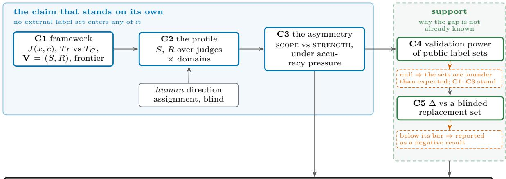  
High judge agreement is not evidence of valid evaluation. Report (S, R), not agreement alone.

Figure 1. The paper’s claim structure, in two tiers. The left group is the claim that stands on its own: no external label set enters C1, C2 or C3, and direction is assigned by humans under Protocol 1. The right group is support, and each of its stages carries the consequence of its own null result in the dashed box beneath it. The independence is the figure’s shape rather than an assertion in this caption, and it is why the premise cannot evaporate on one experiment (§1.1).  
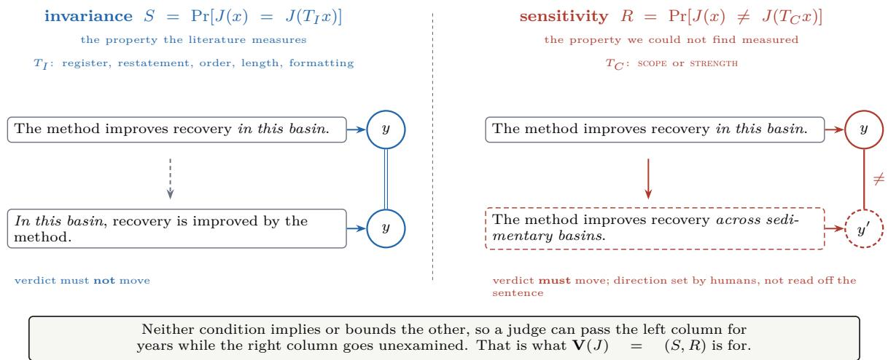  
Figure 2. The two conditions of Definition 2 on one claim. Left: the property the judge literature measures: an edit that changes register, restatement, clause order, length or formatting must not move the verdict. Hedging is deliberately absent from that list, for the reason in Appendix B. Right: the property we could not find measured: an edit that changes what the claim covers or how hard it commits must move it. The right column’s frame is drawn open because the correct verdict there is set by human annotation (§4.2), not read of the sentence.

## 2.2 Why the profile is not a scalar

A reviewer will ask for one number. The answer is that no scalar summary of Eq. (4) can distinguish a valid judge from a broken one, and the reason is structural rather than a matter of losing nuance.

Proposition 1 (The coordinates are independent). For every $( s , r ) \in [ 0 , 1 ] ^ { 2 }$ there exists a judge attaining $\mathbf { V } = ( s , r )$ . In particular neither coordinate constrains the other, and no inequality between them holds in general.

Proof. Fix $\mathcal { V } \supseteq \{ 0 , 1 \}$ . Construct J by independent randomisation on the two families: on an input reached through $T \in T _ { \mathrm { I } }$ , return the verdict assigned to the base item with probability s and the other verdict otherwise; on an input reached through $T \in T _ { \mathrm { C } }$ , return the other verdict with probability r and the base verdict otherwise. The two rules act on disjoint sets of (base, intervention) pairs, so the two probabilities in $\mathrm { E q . \ ( 4 ) }$ are set independently and equal s and r respectively. Since $( s , r )$ was arbitrary, the whole unit square is attained. □

Table 1. The four corners of the profile, and what each is. The two cells in the top row are the ones that matter: invariance testing alone cannot separate them, because it does not measure the coordinate on which they difer.
<table><tr><td></td><td>R high</td><td>R low</td></tr><tr><td>S high valid</td><td></td><td>insensitive: reliable, and measur- ing something else</td></tr><tr><td></td><td>S low unstable: may be flipping indiscrim- invalid inately</td><td></td></tr></table>

Proposition 1 is elementary, and that is the point: it says the literature’s decade of invariance results places no bound whatever on R. A field could drive S to 1 across every known surface property and learn nothing about whether its instruments track the construct.

Proposition 2 (Both coordinates are individually gameable, in opposite directions). Let $J _ { \mathrm { c o n s t } } ( x , c ) = y _ { 0 }$ for a fixed y<sub>0</sub>, and let $J _ { \mathrm { H i p } }$ return a verdict drawn to difer from the base verdict whenever the input was produced by any intervention. Then $\mathbf { V } ( J _ { \mathrm { c o n s t } } ) = ( 1 , 0 )$ and $\mathbf { V } ( J _ { \mathrm { f l i p } } ) = ( 0 , 1 )$ . Neither reads x in a way that depends on c.

Proof. Immediate from Eq. $( 4 ) \colon J _ { \mathrm { c o n s t } }$ satisfies $J ( x ) = J ( T x )$ identically, giving $S = 1$ , and never satisfies $J ( x ) \neq J ( T x )$ , giving $R = 0$ . Symmetrically for $J _ { \mathrm { H i p } }$ □

Corollary 1 (No monotone scalar separates valid from degenerate). Let $g : [ 0 , 1 ] ^ { 2 }  \mathbb { R }$ be any function non-decreasing in each argument, and suppose g assigns a passing score to some judge with $\mathbf { V } = ( s ^ { * } , r ^ { * } ) , s ^ { * } , r ^ { * } < 1$ . If g is symmetric (as a weighted mean with $\begin{array} { r } { \lambda = \frac { 1 } { 2 } , } \end{array}$ or a harmonic mean, is) then $g ( 1 , 0 ) = g ( 0 , 1 )$ , and any threshold that admits one degenerate judge admits the other. More generally, for $\lambda \in ( 0 , 1 )$ the weighted mean satisfies $\lambda \cdot 1 + ( 1 - \lambda ) \cdot 0 = \lambda$ , so a threshold below max $( \lambda , 1 - \lambda )$ admits a judge that never reads its input.

The operational rule we adopt follows directly, and it is a commitment rather than a preference: R is never reported without S measured on the same judge over matched interventions, and a judge whose S falls below a pre-registered floor is reported as uninterpretable rather than as sensitive.

## 2.3 The frontier, and what a fair comparison is

A judge exposing a decision threshold can trade one coordinate for the other, so a single profile is one point on a curve and two judges compared at their defaults are two arbitrary points on two diferent curves.

Definition 4 (Validity frontier). For a judge family $\{ J _ { \tau } \}$ indexed by a decision threshold $\tau _ { : }$

$$
{ \mathcal F } ( J ) ~ = ~ \{ ~ ( S ( J _ { \tau } ) , R ( J _ { \tau } ) ) ~ : ~ \tau ~ \} ~ \subset ~ [ 0 , 1 ] ^ { 2 } .\tag{5}
$$

Proposition 3 (Threshold comparisons are not validity comparisons). There exist judges $J ^ { ( 1 ) } , J ^ { ( 2 ) }$ and thresholds $\tau _ { 1 } , \tau _ { 2 }$ such that $R ( J _ { \tau _ { 1 } } ^ { ( 1 ) } ) > R ( J _ { \tau _ { 2 } } ^ { ( 2 ) } )$ while $\mathcal { F } ( J ^ { ( 2 ) } )$ dominates $\mathcal { F } ( J ^ { ( 1 ) } )$ pointwise; that is, the judge with the higher reported sensitivity is the strictly worse instrument. Proof. Take $\mathcal { F } ( J ^ { ( 1 ) } ) = \{ ( 1 - r , r ) \}$ and $\mathcal { F } ( J ^ { ( 2 ) } ) = \{ ( 1 - r + \epsilon , r ) \}$ for $r \in [ 0 , 1 - \epsilon ]$ ϵ], so $J ^ { ( 2 ) }$ attains strictly greater S at every R. Choosing τ<sub>1</sub> with $r = 0 . 9$ and $\tau _ { 2 }$ with $r = 0 . 1$ gives $R ( J _ { \tau _ { 1 } } ^ { ( 1 ) } ) = 0 . 9 > 0 . 1$ , while $J ^ { ( 2 ) }$ dominates. □

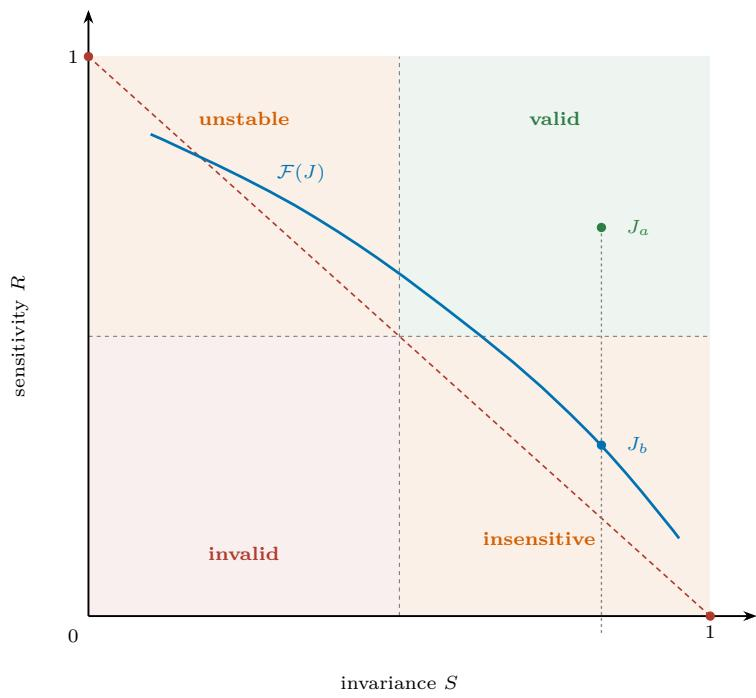  
Figure 3. The (S, R) plane. The two degenerate instruments of Proposition 2 are the marked corners: a judge that never moves sits at (1, 0), and one that flips on anything sits at (0, 1). The dashed line joining them is the level set on which a symmetric scalar summary scores them identically (Corollary 1), which is why this paper reports the pair. $\mathcal { F } ( J )$ traces one judge as τ varies, and its default $\tau , J _ { b } .$ is the only point usually reported. $J _ { a }$ sits at the same invariance as $J _ { b }$ and in a diferent quadrant, with the projection to the axis drawn: what invariance testing alone resolves is that one coordinate, which does not separate valid from insensitive. The corners are glossed in Table 1.

Hence: judges are compared by frontier, or at a matched S, and never by raw R at default thresholds. This is the same discipline as reporting an ROC curve rather than one accuracy, for the same reason.

Remark 1 (Getting a frontier out of a judge that has no visible parameters). A judge behind an API exposes no decision threshold, no logits one can rely on across vendors, and no internal state. It would seem to follow that most judges admit only a single point, and that Definition 4 is unavailable for them. It does not follow, and the fix is a design choice rather than an approximation: elicit a graded verdict and threshold it ourselves. A judge asked for a calibration score on a fixed scale, together with a rule mapping scores to verdicts, is a family $\{ J _ { \tau } \}$ , where τ is the cut we apply to its own output and control exactly. Every judge then has a frontier on identical terms, whatever is or is not visible inside it.

Two things this buys beyond convenience. Comparisons become uniform, so no row of Table 5 is a weaker claim than another for reasons of vendor access. And the threshold is ours, so it cannot be tuned per judge to flatter a result: one rule, applied to all, stated in Appendix D. What it costs is that the graded scale is part of the instrument now: a judge that grades coarsely has a coarser frontier, and Appendix H S3 reports how much of the measured insensitivity is attributable to scale granularity rather than to the judge.

We therefore do not manufacture a frontier by varying a prompt and present it as one; we obtain one by asking for a score and cutting it. A judge that refuses to grade, or grades degenerately, is reported as a single point with that fact stated.

Remark 2 (Relation to reliability, and why fixing one does not fix the other). Test–retest consistency and human agreement are properties of J at fixed input; S extends them to perturbed input. By Proposition 1 none of the three constrains R. So the finding that judges are unreliable [38] and the finding that they are insensitive are independent facts about the same instrument, and an intervention that raises agreement (ensembling, self-consistency, rubric refinement [20]) has no predicted efect on R at all. §4 reports whether that prediction holds.

## 3 Related work

We read the nearby literature for what each result had to assume rather than for what it found, because a result can be correct and replicated while resting on an assumption that fails at the limit, and the assumption is what a new paper can move.

Three recur, and this paper tests all three. That reliability is the binding constraint on judge quality, assumed by the invariance literature and false by Proposition 1, which shows the two coordinates place no bound on each other. That overclaiming is one thing, assumed by the works closest to ours, which reach the scope/strength distinction and then unify it deliberately, theoretically [27] and empirically [25]; we treat the unification as a hypothesis with a refutation condition. That agreement with a validated label set is evidence of validity, assumed nearly everywhere and the subject of §5.5, where a construct-blind family reproduces 55%–67% of five public sets’ labels.

Four lines of work assume nothing this paper tests, and are cited as ancestry rather than as contrast. Behavioural testing supplies the invariance versus directional expectation distinction we adopt [45]; judge evaluation took up the first and not the second, so what we claim is the application to evaluators, not the distinction. Validity position papers make the call we answer [12]. NLI artifacts and contrast sets are the methodological ancestor, benchmarks solvable without doing the task [16, 21, 42]; the contribution here is the instrument, the decomposition and the audit rather than the idea. Measurement modelling supplies the vocabulary [24], to which we add an operational test.

Two more are contrasts that fit in a clause. Automatic reliability stress-testing assumes the benchmark’s labels are sound [11], which is exactly what our harness tests, so the two compose rather than compete. And positional bias of faithfulness locates its defect at predictable positions in the output [52], where mis-scoping has no position at all: it is a relation between a sentence and its evidence.

Table 2 states each remaining assumption against the result that carries it; the right-hand column is where we agree with a result and disagree with what it is taken to license.

Table 2. What the nearby results establish, and the assumption each one needs that we test.
<table><tr><td>work</td><td>establishes</td><td>assumes, and we test</td></tr><tr><td>dits [38]</td><td>Judge reliability au- judges are unreliable, and exact-match that the label sets are ground truth. agreement overstates discrimination</td><td>Judges are measured against fixed sets, never audited</td></tr><tr><td>of judge bias [55]</td><td>Mechanistic accounts surface manipulations move judge scores, only specificity: edits that should not flip visibly in activations</td><td>a verdict. Sensitivity is untested, and no bias type there is scope or quantifier</td></tr><tr><td>ation [14]</td><td>can be corrected for</td><td>Noise-corrected evalu- TPR/FPR estimated on a calibration set that the calibration set is sound. The guarantees inherit whatever it leaks Judge input-shortcut judges follow injected metadata cues and that the shortcut is in reading the input.</td></tr><tr><td>probes [33]</td><td>never acknowledge them</td><td>Perturbs inputs, not the construct, and audits no label set</td></tr><tr><td>consistency metrics ment function [57]</td><td>Automatic factual- claim support can be scored by one align- that the axis of interest is support. A</td><td>mis-scoped claim is not unsupported, so such a metric is silent by construction, not by weakness</td></tr><tr><td>56, 59, 60] tion [43, 47]</td><td>Surface and style con- verbosity, order, formatting and length that the property should not have mat- founds, in judges and shift verdicts, and preference labels are tered, and that the confound is model- in reward models [7, recoverable from them, well enough that side. Every one is an invariance test; the 22, 29, 30, 32, 53, 54, benchmarks are now designed against it label-set side has no headroom metric, no Preference optimisa- a preference signal distils into a policy, and that the signal means what it says. What a proxy reward is gameable in the limit 」</td><td>cross-set audit, no reporting convention a judge cannot distinguish is what the</td></tr></table>

## 3.1 The decomposition, seen twice and collapsed twice

The claim that nobody separates scope from strength would be false. Two published works reach both mechanisms and unify them deliberately, which is a stronger position than a gap claim: a collapse has authors who chose it and a cost that can be measured.

Collapsed theoretically. Jiang et al. [27] reinterpret linguistic calibration as answer-set prediction, under which widening what a claim covers and hedging how hard it commits are the same operation: both enlarge the set of possible worlds in which the claim holds. The unification is what buys the conformal guarantee, since a single nested family of answer sets is what a calibrated set predictor needs, and for generation under a coverage guarantee it is the right modelling choice. Our claim is about evaluation, where §2.2’s argument applies to their collapse as much as to a scalar V: a judge that misses a hedge deletion and catches a quantifier widening has a property one answer-set coordinate cannot express.

Collapsed empirically, in the nearest work’s own appendix. James et al. [25] score overstatement as one continuous value, but their appendix decomposes linguistic certainty into extent, number, framing and probability, and reports that increased overstatement is driven by greater use of probability and extent certainty. Those are our two axes under other names, found in their data and discarded by the headline metric. It is the strongest external support the decomposition has: two mechanisms were seen driving one score, and nobody asked whether an evaluator responds to them diferently.

Observed together outside our domain. Studying whether a chatbot should assert generics about social groups, Zhu [61] reports that models inconsistently hedge and decline generalisations reflecting documented patterns. Generic formation is the scope operation and hedging the strength one, and a model turning both inconsistently is not what a single unstructured dial produces. The evidence is convergent from a domain with no stake in our construct.

This makes C3 a test with a named opposing prediction rather than a gap-filling exercise: had scope and strength sensitivity not difered at matched S, that would have been evidence for the collapse.

On the sensitivity arm, the same correction. Applying edits intended to change a verdict is not unprecedented. Park et al. [40] build minimally edited counterfactual responses isolating perceptual errors, catching a judge that fails to downgrade them. Three things separate it from §4: it is multimodal and about visual-versus-textual conflict; the intended direction is established by construction rather than by human adjudication, which is the circularity Protocol 1 closes; and its object is mitigation via reward modelling rather than measurement, so it reports no invariance arm and therefore no profile. The claim we keep is the pair, not the direction: S and R together, for text constructs, with direction set by people.

The framing is converging. Roy et al. [46] treat judge rubrics as measurement specifications and audit them for structural adequacy, reliability, preference fit and adversarial robustness, concluding that no source is simultaneously reliable, preference-predictive and robust, and that high inter-rater agreement does not prevent exploitability. That is this paper’s premise reached from the rubric side by diferent authors. Where it stops is where §4.4 starts: PReMISE audits the rubric and the judge, not the label set the judge is scored against, and Definition 6 is the quantity for that set.

Table 2 is the positioning; three remarks it cannot carry follow.

The wider ancestry. That a benchmark can be solvable without doing the task is a general phenomenon: shortcut learning in deep networks [17], syntactic heuristics passing inference benchmarks [34], annotator identity recoverable from labels [18], counterfactually augmented data proposed against such correlations [28], the benchmarking critique that a leaderboard number can be uninformative about the capability it names [3, 44], and a formal treatment of reward hacking [47]. Our contribution is not to observe that this can happen to evaluators but to give the test that says whether it has.

The nearest work. Jiang et al. [27] formalise a factuality/specificity trade-of and rewrite claims to trade one against the other. The distinction is the direction of the question: they ask how a generator should set the specificity of what it writes, we ask whether an evaluator notices when specificity has been changed for it. A calibration result about generation places no constraint on evaluator sensitivity. Ou et al. [39] is adjacent in material rather than in question, asking how well grounded LLM critiques of papers are.

Which constructs are at risk, and an adjacent negative result. The constructs most exposed are those whose labels are expensive and whose surface correlates are cheap. Claim specificity is the case we develop, because a resource exists whose labels are known to be lengthseparable [5] and because the construct is well posed [27, 41]. Probing work on a neighbouring construct, the strength of evidence supporting a clinical claim, recovered a graded label linearly in every model tested and then found the recoverable signal was largely lexical and did not transfer across topics [48]. That is our shape of finding from the representation side, and it is why §5.4 reports transfer rather than only within-set recovery.

## 4 Method: the interventions, the direction protocol, and the diagnostic

This section fixes the instrument before any result is read of it: how the two intervention classes of Definition 1 are realised as concrete edits, who decides that an edit belongs in the sensitivity arm, which judges and domains the profile is measured over, and (§4.4) the second instrument the paper needs, which measures not a judge but the label set a judge is validated against. Every choice here is frozen in the repository before the first judge call, and §4.2 is the one a reader should push hardest on.

## 4.1 Instantiating the two intervention classes

The construct is whether a claim overreaches its evidence. $T _ { \mathrm { C } }$ splits into two axes, fixed in probes/edit\_taxonomy.py before any judge is run:

scope (referent set grows, commitment fixed): population widening, domain extension, tense/- modality shift (one observation restated as a standing property) and quantifier strengthening.

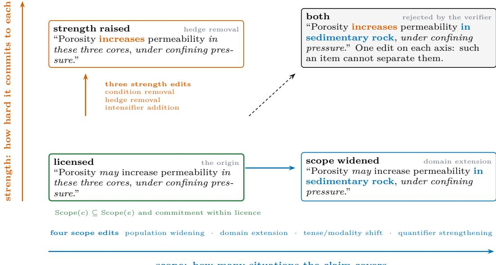  
scope: how many situations the claim covers  
Figure 4. The decomposition on one worked claim. From a single licensed sentence, scope moves right (the referent set grows while commitment is untouched) and strength moves up: the referent set is fixed and commitment rises. The seven TC edit types sit beside the axis each moves, and in each cell the changed span is coloured with the axis that moved it; every cell is one edit from the origin. The diagonal is the case the verifier rejects: an item that moved both axes cannot separate them, and admitting it would contaminate the very contrast §5.2 rests on.

strength (referent set fixed, commitment rises): condition removal (deleting the circumstances the efect was observed under) hedge removal, and intensifier addition.

Both axes are linguistic distinctions before they are machine-learning ones. Hedging is a studied feature of scientific writing with a documented rhetorical function [23], and uncertainty together with its scope has been annotated at corpus scale in biomedical text [50], which is direct evidence that the two things we separate are separately annotatable by humans. The adjacent verification literature asks whether a claim is supported [49, 51]; our construct begins where that one ends, since every item in the $T _ { \mathrm { C } }$ arm is supported on both sides of the pair and difers only in what it covers or how hard it commits.

And strength is a manipulable quantity on the model side, not only a rhetorical one, which matters because an axis no model represents is an axis no judge could plausibly be asked to track. Linguistic calibration (making an agent’s expressed confidence match its competence) has been trained for directly [36]; expressed uncertainty has since been located as a linear feature in representation space and steered along it [26]; and Tayebi Arasteh [48] recover a graded evidence-strength label linearly in every model tested. Our claim is not that models cannot represent commitment. It is the sharper and more awkward one: commitment is representable, steerable and linearly decodable, and judges still do not act on it. The scope axis has the parallel grounding on the generation side, where decontextualising a scientific snippet (lifting it of the source without widening what it covers) is a defined task with gold data [37], and over-generalisation under that pressure is measured at scale [41].

T is the control arm, and it deliberately covers the surface properties the judge literature has already shown to move verdicts, because a low flip rate on properties nobody has implicated proves nothing: hedge padding, same-scope elaboration, register shift, clause reordering, verbosity padding [60], and format shift [59].

Remark 3 (Why these two axes and not one). The axes are separable in the sense measurement requires: an edit on one can be applied while holding the other’s operators fixed, and a verifier can check which moved. They are not claimed to exhaust overreach. Splitting them is a modelling choice that earns its place only if judges behave diferently across it, which is a result, reported below, not an assumption.

## 4.2 Who decides that the verdict should change

An intervention is in $T _ { \mathrm { C } }$ only if it changes the correct verdict, which makes this the paper’s load-bearing methodology. If a language model adjudicates that, we are testing models against models and any asymmetry could be a shared blind spot rather than a property of judges.

Protocol 1 (Direction assignment). Three disjoint model families, and humans hold the deciding vote.

1. Generate the candidate edit (family A).

2. Verify mechanically (family B, never A): facts unchanged; the intended axis moved and the other axis’s operators untouched; no provenance anchor introduced; register comparable; length within tolerance.

3. Assign direction by human annotation. Annotators see the pair without knowing which member is the edit, which axis it belongs to, or what any model said, and answer only whether the second sentence claims more than the evidence licenses. An item enters the sensitivity arm only at agreement $\geq 0 . 7 5$ (pre-set; HUMAN\_DIRECTION\_AGREEMENT\_MIN).

4. Judge (family $\mathrm { C } ,$ never A or B).

Two reporting rules follow. Per-slot yield appears in the same table as the result, because if strength edits are harder to construct cleanly than scope ones then the surviving strength items passed a stricter filter and part of any asymmetry is the pipeline rather than the judges. And human–verifier disagreement is reported rather than resolved silently, since it bounds how far the mechanical gate can be trusted where humans were not asked. The pool and the pre-set bar of 0.75 are specified in Appendix C, frozen before any data was collected, together with the rule attached to it: a slot or axis below the bar is reported as not measurable and excluded from R rather than reported with a wider interval, because a wide interval around an ill-defined construct still asserts the construct exists.

What the annotators found. 3 annotators independently labelled all 478 items; the third worked the full batch rather than arbitrating the first two’s disagreements, so the three label sets are independent. Raw pairwise agreement is 0.852 (Fleiss’ κ 0.776, the three pairwise rates spanning 0.814–0.877), and every axis clears the bar: scope 0.898 $( n = 1 4 4 )$ , strength 0.889 (n = 144), invariance 0.789 $( n = 1 9 0 )$ . Only 2 items (0.4%) drew three diferent answers. The two construct axes are equally well defined for human readers. scope is nominally higher, but by less than the spread between annotator pairs, so we claim no ordering; what the bar was set to rule out, that one of the two distinctions is not one people reliably make, happened on neither.

Of the annotated items, 246 of 288 construct items carry a majority direction matching the intended one (116 scope, 130 strength) and 96 of 190 invariance items survive; Table 3 gives the per-slot breakdown, with agreement and yield in separate columns because they fail diferently. tense\_modality\_shift is the lowest-yield slot at 57.8% on ordinary agreement: the readers agree, and what they agree on is that the edit often left the claim where it was. That is a generator yield problem rather than a construct problem, so the slot stays in scope with its yield stated.

Two invariance slots did not survive. The two that manipulate length, verbosity\_ padding and elaboration, fall below the bar at 0.689 and 0.404, while the other 3 invariance slots agree at $\geq 0 . 9 7 1$ . They are excluded under the pre-registered rule. Two separate problems were stacked there, and only the annotators could have separated them.

Table 3. Human direction annotation, per slot. agree is mean pairwise agreement over three annotators; usable counts items whose majority label matches the intervention’s intended direction. The two columns answer diferent questions and a slot can fail either one alone: tense\_modality\_shift has ordinary agreement and low yield — readers agreeing that the edit changed nothing — while the two lengthmanipulating invariance slots have ordinary yield and agreement below the pre-set bar of 0.75.
<table><tr><td>slot</td><td>axis</td><td>n</td><td>agree</td><td>usable</td><td>note</td></tr><tr><td>domain_extension</td><td>SCOPE</td><td>25</td><td>0.973</td><td>25</td><td></td></tr><tr><td>population_widening</td><td>SCOPE</td><td>42</td><td>0.857</td><td>34</td><td></td></tr><tr><td>quantifier_strengthening</td><td>SCOPE</td><td>32</td><td>0.958</td><td>31</td><td></td></tr><tr><td>tense_modality_shift</td><td>SCOPE</td><td>45</td><td>0.852</td><td>26</td><td>low yield</td></tr><tr><td>condition_removal</td><td>STRENGTH</td><td>35</td><td>0.867</td><td>33</td><td></td></tr><tr><td>hedging_removal</td><td>STRENGTH</td><td>58</td><td>0.851</td><td>48</td><td></td></tr><tr><td>intensifier_addition</td><td>STRENGTH</td><td>51</td><td>0.948</td><td>49</td><td></td></tr><tr><td>elaboration</td><td>invariance</td><td>33</td><td>0.404</td><td>0</td><td>below bar; excluded</td></tr><tr><td>format_shift</td><td>invariance</td><td>20</td><td>1.000</td><td>20</td><td></td></tr><tr><td>register_shift</td><td>invariance</td><td>55</td><td>0.976</td><td>54</td><td></td></tr><tr><td>reordering</td><td>invariance</td><td>23</td><td>0.971</td><td>22</td><td></td></tr><tr><td>verbosity_padding</td><td>invariance</td><td>59</td><td>0.689</td><td>0</td><td>below bar; excluded</td></tr></table>

The first was ours: the generator padded sentences with as is often observed, in practice and as is well known, which read as filler but each assert something the evidence never stated. On the first batch 67.4% of 46 items drew a majority directional verdict. Three revisions of the generation prompt failed to stop it, and what worked was a fixed marker list checked programmatically before the verifier sees the pair (epistemic\_marker\_change): a prompt states an intention, a filter enforces a property. Regenerating the same slots under the gate, with the same annotators, took the rate to 10.9% of 46.

The second is untouched by the gate. Agreement barely moved (0.601 to 0.572) as the contamination cleared, because the disagreement changed hands: afterwards one annotator still called an appositive gloss directional (32 of 46) while the other two almost never did (3), and that annotator agreed with the others at 0.877 on the main batch. Whether naming an entity more precisely changes what a sentence claims is a question our codebook never answered, and one competent reader in three answers it the other way. We report it as a boundary of the invariance construct: surface-preserving is well defined for formatting, register and word order, and not for appositive elaboration (§6.2).

## 4.3 Judges and domains

The design floor is six judge families spanning vendors, parameter scales, and reasoning-enabled versus not, over at least four evaluation domains. That floor is not negotiable downward for a reason of kind rather than of power: a single-domain result is a result about that domain, and this paper’s claim is about the instrument. Restricting the study to one construct in one domain would make the finding a fact about geoscience claim-scope rather than about evaluators, so the profile is measured across domains whose criteria difer in kind, with the scientific-claim domain as the one where minimal edits are best posed and human verification is cheapest.

Table 4. Validity profiles. $S$ from the $T _ { \mathrm { I } }$ control arm, R from $T _ { \mathrm { C } }$ split by axis. Per-slot n and human confirmation are part of the result, not appendix material: §4.2 explains why. n counts items whose majority human label matched the intervention’s intent and whose slot met the agreement bar: the items that actually enter the arm. human dir. is that count as a fraction of items annotated, so a low value marks a slot the generator often failed to move rather than one humans could not read: tense modality shift is the clearest case, at 57.8% with ordinary agreement. <sup>†</sup> below the pre-set bar of 0.75 and therefore excluded (§4.2). Pipeline discard before annotation was 24.2% overall, dominated by the length tolerance; it is reported as an aggregate because build\_pairs.py keys its rejections by reason rather than by slot, and a per-slot figure we did not record is not one we will estimate.
<table><tr><td>intervention</td><td>axis</td><td>n</td><td>human dir.</td><td>agreement</td><td>fip rate</td></tr><tr><td colspan="6"> $T _ { \mathrm { C } }$  — should flip: SCOPE</td></tr><tr><td>domain extension</td><td>scope</td><td>25</td><td>100%</td><td>0.973</td><td>0.445</td></tr><tr><td>population widening</td><td>scope</td><td>34</td><td>81%</td><td>0.857</td><td>0.299</td></tr><tr><td>quantifier strengthening</td><td>scope</td><td>31</td><td>97%</td><td>0.958</td><td>0.445</td></tr><tr><td>tense modality shift</td><td>scope</td><td>26</td><td>58%</td><td>0.852</td><td>0.358</td></tr><tr><td colspan="6"> $T _ { \mathrm { C } }$  — should flip: STRENGTH</td></tr><tr><td>condition removal</td><td>strength</td><td>33</td><td>94%</td><td>0.867</td><td>0.379</td></tr><tr><td>hedging removal</td><td>strength</td><td>48</td><td>83%</td><td>0.851</td><td>0.210</td></tr><tr><td>intensifier addition</td><td>strength</td><td>49</td><td>96%</td><td>0.948</td><td>0.235</td></tr><tr><td colspan="6"> $T _ { \mathrm { I } }$  — should not flip: surface controls</td></tr><tr><td>elaboration</td><td>control</td><td>0</td><td></td><td>0.404†</td><td></td></tr><tr><td>format shift</td><td>control</td><td>20</td><td>100%</td><td>1.000</td><td>0.029</td></tr><tr><td>register shift</td><td>control</td><td>54</td><td>98%</td><td>0.976</td><td>0.053</td></tr><tr><td>reordering</td><td>control</td><td>22</td><td>96%</td><td>0.971</td><td>0.084</td></tr><tr><td>verbosity padding</td><td>control</td><td>0</td><td></td><td>0.689†</td><td></td></tr><tr><td colspan="6">V = (S, R), mean over judges (0.945, 0.319)</td></tr></table>

## 4.4 The diagnostic: what a label set could ever have detected

Definition 5 (Provenance-inherited label). Let each item $x _ { i }$ be produced under a generative condition $C _ { i }$ which side of a preference pair it occupied, which model emitted it, which prompt variant produced it. A label set $\mathcal { L } = \{ ( x _ { i } , y _ { i } ) \}$ is provenance-inherited if $y _ { i } = g ( C _ { i } )$ for some $g _ { \colon }$ rather than the result of a reading of $x _ { i }$ that is blind to $C _ { i }$

Definition 5 is about how the label was obtained, not about whether it is correct. A provenance-inherited label can be perfectly correct and still be useless for validation, and that is the point: correctness and informativeness come apart here.

The condition is not exotic. It is what happens by default whenever a label set is assembled from a generation pipeline rather than from independent reading, which is now the common case: surveys of synthetic-data curation treat the generating condition as a first-class part of the artifact [31], and the metrics proposed for certifying generated data are about quality and trustworthiness of the content rather than about whether the label is reachable without the construct [58]. Validation power is that missing quantity. It is also why the diagnostic is cheap: $C _ { i }$ is usually recorded somewhere in the pipeline, so a set’s authors can compute VP on their own artifact before releasing it, and the sixth item of §6.1 asks only that they release the field so others can.

Definition 6 (Validation power, relative to an input mode). Let M be an input mode: the structure in which an instrument is shown an item. Two modes matter here. In per-item mode the instrument sees one response and returns a label. In paired mode it sees two responses to the same prompt and returns which one the label set prefers. For a label set $\mathcal { L }$ and a mode $\mathcal { M } .$ , let $\mathrm { a } _ { \mathrm { i m p } } ( \mathcal { L } ; \mathcal { M } )$ be the agreement with $\mathcal { L }$ achieved by the best predictor in a fixed family of impoverished predictors operating in mode M, and let $\mathrm { a _ { h u m } } ( \mathcal { L } ; \mathcal { M } )$ be the human ceiling in that mode. Then

$$
\mathrm { V P } ( \mathcal { L } ; \mathcal { M } ) \ = \ \mathrm { a _ { h u m } } ( \mathcal { L } ; \mathcal { M } ) - \mathrm { a _ { i m p } } ( \mathcal { L } ; \mathcal { M } ) .
$$

VP is undefined until the mode is fixed. A per-item predictor can exploit only an absolute signature (responses over this length are preferred); a paired predictor exploits a relative one (whichever of these two is shorter is preferred). Where a set’s surface confound is relative, the per-item estimate understates recoverability by an amount nothing bounds in advance: MT-Bench gives $\mathrm { a _ { i m p } = 0 . 3 0 }$ per item and 67.4% paired. The mode reported must be the mode the instrument is used in.

Corollary 2 (The two modes are not orderable in general). Neither mode dominates. A set whose label is a function of an absolute property is recoverable per item and may be near chance paired, if both sides of every pair share that property. A set whose label is a function of a relative property is the reverse. Hence a single reported $\mathrm { a } _ { \mathrm { i m p } }$ without its mode is uninterpretable, and reporting the lower of the two is not conservative; it is simply the answer to whichever question was not asked.

Validation power is the discriminative room a judge has to earn. Where $\mathrm { V P } \approx 0 ,$ , a judge’s agreement with L is uninformative at any magnitude, because an instrument that reads only surface form already reaches the ceiling. Where VP is large, agreement is evidence. Reporting $\mathrm { V P }$ rather than agreement is the single change we ask for.

The impoverished family, frozen. Three predictors, each denied the construct by construction:

1. Length only. Token count of the item and nothing else.

2. Surface only. Character n-grams, punctuation and formatting statistics, and hedge-marker counts, no content words carrying the construct.

3. Provenance-recoverable. A predictor of $C _ { i }$ from $x _ { i }$ . If $C$ is recoverable and $y = g ( C )$ , then y is reachable without the construct, and this predictor bounds how much of $\mathcal { L }$ any surface-reading instrument can obtain.

What makes it a test rather than a statistic. Three requirements, all of which the released harness enforces. Agreement is chance-corrected, so VP is not inflated by class imbalance. Each $\mathrm { a _ { i m p } }$ is reported against a label-permutation null, so a small positive VP is distinguishable from noise. And $\mathrm { a h u m }$ carries its own interval, because a ceiling estimated from few double-annotated items can be the larger source of uncertainty in Definition 6.

Remark 4 (Why not simply audit the judge harder). A judge audit answers “does this instrument behave consistently”. It cannot answer “does agreement with this label set mean anything”, because that question is about the label set. The two are independent: $\ S 1$ ’s apparent contradiction is exactly a well-behaved judge meeting a leaky ruler.

## 5 Experiments: the profile, the asymmetry, and what the rulers could have seen

Five measurements, in the order they depend on each other. The profile (§5.1) is the headline and needs only §4’s instrument. The axis decomposition (§5.2) splits it, and the accuracy-prompting manipulation (§5.3) is the split’s out-of-sample test, since it predicts a published result’s sign structure rather than fitting our own. The validation-power sweep (§5.4) then asks why the first three findings are not already in the record, and §5.5 prices the answer. Every measured number below is generated from results/ rather than typed into the manuscript, and the two arms that remain unrun are named as such where they would appear.

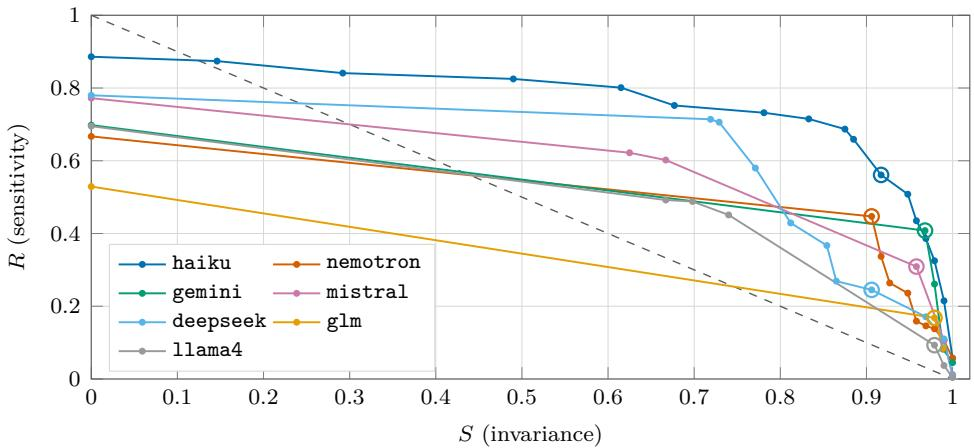  
Figure 5. Validity profiles for 7 judges. Frontiers are drawn for the judges that expose a decision threshold, which under Remark 1 is all of them that grade; any judge that will not grade is a single labelled point, per Proposition 3. The dashed diagonal is $S + R = 1$ , where a judge is trading one property for the other rather than possessing both. Curves are the monotone hull over our threshold sweep: at each invariance we keep the best sensitivity achieved at that invariance or stricter, so a curve is a frontier rather than a trace of every threshold. Every vertex is an attained threshold, so a long straight segment is interpolation between two of them and not a measured path; the ringed vertex is the matched-invariance operating point Table 5 reads of.

Table 5. Per-judge profiles. R is reported per axis and never without S (Corollary 1); the final column records whether the row was read of a frontier or a default threshold, because the two are not comparable. <sup>†</sup> predicted, not measured
<table><tr><td>judge</td><td>T</td><td>S</td><td>R</td><td> $R ^ { \mathrm { s c o P E } }$ </td><td>RSTRENGTH</td><td>pts</td><td>regrade</td></tr><tr><td>anthropic/claude-haiku-4.5</td><td>2.75</td><td>0.917</td><td>0.561</td><td>0.629</td><td>0.500</td><td>9</td><td>0.41</td></tr><tr><td>nvidia/nemotron-3-nano-30b-a3b</td><td>0.25</td><td>0.906</td><td>0.447</td><td>0.474</td><td>0.423</td><td>7</td><td>0.83</td></tr><tr><td>google/gemini-2.5-flash-lite</td><td>0.25</td><td>0.968</td><td>0.408</td><td>0.474</td><td>0.349</td><td>6</td><td>1.00</td></tr><tr><td>mistralai/mistral-small-3.2-24b-instruct</td><td>2.25</td><td>0.958</td><td>0.309</td><td>0.405</td><td>0.223</td><td>4</td><td>0.96</td></tr><tr><td>deepseek/deepseek-v4-flash</td><td>3.25</td><td>0.906</td><td>0.245</td><td>0.362</td><td>0.140</td><td>9</td><td>0.68</td></tr><tr><td>z-ai/glm-4.7-flash</td><td>0.25</td><td>0.979</td><td>0.168</td><td>0.239</td><td>0.107</td><td>2</td><td>0.98</td></tr><tr><td>meta-llama/1lama-4-scout</td><td>2.25</td><td>0.979</td><td>0.093</td><td>0.095</td><td>0.092</td><td>6</td><td>0.97</td></tr><tr><td colspan="8">mean over the 7 judges compared 0.383 0.262 sCOPE − STRENGTH gap: positive on 7/7 judges, +0.003 to +0.222</td></tr></table>

## 5.1 Judges are far more invariant than sensitive

Figure 5 shows the vertical gap the study was built to look for, and it is large. Held at matched invariance $S \geq 0 . 9 0$ , the 7 judges average $S = 0 . 9 4 5$ against $R = 0 . 3 1 9 :$ : the insensitive cell of Table 1, not the valid one. This is not an artifact of a weak field. The strongest instrument in the sweep, anthropic/claude-haiku-4.5, reaches $R = 0 . 5 6 1$ and so still misses more than two construct changes in five while holding its verdict on 0.945 of edits that should not move it.

Table 6. Sensitivity per intervention, at each judge’s matched-invariance threshold, averaged over the 7 judges. The magnitude column is the median |∆| length the operation mechanically carries: it is a property of the edit type, not a free variable, which is why magnitude cannot be stratified independently of slot.
<table><tr><td>intervention</td><td>axis</td><td>n</td><td>R</td><td>median |∆| length</td></tr><tr><td>quantifier_strengthening</td><td>SCOPE</td><td>31</td><td>0.445</td><td>3.2%</td></tr><tr><td>domain_extension</td><td>SCOPE</td><td>25</td><td>0.445</td><td>8.8%</td></tr><tr><td>tense_modality_shift</td><td>SCOPE</td><td>26</td><td>0.358</td><td>4.8%</td></tr><tr><td>population_widening</td><td>SCOPE</td><td>34</td><td>0.299</td><td>7.0%</td></tr><tr><td>condition_removal</td><td>STRENGTH</td><td>33</td><td>0.379</td><td>13.0%</td></tr><tr><td>intensifier_addition</td><td>STRENGTH</td><td>49</td><td>0.235</td><td>4.3%</td></tr><tr><td>hedging_removal</td><td>STRENGTH</td><td>48</td><td>0.210</td><td>4.2%</td></tr></table>

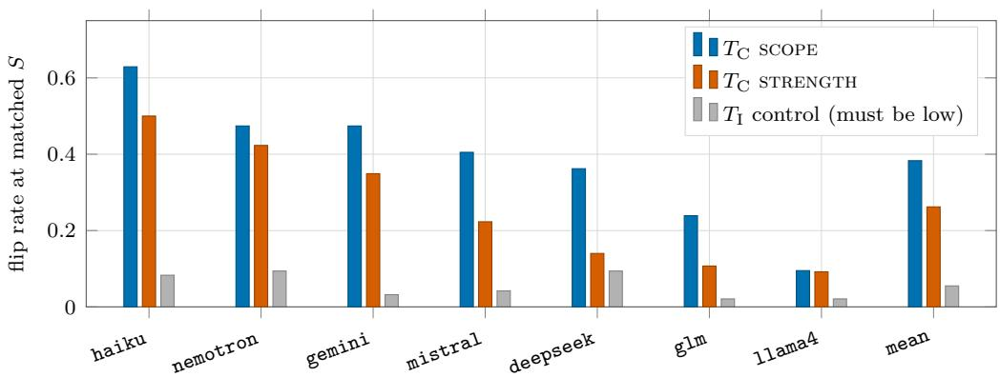  
Figure 6. Sensitivity per intervention axis, per judge, at matched S, with the control-arm flip rate on the same scale. The control bar is the reference that makes the other two interpretable: a construct-edit bar near the control bar is a judge responding to a construct change no more than to an edit that should not move it at all. Judge labels are shortened vendor names; per-judge thresholds and instrument quality are in Table 5.

The comparison that decides Remark 2. If ensembling and self-consistency raise S without moving R, then the field’s standard reliability remedies do not touch validity, and Proposition 1 has an empirical instance rather than only a proof. We run those two remedies as additional judge rows for this reason.

## 5.2 The scope/strength asymmetry

The pattern holds. Compared at matched invariance, $R ^ { \mathrm { { s c o P E } } } = 0 . 3 8 3$ against $R ^ { \mathrm { { S T R E N G T H } } } = 0 . 2 6 2 \colon$ a gap of +0.121 at a control flip rate of 0.055. The gap has the same sign on 7 of the 7 judges, spanning vendors, parameter scales and reasoning-enabled or not, with per-judge values in Table 5. Judges detect that a claim now covers more and largely miss that it now commits harder.

The sign, the magnitude and the condition that would have refuted them were all registered before measurement (Appendix F): the gap was to be reported as refuted if it came in below 0.10 or failed a paired bootstrap over base items. It clears both. Three further checks, all specified before the numbers existed, hold. A bootstrap resampling base items rather than pairs (several pairs share a base sentence across slots, so resampling pairs would treat those as independent draws) puts the gap at +0.052 to +0.189 over 243 items, excluding zero. Permuting the axis label within the construct arm while holding every judge’s grades fixed gives $p < 0 . 0 0 2$ , with a largest null gap of +0.123. And on the 217 items where all 3 annotators agreed on direction, the pre-committed robustness split, the gap is +0.125: larger than on the full set, which is the direction that makes it a fact about judges rather than about annotation dificulty.

The length controls, and why the gap is a lower bound. Edit magnitude is the alternative explanation with the most force: strength edits are shorter on average than scope ones, so a judge merely less sensitive to small edits would reproduce the asymmetry with no axis structure. Three checks close it, and the third turns the confound into support.

The magnitude match survives human filtering. Items enter the arm only on human confirmation, and confirmation rates difer by slot, so the match built at construction had to be re-verified on what actually entered: median |∆| length is 5.0% on scope against 5.3% on strength. The signed change does difer, with scope edits lengthening (+4.1% median, 64% longer) and strength edits shortening (-2.5%, 39%). So the second check asks whether grades track length at all: across every graded sentence, the correlation between a sentence’s length and its grade is +0.025 to +0.114 over the 7 judges. It is positive, meaning judges grade longer sentences as slightly better scoped. Since the scope edit is the longer member, that bias pushes judges toward naming the original on scope items and the edit on strength ones. It works against the observed gap, which makes +0.121 a lower bound rather than an inflated estimate. Third, the gap survives stratifying on the sign: +0.149 where the edit lengthened (6 of 7 judges) and +0.073 where it shortened (6 of 7).

Per slot, which is where the result is most useful. Table 6 gives R for each intervention. The ordering is more informative than the axis means: quantifier\_strengthening and domain\_extension are the most detected at 0.445, and hedging\_removal the least at 0.210, a factor of more than two between two edits that a reader would call equally clear cases of overreach. The magnitude column shows why magnitude cannot be stratified independently: operation fixes it, since a deleted condition clause cannot be a small edit and an added intensifier cannot be a large one.

The slot distributions overlap across the axes: condition\_removal is a strength slot detected at 0.379, above 2 of the four scope slots. The axis gap is therefore a diference between the central tendencies of two heterogeneous groups rather than a categorical separation, and the registered decomposition accounts for $\eta ^ { 2 } = 0 . 4 0$ of the variance in slot-level R; §6.2 records an alternative grouping that fits comparably.

## 5.3 The accuracy-prompting paradox

If overreach were one quantity, an instruction to be accurate could not increase it. Under Definition 1 it can: a demand for accuracy is a demand to sound certain, which suppresses scope while inducing strength, because hedges and stated conditions are exactly what reads as uncertainty. We rerun the manipulation with the axes scored separately, on the generator side, and then ask whether judges’ per-axis sensitivity predicts which of the two a model will exploit under that pressure. Not measured here. The two per-axis efects. The registered prediction is that they have opposite signs, with the refutation condition in Appendix F: if both axes move the same way, the decomposition does not explain the paradox. The manipulation is generator-side, so it needs fresh generation and a per-axis readout that does not yet exist.

Declared overlap. The control arm replicates established results: Xu et al. [55] on surface manipulation, Marioriyad et al. [33] on injected metadata cues, Zhang et al. [59] on format, Zheng et al. [60] on verbosity, and Huang et al. [22] on length in reward models. We claim novelty for none of it. It is here because R is uninterpretable without S (Proposition 2), which makes the replication a measurement requirement rather than a contribution. What is new is the $T _ { \mathrm { C } }$ arm, its decomposition, the human-set direction, and the profile. We note that none of the seven bias types in Xu et al. [55] is scope or quantifier structure.

Table 7. Construct-blind recovery of the label sets the literature validates judges against, at the revisions pinned in results/labelsets/PROVENANCE.json, in both input modes of Definition 6. Per-item aimp is chance-corrected agreement; paired accuracy has chance at 50% with side order randomised. Groupaware folds throughout; every paired row clears its label-permutation null, which sits at or below 0.026. HelpSteer2 has no paired column because it ships per-response ratings rather than comparisons. The final row is a provenance-inherited set audited under the identical protocol.
<table><tr><td></td><td></td><td colspan="2">per-item mode</td><td colspan="3">paired mode</td></tr><tr><td>label set</td><td>label origin</td><td>n</td><td>aimp</td><td>pairs</td><td>κ</td><td>accuracy</td></tr><tr><td>RewardBench</td><td>pair role</td><td>5,970</td><td>0.303</td><td>2,985</td><td>0.249</td><td>62.4%</td></tr><tr><td>RewardBench 2</td><td>pair role</td><td>8,977</td><td>0.200</td><td>5,926</td><td>0.248</td><td>62.4%</td></tr><tr><td>RM-Bench</td><td>pair role</td><td>7,962</td><td>0.221</td><td>3,981</td><td>0.095</td><td>54.7%</td></tr><tr><td>HelpSteer2</td><td>human rating</td><td>8,008</td><td>0.068</td><td></td><td></td><td></td></tr><tr><td>MT-Bench (human)</td><td>human vote</td><td>6,710</td><td>0.300</td><td>2,575</td><td>0.348</td><td>67.4%</td></tr><tr><td>provenance-inherited case</td><td>pair role</td><td>10,156</td><td>0.993</td><td>5,078</td><td>0.993</td><td>99.6%</td></tr></table>

## 5.4 How widespread it is: validation power of the public label sets

Table 7 answers the objection raised in $\ S 1$ : if judges really miss strength change, why has no one reported it. It requires no annotation of ours and runs on public artifacts at pinned revisions.

The per-item sweep returned $\mathrm { a _ { i m p } }$ between 0.07 and 0.30, which reads as healthy headroom. In the mode these sets are actually used in, a predictor reading nothing but surface form reproduces 55%–67% of their labels. Both columns appear in Table 7 because the diference between them is the finding.

What the two modes measure. Definition 6 carries the mode explicitly and Corollary 2 says why neither dominates. RewardBench pairs are built so the two sides difer within a pair, but across the set no absolute length band marks the chosen side, so a per-item predictor is near chance and a paired one is not. Our corpus is the opposite, with its preferred side in a narrow absolute band, so both modes succeed. Reporting the per-item number for a pairwise benchmark answers a question nobody asks of that benchmark.

The design assumption that fails. RewardBench constrains chosen responses to be no longer than rejected ones [29], on the implicit assumption that removing the naive direction of the length signal removes the length confound. Measured on the released set, the chosen response is the longer one in 40.3% of pairs, so the content-free rule prefer the shorter response is correct on 59.7%. The confound was not removed; its sign was flipped and its magnitude preserved, and a reward model that learned to prefer brevity scores above chance on the benchmark built to detect it. A control defined on a property of the items is not a control on what a predictor can do with that property.

The one set that holds up, and the one that does not. RM-Bench is closest to chance in paired mode at 54.7%. It is built by crossing every pair with three deliberate style levels, putting style variation inside the benchmark rather than leaving it outside as a confound; this row is what makes the others interpretable, and the design is the one we would ask others to copy. MT-Bench is the opposite. Its labels are human pairwise votes, and a surface-only paired predictor reproduces 67.4% of them, the highest of the public sets and higher than either pair-role benchmark. Definition 5 predicts the reverse ordering, since labels further from the generative condition should be harder to reach without the construct. Either the definition is incomplete or human preference on this task is itself substantially a length preference; we cannot separate the readings here and do not report the ordering as support for the definition (§6.2).

The contrast that sets the scale. Run the identical family, folds and nulls against a set whose labels are a function of the generative condition, and the paired predictor is correct on 99.6% of pairs against 55%–67% for the public sets [6]. So Definition 5 does describe a real and severe failure mode. What has changed is that the public benchmarks are no longer the clean comparison they appeared to be in the per-item sweep: they sit well above chance, not at it.

What is still untested, stated plainly because neither mode settles it. C4’s prediction was per axis: that strength-axis validation power would be near zero even where aggregate power is healthy. That prediction is untested in either mode and cannot be tested on these sets, because splitting VP by axis requires the pairs in a row set to difer by an identifiable scope or strength edit and none of the five is labelled that way. The released intervention set is, so the per-axis form is answerable on it and we leave it to future work.

The reversal. Under per-item scoring the human-labelled sets look cleanest, which is what Definition 5 predicts; under paired scoring, the mode judges are actually used in, MT-Bench moves from the cleanest set to the most recoverable. That reversal is Corollary 2 with data attached: the two modes are not orderable, and reporting whichever is lower is not the conservative choice it appears to be.

Transfer. Within-set recovery is necessary but not suficient [48]: a predictor that recovers a set may be exploiting a set-specific idiom rather than a general surface correlate. We therefore fit each impoverished predictor on one set and evaluate it on the others.

Of 20 ordered set pairs, 2 admit the question at all: the remaining 18 have label spaces that do not share two categories, so a predictor fitted on one cannot be scored on the other even in principle. That is a finding about the state of public preference labels rather than about our predictors, since these sets are routinely discussed as though they measured the same thing. On the 2 pairs where transfer is defined, the surface predictor carries κ = 0.157 and 0.109, far below its within-set recovery (Table 7). The recovery is therefore substantially a set-specific idiom, which is what makes within-set recovery necessary but not suficient.

## 5.5 What it costs: a blinded replacement, and ∆

The construct is claim specificity: whether a sentence asserts more than its evidence licenses. We choose it because a provenance-inherited label set for it already exists and is known to leak [5], so the comparison is against a real, deployed ruler rather than a straw one.

Design. Four per-sentence classes (clean, anchored, over-scoped, unsupported) rather than the two a pair role can supply. Every annotation unit is one sentence with its evidence context, presented with no indication of which side of a pair it came from, no indication of the producing system, sentences from both sides interleaved and globally shufled so pair membership is unrecoverable, and the length cue broken by presenting sentences individually rather than whole responses. Three independent annotators, no arbitration pass and no annotator seeing another’s labels, the label taken as the majority of the three, with Fleiss’ κ and raw pairwise agreement reported per class [8, 15]. Figure 7 contrasts the two designs. The full protocol, codebook, and sampling frame are in Appendix C; the frozen specification is docs/TMLR\_EXPERIMENT\_PLAN.md C3.

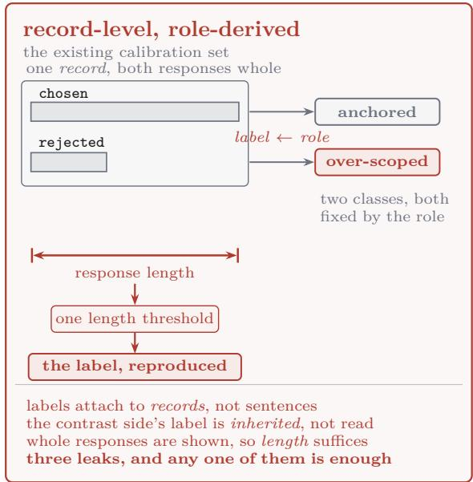

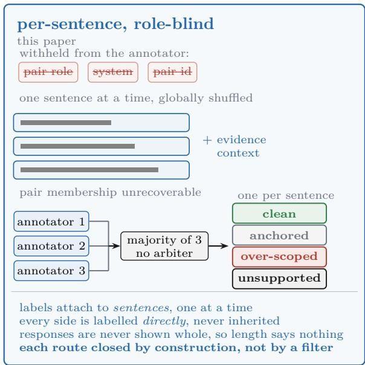  
Figure 7. Why a provenance-inherited label set is separable without reasoning about the construct, and what the blinded design withholds. Left: labels attach to whole records by their role in the pair, so one threshold on response length reproduces them, at the agreement reported by Chen et al. [5]. Right: the unit is one sentence with its evidence context, every field that identifies its side withheld, sides interleaved so pair membership is unrecoverable, and the label the majority of three independent annotators with no arbitration pass. Both panels read in two bands: above the rule, what the annotator sees and how its label is formed; below it, the surface route the design leaves open or closes. A class chip is drawn identically wherever it appears, so the two classes a pair role can supply compare directly against the four.

The headline would be the diference. A per-class precision/recall table against the blinded set alone would be a fact about one corpus’s labels. ∆ (how much validating on the inherited set overstates accuracy) is the quantity that transfers, and it is the number this design exists to produce.

Not measured here. ∆ itself, and VP of both sets on identical terms. What blocks it is neither compute nor access but a second human annotation round the size of the one reported above, over a four-class codebook. The design, the protocol and the sampling frame are given in full (Appendix C) so that a reader can run it against their own label set: the design is the part that transfers.

## 6 Discussion and limitations

## 6.1 What a judge author can do on Monday

1. State how each label was obtained. If it is a function of a generative condition, say so.

2. Report the best impoverished predictor’s agreement, not only the judge’s.

3. Report a human ceiling with an interval, and report validation power against it.

4. Report a label-permutation null.

5. Probe in both directions: construct edits and surface edits.

6. If the label set is released, release the provenance field, so others can run 1–5.

## 6.2 Limitations

R is a lower bound and S an upper bound. Everything rests on a $T _ { \mathrm { C } }$ edit really changing the correct verdict; Protocol 1 puts that decision with humans, and an item a majority of the 3 misread enters the arm as a false positive that lowers measured R. A judge may also register that a claim changed and still return the same verdict because the verdict space is too coarse to express it. In the other direction, S over 3 surviving control types bounds invariance from above, since a richer control family can only find more failures. Both bounds point the same way as the headline, which is why §5.2 reads +0.121 as conservative.

A third construct axis is visible at the edge of the control arm. 2 of the 5 specified control types fell below the agreement bar, and the reason is substantive rather than noise: one competent reader in three holds that making a referent more precise changes what a sentence claims of it. If that reader is right, adding detail is a third axis alongside extension and precision, and it is a well-posed target for the next study. The disagreement is localised, since the remaining control types agree at $\geq 0 . 9 7 1$ , so it is elaboration specifically and not surface-preservation in general that is contested.

The decomposition is a modelling choice, and not the only one the data supports. It accounts for $\eta ^ { 2 } = 0 . 4 0$ of the variance in slot-level R; a post-hoc regrouping by whether an edit changes an explicit scope element or a modality-and-degree marker accounts for 0.50. We keep the registered split and disclose the alternative, since distinguishing them needs a construct designed to separate the two.

The frontier is elicited, and the elicitation is part of the instrument. Cutting a judge’s own grade makes every row of Table 5 comparable on identical terms, and it also makes the frontier a property of the judge under our elicitation: a judge clustering its grades on two values yields fewer distinguishable operating points than a finer readout would show, so Table 5 carries the realised operating-point count and regrade agreement beside each profile.

The diagnostic’s family and mode are choices. VP is defined against a fixed predictor family, so every value is an upper bound on soundness: a richer family could only raise ${ \mathrm { a } } _ { \mathrm { i m p } } .$ Definition 6 covers two modes because those are the two we needed, and Corollary 2 says a third mode’s $\mathrm { a _ { i m p } }$ is not deducible from ours. One prediction of Definition 5 does not hold on our own data: labels further from the generative condition should be harder to reach without the construct, yet MT-Bench’s human votes are the most recoverable set in paired mode. Either the definition is incomplete or human preference on open-ended answers is itself substantially a length preference, and we cannot separate the two here.

Scope, and provenance. The profile is measured on the domains of §4 and generalises no further; constructs whose minimal edits are not well posed lie outside what this method can measure. The paradox result is correlational, making the decomposition a suficient explanation of Peters and Chin-Yee [41]’s finding rather than a mechanism. The resource whose label set we audit was constructed by an overlapping author set, so we lead with a result about judges and use no field absent from the public release, in particular no internally retained pair-type label. Every number is against judge versions pinned in Appendix D.

Artifact availability. The diagnostic harness, the blinded label set, the edit taxonomy with its acceptance gates, and the frozen judge versions are released. The corpus that supplies probe items and C4’s case study is public [6]; it is material here, cited, and this paper would stand with it replaced by any resource carrying per-sentence scope annotations.

## 7 Conclusion

The shortest true summary. An evaluator is a measurement instrument, and validity needs two properties rather than one: a verdict must hold still under an edit that preserves the construct, and move under a minimal edit that changes it. The judge literature has measured the first thoroughly and the second, to our knowledge, not at all. Measured as a profile over 7 judges and 4 domains with direction set by 3 humans at agreement 0.852, judges sit at S = 0.945 against R = 0.319: reliable, and markedly less responsive to construct change than their reliability suggests. The failure is structured rather than random. Sensitivity difers by +0.121 between scope and strength at matched S, in that direction on every one of the 7 judges and against the only length bias we can measure, so the gap is a lower bound; and the two axes respond with opposite sign to accuracy pressure, which is why prompting a generator to be accurate can make its overgeneralisation worse [41] without anything being incoherent. The reason none of this is in the record is that the rulers leak: across 5 public label sets, a predictor reading only surface form, given the same paired input the judge gets, reproduces 55%–67% of their labels, including 67.4% of MT-Bench’s human votes. Whether a set leaks is a property not of the set alone but of the set and the input mode together, which is why Definition 6 carries the mode.

Three statements are worth carrying away separately from the result, because each is a claim about practice. A high agreement number is not evidence of valid evaluation; it is evidence of invariance, which Proposition 2 shows a constant function attains perfectly. An intervention that raises agreement has no predicted efect on sensitivity; Proposition 1 says the coordinates are independent, and §5.1 runs ensembling and self-consistency as judge rows against exactly that prediction. And a threshold comparison is not a validity comparison: Proposition 3 shows a judge dominated everywhere on its frontier can still win at default thresholds, which is why every row of Table 5 is read of a frontier we cut ourselves rather than of whatever operating point a vendor shipped.

What we ask for is small, and it is not a new benchmark. Report (S, R) where a judge paper today reports agreement; report the best impoverished predictor’s agreement beside the judge’s; and say how each label in the validation set was obtained, since Definition 5 is a fact about provenance that costs one sentence to disclose and cannot be recovered afterwards. §6.1 is the six-line version.

The open question we would most like answered is whether strength blindness is a property of this construct or of judges in general. That needs a second construct with well-posed minimal edits and cheap human verification, and the method transfers unchanged: the interventions, the direction protocol and the frozen predictor family are released for it. The per-axis form of the validation-power claim is a second piece of future work: it cannot be asked of any public row set, since none is labelled by edit axis, and the intervention set we release is.

## References

[1] Yoav Benjamini and Yosef Hochberg. Controlling the false discovery rate: a practical and powerful approach to multiple testing. Journal of the Royal Statistical Society: Series B, 57 (1):289–300, 1995.

[2] Denny Borsboom. Measuring the Mind: Conceptual Issues in Contemporary Psychometrics. Cambridge University Press, 2005.

[3] Samuel R. Bowman and George E. Dahl. What will it take to fix benchmarking in natural language understanding? In Proceedings of NAACL-HLT, pages 4843–4855, 2021.

[4] Jianlin Chen, Wenhui Chen, Ziyao Lin, and Chi Man Vong. Tridehall-ecp: What auditing a million-pair scope-calibration preference corpus reveals, 2026. Companion submission. Identifier added on posting.

[5] Jianlin Chen, Wenhui Chen, and Weihua Liu. Tridehall: A unified tri-level hallucination mitigation framework for multimodal cross-lingual scientific knowledge agents. In Proceedings of the 15th CCF International Conference on Natural Language Processing and Chinese Computing (NLPCC), Lecture Notes in Computer Science. Springer, 2026. URL https: //github.com/Airjiannan05/TriDeHall. Oral presentation.

[6] Jianlin Chen, Wenhui Chen, and Weihua Liu. Tridehall-ecp. https://huggingface.co/d atasets/Airjiannan/TriDeHall-ECP, 2026. Dataset.

[7] Lichang Chen, Chen Zhu, Davit Soselia, Jiuhai Chen, Tianyi Zhou, Tom Goldstein, Heng Huang, Mohammad Shoeybi, and Bryan Catanzaro. ODIN: Disentangled reward mitigates hacking in RLHF, 2024.

[8] Jacob Cohen. A coeficient of agreement for nominal scales. Educational and Psychological Measurement, 20(1):37–46, 1960.

[9] Jacob Cohen. Weighted kappa: Nominal scale agreement with provision for scaled disagreement or partial credit. Psychological Bulletin, 70(4):213–220, 1968.

[10] Lee J. Cronbach and Paul E. Meehl. Construct validity in psychological tests. Psychological Bulletin, 52(4):281–302, 1955.

[11] Sunishchal Dev, Andrew Sloan, Joshua Kavner, Nicholas Kong, and Morgan Sandler. Judge reliability harness: Stress testing the reliability of LLM judges, 2026.

[12] Laura Dietz, Oleg Zendel, Peter Bailey, Charles Clarke, Ellese Cotterill, Jef Dalton, Faegheh Hasibi, Mark Sanderson, and Nick Craswell. LLM-evaluation tropes: Perspectives on the validity of LLM-evaluations. In Proceedings of the ACM SIGIR International Conference on the Theory of Information Retrieval (ICTIR), 2025. doi: 10.1145/3731120.3744588.

[13] Bradley Efron. Bootstrap methods: another look at the jackknife. The Annals of Statistics, 7(1):1–26, 1979.

[14] Chen Feng, Minghe Shen, Ananth Balashankar, Carsten Gerner-Beuerle, and Miguel R. D. Rodrigues. Noisy but valid: Robust statistical evaluation of LLMs with imperfect judges, 2026.

[15] Joseph L. Fleiss. Measuring nominal scale agreement among many raters. Psychological Bulletin, 76(5):378–382, 1971.

[16] Matt Gardner, Yoav Artzi, Victoria Basmov, Jonathan Berant, Ben Bogin, Sihao Chen, Pradeep Dasigi, Dheeru Dua, Yanai Elazar, Ananth Gottumukkala, Nitish Gupta, Hannaneh Hajishirzi, Gabriel Ilharco, Daniel Khashabi, Kevin Lin, Jiangming Liu, Nelson F. Liu, Phoebe Mulcaire, Qiang Ning, Sameer Singh, Noah A. Smith, Sanjay Subramanian, Reut Tsarfaty, Eric Wallace, Ally Zhang, and Ben Zhou. Evaluating models’ local decision boundaries via contrast sets. In Findings of the Association for Computational Linguistics: EMNLP 2020, pages 1307–1323, 2020.

[17] Robert Geirhos, Jörn-Henrik Jacobsen, Claudio Michaelis, Richard Zemel, Wieland Brendel, Matthias Bethge, and Felix A. Wichmann. Shortcut learning in deep neural networks. Nature Machine Intelligence, 2(11):665–673, 2020.

[18] Mor Geva, Yoav Goldberg, and Jonathan Berant. Are we modeling the task or the annotator? an investigation of annotator bias in natural language understanding datasets. In Proceedings of EMNLP-IJCNLP, pages 1161–1166, 2019.

[19] Phillip I. Good. Permutation tests: A practical guide to resampling methods for testing hypotheses. Springer Series in Statistics, 2000.

[20] Anisha Gunjal, Anthony Wang, Elaine Lau, Vaskar Nath, Bing Liu, and Sean Hendryx. Rubrics as rewards: Reinforcement learning beyond verifiable domains. arXiv preprint arXiv:2507.17746, 2025.

[21] Suchin Gururangan, Swabha Swayamdipta, Omer Levy, Roy Schwartz, Samuel R. Bowman, and Noah A. Smith. Annotation artifacts in natural language inference data. In Proceedings of the 2018 Conference of the North American Chapter of the Association for Computational Linguistics (NAACL), pages 107–112, 2018.

[22] Zeyu Huang, Zihan Qiu, Zili Wang, Edoardo M. Ponti, and Ivan Titov. Post-hoc reward calibration: A case study on length bias, 2025.

[23] Ken Hyland. Hedging in Scientific Research Articles. John Benjamins, 1998.

[24] Abigail Z. Jacobs and Hanna Wallach. Measurement and fairness. In Proceedings of the 2021 ACM Conference on Fairness, Accountability, and Transparency (FAccT), pages 375–385, 2021.

[25] Joseph James, Chenghao Xiao, Yucheng Li, Nafise Sadat Moosavi, and Chenghua Lin. RIGOURATE: Quantifying scientific exaggeration with evidence-aligned claim evaluation, 2026.

[26] Ziwei Ji, Lei Yu, Yeskendir Koishekenov, Yejin Bang, Anthony Hartshorn, Alan Schelten, Cheng Zhang, Pascale Fung, and Nicola Cancedda. Calibrating verbal uncertainty as a linear feature to reduce hallucinations. arXiv preprint arXiv:2503.14477, 2025.

[27] Zhengping Jiang, Anqi Liu, and Benjamin Van Durme. Conformal linguistic calibration: Trading-of between factuality and specificity. In Advances in Neural Information Processing Systems (NeurIPS), 2025. arXiv:2502.19110.

[28] Divyansh Kaushik, Eduard Hovy, and Zachary C. Lipton. Learning the diference that makes a diference with counterfactually-augmented data. In International Conference on Learning Representations (ICLR), 2020.

[29] Nathan Lambert, Valentina Pyatkin, Jacob Morrison, LJ Miranda, Bill Yuchen Lin, Khyathi Chandu, Nouha Dziri, Sachin Kumar, Tom Zick, Yejin Choi, Noah A. Smith, and Hannaneh Hajishirzi. RewardBench: Evaluating reward models for language modeling. arXiv preprint arXiv:2403.13787, 2024.

[30] Yantao Liu, Zijun Yao, Rui Min, Yixin Cao, Lei Hou, and Juanzi Li. RM-Bench: Benchmarking reward models of language models with subtlety and style. In International Conference on Learning Representations (ICLR), 2025. arXiv:2410.16184.

[31] Lin Long, Rui Wang, Ruixuan Xiao, Junbo Zhao, Xiao Ding, Gang Chen, and Haobo Wang. On LLMs-driven synthetic data generation, curation, and evaluation: A survey, 2024.

[32] Saumya Malik, Valentina Pyatkin, Sander Land, Jacob Morrison, Noah A. Smith, Hannaneh Hajishirzi, and Nathan Lambert. RewardBench 2: Advancing reward model evaluation, 2025.

[33] Arash Marioriyad, Mohammad Hossein Rohban, and Mahdieh Soleymani Baghshah. The silent judge: Unacknowledged shortcut bias in LLM-as-a-judge, 2025. NeurIPS 2025 Workshop on Reliable ML from Unreliable Data.

[34] R. Thomas McCoy, Ellie Pavlick, and Tal Linzen. Right for the wrong reasons: Diagnosing syntactic heuristics in natural language inference. In Proceedings of the 57th Annual Meeting of the Association for Computational Linguistics (ACL), pages 3428–3448, 2019.

[35] Samuel Messick. Validity. In Educational Measurement, pages 13–103. Macmillan, 3rd edition, 1989.

[36] Sabrina J. Mielke, Arthur Szlam, Emily Dinan, and Y-Lan Boureau. Reducing conversational agents’ overconfidence through linguistic calibration. Transactions of the Association for Computational Linguistics, 10:857–872, 2022.

[37] Benjamin Newman, Luca Soldaini, Raymond Fok, Arman Cohan, and Kyle Lo. A question answering framework for decontextualizing user-facing snippets from scientific documents. In Proceedings of the 2023 Conference on Empirical Methods in Natural Language Processing (EMNLP), pages 3194–3212. Association for Computational Linguistics, 2023. arXiv:2305.14772.

[38] Justin D. Norman, Michael U. Rivera, and D. Alex Hughes. Reliability without validity: A systematic, large-scale evaluation of LLM-as-a-judge models across agreement, consistency, and bias, 2026.

[39] Jiefu Ou, William Walden, Kate Sanders, Zhengping Jiang, Kaiser Sun, Jefrey Cheng, William Jurayj, Miriam Wanner, Shaobo Liang, Candice Morgan, Seunghoon Han, Weiqi Wang, Chandler May, Hannah Recknor, Daniel Khashabi, and Benjamin Van Durme. CLAIMCHECK: How grounded are LLM critiques of scientific papers? In Findings of the Association for Computational Linguistics: EMNLP 2025, pages 21712–21735. Association for Computational Linguistics, 2025. doi: 10.18653/v1/2025.findings-emnlp.1185.

[40] Seojeong Park, Jiho Choi, Junyong Kang, Seonho Lee, Jaeyo Shin, and Hyunjung Shim. Mitigating perceptual judgment bias in multimodal LLM-as-a-judge via perceptual perturbation and reward modeling, 2026.

[41] Uwe Peters and Benjamin Chin-Yee. Generalization bias in large language model summarization of scientific research. Royal Society Open Science, 12(4):241776, 2025. doi: 10.1098/rsos.241776. Ten models; odds ratio 4.85, 95% CI [3.06, 7.70], p < 0.001.

[42] Adam Poliak, Jason Naradowsky, Aparajita Haldar, Rachel Rudinger, and Benjamin Van Durme. Hypothesis only baselines in natural language inference. In Proceedings of the Seventh Joint Conference on Lexical and Computational Semantics (\*SEM), pages 180–191, 2018.

[43] Rafael Rafailov, Archit Sharma, Eric Mitchell, Stefano Ermon, Christopher D. Manning, and Chelsea Finn. Direct preference optimization: Your language model is secretly a reward model. In Advances in Neural Information Processing Systems (NeurIPS), volume 36, 2023. arXiv:2305.18290.

[44] Inioluwa Deborah Raji, Emily M. Bender, Amandalynne Paullada, Emily Denton, and Alex Hanna. Ai and the everything in the whole wide world benchmark. In NeurIPS Datasets and Benchmarks Track, 2021.

[45] Marco Tulio Ribeiro, Tongshuang Wu, Carlos Guestrin, and Sameer Singh. Beyond accuracy: Behavioral testing of NLP models with CheckList. In Proceedings of the 58th Annual Meeting of the Association for Computational Linguistics, pages 4902–4912, 2020.

[46] Swastik Roy, Rajkumar Pujari, Tharindu Kumarage, Charith Peris, Rahul Gupta, Anna Rumshisky, Pradeep Natarajan, and Venkatesh Saligrama. PReMISE: Policy rubrics as measurement specifications for LLM judges, 2026.

[47] Joar Skalse, Nikolaus H. R. Howe, Dmitrii Krasheninnikov, and David Krueger. Defining and characterizing reward hacking. Advances in Neural Information Processing Systems (NeurIPS), 2022.

[48] Soroosh Tayebi Arasteh. The strength of clinical evidence is recoverable from language model representations but not from their stated grades, 2026.

[49] James Thorne, Andreas Vlachos, Christos Christodoulopoulos, and Arpit Mittal. FEVER: a large-scale dataset for fact extraction and VERification. In Proceedings of NAACL-HLT, pages 809–819, 2018.

[50] Veronika Vincze, György Szarvas, Richárd Farkas, György Móra, and János Csirik. The BioScope corpus: biomedical texts annotated for uncertainty, negation and their scopes. In BMC Bioinformatics, 2008.

[51] David Wadden, Shanchuan Lin, Kyle Lo, Lucy Lu Wang, Madeleine van Zuylen, Arman Cohan, and Hannaneh Hajishirzi. Fact or fiction: Verifying scientific claims. In Proceedings of EMNLP, pages 7534–7550, 2020.

[52] David Wan, Jesse Vig, Mohit Bansal, and Shafiq Joty. On positional bias of faithfulness for long-form summarization, 2024.

[53] Atticus Wang, Iván Arcuschin, and Arthur Conmy. Automatically finding reward model biases, 2026.

[54] Peiyi Wang, Lei Li, Liang Chen, Zefan Cai, Dawei Zhu, Binghuai Lin, Yunbo Cao, Qi Liu, Tianyu Liu, and Zhifang Sui. Large language models are not fair evaluators, 2023.

[55] Zixiang Xu, Sixian Li, Huaxing Liu, Xiang Wang, Shuai Li, Zirui Song, and Xiuying Chen. Inside the unfair judge: A mechanistic interpretability account of LLM-as-judge bias, 2026.

[56] Wenqian Ye, Guangtao Zheng, and Aidong Zhang. Rectifying shortcut behaviors in preference-based reward learning. In Advances in Neural Information Processing Systems (NeurIPS), 2025. Introduces PRISM. arXiv:2510.19050.

[57] Yuheng Zha, Yichi Yang, Ruichen Li, and Zhiting Hu. AlignScore: Evaluating factual consistency with a unified alignment function. In Proceedings of the 61st Annual Meeting of the Association for Computational Linguistics (ACL), 2023.

[58] Kaituo Zhang, Mingzhi Hu, Hoang Anh Duy Le, Fariha Kabir Torsha, Zhimeng Jiang, Minh Khai Bui, Chia-Yuan Chang, Yu-Neng Chuang, Zhen Xiong, Ying Lin, Guanchu Wang, and Na Zou. A survey on evaluating quality and trustworthiness in LLM-generated data, 2026.

[59] Xuanchang Zhang, Wei Xiong, Lichang Chen, Tianyi Zhou, Heng Huang, and Tong Zhang. From lists to emojis: How format bias afects model alignment. In Proceedings of the 63rd Annual Meeting of the Association for Computational Linguistics (ACL), pages 26940–26961. Association for Computational Linguistics, 2025. doi: 10.18653/v1/2025.acl-long.1308.

[60] Lianmin Zheng, Wei-Lin Chiang, Ying Sheng, Siyuan Zhuang, Zhanghao Wu, Yonghao Zhuang, Zi Lin, Zhuohan Li, Dacheng Li, Eric P. Xing, Hao Zhang, Joseph E. Gonzalez, and Ion Stoica. Judging llm-as-a-judge with mt-bench and chatbot arena. In Advances in Neural Information Processing Systems (NeurIPS), 2023.

[61] Tifany Zhu. How should AI talk about us? LLMs and social generics. AI & Society, 2026. doi: 10.1007/s00146-026-03076-9.

The appendices carry what the argument does not need but a replication does: the full intervention specification with its prompts, the annotation instruments, the pinned judge configurations, the predictor family, the register of predicted values, and the secondary experiments that inform the design without supporting a headline claim.

## A Extended definitions and proofs

## A.1 Measurability and the item distribution

Definition 3 writes S and R as probabilities over $x \sim \mathcal { D }$ and T drawn from an intervention family. Two details the main text suppresses. First, the two probabilities are over diferent product spaces $( \mathcal { D } \times T _ { \mathrm { I } }$ and $\mathcal { D } \times T _ { \mathrm { C } } )$ , so they are not two coordinates of one joint distribution and no covariance between them is defined; this is what makes Proposition 1 available. Second, D in practice is the empirical distribution over base items that survived Protocol 1, which is not the distribution over items a judge meets in deployment. Every profile in this paper is therefore conditional on the surviving item set, and Appendix H reports how much the profile moves when the survival filter is relaxed.

## A.2 The paired estimator, and why the bootstrap resamples base items

For base items $x _ { 1 } , \ldots , x _ { n }$ with $m _ { i }$ interventions applied to $x _ { i } ,$ the natural estimator of R is

$$
\widehat { R } \ = \ \frac { 1 } { n } \sum _ { i = 1 } ^ { n } \frac { 1 } { m _ { i } } \sum _ { j = 1 } ^ { m _ { i } } \mathbf { 1 } \big [ J ( x _ { i } ) \neq J ( T _ { i j } x _ { i } ) \big ] ,\tag{6}
$$

which weights base items equally rather than interventions equally. The alternative (pooling all $\textstyle \sum _ { i } m _ { i }$ interventions) over-weights base items that happened to admit more edits, and admissibility is not random: a sentence with several hedges admits several strength edits, so pooling would let hedge-dense sentences dominate the axis they are most relevant to. Confidence intervals resample base items with replacement, never interventions [13]: interventions on one base item share that item’s content and are not independent draws. Nulls are label-permutation nulls over the same grouping [19], and where a table reports many rows we control the false discovery rate across them [1].

## A.3 Agreement statistics

Judge-versus-human agreement is chance-corrected [8]; where the verdict space is ordered we also report the linearly weighted variant [9], because an ordered space punishes an adjacent-class error and an opposite-class error identically under the unweighted statistic, and the two are not equally bad for a scope judgement. Degenerate cases (both raters constant, so expected agreement is 1 and κ is $0 / 0 )$ are reported as 0 rather than as undefined, matching the harness implementation.

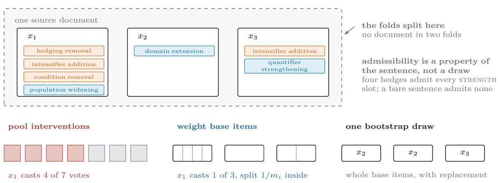  
Figure 8. The unit of analysis. (6) weights base items equally and, within an item, its interventions equally; pooling all interventions instead lets a hedge-dense sentence dominate the axis it is most relevant to, since a sentence carrying several hedges admits every strength slot and a bare one admits none. Intervals resample whole base items with replacement and never interventions, and folds split on the source document. The per-item counts drawn here are illustrative; measured per-slot yields are in Table 4.

## B The intervention families, in full

Table 8. Every intervention type, its class, and the axis it moves. Frozen in probes/edit\_taxonomy.py before any judge was run; the assertion in that file fails if a type is added without an axis, so the table and the code cannot drift.
<table><tr><td>type</td><td>class / axis</td><td>what it does</td></tr><tr><td>domain extension</td><td> $T _ { \mathrm { C } }$  / SCOPE</td><td>extend the claim to an adjacent domain</td></tr><tr><td>population widening</td><td> $T _ { \mathrm { C } }$  /SCOPE</td><td>widen who or what the claim covers</td></tr><tr><td>quantifier strengthening</td><td> $T _ { \mathrm { C } }$  / SCOPE</td><td>strengthen a quantifier (some → all, often → always)</td></tr><tr><td>tense modality shift</td><td> $T _ { \mathrm { C } }$  / SCOPE</td><td>restate a one-time observation as a standing property</td></tr><tr><td>condition removal</td><td> $T _ { \mathrm { C } }$  STRENGTH</td><td>drop the circumstances under which it was observed</td></tr><tr><td>hedging removal</td><td> $T _ { \mathrm { C } }$  STRENGTH</td><td>remove a hedge the evidence relied on</td></tr><tr><td>intensifier addition</td><td> $T _ { \mathrm { C } }$  / STRENGTH</td><td>add an intensifier the evidence does not support (sub- stantially, consistently, markedly)</td></tr><tr><td>elaboration</td><td> $T _ { \mathrm { I } }$  /control</td><td>add a clause that renames or restates something the sentence already names, using no epistemic language</td></tr><tr><td>format shift</td><td> $T _ { \mathrm { I } }$  /control</td><td>add or remove list/bold/heading formatting, same claim, same scope</td></tr><tr><td>register shift</td><td> $T _ { \mathrm { I } }$  /control</td><td>rewrite in a more formal textbook register, same claim, same scope</td></tr><tr><td>reordering</td><td> $T _ { \mathrm { I } }$  /control</td><td>reorder clauses without changing content or scope</td></tr><tr><td>verbosity padding</td><td> $T _ { \mathrm { I } }$  /control</td><td>lengthen by syntactic expansion only — nominalise, unpack a compound, spell out an abbreviation with no epistemic language</td></tr></table>

Why the control arm covers exactly these 5. Three are register manipulations. The other two exist because the judge literature has already shown verbosity [60] and formatting [59] to move verdicts: a control arm that omitted them would report a flattering S on properties nobody had implicated, which is the failure mode Proposition 2 warns about in its milder form. A sixth slot, hedge padding, was specified and then removed: adding a hedge moves commitment, so it is a strength edit and a control arm containing it is not construct-preserving. The taxonomy was internally contradictory and still looked fine as a list of names, which is why Table 8 is generated from the code rather than maintained beside it.

```jsonl
Construct edit (treatment arm, TC)
You rewrite scientific sentences to make them claim MORE than their evidence supports, changing
nothing else.
Input sentence (well-calibrated: it states exactly what the evidence licenses): {sentence}
Evidence context from the source article: {evidence}
Apply EXACTLY ONE edit of type {edit_type} ({edit_gloss}).
Hard constraints. Violating any one of them makes the output useless:
1. Do NOT add, remove, or alter any factual content: no numbers changed, no entities swapped,
no new findings introduced.
2. Do NOT introduce provenance language. Never write “this study”, “the authors”, “Figure N”,
“in our data”, or any equivalent. Neither sentence may point at a source.
3. Keep the register identical. If the input is plain declarative prose, so is the output.
4. Keep the length within {tol} percent of the input’s token count. If your edit would shorten
the sentence, compensate elsewhere WITHOUT adding content.
5. Change exactly one scope slot (the one named above) and leave the others alone.
Return JSON only: {"edited": ..., "slot_changed": "{edit_type}", "what_widened": ...,
"what_it_became": ..., "facts_preserved": true, "anchor_free": true}
```

Generation and verification prompts. The three templates below are reproduced verbatim from probes/edit\_taxonomy.py, which is the single source of truth; braces in the JSON schema are doubled there because the templates are Python format strings, and are shown singly here. {edit\_type} is filled from Table 8 and {edit\_gloss} from the gloss column, so a template is never edited to accommodate a slot. {tol} is the length tolerance, fixed at 10 percent before generation.

## Register edit (control arm, TI)

You rewrite scientific sentences to change their SURFACE FORM ONLY, leaving the claim and its scope exactly as they were.

Input sentence: {sentence}

Apply EXACTLY ONE edit of type {edit\_type} ({edit\_gloss}).

Hard constraints:

1. The claim must remain true of exactly the same population, conditions, and modality. Do not widen or narrow anything.

2. Do NOT add or remove factual content.

3. Do NOT introduce provenance language.

4. Keep the length within {tol} percent of the input’s token count.

Verifier (family B), five gates   
Two sentences are given. Judge ONLY the following, independently of style or fluency.   
A: {original} B: {edited} Evidence context: {evidence}   
Answer each question separately:   
1. facts\_identical: do A and B assert the same factual content (same numbers, same entities,   
same findings) with nothing added or removed?   
2. scope\_relation: is B’s scope broader, narrower, or same relative to A?   
3. slot\_changed: which scope slot difers, if any? One of population\_widening, condition\_   
removal, tense\_modality\_shift, quantifier\_strengthening, hedging\_removal,   
domain\_extension, or none.   
4. anchor\_free\_both: is neither sentence pointing at a source (no “this study”, no “Figure N”,   
no “the authors”)?   
5. register\_comparable: are they in the same register, so that neither reads as more formal or   
more hedged than the other beyond the slot change?   
Return JSON only: {"facts\_identical": <bool>, "scope\_relation": ...,   
"slot\_changed": ..., "anchor\_free\_both": <bool>, "register\_comparable": <bool>,   
"notes": ...}

What the verifier gates, and what it does not. A generated pair enters the sensitivity arm only if the verifier returns facts\_identical, anchor\_free\_both, register\_comparable, and a slot\_changed equal to the requested slot; the control arm additionally requires scope\_relation = same. The verifier does not decide which member of a pair is the over-scoped one. That is the direction assignment, it is made by human annotators (Appendix C), and it is separated from generation and verification on purpose: a direction supplied by any model would make R a measurement of agreement between two models rather than of a judge against a construct. Generation, verification, and judging draw on three disjoint model families, so no family scores its own output.

## C Annotation protocol and codebook

This paper’s human labels do one job: given a pair (x, T<sub>C</sub>x), the annotator decides which member a correctly calibrated reader should prefer. Delegating that to a model would make R an agreement statistic between two models, on which a judge sharing the direction-assigner’s blind spot scores as sensitive exactly where both are blind.

Unit and blinding. The unit is one pair, shown as sentences A and B in randomised order with the evidence context and nothing else. Withheld: which member is the original, which edit slot was requested, which axis it belongs to, the generating and verifying model identities, and any batch-level composition cue. Presentation order is recorded, so a systematic first-position preference is detectable rather than absorbed into the labels. Treatment and control pairs are interleaved in one stream, since an annotator able to tell the arms apart could infer the control arm’s answer from the arm itself.

The judgement. Three fields per pair. direction ∈ {A claims more than the evidence licenses, B does, neither, cannot tell from this context}. basis: a mandatory one-sentence quotation of the exact span that exceeds what the evidence supports, plus what the evidence does support. same\_facts: whether the two sentences assert the same factual content, a check on the generator rather than a judgement about scope. A pair marked cannot tell leaves the primary analysis and is reported as a separate rate; a pair where the annotators say the facts difer is discarded outright and counted as a generator failure, because a probe built on it would measure factuality.

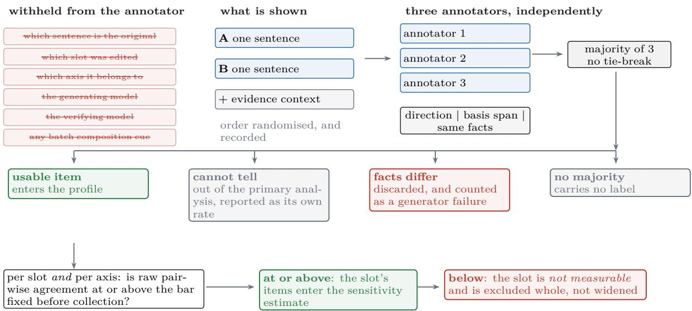  
Figure 9. One pair’s route through Protocol 1, and the five places it can stop. Four outcomes are decided per item. The fifth is decided per slot and per axis after aggregation, against a bar fixed in probes/edit\_taxonomy.py before collection, and it excludes the slot whole rather than widening an interval. Of 478 annotated pairs, 246 construct and 96 control items survive, 2 carry no label and 2 slots were excluded; per-slot yields are in Table 4. The basis field is a mandatory quotation of the span that exceeds the evidence, which is what makes a disagreement inspectable rather than a number, and presentation order is recorded so a systematic first-position preference is detectable rather than absorbed into the labels.

Class definitions and the boundary cases that matter. The four scope slots and three strength slots of Table 8 are defined for annotators through worked examples rather than through the slot names, which are ours and not theirs. Three boundaries carry most of the disagreement. Removal is expansion: turning “results suggest M may reduce noise” into “M reduces noise” widens the claim although no word was added and nothing became false, and an annotator reading only for added content will call such a pair a tie. Generality is not always over-claiming: a typicality quantifier the evidence supports, physical constants, unit conversions and definitions are not over-scoped, and without this boundary an annotator drifts toward marking every general-sounding sentence as the over-scoped one, inflating R for exactly the judges that share the heuristic. An appositive gloss is not a change of scope: rewriting “aerosols” as “aerosols, the artificially designed particles” names the same referent more precisely without altering what is claimed of it. The third boundary was added after collection, because the codebook as run did not answer the question and one annotator read it the other way consistently (§4.2); the afected slots are reported as not measurable rather than ruled on retrospectively.

Annotators, the majority rule, and the bar. 3 independent annotators label every pair, none seeing another’s labels, with domain competence in the pair’s field and a training round of shared items that is discussed and then discarded. The registered plan was two annotators with a third arbitrating disagreements; all three labelled the full batch instead, which is what makes a systematic disagreement distinguishable from a noisy one. The label is the majority of three with no automatic tie-break, so an item on which all three difer carries no label and the rate is reported (2 of 478).

The pre-registered bar is a raw pairwise agreement of ≥ 0.75, fixed in probes/edit\_ taxonomy.py before any data was collected and applied per axis and per slot. Raw agreement rather than κ, because κ is degenerate wherever one answer legitimately dominates: register\_shift has raw agreement 0.976 with Fleiss’ κ 0.324, since almost every label is same, and a κ bar would have discarded the cleanest slot in the arm. Generated tables flag every cell where one category holds ≥ 90% of the labels.

A slot or axis below the bar is reported as not measurable and excluded from R and from the axis comparison rather than reported with a wider interval: the question is whether the construct is well defined for humans at all, and a wide interval around an ill-defined construct still asserts it exists.

Recruitment and consent. Annotators are paid contributors, not volunteers or students of the authors, compensated at or above the local hourly minimum for their jurisdiction. They are told what the data will be used for, that their labels are released per item without their identity attached, and that they may withdraw. No task presents personal data or content selected to be distressing.

Two requirements on any span-quoting field. Both cost us a batch of correct labels before they were understood. Normalise typography before comparing: source sentences carry non-breaking hyphens, en dashes and curly quotes, an annotator who retypes produces the ASCII forms, and an unnormalised substring test rejects a correct label over one character. Accept more than one span: an edit can have two loci that are contiguous nowhere, and a single-span field cannot express it. A validation rule stricter than the property it checks rejects correct work silently.

## D Judge versions and decision protocols

Every judge is reached through a single aggregating API, which is what makes a multi-family study tractable and the anti-circularity requirement of Protocol 1 easy to satisfy: disjoint vendors are strings in a config rather than procurement problems.

An aggregator makes “pinned model version” harder, not easier. A model identifier at an aggregating API is not a model instance: the same identifier can be served by several upstream providers at diferent quantisations and with diferent sampling implementations, and the default is to route to whichever is available and fall back silently. A run that pins the judge version while accepting default routing has pinned a name, not an instrument, and two rows of Table 5 could difer by provider rather than by judge. We therefore pin the provider as well as the model, disable fallback, and record the resolved upstream per request; requests resolving to a diferent provider are discarded and re-issued. The count of discards is reported, because it is a fact about the measurement apparatus and hiding it would misrepresent how reproducible these numbers are.

Quantisation is the specific hazard worth naming, because it is invisible and directional: a more aggressively quantised serving of the same weights is a diferent instrument for our purposes, and there is no reason its (S, R) should match. Where an upstream does not disclose its quantisation we say so in the table rather than assuming parity.

Every judge is run at temperature 0 on the same frozen prompt, with the provider pinned through the routing layer and the resolved provider recorded per call.

What the elicitation pilot did to Remark 1. The remark asserted that a graded scale buys resolution over a binary verdict, and a pilot showed that it does not follow automatically.

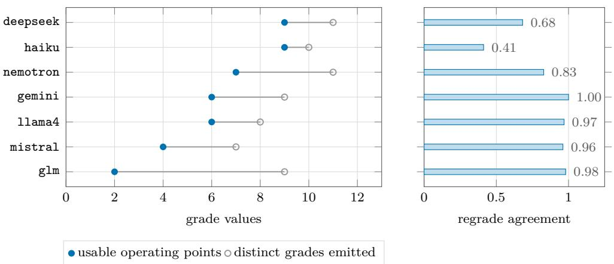  
Figure 10. Instrument quality per judge, and the two independent ways a graded judge fails. Left: the grade values a judge emits, against those surviving the one-percent usability cut, so the segment is resolution the judge appears to ofer and does not deliver. Right: whether it reproduces its own grade on the same item at temperature 0. Rows are sorted by usable points and the regrade column does not follow that order, so neither quantity predicts the other. Every judge here emits at least seven distinct grades, which is why a study reporting distinct grades would have called all of them fine.

The two failure modes are opposite: a judge can be perfectly repeatable and still emit efectively one decision, and another can ofer many usable cuts while reproducing its own grade on the same item a small fraction of the time at temperature 0. Both appear in the measured roster, where usable operating points span 2 to 9 and regrade agreement 0.412 to 1.000 (Table 5). A study reporting only distinct grades would have called every one of them fine. The consequence is that the score-to-verdict rule is fixed once for all judges and the regrade agreement is reported beside every profile rather than folded into its interval.

## E The impoverished predictor family, in full

The family is deliberately weak and deliberately frozen: weak so that every reported VP is an upper bound and therefore generous to the label set, frozen so that VP does not change meaning between papers. The harness asserts the member set, and a test fails if a predictor is added.

Table 9. The three members. Feature counts and fitting procedure are fixed in analysis/validation\_ power.py; group-aware cross-validation splits on source document so no document appears in both folds.
<table><tr><td>predictor</td><td>sees</td><td>does not see</td></tr><tr><td>length_only</td><td>response length in characters</td><td>any token identity</td></tr><tr><td>numeric_surface</td><td>counts of digits, punctuation, and cas- any word ing patterns</td><td></td></tr><tr><td>surface_ngram</td><td>character n-grams, n  $\leq 4$ </td><td>sentence structure, evidence context</td></tr></table>

Why these three. The members are ordered by how much of the surface they see, so a label set’s failure locates itself. If length\_only sufices, the set is separable by a quantity nobody would defend as the construct. If numeric\_surface is needed, the leak is in formatting or numeric density, the signature of a set whose two conditions difered in how they render evidence. If only surface\_ngram succeeds, the leak is lexical: a generative condition left an idiom behind. The three answers imply diferent repairs, which is why the per-member breakdown is reported rather than only $\mathrm { a _ { i m p } = m a x }$

Every member is a function of the response text alone, and none is shown the evidence context, so none can compute the relation between claim and evidence. That is what makes a<sub>imp</sub> interpretable: a member reaching the human ceiling has not solved the task, it has shown the task was not being asked. The invariant is structural, since the extractors take a single string and no code path delivers the evidence to them.

Fitting. Cross-validation is group-aware on the source document, because two items from one document share topic, register and often exact phrasing, so a random split lets a predictor recognise the document and recover the label through it. Each member is refit on labels permuted within group under identical folds; refitting rather than assuming $\frac { 1 } { 2 }$ also catches a broken harness, since a permutation null above chance means the pipeline leaks. No hyperparameter search is performed: a tuned impoverished predictor would make $\mathrm { a _ { i m p } }$ a function of how hard we tried. Every member ends in LogisticRegression(max\_iter=2000, class\_weight="balanced"), weighted because several audited sets are imbalanced and an unweighted classifier can reach high accuracy at κ near zero.

length\_only. One feature, the whitespace token count, standardised. It isolates the single surface property the preference literature repeatedly finds correlated with human choice [60].

numeric\_surface. Ten standardised scalars: character count; whitespace token count; count of .,;:; count of (; newline count; hedge-marker rate; universal-quantifier rate; digit rate; uppercase rate; mean token length. The two rate features use closed hand-written lists, hedges {may, might, could, appears, suggests, possibly, likely, generally, typically, often, tends to, in some cases} and universals {all, always, never, every, any, invariably, universally}, counted case-insensitively as substrings over the token count. The lists are closed so that this member cannot drift into a content classifier as vocabulary grows.

surface\_ngram. Character n-grams, word-boundary aware, $n \in [ 3 , 5 ]$ , minimum document frequency 3, at most 20,000 features, sublinear term frequency, no scaler. Character n-grams carry some content, which is why this member is reported separately: recovering a set that length\_only does not means separable by style, a weaker and diferent claim.

Folds and scoring. Five folds, GroupKFold on the group key where the set has at least five distinct groups and KFold(shuffle=True) with a fixed seed otherwise; the output records which was used, since a $\mathrm { a _ { i m p } }$ computed without grouping is not comparable to one computed with it. A predictor’s score is the κ of the pooled out-of-fold predictions, not the mean of per-fold κs: κ is not linear in the confusion matrix, and the pooled quantity is what Definition 6 is written against. $\mathrm { a _ { i m p } }$ is chance-corrected, a<sub>hum</sub> carries its own interval, and where the two overlap we report VP as not resolvable. Each member is also fit on one set and evaluated on the others, because within-set recovery can be a set-specific idiom rather than a general surface correlate [48].

## F Register of predicted values

Every value in this paper marked <sup>†</sup> predicted, not measured is listed here with the reasoning that produced it. This appendix exists so that the predictions are falsifiable as a set rather than adjustable one at a time after the fact: a prediction recorded before measurement is a commitment, and a prediction recorded afterwards is a description.

Table 10 is generated from docs/PREDICTED\_VALUES.md by analysis/make\_predicted\_ register.py, which also fails the build if the paper renders a <sup>†</sup> predicted, not measured value the register does not explain. Transcribing it by hand would defeat its purpose: the appendix is only a commitment device if it cannot drift from the file the commitments were written in.

Two properties of the register are worth stating because they constrain how the rest of the paper may argue. First, no sentence in this paper argues from a predicted value. Where a section’s design depends on one, the dependence is named in the prose. Second, predictions exist here for a mechanical reason rather than a rhetorical one: a plot needs coordinates to render, and there is no hole-marker equivalent for a data point, so the choice for a figure is between a marked prediction and no figure at all. Given that choice, the useful move is to record the prediction with its refutation condition attached and let the experiment kill it. Every such figure carries a predicted watermark drawn inside the axis rather than in the caption, because a caption disclaimer does not survive the figure being screenshotted into a slide.

This appendix is a defect that shrinks. Each line disappears when its measurement lands, and the appendix disappears with the last one.

Table 10. Register of predicted values. Every <sup>†</sup> predicted, not measured value in this paper, with the reasoning that produced it and the measurement that would refute it. A dash in the final column marks a design parameter or a value with no single refuting observation.
<table><tr><td>key</td><td>value</td><td>basis</td><td>refuted if</td></tr><tr><td></td><td colspan="3">C2 — the validity profile</td></tr><tr><td>Sinv</td><td>0.88</td><td>Judges are already known to be fairly in- S &lt; 0.75 — meaning the control variant to individual surface properties, arm is finding failures the single- and the strongest published verbosity-bias property literature misses, which estimate is small (reliability2026, un- would be a finding in its own right der 0.011 correlation across 21 judges). and would make every R compar- But our control arm is six properties at ison harder once including two with published effects, so invariance should sit below what any single-property study reports. High, not</td><td></td></tr><tr><td>Rsens</td><td>0.41</td><td>near-1. that a judge does respond to some con- per's headline is wrong struct edits — quantifier changes are lex- ically salient — but not most. If it were near 0.8 the gap would have been noticed already; if near 0.1 judges would fail obvi- ously broken cases.</td><td>Pure judgement, and the weakest-founded R &gt; 0.75 at S ≈ 0.88 — judges number here. Anchored on the intuition are construct-sensitive and the pa-</td></tr><tr><td>nJudges</td><td>6</td><td>The scale the external review set as the — (design parameter, not a pre- floor for a claim about instruments rather diction) than about one vendor.</td><td></td></tr><tr><td>nDomains</td><td>4</td><td>Same. See PEER_REVIEW_VWV.md §5 for the minimum-viable fallback of two.</td><td></td></tr><tr><td>C3 — the scope/strength asymmetry</td><td colspan="3"></td></tr><tr><td>RscopeAx</td><td>0.57</td><td>Scope edits change quantifiers, popula- tions and domains — lexically explicit, and the closest thing to them in the literature (over-generalisation in sum- maries, peters2025generalization) is detectable enough to have been measured at scale.</td><td></td></tr><tr><td>RstrengthAx 0.24</td><td></td><td>confident sentence with no lexical marker matched S, or reverses of what was removed. A judge sees an absence, and absences are the classic blind</td><td>Hedge and condition deletion leave a fluent, the gap is not significant at</td></tr><tr><td>axisGap</td><td>0.33</td><td>Difference of the two above.</td><td>&lt; 0.10, or not significant under a paired bootstrap over base items</td></tr><tr><td>ctrlFPR</td><td>0.12</td><td>1 — S. Reported alongside every sensitivity figure by rule.</td><td></td></tr><tr><td colspan="4">C3b — the accuracy-prompting paradox</td></tr><tr><td>dScopeAcc</td><td>-0.09</td><td>Accuracy pressure should make a model narrow its reach — the obvious, intended effect of the instruction.</td><td></td></tr><tr><td>dStrength Acc</td><td>+0.14</td><td>The counter-effect: sounding certain both axes move the same way. small and positive, which is what makes peters2025generalization's result look paradoxical.</td><td>means dropping hedges and stated con- Then the decomposition does not ditions. Signed to make the pooled effect explain the paradox and §paradox must say so in those words</td></tr><tr><td colspan="4">C4 — validation power of public label sets</td></tr><tr><td>vpMedian</td><td>0.11</td><td>Low but non-zero across sets, reflecting median &gt; 0.30 — the sets are that some are human-labelled (MT-Bench, sound, C4 becomes a negative re- HelpSteer2) and should retain headroom, sult, C2–C3 unaffected while pair-role-derived sets should not.</td><td></td></tr><tr><td>vpStrength0.03</td><td></td><td>The prediction that closes the paper's loop: &gt; 0.15 — the sets could have no public set has headroom on the strength found it, and the paper owes a axis, so none could have detected C3's different explanation for why no- asymmetry.</td><td>body did</td></tr><tr><td colspan="4">C5 — the inflation</td></tr><tr><td>Delta</td><td>0.19</td><td>The size that would make the result mat- it is not the point — ∆ is an ex- small enough to be plausible for one con- as stated struct. Frankly a placeholder.</td><td>ter without straining credibility: large istence proof, and any significant enough to change a paper's conclusions, positive value supports the claim</td></tr><tr><td>humanAgree0.81</td><td></td><td>Above the pre-set bar of 0.75, by design below 0.75, in which case the af- of the protocol rather than by prediction.:</td><td>fected axis is reported as not measurable rather than mea- sured with weak labels</td></tr></table>

## G What is not measured here

Table 11. What this paper specifies and does not measure, so that a deliberate omission is distinguishable from an oversight. Two omissions are argued in place instead, where the omission bears on how a nearby number should be read: the accuracy-prompting arm (§5.3) and the blinded replacement set (§5.5).
<table><tr><td>quantity</td><td>why not measured here</td></tr><tr><td>Per-row commentary on each public set&#x27;s recoverability needs construction details the sets do not</td><td>publish</td></tr><tr><td>Which audited set each checklist item would have flagged needs construction details the sets do not</td><td>publish</td></tr><tr><td>Quantisation and API-version instrument columns</td><td>most providers do not disclose them</td></tr><tr><td>Self-consistency and ensemble remedy rows</td><td>two further judges in the same harness; not yet run</td></tr><tr><td>Sensitivity under a finer verdict space</td><td>needs a second elicitation with its own vali- dation</td></tr><tr><td>The profile per language</td><td>probe items are English only</td></tr><tr><td>The profile at relaxed agreement bars</td><td>a trajectory, not a point estimate; awaits a larger pool</td></tr></table>

## H Secondary experiments and background work

None of the following supports a headline claim. Each rules out an alternative explanation, bounds a design choice, or records a path considered and rejected.

S1, S3, S6: robustness checks specified and not run. Three checks are named in Table 11 with the reason each awaits. Reliability remedies (S1): Proposition 1 predicts that self-consistency voting and a judge ensemble raise S without moving R; both coordinates are reported for every remedy row, never S alone. Edit magnitude (S2) has run and is reported in §5.2; the one thing it cannot do is stratify, because operation fixes magnitude. Verdict granularity (S3) asks how much insensitivity survives a finer verdict space. The elicitation pilot already answers half of it, and not in the direction the check assumed: a finer space does not automatically buy resolution, since one judge yields 2 usable operating points and another reproduces its own grade on the same item 0.412 of the time at temperature 0. “Repeat with a graded score” is therefore not a strictly more informative measurement. Item-survival sensitivity (S6) recomputes the profile at relaxed agreement bars; if the asymmetry grows as the bar relaxes it is partly an artefact of which items survive.

S4. A free replication of the asymmetry, from the pair-construction pipeline. Building the intervention set requires a verifier model to check that each edit preserved the facts, the anchor-free property and the register (Appendix B). That verifier is also asked, for its own record, whether the edited sentence claims more than the original: the same question put to the annotators, put to a model.

It notices 24.1% of scope edits (957 pairs) and 8.8% of strength edits (794 pairs), a factor of 2.7. Where it does register a change it assigns the same axis we do 82% of the time (301 pairs), so the gap is not an artefact of disagreeing about what the axes mean.

This is not R. The verifier is not a judge, the task is not the judge’s task, and no human assigned direction to these pairs, so there is no ground truth here: only a model’s agreement with our construction. It is reported as an independent instrument, built for another purpose, showing the predicted asymmetry at no additional cost.

The verifier’s own insensitivity is why direction is a human decision. An earlier build gated the construct arm on the verifier agreeing that an edit widened the claim, and that gate rejected 12 of 12 verified strength edits, each with a note conceding the change and denying it mattered. Such a gate keeps only the strength edits a model can already see, so every judge would then be scored on a set pre-filtered for detectability. The verifier’s opinion is recorded rather than enforced.

S5. Alternative decompositions considered and rejected. Before settling on scope/ strength we considered a single graded overreach magnitude, rejected because it cannot express the opposite-sign prediction of §5.3; a three-way split separating quantifier from temporal generalisation, rejected because almost every temporal generalisation in the domain’s writing conventions also strengthens a quantifier, so the two are not separable by a minimal edit; and a split by evidence type rather than claim operation, rejected because it makes membership depend on the source document and so cannot be verified from the pair alone. The chosen decomposition is a modelling choice, and a reader should know what it was chosen against.