# ACE: A Self-Correcting Agentic Canvas Editor for Multi-Slide Presentation Automation

JooYoung Jang<sup>1,2</sup> Taegyeong Lee<sup>2</sup> Jihyeon Park<sup>2</sup> Nojun Kwak<sup>1</sup>

<sup>1</sup>Seoul National University <sup>2</sup>Miridih

jyjang1090@snu.ac.kr, tglee@miridih.com milhaud1201@gmail.com, nojunk@snu.ac.kr

## Abstract

Commercial design platforms increasingly edit documents through large language model (LLM) agents, but two practical problems block reliable deployment: legacy document for mats expose only flat, absolutely positioned elements, so agents must recompute coordinates and routinely break layouts; and design has no unique ground truth, so diff-againstreference metrics penalize valid-but-different outputs. We present ACE, an agentic canvas editor over a hierarchical scene-graph with a presentation-specialized action space (98 tools), paired with CARE, a content-aware router that feeds the agent only the relevant slice of each deck (avg. ∼89% input-token reduction), and a self-correction loop driven by a ground-truth-free instruction-following (IF) judge whose natural-language critique is fed back as the next-turn instruction. With a fixed backbone, a scene-graph editor in a single turn already matches a same-backbone agentic HTML pipeline that iterates internally; adding self-correction lifts ACE significantly above it on instruction following (IF 4.23 vs. 3.81 on the full 94-task benchmark, paired p=.010, replicated by an out-of-loop judge) at 1.75× the speed and ∼44% lower cost. VQ means are statistically indistinguishable, but 26 blind raters prefer ACE overall (58.7% decisive win rate) and prefer the self-corrected output 81% of the time; the ranking is invariant across three judge families, and out-of-loop judges retain two-thirds of the self-correction gain, bounding circularity. 66% of cases halt after one pass, and a strict-peak rollback removes every ob served regression.

## 1 Introduction

Most presentations begin from a template, not a blank canvas. Software such as Microsoft Power-

Point and Canva is used at scale precisely because starting from a professionally designed template yields higher-quality results with far less effort— the user inherits an expert layout and edits only what matters (Nouraei et al., 2024). Editing that template, however, is itself laborious: reflowing elements, matching a theme, turning a bullet list into a diagram, or rebuilding a chart all demand repetitive, detail-sensitive manual work (Jung et al., 2026).

A growing body of work automates this with LLM agents. PPTArena (Ofengenden et al., 2026) and PPTAgent (Zheng et al., 2025) edit existing PowerPoint decks; AutoPresent (Ge et al., 2025) and SlideCoder (Tang et al., 2025) synthesize slides as executable programs; and AeSlides (Pan et al., 2026) optimizes layout aesthetics with verifiable rewards. These works are valuable, but two problems block their use for template editing. (P1) Design has no unique ground truth. PPTArena (Ofengenden et al., 2026) scores predictions against a single reference under a fixed style\_target—a per-sample rubric distilled from that one reference deck—penalizing different-but-valid edits, while SlideCoder (Tang et al., 2025) and AutoPresent (Ge et al., 2025) turn a reference image into an editable slide rather than editing an existing deck. Judging whether the user’s intent was met—and iterating until it is—matches how designers actually work (Duan et al., 2024; Li et al., 2024). (P2) Codegeneration editing does not scale, and previous editable action spaces are too small. Emitting python-pptx leans entirely on the model’s raw capability and absolute-coordinate arithmetic, which breaks down on complex, multi-slide decks; and structured alternatives expose too few operations— PPTAgent (Zheng et al., 2025) offers only five editable APIs—to cover the range of real-world edits, so quality degrades as decks grow.

We address both with ACE, a self-correcting agentic canvas editor, and make three contributions:

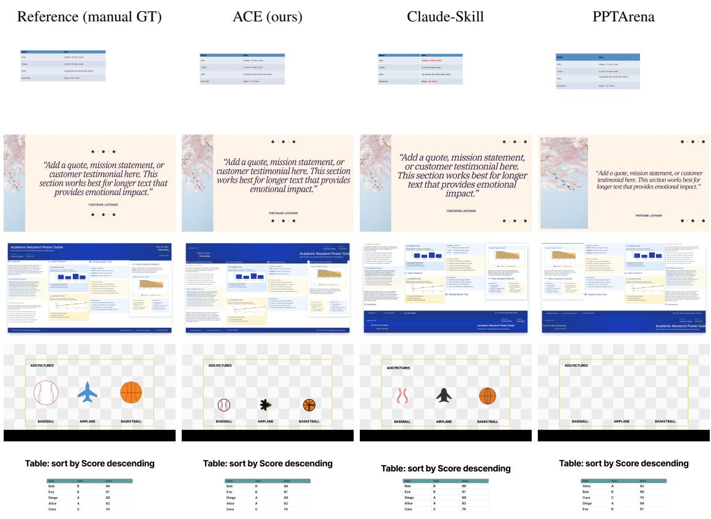  
Figure 1: Qualitative comparisons (each row: reference, ACE, Claude-Skill HTML, PPTArena). (a) Case 71, highlight only negative table cells; (b) Case 32, arrange image and text; (c) Case 42, organize a research poster; (d) Case 56, add pictures; (e) Case 61, sort rows by score and crop images to 16:9. Backbones: claude-sonnet-4-6 for ACE/HTML; gpt-5.5 judge. Because design has no unique ground truth, ACE’s edits often differ from the manual reference yet remain valid—what our reference-free IF judge rewards.

1. A reference-free, edit-grounded multimodal instruction-following evaluator (for P1) that scores the agent’s initial→prediction edit delta against the instruction—rather than against a single ground-truth answer—and selectively attaches rendered images to verify visualsemantic intent. Its score and critique drive a self-correction loop. Unlike ReAct- and Reflexion-style loops (Yao et al., 2023; Shinn et al., 2023), which presuppose an environmentsupplied verify signal (an execution error, a task reward), open-ended design editing offers no natural success signal; we show a rendered-diff IF critique is a usable GT-free reward there, and validate it with a 26-rater blind human study (76–80% agreement on decided cases) and two out-of-loop judge families that preserve every headline ranking (§5.3).

2. A domain-specific action space (for P2) over a scene-graph that is hierarchical like the HTML DOM yet editable like OOXML, paired with a content-aware context router (CARE); together they improve cost and speed over codegeneration editing, and leave-one-out ablations at a fixed backbone and judge show the representation, the router, the specialized tools, and self-correction each contribute independently (§5.6).

3. A benchmark of 97 multi-slide tasks (94 evaluable) for the Figma-Slides setting (12 novel, 9 with no PowerPoint analogue), released with execution logs and analysis scripts, on which ACE leads an off-the-shelf coding agent paired with a Claude Skill and an OpenXML baseline on instruction following (IF), significantly under two independent judges (§5.4); visual quality (VQ) means are indistinguishable from the strongest baseline but resolved in ACE’s favor by blind human preference (§5.3).

## 2 Related Work

## 2.1 Presentation Editing

Because slide decks are multi-slide artifacts, editing must preserve both narrative and visual consistency across pages. PPTArena (Ofengenden et al., 2026) edits PowerPoint via code generation and XML patching, while PPTAgent (Zheng et al., 2025) edits through a small set of five editable operations; both are cost-efficient but perform poorly on complex edits. More recently, Claude Skills<sup>1</sup>, defined by a SKILL.md specification, treat slides as LLM-friendly HTML and edit them with generic read/edit/bash operations: reading the entire deck yields consistent output, but at high cost and latency. The former family is thus cheap but weak, while the latter is consistent but expensive. We instead propose CARE, a content-aware router that extracts only the deck context each instruction needs (§3.2), so that ACE outperforms a commercial coding agent (Claude Code) paired with an Agent Skill on instruction following—with blind human raters preferring ACE overall (§5.3)—while running faster and at lower cost.

## 2.2 Self-Correction with Verifier Feedback

A growing body of work improves generation by closing a propose–verify–refine loop. VASCAR (Zhang et al., 2024) performs content-aware layout generation with a frozen LVLM, turning geometric metrics (overlap, occlusion) into a textual instruction re-applied for several rounds. In the slide domain the verify signal is typically an execution error or a render: SlideCoder (Tang et al., 2025) reprompts with the captured error and an API grammar, PPTAgent (Zheng et al., 2025) repairs REPL error logs, and AutoPresent (Ge et al., 2025) feeds a rendered snapshot back to fix spacing and placement. Re-rendering the full deck at every iteration, however, is costly and can miss fine edits that are hard to discern visually. PPTArena (Ofengenden et al., 2026) adopts a ReAct-style (Yao et al., 2023) loop that re-feeds rendered screenshots of the changed slides, and leaves an explicit in-loop judge to future work. We adopt the same closed-loop skeleton but contribute a verify signal tailored to instruction-grounded editing: a reference-free, multimodal IF verifier over the agent’s structural edit diff that scores the original→prediction delta and attaches images only when needed (§3.3). Where

ReAct (Yao et al., 2023) and Reflexion (Shinn et al., 2023) presuppose that a verify signal already exists—an execution error, a task reward, environment feedback—open-ended design editing offers none; the GT-free reward is what turns this unverifiable task into a verifiable loop.

## 2.3 Tool-Augmented LLMs

Toolformer (Schick et al., 2023) showed that LLMs can extend their abilities through external tools, prompting a wave of tool-use research. Canvas (Jeong et al., 2026) provides a 52-tool action space for vision-language agents on Figma Design, and PPTAgent (Zheng et al., 2025) defines five tools for basic delete/copy/replace edits. Unlike these, we target a scene-graph that is hierarchical like the HTML DOM yet editable like XML, and provide 98 tools specialized to it (§3.1), yielding performance advantages.

## 3 Self-Correcting Agentic Canvas Editor

Figure 2 gives the overall closed-loop architecture;   
we describe each component below.

## 3.1 Scene-Graph Domain-Specific Action Space

The legacy format and its limit. PowerPoint’s Office Open XML (OOXML) stores a slide as a flat sequence of shapes under <p:spTree>, each pinned by an absolute offset in English Metric Units—e.g. <a:off $\times { = } ^ { \prime \prime } 3 3 9 0 9 0 0 ^ { \prime \prime } / { > }$ places a shape 3,390,900 EMU (≈3.7 in) from the slide origin (Figure 3c). Because there is no hierarchy or grouping, editing one element forces the agent to recompute the coordinates of every other shape to avoid overlaps—a “coordinate-pushing” regime that produces spatial hallucinations whenever content is inserted or removed.

Our solution: a scene-graph. ACE follows the scene-graph used by Figma Slides (Figma, 2024a) and reads a slide as a parent–child tree. Each child is placed by a transform relative to its parent, so moving or resizing the parent updates all of its descendants automatically through the applied constraints. A parent may optionally enable autolayout (Figma, 2024b), which fixes child placement by logic rather than numbers: a child can fill its parent, a parent can hug its children, or a dimension can be fixed independently of either. For example, given the instruction “increase the autolayout children in slide 4fromfive to seven andfill in the contents” (Case 112): in a flat format this requires repositioning all five existing cards; under auto-layout the agent inserts the two new children and the parent re-flows the row (Figure 3a,b), never computing per-child coordinates.

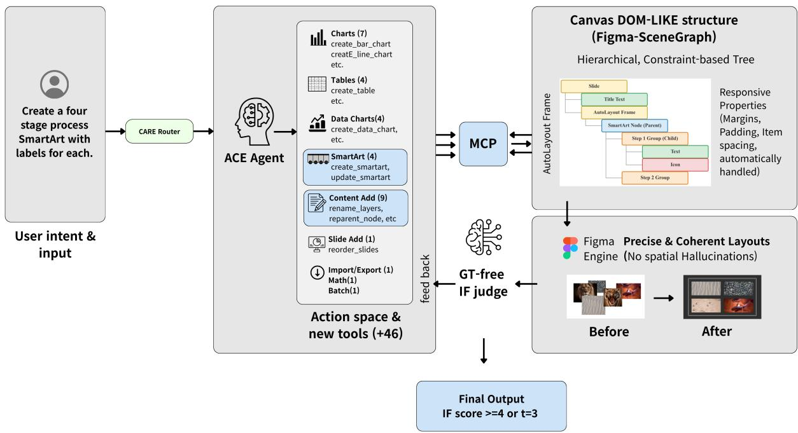  
Figure 2: Overall architecture of ACE: the scene-graph editor and its 98-tool action space, CARE’s three-way context routing, and the self-correction loop driven by the ground-truth-free IF judge.

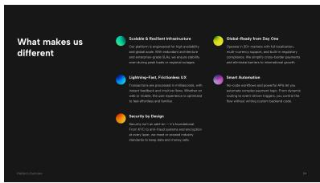  
(a) Before.

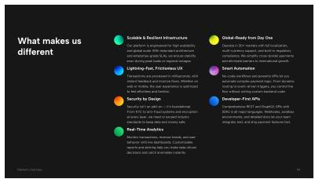  
(b) After (auto-layout 5 → 7).

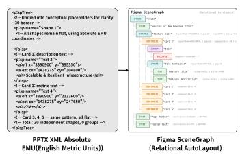  
(c) OOXML vs. Figma SceneGraph.  
Figure 3: A slide, an example edit, and its data representations. (a,b) Case 112 increases the auto-layout children from five to seven and the frame re-flows automatically using auto-layout. (c) OOXML flattens the slide into absolutely positioned siblings (EMU coordinates, no grouping), while the SceneGraph encodes it as a parent–child tree with responsive auto-layout constraints.

Action space. On this representation we extend the 52-tool Canvas UI action space (Jeong et al., 2026) to a 98-tool suite specialized for multi-slide editing, organized into 11 modules (Appendix A). The key choice is to expose semantic operations (e.g. create\_smartart, create\_data\_chart) rather than primitive shape calls, so the agent maps intent directly to structured entities: a table-to-chart conversion that takes 66 primitive operations collapses to 22 with the specialized create\_graphics tool (a 3.0× reduction in the execution trace; Appendix O), reducing the “reasoning tax” and the chance of alignment errors.

## 3.2 CARE: Content-Aware Context Routing

A full serialization of a long deck can exceed 1M tokens, overflowing the context window. Rather than feed the agent the whole deck, CARE routes each instruction to the minimal context it needs (Figure 4). A single mode-and-target classifier selects one of three scopes and the target slide indices: Micro-Spatial (high-fidelity JSON for the target slide only), Macro-Programmatic (a skeleton JSON of node IDs and text for cross-slide batch edits), and Systemic-Token (only design-system variables and style IDs). Relative to passing the full deck, this cuts input tokens by 86.6–95.7% on average across modes (Table 1; up to 99.9%), keeping the agent’s context lean regardless of deck size.

<table><tr><td>Mode</td><td>N</td><td>Avg. Red.</td><td>Min</td><td>Max</td></tr><tr><td>Systemic-Token</td><td>7</td><td>95.7%</td><td>90.7%</td><td>99.4%</td></tr><tr><td>Macro-Programmatic</td><td>37</td><td>90.9%</td><td>73.3%</td><td>98.8%</td></tr><tr><td>Micro-Spatial</td><td>50</td><td>86.6%</td><td>70.1%</td><td>99.9%</td></tr></table>

Table 1: Input-token reduction by CARE mode, relative to passing the full deck (94 evaluable tasks).

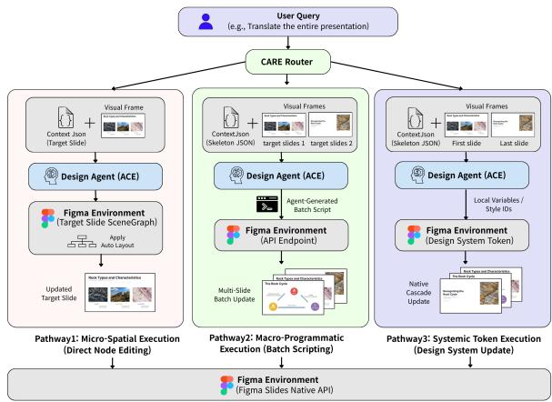  
Figure 4: The ACE workflow with CARE. CARE routes each instruction into one of three context scopes—Micro-Spatial (direct node editing), Macro-Programmatic (skeleton JSON for cross-slide batch scripting), and Systemic-Token (style metadata for design-system updates)—minimizing the agent’s context window load while preserving precision.

CARE is a cost and scalability mechanism that does not trade off quality (full-context ablation and routing audit: §5.6, Appendix K). Routing pseudocode and the full control flow are in Appendix B.

## 3.3 Self-Correction with a Ground-Truth-Free IF Judge

Template editors rarely edit blindly: they form a design intent, modify the original, and inspect whether the result matches that intent, repeating until satisfied (Figure 5). Inspired by this, ACE evaluates whether its editfrom the original followed the instruction’s intent—using an instruction-following (IF) score and a natural-language reason (§4.1)— and re-iterates when the score is below threshold (Figure 6). Each iteration is a single LLM round (max\_turns=1) that emits one batch of tool calls and commits once, preventing duplicated destructive operations within a turn. Canvas state accumulates across iterations (later rounds skip re-import), so corrections compound on the prior result. The IF critique is forwarded verbatim; we found it already actionable, and distilling it into bullets did not help. The loop halts when IF reaches τ=4 or after $T { = } 3$ iterations, and we use the final iteration’s result (Algorithm 1). At deployment, a strict-peak rollback additionally returns an earlier iteration whenever the critic’s own logged score declines, removing the loop’s observed regressions with no ground truth required (§5.5).

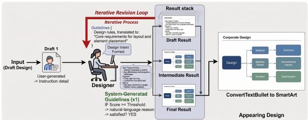  
(a) The iterative revision workflow of designers creating SmartArt presentation slides  
Figure 5: The human designer’s iterative workflow that ACE imitates: form a design intent, edit the original, inspect the result against that intent, and repeat until satisfied.

Algorithm 1 Self-correction with a GT-free IF   
judge   
Require: origin deck $D _ { 0 } .$ , instruction x, agent A, judge J,   
threshold $\tau { = } 4 .$ max iters T=3   
1: s ← IMPORT ${ { \cal D } _ { 0 } } )$   
2: for $t = 1 \dots \dot { T }$ do   
3: s ← A(s, x; max\_turns=1) ▷ one round, batched   
ops, one commit   
4: $( i f _ { t } , c _ { t } )$ ←   
$\mathcal { I } ( \dot { D _ { 0 } } ,$ (opt.) RENDER(s), JSONDIFF, x ▷ score +   
critique, no GT   
5: i $: i f _ { t } \geq \tau$ then   
6: break ▷ satisfied   
7: end if   
8: x ← WRAPCRITIQUE(c<sub>t</sub>); skipImport←true   
9: end for   
10: return s ▷ final iteration

In Algorithm 1, s is the working scene-graph state, τ the acceptance threshold and T the maximum number of iterations, and $( i f _ { t } , c _ { t } )$ are the IF score $( i f _ { t } \in \{ 0 , \ldots , 5 \} )$ and the natural-language critique returned by the judge J at iteration t. The judge never sees a ground-truth deck; it scores a symbolic edit trace JSONDIFF, computed by aligning the origin deck $D _ { 0 }$ and the current state s via a stable per-node source id and labelling each surviving / created / deleted node as a Modified / Added / Removed entry (with explicit slide-reorder and zorder entries for id-paired elements that change position). The full computation—property set, normalization, tolerances, and rendering for the judge—is given in Appendix E, and the complete ACE design-agent and IF-judge prompts are in Appendix Q.

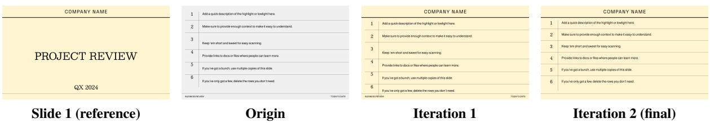  
Figure 6: Self-correction on Case 54 (gpt-5.5 backbone). Slide 1 (reference): the target design—cream background, centred company header, and horizontal rules—to propagate to slides 2–9. Origin: the rest of the deck before editing. Iteration 1 IF score = 3 (IF critique): the agent applied some key slide 1 layout elements to slides 2–9, including the cream background, centred company header, and horizontal rules, and shifted some content down, but it did not fully apply slide 1’s layout structure, left old footer text/elements, and some adjusted content does not fit cleanly within the new layout. Iteration 2 IF score = 4 (final): this critique becomes the next-turn instruction; the agent removes the residual footer elements and refits the displaced content, yielding a layout consistent with slide 1 across the deck—an instance of the loop in Algorithm 1.

## 4 Evaluation Suite and Protocol

We introduce FIGMA-SLIDE-BENCH-V1, 97 human-authored multi-slide editing tasks—each an original template, a target template, and an instruction—adapted from PPTArena to the scenegraph setting; 94 are automatically evaluable. The other three (Cases 102–104) lack an origin deck (input is a template id, free text, or a reference image) and require production-editor retrieval outside our deck-given scope, so we exclude them from automatic evaluation and release them as future work. For provenance, the suite extends rather than replaces PPTArena: from its 100 instructions we drop 15 (duplicates, slide-unsupported, or overly broad; Appendix G) and re-curate the remaining 85 (41 verbatim, 12 minor variants, 32 rewritten), then add 12 novel tasks (Cases 101–112)—9 editing tasks with no PowerPoint analogue and the 3 generation/retrieval tasks above.

## 4.1 Evaluation Metrics

Following PPTArena (Ofengenden et al., 2026) we score each edit with two LLM judges. Instruction Following (IF). The IF judge receives only the structured data diffs (JSON/XML summaries) between slides, which forces it to concentrate on content-level correctness rather than surface aesthetics. Crucially, unlike PPTArena— which diffs ground-truth vs. prediction under a fixed target—our IF judge compares original vs. prediction against the instruction: because design admits many valid outputs, we ask whether the user’s intent was met, not whether one reference was reproduced. Visual Quality (VQ). The VQ judge receives only rendered screenshots of the predicted (and reference) slides, with its context engineered for aesthetics—alignment, layout, and style against a rubric. For multi-slide edits we pass only the slides with salient changes, so the judge concentrates on the edit rather than the full deck. We also remove PPTArena’s style\_target term, which penalizes outputs that deviate from one prescribed style even when they are visually valid (Figure 7). The full judge prompts are in Appendix Q. Judge validity is assessed against a blind human panel and out-of-loop judges in §5.3.

Why our absolute scores differ from PPTArena’s. PPTArena reports IF/VQ of 2.36/2.69 on its own data. Our numbers are not directly comparable: we use a different judge (gpt-5.5), a GT-free IF protocol, no style\_target term, and a re-rendered Figma-Slides environment. We therefore run all pipelines under one identical protocol and report relative gaps.

Evaluation subsets. For a controlled head-tohead against the OpenXML baseline (which requires PowerPoint), we use a 53-task subset matched to PPTArena’s category distribution and converted to PPTX. By construction it contains only adapted tasks and no novel-only tasks, because the legacy pipeline cannot represent them; we therefore report novel-task performance on ACE separately (§5.8).

## 5 Experiments

## 5.1 Setup

We evaluate three backbones— claude-sonnet-4-6, gpt-5.5, and gemini-3.5-flash—and use gpt-5.5 as the in-loop VLM judge; §5.3 additionally re-scores identical outputs with two out-of-loop judges (claude-sonnet-4-6, gemini-3.5-flash) that play no role in generation or the loop. Most models are configured with max\_tokens=16,384; Gemini 3.5 Flash Preview uses max\_tokens=32,768 to accommodate its extensive chain-of-thought reasoning. The agent is permitted up to 3 iterations and 35 agent turns per task, at temperature 0.0. We compare three pipelines: ACE (scene-graph edits, design-engine render); Claude-Skill HTML, the Claude Code agent equipped with a slide-editing Agent Skill that edits a per-deck index.html rendered in Chromium using the identical backbone (the HTML pipeline for short; construction in Appendix P); and PPTArena (Ofengenden et al., 2026), the OpenXML/python-pptx baseline rendered with LibreOffice.

## 5.2 Main Result

Table 2 reports the 53-case head-to-head; agenttrajectory statistics are in Appendix F, and paired statistics with CIs in §5.4. ACE leads on instruction following and on efficiency, and its cost includes the self-correction loop: even so it is 1.75× faster and ∼44% cheaper than the agentic HTML pipeline (whose own iterative loop, large HTML context, and browser renders dominate its cost; see Appendix D for the exact computation). With a gpt-5.5 backbone ACE is the strongest configuration overall and ∼7× cheaper than the HTML agent. ACE’s VQ mean advantage over HTML is within statistical noise (§5.4), though blind raters prefer ACE on VQ (57.1%; §5.3); the IF gap over PPTArena is judge-invariant (+2.1–2.4, p<0.001; Appendix J). When a baseline produced no valid output (HTML 3/53; PPTArena 20/53 unedited) we did not assign a score of 0; instead the original render serves as the prediction, so its VQ reflects the original-vs-reference similarity while its IF reflects the unmet instruction (PPTArena’s attempt rate and conditional quality are decomposed in Appendix M).

## 5.3 Judge Validity: Blind Human Study and Out-of-Loop Judges

The IF judge both guides self-correction and is a reported metric, so we test it two ways on the identical, unchanged outputs.

Blind human study. 26 non-expert raters (after two pre-stated exclusions) cast 935 blind win/tie/loss judgments on side-randomized pairs— 51 ACE-vs-HTML and 17 self-correction cases (protocol, exclusion rules, CIs, and inter-rater agreement in Appendix I). The in-loop gpt-5.5 judge matches the blind human majority on decided cases (ties excluded on both sides): IF 80% (n=41), VQ 76% (n=37), Overall 78% (n=50), all p≤.003 vs. chance: it tracks human perception, not a self-preference. Humans independently reproduce both headline effects (Table 3): win exceeds loss in every cell, decisively for self-correction (≈4:1; decisive win-rate 81%, p<0.001, including on VQ, which never gates the loop) and significantly for ACE-vs-HTML at the same backbone (IF 59.6% / VQ 57.1% / Overall 58.7% decisive win-rates, all p≤.0025).

<table><tr><td></td><td>IF</td><td>VQ</td><td>Time(s)</td><td>Cost($)</td></tr><tr><td> $\mathbf { A C E _ { g p t } } \left( + \mathbf { S C } \right)$ </td><td>4.74</td><td>4.19</td><td>112.3</td><td>0.134</td></tr><tr><td>ACE (claude, +SC)</td><td>4.45</td><td>4.02</td><td>115.9</td><td>0.545</td></tr><tr><td>Claude-Skill HTML (agentic)</td><td>4.09</td><td>3.89</td><td>203.0</td><td>0.968</td></tr><tr><td>PPTArena (OOXML)</td><td>2.38</td><td>2.30</td><td>80.4</td><td>~0.04†</td></tr></table>

Table 2: Four-way comparison on the 53-case subset. Backbone: claude-sonnet-4-6 for ACE and Claude-Skill HTML; gpt-5.5 for $\mathrm { \Delta A C E _ { g p t } }$ and PPTArena. Judge: gpt-5.5. <sup>†</sup>Lower-bound estimate (per-iteration cost not logged). Scores and cost are averaged over all 53 tasks per pipeline, with the do-nothing fallback for no-output cases (§5.2; Appendix D). Coverage (produced an edit): ACE 53/53, $\mathrm { A C E _ { g p t } }$ 53/53, HTML 50/53, PPTArena 33/53 (attempt rate and conditional quality decomposed in Appendix M). All four pipelines are agentic/multi-turn; only ACE’s loop is guided by the IF judge (circularity bounded in §5.3).
<table><tr><td>Human preference (W/T/L %)</td><td>IF</td><td>VQ</td><td>Overall</td></tr><tr><td>ACE vs. Claude-Skill HTML</td><td>31/48/21</td><td>37/35/28</td><td>41/31/29</td></tr><tr><td>Self-corrected vs. single-pass</td><td>47/42/11</td><td>44/47/9</td><td>48/41/11</td></tr></table>

Table 3: Blind pairwise human preference (26 raters, 935 judgments); win exceeds loss in every cell. Winrates, CIs, protocol: Appendix I.

Out-of-loop judges. Re-scoring the identical outputs with claude-sonnet-4-6 and gemini-3.5-flash—neither touches generation or the loop—leaves the ranking ACE > Claude-Skill HTML > PPTArena invariant across judges and backbones (Table 4). The self-correction gain likewise survives: ∆IF +0.94 (in-loop) → +0.61 (claude) → +0.56 (gemini), with VQ rising too $( + 0 . 7 8 / + 0 . 5 6 / + 1 . 3 3 )$ ; a 35-task identical-output control bounds cross-run judge noise at ≤ +0.17 IF, far below the gain (Appendix J). Out-of-loop judges thus recover roughly two-thirds of the inloop gain, bounding any critic-specific component at about one-third of the measured effect.

<table><tr><td></td><td colspan="3">IF/VQ by judge</td></tr><tr><td>System (backbone)</td><td>gpt-5.5 (in-loop)</td><td>claude-4.6</td><td>gemini-3.5</td></tr><tr><td>ACE (gpt-5.5)</td><td>4.74/4.19</td><td>4.55/3.70</td><td>4.79/4.21</td></tr><tr><td>ACE (claude-4.6)</td><td>4.45/4.02</td><td>4.23/3.49</td><td>4.77/4.25</td></tr><tr><td>Claude-Skill HTML (claude-4.6)</td><td>4.09/3.89</td><td>4.09/3.34</td><td>4.45/4.02</td></tr><tr><td>PPTArena (gpt-5.5)</td><td>2.38/2.30</td><td>2.42/2.25</td><td>2.40/2.28</td></tr></table>

Table 4: Identical outputs re-scored by two out-of-loop judge families (n=53): the ranking ACE > Claude-Skill HTML > PPTArena is judge-invariant.
<table><tr><td>Judge</td><td>M</td><td>Set</td><td>ACE</td><td>HTML</td><td>∆</td><td>95% CI</td><td>p</td></tr><tr><td>gpt-5.5</td><td>IF</td><td>53</td><td>4.45</td><td>4.09</td><td>+0.36</td><td>[−0.06, +0.81]</td><td>.20</td></tr><tr><td>gpt-5.5</td><td>IF</td><td>94</td><td>4.23</td><td>3.81</td><td>+0.43</td><td>[+0.13, +0.75]</td><td>.010</td></tr><tr><td>gemini-3.5</td><td>IF</td><td>53</td><td>4.77</td><td>4.45</td><td>+0.32</td><td>[−0.08, +0.77]</td><td>.15</td></tr><tr><td>gemini-3.5</td><td>IF</td><td>94</td><td>4.62</td><td>4.21</td><td>+0.40</td><td>[+0.07, +0.76]</td><td>.022</td></tr><tr><td>gpt-5.5</td><td>VQ</td><td>94</td><td>3.66</td><td>3.57</td><td>+0.09</td><td>[-0.23, +0.40]</td><td>.56</td></tr><tr><td>gemini-3.5</td><td>VQ</td><td>94</td><td>3.93</td><td>3.78</td><td>+0.15</td><td>[−0.27, +0.56]</td><td>.57</td></tr></table>

Table 5: ACE vs. Claude-Skill HTML, same claude-sonnet-4-6 backbone: paired bootstrap 95% CIs, two-sided Wilcoxon p. IF is significant at n=94 under both judges; the 53-subset is underpowered; VQ means are indistinguishable throughout.

## 5.4 Paired Statistics on the Full Benchmark

The 53-case set is a subset; the complete edit benchmark is 94 tasks (97 minus three generation-fromscratch cases). Claude-Skill HTML predictions for the remaining 41 were generated and judged under the same harness, judge, and protocol, so 94 completes coverage rather than searching for significance. In Table 5, the IF advantage is significant on the full benchmark under both judges (gpt-5.5 at n=94: also paired-t p=.009, sign test p=.04, W/T/L 35/38/21) and non-significant on the 53-subset under either—an underpowering artifact (same sign and magnitude), not an absent effect. VQ mean scores are statistically indistinguishable in every cell (all CIs include 0); we state VQ exactly that way, noting that the blind panel (§5.3) resolves a consistent human VQ preference (57.1%) that a coarse 5-point mean cannot.

## 5.5 Effect of Self-Correction

Self-correction is the main driver of ACE’s quality. Without it (Table 6), ACE on claude-sonnet-4-6 scores 4.04/3.75 in a single turn—already nearly matching the agentic HTML pipeline’s 4.09/3.89. The loop then adds +0.41 IF and +0.27 VQ wholebenchmark, lifting ACE to 4.45/4.02. The average understates the mechanism, because correction is selective: 35/53 tasks (66%) reach the threshold at iteration 1 (mean IF 4.60) and never enter the loop; conditioned on the 18 that do enter, 13 (72%) improve—by +0.94 IF / +0.78 VQ on average—2 are unchanged, and 3 regress by ≤1 point each. A strict-peak rollback—return the earlier iteration whenever the critic’s own logged score declined—uses only the in-loop critic (no ground truth) and removes every regression: IF 4.45→4.49, VQ 4.02→4.06, with no task harmed (Appendix L). Because VQ is not part of the stopping signal, its rise—preserved under out-of-loop judges (+0.56/+1.33; Appendix J) and confirmed by an 82% blind human preference (§5.3)—is independent evidence that corrections improve genuine design quality, not only the optimized IF metric. The gain is also insensitive to the loop’s two knobs: replayed curves over the iteration budget K and halt threshold τ are monotone with plateaus (∼65% of the benefit by K=2; Appendix L).

## 5.6 Ablations and Component Isolation

Table 6 isolates the representation with selfcorrection disabled. Replacing the scene-graph with OpenXML is uniformly and substantially worse across all three backbones, confirming that the representation, not merely the toolset, carries the gains.

Beyond the representation, a leave-one-out isolation (Table 19, Appendix K) removes each remaining component with the other four and the evaluation held fixed, scored where the component is active. Removing content-aware routing costs up to −0.75 IF; removing the specialized action space costs −0.55 to −1.00 IF on the tasks that invoke those tools, with operation counts inflating ≈1.8× as charts and tables are rebuilt from primitives; and removing self-correction costs −0.41 IF—each component contributes independently. CARE, in particular, is not only a cost lever: on the 16 multi-slide tasks where routing reduces context, substituting the full deck lowers IF on two of three backbones (−0.75 claude / −0.38 gpt; gemini flat), since a focused context keeps the model on the target edit. A direct routing audit finds 52/53 correct mode decisions (1 under-scope, 0 overscope), perfect slide-selection recall (20/20), and 13/13 on explicitly named slides; the single underscope (Case 75) is recovered by self-correction (IF 3.0→4.0). Audit method, per-case labels, overflow and deck-size controls, and the isolation construction are in Appendix K.

Crucially, the scene-graph also wins on cost, not only quality: under identical CARE routing, the scene-graph representation uses 15–31% fewer input tokens per call than the OpenXML one (12–67% per case, as the saving compounds with fewer agent turns), directly lowering API cost; Appendix C reports the per-model breakdown.

<table><tr><td>Backbone</td><td>ACE (SG) IF/VQ</td><td>OpenXML (XML) IF/VQ</td></tr><tr><td>claude-sonnet-4-6</td><td>4.04/3.75</td><td>3.40/3.13</td></tr><tr><td>gpt-5.5</td><td>4.60/4.17</td><td>3.91/3.72</td></tr><tr><td>gemini-3.5-flash</td><td>4.06/3.91</td><td>3.28/3.28</td></tr></table>

Table 6: Ablation over representation (53 cases; mean IF / VQ), self-correction disabled. SG = scene-graph. Replacing the scene-graph with OpenXML is uniformly worse. The ACE (SG) column is the single-pass result; self-correction raises claude-sonnet-4-6 to 4.45/4.02 (Table 2).

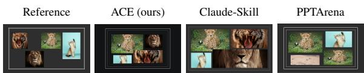  
Figure 7: Qualitative example (Case 17, build ensemble category boards). ACE’s edit differs from the manual reference yet remains valid—what our referencefree judge rewards—while PPTArena fails to build the grid. Backbones: claude-sonnet-4-6 (ACE/HTML); gpt-5.5 judge. Further comparisons: Appendix N.

## 5.7 Qualitative Results

Because design has no unique ground truth, ACE often produces edits that differ from the reference yet still satisfy the instruction—what our referencefree judge rewards. On Case 17 (Figure 7), ACE and HTML both produce valid boards unlike the reference while PPTArena fails; the more discriminative Case 71—ACE colours exactly the negative cells, HTML over-applies to whole rows, and PPTArena leaves the table unchanged—and four further tasks appear in Figure 1 on page 2 (further discussion in Appendix N).

## 5.8 Aggregate Results

On the 9 novel editing tasks ACE (with selfcorrection) attains IF 3.78 / VQ 3.22—below its 4.45/4.02 on the adapted subset, so the novel tasks are unsaturated—and IF 4.23 / VQ 3.66 on the full 94-task benchmark (paired CIs vs. HTML in §5.4); per-task novel and per-category breakdowns are in Appendix H.

## Limitations

Comparison fairness. All pipelines are agentic and multi-turn—the HTML pipeline and the OpenXML baseline both iterate internally—so iteration count is not the confound, and the leaveone-out ablations (§5.6) now attribute the gains component-by-component at a fixed backbone and judge. The remaining asymmetry is the signal guiding each loop: only ACE’s loop is guided by the same judge family used for one metric, which is the circularity we bound below. Judge circularity—quantified, not eliminated. The IF judge both drives self-correction and is the IF met ric. The blind human study and the out-of-loop judge re-scoring (§5.3) independently support the reported gains and bound any critic-specific com ponent at roughly one-third of the measured effect. The in-loop critic nonetheless shares a model family with one reported metric, and we retain VQ (never a stopping signal) and the released qualitative comparisons (Appendix N) as further independent checks. VQ. Against the HTML pipeline, VQ mean differences are statistically indistinguishable (§5.4); we report them exactly as such, while the blind panel shows a modest but consistent human VQ preference for ACE. Interactivity remains the one weak category (Table 13). Benchmark provenance. The suite is largely adapted from PPTArena (85/97 tasks, 41 verbatim); 12 are novel, of which 9 are novel editing tasks with no PowerPoint analogue. The head-to-head subset contains no novel-only tasks, so novel-task results are ACE-only. Coverage. Three tasks (102– 104) are not automatically evaluable: they have no origin deck and require production-side template retrieval (by id, keyword, or style), which is outside our deck-given scope and left to future work. Platform transfer is engineering future work. Nothing in the method is Figma-exclusive: a hierarchical shape/element tree is exactly how PowerPoint’s OOXML shape tree and the Google Slides pageElements API model a slide, and our OOXML ablation (Table 6) is precisely the flat, PowerPoint-like condition—ACE already runs on it, at a quantified 0.6–0.8 IF cost that measures what auto-layout is worth. CARE and the critic are substrate-agnostic: they need only a serializ able deck representation and a renderer, both of which PowerPoint (python-pptx/LibreOffice) and Google Slides (API export) provide—this paper already renders OOXML via LibreOffice and HTML via Chromium. Re-binding the 98 tools to each platform’s API and mapping auto-layout onto placeholder layouts is engineering we scope explicitly as future work. Subjective prompts without explicit design-system constraints yield high output variance.

## Ethics Statement

All human faces in the benchmark assets were replaced with generic avatars or royalty-free stock photos, and design assets are used under CC-BY-4.0. The blind human study (§5.3) used adult volunteer raters who evaluated anonymized slide renders; no personal data was collected. The system is intended to assist, not replace, human designers.

## Acknowledgments

The researchers at Seoul National University (SNU) were supported by grants from the Institute of Information & Communications Technology Planning & Evaluation (IITP), funded by the Korean government, under Grant Nos. RS-2021-II211343 and RS-2025-25442338.

## References

Peitong Duan, Jeremy Warner, Yang Li, and Bjoern Hartmann. 2024. Generating automatic feedback on UI mockups with large language models. In Proceedings ofthe 2024 CHI Conference on Human Factors in Computing Systems (CHI ’24).

Figma. 2024a. Explore figma slides: The first presentation tool built for designers. Figma Help Center.

Figma. 2024b. Guide to auto layout. Figma Help Center.

Jiaxin Ge and 1 others. 2025. AutoPresent: Designing structured visuals from scratch. In Proceedings of the IEEE/CVF Conference on Computer Vision and Pattern Recognition (CVPR). ArXiv:2501.00912.

D. Jeong, S. Byun, K. Son, D. H. Kim, and J. Kim. 2026. CANVAS: A benchmark for vision-language models on tool-based user interface design. In Proceedings of the AAAI Conference on Artificial Intelligence (AAAI). ArXiv:2511.20737.

Kyudan Jung, Hojun Cho, Jooyeol Yun, Soyoung Yang, Jaehyeok Jang, and Jaegul Choo. 2026. Talk to your slides: High-efficiency slide editing via language-driven structured data manipulation. In Proceedings of the 2026 Annual Meeting of the Association for Computational Linguistics (ACL). ArXiv:2505.11604.

Tao Li, Chin-Yi Cheng, Amber Xie, Gang Li, and Yang Li. 2024. Revision matters: Generative design guided by revision edits. arXiv preprint arXiv:2406.18559.

Farnaz Nouraei, Alexa Siu, Ryan A. Rossi, and Nedim Lipka. 2024. Thinking outside the box: Non-designer perspectives and recommendations for template-based graphic design tools. In Extended Abstracts ofthe CHI Conference on Human Factors in Computing Systems (CHI EA ’24).

M. Ofengenden, Y. Man, Z. Pang, and Y.-X. Wang. 2026. PPTArena: A benchmark for agentic PowerPoint editing. In Proceedings of the European Conference on Computer Vision (ECCV). ArXiv:2512.03042.

Yiming Pan, Chengwei Hu, Xuancheng Huang, Can Huang, Mingming Zhao, Yuean Bi, Xiaohan Zhang, Aohan Zeng, and Linmei Hu. 2026. AeSlides: Incentivizing aesthetic layout in LLM-based slide generation via verifiable rewards. arXiv preprint arXiv:2604.22840.

Timo Schick, Jane Dwivedi-Yu, Roberto Dessì, Roberta Raileanu, Maria Lomeli, Eric Hambro, Luke Zettlemoyer, Nicola Cancedda, and Thomas Scialom. 2023. Toolformer: Language models can teach themselves to use tools. In Advances in Neural Information Processing Systems (NeurIPS). ArXiv:2302.04761.

Noah Shinn, Federico Cassano, Ashwin Gopinath, Karthik Narasimhan, and Shunyu Yao. 2023. Reflexion: Language agents with verbal reinforcement learning. In Advances in Neural Information Processing Systems (NeurIPS). ArXiv:2303.11366.

Wenxin Tang, Jingyu Xiao, Wenxuan Jiang, Xi Xiao, Yuhang Wang, Xuxin Tang, Qing Li, Yuehe Ma, Junliang Liu, Shisong Tang, and Michael R. Lyu. 2025. SlideCoder: Layout-aware RAG-enhanced hierarchical slide generation from design. In Proceedings of the 2025 Conference on Empirical Methods in Natural Language Processing (EMNLP), pages 9015– 9039. ArXiv:2506.07964.

Shunyu Yao, Jeffrey Zhao, Dian Yu, Nan Du, Izhak Shafran, Karthik Narasimhan, and Yuan Cao. 2023. ReAct: Synergizing reasoning and acting in language models. In International Conference on Learning Representations (ICLR). ArXiv:2210.03629.

Jiahao Zhang, Ryota Yoshihashi, Shunsuke Kitada, Atsuki Osanai, and Yuta Nakashima. 2024. VASCAR: Content-aware layout generation via visual-aware self-correction. arXiv preprint arXiv:2412.04237.

H. Zheng, X. Guan, H. Kong, W. Zhang, J. Zheng, W. Zhou, H. Lin, Y. Lu, X. Han, and L. Sun. 2025. PPTAgent: Generating and evaluating presentations beyond text-to-slides. In Proceedings of the 2025 Conference on Empirical Methods in Natural Language Processing (EMNLP), pages 14413–14429.

## A Action-Space Modules

The 98-tool suite is registered across 11 modules (Table 7), extending the 52-tool Canvas UI action space (Jeong et al., 2026) with presentation-specific operations.

<table><tr><td>Module</td><td>Tools</td></tr><tr><td>contentTools</td><td>56</td></tr><tr><td>slideTools</td><td>13</td></tr><tr><td>chartTools</td><td>7</td></tr><tr><td>dataChartTools</td><td>4</td></tr><tr><td>smartArtTools</td><td>4</td></tr><tr><td>tableTools</td><td>4</td></tr><tr><td>connectionTools</td><td>3</td></tr><tr><td>importExportTools</td><td>3</td></tr><tr><td>unsplashTools</td><td>2</td></tr><tr><td>batchTools</td><td>1</td></tr><tr><td>mathTools</td><td>1</td></tr><tr><td></td><td></td></tr><tr><td>Total</td><td>98</td></tr></table>

Table 7: Action-space modules. importExportTools includes clear\_canvas, export\_json, import\_json; batchTools is batch\_execute; mathTools is create\_math.

Utilization audit. Expanding batch\_execute into its nested primitive commands across all logged trajectories and backbones, ACE invokes 66 of the 98 tools (67%) on the benchmark (per-backbone 46–57). The 32 unused tools are not missing capabilities but tools the task mix never needs: 10 non-edit utilities and read-only getters; 9 post-hoc mutators and subtype alternates made redundant by the one-shot create\_\* constructors that were used; and 13 low-frequency shape/style primitives no benchmark task demands. The suite is task-gated, not padded. Sub-element control is exercised in real trajectories: substring text styling (set\_text\_range\_style, set\_text\_decoration), per-child responsive-layout properties (set\_padding, set\_item\_spacing, set\_axis\_align), and individual visual setters (replace\_color, set\_corner\_radius, set\_drop\_shadow, rotate\_node).

## B CARE Router: Control Flow

The router consumes a PresentationSummary (slide\_count and slide\_names, parsed from meta.json) and produces a RoutingDecision. It first computes a deterministic heuristic baseline H (which also fixes the needs\_image flag), then runs a single lightweight LLM call that classifies the routing mode and target slides. The LLM mode/- targets are adopted only if they parse and validate; otherwise they fall back to H. A final post-rule reclassifies single-slide decks before the decision reaches PREPARE\_CONTEXT (Algorithm 2; full prompt in Listing 1).

Algorithm 2 CLAS-  
SIFY\_INSTRUCTION\_SINGLE\_LLM   
Require: instruction, summary, key, model   
1: if LLM unavailable or key missing then   
2: return HEURISTIC(instruction, summary)   
3: end if   
4: H ← HEURISTIC(instruction, summary)   
5: f ← SUBMIT(MODELLM)   
6: (mode, targets) ← (H.mode, H.targets)   
7: try $r \gets f _ { M }$ .result(); if valid then update mode/targets   
8: needsImage ← H.needsImage   
9: return MAYBERECLASSIFYSINGLESLIDE(mode, targets,   
needsImage)

## B.1 Heuristic Baseline H

CLASSIFY\_INSTRUCTION is a deterministic, LLMfree classifier that always emits a complete RoutingDecision; it therefore acts as the perfield fallback for the LLM output, and it is also the sole source of the needs\_image flag (no separate visual-gating LLM is used). It runs six banks of case-insensitive regular expressions over the lowercased instruction: (i) global-scope cues (“entire/whole/all/every presentation”), (ii) systemic-token cues (“color scheme”, “theme”, “palette”, “dark/light mode”), (iii) macro/- batch cues (“translate”, “proofread”, “find and replace”, “bold all”), (iv) structural cues (“wrong order”, “reorder/merge slides”), (v) micro-spatial cues (“add a chart”, “move/resize/align”, “zorder”), and (vi) two image-gating banks that set needs\_image (an image-needed bank and a no-image bank, defaulting to true on ties since missing visual context is more harmful than extra tokens). A separate extractor resolves explicit slide references into 0-based indices clamped to [0, slide\_count) (code reference). H then selects a mode in fixed priority order with an attached confidence: systemic ∧ global → SYSTEMIC\_TOKEN; any structural cue → MACRO\_PROGRAMMATIC (whole deck); macro ∧ (> 3 targets) → MACRO\_PROGRAMMATIC; 1–6 explicit targets → MICRO\_SPATIAL; ambiguous global → MACRO\_PROGRAMMATIC; no match → FULL.

## B.2 Sampling Temperature

T is the decoding (softmax) temperature of the routing LLM. We set T=0 (greedy decoding), so routing is deterministic and reproducible and adds no variance to downstream context selection.

## B.3 Mode Classification

The mode LLM maps the instruction to one of the three modes and extracts the referenced slide indices, driven by \_MODE\_LLM\_SYSTEM\_PROMPT (Listing 1). The prompt defines each mode, enumerates cross-slide-dependency cases that must not be MICRO\_SPATIAL (e.g. “match the deck’s style”), and requires source/reference slides to be included in target\_slides. The model returns a single JSON object {mode, target\_slides, reason}; it is adopted only if it parses and mode is valid, with indices clamped to [1, slide\_count] and shifted to 0-based, else the field falls back to H.

## B.4 Single-Slide Reclassification

MAYBE\_RECLASSIFY\_SINGLE\_SLIDE guards the degenerate case: if the deck has exactly one slide and the mode is MACRO\_PROGRAMMATIC, it is rewritten to MICRO\_SPATIAL with target\_slides=[0] (preserving reason, confidence, and needs\_image), since a whole-deck batch operation collapses to a single spatial edit on a one-slide deck. The corrected decision is handed to PREPARE\_CONTEXT.

## C Per-Call Input-Token Reduction: Scene-Graph vs. OpenXML

<table><tr><td>Model</td><td>XML in/call</td><td>Ours in/call</td><td>Reduction</td></tr><tr><td>claude-sonnet-4-6</td><td>62.4K</td><td>48.1K</td><td>22.9%</td></tr><tr><td>gpt-5.5</td><td>38.4K</td><td>32.7K</td><td>14.9%</td></tr><tr><td>gemini-3.5-flash</td><td>55.3K</td><td>38.4K</td><td>30.6%</td></tr></table>

Table 8: Per-call input tokens for ACE on the scenegraph (Ours) vs. the identical agent and CARE routing on an OpenXML/XML serialization (53 cases, iter-1).

Per-call (15–31%): for the same CARErouted content, the scene-graph serialization is more compact than OpenXML—largest reduction on micro\_spatial edits, smallest on systemic\_token. Per-case (12–67%): per-call savings compound with fewer turns (e.g. gemini 4.8→3.0 calls). The gpt-5.5 gap is smallest because its XML baseline is already lean (38K vs. claude’s 62K), leaving less to slim down.

## D Cost and Timing Computation

Table 2 reports per-case wall-clock time and cost. All four pipelines are agentic and multi-turn, so we count every model call: agent turns for all systems, plus—for ACE—the in-loop IF judge and the one-shot CARE router. Failed/no-output cases are filled by the do-nothing baseline (original render as prediction; §5.2); time and cost are averaged over each pipeline’s logged cases. Tables 9 and 10 break down the per-case ACE agent cost from provider usage records (uncached input, cache read, cache write, output) at list rates; recomputing from unit prices reproduces the Table 2 totals (\$0.134 and \$0.545).

<table><tr><td>Token type</td><td>tokens/case</td><td>$/1M</td><td>$/case</td></tr><tr><td>input (uncached)</td><td>38,397</td><td>1.25</td><td>0.0480</td></tr><tr><td>cache read</td><td>168,873</td><td>0.125</td><td>0.0211</td></tr><tr><td>output</td><td>4,114</td><td>10.00</td><td>0.0411</td></tr><tr><td>Agent subtotal</td><td></td><td></td><td>0.1102</td></tr><tr><td>+ judge + router</td><td></td><td></td><td>0.0247</td></tr><tr><td>Total</td><td></td><td></td><td>0.134</td></tr></table>

Table 9: Per-case ACE cost, gpt-5.5 backbone (53- case average).

<table><tr><td>Token type</td><td>tokens/case</td><td>$/1M</td><td>$/case</td></tr><tr><td>input (uncached)</td><td>49,312</td><td>3.00</td><td>0.1479</td></tr><tr><td>cache read</td><td>378,356</td><td>0.30</td><td>0.1135</td></tr><tr><td>cache write (5m)</td><td>49,158</td><td>3.75</td><td>0.1843</td></tr><tr><td>output</td><td>4,830</td><td>15.00</td><td>0.0725</td></tr><tr><td>Agent subtotal</td><td></td><td></td><td>0.5182</td></tr><tr><td>+ judge + router</td><td></td><td></td><td>0.0270</td></tr><tr><td>Total</td><td></td><td></td><td>0.545</td></tr></table>

Table 10: Per-case ACE cost, claude-sonnet-4-6 backbone (53-case average).

Why gpt-5.5 is cheaper. For gpt-5.5, 81% of input tokens are cache reads (billed at 1/10 the input rate) and its unit prices are ∼2.4× lower than claude-sonnet-4-6’s; OpenAI also charges nothing for cache writes. For claude-sonnet-4-6 the single largest line is, perhaps surprisingly, cache write (\$0.184)—Anthropic prices cache creation at 1.25× the input rate—which, together with uncached input (\$0.148) and cache reads (\$0.114), drives the \$0.518 agent cost.

Baselines. The Claude-Skill HTML averages (\$0.968, 203.0 s over the 50 logged cases) come from each run’s logged total, which already includes its iterative loop, large HTML context, and browser renders. PPTArena’s cost (∼\$0.04, averaged over the 27 cases with usage logs; the audited edit count is 33/53, Appendix M) is a deliberate lower bound: per-iteration usage is not logged, so we price a single forward pass at gpt-5 rates, and the true cost is plausibly 1.5–3× higher. Counting the full self-correction loop, $\mathbf { A C E } _ { \mathrm { g p t } }$ (\$0.134) is thus ${ \sim } 7 \times$ cheaper than the HTML agent while leading on instruction following under all three judges (Table 4).

You are a routing engine for a Figma Slides editing system.   
Given a user instruction and a presentation summary, classify the instruction into EXACTLY ONE   
mode and extract target slides.   
## Mode Classification   
MICRO\_SPATIAL   
- Targets specific slide(s) by number/position AND all needed info is within those slides.   
- Operations: add/edit/move/resize elements, spatial layout, single-slide chart/table creation.   
- Do NOT use MICRO\_SPATIAL if the instruction needs context from OTHER, non-targeted slides:   
\* "match the presentation's style/colors/theme" →SYSTEMIC\_TOKEN   
\* "make it consistent with the rest of the deck" →SYSTEMIC\_TOKEN or MACRO\_PROGRAMMATIC   
\* "use the same format as slide 1 on slide 5" →include both in target\_slides   
- Example: "On slide 5, add a bar chart"; "Move the title on the last slide".   
MACRO\_PROGRAMMATIC   
- Applies an operation across many/all slides, OR whole-presentation structural changes.   
- Operations: translate all text, find-and-replace, change font everywhere, proofread,   
bold all titles, delete/merge/consolidate slides, reorder slides, fix slide order.   
- Any slide reordering / fixing order / aligning an agenda with slides is ALWAYS   
MACRO\_PROGRAMMATIC.   
- Example: "Translate the entire presentation"; "The slides are in the wrong order - fix it".   
SYSTEMIC\_TOKEN   
- Changes design-system-level properties (colors, themes, palettes) globally.   
- Example: "Apply a dark mode theme"; "Change the accent color to blue across all slides".   
## Target Slides (1-based)   
Extract ALL slide numbers mentioned, including BOTH modified slides AND source/reference slides.   
- "Change all headings. On slides 3 and 8, resize the image." →[3, 8]   
- "Translate the entire presentation." →[]   
- "Apply the layout from slide 1 to slides 2 through 5." →[1, 2, 3, 4, 5] (slide 1 is the source!)   
- If a slide is a source/template/example ("from slide 1", "like slide 3"), you MUST include it.   
Respond with ONLY a JSON object:   
{"mode": "MICRO\_SPATIAL" | "MACRO\_PROGRAMMATIC" | "SYSTEMIC\_TOKEN", "target\_slides": [1, 5, 9],   
"reason": "<one sentence>"}

## E The JSONDIFF Edit Trace

Algorithm 1 feeds the judge J a symbolic representation of the agent’s edits, denoted JSONDIFF. This appendix specifies how it is computed and rendered.

## E.1 Origin-vs-Current, not GT-vs-Prediction

JSONDIFF compares the imported origin deck $D _ { 0 }$ against the agent’s current document state s, and never against a ground-truth deck. The plugin that imports and exports Figma documents preserves a stable source id on every slide and node end-toend (setPluginData(‘sourceId’)), so $D _ { 0 }$ and s live in a single id namespace: a node that survived an edit keeps its id on both sides, a created node carries a fresh id present only in s, and a deleted node appears only in $D _ { 0 }$ . The diff therefore reads exactly as “what the agent changed.” Each entry is labelled from the agent’s perspective—Added, Removed, or Modified—and the judge is asked only whether this edit set accomplishes the instruction x. This is the sense in which the judge is GT-free; the reference deck is used (if at all) only by a separate visual-quality judge over rendered images.

## E.2 Identity-based alignment

Slides are aligned by source id rather than by position or text similarity: matched ids are paired (absorbing positional shifts), ids new to s are marked added, and ids absent from s are marked removed. Node children are matched by a cascade of strategies—(0) stable id, (1) unique layer name, (2) text content, (3) type-and-order—so that generic plugin layer names (Caption, Subheader) still align correctly. Identity-based matching is content-free and order-preserving, which avoids the false pairings a text-Jaccard matcher would produce under cross-slide content consolidation. Because pure id alignment would hide reorderings (matched content yields no property delta), we additionally emit explicit slide\_reorder and per-node z-order entries when an id-paired element changes position.

## E.3 Compared properties

Following PPTArena’s pptx\_to\_json property set, each aligned node is compared on: text content (characters); typography (fontFamily, fontSize, fontWeight, fontStyle, textAlignHorizontal, letterSpacing, lineHeight, textCase, textDecoration); position and size (absoluteBoundingBox); rotation, opacity, visibility; fills (RGBA), strokes, effects; and children structure (missing/extra nodes). We also surface per-character style overrides (characterStyleOverrides / styleOverrideTable) so that in-place word-level highlighting is not misread as text deletion, and slide transitions, which are injected from the full snapshot because the slim structural export omits them.

## E.4 Normalization and tolerance

To suppress schema noise and report only semantically meaningful edits, the diff normalizes equivalent node types (SHAPE\_WITH\_TEXT ≡ FRAME) and empty text (”, None, ‘None’ collapse to empty); rebases each slide subtree to slide-local coordinates; applies $\mathbf { a } \pm 1 \%$ relative tolerance to numeric properties (font size, line height, bounding boxes); and uses a flat absolute tolerance of 0.01 $( \approx 2 / 2 5 5$ , sub-perceptible, matching PPTArena’s ±2/255 hex tolerance) for 0–1 color channels, where relative tolerance would be ill-defined near black. Slide-frame $x / y$ are ignored since slide containers are fixed.

## E.5 Post-processing and scoring

Raw entries are then (i) collapsed across reparenting (a node moved to a new parent FRAME, which the per-parent matcher would otherwise split into a remove+add pair, is reported as a single moved entry); (ii) consolidated per shape (the four per-axis bounding-box deltas of a move-and-resize merge into one bbox entry); and (iii) de-duplicated, with the surviving entry annotated “applied to N same-named siblings” so a uniform bulk edit is not mistaken for an isolated one. A PPTArena-style similarity score $1 - \frac { d } { d + 1 0 0 }$ (with d the number of distinct edits) is reported, and the list is capped at 200 entries to bound judge context.

## E.6 Rendering for the judge

The structured diff is serialized as an indented tree that mirrors the node hierarchy, so the judge can tell, e.g., that a fill change on a wrapper FRAME is a table-cell background rather than the text color of a child node. Each node label is enriched with a short snippet of its descendant text, which lets the judge identify a semantic entity behind a generic layer name. Crucially, the diff alone cannot distinguish a slide the agent skipped from one that was already in the requested state (both yield no delta); we therefore append a per-slide snapshot of D<sub>0</sub> (text content, alignment, font, and visual shapes) so the judge can verify whether an untouched slide actually required editing. Finally, rendered prediction images are attached only when the diff touches visual content (image/vector/picture-fill additions or modifications), letting the judge confirm that, e.g., an added picture depicts what the instruction asked for, while text-only edits are scored from the diff alone to save tokens.

## F Trajectory Analysis

To characterize task difficulty without assuming a ground truth, we analyze the execution trajectories of claude-sonnet-4-6 (agentic). The agent edits through batch\_execute, a single tool call that applies an ordered array of primitive operations (creation, modification, and layout) in one commit; collapsing many edits into one batched call avoids per-operation API round-trips and is the main reason ACE issues few agent turns despite executing many operations. We define agent turns as the number of LLM calls (assistant messages) per task and total operations as the number of primitive commands executed per task, counting each command inside a batch\_execute call together with each standalone tool call. Agent turns are right-skewed (mean 5.6, median 4) with a 7+-turn tail, and total operations have median 14 / mean 26.1, with ∼14% of tasks exceeding 50, across 56 distinct API types; task difficulty does not track input scale. Per-task node counts and operation distributions are in Appendix G.

## G Benchmark Details

All 97 tasks were authored manually. Tables 11 and 12 list the 15 removed cases and the 12 novel tasks; Figures 8–11 give the trajectory, operation, and complexity distributions and the thumbnails of the full benchmark.

## H Full Per-Category and Novel-Task Results

Table 13 reports ACE’s per-category IF/VQ on the 94 evaluable tasks (claude-sonnet-4-6 backbone, gpt-5.5 judge, matching Table 5); Table 14 gives the per-task scores for the 9 novel editing tasks.

## I Blind Human Study: Protocol and Full Results

Protocol. We recruited non-expert raters (lab members and industry colleagues) for a blind, siderandomized pairwise study on the same outputs the judge scored. The ACE-vs-HTML head-to-head compares ACE (claude-sonnet-4-6) against the Claude-Skill HTML baseline with each system shown through its own renderer, so raters never penalize engine-level rendering differences. Raters see only (instruction, before-render, after-render) and pick win/tie/loss—a relative choice, which laypeople make more reliably than a 1–5 absolute score; the judge’s scores are hidden, and the judge additionally reads the structural diff (a different modality), so agreement is a strict test. After excluding two low-quality raters under pre-stated rules (one all-tie straight-liner; one with ≥70% one-side position bias), 26 raters cast 935 judgments, 13–14 per case, over 51 ACE-vs-HTML and 17 self-correction cases. The counts are 51/17 rather than 53/18 because we drop tasks whose edit is imperceptible in static before/after renders—a Dissolve slide-transition animation (Case 37) and an accessibility font adjustment (Case 67, also excluded from the self-correction set)—since a rater cannot fairly judge an edit they cannot see. Interrater agreement is fair with many ties (Fleiss κ 0.20–0.29; raw agreement 65–67%), which we report plainly; the aggregate preferences below are nonetheless significant.

Judge–human agreement. On decided cases— ties excluded on both sides, since a tie carries no direction to agree on—the in-loop gpt-5.5 judge matches the blind human majority (Table 15).

ACE vs. Claude-Skill HTML (same backbone). Decisive win-rates (ties dropped): IF 59.6% [54.5, 64.4] (p=.0003), VQ 57.1% (p=.0025), Overall 58.7% (p=.0001). Every win-rate CI excludes 0.5 and every preference-mean CI excludes 0.

<table><tr><td>Case</td><td>Edit Type</td><td>Category</td><td>Removal Reason</td></tr><tr><td>13</td><td>Text &amp; Typography</td><td>Content, Styling</td><td>Scope too broad</td></tr><tr><td>18</td><td>Text &amp; Typography</td><td>Content</td><td>Duplicate (8, 9)</td></tr><tr><td>20</td><td>Text &amp; Typography</td><td>Content</td><td>Unsupported (notes)</td></tr><tr><td>26</td><td>Theme &amp; Background</td><td>Styling</td><td>Upgraded to novel task</td></tr><tr><td>27</td><td>Images &amp; Pictures</td><td>Content</td><td>Duplicate (16)</td></tr><tr><td>30</td><td>Charts</td><td>Content</td><td>Upgraded to novel task</td></tr><tr><td>34</td><td>Text &amp; Typography</td><td>Content</td><td>Upgraded to novel task</td></tr><tr><td>36</td><td>Slide/Section Mgmt.</td><td>Structure</td><td>Unsupported (notes)</td></tr><tr><td>40</td><td>Text &amp; Typography</td><td>Content, Layout</td><td>Duplicate (22)</td></tr><tr><td>41</td><td>Theme &amp; Background</td><td>Styling</td><td>Duplicate (33)</td></tr><tr><td>47</td><td>Charts</td><td>Content</td><td>Duplicate (29)</td></tr><tr><td>53</td><td>Tables</td><td>Content</td><td>Upgraded to novel task</td></tr><tr><td>85</td><td>Text &amp; Typography</td><td>Content</td><td>Duplicate (1, 19)</td></tr><tr><td>94</td><td>Slide Layout</td><td>Layout, Structure</td><td>Unsupported (slide size)</td></tr><tr><td>95</td><td>Template &amp; Master</td><td>Styling, Structure</td><td>Unsupported (layout system)</td></tr></table>

Table 11: Summary of the 15 removed cases and their removal reasons.
<table><tr><td>ID</td><td>Simplified Prompt</td><td>Design Dimension</td></tr><tr><td>C1</td><td>Decompose AI-generated image into layered SVG components and create connectors.</td><td>Asset Decomposition</td></tr><tr><td>C2</td><td>Generate a 9-page presentation based on a template.</td><td>Multi-page Synthesis</td></tr><tr><td>C3</td><td>Find a suitable template for the reference image.</td><td>Style Retrieval</td></tr><tr><td>C4</td><td>Create a protein-food infographic from text (green theme).</td><td>Creative Synthesis</td></tr><tr><td>C5</td><td>Scale AutoLayout (5 to 6) and rearrange contents.</td><td>Structural Scaling</td></tr><tr><td>C6</td><td>Align list items using the AutoLayout system.</td><td>Responsive Layout</td></tr><tr><td>C7</td><td>Apply a color palette from other pages to the current slide.</td><td>Theme Consistency</td></tr><tr><td>C8</td><td>Convert table data into a bar chart with a custom legend.</td><td>Data Visualization</td></tr><tr><td>C9</td><td>Render raw LaTeX code into visual math notation.</td><td>Academic Rendering</td></tr><tr><td>C10</td><td>Transform text into SmartArt without overlaps.</td><td>Content Vis.</td></tr><tr><td>C11</td><td>Fill a table and apply conditional styling (4th row).</td><td>Complex Tool-use</td></tr><tr><td>C12</td><td>Scale AutoLayout (5 to 7) and rearrange contents.</td><td>Structural Scaling</td></tr></table>

Table 12: Specifications for the 12 novel design tasks (Cases 101–112). Cases C2–C4 (102–104) are released without automatic scores.

<table><tr><td>Category</td><td>N</td><td>IF</td><td>VQ</td></tr><tr><td>Content</td><td>63</td><td>4.24</td><td>3.81</td></tr><tr><td>Layout</td><td>35</td><td>4.26</td><td>3.54</td></tr><tr><td>Styling</td><td>28</td><td>4.29</td><td>3.79</td></tr><tr><td>Structure</td><td>13</td><td>4.46</td><td>3.69</td></tr><tr><td>Interactivity</td><td>4</td><td>3.50</td><td>2.75</td></tr><tr><td>All (94)</td><td>94</td><td>4.23</td><td>3.66</td></tr></table>

Table 13: ACE per-category results on the 94 evaluable tasks. Categories overlap, so counts sum above 94. The 53-case subset scores 4.45/4.02.

Self-corrected vs. single-pass. Table 16: blind humans prefer the self-corrected output ∼81% of the time—including on VQ, which never enters the stopping signal—so the IF gain is not optimization toward the judge; people independently see the corrected edits as better.

## J Out-of-Loop Judges and Same-Backbone Anchor

Self-correction under out-of-loop judges. We re-score the identical iteration-1→final pairs of the 18 loop-entering tasks (Table 17). The noise floor is the halted-case control: the 35 tasks whose iteration-1 and final decks are byte-identical (the complete identical-output subset), so any ∆ is pure cross-run judge noise. Every judge’s gain dwarfs its own floor; out-of-loop judges recover roughly two-thirds of the in-loop gain, bounding any criticspecific component at about one-third of the measured effect.

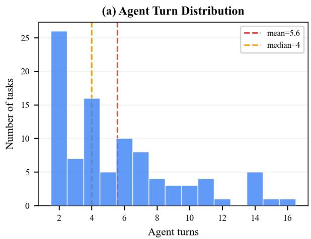

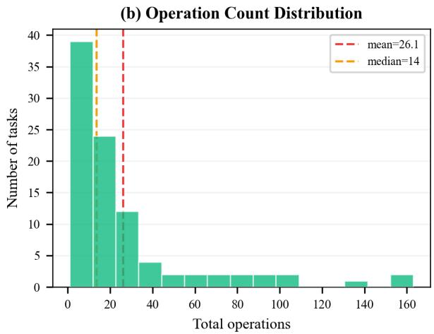  
Figure 8: Distribution of (a) reasoning turns and (b) total API operations. Both metrics exhibit long-tail characteristics, ensuring the benchmark tests both efficiency and endurance in long-horizon editing tasks.

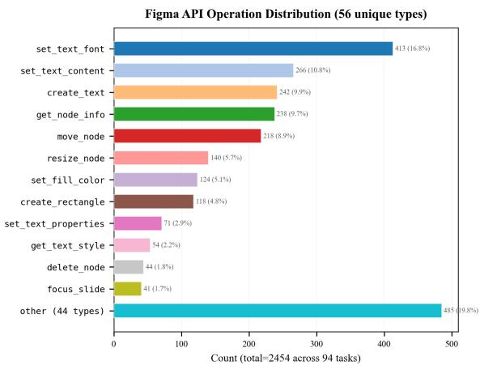  
Figure 9: Figma API operation distribution. The top 12 operation types account for the majority of the 2,454 total operations, spanning text styling, spatial layout, and element creation.

Same-backbone anchor vs. PPTArena. ACE and PPTArena both on gpt-5.5, on the 53-task head-to-head, instruction following (Table 18): with the backbone held fixed and the judge swapped out of the loop, ACE leads the strongest OOXML baseline by more than 2 IF points, significantly, under every judge.

## K CARE: Quality Ablation and Routing Audit

Component-isolation construction (Table 19). Each row removes exactly one piece with the other four and the evaluation held fixed, scored only where the component is active. The CARE→fullcontext ablation runs on the 16 multi-slide tasks where CARE actually reduces context, after two principled exclusions: single-slide tasks (the routed context already is the full deck, so the ablation is a no-op) and 3 large decks (Cases 33/43/57) whose full context exceeds the 1M-token window without CARE—infeasible to even run in the full-context condition, itself direct evidence that CARE keeps large decks runnable. The specialized-tools ablation runs, per backbone, on exactly the tasks where that backbone’s ACE run invoked a chart/table/SmartArt/math/image tool (claude 16, gemini 4, gpt-5.5 11); removing a tool a run never called is a no-op that would only dilute the effect. Removing the tools also inflates operation counts ≈1.8× (claude 34→59, gpt 28.5→51.2 mean ops; up to

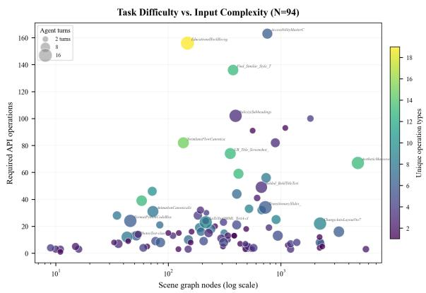  
Figure 10: Task difficulty vs. input complexity. Each point is a task; x-axis: Figma nodes (log scale), y-axis: total API operations, point size: agent turns, color: unique operation types. High-density tasks like EducationalRockRecognition (148 nodes, 156 operations) highlight the benchmark’s focus on logic over raw scale.

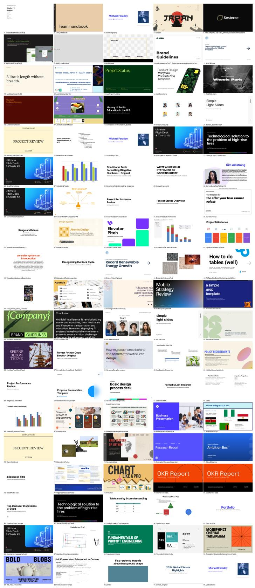  
Figure 11: Overview of the Figma-Slide benchmark (97 curated tasks). The grid displays 95 thumbnails: one origin is text-based (no thumbnail), and Case 112 is omitted because its source thumbnail is identical to that of Case 105.

<table><tr><td>#</td><td>Novel editing task</td><td>IF</td><td>VQ</td></tr><tr><td>105</td><td>Auto-layout scale 5→6</td><td>5</td><td>5</td></tr><tr><td>111</td><td>Table fill + 4th-row highlight</td><td>5</td><td>5</td></tr><tr><td>106</td><td>Convert to auto-layout</td><td>4</td><td>5</td></tr><tr><td>112</td><td>Auto-layout scale 5→7</td><td>5</td><td>4</td></tr><tr><td>108</td><td>Table → bar chart</td><td>4</td><td>4</td></tr><tr><td>110</td><td>Long text → SmartArt</td><td>5</td><td>3</td></tr><tr><td>107</td><td>Match slide colors to theme</td><td>4</td><td>2</td></tr><tr><td>101</td><td>Layered-image decomposition</td><td>2</td><td>1</td></tr><tr><td>109</td><td>LaTeX → SVG</td><td>0</td><td>0</td></tr><tr><td>Mean</td><td></td><td>3.78</td><td>3.22</td></tr></table>

Table 14: ACE (full, with self-correction) on the 9 novel editing tasks with no PowerPoint analogue (1–5 scale; <sup>‡</sup>execution failure scored 0 via origin-fallback). Seven of nine reach IF≥4; the open failures are asset decomposition (101) and LaTeX rendering (109).
<table><tr><td>Dim</td><td>Judge-human agreement</td><td>n</td><td>p vs. chance</td></tr><tr><td>IF</td><td>80%</td><td>41</td><td>10⁻4</td></tr><tr><td>VQ</td><td>76%</td><td>37</td><td>.003</td></tr><tr><td>Overall</td><td>78%</td><td>50</td><td>10−4</td></tr></table>

Table 15: Judge–human agreement on decided cases (pooled).

18→127 on construct-heavy tasks), as the same chart or table is rebuilt from primitives.

Quality ablation. On the 16 multi-slide tasks, replacing CARE’s routed slice with the entire deck lowers quality, not just cost (Table 20). The drop is not an overflow artifact (0/16 claude full-context cases logged an overflow) and is uncorrelated with deck size—a 575K-token deck drops 0.

What each routed representation carries. The four representations are complementary, not nested—macro and systemic each drop what the other keeps (Table 21)—so “correct routing” means choosing a representation that carries what the edit needs.

Routing audit. We measure routing accuracy directly on three axes—two defined from the instruction alone (no automatic gold required) and one from a structural diff of the reference (Table 22). Verdicts compare the router’s logged mode with the gold mode under the scope ordering micro ⊂ {macro, systemic} ⊂ full: exact on match; overscope when the router chose a strictly wider mode (harmless; costs only tokens); under-scope when it chose a strictly narrower mode (the one failure that can drop needed context); borderline when several representations are each sufficient and the router picks one of them. Over the 53 tasks: 47 exact + 5 borderline + 1 under-scope + 0 overscope. The 5 borderline are add-a-slide or mixed theme-plus-edit tasks where macro/systemic/full are each defensible (e.g. “Add a Thank-you slide”); a disputed borderline label can only move between exact and borderline, never into under-scope, so the 52/53 is robust to relabeling.

<table><tr><td>Dim</td><td>Win-rate [95% CI]</td><td>Binom. p (case-level)</td><td>Judge=human</td></tr><tr><td>IF</td><td>80.9% [73.3, 86.7]</td><td>&lt;0.001 (0.004)</td><td>100% (n=14)</td></tr><tr><td>VQ</td><td>83.5% [75.8, 89.0]</td><td>&lt;0.001 (0.013)</td><td>92% (n=12)</td></tr><tr><td>Overall</td><td>81.5% [74.1, 87.1]</td><td>&lt;0.001 (0.013)</td><td>88% (n=17)</td></tr></table>

Table 16: Self-correction, blind human preference (17 cases). Judge=human: how often the gpt-5.5 judge agrees with the human majority on decided cases (n is that decided-case count out of 17).
<table><tr><td>Judge (role)</td><td>∆IF</td><td>∆VQ</td><td>impr./unch./degr.</td><td>noise floor</td></tr><tr><td>gpt-5.5 (in-loop)</td><td>+0.94</td><td>+0.78</td><td>13/2/3</td><td>+0.14</td></tr><tr><td>claude-4.6 (out-of-loop)</td><td>+0.61</td><td>+0.56</td><td>9/7/2</td><td>+0.03</td></tr><tr><td>gemini-3.5 (out-of-loop)</td><td>+0.56</td><td>+1.33</td><td>9/6/3</td><td>+0.17</td></tr></table>

Table 17: Self-correction gain re-scored out of the loop (18 loop-entering tasks). Noise floor = mean ∆IF that judge assigns to the 35 byte-identical halted cases.

Misrouting is bounded and recoverable. The errors are one-sided: over-scoping never occurs and would cost only tokens, so the sole qualityrelevant failure is under-scoping, of which there is exactly 1/53—Case 75, a deck-wide grid/alignment cleanup routed to macro when raw per-slide geometry was needed (IF 3.0 vs. the 4.04 deck mean), which self-correction lifts back to 4.0. A miss is also cheap, because CARE reduces only the initial context and never blinds the agent: live inspection tools (get\_node\_info, get\_all\_slides) return full node data at execution time. Case 24 demonstrates the recovery—routed to macro (which carries no colour and, here, no image), the agent still produced an agenda slide matching the deck background by issuing 14 get\_node\_info calls to read the existing fills before creating the slide. A reduced or mis-scoped context defers information to a live query; it does not lose information the edit needs.

## L Rollback and Loop-Knob Sensitivity

Strict-peak rollback. Of the 18/53 tasks entering correction, 3 (17%) regress in IF, each by ≤1 point. Because the critic’s score is logged at every iteration, we keep the last iteration unless the critic’s own score declined from an earlier one, in which case we return that earlier iteration. The rule uses only the in-loop IF critic—no ground truth, hence deployable as-is—and yields a strict, sideeffect-free gain: IF 4.45→4.49, VQ 4.02→4.06, with no task harmed. (An oracle VQ-aware selector reaches 4.51/4.08 but requires ground truth; we report it only as an upper bound.)

<table><tr><td>Judge</td><td>∆IF [95% CI]</td><td>Wilcoxon</td><td>W/T/L</td></tr><tr><td>gpt-5.5</td><td> $+ 2 . 3 6 [ + 1 . 7 7 , + 2 . 9 4 ]$ </td><td> $\scriptstyle p < 0 . 0 0 1$ </td><td>35/15/3</td></tr><tr><td>claude-4.6</td><td> $+ 2 . 1 3 \ [ + 1 . 5 1 , + 2 . 7 5 ]$ </td><td> $\scriptstyle p < 0 . 0 0 1$ </td><td>33/15/5</td></tr><tr><td>gemini-3.5</td><td> $+ 2 . 4 0 \ [ + 1 . 7 5 , + 3 . 0 4 ]$ </td><td> $\scriptstyle p < 0 . 0 0 1$ </td><td>32/20/1</td></tr></table>

Table 18: ACE − PPTArena, both on gpt-5.5 (53 tasks), under all three judges.
<table><tr><td></td><td colspan="3">∆IF/ ∆VQ when removed</td></tr><tr><td>Component (eval set)</td><td>claude</td><td>gemini</td><td>gpt-5.5</td></tr><tr><td>Repr. SG→OOXML (53)</td><td>-0.64/-0.62</td><td>-0.78/-0.63</td><td>-0.69/-0.45</td></tr><tr><td>CARE→full context (16)</td><td> $- 0 . 7 5 / - 0 . 3 8$ </td><td> $+ 0 . 0 0 / + 0 . 1 9$ </td><td>-0.38/0.00</td></tr><tr><td>Spec. tools→primitives (16/4/11)</td><td>-0.56/-0.31</td><td> $- 1 . 0 0 / - 0 . 7 5$ </td><td> $- 0 . 5 5 / - 0 . 4 5$ </td></tr><tr><td>Self-correction on→off (53)</td><td> $- 0 . 4 1 / - 0 . 2 7$ </td><td></td><td></td></tr></table>

Table 19: Leave-one-out component isolation: one component removed, the other four and the evaluation held fixed (same backbone, gpt-5.5 judge, single pass for the top three rows), scored on the sub-population where the component is active. Construction and exclusions in Appendix K.

Sensitivity to τ and K. Both loop knobs are replayed from logged trajectories (external IF, 53 tasks; the small offset from the reported 4.45 is within the ≤ +0.17 re-judging noise bound of Appendix J). Both curves in Table 23 are monotone with diminishing returns and a plateau: in K the marginal gain shrinks (+0.22 then +0.12), so roughly 65% of the benefit arrives by K=2 though a third iteration still helps; in τ the gain plateaus by 3.5, so τ=4 sits on a plateau rather than a lucky sweet spot—lowering τ degrades gracefully toward the no-correction baseline (4.04) with no cliff, and raising τ beyond 4 is not simulable within the generated budget. VQ follows the same shape (3.75 → 3.94 → 4.02 in K).

## M PPTArena: Attempt Rate vs. Conditional Quality

The blended 53-task average in Table 2 conflates “how often it attempts” with “quality when it does,” so we decompose it. A case counts as edited iff PPTArena produced a modified deck: it edits 33/53 (62.3%) and produces no edit on 20/53 (37.7%)— do-nothing punts plus one generation failure. On IF the do-nothing fallback is effectively zero (mean 0.00–0.15 across the three judges; Table 24), so the headline does not flatter the baseline on that axis; only VQ uses the origin-vs-reference comparison, which is needed to distinguish “did nothing” from “destroyed the deck,” and that floor is what drags the blended average down. Even at its conditional quality on the 33 edited tasks, PPTArena trails ACE $\mathrm { ( A C E _ { g p t } }$ 4.74/4.19; $\mathrm { \ A C E _ { c l a u d e } }$ 4.45/4.02), and the same-backbone anchor is +2.36 IF at $p { < } 0 . 0 0 1$ (Appendix J).

<table><tr><td>Backbone (16 tasks)</td><td>CARE IF/VQ</td><td>Full-context IF/VQ</td><td>∆IF</td></tr><tr><td>claude-4.6</td><td>4.38/3.88</td><td>3.62/3.50</td><td>-0.75</td></tr><tr><td>gpt-5.5</td><td>4.62/3.88</td><td>4.25/3.88</td><td>-0.38</td></tr><tr><td>gemini-3.5</td><td>3.75/3.31</td><td>3.75/3.50</td><td>+0.00</td></tr></table>

Table 20: CARE quality ablation on the 16 multi-slide tasks where routing reduces context.
<table><tr><td></td><td>micro</td><td>macro</td><td>systemic</td><td>full</td></tr><tr><td>scope</td><td>target slide(s)</td><td>whole deck</td><td>whole deck</td><td>whole deck</td></tr><tr><td>text content</td><td>√</td><td>√</td><td>×</td><td>√</td></tr><tr><td>typography</td><td>√</td><td>√</td><td>√</td><td>√</td></tr><tr><td>fill/stroke colour</td><td>√</td><td>×</td><td>√</td><td>√</td></tr><tr><td>slide background</td><td>√</td><td>×</td><td>√</td><td>√</td></tr><tr><td>layout / bounding boxes</td><td>√</td><td>target only</td><td>×</td><td>√</td></tr><tr><td>node tree (id/name/type)</td><td>√</td><td>√</td><td>×</td><td>√</td></tr></table>

Table 21: Property coverage of each routed representation. micro = full scene-graph of the target slide(s); macro = deck-wide skeleton; systemic = design tokens.

## N Qualitative Comparisons

Figure 1 (page 1) shows five further tasks (beyond Case 17 in the main text) spanning table edits, layout, multi-element composition, and structured edits. Each row gives the manually authored reference and the three pipelines; ACE’s edits frequently differ from the reference while remaining valid.

## O Tool-Execution Efficiency

Figure 12 contrasts the specialized create\_graphics tool against atomic primitives on the same “Table-to-Chart” task: the specialized tool needs only 22 operations where the primitive route needs 66 (a 3.0× increase).

## P Claude-Skill HTML Baseline Construction

The Claude-Skill HTML agent is Claude Code invoked headlessly (claude -p) with file-system tools (read/edit/grep/bash) and a single packaged skill, slide-editor, that scopes its behaviour to the deck-as-one-index.html representation. The agent receives the invocation prompt in Listing 2, which points it at task.txt, index.html, and the reference renders in frames/, and requires it to emit the full edited document as output.html. The skill definition itself (Listing 3) supplies the operative knowledge: the slide schema (absolutely-positioned children inside fixed 1920×1080 .slide divs, z-order = DOM order), the stable data-slide-id/data-id handles that mirror Figma node ids and are the recommended Grep targets (a deck is typically 50K–100K tokens and cannot be read whole), the output contract (untouched slides stay byte-identical, CSS inline), and editing principles that protect round-trip fidelity (minimal edits, no unrequested redesign, and the semicolon-prefix rule that prevents a newly appended inline property from silently voiding the preceding declaration). This skill is the HTMLbaseline analogue of the CARE router and executor prompts used by our system. To verify render fidelity we compute per-page DINOv2 cosine similarity between the HTML capture and the Figma reference and iteratively repair pages below 0.8; the resulting captures match the references closely (91.9% of pages ≥0.95).

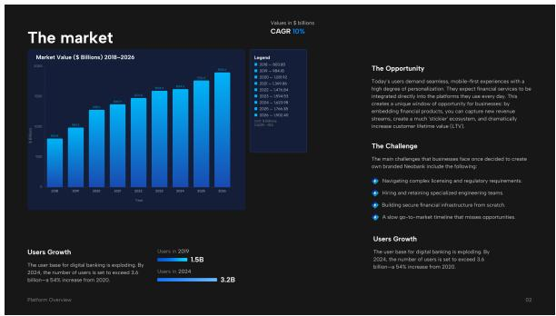  
(a) Ours: create\_graphics (22 ops).

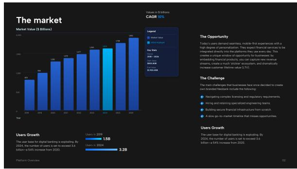  
(b) Ablation: primitive tools (66 ops).

Figure 12: Tool-execution efficiency on the same “Table-to-Chart” task. (a) The specialized create\_graphics tool needs only 22 operations. (b) Forcing atomic primitives (create\_rectangle, etc.) yields a 3.0× increase (66 operations), inflating the “reasoning tax” and the chance of alignment errors.
<table><tr><td>Axis</td><td>Result</td><td>Measured how</td></tr><tr><td>Mode accuracy</td><td>52/53 (47 exact + 5 borderline; 1 under-, 0 over-scope)</td><td>gold mode = minimal sufficient representation, labelled from in- struction semantics against Ta-</td></tr><tr><td>Slide-selection re- call (micro)</td><td>1.00 (16/16; 20/20 all modes)</td><td>ble 21 (no diff) router targets vs. DIFF(original, reference), on the 20 tasks whose original and reference share node IDs</td></tr><tr><td>Explicit-slide accu- racy</td><td>13/13</td><td>instructions naming a slide num- ber are their own gold</td></tr></table>

Table 22: CARE routing audit on the 53-task subset.

<table><tr><td>Max-iter K (τ=4)</td><td>IF</td><td>Threshold τ (K=3)</td><td>IF</td></tr><tr><td>K=1</td><td>4.04</td><td>τ=2.0</td><td>4.04</td></tr><tr><td>K=2</td><td>4.26</td><td>τ=3.0</td><td>4.19</td></tr><tr><td>K=3</td><td>4.38</td><td>τ=3.5</td><td>4.38</td></tr><tr><td></td><td></td><td>τ=4.0 (default)</td><td>4.38</td></tr></table>

Table 23: Loop-knob sensitivity, replayed from logged trajectories (external IF, 53 tasks).

<table><tr><td>Judge</td><td>Attempt rate</td><td>Cond. (33 edited) IF/VQ</td><td>Unedited-20 IF/VQ</td></tr><tr><td>gpt-5.5</td><td>33/53 (62.3%)</td><td>3.73/2.79</td><td>0.15/1.40</td></tr><tr><td>claude-4.6</td><td>62.3%</td><td>3.85/2.82</td><td>0.05/1.15</td></tr><tr><td>gemini-3.5</td><td>62.3%</td><td>3.85/3.03</td><td>0.00/0.95</td></tr></table>

Table 24: PPTArena decomposition: attempt rate and conditional quality (blended 53-task averages appear in Table 2 and Table 4).

Listing 2: Invocation prompt passed to claude -p for the Claude-Skill HTML baseline.  
Edit the slide deck in this directory.   
- The task is described in task.txt.   
- The deck is in index.html (each <div   
class='slide'> is one slide).   
- Reference PNGs for each slide are in   
frames/slide\_<index>.png.   
- Apply only the edits requested by the task;   
leave everything else unchanged.   
- Save the complete edited HTML as   
output.html in this same directory.   
Use the slide-editor skill.

## Q Prompts

This appendix lists the verbatim system prompts used in our pipeline. Runtime placeholders are written as {name} (e.g. {instruction}, {slideCount}, {baseJsonString}) and are substituted at inference time. The ACE design agent is shown in its default batch tool-calling configuration.

Listing 3: SKILL.md for the slide-editor skill used by the Claude-Skill HTML baseline (abridged).

```markdown
name: slide-editor
description: Edit a slide deck represented as a single HTML file. Use whenever the working
directory contains an index.html that visualizes a slide deck (each slide is a div with
class="slide", absolute positioning, fixed 1920x1080 size) and the user asks to modify it.
Always edit index.html and save the result as output.html in the same directory.
# slide-editor
## Input
- index.html - the deck. Each slide is one <div class="slide"
style="width:1920px;height:1080px;...">. Z-order = DOM order.
- images/ - referenced images.
- frames/slide_<index>.png (optional) - pre-rendered visual reference per slide.
- task.txt - the natural-language editing task.
## Slide schema
- Each .slide: position:relative; width:1920px; height:1080px; overflow:hidden. Children
absolutely positioned.
- Text: <div> with left/top/width/height and nested spans for per-character styles.
- Shape: <div> with background-color / border / border-radius. Vector: inline <svg>. Image:
background-image url.
- Editable attrs: color, background-color, font-*, letter-spacing, line-height, text-align,
left/top/width/height,
transform:rotate, opacity, border-radius, box-shadow, filter.
## Stable identifiers
Every slide/element carries a stable id (matches Figma node ids):
<div class="slide" data-slide-id="1:29">, <div data-id="1:30">, <svg data-id="1:31"> ...
ALWAYS prefer Grep on data-slide-id / data-id to navigate. index.html is 50K-100K tokens and
CANNOT be Read whole.
## Output contract
- Write the edited HTML to output.html; do NOT modify index.html.
- Copy <!doctype html>, <head>, <style> as-is unless the task requires changes.
- Keep all .slide divs in order; untouched slides must be byte-identical. Keep image paths.
## Working principles
- Edit only the relevant slides; preserve everything not asked (round-trip fidelity is evaluated).
- No design improvements / recoloring / restyling unless requested. Keep CSS inline on elements.
- ALWAYS separate CSS declarations with ';'. Inline values may lack a trailing ';' (e.g. color:
rgba(0,0,0,1.0)").
When appending a NEW property, write "; <prop>: <val>". Otherwise it merges into the previous
declaration and the
WHOLE declaration is dropped as invalid (most common failure: font-style: italic silently lost).
## Workflow
1. Read task.txt.
2. Locate targets WITHOUT reading index.html whole: Grep class="slide"/data-slide-id for
boundaries; Grep a task-keyed
pattern; Read only relevant line ranges (one slide ~25-40 lines). For bulk edits, find ONE
pattern and edit via regex.
3. (Optional) Inspect frames/ PNGs for visual grounding.
4. Make the minimal edits, targeting elements by data-id.
5. Save the complete edited HTML to output.html.
6. Verify by Reading back only the changed lines or Grepping changed data-ids. Do NOT re-read the
whole deck.
```

2. Node Hierarchy   
- All content nodes live within slides. Parent-child links   
form the hierarchy.   
- Coordinates in relativeTransform and move\_node are relative   
to the PARENT node, not the slide root (0,0 = top-left of the   
parent frame).

## Q.1 ACE Design Agent

The agent prompt is assembled from a fixed Context header, a shared set of Tool Use Principles, the Figma Slides Basics reference, an optional contextmode block selected by the CARE router (§Q.1.1), the serialized document state, and the user Instruction. Listing 4 shows the top-level template (the FULL-context variant); the reusable blocks follow.

## Listing 4: ACE design agent prompt template (FULL context variant).

\*\*Context\*\*   
You are a presentation-design agent with access to Figma   
Slides via tool calls.   
Follow the \*\*Instruction\*\* to modify the presentation.   
Refer to the \*\*Tool Use Principles\*\* and \*\*Figma Slides Basics   
\*\* for guidance.   
\*\*Tool Use Principles\*\*   
{tool\_use\_principles}   
\*\*Figma Slides Basics\*\*   
{figma\_slides\_basics}   
\*\*Current Presentation State\*\*   
The presentation has {slideCount} slide(s).   
Below is the full document structure (JSON) describing every   
slide and its children.   
You already have all node IDs, types, and properties - proceed   
directly to modifications without calling discovery tools.   
\`\`\`json   
{baseJsonString}   
\*\*Instruction\*\*   
{instruction}

## Listing 6: {figma\_slides\_basics} block.

- Do NOT restyle existing slides/nodes unless explicitly asked.

## Q.1.1 CARE Context-Mode Blocks

The CARE router selects one context-mode block, inserted after the Figma Slides Basics block, which determines how the document state is serialized (full scene graph, text-only skeleton, or style-token summary). Listings 7–10 give the four variants.

## Listing 7: MICRO\_SPATIAL — deep scene graph for target slides only.

\*\*Context Mode: Micro-Spatial (Targeted Editing)\*\*   
- Below is the FULL scene graph for the target slide(s) only.   
Other slides are summarised minimally (ID and name only).   
The full document has already been imported into Figma - all   
nodes exist.   
- Use the node IDs from the scene graph to reference existing   
elements directly via batch\_execute.   
\*\*Coordinate System\*\*   
- Each node's relativeTransform gives its position relative to   
its PARENT frame: [[a,b,tx],[c,d,ty]].   
- move\_node sets PARENT-relative coordinates (same as   
relativeTransform tx/ty). Derive move\_node x/y from   
relativeTransform, NOT absoluteBoundingBox.   
- size gives width/height; use resize\_node to change   
dimensions.

## Listing 8: MACRO\_PROGRAMMATIC — text + ID skeleton for batch operations.

\*\*Context Mode: Macro-Programmatic (Batch Operations)\*\*   
- Below is a SKELETON view showing only text content and node   
IDs (colors/fills/strokes stripped for efficiency).   
- Target slides include a bounds field per node: [x, y, width,   
height] in absolute coordinates (reason about layout, overlap,   
etc.).   
- Identify ALL matching nodes from the skeleton and generate   
tool calls for EVERY node that needs modification.   
- The full document has been imported - reference any node by   
ID via batch\_execute.

## Listing 9: SYSTEMIC\_TOKEN — design-token (color/font) summary.

\*\*Context Mode: Systemic (Design Token Operations)\*\*   
- Below is a style metadata summary of all colours, fonts, and   
their usage across slides.   
- Use replace\_color for bulk colour changes, set\_fill\_color   
for targeted fills, set\_text\_font for font changes.   
- Target by colour value or font family rather than   
enumerating individual nodes when possible.   
- The full document has been imported - all nodes referenced   
by ID.

## Listing 10: OFF — no pre-supplied context; agent discovers state via tools.

\*\*Presentation Overview\*\*   
The presentation has {slideCount} slide(s) and has already   
been imported into Figma. No document structure is provided.   
- Use get\_all\_slides to find slide IDs, then focus\_slide to   
select one.   
- Use get\_node\_info\_by\_types or get\_text\_node\_info to inspect   
node details.   
- Use export\_slide\_image only if visual context is essential.   
- Do NOT call check\_connection\_status, export\_json, or   
get\_page\_structure.

Listing 5: {tool\_use\_principles} block (batch mode).  
Your task is to produce an array of tool (function) calls necessary to modify the presentation in one turn.   
Include every necessary tool (function) calls and do not output any text other than the function calls themselves.   
1. Plan first - briefly outline the key steps you will take.   
2. Be exhaustive - consider all parameters, options, ordering, and dependencies necessary to make the modification in one turn.   
3. Preserve existing content - do NOT delete or recreate elements that should remain unchanged. Only modify what the instruction   
asks for.   
4. Use batch\_execute aggressively - it supports ALL commands (creation, modification, layout).   
ALWAYS prefer ONE batch\_execute call over multiple individual tool calls. Each individual tool call costs a full API round-trip   
CRITICAL: If you need to create or modify 3+ elements, ALWAYS use batch\_execute.   
Example - creating multiple elements + setting properties in one call:   
batch\_execute({ operations: [   
{ command: "create\_frame", params: { x: 0, y: 0, width: 400, height: 40, name: "Row 1", parentId: "1:10" } },   
{ command: "create\_text", params: { x: 10, y: 5, width: 380, text: "Hello", fontSize: 16, parentId: "1:10" } },   
{ command: "set\_text\_font", params: { nodeId: "1:23", fontFamily: "Inter", fontStyle: "Bold" } },   
{ command: "set\_fill\_color", params: { nodeId: "1:67", color: "#FF0000" } }   
] })   
5. Text layout quality   
- ALWAYS set an explicit \*\*width\*\* on text nodes to prevent overflow/overlap.   
- Predict the bounding box of every element BEFORE placing it. For text nodes, rendered height \~= ceil(text\_length\_px / width)   
x fontSize x 1.3 (line-height). Ensure NO overlap with any neighbor in all directions.   
- For multi-column layouts, column width = (available width) / num\_columns.   
6. Avoid redundant discovery   
- NEVER call check\_connection\_status - the connection is already established.   
- NEVER call export\_json or get\_page\_structure - the structure is already provided.   
- Do NOT call get\_all\_slides if slide IDs are already provided.   
- Only use get\_node\_info / get\_node\_info\_by\_types for details not visible in the provided JSON.   
- After modifications, do NOT make extra verification calls - tool results already confirm success/failure.   
7. Minimize API round-trips   
- Collect ALL changes across ALL slides into a SINGLE batch\_execute when possible.   
- Do NOT alternate focus\_slide -> batch\_execute per slide.   
- focus\_slide is only needed before creating new nodes; existing-node modifications work by nodeId regardless of focus.   
8. Handle node ID staleness   
- After deleting a slide/node, ALL child node IDs within it become invalid immediately.   
- NEVER batch a delete\_slide with operations referencing nodes on other slides - the delete may invalidate IDs mid-batch.   
- NEVER batch a create\_slide with its child element operations - the new slide's ID is unknown until create\_slide returns.   
- CRITICAL - create\_slide is NEVER the final step. After creating slides, ALWAYS follow up with batch\_execute to populate them.   
A blank slide is never acceptable.   
- CRITICAL - parentId after create\_slide: when adding elements to a newly created slide, include parentId (the new slide's ID)   
in EVERY create\_\* params; otherwise elements land on the previously focused slide.   
- NEVER batch a create\_slide with reorder\_slides - instead create all slides first, then reorder\_slides with the complete list.   
9. Deliver - respond with the exact sequence of tool (function) calls to run.

## Q.2 Instruction-Following (IF) Judge

The IF judge scores whether the agent’s edits accomplish the instruction. It receives a focused diff between the initial state and the agent’s prediction (plus rendered prediction images when the diff touches visual content), and emits a single 0–5 score with a one-sentence justification. Listing 11 gives the system prompt and Listing 12 the user prompt.

## Listing 12: IF judge — user prompt.

--- USER INSTRUCTION (what the model received) ---   
{instruction}   
--- AGENT'S EDITS (INITIAL state -> PREDICTION) ---   
{formatted\_diff}   
CRITICAL JUDGMENT INSTRUCTIONS:   
- Did the agent perform the changes the Instruction requires?   
- Are the agent's edits scoped only to what the instruction   
asks (no unrelated edits)?   
- If the diff is empty/trivial while the instruction clearly   
requires changes -> Low score (1 or 0).   
- If the agent's edits implement the requested changes   
precisely -> High score (4-5).   
- If the instruction targets a structured visual (table/chart/   
list/diagram), edits to the nested FRAMEs/RECTANGLEs/TEXTs ARE   
those edits, not unrelated edits.   
REMINDER: Judge if the agent's edits ACHIEVED THE SEMANTIC   
INTENT of the Instruction.

Listing 11: IF judge — system prompt.  
You are a strict judge of INSTRUCTION FOLLOWING for Figma slide editing tasks.   
CRITICAL UNDERSTANDING:   
- The "Instruction" is what the model/editor received (the user's request).   
- You receive a FOCUSED DIFF showing the AGENT'S ACTUAL EDITS - the difference between the INITIAL slide state and the PREDICTION.   
(No diff against ground truth; GT is checked visually by a separate visual-quality judge.)   
- Judge whether those edits accomplish the Instruction.   
- "Removed" = elements deleted by the agent. "Added" = elements created. "Modified" = kept but changed.   
- An EMPTY/near-empty diff almost always means the agent did NOT perform the instruction (low score).   
INITIAL STATE SNAPSHOT (per-slide content, included BELOW the diff):   
- For "apply X to every slide", a slide with no diff entry can mean (a) the agent skipped it, or (b) it was ALREADY in the   
requested state. The snapshot lists each slide's TEXT + alignment + font and visual shapes - use it to distinguish.   
- Do NOT treat a missing diff entry as failure unless the snapshot confirms the slide actually needed editing.   
FLEXIBILITY:   
- Accept different valid approaches. Exact positions/sizes don't matter unless the Instruction requires them.   
- Small measurement variations (+/-1%) are acceptable. Focus on semantic properties: text, fonts, colors, structure.   
STRUCTURED VISUALS (IMPORTANT):   
- Figma Slides has NO native table/list/chart/SmartArt type; these are built from FRAME containers in a grid, with nested FRAMEs/   
RECTANGLEs as cells and TEXT nodes as content.   
- When the Instruction targets a "table"/"chart"/"diagram"/"list", edits to the constituent FRAMEs/RECTANGLEs/TEXTs ARE the   
relevant edits. A fill-color change on a FRAME nested in the table wrapper IS a cell color change.   
- Layer names are arbitrary; judge a node's role by its path position and whether the same edit applies to its siblings.   
REORDER / SORT OPERATIONS (IMPORTANT):   
- "sort table rows" / "reorder slides" is implemented by swapping sibling indices (zOrder) and y/x positions on many shapes at   
once. MANY zOrder + boundingBox.y entries on the same parent are ONE semantic operation.   
- A children.reorder summary entry IS the sort operation; read it with per-row zOrder entries to verify the resulting order   
matches the instruction.   
- A FRAME tagged "[IMAGE fill]" IS a picture; moving it z-wise IS moving the picture. For "bring X to front / send Y to back",   
judge by the FINAL stacking, not which shapes moved.   
- Do NOT score this as "only z-order changed" - it is a meaningful structural edit.   
PRED SLIDE IMAGES (when included):   
- You also receive RENDERED IMAGES of the prediction slides.   
- Use them to judge content-relatedness the diff cannot show (does an added IMAGE depict what was asked? does positioning match   
intent?).   
- The pred images are NOT a ground-truth target - never compare to a GT image or score on stylistic similarity.   
HARSH SCORING POLICY (very strict):   
- Choose the lower score when uncertain. For translation/summarization, semantic similarity matters more than exact wording.   
INSTRUCTION\_FOLLOWING score (0-5):   
- 5: Every requested change exists and is exactly correct; nothing missing/misapplied; no extra edits.   
- 4: All requested changes exist and are mostly correct; only a tiny inaccuracy.   
- 3: Most requested changes exist but at least one is incomplete/incorrect/missing detail.   
- 2: Only some requested changes exist; notable misses.   
- 1: Requested changes largely not performed or substantially incorrect.   
- 0: Contradicts or ignores the instruction entirely.   
Output a single JSON object with:   
- instruction\_following\_score (0-5)   
- instruction\_following\_reason (one sentence, specific evidence)