# AHEAD: Adaptive Hindsight with Environment-Augmented Distillation for Agentic RL

Xiaolong Jin1,2∗, Dingmin Wang1†, Vijay Lingam1, Varun Kumar1 1AWS AI Labs 2Purdue University

€ Project Page

Model Card

## Abstract

Training multi-turn LLM agents with reinforcement learning typically relies on trajectory-level rewards, which assign a uniform advantage to every step and cannot identify which decisions led to success or failure. Self-distillation methods can provide finer-grained supervision by augmenting RL with privileged information. However, existing approaches usually apply the same type of privileged information to every step in an indistinguishable manner, ignoring a key asymmetry: routine steps need little additional guidance, while critical error steps require corrective direction that environment feedback alone cannot provide. We propose AHEAD, a step-aware framework that matches different supervision sources to different step types. The teacher receives environment feedback on all steps as a grounded dense signal, and additionally receives LLM-generated corrective hints on error steps to supply the direction that environment feedback lacks. The method introduces minimal changes to the standard GRPO algorithm. Across ALFWorld, WebShop, and Search-based QA, and across three model scales, AHEAD raises task success (+13.3 points on ALFWorld and +11.0 on WebShop at 7B over GRPO), reaches a given success rate in fewer training steps, and solves tasks within tighter interaction budgets than outcome-only RL and prior self-distillation baselines.

## 1 Introduction

Reinforcement learning has become a central approach for post-training multi-turn LLM agents (Shao et al., 2024; Dong et al., 2025; Feng et al., 2025). Unlike in single-turn reasoning, multi-turn agents interact with environments over extended horizons, where each action changes future observations and shapes subsequent decisions. Methods such as GRPO (Shao et al., 2024) train policies from trajectory-level environment rewards without requiring a critic, but assign a uniform advantage to every token in the trajectory. However, not all steps contribute equally to the outcome. Most are routine: the agent acts reasonably and the environment progresses normally. A small number of steps, however, largely determine the outcome; while a wrong object selection, an invalid action, or a misguided search query can compromise the entire episode. Assigning the same gradient signal to both types provides no mechanism to correct the decisions that actually matter.

On-policy self-distillation offers denser supervision by augmenting a teacher branch with privileged information (PI) and comparing its token-level predictions against the unaugmented student (Zhao et al., 2026; Yang et al., 2026; Lu et al., 2026b), producing a log-probability gap that serves as a token-level credit-assignment signal. The informativeness of this signal, however, depends entirely on what PI the teacher receives. Existing methods use task-level PI, such as retrieved skills (Lu et al., 2026b; Wang et al., 2026a) or reference answers (Zhao et al., 2026), that provides the same guidance to every step in the trajectory. This ignores a key asymmetry: routine steps need only confirmation that the action was appropriate, while error steps need specific corrective direction telling the agent what it should have done instead. Task-level PI, which summarizes general workflows rather than diagnosing individual decisions, cannot provide such step-specific corrective information.

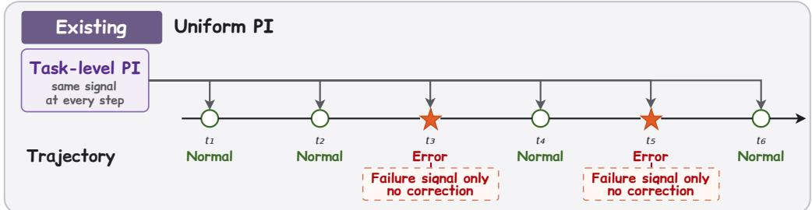

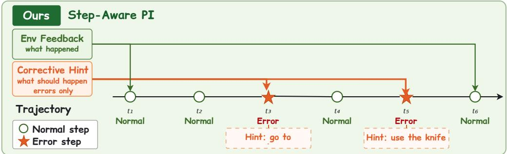  
Figure 1: Existing self-distillation methods apply a single source of privileged information (PI) uniformly across all steps (top): on error steps such as $t _ { 3 }$ and $t _ { 5 } ,$ environment feedback (e.g., “Nothing happens”) only signals failure and provides no corrective direction. AHEAD (bottom) uses environment feedback as base PI on all steps, and adaptively provides an LLM-generated corrective hint on error steps, telling the agent what it should have done.

We observe that multi-turn environments naturally produce a step-specific signal that current methods overlook: environment feedback. After each action, the environment returns an observation that is unavailable to the student when generating its response, making it a natural source of PI. For routine steps, this feedback is sufficient: signals such as “You arrived at shelf 2” confirm the action’s outcome, and the teacher’s assessment shifts only mildly. For error steps, environment feedback is necessary but insufficient: signals such as “Nothing happens” indicate failure but reveal neither the cause nor the corrective action. LLM-generated corrective hints (e.g., “Go to diningtable 1 to find the target object”) supply the missing piece: what the agent should have done at this specific step. Together, the two sources produce naturally adaptive supervision: weak confirmatory signals on routine steps and strong corrective signals on error steps, without any explicit gating or per-step coefficient.

Based on this observation, we propose AHEAD (Adaptive Hindsight with Environment-Augmented Distillation) for multi-turn agentic RL. For each failed trajectory, AHEAD injects environment feedback into the teacher context at every step, and additionally provides LLM-generated corrective hints at error steps identified by an LLM analyzer. Successful trajectories, where the GRPO advantage already provides the correct gradient direction, bypass the PI pipeline and retain the vanilla advantage. We use the token-level distillation signal to reweight the GRPO advantage following Yang et al. (2026), which requires minimal changes to the standard algorithm. At inference time, no PI, LLM calls, or environment feedback injection are needed.

We validate AHEAD across the Qwen2.5 (Yang et al., 2024) and Qwen3 (Yang et al., 2025) model families on three benchmarks for LLM-based agents: ALFWorld (Shridhar et al., 2020), WebShop (Yao et al., 2022), and Search-based QA (Jin et al., 2025). AHEAD achieves substantial improvements over GRPO (+13.3 points on ALFWorld and +11.0 on WebShop-Succ at 7B) and consistently outperforms self-distillation baselines such as SDAR (Lu et al., 2026b), Skill-SD (Wang et al., 2026a), and RLSD (Yang et al., 2026).

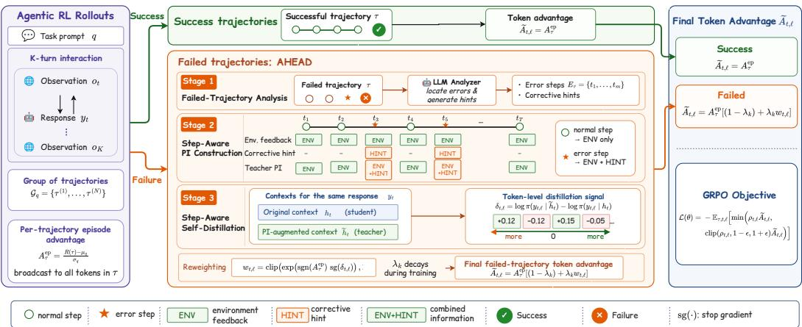  
Figure 2: Overview of AHEAD . Stage 1 identifies error steps in failed trajectories via an LLM analyzer. Stage 2 constructs step-aware privileged information: environment feedback for routine steps, environment feedback combined with an LLM corrective hint for error steps. Stage 3 computes a token-level self-distillation signal $\delta _ { t , \ell }$ by comparing the policy’s log-probabilities under original and PI-augmented contexts, and converts it into a bounded reweight of the GRPO advantage. Successful trajectories bypass the PI pipeline entirely and retain the vanilla GRPO advantage.

## Our contributions are:

• We identify that routine and error steps in multi-turn trajectories require fundamentally different supervision, and that environment feedback combined with LLM corrective hints naturally provides on-policy, step-aware PI.

• We propose AHEAD, which constructs step-appropriate PI and selectively applies it to failed trajectories, integrating into GRPO with minimal changes.

• We validate AHEAD on three agentic benchmarks across three model scales, showing consistent improvements over GRPO and self-distillation baselines.

## 2 Method

We present AHEAD (Adaptive Hindsight with Environment-Augmented Distillation), a framework that constructs step-aware privileged information for multi-turn agent self-distillation and integrates the resulting token-level signal into the GRPO objective. Figure 2 illustrates the overall pipeline.

## 2.1 Preliminaries

Problem Setting. We consider a multi-turn setting, in which an agent interacts with an environment over a finite horizon. At step t, the agent receives an observation $o _ { t }$ and maintains an interaction history $h _ { t } = \left( o _ { 0 } , y _ { 0 } , o _ { 1 } , y _ { 1 } , . ~ . ~ . , o _ { t } \right)$ , where $y _ { i }$ denotes the response generated at step i. The policy πθ generates the next response as $y _ { t } \sim \pi _ { \theta } ( \cdot \mid h _ { t } )$ . A completed trajectory is ${ \boldsymbol { \tau } } = \{ ( o _ { t } , y _ { t } ) \} _ { t = 0 } ^ { T - 1 }$ , with terminal outcome reward $R ( \tau )$

GRPO. For each task prompt q, GRPO samples N trajectories $\mathcal { G } _ { q } = \{ \tau ^ { ( 1 ) } , \dots , \tau ^ { ( N ) } \}$ and computes a group-relative advantage:

$$
A ^ { \mathrm { e p } } = \frac { R ( \tau ) - \mu _ { q } } { \sigma _ { q } } ,\tag{1}
$$

where $\mu _ { q }$ and $\sigma _ { q }$ are the group mean and standard deviation. This scalar is broadcast to every token in the trajectory. The policy is optimized with the clipped surrogate:

$$
\mathcal { L } _ { \mathrm { G R P O } } ( \theta ) = - \mathbb { E } _ { \tau , t , \ell } [ \operatorname* { m i n } ( \rho _ { t , \ell } A ^ { \mathrm { e p } } , \hat { \rho } _ { t , \ell } A ^ { \mathrm { e p } } ) ] ,\tag{2}
$$

where $\rho _ { t , \ell } ~ = ~ \pi _ { \boldsymbol { \theta } } ( y _ { t , \ell } ~ \vert ~ h _ { t } , y _ { t , < \ell } ) / \pi _ { \theta _ { \mathrm { o l d } } } ( y _ { t , \ell } ~ \vert ~ h _ { t } , y _ { t , < \ell } )$ is the token-level importance ratio and $\hat { \rho } _ { t , \ell } = \mathrm { c l i p } ( \rho _ { t , \ell } , 1 - \epsilon , 1 + \epsilon )$ is its clipped counterpart. Since $A ^ { \mathrm { e p } }$ is identical for every token, GRPO provides no mechanism to distinguish which steps or tokens were responsible for the outcome.

On-Policy Self-Distillation. On-policy self-distillation (Yang et al., 2026) uses the same model as both teacher and student: the student scores each token under the original context $h _ { t }$ , while the teacher receives privileged information (PI) unavailable at decision time. The log-probability gap

$$
\delta _ { t , \ell } = \log \pi _ { \theta _ { \mathrm { o l d } } } ( y _ { t , \ell } \mid \tilde { h } _ { t } , y _ { t , < \ell } ) - \log \pi _ { \theta _ { \mathrm { o l d } } } ( y _ { t , \ell } \mid h _ { t } , y _ { t , < \ell } )\tag{3}
$$

measures how the PI revises the model’s assessment of each sampled token. If $\delta _ { t , \ell } > 0$ , the PIaugmented teacher assigns higher probability to the token than the student, endorsing the student’s choice; if $\delta _ { t , \ell } ~ < ~ 0 .$ , the teacher disfavors it, suggesting the token should be suppressed. The informativeness of δ depends entirely on what PI is injected into $\tilde { h } _ { t } ,$ , which is the focus of our method.

## 2.2 Step-Aware Privileged Information

AHEAD constructs different PI for routine and error steps. We first describe how error steps are identified, then how the two PI sources are combined into a step-aware teacher context.

Error Step Identification. After a trajectory completes with a failure outcome, the full trajectory record (observations, actions, environment feedback, and terminal outcome) is passed to an LLMbased analyzer. The analyzer identifies steps whose actions were critical errors (e.g., picking up the wrong object, navigating to an irrelevant location). We denote the set of identified error steps as ${ \mathcal { E } } _ { \tau }$

Environment Feedback as PI. After the agent generate an action at step t, the environment returns an observation $o _ { t + 1 }$ . This feedback is not available to the student when generating yt, making it a natural source of PI. For routine steps, it confirms that the action was appropriate $( \mathrm { e . g . }$ , “You pick up the mug from shelf 2”). For error steps, it signals that something went wrong (e.g., “Nothing happens”). Environment feedback is grounded and local, reflecting the actual consequence of the agent’s specific action. However, it only describes what happened, not what should have happened.

LLM Corrective Hints as PI. For each error step $t \in { \mathcal { E } } _ { \tau }$ , the LLM analyzer generates a corrective hint describing what the agent should have done instead. For example, if the agent attempted to pick up an object from a wrong location, the hint might state: “You should first go to diningtable 1 to find the target object.” While environment feedback can only signal that an action failed, the corrective hint provides the missing direction: why the action was wrong and what the alternative should be.

PI Construction. We construct the PI-augmented context $\tilde { h } _ { t }$ by injecting the appropriate PI:

$$
\tilde { h } _ { t } = \left\{ \begin{array} { l l } { H ( h _ { t } , \Phi _ { t } ^ { \mathrm { e n v } } , \Phi _ { t } ^ { \mathrm { l l m } } ) } & { t \in \mathcal { E } _ { \tau } } \\ { H ( h _ { t } , \Phi _ { t } ^ { \mathrm { e n v } } ) } & { t \not \in \mathcal { E } _ { \tau } } \end{array} \right.\tag{4}
$$

where $H ( \cdot )$ appends PI to the history, $\Phi _ { t } ^ { \mathrm { e n v } }$ is the environment feedback, and $\Phi _ { t } ^ { \mathrm { l l m } }$ is the corrective hint. Error steps receive both sources simultaneously: the feedback identifies the failure, and the hint supplies the correction. Because the teacher sees richer PI on error steps, the resulting $| \delta _ { t , \ell } |$ is naturally larger than on routine steps, producing stronger token-level signals on error steps without any explicit gating or per-step coefficient. Note that the LLM analyzer is invoked only on failed trajectories, while environment feedback requires no additional computation and covers all steps.

## 2.3 Selective Trajectory Filtering

Not all trajectories benefit equally from PI-based supervision. Failed trajectories carry a uniform negative advantage but lack information about which steps were responsible. This is precisely the gap that the self-distillation signal δ can fill. Successful trajectories already carry positive advantages that provide the correct gradient direction; injecting PI risks introducing noise when the feedback is not aligned with the tokens that led to success.

AHEAD therefore applies PI-based reweighting only to failed trajectories. Let $\mathcal { M } _ { \tau }$ denote the set of steps that participate in reweighting:

$$
\mathcal { M } _ { \tau } = \left\{ \begin{array} { l l } { \{ t : \Phi _ { t } \neq \emptyset \} } & { \tau \mathrm { { f a i l e d } } } \\ { \emptyset } & { \tau \mathrm { { s u c c e e d e d } } } \end{array} \right.\tag{5}
$$

where $\Phi _ { t }$ denotes the PI available at step t. For steps outside $\mathcal { M } _ { \tau }$ , the reweighted advantage in Sec. 2.4 reduces to $A ^ { \mathrm { e p } }$

## 2.4 Advantage Reweighting

Following RLSD (Yang et al., 2026), we convert the token-level self-distillation signal into a multiplicative weight on the GRPO advantage, rather than using it as a separate distillation loss. This ensures that the environment reward determines whether the policy is reinforced or penalized, while the distillation signal only adjusts how strongly each token is updated.

Specifically, we exponentiate the gap, gated by the sign of the episode advantage:

$$
w _ { t , \ell } = \mathrm { c l i p } \big ( \exp \big ( \mathrm { s g n } ( A ^ { \mathrm { e p } } ) \mathrm { s g } ( \delta _ { t , \ell } ) \big ) , \ 1 - \varepsilon , \ 1 + \varepsilon \big )\tag{6}
$$

$$
\tilde { A } _ { t , \ell } = A ^ { \mathrm { e p } } \cdot \left[ \left( 1 - \lambda _ { k } \right) + \lambda _ { k } \cdot w _ { t , \ell } \right]\tag{7}
$$

where $\mathrm { s g }$ denotes stop-gradient and $\varepsilon = 0 . 2$ . Since AHEAD applies reweighting only to failed trajectories (Sec. 2.3), where $A ^ { \mathrm { e p } } < 0 \AA$ , the effect is straightforward: tokens disfavored by the teacher $( \delta \ : < \ : 0 )$ receive larger penalties, while tokens endorsed by the teacher $( \delta > 0 )$ receive smaller penalties. Because $\exp ( \cdot ) > 0$ and clipping preserves positivity, the reweighted advantage always preserves $\mathrm { s i g n } ( \tilde { A } ) = \mathrm { s i g n } ( A ^ { \mathrm { e p } } )$ , so the environment reward always controls the update direction.

The mixing coefficient $\lambda _ { k }$ decays linearly from $\lambda _ { 0 } = 0 . 5$ to 0 over D training steps. Early training benefits from dense PI-based credit assignment, while later training returns to vanilla GRPO to avoid over-reliance on privileged information.

Objective. The final objective replaces $A ^ { \mathrm { e p } }$ with $\tilde { A } _ { t , \ell }$ in the GRPO clipped surrogate:

$$
\mathscr { L } ( \theta ) = - \mathbb { E } _ { \tau , t , \ell } \Big [ \operatorname* { m i n } \Big ( \rho _ { t , \ell } \tilde { A } _ { t , \ell } , \hat { \rho } _ { t , \ell } \tilde { A } _ { t , \ell } \Big ) \Big ] .\tag{8}
$$

Training–Inference Boundary. The LLM analyzer, corrective hints, and PI-augmented scoring are used only during training to construct the advantage. At inference time, the policy acts from $h _ { t }$ alone, without any PI, LLM calls, or environment feedback injection.

## 3 Experiments

## 3.1 Experimental Setting

Benchmarks. We conduct experiments on three agentic benchmarks that cover embodied reasoning, web navigation, and search-augmented question answering.

ALFWorld (Shridhar et al., 2020) is a text-based household environment where an agent must complete language-specified goals via sequential textual actions. It includes six task categories: Pick, Look, Clean, Heat, Cool, and Pick2. We use the training split from GiGPO (Feng et al., 2025).

WebShop (Yao et al., 2022) simulates an e-commerce website where an agent searches for and purchases products matching natural-language specifications. We evaluate on 128 fixed tasks following prior work (Feng et al., 2025), reporting both task-completion score and binary success rate.

Search-based QA (Jin et al., 2025) requires an agent to answer questions by issuing search queries and reading returned documents. The benchmark spans single-hop (NQ (Kwiatkowski et al., 2019), TriviaQA (Joshi et al., 2017), PopQA (Mallen et al., 2023)) and multi-hop (HotpotQA (Yang et al., 2018), 2WikiMultiHopQA (Ho et al., 2020), MuSiQue (Trivedi et al., 2022), Bamboogle (Press et al., 2023)) datasets. Following Search-R1 (Jin et al., 2025), we train on NQ and HotpotQA; the remaining datasets serve as out-of-domain evaluation. Full dataset and metric details are given in Appendix B.

<table><tr><td></td><td colspan="7">ALFWorld</td><td colspan="7">Search-based QA</td><td colspan="2">WebShop</td></tr><tr><td>Method</td><td>Pick</td><td>Look</td><td>Clean</td><td>Heat</td><td>Cool</td><td>Pick2</td><td>Avg</td><td>NQ Triv</td><td>Pop</td><td>Hotp</td><td>2Wk</td><td>MuS</td><td>Bam</td><td>Avg</td><td>Score</td><td>Succ.</td></tr><tr><td>Qwen2.5-3B-Instruct</td><td></td><td></td><td></td><td></td><td></td><td></td><td></td><td></td><td></td><td></td><td></td><td></td><td></td><td></td><td></td><td></td></tr><tr><td>Vanilla</td><td>44.4</td><td>11.1</td><td>6.2</td><td>15.4 28.6 0.0</td><td>12.5</td><td></td><td>21.9 24.6</td><td>48.1</td><td>31.0</td><td>26.3</td><td>25.3</td><td>7.2</td><td>59.7</td><td>31.7</td><td>6.7</td><td>0.8</td></tr><tr><td>Skill-Prompt*</td><td>51.7</td><td>66.7</td><td>48.4</td><td>4.3 0.0</td><td>10.0</td><td>28.9</td><td>23.7</td><td>46.2</td><td>30.6</td><td>24.4</td><td>22.1</td><td>7.5</td><td>12.5</td><td>23.9</td><td>0.2</td><td>0.8</td></tr><tr><td>OPSD</td><td>48.8</td><td>41.7</td><td>16.7</td><td>15.8</td><td>16.7</td><td>28.1</td><td>0.1</td><td>0.1</td><td>0.1</td><td>0.0</td><td>0.0</td><td>0.0</td><td>0.0</td><td>0.0</td><td>11.3</td><td>3.1</td></tr><tr><td>GRPO</td><td>91.2</td><td>62.5</td><td>96.2</td><td>61.9 65.0</td><td>47.4</td><td>75.0</td><td>39.3</td><td>60.6</td><td>41.1</td><td>37.4</td><td>34.6</td><td>15.4</td><td>26.4</td><td>36.4</td><td>79.8</td><td>63.3</td></tr><tr><td>Skill-GRPO</td><td>88.9</td><td>71.4</td><td>58.8</td><td>70.6 40.7 66.7</td><td>29.2</td><td>60.2</td><td>43.5</td><td>58.8</td><td>43.0</td><td>36.8</td><td>32.2</td><td>11.7</td><td>12.5</td><td>34.1</td><td>77.3</td><td>60.9</td></tr><tr><td>Skill-GRPO*</td><td>94.3</td><td>57.1</td><td>100.0</td><td>73.1</td><td>57.1</td><td>80.5</td><td>44.3</td><td>59.6</td><td>44.3</td><td>39.0</td><td>36.1</td><td>14.5</td><td>14.9</td><td>36.1</td><td>76.3</td><td>66.4</td></tr><tr><td>GRPO+OPSD</td><td>100.0</td><td>82.4</td><td>85.7 75.0</td><td>70.0</td><td>60.0</td><td>81.2</td><td>44.9</td><td>61.2</td><td>45.2</td><td>40.4</td><td>38.5</td><td>16.0</td><td>66.1</td><td>44.6</td><td>77.8</td><td>66.4</td></tr><tr><td>Skill-SD</td><td>88.2</td><td>50.0</td><td>96.2</td><td>52.4 65.0</td><td>57.9</td><td>73.4</td><td>44.4</td><td>60.4</td><td>44.0</td><td>39.5</td><td>40.4</td><td>15.4</td><td>64.9</td><td>44.1</td><td>75.9</td><td>64.0</td></tr><tr><td>RLSD</td><td>87.9</td><td>75.0</td><td>90.9</td><td>75.0 73.1</td><td>68.4</td><td>79.7</td><td>41.5</td><td>58.6</td><td>42.3</td><td>40.4</td><td>40.2</td><td>16.8</td><td>66.9</td><td>43.8</td><td>84.4</td><td>66.4</td></tr><tr><td>SDAR</td><td>97.1</td><td>62.5</td><td>100.0 61.9</td><td>75.0</td><td>84.2</td><td>84.4</td><td>44.8</td><td>58.1</td><td>44.3</td><td>38.6</td><td>36.2</td><td>15.7</td><td>66.1</td><td>43.4</td><td>85.0</td><td>68.0</td></tr><tr><td>AHEAD</td><td>97.1</td><td>54.5</td><td>96.7</td><td>90.9 72.7</td><td>89.5</td><td>87.5</td><td>46.1</td><td>61.2</td><td>49.2</td><td>40.3</td><td></td><td>12.7</td><td>59.2</td><td>44.3</td><td>88.5</td><td>73.4</td></tr><tr><td colspan="10">Qwen2.5-7B-Instruct</td><td>41.7</td><td></td><td></td><td></td><td></td><td></td><td></td></tr><tr><td>Vanilla</td><td>36.1</td><td>22.2</td><td>3.1</td><td>0.0 0.0</td><td>0.0</td><td>12.5</td><td>25.2</td><td>50.8</td><td>29.5</td><td>29.0</td><td>29.0</td><td>10.4</td><td>63.7</td><td>33.9</td><td>5.9</td><td>1.6</td></tr><tr><td>Skill-Prompt*</td><td>51.7</td><td>50.0</td><td>32.3 5.3</td><td>4.3</td><td>0.0</td><td>23.4</td><td>30.9</td><td>52.1</td><td>32.7</td><td>32.7</td><td>27.9</td><td>12.7</td><td>66.1</td><td>36.4</td><td>1.7</td><td>0.8</td></tr><tr><td>OPSD</td><td>50.0</td><td>60.0</td><td>22.7 21.4</td><td>17.6</td><td>9.5</td><td>32.8</td><td>8.8</td><td>8.6</td><td>17.5</td><td>2.5</td><td>4.2</td><td>0.5</td><td>1.2</td><td>6.2</td><td>4.5</td><td>2.3</td></tr><tr><td>GRPO</td><td>91.2</td><td>87.5</td><td>96.2 81.0</td><td>65.0</td><td>57.9</td><td>81.2</td><td>45.1</td><td>63.7</td><td>44.0</td><td>43.6</td><td>43.2</td><td>16.8</td><td>37.6</td><td>42.0</td><td>80.9</td><td>72.6</td></tr><tr><td>Skill-GRPO</td><td>88.5</td><td>66.7</td><td>65.2 61.1</td><td>57.7</td><td>73.1</td><td>69.5</td><td>45.2</td><td>63.7</td><td>45.7</td><td>43.1</td><td>43.3</td><td>19.6</td><td>21.4</td><td>40.3</td><td>80.4</td><td>71.9</td></tr><tr><td>Skill-GRPO*</td><td>100.0</td><td>83.3</td><td>96.4 83.3</td><td>75.0</td><td>78.9</td><td>88.3</td><td>44.8</td><td>63.0</td><td>45.1</td><td>43.7</td><td>43.7</td><td>20.5</td><td>71.4</td><td>47.5</td><td>87.0</td><td>81.2</td></tr><tr><td>GRPO+OPSD</td><td>91.4</td><td>61.5</td><td>100.0 87.5</td><td>76.5</td><td>52.2</td><td>80.4</td><td>47.3</td><td>64.5</td><td>46.9</td><td>43.8</td><td>39.3</td><td>18.0</td><td>69.4</td><td>47.0</td><td>86.8</td><td>76.5</td></tr><tr><td>Skill-SD</td><td>93.9</td><td>93.8</td><td>90.9 100.0</td><td>69.2</td><td>68.4</td><td>85.1</td><td>47.1</td><td>64.5</td><td>47.8</td><td>44.2</td><td>42.1</td><td>20.2</td><td>69.0</td><td>47.8</td><td>86.1</td><td>76.5</td></tr><tr><td>RLSD</td><td>100.0</td><td>87.5</td><td>92.3 58.8</td><td>80.0</td><td>65.2</td><td>82.0</td><td>46.8</td><td>63.0</td><td>44.4</td><td>45.5</td><td>48.9</td><td>21.5</td><td>73.0</td><td>49.0</td><td>87.4</td><td>77.3</td></tr><tr><td>SDAR</td><td>94.7</td><td>75.0 81.8</td><td>100.0 86.7 100.0 100.0</td><td>68.2 89.3</td><td>78.9 95.0</td><td>85.9 94.5</td><td>46.3 47.1</td><td>63.5 64.7</td><td>48.2 48.3</td><td>43.8</td><td>48.4</td><td>19.6</td><td>73.0</td><td>49.0</td><td>89.4 89.9</td><td>82.8</td></tr><tr><td colspan="10">AHEAD 96.7</td><td>45.5 44.7</td><td></td><td></td><td>19.3</td><td>69.8</td><td>48.5</td><td></td><td>83.6</td></tr><tr><td>Qwen3-1.7B-Instruct</td><td>25.0</td><td>22.2</td><td></td><td></td><td></td><td></td><td>12.5</td><td></td><td></td><td></td><td></td><td></td><td></td><td></td><td></td><td>4.7</td></tr></table>

Table 1: Performance Comparison on long-horizon benchmarks. We report the success rate (%) on ALFWorld, accuracy on search-based QA, and task-completion score/success rate on WebShop. An asterisk (\*) denotes validation with skills. Within each backbone block, the best result in a column is in bold and the second-best is underlined. Baseline numbers are taken from Lu et al. (2026b).

Baselines. We compare against three categories of methods. (1) Training-free: Vanilla uses the base instruction-tuned model without post-training. Skill-Prompt\* retrieves a task-relevant skill and prepends it to the prompt at inference time. (2) RL methods: GRPO (Shao et al., 2024) optimizes the policy with group-relative trajectory-level advantages. Skill-GRPO augments GRPO by injecting retrieved skills into training prompts; Skill-GRPO\* additionally retains skills at validation time. (3) Hybrid methods combine RL with self-distillation or skill-conditioned supervision. OPSD (Zhao et al., 2026) distills token-level knowledge from a frozen reference policy. GRPO+OPSD adds OPSD as an auxiliary loss on top of GRPO. Skill-SD (Wang et al., 2026a) uses importance-weighted distillation with retrieved skills as privileged context. RLSD (Yang et al., 2026) re-weights GRPO advantages using the teacher-student log-probability gap. SDAR (Lu et al., 2026b) applies a sigmoid-gated auxiliary distillation loss that selectively distills teacher-endorsed tokens.

Implementation Details. We use Qwen2.5-3B/7B-Instruct (Yang et al., 2024) and Qwen3-1.7B-Instruct (Yang et al., 2025) as backbone models. All models are trained for 150 steps on 8 H100 GPUs. For ALFWorld and WebShop, each batch samples 16 tasks with 8 rollouts per prompt. For Search-based QA, the batch size is 128 tasks. The maximum prompt length is 2,048 for ALFWorld and 4,096 for WebShop and Search-based QA. We use a GRPO clipping range of $\epsilon = 0 . 2$ and a reweight bound of $\varepsilon = 0 . 2 ;$ the distillation coefficient decays linearly from λ0 = 0.5 to 0 over D = 50 training steps (Sec. 2.4). Error detection and corrective hint generation use Claude Opus 4.7 as the LLM analyzer. Full hyperparameters are provided in Appendix F.

Evaluation Protocol. We report ALFWorld results on Val-128: a fixed 128-task set sampled from the seen split, following Lu et al. (2026b). We evaluate generalization to unseen room layouts on the Unseen-134 split. Results on the full Seen-140 and Unseen-134 splits are provided in Appendix E.

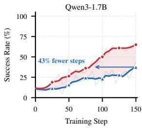

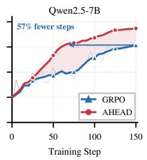

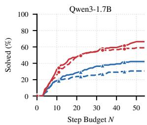

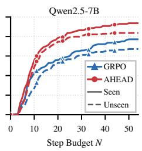  
Figure 3: Sample efficiency on ALFWorld, mea- Figure 4: Fraction of ALFWorld tasks solved sured on the seen split during training, for Qwen3- within N steps for Qwen3-1.7B (left) and 1.7B (left) and Qwen2.5-7B (right). AHEAD con- Qwen2.5-7B (right). Solid and dashed lines de verges faster and reaches a higher final success note seen and unseen splits, respectively. Beyond rate than GRPO at both scales; arrows mark the the first few steps $( N \geq 5 )$ , AHEAD consistently training-step saving to reach GRPO’s final score. outperforms GRPO across both splits and scales.

## 3.2 Main Results

Overall Performance. AHEAD achieves the best or second-best result in most columns in Table 1. Compared to GRPO, it delivers consistent gains on ALFWorld (+12.5 points on 3B, +13.3 on 7B, +21.1 on 1.7B) and WebShop-Succ (+10.1, +11.0 and +26.5 points respectively), and raises Search-Avg at every scale (+7.9, +6.5 and +1.1). On the two interactive benchmarks the improvements are most pronounced on the smaller Qwen3-1.7B. This is expected: smaller models make more errors per trajectory, so there are more error steps where corrective hints can provide useful supervision.

Comparison with Self-Distillation Baselines. On ALFWorld, AHEAD matches or outperforms all self-distillation baselines across every model scale. At 7B, it reaches 94.5%, surpassing SDAR (85.9%), Skill-SD (85.1%), and RLSD (82.0%) by large margins. At 1.7B, where smaller models struggle to utilize retrieved skills effectively, AHEAD achieves 67.2% while SDAR reaches 53.9% and RLSD only 42.2%. On WebShop, AHEAD leads across all three model scales, reaching 83.6% Succ at 7B against SDAR’s 82.8%.

Stability. Standalone OPSD collapses catastrophically (near-zero on Search-QA), and the naive GRPO+OPSD combination degrades severely on Qwen3-1.7B (32.0% vs. 46.1% for GRPO on ALFWorld) due to unbounded distillation gradients overwhelming the RL signal. AHEAD avoids these instabilities entirely, because the reweighting (Sec. 2.4) can only adjust how strongly each token’s advantage is applied, never its sign.

## 3.3 Analysis

Sample Efficiency. As shown in Figure 3, AHEAD converges substantially faster than GRPO. It reaches GRPO’s final performance level early in training and continues to improve to 94.5 against GRPO’s 81.2. The same pattern holds at 1.7B, where AHEAD ends 21.1 points above GRPO (67.2 vs. 46.1). Step-aware PI therefore does not merely raise the final score; it reaches any given score sooner, because the corrective hints tell the policy what it should have done at each error step rather than leaving it to infer this from trajectory-level rewards alone.

Step Efficiency at Test Time. The efficiency gains transfer to test time (Figure 4). Beyond the first few steps $( N \geq 5 )$ , AHEAD’s curve lies above GRPO’s on both the seen and unseen splits of ALFWorld, so the improvement is not an artifact of a generous interaction limit. The gap is largest at practical step budgets: on the unseen split, AHEAD solves 74.6% of tasks within 20 steps where GRPO solves 53.0%, and AHEAD needs only 15 steps to match the success rate GRPO attains with its full 54-step budget. The margin is wider at 1.7B, where AHEAD solves 47.8% of tasks within 20 steps against GRPO’s 23.9% and needs only 12 steps to reach GRPO’s full-budget coverage. The gains therefore come from eliminating unnecessary steps, rather than needing more room to explore. In deployment, this usually means lower latency and fewer API calls, not merely a higher score.

Ablation Study. Table 2 removes one component at a time; the full method leads nearly every column. Without the linear decay of $\lambda _ { k } ,$ , performance drops by 7.0–16.4 points on ALFWorld and up to 10.1 on WebShop, confirming that PI-based reweighting must fade as training progresses. Applying PI to all trajectories instead of only failed ones hurts most at 1.7B (−18.8 on ALFWorld), where PI on a successful trajectory pulls against an already correct gradient. Restricting the analyzer to a single error step per trajectory costs up to 25.7 points (WebShop-3B), since failed episodes rarely contain just one mistake. Both PI sources contribute: removing corrective hints costs 7.0–14.1 points on ALFWorld, confirming that a failure signal alone is not enough without corrective direction; removing environment feedback incurs smaller but consistent losses on ALFWorld (4.7–7.8 points), though the relative importance of the two sources varies across benchmarks.

<table><tr><td colspan="5">Components</td><td rowspan="2"></td><td colspan="3">ALFWorld</td><td colspan="3">WebShop</td></tr><tr><td>Configuration</td><td>Env. fb.</td><td>Hints</td><td>Multi</td><td>Fail-only</td><td>Decay</td><td>1.7B</td><td>3B</td><td>7B</td><td>1.7B 3B</td><td>7B</td></tr><tr><td>AHEAD</td><td>√</td><td>√</td><td>√</td><td>√</td><td>√</td><td>67.2</td><td>87.5</td><td>94.5</td><td>64.8</td><td>73.4</td><td>83.6</td></tr><tr><td>w/o decay</td><td>√</td><td>V</td><td>√</td><td>√</td><td>X</td><td>60.2</td><td>71.1</td><td>85.2</td><td>54.7</td><td>66.4</td><td>83.6</td></tr><tr><td>w/o failure-only</td><td>√</td><td>√</td><td>√</td><td>X</td><td>√</td><td>48.4</td><td>82.0</td><td>93.0</td><td>64.1</td><td>72.7</td><td>75.8</td></tr><tr><td>w/o multi-step</td><td>√</td><td>√</td><td>X</td><td>√</td><td>√</td><td>61.7</td><td>81.2</td><td>86.7</td><td>57.0</td><td>47.7</td><td>75.0</td></tr><tr><td>w/o hints</td><td>√</td><td>X</td><td></td><td>√</td><td>√</td><td>53.1</td><td>73.4</td><td>87.5</td><td>63.3</td><td>68.0</td><td>74.2</td></tr><tr><td>w/o env. feedback</td><td>X</td><td>√</td><td>√</td><td>√</td><td>√</td><td>59.4</td><td>81.2</td><td>89.8</td><td>67.2</td><td>72.7</td><td>72.7</td></tr><tr><td>Env. feedback only</td><td> $\checkmark$ </td><td>X</td><td></td><td>X</td><td>√</td><td>56.2</td><td>72.7</td><td>88.3</td><td>60.2</td><td>71.9</td><td>78.9</td></tr></table>

Table 2: Component ablation. Success rate (%) on ALFWorld and WebShop. Ticks give the configuration of each run, so rows differing in a single tick are one-component comparisons. Env. fb.: environment feedback as base PI. Hints: the LLM-generated corrective hint $\Phi ^ { \mathrm { l l m } }$ on error steps. Multi: the analyzer may mark several error steps per trajectory rather than one. Fail-only: PI is applied to failed trajectories only (Sec. 2.3). Decay: the linear schedule on $\lambda _ { k } .$ . The last row removes both the hints and the failure-only filter, leaving environment feedback applied uniformly.

Choice of LLM Analyzer. AHEAD depends on an external LLM to select error steps and write corrective hints, so a natural question is how much of the gain is attributed to the analyzer. Table 3 swaps it for three alternatives while holding the rest of the pipeline fixed. Two observations follow. First, every analyzer beats GRPO by a wide margin (the weakest, GLM-5, still scores 81.2 at 3B against GRPO’s 75.0, and 67.2 at 1.7B against 46.1), so the gain is not contingent on one particular model. Second, the spread across analyzers is scale-dependent: at 3B the four span 7.9 points (81.2–89.1), while at 1.7B they fall within 0.8 points of each other (67.2–68.0). At the smaller scale the policy appears unable to exploit the difference between a better and a worse hint, which puts a ceiling on what a stronger analyzer can buy: the bottleneck there is the policy’s capacity to act on corrective information, not the quality of that information. A cheaper analyzer therefore suffices for smaller backbones.

<table><tr><td>Analyzer</td><td>3B</td><td>1.7B</td></tr><tr><td>Opus 4.7 (default)</td><td>87.5</td><td>67.2</td></tr><tr><td>Sonnet 5</td><td>89.1</td><td>68.0</td></tr><tr><td>Kimi GLM-5</td><td>83.6 81.2</td><td>68.0 67.2</td></tr><tr><td>GRPO (no analyzer)</td><td>75.0</td><td>46.1</td></tr></table>

Table 3: ALFWorld success rate (%) when the error-step analyzer is swapped, holding everything else fixed. GRPO, which uses no analyzer, is repeated from Table 1 as a floor.

Qualitative Trajectory Comparison. Figure 5 contrasts a GRPO-trained policy with a AHEADtrained policy on the same ALFWorld task, put a hot plate in cabinet. Both start from identical observations, but the two trajectories diverge immediately at the first plate-bearing countertop. The GRPO agent repeatedly overlooks the plates in front of it, cycles through the same countertops and empty cabinets, and never issues a single take, heat, or move action before hitting the 50-step limit, so the episode fails. The AHEAD agent instead grounds each decision in the current observation: it picks up the plate it sees, heats it in the microwave, and places it in the cabinet, completing the full find → pick → heat → place sequence in nine steps. This is the failure mode that step-aware corrective hints target during training, an early perception error that GRPO compounds into an unrecoverable loop, and it is consistent with the shorter, more successful trajectories AHEAD produces (Sec. E). The reasoning and observation text shown is lightly condensed for readability; “. . .” marks omitted spans, and the retained excerpts are verbatim.

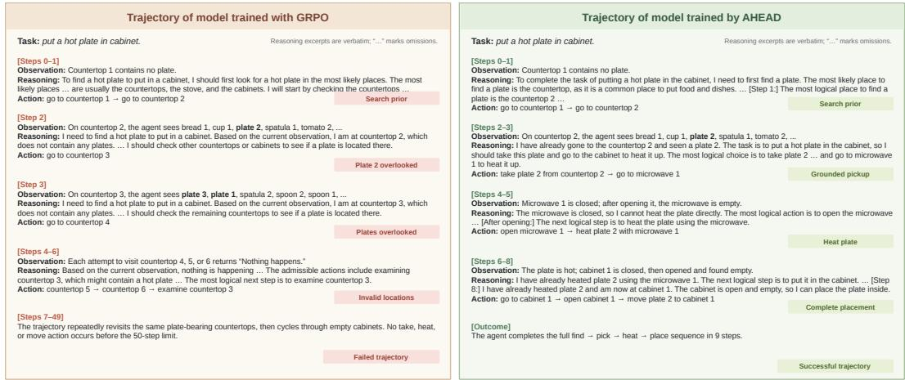  
Figure 5: Trajectory comparison on an ALFWorld task put a hot plate in cabinet. Left: a GRPOtrained policy overlooks the visible plates, revisits the same countertops and empty cabinets, and never takes, heats, or moves an object before the 50-step limit (failed trajectory). Right: a AHEAD-trained policy grounds each action in the current observation and completes the find → pick → heat → place sequence in nine steps. Reasoning and observation excerpts are lightly condensed for space; “. . .” marks omissions and retained text is verbatim.

## 4 Related Work

Reinforcement Learning for LLM Agents. Reinforcement learning is now widely used for posttraining language model agents in interactive environments (Shao et al., 2024; Dong et al., 2025; Feng et al., 2025). Agents trained with RL interact with environments over many steps, making sequential decisions in settings such as embodied reasoning (Shridhar et al., 2020), web navigation (Yao et al., 2022), and GUI automation (Lu et al., 2025, 2026a). A central difficulty in these settings is credit assignment: outcome rewards indicate whether an episode succeeded but provide no information about which intermediate decisions were responsible (Deng et al., 2025).

On-Policy Self-Distillation for Agents. On-policy self-distillation provides an alternative source of dense supervision by letting the same model serve as both student and teacher under different contexts (Agarwal et al., 2024; Zhao et al., 2026; He et al., 2026). Several recent methods combine this idea with RL for multi-turn agents. SDAR (Lu et al., 2026b) uses a sigmoid gate on the teacher-student log-probability gap to selectively distill teacher-endorsed tokens while attenuating noisy signals. RLSD (Yang et al., 2026) re-weights GRPO advantages using the same gap without a separate distillation loss. Skill-SD (Wang et al., 2026a) augments the teacher with retrieved natural-language skills and applies importance-weighted distillation. These methods apply privileged information uniformly across steps or select among different granularities of the same PI source. Our work differs by using two heterogeneous PI sources and allocating them based on step type.

Privileged Information in Agent Training. Using PI during training while removing it at inference has roots in the learning-by-cheating paradigm (Chen et al., 2019). In LLM agent training, this idea appears as skill-conditioned learning, where natural-language skills are provided during training but removed at test time (Lu et al., 2026c; Xia et al., 2026; Shi et al., 2026). These approaches typically use a single type of privileged information applied uniformly across steps. Our work extends this line by combining multiple PI sources with different costs and informativeness, and allocating them based on step-level supervision needs. More related work are discussed in Appendix A.

## 5 Conclusion

We presented AHEAD, which constructs step-aware privileged information for multi-turn agent selfdistillation. By combining environment feedback on all steps with LLM-generated corrective hints on identified error steps, AHEAD produces adaptive token-level supervision: weak confirmatory signals on routine steps and strong corrective signals where they matter most. Across three benchmarks and three model scales, AHEAD improves on both pure RL and self-distillation baselines.

## Limitations

Cost of the LLM analyzer. AHEAD calls an external LLM on failed trajectories to identify error steps and write corrective hints. This adds an inference cost to training that GRPO does not pay, and it makes the method’s behaviour depend on the analyzer’s quality. Table 3 shows that the gain survives swapping the analyzer for three weaker models, but all four are large proprietary or frontier-scale systems; whether a small open model can play the role is untested. The cost is confined to training. Inference uses no privileged information, no LLM calls, and no environment-feedback injection.

Dependence on error step identifiability. The effectiveness of AHEAD’s corrective hints relies on the LLM analyzer’s ability to correctly identify which steps were critical errors. Our evaluation focuses on environments with relatively discrete, identifiable mistakes such as picking up the wrong object, navigating to an irrelevant location, or issuing an unproductive search query. In environments where errors are subtle, cumulative, or arise from omissions rather than overt wrong actions, the analyzer may fail to pinpoint the true decision points, reducing the quality of step-aware PI. How well the approach transfers to such settings remains an open question.

Scope of evaluation. Our experiments cover three benchmarks spanning embodied reasoning, web navigation, and search-augmented QA. While these represent diverse agent interaction patterns, they share relatively short trajectories with clear binary success/failure outcomes. Environments with longer horizons, continuous action spaces, partial observability, or soft reward signals may pose additional challenges for both error detection and PI construction.

## References

Rishabh Agarwal, Nino Vieillard, Yongchao Zhou, Piotr Stanczyk, Sabela Ramos, Matthieu Geist, and Olivier Bachem. On-Policy Distillation of Language Models: Learning from Self-Generated Mistakes. In International Conference on Learning Representations (ICLR), 2024. URL https: //arxiv.org/abs/2306.13649.

Dian Chen, Brady Zhou, Vladlen Koltun, and Philipp Krähenbühl. Learning by Cheating. In Conference on Robot Learning (CoRL), 2019. URL https://arxiv.org/abs/1912.12294.

Zeyun Deng, Jasorsi Ghosh, Fiona Xie, Yuzhe Lu, Katia Sycara, and Joseph Campbell. Energy-based transfer for reinforcement learning, 2025. URL https://arxiv.org/abs/2506.16590.

Guanting Dong, Hangyu Mao, Kai Ma, Licheng Bao, Yifei Chen, Zhongyuan Wang, Zhongxia Chen, Jiazhen Du, Huiyang Wang, Fuzheng Zhang, Guorui Zhou, Yutao Zhu, Ji-Rong Wen, and Zhicheng Dou. Agentic Reinforced Policy Optimization. arXiv preprint arXiv:2507.19849, 2025. URL https://arxiv.org/abs/2507.19849.

Lang Feng, Zhenghai Xue, Tingcong Liu, and Bo An. Group-in-Group Policy Optimization for LLM Agent Training. arXiv preprint arXiv:2505.10978, 2025. URL https://arxiv.org/abs/2505. 10978.

Yinghui He, Simran Kaur, Adithya Bhaskar, Yongjin Yang, Jiarui Liu, Narutatsu Ri, Liam Fowl, Abhishek Panigrahi, Danqi Chen, and Sanjeev Arora. Self-Distillation Zero: Self-Revision Turns Binary Rewards into Dense Supervision. arXiv preprint arXiv:2604.12002, 2026. URL https://arxiv.org/abs/2604.12002.

Xanh Ho, Anh-Khoa Duong Nguyen, Saku Sugawara, and Akiko Aizawa. Constructing a Multihop QA Dataset for Comprehensive Evaluation of Reasoning Steps. In Proceedings ofthe 28th International Conference on Computational Linguistics (COLING), pp. 6609–6625, 2020. doi: 10.18653/v1/2020.coling-main.580. URL https://arxiv.org/abs/2011.01060.

Bowen Jin, Hansi Zeng, Zhenrui Yue, Jinsung Yoon, Sercan Arik, Dong Wang, Hamed Zamani, and Jiawei Han. Search-R1: Training LLMs to Reason and Leverage Search Engines with Reinforcement Learning. arXiv preprint arXiv:2503.09516, 2025. URL https://arxiv.org/ abs/2503.09516.

Mandar Joshi, Eunsol Choi, Daniel S. Weld, and Luke Zettlemoyer. TriviaQA: A Large Scale Distantly Supervised Challenge Dataset for Reading Comprehension. In Proceedings ofthe 55th Annual Meeting ofthe Associationfor Computational Linguistics (ACL), pp. 1601–1611, 2017. doi: 10.18653/v1/P17-1147. URL https://aclanthology.org/P17-1147/.

Tom Kwiatkowski, Jennimaria Palomaki, Olivia Redfield, Michael Collins, Ankur Parikh, Chris Alberti, Danielle Epstein, Illia Polosukhin, Jacob Devlin, Kenton Lee, Kristina Toutanova, Llion Jones, Matthew Kelcey, Ming-Wei Chang, Andrew M. Dai, Jakob Uszkoreit, Quoc Le, and Slav Petrov. Natural Questions: A Benchmark for Question Answering Research. Transactions ofthe Associationfor Computational Linguistics (TACL), 7:452–466, 2019. doi: 10.1162/tacl\_a\_00276. URL https://aclanthology.org/Q19-1026/.

Zhengxi Lu, Jiabo Ye, Fei Tang, Yongliang Shen, Haiyang Xu, Ziwei Zheng, Weiming Lu, Ming Yan, Fei Huang, Jun Xiao, and Yueting Zhuang. UI-S1: Advancing GUI Automation via Semi-online Reinforcement Learning. arXiv preprint arXiv:2509.11543, 2025. URL https://arxiv.org/ abs/2509.11543.

Zhengxi Lu, Yuxiang Chai, Yaxuan Guo, Xi Yin, Liang Liu, Hao Wang, Han Xiao, Shuai Ren, Guanjing Xiong, and Hongsheng Li. UI-R1: Enhancing Efficient Action Prediction of GUI Agents by Reinforcement Learning. In Proceedings of the AAAI Conference on Artificial Intelligence (AAAI), 2026a. URL https://arxiv.org/abs/2503.21620.

Zhengxi Lu, Zhiyuan Yao, Zhuowen Han, Zi-Han Wang, Jinyang Wu, Qi Gu, Xunliang Cai, Weiming Lu, Jun Xiao, Yueting Zhuang, and Yongliang Shen. Self-Distilled Agentic Reinforcement Learning. arXiv preprint arXiv:2605.15155, 2026b. URL https://arxiv.org/abs/2605.15155.

Zhengxi Lu, Zhiyuan Yao, Jinyang Wu, Chengcheng Han, Qi Gu, Xunliang Cai, Weiming Lu, Jun Xiao, Yueting Zhuang, and Yongliang Shen. Skill0: In-Context Agentic Reinforcement Learning for Skill Internalization. arXiv preprint arXiv:2604.02268, 2026c. URL https://arxiv.org/ abs/2604.02268.

Alex Mallen, Akari Asai, Victor Zhong, Rajarshi Das, Daniel Khashabi, and Hannaneh Hajishirzi. When Not to Trust Language Models: Investigating Effectiveness of Parametric and Non-Parametric Memories. In Proceedings of the 61st Annual Meeting of the Association for Computational Linguistics (ACL), Volume 1: Long Papers, pp. 9802–9822. Association for Computational Linguistics, 2023. doi: 10.18653/v1/2023.acl-long.546. URL https://aclanthology.org/2023.acl-long.546/.

Ofir Press, Muru Zhang, Sewon Min, Ludwig Schmidt, Noah A. Smith, and Mike Lewis. Measuring and Narrowing the Compositionality Gap in Language Models. In Findings of the Association for Computational Linguistics: EMNLP 2023, pp. 5687–5711. Association for Computational Linguistics, 2023. doi: 10.18653/v1/2023.findings-emnlp.378. URL https://aclanthology. org/2023.findings-emnlp.378/.

Zhihong Shao, Peiyi Wang, Qihao Zhu, Runxin Xu, Junxiao Song, Xiao Bi, Haowei Zhang, Mingchuan Zhang, Y.K. Li, Y. Wu, and Daya Guo. DeepSeekMath: Pushing the Limits of Mathematical Reasoning in Open Language Models. arXiv preprint arXiv:2402.03300, 2024. URL https://arxiv.org/abs/2402.03300.

Yaorui Shi, Yuxin Chen, Zhengxi Lu, Yuchun Miao, Shugui Liu, Qi Gu, Xunliang Cai, Xiang Wang, and An Zhang. Skill1: Unified Evolution of Skill-Augmented Agents via Reinforcement Learning. arXiv preprint arXiv:2605.06130, 2026. URL https://arxiv.org/abs/2605.06130.

Mohit Shridhar, Xingdi Yuan, Marc-Alexandre Côté, Yonatan Bisk, Adam Trischler, and Matthew Hausknecht. ALFWorld: Aligning Text and Embodied Environments for Interactive Learning. In International Conference on Learning Representations (ICLR), 2020. URL https://arxiv.org/ abs/2010.03768.

Vaishnavi Shrivastava, Piero Kauffmann, Ahmed Awadallah, and Dimitris Papailiopoulos. ECHO: Terminal Agents Learn World Models for Free. arXiv preprint arXiv:2605.24517, 2026. URL https://arxiv.org/abs/2605.24517.

Harsh Trivedi, Niranjan Balasubramanian, Tushar Khot, and Ashish Sabharwal. MuSiQue: Multihop Questions via Single-hop Question Composition. Transactions of the Association for Computational Linguistics (TACL), 10:539–554, 2022. doi: 10.1162/tacl\_a\_00475. URL https://aclanthology.org/2022.tacl-1.31/.

Hao Wang, Guozhi Wang, Han Xiao, Yufeng Zhou, Yue Pan, Jichao Wang, Ke Xu, Yafei Wen, Xiaohu Ruan, Xiaoxin Chen, and Honggang Qi. Skill-SD: Skill-Conditioned Self-Distillation for Multi-turn LLM Agents. arXiv preprint arXiv:2604.10674, 2026a. URL https://arxiv.org/ abs/2604.10674.

Zhitong Wang, Songze Li, Hao Peng, Shuzheng Si, Yi Wang, Maosong Sun, and Juanzi Li. EnvRL: Learn from Environment Dynamics in Agentic Reinforcement Learning. arXiv preprint arXiv:2606.17680, 2026b. URL https://arxiv.org/abs/2606.17680.

Peng Xia, Jianwen Chen, Hanyang Wang, Jiaqi Liu, Kaide Zeng, Yu Wang, Siwei Han, Yiyang Zhou, Xujiang Zhao, Haifeng Chen, Zeyu Zheng, Cihang Xie, and Huaxiu Yao. SkillRL: Evolving Agents via Recursive Skill-Augmented Reinforcement Learning. arXiv preprint arXiv:2602.08234, 2026. URL https://arxiv.org/abs/2602.08234.

An Yang, Baosong Yang, Beichen Zhang, Binyuan Hui, Bo Zheng, Bowen Yu, Chengyuan Li, Dayiheng Liu, Fei Huang, Haoran Wei, Huan Lin, Jian Yang, Jianhong Tu, Jianwei Zhang, Jianxin Yang, Jiaxi Yang, Jingren Zhou, Junyang Lin, Kai Dang, Keming Lu, Keqin Bao, Kexin Yang, Le Yu, Mei Li, Mingfeng Xue, Pei Zhang, Qin Zhu, Rui Men, Runji Lin, Tianhao Li, Tianyi Tang, Tingyu Xia, Xingzhang Ren, Xuancheng Ren, Yang Fan, Yang Su, Yichang Zhang, Yu Wan, Yuqiong Liu, Zeyu Cui, Zhenru Zhang, and Zihan Qiu. Qwen2.5 Technical Report. arXiv preprint arXiv:2412.15115, 2024. URL https://arxiv.org/abs/2412.15115.

An Yang, Anfeng Li, Baosong Yang, Beichen Zhang, Binyuan Hui, Bo Zheng, Bowen Yu, Chang Gao, Chengen Huang, Chenxu Lv, Chujie Zheng, Dayiheng Liu, Fan Zhou, Fei Huang, Feng Hu, Hao Ge, Haoran Wei, Huan Lin, Jialong Tang, Jian Yang, Jianhong Tu, Jianwei Zhang, Jianxin Yang, Jiaxi Yang, Jing Zhou, Jingren Zhou, Junyang Lin, Kai Dang, Keqin Bao, Kexin Yang, Le Yu, Lianghao Deng, Mei Li, Mingfeng Xue, Mingze Li, Pei Zhang, Peng Wang, Qin Zhu, Rui Men, Ruize Gao, Shixuan Liu, Shuang Luo, Tianhao Li, Tianyi Tang, Wenbiao Yin, Xingzhang Ren, Xinyu Wang, Xinyu Zhang, Xuancheng Ren, Yang Fan, Yang Su, Yichang Zhang, Yinger Zhang, Yu Wan, Yuqiong Liu, Zekun Wang, Zeyu Cui, Zhenru Zhang, Zhipeng Zhou, and Zihan Qiu. Qwen3 Technical Report. arXiv preprint arXiv:2505.09388, 2025. URL https://arxiv.org/abs/2505.09388.

Chenxu Yang, Chuanyu Qin, Qingyi Si, Minghui Chen, Naibin Gu, Dingyu Yao, Zheng Lin, Weiping Wang, Jiaqi Wang, and Nan Duan. Self-Distilled RLVR. arXiv preprint arXiv:2604.03128, 2026. URL https://arxiv.org/abs/2604.03128.

Zhilin Yang, Peng Qi, Saizheng Zhang, Yoshua Bengio, William W. Cohen, Ruslan Salakhutdinov, and Christopher D. Manning. HotpotQA: A Dataset for Diverse, Explainable Multi-hop Question Answering. In Proceedings of the 2018 Conference on Empirical Methods in Natural Language Processing (EMNLP), 2018. doi: 10.18653/v1/D18-1259. URL https://arxiv.org/abs/1809. 09600.

Shunyu Yao, Howard Chen, John Yang, and Karthik Narasimhan. WebShop: Towards Scalable Real-World Web Interaction with Grounded Language Agents. In Advances in Neural Information Processing Systems 35 (NeurIPS), 2022. URL https://arxiv.org/abs/2207.01206.

Siyan Zhao, Zhihui Xie, Mengchen Liu, Jing Huang, Guan Pang, Feiyu Chen, and Aditya Grover. Self-Distilled Reasoner: On-Policy Self-Distillation for Large Language Models. arXiv preprint arXiv:2601.18734, 2026. URL https://arxiv.org/abs/2601.18734.

## Appendix

## A Related Work

Reinforcement Learning for LLM Agents. Reinforcement learning is now widely used for posttraining language model agents in interactive environments (Shao et al., 2024; Dong et al., 2025; Feng et al., 2025). Agents trained with RL interact with environments over many steps, making sequential decisions in settings such as embodied reasoning (Shridhar et al., 2020), web navigation (Yao et al., 2022), search-augmented QA (Jin et al., 2025), and GUI automation (Lu et al., 2025, 2026a). A central difficulty in these settings is credit assignment: outcome rewards indicate whether an episode succeeded but provide no information about which intermediate decisions were responsible. Our work addresses this by introducing step-aware dense supervision that complements the coarse trajectory-level signal.

Environment Feedback as Supervision. Standard agent RL discards environment observations during optimization, using them only as context for future actions. Recent work has recognized that these observations contain useful supervision signals. ECHO (Shrivastava et al., 2026) trains the policy to predict environment observations as an auxiliary task, learning an implicit world model at no additional rollout cost. EnvRL (Wang et al., 2026b) extends this with separate state prediction and inverse dynamics objectives. These methods treat environment feedback as prediction targets for representation learning. Our work takes a different perspective: we use environment feedback as privileged information for the teacher branch, enabling grounded token-level guidance. We further combine it with LLM-generated corrective hints on error steps, providing corrective direction that environment feedback alone cannot supply.

Privileged Information in Agent Training. Using privileged information during training while removing it at inference has roots in the learning-by-cheating paradigm (Chen et al., 2019). In LLM agent training, this idea appears as skill-conditioned learning, where natural-language skills are provided during training but removed at test time (Lu et al., 2026c; Xia et al., 2026; Shi et al., 2026). These approaches typically use a single type of privileged information applied uniformly across steps. Our work extends this line by combining multiple PI sources with different costs and informativeness, and allocating them based on step-level supervision needs.

## B Dataset and Metric Details

Table 4 summarizes the datasets used in our experiments. Below we provide additional details on each benchmark and the corresponding evaluation metrics.

<table><tr><td>Benchmark</td><td>#Train</td><td>#Test</td></tr><tr><td>ALFWorld</td><td>2,400</td><td>128 (Val-128) / 140 (Seen-140) / 134 (Unseen-134)</td></tr><tr><td>WebShop</td><td>2,400</td><td>128</td></tr><tr><td>NQ, TriviaQA, PopQA, HotpotQA, 2WikiMultiHopQA, MuSiQue, Bamboogle</td><td>19,200</td><td>51,713</td></tr></table>

Table 4: Datasets used in our experiments: ALFWorld (embodied reasoning), WebShop (web navigation), and Search-based QA. For Search-based QA we train only on NQ and HotpotQA; the remaining five datasets are held out and never seen during training.

ALFWorld. ALFWorld (Shridhar et al., 2020) connects text-based interaction with the ALFRED household environment. The agent receives a natural-language goal and textual observations, and must issue a sequence of valid actions to complete the task. The benchmark covers six task categories: Pick, Look, Clean, Heat, Cool, and Pick2. We sample 2,400 training examples from the GiGPO split (Feng et al., 2025). Evaluation uses three sets: Val-128, a fixed 128-task subset of the seen split that all baselines report on and that we use by default; Seen-140, the full seen split; and Unseen-134, the unseen split, which measures generalisation to room layouts not encountered during training. On each set we report the micro-averaged success rate, in which every task counts equally:

$$
\mathrm { A L F W o r l d - A v g } = \frac { \sum _ { c = 1 } ^ { 6 } n _ { c } \mathrm { S R } _ { c } } { \sum _ { c = 1 } ^ { 6 } n _ { c } } ,\tag{9}
$$

where $n _ { c }$ is the number of tasks in category c. Because the categories are not equally sized, this differs from the unweighted mean of the six per-category rates.

WebShop. WebShop (Yao et al., 2022) is a simulated e-commerce environment where an agent searches for products, navigates product pages, selects attributes, and makes a purchase to satisfy a natural-language request. We use 2,400 training examples and evaluate on 128 fixed tasks following Feng et al. (2025). The environment returns two metrics: a normalized task-completion score that gives partial credit for matching requested attributes, and a binary success indicator for exact task completion. We report Score (the mean normalized score multiplied by 100) and Succ. (the percentage of exactly successful tasks).

Search-based QA. Following Search-R1 (Jin et al., 2025), the agent interacts with a search engine to retrieve relevant documents before producing a final answer. The evaluation spans seven datasets: three single-hop (NQ (Kwiatkowski et al., 2019), TriviaQA (Joshi et al., 2017), PopQA (Mallen et al., 2023)) and four multi-hop (HotpotQA (Yang et al., 2018), 2WikiMultiHopQA (Ho et al., 2020), MuSiQue (Trivedi et al., 2022), Bamboogle (Press et al., 2023)). We train on 19,200 examples drawn from NQ and HotpotQA; the remaining five datasets serve as out-of-domain evaluation. We compute answer accuracy on each dataset and report the unweighted macro-average:

$$
\mathrm { S e a r c h – A v g } = \frac { 1 } { 7 } \sum _ { d = 1 } ^ { 7 } \mathrm { A c c } _ { d } .\tag{10}
$$

Unlike ALFWorld, where the six categories partition a single task suite and are therefore pooled, the seven QA datasets are independently constructed benchmarks with test sets of very different sizes; averaging them without weights keeps a large dataset such as TriviaQA from dominating the score.

## C Baseline Descriptions

Following Lu et al. (2026b), we adopt the same set of baselines for a fair comparison. All methods share the same backbone model, environment configuration, rollout budget, and evaluation setup, as well as the number of optimization steps, group size, and learning rate schedule. An asterisk (\*) marks methods that retain the retrieved skill in the prompt at validation/test time.

## C.1 Prompting-Only Methods

Vanilla. The base instruction-tuned model is evaluated as-is, with no post-training applied. It receives the environment prompt and interaction history as its only input.

Skill-Prompt\*. No post-training is applied. Instead, a retrieved task-relevant skill is added to the prompt at validation/test time. Any performance gain therefore comes from the model’s ability to leverage the skill in context.

## C.2 Outcome-Based Reinforcement Learning

GRPO. GRPO (Shao et al., 2024) is a critic-free policy-gradient method. It generates multiple trajectories per task and computes advantages by normalizing their outcome rewards relative to the group. All tokens in a trajectory share the same sequence-level advantage. The policy is optimized with a clipped importance-ratio objective.

Skill-GRPO. This method trains with the same GRPO objective but additionally includes a taskrelevant skill in the prompt during rollouts. At validation/test time the skill is removed. This evaluates whether the policy has learned from skill-guided exploration well enough to perform without the skill.

Skill-GRPO\*. Training is the same as Skill-GRPO. The difference is that the skill remains in the prompt during validation/test time, so the model has consistent access to the skill in both training and evaluation.

## C.3 Self-Distillation and Hybrid Methods

OPSD. OPSD (Zhao et al., 2026) is a self-distillation method where the student and teacher are initialized from the same model. The two branches differ in their conditioning: the student sees only the task prompt, while the teacher has access to privileged information (e.g., a ground-truth solution). The teacher provides token-level distributional targets along the student’s own trajectory, and only the student receives gradient updates. No privileged context is used at inference time.

Skill-SD. Skill-SD (Wang et al., 2026a) applies self-distillation to multi-turn agent settings. It first distills successful trajectories into natural-language skills that describe effective strategies and common failure modes. During training, these skills serve as privileged context for the teacher, while the student operates with the standard task prompt only. Since the skills are not available at test time, the student must learn to reproduce the teacher’s behavior from its parameters alone.

GRPO+OPSD. This baseline adds the OPSD distillation loss as an auxiliary term to the GRPO objective. The outcome-based component operates at the trajectory level, while the distillation component provides token-level supervision from a frozen reference. This tests whether a straightforward combination of the two signals is effective.

RLSD. RLSD (Yang et al., 2026) modifies GRPO by using a privileged self-teacher to assign token-level importance weights. The log-probability gap between teacher and student at each token is mapped to a bounded scalar that adjusts the magnitude of that token’s gradient update, while the sign still follows the outcome-level advantage. The teacher’s contribution is scheduled to decay over training, so that later stages reduce to standard GRPO.

SDAR. SDAR (Lu et al., 2026b) augments GRPO with a gated distillation loss as an auxiliary objective. A teacher conditioned on privileged context (e.g., a retrieved skill) evaluates the student’s on-policy tokens and produces token-level signals. These signals pass through a bounded gate that upweights reliable positive guidance and downweights noisy negative ones before entering the loss. The GRPO advantage is not modified; the gating operates solely on the distillation term.

## D Algorithm

The full procedure of AHEAD is presented in Algorithm 1. Compared to standard GRPO (which corresponds to removing lines 9–28 and setting $\tilde { A } _ { t , \ell } = A ^ { \mathrm { e p } }$ everywhere), AHEAD adds three components: (1) an LLM analyzer call on failed trajectories, (2) a PI-augmented forward pass to compute $\delta _ { t , \ell } .$ , and (3) a bounded reweight of the advantage. All three are confined to training; at inference time the policy acts from $h _ { t }$ alone.

## E Additional Results

The main text reports the analysis of Sec. 3.3 on Qwen2.5-7B. This appendix gives the per-category numbers behind it and repeats each experiment on Qwen2.5-3B and Qwen3-1.7B. The trends observed at 7B carry over to 1.7B, where the gains are larger. At 3B the average gains are smaller, because GRPO already scores 81.4 on Seen-140, and the per-category changes are mixed.

## E.1 Per-Category Breakdown

Table 5 and Table 6 report per-category success rates on Seen-140 and Unseen-134. Figure 6 plots the 7B rows of Table 6 and Figure 7 the 1.7B rows. Unlike Table 1, whose baseline numbers are taken from Lu et al. (2026b) on Val-128, the GRPO rows here come from our own reproduced GRPO checkpoints, since Lu et al. (2026b) does not report per-category or full-split results. GRPO and AHEAD are therefore trained and evaluated in the same codebase, so the two are directly comparable.

Algorithm 1 AHEAD   
Require: Policy $\pi _ { \theta } ,$ task set $s ,$ group size $N ,$ clip bound ϵ, reweight bound $\varepsilon ,$ initial mixing coefficient $\lambda _ { 0 } ,$ decay horizon D,   
LLM analyzer A   
1: for each training iteration k do   
2: $\lambda _ { k }  \operatorname* { m a x } ( 0 , \ \lambda _ { 0 } \cdot ( 1 - k / D ) )$ ▷ Linear decay   
3: Sample a batch of tasks $\{ \boldsymbol { q } \}$ from $s$   
4: for each task q do   
5: // Stage 0: On-policy rollout   
6: Sample N trajectories $\{ \tau ^ { ( 1 ) } , \dots , \tau ^ { ( N ) } \} \sim \pi _ { \theta } ( \cdot \mid q )$   
7: Compute $A _ { i } ^ { \mathrm { e p } } = ( R ( \tau ^ { \hat { ( } i ) } ) - \mu _ { q } ) / \sigma _ { q }$ ▷ Group-relative advantage   
8: for $i = 1 , \ldots , N$ do   
9: if $R ( \dot { \tau } ^ { ( i ) } )$ indicates failure then   
10: // Stage 1: Error Step Detection   
11: Eτ , $\bar { \{ \Phi _ { t } ^ { \mathrm { l l m } } \} } _ { t \in \mathcal { E } _ { \tau } } \hat {  } \mathcal { A } ( \tau ^ { ( i ) } )$ ▷ LLM analyzer   
12: $/ / S t a g e ~ 2 \colon S t e p \ – $ ware PI Construction   
13: for each step t in $\tau ^ { ( i ) }$ do   
14: $\Phi _ { t } ^ { \mathrm { e n v } } \gets o _ { t + 1 }$ ▷ Environment feedback   
15: $\mathbf { i } \mathbf { f } \overset { \cdot } { t } \in \mathcal { E } _ { \tau }$ then   
16: $\tilde { h } _ { t } \gets H ( h _ { t } , \Phi _ { t } ^ { \mathrm { e n v } } , \Phi _ { t } ^ { \mathrm { l l m } } )$ ▷ Env + Hint   
17: else   
18: $\tilde { h } _ { t } \gets H ( h _ { t } , \Phi _ { t } ^ { \mathrm { e n v } } )$ ▷ Env only   
19: end if   
20: end for   
21: // Stage 3: Token-Level Self-Distillation   
22: for each step t, token ℓ do   
23: $\delta _ { t , \ell } \gets \log \pi _ { \theta _ { \mathrm { o l d } } } ( y _ { t , \ell } \mid \tilde { h } _ { t } , y _ { t , < \ell } ) - \log \pi _ { \theta _ { \mathrm { o l d } } } ( y _ { t , \ell } \mid h _ { t } , y _ { t , < \ell } )$   
24: $w _ { t , \ell } \gets \mathrm { c l i p } \big ( \exp \bigl ( \mathrm { s g n } ( A ^ { \mathrm { e p } } ) \cdot \mathrm { s g } ( \delta _ { t , \ell } ) \bigr ) , 1 - \varepsilon , 1 + \varepsilon \bigr )$   
25: $\tilde { A } _ { t , \ell } \gets A ^ { \mathrm { e p } } \cdot \left[ ( 1 - \lambda _ { k } ) + \lambda _ { k } \cdot w _ { t , \ell } \right]$   
26: end for   
27: else   
28: $\tilde { A } _ { t , \ell } \gets A ^ { \mathrm { e p } }$ for all $t , \ell$ ▷ Vanilla advantage   
29: end if   
30: end for   
31: // Policy update   
32: Update θ by minimizing $\mathcal { L } ( \boldsymbol { \theta } ) = - \mathbb { E } \Big [ \operatorname* { m i n } \Big ( \rho _ { t , \ell } \tilde { A } _ { t , \ell } , \hat { \rho } _ { t , \ell } \tilde { A } _ { t , \ell } \Big ) \Big ]$   
33: end for   
34: end for

The improvement is not uniform across task categories. On Unseen-134 at 7B, AHEAD leaves Clean and Cool untouched, categories that GRPO already solves at 83.9% and 85.7%, while lifting Look by 44.4 points and Pick2 by 35.3 points. These two categories require the longest action sequences and are the ones where a single misstep most often derails the episode, which is where step-aware corrective hints are most valuable. The same ordering holds at 1.7B: the largest gains fall on Pick2 (+47.1) and Look (+44.4, from a GRPO baseline that solves none of the 18 tasks).

The gain does not shrink on the unseen split. On Qwen2.5-7B, AHEAD improves the average by +16.4 points on Seen-140 (93.6 vs. 77.1) and by exactly +16.4 points on Unseen-134 (83.6 vs. 67.2). On Qwen3-1.7B the gains are +24.3 (66.4 vs. 42.1) and +28.4 (59.0 vs. 30.6), larger on the unseen split than on the seen one. Qwen2.5-3B shows the same direction more sharply: the average gain is only +1.5 on Seen-140 (82.9 vs. 81.4) but +10.5 on Unseen-134 (82.1 vs. 71.6). If AHEAD were simply overfitting to the training room layouts, its advantage would shrink on unseen rooms. It does not. Since the corrective hints are used only during training and removed at inference time, the improvement comes from what the policy has learned, not from access to privileged information.

## E.2 Training Dynamics

Figure 8 tracks training at 7B and Figure 9 at 1.7B.

AHEAD not only achieves higher final scores but also produces different training behavior. Success rate and train reward are consistently higher throughout optimization, with AHEAD reaching a final train reward of 4.40 compared to 3.47 for GRPO. The trajectory length is particularly informative: both methods start at an average of 46.8 steps, but by the end of training AHEAD has driven it down to 23.8 while GRPO only reaches 31.2. The agent thus solves more tasks and does so in fewer steps. A policy that merely explored more aggressively would improve reward at the cost of longer episodes; AHEAD improves reward and shortens trajectories, indicating that the corrective hints help the agent avoid the wasted actions that typically follow an error step. This pattern is consistent with the mechanism of step-aware PI: by providing corrective direction at error steps during training, the policy learns to avoid the common failure mode of repeating or escalating an incorrect action, which in standard GRPO often extends trajectories without progress.

<table><tr><td>Method</td><td>Pick</td><td>Look</td><td>Clean</td><td>Heat</td><td>Cool</td><td>Pick2</td><td>Avg.</td></tr><tr><td colspan="6">Qwen2.5-3B-Instruct</td><td></td><td></td></tr><tr><td>GRPO</td><td>91.4</td><td>76.9</td><td>81.5</td><td>62.5</td><td>88.0</td><td>75.0</td><td>81.4</td></tr><tr><td>AHEAD Δ</td><td>97.1 +5.7</td><td>53.8 -23.1</td><td>88.9 +7.4</td><td>87.5 +25.0</td><td>72.0 -16.0</td><td>79.2 +4.2</td><td>82.9</td></tr><tr><td>Qwen2.5-7B-Instruct</td><td></td><td></td><td></td><td></td><td></td><td></td><td>+1.5</td></tr><tr><td colspan="6"></td><td></td><td></td></tr><tr><td>GRPO AHEAD</td><td>82.9 100.0</td><td>61.5 84.6</td><td>96.3 100.0</td><td>93.8 100.0</td><td>80.0</td><td>41.7</td><td>77.1</td></tr><tr><td>Δ</td><td>+17.1</td><td>+23.1</td><td>+3.7</td><td>+6.3</td><td>80.0 +0.0</td><td>91.7 +50.0</td><td>93.6 +16.4</td></tr><tr><td colspan="6">Qwen3-1.7B-Instruct</td><td></td><td></td></tr><tr><td>GRPO</td><td>68.6</td><td>15.4</td><td>55.6</td><td>50.0</td><td>20.0</td><td>20.8</td><td>42.1</td></tr><tr><td>AHEAD</td><td>82.9</td><td>53.8</td><td>70.4</td><td>68.8</td><td>68.0</td><td>41.7</td><td>66.4</td></tr><tr><td>Δ</td><td>+14.3</td><td>+38.5</td><td>+14.8</td><td>+18.8</td><td>+48.0</td><td>+20.8</td><td>+24.3</td></tr></table>

Table 5: Success rate (%) per task category on the ALFWorld Seen-140 split. ∆ is the absolute gain of AHEAD over GRPO in percentage points, and Avg. is the micro-average over all 140 tasks.

<table><tr><td>Method</td><td>Pick</td><td>Look</td><td>Clean</td><td>Heat</td><td>Cool</td><td>Pick2</td><td>Avg.</td></tr><tr><td colspan="6">Qwen2.5-3B-Instruct</td><td></td><td></td></tr><tr><td>GRPO AHEAD</td><td>70.8 83.3</td><td>88.9 77.8</td><td>77.4 77.4</td><td>65.2 87.0</td><td>81.0 76.2</td><td>41.2 94.1</td><td>71.6 82.1</td></tr><tr><td>Δ</td><td>+12.5</td><td>-11.1</td><td>+0.0</td><td>+21.8</td><td>-4.8</td><td>+52.9</td><td>+10.5</td></tr><tr><td colspan="4">Qwen2.5-7B-Instruct GRPO 62.5 38.9 83.9</td><td>65.2</td><td>85.7</td><td>52.9</td><td>67.2</td></tr><tr><td>AHEAD Δ</td><td>79.2 +16.7</td><td>83.3 +44.4</td><td>83.9 +0.0</td><td>82.6 +17.4</td><td>85.7 +0.0</td><td>88.2 +35.3</td><td>83.6 +16.4</td></tr><tr><td colspan="4">Qwen3-1.7B-Instruct</td><td></td><td></td><td></td><td></td></tr><tr><td>GRPO</td><td>50.0</td><td>0.0</td><td>29.0</td><td>47.8</td><td>33.3</td><td>11.8</td><td>30.6</td></tr><tr><td>AHEAD Δ</td><td>66.7 +16.7</td><td>44.4 +44.4</td><td>51.6 +22.6</td><td>73.9 +26.1</td><td>57.1 +23.8</td><td>58.8 +47.1</td><td>59.0</td></tr></table>

Table 6: Success rate (%) per task category on the ALFWorld Unseen-134 split. ∆ is the absolute gain of AHEAD over GRPO in percentage points, and Avg. is the micro-average over all 134 tasks.

The same picture holds at 1.7B. Both methods start from an average episode length of 47.8 steps; by step 150 AHEAD has driven it down to 29.8 while GRPO stalls at 40.2, and it does so at a higher train reward (3.62 vs. 1.36). Success rises as trajectory length falls, the same pattern observed at 7B but a sharper one: the 10.4-step separation between the two methods at 1.7B exceeds the 7.4 steps at 7B.

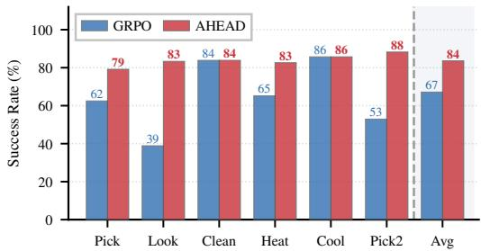

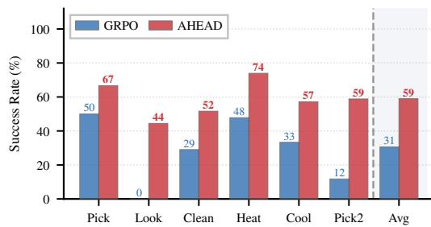  
Figure 6: Per-task success rate on the ALF- Figure 7: Per-task success rate on the ALFWorld Figure 6: Per-task success rate on the ALF-World Unseen-134 split (Qwen2.5-7B-Instruct). Unseen-134 split (Qwen3-1.7B-Instruct). Com- World Unseen-134 split (Qwen2.5-7B-Instruct). AHEAD raises the average from 67.2 to 83.6. panion to Figure 6, at the smaller scale. AHEAD raises the average from 67.2 to 83.6.  
The gains concentrate on the categories where GRPO is weakest, Look (38.9 → 83.3) and Pick2 $( 5 2 . 9  8 8 . 2 ) $ , while categories GRPO already solves (Clean, Cool) are left unchanged.

## E.3 Where the Reweighting Signal Concentrates

Setup. AHEAD assumes the self-distillation gap $\delta _ { t , \ell }$ is larger on error steps than on routine steps, so that reweighting the advantage puts more credit on the tokens that caused the failure. We check this directly. We freeze a mid-training checkpoint (step 25) on ALFWorld and collect $\delta _ { t , \ell }$ on the reweighted steps M (Eq. 5): steps of failed trajectories with non-zero advantage, i.e. the steps that actually affect the loss. A step is an error step if it is in the LLM-identified set ${ \mathcal { E } } _ { \tau }$ , and routine otherwise. This gives 2,525 error steps and 26,877 routine steps.

The signal is larger on error steps. Figure 10a shows the per-step $| \delta _ { t , \ell } |$ for both groups. Error steps have a larger gap (mean 0.37 vs. 0.17), and the two distributions separate clearly: ranking steps by $| \delta _ { t , \ell } |$ recovers the LLM error labels at AUROC 0.87. So the richer PI on error steps $( \mathrm { E q . 4 } )$ makes the signal stronger there on its own.

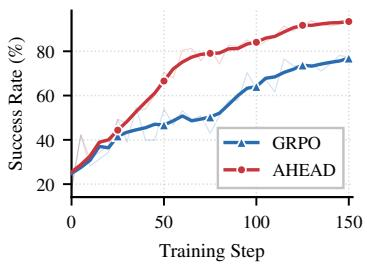

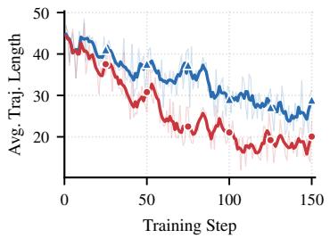

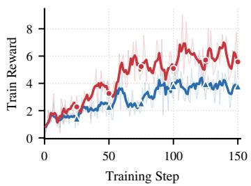  
Figure 8: Training dynamics on ALFWorld (7B); the success-rate panel is measured on the seen split. AHEAD attains a higher success rate and train reward throughout training, while driving average trajectory length down faster. The agent solves more tasks and does so in fewer steps.

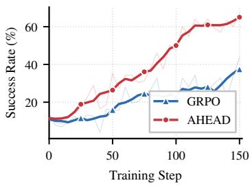

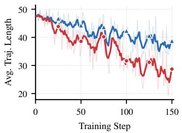

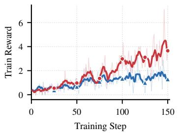  
Figure 9: Training dynamics on ALFWorld (Qwen3-1.7B-Instruct); the success-rate panel is measured on the seen split. Companion to Figure 8.

The reweight in the loss is smaller but still targets error steps. We do not apply the raw gap. The clip (ϵ = 0.2) and the mixing coefficient $\lambda _ { k }$ bound and scale it (Eq. 6–7). Figure 10b shows what the advantage is actually multiplied by, $| \tilde { A } _ { t , \ell } / A _ { \mathrm { e p } } - 1 |$ . Error steps are still favored, but the gap shrinks (AUROC 0.70), leaving the reward in control of the update direction.

Token-level view. Figure 11 shows one failed trajectory (task: find two statues and put them in the diningtable). At the error step $( t \in { \mathcal { E } } _ { \tau } )$ , the tokens for the wrong decision—re-examining the diningtable instead of searching sidetable 2—have the largest $| \bar { \delta _ { t , \ell } } |$ . Since $A _ { \mathrm { { e p } } } < 0$ on failed trajectories, these are exactly the tokens amplified by $w _ { t , \ell } > 1 \left( \mathrm { E q . ~ } 6 \right)$ . A routine step in the same trajectory stays near uniform. This shows the reweighting localizes credit through δ alone.

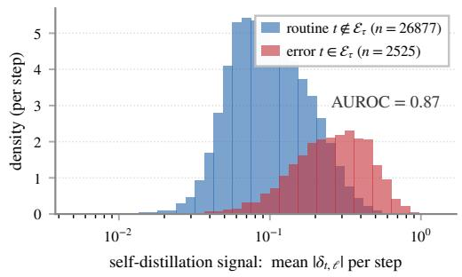  
(a) Self-distillation signal $\begin{array} { r } { | \delta _ { t , \ell } | . } \end{array}$

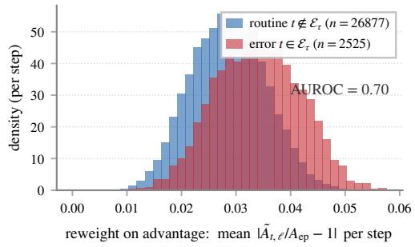  
(b) Reweight applied to the advantage.  
Figure 10: The reweighting signal targets error steps. Per-step distributions on the reweighted steps $\mathcal { M } _ { \tau }$ (ALFWorld, frozen step-25 checkpoint). (a) The gap $| \delta _ { t , \ell } |$ is larger on error steps $t \in { \mathcal { E } } _ { \tau }$ than on routine steps (AUROC 0.87). (b) After the clip and mixing $\lambda _ { k } .$ , the reweight that actually scales the advantage, $| \tilde { A } _ { t , \ell } / A _ { \mathrm { e p } } - 1 |$ , still favors error steps but with a smaller gap (AUROC 0.70), leaving the reward in control of the update direction.

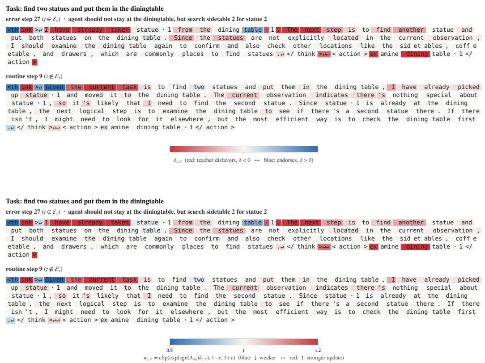  
Figure 11: Token-level credit on one failed trajectory (ALFWorld). Top: signed gap $\delta _ { t , \ell } ;$ red marks tokens the teacher disfavors $( \delta < 0 )$ . At the error step $( t \in { \mathcal { E } } _ { \tau } )$ the tokens for the wrong decision have the largest |δ|; the routine step (t /∈ E ) stays near zero. Bottom: the weight $w _ { t , \ell } =$ clip(exp(sgn $( A _ { \mathrm { e p } } ) \bar { \delta _ { t , \ell } } ) , \bar { 1 - \epsilon } , 1 + \epsilon )$ . Since $A _ { \mathrm { e p } } < 0$ on failed trajectories, these tokens get the largest amplification (w >1).

<table><tr><td>Hyperparameter</td><td>Value</td></tr><tr><td>Training steps</td><td>150</td></tr><tr><td>Training batch size</td><td>16 for ALFWorld and WebShop; 128 for Search-based QA</td></tr><tr><td>Rollout group size N</td><td>8</td></tr><tr><td>Learning rate</td><td> $1 \times 1 0 ^ { - 6 }$ </td></tr><tr><td>Hardware</td><td> $8 \times \mathrm { H } 1 0 0$ </td></tr><tr><td>GRPO clipping range €</td><td>0.2</td></tr><tr><td>Reweight bound ε</td><td>0.2</td></tr><tr><td>Initial distillation coefficient  $\lambda _ { 0 }$ </td><td>0.5</td></tr><tr><td>Decay horizon D</td><td>50</td></tr><tr><td>LLM analyzer</td><td>Claude Opus 4.7</td></tr><tr><td>Maximum prompt length</td><td>2,048 for ALFWorld; 4,096 for WebShop and Search-based QA</td></tr><tr><td>Maximum interaction steps</td><td>50 for ALFWorld; 15 for WebShop; 4 for Search-based QA</td></tr></table>

Table 7: Training configuration. The block in the middle lists the parameters introduced by AHEAD (Sec. 2.4); everything else is inherited unchanged from the GRPO baseline, so the comparison in Table 1 isolates the effect of step-aware distillation.

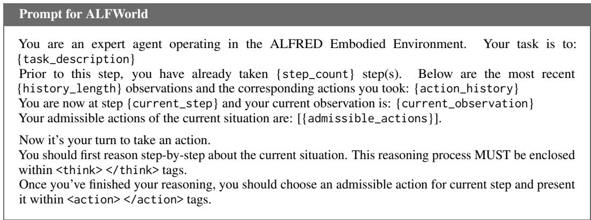  
Figure 12: Prompt template for the ALFWorld environment.

## F Hyperparameters

Table 7 lists the full configuration. All backbones share these settings. Note that AHEAD adds no KL regularisation term and no per-step coefficient: the only method-specific hyperparameters are the reweight bound ε and the decay schedule of $\lambda _ { k }$

## G Prompts

## G.1 Environment Interaction Prompts

The ALFWorld and WebShop templates follow Feng et al. (2025), and the Search-based QA template follows Jin et al. (2025). Every method (AHEAD and all baselines alike) rolls out with the same template in a given environment, so the comparison in Table 1 is not confounded by prompt wording. Braces mark slots filled at run time by the environment. Note that the agent is shown only a recent window of the interaction history rather than the full trajectory, making the step-level history $h _ { t }$ in Sec. 2.2 a bounded context.

## G.2 Error-Step Analyzer Prompt

Figure 15 gives the prompt behind Stage 1 and Stage 2 of AHEAD (Sec. 2.2). A single call does both jobs: it selects the error steps ${ \mathcal { E } } _ { \tau }$ and, for each one, writes the corrective hint $\Phi _ { t } ^ { \mathrm { l l m } }$ that is injected into the teacher context. It is invoked only on failed trajectories.

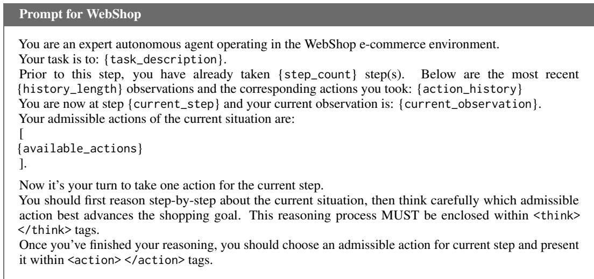

Figure 13: Prompt template for the WebShop environment.  
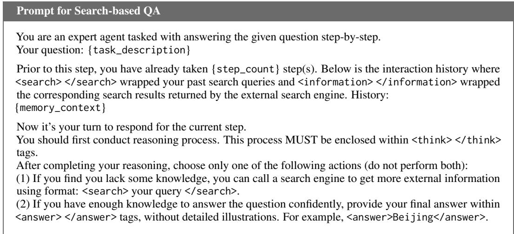  
Figure 14: Prompt template for the Search-based QA environment.

Two constraints in the prompt matter for the method. First, the analyzer is asked for at most {max\_steps} key decision steps rather than a label for every step, which keeps Eτ sparse so that most steps fall back to environment feedback alone. Second, the hint is required to be an imperative naming the correct object or query, and is explicitly forbidden from describing what went wrong. A hint that merely restated the failure would duplicate what the environment feedback already provides; the corrective prescription is what environment feedback cannot provide.

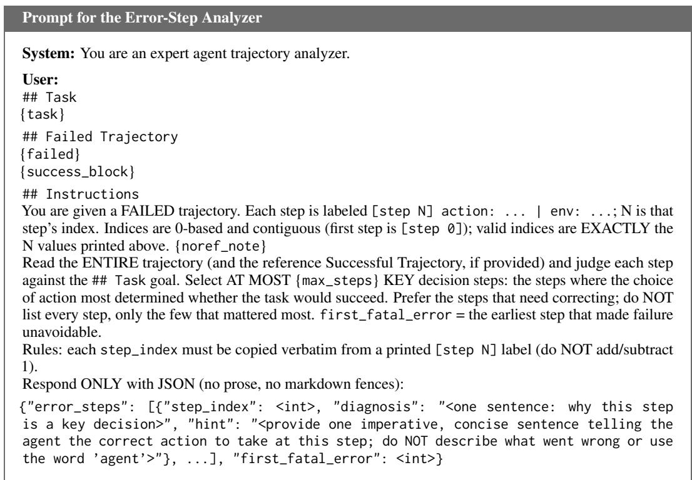  
Figure 15: Prompt template for the LLM error-step analyzer.