# Algorithmic Impact Reveals the Hidden Social Choice Structure of Alignment

Zachary Wojtowicz   
MIT   
Cambridge, MA 02139   
zachwoj@mit.edu

Finale Doshi-Velez Harvard University Cambridge, MA 02138 finale@seas.harvard.edu

Michelle Si   
Harvard University   
Cambridge, MA 02138   
msi@g.harvard.edu

Ariel Procaccia Harvard University Cambridge, MA 02138 arielpro@seas.harvard.edu

## Abstract

When an AI algorithm makes decisions that afect more than one person, aligning it becomes a problem of social choice: how should people’s divergent preferences about system behavior be reconciled and aggregated into a single coherent model? The standard approach to aligning frontier AI models—reinforcement learning from human feedback—largely sidesteps this question and has poor social choice guarantees. However, it remains unclear what alternative should replace it. We show that, by focusing directly on an algorithm’s welfare consequences, the alignment problem can be reformulated as linear optimization over a convex impact space, which makes it amenable to the standard toolkit of welfare economics and mechanism design. This reformulation clarifies how alignment protocols translate into welfare consequences and, conversely, how a social planner’s desired constraints on welfare consequences can be translated back into alignment protocols. We apply this transformation to show that voting-by-issues and random-dictatorship mechanisms are strategyproof and unanimous. Demonstrating the reverse direction, we also apply the impact representation to derive a family of alignment protocols that maximize utilitarian social welfare subject to various social desiderata, such as bounds on individual or group harm. We illustrate the welfare implications of these alignment protocols empirically using real human preferences over kidney allocation, charitable food distribution, LLM responses, and trolley problems. 1

## 1 Introduction

Alignment is typically framed as the problem of ensuring that an AI system respects human preferences. However, AI systems increasingly take actions that afect more than one person, and some disagreement about how these systems should behave is inevitable. In such cases, alignment becomes a problem of social choice: how should an AI model combine the potentially conflicting preferences of many individuals to select among alternatives?

Recently, reinforcement learning from human feedback (RLHF) has become the standard approach to aligning AI systems [Bai et al., 2022]. In this method, human annotators provide structured feedback on model responses, typically in the form of pairwise comparisons, which are then pooled together and used to train a model, either directly or through a proxy reward model. Although widely used, this approach does not directly engage with the social choice problem intrinsic to alignment, and recent work has shown that RLHF produces models that have a variety of potentially undesirable properties, such as the down-weighting of minority groups [Ge et al., 2024, G¨olz et al., 2025, Shirali et al., 2025, Chakraborty et al., 2024, Chidambaram et al., 2024, Siththaranjan et al., 2023, Halpern et al., 2025].

These limitations have prompted recent calls to elicit preferences at a more granular level, such as the group or individual, rather than pooling all feedback anonymously [Park et al., 2024, Shirali et al., 2025, Li et al., 2024, Poddar et al., 2024, Dai and Fleisig, 2024]. However, this leaves open the question: how should individual preferences, once collected, be combined? Social choice theory was developed precisely to guide such decisions [Conitzer et al., 2024]. Yet applying classica results from the field to alignment has been complicated by the structure of modern AI systems, in which alternatives are high-dimensional model parameterizations rather than discrete options. The key insight of our paper is that this complexity is an artifact of the parameterization, not of the underlying alignment problem itself:

A decision-making algorithm can be summarized by a single impact vector that captures how its choices afect individual welfare during deployment. Once reformulated in impact space, aligning a model to maximize utilitarian social welfare reduces to optimizing a linear function over a convex polytope.

Our main theorem establishes this correspondence. Specifically, we give a constructive procedure for both reformulating an alignment problem as an instance of linear social choice [Ge et al., 2024] and mapping the solution back to a deployable model parameter.

Contributions: We show that directly considering the distributional welfare impact of an AI model provides clean insights into the social choice properties of alignment protocols. We introduce our main result in Section 4, which shows that maximizing social welfare in the linear social choice setting is a linear optimization problem over a convex polytope that we call the impact space (Theorem 1). In Section 5, we show that in impact space strategyproof alignment mechanisms inherit the classical menu structure of option-set mechanisms (Lemma 2, after Barbera and Peleg, 1990), and we show that aggregating each deployment query by a monotone vote yields the strategyproof voting-by-issues rules (Theorem 2), with random dictatorships as a key example. We also establish that random dictatorships can be implemented, in expected impact, by a single model parameter (Theorem 3). In Section 6, we use our framework to characterize a family of mechanisms that maximize welfare subject to constraints on individual and group outcomes (Theorem 4), such as bounds on harm (Corollary 2) and public-spirited trade-ofs between personal loss and public gain (Corollary 3). These applications highlight how working in impact space makes it easy to build social objectives beyond utilitarian welfare maximization into AI systems. Finally, in Section 7 we illustrate the welfare consequences of these alignment protocols using real human preferences from four domains: kidney allocation, charitable food distribution, LLM responses, and trolley problems.

## 2 Related Work

Our work builds on a recent literature that studies the distributional welfare implications and other social properties of RLHF, particularly for populations with diverse preferences.

Characterizing RLHF Distortion. Understanding the shortcomings of RLHF has become an area of heightened interest [Siththaranjan et al., 2023, Shirali et al., 2025, G¨olz et al., 2025]. G¨olz et al. [2025] measure how suboptimal (relative to a utilitarian optimum) an alignment method can be in aggregate, while we focus on what generates that suboptimality on a participant-toparticipant (or group-to-group) basis. Shirali et al. [2025] show that pooled RLHF difers from using the average of individual choice probabilities by a variance term informed by preference dispersion.

Strategyproof Alignment. A separate line of work studies strategic behavior in preference collection [Sun et al., 2024, Kleine Buening et al., 2026]. Kleine Buening et al. [2026] show that standard RLHF procedures can be manipulated by strategic feedback providers and introduce the Pessimistic Median of MLEs algorithm, which is approximately strategyproof. We study a much more restricted domain (linear rewards) that gives simple results: the strategyproof alignment mechanisms are option-set mechanisms, with the random dictatorship as a focal member, and a random dictatorship need not be implemented by literally sampling one person’s personalized model at deployment time—a single preference parameter $\theta _ { \lambda } ^ { \mathrm { s p } }$ reproduces its expected impact.

Alternative Alignment Protocols. Other papers propose algorithmic alternatives for heterogeneous preferences [Chakraborty et al., 2024, Chidambaram et al., 2024, Park et al., 2024], from MaxMin-RLHF to personalization. These papers study ways to model or optimize over latent preference types given some desiderata, but our approach is more general and geometric: we show how diferent social objectives correspond to diferent optimization problems over that same set—the impact space. This lets us compare utilitarian alignment, strategyproof alignment, harmbounded alignment, and public-spirit constraints within one common representation. Our work is most closely related to the linear social choice framework of Ge et al. [2024]. Theorem 1 formally establishes that, when utilities are linearly representable, alignment is an instance of linear social choice.

## 3 Preliminaries

## 3.1 Choice in the Linear Utility Setting

We begin with the standard model of stochastic choice assumed by Direct Preference Optimization [Rafailov et al., 2023] and related methods. Let X be a finite set of contexts, Y a finite set of actions, and N the number of agents. Agent n has utility $u _ { n } : X \times Y  \mathbb { R }$ . For a binary choice problem $( x , y , y ^ { \prime } )$ , we assume stochastic choice follows a Bradley–Terry–Luce model

$$
p _ { n } ( y \succ y ^ { \prime } \mid x , y , y ^ { \prime } ) = \sigma \big ( u _ { n } ( y \mid x ) - u _ { n } ( y ^ { \prime } \mid x ) \big ) , \qquad \sigma ( a ) = \frac { \exp ( a ) } { 1 + \exp ( a ) } .
$$

Each context–action pair is embedded as $\phi ( x , y ) \in \mathbb { R } ^ { k }$ . Our central assumption is that each agent’s utility can be expressed linearly in this feature space: $u _ { n } ( y \mid x ) = \phi ( x , y ) ^ { \top } \theta _ { n }$ for $\theta _ { n } \in \mathbb { R } ^ { k }$ . For social welfare weights $w \in \Delta _ { N }$ , define the utilitarian preference parameter $\begin{array} { r } { \bar { \theta } _ { w } = \sum _ { n } w _ { n } \theta _ { n } } \end{array}$ . By linearity,

the w-weighted utilitarian aggregate is represented by the same feature map:

$$
\bar { u } _ { w } ( y \mid x ) = \sum _ { n } w _ { n } u _ { n } ( y \mid x ) = \phi ( x , y ) ^ { \top } \bar { \theta } _ { w } .
$$

Restricting attention to weighted sums of individual utilities is itself justified by the aggregation theorem of Harsanyi [1955], which shows that a social preference satisfying the expected-utility axioms over a convex set of prospects, together with Pareto indiference, must take exactly this form.

Under linear utilities, each pairwise comparison depends only on the feature diference $\begin{array} { r } { x ( x , y , y ^ { \prime } ) = } \end{array}$ $\phi ( x , y ) - \phi ( x , y ^ { \prime } )$ . We write $\alpha _ { z } \in \mathbb { R } ^ { k }$ for the vector associated with a choice problem $z \in Z =$ $X { \times } Y { \times } Y$ . Let $q _ { \mathrm { t r a i n } } \in \Delta ( [ N ] \times Z )$ be the distribution of training query-agent pairs, and $q _ { \mathrm { d e p } } \in \Delta ( Z )$ be the distribution of deployment problems.

## 3.2 Deployment Welfare

A central objective for alignment is ensuring that model behaviors improve aggregate social welfare. We measure the welfare agent n receives from a model deployed at parameter θ as the amount of utility it generates relative to the baseline of choosing randomly between the two options,

$$
U _ { n } ( \theta ) = \mathbb { E } _ { z \sim q _ { \mathrm { d e p } } } \left[ \alpha _ { z } ^ { \top } \theta _ { n } \left( \sigma ( \alpha _ { z } ^ { \top } \theta ) - \frac { 1 } { 2 } \right) \right] .
$$

The utilitarian social welfare of a deployed model is then the sum of the individual welfares, $\begin{array} { r } { U ( \theta ) = \sum _ { n = 1 } ^ { N } w _ { n } U _ { n } ( \theta ) } \end{array}$

## 4 Framework: Alignment as Linear Optimization in Impact Space

As reviewed in Section 2, recent literature has catalogued many ways that anonymous RLHF can fail to represent heterogeneous populations, violating basic welfare criteria such as Pareto eficiency [G¨olz et al., 2025, Shirali et al., 2025, Ge et al., 2024, Chakraborty et al., 2024, Park et al., 2024]. A natural remedy is to estimate preferences at the individual or group level and then combine these estimates into a single deployed model. But this immediately raises the social choice questions that anonymous RLHF sidesteps: which aggregation rule should be used? What welfare guarantees does it provide? Can agents manipulate it? Answering these questions requires a framework in which the welfare consequences of diferent alignment protocols can be directly compared. However, even if the goal of alignment is to combine the preferences of many individuals, working directly in model-parameter space obscures the comparison, because welfare is a nonlinear function of the model’s parameters.

The key insight of our framework is that this nonlinearity can be avoided if we consider the set of potential welfare implications directly, instead of the parameterization.

Under our linear utility assumptions, a model’s welfare efects can be summarized by a single vector—its impact—that lives in the same space as preferences and deployment queries (see Figure 1). Welfare is linear in this vector, so the social alignment problem reduces to optimizing a linear function over a convex set: a problem for which we have the tools of welfare economics and mechanism design at our disposal.

Definition 1. The impact of a model with parameter θ is $\begin{array} { r } { \psi ( \theta ) = \mathbb { E } _ { z \sim q _ { \mathrm { d e p } } } \left[ \alpha _ { z } \left( \sigma ( \alpha _ { z } ^ { \top } \theta ) - \frac { 1 } { 2 } \right) \right] \in \mathbb { R } ^ { k } } \end{array}$

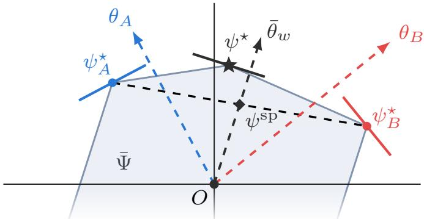  
Figure 1: The impact-space view of social alignment. Preferences $( \theta _ { n }$ , dashed) and the feasible impact set Ψ live in the same Euclidean space; for finitely many deployment queries, ¯ Ψ is a convex, origin-symmetric ¯ polytope. Preferences difer in magnitude and need not themselves be feasible impacts: both $\theta _ { A }$ and $\theta _ { B }$ lie outside $\bar { \Psi }$ . Because welfare $U _ { n } ( \bar { \psi } ) = \theta _ { n } ^ { \top } \psi$ is linear, each agent’s ideal impact $\psi _ { n } ^ { \star } = \arg \operatorname* { m a x } _ { \psi \in \bar { \Psi } } \theta _ { n } ^ { \top } \psi$ is the vertex of $\bar { \Psi }$ farthest in the direction of $\theta _ { n } ,$ which in general is not collinear with $\theta _ { n }$ . The utilitarian optimum $\psi ^ { \star }$ maximizes welfare in the weighted-average direction $\begin{array} { r } { \bar { \theta } _ { w } = \sum _ { n } w _ { n } \theta _ { n } } \end{array}$ , where the iso-welfare line $\{ \psi : \bar { \theta } _ { w } ^ { \top } \psi = \mathrm { c o n s t } \}$ is tangent to $\bar { \Psi }$ . The dashed segment conv $( \psi _ { A } ^ { \star } , \psi _ { B } ^ { \star } )$ is the set of expected impacts attainable by strategyproof mechanisms (Section 5), with $\psi ^ { \mathrm { s p } }$ the equal-weight random dictatorship.

The impact vector is a suficient statistic for welfare. Since $U _ { n } ( \theta ) = \mathbb { E } _ { z \sim q _ { \mathrm { d e p } } } [ \alpha _ { z } ^ { \top } \theta _ { n } ( \sigma ( \alpha _ { z } ^ { \top } \theta ) -$ $\begin{array} { r } { \frac 1 2 ) ] = \boldsymbol { \theta } _ { n } ^ { \top } \boldsymbol { \psi } ( \boldsymbol { \theta } ) } \end{array}$ , agent n’s welfare is the inner product of their preference with the impact vector.2 Utilitarian welfare is therefore also linear: $U ( \psi ) = \bar { \theta } _ { w } ^ { \top } \psi$

This lets us rewrite social alignment as a linear optimization over the set of feasible impacts:

$$
\psi ^ { \star } \in \underset { \psi \in \bar { \Psi } } { \arg \operatorname* { m a x } } \sum _ { n = 1 } ^ { N } w _ { n } \theta _ { n } ^ { \top } \psi , \quad \quad \bar { \Psi } = \mathrm { c l o s u r e } \{ \psi ( \theta ) : \theta \in \mathbb { R } ^ { k } \} \subseteq S _ { \mathrm { d e p } } .\tag{1}
$$

Here, $S _ { \mathrm { d e p } }$ is the subspace spanned by deployment queries, and $\bar { \Psi }$ is the feasible set of impacts achievable by some model parameter.3 The following theorem characterizes the geometry of the impact set.

Theorem 1. Let $\Psi = \{ \psi ( \theta ) : \theta \in \mathbb { R } ^ { k } \}$ and $\bar { \Psi } = \operatorname { c l } ( \Psi )$ , and let $S _ { \mathrm { d e p } }$ be the subspace of $\mathbb { R } ^ { k }$ spanned by the deployment queries. Then:

1. $\bar { \Psi } \subseteq S _ { \mathrm { d e p } }$ is the origin-symmetric zonotope $\begin{array} { r } { \bar { \Psi } = \{ \mathbb { E } _ { z \sim q _ { \mathrm { d e p } } } [ t _ { z } \alpha _ { z } ] : t _ { z } \in [ - \frac { 1 } { 2 } , \frac { 1 } { 2 } ] \} } \end{array}$ generated by the deployment queries, and Ψ = relint Ψ¯ , the interior of Ψ¯ relative to $S _ { \mathrm { d e p } }$ . In particular, Ψ¯ is convex and centrally symmetric $( { \bar { \Psi } } = - { \bar { \Psi } } )$ , and ψ is antisymmetric $( \psi ( - \theta ) = - \psi ( \theta ) )$ with $\psi ( 0 ) = 0$

2. On $S _ { \mathrm { d e p } } ,$ the map ψ is a $C ^ { \infty }$ difeomorphism from $S _ { \mathrm { d e p } }$ onto $\Psi$ . Every feasible impact $\psi \in \Psi$ is implemented by a unique parameter in $S _ { \mathrm { d e p } }$

3. ψ is bounded, with s $\begin{array} { r } { \operatorname* { u p } _ { \theta \in \mathbb { R } ^ { k } } \left\| \psi ( \theta ) \right\| \leq \frac { 1 } { 2 } \mathbb { E } _ { z \sim q _ { \mathrm { d e p } } } \| \alpha _ { z } \| . } \end{array}$

4. Scaling is monotone in the direction of $\begin{array} { r } { \theta \colon \theta ^ { \top } \frac { \partial \psi ( \nu \theta ) } { \partial \nu } = \mathbb { E } _ { z \sim q _ { \mathrm { d e p } } } \left[ ( \alpha _ { z } ^ { \top } \theta ) ^ { 2 } v ( \nu \alpha _ { z } ^ { \top } \theta ) \right] \ge 0 } \end{array}$ , where $v ( x ) = \sigma ^ { \prime } ( x )$

5. The deterministic boundary in direction θ is lim $\begin{array} { r } { \mathfrak { i } _ { \nu  \infty } \psi ( \nu \theta ) = \frac { 1 } { 2 } \mathbb { E } _ { z \sim q _ { \mathrm { d e p } } } [ \alpha _ { z } \mathrm { s i g n } ( \alpha _ { z } ^ { \top } \theta ) ] } \end{array}$ . For generic $\theta \ ( i . e . , \ \alpha _ { z } ^ { \top } \theta \neq 0$ for all $z \in \operatorname { s u p p } ( q _ { \mathrm { d e p } } ) )$ , this limit is the unique maximizer of $\theta ^ { \top } \psi$ $o v e r ~ { \bar { \Psi } } ,$ , and it is a vertex.

This structure allows us to restate the utilitarian optimal model as the boundary point of Ψ in¯ the direction of the weighted average preference $\bar { \theta } _ { w }$

Proposition 1. The limit lim $_ { \cdot \nu \to \infty } \psi ( \nu \bar { \theta } _ { w } )$ exists and is a utilitarian-optimal impact: lim $\nu \to \infty \psi ( \nu \bar { \theta } _ { w } ) \in$ $\arg \operatorname* { m a x } _ { \psi \in \bar { \Psi } } \bar { \theta } _ { w } ^ { \top } \psi$ . In particular, we may take $\begin{array} { r } { \psi ^ { \star } = \operatorname* { l i m } _ { \nu \to \infty } \psi ( \nu \bar { \theta } _ { w } ) } \end{array}$ , and this maximizer is unique whenever $\alpha _ { z } ^ { \mp } \bar { \theta } _ { w } \neq 0$ for $a l l \ z \in \mathrm { s u p p } ( q _ { \mathrm { d e p } } )$

We can now explicitly describe how scaling afects individual welfare. For agent $n ,$

$$
\frac { \partial U _ { n } ( \nu \theta ) } { \partial \nu } = \theta _ { n } ^ { \top } \frac { \partial \psi ( \nu \theta ) } { \partial \nu } = \mathbb { E } _ { z \sim q _ { \mathrm { d e p } } } \left[ ( \alpha _ { z } ^ { \top } \theta _ { n } ) ( \alpha _ { z } ^ { \top } \theta ) v ( \nu \alpha _ { z } ^ { \top } \theta ) \right] .
$$

Thus scaling helps agents whose preferences align with the model direction across deployment queries, and harms agents whose preferences covary negatively.

More generally, translating the alignment problem into impact space and considering the entire problem from the perspective of welfare invokes externalities as the objects we would like to regulate as we design alignment protocols. Our framework gives us the machinery to do so. In the remaining sections of this paper, we discuss how our framework leads to straightforward ways of addressing various types of externalities.

## 5 Strategyproof Alignment in Impact Space

When individuals have a say in how an AI system is aligned, they may be tempted to misreport their preferences to steer the outcome in their favor. Even though this problem is not a major issue for chatbots and other present AI platforms, it will likely become more salient as algorithms are deployed in increasingly consequential social domains, and their behavioral policies therefore become the subject of more direct and explicit contention among impacted stakeholders. Misreporting one’s true preferences to distort alignment in a self-serving way imposes welfare externalities on others. In economics, the field of mechanism design regulates such externalities by identifying procedures for combining preferences that are strategyproof —i.e., such that no agent can benefit from misreporting, so truthful participation is always a weakly dominant strategy.

The impact-space formulation places social alignment within the classical theory of strategyproof mechanism design, enabling us to apply its toolkit directly. Because welfare is linear in the impact vector and the feasible impact set Ψ is convex, we identify strategyproof alignment¯ mechanisms in three nested steps. The general family consists of the option-set mechanisms of Barbera and Peleg [1990]. Restricting to per-query aggregation yields voting-by-issues rules. A leading example is the random dictatorship, which we show is implementable by a single model parameter (exactly or in the limit) and is the deterministic limit of anonymous RLHF when the labeling pool is common across queries.

Our treatment of strategyproofness complements recent work by Kleine Buening et al. [2026], who study strategic behavior in ofline RLHF. Their setting is a learning problem: labelers strategically manipulate comparison labels, and they propose an approximately strategyproof learning algorithm. In contrast, we abstract away from statistical estimation and focus directly on the impact that preference reports have on an AI model’s behavior and, through it, the distribution of welfare among those impacted. By taking advantage of our linearity assumption, we can characterize a family of simple and intuitive strategyproof mechanisms.

Definition 2. A mechanism is a function $\mu : \mathbb { R } ^ { N \times k } \to \Delta ( \bar { \Psi } )$ that maps a report profile $\hat { \theta } =$ $( \hat { \theta } _ { 1 } , \dots , \hat { \theta } _ { N } )$ to a probability distribution over the space of impact vectors $\bar { \Psi }$

Throughout this section we restrict attention to generic profiles and reports—those with $\alpha _ { z } ^ { \top } \theta _ { n } \neq$ 0 for every $z \in \operatorname { s u p p } ( q _ { \mathrm { d e p } } )$ and every n—so that vote signs and ideal impacts $\psi _ { n } ^ { \star } = \arg \operatorname* { m a x } _ { \psi \in \bar { \Psi } } \theta _ { n } ^ { \top }$ ψ are single-valued (Theorem 1). Equivalently, one may fix any tie-breaking convention on the measure-zero set of non-generic reports.

Intuitively, we want a mechanism to satisfy two basic requirements. The first, as we have discussed, is strategyproofness: an agent should not be able to obtain a better outcome, according to their true preferences, by misreporting those preferences.

Definition 3. A mechanism is strategyproof if, for all preference profiles $\boldsymbol { \theta } \in \mathbb { R } ^ { N \times k }$ and $n \in [ N ]$ ， all $\theta _ { n } ^ { \prime }$ 2

$$
\mathbb { E } \big [ \theta _ { n } ^ { \top } \mu ( \theta ) \big ] \geq \mathbb { E } \big [ \theta _ { n } ^ { \top } \mu ( \theta _ { n } ^ { \prime } , \theta _ { - n } ) \big ] ,
$$

where $( \theta _ { n } ^ { \prime } , \theta _ { - n } )$ denotes the profile obtained by replacing agent n’s true preferences with $\theta _ { n } ^ { \prime }$

The second is unanimity: If all agents have exactly the same preferences, then there is no social conflict to resolve: the mechanism should simply choose the impact vector that is best according to that shared preference.

Definition 4. A mechanism $\mu$ is unanimous if, for any profile θ such that $\theta _ { n } = \bar { \theta }$ for all $n \in [ N ]$ ， $\mu ( \theta )$ is the point mass on arg max $\bar { \cdot } \psi \in \bar { \Psi } ^ { \bar { \theta } ^ { \top } \psi }$ (a singleton, since $\bar { \theta }$ is generic).

We point out a powerful consequence of the linearity of $\theta _ { n } ^ { \top } \psi \colon$ that a stochastic mechanism can be fully characterized by its expected impact vector at each profile.

Lemma 1. Let $\bar { \mu } ( \theta ) = \mathbb { E } _ { \psi \sim \mu ( \theta ) } [ \psi ] \in \bar { \Psi }$ be the expected impact. Then $\mathbb { E } [ \theta _ { n } ^ { \top } \mu ( \theta ) ] = \theta _ { n } ^ { \top } \bar { \mu } ( \theta )$ , so strategyproofness and unanimity depend on µ only through the expected-impact map $\bar { \mu } : \mathbb { R } ^ { N \times k } \to \bar { \Psi }$

This enables us to characterize classes of alignment protocols satisfying strategyproofness and unanimity while restricting attention to deterministic expected-impact maps.

## 5.1 The General Family: Option-Set Mechanisms

The impact space reformulation enables us to recognize social alignment as an instance of strategyproof social choice, which can be characterized generally using the option-set principle [Barbera and Peleg, 1990]. For a report profile, let

$$
O _ { n } ( \theta _ { - n } ) = \{ \bar { \mu } ( \theta _ { n } ^ { \prime } , \theta _ { - n } ) : \theta _ { n } ^ { \prime } \in \mathbb { R } ^ { k } \} \subseteq \bar { \Psi }
$$

be agent n’s option set: the impacts it can induce by varying its own report while the others’ reports are held fixed.

Lemma 2. A mechanism µ is strategyproof if and only if there exist menus $M _ { n } ( \theta _ { - n } ) \subseteq \bar { \Psi }$ , each depending only on the other agents’ reports, such that, at every profile, the mechanism deploys each agent’s most-preferred impact from its menu:

$$
\bar { \mu } ( \theta ) \in \underset { \psi \in M _ { n } ( \theta _ { - n } ) } { \arg \operatorname* { m a x } } ~ \theta _ { n } ^ { \top } \psi \qquad \forall n .\tag{2}
$$

In particular, we can set $M _ { n } ( \theta _ { - n } ) = O _ { n } ( \theta _ { - n } )$ to be the option set itself.

The lemma holds for any convex feasible set. It says that a strategyproof alignment protocol is equivalent to one that posts a menu of achievable model behaviors to each participant, which they cannot themselves enlarge, and deploys their favorite. The menu form is exact but implicit: an explicit characterization of all strategyproof mechanisms for expected-utility agents is a longstanding open problem even in the classical case of lotteries over finitely many alternatives [Barber\`a, 2011]. We therefore proceed by explicitly identifying structured subfamilies, each a member of the menu family above.

## 5.2 Reduction 1: Voting by Deployment Query

As established by Theorem 1, the impact set is a zonotope generated by the deployment queries. By decomposing the expectation over deployment queries into its individual terms, we can construct a strategyproof mechanism that aggregates the population’s preferences query by query. To ensure strategyproofness, the mechanism must ensure that agents cannot benefit by exaggerating the magnitude of their reports, which can be accomplished by reducing preference information to directional votes on each query. Write $s _ { z , n } = \mathrm { s i g n } ( \alpha _ { z } ^ { \top } \theta _ { n } ) \in \{ \pm 1 \}$ for how agent n would decide query $z . ^ { 4 }$

Definition 5. A voting-by-issues mechanism is specified by, for each query z, an aggregator $f _ { z } : \{ \pm 1 \} ^ { N } \ \to \ [ - 1 , 1 ]$ that is nondecreasing in each argument with $f _ { z } ( 1 , \ldots , 1 ) = 1$ and $f _ { z } ( - 1 , \ldots , - 1 ) = - 1$ . Its expected impact is

$$
\begin{array} { r } { \bar { \mu } ( \theta ) = \frac { 1 } { 2 } \mathbb { E } _ { z \sim q _ { \mathrm { d e p } } } \left[ f _ { z } ( s _ { z , 1 } , \ldots , s _ { z , N } ) \alpha _ { z } \right] } \end{array}\tag{3}
$$

Theorem 2. Every voting-by-issues mechanism is strategyproof and unanimous.

Voting-by-issues rules are the impact-space analogue of generalized median voter schemes [Barber\`a et al., 1993]: each deployment query is settled by a monotone aggregation of the participants’ preferred sides. Our setting difers from those schemes in that mechanisms are stochastic, outcomes range over the impact space, and preferences are linear in the same space. The fact that the impact set is a zonotope generated by the queries, and therefore exhibits central symmetry, makes this per-query aggregation feasible.

## 5.3 Reduction 2: Random Dictatorships

Definition 6. A mechanism is a random dictatorship with weights $\begin{array} { r } { \lambda \in \Delta _ { N } \operatorname { i f } \mu ( \theta ) = \sum _ { n = 1 } ^ { N } \lambda _ { n } \delta ( \psi _ { n } ^ { \star } ) } \end{array}$ Under Lemma 1, this is impact-equivalent to $\begin{array} { r } { \bar { \mu } ( \theta ) = \sum _ { n = 1 } ^ { N } \lambda _ { n } \psi _ { n } ^ { \star } . } \end{array}$

Proposition 2. A random dictatorship is impact-equivalent to the voting-by-issues mechanism whose aggregators are the vote averages $\begin{array} { r } { f _ { z } ( s _ { z , \cdot } ) = \sum _ { n } \lambda _ { n } s _ { z , n } } \end{array}$ . It is therefore strategyproof and unanimous.

Classical results force strategyproofness to coincide with random dictatorship alone, but only on richer preference domains: a universal domain over the outcomes [Gibbard, 1977], or strictly convex single-peaked preferences over a convex set [Dutta et al., 2002]. The assumption that preferences can be represented linearly in the model’s feature space is not without loss, as it restricts the power of more general preference profiles to constrain the space of mechanisms. This yields a richer strategyproof class, with random dictatorship as a focal example.

As defined, a random dictatorship draws a single individual, with probability $\lambda _ { n } .$ and deploys their ideal impact. By Lemma 1 it is impact-equivalent to the more natural protocol of choosing an individual at random on a query-by-query basis and deciding each query the way that individual would. A naive implementation of either would fit a separate optimal model for each individual $( \mathrm { e . g . }$ a collection of person-specific LoRA adapters) and randomly select among them at deployment.

We now show something more powerful: this apparently impractical lottery can be compiled into a single static parameter. It can be implemented exactly when its target impact lies in the relative interior of $\bar { \Psi }$ , and as a limit of single parameters otherwise.

Theorem 3. The random dictatorship with weights $\lambda \in \Delta _ { N }$ has target impact $\begin{array} { r } { \bar { \psi } _ { \lambda } = \sum _ { n = 1 } ^ { N } \lambda _ { n } \psi _ { n } ^ { \star } \in } \end{array}$ $\bar { \Psi }$ . This impact is attained by a single model parameter, which then reproduces the random dictatorship’s welfare for every agent, if and only $i f \bar { \psi } _ { \lambda } \in \Psi$ , in which case the parameter is $\theta _ { \lambda } ^ { \mathrm { s p } } = \psi ^ { - 1 } ( \bar { \psi } _ { \lambda } )$ When $\bar { \psi } _ { \lambda }$ lies on the boundary of Ψ¯ , it is instead the limit of the impacts of a sequence of single parameters.

Even though $\theta _ { \lambda } ^ { \mathrm { s p } }$ is one fixed parameterization, its stochastic responses reproduce, in expectation, the same impact as randomizing over agents’ ideal models. Mathematically, it follows from the invertibility of $\psi ;$ conceptually, it reflects that model stochasticity is itself a form of compromise between conflicting individuals (see Figure 3). Recall $\psi _ { n } ^ { \star } = \arg \operatorname* { m a x } _ { \psi \in \bar { \Psi } } \theta _ { n } ^ { \top } \psi$ is agent $n \mathrm { { s } }$ ideal impact.

Having established that a random dictatorship is strategyproof and can be compiled into a single model parameter, we now ask how much doing so constrains the achievable welfare. First, note that we can select a set of weights $\lambda$ to achieve any $\psi \in \Psi ^ { \mathrm { s p } } = \mathrm { H u l l } ( \{ \psi _ { n } ^ { \star } \} _ { n = 1 } ^ { N } )$ . Intuitively, each $\psi _ { n } ^ { \star }$ is the support point of $\bar { \Psi }$ in the direction of $\theta _ { n }$ . If agent preferences are spread over all directions, then their convex hull $\Psi ^ { \mathrm { s p } }$ will approximate Ψ. Welfare will be low when social welfare ¯ maximization selects a “compromise” impact vector that is dissimilar to all individual vectors.

Proposition 3. Let $\bar { \Psi } \subset \mathbb { R } ^ { k }$ be any compact, convex, origin-symmetric set with dim $\left( \bar { \Psi } \right) \ \geq \ 2$ suppose the welfare weights $w \in \Delta _ { N }$ are not a point mass, and write $U ^ { \star } ( \theta ) = \operatorname* { m a x } _ { \psi \in \bar { \Psi } } \bar { \theta } _ { w } ^ { \top } \psi$ for the optimal utilitarian welfare. For any weights $\lambda \in \Delta _ { N }$ and any $\delta > 0$ , there exists a preference profile θ with $U ^ { \star } ( \theta ) > 0$ at which the random dictatorship $\mu _ { \lambda } ^ { s p }$ attains at most a δ fraction of the optimum, $\mathbb { E } [ U ( \mu _ { \lambda } ^ { s p } ( \theta ) ) ] \le \delta U ^ { \star } ( \theta )$ . Hence, for non-degenerate welfare weights, the worst-case distortion $U ^ { \star } ( \theta ) / \mathbb { E } [ U ( \mu _ { \lambda } ^ { s p } ( \theta ) ) ]$ of every random dictatorship is unbounded.5

5Some restriction on w is necessary: if $w = \delta _ { i }$ , then $\begin{array} { r } { U ^ { \star } ( \theta ) = \operatorname* { m a x } _ { \psi \in \bar { \Psi } } \theta _ { i } ^ { \top } \psi = \theta _ { i } ^ { \top } \psi _ { i } ^ { \star } } \end{array}$ , while origin symmetry gives $\theta _ { i } ^ { \top } \psi \ge - U ^ { \star } ( \theta )$ for all $\psi \in \bar { \Psi } ;$ ; hence every profile satisfies $\begin{array} { r } { \mathbb { E } [ U ( \mu _ { \lambda } ^ { \mathrm { s p } } ( \theta ) ) ] = \sum _ { n } \lambda _ { n } \theta _ { i } ^ { \top } \psi _ { n } ^ { \star } \ge \left( 2 \lambda _ { i } - 1 \right) U ^ { \star } ( \theta ) } \end{array}$ , so for $\begin{array} { r } { \lambda _ { i } > \frac { 1 } { 2 } } \end{array}$ the distortion is bounded.

Intuitively, the proof shows that this worst case arises when an individual or small group has a very strong preference along some dimension that the overwhelming majority has a very weak preference in the opposite direction. In such cases, a random dictatorship will implement the weak preferences of the majority, which causes outsized harm to the minority. In the applied domains that we study, this structure does not generally arise and the strategyproof mechanism’s welfare sub-optimality is bounded (see Figure 8 in Appendix E).

These results also shed new light on the standard practice of RLHF. Anonymous RLHF fits a single parameter $\hat { \theta } ^ { \mathrm { R L H F } }$ to the pooled labels, ignoring who produced them. Our unifying result is that its deployed impact is exactly that of a simple stochastic protocol—answer each query by sampling a labeler and following their choice—and therefore depends on the training data only through the population’s per-query label frequencies.

Proposition 4. Suppose $q _ { \mathrm { t r a i n } }$ and $q _ { \mathrm { d e p } }$ share the same query marginal, and let $\hat { \theta } ^ { \mathrm { R L H F } }$ be any stationary point of the anonymous RLHF objective. Writing $\mu _ { z } = \mathbb { E } _ { n \sim { q _ { \mathrm { t r a i n } } ( \cdot | z ) } } [ \mathbb { E } [ c \mid n , z ] ]$ for the population’s label frequency on query z,

$$
\begin{array} { r } { \psi ( \hat { \theta } ^ { \mathrm { R L H F } } ) = \mathbb { E } _ { z \sim q _ { \mathrm { d e p } } } \left[ \left( \mu _ { z } - \frac { 1 } { 2 } \right) \alpha _ { z } \right] . } \end{array}
$$

That is, the deployed model is impact-equivalent to the random-labeler protocol that answers each deployment query z by sampling an agent $n \sim q _ { \mathrm { t r a i n } } ( \cdot \mid z )$ and a response $c \sim p ( \cdot \mid n , z )$

The identity holds because the RLHF first-order condition matches the first moment of $\sigma ( \alpha _ { z } ^ { \top } \hat { \theta } ^ { \mathrm { R L H F } } )$ against $\alpha _ { z }$ to that of $\mu _ { z } ,$ and the impact $\psi$ is exactly that moment. In the deterministic limit of labeler accuracy, this turns into a per-query vote count, and the impact into that of a voting-by-issues rule.

Corollary 1. Suppose, as in Proposition $^ { 4 , }$ that $q _ { \mathrm { t r a i n } }$ and $q _ { \mathrm { d e p } }$ share the same query marginal. In the deterministic labeling limit $\mathbb { E } [ c \mid n , z ]  \mathbf { 1 } \{ \alpha _ { z } ^ { \top } \theta _ { n } > 0 \}$ , anonymous RLHF converges to the voting-by-issues mechanism with per-query aggregators $\begin{array} { r } { f _ { z } ( s _ { z , \cdot } ) = \sum _ { n } q _ { \mathrm { t r a i n } } ( n \mid z ) s _ { z , n } } \end{array}$ , and is therefore strategyproof and unanimous. When the labeling weights are query-independent, $q _ { \mathrm { t r a i n } } ( n \mid$ $z ) = \lambda _ { n }$ , it is the random dictatorship with weights λ.

This highlights a connection between RLHF and the strategyproof voting-by-issues family, reaching the random-dictatorship point when the labeling pool is the same across queries.

## 6 Linear Constraints Can Enforce Externality Bounds and Tradeofs

In practice, alignment designers have objectives beyond strictly maximizing utilitarian welfare or ensuring strategyproofness. A designer may want to pursue high total welfare while guaranteeing that no individual or group is harmed beyond some threshold or, more generally, to guarantee normative commitments about how the benefits and costs of alignment are distributed.

The impact-space formulation makes this task straightforward. Because welfare is linear in the impact vector, any welfare guarantee expressible as a linear inequality becomes a halfspace constraint on $\psi .$ . As we show below, a floor on individual welfare, a bound on the ratio of personal harm to social benefit, or a constraint that no individual imposes externalities above some level can all be expressed in this way.

When augmented with such a linear constraint, the designer’s problem becomes:

$$
\psi ^ { \mathrm { w e l } } \in \underset { \psi \in \bar { \Psi } } { \arg \operatorname* { m a x } } \bar { \theta } _ { w } ^ { \top } \psi \quad \mathrm { s . t . } \quad \gamma _ { n } ^ { \top } \psi \geq c _ { n } \forall n ,\tag{4}
$$

for constraint directions $\gamma _ { n } \in \mathbb { R } ^ { k }$ and thresholds $c _ { n } \in \mathbb { R }$ . Since each constraint is a halfspace and $\bar { \Psi }$ is convex, closed, and bounded, this is a linear optimization with linear constraints whenever the feasible set is nonempty. Diferent choices of $\gamma _ { n }$ and $c _ { n }$ encode diferent commitments. We develop three natural families below—absolute welfare floors, public-spirit constraints, and participationexternality bounds—and show that all three admit closed-form characterizations.

Theorem 4. $I f { \bar { \Psi } } \cap \bigcap _ { n } \{ \psi : \gamma _ { n } ^ { \top } \psi \geq c _ { n } \}$ is nonempty, then an optimum $\psi ^ { \mathrm { w e l } }$ exists. Moreover, there are multipliers $\eta _ { n } \geq 0$ such that

$$
\psi ^ { \mathrm { w e l } } \in \mathop { \mathrm { a r g ~ m a x } } _ { \psi \in \bar { \Psi } } \left( \bar { \theta } _ { w } + \sum _ { n = 1 } ^ { N } \eta _ { n } \gamma _ { n } \right) ^ { \top } \psi ,
$$

with complementary slackness $\eta _ { n } ( { \gamma } _ { n } ^ { \top } \psi ^ { \mathrm { w e l } } - c _ { n } ) = 0$ for all $n$ . Equivalently, only the binding constraints $B = \{ n : \eta _ { n } > 0 \}$ tilt the objective, giving efective direction $\begin{array} { r } { \bar { \theta } _ { w } + \sum _ { n \in B } \eta _ { n } \gamma _ { n } } \end{array}$ . The optimal utilitarian value is weakly decreasing and concave in the thresholds c.

## 6.1 Example: Bounding Harm

A natural welfare guarantee is to require every agent’s welfare to exceed a floor $b _ { n }$ . This is the special case $\gamma _ { n } = \theta _ { n }$ and $c _ { n } = b _ { n }$

Definition 7 (Harm-bounded alignment). For welfare floors $b \in \mathbb { R } ^ { N }$ ，

$$
\psi _ { b } ^ { \mathrm { h } } \in \arg \operatorname* { m a x } _ { \psi \in \bar { \Psi } } \bar { \theta } _ { w } ^ { \top } \psi \quad \mathrm { s . t . } \quad \theta _ { n } ^ { \top } \psi \geq b _ { n } ~ \forall n .
$$

Corollary 2 (of Theorem 4). The harm-bounded optimum satisfies

$$
\psi _ { b } ^ { \mathrm { h } } \in \underset { \psi \in \bar { \Psi } } { \arg \operatorname* { m a x } } \left( \sum _ { n = 1 } ^ { N } ( w _ { n } + \eta _ { n } ) \theta _ { n } \right) ^ { \top } \psi ,
$$

where $\eta _ { n } \geq 0$ and $\eta _ { n } \big ( \theta _ { n } ^ { \top } \psi _ { b } ^ { \mathrm { h } } - b _ { n } \big ) = 0$ for all n.

The corollary has a simple interpretation. Instead of maximizing with fixed weights $w _ { n } .$ , the planner maximizes with efective weights $w _ { n } + \eta _ { n }$ . The extra term $\eta _ { n }$ is positive exactly for agents who would fall below their required welfare level without additional protection. Thus the constrained solution can be implemented as an ordinary weighted-welfare maximization problem, but with extra weight placed on the agents that need protection.

Useful choices of welfare floor include: (i) $b _ { n } = 0$ , so no agent is worse of than under a random model; (ii) $b _ { n } = \theta _ { n } ^ { \top } \psi _ { w } ^ { \mathrm { s p } }$ , so every agent weakly prefers the mechanism to the welfare-weighted strategyproof solution; and (iii) $b _ { n } = - \epsilon h _ { \bar { \Psi } } ( \theta _ { n } )$ , so agent n can lose at most an ϵ fraction of their maximum achievable welfare.6

## 6.2 Example: Public Spirit

Another example of a welfare constraint is public spirit [Flanigan et al., 2023]. This constraint allows people to tolerate personal harm in proportion to the social benefit created, where $\gamma \in [ 0 , 1 ]$ is an individual’s degree of public spirit.7

Definition 8 (Public-Spirit Alignment). For a public-spirit parameter $\gamma \in [ 0 , 1 ]$ and reference impact ψ0:

$$
\psi _ { \gamma } ^ { \mathrm { p s } } \in \underset { \psi \in \bar { \Psi } } { \mathrm { a r g } } \mathrm { m a x } \quad \bar { \theta } _ { w } ^ { \top } \psi \quad \quad \mathrm { s . t . } \quad \left( \gamma \bar { \theta } _ { w } + ( 1 - \gamma ) \theta _ { n } \right) ^ { \top } \psi \geq \left( \gamma \bar { \theta } _ { w } + ( 1 - \gamma ) \theta _ { n } \right) ^ { \top } \psi _ { 0 } \quad \forall n .
$$

The constraint has a direct interpretation, saying that agent n will accept some personal loss only when it is justified by enough social gain: $( 1 - \gamma ) \theta _ { n } ^ { \top } ( \psi _ { 0 } - \psi ) \leq \gamma \bar { \theta } _ { w } ^ { \top } ( \psi - \psi _ { 0 } )$ . When $\gamma = 0$ this reduces to an individual rationality constraint: no agent can be made worse of relative to $\psi _ { 0 }$

Corollary 3 (of Theorem 4). The public-spirit optimum satisfies

$$
\psi _ { \gamma } ^ { \mathrm { p s } } \in \mathop { \mathrm { a r g } \mathrm { m a x } } _ { \psi \in \bar { \Psi } } \quad \left( \left( 1 + \gamma \sum _ { n \in { \cal B } } \eta _ { n } \right) \bar { \theta } _ { w } + \left( 1 - \gamma \right) \sum _ { n \in { \cal B } } \eta _ { n } \theta _ { n } \right) ^ { \top } \psi ,\tag{5}
$$

where $\eta _ { n } \geq 0$ and $\eta _ { n } \left[ \left( \gamma \bar { \theta } _ { w } + ( 1 - \gamma ) \theta _ { n } \right) ^ { \top } ( \psi _ { \gamma } ^ { \mathrm { p s } } - \psi _ { 0 } ) \right] = 0 \qquad \forall n .$

Figure 2 shows how each mechanism distributes welfare across individuals at high choice precision. Under the utilitarian, RLHF, and strategyproof mechanisms the distribution is wide and carries mass below zero—agents who are actively harmed. The harm-bounded mechanism removes this left tail: as the welfare floor b tightens toward 0, more agents’ constraints bind and the distribution compresses upward against the floor, at the cost of some reduction in mean welfare. Appendix E.2 traces the same efect as a function of the choice-precision parameter $\beta$

## 6.3 Example: Bounding Participation Externalities

The welfare floor (Corollary 2) protects agents who are harmed—it increases their influence over the deployed model. Another potential concern is limiting the harm that any single agent’s participation imposes on everyone else. We formally define the participation externality in Appendix D.1. Here we need only the leave-one-out utilitarian preference, the welfare-weighted average preference of everyone other than n,

$$
\bar { \theta } _ { - n } = \frac { 1 } { 1 - w _ { n } } \sum _ { m \neq n } w _ { m } \theta _ { m } ,\tag{6}
$$

which is well defined whenever $w _ { n } < 1$

Definition 9 (Externality-bounded alignment). For a reference impact $\psi _ { 0 }$ and tolerances $b \in \mathbb { R } _ { \geq 0 } ^ { N }$ $\psi _ { b } ^ { \mathrm { e x t } } \in \arg \operatorname* { m a x } _ { \psi \in \bar { \Psi } } \bar { \theta } _ { w } ^ { \top } \psi$ s.t. $\bar { \theta } _ { - n } ^ { \top } \psi \geq \bar { \theta } _ { - n } ^ { \top } \psi _ { 0 } - b _ { n } \quad \forall n$

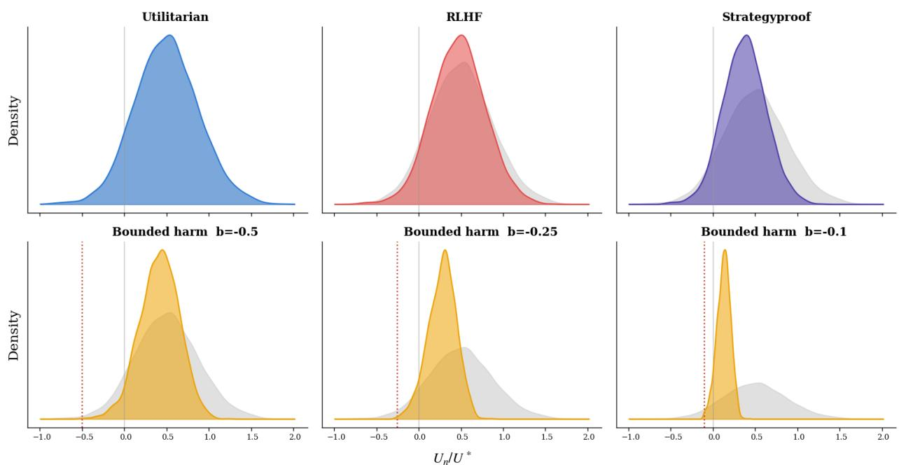  
Figure 2: Community Alignment dataset: distribution of individual welfare $U _ { n } / U ^ { \star }$ across the 2387 annota tors under each mechanism, at high choice precision $( \beta = 1 0 0 )$ . Top: utilitarian, RLHF, and strategyproof. Bottom: harm-bounded alignment at three welfare floors b; the faint gray curve repeats the utilitarian distribution for reference, and the dotted red line marks the floor. Tightening the floor (toward 0) binds more agents and compresses the welfare distribution, removing the harmed left tail.

The constraint says: the aggregate welfare of everyone except $n ,$ evaluated at the deployed impact, must not fall more than $\left( 1 - w _ { n } \right) b _ { n }$ below its value at the reference (recall that ${ \bar { \theta } } _ { - n }$ normalizes the leave-one-out weights by $1 / ( 1 - w _ { n } )$ , which requires $w _ { n } < 1$ for all n). This bounds the cost that accommodating n’s preferences imposes on the rest of the population. When $b _ { n } = 0$ the mechanism cannot reduce the rest of the population’s aggregate welfare by including n; as $b _ { n } \to \infty$ , the constraint becomes vacuous.

Corollary 4 (of Theorem 4). The externality-bounded optimum satisfies

$$
\psi _ { b } ^ { \mathrm { e x t } } \in \mathop { \mathrm { a r g } } \mathop { \operatorname* { m a x } } _ { \psi \in \bar { \Psi } } \left( \left( 1 + \sum _ { n \in \mathcal { B } } \frac { \eta _ { n } } { 1 - w _ { n } } \right) \bar { \theta } _ { w } - \sum _ { n \in \mathcal { B } } \frac { w _ { n } \eta _ { n } } { 1 - w _ { n } } \theta _ { n } \right) ^ { \top } \psi ,\tag{7}
$$

where $\eta _ { n } \geq 0$ and $\eta _ { n } \big ( \bar { \theta } _ { - n } ^ { \top } \psi _ { b } ^ { \mathrm { e x t } } - \bar { \theta } _ { - n } ^ { \top } \psi _ { 0 } + b _ { n } \big ) = 0$ for all n.

The efective direction has a striking structure that is the opposite of the welfare floor. In harm-bounded alignment (Corollary 2), binding agents receive additional weight: $w _ { n }  w _ { n } + \eta _ { n }$ Here, binding agents have their weight reduced: their preferences are subtracted from the efective direction, and the social welfare direction $\bar { \theta } _ { w }$ is amplified. Intuitively, the welfare floor asks “who is being harmed?” and gives them more voice; the externality bound asks “who is causing harm?” and attenuates their influence.

With equal weights $w _ { n } = 1 / N$ and large N, the efective direction simplifies to approximately $\begin{array} { r } { \left( 1 + \sum _ { n \in B } \eta _ { n } \right) \bar { \theta } _ { w } - \frac { 1 } { N } \sum _ { n \in B } \eta _ { n } \theta _ { n } } \end{array}$ : the dominant efect is an amplification of the utilitarian direction, with a small per-agent correction of order $1 / N$

A bounded harm mechanism allows us to regulate individuals’ participation externalities (Figure 4 in Appendix E.3). The bright rows in the bounded harm panel are the agents for whom the constraint was binding—agents whose welfare would otherwise fall below the floor. When such an agent is removed from the dataset, their binding constraint disappears and everyone else benefits from returning closer to the utilitarian regime; hence, their inclusion imposes a drastic negative externality on every other member of the population.

## 7 Empirical Illustrations

Setup. We illustrate the framework on real human pairwise-choice data from four domains: kidney allocation [Keswani et al., 2024], charitable food distribution [Lee et al., 2019], trolley problems from Moral Machine [Awad et al., 2018], and preferences over LLM responses from the Community Alignment dataset [Zhang et al., 2025]. In each domain, options are described by interpretable features (k ranging from 5 to 20) and we fit each participant’s linear preference $\theta _ { n }$ with a Bradley– Terry–Luce model on their own choices; a precision parameter $\beta$ scales all preferences, with choices becoming deterministic as $\beta \to \infty$ . For Community Alignment, responses are first embedded by a frozen sentence encoder and projected onto a K = 15-dimensional interpretable basis using the method of Wojtowicz et al. [2026], yielding N = 2387 annotators. Taking the observed queries as the deployment distribution, the impact zonotope Ψ—and with it every mechanism in this¯ paper—can be computed exactly. Dataset details and preprocessing are given in Appendix E.

Mechanisms and measures. We compare the deployed impacts of the utilitarian optimum (Proposition 1), anonymous RLHF (Proposition 4), the uniform-weight random dictatorship compiled into a single model parameter (Theorem 3), and harm-bounded alignment at several welfare floors (Corollary 2). For each mechanism we compute every agent’s welfare $U _ { n }$ relative to the utili tarian optimum $U ^ { \star }$ , as well as the person-on-person participation externalities $\Gamma _ { n , m }$ (Appendix D.1).

Findings. On Community Alignment, welfare varies widely across agents under the utilitarian, RLHF, and strategyproof mechanisms, and under all three some agents are actively harmed (Figure 2). Under harm-bounded alignment no agent’s welfare falls below the chosen floor, at a cost in mean welfare that grows as the floor tightens. The externality measures show that this cost comes from a small number of agents whose harm constraint binds, and that including these agents is costly to everyone else. Across the four datasets, agents disagree about the direction of their preferences in Moral Machine and Community Alignment, but mostly about the magnitude of their preferences in the kidney and food-rescue domains (Figure 7 in Appendix E). As a result, the strategyproof mechanism loses a fraction of the optimal welfare in these datasets (Figure 8), because the adversarial structure behind Proposition 3 does not arise in them. At high choice precision, welfare also varies least across agents under this mechanism (Figures 9 and 10). Under the utilitarian, RLHF, and strategyproof mechanisms, welfare varies more across agents as the choice precision $\beta$ grows and individual choices become more deterministic (Figure 3).

## 8 Limitations and Discussion

Limitations. Our framework builds on, and therefore relies on, the assumption that preferences are linear in a model’s feature space. For LLM alignment, making such a linear representation interpretable is nontrival, which we demonstrate on the Community Alignment dataset by importing the feature extraction pipeline of [Wojtowicz et al., 2026]. Additionally, some assumptions in our results about query distributions may not hold in practice, and the strategyproofness results rely on the central planner broadcasting individual probabilities of being selected ahead of time. The “optimal” strategyproof solution may require solving a fixed-point problem where the optimal probabilities are learned over time, a technical problem we propose for future work.

Discussion. We have shown that linear social choice provides the right setting in which to reformulate alignment as a linear optimization problem. By analyzing welfare not as a second-order consequence of model parameterization but as a first-order object, we are able to develop an impactspace framework that directly informs how we design strategyproof mechanisms as well as mechanisms that implement a variety of welfare-specific desiderata. The information granularity resulting from the impact space analysis leads to a rich set of future questions: can we use this framework to constrain the welfare impacts of one demographic group on another? Can every alignment mechanism (traditional RLHF, DPO, Max-Min, Nash) be characterized by the patterns of externalities that it creates over the population of individuals, and do we have the power to regulate these in a unified way? Prioritizing welfare as the primary object of analysis may also lead to other elegant structures in the analysis of alignment protocols—we believe this viewpoint will only become more important as we begin to align agents and other systems capable of making decisions on behalf of humans, such as negotiation or high-stakes resource allocation.

## References

Edmond Awad, Sohan Dsouza, Richard Kim, Jonathan Schulz, Joseph Henrich, Azim Sharif, Jean-Fran¸cois Bonnefon, and Iyad Rahwan. The moral machine experiment. Nature, 563(7729):59–64, 2018.

Yuntao Bai, Andy Jones, Kamal Ndousse, Amanda Askell, Anna Chen, Nova DasSarma, Dawn Drain, Stanislav Fort, Deep Ganguli, Tom Henighan, et al. Training a helpful and harmless assistant with reinforcement learning from human feedback. arXiv preprint arXiv:2204.05862, 2022.

Salvador Barber\`a. Strategyproof social choice. In Kenneth J. Arrow, Amartya Sen, and Kotaro Suzumura, editors, Handbook of Social Choice and Welfare, volume 2, chapter 25, pages 731–831. Elsevier, 2011.

Salvador Barbera and Bezalel Peleg. Strategy-proof voting schemes with continuous preferences. Social choice and welfare, 7(1):31–38, 1990.

Salvador Barber\`a, Faruk Gul, and Ennio Stacchetti. Generalized median voter schemes and committees. Journal of Economic Theory, 61(2):262–289, 1993.

Kyle Boerstler, Vijay Keswani, Lok Chan, Jana Schaich Borg, Vincent Conitzer, Hoda Heidari, and Walter Sinnott-Armstrong. On the stability of moral preferences: A problem with computational elicitation methods. In Proceedings of the AAAI/ACM Conference on AI, Ethics, and Society, volume 7, pages 156–167, 2024.

Souradip Chakraborty, Jiahao Qiu, Hui Yuan, Alec Koppel, Furong Huang, Dinesh Manocha, Amrit Singh Bedi, and Mengdi Wang. Maxmin-RLHF: Alignment with diverse human preferences. arXiv preprint arXiv:2402.08925, 2024.

Keertana Chidambaram, Karthik Vinay Seetharaman, and Vasilis Syrgkanis. Direct preference optimization with unobserved preference heterogeneity. arXiv preprint arXiv:2405.15065, 2024.

Vincent Conitzer, Rachel Freedman, Jobst Heitzig, Wesley H Holliday, Bob M Jacobs, Nathan Lambert, Milan Moss´e, Eric Pacuit, Stuart Russell, Hailey Schoelkopf, et al. Social choice should guide AI alignment in dealing with diverse human feedback. arXiv preprint arXiv:2404.10271, 2024.

Jessica Dai and Eve Fleisig. Mapping social choice theory to RLHF. arXiv preprint arXiv:2404.13038, 2024. doi: 10.48550/arXiv.2404.13038. URL https://arxiv.org/abs/2404. 13038.

Bhaskar Dutta, Hans Peters, and Arunava Sen. Strategy-proof probabilistic mechanisms in economies with pure public goods. Journal of Economic Theory, 106(2):392–416, 2002.

Bailey Flanigan, Ariel D Procaccia, and Sven Wang. Distortion under public-spirited voting. arXiv preprint arXiv:2305.11736, 2023.

Luise Ge, Daniel Halpern, Evi Micha, Ariel D Procaccia, Itai Shapira, Yevgeniy Vorobeychik, and Junlin Wu. Axioms for AI alignment from human feedback. Advances in Neural Information Processing Systems, 37:80439–80465, 2024.

Allan Gibbard. Manipulation of schemes that mix voting with chance. Econometrica: Journal of the Econometric Society, pages 665–681, 1977.

Paul G¨olz, Nika Haghtalab, and Kunhe Yang. Distortion of AI alignment: Does preference optimization optimize for preferences? arXiv preprint arXiv:2505.23749, 2025.

Daniel Halpern, Evi Micha, Ariel D Procaccia, and Itai Shapira. Pairwise calibrated rewards for pluralistic alignment. arXiv preprint arXiv:2506.06298, 2025.

Zayd Hammoudeh and Daniel Lowd. Training data influence analysis and estimation: A survey. Machine Learning, 113(5):2351–2403, 2024.

John C Harsanyi. Cardinal welfare, individualistic ethics, and interpersonal comparisons of utility. Journal of political economy, 63(4):309–321, 1955.

Vijay Keswani, Vincent Conitzer, Hoda Heidari, Jana Schaich Borg, and Walter Sinnott-Armstrong. On the pros and cons of active learning for moral preference elicitation. In Proceedings of the AAAI/ACM Conference on AI, Ethics, and Society, volume 7, pages 711–723, 2024.

Thomas Kleine Buening, Jiarui Gan, Debmalya Mandal, and Marta Kwiatkowska. Strategyproof reinforcement learning from human feedback. Advances in Neural Information Processing Systems, 38:101431–101464, 2026.

Min Kyung Lee, Daniel Kusbit, Anson Kahng, Ji Tae Kim, Xinran Yuan, Allissa Chan, Daniel See, Ritesh Noothigattu, Siheon Lee, Alexandros Psomas, et al. WeBuildAI: Participatory framework for algorithmic governance. Proceedings of the ACM on human-computer interaction, 3(CSCW): 1–35, 2019.

Xinyu Li, Ruiyang Zhou, Zachary C. Lipton, and Liu Leqi. Personalized language modeling from personalized human feedback. arXiv preprint arXiv:2402.05133, 2024. doi: 10.48550/arXiv.2402. 05133. URL https://arxiv.org/abs/2402.05133.

Chanwoo Park, Mingyang Liu, Dingwen Kong, Kaiqing Zhang, and Asuman Ozdaglar. RLHF from heterogeneous feedback via personalization and preference aggregation. arXiv preprint arXiv:2405.00254, 2024.

Sriyash Poddar, Yanming Wan, Hamish Ivison, Abhishek Gupta, and Natasha Jaques. Personalizing reinforcement learning from human feedback with variational preference learning. In Advances in Neural Information Processing Systems, volume 37, 2024. doi: 10.52202/079017-1664. URL https://proceedings.neurips.cc/paper\_files/paper/2024/ hash/5e1c255653eb98cef13f45b2d337c882-Abstract-Conference.html.

Rafael Rafailov, Archit Sharma, Eric Mitchell, Christopher D Manning, Stefano Ermon, and Chelsea Finn. Direct preference optimization: Your language model is secretly a reward model. Advances in neural information processing systems, 36:53728–53741, 2023.

R. Tyrrell Rockafellar. Convex Analysis. Princeton University Press, 1970.

Ali Shirali, Arash Nasr-Esfahany, Abdullah Alomar, Parsa Mirtaheri, Rediet Abebe, and Ariel Procaccia. Direct alignment with heterogeneous preferences. arXiv preprint arXiv:2502.16320, 2025.

Anand Siththaranjan, Cassidy Laidlaw, and Dylan Hadfield-Menell. Distributional preference learning: Understanding and accounting for hidden context in RLHF. arXiv preprint arXiv:2312.08358, 2023.

Haoran Sun, Yurong Chen, Siwei Wang, Xu Chu, Wei Chen, and Xiaotie Deng. Mechanism design for LLM fine-tuning with multiple reward models. arXiv preprint arXiv:2405.16276, 2024.

Zachary Wojtowicz, Ayush Nayak, and Jacob Andreas. From weights to words: Expressing and editing preference model inferences in natural language. arXiv preprint arXiv:2607.16232, 2026.

Lily Hong Zhang, Smitha Milli, Karen Jusko, Jonathan Smith, Brandon Amos, Wassim Bouaziz, Manon Revel, Jack Kussman, Yasha Sheynin, Lisa Titus, et al. Cultivating pluralism in algorithmic monoculture: The community alignment dataset. arXiv preprint arXiv:2507.09650, 2025.

## A Proofs for Sections 3 and 4

Throughout the proofs, let $\Psi = \{ \psi ( \theta ) : \theta \in \mathbb { R } ^ { k } \}$ and $\bar { \Psi } = \operatorname { c l } ( \Psi )$ . We optimize over ${ \bar { \Psi } } _ { \dagger }$ , but $\psi ^ { - 1 }$ is used only on Ψ, where the impact map is invertible on the deployment subspace.

For any non-empty closed convex set $A ,$ , the support function of A is

$$
h _ { A } ( x ) = \operatorname* { s u p } _ { a \in A } x ^ { \top } a .\tag{8}
$$

Proof of Theorem 1.

1. Write the impact map in terms of its per-query coordinates

$$
\begin{array} { r } { \psi ( \theta ) = \mathbb { E } _ { z \sim q _ { \mathrm { d e p } } } \big [ t _ { z } ( \theta ) \alpha _ { z } \big ] , \qquad t _ { z } ( \theta ) = \sigma ( \alpha _ { z } ^ { \top } \theta ) - \frac { 1 } { 2 } \in ( - \frac { 1 } { 2 } , \frac { 1 } { 2 } ) , } \end{array}\tag{9}
$$

and let $\mathcal { Z } = \{ \mathbb { E } _ { z \sim q _ { \mathrm { d e p } } } [ t _ { z } \alpha _ { z } ] : t _ { z } \in [ - \frac { 1 } { 2 } , \frac { 1 } { 2 } ] \}$ be the origin-symmetric zonotope generated by $\{ \frac { 1 } { 2 } q _ { \mathrm { d e p } } ( z ) \alpha _ { z } \}$ , i.e. the linear image $M ( { \bar { [ - \frac { 1 } { 2 } } , \frac { 1 } { 2 } ] } ^ { Z } )$ of the cube (one coordinate per query $z \in Z )$ under $M ( t ) = \mathbb { E } _ { z \sim q _ { \mathrm { d e p } } } [ t _ { z } \alpha _ { z } ]$ Since each $\alpha _ { z } \in S _ { \mathrm { d e p } } ,$ both Ψ and $\mathcal { Z }$ lie in $S _ { \mathrm { d e p } } .$ Because a linear map carries the relative interior of a convex set onto the relative interior of its image, M maps the open cube onto relint $\mathcal { Z } ,$ , the interior of $\mathcal { Z }$ relative to $S _ { \mathrm { d e p } }$ . Note that this is nonempty, since the generators of Z span $S _ { \mathrm { d e p } }$ . Moreover, because $t ( \theta )$ lies in the open cube, $\Psi \subseteq$ relint Z. A zonotope is convex and origin-symmetric. We have $\psi ( 0 ) = 0$ since $\begin{array} { r } { \sigma ( 0 ) = \frac { 1 } { 2 } } \end{array}$ and $\psi ( - \theta ) = - \psi ( \theta )$ since $\begin{array} { r } { \sigma ( - x ) - \frac { 1 } { 2 } = - ( \sigma ( x ) - \frac { 1 } { 2 } ) } \end{array}$ .

2. The map $\psi$ is the gradient of the convex log-partition potential

$$
\begin{array} { r } { \Phi ( \theta ) = \mathbb { E } _ { z \sim q _ { \mathrm { d e p } } } \big [ \log ( 1 + e ^ { \alpha _ { z } ^ { \top } \theta } ) - \frac { 1 } { 2 } \alpha _ { z } ^ { \top } \theta \big ] , \qquad \nabla \Phi = \boldsymbol { \psi } , \quad \nabla ^ { 2 } \Phi ( \theta ) = \mathbb { E } _ { z \sim q _ { \mathrm { d e p } } } \big [ v ( \alpha _ { z } ^ { \top } \theta ) \alpha _ { z } \alpha _ { z } ^ { \top } \big ] , } \end{array}\tag{10}
$$

with $v ~ = ~ \sigma ^ { \prime } ~ > ~ 0$ . The Hessian is positive definite on $S _ { \mathrm { d e p } }$ , i.e., if $u \in S _ { \mathrm { d e p } }$ satisfies $u ^ { \top } \nabla ^ { 2 } \Phi ( \theta ) u \ = \ \mathbb { E } _ { z \sim q _ { \mathrm { d e p } } } [ v ( \alpha _ { z } ^ { \top } \theta ) ( \alpha _ { z } ^ { \top } u ) ^ { 2 } ] \ = \ 0$ , then $\alpha _ { z } ^ { \top } u = 0$ for every $z ~ \in ~ \mathrm { s u p p } ( q _ { \mathrm { d e p } } )$ , so $u \perp S _ { \mathrm { d e p } }$ , which together with $u \in S _ { \mathrm { d e p } }$ forces $u = 0$ . Hence $\Phi$ restricted to $S _ { \mathrm { d e p } }$ is finite, $C ^ { \infty }$ , and strictly convex. Given that it is finite and diferentiable everywhere, it is essentially smooth, and is therefore a convex function of Legendre type [Rockafellar, 1970, §26]. We restrict attention to $S _ { \mathrm { d e p } }$ throughout, as on the ambient space Φ has flat directions and $\mathcal { Z }$ has empty interior whenever $S _ { \mathrm { d e p } } \neq \mathbb { R } ^ { k }$ , so all interiors below are relative to $S _ { \mathrm { d e p } }$ . The recession function of Φ is

$$
\operatorname* { l i m } _ { \nu  \infty } \frac { \Phi ( \nu u ) } { \nu } = \mathbb { E } _ { z \sim q _ { \mathrm { d e p } } } [ ( \alpha _ { z } ^ { \top } u ) _ { + } - \frac { 1 } { 2 } \alpha _ { z } ^ { \top } u ] = \frac { 1 } { 2 } \mathbb { E } _ { z \sim q _ { \mathrm { d e p } } } [ | \alpha _ { z } ^ { \top } u | ] = h _ { \mathcal { Z } } ( u ) ,\tag{11}
$$

the support function of $\mathcal { Z } .$ . By Rockafellar [1970, Theorem 13.3], the support function of dom $\Phi ^ { * }$ is the recession function of Φ; hence cl(dom Φ∗) = Z, and so relint(dom Φ∗) = relint $\mathcal { Z } .$ By Rockafellar [1970, Theorem 26.5], the gradient map of a Legendre-type function is a bijection from the interior of its domain onto the interior of the domain of its convex conjugate, with continuous inverse $\nabla \Phi ^ { * }$ ; here these interiors are $S _ { \mathrm { d e p } }$ and relint ${ \mathcal { Z } } ,$ so $\psi = \nabla \Phi$ is a bijection from $S _ { \mathrm { d e p } }$ onto relint Z, and, by the inverse function theorem, a $C ^ { \infty }$ difeomorphism. Therefore Ψ = relint Z, so $\bar { \Psi } = \operatorname { c l } ( \operatorname { r e l i n t } \mathcal { Z } ) = \mathcal { Z }$ is the stated zonotope.

3. From $\begin{array} { r } { | t _ { z } ( \theta ) | \le \frac { 1 } { 2 } , \| \psi ( \theta ) \| \le { \mathbb { E } } [ \| \alpha _ { z } \| | t _ { z } ( \theta ) | ] \le \frac { 1 } { 2 } { \mathbb { E } } [ \| \alpha _ { z } \| ] . } \end{array}$

4. Diferentiating under the expectation, $\begin{array} { r } { \frac { \partial } { \partial \nu } \psi ( \nu \theta ) = \mathbb { E } [ ( \alpha _ { z } ^ { \top } \theta ) v ( \nu \alpha _ { z } ^ { \top } \theta ) \alpha _ { z } ] } \end{array}$ , so

$$
\boldsymbol { \theta } ^ { \top } \frac { \partial } { \partial \nu } \psi ( \nu \boldsymbol { \theta } ) = \mathbb { E } _ { z \sim q _ { \mathrm { d e p } } } \big [ ( \alpha _ { z } ^ { \top } \boldsymbol { \theta } ) ^ { 2 } v ( \nu \alpha _ { z } ^ { \top } \boldsymbol { \theta } ) \big ] \geq 0 .\tag{12}
$$

5. By dominated convergence, lim $_ { 1 \nu  \infty } t _ { z } ( \nu \theta )  \frac { 1 } { 2 } \mathrm { s i g n } ( \alpha _ { z } ^ { \top } \theta )$ , so

$$
\operatorname* { l i m } _ { \nu  \infty } \psi ( \nu \theta ) = \textstyle \frac { 1 } { 2 } \mathbb { E } _ { z \sim q _ { \mathrm { d e p } } } \big [ \alpha _ { z } \mathrm { s i g n } ( \alpha _ { z } ^ { \top } \theta ) \big ] ,\tag{13}
$$

which attains $\begin{array} { r } { \operatorname* { m a x } _ { \psi \in \bar { \Psi } } \theta ^ { \top } \psi \ = \ \frac { 1 } { 2 } \mathbb { E } _ { z \sim q _ { \mathrm { d e p } } } | \alpha _ { z } ^ { \top } \theta | } \end{array}$ . For generic $\theta \ \mathrm { ( i . e . , \ } \alpha _ { z } ^ { \top } \theta \ \ne \ 0$ for all $z \in$ $\operatorname { s u p p } ( q _ { \mathrm { d e p } } ) )$ , it is the unique maximizer: any maximizer may be written $\mathbb { E } _ { z \sim q _ { \mathrm { d e p } } } [ t _ { z } \alpha _ { z } ]$ with $t _ { z } \in [ - \frac { 1 } { 2 } , \frac { 1 } { 2 } ]$ , and $\theta ^ { \top } \psi = \mathbb { E } _ { z \sim q _ { \mathrm { d e p } } } [ t _ { z } \left( \alpha _ { z } ^ { \top } \theta \right) ]$ attains this value only if $\begin{array} { r } { t _ { z } = \frac { 1 } { 2 } \mathrm { s i g n } ( \alpha _ { z } ^ { \dagger } \theta ) } \end{array}$ for every $z \in \mathrm { s u p p } ( q _ { \mathrm { d e p } } )$ , which determines the point. As the singleton exposed face of the polytope $\bar { \Psi }$ in direction $\theta ,$ it is a vertex; when $\theta = \theta _ { n }$ , it is agent $n \mathrm { { ^ { \circ } s } }$ ideal impact $\psi _ { n } ^ { \star }$

Proof of Proposition 1. By Theorem 1.5, the limit exists and equals $\begin{array} { r } { p = \frac { 1 } { 2 } \mathbb { E } _ { z \sim q _ { \mathrm { d e p } } } [ \alpha _ { z } \mathrm { s i g n } ( \alpha _ { z } ^ { \top } \bar { \theta } _ { w } ) ] } \end{array}$ and $p \in \bar { \Psi }$ because $\bar { \Psi }$ is closed and $p$ is a limit of points of Ψ. Moreover, $\begin{array} { r } { \bar { \theta } _ { w } ^ { \top } p = \frac { 1 } { 2 } \bar { \mathbb { E } } _ { z \sim q _ { \mathrm { d e p } } } [ | \alpha _ { z } ^ { \top } \bar { \theta } _ { w } | ] = } \end{array}$ $h _ { \hat { \Psi } } ( \hat { \theta } _ { w } )$ , the support function of the zonotope computed in the proof of Theorem $^ { 1 , }$ so $p$ attains the maximum of $\bar { \theta } _ { w } ^ { \top } \psi$ over $\bar { \Psi }$ , i.e. $p \in \arg \operatorname* { m a x } _ { \psi \in \bar { \Psi } } \bar { \theta } _ { w } ^ { \top } \psi$ . For uniqueness under genericity: any maximizer can be written $\psi = \mathbb { E } _ { z \sim q _ { \mathrm { d e p } } } [ t _ { z } \alpha _ { z } ]$ with $t _ { z } \in [ - \frac { 1 } { 2 } , \frac { 1 } { 2 } ]$ , and $\bar { \theta } _ { w } ^ { \top } \psi = \mathbb { E } [ t _ { z } ( \alpha _ { z } ^ { \top } \bar { \theta } _ { w } ) ]$ attains $\boldsymbol { \frac { 1 } { 2 } } \mathbb { E } | \alpha _ { z } ^ { \top } \bar { \theta } _ { w } |$ only if $\begin{array} { r } { t _ { z } = \frac { 1 } { 2 } \mathrm { s i g n } ( \alpha _ { z } ^ { \top } \bar { \theta } _ { w } ) } \end{array}$ for every z with $\alpha _ { z } ^ { \top } \bar { \theta } _ { w } \neq 0 ;$ when $\alpha _ { z } ^ { \top } \bar { \theta } _ { w } \neq 0$ for all $z \in \mathrm { s u p p } ( q _ { \mathrm { d e p } } )$ , this pins down every representation, so the maximizer equals $p .$ □

## B Proofs for Section 5

Proof of Lemma 1. By linearity of $\theta _ { n } ^ { \top } ( \cdot ) , \mathbb E [ \theta _ { n } ^ { \top } \mu ( \theta ) ] = \theta _ { n } ^ { \top } \mathbb E _ { \psi \sim \mu ( \theta ) } [ \psi ] = \theta _ { n } ^ { \top } \bar { \mu } ( \theta )$ . Strategyproofness is an inequality between such expectations and so depends only on $\bar { \mu } .$ . For unanimity, on the generic domain where it is defined, the point $\psi ^ { \star } ( \bar { \theta } ) = \arg \operatorname* { m a x } _ { \psi \in \bar { \Psi } } \bar { \theta } ^ { \top } \psi$ is an exposed vertex—and hence an extreme point—of $\bar { \Psi }$ (Theorem 1). A distribution whose mean is an extreme point is the point mass, so $\mu ( \theta , \ldots , \theta ) = \delta ( \psi ^ { \star } ( \bar { \theta } ) ) { \mathrm { ~ i f ~ } } \bar { \mu } ( \theta , \ldots , \theta ) = \psi ^ { \star } ( \bar { \theta } )$ □

Proof of Lemma 2. By Lemma 1 we restrict attention to $\bar { \mu } .$ The argument follows that of Barbera and Peleg [1990].

⇐ Suppose such menus $M _ { n }$ exist. Fix $n , \theta _ { - n } .$ , and true type $\theta _ { n }$ . For any misreport $\theta _ { n } ^ { \prime }$ , the mechanism applied at the profile $( \theta _ { n } ^ { \prime } , \theta _ { - n } )$ gives $\bar { \mu } ( \theta _ { n } ^ { \prime } , \theta _ { - n } ) \in M _ { n } ( \theta _ { - n } )$ , and applied at $\theta$ it says $\bar { \mu } ( \theta )$ maximizes $\theta _ { n } ^ { \top } \psi$ over $M _ { n } ( \theta _ { - n } )$ . Hence ${ \theta } _ { n } ^ { \top } \bar { \mu } ( \theta ) \geq { \theta } _ { n } ^ { \top } \bar { \mu } ( { \theta } _ { n } ^ { \prime } , { \theta } _ { - n } )$ . Thus, it is strategyproof.

⇒ Suppose $\mu$ is strategyproof and take $M _ { n } ( \theta _ { - n } ) = O _ { n } ( \theta _ { - n } ) = \{ \bar { \mu } ( \theta _ { n } ^ { \prime } , \theta _ { - n } ) : \theta _ { n } ^ { \prime } \in \mathbb { R } ^ { k } \}$ , which depends only on $\theta _ { - n }$ . Then ${ \bar { \mu } } ( \theta ) \in O _ { n } ( \theta _ { - n } )$ trivially, and strategyproofness says $\theta _ { n } ^ { \top } \bar { \mu } ( \theta ) \geq$ $\theta _ { n } ^ { \top }$ ψ for every $\begin{array} { r } { \psi \in O _ { n } ( \theta _ { - n } ) , \mathrm { i . e . } \ \bar { \mu } ( \theta ) \in \arg \operatorname* { m a x } _ { \psi \in O _ { n } ( \theta _ { - n } ) } \theta _ { n } ^ { \top } \psi } \end{array}$

Proof of Theorem 2. Fix agent n and the others’ reports. By Definition $5 ,$ agent n’s expected utility is

$$
\begin{array} { r } { \boldsymbol { \theta } _ { n } ^ { \top } \bar { \boldsymbol { \mu } } ( \boldsymbol { \theta } ) = \frac { 1 } { 2 } \mathbb { E } _ { z \sim q _ { \mathrm { d e p } } } \big [ f _ { z } ( s _ { z } ) ( \alpha _ { z } ^ { \top } \boldsymbol { \theta } _ { n } ) \big ] , } \end{array}\tag{14}
$$

a sum over queries in which n controls only its own votes $\{ s _ { z , n } \}$ . For each $z ,$ this is increasing in $f _ { z }$ when $\alpha _ { z } ^ { \top } \theta _ { n } > 0$ and decreasing when $\alpha _ { z } ^ { \mp } \theta _ { n } < 0$ . Since $f _ { z }$ is nondecreasing in $s _ { z , n } .$ , it is maximized by the truthful vote $s _ { z , n } = \mathrm { s i g n } ( \alpha _ { z } ^ { \top } \theta _ { n } )$ . The truthful report realizes all these votes simultaneously, so it maximizes every term and hence the sum.

For unanimity, note that identical reports give $s _ { z , n } = s _ { z } = \mathrm { s i g n } ( \alpha _ { z } ^ { \top } \bar { \theta } )$ , so $f _ { z } = s _ { z }$ and $\bar { \mu } =$ $\textstyle { \frac { 1 } { 2 } } \mathbb { E } _ { z } [ s _ { z } \alpha _ { z } ] = \psi ^ { \star } ( { \bar { \theta } } )$ , which is unanimous by Lemma 1. □

Proof of Proposition 2. The aggregator $\begin{array} { r } { f _ { z } ( s _ { z } ) = \sum _ { n } \lambda _ { n } s _ { z , n } } \end{array}$ is non-decreasing in each vote (given $\lambda _ { n } \geq 0 )$ with $f _ { z } ( \pm { \bf 1 } ) = \pm 1$ , so it defines a voting-by-issues mechanism, which is strategyproof and unanimous by Theorem 2. Its expected impact is $\begin{array} { r } { \frac { 1 } { 2 } \mathbb { E } _ { z } \big [ \big ( \sum _ { n } \lambda _ { n } s _ { z , n } \big ) \alpha _ { z } \big ] = \sum _ { n } \lambda _ { n } \cdot \frac { 1 } { 2 } \mathbb { E } _ { z } \big [ s _ { z , n } \alpha _ { z } \big ] = } \end{array}$ $\sum _ { n } \lambda _ { n } \psi _ { n } ^ { \star }$ , the random dictatorship with weights $\lambda .$ □

Proof of Theorem ${ \mathcal { B } } .$ Each ideal impact $\psi _ { n } ^ { \star }$ lies in $\bar { \Psi }$ , which is convex (Theorem 1), so the target impact $\begin{array} { r } { \bar { \psi } _ { \lambda } = \sum _ { n } \lambda _ { n } \psi _ { n } ^ { \star } \in \bar { \Psi } } \end{array}$ . By Theorem 1(1), the impacts attainable by a single parameter are exactly $\Psi = \{ \psi ( \theta ) : \theta \in \mathbb { R } ^ { k } \}$ , the relative interior of $\bar { \Psi }$ , and by Theorem 1(2), ψ is a bijection from $S _ { \mathrm { d e p } }$ onto Ψ. Hence $\psi _ { \lambda }$ is attained by a single parameter if and only if $\bar { \psi } _ { \lambda } \in \Psi$ , in which case the unique such parameter in $S _ { \mathrm { d e p } }$ is $\theta _ { \lambda } ^ { \mathrm { s p } } = \psi ^ { - 1 } ( \bar { \psi } _ { \lambda } )$ , with impact exactly $\psi _ { \lambda }$ . This is the mean impact of the random dictatorship (Proposition 2). Since welfare depends on a mechanism only through its expected impact (Lemma 1), this single parameter reproduces the random dictatorship’s welfare for every agent.

When $\psi _ { \lambda }$ instead lies on the boundary of $\bar { \Psi }$ , it remains a limit of single-parameter impacts: since $0 = \psi ( 0 ) \in \Psi = \mathrm { r e l i n t }$ Ψ and¯ $\bar { \psi } _ { \lambda } \in \bar { \Psi }$ , the half-open segment $\left\{ ( 1 - \varepsilon ) \bar { \psi } _ { \lambda } : \varepsilon \in ( 0 , 1 ] \right\}$ lies in Ψ. Thus $\theta _ { \lambda , \varepsilon } ^ { \mathrm { s p } } : = \psi ^ { - 1 } \big ( ( 1 - \varepsilon ) \bar { \psi } _ { \lambda } \big )$ is well-defined for every $\varepsilon \in ( 0 , 1 )$ , and $\psi \big ( \theta _ { \lambda , \varepsilon } ^ { \mathrm { s p } } \big ) = ( 1 - \varepsilon ) \bar { \psi } _ { \lambda }  \bar { \psi } _ { \lambda }$ as $\varepsilon \to 0$ □

Proof of Proposition 3. Choice of directions. Since $\bar { \Psi }$ is convex and origin-symmetric, its afine hull is the linear span $S = \operatorname { s p a n } ( { \bar { \Psi } } )$ and $0 \in$ relint $\bar { \Psi } ;$ hence $h _ { \bar { \Psi } } ( d ) > 0$ for every nonzero $d \in S$ The support function $h _ { \bar { \Psi } }$ is finite and convex on $S ,$ hence diferentiable at Lebesgue-almost every direction in $S ,$ and since $\bar { \Psi } \subseteq S$ it is diferentiable at d $\in \ S$ exactly when arg $\operatorname* { m a x } _ { \psi \in \bar { \Psi } } d ^ { \top } \psi$ is a singleton. Fix such a $d _ { 1 } \in S$ with $d _ { 1 } \neq 0$ and let v denote the unique maximizer in direction $d _ { 1 } \mathbf { ; }$ then $d _ { 1 } ^ { \top } v = h _ { \bar { \Psi } } ( d _ { 1 } ) > 0$ and $v \ne 0$ , and by symmetry −v is the unique maximizer in direction $- d _ { 1 }$ . Because dim $\left( \bar { \Psi } \right) \geq 2$ and $v \in S$ , we may choose $d _ { 2 } \in S$ with $d _ { 2 } \perp v$ and $d _ { 2 } \neq 0 ,$ , and then $h _ { \bar { \Psi } } ( d _ { 2 } ) > 0$

Profile. Since w is not a point mass, fix i with $0 < w _ { i } < 1$ . For $\varepsilon > 0$ , set

$$
\theta _ { n } = \left\{ { \begin{array} { l l } { d _ { 1 } + \varepsilon d _ { 2 } } & { n = i } \\ { \displaystyle - { \frac { w _ { i } } { 1 - w _ { i } } } d _ { 1 } + \varepsilon d _ { 2 } } & { n \neq i . } \end{array} } \right.\tag{15}
$$

(The coeficient for $n \neq i$ is common to all agents, so zero welfare weights are permitted.) The $d _ { 1 }$ components cancel in the welfare-weighted average:

$$
\bar { \theta } _ { w } = \sum _ { n } w _ { n } \theta _ { n } = w _ { i } d _ { 1 } - \frac { w _ { i } } { 1 - w _ { i } } \left( 1 - w _ { i } \right) d _ { 1 } + \varepsilon d _ { 2 } = \varepsilon d _ { 2 } ,\tag{16}
$$

so the first-best welfare is $U ^ { \star } = \varepsilon h _ { \bar { \Psi } } ( d _ { 2 } ) > 0$

Welfare of the random dictatorship. $\mathrm { A s } \varepsilon \downarrow 0$ , the normalized direction of $\theta _ { i }$ converges to that of $d _ { 1 }$ and the normalized direction of every $\theta _ { n } , n \neq i$ , converges to that of $- d _ { 1 }$ . The correspondence $d \mapsto$ arg $\operatorname* { m a x } _ { \psi \in \bar { \Psi } } d ^ { \top } \psi$ is upper hemicontinuous (Berge’s maximum theorem, using compactness of Ψ) and singleton-valued at¯ $\pm d _ { 1 }$ , so every selection of maximizers satisfies $\psi _ { i } ^ { \star }  v$ and $\psi _ { n } ^ { \star }  - v$ for $n \neq i ;$ no continuity or strict-convexity assumption on $\bar { \Psi }$ is needed, and the argument covers the zonotopes of Theorem 1. Therefore

$$
\psi ^ { \mathrm { s p } } = \sum _ { n } \lambda _ { n } \psi _ { n } ^ { \star } \longrightarrow \lambda _ { i } v - ( 1 - \lambda _ { i } ) v = ( 2 \lambda _ { i } - 1 ) v \qquad ( \varepsilon \downarrow 0 ) ,\tag{17}
$$

and, since $d _ { 2 } ^ { \top } v = 0$ by construction,

$$
U ^ { \mathrm { s p } } = \bar { \theta } _ { w } ^ { \top } \psi ^ { \mathrm { s p } } = \varepsilon d _ { 2 } ^ { \top } \psi ^ { \mathrm { s p } } = \varepsilon \cdot o ( 1 ) .\tag{18}
$$

Combining with $U ^ { \star } = \varepsilon h _ { \bar { \Psi } } ( d _ { 2 } ) > 0$ , the welfare ratio is $U ^ { \mathrm { s p } } / U ^ { \star } = o ( 1 )$ as $\varepsilon \downarrow 0$ , which is below δ once $\varepsilon$ is small enough. The construction places no restriction on λ. □

## C Anonymous RLHF Through the Impact Identity

This section collects our results on anonymous RLHF. We first prove the identity and derive its mechanism consequences: the deterministic labeling limit (Corollary 1) and manipulability at finite labeling precision (Corollary 5). We then develop the marginal welfare efect of reweighting training sources and the resulting contrast between RLHF stationarity and utilitarian eficiency (Theorem 5). Finally, we characterize the identification limits imposed by the identity’s information bottleneck: which impacts reweighting can and cannot recover (Section C.5).

## C.1 The Identity and Its Mechanism Consequences

Proof of Proposition $\it 4 .$ The anonymous RLHF objective is the cross-entropy loss

$$
- \mathbb { E } _ { ( n , z ) \sim q _ { \mathrm { t r a i n } } } \mathbb { E } _ { c | n , z } \Big [ c \log \sigma ( \alpha _ { z } ^ { \top } \theta ) + ( 1 - c ) \log \big ( 1 - \sigma ( \alpha _ { z } ^ { \top } \theta ) \big ) \Big ] ,\tag{19}
$$

whose stationarity condition is

$$
\mathbb { E } _ { z \sim q _ { \mathrm { t r a i n } } } \Big [ \big ( \mu _ { z } - \sigma ( \alpha _ { z } ^ { \top } \hat { \theta } ^ { \mathrm { R L H F } } ) \big ) \alpha _ { z } \Big ] = 0 , \qquad \mu _ { z } = \mathbb { E } _ { n \sim q _ { \mathrm { t r a i n } } ( \cdot | z ) } \big [ \mathbb { E } [ c \mid n , z ] \big ] .\tag{20}
$$

Since qtrain and $q _ { \mathrm { d e p } }$ share the same query marginal, the same moment identity $\mathbb { E } [ \sigma ( \alpha _ { z } ^ { \top } \hat { \theta } ^ { \mathrm { R L H F } } ) \alpha _ { z } ] =$ $\mathbb { E } [ \mu _ { z } \alpha _ { z } ]$ holds under $q _ { \mathrm { d e p } }$ . Subtracting $\frac { 1 } { 2 } \mathbb { E } _ { z \sim q _ { \mathrm { d e p } } } \left[ \alpha _ { z } \right]$ from both moments,

$$
\begin{array} { r } { \psi ( \hat { \theta } ^ { \mathrm { R L H F } } ) = \mathbb { E } _ { z \sim q _ { \mathrm { d e p } } } \left[ \big ( \sigma ( \alpha _ { z } ^ { \top } \hat { \theta } ^ { \mathrm { R L H F } } ) - \frac { 1 } { 2 } \big ) \alpha _ { z } \right] = \mathbb { E } _ { z \sim q _ { \mathrm { d e p } } } \left[ \big ( \mu _ { z } - \frac { 1 } { 2 } \big ) \alpha _ { z } \right] . } \end{array}\tag{21}
$$

The argument uses only first-order stationarity and the shared query marginal. For the equivalence claim, the random-labeler protocol answers query z with choice probability $\mu _ { z }$ , so it delivers welfare $\theta _ { n } ^ { \top } \mathbb { E } _ { z \sim q _ { \mathrm { d e p } } } [ ( \mu _ { z } - \frac { 1 } { 2 } ) \alpha _ { z } ]$ to each agent n—by the display above, the same as the deployed model. Note, finally, that the right-hand side of the identity is a function of $\{ \mu _ { z } \}$ alone, so the deployed impact depends on the training data only through the per-query label frequencies. □

Proof of Corollary 1. In the deterministic labeling limit $\mathbb { E } [ c \mid n , z ]  \mathbf { 1 } \{ \alpha _ { z } ^ { \top } \theta _ { n } > 0 \}$ , so $\mu _ { z } $ $\begin{array} { r } { \sum _ { n } q _ { \mathrm { t r a i n } } ( n \mid z ) { \bf 1 } \{ \alpha _ { z } ^ { \top } \theta _ { n } > 0 \} } \end{array}$ . Using $\textstyle \mathbf { 1 } \{ x > 0 \} - { \frac { 1 } { 2 } } = { \frac { 1 } { 2 } } \operatorname { s i g n } ( x )$ and $\textstyle \sum _ { n } q _ { \mathrm { t r a i n } } ( n \mid z ) = 1$

$$
\mu _ { z } - \textstyle { \frac { 1 } { 2 } } = \textstyle { \frac { 1 } { 2 } } \sum _ { n } q _ { \mathrm { t r a i n } } ( n \mid z ) \ \mathrm { s i g n } ( \alpha _ { z } ^ { \top } \theta _ { n } ) = \textstyle { \frac { 1 } { 2 } } \ f _ { z } ( s _ { z , \cdot } ) , \qquad f _ { z } ( s _ { z , \cdot } ) = \sum _ { n } q _ { \mathrm { t r a i n } } ( n \mid z ) s _ { z , n } .\tag{22}
$$

By Proposition 4 and dominated convergence $( | ( \mu _ { z } - \frac { 1 } { 2 } ) \alpha _ { z } | \leq \frac { 1 } { 2 } \| \alpha _ { z } \| )$ , the deployed impact converges to $\frac { 1 } { 2 } \mathbb { E } _ { z \sim q _ { \mathrm { d e p } } } [ f _ { z } ( s _ { z , \cdot } ) \alpha _ { z } ]$ , the impact of the voting-by-issues mechanism of Definition 5 with aggregator $f _ { z }$ . Each $f _ { z }$ is a convex combination of the votes, hence nondecreasing in every argument with $f _ { z } ( \pm { \bf 1 } ) = \pm 1$ , so the mechanism is strategyproof and unanimous by Theorem 2. When ${ q _ { \mathrm { t r a i n } } } ( n$ $z ) = \lambda _ { n }$ for all $\begin{array} { r } { z , f _ { z } ( s _ { z , \cdot } ) = \sum _ { n } \lambda _ { n } s _ { z , n } } \end{array}$ and the impact is $\sum _ { n } \lambda _ { n } \psi _ { n } ^ { \star }$ , the random dictatorship with weights λ (Proposition 2). □

At finite labeling precision, the identity instead exposes a manipulation channel: the frequencies $\{ \mu _ { z } \}$ , and hence the deployed impact, respond continuously to the intensity of an agent’s reported preferences.

Corollary 5 (Finite-temperature RLHF is manipulable). Suppose, as in Corollary 1, that qtrain and $q _ { \mathrm { d e p } }$ share the same query marginal, that the labeling weights are query-independent, $q _ { \mathrm { t r a i n } } ( n \mid$ $z ) = \lambda _ { n }$ , and that labels follow the BTL model at the reported preferences, $\mathbb { E } [ c \mid n , z ] = \sigma ( \alpha _ { z } ^ { \top } \hat { \theta } _ { n } )$ Then the anonymous RLHF impact is the λ-average of the reported individual impacts,

$$
\psi \big ( \hat { \theta } ^ { \mathrm { R L H F } } \big ) = \sum _ { n = 1 } ^ { N } \lambda _ { n } \psi ( \hat { \theta } _ { n } ) ,
$$

and the induced mechanism is not strategyproof: for every agent n with $\lambda _ { n } > 0$ and generic true preference $\theta _ { n }$ , the utility of reporting $\nu \theta _ { n }$ is strictly increasing in $\nu ,$ so any $\nu > 1$ strictly improves on truthful reporting and no optimal report exists.

Proof. Since every $\begin{array} { r } { \mu _ { z } = \sum _ { n } \lambda _ { n } \sigma ( \alpha _ { z } ^ { \top } \hat { \theta } _ { n } ) } \end{array}$ lies in (0, 1), the cross-entropy objective is strictly convex and coercive on $S _ { \mathrm { t r a i n } } = S _ { \mathrm { d e p } }$ (the supports of the query marginals coincide), so a unique stationary point exists there. By Proposition 4 and $\textstyle \sum _ { n } \lambda _ { n } = 1$ 2

$$
\psi \big ( \hat { \theta } ^ { \mathrm { R L H F } } \big ) = \mathbb { E } _ { z \sim q _ { \mathrm { d e p } } } \big [ \big ( \mu _ { z } - \frac { 1 } { 2 } \big ) \alpha _ { z } \big ] = \sum _ { n = 1 } ^ { N } \lambda _ { n } \mathbb { E } _ { z \sim q _ { \mathrm { d e p } } } \big [ \big ( \sigma \big ( \alpha _ { z } ^ { \top } \hat { \theta } _ { n } \big ) - \frac { 1 } { 2 } \big ) \alpha _ { z } \big ] = \sum _ { n = 1 } ^ { N } \lambda _ { n } \psi ( \hat { \theta } _ { n } ) .
$$

Fix agent n and the others’ reports. By the identity above, agent n’s deployment welfare from reporting $\theta ^ { \prime }$ is $\lambda _ { n } \theta _ { n } ^ { \top } \psi ( \theta ^ { \prime } )$ plus a term that does not depend on its report, and by Theorem 1(4),

$$
\frac { d } { d \nu } \theta _ { n } ^ { \top } \psi ( \nu \theta _ { n } ) = \mathbb { E } _ { z \sim q _ { \mathrm { d e p } } } \left[ ( \alpha _ { z } ^ { \top } \theta _ { n } ) ^ { 2 } v ( \nu \alpha _ { z } ^ { \top } \theta _ { n } ) \right] > 0
$$

for generic $\theta _ { n }$ . Hence reporting $\nu \theta _ { n }$ with $\nu > 1$ strictly improves on the truthful report. The supremum $h _ { \bar { \Psi } } ( \theta _ { n } )$ of $\theta _ { n } ^ { \top } \psi ( \theta ^ { \prime } )$ over reports is approached along the ray $\nu \theta _ { n }$ as $\nu \to \infty$ but is not attained by any report: for generic $\theta _ { n }$ the unique maximizer $\psi _ { n } ^ { \star }$ is an exposed vertex of Ψ and¯ hence lies outside $\Psi =$ relint Ψ.¯ □

Kleine Buening et al. [2026] show that RLHF with stochastic labelers is not strategyproof: a labeler can manipulate its choice probabilities to steer the learned policy. Corollary 1 is complementary: in the deterministic limit, where labelers can only manipulate their choice directions (not intensities), RLHF converges to a strategyproof voting-by-issues rule. The additional manipulation channel available at finite temperature is exactly the nonlinearity that makes the finite-temperature mechanism deviate from this limit.

## C.2 The Diferential Companion: Marginal Alignment Externalities

The identity pins down the deployed impact at a fixed training distribution; its diferential companion describes how the impact—and hence welfare—moves as the training distribution is reweighted. For an RLHF procedure that trains on a query distribution $q _ { \mathrm { t r a i n } } \in \Delta ( [ N ] \times Z )$ , we define the marginal alignment externality: the first-order welfare efect of infinitesimally upweighting a specific training source $( n , z )$ . This is the alignment analogue of the influence function from robust statistics [see Hammoudeh and Lowd, 2024, for a review]. Here $\hat { \theta } _ { q }$ denotes the anonymous RLHF parameter trained on distribution $q ;$ recall that $U _ { m } ( \theta ) = \theta _ { m } ^ { \top } \psi ( \theta )$ is agent m’s deployment welfare.

Definition 10 (Marginal Alignment Externality). For a training source $( n , z )$ , let $q _ { \varepsilon } ~ = ~ ( 1 ~ -$ $\varepsilon ) q _ { \mathrm { t r a i n } } + \varepsilon \delta _ { ( n , z ) }$ , where $\delta _ { ( n , z ) }$ is a point mass on $( n , z )$ . The marginal alignment externality of source $( n , z )$ on agent m is

$$
\gamma _ { n , z } ^ { m } = \frac { d } { d \varepsilon } U _ { m } ( \widehat { \theta } _ { q _ { \varepsilon } } ) \bigg | _ { \varepsilon = 0 } = \theta _ { m } ^ { \top } \frac { d \psi ( \widehat { \theta } _ { q _ { \varepsilon } } ) } { d \varepsilon } \bigg | _ { \varepsilon = 0 } ,\tag{23}
$$

the inner product of m’s preference with the marginal impact shift from upweighting source $( n , z )$

The alignment externality Γ (Appendix D.1) and the marginal externality $\gamma$ are related: the former is the discrete welfare change from participation, the latter the infinitesimal welfare change from reweighting. Both are inner products of preferences with impact shifts—Γ uses the finite shift $\Delta _ { n } = \psi - \psi _ { - n } .$ , while $\gamma$ uses the infinitesimal shift $d \psi / d \varepsilon \mathrm { - } \mathrm { b u t }$ are conceptually distinct: Γ asks “what if agent n had never participated?” while $\gamma$ asks “what if we gave source $( n , z )$ slightly more weight?”

## C.3 Anonymous RLHF and the Closed-Form Marginal Externality

Anonymous RLHF fits a single parameter $\hat { \theta } ^ { \mathrm { R L H F } }$ to pooled data, ignoring agent identities at training time:

$$
\begin{array} { r } { \hat { \theta } _ { \tiny { \mathrm { q t r a i n } } } ^ { \mathrm { R L H F } } \in \arg \operatorname* { m a x } _ { { \theta } \in \mathbb { R } ^ { k } } - \mathbb { E } _ { ( n , z ) \sim q _ { \mathrm { t r a i n } } } \mathbb { E } _ { c | n , z } \left[ - c \log \sigma ( \alpha _ { z } ^ { \top } \theta ) - ( 1 - c ) \log \left( 1 - \sigma ( \alpha _ { z } ^ { \top } \theta ) \right) \right] } \end{array}\tag{24}
$$

The marginal externality has a closed form, obtained from the influence function of the estimator. Throughout the remainder of this section we assume the Bradley–Terry–Luce labeler model $\mathbb { E } [ c \ |$ $n , z ] = \sigma ( \alpha _ { z } ^ { \top } \theta _ { n } )$ and that the training queries span $\mathbb { R } ^ { k }$ , so that H below is positive definite and $\hat { \theta } _ { q }$ is the unique stationary point of the training objective, depending smoothly on q by the implicit function theorem. (Otherwise, every statement should be read as restricted to $S _ { \mathrm { t r a i n } } = \mathrm { s p a n } \{ \alpha _ { z } :$ $z \in \mathrm { s u p p } ( q _ { \mathrm { t r a i n } } ) \big \}$ , with $S _ { \mathrm { d e p } } \subseteq S _ { \mathrm { t r a i n } }$ required.) The first-order condition is $g ( \hat { \theta } ^ { \mathrm { R L H F } } ; q _ { \mathrm { t r a i n } } ) = 0$ with $g ( \theta ; q ) = \mathbb { E } _ { ( n ^ { \prime } , z ^ { \prime } ) \sim q } [ ( \sigma ( \alpha _ { z ^ { \prime } } ^ { \top } \theta _ { n ^ { \prime } } ) - \sigma ( \alpha _ { z ^ { \prime } } ^ { \top } \theta ) ) \alpha _ { z ^ { \prime } } ]$ . Diferentiating $g ( \widehat { \theta } _ { q \varepsilon } ; q _ { \varepsilon } ) = 0$ at $\varepsilon = 0$ and using the base condition $g ( \hat { \theta } ^ { \mathrm { R L H F } } ; q _ { \mathrm { t r a i n } } ) = 0$ to cancel the distributional term gives the influence function

$$
\frac { d \hat { \theta } _ { q _ { \varepsilon } } } { d \varepsilon } \Big | _ { 0 } = \left( \sigma ( \alpha _ { z } ^ { \top } \theta _ { n } ) - \sigma ( \alpha _ { z } ^ { \top } \hat { \theta } ^ { \mathrm { R L H F } } ) \right) H ^ { - 1 } \alpha _ { z } , \qquad H = \mathbb { E } _ { ( n ^ { \prime } , z ^ { \prime } ) \sim q _ { \mathrm { t r a i n } } } \left[ v ( \alpha _ { z ^ { \prime } } ^ { \top } \hat { \theta } ^ { \mathrm { R L H F } } ) \alpha _ { z ^ { \prime } } \alpha _ { z ^ { \prime } } ^ { \top } \right] .\tag{25}
$$

Applying the Jacobian $\nabla \psi ( \hat { \theta } ^ { \mathrm { R L H F } } ) = \mathbb { E } _ { z ^ { \prime } \sim q _ { \mathrm { d e p } } } [ v ( \alpha _ { z ^ { \prime } } ^ { \top } \hat { \theta } ^ { \mathrm { R L H F } } ) \alpha _ { z ^ { \prime } } \alpha _ { z ^ { \prime } } ^ { \top } ]$ (Theorem 1) and summing over agents with the welfare weights w yields a closed form for the social welfare efect $\begin{array} { r } { \gamma _ { n , z } ^ { W } = \sum _ { m } w _ { m } \gamma _ { n , z } ^ { m } } \end{array}$

of source $( n , z )$

$$
\gamma _ { n , z } ^ { W } = \underbrace { \bigl ( \sigma ( \alpha _ { z } ^ { \top } \theta _ { n } ) - \sigma ( \alpha _ { z } ^ { \top } \hat { \theta } ^ { \mathrm { R L H F } } ) \bigr ) } _ { \mathrm { p r e f e r e n c e ~ d e v i a t i o n ~ o n ~ q u e r y ~ } z } \underbrace { \bigl ( \alpha _ { z } ^ { \top } \eta \bigr ) } _ { \mathrm { w e l f a r e ~ s e n s i t i v i t y ~ o f ~ q u e r y ~ } z }\tag{26}
$$

where

$$
\eta = \mathbb { E } _ { ( n ^ { \prime } , z ^ { \prime } ) \sim q _ { \mathrm { t r a i n } } } \left[ v \big ( \alpha _ { z ^ { \prime } } ^ { \top } \hat { \theta } ^ { \mathrm { R L H F } } \big ) \alpha _ { z ^ { \prime } } \alpha _ { z ^ { \prime } } ^ { \top } \right] ^ { - 1 } \mathbb { E } _ { z \sim q _ { \mathrm { d e p } } } \left[ \big ( \alpha _ { z } ^ { \top } \bar { \theta } _ { w } \big ) v \big ( \alpha _ { z } ^ { \top } \hat { \theta } ^ { \mathrm { R L H F } } \big ) \alpha _ { z } \right]\tag{27}
$$

is independent of $( n , z )$ and acts as a suficient statistic for the welfare implications of parameter changes. Anonymous RLHF distorts welfare along directions that are simultaneously (i) systematically misrepresented in the training data and (ii) socially important at deployment.

## C.4 RLHF Stationarity vs. Utilitarian Eficiency

The central result of this section is that RLHF’s first-order condition and utilitarian eficiency impose qualitatively diferent requirements on the marginal externalities. RLHF ensures only that the social welfare efect of marginal perturbations cancels on average across training sources; utilitarian eficiency requires that it vanishes for every training source individually.

Equivalently, $\begin{array} { r } { \gamma _ { n , z } ^ { W } = \left. \bar { \theta } _ { w } ^ { \top } \frac { d \psi ( \bar { \theta } _ { q _ { \varepsilon } } ) } { d \varepsilon } \right| _ { \varepsilon = 0 } , } \end{array}$ the inner product of the utilitarian preference with the marginal impact shift from upweighting source $( n , z )$

Theorem 5 (RLHF Stationarity vs. Utilitarian Eficiency).

1. RLHF stationarity (average zero). At the anonymous RLHF solution, the trainingweighted average social welfare efect vanishes:

$$
\mathbb { E } _ { ( n , z ) \sim q _ { \mathrm { t r a i n } } } \left[ \gamma _ { n , z } ^ { W } \right] = 0 .\tag{28}
$$

Individual sources may have $\gamma _ { n , z } ^ { W } > 0$ (upweighting would improve welfare) or $\gamma _ { n , z } ^ { W } < 0$ , but these cancel on average under qtrain.

2. Utilitarian eficiency (pointwise zero). If the training weighting is welfare-optimal— $i f \ q _ { \mathrm { t r a i n } }$ maximizes the deployed utilitarian welfare $\bar { \theta } _ { w } ^ { \top } \psi ( \hat { \theta } _ { q } )$ over all reweightings q of its sources—then the social welfare efect vanishes for every source individually:

$$
\gamma _ { n , z } ^ { W } = 0 \qquad \forall ( n , z ) \in \mathrm { s u p p } ( q _ { \mathrm { t r a i n } } ) .\tag{29}
$$

Anonymous RLHF guarantees only the average condition. Whenever it leaves some source with $\gamma _ { n , z } ^ { W } \neq 0$ , upweighting the sources with positive marginal efect (and downweighting those with negative efect) strictly improves deployed welfare to first order.

Proof of Theorem 5. (1). By the closed form (26), $\mathbb { E } _ { ( n , z ) \sim q _ { \mathrm { t r a i n } } } [ \gamma _ { n , z } ^ { W } ] \ = \ \big ( \mathbb { E } _ { ( n , z ) \sim q _ { \mathrm { t r a i n } } } [ ( \sigma ( \alpha _ { z } ^ { \top } \theta _ { n } ) \ -$ $\sigma ( \alpha _ { z } ^ { \top } \hat { \theta } ^ { \mathrm { R L H F } } ) ) \alpha _ { z } ] ) ^ { \top } \eta \ = \ 0$ , because the RLHF first-order condition makes the bracketed vector vanish.

(2). Let $W ( q ) = U ( \hat { \theta } _ { q } ) = \bar { \theta } _ { w } ^ { \top } \psi ( \hat { \theta } _ { q } )$ be the deployed welfare as a function of the training weighting. Since $q _ { \varepsilon } = ( 1 - \varepsilon ) q _ { \mathrm { t r a i n } } + \varepsilon \delta _ { ( n , z ) }$ , the definition of $\gamma _ { n , z } ^ { W }$ is the directional derivative toward the vertex $( n , z )$ of the simplex, $\begin{array} { r } { \gamma _ { n , z } ^ { W } = \frac { d } { d \varepsilon } W ( q _ { \varepsilon } ) \big | _ { 0 } = \partial _ { n , z } W - \mathbb { E } _ { q _ { \mathrm { t r a i n } } } [ \partial W ] } \end{array}$ . If $q _ { \mathrm { t r a i n } }$ maximizes $W$ over the simplex of reweightings, the first-order (KKT) condition is that the partials $\partial _ { n , z } W$ are equal—to a common multiplier λ—across $\operatorname { s u p p } ( q _ { \mathrm { t r a i n } } )$ ; their qtrain-average is then also λ, so $\gamma _ { n , z } ^ { W } = \lambda - \lambda = 0$ for every $( n , z ) \in \operatorname { s u p p } ( q _ { \mathrm { t r a i n } } )$ □

The welfare consequences of RLHF distortion are fully characterized by the single vector $\Delta \psi \in$ $\mathbb { R } ^ { k }$ : the aggregate welfare loss is $\bar { \theta } _ { w } ^ { \top } \Delta \psi$ , and the per-agent redistribution is $( \theta _ { n } ^ { \top } \Delta \psi ) _ { n = 1 } ^ { N }$

Remark 1 (Query-level decomposition). The impact gap decomposes across deployment queries as

$$
\begin{array} { r } { \bar { \theta } _ { w } ^ { \top } \Delta \psi = \mathbb { E } _ { z \sim q _ { \mathrm { d e p } } } \left[ ( \bar { \theta } _ { w } ^ { \top } \alpha _ { z } ) \left( \frac { 1 } { 2 } \mathrm { s i g n } ( \alpha _ { z } ^ { \top } \bar { \theta } _ { w } ) - \left( \sigma ( \alpha _ { z } ^ { \top } \hat { \theta } ^ { \mathrm { R L H F } } ) - \frac { 1 } { 2 } \right) \right) \right] } \end{array}\tag{30}
$$

The distortion on each query z is the diference between the deterministic utilitarian decision and the probabilistic RLHF decision, weighted by the welfare importance of the query.

## C.5 Recoverability under Anonymous RLHF

A natural question is whether reweighting the training distribution can close the gap. By the impact identity (Proposition 4), reweighting moves the deployed impact only through the per-query label frequencies $\{ \mu _ { z } \}$ , and the answer depends on whether the reweighting conditions on individua identities.

Let $C = \mathrm { C o n v } ( \{ \theta _ { n } \} _ { n = 1 } ^ { N } )$ be the convex hull of the population preferences, let $S = \mathrm { s p a n } \{ \alpha _ { z } : z \in$ $\mathrm { s u p p } ( q _ { \mathrm { t r a i n } } ) \big \}$ , and let $P _ { S }$ denote projection onto S.

Definition 11. A parameter $\boldsymbol { \theta } \in \mathbb { R } ^ { k }$ is individually mix-recoverable if there exists, for each query $z \in Z$ , a probability vector $\pi ( \cdot \mid z ) \in \Delta _ { N }$ such that

$$
\sigma ( \alpha _ { z } ^ { \top } \theta ) = \sum _ { n = 1 } ^ { N } \pi ( n \mid z ) \sigma ( \alpha _ { z } ^ { \top } \theta _ { n } ) \qquad { \mathrm { f o r ~ e v e r y ~ } } z \in Z
$$

Let $\Theta ^ { \mathrm { i n d i v } }$ denote the set of all such parameters. A parameter is anonymously mix-recoverable if $\textstyle \pi ( n \mid z ) = { \frac { 1 } { N } }$ for every n. Denote the set of such parameters $\Theta ^ { \mathrm { a n o n } }$

## Proposition 5.

1. A parameter $\theta \in \Theta ^ { \mathrm { i n d i v } }$ if and only i $\begin{array} { r } { f \alpha _ { z } ^ { \top } \theta \in \left[ \operatorname* { m i n } _ { n } \alpha _ { z } ^ { \top } \theta _ { n } , \ \operatorname* { m a x } _ { n } \alpha _ { z } ^ { \top } \theta _ { n } \right] } \end{array}$ for every $z \in Z$

2. $P _ { S } C \subseteq P _ { S } \Theta ^ { \mathrm { i n d i v } }$ : the convex hull of individual preferences is contained in the individually recoverable set.

Proof of Proposition 5.

Part 1: ⇒ Per the definition of $\theta \in \Theta ^ { \mathrm { i n d i v } }$ , there exists a π such that, for all $z ,$

$$
\sigma ( \alpha _ { z } ^ { \top } \theta ) = \sum _ { n = 1 } ^ { N } \pi ( n | z ) \sigma ( \alpha _ { z } ^ { \top } \theta _ { n } )\tag{31}
$$

As a convex combination of scalars, the right-hand side must lie between its extreme points, so that $\sigma ( \alpha _ { z } ^ { \top } \theta ) \in [ \operatorname* { m i n } _ { n } \sigma ( \alpha _ { z } ^ { \top } \theta _ { n } ) , \operatorname* { m a x } _ { n } \sigma ( \alpha _ { z } ^ { \top } \theta _ { n } ) ]$ for all z. But then, by the strict monotonicity of $\sigma _ { \mathrm { { ; } } }$ this implies that $\alpha _ { z } ^ { \top } \theta \in [ \operatorname* { m i n } _ { n } \alpha _ { z } ^ { \top } \theta _ { n } , \operatorname* { m a x } _ { n } \alpha _ { z } ^ { \top } \theta _ { n } ]$ for all z.

⇐ Let $z \in Z$ be arbitrary, and suppose that $\sigma ( \alpha _ { z } ^ { \top } \theta ) \ \in \ [ \operatorname* { m i n } _ { n } \sigma ( \alpha _ { z } ^ { \top } \theta _ { n } )$ , ma $\mathrm { x } _ { n } \sigma ( \alpha _ { z } ^ { \top } \theta _ { n } ) ]$ Let $\underline { { n } } = \mathrm { a r g } \operatorname* { m i n } _ { n } \sigma ( \alpha _ { z } ^ { \top } \theta _ { n } )$ and ${ \overline { { n } } } = \mathrm { a r g }$ ma $\underline { { \tau } } _ { n } \sigma ( \alpha _ { z } ^ { \top } \theta _ { n } )$ . Since $\sigma ( \alpha _ { z } ^ { \top } \theta )$ lies in the closed interval with endpoints $\sigma ( \alpha _ { z } ^ { \top } \theta _ { \underline { { n } } } )$ and $\sigma ( \alpha _ { z } ^ { \top } \theta _ { \overline { { n } } } )$ , there exists $t _ { z } \in [ 0 , 1 ]$ such that

$$
\sigma ( \alpha _ { z } ^ { \top } \theta ) = ( 1 - t _ { z } ) \sigma ( \alpha _ { z } ^ { \top } \theta _ { \underline { { n } } } ) + t _ { z } \sigma ( \alpha _ { z } ^ { \top } \theta _ { \overline { { n } } } ) .\tag{32}
$$

Set $\pi ( \underline { { n } } \mid z ) = 1 - t _ { z } , \pi ( \overline { { n } } \mid z ) = t _ { z }$ , and $\pi ( n \mid z ) = 0$ for every other n. If $\underline { { { n } } } = \overline { { { n } } } .$ , the interval is a single point, and we set $\pi ( { \underline { { n } } } \mid z ) = 1$ instead. In either case $\pi ( \cdot \mid z ) \in \Delta _ { N }$ as the definition of $\Theta ^ { \mathrm { i n d i v } }$ requires. Applying this construction at each $z \in Z$ yields the result.

Part 2: $P _ { S } C \subseteq P _ { S } \Theta ^ { \mathrm { i n d i v } }$ . Fix any $\theta \in C$ . By definition of C, there exists $\lambda \in \Delta _ { N }$ such that $\begin{array} { r } { \theta = \sum _ { n = 1 } ^ { N } \lambda _ { n } \theta _ { n } } \end{array}$ . Then, for every $\begin{array} { r } { z \in Z , \alpha _ { z } ^ { \top } \theta = \sum _ { n = 1 } ^ { N } \lambda _ { n } \alpha _ { z } ^ { \top } \theta _ { n } , \mathrm { s o } \alpha _ { z } ^ { \top } \theta } \end{array}$ lies between mi $\mathrm { n } _ { n } \alpha _ { z } ^ { \top } \theta _ { n }$ and $\operatorname* { m a x } _ { n } \alpha _ { z } ^ { \top } \theta _ { n }$ . By Part 1, $\theta \in \Theta ^ { \mathrm { i n d i v } }$ , and therefore $P _ { S } C \subseteq P _ { S } \Theta ^ { \mathrm { i n d i v } }$

Thus, with individual-level label weights, RLHF can recover any parameter in the convex hull C of the population preferences—in particular the welfare-weighted parameter $\bar { \theta } _ { w }$ for every $w \in \Delta _ { N } \colon$ if $\theta \in \Theta ^ { \mathrm { i n d i v } }$ with mixture weights π, then setting $q _ { \mathrm { t r a i n } } ( n \mid z ) = \pi ( n \mid z )$ makes θ satisfy the stationarity condition of Proposition 4 exactly, with zero population loss. Anonymous weighting, by contrast, is far more rigid:

Proposition 6. $I f S \ne \{ 0 \}$ , then $P _ { S } \Theta ^ { \mathrm { a n o n } }$ is either empty or a singleton.

Proof of Proposition 6. When $\theta \in \Theta ^ { \mathrm { a n o n } }$ 2

$$
\alpha _ { z } ^ { \top } \theta = \sigma ^ { - 1 } \left( \frac { 1 } { N } \sum _ { n = 1 } ^ { N } \sigma ( \alpha _ { z } ^ { \top } \theta _ { n } ) \right) \qquad \forall z \in Z\tag{33}
$$

where the right-hand side is determined entirely by the population $\{ \theta _ { n } \} _ { n = 1 } ^ { N }$ for each z. If there exists no θ satisfying this system of linear constraints, then $\Theta ^ { \mathrm { a n o n } } = \mathcal { O }$ and hence $P _ { S } \Theta ^ { \mathrm { a n o n } }$ is empty. Otherwise, suppose $\theta , \theta ^ { \prime } \in \Theta ^ { \mathrm { a n o n } }$ . They both satisfy the system of linear constraints, so for every $z \in Z , \alpha _ { z } ^ { \top } \theta = \alpha _ { z } ^ { \top } \theta ^ { \prime }$ and hence $\alpha _ { z } ^ { \top } ( \theta - \theta ^ { \prime } ) = 0$ for $z \in Z$ . This implies $\theta - \theta ^ { \prime }$ is orthogonal to span $\lbrace \alpha _ { z } : z \in Z \rbrace \supseteq S$ , and hence to S. Thus all elements of $\Theta ^ { \mathrm { a n o n } }$ have the same projection onto S. Therefore $P _ { S } \Theta ^ { \mathrm { a n o n } }$ is at most a singleton. □

Anonymous RLHF is pinned to at most one parameter in the identifiable subspace, regardless of how the query distribution is chosen.

Corollary 6 (Impact-space consequence). Let ${ \Psi } ^ { \mathrm { i n d i v } } = \{ \psi ( \theta ) : \theta \in \Theta ^ { \mathrm { i n d i v } } \}$ and $\Psi ^ { \mathrm { a n o n } } = \{ \psi ( \theta ) :$ $\theta \in \Theta ^ { \mathrm { a n o n } } \}$ . Then $\psi ( \bar { \theta } _ { w } ) \in \Psi ^ { \mathrm { i n d i v } }$ for every w $\in \Delta _ { N }$ , but Ψanon is at most a singleton. $I f \Psi ^ { \mathrm { a n o n } } =$ $\{ \psi ^ { \mathrm { a n o n } } \}$ , the welfare gap from the anonymity constraint is $\bar { \theta } _ { w } ^ { \top } ( \psi ^ { \star } - \psi ^ { \mathrm { a n o n } } )$

Proof of Corollary 6. The proof of Proposition $5 ( 2 )$ shows $C \subseteq \Theta ^ { \mathrm { i n d i v } }$ , and $\bar { \theta } _ { w } \in C$ , so $\psi ( \bar { \theta } _ { w } ) \in$ Ψindiv. For the second claim, any $\theta , \theta ^ { \prime } \in \Theta ^ { \mathrm { a n o n } }$ satisfy (33), so $\alpha _ { z } ^ { \top } \theta = \alpha _ { z } ^ { \top } \theta ^ { \prime }$ for every $z \in Z ;$ since $\psi$ depends on its argument only through $( \alpha _ { z } ^ { \top } \theta ) _ { z \in \mathrm { s u p p } ( q _ { \mathrm { d e p } } ) }$ and $\operatorname { s u p p } ( q _ { \mathrm { d e p } } ) \subseteq Z .$ , the map $\psi$ is constant on $\Theta ^ { \mathrm { a n o n } }$ , and $\Psi ^ { \mathrm { a n o n } }$ is at most a singleton. □

Letting $\mu _ { z } = \mathbb { E } _ { n \sim q _ { \mathrm { t r a i n } } ( n | z ) } [ \sigma ( \alpha _ { z } ^ { \top } \theta _ { n } ) ]$ denote the population-level choice frequency for z, anonymous RLHF efectively computes the M-projection of the choice data onto the logistic model family:

$$
\hat { \theta } _ { q _ { \mathrm { t r } a i n } } ^ { \mathrm { R L } H F } \in \arg \operatorname* { m i n } _ { \theta \in \mathbb { R } ^ { k } } \mathbb { E } _ { ( z , n ) \sim q _ { \mathrm { t r } a i n } } \Big [ \mathrm { D } _ { \mathrm { K L } } \Big ( \mathrm { B e r n } ( \mu _ { z } ) \lVert \mathrm { B e r n } ( \sigma ( \alpha _ { z } ^ { \top } \theta ) ) \Big ) \Big ]
$$

Proposition 7. Suppose every query is represented in training, $\mathrm { s u p p } ( q _ { \mathrm { t r a i n } } ) = Z . ~ I f \hat { \theta } _ { q _ { \mathrm { t r a i n } } } ^ { \mathrm { R L H F } }$ achieves zero population training loss, then $P _ { S } \hat { \theta } _ { \boldsymbol { q } _ { \mathrm { t r a i n } } } ^ { \mathrm { R L H F } } \in P _ { S } \Theta ^ { \mathrm { i n d i v } }$

Proof of Proposition 7. If $\hat { \theta } _ { q _ { \mathrm { t r a i n } } } ^ { \mathrm { R L H F } }$ achieves zero excess loss, then every KL term vanishes on the support of $q _ { \mathrm { t r a i n } }$ , hence

$$
\sigma ( \alpha _ { z } ^ { \top } \hat { \theta } _ { q _ { \mathrm { t r a i n } } } ^ { \mathrm { R L H F } } ) = \sum _ { n = 1 } ^ { N } q _ { \mathrm { t r a i n } } ( n \mid z ) \sigma ( \alpha _ { z } ^ { \top } \theta _ { n } ) \qquad \forall z \in \mathrm { s u p p } ( q _ { \mathrm { t r a i n } } )\tag{34}
$$

Since $\mathrm { s u p p } ( q _ { \mathrm { t r a i n } } ) = Z$ , this is exactly the mixture-recovery condition of Proposition $5 ( 1 )$ at every $z \in Z$ . As $\hat { \theta } _ { q _ { \mathrm { t r a i n } } } ^ { \mathrm { R L H F } }$ is only identifiable in the subspace $S _ { i }$ , applying Proposition 5 gives $\dot { P } _ { S } \hat { \theta } _ { q _ { \mathrm { t r a i n } } } ^ { \mathrm { R L H F } } \in$ $P _ { S } \Theta ^ { \mathrm { i n d i v } }$ □

## D Additional Material for Section 6

## D.1 Alignment Externalities

Define $\Delta \psi = \psi ^ { \star } - \psi ^ { \mathrm { R L H F } }$ as the impact gap. Writing $U ^ { \star } = h _ { \bar { \Psi } } ( \bar { \theta } _ { w } ) = \bar { \theta } _ { w } ^ { \top } \psi ^ { \star }$ for the optimal utilitarian welfare, the welfare loss from RLHF is $U ^ { \star } - \bar { \theta } _ { w } ^ { \top } \psi ^ { \mathrm { R L H F } } = \bar { \theta } _ { w } ^ { \top } \Delta \psi \geq 0$ , with equality if and only if $\psi ^ { \mathrm { R L H F } }$ is itself utilitarian-optimal.

Agent n’s welfare change from deploying $\psi ^ { \mathrm { R L H F } }$ instead of $\psi ^ { \star }$ is $\theta _ { n } ^ { \top } \psi ^ { \mathrm { R L H F } } - \theta _ { n } ^ { \top } \psi ^ { \star } = - \theta _ { n } ^ { \top } \Delta \psi$ Agents whose preferences are aligned with the impact gap $( \theta _ { n } ^ { \top } \Delta \psi > 0 )$ are harmed by RLH $\mathrm { F } { \mathrm { : } } \mathrm { s }$ distortion; agents anti-aligned with $\Delta \psi$ benefit.

## D.1.1 Participation Alignment Externality

The participation alignment externality measures the welfare impact of including an agent’s data in the training process relative to the counterfactual in which they are excluded. This is the alignment analogue of the VCG pivot from mechanism design: it quantifies how much an agent’s participation afects others.

To see this formally, let $\hat { \theta }$ denote the parameter obtained from training on the full population and $\hat { \theta } _ { - n }$ the parameter obtained when agent n is excluded (and remaining agents’ weights are renormalized). The corresponding deployed impacts are $\psi = \psi ( { \hat { \theta } } )$ and $\psi _ { - n } = \psi ( \hat { \theta } _ { - n } )$

Definition 12 (Participation Alignment Externality). The participation alignment externality of agent n on agent m is

$$
\Gamma _ { n , m } = U _ { m } ( { \boldsymbol { \hat { \theta } } } ) - U _ { m } ( { \boldsymbol { \hat { \theta } } } _ { - n } ) = \theta _ { m } ^ { \top } ( \psi - \psi _ { - n } )\tag{35}
$$

The second equality follows from $U _ { m } ( \theta ) = \theta _ { m } ^ { \top } \psi ( \theta )$ . In impact space, the alignment externality is the inner product of $m \mathrm { { s } }$ preference with the impact shift $\Delta _ { n } = \psi - \psi _ { - n }$ caused by n’s participation.

The impact shift $\Delta _ { n } \in \mathbb { R } ^ { k }$ is a vector that represents the welfare consequences of $n \mathrm { { : } }$ participation: agent $m$ benefits from $n \mathrm { { : } }$ inclusion whenever $\theta _ { m } ^ { \top } \Delta _ { n } > 0$ (their preferences are aligned with the impact shift) and is harmed whenever $\theta _ { m } ^ { \top } \Delta _ { n } < 0$ . Thus, the aggregate externality of n on all other agents is

$$
\Gamma _ { n , - n } = \sum _ { m \neq n } w _ { m } \Gamma _ { n , m } = ( 1 - w _ { n } ) \bar { \theta } _ { - n } ^ { \top } \Delta _ { n }\tag{36}
$$

where $\begin{array} { r } { \bar { \theta } _ { - n } ~ = ~ \frac { 1 } { 1 - w _ { n } } \sum _ { m \neq n } w _ { m } \theta _ { m } } \end{array}$ is the leave-one-out utilitarian preference. This is positive if the addition of n’s data moves the estimated preference parameter in a direction the rest of the population likes and negative when n’s participation moves the parameter in a direction the rest of the population dislikes.

Proof of Theorem $\it 4 .$ Define the Lagrangian

$$
\mathcal { L } ( \psi , \eta ) = \bar { \theta } _ { w } ^ { \top } \psi + \sum _ { n = 1 } ^ { N } \eta _ { n } ( \gamma _ { n } ^ { \top } \psi - c _ { n } ) , \qquad \eta _ { n } \ge 0 .\tag{37}
$$

Equivalently,

$$
\mathcal { L } ( \psi , \eta ) = \left( \bar { \theta } _ { w } + \sum _ { n = 1 } ^ { N } \eta _ { n } \gamma _ { n } \right) ^ { \top } \psi - \sum _ { n = 1 } ^ { N } \eta _ { n } c _ { n } .\tag{38}
$$

Since the feasible set is non-empty and compact and the objective is continuous, an optimum exists. By Theorem 1, Ψ is a zonotope generated by finitely many segments, hence a polytope, so the ¯ feasible set $\bar { \Psi } \cap \bigcap _ { n } \{ \gamma _ { n } ^ { \top } \psi \geq c _ { n } \}$ is a polyhedron and the problem is a finite linear program. Linearprogramming duality therefore yields—with no constraint qualification required—multipliers $\eta _ { n } \geq 0$ such that the constrained optimum also solves

$$
\psi ^ { \mathrm { w e l } } \in \mathop { \mathrm { a r g ~ m a x } } _ { \psi \in \bar { \Psi } } \left( \bar { \theta } _ { w } + \sum _ { n = 1 } ^ { N } \eta _ { n } \gamma _ { n } \right) ^ { \top } \psi .\tag{39}
$$

Complementary slackness gives

$$
\eta _ { n } \big ( \gamma _ { n } ^ { \top } \psi ^ { \mathrm { w e l } } - c _ { n } \big ) = 0 \qquad \forall n .\tag{40}
$$

Hence only binding constraints enter the efective objective direction, so if $B = \{ n : \eta _ { n } > 0 \}$ , then

$$
\bar { \theta } _ { w } + \sum _ { n \in B } \eta _ { n } \gamma _ { n }\tag{41}
$$

is the efective welfare direction. Finally, let $V ( c )$ denote the optimal value as a function of the threshold vector c. Raising any $c _ { n }$ shrinks the feasible set, so V is weakly decreasing in each $c _ { n }$ For concavity, let ψ1, ψ2 be optimal at thresholds $c ^ { ( 1 ) } , c ^ { ( 2 ) }$ and $t \in [ 0 , 1 ]$ ; then $t \psi _ { 1 } + ( 1 - t ) \psi _ { 2 } \in \bar { \Psi }$ by convexity and satisfies $\gamma _ { n } ^ { \top } ( t \psi _ { 1 } + ( 1 - t ) \psi _ { 2 } ) \geq t c _ { n } ^ { ( 1 ) } + ( 1 - t ) c _ { n } ^ { ( 2 ) }$ for all n, so it is feasible at $t c ^ { ( 1 ) } + ( 1 - t ) c ^ { ( 2 ) }$ and $V ( t c ^ { ( 1 ) } + ( 1 - t ) c ^ { ( 2 ) } ) \geq t V ( c ^ { ( 1 ) } ) + ( 1 - t ) V ( c ^ { ( 2 ) } )$ . Whenever V is diferentiable, its derivative satisfies

$$
\frac { \partial V } { \partial c _ { n } } = - \eta _ { n } .\tag{42}
$$

Proof of Corollary 2. Apply Theorem 4 with $\gamma _ { n } = \theta _ { n }$ and $c _ { n } = b _ { n }$ . The efective welfare direction is

$$
\bar { \theta } _ { w } + \sum _ { n = 1 } ^ { N } \eta _ { n } \theta _ { n } = \sum _ { n = 1 } ^ { N } ( w _ { n } + \eta _ { n } ) \theta _ { n } .
$$

Complementary slackness gives

$$
\eta _ { n } \big ( \theta _ { n } ^ { \top } \psi _ { b } ^ { \mathrm { h } } - b _ { n } \big ) = 0 \qquad \forall n .
$$

Proof of Corollary 3. Apply Theorem 4 with

$$
\gamma _ { n } ^ { \mathrm { { p s } } } = \gamma \bar { \theta } _ { w } + ( 1 - \gamma ) \theta _ { n } \qquad \mathrm { a n d } \qquad c _ { n } = \left( \gamma \bar { \theta } _ { w } + ( 1 - \gamma ) \theta _ { n } \right) ^ { \top } \psi _ { 0 } .
$$

The efective welfare direction is

$$
\bar { \theta } _ { w } + \sum _ { n = 1 } ^ { N } \eta _ { n } \left( \gamma \bar { \theta } _ { w } + ( 1 - \gamma ) \theta _ { n } \right) = \left( 1 + \gamma \sum _ { n = 1 } ^ { N } \eta _ { n } \right) \bar { \theta } _ { w } + ( 1 - \gamma ) \sum _ { n = 1 } ^ { N } \eta _ { n } \theta _ { n } .
$$

By complementary slackness, only binding constraints enter this expression, giving

$$
\left( 1 + \gamma \sum _ { n \in B } \eta _ { n } \right) \bar { \theta } _ { w } + ( 1 - \gamma ) \sum _ { n \in B } \eta _ { n } \theta _ { n } .
$$

The complementary slackness condition is

$$
\eta _ { n } \left[ \left( \gamma \bar { \theta } _ { w } + ( 1 - \gamma ) \theta _ { n } \right) ^ { \top } ( \psi _ { \gamma } ^ { \mathrm { p s } } - \psi _ { 0 } ) \right] = 0 \qquad \forall n .
$$

Proof of Corollary 4. Apply Theorem 4 with $\gamma _ { n } = \bar { \theta } _ { - n }$ . Substituting $\begin{array} { r } { \bar { \theta } _ { - n } = \frac { 1 } { 1 - w _ { n } } ( \bar { \theta } _ { w } - w _ { n } \theta _ { n } ) } \end{array}$ into the efective direction:

$$
\begin{array} { c } { \displaystyle \bar { \theta } _ { w } + \sum _ { n \in \mathcal { B } } \eta _ { n } \bar { \theta } _ { - n } = \bar { \theta } _ { w } + \sum _ { n \in \mathcal { B } } \frac { \eta _ { n } } { 1 - w _ { n } } ( \bar { \theta } _ { w } - w _ { n } \theta _ { n } ) } \\ { \displaystyle = \left( 1 + \sum _ { n \in \mathcal { B } } \frac { \eta _ { n } } { 1 - w _ { n } } \right) \bar { \theta } _ { w } ~ - ~ \sum _ { n \in \mathcal { B } } \frac { w _ { n } \eta _ { n } } { 1 - w _ { n } } \theta _ { n } . } \end{array}
$$

Complementary slackness follows from the general theorem.

The constrained welfare mechanisms introduced in Section 6 can be understood as directly regulating the alignment externality system defined in Appendix D.1.

Proposition 8 (Externality Decomposition of Welfare Floors). Let $\psi = \psi ( { \hat { \theta } } )$ be the impact deployed by the full-population training procedure and $\psi _ { - n } = \psi (  { \hat { \theta } } _ { - n } )$ the leave-one-out impact, as in Definition 12. Then the welfare floor constraint $\theta _ { m } ^ { \top } \psi \geq b _ { m }$ is equivalent to

$$
\Gamma _ { n , m } \ \geq \ b _ { m } - \theta _ { m } ^ { \top } \psi _ { - n } \qquad \forall n .\tag{43}
$$

That is, the welfare floor constrains each agent’s participation externality on m to be large enough to lift m’s welfare above the floor, given m’s baseline welfare without n.

Proof. From $\theta _ { m } ^ { \top } \psi = \theta _ { m } ^ { \top } \psi _ { - n } + \Gamma _ { n , m }$ , the floor $\theta _ { m } ^ { \top } \psi \geq b _ { m }$ is equivalent to $\Gamma _ { n , m } \geq b _ { m } - \theta _ { m } ^ { \top } \psi _ { - n }$ □

Public spirit changes how binding agents pull on the solution. When $\gamma$ is small, their constraints act mostly like personal welfare protections, tilting the objective toward their own preferences. When $\gamma$ is large, the same constraints put more weight on the social objective itself. Thus public spirit makes the constrained solution look less like individualized compensation and more like utilitarian alignment.

## E Additional Experiments

## E.1 Dataset Information and Experimental Setup

All experiments were run locally on commodity hardware. An A100 was rented for conducting the linear feature embeddings for the Community Alignment dataset, which took approximately 5 minutes to run. All code can be found at https://github.com/michelleeesi/hiddenstructure.

## E.1.1 412 Food Rescue

We use the data from Lee et al. [2019], which records pairwise choices over food-rescue recipients along k = 7 features (size, access, income, poverty, last donation, total donation, dist). Each row of the CSV is one binary comparison by one participant: we set $\alpha _ { z } = \phi _ { A } - \phi _ { B }$ and $y _ { z } = { \bf 1 }$ {chose A}, with 19 participants (diferent stakeholders for the 412 Food Rescue program) and 45 pairwise responses each. This data is not public and was accessed with permission from the original authors on the WeBuildAI paper.

## E.1.2 Kidney Exchange

We use the kidney-allocation data from Keswani et al. [2024], Boerstler et al. [2024], in which respondents choose between two patients described by $k = 5$ features (elderlyDep, lifeYearsGained, obesity, weeklyWorkhours, yearsWaiting). We construct α from the released columns as the leftoption minus right-option feature diference and $y _ { z }$ from the chosen indicator. Each respondent responded to ∼ 400 pairwise comparisons. The data is publicly available online at https://github. com/vijaykeswani/Preference-Instability/tree/main/Study%201%262%20-%20AIES%202024.

## E.1.3 Moral Machine

We use the trolley-problem dataset from Awad et al. [2018], which records, for each of millions of participants, a choice between two groups of characters drawn from 20 character types (Man, Woman, Pregnant, OldMan, Boy, Girl, Homeless, Criminal, MaleExecutive, FemaleExecutive, MaleAthlete, FemaleAthlete, MaleDoctor, FemaleDoctor, Dog, Cat, etc.; k = 20). We process the public data by restricting to annotators with between 100 and 500 responses, and by screening out bots. The Moral Machine dataset is publicly available online at https://osf.io/mxa6z/overview.

## E.1.4 Community Alignment

We use the Community Alignment Dataset of Zhang et al. [2025], which contains over 200,000 pairwise preference judgments collected from over 3000 annotators across five countries. We apply the natural language preference learning method of Wojtowicz et al. [2026]. Options are encoded by a frozen sentence encoder and pairwise diferences are projected onto a K = 15-dimensional humaninterpretable basis of preference-relevant axes of variation in the choice domain. Per-participant preferences are then estimated under a Bradley-Terry-Luce model on this subspace. We filtered for annotators with ≥ 20 responses, leaving N = 2387 annotators as agents.

## E.2 Welfare Dispersion vs. Choice Precision

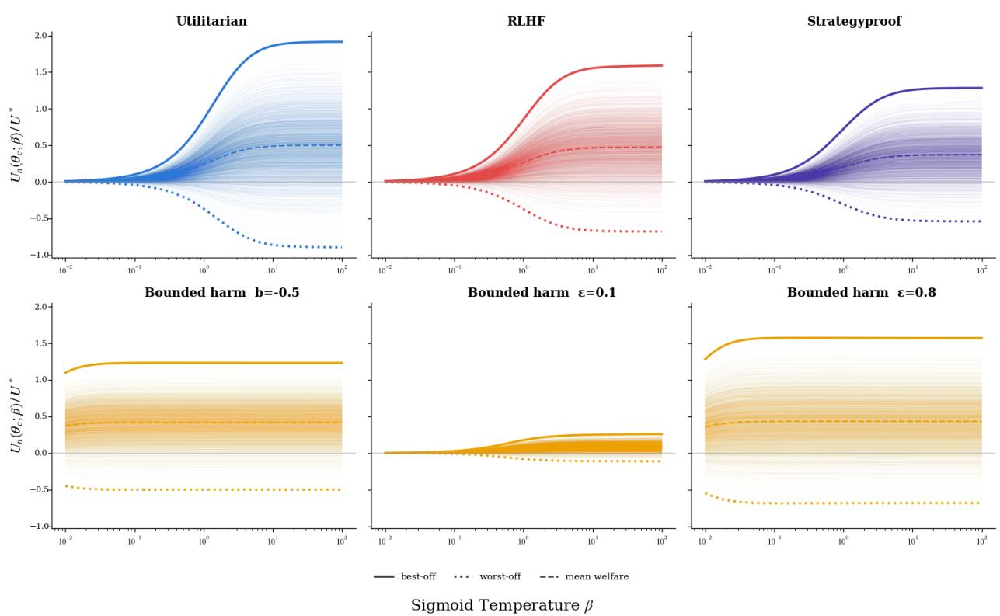  
Figure 3: Community Alignment dataset: per-agent welfare $U _ { n } / U ^ { \star }$ as a function of the choice-precision parameter $\beta ,$ for each mechanism. The shaded band is the density of all 2387 agents; solid, dashed, and dotted lines mark the best-of agent, mean welfare, and worst-of agent. As $\beta$ grows, choices become more deterministic, individual preferences become more powerful, and the welfare distribution spreads—widening the gap between best- and worst-of agents. Strategyproof and harm-bounded mechanisms produce lower welfare dispersion, and the bounded-harm constraints are empirically satisfied.

## E.3 Per-Agent Harm Bound

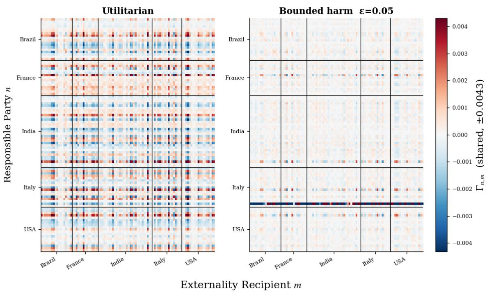  
Figure 4: Participation externalities under the per-agent harm bound. Here each agent’s welfare floor is a fixed fraction of their own maximum achievable welfare, $b _ { n } = - \epsilon h _ { \bar { \Psi } } ( \theta _ { n } )$ with $\epsilon = 0 . 0 5$ (lose at most 5% of one’s own best case), rather than a single absolute floor. The left panel is the utilitarian baseline; the right is the harm-bounded model. The qualitative story matches that of the single absolute floor discussed in Section 6: a small set of binding agents accounts for almost all of the participation externalities.

## E.4 Full Alignment Externalities

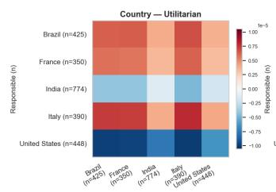

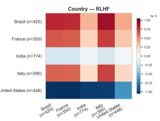

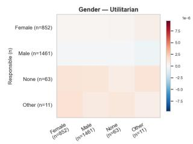

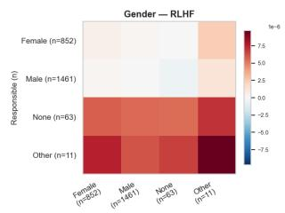

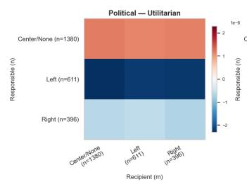

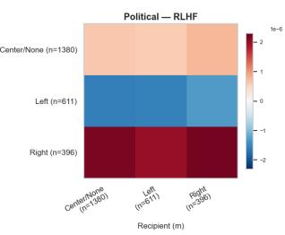

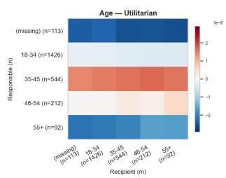

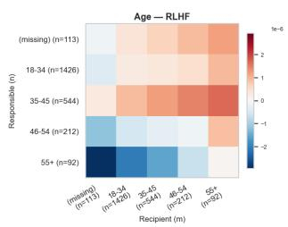  
Figure 5: Community Alignment Dataset: Utilitarian vs RLHF participation alignment externalities by demographic. The figure includes 2387 annotators, with full alignment externalities averaged within each group.

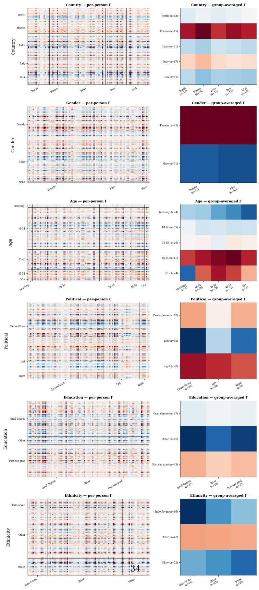

## E.5 Four Dataset Comparisons

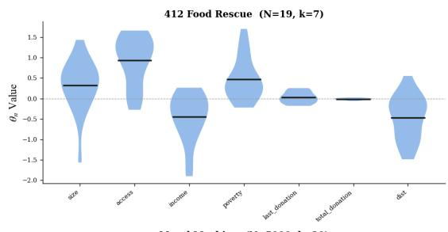

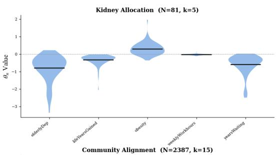

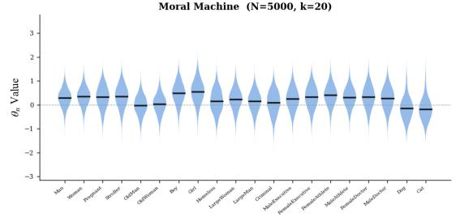

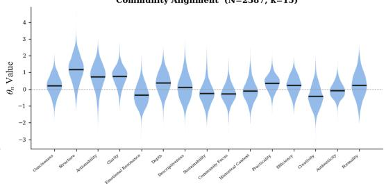  
Figure 7: Preference distribution per feature dimension for four datasets. Moral Machine and Community Alignment have high disagreement, with a high number of preferences on either side of 0, while Kidney Allocation and 412 Food Rescue have less disagreement: people disagree on the magnitude of preference, but the direction is more unanimous.

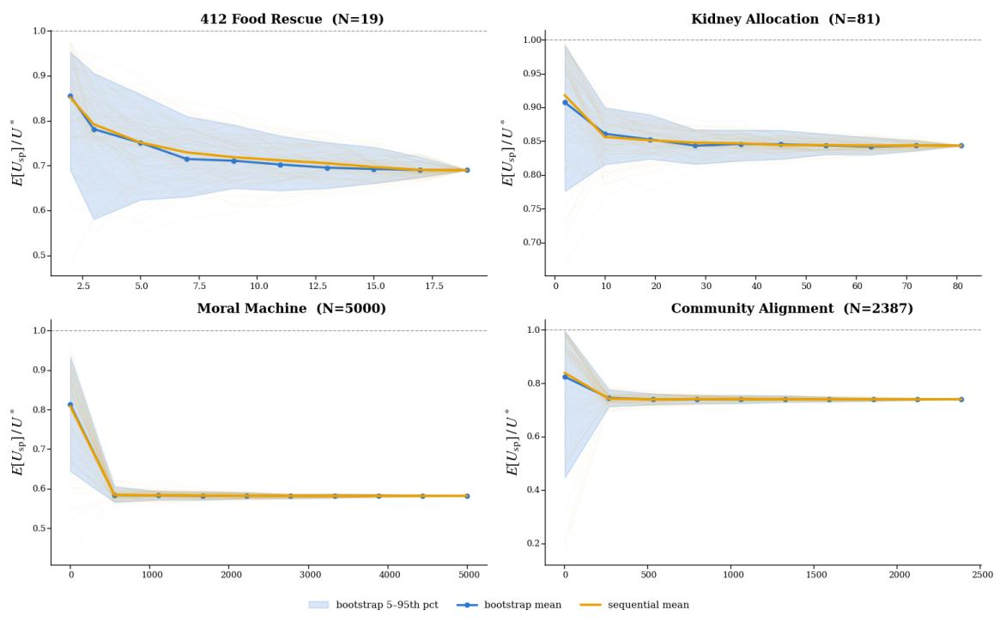  
Number of Agents k  
Figure 8: Expected welfare for four datasets. Bootstrap mean and std. deviations were calculated by bootstrapping l agents 100 times and calculating the welfare of the strategyproof mechanism. Sequential addition denotes the procedure where 100 permutations of agents were generated, and welfare was calculated for each coalition created by adding a new agent.

Sigmoid Temperature β  
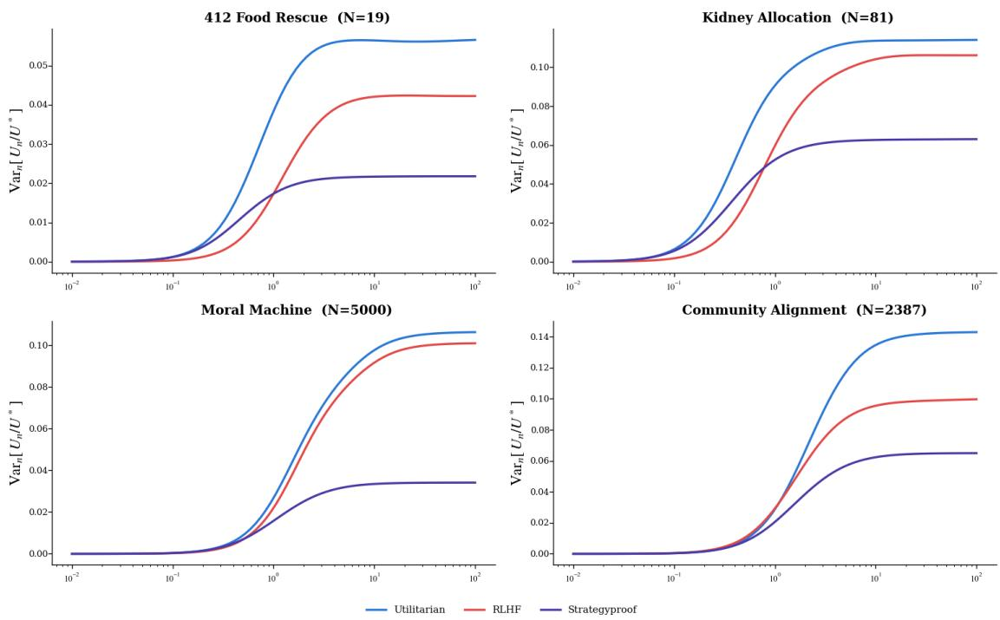  
Sigmoid Temperature β

Figure 9: Welfare variance over four datasets. The strategyproof mechanism leads to the least welfare dispersion, while RLHF follows as a far second for larger values of $\beta .$  
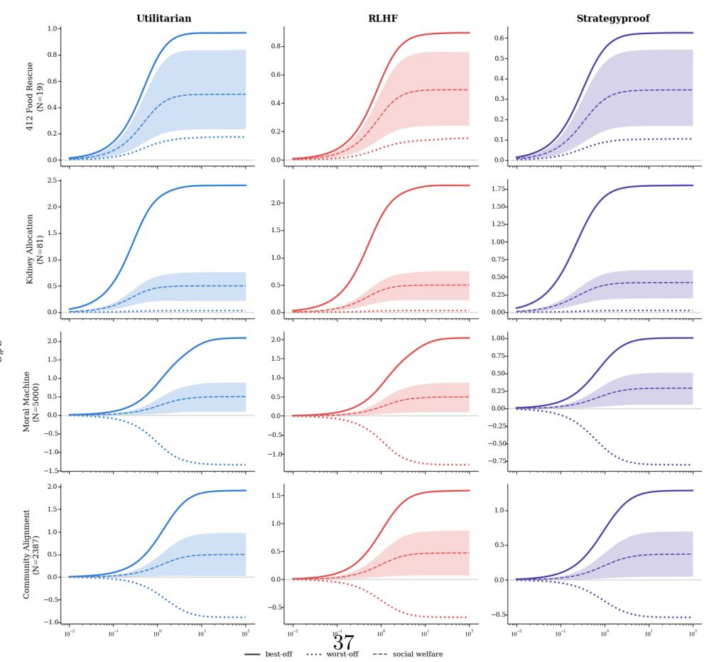  
Figure 10: Welfare of the best- and worst-of agents in four datasets for three model parameters.