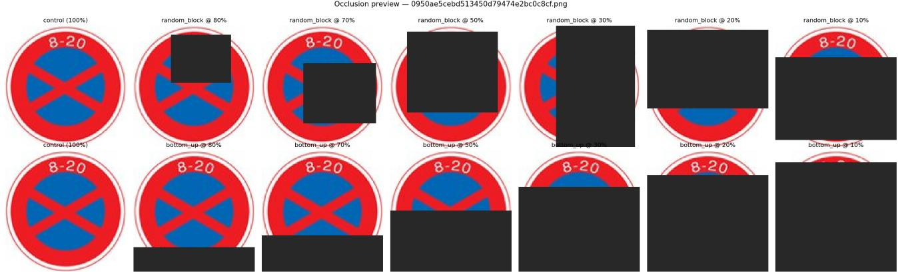
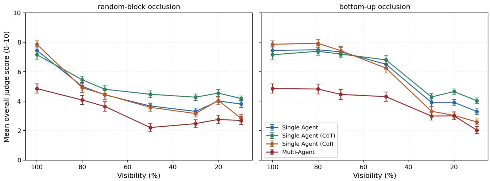
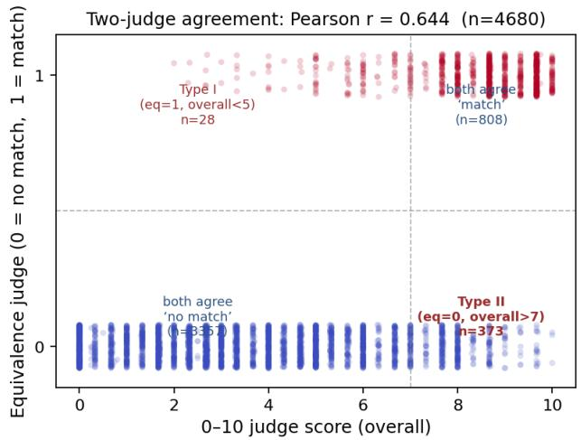
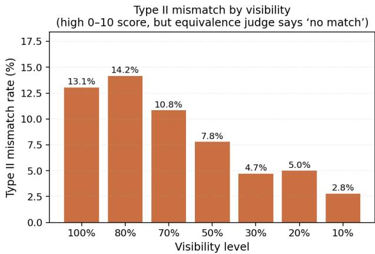

# Beyond Accuracy: A Dual-Judge Evaluation Protocol for Vision-Language Models in Legally Grounded Tasks

Su Myat Noe 1 Ha Thanh Nguyen 2 May Myo Zin 3 Ken Satoh 3

## Abstract

AI systems are increasingly evaluated for legally accountable settings, where correct outputs must also be justifiable against an applicable legal standard. Existing legal-AI benchmarks and LLMas-judge protocols provide important infrastructure for measuring task performance and openended response quality. We contribute one additional evaluation signal: a dual-judge protocol that pairs a standard 0–10 quality judge with a strict binary semantic-equivalence judge against a human-curated reference. We study a controlled, visually grounded regulatory task—UK trafficsign interpretation, whose meaning is a codified question with a known reference for every input— and measure not merely whether the two judges disagree (by construction they must) but how much and where. On 4,680 evaluations under seven visibility levels and two occlusion modes, the two judges are moderately associated (pointbiserial r = 0.644), while revealing an asymmetric Type II pattern affecting 8.0% of all evaluations. Its distribution is instructive: the marginal rate peaks at high visibility (14.2% at $v = 0 . 8 )$ simply because high-scoring answers are common there, but conditioned on the answer already scoring above 7 the rate is highest under heavy occlusion (54–63% at $v \leq 0 . 3 )$ —so a high quality score is least trustworthy when the input is most degraded. We are explicit that the signal is a property of this judge and reference: a 49- row human check shows the 0–10 judge aligns closely with everyday-reader judgement (Pearson r = 0.81; r = 0.80 with the LLM accuracy subscore) while the equivalence judge is fairly but one-directionally stricter. The protocol adds one

LLM call per evaluation and surfaces a signal single-judge protocols do not report. We release the prompt template, occluded variants, and full evaluation results.

## 1. Introduction

AI systems are increasingly deployed in domains where the law requires decisions to be justifiable against an applicable legal standard alongside being correct: contract review, judicial decision-support, regulatory compliance, and autonomous systems operating under traffic, aviation, or medical law. The AI for Law community has responded by building evaluation infrastructure for this space, including LexGLUE (Chalkidis et al., 2022), LegalBench (Guha et al., 2023), and LLM-as-judge methodology (Zheng et al., 2023).

What this paper contributes. We propose one additional signal that complements this infrastructure rather than replaces it. Concretely, we add a strict binary semanticequivalence judge alongside the standard quality judge: a yes/no LLM call asking only whether the response is semantically equivalent to a human-curated reference. We call the resulting two-score evaluation a dual-judge protocol. The argument for the additional signal is straightforward. In legally accountable deployment, two responses can score equally well on an everyday-quality scale while only one would survive an audit against the applicable reference. A single quality judge cannot distinguish between them by design — not because the judge is wrong, but because the question it was asked is different from the question an auditor asks. Adding a strict equivalence judge gives an evaluator a second, complementary view of the same response.

State-of-the-art gap. This dual-judge framing is, to our knowledge, not yet standard practice in legal-AI evaluation. LexGLUE and LegalBench score against gold labels or expert adjudications and report a single accuracy-style metric; recent LLM-as-judge work (Zheng et al., 2023) typically reports a single quality score. The strict semantic-equivalence question — “does this response match the reference?” — is not currently part of the default protocol, so the disagreement between “sounds right” and “matches the reference” is not currently surfaced. This paper offers a small, reproducible demonstration of what that signal looks like in practice, on a domain where the applicable rule is known for every input.

Testbed and scope. We use traffic-sign interpretation under the UK Road Traffic Act and TSRGD as the testbed. Traffic regulations are codified law, they are applied in real time by autonomous systems whose failures have direct legal consequences, and the dataset structure permits a controlled benchmark in which the ground-truth applicable rule is known for every input. We are deliberate about scope: this is a visually grounded regulatory task, and we use “legal” language throughout as motivation for why equivalence to a fixed reference matters, not as a claim to evaluate open-textured legal interpretation (applying a rule to facts). Traffic-sign meaning is a codified question with, in the ordinary case, a single correct reading; we return to this distinction in Section 5. Across 4,680 evaluations of four vision-language systems (OpenAI, 2023; 2024) (single agent; single agent with chain-of-thought prompting (Wei et al., 2022); single agent with chain-of-inference; and a sequential multi-agent decomposition (Wu et al., 2023)) on 30 UK traffic signs under 7 visibility levels and 2 occlusion modes, the two judges are moderately associated (r = 0.644). The asymmetric disagreement — 8.0% of evaluations in which the 0–10 judge scores above 7 while the equivalence judge rejects, peaking at 14.2% at visibility v = 0.8 — is the signal the dual-judge protocol surfaces. A 49-row human-eval validation confirms that the 0–10 judge tracks human judgement at r = 0.81 and the LLM accuracy sub-score at r = 0.80, while the equivalence judge applies a stricter wording-match criterion.

Contributions. We make four contributions:

• A controlled benchmark for vision-grounded regulatory interpretation under perceptual occlusion (§4). 4,680 evaluations across 30 UK traffic signs, 7 visibility levels, 2 occlusion modes, and 4 VLM-based systems on Azure GPT-4o. We release the benchmark and the occluded variants for reproducibility.

• A dual-judge evaluation protocol (§4) pairing the standard 0–10 LLM-as-judge with a strict binary semantic-equivalence judge against human-curated gold descriptions. The protocol adds one LLM call per evaluation. We release the equivalence-judge prompt template so future legal-AI work can adopt or extend it.

• A 49-row human-eval validation (§4.2) showing that both LLM judges track human judgement (Pearson r = 0.81 with the 0–10 judge; r = 0.80 with the LLM accuracy sub-score) and that the equivalence judge applies a stricter—and, as we show, judge-dependent— reference-match criterion.

• An empirical characterisation of dual-judge disagreement: its size (8.0% Type II), its distribution across visibility (reported conditioned on the base rate, not only marginally), and its judge-dependence. We discuss what this signal contributes to existing AI-for-Law benchmark design in Section 5.

A note on methodology. An earlier version of this work used a single LLM-as-judge to determine whether a freeform description matched the ground-truth sign type. A careful audit (Section 3) revealed a label-matching artefact that we address with a structured-output fix. The dual-judge protocol builds on top of that corrected pipeline.

## 2. Related Work

Multi-agent and chain-of-thought reasoning. A range of frameworks — AutoGen (Wu et al., 2023), multi-agent debate (Du et al., 2024), and other patterns surveyed by Tran et al. (2025) — propose specialised LLM agents collaborating to outperform single-agent prompting. Reported gains are mixed: most consistent on tasks where sub-task decomposition is genuinely orthogonal, less so where the integration step is the bottleneck. Chain-of-thought prompting (Wei et al., 2022) elicits intermediate reasoning from a single model and has been extended in many directions, including zero-shot CoT (Kojima et al., 2022), self-consistency decoding (Wang et al., 2023), Tree-of-Thoughts (Yao et al., 2023a), and ReAct (Yao et al., 2023b). In this paper we use four of these systems as varied test subjects for our evaluation protocol; we do not claim a new architectural contribution.

Traffic-sign recognition. Traffic-sign datasets such as the German Traffic Sign Detection Benchmark (Houben et al., 2013) have driven decades of work on classical detection and recognition pipelines. The shift to large-scale vision-language models such as CLIP (Radford et al., 2021) and LLaVA (Liu et al., 2023) has reopened the question of whether zero-shot or instruction-tuned VLMs can directly interpret traffic signs at semantic granularity (e.g., “no stopping between 8am and 8pm”) rather than only at object-detection granularity. Most VLM evaluations to date use clean, full-visibility benchmarks; occlusion has been studied primarily through standard object-detection metrics, and contextual applicability (which sign applies to which lane) is typically assumed away. We extend these evaluations by introducing controlled occlusion for VLM-based systems.

LLM-as-judge evaluation. The use of strong LLMs to score the outputs of weaker LLMs (Zheng et al., 2023) has become standard practice but is vulnerable to systematic biases (position, verbosity, self-enhancement). Our methodology audit (Section 3) documents a related labelmatching bias against verbose systems and proposes a simple structured-output fix.

Legal-AI benchmarks and evaluation. A growing line of work proposes benchmarks for AI systems applied to legal tasks. Chalkidis et al. (2022) introduce LexGLUE, a multi-task benchmark covering legal-language understanding (case classification, contract clauses, statutory citation) across seven sub-tasks; Guha et al. (2023) introduce Legal-Bench, a collaboratively built benchmark of 162 tasks spanning six types of legal reasoning. Both benchmarks make essential progress in standardising evaluation across legal NLP; in their primary protocols, however, scoring is accuracy- or label-match-based, which evaluates whether a system produces a correct answer rather than whether its response would survive a strict audit against the reference. Our paper contributes a small empirical data point to that conversation. We return to the implications for benchmark design in Section 5.

## 3. Methodology Audit and Metric Correction

Our initial pipeline used a single LLM-as-judge (Zheng et al., 2023) to evaluate both descriptive quality (on a 0–10 scale) and a binary correctly identified flag. An audit revealed two systematic inconsistencies: 4.8% of evaluations had overall ≥ 7 but correctly identified = 0, concentrated in systems with longer outputs (Multi-Agent, Chain-of-Inference); and ranking by judge score gave CoT > CoI > SA > MA while the binary flag gave $\mathbf { S A } > \mathbf { C o I } > \mathbf { C o T } > \mathbf { M A }$ , placing the most thorough reasoner third on identification — an implausible capability ordering. The diagnosis was that the judge was fuzzy-matching free-form descriptions against ground-truth labels, so terser outputs accidentally produced strings the judge parsed as the correct label more reliably than longer ones. This is related to but distinct from the verbosity bias of (Zheng et al., 2023) (where longer responses are over-scored): here the penalty arises because the judge is parsing labels from free text rather than scoring quality. Correction. We required every system response to end with a mandatory SIGN TYPE: <category> line drawn from a fixed vocabulary of 25 regulatory categories; sign-type identification is now computed by a deterministic regex. Format compliance is 99.5–100%. The fix removes the parsing artefact; any residual rank differences across the two judges (Table 1) then reflect the genuine quality-versusequivalence distinction this paper studies, not a parsing defect. All results in subsequent sections use the corrected

pipeline.

## 4. Experiment: Recognition Under Occlusion

## 4.1. Setup

Dataset. We use a subset of 30 UK traffic signs (TSRGD codes spanning regulatory, warning, and direction categories). Our choice of the UK regulatory vocabulary follows the convention used in prior VLM-based traffic-sign work; classical detection benchmarks such as GTSDB (Houben et al., 2013) use German signs and a different evaluation protocol focused on bounding-box detection rather than semantic identification. For each base sign, we generate occluded variants at seven visibility levels (100%, 80%, 70%, 50%, 30%, 20%, 10%) under two occlusion modes:

• Random-block: a single opaque rectangle of area (1− v) placed at a uniformly random position, simulating an adjacent vehicle, tree, or pedestrian.

• Bottom-up: a rectangle of height (1−v) growing from the lower edge, simulating progressive occlusion from a vehicle directly in front or a poor-lighting cutoff.

This yields 390 variants (30 × 13; the v = 1.0 control is shared across modes). Each variant is evaluated by every system under 3 independent runs, giving 4,680 evaluations total.

Systems. We evaluate four systems, all built on the same Azure GPT-4o backbone (OpenAI, 2024):

• Single Agent (SA): a single vision-call producing a free-form description with a mandatory SIGN TYPE line.

• Single Agent (CoT): as SA, with explicit chain-ofthought prompting (Wei et al., 2022) eliciting four free-form reasoning steps.

• Single Agent (CoI): a chain-of-inference variant that, unlike CoT’s free-form reasoning, requires three explicitly separated and ordered stages before the SIGN TYPE line — (i) visual analysis (shape, colour, symbols), (ii) content analysis (the rule the sign states), and (iii) contextual analysis (how and where the rule applies). CoI differs from CoT in structure, not information: CoT reasons freely, whereas CoI imposes a fixed visual→content→context decomposition. CoI is our own variant and is not claimed as a contribution.

• Multi-Agent (MA): sequential decomposition into Vision Specialist → Text/Symbol Specialist → Integration Specialist, implemented as a directed pipeline following the spirit of (Wu et al., 2023).

  
Figure 1. The two occlusion modes applied to a representative “no stopping” regulatory sign across the seven visibility levels (100%, 80%, 70%, 50%, 30%, 20%, 10%) used in our quantitative experiments (Section 4.2). Top row: random-block occlusion, in which a rectangle of area (1 − v) is placed at a uniformly random position, simulating an adjacent vehicle, tree, or pedestrian. Bottom row: bottom-up occlusion, in which a rectangle of height (1 − v) grows from the lower edge, simulating progressive occlusion from a vehicle directly in front or a poor-lighting cutoff. The leftmost column $( v = 1 . 0 )$ is the un-occluded control shared by both modes. The two modes degrade the image very differently: bottom-up preserves the sign’s upper text region (“8–20”) down to roughl $v = 0 . 3 0$ , whereas random-block can remove any part of the sign with equal probability and at v = 0.20 may obliterate the sign almost entirely.

Ground truth and dual-judge evaluation. Ground truth in our experiments comes from a human-curated reference table: each of the 30 source signs has an associated short Caption (e.g., “Closed to Vehicles”) and a longer Description (e.g., “Road is closed to all vehicles (cars, light vehicles, motorcycles, etc.)”) prepared in advance by two authors familiar with the UK regulatory vocabulary. We stress that this reference is the authors’ paraphrase of each sign’s meaning, not the statutory text of the TSRGD or the Road Traffic Act; grounding the reference in the governing instruments is future work. We then apply two LLM-as-judge protocols to every system response. The first, anchored to the gold Description on three 0–10 axes (accuracy, completeness, relevance) and aggregated into an overall score, is the same scoring style used in our earlier pipeline (Zheng et al., 2023). The second is a strict binary semantic-equivalence judge that returns EQUIVALENT ∈ {0, 1}, asking only whether the predicted description is semantically equivalent to the gold standard (prompt template included in the supplementary material). We report both judges, and analyse their agreement in Section 4.2 as a methodology-validation step.

## 4.2. Results

Headline finding. Single-agent CoT significantly outperforms the Single Agent baseline (paired $\Delta = + 0 . 3 9$ $p < 1 0 ^ { - 5 } )$ , while Multi-Agent significantly underperforms it $( \Delta = - 1 . 5 3 , p < 1 0 ^ { - 2 9 } )$ ; CoI is marginally below baseline $( \Delta = - 0 . 2 1 , p = 0 . 0 3 2 )$ . The dominance of CoT and the underperformance of Multi-Agent are robust under the n = 390 paired analysis, though we note the 390 cells are not fully independent across the 13 variants of a sign; sign-level clustering would be the fully rigorous treatment

Table 1. System means under the two judges, averaged across all 4,680 evaluations (raw aggregate means). Overall is the 0–10 judge anchored to the gold Description; Equiv. rate is the fraction of responses the binary equivalence judge marks as equivalent. Note the rank dissociation across judges: CoT leads on Overall, whereas CoI leads on Equiv. rate (and CoT 0.234 vs. SA 0.221 are close but not tied). This dissociation is itself an instance of the quality-versus-equivalence distinction this paper studies, not a consistency check.

<table><tr><td>SYSTEM</td><td>OVERALL (0–10)</td><td>EQUIV. RATE</td></tr><tr><td>SA (CoT)</td><td>5.33</td><td>0.234</td></tr><tr><td>SINGLE AGENT</td><td>4.94</td><td>0.221</td></tr><tr><td>SA (CoI)</td><td>4.72</td><td>0.279</td></tr><tr><td>MULTI-AGENT</td><td>3.41</td><td>0.078</td></tr></table>

and the two large effects survive it.

Degradation behaviour. Figure 2 shows the per-system degradation across all seven visibility levels under both occlusion modes. The ranking is stable across the entire degradation range: Multi-Agent remains dominated even at v = 0.1 under random-block. Bottom-up degrades more gradually because the sign’s upper region (where discriminative text and symbols sit) is preserved down to moderate visibility; random-block can hide any region with equal probability and so its degradation curve is steeper between v = 1.0 and v = 0.5.

Two-judge association (methodology validation). To probe whether the 0–10 judge tracks identification quality against the gold reference, we compare it to the binary equivalence judge over all 4,680 evaluations. The two are moderately associated (point-biserial $r = 0 . 6 4 4 )$ We report this association descriptively rather than as a hypothesis test: because the rows are nested (three runs within each of 13 variants within each sign), a p-value computed as if the rows were independent is not meaningful, so we do not report one; a sign-clustered or mixed-effects estimate is the appropriate inferential treatment. Mean overall given EQUIVALENT = 1 is 8.44 (s.d. 1.44); given EQUIVALENT = 0 it is 3.62 (s.d. 2.48). The offdiagonals (Figure 3) are not symmetric: only 28 rows (0.6%; Type I) have EQUIVALENT = 1 with overall < 5, but 373 rows (8.0%; Type II) have EQUIVALENT = 0 with overall > 7 — responses that read well to the 0–10 scale yet fail strict semantic equivalence against the reference.

  
Figure 2. Mean overall judge score (0–10, with error bars) under the two occlusion modes, across all seven visibility levels. Single-agent CoT (green) is consistently at or above the other single-agent variants, while Multi-Agent (red) is dominated at every visibility level. Degradation is smooth and monotonic under bottom-up occlusion; under random-block the degradation curve is steeper between $v = 1 . 0$ and $v = 0 . 5 ,$ reflecting that a single random rectangle of large area can quickly hide most of the sign’s discriminative content.

Table 2. Paired t-tests on overall judge score against Single Agent, computed per (source image, visibility level, mode) cell after collapsing 3 independent runs $( n = 3 9 0 )$ . Cells within a sign are not fully independent across its 13 variants (see text).
<table><tr><td>SYSTEM VS. SA</td><td> $\Delta _ { \mathrm { o v g R A L L } }$ </td><td>t</td><td>p</td></tr><tr><td>SA (CoT)</td><td>+0.391</td><td>+4.89</td><td> $\mathbf { 1 . 4 \times 1 0 ^ { - 6 } }$ </td></tr><tr><td>SA (CoI)</td><td>-0.213</td><td>-2.16</td><td>0.032</td></tr><tr><td>MULTI-AGENT</td><td>-1.527</td><td> $- 1 2 . 3 8$ </td><td> $< 1 0 ^ { - 2 9 }$ </td></tr></table>

Where Type II concentrates, and conditioning on the base rate. Marginally, the Type II share of all evaluations at each visibility level is 13.1% $( v = 1 . 0 )$ , 14.2% $( v = 0 . 8 )$ 10.8%, 7.8%, 4.7%, 5.0%, and 2.8% $( v = 0 . 1 )$ : highest where one would naively expect the LLM-as-judge to be most reliable, and broadly declining — though not strictly monotonically, since it rises from v = 1.0 to $v = 0 . 8$ and again from v = 0.3 to v = 0.2 (Figure 4). This marginal pattern is partly mechanical: quality scores fall with occlusion, so fewer answers score above 7 at low visibility and there is simply less room for Type II. To separate the effect from this floor, Table 3 reports the conditional Type II rate — the share of high-scoring answers (overall > 7) that the equivalence judge rejects — alongside the count of high-scoring answers per level. Conditioning reverses the marginal picture. The marginal rate peaks at high visibility only because high-scoring answers are common there $( N _ { > 7 } = 2 1 7 - 3 1 9 { \mathrm { ~ a t ~ } } v \geq 0 . 5 ) ;$ conditionally, a high quality score is least trustworthy under heavy occlusion, where Type II reaches 54–63% of the few high-scoring answers that remain $( N _ { > 7 } = 3 7 – 6 6 { \mathrm { ~ a t ~ } } v \leq 0 . 3 )$ , versus 22–32% at high visibility. The correct reading is therefore not that disagreement concentrates on clean inputs, but that a high quality score on a degraded input is the least reliable: when the sign is barely visible yet the quality judge still scores a response above 7, more often than not it fails strict equivalence. The interpretive consequence is direct, and it is about trust in a high score: at full visibility a response scoring above 7 fails strict equivalence about one time in five (21.7%), whereas at heavy occlusion such a response fails more often than not (54–63%). A high quality score should therefore be discounted most, not least, when the input is degraded. We discuss the implications for AI-for-Law evaluation methodology in Section 5.

  
Figure 3. Joint distribution of the two judges over all 4,680 evaluations (vertical axis jittered). Point-biserial $r = 0 . 6 4 4$ . The two off-diagonal quadrants hold the small Type I set (the 0–10 judge under-scored a semantically-equivalent response, 28 rows) and the substantially larger Type II set (the 0–10 judge over-scored a response that failed strict semantic equivalence, 373 rows); the remaining 4,279 rows (91.4%) lie outside both disagreement quadrants.

Table 3. Type II conditioned on the base rate. $N _ { > 7 }$ is the number of answers with overal $\mathrm { 1 > 7 }$ at each visibility level; the conditional rate is (Type II count) $/ N _ { > 7 }$ . Reporting the conditional rate separates the high-visibility concentration from a floor effect.
<table><tr><td>VISIBILITY</td><td> $N _ { > 7 }$ </td><td>TYPE II COUNT</td><td>COND. RATE</td></tr><tr><td>1.0</td><td>217</td><td>47</td><td>21.7%</td></tr><tr><td>0.8</td><td>319</td><td>102</td><td>32.0%</td></tr><tr><td>0.7</td><td>283</td><td>78</td><td>27.6%</td></tr><tr><td>0.5</td><td>205</td><td>56</td><td>27.3%</td></tr><tr><td>0.3</td><td>54</td><td>34</td><td>63.0%</td></tr><tr><td>0.2</td><td>66</td><td>36</td><td>54.5%</td></tr><tr><td>0.1</td><td>37</td><td>20</td><td>54.1%</td></tr></table>

  
Figure 4. Type II mismatch rate (% of evaluations with EQUIVALENT = 0 but overal $\mathrm { ~ \perp ~ > ~ 7 ) }$ at each visibility level. The rate is highest at $v \in \{ 1 . 0 , 0 . 8 \}$ — the clean-input regime in which one would expect an LLM-as-judge to be most reliable — and broadly declines (though not strictly monotonically) as the image is degraded further.

Human-eval validation on a stratified sample. The twojudge agreement reported above is between two LLM-based judges (both GPT-4o, asked different questions about the same response). To check whether either judge tracks human judgement, the first author manually annotated a stratified sample of 49 evaluations from the 4,680-row dataset: one row per (visibility-level, system) cell (28 rows), plus 12 Type II cases (EQUIVALENT = 0 but overall > 7, the cells that drive the methodology-validation argument), plus 9 “agreed-good” cases (EQUIVALENT = 1 and overall ≥ 7).

Annotation protocol. For each row, the annotator was shown the gold caption, the gold description, the model response, and the (visibility, mode, system) metadata, but not the LLM judge scores. Two judgements were elicited per row using a fixed rubric (full version in the supplementary material): a binary semantic-equivalence label (1 if the response identifies the same sign as the gold reference despite wording differences; 0 if it misidentifies the sign, gives a generic appearance description, refuses, or returns SIGN TYPE: other); and a 0–10 quality score anchored at 9–10 (perfect identification), 7–8 (correct with minor gap), 5–6 (general category right), 3–4 (wrong but reasonable given visibility), 1–2 (vague or generic), and 0 (refused or nonsensical). The annotator was instructed not to grade on a curve, not to penalise verbosity, and to judge against the gold rather than an imagined version of the sign.

Results. The two questions ask the same thing of the human as of the LLM judges.

• 0–10 score: Pearson $r = 0 . 8 1$ between human and the aggregated overall judge $( p < 1 0 ^ { - 1 2 } , n = 4 9 ) $ Spearman $\rho = 0 . 7 3 \ ( p < 1 0 ^ { - 8 } )$ . Human and LLM means are within 0.14 points of each other (human $\overline { { x } } = 6 . 4 3 .$ , LLM $\overline { { x } } = 6 . 2 9 )$ ). The 0–10 judge tracks human judgement closely.

• LLM-accuracy sub-score: The 0–10 judge returns three sub-scores (accuracy, completeness, relevance) that are aggregated into overall. Because the accuracy sub-score is the one most directly comparable to a human “did the system get the sign right” judgement, we report it separately: PEARSON between human overall and the LLM accuracy sub-score is $r = 0 . 8 0 , p < 1 0 ^ { - 1 1 } , n = 4 9$ . The three sub-scores correlate with human judgement at $r \in [ 0 . 7 9 , 0 . 8 0 ]$ indicating that no single sub-score is driving the agreement: the 0–10 judge tracks humans on accuracy, completeness, and relevance separately.

• Binary equivalence: Cohen’s $\kappa ~ = ~ 0 . 3 8$ (Cohen, 1960), raw agreement 65% (32 of 49). The disagreement is entirely in one direction: the LLM never marks “match” when the human does not, while it marks “no match” for 17 responses the human marked “match” (these 17 have human $\overline { { \mathtt { o v e r a l l } } } = 7 . 0 6 , \mathtt { s d } = 1 . 6 8 )$ A κ of 0.38 indicates fair (not strong) agreement; we interpret this asymmetric disagreement as informative rather than as a flaw, but a multi-annotator study is needed to disentangle annotator-specific patterns from systematic differences between human and equivalence-judge criteria.

The asymmetric disagreement is methodologically informative: the equivalence judge rejects responses that get the general category right but do not match the reference’s specific wording. For example, when the gold says “you must slow down to a level where you can stop immediately” and the system says “warning to drivers to reduce speed and proceed with caution”, a human treats these as equivalent in everyday meaning but a legal auditor would note the response omits the “immediately stoppable” criterion. The equivalence judge sides with the auditor. The full annotation file is in the supplementary material.

## 5. Discussion

What the dual-judge protocol contributes. The twojudge agreement reported in Section 4.2 (r = 0.644, 91.4% of rows outside the disagreement quadrants, 8.0% Type II and 0.6% Type I) demonstrates a useful property of the protocol: most of the time, two GPT-4o judges asked different questions about the same response give compatible answers. The asymmetric disagreement is the informative signal. The 0–10 judge and the equivalence judge do not over- and under-credit symmetrically: the disagreement is one-directional, and (once we condition on the answer already scoring highly; Table 3) it is most severe under heavy occlusion, where 54–63% of high-scoring answers fail strict equivalence. A visibility-dependent, one-directional disagreement signal is what the dual-judge protocol contributes that a single quality score does not.

Verbalisation, not interpretation. Our task is rule verbalisation — stating the rule a sign encodes — not rule application, the open-textured question of whether a rule governs a given set of facts. We chose traffic-sign meaning precisely because it is closed and codified, with (in the ordinary case) a single correct reading; much textual legal work lacks this property, and there the equivalence question is itself contested and multi-factor. We therefore do not claim the protocol evaluates legal reasoning in general. Extending from verbalisation to applied-rule outputs (e.g., “given the current time, is stopping here permitted?”) is a concrete and important next step.

The Type II signal interpreted for legal AI. For legally accountable deployment, the relevant question is whether a response would survive an audit against the applicable reference. The standard 0–10 judge measures something related but not identical: whether the response is fluent and informative. The equivalence judge, by contrast, applies a strict wording-match criterion. Two claims must be kept separate. That the equivalence judge is stricter than the everyday reader is established by our data: a merely noisy judge would disagree in both directions, whereas this one errs only toward rejection. That its higher bar is legally grounded — strict in the direction a statute would require, rather than simply more conservative — is not established, since the reference is our own paraphrase rather than statutory text and no legally trained annotator was involved. We therefore use “audit-grade” as a motivating analogy, not a validated property, and read the Type II quantity as a property of this judge and this reference. Our human-eval validation (Section 4.2) clarifies which view is which: humans and the 0–10 judge align with everyday-reader judgement (r = 0.81); the equivalence judge is fairly but one-directionally stricter.

How this complements LexGLUE and LegalBench. LexGLUE (Chalkidis et al., 2022) and LegalBench (Guha et al., 2023) have driven essential standardisation across legal NLP and legal-reasoning evaluation, covering tasks where a gold label or expert adjudication is available. The dual-judge protocol we propose is complementary: it applies to open-ended responses where a gold reference exists but exact label-match is not the natural protocol, and adds one semantic-equivalence call per evaluation. The protocol does not replace accuracy-style scoring; it provides one additional signal — the equivalence-judge rejection rate — alongside it. We release our equivalence-judge prompt template in the supplementary material so other benchmarks can adopt the same signal at low cost.

Scope of generalisation. The dual-judge mechanism is modality-independent and would transfer to text without difficulty, since it concerns only how an output is scored against a reference. The empirical findings, by contrast, are tied to properties of the visual testbed: the difficulty gradient is produced by occlusion, for which textual law has no clean analogue, and the tractability of the task is purchased by a closed, codified reference. We therefore scope our empirical claims to visually grounded regulatory tasks — such as the deployed driving and enforcement systems this domain motivates — and not to textual legal reasoning in general. We do not claim that the 8% figure transfers; different domains will have different disagreement rates.

Shared-model bias. Both judges and all four evaluated systems are GPT-4o, exposing the judges to a documented self-preference effect. We disclose this as a genuine limitation: before the disagreement signal is treated as modelindependent, a sample of equivalence verdicts should be corroborated by a judge from a different model family. We did not do so here and flag it as required future work.

Methodology audit as a complementary contribution. The structured-output fix in Section 3 is logically independent of the dual-judge protocol, but the two work well together. The audit removes a known parsing artefact: a single LLM-as-judge asked to fuzzy-match free-form descriptions against ground-truth labels can over-credit terser outputs whose surface form happens to match. Requiring structured output (a mandatory SIGN TYPE line parsed with a deterministic regex) closes that gap. The dual-judge protocol then surfaces residual disagreement between “fluent and informative” and “matches the reference” that no single judge can capture by construction. Both steps are easy to adopt: the structured-output fix takes one prompt edit and one regex; the dual-judge protocol takes one additional LLM call per evaluation.

Limitations. Our dataset is small (30 base signs), and the experiments use a single VLM backbone (OpenAI, 2024); extending to GPT-5 and open VLMs is future work. Both LLM judges are GPT-4o instances asked different questions, so some of the agreement we report may reflect shared judge biases rather than independent agreement; the 49-row human-eval study supports the LLM judges’ calibration but is a single-annotator sanity check, and a multi-annotator extension with at least one legally trained annotator is the natural next step. We also note that the annotator was the first author, who wrote the rubric and is invested in the paper’s claims; while annotation was conducted without sight of the LLM judge scores, ideal validation requires independent annotators. The reference is an author paraphrase rather than statutory text. Our evaluation does not include the German GTSDB benchmark (Houben et al., 2013), which is detection-focused under a different protocol.

## 6. Conclusion

We have presented a dual-judge evaluation protocol for vision-language models on a visually grounded regulatory task, together with a controlled testbed and a small humaneval validation. The protocol pairs the standard 0–10 LLMas-judge with a strict binary semantic-equivalence judge against human-curated gold descriptions, adding one additional LLM call per evaluation. Across 4,680 traffic-sign evaluations under seven visibility levels and two occlusion modes, the two judges are moderately associated (Pearson $r = 0 . 6 4 4 )$ with an asymmetric 8% disagreement signal whose marginal rate peaks at high visibility (14.2% at v = 0.8) but whose conditional rate is highest under heavy occlusion (54–63% of high-scoring answers at $v \leq 0 . 3 )$ so a high quality score is least trustworthy when the input is most degraded. A 49-row human-eval validation confirms that the 0–10 judge aligns with everyday-reader judgement (Pearson $r \ : = \ : 0 . 8 1 )$ and that the equivalence judge is fairly but one-directionally stricter. For the AIfor-Law community, the practical contribution is a lowcost evaluation addition: a single extra LLM call per response surfaces a visibility-dependent disagreement signal that single-judge protocols, by construction, do not report. The protocol complements rather than replaces existing legal benchmarks such as LexGLUE (Chalkidis et al., 2022) and LegalBench (Guha et al., 2023). We frame the equivalence signal as judge-dependent and the legal language as motivation, and we scope the empirical claims to visually grounded regulatory tasks. We release the equivalence-judge prompt template, the occluded variants, and the full evaluation results in the supplementary material so that future evaluation work can adopt, critique, or extend the protocol.

## Software and Data

The prompt templates, occluded variants, and full evaluation results are released at https://github.com/ ImSuMyatNoe/dual-judge-traffic-signs.

## Impact Statement

This paper presents work whose goal is to advance the evaluation of AI systems intended for legally accountable deployment. We argue that benchmarks in this area should report a strict equivalence signal alongside a quality score, on the grounds that the two can dissociate in practice. We caution that the equivalence judge is itself only fairly validated and should not be treated as an authoritative legal standard without further, independent validation. We do not see specific ethical concerns beyond those generally applicable to work on autonomous systems and AI evaluation.

## Acknowledgements

This work was supported by the “Strategic Research Projects” grant from ROIS (Research Organization of Information and Systems), the “R&D Hub Aimed at Ensuring Transparency and Reliability of Generative AI Models” project of the MEXT, by JSPS KAKENHI Grant Numbers, 25H00522 and 25H01112, and JST as part of Adopting Sustainable Partnerships for Innovative Research Ecosystem (ASPIRE), Grant Number JPMJAP25B2.

## References

Chalkidis, I., Jana, A., Hartung, D., Bommarito, M., Androutsopoulos, I., Katz, D. M., and Aletras, N. LexGLUE: A benchmark dataset for legal language understanding in English. In Proceedings ofthe 60th Annual Meeting of the Association for Computational Linguistics (ACL

2022), Volume 1: Long Papers, pp. 4310–4330, 2022.

Cohen, J. A coefficient of agreement for nominal scales. Educational and Psychological Measurement, 20(1):37– 46, 1960.

Du, Y., Li, S., Torralba, A., Tenenbaum, J. B., and Mordatch, I. Improving factuality and reasoning in language models through multiagent debate. In Proceedings of the 41st International Conference on Machine Learning (ICML 2024), 2024.

Guha, N., Nyarko, J., Ho, D. E., Re, C., Chilton, A.,´ Narayana, A., Chohlas-Wood, A., Peters, A., Waldon, B., Rockmore, D. N., Zambrano, D., Talisman, D., Hoque, E., Surani, F., Fagan, F., Sarfaty, G., Dickinson, G. M., Porat, H., Hegland, J., Wu, J., Nudell, J., Niklaus, J., Nay, J., Choi, J. H., Tobia, K., Hagan, M., Ma, M., Livermore, M., Rasumov-Rahe, N., Holzenberger, N., Kolt, N., Henderson, P., Rehaag, S., Goel, S., Gao, S., Williams, S., Gandhi, S., Zur, T., Iyer, V., and Li, Z. LegalBench: A collaboratively built benchmark for measuring legal reasoning in large language models. In Advances in Neural Information Processing Systems 36 (NeurIPS 2023) Datasets and Benchmarks Track, 2023.

Houben, S., Stallkamp, J., Salmen, J., Schlipsing, M., and Igel, C. Detection of traffic signs in real-world images: The German Traffic Sign Detection Benchmark. In International Joint Conference on Neural Networks (IJCNN 2013), 2013.

Kojima, T., Gu, S. S., Reid, M., Matsuo, Y., and Iwasawa, Y. Large language models are zero-shot reasoners. In Advances in Neural Information Processing Systems 35 (NeurIPS 2022), pp. 22199–22213, 2022.

Liu, H., Li, C., Wu, Q., and Lee, Y. J. Visual instruction tuning. In Advances in Neural Information Processing Systems 36 (NeurIPS 2023), 2023.

OpenAI. GPT-4 technical report. arXiv preprint, arXiv:2303.08774, 2023.

OpenAI. GPT-4o system card. arXiv preprint, arXiv:2410.21276, 2024.

Radford, A., Kim, J. W., Hallacy, C., Ramesh, A., Goh, G., Agarwal, S., Sastry, G., Askell, A., Mishkin, P., Clark, J., Krueger, G., and Sutskever, I. Learning transferable visual models from natural language supervision. In Proceedings of the 38th International Conference on Machine Learning (ICML 2021), pp. 8748–8763, 2021.

Tran, K.-T., Dao, D., Nguyen, M.-D., Pham, Q.-V., O’Sullivan, B., and Nguyen, H. D. Multi-agent collaboration mechanisms: A survey of LLMs. arXiv preprint, arXiv:2501.06322, 2025.

Wang, X., Wei, J., Schuurmans, D., Le, Q. V., Chi, E. H., Narang, S., Chowdhery, A., and Zhou, D. Selfconsistency improves chain of thought reasoning in language models. In International Conference on Learning Representations (ICLR 2023), 2023.

Wei, J., Wang, X., Schuurmans, D., Bosma, M., Ichter, B., Xia, F., Chi, E. H., Le, Q. V., and Zhou, D. Chain-ofthought prompting elicits reasoning in large language models. In Advances in Neural Information Processing Systems 35 (NeurIPS 2022), pp. 24824–24837, 2022.

Wu, Q., Bansal, G., Zhang, J., Wu, Y., Zhang, S., Zhu, E., Li, B., Jiang, L., Zhang, X., and Wang, C. AutoGen: Enabling next-gen LLM applications via multi-agent conversation. arXiv preprint, arXiv:2308.08155, 2023.

Yao, S., Yu, D., Zhao, J., Shafran, I., Griffiths, T. L., Cao, Y., and Narasimhan, K. Tree of thoughts: Deliberate problem solving with large language models. In Advances in Neural Information Processing Systems 36 (NeurIPS 2023), 2023a.

Yao, S., Zhao, J., Yu, D., Du, N., Shafran, I., Narasimhan, K., and Cao, Y. ReAct: Synergizing reasoning and acting in language models. In International Conference on Learning Representations (ICLR 2023), 2023b.

Zheng, L., Chiang, W.-L., Sheng, Y., Zhuang, S., Wu, Z., Zhuang, Y., Lin, Z., Li, Z., Li, D., Xing, E. P., Zhang, H., Gonzalez, J. E., and Stoica, I. Judging LLM-as-ajudge with MT-bench and chatbot arena. In Advances in Neural Information Processing Systems 36 (NeurIPS 2023) Datasets and Benchmarks Track, 2023.