# Beyond Confidence: Test-Time Scaling for Multi-Turn Search Agents via Retrieval Grounding

Hyunho Kook1 Junhyuk So2 Tianyu Fu3 Haizhong Zheng4 Beidi Chen4

1University of Southern California 2Pohang University of Science and Technology (POSTECH) 3Tsinghua University 4Carnegie Mellon University

hyunho.kook@usc.edu junhyukso@postech.ac.kr fuvty@outlook.com

{haizhonz, beidic}@andrew.cmu.edu

## Abstract

Confidence-based voting aggregates parallel LLM rollouts by weighting each with internal signals such as token log probabilities, and has been actively studied for single-turn reasoning. However, modern LLMs increasingly act as multi-turn search agents that retrieve and condition on external documents. In this paper, we show that confidence-based voting transfers poorly to this multi-turn setting, and identify the underlying failure reason as copy inflation: when retrieved documents are appended to an agent’s context, tokens copied from those documents receive systematically inflated log probabilities. This flattens confidence scores within each question and weakens the resulting weighted vote. To address this issue, we propose Retrieval-Grounded Voting (RGV), which scores each rollout by the lexical overlap between its final answer and the documents it retrieved. By computing the signal outside the contaminated context, RGV sidesteps both token log probabilities and additional LLM calls. Across four search-agent benchmarks and five LLMs, RGV consistently outperforms confidence-based voting, with gains of up to +5.4% accuracy and +35% on minority-correct questions, where the correct answer appears in only 1-2 of 8 rollouts.

## 1 Introduction

Confidence-based voting, weighting parallel rollouts by an aggregate of their token-level logprobs, has been widely adopted for test-time scaling in single-turn LLM reasoning (Fu et al., 2025; Taubenfeld et al., 2025), and can outperform majority voting on non-retrieval interactive agent tasks (Wang et al., 2024). But as LLMs are deployed as multiturn search agents that condition on retrieved documents (Yao et al., 2023; Nakano et al., 2021; Chen et al., 2025), this logprob-based signal transfers poorly. Why confidence voting fails in this setting, and how to address it at the voting layer, remains largely understudied.

Existing work addresses the problem from three perspectives, but each leaves it unresolved. Confidence-based voters (Fu et al., 2025; Taubenfeld et al., 2025; Wang et al., 2024) are designed for single-turn LLM settings and offer no diagnosis for search agents. Trajectory-aware aggregators (Lee et al., 2026; Li et al., 2025) sidestep the confidence signal by spending an extra LLM call per question (an aggregator on top of the parallel rollouts), adding inference cost. RL-based recalibration (Xuan et al., 2026) adjusts confidence via RL fine-tuning but leaves the source of miscalibration in search agents largely unexplained.

An ideal treatment should first diagnose why confidence signals degrade in search agents, then leverage that diagnosis to design an efficient, broadly applicable voting-layer solution.

To address this gap, we make two contributions. First, we identify and quantify a mechanism we call copy-inflation: once retrieved documents are appended to the agent’s context, copied tokens receive inflated logprobs, compressing confidence scores within a question so that weighted majority voting collapses to simple majority (§3). Second, the diagnosis points to a solution: read the voting signal from outside the contaminated context. We propose Retrieval-Grounded Voting (RGV): weight each rollout by the lexical overlap between its answer prose and the documents it retrieved (§4). Because the retrieval log is environment-derived, the signal is independent of the model’s hidden state and requires no logprobs, no fine-tuning, and no extra LLM calls.

We publicly release both our code1 and our data2: the full rollout trajectories, the per-token log-probabilities, and the judge outputs. Across four search agent benchmarks and five LLMs, RGV beats logprob-based confidence voting (DeepConf; Fu et al., 2025), by up to +5.4% accuracy and +35% on minority-correct questions. RGV at four rollouts already matches DeepConf at eight, halving the rollout budget at equal accuracy. The gains are robust to the choice of overlap metric and add negligible CPU cost.

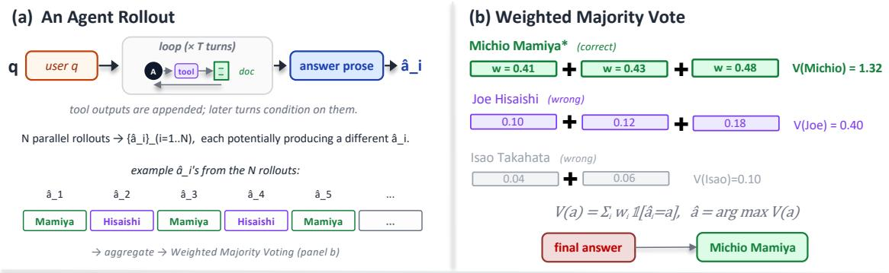

(c) Confidence reads INSIDE the LLM's contaminated context; RGV reads OUTSIDE  
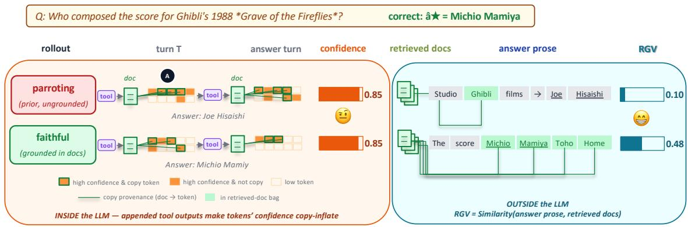  
Figure 1: Overview. (a) Each rollout is one trajectory of the ReAct-style search agent, looping over tool calls (search, page visit) and emitting a predicted answer; $N$ parallel rollouts may differ. (b) The weighted vote sums per-rollout weights over predicted answers; argmax wins. (c) Confidence-based voting weights each rollout by its token logprobs, inflated when the model parrots context. RGV (ours) weights each rollout by the lexical overlap between its answer prose and the retrieved documents—a signal read outside the contaminated context.

## 2 Background

Multi-turn search agent. We study ReAct-style agents (Yao et al., 2023; Schick et al., 2023) whose tools retrieve text documents and whose final answer is derived from the retrieved content. We call these multi-turn search agents, or search agents for short. Such an agent interleaves reasoning and tool calls under a budget of T turns. With context $c _ { 0 } = q$ , at turn k the policy $\pi _ { \theta }$ samples $( u _ { k } , x _ { k } ) \sim \pi _ { \theta } ( { \cdot } \mid c _ { k - 1 } )$ , where $u _ { k }$ is the model’s thought span at turn k and $x _ { k }$ is either a tool invocation (e.g. search to query a search engine, or visit to fetch a web page) or the final answer. On a tool call the environment returns an observation $o _ { k }$ and the context grows by $c _ { k } = c _ { k - 1 } \| u _ { k } \| x _ { k } \| o _ { k }$ Retrieved snippets are thus appended to the same context the model conditions on at later turns.

Rollout. A rollout $t _ { i }$ is one trajectory of this loop, terminating on a final answer or budget exhaustion. We sample N rollouts $\{ t _ { 1 } , \ldots , t _ { N } \}$ in parallel from $q .$ The rollout’s record contains every tool call and its response, every thought span the model emitted, and a final answer turn whose output is one last thought span, followed by the predicted answer string. Three names from this record recur below: the predicted answer ${ \hat { a } } _ { i } ,$ the answer prose $P _ { i }$ (the final answer the model produces on the answer turn, excluding its internal chain-of-thought), and the retrieval log ${ \mathcal { D } } _ { i } = \{ d _ { 1 } , \ldots , d _ { m _ { i } } \}$ (the documents the agent fetched).

Weighted majority vote. The N rollouts may give different answers, so a voting rule returns a single final answer. Each rollout is scored by a nonnegative weight $w _ { i } ,$ , and the chosen answer is the one whose rollouts carry the largest total weight:

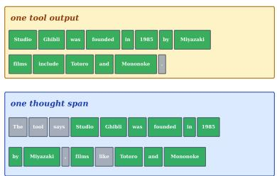  
(a) What is a copy token? A token whose surface form is a substring of some retrieved doc (green).

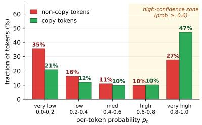  
(b) Copy tokens carry inflated confidence. Per-token probability: copy vs. non-copy.

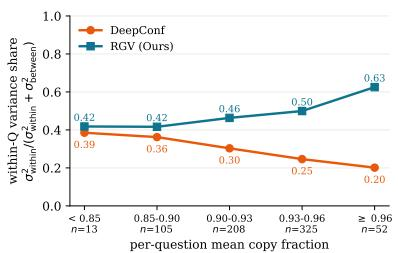  
(c) Copy-heaviness flattens DeepConf within a question. Within-Q scorevariance share vs. per-Q copy fraction.

Figure 2: Copy-inflation. (BrowseComp-Plus, Tongyi-DeepResearch) (a) Defines the copy-token primitive: the doc is already in context, and the model parrots the tool outputs. (b) On generated tokens, copy tokens cluster at prob $\ge 0 . 6$ (57% vs. 37% for non-copy), a +0.50 mean logprob gap. (c) The y-axis is the within-question share of total DeepConf score variance, i.e. how much of the score’s spread comes from differences among rollouts of the same question. As per- $- Q$ mean copy fraction grows, DeepConf’s share drops 0.39→0.20 (same-Q rollouts get nearly the same score, so weighted voting cannot separate them); for comparison, RGV (our method, §4) rises 0.42→0.63. Median rollout copies 93% of its content tokens; 85% of questions have mean copy fraction ≥0.90.  
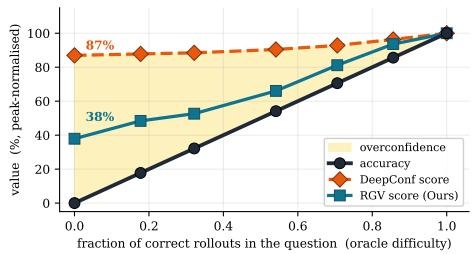  
(a) DeepConf is overconfident. Mean perquestion DeepConf score stays at 87% of peak even on questions where every rollout is wrong.

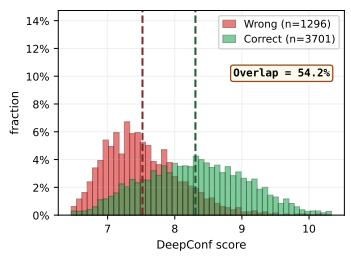  
(b) DeepConf. Per-rollout score density split by judge correctness; the two populations overlap heavily.

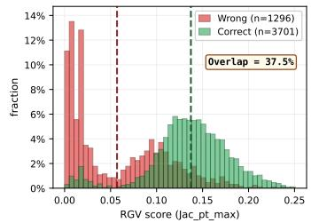  
(c) RGV (Ours; §4). Same split as (b), scored by our method (overlap 37.5%).  
Figure 3: Consequence at the rollout level (BrowseComp-Plus, Tongyi-DeepResearch). (a) Stratifying questions by oracle difficulty (fraction of correct rollouts in the question) reveals DeepConf is nearly flat: it gives impossible questions (87% of peak), almost the same confidence it gives easy ones. (b) DeepConf’s per-rollout correct/wrong distributions overlap heavily (54.2%). (c) For comparison: RGV (our method, §4) on the same split.

$$
V ( a ) = \sum _ { i = 1 } ^ { N } w _ { i } \mathbb { I } ( \hat { a } _ { i } = a ) , \qquad \hat { a } = \arg \operatorname* { m a x } _ { a } V ( a ) .
$$

Different choices of $w _ { i }$ give different methods. Simple majority $( w _ { i } \equiv 1 )$ just counts rollouts per answer. DeepConf (Fu et al., 2025), our confidence baseline, reduces per-token confidences $\begin{array} { r } { C _ { t } = - \frac { 1 } { k } \sum _ { j = 1 } ^ { k } } \end{array}$ log $p _ { j }$ (top-k averaged log-prob, negated; higher means more peaked) over the tokens the model produces during the rollout to a single $w _ { i }$ via a sliding-window aggregation. We use the Lowest-Group reduction (sliding-window minimum) at window size $W { = } 1 0 2 4$ as the headline; the full sweep over reductions and window sizes is in Appendix F. Our method (§4) replaces $w _ { i }$ with a direct grounding check between the answer prose $P _ { i }$ and the retrieved docs $\mathcal { D } _ { i }$

## 3 Motivation

When the only input is the question, DeepConf (Fu et al., 2025), a logprob-based confidence voter (§2) is well-motivated: peaked next-token posteriors correlate with correctness (Kadavath et al., 2022; Tian et al., 2023). In a search agent, however, that correlation breaks down because the tokens Deep-Conf reads are systematically inflated by the retrieved docs appended to the context. We document this on BrowseComp-Plus rollouts from Tongyi-DeepResearch in three observations (Fig. 2) and trace the consequence at the rollout level (Fig. 3).

Tool outputs in context inflate logprobs. A search agent appends every retrieved snippet and visited page to its context window; when it later writes prose, any token it copies from those appended documents has very high $p ( t _ { k }$ | context) because the document is right there. The token’s logprob says the copy step is well-calibrated; it does not say the copied token is the right answer. Confidence-based voting cannot tell the difference between a rollout that copied the right entity and one that copied an irrelevant one.

(i) Copy tokens carry inflated confidence (Fig. 2b). Recall (§2) that DeepConf reads the tokens the model produces during the rollout. For each such token we check whether its surface form is a substring of any retrieved doc the agent fetched on this rollout; copy tokens have a mean logprob +0.50 nats higher than non-copy tokens (730k tokens from a subset of rollouts where per-token logprobs were re-collected). The signal DeepConf reads is thus contaminated by the appended tool outputs regardless of what those tools returned. The gap is robust to the choice of copy-token definition (Appendix G).

(ii) At the rollout level, copy-inflation flattens DeepConf scores within a question (Fig. 2c). We measure DeepConf’s within-question share of total score variance, i.e. how much of the score’s spread comes from differences among rollouts of the same question, rather than between questions. Weighted majority voting needs this within-question spread to prefer one rollout over another; if it vanishes, the vote degenerates into plain simple-majority. As copy fraction grows, DeepConf’s within-question share shrinks 0.39 → 0.20: same-question rollouts get nearly the same DeepConf score and the weight tiebreaker disappears, precisely on the copy-heavy questions where rollouts disagree most.

(iii) And this is not an edge case; copy ratios are very high. Across our rollouts, the median copies 93% of its content tokens from the docs it retrieved, 81% copy at least 90%, and 85% of questions have a mean copy fraction ≥0.90 (Fig. 2c, x-axis). The two failure modes above therefore apply to nearly the entire benchmark, not a corner case. While copy-inflation can in principle arise whenever tool outputs enter the agent’s context; multi-turn search agents are the dominant regime. Two interventions confirm the direction of causation rather than mere association: masking the copied tokens restores DeepConf’s within-question spread without restoring its discriminative power, and removing the documents from context collapses copied-token log-probabilities about twice as much as non-copy ones (Appendix I).

Consequence: the weighted vote no longer tracks correctness. Figure 3 makes the rolloutlevel consequence concrete. (a) Stratifying questions by oracle difficulty (the fraction of their N rollouts that turn out correct), DeepConf’s mean per-question score remains at 87% of its peak even on questions where every rollout is wrong: Deep-Conf cannot tell an impossible question from a solvable one, so the cluster-weighted vote inherits this miscalibration at the voting layer; The pattern replicates across every benchmark and model we test (Appendix D). (b) The same pattern holds at the rollout level: DeepConf’s per-rollout score distributions for correct vs. wrong rollouts overlap heavily (overlap =54.2%), as copy-inflation lifts wrong rollouts into the same high-confidence zone as correct ones, leaving the confidence weight nothing to discriminate.

The principle. The shared cause of failure modes is that the voting signal is computed inside the contaminated context, not outside it. Robust voting therefore requires a signal whose measurement target is independent of the model’s hidden state; something derived from outside the model. The next section turns this principle into a method.

## 4 From principle to method: Retrieval-Grounded Voting

To address the copy-inflation problem identified in §3, we propose reading the voting signal from outside the contaminated context, specifically, from the retrieval log. The key intuition, shared with faithfulness evaluation in summarisation and RAG (Maynez et al., 2020; Min et al., 2023; Es et al., 2024), is that a rollout is more trustworthy when its final answer is lexically anchored in the documents it retrieved.

The RGV score. For each rollout i on a given question, we have its answer prose $P _ { i }$ (defined in §2: the answer turn’s output text) and the set ${ \mathcal { D } } _ { i } = \{ d _ { 1 } , \ldots , d _ { m _ { i } } \}$ of documents the agent retrieved during that rollout (one $d _ { j }$ per search or visit call). We map a text span X to a token set T (X) using a fixed tokenisation/normalisation rule (Appendix A). The rollout’s RGV weight is the maximum prose-recall, the fraction of the answerprose tokens that are anchored in some retrieved document,

$$
w _ { i } ^ { \mathrm { R G V } } = \operatorname* { m a x } _ { d \in \mathcal { D } _ { i } } \frac { | T ( P _ { i } ) \cap \mathcal { T } ( d ) | } { | T ( P _ { i } ) | } .
$$

This is the standard grounding primitive of the faithfulness literature (§7), instantiated with two design choices, max-over-docs and answer-side normalisation, which we motivate next. Appendix E shows that these choices matter only at the margin, while the signal source carries the bulk of the gain.

Why max-over-docs. We score against the single best-matching document rather than the union of all retrieved documents to avoid dilution: as the retrieval bag grows, an irrelevant-doc union washes out a strong match to the truly supporting passage. This “take an extreme, not an average” design mirrors local-extreme confidence reductions in DeepConf (Fu et al., 2025), which prefer the mostuncertain window-group over an average across all windows.

Why the prose-side denominator. With the numerator fixed at $| T ( P _ { i } ) \cap T ( d ) |$ , the design choice is the denominator. Symmetric Jaccard (Jaccard, 1912) uses $\left| { \mathcal { T } } ( P _ { i } ) \cup { \mathcal { T } } ( d ) \right|$ , which over-penalises when the retrieved doc is long, exactly the regime we target. Normalising by $| \tau ( P _ { i } ) |$ keeps the score length-invariant on the doc side: a well-anchored answer is not punished for retrieving a long supporting passage. Other overlap functions (Lin, 2004; Robertson and Zaragoza, 2009) yield similar headline numbers (Appendix E); the gain comes from the signal source, not the choice of denominator.

Voting rule. We plug $w _ { i } ~ = ~ w _ { i } ^ { \mathrm { R G V } }$ into the weighted majority vote of §2; answer strings are clustered after a light normalisation (lowercase, whitespace collapse, leading-article strip) and the cluster with the largest summed weight wins.

What is and is not computed inside the model’s context. The token set $\mathcal { T } ( P _ { i } )$ is, of course, generated by the model. The token set $\mathcal T ( d )$ is read directly off the retrieval log: it is what the environment returned, regardless of how the model used it. Even though the docs were appended to the model’s context, their token set as a measurement target does not depend on the model’s hidden state, and a rollout cannot inflate its RGV weight through verbosity or self-assuredness; RGV asks only whether the answer prose is anchored in the documents the rollout actually retrieved.

## 5 Experimental setup

Benchmarks. We evaluate on four multi-turn search agent benchmarks where the agent gathers evidence from retrieved documents and derives a grounded answer: BrowseComp-Plus (Chen et al.,

2025) (fixed-corpus retrieval), BrowseComp (Wei et al., 2025) (open-web browsing), GAIA (Mialon et al., 2023) (general-assistant tasks dominated by web search), and FRAMES (Krishna et al., 2025) (multi-hop retrieval requiring synthesis across multiple Wikipedia articles). For each benchmark, we randomly sample up to 150 questions, held constant across models. Licences and intended-use terms for every benchmark, corpus and model are listed in Appendix O.

Models. We evaluate five LLMs across the four benchmarks above: gpt-oss-120b (OpenAI et al., 2025), MiniMax-M2.7 (MiniMax et al., 2025), GLM-5.1 (GLM-5-Team et al., 2026), Kimi-K2.5 (Team et al., 2025a), and Tongyi-DeepResearch (Team et al., 2025b). The resulting benchmark × model coverage is reported in Table 1.

Rollout protocol. The agent is given two tools per benchmark: search (issue a text query, receive ranked snippets) and get\_doc (fetch a full document by ID) on BrowseComp-Plus (fixed-corpus retrieval), and search and visit (fetch and render a URL) on the other three benchmarks. We sample N=8 rollouts per question. Full hyperparameters, tool truncation rules, and the force-final / recovery procedure are in Appendix A.

Judge. A single judge is used across all datasets: Qwen3-32B at temperature 0, applied with the official BrowseComp-Plus grading template (Chen et al., 2025). The judge sees only the question, the gold answer, and the rollout’s final answer; it does not see voting outcomes or other rollouts.

Voting protocol. All voting methods plug a perrollout weight $w _ { i }$ into the weighted majority vote of $\ S 2 ;$ answer strings are clustered under the strict normalisation of §4. Methods compared: Simplemajority (SM, $w _ { i } \equiv 1 )$ ; DeepConf (DC; Lowest-Group reduction with window W=1024, chosen on the full reduction × window-size grid in Appendix F); RGV (§4). Two reference columns in Table 1 are non-voting: single = mean per-rollout accuracy, and oracle = any-rollout-correct upper bound.

## 6 Results

Table 1 shows that RGV is best in all 20 benchmark×model cells. The pattern is consistent with the copy-inflation story of §3: whenever confidence weights lose within-question spread, grounding is the remaining discriminator.

<table><tr><td>Dataset</td><td>Model</td><td>Single Avg.</td><td>Simple Maj.</td><td>DeepConf</td><td>RGV (Ours)</td><td>Oracle</td></tr><tr><td rowspan="5">BrowseComp-Plus</td><td>Tongyi-DeepResearch</td><td>51.6</td><td>62.0</td><td>65.7</td><td>71.1</td><td>74.2</td></tr><tr><td>OSS-120B</td><td>47.3</td><td>53.3</td><td>54.7</td><td>56.0</td><td>66.7</td></tr><tr><td>MiniMax-M2.7</td><td>67.8</td><td>75.3</td><td>75.3</td><td>78.7</td><td>83.3</td></tr><tr><td>Kimi-K2.5</td><td>80.0</td><td>80.7</td><td>80.7</td><td>81.3</td><td>88.7</td></tr><tr><td>GLM-5.1</td><td>74.9</td><td>80.7</td><td>80.7</td><td>82.0</td><td>90.0</td></tr><tr><td rowspan="5">GAIA</td><td>Tongyi-DeepResearch</td><td>70.0</td><td>79.6</td><td>79.6</td><td>80.6</td><td>92.2</td></tr><tr><td>OSS-120B</td><td>60.4</td><td>69.9</td><td>68.9</td><td>71.8</td><td>83.5</td></tr><tr><td>MiniMax-M2.7</td><td>80.3</td><td>87.4</td><td>88.3</td><td>93.2</td><td>97.1</td></tr><tr><td>Kimi-K2.5</td><td>73.1</td><td>78.6</td><td>79.6</td><td>81.6</td><td>92.2</td></tr><tr><td>GLM-5.1</td><td>83.3</td><td>87.4</td><td>87.4</td><td>89.3</td><td>92.2</td></tr><tr><td rowspan="5">BrowseComp</td><td>Tongyi-DeepResearch</td><td>41.2</td><td>52.0</td><td>52.7</td><td>54.0</td><td>68.7</td></tr><tr><td>OSS-120B</td><td>22.7</td><td>30.0</td><td>29.3</td><td>34.0</td><td>41.3</td></tr><tr><td>MiniMax-M2.7</td><td>37.1</td><td>40.7</td><td>46.0</td><td>50.7</td><td>59.3</td></tr><tr><td>Kimi-K2.5</td><td>35.0</td><td>52.8</td><td>56.6</td><td>58.5</td><td>73.6</td></tr><tr><td>GLM-5.1</td><td>57.8</td><td>72.6</td><td>73.7</td><td>78.9</td><td>92.6</td></tr><tr><td rowspan="5">FRAMES</td><td>Tongyi-DeepResearch</td><td>84.0</td><td>87.3</td><td>88.0</td><td>88.0</td><td>94.7</td></tr><tr><td>OSS-120B</td><td>78.7</td><td>82.0</td><td>82.7</td><td>85.3</td><td>91.3</td></tr><tr><td>MiniMax-M2.7</td><td>86.5</td><td>88.7</td><td>89.3</td><td>89.3</td><td>94.0</td></tr><tr><td>Kimi-K2.5</td><td>85.7</td><td>88.0</td><td>88.7</td><td>89.3</td><td>97.3</td></tr><tr><td>GLM-5.1</td><td>88.3</td><td>90.0</td><td>90.0</td><td>90.7</td><td>98.0</td></tr></table>

Table 1: Headline voting accuracies (%) across 4 multi-turn search agent benchmarks × 5 LLMs, N=8 rollouts per question.

Gains are largest where voting is hardest: low single-rollout accuracy (e.g. +5.4% on BrowseComp-Plus Tongyi at 51.6% single) and noisy open-web retrieval (BrowseComp, up to +6.2%). They shrink where majority already saturates (FRAMES; ≥ 84% single), but remain nonzero even when DeepConf matches simple majority (e.g. GLM-5.1 on FRAMES: 90.0% vs. 90.7%), suggesting that lexical grounding adds information beyond both count (simple-majority votes) and logprob confidence. All margins are stable under within-cell 3-fold splits (Appendix B).

We probe the boundaries of this result in three appendices: degraded retrieval, prompt and answerformat sensitivity, and selection versus voting, in Appendices H, J and K.

For the mechanism and ablation analyses that follow (§6.1 – §6.3), we anchor on Tongyi-DeepResearch on BrowseComp-Plus (N=8, 830 questions), where retrieval comes from a fixed corpus (no search-engine noise) and the agent is representative of the class we target.

## 6.1 Is the signal genuine grounding?

§4 interprets overlap as grounding, but a spurious alternative is that it rewards verbosity or common tokens. If so, RGV would succeed by accident, and overlap could not support the copy-inflation account of §3. We therefore test whether the score reflects genuine retrieval grounding.

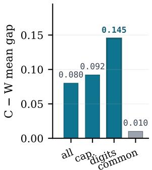

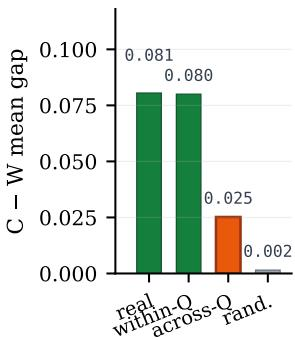  
(a) rare-entity matching  
(b) null controls  
Figure 4: Why RGV works (BrowseComp-Plus Tongyi-DeepResearch). y-axis: C–W mean gap (mean RGV score of correct rollouts minus that of wrong rollouts). (a) Rare-entity tokens carry the signal. (b) The signal survives a within-Q doc shuffle, collapses 3× across questions, and 53× under a random-token null.

At the rollout level, RGV separates judge-correct from judge-wrong trajectories better than Deep-Conf (ROC AUC (Fawcett, 2006) 0.908 vs. 0.837; +0.071). To explain why, we analyse (i) which token classes carry the gap, (ii) controlled shuffles and nulls, and (iii) correlation with an independent retrieval-quality measure.

Rare-entity matching drives the signal. Figure 4(a) decomposes the C–W mean gap, the difference in mean RGV score between judge-correct (C) and judge-wrong (W) rollouts, by token class. Digit tokens (years, codes, identifiers) give the largest gap (0.145), capitalised entity names follow (0.092), and common content words contribute little (0.010). The pattern is intuitive: common words appear in every rollout’s prose regardless of correctness, so they carry no discriminative power; rare entities appear only when the rollout actually retrieved the relevant document. This aligns with the rare-token weighting in classical IR (Robertson and Zaragoza, 2009) and atomic-faithfulness metrics (Min et al., 2023).

Null controls confirm question-specific grounding. To distinguish genuine grounding from incidental overlap, we construct three counterfactuals (Figure 4(b)). The C–W mean gap is 0.080. (i) A within-question doc shuffle (re-pair each rollout’s prose with another rollout’s docs from the same question) preserves the gap at 0.080, since samequestion rollouts share relevant retrievals. (ii) An across-question shuffle collapses the gap to 0.025 (3× drop). (iii) A length-matched random-token null collapses it to 0.002 (53×). Together, they rule out the two most plausible confounds: (ii) shows the signal is not generic text similarity but depends on the question-document match; (iii) shows it is not an artifact of answer length.

Gold-document validation. BrowseComp-Plus provides gold supporting documents per question (mean |G|=2.9). For each rollout we compute gold recall, $| { \mathcal { D } } _ { i } \cap { \mathcal { G } } | / | { \mathcal { G } } |$ . Judge-correct rollouts have mean gold recall 0.94, vs. 0.31 for judge-wrong (Pearson $r { = } 0 . 7 2 )$ . RGV scores correlate with gold recall at $r { = } 0 . 5 7 .$ , vs. 0.36 for DeepConf. In other words, a high RGV score is a reliable indicator that the rollout found the right documents, not merely that it produced verbose prose. This closes the validation loop: RGV works because it measures retrieval quality, the very property that copy-inflation prevents DeepConf from reading.

## 6.2 Where the advantage concentrates

The copy-inflation analysis of §3 makes a natural prediction: because copy-inflation compresses DeepConf’s within-question spread on exactly the questions where rollouts disagree, RGV’s advantage should concentrate on those same hard-to-vote questions. We test this prediction directly.

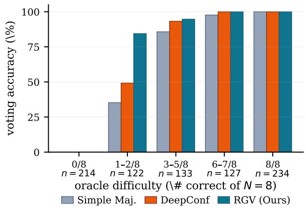  
Figure 5: Voting accuracy by question difficulty (# correct of N=8) on BrowseComp-Plus -DeepResearch. Most of the gap concentrates on the $1 - 2 / 8$ bucket.

Figure 5 stratifies the 830 questions by oracle difficulty (the number of the eight rollouts that the judge marks correct). On easy questions $( \geq 3 / 8$ correct) all methods converge. Most of the accuracy gap between RGV and DeepConf concentrates on the 122 minority-correct $( 1 - 2 / 8 )$ questions, where one or two of eight rollouts found the right answer but the majority did not: RGV scores 84.4% vs. DeepConf’s 49.2% (+35.2%). DeepConf fails here because copy-inflation (§3) gives the wrong majority nearly the same confidence as the correct minority; RGV breaks the tie through grounding. This is also the bucket where the gold-doc recall gap of §6.1 is largest (RGV-argmax 84% vs. Deep-Conf $7 1 \% , + 1 3 \% )$ , confirming that the voting advantage traces back to retrieval quality. RGV’s value is concentrated precisely where it is needed: the ambiguous questions where rollouts disagree and the majority answer may be wrong.

## 6.3 Scaling, cost, and design choices

Two practical questions remain: does RGV’s advantage persist under tighter rollout budgets, and is the max-over-docs design of §4 the right choice?

Scaling with N. Sub-sampling the eight rollouts to $N \in \{ 1 , \ldots , 8 \}$ at 60 random partitions per N (Figure 6), RGV at N=4 (65.9%) already matches DeepConf at N=8 (65.7%): the same accuracy at half the rollout cost. The gap grows monotonically from $+ 3 . 4 \%$ at $N { = } 2 \ \mathrm { t o } \ + 5 . 4 \%$ at $N { = } 8$ , meaning RGV benefits more, not less, from additional rollouts. This is the regime where test-time scaling (Snell et al., 2024; Brown et al., 2024) is most relevant, and where a better voting rule yields compounding returns.

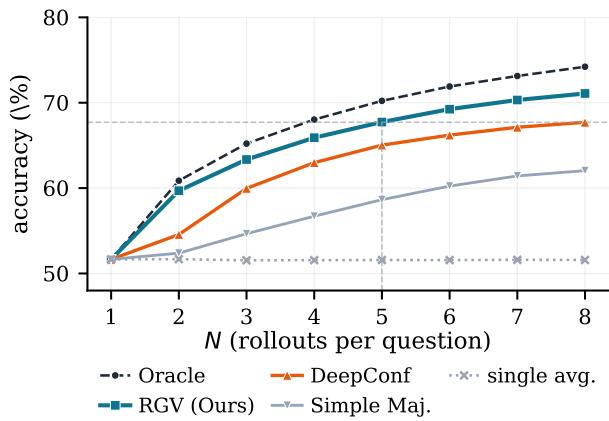  
Figure 6: Accuracy vs. rollout budget N on BrowseComp-Plus with Tongyi-DeepResearch. RGV is uniformly above DeepConf.

<table><tr><td>Reduction</td><td>Accuracy (%)</td></tr><tr><td>Simple Majority (no RGV)</td><td>62.0</td></tr><tr><td>mind</td><td>69.3</td></tr><tr><td>meand</td><td>70.5</td></tr><tr><td>maxd − mind</td><td>70.5</td></tr><tr><td>maxd (headline RGV)</td><td>71.1</td></tr></table>

Table 2: Doc-set reduction ablation (N=8, BrowseComp-Plus, Tongyi-DeepResearch).

Cost. RGV uses only the emitted prose and the retrieved snippets already in the trajectory: no extra call, no logprobs, ∼0.3 ms per rollout on one CPU thread. By contrast, DeepConf requires per-token logprobs, and aggregator methods (Lee et al., 2026; Chen et al., 2023) add at least one rollout-equivalent of inference. When combined with the iso-accuracy scaling above, RGV offers a favourable cost–accuracy trade-off.

Max-over-docs ablation. §4 argues for max over the retrieved-document set to avoid dilution from irrelevant documents. Table 2 validates this: max consistently leads, though all four reductions beat simple majority by +7 to +9%. The fact that even min (the worst-matching document) still yields a +7.3% gain over simple majority is revealing: the bulk of RGV’s advantage comes from the signal source itself, i.e. reading prose-vs-retrieval overlap outside the contaminated context. The choice of reduction is secondary; max adds a further +0.6 to +1.8% by focusing on the single most relevant document and avoiding dilution from irrelevant retrievals.

## 6.4 Error analysis

RGV selects the correct answer on 590 of 616 questions where a correct rollout exists (95.8%). The 26 failures (4.2%) follow a well-characterised pattern: in 24 cases a wrong rollout retrieves documents about the right topic but draws the wrong conclusion, receiving a higher grounding score because it echoes topically relevant—but factually incorrect— evidence. We call this well-grounded but wrong. This residual is small relative to the +5.4% overall gain; it concentrates on high-diversity questions (mean 4.9 unique clusters vs. 4.0) where many plausible answers compete. Appendix N contrasts three representative successes with three failure cases.

## 7 Related work

Confidence-based aggregation for single-turn reasoning. Sample-and-aggregate test-time compute (Wang et al., 2022b; Snell et al., 2024; Brown et al., 2024; Wang et al., 2025) typically weights the vote by a confidence proxy: self-reported confidence (Wang et al., 2024; Taubenfeld et al., 2025), sliding-window token logprobs (Fu et al., 2025), an extra LLM judge (Chen et al., 2023; Thirukovalluru et al., 2024), or saturation-based budget (Aggarwal et al., 2023). These assume the question is the only conditioning, with no tool outputs in context.

The breakdown in multi-turn tool-using agents. Within the broader class of tool-using agents, we focus on search agents, the subclass where retrieved documents dominate the context. Recent work reports that confidence transfers poorly to this setting, but examines a different signal class. Xuan et al. (2026) document a confidence dichotomy— evidence tools induce overconfidence in verbalised confidence and recalibrate it via RL fine-tuning; BrowseConf (Ou et al., 2025) uses verbalised confidence as a retry trigger. Both target the verbalised channel rather than the token-logprob signal used by logit-based voters, and neither operates at the voting layer. Wang et al. (2024) soften majority voting with token logprobs on interactive tasks without retrieval. Broader miscalibration accounts (Kadavath et al., 2022; Tian et al., 2023; Xiong et al., 2024; Kuhn et al., 2023) share our framing; our contribution is to address the mechanism at the voting layer without retraining or a second model.

Trajectory-aware aggregators. A complementary thread adds an extra model: AggAgent (Lee et al., 2026) aggregates parallel trajectories; ParallelMuse (Li et al., 2025) compresses partial ones for an aggregator; PRM-style verifiers (Cobbe et al., 2021; Lightman et al., 2023) and self-correction agents (Shinn et al., 2023; Zhou et al., 2024) score intermediate steps. These help but add at least one rollout-equivalent of inference; RGV adds none.

Faithfulness and grounding metrics. RGV’s lexical-overlap signal is a voting-layer use of a familiar intuition from summarisation and RAG evaluation (Maynez et al., 2020; Lin, 2004; Min et al., 2023; Es et al., 2024; Gao et al., 2024). The primitive itself is long-standing: Grusky et al. (2018) measure extractive coverage as the fraction of summary tokens drawn from the source article, the same answer-side normalisation we adopt in §4, and Shuster et al. (2021) use unigram overlap between a response and its grounding knowledge as a hallucination proxy, with a Rare-F1 variant that discounts common words for exactly the reason Figure 4(a) finds them uninformative. Those metrics are evaluated post-hoc against a single output. Our contribution is the layer at which the primitive is applied, weighted voting over parallel rollouts, and the reason it has to be read outside the model at all: copy-inflation (§3) is what breaks the internal alternative.

## 8 Conclusion

We identified copy-inflation, the mechanism by which retrieved documents inflate logprob-based confidence in search agents, and proposed RGV, which reads the voting signal from outside the contaminated context. Across four benchmarks and five LLMs, RGV outperforms both simple majority and confidence-based voting while adding minimal cost. Our findings suggest that when retrieved evidence contaminates the model context, aggregation signals drawn from environment-derived records offer a more reliable foundation than internal model signals. The diagnosis is not specific to voting: any mechanism that consumes an agent’s token-level confidence, whether for early stopping, routing, abstention, confidence-shaped rewards, or logprobbased hallucination detection, reads the same contaminated signal and inherits the same failure. We believe this direction may extend beyond voting to other settings where context and evidence are no longer separable.

## Limitations

RGV inherits retrieval quality. The score is read from the retrieval log, so it can be no better than what retrieval returned. Appendix H maps this boundary with four cells. Where a weaker retriever genuinely degrades the agent (BM25 in place of the dense retriever), the grounded vote keeps its margin; where the weaker stack still suffices for the benchmark, all aggregation rules converge and RGV neither helps nor hurts; under outright corpus mismatch it is the only rule that stays above the single-rollout average, though its own margin is thin. Degradation is graceful, and the copy fraction of a cell predicts which regime applies. But on a task where retrieval contributes little, so does RGV.

Grounded is not correct, and short answers weaken the signal. RGV estimates retrieval success, not truth. Section 6.4 measures the residual: on 26 of 616 questions (4.2%) a wrong rollout retrieves documents on the right topic and outscores a correct one. The signal is surface-level overlap with no entailment check, so this is intrinsic to the design rather than a tuning artefact. Relatedly, because the score normalises by the answer prose, it weakens as that prose becomes very short: forcing single-entity answers reduces it to answer containment and the vote merely matches DeepConf (Appendix J).

Scope. We study multi-turn search agents, where retrieved documents are the primary evidence source; agents relying on non-retrieval tools such as code interpreters would need a different grounding signal, and on reasoning-intensive tasks the gains shrink (Appendix L). All experiments are in English. Finally, RGV trusts the retrieval log, so an adversarially poisoned corpus would raise the score of rollouts that copy from it. This vulnerability is shared by any method that reads that log. Accidental noise is not a problem (injecting up to 16 irrelevant documents per rollout leaves the vote unchanged), but adversarial robustness remains open.

## Acknowledgments

This work was partially supported by Google Research Award, Google ML & System Junior Faculty Award, Amazon Research Award, Fireworks AI, Intel, Li Auto, Moffett AI, and CMU CyLab Seed funding. This material is also based upon work supported by the National Science Foundation under Grant No. 2504353. Any opinions, findings, and conclusions or recommendations expressed are those of the authors and do not necessarily reflect the views of the National Science Foundation. This research is based upon work supported in part by the Office of the Director of National Intelligence (ODNI), Intelligence Advanced Research Projects Activity (IARPA), via 560000C260017. The views and conclusions contained herein are those of the authors and should not be interpreted as necessarily representing the official policies, either expressed or implied, of ODNI, IARPA, or the U.S. Government. The U.S. Government is authorized to reproduce and distribute reprints for governmental purposes notwithstanding any copyright annotation therein.

This work was supported by Institute of Information & communications Technology Planning & Evaluation (IITP) grant funded by the Korea government(MSIT) (RS-2022-00143911, AI Excellence Global Innovative Leader Education Program)

## References

Pranjal Aggarwal, Aman Madaan, Yiming Yang, and Mausam. 2023. Let’s sample step by step: Adaptiveconsistency for efficient reasoning and coding with llms. Preprint, arXiv:2305.11860.

Bradley Brown, Jordan Juravsky, Ryan Ehrlich, Ronald Clark, Quoc V. Le, Christopher Ré, and Azalia Mirhoseini. 2024. Large language monkeys: Scaling inference compute with repeated sampling. Preprint, arXiv:2407.21787.

Xinyun Chen, Renat Aksitov, Uri Alon, Jie Ren, Kefan Xiao, Pengcheng Yin, Sushant Prakash, Charles Sutton, Xuezhi Wang, and Denny Zhou. 2023. Universal self-consistency for large language model generation. Preprint, arXiv:2311.17311.

Zijian Chen, Xueguang Ma, Shengyao Zhuang, Ping Nie, Kai Zou, Andrew Liu, Joshua Green, Kshama Patel, Ruoxi Meng, Mingyi Su, Sahel Sharifymoghaddam, Yanxi Li, Haoran Hong, Xinyu Shi, Xuye Liu, Nandan Thakur, Crystina Zhang, Luyu Gao, Wenhu Chen, and Jimmy Lin. 2025. Browsecomp-plus: A more fair and transparent evaluation benchmark of deep-research agent. Preprint, arXiv:2508.06600.

Karl Cobbe, Vineet Kosaraju, Mohammad Bavarian, Mark Chen, Heewoo Jun, Lukasz Kaiser, Matthias Plappert, Jerry Tworek, Jacob Hilton, Reiichiro Nakano, Christopher Hesse, and John Schulman. 2021. Training verifiers to solve math word problems. Preprint, arXiv:2110.14168.

Shahul Es, Jithin James, Luis Espinosa Anke, and Steven Schockaert. 2024. RAGAs: Automated evaluation of retrieval augmented generation. In Proceedings of the 18th Conference of the European Chapter ofthe Associationfor Computational Linguistics: System Demonstrations, pages 150–158, St. Julians, Malta. Association for Computational Linguistics.

Tom Fawcett. 2006. An introduction to roc analysis. Pattern Recognition Letters, 27(8):861–874. ROC Analysis in Pattern Recognition.

Yichao Fu, Xuewei Wang, Yuandong Tian, and Jiawei Zhao. 2025. Deep think with confidence. Preprint, arXiv:2508.15260.

Yunfan Gao, Yun Xiong, Xinyu Gao, Kangxiang Jia, Jinliu Pan, Yuxi Bi, Yi Dai, Jiawei Sun, Meng Wang, and Haofen Wang. 2024. Retrieval-augmented generation for large language models: A survey. Preprint, arXiv:2312.10997.

GLM-5-Team, :, Aohan Zeng, Xin Lv, Zhenyu Hou, Zhengxiao Du, Qinkai Zheng, Bin Chen, Da Yin, Chendi Ge, Chenghua Huang, Chengxing Xie, Chenzheng Zhu, Congfeng Yin, Cunxiang Wang, Gengzheng Pan, Hao Zeng, Haoke Zhang, Haoran Wang, and 168 others. 2026. Glm-5: from vibe coding to agentic engineering. Preprint, arXiv:2602.15763.

Max Grusky, Mor Naaman, and Yoav Artzi. 2018. Newsroom: A dataset of 1.3 million summaries with diverse extractive strategies. In Proceedings of the 2018 Conference ofthe North American Chapter of the Associationfor Computational Linguistics: Human Language Technologies, Volume 1 (Long Papers), pages 708–719, New Orleans, Louisiana. Association for Computational Linguistics.

Paul Jaccard. 1912. The distribution of the flora in the alpine zone. The New Phytologist, 11(2):37–50.

Bowen Jin, Hansi Zeng, Zhenrui Yue, Jinsung Yoon, Sercan Arik, Dong Wang, Hamed Zamani, and Jiawei Han. 2025. Search-r1: Training llms to reason and leverage search engines with reinforcement learning. arXiv preprint arXiv:2503.09516.

Saurav Kadavath, Tom Conerly, Amanda Askell, Tom Henighan, Dawn Drain, Ethan Perez, Nicholas Schiefer, Zac Hatfield-Dodds, Nova DasSarma, Eli Tran-Johnson, Scott Johnston, Sheer El-Showk, Andy Jones, Nelson Elhage, Tristan Hume, Anna Chen, Yuntao Bai, Sam Bowman, Stanislav Fort, and 17 others. 2022. Language models (mostly) know what they know. Preprint, arXiv:2207.05221.

Satyapriya Krishna, Kalpesh Krishna, Anhad Mohananey, Steven Schwarcz, Adam Stambler, Shyam Upadhyay, and Manaal Faruqui. 2025. Fact, fetch, and reason: A unified evaluation of retrievalaugmented generation. In Proceedings of the 2025 Conference of the Nations of the Americas Chapter of the Association for Computational Linguistics: Human Language Technologies (Volume 1: Long Papers), pages 4745–4759.

Lorenz Kuhn, Yarin Gal, and Sebastian Farquhar. 2023. Semantic uncertainty: Linguistic invariances for uncertainty estimation in natural language generation. arXiv preprint arXiv:2302.09664.

Yoonsang Lee, Howard Yen, Xi Ye, and Danqi Chen. 2026. Agentic aggregation for parallel scaling of long-horizon agentic tasks. Preprint, arXiv:2604.11753.

Baixuan Li, Dingchu Zhang, Jialong Wu, Wenbiao Yin, Zhengwei Tao, Yida Zhao, Liwen Zhang, Haiyang Shen, Runnan Fang, Pengjun Xie, Jingren Zhou, and Yong Jiang. 2025. Parallelmuse: Agentic parallel thinking for deep information seeking. Preprint, arXiv:2510.24698.

Hunter Lightman, Vineet Kosaraju, Yura Burda, Harri Edwards, Bowen Baker, Teddy Lee, Jan Leike, John Schulman, Ilya Sutskever, and Karl Cobbe. 2023. Let’s verify step by step. Preprint, arXiv:2305.20050.

Chin-Yew Lin. 2004. ROUGE: A package for automatic evaluation of summaries. In Text Summarization Branches Out, pages 74–81, Barcelona, Spain. Association for Computational Linguistics.

Yi Luan, Jacob Eisenstein, Kristina Toutanova, and Michael Collins. 2021. Sparse, dense, and attentional representations for text retrieval. Transactions ofthe Association for Computational Linguistics, 9:329– 345.

Potsawee Manakul, Adian Liusie, and Mark Gales. 2023. SelfCheckGPT: Zero-resource black-box hallucination detection for generative large language models. In Proceedings of the 2023 Conference on Empirical Methods in Natural Language Processing, pages 9004–9017, Singapore. Association for Computational Linguistics.

Joshua Maynez, Shashi Narayan, Bernd Bohnet, and Ryan McDonald. 2020. On faithfulness and factuality in abstractive summarization. In Proceedings of the 58th annual meeting of the association for computational linguistics, pages 1906–1919.

Grégoire Mialon, Clémentine Fourrier, Craig Swift, Thomas Wolf, Yann LeCun, and Thomas Scialom. 2023. Gaia: a benchmark for general ai assistants. Preprint, arXiv:2311.12983.

Sewon Min, Kalpesh Krishna, Xinxi Lyu, Mike Lewis, Wen tau Yih, Pang Wei Koh, Mohit Iyyer, Luke Zettlemoyer, and Hannaneh Hajishirzi. 2023. Factscore: Fine-grained atomic evaluation of factual precision in long form text generation. Preprint, arXiv:2305.14251.

MiniMax, :, Aili Chen, Aonian Li, Bangwei Gong, Binyang Jiang, Bo Fei, Bo Yang, Boji Shan, Changqing Yu, Chao Wang, Cheng Zhu, Chengjun Xiao, Chengyu Du, Chi Zhang, Chu Qiao, Chunhao Zhang, Chunhui Du, Congchao Guo, and 109

others. 2025. Minimax-m1: Scaling test-time compute efficiently with lightning attention. Preprint, arXiv:2506.13585.

Reiichiro Nakano, Jacob Hilton, Suchir Balaji, Jeff Wu, Long Ouyang, Christina Kim, Christopher Hesse, Shantanu Jain, Vineet Kosaraju, William Saunders, and 1 others. 2021. Webgpt: Browser-assisted question-answering with human feedback. arXiv preprint arXiv:2112.09332.

OpenAI, :, Sandhini Agarwal, Lama Ahmad, Jason Ai, Sam Altman, Andy Applebaum, Edwin Arbus, Rahul K. Arora, Yu Bai, Bowen Baker, Haiming Bao, Boaz Barak, Ally Bennett, Tyler Bertao, Nivedita Brett, Eugene Brevdo, Greg Brockman, Sebastien Bubeck, and 108 others. 2025. gpt-oss-120b & gptoss-20b model card. Preprint, arXiv:2508.10925.

Litu Ou, Kuan Li, Huifeng Yin, Liwen Zhang, Zhongwang Zhang, Xixi Wu, Rui Ye, Zile Qiao, Pengjun Xie, Jingren Zhou, and Yong Jiang. 2025. Browseconf: Confidence-guided test-time scaling for web agents. Preprint, arXiv:2510.23458.

Long Phan, Alice Gatti, Ziwen Han, Nathaniel Li, Josephina Hu, Hugh Zhang, Chen Bo Calvin Zhang, Mohamed Shaaban, John Ling, Sean Shi, and 1 others. 2025. Humanity’s last exam. arXiv preprint arXiv:2501.14249.

Stephen Robertson and Hugo Zaragoza. 2009. The probabilistic relevance framework: Bm25 and beyond. Found. Trends Inf. Retr., 3(4):333–389.

Timo Schick, Jane Dwivedi-Yu, Roberto Dessí, Roberta Raileanu, Maria Lomeli, Eric Hambro, Luke Zettlemoyer, Nicola Cancedda, and Thomas Scialom. 2023. Toolformer: language models can teach themselves to use tools. In Proceedings of the 37th International Conference on Neural Information Processing Systems, NIPS ’23, Red Hook, NY, USA. Curran Associates Inc.

Christopher Sciavolino, Zexuan Zhong, Jinhyuk Lee, and Danqi Chen. 2021. Simple entity-centric questions challenge dense retrievers. In Proceedings of the 2021 Conference on Empirical Methods in Natural Language Processing, pages 6138–6148, Online and Punta Cana, Dominican Republic. Association for Computational Linguistics.

Noah Shinn, Federico Cassano, Ashwin Gopinath, Karthik Narasimhan, and Shunyu Yao. 2023. Reflexion: Language agents with verbal reinforcement learning. Advances in neural information processing systems, 36:8634–8652.

Kurt Shuster, Spencer Poff, Moya Chen, Douwe Kiela, and Jason Weston. 2021. Retrieval augmentation reduces hallucination in conversation. In Findings of the Association for Computational Linguistics: EMNLP 2021, pages 3784–3803, Punta Cana, Dominican Republic. Association for Computational Linguistics.

Charlie Snell, Jaehoon Lee, Kelvin Xu, and Aviral Kumar. 2024. Scaling llm test-time compute optimally can be more effective than scaling model parameters. Preprint, arXiv:2408.03314.

Amir Taubenfeld, Tom Sheffer, Eran Ofek, Amir Feder, Ariel Goldstein, Zorik Gekhman, and Gal Yona. 2025. Confidence improves self-consistency in llms. In Findings ofthe Associationfor Computational Linguistics: ACL 2025, pages 20090–20111.

Kimi Team, Yifan Bai, Yiping Bao, Y. Charles, Cheng Chen, Guanduo Chen, Haiting Chen, Huarong Chen, Jiahao Chen, Ningxin Chen, Ruijue Chen, Yanru Chen, Yuankun Chen, Yutian Chen, Zhuofu Chen, Jialei Cui, Hao Ding, Mengnan Dong, Angang Du, and 181 others. 2025a. Kimi k2: Open agentic intelligence. Preprint, arXiv:2507.20534.

Tongyi DeepResearch Team, Baixuan Li, Bo Zhang, Dingchu Zhang, Fei Huang, Guangyu Li, Guoxin Chen, Huifeng Yin, Jialong Wu, Jingren Zhou, Kuan Li, Liangcai Su, Litu Ou, Liwen Zhang, Pengjun Xie, Rui Ye, Wenbiao Yin, Xinmiao Yu, Xinyu Wang, and 38 others. 2025b. Tongyi deepresearch technical report. Preprint, arXiv:2510.24701.

Raghuveer Thirukovalluru, Yukun Huang, and Bhuwan Dhingra. 2024. Atomic self-consistency for better long form generations. In Proceedings of the 2024 Conference on Empirical Methods in Natural Language Processing, pages 12681–12694.

Katherine Tian, Eric Mitchell, Allan Zhou, Archit Sharma, Rafael Rafailov, Huaxiu Yao, Chelsea Finn, and Christopher D Manning. 2023. Just ask for calibration: Strategies for eliciting calibrated confidence scores from language models fine-tuned with human feedback. In Proceedings ofthe 2023 Conference on Empirical Methods in Natural Language Processing, pages 5433–5442.

Han Wang, Archiki Prasad, Elias Stengel-Eskin, and Mohit Bansal. 2024. Soft self-consistency improves language models agents. In Proceedings ofthe 62nd Annual Meeting of the Association for Computational Linguistics (Volume 2: Short Papers), pages 287– 301.

Junlin Wang, Jue Wang, Ben Athiwaratkun, Ce Zhang, and James Y Zou. 2025. Mixture-of-agents enhances large language model capabilities. In International Conference on Learning Representations, volume 2025, pages 33944–33963.

Liang Wang, Nan Yang, Xiaolong Huang, Binxing Jiao, Linjun Yang, Daxin Jiang, Rangan Majumder, and Furu Wei. 2022a. Text embeddings by weaklysupervised contrastive pre-training. arXiv preprint arXiv:2212.03533.

Xuezhi Wang, Jason Wei, Dale Schuurmans, Quoc Le, Ed Chi, Sharan Narang, Aakanksha Chowdhery, and Denny Zhou. 2022b. Self-consistency improves chain of thought reasoning in language models. arXiv preprint arXiv:2203.11171.

Jason Wei, Zhiqing Sun, Spencer Papay, Scott McKinney, Jeffrey Han, Isa Fulford, Hyung Won Chung, Alex Tachard Passos, William Fedus, and Amelia Glaese. 2025. Browsecomp: A simple yet challenging benchmark for browsing agents. arXiv preprint arXiv:2504.12516.

Miao Xiong, Zhiyuan Hu, Xinyang Lu, Yifei Li, Jie Fu, Junxian He, and Bryan Hooi. 2024. Can llms express their uncertainty? an empirical evaluation of confidence elicitation in llms. In International Conference on Learning Representations, volume 2024, pages 23650–23678.

Weihao Xuan, Qingcheng Zeng, Heli Qi, Yunze Xiao, Junjue Wang, and Naoto Yokoya. 2026. The confidence dichotomy: Analyzing and mitigating miscalibration in tool-use agents. Preprint, arXiv:2601.07264.

Zhilin Yang, Peng Qi, Saizheng Zhang, Yoshua Bengio, William Cohen, Ruslan Salakhutdinov, and Christopher D. Manning. 2018. HotpotQA: A dataset for diverse, explainable multi-hop question answering. In Proceedings of the 2018 Conference on Empirical Methods in Natural Language Processing, pages 2369–2380, Brussels, Belgium. Association for Computational Linguistics.

Shunyu Yao, Jeffrey Zhao, Dian Yu, Nan Du, Izhak Shafran, Karthik Narasimhan, and Yuan Cao. 2023. React: Synergizing reasoning and acting in language models. Preprint, arXiv:2210.03629.

Pei Zhou, Jay Pujara, Xiang Ren, Xinyun Chen, Heng-Tze Cheng, Quoc V Le, Denny Zhou, Swaroop Mishra, Huaixiu S Zheng, and 1 others. 2024. Selfdiscover: Large language models self-compose reasoning structures. Advances in Neural Information Processing Systems, 37:126032–126058.

## A Implementation details

Infrastructure. Tongyi-DeepResearch rollouts are generated locally on 8× NVIDIA RTX PRO 6000 GPUs; all other models are served via Fireworks $\mathsf { A I } . ^ { 3 }$ Web search is powered by the Serper $\mathrm { \ A P I ^ { 4 } }$ and page visits use Crawl4AI.5

Token sets for RGV. Given a text span $X ,$ , we form the token set $\mathcal { T } ( X )$ by (i) lowercasing and Unicode-NFKC-normalising the string; (ii) stripping markdown markup, URLs, code fences, and JSON delimiters; (iii) whitespace-splitting; (iv) removing a small English stopword list of ∼ 130 function words; and (v) dropping any token whose normalised length is below two characters or whose normalised form is purely punctuation. No lemmatisation or stemming is used. Each document $d _ { j }$ is taken to be the raw text returned by the tool, not the model’s quoted snippets, so $\mathcal T ( d )$ reflects what the corpus served and is independent of how the model rendered it.

Computing the max-over-docs. For each rollout we cache $\mathcal { T } ( P _ { i } )$ once and iterate over $\{ d _ { 1 } , \ldots , d _ { m _ { i } } \}$ , computing $| T ( P _ { i } ) \cap T ( d ) | / | T ( P _ { i } ) |$ via a single set intersection per document. End-toend runtime is $\begin{array} { r } { O ( | P _ { i } | + \sum _ { j } | d _ { j } | ) } \end{array}$ and finishes in $\sim 0 . 3$ ms per rollout on one CPU thread for a typical BrowseComp-Plus rollout.

Strict answer clustering. Predicted answer strings are normalised by lowercasing, collapsing whitespace, stripping a leading article (the/a/an) and surrounding punctuation, and removing matching outer quotes. Two rollouts join the same cluster iff their normalised strings are byte-equal.

DeepConf computation. Per-token confidence is $\begin{array} { r } { C _ { t } = - \frac { 1 } { k } \sum _ { j = 1 } ^ { k } \log p _ { j } } \end{array}$ , the negated mean log-prob over the top-k candidates at step t. We compute $C _ { t }$ over all of the rollout’s generated tokens (reasoning and answer). The headline DeepConf score is the Lowest-Group reduction with window size $W { = } 1 0 2 4 ;$ : slide a window of 1024 tokens with stride 1 across the generated sequence, compute the mean $C _ { t }$ inside each window, and take the minimum. Other reductions (Bottom-10%, Tail) and window sizes W ∈ {1024, 2048, 4096} are reported in Appendix F.

Force-final and recovery. Inside the rollout loop, before each LLM call, we check whether the prompt token count exceeds 85% of the model’s context window. If so, the last assistant content is replaced with a truncation marker and a single follow-up call is issued with tools disabled and a markdown final-answer instruction (verbatim in Appendix M). The same force-final is triggered when the agent exhausts max\_iterations (200), the cumulative output budget (max\_total\_output\_tokens, 30K). No posthoc compressed recovery is performed: if the single force-final call itself fails, the rollout is recorded with status api\_error and an empty final\_text, and is treated as parse\_error by the judge.

Per-model sampling parameters. The same protocol is used across all models. Parameters not listed Table 3 take standard defaults. The judge is Qwen3-32B at temperature 0.0.

## B Variance estimation via 3-fold split

The headline Table 1 reports a single mean accuracy per cell over the 150-question sample. To attach uncertainty without changing the protocol, we split each dataset’s 150 questions into three disjoint folds of 50 (strata by the random seed already used for sampling: folds use the first 50, next 50, and last 50 qids in their sampling order), recompute each voting method’s accuracy on each fold, and report the fold-mean ± fold-standard-deviation in Table 4 below. Folds are fixed across methods so that paired-fold differences are well-defined.

This is a coarse estimator: with three folds the standard deviation is itself noisy. We use it as a stability indicator (does the margin survive a different 50- question slice?) rather than for formal hypothesis tests. The point estimates in Table 1 are computed on all 150 questions.

## C Verbalised confidence as a voting weight

The main text compares RGV against logprobbased confidence (DeepConf), which is the dominant paradigm in the voting literature (Fu et al., 2025; Wang et al., 2022b; Snell et al., 2024). A natural question is how verbalised confidence— asking the model to self-report a numerical confidence score—performs as an alternative voting weight (Taubenfeld et al., 2025; Xuan et al., 2026; Ou et al., 2025). Verbalised confidence is arguably closer to an “outside-context” signal than raw logprobs, since it does not directly read per-token probabilities from the contaminated generation; however, the self-assessment is still produced by the same model reasoning under the same context, so it remains susceptible to the overconfidence patterns documented by Xuan et al. (2026). We include it here for completeness as a third signal class, distinct from both the logit-based (DeepConf) and the retrieval-based (RGV) families.

<table><tr><td>Parameter</td><td>gpt-oss-120b</td><td>MiniMax-M2.7</td><td>GLM-5.1</td><td>Kimi-K2.5</td><td>Tongyi-DeepResearch</td></tr><tr><td>rollout temperature</td><td>0.85</td><td>0.85</td><td>0.85</td><td>0.85</td><td>0.85</td></tr><tr><td>top_p</td><td>1.0</td><td>1.0</td><td>1.0</td><td>1.0</td><td>1.0</td></tr><tr><td>presence penalty</td><td>0.0</td><td>0.0</td><td>0.0</td><td>0.0</td><td>1.1</td></tr><tr><td>max output tokens / turn</td><td>8,192</td><td>8,192</td><td>8,192</td><td>8,192</td><td>8,192</td></tr><tr><td>max total output budget</td><td>30,000</td><td>30,000</td><td>30,000</td><td>30,000</td><td>30,000</td></tr><tr><td>max tool calls</td><td>200</td><td>200</td><td>200</td><td>200</td><td>200</td></tr><tr><td>context window</td><td>131,072</td><td>196,607</td><td>202,752</td><td>256,000</td><td>131,072</td></tr></table>

Table 3: Per-model sampling parameters. All models use the same system prompt (Appendix M), confidence solicitation protocol, and Qwen3-32B judge at temperature 0.0.
<table><tr><td>Dataset</td><td>Model</td><td>Simple Maj.</td><td>DeepConf</td><td>RGV</td><td>Oracle</td></tr><tr><td rowspan="5">BrowseComp-Plus</td><td>Tongyi-DeepResearch</td><td> $6 2 . 0 { \pm } 1 . 1 $ </td><td> $6 5 . 7 { \pm } 1 . 0 $ </td><td>71.1±1.9</td><td>74.2±0.5</td></tr><tr><td>OSS-120B</td><td> $5 3 . 3 { \pm } 4 . 7 $ </td><td> $5 4 . 7 { \pm } 4 . 1 $ </td><td>56.0±2.8</td><td>66.7±4.1</td></tr><tr><td>MiniMax-M2.7</td><td> $7 5 . 3 { \pm } 6 . 8 $ </td><td> $7 5 . 3 { \pm } 7 . 4 $ </td><td>78.7±8.2</td><td>83.3±1.9</td></tr><tr><td>Kimi-K2.5</td><td> $8 0 . 7 { \pm } 5 . 0 $ </td><td> $8 0 . 7 { \pm } 4 . 1 $ </td><td>81.3±5.7</td><td>88.7±0.9</td></tr><tr><td>GLM-5.1</td><td>80.7±4.5</td><td>80.7±5.2</td><td>82.0±4.8</td><td>90.0±1.6</td></tr><tr><td rowspan="5">GAIA</td><td>Tongyi-DeepResearch</td><td>79.6±5.8</td><td>79.6±5.8</td><td>80.6±3.9</td><td>92.2±4.2</td></tr><tr><td>OSS-120B</td><td>69.9±3.1</td><td>68.9±4.5</td><td>71.8±3.8</td><td>83.5±2.9</td></tr><tr><td>MiniMax-M2.7</td><td>87.4±3.6</td><td>88.3±5.0</td><td>93.2±2.7</td><td>97.1±2.4</td></tr><tr><td>Kimi-K2.5</td><td>78.6±3.7</td><td>79.6±4.8</td><td>81.6±2.1</td><td>92.2±2.8</td></tr><tr><td>GLM-5.1</td><td>87.4±0.2</td><td>87.4±2.4</td><td>89.3±2.2</td><td>92.2±0.0</td></tr><tr><td rowspan="5">BrowseComp</td><td>Tongyi-DeepResearch</td><td> $5 2 . 0 { \pm } 2 . 8 $ </td><td> $5 2 . 7 { \pm } 3 . 8 $ </td><td>54.0±2.5</td><td>68.7±3.4</td></tr><tr><td>OSS-120B</td><td>30.0±0.9</td><td>29.3±0.9</td><td>34.0±1.6</td><td>41.3±3.4</td></tr><tr><td>MiniMax-M2.7</td><td>40.7±5.2</td><td>46.0±4.3</td><td>50.7±6.2</td><td>59.3±3.8</td></tr><tr><td>Kimi-K2.5</td><td> $5 2 . 8 { \pm } 1 0 . 4 $ </td><td>56.6±8.1</td><td>58.5±7.8</td><td>73.6±13.3</td></tr><tr><td>GLM-5.1</td><td> $7 2 . 6 { \pm } 6 . 0 $ </td><td>73.7±5.3</td><td>78.9±5.3</td><td>92.6±0.9</td></tr><tr><td rowspan="5">FRAMES</td><td>Tongyi-DeepResearch</td><td> $8 7 . 3 { \pm } 3 . 1 $ </td><td>88.0±2.8</td><td>88.0±3.5</td><td>94.7±2.1</td></tr><tr><td>OSS-120B</td><td> $8 2 . 0 { \pm } 4 . 7 $ </td><td> $8 2 . 7 { \pm } 5 . 0 $ </td><td>85.3±5.7</td><td>91.3±3.4</td></tr><tr><td>MiniMax-M2.7</td><td> $8 8 . 7 { \pm } 1 . 9 $ </td><td> $8 9 . 3 { \pm } 2 . 8 $ </td><td> $\mathbf { 8 9 . 3 \pm 2 . 5 }$ </td><td>94.0±1.6</td></tr><tr><td>Kimi-K2.5</td><td> $8 8 . 0 { \pm } 2 . 8 $ </td><td> $8 8 . 7 { \pm } 3 . 4 $ </td><td> ${ \bf 8 9 . 3 \pm 4 . 7 }$ </td><td>97.3±1.3</td></tr><tr><td>GLM-5.1</td><td> $9 0 . 0 { \pm } 2 . 8 $ </td><td> $9 0 . 0 { \pm } 2 . 8 $ </td><td> ${ \bf 9 0 . 7 \pm 1 . 9 }$ </td><td>98.0±0.9</td></tr></table>

Table 4: Headline accuracies (%) with fold-mean±std under a 3-fold split of each benchmark’s question pool.

is used only in Appendix C.

The protocol elicits a verbalised confidence $v _ { i } \in$ [0, 100] on every rollout (§5, Appendix M). We report it separately from the main-text comparison to keep the signal-class contrast clean (logit-based vs. retrieval-based); this section evaluates it as a voting weight under the same weighted majority rule as the other methods.

Verbalised-confidence elicitation. After each rollout’s final answer is produced, the agent is issued one deterministic follow-up call at temperature 0, with tools disabled (tool\_choice="none") and max\_tokens=1024. The prompt asks for a single integer between 0 and 100 representing the verbalised confidence that the just-given answer is correct (verbatim text in Appendix M). The reply is parsed for the last labelled or bare integer in [0, 100] and stored as a per-rollout score; this score

Verbalised confidence occupies an intermediate position: it does not directly read per-token logprobs, but the self-assessment is still produced under the same context that contains the retrieved documents. As Xuan et al. (2026) and Ou et al. (2025) also observe, this makes it partially susceptible to the overconfidence patterns of §3, though to a lesser degree than logprob-based signals.

Combining signals. The DC+RGV and Verb+RGV columns in Table 5 report a simple combination: within each question, we z-normalise each signal (zero mean, unit variance) and form the voting weight $w _ { i } = z ( { \mathrm { R G V } } _ { i } ) + \alpha z ( { \mathrm { o t h e r } } _ { i } )$ , where α is selected from $\{ 0 . 0 5 , 0 . 1 , 0 . 1 5 , 0 . 2 , 0 . 3 , 0 . 5 , 1 . 0 \}$ per cell to maximise voting accuracy. Verb+RGV improves over RGV alone in 9 of 20 cells (up to +3.8% on GAIA Kimi-K2.5 and BrowseComp Kimi-K2.5), suggesting that verbalised confidence captures signal orthogonal to lexical grounding. DC+RGV improves in 3 of 20 cells, indicating that logprob-based confidence is largely subsumed once grounding is accounted for. The Verb+RGV combination is a promising direction for settings where a follow-up confidence call is affordable.

<table><tr><td>Dataset</td><td>Model</td><td>SM</td><td>DeepConf</td><td>VERB</td><td>RGV</td><td>DeepConf+RGV</td><td>Verb+RGV</td></tr><tr><td rowspan="5">BrowseComp-Plus</td><td>Tongyi-DeepResearch</td><td>62.0</td><td>65.7</td><td>68.0</td><td>71.1</td><td>70.7</td><td>71.3</td></tr><tr><td>OSS-120B</td><td>53.3</td><td>54.7</td><td>56.7</td><td>56.0</td><td>56.0</td><td>58.0</td></tr><tr><td>MiniMax-M2.7</td><td>75.3</td><td>75.3</td><td>74.0</td><td>78.7</td><td>78.0</td><td>78.0</td></tr><tr><td>Kimi-K2.5</td><td>80.7</td><td>80.7</td><td>80.0</td><td>81.3</td><td>81.3</td><td>82.0</td></tr><tr><td>GLM-5.1</td><td>80.7</td><td>80.7</td><td>82.0</td><td>82.0</td><td>82.0</td><td>82.7</td></tr><tr><td rowspan="5">GAIA</td><td>Tongyi-DeepResearch</td><td>79.6</td><td>79.6</td><td>73.8</td><td>80.6</td><td>80.6</td><td>79.6</td></tr><tr><td>OSS-120B</td><td>69.9</td><td>68.9</td><td>71.8</td><td>71.8</td><td>71.8</td><td>72.8</td></tr><tr><td>MiniMax-M2.7</td><td>87.4</td><td>88.3</td><td>91.3</td><td>93.2</td><td>92.2</td><td>93.2</td></tr><tr><td>Kimi-K2.5</td><td>78.6</td><td>79.6</td><td>82.5</td><td>81.6</td><td>82.5</td><td>85.4</td></tr><tr><td>GLM-5.1</td><td>87.4</td><td>87.4</td><td>86.4</td><td>89.3</td><td>89.3</td><td>88.3</td></tr><tr><td rowspan="5">BrowseComp</td><td>Tongyi-DeepResearch</td><td>52.0</td><td>52.7</td><td>53.3</td><td>54.0</td><td>53.3</td><td>54.0</td></tr><tr><td>OSS-120B</td><td>30.0</td><td>29.3</td><td>35.3</td><td>34.0</td><td>34.0</td><td>34.7</td></tr><tr><td>MiniMax-M2.7</td><td>40.7</td><td>46.0</td><td>48.0</td><td>50.7</td><td>52.7</td><td>52.0</td></tr><tr><td>Kimi-K2.5</td><td>52.8</td><td>56.6</td><td>60.4</td><td>58.5</td><td>60.4</td><td>62.3</td></tr><tr><td>GLM-5.1</td><td>72.6</td><td>73.7</td><td>78.9</td><td>78.9</td><td>74.7</td><td>78.9</td></tr><tr><td rowspan="5">FRAMES</td><td>Tongyi-DeepResearch</td><td>87.3</td><td>88.0</td><td>87.3</td><td>88.0</td><td>88.0</td><td>87.3</td></tr><tr><td>OSS-120B</td><td>82.0</td><td>82.7</td><td>82.7</td><td>85.3</td><td>84.7</td><td>84.0</td></tr><tr><td>MiniMax-M2.7</td><td>88.7</td><td>89.3</td><td>88.0</td><td>89.3</td><td>89.3</td><td>89.3</td></tr><tr><td>Kimi-K2.5</td><td>88.0</td><td>88.7</td><td>84.0</td><td>89.3</td><td>88.7</td><td>88.0</td></tr><tr><td>GLM-5.1</td><td>90.0</td><td>90.0</td><td>90.0</td><td>90.7</td><td>90.0</td><td>90.7</td></tr></table>

Table 5: Voting accuracies (%) including the verbalised-confidence weight (VERB).

## D Cross-dataset evidence for copy-inflation

The mechanism analysis in §3 uses BrowseComp-Plus with Tongyi-DeepResearch as the deep-dive configuration. To verify that the copy-inflation pattern is not specific to that setting, we replicate the key diagnostic figures across all twenty benchmark×model cells.

Figure 3(a) showed that DeepConf gives impossible questions 87% of its peak score on BrowseComp-Plus with Tongyi. Figure 7 extends this across all twenty configurations. On every combination, impossible questions receive 82–97% of the peak, confirming that copy-inflation is a general property of logprob-based confidence in multi-turn search agents, not an artefact of one benchmark or model.

Severity across model families. Figure 7 shows the behavioural signature; the mechanism itself can be measured directly. Table 6 reports, per model family, the median fraction of generated tokens that are copies and the copy-vs-non-copy logprob gap, adding a DeepSeek cell (deepseek-v4-flash on GAIA, 103 questions × 8) to the five families of Table 1.

<table><tr><td>Family</td><td>Cell</td><td>copy %</td><td>logprob gap</td></tr><tr><td>GPT-OSS</td><td>FRAMES</td><td>82.1</td><td>+0.15</td></tr><tr><td>GPT-OSS</td><td>BrowseComp-Plus</td><td>91.9</td><td>+0.07</td></tr><tr><td>Tongyi</td><td>FRAMES</td><td>85.2</td><td>+0.69</td></tr><tr><td>Tongyi</td><td>BrowseComp-Plus</td><td>91.9</td><td>+0.11</td></tr><tr><td>GLM</td><td>FRAMES</td><td>87.8</td><td>+0.16</td></tr><tr><td>Kimi</td><td>FRAMES</td><td>87.7</td><td>+0.20</td></tr><tr><td>MiniMax</td><td>FRAMES</td><td>84.8</td><td>+0.40</td></tr><tr><td>DeepSeek</td><td>GAIA</td><td>89.7</td><td>+0.04</td></tr></table>

Table 6: Copy-inflation severity by model family. The gap is positive in every cell; copying accounts for 78– 92% of generated tokens across all six families (the 78% lower end is the wiki-18 cell of Appendix H).

The mechanism replicates in every family we tested, including a reasoning-tuned DeepSeek model. Severity tracks retrieval-bag size and tool style more closely than training objective: the DeepSeek cell has the smallest gap (+0.04 nats) yet still copies 89.7% of its tokens, and the withinquestion flattening of Appendix I holds there too. Disentangling training objective from tool style would need controlled pairs, which we leave to future work.

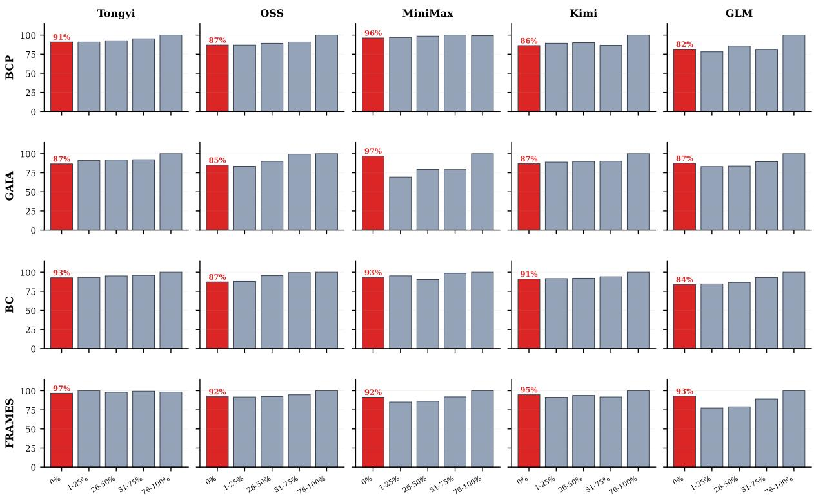  
Figure 7: DeepConf overconfidence across all 20 benchmark×model cells (cf. Figure 3a). Each panel stratifies questions by oracle difficulty and reports the mean DeepConf score as a percentage of its peak. On every configura tion, impossible questions (0% correct, red) receive 82–97% of the peak score. Rows: datasets; columns: models.

## E Robustness to alternative lexical-overlap variants

The headline method (§4) uses prose-recall under the strict clustering rule. To check that the gain comes from the signal source rather than the specific overlap function, we swap the per-rollout score $w _ { i } ^ { \mathrm { R G V } }$ for other members of the set-overlap family (and a few neighbours), keeping everything else fixed (Table 7).

Definitions. Jaccard: $| T ( P ) \cap T ( d ) | / | T ( P ) \cup$ $\mathcal { T } ( d ) |$ (symmetric variant of prose-recall). ROUGE-2: bigram $F _ { 1 }$ between prose and doc. ROUGE-L: unigram $F _ { 1 }$ (approximating LCS-based ROUGE-L). BM25: scored as the maximum BM25 score of P against each d under the per-rollout retrieval set as the corpus. TF-IDF: cosine of TF-IDF vectors (same corpus).

A semantic scorer in place of a lexical one. Every variant above is lexical, which leaves open whether the gain depends on surface overlap. We therefore replace the score with a frozen dense encoder, intfloat/e5-base-v2 (Wang et al., 2022a) (109M parameters, no fine-tuning), and set $\begin{array} { r } { w _ { i } = \operatorname* { m a x } _ { d \in \mathcal { D } _ { i } } \cos \bigl ( E ( P _ { i } ) , E ( d ) \bigr ) } \end{array}$ , keeping the max-over-docs reduction and everything else fixed.

<table><tr><td>Method</td><td>FRAMES OSS</td><td>BM25 OSS</td><td>BM25 Tongyi</td></tr><tr><td>Simple majority</td><td>82.0</td><td>38.7</td><td>58.7</td></tr><tr><td>DeepConf</td><td>82.7</td><td>40.7</td><td>59.3</td></tr><tr><td>Embedding cosine</td><td>83.3</td><td>42.0</td><td>60.0</td></tr><tr><td>RGV</td><td>85.3</td><td>44.0</td><td>61.3</td></tr></table>

The two BM25 columns are the degraded-retrieval cells of Appendix H. On all three, the embedding voter beats both simple majority and DeepConf but does not reach the lexical score, at roughly five orders of magnitude more compute (encoder minutes versus ∼0.3 ms per rollout). Two known properties of dense encoders are consistent with the ordering: they degrade on exactly the rare entities that carry our signal (Figure 4(a)) (Sciavolino et al., 2021), and fixed-dimension embeddings lose precision on long documents (Luan et al., 2021); a similar pattern is reported for hallucination detection, where an n-gram check outperforms grey-box log-probability baselines in most setups (Manakul et al., 2023).

The point is not that lexical overlap is optimal. It is that two scorers with nothing in common except where they read from land on the same side of the baselines, which is what the copy-inflation account predicts: the signal source carries the gain, not the metric.

<table><tr><td>Dataset</td><td>Model</td><td>prose-recall</td><td>Jaccard</td><td>ROUGE-2</td><td>ROUGE-L</td><td>BM25</td><td>TF-IDF</td></tr><tr><td rowspan="5">BrowseComp-Plus</td><td>Tongyi-DeepResearch</td><td>71.1</td><td>71.1</td><td>70.2</td><td>71.3</td><td>71.7</td><td>69.0</td></tr><tr><td>OSS-120B</td><td>56.0</td><td>56.0</td><td>56.7</td><td>55.3</td><td>55.3</td><td>52.7</td></tr><tr><td>MiniMax-M2.7</td><td>78.7</td><td>77.3</td><td>74.0</td><td>76.0</td><td>75.3</td><td>75.3</td></tr><tr><td>Kimi-K2.5</td><td>81.3</td><td>80.0</td><td>79.3</td><td>79.3</td><td>77.3</td><td>78.7</td></tr><tr><td>GLM-5.1</td><td>82.0</td><td>79.3</td><td>80.0</td><td>80.7</td><td>79.3</td><td>78.7</td></tr><tr><td rowspan="5">GAIA</td><td>Tongyi-DeepResearch</td><td>80.6</td><td>70.9</td><td>72.8</td><td>71.8</td><td>71.8</td><td>73.8</td></tr><tr><td>OSS-120B</td><td>71.8</td><td>69.9</td><td>68.9</td><td>68.0</td><td>68.0</td><td>67.0</td></tr><tr><td>MiniMax-M2.7</td><td>93.2</td><td>91.3</td><td>91.3</td><td>91.3</td><td>91.3</td><td>89.3</td></tr><tr><td>Kimi-K2.5</td><td>81.6</td><td>78.6</td><td>77.7</td><td>76.7</td><td>79.6</td><td>78.6</td></tr><tr><td>GLM-5.1</td><td>89.3</td><td>88.3</td><td>88.3</td><td>87.4</td><td>88.3</td><td>87.4</td></tr><tr><td rowspan="5">BrowseComp</td><td>Tongyi-DeepResearch</td><td>54.0</td><td>53.3</td><td>54.0</td><td>52.7</td><td>50.7</td><td>52.0</td></tr><tr><td>OSS-120B</td><td>34.0</td><td>33.3</td><td>32.7</td><td>32.7</td><td>31.3</td><td>30.7</td></tr><tr><td>MiniMax-M2.7</td><td>50.7</td><td>48.0</td><td>45.3</td><td>45.3</td><td>46.0</td><td>46.0</td></tr><tr><td>Kimi-K2.5</td><td>58.5</td><td>52.8</td><td>58.5</td><td>52.8</td><td>50.9</td><td>52.8</td></tr><tr><td>GLM-5.1</td><td>78.9</td><td>82.1</td><td>77.9</td><td>76.8</td><td>69.5</td><td>81.1</td></tr><tr><td rowspan="5">FRAMES</td><td>Tongyi-DeepResearch</td><td>88.0</td><td>88.0</td><td>86.7</td><td>87.3</td><td>86.0</td><td>86.7</td></tr><tr><td>OSS-120B</td><td>85.3</td><td>79.3</td><td>82.0</td><td>82.0</td><td>80.7</td><td>80.0</td></tr><tr><td>MiniMax-M2.7</td><td>89.3</td><td>89.3</td><td>88.0</td><td>88.7</td><td>88.0</td><td>87.3</td></tr><tr><td>Kimi-K2.5</td><td>88.7</td><td>89.3</td><td>87.3</td><td>88.0</td><td>86.7</td><td>87.3</td></tr><tr><td>GLM-5.1</td><td>90.7</td><td>90.0</td><td>89.3</td><td>90.0</td><td>89.3</td><td>88.7</td></tr></table>

Table 7: Voting accuracy (%) across lexical-overlap variants on the main cells. All variants use the same max-overdocs reduction; only $w _ { i } ^ { \mathrm { { R G V } } }$ changes. The highest value in each row is bolded.

## F DeepConf variant grid

Fu et al. (2025) propose three reductions of sliding-window group confidences: Lowest-Group (sliding-window minimum, the extreme case of Bottom-q% as $q  0 )$ , Bottom-10%, and Tail. We compute the per-token confidence as they do, $\begin{array} { r } { C _ { t } ~ = ~ - \frac { 1 } { k } \sum _ { j = 1 } ^ { k } } \end{array}$ log pj, and sweep all three reductions across three window sizes $W \in$ {1024, 2048, 4096} on the rollout’s generated tokens; per-rollout weights are then plugged into the weighted majority vote of §2 (Table 8).

## G Robustness of the copy-inflation gap

The headline number in §3 (Fig. 2) is the per-token mean logprob gap between copy and non-copy content tokens: +0.50 nats overall, +0.61 on judgecorrect rollouts, +0.38 on judge-wrong ones. To check the gap is not an artefact of any single tokensubset choice we re-measure under four alternative rules. All measurements use the same pool of $n { = } 3 0 7$ rollouts drawn from the BrowseComp-Plus × Tongyi-DeepResearch runs (830 questions, 8 rollouts each). The pool is constructed by uniformly sampling 50 questions per rollout seed and keeping those whose token-level statistics and retrieved-doc texts are both available (307/400); the random seed is fixed for reproducibility.

Common procedure. For each rollout we form two artefacts. (i) The retrieved-doc text D: a lowercased, whitespace-collapsed concatenation of everything the search and visit tools returned to the agent. (ii) The generated-token stream: every pertoken logprob the agent emitted inside its chainof-thought reasoning span. Each generated token is normalised by stripping subword-piece prefixes, lower-casing, and keeping only alphanumeric characters; tokens that normalise to fewer than two characters are discarded. A token is a copy token if its normalised surface is a substring of D, else noncopy. Substring matching makes the test robust to BPE splits of rare entities.

For a token-subset rule with predicate $\phi ( \cdot )$ and weight $\omega ( \cdot )$ we pool every kept token across rollouts and report

$$
\begin{array} { r } { \Delta = \frac { \sum _ { t \in \mathrm { c o p y } , \phi ( t ) } \omega ( t ) \log p ( t ) } { \sum _ { t \in \mathrm { c o p y } , \phi ( t ) } \omega ( t ) } } \\ { - \frac { \sum _ { t \in \overline { { \mathrm { c o p y } } } , \phi ( t ) } \omega ( t ) \log p ( t ) } { \sum _ { t \in \overline { { \mathrm { c o p y } } } , \phi ( t ) } \omega ( t ) } , } \end{array}
$$

the same token-level aggregation as the main-text headline of +0.50 nats.

Variants.

• All alnum tokens: $\phi \equiv \mathrm { T r u e } , \omega \equiv 1$ . Baseline; reproduces the main-text headline.

• Stopword-removed: ${ \phi } ( t ) = [ w _ { t } \notin S ]$ with S a ∼ 120-word English stopword list.

<table><tr><td rowspan="2">Dataset</td><td rowspan="2">Model</td><td colspan="3">Lowest-Group (min)</td><td colspan="3">Bottom-10%</td><td colspan="3">Tail</td></tr><tr><td>1024</td><td>2048</td><td>4096</td><td>1024</td><td>2048</td><td>4096</td><td>1024</td><td>2048</td><td>4096</td></tr><tr><td rowspan="5">BrowseComp-Plus</td><td>Tongyi-DeepResearch</td><td>65.7</td><td>65.4</td><td>64.8</td><td>65.7</td><td>65.5</td><td>64.9</td><td>61.8</td><td>61.9</td><td>61.4</td></tr><tr><td>OSS-120B</td><td>54.7</td><td>54.0</td><td>53.3</td><td>54.7</td><td>54.0</td><td>53.3</td><td>53.3</td><td>52.7</td><td>52.0</td></tr><tr><td>MiniMax-M2.7</td><td>75.3</td><td>74.7</td><td>74.0</td><td>75.3</td><td>74.7</td><td>73.3</td><td>73.3</td><td>72.7</td><td>72.0</td></tr><tr><td>Kimi-K2.5</td><td>80.7</td><td>80.0</td><td>79.3</td><td>80.7</td><td>80.0</td><td>79.3</td><td>78.0</td><td>78.0</td><td>77.3</td></tr><tr><td>GLM-5.1</td><td>80.7</td><td>80.0</td><td>79.3</td><td>80.7</td><td>80.0</td><td>79.3</td><td>78.7</td><td>78.0</td><td>77.3</td></tr><tr><td rowspan="5">GAIA</td><td>Tongyi-DeepResearch</td><td>79.6</td><td>78.6</td><td>77.7</td><td>79.6</td><td>78.6</td><td>77.7</td><td>76.7</td><td>76.7</td><td>75.7</td></tr><tr><td>OSS-120B</td><td>68.9</td><td>67.0</td><td>65.0</td><td>68.9</td><td>67.0</td><td>65.0</td><td>64.1</td><td>64.1</td><td>63.1</td></tr><tr><td>MiniMax-M2.7</td><td>88.3</td><td>87.4</td><td>86.4</td><td>88.3</td><td>87.4</td><td>86.4</td><td>85.4</td><td>84.5</td><td>83.5</td></tr><tr><td>Kimi-K2.5</td><td>79.6</td><td>78.6</td><td>77.7</td><td>79.6</td><td>78.6</td><td>77.7</td><td>76.7</td><td>75.7</td><td>74.8</td></tr><tr><td>GLM-5.1</td><td>87.4</td><td>86.4</td><td>85.4</td><td>87.4</td><td>86.4</td><td>85.4</td><td>85.4</td><td>84.5</td><td>83.5</td></tr><tr><td rowspan="5">BrowseComp</td><td>Tongyi-DeepResearch</td><td>52.7</td><td>51.3</td><td>50.0</td><td>52.7</td><td>51.3</td><td>50.0</td><td>49.3</td><td>48.7</td><td>47.3</td></tr><tr><td>OSS-120B</td><td>29.3</td><td>28.7</td><td>28.0</td><td>29.3</td><td>28.7</td><td>28.0</td><td>27.3</td><td>27.3</td><td>26.7</td></tr><tr><td>MiniMax-M2.7</td><td>46.0</td><td>44.7</td><td>43.3</td><td>46.0</td><td>44.7</td><td>43.3</td><td>42.0</td><td>41.3</td><td>40.7</td></tr><tr><td>Kimi-K2.5</td><td>56.6</td><td>54.7</td><td>52.8</td><td>56.6</td><td>54.7</td><td>52.8</td><td>52.8</td><td>50.9</td><td>49.1</td></tr><tr><td>GLM-5.1</td><td>73.7</td><td>72.6</td><td>71.6</td><td>73.7</td><td>72.6</td><td>71.6</td><td>69.5</td><td>68.4</td><td>67.4</td></tr><tr><td rowspan="5">FRAMES</td><td>Tongyi-DeepResearch</td><td>88.0</td><td>87.3</td><td>86.7</td><td>88.0</td><td>87.3</td><td>86.7</td><td>86.0</td><td>85.3</td><td>84.7</td></tr><tr><td>OSS-120B</td><td>82.7</td><td>82.0</td><td>81.3</td><td>82.7</td><td>82.0</td><td>81.3</td><td>80.0</td><td>80.0</td><td>79.3</td></tr><tr><td>MiniMax-M2.7</td><td>89.3</td><td>88.7</td><td>88.0</td><td>89.3</td><td>88.7</td><td>88.0</td><td>86.7</td><td>86.0</td><td>85.3</td></tr><tr><td>Kimi-K2.5</td><td>88.7</td><td>88.0</td><td>87.3</td><td>88.7</td><td>88.0</td><td>87.3</td><td>86.0</td><td>85.3</td><td>84.7</td></tr><tr><td>GLM-5.1</td><td>90.0</td><td>89.3</td><td>88.7</td><td>90.0</td><td>89.3</td><td>88.7</td><td>88.0</td><td>87.3</td><td>86.7</td></tr></table>

Table 8: DeepConf voting accuracy (%) over the 3 reductions × 3 window sizes grid (generated tokens). The Lowest-Group $\times \ W { = } 1 0 2 4$ cell matches the DC headline in Table 1. The highest value in each row is bolded.

• IDF-weighted: ϕ as in stopword-removed, $\omega ( t ) = \log ( N / \mathrm { d f } ( w _ { t } ) )$ with sample IDF over N=307 documents-as-rollouts.

• Digits or capitalised-leading: digit tokens of length ≥ 2 or BPE-stripped tokens starting uppercase, $\omega \equiv 1$

• Length $\geq 8 \colon \phi ( t ) = [ | w _ { t } | \geq 8 ] , \omega \equiv 1 .$

<table><tr><td>Token subset</td><td>|copy|</td><td>|copy|</td><td>gap</td></tr><tr><td>all alnum (baseline)</td><td>936 332</td><td>84584</td><td>+0.51</td></tr><tr><td>stopword-removed</td><td>558 491</td><td>74714</td><td>+0.54</td></tr><tr><td>IDF-weighted</td><td>558 491</td><td>74714</td><td>+0.69</td></tr><tr><td>digits / cap-leading</td><td>232 855</td><td>21 690</td><td>+0.44</td></tr><tr><td>length ≥ 8</td><td>92 233</td><td>25 935</td><td>+0.62</td></tr></table>

Table 9: Copy-vs-non-copy logprob gap under five token-subset rules. All gaps positive at $p \ll 0 . 0 0 1$ (paired bootstrap over rollouts).

All five rules produce a significantly positive gap, confirming that the copy-inflation gap is not a sideeffect of any particular token-subset choice. The gap is largest under IDF-weighting, consistent with the visual story that rare, entity-like tokens (the kind retrieval brings into context) are exactly the ones the agent copies.

## H Degraded retrieval: weaker retriever and corpus mismatch

RGV reads its signal from the retrieval log, so its behaviour under a weaker retrieval stack is a boundary worth measuring rather than assuming. We report four additional cells, each 150 questions × 8 rollouts under the protocol of §5 with the same Qwen3-32B judge, varying only the retrieval component.

Two degradation modes. In the first, we replace the dense retriever (Qwen3-Embedding-8B) on BrowseComp-Plus with BM25 (Robertson and Zaragoza, 2009), holding the corpus and every other part of the agent fixed. In the second, we adopt the Search-R1 retrieval stack (Jin et al., 2025): the wiki-18 corpus (21M passages) with the E5 retriever (Wang et al., 2022a), top-5 passages per call. We run that stack both on HotpotQA (Yang et al., 2018), whose questions are Wikipedianative, and on the same FRAMES questions used in Table 1, where the corpus no longer covers the questions.

Where degraded retrieval bites, grounding wins. On the two BM25 rows the swap genuinely degrades the agent (single accuracy 47.3→ 31.4 and 58.9→48.8), and the grounded vote keeps a clear margin: $+ 5 . 3 / + 3 . 3$ over simple majority and

<table><tr><td>Retrieval stack</td><td>Model</td><td>Single</td><td>SM</td><td>DeepConf</td><td> $\mathrm { R G V _ { p r o s e } }$ </td><td> $\mathrm { R G V } _ { \mathrm { J a c } }$ </td><td>Oracle</td></tr><tr><td>BM25 ← dense (BCP+)</td><td>gpt-oss-120b</td><td>31.4 (47.3)</td><td>38.7</td><td>40.7</td><td>37.3</td><td>44.0</td><td>52.7</td></tr><tr><td>BM25 ← dense (BCP+)</td><td>Tongyi-DeepResearch</td><td>48.8 (58.9)</td><td>58.7</td><td>59.3</td><td>60.7</td><td>61.3</td><td>79.3</td></tr><tr><td>wiki-18 + E5, HotpotQA</td><td>gpt-oss-120b</td><td>72.7</td><td>74.7</td><td>75.3</td><td>73.3</td><td>72.7</td><td>80.7</td></tr><tr><td>wiki-18 + E5, FRÂMES questions</td><td>gpt-oss-120b</td><td>59.6 (78.7)</td><td>58.7</td><td>58.0</td><td>60.0</td><td>59.3</td><td>72.0</td></tr></table>

Table 10: Voting accuracy (%) under degraded retrieval. Parenthesised values are the single-rollout accuracy of the corresponding stock cell, i.e. how far the swap moved the agent. We report both members of the overlap family (Appendix E). Length-weighted voting scores 38.0, 56.0, 74.7 and 60.7 on the four rows respectively.

DeepConf on gpt-oss-120b, and $+ 2 . 6 / + 2 . 0$ on Tongyi-DeepResearch.

Where it does not, methods converge. On HotpotQA the Search-R1 stack turns out to be sufficient for Wikipedia-native questions: single accuracy is 72.7 with only 8 points of headroom to the oracle, and all four aggregation rules sit inside a 2.6-point band. This is also the lightest-copying cell we measured (78.4% of generated tokens, versus 91.9% on BrowseComp-Plus) and the one with the healthiest DeepConf (rollout-level AUC 0.82), exactly as the copy-inflation account of §3 predicts: less copying, less contamination, more usable internal confidence.

Under corpus mismatch, only grounding stays above single. Running the same stack on FRAMES questions is the harshest setting: retrieval falls out of domain and single-rollout accuracy drops 78.7 → 59.6. Here simple majority (58.7) and DeepConf (58.0) fall below the singlerollout average, because errors become correlated when every rollout retrieves from the wrong corpus, and a vote over correlated errors amplifies rather than cancels them. RGV (60.0) is the only aggregation rule that stays above it.

Taken together, degradation is graceful and, more usefully, it is predictable in advance: the copy fraction of a cell and its remaining headroom to the oracle tell which regime applies before any voting rule is chosen.

## I Causal interventions on copy-inflation

§3 establishes copy-inflation by correlation: copyheavy rollouts have flatter DeepConf scores. This appendix reports two interventions that test the causal direction.

## I.1 Intervention 1: masking copied tokens

If copying causes the flattening, then recomputing DeepConf on non-copy tokens only should restore within-question spread. And if the internal signal were merely diluted rather than corrupted, discrimination should return along with the spread. We recompute DeepConf over the complement of the copy set (the substring rule of Appendix G) on ten cells spanning six model families and four corpora.

Three readings of Table 11. First, masking does restore the spread, which confirms that copied tokens are what flattens the score. Second, the restored spread carries no correctness signal: AUC falls in nine of ten cells, and voting accuracy does not systematically improve (up in 2 cells, flat in 3, down in 5). The discriminative information lives in precisely the tokens the repair removes. Third, the retrieval-grounded score holds 1.1–3.8× (median 1.6×) more within-question variance share than DeepConf in 10/10 cells.

This is a negative result we consider more consequential than the method itself: the contamination resists internal repair, so any consumer of agent token-confidence, whether for early stopping, routing, abstention or reward shaping, inherits it, and no simple adjustment recovers a usable weight.

## I.2 Intervention 2: removing the documents

The second intervention removes the cause instead of the symptom. We take 100 BrowseComp-Plus / Tongyi-DeepResearch rollouts and teacherforce the model over the same answer tokens twice: once with the retrieved documents present in context, and once with each document replaced by the placeholder [document removed] (trailingcontext budget 24K tokens). If the documents are what prop up copied-token confidence, removing them should cost copied tokens more than non-copy tokens.

<table><tr><td>Token class</td><td>∆ logprob (mean)</td><td>∆ logprob (median)</td></tr><tr><td>copied</td><td>-0.221</td><td>-0.187</td></tr><tr><td>non-copy</td><td>-0.106</td><td>-0.068</td></tr></table>

Copied tokens lose roughly twice as much logprobability, and the copy drop exceeds the noncopy drop in 82 of 100 rollouts. Together with the null controls of Figure 4(b) and the token-subset robustness of Appendix G, this closes the causal chain: documents in context inflate the confidence of the tokens copied from them.

<table><tr><td></td><td></td><td></td><td colspan="2">rollout AUC</td><td colspan="2">within-Q variance share</td><td></td></tr><tr><td>Corpus / cell</td><td>Model family</td><td>copy %</td><td>DC</td><td> $\mathrm { D C } _ { \mathrm { m a s k e d } }$ </td><td>DC</td><td> $\mathrm { D C } _ { \mathrm { m a s k e d } }$ </td><td>RGV</td></tr><tr><td>FRAMES</td><td>GPT-OSS</td><td>82.1</td><td>0.68</td><td>0.49</td><td>0.35</td><td>0.52</td><td>0.46</td></tr><tr><td>FRAMES</td><td>Tongyi</td><td>85.2</td><td>0.59</td><td>0.37</td><td>0.49</td><td>0.57</td><td>0.57</td></tr><tr><td>FRAMES</td><td>GLM</td><td>87.8</td><td>0.78</td><td>0.75</td><td>0.16</td><td>0.30</td><td>0.31</td></tr><tr><td>FRAMES</td><td>Kimi</td><td>87.7</td><td>0.67</td><td>0.47</td><td>0.46</td><td>0.59</td><td>0.53</td></tr><tr><td>FRAMES</td><td>MiniMax</td><td>84.8</td><td>0.69</td><td>0.57</td><td>0.51</td><td>0.50</td><td>0.58</td></tr><tr><td>BrowseComp-Plus</td><td>Tongyi</td><td>91.9</td><td>0.67</td><td>0.43</td><td>0.52</td><td>0.48</td><td>0.67</td></tr><tr><td>BrowseComp-Plus</td><td>GPT-OSS</td><td>91.9</td><td>0.73</td><td>0.43</td><td>0.18</td><td>0.42</td><td>0.59</td></tr><tr><td>GAIA</td><td>DeepSeek</td><td>89.7</td><td>0.70</td><td>0.72</td><td>0.16</td><td>0.24</td><td>0.48</td></tr><tr><td>wiki-18 / HotpotQA</td><td>GPT-OSS</td><td>78.4</td><td>0.82</td><td>0.49</td><td>0.13</td><td>0.29</td><td>0.49</td></tr><tr><td>wiki-18 / FRAMES</td><td>GPT-OSS</td><td>81.9</td><td>0.79</td><td>0.44</td><td>0.12</td><td>0.28</td><td>0.41</td></tr></table>

Table 11: Masking copied tokens restores variance but not validity. copy % is the median fraction of generated tokens that are copies. rollout AUC separates judge-correct from judge-wrong rollouts; within-Q variance share is the quantity weighted voting consumes (§3). Masking raises the variance share in 8/10 cells (up to 2.4× on BrowseComp-Plus / GPT-OSS, 0.18→0.42) while AUCfalls in 9/10.

## J Prompt and answer-format sensitivity

A grounding-based weight invites two worries: that a prompt could inflate it, and that it could break on short answers. We test both directly with gptoss-120b on BrowseComp-Plus, 150 questions × 8 rollouts per arm, changing only one line of the prompt.

<table><tr><td>Arm</td><td>Single</td><td>SM</td><td>DC</td><td>RGV</td><td>med. prose tok.</td></tr><tr><td>stock</td><td>47.3</td><td>53.3</td><td>54.7</td><td>56.0</td><td>254</td></tr><tr><td>+ grounding instr.</td><td>48.6</td><td>55.3</td><td>57.3</td><td>59.3</td><td>254</td></tr><tr><td>+ entity-only</td><td>44.2</td><td>52.7</td><td>53.3</td><td>53.3</td><td>2</td></tr></table>

A prompt cannot buy weight. The grounding arm appends “your final answer must be grounded in the retrieved documents”. The mean voted weight is unchanged $( 0 . 0 9 1  0 . 0 9 1 )$ and rolloutlevel AUC barely moves $( 0 . 8 4 0  0 . 8 4 4 )$ . The reason is structural rather than empirical: an instruction attached to the question reaches all N rollouts of that question equally, and weighted voting consumes only the within-question ordering of the weights, which a common shift leaves intact. This is the same property that makes the weight robust to a rollout being merely verbose (§4).

Short answers degrade gracefully. The entityonly arm forces a bare entity as the final answer, taking the median answer prose from 254 tokens to 2. At that length prose-recall reduces to answer containment: whether the predicted entity occurs in the rollout’s own documents. Rank AUC dips from 0.71 to 0.67 on the truly short subset (77% of rollouts), and 99% of correct entities are anchored in their own retrieval versus 80% of wrong ones. Every method loses accuracy in this arm because the model is weaker without its report format (single $4 7 . 3  4 4 . 2 )$ ; within it, the grounded vote still matches DeepConf and leads simple majority.

This arm also isolates the design choice of §4: a symmetric, document-side-normalised overlap such as Jaccard collapses to 42.0 here, because a two-token answer can never cover a long document. The answer-side denominator is what keeps the score meaningful at this extreme.

## K Selection versus voting

RGV is presented as a voting weight, but the same score can select a single rollout. Separating the two tells us whether the gain comes from the signal or from the aggregation frame. On the BrowseComp-Plus / Tongyi-DeepResearch replay cell we compare weighted voting against Best-of-N selection (take the single highest-scoring rollout), sub-sampling to $N \in \{ 1 , 2 , 4 , 8 \}$ with 60 random partitions per N.

<table><tr><td>N Single SM</td><td></td><td>vote RGV</td><td>vote DC</td><td>RGV</td><td>argmax argmax DC</td><td>Oracle</td></tr><tr><td>1</td><td>58.9 58.9</td><td>58.9</td><td>58.9</td><td>58.9</td><td>58.9</td><td>58.9</td></tr><tr><td>2</td><td>58.9 58.9</td><td>63.3</td><td>60.3</td><td>63.3</td><td>60.2</td><td>70.1</td></tr><tr><td>4</td><td>59.4 64.3</td><td>69.6</td><td>65.2</td><td>67.4</td><td>61.5</td><td>79.7</td></tr><tr><td>8</td><td>59.2 67.3</td><td>74.0</td><td>70.0</td><td>69.3</td><td>60.7</td><td>86.7</td></tr></table>

Two conclusions. RGV works as a standalone rollout-quality scorer: argmax-RGV beats argmax-DeepConf at every N, and at N=8 it also beats simple majority (69.3 vs 67.3). But voting dominates selection by +4.7 points at N=8, because argmax stakes the whole answer on one rollout and

is therefore fully exposed to the well-grounded-butwrong failure mode quantified in §6.4; summing weights over an answer cluster averages that risk away. Notably argmax-DeepConf decreases from N=4 to N=8: with more rollouts to choose from, a flattened confidence score is more likely to pick a confidently wrong one.

## L Preliminary results on HLE

Our main evaluation focuses on search agent benchmarks where retrieved documents are the primary evidence source (§5). Here, we report one exploratory cell on Humanity’s Last Exam (Phan et al., 2025), an expert-reasoning benchmark where retrieval plays a minor role:

<table><tr><td></td><td>Single</td><td>SM</td><td>DC</td><td>RGV</td><td>Oracle</td></tr><tr><td>OSS-120B</td><td>25.6</td><td>31.2</td><td>31.8</td><td>32.5</td><td>49.0</td></tr></table>

RGV still outperforms DeepConf (+0.7%), though the margin is smaller than on search-centric benchmarks. This is expected: HLE questions often require domain-expert reasoning beyond what retrieval supplies, so the grounding signal captures only part of the answer quality.

## M Worked examples: prompts, thought spans, and clustering

This appendix shows the exact text the agent and the judge see, plus illustrative excerpts of what a rollout produces. The examples are lightly redacted (line breaks, bracketed abbreviations) for readability; nothing functional is changed.

## M.1 Agent system prompt

Below is the system prompt for BrowseComp-Plus (fixed-corpus retrieval with search and get\_doc). For the open-web benchmarks (BrowseComp, GAIA, FRAMES) the tool names are search and visit and references to [docid] become [url]; the rest of the prompt is identical.

You are a deep research assistant. Your   
core function is to conduct thorough,   
multi-source investigations into any   
topic. You must handle both broad,   
open-domain inquiries and queries   
within specialized academic fields. For   
every request, synthesize information   
from credible, diverse sources to   
deliver a comprehensive, accurate, and   
objective response.

You have access to search and get\_doc   
tools. Use search to look up snippets;   
use get\_doc(docid) to read full

documents you find via search. You may call tools many times until you have gathered sufficient evidence.

## M.2 Force-final prompt

Issued once when the token-count guard fires, maxiterations is hit, the output budget is exhausted, or the API returns a non-retryable error. Tools are disabled for this call.

The conversation has been truncated. Based on the evidence you have gathered so far, write the final markdown report now. Use the format from the system prompt (bolded direct answer, ## Step-by-Step Reasoning and Evidence, a summary table, inline [docid] citations). End the report with a single line of the form Confidence: NN%.

## M.3 Verbalised-confidence solicitation

Issued once after the rollout has produced a final answer (either naturally or via force-final), at temperature 0 with tools disabled.

Reply with ONLY a single integer   
between 0 and 100 representing your   
confidence (in percent) that the answer   
you just gave is correct. No words, no   
%, no labels — just the integer.   
Example output: 73

## M.4 Judge prompt

The judge (Qwen3-32B at temperature 0) receives the question, the gold answer, and the rollout’s final markdown report, and decides correctness. We use the official BrowseComp-Plus GRADER\_TEMPLATE for every dataset.

Question: {question}   
Gold answer: {gold\_answer}   
Model response: {model\_response}   
Read the model’s response. First,   
extract the model’s final short answer   
in the extracted\_final\_answer field (or   
output None if the model did not

produce one). Then decide whether the extracted answer matches the gold answer up to obvious paraphrase / equivalent name. Output a JSON object with fields extracted\_final\_answer, reasoning, and judge\_correct ∈ { yes, no }. Do not output anything else.

## M.5 Example thought span vs. answer prose

A single rollout on the BrowseComp-Plus question “There is an influencer whose career has lasted over a decade. . . What is thefull name ofthe influencer?” (gold answer: Tóke Makinwa). The thought span is what DeepConf reads—chain-of-thought across all turns; the answer prose is what RGV reads— the assistant’s output on the final answer turn (no internal thought).

## Thought span (excerpt, what DeepConf reads).

Need an influencer with a >10-year career who anchored a 2022 talk segment. . . The host is born in the 1980s and has served as a host at major events. Possible candidates: Tope Mark-Odigie, Tóke Makinwa, Lilly Singh. . . Tóke Makinwa is listed as 2nd of 4 siblings on Wikipedia [docid 118], became brand ambassador for Pulse Nigeria in 2016. . . Lilly Singh is also 2nd of 4 but the 2022 talk-segment host criterion fits Tóke better. . .

## Answer prose (what RGV reads).

Tóke Makinwa.

\## Step-by-Step Reasoning and Evidence – Long-career influencer with a YouTube vlog series: [docid 118] records that Tóke Makinwa launched the Toke Moments vlog in 2014, more than a decade after her 2004 radio debut.

– 2022 talk-segment anchor: [docid 118] notes she anchored the talk segment of The Buzz, hosted by Ebuka Obi-Uchendu (born 1982).

– Second of four siblings: [docid 118] lists her as the second of four.

– 2016 ambassador for an MIT-founded brand: [docid 118] records the Pulse Nigeria ambassadorship; Pulse’s founder Tunde Kehinde is an MIT Sloan alumnus.

T (Pi) is built from the Answer prose block only; DeepConf’s per-token confidences are computed over the Thought span only. The two operate on disjoint parts of the rollout’s output.

## M.6 Example clustering on one question

For the same question, the eight rollouts produced the following predicted-answer strings, normalised under the strict rule:

<table><tr><td># raw predicted answer</td><td></td><td>normalised</td><td>cluster</td></tr><tr><td></td><td>Tóke Makinwa.</td><td>toke makinwa</td><td>A</td></tr><tr><td></td><td>2 The answer is Toke Makinwa.</td><td>toke makinwa</td><td>A</td></tr><tr><td></td><td>3 Lilly Singh</td><td>lilly singh</td><td>B</td></tr><tr><td></td><td>4 Lilly Singh.</td><td>lilly singh</td><td>B</td></tr><tr><td></td><td>5 Lilly Singh</td><td>lilly singh</td><td>B</td></tr><tr><td></td><td>6 Toke Makinwa</td><td>toke makinwa</td><td>A</td></tr><tr><td></td><td>7 Shannon LaNier</td><td>shannon lanier</td><td>C</td></tr><tr><td></td><td>8 Bhuvan Bam</td><td>bhuvan bam</td><td>D</td></tr></table>

Strict clustering recovers four clusters with $| A | { = } 3 ,$ |B|=3, |C|=|D|=1. Simple-majority ties A and B at weight 3; under DeepConf the eight rollouts all receive nearly identical weights and the tie persists; under RGV the three A-cluster rollouts carry the largest prose-recall (their answer prose lexically aligns with the Tóke Makinwa Wikipedia entry the agent actually fetched), so the weighted vote selects cluster A.

## N Success and failure cases

We first show three representative successes— minority-correct questions where RGV rescues the answer that DeepConf misses—then five failures exhibiting the “well-grounded but wrong” pattern of §6.4.

## N.1 Success cases: RGV rescues the correct minority

DeepConf gives all rollouts near-identical confidence and follows the wrong majority; RGV elevates the correctly grounded rollout.

Success 1 (qid 301): royal family identification. Q: “Name the royal family a certain individual’s spouse was born into. . . ” (multiple biographical constraints).

Gold: Nwoko.

<table><tr><td>RGV</td><td>DC</td><td>Predicted answer</td></tr><tr><td>r2 √</td><td>0.184 6.54</td><td>Nwoko Royal Family</td></tr><tr><td>r6√</td><td></td><td>0.118 6.66 Nwoko Royal Family</td></tr><tr><td></td><td></td><td>r7 X 0.071 6.46 Greek royal family</td></tr><tr><td></td><td></td><td>r1 X 0.026 6.70 Greek royal family</td></tr><tr><td></td><td></td><td>r5 X 0.024 6.68 British royal family</td></tr><tr><td></td><td></td><td>r0 X 0.009 6.75 House of Orange-Nassau r4 X 0.008 6.59 House of Windsor</td></tr></table>

Seven distinct answers. The two correct rollouts retrieve the Nwoko family page and echo it in their prose (RGV ≥ 0.118); all wrong rollouts name famous European royal families without retrieving relevant evidence (RGV ≤ 0.071). DeepConf range: 6.46–6.75, unable to discriminate.

Success 2 (qid 424): architect identification. Q: “Name the architect who was a WWII veteran and

TV broadcaster, designed a building completed 1977–1987. . . ”  
Gold: Raffaele Contigiani.
<table><tr><td colspan="2">RGV</td><td>Predicted answer</td><td></td><td>DC</td><td></td></tr><tr><td>r4 √</td><td>0.152</td><td>6.98 0.133 6.72</td><td></td><td colspan="2">Raffaele Contigiani Raffaele Contigiani</td><td rowspan="5"></td></tr><tr><td>r6 √</td><td>0.095</td><td>6.75</td><td></td><td>Victor Alfred Lundy</td></tr><tr><td>r1 x</td><td>0.092</td><td>26.99</td><td></td><td>Denys Lasdun</td></tr><tr><td>r3 X</td><td></td><td>36.76</td><td></td><td>Denys Lasdun</td></tr><tr><td>r2 x</td><td>0.073</td><td></td><td>r0 X 0.018 6.48 Denys Lasdun</td><td></td></tr></table>

Three wrong rollouts converge on Denys Lasdun (a famous British architect who fits some but not all constraints). The correct rollouts retrieve Contigiani’s Italian biography and echo it in prose, producing a clear RGV separation (0.152 vs. 0.095).

Success 3 (qid 56): movie identification. Q: “Movie with a ReFrame Stamp, 2018–2023, about a festival, with a cast member who appeared in a heist film. . . ”  
Gold: Last Christmas.
<table><tr><td>RGV</td><td>DC Predicted answer</td></tr><tr><td>r2 0.115</td><td>7.53 Last Christmas</td></tr><tr><td>r5 x 0.028</td><td>7.96 Crazy Rich Asians</td></tr><tr><td>r4 x 0.026</td><td>6 7.54 Crazy Rich Asians</td></tr><tr><td>r3 X 0.026</td><td>6 7.69 Crazy Rich Asians</td></tr><tr><td>r7 x 0.018</td><td>3 7.78 Rifkin&#x27;s Festival</td></tr><tr><td>r1 x</td><td>0.018 7.37 Rifkin&#x27;s Festival 0.016 7.70 A Simple Favor</td></tr></table>

Three rollouts vote for Crazy Rich Asians with high DeepConf (7.54–7.96); DeepConf selects this wrong majority. RGV: the single correct rollout retrieves the film’s page (0.115 vs. ≤0.028) and wins.

## N.2 Failure cases: well-grounded but wrong

Failure 1 (qid 1185): cricket match. Q: “Match number, tournament, year satisfying nine batting constraints. . . ”

Gold: 31st match, IPL 2013.
<table><tr><td></td><td>RGV DC</td><td>Predicted answer</td></tr><tr><td></td><td>r7 X 0.235 6.93</td><td>3 2019 ICC World Cup</td></tr><tr><td></td><td></td><td>r5 X 0.174 6.98 Bangladesh vs South Africa</td></tr><tr><td></td><td></td><td>r2 ✓ 0.141 7.30 31st match, IPL 2013</td></tr></table>

r7 retrieves extensive World Cup documentation and echoes cricket statistics (RGV = 0.235), outscoring the correct rollouts (0.165, 0.141) despite naming the wrong tournament.

Failure 2 (qid 790): writer’s work identification. Q: “A writer born in July, article posted April 2023, smoked on Christmas. . . name the work.” Gold: “Manos”.

<table><tr><td>RGV</td><td>DC</td><td>Predicted answer</td></tr><tr><td>r0 x 0.229</td><td>6.96</td><td>“Killing Joke”</td></tr><tr><td></td><td>r3 √ 0.206 6.68</td><td>3“Manos&quot;</td></tr><tr><td></td><td></td><td>r1 X 0.094 6.71 (different work)</td></tr><tr><td></td><td>r7 X 0.008 6.70</td><td>) “mouse&quot;</td></tr><tr><td></td><td>r4 X 0.000 6.80</td><td> $\mathrm { \ddot { \ g i r l s } ^ { \mathrm { * } } }$ </td></tr><tr><td></td><td>r5 X 0.000 6.83</td><td> $\mathrm { \bar { \ r h u g s } ^ { \prime \prime } }$ </td></tr></table>

r0 retrieves an article about the same writer but identifies a different work (0.229 vs. 0.206). Both rollouts ground their answer in the writer’s bibliography; the wrong one happens to echo a more frequently cited title.

Failure 3 (qid 773): clothing colour. Q: “A child reported missing multiple times 2014–2018. What colour shirt in the 2018 police description?” Gold: Red.
<table><tr><td>RGV DC</td><td>Predicted answer</td></tr><tr><td>r7 x 0.209 7.41</td><td>White t-shirt</td></tr><tr><td>r3 x 0.190 7.27</td><td>(different colour)</td></tr><tr><td></td><td>r4 X 0.180 7.68 (different colour)</td></tr><tr><td>r2 X 0.179</td><td>9 7.46 (different colour)</td></tr><tr><td></td><td>r5 X 0.166 7.88 (different colour)</td></tr><tr><td>r6 X 0.142 8.05</td><td>5 (different colour)</td></tr><tr><td>r1 √ 0.109 7.11 Red</td><td></td></tr><tr><td></td><td>r0 X 0.000 6.45 (different colour)</td></tr></table>

All seven wrong rollouts retrieve articles about the same missing-person case and echo detailed police descriptions, receiving higher RGV scores (0.142– 0.209) than the single correct rollout (0.109). The correct answer (“Red”) is a single word with minimal lexical overlap; wrong rollouts produce longer prose quoting extensively from the retrieved reports.

Pattern and future directions. Each failure shares a structure: the wrong rollout retrieves documents about the right domain (same writer, same sport, same missing-person case) but identifies the wrong specific entity within that domain. RGV measures whether the answer is anchored in retrieved evidence; it cannot verify that the evidence answers the specific question asked. Closing this gap likely requires moving beyond surface-level lexical overlap toward semantic grounding checks, for example, entailment verification between the question constraints and the retrieved passages, or cross-referencing the answer against multiple independent sources. Such extensions could complement RGV’s efficiency with deeper reasoning at a modest additional cost.

## O Artifacts, licences, and intended use

Table 12 lists every external artifact this work uses, with the licence under which it is released. We used each within the research use its original release specifies.

What we release. We release our code, the full rollout trajectories, the per-token log-probabilities, and the judge outputs for every cell reported in this paper. Our own contributions in that release, namely the trajectories, scores, judge labels and derived annotations, are made available under CC BY 4.0. Text that the environment returned (retrieved corpus passages and fetched web pages) remains under its original terms and is redistributed with its source identifiers retained; we provide a contact for removal requests.

Benchmarks we do not redistribute. Two of the benchmarks we evaluate on restrict redistribution, and we respect those terms. GAIA is access-gated and states that its validation split may not be reshared; HLE’s authors ask that the benchmark not be publicly re-uploaded, to protect it from contamination. For these two, our release carries question identifiers rather than question and gold-answer text, so that researchers who have obtained the benchmarks through their official channels can join our records against them, while the release itself does not republish the benchmark.

Data characteristics. All questions and answers are in English. The benchmarks consist of factual information-seeking questions and contain no personal or offensive content by construction. The agents’ retrieved documents come from a fixed corpus (BrowseComp-Plus, wiki-18) or the live web via a commercial search API (BrowseComp, GAIA, FRAMES); we scan the released tool outputs for credentials and personally identifying information before publication.

<table><tr><td>Artifact</td><td>Type</td><td>Licence</td><td>Note on use</td></tr><tr><td>BrowseComp-Plus (Chen et al., 2025)</td><td>benchmark</td><td>MIT</td><td>questions, corpus, gold-evidence qrels</td></tr><tr><td>BrowseComp (Wei et al., 2025)</td><td>benchmark</td><td>MIT</td><td>via openai/simple-evals</td></tr><tr><td>FRAMES (Krishna et al., 2025)</td><td>benchmark</td><td>Apache-2.0</td><td>questions and gold answers</td></tr><tr><td>GAIA (Mialon et al., 2023)</td><td>benchmark</td><td></td><td>gated, none stated validation split; redistribution not permitted</td></tr><tr><td>HLE (Phan et al., 2025)</td><td>benchmark</td><td>MIT</td><td>authors ask that it not be re-uploaded</td></tr><tr><td>HotpotQA (Yang et al., 2018)</td><td>benchmark</td><td>CC BY-SA 4.0</td><td>Appendix H only</td></tr><tr><td>wiki-18 (Jin et al., 2025)</td><td>corpus</td><td>CC BY-SA</td><td>Wikipedia derivative; Appendix H only</td></tr><tr><td>gpt-oss-120b (OpenAI et al., 2025)</td><td>model</td><td>Apache-2.0</td><td>open weights, served via API</td></tr><tr><td>Tongyi-DeepResearch-30B-A3B</td><td>model</td><td>Apache-2.0</td><td>open weights, served locally (vLLM, FP8)</td></tr><tr><td>(Team et al., 2025b)</td><td></td><td></td><td></td></tr><tr><td>MiniMax-M2.7 (MiniMax et al., 2025)</td><td>model</td><td>per model card</td><td>served via API</td></tr><tr><td>GLM-5.1 (GLM-5-Team et al., 2026)</td><td>model</td><td>per model card</td><td>served via API</td></tr><tr><td>Kimi-K2.5 (Team et al., 2025a)</td><td>model</td><td>per model card</td><td>served via API</td></tr><tr><td>Qwen3-32B</td><td>judge</td><td>Apache-2.0</td><td>served locally (vLLM)</td></tr><tr><td>e5-base-v2 (Wang et al., 2022a)</td><td>encoder</td><td>MIT</td><td>Appendix E baseline</td></tr></table>

Table 12: External artifacts and their licences.