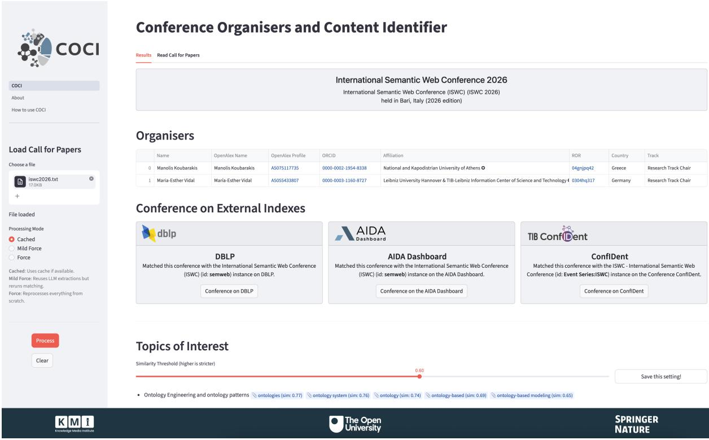
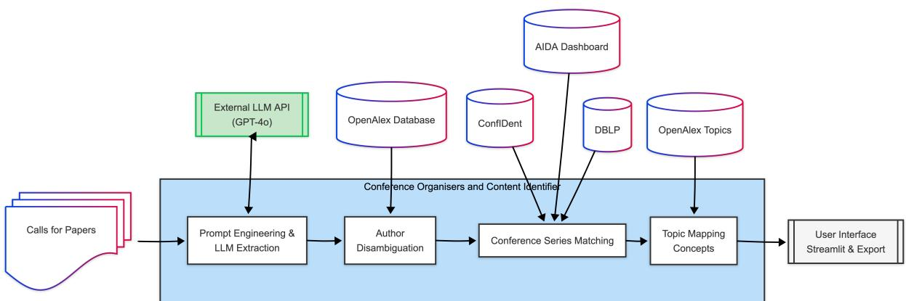

# COCI: Conference Organisers and Content Identifier

Angelo Salatino1,\*, Francesco Osborne1, Alexis Vizcaino2, Aliaksandr Birukou2 and Enrico Motta1

1Knowledge Media Institute, The Open University, UK

2Springer Nature, Germany

## Abstract

Despite the critical role of grey literature in scholarly communication, artefacts such as Calls for Papers (CfPs) remain largely isolated from modern Scholarly Knowledge Graphs. The unstructured and highly heterogeneous nature of these documents has traditionally hindered their large-scale processing. In this demo paper, we present the Conference Organisers and Content Identifier (COCI), an AI-based framework designed to extract fine-grained, structured metadata from raw CfP texts. COCI employs a multi-stage pipeline that combines Large Language Models (LLMs) with semantic mapping techniques to integrate extracted entities with established knowledge bases, including OpenAlex, DBLP, TIB ConfIDent, and the AIDA Dashboard. By disambiguating authors and semantically aligning topics and conference series, COCI bridges the gap between informal scholarly dissemination and structured Semantic Web resources, laying the foundation for systematic analysis of non-publisher-based academic events.

## Keywords

Scientific Knowledge Graphs, Semantic Mapping, Grey Literature, Large Language Models, Calls for Papers, Information Extraction, Conferences.

## 1. Introduction

The majority of Metascience and Scientometric analyses traditionally focus on extracting insights from formal published literature, such as journal issues or conference proceedings. While these studies have yielded a significant understanding of how science evolves [1, 2], how research teams are composed [3], and how to detect emerging trends [4], a vital dimension of research remains largely overlooked: grey literature [5]. Scholarly communication has increasingly expanded beyond formal publishing channels to include various forms of grey literature, such as preprints, technical reports, policy documents, and Calls for Papers (CfPs) [6, 7]. These artefacts are vital to the community, as they capture emerging research directions well before they reach formal publication channels.

However, the informal nature of such material introduces varying degrees of challenges for systematic tracking. While some formats like preprints and theses have increasingly adopted standard repositories and DOI indexing, other crucial artefacts remain entirely elusive [8, 9]. Calls for Papers perfectly embody the extreme end of these challenges. They completely lack traditional bibliographic control, bypass standard publishing pipelines, and are frequently distributed through ephemeral, informal channels such as mailing lists or static web pages [10]. Consequently, their highly heterogeneous formats and lack of structure make them exceedingly dificult to analyse at scale.

The emergence of Large Language Models (LLMs) ofers a pivotal opportunity to address the technological limitations that previously hindered the harvesting and analysis of CfPs. In this demo paper, we introduce the Conference Organisers and Content Identifier (COCI), an AI-based framework designed to automate the extraction of granular metadata from unstructured CfP texts. COCI processes these raw documents to identify and structure key information, including conference series, geographic locations, comprehensive lists of organisers with their specific roles and afiliations, and topics of interest.

In practice, COCI employs robust semantic alignment strategies to map the resulting entities to external knowledge bases like OpenAlex [11], DBLP, TIB ConfIDent [12], and the AIDA Dashboard [13]. Crucially for the Semantic Web community, this process serves as a vital stepping stone for expanding the depth and richness of Scientific Knowledge Graphs (SKGs) [14]. Consequently, this unified ecosystem ofers metascientists a foundational tool to track science at its earliest embryonic stage, opening new avenues for deeper analyses on the health, scope, and quality of academic conferences and the researchers who organise them.

The code for COCI is available on https://github.com/angelosalatino/oc-conf-detection/releases/tag/ v1.2.0, whereas a video that demonstrates the tool is available on https://youtu.be/hudkTlJ6S\_E.

  
Figure 1: Graphical User Interface of COCI.

## 2. The COCI Application

COCI is a framework designed to process raw, unstructured text from Call for Papers for scientific events, such as ISWC 2026, and transform it into a rich, structured representation. This output includes essential metadata about the conference (such as the conference series, edition, year, and geographical location), alongside a comprehensive list of the organisers. Crucially, for each organiser, the system extracts their specific track or role and their afiliations, subsequently enriching these profiles with persistent identifiers including OpenAlex IDs, ORCIDs, and Research Organization Registry (ROR) IDs. The application also extracts and structures the event’s topics of interest.

To illustrate the system’s capabilities, Figure 1 displays the application interface showcasing the analysis of the ISWC 2026 Research Track Call for Papers. The top section of the dashboard provides the core conference metadata. Below this, the interface presents the extracted organisers (for example, highlighting Manolis Koubarakis and María-Esther Vidal) alongside their afiliations and matched scholarly identifiers. Finally, the bottom section of the display lists the extracted topics of interest, demonstrating how COCI semantically maps these ad-hoc keywords directly to the established OpenAlex

  
Figure 2: Architecture of COCI

topic taxonomy.

The potential of this application extends far beyond automated data entry. By structuring grey literature and mapping it to external knowledge graphs, COCI provides a scalable platform to assess the health and scientific quality of academic events. Structuring the committee lists allows the community to evaluate whether a conference is organised by a diverse and appropriately senior team, and whether it maintains a well-defined scope. Furthermore, this structured representation opens up pathways to connect with external databases, to investigate whether organisers have previously engaged in academic misconduct. These include Retraction Watch Database1 to check for retractions, and PubPeer2 to identify if the organisers’ publications have been flagged for questionable practices. Ultimately, COCI provides the vital infrastructure needed for a formal recognition platform, enabling a system that grants researchers formal, quantifiable credit for their community contributions, analogous to the model established by Publons for peer review.

## 3. Architecture

The workflow starts with the raw call for papers, where prompt engineering and LLM extraction are first used to structure the unstructured text, as shown in Figure 2. Then, the pipeline routes the data through a series of dedicated entity matching and semantic validation modules. Specifically, the system performs author disambiguation to link individuals to OpenAlex, conference series matching to align the event with resources like DBLP and the AIDA Dashboard, and topic mapping to ground ad-hoc keywords into controlled conceptual taxonomies.

## 3.1. Prompt Engineering and Extraction

The extraction process begins by querying the GPT-4o model using a refined prompt template designed to handle the various nuances of the CfPs. This template was fine-tuned through an iterative process involving more than 40 CfP files, ensuring it can accommodate diverse formats across diferent academic fields. The model parses the raw text to identify key elements, including the event name, acronym, series, year, location, topics of interest, and the organising committee. To guarantee machine-readability, a strict JSON schema is enforced during the API request. The prompt is publicly available at https: //github.com/angelosalatino/oc-conf-detection#prompt.

## 3.2. Author and Entity Disambiguation

To integrate individuals into global scholarly networks, extracted organisers are matched against the OpenAlex database3. Because author disambiguation is an ongoing challenge in bibliographic databases, we developed an algorithm that combines multiple strategies, including matching author names and institutions while accounting for minor syntactic variations. Specifically, the system prioritises precision by locating the organiser’s institution first, mitigating potential LLM hallucinations where identical afiliations might be erroneously repeated. When necessary, COCI falls back on name-only searches, employing heuristics based on publication counts and Levenshtein string similarity to resolve ambiguities. This ultimately enriches the data with persistent identifiers such as ORCIDs4 and Research Organization Registry5 (ROR) IDs.

## 3.3. Conference Series Alignment

To accurately situate events within the academic landscape and enhance semantic interoperability, extracted conference series names are matched against three primary scholarly databases: DBLP6, the AIDA Dashboard7 [2], and TIB ConfIDent8 [12]. This alignment employs a dual-layer approach: initial semantic search is conducted by converting the extracted text into 384-dimensional dense vector embeddings using the all-MiniLM-L6-v2 SentenceTransformers model9 [15]. These embeddings are compared against a pre-computed index of all events within the external knowledge bases, and the resulting matches are then rigorously validated using Levenshtein string similarity. This hybrid strategy efectively avoids the false positives common to purely vector-based retrieval. Furthermore, the system leverages cross-referencing capabilities, such that if a match is found in DBLP, internal mappings automatically retrieve the corresponding identifiers for AIDA and ConfIDent, producing a cohesive linked dataset suitable for scientific KGs.

## 3.4. Semantic Topic Mapping

As a final step, COCI maps unstructured, custom topics of interest to controlled vocabularies, specifically the OpenAlex taxonomy10. Raw extracted research topics are converted into dense vector embeddings using the same sentence transformer model detailed in the previous section. These vectors are then compared against an index of pre-computed OpenAlex concept embeddings using cosine similarity. By default, the system applies a similarity threshold of 0.6 to identify semantically equivalent terms, though the user interface allows this value to be adjusted. This approach bypasses the fragility of literal string matching and rigid syntactic comparison, ensuring that minor variations (such as paraphrasing or hyphenation) are seamlessly mapped to formal research concepts.

## 3.5. Visualisation

COCI presents the processed data through a web interface built with Streamlit (Figure 1), featuring a sidebar for loading the CfP and a main panel that outlines the conference’s metadata, organisers, and external records.

The main panel first details core metadata: the conference series, edition, location, year, and acronym. It then presents an interactive table of the organizing committee that maps extracted names to OpenAlex profiles, detailing specific roles, ORCIDs, and ROR-linked afiliations. For deeper context, the system displays links to external records (DBLP, AIDA, and ConfIDent) alongside thematic topics mapped to the OpenAlex taxonomy (highlighted in blue). Lastly, the entire enriched dataset can be exported as a Microsoft Excel file for ofline analysis.

## 4. Evaluation

To assess the technical performance and generalisability of COCI across disciplines, we processed and manually evaluated 40 CfPs spanning fields such as Computer Science, Engineering, Scientometrics, and Materials Science. The evaluation demonstrated that the framework successfully processed all CfPs and extracted their metadata, though it highlighted inherent challenges in processing unstructured grey literature.

Some anomalies relevant to knowledge integration and enrichment occurred when organisers were incorrectly mapped to an OpenAlex author profile under a diferent name. Investigation revealed this was not a failure of COCI’s alignment algorithm, but rather an existing error within the OpenAlex database itself, which listed the organiser’s name as an alternative alias for another researcher. This instance underscores the fact that the reliability of semantic extraction is sometimes contingent upon the quality of the external Linked Data. Furthermore, the system includes heuristics to tackle LLM hallucinations, such as rejecting afiliation data if the number of unique organisers vastly exceeds the number of unique organisations.

## 5. Conclusions

In this demo paper, we introduced COCI, an AI-driven framework that addresses the longstanding challenge of processing unstructured grey literature. By automating entity extraction and applying rigorous semantic mapping to resources such as DBLP, TIB ConfIDent, the AIDA Dashboard, and OpenAlex, COCI transforms heterogeneous CfP texts into standardised, structured metadata suitable for integration into Scientific Knowledge Graphs. This structured data creates new opportunities to identify researchers who frequently assume community duties, and to assess conference quality based on its scope, the seniority of the organising team, whether any of them engaged in misconduct, and ultimately provide the vital infrastructure for a formal recognition platform. By interconnecting these isolated, non-publisher events, we envision this enriched dataset enabling a system that grants researchers formal, quantifiable credit for their community contributions.

As future work, we intend to develop a continuous crawling engine to harvest new calls for papers from established registries (e.g., WikiCFP) and professional mailing lists. We will also focus on implementing systematic methods for longitudinal analyses of scholarly events, allowing the community to track emerging paradigms and identify disciplinary intersections or collaboration networks at their inception. By enriching existing knowledge graphs with comprehensive event and organiser metadata, COCI paves the way for novel scientometric applications and a deeper integration of informal scholarly communications into the broader research landscape.

## Acknowledgments

We would like to thank Springer Nature for funding this research.

## Declaration on Generative AI

During the preparation of this work, the author(s) used Gemini in order to: Grammar and spelling check. After using these tool(s)/service(s), the author(s) reviewed and edited the content as needed and take(s) full responsibility for the publication’s content.

## References

[1] R. Klavans, K. W. Boyack, Quantitative evaluation of large maps of science, Scientometrics 68 (2006) 475–499.

[2] S. Angioni, A. Salatino, F. Osborne, A. Birukou, D. R. Recupero, E. Motta, Leveraging knowledge graph technologies to assess journals and conferences at springer nature, in: International Semantic Web Conference, Springer, 2022, pp. 735–752.

[3] A. Salatino, F. Osborne, D. R. Recupero, S. Angioni, E. Motta, Does diversity of expertise drive citation impact? evidence from computer science, Scientometrics 131 (2026) 1119–1146.

[4] A. A. Salatino, F. Osborne, E. Motta, Augur: forecasting the emergence of new research topics, in: Proceedings of the 18th ACM/IEEE on joint conference on digital libraries, 2018, pp. 303–312.

[5] K. Kousha, M. Thelwall, M. Bickley, The high scholarly value of grey literature before and during covid-19, Scientometrics 127 (2022) 3489–3504.

[6] R. J. Adams, P. Smart, A. S. Huf, Shades of grey: guidelines for working with the grey literature in systematic reviews for management and organizational studies, International journal of management reviews 19 (2017) 432–454.

[7] O. Osayande, et al., Grey literature acquisition and management: Challenges in academic libraries in africa (2012).

[8] A. Paez, Gray literature: An important resource in systematic reviews, Journal of Evidence-Based Medicine 10 (2017) 233–240. URL: https://onlinelibrary.wiley. com/doi/abs/10.1111/jebm.12266. doi:https://doi.org/10.1111/jebm.12266. arXiv:https://onlinelibrary.wiley.com/doi/pdf/10.1111/jebm.12266.

[9] J. Schöpfel, D. J. Farace, Grey literature, Encyclopedia of library and information sciences 3 (2010) 2029–2039.

[10] S. Bonato, Searching the grey literature: A handbook for searching reports, working papers, and other unpublished research, Bloomsbury Publishing PLC, 2018.

[11] J. Priem, H. Piwowar, R. Orr, Openalex: A fully-open index of scholarly works, authors, venues, institutions, and concepts, arXiv preprint arXiv:2205.01833 (2022).

[12] S. Hagemann-Wilholt, M. Plank, C. Hauschke, Confident–an open platform for fair conference metadata (2020).

[13] S. Angioni, A. Salatino, F. Osborne, D. R. Recupero, E. Motta, The aida dashboard: a web application for assessing and comparing scientific conferences, IEEE access 10 (2022) 39471–39486.

[14] A. A. Salatino, A. Mannocci, F. Osborne, Detection, analysis, and prediction of research topics with scientific knowledge graphs, in: Predicting the dynamics of research impact, Springer, 2021, pp. 225–252.

[15] N. Reimers, I. Gurevych, Sentence-bert: Sentence embeddings using siamese bert-networks, in: Proceedings of the 2019 Conference on Empirical Methods in Natural Language Processing, Association for Computational Linguistics, 2019. URL: https://arxiv.org/abs/1908.10084.