# Design-to-Plan: A Large Language Model-Based Multi-Agent Framework for Manufacturing Process Planning from 3D CAD Models and 2D Engineering Drawings

Muhammad Tayyab Khana, c\*, Lequn Chen b\*, Wenhe Fenga, Seung Ki Moon c\*

a Singapore Institute of Manufacturing Technology (SIMTech), Agency for Science, Technology and Research (A\*STAR), 5 CleanTech Loop, #01-01 CleanTech Two Block B, Singapore 636732, Republic of Singapore

b Advanced Remanufacturing and Technology Centre (ARTC), Agency for Science, Technology and Research (A\*STAR), 3 CleanTech Loop, #01-01 CleanTech Two, Singapore 637143, Republic of Singapore

c School of Mechanical and Aerospace Engineering, Nanyang Technological University, 639798, Singapore

Corresponding authors: khan0022@e.ntu.edu.sg (M.T. Khan), chen1470@e.ntu.edu.sg (L. Chen), skmoon@ntu.edu.sg (S.K. Moon)

## Abstract

Manufacturing process planning requires transforming heterogeneous design information into coherent and executable manufacturing decisions. However, existing computational approaches typically focus on isolated sub tasks, such as manufacturing feature recognition, drawing interpretation, or tool selection, and therefore struggle to support the complete reasoning chain from original design artifacts to final manufacturing process plans. This limitation becomes particularly critical when planning must jointly interpret 3D CAD models, 2D engineering drawings, material information, and domain-specific manufacturing rules. To address the gap, this paper presents Design-to-Plan, a large language model (LLM)-based multi-agent framework for end-to-end manufacturing process planning. The proposed framework introduces an agentic planning architecture in which an orchestrator agent coordinates specialized agents across the full workflow, including 3D manufacturing feature recognition, 2D drawing analysis, 2D-3D context fusion, manufacturing knowledge retrieval, process sequencing, tool selection, and report generation. Rather than using LLMs as standalone text generators, the framework deploys the LLMs as interactive reasoning agents that communicate with deterministic modules, external knowledge sources, and one another to produce consistent and traceable planning decisions. A hybrid deterministic-agentic design is adopted, where deterministic modules and specialized agents extract structured information from CAD and drawing inputs, while LLM agents perform context-aware reasoning, retrieve manufacturing rules, resolve conflicts, and generate planning outputs. The framework is evaluated using 300 benchmark cases across the three downstream ReAct-enabled agents, together with separate evaluations of CAD feature recognition, drawing analysis, and 2D-3D context fusion. The parallel architecture achieves a 100% success rate across evaluated downstream agents, Tool F1 scores of 95.9%–97.6%, 90% source detection accuracy in conflict analysis, and a 60%–68% reduction in token usage for key downstream planning tasks. These results demonstrate that structured LLM-based multi-agent coordination can bridge heterogeneous design representations and manufacturing knowledge, enabling scalable, efficient, and traceable design-to-plan automation.

Keywords: Multi-agent systems, large language models, knowledge retrieval, ReAct agents, agentic AI, manu-

## 1. Introduction

Manufacturing process planning requires the integration of geometric analysis, engineering specifications, domain knowledge, and sequencing logic. Traditionally, this task is performed by experienced engineers who simultaneously consider part geometry, tolerances, material constraints, machining processes, and tooling economics. However, increasing component complexity and shorter product development cycles are driving the need for automation. Although computer-aided process planning (CAPP) systems have been studied for decades, conventional variant and generative approaches rely on predefined templates that cannot adequately accommodate the diversity of materials, geometries, and process requirements in modern manufacturing [1,2].

Over the past decade, machine learning (ML) methods have achieved significant progress in individual subtasks within the process planning pipeline. Automatic feature recognition (AFR) approaches based on graph neural networks demonstrate high accuracy in classifying machining features from STEP files [3–5]. Vision-based models for engineering drawings have achieved strong performance in detecting geometric dimensioning and tolerancing (GD&T) callouts and dimensional annotations using deep learning (DL)-based detection and document understanding techniques [6,7]. In addition, process planning rule systems have been developed using expert systems and structured knowledge bases (KBs) [8,9]. Despite these advances, such solutions remain largely isolated. For instance, AFR modules typically generate geometric outputs that are not directly linked to downstream tasks, limiting their ability to support integrated knowledge retrieval, process recommendation, and manufacturability analysis.

Recent advances in large language models (LLMs) and agentic AI frameworks provide a promising pathway to overcome this fragmentation. Beyond text generation, LLMs demonstrate emerging capabilities in structured reasoning [10], tool use [11,12], embodied perception and action [13], and cross-domain knowledge synthesis [14]. When embedded within multi-agent systems (MAS), these capabilities can be organized into coordinated workflows in which specialized agents exchange information, invoke external tools, retrieve domain knowledge, and collectively solve complex decision-making problems [15–17]. Such properties are highly relevant to manufacturing process planning, where decisions must be made across heterogeneous design representations, interdependent planning stages, and domain-specific constraints. However, despite the rapid growth of LLM-powered MAS in other domains [18,19], their applications in manufacturing remain at an early stage. Existing studies on LLMs for process planning and design understanding are largely conceptual or task-specific, with limited implementation of inter-agent communication, workflow-level coordination, and end-to-end evaluation [15,20]. As a result, the potential of LLM-based multi-agent coordination for transforming fragmented manufacturing planning tasks into an integrated design-to-plan workflow remains underexplored.

To address these limitations, this paper presents Design-to-Plan, which, to the best of the authors’ knowledge, is among the first fully implemented agentic frameworks that connect heterogeneous design artifacts with executable manufacturing process planning through multi-agent reasoning. The proposed system consists of six specialized agents that exchange structured information asynchronously to perform feature extraction, context fusion, knowledge retrieval, process sequencing, tool selection, and report generation. Unlike prior work, which is largely conceptual or limited to isolated subtasks, the proposed framework provides a coordinated design-to-plan workflow with structured data exchange, traceable intermediate outputs, and systematic end-to-end evaluation

across diverse input conditions.

The architecture adopts a hybrid deterministic-agentic design in which well-defined perception tasks are handled by reliable deterministic modules, while LLM-based agents perform context-aware reasoning, knowledge retrieval, conflict resolution, and manufacturing decision synthesis. Rather than using LLMs as standalone text generators, the proposed framework deploys the LLMs as interactive reasoning agents. These agents communicate with deterministic services, external manufacturing knowledge sources, and other specialized agents to generate consistent, traceable, and executable planning outputs. Structured inter-agent coordination enables state persistence, thread tracking, and asynchronous information flow across the complete design-to-plan workflow without shifting the focus toward low-level implementation details.

The main contributions of this work are as follows: (1) A fully implemented agentic design-to-plan framework for bridging the gap between design and manufacturing, transforming heterogeneous design artifacts into executable manufacturing process plans through coordinated multi-agent reasoning. (2) An interactive LLM-based agentic planning architecture in which specialized agents reason over design context, manufacturing knowledge, process constraints, and tool requirements through structured communication rather than isolated text generation. (3) A hybrid deterministic–agentic workflow that combines reliable extraction of design information with flexible reasoning over ambiguous, incomplete, and potentially conflicting manufacturing inputs. (4) A systematic end-to-end benchmark evaluation across diverse input-complexity scenarios, comparing sequential and parallel ReAct architectures and assessing agent behavior under heterogeneous and conflicting knowledge sources.

## 2. Literature Review

## 2.1 Multi-Agent Systems in Manufacturing

MAS have been studied in manufacturing for several decades, primarily in flexible manufacturing control, shopfloor scheduling, and distributed production management [21–23]. Early holonic and agent-based architectures demonstrated the effectiveness of distributed control, where agents representing machines, jobs, or resources coordinate task allocation [24]. These systems improve adaptability and fault tolerance compared with centralized approaches.

More recently, MAS have been extended to process planning and decision support. Shen et al. [25] proposed collaborative frameworks in which agents from different engineering domains exchange constraints and negotiate solutions. Digital twin-based systems further enable real-time coordination between physical machines and virtual models [26], while STEP-NC-based MAS support process planning for prismatic components [27]. Despite these advances, most systems rely on predefined rules and static knowledge representations, limiting their ability to generalize to new geometries, incomplete specifications, or design information expressed across multiple sources.

LLM-based MAS introduce a new paradigm for agent coordination. Recent surveys [18,19,28] highlight rapid growth across domains while noting limited adoption in manufacturing. Emerging systems include LLMenhanced modular production platforms [29], intelligent shopfloor management systems [30], and embodied multi-agent production frameworks [31]. However, these applications focus primarily on scheduling or control rather than end-to-end manufacturing process planning from design artifacts. A key limitation remains the lack of flexible, knowledge-intensive reasoning for handling non-standard geometries, ambiguous annotations, and missing material data. Such capabilities have only recently become feasible with LLM-based agents.

## 2.2 LLMs for Manufacturing Intelligence

The use of LLMs in manufacturing is rapidly expanding. Recent surveys report applications in intelligent manufacturing [32], mechanics and product design [33], process planning and quality control [34], and next-generation manufacturing systems [35]. LLMs such as GPT-4, LLaMA, and Claude demonstrate broad technical knowledge derived from large-scale training corpora, while prompting techniques such as chain-of-thought (CoT) and few-shot learning improve reasoning on engineering tasks [10,36].

The ReAct framework combines reasoning with tool use, enabling models to iteratively query external resources such as databases and computational tools [12]. This addresses a key limitation of standalone LLMs, which rely on static knowledge and lack grounding in validated external sources or task-specific data. Toolformer further demonstrates autonomous tool usage, and modern function-calling interfaces enable practical deployment of such systems [11].

In manufacturing, prior work has explored LLMs for mechanical design understanding [20], tolerancing, material selection, and manufacturability analysis [35,37–39]. However, most approaches rely on single LLMs operating without structured tool use, multi-source knowledge integration, or coordinated agent interaction. This limitation is critical, as manufacturing decisions must be grounded in verified information from heterogeneous sources rather than general-purpose knowledge alone.

Frameworks such as AutoGen [15], MetaGPT [40], and CrewAI [41] provide infrastructure for building MAS with role specialization and structured communication. However, these frameworks are designed for generalpurpose applications and require substantial adaptation for manufacturing, including domain-specific tools, structured knowledge sources, and traceable decision workflows. As a result, existing systems do not provide fully implemented, end-to-end solutions spanning perception, 2D-3D context fusion, knowledge retrieval, process planning, and tool selection.

## 2.3 Feature Extraction from CAD Models and Drawings

AFR from 3D CAD models has evolved from rule-based methods [42] to DL approaches. Early methods such as FeatureNet [43] used 3D convolutional neural networks (CNNs) on voxelized models. More recent graph neural network approaches operating on boundary representation (B-Rep) topology improve performance by capturing geometric relationships [44]. BRepNet [3] introduced topological message passing, while hierarchical GCNN models further enhanced feature representation [4]. Recent approaches such as AAGNet [45], BRepGAT [46], and BrepMFR [47] extend feature recognition to segmentation and domain adaptation. Vision-language models (VLMs) provide an alternative for complex geometries, although with higher computational cost and reduced geometric precision [48,49].

Engineering drawings provide complementary information not encoded in CAD models, including tolerances, GD&T annotations, surface finish requirements, and manufacturing notes. Extraction methods have progressed from optical character recognition (OCR)-based approaches to DL-based detection and document understanding models [50]. Layout-aware architectures such as LayoutLMv3 [51] and DocLLM [52] enable structured parsing of complex documents. Models such as Donut [7] support end-to-end OCR-free extraction, while YOLO-based detectors localize annotation regions. Hybrid pipelines that combine detection and structured parsing improve robustness by decomposing the problem into manageable subtasks [53].

A fundamental limitation across this literature is the lack of integration with downstream manufacturing planning tasks. Feature recognition outputs are typically evaluated independently and are not connected to knowledge retrieval, process planning, or tool selection. Similarly, drawing annotations are rarely mapped to corresponding 3D features. However, manufacturing decisions depend on this feature-level linkage; for example, tolerance values and surface finish requirements are only meaningful when associated with specific CAD features such as holes, pockets, slots, or machined faces. This gap highlights the need for integrated approaches that connect CAD-derived geometry and drawing-derived specifications with downstream manufacturing intelligence.

## 2.4 Process Planning and Tool Selection

CAPP approaches range from variant methods, which reuse existing plans, to generative methods that synthesize new plans from first principles [1,2]. Knowledge-based systems and knowledge graphs have been widely used to represent manufacturing rules and constraints [8,9]. However, these systems require extensive manual knowledge engineering and struggle with inputs that fall outside predefined templates.

Recent research explores LLM-based approaches to process planning. For example, CAPP-GPT generates process plans directly from part descriptions [54], while other studies investigate multimodal LLMs for CAD understanding and manufacturing applications [39]. Tool selection has also been extensively studied, including cutting parameter optimization and material-specific recommendations [55]. Deterministic lookup-based approaches remain common in industry due to their reliability and auditability. Despite these advances, most systems address individual tasks in isolation and lack the ability to reason over fused CAD–drawing context or reconcile incomplete and conflicting manufacturing information, which is common in real-world manufacturing scenarios.

## 2.5 Research Gaps

The reviewed literature indicates that the key limitation of existing manufacturing intelligence methods is not the absence of individual capabilities, but the lack of integration among them. Despite progress in multi-agent systems, CAD feature recognition, engineering drawing interpretation, knowledge retrieval, and CAPP, most existing methods remain focused on isolated stages of the process planning workflow rather than on a connected design-to-manufacturing reasoning chain.

A fundamental gap lies in the limited correlation between 3D CAD information and 2D engineering drawing information. Existing 3D feature recognition methods can identify manufacturing features from CAD models, while drawing interpretation methods can extract dimensions, GD&T annotations, surface finish requirements, material information, and manufacturing notes. However, these outputs are typically handled separately, and their integration still depends largely on manual interpretation by manufacturing engineers. This is problematic because downstream planning tasks, including knowledge retrieval, process sequencing, and tool selection, require feature-specific manufacturing context. For example, a tolerance or surface finish requirement extracted from a drawing is not directly useful for planning unless it is linked to the corresponding hole, pocket, slot, or other 3D manufacturing feature.

Furthermore, this missing 2D-3D linkage creates subsequent limitations in manufacturing decision-making.

Conventional CAPP and rule-based systems generally assume that required planning inputs are already available in a structured form, such as predefined feature lists, known materials, complete dimensions, tolerance requirements, and process constraints. In practical design scenarios, however, this information is distributed across CAD models, drawings, annotations, notes, and manufacturing knowledge sources, and may be incomplete, ambiguous, or expressed using non-standard terminology. More importantly, downstream planning also requires reasoning across heterogeneous sources, where rules, material constraints, and process recommendations may be incomplete or inconsistent.

Therefore, the central research gap addressed in this work is the absence of a fully implemented agentic framework that bridges heterogeneous design representations and downstream manufacturing planning. This work targets that gap by coordinating 2D-3D context fusion, knowledge retrieval, process sequencing, and tool selection through structured inter-agent communication and tool-grounded interactive reasoning.

## 3. Framework Architecture and Methodology

## 3.1 Overall Architecture

The proposed framework adopts a three-tier architecture that executes the end-to-end manufacturing process planning pipeline, as illustrated in Fig. 1. Tier 1, the Orchestrator Agent, coordinates the overall workflow, manages user sessions, and integrates human-in-the-loop (HITL) interaction without performing domain-specific computation. Tier 2, the Helper Agent layer, comprises six domain-specific agents: Feature Extraction, Context Fusion, Knowledge Retrieval (KR), Process Sequence (PS), Tool Selection (TS), and Report Generation. Tier 3, the Utility Services layer, provides stateless ML services for 3D CAD feature recognition and 2D drawing analysis, which are accessed exclusively by the Feature Extraction Agent. This architectural design enables independent scaling and efficient allocation of computational resources.

The proposed framework follows an interaction-driven coordination model. Rather than invoking downstream stages through a rigid sequential pipeline, agents communicate using structured message-passing protocols. This design supports asynchronous execution, fault tolerance through retry mechanisms, and independent scalability of framework components.

A web-based interface provides the user interaction layer. Engineers upload CAD models in STEP format and engineering drawings in PDF, PNG, or JPG formats. The system operates asynchronously, allowing users to monitor progress and review intermediate results without blocking the interface. HITL capabilities enable users to correct extracted features, annotations, or mappings before downstream planning continues.

The Orchestrator Agent serves as the system entry point and session manager. It handles file uploads, initializes session contexts, dispatches tasks to specialized agents, monitors execution status, and aggregates intermediate results. Importantly, the Orchestrator does not perform domain-specific manufacturing reasoning; instead, it coordinates the workflow, maintains session state, and routes structured information between agents. This design separates workflow management from manufacturing decision-making, allowing each specialized agent to focus on its assigned task while preserving traceability across the design-to-plan process.

Perceptual processing is handled by two specialized agents. The Feature Extraction Agent executes a stateful workflow using a directed-graph structure, coordinating the extraction of geometric features from 3D CAD models and manufacturing specifications from 2D engineering drawings, and then aggregating these outputs into structured intermediate results. The Context Fusion Agent links drawing-based annotations, including dimensions, GD&T, surface finish requirements, and notes, to the corresponding 3D CAD features. User corrections from the HITL review stage are incorporated before producing a unified feature representation for downstream planning.

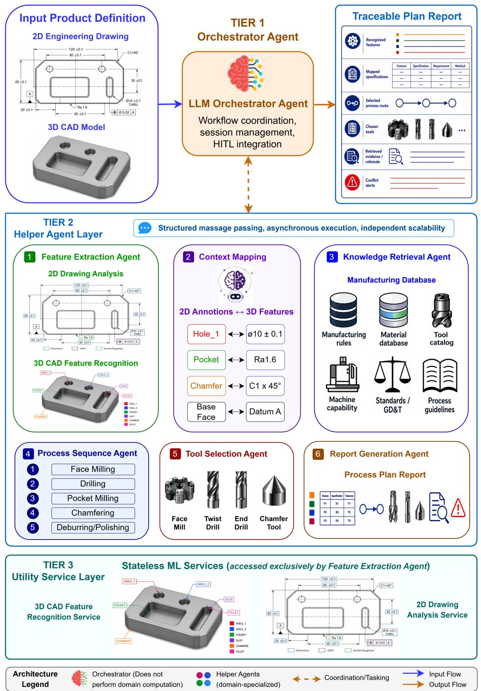  
Fig. 1. Three-tier architecture of the proposed Design-to-Plan framework, comprising orchestration and session management, six specialized planning agents, and stateless ML services for CAD feature recognition and drawing analysis.

Analytical processing is performed by four planning-oriented agents. The KR Agent retrieves relevant manufacturing knowledge from heterogeneous sources and resolves incomplete or conflicting information through tool-grounded reasoning. The PS Agent generates and validates machining operation sequences based on the fused design context and retrieved constraints. The TS Agent selects suitable tools and computes machining parameters for the planned operations. The Report Generation Agent consolidates outputs from all stages into a structured manufacturing report. Together, these agents transform fused design information into executable manufacturing planning outputs.

A manufacturing planning session proceeds through multiple coordinated stages. After file upload, the Orchestrator Agent initializes the session and dispatches the Feature Extraction task, where CAD and drawing inputs are processed concurrently. The user then reviews intermediate outputs and provides corrections if necessary. The Orchestrator subsequently triggers Context Fusion, followed by knowledge retrieval, process sequencing, tool selection, and report generation. Throughout this workflow, agents exchange structured messages asynchronously, enabling non-blocking execution, traceable intermediate outputs, and modular coordination across the design-to-plan pipeline. The overall workflow is shown in Fig. 2.

## 3.2 Feature Extraction Agent

The Feature Extraction Agent coordinates the extraction of geometric features from 3D CAD models and manufacturing specifications from 2D drawings. It receives an extraction request from the Orchestrator Agent, invokes specialized ML services, and returns aggregated structured results. The agent operates as a stateful directedgraph workflow, enabling coordinated execution, synchronization, and resumption across multiple processing steps.

A key design feature of this agent is its parallel execution structure, as illustrated in Fig. 3. After receiving an extraction request, the agent simultaneously dispatches two independent processing branches. The 3D branch invokes the CAD feature recognition service to identify manufacturing features and extract geometric attributes, while the 2D branch invokes the drawing analysis service to extract manufacturing specifications, including dimensions, GD&T annotations, surface roughness requirements, notes, and title-block information. These branches run asynchronously, allowing CAD and drawing analysis to proceed concurrently rather than sequentially. Once both branches are completed, the directed-graph workflow enters a synchronization node that waits for the outputs from both branches. Only after both results are available does the agent resume execution and merge them into a structured intermediate representation. This wait-and-resume mechanism ensures that downstream agents receive a complete design context containing both CAD-derived manufacturing features and drawing-derived engineering specifications before context fusion begins

## 3.2.1 CAD Feature Recognition

CAD feature recognition uses a hierarchical GCNN to classify manufacturing features from STEP files, as shown

## 1 File Upload & Parallel Feature Extraction

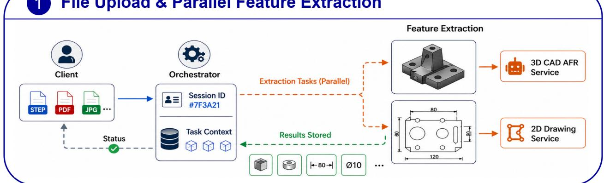

## ② HITL Review & Context Fusion

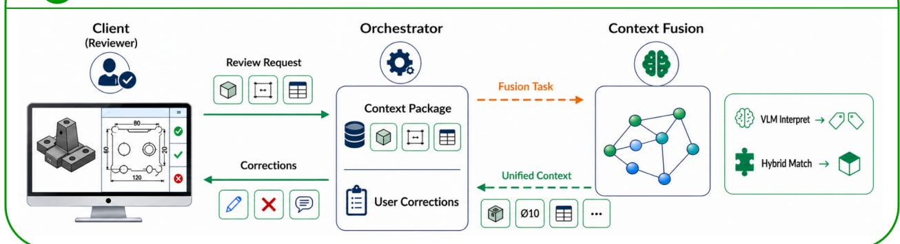

## Analytical Pipeline

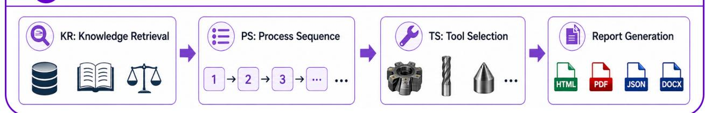

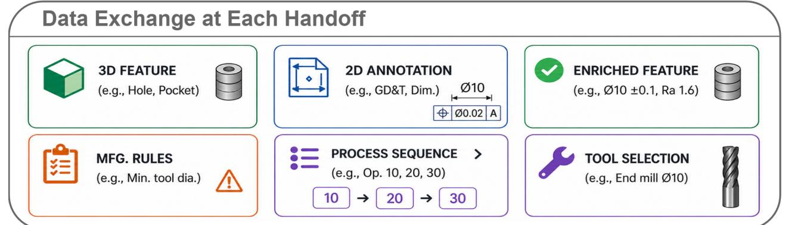  
Fig. 2. End-to-end workflow of the proposed system, including file upload, parallel feature extraction, HITL review, context fusion, and downstream planning using progressively enriched design representations.

in the 3D CAD feature recognition branch of Fig. 3. Full model details are provided in [5]; here, we summarize its integration within the system.

Each STEP file is converted into a B-Rep representation, where faces are nodes and adjacency relationships define graph connectivity. Each face is encoded with geometric features, such as surface area, centroid, and surface type, while three adjacency matrices represent convex, concave, and other edge relationships. A finer facet-level representation captures local geometric detail, with facet adjacency encoding spatial relationships.

The GCNN operates in two stages. First, face-level features are processed using edge-typed graph convolutions:

$$
H ^ { \prime } = E _ { 1 } H W _ { 1 } + E _ { 2 } H W _ { 2 } + E _ { 3 } H W _ { 3 } + H W _ { I } + b\tag{1}
$$

where $H \in R ^ { N _ { f } \times d }$ is the face feature matrix, $E _ { 1 } , E _ { 2 }$ , and $E _ { 3 }$ are adjacency matrices, $W _ { 1 } , W _ { 2 }$ , and $W _ { 3 }$ are learnable weights, $W _ { I }$ is the self-connection term, and b is a bias vector.

These operations propagate information across different geometric relationships, capturing topological patterns such as concave cavities and convex protrusions. The resulting embeddings are projected into the facet space, where a second-stage graph convolution is applied:

$$
H ^ { \prime } = A _ { 2 } H W + H W _ { I } + b\tag{2}
$$

where $A _ { 2 }$ is the facet adjacency matrix. Face and facet representations are linked through transfer operations, enabling joint modeling of global topology and local geometry. The model outputs probabilities over 36 manufacturing feature classes, including holes, pockets, slots, and chamfers. It also extracts geometric attributes such as dimensions, orientations, and parameters required for downstream planning.

## 3.2.2 Drawing Analysis Pipeline

The drawing analysis pipeline uses a three-stage hybrid framework to extract structured manufacturing specifications, as shown in the 2D drawing analysis branch of Fig. 3. Full details are provided in [53].

• Stage 1 (Layout Detection): Major layout regions, including views, annotations, and metadata, are detected using YOLO-based models, separating structured and unstructured content.

• Stage 2 (Annotation Localization): Annotation elements are localized using oriented bounding boxes, enabling detection of GD&T callouts, dimensions, and surface roughness symbols at arbitrary orientations. Surface roughness detection remains challenging due to limited training data; missed detections are partially mitigated through HITL review.

• Stage 3 (Structured Parsing): Detected annotations are converted into structured representations using category-specific schemas. GD&T annotations include symbols, tolerances, and datum references, while dimensional annotations include nominal values, tolerance limits, and directionality. Textual regions, such as notes and title blocks, are processed using a language model to handle variability in format and terminology.

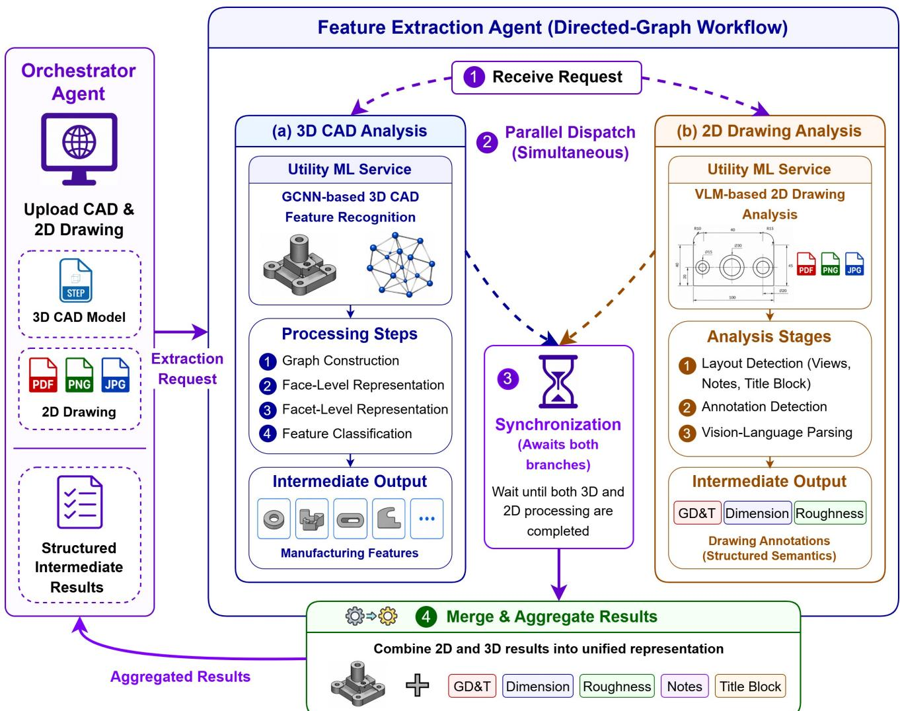  
Fig. 3. Feature Extraction Agent workflow, showing parallel 3D CAD feature recognition and 2D drawing analysis followed by synchronization and structured output aggregation for context fusion.

## 3.3 Context Fusion Agent

The Context Fusion Agent is a central component of the proposed design-to-plan workflow because it bridges the semantic gap between design representation and manufacturing reasoning. The Feature Extraction Agent produces two separate outputs: 3D CAD-derived manufacturing features and 2D drawing-derived engineering specifications. However, these outputs are not directly actionable unless they are correlated at the feature level. For example, a tolerance, GD&T callout, or surface finish requirement extracted from a drawing must be linked to the specific hole, pocket, slot, chamfer, or face to which it applies before it can support knowledge retrieval, process sequencing, or tool selection.

To address this requirement, the Context Fusion Agent generates a unified feature representation by linking each 3D CAD feature with its corresponding 2D drawing specifications, including dimensions, tolerances, GD&T callouts, surface finish requirements, notes, and other relevant manufacturing information. The agent follows a two-stage workflow, as illustrated in Fig. 4. First, semantic interpretation enriches each 2D annotation with manufacturing meaning, such as target feature type, spatial context, and functional intent. Second, hybrid matching uses this enriched annotation context together with 3D feature attributes, including feature type, size, and location, to identify the most plausible 2D-3D correspondences. User corrections from the HITL review stage are incorporated before final mapping, ensuring that expert feedback can override uncertain or incorrect automatic associations.

The resulting enriched 3D feature representation serves as the primary input for downstream analytical agents. By converting isolated CAD features and drawing annotations into feature-specific manufacturing context, the Context Fusion Agent enables subsequent agents to retrieve relevant manufacturing rules, generate valid process sequences, and select appropriate tools based on complete and traceable design information.

## 3.3.1 Semantic Interpretation

A key challenge in correlating 2D annotations with 3D features is ambiguity in dimensional values. Multiple features may share identical dimensions while representing different feature types; for example, a hole diameter and a pocket width may have the same numerical value. To address this, each annotation is enriched with semantic information using a VLM. The enriched representation includes: (i) a semantic type describing functional meaning, such as hole diameter or pocket depth; (ii) a descriptive interpretation capturing feature grouping and design intent; (iii) an associated feature category indicating the likely 3D feature type; and (iv) spatial context describing the approximate location on the part. Manufacturing domain knowledge, including feature-type vocabulary and spatial reasoning heuristics, is explicitly encoded in the VLM prompt rather than assumed from generalpurpose vision-language knowledge. As shown in Fig. 5, the prompt defines the agent role, motivates semantic disambiguation, specifies the required output fields for each annotation, and encodes manufacturing heuristics for spatial reasoning and pattern recognition. This prompt-guided enrichment prevents false matches based only on numerical similarity and provides the semantic context required for robust 2D-3D feature correlation.

## 3.3.2 Hybrid 2D-3D Mapping

The mapping stage correlates enriched 2D annotations with 3D features using a hybrid scoring strategy. For each candidate pairing, a composite score is computed:

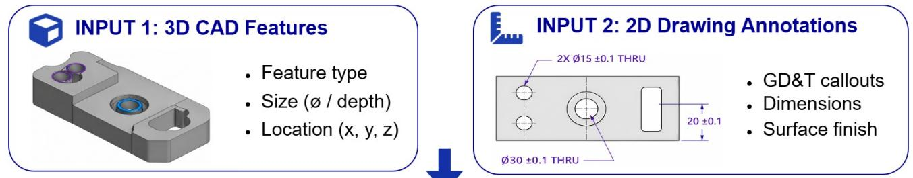

## Stage 1: Semantic Interpretation

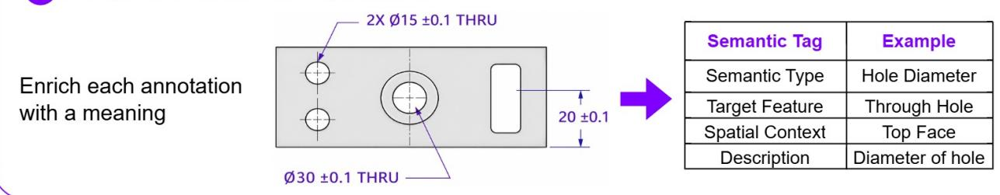

<table><tr><td rowspan=1 colspan=1>Semantic Tag</td><td rowspan=1 colspan=1>Example</td></tr><tr><td rowspan=1 colspan=1>Semantic Type</td><td rowspan=1 colspan=1>Hole Diameter</td></tr><tr><td rowspan=1 colspan=1>Target Feature</td><td rowspan=1 colspan=1>Through Hole</td></tr><tr><td rowspan=1 colspan=1>Spatial Context</td><td rowspan=1 colspan=1>Top Face</td></tr><tr><td rowspan=1 colspan=1>Description</td><td rowspan=1 colspan=1>Diameter of hole</td></tr></table>

## ② Stage 2: Hybrid Matching

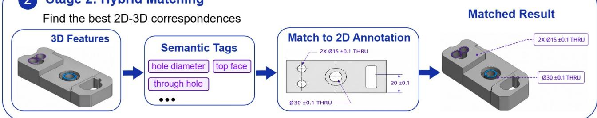

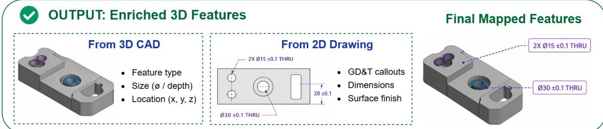  
Fig. 4. Context fusion workflow for 2D-3D mapping, combining semantic interpretation, hybrid feature matching, reasoningbased disambiguation, and HITL correction to generate validated feature-level mappings.

Target   
Feature   
3D feature type

## SYSTEM PROMPT: Drawing Interpretation via VLM

## Role

You are an expert engineer and CAD/CAM specialist analyzing 2D drawings

## Task

Provide semantic context for every GD&T, dimension and surface finish

## Why This Matters? Numbers alone can lead to wrong match

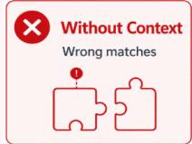

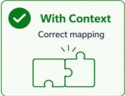

## Also Provide

Overall part description Features visible in drawing

## For Each Annotation, Provide:

  
Sematic Type

  
Description  
e.g., through hole diameter  
Natural language explanation

Spatial   
Context   
Location on part

## Measurement

Tolerance, finish, GD&T, etc.

Quantity I Pattern e.g., 4xM6 holes

## Guidelines

Be specific ("hole diameter" not just "diamater")

Note relationships (e.g., bolt circle)

Flag ambiguities in annotations

Consider all mfg. intent

## Structured Report

  
Fig. 5. VLM prompt design for semantic enrichment, defining the agent role, output schema, and manufacturing heuristics for interpreting drawing annotations and spatial context.

## Actionable

$$
\begin{array} { r } { S _ { m a p } = w _ { t } \cdot S _ { t y p e } + w _ { d } \cdot S _ { d i m } + w _ { s } \cdot S _ { s p a t i a l } } \end{array}\tag{3}
$$

where $S _ { t y p e }$ denotes feature-type compatibility, $S _ { d i m }$ denotes dimensional agreement, and $S _ { s p a t i a l }$ denotes spatial consistency derived from semantic interpretation. The weighting is adaptive based on data availability. When 3D dimensional information is available, dimensional agreement dominates the score. Otherwise, semantic and spatial cues are weighted more heavily. This adaptive formulation improves robustness under incomplete or ambiguous inputs. Additional adjustments are applied based on symbolic consistency. For example, diameter symbols reinforce mappings to cylindrical features, while radius indicators favor curved geometries. A near-tie filter retains candidates close to the highest score, preventing premature elimination of valid alternatives.

The mapping operates in two modes. In deterministic mode, high-confidence matches are accepted directly. In reasoning-based mode, ambiguous cases are resolved by evaluating candidate features using semantic descriptions and geometric characteristics. Each mapping is assigned a confidence level: high-confidence mappings are accepted automatically, medium-confidence mappings are retained with caution, and low-confidence mappings trigger human review. The system supports one-to-many relationships, allowing a single 3D feature to be associated with multiple annotations. User corrections are incorporated prior to finalization, with corrected values overriding automatic extraction. The final output consists of enriched feature objects containing geometric attributes, associated specifications, mapping confidence, and mapping method.

## 3.4 Knowledge Retrieval Agent

The Knowledge Retrieval (KR) Agent is the most analytically complex component in Tier 2, the Helper Agent layer introduced in the three-tier architecture in Fig. 1. It queries a multi-source manufacturing knowledge base (KB), detects and resolves inconsistencies across sources, and returns structured constraints, rules, and process recommendations relevant to the input features. The agent operates using a ReAct loop within a stateful directedgraph framework, enabling explicit tracking of intermediate reasoning steps for analysis and replay. The agent supports three operational modes: deterministic retrieval, sequential ReAct with a single reasoning agent, and parallel ReAct with multiple specialized sub-agents operating concurrently. The overall architecture is shown in Fig. 6.

## 3.4.1 Multi-Source Knowledge Base

The KB integrates six complementary local knowledge modalities, each representing a distinct form of manufacturing knowledge, as summarized in Table 1. An external fallback mechanism is additionally provided for out-of-KB cases where local sources are insufficient. This design reflects the heterogeneity of manufacturing information: relational data supports efficient numerical queries, text sources capture contextual reasoning, graph structures encode relationships, and rule-based systems provide interpretable logic.

A shared normalization component handles variability in input terminology by mapping informal, misspelled, or non-standard inputs to canonical forms. The normalization follows a staged process: exact matching, partial matching, model-based mapping, and fallback matching. Results are cached in memory to improve efficiency for repeated queries. This mechanism is essential for real-world inputs, where variations such as “al-6061-t6” and “Aluminum 6061” must be resolved to a consistent identifier prior to retrieval.

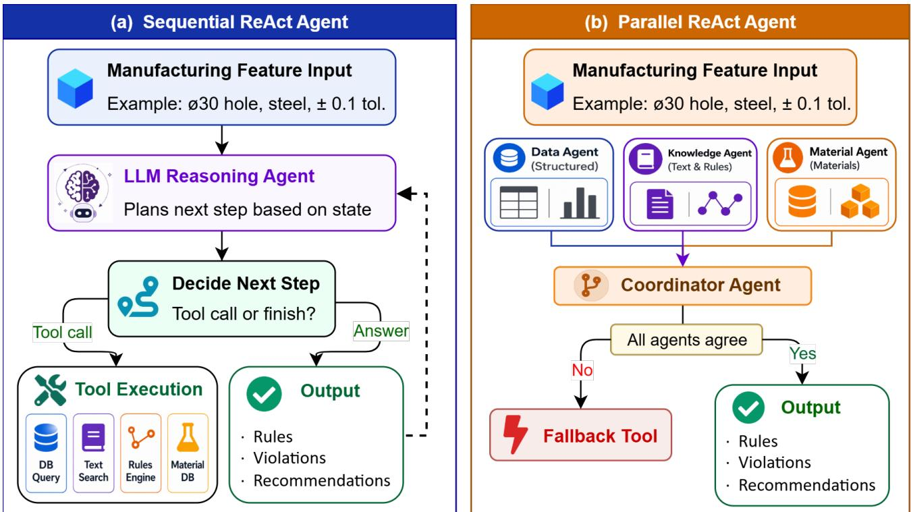  
Fig. 6. Knowledge retrieval architecture, comparing sequential ReAct retrieval using a single reasoning agent with parallel retrieval using three specialized sub-agents and a coordination node.

Table 1. Multi-source tool registry for knowledge retrieval.
<table><tr><td rowspan=1 colspan=1>Tool</td><td rowspan=1 colspan=1>Modality</td><td rowspan=1 colspan=1>Content</td></tr><tr><td rowspan=1 colspan=1>SQL retrieval</td><td rowspan=1 colspan=1>Relational database</td><td rowspan=1 colspan=1>Quantitative constraints, including minimum diameters, aspectratios, tolerance mappings, and thread requirements</td></tr><tr><td rowspan=1 colspan=1>Tabular retrieval</td><td rowspan=1 colspan=1>Structured data</td><td rowspan=1 colspan=1>Feature-material compatibility, machinability scores, and coat-ing recommendations</td></tr><tr><td rowspan=1 colspan=1>Text retrieval (RAG)</td><td rowspan=1 colspan=1>Text corpus</td><td rowspan=1 colspan=1>Engineering guidelines, process rationale, and material practices</td></tr><tr><td rowspan=1 colspan=1>Decision tree evaluation</td><td rowspan=1 colspan=1>Rule-based logic</td><td rowspan=1 colspan=1>Feature classification and constraint applicability</td></tr><tr><td rowspan=1 colspan=1>Knowledge graph query</td><td rowspan=1 colspan=1>Graph representation</td><td rowspan=1 colspan=1>Relationships between materials, processes, and feature types</td></tr><tr><td rowspan=1 colspan=1>Material database lookup</td><td rowspan=1 colspan=1>Material properties</td><td rowspan=1 colspan=1>Machinability, thermal behavior, hardness, and composition</td></tr><tr><td rowspan=1 colspan=1>External fallback</td><td rowspan=1 colspan=1>Generative model</td><td rowspan=1 colspan=1>Supplementary guidance for out-of-KB queries after localsources are exhausted</td></tr></table>

## 3.4.2 Sequential and Parallel ReAct Architectures

The sequential configuration implements a ReAct loop within a stateful execution graph, as shown in Fig. 6(a). At each step, the reasoning agent receives the current feature context, previously retrieved evidence, and available tool descriptions. It then decides whether to invoke another knowledge tool or generate a final structured response. Retrieved tool results are appended to the agent state, allowing subsequent reasoning steps to account for previously accessed evidence. This process continues until sufficient manufacturing knowledge has been collected or a stopping condition is reached. The sequential design provides a complete reasoning trajectory and is useful for cases requiring deeper validation, conflict checking, or step-by-step refinement.

A key component of the sequential KR Agent is its system prompt, which constrains LLM reasoning within a manufacturing-specific tool-use workflow rather than allowing unrestricted generation. As shown in Fig. 7, the prompt encodes four functional elements. First, it defines the ReAct reasoning loop, requiring the agent to alternate between reasoning, tool selection, tool observation, and final response generation. Second, it provides feature-type-specific tool-selection guidance so that dimensional limits, tolerance requirements, material constraints, and process recommendations are routed to appropriate knowledge sources. Third, it defines a source-priority hierarchy for resolving conflicting information across structured databases, tabular rules, textual guidelines, knowledge graphs, and material databases. Fourth, it includes an external-knowledge guard that prevents premature fallback to broader generative knowledge before relevant local sources have been queried. This prompt design is central to the KR Agent because it enables the LLM to operate as an interactive reasoning agent that retrieves, compares, and synthesizes manufacturing evidence instead of generating unsupported recommendations.

The parallel configuration distributes the same tool-grounded reasoning objective across three specialized subagents, as shown in Fig. 6(b). The structured-data sub-agent handles relational, tabular, and rule-based queries; the text-knowledge sub-agent retrieves information from textual guidelines and knowledge-graph sources; and the material sub-agent retrieves material-specific properties and constraints. Each sub-agent follows a restricted ReAct loop within its assigned tool scope, reducing unnecessary context accumulation while improving coverage of heterogeneous knowledge sources. A coordination node then merges the sub-agent outputs, applies the same source-priority logic used in the sequential configuration, resolves conflicts where possible, and generates a unified response with provenance and confidence information. The condensed prompts for the parallel subagents and coordinator are provided in Appendix.

This design allows the KR Agent to support both deep sequential reasoning and broad parallel evidence collection. The sequential architecture emphasizes reasoning continuity and iterative refinement, while the parallel architecture emphasizes source coverage, fault tolerance, and efficiency. In both configurations, the promptguided ReAct workflow ensures that manufacturing recommendations remain grounded in retrieved evidence, traceable to specific knowledge sources, and constrained by domain-specific decision rules.

## 3.5 Process Sequence Agent

The Process Sequence (PS) Agent receives the unified feature context from the Context Fusion Agent and manufacturing constraints from the KR Agent. It generates an ordered sequence of manufacturing processes required to produce the part, acting as the bridge between knowledge interpretation and production planning. Based on extracted constraints and feature information, the agent determines the required operations, their ordering, and

## SYSTEM PROMPT: Manufacturing Knowledge Retrieval Agent

Retrieve rules, constraints and recommendations from mfg. features

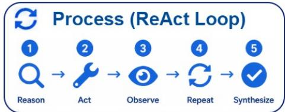

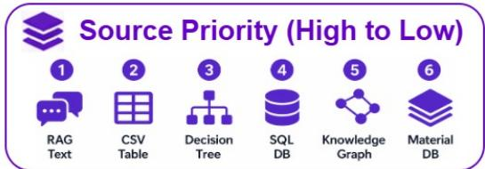

## Tool Selection (by feature type)

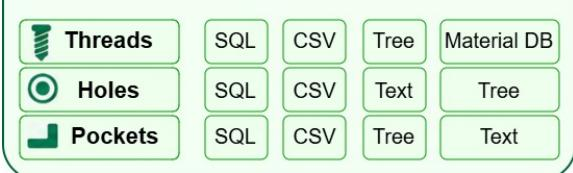

## Conflict Resolution

Same-priority conflict→conservative value

Text ranges override fixed SQL values

Track source for traceability

## EXAMPLE: Thread - M6 x 1.0 in Aluminum 6061

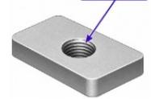

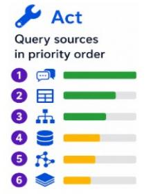

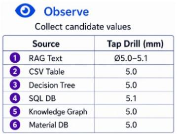

## Output Return structured result

"processRecommendations": [...], "parameters": { "tapDrill": "05.0 mm" }, "summary": "Tap drill selected..." }

Fig. 7. Sequential ReAct prompt design for the Knowledge Retrieval Agent, defining the reasoning loop, feature-specific tool-use guidance, source-priority rules, and fallback constraints for grounded retrieval.

the associated rationale. The task is inherently combinatorial: for parts with multiple features, each requiring one or more operations, the number of valid sequences is constrained by dependencies, material compatibility, and feature accessibility. Rather than performing exhaustive enumeration, the agent applies a deterministic decision hierarchy that prioritizes authoritative specifications and generates sequences only when explicit definitions are unavailable.

## 3.5.1 Decision Logic

The agent follows a three-path decision strategy with strict priority ordering, as shown in Fig. 8.

• Path 1 (User override): If a HITL correction specifies a process sequence, it is validated and returned with highest priority, as it reflects expert input incorporating contextual factors not captured by the system.

• Path 2 (Design-specified process): If CAD or drawing inputs include process annotations, these are validated against known constraints and returned as the primary output.

• Path 3 (Generated sequence): If no explicit specification exists, the agent generates a sequence using three knowledge structures. Process templates define standard workflows for common part categories, such as machined components, shafts, sheet metal, and cast parts. Material-process compatibility mappings restrict feasible processes based on material properties, while process dependency rules enforce valid precedence relationships between operations. Sequences generated through this path represent the system’s recommended manufacturing plan.

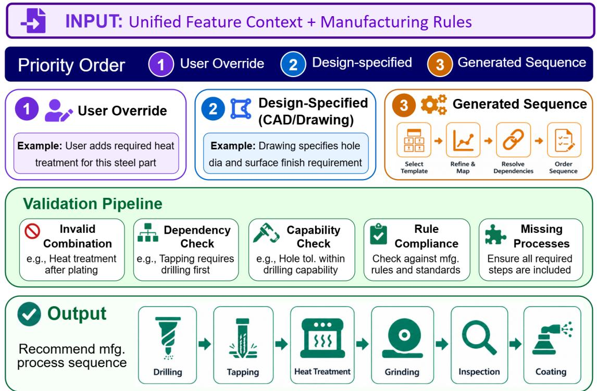  
Fig. 8. Process sequence decision and validation workflow, showing priority-based selection of user-defined, design-specified, or generated sequences using templates, material compatibility, dependency rules, and validation checks.

## 3.5.2 Validation and Confidence Scoring

All generated or provided sequences are validated against multiple constraint categories, including invalid pro-

cess combinations, ordering violations, process capability mismatches, and compliance with manufacturing rules. Validation results are used to compute a confidence score:

$$
C _ { s e q } = C _ { b a s e } - 0 . 3 \cdot I _ { \nu i o l a t i o n } - 0 . 1 \cdot \mathrm { m i n } ( n _ { w a r n } / 5 , 1 . 0 )\tag{4}
$$

where $C _ { b a s e }$ is the base confidence associated with the sequence source, $I _ { \nu i o l a t i o n }$ indicates the presence of a critical violation, and $n _ { w a r n }$ Nwarn is the number of warnings. The base confidence reflects the source hierarchy, with user-defined and design-specified sequences assigned higher initial confidence than generated ones. The penalty terms are used as an interpretable validation heuristic rather than a probabilistic uncertainty model: critical violations receive a larger penalty because they can invalidate a sequence, while warnings reduce confidence gradually up to a capped limit. The score is bounded within a fixed range to ensure interpretability: higher values indicate valid and authoritative sequences, while lower values indicate inconsistencies requiring review.

When validation identifies issues, the agent generates alternative sequences for comparison. For complex or non-standard cases, a ReAct-based extension performs iterative reasoning using specialized tools for process capability lookup, sequence retrieval, rule evaluation, and knowledge search. The PS and TS agents share this reasoning framework, differing only in domain-specific tools and prompts.

## 3.6 Tool Selection Agent

The Tool Selection (TS) Agent receives the validated process sequence and selects appropriate cutting tools and machining parameters for each operation, as shown in Fig. 9. It translates process-level decisions into operation-level manufacturing instructions, bridging process planning and machining execution.

## 3.6.1 Selection Logic and Tool Library

The agent maintains a structured tool library organized into categories such as endmills, drills, taps, boring tools, reamers, thread mills, grinding tools, chamfer tools, and specialized tooling. Each entry includes material compatibility, applicable processes, geometric constraints, coating type, and tolerance capability. For each process step, a four-stage selection procedure is applied. First, a tooling requirement check determines whether a cutting tool is needed. Second, category identification retrieves relevant tool classes. Third, candidate filtering removes incompatible tools based on material, geometry, and tolerance constraints. Finally, a primary tool is selected based on feature characteristics, surface requirements, and production considerations. Process-to-tool mappings link each operation to valid tool categories, ensuring only applicable tools are considered.

## 3.6.2 Parameter Calculation

For each selected tool, machining parameters are computed using material-dependent reference values. Spindle speed is given by:

$$
N = ( V _ { c } \times 1 0 0 0 ) / ( \pi \times D )\tag{5}
$$

where N is spindle speed, $V _ { c }$ is cutting speed, and D is tool diameter.

The feed rate for milling operations is:

$$
f _ { m } = f _ { z } \times z \times N\tag{6}
$$

where $f _ { m }$ is table feed rate, $f _ { z }$ is feed per tooth, z is the number of cutting edges, and N is spindle speed. A representative cutting speed is selected within recommended ranges for the material-tool combination, with adjustment factors applied based on tool characteristics such as coating. Depth of cut is determined by operation type, with larger values for roughing and smaller values for finishing. The width of cut is defined as a fraction of tool diameter, with higher values for roughing and lower values for finishing. Specialized operations follow additional constraints; for example, tapping feed is synchronized with thread pitch, and reaming uses conservative parameters to ensure dimensional accuracy.

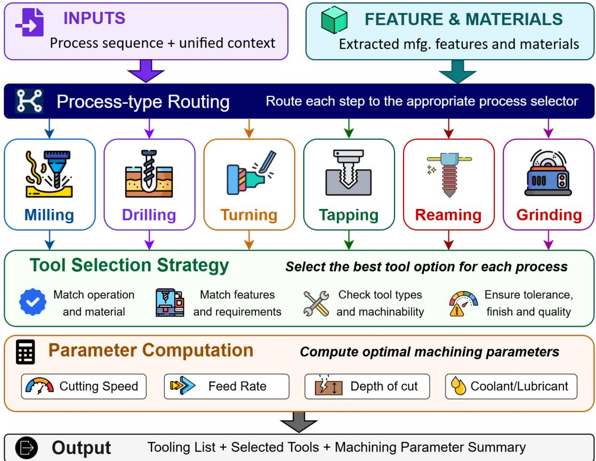  
Fig. 9. Tool selection and parameter computation workflow, assigning tools based on process, material, geometry, and tolerance constraints, with machining parameters computed from material-dependent reference values.

## 3.6.3 Confidence Scoring

The tool selection confidence score is designed as a coverage-based heuristic to quantify whether all toolingrequired process steps have been assigned valid tools. It is not intended to represent probabilistic uncertainty; rather, it provides an interpretable completeness indicator for downstream reporting and human review:

$$
C _ { t o o l } = 0 . 3 + 0 . 7 \times \left( n _ { t o o l e d } / n _ { r e q u i r e d } \right)\tag{7}
$$

where $n _ { t o o l e d }$ is the number of process steps with assigned tools and $n _ { r e q u i r e d }$ is the total number of steps requiring tooling. The constant 0.3 is used as a minimum baseline to indicate that a process-level tooling requirement has been identified even when tool assignment is incomplete, while the remaining 0.7 is allocated to assignment coverage. This weighting ensures that the score increases monotonically with tool assignment completeness and reaches 1.0 only when all required tooling steps are specified. Lower scores indicate partial tool coverage and therefore trigger manual review or further reasoning. For non-standard materials, complex geometries, or unsupported processes, a ReAct-based extension performs iterative reasoning using specialized tools for parameter estimation, tool selection, and constraint evaluation. The TS Agent shares the same reasoning framework as the PS and KR agents, differing only in domain-specific tools and knowledge sources.

## 3.7 Report Generation Agent

The Report Generation Agent synthesizes outputs from all upstream agents into structured manufacturing analysis reports. It uses template-based narration instead of open-ended generation, ensuring consistency, reproducibility, and auditability. This design prioritizes deterministic and verifiable documentation, which is essential in engineering applications. Reports are organized into seven sections: Executive Summary, Design Specifications, Manufacturing Rules, Process Plan, Tool Selection, Risk Analysis, and Recommendations. Multiple levels of detail, including executive, intermediate, standard, and detailed views, and export formats, including web-viewable, print-ready, editable, and structured data formats, are supported, enabling integration with both human workflows and downstream computational systems.

## 4. Evaluation Methodology

## 4.1 Framework Design

The evaluation framework assesses agent behavior across the range of inputs expected in realistic manufacturing scenarios, including both standard and complex conditions. A ground-truth benchmark is constructed with explicit difficulty stratification and category labeling, where each test case is assigned to a predefined complexity category. This design enables systematic analysis of performance across varying levels of input difficulty.

For the three knowledge-intensive agents, namely KR, PS, and TS, evaluation is conducted using a dedicated evaluation module under controlled input conditions. This setup isolates agent-level behavior from workflowlevel variability and enables direct comparison of sequential and parallel configurations using the same benchmark cases. For each test case, three artifacts are recorded: (i) a complete execution trace, including tool calls, input arguments, retrieved results, intermediate reasoning steps, and token usage; (ii) quantitative evaluation metrics; and (iii) a human-readable summary. This structured logging supports post-hoc analysis, debugging, and reproducibility of experimental results.

## 4.2 Knowledge Retrieval Benchmark

The benchmark consists of 110 test cases: a primary dataset of 100 cases spanning ten input-complexity categories, and an additional set of 10 cases designed to evaluate conflict detection. The distribution of the primary dataset reflects the expected frequency and difficulty of inputs in practical manufacturing scenarios, as shown in Table 2. Each category represents a distinct class of real-world challenges, enabling systematic evaluation of robustness.

Table 2. Ground-truth dataset for knowledge retrieval: category distribution of the 100 primary cases.
<table><tr><td rowspan=1 colspan=1>Category</td><td rowspan=1 colspan=1>Count</td><td rowspan=1 colspan=1>Description</td><td rowspan=1 colspan=1>Difficulty</td></tr><tr><td rowspan=1 colspan=1>Normal</td><td rowspan=1 colspan=1>18</td><td rowspan=1 colspan=1>Complete, well-formed inputs with standard materials and features</td><td rowspan=1 colspan=1>Easy</td></tr><tr><td rowspan=1 colspan=1>Violation</td><td rowspan=1 colspan=1>14</td><td rowspan=1 colspan=1>Inputs violating manufacturing constraints</td><td rowspan=1 colspan=1>Medium</td></tr><tr><td rowspan=1 colspan=1>Edge Case</td><td rowspan=1 colspan=1>8</td><td rowspan=1 colspan=1>Boundary values and non-standard parameters</td><td rowspan=1 colspan=1>Hard</td></tr><tr><td rowspan=1 colspan=1>Missing Data</td><td rowspan=1 colspan=1>5</td><td rowspan=1 colspan=1>Materials or features absent from local database</td><td rowspan=1 colspan=1>Hard</td></tr><tr><td rowspan=1 colspan=1>Minimal Input</td><td rowspan=1 colspan=1>10</td><td rowspan=1 colspan=1>Feature type only, without parameters</td><td rowspan=1 colspan=1>Hard</td></tr><tr><td rowspan=1 colspan=1>Partial Input</td><td rowspan=1 colspan=1>8</td><td rowspan=1 colspan=1>Feature type with incomplete parameters</td><td rowspan=1 colspan=1>Hard</td></tr><tr><td rowspan=1 colspan=1>Ambiguous Input</td><td rowspan=1 colspan=1>7</td><td rowspan=1 colspan=1>Vague or informal feature naming</td><td rowspan=1 colspan=1>Hard</td></tr><tr><td rowspan=1 colspan=1>Messy Format</td><td rowspan=1 colspan=1>15</td><td rowspan=1 colspan=1>Misspellings, trade names, formatting inconsistencies</td><td rowspan=1 colspan=1>Hard</td></tr><tr><td rowspan=1 colspan=1>Outside KB</td><td rowspan=1 colspan=1>10</td><td rowspan=1 colspan=1>Queries with no relevant local data</td><td rowspan=1 colspan=1>Hard</td></tr><tr><td rowspan=1 colspan=1>Cross-Domain</td><td rowspan=1 colspan=1>5</td><td rowspan=1 colspan=1>Queries spanning multiple features or materials</td><td rowspan=1 colspan=1>Hard</td></tr><tr><td rowspan=1 colspan=1>Total</td><td rowspan=1 colspan=1>100</td><td rowspan=1 colspan=1></td><td rowspan=1 colspan=1></td></tr></table>

Each test case defines input parameters, expected tool usage, including mandatory and optional tools, and expected output properties. Output properties include minimum rule coverage, severity levels, detected violations, and the presence of process recommendations. An additional set of 10 cases evaluates conflict detection behavior. These cases incorporate 13 known inconsistencies across the six local knowledge sources. The conflicts fall into two categories: (i) machinability discrepancies across materials, including aluminum, steel, stainless steel, titanium, and plastics, where values differ between tabular and material databases; and (ii) design constraint inconsistencies, including thread engagement ratios, minimum diameters, fillet radii, and countersink angles, where values differ between structured databases and updated standards. This extended dataset enables explicit evaluation of the agent’s ability to detect, reason about, and resolve conflicting information across heterogeneous sources.

## 4.3 Evaluation Metrics

The primary metrics for evaluating tool usage are precision, recall, and F1 score. Let $T _ { c a l l e d }$ denote the set of tools invoked by the agent, $T _ { e x p e c t e d }$ the required tools, and $T _ { o p t i o n a l }$ the acceptable optional tools. The relevant tool set for precision is defined as:

$$
T _ { r e l e \nu a n t } = T _ { e x p e c t e d } \cup T _ { o p t i o n a l }\tag{8}
$$

The metrics are computed as:

$$
P _ { t o o l } = | T _ { c a l l e d } \cap T _ { r e l e v a n t } | / | T _ { c a l l e d } |\tag{9}
$$

$$
R _ { t o o l } = | T _ { c a l l e d } \cap T _ { e x p e c t e d } | / | T _ { e x p e c t e d } |\tag{10}
$$

$$
F 1 _ { t o o l } = ( 2 \times P _ { t o o l } \times R _ { t o o l } ) / ( P _ { t o o l } + R _ { t o o l } )\tag{11}
$$

Precision considers both required and optional tools, whereas recall considers only required tools. This asymmetric formulation reflects manufacturing semantics: multiple tools may provide equivalent information and should not penalize precision, whereas missing required tools results in incomplete reasoning and must penalize recall.

Additional correctness metrics include:

• Rules Sufficient Rate: fraction of cases where retrieved rules meet or exceed the minimum required threshold.

• Severity Accuracy: fraction of cases where the detected severity matches or exceeds the expected severity level.

Efficiency is measured using four metrics per case: iteration count, number of tool calls, token usage, and execution time. These metrics capture both computational cost and reasoning efficiency. The fallback mechanism is evaluated using trigger rate, precision, and recall. Trigger rate denotes the fraction of cases where fallback is activated, precision denotes the fraction of triggered cases where fallback was expected, and recall denotes the fraction of expected fallback cases correctly identified.

Conflict detection performance is measured using the Conflict Detection Score (CDS), a rubric-based composite metric. The rubric consists of three components: detection, resolution, and explanation. Detection evaluates whether relevant conflicting sources are queried, resolution evaluates whether the correct authoritative value is selected, and explanation evaluates whether the conflict is explicitly acknowledged and contextualized. The composite score is defined as:

$$
C D S = 0 . 3 \cdot D + 0 . 4 \cdot R + 0 . 3 \cdot E\tag{12}
$$

where D, R, and E denote detection, resolution, and explanation scores, respectively. Detection measures the fraction of conflicting sources accessed, resolution measures whether the correct authoritative value is selected, and explanation measures whether the conflict is explicitly identified and contextualized. The weighting reflects the relative importance of the three components in manufacturing decision-making. Detection and explanation are necessary for traceability, but resolution is assigned a slightly higher weight because selecting an appropriate constraint value has the most direct effect on downstream process planning and tool selection. The weights are therefore used as an interpretable evaluation rubric rather than a statistically learned parameter set. All CDS evaluations are performed by a single domain expert; future work should include sensitivity analysis of the weighting scheme and multiple expert annotators to further validate the metric.

## 4.4 Process Sequence and Tool Selection Benchmarks

The PS and TS agents are evaluated using dedicated 100-case benchmarks with ten-category stratification following the same design used for the KR benchmark. For TS, two categories are modified: out-of-KB and crossdomain are replaced by special tooling, covering non-standard tools such as gun drills and form cutters, and multi-process scenarios, covering coordinated tool selection across multiple stages. The remaining categories are shared across agents, enabling comparative analysis.

The PS and TS agents use GPT-4o-mini, while KR uses GPT-4o. This configuration reflects a trade-off between computational cost and reasoning capability. KR requires broader reasoning across heterogeneous sources, whereas PS and TS operate in more constrained decision spaces supported by structured tools, such as lookup tables and dependency graphs. The model backbones are reported to support reproducibility and to clarify the interpretation of cross-agent efficiency results. Efficiency comparisons across agents should therefore be interpreted cautiously, as differences may reflect model capability in addition to task complexity.

## Process Sequence Metrics

Let $P _ { g e n }$ denote generated processes and $P _ { e x p }$ denote expected processes. Process set overlap is measured using Jaccard similarity:

$$
J _ { p r o c } = | P _ { g e n } \cap P _ { e x p } | / | P _ { g e n } \cup P _ { e x p } |\tag{13}
$$

Process Completeness (PC) and Process Precision (PP) are defined as:

$$
P C = { { \left| { { P _ { g e n } } \cap { P _ { e x p } } } \right| } / { \left| { { P _ { e x p } } } \right| } }
$$

$$
P P = | P _ { g e n } \cap P _ { e x p } | / | P _ { g e n } |\tag{14}
$$

(15)

PC measures coverage of expected processes, while PP measures correctness of generated processes. Ordering quality is evaluated using Kendall’s tau (τ) over shared processes, ranging from −1 for reversed order to +1 for perfect agreement. Dependency Compliance measures the fraction of process pairs satisfying precedence constraints. The Alternative Generation Rate captures the proportion of cases where at least one alternative sequence is produced.

## Tool Selection Metrics

Let $T _ { g e n }$ and $T _ { e x p }$ denote generated and expected tool sets. Tool Type Jaccard follows the same formulation as above. Additional metrics include:

• Material Compatibility Score: fraction of tools satisfying material constraints.

• Coating Score: alignment between selected coatings and expected specifications.

• Parameter Accuracy: fraction of machining parameters within acceptable tolerance ranges.

• Special Tooling Recall: fraction of required non-standard tools correctly identified.

• Must-Include Coverage: fraction of mandatory tool specifications present.

## System-Level Evaluation

System-level evaluation focuses on integration of feature extraction and context fusion. The GCNN service is evaluated using labeled STEP datasets for feature recognition accuracy. Context fusion is evaluated by the proportion of 3D features successfully mapped to corresponding 2D annotations based on expert-validated ground truth. This metric reflects the effectiveness of semantic interpretation and hybrid matching.

All ReAct evaluations are conducted as single-run experiments with temperature set to zero, yielding neardeterministic outputs. Deterministic components operate with fixed parameters. Reported metrics are point estimates from a single evaluation pass. Some categories contain limited samples, with 5–7 cases, where singlecase variations may significantly affect results.

## 5. Results and Discussion

## 5.1 Feature Extraction and Context Fusion

Tables 3–5 summarize the performance of the upstream components that provide structured inputs to downstream agents. Detailed evaluation procedures are reported in [5] and [53]; key results are summarized here.

Table 3. GCNN-based CAD feature recognition performance.
<table><tr><td rowspan=1 colspan=1>Metric</td><td rowspan=1 colspan=1>Value</td></tr><tr><td rowspan=1 colspan=1>Overall Accuracy</td><td rowspan=1 colspan=1>96.87%</td></tr><tr><td rowspan=1 colspan=1>Precision</td><td rowspan=1 colspan=1>97.16%</td></tr><tr><td rowspan=1 colspan=1>Recall</td><td rowspan=1 colspan=1>96.67%</td></tr><tr><td rowspan=1 colspan=1>F1 Score</td><td rowspan=1 colspan=1>96.87%</td></tr><tr><td rowspan=1 colspan=1>Dimension Extraction Accuracy</td><td rowspan=1 colspan=1>100% (for correctly identified features)</td></tr><tr><td rowspan=1 colspan=1>Feature Classes</td><td rowspan=1 colspan=1>36 (subtractive and additive)</td></tr><tr><td rowspan=1 colspan=1>Training Dataset</td><td rowspan=1 colspan=1>150,000 synthetic CAD models</td></tr><tr><td rowspan=1 colspan=1>Inference Time</td><td rowspan=1 colspan=1>3–4 s per model</td></tr></table>

The 36-class feature set covers common machining features for both prismatic and rotational parts, including holes, pockets, slots, and steps. The B-Rep-based graph representation effectively encodes geometric relationships, enabling the hierarchical GCNN to achieve high classification accuracy with low inference time. Accurate dimensional extraction for correctly identified features provides a reliable foundation for downstream reasoning.

Table 4. Three-stage drawing analysis pipeline performance.
<table><tr><td rowspan=1 colspan=1>Stage</td><td rowspan=1 colspan=1>Model</td><td rowspan=1 colspan=1>Target</td><td rowspan=1 colspan=1>Accuracy / F1</td></tr><tr><td rowspan=3 colspan=1>Layout Detection</td><td rowspan=3 colspan=1>YOLOv11-det</td><td rowspan=1 colspan=1>Views</td><td rowspan=1 colspan=1>0.96</td></tr><tr><td rowspan=1 colspan=1>Title Block</td><td rowspan=1 colspan=1>0.99</td></tr><tr><td rowspan=1 colspan=1>Notes</td><td rowspan=1 colspan=1>0.98</td></tr><tr><td rowspan=3 colspan=1>Annotation Localization</td><td rowspan=3 colspan=1>YOLOv11-obb</td><td rowspan=1 colspan=1>Measures</td><td rowspan=1 colspan=1>0.95</td></tr><tr><td rowspan=1 colspan=1>GD&amp;T</td><td rowspan=1 colspan=1>0.97</td></tr><tr><td rowspan=1 colspan=1>Surface Roughness</td><td rowspan=1 colspan=1>0.54</td></tr><tr><td rowspan=4 colspan=1>Numerical Extraction</td><td rowspan=4 colspan=1>Donut VLM</td><td rowspan=1 colspan=1>Measures (F1)</td><td rowspan=1 colspan=1>0.923</td></tr><tr><td rowspan=1 colspan=1>GD&amp;T (F1)</td><td rowspan=1 colspan=1>0.965</td></tr><tr><td rowspan=1 colspan=1>Surface Roughness (F1)</td><td rowspan=1 colspan=1>1.000</td></tr><tr><td rowspan=1 colspan=1>Overall (F1)</td><td rowspan=1 colspan=1>0.963</td></tr></table>

Lower localization performance for surface roughness annotations is mainly associated with dataset imbalance, highlighting sensitivity to class distribution. The pipeline employs a hybrid strategy: numerical annotations are processed using a document understanding transformer, while textual regions are handled by a VLM. This separation improves robustness for both structured data and free-form text. Replacing a generic document model with a VLM significantly improved extraction of materials, notes, and metadata across diverse formats. End-toend processing requires approximately 2–5 s per drawing page; combined with CAD analysis, total extraction time remains within 6–10 s due to parallel execution.

Table 5. Context fusion mapping performance using 20 CAD–drawing pairs and 101 mappings.
<table><tr><td rowspan=1 colspan=1>Metric</td><td rowspan=1 colspan=1>Mean</td><td rowspan=1 colspan=1>Std</td><td rowspan=1 colspan=1>Min</td><td rowspan=1 colspan=1>Max</td></tr><tr><td rowspan=1 colspan=1>Mapping Precision</td><td rowspan=1 colspan=1>0.837</td><td rowspan=1 colspan=1>0.170</td><td rowspan=1 colspan=1>0.50</td><td rowspan=1 colspan=1>1.00</td></tr><tr><td rowspan=1 colspan=1>Mapping Recall</td><td rowspan=1 colspan=1>0.905</td><td rowspan=1 colspan=1>0.117</td><td rowspan=1 colspan=1>0.57</td><td rowspan=1 colspan=1>1.00</td></tr><tr><td rowspan=1 colspan=1>Mapping F1 Score</td><td rowspan=1 colspan=1>0.863</td><td rowspan=1 colspan=1>0.137</td><td rowspan=1 colspan=1>0.57</td><td rowspan=1 colspan=1>1.00</td></tr><tr><td rowspan=1 colspan=1>Exact Match Rate</td><td rowspan=1 colspan=1>0.792</td><td rowspan=1 colspan=1>0.200</td><td rowspan=1 colspan=1>0.40</td><td rowspan=1 colspan=1>1.00</td></tr><tr><td rowspan=1 colspan=1>Partial Match Rate</td><td rowspan=1 colspan=1>0.903</td><td rowspan=1 colspan=1>0.123</td><td rowspan=1 colspan=1>0.57</td><td rowspan=1 colspan=1>1.00</td></tr><tr><td rowspan=1 colspan=1>Inference Time (s)</td><td rowspan=1 colspan=1>54.94</td><td rowspan=1 colspan=1>20.65</td><td rowspan=1 colspan=1>30.05</td><td rowspan=1 colspan=1>104.63</td></tr></table>

The context fusion component is evaluated on 20 real CAD–drawing pairs comprising 101 feature-to-annotation mappings with expert-validated ground truth. Approximately 40% of features involve repeated or patterned instances, increasing ambiguity. The deterministic-first pipeline resolves a subset of mappings directly through scoring, while most cases require hybrid processing, where candidate sets are generated deterministically and refined through reasoning-based disambiguation. The high partial match rate indicates stable behavior under ambiguity, as the system preserves multiple plausible mappings rather than committing incorrect assignments. Ablation results for the context fusion module show that removing domain-specific heuristics reduces precision, while removing reasoning-based disambiguation reduces recall. The full pipeline achieves the highest F1 score, demonstrating the effectiveness of the hybrid deterministic-agentic design for multi-modal integration.

## 5.2 Knowledge Retrieval Results

Fig. 10 summarizes the aggregate performance of the sequential and parallel ReAct configurations across the 100-case knowledge retrieval benchmark.

Both configurations complete all benchmark cases, indicating that ReAct-based retrieval with multi-source tools can operate reliably across noisy, ambiguous, and out-of-KB inputs. The sequential configuration follows a deeper reasoning pattern, averaging multiple tool-use steps for retrieval and refinement. In contrast, the parallel configuration distributes retrieval across specialized sub-agents, achieving broader source coverage with some redundancy.

The parallel configuration achieves higher Tool F1, primarily due to improved recall, while the sequential configuration achieves slightly higher precision by invoking fewer unnecessary tools. This reflects the expected architectural trade-off: parallel reasoning improves coverage across heterogeneous sources, whereas sequential reasoning maintains a more focused reasoning trajectory. Severity accuracy is higher in the sequential configuration, suggesting that a unified reasoning context can improve calibration of constraint severity, particularly in edge-case and violation scenarios.

Fallback behavior further differentiates the two configurations. The sequential configuration does not trigger fallback, indicating limited sensitivity to incomplete source coverage. The parallel configuration activates fallback in cases where local sources are insufficient, showing better detection of missing information. However, this broader coverage introduces modest coordination overhead, resulting in slightly higher token consumption for KR. Conflict detection performance is summarized in Fig. 11.

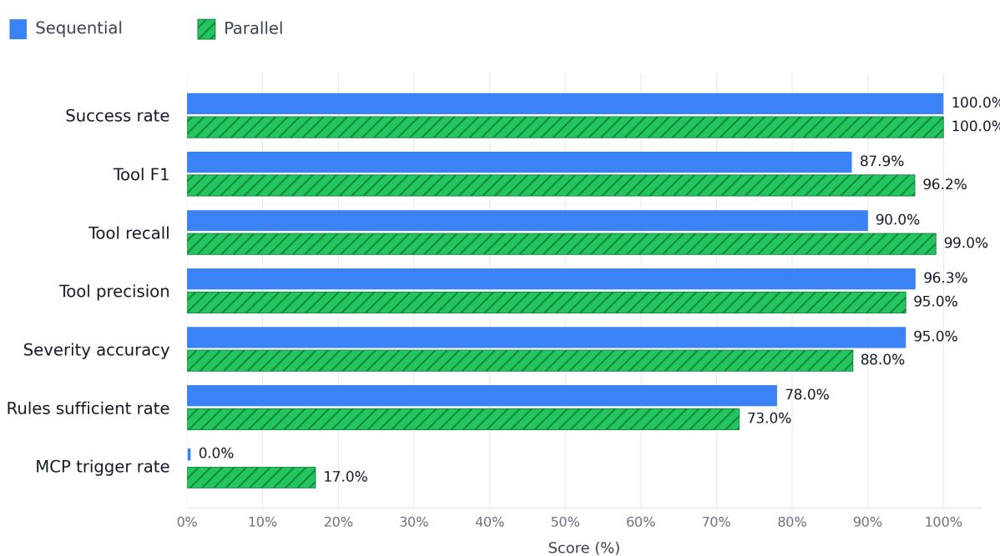  
Efficiency and behavior (mean per case)

<table><tr><td colspan="2">Tokens</td><td colspan="2">Time (s)</td><td colspan="2">Rules retrieved</td><td colspan="2">Iterations Tool calls</td></tr><tr><td>Seq</td><td>7,888</td><td>Seq 17.9</td><td>Seq</td><td>3.0 Seq</td><td>2.0</td><td>Seq</td><td>6.0</td></tr><tr><td>Par</td><td>8,630</td><td>Par</td><td>18.4</td><td>Par 4.1</td><td>Par 1.0</td><td>Par</td><td>7.3</td></tr></table>

Fig. 10 Performance comparison of sequential and parallel ReAct configurations, showing higher Tool F1 for parallel retrieval and higher severity accuracy for sequential reasoning.

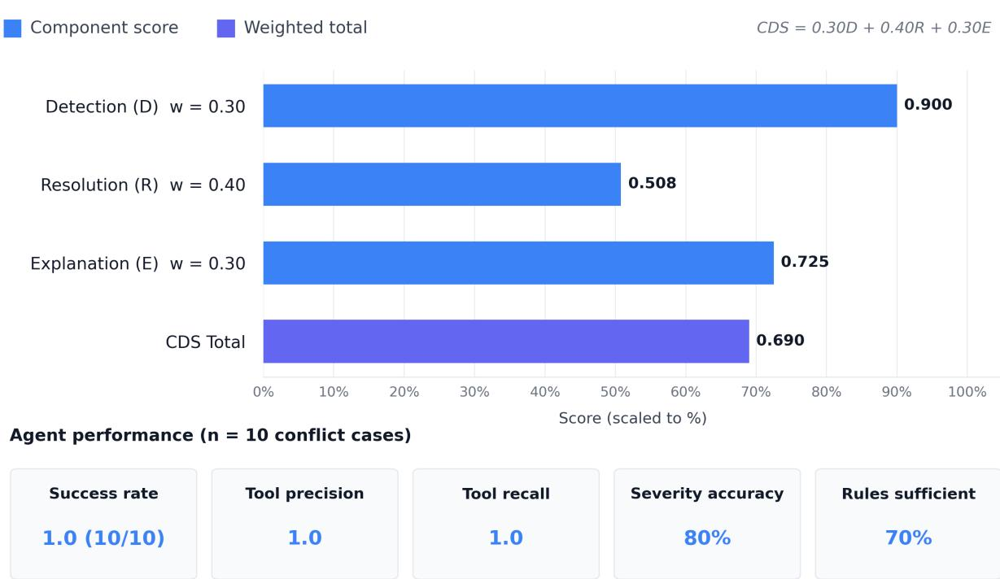  
Fig. 11. Conflict Detection Score (CDS) breakdown, showing strong conflict detection, moderate explanation quality, and weaker conflict resolution performance.

The CDS results show that the agent is generally effective at accessing conflicting sources and identifying the presence of inconsistencies. However, resolution remains the weakest component, indicating that selecting a single authoritative value is more difficult than detecting or explaining a conflict. This behavior reflects a conservative reasoning strategy, where the agent may present multiple plausible values rather than commit to one source when evidence is inconsistent.

Per-case analysis in Table 6 further illustrates this behavior. Higher-scoring cases occur when all relevant sources are queried and the selected value is justified with an appropriate explanation. Moderate and lower-scoring cases are mainly associated with incomplete source coverage, where one or more relevant sources are not invoked.

Table 6. Representative CDS cases.
<table><tr><td rowspan=1 colspan=1>Case</td><td rowspan=1 colspan=1>D</td><td rowspan=1 colspan=1>R</td><td rowspan=1 colspan=1>E</td><td rowspan=1 colspan=1>CDS</td><td rowspan=1 colspan=1>Conflict Description</td></tr><tr><td rowspan=1 colspan=1>CDS-001</td><td rowspan=1 colspan=1>1.00</td><td rowspan=1 colspan=1>0.50</td><td rowspan=1 colspan=1>0.75</td><td rowspan=1 colspan=1>0.725</td><td rowspan=1 colspan=1>Thread engagement in aluminum: both sources queried; conser-vative value selected</td></tr><tr><td rowspan=1 colspan=1>CDS-002</td><td rowspan=1 colspan=1>0.75</td><td rowspan=1 colspan=1>0.50</td><td rowspan=1 colspan=1>0.75</td><td rowspan=1 colspan=1>0.650</td><td rowspan=1 colspan=1>Minimum hole diameter in steel: one conflicting source missed</td></tr><tr><td rowspan=1 colspan=1>CDS-010</td><td rowspan=1 colspan=1>0.50</td><td rowspan=1 colspan=1>0.50</td><td rowspan=1 colspan=1>0.50</td><td rowspan=1 colspan=1>0.500</td><td rowspan=1 colspan=1>Machinability of SS304: conflict missed due to incompletequerying</td></tr><tr><td rowspan=1 colspan=1>Mean</td><td rowspan=1 colspan=1>0.90</td><td rowspan=1 colspan=1>0.508</td><td rowspan=1 colspan=1>0.725</td><td rowspan=1 colspan=1>0.690</td><td rowspan=1 colspan=1></td></tr></table>

Overall, these results indicate that effective conflict detection depends strongly on comprehensive tool invocation. The primary failure mode is incomplete source access rather than incorrect reasoning after evidence has been retrieved. This suggests that future improvements should emphasize prompt constraints or retrieval policies that require cross-source comparison for conflict-sensitive parameters, such as machinability values, engagement ratios, and dimensional limits.

## 5.3 Process Sequence and Tool Selection

Both agents are evaluated on their respective 100-case benchmarks using GPT-4o-mini. Aggregate results for the sequential and parallel configurations are presented in Tables 7 and 8.

Table 7. Process Sequence Agent performance using 100 cases and GPT-4o-mini.
<table><tr><td rowspan=1 colspan=1>Metric</td><td rowspan=1 colspan=1>Sequential</td><td rowspan=1 colspan=1>Parallel</td></tr><tr><td rowspan=1 colspan=1>Success Rate</td><td rowspan=1 colspan=1>99.0%</td><td rowspan=1 colspan=1>100.0%</td></tr><tr><td rowspan=1 colspan=1>Tool F1</td><td rowspan=1 colspan=1>0.946</td><td rowspan=1 colspan=1>0.959</td></tr><tr><td rowspan=1 colspan=1>Process Jaccard</td><td rowspan=1 colspan=1>0.236</td><td rowspan=1 colspan=1>0.208</td></tr><tr><td rowspan=1 colspan=1>Order (Kendall τ)</td><td rowspan=1 colspan=1>0.313</td><td rowspan=1 colspan=1>0.147</td></tr><tr><td rowspan=1 colspan=1>Dependency Compliance</td><td rowspan=1 colspan=1>0.863</td><td rowspan=1 colspan=1>0.888</td></tr><tr><td rowspan=1 colspan=1>Process Completeness</td><td rowspan=1 colspan=1>0.598</td><td rowspan=1 colspan=1>0.455</td></tr><tr><td rowspan=1 colspan=1>Process Precision</td><td rowspan=1 colspan=1>0.277</td><td rowspan=1 colspan=1>0.251</td></tr><tr><td rowspan=1 colspan=1>Alternative Rate</td><td rowspan=1 colspan=1>83.0%</td><td rowspan=1 colspan=1>100.0%</td></tr><tr><td rowspan=1 colspan=1>Avg. Iterations</td><td rowspan=1 colspan=1>5.4</td><td rowspan=1 colspan=1>1.0</td></tr><tr><td rowspan=1 colspan=1>Avg. Tokens</td><td rowspan=1 colspan=1>22,481</td><td rowspan=1 colspan=1>8,896</td></tr><tr><td rowspan=1 colspan=1>External Fallback Trigger Rate</td><td rowspan=1 colspan=1>0.0%</td><td rowspan=1 colspan=1>0.0%</td></tr></table>

The PS results show a quality-efficiency trade-off. The parallel configuration achieves slightly higher Tool F1 and a perfect success rate, while the sequential configuration produces stronger process-level agreement with the reference sequences, particularly in ordering fidelity and completeness. This difference reflects the benefit of iterative reasoning in the sequential configuration, where multiple tool interactions allow repeated validation and refinement.

The parallel configuration is substantially more token-efficient, while the sequential configuration produces more comprehensive plans. Moderate values for Process Jaccard and Kendall’s τ are mainly due to systematic overgeneration of valid auxiliary operations, such as deburring, cleaning, and inspection, that are not included in the minimal ground-truth sequences. Therefore, these low overlap-based scores should not be interpreted as direct manufacturing invalidity. Instead, they indicate a limitation of single-reference evaluation, where expanded but plausible process plans may be penalized despite satisfying manufacturing precedence constraints. This motivates future use of multi-reference ground truth or expert-rated evaluation.

Neither configuration triggers external fallback, suggesting that the available process knowledge tools provide sufficient coverage for the evaluated cases. The parallel configuration also generates alternative sequences more consistently, reflecting the diversity introduced by independent sub-agent proposals.

The TS results show a stronger advantage for the parallel configuration. It achieves higher Tool F1, complete execution success, and better coverage-oriented metrics, including Tool Type Jaccard, Parameter Accuracy, and Must-Include Coverage. The sequential configuration shows slightly higher material compatibility, suggesting that iterative validation can improve material-specific checking, but this comes at a substantially higher token cost.

Coating selection remains the weakest aspect for both configurations, as reflected by the relatively low coating scores. This indicates that coating selection is underrepresented in the current tool library and requires richer modeling of coating–substrate–material–operation interactions. These decisions depend on material, tool substrate, cutting condition, and operation type, which are not yet fully represented in the current tool library. In contrast, parameter accuracy remains high, indicating that deterministic parameter calculation produces reliable machining values once a suitable tool is selected.

Table 8. Tool Selection Agent performance using 100 cases and GPT-4o-mini.
<table><tr><td rowspan=1 colspan=1>Metric</td><td rowspan=1 colspan=1>Sequential</td><td rowspan=1 colspan=1>Parallel</td></tr><tr><td rowspan=1 colspan=1>Success Rate</td><td rowspan=1 colspan=1>96.0%</td><td rowspan=1 colspan=1>100.0%</td></tr><tr><td rowspan=1 colspan=1>Tool F1</td><td rowspan=1 colspan=1>0.901</td><td rowspan=1 colspan=1>0.976</td></tr><tr><td rowspan=1 colspan=1>Tool Type Jaccard</td><td rowspan=1 colspan=1>0.639</td><td rowspan=1 colspan=1>0.678</td></tr><tr><td rowspan=1 colspan=1>Material Compatibility</td><td rowspan=1 colspan=1>0.726</td><td rowspan=1 colspan=1>0.702</td></tr><tr><td rowspan=1 colspan=1>Coating Score</td><td rowspan=1 colspan=1>0.350</td><td rowspan=1 colspan=1>0.457</td></tr><tr><td rowspan=1 colspan=1>Parameter Accuracy</td><td rowspan=1 colspan=1>0.910</td><td rowspan=1 colspan=1>0.940</td></tr><tr><td rowspan=1 colspan=1>Special Tooling Recall</td><td rowspan=1 colspan=1>0.860</td><td rowspan=1 colspan=1>0.870</td></tr><tr><td rowspan=1 colspan=1>Must-Include Coverage</td><td rowspan=1 colspan=1>0.665</td><td rowspan=1 colspan=1>0.723</td></tr><tr><td rowspan=1 colspan=1>Avg. Iterations</td><td rowspan=1 colspan=1>6.6</td><td rowspan=1 colspan=1>1.0</td></tr><tr><td rowspan=1 colspan=1>Avg. Tokens</td><td rowspan=1 colspan=1>36,659</td><td rowspan=1 colspan=1>11,868</td></tr><tr><td rowspan=1 colspan=1>External Fallback Trigger Rate</td><td rowspan=1 colspan=1>31.0%</td><td rowspan=1 colspan=1>0.0%</td></tr></table>

Fallback behavior differs from KR and PS. The sequential TS configuration triggers fallback in a subset of difficult cases, indicating greater reliance on external knowledge under uncertainty. The parallel configuration does not trigger fallback, suggesting that distributed tool exploration provides sufficient coverage within the available tool library. Overall, the TS results show that parallel reasoning improves robustness and efficiency, while sequential reasoning provides deeper validation at higher computational cost.

## 5.4 Cross-Agent Analysis

Table 9 summarizes key performance metrics across the three ReAct-enabled agents. Sequential and parallel comparisons within each agent are directly comparable because the backbone model is held constant for each agent. However, cross-agent efficiency comparisons should be interpreted cautiously because KR uses GPT-4o, whereas PS and TS use GPT-4o-mini.

Table 9. Cross-agent comparison of sequential and parallel architectures across 300 cases.
<table><tr><td rowspan=1 colspan=1>Metric</td><td rowspan=1 colspan=1>KR Seq</td><td rowspan=1 colspan=1>KR Par</td><td rowspan=1 colspan=1>PS Seq</td><td rowspan=1 colspan=1>PS Par</td><td rowspan=1 colspan=1>TS Seq</td><td rowspan=1 colspan=1>TS Par</td></tr><tr><td rowspan=1 colspan=1>Success Rate</td><td rowspan=1 colspan=1>100%</td><td rowspan=1 colspan=1>100%</td><td rowspan=1 colspan=1>99%</td><td rowspan=1 colspan=1>100%</td><td rowspan=1 colspan=1>96%</td><td rowspan=1 colspan=1>100%</td></tr><tr><td rowspan=1 colspan=1>Tool F1</td><td rowspan=1 colspan=1>0.879</td><td rowspan=1 colspan=1>0.962</td><td rowspan=1 colspan=1>0.946</td><td rowspan=1 colspan=1>0.959</td><td rowspan=1 colspan=1>0.901</td><td rowspan=1 colspan=1>0.976</td></tr><tr><td rowspan=1 colspan=1>Avg. Iterations</td><td rowspan=1 colspan=1>2.0</td><td rowspan=1 colspan=1>1.0</td><td rowspan=1 colspan=1>5.4</td><td rowspan=1 colspan=1>1.0</td><td rowspan=1 colspan=1>6.6</td><td rowspan=1 colspan=1>1.0</td></tr><tr><td rowspan=1 colspan=1>Avg. Tokens</td><td rowspan=1 colspan=1>7,888</td><td rowspan=1 colspan=1>8,630</td><td rowspan=1 colspan=1>22,481</td><td rowspan=1 colspan=1>8,896</td><td rowspan=1 colspan=1>36,659</td><td rowspan=1 colspan=1>11,868</td></tr><tr><td rowspan=1 colspan=1>External Fallback Rate</td><td rowspan=1 colspan=1>0%</td><td rowspan=1 colspan=1>17%</td><td rowspan=1 colspan=1>0%</td><td rowspan=1 colspan=1>0%</td><td rowspan=1 colspan=1>31%</td><td rowspan=1 colspan=1>0%</td></tr></table>

Several patterns emerge from the cross-agent results. The parallel architecture achieves complete success across all agents and consistently improves Tool F1, indicating stronger tool coverage and greater robustness from distributed reasoning. The improvement is most pronounced in KR and TS, where broader source or tool exploration is especially important.

Efficiency follows a task-dependent pattern. For KR, the parallel configuration consumes slightly more tokens because coordination overhead offsets the benefit of shorter reasoning paths. For PS and TS, however, the parallel configuration substantially reduces token usage by replacing long sequential reasoning chains with focused subagent execution. This suggests that the benefit of parallelization increases as the sequential task requires more iterative refinement.

Fallback behavior also differs by agent. In KR, fallback is activated only in the parallel configuration, indicating better detection of insufficient local knowledge coverage. In TS, fallback appears only in the sequential configuration, suggesting that broader parallel tool exploration can reduce reliance on external fallback. These results indicate that fallback behavior depends on both task structure and the way evidence is distributed across available tools.

Table 10. Per-category Tool F1 across agents.
<table><tr><td rowspan=1 colspan=1>Category</td><td rowspan=1 colspan=1>N</td><td rowspan=1 colspan=1>KR Seq</td><td rowspan=1 colspan=1>KR Par</td><td rowspan=1 colspan=1>PS Seq</td><td rowspan=1 colspan=1>PS Par</td><td rowspan=1 colspan=1>TS Seq</td><td rowspan=1 colspan=1>TS Par</td></tr><tr><td rowspan=1 colspan=1>Normal</td><td rowspan=1 colspan=1>18</td><td rowspan=1 colspan=1>0.941</td><td rowspan=1 colspan=1>0.937</td><td rowspan=1 colspan=1>0.944</td><td rowspan=1 colspan=1>0.989</td><td rowspan=1 colspan=1>0.900</td><td rowspan=1 colspan=1>1.000</td></tr><tr><td rowspan=1 colspan=1>Violation</td><td rowspan=1 colspan=1>14</td><td rowspan=1 colspan=1>0.974</td><td rowspan=1 colspan=1>0.973</td><td rowspan=1 colspan=1>1.000</td><td rowspan=1 colspan=1>0.986</td><td rowspan=1 colspan=1>0.912</td><td rowspan=1 colspan=1>1.000</td></tr><tr><td rowspan=1 colspan=1>Edge Case</td><td rowspan=1 colspan=1>8</td><td rowspan=1 colspan=1>0.927</td><td rowspan=1 colspan=1>0.918</td><td rowspan=1 colspan=1>0.990</td><td rowspan=1 colspan=1>1.000</td><td rowspan=1 colspan=1>0.821</td><td rowspan=1 colspan=1>1.000</td></tr><tr><td rowspan=1 colspan=1>Missing Data</td><td rowspan=1 colspan=1>5</td><td rowspan=1 colspan=1>0.982</td><td rowspan=1 colspan=1>0.978</td><td rowspan=1 colspan=1>0.985</td><td rowspan=1 colspan=1>1.000</td><td rowspan=1 colspan=1>0.954</td><td rowspan=1 colspan=1>1.000</td></tr><tr><td rowspan=1 colspan=1>Minimal Input</td><td rowspan=1 colspan=1>10</td><td rowspan=1 colspan=1>1.000</td><td rowspan=1 colspan=1>1.000</td><td rowspan=1 colspan=1>0.780</td><td rowspan=1 colspan=1>0.829</td><td rowspan=1 colspan=1>0.905</td><td rowspan=1 colspan=1>0.947</td></tr><tr><td rowspan=1 colspan=1>Partial Input</td><td rowspan=1 colspan=1>8</td><td rowspan=1 colspan=1>1.000</td><td rowspan=1 colspan=1>1.000</td><td rowspan=1 colspan=1>1.000</td><td rowspan=1 colspan=1>1.000</td><td rowspan=1 colspan=1>1.000</td><td rowspan=1 colspan=1>0.975</td></tr><tr><td rowspan=1 colspan=1>Ambiguous</td><td rowspan=1 colspan=1>7</td><td rowspan=1 colspan=1>1.000</td><td rowspan=1 colspan=1>0.989</td><td rowspan=1 colspan=1>0.768</td><td rowspan=1 colspan=1>0.813</td><td rowspan=1 colspan=1>0.845</td><td rowspan=1 colspan=1>0.939</td></tr><tr><td rowspan=1 colspan=1>Messy Format</td><td rowspan=1 colspan=1>15</td><td rowspan=1 colspan=1>1.000</td><td rowspan=1 colspan=1>0.974</td><td rowspan=1 colspan=1>0.995</td><td rowspan=1 colspan=1>0.973</td><td rowspan=1 colspan=1>0.948</td><td rowspan=1 colspan=1>0.987</td></tr><tr><td rowspan=1 colspan=1>Outside KB</td><td rowspan=1 colspan=1>10</td><td rowspan=1 colspan=1>0.000</td><td rowspan=1 colspan=1>0.900</td><td rowspan=1 colspan=1>0.969</td><td rowspan=1 colspan=1>1.000</td><td rowspan=1 colspan=1>一</td><td rowspan=1 colspan=1>二</td></tr><tr><td rowspan=1 colspan=1>Cross-Domain</td><td rowspan=1 colspan=1>5</td><td rowspan=1 colspan=1>1.000</td><td rowspan=1 colspan=1>0.985</td><td rowspan=1 colspan=1>1.000</td><td rowspan=1 colspan=1>0.943</td><td rowspan=1 colspan=1>一</td><td rowspan=1 colspan=1>一</td></tr><tr><td rowspan=1 colspan=1>Special Tooling</td><td rowspan=1 colspan=1>10</td><td rowspan=1 colspan=1>一</td><td rowspan=1 colspan=1>二</td><td rowspan=1 colspan=1>一</td><td rowspan=1 colspan=1>二</td><td rowspan=1 colspan=1>0.780</td><td rowspan=1 colspan=1>0.909</td></tr><tr><td rowspan=1 colspan=1>Multi-Process</td><td rowspan=1 colspan=1>5</td><td rowspan=1 colspan=1>一</td><td rowspan=1 colspan=1></td><td rowspan=1 colspan=1></td><td rowspan=1 colspan=1>一</td><td rowspan=1 colspan=1>0.954</td><td rowspan=1 colspan=1>0.971</td></tr></table>

The per-category results show that input normalization is effective, as all agents maintain strong performance on messy-format cases. The largest architectural difference appears in the outside-KB category, where sequential KR fails to trigger the necessary fallback while parallel KR maintains high performance. Minimal and ambiguous inputs remain more challenging because they provide limited context for process and tool reasoning. For TS, special tooling remains the most difficult category, reflecting limited coverage of non-standard tools in the current library. Overall, the category-level results confirm that parallel reasoning improves robustness in cases requiring broader tool coverage, while remaining limitations are mainly associated with sparse input context and incomplete tool-library coverage.

## 5.5 Discussion

The results show that the hybrid deterministic-agentic architecture combines deterministic reliability with flexible LLM-based reasoning for manufacturing process planning. Fully LLM-based perception would be slower, computationally expensive, and less reliable due to possible hallucination of geometric properties. Conversely, purely rule-based planning would struggle with the majority of benchmark cases classified as difficult, which require reasoning over ambiguous, incomplete, or conflicting inputs.

The system adopts a task-dependent autonomy profile. Feature extraction is handled by deterministic perception modules, while downstream reasoning tasks are assigned to LLM-based agents operating within constrained tool environments. This design reflects the central objective of the framework: LLMs are not used as standalone text generators, but as interactive reasoning agents that retrieve information, compare heterogeneous sources, resolve uncertainty, and synthesize manufacturing decisions. Across all agents, Tool F1 remains above 0.87, indicating that bounded tool use effectively constrains LLM reasoning while preserving flexibility.

Evaluation results provide implicit ablation signals that highlight the contribution of individual components, as shown in Table 11. The normalization module acts as a critical enabler for cases containing non-standard inputs, ensuring consistent mapping to canonical database entries. The fallback mechanism demonstrates the importance of external knowledge access: sequential KR without fallback fails completely on out-of-KB cases, whereas parallel KR with fallback achieves strong recovery. Similarly, the multi-source knowledge architecture enables conflict awareness through source comparison and CDS-based evaluation.

More broadly, the results illustrate the limitations of alternative approaches. A single-LLM system would lack traceability to validated sources, numerical precision from structured data, and reliable mechanisms for detecting cross-source inconsistencies. A RAG-only system would be unable to access structured knowledge sources such as relational databases and knowledge graphs. Traditional rule-based systems would require manual intervention for many difficult cases, whereas the proposed framework maintains high success rates through coordinated agentic reasoning.

Table 11. Component contribution analysis.
<table><tr><td rowspan=1 colspan=1>Component</td><td rowspan=1 colspan=1>Evidence Source</td><td rowspan=1 colspan=1>With Component</td><td rowspan=1 colspan=1>Without / Degraded</td><td rowspan=1 colspan=1>Impact</td></tr><tr><td rowspan=1 colspan=1>LLM Normalizer</td><td rowspan=1 colspan=1>Messy Formatcases</td><td rowspan=1 colspan=1>F1: 0.948-1.0</td><td rowspan=1 colspan=1>Lookup failures fornon-standard inputs</td><td rowspan=1 colspan=1>Robustness tonon-standardterminology</td></tr><tr><td rowspan=1 colspan=1>External Fallback</td><td rowspan=1 colspan=1>Out-of-KB cases</td><td rowspan=1 colspan=1>Parallel KR F1 = 0.90</td><td rowspan=1 colspan=1>Sequential KR F1 =0.0</td><td rowspan=1 colspan=1>Out-of-distributioncoverage</td></tr><tr><td rowspan=1 colspan=1>Multi-SourceArchitecture</td><td rowspan=1 colspan=1>CDS cases</td><td rowspan=1 colspan=1>Detection = 0.90, CDS= 0.69</td><td rowspan=1 colspan=1>No conflict detection</td><td rowspan=1 colspan=1>Conflict awareness</td></tr><tr><td rowspan=1 colspan=1>VLM SemanticInterpretation</td><td rowspan=1 colspan=1>Context Fusion</td><td rowspan=1 colspan=1>Accuratedisambiguation</td><td rowspan=1 colspan=1>Numeric-onlymatching may causefalse matches</td><td rowspan=1 colspan=1>Mapping accuracy</td></tr><tr><td rowspan=1 colspan=1>Parallel Consensus</td><td rowspan=1 colspan=1>All agents</td><td rowspan=1 colspan=1>100% success</td><td rowspan=1 colspan=1>96-100% success</td><td rowspan=1 colspan=1>Fault tolerance</td></tr><tr><td rowspan=1 colspan=1>Tool-GroundedReasoning</td><td rowspan=1 colspan=1>Structuredtool-use cases</td><td rowspan=1 colspan=1>Tool F1: 0.879-0.976</td><td rowspan=1 colspan=1>No sourcetraceability</td><td rowspan=1 colspan=1>Accuracy andauditability</td></tr></table>

Table 12 positions the proposed system within the broader landscape of multi-agent manufacturing systems. Prior work has demonstrated inter-agent communication, particularly in holonic manufacturing architectures [56,57], and recent LLM-based systems have addressed selected manufacturing tasks. However, these systems are typically limited to scheduling, shopfloor control, production management, or other individual stages. In contrast, the proposed framework provides end-to-end coverage of the process planning workflow by integrating feature recognition, context fusion, knowledge retrieval, process sequencing, tool selection, and report generation within a unified design-to-plan system.

This distinction is important because the main contribution of the proposed framework is not only the use of multiple agents, but the use of agentic coordination to bridge heterogeneous design representations and downstream manufacturing decisions. The system connects 3D CAD-derived features with 2D drawing-derived engineering specifications, enriches them into feature-level manufacturing context, and uses this fused context to support tool-grounded reasoning across knowledge retrieval, process planning, and tool selection. This design directly addresses the core gap identified in the literature: the absence of a fully implemented agentic framework that connects design information with executable manufacturing planning outputs.

Table 12. Comparison of multi-agent manufacturing systems.
<table><tr><td rowspan=1 colspan=1>System</td><td rowspan=1 colspan=1>Communication</td><td rowspan=1 colspan=1>QuantitativeEvaluation</td><td rowspan=1 colspan=1>Pipeline Scope</td><td rowspan=1 colspan=1>Agents</td></tr><tr><td rowspan=1 colspan=1>PROSA [58]</td><td rowspan=1 colspan=1>Holonic MAS / nofixed protocol</td><td rowspan=1 colspan=1>Conceptual orlimited</td><td rowspan=1 colspan=1>Holonic manufacturingcontrol, including scheduling</td><td rowspan=1 colspan=1>3 core holons +optional staff holon</td></tr><tr><td rowspan=1 colspan=1>ADACOR [56]</td><td rowspan=1 colspan=1>Holonic MAS /JADE, FIPA-ACL</td><td rowspan=1 colspan=1>Yes, simulationexperiments</td><td rowspan=1 colspan=1>Adaptive shopfloor control</td><td rowspan=1 colspan=1>4 holon types</td></tr><tr><td rowspan=1 colspan=1>MASCAPP [27]</td><td rowspan=1 colspan=1>MAS / agentmessaging</td><td rowspan=1 colspan=1>Limited</td><td rowspan=1 colspan=1>CAPP for prismatic parts</td><td rowspan=1 colspan=1>Multi-agent</td></tr><tr><td rowspan=1 colspan=1>Kruger &amp;Basson [57]</td><td rowspan=1 colspan=1>MAS / JADE +Erlang</td><td rowspan=1 colspan=1>Yes</td><td rowspan=1 colspan=1>Holonic cell control</td><td rowspan=1 colspan=1>3</td></tr><tr><td rowspan=1 colspan=1>Xia et al. [29]</td><td rowspan=1 colspan=1>LLM-augmentedMAS + digital twin</td><td rowspan=1 colspan=1>Limited</td><td rowspan=1 colspan=1>Production control</td><td rowspan=1 colspan=1>Hierarchicalmulti-tier agents</td></tr><tr><td rowspan=1 colspan=1>Zhao et al. [30]</td><td rowspan=1 colspan=1>MAS on physicalsystem</td><td rowspan=1 colspan=1>Yes</td><td rowspan=1 colspan=1>Shopfloor scheduling</td><td rowspan=1 colspan=1>5 modules</td></tr><tr><td rowspan=1 colspan=1>Liu et al. [31]</td><td rowspan=1 colspan=1>Embodied agents</td><td rowspan=1 colspan=1>Yes</td><td rowspan=1 colspan=1>Scheduling and disturbancehandling</td><td rowspan=1 colspan=1>Per-machine agents</td></tr><tr><td rowspan=1 colspan=1>This work</td><td rowspan=1 colspan=1>Structuredasynchronousmessaging</td><td rowspan=1 colspan=1>Yes</td><td rowspan=1 colspan=1>End-to-end manufacturingprocess planning</td><td rowspan=1 colspan=1>6 agents + 2MLservices</td></tr></table>

The results also highlight complementary strengths of the sequential and parallel ReAct architectures. The parallel configuration provides high reliability, broad tool coverage, and strong efficiency, making it suitable for deployment scenarios prioritizing robustness and cost efficiency. Substantial token reductions for PS and TS directly translate into lower operational cost at scale. The sequential configuration offers higher-quality reasoning in specific dimensions, including severity calibration, process ordering fidelity, and material compatibility. These advantages arise from iterative reasoning, which enables deeper validation and refinement.

A hybrid deployment strategy is therefore recommended. The parallel configuration can serve as the default execution mode, providing efficient and robust baseline performance. The sequential configuration can be selectively applied to cases requiring deeper reasoning, such as high-risk, ambiguous, or safety-critical inputs. This strategy combines the throughput and fault tolerance of parallel reasoning with the deeper validation capability of sequential reasoning.

## 5.6 Case Study

To complement the quantitative results and discussion, this section presents an end-to-end case study using a flange-type component with a central threaded hub, a central bore, a six-hole bolt pattern, and edge-finishing features. The case study illustrates how the proposed framework transforms a realistic pair of design artifacts, namely a 3D CAD model and a 2D engineering drawing, into a fused feature representation and a traceable manufacturing process plan. It also provides a concrete view of intermediate outputs, context-fusion behavior,

HITL correction, and final planning decisions.

As shown in Fig. 12, the case begins with two design inputs: the 3D CAD model of the flange and its corresponding engineering drawing. The Feature Extraction Agent processes these inputs through parallel 3D and 2D branches and returns aggregated intermediate results. From the 3D CAD model, the system identifies the main manufacturable features, including the outer flange body, the six-hole pattern, the central hub region, the external thread region, the central bore, and edge-finishing features such as the chamfer and fillet. In parallel, the 2D drawing analysis pipeline extracts the corresponding engineering specifications, including the outer diameter, bolt-circle diameter, six equally spaced holes, the M42×1.5-6g thread callout, the central bore dimension, the chamfer specification, the fillet specification, and the associated GD&T and datum references. These outputs are consolidated into a structured intermediate representation that preserves both geometric feature information and drawing-derived design intent for downstream reasoning.

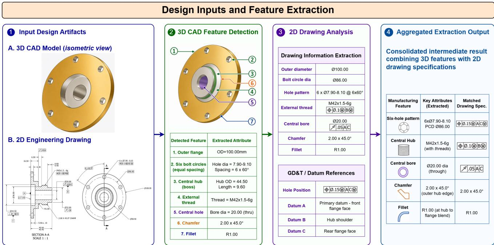  
Fig. 12. Case study feature extraction workflow, showing how the flange CAD model and engineering drawing are processed to identify 3D manufacturing features and extract 2D drawing specifications.

The role of the Context Fusion Agent is illustrated in Fig. 13. This stage is essential because the extracted 3D features and 2D annotations are not directly actionable unless they are linked at the feature level. The fusion process begins with semantic interpretation, where the 2D drawing callouts are converted into structured semantic tags such as hole-pattern size, bolt-circle location, external thread specification, central bore specification, edge chamfer, and datum or tolerance context. The agent then performs hybrid matching by jointly considering geometric cues, spatial context, and semantic type to associate each annotation with the most plausible 3D feature. In this case, most mappings are resolved automatically. For example, the six-hole pattern callout is mapped to the detected bolt-hole pattern, the central-bore callout is linked to the coaxial inner bore, and the $2 . 0 0 \times 4 5 ^ { \circ }$ callout is mapped to the edge chamfer. However, one ambiguity is observed for the M42×1.5-6g specification because the coaxial arrangement of the inner bore and the external hub creates a potential mismatch during automatic association. The initial ambiguous mapping is corrected during the HITL review stage by reassigning the thread callout to the external hub. After this correction, the final fused representation contains validated feature-level manufacturing context and is forwarded to the downstream analytical agents.

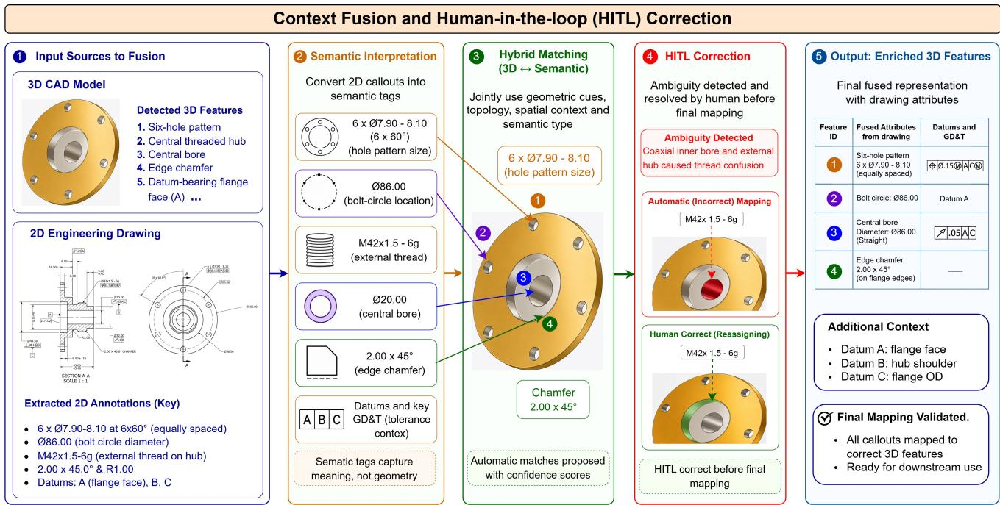  
Fig. 13. Case study context fusion workflow, showing semantic annotation tagging, 2D–3D feature matching, and HITL correction of an ambiguous M42×1.5-6g thread mapping.

The downstream planning results are shown in Fig. 14. Based on the fused feature representation, the KR Agent retrieves manufacturing knowledge relevant to the hole pattern, external thread, central bore, chamfer, and datum structure. The retrieved knowledge includes machining guidance for the six-hole pattern under positional tolerance control, threading guidance for the M42×1.5-6g external thread, setup guidance for maintaining concentricity between the hub and bore features, and finishing considerations for the chamfer and fillet. Using this information, the PS Agent generates an example operation plan consisting of facing and datum establishment, turning of the outer flange and hub region, drilling and boring of the central hole, external threading of the hub, drilling of the six-hole bolt pattern on the specified pitch-circle diameter, edge finishing for the chamfer and fillet features, and final inspection. The TS Agent then assigns representative tooling, including a facing and ODturning tool, drilling and boring tools, an external threading tool, a drill for the hole pattern, and a chamfering tool. Inspection resources are also recommended, including a GO/NO-GO thread gauge for thread verification and position-verification resources for the hole pattern.

This case study demonstrates how the proposed framework maintains a continuous information flow from realistic design inputs to manufacturing planning outputs. The example shows that the system can preserve both CAD-derived geometric features and drawing-derived engineering specifications throughout the workflow. It also highlights that context fusion is a core reasoning stage rather than a simple matching operation, because feature-level links are required before annotations such as tolerances, threads, surface finish requirements, and datum references can support manufacturing decisions. The HITL correction further illustrates how expert feedback can resolve ambiguous associations when geometrically related features create uncertainty. Overall, the case study complements the quantitative evaluation by showing how the proposed multi-agent framework produces a traceable manufacturing plan in which retrieved knowledge, process decisions, tool recommendations, and inspection considerations remain linked to the original design intent.

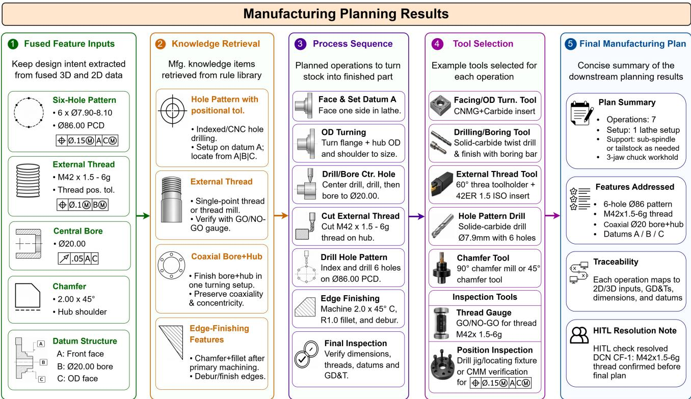  
Fig. 14. Case study manufacturing planning workflow, showing how the fused feature representation supports knowledge retrieval, process sequencing, tool selection, and final plan generation for the flange component.

## 6. Conclusions

This paper presented Design-to-Plan, a fully implemented agentic framework for manufacturing process planning from heterogeneous design artifacts. The framework connected 3D CAD feature recognition, 2D engineering drawing analysis, context fusion, knowledge retrieval, process sequencing, tool selection, and report generation within a coordinated multi-agent workflow. Its primary contribution is not simply the use of LLMs in manufacturing, but the deployment of LLMs as interactive reasoning agents that coordinate with deterministic modules, manufacturing knowledge sources, and specialized agents to produce traceable planning outputs

The proposed hybrid deterministic-agentic design assigns each task to the most suitable computational paradigm. Deterministic modules support reliable extraction of CAD and drawing information, while LLM-based agents perform tool-grounded reasoning over incomplete, ambiguous, and potentially conflicting manufacturing information. A central component of this workflow is 2D-3D context fusion, which links CAD-derived manufacturing features with drawing-derived specifications such as dimensions, tolerances, GD&T annotations, surface finish requirements, material information, and manufacturing notes. This fused representation provides the featurelevel manufacturing context required for downstream planning decisions.

The evaluation shows that the framework can reliably coordinate multiple specialized agents across diverse input conditions. The sequential architecture provides stronger performance in quality-oriented reasoning, while the parallel architecture improves robustness, coverage, and computational efficiency. These results demonstrate a practical quality-efficiency trade-off between deeper validation and scalable execution. The case study further shows that the proposed workflow can maintain traceability from original design inputs to final manufacturing planning outputs.

Overall, Design-to-Plan demonstrates one of the first end-to-end agentic frameworks for transforming CAD models and engineering drawings into executable manufacturing process plans. By linking design interpretation, manufacturing knowledge, process decisions, tooling, and reporting, the framework provides a practical step toward intelligent design-to-manufacturing automation. Future work will extend this foundation toward broader agentic manufacturing intelligence, including CAM strategy generation, machining parameter optimization, cost-time-quality trade-off analysis, process monitoring, and inspection-driven feedback. From the agentic AI perspective, future development will move beyond prompt-level design toward more reliable harness engineering, where agents are supported by richer context, validated tools, reusable skills, and closed-loop verification mechanisms for robust industrial deployment.

## Declaration of Competing Interest

The authors declare that they have no known competing financial interests or personal relationships that could have appeared to influence the work reported in this paper.

## Acknowledgements

This work is supported by Singapore International Graduate Award (SINGA) (Awardee: Muhammad Tayyab Khan) funded by Agency for Science, Technology and Research (A\*STAR) and Nanyang Technological University, Singapore.

## References

[1] Chang. An introduction to automated process planning systems. Prentice-Hall, 1985. ISBN 978-0-13- 478140-2.

[2] Xun Xu. Machine tool 4.0 for the new era of manufacturing. Int J Adv Manuf Technol, 92(5):1893–1900, 2017. ISSN 1433-3015. doi: 10.1007/s00170-017-0300-7.

[3] Joseph G. Lambourne, Karl D. D. Willis, Pradeep Kumar Jayaraman, Aditya Sanghi, Peter Meltzer, and Hooman Shayani. Brepnet: A topological message passing system for solid models. pages 12768–12777. IEEE Computer Society, 2021. ISBN 978-1-6654-4509-2. doi: 10.1109/CVPR46437.2021.01258. URL https://www.computer.org/csdl/proceedings-article/cvpr/2021/450900m2768/1yeKntkWKbe.

[4] Andrew R. Colligan, Trevor T. Robinson, Declan C. Nolan, Yang Hua, and Weijuan Cao. Hierarchical cadnet: Learning from b-reps for machining feature recognition. Comput-Aided Des, 147:103226, 2022. ISSN 0010-4485. doi: 10.1016/j.cad.2022.103226.

[5] Muhammad Tayyab Khan, Wenhe Feng, Lequn Chen, Ye Han Ng, Nicholas Yew Jin Tan, and Seung Ki Moon. Automatic feature recognition and dimensional attributes extraction from cad models for hybrid additive-subtractive manufacturing. American Society of Mechanical Engineers Digital Collection, 2024. doi: 10.1115/DETC2024-143107. URL https://dx.doi.org/10.1115/DETC2024-143107.

[6] Joseph Redmon, Santosh Divvala, Ross Girshick, and Ali Farhadi. You only look once: Unified, real-time object detection. In 2016 IEEE Conf. Comput. Vis. Pattern Recognit. CVPR, pages 779–788, Las Vegas, NV, USA, 2016. IEEE. ISBN 978-1-4673-8851-1. doi: 10.1109/CVPR.2016.91. URL http://ieeexplore. ieee.org/document/7780460/.

[7] Geewook Kim, Teakgyu Hong, Moonbin Yim, JeongYeon Nam, Jinyoung Park, Jinyeong Yim, Wonseok Hwang, Sangdoo Yun, Dongyoon Han, and Seunghyun Park. Ocr-free document understanding

transformer. In Comput. Vis. – ECCV 2022 17th Eur. Conf. Tel Aviv Isr. Oct. 23–27 2022 Proc. Part XXVIII, pages 498–517, Berlin, Heidelberg, 2022. Springer-Verlag. ISBN 978-3-031-19814-4. doi: 10.1007/978-3-031-19815-1\_29. URL https://doi.org/10.1007/978-3-031-19815-1\_29.

[8] S.P. Leo Kumar. Knowledge-based expert system in manufacturing planning: state-of-the-art review. Int J Prod Res, 57(15-16):4766–4790, 2019. ISSN 0020-7543. doi: 10.1080/00207543.2018.1424372.

[9] Youzi Xiao, Shuai Zheng, Jiancheng Shi, Xiaodong Du, and Jun Hong. Knowledge graph-based manufacturing process planning: A state-of-the-art review. J ManufSyst, 70:417–435, 2023. ISSN 0278-6125. doi: 10.1016/j.jmsy.2023.08.006.

[10] Jason Wei, Xuezhi Wang, Dale Schuurmans, Maarten Bosma, Brian Ichter, Fei Xia, Ed Chi, Quoc V. Le, and Denny Zhou. Chain-of-thought prompting elicits reasoning in large language models. Adv Neural Inf Process Syst, 35:24824–24837, 2022.

[11] Timo Schick, Jane Dwivedi-Yu, Roberto Dessí, Roberta Raileanu, Maria Lomeli, Eric Hambro, Luke Zettlemoyer, Nicola Cancedda, and Thomas Scialom. Toolformer: language models can teach themselves to use tools. In Proc. 37th Int. Conf. Neural Inf. Process. Syst., NIPS ’23, pages 68539–68551, Red Hook, NY, USA, 2023. Curran Associates Inc.

[12] Shunyu Yao, Jeffrey Zhao, Dian Yu, Nan Du, Izhak Shafran, Karthik Narasimhan, and Yuan Cao. React: Synergizing reasoning and acting in language models. 2023. doi: 10.48550/arXiv.2210.03629. URL http://arxiv.org/abs/2210.03629.

[13] Danny Driess, Fei Xia, Mehdi S. M. Sajjadi, Corey Lynch, Aakanksha Chowdhery, Brian Ichter, Ayzaan Wahid, Jonathan Tompson, Quan Vuong, Tianhe Yu, Wenlong Huang, Yevgen Chebotar, Pierre Sermanet, Daniel Duckworth, Sergey Levine, Vincent Vanhoucke, Karol Hausman, Marc Toussaint, Klaus Greff, Andy Zeng, Igor Mordatch, and Pete Florence. Palm-e: An embodied multimodal language model. In Proc. 40th Int. Conf. Mach. Learn., pages 8469–8488. PMLR, 2023. URL https://proceedings.mlr.press/ v202/driess23a.html.

[14] OpenAI Josh Achiam, Steven Adler, S. Agarwal, L. Ahmad, Ilge Akkaya, Florencia Leoni Aleman, D. Almeida, Janko Altenschmidt, S. Altman, Shyamal Anadkat, Red Avila, Igor Babuschkin, S. Balaji, Valerie Balcom, Paul Baltescu, Haim-ing Bao, Mo Bavarian, Jeff Belgum, Irwan Bello, Jake Berdine, Gabriel Bernadett-Shapiro, Christopher Berner, Lenny Bogdonoff, O. Boiko, Made-laine Boyd, Anna-Luisa Brakman, Greg Brockman, Tim Brooks, Miles Brundage, Kevin Button, Trevor Cai, Rosie Campbell, Andrew Cann, Brittany Carey, Chelsea Carlson, Rory Carmichael, Brooke Chan, Che Chang, Fotis Chantzis, Derek Chen, Sully Chen, Ruby Chen, Jason Chen, Mark Chen, Benjamin Chess, Chester Cho, Casey Chu, Hyung Won Chung, Dave Cummings, Jeremiah Currier, Yunxing Dai, Cory Decareaux, Thomas Degry, Noah Deutsch, Damien Deville, Arka Dhar, David Dohan, Steve Dowling, Sheila Dunning, Adrien Ecoffet, Atty Eleti, Tyna Eloundou, David Farhi, L. Fedus, Niko Felix, S. Fishman, Juston Forte, Is-abella Fulford, Leo Gao, Elie Georges, C. Gibson, Vik Goel, Tarun Gogineni, Gabriel Goh, Raphael Gontijo-Lopes, J. Gordon, Morgan Grafstein, Scott Gray, Ryan Greene, Joshua Gross, S. Gu, Yufei Guo, Chris Hallacy, Jesse Han, J. Harris, Yuchen He, Mike Heaton, Johannes Heidecke, Chris Hesse, Alan Hickey, W. Hickey, P. Hoeschele, Brandon Houghton, Kenny Hsu, Shengli Hu, Xin Hu, Joost Huizinga, Shantanu Jain, Shawn Jain, Joanne Jang, Angela Jiang, R. Jiang, Haozhun Jin, Denny Jin, Shino Jomoto, Billie Jonn, Heewoo Jun, Tomer Kaftan, Lukasz Kaiser, Ali Kamali, I. Kanitscheider, N. Keskar, Tabarak Khan, Logan Kilpatrick, Jong Wook Kim, Christina Kim, Yongjik Kim, Hendrik Kirchner, J. Kiros, Matthew Knight, Daniel Kokotajlo, Lukasz Kondraciuk, Andrew Kondrich, Aris Konstantinidis, Kyle Kosic, Gretchen Krueger, Vishal Kuo, Michael Lampe, Ikai Lan, Teddy Lee, Jan Leike, Jade Leung, Daniel Levy, Chak Li, Rachel Lim, Molly Lin, Stephanie L. Lin, Ma-teusz Litwin, Theresa Lopez, Ryan Lowe, Patricia Lue, A. Makanju, Kim Malfacini, Sam Manning, Todor Markov, Yaniv Markovski, Bianca Martin, Katie Mayer, Andrew Mayne, Bob McGrew, S. McKinney, Christine McLeavey, Paul McMillan, Jake McNeil, David Medina, Aalok Mehta, Jacob Menick, Luke Metz, Andrey Mishchenko, Pamela Mishkin, Vinnie Monaco, Evan Morikawa, Daniel P. Mossing, Tong Mu, M. Murati, O. Murk, David M’ely, Ashvin Nair, Reiichiro Nakano, Rajeev Nayak, Arvind Neelakantan, R. Ngo, Hyeonwoo Noh, Ouyang Long, Cullen

O’Keefe, J. Pachocki, A. Paino, Joe Palermo, Ashley Pantuliano, Giambattista Parascandolo, J. Parish, Emy Parparita, Alexandre Passos, Mikhail Pavlov, Andrew Peng, Adam Perelman, Filipe de Avila Belbute Peres, Michael Petrov, Henrique Pondé de Oliveira Pinto, Michael Pokorny, Michelle Pokrass, Vitchyr H. Pong, Tolly Powell, Alethea Power, Boris Power, Elizabeth Proehl, Raul Puri, Alec Radford, Jack W. Rae, Aditya Ramesh, Cameron Raymond, F. Real, Kendra Rimbach, Carl Ross, Bob Rotsted, Henri Roussez, N. Ryder, M. Saltarelli, Ted Sanders, Shibani Santurkar, G. Sastry, Heather Schmidt, David Schnurr, John Schulman, Daniel Selsam, Kyla Sheppard, T. Sherbakov, Jessica Shieh, S. Shoker, Pranav Shyam, Szymon Sidor, Eric Sigler, M. Simens, Jordan Sitkin, Katarina Slama, Ian Sohl, Benjamin Sokolowsky, Yang Song, N. Staudacher, F. Such, Natalie Summers, I. Sutskever, Jie Tang, N. Tezak, Madeleine Thompson, P. Tillet, Amin Tootoonchian, Elizabeth Tseng, Preston Tuggle, Nick Turley, Jerry Tworek, Juan Felipe Cer’on Uribe, Andrea Vallone, Arun Vijayvergiya, Chelsea Voss, Carroll L. Wainwright, Justin Wang, Alvin Wang, Ben Wang, Jonathan Ward, Jason Wei, C. J. Weinmann, Akila Welihinda, Peter Welinder, Jiayi Weng, Lilian Weng, Matt Wiethoff, Dave Willner, Clemens Winter, Samuel Wolrich, Hannah Wong, Lauren Workman, Sherwin Wu, Jeff Wu, Michael Wu, Kai Xiao, Tao Xu, Sarah Yoo, Kevin Yu, Qim-ing Yuan, Wojciech Zaremba, Rowan Zellers, Chong Zhang, Marvin Zhang, Shengjia Zhao, Tianhao Zheng, Juntang Zhuang, William Zhuk, and Barret Zoph. Gpt-4 technical report. 2023. URL https://www.semanticscholar.org/ paper/GPT-4-Technical-Report-Achiam-Adler/163b4d6a79a5b19af88b8585456363340d9efd04.

[15] Qingyun Wu, Gagan Bansal, Jieyu Zhang, Yiran Wu, Beibin Li, Erkang Zhu, Li Jiang, Xiaoyun Zhang, Shaokun Zhang, Jiale Liu, Ahmed Hassan Awadallah, Ryen W. White, Doug Burger, and Chi Wang. Autogen: Enabling next-gen llm applications via multi-agent conversations. 2024. URL https://openreview. net/forum?id=BAakY1hNKS.

[16] Bytez.com, Yongliang Shen, Kaitao Song, Xu Tan, Dongsheng Li, Weiming Lu, and Yueting Zhuang. Hugginggpt: Solving ai tasks with chatgpt and its friend... https://bytez.com/docs/neurips/69955/paper, 2023. URL https://bytez.com/docs/neurips/69955/paper.

[17] Joon Sung Park, Joseph O’Brien, Carrie Jun Cai, Meredith Ringel Morris, Percy Liang, and Michael S. Bernstein. Generative agents: Interactive simulacra of human behavior. In Proc. 36th Annu. ACM Symp. User Interface Softw. Technol., UIST ’23, pages 1–22, New York, NY, USA, 2023. Association for Computing Machinery. ISBN 979-8-4007-0132-0. doi: 10.1145/3586183.3606763. URL https://dl.acm.org/doi/10.1145/3586183.3606763.

[18] Xinyi Li, Sai Wang, Siqi Zeng, Yu Wu, and Yi Yang. A survey on llm-based multi-agent systems: workflow, infrastructure, and challenges. Vicinagearth, 1(1):9, 2024. ISSN 3005-060X. doi: 10.1007/s44336-024-00009-2.

[19] Taicheng Guo, Xiuying Chen, Yaqi Wang, Ruidi Chang, Shichao Pei, Nitesh V. Chawla, Olaf Wiest, and Xiangliang Zhang. Large language model based multi-agents: A survey of progress and challenges. volume 9, pages 8048–8057, 2024. doi: 10.24963/ijcai.2024/890. URL https://www.ijcai.org/proceedings/2024/890.

[20] Liane Makatura, Michael Foshey, Bohan Wang, Felix HähnLein, Pingchuan Ma, Bolei Deng, Megan Tjandrasuwita, Andrew Spielberg, Crystal Elaine Owens, Peter Yichen Chen, Allan Zhao, Amy Zhu, Wil J Norton, Edward Gu, Joshua Jacob, Yifei Li, Adriana Schulz, and Wojciech Matusik. How can large language models help humans in design and manufacturing? 2023. doi: 10.48550/ARXIV.2307.14377. URL https://arxiv.org/abs/2307.14377.

[21] F. T. S. Chan and J. Zhang. A multi-agent-based agile shop floor control system. Int J Adv Manuf Technol, 19(10):764–774, 2002. ISSN 1433-3015. doi: 10.1007/s001700200088.

[22] An introduction to multiagent systems: | guide books | acm digital library. https://dl.acm.org/doi/book/10. 5555/1695886, n.d. URL https://dl.acm.org/doi/book/10.5555/1695886.

[23] A roadmap of agent research and development | autonomous agents and multi-agent systems | springer nature link. https://link.springer.com/article/10.1023/A:1010090405266, n.d. URL https://link.springer. com/article/10.1023/A:1010090405266.

[24] Paul Valckenaers and Hendrik Van Brussel. Design for the Unexpected : From Holonic Manufacturing

Systems towards a Humane Mechatronics Society. Elsevier Science, 2015. ISBN 978-0-12-803662-4. URL https://www.scholarvox.com/catalog/book/88831136?\_locale=en.

[25] Weiming Shen and Douglas H. Norrie. Agent-based systems for intelligent manufacturing: A state-of-theart survey. Knowl InfSyst, 1(2):129–156, 1999. ISSN 0219-3116. doi: 10.1007/BF03325096.

[26] Fei Tao, Fangyuan Sui, Ang Liu, Qinglin Qi, Meng Zhang, Boyang Song, Zirong Guo, Stephen C.-Y. Lu, and A. Y. C. Nee. Digital twin-driven product design framework. Int J Prod Res, 57(12):3935–3953, 2019. ISSN 0020-7543. doi: 10.1080/00207543.2018.1443229.

[27] A. Nassehi, S. T. Newman, and R. D. Allen. The application of multi-agent systems for step-nc computer aided process planning of prismatic components. Int J Mach Tools Manuf, 46(5):559–574, 2006. ISSN 0890-6955. doi: 10.1016/j.ijmachtools.2005.06.005.

[28] Junda He, Christoph Treude, and David Lo. Llm-based multi-agent systems for software engineering: Literature review, vision, and the road ahead. ACM Trans Softw Eng Methodol, 34(5):124:1–124:30, 2025. ISSN 1049-331X. doi: 10.1145/3712003.

[29] Yuchen Xia, Manthan Shenoy, Nasser Jazdi, and Michael Weyrich. Towards autonomous system: flexible modular production system enhanced with large language model agents. 2023 IEEE 28th Int Conf Emerg Technol Fact Autom ETFA, pages 1–8, 2023. doi: 10.1109/ETFA54631.2023.10275362.

[30] Zhen Zhao, Dunbing Tang, Changchun Liu, Liping Wang, Zequn Zhang, Haihua Zhu, Kai Chen, Qingwei Nie, and Yuchen Ji. A large language model-based multi-agent manufacturing system for intelligent shopfloors. Adv Eng Inform, 69:103888, 2026. ISSN 1474-0346. doi: 10.1016/j.aei.2025.103888.

[31] Changchun Liu, Dunbing Tang, Haihua Zhu, Liping Wang, Qixiang Cai, and Qingwei Nie. Llm-enhanced embodied multi-agent manufacturing system: A novel self-organizing production paradigm for embodied perception, embodied analysis and embodied decision. J ManufSyst, 84:357–382, 2026. ISSN 0278-6125. doi: 10.1016/j.jmsy.2025.12.016.

[32] Chao Zhang, Qingfeng Xu, Yongrui Yu, Guanghui Zhou, Keyan Zeng, Fengtian Chang, and Kai Ding. A survey on potentials, pathways and challenges of large language models in new-generation intelligent manufacturing. Robot Comput-Integr Manuf, 92:102883, 2025. ISSN 0736-5845. doi: 10.1016/j.rcim. 2024.102883.

[33] K. B. Mustapha. A survey of emerging applications of large language models for problems in mechanics, product design, and manufacturing. Adv Eng Inform, 64:103066, 2025. ISSN 1474-0346. doi: 10.1016/j. aei.2024.103066.

[34] Yiwei Li, Huaqin Zhao, Hanqi Jiang, Yi Pan, Zhengliang Liu, Zihao Wu, Peng Shu, Jie Tian, Tianze Yang, Shaochen Xu, Yanjun Lyu, Parker Blenk, Jacob Pence, Jason Rupram, Eliza Banu, Kenan Song, Dajiang Zhu, Xianqiao Wang, and Tianming Liu. Large language models for manufacturing. J Manuf Syst, 86: 516–545, 2026. ISSN 0278-6125. doi: 10.1016/j.jmsy.2026.02.014.

[35] Yunfei Ma, Shuai Zheng, Zheng Yang, Pai Zheng, Jiewu Leng, and Jun Hong. Leveraging large language models in next generation intelligent manufacturing: Retrospect and prospect. J Manuf Syst, 82:809–840, 2025. ISSN 0278-6125. doi: 10.1016/j.jmsy.2025.07.019.

[36] Tom B. Brown, Benjamin Mann, Nick Ryder, Melanie Subbiah, Jared Kaplan, Prafulla Dhariwal, Arvind Neelakantan, Pranav Shyam, Girish Sastry, Amanda Askell, Sandhini Agarwal, Ariel Herbert-Voss, Gretchen Krueger, Tom Henighan, Rewon Child, Aditya Ramesh, Daniel M. Ziegler, Jeffrey Wu, Clemens Winter, Christopher Hesse, Mark Chen, Eric Sigler, Mateusz Litwin, Scott Gray, Benjamin Chess, Jack Clark, Christopher Berner, Sam McCandlish, Alec Radford, Ilya Sutskever, and Dario Amodei. Language models are few-shot learners. In Proc. 34th Int. Conf. Neural Inf. Process. Syst., NIPS ’20, pages 1877–1901, Red Hook, NY, USA, 2020. Curran Associates Inc. ISBN 978-1-7138-2954-6. URL https://dl.acm.org/doi/10.5555/3495724.3495883.

[37] Xingang Li, Yuewan Sun, and Zhenghui Sha. Llm4cad: Multimodal large language models for threedimensional computer-aided design generation. J Comput Inf Sci Eng, 25(021005), 2024. ISSN 1530-9827.

doi: 10.1115/1.4067085. URL https://doi.org/10.1115/1.4067085.

[38] Licheng Zhang, Bach Le, Naveed Akhtar, Siew-Kei Lam, and Duc Ngo. Large language models for computer-aided design: A survey. ACM Comput Surv, 58(9):225:1–225:39, 2026. ISSN 0360-0300. doi: 10.1145/3787499.

[39] Amirmohammad Daareyni, Antti Martikkala, Hossein Mokhtarian, and Iñigo Flores Ituarte. Generative ai meets cad: enhancing engineering design to manufacturing processes with large language models. Int J Adv ManufTechnol, 2025. ISSN 1433-3015. doi: 10.1007/s00170-025-15830-2. URL https://doi.org/10. 1007/s00170-025-15830-2.

[40] Sirui Hong, Mingchen Zhuge, Jonathan Chen, Xiawu Zheng, Yuheng Cheng, Jinlin Wang, Ceyao Zhang, Zili Wang, Steven Ka Shing Yau, Zijuan Lin, Liyang Zhou, Chenyu Ran, Lingfeng Xiao, Chenglin Wu, and Jürgen Schmidhuber. Metagpt: Meta programming for a multi-agent collaborative framework. 2023. URL https://openreview.net/forum?id=VtmBAGCN7o.

[41] Crewai documentation - crewai. https://docs.crewai.com, n.d. URL https://docs.crewai.com.

[42] Bojan Babic, Nenad Nesic, and Zoran Miljkovic. A review of automated feature recognition with rulebased pattern recognition. Comput Ind, 59(4):321–337, 2008. ISSN 0166-3615. doi: 10.1016/j.compind. 2007.09.001.

[43] Zhibo Zhang, Prakhar Jaiswal, and Rahul Rai. Featurenet: Machining feature recognition based on 3d convolution neural network. Comput-Aided Des, 101:12–22, 2018. ISSN 0010-4485. doi: 10.1016/j.cad. 2018.03.006.

[44] Pradeep Kumar Jayaraman, Aditya Sanghi, Joseph G. Lambourne, Karl D. D. Willis, Thomas Davies, Hooman Shayani, and Nigel Morris. Uv-net: Learning from boundary representations. pages 11703–11712, 2021. URL https://openaccess.thecvf.com/content/CVPR2021/html/Jayaraman\_UV-Net\_ Learning\_From\_Boundary\_Representations\_CVPR\_2021\_paper.html.

[45] Hongjin Wu, Ruoshan Lei, Yibing Peng, and Liang Gao. Aagnet: A graph neural network towards multitask machining feature recognition. Robot Comput-Integr Manuf, 86:102661, 2024. ISSN 0736-5845. doi: 10.1016/j.rcim.2023.102661.

[46] Jinwon Lee, Changmo Yeo, Sang-Uk Cheon, Jun Hwan Park, and Duhwan Mun. Brepgat: Graph neural network to segment machining feature faces in a b-rep model. J Comput Des Eng, 10(6):2384–2400, 2023. ISSN 2288-5048. doi: 10.1093/jcde/qwad106.

[47] Shuming Zhang, Zhidong Guan, Hao Jiang, Xiaodong Wang, and Pingan Tan. Brepmfr: Enhancing machining feature recognition in b-rep models through deep learning and domain adaptation. Comput Aided Geom Des, 111:102318, 2024. ISSN 0167-8396. doi: 10.1016/j.cagd.2024.102318.

[48] Muhammad Tayyab Khan, Lequn Chen, Ye Han Ng, Wenhe Feng, Nicholas Yew Jin Tan, and Seung Ki Moon. Leveraging vision-language models for manufacturing feature recognition in computer-aided designs. J Comput Inf Sci Eng, 25(104501), 2025. ISSN 1530-9827. doi: 10.1115/1.4069266. URL https://doi.org/10.1115/1.4069266.

[49] Cyril Picard, Kristen M. Edwards, Anna C. Doris, Brandon Man, Giorgio Giannone, Md Ferdous Alam, and Faez Ahmed. From concept to manufacturing: evaluating vision-language models for engineering design. ArtifIntell Rev, 58(9):288, 2025. ISSN 1573-7462. doi: 10.1007/s10462-025-11290-y.

[50] Muhammad Tayyab Khan, Lequn Chen, Zane Yong, Jun Ming Tan, Wenhe Feng, and Seung Ki Moon. From drawings to decisions: A hybrid vision-language framework for parsing 2d engineering drawings into structured manufacturing knowledge. Robot Comput-Integr Manuf, 99:103186, 2026. ISSN 0736- 5845. doi: 10.1016/j.rcim.2025.103186.

[51] Yupan Huang, Tengchao Lv, Lei Cui, Yutong Lu, and Furu Wei. Layoutlmv3: Pre-training for document ai with unified text and image masking. In Proc. 30th ACM Int. Conf. Multimed., MM ’22, pages 4083– 4091, New York, NY, USA, 2022. Association for Computing Machinery. ISBN 978-1-4503-9203-7. doi: 10.1145/3503161.3548112. URL https://dl.acm.org/doi/10.1145/3503161.3548112.

[52] Dongsheng Wang, Natraj Raman, Mathieu Sibue, Zhiqiang Ma, Petr Babkin, Simerjot Kaur, Yulong Pei, Armineh Nourbakhsh, and Xiaomo Liu. Docllm: A layout-aware generative language model for multimodal document understanding. In Lun-Wei Ku, Andre Martins, and Vivek Srikumar, editors, Proc. 62nd Annu. Meet. Assoc. Comput. Linguist. Vol. 1 Long Pap., pages 8529–8548, Bangkok, Thailand, 2024. Association for Computational Linguistics. doi: 10.18653/v1/2024.acl-long.463. URL https://aclanthology.org/2024.acl-long.463/.

[53] Muhammad Tayyab Khan, Zane Yong, Lequn Chen, Wenhe Feng, Nicholas Yew Jin Tan, and Seung Ki Moon. A multi-stage hybrid framework for automated interpretation of multi-view engineering drawings using vision language model. https://arxiv.org/abs/2510.21862v2, 2025. URL https://arxiv.org/abs/2510. 21862v2.

[54] Ahmed Azab, Hany Osman, and Fazle Baki. Capp-gpt: A computer-aided process planning-generative pretrained transformer framework for smart manufacturing. Manuf Lett, 41:51–62, 2024. ISSN 2213- 8463. doi: 10.1016/j.mfglet.2024.09.009.

[55] Mikell P. Groover. Fundamentals of Modern Manufacturing: Materials, Processes, and Systems. John Wiley & Sons Inc, n.d. ISBN 978-1-118-39367-3.

[56] Paulo Leitão and Francisco Restivo. Adacor: A holonic architecture for agile and adaptive manufacturing control. Comput Ind, 57(2):121–130, 2006. ISSN 0166-3615. doi: 10.1016/j.compind.2005.05.005.

[57] Karel Kruger and Anton H. Basson. Evaluation of jade multi-agent system and erlang holonic control implementations for a manufacturing cell. Int J Comput Integr Manuf, 32(3):225–240, 2019. ISSN 0951- 192X. doi: 10.1080/0951192X.2019.1571231.

[58] Hendrik Van Brussel, Jo Wyns, Paul Valckenaers, Luc Bongaerts, and Patrick Peeters. Reference architecture for holonic manufacturing systems: Prosa. Comput Ind, 37(3):255–274, 1998. ISSN 0166-3615. doi: 10.1016/S0166-3615(98)00102-X.

## Appendix. Knowledge Retrieval Agent: Parallel ReAct System Prompts

The parallel ReAct architecture described in Section 3.4.2 partitions the knowledge tools across three specialized sub-agents that operate concurrently, followed by a coordinator that merges their outputs using the same sourcepriority hierarchy as the sequential configuration. The structured-data sub-agent handles SQL, tabular, and decision-tree tools. The text-knowledge sub-agent processes RAG-based text and knowledge-graph queries. The material sub-agent retrieves material-specific constraints. Each sub-agent prompt defines a restricted tool scope while enforcing consistent provenance requirements. The coordinator prompt applies conflict resolution rules and integrates results into a unified response.

## SUB-AGENT: Structured Data Retrieval

## Role

Query SQL, decision tree, and CSV for rules and constraints

## Task

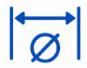  
Dimensional Constraints

  
Process Limits

  
Thread Specs

  
Standards (ISO)

  
If-Then Rules

  
Tabular Retrieval

## Source Provenance

If values differ, include BOTH

## Tool Selection

Include "source" in every rule

Prefer tabular over SQL

  
Design rules, material compatibility  
Specific constraints thread specs

Source: ISO 286-2

  
Pass/fail checks with exact dimensions

## </>Output

Rules: ID, severity, parameter, range, source

Violations: Severity, message, recommendation

  
Fig. A1. Structured-data sub-agent prompt. Handles SQL, tabular, and rule-based queries for quantitative constraints; conflicting outputs are forwarded for resolution.

Recommendations: Process, Justification

Summary: Overall feature assessment

## SUB-AGENT: Text Knowledge Retrieval

  
Search natural language DFM documents and knowledge graph for qualitative guidance

  
Retrieve mfg. knowledge for the given feature

  
DFM Guidelines

  
Process Relationships

  
Material Compatibility

  
Design Insights

  
RAG text retrieval has HIGHEST priority

  
Include specific numeric values from text

## Tool Selection

Knowledge Graph Query Process recommendations, material-feature relationships

## </>Output

  
Rule details and ranges

  
Violations  
Issues and severity

  
Actions and justification

  
Fig. A2. Text-knowledge sub-agent prompt. Retrieves qualitative guidelines from RAG text and knowledge graphs while preserving source provenance.  
Overall feature assessment

## SUB-AGENT:Material Constraints

## 品Role

Find material-specific mfg. constraints for given feature

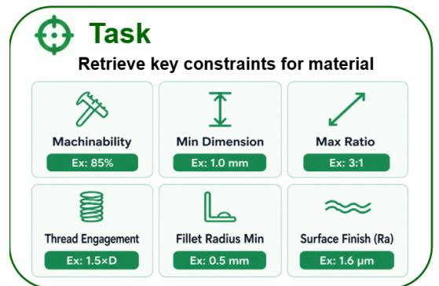

## Source Provenance

## Tool Selection

Material constriants values maybe be overridden by text, tabular or SQL

Complete material properties database

Always include source:

material\_database

## Examples

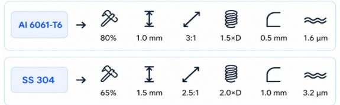

## </>Output

  
Fig. A3. Material sub-agent prompt. Retrieves material-specific constraints such as machinability and dimensional limits.

## Coordinator: Manufacturing Knowledge Cooridnator INPUT: Results from 3 sub-agents + feature description

## ① Merge Rules

Combine & de-deuplicate

  
Use source priority

## Resolve Conflicts

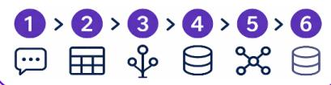

## 3 Assess Violations

De-duplicate & take most severe

## ④ Merge Recommendation

Combine & note agreements

## ⑤ Confidence Scoring

Score based on source count

## </> Output

Fig. A4. Coordinator prompt. Merges sub-agent outputs, resolves conflicts using the source-priority hierarchy, and produces a unified response with provenance and confidence scores.