# Discovering Adaptive Transmission Programs for Collective Innovation

Cédric Colas<sup>1</sup>, Jérémy Perez<sup>1</sup>, Eleni Nisioti<sup>2</sup>, Akhilesh Mocherla<sup>3</sup>, Pierre-Yves Oudeyer<sup>1</sup>, Clément

Moulin-Frier<sup>1</sup> & Maxime Derex<sup>4</sup>

<sup>1</sup>Flowers AI & CogSci Lab, Inria, France

<sup>2</sup>IT University of Copenhagen, Denmark

<sup>3</sup>Independent Researcher, UK

<sup>4</sup>Institute for Advanced Study in Toulouse, France

## Abstract

Human collective intelligence depends on transmission processes: who shares what with whom, how, and when. While these processes emerge from individual cognition, they can also be directed by deliberate top-down protocols. Prior work has studied how transmission shapes collective outcomes primarily through the lens of network structure, varying who shares with whom and when. But networks are state-agnostic: they cannot condition transmission on what agents know or on the state of the collective. Here, we formalize transmission protocols as state-aware programs that route information and resources based on agent and collective states, and we use LLM-guided evolutionary search to design efective protocols in a collective discovery task. Evolved protocols increase collective performance over standard baselines from the literature by up to 37%. Ablations confirm that state-awareness drives this advantage: removing content-dependence while preserving network topology and timing eliminates performance gains. We find that evolved protocols also transfer across domain variations and agent populations. These results demonstrate that efective and generalizable transmission protocols can be discovered in silico, suggesting a path toward AI-assisted design of coordination infrastructure that enhances human collective intelligence.

Code and Supplementary tinyurl.com/protocol-discovery

Keywords: collective intelligence; transmission protocols; cultural evolution; program search

## Introduction

Human intelligence is collective. Our species’ achievements, from cumulative technology to scientific knowledge and complex institutions, arise not from individual brilliance but from our capacity to accumulate and recombine knowledge across individuals and generations (Boyd and Richerson, 1988; Falandays et al., 2023; Henrich, 2015; Mesoudi and Thornton, 2018). How this knowledge flows — who shares what with whom, how, and when — shapes whether groups solve problems eficiently or squander their collective potential (Derex and Boyd, 2016; Riedl et al., 2021; Woolley et al., 2010).

Transmission processes are shaped by both bottom-up and top-down forces. They emerge bottom-up from human social cognition: who we attend to, what we share, how we imitate or teach, and when (Henrich and Gil-White, 2001; Kendal et al., 2018; Kline, 2015; Rendell et al., 2010; Schultner et al., 2025). But they can also be directed top-down by deliberate transmission protocols: e.g. the reporting structures of organizations, the publication norms of scientific communities, or the information routing of recommendation systems. Unlike bottom-up processes, protocols can be purposefully designed, making them a natural lever for enhancing human collective intelligence. Realizing this potential requires understanding which aspects of transmission matter for collective performance, and developing novel methods to discover efective protocols.

Understanding how transmission shapes collective outcomes. Prior work has investigated transmission primarily through the lens of network structure (Centola, 2022). Most studies vary who shares with whom through network topology, consistently finding that intermediate connectivity outperforms both isolation and full connectivity: dense networks cause premature convergence, while sparser structures preserve the diversity needed to discover complex solutions (Barkoczi and Galesic, 2016; Cantor et al., 2021; Garg et al., 2025; Lazer and Friedman, 2007; Migliano et al., 2020). Other studies also vary when sharing occurs through simple dynamic network structures, such as periodic visits between otherwise isolated pairs (Derex and Boyd, 2016; Nisioti et al., 2022; 2024) or alternating phases of independent and collaborative work (Bernstein et al., 2018), generally finding that intermittent collaboration outperforms continuous sharing.

Yet the framing of transmission as network structure is fundamentally limited. Networks are state-agnostic: transmission decisions do not depend on what agents know or on the state of the collective as a whole. Real-life transmission processes, by contrast, are deeply state-dependent. People selectively attend to experts, share what is relevant, and seek information when needed (Henrich and Gil-White, 2001; Kendal et al., 2018) and top-down systems like recommendation algorithms and organizational hierarchies similarly condition routing on context. Recent work points to the same gap: finding that group synergy — whether agents hold complementary rather than redundant knowledge — predicts collective performance better than network topology alone (Garg et al., 2025). Yet networks cannot foster such synergy because they have no way to shape what is shared, with whom, or when, based on what agents currently know. Expanding the design space to allow protocols that condition transmission on agent and collective states could yield far more adaptive coordination, and with it, larger potential gains from well-designed interventions.

(a)  
(b)  
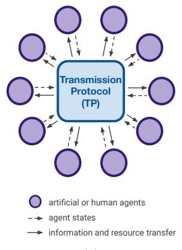

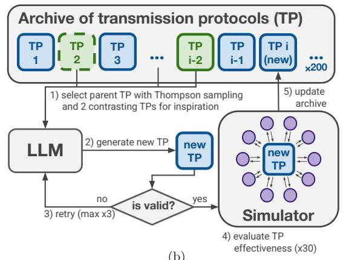

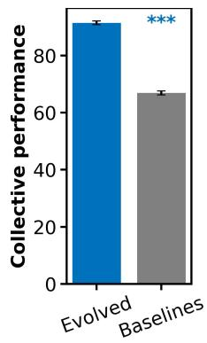  
(c)  
Figure 1: Discovering adaptive transmission protocols in silico. (a) State-aware transmission protocols (TPs) route information and resources between agents based on agent and collective states. (b) We search for efective TPs with an evolutionary algorithm that leverages large language models (LLMs) to generate and refine candidate protocols expressed as stateful programs. (c) Best evolved protocols increase collective performance in simulation by 37% over baselines (mean±sem, N=5, p<0.001).

Designing interventions to improve collective outcomes. Designing such interventions is a central problem in mechanism design — a field studying how rules and institutions can be crafted to align individual behavior with group-level goals (Hurwicz and Reiter, 2006; Maskin, 2008). In the collective intelligence literature, interventions have so far been designed by hand, targeting specific known biases or communication breakdowns (Jayles et al., 2021; Tessler et al., 2024). In economics, deep mechanism design automates this process using reinforcement learning to discover efective interventions in simulation (Koster et al., 2022; Tacchetti et al., 2025; Zheng et al., 2022). The resulting policies are black-box neural networks, and thus ofer limited insight into why a specific intervention works or whether it might generalize beyond the specific setting in which it was trained.

Our approach. We take a diferent approach: formalizing transmission protocols as interpretable, state-aware programs, searching for efective protocols in silico via program-search, and systematically evaluating whether discovered protocols generalize across agent populations and task configurations.

We study collective innovation in Collective Little Alchemy, an adaptation of the potion model (Cantor et al., 2021; Derex and Boyd, 2016; Garg et al., 2025; Migliano et al., 2020; Nisioti et al., 2022) based on the online game Little Alchemy 2.<sup>1</sup> Agents combine elements to discover new ones (e.g. water + fire → steam), which can then be used in further combinations. A transmission protocol determines which memories of past combinations are shared between agents and when, temporarily making the involved elements available to recipients. The domain features cumulative discovery and path dependencies, making collective performance — the total unique elements discovered by the group — sensitive to how information and resources are routed.

To move beyond the state-agnostic network paradigm, we formalize transmission protocols as stateful executable programs that, for each timestep, take as input agent states (memories and inventories) and specify who shares what with whom (Figure 1a). We search over this design space using an evolutionary algorithm that proposes candidate protocols as code, evaluates their efectiveness via simulation, and iteratively refines highperforming candidates (Figure 1b). Candidate generation and refinement rely on a language model, as the design space is too unconstrained for hand-crafted program generators (Lehman et al., 2023). To assess whether discovered protocols generalize, we evaluate them on domain configurations and agent populations they were not optimized for.

Findings. Discovered protocols outperform baselines from the literature by up to 37% (Figure 1c). Ablations confirm that this advantage depends on state-awareness: removing statedependent routing while preserving network topology and timing eliminates performance gains. Protocols also generalize across agent types and domain configurations they were not optimized for, suggesting they adapt to local conditions rather than overfitting to the training configuration. These results demonstrate that in silico search can discover efective and generalizable transmission protocols, suggesting a path toward AI-assisted design of coordination infrastructure that enhances human collective intelligence (Cui and Yasseri, 2024).

## Methods

We develop a simulation framework for the study of collective innovation based on the discovery game Little Alchemy 2 , populate it with agents that approximate human decision-making , and formalize transmission protocols as state-aware programs. We then use an LLM-guided evolutionary algorithm to search for efective protocols, and evaluate whether discovered protocols leverage state-awareness and generalize across domain variants and agent populations. Appendices can be found in the Supplementary pdf at tinyurl.com/protocol-discovery.

## Collective Little Alchemy

We study collective innovation with a potion model: an experimental paradigm in which participants combine elements to discover new ones, which can then be used in further combinations (Cantor et al., 2021; Derex and Boyd, 2016; Migliano et al., 2020; Nisioti et al., 2022). This task structure captures core features of real-world innovation: discovery is cumulative, diferent exploration paths lead to diferent outcomes, and sharing across paths can unlock combinations that no single path would reach. Inspired by earlier work on artificial collective intelligence (2024), we introduce the Collective Little Alchemy task, based on the browser game Little Alchemy 2, which features 720 elements with deterministic combination rules reflecting real-world relationships (e.g. water + fire → steam).

A population of � agents explores the game over � synchronous steps. Each agent maintains an inventory of discovered elements, initialized with four base elements (water, fire, earth, air), and a memory of past combinations represented as triples $( e _ { 1 } , e _ { 2 } , r )$ where � is the resulting element for valid combinations, or indicates failure otherwise. At each step, agents simultaneously attempt a combination of elements from their inventories. A transmission protocol then determines which memories are shared between agents. When an agent receives a memory, the elements involved in the combination, including any result, become available in a temporary social inventory that persists only for the current step. Agents may use social elements in their next combination, but only elements discovered through their own successful combinations permanently enter their inventory. We measure collective performance as the total number of unique elements discovered by at least one agent, analogous to patent counts or publication output as measures of collective innovation (e.g. Posch et al., 2024). Because only self-discovered elements enter an agent’s inventory, each agent can discover at most one new element per step. This ensures that collective performance reflects how information and resources are routed, not simply how much is transmitted.

## Agent models

The efectiveness of a transmission protocol may depend on the agents it organizes. As our primary agents, we adopt the empowerment-maximizing model of Brändle et al., which best predicts human combination choices in Little Alchemy (Brändle et al., 2023).

Empowerment agents. Agents select combinations via softmax (temperature $\beta = 0 . 0 5 )$ over the empowerment of each possible action, discarding actions with zero empowerment. The empowerment of a combination is the estimated expected empowerment of the combination’s outcome conditioned on agent’s � knowledge at game step � (2023):

$$
\begin{array} { l } { { \mathrm { E m p } _ { i } ^ { \mathrm { a c t } } ( e _ { 1 } , e _ { 2 } , t ) = P _ { i } ( \operatorname { s u c c e s s } \mid e _ { 1 } , e _ { 2 } , t ) } } \\ { { \displaystyle \phantom { \sum _ { e _ { r } } \sum _ { e _ { r } } P _ { i } ( e _ { r } \mid e _ { 1 } , e _ { 2 } , t ) \cdot \mathrm { E m p } _ { i } ^ { \mathrm { i t e m } } ( e _ { r } , t ) } } } \end{array}
$$

This requires three components. First, the empowerment of obtaining an element $e , { \mathrm { E m p } } _ { i } ^ { \mathrm { i t e m } } ( e , t )$ : zero if the agent already owns �, otherwise the count of unique elements that � could be used to produce. We use ground-truth counts as in the original model, adding multiplicative Gaussian noise $( \mu = 1 , \sigma =$ 0.1) for heterogeneity across agents at initialization. Second and third, the success probability $P _ { i } ( { \mathrm { s u c c e s s } } \mid e _ { 1 } , e _ { 2 } , t )$ and the transition distribution $\boldsymbol { P } _ { i } ( \boldsymbol { e } _ { r } \mid \boldsymbol { e } _ { 1 } , \boldsymbol { e } _ { 2 } , t )$ , initialized by the ofline training procedure of Brändle et al. (details in Appendix A.1) and updated as agents accumulate knowledge. Failed combinations (from own attempts or social memories) become deterministic failures (empowerment zero); successful own attempts become deterministic with zero empowerment (the agent already owns the result); and successful social memories become deterministic with empowerment equal to that of the known outcome.

Finally, to model how humans incorporate social information (Cialdini and Goldstein, 2004; Fromhold-Eisebith et al., 2014), we introduce a social bias: when an agent’s social inventory is non-empty, there is probability $p _ { \mathrm { s o c i a l } } = 0 . 5$ that it restricts its candidate set to combinations involving at least one socially received element. This fixes how agents process received transmissions, allowing us to isolate the efects of protocol-level routing decisions.

Alternative agents. We implement two alternative agent models to test generalization. Stochastic agents select uniformly among untried combinations, using the same social bias mechanism as empowerment agents. LLM agents use a large language model (Gemini 3.0 Flash) prompted with their current inventory, socially available elements, individual and social memories to reason about which combinations to attempt (see full prompt in Appendix C.3). LLM agents incorporate social information through their own reasoning rather than the fixed social bias mechanism.

Attention bottleneck. For all agent types, we impose an attention bottleneck: each agent receives at most 20 memories per step, subsampled uniformly when more are sent. This models bounded attention — human players could not realistically process hundreds of shared memories at each step — and ensures that protocol efectiveness depends on routing information strategically rather than simply broadcasting everything.

## Transmission protocols (TP)

A transmission protocol (TP) is a Python class that maintains internal state across the simulation and exposes a share method that, at each game step, observes agent states and

```python
TP = TransmissionProtocol(n_agents , n_steps)
exchanges = TP.share(i_step , agent_states)
# agent_states: {agent_id: {inventory: {e_1, e_2, e_3, ...},
# memories: [(e_1, e_2, e_r), ...]}}
# exchanges: {recipient_id: [(sender_id , memory_id), ...]}
```

Baselines. This formalization can encode standard approaches from the collective intelligence literature. We implement five baselines spanning from no sharing to dense sharing: Asocial (no sharing), Paired (fixed dyads exchange up to 10 random memories with 50% probability per step), Dynamic (same as Paired, but agents periodically visit other dyads (Derex and Boyd, 2016; Nisioti et al., 2022; 2024)), Graph (agents share along edges of an Erdős–Rényi network with � = 0.2 (Lazer and Friedman, 2007; Mason et al., 2008)), and Stochastic (each agent receives 20 randomly sampled memories per step from other agents, saturating the attention bottleneck).

Beyond networks. Unlike network-based approaches, which fix who shares with whom and when independently of agent states, TPs can condition all routing dimensions on agent and collective states. A protocol might share only elements that the recipient lacks, route failed combinations to agents who hold both ingredients to prevent mistakes, prioritize recently discovered recipes, or reduce sharing as common items saturate the population. The following example illustrates a protocol that adapts sharing intensity to collective progress (increasing when the group makes discoveries, decaying during stagnation) and routes memories only to agents who lack the elements involved:

```python
class TransmissionProtocol:
def __init__(self, n_agents , n_steps):
self.rate , self.prev = 0.5, 0
def share(self, i_step , agent_states):
# update sharing rate
all_inv = [s[’inventory’] for s in agent_states.values()]
n_new = len(set().union(*all_inv)) - self.prev
self.prev = len(set().union(*all_inv))
self.rate = min(1, self.rate + 0.1 * n_new) if n_new > 0 \
else self.rate * 0.9
# route memories
exchanges = {aid: [] for aid in agent_states}
for sender , state in agent_states.items():
for memory in state[’memories’]:
e1, e2, r = memory
for recvr , r_st in agent_states.items():
if recvr == sender: continue
lacks = (e1 not in r_st[’inventory’]
or e2 not in r_st[’inventory’])
if lacks and random() < self.rate:
exchanges[recvr].append((sender , memory))
return exchanges
```

The design space is deliberately constrained: protocols observe agent states but cannot directly modify them and have no access to the ground-truth recipe graph. Because agents retain fully autonomy, diferences in collective performance purely arise from information and resource routing.

## LLM-guided Evolutionary search

We use an LLM-guided evolutionary algorithm to search over the protocol design space, building on recent work showing that large language models can generate and refine programs through iterative variation and selection (Lange et al., 2025; Lehman et al., 2023; Meyerson et al., 2024; Novikov et al., 2025; Pourcel et al., 2024; Romera-Paredes et al., 2024; Zhang et al., 2025). The algorithm maintains an archive of protocols, each represented as executable Python code together with its fitness score and a natural-language description. We seed the archive with the five baseline protocols.

The search proceeds in two phases over 200 iterations using the Gemini 3.0 Flash model. During a warmup phase (first 50 iterations), the LLM generates novel protocols conditioned on the five baseline protocols, bootstrapping archive diversity. During the evolution phase, each iteration selects a parent protocol via Thompson sampling over fitness, samples two contrast solutions with a soft fitness bias from outside the parent’s lineage, and prompts the LLM to either improve the parent or diversify from the past solutions by proposing a fundamentally diferent strategy (details in Appendix A.2 and prompt in Appendix C.3).

Each candidate is validated by executing it in a short sandboxed simulation (with up to three repair attempts if execution fails). The fitness of valid protocols (their efectiveness) is evaluated as the mean collective performance across 30 simulations with 10 empowerment agents over 150 game steps. All valid protocols enter the archive regardless of fitness, preserving diversity. We also run generation-only processes that use the warmup procedure for the 200 iterations, producing statistically independent protocols that enable sound correlation analyses.

## Evaluation

Our evaluation addresses two questions: do efective protocols leverage state-awareness, and do discovered protocols generalize to new settings?

State-awareness ablation. To test whether state-aware content selection drives protocol efectiveness, we construct a controlled ablation that replays each protocol’s exact transmission schedule — who shares with whom, how many memories, and at which step — but randomly selects which memories to send. This preserves network topology and timing while removing state-dependent content routing. We compare fitness between original and ablated protocols (details in Appendix A.3). We also compute a set of behavioral features from both original and ablated simulation logs across 1,000 independently generated protocols (see list in Appendix A.4). For each feature, we subtract the ablated value from the original, yielding a per-protocol measure of how much state-aware routing shifts that feature relative to random selection. Correlating these shifts with fitness reveals which state-aware behaviors predict performance: a positive correlation means protocols that increase that feature (relative to random) tend to perform better.

Generalization tests. We evaluate discovered protocols on configurations they were not optimized for (training: 10 empowerment agents, 150 steps, 720 elements). Population variations test three axes: size (6 and 20 agents), agent type (stochastic agents, LLM agents, and mixed populations), and behavioral parameters (stronger empowerment bias $\beta / 2$ or stronger social bias $p _ { s o c i a l } = 0 . 9 )$ . Domain variations alter the game structure: depth-limited restricts to elements within 3 combination steps of base elements (86 reachable), 3-item starts initializes agents with 3 of 4 base elements (587–684 reachable), heterogeneous starts assigns each agent a diferent pair of base elements, and item dropout randomly removes elements until fewer than 300 remain reachable. Each configuration is evaluated over 30 simulations.

## Results

We first assess whether LLM-guided search discovers protocols that outperform baselines, then test whether their advantage depends on state-awareness, and finally evaluate generalization across populations and domains.

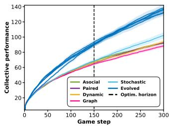  
(a)

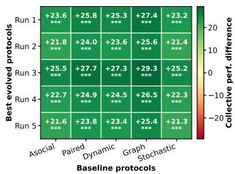  
(b)  
Figure 2: LLM-guided search uncovers high-performing transmission protocols. (a) Collective performance of best protocols (one per evolutionary run) and baselines across game steps (mean±sem over 30 simulations). (b) Comparison of performance measures at 150 game steps. Stars indicate significance of one-sided t-tests (all $p < 0 . 0 0 1 )$ .

## LLM-guided search discovers high-performing transmission protocols

We run 5 independent evolutionary searches, each producing a best protocol. All five evolved protocols significantly outperform all baselines, with an average advantage of +33% over the best baseline at step 150 $( + 3 7 \%$ for the top protocol; Figure 2b). This advantage holds beyond the optimization horizon, reaching +32% on average at step 300 (+36% for the top, Figure 2a). Appendix B.2 demonstrates similar conclusions for an extended set of 10 network-based baseline protocols.

An embedding analysis of protocol source codes confirms that diferent evolutionary runs explore distinct regions of the design space, with high-performing protocols spread across these regions rather than clustered (Appendix B.3).

## State-awareness drives protocol performance

Performance requires state-awareness. We ablate statedependence by replaying each protocol’s exact transmission schedule but randomly selecting which memories to send (see Methods). We select the top and bottom 20 protocols for each of the five evolutionary runs (100 protocols in each set). For top protocols, ablation drops the average collective performance from 88 to 67 $( \Delta = - 2 1 )$ ; performance on par with the asocial baseline (Figure 3). For bottom protocols, ablation has negligible efect $( \Delta = 0 . 7 )$ . High-performing protocols thus depend critically on state-aware content routing; the network topology and timing they produce provide no benefit on their own. Performance is also independent of transmission volume: fitness does not correlate with memories received per agent (Appendix B.4).

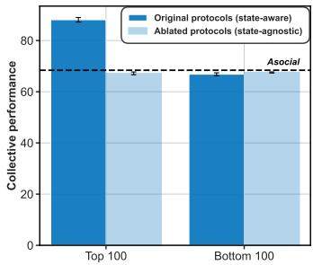  
Figure 3: State-awareness ablation. Collective performance (mean±sem) for top-20 and bottom-20 protocols per evolutionary run (100 in each set), under original (full) and ablated (random content) conditions. Ablation eliminates the performance advantage of top protocols, reducing them to baseline levels, while bottom protocols are unafected.

How does state-awareness manifest? Qualitative inspection of the best evolved protocols reveals state-awareness across transmission dimensions; full programs in Appendix C.1. What: protocols filter by rarity, sharing only items owned by fewer than 20–40% of agents (seeds 1, 2, 4), and prioritize items that appear frequently as ingredients in successful recipes (seeds 3, 5). Protocols also strategically share failures: seed 1 routes failed combinations to agents who possess both ingredients, preventing them from wasting a turn on the same attempt. Several protocols track sharing history to avoid re-sending recipes a recipient has already seen (seeds 1, 3, 5). Whom: protocols route based on recipient state, e.g. prioritizing recipes where the recipient owns one ingredient but not the result (seeds 3, 5). Multiple protocols partition agents into special ized groups (seeds 2, 3, 5), with group members sharing more intensively among themselves to deepen distinct branches of the discovery tree. When: protocols adapt over time, narrowing the recipient pool as common items saturate the population (seeds 3, 4). Some shift from within-group to between-group sharing as the game progresses, initially building specialized knowledge and later cross-pollinating across groups (seeds 3, 5).

We validate these patterns quantitatively using the ablationbased correlational analysis described in Methods. For 21 of 22 features, state-aware transmission contributes to fitness through measurable behavioral shifts (Table 2). The strongest channel is recency bias $( \rho = 0 . 6 4 )$ : protocols that use stateawareness to share recently discovered recipes achieve higher fitness. Recency interacts with recipient state $( \rho ~ = ~ 0 . 6 3$ when the recipient possesses both ingredients), suggesting successful protocols prioritize actionable recipes. Ingredientbased routing also contributes to fitness $( \rho = 0 . 4 0 – 0 . 4 3 )$ , with stronger efects when shared items are novel to the recipient $( \rho$ up to 0.49). Additional gains come from sharing rarer items $( \rho = 0 . 2 9 )$ and broadcasting widely rather than personalizing to individuals $( \rho = - 0 . 2 8 )$ . Efective protocols also adapt over time, increasing recency bias $( \rho = 0 . 4 5 )$ and ingredient targeting $( \rho = 0 . 4 4 )$ as the game progresses. Finally, stateaware routing shapes population-level diversity: efective protocols reduce early-game diversity $( \rho = - 0 . 1 0 )$ but increase late-game diversity $( \rho = + 0 . 1 2 )$ , consistent with an isolatethen-share dynamic. Full results in Appendix B.5.

## Generalization across populations and domains

We evaluate the best evolved protocol from each of the 5 runs on configurations they were not optimized for (Figure 4).

Population generalization. Evolved protocols consistently outperform baselines across all population configurations, despite being optimized exclusively on 10 empowerment agents. Protocols transfer to smaller (6 agents: +17%) and larger populations (20 agents: +49%), to diferent agent types (stochastic: +18%; $\mathrm { L L M } \colon + 1 6 \% ;$ mixed: +24%), and to agents with modified behavioral parameters (stronger empowerment bias: +25%; stronger social bias: +27%).

Domain generalization. Protocols also generalize across modified versions of the discovery task, maintaining their advantage in all variants (depth-limited: +12%; 3-item starts: +25%; heterogeneous starts: +20%; item dropout: +18%).

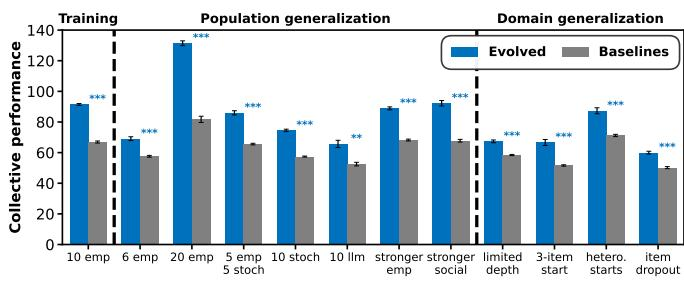  
Figure 4: Generalization across population and domain configurations. Evolved protocols (blue) outperform baseline protocols (gray) across all population configurations and domain variants. Mean±sem, N=5, p<0.01 (\*\*), p<0.001 (\*\*\*).

Discovered protocols rely on state-awareness. Ablations confirm that state-aware content routing, not network topology or timing, drives protocol efectiveness. The same protocols transfer across agent types and domain variants, suggesting they exploit structural properties of the collective search problem rather than agent-specific idiosyncrasies.

Better understanding transmission. This work opens questions that could not be addressed within the network paradigm. Which dimensions of state-awareness matter most? How does state-awareness relate to mechanisms like transient di versity (Smaldino et al., 2024) or synergistic information processing (Garg et al., 2025)? Our ablation-based correlational analysis ofers initial evidence: recency bias, ingredientbased routing, and temporal adaptation are the strongest statedependent predictors of fitness, while knowledge diversity follows an isolate-then-share pattern consistent with transient diversity. The program search framework enables more targeted investigations, e.g. ablating specific protocol features or constraining the design space to isolate what matters.

Limitations. Collective Little Alchemy, while exhibiting cumulative discovery and path dependencies, is a simplified domain with deterministic rules. Whether discovered protocols transfer to more complex or open-ended domains remains to be tested. Discovered protocols also assume centralized access to all agent states; whether efective protocols can be discovered under partial observability is an open question. Finally, we have not yet tested whether protocols discovered in silico transfer to human groups.

Future directions. Deep mechanism design has demonstrated that interventions discovered in simulation can transfer to human participants (Koster et al., 2022), suggesting this path is feasible for transmission protocols as well. Testing the transfer of our evolved protocols to human groups is a natural next step. Deployment could take the form of AI-mediated collaboration platforms that route information among participants, with humans retaining full autonomy over their decision-making. Anonymization could mitigate privacy concerns by routing based on what participants know rather than who they are.

Beyond transmission, program search could be applied to richer coordination design spaces: discovering organizational structures for crowdsourcing complex work (Valentine et al., 2017) or efective mediation strategies for synthesizing group opinions (Tessler et al., 2024). More broadly, this work illustrates how AI systems can enhance human collective intelligence not by replacing human judgment, but by shaping the processes through which groups innovate (Brinkmann et al., 2023; Cui and Yasseri, 2024). Program search with simulation scoring ofers a general method for discovering such interventions, turning AI into infrastructure for human coordination rather than a substitute for it.

## Acknowledgements

This research is partly funded by European Union’s Horizon 2020 research and innovation programme under the Marie Skłodowska-Curie grant agreement No 101065949 (CC).

## References

Barkoczi, D., & Galesic, M. (2016). Social learning strategies modify the efect of network structure on group performance. Nature communications, 7(1), 13109.

Bernstein, E., Shore, J., & Lazer, D. (2018). How intermittent breaks in interaction improve collective intelligence. Proceedings of the National Academy of Sciences, 115(35), 8734–8739.

Boyd, R., & Richerson, P. J. (1988). Culture and the evolutionary process. University of Chicago press.

Brändle, F., Stocks, L. J., Tenenbaum, J. B., Gershman, S. J., & Schulz, E. (2023). Empowerment contributes to exploration behaviour in a creative video game. Nature Human Behaviour, 7(9), 1481–1489. https://doi.org/10.1038/s41562- 023-01661-2

Brinkmann, L., Baumann, F., Bonnefon, J.-F., Derex, M., Müller, T. F., Nussberger, A.-M., Czaplicka, A., Acerbi, A., Grifiths, T. L., Henrich, J., et al. (2023). Machine culture. Nature Human Behaviour, 7(11), 1855–1868.

Cantor, M., Chimento, M., Smeele, S. Q., He, P., Papageorgiou, D., Aplin, L. M., & Farine, D. R. (2021). Social network architecture and the tempo of cumulative cultural evolution. Proceedings ofthe Royal Society B, 288(1946), 20203107.

Centola, D. (2022). The network science of collective intelligence. Trends in Cognitive Sciences, 26(11), 923–941.

Cialdini, R., & Goldstein, N. (2004). Social Influence: Compliance and Conformity. Annual review ofpsychology, 55, 591–621. https://doi.org/10.1146/annurev.psych.55.090902. 142015

Cui, H., & Yasseri, T. (2024). Ai-enhanced collective intelligence. Patterns, 5(11).

Derex, M., & Boyd, R. (2016). Partial connectivity increases cultural accumulation within groups. Proceedings of the National Academy of Sciences, 113(11), 2982–2987. https: //doi.org/10.1073/pnas.1518798113

Falandays, J. B., Kaaronen, R. O., Moser, C., Rorot, W., Tan, J., Varma, V., Williams, T., & Youngblood, M. (2023). All intelligence is collective intelligence. Journal ofMultiscale Neuroscience, 2(1), 169–191.

Fromhold-Eisebith, M., Werker, C., & Vojnic, M. (2014). Tracing the social dimension in innovation networks – from conceptualization to empirical testing. In The Social Dynamics ofInnovation Networks. Routledge.

Garg, K., Moser, C., Dromiack, H., Anwarzai, Z., & Ramos-Fernandez, G. (2025). The causal role of synergy in collective problem-solving. OSF.

Gretton, A., Borgwardt, K. M., Rasch, M. J., Schölkopf, B., & Smola, A. (2012). A kernel two-sample test. The journal of machine learning research, 13(1), 723–773.

Henrich, J. (2015). The secret of our success: How culture is driving human evolution, domesticating our species, and making us smarter. In The secret of our success. princeton University press.

Henrich, J., & Gil-White, F. J. (2001). The evolution of prestige: Freely conferred deference as a mechanism for enhancing the benefits of cultural transmission. Evolution and human behavior, 22(3), 165–196.

Hurwicz, L., & Reiter, S. (2006). Designing economic mechanisms. Cambridge University Press.

Jayles, B., Sire, C., & Kurvers, R. H. (2021). Crowd control: Reducing individual estimation bias by sharing biased social information. PLOS Computational Biology, 17(11), e1009590.

Kendal, R. L., Boogert, N. J., Rendell, L., Laland, K. N., Webster, M., & Jones, P. L. (2018). Social learning strategies: Bridge-building between fields. Trends in cognitive sciences, 22(7), 651–665.

Kline, M. A. (2015). How to learn about teaching: An evolutionary framework for the study of teaching behavior in humans and other animals. Behavioral and Brain sciences, 38, e31.

Koster, R., Balaguer, J., Tacchetti, A., Weinstein, A., Zhu, T., Hauser, O., Williams, D., Campbell-Gillingham, L., Thacker, P., Botvinick, M., et al. (2022). Human-centred mechanism design with democratic ai. Nature Human Behaviour, 6(10), 1398–1407.

Lange, R. T., Imajuku, Y., & Cetin, E. (2025). Shinkaevolve: Towards open-ended and sample-eficient program evolution. arXiv preprint arXiv:2509.19349.

Lazer, D., & Friedman, A. (2007). The network structure of exploration and exploitation. Administrative science quarterly, 52(4), 667–694.

Lehman, J., Gordon, J., Jain, S., Ndousse, K., Yeh, C., & Stanley, K. O. (2023). Evolution through large models. In Handbook of evolutionary machine learning (pp. 331–366). Springer.

Maaten, L. v. d., & Hinton, G. (2008). Visualizing data using t-sne. Journal ofmachine learning research, 9(Nov), 2579– 2605.

Maskin, E. S. (2008). Mechanism design: How to implement social goals. American Economic Review, 98(3), 567–576.

Mason, W. A., Jones, A., & Goldstone, R. L. (2008). Propagation of innovations in networked groups. Journal of Experimental Psychology: General, 137(3), 422.

Mesoudi, A., & Thornton, A. (2018). What is cumulative cultural evolution? Proceedings of the Royal Society B, 285(1880), 20180712.

Meyerson, E., Nelson, M. J., Bradley, H., Gaier, A., Moradi, A., Hoover, A. K., & Lehman, J. (2024). Language model crossover: Variation through few-shot prompting. ACM Transactions on Evolutionary Learning, 4(4), 1–40.

Migliano, A. B., Battiston, F., Viguier, S., Page, A. E., Dyble, M., Schlaepfer, R., Smith, D., Astete, L., Ngales, M., Gomez-Gardenes, J., et al. (2020). Hunter-gatherer multilevel sociality accelerates cumulative cultural evolution. Science advances, 6(9), eaax5913.

Moser, C., & Smaldino, P. E. (2023). Innovation-facilitating networks create inequality. Proceedings ofthe Royal Society B, 290(2011), 20232281.

Nisioti, E., Mahaut, M., Oudeyer, P.-Y., Momennejad, I., & Moulin-Frier, C. (2022, November). Social Network Structure Shapes Innovation: Experience-sharing in RL with SAPIENS [arXiv:2206.05060 [cs]]. https://doi.org/10. 48550/arXiv.2206.05060

Nisioti, E., Risi, S., Momennejad, I., Oudeyer, P.-Y., & Moulin-Frier, C. (2024). Collective innovation in groups of large language models. Artificial Life Conference Proceedings 36.

Novikov, A., Vu, N., Eisenberger, M., Dupont, E., Huang, P.-S., Wagner, A. Z., Shirobokov, S., Kozlovskii, B., Ruiz, F. J., Mehrabian, A., et al. (2025). Alphaevolve: A coding agent for scientific and algorithmic discovery, 2025. URL: https://arxiv. org/abs/2506.13131.

Posch, M., Schulz, J., & Henrich, J. (2024). How social structure drives innovation: Surname diversity and patents in us history. Available at SSRN 4531209.

Pourcel, J., Colas, C., Molinaro, G., Oudeyer, P.-Y., & Teodorescu, L. (2024). Aces: Generating a diversity of challenging programming puzzles with autotelic generative models. Advances in Neural Information Processing Systems, 37, 67627–67662.

Rendell, L., Boyd, R., Cownden, D., Enquist, M., Eriksson, K., Feldman, M. W., Fogarty, L., Ghirlanda, S., Lillicrap, T., & Laland, K. N. (2010). Why copy others? insights from the social learning strategies tournament. Science, 328(5975), 208–213.

Riedl, C., Kim, Y. J., Gupta, P., Malone, T. W., & Woolley, A. W. (2021). Quantifying collective intelligence in human groups. Proceedings of the National Academy of Sciences, 118(21), e2005737118.

Romera-Paredes, B., Barekatain, M., Novikov, A., Balog, M., Kumar, M. P., Dupont, E., Ruiz, F. J., Ellenberg, J. S., Wang, P., Fawzi, O., et al. (2024). Mathematical discoveries from program search with large language models. Nature, 625(7995), 468–475.

Schultner, D., Molleman, L., & Lindström, B. (2025). Featurebased reward learning shapes human social learning strategies. Nature Human Behaviour, 9(10), 2183–2198.

Smaldino, P. E., Moser, C., Perez Velilla, A., & Werling, M. (2024). Maintaining transient diversity is a general principle for improving collective problem solving. Perspectives on Psychological Science, 19(2), 454–464.

Tacchetti, A., Koster, R., Balaguer, J., Leqi, L., Pislar, M., Botvinick, M. M., Tuyls, K., Parkes, D. C., & Summerfield, C. (2025). Deep mechanism design: Learning social and economic policies for human benefit. Proceedings of the National Academy of Sciences, 122(25), e2319949121.

Tang, H., Hu, K., Zhou, J., Zhong, S. C., Zheng, W.-L., Si, X., & Ellis, K. (2024). Code repair with llms gives an exploration-exploitation tradeof. Advances in Neural Information Processing Systems, 37, 117954–117996.

Tessler, M. H., Bakker, M. A., Jarrett, D., Sheahan, H., Chadwick, M. J., Koster, R., Evans, G., Campbell-Gillingham, L., Collins, T., Parkes, D. C., et al. (2024). Ai can help humans find common ground in democratic deliberation. Science, 386(6719), eadq2852.

Valentine, M. A., Retelny, D., To, A., Rahmati, N., Doshi, T., & Bernstein, M. S. (2017). Flash organizations: Crowdsourcing complex work by structuring crowds as organizations. Proceedings of the 2017 CHI conference on human factors in computing systems, 3523–3537.

Woolley, A. W., Chabris, C. F., Pentland, A., Hashmi, N., & Malone, T. W. (2010). Evidence for a collective intelligence factor in the performance of human groups. science, 330(6004), 686–688.

Zhang, J., Hu, S., Lu, C., Lange, R., & Clune, J. (2025). Darwin godel machine: Open-ended evolution of self-improving agents. arXiv preprint arXiv:2505.22954.

Zheng, S., Trott, A., Srinivasa, S., Parkes, D. C., & Socher, R. (2022). The ai economist: Taxation policy design via two-level deep multiagent reinforcement learning. Science advances, 8(18), eabk2607.

## Appendices

## A Additional Methods

## A.1 Empowerment agent details

At each game step �, agents select a combination $( e _ { 1 } , e _ { 2 } )$ via softmax over empowerment values:

$$
P ( { \mathrm { c h o o s e } } \left( e _ { 1 } , e _ { 2 } \right) \mid { \mathrm { a g e n t } } i , t ) \propto \exp \left( { \mathrm { E m p } } _ { i } ( e _ { 1 } , e _ { 2 } , t ) / \beta \right) ,
$$

with temperature $\beta = 0 . 0 5$ . Combinations with zero empowerment are excluded from the candidate set.

Empowerment of attempting a combination. The empowerment of attempting a combination is the expected empowerment of its outcome:

$$
\begin{array} { l } { \displaystyle \mathrm { E m p } _ { i } ( e _ { 1 } , e _ { 2 } , t ) = P ( \operatorname { s u c c e s s } \mid e _ { 1 } , e _ { 2 } , t ) } \\ { \displaystyle \cdot \sum _ { e _ { r } } P ( e _ { r } \mid e _ { 1 } , e _ { 2 } , t ) \cdot \mathrm { E m p } _ { i } ( e _ { r } , t ) . } \end{array}
$$

This requires estimates of: 1) the success probability �(success $\textbf { | } \ e _ { 1 } , e _ { 2 } , t )$ , 2) the transition distribution $P ( e _ { r }$ | $\boldsymbol { e } _ { 1 } , \boldsymbol { e } _ { 2 } , t )$ and 3) the empowerment of obtaining element $e _ { r } .$

Empowerment of obtaining an element. The empowerment of obtaining element � for agent � with its inventory ���<sub>�</sub> at game step � is the number of unique elements that can be produced using � as an ingredient, or zero if the agent already owns �:

$$
\begin{array} { r } { \mathrm { E m p } _ { i } ( e , t ) = \left\{ \begin{array} { l l } { 0 } & { \mathrm { i f ~ } e \in \mathrm { i n v } _ { i } ( t ) , } \\ { | \{ e ^ { \prime \prime } : \exists e ^ { \prime } , ( e , e ^ { \prime } ) \to e ^ { \prime \prime } \} | } & { \mathrm { o t h e r w i s e } . } \end{array} \right. } \end{array}
$$

To create heterogeneity across agents, we add multiplicative Gaussian noise $( \mu = 1 , \sigma = 0 . 1 )$ to each agent’s initial element empowerment estimates.

Success probability and transition distribution. Both are estimated following the procedure of Brändle et al. (Brändle et al., 2023). They train neural networks using FastText word embeddings of element names to predict combination outcomes. Using 10-fold cross-validation, they train on 90% of all possible transitions and predict outcomes for the remaining 10% (success and distribution of resulting element), repeating this across all folds and aggregating predictions to obtain estimates of success probability and transition distribution for every possible combination.

Updating estimates during play. As agents accumulate knowledge from their own attempts and social memories, estimates are updated as follows:

• Failed combinations (own or social): the combination becomes a deterministic failure, �(success $\mid e _ { 1 } , e _ { 2 } ) = 0 $ so ${ \mathrm { E m p } } _ { i } ( e _ { 1 } , e _ { 2 } , t ) = 0$

• Successful own attempts: the outcome is now deterministic and the agent owns the result, so Emp $\boldsymbol { \cdot } ( \boldsymbol { e } _ { r } , t ) = 0$

• Successful social memories: the outcome is now deterministic with Emp $\cdot ( e _ { r } , t )$ equal to the empowerment of the known result element.

Social bias. When an agent’s social inventory is non-empty, there is probability $p _ { \mathrm { s o c i a l } } = 0 . 5$ that it restricts its candidate set to combinations involving at least one socially received element.

Attention bottleneck. Each agent receives at most 20 memories per step, subsampled uniformly when more are sent. This models bounded attention and ensures that protocol efectiveness depends on routing information strategically rather than broadcasting everything.

## A.2 LLM-guided evolutionary search details

Archive structure. The algorithm maintains an archive of protocols, each represented as executable Python code together with its fitness score and a natural-language description. The archive is seeded with the five baseline protocols and grows as new valid protocols are added. All valid protocols enter the archive regardless of fitness, preserving diversity for future exploration.

Warmup phase. The first 50 iterations use a generation mode that seeds the archive with diverse starting points. Each iteration, the LLM receives the five baseline protocols (code, descriptions, and fitness) as examples and is prompted to design a novel transmission protocol. Each valid protocol is added to the archive, bootstrapping diversity before refinement begins.

Evolution phase. After warmup, each iteration selects a parent protocol from the archive, samples contrast solutions for inspiration, and prompts the LLM to design a new protocol.

Parent selection uses Thompson sampling over fitness-based beliefs (Tang et al., 2024). Each protocol’s fitness is normalized to [0, 1] based on the current archive’s minimum and maximum. A selection score is then sampled from a Beta distribution:

$$
s \sim \mathrm { B e t a } ( 1 + \tilde { f } \cdot \lambda , \ 1 + ( 1 - \tilde { f } ) \cdot \lambda ) ,
$$

where $\tilde { f }$ is the normalized fitness and $\lambda = 3$ controls selection pressure. The protocol with the highest sampled score is selected as parent. This balances exploitation of high-fitness solutions with exploration: even lower-fitness protocols retain a chance of selection.

Contrast solutions. To expose the LLM to diverse strategies beyond the parent’s lineage, we sample two contrast solutions from the archive. Candidates exclude the parent and its ancestors, preventing redundant information. Selection uses a softmax over fitness-based ranks with temperature $\tau = 0 . 4$ maintaining a soft preference for higher-performing solutions while preserving diversity.

Mutation modes. We use two mutation modes with equal probability. In improve mode, the LLM receives the parent protocol with full details — code, description, and fitness — framed as a solution to refine, with contrast solutions presented as alternative approaches for inspiration. In diversify mode, all three protocols are presented equally (code, description, and fitness) as “approaches that have been explored,” and the LLM is prompted to propose a fundamentally diferent strategy. This encourages genuine exploration rather than incremental modification anchored to a single parent. Full prompts in Appendix C.3.

Validation. Each candidate protocol undergoes validation before entering the archive. The LLM’s response is parsed to extract the Python class, which is executed in a sandboxed simulation with a 20-second timeout. If execution fails or times out, the LLM is prompted to repair the code (up to three attempts). Valid protocols are evaluated for fitness: mean collective performance across 30 simulations with a population of 10 empowerment agents playing for 150 game steps.

## A.3 State-awareness ablation details

To test whether protocol performance stems from state-aware routing decisions or from structural properties of induced transmission patterns, we construct a state-agnostic ablation of each protocol. The ablation replays the exact transmission schedule of the original protocol — who sends to whom, how many memories, and at which step — but randomly selects which memories to send from the sender’s available memories. Because agent states diverge across runs (diferent content leads to diferent discoveries and inventories), the replayed schedule is efectively state-agnostic: the original protocol’s decisions about what to share, with whom, and when may have been functions of agent and collective states, but the ablated schedule is fixed regardless of what agents actually know or discover.

Protocol selection. We select the top and bottom 20 protocols from each of 5 generation runs, ranked by mean fitness on a held-out subset of evaluation seeds (evaluation seeds 0–14).

Matched comparisons. For each selected protocol, we run matched comparisons on the remaining 15 evaluation seeds (seeds 15–29). Each seed produces two trajectories: one using the original protocol and one using the schedule-matched but state-agnostic ablation. This paired design allows direct comparison of fitness while controlling for stochastic variation across seeds.

Shadow log analysis. To confirm that observed behavioral signatures stem from state-aware programming rather than schedule structure, we compute the same behavioral features (defined in Appendix A.4) on both the original and ablated simulation logs. We compare efect sizes (Cohen’s �) between original and ablated feature distributions, and compare fitness correlations (Spearman rank) across the two conditions. Features that show large efect sizes (Cohen’s � > 2.0) and substantial drops in fitness correlation $( \Delta \rho )$ between original and ablated logs are interpreted as signatures of state-aware programming.

## A.4 Behavioral feature definitions

Table 1 lists the 22 behavioral features used in our analysis. For each transmission event (�, teacher, learner, recipe), we compute per-transmission features and aggregate them (mean) across all transmissions and evaluation seeds. Temporal window variants split the simulation into thirds (early, mid, late). The simulation is also run under content-randomized ablation (same schedule, random content); for each feature, we report the Spearman correlation between the per-protocol original–ablated diference and fitness (Table 2).

## B Additional Results

## B.1 Protocol fitness across evolution

Figure 5 shows the fitness of the best-performing protocol as a function of search iterations, for each of 5 generation runs and 5 evolution runs. Starting from the baseline protocols used to seed the archive (steps 1–5), both search processes progressively discover better protocols, with fitness increasing from 66–70 elements discovered after 150 game steps (baselines) to 85–97 elements (+21–38% over best baseline).

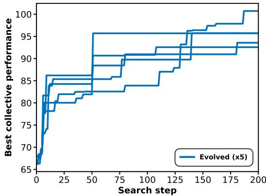  
Figure 5: Fitness of best evolved protocol as a function of search step.

## B.2 Extended baseline experiments

We evaluate protocols against an extended set of baselines drawn from the cultural evolution and collective intelligence literature:

• Asocial: agents explore independently with no information sharing, providing a lower bound.

• Stochastic: each agent receives the maximum number of memories selected at random from randomly selected peers, representing maximal undirected sharing $( n _ { \mathrm { m e m } } =$ 20 per teacher, 20 random draws per step).

Table 1: Behavioral features computed from transmission logs. Each feature is averaged across all transmissions (or per-step aggregations) and then across evaluation seeds. Notation: $\mathrm { r e c i p e } = ( i _ { 1 } , i _ { 2 } , r )$ where $i _ { 1 } , i _ { 2 }$ are ingredients and � is the result (� = null for failures). Features indexed by $k \in \{ 0 , 1 , 2 \}$ are computed separately for each value.
<table><tr><td>Group</td><td>Feature</td><td>Definition</td></tr><tr><td rowspan="4">Conent</td><td>Recency bias</td><td>Discovery step of shared recipe / transmission step. Higher values indicate sharing recent discoveries.</td></tr><tr><td>Rarity bias</td><td>Among successful recipes, 1 – (fraction of agents who own r). Higher values indicate sharing rarer items.</td></tr><tr><td>Item novelty</td><td>Among successful recipes, fraction where r is not in the learner&#x27;s inventory.</td></tr><tr><td>Actionable has-k</td><td>Fraction of transmissions where the learner owns exactly k ingredients AND the result item is novel to the learner. Combines routing with content novelty.</td></tr><tr><td rowspan="4">Routng</td><td>Success bias Has-k fraction</td><td>Whether the shared recipe is successful (r ≠ null) minus the teacher&#x27;s base success rate at that step. Fraction of transmissions where the learner owns exactly k</td></tr><tr><td>Cond. recency has-k</td><td>ingredients of the shared recipe. Recency bias computed separately for transmissions where the learner owns exactly k ingredients. Captures the interaction</td></tr><tr><td>Targeted failure rate</td><td>between content recency and recipient state. Among shared failures, fraction where the learner owns both</td></tr><tr><td>Personalization</td><td>ingredients (can verify the failure). Mean Jaccard distance between recipe sets sent by the same teacher to different learners at the same step. Higher values</td></tr><tr><td rowspan="2">Syn.</td><td>Exclusive routing</td><td>indicate more tailored transmissions. Mean  $1 / n _ { \mathrm { r e c i p i e n t s } }$  for each (recipe, step). Higher values indicate recipes are sent to fewer learners.</td></tr><tr><td>Knowledge synergy</td><td>Population-level mean pairwise Jaccard distance across all agent pairs at window boundaries (excluding initial elements). Com- puted for early and late windows.</td></tr><tr><td rowspan="3">Tempooral</td><td>Discovery burst rate</td><td>Mean outgoing transmissions on steps where the teacher made a discovery / mean on non-discovery steps. Values &gt;1 indicate discovery-triggered sharing.</td></tr><tr><td>Slope recency</td><td>Late-window recency bias minus early-window recency bias. Positive values indicate increasing recency preference over time.</td></tr><tr><td>Slope has-k</td><td>Late-window has-k fraction minus early-window has-k fraction. Captures temporal shifts in ingredient-based routing.</td></tr></table>

• Paired: agents are assigned to fixed dyads and exchange memories only with their partner $( n _ { \mathrm { m e m } } = 1 0 , p _ { \mathrm { s h a r e } } =$ 0.5), mirroring simple reciprocal teaching (Nisioti et al., 2022; 2024).

• Dynamic: agents maintain fixed pairs but periodically visit other dyads $( n _ { \mathrm { m e m } } = 1 0 , p _ { \mathrm { s h a r e } } = 0 . 5 )$ , capturing fission–fusion social dynamics (2022; 2024).

• Random graph: agents communicate along edges of an Erdős–Rényi random graph $( p _ { \mathrm { c o n n } } = 0 . 2 , n _ { \mathrm { m e m } } = 1 0 $ $p _ { \mathrm { s h a r e } } = 0 . 5 )$ (Lazer and Friedman, 2007; Mason et al., 2008).

• Ring: agents are arranged on a ring lattice connected to their � = 4 nearest neighbors (Watts–Strogatz with $p = 0 ;$ $n _ { \mathrm { m e m } } = 8 , p _ { \mathrm { s h a r e } } = 0 . 7 )$ , a topology widely studied in models of cumulative cultural evolution (Cantor et al., 2021; Moser and Smaldino, 2023).

• Small-world: a Watts–Strogatz graph $( k = 4 , p _ { \mathrm { r e w i r e } } =$ 0.3; $n _ { \mathrm { m e m } } = 1 2 , p _ { \mathrm { s h a r e } } = 0 . 6 )$ that introduces shortcut edges to reduce path lengths while preserving local clustering (Cantor et al., 2021; Garg et al., 2025; Moser and Smaldino, 2023).

• Caveman: a connected caveman graph of fully connected cliques (size 5) joined by single inter-clique bridges $( n _ { \mathrm { m e m } } = 1 5 , p _ { \mathrm { s h a r e } } = 0 . 4 )$ , representing modular social organization (Cantor et al., 2021; Moser and Smaldino, 2023).

• Multilevel: a hierarchical network with two super-groups each containing two sub-modules, with edge probabilities decreasing across levels $( p _ { \mathrm { w i t h i n } } = 1 . 0 , p _ { \mathrm { b e t w e e n – m o d u l e s } } =$ 0.3, �<sub>between-supergroups</sub> $= 0 . 1 ; n _ { \mathrm { m e m } } = 6 , p _ { \mathrm { s h a r e } } = 0 . 8 )$ inspired by the nested band–camp structure of huntergatherer societies (Cantor et al., 2021; Migliano et al., 2020).

• Intermittent: agents alternate between three rounds of independent exploration and one round of full broadcast $( n _ { \mathrm { m e m } } = 2$ per teacher, $p _ { \mathrm { s h a r e } } = 1 . 0 )$ , following evidence that intermittent breaks in interaction improve collective intelligence (Bernstein et al., 2018).

All social baselines use random content selection (no stateawareness), isolating the efect of network topology from content-selection strategy. Protocol programs can be found in src/domains/transmission\_protocols.py in the codebase. Figure 6 shows that none of these baselines reaches performance levels comparable to the set of best evolved and generated protocols (one per search run).

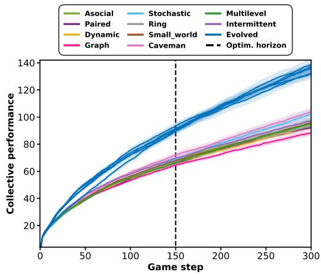  
Figure 6: LLM-guided search uncovers high-performing protocols for populations of 10 empowerment agents. Fitness of best protocols (one per search run) and extended set of baselines across 300 game steps (mean±sem over 30 simulations).

## B.3 Evolution explores beyond the generative prior.

We examine how evolved and generated protocols distribute across the design space using high-dimensional embeddings of protocol source code (OpenAI text-embedding-3-large model). We visualize t-SNE projections (Maaten and Hinton, 2008) and measure distributional divergence using maximum mean discrepancy (MMD) with a cosine similarity kernel (Gretton et al., 2012).

Both generated protocols and the warmup phase of evolution sample from the same prior: an LLM conditioned on baseline protocols (grey points in Figure 7, left). After warmup, evolution diversifies and improves upon initially generated protocols, exploring regions beyond the LLM prior. The MMD matrix (Figure 7, right) quantifies this: divergence between generated seeds is low, as expected from the shared prior. Evolved–generated divergence is substantially higher, confirming that evolution pushes protocols away from the prior. Evolved–evolved divergence also exceeds generated–generated divergence, indicating that diferent seeds explore distinct regions. The best-performing protocols for each run (stars) are spread across these regions rather than clustered, suggesting multiple distinct strategies can achieve high performance.

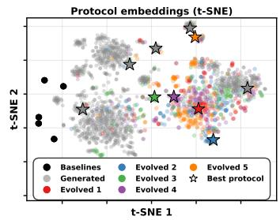

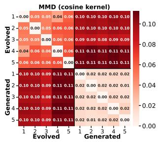  
Figure 7: Program search discovers transmission protocols that diverge from the generative prior. (left) t-SNE projections of discovered protocols, with per-run best-performing protocols marked with stars. (right) Maximum mean discrepancy (MMD) measuring distributional divergence across search runs; evolved protocols are more distant from generated protocols than from each other.

## B.4 Transmission efectiveness is not correlated with volume

Figure 8 shows no correlation between fitness and the number of novel memories received per agent across 997 generated protocols, consistent with prior findings that more sharing does not necessarily improve collective performance (Bernstein et al., 2018; Derex and Boyd, 2016; Nisioti et al., 2022).

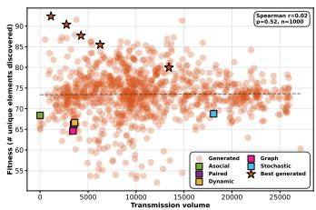  
Figure 8: Transmission protocol efectiveness is not correlated with transmission volume. The quantity of information transmitted is measured as the number of memories received by an agent that had not experienced this memory on its own at the time of reception.

## B.5 Behavioral feature analyses.

Table 2 presents all results for our behavioral analysis.  
Table 2: Ablation analysis results across ∼1,000 independently generated protocols. For each feature, we compute the per-protocol diference between original and contentrandomized (ablated) values, and correlate this diference with fitness (Spearman $\rho )$ . � indicates the number of protocols for which the feature was defined. Significance after Benjamini–Hochberg FDR correction: \*\* $p \ < \ 0 . 0 1$ \*\*\* $p < 0 . 0 0 1$ . Features sorted by |�|.
<table><tr><td>Group</td><td>Feature</td><td>ρ</td><td>Sig.</td></tr><tr><td>Content</td><td>Recency bias</td><td>+0.64</td><td>***</td></tr><tr><td>Routing</td><td>Cond. recency has-2</td><td>+0.63</td><td>***</td></tr><tr><td>Routing</td><td>Cond. recency has-1</td><td>+0.58</td><td>***</td></tr><tr><td>Routing</td><td>Targeted failure rate</td><td>-0.54</td><td>***</td></tr><tr><td>Content</td><td>Actionable has-0</td><td>+0.49</td><td>***</td></tr><tr><td>Routing</td><td>Cond. recency has-0</td><td>+0.48</td><td>***</td></tr><tr><td>Temporal</td><td>Slope recency</td><td>+0.45</td><td>***</td></tr><tr><td>Temporal</td><td>Slope has-1</td><td>+0.44</td><td>***</td></tr><tr><td>Routing</td><td>Has-2 fraction</td><td>-0.43</td><td>***</td></tr><tr><td>Routing</td><td>Has-1 fraction</td><td>+0.42</td><td>***</td></tr><tr><td>Content</td><td>Actionable has-1</td><td>+0.41</td><td>***</td></tr><tr><td>Routing</td><td>Has-0 fraction</td><td>+0.40</td><td>***</td></tr><tr><td>Temporal</td><td>Slope has-2</td><td>-0.39</td><td>***</td></tr><tr><td>Content</td><td>Rarity bias</td><td>+0.29</td><td>***</td></tr><tr><td>Routing</td><td>Personalization</td><td>-0.28</td><td>***</td></tr><tr><td>Routing</td><td>Exclusive routing</td><td>-0.26</td><td>***</td></tr><tr><td>Temporal</td><td>Slope has-0</td><td>+0.22</td><td>***</td></tr><tr><td>Content</td><td>Item novelty</td><td>+0.22</td><td>***</td></tr><tr><td>Content</td><td>Actionable has-2</td><td>+0.17</td><td>***</td></tr><tr><td>Synergy</td><td>Knowledge synergy (late)</td><td>+0.12</td><td>***</td></tr><tr><td>Synergy</td><td>Knowledge synergy (early)</td><td>-0.10</td><td>**</td></tr><tr><td>Temporal</td><td>Discovery burst rate</td><td>+0.09</td><td>**</td></tr><tr><td>Content</td><td>Success bias</td><td>+0.00</td><td></td></tr></table>

## C Prompts and Example Protocols

## C.1 Evolved protocols

```python
Evolved protocol, seed 1
import numpy as np
import random
from collections import defaultdict, Counter
class TransmissionProtocol:
def __init__(self, n_agents, n_steps):
self.n_agents = n_agents
self.n_steps = n_steps
self.history_shared = defaultdict(set)
def share_memories(self, i_step, agent_states):
memory_exchanges = {aid: [] for aid in range(self.n_agents)}
# 1. Map current knowledge
inventories = {aid: set(state[’inventory’]) for aid, state in agent_states.items()}
global_items = set()
for inv in inventories.values():
global_items.update(inv)
item_prevalence = Counter()
for inv in inventories.values():
item_prevalence.update(inv)
# 2. Extract and categorize memories
success_map = defaultdict(list) # item -> [(teacher, midx)]
failure_map = [] # list of (teacher, midx, it1, it2)
for aid, state in agent_states.items():
for m_idx, (it1, it2, res) in enumerate(state[’memories’]):
if res is not None:
if item_prevalence[res] < self.n_agents * 0.25:
success_map[res].append((aid, m_idx))
else:
failure_map.append((aid, m_idx, it1, it2))
# 3. Strategic Distribution
# Sort items by rarity (rarest first)
rare_items = sorted(success_map.keys(), key=lambda x: item_prevalence[x])
# Grid-Partitioning: Divide agents into 4 "Logical Niches"
# Each niche is encouraged to focus on different basic combos
for learner_id in range(self.n_agents):
learner_inv = inventories[learner_id]
slots = []
# Priority A: Success Relay
# Distribute rare items such that different agents get different rare items
# Use learner_id to offset the starting point in the rare_items list
offset = learner_id % max(1, len(rare_items))
for i in range(len(rare_items)):
item_to_share = rare_items[(offset + i) % len(rare_items)]
if item_to_share not in learner_inv and item_to_share not in self.history_shared[learner_id]:
teacher_info = random.choice(success_map[item_to_share])
slots.append(teacher_info)
self.history_shared[learner_id].add(item_to_share)
if len(slots) >= 12: # Leave room for failure signals
break
# Priority B: Failure Signal (Ant-Path Pruning)
# Only share a failure if the learner CAN actually perform that failure
# This saves the learner from wasting a turn.
random.shuffle(failure_map)
for tid, mid, it1, it2 in failure_map:
if len(slots) >= 20:
break
if tid != learner_id:
if it1 in learner_inv and it2 in learner_inv:
slots.append((tid, mid))
memory_exchanges[learner_id] = slots
return memory_exchanges
```

## Evolved protocol, seed 2

```python
import numpy as np
import random
from collections import defaultdict, Counter
class TransmissionProtocol:
def __init__(self, n_agents, n_steps):
self.n_agents = n_agents
self.n_steps = n_steps
self.basics = [0, 1, 2, 3] # Representing Air, Water, Earth, Fire
self.agent_roles = {}
self.silos = defaultdict(list)
# Assign roles
ids = list(range(n_agents))
random.shuffle(ids)
for i, aid in enumerate(ids):
role = self.basics[i % 4]
self.agent_roles[aid] = role
self.silos[role].append(aid)
def share_memories(self, i_step, agent_states):
memory_exchanges = {aid: [] for aid in range(self.n_agents)}
# Calculate global rarity for filterin
item_occurrence = Counter()
for state in agent_states.values():
item_occurrence.update(state[’inventory’])
for learner_id in range(self.n_agents):
learner_role = self.agent_roles[learner_id]
learner_inv = set(agent_states[learner_id][’inventory’])
candidates = []
# 1. Intra-Silo Sharing (High Volume)
silo_mates = self.silos[learner_role]
for mate_id in silo_mates:
if mate_id == learner_id: continue
mems = agent_states[mate_id][’memories’]
# Take recent successes
for mid in range(len(mems)-1, max(-1, len(mems)-15), -1):
m1, m2, res = mems[mid]
if res is not None:
if res not in learner_inv:
candidates.append((mate_id, mid, 2)) # Weight 2 for specialty
# 2. Inter-Silo Crossing (Selective)
# Only take items that are rare or might be useful cross-specialty
other_agents = random.sample(list(agent_states.keys()), min(10, self.n_agents))
for teacher_id in other_agents:
if self.agent_roles[teacher_id] == learner_role: continue
mems = agent_states[teacher_id][’memories’]
# Take very few, high-value ones
for mid in range(len(mems)-1, max(-1, len(mems)-5), -1):
m1, m2, res = mems[mid]
if res is not None and res not in learner_inv:
if item_occurrence[res] < (self.n_agents * 0.2): # Rare discovery
candidates.append((teacher_id, mid, 1)) # Weight 1
# 3. Apply bottleneck with priority
# Sort by weight (desc), then by recency (the mid is already high-to-low)
candidates.sort(key=lambda x: x[2], reverse=True)
selection = candidates[:20]
for tid, mid, weight in selection:
memory_exchanges[learner_id].append((tid, mid))
return memory_exchanges
```

## Evolved protocol, seed 3

```python
import numpy as np
import random
from collections import defaultdict, Counter
class TransmissionProtocol:
def __init__(self, n_agents, n_steps):
self.n_agents = n_agents
```

```python
self.n_steps = n_steps
# Assign agents to 4 lineages: 0: Air, 1: Water, 2: Earth, 3: Fire
self.lineages = {aid: aid % 4 for aid in range(n_agents)}
self.lineage_members = defaultdict(list)
for aid, lin in self.lineages.items():
self.lineage_members[lin].append(aid)
self.history_sent = defaultdict(set) # (aid, result): bool
self.usage_counts = Counter() # item: how many successful recipes it was a parent in
def share_memories(self, i_step, agent_states):
memory_exchanges = {aid: [] for aid in range(self.n_agents)}
inv_sets = {aid: set(agent_states[aid][’inventory’]) for aid in range(self.n_agents)}
# Calculate pivotal items: items used as parents in teacher memories
self.usage_counts.clear()
for aid in range(self.n_agents):
for m1, m2, res in agent_states[aid][’memories’]:
if res is not None:
self.usage_counts[m1] += 1
self.usage_counts[m2] += 1
for lid in range(self.n_agents):
learner_lin = self.lineages[lid]
lin_peers = [p for p in self.lineage_members[learner_lin] if p != lid]
other_peers = [p for p in range(self.n_agents) if self.lineages[p] != learner_lin]
# Quota: Intra-lineage vs Inter-lineage
is_early = i_step < self.n_steps * 0.6
intra_quota = 16 if is_early else 8
selected_mems = []
# Helper to find items from a pool of teachers
def collect_from(teachers, limit, priority_pivotal=False):
pool = []
for tid in teachers:
mems = agent_states[tid][’memories’]
# Looking at recent discoveries
for mid in range(max(0, len(mems)-40), len(mems)):
m1, m2, res = mems[mid]
if res is None or res in inv_sets[lid]:
continue
if (lid, res) in self.history_sent:
continue
score = 0
# Is it pivotal?
is_pivotal = self.usage_counts[res] > 1
if is_pivotal: score += 100
# Can learner make it?
if m1 in inv_sets[lid] and m2 in inv_sets[lid]:
score += 50
elif m1 in inv_sets[lid] or m2 in inv_sets[lid]:
score += 10
pool.append((tid, mid, res, is_pivotal, score + random.random()))
pool.sort(key=lambda x: x[4], reverse=True)
return pool[:limit]
# 1. Intra-Lineage (The Base)
lin_mems = collect_from(lin_peers, intra_quota)
for m in lin_mems:
selected_mems.append((m[0], m[1]))
self.history_sent[(lid, m[2])].add(m[1])
# 2. Inter-Lineage (The Cross-Pollination)
inter_quota = 20 - len(selected_mems)
other_mems = collect_from(other_peers, inter_quota, priority_pivotal=True)
for m in other_mems:
selected_mems.append((m[0], m[1]))
self.history_sent[(lid, m[2])].add(m[1])
memory_exchanges[lid] = selected_mems
return memory_exchanges
```

Evolved protocol, seed 4

```python
import numpy as np
import random
```

```python
from collections import Counter, defaultdict
class TransmissionProtocol:
def __init__(self, n_agents, n_steps):
self.n_agents = n_agents
self.n_steps = n_steps
self.item_depths = {b: 0 for b in [’air’, ’water’, ’earth’, ’fire’]}
self.global_counts = Counter()
self.new_discoveries_prompted = 0
def get_affinity(self, inventory):
# Determine which basic element the agent uses most
# Simplified: check for descendants or frequency
return random.randint(0, 3) # Placeholder for more complex affinity logic
def share_memories(self, i_step, agent_states):
memory_exchanges = {aid: [] for aid in range(self.n_agents)}
# 1. Update Global Census & Depths
current_inv_sizes = []
for aid, state in agent_states.items():
inv = state[’inventory’]
current_inv_sizes.append(len(inv))
for item in inv:
self.global_counts[item] += 1
for m1, m2, res in state[’memories’]:
if res is not None and res not in self.item_depths:
d1 = self.item_depths.get(m1, 0)
d2 = self.item_depths.get(m2, 0)
self.item_depths[res] = max(d1, d2) + 1
# 2. Dynamic Thresholds
progression = i_step / self.n_steps
saturation_limit = 0.4 - (0.3 * progression) # Tightens over time
# 3. Memory Filtering & Scoring
for learner_id in range(self.n_agents):
learner_inv = set(agent_states[learner_id][’inventory’])
candidates = []
# Potential Teachers (biased towards those with different but deep inventories)
teachers = range(self.n_agents)
for teacher_id in teachers:
if teacher_id == learner_id: continue
t_mems = agent_states[teacher_id][’memories’]
# Examine recent successes (frontier)
for m_idx in range(max(0, len(t_mems)-30), len(t_mems)):
m1, m2, res = t_mems[m_idx]
if res is None or res in learner_inv:
continue
# Scoring Logic
depth = self.item_depths.get(res, 1)
rarity = 1.0 / (self.global_counts[res] + 1)
is_actionable = 1 if (m1 in learner_inv and m2 in learner_inv) else 0
# Boost score if it’s actionable AND deep (The Frontier)
score = (depth ** 2) * rarity
if is_actionable:
score *= 10.0
else:
# If not actionable, only share if very deep (to prepare prerequisites)
score *= 0.5
# Diversify slightly
score *= random.uniform(0.9, 1.1)
candidates.append((score, (teacher_id, m_idx)))
# Sort and select top 20
candidates.sort(key=lambda x: x[0], reverse=True)
selection = [item[1] for item in candidates[:20]]
memory_exchanges[learner_id] = selection
return memory_exchanges
```

```python
Evolved protocol, seed 5
import numpy as np
import random
from collections import defaultdict, Counter
class TransmissionProtocol:
def __init__(self, n_agents, n_steps):
self.n_agents = n_agents
self.n_steps = n_steps
self.n_guilds = 4
self.agent_guilds = {aid: (aid % self.n_guilds) for aid in range(n_agents)}
self.global_knowledge = {} # res -> (teacher_id, m_idx, (p1, p2))
self.item_centrality = Counter() # item -> how many items it helps make
self.received_recipes = defaultdict(set) # learner -> set of (p1, p2)
def share_memories(self, i_step, agent_states):
# 1. Map Global Progress
current_inv_counts = Counter()
step_new_disco = []
for aid, state in agent_states.items():
inv = state[’inventory’]
current_inv_counts.update(inv)
# Update knowledge from latest memories
mems = state[’memories’]
for m_idx in range(max(0, len(mems)-20), len(mems)):
p1, p2, res = mems[m_idx]
if res is not None:
if res not in self.global_knowledge:
self.global_knowledge[res] = (aid, m_idx, (p1, p2))
self.item_centrality[p1] += 1
self.item_centrality[p2] += 1
step_new_disco.append(res)
# Identify Hubs (Top 10% by centrality)
hub_items = set()
if self.item_centrality:
threshold = np.percentile(list(self.item_centrality.values()), 90)
hub_items = {item for item, val in self.item_centrality.items() if val >= threshold and val > 1}
memory_exchanges = {aid: [] for aid in range(self.n_agents)}
# 2. Strategic Distribution
for l_id, state in agent_states.items():
l_inv = set(state[’inventory’])
candidates = []
for res, (t_id, m_idx, (p1, p2)) in self.global_knowledge.items():
if res in l_inv or t_id == l_id:
continue
# Check if already shared
recipe_key = tuple(sorted([str(p1), str(p2)]))
if recipe_key in self.received_recipes[l_id]:
continue
score = 0
has_p1 = p1 in l_inv
has_p2 = p2 in l_inv
# Tier scoring
if has_p1 and has_p2:
score += 50 # Immediate Action
elif has_p1 or has_p2:
score += 20 # Near-Frontier
if res in hub items:
score += 30 # Infrastructure
if res in step_new_disco:
score += 15 # Freshness
# Guild Specialization (first 30% of steps)
if i_step < (self.n_steps * 0.3):
# Guilds focus on recipes including their ’native’ basics
# Guild 0: Air, 1: Water, 2: Earth, 3: Fire (approx)
if (i_step % 10) == self.agent_guilds[l_id]:
score += 10
if score > 0:
```

```python
candidates.append((score, t_id, m_idx, res in hub_items, (has_p1 or has_p2)))
# Sort and apply bottleneck
candidates.sort(key=lambda x: x[0], reverse=True)
selection = candidates[:20]
for score, t_id, m_idx, is_hub, is_actionable in selection:
memory_exchanges[l_id].append((t_id, m_idx))
p1, p2, _ = agent_states[t_id][’memories’][m_idx]
self.received_recipes[l_id].add(tuple(sorted([str(p1), str(p2)])))
return memory_exchanges
```

## C.2 Baseline protocols

Baseline protocol: asocial (no memory exchange)

```python
class AsocialProtocol:
def __init__(self, n_agents, n_steps):
self.n_agents = n_agents
self.n_steps = n_steps
def share_memories(self, i_step, agent_states):
return {aid: [] for aid in agent_states.keys()}
```

Baseline protocol: graph (players exchange memories with their neighbors in a randomly connected graph (Erdős–Rényi))

```python
class GraphProtocol:
def __init__(self, n_agents, n_steps, p_conn=0.2, share_prob=0.5, n_memories=10):
self.n_agents = n_agents
self.n_steps = n_steps
self.p_conn = p_conn
self.share_prob = share_prob
self.n_memories = n_memories
# Sample symmetric adjacency matrix
rand_mat = np.random.rand(n_agents, n_agents)
adj = (rand_mat < p_conn).astype(int)
adj = np.triu(adj, 1)
adj = adj + adj.T
np.fill_diagonal(adj, 0)
self.adj = adj
# Precompute neighbor lists
self.neighbors = {i: np.where(adj[i])[0].tolist() for i in range(n_agents)}
def share_memories(self, i_step, agent_states):
exchanges = {i: [] for i in agent_states}
total_shared = 0
for learner in agent_states.keys():
if np.random.rand() > self.share_prob:
continue
neigh = self.neighbors[learner]
if not neigh:
continue
teacher = random.choice(neigh)
teacher_mems = agent_states[teacher]["memories"]
if len(teacher_mems) == 0:
continue
n = min(self.n_memories, len(teacher_mems))
mem_ids = np.random.choice(range(len(teacher_mems)), n, replace=False)
exchanges[learner].extend([(teacher, int(mid)) for mid in mem_ids])
total_shared += n
return exchanges
```

Baseline protocol: paired (pairs of agents exchange memories)

import numpy as np   
class PairedProtocol:

```python
def __init__(self, n_agents, n_steps):
self.n_agents = n_agents
self.n_steps = n_steps
self.n_memories = 10
self.share_prob = 0.5
# create stable pairs
ids = list(range(n_agents))
np.random.shuffle(ids)
self.pairs = {ids[i]: ids[i+1] for i in range(0, n_agents, 2)}
self.pairs.update({v: k for k, v in self.pairs.items()})
def share_memories(self, i_step, agent_states):
exchanges = {aid: [] for aid in agent_states}
for learner_id in agent_states:
if np.random.rand() > self.share_prob:
continue
teacher_id = self.pairs[learner_id]
teacher_mems = agent_states[teacher_id]["memories"]
if not teacher_mems:
continue
n = min(len(teacher_mems), self.n_memories)
chosen = np.random.choice(range(len(teacher_mems)), size=n, replace=False)
exchanges[learner_id] = [(teacher_id, int(mid)) for mid in chosen]
return exchanges
```

## Baseline protocol: dynamic (paired with additional random visits)

```python
import numpy as np
import random
class DynamicProtocol():
def __init__(self, n_agents, n_steps):
self.n_agents = n_agents
self.n_steps = n_steps
ids = list(range(n_agents))
np.random.shuffle(ids)
self.pairs = {ids[i]: ids[i + 1] for i in range(0, n_agents, 2)}
self.pairs.update({v: k for k, v in self.pairs.items()})
self.visit_in_progress = False
self.visit_time = 0
self.visit_duration = 20
self.p_visit = 1
self.visiting_agent_id = None
self.visited_agent_ids = []
self.n_memories = 10
self.share_prob = 0.5
def share_memories(self, i_step, agent_states):
# now there is always a visit (p=1)
memory_exchanges = {}
learner_ids = list(agent_states.keys())
for learner_id in learner_ids:
if np.random.rand() > self.share_prob:
continue
if self.visit_in_progress and learner_id == self.visiting_agent_id:
# the agent is visiting, so it learns from visited agents
teacher_ids = self.visited_agent_ids
elif learner_id in self.visited_agent_ids:
# the agent is visited, so it learns from its pair and the visiting agent
teacher_ids = [self.pairs[learner_id], self.visiting_agent_id]
else:
if self.pairs[learner_id] == self.visiting_agent_id:
# if the pair is on a visit, the agent learns from one
continue
else:
# the agent learns from its pair
teacher_ids = [self.pairs[learner_id]]
memory_exchanges[learner_id] = []
memories = []
for teacher_id in teacher_ids:
teacher_state = agent_states[teacher_id]
n_teacher_memories = len(teacher_state[’memories’])
memories += [(teacher_id, i_mem) for i_mem in range(n_teacher_memories)]
n_memories = min(len(memories), self.n_memories) # n_memories to transmit
memory_ids = np.random.choice(range(len(memories)), size=n_memories, replace=False)
for mem_id in memory_ids:
mem = memories[mem_id]
memory_exchanges[learner_id].append(mem)
```

```python
# track visits in progress
if self.visit_in_progress:
self.visit_time += 1
if self.visit_time == self.visit_duration:
self.visit_in_progress = False
self.visit_time = 0
self.visited_agent_ids = []
self.visiting_agent_id = None
# start a visit
if not self.visit_in_progress and np.random.rand() < self.p_visit:
self.visit_in_progress = True
self.visit_time = 0
# sample a visiting agent
self.visiting_agent_id = int(np.random.choice(learner_ids))
# sample a pair to visit
other_agent_ids = [i for i in learner_ids if i not in [self.visiting_agent_id, self.pairs[self.visiting_agent_id]]]
visited_agent_id = int(random.choice(other_agent_ids))
self.visited_agent_ids = [visited_agent_id, self.pairs[visited_agent_id]]
return memory_exchanges
```

## Baseline protocol: stochastic (stochastic, maximal memory exchanges)

```python
import random
import numpy as np
class StochasticProtocol:
def __init__(self, n_agents, n_steps):
self.n_agents = n_agents
self.n_steps = n_steps
self.n_memories = 20
def share_memories(self, i_step, agent_states):
exchanges = {aid: [] for aid in agent_states}
agent_ids = list(agent_states.keys())
for learner_id in agent_ids:
exchanges[learner_id] = []
teacher_ids = [i for i in agent_ids if i != learner_id]
for i in range(self.n_memories):
teacher_id = random.choice(teacher_ids)
teacher_mems = agent_states[teacher_id]["memories"]
if not teacher_mems:
continue
chosen = np.random.choice(range(len(teacher_mems)), size=1)
exchanges[learner_id] += [(teacher_id, int(mid)) for mid in chosen]
return exchanges
```

## C.3 Prompts

## Prompt of the LLM agent modeling a human player (Gemini 2.0 Flash Lite)

You are playing a discovery game where the goal is to uncover new items by combining existing ones.   
# Task Description   
At each step, you are given:   
- \*\*Personal Inventory\*\*: the items you currently have access to and can combine   
- \*\*Personal Memory\*\*: combinations you have already attempted (including failed ones)   
- \*\*Social Inventory\*\*: items made available by your peers for the next combination   
- \*\*Social Memory\*\*: combinations attempted or discovered by other players (including failed ones)   
Your task is to choose a pair of items from your inventory and the social inventory and attempt to combine them. If the combination   
succeeds, the discovered item will be added to your personal inventory.   
The objective of the game is to collectively (you and other player) discover as many different items as possible.   
# Rules   
1. Only use items that are currently in your inventory or in the social inventory   
2. The order of items does not matter ("air + fire" is the same as "fire + air")   
3. Combining the same items always gives the same result (deterministic recipes)   
4. You can combine an item with itself (e.g., "air + air").   
# Response Format   
First, think through your reasoning inside:

<reasoning>   
... your internal analysis here ...   
</reasoning>   
Then select two items to combine:   
<answer>   
item1 + item2   
</answer>   
Make sure the items are in your inventory or the social inventory.   
Use the "+" between the item names.   
# Tips   
\* Keep reasoning short and focused.   
\* In <reasoning>, always list 2-5 candidate combinations before choosing one.   
\* For each candidate, explicitly predict the resulting item and explain why, using this format:   
\* ‘a + b \$\rightarrow\$ c?‘ --- short explanation based on a real physical process or a clear metaphor.   
\* Avoid repeating past combinations found in personal or social memories.   
\* Make sure to try combination you think will result in new items you don’t have yet.   
\* Prefer recently discovered items that haven’t been combined much yet, but don’t rely only on the most recent ones.   
\* Items in the social inventory are only available right now, use them now if you think they can be useful   
# Example   
<reasoning>   
I have wood, stone, water, and heat, and the social inventory gives me metal and cloth for this turn only.   
Here are possible combinations and the new items they might produce:   
\* wood + metal \$\rightarrow\$ tool handle or basic tool? --- many tools are made by attaching metal to wood, it would be very useful   
for later combinations   
\* wood + water \$\rightarrow\$ boat? --- this makes sense, and could be useful for later combinations   
\* water + cloth \$\rightarrow\$ swimsuit? --- realistic, but not very useful for future discoveries   
Metal is likely to be especially valuable, and it disappears after this turn so I’ll try to use it.   
Between the options, \*\*wood + metal\*\* is the most plausible way to obtain a general-purpose tool that could unlock many future   
combinations.   
I’ll try \*\*wood + metal\*\*.   
</reasoning>   
<answer>   
wood + metal   
</answer>   
# Current state:   
\*\*Personal Inventory\*\* (in order of discovery):   
{inventory}   
\*\*Personal Memory\*\*:   
{memory}   
\*\*Social Inventory\*\*:   
{social\_inventory}   
\*\*Social Memory\*\*:   
{social\_memory}

## Prompt of the LLM involved in the evolurionary search algorithm (Gemini 3.0 Flash)

# Transmission Protocol Design   
Design a transmission protocol that organizes information sharing or coordination in a population of agents working toward a shared   
discovery task.   
## Environment Overview   
Agents play a combinatorial exploration game with 720 elements. Each agent starts with 4 basics (air, water, earth, fire) and, each   
step, combines two elements to try to discover new ones. Combinations are deterministic (produce a fixed element or nothing). At each   
step:   
1) Sharing: the protocol decides which past recipes (memories) each agent receives from others.   
2) Borrowing: agents may temporarily use elements from received recipes for this step only (two combined elements, and the possible   
resulting element).   
3) Action: each agent performs one combination.   
There are n\_agents agents and the game runs across n\_steps steps.   
## Objective   
Maximize \*\*global coverage\*\* (fit\_item\_coverage\_global): the number of unique elements discovered across all agents.   
You should design a protocol that helps the group as a whole perform better through structured communication. Consider how agents   
decide \*\*when\*\* to communicate, \*\*what\*\* to share, and \*\*who\*\* they share with. Your design can be static or adaptive --- parameters

may change over time if useful.   
## Protocol Interface (must implement)   
Define a class ‘TransmissionProtocol‘ with:   
‘\_\_init\_\_(self, n\_agents, n\_steps)‘ --- initialize any state here.   
‘share\_memories(self, i\_step, agent\_states)‘ -> dict: learner\_id -> list[(teacher\_id, memory\_id)]   
‘agent\_states[aid] = {’inventory’: tuple(item), ’memories’: tuple((item1, item2, result))}‘ with ‘result=None‘ if failed   
‘get\_logs(self)‘ -> ‘list[dict(metric\_name:str, metric\_description:str, metric\_value:float)]‘   
\*\*Notes\*\*   
- Transmission is optional: sometimes limited sharing can be beneficial.   
- A communication bottleneck prevents players from receiving more than 20 memories at each step. If more are shared, they will be   
sub-sampled randomly.   
- Clearly explain how your design improves group outcomes relative to simpler baselines.   
- Use logging (via ‘get\_logs‘) to record internal signals that show whether your mechanisms produce intended effects. Logs will help   
you refine protocols later.   
\* Allowed imports include: ‘numpy as np‘, ‘sklearn.neighbors‘, ‘sklearn.metrics‘, ‘random‘, ‘collections‘, ‘statistics‘. Avoid other   
imports.   
\* You cannot access agents’ internal attributes.   
\* You cannot read or write files on disk.   
\* Do not print; record quantities through ‘get\_logs‘.   
\* Each simulation run must complete in under 20 seconds.   
## Output format (strict)   
Structure your response \*\*exactly\*\* as:   
<reasoning>   
[Reflect on what the protocol is trving to optimize and what might limit current designs.   
Identify specific communication or coordination problems (e.g., inefficiency, over-sharing, lack of structure).   
Propose several possible strategies and explain which one you choose and why.   
If other solutions are provided, analyze them and learn from their logs, identify their strengths and limitations before designing   
your own solution.]   
</reasoning>   
<description>   
[Describe in detail how your protocol works: how agents decide when and what to share, and how information flows.   
Define any key parameters or thresholds explicitly in ‘\_\_init\_\_‘.   
If your design involves randomness or adaptation, explain its purpose.   
Summarize why this approach should improve group performance.]   
</description>   
<logging>   
[Describe which quantities you will record in ‘get\_logs()‘ to verify the behavior of your protocol.   
Include general indicators of communication intensity, information overlap, or variation among agents.   
Explain briefly how these signals can be used to assess the protocol’s effects and can guide future improvements.]   
</logging>   
<code>   
‘‘‘python   
class TransmissionProtocol:   
def \_\_init\_\_(self, n\_agents, n\_steps):   
# Initialize any state variables   
pass   
def share\_memories(self, i\_step, agent\_states):   
# Your implementation here   
# return {learner\_id: [(teacher\_id, memory\_id), ...], ...}   
return memory\_exchanges   
def get\_logs(self):   
# return list of dicts with metric\_name, metric\_description, metric\_value   
return list\_metric\_dicts   
# helper methods (optional)   
11   
</code>   
## Approaches that have been explored   
Here are successful transmission protocols that have already been tried:   
{examples}   
## Statistics of protocols discovered so far   
Average protocol: fit\_item\_coverage\_global={mean\_fitness}   
Best protocol: fit\_item\_coverage\_global={best\_fitness}   
## Instruction   
{if mutation mode == diversify}

Review the approaches above and propose a new protocol that takes a fundamentally different direction than all of them. Explore a novel communication or coordination strategy that has not yet been tried.

{elif mutation mode == improve}

Study the parent solution, identify its weaknesses, and propose small, targeted adjustments that preserve its strengths while improving its coordination or efficiency. You may draw inspiration from the alternative approaches.

In <reasoning>, analyze how previous solutions organized information flow, identify their main limitations, and propose a concrete way to improve or rethink this organization.

Remember to use the complete format with each of reasoning, description, logging, and code, using xml tags.