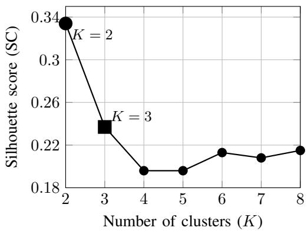
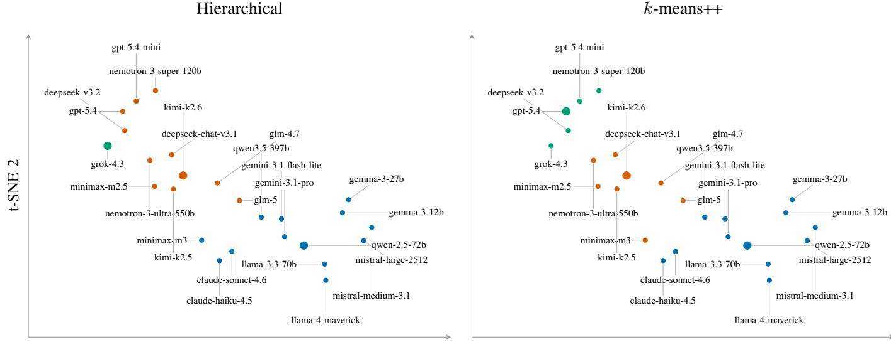
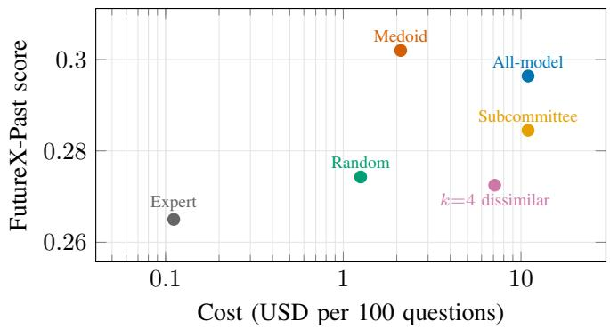
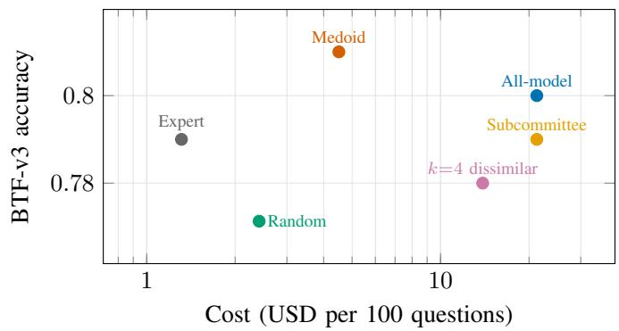
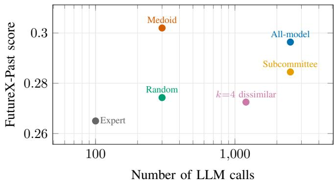
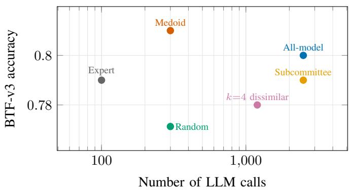

# Diverse by Reasoning: Harnessing the Wisdom of LLM Crowds for Future Prediction

Nirupam Chetlapalli∗,Yiming Liao∗, Min-Chun Chen∗,Keke Chen

Computer Science and Electrical Engineering

University of Maryland, Baltimore County

Baltimore, MD, USA

{nchetla1, yliao1, mchen12, kekechen}@umbc.edu

Abstract—Large language models (LLMs) are increasingly used for future prediction, motivating the use of multiple models as a wisdom-of-the-crowd mechanism. However, simply increasing crowd size does not guarantee effective diversity, as different LLMs may exhibit redundant behaviors. We propose a behavioraware framework for constructing diverse LLM crowds. The framework characterizes models using their reasoning traces on independent development tasks, clusters models by behavioral similarity, and selects representatives for collective prediction. We evaluate 25 LLMs using seven development benchmarks for behavioral diversity modeling and two future-prediction benchmarks for evaluating diverse crowds’ performance. Our results show that crowd composition can matter more than crowd size: a three-model medoid crowd based on K-means++ behavioral clustering outperforms conventional voting over all 25 models on both prediction benchmarks, while reducing model calls by 88% and inference cost by approximately 80%. The results further suggest that representative behavioral diversity, rather than simply maximizing diversity, is important for constructing effective LLM crowds1.

## I. INTRODUCTION

Large language models (LLMs) are increasingly being explored for forecasting uncertain future events [1], [2], with recent benchmarks providing systematic evaluation of their forecasting capabilities [3]–[5]. Despite this progress, future prediction remains intrinsically uncertain, and individual LLMs can vary substantially in their predictions. A natural alternative is therefore to aggregate multiple LLMs as a crowd of predictors.

The classical wisdom-of-the-crowd literature suggests that collective judgment can outperform individual decision makers, but also emphasizes that crowd composition—particularly diversity and independence—is critical [6]–[8]. Carefully constructed smaller crowds can even outperform much larger ones [9], [10]. Recent studies similarly demonstrate the potential of collective intelligence among LLMs [11], [12]. However, simply assembling different LLMs does not guarantee a genuinely diverse crowd. Models exhibiting similar behaviors may contribute redundant judgments, yet conventional majority voting gives each model an equal vote.

This motivates a complementary problem to existing work on LLM aggregation [13], [14]: which models should constitute the crowd in the first place? A large crowd containing many behaviorally similar models may over-represent particular perspectives while incurring unnecessary inference cost. Conversely, a smaller crowd that preserves distinct behavioral perspectives may yield more effective collective predictions. We therefore ask:

Can we construct a wiser LLM crowd by explicitly

accounting for behavioral diversity rather than sim-

ply increasing the number of voters?

We address this question through a behavior-driven approach. Rather than inferring diversity from model family, provider, or other metadata, we observe how LLMs reason over a common set of heterogeneous development tasks. We embed their reasoning traces and aggregate them into modellevel behavioral signatures, which are then clustered to identify groups of models exhibiting similar behavior. Importantly, these signatures are constructed entirely from development tasks independent of the future-prediction benchmarks. We use the discovered structure to construct crowds through representative medoids, diversity-oriented selection, and cluster-level voting. This design allows us to examine whether effective crowd construction requires maximal behavioral diversity or, instead, representative coverage of distinct behavioral modes.

We evaluate 25 LLMs using 350 questions from seven heterogeneous development benchmarks and two independent future-prediction benchmarks, FutureX-Past [5] and Bench to the Future [4]. Our results show that crowd composition can matter more than crowd size. A three-model crowd constructed from medoid representatives of K-means++ behavioral clusters outperforms conventional voting over all 25 models on both prediction benchmarks, while reducing model calls by 88% and measured inference cost by approximately 80%. Sizematched random-crowd experiments further support the benefit of behavior-aware selection. In contrast, maximizing behavioral dissimilarity does not consistently improve prediction, suggesting that representative behavioral diversity, rather than diversity alone, is important for constructing effective LLM crowds.

The main contributions of this work are:

• We formulate LLM future prediction as a crowdconstruction problem and identify behavioral redundancy as a limitation of conventional majority voting.

• We develop a behavior-aware framework that characterizes LLM diversity from reasoning traces on independent tasks and uses the resulting structure to construct representative crowds.

• Across 25 LLMs and two future-prediction benchmarks, we show that a three-model behavior-aware crowd outperforms conventional 25-model voting while reducing model calls by 88% and inference cost by approximately 80%.

## II. RELATED WORK

Wisdom of the Crowd. The wisdom-of-the-crowd literature shows that aggregating multiple judgments can outperform individual decision makers when the crowd provides sufficiently diverse and independent information [6]. Importantly, larger crowds are not necessarily better: crowd composition can be optimized, and carefully selected smaller crowds can match or outperform substantially larger ones [7]–[9]. This motivates treating crowd composition, rather than crowd size alone, as a design problem.

Particularly relevant to our work, Bhatt et al. [10] inferred participant diversity from observable behavior, clustered participants accordingly, and selected representatives to construct smaller crowds. Our work extends this behavior-driven view to LLMs: instead of using participant-generated social content, we characterize models through their reasoning behavior on heterogeneous tasks and examine whether the resulting structure can guide crowd construction for future prediction.

Collective Decision-Making with LLMs. Recent work has demonstrated several forms of collective intelligence among LLMs. Self-consistency aggregates multiple reasoning trajectories from a single model [15], while heterogeneous LLM ensembles can improve forecasting and estimation through aggregation across models [11], [12]. Other approaches introduce interaction among models, such as multi-agent debate [16] and Mixture-of-Agents [17]. Recent studies have also reconsidered how heterogeneous model judgments should be combined, including alternative electoral mechanisms [13] and aggregation rules that account for higher-order information [14].

These studies primarily improve how multiple model outputs are sampled, combined, or exchanged. Our focus is complementary: we study crowd construction. Rather than assuming that different model identities constitute a diverse crowd, we measure behavioral diversity from reasoning traces and use the resulting structure to determine which models should represent the crowd.

LLM Future-Prediction Benchmarks. LLM forecasting has progressed from early benchmarks such as Autocast [1] to systems approaching competitive human forecasting performance [2]. More recent benchmarks address temporal contamination and realistic future prediction through different evaluation designs. ForecastBench maintains dynamically generated unresolved forecasting questions [3], Bench to the Future uses pastcasting with period-correct information [4], and FutureX provides a continuously updated benchmark for evaluating LLM and agent future prediction [5].

These benchmarks establish future prediction as a measurable LLM capability, but primarily evaluate individual systems. Our work instead uses future-prediction benchmarks to study a different question: whether behavioral information obtained independently of the prediction tasks can be used to construct a smaller and more effective crowd of LLM predictors.

## III. APPROACH

Our goal is to construct an LLM crowd that captures distinct behavioral perspectives rather than simply including as many models as possible. Conventional majority voting treats models as equally informative voters, although their predictions and problem-solving behaviors may be highly redundant. This can cause a large group of behaviorally similar models to dominate the collective decision while contributing limited additional information.

We therefore construct a behavior-aware diverse LLM crowd. The key idea is to infer diversity from how models behave on a common set of development tasks, rather than from metadata such as model family, provider, or parameter count. This follows the broader principle of inferring crowd diversity from observable behavior [10], but applies it to LLM reasoning behavior across controlled tasks. The resulting behavioral structure is then used to select representative voters or organize models into subcommittees.

The framework consists of three stages: (1) behavioral representation, (2) behavioral clustering and crowd construction, and (3) prediction aggregation. Importantly, the development questions used to characterize behavior are separate from the future-prediction questions used for evaluation. Thus, the crowd is constructed without using the labels of the evaluation questions.

## A. Reasoning-Based Behavioral Representation

A central design question is how to define diversity among LLMs. Model identity provides a convenient proxy, but models from different families may behave similarly, while models within the same family may exhibit different problem-solving patterns. We therefore characterize diversity directly from observable model behavior.

Given a common set of $T$ development questions, each model $M _ { j }$ generates a reasoning trace $r _ { i j }$ for question $q _ { i }$ A text encoder $E ( \cdot )$ maps each trace to a vector, which is normalized to remove differences in embedding magnitude. We summarize model $M _ { j }$ by the normalized average of its reasoning embeddings:

$$
\mathbf { b } _ { j } = \mathrm { N o r m } \left( \frac { 1 } { T } \sum _ { i = 1 } ^ { T } \mathrm { N o r m } \left( E ( r _ { i j } ) \right) \right) ,\tag{1}
$$

where $\mathrm { N o r m } ( \mathbf { x } ) = \mathbf { x } / \| \mathbf { x } \| _ { 2 }$ . We refer to $\mathbf { b } _ { j }$ as the model’s behavioral signature. As the vectors are derived from text data, where cosine similarity is often a better similarity measure, length normalization is used to facilitate cosine similarity calculation between these signatures.

This representation is intentionally simple. Averaging over many heterogeneous questions emphasizes behavioral patterns that persist across tasks rather than idiosyncratic responses to individual questions. Normalization further prevents long or high-magnitude embeddings from disproportionately affecting the signature. At the same time, the signature should be interpreted as a representation of observable reasoning behavior, not as a faithful description of a model’s internal reasoning process.

This design also differs from approaches that characterize an LLM crowd only through its final predictions. For example, recent aggregation methods explicitly account for heterogeneity or correlations among model answers [14]. Our objective is instead to obtain a behavioral signal before the downstream prediction task and test whether this signal can be used to construct the crowd itself.

## B. Discovering Behavioral Structure

We use the behavioral signatures to identify groups of models exhibiting similar reasoning behavior. Clustering serves an operational purpose: it approximates different behavioral modes in the model population so that a large group of similar models need not receive proportionally greater representation in the final crowd. We do not interpret the clusters as intrinsic or universal “types” of LLMs.

We determine the candidate number of clusters K using the silhouette coefficient [18] and examine two complementary clustering methods: K-means++ and agglomerative hierarchical clustering. K-means++ provides a centroid-based partition, while hierarchical clustering does not depend on centroid initialization and provides a complementary view of the behavioral structure. Using both methods also allows us to evaluate whether downstream crowd performance depends strongly on a particular clustering assumption.

This clustering stage distinguishes our approach from recent work that introduces diversity primarily through the collective decision rule. For example, Zhao et al. [13] diversify multiagent decision making through alternative electoral mechanisms. In contrast, we retain simple aggregation rules and modify the composition of the crowd based on behavior observed independently of the prediction task.

## C. Behavior-Aware Crowd Construction

Given behavioral clusters $C _ { 1 } , \ldots , C _ { K }$ , we consider three strategies that represent different interpretations of useful crowd diversity.

1) Medoid Representatives: The first strategy selects one representative from each behavioral cluster. For cluster $C _ { c } ,$ we choose its medoid,

$$
M _ { c } ^ { \mathrm { m e d } } = \arg \operatorname* { m i n } _ { M _ { i } \in C _ { c } } \sum _ { M _ { j } \in C _ { c } } d ( M _ { i } , M _ { j } ) ,\tag{2}
$$

where $d ( \cdot , \cdot )$ is the behavioral distance derived from the signatures.

The medoid is an actual LLM whose observed behavior is most representative of its cluster. Selecting one medoid per cluster has two motivations. First, it preserves coverage of the discovered behavioral groups while reducing the crowd from N models to K. Second, each cluster receives one vote regardless of how many behaviorally similar models it contains, reducing the effect of behavioral redundancy.

This strategy is related in spirit to behavior-based crowd construction in human crowds [10], but differs in both the behavioral signal and selection objective. Here, diversity is inferred from LLM reasoning traces over controlled benchmark tasks, and the medoid strategy emphasizes representative coverage rather than maximal diversity.

2) Diverse Representatives: A medoid captures the central behavior of a cluster but may discard meaningful withincluster variation. We therefore consider a second strategy that selects k representatives from each cluster to maximize their pairwise behavioral distances:

$$
R _ { c } ^ { * } = \arg \operatorname* { m a x } _ { \stackrel { R \subseteq C _ { c } } { | R | = k } } \sum _ { i _ { i } , M _ { j } \in R } d ( M _ { i } , M _ { j } ) .\tag{3}
$$

This strategy provides an important contrast to medoid selection. Whereas medoids seek representativeness, the kdissimilar strategy explicitly favors diversity. Comparing the two allows us to test whether crowd wisdom benefits from maximizing behavioral differences or from ensuring representative coverage of distinct behavioral groups. We use small values of k; the specific settings are described in Section IV.

3) Cluster Subcommittees: The third strategy retains all models but changes how their votes are counted. Each behavioral cluster acts as a local subcommittee:

$$
{ \hat { y } } _ { c } ( q ) = { \mathrm { V o t e } } \{ a _ { j } ( q ) : M _ { j } \in C _ { c } \} .\tag{4}
$$

The resulting cluster decisions are then aggregated globally. Thus, a cluster containing many similar models does not automatically receive more influence than a smaller behavioral cluster.

Unlike medoid and diverse-representative selection, this strategy does not reduce the number of model calls. Instead, it isolates the effect of vote balancing: if behavioral clusters approximate distinct sources of information, treating each cluster as one higher-level voter may prevent redundant models from dominating the result. This provides a direct test of whether behavioral groups, rather than individual models, should be treated as the effective units of crowd diversity.

## D. Prediction Aggregation

For the medoid and diverse-representative strategies, selected models vote as follows:

$$
{ \hat { y } } ( q ) = \operatorname { V o t e } \{ a _ { j } ( q ) : M _ { j } \in { \mathcal { R } } \} ,\tag{5}
$$

where R is the selected representative set.

The actual aggregation method used in Vote can be different according to the answer types. The benchmarks in general may contain four heterogeneous answer types. We use a typeaware aggregation procedure rather than applying a single voting rule to all questions. (1) For categorical answers, including binary and (N)-choose-one questions, we use majority (plurality) voting and select the answer receiving the most votes. BTF-v3 and Level-1 questions for FutureX-past are in this category. (2) For numeric answers, we use the median, which provides a robust consensus estimate without being overly influenced by extreme predictions. (3) For setvalued answers, $\mathrm { e . g . }$ , multiple-choice questions, where exact agreement may be unnecessarily restrictive, we use similaritybased medoid aggregation: pairwise agreement between two answers is measured by set $( \mathrm { i . e . }$ , the $F _ { 1 }$ measure for answers $A _ { i }$ and $\begin{array} { r } { A _ { j } \colon F _ { 1 } ( A _ { i } , \dot { A _ { j } } ) = \frac { 2 | A _ { i } \cap A _ { j } | } { | A _ { i } | + | A _ { i } | } \ \rangle } \end{array}$ ), and then we select the observed answer with the highest average similarity to all other crowd answers (i.e., the medoid principle). The Level-2 questions in FutureX-past are in this category. (4) Finally, for ordered-list answers, e.g., the Level-3/4 questions in FutureXpast, we apply the same medoid principle for all pairs of ordered-list answers, and use the OrderedOverlap pairwise similarity, which accounts for agreement in both the selected elements and their ordering. We adopted the OrderedOverlap similarity function provided by the FutureX-past benchmark. More generally, for the latter two structured-output cases, given an answer-specific similarity function $S ( A _ { i } , A _ { j } )$ , where $A _ { i }$ and $A _ { j }$ are two answers, the aggregate is selected as Aˆ = arg maxAi $\begin{array} { r } { \frac { 1 } { N - 1 } \sum _ { j \neq i } S ( A _ { i } , A _ { j } ) } \end{array}$ . This type-aware design preserves the natural structure of each answer space while providing a common consensus principle for outputs for which exact-match voting is inappropriate.

For cluster subcommittees, the same rule is applied hierarchically: models first vote within each cluster according to Eq. (4), and the final prediction is obtained by voting over the K cluster decisions.

We deliberately use simple aggregation rules so that improvements can be attributed primarily to crowd construction rather than to a more sophisticated voting mechanism. This separates our question from work that improves collective decisions through electoral rules [13] or higher-order aggregation [14]. It also allows a direct comparison with standard all-model majority voting, which has been shown to provide useful collective forecasting performance for heterogeneous LLMs [11].

Overall, the three strategies test different hypotheses about the source of crowd wisdom: medoid selection emphasizes representative behavioral coverage, dissimilar selection emphasizes maximal behavioral diversity, and subcommittee voting emphasizes balanced influence across behavioral groups. Their empirical comparison therefore allows us to examine not only whether behavioral diversity matters, but what form of diversity is most useful for LLM crowds.

## IV. EXPERIMENTS

Our experiments investigate whether behavioral diversity observed on general reasoning tasks can be used to construct effective crowds for future prediction. A key aspect of our experimental design is the separation between behavioral characterization and future-prediction evaluation. We use seven general-purpose benchmarks solely to characterize the reasoning behavior of the LLM population and construct behaviorally diverse crowds. The resulting crowds are then evaluated on two separate future-prediction benchmarks. No future-prediction question is used to construct the behavioral representations or clusters.

We organize the evaluation around three research questions:

• RQ1—Behavioral Diversity: Can reasoning traces reveal meaningful and stable behavioral diversity among LLMs?

• RQ2—Prediction Effectiveness: Can behaviorally diverse crowds improve future-prediction performance?

• RQ3—Prediction Efficiency: Can behavioral diversity preserve prediction quality with substantially fewer model calls?

Together, these questions examine whether behavioral diversity exists, whether it is useful, and whether it can be exploited to construct a more efficient crowd.

## A. Experimental Setup

1) Models: Our model population consists of $N \ = \ 2 5$ LLMs. The collection includes models from different model families and providers in order to represent a heterogeneous population of prediction agents. Because the evaluation task is future prediction, a model is included only if its training data ends before the questions it will be asked about. The latest training cutoff in the crowd is 16 February 2026, and every evaluation question resolves after that date. Table I gives the cutoff for each model, so this can be checked per model rather than taken on trust.

• Open-weight models (17): Gemma-3-12B-IT, Gemma-3-27B-IT; Llama-3.3-70B-Instruct, Llama-4-Maverick; Qwen-2.5-72B-Instruct, Qwen3.5-397B-A17B; DeepSeek-Chat-v3.1, DeepSeek-v3.2; Kimi-K2.5, Kimi-K2.6; GLM-4.7, GLM-5; MiniMax-M2.5, MiniMax-M3; Mistral-Large-2512; Nemotron-3-Super-120B-A12B, Nemotron-3-Ultra-550B-A55B.

• Closed-weight models (8): GPT-5.4, GPT-5.4-mini; Claude-Haiku-4.5, Claude-Sonnet-4.6; Gemini-3.1- Flash-Lite, Gemini-3.1-Pro-Preview; Grok-4.3; Mistral-Medium-3.1.

For every question, each model is queried independently. We collect both its final answer and its generated reasoning trace. The latter is used only for constructing the behavioral representation described in Section III-A.

2) Development Benchmarks: To characterize general reasoning behavior, we use seven development benchmarks spanning heterogeneous capabilities2: LiveBench/Reasoning, LiveBench/Math, LiveBench/Instruction-Following, LiveBench/Data-Analysis, GPQA Diamond, Natural Plan, and LiveCodeBench/Execution-v2.

TABLE I: The N = 25 LLMs in the experimental crowd, grouped by developer. Cutoff / Release is the training cutoff where the provider publishes one (16 of the 25 models), and the release date otherwise (9). Either serves the same purpose here: a model cannot be trained on data that did not yet exist when it was released, so a release date is an upper bound on the cutoff and the real one can only be earlier. The latest such date across the crowd is 2026–02–16, and every question in both benchmarks resolves after it, so no model can have seen the outcome of a question it is asked to predict.
<table><tr><td>Model</td><td>Weights</td><td>Cutoff / Release</td><td>Model</td><td>Weights</td><td>Cutoff / Release</td></tr><tr><td>OpenAI</td><td></td><td></td><td>DeepSeek</td><td></td><td></td></tr><tr><td>gpt-5.4</td><td>Closed</td><td>2025-08-31</td><td>deepseek-chat-v3.1</td><td>Open</td><td>2025-03-31</td></tr><tr><td>gpt-5.4-mini</td><td>Closed</td><td>2025-08-31</td><td>deepseek-v3.2</td><td>Open</td><td>2025-12-01</td></tr><tr><td>Anthropic</td><td></td><td></td><td>Moonshot AI</td><td></td><td></td></tr><tr><td>claude-haiku-4.5</td><td>Closed</td><td>2025-10</td><td>kimi-k2.5</td><td>Open</td><td>2026-01-27</td></tr><tr><td>claude-sonnet-4.6</td><td>Closed</td><td>2026-01</td><td>kimi-k2.6</td><td>Open</td><td>2025-04</td></tr><tr><td>Google</td><td></td><td></td><td>Z.AI</td><td></td><td></td></tr><tr><td>gemini-3.1-flash-lite</td><td>Closed</td><td>2025-01</td><td>glm-4.7</td><td>Open</td><td>2025-07</td></tr><tr><td>gemini-3.1-pro-preview</td><td>Closed</td><td>2025-01</td><td>glm-5</td><td>Open</td><td>2026-01</td></tr><tr><td>gemma-3-12b-it</td><td>Open</td><td>2024-08-31</td><td>MiniMax</td><td></td><td></td></tr><tr><td>gemma-3-27b-it</td><td>Open</td><td>2024-08-31</td><td>minimax-m2.5</td><td>Open</td><td>2025-01</td></tr><tr><td>xAI</td><td></td><td></td><td>minimax-m3</td><td>Open</td><td>2026-01</td></tr><tr><td>grok-4.3</td><td>Closed</td><td>2025-11</td><td>Mistral AI</td><td></td><td></td></tr><tr><td>Meta</td><td></td><td></td><td>mistral-large-2512</td><td>Open</td><td>2025-12-01</td></tr><tr><td>1lama-3.3-70b-instruct</td><td>Open</td><td>2023-12-31</td><td>mistral-medium-3.1</td><td>Closed</td><td>2025-06-30</td></tr><tr><td>llama-4-maverick</td><td>Open</td><td>2024-08-31</td><td>NVIDIA</td><td></td><td></td></tr><tr><td>Alibaba</td><td></td><td></td><td>nemotron-3-super-120b-a12b</td><td>Open</td><td>2025-12</td></tr><tr><td>qwen-2.5-72b-instruct</td><td>Open</td><td>2024-06-30</td><td>nemotron-3-ultra-550b-a55b</td><td>Open</td><td>2025-12</td></tr><tr><td>qwen3.5-397b-a17b</td><td>Open</td><td>2026-02-16</td><td></td><td></td><td></td></tr></table>

We randomly sample 50 questions from each benchmark, producing a total of 350 development questions. Using the same number of questions from each benchmark prevents any single benchmark from dominating the behavioral representation simply because of its size.

The seven benchmarks intentionally cover different reasoning capabilities, including general and mathematical reasoning, scientific reasoning, instruction following, data analysis, planning, and program execution. Our purpose is not to evaluate model capability on these benchmarks per se. Instead, they serve as a heterogeneous set of behavioral probes for observing systematic differences among LLMs.

All 25 models receive the same set of development questions. Their reasoning traces on these questions are embedded and aggregated to construct the model-level behavioral signatures.

3) Future-Prediction Benchmarks: We evaluate the constructed crowds on two future-prediction benchmarks3: FutureX-Past and Bench to the Future v3 (BTF-v3).

a) Temporal separation and training-data leakage: Both benchmarks consist of questions about events that had not yet occurred when they were written, and both are scored against outcomes that are now known. This makes the temporal relationship between a model’s training data and a question’s resolution decisive rather than incidental: a model whose training corpus already contains the outcome is not forecasting it, it is recalling it, and any score it earns that way measures memorisation instead of prediction. The two

and

are indistinguishable from the answer alone, so the separation has to be established by construction.

The latest training cutoff among the 25 models is 16 February 2026 (Table I), and we require every evaluation question to resolve after that date. In our samples the FutureX-Past questions resolve between 7 March and 28 July 2026, and the BTF-v3 questions between 5 May and 1 July 2026; both windows open after that date, giving a margin of at least three weeks for FutureX-Past and ten weeks for BTF-v3. Candidate questions resolving on or before it were removed from the pool before sampling rather than filtered afterwards, so the guarantee does not depend on the sample that happened to be drawn. No question in either benchmark can have been observed during any model’s training.

We randomly sample 100 questions from each benchmark, resulting in 200 future-prediction questions. These questions are completely separated from the development benchmarks: they are not used to construct behavioral signatures, determine the number of clusters, or select cluster representatives.

For each benchmark, we adopt the question prompts specified by the original benchmark authors without introducing additional prompt engineering. This controls for prompt-related factors and allows the experiments to focus on the effect of crowd construction and aggregation.

Table II summarizes the datasets used in the study.

4) Evaluation Metrics: The two benchmarks elicit different answer types and are scored by their own rules.

Bench to the Future v3 (BTF-v3) elicits a probability that a binary event occurs. We report accuracy at a 0.5 threshold: $p \geq 0 . 5 \mathrm { ~ } ^ { \ast } \mathrm { y e s } ^ { \prime \prime }$ , otherwise, “no”.

FutureX-Past has four difficulty levels of questions. Level 1 is scored by exact match, i.e., “yes”/“no” answers. A level 2 answer contains a set, e.g., multiple-select answers. It is evaluated by computing the $F _ { 1 }$ between the given answer and the correct answer. Levels 3 and 4 give ordered list, e.g., a ranking. The evaluation awards 1.0 for an exactly ordered match and $0 . 8 \times \vert \mathrm { o v e r l a p } \vert / \vert g \vert$ otherwise. Per-level means are combined with the benchmark’s own weights of 10, 20, 30 and 40. We have completely adopted the FutureX’s answer scoring function without modification.

TABLE II: Benchmarks used for behavioral characterization (top 7 rows) and future-prediction evaluation.
<table><tr><td>Benchmark</td><td># Questions</td><td>Capability</td></tr><tr><td>LiveBench/Reasoning</td><td>50</td><td>General reasoning</td></tr><tr><td>LiveBench/Math</td><td>50</td><td>Mathematical reasoning</td></tr><tr><td>LiveBench/Instruction-Following</td><td>50</td><td>Instruction following</td></tr><tr><td>LiveBench/Data-Analysis</td><td>50</td><td>Data analysis</td></tr><tr><td>GPQA Diamond</td><td>50</td><td>Scientific reasoning</td></tr><tr><td>Natural Plan</td><td>50</td><td>Planning</td></tr><tr><td>LiveCodeBench/Execution-v2</td><td>50</td><td>Program execution</td></tr><tr><td>FutureX-Past</td><td>100</td><td>Future prediction</td></tr><tr><td>Bench to the Future v3 (BTF-v3)</td><td>100</td><td>Future prediction</td></tr></table>

Abstention and denominators. Two ways of producing no answer are priced differently, because they have different causes. A cell is unusable when a model returned nothing interpretable: this is outside the method’s control, and following the FutureX-Past protocol such a question is dropped from both sides of the score rather than counted as wrong. A crowd abstains when its members answered but reached no decision—at level 1 when the plurality vote ties, and at any level when no member of the crowd responded at all. An abstention is the method’s own output and is kept in the denominator as a miss; excluding it would let a crowd raise its score by declining exactly the questions its members disagree about, which are the hard ones. At levels 2–4 the medoid rule always returns one of the observed answers, so a crowd never abstains there; ties among equally central candidates are resolved as described later.

On FutureX-Past, 40 of the 2,500 model–question cells in the 25-model roster are unusable: 22 empty, 15 uninterpretable, and 3 for which no response was returned at all. BTF-v3 has none. The effect on the crowd methods is negligible—all-model voting loses no question, and no committee loses more than one—so their denominators are the full 100 questions in every case reported here.

A common notation. We write $s ( \hat { y } , y )$ for the per-question score of a prediction $\hat { y }$ against the resolved outcome $y \colon$ the indicator $\mathbb { I } [ \boldsymbol { \hat { y } } = \boldsymbol { y } ]$ on Bench to the Future v3, and the perlevel score above on FutureX-Past. For a method M over a question set Q we write

$$
S ( M , \mathcal { Q } ) = \mathrm { a g g } _ { q \in \mathcal { Q } } s ( \widehat { y } _ { M } ( q ) , y ( q ) ) ,\tag{6}
$$

where agg is the mean on BTF-v3 and the tier-weighted mean on FutureX-Past.

5) Behavioral Representation and Clustering: For each model $M _ { j }$ and development question $q _ { i } ,$ we encode the generated reasoning trace using $\mathtt { B A A I / b g e { - } m } 3$ . The default number of embedding dimensions is 1024. Each question-level embedding is normalized to unit length to avoid overweighing questions. Following Section III-A, we obtain the behavioral signature of model $M _ { j }$ by averaging its normalized embeddings across all 350 development questions and normalizing the resulting model-level vector.

We evaluate candidate cluster counts $K \in \{ 2 , \ldots , 8 \}$ and use the silhouette score to identify the clustering structure most strongly supported by the behavioral representations.

We apply both K-means++ with 50 restarts and agglomerative hierarchical clustering. Unless otherwise specified, the silhouette-selected value of $K$ is used for downstream crowd construction.

6) Compared Methods: We compare the following prediction strategies.

All-Model Voting. All 25 models participate in majority voting with equal weight. This is our primary conventional wisdom-of-the-crowd baseline.

Performance-Based Expert. A single expert is selected as the highest-scoring model on the selection folds, and then evaluated on the held-out fold. The future-prediction labels are not used for expert selection.

Random Representatives. We randomly select the same number of models as used by the corresponding behavioraware representative method and aggregate their predictions through majority voting. Random selection is repeated 1000 times.

Medoid Representatives. One medoid is selected from each behavioral cluster, producing K representatives. Their predictions are combined through majority voting.

k-Dissimilar Representatives. We select k behaviorally dissimilar representatives from each cluster and perform majority voting over the resulting crowd. The purpose is to maximize the within-cluster diversity, while the overall number of representatives is kept to less than half of the total population. Thus, for $K = 3 .$ , we choose $k = 4$

Cluster Subcommittees. All models participate, but voting is hierarchical. Models first vote within their behavioral cluster, after which the K cluster decisions participate equally in the global vote.

7) Evaluation Protocol: We evaluate all prediction methods separately on FutureX-Past and BTF-v3. Each benchmark contains 100 sampled future-prediction questions.

To provide a common evaluation protocol and to prevent any label-dependent selection procedure from using the questions on which it is evaluated, we employ five-fold cross-validation independently on each future-prediction benchmark. The 100 questions are partitioned into five folds of exactly 20 by a seeded shuffle (seed 20260819); questions are sorted before shuffling so that the order in which responses were collected cannot influence the split. For fold $f ,$ the remaining four folds (80 questions) form the selection set $\mathcal { Q } _ { \mathrm { s e l } } ^ { ( f ) }$ , while fold $f$ serves as the held-out evaluation set $\mathcal { Q } _ { \mathrm { t e s t } } ^ { ( f ) }$ . The same split is used for every method and both benchmarks, so all comparisons are paired on identical questions.

In particular, for the performance-based expert baseline, the expert for fold f is selected as

$$
M _ { f } ^ { * } = \arg \operatorname* { m a x } _ { M _ { j } \in \mathcal { M } } S \Big ( M _ { j } , \ \mathcal { Q } _ { \mathrm { s e l } } ^ { ( f ) } \Big ) ,\tag{7}
$$

with $S$ as defined in Eq. (6), and $M _ { f } ^ { \ast }$ is subsequently evaluated only on $\mathcal { Q } _ { \mathrm { t e s t } } ^ { ( f ) }$ . Ties on the selection set are broken by the finergrained score of the same benchmark and then by model name, so the choice is deterministic.

In contrast, our behavioral clusters are constructed exclusively from the 350 development-benchmark questions and therefore remain independent of the future-prediction labels. Similarly, medoid and diversity-based representatives are determined from these behavioral clusters and behavioral distances rather than from the labels of the future-prediction questions. Consequently, these components remain fixed across the five evaluation folds, and for those methods the pooled heldout score is identical to the score they would obtain on all 100 questions at once. Cross-validation is therefore not a safeguard for the behavior-aware methods but for the expert baseline they are compared against, which is the only method whose construction consumes labels.

For each fold, all competing methods are evaluated on the same held-out questions. After completing all five folds, we pool the held-out predictions so that every question contributes exactly once to the reported evaluation. Thus the reported benchmark-level score is

$$
S = \underset { f = 1 } { \overset { 5 } { \operatorname { a g g } } } \quad \underset { q \in \mathcal { Q } _ { \mathrm { t e s t } } ^ { ( f ) } } { \arg } s \left( \hat { y } ^ { ( f ) } ( q ) , y ( q ) \right) ,\tag{8}
$$

where $s ( \cdot )$ and agg are as defined in Section IV-A4. On BTF-v3 this reduces to the mean of 100 indicator values. On FutureX-Past the tier weights are applied once, to the pooled 100 predictions, rather than per fold: a weighted mean of five fold-level weighted means is not the weighted mean of the pooled set, and individual folds need not contain every difficulty level.

This procedure yields 100 held-out predictions for each method on each future-prediction benchmark, rather than averaging five scores computed from only 20 questions each. We used OpenRouter APIs for all the LLM calls.

## B. RQ1: Behavioral Diversity among LLMs

Our first question examines whether the reasoning traces produced by different LLMs reveal meaningful structure in the model population. This is a prerequisite for the proposed approach: if the behavioral representations do not exhibit systematic diversity, cluster-based crowd construction would have little justification.

1) Clustering Structure: We sweep the number of clusters K from 2 to 8 with K-means++ and select it using the silhouette score (SC) [18]. Figure 1 shows that SC reaches its peak at $K = 2 ,$ , which, however, is not optimal for our purpose. Note that the medoid method yields only two representatives at $K = 2$ , potentially leading to many ties. To avoid this, we consider the next-best structure with $K \geq 3$ . Among the nontrivial solutions $( K \ge 3 ) , K = 3$ achieves the highest silhouette score (0.237) while retaining reasonably high clustering stability (0.767). We therefore select $K = 3$ as a parsimonious solution that balances cluster separation, reproducibility, and the need for multiple representative perspectives.

  
Fig. 1: Silhouette score of K-means++ across different numbers of clusters. While $K = 2$ has the highest SC, it may lead to many ties for medoid voting. Thus, $K = 3$ is selected as a more practical choice.

We further assess the robustness of the identified clustering structure through a resampling-based stability analysis, following Hennig et al. [19]. Specifically, we generate 500 bootstrap replicates by resampling the 350 development questions with replacement. For each replicate, we reconstruct the model representations and repeat the complete clustering procedure using the same configuration. Each cluster in the original solution is matched to the replicate cluster with which it has the highest Jaccard similarity. We then average the Jaccard similarities across clusters and bootstrap replicates to obtain the stability score. This analysis evaluates whether the inferred grouping of models is robust to variation in the particular questions used to construct their representations, rather than being specific to a single development sample. At $K = 3 ,$ the resulting stability score is 0.767, indicating reasonably stable cluster membership under bootstrap perturbations [19]. Together with its silhouette score, this result provides evidence that the $K = 3$ solution captures a reproducible clustering structure rather than one that is highly sensitive to the sampled development questions.

With the best k determined, we run K-means++ and hierarchical clustering, respectively, to generate alternative candidate diverse groups. We then visualize the 25 model representations in a two-dimensional projection with t-SNE [20] (Figure 2) .

## C. RQ2: Diversity-Aware Future Prediction

We next investigate whether the behavioral diversity discovered on the development benchmarks transfers to the distinct task of future prediction.

Importantly, the behavioral clusters and representatives are determined without using any of the future-prediction questions. Thus, this experiment evaluates whether diversity inferred from general reasoning behavior provides useful information for constructing a crowd in a different prediction domain.

  
t-SNE 1  
t-SNE 1  
Fig. 2: Both panels place the 25 models at identical t-SNE coordinates; Larger marks are medoids. Note that the hierarchical clustering result is unevenly sized: grok-4.3 is the only member of a cluster. The k-means++ results are stable with a stability score of 0.767.

We compare individual models, conventional all-model voting, performance-based expert selection, random representative voting, and the three behavior-aware crowd strategies.

Table III reports the pooled held-out results. Medoid voting under the K-means++ clustering attains the highest combined rank, exceeding all-model voting on both benchmarks with 0.302 on FutureX-Past and 0.810 on BTF-v3 while querying K = 3 models rather than all 25. The medoids in this best setting include qwen-2.5-72b-instruct of the 12-member cluster, kimi-k2.6 of the 8-member cluster, and gpt-5.4 of the 5-member cluster.

All-model voting follows at 0.296 and 0.800, and the performance-based expert—the only method that consumes future-prediction labels—reaches 0.265 and 0.790. The hierarchical medoid crowd takes the single best cell in the table, 0.830 on BTF-v3, but falls to eighth on FutureX-Past at 0.270:

The comparison against size-matched random representatives isolates the contribution of behavior-aware selection. Drawing one model per cluster at random 1000 times, the K-means++ medoid line-up scores at the 88th percentile of that distribution on BTF-v3 (829 random line-ups worse, 92 identical, 79 better) and the 83rd on FutureX-Past (833/2/165). Crowds of the same size drawn at random therefore match the medoid crowd in roughly one draw in eight.

Two qualifications follow from the table. First, the effect belongs to the K-means++ partition rather than to medoids in general: under hierarchical clustering the same construction reaches 0.270 on FutureX-Past, eighth of ten, although it takes BTF-v3 with 0.830. Second, the two behavior-aware variants do not both transfer. Against its own size-matched control, k = 4 dissimilar voting sits at the 5th percentile on FutureX-Past under K-means++ and the 8th under hierarchical clustering— worse than 947 and 917 of 1000 random line-ups of the same size—while reaching only the 32nd and 61st percentiles on BTF-v3. Maximizing within-cluster distance therefore selects models that disagree without being individually better, and on a benchmark scored by overlap that discards more correct answers than it filters incorrect ones. Cluster subcommittee voting scores below plain all-model voting on FutureX-Past, giving no evidence that equalizing cluster influence helps once all models already participate.

The comparison with all-model voting tests whether explicitly controlling behavioral redundancy improves conventional crowd aggregation. The comparison with random subsets determines whether any gain from representative voting can be attributed specifically to behavior-aware selection rather than simply to using fewer models.

To further separate the benefit of behavioral clustering from the specific representative-selection criterion, we optionally compare k-dissimilar representatives against randomly selected representatives within each cluster. However, the result shows that maximum diversity does not necessarily help the overall performance. Rather, it delivers much worse performance than medoid voting.

1) When Does Behavioral Diversity Help?: The results above compare a small number of constructed crowds. They do not say whether behavioral diversity itself is what carries the effect, or whether the constructed crowds simply happen to be good. To separate these, we ask a population-level question: across many possible committees, does a committee’s internal behavioral disagreement track how well it predicts?

We form 498 candidate committees over the 25 models— the structured ones used above plus seeded random draws— spanning sizes 2 to 25. For each we measure two labelfree quantities from the behavioral representations alone: disagreement, the mean pairwise behavioral distance among its members, and consensus, its complement. Neither uses any prediction outcome. We then correlate each against the committee’s benchmark score using a tie-aware Spearman coefficient computed as Pearson over competition ranks, since scores over 100 items take many repeated values.

TABLE III: Future-prediction performance of individual and crowd-based methods, over 100 held-out items from a seeded five-fold split, pooled so that every question contributes exactly once. Per-benchmark rank in parentheses; Avg. Rank is the mean of the two ranks rather than of the scores, because the two metrics are on different scales. HC = hierarchical clustering, KM = K-means++, both at $K = 3 .$ . The best value in each benchmark column is shown in bold.
<table><tr><td>Method</td><td>FutureX-Past</td><td>BTF-v3</td><td> $\operatorname { A v g } .$  Rank</td><td># Models</td></tr><tr><td>Performance-based expert All-model voting</td><td>0.265 (10) 0.296 (2)</td><td>0.790 (7) 0.800 (4)</td><td>8.5 3.0</td><td>1 25</td></tr><tr><td>Random representatives (KM)</td><td>0.274 (6)</td><td>0.771 (10)</td><td>8.0</td><td>3</td></tr><tr><td>Random representatives (HC)</td><td>0.285 (3)</td><td>0.798 (6)</td><td>4.5</td><td>3</td></tr><tr><td>Medoid voting (KM)</td><td>0.302 (1)</td><td>0.810 (2)</td><td>1.5</td><td>3</td></tr><tr><td>Medoid voting (HC)</td><td>0.270 (8)</td><td>0.830 (1)</td><td>4.5</td><td>3</td></tr><tr><td>k = 4 dissimilar voting (KM)</td><td>0.272 (7)</td><td>0.780 (9)</td><td>8.0</td><td>12</td></tr><tr><td>k = 4 dissimilar voting (HC)</td><td>0.269 (9)</td><td>0.800 (4)</td><td>6.5</td><td>9</td></tr><tr><td>Cluster subcommittee voting (KM)</td><td>0.284 (4)</td><td></td><td></td><td></td></tr><tr><td>Cluster subcommittee voting (HC)</td><td></td><td>0.790 (7)</td><td>5.5</td><td>25</td></tr><tr><td></td><td>0.282 (5)</td><td>0.810 (2)</td><td>3.5</td><td>25</td></tr></table>

a) Committee size must be heldfixed: Larger committees score better for reasons that have nothing to do with diversity, and larger committees are also more internally diverse simply by having more members. Pooled across all sizes, size correlates +0.505 with the FutureX-Past score. Any signal that grows with size will inherit that correlation. We therefore stratify into seven size bands (24–83 committees each) and correlate within them. The correction is not cosmetic: size itself falls from +0.505 to +0.081 once its own band is held fixed, and coverage—the union of behaviors a committee spans—falls from +0.298 to +0.091, which identifies it as size in disguise. A pooled analysis would have credited several signals that do not survive the control.

b) Disagreement survives the control: On FutureX-Past, disagreement holds a within-stratum correlation of +0.211 with the score, and it is positive in all seven strata (+0.11, +0.05, +0.08, +0.36, +0.39, +0.18, +0.30). Consensus mirrors it at −0.276, negative in all seven. The direction is the substantive point: committees whose members reason differently tend to score higher, and agreement among selected models is not in itself evidence of correctness. This is the population-level counterpart of the medoid result— it indicates that the gain is associated with behavioral spread in general, rather than with the particular crowd we happened to build.

c) The effect is specific to the aggregation rule: On BTFv3 the same signal is absent: +0.024 pooled and −0.010 within strata, with the sign varying across bands. This is what the aggregation rules predict rather than a contradiction. BTFv3 answers are probabilities combined by a median, which averages disagreement away before it can act; FutureX-Past answers are sets, and aggregation must select one of several competing candidates, which is exactly where differing views can change the outcome. Behavioral diversity helps where the aggregation rule gives it somewhere to act.

d) An association, not yet a selection rule: One caveat bounds the claim. The relationship above is a property of the committee population; it does not by itself yield a recipe for choosing a committee in advance. When we hold size fixed and select by disagreement, the chosen committee does not reliably beat a random committee of the same size—and neither does selecting by measured score on a training split, which suggests the obstacle is that committee-level quality transfers weakly across item samples rather than anything specific to the labelfree signal. Behavioral diversity is therefore established here as a property that accompanies stronger crowds rather than as a criterion one can select on directly; among the constructions we tried (Section III-C), medoid representatives are the only one that converts it into a consistent gain.

2) How Much of This Is the Tie-Break?: The FutureX-Past differences above rest on a convention that has not yet been examined, and it is worth asking how much of them it accounts for. The two benchmarks place very different demands on the aggregation rule. Bench to the Future v3 elicits a probability, so a committee’s answer is the median of its members’ forecasts and a tie cannot arise: the median of a fixed multiset is a single number, and the 0.5 threshold is a stated rule rather than a choice. FutureX-Past is not so simple. It elicits answer sets at four difficulty levels, and the aggregation that respects those types—plurality at level 1, and a medoid under set $F _ { 1 }$ or ordered overlap at levels 2–4— frequently returns several candidates with identical support. The problem is structural rather than incidental: a similarity medoid over exactly two candidates is tied by construction, because each is the other’s only neighbour. Across the $K = 3$ committees used here, the share of decisions with more than one tied candidate rises with the complexity of the answer type, from 22.3% at level 1 to 55.9% at level 2, 76.6% at level 3 and 80.6% at level 4.

For simplicity we resolved these ties by a fixed alphabetical ordering of the candidate answers, applied identically within a cluster (stage 1) and between cluster decisions (stage 2). This is deterministic and reproducible, and it is the rule behind the FutureX-Past numbers reported elsewhere in this paper. It is also, on its face, unmotivated: the ordering of answer strings carries no information about which answer is correct. We therefore treat it as a hypothesis to be tested rather than a detail to be assumed, and ask whether a better tie-break rule exists.

a) Strategies and controls: A tie-break may act at either stage of the hierarchical vote, and we enumerate the choices available at each. At stage 1, when the members of one cluster are tied: pick by a fixed ordering of the answers (alphabetical, and its reverse); pick uniformly at random; pass all tied candidates to stage 2, either splitting the cluster’s vote between them or giving each a full vote (defer); withdraw the cluster from stage 2 (drop cluster); adopt the answer of the cluster’s own medoid model (cluster medoid); or prefer the answer held by more of the cluster’s members (member count). At stage 2, when the cluster decisions are tied: the same ordering and random rules; abstain on the question; prefer the answer backed by the larger total cluster membership (cluster population); or by the greater number of clusters (cluster count). A deployed system must fix one policy at each stage, so we evaluate joint strategies—one stage-1 rule paired with one stage-2 rule—rather than each stage in isolation.

The comparison needs a reference that is not itself a convention. We use random resolution at both stages. Its expected score is exactly the mean over the tie set,

$$
\mathbb { E } [ s ( \hat { y } , y ) ] = \frac { 1 } { | { \mathcal T } ( q ) | } \sum _ { c \in { \mathcal T } ( q ) } s ( c , y ( q ) ) ,\tag{9}
$$

where $\tau ( q )$ is the set of tied candidates for question q, so a rule can exceed it only by selecting better-than-average candidates. Because the tie trees here are small enough to enumerate exhaustively, we compute this expectation in closed form rather than by sampling, which removes any dependence on a seed.

The null hypothesis is not that a rule has zero effect. Any deterministic rule lands above or below the mean of Eq. (9) according to which candidates it happens to favour, and alphabetical order is one such rule among many. We therefore construct the null empirically, from 300 arbitrary deterministic rules obtained by hashing each candidate answer under a different seed. These rules carry no information about correctness by construction, and the spread of their outcomes is the luck a convention can obtain for free. That spread is wide: mean −0.0038, standard deviation 0.0262, a 5th–95th percentile range of [−0.0458, +0.0398], and a maximum of +0.0802.

b) Results: Table IV reports the five strongest joint strategies together with the fixed alphabetical ordering used elsewhere in the paper and its reverse, each scored against random resolution on the same six committees.

Three findings follow, and they are consistent with one another.

The fixed ordering is not the best strategy, and is not even a good one. Alphabetical order at both stages is the weakest non-abstaining strategy in the grid: it scores below random on all six committees, with a mean of −0.0222. Simply reversing the same ordering moves the strategy to +0.0104 and above random on four of six. A rule whose direction can be flipped for a swing of 0.033 is not measuring anything about the answers; the two directions are equally defensible and equally uninformative.

Random resolution is the neutral reference, and the deterministic rules straddle it. The alphabetical rule sits below random, its reverse above, and the arbitrary-rule null spans [−0.0458, +0.0398] at the 5th and 95th percentiles. Random is not a weak baseline to be beaten but the centre of the distribution that arbitrary conventions are drawn from.

No deterministic strategy separates from that null. The best joint strategy gains +0.0192, while an arbitrary pair of rules reaches +0.0802; every strategy in Table IV has $p \ \geq \ 0 . 1 9$ . Consistency does not rescue them either. Three strategies score above random on all six committees, which a coin-flip model would call significant at $p = 0 . 0 1 6 \mathrm { . }$ —but the committees share a question set and overlapping members, and an arbitrary rule sweeps all six 10.0% of the time. Judged against that, a clean sweep carries $p ~ = ~ 0 . 1 0 3$ . It is also telling which strategies sweep: three of the five strongest pair a principled rule with the reverse alphabetical ordering, an arbitrary rule by construction.

We conclude that tie resolution is not a productive axis for improving LLM crowd prediction. The ties are real and frequent, and the choice among conventions moves the reported score by more than the differences between the crowdconstruction strategies this paper compares—but no rule we could devise extracts signal from them. Random resolution is therefore the defensible default: not the best rule, because none is, but an unbiased one that no reader has to accept on faith. For reporting it can be taken in closed form as the expectation of Eq. (9), which needs no seed; where a deployed system must emit a single answer, a seeded draw gives the same guarantee in expectation.

The FutureX-Past scores reported elsewhere in this paper were produced with the fixed alphabetical rule, not with that expectation. This is worth stating plainly because the measurement above puts that rule at the unlucky end of the range: it wins on none of the six committees and sits 0.0222 below random. The crowd-construction differences we report on FutureX-Past were therefore obtained under a tie convention that, if anything, works against them. This finding also bounds the interpretation of the FutureX-Past results reported above. The spread across tie conventions, [−0.0222, +0.0192] around random on the same committees, is comparable to the differences between the crowd-construction strategies this section compares; the BTF3 column carries no such caveat, because its median rule admits no tie. Where the two benchmarks disagree about a strategy, the FutureX-Past side of that disagreement is

TABLE IV: Joint tie-break strategies on FutureX-Past, scored against RANDOM resolution at both stages. $\Delta$ is the mean change in the tier-weighted score across the 6 two-stage committees $( K = 3 , k \in \{ 2 , 3 , 4 \}$ , both clusterings); wins counts the committees on which the strategy scores above random. $p$ is measured against 300 ARBITRARY deterministic rule pairs, which is the luck available to a convention that carries no information about correctness. Random is the reference and is therefore exactly zero. No strategy separates from the arbitrary-rule null.
<table><tr><td>Stage 1</td><td>Stage 2</td><td>Wins</td><td> $\Delta$  vs random</td><td> $p$ </td></tr><tr><td rowspan="5">defer, split weight defer, full weight cluster medoid reverse alphabetical reverse alphabetical</td><td>reverse alphabetical</td><td>6/6</td><td>+0.0192</td><td>0.191</td></tr><tr><td>reverse alphabetical</td><td>6/6</td><td>+0.0176</td><td>0.218</td></tr><tr><td>reverse alphabetical</td><td>5/6</td><td>+0.0146</td><td>0.245</td></tr><tr><td>cluster population</td><td>6/6</td><td>+0.0121</td><td>0.275</td></tr><tr><td>alphabetical</td><td>5/6</td><td>+0.0116</td><td>0.283</td></tr><tr><td>alphabetical</td><td>alphabetical</td><td>0/6</td><td>-0.0222</td><td>0.757</td></tr><tr><td>reverse alphabetical</td><td>reverse alphabetical</td><td>4/6</td><td>+0.0104</td><td>0.303</td></tr><tr><td>random (reference)</td><td>random</td><td></td><td>0.0000</td><td></td></tr></table>

the less firmly established.

## D. RQ3: Prediction Accuracy versus Crowd Cost

Finally, we investigate whether behavioral diversity can reduce the costs required for effective crowd prediction.

All-model voting requires 25 model calls for each prediction. In contrast, medoid voting requires approximately K calls, while the k-representative strategy requires approximately kK calls, subject to cluster size. Cluster-subcommittee voting retains all 25 models and therefore serves primarily as a diversity-aware aggregation method rather than a costreduction strategy.

For each representative method, we calculate the model-call reduction relative to all-model voting. The primary analysis plots future-prediction accuracy against the number of models queried per question.

We compare medoid and k-dissimilar selection with random subsets of the same size. This controls for the possibility that reducing the crowd size alone, rather than preserving behavioral diversity, accounts for the observed performance.

The central question is therefore not simply whether a smaller crowd can outperform all 25 models, but whether behavior-aware selection provides a more favorable accuracy– cost tradeoff than conventional or randomly constructed crowds.

Table V reports what each method costs per 100 questions, measured as the amounts the provider actually charged rather than estimated from list prices. Medoid voting scores above all-model voting on both benchmarks while querying three models instead of 25, at 0.21× the cost on BTF-v3 (\$4.51 vs. \$21.26) and 0.19× on FutureX-Past (\$2.10 vs. \$10.96). Cluster subcommittee voting costs exactly as much as allmodel voting, since it queries every model, and scores below it on both benchmarks: hierarchical vote weighting buys nothing once the full crowd is already being paid for.

Cost is dominated by model choice rather than crowd size. Per-call prices span roughly two orders of magnitude across our population, and the single most expensive model costs more on its own (\$6.46 per 100 questions on BTF-v3) than the entire three-model medoid committee. Figures 3 and 4 plot score against measured dollar cost and against the number of calls respectively; medoid voting sits above and to the left of all-model voting on both benchmarks in both views. Any crowd-construction method therefore trades on two axes at once, and reporting only the number of calls understates the difference between crowds of equal size.

  
Fig. 3: Future-prediction score against measured cost in USD, for the K-means++ clustering at K = 3. Medoid voting sits above and to the left of all-model voting on both benchmarks: a higher score for about 20% of the outlay. Costs are the amounts the provider actually charged, summed over the 100 questions of each benchmark.

Two comparisons temper the efficiency claim. First, an oracle that could name the single best model in advance would reach 0.820 on BTF-v3 for \$0.35, about one thirteenth of the medoid committee’s cost; two models tie at that score and \$0.35 is the cheaper of them. That model cannot be identified without labels: the realizable single-model strategy is the performance-based expert, which reaches 0.790 for \$1.31. Medoid voting therefore falls 0.010 short of that oracle while costing more, and exceeds the realizable expert by 0.020 accuracy at an additional \$3.20 per 100 questions, without consulting any future-prediction label.

TABLE V: Cost of each method per 100 questions, against the score it achieves. Calls are the queries a method commits to, m models × 100 questions, whether or not every one returns a usable answer. Dollars are the amounts the provider actually charged, not a price-times-tokens estimate. Rel. is cost relative to all-model voting on the same benchmark. K-means++ clustering, K = 3.
<table><tr><td></td><td></td><td colspan="2">FutureX-Past</td><td colspan="2">BTF-v3</td></tr><tr><td>Method</td><td>Calls</td><td>USD (rel.)</td><td>Score</td><td>USD (rel.)</td><td>Score</td></tr><tr><td>Performance-based expert</td><td>100</td><td>0.11 (0.01)</td><td>0.265</td><td>1.31 (0.06)</td><td>0.790</td></tr><tr><td>All-model voting</td><td>2500</td><td>10.96 (1.00)</td><td>0.296</td><td>21.26 (1.00)</td><td>0.800</td></tr><tr><td>Random representatives</td><td>300</td><td>1.25 (0.11)</td><td>0.274</td><td>2.41 (0.11)</td><td>0.771</td></tr><tr><td>Medoid voting</td><td>300</td><td>2.10 (0.19)</td><td>0.302</td><td>4.51 (0.21)</td><td>0.810</td></tr><tr><td>k = 4 dissimilar voting</td><td>1200</td><td>7.12 (0.65)</td><td>0.272</td><td>13.91 (0.65)</td><td>0.780</td></tr><tr><td>Cluster subcommittee voting</td><td>2500</td><td>10.96 (1.00)</td><td>0.284</td><td>21.26 (1.00)</td><td>0.790</td></tr></table>

Second, restricting the crowd to open-weights models does not reduce cost in our population. Voting over all 17 openweights models costs \$9.66 and reaches 0.790 on BTF-v3, against \$21.26 and 0.800 for the full crowd—cheaper, but at lower accuracy, and still far above the cost of the cheapest single closed model. On this evidence, licensing is not a useful proxy for inference cost.

## V. CONCLUSION

This work investigates whether behavioral diversity can improve the wisdom of LLM crowds for future prediction. We characterize LLMs using their reasoning behavior on independent development tasks and use the resulting behavioral groups to construct prediction crowds. Our results show that crowd composition can matter more than crowd size. In particular, a three-model medoid crowd based on K-means++ behavioral clustering achieves the best performance on both futureprediction benchmarks, outperforming conventional voting over all 25 models while using only a small fraction of the model calls and the inference cost. Size-matched randomcrowd comparisons further support the benefit of behavioraware selection.

Our results also suggest that useful crowd diversity is not simply a matter of maximizing behavioral differences: maximally dissimilar representatives and cluster-level voting do not consistently improve prediction. A limitation of the current approach is that behavioral signatures are constructed by averaging embeddings of observable reasoning traces, which may obscure task-dependent behavioral patterns. Moreover, the framework constructs a single static crowd, although model complementarity may vary across prediction questions. Future work can therefore explore richer behavioral representations and task-aware or dynamically constructed crowds that jointly consider diversity, representativeness, and predictive competence.

  
Fig. 4: Future-prediction score against the number of LLM calls, for the K-means++ clustering at K = 3. Medoid voting sits above and to the left of all-model voting on both benchmarks: a higher score for about 12% of the calls. A method’s call count is the queries it commits to, m models × 100 questions, whether or not every one returns a usable answer.

Finally, our evaluation is limited to 25 LLMs and two future-prediction benchmarks with 100 sampled questions each. Future work will evaluate larger and evolving model populations across broader prediction domains to further validate the generality of these findings.

## ACKNOWLEDGMENT

[20] L. van der Maaten and G. Hinton, “Visualizing data using t-SNE,” Journal of Machine Learning Research, vol. 9, pp. 2579–2605, 2008. [Online]. Available: http://www.jmlr.org/papers/v9/vandermaaten08a.html

This material is based upon work partially supported by the U.S. National Science Foundation under Grant No. 2517121 and an UMBC Interdisciplinary Research fund.

## REFERENCES

[1] A. Zou, T. Xiao, R. Jia, J. Kwon, M. Mazeika, R. Li, D. Song, J. Steinhardt, O. Evans, and D. Hendrycks, “Forecasting future world events with neural networks,” in Proc. NeurIPS Datasets and Benchmarks Track, 2022.

[2] D. Halawi, F. Zhang, C. Yueh-Han, and J. Steinhardt, “Approaching human-level forecasting with language models,” in Advances in Neural Information Processing Systems (NeurIPS), 2024.

[3] E. Karger, H. Bastani, C. Yueh-Han, Z. Jacobs, D. Halawi, F. Zhang, and P. E. Tetlock, “ForecastBench: A dynamic benchmark of AI forecasting capabilities,” in Proc. Int. Conf. Learning Representations (ICLR), 2025.

[4] J. Wildman, N. I. Bosse, D. Hnyk, P. Muhlbacher, F. Hambly, J. Evans,¨ D. Schwarz, and L. Phillips, “Bench to the future: A pastcasting benchmark for forecasting agents,” arXiv preprint arXiv:2506.21558, 2025.

[5] Z. Zeng, J. Liu, S. Chen, T. He, Y. Liao et al., “FutureX: An advanced live benchmark for LLM agents in future prediction,” in Proc. Int. Conf. Learning Representations (ICLR), 2026.

[6] J. Surowiecki, The Wisdom of Crowds. New York, NY, USA: Doubleday, 2004.

[7] D. G. Goldstein, R. P. McAfee, and S. Suri, “The wisdom of smaller, smarter crowds,” in Proc. 15th ACM Conf. Economics and Computation (EC), 2014, pp. 471–488.

[8] C. P. Davis-Stober, D. V. Budescu, S. B. Broomell, and J. Dana, “The composition of optimally wise crowds,” Decision Analysis, vol. 12, no. 3, pp. 130–143, 2015.

[9] M. Galesic, D. Barkoczi, and K. Katsikopoulos, “Smaller crowds outperform larger crowds and individuals in realistic task conditions,” Decision, vol. 5, no. 1, pp. 1–15, 2018.

[10] S. Bhatt, K. Chen, V. L. Shalin, A. P. Sheth, and B. Minnery, “Who should be the captain this week? Leveraging inferred diversity-enhanced crowd wisdom for a fantasy premier league captain prediction,” in Proc. 13th Int. AAAI Conf. Web and Social Media (ICWSM), 2019, pp. 103– 113.

[11] P. Schoenegger, I. Tuminauskaite, P. S. Park, R. V. S. Bastos, and P. E. Tetlock, “Wisdom of the silicon crowd: LLM ensemble prediction capabilities rival human crowd accuracy,” Science Advances, vol. 10, no. 45, p. eadp1528, 2024.

[12] Y.-S. Chuang, S. Narendran, N. Harlalka, A. Cheung, S. Gao, S. Suresh, J. Hu, and T. T. Rogers, “Probing LLM world models: Enhancing guesstimation with wisdom of crowds decoding,” in Proc. Conf. Empirical Methods in Natural Language Processing (EMNLP), 2025, pp. 4699–4713.

[13] X. Zhao, K. Wang, and W. Peng, “An electoral approach to diversify LLM-based multi-agent collective decision-making,” in Proc. Conf. Empirical Methods in Natural Language Processing (EMNLP), 2024, pp. 2712–2727.

[14] R. Ai, Y. Pan, D. Simchi-Levi, M. Tambe, and H. Xu, “Beyond majority voting: LLM aggregation by leveraging higher-order information,” arXiv preprint arXiv:2510.01499, 2025.

[15] X. Wang, J. Wei, D. Schuurmans, Q. Le, E. Chi, S. Narang, A. Chowdhery, and D. Zhou, “Self-consistency improves chain of thought reasoning in language models,” in Proc. Int. Conf. Learning Representations (ICLR), 2023.

[16] Y. Du, S. Li, A. Torralba, J. B. Tenenbaum, and I. Mordatch, “Improving factuality and reasoning in language models through multiagent debate,” in Proc. Int. Conf. Machine Learning (ICML), 2024.

[17] J. Wang, J. Wang, B. Athiwaratkun, C. Zhang, and J. Zou, “Mixture-ofagents enhances large language model capabilities,” in Proc. Int. Conf. Learning Representations (ICLR), 2025.

[18] P. J. Rousseeuw, “Silhouettes: A graphical aid to the interpretation and validation of cluster analysis,” Journal of Computational and Applied Mathematics, vol. 20, pp. 53–65, 1987.

[19] C. Hennig, “Cluster-wise assessment of cluster stability,” Computational Statistics & Data Analysis, vol. 52, no. 1, pp. 258–271, 2007.