# EVALUATING MULTIPLE LLM GENERATIONS WITH VALIDATED TASK COVERAGE

Florian Le Bronnec florian.lebronnec@riken.jp

Rio Yokota rio.yokota@riken.jp

RIKEN Center for Computational Science, Tokyo, Japan

## ABSTRACT

Many LLM applications are most useful when they provide several candidate outputs for comparison, validation, or combination. Predominant evaluation settings, however, still focus on individual outputs or reduce multiple samples to a single success or selected answer. This can miss whether the outputs include several genuinely different useful results. We introduce VTC-Bench, a fivedomain benchmark for this setting, together with Validated Task Coverage (VTC) as its core evaluation quantity. The benchmark is built from carefully selected real-data tasks where both output quality and task-relevant distinctness can be checked automatically and reproducibly, without model-based judges. VTC measures how many distinct useful results are obtained within k attempts. Across multiple models and inference settings, the benchmark leads to different conclusions from conventional evaluation: configurations that look strongest from single-draw quality are not necessarily those with the best coverage, and simple measures of output variation do not reliably recover task-relevant coverage. These results show that finite candidate sets can be evaluated directly as objects of interest, revealing differences in model behavior that are not apparent from conventional per-output evaluation. Project materials are available at https://github.com/flbbb/validated-task-coverage.

## 1 INTRODUCTION

Many LLM applications benefit from generating several candidate outputs rather than committing to a single response. A user may want alternative solutions, hypotheses, designs, or pieces of evidence to compare, validate, or combine before making a decision (Ippolito et al., 2019; Li et al., 2022; Shypula et al., 2025). In such settings, the relevant object is not an isolated generation but the set produced after repeated attempts. The value of that set depends not only on whether individual outputs are good, but also on whether later attempts add new useful possibilities rather than repeat what has already been found.

Most existing evaluation, however, is still organized around the quality of individual outputs. Benchmarks typically measure accuracy, success rate, or another per-attempt score, while multi-sample methods such as pass@k, self-consistency, and best-of-N ultimately reduce several generations to a single success event, aggregate answer, or selected output (Chen et al., 2021; Wang et al., 2023; Huang et al., 2025). These objectives are appropriate when only one final answer matters. They do not measure whether generated answers accumulate several distinct useful outcomes.

We introduce VTC-Bench, a benchmark specifically designed for this finite-candidate-set setting, together with Validated Task Coverage (VTC) as its core evaluation quantity. VTC asks a natural question: after k attempts, how many distinct useful outcomes have been validated? Making this quantity measurable in realistic tasks requires more than repeated generation: each task must define what counts as a valid output and when two valid outputs represent the same useful outcome.

The main challenge is making VTC operational in practical tasks. We therefore select settings where useful outputs can be validated automatically and mapped deterministically to task-specific useful outcomes. VTC-Bench comprises five real-data tasks built around these criteria, with reproducible scoring and no reliance on model-based judges.

With the benchmark in place, we can measure both output quality and task-relevant coverage directly on the same set of tasks. Across multiple models and inference settings, we find that these measurements lead to different conclusions: configurations that look strongest from single-draw quality are not necessarily those that achieve the best coverage, and simple measures of output variation do not reliably reflect task-specific coverage. Together, our contributions are:

• VTC-Bench, a five-domain benchmark. We construct practical tasks where both output validity and task-relevant distinctness can be checked automatically and reproducibly.

• Validated Task Coverage. We introduce a common framework for evaluating the distinct useful outcomes produced across repeated generations.

• A comprehensive empirical study. Across multiple models, inference settings, and attempt budgets, we show that validated coverage can lead to different model-selection conclusions from single-draw quality and surface-level diversity.

## 2 RELATED WORK

Repeated-sampling metrics. Pass@k, self-consistency, and best-of-N all evaluate multiple generations, but reduce them to a single success event, aggregate answer, or selected output (Chen et al., 2021; Wang et al., 2023; Huang et al., 2025). These methods are appropriate when only one final answer matters. They do not measure how distinct useful outcomes accumulate across the retained set of generations, which is the object evaluated by VTC.

Distributional metrics. Prior work evaluates quality and diversity jointly by comparing generated and reference distributions, using textual similarity measures or learned representations (Pillutla et al., 2021; Le Bronnec et al., 2024; Alihosseini et al., 2019; Guo et al., 2025). These approaches estimate distributional agreement from samples and generally require a sufficiently representative reference set. Our setting asks a different question: given a fixed task instance and a finite number of attempts, how much useful task progress has actually been accumulated?

Task-specific coverage. Recent work shares our motivation that repeated generations should be evaluated by the distinct useful outcomes they recover. HypoSpace (Chen et al., 2026) is the closest conceptual precedent: it measures recovery of an enumerable valid solution space, which requires exhaustive ground truth and therefore favors deliberately controlled tasks. Shypula et al. (2025) and NoveltyBench (Zhang et al., 2025) study useful diversity in open-ended generation, using program semantics and learned functional-equivalence judgments, respectively. Other studies examine useful diversity for specific applications: PluralEval (Mundada et al., 2026) measures coverage of distinct human viewpoints for subjective questions, while Lee et al. (2025) measure algorithmic diversity among correct generated programs. Both rely on model-based semantic judgments to identify these distinctions. VTC instead formalizes finite-budget coverage: for a fixed k, it measures how many distinct useful outcomes are recovered across k attempts. We instantiate this across heterogeneous practical tasks using automatic validation and deterministic task-specific outcome mappings.

## 3 VALIDATED TASK COVERAGE

In this section, we define Validated Task Coverage (VTC), our core idea for evaluating finite candi date sets. VTC asks a simple question: after k attempts, how many distinct useful outcomes did a model produce? Each task defines what counts as useful and when two outputs count as the same. For example, in molecule design, the goal may be to generate several chemically distinct molecules satisfying the requested properties. Close variants of the same underlying structure add little new coverage, whereas a new valid structural family increases VTC.

Task attempts. For a given task, let  denote its set of instances. An instance $x \in \mathcal { X }$ specifies the problem presented to the model together with any task-specific constraints on a valid response. Evaluating a model–inference configuration for k attempts produces a sequence of submitted outputs $y _ { 1 : k } = ( y _ { 1 } , \dots , y _ { k } )$ , where $y _ { i }$ denotes the complete submission on attempt i.

VTC scoring. We score this $y _ { 1 : k }$ sequence in two steps:

• Validation and mapping $( \tau _ { x } )$ . The function $\tau _ { x }$ checks whether generated outputs are valid and satisfy the prompt constraints, then maps qualifying outputs to task-specific useful outcomes. Results that represent the same useful outcome map to the same outcome. Thus, $\tau _ { x } ( y _ { i } )$ is the set of useful outcomes credited to attempt i, and is empty when nothing earns credit.

• Coverage function $( u _ { x } )$ . We take the union of the useful outcomes across attempts, so encountering the same outcome again does not increase coverage. The function $u _ { x }$ converts this set into the task’s coverage score. Depending on the task, this score counts distinct useful outcomes or reports the fraction of a known target set covered.

Validated Task Coverage:

$$
\mathrm { V T C } _ { x } ( y _ { 1 : k } ) = u _ { x } \left( \bigcup _ { i = 1 } ^ { k } \tau _ { x } ( y _ { i } ) \right) .\tag{1}
$$

Expected coverage under independent sampling. Equation 1 scores any realized sequence of k attempts and does not require the attempts to be independent. We next consider the setting where attempts are sampled independently from a fixed model–inference configuration $\pi ( y \mid x )$ . In this setting, repeated VTC measurements estimate the expected useful coverage obtained after k attempts and connect directly to standard repeated-sampling evaluation such as pass@k. We therefore define

$$
C _ { \pi , \mathcal { X } } ( k ) = \frac { 1 } { \vert \mathcal { X } \vert } \sum _ { x \in \mathcal { X } } \mathbb { E } _ { y _ { 1 : k } \sim \pi ( \cdot \vert x ) ^ { k } } \left[ \mathrm { V T C } _ { x } ( y _ { 1 : k } ) \right] .\tag{2}
$$

The quantity $C _ { \pi , x } ( k )$ is the expected coverage at attempt budget k under independent sampling. More generally, evaluating VTC across values of k gives a coverage curve, whether attempts are independent or generated sequentially. The curve increases when additional attempts produce useful outcomes not seen earlier and flattens when they repeat previous outcomes. Configurations with similar coverage at one attempt can therefore have different coverage at larger k.

Coverage estimation under independent sampling. Independent sampling also gives a convenient estimator of expected coverage. Given a larger pool of independent attempts, we can average VTC over all size-k subsets rather than relying on a single set of k draws. This yields the subset-counting estimator described in Appendix A.2, analogous to the standard pass@k estimator. Pass@k is recovered when every successful attempt maps to the same single useful outcome and every unsuccessful attempt maps to the empty set.

## 4 VTC-BENCH: BENCHMARK SUITE

We build five candidate-generation tasks across different domains, focusing on settings where repeated outputs are genuinely useful while retaining fully automatic and reproducible evaluation. Each task is grounded in real data, provides an automatic quality check, and maps valid outputs deterministically to task-relevant useful outcomes. Together, these properties let us evaluate useful coverage directly with task-grounded scoring, without relying on model-based judges. Table 1 summarizes each task’s attempt format, validation rule, one-draw quality measure, useful-outcome definition, and VTC calculation. Appendix C discusses further the considered design constraints.

Molecule design.

• Why repeated candidates matter. In molecule design, a model is asked to propose molecules that satisfy specified physicochemical constraints. Many structurally different molecules can satisfy the same constraints, so additional attempts are useful when they explore multiple on-spec structural cores rather than returning close variants of one.

• Construction and attempt. Following prior work on open molecule generation with LLMs, including TOMG-Bench (Li et al., 2024), we construct 164 prompts that specify one or two physicochemical property ranges. The ranges are derived from ZINC250k (Gomez-Bombarelli et al.,´ 2018) so that each prompt defines a region of molecular space with many known feasible structures. On each attempt, the model returns one molecule as a SMILES string.

• Validation and credit. RDKit (RDKit contributors, 2026) parses and sanitizes each generated molecule, checks whether it satisfies the requested property ranges, and extracts its Bemis–Murcko scaffold, a representation of the molecule’s core ring-and-linker structure. Only on-spec molecules contribute to coverage, and molecules with the same scaffold count as the same useful outcome. VTC at budget k counts the distinct on-spec scaffolds found across attempts.

## Repository repair.

• Why repeated candidates matter. When repairing a software vulnerability, there may be several valid ways to modify the repository, targeting different parts of the code or using different implementation strategies. Repeated generation can therefore provide several repair options that an engineer may want to compare before choosing one.

• Construction and attempt. We use all 230 runnable instances from PatchEval-Verified, spanning Python, JavaScript, and Go repositories (Wei et al., 2025). On each attempt, the model receives a fresh copy of the full repository, can inspect and edit the source but cannot run the project or tests, and submits one final Git diff.

• Validation and credit. Each patch is applied and tested for the target vulnerability in PatchEval-Verified’s isolated environment. Passing patches are grouped by the set of named functions they modify, so patches that intervene in the same parts of the code count as the same useful outcome. VTC at budget k counts the distinct passing modified-function sets found across attempts.

## Bug finding.

• Why repeated candidates matter. In bug finding, the model generates test inputs intended to expose failures in incorrect implementations of a programming problem. A single generated suite may reveal only some of these failures, while additional suites can uncover different faulty behaviors that were missed before.

• Construction and attempt. We construct 188 tasks from CodeContests C++ problems with verified accepted and incorrect submissions (Li et al., 2022). Incorrect submissions are grouped into behavioral bug classes according to which benchmark tests they fail, giving 6,422 classes in total. On each attempt, the model receives the problem statement and returns up to five complete standard-input tests.

• Validation and credit. A generated input is valid when the verified reference solutions agree on its output. Each valid input is executed against the incorrect submissions and credited with every behavioral bug class it exposes; an attempt contributes the union over its inputs. VTC at budget k is the fraction of the task’s fixed bug classes exposed across attempts.

## Differential diagnosis.

• Why repeated candidates matter. A differential diagnosis lists several plausible explanations for a case. Additional attempts should broaden this list with clinically distinct possibilities, not merely rephrase the same diagnoses.

• Construction and attempt. We use 302 NEJM clinicopathological-conference cases from the AMIE differential-diagnosis study (McDuff et al., 2025). Each case provides a reconstructed History of Present Illness and a human-written reference differential. We map the reference diagnoses to a fixed set of UMLS concepts. On each attempt, the model produces a ranked differential of at most seven diagnoses and maps them to UMLS Concept Unique Identifiers (CUIs) using frozen local search tools, without access to the reference concepts.

• Validation and credit. Submitted CUIs are checked for existence in the frozen index and provenance in the model’s recorded search. Credit is restricted to submitted CUIs in the case’s fixed reference concepts. Diagnosis-concept precision is the fraction of submitted concepts in that target; diagnosis-concept recall at budget k is the fraction of the target recovered across attempts.

## BRIGHT-Pro evidence search.

• Why repeated candidates matter. Answering a complex question often requires several pieces of evidence, each supporting a different part of the answer. Additional search attempts should cover these different needs rather than return several passages containing the same information.

• Construction and attempt. We use BRIGHT-Pro (Zhao et al., 2026), where complex questions are annotated with distinct reasoning aspects and supporting gold passages for each aspect. These annotations let us distinguish evidence that supports different parts of an answer from redundant evidence for the same part. On each attempt, the model issues one to three search queries against a frozen domain-specific BM25 index, inspects up to fifteen retrieved passages, and selects one to five passages as evidence.

• Validation and credit. Selected passages receive credit when they are annotated gold passages, and each such passage contributes the reasoning aspect it supports. Multiple passages supporting the same aspect therefore do not add new coverage. VTC aggregates the expert-weighted reasoning aspects covered across attempts.

Table 1: VTC-Bench task definitions. n is the number of task instances. Each task defines the attempt format, one-draw quality measure, useful outcomes, and headline VTC budget H.
<table><tr><td>Task</td><td>Attempt</td><td>Validation and quality</td><td>Useful outcome(s)</td><td>Set utility (VTC)</td></tr><tr><td>Molecule design n = 164, H = 20</td><td>Generate one molecule as a SMILES string.</td><td>RDKit parses and sanitizes it; quality asks whether it satisfies every requested property range.</td><td>If the molecule is on spec, credit its Bemis-Murcko scaffold (structural core).</td><td>Distinct on-spec scaffolds accumulated.</td></tr><tr><td>Repository repair Edit a full repository n = 230, H = 10</td><td>and submit one Git diff.</td><td>The diff must apply and pass Modified-function set of Distinct passing the isolated test for the target a passing patch. vulnerability.</td><td></td><td>modified-function sets accumulated.</td></tr><tr><td>Bug finding n = 188, H = 5</td><td>Propose up to five test Reference solutions must inputs for a programming problem.</td><td>agree on an input&#x27;s output; useful-test rate is the fraction valid input; take the of generated inputs that are valid and expose a bug class.</td><td>Credit every behavioral bug class exposed by a union within the attempt.</td><td>Fraction of fixed bug classes exposed.</td></tr><tr><td>Diagnosis n = 302, H = 5</td><td>Produce up to seven ranked diagnoses and ground them to UMLS concepts.</td><td>Concept existence is checked; quality is diagnosis-concept precision against the fixed reference target.</td><td>Credit the submitted diagnosis concepts that occur in that reference target.</td><td>Diagnosis-concept recall.</td></tr><tr><td>Evidence search n = 739, H = 10</td><td>Issue one to three queries, inspect at and select one to five. gold passages.</td><td>Search and selection calls must be well formed; quality most fifteen passages, is precision against released</td><td>Credit the reasoning aspects supported by selected gold passages.</td><td>Reasoning-aspect recall.</td></tr></table>

## 5 EXPERIMENTAL PROTOCOL

Generation configuration. We evaluate four models on all five tasks: Qwen3.6-27B, Qwen3.6- 35B-A3B, GLM-4.7, and DeepSeek-V4-Flash. For each model, we cross temperatures T 0.6, 1.0, 1.2 with thinking disabled or enabled, yielding 24 model–inference configurations. Appendix A provides checkpoint names and generation details.

Repeated sampling and budgets. For the main 24-configuration study, we use independent repeated sampling from each model–inference configuration, without conditioning later attempts on earlier outputs. This provides a simple parallel reference setting with a fixed generation distribution. The task-specific H values in Table 1 were chosen to keep candidate sets practically inspectable while controlling generation and validation cost. In Section 6.3, we compare this reference setting with chained generation, conditioning later attempts on earlier outputs while explicitly prompting for complementary candidates. Further experimental details are presented in Appendix A.

## 6 RESULTS

We first characterize validated coverage across configurations and attempt budgets, then ask whether conventional quality and surface-diversity evaluation identifies high-VTC systems. Finally, we examine how inference choices affect quality and coverage, including temperature, thinking, and chained generation, which conditions later attempts on earlier outputs. Results are reported for the same 24 configurations on every task, with chained generation evaluated as a separate matched comparison. We use a task-specific headline budget H for the primary comparison; Table 1 lists the value for each task.

## 6.1 COVERAGE ACROSS ATTEMPT BUDGETS

Coverage accumulates at different rates. Figure 1 shows how VTC exposes distinct coverage profiles across models and tasks. GLM-4.7 configurations tend to achieve high VTC on four of the five tasks, while DeepSeek-V4-Flash is generally competitive without dominating and Qwen3.6-27B shows more task-dependent performance. These patterns are themselves budget-dependent: some configurations gain most of their coverage at small k, while others continue to add useful outcomes, causing performance gaps to widen or narrow as the budget increases.

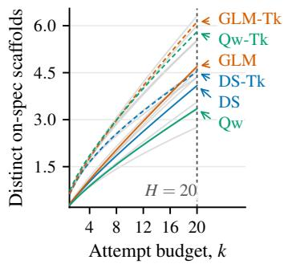  
(a) Molecule design.

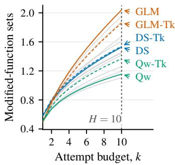  
(b) Repository repair.

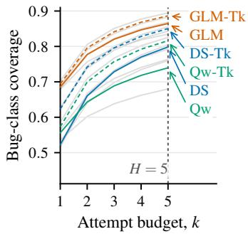  
(c) Bug finding.

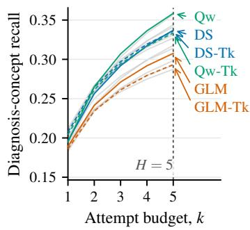  
(d) Differential diagnosis.

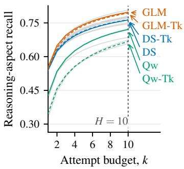  
(e) Evidence search.  
Other configurations T=1.0, no thinking T=1.0, Tk (thinking)  
(f) Plot legend.  
Figure 1: Each panel shows VTC evolution over the headline budget range. Configurations follow different coverage trajectories, producing both rank reversals and changing performance gaps as k increases. Qwen3.6-35B-A3B is omitted for legibility.

Coverage rankings change with the attempt budget. In four of the five tasks, the configuration with the highest VTC at $k = 1$ is not the one with the highest VTC at the headline budget H. The preferred configuration can therefore change as the attempt budget increases. In molecule design, Qwen3.6-27B leads at $k = 1$ , but by $H = 2 0 \mathrm { G L M } – 4 . 7$ leads by 0.502 distinct on-spec scaffolds per instance. Repository repair shows a similar pattern: DeepSeek-V4-Flash leads at $k = 1$ , whereas by $H = 1 0$ , GLM-4.7 leads by 0.504 distinct passing modified-function sets per instance. Differential diagnosis and evidence search also change leaders, while bug finding retains the same overall leader despite crossings among other configurations. Thus, the preferred configuration depends on the intended attempt budget, not only on performance at a single generation. Appendix D.1 summarizes the consequences of selection and the VTC changes across attempt budgets. All four leader changes remain under paired instance resampling; details in Appendix D.5.

## 6.2 QUALITY, DIVERSITY, AND COVERAGE

Models and inference configurations are commonly compared using individual-output quality or generic measures of variation across multiple outputs. We ask whether these signals identify the same high-VTC configurations at a headline budget H. To quantify this, we rank configurations by a selection metric and report the mean relative VTC regret of its Top-5 configurations, as summarized in Table 2. The regret of configuration π is $\frac { C ^ { * } ( H ) - { \check { C } } _ { \pi } ( H ) } { C ^ { * } ( H ) }$ , with $C ^ { * } ( H ) = \operatorname* { m a x } _ { \pi } C _ { \pi } ( H )$

One-draw quality does not reliably identify high-VTC configurations. Models are predominantly compared and selected using quality-focused benchmarks, so a model judged “stronger” is typically one that performs better on individual attempts. Figure 2 shows that these rankings can differ substantially from rankings by VTC at the headline budget H. The disagreement extends beyond the top-ranked configuration: configurations move throughout the ranking in every task. The five configurations ranked highest by one-draw quality incur mean VTC regret ranging from 2.2% in evidence search to 25.0% in repository repair, with a 12.1% task-macro average, and share only 10 of 25 positions with the VTC Top-5 sets. Thus, high one-draw quality does not reliably identify the configurations with the highest finite-budget VTC.

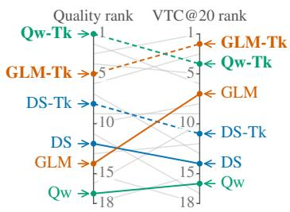  
(a) Molecule design.

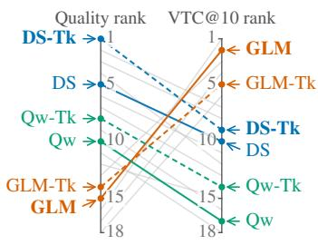  
(b) Repository repair.

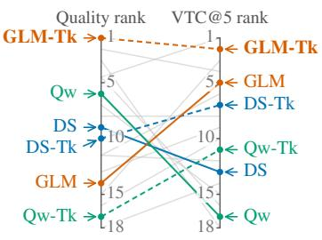  
(c) Bug finding.

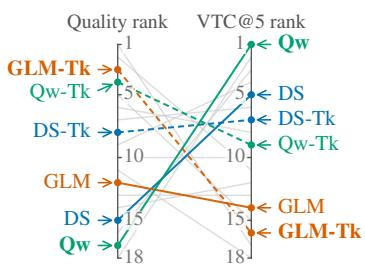  
(d) Differential diagnosis.

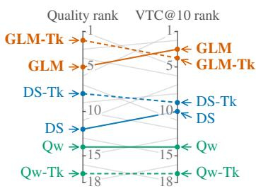  
(e) Evidence search.

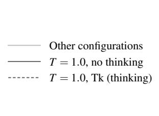  
(f) Plot legend.  
Figure 2: Quality and VTC rank differently. Each panel compares the displayed configurations ranked by one-draw quality (left) and VTC at the headline budget H (right). The best $\breve { T } = 1 . 0$ configuration under either metric is bolded. Lines show how configurations move between the two rankings. Qwen3.6-35B-A3B is omitted for legibility.

More distinct outputs do not necessarily mean more useful coverage. A common way to evaluate repeated generation is to measure variation among the generated outputs themselves, using lightweight metrics such as exact match or textual similarity. Such measures capture surface-level variation, but differences in form need not correspond to distinct useful outcomes. VTC instead maps validated outputs to task-specific useful outcomes. We therefore compare VTC with a budget matched surface-diversity measure for each task, defined at a finer output level than the correspond ing useful-outcome mapping (e.g., molecules rather than scaffolds, or test inputs rather than bug classes). Appendix D.4 defines the task-specific measures and reports the complete results.

Surface diversity does not consistently identify the configurations with the highest VTC either. As shown in Table 2, across the five tasks, surface-diversity selection has 11.0% task-macro mean VTC regret and 11/25 total Top-5 agreement with VTC. The mismatch is task-dependent: mean regret ranges from 3.2% in bug finding to 25.0% in repository repair. Thus, directly measuring nonrepetition is not sufficient to determine whether repeated outputs contribute new useful outcomes. The selection mismatch is stable under paired instance resampling (Appendix D.5).

Table 2: Quality and surface diversity can misselect for VTC. Top-5 mean regret is the relative VTC@H shortfall of the five configurations ranked highest by each metric; agreement is their overlap with the VTC Top-5. Surface diversity is defined at a finer output level than VTC.
<table><tr><td rowspan="2">Task</td><td colspan="2">One-draw quality</td><td colspan="2">Surface diversity</td></tr><tr><td>Mean regret Agreement</td><td></td><td>Mean regret Agreement</td><td></td></tr><tr><td>Molecule design</td><td>7.1%</td><td>4/5</td><td>7.1%</td><td>4/5</td></tr><tr><td>Repository repair</td><td>25.0%</td><td>0/5</td><td>25.0%</td><td>0/5</td></tr><tr><td>Bug finding</td><td>12.3%</td><td>2/5</td><td>3.2%</td><td>3/5</td></tr><tr><td>Differential diagnosis</td><td>13.8%</td><td>0/5</td><td>3.5%</td><td>4/5</td></tr><tr><td>Evidence search</td><td>2.2%</td><td>4/5</td><td>16.2%</td><td>0/5</td></tr><tr><td>Task macro-average / total</td><td>12.1%</td><td>10/25</td><td>11.0%</td><td>11/25</td></tr></table>

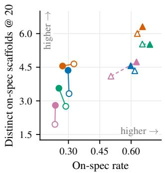  
(a) Molecule design.

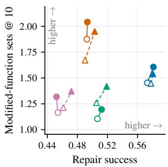  
(b) Repository repair.

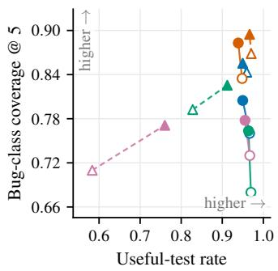  
(c) Bug finding.

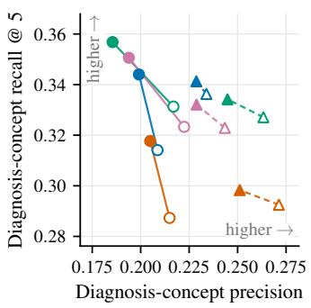  
(d) Differential diagnosis.

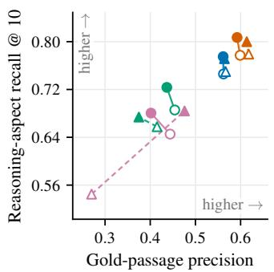  
(e) Evidence search.

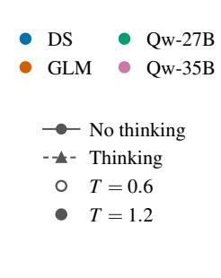  
(f) Plot legend.  
Figure 3: Temperature and thinking affect quality and VTC differently. Each panel places one-draw quality on the horizontal axis and VTC@H on the vertical axis, with segments showing the effect of increasing temperature from $T = 0 . 6 \ { \mathrm { t o } } \ T = 1 . 2$ for matched model–thinking configurations. Higher temperature increases VTC@H in 38 of 40 comparisons, often despite lower one-draw quality. Thinking introduces additional variation in both quality and coverage, with effects that differ across tasks.

## 6.3 EFFECTS OF INFERENCE CHOICES ON VTC

We next examine inference choices that may change how useful outcomes accumulate across attempts. We consider temperature and thinking within the independent-sampling setting, then ask whether explicitly conditioning later attempts on earlier outputs can improve coverage.

Temperature can improve coverage while reducing one-draw quality. Figure 3 shows that temperature can affect one-draw quality and validated coverage in opposite directions. Increasing temperature from 0.6 to 1.2 raises the point-estimate VTC@H in 38 of 40 matched comparisons; in 25 of these, one-draw quality decreases. Paired instance-resampling intervals are entirely above zero for 36 of the 40 comparisons (Appendix D.5). Thus, an inference change that looks worse under conventional quality-focused evaluation can still produce a more useful candidate set with higher validated coverage.

Thinking has heterogeneous effects on quality and coverage. Thinking is generally intended to improve the quality of an individual response, but this need not translate into higher finite-budget coverage. Across the 60 matched comparisons over all three temperatures, thinking improves onedraw quality in 44 cases but VTC@H in 36. Its benefits are therefore less consistent for coverage than for individual-output quality, and the two measures move in opposite directions in 23 comparisons. The pattern is also heterogeneous across tasks: molecule design generally benefits from thinking, whereas evidence search often does not.

Explicit diversity prompting does not reliably increase useful coverage. We also evaluate a chained generation strategy explicitly designed to promote diversity: each attempt is conditioned on earlier outputs and asked to avoid repeating previous candidates. VTC shows that this does not reliably translate into more distinct useful outcomes. Chaining consistently improves coverage on evidence search, consistently reduces it on repository repair, reduces it in most differential-diagnosis configurations, has little effect on bug finding, and shows larger configuration-dependent effects on molecule design. Thus, even when diversity is explicitly encouraged at generation time, the resulting candidate set need not cover more validated task-relevant outcomes. We evaluate this comparison at $H _ { \mathrm { c h a i n } } = 2 0$ for molecule design and $H _ { \mathrm { c h a i n } } = 5$ for the other four tasks, with matched independent controls at the same budgets. Further details and analysis appear in Appendix B.

Table 3: Effect of chained generation on VTC. Relative $\Delta { \bf V } \mathrm { T C }$ compares chained generation with independent generation at the chained-experiment budget $H _ { \mathrm { c h a i n } }$ (20 for molecule design and 5 otherwise). Mean, minimum, and maximum changes are computed across eight matched model– inference configurations; “Positive” counts configurations for which chaining increases VTC.
<table><tr><td>Task</td><td>Mean relative ∆VTC</td><td>Min</td><td>Max</td><td>Positive</td></tr><tr><td>Molecule design</td><td>+16.0%</td><td>-22.0%</td><td>+46.5%</td><td>6/8</td></tr><tr><td>Repository repair</td><td>-11.5%</td><td>-30.2%</td><td>-0.9%</td><td>0/8</td></tr><tr><td>Bug finding</td><td>+0.7%</td><td>-2.9%</td><td>+5.4%</td><td>4/8</td></tr><tr><td>Differential diagnosis</td><td>-7.9%</td><td>-15.4%</td><td>+0.6%</td><td>1/8</td></tr><tr><td>Evidence search</td><td>+8.3%</td><td>+3.9%</td><td>+13.6%</td><td>8/8</td></tr></table>

## 7 DISCUSSION AND LIMITATIONS

VTC depends on task-specific outcome mappings. VTC depends on task-specific choices about which outputs are valid and which valid outputs count as the same useful outcome. We deliberately use lightweight, deterministic mappings so that coverage remains automatic and reproducible, but these mappings abstract away some distinctions that could matter in practice. For example, modified-function sets capture where a patch intervenes rather than whether two patches implement genuinely different repair strategies; diagnosis is evaluated against a fixed UMLS target; and evidence coverage depends on the available passage and aspect annotations. Differential diagnosis and BRIGHT-Pro additionally rely on fixed, human-curated reference targets that may omit clinically plausible diagnoses or relevant evidence. Freezing these targets across configurations ensures consistent comparison, but makes absolute coverage reference-relative: valid outcomes outside the annotated target receive no credit.

Beyond fixed attempt budgets. We compare configurations at a fixed number of attempts within each task, providing a simple and controlled budget axis for repeated generation. Attempt counts are not directly comparable across tasks in terms of token use, compute, or human review effort. The same framework could instead measure coverage against these resource budgets when they can be tracked consistently, addressing different practical questions from the attempt-budget analysis studied here.

Inference choices for coverage. Our experiments show that inference choices can affect validated coverage in different ways: higher temperature often helps, while thinking and chained diversity prompting have more task-dependent effects. This leaves open how to choose an inference strategy that makes the best use of a fixed generation budget for a given task, a question that VTC-Bench is designed to make directly measurable.

## 8 CONCLUSION

VTC-Bench makes finite sets of LLM generations directly evaluable across five tasks. By mapping validated outputs to task-relevant useful outcomes, VTC tracks how these outcomes accumulate as the attempt budget grows. The results show different coverage trajectories, budget-dependent rankings, and task-dependent effects of inference choices. More broadly, our results show that finite candidate sets exhibit measurable behavior of their own, making them a meaningful object of model evaluation beyond individual generations.

## AI USE STATEMENT

We used generative AI tools throughout the research workflow, including to assist with software development, refine and assess the feasibility of research ideas, provide feedback on experimental and benchmark design, and support literature search and review, particularly during the construction of the benchmark tasks. We also used generative AI tools to assist with drafting and editing parts of the manuscript for clarity and presentation. All AI-assisted outputs were reviewed by the authors, and research decisions, experimental results, citations, and claims were independently checked against the underlying code, data, and source literature. The authors take full responsibility for the final content of the paper and all associated artifacts.

## ETHICS STATEMENT

This work uses existing benchmark and published data and does not involve new data collection from human participants. The differential-diagnosis benchmark is constructed from previously published clinical case reports and existing AMIE-derived annotations; restricted clinical inputs and diagnosis targets are not redistributed. The repository-repair benchmark uses real software vulnerability instances, but evaluation is performed in isolated environments without network access. We use these resources solely for controlled evaluation of model behavior and do not release new sensitive clinical information or exploit code beyond the benchmark artifacts provided by the original sources.

## REPRODUCIBILITY STATEMENT

Appendix A documents the evaluated model checkpoints, inference settings, attempt budgets, software environment, and statistical aggregation procedure. Appendix B documents the matched chained-generation protocol and task-specific chaining procedures, while Appendix C describes the construction and deterministic scoring of each benchmark task. The later appendices report complete configuration-level results and robustness analyses. The supplementary material provides the frozen redistributable benchmark inputs, prompts, data provenance, and code for running the experiments and reproducing the analyses.

## REFERENCES

Danial Alihosseini, Ehsan Montahaei, and Mahdieh Soleymani Baghshah. Jointly measuring di versity and quality in text generation models. In Proceedings of the Workshop on Methods for Optimizing and Evaluating Neural Language Generation, pp. 90–98, Minneapolis, Minnesota, June 2019. Association for Computational Linguistics. doi: 10.18653/v1/W19-2311. URL https://aclanthology.org/W19-2311/.

G. W. Bemis and M. A. Murcko. The properties of known drugs. 1. molecular frameworks. Journal of Medicinal Chemistry, 39(15):2887–2893, 1996. doi: 10.1021/jm9602928. URL https://doi. org/10.1021/jm9602928.

Boxing Chen and Colin Cherry. A systematic comparison of smoothing techniques for sentencelevel BLEU. In Proceedings of the Ninth Workshop on Statistical Machine Translation, pp. 362– 367. Association for Computational Linguistics, 2014. doi: 10.3115/v1/W14-3346. URL https: //aclanthology.org/W14-3346/.

Mark Chen, Jerry Tworek, Heewoo Jun, Qiming Yuan, Henrique Ponde de Oliveira Pinto, Jared Kaplan, Harri Edwards, Yuri Burda, Nicholas Joseph, Greg Brockman, Alex Ray, Raul Puri, Gretchen Krueger, Michael Petrov, Heidy Khlaaf, Girish Sastry, Pamela Mishkin, Brooke Chan, Scott Gray, Nick Ryder, Mikhail Pavlov, Alethea Power, Lukasz Kaiser, Mohammad Bavarian, Clemens Winter, Philippe Tillet, Felipe Petroski Such, Dave Cummings, Matthias Plappert, Fotios Chantzis, Elizabeth Barnes, Ariel Herbert-Voss, William Hebgen Guss, Alex Nichol, Alex Paino, Nikolas Tezak, Jie Tang, Igor Babuschkin, Suchir Balaji, Shantanu Jain, William Saunders, Christopher Hesse, Andrew N. Carr, Jan Leike, Josh Achiam, Vedant Misra, Evan Morikawa, Alec Radford, Matthew Knight, Miles Brundage, Mira Murati, Katie Mayer, Peter Welinder, Bob Mc-Grew, Dario Amodei, Sam McCandlish, Ilya Sutskever, and Wojciech Zaremba. Evaluating large language models trained on code, 2021. URL https://arxiv.org/abs/2107.03374.

Tingting Chen, Beibei Lin, Zifeng Yuan, Qiran Zou, Hongyu He, Anirudh Goyal, Yew-Soon Ong, and Dianbo Liu. Hypospace: A diagnostic benchmark for set-valued hypothesis generation under underdetermination and sublinear coverage bounds. In Forty-third International Conference on Machine Learning, 2026. URL https://openreview.net/forum?id=QpjtK65JHO.

Rafael Gomez-Bombarelli, Jennifer N. Wei, David Duvenaud, Jos ´ e Miguel Hern ´ andez-Lobato,´ Benjam´ın Sanchez-Lengeling, Dennis Sheberla, Jorge Aguilera-Iparraguirre, Timothy D. Hirzel,´ Ryan P. Adams, and Alan Aspuru-Guzik. Automatic chemical design using a data-driven´ continuous representation of molecules. ACS Central Science, 4(2):268–276, 2018. doi: 10.1021/acscentsci.7b00572. URL https://doi.org/10.1021/acscentsci.7b00572.

Yanzhu Guo, Guokan Shang, and Chloe Clavel. Benchmarking linguistic diversity of large language´ models. Transactions ofthe Associationfor Computational Linguistics, 13:1507–1526, 2025. doi: 10.1162/tacl.a.47. URL https://aclanthology.org/2025.tacl-1.69/.

Audrey Huang, Adam Block, Qinghua Liu, Nan Jiang, Akshay Krishnamurthy, and Dylan J. Foster. Is best-of-N the best of them? coverage, scaling, and optimality in inference-time alignment. In International Conference on Machine Learning, 2025. URL https://openreview.net/forum?id= QnjfkhrbYK.

Daphne Ippolito, Reno Kriz, Joao Sedoc, Maria Kustikova, and Chris Callison-Burch. Compar-˜ ison of diverse decoding methods from conditional language models. In Proceedings of the 57th Annual Meeting ofthe Associationfor Computational Linguistics, pp. 3752–3762, Florence, Italy, July 2019. Association for Computational Linguistics. doi: 10.18653/v1/P19-1365. URL https://aclanthology.org/P19-1365/.

Florian Le Bronnec, Alexandre Verine, Benjamin Negrevergne, Yann Chevaleyre, and Alexandre Allauzen. Exploring precision and recall to assess the quality and diversity of LLMs. In Proceedings of the 62nd Annual Meeting of the Association for Computational Linguistics (Volume 1: Long Papers), pp. 11418–11441, Bangkok, Thailand, August 2024. Association for Computational Linguistics. doi: 10.18653/v1/2024.acl-long.616. URL https://aclanthology.org/2024.acl-long.616/.

Seonghyeon Lee, HeeJae Chon, Joonwon Jang, Dongha Lee, and Hwanjo Yu. How diversely can language models solve problems? exploring the algorithmic diversity of model-generated code. In Findings ofthe Associationfor Computational Linguistics: EMNLP 2025, pp. 152–167, 2025. doi: 10.18653/v1/2025.findings-emnlp.10. URL https://aclanthology.org/2025.findings-emnlp. 10/.

Jiatong Li, Junxian Li, Yunqing Liu, Dongzhan Zhou, and Qing Li. TOMG-Bench: Evaluating LLMs on text-based open molecule generation. arXiv preprint arXiv:2412.14642, 2024. doi: 10.48550/arXiv.2412.14642. URL https://arxiv.org/abs/2412.14642.

Yujia Li et al. Competition-level code generation with AlphaCode. Science, 378(6624):1092–1097, 2022. doi: 10.1126/science.abq1158. URL https://doi.org/10.1126/science.abq1158.

Daniel McDuff, Mike Schaekermann, Tao Tu, et al. Towards accurate differential diagnosis with large language models. Nature, 642:451–457, 2025. doi: 10.1038/s41586-025-08869-4. URL https://doi.org/10.1038/s41586-025-08869-4.

Gagan Mundada, Rohan Surana, Nandhini Swaminathan, Bodhisattwa Prasad Majumder, Junda Wu, Julian McAuley, and Zhouhang Xie. Evaluating language model pluralism through inthe-wild crowd discussions. In Proceedings of the 64th Annual Meeting of the Association for Computational Linguistics (Volume 1: Long Papers), pp. 42273–42296, 2026. doi: 10.18653/v1/2026.acl-long.1957. URL https://aclanthology.org/2026.acl-long.1957/.

Krishna Pillutla, Swabha Swayamdipta, Rowan Zellers, John Thickstun, Sean Welleck, Yejin Choi, and Zaid Harchaoui. MAUVE: Measuring the gap between neural text and human text using divergence frontiers. In Advances in Neural Information Processing Systems, volume 34, pp. 4816–4828, 2021. URL https://proceedings.neurips.cc/paper/2021/hash/ 260c2432a0eecc28ce03c10dadc078a4-Abstract.html.

RDKit contributors. RDKit: Open-source cheminformatics. Version 2026.03.3, 2026. URL https: //www.rdkit.org/.

Alexander Shypula, Shuo Li, Botong Zhang, Vishakh Padmakumar, Kayo Yin, and Osbert Bastani. Evaluating the diversity and quality of LLM generated content. In Second Conference on Language Modeling, 2025. URL https://openreview.net/forum?id=O7bF6nlSOD.

Xuezhi Wang, Jason Wei, Dale Schuurmans, Quoc V. Le, Ed H. Chi, Sharan Narang, Aakanksha Chowdhery, and Denny Zhou. Self-consistency improves chain of thought reasoning in language models. In International Conference on Learning Representations, 2023. URL https: //openreview.net/forum?id=1PL1NIMMrw.

Zichao Wei, Jun Zeng, Ming Wen, Zeliang Yu, Kai Cheng, Yiding Zhu, Jingyi Guo, Shiqi Zhou, Le Yin, Xiaodong Su, and Zhechao Ma. PATCHEVAL: A new benchmark for evaluating LLMs on patching real-world vulnerabilities, 2025. URL https://arxiv.org/abs/2511.11019.

Yiming Zhang, Harshita Diddee, Susan Holm, Hanchen Liu, Xinyue Liu, Vinay Samuel, Barry Wang, and Daphne Ippolito. NoveltyBench: Evaluating language models for humanlike diversity. In Second Conference on Language Modeling, 2025. URL https://openreview.net/forum?id= XZm1ekzERf.

Yilun Zhao, Jinbiao Wei, Tingyu Song, Siyue Zhang, Chen Zhao, and Arman Cohan. Rethinking reasoning-intensive retrieval: Evaluating and advancing retrievers in agentic search systems. In Proceedings of the 64th Annual Meeting of the Association for Computational Linguistics (Volume 1: Long Papers), pp. 36776–36806, 2026. doi: 10.18653/v1/2026.acl-long.1705. URL https: //aclanthology.org/2026.acl-long.1705/.

## A EXPERIMENTAL AND REPRODUCIBILITY DETAILS

## A.1 EVALUATED GENERATION SETTINGS

Table 4 records the settings used for the five tasks. Every draw uses $p = 0 . 9 5$ and one of the three temperatures in the main study. The evaluated checkpoints are Qwen3.6-27B-FP8, Qwen3.6-35B-A3B-FP8, GLM-4.7-FP8, and DeepSeek-V4-Flash. Thinking is controlled through each model family’s chat template, with the checkpoint and task prompt held fixed. The output cap includes hidden reasoning when thinking is enabled. PatchEval uses the same cap in both modes because its agent trajectory contains multiple model calls. In differential diagnosis, the generation and conceptcoding stages use the same temperature, thinking setting, and output cap. In BRIGHT-Pro, the search and selection turns use the same sampled configuration and output cap.

Table 4: Task-level generation settings. H is the headline comparison budget; complete curves are retained through $K _ { \mathrm { m a x } }$
<table><tr><td>Task</td><td>Instances</td><td> $K _ { \mathrm { m a x } }$ </td><td>H</td><td>No-think / think cap</td><td>Additional limit</td></tr><tr><td>Molecule</td><td>164</td><td>50</td><td>20</td><td>256 / 32,768</td><td>one SMILES</td></tr><tr><td>Repository repair</td><td>230</td><td>20</td><td>10</td><td>16,384 / 16,384</td><td>120 agent messages</td></tr><tr><td>Bug finding</td><td>188</td><td>20</td><td>5</td><td>8,192 / 32,768</td><td>at most 5 inputs</td></tr><tr><td>Differential diagnosis</td><td>302</td><td>20</td><td>5</td><td>2,048 / 32,768</td><td>7 diagnoses</td></tr><tr><td>BRIGHT-Pro</td><td>739</td><td>20</td><td>10</td><td>2,048 / 32,768</td><td>3 queries; 5 passages</td></tr></table>

## A.2 INDEPENDENT-SAMPLING ESTIMATOR AND STATISTICAL AGGREGATION

For each task result, all unreduced draw-level scores are grouped by stable task-instance identifiers before computing coverage curves, single-draw diagnostics, and diversity statistics. Every draw enters aggregation regardless of its outcome. The analysis restricts each task to the same set of 24 configurations and applies the task-specific budget H in Table 4. The same aggregation procedure is applied independently within each task.

We use the subset-counting construction of the unbiased pass@k estimator introduced in the Codex evaluation of Chen et al. (2021), applying it separately to each useful outcome and summing the resulting inclusion probabilities with task-specific weights. Under IID sampling from a fixed configuration $\pi ( \cdot \mid x )$ , this gives an unbiased estimator of the expected VTC obtained from k fresh draws for instance x. For an instance x with $K _ { x }$ scored attempts, let $n _ { x , t }$ be the number of attempts containing useful outcome $t ,$ and let $w _ { x , t }$ be that outcome’s task-specific utility weight. For every $k \leq K _ { x }$ , we compute

$$
\widehat { C } _ { x } ( k ) = \sum _ { t \in \mathcal { T } _ { x } } w _ { x , t } \left[ 1 - \frac { \binom { K _ { x } - n _ { x , t } } { k } } { \binom { K _ { x } } { k } } \right] .\tag{3}
$$

The bracketed term is the fraction of size-k subsets of the observed attempts that contain useful outcome t, so Equation 3 is the exact average coverage over all such subsets. We average $\widehat { C } _ { x } ( k )$ equally across the task instances. As with pass@k estimation, collecting $K _ { \operatorname* { m a x } } > H$ reduces the sampling variance of the estimated coverage for $k \leq H$

## A.3 SOFTWARE, ENVIRONMENT, AND DATA PROVENANCE

Software and environment. The runs use Inspect AI 0.3.241, with models served locally using vLLM 0.21.0. The evaluated checkpoints were obtained from the public Hugging Face repositories Qwen/Qwen3.6-27B-FP8, Qwen/Qwen3.6-35B-A3B-FP8, zai-org/GLM-4.7-FP8, and deepseek-ai/DeepSeek-V4-Flash. Generation is stochastic, so independent reruns draw new completions from the same sampling distribution. Surface SelfBLEU is computed with NLTK 3.10.0.

Data availability. Redistributable frozen benchmark inputs and prompt templates accompany the paper. Upstream release or revision information is specified when available. The restricted AMIE HPI input, diagnosis-concept target, and term-level coding records are not redistributed.

## B CHAINED GENERATION EXPERIMENTS

## B.1 OVERALL SETTING AND ANALYSIS

Chained generation setting. We compare chained generation against a matched IID baseline with the same total number of generated candidates per instance. The chained experiment uses $H _ { \mathrm { c h a i n } } =$ 20 for molecule design and $H _ { \mathrm { c h a i n } } = 5$ for the other four tasks. Repository repair and evidence search therefore use a smaller budget than in the main study to keep the additional chained generation and evaluation tractable. For each instance, we generate $\bar { R = 3 }$ independent chains and average VTC over their length-k prefixes:

$$
C _ { \mathrm { c h a i n } , \mathcal { X } } ( k ) = \frac { 1 } { | \mathcal { X } | R } \sum _ { x \in \mathcal { X } } \sum _ { r = 1 } ^ { R } \mathrm { V T C } _ { x } \Big ( y _ { 1 : k } ^ { ( r ) } \Big ) , \qquad R = 3 .\tag{4}
$$

Because later attempts condition on earlier outputs, arbitrary subsets of a chain are not valid length-k chained runs; we therefore score the actual prefix of each chain. The matched IID baseline consists of $H _ { \mathrm { c h a i n } } \times$ R independent attempts per instance and is evaluated with the IID subset estimator from Appendix A.2. Because it uses a separately generated matched control pool, its estimates may differ slightly from the corresponding main-study results.

Chained generation analysis. We further examine whether the effect of chaining on VTC is reflected by conventional per-attempt quality or surface-level diversity. For each model–thinking configuration at $T ~ = ~ 1 . 0$ , we use the same task-specific quality and surface-diversity measures as in the main analysis. BRIGHT-Pro is included in the VTC and quality comparisons but omitted from the surface-diversity comparison because its paper surface proxy requires a separate retrievalconditioned answer-generation stage, which was not run for the chained campaign. Tables 5–7 report VTC, per-attempt quality, and surface diversity, respectively.

Table 5: VTC under chained and independent generation. Chain reports VTC from the actual length- $\cdot H _ { \mathrm { c h a i n } }$ chain prefixes; IID reports the subset-counting expectation at the same budget from the matched independent controls. Darker shading indicates higher values within each column; bold marks the largest value.
<table><tr><td colspan="3">Configuration</td><td colspan="2">Molecule design</td><td colspan="2">Repository repair</td><td colspan="2">Bug finding</td><td colspan="2">Diagnosis</td><td colspan="2">Evidence search</td></tr><tr><td>Model</td><td>Thinking</td><td>T</td><td>Chain</td><td>ID</td><td>Chain</td><td>IID</td><td>Chain</td><td>IID</td><td>Chain</td><td>IID</td><td>Chain</td><td>ID</td></tr><tr><td>DS-V4</td><td>No</td><td>1.0</td><td>4.715</td><td>4.130</td><td>1.019</td><td>1.183</td><td>0.775</td><td>0.794</td><td>0.321</td><td>0.334</td><td>0.747</td><td>0.713</td></tr><tr><td>DS-V4</td><td>Yes</td><td>1.0</td><td>6.435</td><td>4.394</td><td>1.165</td><td>1.176</td><td>0.842</td><td>0.845</td><td>0.308</td><td>0.340</td><td>0.787</td><td>0.712</td></tr><tr><td>GLM-4.7</td><td>No</td><td>1.0</td><td>4.929</td><td>4.753</td><td>1.309</td><td>1.367</td><td>0.839</td><td>0.864</td><td>0.307</td><td>0.305</td><td>0.766</td><td>0.738</td></tr><tr><td>GLM-4.7</td><td>Yes</td><td>1.0</td><td>8.827</td><td>6.047</td><td>1.116</td><td>1.205</td><td>0.901</td><td>0.884</td><td>0.286</td><td>0.298</td><td>0.773</td><td>0.740</td></tr><tr><td>Qw3.6-27B</td><td>No</td><td>1.0</td><td>2.667</td><td>3.419</td><td>0.874</td><td>0.928</td><td>0.752</td><td>0.736</td><td>0.308</td><td>0.354</td><td>0.724</td><td>0.652</td></tr><tr><td>Qw3.6-27B</td><td>Yes</td><td>1.0</td><td>7.785</td><td>5.863</td><td>1.007</td><td>1.035</td><td>0.842</td><td>0.812</td><td>0.291</td><td>0.333</td><td>0.678</td><td>0.597</td></tr><tr><td>Qw3.6-35B</td><td>No</td><td>1.0</td><td>2.148</td><td>2.568</td><td>0.690</td><td>0.948</td><td>0.747</td><td>0.762</td><td>0.291</td><td>0.344</td><td>0.648</td><td>0.588</td></tr><tr><td>Qw3.6-35B</td><td>Yes</td><td>1.0</td><td>5.746</td><td>4.657</td><td>0.670</td><td>0.959</td><td>0.806</td><td>0.765</td><td>0.311</td><td>0.331</td><td>0.642</td><td>0.592</td></tr></table>

The three quantities often move differently under chaining. On evidence search, chaining increases VTC in all 8 configurations despite reducing per-attempt quality in 6/8, indicating a tradeoff between passage precision and reasoning-aspect coverage. On bug finding, surface diversity decreases in all 8 configurations, by 32.6% on average, while VTC changes little overall, showing that substantially fewer distinct concrete tests need not imply lower behavioral bug-class coverage. Repository repair shows a different pattern: VTC decreases in all 8 configurations even though quality and surface diversity change comparatively little. Differential diagnosis is the clearest case where the metrics agree, with chaining generally reducing quality, surface diversity, and VTC together.

Molecule design is more configuration-dependent. Chaining often increases both surface diversity and VTC, particularly in several thinking configurations, but some Qwen configurations show the opposite behavior. This variation reinforces that neither the intended purpose of the chaining intervention nor its effect on surface-level output variation is sufficient to predict the resulting useful coverage.

Overall, chained generation reproduces the main paper’s quality–diversity–coverage mismatch under an explicit diversity-oriented intervention: changes in per-attempt quality and output-level variation do not reliably determine changes in validated task coverage.

Table 6: Quality under chained and independent generation. Chain is task-native quality averaged over all positions in the three chains; IID is quality over the attempt-count-matched independent control. Darker shading indicates higher values within each column; bold marks the largest value.
<table><tr><td colspan="3">Configuration</td><td colspan="2">Molecule design</td><td colspan="2">Repository repair</td><td colspan="2">Bug finding</td><td colspan="2">Diagnosis</td><td colspan="2">Evidence search</td></tr><tr><td>Model</td><td>Thinking</td><td>T</td><td>Chain</td><td>ID</td><td>Chain</td><td>IID</td><td>Chain</td><td>IID</td><td>Chain</td><td>ID</td><td>Chain</td><td>ID</td></tr><tr><td>DS-V4</td><td>No</td><td>1.0</td><td>0.331</td><td>0.302</td><td>0.554</td><td>0.573</td><td>0.943</td><td>0.957</td><td>0.090</td><td>0.204</td><td>0.422</td><td>0.560</td></tr><tr><td>DS-V4</td><td>Yes</td><td>1.0</td><td>0.606</td><td>0.606</td><td>0.581</td><td>0.596</td><td>0.935</td><td>0.955</td><td>0.104</td><td>0.233</td><td>0.513</td><td>0.571</td></tr><tr><td>GLM-4.7</td><td>No</td><td>1.0</td><td>0.282</td><td>0.294</td><td>0.451</td><td>0.488</td><td>0.920</td><td>0.943</td><td>0.133</td><td>0.209</td><td>0.519</td><td>0.599</td></tr><tr><td>GLM-4.7</td><td>Yes</td><td>1.0</td><td>0.582</td><td>0.635</td><td>0.455</td><td>0.497</td><td>0.912</td><td>0.940</td><td>0.127</td><td>0.264</td><td>0.478</td><td>0.622</td></tr><tr><td>Qw3.6-27B</td><td>No</td><td>1.0</td><td>0.255</td><td>0.270</td><td>0.502</td><td>0.504</td><td>0.949</td><td>0.967</td><td>0.135</td><td>0.195</td><td>0.536</td><td>0.448</td></tr><tr><td>Qw3.6-27B</td><td>Yes</td><td>1.0</td><td>0.657</td><td>0.726</td><td>0.529</td><td>0.518</td><td>0.904</td><td>0.891</td><td>0.116</td><td>0.252</td><td>0.437</td><td>0.399</td></tr><tr><td>Qw3.6-35B</td><td>No</td><td>1.0</td><td>0.239</td><td>0.242</td><td>0.482</td><td>0.448</td><td>0.947</td><td>0.964</td><td>0.148</td><td>0.203</td><td>0.344</td><td>0.421</td></tr><tr><td>Qw3.6-35B</td><td>Yes</td><td>1.0</td><td>0.696</td><td>0.608</td><td>0.452</td><td>0.451</td><td>0.867</td><td>0.732</td><td>0.131</td><td>0.235</td><td>0.461</td><td>0.476</td></tr></table>

Table 7: Surface diversity under chained and independent generation. Chain reports directprefix coverage of validated canonical molecules, accepted exact diffs, exact valid test inputs, and gold-mapped raw diagnosis terms; IID reports the corresponding subset-counting expectation at $H _ { \mathrm { c h a i n } }$ . BRIGHT-Pro is omitted because its separate answer-generation surface experiment was not run for chained generation. Bold marks the largest value in each column.
<table><tr><td colspan="3">Configuration</td><td colspan="2">Molecule design</td><td colspan="2">Repository repair</td><td colspan="2">Bug finding</td><td colspan="2">Diagnosis</td></tr><tr><td>Model</td><td>Thinking</td><td>T</td><td>Chain</td><td>IID</td><td>Chain</td><td>IID</td><td>Chain</td><td>IID</td><td>Chain</td><td>IID</td></tr><tr><td>DS-V4</td><td>No</td><td>1.0</td><td>6.470</td><td>5.442</td><td>2.512</td><td>2.611</td><td>7.172</td><td>12.566</td><td>3.139</td><td>4.804</td></tr><tr><td>DS-V4</td><td>Yes</td><td>1.0</td><td>12.061</td><td>9.351</td><td>2.655</td><td>2.654</td><td>12.379</td><td>17.342</td><td>2.932</td><td>4.248</td></tr><tr><td>GLM-4.7</td><td>No</td><td>1.0</td><td>5.602</td><td>5.831</td><td>2.246</td><td>2.347</td><td>9.819</td><td>16.637</td><td>3.024</td><td>3.491</td></tr><tr><td>GLM-4.7</td><td>Yes</td><td>1.0</td><td>11.624</td><td>10.519</td><td>2.251</td><td>2.318</td><td>16.238</td><td>19.067</td><td>2.402</td><td>3.170</td></tr><tr><td>Qw3.6-27B</td><td>No</td><td>1.0</td><td>4.459</td><td>4.522</td><td>2.184</td><td>2.099</td><td>9.417</td><td>13.627</td><td>3.043</td><td>4.258</td></tr><tr><td>Qw3.6-27B</td><td>Yes</td><td>1.0</td><td>13.067</td><td>11.393</td><td>2.365</td><td>2.247</td><td>11.387</td><td>17.267</td><td>2.512</td><td>3.302</td></tr><tr><td>Qw3.6-35B</td><td>No</td><td>1.0</td><td>4.425</td><td>4.371</td><td>1.920</td><td>2.035</td><td>7.851</td><td>13.199</td><td>2.882</td><td>4.242</td></tr><tr><td>Qw3.6-35B</td><td>Yes</td><td>1.0</td><td>13.654</td><td>9.015</td><td>1.746</td><td>2.037</td><td>10.512</td><td>14.557</td><td>3.011</td><td>3.353</td></tr></table>

## B.2 TASK-SPECIFIC CHAINING PROCEDURES

Across tasks, the first attempt uses the original task prompt. Each later attempt receives a bounded record of the model’s earlier submissions and a task-specific request for one additional candidate. The history contains neither validation results nor correctness feedback, and each of the three chain replicates starts without history from the others.

Molecule design. The model sees the SMILES strings submitted on earlier attempts and is asked for one additional molecule that satisfies the original constraints while being materially different from its prior submissions. Each attempt retains the original one-SMILES output format.

Repository repair. The model sees the patches submitted earlier in the chain, but not their validation results. The repository is reset to the original vulnerable snapshot before every attempt, and the model is asked to produce one materially different patch using the same editing interface as in the main study.

Bug finding. Earlier test suites are shown in the same input format used for submission. The continuation asks for another suite based on a materially different testing idea, subject to the original limit of at most five inputs. Outcomes from executing earlier tests are not shown to the model.

Differential diagnosis. The model sees the diagnosis terms from its earlier ranked differentials and is asked for another substantively different but clinically plausible differential in the original list format. The UMLS mapping process and matches against the reference differential are not included in the history.

Evidence search. The model sees the queries and selected evidence excerpts from earlier attempts and is asked to use complementary queries and evidence for the same question. Each attempt retains the original limits of up to three queries and five selected passages; unselected retrieval results and coverage scores are not carried into later attempts.

## C BENCHMARK CONSTRUCTION AND SCORING

## C.1 DESIGN CRITERIA FOR USEFUL OUTCOMES

For each task, we choose a useful-outcome representation that can be checked automatically, is reproducible across systems, and captures distinctions that matter for the task. Repeatedly producing the same outcome should add little or no new coverage.

Exact output identity is often too fine-grained, while semantic grouping with embeddings or judges would make scoring less deterministic. We therefore use task-specific intermediate representations grounded in the structure of each task. Table 8 summarizes these choices.

Table 8: Task-specific useful outcomes. Each representation abstracts away surface variation while remaining deterministic, automatically scoreable, and grounded in task structure.
<table><tr><td>Task</td><td>Too-fine representation</td><td>Requires semantic judgment</td><td>Useful outcome</td><td>Rationale</td></tr><tr><td>Molecule design Exact molecule</td><td></td><td>Functional or semantic chemical similarity</td><td>Bemis-Murcko scaffold</td><td>Collapses peripheral substituent and encoding variation while retaining the molecular structural core.</td></tr><tr><td>Repository repair</td><td>Exact Git diff</td><td>Semantic repair strategy</td><td>Modified-function set</td><td>Collapses incidental diff-level variation while distinguishing repairs that intervene in different parts of the implementation.</td></tr><tr><td>Bug finding</td><td>Exact test input</td><td>Underlying bug mechanism</td><td>Behavioral bug class</td><td>Different concrete inputs may expose the same faulty behavior; execution against the fixed submission pool gives a deterministic behavioral grouping.</td></tr><tr><td>Diagnosis</td><td>Diagnosis string</td><td>Unrestricted clinical equivalence</td><td>UMLS concept</td><td>Collapses synonyms, abbreviations, and paraphrases that refer to the same clinical concept while retaining concept-level distinctions.</td></tr><tr><td>Evidence search Passage ID</td><td></td><td>Free-form semantic contribution</td><td>Reasoning aspect</td><td>Multiple passages may support the same information need; aspect annotations capture complementary pieces of evidence without requiring semantic judgment of full answers.</td></tr></table>

## C.2 MOLECULE DESIGN

Choice of useful-outcome representation. We represent useful outcomes by Bemis–Murcko scaffolds, extracted automatically with RDKit. Exact molecule identity is too fine-grained for our purpose: molecules can differ in peripheral substituents while sharing the same underlying structural core, so counting them separately would reward variation that contributes little new structural coverage. Bemis–Murcko scaffolds provide a deterministic intermediate abstraction that retains ring systems and the linkers between them while removing peripheral substituents (Bemis & Murcko, 1996). Molecules with the same scaffold therefore map to the same useful outcome even when their SMILES encodings or peripheral substituents differ. We use the number of distinct on-spec scaffolds accumulated across attempts as a reproducible proxy for structural exploration under explicit physicochemical constraints.

Instance construction. We construct the benchmark from ZINC250k, a standard moleculargeneration dataset of approximately 250,000 drug-like, commercially available molecules sampled from the ZINC database (Gomez-Bombarelli et al., 2018). We parse all entries with RDKit´

2026.03.3, retaining 249,455 valid molecules. For each molecule, we record its canonical SMILES, Bemis–Murcko scaffold, and six conditioning descriptors: molecular weight, RDKit-calculated logP, topological polar surface area (TPSA), hydrogen-bond donors, hydrogen-bond acceptors, and rotatable bonds. QED is excluded because it is a composite desirability score rather than a primitive property constraint.

For each descriptor, we form the five 30-percentile-wide windows $[ Q _ { . 0 5 } , Q _ { . 3 5 } ] , \ [ Q _ { . 2 0 } , Q _ { . 5 0 } ]$ $[ Q _ { . 3 5 } , Q _ { . 6 5 } ] , [ Q _ { . 5 0 } , Q _ { . 8 0 } ]$ , and $[ Q _ { . 6 5 } , Q _ { . 9 5 } ]$ . Adjacent windows overlap by half their width, and their union covers the central 90% of the marginal distribution. We round endpoints to multiples of 10 Da for molecular weight, 0.5 for logP, $5 \mathrm { \AA ^ { 2 } }$ for TPSA, and one count for the integer descriptors. For the integer-valued descriptors, rounding can cause two quantile windows to produce the same interval. When this occurs, we keep only one copy of that interval. We enumerate every single-descriptor band and every combination of bands over descriptor pairs. This procedure produces 379 candidate specifications.

To avoid instances whose feasible region is too narrow in the reference pool, we require each specification to be satisfied by at least 5,000 ZINC250k molecules and at least 1,000 distinct Bemis– Murcko scaffolds. All 379 candidates pass this prespecified, model-independent filter, yielding 29 one-constraint and 350 two-constraint prompts.

For the paper evaluation, we retain all 29 one-constraint specifications. For each two-descriptor pair, we retain only combinations formed from the first, middle, and last window of each descriptor, giving $3 \times 3 = 9$ prompts per descriptor pair. This yields 135 two-constraint prompts and 164 prompts overall.

The released prompt artifact records the exact resolved bands, constraints, support counts, ZINC250k source identity, and RDKit version.

Scoring. At scoring time, we recompute the same RDKit descriptors used during construction and apply all interval bounds inclusively. Valid on-spec molecules are then mapped to their Bemis– Murcko scaffold.

## C.3 REPOSITORY REPAIR

Benchmark setup. We use all 230 runnable instances from PatchEval-Verified, spanning Python, JavaScript, and Go repositories (Wei et al., 2025). Each instance provides a vulnerable repository snapshot and an isolated environment for validating candidate patches. The task description includes the CVE identifier and description together with its CWE category. PatchEval-Verified also provides annotated vulnerable files and line ranges; we withhold these annotations so that the agent must identify the relevant implementation locations from the full repository.

Each attempt begins from a fresh repository snapshot. The agent may search and read files and edit the source, but cannot execute the project, run tests, or access the network. It returns one complete Git diff, used as the final submission. It does not receive any validator feedback.

Choice of useful-outcome representation. We represent each successful patch by the set of named functions it modifies. Exact Git-diff identity is too fine-grained for our purpose: two patches can differ in formatting, local edits, or other incidental details while intervening in the same parts of the implementation. Modified-function sets provide a deterministic intermediate representation that collapses such diff-level variation while distinguishing successful repairs that act at different implementation locations. Patches with the same modified-function set therefore map to the same useful outcome.

Evaluation details. A submitted patch must be a parseable Git diff that applies cleanly to the original repository. The corresponding PatchEval-Verified environment applies the diff and runs the revised vulnerability test with a 600-second limit. A patch earns credit only if this validation succeeds; successful patches contribute their modified-function set, while all other attempts contribute no useful outcome.

To construct the modified-function set, we parse each changed Python, JavaScript/TypeScript, or Go source file and map changed lines to their innermost enclosing named function in the original repository. Removed lines retain their original coordinates, while inserted lines are anchored to adjacent original lines. Anonymous functions map to their nearest named enclosing function, edits outside named functions map to a module-level site, and unparseable files remain explicit file-level sites. The resulting sorted set of sites defines the patch’s useful outcome.

## C.4 BUG FINDING

Benchmark setup. We construct the task from C++ submissions in the CodeContests test and validation splits (Li et al., 2022). We remove problems that require file I/O or images and retain problems with at least three accepted submissions, five incorrect submissions, and one stored test. We verify up to five accepted submissions on a fixed probe of at most 80 stored tests and require at least three of them to reproduce every expected output.

We retain incorrect submissions that compile and fail at least one probe test. Incorrect submissions with the same pattern of failures on the probe tests are grouped into one behavioral bug class. This produces 188 problems and 6,422 fixed bug classes, with a median of 30 classes per problem.

On each attempt, the model receives the problem statement and generates up to five complete standard-input test cases. The prompt does not ask the model to rank the tests or make them distinct.

Choice of useful-outcome representation. We measure useful outcomes at the level of behavioral bug classes rather than generated test inputs. Exact input identity is too fine-grained: different concrete inputs can expose the same faulty behavior, so counting them separately would overstate useful coverage. Instead, each valid input is credited with the behavioral bug classes it exposes when executed against the fixed pool of incorrect submissions. Different inputs that expose the same bug class therefore contribute the same useful outcome, while an input may contribute multiple outcomes if it exposes multiple classes. Credits are unioned across the inputs in an attempt and across repeated attempts.

Evaluation details. At evaluation time, the accepted reference programs and incorrect programs are compiled under contest-judge conditions and executed without network access, using each problem’s memory limit and a wall-time limit of min $( t _ { \mathrm { p r o b l e m } } + 1 , \mathrm { s } , 6 , \mathrm { s } )$

A generated input is valid when at least two reference programs finish and all finishing references agree on the output. Outputs are compared as whitespace-separated tokens, with a numeric tolerance of $1 0 ^ { - 6 }$ . A valid input exposes an incorrect implementation if that implementation produces a different output, exits unsuccessfully, or exceeds a CPU or wall-time limit. The corresponding behavioral bug class is then credited to the attempt, with each class credited at most once within an attempt.

The scorer evaluates at most the first five parsed inputs in response order. Invalid inputs contribute no bug-class credit but remain part of the submitted attempt.

## C.5 DIFFERENTIAL DIAGNOSIS

Benchmark setup. We follow the case selection of the AMIE differential-diagnosis study (Mc-Duff et al., 2025), using its 302 NEJM clinicopathological-conference cases. For each case, we reconstruct the History of Present Illness from the corresponding NEJM report, beginning at “Presentation of Case” and ending at the next clinical section, while removing tables, captions, headers, footers, and affiliations. The reconstructed History of Present Illness is the sole clinical case information provided to the evaluated model.

Reference target construction. We map the physician-written differential diagnoses and final diagnosis to concepts in UMLS 2025AB. Our frozen local index contains English, non-suppressed UMLS names, synonyms, semantic types, and definitions. Queries and indexed strings are normalized for case, punctuation, and whitespace. Retrieval prioritizes exact matches, followed by BM25 matches over query tokens, and returns the ten highest-ranked distinct Concept Unique Identifiers (CUIs).

The reference diagnoses are mapped once to CUIs using OpenAI Codex with the frozen local search tools. These mappings are then frozen as part of the benchmark target; Codex is not used to judge evaluated outputs, whose scores are computed deterministically by exact CUI matching against this fixed target. Codex may reformulate searches and inspect retrieved names, synonyms, semantic types, and definitions before selecting one or more retrieved CUIs, or no CUI when none is appropriate. The mapping preserves the specificity of the written diagnosis, and multiple CUIs may be retained when the diagnosis is ambiguous. Final diagnoses are mapped independently from the published differential. Every selected reference CUI must exist in the frozen index and have appeared among the retrieved candidates.

The published differentials contain 2,190 terms, of which 2,179 map to at least one CUI and 148 have multiple retained mappings. Final diagnoses are mapped separately, with 296 of 302 receiving a CUI. The target for each case is the union of the CUIs assigned to its published differential and final diagnosis, producing target sets of size 2–19 (median 8, mean 8.32). The same fixed target is used for every evaluated configuration.

Choice of useful-outcome representation. We represent diagnoses by UMLS CUIs rather than their generated strings. Exact diagnosis strings are too fine-grained: synonyms, abbreviations, and paraphrases can refer to the same clinical concept and should not count as distinct coverage. UMLS concepts provide a fixed intermediate representation that collapses such surface variation while retaining clinically distinct concepts. Different generated diagnoses mapped to the same CUI therefore contribute the same useful outcome.

Prediction coding and evaluation. On each attempt, the evaluated model generates a ranked differential of at most seven diagnoses. The same model then maps each generated diagnosis to UMLS concepts using the frozen local search tools using the same temperature, thinking setting, and outputtoken allowance as differential generation. It retains the case and its own generated differential as context but does not receive the reference CUIs. Concept coding is therefore part of the evaluated attempt rather than a post-hoc evaluator-side transformation.

The scorer retains at most the first seven parsed diagnoses and compares the submitted CUIs with the fixed reference target by exact CUI intersection. Diagnosis-concept precision is the fraction of distinct submitted CUIs contained in the target, with zero assigned when no CUI is submitted. VTC at budget k is the fraction of target CUIs recovered across the k attempts.

## C.6 BRIGHT-PRO EVIDENCE SEARCH

Benchmark setup. We use a pinned public release of the yale-nlp/Bright-Pro dataset (Zhao et al., 2026). It contains 739 questions from seven StackExchange domains, 2,763 expert-annotated reasoning aspects, 5,272 released gold passages, and 526,319 corpus documents. Each question has between one and five reasoning aspects. Raw aspect weights are in 1, 2, 3 and are normalized to sum to one within each question.

We build a separate frozen BM25 index for each domain, so each question searches only documents from its corresponding domain. The indices use BM25S 0.3.9 with Lucene BM25 IDF, $k _ { 1 } = 0 . 9$ b = 0.4, lowercase regex tokenization, Porter stemming, and the Lucene English stopword set. These settings match the original BRIGHT BM25 parameters, although our tokenizer is a close Python reproduction rather than the original Lucene analyzer.

Choice of useful-outcome representation. We represent useful evidence at the level of annotated reasoning aspects rather than exact passage identity. Passage identity is too fine-grained for coverage because several passages may support the same part of the information need. Counting those passages separately would therefore reward redundant evidence. At the other extreme, deciding whether complete generated answers contribute different information would require semantic judgment. BRIGHT-Pro’s expert reasoning-aspect annotations provide a fixed intermediate representation of the distinct pieces of evidence needed to answer a question. Multiple selected passages supporting the same aspect therefore contribute the same useful outcome.

Retrieval and selection procedure. On each attempt, the model submits one batch of one to three nonempty search queries. Each query retrieves the top 15 passages from the corresponding domain index. Results are interleaved by within-query rank, deduplicated by document ID, and truncated to the first 15 passages. The visible candidate bundle is further truncated under the fixed character budget specified in the released task artifact.

The model then selects between one and five unique passage labels from the visible pool. It sees the passage text and query/rank provenance, but not document IDs, retrieval scores, released-gold labels, reasoning aspects, aspect weights, qrels, or the reference answer. Missing or malformed search or selection calls are retained as zero-scoring attempts.

Evaluation details. Exact released document IDs determine whether a selected passage is a released gold passage. Each selected gold passage contributes its annotated reasoning aspect, and an aspect receives credit at most once within an attempt even when multiple selected passages support it. VTC at budget k is the weighted fraction of reasoning aspects recovered across the k attempts, using the normalized aspect weights.

Because the released qrels are not exhaustive relevance judgments, unjudged passages receive no credit.

## D ADDITIONAL RESULTS AND ROBUSTNESS

## D.1 VTC RANKINGS ACROSS ATTEMPT BUDGETS

Table 9 compares configuration rankings by VTC@1 and VTC@H across all 24 configurations. We select the five configurations with the highest VTC@1 and evaluate their VTC@H using the same mean relative regret as Table 2. Agreement counts how many configurations appear in both Top-5 sets. The final column reports the mean VTC gain from one attempt to the headline budget, averaged across all 24 configurations in each task. These gains remain in each task’s native VTC units and are not averaged across tasks.

For molecule design and repository repair, VTC@1 equals the one-draw quality metric because each attempt contributes at most one useful outcome. In the other three tasks, one attempt can cover a set of useful outcomes, so VTC@1 is already a set-coverage quantity and is not identical to the quality metric used in Table 2.

Table 9: VTC rankings can depend on the attempt budget. Top-5 mean regret is the average relative VTC@H shortfall of the five configurations selected by VTC@1. Agreement is their overlap with the VTC@H Top-5. Mean VTC gain is the difference between VTC@H and VTC@1, averaged across all 24 configurations and reported on each task’s native scale.
<table><tr><td>Task</td><td>Mean regret</td><td>Agreement</td><td>Mean VTC gain</td></tr><tr><td>Molecule design</td><td>7.1%</td><td>4/5</td><td>3.919</td></tr><tr><td>Repository repair</td><td>25.0%</td><td>0/5</td><td>0.974</td></tr><tr><td>Bug finding</td><td>1.7%</td><td>5/5</td><td>0.231</td></tr><tr><td>Differential diagnosis</td><td>6.7%</td><td>1/5</td><td>0.131</td></tr><tr><td>Evidence search</td><td>4.3%</td><td>1/5</td><td>0.277</td></tr><tr><td>Task macro-average / total</td><td>9.0%</td><td>11/25</td><td></td></tr></table>

## D.2 FULL CONFIGURATION RESULTS

Table 10 reports both requested selection quantities for every combination of model, thinking setting, and temperature. The task-specific definitions of one-draw quality and VTC are given in Table 1; values are kept on their native task scales rather than normalized across tasks. The complete tables abbreviate DeepSeek-V4-Flash, Qwen3.6-27B, and Qwen3.6-35B-A3B as DS-V4, Qw3.6-27B, and Qw3.6-35B.

Table 10: Quality and VTC for all 24 configurations. Each task reports its one-draw quality measure and VTC at headline budget H. Quality is, from left to right, on-spec rate, repair success, useful-test rate, diagnosis-concept precision, and gold-passage precision. Darker shading indicates higher values within each task–metric column; bold marks the largest value.
<table><tr><td colspan="2">Configuration</td><td></td><td colspan="2">Molecule design</td><td colspan="2">Repository repair</td><td colspan="2">Bug finding</td><td colspan="2">Diagnosis</td><td colspan="2">Evidence search</td></tr><tr><td>Model</td><td>Thinking</td><td>T</td><td>Quality</td><td>VTC@20</td><td>Quality</td><td>VTC@10</td><td>Quality</td><td>VTC@5</td><td>Quality</td><td>VTC@5</td><td>Quality</td><td>VTC@10</td></tr><tr><td>DS-V4</td><td>No</td><td>0.6</td><td>0.303</td><td>3.322</td><td>0.573</td><td>1.453</td><td>0.967</td><td>0.760</td><td>0.209</td><td>0.314</td><td>0.562</td><td>0.746</td></tr><tr><td>DS-V4</td><td>No</td><td>1.0</td><td>0.299</td><td>4.089</td><td>0.576</td><td>1.527</td><td>0.957</td><td>0.798</td><td>0.205</td><td>0.337</td><td>0.557</td><td>0.763</td></tr><tr><td>DS-V4</td><td>No</td><td>1.2</td><td>0.298</td><td>4.362</td><td>0.581</td><td>1.607</td><td>0.950</td><td>0.805</td><td>0.199</td><td>0.344</td><td>0.561</td><td>0.775</td></tr><tr><td>DS-V4</td><td>Yes</td><td>0.6</td><td>0.618</td><td>4.344</td><td>0.578</td><td>1.448</td><td>0.960</td><td>0.843</td><td>0.234</td><td>0.336</td><td>0.567</td><td>0.750</td></tr><tr><td>DS-V4</td><td>Yes</td><td>1.0</td><td>0.616</td><td>4.529</td><td>0.588</td><td>1.537</td><td>0.950</td><td>0.850</td><td>0.229</td><td>0.336</td><td>0.567</td><td>0.764</td></tr><tr><td>DS-V4</td><td>Yes</td><td>1.2</td><td>0.598</td><td>4.566</td><td>0.580</td><td>1.540</td><td>0.950</td><td>0.855</td><td>0.229</td><td>0.341</td><td>0.564</td><td>0.772</td></tr><tr><td>GLM-4.7</td><td>No</td><td>0.6</td><td>0.326</td><td>4.648</td><td>0.493</td><td>1.875</td><td>0.948</td><td>0.835</td><td>0.215</td><td>0.287</td><td>0.599</td><td>0.777</td></tr><tr><td>GLM-4.7</td><td>No</td><td>1.0</td><td>0.291</td><td>4.697</td><td>0.494</td><td>2.038</td><td>0.945</td><td>0.865</td><td>0.210</td><td>0.308</td><td>0.598</td><td>0.797</td></tr><tr><td>GLM-4.7</td><td>No</td><td>1.2</td><td>0.272</td><td>4.554</td><td>0.493</td><td>2.042</td><td>0.939</td><td>0.883</td><td>0.205</td><td>0.318</td><td>0.592</td><td>0.807</td></tr><tr><td>GLM-4.7</td><td>Yes</td><td>0.6</td><td>0.630</td><td>6.005</td><td>0.490</td><td>1.671</td><td>0.971</td><td>0.869</td><td>0.271</td><td>0.292</td><td>0.618</td><td>0.779</td></tr><tr><td>GLM-4.7</td><td>Yes</td><td>1.0</td><td>0.640</td><td>6.122</td><td>0.496</td><td>1.859</td><td>0.971</td><td>0.886</td><td>0.263</td><td>0.293</td><td>0.615</td><td>0.794</td></tr><tr><td>GLM-4.7</td><td>Yes</td><td>1.2</td><td>0.655</td><td>6.307</td><td>0.503</td><td>1.950</td><td>0.967</td><td>0.895</td><td>0.251</td><td>0.298</td><td>0.614</td><td>0.800</td></tr><tr><td>Qw3.6-27B</td><td>No</td><td>0.6</td><td>0.287</td><td>2.756</td><td>0.507</td><td>1.105</td><td>0.970</td><td>0.680</td><td>0.217</td><td>0.331</td><td>0.454</td><td>0.686</td></tr><tr><td>Qw3.6-27B</td><td>No</td><td>1.0</td><td>0.265</td><td>3.353</td><td>0.508</td><td>1.155</td><td>0.966</td><td>0.740</td><td>0.196</td><td>0.358</td><td>0.448</td><td>0.721</td></tr><tr><td>Qw3.6-27B</td><td>No</td><td>1.2</td><td>0.254</td><td>3.563</td><td>0.512</td><td>1.195</td><td>0.964</td><td>0.763</td><td>0.185</td><td>0.357</td><td>0.437</td><td>0.723</td></tr><tr><td>Qw3.6-27B</td><td>Yes</td><td>0.6</td><td>0.654</td><td>5.535</td><td>0.505</td><td>1.260</td><td>0.828</td><td>0.792</td><td>0.263</td><td>0.327</td><td>0.415</td><td>0.658</td></tr><tr><td>Qw3.6-27B</td><td>Yes</td><td>1.0</td><td>0.720</td><td>5.806</td><td>0.516</td><td>1.367</td><td>0.900</td><td>0.816</td><td>0.253</td><td>0.334</td><td>0.400</td><td>0.667</td></tr><tr><td>Qw3.6-27B</td><td>Yes</td><td>1.2</td><td>0.690</td><td>5.515</td><td>0.519</td><td>1.418</td><td>0.912</td><td>0.826</td><td>0.245</td><td>0.334</td><td>0.375</td><td>0.674</td></tr><tr><td>Qw3.6-35B</td><td>No</td><td>0.6</td><td>0.235</td><td>1.950</td><td>0.454</td><td>1.165</td><td></td><td></td><td></td><td>0.323</td><td></td><td></td></tr><tr><td>Qw3.6-35B</td><td>No</td><td>1.0</td><td>0.249</td><td>2.644</td><td>0.452</td><td>1.222</td><td>0.967 0.963</td><td>0.730 0.763</td><td>0.222 0.202</td><td>0.338</td><td>0.444 0.417</td><td>0.645 0.670</td></tr><tr><td>Qw3.6-35B</td><td>No</td><td>1.2</td><td>0.237</td><td>2.800</td><td>0.452</td><td>1.318</td><td>0.955</td><td>0.778</td><td>0.194</td><td>0.351</td><td>0.402</td><td>0.681</td></tr><tr><td>Qw3.6-35B</td><td>Yes</td><td>0.6</td><td>0.503</td><td>4.103</td><td>0.461</td><td>1.213</td><td>0.583</td><td>0.710</td><td>0.243</td><td>0.323</td><td>0.270</td><td>0.545</td></tr><tr><td>Qw3.6-35B</td><td>Yes</td><td>1.0</td><td>0.612</td><td>4.625</td><td>0.473</td><td>1.307</td><td>0.736</td><td>0.769</td><td>0.233</td><td>0.329</td><td>0.479</td><td>0.676</td></tr><tr><td></td><td></td><td></td><td></td><td></td><td>0.472</td><td></td><td>0.760</td><td>0.771</td><td>0.229</td><td>0.332</td><td>0.476</td><td>0.684</td></tr><tr><td>Qw3.6-35B</td><td>Yes</td><td>1.2</td><td>0.626</td><td>4.736</td><td></td><td>1.371</td><td></td><td></td><td></td><td></td><td></td><td></td></tr></table>

## D.3 MOLECULE STRUCTURAL-GRANULARITY SENSITIVITY

Bemis–Murcko scaffolds are an intermediate abstraction: canonical molecule identity also preserves sidechains, whereas a ring-system identity removes both sidechains and the linkers between separate ring assemblies. We test whether the MolGen result depends on this intermediate choice by applying all three mappings to the same on-spec molecules. The ring-system key is the sorted collection of fused or bridged ring assemblies in a molecule; it preserves atom and bond types and repeated assemblies but ignores how separate assemblies are linked. Acyclic molecules share one empty key. All columns in Table 11 use the same 164 prompts, quality gate, and subset-counting estimator.

At one draw, all three mappings necessarily give the same coverage and select Qwen3.6-27B at T = 1.0 with thinking. At H = 20, exact molecule identity retains that leader, but both Bemis–Murcko scaffold and ring-system coverage select GLM-4.7 at T = 1.2 with thinking. The one-draw leader reaches 3.895 ring systems, versus 4.559 for the ring-system leader, so the budget-dependent leader change is not specific to the scaffold mapping. The complete ordering is less stable: scaffold and ring-system coverage have Spearman correlation 0.840 across the 24 configurations and share two of their Top-5 configurations. For comparison, exact-molecule and scaffold coverage have correlation 0.909 and Top-5 overlap four of five. Thus the endpoint winner and leader reversal survive a coarser structural definition, while finer configuration-rank claims remain granularity-dependent.

Table 11: MolGen sensitivity to structural granularity. Entries are the mean expected number of distinct on-spec identities over the 164-prompt paper scope. VTC@1 is common to all three mappings because one accepted molecule contributes one identity at any granularity. Bold marks the largest value in each column.
<table><tr><td colspan="3">Configuration</td><td rowspan="2">One draw</td><td colspan="3">Coverage at H = 20</td></tr><tr><td>Model</td><td>Thinking</td><td>T</td><td>VTC@1 Molecule</td><td>Scaffold</td><td>Ring system</td></tr><tr><td>DS-V4</td><td>No</td><td>0.6</td><td>0.303</td><td>4.242</td><td>3.322</td><td>2.837</td></tr><tr><td>DS-V4</td><td>No</td><td>1.0</td><td>0.299</td><td>5.380</td><td>4.089</td><td>3.690</td></tr><tr><td>DS-V4</td><td>No</td><td>1.2</td><td>0.298</td><td>5.664</td><td>4.362</td><td>3.996</td></tr><tr><td>DS-V4</td><td>Yes</td><td>0.6</td><td>0.618</td><td>9.338</td><td>4.344</td><td>3.123</td></tr><tr><td>DS-V4</td><td>Yes</td><td>1.0</td><td>0.616</td><td>9.582</td><td>4.529</td><td>3.203</td></tr><tr><td>DS-V4</td><td>Yes</td><td>1.2</td><td>0.598</td><td>9.387</td><td>4.566</td><td>3.282</td></tr><tr><td>GLM-4.7</td><td>No</td><td>0.6</td><td>0.326</td><td>6.016</td><td>4.648</td><td>4.268</td></tr><tr><td>GLM-4.7</td><td>No</td><td>1.0</td><td>0.291</td><td>5.780</td><td>4.697</td><td>4.376</td></tr><tr><td>GLM-4.7</td><td>No</td><td>1.2</td><td>0.272</td><td>5.419</td><td>4.554</td><td>4.280</td></tr><tr><td>GLM-4.7</td><td>Yes</td><td>0.6</td><td>0.630</td><td>10.230</td><td>6.005</td><td>4.235</td></tr><tr><td>GLM-4.7</td><td>Yes</td><td>1.0</td><td>0.640</td><td>10.692</td><td>6.122</td><td>4.275</td></tr><tr><td>GLM-4.7</td><td>Yes</td><td>1.2</td><td>0.655</td><td>11.050</td><td>6.307</td><td>4.559</td></tr><tr><td>Qw3.6-27B</td><td>No</td><td>0.6</td><td>0.287</td><td>3.993</td><td>2.756</td><td>2.198</td></tr><tr><td>Qw3.6-27B</td><td>No</td><td>1.0</td><td>0.265</td><td>4.441</td><td>3.353</td><td>2.837</td></tr><tr><td>Qw3.6-27B</td><td>No</td><td>1.2</td><td>0.254</td><td>4.520</td><td>3.563</td><td>3.061</td></tr><tr><td>Qw3.6-27B</td><td>Yes</td><td>0.6</td><td>0.654</td><td>10.608</td><td>5.535</td><td>3.731</td></tr><tr><td>Qw3.6-27B</td><td>Yes</td><td>1.0</td><td>0.720</td><td>11.397</td><td>5.806</td><td>3.895</td></tr><tr><td>Qw3.6-27B</td><td>Yes</td><td>1.2</td><td>0.690</td><td>10.703</td><td>5.515</td><td>3.684</td></tr><tr><td>Qw3.6-35B</td><td>No</td><td>0.6</td><td>0.235</td><td>3.395</td><td>1.950</td><td>1.811</td></tr><tr><td>Qw3.6-35B</td><td>No</td><td>1.0</td><td>0.249</td><td>4.483</td><td>2.644</td><td>2.472</td></tr><tr><td>Qw3.6-35B</td><td>No</td><td>1.2</td><td>0.237</td><td>4.447</td><td>2.800</td><td>2.644</td></tr><tr><td>Qw3.6-35B</td><td>Yes</td><td>0.6</td><td>0.503</td><td>7.602</td><td>4.103</td><td>3.359</td></tr><tr><td>Qw3.6-35B</td><td>Yes</td><td>1.0</td><td>0.612</td><td>9.161</td><td>4.625</td><td>3.877</td></tr><tr><td>Qw3.6-35B</td><td>Yes</td><td>1.2</td><td>0.626</td><td>9.458</td><td>4.736</td><td>3.859</td></tr></table>

## D.4 SURFACE-DIVERSITY METHODOLOGY AND COMPLETE RESULTS

Surface diversity measures variation that is directly observable in the generated outputs, before the coarser task-specific mapping used by VTC. For molecule design, we count distinct canonical molecules that are valid and satisfy the requested property constraints. For repository repair, we count distinct exact textual diffs among patches that pass PatchEval-Verified. For bug finding, we count distinct normalized test-input strings that agree with the reference implementation and kill at least one bug class. For differential diagnosis, we count distinct canonicalized raw diagnosis terms whose mapped concept set intersects the case’s gold differential. These choices deliberately preserve differences that VTC may merge: for example, distinct molecules can share a scaffold, distinct patches can modify the same functions, and distinct diagnosis phrases can map to the same clinical concept.

For these four tasks, we apply the subset-counting estimator in Equation 3 to the surface units and average the resulting expected count equally over task instances. Invalid or off-target attempts contribute no unit but remain in the attempt budget. Evidence search has no natural exact surface unit. For each saved evidence-selection attempt, we run a separate answer-generation call using the question and the passages selected in that attempt. We measure variation among the answers from the first H = 10 attempts using 1 SelfBLEU. Each answer is compared with the other answers for the same question, and scores are averaged across answers and questions. We use NLTK 3.10.0 sentence-level BLEU-4 with method-2 smoothing (Chen & Cherry, 2014). Questions with fewer than two nonempty answers receive surface diversity zero. Higher values indicate greater surface variation, but values are not comparable across tasks.

Table 12 pairs each surface measure with VTC at the same headline budget H for all 24 configurations and uses the same row order as Table 10.

Table 12: Surface diversity and VTC for all 24 configurations. Each task pairs its surfacediversity measure with VTC at the same headline budget H. Surface diversity counts canonical molecules, accepted exact diffs, exact valid test inputs, and gold-mapped raw diagnosis terms; evidence search uses 1 SelfBLEU over retrieval-conditioned answers. Bold marks the largest value in each column.
<table><tr><td colspan="2">Configuration</td><td rowspan="2"></td><td colspan="2">Molecule design</td><td colspan="2">Repository repair</td><td colspan="2">Bug finding</td><td colspan="2">Differential diagnosis</td><td colspan="2">Evidence search</td></tr><tr><td>Model</td><td>Thinking</td><td>T</td><td>Surf@20 VTC@20 Surf@10 VTC@10</td><td></td><td></td><td></td><td>Surf@5 VTC@5 Surf@5</td><td></td><td>VTC@5</td><td>Surf@10 VTC@10</td><td></td></tr><tr><td>DS-V4</td><td>No</td><td>0.6</td><td>4.24</td><td>3.32</td><td>4.82</td><td>1.45</td><td>11.79</td><td>0.76</td><td>4.29</td><td>0.31</td><td>0.36</td><td>0.75</td></tr><tr><td>DS-V4</td><td>No</td><td>1.0</td><td>5.38</td><td>4.09</td><td>5.00</td><td>1.53</td><td>12.36</td><td>0.80</td><td>4.83</td><td>0.34</td><td>0.43</td><td>0.76</td></tr><tr><td>DS-V4</td><td>No</td><td>1.2</td><td>5.66</td><td>4.36</td><td>5.21</td><td>1.61</td><td>12.41</td><td>0.80</td><td>5.02</td><td>0.34</td><td>0.47</td><td>0.77</td></tr><tr><td>DS-V4</td><td>Yes</td><td>0.6</td><td>9.34</td><td>4.34</td><td>4.83</td><td>1.45</td><td>17.01</td><td>0.84</td><td>4.10</td><td>0.34</td><td>0.38</td><td>0.75</td></tr><tr><td>DS-V4</td><td>Yes</td><td>1.0</td><td>9.58</td><td>4.53</td><td>5.04</td><td>1.54</td><td>17.48</td><td>0.85</td><td>4.16</td><td>0.34</td><td>0.43</td><td>0.76</td></tr><tr><td>DS-V4</td><td>Yes</td><td>1.2</td><td>9.39</td><td>4.57</td><td>5.02</td><td>1.54</td><td>17.69</td><td>0.86</td><td>4.31</td><td>0.34</td><td>0.47</td><td>0.77</td></tr><tr><td>GLM-4.7</td><td>No</td><td>0.6</td><td>6.02</td><td>4.65</td><td>4.53</td><td>1.88</td><td>15.06</td><td>0.83</td><td>3.10</td><td>0.29</td><td>0.37</td><td>0.78</td></tr><tr><td>GLM-4.7</td><td>No</td><td>1.0</td><td>5.78</td><td>4.70</td><td>4.65</td><td>2.04</td><td>16.77</td><td>0.86</td><td>3.59</td><td>0.31</td><td>0.43</td><td>0.80</td></tr><tr><td>GLM-4.7</td><td>No</td><td>1.2</td><td>5.42</td><td>4.55</td><td>4.69</td><td>2.04</td><td>17.17</td><td>0.88</td><td>3.81</td><td>0.32</td><td>0.47</td><td>0.81</td></tr><tr><td>GLM-4.7</td><td>Yes</td><td>0.6</td><td>10.23</td><td>6.01</td><td>4.37</td><td>1.67</td><td>18.72</td><td>0.87</td><td>3.03</td><td>0.29</td><td>0.36</td><td>0.78</td></tr><tr><td>GLM-4.7</td><td>Yes</td><td>1.0</td><td>10.69</td><td>6.12</td><td>4.54</td><td>1.86</td><td>19.65</td><td>0.89</td><td>3.11</td><td>0.29</td><td>0.40</td><td>0.79</td></tr><tr><td>GLM-4.7</td><td>Yes</td><td>1.2</td><td>11.05</td><td>6.31</td><td>4.66</td><td>1.95</td><td>20.08</td><td>0.89</td><td>3.25</td><td>0.30</td><td>0.43</td><td>0.80</td></tr><tr><td>Qw3.6-27B</td><td>No</td><td>0.6</td><td>3.99</td><td>2.76</td><td>3.84</td><td>1.10</td><td>11.22</td><td>0.68</td><td>3.67</td><td>0.33</td><td>0.37</td><td>0.69</td></tr><tr><td>Qw3.6-27B</td><td>No</td><td>1.0</td><td>4.44</td><td>3.35</td><td>4.04</td><td>1.16</td><td>13.70</td><td>0.74</td><td>4.25</td><td>0.36</td><td>0.44</td><td>0.72</td></tr><tr><td>Qw3.6-27B</td><td>No</td><td>1.2</td><td>4.52</td><td>3.56</td><td>4.13</td><td>1.20</td><td>14.71</td><td>0.76</td><td>4.46</td><td>0.36</td><td>0.48</td><td>0.72</td></tr><tr><td>Qw3.6-27B</td><td>Yes</td><td>0.6</td><td>10.61</td><td>5.54</td><td>4.01</td><td>1.26</td><td>15.81</td><td>0.79</td><td>3.13</td><td>0.33</td><td>0.44</td><td>0.66</td></tr><tr><td>Qw3.6-27B</td><td>Yes</td><td>1.0</td><td>11.40</td><td>5.81</td><td>4.25</td><td>1.37</td><td>17.34</td><td>0.82</td><td>3.30</td><td>0.33</td><td>0.50</td><td>0.67</td></tr><tr><td>Qw3.6-27B</td><td>Yes</td><td>1.2</td><td>10.70</td><td>5.52</td><td>4.38</td><td>1.42</td><td>18.06</td><td>0.83</td><td>3.39</td><td>0.33</td><td>0.54</td><td>0.67</td></tr><tr><td>Qw3.6-35B</td><td>No</td><td>0.6</td><td>3.39</td><td>1.95</td><td>3.66</td><td>1.17</td><td>12.31</td><td>0.73</td><td>3.71</td><td>0.32</td><td>0.38</td><td>0.65</td></tr><tr><td>Qw3.6-35B</td><td>No</td><td>1.0</td><td>4.48</td><td>2.64</td><td>3.84</td><td>1.22</td><td>13.13</td><td>0.76</td><td>4.16</td><td>0.34</td><td>0.46</td><td>0.67</td></tr><tr><td>Qw3.6-35B</td><td>No</td><td>1.2</td><td>4.45</td><td>2.80</td><td>3.96</td><td>1.32</td><td>13.02</td><td>0.78</td><td>4.40</td><td>0.35</td><td>0.50</td><td>0.68</td></tr><tr><td>Qw3.6-35B</td><td>Yes</td><td>0.6</td><td>7.60</td><td>4.10</td><td>3.83</td><td>1.21</td><td>11.71</td><td>0.71</td><td>3.22</td><td>0.32</td><td>0.46</td><td>0.54</td></tr><tr><td>Qw3.6-35B</td><td>Yes</td><td>1.0</td><td>9.16</td><td>4.62</td><td>4.12</td><td>1.31</td><td>14.73</td><td>0.77</td><td>3.37</td><td>0.33</td><td>0.51</td><td>0.68</td></tr><tr><td>Qw3.6-35B</td><td>Yes</td><td>1.2</td><td>9.46</td><td>4.74</td><td>4.22</td><td>1.37</td><td>15.17</td><td>0.77</td><td>3.53</td><td>0.33</td><td>0.55</td><td>0.68</td></tr></table>

## D.5 INSTANCE-RESAMPLING ROBUSTNESS OF HEADLINE COMPARISONS

We assess the three headline comparisons that depend most directly on the finite instance set using 10,000 paired bootstrap resamples within each benchmark. Within a task, each replicate applies the same resampled instance weights to every configuration and metric, then recomputes the coverage values, rankings, Top-5 sets, regret, and agreement. MolGen is resampled uniformly over its 164-prompt evaluation set. We use percentile 95% intervals throughout; Table 13 summarizes the resulting robustness checks.

Table 13: Instance-resampling robustness of the headline comparisons. For leader reversals, $\Delta _ { k }$ is VTC@k of the headline-budget leader minus that of the one-attempt leader. Proxy-selection results rerank configurations within each resample. Temperature results report matched $T = 0 . 6$ versus $T = 1 . 2$ comparisons whose VTC difference remains positive under resampling.
<table><tr><td>Claim</td><td>Scope</td><td>Observed result</td><td>Instance-resampling robustness</td></tr><tr><td>Leader reversal Molecule design</td><td> $\mathrm { Q w } { - } 2 7 \mathrm { B } \ T { = } \mathrm { 1 } \mathrm { . 0 } \mathrm { T k } \to \mathrm { G L M }$ </td><td> $\Delta _ { 1 } = - 0 . 0 6 6 ;$   $\Delta _ { H } = + 0 . 5 0 2$ </td><td> $\Delta _ { 1 } \colon [ - 0 . 0 8 9 , - 0 . 0 4 4 ] ; \Delta _ { H } \colon [ 0 . 1 5 0 ,$  0.855]</td></tr><tr><td>Leader reversal Repository repair</td><td> $T { = } 1 . 2 \operatorname { T k }$   $\mathrm { D } \hat { \mathbf { S } } T { = } 1 . \dot { 0 } \mathrm { T } \hat { \mathbf { k } } \to \mathbf { G } \mathbf { L } \mathbf { M }$   $T { = } 1 . 2$ </td><td> $\Delta _ { 1 } = - 0 . 0 9 5 ;$   $\Delta _ { H } = + 0 . 5 0 4$ </td><td> $\Delta _ { 1 } \colon [ - 0 . 1 2 9 , - 0 . 0 6 2 ] ; \Delta _ { H } \colon [ 0 . 3 1 9 ,$  0.693]</td></tr><tr><td>Leader reversal Differential diagnosis</td><td>DS  $\mathrm { : } T \mathrm { = } 0 . 6 \mathrm { T k } \stackrel { \mathrm { = } } {  } \mathrm { Q w } \mathrm { - } 2 7 \mathrm { B }$   $T { = } 1 . 0$ </td><td> $\Delta _ { 1 } = - 0 . 0 1 7 3 ;$   $\Delta _ { H } = + 0 . 0 2 2 2$ </td><td> $\Delta _ { 1 } \colon [ - 0 . 0 2 6 3 , - 0 . 0 0 8 2 ] ; \Delta _ { H } \colon$  [0.0092, 0.0352]</td></tr><tr><td>Leader reversal Evidence search</td><td> $\operatorname { G L M } T { = } 0 . 6 \to \mathbf { G L M }$   $T { = } 1 . 2$ </td><td> $\Delta _ { 1 } = - 0 . 0 1 3 1 ;$   $\Delta _ { H } = + 0 . 0 2 9 8$ </td><td> $\Delta _ { 1 } \colon [ - 0 . 0 1 8 0 , - 0 . 0 0 8 4 ] ; \Delta _ { H } \colon$  [0.0222, 0.0376]</td></tr><tr><td>Proxy selection One-draw quality</td><td>five-task macro</td><td>regret 12.1%; agreement 10/25</td><td>regret [10.2%, 13.9%]; agreement [8, 12]/25</td></tr><tr><td>Proxy selection Surface diversity</td><td>five-task macro</td><td>regret 11.0%; agreement 11/25</td><td>regret [9.2%, 12.4%]; agreement [9, 13]/25</td></tr><tr><td>Temperature</td><td> $T = 0 . 6 \to 1 . 2$  40 matched pairs</td><td>38/40 positive</td><td>36/40 intervals above zero MolGen 6/8; PatchEval 7/8; BugFind 8/8; AMIE 7/8;</td></tr></table>

The intervals for all four fixed point-estimate leader pairs remain below zero at $k = 1$ and above zero at H. The task-macro Top-5 regret intervals are 10.2–13.9% for one-draw quality and 9.2– 12.4% for surface diversity, while their total Top-5 agreement intervals remain 8–12 and 9–13 out of 25, respectively. Of the 38 positive matched temperature comparisons, 36 have individual intervals entirely above zero. These are instance-resampling robustness intervals: they measure sensitivity to reweighting the frozen benchmark instances, not uncertainty over newly generated attempts or population-level certainty over real-world tasks.