# EVIDENCE BLINDNESS IN DIRECT CORPUS INTERAC-TION: PERSISTENT NAVIGATION WITH ATLASNAV

Hongyu Guo∗

Zhiyu Zheng

Zhao Cao†

## ABSTRACT

Large language model agents are moving beyond conventional retrievalaugmented generation toward direct interaction with external corpora. Direct Corpus Interaction (DCI) keeps the full corpus accessible, yet reachable evidence can remain unusable under finite interaction budgets. Required evidence may fail to surface, a surfaced supporting document may remain unopened, or an opened document may fail to expose its decisive fragment, often without an explicit failure signal. We call this progressive silent loss Evidence Blindness and quantify it through stage-wise evidence realization. Within the DCI paradigm, raw interaction adds little reusable corpus organization, while dynamic-workspace methods reconstruct a query-conditioned interaction space from the current query and trajectory. In both cases, useful structure is recovered largely online. We instead formulate large-scale agentic search as finite-budget navigation over reusable corpus structure. We introduce AtlasNav (a persistent multi-view corpus-navigation framework), which retains direct corpus interaction but organizes the corpus once into a Corpus Atlas, allowing each query to adaptively navigate rather than reconstruct this shared structure. On BrowseComp-Plus, AtlasNav achieves 92.05% strict accuracy while reducing recorded online inference cost by 30.21% relative to the prior dynamic-workspace state of the art. Under matched budgets, it realizes the complete required evidence earlier and approaches the same model’s evidencesupplied empirical reference more rapidly. The same representation principle remains effective under PhantomWiki’s distinct corpus organization and controlled 10K–1M scaling, and transfers competitively to heterogeneous enterprise knowledge. These results show that agentic search depends not only on what evidence is accessible, but on how the corpus is represented so that limited interaction becomes effective navigation.

## 1 INTRODUCTION

Conventional retrieval-augmented generation (RAG) systems compress a large corpus into a small Top-k context before reasoning (Lewis et al., 2020). As language models become increasingly capable of planning, searching, and using tools (Jin et al., 2025; Li et al., 2025), Direct Corpus Interaction (DCI) offers a more open and fine-grained corpus interface (Li et al., 2026). It lets an agent search, read, and verify evidence directly over the corpus, shifting the question from which retriever to use toward how an agent should interact with a corpus.

Yet final-answer accuracy conceals an important failure mode: reachable evidence does not imply usable evidence under a finite interaction budget. Required evidence may fail to surface; a surfaced supporting document may remain unopened; or an opened document may fail to expose the decisive fragment. These failures are often silent: missing evidence produces no explicit signal, so the model continues from an incomplete evidence state until it answers or exhausts its budget. The agent cannot tell whether missing evidence is absent or merely undiscovered. We call this phenomenon Evidence Blindness (EB) and formalize it as a staged evidence-realization process: Construction, Surface, Open, and Locate. To make the final stage directly observable, we construct a fragmentlevel Qrel over the full BrowseComp-Plus evaluation set (Chen et al., 2025). It makes decisionrelevant evidence directly measurable rather than inferred from document-level proxies.

Direct interaction preserves open access to the full corpus, but raw DCI adds little reusable corpus side organization, leaving useful directions to be discovered online. Dynamic-workspace methods take a different approach: they reconstruct a smaller interaction space from the current query and trajectory, substantially reducing immediate search breadth (Lu et al., 2026). However, each problem still requires the next evidence direction to be rebuilt online. For multi-hop chains spanning complementary regions, this query-conditioned exploration can spend a finite budget on locally plausible but incomplete directions. It may expose only part of an evidence chain while the missing region remains unseen, preventing the agent from formulating later hops whose prerequisites remain hidden.

This diagnosis motivates a different question: can we preserve DCI’s open corpus access while moving reusable organization out of the query-time loop? Multi-hop evidence often follows recurring topical, identity, episodic, and relational structure (Sarthi et al., 2024; Gutierrez et al., 2024; Zhang´ et al., 2025; Zhao & Yang, 2026). If this structure is learned once, a fixed agent need not reconstruct its search space for every query. We therefore formulate the problem as finite-budget navigation over a persistent corpus representation that converts available information into usable evidence with limited interaction. The evidence-supplied empirical reference provides an outcome-level target for how quickly an interface realizes the fixed agent’s evidence-conditioned capability. Evidence Blindness provides the complementary process-level diagnosis of where that realization fails.

Motivated by this diagnosis, we introduce AtlasNav (a persistent multi-view corpus-navigation framework). It organizes the corpus once into a Corpus Atlas built from Topic, Identity, Episode, and Relation. At query time, lightweight query-adaptive routing combines these views with BM25 lexical retrieval to expose complementary navigation directions. The Atlas organizes rather than prunes the corpus, leaving canonical documents directly accessible to the unchanged agent. The corpus is organized once; each query determines how to navigate it.

On the full BrowseComp-Plus benchmark, AtlasNav improves the accuracy–efficiency frontier over the prior dynamic-workspace state of the art (Lu et al., 2026). Under matched budgets, it realizes the complete required evidence earlier and closes the empirical reference gap faster. The same representation principle remains effective under a distinct relational corpus organization, controlled two-order-of-magnitude scale growth, and heterogeneous enterprise knowledge. These results suggest that corpus representation is part of the agent interface: reusable structure can convert limited interaction from repeated exploration into effective navigation.

## Our contributions are threefold:

• We formalize Evidence Blindness and show that, for the prior dynamic-workspace state of the art on BrowseComp-Plus (Lu et al., 2026), 77.34% of incorrect predictions in our evaluation involve evidence loss before complete localization. We also introduce a fragmentlevel Qrel that directly measures Locate.

• We formulate large-scale agentic search as finite-budget navigation and introduce AtlasNav, which learns a persistent multi-view Corpus Atlas and performs query-adaptive navigation over this shared representation.

• On full BrowseComp-Plus, AtlasNav reaches 92.05% strict accuracy, 7.47 points above the prior dynamic-workspace state of the art (Lu et al., 2026), with 30.21% lower recorded online cost. It closes the empirical reference gap faster, reduces Evidence Blindness, and remains effective across shifts in corpus organization, scale, and source heterogeneity.

## 2 RELATED WORK

Agentic corpus interfaces. Classical RAG retrieves bounded context before generation (Lewis et al., 2020), while multi-hop and agentic systems interleave retrieval with reasoning and query reformulation (Trivedi et al., 2023; Jin et al., 2025; Li et al., 2025). DCI establishes direct interaction with the raw corpus (Li et al., 2026). DR-DCI dynamically reconstructs a local workspace, while RISE retrieves a query-specific bounded shell workspace (Lu et al., 2026; Zhuang et al., 2026). AtlasNav instead preserves open corpus access and learns a persistent corpus representation that is reused across queries. It therefore changes the reusable corpus-side representation rather than adding another query-time workspace-expansion strategy.

Structured representations. Hierarchical, graph, and multi-relational methods replace flat retrieval with reusable structure for corpus-level and multi-hop retrieval (Sarthi et al., 2024; Edge et al., 2024; Gutierrez et al., 2024; Zhang et al., 2025; Zhao & Yang, 2026). Persistent structure also appears in´ non-parametric and hierarchical agent memory and storage-layer access, including learned navigation over multi-granularity user memory (Gutierrez et al., 2025; Talebirad et al., 2026; Wang et al.,´ 2026; Xu et al., 2026). AtlasNav instead uses reusable structure as a navigable representation of a large external corpus for finite-budget multi-hop evidence realization, while keeping the downstream agent unchanged.

Evidence-access diagnostics. RAGAS, ARES, and RAGChecker evaluate retrieval and generation beyond final-answer accuracy (Es et al., 2024; Saad-Falcon et al., 2024; Ru et al., 2024), while DCI introduces trajectory-level Coverage and Localization, measuring whether gold documents surface and how tightly observations localize within them (Li et al., 2026). Evidence Blindness extends this diagnosis to benchmark-required evidence realization: Construction, Surface, Open, and Locate identify where required evidence is lost, while the fragment-level Qrel makes Locate directly measurable. Accuracy remains separate, distinguishing evidence-access failures from downstream reasoning errors.

## 3 EVIDENCE BLINDNESS

## 3.1 REACHABLE EVIDENCE CAN REMAIN UNUSABLE

BrowseComp-Plus contains more than 100,000 canonical files (Chen et al., 2025), and our audit finds all annotated gold documents present. Yet strict accuracy is 96.51% when those documents are supplied directly, compared with 84.58% for the prior dynamic-workspace state of the art on BrowseComp-Plus (Lu et al., 2026) in our end-to-end evaluation. The model can therefore use the evidence once supplied, while corpus interaction still fails to make it reliably usable.

A trajectory-level audit localizes much of this loss before decisive evidence reaches the model. This approach surfaces the complete required evidence set for 85.90% of questions but completely locates decisive fragments for only 75.54%; 77.34% of its errors lose evidence before complete localization.

These results reveal progressive, often silent evidence loss: the agent can continue reasoning from an incomplete state while required evidence remains undiscovered, unopened, or unlocalized. We call this Evidence Blindness.

## 3.2 FORMALIZING EVIDENCE BLINDNESS

For each question q, let $\mathcal { A } _ { q } = \{ a _ { 1 } , . . . , a _ { m _ { q } } \}$ denote its required evidence slots. Each slot is a factual constraint needed to answer, such as an identity, date, relation, or intermediate fact. The unit of analysis is therefore whether required information becomes usable, not merely whether a supporting document is reached.

For stage $k \in \{ C , S , O , L \}$ , let $H _ { q } ^ { k } \subseteq { \mathcal { A } } _ { q }$ denote the evidence slots realized by that stage. Construction (C) requires valid supporting evidence to exist within the corpus accessible through the interface. Surface (S) requires an identifiable entry to a supporting document to appear in an agentvisible observation; Open (O) requires the canonical body of that document to enter the modelvisible context; and Locate (L) requires a decisive fragment supporting the slot to enter that context. Evidence realization therefore forms a monotone funnel,

$$
H _ { q } ^ { C } \supseteq H _ { q } ^ { S } \supseteq H _ { q } ^ { O } \supseteq H _ { q } ^ { L } .\tag{1}
$$

We measure the fraction of required evidence realized at stage k as $r _ { q } ^ { k } = | H _ { q } ^ { k } | / | \mathcal { A } _ { q } |$ . Across a question set $\mathcal { Q } ,$ , we directly define three complementary Evidence Blindness measures:

$$
\mathrm { E B } _ { \mathrm { A n y } } ^ { k } = \frac { 1 } { | \mathcal { Q } | } \sum _ { q \in \mathcal { Q } } \mathbf { 1 } [ r _ { q } ^ { k } = 0 ] , \quad \mathrm { E B } _ { \mathrm { M e a n } } ^ { k } = 1 - \frac { 1 } { | \mathcal { Q } | } \sum _ { q \in \mathcal { Q } } r _ { q } ^ { k } , \quad \mathrm { E B } _ { \mathrm { A l l } } ^ { k } = \frac { 1 } { | \mathcal { Q } | } \sum _ { q \in \mathcal { Q } } \mathbf { 1 } [ r _ { q } ^ { k } < 1 ] .\tag{2}
$$

$\mathrm { E B } _ { \mathrm { A n y } } ^ { k }$ is the fraction of questions for which no required slot is realized, $\mathrm { E B } _ { \mathrm { M e a n } } ^ { k }$ is the average missing evidence fraction, and $\mathrm { E B } _ { \mathrm { A l l } } ^ { k }$ is the fraction lacking the complete evidence set. Lower values are better. These measures localize evidence loss rather than infer access from final-answer accuracy. Accuracy measures the final outcome, whereas Evidence Blindness describes how completely required evidence becomes usable.

Construction is an availability boundary rather than an online search stage. In our main DCI-based comparisons, this boundary is saturated: all annotated supporting evidence is present in the canonical corpus, and none of the three interfaces permanently excludes these documents from its reachable corpus. Hence ${ \mathrm { E B } } _ { x } ^ { C } = 0 { \mathrm { ~ f o r ~ } } x \in \{ { \mathrm { A n y , } } { \mathrm { \overline { { \mathrm { M e a n } } } } } , { \mathrm { A l l } } \}$ . We retain Construction to distinguish corpus or interface incompleteness from evidence loss during interaction.

## 3.3 FRAGMENT-LEVEL QREL

Surface and Open are observable from document-level trajectory events, whereas Locate requires identifying the decisive fact itself. Opening a supporting document does not guarantee that this fact reaches the model-visible context. We therefore construct a fragment-level Qrel over the full BrowseComp-Plus evaluation set (Chen et al., 2025), aligning each evidence slot with supporting documents and acceptable decision-relevant fragments. The Qrel is built from benchmark questions, reference answers, benchmark-designated evidence documents, and canonical text, then frozen before evaluation. A slot reaches Locate only when an aligned fragment appears in a model-visible canonical observation.

The Qrel thus separates reaching a supporting document from reaching its decisive evidence and makes Locate measurable independently of answer correctness. Annotation procedures, dataset statistics, and extended diagnostics are provided in Appendix B. With Evidence Blindness observable, we next ask how a corpus interface can reduce it under a finite interaction budget.

## 4 ATLASNAV: PERSISTENT CORPUS NAVIGATION

Evidence Blindness shows that the bottleneck is not reachability alone, but whether complementary evidence becomes usable before the interaction budget is exhausted. AtlasNav retains the DCI search–read–verify interaction loop and changes the corpus-side representation rather than the downstream agent. It organizes the corpus once into a persistent multi-view Corpus Atlas and lets each query adaptively navigate this shared structure.

## 4.1 FINITE-BUDGET NAVIGATION

Let C denote the canonical corpus, M a fixed language-model agent, I a corpus interface, and B an interaction budget measured in turns, tokens, or inference cost. For question q, M repeatedly searches, reads, and verifies evidence in C through I, then answers within B. Across interfaces, both the agent and budget protocol are fixed. Let $A _ { I } ( B )$ denote strict task performance under B. Performance at one large budget describes the eventual outcome, whereas ${ \bar { \boldsymbol A } } _ { I } ( { \boldsymbol B } )$ across budgets reveals how much interaction the same agent needs to realize that performance.

The evidence-supplied empirical reference provides a common target across interfaces. Let $A _ { \mathrm { r e f } }$ denote the performance of the same agent when benchmark-designated gold documents are supplied directly, largely bypassing evidence discovery. We define the empirical reference gap as

$$
G _ { I } ( B ) = A _ { \mathrm { r e f } } - A _ { I } ( B ) .\tag{3}
$$

$G _ { I } ( B )$ measures how much of the agent’s evidence-conditioned capability remains unrealized through interface I at budget B; a smaller or faster-decreasing gap indicates more efficient conversion of interaction into task performance. With the agent and answering protocol fixed, $A _ { \mathrm { r e f } }$ is an empirical reference rather than a theoretical upper bound, and $G _ { I } ( B )$ reflects interface efficiency. Evidence Blindness localizes process-level failure, whereas $G _ { I } ( B )$ measures its outcome-level consequence. AtlasNav targets both by exposing complementary required evidence earlier.

## 4.2 LEARNING A PERSISTENT MULTI-VIEW CORPUS ATLAS

A key source of Evidence Blindness is that required evidence may remain buried even when reachable. In multi-hop questions, documents in a complete evidence chain can be related through different structures. A single similarity space can concentrate limited observations in one locally relevant

Atlas-Guided Navigation and Evidence Blindness Diagnosis  
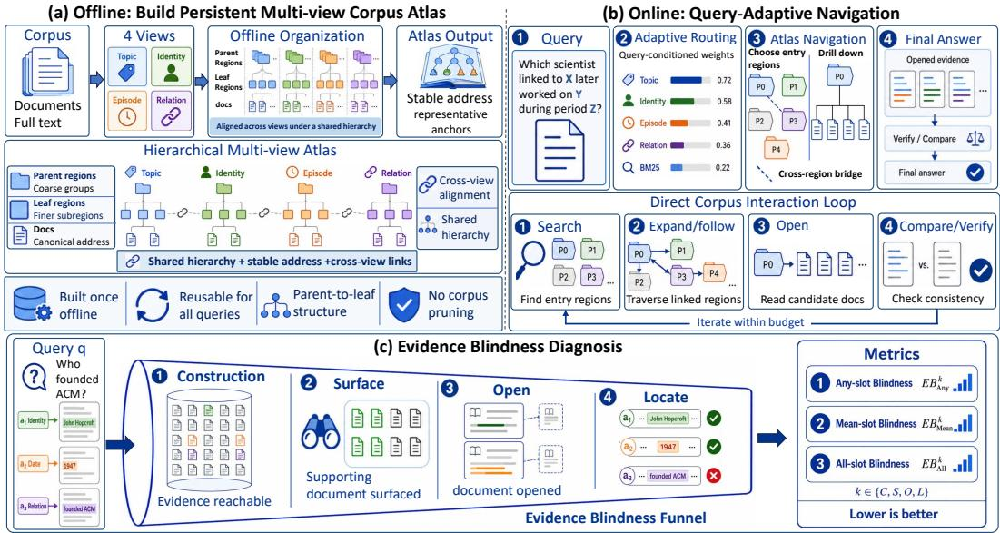  
Figure 1: AtlasNav and Evidence Blindness. (a) Offline construction of the persistent multi-view Corpus Atlas. (b) Query-adaptive finite-budget navigation. (c) Stage-wise Evidence Blindness diagnosis, with fragment-level Qrel making Locate directly measurable.

region, while evidence tied to other entities, event stages, or relations surfaces too late. AtlasNav therefore learns a persistent organization that preserves multiple complementary evidence directions before any query arrives.

For each canonical document $d ,$ we construct four complementary semantic views:

$$
Z ( d ) = \bigl \{ z _ { d } ^ { T } , z _ { d } ^ { I } , z _ { d } ^ { E } , z _ { d } ^ { R } \bigr \} , \qquad z _ { d } ^ { v } = \mathrm { E n c } _ { v } ( \mathrm { S i g } _ { v } ( d ) ) , \quad v \in \{ T , I , E , R \} .\tag{4}
$$

Here, T, I, E, and R denote Topic, Identity, Episode, and Relation. Topic captures subject and domain; Identity emphasizes entities and disambiguators; Episode captures events and temporal stages; and Relation represents roles and cross-entity connections. $\mathrm { S i g } _ { v } ( d )$ is a view-specific grounded signature derived from canonical content, and Enc (·) maps it into the corresponding semantic space. The same document can therefore occupy view-dependent neighborhoods. Because these views derive from canonical content rather than source-specific schemas, they provide a shared semantic organization across heterogeneous document types.

Each view induces a sparse document-neighborhood graph, which AtlasNav integrates through multiplex Leiden community detection (Mucha et al., 2010; Traag et al., 2019) into a persistent hierarchy. Topic and Identity define coarse regions, while Episode and Relation distinguish finer event stages and relational patterns. Representative anchors and cross-region connections make the hierarchy navigable.

Built once and reused across queries, the resulting Atlas preserves multiple navigable evidence directions without replacing the full corpus with a query-specific candidate pool. Online interaction only determines which directions to prioritize for the current query. Representation, hierarchy, and access-point details are given in Appendices C.1–C.3.

## 4.3 QUERY-ADAPTIVE ATLAS NAVIGATION

The persistent Atlas fixes which reusable evidence directions exist; each query only changes their priority. Entity-centered and temporal queries may favor Identity or Episode, while exact lexical cues favor BM25 retrieval (Robertson & Zaragoza, 2009). AtlasNav therefore combines Topic, Identity, Episode, Relation, and BM25 as complementary navigation channels.

Given a query $q ,$ the query-adaptive router assigns channel weights $w _ { v } ( q )$ . Each channel independently ranks the full corpus, and AtlasNav combines these rankings using weighted Reciprocal Rank

Fusion (RRF) (Cormack et al., 2009):

$$
S _ { q } ( d ) = \sum _ { v \in \mathcal { V } } \frac { w _ { v } ( q ) } { \kappa + \mathrm { r a n k } _ { v } ( d \mid q ) } , \qquad \mathcal { V } = \{ T , I , E , R , \mathrm { B M 2 5 } \} .\tag{5}
$$

Here, $S _ { q } ( d )$ is the navigation priority of document d, $w _ { v } ( q )$ its query-specific channel weight, $\operatorname { r a n k } _ { v } ( d \mid q )$ its channel rank, and κ the RRF smoothing constant. RRF places heterogeneous semantic and lexical rankings on a common rank-based scale. The fusion prioritizes query-suited directions while retaining complementary signals.

Document priorities are projected onto Atlas regions. High-priority, complementary regions become initial entries, allowing limited observations to cover multiple plausible parts of an evidence chain rather than one local region. From these entries, the fixed agent continues to search, read, compare, and verify canonical evidence.

The router uses only corpus-derived single- and multi-document training tasks. It excludes BrowseComp-Plus evaluation questions and labels and favors jointly necessary supports; details are given in Appendix C.2.

All interfaces follow the common budget-accounting and checkpoint protocol in Section 5.1. We evaluate whether AtlasNav realizes required evidence earlier and closes the empirical reference gap with less interaction.

## 5 EXPERIMENTS

We evaluate whether AtlasNav alleviates Evidence Blindness and converts finite interaction into usable evidence more efficiently. BrowseComp-Plus (Chen et al., 2025) tests this mechanism in web-style deep research, PhantomWiki (Gong et al., 2025) tests generality under a distinct corpus organization and controlled scale growth, and EnterpriseRAG-Bench (Sun et al., 2026) tests transfer to heterogeneous enterprise knowledge. Additional diagnostics and ablations are provided in the appendix.

## 5.1 EXPERIMENTAL SETUP

Benchmarks. The three benchmarks respectively test open-domain evidence realization, generality across corpus organization and controlled scaling, and transfer to heterogeneous enterprise knowl edge. PhantomWiki uses nested corpora that preserve questions and supporting evidence while adding distractor worlds, isolating navigation-space growth from question difficulty.

Corpus interfaces. On BrowseComp-Plus and PhantomWiki, we compare three DCI-based corpus interfaces: raw DCI searches the full corpus directly (Li et al., 2026); DR-DCI dynamically expands a query-conditioned workspace (Lu et al., 2026); and AtlasNav navigates a persistent shared Atlas. On BrowseComp-Plus, we evaluate all three with DeepSeek-V4-Flash (DeepSeek-AI, 2026), MiMo-V2.5 (Xiaomi MiMo Team, 2026), ChatGPT-5.6-Luna (OpenAI, 2026), and Qwen-3.7-Flash (Alibaba Cloud, 2026), constructing a same-agent evidence-supplied reference for each backbone.

Evaluation. On BrowseComp-Plus, we report strict accuracy, recorded online inference cost, Evidence Blindness, and the empirical reference gap; costs are compared only within each backbone. PhantomWiki reports strict accuracy and Surface Evidence Blindness under controlled scaling, while EnterpriseRAG-Bench follows its official metrics. Appendices D–E detail protocols, recorded resources, and main-benchmark analyses; Appendix I archives exact numerical results.

## 5.2 BROWSECOMP-PLUS: EVIDENCE BLINDNESS AND EFFICIENCY

We first compare the final accuracy–efficiency frontier, then localize Evidence Blindness, and finally examine turn- and cost-budget trajectories to determine whether the evidence advantage emerges early.

Accuracy–efficiency. Raw DCI directly explores the full corpus, DR-DCI repeatedly expands a query-conditioned workspace, and AtlasNav navigates evidence directions already organized in a persistent representation. Table 1 shows that this shift advances the accuracy–efficiency frontier across all four backbones.

AtlasNav improves strict accuracy by 3.98–21.57 percentage points over DR-DCI while reducing recorded online cost by 0.62–30.21%. The gain spans capability regimes: persistent navigation improves the strong ChatGPT backbone and is largest for Qwen, where evidence access is more limiting. Across all four backbones, the same agents realize more task capability from less interaction, supporting a backbone-robust interface improvement rather than a model-specific optimization.

Table 1: Accuracy and recorded online inference cost on BrowseComp-Plus. Costs are normalized within each backbone to AtlasNav = 1.000; accuracy gains and cost savings are relative to DR-DCI.
<table><tr><td rowspan="2">Backbone</td><td colspan="5">Strict Accuracy (%) ↑</td><td colspan="4">Normalized Recorded Online Cost ↓</td></tr><tr><td>DCI</td><td>DR-DCI</td><td>AtlasNav</td><td>Ref.</td><td>∆ Acc.</td><td>DCI</td><td>DR-DCI</td><td>AtlasNav</td><td>Cost save (%)</td></tr><tr><td>DeepSeek</td><td>81.45</td><td>84.58</td><td>92.05</td><td>96.51</td><td>+7.47</td><td>2.346</td><td>1.433</td><td>1.000</td><td>30.21</td></tr><tr><td>MiMo</td><td>62.89</td><td>71.08</td><td>79.04</td><td>96.14</td><td>+7.96</td><td>2.579</td><td>1.006</td><td>1.000</td><td>0.62</td></tr><tr><td>ChatGPT</td><td>87.35</td><td>87.83</td><td>91.81</td><td>96.51</td><td>+3.98</td><td>1.718</td><td>1.173</td><td>1.000</td><td>14.74</td></tr><tr><td>Qwen</td><td>36.99</td><td>50.96</td><td>72.53</td><td>95.42</td><td>+21.57</td><td>2.243</td><td>1.271</td><td>1.000</td><td>21.31</td></tr></table>

Evidence Blindness. Construction is complete for all three DCI-based interfaces and is therefore omitted from Table 2, which reports Any and All Evidence Blindness at Surface, Open, and Locate. $\mathrm { E B } _ { \mathrm { A n y } } ^ { k }$ denotes that no required slot is realized, whereas $\mathrm { E B } _ { \mathrm { A l l } } ^ { k }$ denotes failure to realize the complete evidence set.

Table 2: Evidence Blindness (EB) on BrowseComp-Plus (%); lower is better.
<table><tr><td></td><td>1</td><td colspan="2">Surface ↓</td><td colspan="2">Open ↓</td><td colspan="2">Locate ↓</td></tr><tr><td>Backbone</td><td>Interface</td><td> $\mathrm { E B } _ { \mathrm { A n y } } ^ { S }$ </td><td> $\mathrm { E B } _ { \mathrm { A l l } } ^ { S }$ </td><td> $\mathrm { E B } _ { \mathrm { A n y } } ^ { O }$ </td><td> $\mathrm { E B } _ { \mathrm { A l l } } ^ { O }$ </td><td> $\mathrm { E B } _ { \mathrm { A n y } } ^ { L }$ </td><td> $\mathrm { E B } _ { \mathrm { A l l } } ^ { L }$ </td></tr><tr><td>DeepSeek</td><td>DCI</td><td>13.13</td><td>13.37</td><td>14.70</td><td>15.42</td><td>17.83</td><td>18.80</td></tr><tr><td></td><td>DR-DCI</td><td>13.49</td><td>14.10</td><td>16.51</td><td>17.11</td><td>23.61</td><td>24.46</td></tr><tr><td></td><td>AtlasNav</td><td>4.82</td><td>4.94</td><td>7.59</td><td>7.83</td><td>10.72</td><td>11.45</td></tr><tr><td>MiMo</td><td>DCI</td><td>29.52</td><td>29.52</td><td>33.86</td><td>33.86</td><td>36.87</td><td>36.87</td></tr><tr><td></td><td>DR-DCI</td><td>25.90</td><td>26.27</td><td>26.99</td><td>27.59</td><td>31.69</td><td>32.29</td></tr><tr><td></td><td>AtlasNav</td><td>16.75</td><td>17.83</td><td>19.88</td><td>20.24</td><td>23.73</td><td>24.22</td></tr><tr><td>ChatGPT</td><td>DCI</td><td>6.63</td><td>6.99</td><td>12.89</td><td>13.01</td><td>15.90</td><td>16.27</td></tr><tr><td></td><td>DR-DCI</td><td>9.40</td><td>9.76</td><td>10.48</td><td>11.08</td><td>15.90</td><td>16.63</td></tr><tr><td></td><td>AtlasNav</td><td>5.66</td><td>6.02</td><td>9.04</td><td>9.52</td><td>11.93</td><td>12.65</td></tr><tr><td>Qwen</td><td>DCI</td><td>54.70</td><td>55.54</td><td>57.35</td><td>58.80</td><td>61.57</td><td>63.50</td></tr><tr><td></td><td>DR-DCI</td><td>49.04</td><td>49.76</td><td>50.60</td><td>51.33</td><td>56.63</td><td>57.23</td></tr><tr><td></td><td>AtlasNav</td><td>19.64</td><td>20.12</td><td>22.29</td><td>23.01</td><td>29.40</td><td>30.36</td></tr></table>

The improvement first appears at Surface, directly matching the purpose of the persistent multiview Atlas. Supports associated with Topic, Identity, Episode, and Relation remain discoverable as complementary directions rather than repeatedly competing along one local relevance axis. Relative to DR-DCI, $\mathrm { E } \dot { \mathrm { B } } _ { \mathrm { A l l } } ^ { S }$ falls from 14.10% to 4.94% on DeepSeek and from 49.76% to 20.12% on Qwen.

The gain persists through Open and Locate, showing that improved visibility becomes usable evidence rather than stopping at candidate exposure. On DeepSeek, $\mathrm { E B } _ { \mathrm { A l l } } ^ { S \bar { / } O / L }$ falls from 14.10/17.11/24.46% with DR-DCI to 4.94/7.83/11.45% with AtlasNav; all four backbones show the same stage-wise direction.

The accuracy–efficiency gain therefore has a process-level explanation: AtlasNav reduces silent loss along Surface → Open → Locate, allowing the unchanged agent to reason over more complete usable evidence. Appendix E analyzes cross-backbone evidence dynamics, with full values in Appendix I. Checkpoint analysis next tests whether this reduction begins before the trajectory endpoint.

Finite-budget convergence. Figure 2 plots the empirical reference gap $G _ { I } ( B )$ , where a smaller gap indicates earlier realization of the same agent’s evidence-conditioned capability. AtlasNav enters a lower-gap regime early and maintains the smallest gap across all four backbones from 30 turns onward. Additional budget helps the baselines recover long-tail examples but does not erase this separation. Persistent navigation therefore improves not only how much evidence is realized, but how quickly it becomes usable.

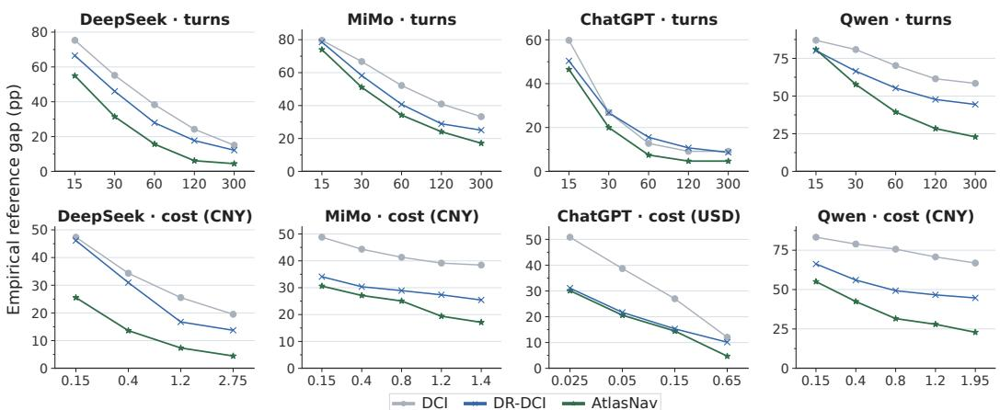  
Figure 2: Finite-budget reference gaps under turn (top) and cost (bottom) budgets; axes are independently scaled and lower is better.

Budget-level Evidence Blindness explains this faster convergence. At the lowest DeepSeek matched-cost budget (CNY 0.15), AtlasNav reduces $\mathrm { E B } _ { \mathrm { A l l } } ^ { L }$ to 35.90%, versus 45.18% for DR-DCI, with reference gaps of 25.55 and 46.15 percentage points. The relation persists on ChatGPT: at 60 turns, $\mathrm { E B } _ { \mathrm { A l l } } ^ { L }$ is 13.61% versus 20.72%, with gaps of 7.47 versus 15.55 points. Appendix E shows all four backbones; Appendix I gives exact checkpoints.

Together, the results recover the mechanism in Section 4: the persistent multi-view representation reduces Surface blindness, while query-adaptive navigation makes these directions usable earlier through Open and Locate. Lower Evidence Blindness yields faster reference-gap contraction and a better accuracy–efficiency frontier. Less interaction is spent rediscovering the search space; more becomes timely, complete usable evidence.

## 5.3 PHANTOMWIKI: STRUCTURE AND SCALE

BrowseComp-Plus tests web-style deep research, whereas PhantomWiki uses short, entity-centric documents linked by relational and attribute chains (Gong et al., 2025). We fix 200 questions, answers, and supporting documents while adding distractor worlds to expand a nested corpus from 10,059 to 1,006,839 files. This separates transfer to a distinct corpus organization from controlled scale growth.

Under this shift, raw DCI adds no reusable organization, DR-DCI reconstructs a query-conditioned workspace online, and AtlasNav reuses persistent multi-view structure. Figure 3 shows that AtlasNav attains the lowest $\mathrm { E B } _ { \mathrm { A l l } } ^ { S }$ at every scale. At roughly one million files, Surface blindness is 49.5%, versus 59.0% for DCI and 87.0% for DR-DCI. The representation in Section 4.2 therefore continues to expose complementary evidence under a distinct corpus organization.

The Surface advantage carries through to final performance. Table 3 shows the highest strict accuracy for AtlasNav at every scale, including 76.0–77.5% from 10K to 100K files. DCI exceeds DR-DCI throughout PhantomWiki, reversing their BrowseComp-Plus ordering. Query-conditioned workspace expansion is therefore not uniformly stronger than direct interaction; its effectiveness depends on corpus organization. AtlasNav remains strongest under both structures.

Scaling from 100K to roughly one million files degrades all interfaces and lowers AtlasNav by 15.0 points to 61.0%, but it retains the lowest Surface blindness and highest observed strict accuracy. Persistent multi-view organization thus remains effective under both structural and scale shifts.

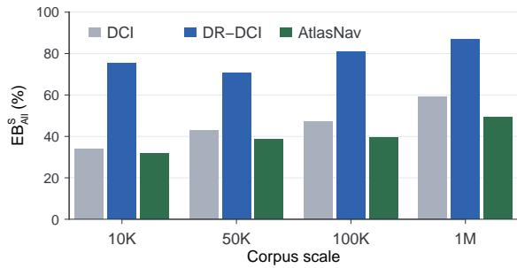  
Figure 3: $\mathrm { E B } _ { \mathrm { A l l } } ^ { S }$ under controlled PhantomWiki scaling. Questions and supporting evidence remain fixed; lower is better.

Table 3: PhantomWiki accuracy under controlled corpus scaling (n = 200). Bold denotes the best result.
<table><tr><td></td><td colspan="3">Strict Accuracy (%) ↑</td></tr><tr><td>Interface</td><td>10K</td><td>50K</td><td>100K</td><td>1M</td></tr><tr><td>DCI</td><td>70.0</td><td>72.5</td><td>70.0</td><td>58.5</td></tr><tr><td>DR-DCI</td><td>41.5</td><td>45.5</td><td>45.0</td><td>37.0</td></tr><tr><td>AtlasNav</td><td>76.5</td><td>77.5</td><td>76.0</td><td>61.0</td></tr></table>

## 5.4 ENTERPRISERAG-BENCH: ENTERPRISE TRANSFER

EnterpriseRAG-Bench moves beyond PhantomWiki’s controlled structural and scale shifts to heterogeneous enterprise knowledge. Its 511,958 documents span nine source types, including Slack, Gmail, GitHub, Jira, Confluence, and Google Drive, while 500 questions cover ten categories (Sun et al., 2026). AtlasNav applies the same Topic, Identity, Episode, and Relation views across these sources without source-specific corpus interfaces.

Under the benchmark’s official current-main evaluator, AtlasNav attains an Overall score of 73.72, with 79.80% Correctness, 78.53% Completeness, 66.98% Document Recall, and 0.66 Invalid Extra Documents. The close Correctness and Completeness scores show broad fact coverage at the aggregate level, while the low invalid-extra count indicates that this coverage is not obtained by indiscriminately expanding the submitted evidence set. For context rather than controlled comparison, Table 4 reports the top systems by Overall together with representative agent and retrieval baselines from a public leaderboard snapshot (Onyx, 2026). AtlasNav numerically falls between Troml and Skyller in this snapshot.

Table 4: EnterpriseRAG-Bench metrics with representative public systems.
<table><tr><td>System</td><td>Overall ↑</td><td>Correct. (%) ↑</td><td>Complete. (%) ↑</td><td>Doc. Recall (%) ↑</td><td>Invalid Extra ↓</td></tr><tr><td>metor.com</td><td>80.34</td><td>82.00</td><td>86.22</td><td>85.53</td><td>4.96</td></tr><tr><td>Troml</td><td>76.79</td><td>83.80</td><td>81.84</td><td>86.55</td><td>12.65</td></tr><tr><td>AtlasNav</td><td>73.72</td><td>79.80</td><td>78.53</td><td>66.98</td><td>0.66</td></tr><tr><td>Skyller</td><td>71.93</td><td>77.00</td><td>79.14</td><td>81.60</td><td>8.86</td></tr><tr><td>OpenClaw</td><td>68.22</td><td>81.60</td><td>72.86</td><td>79.02</td><td>0.47</td></tr><tr><td>OpenAI File Search</td><td>61.03</td><td>69.80</td><td>67.87</td><td>71.65</td><td>15.70</td></tr><tr><td>Bash Agent + GPT-5.4</td><td>52.63</td><td>60.60</td><td>61.12</td><td>55.76</td><td>2.00</td></tr></table>

The result spans substantially different task types: AtlasNav reaches 93.96 Overall on intradocument reasoning, 91.24 on constrained questions, and 84.56 on conflicting-information queries. Project-related and completeness-heavy questions remain harder, at 43.70 and 45.56 Overall, respectively, exposing dispersed multi-document synthesis as a remaining boundary. Together, these results extend persistent navigation beyond web-style and synthetic corpora: persistent multi-view organization can serve as a shared navigation layer over heterogeneous enterprise knowledge.

## 6 CONCLUSION

Large-scale agentic search is constrained not only by whether evidence exists, but by whether it becomes visible, accessible, and usable under finite interaction. We formalize this silent loss as Evidence Blindness and recast search as finite-budget navigation over reusable corpus structure. AtlasNav extends DCI with a persistent multi-view Corpus Atlas while retaining direct interaction. On BrowseComp-Plus, it reduces Evidence Blindness and closes the empirical reference gap faster. The same persistent-navigation principle remains effective across changes in corpus organization, scale, and heterogeneous enterprise knowledge. Corpus representation should therefore be treated as a first-class component of the agent interface: reusable structure turns limited interaction from repeated exploration into effective navigation.

## AI USE STATEMENT

In this work, we used generative AI tools for language editing, software-code assistance, and LATEX and figure-layout checks. The authors reviewed all AI-assisted text for fidelity to the intended claims and supporting evidence. AI-assisted code was inspected, executed, and validated against frozen inputs and expected outputs before use. The authors determined the research questions, methodology, experimental protocol, analysis, and conclusions, and take responsibility for all text, claims, code, and artifacts in this submission.

## REPRODUCIBILITY STATEMENT

Sections 3–5 describe the Evidence Blindness evaluation, AtlasNav, and the main experiments. Appendix B specifies the executable evidence stages and frozen fragment-level Qrel; Appendix C documents Atlas construction, routing, and online navigation; and Appendix D gives the evaluation, cost, checkpoint, and statistical protocols. Exact endpoint and checkpoint values are archived in Ap pendix I. An anonymized supplementary package will provide the implementation, data-processing and evaluation scripts, frozen configurations, derived data, Qrel, and adopted trajectories, together with instructions for reconstructing the benchmark corpora from their public sources. The code, releaseable data, and trajectories will be made public.

## REFERENCES

Alibaba Cloud. Qwen3.7-Flash model. https://www.alibabacloud.com/help/en/ model-studio/qwen3-7-flash, 2026. Accessed: 2026-08-23.

Zijian Chen, Xueguang Ma, Shengyao Zhuang, Ping Nie, Kai Zou, Andrew Liu, Joshua Green, Kshama Patel, Ruoxi Meng, Mingyi Su, Sahel Sharifymoghaddam, Yanxi Li, Haoran Hong, Xinyu Shi, Xuye Liu, Nandan Thakur, Crystina Zhang, Luyu Gao, Wenhu Chen, and Jimmy Lin. BrowseComp-Plus: A more fair and transparent evaluation benchmark of deep-research agent. arXiv preprint arXiv:2508.06600, 2025. URL https://arxiv.org/abs/2508.06600.

Gordon V. Cormack, Charles L. A. Clarke, and Stefan Buettcher. Reciprocal rank fusion outperforms condorcet and individual rank learning methods. In Proceedings of the 32nd International ACM SIGIR Conference on Research and Development in Information Retrieval, pp. 758–759, 2009. doi: 10.1145/1571941.1572114.

DeepSeek-AI. DeepSeek-V4: Towards highly efficient million-token context intelligence. arXiv preprint arXiv:2606.19348, 2026. doi: 10.48550/arXiv.2606.19348. URL https://arxiv. org/abs/2606.19348.

Darren Edge, Ha Trinh, Newman Cheng, Joshua Bradley, Alex Chao, Apurva Mody, Steven Truitt, and Jonathan Larson. From local to global: A graph RAG approach to query-focused summarization. arXiv preprint arXiv:2404.16130, 2024. URL https://arxiv.org/abs/2404. 16130.

Shahul Es, Jithin James, Luis Espinosa-Anke, and Steven Schockaert. RAGAs: Automated evaluation of retrieval augmented generation. In Proceedings of the 18th Conference of the European Chapter ofthe Associationfor Computational Linguistics: System Demonstrations, pp. 150–158. Association for Computational Linguistics, 2024. doi: 10.18653/v1/2024.eacl-demo.16. URL https://aclanthology.org/2024.eacl-demo.16/.

Albert Gong, Kamile Stankevi´ ciˇ ut¯ e, Chao Wan, Anmol Kabra, Raphael Thesmar, Johann Lee, Julius´ Klenke, Carla P. Gomes, and Kilian Q. Weinberger. PhantomWiki: On-demand datasets for reasoning and retrieval evaluation. In Proceedings of the 42nd International Conference on Machine Learning, 2025. URL https://arxiv.org/abs/2502.20377.

Bernal Jimenez Guti ´ errez, Yiheng Shu, Yu Gu, Michihiro Yasunaga, and Yu Su. Hip-´ poRAG: Neurobiologically inspired long-term memory for large language models. In Advances in Neural Information Processing Systems, volume 37, 2024. URL https://proceedings.neurips.cc/paper\_files/paper/2024/hash/ 6ddc001d07ca4f319af96a3024f6dbd1-Abstract-Conference.html.

Bernal Jimenez Guti´ errez, Yiheng Shu, Weijian Qi, Sizhe Zhou, and Yu Su. From RAG to memory:´ Non-parametric continual learning for large language models. In Proceedings of the 42nd International Conference on Machine Learning, volume 267 of Proceedings ofMachine Learning Research, pp. 21497–21515. PMLR, 2025. URL https://proceedings.mlr.press/ v267/gutierrez25a.html.

Xanh Ho, Anh-Khoa Duong Nguyen, Saku Sugawara, and Akiko Aizawa. Constructing a multihop QA dataset for comprehensive evaluation of reasoning steps. In Proceedings of the 28th International Conference on Computational Linguistics, pp. 6609–6625, 2020. doi: 10.18653/v1/ 2020.coling-main.580.

Bowen Jin, Hansi Zeng, Zhenrui Yue, Jinsung Yoon, Sercan O. Arik, Dong Wang, Hamed Zamani, and Jiawei Han. Search-R1: Training LLMs to reason and leverage search engines with reinforcement learning. In Conference on Language Modeling, 2025. URL https: //openreview.net/forum?id=Rwhi91ideu.

Patrick Lewis, Ethan Perez, Aleksandra Piktus, Fabio Petroni, Vladimir Karpukhin, Naman Goyal, Heinrich Kuttler, Mike Lewis, Wen-tau Yih, Tim Rockt¨ aschel, Sebastian Riedel, and Douwe¨ Kiela. Retrieval-augmented generation for knowledge-intensive NLP tasks. In Advances in Neural Information Processing Systems, volume 33, pp. 9459–9474, 2020.

Xiaoxi Li, Jiajie Jin, Guanting Dong, Hongjin Qian, Yongkang Wu, Ji-Rong Wen, Yutao Zhu, and Zhicheng Dou. WebThinker: Empowering large reasoning models with deep research capability. In Advances in Neural Information Processing Systems, volume 38, 2025. doi: 10.52202/ 085713-4011. URL https://proceedings.neurips.cc/paper\_files/paper/ 2025/hash/ae03bdef276132fae089692445725635-Abstract-Conference. html.

Zhuofeng Li, Haoxiang Zhang, Cong Wei, Pan Lu, Ping Nie, Yi Lu, Yuyang Bai, Shangbin Feng, Hangxiao Zhu, Ming Zhong, Yuyu Zhang, Jianwen Xie, Yejin Choi, James Zou, Jiawei Han, Wenhu Chen, Jimmy Lin, Dongfu Jiang, and Yu Zhang. Beyond semantic similarity: Rethinking retrieval for agentic search via direct corpus interaction. arXiv preprint arXiv:2605.05242, 2026. URL https://arxiv.org/abs/2605.05242.

Yi Lu, Zhuofeng Li, Ping Nie, Haoxiang Zhang, Yuyu Zhang, Kai Zou, Wenhu Chen, Jimmy Lin, Dongfu Jiang, and Yu Zhang. Dr-DCI: Scaling direct corpus interaction via dynamic workspace expansion. arXiv preprint arXiv:2606.14885, 2026. URL https://arxiv.org/ abs/2606.14885.

Peter J. Mucha, Thomas Richardson, Kevin Macon, Mason A. Porter, and Jukka-Pekka Onnela. Community structure in time-dependent, multiscale, and multiplex networks. Science, 328(5980): 876–878, 2010. doi: 10.1126/science.1184819.

Onyx. EnterpriseRAG-Bench Leaderboard, 2026. URL https://huggingface.co/ spaces/onyx-dot-app/EnterpriseRAG-Bench-Leaderboard. Accessed: 2026- 08-24.

OpenAI. GPT-5.6: Frontier intelligence that scales with your ambition. https://openai.com/ index/gpt-5-6/, 2026.

Kirk Roberts, Tasnim Alam, Steven Bedrick, Dina Demner-Fushman, Kyle Lo, Ian Soboroff, Ellen Voorhees, Lucy Lu Wang, and William R. Hersh. TREC-COVID: Rationale and structure of an information retrieval shared task for COVID-19. Journal of the American Medical Informatics Association, 27(9):1431–1436, 2020. doi: 10.1093/jamia/ocaa091.

Stephen Robertson and Hugo Zaragoza. The probabilistic relevance framework: BM25 and beyond. Foundations and Trends in Information Retrieval, 4(1–2):1–174, 2009. doi: 10.1561/1500000019.

Dongyu Ru, Lin Qiu, Xiangkun Hu, Tianhang Zhang, Peng Shi, Shuaichen Chang, Jiayang Cheng, Cunxiang Wang, Shichao Sun, Huanyu Li, Zizhao Zhang, Binjie Wang, Jiarong Jiang, Tong He, Zhiguo Wang, Pengfei Liu, Yue Zhang, and Zheng Zhang. RAGChecker: A fine-grained framework for diagnosing retrieval-augmented generation. In Advances in

Neural Information Processing Systems, volume 37, 2024. doi: 10.52202/079017-0692. URL https://proceedings.neurips.cc/paper\_files/paper/2024/ hash/27245589131d17368cccdfa990cbf16e-Abstract-Datasets\_and\_ Benchmarks\_Track.html.

Jon Saad-Falcon, Omar Khattab, Christopher Potts, and Matei Zaharia. ARES: An automated evaluation framework for retrieval-augmented generation systems. In Proceedings of the 2024 Conference ofthe North American Chapter ofthe Associationfor Computational Linguistics: Human Language Technologies (Volume 1: Long Papers), pp. 338–354. Association for Computational Linguistics, 2024. doi: 10.18653/v1/2024.naacl-long.20. URL https://aclanthology. org/2024.naacl-long.20/.

Parth Sarthi, Salman Abdullah, Aditi Tuli, Shubh Khanna, Anna Goldie, and Christopher D. Manning. RAPTOR: Recursive abstractive processing for tree-organized retrieval. In International Conference on Learning Representations, 2024. URL https://proceedings.iclr.cc/paper\_files/paper/2024/hash/ 8a2acd174940dbca361a6398a4f9df91-Abstract-Conference.html.

Yuhong Sun, Joachim Rahmfeld, Chris Weaver, Roshan Desai, Wenxi Huang, and Mark H. Butler. EnterpriseRAG-Bench: A RAG benchmark for company internal knowledge. arXiv preprint arXiv:2605.05253, 2026. URL https://arxiv.org/abs/2605.05253.

Yashar Talebirad, Ali Parsaee, Csongor Y. Szepesvari, Amirhossein Nadiri, and Osmar Zaiane. Toward a theory of hierarchical memory for language agents. arXiv preprint arXiv:2603.21564, 2026. URL https://arxiv.org/abs/2603.21564.

Vincent A. Traag, Ludo Waltman, and Nees Jan van Eck. From louvain to leiden: Guaranteeing wellconnected communities. Scientific Reports, 9(1):5233, 2019. doi: 10.1038/s41598-019-41695-z.

Harsh Trivedi, Niranjan Balasubramanian, Tushar Khot, and Ashish Sabharwal. Interleaving retrieval with chain-of-thought reasoning for knowledge-intensive multi-step questions. In Proceedings ofthe 61st Annual Meeting ofthe Associationfor Computational Linguistics, pp. 10014– 10037, 2023. doi: 10.18653/v1/2023.acl-long.557. URL https://aclanthology.org/ 2023.acl-long.557/.

Mengzhao Wang, Zheng Gong, Jingpei Hu, Jiajie Fu, Maojia Sheng, Junwen Chen, and Yifan Zhu. Directory-aware query and maintenance in vector databases. arXiv preprint arXiv:2606.16903, 2026. URL https://arxiv.org/abs/2606.16903.

Xiaomi MiMo Team. MiMo-V2.5. https://huggingface.co/XiaomiMiMo/MiMo-V2. 5, 2026.

Yue Xu, Yutao Sun, Yihao Liu, Mengyu Zhou, Jiayi Qiao, Lu Ma, Kai Tang, Wenjie Wang, Xiaoxi Jiang, and Guanjun Jiang. From passive retrieval to active memory navigation: Learning to use memory as a structured action space. arXiv preprint arXiv:2607.05794, 2026. URL https: //arxiv.org/abs/2607.05794.

Nan Zhang, Prafulla Kumar Choubey, Alexander Fabbri, Gabriel Bernadett-Shapiro, Rui Zhang, Prasenjit Mitra, Caiming Xiong, and Chien-Sheng Wu. SiReRAG: Indexing similar and related information for multihop reasoning. In International Conference on Learning Representations, 2025. URL https://proceedings.iclr.cc/paper\_files/paper/2025/hash/ f9668d223e713943634dce9c66e8f2c1-Abstract-Conference.html.

Ziwen Zhao and Menglin Yang. Hierarchical abstract tree for cross-document retrieval-augmented generation. arXiv preprint arXiv:2605.00529, 2026. URL https://arxiv.org/abs/ 2605.00529.

Andrew Zhu, Alyssa Hwang, Liam Dugan, and Chris Callison-Burch. FanOutQA: A multihop, multi-document question answering benchmark for large language models. arXiv preprint arXiv:2402.14116, 2024.

Shengyao Zhuang, Yuansheng Ni, Hengxin Fun, Jimmy Lin, and Xueguang Ma. Towards retrieving interaction spaces for agentic search. arXiv preprint arXiv:2606.06880, 2026. URL https: //arxiv.org/abs/2606.06880.

## A LIMITATIONS

Evidence Blindness is benchmark-grounded by design. Its fragment-level Qrel is constructed from benchmark-designated supports and canonical text, retaining multiple aligned fragments when supervision provides them. Freezing this common target instead of expanding it with an evaluationtime semantic judge keeps Locate deterministic and comparable across interfaces. EB measures realization of this shared evidence target, while accuracy independently measures task success.

AtlasNav requires reusable offline construction. The per-query contribution of this construction cost depends on how many queries share an Atlas, how long it is reused, and how often it is refreshed. Because these deployment-dependent amortization factors vary substantially, we report construction resources separately and compare online inference within each backbone rather than imposing an arbitrary denominator.

Persistent navigation’s benefit also depends on the dominant interaction bottleneck. In the compact high-recall settings evaluated here, less Evidence Blindness remains to reduce; in million-file PhantomWiki, an additional bottleneck emerges in converting surfaced directions into opened documents. AtlasNav therefore improves finite-budget corpus navigation rather than eliminating downstream reasoning or document-consumption constraints.

## B EVIDENCE BLINDNESS EVALUATION

This section operationalizes the evidence-realization stages used in the main paper and describes the frozen fragment-level Qrel. Its purpose is to make the diagnosis reproducible while keeping final-answer accuracy as a separate outcome measure.

## B.1 OPERATIONALIZING EVIDENCE BLINDNESS

For question q and required slot $a \in A _ { q } ,$ , let $D _ { q , a }$ be the benchmark-designated evidence documents that can establish the slot and $Z _ { q , a , d }$ the accepted canonical spans in document d. The evaluated stage sets are

$$
H _ { q } ^ { C } = \{ a : \exists d \in D _ { q , a } , \mathrm { A v a i l a b l e } ( d ) \} ,\tag{6}
$$

$$
H _ { q } ^ { S } = \{ a : \exists d \in D _ { q , a } , \mathrm { V i s i b l e I D } _ { q } ( d ) \} ,\tag{7}
$$

$$
H _ { q } ^ { O } = \{ a : \exists d \in D _ { q , a } , \mathrm { V i s i b l e B o d y } _ { q } ( d ) \} ,\tag{8}
$$

$$
H _ { q } ^ { L } = \{ a : \exists d \in D _ { q , a } , \exists z \in Z _ { q , a , d } , { \mathrm { S p a n M a t c h } } _ { q } ( z , d ) \} .\tag{9}
$$

VisibleID requires an identifiable document entry in an observation sent to the model. VisibleBody requires a successful canonical-body observation to enter a subsequent model context, and SpanMatch requires an accepted span in that same model-visible canonical body. Filenames, previews, failed tool outputs, and internal search state not returned to the model do not count as Open or Locate.

Construction is an availability boundary, not an online action. It is saturated in the main DCI-based comparisons because all 889 annotated slots have supporting evidence in the canonical corpus and no interface permanently removes those documents from its reachable corpus. Construction is retained to distinguish corpus or interface incompleteness from evidence loss during interaction.

## B.2 FRAGMENT-LEVEL QREL

The fragment-level Qrel is constructed from BrowseComp-Plus questions, reference answers, benchmark-designated evidence documents and gold documents, and canonical text. It is created independently of all evaluated trajectories, predictions, judge decisions, and correctness labels. For each required evidence slot, the annotation identifies one or more short canonical fragments sufficient to establish the corresponding fact. When the benchmark supervision provides multiple valid supporting documents or passages, all aligned alternatives are retained.

Table 5: Frozen BrowseComp-Plus fragment-level Qrel.
<table><tr><td>Item</td><td>Count</td></tr><tr><td>Questions</td><td>830</td></tr><tr><td>Required evidence slots</td><td>889</td></tr><tr><td>Accepted canonical spans</td><td>1,753</td></tr><tr><td>Canonical documents represented</td><td>1,445</td></tr><tr><td>Questions passing automatic validation</td><td>828</td></tr><tr><td>Questions requiring manual adjudication</td><td>2</td></tr></table>

Every record is validated for canonical document identity, exact quotation, character offsets, slot coverage, and substring consistency; only two of 830 questions require manual adjudication under the same sufficiency criterion. A slot reaches Locate when any accepted aligned fragment enters the model-visible canonical context.

This design intentionally uses a frozen benchmark-aligned evidence target rather than an evaluationtime semantic judge. As a result, Locate is deterministic, auditable, and shared identically across interfaces. Evidence Blindness therefore evaluates differences in evidence realization under a com mon target, while final-answer accuracy remains the independent measure of task success.

## B.3 TRAJECTORY MATCHING AND VALIDITY

Trajectories are evaluated in temporal order. The parser retains successful canonical-body results only when they enter a subsequent model request, resolves the canonical document ID, and normalizes both observation and Qrel text using Unicode NFKC, case folding, whitespace collapse, and typographic quote and dash normalization. Locate credit is awarded by exact normalized substring matching within the same document; no embedding or LLM judge is used.

Incorrect questions are assigned to the earliest unmet All stage—Surface, Open, Locate, or downstream reasoning after complete Locate. This attribution identifies the earliest observed evidencerealization failure and is descriptive rather than counterfactual. Accuracy is evaluated independently: complete Locate does not guarantee correct synthesis, and incomplete Locate does not mathematically require an incorrect answer. The Qrel therefore serves as a fixed process-level target for comparing corpus interfaces, while accuracy measures the final task outcome.

## C ATLASNAV IMPLEMENTATION

AtlasNav has three corpus-side components: an offline multi-view Atlas, a corpus-trained queryadaptive router, and an online navigation interface that retains the original DCI search–read–verify loop.

## C.1 BUILDING THE MULTI-VIEW ATLAS

Signature construction reads only canonical document IDs, URLs, and text; it excludes benchmark questions, answers, Qrels, trajectories, and judge outputs. Text is cleaned, segmented, and deduplicated. Deterministic view-specific scores select passages emphasizing subject structure for Topic, entities and aliases for Identity, events and temporal stages for Episode, and roles or cross-entity relations for Relation. Uniformly sampled backfill prevents these lexical heuristics from becoming an information boundary. Topic uses up to eight selected and eight backfill passages; the other views use up to twelve selected and three backfill passages, with token-set Jaccard overlap below 0.68.

Each signature is encoded independently with qwen3.7-text-embedding. The four vectors are not concatenated or averaged: each induces its own sparse neighborhood graph. BrowseComp-Plus contains 100,195 addressed documents and 400,780 view vectors. Multiplex Leiden integrates Topic and Identity into parent regions, while Episode and Relation refine each parent into conditiona leaves. Resolution is selected from a frozen grid using cross-seed stability, region-size balance, within-region edge gain, and navigability criteria rather than a forced region count.

Table 6: Frozen Atlas construction configuration on BrowseComp-Plus.
<table><tr><td>Component</td><td>Setting</td></tr><tr><td>View signatures</td><td>Topic (6,144 characters); Identity, Episode, Relation (4,096 characters each)</td></tr><tr><td>Encoding</td><td>2,560-dimensional unit vectors; independent 192-dimensional PCA projec- tions fitted on 50,000 deterministic samples</td></tr><tr><td>Sparse graphs</td><td>cosine/IP HNSW; k = 48, M = 32, efConstruction= 160, efSearch= 128</td></tr><tr><td>Coarse hierarchy</td><td>multiplex Topic (1.0) + Identity (0.75); 77 parent regions</td></tr><tr><td>Fine hierarchy</td><td>conditional Episode + Relation within each parent; 443 leaves</td></tr><tr><td>Addressing</td><td>100,195/100,195 documents receive one parent–leaf address; canonical files remain directly searchable and openable</td></tr></table>

Each region stores stable IDs, contrastive labels, representative anchors, and cross-region bridges. Representatives combine graph centrality and multi-view centroid proximity with an MMR diversity penalty. Bridges retain the strongest cross-leaf Episode/Relation connections but never change primary membership. The resulting hierarchy organizes the corpus without pruning it or replacing it with a query-specific candidate pool.

## C.2 QUERY-ADAPTIVE ROUTER

Router supervision is derived entirely from the frozen corpus. Single-document tasks use withheld passages from one file; pair and triple tasks follow high-IDF cross-document or cross-leaf bridges. Support documents are fixed before an LLM renders the clue packet into a natural question, and a separate verifier checks grounding, answer uniqueness, necessity of all positives, decoy indepen dence, and absence of copied source metadata. Parent regions are hash-split before task construction, preventing a parent from crossing train, validation, and test.

Table 7: Corpus-derived router data and frozen model configuration.
<table><tr><td>Item</td><td>Setting</td></tr><tr><td>Tasks</td><td>1,913 single; 4,300 pair; 950 triple; 7,163 total</td></tr><tr><td>Parent-disjoint split</td><td>4,972 train; 1,167 validation; 1,024 test</td></tr><tr><td>Input/model</td><td>816 features; 4,902-parameter linear three-head router</td></tr><tr><td>Output</td><td>Topic, Identity, Episode, Relation, and BM25 channel weights</td></tr><tr><td>Objective</td><td>all-positive ranking + worst-positive bottleneck and calibration losses semantic floor 0.05; low confidence shrinks toward uniform semantic weights</td></tr><tr><td>Safety calibration</td><td>and a 1:1 semantic/BM25 mass</td></tr></table>

The multi-positive objective prevents a channel that retrieves only the easiest support from receiving full utility. On 1,024 parent-disjoint test tasks, learned routing improves All-positive Recall@30 from 0.6465 to 0.6680, pair Recall@30 from 0.5955 to 0.6147, triple Recall@30 from 0.3647 to 0.4235, and rare-task Recall@30 from 0.6378 to 0.6786 relative to the uniform safe baseline. These intrinsic results test the routing objective; the end-to-end claims remain grounded in the main bench mark comparisons.

## C.3 ONLINE NAVIGATION

At inference time, the four query signatures are encoded and projected through the frozen transforms. Four full-corpus semantic rankings and a BM25 ranking are fused by weighted RRF with κ = 60. Document priorities are max-pooled to leaves and then parents. The initial viewport contains ten distinct parents and up to three leaf anchors per parent under an approximately 8.3-KB observation budget, closely matching the previous dynamic-workspace initial context (8,293 versus 8,352 bytes on average).

From these entries, the agent can expand regions, list members, search within or across regions, reroute, and open canonical files. Full-corpus lexical search and direct canonical reads remain available throughout; the Atlas adds navigation structure without restricting DCI access. Online routing reads the query and corpus statistics but never gold evidence or correctness labels.

## D EXPERIMENTAL PROTOCOLS

## D.1 BENCHMARKS AND INTERFACES

We evaluate AtlasNav across three main benchmarks and three auxiliary boundary settings. BrowseComp-Plus contains 830 questions over 100,195 documents and serves as the primary testbed for evidence realization and finite-budget interaction. PhantomWiki uses 200 fixed questions over strictly nested corpora ranging from 10,059 to 1,006,839 documents, isolating corpus growth while preserving the questions and supporting evidence. EnterpriseRAG-Bench contains 500 questions over 511,958 documents from heterogeneous enterprise sources and is evaluated with its official current-main metrics.

Table 8: Evaluation datasets and the scientific role of each experiment.
<table><tr><td>Dataset</td><td>Questions</td><td>Documents</td><td>Role</td></tr><tr><td>BrowseComp-Plus</td><td>830</td><td>100,195</td><td>Main evidence realization</td></tr><tr><td>PhantomWiki</td><td>200</td><td>10,059–1,006,839</td><td>Structure / scale</td></tr><tr><td>EnterpriseRAG-Bench</td><td>500</td><td>511,958</td><td>Enterprise transfer</td></tr><tr><td>2Wiki-Global</td><td>400</td><td>56,684</td><td>High-recall boundary</td></tr><tr><td>FanOutQA</td><td>310</td><td>1,594</td><td>Many-answer boundary</td></tr><tr><td>TREC-COVID</td><td>50</td><td>171,332</td><td>Graded retrieval</td></tr></table>

The auxiliary settings probe regimes that differ substantially from the main evaluation rather than serving as additional headline benchmarks. The 2Wiki-Global setting tests shared-corpus multi-hop reasoning near an accuracy ceiling; FanOutQA tests many-answer aggregation in a compact corpus; and TREC-COVID changes the objective from answer generation to graded document ranking. We use these experiments to characterize where persistent navigation remains useful and where its advantages weaken.

On BrowseComp-Plus and PhantomWiki, we compare three DCI-based corpus interfaces. Raw DCI directly exposes full-corpus search and read tools without an added reusable organization layer. DR-DCI dynamically constructs and expands a query-conditioned workspace. AtlasNav retains the same full-corpus access while adding a persistent Corpus Atlas and query-adaptive router. Within each controlled comparison, the language-model backbone, tool schema, answer judge, and nominal interaction ceiling are held fixed.

## D.2 EVALUATION PROTOCOL

Each question contributes one adopted formal trajectory. Empty answers, malformed tool-call remnants, unrecoverable provider failures, and missing legal final answers remain in the benchmark denominator and are scored as incorrect. Infrastructure recovery, when required, is determined by execution status rather than answer correctness; we do not use best-of-N selection, correctnessconditioned replacement, or error-targeted reruns.

Endpoint accuracy is computed over the complete benchmark denominator. For BrowseComp-Plus, the evidence-supplied empirical reference gives the same agent the benchmark-designated gold documents but not the reference answer, thereby largely bypassing evidence discovery while leaving answer formation unchanged. We use this intervention as an empirical reference rather than a de ployable system or theoretical upper bound.

Turn and cost checkpoints are evaluated from frozen trajectory prefixes. Evidence or answers that appear after a checkpoint are never backfilled into an earlier budget. When a matched-budget finalization rule is used, all compared interfaces receive the same frozen rule. Turn checkpoints therefore measure what has naturally become available by a given interaction depth, whereas cost checkpoints measure the same process under a fixed within-backbone inference budget.

DCI DR-DCI AtlasNav

Recorded online cost includes the adopted agent trajectory, the corresponding answer judge, and online query embeddings when their provider usage was recorded. Costs are compared only within the same backbone and currency. Reusable corpus construction is reported separately because its perquery contribution depends on deployment-specific reuse volume and refresh cadence. We therefore restrict the main cost comparison to online inference rather than imposing a deployment-dependent amortization denominator.

For paired binary outcomes, we use exact McNemar tests. Paired mean differences are summarized with fixed-seed bootstrap confidence intervals. The exploratory cross-view disagreement analysis uses 20,000 permutation samples with Benjamini–Hochberg correction for multiple comparisons. Statistical tests are applied only where paired per-question outcomes are available; we do not reconstruct significance from aggregate counts.

All reported experiments use frozen corpus representations, Atlas memberships, router parameters, evaluation assets, and adopted trajectories. Versioned records identify the Qrel, visibility parser, model configuration, trajectory termination, judge outcome, and checkpoint data used for each reported result.

## E MAIN-BENCHMARK ANALYSIS

## E.1 BROWSECOMP-PLUS: EVIDENCE DYNAMICS ACROSS BACKBONES

Figure 4 complements the reference-gap trajectories in Figure 2 by tracking Locate Evidence Blindness over interaction turns. Across all four backbones, AtlasNav reaches a lower-blindness regime earlier and preserves this advantage as the trajectory develops. The separation is largest for Qwen and smallest for ChatGPT, but the direction is consistent across capability levels. This shows that the faster reference-gap contraction in the main text is accompanied by earlier realization of complete usable evidence, rather than arising from endpoint behavior alone.

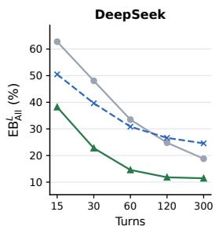

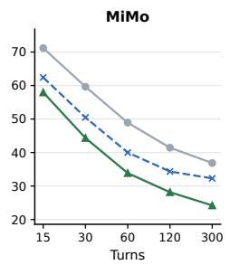

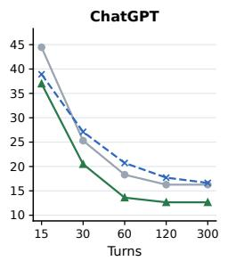

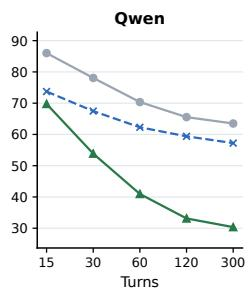  
Figure 4: BrowseComp-Plus Locate Evidence Blindness over interaction turns. Each panel reports $\mathrm { E B } _ { \mathrm { A l l } } ^ { L }$ for DCI, DR-DCI, and AtlasNav; lower is better. Exact turn and matched-cost checkpoint values are reported in Appendix I.

The early separation is already substantial before the endpoint. For example, on DeepSeek, AtlasNav reduces Locate blindness from 38.19% at 15 turns to 22.77% at 30 turns, compared with 50.48% and 39.64% for DR-DCI. On ChatGPT, the corresponding gap is smaller but remains visible: at 60 turns, AtlasNav reaches 13.61% Locate blindness versus 20.72% for DR-DCI. Qwen exhibits the largest sustained separation, while MiMo follows the same overall ordering.

The same ordering also holds at the within-backbone cost checkpoints reported in Appendix I. Because provider prices and currencies differ across backbones, these cost budgets are not comparable across models; they are used only to compare interfaces within the same backbone. Together, the turn- and cost-based analyses show that persistent navigation makes complete evidence usable earlier, rather than merely extending the search trajectory.

## E.2 PHANTOMWIKI: WHERE SCALING BREAKS THE FUNNEL

The nested PhantomWiki design allows corpus growth to be examined while holding the questions and supporting evidence fixed. Figure 5 separates two stages of this scaling effect. AtlasNav maintains the lowest Surface blindness at every corpus size, indicating that persistent organization continues to expose the required evidence directions as the navigation space grows. The main degradation at one million files occurs after Surface: 101 of 200 questions expose the complete support set, but only 58 proceed to complete Open.

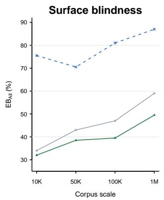

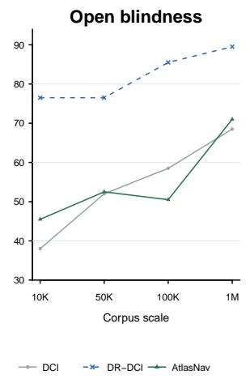

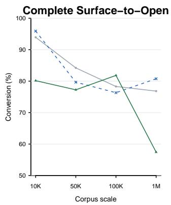  
Figure 5: Stage-wise Evidence Blindness under controlled PhantomWiki scaling. The first two panels report complete Surface and Open blindness; the third reports the fraction of questions with complete Surface that proceed to complete Open. Questions and supporting evidence are fixed across all corpus sizes. Lower blindness and higher conversion are better.

This distinction becomes clearest at the largest scale. AtlasNav reaches 49.5% Surface blindness at 1M files, compared with 59.0% for DCI and 87.0% for DR-DCI, but its Open blindness rises to 71.0%. Its complete Surface-to-Open conversion consequently falls to 57.4%. DCI converts a larger fraction of its surfaced complete sets, yet surfaces fewer complete support sets overall. The remaining million-file bottleneck is therefore not evidence visibility alone, but converting a broade set of surfaced directions into canonical document reads within the finite budget.

PhantomWiki does not provide a fragment-level evidence annotation directly comparable to the BrowseComp-Plus Qrel. We therefore restrict this stage-wise analysis to Surface and Open rather than treating answer-string matching as the same Locate criterion used in Section 3. Exact stage values are reported in Appendix I.

## E.3 ENTERPRISERAG-BENCH: TRANSFER LANDSCAPE

EnterpriseRAG-Bench tests whether the same corpus representation remains useful across heterogeneous enterprise content. Performance varies more strongly by question type than by source tag. AtlasNav performs best on miscellaneous, intra-document, constrained, and conflicting-information questions, while project-related, completeness-heavy, and high-level questions remain substantially harder. Many of the weaker categories, particularly project-related and completeness-heavy queries, require synthesis across information distributed over multiple documents.

Table 9: EnterpriseRAG-Bench Overall score by question category and overlapping source tag. Source tags are not mutually exclusive; the full-set Overall score is 73.72.
<table><tr><td>Question category</td><td>Overall</td><td>Source tag</td><td>Overall</td></tr><tr><td>Miscellaneous</td><td>96.08</td><td>HubSpot</td><td>80.88</td></tr><tr><td>Intra-document</td><td>93.96</td><td>Gmail</td><td>76.38</td></tr><tr><td>Constrained</td><td>91.24</td><td>Jira</td><td>75.02</td></tr><tr><td>Basic</td><td>85.02</td><td>Google Drive</td><td>72.10</td></tr><tr><td>Conflicting information</td><td>84.56</td><td>Fireflies</td><td>71.73</td></tr><tr><td>Information not found</td><td>70.00</td><td>Linear</td><td>70.92</td></tr><tr><td>Semantic</td><td>60.13</td><td>GitHub</td><td>66.38</td></tr><tr><td>Completeness</td><td>45.56</td><td>Slack</td><td>66.07</td></tr><tr><td>Project-related</td><td>43.70</td><td>Confluence</td><td>64.76</td></tr><tr><td>High-level</td><td>30.00</td><td></td><td></td></tr></table>

The source-tag variation is narrower. Overall scores range from 64.76 on Confluence to 80.88 on HubSpot, and no source family exhibits a collapse comparable to the weakest question categories. Because source tags overlap and have unequal sample sizes, these values are descriptive slices rather than independent test sets. They nevertheless suggest that the main residual difficulty is not tied to one connector or storage schema, but to the reasoning and aggregation demands imposed by the query.

The official component metrics reinforce this interpretation. AtlasNav obtains 79.80% Correctness and 78.53% Completeness, compared with 66.98% Document Recall. Answer quality can therefore remain strong even when the exact submitted-document set is incomplete, while the weakest project-related and completeness-heavy questions show the opposite problem: retrieving some useful evidence is not sufficient when the final response must consolidate a distributed enterprise record. Full category- and source-level metric matrices are reported in Appendix I.

## F MECHANISM ANALYSIS

We next examine how the persistent multi-view design produces the evidence-access behavior observed in the main experiments. The analyses address three complementary questions: how the four semantic views should be arranged within the hierarchy, whether the Atlas changes the diversity of regions exposed under a limited observation budget, and whether its advantage is larger when different semantic views disagree about how required evidence should be organized.

## F.1 HIERARCHICAL VIEW ASSIGNMENT

AtlasNav uses Topic and Identity to define coarse parent regions and Episode and Relation to refine them into leaves. To test whether this hierarchy matters, we exhaust all six ways of assigning two of the four views to the parent level, with the remaining two used at the child level. Across variants, we hold fixed the corpus, four embeddings and neighborhood graphs, router, DeepSeek agent and judge, release protocol, and the 166-question development subset; only the parent–child assignment changes.

Table 10: Hierarchical view-assignment ablation on the fixed 166-question development subset. All variants use the same four view representations and differ only in which two views define parent versus child structure. Best values are bold.
<table><tr><td>Parent views</td><td>Child views</td><td>Accuracy ↑</td><td>Cost↓</td><td>Mean turns ↓</td></tr><tr><td>Topic + Identity</td><td>Episode + Relation</td><td>95.78</td><td>73.81</td><td>27.43</td></tr><tr><td>Topic + Episode</td><td>Identity + Relation</td><td>89.16</td><td>96.99</td><td>37.33</td></tr><tr><td>Topic + Relation</td><td>Identity + Episode</td><td>91.57</td><td>93.81</td><td>35.10</td></tr><tr><td>Identity + Episode</td><td>Topic + Relation</td><td>91.57</td><td>90.59</td><td>35.88</td></tr><tr><td>Identity + Relation</td><td>Topic + Episode</td><td>89.76</td><td>81.47</td><td>31.89</td></tr><tr><td>Episode + Relation</td><td>Topic + Identity</td><td>88.55</td><td>95.82</td><td>36.02</td></tr></table>

The selected Topic+Identity / Episode+Relation hierarchy is Pareto-best across the six assignments, reaching 95.78% accuracy with the lowest recorded cost and fewest turns. The most informative comparison is its role reversal: Episode+Relation parents with Topic+Identity children use the same unordered two-by-two partition but exchange only the hierarchical roles. The selected hierarchy answers 159/166 questions correctly versus 147/166 for this reversal, while costing CNY 22.02 less. This comparison isolates the hierarchical role assignment while keeping the unordered view partition fixed.

These results support the hierarchy used in the main model: Topic and Identity provide effective coarse organization for this corpus, while Episode and Relation are better used to refine an already identified region. We interpret this as empirical support for the selected design rather than a universal ordering of semantic views across all corpora.

## F.2 EARLY REGION DIVERSITY

The hierarchy ablation establishes which organization works best, but not whether that organization changes what the agent sees early. We therefore replay the frozen BrowseComp-Plus trajectories and measure how many distinct Atlas parent and leaf regions appear among the first 10, 20, and 50 surfaced unique files. This analysis requires no additional model calls and does not alter the original trajectories.

Table 11: Region diversity under matched surfaced-file budgets on BrowseComp-Plus. Values report the mean number of distinct Atlas parent and leaf regions represented among the first k surfaced unique files.
<table><tr><td>Surfaced files</td><td>Interface</td><td>Parent regions</td><td>Leaf regions</td></tr><tr><td>10</td><td>DCI</td><td>7.77</td><td>8.64</td></tr><tr><td></td><td>DR-DCI</td><td>3.95</td><td>5.50</td></tr><tr><td></td><td>AtlasNav</td><td>9.00</td><td>9.99</td></tr><tr><td>20</td><td>DCI</td><td>12.96</td><td>15.77</td></tr><tr><td></td><td>DR-DCI</td><td>5.97</td><td>8.85</td></tr><tr><td></td><td>AtlasNav</td><td>16.54</td><td>18.64</td></tr><tr><td>50</td><td>DCI</td><td>22.83</td><td>33.84</td></tr><tr><td></td><td>DR-DCI</td><td>9.89</td><td>15.80</td></tr><tr><td></td><td>AtlasNav</td><td>23.53</td><td>31.31</td></tr></table>

AtlasNav most clearly changes the early observation regime. Within the first ten surfaced files, it covers 9.00 parent regions and 9.99 leaf regions on average, compared with 7.77/8.64 for DCI and 3.95/5.50 for DR-DCI. The advantage remains at 20 files, indicating that limited observations are distributed across more distinct semantic regions rather than repeatedly concentrated within one local neighborhood.

The effect is specifically an early-navigation advantage rather than a claim of uniformly greater global diversity. At a 50-file budget, DCI slightly exceeds AtlasNav in leaf diversity (33.84 versus 31.31), although AtlasNav retains a small parent-level advantage. The relevant mechanism is therefore earlier exposure to multiple directions when observation is scarce, not maximal diversity over arbitrarily long trajectories.

## F.3 WHEN MULTIPLE VIEWS MATTER

Early diversification alone does not explain which questions benefit most from a multi-view representation. We first tested a pre-specified scalar evidence-dispersion measure combining structural separation and average semantic distance across the four views. Its relationship with AtlasNav’s relative accuracy gain was directionally positive at high dispersion, but the pre-specified monotonic trend was not statistically supported. We therefore do not claim that generic evidence dispersion alone predicts the benefit of Atlas navigation.

An exploratory analysis reveals a more specific pattern. For each multi-gold question, we measure how strongly Topic, Identity, Episode, and Relation disagree about the semantic geometry of the required documents. AtlasNav’s relative gain is substantially larger in the higher-disagreement regime. Comparing the lowest and highest quartiles, its gain changes from 0.71 to 12.86 percentage points over DR-DCI and from 1.43 to 12.86 points over DCI.

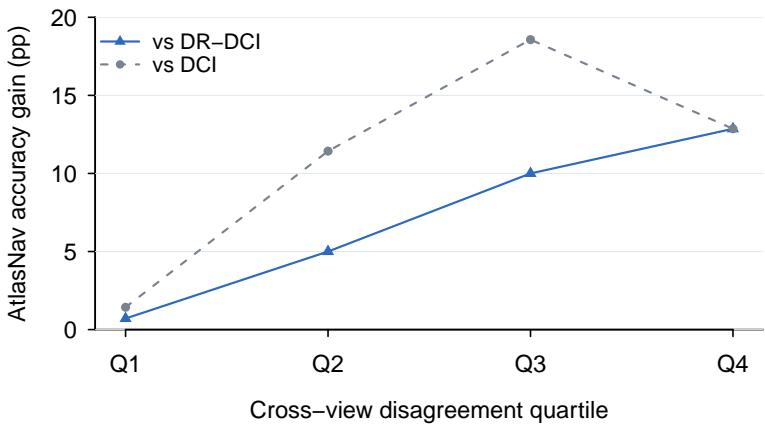  
Figure 6: AtlasNav relative accuracy gain by cross-view disagreement quartile on 560 multi-gold BrowseComp-Plus questions. Higher disagreement indicates that Topic, Identity, Episode, and Relation induce less consistent evidence geometry. This analysis is exploratory.

The Q4–Q1 increase is 12.14 points relative to DR-DCI (95% CI [3.57, 21.43]) and 11.43 points relative to DCI ([2.14, 20.71]). Continuous Spearman association tests control for gold-document count and use 20,000 permutations; after Benjamini–Hochberg correction, the associations remain significant against both baselines $( q = 0 . 0 0 3 3 0$ for DR-DCI and $q = 0 . 0 3 9 6 0$ for DCI).

This pattern is more closely aligned with the purpose of the multi-view Atlas than scalar distance alone. When the four views agree, a single relevance ordering may already describe the evidence geometry reasonably well. When they disagree, a query may require evidence that is close under one organization but distant under another, creating exactly the setting in which preserving multiple reusable navigation directions becomes useful. Because this hypothesis was identified after the pre-specified dispersion analysis, we treat it as exploratory mechanism evidence rather than a confirmatory result.

## G TRANSFER AND BOUNDARY ANALYSIS

The main experiments focus on large-corpus evidence realization. We further evaluate three settings in which the dominant bottleneck changes: high-recall multi-hop reasoning, many-answer aggregation in a compact corpus, and graded document retrieval. These experiments are not additional headline benchmarks; instead, they clarify which benefits of persistent navigation transfer across regimes and which depend on the structure of the task.

## G.1 2WIKIMULTIHOPQA: HIGH-RECALL MULTI-HOP REASONING

We first ask whether persistent organization remains useful when direct corpus interaction already retrieves evidence reliably. We merge the local contexts of 400 2WikiMultiHopQA questions into a shared corpus of 56,684 canonical documents, removing the original per-question context boundary (Ho et al., 2020). All three interfaces therefore operate over the same global corpus.

Table 12: 2Wiki-Global results on 400 questions over a shared 56,684-document corpus. Cost is recorded online inference cost in CNY.
<table><tr><td>Interface</td><td>Strict Acc. ↑</td><td>Cost↓</td><td>Turns ↓</td></tr><tr><td>DCI</td><td>95.50</td><td>22.70</td><td>4,117</td></tr><tr><td>DR-DCI</td><td>94.50</td><td>28.21</td><td>5,540</td></tr><tr><td>AtlasNav</td><td>94.50</td><td>11.03</td><td>3,135</td></tr></table>

Final accuracy is already near saturation: DCI reaches 95.5%, while DR-DCI and AtlasNav both reach 94.5%. Neither paired difference involving AtlasNav is significant (p = 0.388 versus DCI and p = 1.000 versus DR-DCI). The separation instead appears in interaction efficiency. AtlasNav uses CNY 11.03 and 3,135 turns, compared with CNY 22.70 and 4,117 turns for DCI and CNY 28.21 and 5,540 turns for DR-DCI.

Stage-wise diagnostics show why the endpoint advantage disappears. Evidence access is already close to saturated for all three interfaces. AtlasNav’s Open-All and Locate-All blindness is 11.25% and 11.75%, respectively, compared with 6.50%/6.50% for DCI and 4.75%/5.25% for DR-DCI. Persistent organization therefore has little remaining Evidence Blindness to remove; its main benefit is reducing the interaction required to reach a similarly strong evidence state.

This result therefore bounds the main claim: when direct interaction already realizes nearly all required evidence, persistent navigation primarily improves efficiency rather than endpoint accuracy.

## G.2 FANOUTQA: MANY-ANSWER AGGREGATION

FanOutQA shifts the bottleneck from discovering a small evidence chain to aggregating many answer items. Its 310 questions are evaluated over a compact corpus of 1,594 documents using the official Loose and Strict answer-coverage metrics: Loose rewards partial coverage, whereas Strict requires all required answer items to appear in the final response (Zhu et al., 2024).

Table 13: FanOutQA results on 310 questions. Loose and Strict are the official answer-coverage metrics; cost is recorded online inference cost in CNY.
<table><tr><td>Interface</td><td>Loose ↑</td><td>Strict ↑</td><td>Cost↓</td><td>Turns ↓</td></tr><tr><td>DCI</td><td>79.65</td><td>39.35</td><td>73.35</td><td>6,596</td></tr><tr><td>DR-DCI</td><td>81.42</td><td>44.19</td><td>43.24</td><td>6,493</td></tr><tr><td>AtlasNav</td><td>80.10</td><td>40.32</td><td>36.49</td><td>4,218</td></tr></table>

The resulting trade-off differs from BrowseComp-Plus. DR-DCI achieves the highest Loose and Strict scores, while AtlasNav uses the lowest recorded cost and 35% fewer turns than DR-DCI. AtlasNav’s Strict difference is not significant against either DCI (p = 0.701) or DR-DCI (p = 0.096).

The Loose–Strict gap helps identify the remaining bottleneck. AtlasNav recovers substantial portions of the required answer set, but less often closes every answer item than DR-DCI. Its Surface-All/Open-All blindness is 12.90%/33.87%, compared with 3.55%/30.00% for DCI and 6.45%/28.71% for DR-DCI. Once candidate evidence is already easy to expose, performance depends more on exhaustive aggregation and answer construction than on discovering distant evidence regions.

FanOutQA therefore identifies a second boundary: persistent navigation can reduce search effort in compact corpora, but it does not replace the downstream aggregation required to produce a complete many-item answer.

## G.3 TREC-COVID: GRADED RETRIEVAL

TREC-COVID changes the evaluation objective entirely, from answer generation to graded document ranking over 171,332 scientific records (Roberts et al., 2020). We evaluate nDCG@10 using the official graded relevance judgments. In addition to the three deployable interfaces, we include an evidence-supplied reference that receives the judged positive-document pool but not the relevance grades or ideal ranking.

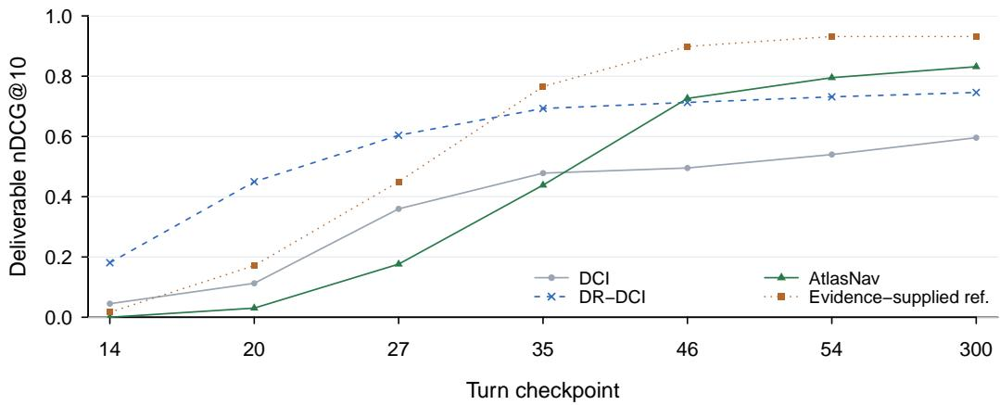  
Figure 7: Deliverable nDCG@10 over frozen, data-driven turn checkpoints on TREC-COVID. Unfinished queries score zero at each checkpoint. The evidence-supplied reference receives the positive-document pool but not graded labels or the ideal ranking.

The trajectory reveals a quality–speed reversal. DR-DCI produces stronger rankings early, while AtlasNav overtakes it at turn 46 and reaches 0.8314 nDCG@10 at the endpoint, compared with 0.7459 for DR-DCI and 0.5958 for DCI. The evidence-supplied reference reaches 0.9316.

The endpoint improvement is statistically supported: AtlasNav exceeds DR-DCI by 0.0855 nDCG@10 (95% CI [0.0140, 0.1684]) and DCI by 0.2356 ([0.1550, 0.3224]). Unlike BrowseComp-Plus, however, this quality gain does not come with lower online cost: AtlasNav records CNY 17.22 versus CNY 4.68 for DR-DCI.

This result broadens the representation claim while narrowing the efficiency claim. Persistent multiview organization can improve the quality of graded retrieval beyond both raw interaction and a query-conditioned workspace, but the additional navigation does not universally reduce inference cost. The benefit therefore depends on which resource—evidence quality, interaction depth, or monetary cost—is the dominant objective.

## H QUALITATIVE ANALYSIS

Evidence Blindness diagnoses whether benchmark-required evidence becomes usable, whereas accuracy measures whether the agent ultimately produces the correct answer. The two are related but not interchangeable: evidence may be fully realized without correct synthesis, and a correct answer may occasionally be produced from partial annotated evidence. Table 14 illustrates these distinctions with three BrowseComp-Plus trajectories.

Table 14: Representative BrowseComp-Plus trajectories illustrating the distinction between evidence realization and final-answer correctness.
<table><tr><td>Case</td><td>Evidence state</td><td>Outcome</td><td>Diagnostic</td></tr><tr><td>8 (Lush Life)</td><td>AtlasNav and DCI realize the com- plete annotated evidence; DR-DCI does not realize the annotated chain.</td><td>AtlasNav correct; DCI and DR-DCI wrong. AtlasNav correct;</td><td>Evidence access and down- stream reasoning are distinct failure modes.</td></tr><tr><td>394 (wing three- quarter)</td><td>AtlasNav reaches only part of the annotated supporting-document set but realizes the complete decision- relevant slot-level evidence; the base- lines do not.</td><td>baselines wrong.</td><td>Complete support-document coverage is not required in this case once the decisive evidence slots are realized.</td></tr><tr><td>417 (Owl- man)</td><td>AtlasNav realizes the complete anno- tated evidence; DR-DCI realizes only part of it.</td><td>AtlasNav wrong; DR-DCI correct.</td><td>Complete annotated evidence does not guarantee correct syn- thesis, and partial annotated re- alization does not preclude a correct answer.</td></tr></table>

The cases separate three sources of variation that aggregate accuracy alone cannot identify. Question 8 contrasts an access failure with a downstream reasoning failure: DR-DCI misses the annotated evidence, whereas DCI reaches it but still answers incorrectly. Question 394 shows that supportdocument coverage can exceed what is needed to realize the decisive evidence slots. Question 417 shows the converse boundary: complete annotated evidence does not ensure correct synthesis.

These examples motivate reporting EB alongside, rather than in place of, task accuracy. EB localizes failures in benchmark-annotated evidence realization; it is not intended to identify the causal source of every correct or incorrect answer.

## I SUPPLEMENTARY NUMERICAL RECORDS

This appendix collects the exact numerical values underlying the main-benchmark analyses and statistical comparisons. It is intended as a numerical reference rather than a separate narrative section; interpretation of these results is provided in Appendix E.

## I.1 BROWSECOMP-PLUS ENDPOINT EVIDENCE BLINDNESS

Table 15 reports the complete endpoint Evidence Blindness aggregates for all four backbones. Each stage is summarized by Any, Mean, and All blindness, corresponding respectively to complete absence of required evidence, average missing evidence mass, and failure to realize the complete evidence set.

Table 15: Endpoint Evidence Blindness on BrowseComp-Plus (%). Each stage reports Any / Mean / All; lower is better.
<table><tr><td>Backbone</td><td>Interface</td><td>Surface</td><td>Open</td><td>Locate</td></tr><tr><td>DeepSeek</td><td>DCI</td><td>13.13 / 13.25 / 13.37</td><td>14.70 / 15.04 / 15.42</td><td>17.83 / 18.29 / 18.80</td></tr><tr><td></td><td>DR-DCI</td><td>13.49 / 13.80 / 14.10</td><td>16.51 / 16.81 / 17.11</td><td>23.61 / 24.04 / 24.46</td></tr><tr><td></td><td>AtlasNav</td><td>4.82 / 4.90 / 4.94</td><td>7.59 / 7.73 / 7.83</td><td>10.72 / 11.08 / 11.45</td></tr><tr><td>MiMo</td><td>DCI</td><td>29.52 / 29.52 / 29.52</td><td>33.86 / 33.86 / 33.86</td><td>36.87 / 36.87 / 36.87</td></tr><tr><td></td><td>DR-DCI</td><td>25.90 / 26.10 / 26.27</td><td>26.99 / 27.31 / 27.59</td><td>31.69 / 32.01 / 32.29</td></tr><tr><td></td><td>AtlasNav</td><td>16.75 / 17.35 / 17.83</td><td>19.88 / 20.00 / 20.24</td><td>23.73 / 23.98 / 24.22</td></tr><tr><td>ChatGPT</td><td>DCI</td><td>6.63 / 6.81 / 6.99</td><td>12.89 / 12.93 / 13.01</td><td>15.90 / 16.02 / 16.27</td></tr><tr><td></td><td>DR-DCI</td><td>9.40 / 9.58 / 9.76</td><td>10.48 / 10.78 / 11.08</td><td>15.90 / 16.27 / 16.63</td></tr><tr><td></td><td>AtlasNav</td><td>5.66 / 5.84 / 6.02</td><td>9.04 / 9.28 / 9.52</td><td>11.93 / 12.29 / 12.65</td></tr><tr><td>Qwen</td><td>DCI</td><td>54.70 / 55.12 / 55.54</td><td>57.35 / 58.07 / 58.80</td><td>61.57 / 62.53 / 63.50</td></tr><tr><td></td><td>DR-DCI</td><td>49.04 / 49.40 / 49.76</td><td>50.60 / 50.96 / 51.33</td><td>56.63 / 56.93 / 57.23</td></tr><tr><td></td><td>AtlasNav</td><td>19.64 / 19.90 / 20.12</td><td>22.29 / 22.65 / 23.01</td><td>29.40 / 29.86 / 30.36</td></tr></table>

The small Any–All gaps for several systems reflect the fact that required slots often become realized or missed together; Mean preserves the remaining partial-realization cases. MiMo–AtlasNav uses the adopted CNY 1.40 endpoint.

## I.2 BROWSECOMP-PLUS LOCATE CHECKPOINTS

Tables 16 and 17 report the exact Locate-All Evidence Blindness values underlying the turn-based analysis in Figure 4 and the corresponding within-backbone cost analysis. All values are computed from frozen trajectory prefixes; evidence appearing after a checkpoint is never backfilled into an earlier budget.

Table 16: BrowseComp-Plus $\mathrm { E B } _ { \mathrm { A l l } } ^ { L }$ at turn checkpoints (%). Lower is better.
<table><tr><td>Backbone-interface</td><td>15</td><td>30</td><td>60</td><td>120</td><td>300</td></tr><tr><td>DeepSeek-DCI</td><td>62.77</td><td>48.07</td><td>33.49</td><td>24.82</td><td>18.80</td></tr><tr><td>DeepSeek-DR-DCI</td><td>50.48</td><td>39.64</td><td>30.84</td><td>26.63</td><td>24.58</td></tr><tr><td>DeepSeek-AtlasNav</td><td>38.19</td><td>22.77</td><td>14.58</td><td>11.81</td><td>11.45</td></tr><tr><td>MiMo-DCI</td><td>71.20</td><td>59.64</td><td>48.92</td><td>41.45</td><td>36.87</td></tr><tr><td>MiMo-DR-DCI</td><td>62.41</td><td>50.48</td><td>40.00</td><td>34.34</td><td>32.29</td></tr><tr><td>MiMo-AtlasNav</td><td>57.95</td><td>44.34</td><td>33.86</td><td>28.16</td><td>24.22</td></tr><tr><td>ChatGPT-DCI</td><td>44.46</td><td>25.30</td><td>18.31</td><td>16.27</td><td>16.27</td></tr><tr><td>ChatGPT-DR-DCI</td><td>38.92</td><td>27.11</td><td>20.72</td><td>17.71</td><td>16.63</td></tr><tr><td>ChatGPT-AtlasNav</td><td>36.99</td><td>20.48</td><td>13.61</td><td>12.65</td><td>12.65</td></tr><tr><td>Qwen-DCI</td><td>86.02</td><td>78.07</td><td>70.36</td><td>65.54</td><td>63.50</td></tr><tr><td>Qwen-DR-DCI</td><td>73.73</td><td>67.47</td><td>62.29</td><td>59.40</td><td>57.23</td></tr><tr><td>Qwen-AtlasNav</td><td>69.76</td><td>53.86</td><td>40.96</td><td>33.13</td><td>30.36</td></tr></table>

Table 17: BrowseComp-Plus $\mathrm { E B } _ { \mathrm { A l l } } ^ { L }$ at within-backbone cost checkpoints (%). Costs use the provider-specific currency of each backbone; lower EB is better.
<table><tr><td>Backbone</td><td>Cost</td><td>DCI</td><td>DR-DCI</td><td>AtlasNav</td></tr><tr><td rowspan="4">DeepSeek (CNY)</td><td>0.15</td><td>54.46</td><td>45.18</td><td>35.90</td></tr><tr><td>0.40</td><td>42.05</td><td>34.46</td><td>20.96</td></tr><tr><td>1.20</td><td>29.52</td><td>28.43</td><td>13.73</td></tr><tr><td>2.75</td><td>23.49</td><td>26.14</td><td>11.45</td></tr><tr><td rowspan="5">MiMo (CNY)</td><td>0.15</td><td>55.90</td><td>40.96</td><td>35.54</td></tr><tr><td>0.40</td><td>50.48</td><td>36.63</td><td>33.01</td></tr><tr><td>0.80</td><td>46.99</td><td>34.70</td><td>30.45</td></tr><tr><td>1.20</td><td>43.61</td><td>34.10</td><td>27.96</td></tr><tr><td>1.40</td><td>39.04</td><td>32.29</td><td>24.22</td></tr><tr><td rowspan="4">ChatGPT (USD)</td><td>0.025</td><td>40.60</td><td>29.88</td><td>26.75</td></tr><tr><td>0.05</td><td>34.46</td><td>23.73</td><td>21.57</td></tr><tr><td>0.15</td><td>26.51</td><td>20.84</td><td>18.07</td></tr><tr><td>0.65</td><td>18.07</td><td>17.47</td><td>12.65</td></tr><tr><td rowspan="5">Qwen (CNY)</td><td>0.15</td><td>83.97</td><td>67.47</td><td>51.20</td></tr><tr><td>0.40</td><td>76.98</td><td>62.89</td><td>42.41</td></tr><tr><td>0.80</td><td>71.78</td><td>59.76</td><td>36.02</td></tr><tr><td>1.20</td><td>70.88</td><td>58.55</td><td>33.13</td></tr><tr><td>1.95</td><td>67.49</td><td>57.47</td><td>30.36</td></tr></table>

Cost checkpoints are intentionally backbone-specific because providers use different pricing schedules and currencies. They support interface comparisons within a backbone, not comparisons of absolute cost across backbone providers. Endpoint and 300-turn values may differ slightly when the adopted release or cost boundary occurs after the recorded turn prefix.

## I.3 PHANTOMWIKI STAGE RECORDS

Table 18 reports the exact Surface and Open Evidence Blindness values and conditional Surface-to-Open conversion underlying the scaling analysis in Appendix E. Questions and supporting evidence are fixed across all four nested corpus sizes.

Table 18: Stage-wise PhantomWiki scaling results. Blindness values are percentages; Surface-to-Open is the fraction of complete-Surface questions that proceed to complete Open.
<table><tr><td>Scale</td><td>Interface</td><td>Surface EB ↓</td><td>Open EB↓</td><td>Surface-to-Open ↑</td></tr><tr><td rowspan="3">10K</td><td>DCI</td><td>34.0</td><td>38.0</td><td>93.94</td></tr><tr><td>DR-DCI</td><td>75.5</td><td>76.5</td><td>95.92</td></tr><tr><td>AtlasNav</td><td>32.0</td><td>45.5</td><td>80.15</td></tr><tr><td rowspan="3">50K</td><td>DCI</td><td>43.0</td><td>52.0</td><td>84.21</td></tr><tr><td>DR-DCI</td><td>70.5</td><td>76.5</td><td>79.66</td></tr><tr><td>AtlasNav</td><td>38.5</td><td>52.5</td><td>77.24</td></tr><tr><td rowspan="3">100K</td><td>DCI</td><td>47.0</td><td>58.5</td><td>78.30</td></tr><tr><td>DR-DCI</td><td>81.0</td><td>85.5</td><td>76.32</td></tr><tr><td>AtlasNav</td><td>39.5</td><td>50.5</td><td>81.82</td></tr><tr><td rowspan="3">1M</td><td>DCI</td><td>59.0</td><td>68.5</td><td>76.83</td></tr><tr><td>DR-DCI</td><td>87.0</td><td>89.5</td><td>80.77</td></tr><tr><td>AtlasNav</td><td>49.5</td><td>71.0</td><td>57.43</td></tr></table>

## I.4 ENTERPRISERAG-BENCH METRIC MATRICES

Tables 19 and 20 report the official EnterpriseRAG-Bench component metrics by question category and overlapping document-source tag. These tables provide the exact values summarized in the transfer analysis of Appendix E.

Table 19: AtlasNav official metrics by EnterpriseRAG-Bench question category.
<table><tr><td>Category</td><td>n</td><td>Overall</td><td>Correct.</td><td>Complete.</td><td>Doc. Recall</td></tr><tr><td>Basic</td><td>175</td><td>85.02</td><td>88.57</td><td>87.02</td><td>73.14</td></tr><tr><td>Semantic</td><td>125</td><td>60.13</td><td>67.20</td><td>63.60</td><td>52.80</td></tr><tr><td>Intra-document reasoning</td><td>40</td><td>93.96</td><td>97.50</td><td>96.46</td><td>92.50</td></tr><tr><td>Project related</td><td>40</td><td>43.70</td><td>65.00</td><td>60.48</td><td>49.78</td></tr><tr><td>Constrained</td><td>30</td><td>91.24</td><td>93.33</td><td>95.01</td><td>83.33</td></tr><tr><td>Conflicting information</td><td>20</td><td>84.56</td><td>90.00</td><td>86.44</td><td>57.50</td></tr><tr><td>Completeness</td><td>20</td><td>45.56</td><td>55.00</td><td>65.47</td><td>61.99</td></tr><tr><td>Miscellaneous</td><td>20</td><td>96.08</td><td>100.00</td><td>96.08</td><td>75.00</td></tr><tr><td>High level</td><td>10</td><td>30.00</td><td>40.00</td><td>49.83</td><td></td></tr><tr><td>Information not found</td><td>20</td><td>70.00</td><td>70.00</td><td>75.00</td><td>一</td></tr></table>

Table 20: AtlasNav official metrics by overlapping EnterpriseRAG-Bench source tag. Tag counts exceed 500 in total because questions may have multiple tags.
<table><tr><td>Source tag</td><td>n</td><td>Overall</td><td>Correct.</td><td>Complete.</td><td>Doc. Recall</td><td>Invalid extra</td></tr><tr><td>Confluence</td><td>114</td><td>64.76</td><td>74.56</td><td>74.28</td><td>58.99</td><td>1.40</td></tr><tr><td>Fireflies</td><td>25</td><td>71.73</td><td>80.00</td><td>71.73</td><td>50.40</td><td>0.28</td></tr><tr><td>GitHub</td><td>60</td><td>66.38</td><td>73.33</td><td>74.33</td><td>65.87</td><td>0.95</td></tr><tr><td>Gmail</td><td>55</td><td>76.38</td><td>83.64</td><td>81.83</td><td>72.22</td><td>0.36</td></tr><tr><td>Google Drive</td><td>60</td><td>72.10</td><td>78.33</td><td>75.45</td><td>64.28</td><td>1.03</td></tr><tr><td>HubSpot</td><td>34</td><td>80.88</td><td>85.29</td><td>81.62</td><td>58.82</td><td>0.15</td></tr><tr><td>Jira</td><td>100</td><td>75.02</td><td>88.00</td><td>79.35</td><td>67.05</td><td>0.94</td></tr><tr><td>Linear</td><td>58</td><td>70.92</td><td>79.31</td><td>76.53</td><td>69.13</td><td>0.88</td></tr><tr><td>Slack</td><td>79</td><td>66.07</td><td>72.15</td><td>73.87</td><td>59.92</td><td>0.94</td></tr></table>

Because source tags overlap and have unequal sample sizes, the source-level rows are descriptive rather than independent test sets. The category and source matrices are reported here for numerical completeness; their main patterns are discussed in Appendix E.

## I.5 RECORDED OFFLINE CONSTRUCTION RESOURCES

Table 21 records the reusable construction workloads preserved in the frozen experiment logs. Because the corpus representation is built once and reused across queries, these quantities are reported as construction resources rather than converted into a deployment-independent per-query cost.

Table 21: Recorded reusable construction resources for the BrowseComp-Plus Atlas and router data.
<table><tr><td>Component</td><td>Input tokens</td><td>Requests</td><td>Recorded wall time</td></tr><tr><td>Four-view corpus encoding</td><td>253.55M</td><td>20,039</td><td>6,286.87 s</td></tr><tr><td>Corpus-derived router-query encoding</td><td>1.81M</td><td>1,433</td><td>118.33 s</td></tr></table>