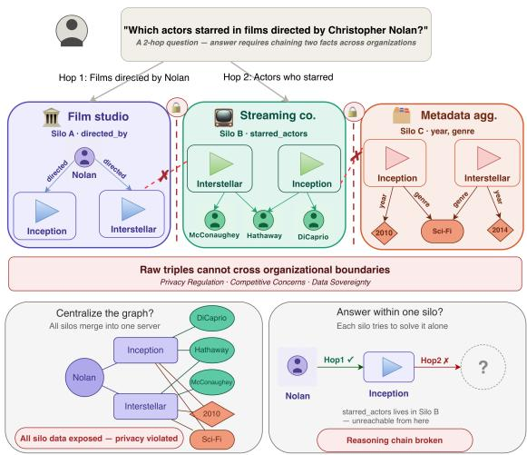
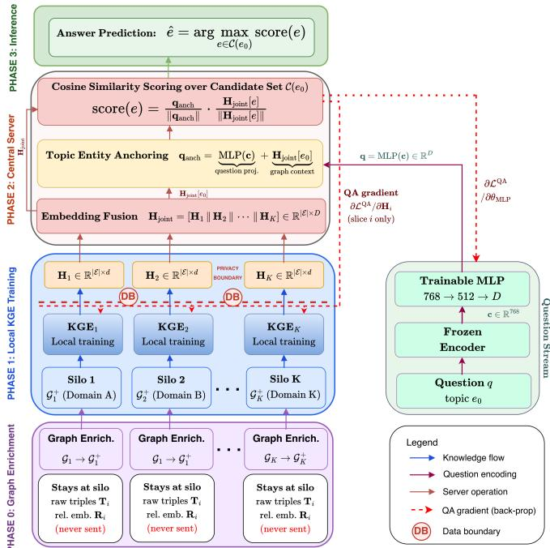
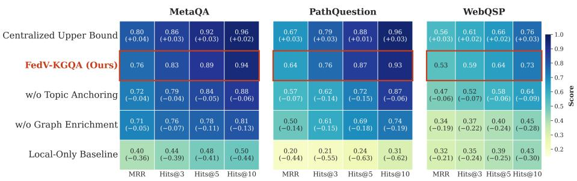
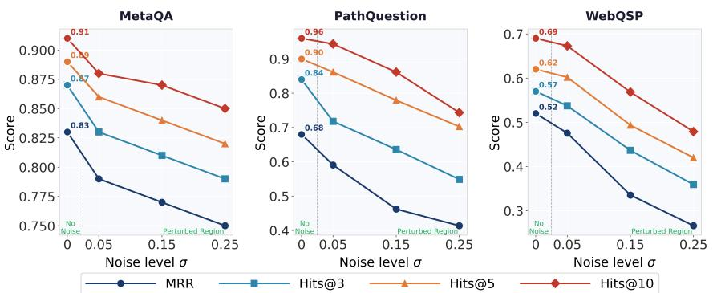
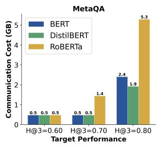
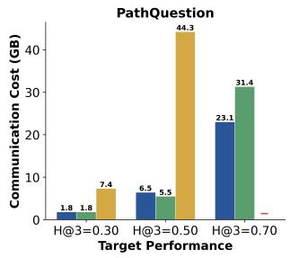
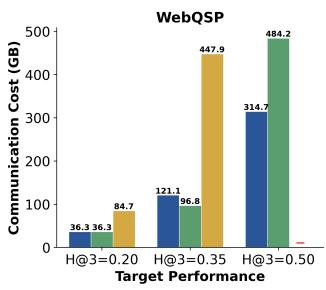

# FedV-KGQA: Multi-Hop Question Answering over Vertically Partitioned Knowledge Graphs

Md Saikat Islam Khan Bappy1[0009−0009−1768−6102] and Oshani Seneviratne1[0000−0001−8518−917X]

Rensselaer Polytechnic Institute, Troy, NY 12180, USA {islamm9, senevo}@rpi.edu

Abstract. Real-world data for knowledge graph question answering is often distributed across diferent organizations due to governance and data sovereignty constraints. While centralized systems exist, they cannot answer multi-hop questions when the required facts are split across vertically partitioned silos. In this paper, we propose FedV-KGQA, a framework for multi-hop reasoning over knowledge graphs in which organizations share entities but own disjoint sets of relations. Our approach combines local graph enrichment and knowledge graph embeddings to ensure raw triples and relation parameters never leave each silo, establishing a structural data boundary without requiring centralized graph access. We further introduce a topic entity anchoring mechanism that grounds questions in the correct graph neighborhood without any runtime inter-silo communication. We evaluate 12 model configurations across three benchmarks and show that FedV-KGQA performs strongly, remains close to centralized performance, generalizes to 3-hop reasoning, and is robust to embedding perturbations.

Keywords: Federated Learning · Knowledge Graph Embedding · Question Answering · Vertical Data Partitioning

## 1 Introduction

Answering natural language questions over a knowledge graph (KG) requires chaining facts across multiple entities and relations. While knowledge graph question answering (KGQA) has been studied extensively in the centralized setting where the full graph is accessible to a single system [6,12,18,19,20,24,28], real-world facts are rarely owned by a single organization. For example, a film studio may know a film’s director, a streaming platform its actors, and a metadata aggregator its genre. Each organization holds a partial view of the same entities, but sharing raw data across them violates governance constraints, commercial sensitivity, and data sovereignty [16,36]. Consequently, the reasoning chain needed to answer a multi-hop question, which is inherently challenging because it requires connecting two or more facts, is split across organizations by design. Figure 1 makes this concrete. Answering which actors starred in films directed by Christopher Nolan requires two hops across silos. The first hop resolves the films through directed\_by, which the film studio owns. The second hop resolves the actors through starred\_actors, which the streaming platform owns. Neither silo can complete the chain independently: centralization exposes private triples, whereas silo-local reasoning breaks the chain.

  
Fig. 1. Motivating example of multi-hop KGQA in the vertical federated setting.

Federated learning (FL) allows models to be trained over distributed data without sharing raw records across parties [22]. Most federated knowledge graph embedding (KGE) work studies the horizontal setting, where diferent clients hold diferent triples but share the same relation vocabulary [3,4,5]. Our problem follows a diferent structure, where silos share the same entity space but each silo owns a disjoint subset of relation types. This setting corresponds to vertical federated learning (VFL), in which parties share the same sample space while holding diferent feature views [14,30]. A reasoning path may start in one silo, pass through a shared intermediate entity, and end in another silo. No existing federated method addresses multi-hop reasoning in this structure, and no existing VFL method handles symbolic reasoning over a shared entity space.

We present FedV-KGQA, a framework for multi-hop question answering over vertically partitioned KGs. Each silo trains a local KGE model, while the server concatenates entity embeddings, projects questions into the joint space, and anchors each question to its topic entity. Candidates are ranked by cosine similarity. During QA training, silos receive only their gradient slices; raw triples and relation parameters remain local. This provides structural data separation but no formal privacy guarantee (Section 3).

This work addresses three research gaps. First, existing KGQA models assume centralized graph access and do not handle the case where relation types are partitioned between organizations [15,33]. Second, prior federated KGE methods target link prediction in the horizontal setting [27,38], and do not address multi-hop natural language question answering [11,34]. Third, most existing VFL methods focus on prediction tasks over partitioned feature views and do not address symbolic multi-hop reasoning over a shared entity space [16,36]. To the best of our knowledge, FedV-KGQA is the first framework that brings together vertical federation, multi-hop KGQA, and end-to-end answer ranking in a unified system. The main contributions of this paper are as follows.

We formulate multi-hop KGQA in a vertical federated setting where silos share entity identities but own disjoint relation types, a problem setting that, to the best of our knowledge, has not been studied for multi-hop KGQA.

We propose FedV-KGQA, a framework that combines local KGE training, server-side entity fusion, question projection, and silo-specific gradient return for distributed KGQA.

We introduce topic entity anchoring, a mechanism that grounds the question vector in the topic entity’s fused multi-silo embedding, directing the search to the correct graph neighborhood without any runtime silo communication. We evaluate FedV-KGQA across multiple KGE models, language encoders, and silo configurations on three benchmarks, and show that multi-hop question answering is achievable even when the graph is vertically partitioned.

## 2 Related Work

Our work spans multi-hop KGQA, federated KGE, question answering over distributed KGs, and VFL. Table 1 compares these lines.

Multi-Hop KGQA. Multi-hop KGQA has been studied mainly in the centralized setting, where the full graph is available during training and inference. Embedding-based methods such as EmbedKGQA [24] and UniKGQA [12] rank candidate answers by mapping questions into the KG embedding space. RelChain [13] improves multi-hop KGQA by introducing explicit relational chain reasoning over KG embeddings. More recent methods use large language models (LLMs) to guide retrieval and reasoning, including RoG [18], Think-on-Graph [28], and GMeLLo [6], which addresses multi-hop KGQA in evolving environments. These methods support natural language input and multi-hop reasoning, but they assume centralized graph access or centrally available retrieved evidence.

Federated Knowledge Graph Embedding. Federated KGE methods learn graph representations across distributed clients while keeping triples local. FedE [4] is an early framework that aggregates entity embeddings on a central server. FedR [38] switches to relation embedding aggregation to reduce susceptibility to embedding inversion attacks. FKGE [21] adds diferential privacy (DP) noise to shared embeddings, and FedLU [42] addresses heterogeneity and unlearning. Later work extends this line with alignment and contrastive objectives [5,3]. FedTREK-LM [26] combines FL, personal KGs, and lightweight language models for decentralized recommendation and KG completion. All of these methods operate in the horizontal federated setting, where every client holds triples from the same relation vocabulary but over diferent subsets of entities, and they target link prediction rather than natural language question answering.

Table 1. System comparison. VFL: vertical split, disjoint relations; Multi-hop: paths $\geq 2 ;$ KGE fusion: representations fused across silos; NL: natural language questions.
<table><tr><td>System</td><td>VFL</td><td>Multi-hop</td><td>KGE fusion</td><td> $_ \mathrm { N L }$ </td></tr><tr><td>EmbedKGQA [24]</td><td>x</td><td>vV</td><td>x</td><td></td></tr><tr><td>UniKGQA [12]</td><td>x</td><td></td><td>x</td><td></td></tr><tr><td>RelChain  $[ \dot { 1 3 } ]$ </td><td>x</td><td>√</td><td>x</td><td></td></tr><tr><td>RoG [18]</td><td>x</td><td>√</td><td>x</td><td></td></tr><tr><td>GMeLLo [6]</td><td>x</td><td>√</td><td>x</td><td></td></tr><tr><td>FedE [4]</td><td>××</td><td>x</td><td>v√</td><td>x</td></tr><tr><td>FedR [38]</td><td></td><td>x</td><td></td><td>x</td></tr><tr><td>FKGE [21]</td><td>x</td><td>x</td><td>√</td><td>x</td></tr><tr><td>FedLU [42]</td><td>x</td><td>x</td><td>√</td><td>x</td></tr><tr><td>FedNGDB [11]</td><td>x</td><td>√</td><td>√</td><td></td></tr><tr><td>KG-RL-FL [34]</td><td>x</td><td>x</td><td>x</td><td>x</td></tr><tr><td>FL-KG-QA [10]</td><td>x</td><td>x</td><td>√</td><td>vV</td></tr><tr><td>FedV-KGQA (ours)</td><td>√</td><td>√</td><td>√</td><td>√</td></tr></table>

Question Answering over Distributed Knowledge Graphs. A smaller line of work considers question answering over distributed KGs. FedNGDB [11] studies federated neural graph databases for complex query answering over distributed KGs, supporting multi-hop logical queries and fusing entity representations from multiple clients. KG-RL-FL [34] explores reinforcement-based federated QA with KG support in a language-specific setting and accepts natural language input. FL-KG-QA [10] considers federated KGQA with natural language questions, but focuses on simple question answering rather than multi-hop reasoning. These works move beyond link prediction, but they do not formulate multi-hop natural language KGQA in a VFL setting where silos share entity identities but own disjoint relation types. A separate line answers queries across sources through federated SPARQL, from FedX [25] and SPLENDID [9] to recent engines such as FedUP [1] and ownership-preserving platforms such as Pistis [40]. These systems require queryable endpoints and structured queries, whereas our silos expose only embeddings and execute no query over their triples, so they address a diferent problem.

Positioning. FedV-KGQA difers from each line above along the axes in Table 1. Against centralized multi-hop KGQA, it removes the assumption of full graph access and ranks answers over embeddings that no single party can assemble. Against federated KGE, it changes both the split and the task, since relations are partitioned rather than triples and the objective is natural language answer ranking rather than link prediction. Against distributed KGQA, it targets reasoning chains whose hops lie in diferent silos, which none of these systems formulate. Against federated SPARQL, it requires no queryable endpoint and issues no query over silo triples.

## 3 Problem Formulation

Consider a $\operatorname { K G } { \mathcal { G } } = ( \mathcal { E } , \mathcal { R } , \mathcal { T } )$ , where E is the set of entities, R is the set of relation types, and $\mathcal { T } \subseteq \mathcal { E } \times \mathcal { R } \times \mathcal { E }$ is the set of relational triples $( h , r , t )$ . In a VFL setting, this graph is partitioned across K independent data silos $\{ S _ { 1 } , \ldots , S _ { K } \}$ such that each silo $S _ { k }$ owns a private relation subset $\mathcal { R } _ { k } \subseteq \mathcal { R }$ satisfying two conditions: the relation sets are pairwise disjoint, $\mathcal { R } _ { i } \cap \mathcal { R } _ { j } = \varnothing$ for all $i \neq j$ , and their union covers the full relation vocabulary, $\textstyle \bigcup _ { k = 1 } ^ { K } { \mathcal { R } } _ { k } = { \mathcal { R } }$ . Disjointness is deliberate. It ensures that multi-hop chains spanning diferent relation categories must cross a silo boundary. Handling overlapping relations would require ownership or fusion rules that we do not address. The entity vocabulary $\mathcal { E }$ is shared and consistently identified across all participants, while each silo $\boldsymbol { S _ { k } }$ possesses only a local triple set $\mathcal { T } _ { k } \subseteq \mathcal { E } \times \mathcal { R } _ { k } \times \mathcal { E }$ . We assume a shared entity identifier space exists across all silos prior to federation, following standard VFL practice [16,36]. Consequently, the complete global triple set $\textstyle { \mathcal { T } } = \bigcup _ { k = 1 } ^ { K } { \mathcal { T } } _ { k }$ is never centralized and is never jointly accessible to any single party.

Given a natural language question q anchored to a topic entity $e _ { 0 } \in \mathcal { E }$ , the goal of FedV-KGQA is to predict the correct answer entity $\hat { e } \in \mathcal { E }$ . The answer is connected to the topic entity through a reasoning path of length $L \geq 1 { : }$ ; that is, there exist intermediate entities and relations such that

$$
( e _ { 0 } , r _ { 1 } , e _ { 1 } ) , \ ( e _ { 1 } , r _ { 2 } , e _ { 2 } ) , \ \ldots , \ ( e _ { L - 1 } , r _ { L } , \hat { e } ) \ \in \ \mathcal { T } .\tag{1}
$$

While the framework supports any $L \geq 1$ , our experiments focus on multi-hop settings where $L \ge 2$ , as these are the cases in which cross-silo reasoning is required. The core challenge of this vertical partition is that individual hops in the reasoning chain may reside in diferent silos, so the path cannot be resolved by any single party in isolation. The learning task is to rank candidate entities for the most plausible answer while ensuring that, for every silo $\boldsymbol { S } _ { k } ,$ the local triples $\mathcal { T } _ { k }$ and silo-specific relational information, such as the relation embedding matrix ${ \bf R } _ { k }$ , remain private and are never transmitted to any other silo or to the central server.

Assumptions. Four assumptions bound the setting we study. (A1) Silos share a consistently aligned entity identifier space, established before federation and treated as given, following standard VFL practice [16,36]. (A2) Each question is provided together with its topic entity $e _ { 0 } .$ as supplied by the benchmarks. (A3) Silos agree in advance on a schema-level rule set O that contains relation axioms only, with no instances and no triples. (A4) The graph is static, and candidate sets are precomputed ofline.

## 4 Methodology

FedV-KGQA operates in four phases, as shown in Figure 2: local graph enrichment, local KGE training, server-side fusion and QA training, and inference.

## 4.1 Phase 0: Local Graph Enrichment

Before local training starts, all silos agree on a shared T-Box O that contains only relation rules. We apply local graph enrichment within each silo to improve entity representation quality in Phase 1 and ensure answer entities are reachable within the candidate set. More specifically, each silo $S _ { k }$ applies these shared rules to its local triple set $\mathcal { T } _ { k }$ and thereby produces an enriched set $\hat { \mathcal { T } } _ { k }$

  
Fig. 2. Overview of the FedV-KGQA architecture.

First, inverse property axioms add the triple $( t , r ^ { - } , h )$ for every $( h , r , t ) \in \mathcal { T } _ { k }$ with a declared inverse relation $r ^ { - }$ . This matters because answer entities often appear only as tails in their originating silo. In a silo holding starred\_actor triples, an actor never appears as a head, so its embedding is trained from one role only and carries a weaker signal for cosine scoring. The inverse triple restores the head role and strengthens the representation. Second, property chain axioms add $( h , r _ { \mathrm { c h a i n } } , t )$ for every pair $( h , r _ { 1 } , m )$ and $( m , r _ { 2 } , t )$ in $\mathcal { T } _ { k }$ whenever O declares $r _ { 1 } \circ r _ { 2 }  r _ { \mathrm { c h a i n } }$ . Here, both $r _ { 1 }$ and $r _ { 2 }$ belong to the same silo, since each silo applies chain axioms only within its own relation subset. In this way, chain axioms create a direct one-hop triple between the topic entity and a semantically related entity inside the same silo. Therefore, they reduce the need to infer missing relational links during answer search. Throughout this process, no triple leaves the silo. O declares only inverse and two-relation chain axioms, and our 3-hop experiments reuse this same rule set, extending only the bounded candidate expansion.

In addition, we construct candidate sets in Phase 0 so that they can be reused during both training and inference without repeated graph traversal. For each topic entity $e _ { 0 } .$ , we perform a two-hop expansion in which silos first contribute their one-hop neighbors, which are combined before the second hop:

$$
\mathcal { N } _ { 1 } ( e _ { 0 } ) = \bigcup _ { k } \{ e ^ { \prime } : \exists r , ~ ( e _ { 0 } , r , e ^ { \prime } ) \in \hat { \mathcal { T } } _ { k } \mathrm { o r } ( e ^ { \prime } , r , e _ { 0 } ) \in \hat { \mathcal { T } } _ { k } \} ,\tag{2}
$$

$$
\mathcal { C } ( e _ { 0 } ) = \mathcal { N } _ { 1 } ( e _ { 0 } ) \cup \bigcup _ { k } \bigcup _ { m \in \mathcal { N } _ { 1 } ( e _ { 0 } ) } \mathcal { N } _ { 1 } ^ { k } ( m ) .\tag{3}
$$

Thus, $\mathcal { N } _ { 1 } ( e _ { 0 } )$ contains the one-hop neighbors of the topic entity across all silos, whereas $\mathcal { C } ( e _ { 0 } )$ collects entities that become reachable within two hops. Because the first hop is combined before the second expands, a chain whose hops lie in diferent silos remains reachable, which is the case that cross-silo reasoning requires. Moreover, for the relation patterns defined in ${ \mathcal { O } } ,$ local graph enrichment further improves reachability of the gold answer. In a privacy-preserving deployment, the union in each expansion can be computed through a Private Set Union protocol [8,32], which reveals only the final union and does not disclose which silo contributed which candidates.

## 4.2 Phase 1: Local Knowledge Graph Embedding

Next, in Phase 1, each silo $\scriptstyle { S _ { k } }$ independently trains a KGE model on its enriched triple set $\hat { \mathcal { T } } _ { k }$ without communicating with any other party. In this way, every silo learns its own local structural view of the KG while keeping its triples and relation parameters private. More specifically, the model learns an entity embedding matrix $\mathbf { H } _ { k } \in \mathbb { R } ^ { | \bar { \varepsilon } | \times d _ { k } }$ and a relation embedding matrix ${ \bf R } _ { k }$ . To study the efect of diferent embedding methods, we evaluate four KGE scoring functions, which are summarized in Table 2. All models are trained with a margin ranking loss:

$$
\mathcal { L } _ { k } ^ { \mathrm { K G E } } = \sum _ { ( h , r , t ) \in \hat { \mathcal { T } } _ { k } } \operatorname* { m a x } \bigl ( 0 , \gamma + \phi ( h , r , t ^ { - } ) - \phi ( h , r , t ) \bigr ) ,\tag{4}
$$

where $t ^ { - }$ is a randomly sampled negative tail entity and $\gamma$ is the margin. The objective scores a true triple above a corrupted one by at least $\gamma _ { \mathrm { : } }$ , so the learned embeddings capture local relational structure. At the end of Phase 1, the relation matrix ${ \bf R } _ { k }$ and the enriched triples $\hat { \mathcal { T } } _ { k }$ remain entirely inside silo $S _ { k }$ whereas only the entity embedding matrix $\mathbf { H } _ { k }$ is transmitted to the server. This embedding-only transmission serves as the data boundary shown in Figure 2, since raw triples and relation parameters never leave the silo.

## 4.3 Phase 2: Server-Side Fusion and QA Training

After KGE training is completed, the server receives the embeddings from all silos and combines them to support answer ranking. More specifically, it concatenates the per-silo embeddings to form a joint representation for each entity:

$$
\begin{array} { r } { { \bf H } _ { \mathrm { j o i n t } } = \left[ { \bf H } _ { 1 } \parallel { \bf H } _ { 2 } \parallel \cdots \parallel { \bf H } _ { K } \right] \in \mathbb { R } ^ { | \mathcal { E } | \times D } , \quad D = \sum _ { k = 1 } ^ { K } d _ { k } . } \end{array}\tag{5}
$$

Table 2. KGE scoring functions $( d _ { k } = d \colon$ real-valued; $d _ { k } = 2 d \colon$ complex-valued).
<table><tr><td>Model</td><td>Scoring function  $\phi ( h , r , t )$ </td><td>Space</td><td> $d _ { k }$ </td></tr><tr><td>TransE [2]</td><td> $- \lVert \mathbf { h } + \mathbf { r } - \mathbf { t } \rVert _ { 2 }$ </td><td> $\mathbb { R } ^ { d }$ </td><td>d</td></tr><tr><td>DistMult [35]</td><td> $\textstyle \sum _ { j } h _ { j } r _ { j } t _ { j }$ </td><td> $\mathbb { R } ^ { d }$ </td><td>d</td></tr><tr><td>RotatE [29]</td><td> $- \| \mathbf { \bar { h } } \circ e ^ { i \mathbf { r } } - \mathbf { t } \| _ { 2 }$ </td><td> $\mathbb { C } ^ { d }$ </td><td>2d</td></tr><tr><td>ComplEx [31]</td><td> $\mathrm { R e } \big ( \langle \mathbf { h } , \mathbf { r } , \bar { \mathbf { t } } \rangle \big )$ </td><td> $\mathbb { C } ^ { d }$ </td><td>2d</td></tr></table>

In this way, the server preserves each silo’s geometric view in separate dimensions. By contrast, sum or mean fusion would mix embeddings learned in diferent geometric spaces and would weaken the silo-specific signal [14]. The concatenation order is fixed at setup and shared by all parties. Since the multilayer perceptron (MLP) learns a projection into this layout, the model is not invariant to silo permutations, and adding or removing a silo changes D and requires retraining the projection head.

Next, we encode the question q using a frozen pre-trained transformer, namely BERT [7], DistilBERT [23], or RoBERTa [17], to obtain a contextual representation $\mathbf { c } = \mathbf { \bar { E } n c } ( q ) [ \mathbf { C L S } ] \in \mathbf { \bar { \mathbb { R } } ^ { 7 6 8 } }$ . We then use a trainable two-layer $\mathrm { M L P }$ to project c into the joint embedding space, that is, $\mathbf { q } = \mathrm { M L P } ( \mathbf { c } ) \in \mathbb { R } ^ { D }$ . Here, we freeze the encoder so that only the MLP parameters $\theta _ { \mathrm { M L P } }$ are updated on the server. As a result, the linguistic knowledge learned during pre-training is preserved. However, the projected vector q only captures the expected answer type and does not indicate where in the graph the search should begin. Therefore, we anchor the question to the topic entity $e _ { 0 }$ by adding its joint embedding:

$$
\mathbf { q } _ { \mathrm { a n c h } } = \mathbf { q } + \mathbf { H } _ { \mathrm { j o i n t } } [ e _ { 0 } ] .\tag{6}
$$

Through this step, the question representation is grounded in the neighborhood of $e _ { 0 } ,$ which directs the search toward the relevant part of the graph. Importantly, this requires no runtime communication with any silo, since $\mathbf { H } _ { \mathrm { j o i n t } }$ is already available on the server. We then rank each candidate $e \in \mathcal { C } ( e _ { 0 } )$ by cosine similarity:

$$
\operatorname { s c o r e } ( e ) = { \frac { \mathbf { q } _ { \mathrm { a n c h } } ^ { \top } \mathbf { H } _ { \mathrm { j o i n t } } [ e ] } { \left\| \mathbf { q } _ { \mathrm { a n c h } } \right\| \left\| \mathbf { H } _ { \mathrm { j o i n t } } [ e ] \right\| } } .\tag{7}
$$

Based on these scores, QA training minimizes a margin ranking loss over the candidate set:

$$
\mathcal { L } ^ { \mathrm { Q A } } = \operatorname* { m a x } \left( 0 , \gamma + \operatorname* { m a x } _ { e ^ { - } \in \mathcal { C } ( e _ { 0 } ) \backslash \mathcal { A } } \operatorname { s c o r e } ( e ^ { - } ) - \operatorname* { m a x } _ { e ^ { + } \in \mathcal { A } } \operatorname { s c o r e } ( e ^ { + } ) \right) ,\tag{8}
$$

where A is the set of gold answer entities. This objective penalizes the model when the hardest negative candidate scores too close to the best gold answer. Finally, because $\mathbf { H } _ { \mathrm { j o i n t } }$ is formed by concatenation, the gradient $\partial \mathcal { L } ^ { \mathrm { { Q A } } } / \partial \mathbf { H } _ { \mathrm { { j o i n t } } }$ naturally decomposes along the concatenation dimension. Thus, the slice $\partial \mathcal { L } ^ { \mathrm { { Q A } } } / \partial { \mathbf { H } } _ { k }$ occupies a contiguous block of columns that corresponds only to silo k. The server returns this slice to silo $k ,$ and the silo uses it to update $\mathbf { H } _ { k }$ locally. Meanwhile, relation embeddings ${ \bf R } _ { k }$ receive no gradient update and remain frozen at their Phase 1 values. In this way, no information about any other silo’s embeddings or triples is exposed during $\mathrm { Q A }$ training. This upload-download exchange constitutes one communication round per QA training epoch, and the total number of rounds equals the number of training epochs $T .$ The boundary this establishes is structural rather than formal. The only quantity leaving each silo is $\mathbf { H } _ { k }$ but this does not bound what an honest-but-curious server could infer from the embeddings it receives, and we make no formal $\mathrm { D P }$ claim.

## 4.4 Phase 3: Inference

At inference time, each silo transmits its fine-tuned $\mathbf { H } _ { k }$ to the server. The server then forms $\mathbf { H } _ { \mathrm { j o i n t } } ,$ retrieves the precomputed candidate set $\mathcal { C } ( e _ { 0 } )$ for the topic entity, encodes the question, and computes the anchored question vector $\mathbf { q } _ { \mathrm { a n c h } }$ using Equation (6). Next, it scores every candidate in $\mathcal { C } ( e _ { 0 } )$ with Equation (7) and returns the entity with the highest score:

$$
{ \hat { e } } = \arg \operatorname* { m a x } _ { e \in { \mathcal { C } } ( e _ { 0 } ) } { \mathrm { s c o r e } } ( e ) .\tag{9}
$$

Therefore, the full inference pipeline reduces to matrix lookups, one MLP forward pass, one anchoring step, and dot products over the candidate set. Moreover, no gradient is computed at this stage, and no inter-silo communication occurs beyond providing $\mathbf { H } _ { k }$

Complexity and Space. Graph enrichment and candidate construction are one-time ofline steps. Inverse axioms add at most $| \mathcal { T } _ { k } |$ triples, while chain axioms dominate at $\begin{array} { r l } { ~ } & { { } \mathcal { O } ( \sum _ { m } d ^ { - } ( m ) d ^ { + } ( m ) ) } \end{array}$ over intermediate entities m, where $d ^ { - }$ and $d ^ { + }$ are in-degree and out-degree. In Phase 1, training in each silo costs $\mathcal { O } ( | \hat { T } _ { k } | d )$ per epoch in parallel and stores $O ( ( | \mathcal { E } | + | \mathcal { R } _ { k } | ) d )$ parameters, so cost is bounded by the largest silo. Candidate scoring in Phase 2 costs $\mathcal { O } ( | \mathcal { C } ( e _ { 0 } ) | K d )$ per iteration, which is cheap since $| { \mathcal C } ( e _ { 0 } ) | \ll | { \mathcal E } |$ . The server holds $\mathbf { H } _ { \mathrm { j o i n t } }$ at $\mathcal { O } ( \vert \mathcal { E } \vert K d )$ , the dominant space term, and communication per round is $\mathcal O ( \vert \mathcal E \vert d )$ per silo, independent of local triple count.

## 5 Experiments

We evaluate FedV-KGQA through six research questions. (RQ1) How does it perform across KGE models and question encoders? (RQ2) How well does it generalize from 2-hop to 3-hop reasoning? (RQ3) What does each component contribute? (RQ4) How does it compare against adapted baselines? (RQ5) How robust is it to embedding perturbation? (RQ6) What communication cost is required to reach a target performance level?

## 5.1 Datasets

We conduct experiments on three widely used KGQA benchmarks that difer in domain, scale, and question complexity.

MetaQA [39] is a movie-domain benchmark built from the WikiMovies knowledge base. It contains more than 43,000 entities and 9 relation types covering movie metadata such as directors, actors, genres, and release years. The dataset provides questions at 1-hop, 2-hop, and 3-hop depths. We use the 2- hop split as our main evaluation setting and extend to the 3-hop split to study multi-hop generalization.

PathQuestion (PQ-2H/PQ-3H) [41] is constructed from a subset of Freebase13 and focuses on person-centric relations such as family ties, demographic attributes, and biographical facts. PQ-2H contains 2-hop questions and PQ-3H contains 3-hop questions. Its relatively small size makes it a challenging benchmark for learning robust multi-hop reasoning patterns.

WebQuestionsSP (WebQSP) [37] is derived from the original WebQuestions benchmark and grounded in the full Freebase KG. It covers diverse domains such as people, places, organizations, and entertainment, with over 985,000 entities and up to 2-hop reasoning questions. WebQSP provides the most challenging setting in our evaluation due to the scale of its KG and the open-domain nature of its questions.

## 5.2 Experimental Setup

Evaluation Metrics. We use two ranking metrics. Mean Reciprocal Rank (MRR) measures how highly the first correct answer is ranked on average: $\begin{array} { r } { \mathrm { M R R } = \frac { 1 } { | Q | } \sum _ { i = 1 } ^ { | Q | } \frac { 1 } { \mathrm { r a n k } _ { i } } } \end{array}$ . Hits@K (H@K) measures the fraction of questions with a correct answer in the top K positions. We report MRR, H@3, H@5, and H@10.

Model Configurations. We evaluate 12 model configurations. We test four KGE models (TransE, DistMult, ComplEx, RotatE) paired with three frozen encoders (BERT, DistilBERT, RoBERTa), giving 12 combinations per dataset. TransE and DistMult use d=256 real-valued embeddings. ComplEx and RotatE use 2d=512 real-valued dimensions per silo. The joint embedding dimension is Kd or $K \times 2 d$ for K silos. Each encoder outputs a vector of dimension 768, projected by a two-layer MLP into the joint space. Only the MLP head is updated during QA training.

Training and Candidate Filtering. All experiments use NVIDIA H100 NVL GPUs (96 GB) with CUDA 12.2. In the KGE phase, each silo trains for 100 epochs using Adam with learning rate $1 0 ^ { - 3 }$ , margin $\gamma { = } 1 . 0$ , batch size 512, and 10 negative samples per triple. In the QA phase, we use Adam with learning rate $1 0 ^ { - 4 }$ , batch size 64, and margin $\gamma { = } 1 . 0$ for 100 epochs. We select the best checkpoint on the development set. Gradient norms are clipped to 1.0 for the MLP and entity embeddings. For candidate filtering, we expand two hops from the topic entity. On MetaQA and PathQuestion, one-hop and two-hop neighbors are capped at 50 and 20 (max\_neighbors=100). On WebQSP, we increase these caps to 100, 30, and max\_neighbors=200 to accommodate its denser graph with more than 985,000 entities. For 3-hop experiments, we add a third hop capped at 10 neighbors per node.

Silo Configurations. No public benchmark provides naturally vertical multihop KGQA data, so we partition each dataset into 3, 5, and 7 silos by semantic relation category. For example, in MetaQA with three silos, Silo A holds directorial and writing relations, Silo B holds cast and tag relations, and Silo C holds genre, language, release year, and ratings. Each relation belongs to exactly one silo, and entities are shared across all silos. In the three-silo configuration, and counting inverse relations, the MetaQA silos contain 4, 3, and 8 relations over 63K, 129K, and 84K enriched triples, respectively; the PathQuestion silos contain 3, 5, and 5 relations over 18K, 168K, and 191K triples, respectively; and the WebQSP silos contain 332, 847, and 2,098 relations over 0.59M, 0.99M, and 1.89M triples, respectively. Partitions therefore difer substantially in how much structure each silo can learn. Under the Silo-3 partition, the combined candidate set C(e0) contains a gold answer for 99% of MetaQA questions, 100% on PathQuestion, and 78% on WebQSP. The same set, when built from any one silo alone, achieves at most 54%, 35%, and 46%, respectively, which confirms that no partition holds a complete reasoning chain. Recall bounds attainable accuracy, since answers outside C(e0) cannot be ranked. WebQSP therefore starts from a lower ceiling than the other two benchmarks.

Table 3. Results on the MetaQA dataset. The bold font denotes the best result.
<table><tr><td rowspan="2">KGE</td><td rowspan="2">Encoder</td><td colspan="3">Silo-3</td><td colspan="3">Silo-5</td><td colspan="3">Silo-7</td></tr><tr><td colspan="3"></td><td colspan="3"></td><td colspan="4"></td></tr><tr><td rowspan="4">TransE</td><td></td><td></td><td>MRR H@3 H@5 H@10</td><td></td><td>MRR H@3 H@5 H@10</td><td></td><td></td><td>MRR H@3 H@5 H@10</td><td></td><td></td></tr><tr><td>BERT</td><td>0.76</td><td>0.83 0.88 0.93</td><td>0.83</td><td>0.87 0.89</td><td>0.91</td><td>0.74</td><td>0.78 0.80</td><td></td><td>0.84</td></tr><tr><td>DistilBERT</td><td>0.76</td><td>0.83 0.89 0.94</td><td>0.82</td><td>0.86 0.88</td><td>0.91</td><td>0.74</td><td></td><td>0.790.81</td><td>0.82</td></tr><tr><td>RoBERTa</td><td>0.75</td><td>0.82 0.88</td><td>0.93 0.79</td><td>0.85 0.88</td><td>0.92</td><td>0.58</td><td></td><td>0.71 0.79</td><td>0.81</td></tr><tr><td rowspan="3">DistMult</td><td>BERT</td><td>0.76 0.82</td><td>0.87 0.93</td><td>0.83</td><td>0.86 0.89</td><td>0.92</td><td>0.69</td><td>0.77</td><td>0.79</td><td>0.82</td></tr><tr><td>DistilBERT</td><td>0.76 0.82</td><td>0.88 0.93</td><td>0.83</td><td>0.87 0.89</td><td>0.92</td><td></td><td>0.70</td><td>0.77 0.79</td><td>0.82</td></tr><tr><td>RoBERTa</td><td>0.73</td><td>0.800.86 0.92</td><td>0.79</td><td>0.85 0.89</td><td>0.92</td><td>0.58</td><td></td><td>0.700.78</td><td>0.81</td></tr><tr><td rowspan="3"></td><td>BERT</td><td>0.74 0.80</td><td>0.86</td><td>0.91 0.83</td><td>0.87 0.89</td><td></td><td>0.92</td><td>0.71 0.78</td><td>0.80</td><td>0.82</td></tr><tr><td>ComplEx DistilBERT</td><td>0.76</td><td>0.81 0.87</td><td>0.92 0.83</td><td>0.87 0.89</td><td></td><td>0.92</td><td>0.74</td><td>0.80 0.81</td><td>0.82</td></tr><tr><td>RoBERTa</td><td>0.72 0.80</td><td>0.86 0.91</td><td>0.80</td><td>0.85 0.88</td><td>0.92</td><td>0.59</td><td>0.70</td><td>0.78</td><td>0.80</td></tr><tr><td rowspan="3">RotatE</td><td>BERT</td><td>0.73 0.80</td><td>0.85 0.91</td><td>0.82</td><td>0.86</td><td>0.88 0.91</td><td></td><td>0.70 0.79</td><td>0.81</td><td>0.83</td></tr><tr><td>DistilBERT</td><td>0.73</td><td>0.80 0.86</td><td>0.91 0.82</td><td>0.860.89</td><td></td><td>0.91</td><td>0.71</td><td>0.79 0.81</td><td>0.83</td></tr><tr><td>RoBERTa</td><td>0.71 0.79</td><td>0.85 0.91</td><td>0.79</td><td>0.84</td><td>0.88 0.91</td><td>0.60</td><td>0.72</td><td>20.78</td><td>0.81</td></tr></table>

## 5.3 RQ1: Performance on 2-Hop Reasoning

Tables 3, 4, and 5 present the full results across all 12 model configurations and three silo partitions. We highlight the key findings below.

KGE model comparison. On MetaQA, all four KGE models perform similarly, with MRR ranging from 0.71 to 0.76 on the 3-silo partition. The moviedomain graph has simple relational patterns, so all models capture it well. On WebQSP, TransE clearly outperforms the others. With BERT on Silo-3, TransE reaches an MRR of 0.54 while DistMult achieves only 0.41. Part of WebQSP’s gap comes from candidate coverage, since only 78% of its questions have a gold answer in the candidate set. On PathQuestion, TransE again performs strongly, though DistMult and RotatE are competitive in some settings. Overall, TransE is the most stable model across all three benchmarks. Complex-valued models show no consistent advantage despite using 2d=512 real dimensions per silo, twice the budget of TransE and DistMult.

Table 4. Results on the WebQSP dataset. The bold font denotes the best result.
<table><tr><td>KGE</td><td>Encoder</td><td>Silo-3</td><td></td><td></td><td>Silo-5</td><td></td><td></td><td>Silo-7</td><td></td></tr><tr><td></td><td></td><td>MRR H@3 H@5 H@10</td><td></td><td>MRR H@3 H@5 H@10</td><td></td><td></td><td>MRR H@3 H@5 H@10</td><td></td><td></td></tr><tr><td rowspan="3">TransE</td><td>BERT</td><td>0.54 0.59 0.64</td><td>0.71</td><td>0.52</td><td>0.57 0.62</td><td>0.69</td><td>0.51</td><td>0.56 0.62</td><td>0.67</td></tr><tr><td>DistilBERT</td><td>0.53 0.59 0.64</td><td>0.73</td><td>0.52</td><td>0.57 0.64</td><td>0.71</td><td>0.50</td><td>0.56 0.62</td><td>0.69</td></tr><tr><td>RoBERTa</td><td>0.43 0.490.54</td><td>0.61</td><td>0.41</td><td>0.47 0.53</td><td>0.60</td><td>0.39</td><td>0.44 0.50</td><td>0.57</td></tr><tr><td rowspan="3">DistMult</td><td>BERT</td><td>0.41 0.45 0.50</td><td>0.58</td><td>0.42</td><td>0.46 0.51</td><td>0.58</td><td>0.43</td><td>0.47 0.54</td><td>0.60</td></tr><tr><td>DistilBERT</td><td>0.40 0.43</td><td>0.49 0.57</td><td>0.41</td><td>0.45 0.50</td><td>0.57</td><td>0.41</td><td>0.45 0.51</td><td>0.57</td></tr><tr><td>RoBERTa</td><td>0.27 0.28 0.31</td><td>0.38</td><td>0.27</td><td>0.28 0.31</td><td>0.39</td><td>0.27</td><td>0.28 0.32</td><td>0.37</td></tr><tr><td rowspan="3">ComplEx DistilBERT</td><td>BERT</td><td>0.48 0.53 0.60</td><td>0.67</td><td>0.48</td><td>0.53 0.60</td><td>0.67</td><td>0.45</td><td>0.50 0.56</td><td>0.63</td></tr><tr><td></td><td>0.48 0.53 0.59</td><td>0.66</td><td>0.47</td><td>0.52 0.59</td><td>0.67</td><td>0.45</td><td>0.51 0.58</td><td>0.65</td></tr><tr><td>RoBERTa</td><td>0.36 0.41</td><td>0.46 0.53</td><td>0.32</td><td>0.34 0.39</td><td>0.45</td><td>0.30</td><td>0.31 0.35</td><td>0.41</td></tr><tr><td rowspan="3">RotatE</td><td>BERT</td><td>0.49 0.54</td><td>0.60 0.66</td><td>0.51</td><td>0.56 0.62</td><td>0.68</td><td>0.49</td><td>0.55 0.61</td><td>0.68</td></tr><tr><td>DistilBERT</td><td>0.49 0.53 0.60</td><td>0.67</td><td>0.51</td><td>0.57 0.62</td><td>0.69</td><td>0.50</td><td>0.55 0.61</td><td>0.68</td></tr><tr><td>RoBERTa</td><td>0.38 0.40</td><td>0.46 0.55</td><td>0.37</td><td>0.40 0.46</td><td>0.54</td><td>0.32</td><td>0.35 0.40</td><td>0.47</td></tr></table>

Table 5. Results on the PathQuestion dataset. The bold font denotes the best result.
<table><tr><td>KGE</td><td>Encoder</td><td>Silo-3</td><td></td><td>Silo-5</td><td></td><td></td><td></td><td>Silo-7</td><td></td></tr><tr><td></td><td></td><td>MRR H@3 H@5 H@10</td><td></td><td>MRR H@3 H@5 H@10</td><td></td><td></td><td></td><td>MRR H@3 H@5 H@10</td><td></td></tr><tr><td rowspan="3">TransE</td><td>BERT</td><td>0.65 0.81 0.89</td><td>0.96</td><td>0.68</td><td>0.84 0.90</td><td>0.96</td><td>0.55</td><td>0.71 0.78</td><td>0.90</td></tr><tr><td>DistilBERT</td><td>0.64 0.76 0.87</td><td>0.93</td><td>0.65</td><td>0.79 0.86</td><td>0.94</td><td>0.63</td><td>0.76 0.81</td><td>0.93</td></tr><tr><td>RoBERTa</td><td>0.44 0.53 0.75</td><td>0.87</td><td>0.50 0.67</td><td>0.81</td><td>0.91</td><td>0.48</td><td>0.64 0.75</td><td>0.91</td></tr><tr><td rowspan="3">DistMult</td><td>BERT</td><td>0.64 0.80 0.85</td><td>0.93</td><td>0.63</td><td>0.81 0.88</td><td>0.94</td><td>0.62</td><td>0.79 0.87</td><td>0.91</td></tr><tr><td>DistilBERT</td><td>0.66 0.79 0.88</td><td>0.94</td><td>0.63</td><td>0.76 0.87</td><td>0.92</td><td>0.63</td><td>0.77 0.84</td><td>0.93</td></tr><tr><td>RoBERTa</td><td>0.46 0.61 0.73</td><td>0.88</td><td>0.46</td><td>0.59 0.73</td><td>0.83</td><td>0.48</td><td>0.64 0.80</td><td>0.89</td></tr><tr><td rowspan="3">ComplEx DistilBERT</td><td>BERT</td><td>0.64 0.79 0.81</td><td>0.89</td><td>0.60</td><td>0.78 0.78</td><td>0.86</td><td>0.60</td><td>0.79 0.81</td><td>0.87</td></tr><tr><td></td><td>0.63 0.77 0.84</td><td>0.87</td><td>0.61</td><td>0.78 0.83</td><td>0.86</td><td>0.61</td><td>0.76 0.81</td><td>0.91</td></tr><tr><td>RoBERTa</td><td>0.45 0.55 0.65</td><td>0.81</td><td>0.45</td><td>0.62 0.69</td><td>0.84</td><td>0.45</td><td>0.57 0.68</td><td>0.85</td></tr><tr><td rowspan="3">RotatE</td><td>BERT</td><td>0.55 0.76 0.78</td><td>0.85</td><td>0.66</td><td>0.85 0.89</td><td>0.95</td><td>0.63</td><td>0.77 0.87</td><td>0.94</td></tr><tr><td>DistilBERT</td><td>0.57 0.73 0.77</td><td>0.83</td><td>0.64</td><td>0.79 0.90</td><td>0.94</td><td>0.66</td><td>0.79 0.86</td><td>0.95</td></tr><tr><td>RoBERTa</td><td>0.46 0.61</td><td>0.74 0.83</td><td>0.46</td><td>0.61</td><td>0.77 0.92</td><td>0.45</td><td>0.600.75</td><td>0.89</td></tr></table>

Encoder comparison. BERT and DistilBERT perform similarly across three datasets. DistilBERT is noteworthy: it has only 66M parameters versus BERT’s 110M, yet matches BERT’s QA accuracy. Since the encoder is frozen and only the MLP head is trained, DistilBERT ofers an eficiency advantage. RoBERTa underperforms both encoders. On MetaQA Silo-7, its MRR is 0.58 with TransE, compared to 0.74 for BERT and DistilBERT. On WebQSP Silo-3, it reaches 0.43 versus 0.54 for BERT. The gap suggests that RoBERTa’s [CLS] representations are less compatible with KGE embedding spaces.

Efect of silo count. Performance is not monotonic in the silo count. On MetaQA, MRR falls only from 0.76 to 0.74 for BERT+TransE, and Silo-5 outperforms Silo-3 in most settings. On WebQSP, the drop is also small, from 0.54 to 0.51. PathQuestion shows a mixed pattern, and some configurations such as RotatE+DistilBERT improve with more silos. Silo count alone therefore does not predict performance.

## 5.4 RQ2: Extension to 3-Hop Reasoning

Table 6 compares 2-hop and 3-hop performance on MetaQA and PathQuestion using the Silo-3 partition. For each encoder, we select the best-performing KGE model from the 2-hop results and extend it to the 3-hop setting. On MetaQA, the transition from 2-hop to 3-hop causes only a minor drop: BERT+TransE decreases by 0.02 in MRR, from 0.76 to 0.74, and retains the same H@10 of 0.93. This suggests that FedV-KGQA transfers well to longer reasoning paths on the movie-domain benchmark, likely helped by its structured relations and the enriched graph. PathQuestion, in contrast, shows a more noticeable decline. BERT+TransE drops from 0.65 to 0.57 in MRR, and DistilBERT+DistMult drops from 0.66 to 0.51. This larger degradation may reflect the smaller training set and the more heterogeneous family and biographical relation chains in Freebase13, which make 3-hop reasoning more dificult under the Silo-3 partition. RoBERTa+TransE exhibits the largest drops on PathQuestion across Hits metrics (up to 0.22 in H@5), suggesting that its weaker 2-hop performance also carries over to longer reasoning paths. Nevertheless, FedV-KGQA handles 3-hop reasoning without any architectural modification: extending it to three hops requires only one additional bounded expansion hop and reuses the Phase 0 rule set unchanged. We evaluate L ≥ 2 because single-hop questions resolve within one relation and never span silos. We stop at three hops because the benchmarks provide no deeper splits, not because the framework is limited to that depth.

Table 6. Comparative 2-hop and 3-hop performance on the 3-silo partition.
<table><tr><td>Dataset</td><td>Encoder + KGE</td><td>MRR 2-Hop 3-Hop</td><td colspan="2">H@3 2-Hop 3-Hop</td><td colspan="2">H@5 2-Hop 3-Hop</td><td colspan="2">H@10 2-Hop 3-Hop</td></tr><tr><td rowspan="3">MetaQA</td><td>BERT + TransE</td><td>0.76</td><td>0.74</td><td>0.83 0.82</td><td>0.88</td><td>0.87</td><td>0.93</td><td>0.93</td></tr><tr><td>DistilBERT + ComplEx</td><td>0.76</td><td>0.72</td><td>0.81 0.80</td><td>0.87</td><td>0.86</td><td>0.92</td><td>0.91</td></tr><tr><td>RoBERTa + TransE</td><td>0.75</td><td>0.73</td><td>0.82 0.81</td><td>0.88</td><td>0.87</td><td>0.93</td><td>0.92</td></tr><tr><td rowspan="3"></td><td>BERT + TransE</td><td>0.65</td><td>0.57</td><td>0.81 0.69</td><td>0.89</td><td>0.80</td><td>0.96</td><td>0.90</td></tr><tr><td>PathQuestion DistilBERT + DistMult</td><td>0.66</td><td>0.51</td><td>0.79 0.61</td><td>0.88</td><td>0.69</td><td>0.94</td><td>0.81</td></tr><tr><td>RoBERTa + TransE</td><td>0.44</td><td>0.37</td><td>0.53 0.43</td><td>0.75</td><td>0.53</td><td>0.87</td><td>0.67</td></tr></table>

  
Fig. 3. Ablation study across three datasets (deltas from FedV-KGQA in parentheses).

## 5.5 RQ3: Ablation Study

Figure 3 presents an ablation study using the DistilBERT+TransE configuration with three silos across all three datasets. We compare FedV-KGQA against four variants: a centralized upper bound that trains on the merged KG without any federation, a version without topic anchoring, a version without local graph enrichment, and a local-only baseline where each silo answers questions independently using only its own embeddings. FedV-KGQA stays close to the centralized upper bound, trailing by 0.04 MRR on MetaQA and 0.03 on PathQuestion and WebQSP. Removing topic anchoring drops MRR consistently, most sharply on PathQuestion, where it falls from 0.64 to 0.57, and on WebQSP, where H@10 drops by 0.09, confirming that grounding the question at the topic entity is essential for accurate ranking. Disabling local graph enrichment costs more, particularly on WebQSP where MRR falls by 0.19 and H@10 by 0.28, because without inverse and chain axioms entity embeddings lose the bidirectional training signal. The local-only baseline degrades most, with MRR falling to 0.40, 0.20, and 0.32, showing that no single silo holds enough relational knowledge to answer multi-hop questions alone, and that federated fusion recovers performance that would otherwise require centralized access to the full KG.

Table 7. Comparison with adapted baselines. Best results are shown in bold.
<table><tr><td rowspan="2">Method</td><td colspan="4">MetaQA</td><td colspan="4">PathQuestion</td><td colspan="4">WebQSP</td></tr><tr><td>MRR H@3 H@5 H@10|</td><td></td><td></td><td></td><td>MRR H@3 H@5 H@10</td><td></td><td></td><td></td><td></td><td></td><td>MRR H@3 H@5 H@10</td><td></td></tr><tr><td>Adapted EmbedKGQA [24]</td><td>0.26</td><td>0.27 0.30</td><td></td><td>0.35</td><td>0.32</td><td>0.36</td><td>0.44</td><td>0.51</td><td>0.30</td><td></td><td>0.34 0.37</td><td>0.42</td></tr><tr><td>Adapted FL-KG-QA [10]</td><td>0.45</td><td>0.47</td><td>0.48</td><td>0.48</td><td>0.31</td><td>0.34</td><td>0.36</td><td>0.42</td><td>0.29</td><td>0.32</td><td>0.34</td><td>0.37</td></tr><tr><td>Adapted FedE [4]</td><td>0.70</td><td>0.77</td><td>0.83</td><td>0.88</td><td>0.58</td><td>0.68 0.78</td><td></td><td>0.87</td><td>0.46</td><td>0.51</td><td>0.57</td><td>0.62</td></tr><tr><td>Adapted RelChain [13]</td><td>0.71</td><td>0.78</td><td>0.83</td><td>0.88</td><td>0.57</td><td>0.65 0.74</td><td></td><td>0.88</td><td>0.42</td><td>0.48</td><td>0.53</td><td>0.60</td></tr><tr><td>FedV-KGQA (Ours)</td><td>0.76</td><td>0.83 0.88</td><td></td><td>0.93</td><td>0.65</td><td>0.81 0.89</td><td></td><td>0.96</td><td>0.54</td><td>0.59 0.64</td><td></td><td>0.71</td></tr></table>

## 5.6 RQ4: Baseline Comparison

Since no existing method directly addresses multi-hop KGQA in the VFL setting, we adapt four representative methods to our VFL setup. For a fair comparison, all methods use the same BERT+TransE configuration, KGE checkpoints, and 3-silo partition. No original configuration exists to report, since each method assumes centralized access, horizontal federation, or relation aggregation and does not run unmodified in this setting. We exclude LLM-based KGQA baselines because they require an additional retrieval and prompting design over federated graph evidence, which is outside our KGE-based VFL evaluation scope. None of the baselines include topic entity anchoring, which is specific to FedV-KGQA. Table 7 presents the results. EmbedKGQA [24] and FL-KG-QA [10] show the largest gaps, with MRR below 0.46 on all datasets. EmbedKGQA uses average pooling to fuse silo embeddings, which collapses the distinct geometric structure that each relation partition contributes. FL-KG-QA restricts candidates to onehop neighbors and therefore cannot reach answer entities that require two-hop reasoning. FedE [4] and RelChain [13] are more competitive, reaching MRR values of 0.70 and 0.71 on MetaQA, respectively. However, FedE averages entity embeddings across silos after each training epoch, which replaces the distinct representations learned by each silo with a single shared embedding, losing the relation-specific information that each partition contributes. RelChain performs comparably to FedE on MetaQA and PathQuestion but drops to an MRR of 0.42 on WebQSP, where its chain predictor struggles with the diverse open-domain relation types. FedV-KGQA outperforms all baselines across all three datasets, confirming that concatenation-based fusion and topic entity anchoring provide a more efective foundation for multi-hop reasoning in the VFL setting.

Fig. 4. FedV-KGQA robustness to Gaussian noise (BERT+TransE, five silos). $\sigma = 0$ denotes the no-noise baseline.  

  
Fig. 5. Communication cost in GB to reach H@3 targets across encoders (TransE, three silos). A dash (—) indicates the target was not reached.

## 5.7 RQ5: Robustness to Embedding Perturbations

Figure 4 examines the robustness of FedV-KGQA to Gaussian noise $\mathcal { N } ( 0 , \sigma )$ injected into entity embeddings, simulating noisy communication channels in federated deployments. At low noise levels $( \sigma ~ \le ~ 0 . 0 5 )$ , performance remains largely stable across all three datasets. On MetaQA, MRR decreases from 0.83 to 0.79 and H@10 from 0.91 to 0.88 at $\sigma { = } 0 . 0 5$ , which is a modest decline. PathQuestion follows a similar trend, with MRR dropping from 0.68 to 0.59 and H@10 from 0.96 to 0.94 at $\sigma { = } 0 . 0 5$ . WebQSP also shows a moderate decline, with MRR dropping from 0.52 to 0.48 and H@10 from 0.69 to 0.67 at $\sigma { = } 0 . 0 5$ . As σ increases beyond 0.10, all metrics decline more steeply, indicating that stronger noise levels come at a measurable cost to QA accuracy. Notably, even at $\sigma { = } 0 . 1 5 .$ MetaQA retains an H@10 of 0.87 and PathQuestion retains an H@10 of 0.86, suggesting that FedV-KGQA retains a degree of robustness under moderate embedding perturbations.

## 5.8 RQ6: Communication Eficiency

Figure 5 shows the estimated communication cost to reach three H@3 targets for each dataset using TransE with three silos. Each silo uploads its entity embedding matrix and receives the corresponding gradient slice, with the cost per epoch given by $C _ { \mathrm { e p o c h } } = K \times | \mathcal { E } | \times d \times 2 \times 4$ bytes, where K is the number of silos, |E| is the entity vocabulary size, and d is the embedding dimension. The total cost is $C _ { \mathrm { t o t a l } } = T \times C _ { \mathrm { e p o c h } }$ , where T is the number of epochs. Cost therefore scales with the entity vocabulary and is independent of how many triples each silo holds. DistilBERT is cheaper at moderate targets, requiring 96.8 GB against 121.1 GB for BERT to reach H@3=0.35 on WebQSP, while BERT is cheaper at high targets, needing 23.1 GB against 31.4 GB at H@3=0.70 on PathQuestion. RoBERTa is consistently most expensive and misses all top targets.

## 5.9 Summary of Findings

TransE with BERT or DistilBERT is the most stable configuration, and complexvalued models gain nothing from their larger dimension budget (RQ1). The framework extends to 3-hop reasoning without architectural change, at a small cost on MetaQA and a larger one on PathQuestion (RQ2). Every component contributes, with graph enrichment the largest single factor, the local-only baseline confirming that no silo answers multi-hop questions alone, and FedV-KGQA staying within 0.03 to 0.04 MRR of the centralized upper bound (RQ3). FedV-KGQA leads all adapted baselines (RQ4). Accuracy degrades gracefully under moderate embedding perturbation (RQ5), and communication cost is dominated by entity count rather than local triple count (RQ6).

## 6 Conclusion

We introduced FedV-KGQA, a framework for multi-hop KGQA over vertically partitioned knowledge graphs. Real-world knowledge is rarely owned by a single organization, yet existing KGQA methods assume centralized graph access. FedV-KGQA addresses this gap by combining local KGE training, server-side embedding fusion, and topic entity anchoring to enable cross-silo reasoning without sharing raw triples or relation parameters. Experiments on MetaQA, WebQSP, and PathQuestion show strong performance across 12 model configurations, with the framework generalizing to 3-hop reasoning and remaining robust under embedding perturbations. These results demonstrate that efective multi-hop question answering is achievable even when the knowledge graph is split across organizations. The key limitations are the assumption of a static graph and the absence of formal DP guarantees for the embedding exchange protocol. We also do not measure how much of a silo’s local structure could be recovered from $\mathbf { H } _ { k } .$ Embedding inversion attacks are the natural test of the structural boundary. Future work will focus on supporting incremental triple updates, quantifying that leakage, and integrating DP mechanisms such as noise calibration and secure aggregation.

## Supplemental Material Statement

The source code and interactive demo are available under the Apache License 2.0:

– Source code: https://github.com/brains-group/fedv-kgqa-source

– Interactive Demo: https://github.com/brains-group/fedv-kgqa-prototype

## Declaration of use of Generative AI

Claude (Anthropic) was utilized to assist in the preparation of this work, specifically for polishing and improving the writing of the manuscript and for assisting with code development. All content, results, and conclusions remain the sole responsibility of the authors. No AI tool was used to generate research findings, tables, or citations.

## References

1. Aimonier-Davat, J., Nédelec, B., Dang, M.H., Molli, P., Skaf-Molli, H.: Fedup: querying large-scale federations of sparql endpoints. In: Proceedings of the ACM Web Conference 2024. pp. 2315–2324 (2024)

2. Bordes, A., Usunier, N., Garcia-Duran, A., Weston, J., Yakhnenko, O.: Translating embeddings for modeling multi-relational data. Advances in neural information processing systems 26 (2013)

3. Chen, D., Zhu, H., Gu, J., Chen, R., Xie, M.: Unaligned federated knowledge graph embedding. In: International Semantic Web Conference. pp. 180–198. Springer (2024)

4. Chen, M., Zhang, W., Yuan, Z., Jia, Y., Chen, H.: Fede: Embedding knowledge graphs in federated setting. In: Proceedings of the 10th international joint conference on knowledge graphs. pp. 80–88 (2021)

5. Chen, M., Zhang, W., Yuan, Z., Jia, Y., Chen, H.: Federated knowledge graph completion via embedding-contrastive learning. Knowledge-Based Systems 252, 109459 (2022)

6. Chen, R., Jiang, W., Qin, C., Rawal, I.S., Tan, C., Choi, D., Xiong, B., Ai, B.: Llmbased multi-hop question answering with knowledge graph integration in evolving environments. In: Findings of the Association for Computational Linguistics: EMNLP 2024. pp. 14438–14451 (2024)

7. Devlin, J., Chang, M.W., Lee, K., Toutanova, K.: Bert: Pre-training of deep bidirectional transformers for language understanding. In: Proceedings of the 2019 conference of the North American chapter of the association for computational linguistics: human language technologies, volume 1 (long and short papers). pp. 4171–4186 (2019)

8. Dong, M., Zhang, C., Bai, Y., Chen, Y.: Eficient {Multi-Party} private set union without {Non-Collusion} assumptions. In: 34th USENIX Security Symposium (USENIX Security 25). pp. 2005–2024 (2025)

9. Görlitz, O., Staab, S.: Splendid: Sparql endpoint federation exploiting void descriptions. COLD 782, 13–24 (2011)

10. Gunti, A., Patil, A., Narayan, A., Gulati, A., Das, B.: A federated learning approach for question and answering on knowledge graphs. J. Inf. Syst. Eng. Manage. 10(30), 704–711 (2025)

11. Hu, Q., Jiang, W., Li, H., Wang, Z., Bai, J., Mao, Q., Song, Y., Fan, L., Li, J.: Learning federated neural graph databases for answering complex queries from distributed knowledge graphs. Transactions on Machine Learning Research (2025), https://openreview.net/forum?id=3K1LRetR6Y

12. Jiang, J., Zhou, K., Zhao, X., Wen, J.R.: UniKGQA: Unified retrieval and reasoning for solving multi-hop question answering over knowledge graph. In: The Eleventh International Conference on Learning Representations (2023), https: //openreview.net/forum?id=Z63RvyAZ2Vh

13. Jin, W., Zhao, B., Yu, H., Tao, X., Yin, R., Liu, G.: Improving embedded knowledge graph multi-hop question answering by introducing relational chain reasoning: W. jin et al. Data Mining and Knowledge Discovery 37(1), 255–288 (2023)

14. Khan, M.S.I., Gupta, A., Seneviratne, O., Patterson, S.: Fed-rd: Privacy-preserving federated learning for financial crime detection. In: 2024 IEEE Symposium on Computational Intelligence for Financial Engineering and Economics (CIFEr). pp. 1–9. IEEE (2024)

15. Liu, R., Luobei, L., Li, J., Wang, B., Liu, M., Wu, D., Wang, S., Qin, B.: Ontologyguided reverse thinking makes large language models stronger on knowledge graph question answering. In: Proceedings of the 63rd Annual Meeting of the Association for Computational Linguistics (Volume 1: Long Papers). pp. 15269–15284 (2025)

16. Liu, Y., Kang, Y., Zou, T., Pu, Y., He, Y., Ye, X., Ouyang, Y., Zhang, Y.Q., Yang, Q.: Vertical federated learning: Concepts, advances, and challenges. IEEE transactions on knowledge and data engineering 36(7), 3615–3634 (2024)

17. Liu, Y., Ott, M., Goyal, N., Du, J., Joshi, M., Chen, D., Levy, O., Lewis, M., Zettlemoyer, L., Stoyanov, V.: Roberta: A robustly optimized bert pretraining approach. arXiv preprint arXiv:1907.11692 (2019)

18. LUO, L., Li, Y.F., Hafari, G., Pan, S.: Reasoning on graphs: Faithful and interpretable large language model reasoning. In: The Twelfth International Conference on Learning Representations (2024), https://openreview.net/forum?id= ZGNWW7xZ6Q

19. Ma, C., Chen, Y., Wu, T., Khan, A., Wang, H.: Large language models meet knowledge graphs for question answering: Synthesis and opportunities. In: Proceedings of the 2025 Conference on Empirical Methods in Natural Language Processing. pp. 24589–24608 (2025)

20. Pan, S., Luo, L., Wang, Y., Chen, C., Wang, J., Wu, X.: Unifying large language models and knowledge graphs: A roadmap. IEEE Transactions on Knowledge and Data Engineering 36(7), 3580–3599 (2024)

21. Peng, H., Li, H., Song, Y., Zheng, V., Li, J.: Diferentially private federated knowledge graphs embedding. In: Proceedings of the 30th ACM international conference on information & knowledge management. pp. 1416–1425 (2021)

22. Rahman, A., Hossain, M.S., Muhammad, G., Kundu, D., Debnath, T., Rahman, M., Khan, M.S.I., Tiwari, P., Band, S.S.: Federated learning-based ai approaches in smart healthcare: concepts, taxonomies, challenges and open issues. Cluster computing 26(4), 2271–2311 (2023)

23. Sanh, V., Debut, L., Chaumond, J., Wolf, T.: Distilbert, a distilled version of bert: smaller, faster, cheaper and lighter. arXiv preprint arXiv:1910.01108 (2019)

24. Saxena, A., Tripathi, A., Talukdar, P.: Improving multi-hop question answering over knowledge graphs using knowledge base embeddings. In: Proceedings of the

58th annual meeting of the association for computational linguistics. pp. 4498–4507 (2020)

25. Schwarte, A., Haase, P., Hose, K., Schenkel, R., Schmidt, M.: Fedx: Optimization techniques for federated query processing on linked data. In: International semantic web conference. pp. 601–616. Springer (2011)

26. Spadea, F., Seneviratne, O.: Federated personal knowledge graph completion with lightweight large language models for personalized recommendations. In: Acosta, M., van Erp, M., Rudolph, S., Hartig, O., Spahiu, B., Rula, A., Garijo, D., Osborne, F. (eds.) The Semantic Web. pp. 139–159. Springer Nature Switzerland, Cham (2026)

27. Sun, H., Bi, X., Tu, Z., Zhao, B., Zhang, K., Chu, D., Xu, X.: Enhancing privacypreserving knowledge graph embeddings with federated learning for iot services. ACM Transactions on Internet Technology 26(1), 1–24 (2026)

28. Sun, J., Xu, C., Tang, L., Wang, S., Lin, C., Gong, Y., Ni, L., Shum, H.Y., Guo, J.: Think-on-graph: Deep and responsible reasoning of large language model on knowledge graph. In: The Twelfth International Conference on Learning Representations (2024), https://openreview.net/forum?id=nnVO1PvbTv

29. Sun, Z., Deng, Z.H., Nie, J.Y., Tang, J.: Rotate: Knowledge graph embedding by relational rotation in complex space. arXiv preprint arXiv:1902.10197 (2019)

30. Tran, L., Chari, S., Khan, M.S.I., Zachariah, A., Patterson, S., Seneviratne, O.: A diferentially private blockchain-based approach for vertical federated learning. In: 2024 IEEE International Conference on Decentralized Applications and Infrastructures (DAPPS). pp. 86–92. IEEE (2024)

31. Trouillon, T., Welbl, J., Riedel, S., Gaussier, É., Bouchard, G.: Complex embeddings for simple link prediction. In: International conference on machine learning. pp. 2071–2080. PMLR (2016)

32. Tu, B., Bai, Y., Zhang, C., Cao, Y., Chen, Y.: Fast enhanced private set union in the balanced and unbalanced scenarios. In: 34th USENIX Security Symposium (USENIX Security 25). pp. 3437–3456 (2025)

33. Xu, D., Li, X., Zhang, Z., Lin, Z., Zhu, Z., Zheng, Z., Wu, X., Zhao, X., Xu, T., Chen, E.: Harnessing large language models for knowledge graph question answering via adaptive multi-aspect retrieval-augmentation. In: Proceedings of the AAAI Conference on Artificial Intelligence. vol. 39, pp. 25570–25578 (2025)

34. Xu, L., Chen, T., Hou, Z., Zhang, W., Hon, C., Wang, X., Wang, D., Chen, L., Zhu, W., Tian, Y., et al.: Knowledge graph-based reinforcement federated learning for chinese question and answering. IEEE Transactions on Computational Social Systems 11(1), 1035–1045 (2023)

35. Yang, B., Yih, W.t., He, X., Gao, J., Deng, L.: Embedding entities and relations for learning and inference in knowledge bases. arXiv preprint arXiv:1412.6575 (2014)

36. Ye, M., Shen, W., Du, B., Snezhko, E., Kovalev, V., Yuen, P.C.: Vertical federated learning for efectiveness, security, applicability: A survey. ACM Computing Surveys 57(9), 1–32 (2025)

37. Yih, W.t., Richardson, M., Meek, C., Chang, M.W., Suh, J.: The value of semantic parse labeling for knowledge base question answering. In: Proceedings of the 54th Annual Meeting of the Association for Computational Linguistics (Volume 2: Short Papers). pp. 201–206 (2016)

38. Zhang, K., Wang, Y., Wang, H., Huang, L., Yang, C., Chen, X., Sun, L.: Eficient federated learning on knowledge graphs via privacy-preserving relation embedding aggregation. In: Findings of the Association for Computational Linguistics: EMNLP 2022. pp. 613–621 (2022)

39. Zhang, Y., Dai, H., Kozareva, Z., Smola, A., Song, L.: Variational reasoning for question answering with knowledge graph. In: Proceedings of the AAAI conference on artificial intelligence. vol. 32 (2018)

40. Zhou, E., Guo, S., Hong, Z., Jensen, C.S., Xiao, Y., Liang, J., Zhang, D.: Pistis: A decentralized knowledge graph platform enabling ownership-preserving sparql querying. Proc. VLDB Endow. 18(11), 4602–4615 (2025)

41. Zhou, M., Huang, M., Zhu, X.: An interpretable reasoning network for multirelation question answering. In: Proceedings of the 27th international conference on computational linguistics. pp. 2010–2022 (2018)

42. Zhu, X., Li, G., Hu, W.: Heterogeneous federated knowledge graph embedding learning and unlearning. In: Proceedings of the ACM web conference 2023. pp. 2444–2454 (2023)