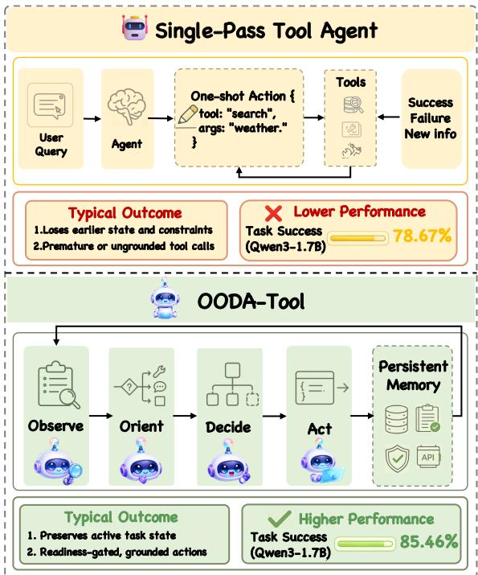
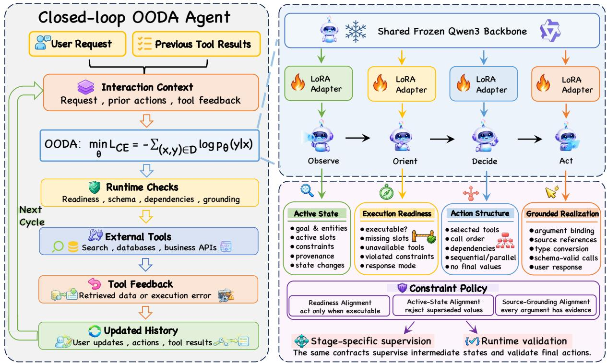
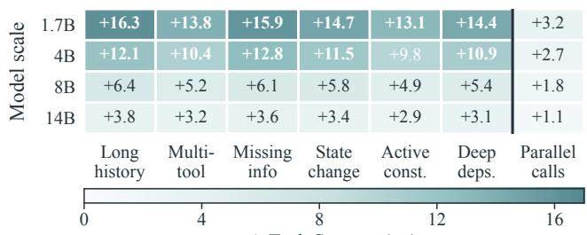
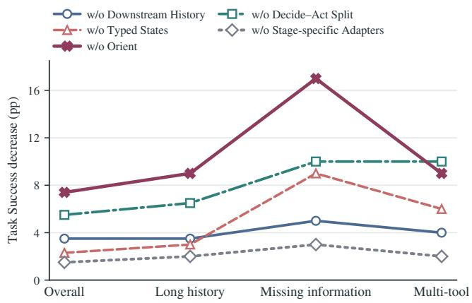
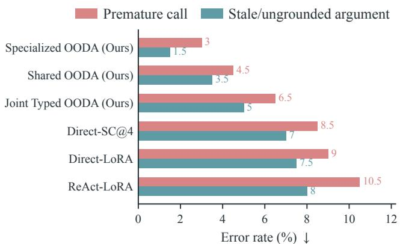
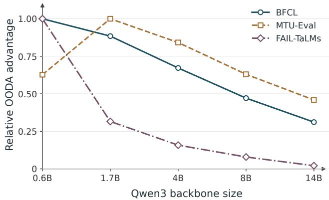
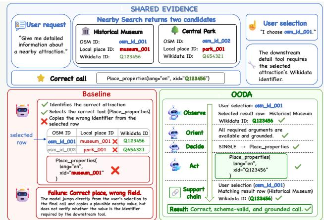

# From State to Action: OODA-Tool for Reliable Multi-Turn Tool Use

Rongfeng Guo∗, Yinxuan Huang∗, Yusen Wu, Maoqing Zhong, Yunlu Chen, Meng Tang, Teng Long, Vincent Tao Hu†

## Abstract

Reliable multi-turn tool use requires an agent to preserve an evolving task state and ensure that each action remains consis- tent with it. However, direct function-calling and ReAct-style policies learn state tracking and action generation within the same autoregressive trajectory. This coupling creates stateaction competition: the pressure to produce the next call can overwrite or ignore information accumulated earlier in the interaction. Inspired by Boyd’s Observe–Orient–Decide–Act cycle, we introduce OODA-Tool, a typed closed-loop policy designed to mitigate this competition by separating state preservation from action realization. Rather than generating an action directly from the interaction history, OODA-Tool routes each decision through controller-checked intermediate states, ensuring that the final output remains grounded in the current task state. Specifically, Observe reconstructs the task state, Orient determines whether execution is warranted, Decide forms an admissible action structure, and Act realizes the external output. We evaluate OODA-Tool against direct function-calling and ReAct policies using Qwen3 models ranging from 0.6B to 14B across multi-turn, multi-tool, and incomplete-information settings. OODA-Tool consistently improves task success across model sizes, with larger gains on smaller models and on tasks whose actions depend strongly on information accumulated across turns and prior tool results. Controlled variants, stage- level ablations, and transfer evaluations further demonstrate the robustness of these improvements.

## Introduction

Language-model agents increasingly rely on search engines, databases, code executors, and business APIs to solve tasks beyond parametric knowledge (Nakano et al. 2021; Schick et al. 2023; Qin et al. 2025; Li et al. 2023; Yang et al. 2023; Liu et al. 2024; Zhou et al. 2024). Multi-turn tool use is dificult because the validity of a call depends on an interaction state that changes as the task unfolds. Evaluations show that single- turn performance may not transfer to stateful, long-horizon interaction (Wang et al. 2024, 2025a; Yao et al. 2024; Acikgoz et al. 2025). Syntactic validity and eventual task completion are therefore incomplete indicators of correct behavior (Patil et al. 2025). Step-wise evaluations reveal failures hidden by aggregate outcomes (Chen et al. 2024). A call may be well formed yet rely on stale or unsupported information. Likewise, final success can mask inconsistent intermediate decisions, creating a gap between outcome correctness and consistency with the evolving state (Lu et al. 2025; Ou et al. 2025).

  
Figure 1: Comparison between a single-pass tool agent and our staged OODA-Tool agent.

Yet most agent designs leave the connection between accu- mulated state and the next action implicit (Patil et al. 2024; Qin et al. 2024). StateFlow externalizes part of this control through explicit state-machine transitions (Wu et al. 2024; Zhu et al. 2026). As shown in Figure 1, direct function-calling policies map the interaction history to a concrete call within one generation. ReAct-style policies make the reasoning pro- cess visible, but represent it as free-form reasoning rather than as controller-checkable state (Yao et al. 2023; Schick et al. 2023; Erdogan et al. 2025). In both cases, the model may respond appropriately to the latest turn while failing to carry an earlier constraint or state update into the next action. We call this failure mode state-action competition: the immediate demand to produce an action interferes with preserving and applying the task state accumulated across turns.

A useful lens on this failure comes from Boyd’s Observe– Orient–Decide–Act (OODA) cycle in military command and control (Boyd et al. 2018; Bai et al. 2026). OODA treats decision making as a closed loop rather than a direct reaction to the latest observation. New information is first interpreted against the current operational picture, after which an action is selected and executed. The consequences of that action then update the operational picture for the next cycle. Its relevance to tool use lies not simply in dividing reasoning into four steps, but in maintaining a coherent state between observation and action. Figure 1 illustrates this contrast: the upper pipeline leaves this coordination inside a monolithic generation, whereas the lower pipeline makes the decision state explicit and returns tool feedback to the next cycle (Shinn et al. 2023; Kim et al. 2025; Ma et al. 2024).

Following this principle, we propose OODA-Tool, a typed policy with explicit supervision at each stage. Observe con-structs a provenance-aware representation of the current task, and Orient determines whether the available state supports execution. Based on this judgment, Decide specifies an admissible action structure, which Act realizes as a schema-valid tool call or an authorized user-facing response. As depicted in the lower half of Fi ure 1, a central controller checks each handof before allowing the action to proceed and incorpo- rates the result into the next cycle. This difers from α-UMi, which primarily divides planning, calling, and summarization across separate models (Shen et al. 2024). Plan-and-Act similarly separates planning from execution. OODA-Tool instead uses typed interfaces to regulate how accumulated state is converted into action (Qin et al. 2024). This design also raises a central question: whether compressing history into typed states loses information, or whether stronger interface constraints suppress otherwise valid actions. We investigate whether state preservation and action realizability can instead be improved jointly, as examined in RQ5.

This mechanism yields a clear empirical prediction. OODA- Tool should provide the greatest benefit when success depends on carrying state across turns or coordinating sequential tool dependencies. The benefit should diminish as backbone capacity increases and remain modest when the main dificulty lies in expanding many parallel calls. The results follow this pattern. Across Qwen3 models with 0.6B, 1.7B, 4B, 8B, and 14B parameters, Specialized OODA improves Task Success over Direct-LoRA by 6.86, 6.79, 6.99, 5.94, and 4.48 points, respectively. The gains are larger on the hard and out-of- distribution slices, but smaller on simple or highly parallel calls. Direct-LoRA remains the cheaper choice when one- pass latency is the primary concern. Our contributions are as follows:

• We propose OODA-Tool, a typed four-stage policy that separates state reconstruction, execution gating, action planning, and grounded realization.

• We design controlled joint, shared, and specialized vari-ants, together with stage ablations and typed-state bottle- neck analyses, to disentangle the efects of typed supervi- sion, multi-pass inference, and stage specialization, and to examine how state preservation supports downstream

action realization.

• We conduct a cross-scale evaluation on ToolDial and three additional benchmarks, demonstrating consistent gains on state-intensive tasks while identifying parallel-call realization as a key limitation.

## Methodology

This section presents OODA-Tool, including its typed decision process, stage supervision, and state-suficiency analysis.

## Problem Formulation

Task and interaction history. We study a language-model agent that interacts with an external tool environment over multiple turns. At turn t, the agent observes the ordered interaction history

$$
h _ { t } = \big \langle ( u _ { 1 } , a _ { 1 } , o _ { 1 } ) , \ldots , ( u _ { t - 1 } , a _ { t - 1 } , o _ { t - 1 } ) , u _ { t } \big \rangle ,\tag{1}
$$

where $u _ { i }$ is a user message, $a _ { i }$ is an agent tool call or natural- language response, and $o _ { i }$ is the subsequent environment observation, which may be empty when no tool is invoked. Let T denote the available tool library, including tool names, documentation, and argument schemas. A monolithic policy samples the next external output directly:

$$
a _ { t } \sim \pi _ { \theta } ( \cdot \mid h _ { t } , { \mathcal { T } } ) ,\tag{2}
$$

thereby coupling task-state reconstruction, execution- readiness assessment, action-structure selection, and schema- grounded realization inside one implicit representation.

Typed OODA policy. The typed interfaces and their central-controller checks are summarized in Figure 2. OODA-Tool represents the decision process as three typed intermediate states followed by a realized action. In the default history- visible setting,

$$
z _ { t } ^ { O } = f _ { O } ( h _ { t } , \mathcal { T } ) ,\tag{3}
$$

$$
\begin{array} { r } { z _ { t } ^ { R } = f _ { R } ( z _ { t } ^ { O } , h _ { t } , { \mathcal T } ) , } \end{array}\tag{4}
$$

$$
\begin{array} { r } { z _ { t } ^ { D } = f _ { D } ( z _ { t } ^ { O } , z _ { t } ^ { R } , h _ { t } , \mathcal { T } ) , } \end{array}\tag{5}
$$

$$
a _ { t } \ = f _ { A } ( z _ { t } ^ { O } , z _ { t } ^ { R } , z _ { t } ^ { D } , h _ { t } , \mathcal { T } ) ,\tag{6}
$$

where $z _ { t } ^ { O } , z _ { t } ^ { R }$ , and $z _ { t } ^ { D }$ are the Observe state, readiness state, and action structure, respectively. Let $\mathcal { Z } _ { D } ( z _ { t } ^ { R } )$ denote the set of action structures permitted by the readiness state. The central controller enforces

$$
z _ { t } ^ { D } \in \mathcal { Z } _ { D } ( z _ { t } ^ { R } ) ,\tag{7}
$$

so that Decide cannot authorize a tool structure when Orient requires clarification, recovery, direct response, or termination. This decomposition changes neither the environment nor the visible information; it changes how the decision is represented, supervised, and checked before the external output is emitted.

## The OODA-Tool Framework

At each turn, OODA-Tool executes Observe, Orient, Decide, and Act in sequence under central-controller validation. A tool result, execution error, or user update is then appended to the interaction history and initiates the next cycle.

  
Figure 2: Overview of OODA-Tool. The left panel shows the closed-loop tool-use process under central-controller validation. The upper-right panel illustrates Specialized OODA with a separate LoRA adapter for each stage over a shared frozen Qwen3 backbone. The lower-right panel summarizes the typed intermediate states and the unified constraint policy used for stage supervision and final-action validation.

Observe: task-state reconstruction. Observe converts the history into a provenance-aware task state with fixed field semantics. It records the current goal, entities, active values, evidence sources, constraints, unfinished subgoals, recent tool facts, and state changes. Only information available before the current action is included in h ; g provides current-turn supervision but excludes post-action observations.

Orient: execution readiness. A correct task state does not necessarily imply that the agent should act. Orient predicts one of five response modes: SOLVABLE\_WITH\_TOOL, NEED\_CLARIFICATION, RESPOND\_DIRECTLY, RECOVER\_FROM\_FAILURE, or DONE. It also records missing slots, violated constraints, and unavailable tools. Orient determines whether action- structure selection is admissible and blocks execution when the available evidence is insuficient.

Decide: action structure. Conditioned on the readiness state, Decide instantiates the permitted action structure. For executable turns, it selects a single call, a sequential chain, or a parallel action set and specifies the target tools, call order, and data dependencies without expanding final argument values. For non-tool modes, it preserves the authorized clarification, direct-response, recovery, or termination branch for Act. This separation keeps execution-readiness and action-structure errors distinct from argument-realization errors.

Act: schema-grounded realization. Act compiles the selected action structure into executable calls. It binds values from the active task state or completed tool returns, performs schema-permitted deterministic transformations, resolves ref- erences to earlier outputs, and verifies required keys and formats. In non-tool modes, it emits the authorized clarifica- tion question, recovery action, direct answer, or termination response. Parallel and repeated calls place the greatest burden on this stage because one action structure must be expanded into multiple correctly bound call objects.

## Stage Parameterization and Supervision

We instantiate the typed interfaces as Joint OODA, which serializes the Observe, Orient, Decide, and Act outputs in one model call; Shared OODA, which uses four stage-wise calls with one shared LoRA adapter; and Specialized OODA, which uses a separate LoRA adapter for each stage over the same frozen backbone (Hu et al. 2022). These variants isolate the efects of typed supervision, stage-wise inference, and stage-specific parameterization.

Typed target construction is controlled by a Constraint- Policy. For a profile c, the policy specifies which execution-readiness conditions, active-task-state relations, and admissi- ble argument sources are represented in the targets. For each trajectory ξ and turn t, we construct the visible prefix ht and a current-turn gold annotation g . The annotation contains the gold response mode, action structure, and realized output for turn t, but excludes future user turns, the observation produced by the current gold action, and facts revealed only by that observation. Targets are derived in stage order:

Algorithm 1 Specialized OODA-Tool Training and Inference   
Require: Trajectories D, tool library $\tau ,$ , constraint profile c   
Ensure: Trained parameters $\Theta _ { c } ^ { * } = \{ \theta _ { s , c } ^ { * } \} _ { s \in \{ O , R , D , A \} }$   
Ofline Training   
1: Initialize $\mathcal { D } _ { s , c } \gets \emptyset$ for all $s \in \{ O , R , D , A \}$   
2: for all trajectory $\xi \in \mathcal { D }$ do   
3: for all turn t in ξ do   
4: $( h _ { t } , g _ { t } ) \gets \bar { \mathrm { C u R R E N T I U R N V I E W } } ( \xi , t )$   
5: $z _ { t } ^ { O * } \gets \mathrm { O } _ { \mathrm { B S E R V E T A R G E T } } ( h _ { t } , c )$   
6: $z _ { t _ { - } } ^ { R * } \gets \mathrm { O R I E N T I A R G E T } ( z _ { t _ { - } } ^ { \dot { O } * } , \mathcal { T } , g _ { t } , c )$   
7: $z _ { t } ^ { D * } \gets \mathrm { D E C I D E T A R G E T } \big ( z _ { t } ^ { O * } , z _ { t } ^ { R * } , g _ { t } , c \big )$   
8: $a _ { t } ^ { * } \gets \mathrm { A c r T A R G E T } ( z _ { t } ^ { O * } , z _ { t } ^ { R * } , z _ { t } ^ { D * } , g _ { t } , c )$   
9: Add the four stage examples to $\{ \mathcal { D } _ { s , c } \} _ { s \in \{ O , R , D , A \} }$   
10: end for   
11: end for   
12: for all $s \in \{ O , R , D , A \}$ do   
13: $\theta _ { s , c } ^ { * }   \mathrm { \tiny ~ S U P E R V I S E D T R A I N } ( \mathcal { D } _ { s , c } )$   
14: end for   
Online Inference   
15: Initialize $h _ { 1 } \gets \langle u _ { 1 } \rangle$   
16: for $t = 1 , \ldots , \dot { H }$ do   
17: $z _ { t } ^ { O } \gets f _ { O } ( h _ { t } , \mathcal { T } ; \theta _ { O , c } ^ { * } )$   
18: $z _ { t } ^ { R } \gets f _ { R } ( z _ { t } ^ { O } , h _ { t } , \mathcal { T } ; \theta _ { R , c } ^ { * } )$   
19: $z _ { t } ^ { D } \gets f _ { D } ( z _ { t } ^ { O } , z _ { t } ^ { R } , h _ { t } , \mathcal { T } ; \theta _ { D , c } ^ { * } )$   
20: Validate $z _ { t } ^ { D } \in \mathcal { Z } _ { D } ( z _ { t } ^ { R } )$   
21: $a _ { t }  f _ { A } ( z _ { t } ^ { O } , z _ { t } ^ { R } , z _ { t } ^ { D } , h _ { t } , \mathcal { T } ; \theta _ { A , c } ^ { * } )$   
22: Validate the schema and grounding of $a _ { t }$   
23: $\mathbf { i f } ~ z _ { t } ^ { R } = \mathrm { S O L V A B L E \_ W I T H \_ T O O I } ,$ then   
24: $o _ { t }  \mathcal { E } ( a _ { t } )$   
25: $h _ { t + 1 }  \dot { h _ { t } } \oplus ( a _ { t } , o _ { t } )$   
26: else if $z _ { t } ^ { R } = \mathrm { R E C O V E R } _ { - }$ \_FROM\_FAILURE then   
27: $o _ { t }  \mathcal { E } ( a _ { t } )$   
28: $h _ { t + 1 _ { - } }  h _ { t } \oplus ( a _ { t } , o _ { t } )$   
29: else if $\cdot z _ { t } ^ { R } = { \tt N E E D \_ C L A R I F I C A T I O N }$ then   
30: Emit at and receive $u _ { t + 1 }$   
31: $h _ { t + 1 }  h _ { t } \oplus ( a _ { t } , u _ { t + 1 } )$   
32: else   
33: return $a _ { t }$ ▷ RESPOND\_DIRECTLY or DONE   
34: end if   
35: end for

$$
z _ { t } ^ { O * } = \mathrm { O b s e r v e T a r g e t } ( h _ { t } , c ) ,\tag{8}
$$

$$
z _ { t } ^ { R * } = \mathrm { O r i e n t T a r g e t } ( z _ { t } ^ { O * } , \mathcal { T } , g _ { t } , c ) ,\tag{9}
$$

$$
z _ { t } ^ { D * } = \mathrm { D e c i d e T a r g e t } ( z _ { t } ^ { O * } , z _ { t } ^ { R * } , g _ { t } , c ) ,\tag{10}
$$

$$
a _ { t } ^ { * } = \mathrm { A c t T a r g e t } ( z _ { t } ^ { O * } , z _ { t } ^ { R * } , z _ { t } ^ { D * } , g _ { t } , c ) .\tag{11}
$$

This construction prevents upstream targets from depending on information obtained only after the gold action is executed.

For Joint OODA, the supervised target is the serialized sequence

$$
y _ { t } ^ { * } = \left[ z _ { t } ^ { O * } ; z _ { t } ^ { R * } ; z _ { t } ^ { D * } ; a _ { t } ^ { * } \right] ,
$$

and training minimizes

(12)

$$
\mathcal { L } _ { \mathrm { j o i n t } } = - \sum _ { \left( x , y \right) \in \mathcal { D } _ { \mathrm { j o i n t } , c } } \log p _ { \theta _ { c } } ( y \mid x ) .\tag{13}
$$

For Shared and Specialized OODA, stage-level datasets $\mathcal { D } _ { s , c }$ are constructed for $s \in \{ O , R , D , A \}$ . Training minimizes

$$
\mathcal { L } _ { \mathrm { m u l t i } } = - \sum _ { s \in \{ O , R , D , A \} } \sum _ { ( x , z ) \in \mathcal { D } _ { s , c } } \log p _ { \theta _ { \rho ( s ) , c } } ( z \mid x ) ,\tag{14}
$$

where $\rho ( s ) = $ shared for Shared OODA and $\rho ( s ) = s$ for Specialized OODA. The backbone, token-level cross-entropy objective, and target-construction pipeline remain fixed across constraint profiles; onl the t ped relations generated b the selected profile change. At inference time, the matching profile configures interface validation, contract retries, and execution-readiness-based rerouting in the central controller.

State suficiency. The default history-visible setting gives every stage access to $h _ { t }$ in addition to typed upstream states. To test whether the typed states retain the information required downstream, the typed-state bottleneck removes history access from Orient, Decide, and Act, leaving only typed upstream states and tool schemas. A small degradation under this intervention indicates that the Observe state retains most task- relevant history and that the readiness state carries actionable information rather than only a post-hoc explanation.

## Experiments

We ask whether OODA improves tool use across model scales (RQ1), when its gains are largest (RQ2), which components drive its gains ( RQ3 ), how well it transfers and at what cost (RQ4), whether typed states remain actionable (RQ5), and how typed state supports argument grounding (RQ6)

## Experimental Setup

Data, splits, and supervision. We use the oficial ToolDial split of 11,111 multi-turn tool-use sessions (Shim et al. 2025). Trajectories are split before label construction, keeping all turns from a session in the same partition. Supervision is con- structed from the visible interaction prefix and the current-turn gold action, while excluding future user turns, the observation returned by the current gold action, and facts revealed only by that observation. Each trajectory is converted into aligned training views for Direct-LoRA, ReAct-LoRA, α-UMi, Joint OODA, Shared OODA, and Specialized OODA. All systems use the same tokenizer and context budget; examples are tokenized ofline, grouped by length, dynamically padded, and never packed across turn boundaries.

Systems and training. We evaluate Qwen3-Instruct backbones from 0.6B to 14B parameters (Team 2025). Direct-LoRA predicts the external output in one pass, ReAct-LoRA generates a free-form thought before acting, Direct-SC@4 aggregates four Direct-LoRA samples, and α-UMi uses Planner, Caller, and Summarizer roles (Hu et al. 2022; Yao et al. 2023; Wang et al. 2023; Shen et al. 2024). Joint, Shared, and Specialized OODA respectively use one-pass typed gener- ation, four stage-wise calls with a shared adapter, and four stage-specific adapters.

At each scale, systems share the Qwen3-Instruct backbone, set enable\_thinking=false, and use an 8192-token limit. All LoRA-tuned systems use rank r = 32, scaling α = 64, 0.05 dropout, and target\_modules=all-linear, with the backbone, embeddings, and lm\_head frozen. Opti-mizer family, learning-rate schedule, epoch count, validation procedure, and output processing are shared; training uses BF16 and FlashAttention 2 (Dao 2024). Per-device batch size and gradient accumulation vary by scale to keep the global batch approximately constant. Checkpoints and decoding settings are selected on validation data.

<table><tr><td rowspan="2">Method</td><td rowspan="2">Structure / adapters</td><td colspan="5">Task Success ↑</td><td colspan="4">Tool Exact ↑</td><td colspan="2">Ask-Act Accuracy ↑</td></tr><tr><td>0.6B</td><td>1.7B</td><td>4B</td><td>8B</td><td>14B</td><td>0.6B</td><td>1.7B</td><td>4B</td><td>8B 14B</td><td>0.6B 1.7B 4B 8B</td></tr><tr><td>Base Instruct</td><td></td><td>0.10</td><td>0.43</td><td>3.04</td><td>7.26</td><td>11.63</td><td>0.20</td><td>0.67</td><td>6.1813.84</td><td>20.45 69.50</td><td>73.76 78.42 82.15 85.27</td></tr><tr><td>Direct-LoRA</td><td>1 adapter</td><td></td><td>78.24 78.67</td><td>80.31</td><td>83.58 90.42</td><td></td><td>88.36 82.41 84.29</td><td></td><td>87.31 96.21</td><td>94.06 95.03</td><td>96.08 97.05 98.04</td></tr><tr><td>ReAct-LoRA</td><td>1 adapter</td><td></td><td>65.4373.18 79.62 81.35 84.77</td><td></td><td></td><td></td><td>71.56 77.21</td><td>82.39</td><td>85.44 90.83</td><td></td><td>91.32 94.71 95.26 96.59 97.84</td></tr><tr><td>Direct-SC@4</td><td>4 samples</td><td>78.90 78.90 81.12</td><td></td><td></td><td>83.92 90.72</td><td></td><td>88.70 82.68 84.57</td><td></td><td>87.45 96.34</td><td>94.10 95.07</td><td>96.15 97.12 98.09</td></tr><tr><td>α-UMi</td><td>3 roles</td><td>82.90</td><td>83.94</td><td>85.80</td><td></td><td>88.10 93.90</td><td>97.90 98.60</td><td>98.72</td><td>98.94 99.15</td><td>98.35 98.70</td><td>98.80 98.92 99.04</td></tr><tr><td colspan="10">Ours</td><td></td><td></td></tr><tr><td>OODA</td><td></td><td>Joint</td><td>83.9084.16 86.1088.45 94.10</td><td></td><td></td><td></td><td></td><td></td><td>98.10 98.20 98.55 98.85 99.15</td><td></td><td>97.95 98.22 98.45 98.70 98.90</td></tr><tr><td>OODA</td><td>Shared</td><td></td><td></td><td></td><td>84.55 84.78 86.68 88.96 94.50</td><td></td><td></td><td>98.35 98.58 98.80 99.05</td><td>99.28</td><td>98.20 98.52 98.67</td><td>98.85 99.03</td></tr><tr><td>OODA</td><td>Specialized</td><td></td><td>85.10 85.46 87.30 89.52 94.90</td><td></td><td></td><td></td><td>98.55 99.09</td><td></td><td>99.16 99.30 99.42</td><td></td><td>98.40 98.73 98.86 98.98 99.10</td></tr></table>

Table 1: ToolDial results across Qwen3 backbone sizes. Specialized OODA achieves the highest Task Success at every scale, with larger gains on smaller backbones. Bold indicates the best result, and underlining indicates the strongest non-OODA baseline.

Constraint profiles. Each ConstraintPolicy generates a separate typed training set from the same trajectories. Profiles share the data split, architecture, LoRA configuration, optimizer, training schedule, and token-level cross-entropy objective. At evaluation time, each model is paired with the controller corresponding to its training profile.

Evaluation pipeline. All methods use the same output parser, schema normalizer, validator, benchmark adapter, and metric implementation. Shared metrics are computed from the final external action or response; OODA intermediate states are used only for targeted diagnostics. The main text em- phasizes cross-scale patterns and representative mechanisms, while complete results are reported in the supplement.

External datasets. For transfer experiments, models retain their ToolDial-trained adapters and receive no additional training examples or in-context demonstrations on FAIL- TaLMs, MTU-Bench, or BFCL (Treviño et al. 2025; Wang et al. 2025b; Patil et al. 2025). All external evaluations use greedy decoding and the same benchmark-specific conversion and scoring pipeline across methods.

Metrics and statistics. ToolDial is evaluated with Task Suc-cess, Tool Exact, and Ask–Act Accuracy. On tool-call turns, Task Success requires tool\_exact, argument\_exact, and schema\_valid; grounding\_valid is reported separately as a typed-state metric. For methods with typed intermediate states, we additionally report State Slot F1 and Typed Constraint Consistency. Across all methods, we measure Ask-vs-Act F1, premature-call rate, and stale-or- ungrounded-argument rate, with slices by history length, missing information, state changes, active constraints, depen- dency depth, and parallel-call structure. MTU-Bench uses the metrics provided by MTU-Eval, including S-M and S-S averages. FAIL-TaLMs reports Ask–Act Accuracy, Schema Validity, Premature Call, and Required-Argument Coverage; typed-state methods additionally report Trace Grounding Va- lidity, Readiness Contract Validity, Slot Exactness, and Stale Binding. BFCL reports its oficial Overall, Non-Live, Live, and Multi-turn tracks.

## RQ1: Does OODA Improve Tool Use?

Table 1 shows that Specialized OODA consistently achieves the best Task Success across all model scales. Its advantage is largest for smaller backbones and narrows as capacity grows, indicating that explicit decision-state decomposition is espe- cially useful under limited model capacity. Tool Exact follows the same general pattern, whereas Ask–Act Accuracy is al- ready near saturation for structured methods. The progression from Joint to Shared and then Specialized OODA further sug- gests that both multi-pass decomposition and stage-specific adaptation contribute to the gains.

## RQ2: When Does OODA Help Most?

Capacity. Across the hard and out-of-distribution evaluation subsets, Specialized OODA remains the strongest method at every reported backbone size; detailed results appear in the supplement section Hard/OOD Capacity Results. Absolute performance improves with scale, but the margin over the strongest size-matched one-pass baseline steadily narrows. To- gether with Table 1, this pattern suggests that larger backbones partially recover the state-tracking and decision capacity sup- plied explicitly by OODA. These subset results characterize model behavior; overall results are reported in Table 1, and slice definitions and sample counts in the supplement section Development Slice Construction.

Task structure. Figure 3 shows that OODA’s gains con-centrate on turns requiring state reconstruction: long his- tories, missing required information, state changes, active constraints, and deeper tool dependencies. The improvement is much smaller for parallel calls, where the dominant er- rors concern call expansion and cross-call argument binding rather than dialogue-state reconstruction. OODA therefore addresses state-dependent reasoning more efectively than parallel action realization.

State and readiness complexity  
  
Δ Task Success (pp)  
Figure 3: Task Success gains of Specialized OODA over Direct-LoRA across model scales and ToolDial complexity subsets. Gains are largest on state-intensive tasks and smallest on parallel calls; values are percentage-point diferences.

(a) Component ablations  
  
(b) Grounding Errors  
Figure 4: Component ablations and execution-grounding er- rors. Panel (a) reports Task Success decreases under controlled ablations, and panel (b) reports premature-call and stale-or-ungrounded-argument rates; larger ablation drops are worse, while lower error rates are better. Orient and the Decide–Act separation contribute most, whereas stage-specific adapters have a smaller efect.

## RQ3: Which Components Matter?

In ablation analyses, Full OODA refers to Specialized OODA without any component removed. We compare five variants: w/o Orient removes the Orient stage; w/o Decide–Act Split merges decision formation with action realization; w/o Typed States replaces typed intermediate states with free-form text; w/o Downstream History restricts downstream stages to typed upstream states and tool schemas; and w/o Stagespecific Adapters shares one adapter across all stages.

Ablation sensitivity. The mechanism set contains 1,250 turns from 600 dialogues. Figure 4(a) shows that w/o Orient causes the largest degradation, especially when required infor- mation is missing. w/o Decide–Act Split is also particularly harmful on missing-information and multi-tool turns, showing that decidin whether and what to call should remain distinct from surface-level action generation. w/o Typed States re-mains competitive in aggregate but degrades sharply on these structured subsets. By contrast, w/o Downstream History causes a moderate loss, while w/o Stage-specific Adapters has the smallest efect. The main benefit therefore comes from explicit staged state construction, with stage-specific adaptation providing an additional but smaller gain.

Execution grounding. Figure 4(b) evaluates all methods on a fixed 500-turn sample drawn from rare-error pools. Specialized OODA achieves the lowest premature-call and stale-or-ungrounded-argument rates. Its advantage thus ex- tends beyond producing syntactically valid calls: the staged typed state also improves when a call is issued and whether its arguments are supported by the interaction history.

## RQ4: What Transfers, and at What Cost?

We use FAIL-TaLMs to evaluate readiness and failure han- dling, MTU-Bench to measure transfer across tool-use set- tings, and BFCL to evaluate call realization. Figure 5 sum- marizes the cross-scale margin of Specialized OODA over α-UMi; complete tables are reported in the supplement.

Zero-shot readiness transfer: FAIL-TaLMs. At 1.7B, Specialized OODA is saturated on the shared readiness met- rics and is best or tied with the strongest baselines. Its margin over α-UMi becomes negligible at larger scales, indicating that FAIL-TaLMs mainly tests capabilities that suficiently large structured models already solve. Typed-state diagnostics likewise show near-perfect grounding, readiness, slot accu- racy, and stale-binding control. These internally evaluated results are not oficial FAIL-TaLMs leaderboard scores, and the prediction summary does not support a unified setting- level success table. Full results appear in the supplement section FAIL-TaLMs Readiness and Failure Handling.

Cross-setting transfer: MTU-Bench. Specialized OODA improves most MTU-Bench metrics at 1.7B while tying the remaining ones. The advantage is consistent but modest, suggesting that the learned state decomposition transfers beyond ToolDial without dominating every aspect of multi- turn tool use. Complete all-scale and per-metric results appear in the supplement section MTU-Bench Transfer Results.

  
Figure 5: Normalized transfer advantage ofSpecialized OODA over α-UMi across Qwen3 backbone sizes on BFCL, MTU-Eval, and FAIL-TaLMs. Higher values indicate larger gains. The advantage is strongest on BFCL and smaller backbones and narrows with scale.

Call realization: BFCL. BFCL shows the clearest benefit for smaller backbones. The margin decreases with scale, indicating that explicit state decomposition compensates when backbone capacity is limited. However, the smaller gain on the Multi-turn track is consistent with parallel-call errors observed on ToolDial. Full results appear in the supplement section Call-Realization Boundary: BFCL.

Eficiency trade-of. At 1.7B, Specialized OODA uses four sequential calls with 2.36× normalized latency relative to Direct-LoRA. Its accuracy–latency trade-of is most favor- able on turns involving missing information, state changes, active constraints, or tool dependencies, while Direct-LoRA remains suitable for simple latency-sensitive calls. Direct- SC@4 uses the same number of model calls but remains below the OODA variants, indicating that the gain comes from struc- tured computation rather than repeated sampling. Parallel-call realization remains a shared limitation of structured meth- ods. Detailed cost measurements and the accuracy–latency analysis appear in the supplement section Eficiency Trade-of.

## RQ5: Can Typed States Support Action?

Typed-state suficiency. w/o Downstream History retains most of Full OODA’s performance without dialogue-history access, but degrades on long-history, missing-information, and multi-tool turns, suggesting that typed states preserve most but not all task-relevant context. w/o Typed States is less robust, while w/o Orient causes the largest losses in state reconstruction and constraint consistency despite near- ceiling Ask-vs-Act accuracy. Thus, free-form states’ high Schema Validity does not imply equivalent state quality (the supplement section Mechanism Ablations).

State–action alignment. On turns where all variants re-cover the correct action-relevant state and Orient mode, the State–Action Contradiction Rate (SACR; lower is better) falls from 7.8% for Joint and 5.6% for Shared OODA to 3.9% for Specialized OODA, but rises to 10.7% without the Decide–Act split. This 6.8-point gap indicates that separating action selection from realization reduces residual response- mode, superseded-value, and unsupported-binding errors. A profile comparison varying only readiness, active-state, and argument-grounding targets preserves perfect schema validity while the constraint-enriched profile removes stale bindings and restores grounding. Gradient alignment also increases dur ing training, especially for Act-related pairs. Further analyses appear in the supplement sections State–Action Competition, Constraint-Policy Alignment Across Training and Inference, and Gradient Analysis Protocol.

  
Figure 6: Identifier grounding. Baselines copy a local ID, whereas OODA traces the selection to the Wikidata ID.

Interpretation and boundary. Typed states support action when readiness, active values, and admissible sources are rep- resented consistently. The main limitation is action expansion: gains are smaller on BFCL Multi-turn, while ToolDial parallel calls still expose call-expansion and cross-call binding errors.

## RQ6: How Does OODA Ground Arguments?

Figure 6 illustrates a ToolDial identifier-grounding failure. The user selects osm\_id\_001, but Place\_properties requires a Wikidata xid. Direct-LoRA and ReAct-LoRA choose the correct attraction and tool yet copy museum\_001. OODA resolves the selected row in Observe, extracts Q123456, and produces the grounded call, preventing crossfield identifier substitution.

## Conclusion

We introduced OODA-Tool, a typed closed-loop policy that mitigates state–action competition by separating task- state preservation from action realization through controller- checked Observe, Orient, Decide, and Act stages. Across scales, OODA-Tool improves multi-turn tool use for smaller models and state-intensive tasks involving incomplete infor- mation, changing constraints, and sequential dependencies. Ablations show that typed state construction and readiness– action separation drive gains, while transfer results suggest that these interfaces remain useful beyond ToolDial despite se- quential inference cost. Smaller gains on parallel calls identify action expansion and cross-call binding as key challenges.

Acikgoz, E. C.; Greer, J.; Datta, A.; Yang, Z.; Zeng, W.; Elachqar, O.; Koukoumidis, E.; Hakkani-Tür, D.; and Tur, G. 2025. Can a Single Model Master Both Multi-turn Conver- sations and Tool Use? CoALM: A Unified Conversational Agentic Language Model. In Che, W.; Nabende, J.; Shutova, E.; and Pilehvar, M. T., eds., Proceedings ofthe 63rd Annual Meeting oftheAssociationfor Computational Linguistics (Volume 1: Long Papers), ACL 2025, Vienna, Austria, July 27 - August 1, 2025, 12370–12390. Association for Computational Linguistics.

Bai, S.; Zhang, J.; Huang, H.; Wang, Y.; Liu, J.; Wu, Y.; Yu, N.; Gao, Y.; and Cheng, M. 2026. One Cognitive Loop Is Enough: SODA unlocks Pure-Text Spatial Reasoning in Large Language Models. In Liakata, M.; Moreira, V. P.; Zhang, J.; and Jurgens, D., eds., Proceedings of the 64th Annual Meeting of the Association for Computational Linguistics (Volume 1: Long Papers), ACL 2026, San Diego, California, United States, July 2-7, 2026, 29974–29996. Association for Computational Linguistics.

Boyd, J. R.; et al. 2018. A discourse on winning and losing, volume 400. Air University Press Maxwell Air Force Base, AL.

Chen, Z.; Du, W.; Zhang, W.; Liu, K.; Liu, J.; Zheng, M.; Zhuo, J.; Zhang, S.; Lin, D.; Chen, K.; and Zhao, F. 2024. T-Eval: Evaluating the Tool Utilization Capability of Large Language Models Step by Step. In Ku, L.; Martins, A.; and Srikumar, V., eds., Proceedings of the 62nd Annual Meeting ofthe Associationfor Computational Linguistics (Volume 1: Long Papers), ACL 2024, Bangkok, Thailand, August 11-16, 2024, 9510–9529. Association for Computational Linguistics.

Dao, T. 2024. FlashAttention-2: Faster Attention with Better Parallelism and Work Partitioning. In The Twelfth International Conference on Learning Representations, ICLR 2024, Vienna, Austria, May 7-11, 2024. OpenReview.net.

Erdogan, L. E.; Lee, N.; Kim, S.; Moon, S.; Furuta, H.; Anumanchipalli, G.; Keutzer, K.; and Gholami, A. 2025. Plan- and-Act: Improving Planning of Agents for Long-Horizon Tasks. In Singh, A.; Fazel, M.; Hsu, D.; Lacoste-Julien, S.; Berkenkamp, F.; Maharaj, T.; Wagstaf, K.; and Zhu, J., eds., Forty-second International Conference on Machine Learning, ICML 2025, Vancouver, BC, Canada, July 13- 19, 2025, volume 267 of Proceedings ofMachine Learning Research. PMLR / OpenReview.net.

Hu, E. J.; Shen, Y.; Wallis, P.; Allen-Zhu, Z.; Li, Y.; Wang, S.; Wang, L.; and Chen, W. 2022. LoRA: Low-Rank Adaptation of Large Language Models. In The Tenth International Conference on Learning Representations, ICLR 2022, Virtual Event, April 25-29, 2022. OpenReview.net.

Kim, W.; Park, S.; In, Y.; Kim, S.; Lee, D.; and Park, C. 2025. Beyond the Final Answer: Evaluating the Reasoning Trajectories of Tool-Augmented Agents. CoRR, abs/2510.02837.

Li, M.; Zhao, Y.; Yu, B.; Song, F.; Li, H.; Yu, H.; Li, Z.; Huang, F.; and Li, Y. 2023. API-Bank: A Comprehensive Benchmark for Tool-Augmented LLMs. In Bouamor, H.; Pino, J.; and Bali, K., eds., Proceedings ofthe 2023 Conference on Empirical Methods in Natural Language Processing, EMNLP 2023,

Singapore, December 6-10, 2023, 3102–3116. Association for Computational Linguistics.

Liu, X.; Yu, H.; Zhang, H.; Xu, Y.; Lei, X.; Lai, H.; Gu, Y.; Ding, H.; Men, K.; Yang, K.; Zhang, S.; Deng, X.; Zeng, A.; Du, Z.; Zhang, C.; Shen, S.; Zhang, T.; Su, Y.; Sun, H.; Huang, M.; Dong, Y.; and Tang, J. 2024. AgentBench: Evaluating LLMs as Agents. In The Twelfth International Conference on Learning Representations, ICLR 2024, Vienna, Austria, May 7-11, 2024. OpenReview.net.

Lu, J.; Holleis, T.; Zhang, Y.; Aumayer, B.; Nan, F.; Bai, H.; Ma, S.; Ma, S.; Li, M.; Yin, G.; Wang, Z.; and Pang, R. 2025. ToolSandbox: A Stateful, Conversational, Interac- tive Evaluation Benchmark for LLM Tool Use Capabilities. In Chiruzzo, L.; Ritter, A.; and Wang, L., eds., Findings of the Association for Computational Linguistics: NAACL 2025, Albuquerque, New Mexico, USA, April 29 - May 4, 2025, volume NAACL 2025 of Findings ofACL, 1160–1183. Association for Computational Linguistics.

Ma, C.; Zhang, J.; Zhu, Z.; Yang, C.; Yang, Y.; Jin, Y.; Lan, Z.; Kong, L.; and He, J. 2024. AgentBoard: An Analytical Evaluation Board of Multi-turn LLM Agents. In Globersons, A.; Mackey, L.; Belgrave, D.; Fan, A.; Paquet, U.; Tomczak, J. M.; and Zhang, C., eds., Advances in Neural Information Processing Systems 37: Annual Conference on Neural Information Processing Systems 2024, NeurIPS 2024, Vancouver, BC, Canada, December 10 - 15, 2024.

Nakano, R.; Hilton, J.; Balaji, S.; Wu, J.; Ouyang, L.; Kim, C.; Hesse, C.; Jain, S.; Kosaraju, V.; Saunders, W.; Jiang, X.; Cobbe, K.; Eloundou, T.; Krueger, G.; Button, K.; Knight, M.; Chess, B.; and Schulman, J. 2021. WebGPT: Browser- assisted question-answering with human feedback. CoRR, abs/2112.09332.

Ou, T.; Guo, W.; Gandhi, A.; Neubig, G.; and Yue, X. 2025. AgentDiagnose: An Open Toolkit for Diagnosing LLM Agent Trajectories. In Habernal, I.; Schulam, P.; and Tiedemann, J., eds., Proceedings of the 2025 Conference on Empirical Methods in Natural Language Processing, EMNLP 2025 - System Demonstrations, Suzhou, China, November 4-9, 2025, 207–215. Association for Computational Linguistics.

Patil, S. G.; Mao, H.; Yan, F.; Ji, C. C.; Suresh, V.; Stoica, I.; and Gonzalez, J. E. 2025. The Berkeley Function Calling Leaderboard (BFCL): From Tool Use to Agentic Evaluation of Large Language Models. In Singh, A.; Fazel, M.; Hsu, D.; Lacoste-Julien, S.; Berkenkamp, F.; Maharaj, T.; Wagstaf, K.; and Zhu, J., eds., Forty-second International Conference on Machine Learning, ICML 2025, Vancouver, BC, Canada, July 13-19, 2025, volume 267 of Proceedings of Machine Learning Research. PMLR / OpenReview.net.

Patil, S. G.; Zhang, T.; Wang, X.; and Gonzalez, J. E. 2024. Gorilla: Large Language Model Connected with Massive APIs. In Globersons, A.; Mackey, L.; Belgrave, D.; Fan, A.; Paquet, U.; Tomczak, J. M.; and Zhang, C., eds., Advances in Neural Information Processing Systems 37: Annual Conference on Neural Information Processing Systems 2024, NeurIPS 2024, Vancouver, BC, Canada, December 10 - 15, 2024.

Qin, Y.; Hu, S.; Lin, Y.; Chen, W.; Ding, N.; Cui, G.; Zeng, Z.;Zhou, X.; Huang, Y.; Xiao, C.; Han, C.; Fung, Y. R.; Su, Y.;

Wang, H.; Qian, C.; Tian, R.; Zhu, K.; Liang, S.; Shen, X.; Xu,B.; Zhang, Z.; Ye, Y.; Li, B.; Tang, Z.; Yi, J.; Zhu, Y.; Dai, Z.;Yan, L.; Cong, X.; Lu, Y.; Zhao, W.; Huang, Y.; Yan, J.; Han,X.; Sun, X.; Li, D.; Phang, J.; Yang, C.; Wu, T.; Ji, H.; Li, G.;Liu, Z.; and Sun, M. 2025. Tool Learning with FoundationModels. ACM Comput. Surv., 57(4): 101:1–101:40.

Qin, Y.; Liang, S.; Ye, Y.; Zhu, K.; Yan, L.; Lu, Y.; Lin, Y.; Cong, X.; Tang, X.; Qian, B.; Zhao, S.; Hong, L.; Tian, R.; Xie, R.; Zhou, J.; Gerstein, M.; Li, D.; Liu, Z.; and Sun, M. 2024. ToolLLM: Facilitating Large Language Models to Master 16000+ Real-world APIs. In The Twelfth International Conference on Learning Representations, ICLR 2024, Vienna, Austria, May 7-11, 2024. OpenReview.net.

Schick, T.; Dwivedi-Yu, J.; Dessì, R.; Raileanu, R.; Lomeli, M.; Hambro, E.; Zettlemoyer, L.; Cancedda, N.; and Scialom, T. 2023. Toolformer: Language Models Can Teach Them- selves to Use Tools. In Oh, A.; Naumann, T.; Globerson, A.; Saenko, K.; Hardt, M.; and Levine, S., eds., Advances in Neural Information Processing Systems 36: Annual Conference on Neural Information Processing Systems 2023, NeurIPS 2023, New Orleans, LA, USA, December 10 - 16, 2023.

Shen, W.; Li, C.; Chen, H.; Yan, M.; Quan, X.; Chen, H.; Zhang, J.; and Huang, F. 2024. Small LLMs Are Weak Tool Learners: A Multi-LLM Agent. In Al-Onaizan, Y.; Bansal, M.; and Chen, Y., eds., Proceedings of the 2024 Conference on Empirical Methods in Natural Language Processing, EMNLP 2024, Miami, FL, USA, November 12-16, 2024, 16658–16680. Association for Computational Linguistics.

Shim, J.; Seo, G.; Lim, C.; and Jo, Y. 2025. ToolDial: Multi-turn Dialogue Generation Method for Tool-Augmented Language Models. In The Thirteenth International Conference on Learning Representations, ICLR 2025, Singapore, April 24-28, 2025. OpenReview.net.

Shinn, N.; Cassano, F.; Gopinath, A.; Narasimhan, K.; and Yao, S. 2023. Reflexion: language agents with verbal rein- forcement learning. In Oh, A.; Naumann, T.; Globerson, A.; Saenko, K.; Hardt, M.; and Levine, S., eds., Advances in Neural Information Processing Systems 36: Annual Conference on Neural Information Processing Systems 2023, NeurIPS 2023, New Orleans, LA, USA, December 10 - 16, 2023.

Team, Q. 2025. Qwen3 Technical Report. CoRR, abs/2505.09388.

Treviño, E.; Contant, H.; Ngai, J.; Neubig, G.; and Wang, Z. Z. 2025. Benchmarking Failures in Tool-Augmented Lan- guage Models. In Chiruzzo, L.; Ritter, A.; and Wang, L., eds., Proceedings of the 2025 Conference of the Nations of the Americas Chapter of the Association for Computational Linguistics: Human Language Technologies, NAACL 2025 - Volume 1: Long Papers, Albuquerque, New Mexico, USA, April 29 - May 4, 2025, 2916–2934. Association for Computational Linguistics.

Wang, H.; Huang, W.; Wang, Y.; Xi, Y.; Lu, J.; Zhang, H.; Hu, N.; Liu, Z.; Pan, J. Z.; and Wong, K. 2025a. Rethinking Stateful Tool Use in Multi-Turn Dialogues: Benchmarks and Challenges. In Che, W.; Nabende, J.; Shutova, E.; and Pilehvar, M. T., eds., Findings of the Association for Computational Linguistics, ACL 2025, Vienna, Austria, July 27 - August 1,

2025, volume ACL 2025 of Findings of ACL, 5433–5453. Association for Computational Linguistics.

Wang, P.; Wu, Y.; Wang, N.; Liu, J.; Song, X.; Peng, Z. Y.; Deng, K.; Zhang, C.; Wang, J.; Peng, J.; Zhang, G.; Guo, H.; Zhang, Z.; Su, W.; and Zheng, B. 2025b. MTU-Bench: A Multi-granularity Tool-Use Benchmark for Large Language Models. In The Thirteenth International Conference on Learning Representations, ICLR 2025, Singapore, April 24- 28, 2025. OpenReview.net.

Wang, X.; Wang, Z.; Liu, J.; Chen, Y.; Yuan, L.; Peng, H.; and Ji, H. 2024. MINT: Evaluating LLMs in Multi-turn Interaction with Tools and Language Feedback. In The Twelfth International Conference on Learning Representations, ICLR 2024, Vienna, Austria, May 7-11, 2024. OpenReview.net.

Wang, X.; Wei, J.; Schuurmans, D.; Le, Q. V.; Chi, E. H.; Narang, S.; Chowdhery, A.; and Zhou, D. 2023. Self- Consistency Improves Chain of Thought Reasoning in Lan- guage Models. In The Eleventh International Conference on Learning Representations, ICLR 2023, Kigali, Rwanda, May 1-5, 2023. OpenReview.net.

Wu, Y.; Yue, T.; Zhang, S.; Wang, C.; and Wu, Q. 2024. State-Flow: Enhancing LLM Task-Solving through State-Driven Workflows. CoRR, abs/2403.11322.

Yang, J.; Prabhakar, A.; Narasimhan, K.; and Yao, S. 2023. InterCode: Standardizing and Benchmarking Interactive Cod- ing with Execution Feedback. In Oh, A.; Naumann, T.; Globerson, A.; Saenko, K.; Hardt, M.; and Levine, S., eds., Advances in Neural Information Processing Systems 36: Annual Conference on Neural Information Processing Systems 2023, NeurIPS 2023, New Orleans, LA, USA, December 10 - 16, 2023.

Yao, S.; Shinn, N.; Razavi, P.; and Narasimhan, K. 2024. τ-bench: A Benchmark for Tool-Agent-User Interaction in Real-World Domains. CoRR, abs/2406.12045.

Yao, S.; Zhao, J.; Yu, D.; Du, N.; Shafran, I.; Narasimhan, K. R.; and Cao, Y. 2023. ReAct: Synergizing Reasoning and Acting in Language Models. In The Eleventh International Conference on Learning Representations, ICLR 2023, Kigali, Rwanda, May 1-5, 2023. OpenReview.net.

Zhou, S.; Xu, F. F.; Zhu, H.; Zhou, X.; Lo, R.; Sridhar, A.; Cheng, X.; Ou, T.; Bisk, Y.; Fried, D.; Alon, U.; and Neubig, G. 2024. WebArena: A Realistic Web Environment for Building Autonomous Agents. In The Twelfth International Conference on Learning Representations, ICLR 2024, Vienna, Austria, May 7-11, 2024. OpenReview.net.

Zhu, J.; Zhang, G.; Ma, X.; Xu, L.; Zhang, M.; Yang, R.; Wang, S.; Qiu, K.; Wu, Z.; Dai, Q.; Ma, R.; Liu, B.; Yang, Y.; Luo, C.; Yang, Z.; Li, L.; Wang, L.; Chen, W.; Geng, X.; and Guo, B. 2026. RE-TRAC: REcursive TRAjectory Compression for Deep Search Agents. CoRR, abs/2602.02486.