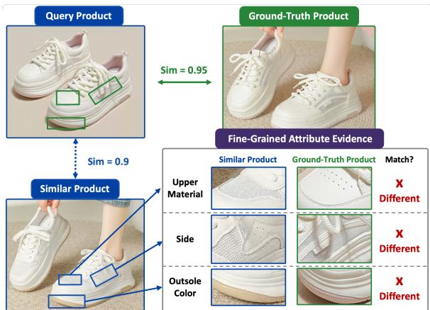
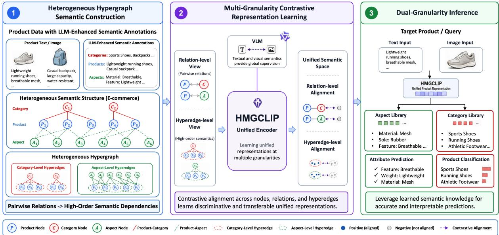
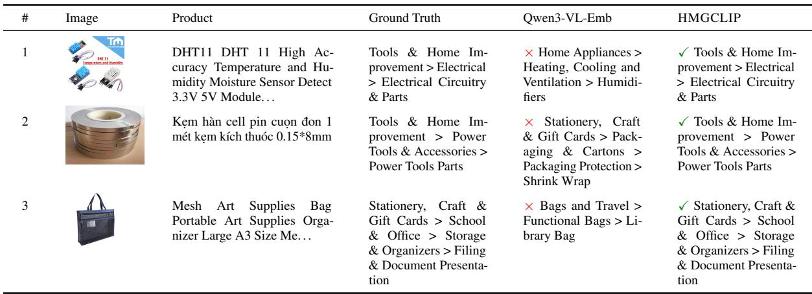

# HMGCLIP: Heterogeneous Multi-Granularity Contrastive Learning for E-commerce Representation Learning

Qiuyu Zhu Yi Gao Zhichao Wan Mingyang Ma

{zqy527291,xiheng.gy,wanzhichao.wzc,mingyang.mmy}@alibaba-inc.com Alibaba International Digital Commerce Group

## Abstract

Although recent Multimodal Large Language Models (MLLMs) have advanced general product understanding, they implicitly encode product information into global embeddings, thereby limiting their ability to capture finegrained attributes. This limitation hinders performance in tasks requiring precise attribute discrimination, such as distinguishing subtle material differences among visually similar prod ucts. To address this challenge, we propose HMGCLIP, a unified multimodal embedding framework. By constructing a heterogeneous hypergraph, we leverage hypergraph topology to mine structure-aware hard negatives and align multi-granular semantics at both relation and hyperedge levels. This design enables a dual-granularity inference mechanism that dynamically fuses attribute evidence for both finegrained and coarse-grained downstream tasks. Furthermore, we release a comprehensive finegrained e-commerce dataset to facilitate future benchmarking. Extensive experiments on this new dataset and the public MAVE benchmark show that HMGCLIP outperforms strong multimodal encoders, MLLMs, and e-commerce baselines, validating the superiority of HMG-CLIP.

## 1 Introduction

Modern e-commerce platforms manage billions of products described by images, titles, structured attributes, and categorical hierarchies. Learning unified representations from heterogeneous signals is fundamental to product search, recommendation, attribute value extraction (PAVE), and duplicate product detection (Radford et al., 2021; Chia et al., 2022). Despite rapid progress in multimodal representation learning (Lin et al., 2025; Li et al., 2026), three limitations persist in the e-commerce setting.

First, general vision-language models such as CLIP (Radford et al., 2021) are trained on webscale image–text pairs and struggle with the finegrained distinctions that e-commerce demands— for instance, differentiating between “mesh” and “leather” uppers, or “air cushion” and “flat rubber” soles, requires more than global visual alignment. Second, standard contrastive learning typically treats negative samples uniformly or samples them randomly from batches. This approach fails to provide the semantically confusable hard negatives necessary for sharpening decision boundaries at the attribute level (de Souza P. Moreira et al., 2025). Third, existing benchmarks often lack the structural richness of real-world e-commerce data—particularly category taxonomies, attribute key–value constraints, and higher-order product entity groups—making it difficult to evaluate hierarchical and compositional understanding.

  
Figure 1: Comparison of fine-grained attributes among the query, ground-truth product and similar product.

The core challenge is that e-commerce products are inherently compositional: their semantics arise from the interaction of visual appearance, textual descriptions, and structured attributes. As illustrated in Figure 1, monolithic encoders may fail to preserve fine-grained product distinctions when trained without explicit structural constraints. For example, a query sneaker with a pink-tinted outsole and a mesh upper may receive high similarity to a visually similar but semantically incorrect item, such as a sneaker with a beige outsole and a leather upper, because the two products share coarse visual cues including silhouette, lacing pattern, and overall color distribution. In large-scale retrieval, such global bias leads to ranking errors and retrieval ambiguity, as the model overlooks decisive attribute-level evidence such as material texture and outsole appearance.

To address these limitations, we present HMG-CLIP, a unified framework for multimodal ecommerce representation learning built on three insights: (1) e-commerce data naturally forms a heterogeneous hypergraph where products, images, attributes, and categories participate in higherorder relationships that extend beyond pairwise edges; (2) effective contrastive learning requires hard negative mining at multiple granularities— from coarse category-level to fine attribute-level; (3) learning a structure-aware unified embedding space enables robust zero-shot generalization across diverse downstream tasks, eliminating the need for task-specific fine-tuning. Our main contributions are summarized as:

• Framework. We present a unified multimodal embedding framework for e-commerce that supports both fine-grained and coarse-grained downstream tasks, achieving robust generalization without task-specific encoder fine-tuning.

• Method. We develop a multi-granularity contrastive learning paradigm that aligns relationlevel and hyperedge-level semantics in a unified embedding space. By exploiting heterogeneous hypergraph topology, our method mines semantically confusable hard negatives and jointly aligns global product representations with local attribute semantics and higher-order groups.

• Dataset. We release a fine-grained multimodal e-commerce dataset to fill the gap in existing benchmarks and facilitate future research.

• Evaluation. Extensive experiments on our introduced dataset and the public MAVE benchmark demonstrate that HMGCLIP achieves strong and often state-of-the-art performance across attribute prediction and product classification tasks, validating its robustness and versatility.

## 2 Related Work

E-commerce Representation Learning. Visionlanguage pre-training models—including CLIP (Radford et al., 2021), ALIGN (Jia et al., 2021), and BLIP-2 (Li et al., 2023)—have demonstrated that large-scale image–text alignment yields transferable representations for retrieval and recognition. This paradigm has been adapted to ecommerce through domain-specific contrastive pretraining and knowledge-enhanced multimodal fusion (Dong et al., 2022; Zhu et al., 2021b; Jin et al., 2023). Recent MLLM-based e-commerce models improve generative product understanding (Fu et al., 2025), but they are often optimized for task-specific prediction rather than reusable embedding spaces. A parallel line of work addresses product attribute value extraction via generative or instruction-following multimodal LLMs (Khandelwal et al., 2023; Brinkmann et al., 2024). Despite these advances, most methods treat products as isolated image–text pairs and underuse structured dependencies such as attribute-key/value constraints and co-occurring attributes. In contrast, HMG-CLIP learns a task-agnostic unified space where products, categories, and attributes are represented as reusable nodes for cross-task generalization.

Contrastive Learning with Hard Negative Mining. Prior contrastive learning improves representation quality through label-aware positives, prototypes, graph augmentations, and hard negative mining (Khosla et al., 2020; Li et al., 2021; Zhu et al., 2021a; Robinson et al., 2021). In e-commerce, however, negatives are not arbitrary: they are constrained by category hierarchies, attribute-key/value relations, and visual similarity. Hypergraphs provide a natural abstraction for modeling higher-order product relations beyond pairwise edges. (Yadati et al., 2019; Huang and Yang, 2021), and recent e-commerce graph methods have demonstrated the value of structured product relations for retrieval, recommendation, and attribute extraction (Wang et al., 2023; Hu et al., 2025; Hongwimol et al., 2026). Nevertheless, existing methods rarely unify relation-level hard negatives, hyperedge-level semantic alignment, and multimodal product representations within a single embedding framework. HMGCLIP addresses it by combining heterogeneous hypergraph-based hard negative mining with hierarchical multi-granularity contrastive learning for diverse e-commerce tasks.

## 3 Preliminaries

Products in e-commerce are compositional entities whose semantics arise from heterogeneous fields, including images, text, structured attributes, and category information. For a product $p ,$ we denote its multimodal inputs as ${ \mathcal X } _ { p } = \{ I _ { p } , T _ { p } , A _ { p } , C _ { p } \}$ where $I _ { p }$ is the product image, $T _ { p }$ is the title and description, $A _ { p } = \left\{ { a _ { 1 } , a _ { 2 } , \ldots , a _ { k } } \right\}$ is the set of structured aspects, i.e., attribute–value pairs , and $C _ { p }$ is the category. These modalities capture semantic information at different granularities, ranging from fine-grained physical properties to coarse-grained product roles defined by the platform taxonomy.

Our goal is to learn a unified multimodal embedding function $f ( \cdot ) : \mathcal { X }  \mathbb { R } ^ { d }$ that captures finegrained semantics while preserving discriminative boundaries. We evaluate the learned representations on two downstream tasks: attribute prediction (Yang et al., 2022), which tests fine-grained discrimination, and product classification, which tests semantic clustering quality.

Following prior works (Yang et al., 2022; Khandelwal et al., 2023), we formulate classification as an embedding-based matching problem. Specifically, given a query product $p ,$ the predicted attribute value or category is defined as the candidate whose embedding is most semantically similar to the product representation:

$$
\boldsymbol y ^ { * } = \arg \operatorname* { m a x } _ { \boldsymbol y \in \hat { \mathcal { V } } } \sin ( \boldsymbol f ( \boldsymbol p ) , \boldsymbol f ( \boldsymbol y ) ) ,\tag{1}
$$

where $\hat { \mathcal { V } }$ denotes the candidate set of aspects or categories, and sim(·, ·) represents cosine similarity.

## 4 Methodology

As illustrated in Figure 2, HMGCLIP consists of three stages: (1) Heterogeneous Hypergraph Semantic Construction, which organizes products, aspects, and categories into a structured semantic graph with pairwise relations and higher-order hyperedges; (2) Multi-Granularity Contrastive $R e p \textmd { - }$ resentation Learning, which aligns entities at the node, relation, and hyperedge levels to learn a unified semantic space; and (3) Dual-Granularity Inference, which performs attribute prediction and evidence-fused product classification by retrieving from the learned aspect and category libraries. HMGCLIP captures both local semantic relations and higher-order semantic dependencies, enabling discriminative representations for downstream ecommerce tasks such as fine-grained attribute prediction and coarse-grained product classification.

## 4.1 Heterogeneous Hypergraph Semantic Construction

We formulate a heterogeneous graph (Wang et al., 2019; Zhu et al., 2025a,b) $\mathcal { G } = ( \nu , \mathcal { E } )$ to structure the relationships among products, aspects, and categories, where the node set is defined as $\nu =$ ${ \mathcal { P } } \cup A \cup { \mathcal { C } }$ . Here, product nodes $\mathcal { P }$ are connected to aspect nodes $\mathcal { A }$ and category nodes C through product-aspect edges $( p , a ) \in \mathcal { E }$ and productcategory edges $( p , c ) \in \mathcal { E }$ , respectively. However, pairwise relations alone cannot capture the grouplevel semantic consistency in e-commerce catalogs. For example, products sharing the same aspect, such as “Waterproof,” often form coherent clusters across different categories.

To model such higher-order dependencies, we extend the heterogeneous graph $\mathcal { G }$ into a heterogeneous hypergraph (Antelmi et al., 2023; Wang et al., 2019) $\mathcal { G } _ { H } = ( \nu , \mathcal { E } , \mathcal { H } )$ , where H denotes the set of hyperedges. Specifically, we define two types of hyperedges: (1) For each aspect node $a \in A .$ an aspect-level hyperedge $\begin{array} { l l } { { h _ { a } } } & { { = } } \end{array}$ $\{ a \} \cup \{ p \in { \mathcal { P } } \mid ( p , a ) \in \mathcal { E } \}$ groups the aspect with all associated products, capturing finegrained semantic consistency. (2) Likewise, for each category node $c \in { \mathcal { C } } .$ , a category-level hyperedge $h _ { c } = \{ c \} \cup \{ p \in \mathcal { P } \mid ( p , c ) \in \mathcal { E } \}$ groups the category with its member products, preserving coarse-grained semantic coherence. By combining pairwise edges and higher-order hyperedges, $\mathcal { G } _ { H }$ provides a structural foundation for subsequent contrastive learning.

## 4.2 Multi-Granularity Contrastive Learning

To learn fine-grained representations, we finetune a pre-trained multimodal encoder with ecommerce-specific structural priors through multigranularity contrastive learning over relation-level and hyperedge-level views. Our method leverages structure-aware sampling to construct informative positive and negative pairs, enabling the model to align pairwise relations and higher-order semantic groups within a unified embedding space.

## 4.2.1 Relation-Guided Hard Negative Mining

Standard in-batch negatives are often semantically distant and provide limited supervision for finegrained discrimination. To address this, we mine hard negatives for pairwise relations from the heterogeneous graph. Specifically, for an anchor product $p _ { i }$ and its ground-truth positive aspects $\mathcal { A } _ { i } ^ { + }$ , we construct a hard negative set $\mathcal { A } _ { i } ^ { - }$ by applying three constraints: (i) the candidate aspect must share the same aspect key as a positive aspect, such as “Material” or “Color”; (ii) it must appear in the same category context as $p _ { i } ;$ and (iii) it must not be a ground-truth aspect of $p _ { i }$ . This yields semantically confusable negatives for the product-aspect relation, encouraging the model to learn sharper distinctions among directly related aspects.

  
Figure 2: Overview of HMGCLIP. (1) Construction of a heterogeneous hypergraph from product data and semantic annotations. (2) Multi-granularity contrastive learning over relation-level and hyperedge-level views to unify the semantic space. (3) Dual-granularity inference via retrieval over learned key-value and category libraries for aspect prediction and evidence-fused product classification.

## 4.2.2 Hyperedge-Guided Group Alignment

Beyond pairwise supervision, we enforce grouplevel consistency via hyperedge alignment. For each anchor product, we define positives as cooccurring products within the same hyperedge and negatives as those outside it. This contrastive objective maximizes anchor-positive similarity while minimizing anchor-negative similarity, fostering compact and coherent clustering of semantically related products in the latent space.

## 4.3 Joint Relation-Level and Hyperedge-Level Contrastive Optimization

To jointly capture fine-grained pairwise semantics and higher-order group structure, we optimize a unified contrastive objective over relation-level and hyperedge-level supervision. Specifically, we adopt the InfoNCE loss (van den Oord et al., 2018) as the basic optimization framework.

For an anchor sample i, let ${ S } _ { i } ^ { + }$ and ${ \mathbf { } } S _ { i } ^ { - }$ denote the sets of positive and negative samples, respectively. We define the positive and negative partition

functions as:

$$
Z _ { i } ^ { + } = \sum _ { j \in { \cal S } _ { i } ^ { + } } \exp ( { \bf h } _ { i } ^ { \top } { \bf h } _ { j } / \tau ) ,\tag{2}
$$

$$
Z _ { i } ^ { - } = \sum _ { k \in \mathscr { S } _ { i } ^ { - } } \exp ( \mathbf { h } _ { i } ^ { \top } \mathbf { h } _ { k } / \tau ) ,\tag{3}
$$

where $\tau$ is the temperature parameter. The loss for a batch of N samples is formulated as:

$$
\mathcal { L } _ { \mathrm { c o n t r a s t } } = - \frac { 1 } { N } \sum _ { i = 1 } ^ { N } \log \frac { Z _ { i } ^ { + } } { Z _ { i } ^ { + } + Z _ { i } ^ { - } } .\tag{4}
$$

We apply this loss to both relation-level and hyperedge-level views. Specifically, $\mathcal { L } _ { r e l }$ is computed using product-aspect pairs with hard negatives, while $\mathcal { L } _ { h y p e r }$ is computed using product groups within semantic hyperedges defined in Section 4.1. The overall objective is defined as:

$$
\mathcal { L } = \mathcal { L } _ { { r e l } } + \lambda \mathcal { L } _ { h y p e r } ,\tag{5}
$$

where λ balances the contribution of the two supervision signals.

## 4.4 Dual-Granularity Inference

Upon completion of multi-granularity contrastive pre-training, the encoders are frozen. We propose a dual-path inference mechanism that adapts to task granularity by leveraging the aligned embedding space for both fine-grained aspect retrieval and coarse-grained category prediction.

## 4.4.1 Path I: Fine-Grained Retrieval

For fine-grained aspect prediction, we directly utilize the multimodal embedding $\mathbf { z } _ { q }$ of the query product $q$ to retrieve the best-matching aspect from the vocabulary A. The predicted aspect $\hat { a } _ { q }$ is identified by maximizing the cosine similarity between the query and candidate aspect embeddings:

$$
\hat { a } _ { q } = \arg \operatorname* { m a x } _ { j \in \mathcal { A } } \frac { \mathbf { z } _ { q } ^ { \top } \mathbf { a } _ { j } } { \| \mathbf { z } _ { q } \| \| \mathbf { a } _ { j } \| } ,\tag{6}
$$

where $\mathbf { a } _ { j }$ denotes the embedding of aspect candidate $j .$ This non-parametric nearest-neighbor search leverages the discriminative embedding space to capture fine-grained semantic distinctions without requiring additional classification heads.

## 4.4.2 Path II: Evidence-Fused Coarse-Grained Retrieval

For coarse-grained category retrieval, relying solely on the product’s intrinsic features may lead to ambiguity in distinguishing semantically similar categories. To address this, we construct an enhanced query representation by integrating specific semantic evidence into the global context.

Semantic Anchor-Based Fusion. Initially, we utilize the set of top-K aspects retrieved in Path I to construct a robust semantic anchor. Let $\{ \mathbf { a } _ { 1 } , \mathbf { a } _ { 2 } , \dots , \mathbf { a } _ { K } \}$ be the embeddings of these retrieved aspects. We obtain the aggregated aspect representation $\mathbf { a } _ { a g g }$ via mean pooling. This aggregated vector serves as a contextual summary of the product’s key aspects. We then fuse the product’s intrinsic multimodal embedding $\mathbf { z } _ { q }$ with this semantic summary via linear interpolation:

$$
{ \bf z } _ { f u s e d } = \alpha { \bf z } _ { q } + ( 1 - \alpha ) { \bf a } _ { a g g } ,\tag{7}
$$

where α balances the contribution of intrinsic features and aggregated semantic evidence. The final category prediction $\hat { y } _ { q }$ is obtained by retrieving the best match from the category candidate set C based on cosine similarity:

$$
\hat { y } _ { q } = \arg \operatorname* { m a x } _ { c \in \mathcal { C } } \frac { \left( \mathbf { z } _ { f u s e d } \right) ^ { \top } \mathbf { c } } { \left\| \mathbf { z } _ { f u s e d } \right\| \left\| \mathbf { c } \right\| } .\tag{8}
$$

Residual Transformer-based Fusion. To capture fine-grained semantic interactions between product features and aspect evidence, we further introduce an evidence-enhanced residual fusion module. This module injects retrieved aspect evidence into the product representation via a residual connection, thereby enriching semantic details while preserving the geometric structure of the learned embedding space.

Given the product embedding $\mathbf { z } _ { q }$ and the set of retrieved aspect embeddings $\left\{ \mathbf { a } _ { 1 } , \ldots , \mathbf { a } _ { K } \right\}$ defined previously, we form a field-level token sequence by combining the product token with its aspect evidence tokens: $\mathbf { X } = [ \mathbf { z } _ { q } , \mathbf { a } _ { 1 } , \mathbf { a } _ { 2 } , \ldots , \mathbf { a } _ { K } ]$ . Then, we add learnable type embeddings to distinguish the product token from aspect tokens:

$$
\begin{array} { r } { \tilde { \mathbf { x } } _ { 0 } = \mathbf { z } _ { q } + \mathbf { e } _ { p r o d } , } \end{array}\tag{9}
$$

$$
\tilde { \mathbf { x } } _ { i } = \mathbf { a } _ { i } + \mathbf { e } _ { a t t r } , \quad i = 1 , \ldots , K ,\tag{10}
$$

where $\mathbf { e } _ { p r o d }$ and ${ \bf e } _ { a t t r }$ are learnable type embeddings. The resulting sequence is denoted as: $\tilde { \bf X } = [ \tilde { \bf x } _ { 0 } , \tilde { \bf x } _ { 1 } , \dots , \tilde { \bf x } _ { K } ]$ . After that, we apply a lightweight Transformer encoder to model interactions between the product representation and the retrieved aspect evidence:

$$
[ { \bf h } _ { 0 } , { \bf h } _ { 1 } , \ldots , { \bf h } _ { K } ] = \mathrm { T r a n s f o r m e r E n c o d e r } ( \tilde { \bf X } ) .\tag{11}
$$

Through self-attention, the product token can selectively attend to category-relevant aspects, while aspect tokens can also contextualize one another. This enables interaction-aware fusion beyond mean pooling or scalar weighting.

Instead of directly replacing the product embedding with the transformed token h0, we use it to predict a residual correction, and obtain the final representation through residual composition:

$$
{ \bf z } = \mathrm { n o r m } ( { \bf z } _ { q } + \alpha _ { r } f _ { \theta } ( { \bf h } _ { 0 } ) ) .\tag{12}
$$

where $f _ { \theta } ( \cdot )$ is a lightweight projection module, $\alpha _ { r }$ controls the aspect-aware correction strength, and norm(·) denotes L2 normalization. This residual design keeps the original product embedding as the semantic anchor while allowing retrieved aspect evidence to provide a controlled correction. Thus, the fused representation remains compatible with the learned embedding space and can be directly matched against taxonomy-defined categories.

## 5 Experiments and Analysis

## 5.1 Datasets

MAVE (Yang et al., 2022). From the original 2.2M products, we retain multimodal products with images and structured aspects, prioritizing items with at least three aspects and adding two-aspect samples under a per-category cap to reduce imbalance. Internal dataset. We construct a dataset derived from real-world product listings on a Southeast Asian e-commerce platform. The data encompasses titles, descriptions, images, category labels, and structured key–value pairs. Reflecting the region’s linguistic diversity, the dataset is multilingual, predominantly featuring English alongside Thai, Vietnamese, Indonesian, and Chinese. It is specifically designed to address two core challenges: coarse-grained category understanding and fine-grained aspect discrimination.

Table 1: Performance of aspect (attribute) prediction and product classification tasks on both datasets.
<table><tr><td rowspan="2">Model</td><td colspan="5">Internal Dataset</td><td colspan="5">MAVE</td></tr><tr><td>Hit@1/MRR@1</td><td>Hit@3</td><td>MRR@3</td><td>Hit@5</td><td></td><td>MRR@5 | Hit@1/MRR@1</td><td>Hit@3</td><td>MRR@3</td><td>Hit@5</td><td>MRR@5</td></tr><tr><td colspan="10">Aspect Prediction</td></tr><tr><td>SigLIP2</td><td>40.74</td><td>76.27</td><td>56.64</td><td>87.68</td><td>59.26</td><td>5.73</td><td>15.60</td><td>9.90</td><td>24.42</td><td>11.90</td></tr><tr><td>FashionCLIP</td><td>49.63</td><td>81.59</td><td>64.00</td><td>90.54</td><td>66.06</td><td>16.71</td><td>36.00</td><td>25.00</td><td>46.92</td><td>27.48</td></tr><tr><td>InternVL3.5-2B</td><td>35.29</td><td>72.09</td><td>51.59</td><td>83.53</td><td>54.25</td><td>5.29</td><td>14.90</td><td>9.31</td><td>24.30</td><td>11.43</td></tr><tr><td>Qwen3-VL-2B</td><td>37.88</td><td>72.86</td><td>53.46</td><td>84.00</td><td>56.03</td><td>6.01</td><td>14.68</td><td>9.64</td><td>21.68</td><td>11.20</td></tr><tr><td>GME-Qwen2VL</td><td>40.61</td><td>75.58</td><td>56.13</td><td>86.48</td><td>58.65</td><td>11.40</td><td>26.76</td><td>17.98</td><td>37.32</td><td>20.38</td></tr><tr><td>MM-Embed</td><td>47.09</td><td>79.06</td><td>61.32</td><td>89.65</td><td>63.75</td><td>5.48</td><td>15.93</td><td>9.87</td><td>23.43</td><td>11.57</td></tr><tr><td>CASLIE-S</td><td>39.19</td><td>74.73</td><td>54.99</td><td>84.94</td><td>57.35</td><td>8.13</td><td>20.93</td><td>13.60</td><td>29.94</td><td>15.66</td></tr><tr><td>Qwen3-VL-Emb</td><td>54.10</td><td>85.27</td><td>68.12</td><td>92.74</td><td>69.86</td><td>15.56</td><td>33.33</td><td>23.25</td><td>45.38</td><td>25.97</td></tr><tr><td>HMGCLIP</td><td>75.38</td><td>94.70</td><td>84.27</td><td>97.61</td><td>84.95</td><td>24.61</td><td>46.16</td><td>33.93</td><td>58.32</td><td>36.69</td></tr><tr><td colspan="10">Product Classification</td></tr><tr><td>SigLIP2</td><td>0.17</td><td>0.41</td><td>0.28</td><td>0.72</td><td>0.35</td><td>1.05</td><td>1.18</td><td>1.11</td><td>1.23</td><td>1.12</td></tr><tr><td>FashionCLIP</td><td>39.79</td><td>60.53</td><td>48.94</td><td>68.51</td><td>50.76</td><td>75.66</td><td>85.33</td><td>80.03</td><td>89.20</td><td>80.89</td></tr><tr><td>InternVL3.5-2B</td><td>6.81</td><td>15.36</td><td>10.47</td><td>21.73</td><td>11.92</td><td>8.99</td><td>40.24</td><td>24.04</td><td>48.27</td><td>25.86</td></tr><tr><td>Qwen3-VL-2B</td><td>0.27</td><td>0.78</td><td>0.48</td><td>1.24</td><td>0.59</td><td>22.49</td><td>34.89</td><td>27.99</td><td>37.87</td><td>28.68</td></tr><tr><td>GME-Qwen2VL</td><td>24.25</td><td>45.14</td><td>33.36</td><td>55.68</td><td>35.78</td><td>14.73</td><td>25.18</td><td>19.12</td><td>32.51</td><td>20.79</td></tr><tr><td>MM-Embed</td><td>2.58</td><td>4.69</td><td>3.48</td><td>6.43</td><td>3.87</td><td>9.54</td><td>12.54</td><td>10.83</td><td>14.37</td><td>11.25</td></tr><tr><td>CASLIE-S</td><td>9.46</td><td>19.45</td><td>13.72</td><td>25.38</td><td>15.07</td><td>12.32</td><td>42.69</td><td>26.10</td><td>50.97</td><td>28.01</td></tr><tr><td>Qwen3-VL-Emb</td><td>48.30</td><td>71.19</td><td>58.46</td><td>79.79</td><td>60.45</td><td>61.45</td><td>83.63</td><td>71.44</td><td>89.83</td><td>72.87</td></tr><tr><td>HMGCLIP</td><td>84.23</td><td>93.77</td><td>88.55</td><td>95.75</td><td>89.01</td><td>96.70</td><td>99.15</td><td>97.83</td><td>99.57</td><td>97.93</td></tr></table>

## 5.2 Baselines and Evaluation Metrics

All methods are evaluated under the same candidate pools. We report Hit@K and MRR@K for both fine-grained aspect prediction and coarse-grained product classification. For our method, Qwen3- VL-Embedding-2B serves as the backbone and is further post-trained with heterogeneous multigranularity contrastive learning. At inference, aspect prediction uses direct product-to-aspect matching, while category prediction adopts aspect-guided semantic fusion (§4.4.2).

## 5.3 Experimental Results

To evaluate the performance of HMGCLIP, we compare it with all baselines on both tasks across both datasets. The results are presented in Table 1.

Aspect Prediction. HMGCLIP outperforms all baselines, demonstrating superior fine-grained semantic capture. On the internal dataset, it achieves a Hit@1/MRR@1 of 75.38%, surpassing the strongest baseline (Qwen3-VL-Emb) by 21.28%. This margin highlights its enhanced ability to distinguish subtle aspect differences compared to general-purpose VLMs. The advantage persists across broader recall scopes, with a Hit@5 of 97.61% (nearly 5% higher than the second-best model). Furthermore, HMGCLIP generalizes well to the heterogeneous MAVE benchmark, achieving a Hit@1/MRR@1 of 24.61% and MRR@5 of 36.69%. By exceeding specialized models like FashionCLIP (Hit@1: 16.71%), our approach proves robust in capturing complex product-aspect correlations in open-world scenarios. In particular, graph-derived hard negatives expose the model to semantically confusable attribute values, leading to sharper product–aspect decision boundaries.

Product Classification. HMGCLIP consistently dominates baselines in coarse-grained category distinction. On the internal dataset, it achieves a Hit@1 of 84.23%, exceeding the second-best model (Qwen3-VL-Emb, 48.30%) by over 35%. On the MAVE benchmark, it attains a Hit@1 of 96.70% and Hit@5 of 99.57%, outperforming FashionCLIP (Hit@1: 75.66%). These results validate our Dual-Granularity Inference built on Residual Transformer Fusion. The low performance of

Table 2: Qualitative comparison on aspect (attribute) prediction. ✓ denotes correct Top-1; × denotes incorrect.
<table><tr><td>#</td><td>Image</td><td>Product</td><td>Ground Truth</td><td>Qwen3-VL-Emb</td><td></td><td>HMGCLIP</td></tr><tr><td>1</td><td></td><td>PIN PIN LUCKY CHARM MANEKI-NEKO WHITE SO- LAR CAT DECOR CHARM</td><td>material: plastic</td><td></td><td>× material: brass</td><td>√material: plastic</td></tr><tr><td>2</td><td>ESE</td><td>Summer New Fashion Loose Womens T-shirt Short Sleeve Patchwork Vest Top Bot- tomin...</td><td>clothing button</td><td>decoration:</td><td>×clothing decoration: side slit</td><td>√clothing decoration: button</td></tr><tr><td>3</td><td>咖</td><td>Bhuuno Grommet rèm cua so Rèm cua so Phong Cách Trang Trí Noi Thát Tra. ..</td><td>curtain polyester</td><td>material:</td><td>× curtain material: vinyl</td><td>√curtain material: polyester</td></tr></table>

Table 3: Qualitative comparison on category classification. ✓ denotes correct Top-1; × denotes incorrect.  

SigLIP2 is likely due to its pairwise sigmoid image– text objective and lack of explicit cross-modal fusion. By preserving critical semantic signals during multimodal integration, this architecture creates a robust feature space that reinforces category boundaries through aspect-level consistency.

## 5.4 Analysis of Evidence Fusion Strategies

We study evidence fusion through a progressive design axis, ranging from uniform aggregation to anchor-preserving weighting, instance-adaptive weighting, and interaction-aware residual fusion for coarse-grained category retrieval.

First, aspect evidence must be incorporated carefully: mean pooling slightly improves Hit@1 over the backbone, but degrades Hit@3 and Hit@5, suggesting that uniform aggregation can disturb the neighborhood structure of the product embedding space. Second, preserving the product representation as a semantic anchor is important. Manually increasing the product-token weight improves over mean pooling, indicating that aspects should correct rather than replace the global product representation. Third, instance-adaptive weighting further improves performance, showing that different products rely on different subsets of evidence.

## 5.5 Qualitative Analysis

To complement our quantitative results, we present qualitative comparisons in Table 2 and Table 3, illustrating how HMGCLIP rectifies errors made by the strongest baseline, Qwen3-VL-Emb.

Aspect Prediction. Table 2 presents the Hit@1 results, illustrating that HMGCLIP correctly retrieves the ground truth for semantically ambiguous fine-grained aspects where the baseline fails. For instance, it distinguishes material differences (“plastic” vs. “brass” for a charm; “polyester” vs. “vinyl” for curtains) and structural details (“button” vs. “side slit” on a T-shirt). These results validate the efficacy of our heterogeneous multi-granularity contrastive learning, which enhances fine-grained discriminability by aligning visual features with specific aspect granularities, thereby sharpening decision boundaries among confusable values.

Product Classification. Table 3 demonstrates the advantage of our evidence-fused coarse-grained retrieval. While Qwen3-VL-Emb misclassifies items into semantically overlapping but functionally distinct categories (e.g., DHT11 sensor as “Humidifiers,” welding tape as “Shrink Wrap”), HMG-CLIP accurately predicts specific sub-categories (“Electrical Circuitry & Parts,” “Power Tools Parts”). This improvement stems from our residual transformer fusion mechanism, which injects retrieved aspect evidence into the classification process. By leveraging this fused evidence, the model effectively disambiguates products sharing general contextual features, reinforcing category boundaries through aspect-level consistency.

## 6 Conclusion

In this paper, we present HMGCLIP, a unified multimodal embedding framework for multigranularity e-commerce representation learning. By leveraging a heterogeneous hypergraph as a structural prior, HMGCLIP establishes a multigranularity contrastive learning paradigm that aligns relation-level and hyperedge-level semantics within a unified embedding space. This design enables a dual-granularity inference mechanism that achieves generalization across both fine-grained and coarse-grained tasks without requiring taskspecific fine-tuning. We further release a comprehensive multimodal e-commerce dataset. Experiments on both datasets demonstrate that HMG-CLIP achieves state-of-the-art performance in both tasks, validating its effectiveness and versatility.

## References

Alessia Antelmi, Gennaro Cordasco, Mirko Polato, Vittorio Scarano, Carmine Spagnuolo, and Dingqi Yang. 2023. A survey on hypergraph representation learning. ACM Comput. Surv., 56(1).

Alexander Brinkmann, Roee Shraga, and Christian Bizer. 2024. ExtractGPT: Exploring the potential of large language models for product attribute value extraction. In Information Integration and Web Intelligence: 26th International Conference, iiWAS 2024, Bratislava, Slovakia, December 2–4, 2024, Proceedings, Part I, volume 15342 of Lecture Notes in Computer Science, pages 38–52. Springer.

Patrick John Chia, Giuseppe Attanasio, Federico Bianchi, Silvia Terragni, Ana Rita Magalhães, Diogo Goncalves, Ciro Greco, and Jacopo Tagliabue. 2022. Contrastive language and vision learning of general fashion concepts. Scientific Reports, 12:18958.

Gabriel de Souza P. Moreira, Radek Osmulski, Mengyao Xu, Ronay Ak, Benedikt Schifferer, and Even Oldridge. 2025. Nv-retriever: Improving text embedding models with effective hard-negative mining. Preprint, arXiv:2407.15831.

Xiao Dong, Xunlin Zhan, Yangxin Wu, Yunchao Wei, Michael C. Kampffmeyer, Xiaoyong Wei, Minlong Lu, Yaowei Wang, and Xiaodan Liang. 2022. M5Product: Self-harmonized contrastive learning for e-commercial multi-modal pretraining. In Proceedings ofthe IEEE/CVF Conference on Computer Vision and Pattern Recognition, pages 11589–11598.

Chenghan Fu, Daoze Zhang, Yukang Lin, Zhanheng Nie, Xiang Zhang, Jianyu Liu, Yueran Liu, Wanxian Guan, Pengjie Wang, Jian Xu, and Bo Zheng. 2025. MOON embedding: Multimodal representation learning for e-commerce search advertising. CoRR, abs/2511.11305.

Pollawat Hongwimol, Haoning Shang, Chutong Wang, Zhichao Wan, Yi Gao, Yuanming Li, Lin Gui, Wenhao Sun, and Cheng Yu. 2026. AutoPKG: An automated framework for dynamic e-commerce productattribute knowledge graph construction. Preprint, arXiv:2604.16950.

Jiazhen Hu, Jiaying Gong, Hongda Shen, and Hoda Eldardiry. 2025. Hypergraph-based zero-shot multimodal product attribute value extraction. In Proceedings of the ACM on Web Conference 2025, pages 4853–4862. ACM.

Jing Huang and Jie Yang. 2021. UniGNN: A unified framework for graph and hypergraph neural networks. In Proceedings ofthe 30th International Joint Conference on Artificial Intelligence, pages 2563–2569. International Joint Conferences on Artificial Intelligence Organization.

Chao Jia, Yinfei Yang, Ye Xia, Yi-Ting Chen, Zarana Parekh, Hieu Pham, Quoc V. Le, Yunhsuan Sung, Zhen Li, and Tom Duerig. 2021. Scaling up visual and vision-language representation learning with noisy text supervision. In Proceedings of the 38th International Conference on Machine Learning, volume 139 of Proceedings of Machine Learning Research, pages 4904–4916. PMLR.

Yang Jin, Yongzhi Li, Zehuan Yuan, and Yadong Mu. 2023. Learning instance-level representation for large-scale multi-modal pretraining in e-commerce. In Proceedings of the IEEE/CVF Conference on Computer Vision and Pattern Recognition, pages 11060– 11069.

Anant Khandelwal, Happy Mittal, Shreyas Sunil Kulkarni, and Deepak Gupta. 2023. Large scale generative multimodal attribute extraction for e-commerce attributes. In Proceedings ofthe 61st Annual Meeting ofthe Associationfor Computational Linguistics (Volume 5: Industry Track), pages 277–287. Association for Computational Linguistics.

Prannay Khosla, Piotr Teterwak, Chen Wang, Aaron Sarna, Yonglong Tian, Phillip Isola, Aaron Maschinot, Ce Liu, and Dilip Krishnan. 2020. Supervised contrastive learning. In Advances in Neural Information Processing Systems, volume 33, pages 18661–18673. Curran Associates, Inc.

Junnan Li, Dongxu Li, Silvio Savarese, and Steven Hoi. 2023. BLIP-2: Bootstrapping language-image pretraining with frozen image encoders and large language models. In Proceedings of the 40th International Conference on Machine Learning, volume 202 of Proceedings ofMachine Learning Research, pages 19730–19742. PMLR.

Junnan Li, Pan Zhou, Caiming Xiong, and Steven C. H. Hoi. 2021. Prototypical contrastive learning of unsupervised representations. In International Conference on Learning Representations.

Mingxin Li, Yanzhao Zhang, Dingkun Long, Keqin Chen, Sibo Song, Shuai Bai, Zhibo Yang, Pengjun Xie, An Yang, Dayiheng Liu, Jingren Zhou, and Junyang Lin. 2026. Qwen3-VL-Embedding and Qwen3-VL-Reranker: A unified framework for stateof-the-art multimodal retrieval and ranking. Preprint, arXiv:2601.04720.

Sheng-Chieh Lin, Chankyu Lee, Mohammad Shoeybi, Jimmy Lin, Bryan Catanzaro, and Wei Ping. 2025. Mm-embed: Universal multimodal retrieval with multimodal llms. In International Conference on Learning Representations, volume 2025, pages 44215–44234.

Alec Radford, Jong Wook Kim, Chris Hallacy, Aditya Ramesh, Gabriel Goh, Sandhini Agarwal, Girish Sastry, Amanda Askell, Pamela Mishkin, Jack Clark, Gretchen Krueger, and Ilya Sutskever. 2021. Learning transferable visual models from natural language supervision. In Proceedings ofthe 38th International Conference on Machine Learning, volume 139 of Proceedings of Machine Learning Research, pages 8748–8763. PMLR.

Joshua Robinson, Ching-Yao Chuang, Suvrit Sra, and Stefanie Jegelka. 2021. Contrastive learning with hard negative samples. In International Conference on Learning Representations.

Aäron van den Oord, Yazhe Li, and Oriol Vinyals. 2018. Representation learning with contrastive predictive coding. CoRR, abs/1807.03748.

Xiao Wang, Houye Ji, Chuan Shi, Bai Wang, Yanfang Ye, Peng Cui, and Philip S Yu. 2019. Heterogeneous graph attention network. In The World Wide Web Conference, WWW ’19, pages 2022–2032, New York, NY, USA. Association for Computing Machinery.

Xiaodan Wang, Chengyu Wang, Lei Li, Zhixu Li, Ben Chen, Linbo Jin, Jun Huang, Yanghua Xiao, and Ming Gao. 2023. FashionKLIP: Enhancing ecommerce image-text retrieval with fashion multimodal conceptual knowledge graph. In Proceedings of the 61st Annual Meeting of the Association for Computational Linguistics (Volume 5: Industry Track), pages 149–158. Association for Computational Linguistics.

Naganand Yadati, Madhav Nimishakavi, Prateek Yadav, Vikram Nitin, Anand Louis, and Partha Talukdar. 2019. HyperGCN: A new method for training graph convolutional networks on hypergraphs. In Advances in Neural Information Processing Systems, volume 32, pages 1511–1522. Curran Associates, Inc.

Li Yang, Qifan Wang, Zac Yu, Anand Kulkarni, Sumit Sanghai, Bin Shu, Jon Elsas, and Bhargav Kanagal. 2022. MAVE: A product dataset for multi-source attribute value extraction. In Proceedings ofthe Fifteenth ACM International Conference on Web Search and Data Mining, pages 772–781. ACM.

Qiuyu Zhu, Liang Zhang, Qianxiong Xu, Kaijun Liu, Cheng Long, and Xiaoyang Wang. 2025a. HHGT: Hierarchical heterogeneous graph transformer for heterogeneous graph representation learning. In Proceedings of the Eighteenth ACM International Conference on Web Search and Data Mining, WSDM ’25, pages 318–326, New York, NY, USA. Association for Computing Machinery.

Qiuyu Zhu, Liang Zhang, Qianxiong Xu, and Cheng Long. 2025b. HierPromptLM: A pure plm-based framework for representation learning on heterogeneous text-rich networks. Preprint, arXiv:2501.12857.

Yanqiao Zhu, Yichen Xu, Feng Yu, Qiang Liu, Shu Wu, and Liang Wang. 2021a. Graph contrastive learning with adaptive augmentation. In Proceedings of the Web Conference 2021, pages 2069–2080. ACM.

Yushan Zhu, Huaixiao Zhao, Wen Zhang, Ganqiang Ye, Hui Chen, Ningyu Zhang, and Huajun Chen. 2021b. Knowledge perceived multi-modal pretraining in ecommerce. In Proceedings ofthe 29th ACM International Conference on Multimedia, pages 2744–2752. ACM.