# Implicit Q-learning-bootstrapped ant colony optimization for maritime moving-target observation scheduling with agile satellites

He Wanga, Junyu Wua, Yeye Liub, Yifan Zhoua, Jie Zhanga, Hui Lia, Yanjie Songc, Liang Lia,∗

aCollege of Intelligent Science and Engineering, Harbin Engineering University, Harbin 150001, China bSchool of Electrical and Control Engineering, North University of China, Taiyuan 030051, China cSchool of Information Science and Technology, Dalian Maritime University, Dalian 116026, China

## Abstract

Maritime moving-target observation scheduling with agile Earth observation satellites is a dynamic, sequence-dependent combinatorial optimization problem. Sea-surface targets move continuously, causing feasible observation windows to vary with target motion and satellite orbital geometry. The scheduler must jointly determine task selection, satellite assignment, observation-window selection, and observation ordering under time-window, attitudemaneuvering, onboard-resource, and cloud-afected availability constraints. This paper proposes an implicit Q-learning-bootstrapped ant colony optimization method, termed IQACO, for multi-satellite maritime moving-target observation scheduling. Rather than directly learning a task-selection policy, IQACO embeds an ofline implicit Q-learning module into constructive ant colony optimization to adaptively adjust the pheromone factor, heuristic factor, and evaporation rate. A compact search-state representation captures pheromone distribution, current and historical-best solution quality, and iteration progress. During online scheduling, ant colony optimization constructs feasible observation sequences, while the learned policy regulates exploration and exploitation according to the current search state. Experiments on 14 scenarios with diferent scales and satellite configurations show that IQACO obtains the highest mean observation benefit in every scenario, improves the result of conventional ant colony optimization by 3.40%–9.40%, accelerates convergence, and remains stable under diferent objective-weight settings. These results demonstrate that offline value learning provides an efective adaptive search-control mechanism for constrained maritime moving-target observation scheduling.

Keywords: Agile satellite scheduling, Maritime moving target, Ant colony optimization, Ofline reinforcement learning, Implicit Q-learning

## 1. Introduction

Maritime moving-target observation using agile Earth observation satellites (AEOSs) is important for vessel trafic monitoring, maritime search and rescue, illegal fishing detection, maritime security, and environmental surveillance. Compared with conventional satellites with limited pointing capability, AEOSs can rapidly slew their payloads toward seasurface targets within limited visibility intervals. When multiple satellites are coordinated to observe numerous moving targets, the scheduling problem is no longer a simple targetselection problem, but a coupled decision-making problem involving satellite-task assignment, observation-window selection, observation sequencing, and feasibility checking under attitude-maneuvering and resource constraints [1, 2, 3]. The overall scheduling scenario is illustrated in Fig. 1.

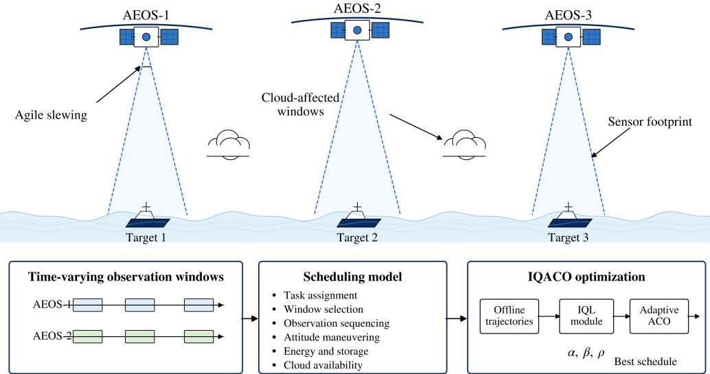  
Figure 1: Schematic illustration of multi-satellite maritime moving target scheduling with time-varying observation windows, operational constraints, and IQL-guided adaptive ACO optimization.

Maritime moving-target scheduling is more challenging than static-target scheduling. Sea-surface targets continuously change their relative geometry with satellite orbits and sensor footprints, making feasible observation windows strongly time dependent. In addition, schedule feasibility depends on the execution order of selected tasks because attitudemaneuvering time and maneuvering energy are required between consecutive observations. Frequent slews and high-resolution imaging further consume limited onboard energy and storage resources [4, 5, 6, 7]. For optical payloads, ocean cloud cover may reduce the practical value of geometrically visible windows [8, 9, 10]. These factors jointly lead to a large-scale, sequence-dependent, and resource-constrained combinatorial optimization problem.

AEOS scheduling has been studied for more than two decades. Existing methods include exact optimization, heuristic and local-search methods, metaheuristics, and learning-based approaches [11]. Exact methods, such as integer programming, branch-and-bound, column generation, and constraint programming, can provide rigorous solutions for small or medium instances, but their computational cost increases rapidly when sequence-dependent transitions, onboard resources, and uncertainty are jointly considered [2, 12, 13]. Heuristic and local-search methods are eficient and easy to implement, but their performance often depends on hand-crafted rules and problem-specific assumptions [14, 15]. Metaheuristics, such as GA, PSO, WOA, ACO, memetic algorithms, and hybrid neighborhood search, have therefore been widely used for large-scale AEOS scheduling [1, 16, 17, 18, 19].

Among metaheuristics, ACO is naturally suitable for sequence construction because pheromone information and heuristic information can guide task-transition decisions. However, conventional ACO usually relies on fixed parameters, including the pheromone factor α, heuristic factor β, and evaporation rate ρ [20]. Fixed parameters may not maintain an appropriate exploration–exploitation balance when target density, satellite number, feasiblewindow distribution, and resource constraints change across scenarios. Therefore, an adaptive parameter-control mechanism is needed to adjust the search behavior according to the current optimization state.

Reinforcement learning (RL) has recently attracted attention in AEOS scheduling because it can learn scheduling policies or value functions from data [21, 22, 23, 24, 25, 26]. However, many existing RL-based schedulers directly learn task-selection or sequence-generation poli cies. Such methods often face large discrete action spaces, dynamically changing feasible action sets, and limited generalization to scenarios with diferent target-window distributions. Moreover, stand-alone RL schedulers must explicitly handle hard operational constraints during every decision step, which increases the learning burden and may reduce feasibility reliability.

Ofline RL provides another possible way to introduce learning into satellite scheduling because it learns from collected decision trajectories without costly online trial-and-error [27, 28]. Implicit Q-learning (IQL) is particularly suitable for ofline learning because it avoids explicit evaluation of out-of-distribution actions [29]. Nevertheless, directly using IQL as a stand-alone scheduler remains dificult for discrete, constraint-intensive, and sequencedependent AEOS scheduling. A more practical strategy is to use IQL as a value-guided parameter controller within a constructive metaheuristic. In this way, the learning module adapts the search behavior, while the deterministic decoder remains responsible for feasible schedule construction.

To address these issues, this article develops an implicit Q-learning-bootstrapped ant colony optimization method, termed IQACO, for multi-satellite maritime moving-target observation scheduling. IQACO uses an ofline-trained IQL policy to adaptively adjust α, β, and ρ according to a compact five-dimensional search state. ACO remains responsible for constructing feasible schedules under time-window, attitude-maneuvering, energy, storage, and cloud-afected availability constraints. This design preserves the feasibility-oriented search capability of ACO while introducing value-guided exploration–exploitation control.

The main contributions of this article are summarized as follows:

1. A multi-satellite maritime moving-target observation scheduling model is formulated by integrating time-varying observation windows, satellite-task-window assignment, sequence-dependent attitude maneuvering, onboard energy and storage resources, and cloud-afected availability.

2. An IQACO method is developed to adaptively regulate ACO parameters using ofline IQL. The learned policy adjusts the pheromone factor, heuristic factor, and evaporation rate according to the current search state, improving exploration–exploitation balance during feasible schedule construction.

3. Comprehensive experiments are conducted on 14 scenarios with diferent problem scales and satellite configurations. The results verify the convergence performance, final observation benefit, objective-weight sensitivity, and training behavior of the proposed method.

The remainder of this article is organized as follows. Section 2 formulates the scheduling model. Section 3 presents the proposed IQACO method. Section 4 reports the simulation experiments and result analysis. Section 5 concludes this article.

## 2. Scheduling Model

## 2.1. Problem Description

We consider multi-satellite maritime moving-target observation scheduling over a finite planning horizon $T _ { H }$ . The scheduling objects include a set of agile satellites and a set of maritime moving targets. Before optimization, target trajectories and satellite ephemerides are propagated to generate feasible task–satellite observation windows. The scheduler then determines task selection, satellite assignment, observation-window selection, and task ordering on each satellite under time-window, attitude-maneuvering, onboard energy, storage-capacity, and cloud-afected availability constraints.

Compared with static-target scheduling, maritime moving-target observation has stronger temporal and spatial variability. The relative geometry between satellites and targets changes with both vessel motion and orbital motion, making feasible observation windows time dependent. A geometrically visible window may also have low practical availability due to ocean cloud cover. For agile satellites, schedule feasibility further depends on the execution order of selected tasks because attitude-maneuvering time and energy are required between consecutive observations. Therefore, the problem is a sequence-dependent and resource-constrained combinatorial optimization problem.

## 2.2. Sets and Parameters

The main notation used in the scheduling model is listed in Table 1. An original moving target may have multiple observation requirements within the planning horizon; these requirements are expanded into independent scheduling tasks. If task i cannot be observed by satellite s, the corresponding feasible-window set $\mathcal { W } _ { i , s }$ is empty.

Two binary variables are used to describe the scheduling decision. The variable $x _ { i , s , k }$ indicates whether task i is assigned to satellite s and executed in window k. It is set to one if the corresponding task–satellite–window combination is selected, and zero otherwise:

$$
x _ { i , s , k } = \left\{ { \begin{array} { l l } { 1 , } & { { \mathrm { s e l e c t e d } } , } \\ { 0 , } & { { \mathrm { o t h e r w i s e } } . } \end{array} } \right.\tag{1}
$$

The variable $y _ { i j } ^ { s }$ describes the immediate-successor relation in the task sequence of satellite s. It is set to one if satellite s executes task j immediately after task i, and zero otherwise:

$$
y _ { i j } ^ { s } = { \left\{ \begin{array} { l l } { 1 , } & { { \mathrm { i f ~ } } j { \mathrm { ~ i m m e d i a t e l y ~ f o l l o w s ~ } } i , } \\ { 0 , } & { { \mathrm { o t h e r w i s e . } } } \end{array} \right. }\tag{2}
$$

Thus, $x _ { i , s , k }$ determines task selection, satellite assignment, and observation-window selection, while $y _ { i j } ^ { s }$ describes the task order on each satellite. The latter is also used to compute the attitude-maneuvering time and energy between consecutive observations.

Table 1: Notation used in the scheduling model
<table><tr><td>Symbol</td><td>Description</td></tr><tr><td> $\overline { { \tau , s } }$ </td><td>Sets of scheduling tasks and agile satellites</td></tr><tr><td> $\mathcal { W } _ { i , s }$ </td><td>Feasible observation-window set for task i and satellite s</td></tr><tr><td> $i , j$ </td><td>Task indices</td></tr><tr><td>S</td><td>Satellite index</td></tr><tr><td> $k , l$ </td><td>Observation-window indices</td></tr><tr><td> $N _ { T } , N _ { S }$ </td><td>Numbers of tasks and satellites</td></tr><tr><td> $T _ { H }$ </td><td>Planning-horizon length</td></tr><tr><td> $t ^ { \mathrm { s t a r t } }$   $t _ { i , s , k } ^ { \mathrm { s t a r t } }$ </td><td>Start time of window k</td></tr><tr><td> $t ^ { \mathrm { e n d } } .$   $\iota _ { i , s , k }$ </td><td>End time of window k</td></tr><tr><td> $t _ { i , s , k } ^ { \mathrm { o b s } }$ </td><td>Observation start time</td></tr><tr><td> $d _ { i } , p _ { i }$ </td><td>Observation duration and nominal benefit of task i</td></tr><tr><td> $c _ { i , s , k } , c _ { \mathrm { m i n } }$ </td><td>Cloud-affected availability factor and threshold</td></tr><tr><td> $\theta _ { i j } ^ { s }$ </td><td>Slewing angle from task i to task j</td></tr><tr><td> $T _ { i j } ^ { s , \mathrm { { m a n } } }$ </td><td>Maneuvering time from task i to task j</td></tr><tr><td> $\omega _ { s } ^ { \mathrm { m a x } }$ </td><td>Maximum angular rate of satellite s</td></tr><tr><td> $a _ { s } ^ { \mathrm { m a x } }$ </td><td>Maximum angular acceleration of satellite s</td></tr><tr><td> $e _ { i , s , k } ^ { \mathrm { o b s } }$ </td><td>Imaging energy</td></tr><tr><td> $e _ { i j } ^ { s , \mathrm { m a n } }$ </td><td>Maneuvering energy</td></tr><tr><td> $E _ { s } ^ { \mathrm { { \bar { m a x } } } } , E _ { s } ^ { \mathrm { { u s e } } }$ </td><td>Energy capacity and energy use of satellite s</td></tr><tr><td> $m _ { i , s , k } , M _ { s } ^ { \operatorname* { m a x } }$ </td><td>Generated data volume and storage capacity</td></tr><tr><td> $x _ { i , s , k }$ </td><td>Task-window assignment variable</td></tr><tr><td> $y _ { i j } ^ { s }$ </td><td>Immediate-successor variable</td></tr></table>

## 2.3. Constraints

A feasible schedule must satisfy operational constraints related to task assignment, observation windows, task sequencing, attitude maneuvering, onboard resources, and cloudafected availability. These constraints are used as feasibility rules in the constructive decoder.

## 2.3.1. Task Uniqueness Constraint

Each task is executed at most once:

$$
\sum _ { s \in S } \sum _ { k \in \mathcal { W } _ { i , s } } x _ { i , s , k } \leq 1 , \quad \forall i \in \mathcal { T } .\tag{3}
$$

## 2.3.2. Time-Window Feasibility Constraint

The observation interval must be contained within the selected window:

$$
t _ { i , s , k } ^ { \mathrm { s t a r t } } \leq t _ { i , s , k } ^ { \mathrm { o b s } } ,\tag{4a}
$$

$$
t _ { i , s , k } ^ { \mathrm { o b s } } + d _ { i } \leq t _ { i , s , k } ^ { \mathrm { e n d } } .\tag{4b}
$$

These inequalities are enforced only for selected task–satellite–window nodes with $x _ { i , s , k } =$ 1.

## 2.3.3. Sequence-Linking Constraint

The sequence variable $y _ { i j } ^ { s }$ is valid only when both tasks i and $j$ are assigned to satellite s:

$$
y _ { i j } ^ { s } \le \sum _ { k \in \mathcal { W } _ { i , s } } x _ { i , s , k } ,
$$

$$
\forall i , j \in \mathcal { T } , \ i \ne j , \ s \in \mathcal { S } ,\tag{5}
$$

$$
y _ { i j } ^ { s } \le \sum _ { l \in \mathcal { W } _ { j , s } } x _ { j , s , l } ,
$$

$$
\forall i , j \in { \mathcal { T } } , i \neq j , s \in { \mathcal { S } } .\tag{6}
$$

Each scheduled task has at most one immediate successor and predecessor:

$$
\sum _ { \stackrel { j \in \mathcal { T } } { j \neq i } } y _ { i j } ^ { s } \leq \sum _ { k \in \mathcal { W } _ { i , s } } x _ { i , s , k } ,
$$

$$
\forall i \in T , s \in S ,\tag{7}
$$

$$
\sum _ { i \in \mathcal { T } } y _ { i j } ^ { s } \le \sum _ { l \in \mathcal { W } _ { j , s } } x _ { j , s , l } ,
$$

$$
\forall j \in T , s \in S .\tag{8}
$$

These constraints define the consistency between task assignment and immediate-successor relations. The actual satellite-specific task sequences are generated explicitly by the constructive ACO procedure, where successor relations, temporal feasibility, and resource feasibility are checked during schedule construction.

## 2.3.4. Attitude Maneuvering Constraint

For agile satellites, an attitude maneuver is required between two consecutive observations assigned to the same satellite. The required slewing angle $\theta _ { i j } ^ { s }$ is computed from the angular separation between the payload pointing directions of tasks i and j. A rate- and accelerationlimited maneuvering model is used, as illustrated in Fig. 2. If the required angle is large enough, the satellite reaches the maximum angular rate and follows a trapezoidal profile; otherwise, it follows a triangular profile.

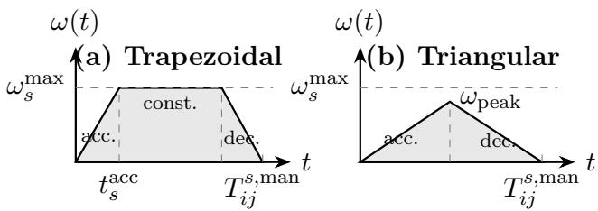  
Figure 2: Attitude-maneuvering angular-rate profiles.

Let $\omega _ { s } ^ { \mathrm { m a x } }$ and $a _ { s } ^ { \mathrm { m a x } }$ denote the maximum angular rate and maximum angular acceleration of satellite s, respectively. The acceleration or deceleration time is

$$
t _ { s } ^ { \mathrm { a c c } } = \frac { \omega _ { s } ^ { \mathrm { m a x } } } { a _ { s } ^ { \mathrm { m a x } } } .\tag{9}
$$

When the satellite can reach the maximum angular rate, the maneuvering time is

$$
T _ { i j } ^ { s , \mathrm { m a n } } = 2 t _ { s } ^ { \mathrm { a c c } } + \frac { \theta _ { i j } ^ { s } - ( \omega _ { s } ^ { \mathrm { m a x } } ) ^ { 2 } / a _ { s } ^ { \mathrm { m a x } } } { \omega _ { s } ^ { \mathrm { m a x } } } ,\tag{10}
$$

where $\theta _ { i j } ^ { s } \ge ( \omega _ { s } ^ { \operatorname* { m a x } } ) ^ { 2 } / a _ { s } ^ { \operatorname* { m a x } }$ . When the maximum angular rate cannot be reached, the maneuvering time is

$$
T _ { i j } ^ { s , \mathrm { m a n } } = 2 \sqrt { \frac { \theta _ { i j } ^ { s } } { a _ { s } ^ { \mathrm { m a x } } } } ,\tag{11}
$$

where $\theta _ { i j } ^ { s } < ( \omega _ { s } ^ { \operatorname* { m a x } } ) ^ { 2 } / a _ { s } ^ { \operatorname* { m a x } }$

When task $j$ immediately follows task i on satellite s and their selected windows are k and $l ,$ respectively, the observation start times must satisfy

$$
t _ { j , s , l } ^ { \mathrm { o b s } } \geq t _ { i , s , k } ^ { \mathrm { o b s } } + d _ { i } + T _ { i j } ^ { s , \mathrm { m a n } } .\tag{12}
$$

This constraint reserves suficient transition time between consecutive observations on the same satellite.

## 2.3.5. Onboard Energy Constraint

The total energy use, including imaging and maneuvering energy, must not exceed the onboard capacity:

$$
\sum _ { i \in \mathcal { T } } \sum _ { k \in \mathcal { W } _ { i , s } } e _ { i , s , k } ^ { \mathrm { o b s } } x _ { i , s , k } + \sum _ { \stackrel { i , j \in \mathcal { T } } { i \not = j } } e _ { i j } ^ { s , \operatorname* { m a n } } y _ { i j } ^ { s } \leq E _ { s } ^ { \operatorname* { m a x } } , \quad \forall s \in \mathcal { S } .\tag{13}
$$

## 2.3.6. Onboard Storage Constraint

The generated data volume must not exceed the storage capacity:

$$
\sum _ { i \in \mathcal { T } } \sum _ { k \in \mathcal { W } _ { i , s } } m _ { i , s , k } x _ { i , s , k } \leq M _ { s } ^ { \operatorname* { m a x } } , \quad \forall s \in \mathcal { S } .\tag{14}
$$

## 2.3.7. Cloud-Availability Constraint

For optical observations, a geometrically visible window may still have low practical value due to cloud cover. Let $c _ { i , s , k }$ denote the cloud-afected availability of executing task i by satellite s in window k. Candidate windows with availability lower than the minimum acceptable threshold $c _ { \mathrm { m i n } }$ are excluded:

$$
x _ { i , s , k } = 0 , \quad \mathrm { i f } \quad c _ { i , s , k } < c _ { \operatorname* { m i n } } .\tag{15}
$$

For retained windows, $c _ { i , s , k }$ is further used as a benefit attenuation factor in the objective function.

## 2.4. Objective Function

Under the above feasibility constraints, the objective is to maximize the overall observation performance of the satellite constellation. Three normalized components are considered: observation benefit, energy eficiency, and workload balance. Normalization allows the weights to express mission preferences rather than compensate for diferent physical scales. The objective function is formulated as

$$
\operatorname* { m a x } F = \eta _ { 1 } F _ { p } + \eta _ { 2 } F _ { e } + \eta _ { 3 } F _ { b } ,\tag{16}
$$

where $F _ { p } , F _ { e } .$ , and $F _ { b }$ denote the normalized observation-benefit, energy-eficiency, and workloadbalance terms, respectively. The objective weights satisfy

$$
\eta _ { 1 } + \eta _ { 2 } + \eta _ { 3 } = 1 , \qquad \eta _ { 1 } , \eta _ { 2 } , \eta _ { 3 } \geq 0 .\tag{17}
$$

The normalized observation-benefit term is defined as

$$
F _ { p } = \frac { \sum _ { i \in \mathcal { T } } \sum _ { s \in \mathcal { S } } \sum _ { k \in \mathcal { W } _ { i , s } } p _ { i } c _ { i , s , k } x _ { i , s , k } } { \sum _ { i \in \mathcal { T } } p _ { i } } .\tag{18}
$$

This term measures the efective benefit obtained from the selected tasks. The factor $c _ { i , s , k }$ reduces the benefit of a window with low cloud-afected availability.

For satellite s, the energy use is composed of imaging energy and attitude-maneuvering energy:

$$
E _ { s } ^ { \mathrm { u s e } } = \sum _ { i \in \mathcal { T } } \sum _ { k \in \mathcal { W } _ { i , s } } e _ { i , s , k } ^ { \mathrm { o b s } } x _ { i , s , k } + \sum _ { \stackrel { i , j \in \mathcal { T } } { i \not = j } } e _ { i j } ^ { s , \mathrm { m a n } } y _ { i j } ^ { s } .\tag{19}
$$

The energy-eficiency term is then defined as

$$
F _ { e } = 1 - \frac { \sum _ { s \in \mathcal { S } } E _ { s } ^ { \mathrm { u s e } } } { \sum _ { s \in \mathcal { S } } E _ { s } ^ { \mathrm { m a x } } } .\tag{20}
$$

A larger $F _ { e }$ indicates lower relative energy use.

The workload of satellite s is defined as the total duration of its selected observations:

$$
L _ { s } = \sum _ { i \in \mathcal { T } } \sum _ { k \in \mathcal { W } _ { i , s } } d _ { i } x _ { i , s , k } .\tag{21}
$$

The average workload of the constellation is

$$
\bar { L } = \frac { 1 } { N _ { S } } \sum _ { s \in \mathcal { S } } { L _ { s } } .\tag{22}
$$

The workload-balance term is defined as

$$
F _ { b } = \left( 1 + \frac { \sqrt { \frac { 1 } { N _ { S } } \sum _ { s \in \mathcal { S } } ( L _ { s } - \bar { L } ) ^ { 2 } } } { \bar { L } + \epsilon } \right) ^ { - 1 } ,\tag{23}
$$

where ϵ is a small positive constant used to avoid division by zero. A larger $F _ { b }$ indicates a more balanced workload distribution among satellites.

Therefore, the objective favors high-benefit and practically available observations while reducing relative energy consumption and avoiding excessive workload concentration on a small number of satellites.

## 3. Method

## 3.1. Method Overview

IQACO consists of an ofline IQL training stage and an online ACO scheduling stage, as shown in Fig. 3. In the ofline stage, ACO is executed on training scenarios with exploratory parameter adjustments, and the resulting transitions $( \mathbf { s } _ { t } , \mathbf { a } _ { t } , R _ { t } , \mathbf { s } _ { t + 1 } , d _ { t } )$ are collected to train an IQL policy. In the online stage, ACO constructs feasible schedules at each iteration, updates the best solution and pheromone matrix, and then uses the trained policy to adjust α, β, and ρ according to the current search state.

Unlike direct RL schedulers that output discrete task-selection actions, IQACO only learns continuous parameter adjustments for ACO. Feasible schedule construction is still handled by the deterministic decoder, which reduces the learning burden and improves constraint satisfaction. Thus, IQL is used as a value-guided search controller rather than a replacement for the scheduling algorithm.

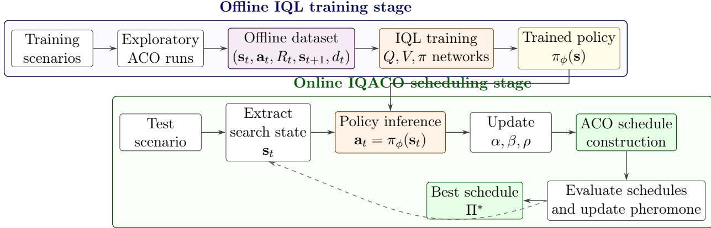  
Figure 3: Workflow of the proposed IQACO method.

## 3.2. Solution Encoding and ACO-Based Schedule Construction

A candidate observation is represented by a task–satellite–window node $z \ = \ ( i , s , k )$ where i, s, and k denote the task, satellite, and feasible observation window, respectively. Candidate nodes are pre-filtered according to visibility, time-window feasibility, and cloudafected availability. A complete schedule is an ordered node list $\Pi = \{ z _ { 1 } , z _ { 2 } , \dotsc , z _ { | \Pi | } \}$ , which can be decomposed into satellite-specific sequences $\Pi = \left\{ \Pi _ { 1 } , \Pi _ { 2 } , \ldots \ldots , \Pi _ { N _ { S } } \right\}$ , as shown in Fig. 4. The upper level of the representation stores the complete multi-satellite schedule, whereas the lower level preserves the chronological node sequence assigned to each satellite. Because each node explicitly records the selected task, satellite, and observation window, predecessor– successor relations can be recovered directly for maneuver-time, maneuver-energy, temporalfeasibility, and resource-feasibility checks. This hierarchical encoding therefore captures task selection, satellite assignment, window selection, and observation ordering within a single constructive representation.

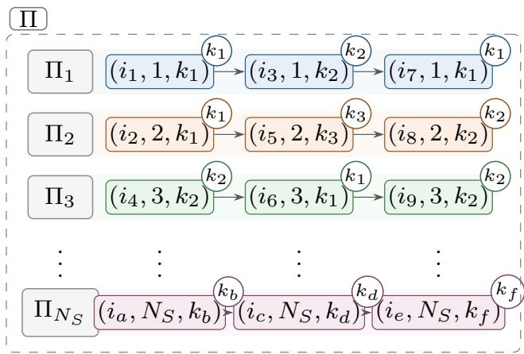  
Figure 4: Hierarchical solution encoding. The global schedule is decomposed into chronological satellitespecific sequences of task–satellite–window nodes.

Each ant incrementally selects schedulable tasks from a feasible candidate set ${ \mathcal { C } } ^ { m }$ that excludes candidates violating operational constraints. Algorithm 1 summarizes this construction. The evaporation rate $\rho$ is applied only during global pheromone updating, not during single-ant construction.

For the mth ant, the next candidate node $z = ( i _ { z } , s _ { z } , k _ { z } ) \in \mathcal { C } ^ { m }$ is selected with probability

$$
P _ { m } ( z | u ) = \frac { [ \tau _ { u , i _ { z } } ] ^ { \alpha } [ \eta _ { m } ( u , z ) ] ^ { \beta } } { \sum _ { q \in \mathcal { C } ^ { m } } [ \tau _ { u _ { q } , i _ { q } } ] ^ { \alpha } [ \eta _ { m } ( u _ { q } , q ) ] ^ { \beta } } ,\tag{24}
$$

where u is the latest scheduled task on satellite $s _ { z } , \tau _ { u , i _ { z } }$ is the task-level pheromone intensity from $u$ to candidate task $i _ { z } .$ , and $\eta _ { m } ( u , z )$ is the heuristic value of node $z$ under the current partial schedule. For another candidate node $q = ( i _ { q } , s _ { q } , k _ { q } )$ in the denominator, $u _ { q }$ denotes the latest scheduled task on satellite $s _ { q } .$ The parameters α and $\beta$ control the relative influence of pheromone information and heuristic information.

The heuristic value combines benefit contribution, energy efect, and workload balance:

$$
\eta _ { m } ( u , z ) = \chi _ { 1 } G ( u , z ) + \chi _ { 2 } E _ { m } ( u , z ) + \chi _ { 3 } B _ { m } ( z ) ,\tag{25}
$$

where $G ( u , z )$ denotes the benefit contribution of selecting candidate node z after task $u ,$ $E _ { m } ( u , z )$ denotes the energy-eficiency contribution considering the additional observation and maneuvering energy, and $B _ { m } ( z )$ denotes the workload-balance contribution after inserting z. The coeficients $\chi _ { 1 } , ~ \chi _ { 2 } .$ , and $\chi _ { 3 }$ are nonnegative heuristic weights. These terms are normalized before aggregation so that the heuristic value remains comparable across diferent scenarios and resource scales.

After all ants have constructed their schedules, each schedule is evaluated by the objective function in Section 2. The pheromone matrix is then updated by evaporation and solutionquality-based deposition:

$$
\tau _ { i j } \gets \mathrm { m a x } \{ ( 1 - \rho ) \tau _ { i j } , \tau _ { \mathrm { m i n } } \} , \quad \tau _ { i j } \gets \mathrm { m i n } \{ \tau _ { i j } + \Delta \tau _ { i j } , \tau _ { \mathrm { m a x } } \} ,\tag{26}
$$

with the deposition increment

$$
\Delta \tau _ { i j } = \sum _ { m = 1 } ^ { N _ { A } } \frac { F ^ { m } } { F _ { \mathrm { m a x } } } I \bigl ( ( i , j ) \in \Pi ^ { m } \bigr ) ,\tag{27}
$$

Algorithm 1 Schedule Construction by One Ant   
Require: Candidate observation nodes, pheromone matrix τ, and ACO parameters α and   
$\beta$   
Ensure: A feasible schedule $\Pi ^ { m }$   
1: Initialize $\Pi ^ { m }  \varnothing , \mathcal { U }  \mathcal { T }$ , and satellite states with virtual initial nodes   
2: while true do   
3: Build the feasible candidate set ${ \mathcal { C } } ^ { m }$ from U   
4: Remove candidates violating time-window, attitude-maneuvering, energy, or storage   
constraints   
5: if $\mathcal { C } ^ { m } = \emptyset$ then   
6: break   
7: end if   
8: Compute the selection probability $P _ { m } ( z | u )$ for each $z \in \mathcal { C } ^ { m }$   
9: Select a candidate node $\boldsymbol { z } = ( i _ { z } , s _ { z } , k _ { z } )$ by roulette-wheel selection   
10: Insert $z$ into the satellite-specific sequence $\Pi _ { s _ { z } } ^ { m }$   
11: Update the state of satellite $s _ { z } ,$ including its latest task and resource states   
12: Update the unscheduled task set $\mathcal { U }  \mathcal { U } \setminus \{ i _ { z } \}$   
13: end while   
14: Merge all satellite-specific sequences into $\Pi ^ { m }$   
15: return $\Pi ^ { m }$

where $N _ { A }$ is the number of ants, $F ^ { m }$ is the objective value of schedule $\Pi ^ { m } , F _ { \mathrm { m a x } }$ is the current best objective, and $I ( \cdot )$ is the indicator function.

## 3.3. Markov Decision Process Formulation

The adaptive control of ACO parameters is formulated as an MDP $\mathcal { M } = ( \mathcal { X } , \mathcal { A } , \mathcal { P } , R , \gamma )$ where each decision step corresponds to one ACO iteration. After the tth iteration, the search state is extracted from the pheromone matrix and current scheduling results. The IQL policy then outputs a continuous action to adjust the pheromone factor $\alpha ,$ heuristic factor $\beta ,$ and evaporation rate $\rho$ for the next iteration. Here, X is the state space, A is the action space, $\mathcal { P }$ is the transition process induced by one ACO iteration, R is the reward function, and $\gamma$ is the discount factor.

$$
\mathbf { s } _ { t } = \left[ \bar { \tau } _ { t } , \sigma _ { \tau , t } ^ { 2 } , f _ { t } ^ { \mathrm { c u r } } , f _ { t } ^ { \mathrm { g b } } , r _ { t } ^ { \mathrm { i t e r } } \right] ^ { T } ,\tag{28}
$$

where $\bar { \tau } _ { t }$ and $\sigma _ { \tau , t } ^ { 2 }$ are the normalized mean and variance of the pheromone matrix, respectively. The variables $f _ { t } ^ { \mathrm { c u r } }$ and $f _ { t } ^ { \mathrm { g b } }$ denote the best objective value of the current iteration and the global best objective value found so far, respectively. The variable $\boldsymbol { r } _ { t } ^ { \mathrm { i t e r } }$ is the normalized iteration ratio. These variables describe the pheromone distribution, current search quality, historical best performance, and search progress.

The action is a continuous parameter-adjustment vector:

$$
\mathbf { a } _ { t } = \left[ \Delta \alpha _ { t } , \Delta \beta _ { t } , \Delta \rho _ { t } \right] ^ { T } .\tag{29}
$$

After receiving the action, the ACO parameters are updated as

$$
\alpha _ { t + 1 } = \mathrm { c l i p } ( \alpha _ { t } + \Delta \alpha _ { t } , \alpha _ { \mathrm { m i n } } , \alpha _ { \mathrm { m a x } } ) ,\tag{30}
$$

$$
\beta _ { t + 1 } = \mathrm { c l i p } ( \beta _ { t } + \Delta \beta _ { t } , \beta _ { \mathrm { m i n } } , \beta _ { \mathrm { m a x } } ) ,\tag{31}
$$

$$
\rho _ { t + 1 } = \mathrm { c l i p } ( \rho _ { t } + \Delta \rho _ { t } , \rho _ { \mathrm { m i n } } , \rho _ { \mathrm { m a x } } ) ,\tag{32}
$$

where $\mathrm { c l i p } ( \cdot )$ restricts each parameter to its feasible range.

The reward encourages solution improvement while maintaining search diversity. Let $f _ { t + 1 } ^ { \mathrm { c u r } }$ be the best objective after applying the adjusted parameters. The improvement term is

$$
I _ { t } = \operatorname* { m a x } \left( 0 , f _ { t + 1 } ^ { \mathrm { c u r } } - f _ { t } ^ { \mathrm { g b } } \right) .\tag{33}
$$

The final reward is formulated as

$$
R _ { t } = \mathrm { c l i p } \left( c _ { I } I _ { t } + \xi D _ { t } + \kappa B _ { t } , R _ { \mathrm { m i n } } , R _ { \mathrm { m a x } } \right) ,\tag{34}
$$

where $D _ { t }$ is a diversity-related term that measures the dispersion of the current search process, and $B _ { t }$ is a bonus term activated when a new global-best solution is obtained. The coeficients $c _ { I } , \ \xi .$ , and $\kappa$ balance immediate objective improvement, diversity preservation, and global progress. The clipping operation limits excessively large learning targets and improves the stability of ofline training.

## 3.4. Ofline IQL Training

The ofline dataset is collected by running ACO with exploratory parameter adjustments on training scenarios. During data collection, ACO first performs one iteration to obtain the initial search state. At each subsequent decision step, an exploratory action is sampled to update $\alpha , \beta ,$ and $\rho ,$ and the next ACO iteration is executed with the updated parameters. The resulting reward, next state, and terminal indicator are recorded. The dataset is written as

$$
\mathcal { D } = \{ ( \mathbf { s } _ { t } , \mathbf { a } _ { t } , R _ { t } , \mathbf { s } _ { t + 1 } , d _ { t } ) \} _ { t = 1 } ^ { N _ { D } } ,\tag{35}
$$

where $d _ { t }$ is the terminal indicator and $N _ { D }$ is the number of collected transitions. Algorithm 2 summarizes the transition collection process.

IQL learns a value function $V _ { \psi } ( \mathbf { s } )$ , two Q-functions $Q _ { \vartheta _ { 1 } } ( \mathbf { s } , \mathbf { a } )$ and $Q _ { \vartheta _ { 2 } } ( \mathbf { s } , \mathbf { a } )$ , and a policy function $\pi _ { \phi } ( \mathbf { s } )$ from D. The Q-learning target is $y _ { t } = R _ { t } + \gamma ( 1 - d _ { t } ) V _ { \bar { \psi } } ( \mathbf { s } _ { t + 1 } )$ , where $V _ { \bar { \psi } }$ is the target value network. The Q loss is

$$
\mathcal { L } _ { Q } ( \vartheta _ { 1 } , \vartheta _ { 2 } ) = \sum _ { j = 1 } ^ { 2 } \mathbb { E } _ { \mathcal { D } } \left[ \left( Q _ { \vartheta _ { j } } ( \mathbf { s } _ { t } , \mathbf { a } _ { t } ) - y _ { t } \right) ^ { 2 } \right] .\tag{36}
$$

The value function uses expectile regression with $\hat { Q } = \operatorname* { m i n } _ { j } Q _ { \vartheta _ { j } }$

$$
\begin{array} { r l } & { \mathcal { L } _ { V } ( \psi ) = \mathbb { E } _ { \mathcal { D } } \left[ L _ { \tau _ { e } } \left( \hat { Q } ( \mathbf { s } _ { t } , \mathbf { a } _ { t } ) - V _ { \psi } ( \mathbf { s } _ { t } ) \right) \right] , } \\ & { L _ { \tau _ { e } } ( u ) = | \tau _ { e } - \mathbb { I } ( u < 0 ) | u ^ { 2 } . } \end{array}\tag{37}
$$

The policy is trained by advantage-weighted regression with $A ( \mathbf { s } _ { t } , \mathbf { a } _ { t } ) = \hat { Q } ( \mathbf { s } _ { t } , \mathbf { a } _ { t } ) - V _ { \psi } ( \mathbf { s } _ { t } )$

$$
\mathcal { L } _ { \pi } ( \phi ) = \mathbb { E } _ { \mathcal { D } } \left[ \exp \left( \frac { A ( \mathbf { s } _ { t } , \mathbf { a } _ { t } ) } { \lambda } \right) \big \| \pi _ { \phi } ( \mathbf { s } _ { t } ) - \mathbf { a } _ { t } \big \| _ { 2 } ^ { 2 } \right] .\tag{38}
$$

Algorithm 2 Ofline Transition Collection for IQL   
Require: Training scenarios, maximum iteration number $T _ { \mathrm { m a x } }$ , and exploratory action strat  
egy   
Ensure: Ofline dataset D   
1: Initialize $\mathcal { D }  \emptyset$   
2: for each training scenario do   
3: for each training episode do   
4: Initialize an ACO scheduler   
5: Run one ACO iteration and extract the initial state ${ \bf s } _ { 0 }$   
6: for $t = 0$ to $T _ { \mathrm { m a x } } - 2$ do   
7: Extract the current state $\mathbf { s } _ { t }$   
8: Sample an exploratory action $\mathbf { a } _ { t }$   
9: Update $\alpha , \beta ,$ and $\rho$ using $\mathbf { a } _ { t }$   
10: Run the next ACO iteration with the updated parameters   
11: Compute the reward $R _ { t }$   
12: Extract the next state $\mathbf { s } _ { t + 1 }$   
13: Determine the terminal indicator $d _ { t }$   
14: Store $( \mathbf { s } _ { t } , \mathbf { a } _ { t } , R _ { t } , \mathbf { s } _ { t + 1 } , d _ { t } )$ in D   
15: end for   
16: end for   
17: end for   
18: return D

## 3.5. Overall IQACO Procedure

Algorithm 3 summarizes IQACO. In the ofline stage, transitions are collected and used to train the IQL networks; the policy $\pi _ { \phi }$ is exported. In the online stage, ants construct schedules using current α and $\beta _ { ; }$ , the best schedule and pheromone matrix are updated with $\rho ,$ and $\pi _ { \phi }$ outputs parameter adjustments $[ \Delta \alpha , \Delta \beta , \Delta \rho ] ^ { T }$ for the next iteration.

Since the policy input is only five-dimensional and policy inference is performed once per ACO iteration, the additional online overhead of IQACO is small compared with schedule construction and feasibility checking.

## 4. Simulation Experiments

All algorithms are implemented in C++20 (compiled with -std=c++20 -O2 using MinGWw64 GCC 13.2.0) and executed on a workstation with an Intel Core Ultra 9 285H and 64 GB RAM. The IQL module is implemented in Python with PyTorch; the trained policy is exported in ONNX format and loaded via the ONNX Runtime C++ API for CPU inference.

## 4.1. Scenario Configuration

Fourteen testing scenarios are constructed with 100–240 maritime moving targets and 3–6 satellites, as listed in Table 2. Each original target has 2–4 observation requirements, which are expanded into independent scheduling tasks. The IQL policy is trained on separately generated scenarios with the same parameter ranges but diferent target distributions and satellite initial conditions, and the 14 scenarios in Table 2 are used only for testing. Targets move within a representative East Asian domain $( \varphi \in [ 6 ^ { \circ } , 4 5 ^ { \circ } ] , \lambda \in [ 1 0 5 ^ { \circ } , 1 4 5 ^ { \circ } ] )$ , with speed $v _ { i } \sim U ( 5 , 1 5 ) ~ \mathrm { m / s }$ and direction-persistence probability $\sim U ( 0 . 7 0 , 0 . 9 5 )$ over a 24-h horizon (1-s trajectory step). The satellite cone angle is $2 5 ^ { \circ }$ at 400 km altitude. Key parameters: $d _ { i } = 6 0 \mathrm { ~ s } , p _ { i } \in \{ 1 , 2 , 3 \} , E _ { s } ^ { \operatorname* { m a x } } = 5 0 0 \mathrm { ~ W h }$ ， $P _ { s } ^ { \mathrm { i m g } } = 7 5 0$ W, $P _ { s } ^ { \mathrm { a t t } } = 3 0$ W, $M _ { s } ^ { \mathrm { m a x } } = 2 0 0 0$ GB, $R _ { s } ^ { \mathrm { d a t a } } = 4 . 0$ Gbps. Cloud-afected availability $c _ { i , s , k }$ is assigned by latitude: $c = 0 . 6 0$ for $| \varphi | < 1 0 ^ { \circ } , c = 0 . 7 0$ for $1 0 ^ { \circ } \leq | \varphi | < 2 5 ^ { \circ } , c = 0 . 8 0$ for $2 5 ^ { \circ } \leq | \varphi | < 4 5 ^ { \circ }$ , and used as cloud-afected availability factors in window screening and objective evaluation.

Algorithm 3 IQL-Bootstrapped Ant Colony Optimization   
Require: Training scenarios, test scenario, ACO settings, maximum iteration number $T _ { \mathrm { m a x } } .$   
and number of ants $N _ { A }$   
Ensure: Best schedule $\Pi ^ { * }$   
1: Ofline training stage   
2: Collect transition dataset $\mathcal { D }$ using Algorithm 2   
3: Train the $\mathrm { I Q L }$ networks $V _ { \psi } , Q _ { \vartheta _ { 1 } } , Q _ { \vartheta _ { 2 } }$ , and $\pi _ { \phi }$ using $\mathcal { D }$   
4: Export the trained policy $\pi _ { \phi }$   
5: Online scheduling stage   
6: Initialize the ACO scheduler, pheromone matrix $\tau ,$ parameters $\alpha , \beta , \rho ,$ and best schedule   
$\Pi ^ { * }  \emptyset$   
7: for $t = 0$ to $T _ { \mathrm { m a x } } - 1$ do   
8: for $m = 1$ to $N _ { A }$ do   
9: Construct a feasible schedule $\Pi ^ { m }$ using Algorithm 1   
10: end for   
11: Evaluate all schedules by the objective function   
12: Update the best schedule $\Pi ^ { * }$   
13: Update the pheromone matrix using $\rho$   
14: if $t < T _ { \mathrm { m a x } } - 1$ then   
15: Extract the search state $\mathbf { s } _ { t }$   
16: Obtain the action $\mathbf { a } _ { t } = \pi _ { \phi } ( \mathbf { s } _ { t } )$   
17: Update $\alpha , \beta ,$ and $\rho$ for the next iteration   
18: end if   
19: end for   
20: return $\Pi ^ { * }$

Table 2: Configuration of the experimental scenarios
<table><tr><td>Scenario</td><td>Original targets</td><td>Satellites</td></tr><tr><td>Scene 01</td><td>100</td><td>3</td></tr><tr><td>Scene 02</td><td>120</td><td>3</td></tr><tr><td>Scene 03</td><td>100</td><td>4</td></tr><tr><td>Scene 04</td><td>120</td><td>4</td></tr><tr><td>Scene 05</td><td>140</td><td>4</td></tr><tr><td>Scene 06</td><td>160</td><td>4</td></tr><tr><td>Scene 07</td><td>140</td><td>5</td></tr><tr><td>Scene 08</td><td>160</td><td>5</td></tr><tr><td>Scene 09</td><td>180</td><td>5</td></tr><tr><td>Scene 10</td><td>200</td><td>5</td></tr><tr><td>Scene 11</td><td>180</td><td>6</td></tr><tr><td>Scene 12</td><td>200</td><td>6</td></tr><tr><td>Scene 13</td><td>220</td><td>6</td></tr><tr><td>Scene 14</td><td>240</td><td>6</td></tr></table>

Table 3: IQL training hyperparameters
<table><tr><td>Parameter</td><td>Description</td><td>Value</td></tr><tr><td>γ</td><td>Discount factor</td><td>0.99</td></tr><tr><td> $\tau _ { e }$ </td><td>Expectile parameter</td><td>0.6</td></tr><tr><td> $\lambda$ </td><td>Inverse temperature</td><td>5.0</td></tr><tr><td>State dimension</td><td>Input features</td><td>5</td></tr><tr><td>Action dimension</td><td>Parameter-adjustment action</td><td>3</td></tr><tr><td>Epochs</td><td>Training epochs</td><td>200</td></tr><tr><td>Learning rate</td><td>Adam optimizer</td><td> $3 \times 1 0 ^ { - 4 }$ </td></tr></table>

## 4.2. Compared Algorithms and Parameter Settings

IQACO is compared with GA, PSO, WOA, and conventional ACO [30, 31, 32]. For fairness, all algorithms use the same scheduling model, objective function, constraint-checking procedure, and evaluation budget; only the search mechanism difers. Each algorithm is executed 20 times per scenario under the same stopping criterion $( N _ { \mathrm { F E } } = 2 0 0 0 0 )$ . Baseline parameters follow commonly used empirical settings without problem-specific tuning. For IQACO, the initial ACO parameters are $\alpha = 1 . 0 , \beta = 2 . 0$ , and $\rho = 0 . 1$ . The IQL policy outputs $[ \Delta \alpha , \Delta \beta , \Delta \rho ] ^ { T }$ with $\Delta \alpha \in [ - 0 . 2 , 0 . 2 ] , \Delta \beta \in [ - 0 . 4 , 0 . 4 ]$ , and $\Delta \rho \in [ - 0 . 1 , 0 . 1 ]$ , clipped to $\alpha \in [ 1 . 0 , 5 . 0 ] , \beta \in [ 1 . 0 , 5 . 0 ]$ , and $\rho \in [ 0 . 1 , 0 . 5 ]$ . IQL hyperparameters are listed in Table 3.

## 4.3. Results and Discussion

## 4.3.1. Convergence Analysis

The convergence behavior of the five algorithms is examined on six representative scenarios spanning moderate and large problem scales. Each algorithm is independently executed 20 times per scenario, and the best-so-far objective value is recorded. Figs. 5 and 6 report the mean convergence curves with one-standard-deviation bands, whereas Figs. 7 and 8 show the corresponding final-benefit distributions.

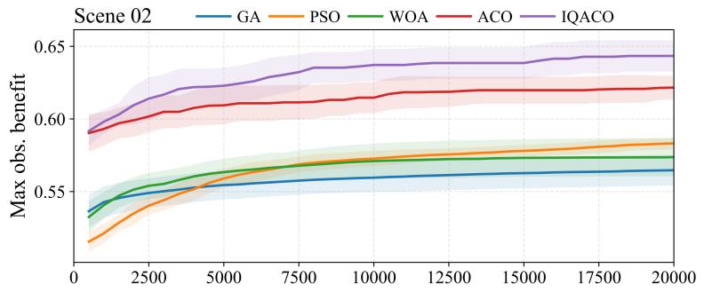

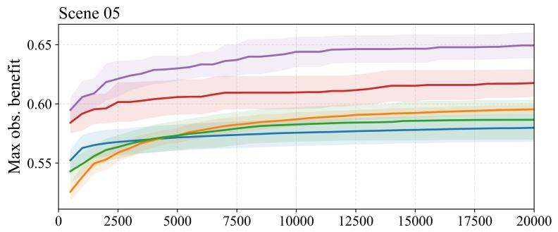

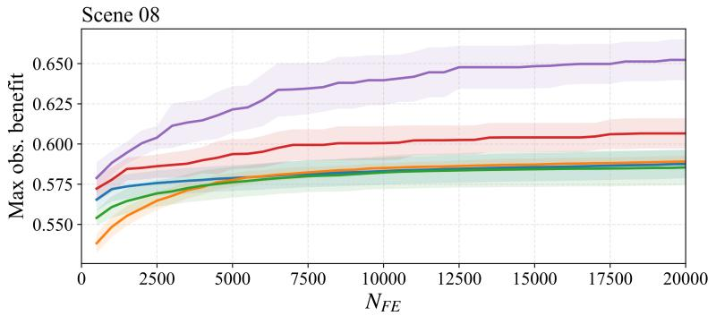  
Figure 5: Convergence comparison on Scenes 02, 05, and 08. The solid line denotes the mean best-so-far objective value over 20 independent runs, and the shaded band denotes ±1 standard deviation.

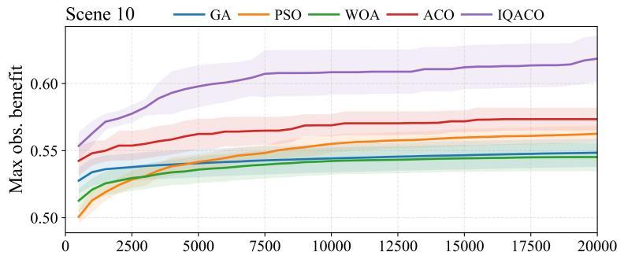

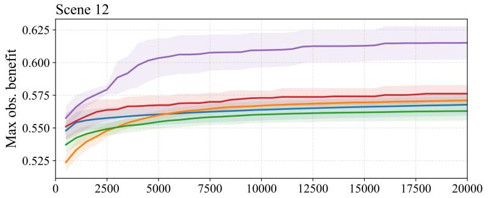

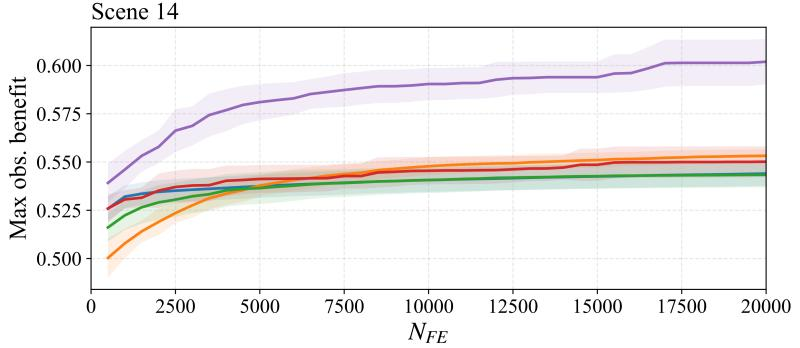  
Figure 6: Convergence comparison on Scenes 10, 12, and 14. Solid lines show the mean best-so-far objective value over 20 independent runs, and shaded bands show ±1 standard deviation.

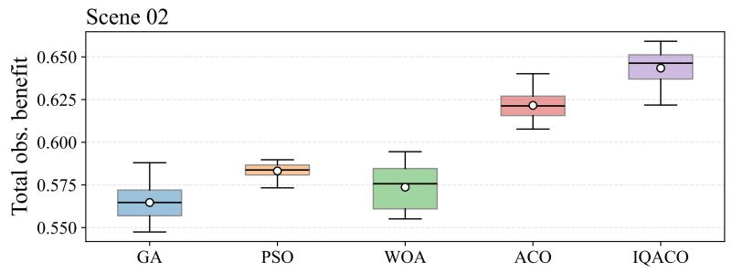

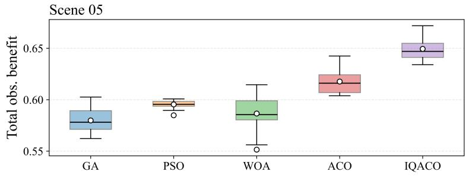

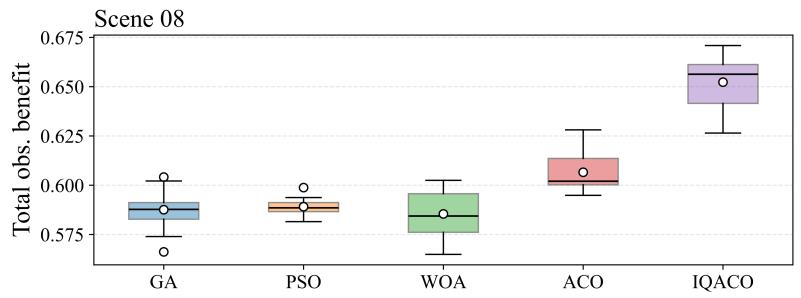  
Figure 7: Distribution of the final observation benefit on Scenes 02, 05, and 08. The box denotes the interquartile range, the central mark denotes the median, the triangle denotes the mean, and the whiskers denote the most extreme nonoutlier values.

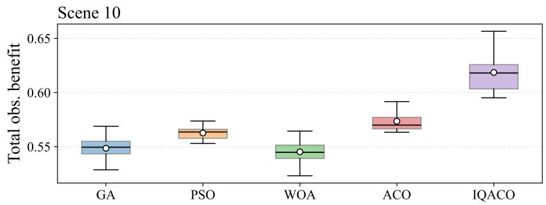

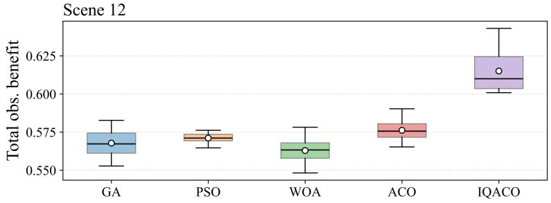

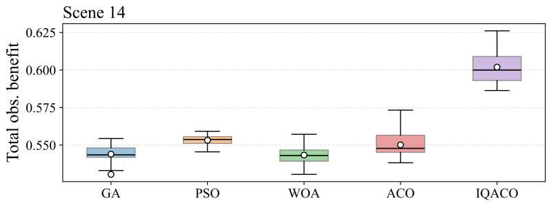  
Figure 8: Distribution of the final observation benefit on Scenes 10, 12, and 14. Each box summarizes 20 independent runs; the box denotes the interquartile range, the central mark denotes the median, the triangle denotes the mean, and the whiskers denote the most extreme nonoutlier values.

Figs. 5 and 7 present the convergence behavior and final-benefit distributions for the moderate-scale cases (Scenes 02, 05, and 08). ACO-based methods generally outperform the other competing methods, confirming that constructive search is suitable for this sequencedependent scheduling problem. Compared with conventional ACO, IQACO reaches higher best-so-far values and shifts the final-benefit distributions upward, indicating that IQL-guided parameter adjustment improves search quality across repeated runs.

Fig. 6 extends the convergence comparison to the larger cases (Scenes 10, 12, and 14). IQACO reaches a higher best-so-far objective level than the four competing algorithms in all three scenes, and the final separation becomes larger as the number of targets and satellites increases. This behavior indicates that fixed ACO parameters become less efective when the feasible-node set and sequence-dependent transitions grow more complex, whereas the IQL controller can adjust the exploration–exploitation balance during the search. The corresponding distributions in Fig. 8 support the same conclusion: IQACO is concentrated at higher observation-benefit levels than the baseline algorithms. Together, these results show that adaptive parameter control is particularly beneficial for large, strongly sequence-dependent scheduling instances.

Table 4 reports the complete statistical results on all 14 scenarios. IQACO obtains the highest mean observation benefit in every scenario, and the Wilcoxon signed-rank test confirms significance at $p < 0 . 0 5$ . The gain over conventional ACO increases from 3.40% in Scene 01 to 9.40% in Scene 14, suggesting that adaptive parameter control becomes more beneficial as the scheduling scale and sequence-dependency complexity increase.

Table 4: Statistical Summary of Final Observation Benefit Over 20 Independent Runs
<table><tr><td>Scene</td><td>GA</td><td>PSO</td><td>WOA</td><td>ACO</td><td>IQACO</td><td>Gain</td></tr><tr><td>01</td><td> $0 . 5 8 5 7 \pm 0 . 0 1 2 8 \ 0 . 6 0 0 3 \pm 0 . 0 0 4 4 \ 0 . 5 8 6 7 \pm 0 . 0 1 5 4 \ 0 . 6 3 4 8 \pm 0 . 0 1 0 0 \ { \bf 0 . 6 5 6 4 } \pm 0 . 0 1 6 7 ^ { \frac { 1 } { 4 } }$ </td><td></td><td></td><td></td><td></td><td>3.40%</td></tr><tr><td>02</td><td></td><td> $0 . 5 6 4 7 \pm 0 . 0 1 0 9 \ 0 . 5 8 3 2 \pm 0 . 0 0 4 4 \ 0 . 5 7 3 7 \pm 0 . 0 1 3 4 \ 0 . 6 2 1 6 \pm 0 . 0 0 8 4 \ 0 . 6 4 3 4 \pm 0 . 0 1 1 0 ^ { \dag } \ 3 . 5 1 \mathcal { F } _ { 0 }$ </td><td></td><td></td><td></td><td></td></tr><tr><td>03</td><td></td><td> $0 . 6 1 5 5 \pm 0 . 0 1 2 2 \ 0 . 6 1 5 9 \pm 0 . 0 0 3 3 \ 0 . 6 1 0 9 \pm 0 . 0 1 0 8 \ 0 . 6 4 8 1 \pm 0 . 0 1 0 5 \ 0 . 6 6 6 6 \pm 0 . 0 1 4 9 ^ { \dag } \ 2 . 8 5 \mathcal { H }$ </td><td></td><td></td><td></td><td></td></tr><tr><td>04</td><td></td><td></td><td> $0 . 5 9 0 0 \pm 0 . 0 1 1 0 \ 0 . 6 0 2 8 \pm 0 . 0 0 3 4 \ 0 . 5 8 8 4 \pm 0 . 0 1 4 5 \ 0 . 6 2 9 3 \pm 0 . 0 1 2 7 \ 0 . 6 5 1 8 \pm 0 . 0 1 5 2 ^ { \frac { 3 } { 2 } }$ </td><td></td><td></td><td>3.58%</td></tr><tr><td>05</td><td></td><td></td><td></td><td> $0 . 5 7 9 8 \pm 0 . 0 1 2 0 \ 0 . 5 9 5 4 \pm 0 . 0 0 4 0 \ 0 . 5 8 6 6 \pm 0 . 0 1 7 2 \ 0 . 6 1 7 6 \pm 0 . 0 1 1 9 \ 0 . 6 4 9 4 \pm 0 . 0 1 1 1 ^ { \dag } \ 5 . 1 5 \%$ </td><td></td><td></td></tr><tr><td>06</td><td></td><td></td><td></td><td> $0 . 5 5 8 8 \pm 0 . 0 1 0 4 0 . 5 7 7 4 \pm 0 . 0 0 6 1 \ 0 . 5 5 6 5 \pm 0 . 0 1 1 8 \ 0 . 5 9 8 5 \pm 0 . 0 1 2 1 \ 0 . 6 3 4 3 \pm 0 . 0 1 3 0 ^ { \dag } \ 5 . 9 8 \ \mathcal { H }$ </td><td></td><td></td></tr><tr><td>07</td><td></td><td></td><td></td><td> $0 . 6 0 3 8 \pm 0 . 0 0 8 5 \ 0 . 6 0 5 2 \pm 0 . 0 0 2 5 \ 0 . 6 0 2 6 \pm 0 . 0 0 6 5 \ 0 . 6 2 6 3 \pm 0 . 0 0 9 3 \ 0 . 6 7 1 9 \pm 0 . 0 1 0 9 ^ { \dag } \ 7 . 2 8 \%$ </td><td></td><td></td></tr><tr><td>08</td><td></td><td></td><td></td><td> $0 . 5 8 7 6 \pm 0 . 0 0 9 1 \ 0 . 5 8 9 1 \pm 0 . 0 0 3 8 \ 0 . 5 8 5 4 \pm 0 . 0 1 1 1 \ 0 . 6 0 6 6 \pm 0 . 0 0 9 6 \ 0 . 6 5 2 3 \pm 0 . 0 1 3 0 ^ { \dag } \ 7 . 5 3 \mathcal { H }$ </td><td></td><td></td></tr><tr><td>09</td><td></td><td></td><td></td><td> $0 . 5 6 1 6 \pm 0 . 0 0 9 4 \ 0 . 5 6 7 9 \pm 0 . 0 0 3 1 \ 0 . 5 5 5 1 \pm 0 . 0 0 8 0 \ 0 . 5 7 9 3 \pm 0 . 0 0 8 5 \ 0 . 6 2 5 4 \pm 0 . 0 1 4 7 ^ { \dag } \ 7 . 9 6 \%$ </td><td></td><td></td></tr><tr><td>10</td><td></td><td></td><td></td><td></td><td> $0 . 5 4 8 5 \pm 0 . 0 1 0 8 \ 0 . 5 6 2 6 \pm 0 . 0 0 6 2 \ 0 . 5 4 5 2 \pm 0 . 0 1 0 7 \ 0 . 5 7 3 5 \pm 0 . 0 0 8 7 \ 0 . 6 1 8 6 \pm 0 . 0 1 7 5 ^ { \dag } \ 7 . 8 6 \%$ </td><td></td></tr><tr><td>11</td><td></td><td></td><td></td><td> $0 . 5 7 3 1 \pm 0 . 0 0 8 4 0 . 5 7 1 7 \pm 0 . 0 0 3 3 0 . 5 6 9 8 \pm 0 . 0 0 6 7 0 . 5 8 7 2 \pm 0 . 0 0 9 8 0 . 6 3 8 1 \pm 0 . 0 1 3 2 ^ { \dag } \ 8 . 6 7 \%$ </td><td></td><td></td></tr><tr><td>12</td><td></td><td></td><td></td><td> $0 . 5 6 7 8 \pm 0 . 0 0 8 4 \ 0 . 5 7 1 1 \pm 0 . 0 0 3 0 \ 0 . 5 6 2 9 \pm 0 . 0 0 7 4 \ 0 . 5 7 6 2 \pm 0 . 0 0 6 8 \ 0 . 6 1 5 1 \pm 0 . 0 1 2 9 ^ { \dag } \ 6 . 7 5 \%$ </td><td></td><td></td></tr><tr><td>13</td><td></td><td></td><td></td><td> $0 . 5 5 8 0 \pm 0 . 0 0 9 4 \ 0 . 5 6 5 4 \pm 0 . 0 0 3 7 \ 0 . 5 5 7 0 \pm 0 . 0 0 8 0 \ 0 . 5 6 9 7 \pm 0 . 0 0 8 1 \ 0 . 6 1 5 8 \pm 0 . 0 1 6 3 ^ { \dag } \ 8 . 0 9 \mathcal { F } _ { 0 . 0 0 9 } ^ { * } \ .$ </td><td></td><td></td></tr><tr><td>14</td><td></td><td></td><td></td><td> $0 . 5 4 4 0 \pm 0 . 0 0 6 5 \ 0 . 5 5 3 2 \pm 0 . 0 0 3 5 \ 0 . 5 4 3 4 \pm 0 . 0 0 6 7 \ 0 . 5 5 0 2 \pm 0 . 0 0 8 2 \ 0 . 6 0 1 9 \pm 0 . 0 1 2 0 ^ { \dag } \ 9 . 4 0 \%$ </td><td></td><td></td></tr></table>

‡ indicates that IQACO is significantly better than all baseline algorithms at $p < 0 . 0 5$ by the Wilcoxon signed-rank test.

## 4.3.2. Weight Sensitivity Analysis

Weight sensitivity is evaluated on Scene 01, 04, 07, and 11, which cover diferent constellation sizes from three to six satellites. Five weight configurations W1–W5 are tested: $( \eta _ { 1 } , \eta _ { 2 } , \eta _ { 3 } ) = \left( 0 . 9 0 , 0 . 0 5 , 0 . 0 5 \right) , \left( 0 . 8 0 , 0 . 1 0 , 0 . 1 0 \right) , \left( 0 . 7 0 , 0 . 1 5 , 0 . 1 5 \right) , \left( 0 . 6 0 , 0 . 2 0 , 0 . 2 0 \right)$ , and (0.50, 0.25, 0.25). Fig. 9 presents the mean and standard deviation over 10 runs. IQACO achieves the highest or near-highest values under most configurations. Under benefit-dominated settings, the differences among algorithms are relatively small. As the weights shift toward more balanced multi-objective preferences, the advantage of IQACO becomes more pronounced. This result indicates that adaptive parameter control helps maintain search performance when the objective emphasis changes from benefit maximization to joint consideration of benefit, energy eficiency, and workload balance.

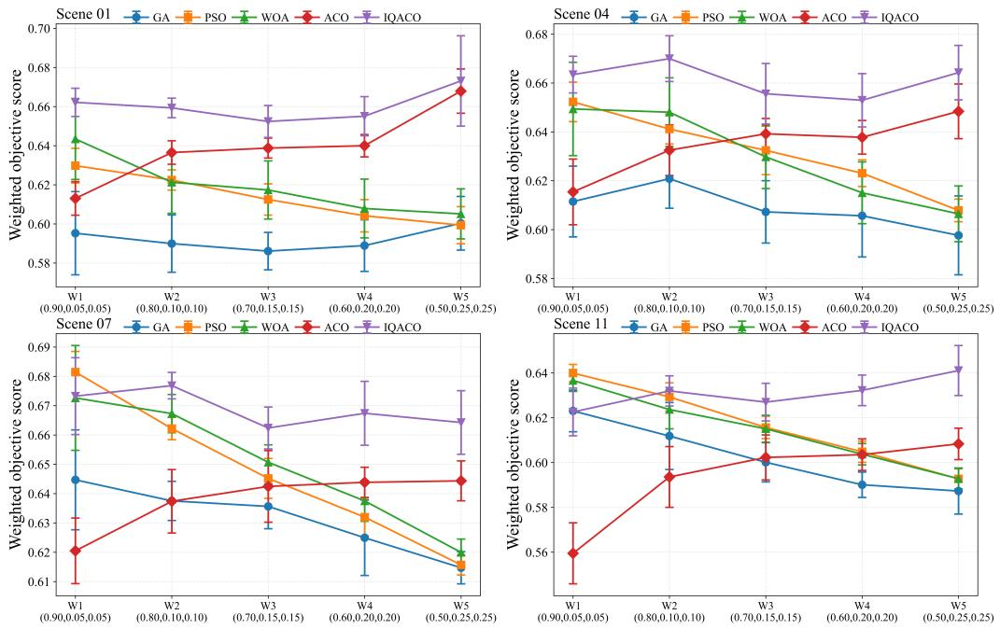  
Figure 9: Weight sensitivity results on four representative scenarios under five weight configurations.

## 4.3.3. IQL Training Convergence Analysis

To further examine the training behavior of the IQL module, the main loss functions and learning statistics are recorded during ofline training. Figs. 10–12 show the variations of the total loss, Q loss, value loss, policy loss, action mean-square error, mean Q value, mean V value, mean advantage, and mean action weight with respect to the training epoch.

The training curves show that the IQL module remains stable during ofline learning. In the early training stage, the total loss and the main component losses decrease rapidly, indicating that the networks learn useful state–action value information from the ofline transition samples. As the number of epochs increases, these losses gradually enter a bounded fluctuation range, and no evident divergence is observed. The decreases in policy loss and action mean-square error indicate that the policy network gradually fits parameter-adjustment actions with higher estimated advantages.

The mean Q value and mean V value also become more stable in the later training stage, suggesting that the value estimates converge to relatively consistent levels. The mean advantage and mean action weight remain within reasonable ranges, which indicates that the advantage-weighted regression does not produce excessively large sample weights. Overall, the IQL module can learn a stable parameter-adjustment policy from ofline ACO search trajectories and provide adaptive parameter control for online IQACO search on unseen test scenarios.

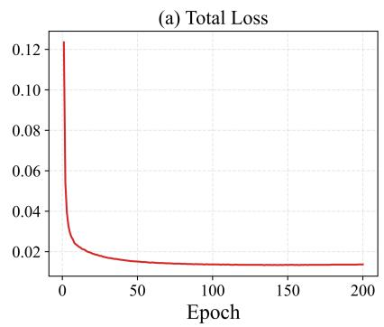

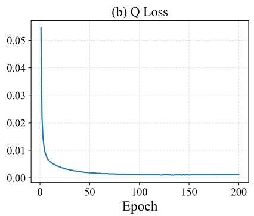

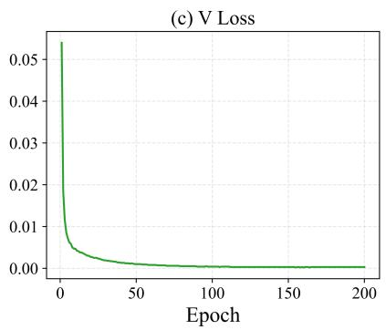  
Figure 10: Training loss terms of the IQL module. (a) Total loss. (b) Q loss. (c) V loss.

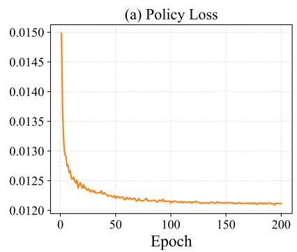

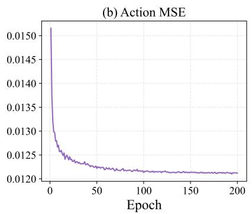

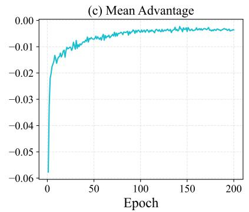  
Figure 11: Policy and advantage indicators of the IQL module. (a) Policy loss. (b) Action MSE. (c) Mean advantage.

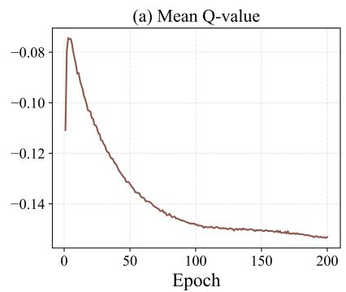

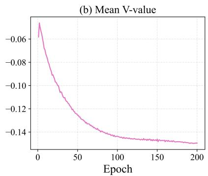

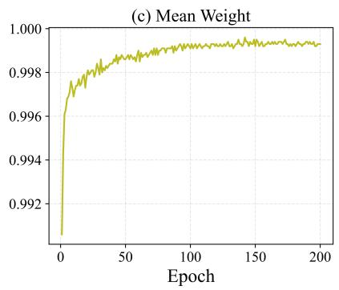  
Figure 12: Value estimation and weight statistics. (a) Mean Q-value. (b) Mean V-value. (c) Mean weight.

## 5. Conclusion

This article addressed multi-satellite maritime moving-target observation scheduling by developing an IQL-guided adaptive ACO framework. The proposed method improves constructive search by learning how to adjust key ACO parameters rather than directly generating scheduling decisions. In this way, the feasibility advantage of ACO-based schedule construction is preserved, while ofline value learning is used to regulate the exploration– exploitation behavior during the search process. Experimental results on 14 scenarios show that IQACO achieves higher objective values and faster convergence than the competing methods. The performance gain becomes more evident in larger-scale scenarios, indicating that adaptive parameter control is particularly useful when the task-window distribution and sequence-dependent constraints become more complex. Weight-sensitivity experiments further show that IQACO maintains competitive performance under diferent mission-preference settings.

However, the current study is still based on simulated target distributions, simplified cloud-availability modeling, and an ofline policy trained within a fixed scenario distribution. Future work will focus on incorporating real AIS trajectories, time-varying cloud fields, and more realistic satellite operation constraints. Transfer learning, online adaptation, and hybrid learning-search mechanisms will also be investigated to improve robustness in operational maritime surveillance applications.

## Declaration of competing interest

The authors declare that they have no known competing financial interests or personal relationships that could have appeared to influence the work reported in this paper.

## Data availability

The data and code supporting the findings of this study are available from the corresponding author upon reasonable request.

## References

[1] X. Wang, G. Wu, L. Xing, and W. Pedrycz Agile Earth observation satellite scheduling over 20 years: Formulations, methods, and future directions IEEE Syst. J., vol. 15, no. 3, pp. 3881–3892, Sep. 2021.

[2] G. Peng, G. Song, Y. He, B. Deng, and S. Zhao An exact algorithm for agile Earth observation satellite scheduling with time-dependent profits Comput. Oper. Res., vol. 120, Aug. 2020.

[3] G. Peng, G. Song, Y. He, J. Yu, S. Xiang, L. Xing, and P. Vansteenwegen Solving the agile Earth observation satellite scheduling problem with time-dependent transition times IEEE Trans. Syst., Man, Cybern., Syst., vol. 52, no. 3, pp. 1614–1625, Mar. 2022.

[4] V. Antuori, N. Beldiceanu, E. Hebrard, and D. Wojtowicz Solving the agile Earth observation satellite scheduling problem In Proc. 31st Int. Conf. Principles Practice Constraint Program., 2025.

[5] A. Chatterjee and R. Tharmarasa Reward factor-based multiple agile satellites scheduling with energy and memory constraints IEEE Trans. Aerosp. Electron. Syst., vol. 58, no. 4, pp. 3090–3103, Aug. 2022.

[6] L. He, B. Liang, J. Li, and M. Sheng Joint observation and transmission scheduling in agile satellite networks IEEE Trans. Mobile Comput., vol. 21, no. 12, pp. 4381–4396, Dec. 2022.

[7] A. M. Mercado-Martínez, B. Soret, and A. Jurado-Navas An energy-eficient learning solution for the Agile Earth Observation Satellite Scheduling Problem In Proc. ICMLCN, Barcelona, Spain, 2025, pp. 1–7.

[8] X. Wang, G. Song, R. Leus, and C. Han Robust Earth observation satellite scheduling with uncertainty of cloud coverage IEEE Trans. Aerosp. Electron. Syst., vol. 56, no. 3, pp. 2450–2461, Jun. 2020.

[9] X. Wang, Y. Gu, G. Wu, and J. R. Woodward Robust scheduling for multiple agile Earth observation satellites under cloud coverage uncertainty Comput. Ind. Eng., vol. 156, Jun. 2021.

[10] Y. Chen, J. Xue, W. Gu, and M. Shao An efective Genetic Programming Hyper-Heuristic for Uncertain Agile Satellite Scheduling In Proc. BigDIA, Nha Trang, Vietnam, 2025, pp. 311–318.

[11] B. Ferrari, J.-F. Cordeau, M. Delorme, M. Iori, and R. Orosei Satellite Scheduling Problems: A survey of applications in Earth and outer space observation Comput. Oper. Res., vol. 173, 2025.

[12] L. He, X. Liu, G. Laporte, Y. Chen, and Y. Chen An improved adaptive large neighborhood search algorithm for multiple agile satellites scheduling Comput. Oper. Res., vol. 100, pp. 12–25, Dec. 2018.

[13] G. Peng, J. Wang, G. Song, A. Gunawan, L. Xing, and P. Vansteenwegen Branch-andcut-and-price for agile earth observation satellite scheduling Eur. J. Oper. Res., vol. 326, no. 3, pp. 427–438, 2025.

[14] X. Liu, G. Laporte, Y. Chen, and R. He An adaptive large neighborhood search metaheuristic for agile satellite scheduling with time-dependent transition time Comput. Oper. Res., vol. 86, pp. 41–53, Oct. 2017.

[15] Y. Gu, C. Han, Y. Chen, and W. W. Xing Mission Replanning for Multiple Agile Earth Observation Satellites Based on Cloud Coverage Forecasting IEEE J. Sel. Top. Appl. Earth Observ. Remote Sens., vol. 15, pp. 594–608, 2022.

[16] H. Wang, W. Huang, S. Magnússon, T. Lindgren, R. Wang, and Y. Song A Strategy Fusion-Based Multiobjective Optimization Approach for Agile Earth Observation Satellite Scheduling Problem IEEE Trans. Geosci. Remote Sens., vol. 62, 2024.

[17] F. Yao, Y. Chen, L. Wang, Z. Chang, P.-Q. Huang, and Y. Wang A bilevel evolutionary algorithm for large-scale multiobjective task scheduling in multiagile Earth observation satellite systems IEEE Trans. Syst., Man, Cybern., Syst., vol. 54, no. 6, pp. 3512–3524, Jun. 2024.

[18] B. Wang, Y. Feng, G. Zhang, L. Zhang, and Y. Yang Memetic multiobjective discrete Jaya algorithm for cooperative scheduling of multiple agile Earth observation satellites IEEE Trans. Aerosp. Electron. Syst., vol. 60, no. 6, pp. 8086–8099, Dec. 2024.

[19] Y. Du, T. Wang, B. Xin, L. Wang, Y. Chen, and L. Xing A data-driven parallel scheduling approach for multiple agile Earth observation satellites IEEE Trans. Evol. Comput., vol. 24, no. 4, pp. 679–693, Aug. 2020.

[20] X. Zhou, H. Ma, J. Gu, H. Chen, and W. Deng Parameter adaptation-based ant colony optimization with dynamic hybrid mechanism Eng. Appl. Artif. Intell., vol. 114, Sep. 2022.

[21] A. Herrmann and H. Schaub Reinforcement Learning for the Agile Earth-Observing Satellite Scheduling Problem IEEE Trans. Aerosp. Electron. Syst., vol. 59, no. 5, pp. 5235–5247, Oct. 2023.

[22] J. Chun, W. Yang, X. Liu, G. Wu, L. He, and L. Xing Deep reinforcement learning for the agile Earth observation satellite scheduling problem Mathematics, vol. 11, no. 19, Sep. 2023.

[23] A. Jacquet, G. Infantes, N. Meuleau, E. Benazera, S. Roussel, V. Baudoui, and J. Guerra Earth observation satellite scheduling with graph neural networks arXiv:2408.15041, 2024.

[24] Z. Liu, W. Xiong, C. Han, and X. Yu Deep reinforcement learning with local attention for single agile optical satellite scheduling problem Sensors, vol. 24, no. 19, Oct. 2024.

[25] X. He, J. Xiang, M. Yan, C. Zhang, Z. Xie, and X. Liang Agile Earth observation satellite constellation mission planning based on multi-agent transformer IEICE Trans. Fundam. Electron., Commun. Comput. Sci., vol. E108-A, no. 9, pp. 1316–1319, Sep. 2025.

[26] L. Xu, S. Liu, and S. Qiu An autonomous mission planning method for Earth observation satellites based on reinforcement learning In Proc. IAF Earth Observation Symp., 76th Int. Astronautical Congr., Sydney, Australia, 2025, pp. 605–611.

[27] R. Figueiredo Prudencio, M. R. O. A. Maximo, and E. L. Colombini A Survey on Ofline Reinforcement Learning: Taxonomy, Review, and Open Problems IEEE Trans. Neural Netw. Learn. Syst., vol. 35, no. 8, pp. 10237–10257, Aug. 2024.

[28] A. Riahi Samani, X. Zhao, and F. Chen Distribution shift, generalization and OOD challenge in ofline reinforcement learning: A comprehensive survey Neural Comput. Appl., vol. 38, 2026.

[29] I. Kostrikov, A. Nair, and S. Levine Ofline reinforcement learning with implicit Qlearning In Proc. Int. Conf. Learn. Representations, 2022.

[30] A. Nait Chabane and O. Guenounou An enhanced genetic algorithm for optimized task allocation and planning in heterogeneous multi-robot systems Complex Intell. Syst., vol. 11, 2025.

[31] L. Abualigah Particle Swarm Optimization: Advances, Applications, and Experimental Insights Comput. Mater. Contin., vol. 82, no. 2, pp. 1539–1592, 2025.

[32] L. Han, H. Zhou, Y. Zhang, Y. Wu, and M. Xu An enhanced whale optimization algorithm for task scheduling in edge computing environments Front. Big Data, vol. 7, 2024.