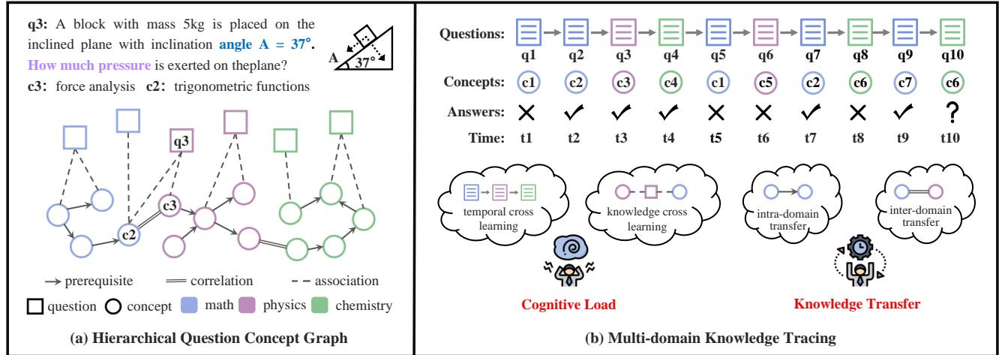
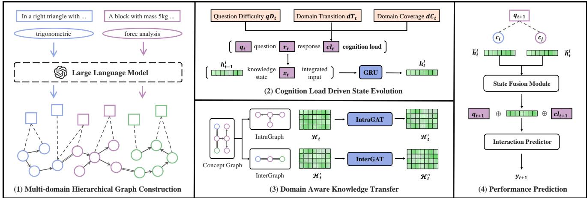
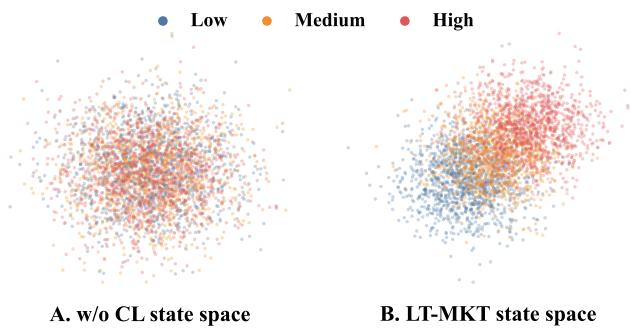
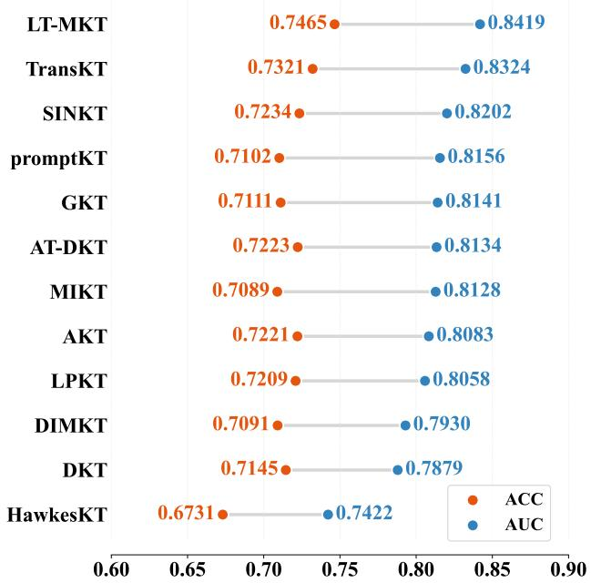
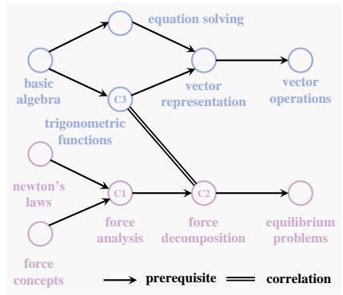
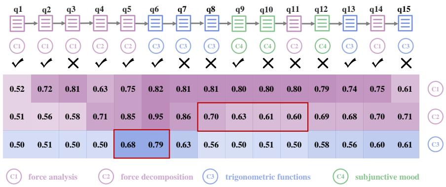
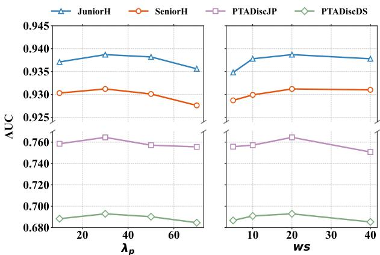

# Incorporating Cognitive Load and Knowledge Transfer for Multi-Domain Knowledge Tracing

Haotian Zhang   
State Key Laboratory of Cognitive   
Intelligence, University of Science and   
Technology of China   
Hefei, China   
sosweetzhang@mail.ustc.edu.cn   
Liang Ding   
iFLYTEK AI Research   
Hefei, China   
liangding3@iflytek.com   
Jing Sha   
iFLYTEK AI Research   
Hefei, China   
jingsha@iflytek.com   
Shucun Wang   
State Key Laboratory of Cognitive   
Intelligence, University of Science and   
Technology of China   
Hefei, China   
shucunwang@mail.ustc.edu.cn   
Shuochen Liu   
State Key Laboratory of Cognitive   
Intelligence, University of Science and   
Technology of China   
Hefei, China   
shuochenliu@mail.ustc.edu.cn   
Shijin Wang ✉   
State Key Laboratory of Cognitive   
Intelligence & iFLYTEK AI Research   
Hefei, China   
sjwang3@iflytek.com   
Jinze Wu   
iFLYTEK AI Research   
Hefei, China   
hxwjz@mail.ustc.edu.cn   
Zhenya Huang   
State Key Laboratory of Cognitive   
Intelligence, University of Science and   
Technology of China & Institute of   
Artificial Intelligence, Hefei   
Comprehensive National Science   
Center   
Hefei, China   
huangzhy@ustc.edu.cn   
Qi Liu   
State Key Laboratory of Cognitive   
Intelligence, University of Science and   
Technology of China & Institute of   
Artificial Intelligence, Hefei   
Comprehensive National Science   
Center   
Hefei, China   
qiliuql@ustc.edu.cn

## Abstract

Knowledge Tracing (KT) aims to assess students’ dynamic knowl edge states from their learning histories. While most existing KT methods focus on single-domain learning with notable success, real-world learning scenarios often involve multiple domains simultaneously, introducing two critical factors: 1) Cognitive load, arising from managing learning across domains in both temporal and knowledge dimensions. 2) Knowledge transfer, where knowl edge states in one domain influence related states both within and across domains. In this paper, we focus on exploring these factors to improve students’ knowledge state assessment in multidomain learning scenarios and propose a novel method incorporating cognitive Load and knowledge Transfer for Multi-domain Knowledge Tracing (LT-MKT). Specifically, to bridge isolated domains, LT-MKT first integrates textual information from questions and their associated concepts to construct a Multi-domain Hierarchi cal Graph, leveraging the advanced representational capabilities of

large language models (LLMs). Then, cross-domain features in both the temporal and knowledge dimensions are explicitly modeled to capture the efects of cognitive load. Additionally, a knowledge transfer module is designed to model the propagation of knowledge states within and across domains. By jointly modeling these factors, LT-MKT enables more accurate prediction of students’ future performance. Finally, extensive experiments on real-world datasets demonstrate that our method achieves state-of-the-art performance. Code is available at https://github.com/sosweetzhang/LT-MKT.

## CCS Concepts

• Applied computing → E-learning; • Social and professional topics → Student assessment.

## Keywords

Knowledge Tracing, Cognitive Load, Knowledge Transfer

## ACM Reference Format:

Haotian Zhang, Shucun Wang, Jinze Wu, Liang Ding, Shuochen Liu, Zhenya Huang, Jing Sha, Shijin Wang, and Qi Liu. 2026. Incorporating Cognitive Load and Knowledge Transfer for Multi-Domain Knowledge Tracing. In Proceedings of the 35th ACM International Conference on Information and Knowledge Management (CIKM ’26), November 7–11, 2026, Rome, Italy. ACM, New York, NY, USA, 12 pages. https://doi.org/10.1145/3799682.3841120

  
Figure 1: Illustration of Multi-domain Knowledge Tracing. (a) Hierarchical Question Concept Graph outlines relationships between concepts, as well as between questions and concepts. Questions in one domain (e.g., �3) may link to concepts from another (e.g., �2), and concepts across domains can also correlate (e.g., �2 and �3). (b) In multi-domain learning scenarios, students may alternate between domains like math, physics, and chemistry, enhancing learning through knowledge transfer but also increasing cognitive load.

## 1 Introduction

Online learning has expanded rapidly, ofering unmatched flexibility for both students and educators, enabling learning to occur anywhere, anytime [2]. Platforms such as Coursera [53] and ASSISTments [4] have demonstrated efectiveness by delivering intelligent, adaptive educational services [47]. These systems collect extensive data on student interactions, including exercise responses, enabling analysis of knowledge levels, learning preferences, and other key at tributes. A central component of this analysis is Knowledge Tracing (KT), which aims to model and track students’ evolving knowledge states through their interactions with the system [2, 64, 65].

In the literature, extensive work has advanced knowledge tracing [45]. Early methods relied on hidden markov models [9, 19] and logistic functions with various factors [5, 39, 54] to estimate students’ knowledge states. The introduction of deep learning marked a significant shift, with Deep Knowledge Tracing (DKT) pioneer ing the application of neural networks to KT [40]. Since then, numerous variants have emerged, including memory-enhanced models [1, 66], graph-based approaches [35, 37], and attention-driven models [14, 46], etc. More recently, with the rapid development of large language models (LLMs), LLM-based approaches have been explored, leveraging their strong representation and reasoning capabilities to enhance knowledge state modeling, improve interpretability, and support knowledge-aware reasoning tasks [13, 15].

Despite their success, most existing methods primarily focus on single-domain learning (e.g., math). However, many real-world learning scenarios, such as standardized exams like the GRE, require students to engage with multiple domains simultaneously. As illustrated in Figure 1, multi-domain learning scenarios introduce additional complexity beyond single-domain settings, as a single question may simultaneously require knowledge from mul tiple domains. Such scenarios give rise to two critical factors that significantly afect students’ knowledge states: 1) Cognitive load, resulting from learning across domains in both temporal and knowl edge dimensions. Cognitive load theory [41] posits that cognitive load originates from the complexity of learning materials and interactions, which implicitly influence students’ knowledge acquisition and the evolution of their knowledge states during the learning process. In multi-domain learning scenarios, cognitive load mainly manifests in two forms: Temporal dimension: Students frequently switch between diferent domains over time. For instance, a student may study physics at time $t _ { 3 } ,$ switch to mathematics at $t _ { 4 } ,$ and then move to chemistry at $t _ { 5 } ,$ leading to additional cognitive switching costs. Knowledge dimension: A single question may simultaneously require knowledge from multiple domains. For instance, solving the question $q _ { 3 }$ at $t _ { 3 }$ may require both $c _ { 3 }$ force analysis from the physics domain and $c _ { 2 }$ trigonometric functions from the mathematics domain, increasing the complexity of knowledge processing. 2) Knowledge transfer, where knowledge states in one domain influence related knowledge states both within and across domains. Transfer of learning theory [10] emphasizes that knowledge concepts are inherently interconnected, and knowledge transfer occurs when understanding one concept influences the learning or understanding of related concepts. In multi-domain learning scenarios, knowledge transfer mainly occurs in two ways: Intra-domain transfer: Knowledge states propagate among related concepts within the same domain through prerequisite relationships, such as from addition to multiplication. Inter-domain transfer: Knowledge states transfer across diferent but related domains through semantic or functional correlations, such as between force analysis and trigonometric functions. Therefore, accurately modeling knowledge states in multi-domain learning scenarios requires explicitly considering both cognitive load and knowledge transfer, which are typically overlooked in conventional single-domain KT methods.

In this paper, we focus on exploring the above factors to improve students’ knowledge state assessment in multi-domain learning scenarios, and propose a novel method incorporating cognitive Load and knowledge Transfer for Multi-domain Knowledge Tracing (LT-MKT). Unlike conventional single-domain KT methods that model knowledge states independently within each domain, LT-MKT explicitly captures cross-domain interactions from both cognitive and knowledge propagation perspectives. Specifically, to bridge isolated domains and establish semantic relationships across heterogeneous concepts, LT-MKT first integrates textual information from questions and their associated concepts to construct a Multidomain Hierarchical Graph, leveraging the strong representational capabilities of large language models (LLMs). Based on this graph structure, LT-MKT further models cross-domain dependencies in both temporal and knowledge dimensions to characterize students cognitive load during learning processes. In the temporal dimension, the model captures students’ domain-switching behaviors over sequential interactions, while in the knowledge dimension, it models the cognitive burden introduced by questions requiring concepts from multiple domains simultaneously. Furthermore, to model the influence of related concepts on knowledge evolution, LT-MKT incorporates a knowledge transfer module to capture the propagation of knowledge states both within and across domains. The intra-domain transfer mechanism models prerequisite relationships among concepts within the same domain, whereas the inter-domain transfer mechanism captures semantic and functional correlations between concepts from diferent domains. By jointly modeling cognitive load and knowledge transfer, LT-MKT provides a more comprehensive representation of students’ learning processes and enables more accurate prediction of future performance. Finally, extensive experiments on real-world datasets demonstrate the efectiveness of LT-MKT, consistently achieving state-of-the-art performance compared with existing knowledge tracing methods.

Our main contributions are summarized as follows:

• We highlight the critical roles of cognitive load and knowledge transfer in multi-domain learning scenarios, which are largely overlooked in existing single-domain KT methods.

• We propose a novel method, LT-MKT, for multi-domain knowledge tracing, which explicitly models cognitive load and knowledge transfer. In addition, LT-MKT leverages LLMs to construct a Multi-domain Hierarchical Graph for capturing semantic relationships across domains.

• Extensive experiments on four real-world datasets demonstrate that LT-MKT achieves state-of-the-art performance against 11 baselines, validating the efectiveness of modeling cognitive load and knowledge transfer in multi-domain learning scenarios.

## 2 Related Work

## 2.1 Knowledge Tracing

Knowledge Tracing (KT) is a fundamental task that aims to dy namically monitor and assess students’ evolving knowledge states within online learning scenarios [17, 26, 45]. Over the years, a significant body of research has been dedicated to solving KT tasks. Early approaches primarily relied on statistical models, such as hidden Markov models [9, 19], or logistic regression-based functions that incorporated various influencing factors [5, 39, 54], to estimate students’ conceptual mastery levels. With the rise of deep learning, Deep Knowledge Tracing (DKT) marked a pivotal moment by in troducing neural networks into KT [40], opening the door to more sophisticated, data-driven modeling techniques. Following DKT, numerous variants of deep knowledge tracing have emerged, each introducing novel mechanisms to improve performance. These include memory-augmented methods [1, 66], which explicitly model students’ past interactions, graph-based approaches [35, 37, 52, 61, 63] that better capture the relational structure between concepts, and attention-based models [14, 38, 46], which focus on highlighting key interactions during learning. Additionally, other KT models have sought to enhance student performance prediction by incorpo rating auxiliary information or designing more specialized network architectures [20, 22, 23, 25, 31, 44, 48, 50, 55, 56]. Despite these ad vances, most existing KT methods mainly focus on single-domain learning scenarios, such as mathematics, while overlooking the influence of multi-domain learning behaviors. This domain-specific assumption limits the ability of these methods to exploit cross domain knowledge dependencies, which may provide valuable contextual information for accurately understanding students’ overall knowledge states. Recently, several studies have begun exploring the use of multi-domain information to enhance KT performance. For instance, adaptive knowledge tracing methods [7, 51, 62] lever age knowledge from related domains to alleviate data sparsity and improve performance in target domains. Meanwhile, some studies have started to investigate multi-domain knowledge tracing directly. PromptKT [29] introduces a prompt-enhanced paradigm that utilizes student interaction data from multiple domains to improve KT performance jointly across domains. TransKT [15] further proposes a contrastive cross-course knowledge tracing framework that leverages concept graph-guided knowledge transfer to mode relationships among learning behaviors across diferent courses, thereby improving knowledge state estimation. However, existing methods primarily focus on transferring information across domains while largely overlooking the underlying cognitive mechanisms that arise from multi-domain learning. In particular, they fail to explicitly model how cross-domain interactions contribute to cognitive load and knowledge transfer during the learning process, which implicitly influences students’ knowledge states. Diferent from previous studies, our work explicitly models the interplay o knowledge states across multiple domains from both cognitive load and knowledge transfer perspectives. By doing so, our method provides a more comprehensive representation of students’ learning processes and better reflects the interconnected nature ofreal-world multi-domain learning scenarios.

## 2.2 LLMs for Education

Large Language Models (LLMs) have demonstrated remarkable effectiveness across a wide range of educational tasks, consistently achieving strong performance in learning-related applications [27, 28, 42, 57, 58]. Recent studies show that LLMs can reach near student-level proficiency on standardized examinations in subjects such as mathematics and physics [3], highlighting their potential in educational scenarios including tutoring, writing assistance, and reading comprehension [33]. Moreover, LLMs have shown strong capabilities in enabling personalized learning and supporting automated educational assessment [21, 24, 30, 59].

In the domain of Knowledge Tracing (KT), recent research has increasingly explored the use of LLMs to enhance representation learning and semantic understanding from both student interactions and textual educational resources. For example, LLM-SBCL [36] utilizes LLMs to analyze the textual content of questions within student-question interaction networks, enabling more accurate identification of underlying knowledge concepts, especially in coldstart scenarios with limited data. Similarly, DCL4KT+LLM [20] leverages LLMs to estimate question dificulty from question stems and associated knowledge concepts, efectively alleviating the issue of missing dificulty annotations for unseen questions. In addition, Sonkar and Baraniuk [49] explores the reasoning capabilities of LLMs to simulate students’ misconceptions and incorrect responses based on detailed knowledge profiles, demonstrating the potential of LLMs for modeling complex learning behaviors. More recently, several studies have begun integrating LLMs into knowledge structure modeling for KT. SINKT [13] introduces the first inductive knowledge tracing framework that directly incorporates LLMs to enhance representation learning and improve generalization to unseen questions and students. TransKT [15] further employs concept graph-guided knowledge transfer to model relationships among learning behaviors across diferent courses, demonstrating the efectiveness of graph-based knowledge structures in capturing semantic dependencies across domains. These studies collectively demonstrate the strong capability of LLMs in extracting semantic relationships from educational content and constructing meaningful knowledge representations for KT tasks. Diferent from previous studies that mainly employ LLMs to model relationships among concepts, we leverage LLMs to construct a multi-domain hierarchical graph that jointly captures questionconcept and concept-concept relationships across domains, providing the structural foundation for modeling cognitive load and knowledge transfer in multi-domain knowledge tracing.

## 3 Problem Definition

In an Intelligent Tutoring System (ITS), we consider a set of students S, a set of questions $\scriptstyle Q ,$ and a set of knowledge concepts $c$ distributed across multiple domains $\mathcal { D }$ . For a student $s \in S _ { : }$ , the learning history is represented as:

$$
R _ { s } = \{ ( q _ { 1 } ^ { d _ { 1 } } , r _ { 1 } ) , ( q _ { 2 } ^ { d _ { 2 } } , r _ { 2 } ) , \dots , ( q _ { T } ^ { d _ { k } } , r _ { T } ) \} ,\tag{1}
$$

where $q _ { t } ^ { d _ { j } } \in \mathsf { Q }$ denotes the question answered by the student at time step �, which belongs to domain $d _ { j } \in \mathcal { D }$ , and $r _ { t } \in \{ 0 , 1 \}$ represents the student’s response correctness, where $r _ { t } = 1$ indicates a correct response and $r _ { t } = 0$ otherwise. The goal of multi-domain knowledge tracing is to predict the probability that the student correctly answers the next question $q _ { T + 1 } ^ { d _ { m } }$ from domain $d _ { m } \in \mathcal { D }$ , based on the historical interaction sequence $R _ { s }$ . Formally, the prediction objective is defined as:

$$
p ( r _ { T + 1 } = 1 \mid R _ { s } , q _ { T + 1 } ^ { d _ { m } } ) .\tag{2}
$$

Diferent from traditional single-domain knowledge tracing, where all learning interactions are restricted to a single domain, multi-domain knowledge tracing involves more complex crossdomain learning behaviors. Specifically, students may frequently switch across diferent domains during learning, while individual questions may simultaneously require knowledge from multiple domains, thereby introducing additional factors that complicate knowledge state modeling and make it more challenging.

## 4 The LT-MKT Model

In this section, we present the proposed LT-MKT model in detail. An overview of the overall framework is illustrated in Figure 2. Specifically, we first introduce the Multi-domain Hierarchical Graph, which serves as the relational foundation for modeling semantic dependencies across domains (§ 4.1). Based on this graph structure, we then model cognitive load (§ 4.2) and knowledge transfer (§ 4.3) to refine students’ knowledge state estimation in multi-domain learning scenarios, ultimately enabling more accurate student performance prediction (§ 4.4).

## 4.1 Hierarchical Graph Construction

In multi-domain learning scenarios, knowledge concepts are often interconnected across domains, making it dificult to capture the semantic dependencies required for modeling cognitive load and knowledge transfer. To address this issue, we construct a Multidomain Hierarchical Graph (MDHG) to provide a unified relational structure for multi-domain knowledge tracing.

Formally, let $\mathcal { G } = ( Q , C , \mathcal { E } )$ denote the MDHG, where Q is the question set, C is the knowledge concept (KC) set, and E contains three types of edges: question-to-concept associations, intra-domain concept prerequisites, and inter-domain concept correlations. Association edges indicate the concepts involved in each question. Prerequisite edges describe directed learning dependencies within the same domain, while correlation edges capture semantic or functional connections across domains.

Constructing such educational graphs usually requires extensive expert annotation. To improve scalability, we employ LLMs to construct the MDHG through prompt-guided reasoning. Specifically, for each question, the prompt provides the question text, domain information, main concept, candidate concepts, and existing prerequisite relations. Based on chain-of-thought reasoning [60], the LLM first identifies the concepts involved in the question, then selects prerequisite concepts from the same domain and correlated concepts from other domains. For a question �� with primary concept $c _ { i } ,$ this process is formulated as:

$$
\mathcal { A } ( q _ { j } ) , M ( q _ { j } ) , N ( q _ { j } ) = \mathrm { L L M } _ { \theta } ( \mathcal { P } ( q _ { j } , d _ { j } , c _ { i } , C , \mathcal { E } _ { p r e } ) ) ,\tag{3}
$$

where $\mathcal { A } ( q _ { j } )$ denotes the associated concepts of $q _ { j } , M ( q _ { j } )$ denotes intra-domain prerequisite concepts, $N ( q _ { j } )$ denotes inter-domain correlated concepts, and $\mathcal { P } ( \cdot )$ is the graph construction prompt.

After processing all questions, we aggregate the generated relations at the concept level. For each concept $c _ { i } ,$ let $Q _ { i }$ be the set of questions whose primary concept is $c _ { i } .$ . The prerequisite and correlation sets of $c _ { i }$ are obtained by:

$$
{ \cal M } _ { i } = \bigcup _ { q _ { j } \in Q _ { i } } { \cal M } ( q _ { j } ) , \quad { \cal N } _ { i } = \bigcup _ { q _ { j } \in Q _ { i } } { \cal N } ( q _ { j } ) .\tag{4}
$$

We then construct the final edge sets as:

$$
\begin{array} { r l } & { \mathcal { E } _ { q c } = \{ ( q _ { j } , c ) \mid c \in \mathcal { A } ( q _ { j } ) \} , } \\ & { \mathcal { E } _ { p r e } = \{ ( c _ { m } , c _ { i } ) \mid c _ { m } \in M _ { i } \} , } \\ & { \mathcal { E } _ { c o r } = \{ ( c _ { i } , c _ { n } ) \mid c _ { n } \in N _ { i } \} . } \end{array}\tag{5}
$$

Thus, the complete edge set is $\mathcal { E } = \mathcal { E } _ { q c } \cup \mathcal { E } _ { p r e } \cup \mathcal { E } _ { c o r } ,$

  
Figure 2: Overall framework of LT-MKT. The model first constructs a multi-domain hierarchical graph from question texts and knowledge concepts with LLM-guided reasoning. Based on this graph, LT-MKT models cognitive load through question dificulty, domain transition, and domain coverage, and updates students’ knowledge states via GRU-based state evolution. It then performs domain-aware knowledge transfer with intra-domain prerequisite propagation and inter-domain correlation propagation, followed by state fusion and performance prediction for the next interaction.

To ensure educational consistency, prerequisite relations are constrained to satisfy the DAG property:

$$
\mathrm { C y c l e } ( C , { \mathcal E } _ { { \mathit { p r e } } } ) = \emptyset ,\tag{6}
$$

which avoids circular dependencies in learning paths. Since each new concept can be processed with the same prompt and aggregation procedure, the graph can also be incrementally extended when unseen concepts appear in future learning scenarios. Detailed prompts are provided in the code repository.

## 4.2 Cognitive Load Driven State Evolution

Cognitive load theory [41] posits that cognitive load stems from the complexity oflearning materials and interactions, thereby implicitly influencing students’ knowledge acquisition and the evolution of their knowledge states during the learning process. In multidomain learning scenarios, cognitive load is further amplified by cross-domain learning behaviors in both temporal and knowledge dimensions. Therefore, accurately modeling students’ knowledge states requires explicitly capturing the dynamics of cognitive load throughout the learning process. Motivated by findings from existing studies [20, 62], we investigate the efects of three key factors related to cognitive load: question dificulty, domain transition, and domain coverage. These factors characterize diferent aspects of cognitive complexity introduced by multi-domain learning interactions. While acknowledging the potential influence of other factors, we leave their exploration for future work.

Question Dificulty. Question dificulty reflects the complexity of learning materials to some extent and serves as a critical factor in assessing cognitive load. It has been proven to be a critical factor in accurately estimating students’ knowledge states [20]. Following some previous works [43], we calculate the dificulty of the question �� as follows:

$$
q D _ { i } = \frac { \sum _ { i = 1 } ^ { | S _ { i } | } a _ { i } = = 0 } { | S _ { i } | } \times \lambda _ { P } ,\tag{7}
$$

where $S _ { i }$ denotes the set of students who have attempted question $q _ { i } ,$ and $a _ { s , i } \in \{ 0 , 1 \}$ indicates whether student � answers question $q _ { i }$ correctly (1 for correct and 0 for incorrect). �� represents the predefined granularity level of question dificulty. Intuitively, a question is considered more dificult if it is answered incorrectly by a larger proportion of students. We further represent the dificulty embedding using an embedding matrix $\mathbf { E } _ { q D } \in \mathbb { R } ^ { \lambda _ { P } \times d _ { q D } }$ , where $d _ { q D }$ denotes the embedding dimension.

Domain Transition. Domain transition refers to shifts between domains during learning, reflecting the complexity of interactions that influence cognitive load and subsequently afect knowledge state estimation. Intuitively, given a student’s interaction history $\mathcal { R } _ { s } = \{ ( q _ { 1 } ^ { d _ { 1 } } , r _ { 1 } ) , ( q _ { 2 } ^ { d _ { 2 } } , r _ { 2 } ) , . . . , ( q _ { T } ^ { d _ { k } } , r _ { T } ) \}$ , the domain transition factor up to time � can be calculated as:

$$
d T _ { t } = \sum _ { t ^ { \prime } = t - w s } ^ { t } ( d _ { t ^ { \prime } } \neq d _ { t ^ { \prime } - 1 } ) ,\tag{8}
$$

where �� is the size of the time window. Since a student’s learning is more strongly influenced by recent interactions, considering transitions over the entire time span may not be appropriate. In practice, a student who frequently switches between diferent domains within a short period will have a higher domain transition value, indicating stronger cross-domain cognitive switching efects. Then we represent the transitions embedding with embedding matrix $\mathbf { E } _ { d T } \in \bar { \mathbb { R } } ^ { \lambda _ { T } \times d _ { d T } }$ , where $\lambda _ { T }$ represents the maximum value of domain transitions observed across all sequences, $d _ { d T }$ is the dimension.

Domain Coverage. Domain coverage refers to the number of domains covered by the concepts assessed in a specific question. Intuitively, the more domains a question involves, the higher its complexity and the greater the interaction required for learning. This increased complexity contributes to higher cognitive load, which in turn afects knowledge state estimation. For a question ��, the domain coverage is defined as follows:

$$
\mathrm { d } C _ { i } = | D _ { i } | ,\tag{9}
$$

where $\mathcal { D } _ { i } = \{ d _ { 1 } , d _ { 2 } , . . . \}$ represents its relevant concepts coverage couple of domains. Similarly, the domain coverage is represented as an embedding matrix $\mathbf { E } _ { d C } \in \mathbb { R } ^ { \lambda _ { C } \times d _ { d C } }$ , where �� represents the total number of domains and $d _ { d C }$ is the dimension.

State Evolution. After examining the impact of cognitive load through the three key factors discussed above, we define the cognitive load $c l _ { t }$ at time � as:

$$
\mathbf { c l } _ { t } = \mathbf { q } \mathbf { D } _ { t } \oplus \mathbf { d } \mathbf { T } _ { t } \oplus \mathbf { d } \mathbf { C } _ { t } .\tag{10}
$$

Subsequently, we integrate the cognitive load into the interaction embedding $\mathbf { x } _ { t }$ as follows:

$$
\mathbf { x } _ { t } = \mathbf { q } _ { t } \oplus \mathbf { r } _ { t } \oplus \mathbf { c l } _ { t } ,\tag{11}
$$

where $\mathbf { q } _ { t }$ is obtained by encoding the question text using BERT [11], and for the answer $\mathbf { r } _ { t } ,$ i.e., 0 or 1, we expand it to an all-zero or all-one vector $\mathbf { r } _ { t } \in \mathbb { R } ^ { d _ { a } } , d _ { a }$ is the dimension.

Finally, we use Gated Recurrent Unit (GRU) [8] to update the knowledge state to model the temporal efect in the learning process:

$$
\mathbf { r } _ { t } = \sigma ( \mathbf { W } _ { r } \left[ \mathbf { h } _ { t - 1 } \oplus \mathbf { x } _ { t } \right] + \mathbf { b } _ { r } ) ,\tag{12}
$$

$$
\begin{array} { r } { \mathbf { z } _ { t } = \sigma ( \mathbf { W } _ { z } \left[ \mathbf { h } _ { t - 1 } \oplus \mathbf { x } _ { t } \right] + \mathbf { b } _ { z } ) , } \end{array}\tag{13}
$$

$$
\tilde { \mathbf { h } } _ { t } = \operatorname { t a n h } ( \mathbf { W } _ { \tilde { h } } \left[ \mathbf { r } _ { t } \cdot \mathbf { h } _ { t - 1 } \oplus \mathbf { x } _ { t } \right] + \mathbf { b } _ { \tilde { h } } ) ,\tag{14}
$$

$$
\mathbf h _ { t } = \left( 1 - \mathbf z _ { t } \right) \cdot \tilde { \mathbf h } _ { t } + \mathbf z _ { t } \cdot \mathbf h _ { t - 1 } ,\tag{15}
$$

where $\mathbf { W } _ { r } , \mathbf { W } _ { z } , \mathbf { W } _ { \tilde { h } } \ \in \mathbb { R } ^ { ( d _ { k } + d _ { x } ) \times d _ { k } }$ and $\mathbf { b } _ { r } , \mathbf { b } _ { z } , \mathbf { b } _ { \tilde { h } } \in \mathbb { R } ^ { d _ { k } }$ and � denotes the sigmoid function. $\mathbf { h } _ { t } \in \mathbb { R } ^ { d _ { k } }$ is a row extracted from the knowledge state matrix $\mathcal { H } _ { t }$ , which represents the knowledge state of the primary KC of the current question.

## 4.3 Domain Aware Knowledge Transfer

Transfer of learning theory [10] emphasizes that knowledge concepts are inherently interconnected, and knowledge transfer occurs when understanding one concept influences the learning and understanding of related concepts. Diferent from traditional singledomain knowledge tracing, where all concepts are confined to a single domain, multi-domain learning requires modeling knowledge propagation both within and across domains. Specifically, knowledge transfer in multi-domain learning can be categorized into two types: vertical transfer and lateral transfer [10]. Vertical transfer refers to prerequisite-driven knowledge propagation within the same domain, where mastery of foundational concepts is essential for learning subsequent concepts. For instance, learning addition can facilitate understanding of multiplication within mathematics. In contrast, lateral transfer captures semantic or functional associations across diferent domains, where knowledge from one domain may indirectly influence related knowledge states in an other domain. For instance, knowledge of trigonometric functions in mathematics can support the learning of force decomposition in physics. Furthermore, learning hierarchy theory [18] posits that knowledge transfer within and across domains may occur at different stages of learning. In particular, intra-domain knowledge transfer is typically more immediate, as prerequisite dependencies directly afect subsequent learning within the same domain before cross-domain transfer takes efect [32]. Motivated by these inspirations, we design two graph attention modules, namely intraGAT and interGAT, to successively model intra-domain and inter-domain knowledge transfer, respectively. Specifically, intra-GAT captures prerequisite-based knowledge propagation within the same domain, while interGAT further models cross-domain semantic interactions among related concepts.

To be specific, we first decompose the MDHG into two subgraphs: intra-graph and inter-graph, as follows:

$$
\mathcal { G } = \mathcal { G } ^ { i n t r a } + \mathcal { G } ^ { i n t e r } ,\tag{16}
$$

where ${ \mathcal { G } } , { \mathcal { G } } ^ { i n t r a }$ and $\mathcal { G } ^ { i n t e r }$ are relation matrices.

Then we design the intraGAT layer to capture within-domain knowledge transfer in $\mathcal { G } ^ { i n t r a }$ :

$$
{ \alpha _ { i j } ^ { i n t r a } } = \frac { \exp \left( \mathrm { L e a k y R e L U } \left( a ^ { T } \left[ \mathbf { W } h _ { i } \oplus \mathbf { W } h _ { j } \right] \right) \right) } { \sum _ { k \in \mathcal { M } _ { i } } \exp \left( \mathrm { L e a k y R e L U } \left( a ^ { T } \left[ \mathbf { W } h _ { i } \oplus \mathbf { W } h _ { k } \right] \right) \right) } ,\tag{17}
$$

where a ∈ $\mathbb { R } ^ { 2 d _ { k } }$ is a learnable weight vector, and LeakyReLU denotes the activation function with a negative slope coeficient $\alpha = 0 . 2$ $\mathcal { M } _ { i }$ represents the set of intra-domain successor $\operatorname { K C s }$ associated with knowledge concept $c _ { i } .$ Furthermore, to maintain the stability of students’ knowledge states and avoid unnecessary propagation noise, we only update the primary knowledge concept $c _ { i }$ and its associated concepts in $M _ { i }$ according to the question-to-concept associations in the MDHG:

$$
h _ { i } ^ { \prime } = \mathrm { E L U } \left( \sum _ { j \in \mathcal { M } _ { i } } \alpha _ { i j } ^ { i n t r a } \mathbf { W } h _ { j } \right) ,\tag{18}
$$

where ELU is the exponential linear units activation function. Similarly, the interGAT layer is designed to capture knowledge transfer across domains:

$$
{ \alpha _ { i j } ^ { i n t e r } } = \frac { { \exp \left( { \mathrm { L e a k y R e L U } \left( { { a ^ { T } } \left[ { { \bf { W } } { h _ { i } ^ { \prime } } \oplus { \bf { W } } { h _ { j } ^ { \prime } } } \right] } \right) } \right)}  } { { \sum _ { k \in { \mathcal { N } _ { i } } } { { \exp \left( { { \mathrm { L e a k y R e L U } \left( { { a ^ { T } } \left[ { { \bf { W } } { h _ { i } ^ { \prime } } \oplus { \bf { W } } { h _ { k } ^ { \prime } } } \right] } \right) } } \right) } } } } ,\tag{19}
$$

$$
h _ { i } ^ { \prime \prime } = \mathrm { E L U } \left( \sum _ { j \in { \cal N } _ { i } } \alpha _ { i j } ^ { i n t e r } { \bf W } h _ { j } ^ { \prime } \right) ,\tag{20}
$$

where ${ \cal N } _ { i }$ is the set of inter-domain correlated KCs of $\operatorname { K C } c _ { i } .$ After knowledge transfer within and across domains, we finally get the student’s final knowledge state $\mathcal { H } _ { t } ^ { ' \prime }$

## 4.4 Prediction and Objective Function

After modeling cognitive load and knowledge transfer across domains, we obtain the student’s updated knowledge state representation $\mathcal { H } _ { t } ^ { ' \prime }$ . In LT-MKT, the prediction ofthe student’s performance on the next question $q _ { t + 1 }$ is based on three components: the question embedding $\pmb q _ { t + 1 }$ , the cognitive load representation ${ c l } _ { t + 1 }$ , and the fused knowledge state vector $\tilde { h } _ { t }$ . Specifically, the fused knowledge state is computed through a State Fusion Module as:

$$
\tilde { \pmb { h } } _ { t } = F ( \tilde { \pmb { h } } _ { t } ^ { i } + \tilde { \pmb { h } } _ { t } ^ { j } + \cdots ) ,\tag{21}
$$

where $F ( \cdot )$ denotes a mean fusion operation, which has been widely adopted as an efective strategy for aggregating multiple representations. $\tilde { \pmb { h } } _ { t } ^ { i }$ represents the knowledge state corresponding to concept $c _ { i }$ extracted from $\mathcal { H } _ { t } ^ { \prime \prime }$ , while $\tilde { h } _ { t } ^ { j }$ denotes the knowledge state corresponding to another related concept $c _ { j }$ involved in question $q _ { t + 1 } .$ Other concept-specific knowledge states are obtained similarly. The predicted probability of correctly answering question $q _ { t + 1 }$ is then computed as:

Table 1: Dataset statistics
<table><tr><td>Datasets</td><td>JuniorH</td><td>SeniorH</td><td>PTADiscJP</td><td>PTADiscDS</td></tr><tr><td>#Students</td><td>1,081</td><td>4,869</td><td>29,430</td><td>12,271</td></tr><tr><td>#Concepts</td><td>139</td><td>198</td><td>1,245</td><td>634</td></tr><tr><td>#Questions</td><td>170</td><td>264</td><td>27,820</td><td>18,702</td></tr><tr><td>#Interactions</td><td>39,230</td><td>133,683</td><td>11,172,165</td><td>1,788,245</td></tr><tr><td>#Avg.Inter</td><td>36.29</td><td>27.45</td><td>379.6</td><td>145.73</td></tr><tr><td>#Avg.Cross</td><td>14.26</td><td>12.39</td><td>8.72</td><td>7.81</td></tr></table>

$$
y _ { t + 1 } = \sigma ( \mathbf { W } _ { \mathcal { P } } [ \mathbf { q } _ { t + 1 } \oplus \tilde { \pmb { h } } _ { t } \oplus \pmb { c l } _ { t + 1 } ] + \mathbf { b } _ { \mathcal { P } } ) ,\tag{22}
$$

where $\mathbf { W } _ { p } \in \mathbb { R } ^ { ( d _ { q } + d _ { k } + d _ { c l } ) \times d _ { k } }$ and $\mathbf { b } _ { p } \in \mathbb { R } ^ { d _ { k } }$ are trainable parameters, ⊕ denotes the concatenation operation, and �(·) represents the sigmoid activation function. The output $y _ { t + 1 } \in ( 0 , 1 )$ denotes the probability that the student correctly answers question $q _ { t + 1 }$

To optimize LT-MKT, we adopt the binary cross-entropy loss between the predicted response �� and the ground-truth response $r _ { t }$ as the training objective:

$$
\mathcal { L } = - \sum _ { t = 1 } ^ { T } \left( r _ { t } \log y _ { t } + \left( 1 - r _ { t } \right) \log ( 1 - y _ { t } ) \right) .\tag{23}
$$

Minimizing this objective encourages the model to accurately estimate students’ future performance by jointly modeling cognitive load and knowledge transfer in multi-domain learning scenarios.

## 5 Experiments

In this section, we first introduce the datasets, followed by a description of the baseline models and training details. Subsequently, we present the results of extensive experiments.

## 5.1 Datasets

We conduct experiments on four real-world multi-domain learning datasets. Two publicly available datasets are derived from the PTADisc dataset [16] 1, namely PTADiscJP and PTADiscDS. Specifically, PTADiscJP contains learning records from two programmingrelated domains: Java and Python (Java&Python), while PTADiscDS consists of records from C programming and Data Structure & Algorithm Analysis (C&DS). In addition, we conduct experiments on two proprietary datasets supplied by iFLYTEK Co., Ltd., collected from the intelligent learning machine 2: JuniorH and SeniorH. These datasets contain students’ question-answering records across three academic domains: mathematics, physics, and English. Specifically, the JuniorH dataset includes learning records from grades 7–9, while the SeniorH dataset contains records from grades 10–12. Basic statistics of all datasets are summarized in Table 1.

It is worth noting that, as shown in Table 1, we calculate the average number of Domain Transitions (#Avg.Cross) for students in real-world learning scenarios (detailed in Section 4.2, where �� is set equal to �). The results indicate that students frequently engage in cross-domain learning in multi-domain educational settings.

## 5.2 Baselines

To validate the efectiveness of our proposed LT-MKT in multidomain learning scenarios, we selected eleven representative KT models as baselines. Their details are as follows:

• DKT [40] utilizes RNN to model the learning sequence, where the hidden state represents the learner’s knowledge state.

• GKT [35] generates a transition graph from the dataset and employs GNN to encode students’ knowledge states.

• AKT [14] uses a monotonic attention mechanism to capture dependencies in learning sequences.

• Hawkes-KT [55] models temporal cross-efects from point process, where prior interactions impact skill mastery over time.

• LPKT [44] models students’ progress by considering interval times to calculate learning gains and forgetting rates.

• DIMKT [43] is a sequential model incorporating question/skill dificulty levels as inputs.

• AT-DKT [6] enhances DKT by including two auxiliary tasks: question tagging and predicting students’ prior knowledge.

• MIKT [50] models students’ knowledge states at both coarsegrained domain and fine-grained concept levels.

• SINKT [13] is a structure-aware inductive model that harnesses large language models to efectively generalize to new student responses and unseen questions.

• promptKT [29] introduces a prompt-enhanced paradigm utilizing a pre-trained Transformer backbone and a soft domain prompt module for multi-domain knowledge tracing.

• TransKT [15] leverages concept graph guided knowledge transfer to model the relationships between learning behaviors across diferent courses.

## 5.3 Experimental Setup

In our experiments, we split the dataset in an 8:1:1 ratio by learners to obtain the training set, validation set, and testing set. The dificulty granularity parameter �� in Eq. 7 is set to 30, and the sliding window size �� in Eq. 8 is set to 20. During graph construction, we employed Qwen-plus 3 (default) as the LLM backbone to balance capability and cost. The sampling temperature is set to 0 to reduce randomness. All models are optimized using the Adam optimizer. The learning rate is selected from {0.001, 0.005} based on validation performance, with a learning rate decay applied every 10 epochs. Hyperparameters are tuned on the validation set, and the model achieving the best validation performance is used for final evaluation. Following previous KT studies, we adopt three widely used evaluation metrics to comprehensively assess model performance: Area Under the ROC Curve (AUC), Accuracy (ACC), and Root Mean Squared Error (RMSE). All experiments were conducted on a cluster of Linux servers with Tesla V100 GPUs.

## 5.4 Overall Performance

We compare LT-MKT with eleven representative baselines, and the results are reported in Table 2. Several observations can be drawn from the results. First, LT-MKT consistently achieves the best performance across all datasets and evaluation metrics, demonstrating the efectiveness of explicitly modeling cognitive load and knowledge transfer in multi-domain knowledge tracing. Second LT-MKT achieves more significant improvements on JuniorH and SeniorH, likely because the denser cross-domain learning behaviors (#Avg.Cross in Table 1) further validate the rationality and superiority of our method. Third, we have noticed that HawkesKT performs noticeably worse than other methods, especially on JuniorH and SeniorH. This may result from its sensitivity to temporal dynamics, while the relatively short interaction sequences in these datasets (Table 1) limit its efectiveness. Finally, LLM-based KT methods (e.g., SINKT, TransKT) generally outperform traditional KT models, indicating that LLMs are efective at capturing richer semantic relationships for knowledge tracing.

Table 2: Results of all comparison methods on the student performance prediction task. Existing state-of-the-art results are marked by the underline, and the best results are bold. \* indicates p-value <0.05 in the t-test.
<table><tr><td rowspan="2">Methods</td><td colspan="3">JuniorH</td><td colspan="3">SeniorH</td><td colspan="3">PTADiscJP</td><td colspan="3">PTADiscDS</td></tr><tr><td>AUC↑</td><td>ACC↑</td><td>RMSE↓</td><td>AUC ↑</td><td>ACC ↑</td><td>RMSE↓</td><td>AUC ↑</td><td>ACC ↑</td><td>RMSE↓</td><td>AUC↑</td><td>ACC ↑</td><td>RMSE↓</td></tr><tr><td>DKT</td><td>0.8840</td><td>0.7991</td><td>0.1338</td><td>0.8861</td><td>0.7926</td><td>0.1377</td><td>0.7246</td><td>0.7843</td><td>0.3687</td><td>0.6504</td><td>0.7602</td><td>0.4358</td></tr><tr><td>GKT</td><td>0.8818</td><td>0.7983</td><td>0.1324</td><td>0.8883</td><td>0.7828</td><td>0.1391</td><td>0.7298</td><td>0.7892</td><td>0.3664</td><td>0.6534</td><td>0.7646</td><td>0.4335</td></tr><tr><td>AKT</td><td>0.8871</td><td>0.8032</td><td>0.1341</td><td>0.8864</td><td>0.7928</td><td>0.1382</td><td>0.7307</td><td>0.7904</td><td>0.3655</td><td>0.6543</td><td>0.7651</td><td>0.4337</td></tr><tr><td>HawkesKT</td><td>0.7515</td><td>0.7202</td><td>0.2273</td><td>0.7610</td><td>0.7124</td><td>0.2376</td><td>0.7441</td><td>0.7903</td><td>0.3612</td><td>0.6574</td><td>0.7641</td><td>0.4358</td></tr><tr><td>LPKT</td><td>0.8844</td><td>0.8004</td><td>0.1335</td><td>0.8850</td><td>0.7922</td><td>0.1383</td><td>0.7274</td><td>0.7876</td><td>0.3669</td><td>0.6575</td><td>0.7634</td><td>0.4346</td></tr><tr><td>DIMKT</td><td>0.8895</td><td>0.8035</td><td>0.1319</td><td>0.8865</td><td>0.7927</td><td>0.1374</td><td>0.7346</td><td>0.7948</td><td>0.3547</td><td>0.6573</td><td>0.7701</td><td>0.4328</td></tr><tr><td>AT-DKT</td><td>0.8855</td><td>0.8018</td><td>0.1334</td><td>0.8851</td><td>0.7898</td><td>0.1385</td><td>0.7285</td><td>0.7884</td><td>0.3664</td><td>0.6619</td><td>0.7628</td><td>0.4351</td></tr><tr><td>MIKT</td><td>0.8845</td><td>0.7969</td><td>0.1354</td><td>0.8941</td><td>0.7991</td><td>0.1325</td><td>0.7382</td><td>0.8006</td><td>0.3577</td><td>0.6646</td><td>0.7741</td><td>0.4316</td></tr><tr><td>SINKT</td><td>0.8947</td><td>0.8114</td><td>0.1298</td><td>0.8986</td><td>0.8075</td><td>0.1306</td><td>0.7473</td><td>0.8118</td><td>0.3532</td><td>0.6701</td><td>0.7842</td><td>0.4286</td></tr><tr><td>promptKT</td><td>0.8981</td><td>0.8142</td><td>0.1286</td><td>0.9013</td><td>0.8115</td><td>0.1294</td><td>0.7407</td><td>0.8141</td><td>0.3611</td><td>0.6682</td><td>0.7871</td><td>0.4276</td></tr><tr><td>TransKT</td><td>0.9143</td><td>0.8272</td><td>0.1256</td><td>0.9174</td><td>0.8241</td><td>0.1272</td><td>0.7514</td><td>0.8213</td><td>0.3517</td><td>0.6802</td><td>0.7943</td><td>0.4148</td></tr><tr><td>LT-MKT</td><td>0.9387*</td><td>0.8425*</td><td>0.1214*</td><td>0.9312*</td><td>0.8470*</td><td>0.1141*</td><td>0.7645*</td><td>0.8410*</td><td>0.3485*</td><td>0.6929*</td><td>0.8031*</td><td>0.4065*</td></tr></table>

Table 3: Results of ablation experiments across four datasets.
<table><tr><td rowspan="2">Methods</td><td colspan="3">JuniorH</td><td colspan="3">SeniorH</td><td colspan="3">PTADiscJP</td><td colspan="3">PTADiscDS</td></tr><tr><td>AUC ↑</td><td>ACC ↑</td><td>RMSE↓</td><td>AUC↑</td><td>ACC ↑</td><td>RMSE↓</td><td>AUC↑</td><td>ACC ↑</td><td>RMSE↓</td><td>AUC↑</td><td>ACC ↑</td><td>RMSE↓</td></tr><tr><td>w/o CL</td><td>0.9005</td><td>0.8116</td><td>0.1322</td><td>0.8935</td><td>0.8150</td><td>0.1268</td><td>0.7471</td><td>0.8237</td><td>0.3610</td><td>0.6673</td><td>0.7896</td><td>0.4231</td></tr><tr><td>w/o TG</td><td>0.9227</td><td>0.8322</td><td>0.1219</td><td>0.9160</td><td>0.8360</td><td>0.1250</td><td>0.7594</td><td>0.8302</td><td>0.3544</td><td>0.6799</td><td>0.7955</td><td>0.4102</td></tr><tr><td>w/o SF</td><td>0.9320</td><td>0.8419</td><td>0.1227</td><td>0.9252</td><td>0.8455</td><td>0.1152</td><td>0.7603</td><td>0.8388</td><td>0.3505</td><td>0.6865</td><td>0.8011</td><td>0.4097</td></tr><tr><td>LT-MKT</td><td>0.9387</td><td>0.8425</td><td>0.1214</td><td>0.9312</td><td>0.8470</td><td>0.1141</td><td>0.7645</td><td>0.8410</td><td>0.3485</td><td>0.6929</td><td>0.8031</td><td>0.4065</td></tr></table>

## 5.5 Ablation Study

To further investigate the importance of each module in LT-MKT, we design three variations to conduct the ablation study, each of which removes one part from the original method:

• LT-MKT w/o CL, which removes cognitive load efects including question dificulty, domain transition, and domain coverage features (section 4.2).

• LT-MKT w/o TG, replaces the intraGAT and interGAT layers with a single GAT layer (section 4.3).

• LT-MKT w/o SF, which excludes the state fusion module � in the prediction stage (section 4.4).

From Table 3, several key findings can be drawn. Firstly, the complete model achieved the best overall performance. Secondly, the cognitive load efect significantly impacts model performance, emphasizing the importance of cross-domain features in multidomain learning. Thirdly, knowledge transfer mainly afects crossdomain knowledge evolution, and its removal causes a performance drop, while state fusion has a smaller efect. The collaborative synergy of the components leads to optimal results, as the absence of any component results in a decline in performance.

## 5.6 Efect of the Graph Construction

Since LT-MKT relies on LLMs to construct the Multi-domain Hierarchical Graph (MDHG), we perform a human evaluation to assess the quality ofgraphs generated by diferent LLM backbones from both educational and structural perspectives. Specifically, we recruit twenty experts for evaluation, including five students with relevant coursework experience, eight researchers in educational data mining, and seven teachers with practical experience in curriculum design and assessment. We compare seven representative LLM backbones with diferent scales and families, including Qwen2.5-7B, Qwen2.5-32B, Qwen2.5-72B, Llama3-70B, DeepSeek-R1, Claude3 Sonnet, and GPT-5 pro. Each generated graph is rated on two dimensions: (i) Educational Rationality (ER), which measures whether the prerequisite and correlation relations are pedagogically meaningful and consistent with real learning dependencies; and (ii) Structural Consistency (SC), which evaluates whether the graph exhibits coherent structure without invalid or circular prerequisite relations. Both metrics are scored on a five-point Likert scale (1–5). We further report Fleiss’ � [12] to measure inter-rater agreement.

Table 4: Expert evaluation results of graph quality generated by diferent LLM backbones.
<table><tr><td>LLM Backbone</td><td>ER↑</td><td>SC ↑ Fleiss&#x27; κ ↑</td></tr><tr><td>Qwen2.5-7B</td><td>3.72</td><td>3.60 0.61</td></tr><tr><td>Qwen2.5-32B</td><td>4.07</td><td>3.95 0.69</td></tr><tr><td>Qwen2.5-72B</td><td>4.29 4.16</td><td>0.74</td></tr><tr><td>Llama3-70B</td><td>4.11</td><td>4.02 0.71</td></tr><tr><td>DeepSeek-R1</td><td>4.13</td><td>3.98 0.68</td></tr><tr><td>Claude3 Sonnet</td><td>4.45</td><td>4.38 0.79</td></tr><tr><td>GPT-5 pro</td><td>4.66</td><td>4.56 0.84</td></tr></table>

  
Figure 3: Analysis of cognitive-load representations.

The results are shown in Table 4. Among all compared models, GPT-5 achieves the best performance across all metrics, including the highest inter-annotator agreement (Fleiss’ �). Overall, larger and more capable models consistently achieve higher ER and SC scores, indicating stronger semantic understanding and structural reason ing ability in graph construction. These trends further highlight the compatibility and extensibility of our framework, as LT-MKT consistently benefits from stronger LLM backbones. With the release of more powerful models in the future, the quality of graph construction is expected to be further improved, thereby providing an even stronger foundation for multi-domain knowledge tracing.

## 5.7 Analysis of Cognitive Load Representation

To further examine whether the cognitive load module learns meaningful load-aware representations, we conduct a representationlevel analysis on the test interactions. For each interaction, we construct a cognitive load index (CLI) based on the three factors used in LT-MKT, namely question dificulty, domain transition, and domain coverage (Eq. 10). Specifically, each factor is normalized using the training set statistics, and the final CLI is computed as the sum of the normalized values. We then divide test interactions into low-, medium-, and high-load groups based on CLI tertiles. We compare the full LT-MKT model with its variant without cognitive load modeling, denoted as LT-MKT w/o CL. For both models, we extract the learned student state representations before the prediction layer and visualize them using UMAP [34].

  
Figure 4: Results in cold start scenarios.

As shown in Figure 3, the representations learned by LT-MKT w/o CL are highly mixed across diferent cognitive-load groups, suggesting that the model does not explicitly organize student states according to the load structure of multi-domain learning. In contrast, LT-MKT produces a clearer and more continuous lowto-high load gradient in the representation space. This pattern indicates that the proposed cognitive load module helps encode cross-domain learning burden into the student state representation, rather than only acting as an additional input feature.

## 5.8 Performance under Cold-Start Scenarios

Benefiting from the constructed Multi-domain Hierarchical Graph, LT-MKT is expected to evolve the knowledge states of KCs through their related concepts within and across domains. To more intuitively investigate the efectiveness of such knowledge transfer, we construct a cold-start scenario on the JuniorH dataset and evaluate the model’s generalization ability on previously unseen concepts. Specifically, the dataset is manually divided into training and testing sets, where the testing set contains 33 concepts that do not appear in the training set, accounting for 19% of all concepts. Under this cold-start setting, the training and testing sets account for 84% and 16% of the interaction records, respectively.

Figure 4 presents the performance of diferent methods in terms of AUC and ACC, from which several important observations can be made. First, LT-MKT consistently outperforms all other KT methods, demonstrating that modeling knowledge transfer within and across domains can efectively alleviate the cold-start problem, even when target concepts are absent from the training set. Second, methods considering knowledge structures (e.g., TransKT, SINKT, and GKT) also achieve relatively strong performance, suggesting that explicitly modeling relationships among concepts is beneficial for improving the generalization ability of KT models.

  
(1) Multi-domain concept graph

  
(2) Time series knowledge proficiency

Figure 5: A case study of a student’s cross-domain knowledge state evolution under LT-MKT.  
  
Figure 6: Parameter sensitivity analysis of $\lambda _ { P }$ and ��.  
5.9 Parameter Sensitivity Analysis

In this section, we analyze the sensitivity of two key hyperparameters, �� in Eq. 7 and �� in Eq. 8. We vary �� within {10, 30, 50, 70} while fixing �� = 20, and vary �� within {5, 10, 20, 40} while fixing �� = 30. As shown in Figure 6, LT-MKT achieves the best over all performance when �� is set to a moderate value. When �� is too small, questions with diferent empirical dificulty levels are compressed into coarse categories, making it dificult for the model to distinguish fine-grained cognitive load caused by question difi culty. Conversely, an overly large �� introduces sparse and noisy dificulty levels, where small variations in correctness rates may be over-amplified. This weakens the stability of dificulty embed dings and leads to degraded performance. These results suggest that question dificulty should be modeled with suficient but not excessive granularity. The results for �� show a similar pattern. A very small window only captures immediate domain switches and may miss short-term cross-domain learning patterns accumulated over several recent interactions. In contrast, an overly large window incorporates distant historical interactions, which may dilute the influence of recent domain switching and introduce irrelevant temporal noise. The best performance is generally obtained around �� = 20, indicating that cognitive load caused by domain transitions is mainly reflected within a limited recent context. Overall, the sensitivity analysis confirms the necessity of properly balancing dif ficulty granularity and temporal context when modeling cognitive load in multi-domain learning.

## 5.10 Case Study

To complement the quantitative results, we present a qualitative case study to examine whether LT-MKT captures knowledge transfer and cognitive load in multi-domain learning. As shown in Figure 5, the left part presents a partial concept graph, and the right part shows the evolution of a representative student’s knowledge states from the SeniorH dataset over a sequence of interactions. When the student answers �6, which involves concept �3, the model assigns an increased state to �3 even though the student has limited direct practice on it. This is because the student has previously shown strong mastery of �2, which is correlated with �3 in the concept graph. In contrast, the student fails to answer �11, which involves �2, after frequent domain switching. This indicates that cognitive load can weaken immediate learning gains even for previously well-trained concepts. Overall, this case study provides intuitive evidence that LT-MKT can jointly model beneficial knowledge transfer and load-induced learning friction.

## 6 Conclusion

In this paper, we proposed LT-MKT, a multi-domain knowledge tracing framework that jointly models cognitive load and knowledge transfer. By constructing a multi-domain hierarchical graph, LT-MKT captures load efects from cross-domain learning behaviors and propagates knowledge states through intra- and inter-domain relations. Experiments on real-world datasets show that LT-MKT consistently outperforms representative KT baselines, demonstrating its efectiveness in modeling students’ knowledge states in multi-domain learning scenarios. In future work, we will try to incorporate richer cognitive signals to further improve model performance, and investigate the application of LT-MKT in broader personalized learning and intelligent tutoring scenarios.

## Acknowledgments

This work was supported by grants from the National Key Research and Development Program of China (Grant No. 2024YFC3308200), the National Natural Science Foundation of China (Nos. U25B2072 and 62477044), the Key Technologies R&D Program ofAnhui Province (No. 202423k09020039), the Young Elite Scientists Sponsorship Program by CAST (No. 2024QNRC001), and the Fundamental Research Funds for the Central Universities.

## GenAI Usage Disclosure

During the preparation of this manuscript, generative AI tools such as ChatGPT and Grammarly were used strictly for grammar correction and sentence refinement. This paper does not contain any text generated entirely by large language models. All original ideas, experimental designs, and data analyses were conceived and conducted exclusively by the authors. Finally, the authors thoroughly reviewed all edited content and take full responsibility for the final version of the manuscript.

## References

[1] Ghodai Abdelrahman and Qing Wang. 2019. Knowledge tracing with sequential key-value memory networks. In Proceedings ofthe 42nd international ACM SIGIR conference on research and development in information retrieval. 175–184.

[2] Ghodai Abdelrahman, Qing Wang, and Bernardo Nunes. 2023. Knowledge Tracing: A Survey. ACM Comput. Surv. 55, 11 (2023), 37 pages.

[3] Josh Achiam, Steven Adler, Sandhini Agarwal, Lama Ahmad, Ilge Akkaya, Florencia Leoni Aleman, Diogo Almeida, Janko Altenschmidt, Sam Altman, Shyamal Anadkat, et al. 2023. Gpt-4 technical report. arXiv preprint arXiv:2303.08774 (2023).

[4] Ashton Anderson, Daniel Huttenlocher, Jon Kleinberg, and Jure Leskovec. 2014. Engaging with massive online courses. In Proceedings ofthe 23rd International Conference on World Wide Web. 687–698.

[5] Hao Cen, Kenneth Koedinger, and Brian Junker. 2006. Learning factors analysis-a general method for cognitive model evaluation and improvement. In Proceedings of Intelligent Tutoring Systems. Springer Berlin Heidelberg, Berlin, Heidelberg, 164–175.

[6] Jiahao Chen, Zitao Liu, Shuyan Huang, Qiongqiong Liu, and Weiqi Luo. 2023. Improving interpretability of deep sequential knowledge tracing models with question-centric cognitive representations. In Proceedings of the AAAI conference on artificial intelligence, Vol. 37. 14196–14204.

[7] Song Cheng, Qi Liu, Enhong Chen, Kai Zhang, Zhenya Huang, Yu Yin, Xiaoqing Huang, and Yu Su. 2022. Adaptkt: A domain adaptable method for knowledge tracing. In Proceedings of the Fifteenth ACM International Conference on Web Search and Data Mining. 123–131.

[8] Junyoung Chung, Caglar Gulcehre, KyungHyun Cho, and Yoshua Bengio. 2014. Empirical evaluation of gated recurrent neural networks on sequence modeling. arXiv preprint arXiv:1412.3555 (2014).

[9] Albert T Corbett and John R Anderson. 1994. Knowledge tracing: Modeling the acquisition of procedural knowledge. User Modeling and User-adapted Interaction 4, 4 (1994), 253–278.

[10] Stephen M Cormier and Joseph D Hagman. 2014. Transfer of learning: Contemporary research and applications. Academic press.

[11] Jacob Devlin, Ming-Wei Chang, Kenton Lee, and Kristina Toutanova. 2019. Bert: Pre-training of deep bidirectional transformers for language understanding. In Proceedings ofthe 2019 conference ofthe North American chapter ofthe association for computational linguistics: human language technologies, volume 1 (long and short papers). 4171–4186.

[12] Joseph L Fleiss. 1971. Measuring nominal scale agreement among many raters. Psychological bulletin 76, 5 (1971), 378.

[13] Lingyue Fu, Hao Guan, Kounianhua Du, Jianghao Lin, Wei Xia, Weinan Zhang, Ruiming Tang, Yasheng Wang, and Yong Yu. 2024. Sinkt: A structure-aware inductive knowledge tracing model with large language model. In Proceedings of the 33rd ACM international conference on information and knowledge management. 632–642.

[14] Aritra Ghosh, Neil Hefernan, and Andrew S Lan. 2020. Context-aware attentive knowledge tracing. In KDD. 2330–2339.

[15] Wenkang Han, Wang Lin, Liya Hu, Zhenlong Dai, Yiyun Zhou, Mengze Li, Zemin Liu, Chang Yao, and Jingyuan Chen. 2025. Contrastive cross-course knowledge tracing via concept graph guided knowledge transfer. In Proceedings of the Thirty-Fourth International Joint Conference on Artificial Intelligence. 7401–7409.

[16] Liya Hu, Zhiang Dong, Jingyuan Chen, Guifeng Wang, Zhihua Wang, Zhou Zhao, and Fei Wu. 2023. PTADisc: a cross-course dataset supporting personalized learning in cold-start scenarios. Advances in Neural Information Processing Systems 36 (2023), 44976–44996.

[17] Zhenya Huang, Qi Liu, Chengxiang Zhai, Yu Yin, Enhong Chen, Weibo Gao, and Guoping Hu. 2019. Exploring multi-objective exercise recommendations in online education systems. In Proceedings of the 28th ACM international conference on information and knowledge management. 1261–1270.

[18] Khalid S Khan and Arri Coomarasamy. 2006. A hierarchy of efective teaching and learning to acquire competence in evidenced-based medicine. BMC medical education 6, 1 (2006), 59.

[19] Tanja Käser, Severin Klingler, Alexander G. Schwing, and Markus Gross. 2017. Dynamic bayesian networks for student modeling. IEEE Transactions on Learning Technologies 10, 4 (2017), 450–462.

[20] Unggi Lee, Sungjun Yoon, Joon Seo Yun, Kyoungsoo Park, YoungHoon Jung, Damji Stratton, and Hyeoncheol Kim. 2023. Dificulty-Focused Contrastive Learning for Knowledge Tracing with a Large Language Model-Based Dificulty Prediction. arXiv preprint arXiv:2312.11890 (2023).

[21] Qingyao Li, Wei Xia, Kounianhua Du, Qiji Zhang, Weinan Zhang, Ruiming Tang, and Yong Yu. 2024. Learning Structure and Knowledge Aware Representation with Large Language Models for Concept Recommendation. arXiv preprint arXiv:2405.12442 (2024).

[22] Fei Liu, Chenyang Bu, Haotian Zhang, Le Wu, Kui Yu, and Xuegang Hu. 2024. FDKT: Towards an interpretable deep knowledge tracing via fuzzy reasoning. ACM Transactions on Information Systems 42, 5 (2024), 1–26.

[23] Guimei Liu, Huijing Zhan, and Jung-jae Kim. 2024. Question Dificulty Consistent Knowledge Tracing. In Proceedings ofthe ACM on Web Conference 2024. 4239– 4248.

[24] Jiayu Liu, Zhenya Huang, Tong Xiao, Jing Sha, Jinze Wu, Qi Liu, Shijin Wang, and Enhong Chen. 2024. SocraticLM: Exploring socratic personalized teaching with large language models. Advances in Neural Information Processing Systems 37 (2024), 85693–85721.

[25] Qi Liu, Zhenya Huang, Yu Yin, Enhong Chen, Hui Xiong, Yu Su, and Guoping Hu. 2019. EKT: Exercise-aware knowledge tracing for student performance prediction. IEEE Transactions on Knowledge and Data Engineering (TKDE) 33, 1 (2019), 100–115.

[26] Qi Liu, Shiwei Tong, Chuanren Liu, Hongke Zhao, Enhong Chen, Haiping Ma, and Shijin Wang. 2019. Exploiting cognitive structure for adaptive learning. In Proceedings ofthe 25th ACM SIGKDD international conference on knowledge discovery & data mining. 627–635.

[27] Shuochen Liu, Pengfei Luo, Chao Zhang, Yuhao Chen, Haotian Zhang, Qi Liu, Xin Kou, Tong Xu, and Enhong Chen. 2026. Look as you think: Unifying reasoning and visual evidence attribution for verifiable document RAG via reinforcement learning. In Proceedings of the AAAI Conference on Artificial Intelligence, Vol. 40. 32159–32167.

[28] Shuochen Liu, Junyi Zhu, Long Shu, Junda Lin, Yuhao Chen, Haotian Zhang, Chao Zhang, Derong Xu, Jia Li, Bo Tang, et al. 2026. Perma: Benchmarking personalized memory agents via event-driven preference and realistic task environments. arXiv preprint arXiv:2603.23231 (2026).

[29] Zitao Liu, Shuyan Huang, Teng Guo, Mingliang Hou, and Qianru Liang. 2025. A prompt-driven framework for multi-domain knowledge tracing. Machine Learning 114, 4 (2025), 87.

[30] Rui Lv, Qi Liu, Weibo Gao, Haotian Zhang, Junyu Lu, and Linbo Zhu. 2025. Genal: Generative agent for adaptive learning. In Proceedings ofthe AAAI Conference on Artificial Intelligence, Vol. 39. 577–585.

[31] Haiping Ma, Yong Yang, Chuan Qin, Xiaoshan Yu, Shangshang Yang, Xingyi Zhang, and Hengshu Zhu. 2024. HD-KT: Advancing Robust Knowledge Tracing via Anomalous Learning Interaction Detection. In Proceedings of the ACM on Web Conference 2024. 4479–4488.

[32] Cathlin Macaulay and Viviene E Cree. 1999. Transfer of learning: Concept and process. Social work education 18, 2 (1999), 183–194.

[33] Kamil Malinka, Martin Peresíni, Anton Firc, Ondrej Hujnák, and Filip Janus. 2023. On the educational impact of chatgpt: Is artificial intelligence ready to obtain a university degree?. In Proceedings ofthe 2023 Conference on Innovation and Technology in Computer Science Education V. 1. 47–53.

[34] Leland McInnes, John Healy, and James Melville. 2018. Umap: Uniform manifold approximation and projection for dimension reduction. arXiv preprint arXiv:1802.03426 (2018).

[35] Hiromi Nakagawa, Yusuke Iwasawa, and Yutaka Matsuo. 2019. Graph-based knowledge tracing: Modeling student proficiency using graph neural network. In Proceedings ofIEEE/WIC/ACM International Conference on Web Intelligence (WI). IEEE, 156–163.

[36] Lin Ni, Sijie Wang, Zeyu Zhang, Xiaoxuan Li, Xianda Zheng, Paul Denny, and Jiamou Liu. 2024. Enhancing student performance prediction on learnersourced questions with sgnn-llm synergy. In Proceedings of the AAAI Conference on Artificial Intelligence, Vol. 38. 23232–23240.

[37] Qin Ni, Tingjiang Wei, Jiabao Zhao, Liang He, and Chanjin Zheng. 2023. HHSKT: A learner–question interactions based heterogeneous graph neural network model for knowledge tracing. Expert Systems with Applications 215 (2023), 119334

[38] Shalini Pandey and George Karypis. 2019. A self-attentive model for knowledge tracing. CoRR abs/1907.06837 (2019). arXiv:1907.06837

[39] Philip I. Pavlik, Hao Cen, and Kenneth R. Koedinger. 2009. Performance factors analysis-a new alternative to knowledge tracing. In Proceedings of Conference on Artificial Intelligence in Education: Building Learning Systems That Care: From Knowledge Representation to Afective Modelling. IOS Press, NLD, 531–538.

[40] Chris Piech, Jonathan Spencer, Jonathan Huang, Surya Ganguli, Mehran Sahami, Leonidas Guibas, and Jascha Sohl-Dickstein. 2015. Deep knowledge tracing. In Proceedings of International Conference on Neural Information Processing Systems (NeurIPS). 505–513.

[41] Jan L Plass, Roxana Moreno, and Roland Brünken. 2010. Cognitive load theory. (2010).

[42] Jing Sha, Haotian Zhang, Jinze Wu, Shucun Wang, Zhenhua Ling, Shijin Wang, and Si Wei. 2026. Process-Supervised Multi-Step Reasoning with LLMs for Knowledge Tagging. In 2026 International Annual Conference on Complex Systems and Intelligent Science (CSIS-IAC). IEEE, 534–539.

[43] Shuanghong Shen, Zhenya Huang, Qi Liu, Yu Su, Shijin Wang, and Enhong Chen. 2022. Assessing student’s dynamic knowledge state by exploring the question dificulty efect. In Proceedings of the 45th international ACM SIGIR conference on research and development in information retrieval. 427–437.

[44] Shuanghong Shen, Qi Liu, Enhong Chen, Zhenya Huang, Wei Huang, Yu Yin, Yu Su, and Shijin Wang. 2021. Learning process-consistent knowledge tracing. In Proceedings of the 27th ACM SIGKDD conference on knowledge discovery & data mining. 1452–1460.

[45] Shuanghong Shen, Qi Liu, Zhenya Huang, Yonghe Zheng, Minghao Yin, Minjuan Wang, and Enhong Chen. 2024. A Survey ofKnowledge Tracing: Models, Variants, and Applications. IEEE Transactions on Learning Technologies 17 (2024), 1898– 1919.

[46] Dongmin Shin, Yugeun Shim, Hangyeol Yu, Seewoo Lee, Byungsoo Kim, and Youngduck Choi. 2021. SAINT+: Integrating temporal features for ednet correctness prediction. In Proceedings ofLAK21: International Learning Analytics and Knowledge Conference (Irvine, CA, USA) (LAK21). Association for Computing Machinery, New York, NY, USA, 490–496.

[47] Xiangyu Song, Jianxin Li, Taotao Cai, Shuiqiao Yang, Tingting Yang, and Chengfei Liu. 2022. A survey on deep learning based knowledge tracing. Knowledge-Based Systems 258 (2022), 110036.

[48] Xiangyu Song, Jianxin Li, Qi Lei, Wei Zhao, Yunliang Chen, and Ajmal Mian. 2022. Bi-CLKT: Bi-graph contrastive learning based knowledge tracing. Knowledge-Based Systems 241 (2022), 108274.

[49] Shashank Sonkar and Richard G Baraniuk. 2023. Deduction under Perturbed Evidence: Probing Student Simulation (Knowledge Tracing) Capabilities of Large Language Models.. In LLM@ AIED. 26–33

[50] Jianwen Sun, Fenghua Yu, Qian Wan, Qing Li, Sannyuya Liu, and Xiaoxuan Shen. 2024. Interpretable knowledge tracing with multiscale state representation. In Proceedings ofthe ACM Web Conference 2024. 3265–3276.

[51] Yumeng Tang, Wanqi Yang, Yuquan Xie, and Ming Yang. 2024. Domain adaptive knowledge tracing. International Journal ofMachine Learning and Cybernetics (2024), 1–14.

[52] Hanshuang Tong, Zhen Wang, Qi Liu, Yun Zhou, and Wenyuan Han. 2020. HGKT: Introducing hierarchical exercise graph for knowledge tracing. arXiv preprint arXiv:2006.16915 (2020).

[53] KURT VanLEHN. 2011. The Relative Efectiveness of Human Tutoring, Intelligent Tutoring Systems, and Other Tutoring Systems. Educational Psychologist 46, 4 (2011), 197–221.

[54] Jill-Jênn Vie and Hisashi Kashima. 2019. Knowledge tracing machines: Factorization machines for knowledge tracing. In Proceedings ofthe AAAI Conference on Artificial Intelligence (AAAI), Vol. 33. 750–757.

[55] Chenyang Wang, Weizhi Ma, Min Zhang, Chuancheng Lv, Fengyuan Wan, Huijie Lin, Taoran Tang, Yiqun Liu, and Shaoping Ma. 2021. Temporal cross-efects in knowledge tracing. In Proceedings of the 14th ACM International Conference on Web Search and Data Mining. 517–525.

[56] Fei Wang, Qi Liu, Enhong Chen, Zhenya Huang, Yu Yin, Shijin Wang, and Yu Su. 2022. NeuralCD: a general framework for cognitive diagnosis. IEEE Transactions on Knowledge and Data Engineering 35, 8 (2022), 8312–8327.

[57] Shen Wang, Tianlong Xu, Hang Li, Chaoli Zhang, Joleen Liang, Jiliang Tang, Philip S Yu, and Qingsong Wen. 2024. Large language models for education: A survey and outlook. arXiv preprint arXiv:2403.18105 (2024).

[58] Xianquan Wang, Zhaocheng Du, Song-Li Wu, Zirui Liu, Haotian Zhang, Jintao Zhang, Jieming Zhu, Shuai Wang, and Kai Zhang. 2026. Rec2: Embedding Table Reconstruction for Deep Recommender Systems. In Proceedings ofthe 32nd ACM SIGKDD Conference on Knowledge Discovery and Data Mining V. 2. 5081–5090.

[59] Xianquan Wang, Zhaocheng Du, Huibo Xu, Shukang Yin, Yupeng Han, Jieming Zhu, Kai Zhang, and Qi Liu. 2026. Personalized visual content generation in conversational systems. Advances in Neural Information Processing Systems 38 (2026), 34571–34602.

[60] Jason Wei, Xuezhi Wang, Dale Schuurmans, Maarten Bosma, Fei Xia, Ed Chi, Quoc V Le, Denny Zhou, et al. 2022. Chain-of-thought prompting elicits reasoning in large language models. Advances in neural information processing systems 35 (2022), 24824–24837.

[61] Jinze Wu, Haotian Zhang, Zhenya Huang, Liang Ding, Qi Liu, Jing Sha, Enhong Chen, and Shijin Wang. 2024. Graph-based Student Knowledge Profile for Online Intelligent Education.. In SDM. 379–387.

[62] Zhengyang Wu, Yuqi Liu, Jianwei Cen, Zetao Zheng, and Guandong Xu. 2025. A cross-domain knowledge tracing model based on graph optimal transport. World Wide Web 28, 1 (2025), 1–25.

[63] Haotian Zhang, Chenyang Bu, Fei Liu, Shuochen Liu, Yuhong Zhang, and Xuegang Hu. 2022. APGKT: Exploiting associative path on skills graph for knowledge tracing. In Pacific Rim International Conference on Artificial Intelligence. Springer,

353–365.

[64] Haotian Zhang, Shuanghong Shen, Bihan Xu, Zhenya Huang, Jinze Wu, Jing Sha, and Shijin Wang. 2024. Item-dificulty-aware learning path recommendation: From a real walking perspective. In Proceedings ofthe 30th ACM SIGKDD Conference on Knowledge Discovery and Data Mining. 4167–4178.

[65] Haotian Zhang, Jinze Wu, Qi Liu, Rui Lv, Liang Ding, Zhenya Huang, Jing Sha, and Shijin Wang. 2026. CBEGRec: Learning Path Recommendation via Concept Bundling and Exercise Generation. In Proceedings of the 32nd ACM SIGKDD Conference on Knowledge Discovery and Data Mining V. 2. 6452–6463.

[66] Jiani Zhang, Xingjian Shi, Irwin King, and Dit Yan Yeung. 2017. Dynamic keyvalue memory networks for knowledge tracing. In Proceedings ofInternational Conference on World Wide Web (WWW). ACM, 765–774.