# MetaRAG: Belief-Action Aligned Policy Optimization for Agentic RAG

Qiuyi Qi♠♢\*, Tian Liang♠\*, Jiamu Wang♠♢\*, Jinjian Zhang♢, Wei Zhou♢,   
Pengcheng Zhu♢, Linjian Mo♢, Ming Kong♠†, Jie Liu♣†, Qiang Zhu♠† ♠ Zhejiang University, ♢ Ant Group, ♣ City University of Hong Kong {qiqiuyi,zhuq}@zju.edu.cn

## Abstract

Agentic retrieval-augmented generation (RAG) requires language models to decide when to continue searching and when to answer. Existing RL-based methods rely on external supervision and overlook the agent’s internal belief about whether the current evidence is sufficient. To address this problem, we reformulate the search decision quality as belief-action alignment and propose MetaRAG, a beliefaction aligned policy optimization framework for agentic RAG. MetaRAG uses Verify-first Action Generation to elicit an explicit verification process before each actual action, and Internal Belief Probing to estimate the policy model’s own answerability belief from the same question-history context. Based on these, MetaRAG derives a consistency reward that is further gated by answer correctness, avoiding reinforcement of internally consistent but incorrect trajectories. The belief probe is used only during training and introduces no inferencetime overhead. Experiments on seven public QA benchmarks show that MetaRAG consistently improves the accuracy–efficiency tradeoff over strong RL-based agentic RAG baselines, with gains that transfer to deep research settings, different optimizers, and multiple model backbones.

## 1 Introduction

Retrieval augmented generation (RAG) grounds language model outputs in external evidence and has become a standard paradigm for knowledgeintensive question answering (Lewis et al., 2020). For complex questions, a model must operate as a search agent, which issues search queries, reads retrieved evidence, and repeatedly decides whether to continue searching or produce an answer (Yao et al., 2022; Trivedi et al., 2023; Asai et al., 2024; Li et al., 2025). Each such decision trades off evidence sufficiency against retrieval cost, making the SEARCH/ANSWER decision boundary a central problem in agentic RAG.

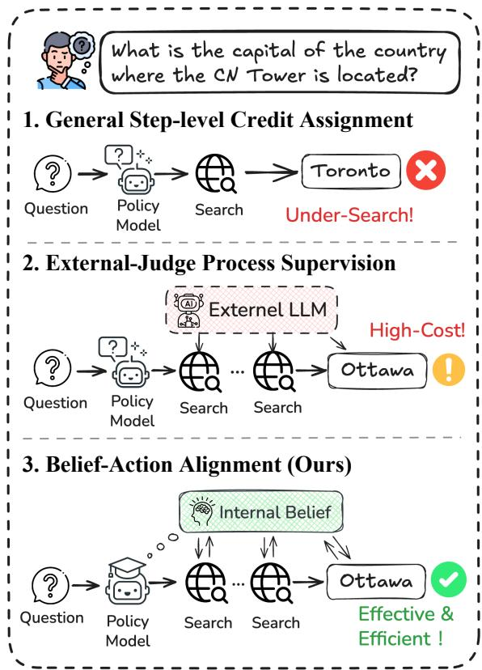  
Figure 1: Comparison of three supervision paradigms in RL-based agentic RAG. MetaRAG provides lightweight decision-level supervision by aligning each Search/Answer action with the policy model’s own belief about evidence sufficiency, improving boundary calibration.

A key challenge is boundary miscalibration. If the agent keeps retrieving when the current context is already sufficient, it incurs unnecessary cost and may introduce distracting evidence, termed as oversearch (Wu et al., 2025b; Qian et al., 2025). If it answers before the evidence is sufficient, it risks producing unreliable outputs, called under-search (Wu et al., 2025b; Shen et al., 2024). Existing RL-based methods address this issue from different angles, as shown in Figure 1. General step-level credit assignment methods estimate fine-grained advantages from trajectory returns or repeated states, which can suppress redundant retrieval but do not explicitly target premature answering (Guan et al., 2025; Feng et al., 2025). External-judge process supervision methods diagnose search behavior more directly with LLM judges or causal intervention, but rely on costly diagnostic procedures (Wu et al., 2025a; Zhang et al., 2026b).

Across these approaches, the SEARCH/ANSWER decision is supervised from the outside, while the agent’s internal belief about evidence sufficiency, i.e., the signal that should drive this decision, is left unused. As a result, the agent’s actions can drift away from its own beliefs, and such belief-action mismatches remain insufficiently addressed.

To address this gap, we propose to frame search decision quality as belief-action alignment. At each decision step, the agent’s action should match its own answerability belief, choosing ANSWER when it believes the current context is sufficient and SEARCH when it believes the evidence is still insufficient. Under this view, over-search and undersearch are two directions of the same mismatch between internal belief and actual action.

Building on this perspective, we introduce MetaRAG, a belief-action aligned training framework for agentic RAG. MetaRAG first uses Verifyfirst Action Generation, where the policy model verifies a proposed candidate action before committing to an actual SEARCH or ANSWER decision. It then performs Internal Belief Probing, an independent yes/no forward pass over the same question and history, to obtain a Belief Score P(Yes) − P(No). During training, this score is compared with the actual action to assign consistency credit, which is further gated by answer correctness to avoid rewarding internally consistent but incorrect trajectories. This design obtains its diagnostic signal from the policy model itself, covers both over-search and under-search, and requires no additional beliefprobing pass at inference time.

Experiments on seven public QA benchmarks show that MetaRAG consistently improves the accuracy–efficiency trade-off over strong RL-based agentic RAG baselines. Further analyses suggest that these gains are associated with better belief-action alignment: MetaRAG mitigates undersearch during training, benefits from both verifyfirst reasoning and correctness-gated consistency rewards, strengthens knowledge-boundary awareness, and generalizes to harder deep research settings as well as different optimizers and model backbones.

Our contributions are summarized as follows:

• We formulate search decision quality in agentic RAG as belief-action alignment, unifying over-search and under-search as two forms of SEARCH/ANSWER boundary mismatch.

• We propose MetaRAG, which consists of Verify-first Action Generation, Internal Belief Probing, and a correctness-gated consistency reward for scalable agentic RAG training without external judges.

• Extensive experiments demonstrate that MetaRAG improves answer accuracy, mitigates under-search, strengthens knowledgeboundary awareness, and generalizes across benchmarks, optimizers, and model backbones.

## 2 Related Work

Agentic RAG. Retrieval augmented generation grounds language model outputs with external evidence (Lewis et al., 2020), while agentic RAG further enables models to decide when and what to retrieve through multi-turn interaction. Early systems mainly rely on prompting or training-free reasoning patterns, such as interleaving reasoning and actions, decomposing questions into retrieval subgoals, or self-reflecting over retrieved evidence (Yao et al., 2022; Trivedi et al., 2023; Asai et al., 2024; Li et al., 2025). More recent work treats agentic RAG as a trainable decision-making problem. Outcome-supervised methods, such as Search-R1 (Jin et al., 2025) and ZeroSearch (Sun et al., 2025), optimize search agents with final answer rewards, but provide sparse guidance for intermediate Search/Answer decisions. Process-supervised methods introduce denser signals: HiPRAG (Wu et al., 2025a) and DAS (Zhang et al., 2026b) diagnose over-search and under-search using external LLM judges or causal intervention, while GiGPO (Feng et al., 2025), StepSearch (Wang et al.,

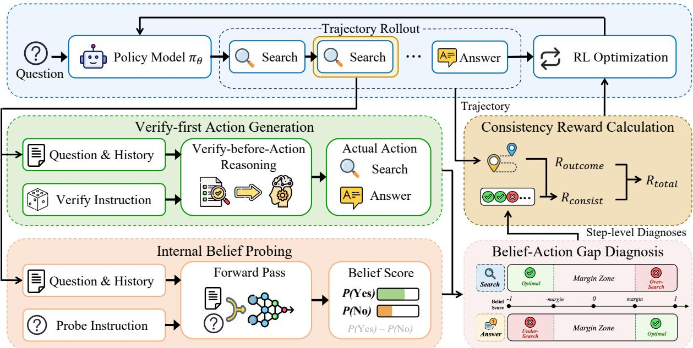  
Figure 2: Overview of MetaRAG. At each decision step, the policy model produces an Actual Action through Verify-first Action Generation, while Internal Belief Probing estimates a Belief Score from a separate yes/no Forward Pass. Belief-Action Gap Diagnosis maps the relation between the Belief Score and the Actual Action into a Step-level Diagnosis, and Consistency Reward Calculation combines $R _ { o u t c o m e }$ with $R _ { c o n s i s t }$ into $R _ { t o t a l }$ for training.

2025), and TREEPS-RAG (Zhang et al., 2026a) assign finer-grained credit from repeated states, subquestions, or rollout trees. MetaRAG is closest to process-supervised agentic RAG training, but differs by deriving a lightweight decision-level diagnostic from the policy model’s own answerability belief, rather than external judges or counterfactual trajectories.

## Adaptive Retrieval and Knowledge Boundaries.

A related line of work studies whether LLMs can assess their own knowledge boundaries and adapt retrieval accordingly. Prior methods use uncertainty, self-reflection, metacognitive regulation, or query complexity to trigger retrieval, critique evidence, revise responses, or route questions to different retrieval pipelines (Jiang et al., 2023; Asai et al., 2024; Zhou et al., 2024; Su et al., 2024; Jeong et al., 2024). These signals have also been studied for adaptive inference, model cascading, and abstention (Kadavath et al., 2022; Lin et al., 2022; Kuhn et al., 2023; Manakul et al., 2023; Dohan et al., 2022; Gupta et al., 2024; Wen et al., 2025; Chen et al., 2025a). Search Wisely (Wu et al., 2025b) is especially close to our setting: it proposes β-GRPO, which rewards correct trajectories whose generated search queries exceed a confidence threshold. However, this line of work mainly uses such signals for inference-time control, output revision, query routing, or search-query confidence scoring. In agentic RAG, the boundary is dynamic: after each retrieval step, the agent must decide whether the current question-history context is sufficient for answering. MetaRAG follows this decision-boundary perspective (Zhang et al., 2026b; Wu et al., 2025b,a), but operationalizes it as a training-time belief-action alignment signal: the policy model’s answerability belief is probed at each step and compared with its actual Search/Answer action to diagnose both over-search and under-search.

## 3 Methodology

In this section, we present MetaRAG, a beliefaction aligned training framework for agentic RAG. MetaRAG calibrates the SEARCH/ANSWER boundary by coupling two complementary signals: Verify-first Action Generation (§3.2) elicits an Actual Action after Verify-before-Action Reasoning, while Internal Belief Probing (§3.3) estimates whether the same model believes the current Question & History are answerable. Their mismatch is diagnosed as a belief-action gap (§3.4) and converted into a consistency reward (§3.5) for policy optimization. Figure 2 illustrates the overall workflow.

## 3.1 Task Definitions

Given a question q, an agentic RAG policy model $\pi _ { \theta }$ interacts with a retriever for at most T turns. At turn $t ,$ the decision context is $c _ { t } = \left( q , h _ { t } \right)$ , where $h _ { t }$ contains previous search history. The model emits an Actual Action $a _ { t }$ with action type $\alpha _ { t } \ \in$ {SEARCH, ANSWER}. If $\alpha _ { t } ~ = ~ \mathrm { S E A R C H } .$ , then $a _ { t } = { \tt S E A R C H } ( s _ { t } )$ and the retriever returns the top-K passages for query $s _ { t } . \mathrm { ~ I f ~ } \alpha _ { t } = \mathrm { A N S W E R }$ , then $a _ { t } = \mathsf { A N S W E R } \left( y _ { t } \right)$ and the episode terminates. A trajectory is denoted as $\tau = ( c _ { 1 } , a _ { 1 } , \dots , c _ { T _ { \tau } } , a _ { T _ { \tau } } )$ where $T _ { \tau } \leq T$

## 3.2 Verify-first Action Generation

At each decision step, MetaRAG first proposes a candidate action type α˜t ∈ {SEARCH, ANSWER} and then asks the policy model to perform Verifybefore-Action Reasoning before committing to its Actual Action. The input consists of the Question & History and the following Verify Instruction:

## Verify Instruction

Before making your own decision for this step, a candidate action is proposed as: {candidate\_decision}. You should first conduct reasoning, starting by verifying whether the proposed candidate action is appropriate for the current step, then determine the correct action.

The candidate action is a decision hypothesis rather than a forced label. The model may accept or reject it after verification, and the generated response contains both a verification rationale and the Actual Action $a _ { t }$ . We use this strategy during both training and inference to make evidence sufficiency explicit before each Search/Answer decision.

## 3.3 Internal Belief Probing

Internal Belief Probing estimates the model’s answerability belief independently of action generation. For the same context $c _ { t } = \left( q , h _ { t } \right)$ , we run one additional Forward Pass with the Question & History and the following Probe Instruction:

## Probe Instruction

Respond ONLY with ‘Yes’ or ‘No’ to indicate whether you are capable of answering the question confidently.

Let $\ell _ { t } ^ { Y }$ and $\ell _ { t } ^ { N }$ be the next-token logits of $\mathbf { \tilde { \Sigma } } ^ { 6 6 } \mathbf { Y } \mathrm { e } \mathbf { s } ^ { \prime }$ and $\mathbf { \tilde { \Delta } } ^ { 6 6 } \mathbf { N } \mathbf { 0 } ^ { 7 }$ . We normalize these two logits as

$$
P _ { t } ( \mathrm { Y e s } ) , P _ { t } ( \mathrm { N o } ) = \mathrm { s o f t m a x } ( \ell _ { t } ^ { Y } , \ell _ { t } ^ { N } ) ,\tag{1}
$$

and define the Belief Score as

$$
b _ { t } = P _ { t } ( { \mathrm { Y e s } } ) - P _ { t } ( { \mathrm { N o } } ) \in [ - 1 , 1 ] .\tag{2}
$$

A larger $b _ { t }$ indicates that the model believes the current context is more answerable. Since the probe uses the same policy model rather than an external verifier, it reflects the model’s own knowledge boundary. The belief probe is used only for training-time reward calculation; inference requires no additional probing Forward Pass. Appendix A further evaluates an Internal Confidence probe (Chen et al., 2025a), showing that MetaRAG is not tied to this particular yes/no logit implementation.

## 3.4 Belief-Action Gap Diagnosis

Belief-Action Gap Diagnosis compares the Belief Score with the Actual Action. Let $m \in [ 0 , 1 )$ be a margin. The regions $b _ { t } > m$ and $b _ { t } < - m$ indicate confident answerability and confident insufficiency, respectively, while $| b _ { t } | \leq m$ defines a Margin Zone where the belief signal is treated as inconclusive.

We define a binary consistency indicator $O t$ to assign positive consistency credit only when the Actual Action is aligned with a confident belief signal:

$$
o _ { t } = \left\{ \begin{array} { l l } { 1 , } & { b _ { t } > m , \ \alpha _ { t } = \mathrm { A N S W E R } , } \\ { 1 , } & { b _ { t } < - m , \ \alpha _ { t } = \mathrm { S E A R C H } , } \\ { 0 , } & { \mathrm { o t h e r w i s e } . } \end{array} \right.\tag{3}
$$

When $b _ { t } > m$ but $\alpha _ { t } = { \tt S E A R C H }$ , the step is diagnosed as OVER-SEARCH, since the model retrieves despite believing the current context is answerable. When $b _ { t } < - m$ but $\alpha _ { t } = \mathtt { A N S W E R }$ , the step is diagnosed as UNDER-SEARCH, since the model answers despite believing more evidence is needed. Steps with $o _ { t } ~ = ~ 1$ are diagnosed as OPTIMAL. Qualitative examples of both diagnoses are provided in Appendix B.

## 3.5 Consistency Reward Calculation

For a trajectory with Tτ identifiable decision steps, Consistency Reward Calculation aggregates Steplevel Diagnoses through the binary consistency indicators $\{ o _ { t } \} _ { t = 1 } ^ { T _ { \tau } }$

$$
R _ { c o n s i s t } ( \tau ) = \frac { 1 } { T _ { \tau } } \sum _ { t = 1 } ^ { T _ { \tau } } o _ { t } .\tag{4}
$$

<table><tr><td rowspan="3">Method</td><td colspan="6">Single-Hop QA</td><td colspan="8">Multi-Hop QA</td><td rowspan="3">Avg.</td></tr><tr><td colspan="2">NQ†</td><td colspan="2">TriviaQA*</td><td colspan="2">PopQA*</td><td colspan="2">HotpotQA†</td><td colspan="2">2Wiki*</td><td colspan="2">MuSiQue*</td><td colspan="2">Bamboogle*</td></tr><tr><td>Acc.</td><td>Searches</td><td>Acc.</td><td>Searches</td><td>Acc.</td><td>Searches</td><td>Acc. Searches</td><td>Acc.</td><td>Searches</td><td>Acc.</td><td>Searches</td><td>Acc.</td><td>Searches</td><td>Acc.</td></tr><tr><td colspan="2">Qwen2.5-3B-Instruct</td><td>1.55</td><td></td><td></td><td></td><td></td><td></td><td></td><td></td><td></td><td></td><td></td><td></td><td></td><td></td></tr><tr><td>Search-R1 39.7</td><td></td><td>56.5</td><td>1.53</td><td>39.1</td><td>1.75</td><td>33.1</td><td>2.78</td><td>31.0</td><td>3.38</td><td>12.4</td><td>3.39</td><td>23.2</td><td>2.79</td><td>33.6</td><td>2.45</td></tr><tr><td>HiPRAG</td><td>43.0</td><td>1.01</td><td>59.8</td><td>1.01</td><td>42.0</td><td>1.02</td><td>36.0 2.14</td><td>40.5</td><td>2.48</td><td>10.8</td><td>2.55</td><td>24.0</td><td>2.02</td><td>36.6</td><td>1.75</td></tr><tr><td>GiGPO</td><td>45.1</td><td>1.00</td><td>60.9</td><td>0.99</td><td>44.9</td><td>1.17</td><td>38.0</td><td>1.24 37.1</td><td>1.55</td><td>14.5</td><td>1.81</td><td>37.9</td><td>1.49</td><td>39.8</td><td>1.32</td></tr><tr><td>MetaRAG</td><td>45.6</td><td>1.17</td><td>62.8</td><td>1.19</td><td>48.0</td><td>1.27</td><td>41.3</td><td>1.58 39.1</td><td>1.87</td><td>15.9</td><td>2.24</td><td>39.5</td><td>1.90</td><td>41.7</td><td>1.60</td></tr><tr><td colspan="2">Qwen2.5-7B-Instruct</td><td></td><td></td><td></td><td></td><td></td><td></td><td></td><td></td><td></td><td></td><td></td><td></td><td></td><td></td></tr><tr><td>Search-R1</td><td>42.9</td><td>1.70</td><td>62.3</td><td>1.65</td><td>42.7</td><td>1.90</td><td>38.6 2.95</td><td>34.6</td><td>3.55</td><td>16.2</td><td>3.60</td><td>40.0</td><td>2.95</td><td>39.6</td><td>2.61</td></tr><tr><td>HiPRAG</td><td>46.5</td><td>1.80</td><td>65.8</td><td>1.79</td><td>45.8</td><td>1.88</td><td>42.0 2.28</td><td>46.1</td><td>2.54</td><td>14.0</td><td>2.59</td><td>40.0</td><td>2.30</td><td>42.9</td><td>2.17</td></tr><tr><td>GiGPO</td><td>46.8</td><td>0.96</td><td>65.8</td><td>0.71</td><td>48.1</td><td>1.14</td><td>42.3 1.20</td><td>42.9</td><td>1.40</td><td>18.2</td><td>2.09</td><td>43.2</td><td>1.22</td><td>43.9</td><td>1.25</td></tr><tr><td>MetaRAG</td><td>46.9</td><td>1.62</td><td>67.2</td><td>1.19</td><td>48.5</td><td>1.85</td><td>45.7</td><td>1.67 44.9</td><td>1.69</td><td>20.3</td><td>2.31</td><td>44.0</td><td>1.83</td><td>45.4</td><td>1.74</td></tr></table>

Table 1: Main results on seven public QA benchmarks. † and ⋆ indicate in-domain and out-of-domain datasets, respectively. Acc. denotes Exact Match (EM) accuracy (%), and Searches denotes the average number of search calls per question. Best and second-best accuracy values are bold and underlined. Results marked with ‡ are reproduced by us using the same retrieval setup; the remaining baseline results are taken from Xia et al. (2026).

We also compute the outcome reward $R _ { o u t c o m e } ( \tau ) \ = \ \mathbb { I } [ \mathrm { E M } ( \hat { y } , y ^ { * } ) ]$ , where $\hat { y }$ is the final answer and $y ^ { * }$ is the gold answer. The total reward is

$$
R _ { t o t a l } ( \tau ) = R _ { o u t c o m e } ( \tau ) \cdot ( 1 + \lambda R _ { c o n s i s t } ( \tau ) ) ,\tag{5}
$$

where λ controls the strength of belief-action alignment.

The multiplication by $R _ { o u t c o m e }$ gates the consistency reward with final correctness: an incorrect trajectory receives zero reward even if its Search/Answer decisions appear internally consistent. This prevents reward hacking through confidently stopping early, avoiding retrieval, or following an erroneous belief without solving the task. The resulting $R _ { t o t a l }$ is used as the scalar reward for downstream RL optimization. The full reward calculation procedure is provided in Algorithm 1 in Appendix C.

## 4 Experiments

## 4.1 Experiment Setup

Benchmarks. Following prior work, we evaluate on seven public QA benchmarks spanning two categories: (1) Single-Hop QA: NQ (Kwiatkowski et al., 2019), TriviaQA (Joshi et al., 2017), and PopQA (Mallen et al., 2022); (2) Multi-Hop QA: HotpotQA (Yang et al., 2018), 2Wiki (Ho et al., 2020), MuSiQue (Trivedi et al., 2022), and Bamboogle (Press et al., 2022). Following Search-R1 (Jin et al., 2025), we train on the merged NQ and HotpotQA training sets and evaluate on all seven datasets to assess both in-domain and out-ofdomain generalization.

Baselines. We compare MetaRAG with three representative RL-based agentic RAG baselines.

(1) Search-R1 (Jin et al., 2025) optimizes searchaugmented QA agents with sparse outcome rewards. (2) HiPRAG (Wu et al., 2025a) augments outcome supervision with hierarchical process rewards, where external LLM judges are used to detect over-search and under-search behaviors during training. (3) GiGPO (Feng et al., 2025) improves multi-turn agent training through group-in-group policy optimization, enabling fine-grained credit assignment at the step level. These baselines cover outcome-only supervision, external-judge process supervision, and general step-level credit assignment.

Implementation Details. We conduct experiments using Qwen2.5-3B-Instruct and Qwen2.5- 7B-Instruct. For retrieval, we follow Search-R1 (Jin et al., 2025), using the 2018 Wikipedia dump (Karpukhin et al., 2020) as the knowledge source, E5 (Wang et al., 2022) as the retriever, and returning the top-3 passages for each search query. For RL training, we adopt GRPO (Shao et al., 2024) with rollout group size N = 5 and a maximum of 4 turns. All experiments are conducted on a single node with 8 A100 GPUs. Unless otherwise specified, the candidate action type $\tilde { \alpha } _ { t }$ is sampled uniformly from {SEARCH, ANSWER}, the consistency reward weight λ is set to 0.1, and the margin m is set to 0.0. Full training settings and hyperparameter details are provided in Appendix D.

## 4.2 Main Results

Table 1 shows that MetaRAG consistently delivers the strongest overall performance across both backbone sizes. On Qwen2.5-3B-Instruct and Qwen2.5- 7B-Instruct, MetaRAG achieves average accuracies of 41.7% and 45.4%, outperforming the strongest baseline GiGPO by 1.9 and 1.5 points, respectively. Importantly, these gains do not come from simply increasing retrieval frequency. Compared with HiPRAG, which uses external LLM judges to supervise search behavior, MetaRAG achieves higher accuracy with fewer searches on both model sizes. Compared with GiGPO, MetaRAG performs more searches but obtains consistently better accuracy, including gains on all four multi-hop benchmarks. These results indicate that MetaRAG achieves a more favorable accuracy–efficiency trade-off among the evaluated RL-based agentic RAG methods, while the source of this improvement is examined in the following analyses. We further provide a same-setting comparison with β-GRPO (Wu et al., 2025b), an uncertainty-aware search-training method, in Appendix E. The framework is also compatible with GiGPO’s step-level credit assignment: MetaRAG (GiGPO) further improves the average accuracy to 43.1% and 47.0% on Qwen2.5- 3B-Instruct and Qwen2.5-7B-Instruct, respectively (Appendix F).

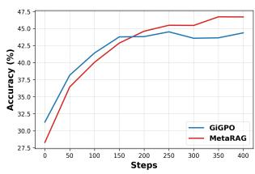

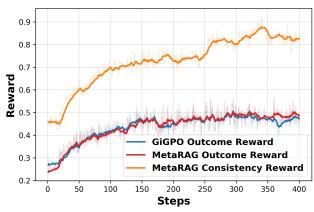

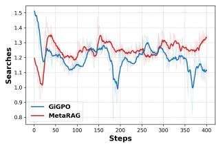

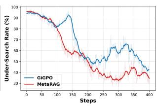  
Figure 3: Training dynamics on Qwen2.5-3B-Instruct. Solid lines denote exponential moving averages in all panels except the Accuracy panel. From left to right, the panels show accuracy, rewards, average search count, and under-search rate. MetaRAG initially trails GiGPO without SFT warm-up for the new verify-before-action reasoning pattern, but later surpasses it in both accuracy and outcome reward. Its consistency reward increases steadily, and its under-search rate remains mostly lower after about 100 steps.

<table><tr><td>Variant</td><td>Acc.</td><td>Searches</td></tr><tr><td>Core Components</td><td></td><td></td></tr><tr><td>w/o Consistency Reward</td><td>41.9</td><td>2.14</td></tr><tr><td>w/o Verify-before-Action</td><td>40.4</td><td>1.38</td></tr><tr><td>Diagnostic Signal</td><td></td><td></td></tr><tr><td>Over-Search Only</td><td>41.3</td><td>1.33</td></tr><tr><td>Under-Search Only</td><td>42.4</td><td>2.56</td></tr><tr><td>w/ Incorrect Trajectories</td><td>39.6</td><td>1.12</td></tr><tr><td>Candidate Strategy</td><td></td><td></td></tr><tr><td>Always SEARCH</td><td>41.1</td><td>1.77</td></tr><tr><td>Always ANSWER</td><td>41.1</td><td>1.62</td></tr><tr><td>Heuristic</td><td>41.2</td><td>1.46</td></tr><tr><td>w/MetaRAG</td><td>41.7</td><td>1.60</td></tr></table>

Table 2: Ablation study on Qwen2.5-3B-Instruct. Results are averaged over seven QA benchmarks.

## 4.3 Training Dynamics

Figure 3 shows the training dynamics on Qwen2.5- 3B-Instruct. MetaRAG starts below GiGPO in accuracy, likely because Verify-first Action Generation introduces a new reasoning pattern without SFT warm-up. After the policy adapts, MetaRAG overtakes GiGPO around the middle of training and converges to higher accuracy. The outcome reward largely mirrors this trend: GiGPO is higher in the first ∼175 steps, while MetaRAG becomes higher from roughly 175 to 400 steps. Meanwhile, the consistency reward steadily increases, suggesting that the belief-action signal provides a stable auxiliary training signal. Although MetaRAG generally uses a moderately larger search budget than GiGPO, its under-search rate falls below GiGPO after about 100 steps and remains mostly lower thereafter. Here, under-search rate is a trainingtime belief-based diagnostic, measuring answer steps where the model chooses ANSWER while its Belief Score indicates insufficient answerability $( b _ { t } < - m )$ . To avoid relying only on this internal signal, we further conduct an external LLM-asjudge validation on test trajectories in Appendix G; the same trend holds under this external assessment. Together with the qualitative comparison in Appendix H, these results indicate that the additional retrieval is associated with fewer premature answer actions, consistent with the stronger accuracy–efficiency trade-off observed in Table 1.

## 4.4 Ablation Study

We validate the main design choices of MetaRAG on Qwen2.5-3B-Instruct, with all results averaged across seven QA benchmarks. Detailed per-dataset results are provided in Appendix I.

Core Components. The top block of Table 2 shows that both the consistency reward and verify-before-action are necessary for a favorable accuracy–efficiency trade-off. Removing the consistency reward slightly increases accuracy but raises the average number of searches from 1.60 to 2.14, indicating that verify-first reasoning alone tends to solve questions through more aggressive retrieval. Removing verify-before-action reduces accuracy to 40.4%, showing that the verification step is not merely a prompt-level addition but provides the decision context in which belief-action alignment becomes effective. We further isolate the inference-time effect of verify-first prompting in Appendix J. Adding the same verify-first inference format to GiGPO does not improve performance, while MetaRAG remains strong even when verifyfirst reasoning is disabled at inference, suggesting that the gains are not simply due to a stronger inference prompt.

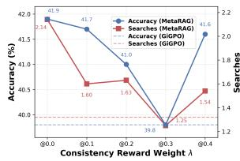

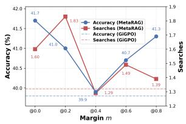  
Figure 4: Hyperparameter sensitivity on Qwen2.5- 3B-Instruct. Left: consistency reward weight λ. Right: margin m. Dashed lines indicate GiGPO.

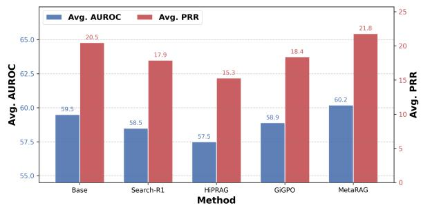  
Figure 5: Perplexity-based knowledge-boundary awareness attribution on Qwen2.5-7B-Instruct. We report average AUROC and PRR over GSM8K, SciQ, and TriviaQA. Higher values indicate stronger separation between answerable and non-answerable queries.

Diagnostic Signal. The middle block of Table 2 examines which diagnostic signals should contribute to the consistency reward. Over-Search Only1 yields a frugal but less accurate policy, suggesting that suppressing redundant retrieval alone can make the model overly conservative. Under-

Search Only achieves the highest ablation accuracy, but requires substantially more searches, reflecting the opposite bias toward retrieval. Including Incorrect Trajectories is the most damaging variant, dropping accuracy to 39.6%, which confirms the need for outcome gating: consistency credit should reinforce belief-action alignment only when the trajectory also solves the task.

Candidate Strategy. The bottom block of Table 2 compares different ways of constructing the candidate action in Verify-first Action Generation. Always proposing SEARCH or ANSWER underperforms the default random strategy. The heuristic strategy uses the previous non-terminal action as the candidate decision—typically SEARCH, since an ANSWER action terminates the episode—and switches to ANSWER at the maximum turn. Although this hand-crafted continuation/termination prior reduces searches, it also lowers accuracy, suggesting that random candidates provide a more balanced verification process by exposing the model to both sides of the SEARCH/ANSWER boundary.

## 4.5 Hyperparameter Sensitivity

Figure 4 studies the consistency reward weight λ and margin m. Across the tested ranges, MetaRAG’s accuracy is almost always higher than GiGPO, indicating that the method is not tied to a brittle hyperparameter choice. For λ, the default value 0.1 offers a strong trade-off: it substantially reduces searches compared with λ = 0 while preserving similar accuracy, whereas larger weights make the trade-off less stable. For the margin, m = 0.0 achieves the best accuracy, but larger margins (e.g., m = 0.8) can still perform strongly. This non-monotonic pattern suggests a coverage–reliability trade-off in belief signals: using all signed belief signals maximizes supervision, while wider Margin Zones filter uncertain signals but may discard useful boundary information. Detailed per-dataset results are provided in Appendix K.

## 4.6 Attribution Analysis

To understand why belief-action alignment improves the search–answer trade-off, we examine how RL training affects the model’s knowledgeboundary awareness. Following uncertainty evaluation in Chen et al. (2025a), we use Perplexity (Fomicheva et al., 2020) as a diagnostic signal to distinguish answerable from non-answerable queries and report the Area Under the Receiver Operating Characteristic Curve (AUROC) and Prediction Rejection Ratio (PRR), averaged over GSM8K (Cobbe et al., 2021), SciQ (Welbl et al., 2017), and TriviaQA (Joshi et al., 2017). As shown in Figure 5, standard agentic RAG training tends to weaken this boundary signal: Search-R1, HiPRAG, and GiGPO all fall below the base model in both AUROC and PRR. In contrast, MetaRAG achieves the best results, improving over the base model from 59.5 to 60.2 in AUROC and from 20.5 to 21.8 in PRR. This suggests that MetaRAG’s gains are not solely due to changing search frequency; its belief-action consistency reward also helps retain and strengthen the uncertainty signal that separates when the model can answer from when retrieval is needed. Detailed per-dataset results, including an additional attentional-entropy diagnostic, are provided in Appendix L.

<table><tr><td>Method</td><td>Acc. (%)</td><td>Rec. (%)</td><td>Searches</td></tr><tr><td>Qwen3-32B Base</td><td>3.61</td><td>3.12</td><td>0.92</td></tr><tr><td>Qwen2.5-7B-Instruct</td><td></td><td></td><td></td></tr><tr><td></td><td></td><td></td><td>2.38</td></tr><tr><td>Search-R1 HiPRAG</td><td>1.45 1.69</td><td>2.78 2.71</td><td>2.62</td></tr><tr><td>GiGPO</td><td>2.65</td><td>3.10</td><td>2.32</td></tr><tr><td></td><td></td><td></td><td></td></tr><tr><td>MetaRAG</td><td>3.49</td><td>3.73</td><td>3.14</td></tr></table>

Table 3: Zero-shot transfer to BrowseComp-Plus with BM25 retriever. Acc. denotes answer accuracy, Rec. denotes evidence recall, and Searches denotes the average number of search calls per question. Best and second-best Acc./Rec. values are bold and underlined.

## 4.7 Zero-shot Transfer to BrowseComp-Plus

Table 3 evaluates zero-shot transfer to BrowseComp-Plus, a challenging deep research benchmark that requires more extensive information seeking than standard QA datasets (Chen et al., 2025b). All Qwen2.5-7B-Instruct agents are trained only on the original QA training data and are tested with BM25 retriever. Among 7B search agents, MetaRAG achieves the best accuracy and recall, improving over GiGPO from 2.65% to 3.49% in accuracy and from 3.10% to 3.73% in recall. It also approaches the accuracy of the stronger Qwen3-32B base model while achieving the highest recall overall. Although MetaRAG uses more searches than other 7B agents, this behavior is appropriate for a harder deep research setting: instead of enforcing a uniformly frugal policy, MetaRAG preserves retrieval when it believes more evidence is needed, yielding stronger zero-shot accuracy and recall.

<table><tr><td>Setting</td><td>Method</td><td>Acc.</td><td>Searches</td></tr><tr><td colspan="4">RL Optimizer on Qwen2.5-3B-Instruct</td></tr><tr><td>GRPO</td><td>GiGPO</td><td>39.8</td><td>1.32</td></tr><tr><td>GRPO</td><td>MetaRAG</td><td>41.7</td><td>1.60</td></tr><tr><td>DAPO</td><td>GiGPO</td><td>44.8</td><td>2.31</td></tr><tr><td>DAPO</td><td>MetaRAG</td><td>45.7</td><td>2.51</td></tr><tr><td>PPO</td><td>MetaRAG</td><td>41.1</td><td>1.45</td></tr><tr><td colspan="4">Backbone and Model Size with GRPO</td></tr><tr><td>Llama3.2-3B</td><td>GiGPO</td><td>41.7</td><td>1.05</td></tr><tr><td>Llama3.2-3B</td><td>MetaRAG</td><td>42.9</td><td>1.18</td></tr><tr><td>Qwen3-14B</td><td>GiGPO</td><td>45.6</td><td>1.05</td></tr><tr><td>Qwen3-14B</td><td>MetaRAG</td><td>46.5</td><td>1.36</td></tr></table>

Table 4: Robustness across training settings. Results are averaged over seven QA benchmarks. Llama3.2-3B denotes Llama-3.2-3B-Instruct.

## 4.8 Robustness across Training Settings

Table 4 examines whether the gains of MetaRAG depend on a specific optimizer or backbone. With the default GRPO optimizer, MetaRAG improves over GiGPO by 1.9 points on Qwen2.5-3B-Instruct. The advantage also holds under DAPO (Yu et al., 2025), where MetaRAG further improves accuracy from 44.8% to 45.7%. Since GiGPO is itself a group-based RL method and does not have a direct PPO (Schulman et al., 2017) counterpart, we additionally instantiate MetaRAG with PPO as an unpaired robustness check; the resulting accuracy remains competitive at 41.1%. Across model families and sizes, MetaRAG consistently outperforms GiGPO on both Llama3.2-3B and Qwen3-14B. These results indicate that belief-action alignment functions as a robust reward-design principle for agentic RAG, rather than an optimization artifact of the default GRPO/Qwen2.5 setting. Detailed per-dataset results are provided in Appendix M.

## 5 Conclusion

We presented MetaRAG, a belief-action aligned training framework for agentic RAG. Instead of relying on external process supervision, MetaRAG probes the policy model’s own answerability belief and compares it with each Search/Answer action. The resulting correctness-gated consistency reward provides lightweight training-time guidance for both over-search and under-search, without inference-time belief probing. Experiments on seven QA benchmarks show that MetaRAG consistently improves the accuracy–efficiency tradeoff over strong RL-based agentic RAG baselines. Further analyses indicate that the gains are associated with better calibrated search behavior. MetaRAG mitigates premature answering, strengthens knowledge-boundary awareness, and transfers to harder deep research settings. Additional robustness experiments across optimizers and model backbones suggest that belief-action alignment is a robust reward-design principle for training search agents, rather than an artifact of a specific optimization or model setup.

## Limitations

MetaRAG introduces additional training-time computation. Although the belief probe is lightweight and avoids external LLM judges, it still requires an extra forward pass during reward calculation, and verify-first reasoning also increases generation length. As detailed in Appendix N, MetaRAG is substantially faster than HiPRAG in training, but remains slower than GiGPO. At inference time, the belief probe is not used, but verify-first reasoning can still produce longer per-turn responses and slightly higher latency than GiGPO.

Our experiments focus on QA-oriented agentic RAG with Search/Answer decisions. MetaRAG does not directly supervise the lexical quality of search queries, the faithfulness of generated rationales, or more complex tool-use actions beyond retrieval and answering. Extending beliefaction alignment to richer agent settings with multiple tools, open-ended browsing actions, and longhorizon planning remains an important direction for future work.

## Ethical Considerations

In this work, we introduce a framework to improve the SEARCH/ANSWER decision boundary of agentic RAG systems. While better retrieval decision-making can benefit knowledge-intensive applications, more capable search agents may also be misused for large-scale information gathering, surveillance, or misinformation generation. Our experiments are conducted on established public QA and research benchmarks, and do not involve personally identifiable information or private user data. Nevertheless, practical deployments should ensure that retrieval corpora are legally obtained, access-controlled when necessary, and paired with appropriate safeguards for high-stakes use cases.

## Acknowledgements

This work was supported by the National Natural Science Foundation of China under Grant 42394060 and 42394064, and Ant Group Research Fund.

## References

Akari Asai, Zeqiu Wu, Yizhong Wang, Avi Sil, and Hannaneh Hajishirzi. 2024. Self-rag: Learning to retrieve, generate, and critique through self-reflection. In International conference on learning representations, volume 2024, pages 9112–9141.

Lihu Chen, Gerard de Melo, Fabian M Suchanek, and GaÃGl Varoquaux. 2025a. Query-level uncertainty in large language models. arXiv preprint arXiv:2506.09669.

Zijian Chen, Xueguang Ma, Shengyao Zhuang, Ping Nie, Kai Zou, Andrew Liu, Joshua Green, Kshama Patel, Ruoxi Meng, Mingyi Su, and 1 others. 2025b. Browsecomp-plus: A more fair and transparent evaluation benchmark of deep-research agent. arXiv preprint arXiv:2508.06600.

Karl Cobbe, Vineet Kosaraju, Mohammad Bavarian, Mark Chen, Heewoo Jun, Lukasz Kaiser, Matthias Plappert, Jerry Tworek, Jacob Hilton, Reiichiro Nakano, and 1 others. 2021. Training verifiers to solve math word problems. arXiv preprint arXiv:2110.14168.

David Dohan, Winnie Xu, Aitor Lewkowycz, Jacob Austin, David Bieber, Raphael Gontijo Lopes, Yuhuai Wu, Henryk Michalewski, Rif A Saurous, Jascha Sohl-Dickstein, and 1 others. 2022. Language model cascades. arXiv preprint arXiv:2207.10342.

Jinhao Duan, Hao Cheng, Shiqi Wang, Alex Zavalny, Chenan Wang, Renjing Xu, Bhavya Kailkhura, and Kaidi Xu. 2024. Shifting attention to relevance: Towards the predictive uncertainty quantification of freeform large language models. In Proceedings of the 62nd Annual Meeting of the Association for Computational Linguistics (Volume 1: Long Papers), pages 5050–5063.

Lang Feng, Zhenghai Xue, Tingcong Liu, and Bo An. 2025. Group-in-group policy optimization for llm agent training. arXiv preprint arXiv:2505.10978.

Marina Fomicheva, Shuo Sun, Lisa Yankovskaya, Frédéric Blain, Francisco Guzmán, Mark Fishel, Nikolaos Aletras, Vishrav Chaudhary, and Lucia Specia. 2020. Unsupervised quality estimation for neural machine translation. Transactions ofthe Association for Computational Linguistics, 8:539–555.

Xinyan Guan, Jiali Zeng, Fandong Meng, Chunlei Xin, Yaojie Lu, Hongyu Lin, Xianpei Han, Le Sun, and Jie Zhou. 2025. Deeprag: Thinking to retrieve step by step for large language models. arXiv preprint arXiv:2502.01142.

Neha Gupta, Harikrishna Narasimhan, Wittawat Jitkrittum, Ankit Singh Rawat, Aditya Krishna Menon, and Sanjiv Kumar. 2024. Language model cascades: Token-level uncertainty and beyond. arXiv preprint arXiv:2404.10136.

Xanh Ho, Anh-Khoa Duong Nguyen, Saku Sugawara, and Akiko Aizawa. 2020. Constructing a multi-hop qa dataset for comprehensive evaluation of reasoning steps. arXiv preprint arXiv:2011.01060.

Soyeong Jeong, Jinheon Baek, Sukmin Cho, Sung Ju Hwang, and Jong C Park. 2024. Adaptive-rag: Learning to adapt retrieval-augmented large language models through question complexity. In Proceedings of the 2024 Conference of the North American Chapter of the Association for Computational Linguistics: Human Language Technologies (Volume 1: Long Papers), pages 7036–7050.

Zhengbao Jiang, Frank F Xu, Luyu Gao, Zhiqing Sun, Qian Liu, Jane Dwivedi-Yu, Yiming Yang, Jamie Callan, and Graham Neubig. 2023. Active retrieval augmented generation. In Proceedings ofthe 2023 conference on empirical methods in natural language processing, pages 7969–7992.

Bowen Jin, Hansi Zeng, Zhenrui Yue, Dong Wang, Hamed Zamani, and Jiawei Han. 2025. Search-R1: Training LLMs to reason and leverage search engines with reinforcement learning. arXiv preprint arXiv:2503.09516.

Mandar Joshi, Eunsol Choi, Daniel S Weld, and Luke Zettlemoyer. 2017. TriviaQA: A large scale distantly supervised challenge dataset for reading comprehension. arXiv preprint arXiv:1705.03551.

Saurav Kadavath, Tom Conerly, Amanda Askell, Tom Henighan, Dawn Drain, Ethan Perez, Nicholas Schiefer, Zac Hatfield-Dodds, Nova DasSarma, Eli Tran-Johnson, and 1 others. 2022. Language models (mostly) know what they know. arXiv preprint arXiv:2207.05221.

Vladimir Karpukhin, Barlas Oguz, Sewon Min, Patrick Lewis, Ledell Wu, Sergey Edunov, Danqi Chen, and Wen-tau Yih. 2020. Dense passage retrieval for opendomain question answering. In Proceedings of the 2020 conference on empirical methods in natural language processing (EMNLP), pages 6769–6781.

Lorenz Kuhn, Yarin Gal, and Sebastian Farquhar. 2023. Semantic uncertainty: Linguistic invariances for uncertainty estimation in natural language generation. arXiv preprint arXiv:2302.09664.

Tom Kwiatkowski, Jennimaria Palomaki, Olivia Redfield, Michael Collins, Ankur Parikh, Chris Alberti, Danielle Epstein, Illia Polosukhin, Jacob Devlin, Kenton Lee, and 1 others. 2019. Natural questions: a benchmark for question answering research. Transactions of the Association for Computational Linguistics, 7:453–466.

Patrick Lewis, Ethan Perez, Aleksandra Piktus, Fabio Petroni, Vladimir Karpukhin, Naman Goyal, Heinrich Küttler, Mike Lewis, Wen-tau Yih, Tim Rocktäschel, and 1 others. 2020. Retrieval-augmented generation for knowledge-intensive nlp tasks. Advances in neural information processing systems, 33:9459– 9474.

Xiaoxi Li, Guanting Dong, Jiajie Jin, Yuyao Zhang, Yujia Zhou, Yutao Zhu, Peitian Zhang, and Zhicheng Dou. 2025. Search-o1: Agentic search-enhanced large reasoning models. In Proceedings ofthe 2025 Conference on Empirical Methods in Natural Language Processing, pages 5420–5438.

Stephanie Lin, Jacob Hilton, and Owain Evans. 2022. Teaching models to express their uncertainty in words. arXiv preprint arXiv:2205.14334.

Alex Mallen, Akari Asai, Victor Zhong, Rajarshi Das, Daniel Khashabi, and Hannaneh Hajishirzi. 2022. When not to trust language models: Investigating effectiveness of parametric and non-parametric memories. arXiv preprint arXiv:2212.10511.

Potsawee Manakul, Adian Liusie, and Mark Gales. 2023. Selfcheckgpt: Zero-resource black-box hallucination detection for generative large language models. In Proceedings of the 2023 conference on empirical methods in natural language processing, pages 9004– 9017.

Ofir Press, Muru Zhang, Sewon Min, Ludwig Schmidt, Noah A Smith, and Mike Lewis. 2022. Measuring and narrowing the compositionality gap in language models. arXiv preprint arXiv:2210.03350.

Cheng Qian, Emre Can Acikgoz, Hongru Wang, Xiusi Chen, Avirup Sil, Dilek Hakkani-Tur, Gokhan Tur, and Heng Ji. 2025. Smart: Self-aware agent for tool overuse mitigation. In Findings ofthe Associationfor Computational Linguistics: ACL 2025, pages 4604– 4621.

John Schulman, Filip Wolski, Prafulla Dhariwal, Alec Radford, and Oleg Klimov. 2017. Proximal policy optimization algorithms. arXiv preprint arXiv:1707.06347.

Zhihong Shao, Peiyi Wang, Qihao Zhu, Runxin Xu, Junxiao Song, Xiao Bi, Haowei Zhang, Mingchuan Zhang, YK Li, Y Wu, and 1 others. 2024. DeepSeek-Math: Pushing the limits of mathematical reasoning in open language models. arXiv preprint arXiv:2402.03300.

Yuanhao Shen, Xiaodan Zhu, and Lei Chen. 2024. Smartcal: An approach to self-aware tool-use evaluation and calibration. In Proceedings of the 2024 Conference on Empirical Methods in Natural Language Processing: Industry Track, pages 774–789.

Weihang Su, Yichen Tang, Qingyao Ai, Zhijing Wu, and Yiqun Liu. 2024. Dragin: Dynamic retrieval augmented generation based on the real-time information needs of large language models. In Proceedings

of the 62nd Annual Meeting of the Association for Computational Linguistics (Volume 1: Long Papers), pages 12991–13013.

Hao Sun, Zile Qiao, Jiayan Guo, Xuanbo Fan, Yingyan Hou, Yong Jiang, Pengjun Xie, Fei Huang, and Yan Zhang. 2025. ZeroSearch: Incentivize the search capability of llms without searching. arXiv preprint arXiv:2505.04588.

Harsh Trivedi, Niranjan Balasubramanian, Tushar Khot, and Ashish Sabharwal. 2022. MuSiQue: Multihop questions via single-hop question composition. Transactions of the Association for Computational Linguistics, 10:539–554.

Harsh Trivedi, Niranjan Balasubramanian, Tushar Khot, and Ashish Sabharwal. 2023. Interleaving retrieval with chain-of-thought reasoning for knowledgeintensive multi-step questions. In Proceedings of the 61st annual meeting ofthe associationfor computational linguistics (volume 1: long papers), pages 10014–10037.

Liang Wang, Nan Yang, Xiaolong Huang, Binxing Jiao, Linjun Yang, Daxin Jiang, Rangan Majumder, and Furu Wei. 2022. Text embeddings by weaklysupervised contrastive pre-training. arXiv preprint arXiv:2212.03533.

Ziliang Wang, Xuhui Zheng, Kang An, Cijun Ouyang, Jialu Cai, Yuhang Wang, and Yichao Wu. 2025. StepSearch: Igniting LLMs search ability via stepwise proximal policy optimization. arXiv preprint arXiv:2505.15107.

Johannes Welbl, Nelson F Liu, and Matt Gardner. 2017. Crowdsourcing multiple choice science questions. In Proceedings of the 3rd Workshop on Noisy Usergenerated Text, pages 94–106.

Bingbing Wen, Jihan Yao, Shangbin Feng, Chenjun Xu, Yulia Tsvetkov, Bill Howe, and Lucy Lu Wang. 2025. Know your limits: A survey of abstention in large language models. Transactions ofthe Associationfor Computational Linguistics, 13:529–556.

Peilin Wu, Mian Zhang, Kun Wan, Wentian Zhao, Kaiyu He, Xinya Du, and Zhiyu Chen. 2025a. Hiprag: hierarchical process rewards for efficient agentic retrieval augmented generation. arXiv preprint arXiv:2510.07794.

Peilin Wu, Mian Zhang, Xinlu Zhang, Xinya Du, and Zhiyu Chen. 2025b. Search wisely: Mitigating suboptimal agentic searches by reducing uncertainty. In Proceedings of the 2025 Conference on Empirical Methods in Natural Language Processing, pages 19734–19745.

Tianle Xia, Ming Xu, Lingxiang Hu, Yiding Sun, Wenwei Li, Linfang Shang, Liqun Liu, Peng Shu, Huan Yu, and Jie Jiang. 2026. Search-p1: Path-centric reward shaping for stable and efficient agentic rag training. arXiv preprint arXiv:2602.22576.

Zhilin Yang, Peng Qi, Saizheng Zhang, Yoshua Bengio, William W Cohen, Ruslan Salakhutdinov, and Christopher D Manning. 2018. HotpotQA: A dataset for diverse, explainable multi-hop question answering. arXiv preprint arXiv:1809.09600.

Shunyu Yao, Jeffrey Zhao, Dian Yu, Nan Du, Izhak Shafran, Karthik Narasimhan, and Yuan Cao. 2022. React: Synergizing reasoning and acting in language models. arXiv preprint arXiv:2210.03629.

Qiying Yu, Zheng Zhang, Ruofei Zhu, Yufeng Yuan, Xiaochen Zuo, Yu Yue, Tiantian Fan, Gaohong Liu, Lingjun Liu, Xin Liu, and 1 others. 2025. DAPO: An open-source LLM reinforcement learning system at scale. arXiv preprint arXiv:2503.14476.

Tianhua Zhang, Kun Li, Junan Li, Yunxiang Li, Hongyin Luo, Xixin Wu, James Glass, and Helen Meng. 2026a. Treeps-rag: Tree-based process supervision for reinforcement learning in agentic rag. arXiv preprint arXiv:2601.06922.

Wenlin Zhang, Kuicai Dong, Junyi Li, Yingyi Zhang, Xiaopeng Li, Pengyue Jia, Yi Wen, Derong Xu, Maolin Wang, Yichao Wang, and 1 others. 2026b. To search or not to search: Aligning the decision boundary of deep search agents via causal intervention. In Proceedings of the ACM Web Conference 2026, pages 2049–2059.

Yujia Zhou, Zheng Liu, Jiajie Jin, Jian-Yun Nie, and Zhicheng Dou. 2024. Metacognitive retrievalaugmented large language models. In Proceedings of the ACM Web Conference 2024, pages 1453–1463.

## A Robustness to Alternative Belief Probes

To examine whether MetaRAG is tied to the simple $P ( \mathrm { Y e s } ) - P ( \mathrm { N o } )$ belief probe, we replace it with a stronger uncertainty estimator, Internal Confidence (Chen et al., 2025a). Unlike the last-token yes/no probability used in the main experiments, Internal Confidence aggregates self-evaluation signals across internal layers and token positions. Given its confidence score $u _ { t } \in [ 0 , 1 ]$ , we use a threshold $\eta = 0 . 5$ to determine answerability: a step is treated as answerable when $u _ { t } \ \geq \ \eta$ and insufficient otherwise. The consistency reward is then computed with the same belief-action alignment rule as in the main method.

Table 5 shows that replacing the default belief probe with Internal Confidence improves the average accuracy from 41.7% to 42.5%. The gain is observed on most benchmarks, including NQ, PopQA, HotpotQA, 2Wiki, and MuSiQue. This indicates that the effectiveness of belief-action alignment is not specific to the last-token $P ( \mathrm { Y e s } ) - P ( \mathrm { N o } )$ implementation. Stronger belief probes can be plugged into the same reward framework and may provide better supervision, at the cost of slightly more retrieval.

## B Case Study: Belief-Action Gap Diagnosis

We further examine whether the proposed Belief-Action Gap Diagnosis can identify both types of suboptimal retrieval behavior using cases from a GiGPO-trained Qwen2.5-3B-Instruct agent. With the default margin $m = 0 ,$ , a positive Belief Score indicates that the model believes the current context is answerable, while a negative Belief Score indicates that more evidence is needed. Therefore, a positive belief followed by SEARCH is diagnosed as OVER-SEARCH, and a negative belief followed by ANSWER is diagnosed as UNDER-SEARCH.

Case: Over-Search. Figure 6 shows an oversearch trajectory. After the first retrieval, the correct answer is already present: Doc 2 identifies Toby Kebbell as an English actor known for Dead Man’s Shoes (2004) and Doc 3 confirms that he starred in Kong: Skull Island. Despite a strongly positive Belief Score, the agent continues searching and pivots to Tom Hiddleston, eventually producing an unsupported wrong answer.

Case: Under-Search. Figure 7 shows the opposite failure mode. The agent retrieves the guitarist’s identity, Vivian Campbell, but not his nationality. The Belief Score is negative, indicating insufficient answerability, yet the agent answers by transferring the band’s nationality to the guitarist. This is correctly diagnosed as UNDER-SEARCH.

Algorithm 1 Reward calculation in MetaRAG   
Require: Question $q ,$ gold answer $y ^ { * }$ , policy   
model $\pi _ { \theta } .$ , retriever $\mathcal { R } _ { : }$ margin m, weight λ   
1: Rollout a trajectory $\tau = ( c _ { 1 } , a _ { 1 } , \dots , c _ { T _ { \tau } } , a _ { T _ { \tau } } )$   
with Verify-first Action Generation.   
2: Extract the final answer $\hat { y }$ and action types   
$\{ \alpha _ { t } \} _ { t = 1 } ^ { T _ { \tau } }$ from $\tau .$   
3: for each decision step $t = 1 , \dots , T _ { \tau }$ do   
4: Run Internal Belief Probing with Question   
& History.   
5: Compute Belief Score $b _ { t } ~ = ~ P _ { t } ( \mathrm { Y e s } )$   
$P _ { t } ( \mathrm { N o } ) .$   
6: if $b _ { t } > m$ and $\alpha _ { t } = \mathbf { A }$ NSWER then   
7: $o _ { t } \gets 1$ ▷ OPTIMAL   
8: else if $b _ { t } < - m$ and $\alpha _ { t } = \mathbf { S }$ EARCH then   
9: $o _ { t } \gets 1$ ▷ OPTIMAL   
10: else if $b _ { t } > m$ and $\alpha _ { t } = \mathrm { S E A }$ RCH then   
11: $o _ { t } \gets 0$ ▷ OVER-SEARCH   
12: else if $b _ { t } < - m$ and $\alpha _ { t } = \mathbf { A } \mathbf { N } \mathbf { S } \mathbf { W } \mathbf { E } \mathbf { R }$ then   
13: $o _ { t } \gets 0$ ▷ UNDER-SEARCH   
14: else   
15: $o _ { t } \gets 0$ ▷ Margin Zone   
16: end if   
17: end for   
18: $\begin{array} { r } { R _ { c o n s i s t }  T _ { \tau } ^ { - 1 } \sum _ { t = 1 } ^ { T _ { \tau } } o _ { t } . } \end{array}$   
19: $R _ { o u t c o m e } \gets \mathbb { I } [ \mathrm { E M } ( \hat { y } , y ^ { * } ) ] .$   
20: $R _ { t o t a l }  R _ { o u t c o m e } \cdot ( 1 + \lambda R _ { c o n s i s t } ) .$   
21: return $R _ { t o t a l }$ for downstream RL optimiza  
tion.

## C Pseudocode for Reward Calculation

Algorithm 1 summarizes the reward calculation procedure of MetaRAG, covering Verify-first Action Generation, Internal Belief Probing, Belief-Action Gap Diagnosis, and Consistency Reward Calculation.

## D Experiment Details

## D.1 Details of Training

Hyperparameters. The maximum prompt length is 4096 tokens, and the maximum response length is 512 tokens. The max turn is set to 4. The learning rate is 1e-6 for the actor. We adopt a rulebased reward, assigning a reward of 1 for success and 0 for failure. Invalid actions are penalized with a reward of -0.01. We set the training batch size to 256 and use a rollout group size of 5. Rollout and validation temperatures are set to 1.0 and 0.0, respectively. The mini-batch size is 512, and the KL penalty coefficient is set to 0.001. Unless otherwise specified, the candidate action type α˜t is sampled uniformly from {SEARCH, ANSWER}, the consistency reward weight λ is set to 0.1, and the margin m is set to 0.0.

<table><tr><td rowspan="3">Belief Probe</td><td colspan="6">Single-Hop QA</td><td colspan="8">Multi-Hop QA</td><td rowspan="3">Avg.</td></tr><tr><td colspan="2">NQ†</td><td colspan="2">TriviaQA*</td><td colspan="2">PopQA*</td><td colspan="2">HotpotQA†</td><td colspan="2">2Wiki*</td><td colspan="2">MuSiQue*</td><td colspan="2">Bamboogle*</td></tr><tr><td>Acc.</td><td>Searches</td><td>Acc.</td><td>Searches</td><td>Acc.</td><td>Searches</td><td>Acc.</td><td>Searches</td><td>Acc. Searches</td><td>Acc.</td><td>Searches</td><td>Acc.</td><td>Searches</td><td>Acc. Searches</td></tr><tr><td>Qwen2.5-3B-Instruct</td><td></td><td></td><td></td><td></td><td></td><td></td><td></td><td></td><td></td><td></td><td></td><td></td><td></td><td></td><td></td></tr><tr><td>P(Yes) − P(No)</td><td>45.6</td><td>1.17</td><td>62.8</td><td>1.19</td><td>48.0</td><td>1.27</td><td>41.3</td><td>1.58</td><td>39.1</td><td>1.87 15.9</td><td>2.24</td><td>39.5</td><td>1.90</td><td>41.7</td><td>1.60</td></tr><tr><td>Internal Confidence</td><td>48.0</td><td>1.47</td><td>62.5</td><td>1.54</td><td>48.7</td><td>1.58</td><td>42.3</td><td>1.79</td><td>41.2</td><td>1.83 16.6</td><td>2.26</td><td>37.9</td><td>1.94</td><td>42.5</td><td>1.77</td></tr></table>

Table 5: Robustness to alternative belief probes on Qwen2.5-3B-Instruct. We compare the default P(Yes) − P(No) belief score with Internal Confidence, a stronger uncertainty estimator that aggregates yes/no self-evaluation signals across internal layers and token positions. For Internal Confidence, we use answerability threshold η = 0.5. Acc. denotes Exact Match (EM) accuracy (%), and Searches denotes the average number of search calls per question. Best accuracy values are bold.
<table><tr><td rowspan="3">Method</td><td colspan="6">Single-Hop QA</td><td colspan="8">Multi-Hop QA</td><td rowspan="3">Avg.</td></tr><tr><td colspan="2">NQ†</td><td colspan="2">TriviaQA*</td><td colspan="2">PopQA*</td><td colspan="2">HotpotQA†</td><td colspan="2">2Wiki*</td><td colspan="2">MuSiQue*</td><td colspan="2">Bamboogle*</td></tr><tr><td>Acc.</td><td>Searches</td><td>Acc.</td><td>Searches</td><td>Acc.</td><td>Searches</td><td>Acc.</td><td>Searches</td><td>Acc.</td><td>Searches</td><td>Acc.</td><td>Searches Acc.</td><td>Searches</td><td>Acc.</td></tr><tr><td>Qwen2.5-3B-Instruct</td><td></td><td></td><td></td><td></td><td></td><td></td><td></td><td></td><td></td><td></td><td></td><td></td><td></td><td></td><td></td></tr><tr><td>β-GRPO</td><td>39.3</td><td>1.28</td><td>59.3</td><td>0.90</td><td>35.7</td><td>1.50</td><td>31.6</td><td>39.1</td><td>2.85</td><td>10.7</td><td>2.50</td><td>34.4</td><td>2.15</td><td>35.7</td><td>2.15</td></tr><tr><td>MetaRAG</td><td>45.6</td><td>1.17</td><td>62.8</td><td>1.19</td><td>48.0</td><td>1.27</td><td>2.45 41.3 1.58</td><td>39.1</td><td>1.87</td><td>15.9</td><td>2.24</td><td>39.5</td><td>1.90</td><td>41.7</td><td>1.60</td></tr></table>

Table 6: Comparison with confidence-threshold search training on Qwen2.5-3B-Instruct. β-GRPO uses searchquery token confidence to reward high-certainty search behavior, while MetaRAG uses answerability belief-action alignment to supervise Search/Answer decisions. Acc. denotes Exact Match (EM) accuracy (%), and Searches denotes the average number of search calls per question. Best accuracy values are bold.

Computing Details. Qwen2.5-3B-Instruct uses 4×A100 GPUs and Qwen2.5-7B-Instruct uses 8×A100 GPUs, each for 400 iterations.

## D.2 Prompts

The prompts we use for MetaRAG are presented in Figures 8 and 9. These prompt templates are constructed using Python-style string formatting, where placeholders enclosed in curly braces ({}) represent semantic slots. These placeholders, such as {task\_description}, {step\_count}, and {memory\_context}, are dynamically populated at runtime via Python’s .format() function.

The search agent outputs reasoning traces within <think> </think>, issues search queries within <search> </search>, and provides anwsers within <answer> </answer>. Retrieved evidence from the retriever is presented in <information> </information> tags.

## E Comparison with Confidence-Threshold Search Training

Table 6 compares MetaRAG with β-GRPO (Wu et al., 2025b), a confidence-threshold training method that rewards correct trajectories only when the generated search queries exceed a confidence threshold. Under the same Qwen2.5-3B-Instruct setting, MetaRAG improves the average accuracy from 35.7% to 41.7% while reducing the average number of searches from 2.15 to 1.60. The gain is especially clear on multi-hop benchmarks, where deciding whether the current evidence is sufficient is more important than merely encouraging highconfidence search queries. These results suggest that directly aligning answerability belief with the Search/Answer action provides a stronger decisionlevel signal than thresholding search-query confidence alone.

## F Compatibility with Step-level Credit Assignment

We further combine MetaRAG with GiGPO’s steplevel credit assignment under the same setting as Table 1. As shown in Table 7, MetaRAG (GiGPO) improves the average accuracy over GiGPO from 39.8% to 43.1% on Qwen2.5-3B-Instruct and from 43.9% to 47.0% on Qwen2.5-7B-Instruct, corresponding to gains of 3.3 and 3.1 points, respectively. This indicates that belief-action alignment is complementary to stronger step-level credit as-

<table><tr><td rowspan="3">Method</td><td colspan="6">Single-Hop QA</td><td colspan="8">Multi-Hop QA</td><td rowspan="3" colspan="2">Avg.</td></tr><tr><td colspan="2">NQ†</td><td colspan="2">TriviaQA*</td><td colspan="2">PopQA*</td><td colspan="2">HotpotQA†</td><td colspan="2">2Wiki*</td><td colspan="2">MuSiQue*</td><td colspan="2">Bamboogle*</td></tr><tr><td colspan="2">Acc. Searches</td><td colspan="2">Acc. Searches</td><td colspan="2">Acc. Searches</td><td colspan="2">Acc. Searches</td><td colspan="2">Acc. Searches</td><td colspan="2">Acc. Searches</td><td colspan="2">Acc. Searches</td></tr><tr><td></td><td></td><td></td><td></td><td></td><td></td><td></td><td></td><td></td><td></td><td></td><td></td><td></td><td></td><td></td><td>Acc.</td><td>Searches</td></tr><tr><td>Qwen2.5-3B-Instruct GiGPO</td><td>45.1</td><td></td><td></td><td>0.99</td><td>44.9</td><td>1.17</td><td>38.0</td><td>1.24</td><td></td><td>1.55</td><td>14.5</td><td></td><td>37.9</td><td>1.49</td><td>39.8</td><td>1.32</td></tr><tr><td>MetaRAG (GRPO)</td><td>45.6</td><td>1.00 1.17</td><td>60.9 62.8</td><td>1.19</td><td>48.0</td><td>1.27</td><td>41.3</td><td>1.58</td><td>37.1 39.1</td><td>1.87</td><td>15.9</td><td>1.81 2.24</td><td>39.5</td><td>1.90</td><td>41.7</td><td>1.60</td></tr><tr><td>MetaRAG (GiGPO)</td><td>47.3</td><td>1.30</td><td>63.0</td><td>1.31</td><td>48.8</td><td>1.40</td><td>43.2</td><td>1.73</td><td>42.9</td><td>2.08</td><td>16.4</td><td>2.10</td><td>40.1</td><td>1.74</td><td>43.1</td><td>1.67</td></tr><tr><td></td><td></td><td></td><td></td><td></td><td></td><td></td><td></td><td></td><td></td><td></td><td></td><td></td><td></td><td></td><td></td><td></td></tr><tr><td>Qwen2.5-7B-Instruct</td><td></td><td></td><td>65.8</td><td>0.71</td><td></td><td>1.14</td><td></td><td></td><td>42.9</td><td>1.40</td><td>18.2</td><td>2.09</td><td>43.2</td><td>1.22</td><td>43.9</td><td>1.25</td></tr><tr><td>GiGPO MetaRAG (GRPO)</td><td>46.8 46.9</td><td>0.96 1.62</td><td>67.2</td><td>1.19</td><td>48.1 48.5</td><td>1.85</td><td>42.3 45.7</td><td>1.20 1.67</td><td>44.9</td><td>1.69</td><td>20.3</td><td>2.31</td><td>44.0</td><td>1.83</td><td>45.4</td><td>1.74</td></tr><tr><td>MetaRAG (GiGPO)</td><td>49.8</td><td>1.38</td><td>67.3</td><td>1.46</td><td>49.2</td><td>1.49</td><td>48.5</td><td>2.04</td><td>49.6</td><td>2.37</td><td>20.5</td><td>2.52</td><td>44.0</td><td>2.14</td><td>47.0</td><td>1.92</td></tr></table>

Table 7: Compatibility with GiGPO step-level credit assignment. Results use the same setting as Table 1. † and ⋆ indicate in-domain and out-of-domain datasets, respectively. Acc. denotes Exact Match (EM) accuracy (%), and Searches denotes the average number of search calls per question. Best accuracy values are bold.

<table><tr><td>Method</td><td>External Under-Search Rate (%)</td></tr><tr><td>Qwen2.5-3B-Instruct</td><td></td></tr><tr><td>GiGPO</td><td>35.6</td></tr><tr><td>MetaRAG</td><td>30.1</td></tr></table>

Table 8: External LLM-as-judge validation of undersearch rate on Qwen2.5-3B-Instruct 400-step checkpoints. We evaluate the full set of test trajectories using GLM-5.1. Lower is better. The judge is used only for post-hoc assessment and is not involved in reward computation, training, or model selection.

signment.

## G External Validation of Under-Search Rate

The under-search rate in Figure 3 is computed from the internal belief-based diagnosis used during training. This diagnostic is useful for monitoring whether the policy increasingly aligns its SEARCH/ANSWER decisions with its own answerability belief, but it may raise a circularity concern because the same belief signal also contributes to the consistency reward. We therefore conduct an external validation using an LLM-as-judge protocol on the full set of test trajectories generated by the 400-step checkpoints of GiGPO and MetaRAG.

Our protocol is inspired by judge-based process diagnosis in HiPRAG (Wu et al., 2025a), but differs in two important ways. First, the external judge is used only for post-hoc evaluation, not for reward computation, training, or model selection. Second, instead of judging isolated non-search steps with only step-local reasoning, we evaluate the terminal ANSWER decision in the full agentic RAG context: the original question, retrieved history, model reasoning, final answer, and gold answer. This directly targets premature answering in our SEARCH/ANSWER boundary setting.

Evaluation Protocol. For each evaluated trajectory, we extract the final ANSWER step and provide the judge with: (1) the question, (2) all retrieved passages available before the answer, (3) the model’s reasoning immediately before answering, (4) the final answer, and (5) the gold answer. The judge determines whether the agent answered prematurely because the evidence was insufficient, missing a necessary entity or attribute, or misused in a way that should have triggered another search before answering. We mark a trajectory as undersearch only when the judge concludes that the answer step should have been preceded by an additional search. Cases where the evidence is sufficient but the model reasons incorrectly are not counted as under-search.

We use GLM-5.1 as the external judge with deterministic decoding (temperature = 0), using the prompt template shown in Figure 10. The judge is not given the internal Belief Score, the candidate action, or any reward information.

As shown in Table 8, MetaRAG reduces the externally judged under-search rate from 35.6% to 30.1%, a 5.5-point absolute reduction over GiGPO. This supports the trend observed in Figure 3 and indicates that the reduction in premature answering is not merely an artifact of the internal belief probe. The absolute rates are lower than the beliefbased diagnostic because the external judge uses a stricter criterion: it only marks cases where the terminal answer should clearly have been preceded by an additional search. Unlike judge-based processsupervised methods such as HiPRAG, MetaRAG does not require external LLM judges during training, preserving the scalability advantage of beliefaction alignment.

<table><tr><td rowspan="3">Variant</td><td colspan="6">Single-Hop QA</td><td colspan="8">Multi-Hop QA</td><td rowspan="2" colspan="2">Avg.</td></tr><tr><td colspan="2">NQ†</td><td colspan="2">TriviaQA*</td><td colspan="2">PopQA*</td><td colspan="2">HotpotQA†</td><td colspan="2">2Wiki*</td><td colspan="2">MuSiQue*</td><td colspan="2">Bamboogle*</td></tr><tr><td>Acc.</td><td>Searches</td><td>Acc.</td><td></td><td>Searches</td><td>Acc. Searches</td><td>Acc.</td><td>Searches</td><td>Acc.</td><td>Searches</td><td>Acc.</td><td>Searches</td><td>Acc.</td><td>Searches</td><td>Acc.</td><td>Searches</td></tr><tr><td>Core Components</td><td></td><td></td><td></td><td></td><td></td><td></td><td></td><td></td><td></td><td></td><td></td><td></td><td></td><td></td><td></td><td></td></tr><tr><td>w/o Consistency Reward</td><td>46.5</td><td>2.03</td><td>62.4</td><td>2.04</td><td>48.1</td><td>2.08</td><td>41.7</td><td>2.12</td><td>41.0</td><td>2.20</td><td>16.0</td><td>2.34</td><td>37.9</td><td>2.14</td><td>41.9</td><td>2.14</td></tr><tr><td>w/o Verify-before-Action</td><td>45.6</td><td>1.09</td><td>60.4</td><td>1.12</td><td>45.0</td><td>1.21</td><td>40.1</td><td>1.38</td><td>39.0</td><td>1.60</td><td>15.4</td><td>1.70</td><td>37.5</td><td>1.57</td><td>40.4</td><td>1.38</td></tr><tr><td>Diagnostic Signal</td><td></td><td></td><td></td><td></td><td></td><td></td><td></td><td></td><td></td><td></td><td></td><td></td><td></td><td></td><td></td><td></td></tr><tr><td>Over-Search Only</td><td>46.3</td><td>1.05</td><td>62.8</td><td>1.05</td><td>46.4</td><td>1.17</td><td>40.1</td><td>1.31</td><td>40.3</td><td>1.59</td><td>13.9</td><td>1.74</td><td>39.5</td><td>1.41</td><td>41.3</td><td>1.33</td></tr><tr><td>Under-Search Only</td><td>46.9</td><td>2.33</td><td>62.1</td><td>2.22</td><td>47.9</td><td>2.40</td><td>41.2</td><td>2.53</td><td>42.3</td><td>2.85</td><td>15.9</td><td>2.89</td><td>40.3</td><td>2.70</td><td>42.4</td><td>2.56</td></tr><tr><td>w/ Incorrect Trajectories</td><td>45.5</td><td>1.00</td><td>61.4</td><td>1.00</td><td>46.3</td><td>1.00</td><td>36.2</td><td>1.10</td><td>37.8</td><td>1.25</td><td>11.4</td><td>1.19</td><td>38.3</td><td>1.32</td><td>39.6</td><td>1.12</td></tr><tr><td>Candidate Strategy</td><td></td><td></td><td></td><td></td><td></td><td></td><td></td><td></td><td></td><td></td><td></td><td></td><td></td><td></td><td></td><td></td></tr><tr><td>Always SEARCH</td><td>44.7</td><td>1.33</td><td>62.0</td><td>1.49</td><td>47.6</td><td>1.46</td><td>41.0</td><td>1.83</td><td>39.7</td><td>2.01</td><td>15.1</td><td>2.37</td><td>37.9</td><td>1.93</td><td>41.1</td><td>1.77</td></tr><tr><td>Always ANSWER</td><td>45.6</td><td>1.15</td><td>62.6</td><td>1.20</td><td>46.4</td><td>1.29</td><td>40.6</td><td>1.60</td><td>38.4</td><td>2.04</td><td>15.3</td><td>2.24</td><td>39.1</td><td>1.83</td><td>41.1</td><td>1.62</td></tr><tr><td>Heuristic</td><td>44.8</td><td>1.15</td><td>62.2</td><td>1.13</td><td>46.6</td><td>1.18</td><td>40.5</td><td>1.47</td><td>38.9</td><td>1.68</td><td>14.4</td><td>1.94</td><td>41.1</td><td>1.70</td><td>41.2</td><td>1.46</td></tr><tr><td>w/ MetaRAG</td><td>45.6</td><td>1.17</td><td>62.8</td><td>1.19</td><td>48.0</td><td>1.27</td><td>41.3</td><td>1.58</td><td>39.1</td><td>1.87</td><td>15.9</td><td>2.24</td><td>39.5</td><td>1.90</td><td>41.7</td><td>1.60</td></tr></table>

Table 9: Detailed ablation study results on Qwen2.5-3B-Instruct. † and ⋆ indicate in-domain and out-of-domain datasets, respectively. Acc. denotes Exact Match (EM) accuracy (%), and Searches denotes the average number of search calls per question.
<table><tr><td rowspan="3">Method</td><td colspan="6">Single-Hop QA</td><td colspan="8">Multi-Hop QA</td><td rowspan="2">Avg.</td></tr><tr><td colspan="2">NQ†</td><td colspan="2">TriviaQA*</td><td colspan="2">PopQA*</td><td colspan="2">HotpotQA†</td><td colspan="2">2Wiki*</td><td colspan="2">MuSiQue*</td><td colspan="2">Bamboogle*</td></tr><tr><td>Acc.</td><td>Searches</td><td>Acc.</td><td>Searches</td><td>Acc.</td><td>Searches</td><td>Acc.</td><td>Searches</td><td>Acc.</td><td>Searches</td><td>Acc.</td><td>Searches</td><td>Acc. Searches</td><td>Acc.</td><td>Searches</td></tr><tr><td>Qwen2.5-3B-Instruct</td><td></td><td></td><td></td><td></td><td></td><td></td><td></td><td></td><td></td><td></td><td></td><td></td><td></td><td></td><td></td></tr><tr><td>GiGPO</td><td>45.1</td><td>1.00</td><td>60.9</td><td>0.99</td><td>44.9</td><td>1.17</td><td>38.0</td><td>1.24</td><td>37.1 1.55</td><td>14.5</td><td>1.81</td><td>37.9</td><td>1.49</td><td>39.8</td><td>1.32</td></tr><tr><td>GiGPO w/ VF-Inf</td><td>44.7</td><td>1.04</td><td>60.8</td><td>1.03</td><td>44.4</td><td>1.17</td><td>38.4</td><td>1.28</td><td>36.6 1.63</td><td>13.3</td><td>1.85</td><td>37.2</td><td>1.52</td><td>39.3</td><td>1.36</td></tr><tr><td>MetaRAG</td><td>45.6</td><td>1.17</td><td>62.8</td><td>1.19</td><td>48.0</td><td>1.27</td><td>41.3</td><td>1.58</td><td>39.1 1.87</td><td>15.9</td><td>2.24</td><td>39.5</td><td>1.90</td><td>41.7</td><td>1.60</td></tr><tr><td>MetaRAG w/o VF-Inf</td><td>44.9</td><td>1.09</td><td>62.5</td><td>1.13</td><td>47.8</td><td>1.16</td><td>40.8</td><td>1.46</td><td>40.4 1.79</td><td>15.2</td><td>1.88</td><td>39.1</td><td>1.65</td><td>41.5</td><td>1.45</td></tr></table>

Table 10: Effect of verify-first inference on Qwen2.5-3B-Instruct. VF-Inf denotes using Verify-first Action Generation at inference time. Acc. denotes Exact Match (EM) accuracy (%), and Searches denotes the average number of search calls per question.

## H Case Study of Under-Search Mitigation

To illustrate how MetaRAG mitigates premature answering, we compare GiGPO and MetaRAG, both based on Qwen2.5-3B-Instruct, on the same HotpotQA question. The question requires the agent to first identify the Earl associated with Mold Castle and then resolve the name by which the Earl was also known. As shown in Figures 11 and 12, GiGPO stops after the first retrieval and mistakes the title “Earl of Chester” for the requested alias, while MetaRAG rejects a premature ANSWER candidate and issues a targeted follow-up search.

Case: GiGPO Under-Search. Figure 11 shows that GiGPO retrieves the relevant entity, Hugh d’Avranches, Earl of Chester, but does not further verify the alias. The agent therefore answers with the title rather than the alternative name, resulting in an under-search error.

Case: MetaRAG Avoids Under-Search. Figure 12 shows the corresponding MetaRAG trajectory. At Step 2, the proposed candidate action is ANSWER, but the agent identifies that the current evidence only resolves the Earl’s identity and title. MetaRAG therefore overrides the candidate and searches for the missing alias, ultimately retrieving and answering “Hugh the Fat”.

## I Detailed Ablation Study Results

Table 9 provides the per-dataset breakdown for the ablation study results (corresponding to Table 2 in the main paper).

## J Effect of Verify-first Inference

Verify-first Action Generation changes the actiongeneration interface, so we further examine whether the gains come merely from using a stronger inference prompt. We consider two inference-time controls on Qwen2.5-3B-Instruct. First, we apply verify-first inference to a GiGPOtrained model, without changing its training. This tests whether the prompt format alone benefits a baseline policy. Second, we evaluate MetaRAG without verify-first inference, using the shorter standard action prompt at test time. This setting can be viewed as a training-only use of verify-first reasoning, without additional distillation.

Table 10 shows that simply adding verify-first inference to GiGPO does not improve the baseline: its average accuracy decreases from 39.8% to 39.3%, while the number of searches slightly increases from 1.32 to 1.36. Thus, the improvement of MetaRAG cannot be explained by an inferencetime prompt advantage alone.

<table><tr><td rowspan="3">Setting</td><td colspan="6">Single-Hop QA</td><td colspan="8">Multi-Hop QA</td><td rowspan="2" colspan="2">Avg.</td></tr><tr><td colspan="2">NQ†</td><td colspan="2">TriviaQA*</td><td colspan="2">PopQA*</td><td colspan="2">HotpotQA†</td><td colspan="2">2Wiki*</td><td colspan="2">MuSiQue*</td><td colspan="2">Bamboogle*</td></tr><tr><td>Acc.</td><td>Searches</td><td>Acc.</td><td>Searches</td><td>Acc.</td><td>Searches</td><td>Acc.</td><td>Searches</td><td>Acc.</td><td>Searches</td><td>Acc.</td><td>Searches</td><td>Acc.</td><td>Searches</td><td>Acc.</td><td>Searches</td></tr><tr><td colspan="2">Consistency Reward Weight λ</td><td></td><td></td><td></td><td></td><td></td><td></td><td></td><td></td><td></td><td></td><td></td><td></td><td></td><td></td><td></td></tr><tr><td>λ = 0.0</td><td>46.5</td><td>2.03</td><td>62.4</td><td>2.04</td><td>48.1</td><td>2.08</td><td>41.7</td><td>2.12</td><td>41.0</td><td>2.20</td><td>16.0</td><td>2.34</td><td>37.9</td><td>2.14</td><td>41.9</td><td>2.14</td></tr><tr><td>λ = 0.1 (default)</td><td>45.6</td><td>1.17</td><td>62.8</td><td>1.19</td><td>48.0</td><td>1.27</td><td>41.3</td><td>1.58</td><td>39.1</td><td>1.87</td><td>15.9</td><td>2.24</td><td>39.5</td><td>1.90</td><td>41.7</td><td>1.60</td></tr><tr><td>λ = 0.2</td><td>44.5</td><td>1.22</td><td>61.9</td><td>1.20</td><td>45.3</td><td>1.38</td><td>40.4</td><td>1.60</td><td>38.9</td><td>2.08</td><td>15.7</td><td>2.15</td><td>40.3</td><td>1.80</td><td>41.0</td><td>1.63</td></tr><tr><td>λ = 0.3</td><td>44.2</td><td>1.03</td><td>61.4</td><td>1.05</td><td>45.6</td><td>1.06</td><td>38.2</td><td>1.26</td><td>37.2</td><td>1.52</td><td>13.3</td><td>1.48</td><td>38.3</td><td>1.37</td><td>39.8</td><td>1.25</td></tr><tr><td>λ = 0.4</td><td>46.7</td><td>1.16</td><td>62.7</td><td>1.29</td><td>48.4</td><td>1.20</td><td>40.5</td><td>1.61</td><td>39.7</td><td>1.67</td><td>15.5</td><td>2.08</td><td>37.5</td><td>1.74</td><td>41.6</td><td>1.54</td></tr><tr><td>Margin m</td><td></td><td></td><td></td><td></td><td></td><td></td><td></td><td></td><td></td><td></td><td></td><td></td><td></td><td></td><td></td><td></td></tr><tr><td>m = 0.0 (default)</td><td>45.6</td><td>1.17</td><td>62.8</td><td>1.19</td><td>48.0</td><td>1.27</td><td>41.3</td><td>1.58</td><td>39.1</td><td>1.87</td><td>15.9</td><td>2.24</td><td>39.5</td><td>1.90</td><td>41.7</td><td>1.60</td></tr><tr><td>m = 0.2</td><td>44.6</td><td>1.39</td><td>61.5</td><td>1.52</td><td>46.4</td><td>1.59</td><td>39.8</td><td>1.82</td><td>38.3</td><td>2.04</td><td>15.3</td><td>2.39</td><td>41.2</td><td>2.07</td><td>41.0</td><td>1.83</td></tr><tr><td>m = 0.4</td><td>45.7</td><td>1.03</td><td>61.8</td><td>1.05</td><td>46.3</td><td>1.05</td><td>38.5</td><td>1.25</td><td>36.8</td><td>1.42</td><td>12.3</td><td>1.57</td><td>38.3</td><td>1.65</td><td>39.9</td><td>1.29</td></tr><tr><td>m = 0.6</td><td>45.3</td><td>1.10</td><td>61.5</td><td>1.13</td><td>46.6</td><td>1.21</td><td>39.2</td><td>1.51</td><td>38.2</td><td>1.74</td><td>15.1</td><td>2.01</td><td>38.7</td><td>1.70</td><td>40.7</td><td>1.49</td></tr><tr><td> $m = 0 . 8$ </td><td>46.5</td><td>1.04</td><td>62.1</td><td>1.08</td><td>46.2</td><td>1.10</td><td>40.7</td><td>1.42</td><td>42.1</td><td>1.61</td><td>14.2</td><td>1.89</td><td>37.5</td><td>1.59</td><td>41.3</td><td>1.39</td></tr></table>

Table 11: Detailed hyperparameter sensitivity results on Qwen2.5-3B-Instruct. † and ⋆ indicate in-domain and out-of-domain datasets, respectively. Acc. denotes Exact Match (EM) accuracy (%), and Searches denotes the average number of search calls per question.
<table><tr><td rowspan="2">Method</td><td colspan="2">GSM8K</td><td colspan="2">SciQ</td><td colspan="2">TriviaQA</td><td colspan="2">Avg.</td></tr><tr><td>AUROC</td><td>PRR</td><td>AUROC</td><td>PRR</td><td>AUROC</td><td>PRR</td><td>AUROC</td><td>PRR</td></tr><tr><td>Perplexity</td><td></td><td></td><td></td><td></td><td></td><td></td><td></td><td></td></tr><tr><td>Base</td><td>56.0</td><td>16.1</td><td>60.1</td><td>22.7</td><td>62.5</td><td>22.6</td><td>59.5</td><td>20.5</td></tr><tr><td>Search-R1</td><td>54.4</td><td>10.1</td><td>59.8</td><td>22.3</td><td>61.4</td><td>21.2</td><td>58.5</td><td>17.9</td></tr><tr><td>HiPRAG</td><td>52.2</td><td>2.7</td><td>57.9</td><td>18.9</td><td>62.4</td><td>24.4</td><td>57.5</td><td>15.3</td></tr><tr><td>GiGPO</td><td>56.2</td><td>13.8</td><td>56.8</td><td>14.6</td><td>63.7</td><td>26.7</td><td>58.9</td><td>18.4</td></tr><tr><td>MetaRAG</td><td>56.3</td><td>15.5</td><td>60.2</td><td>22.9</td><td>64.0</td><td>27.1</td><td>60.2</td><td>21.8</td></tr><tr><td colspan="9">Attentional Entropy</td></tr><tr><td>Base</td><td>55.6</td><td>15.3</td><td>56.3</td><td>15.2</td><td>57.9</td><td>13.1</td><td>56.6</td><td>14.5</td></tr><tr><td>Search-R1</td><td>54.0</td><td>9.4</td><td>56.9</td><td>16.9</td><td>58.1</td><td>14.6</td><td>56.3</td><td>13.6</td></tr><tr><td>HiPRAG</td><td>54.3</td><td>6.9</td><td>54.9</td><td>13.2</td><td>58.9</td><td>17.3</td><td>56.0</td><td>12.5</td></tr><tr><td>GiGPO</td><td>55.0</td><td>11.5</td><td>55.0</td><td>11.1</td><td>60.0</td><td>19.3</td><td>56.7</td><td>14.0</td></tr><tr><td>MetaRAG</td><td>55.8</td><td>15.5</td><td>56.9</td><td>16.1</td><td>60.6</td><td>19.8</td><td>57.8</td><td>17.1</td></tr></table>

Table 12: Detailed attribution analysis results on Qwen2.5-7B-Instruct. We evaluate knowledge-boundary awareness using perplexity and attentional entropy as diagnostic signals, and report AUROC and PRR on GSM8K, SciQ, and TriviaQA. Avg. denotes the average over the three datasets. Best and second-best values are bold and underlined within each diagnostic-signal block.

For MetaRAG, disabling verify-first inference reduces the average accuracy only slightly, from 41.7% to 41.5%, while lowering the average number of searches from 1.60 to 1.45. This suggests that verify-first reasoning is useful during training and still provides a small benefit at inference, but MetaRAG largely retains its advantage even with a shorter standard inference prompt. Together with the prompt-matched ablation without consistency reward in Table 2, these results indicate that verifyfirst prompting and belief-action reward shaping play different roles: verify-first reasoning provides a better decision interface, while the consistency reward calibrates the SEARCH/ANSWER boundary and improves the accuracy–efficiency trade-off.

## K Detailed Hyperparameter Sensitivity Results

Table 11 provides the per-dataset breakdown for the hyperparameter sensitivity results (corresponding to Figure 4 in the main paper).

## L Detailed Attribution Analysis Results

Table 12 provides the per-dataset breakdown for the knowledge-boundary awareness attribution results (corresponding to Figure 5 in the main paper). In addition to the perplexity-based results reported in the main text, we also include attentional entropy (Duan et al., 2024) as an alternative diagnostic signal.

<table><tr><td rowspan="3">Setting</td><td rowspan="3">Method</td><td colspan="6">Single-Hop QA</td><td colspan="8">Multi-Hop QA</td><td rowspan="3">Avg.</td></tr><tr><td colspan="2">NQ†</td><td colspan="2">TriviaQA*</td><td colspan="2">PopQA*</td><td colspan="2">HotpotQA†</td><td colspan="2">2Wiki*</td><td colspan="2">MuSiQue*</td><td colspan="2">Bamboogle*</td></tr><tr><td>Acc.</td><td>Searches</td><td>Acc.</td><td>Searches</td><td>Acc. Searches</td><td>Acc.</td><td>Searches</td><td>Acc.</td><td>Searches</td><td>Acc.</td><td>Searches</td><td>Acc.</td><td>Searches</td><td>Acc.</td></tr><tr><td>RL Optimizer on Qwen2.5-3B-Instruct</td><td></td><td></td><td></td><td></td><td></td><td></td><td></td><td></td><td></td><td></td><td></td><td></td><td></td><td></td><td></td><td></td></tr><tr><td>GRPO</td><td>GiGPO</td><td>45.1</td><td>1.00</td><td>0.99</td><td>44.9</td><td>1.17</td><td>38.0</td><td>1.24</td><td>37.1</td><td>1.55</td><td>14.4</td><td>1.81</td><td>37.9</td><td>1.49</td><td>39.8</td><td>1.32</td></tr><tr><td>GRPO</td><td>MetaRAG</td><td>45.6</td><td>60.9 62.8</td><td>1.19</td><td>48.0</td><td>1.27</td><td>41.3</td><td>1.58</td><td>39.1</td><td>1.87</td><td>15.9</td><td>2.24</td><td>39.5</td><td>1.90</td><td>41.7</td><td>1.60</td></tr><tr><td>DAPO</td><td>GiGPO</td><td>1.17 47.3 2.01</td><td>63.6</td><td>1.91</td><td>48.3</td><td>2.13</td><td>46.2</td><td>2.30</td><td>46.6</td><td>2.56</td><td>19.8</td><td>2.78</td><td>42.0</td><td>2.46</td><td>44.8</td><td>2.31</td></tr><tr><td>DAPO</td><td>MetaRAG</td><td>48.6 2.33</td><td>63.9</td><td>2.26</td><td>49.9</td><td>2.37</td><td>46.1</td><td>2.42</td><td>48.3</td><td>2.70</td><td>18.9</td><td>2.84</td><td>44.0</td><td>2.62</td><td>45.7</td><td>2.51</td></tr><tr><td>PPO</td><td>MetaRAG</td><td>45.7 1.08</td><td>62.2</td><td>1.13</td><td>46.4</td><td>1.15</td><td>40.4</td><td>1.44</td><td>40.1</td><td>1.75</td><td>14.4</td><td>1.88</td><td>38.3</td><td>1.72</td><td>41.1</td><td>1.45</td></tr><tr><td colspan="2">Backbone and Model Size with GRPO</td><td></td><td></td><td></td><td></td><td></td><td></td><td></td><td></td><td></td><td></td><td></td><td></td><td></td><td></td><td></td></tr><tr><td>Llama3.2-3B</td><td>GiGPO</td><td>45.3</td><td>0.67 62.7</td><td>0.54</td><td></td><td>46.3 0.93</td><td>39.3</td><td>1.00</td><td>39.7</td><td>1.30</td><td>14.5</td><td>1.93</td><td>44.0</td><td>0.99</td><td>41.7</td><td>1.05</td></tr><tr><td>Llama3.2-3B</td><td>MetaRAG</td><td>46.2 0.77</td><td>64.4</td><td>0.69</td><td>45.7</td><td>0.91</td><td>40.9</td><td>1.15</td><td>42.4</td><td>1.41</td><td>16.3</td><td>2.15</td><td>44.4</td><td>1.16</td><td>42.9</td><td>1.18</td></tr><tr><td>Qwen3-14B</td><td>GiGPO</td><td>45.9</td><td>0.72 69.0</td><td>0.50</td><td></td><td>51.0 0.88 1.13</td><td>42.3</td><td>1.07</td><td>46.2</td><td>1.52</td><td>19.7</td><td>1.55</td><td>44.8</td><td>1.08</td><td>45.6</td><td>1.05</td></tr><tr><td>Qwen3-14B</td><td>MetaRAG</td><td>46.4</td><td>1.11</td><td>69.8</td><td>1.12</td><td>48.9</td><td>45.7</td><td>1.36</td><td>47.3</td><td>1.79</td><td>21.9</td><td>1.64</td><td>45.6</td><td>1.38</td><td>46.5</td><td>1.36</td></tr></table>

Table 13: Detailed robustness analysis results across training settings. † and ⋆ indicate in-domain and out-ofdomain datasets, respectively. Acc. denotes Exact Match (EM) accuracy (%), and Searches denotes the average number of search calls per question. Llama3.2-3B denotes Llama-3.2-3B-Instruct.

<table><tr><td>Method</td><td>Train / Step</td><td>Resp. Len.</td><td>Infer. / Query</td></tr><tr><td>Qwen2.5-7B-Instruct</td><td></td><td></td><td></td></tr><tr><td>HiPRAG</td><td>525s</td><td>151.4</td><td>0.1899s</td></tr><tr><td>GiGPO</td><td>249s</td><td>104.6</td><td>0.1179s</td></tr><tr><td>MetaRAG</td><td>281s</td><td>119.7</td><td>0.1453s</td></tr></table>

Table 14: Training and inference efficiency on Qwen2.5-7B-Instruct. All measurements are averaged over runs on a single node with 8 A100 GPUs. Train / Step denotes the wall-clock time for one training step. Resp. Len. denotes the average response length per turn during agentic RAG inference. Infer. / Query denotes the average end-to-end inference time per query.

vision with manageable computational overhead, while avoiding the expensive external-diagnosis pipeline used by judge-based process supervision.

## M Detailed Robustness Analysis Results

Table 13 provides the per-dataset breakdown for the robustness results across optimizers, model families, and model sizes (corresponding to Table 4 in the main paper).

## N Training and Inference Efficiency

Table 14 reports the training and inference efficiency of representative RL-based agentic RAG methods. Compared with HiPRAG, which relies on external LLM-based process diagnosis, MetaRAG reduces the training time per step from 525s to 281s. This shows that using the policy model’s own belief signal provides substantially lighter process supervision than judge-based diagnosis.

Compared with GiGPO, MetaRAG introduces moderate additional training cost, increasing the time per step from 249s to 281s. This overhead comes from verify-first reasoning and the trainingtime belief probe. At inference time, however, the belief probe is not used. As a result, MetaRAG remains efficient, requiring 0.1453s per query on average, between GiGPO and HiPRAG. These results indicate that MetaRAG improves decision super-

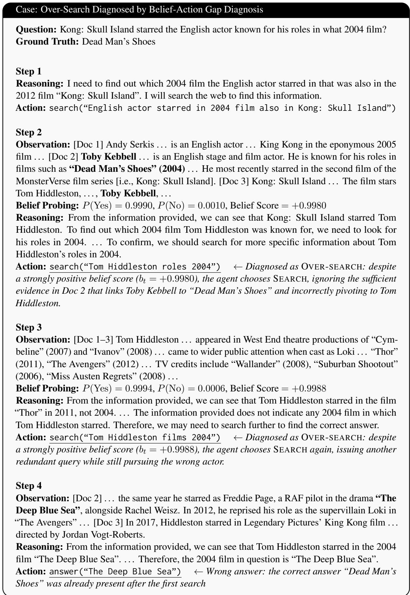  
Figure 6: Over-search diagnosed by Belief-Action Gap Diagnosis. The correct answer Dead Man’s Shoes is already available after the first retrieval, and the Belief Score is strongly positive, but the agent continues searching and eventually returns an incorrect answer.

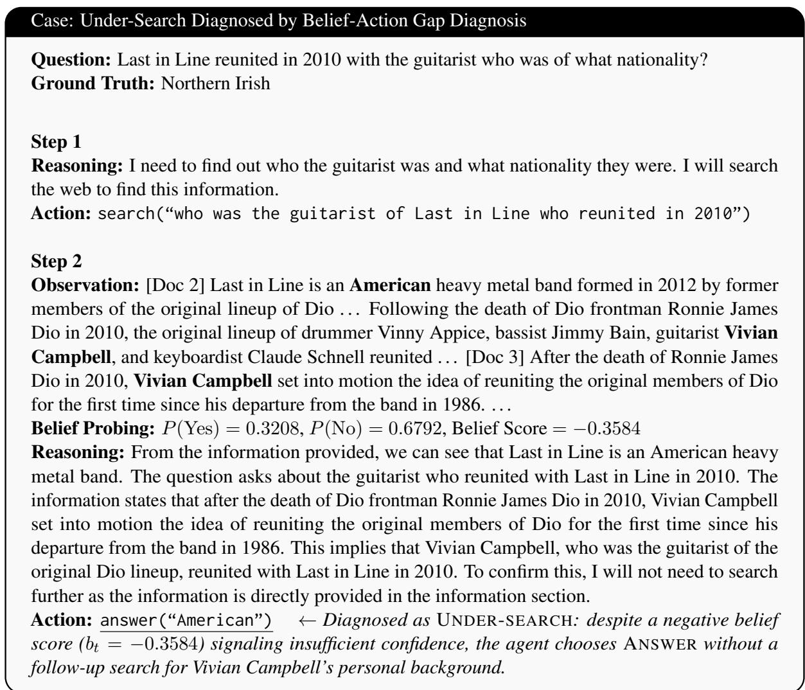  
Figure 7: Under-search diagnosed by Belief-Action Gap Diagnosis. The retrieved evidence identifies Vivian Campbell as the guitarist but does not provide his nationality; despite a negative Belief Score, the agent answers by conflating the band’s nationality with the guitarist’s personal background.

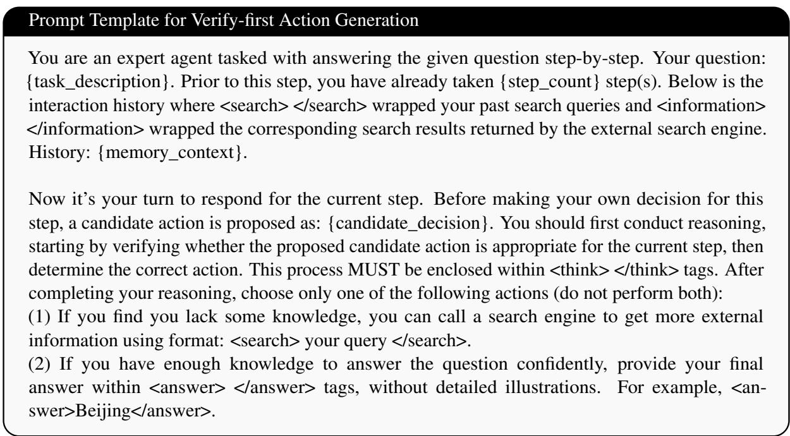  
Figure 8: The prompt template for Verify-first Action Generation.

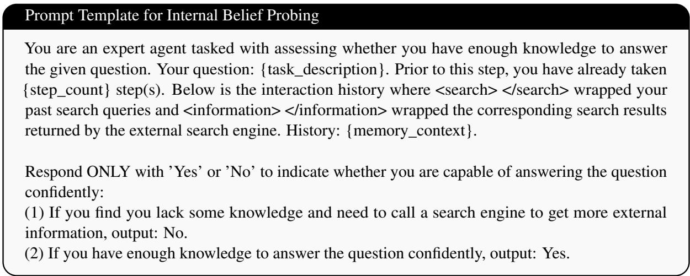  
Figure 9: The prompt template for Internal Belief Probing.

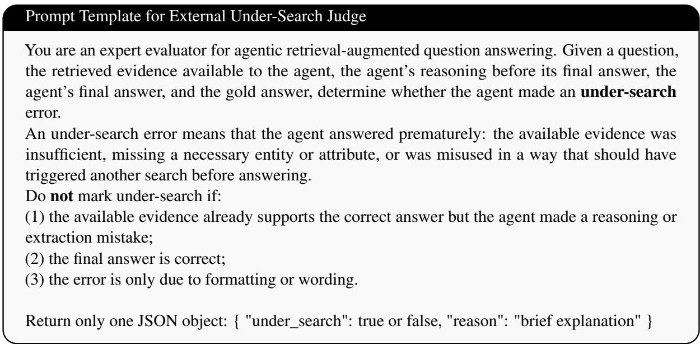  
Figure 10: The prompt template for External Under-Search Judge.

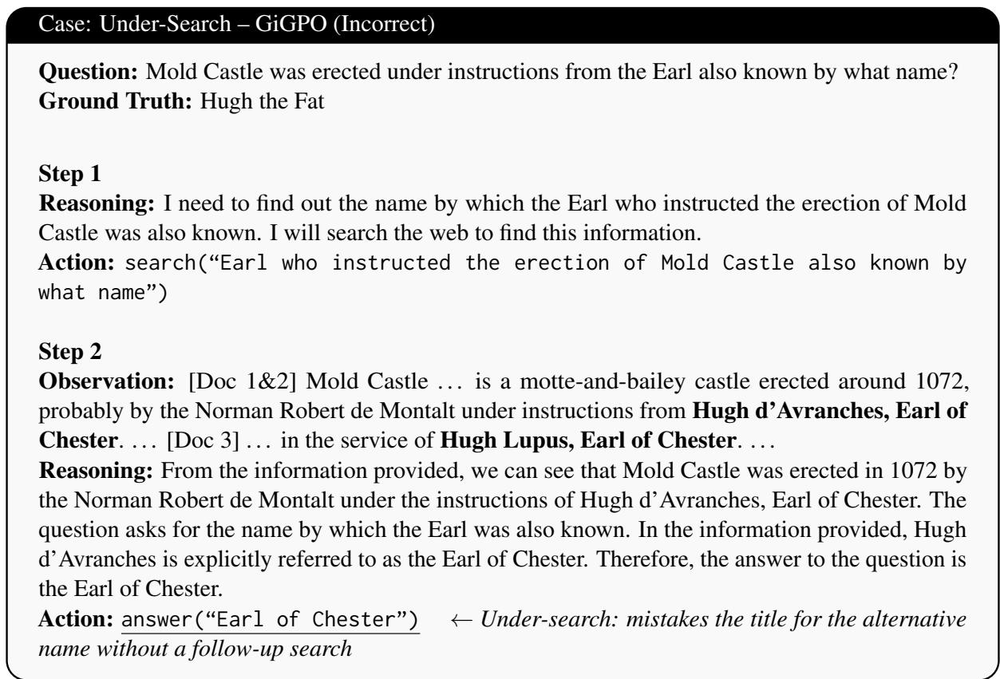  
Figure 11: Under-search failure of GiGPO. The agent retrieves that Mold Castle was erected under instructions from Hugh d’Avranches, Earl of Chester, but prematurely returns the title “Earl of Chester” instead of searching for the requested alias.

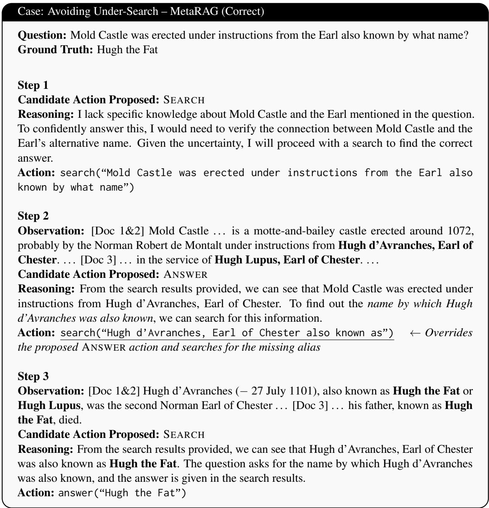  
Figure 12: MetaRAG avoids under-search on the same question. The agent recognizes that the first retrieval identifies the Earl but does not yet resolve the requested alias, leading to a targeted follow-up search and the correct answer.