# More GPUs or a Smaller Cache? Tensor Parallelism versus KV Compression for Memory-Bound LLM Serving

Srikanta Datta Tumkur, Mehar Simhadri, Anshu Bansal, Jay Iyer, Sai Pavan Kumar, Sai Kapil Kumar, Ramesh Nampelly, Raj Dandekar MIT and Vizuara

Abstract: When an LLM serving deployment runs out of KVcache room, there are two well-established ways out, and they come from communities that rarely talk to each other. The systems community adds GPUs. Tensor parallelism shards the weights and the KV cache across two, four, or eight devices, buying memory headroom at the price of an all-reduce on every layer and a hardware bill that grows with the device count. The algorithms community shrinks the cache in place, with KV quantisation and eviction keeping a single GPU and spending a little quality instead. Compression papers report memory ratios, parallel-scaling papers report throughput curves, and almost nobody puts the two on the same cost axis, so a practitioner facing a fixed model, quality floor, and latency target cannot tell which escape is cheaper. This paper builds that comparison. We place tensor-parallel configurations (degree 1 to 8) and KV-compressed configurations (16/8/4-bit, keep-ratios down to 0.25) on one costnormalised axis, cost per million tokens against latency, using a profiled simulator calibrated on real A100, A40, and H100 hardware, and we go looking for the cost-equivalence crossover. We do not find one. Across two models (Llama-2 at 7B and 70B), three GPU types, and every matched level of memory relief we could construct, compression is cheaper by 1.20× to 2.00×, and the gap widens as relief deepens. The deeper finding is that the question’s premise fails at the scale it is usually asked. A 7B model on an 80 GB device cannot exhaust its KV budget within its own context window, and the boundary that decides between the strategies is model size relative to device memory, at roughly 36B parameters for an 80 GB card. Below that wall, compression dominates and extra GPUs are largely wasted spend; above it, tensor parallelism stops being a choice and becomes an entry ticket: Llama-2-70B is infeasible on one A100 at any KV setting, because the binding resource is weights, which KV compression does not touch. The two strategies also turn out to buy different things. Tensor parallelism is the only lever that improves latency (compression makes per-token latency worse, by 8 to 93%, through batching contention), while compression is the only lever that multiplies capacity per dollar (16.5×, against 1.21× for an eightfold spend on GPUs). We close with the decision rule this evidence supports, which is simpler and more useful than the crossover we set out to draw.

Index Terms: LLM inference, tensor parallelism, KV-cache compression, KV quantisation, cost-normalised latency, memorybound serving, capacity planning.

## I. INTRODUCTION

When an LLM serving deployment becomes memorybound, whether because the context is long, the batch is large, or both, the KV cache stops fitting in one GPU and something has to give. There are two established escapes, and they come from two different communities. On the systems side, tensor parallelism [4] shards the weights and the KV cache across several GPUs, and context-parallel and long-context serving stacks [3], [5] push that further, so the memory per device falls roughly with the number of devices. On the algorithms side, low-bit KV quantisation [8], [9] and KV eviction [10], [11] keep a single GPU and trade a little quality and a little dequantisation overhead for a smaller footprint (Fig. 1).

The problem is that these two escapes are almost never priced against each other. Tensor-parallelism papers report a throughput or scaling curve as the device count grows [4], [7]; KV-compression papers report a memory-reduction ratio at an accuracy target [8], [9], [12]; recent surveys catalogue compression methods but stop short of a direct normalised comparison against parallel scaling [13]. Adding GPUs and compressing the cache both buy KV headroom, but one multiplies the dollar cost by the device count while the other costs almost nothing in hardware, so the only fair comparison is on a cost-normalised axis. That comparison is rarely made, and it is the comparison an infrastructure owner needs.

This makes a concrete decision hard. An engineer facing a fixed model, a fixed quality floor, and a fixed latency target, who must serve a longer context or a bigger batch than one GPU holds, cannot read the two literatures and tell whether it is cheaper to rent more GPUs or to compress the cache. The central question, stated plainly, is: at a fixed model, quality floor, and latency target, is it cheaper per million tokens to add GPUs (tensor parallelism) or to compress the KV cache, and where does the answer flip?

We set out to build the curve that answers it. We held the model, the quality floor, and the latency target fixed, swept tensor-parallel degree (1, 2, 4, 8) on one side and KVcompression setting (bit-width and keep-ratio) on the other, and plotted both as cost per million tokens against latency, expecting to read the crossover directly off the figure.

What we found instead is the subject of this paper. The crossover does not exist at 7B, at 70B, or on any of the three GPU types we tested, and the premise behind the question does not survive the scale at which practitioners ask it. We report those findings rather than tuning the experiments until the expected curve appears, because a negative result that survives three hardware platforms and two model scales is more useful to a practitioner than a manufactured crossover would have been.

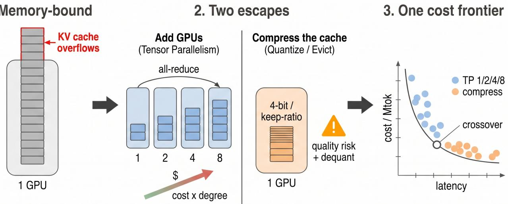  
Fig. 1: Study overview. (1) A memory-bound serving deployment can add GPUs (tensor parallelism, which splits weight and KV memory but adds all-reduce communication and multiplies cost) or compress the KV cache (quantisation and eviction, which keep one GPU but spend quality and dequantisation overhead). (2) The two are reported in separate literatures, on different axes, so a practitioner cannot tell which is cheaper. (3) We place both on one cost-normalised frontier (cost per million tokens against latency) at a fixed model, quality floor, and latency target, and search for the cost-equivalence crossover.

## A. Contributions

1) A cost-normalised frontier that places tensor-parallel and KV-compressed configurations on one axis (Fig. 3), on which the uncompressed single-GPU baseline is dominated and no crossover appears, at either model scale or on any tested GPU (Sec. V-A, Sec. V-C).

2) A decomposition of why: tensor parallelism buys concurrency capacity at close to a constant price per dollar while compression buys it almost free (Fig. 6), together with a sensitivity analysis quantifying how large a dequantisation penalty would have to be to reverse the conclusion (Fig. 7).

3) The identification of the real decision boundary: model size relative to device memory (not context length or batch size), located between 34B and 70B parameters for an 80 GB device across seven profiled models (Fig. 8), with the resulting practitioner rule (Table VI).

## II. BACKGROUND AND RELATED WORK

## A. Tensor parallelism and parallel scaling

Tensor parallelism [4] splits each layer’s weights, and the attention KV cache, across several GPUs, so the per-device memory falls roughly with the device count at the price of an all-reduce on every layer. It is the standard way to fit a model or a long-context cache that exceeds one GPU, and it underpins production serving [3], [7], [21]. Context parallelism pushes the same idea along the sequence dimension. Ring Attention [5] distributes a long sequence across devices and overlaps key-value communication with attention compute. Disaggregated architectures go further still, splitting prefill from decode across machine pools [7], [22], [23]. All of these buy memory headroom by spending hardware and communication, which is one half of our trade-off.

## B. KV-cache compression and eviction

The other half keeps a single GPU and shrinks the cache. KV quantisation stores keys and values at low bit-width. KIVI [8] reaches 2-bit asymmetric per-channel quantisation, and KVQuant [9] targets very long context by quantising pre-RoPE keys with non-uniform datatypes. Eviction drops low-value tokens: H2O [10] keeps a heavy-hitter set, PyramidKV [17] varies the budget by layer, and EVICPRESS [11] jointly optimises compression and eviction across storage tiers. Transform coding [12] borrows PCA and entropy coding from media compression to reach high ratios. Each shrinks memory for a little quality and a little dequantisation overhead, and none requires extra GPUs.

KV compression should be separated from weight quantisation [15], [16], which shrinks the other large resident tensor. The distinction turns out to matter a great deal in our results, because the feasibility wall we locate in Sec. V-B is set by weights, which KV compression cannot touch but weight quantisation could move. Speculative decoding [18], [19] and efficient attention kernels [20] accelerate inference orthogonally to both strategies and are outside our scope.

## C. Why the two are rarely compared

Parallel-scaling work reports throughput or scaling efficiency against the device count; compression work reports a memory ratio at an accuracy target. A recent survey [13] rethinks how KV-cache compression is measured and shows that throughput and end-to-end latency are often not reported alongside the memory ratio, which is why a direct normalised comparison against parallel scaling is missing. Our contribution is to put both on the one axis a budget owner reads, and then to take seriously what that axis shows.

## D. Cost-normalised comparison and Pareto dominance

On a single cost axis, a configuration is dominated if another is at least as good on every axis (quality, latency, cost per million tokens) and strictly better on one. The Pareto frontier is the set of non-dominated configurations; the cost-equivalence crossover, if it exists, is the point on it where a tensor-parallel configuration and a KV-compressed configuration meet at the same cost per million tokens. Cost per million tokens is derived from throughput and the per-GPU hourly price, multiplied by the device count for tensorparallel configurations, so adding GPUs and compressing the cache are finally on the same scale. This discipline, in which every number is reported with its configuration stated, in the spirit of standardised inference benchmarks [1], is as much the contribution as the numbers themselves.

## E. Simulation for large configuration spaces

The grid (parallel degree by compression setting by GPU by workload) is combinatorial, so exhaustive measurement is infeasible. Profiled simulators such as Vidur [2] model the performance of LLM operators from experimental profiling on real hardware and estimate end-to-end inference latency within a reported 9%, searching hundreds of deployment configurations cheaply; LLMServingSim [14] couples an executiongraph simulator to a network simulator for similar ends. We adopt Vidur as our runtime backbone. Sec. IV states what this does and does not license us to claim. We take some care over that distinction, because we had no GPU access of our own.

## F. Our position

We treated the cost-equivalence curve as the deliverable: one model family, one quality floor, one latency target, tensorparallel and KV-compressed configurations placed on a single cost-normalised frontier, and the crossover reported as a function of context length and batch size. The evidence returned something different, a feasibility wall and a pair of complementary mechanisms instead of a crossover, and the paper reports that. No simulator we surveyed models

KV quantisation or eviction (all assume fp16 KV), and no compression paper reports cost per million tokens, so the layer joining the two literatures is itself a contribution, and its assumptions are our principal exposure; we bound them explicitly in Sec. V-A.

## III. METHODOLOGY

## A. Axes and the cost-normalised frontier

Every configuration is placed on three kinds of axes: latency (TTFT and TPOT, each at P50 and P99), throughput and memory (tokens per second, per-device KV occupancy, feasibility), and cost (dollars per million tokens). Cost is the axis that makes the two strategies comparable:

$$
\mathrm { c o s t / M t o k } ( p ) = \frac { c _ { \mathrm { g p u / h r } } \cdot p } { 3 6 0 0 \cdot \mathrm { t h r o u g h p u t } } \times 1 0 ^ { 6 } ,\tag{1}
$$

where $p$ is the tensor-parallel degree; the deployment rents p GPUs. Omitting $p$ makes scale-out look free, and is in our experience the most common way this comparison goes wrong. Dropping $p$ would reverse every conclusion in this paper.

One axis from our original design is deliberately absent. Quality is not evaluated in this study. We did not run accuracy benchmarks, and we declined to substitute an invented degradation curve; Sec. VII spells out what this costs us and why it is the first thing follow-up work should fix.

## B. The two strategies as one knob set

A configuration fixes the model and chooses, on the tensorparallel side, a degree $p \in \{ 1 , 2 , 4 , 8 \}$ , and on the compression side, a KV bit-width $b ~ \in ~ \{ 1 6 , 8 , 4 \}$ and a keep-ratio $r _ { \mathrm { k e e p } } \in \{ 1 . 0 , 0 . 5 , 0 . 2 5 \}$ . Tensor-parallel configurations spend hardware and communication to buy memory; KV-compressed configurations spend quality and dequantisation overhead to buy memory. Both are evaluated under the same workloads and the same cost model, so the only thing that separates them on the figure is what each delivers.

## C. Modelling tensor parallelism

Increasing the tensor-parallel degree p has three documented effects. (i) Per-GPU weight and KV memory are divided by $p$ (with KV heads flooring at the model’s head count under grouped-query attention), which is what buys the headroom. (ii) An all-reduce communication term is added on top of the per-token compute. (iii) The dollar cost is multiplied by $p .$ Our original scaffold expressed the communication term analytically, as

$$
t _ { \mathrm { t o k e n } } ( p ) = t _ { \mathrm { c o m p u t e } } + \alpha \frac { p - 1 } { p } t _ { \mathrm { b a s e } } ,\tag{2}
$$

with a fitted coefficient $\alpha$ that is zero at $p { = } 1$ and rises and saturates with $p ,$ matching the shape of a ring allreduce. We keep the equation for exposition but abandoned the fitted coefficient in the final study, for a reason the results make clear. The backbone’s all-reduce term is instead driven by 6,958 measured collective-communication timings across 2/4/8/16 workers, and that measured behaviour produces regime-dependent scaling (31.9% efficiency at $\mathrm { T P } { = } ~ 8$ in one setting and a superlinear 169% in another, Sec. V-C) that no single α can express. The small methodological lesson we take from it is to measure the communication term instead of fitting it.

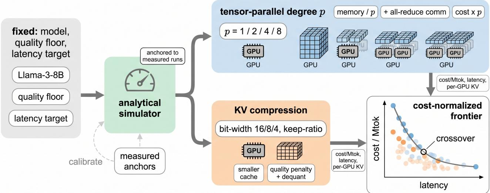  
Fig. 2: The cost-equivalence pipeline. A fixed model, quality floor, and latency target are held constant. On one side the tensorparallel degree is swept (1, 2, 4, 8): each step divides per-GPU weight and KV memory, adds all-reduce communication, and multiplies cost by the device count. On the other side the KV-compression setting is swept (bit-width and keep-ratio). Both branches are evaluated through a profiled simulator and placed on a single cost-normalised frontier (cost per million tokens against latency), from which the dominant choice per regime, and the cost-equivalence crossover if one exists, are read. The schematic shows the pipeline as originally designed; the realised study substitutes Llama-2 models for the pictured Llama-3-8B (Sec. IV) and inherits its calibration from the profiled backbone rather than from anchors of our own; the “measured anchors” and “crossover” the drawing depicts were design intent, and Sec. V reports that no crossover was found.

## D. Modelling KV compression

Per-device KV memory is exact and definitional:

$$
m _ { \mathrm { k v } } = 2 \cdot L \cdot h _ { \mathrm { k v } } ( p ) \cdot d _ { \mathrm { h e a d } } \cdot { \frac { b } { 8 } } \cdot n _ { \mathrm { c t x } } \cdot r _ { \mathrm { k e e p } } ,\tag{3}
$$

with L layers, $h _ { \mathrm { k v } } ( p )$ KV heads per worker after sharding, b the bit-width, and $r _ { \mathrm { k e e p } }$ the eviction keep-ratio. We implement it by replacing the fixed two-bytes-per-element assumption in the backbone’s memory planner with $b / 8$ and scaling resident tokens by $r _ { \mathrm { k e e p } } ;$ at the defaults $\scriptstyle ( b = 1 6 , r _ { \mathrm { k e e p } } = 1 )$ the patched simulator reproduces the upstream one bit for bit.

We deliberately do not model compression’s kernel-level latency consequences. Low-bit KV moves fewer bytes per decode step, which helps; it also costs dequantisation work, which hurts; and we have no measurement of our own to fix the balance. Rather than invent a curve, we let the compression arm represent compression’s best case on latency, and then invert the question in Sec. V-A: how large would the penalty have to be to change the conclusion? This converts an unmeasurable assumption into a stated, checkable bound.

## E. Feasibility

A configuration is feasible when weights and KV cache both fit:

$$
\underbrace { \frac { 2 W } { p } } _ { \mathrm { w e i g h t s } } + \underbrace { B \cdot m _ { \mathrm { k v } } } _ { \mathrm { K V \ f o r \ b a t c h \ } B } \le M _ { \mathrm { d e v } } ( 1 - \mu ) ,\tag{4}
$$

with W parameters, $M _ { \mathrm { d e v } }$ device memory, and $\mu { = } 0 . 1$ the margin. Eq. (4) carries no error term, being pure arithmetic, and results derived from it are tagged E (exact) throughout, as distinct from S (simulated) results that flow through the profiled backbone. Infeasible configurations are recorded as infeasible, never silently dropped and never costed.

## F. Cost accounting

Cost per million tokens depends on the per-GPU hourly price, the simulated throughput, and, for tensor-parallel configurations, the device-count multiplier p; all three are stated with every number. Every metric row in the released dataset carries a provenance flag (simulated or exact), and every figure caption in this paper repeats it. We never present a simulated latency as measured, and we never present an assumed price as contracted.

<table><tr><td>Algorithm 1 Building the frontier and searching for the crossover</td></tr><tr><td>Input: model, GPUs, TP ladder, compression ladder, work- loads</td></tr><tr><td>for each configuration do check feasibility by Eq. (4); record OOM explicitly if feasible: simulate via the profiled backbone; tag  $\mathsf { \Delta s } _ { I } \mathsf { E }$ </td></tr><tr><td>compute the Pareto frontier over (latency, cost/Mtok), fea- sible points only</td></tr><tr><td>pair TP and compressed configs at matched memory relief search for a sign change in cost(TP) – cost(compress)</td></tr></table>

## IV. EXPERIMENTAL SETUP

## A. What is measured, and by whom

We had no GPU access. Latency and throughput come from Vidur [2], whose operator-level predictors are fitted to profiling collected on real A100, A40, and H100 hardware by its authors, with end-to-end error reported below 9%. In our runs those predictors fitted their profiling data at 0.29 to 0.78% mean absolute percentage error, and the all-reduce term is driven by measured collectives rather than a coefficient of ours. We therefore claim no more than this: our latency and throughput figures come from a simulator calibrated by its authors against real hardware. We do not claim measured anchors of our own, and we report no held-out simulator error, because producing one would require the GPU access we lack. The distinction is carried through every table and figure via the ${ \mathsf { s } } _ { / } { \mathsf { E } }$ tags.

## B. Model, hardware, and workloads

The primary model is Llama-2-7B on an A100-80GB, with the hardware ablation repeating the main workload on A40 and H100, and the scale ablation repeating both workloads on Llama-2-70B. Llama-2-7B uses multi-head attention (32 KV heads, dhead=128, 32 layers), giving 512 KiB of KV per token, four times the footprint of an equivalently sized grouped-query model. That makes it the most memory-stressing 7B choice available and biases the study toward finding a memory bound, not away from one. The serving stack is Sarathi-style chunked scheduling [6] with block size 16 [3] and a batch cap of 128. Principal settings are gathered in Table II.

Our original design named public workload suites for each deployment regime (Table I). The realised study substitutes synthetic fixed-length workloads: W1, a moderate interactive load (2048 prefill, 256 decode, 64 requests, unsaturated), and W2, a prefill-heavy load under saturation (3840 prefill, 256 decode, 384 requests at 30 QPS). We chose fixed shapes because they make the memory arithmetic exact and the runs reproducible to the token. The mapping, and the one regime we could not reach, are recorded in the table rather than glossed over.

TABLE I: Deployment regimes as designed, and how each was realised.
<table><tr><td>Regime</td><td>Intended source</td><td>Realised here</td></tr><tr><td>Short chat</td><td>ShareGPT</td><td>W1 (synthetic, 2048+256, unsaturated)</td></tr><tr><td>Long-context</td><td>LongBench / RULER</td><td>not reachable (profiling caps at 4k)</td></tr><tr><td>Large batch</td><td>ShareGPT batched</td><td>W2 (synthetic, 3840+256, 30 QPS)</td></tr><tr><td>Long + batched RULER batched</td><td></td><td>W2 on Llama-2-70B (hardest bound)</td></tr></table>

TABLE II: Principal settings.
<table><tr><td>Setting</td><td>Value</td></tr><tr><td>Models</td><td>Llama-2-7B (primary); Llama-2-70B (above threshold)</td></tr><tr><td>GPUs</td><td>A100-80GB, A40-48GB, H100</td></tr><tr><td>Prices (assumed)</td><td>$2.00, $1.00, $3.50 per GPU-hour</td></tr><tr><td>TP degree</td><td>1, 2, 4, 8 (memory /p, measured all-reduce, cost ×p)</td></tr><tr><td>KV compression</td><td>bit-width 16/8/4 × keep-ratio 1.0/0.5/0.25</td></tr><tr><td>Workloads</td><td>W1: 2048+256, 64 req; W2: 3840+256, 384 req, 30 QPS</td></tr><tr><td>Scheduler</td><td>Sarathi-style, block size 16, batch cap 128</td></tr><tr><td>Method</td><td>profiled simulator + exact memory model, S/E tagged</td></tr></table>

## C. Coverage constraint

The backbone ships attention profiling for a fixed model set, and this constraint shaped the study more than we expected. Llama-3-8B, our original target, is profiled only at TP ∈ {1, 4} on a single GPU type, which cannot support a tensor-parallel ladder, so Llama-2-7B (all four degrees, three GPU types) is used instead. Context is bounded at 4096 tokens by the model’s position embeddings and the profiling range. The A40 profiling set contains no all-reduce measurements at all, so TP>1 on A40 cannot be simulated; where that matters we say so explicitly rather than interpolating.

## V. RESULTS

All numbers in this section are reproducible from results/metrics\_all.csv (107 rows, each tagged simulated or exact) via src/make\_results.py.

## A. RQ1: which is cheaper?

Table III gives the panel, and the fairest way to read it is at matched memory relief : the same KV bytes per device, reached by two different means. On that comparison compression is cheaper at every level (Fig. 4): 1.20× at half relief (TP2 vs INT8), 1.50× at quarter relief (TP4 vs INT4), and 1.89× at eighth relief (TP8 vs INT4+k50). The margin widens as relief deepens, so no crossover exists within the swept range, and extrapolating the two diverging curves does not produce one.

Tensor parallelism does deliver on latency, cutting TTFT P99 by 4.5× from TP1 to TP8. It loses on cost because its throughput gain never overtakes its price. On W1 the gain at

Below threshold (7B): TP never pays for itself  
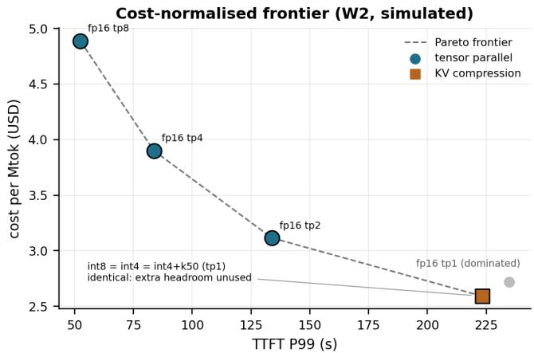  
Fig. 3: Cost-normalised frontier on ${ \tt W } 2 ^ { \tt S }$ . Tensor-parallel configurations (circles) and KV-compressed configurations (squares) on cost per million tokens against TTFT P99. The uncompressed single-GPU baseline is dominated: INT8 is both cheaper and faster. The three compressed points coincide exactly, because past INT8 the additional headroom is unused in this prefill-bound workload.

TABLE III: W2 metric $\mathrm { \ p a n e l { } } ^ { \mathsf { S } }$ . Llama-2-7B, A100-80GB, 3840+256 tokens, 30 QPS. fp16/TP= 1 is the baseline; the three compressed rows are identical because past INT8 the memory constraint has stopped binding.
<table><tr><td>Config</td><td> $\mathrm { T T F T _ { 9 9 } }$  (s)</td><td> $\mathrm { T P O T _ { 5 0 } }$  (ms)</td><td>Thr. (tok/s)</td><td></td><td>$/h $/Mtok</td></tr><tr><td>fp16 TP1</td><td>234.9</td><td>72.79</td><td>204.5</td><td>2</td><td>2.717</td></tr><tr><td>fp16 TP2</td><td>133.9</td><td>48.85</td><td>356.7</td><td>4</td><td>3.115</td></tr><tr><td>fp16 TP4</td><td>83.7</td><td>32.15</td><td>569.9</td><td>8</td><td>3.899</td></tr><tr><td>fp16 TP8</td><td>52.4</td><td>21.58</td><td>909.2</td><td>16</td><td>4.888</td></tr><tr><td>INT8 TP1</td><td>223.3</td><td>78.83</td><td>214.4</td><td>2</td><td>2.591</td></tr><tr><td>INT4 TP1</td><td>223.3</td><td>78.83</td><td>214.4</td><td>2</td><td>2.591</td></tr><tr><td>INT4+k50 TP1</td><td>223.3</td><td>78.83</td><td>214.4</td><td>2</td><td>2.591</td></tr></table>

TP= 8 is 2.55× for 8× the spend (31.9% scaling efficiency); on the prefill-heavy W2 it is 4.45× (55.6%). Both sit below break-even at every degree (Fig. 5), so each added GPU raises the cost of every token it serves.

The same fact looks starker as capacity per unit spend (Fig. $6 ^ { \mathsf { E } } )$ . An eightfold increase in GPU spend improves concurrency capacity per GPU-dollar from 29.0 to just 35.1 (+21%, the modest gain coming from weight sharding); as a way to buy headroom, tensor parallelism is very nearly costneutral. Compression lifts the same figure from 29.0 to 479.0, a 16.5× gain, at unchanged hardware cost. This asymmetry, not any subtlety of scheduling, is the mechanism behind the absent crossover.

Compression’s latency cost. The saving comes with a penalty, and this is where the two strategies part ways most sharply. Compression degrades per-token latency. At 7B, INT4 raises TPOT P50 from 72.79 to 78.83 ms (+8%, Table III); at 70B, from 116.76 to 224.81 ms (+93%, Table V). The mechanism is batching; our compression arm models no dequantisation cost at all. The freed memory admits more concurrent sequences, and the added contention lengthens every decode step. Compression therefore trades TPOT for capacity, while tensor parallelism is the only lever that improves TTFT and TPOT simultaneously. Under a tight per-token latency target, scale-out is the only direction that helps.

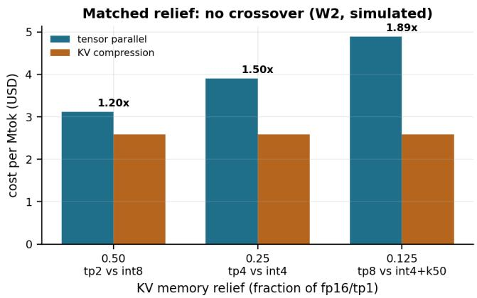  
Fig. 4: Cost at matched KV $\mathrm { r e l i e f } ^ { \mathrm { S } }$ . Compression is cheaper at every level and the ratio grows with relief: there is no costequivalence crossover.

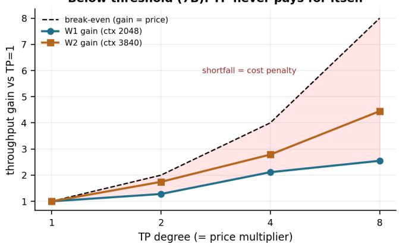  
Fig. 5: Throughput gain against device-count price on Llama-$2 \mathrm { - } 7 \mathrm { B } ^ { \mathsf { S } }$ . The dashed line is break-even. Both workloads sit below it at every degree, so cost per token rises monotonically with tensor-parallel degree below the feasibility threshold. Sec. V-C shows this does not hold above it.

Robustness. Because our compression arm carries no dequantisation penalty, one might reasonably worry that the comparison is rigged in its favour. So we invert the question and ask how much throughput compression would have to lose before tensor parallelism wins. The answer is 16.8%, 33.5%, and 47.0% at the three relief levels (Fig. 7). Published low-bit KV kernels [8], [9] report overheads well below the smallest of these, so the ordering is robust to the one assumption we could not measure, though confirming it on hardware remains the most valuable experiment this study leaves undone.

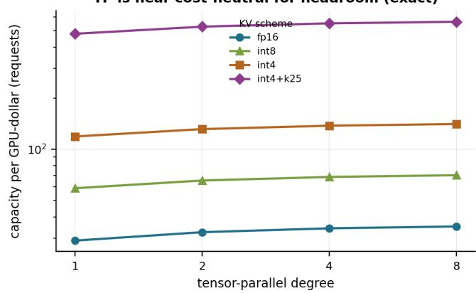  
Fig. 6: Concurrency capacity per $\mathbf { G P U - d o l l a r } ^ { \mathsf { E } } .$ , ctx 4096. Moving right along any curve (more GPUs) is nearly flat; moving between curves (more compression) is a step change.

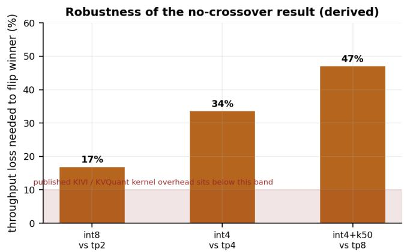  
Fig. 7: Sensitivity of the result to unmodelled dequantisation overhead. Bars give the throughput loss compression would need to suffer before tensor parallelism becomes cheaper.

## B. RQ2: where is the crossover, and how does it move?

RQ2 asks how the crossover moves as context length and batch size grow. We report two findings, the first of which invalidates the question’s premise at typical deployment scale.

A 7B model on an 80 GB device cannot be driven out of memory.E Sweeping reserved tokens per request, fp16/TP= 1 retains capacity for 29 concurrent requests at the model’s maximum 4096-token context, and reaches OOM (inability to admit even one request) only at 131,072 tokens, 32× beyond the context window. Within its own limits, this configuration cannot exhaust its KV budget. The frontier agrees. The compressed points in Fig. 3 are identical to three decimal places, because past INT8 the memory constraint has already stopped binding and further relief is inert.

The real boundary is model $\mathbf { s i z e . } ^ { \mathsf { E } }$ Extending Eqs. (3) to (4) across the seven models the backbone profiles (Fig. 8, Table IV) locates a hard feasibility wall. For Llama-2-70B and Llama-3-70B, fp16 weights require 127.5 GB per device at TP= 1 against 72 GB usable, so TP= 1 is infeasible, and remains infeasible under INT4 with a 0.25 keep-ratio, because the binding resource is weights, which KV compression does not shrink. Between CodeLlama-34B (61.9 GB, feasible) and Llama-2-70B (127.5 GB, infeasible) lies the boundary: roughly 36B parameters at fp16 on a 72 GB budget. The decision between our two strategies turns on which side of this wall a deployment sits on; context length and batch size do not decide it.

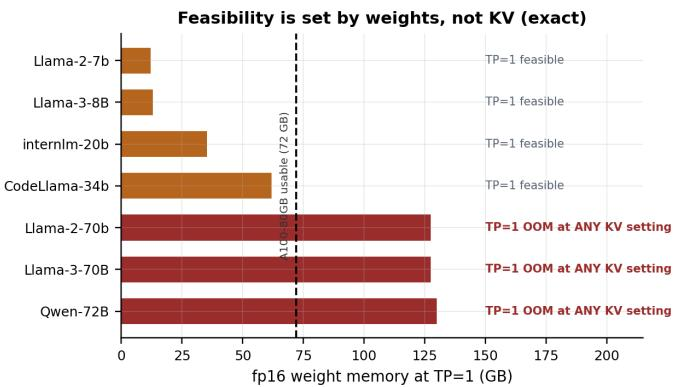  
Fig. 8: Feasibility at TP= 1 across the profiled model $\mathrm { s e t } ^ { \mathsf { E } } .$ Above the device budget, no KV setting restores feasibility: the constraint is weights.

TABLE IV: Concurrency capacity at ctx $4 0 9 6 ^ { \mathsf { E } }$ ; 0 denotes OOM.
<table><tr><td>Model</td><td>Wt. TP1 (GB)</td><td>fp16 TP1</td><td>fp16 TP4</td><td>INT4+k25 TP1</td><td>INT4+k25 TP4</td></tr><tr><td>Llama-2-7b</td><td>12.1</td><td>29</td><td>137</td><td>479</td><td>2207</td></tr><tr><td>Llama-3-8B</td><td>13.0</td><td>118</td><td>550</td><td>1888</td><td>8800</td></tr><tr><td>internlm-20b</td><td>35.4</td><td>7</td><td>53</td><td>124</td><td>862</td></tr><tr><td>CodeLlama-34b</td><td>61.9</td><td>13</td><td>301</td><td>216</td><td>4824</td></tr><tr><td>Llama-2-70b</td><td>127.5</td><td>0</td><td>128</td><td>0</td><td>2054</td></tr><tr><td>Llama-3-70B</td><td>127.5</td><td>0</td><td>128</td><td>0</td><td>5740</td></tr><tr><td>Qwen-72B</td><td>130.0</td><td>0</td><td>15</td><td>0</td><td>252</td></tr></table>

## C. Above the threshold: Llama-2-70B

Everything so far characterises the strategies outside the regime the premise describes, so we repeated both workloads on Llama-2-70B, which sits above the wall, with identical settings.

The wall shows up in execution as well as in arithmetic. The TP= 1 run terminates in the memory planner, unable to admit a single request. Both arms consequently begin at TP= 2, and memory relief is measured relative to fp16/TP= 2. In this regime memory constrains the deployment, which at fp16/TP= 2 runs at 99 to 100% KV occupancy holding roughly 13 concurrent requests. Compression correspondingly stops being inert: INT8 and INT4 now yield distinct throughputs (68.3 versus 71.8 tok/s), where at 7B all compressed configurations were identical. The inertness point has moved rather than vanished, since INT4 and INT4+k25 still coincide, memory having ceased to bind between them.

TABLE V: W2 on Llama- $- 2 \mathrm { - } 7 0 \mathrm { B } ^ { \mathsf { S } }$ . Both arms start at $\mathrm { T P } { = } 2 .$ which is the baseline here, because TP= 1 is infeasible.
<table><tr><td>Config</td><td>Thr. KV mem (tok/s)</td><td>$/h (%)</td><td>$/Mtok</td></tr><tr><td>fp16 TP1</td><td>INFEASIBLE: 127.5 GB weights</td><td></td><td></td></tr><tr><td>fp16 TP2</td><td>53.3</td><td>99.1</td><td>20.846</td></tr><tr><td>fp16 TP4</td><td>123.8</td><td>25.8</td><td>17.950</td></tr><tr><td>fp16 TP8</td><td>184.5</td><td>9.2 16</td><td>24.089</td></tr><tr><td>INT8 TP2</td><td>68.3</td><td>97.8</td><td>4 16.268</td></tr><tr><td>INT4 TP2</td><td>71.8</td><td>63.5</td><td>15.475</td></tr><tr><td>INT4+k25 TP2</td><td>71.8</td><td>15.6</td><td>15.475</td></tr></table>

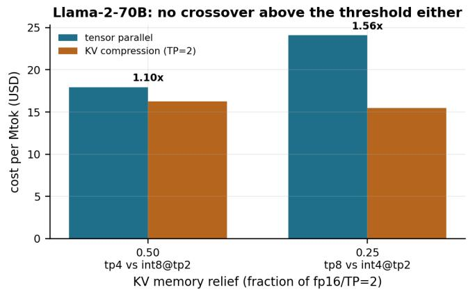  
Fig. 9: Matched relief on Llama- $ { \mathbf { \cdot } } 2  { \mathbf { - } } 7 0  { \mathbf { B } } ^ {  { \mathsf { S } } }$ . Compression remains cheaper above the threshold, where both arms start at TP= 2.

The crossover is still absent (Fig. 9). At matched relief, compression is cheaper by 1.10× (INT8/TP= 2 at \$16.27 against fp16/TP= 4 at \$17.95) and by $1 . 5 6 \times ~ ( \mathrm { I N T 4 / T P = 2 }$ at \$15.48 against fp16/TP= 8 at \$24.09). That the headline result holds in both regimes strengthens it considerably, because it is not an artefact of studying a model that was never memorybound.

One result does reverse, however. Below the threshold, cost per token rises monotonically with parallel degree (Fig. 5). Above it, cost is U-shaped, with a minimum at TP= 4 (Fig. 10). On W1 the step from TP= 2 to TP= 4 delivers 3.38× the throughput for 2× the price (169% efficiency) and reduces cost per token by 41% (by 14% on W2). The effect is neither an anomaly nor free performance. At TP= 2 the deployment is capacity-starved rather than compute-starved, so the added devices relieve the binding constraint and add compute; superlinear scaling is the signature of escaping a binding constraint, and it is a one-time payoff: beyond TP= 4 the effect exhausts and cost rises again.

The practical consequence is that $p _ { \mathrm { m i n } } ,$ the minimum feasible degree, is not necessarily the cheapest: when $p _ { \mathrm { m i n } }$ runs memory-saturated, one degree above it is cheaper per token. Sec. VI folds this into the decision rule.

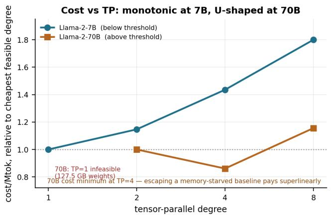  
Fig. 10: Cost per million tokens against parallel degree, normalised to each model’s cheapest feasible degreeS. Monotonically increasing below the threshold; U-shaped above it.

D. RQ3: how does the answer shift with hardware and degree?

Across degrees, the all-reduce term erodes benefit as hypothesised. Scaling efficiency falls to 31.9% at TP= 8 on W1, so high degrees never sit on the cost frontier unless feasibility forces them (Fig. 5).

Across hardware, we repeated W2 on A40 (\$1.00/h assumed) and H100 (\$3.50/h assumed); Fig. 11. Three findings emerged, one of them surprising to us. First, the ordering is hardware-invariant: compression is the cheapest arm on every device, with matched-relief margins on H100 (1.25×, 1.48×, 2.00×) mirroring A100. That is unsurprising within a device, once one notices that the hourly price cancels in the TP-vs-compression ratio, leaving only the throughput profile. Second, the cheap GPU is not the cheap deployment: cost per token orders H100 (\$1.96) < A100 (\$2.59) < A40 (\$3.29), the reverse of hourly price, because the A40’s throughput deficit exceeds its price advantage. Third, the A40 (48 GB) is memory-bound even at 7B (99% occupancy at fp16), and it is therefore the one device where INT4 outperforms INT8 (84.5 vs 82.7 tok/s); compression’s relief stops being inert where memory still binds, confirming the mechanism of Sec. V-A from the hardware side. The folk rule “compress on cheap GPUs” thus survives, but for a different reason than usually given. The low hourly price cancels, and what matters is the smaller memory that makes cheap devices memory-bound sooner. The one coverage limit here is that the A40 profiling set contains no all-reduce measurements, so TP>1 on A40 cannot be simulated, and its TP arm is absent rather than measured-and-losing.

## VI. DISCUSSION

Taken together, the evidence does not support treating the two strategies as substitutable escapes to be priced against one another. They relieve different constraints, and most of this paper’s surprises dissolve once that is said plainly. Tensor parallelism is a feasibility mechanism: it shards weights, which is the only way past the wall in Fig. 8, and as a way to buy KV headroom it is close to cost-neutral (Fig. 6). Compression is a capacity mechanism: it multiplies concurrency roughly 16× per dollar, but it does nothing for weights, and nothing at all once memory has stopped binding, as the coincident points in Fig. 3 show. Only tensor parallelism buys latency; compression sells it (Sec. V-A).

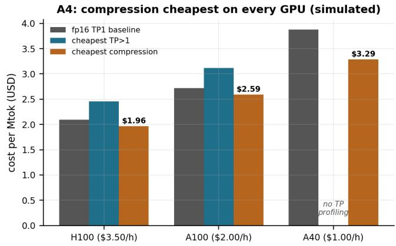  
Fig. 11: Ablation ${ \mathsf { A } } 4 ^ { \mathsf { S } } \colon$ cheapest configuration per arm across GPU types (W2, 7B). Compression wins on every device; pertoken cost orders opposite to hourly price.

They are complementary, and the ordering matters: choose the minimum degree that makes the weights fit, $p _ { \operatorname* { m i n } } ~ =$ $\lceil 2 W / M _ { \mathrm { u s a b l e } } \rceil$ , then compress for concurrency. At 70B this is visible directly in Table IV, where TP= 4 restores feasibility at 128 requests and INT4+k25 then takes the same deployment to 2054. Sec. V-C adds one correction, namely that $p _ { \mathrm { m i n } }$ is the cheapest degree only when it is not itself memory-saturated. For Llama-2-70B, $p _ { \operatorname* { m i n } } = 2$ runs at 99 to 100% occupancy, and stepping to $\mathrm { T P } { = 4 }$ reduces cost per token by 41% on W1 and 14% on W2 while more than doubling throughput. The rule, in full: take $p _ { \mathrm { m i n } }$ for feasibility; if that configuration runs memory-saturated, take one degree more, because escaping the constraint pays superlinearly; then compress. Beyond that point additional degrees stop paying, and compression remains the cheaper source of headroom at every matched level in both regimes.

## A. Relation to our stated hypothesis

We pre-registered the expectation that tensor parallelism would become cheaper once the cache no longer fits on one GPU. That hypothesis is not supported, and we want to be explicit about how it failed, because the failure is instructive. In the regime where both strategies are feasible, compression is cheaper at every matched relief level and the gap widens; in the regime where compression fails, tensor parallelism is compulsory, and it “wins” there only in the sense that there is no contest. The corrected claim, that the switch is governed by weight footprint rather than by context length, is a stronger practitioner rule than the one we set out to confirm, and we report it in place of the original.

TABLE VI: Scale-out versus compress: the decision rule.
<table><tr><td>Regime</td><td>Choose</td><td>Because</td></tr><tr><td>Weights exceed device memory  $\mathrm { \Omega } \gtrsim 3 6 8$  at fp16, 80 GB)</td><td>TP at  $p _ { \mathrm { m i n } } ;$  compression cannot substitute</td><td>KV compression does not shrink weights (Table IV)</td></tr><tr><td>pmin runs memory- saturated</td><td>Step up degree</td><td>one 3.38× throughput for 2× price; cost falls 41% (W1) and 14% (W2), Sec. V-C</td></tr><tr><td>Weights fit; KV is binding</td><td>Compress first</td><td>16.5× capacity per dollar vs 1.21× (Fig. 6)</td></tr><tr><td>Weights fit; KV not binding</td><td>Neither; com- pression is in- ert</td><td>Coincident points, Fig. 3</td></tr><tr><td>Latency target unmet</td><td>TP, and pay for it</td><td>4.5× TTFT P99 cut; com- pression moves TPOT the wrong way (+8 to 93%)</td></tr><tr><td>Quality floor forbids compression</td><td>TP</td><td>Only remaining source of headroom</td></tr></table>

## VII. LIMITATIONS

No measured anchors of our own. We had no GPU access. Latency and throughput are inherited from a simulator calibrated by its authors [2]; we report no held-out error against hardware we measured, and the fidelity ablation our study design called for could not be performed. All E-tagged results are unaffected, being closed-form.

Quality was not evaluated. No accuracy benchmark was run. Every compression result should therefore be read as an upper bound on what compression delivers, valid only while the quality floor permits the setting. Since the quality floor is what forbids aggressive compression, and thus what forces tensor parallelism in practice, this is the most consequential gap in the study and the first thing later work should close.

Compression latency is unmodelled. We quantify this exposure rather than hide it. Fig. 7 gives the penalty that would reverse each comparison.

The wall assumes fp16 weights. Our ∼36B boundary is a statement about fp16 weight footprints. Weight quantisation [15], [16] shrinks the resource that sets the wall and would move it upward, since a 70B model at 4-bit weights fits where its fp16 form does not. The wall’s existence, and the complementarity of the two mechanisms, are unaffected; its numeric position should be read as specific to fp16 serving.

Coverage. One model family (Llama-2 at 7B and 70B); context bounded at 4096 tokens, so the long-context regime of Table I is unreached; batch cap 128 (which binds for TP4, TP8, and INT4+k25); synthetic workloads rather than the public suites originally named. The hardware ablation covers A100, A40, and H100 at 7B only; the 70B runs are A100-only; A40 lacks all-reduce profiling so its TP arm cannot be simulated.

Prices. \$2.00 (A100), \$1.00 (A40), and \$3.50 (H100) per GPU-hour are representative on-demand cloud rates at the time of writing, chosen for round-number transparency; they are assumed, not contracted, and readers should substitute their own. Eq. (1) is linear in price, so a uniform change rescales all costs without altering any within-device ordering; the TPvs-compression winner on a given device is price-invariant. The cross-device ordering of Fig. 11 does depend on relative prices and should be re-costed for a reader’s own contract.

## VIII. CONCLUSION

We set out to price tensor parallelism against KV compression on one axis and name the crossover. There is no crossover, in either regime. Compression is cheaper at every matched level of memory relief (by 1.20 to 1.89× below the feasibility threshold and 1.10 to 2.00× above it and across hardware), and would need to lose 17 to 47% of its throughput to dequantisation before the ordering reversed. The mechanism is simple once seen: tensor parallelism buys headroom at roughly the price of the hardware, while compression buys it nearly free.

The more useful result concerns the premise rather than the answer. A 7B model on an 80 GB device cannot exhaust its KV budget within its context window; the decision boundary is model size relative to device memory, not context length or batch size, at roughly 36B parameters for an 80 GB device under fp16 weights. Above the wall, tensor parallelism is compulsory and compression cannot substitute; below it, compression dominates and additional GPUs are largely wasted spend. The two regimes also differ in a way that qualifies the usual advice to minimise device count: below the wall, every added GPU raises cost per token, but above it, when the minimum feasible degree is itself memory-saturated, the next degree up is cheaper, because escaping a binding constraint pays a one-time superlinear return.

What we would do next follows from what is missing: close the quality axis, whose floor is the real force pushing deployments toward tensor parallelism; obtain measured anchors for low-bit KV decode kernels, the one assumption we could only bound; and re-locate the wall under quantised weights, which is where the practitioner questions now live.

## ACKNOWLEDGMENTS

The authors thank Vizuara AI Labs for mentorship. This study used publicly released profiling data from the Vidur project [2]; no GPU measurements were performed by the authors.

## REPRODUCIBILITY

src/make\_results.py regenerates results/metrics\_all.csv (107 rows, each tagged simulated or exact) and every results figure in this paper. The compression layer is a documented modification to the backbone’s memory planner implementing Eq. (3), vendored as a patch with the backbone pinned by commit; with defaults $\scriptstyle ( b = 1 6 , \ r _ { \mathrm { k e e p } } = 1 )$ it reproduces upstream behaviour exactly. results/error\_taxonomy.md records worked examples of the failure modes this methodology guards against.

## REFERENCES

[1] V. J. Reddi et al., “MLPerf inference benchmark,” Proc. ISCA, 2020. arXiv:1911.02549.

[2] A. Agrawal et al., “Vidur: a large-scale simulation framework for LLM inference,” Proc. MLSys, 2024. arXiv:2405.05465.

[3] W. Kwon et al., “Efficient memory management for large language model serving with PagedAttention,” Proc. SOSP, 2023. arXiv:2309.06180.

[4] M. Shoeybi et al., “Megatron-LM: training multi-billion parameter language models using model parallelism,” arXiv:1909.08053, 2019.

[5] H. Liu, M. Zaharia, and P. Abbeel, “Ring attention with blockwise transformers for near-infinite context,” Proc. ICLR, 2024. arXiv:2310.01889.

[6] A. Agrawal et al., “Taming throughput-latency tradeoff in LLM inference with Sarathi-Serve,” Proc. OSDI, 2024. arXiv:2403.02310.

[7] Y. Zhong et al., “DistServe: disaggregating prefill and decoding for goodput-optimized LLM serving,” Proc. OSDI, 2024. arXiv:2401.09670.

[8] Z. Liu et al., “KIVI: a tuning-free asymmetric 2-bit quantization for KV cache,” Proc. ICML, 2024. arXiv:2402.02750.

[9] C. Hooper et al., “KVQuant: towards 10 million context length LLM inference with KV cache quantization,” Proc. NeurIPS, 2024. arXiv:2401.18079.

[10] Z. Zhang et al., “H2O: heavy-hitter oracle for efficient generative inference of large language models,” Proc. NeurIPS, 2023. arXiv:2306.14048.

[11] Z. Fu et al., “EVICPRESS: joint KV-cache compression and eviction for efficient LLM serving,” arXiv:2512.14946, 2025.

[12] S. Sukhbaatar et al., “KV cache transform coding for compact storage in LLM inference,” Proc. ICLR, 2026. arXiv:2511.01815.

[13] W. Gao et al., “Rethinking key-value cache compression techniques for large language model serving,” Proc. MLSys, 2025. arXiv:2503.24000.

[14] J. Cho et al., “LLMServingSim: a HW/SW co-simulation infrastructure for LLM inference serving at scale,” Proc. IISWC, 2024. arXiv:2408.05499.

[15] J. Lin et al., “AWQ: activation-aware weight quantization for LLM compression and acceleration,” Proc. MLSys, 2024. arXiv:2306.00978.

[16] E. Frantar et al., “GPTQ: accurate post-training quantization for generative pre-trained transformers,” Proc. ICLR, 2023. arXiv:2210.17323.

[17] Z. Cai et al., “PyramidKV: dynamic KV cache compression based on pyramidal information funneling,” arXiv:2406.02069, 2024.

[18] Y. Leviathan, M. Kalman, and Y. Matias, “Fast inference from transformers via speculative decoding,” Proc. ICML, 2023. arXiv:2211.17192.

[19] H. Xia et al., “Unlocking efficiency in large language model inference: a comprehensive survey of speculative decoding,” Findings of ACL, 2024. arXiv:2401.07851.

[20] T. Dao et al., “FlashAttention: fast and memory-efficient exact attention with IO-awareness,” Proc. NeurIPS, 2022. arXiv:2205.14135.

[21] L. Zheng et al., “SGLang: efficient execution of structured language model programs,” Proc. NeurIPS, 2024. arXiv:2312.07104.

[22] P. Patel et al., “Splitwise: efficient generative LLM inference using phase splitting,” Proc. ISCA, 2024. arXiv:2311.18677.

[23] R. Qin et al., “Mooncake: a KVCache-centric disaggregated architecture for LLM serving,” arXiv:2407.00079, 2024.

[24] A. Dubey et al., “The Llama 3 herd of models,” arXiv:2407.21783, 2024.

[25] A. Yang et al., “Qwen2.5 technical report,” arXiv:2412.15115, 2024.