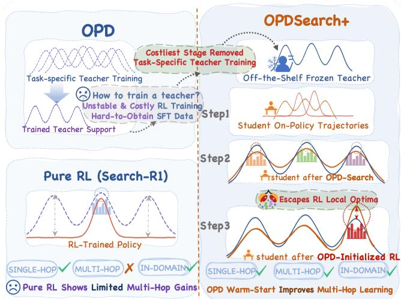
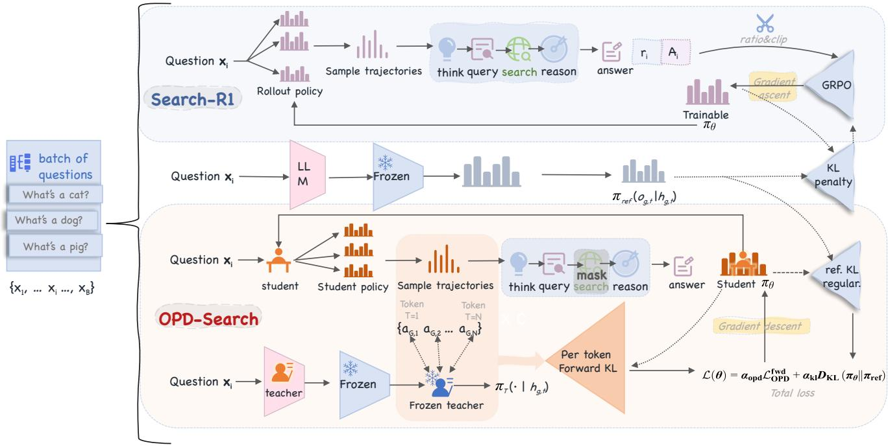
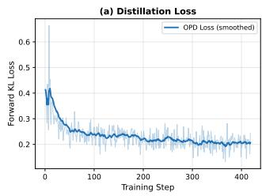
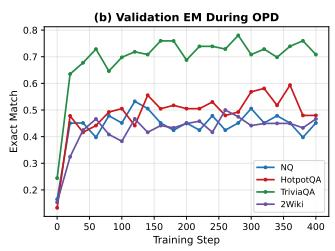
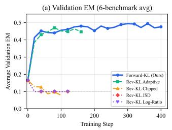
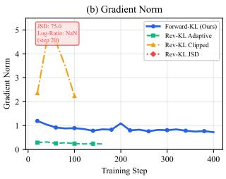

# OPDSearch+: On-Policy Distillation with RL Refinement for Search-Augmented Reasoning

Qinglin Ye1,2,\*, Zhiyuan Gu1,3,\*, Jingjie Xia1,2,\*, Yiheng Zhang4, Kaiyan Zhao5, Shunchao Zheng6, Yuhang Mu7, Wenchao Du1, Yiming Wang8,†

1University of Chinese Academy of Sciences 2Institute of Computing Technology, Chinese Academy of Sciences 3Institute of Automation, Chinese Academy of Sciences

4University of Macau 5Wuhan University 6Georgia Institute of Technology 7Northwestern Polytechnical University 8University of Hong Kong

Equal contribution. †Corresponding author.

## Abstract

Search-augmented reasoning remains dificult for small language models. On-policy distillation (OPD) from trained teachers ofers a promising direction, but sufers from two issues: (1) high-quality multi-turn search trajectories depend on dynamic retriever responses, making SFT data prohibitively expensive to collect at scale; (2) task-specifically trained teachers incur substantial training cost, while directly applying OPD with an of-the-shelf teacher without task-specific finetuning constrains the student to the teacher’s performance ceiling and sufers from severe training instability. We propose OPDSearch+, the first distillation paradigm that requires no teacher fine-tuning for search-augmented reasoning. We investigate the role of a frozen of-the-shelf instruct model as the teacher in on-policy distillation, and reveal a key insight: the teacher reshapes the student’s policy distribution so that subsequent RL converges to a superior solution that RL alone cannot reach. In stage one, the student interacts with a live search engine and is distilled via a per-position forward KL objective, transferring reasoning decomposition and evidence integration skills without any task-specific teacher training. In stage two, RL refines the distilled student from a richer behavioral foundation, achieving performance that RL alone cannot reach from scratch. Across seven QA benchmarks, OPDSearch+ with a 3B model consistently outperforms all prior 3B RL baselines, achieving gains of 13.1% on HotpotQA and 8.5% on 2WikiMultihopQA.

## 1 Introduction

Training LLMs to interact with search engines for knowledge-intensive QA has become a central research direction (Schick et al. 2023; Yao et al. 2023; Nakano et al. 2021). On-policy distillation (OPD) from trained teachers offers a promising paradigm for transferring search-and-reason capabilities from larger models to smaller ones. However, existing OPD methods face two fundamental obstacles. First, high-quality multi-turn search trajectories depend on dynamic retriever responses, making SFT data prohibitively expensive to collect at scale, and unlike static text generation, these trajectories cannot be reused across diferent retrieval systems or corpus versions. Second, task-specifically trained teachers incur substantial training cost and instability, while directly applying OPD with an of-the-shelf teacher without task-specific fine-tuning constrains the student to the teacher’s performance ceiling and sufers from severe training instability due to distributional misalignment between the teacher and the student’s on-policy trajectories.

  
Figure 1: Left: Prior OPD requires costly task-specific teacher training; pure RL shows limited multi-hop gains. Right: OPDSearch+ eliminates teacher training by using a frozen of-the-shelf teacher. The teacher reshapes the student’s distribution via on-policy distillation, enabling subsequent RL to escape local optima and achieve strong single-hop, multihop, and in-domain performance.

We propose OPDSearch+, a distillation paradigm that requires no teacher fine-tuning and resolves both obstacles. Our key insight is that the teacher’s role is not to provide a performance ceiling for imitation, but to reshape the student’s policy distribution so that subsequent RL converges to a superior solution that RL alone cannot reach. Concretely, a frozen of-the-shelf instruct model serves as the teacher: it provides token-level supervision via a per-position forward KL objective on student-generated trajectories, transferring reasoning decomposition and evidence integration capabilities without any task-specific teacher training. The student interacts with a live search engine, and the teacher evaluates these on-policy trajectories, avoiding both the data construction challenge and the teacher training cost. Once distillation has expanded the student’s expressive capacity, RL refines the distilled student from this richer behavioral foundation, achieving performance that RL alone cannot reach from scratch.

  
Figure 2: Comparison between RL-based search agent training (Search-R1) and our On-Policy Distillation (OPDSearch+) framework. (a) Search-R1 uses outcome reward (EM/F1) to train the model via GRPO, which conflates retrieval quality with answer correctness and sufers from reward hacking. (b) OPDSearch+ generates on-policy trajectories from the student interacting with a live search engine, then distills the teacher’s token-level distribution onto these trajectories. The teacher’s search behavior serves as implicit supervision for both reasoning and retrieval, providing a strong initialization for subsequent RL refinement.

OPDSearch+ achieves mean EM 0.4402 across seven QA   
benchmarks, exceeding all 3B RL baselines including the   
previous best GiGPO-Instruct at 0.421. Gains are particularly   
pronounced on multi-hop tasks: +13.1% on HotpotQA and   
+8.5% on 2Wiki over the best 3B baseline AutoRefine-Base. Our contributions are listed as follows:

• We propose OPDSearch+, the first on-policy distillation framework for interactive retrieval that uses a frozen ofthe-shelf teacher, providing token-level supervision on live search trajectories without costly data construction or task-specific teacher training.

• We show that OPD reshapes the student policy into a stronger initialization for RL, enabling it to outperform both the teacher and RL from the same base model. Theoretically, we establish that clipped forward KL controls gradient variance under teacher–student mismatch; empirically, it remains more stable than reverse-KL variants while increasing policy entropy, broadening behavioral diversity, and reducing search turns.

• The resulting two-stage pipeline achieves mean EM 0.4402 across seven QA benchmarks with a 3B student, outperforming all 3B baselines (the best prior result is 0.421). Multi-hop gains are particularly pronounced: +13.1% on HotpotQA and +8.5% on 2WikiMultihopQA, demonstrating that distillation transfers compositional reasoning more eficiently than RL discovers it from scratch.

## 2 Related Work

RL for Search-Augmented Reasoning. Search-R1 (Jin et al. 2025) demonstrates that LLMs can learn to interleave reasoning with retrieval via RL with outcome reward. Subsequent work including R1-Searcher (Song et al. 2025), Re-Search (Chen et al. 2025), and ASearcher (Gao et al. 2025) extends this to diverse settings but retains the outcomeonly reward paradigm. Process-reward approaches such as StepSearch (Wang et al. 2025) and GiGPO (Feng et al. 2025) add step-level supervision but require additional engineering (GPT-generated sub-questions, contrastive group construction). All RL-based methods share fundamental challenges with sample eficiency and training stability, particularly for smaller models.

Knowledge Distillation for Reasoning LLMs. Knowledgedistillation (Hinton, Vinyals, and Dean 2015) has been widely applied to compress LLMs while preserving reasoning capabilities. Ofline approaches (Kim and Rush 2016) train on teacher-generated data but sufer from train-test distribution mismatch: the student sees teacher trajectories during training but must follow its own distribution at inference, leading to error accumulation. On-policy distillation (OPD) (Agarwal et al. 2024) addresses this by scoring student-generated samples with the teacher, typically using reverse KL minimization. Recent work explores the interplay between KL direction and training stability: EOPD (Jin et al. 2026) uses entropy-adaptive KL mixing, Decoupled-KL (Zhao et al. 2026) analyzes the design space of prefix source and KL direction and finds that forward KL is essential for preventing entropy collapse in long-sequence distillation, and KDRL (Xu et al. 2025) jointly optimizes KL distillation with RL objectives. Recently, several works have begun extending distillation to interactive environments: SD-Search (Ma et al. 2026) performs on-policy self-distillation within a search-augmented reasoning loop via JSD minimization at search-query positions (using the same model as both teacher and student); Agent Distillation (Kang et al. 2025) distills full agent trajectories including retrieval and code tool calls; TT-OPD (Jeong 2026) applies turn-level truncated OPD in multi-tool interactive settings. However, these methods either rely on self-distillation (unable to leverage stronger models’ capabilities), require taskspecifically trained teachers, or use mode-seeking objectives (JSD/reverse KL). In contrast, OPDSearch+ uses a frozen of-the-shelf instruct model (requiring no task-specific finetuning) as a cross-model teacher and employs a per-position forward KL objective (a clipped importance-weighted estimator on student prefixes) for distillation in an interactive retrieval environment—this combination encourages the student to both leverage the large model’s generalization capabilities and preserve diversity of search strategies, without any expensive teacher training pipeline.

KD-RL Hybrid Methods. Recent methods have explored combining KD with RL for reasoning tasks: RLAD (Zhang et al. 2026) uses advantage-weighted trust-region distillation, SPOT (Lin and Han 2026) uses proximal on-policy distillation as RL initialization, TGPO (Liu et al. 2026) has the teacher generate in the student’s context, and SC-GRPO (Shan et al. 2026) uses self-conditioned KL as creditassignment weights. These methods all operate in static textgeneration settings (e.g., mathematical reasoning) where the model does not interact with external systems. In contrast, OPDSearch+ addresses the distinct challenge of interactive retrieval environments, where trajectories depend on dynamic search engine responses and the teacher must provide guidance conditioned on live environment feedback.

## 3 Method

## 3.1 Why On-Policy Distillation Suits Search Agents

We establish three formal properties that justify why forward-KL on-policy distillation is particularly well-suited to searchaugmented reasoning agents.

Proposition 1 (Implicit multi-level supervision). Let a trajectory $o = ( o _ { 1 } , \dots , o _ { T } )$ be partitioned into reasoning tokens ${ \mathcal { T } } _ { R } ,$ query tokens $\tau _ { Q }$ , and answer tokens $\mathcal { T } _ { A }$ with $\mathcal { T } _ { R } \cup \mathcal { T } _ { Q } \cup \mathcal { T } _ { A } = \mathcal { M }$ . Define the teacher-to-student importance ratio $r _ { t } ~ = ~ \pi _ { t e a } ( o _ { t } ~ \vert ~ o _ { < t } ) / \pi _ { \theta } ( o _ { t } ~ \vert ~ o _ { < t } )$ and its clipped version $\bar { \boldsymbol { r } } _ { t } = \mathrm { c l i p } ( \boldsymbol { r } _ { t } , \epsilon , R _ { m a x } )$ . Then the implemented forward-KL gradient decomposes as:

$$
\nabla _ { \boldsymbol { \theta } } \mathcal { L } _ { O P D } ^ { f w d } = - \frac { 1 } { | \mathcal { M } | } \left( \sum _ { t \in \mathcal { T } _ { R } } \bar { r } _ { t } g _ { t } + \sum _ { t \in \mathcal { T } _ { Q } } \bar { r } _ { t } g _ { t } + \sum _ { t \in \mathcal { T } _ { A } } \bar { r } _ { t } g _ { t } \right) ,\tag{1}
$$

where $g _ { t } = \nabla _ { \theta } \log \pi _ { \theta } ( o _ { t } \mid o _ { < t } )$ . Consequently, for query tokens where the teacher assigns high probability but the student does not, a raw ratio $r _ { t } > 1$ amplifies the gradient through $\bar { r } _ { t } ,$ up to the cap Rmax—providing implicit queryquality supervision without a dedicated retrieval reward.

The decomposition follows from linearity of summation over token positions. The key consequence is that the clipped ratio $\bar { r } _ { t }$ acts as aper-token adaptive reward: tokens the teacher strongly endorses receive amplified gradients, up to $R _ { \mathrm { m a x } } .$ regardless of their functional role in the trajectory. A wellformed entity-specific query can receive a large raw ratio $r _ { t }$ when the teacher favors it but the student under-assigns probability, while a verbatim question-copy receives $r _ { t } \approx 1$ This provides implicit reward shaping that outcome-based RL cannot achieve—outcome rewards assign identical credit to all tokens in the trajectory.

Proposition 2 (Second-moment control under distributional mismatch). Let $g _ { t } \ = \ \nabla _ { \theta } \log \pi _ { \theta } ( o _ { t } \ | \ o _ { < t } )$ and let $\begin{array} { r l } { \bar { r } _ { t } } &  { } =  \end{array}$ cl $\mathrm { i p } ( r _ { t } , \epsilon , R _ { m a x } )$ be the detached clipped importance ratio. Then the per-token gradient second moment under the im plemented forward-KL objective satisfies:

$$
\begin{array} { r } { \mathbb { E } _ { o _ { t } \sim \pi _ { \theta } } \left[ \| \bar { \boldsymbol { r } } _ { t } g _ { t } \| ^ { 2 } \right] \ \le \ R _ { m a x } ^ { 2 } \cdot \mathbb { E } _ { o _ { t } \sim \pi _ { \theta } } \left[ \| g _ { t } \| ^ { 2 } \right] . } \end{array}\tag{2}
$$

In contrast, for the reverse-KL surrogate, the efective weight $c _ { t } = \pi _ { \theta } ( o _ { t } ) / \pi _ { t e a } ( o _ { t } ) - 1$ is unbounded and correlates positively with the sampling probability $\pi _ { \boldsymbol { \theta } } ( o _ { t } )$ , so high-variance gradient terms are encounteredfrequently rather than rarely.

Since $\bar { r } _ { t } \in [ \epsilon , R _ { \operatorname* { m a x } } ]$ and is treated as stop-gradient, the bound follows from $\lVert \bar { r } _ { t } g _ { t } \rVert ^ { 2 } \leq R _ { \operatorname* { m a x } } ^ { 2 } \lVert g _ { t } \rVert ^ { 2 }$ pointwise. The critical asymmetry is: under forward-KL, tokens with a large raw ratio $r _ { t }$ receive a capped coeficient $\bar { r } _ { t } ~ \le ~ R _ { \operatorname* { m a x } }$ and are those where $\pi _ { \theta }$ is small—precisely the tokens rarely sampled on-policy, so their high-magnitude contributions appear infrequently in minibatches. Under reverse-KL, the coeficient $c _ { t } = \pi _ { \theta } ( o _ { t } ) / \pi _ { \mathrm { t e a } } ( o _ { t } ) - 1$ grows large when the student over-assigns probability relative to the teacher, and these tokens are sampled frequently (proportional to $\pi _ { \boldsymbol { \theta } } )$ creating a positive feedback loop that drives entropy collapse. This explains the empirical instability of reverse-KL variants observed in Section 4.4.

Proposition 3 (Distribution-shift bound for on-policy evaluation). Let $P _ { \theta } ^ { \mathcal { R } }$ denote the prefix distribution induced by the student interacting with retriever ${ \mathcal { R } } ,$ and $P _ { o f f i n e }$ the distribution ofpre-collected ofline trajectories. Define the perprefixforwardKL $f ( o _ { < t } ) = D _ { K L } \big ( \pi _ { t e a } ( \cdot \ : | \ : o _ { < t } ) \ : | | \ : \pi _ { \theta } ( \cdot \ : | \ : o _ { < t } ) \big )$ bounded by C. Then:

$$
\left| \mathbb { E } _ { P _ { \theta } ^ { \mathcal { R } } } [ f ] - \mathbb { E } _ { P _ { o f f i n e } } [ f ] \right| \ \leq \ C \cdot D _ { T V } \bigl ( P _ { \theta } ^ { \mathcal { R } } , \ P _ { o f f i n e } \bigr )\tag{3}
$$

On-policy distillation sets $P _ { o f f i n e } \ = \ P _ { \theta } ^ { \mathcal { R } }$ , eliminating the distribution-shift gap entirely.

The bound follows from treating the per-prefix KL as a bounded test function and applying the variational characterization of total variation distance. In search-augmented settings, the prefix includes retrieval results that depend on prior queries issued by $\pi _ { \theta } \colon$ even small policy changes alter which passages are retrieved, cascading through subsequent reasoning steps. Ofline methods, which train on teachergenerated trajectories, sufer from this compounding distribution shift—the student sees teacher retrieval contexts during training but must follow its own at inference. On-policy distillation avoids this entirely by evaluating the teacher on the student’s actual retrieval contexts, ensuring the gradient always reflects the student’s real operating conditions.

## 3.2 Problem Setup

We consider the search-augmented QA task following the Search-R1 framework (Jin et al. 2025). Given a question $x ,$ the model generates a multi-turn trajectory consisting of interleaved reasoning (<think>), search queries (<search>), retrieved passages (<information>), and a final answer (<answer>). The search engine R returns relevant passages for each query. A trajectory $o =$ $( o _ { 1 } , o _ { 2 } , \ldots , o _ { T } )$ is the full sequence of tokens generated by the model (reasoning, queries, answers), where retrieved passages are provided by the environment and not generated by the model.

## 3.3 On-Policy Distillation for Search (OPDSearch+)

Overview. OPDSearch+ trains a student policy πθ (Qwen2.5-3B) to imitate a frozen teacher $\pi _ { \mathrm { t e a } } ~ ( \mathrm { Q w e n } 2 . 5 -$ 14B-Instruct) on the student’s own search trajectories. The key distinction from standard text-only OPD is that trajectories are generated through interaction with a live retrieval environment: the student issues search queries, receives real passages from the Wikipedia corpus, and must integrate this evidence. The teacher evaluates the student’s complete trajectory (including the environmental feedback) and provides token-level supervision.

Training procedure. For each training batch of questions $\{ x _ { 1 } , \dots , x _ { B } \}$ :

1. On-policy rollout: The student $\pi _ { \theta }$ generates G trajectories per question by interacting with the search engine R. Each trajectory $o _ { i } ^ { ( g ) }$ includes the student’s reasoning, queries, and the search engine’s responses.

2. Teacher scoring: The frozen teacher $\pi _ { \mathrm { t e a } }$ computes tokenlevel log-probabilities on the student-generated trajectories (excluding retrieved-passage tokens, which are environment-provided).

3. Student update: The student parameters are updated to minimize the KL divergence between the student and teacher distributions on these trajectories.

Loss function. The training objective combines two terms:

$$
\begin{array} { r } { \mathcal { L } ( \theta ) = \alpha _ { \mathrm { o p d } } \cdot \mathcal { L } _ { \mathrm { O P D } } ( \theta ) + \alpha _ { \mathrm { k l } } \cdot \mathcal { L } _ { \mathrm { K L } } ( \theta ) , } \end{array}\tag{4}
$$

where ${ \mathcal { L } } _ { \mathrm { O P D } }$ is the forward-KL distillation loss (a clipped importance-weighted estimator; see below) and ${ \mathcal { L } } _ { \mathrm { K L } }$ is a KL regularization term against a frozen reference policy (the initial student checkpoint) to prevent catastrophic deviation.

Teacher-weighted cross-entropy (forward KL motivation). Our distillation objective minimizes the per-position forward KL $D _ { \mathrm { K L } } ( \pi _ { \mathrm { t e a } } \Vert \pi _ { \theta } )$ at each token position, estimated via importance weighting on student-generated prefixes. Let $\ell _ { t } = \bar { \log \pi _ { \boldsymbol { \theta } } } ( o _ { t } | o _ { < t } \bar { , } x ; \bar { \mathcal { R } } )$ and $\ell _ { t } ^ { \mathrm { t e a } } = \log \pi _ { \mathrm { t e a } } ( o _ { t } | o _ { < t } , x ; \mathcal { R } )$ and define the teacher-to-student ratio and its clipped version as $r _ { t } = \exp ( \ell _ { t } ^ { \mathrm { t e a } } - \ell _ { t } )$ and $\bar { r } _ { t } = \mathrm { c l i p } ( r _ { t } , \epsilon , R _ { \operatorname* { m a x } } )$ , respectively. The implemented loss is:

$$
\mathcal { L } _ { \mathrm { O P D } } ^ { \mathrm { f w d } } ( \theta ) = - \frac { 1 } { | \mathcal { M } | } \sum _ { t \in \mathcal { M } } \mathbf { s g } ( \bar { r } _ { t } ) \cdot \log \pi _ { \theta } ( o _ { t } | o _ { < t } , x ; \mathcal { R } ) ,\tag{5}
$$

where $\operatorname { s g } ( \cdot )$ denotes stop-gradient and $\mathcal { M }$ is the set of modelgenerated token positions (excluding retrieved passages via state masking). When $\bar { r } _ { t } ~ = ~ r _ { t }$ (no clipping), the expectation under $o _ { t } \sim$ πθ is gradient-equivalent to minimizing $D _ { \mathrm { { K L } } } ( \pi _ { \mathrm { t e a } } ( \cdot | o _ { < t } ) | | \pi _ { \theta } ( \cdot | o _ { < t } ) )$ averaged over student-sampled prefixes. In implementation, $\epsilon { = } 1 0 ^ { \stackrel { - } { - } 6 }$ and $R _ { \mathrm { m a x } } { = } 1 0 ;$ clipping introduces controlled bias relative to the exact forward-KL gradient while limiting importance-weight magnitude. The implemented gradient is:

$$
\nabla _ { \boldsymbol { \theta } } \mathcal { L } _ { \mathrm { O P D } } ^ { \mathrm { f w d } } = - \frac { 1 } { | \mathcal { M } | } \sum _ { t \in \mathcal { M } } \operatorname { s g } ( \bar { \boldsymbol { r } } _ { t } ) \cdot \nabla _ { \boldsymbol { \theta } } \log \pi _ { \boldsymbol { \theta } } ( o _ { t } ) ,\tag{6}
$$

a weighted policy gradient where tokens with $r _ { t } > 1$ (teacher favors more than student) receive amplified gradients up to the cap $R _ { \operatorname* { m a x } } ,$ , encouraging the student to cover the teacher’s distribution.

Reverse KL surrogate variant. We also experiment with a convex surrogate for the reverse KL objective $D _ { \mathrm { K L } } ( \pi _ { \theta } \Vert \pi _ { \mathrm { t e a } } )$ using $f ( u ) = e ^ { u } - u - 1$ applied to $u _ { t } = \ell _ { t } - \ell _ { t } ^ { \mathrm { t e a . } }$

$$
\mathcal { L } _ { \mathrm { O P D } } ^ { \mathrm { r e v } } ( \theta ) = \frac { 1 } { \vert \mathcal { M } \vert } \sum _ { t \in \mathcal { M } } \left[ \mathrm { e x p } \big ( \ell _ { t } - \ell _ { t } ^ { \mathrm { t e a } } \big ) - \big ( \ell _ { t } - \ell _ { t } ^ { \mathrm { t e a } } \big ) - 1 \right] ,\tag{7}
$$

where $\ell _ { t } ^ { \mathrm { t e a } }$ is detached. Unlike forward-KL where high-weight tokens are rarely sampled, this surrogate’s high-coeficient tokens have high $\pi _ { \theta }$ and are frequently sampled, making gradients prone to entropy collapse (Appendix G of the supplementary material).

Regularization and masking. A KL penalty $\begin{array} { r l } { \mathcal { L } _ { \mathrm { K L } } } & { { } = } \end{array}$ $D _ { \mathrm { K L } } ( \pi _ { \theta } \Vert \pi _ { \mathrm { r e f } } )$ against the frozen initial checkpoint prevents catastrophic deviation. State masking excludes retrievedpassage tokens from all losses.

## 3.4 Connection to RL and Objective Choice

OPDSearch+ can be viewed as a form of policy gradient with $R _ { t } = \operatorname { s g } ( { \bar { r } } _ { t } )$ as a per-token reward derived from the teacher, providing dense, stable supervision at every token (unlike trajectory-level outcome rewards). The trade-of is that this signal reflects teacher preferences rather than taskspecific outcomes, motivating the subsequent RL stage. A detailed comparison of forward-KL vs. reverse-KL gradient properties is provided in Appendix G of the supplementary material.

<table><tr><td rowspan="2">Method</td><td rowspan="2">Size</td><td colspan="3">Single-Hop QA</td><td rowspan="2">SH-Avg</td><td colspan="4">Multi-Hop QA</td><td rowspan="2">Avg</td></tr><tr><td>NQ†</td><td>TriviaQA*</td><td>PopQA*</td><td>HotpotQA†</td><td>2Wiki*</td><td>Musique*</td><td>Bamboogle*</td></tr><tr><td>3B Methods (same model size as OPDSearch+)</td><td></td><td></td><td></td><td></td><td></td><td></td><td></td><td></td><td></td><td></td></tr><tr><td>Direct Generation</td><td>3B</td><td>0.106</td><td>0.288</td><td>0.108</td><td>0.167</td><td>0.149</td><td>0.244</td><td>0.020</td><td>0.024</td><td>0.134</td></tr><tr><td>SFT</td><td>3B</td><td>0.249</td><td>0.292</td><td>0.104</td><td>0.215</td><td>0.186</td><td>0.248</td><td>0.044</td><td>0.112</td><td>0.176</td></tr><tr><td>Naive RAG</td><td>3B</td><td>0.348</td><td>0.544</td><td>0.387</td><td>0.426</td><td>0.255</td><td>0.226</td><td>0.047</td><td>0.080</td><td>0.270</td></tr><tr><td>Search-o1</td><td>3B</td><td>0.238</td><td>0.472</td><td>0.262</td><td>0.324</td><td>0.221</td><td>0.218</td><td>0.054</td><td>0.320</td><td>0.255</td></tr><tr><td>Search-R1-Base</td><td>3B</td><td>0.421</td><td>0.583</td><td>0.413</td><td>0.472</td><td>0.297</td><td>0.274</td><td>0.066</td><td>0.128</td><td>0.312</td></tr><tr><td> $\mathrm { S e a r c h - R 1 - I n s t r u c t ^ { \circ } }$ </td><td>3B</td><td>0.397</td><td>0.565</td><td>0.391</td><td>0.451</td><td>0.331</td><td>0.310</td><td>0.124</td><td>0.232</td><td>0.336</td></tr><tr><td>ReSearch-Base</td><td>3B</td><td>0.427</td><td>0.597</td><td>0.430</td><td>0.485</td><td>0.305</td><td>0.272</td><td>0.074</td><td>0.128</td><td>0.319</td></tr><tr><td>ReSearch-Instruct</td><td>3B</td><td>0.365</td><td>0.571</td><td>0.395</td><td>0.444</td><td>0.351</td><td>0.272</td><td>0.095</td><td>0.266</td><td>0.331</td></tr><tr><td>AutoRefine-Base</td><td>3B</td><td>0.467</td><td>0.620</td><td>0.450</td><td>0.512</td><td>0.405</td><td>0.393</td><td>0.157</td><td>0.344</td><td>0.405</td></tr><tr><td>AutoRefine-Instruct</td><td>3B</td><td>0.436</td><td>0.597</td><td>0.447</td><td>0.493</td><td>0.404</td><td>0.380</td><td>0.169</td><td>0.336</td><td>0.396</td></tr><tr><td> $\scriptstyle \mathrm { S t e p S e a r c h - B a s e } ^ { \circ }$ </td><td>3B</td><td></td><td></td><td></td><td></td><td>0.329</td><td>0.339</td><td>0.181</td><td>0.328</td><td></td></tr><tr><td> $\mathrm { S t e p S e a r c h - I n s t r u c t ^ { \circ } }$ </td><td>3B</td><td></td><td></td><td></td><td></td><td>0.345</td><td>0.320</td><td>0.174</td><td>0.344</td><td></td></tr><tr><td>GiĠPO-Instruct</td><td>3B</td><td>0.420</td><td>0.595</td><td>0.424</td><td>0.480</td><td>0.369</td><td>0.370</td><td>0.126</td><td>0.641</td><td>0.421</td></tr><tr><td colspan="14">Our Method (3B student, 14B-Instruct teacher, OPD → RL)</td></tr><tr><td>OPDSearch+ (Ours)</td><td>3B</td><td>0.4852</td><td>0.6226</td><td>0.4513</td><td>0.520</td><td>0.4580</td><td>0.4264</td><td>0.1819</td><td>0.4560</td><td>0.4402</td></tr></table>

Table 1: Performance comparison on QA benchmarks (Exact Match). OPDSearch+ uses a 3B student model. † indicates indistribution training data. ⋆ indicates out-of-distribution test sets. ⋄ indicates numbers cited from prior work. Best in bold, second best underlined.

## 4 Experiments

## 4.1 Experimental Setup

Models and data. The student is Qwen2.5-3B (base); the teacher is Qwen2.5-14B-Instruct (frozen). Training uses NQ (Kwiatkowski et al. 2019) + HotpotQA (Yang et al. 2018) train splits (∼170k QA pairs). Evaluation covers seven benchmarks: NQ, TriviaQA (Joshi et al. 2017), PopQA (Mallen et al. 2023) (single-hop) and HotpotQA, 2WikiMultihopQA (Ho et al. 2020), MuSiQue (Trivedi et al. 2022), Bamboogle (Press et al. 2023) (multi-hop). Retrieval uses E5-base-v2 (Wang et al. 2024) over the December 2018 Wikipedia dump (Karpukhin et al. 2020) (top-3 passages), identical to Search-R1.

Training configuration. Both stages use the veRL framework (Sheng et al. 2024) on 4× H200 GPUs with lr 1×10−6, G=8 rollouts, $T _ { \mathrm { m a x } } { = } 4$ search turns. OPD stage: trained to the planned horizon (over 420 updates), batch 512, $\alpha _ { \mathrm { o p d } } { = } 1 . 0 ,$ forward-KL loss, and no reward signal. RL stage: initialized from the best OPD checkpoint (step 150) and continued until training collapse was observed, at which point the run was stopped; batch 1024, GRPO with $R = 0 . 9 \mathrm { \bar { } } R _ { \mathrm { E M } } + 0 . 1 R _ { \mathrm { f o r m a t } } ,$ and no teacher. Full hyperparameters in Appendix A of the supplementary material.

Baselines. We compare against Search-R1 (Jin et al. 2025), ReSearch (Chen et al. 2025), AutoRefine (Shi et al. 2025), StepSearch (Wang et al. 2025), GiGPO (Feng et al. 2025), and non-RL baselines (Direct Generation, SFT, Naive RAG, Search-o1). All use 3B models.

## 4.2 Main Results

Table 1 presents the main results. OPDSearch+ with a 3B model achieves a mean EM of 0.4402, the best among all 3B methods (surpassing GiGPO-Instruct at 0.421).

Single-hop QA. OPDSearch+ achieves NQ 0.4852, TriviaQA 0.6226, PopQA 0.4513 (SH-Avg 0.520), exceeding AutoRefine-Base (0.512), the best 3B method.

Multi-hop QA. The largest gains appear on multi-hop benchmarks: HotpotQA 0.4580 (+13.1% over AutoRefine-Base), 2Wiki 0.4264 (+8.5% over AutoRefine-Base), MuSiQue 0.1819 (best among all 3B methods), Bamboogle 0.4560 (second only to GiGPO’s 0.641 on this 125-sample set).

Key observation: Distillation excels on multi-hop. We attribute the disproportionate multi-hop gains to the teacher’s multi-step decomposition capabilities: the 14B-Instruct teacher naturally generates sub-queries for complex questions, and on-policy distillation transfers these behaviors eficiently. In contrast, 3B RL models must discover such strategies from scratch through exploration with sparse rewards.

## 4.3 Training Dynamics Analysis

Figure 3 shows the training dynamics. The distillation loss decreases from ∼0.66 to ∼0.20, reflecting an emergent curriculum where supervision intensity naturally decreases as the student improves. Query formulation quality improves progressively—by step 200, queries become entity-specific and decomposed rather than verbatim question copies. Training is stable throughout 501 steps without oscillations or divergence, consistent with the variance analysis in Section 3.4.

## 4.4 Teacher-Weighted CE vs. Reverse-KL Surrogate

We compare our forward-KL objective against four reverse-KL-motivated alternatives under identical settings (same

Figure 3: OPD training dynamics (14B→3B, forward-KL). (a) Distillation loss decreases rapidly in the first ∼50 steps and stabilizes around 0.2. (b) Validation EM improves progressively across all benchmarks.
<table><tr><td>Objective</td><td>Stability</td><td>Best Val EM</td><td>Grad Norm</td></tr><tr><td>Forward-KL (Ours)</td><td>Stable (400+ steps)</td><td>0.493</td><td>0.73-1.19</td></tr><tr><td>Rev-KL Adaptive</td><td>Stable (160+ steps)</td><td>0.470</td><td>0.23-0.32</td></tr><tr><td>Rev-KL Clipped</td><td>Degrades by step ~60</td><td>0.136</td><td>2.2-4.5</td></tr><tr><td>Rev-KL JSD</td><td>Collapses at step~20</td><td></td><td>75.0 → NaN</td></tr><tr><td>Rev-KL Log-Ratio</td><td>Collapses at step ~20</td><td></td><td>→ NaN</td></tr></table>

Table 2: Comparison of distillation objectives under matched hyperparameters (all 3B student, 14B teacher, same lr/αkl/rollout config). Under these shared settings, only the entropy-adaptive variant avoids collapse among reverse-KL alternatives, but it still underperforms our forward-KL objective. Collapses may be mitigable with objective-specific tuning (see text).

teacher, student, lr, KL coeficient; only the loss difers).   
Results are in Table 2 and Figure 4.

Under shared hyperparameters, JSD and Log-Ratio produce NaN gradients within 20 steps, Clipped degrades by step 100, and only the entropy-adaptive variant (Jin et al. 2026) avoids collapse. Even when stabilized, the adaptive variant achieves lower EM (0.470 vs. 0.493) and saturates by step ∼80 while forward-KL continues improving through step 400. This confirms that reverse-KL objectives require substantially more engineering efort and still underperform in the cross-model search setting, consistent with the gradient variance asymmetry analyzed in Appendix G of the supplementary material.

## 4.5 Reward Granularity Ablation

We conduct a controlled ablation comparing five RL reward strategies (Pure RL, DAPO token-level, PRIME implicit, Dr. GRPO, Turn-level) against OPD (the reward-granularity figure and Appendix H of the supplementary material). Key findings: (1) OPD never collapses (420+ steps), consistent with the clipped second-moment control of Property 2. (2) All outcome-based RL methods eventually collapse. (3) Dense token-level rewards (DAPO, PRIME) are stable but plateau below OPD→RL’s peak. (4) Coarse reward shaping (Dr. GRPO, Turn-level) fails catastrophically within 40–70 steps.

## 4.6 How OPD Reshapes the Policy Distribution

A central claim of this work is that OPD reshapes the student’s policy distribution, enabling subsequent RL to converge to solutions unreachable from the base initialization. We provide quantitative evidence (detailed plots in Appendix I of the supplementary material):

  
Figure 4: Distillation objective comparison under matched hyperparameters (all 14B→3B). (a) Validation EM: Forward-KL (ours) achieves the highest performance and continues improving through 400 steps. Rev-KL Adaptive avoids collapse but plateaus below forward-KL. Three other reverse variants collapse under default settings. (b) Gradient norm: Forward-KL maintains stable norms (∼0.8–1.2); Adaptive has lower norms (∼0.3) but this does not translate to better EM.

OPD expands behavioral diversity. The OPD-initialized student enters RL with entropy 1.35—significantly higher than the base model’s 0.82. OPD does not merely sharpen toward the teacher’s preferred actions, but broadens the student’s action space by transferring diverse search strategies.

Controlled policy drift and search behavior. Forward-KL OPD produces gradual, controlled drift (KL ∼0.2 from reference), while pure RL drifts erratically (KL >0.8 before collapse). OPD also reduces average search turns from 3.5 to 2.7, indicating more precise query formulation that outcomeonly RL struggles to discover from sparse rewards.

Gradient stability. Forward-KL OPD maintains monotonically decreasing gradient norms (1.1 → 0.7 over 418 steps), enabling sustained learning. The RL-post-OPD stage starts with low norms (∼0.3), consistent with the OPDinitialized policy being closer to a good solution.

## 5 Discussion

Of-the-shelf instruct models as teachers. Generalpurpose instruct models serve as efective OPD teachers because they have internalized information-seeking behaviors through broad instruction-tuning, and the forward-KL objective eficiently extracts these capabilities into the student’s on-policy context.

Complementarity with RL. OPD and RL contribute complementary capabilities: OPD establishes search behaviors while RL refines answer accuracy. Joint optimization (0.3660) substantially underperforms the sequential pipeline (0.4402) due to objective interference. The total cost is comparable to Search-R1’s RL training (∼48 GPU-hours on 4× H200).

<table><tr><td rowspan="2">Method</td><td colspan="3">Single-Hop QA</td><td rowspan="2">SH-Avg</td><td colspan="4">Multi-Hop QA</td><td rowspan="2">Avg</td></tr><tr><td>NQ</td><td>TriviaQA</td><td>PopQA</td><td>HotpotQA</td><td>2Wiki</td><td>Musique</td><td>Bamboogle</td></tr><tr><td colspan="10">Teacher model evaluated directly (no training)</td></tr><tr><td>Qwen2.5-7B-Instruct (teacher)</td><td>0.3019</td><td>0.5633</td><td>0.3404</td><td>0.4019</td><td>0.2811</td><td>0.2624</td><td>0.1059</td><td>0.3040</td><td>0.3084</td></tr><tr><td>Qwen2.5-14B-Instruct (teacher)</td><td>0.3630</td><td>0.6479</td><td>0.3919</td><td>0.4676</td><td>0.3916</td><td>0.3513</td><td>0.1592</td><td>0.4844</td><td>0.3985</td></tr><tr><td colspan="10">Pure RL baseline (GRPO, no distillation)</td></tr><tr><td>Search-R1-Base (3B)</td><td>0.421</td><td>0.583</td><td>0.413</td><td>0.472</td><td>0.297</td><td>0.274</td><td>0.066</td><td>0.128</td><td>0.312</td></tr><tr><td>Search-R1-Instruct (3B)</td><td>0.397</td><td>0.565</td><td>0.391</td><td>0.451</td><td>0.331</td><td>0.310</td><td>0.124</td><td>0.232</td><td>0.336</td></tr><tr><td>Pure RL (reproduced, 3B)‡</td><td>0.4660</td><td>0.6211</td><td>0.4540</td><td>0.5137</td><td>0.3467</td><td>0.3142</td><td>0.0885</td><td>0.1760</td><td>0.3524</td></tr><tr><td colspan="10">Offline SFT (teacher-generated correct trajectories)</td></tr><tr><td>Offline SFT (14B → 3B)</td><td>0.3613</td><td>0.5315</td><td>0.3540</td><td>0.4156</td><td>0.2945</td><td>0.3123</td><td>0.1133</td><td>0.3040</td><td>0.3264</td></tr><tr><td>Offline SFT → RL (14B → 3B)</td><td>0.4805</td><td>0.6049</td><td>0.4293</td><td>0.5049</td><td>0.4393</td><td>0.3887</td><td>0.1788</td><td>0.4080</td><td>0.4185</td></tr><tr><td colspan="10">Pure OPD (forward-KL distillation only, no RL)</td></tr><tr><td>OPD only (14B → 3B)</td><td>0.3574</td><td>0.5872</td><td>0.3838</td><td>0.4428</td><td>0.3602</td><td>0.3281</td><td>0.1419</td><td>0.4000</td><td>0.3655</td></tr><tr><td>OPD only (7B → 3B)</td><td>0.3306</td><td>0.5534</td><td>0.3518</td><td>0.4119</td><td>0.2872</td><td>0.2875</td><td>0.1150</td><td>0.3920</td><td>0.3311</td></tr><tr><td colspan="10">Joint: RL + OPD simultaneously (GRPO + forward-KL, opd_coef=1.0)</td></tr><tr><td>Joint RL+OPD (14B → 3B)</td><td>0.3597</td><td>0.5908</td><td>0.3810</td><td>0.4438</td><td>0.3736</td><td>0.3426</td><td>0.1463</td><td>0.3680</td><td>0.3660</td></tr><tr><td colspan="10">Two-stage: OPD warmup → GRPO RL fine-tuning</td></tr><tr><td> $\mathrm { O P D }  \mathrm { R L } ( 7 \mathbf { B }  3 \mathbf { B } )$ </td><td>0.4665</td><td>0.6057</td><td>0.4264</td><td>0.4995</td><td>0.4357</td><td>0.3944</td><td>0.1910</td><td>0.4240</td><td>0.4205</td></tr><tr><td> $\mathbf { O P D }  \mathbf { R L } ( \mathbf { 1 4 B }  \mathbf { 3 B } )$ </td><td>0.4852</td><td>0.6226</td><td>0.4513</td><td>0.5197</td><td>0.4580</td><td>0.4264</td><td>0.1819</td><td>0.4560</td><td>0.4402</td></tr></table>

Table 3: Ablation study on teacher scale and two-stage training (full test set evaluation, Exact Match). All methods use Qwen2.5- 3B as the student/policy model. “OPD only” denotes pure on-policy distillation without ${ \mathrm { R L . } } \ { \mathrm { ^ { \left. \right.} O P D } } \ {  } { \mathrm { R L } } ^ { \prime }$ denotes the two-stage approach (OPD warmup followed by GRPO fine-tuning). “Ofline $\mathrm { S F T ^ { \bullet } }$ trains on teacher-generated correct trajectories (EM filtered). ⋄ indicates numbers cited from prior work. ‡ indicates our reproduced RL baseline using $R = 0 . 9 \cdot R _ { \mathrm { E M } } + 0 . 1 \cdot R _ { \mathrm { f o r m a t } }$ (same reward as our OPD→RL stage). Best in bold.

## 5.1 Ablation: Teacher Scale and Two-Stage Training

Table 3 presents the ablation on teacher scale and two-stage training.

Pure RL is weak on multi-hop. Our reproduced pure RL baseline achieves competitive single-hop performance (SH-Avg 0.514) but dramatically underperforms on multihop: HotpotQA 0.347, 2Wiki 0.314, Bamboogle 0.176 (Avg 0.352). OPD→RL achieves HotpotQA 0.458 (+32.1%), 2Wiki 0.426 (+35.7%), confirming that OPD provides the multi-step reasoning foundation that pure RL cannot bootstrap from sparse rewards.

OPD outperforms ofline SFT. Pure OPD (0.3655) outperforms Ofline SFT (0.3264, +12.0%) without trajectory filtering or data construction. Even with RL, Offline SFT→RL (0.4185) underperforms OPD→RL (0.4402, +5.2%), supporting Proposition 3 on distribution shift.

Two-stage training is key. OPD→RL (0.4402) outperforms pure OPD (0.3655, +20.4%), confirming that OPD provides the behavioral foundation while RL refines answer accuracy. Even the 7B-teacher two-stage pipeline (0.4205) exceeds pure OPD with the larger 14B teacher. The corresponding training curve is provided in the supplementary material.

## 6 Conclusion

We present OPDSearch+, an on-policy distillation framework for search-augmented reasoning that uses a frozen ofthe-shelf teacher and requires no task-specific training. The two-stage pipeline (OPD → RL) with a 3B student achieves mean EM 0.4402, outperforming all 3B baselines with particularly strong multi-hop gains.

directly applying OPD with an of-the-shelf teacher without task-specific fine-tuning

## References

Agarwal, R.; Vieillard, N.; Zhou, Y.; Stanczyk, P.; Ramos, S.; Geist, M.; and Bachem, O. 2024. On-Policy Distillation of Language Models: Learning from Self-Generated Mistakes. In International Conference on Learning Representations.

Chen, M.; Sun, L.; Li, T.; Sun, H.; Zhou, Y.; Zhu, C.; Wang, H.; Pan, J. Z.; Zhang, W.; Chen, H.; Yang, F.; Zhou, Z.; and Chen, W. 2025. ReSearch: Learning to Reason with Search for LLMs via Reinforcement Learning. In Advances in Neural Information Processing Systems (NeurIPS).

Feng, L.; Xue, Z.; Liu, T.; and An, B. 2025. GiGPO: Group-in-Group Policy Optimization for LLM Agent Training. arXiv preprint arXiv:2505.10978.

Gao, J.; Fu, W.; Xie, M.; Xu, S.; He, C.; Mei, Z.; Zhu, B.; and Wu, Y. 2025. Beyond Ten Turns: Unlocking Long-Horizon

Agentic Search with Large-Scale Asynchronous RL. arXiv preprint arXiv:2508.07976.

Hinton, G.; Vinyals, O.; and Dean, J. 2015. Distilling the Knowledge in a Neural Network. arXiv preprint arXiv:1503.02531.

Ho, X.; Nguyen, A.-K. D.; Sugawara, S.; and Aizawa, A. 2020. Constructing A Multi-hop QA Dataset for Comprehensive Evaluation of Reasoning Steps. In Proceedings of the 28th International Conference on Computational Linguistics, 6609–6625.

Jeong, M. 2026. Healthcare AI GYM for Medical Agents. arXiv preprint arXiv:2605.02943.

Jin, B.; Zeng, H.; Yue, Z.; Yoon, J.; Arık, S. Ö.; Wang, D.; Zamani, H.; and Han, J. 2025. Search-R1: Training LLMs to Reason and Leverage Search Engines with Reinforcement Learning. In Proceedings of the Conference on Language Modeling (COLM).

Jin, W.; Min, T.; Yang, Y.; Wei, D.; Zhou, Y.; Kadhe, S. R.; Baracaldo, N.; and Lee, K. 2026. Entropy-Aware On-Policy Distillation of Language Models. arXiv preprint arXiv:2603.07079.

Joshi, M.; Choi, E.; Weld, D. S.; and Zettlemoyer, L. 2017. TriviaQA: A Large Scale Distantly Supervised Challenge Dataset for Reading Comprehension. In Proceedings of the 55th Annual Meeting of the Association for Computational Linguistics, 1601–1611.

Kang, M.; Jeong, J.; Lee, S.; Cho, J.; and Hwang, S. J. 2025. Distilling LLM Agent into Small Models with Retrieval and Code Tools. arXiv preprint arXiv:2505.17612.

Karpukhin, V.; Oğuz, B.; Min, S.; Lewis, P.; Wu, L.; Edunov, S.; Chen, D.; and Yih, W.-t. 2020. Dense Passage Retrieval for Open-Domain Question Answering. In Proceedings of the 2020 Conference on Empirical Methods in Natural Language Processing, 6769–6781.

Kim, Y.; and Rush, A. M. 2016. Sequence-Level Knowledge Distillation. In Proceedings of the 2016 Conference on Empirical Methods in Natural Language Processing, 1317– 1327.

Kwiatkowski, T.; Palomaki, J.; Redfield, O.; Collins, M.; Parikh, A.; Alberti, C.; Epstein, D.; Polosukhin, I.; Devlin, J.; Lee, K.; and Toutanova, K. 2019. Natural Questions: A Benchmark for Question Answering Research. Transactions ofthe Association ofComputational Linguistics, 7: 452–466.

Lin, W.; and Han, K. 2026. Surgical Post-Training: Proximal On-Policy Distillation for Reasoning with Knowledge Retention. arXiv preprint arXiv:2603.01683.

Liu, X.; Jiao, K.; Xiao, C.; Zhao, R.; Ruan, J.; et al. 2026. Teacher-Guided Policy Optimization for On-Policy Reasoning Distillation under Large Policy Divergence. arXiv preprint arXiv:2605.13230.

Ma, Y.; Liang, Z.; Chen, B.; Qian, Z.; Dai, H.; Mao, L.; Zhang, X.; Lei, C.; and Ou, W. 2026. SD-Search: On-Policy Hindsight Self-Distillation for Search-Augmented Reasoning. arXiv preprint arXiv:2605.18299.

Mallen, A.; Asai, A.; Zhong, V.; Das, R.; Khashabi, D.; and Hajishirzi, H. 2023. When Not to Trust Language Models: Investigating Efectiveness of Parametric and Non-Parametric Memories. In Proceedings of the 61st Annual Meeting of the Association for Computational Linguistics (Volume 1: Long Papers), 9802–9822.

Nakano, R.; Hilton, J.; Balwit, A.; Wu, J.; Ouyang, L.; Kim, C.; Hesse, C.; Jain, S.; Kosaraju, V.; Saunders, W.; et al. 2021. WebGPT: Browser-Assisted Question-Answering with Human Feedback. arXiv preprint arXiv:2112.09332.

Press, O.; Zhang, M.; Min, S.; Schmidt, L.; Smith, N. A.; and Lewis, M. 2023. Measuring and Narrowing the Compositionality Gap in Language Models. In Findings of the Association for Computational Linguistics: EMNLP 2023, 5687–5711.

Schick, T.; Dwivedi-Yu, J.; Dessì, R.; Raileanu, R.; Lomeli, M.; Zettlemoyer, L.; Cancedda, N.; and Scialom, T. 2023. Toolformer: Language Models Can Teach Themselves to Use Tools. In Advances in Neural Information Processing Systems, volume 36.

Shan, Y.; Guo, Y.; Cheng, Z.; Liu, Z.; Zhu, X.; et al. 2026. Learning from Own Solutions: Self-Conditioned Credit Assignment for Reinforcement Learning with Verifiable Rewards. arXiv preprint arXiv:2606.18810.

Sheng, G.; Zhang, C.; Ye, Z.; Wu, X.; Zhang, W.; Zhang, R.; Peng, Y.; Lin, H.; and Wu, C. 2024. HybridFlow: A Flexible and Eficient RLHF Framework. arXiv preprint arXiv:2409.19256.

Shi, Y.; Li, S.; Wu, C.; Liu, Z.; Fang, J.; Cai, H.; Zhang, A.; and Wang, X. 2025. Search and Refine During Think: Facilitating Knowledge Refinement for Improved Retrieval-Augmented Reasoning. In Advances in Neural Information Processing Systems.

Song, H.; Jiang, J.; Min, Y.; Chen, J.; Chen, Z.; Zhao, W. X.; Fang, L.; and Wen, J.-R. 2025. R1-Searcher: Incentivizing the Search Capability in LLMs via Reinforcement Learning. arXiv preprint arXiv:2503.05592.

Trivedi, H.; Balasubramanian, N.; Khot, T.; and Sabharwal, A. 2022. MuSiQue: Multihop Questions via Single-hop Question Composition. Transactions of the Association of Computational Linguistics, 10: 539–554.

Wang, L.; Yang, N.; Huang, X.; Yang, L.; Majumder, R.; and Wei, F. 2024. Improving Text Embeddings with Large Language Models. In Proceedings of the 62nd Annual Meeting ofthe Associationfor Computational Linguistics (Volume 1: Long Papers), 11897–11916.

Wang, Z.; Zheng, X.; An, K.; Ouyang, C.; Cai, J.; Wang, Y.; and Wu, Y. 2025. StepSearch: Igniting LLMs Search Ability via Step-Wise Proximal Policy Optimization. arXiv preprint arXiv:2505.15107.

Xu, H.; Zhu, Q.; Deng, H.; Li, J.; Hou, L.; Wang, Y.; Shang, L.; Xu, R.; and Mi, F. 2025. KDRL: Post-Training Reasoning LLMs via Unified Knowledge Distillation and Reinforcement Learning. arXiv preprint arXiv:2506.02208.

Yang, Z.; Qi, P.; Zhang, S.; Bengio, Y.; Cohen, W. W.; Salakhutdinov, R.; and Manning, C. D. 2018. HotpotQA:

A Dataset for Diverse, Explainable Multi-hop Question Answering. In Proceedings ofthe 2018 Conference on Empirical Methods in Natural Language Processing, 2369–2380.

Yao, S.; Zhao, J.; Yu, D.; Du, N.; Shafran, I.; Narasimhan, K.; and Cao, Y. 2023. ReAct: Synergizing Reasoning and Acting in Language Models. In International Conference on Learning Representations.

Zhang, Z.; Jiang, S.; Shen, Y.; Zhang, Y.; Ram, D.; Yang, S.; Tu, Z.; Xia, W.; and Soatto, S. 2026. Reinforcement-Aware Knowledge Distillation for LLM Reasoning. arXiv preprint arXiv:2602.22495.

Zhao, A.; Xin, H.; Fan, Y.; Tong, J.; Li, W.; and Shen, X. 2026. Decoupling KL and Trajectories: A Unified Perspective for SFT, DAgger, Ofline RL, and OPD in LLM Distillation. arXiv preprint arXiv:2605.16826.