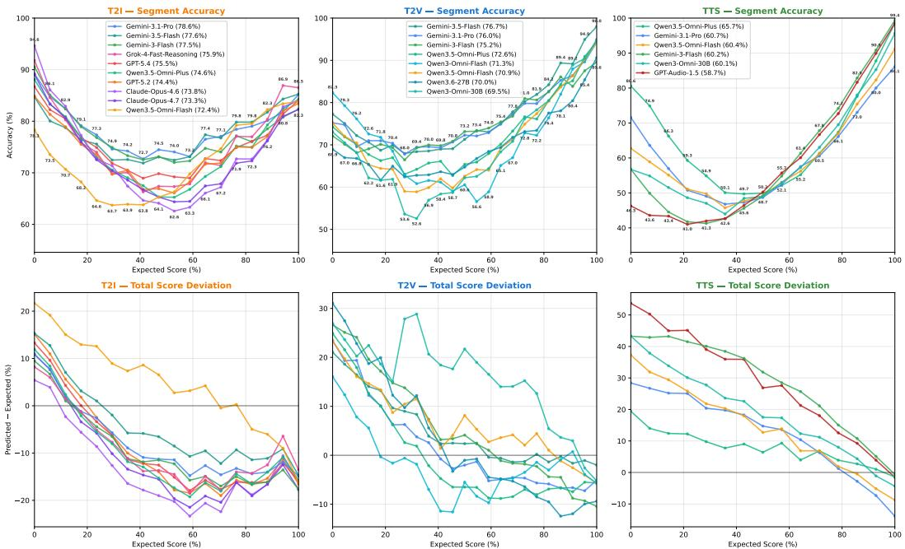
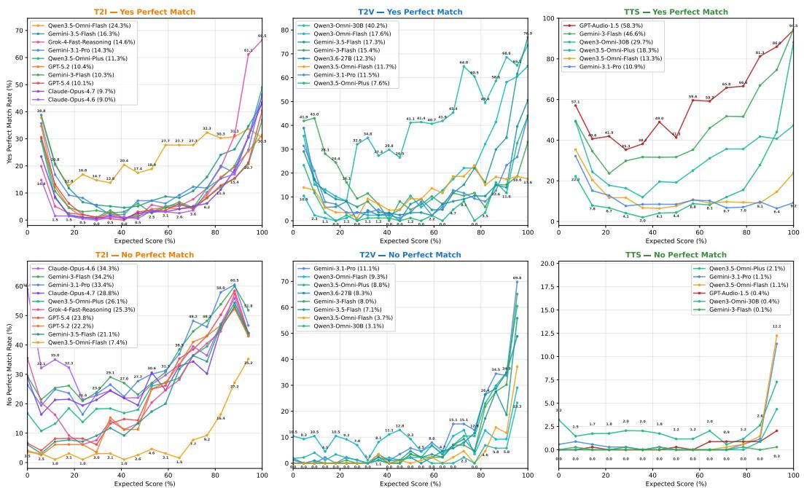
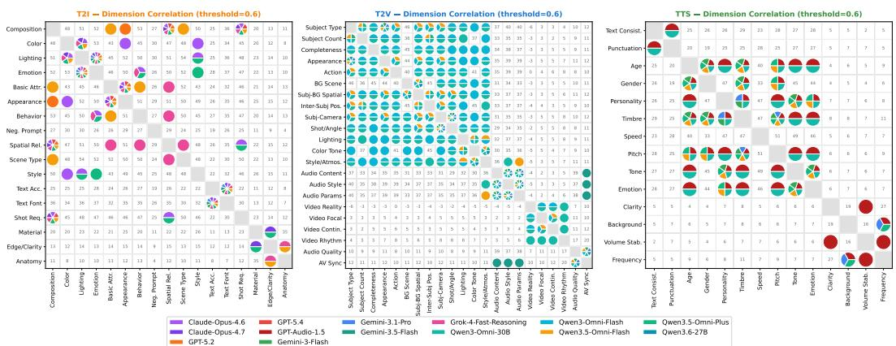
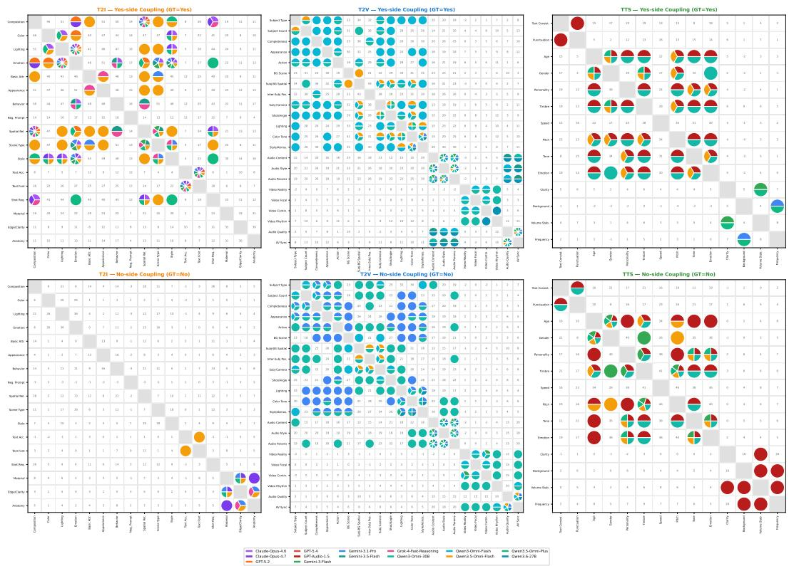
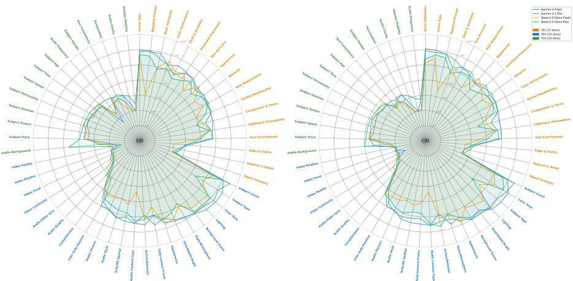
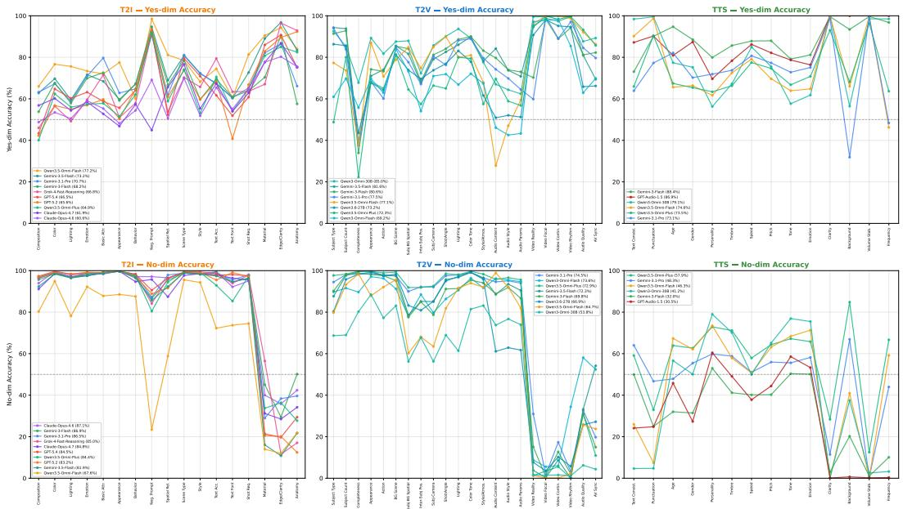

# OmniJudge or OmniBias? Diagnosing Multimodal Judges through Balanced, Decoupled Lenses

Guangzheng Hu1,4 Ziyue Jiang2,5 Weixu Qiao1 Lixin Zhang1 Jianye Kang1 Yuru Wu1 Rong Bao1 Niantong Li1 Wei Wang1 Ziyi Cheng1 Xinfa Zhu² HangRui Hu1 Ting He1 Bing Zhao3 Lin Qu1 Hu Wei1,† Jin Xu2,

1Alibaba Group 2Qwen Team 3Alibaba DAMO Academy 4University of Melbourne 5Zhejiang University guangzhengh@student.unimelb.edu.au †kongwang@alibaba-inc.com renjun.xj@alibaba-inc.com

https://github.com/SKYLENAGE-AI/D3OmniFramework

https://huggingface.co/datasets/skylenage-ai/D30mniBench Abstract

Multimodal understanding models that can jointly judge text-to-image (T2I), textto-video (T2V) and text-to-speech (TTS) generation are increasingly used as “OmniJudges" for evaluation and automatic annotation. How reliably they understand what they score remains unclear, since existing benchmarks and training data tend to overemphasize positive examples and to conflate distinct failure modes, so a judge may score well without recognizing failures while its capability gaps stay hidden. Motivated by this, we introduce D³-Omni, a balanced and decoupled benchmark for diagnosing fine-grained multimodal understanding, covering 53 orthogonal binary dimensions (17/22/14) and 10,671 samples (3,526/1,998/5,147) across the three tasks. Rather than re-generating outputs, which may leak information across dimensions, we fix verified fully positive seeds and derive negatives through controlled prompt rewriting and atomic, dimension-isolating perturbations. The resulting D³ design is Dual-balanced, which helps alleviate negative-sample scarcity and per-dimension label imbalance; Decoupled, so that each error is attributable to a single capability; and Dynamic, steering construction toward under-represented regions of the label distribution as generative models improve. The suite reaches near 1:1 per-dimension parity and a uniform distribution over all total-score levels. Under this balanced view, even strong OmniJudges tend to struggle on modality-related dimensions, to confirm satisfied requirements far more reliably than they detect violated ones, and to treat nominally distinct attributes as largely a single decision, suggesting that aggregate accuracy may hide systematic blind spots that a balanced and decoupled lens can help expose and, in turn, address.

## 1 Introduction

Multimodal large language models (MLLMs) are rapidly evolving toward unified systems capable of understanding, reasoning, and generating across text, image, audio, video, and their combinations. Recent omni-modal benchmarks systematically assess these models' ability to understand and reason across visual, auditory, acoustic, and textual inputs [1, 2]. Beyond serving as response generators, MLLMs are increasingly deployed as automatic annotators, preference judges, reward models, and distillation teachers; when tasked with cross-task scoring across T2I, T2V, and TTS, they are commonly referred to as “OmniJudges". However, the evaluation of these models in such roles particularly as judge models (JMs) or reward models (RMs), remains considerably less developed than the assessment of their generation capabilities. Given their expanding real-world applications addressing this evaluation gap has become increasingly critical.

  
Figure 1: Top: per-segment accuracy over the full ground-truth score range; every judge dips in the mid-score regime, forming a U. Bottom: total-score deviation (predicted — expected): positive = Yes-bias, negative = No-bias, zero = calibrated.

Recent efforts evaluate LLM-as-a-judge systems, reward models, multimodal reward/preference models, and omni-modal reward models through dedicated benchmarks and preference datasets [3–7]. Many multimodal generation and evaluation benchmarks also rely on closed-source frontier models such as GPT-4o and Gemini for automated scoring or preference annotation [6, 8]. Although these protocols streamline evaluation, they reveal an important limitation: existing judge and reward benchmarks are often not explicitly designed around distributional balance. Samples are typically skewed across modalities, tasks, score levels, and evaluation criteria, with certain score ranges or quality categories represented disproportionately. Such distributional biases obscure whether high judging performance reflects genuine fine-grained multimodal understanding or simply memorization of dataset priors and majority-class patterns.

The need for balance is sharpened by a fundamental asymmetry between generation and judging. Realworld generations are predominantly acceptable outputs—catastrophic failures are, by construction, the minority—yet a judge is valuable precisely in the opposite regime, where it needs to catch the occasional error, the fine-grained mismatch, and the subtle factual or perceptual flaw inside an otherwise plausible sample. On a high-quality-dominated, imbalanced suite a judge can thus obtain a high score while remaining blind to the very failure modes that motivate its deployment: when 90% of a dimension's samples are positive, a constant “Yes" already reaches 90% accuracy without any genuine discrimination. A diagnostic omni-modal judge benchmark therefore needs two kinds of balance—score-level balance across quality intervals and dimension-level positive/negative parity—together with an evaluation taxonomy that is as decoupled as possible, so that failures can be attributed to specific abilities rather than conflated [9].

Another challenge is the cost of benchmark construction. Although human annotation is important for reliability, constructing and updating a balanced and decoupled omni-modal benchmark entirely through manual labeling is expensive and inefficient. The cost becomes even higher when balance is required simultaneously across modalities, score levels, and fine-grained evaluation dimensions. This is particularly limiting in the Omni-LLM setting, where model capabilities evolve quickly and static benchmarks may soon lose their discriminative power. Therefore, instead of relying on exhaustive human annotation, benchmark construction should shift human effort toward targeted verification and quality control, while using automatic sample construction, model-assisted filtering, and consistency checking to support scalable data generation and dynamic benchmark updates [6, 8].

Balanced test sets are, in fact, standard practice elsewhere: in long-tailed and imbalanced learning, models trained on skewed data are routinely evaluated on class-balanced test sets, precisely because accuracy is only meaningful once the label distribution is controlled. Why, then, does no explicitly balanced omni-modal judge benchmark yet exist? The obstacle is not a lack of motivation but the difficulty of construction: the quality of generated media is not directly controllable, the natural prevalence of each fine-grained dimension is intrinsically imbalanced, and building decoupled negatives that isolate a single dimension demands precise, controllable sample construction that ordinary data collection cannot provide. Breaking through this barrier is the core enabler of our work: rather than chasing controllable generations, we reverse-construct the prompt from a verified positive seed and apply controllable, dimension-isolating rewriting, coupled with a dynamic dualbalancing loop, which finally makes a balanced and decoupled evaluation suite feasible and exposes the capability blind spots that skewed benchmarks had kept hidden. Figure 1 previews one such blind spot: on our balanced suite every judge's per-segment accuracy collapses on the mixed-quality middle of the score range—a U-shaped dip that any aggregate number conceals.

To address these challenges, we propose $\mathbf { D ^ { 3 } - O m m } ,$ a balanced and decoupled benchmark for diagnosing the fine-grained multimodal understanding of Omni-LLMs as JMs and RMs. Unlike existing multimodal benchmarks that mainly emphasize broad modality coverage or aggregate preference accuracy (e.g., [4, 7]), D³-Omni focuses on distributional balance, decoupled assessment, and scalable construction. Specifically, it is designed to reduce bias induced by skewed score distributions, disentangle different judging dimensions for fine-grained diagnosis, and support low-human-cost benchmark construction and dynamic updates as Omni-LLM capabilities continue to evolve. In summary, $\mathbf { D } ^ { 3 } .$ -Omni represents a paradigm shift from asking “how well does the judge score" to asking what the judge truly understands, and, equally importantly, what it fails to understand and evaluate.

Contributions. Benchmark. We introduce $\mathbf { D } ^ { 3 } \mathbf { - O m m i } ,$ to the best of our knowledge the first balanced and decoupled omni-modal judge/reward benchmark for diagnosing the fine-grained multimodal understanding of Omni-LLMs, covering T2I, T2V and TTS with 10,671 samples. Framework. We propose the $\mathbf { D } ^ { 3 }$ framework—Dual-balanced, Decoupled and Dynamic—which controls the totalscore distribution and the per-dimension positive/negative ratio jointly, reaching near 1 : 1 parity on every dimension and a uniform distribution over all score levels. Taxonomy. We design a decoupled taxonomy of 53 orthogonal binary dimensions (17 for T2I, 22 for T2V, 14 for TTS) that separates prompt-related compliance (instruction following, attribute binding, spatial and temporal reasoning, text typesetting, audio-text alignment) from modality-related perceptual fidelity (visual realism, anatomical coherence, temporal stability, audio quality, speaker characteristics), so that each error is attributable to one capability. Pipeline. We develop a low-human-cost, dynamically updatable construction pipeline combining automatic sample synthesis, model-assisted filtering, consistency checking and targeted human verification, allowing the benchmark to be extended as Omni-LLM capabilities evolve. Diagnosis. Using $\mathbf { D ^ { 3 } - O m m }$ we surface blind spots that aggregate accuracy hides and that recur across model families: a U-shaped competence collapse on mixed-quality samples, a pervasive Yes-bias that widens from vision to speech, and pseudo-decoupling in which nominally orthogonal decisions collapse onto a single latent factor. Each shortcoming maps back to a concrete $\mathbf { D } ^ { 3 }$ operator, turning diagnosis into actionable data-side interventions; and all of it is legible only on a score- and dimension-balanced suite, since reading a single high-score segment alone would already reorder the leaderboard.

## 2 Related Work

## 2.1 Benchmarks for omni-modal generative tasks.

A large body of work evaluates the generation quality of individual modalities: for text-to-image, compositional benchmarks such as T2I-CompBench [10] and GenAI-Bench [11] probe object presence, attribute binding, and spatial relations; for text-to-video, VBench [12], EvalCrafter [13], and T2VScore [14] cover text-video alignment, visual and motion quality, and temporal consistency; and for text-to-speech, automatic evaluators predict perceptual quality, naturalness, intelligibility, and speaker similarity [15–17]. These benchmarks measure how well generators behave, but they treat the underlying evaluator as a trusted black box, leaving untested whether the evaluator itself reliably understands the fine-grained perceptual, alignment, and instruction-following properties it is asked to score. This gap motivates a closer look at the judge and reward models used for generative evaluation

## 2.2 Judge and reward models for generative content.

LLM-as-a-judge has become a scalable alternative to human evaluation [3], with text judges such as PandaLM, JudgeLM, Prometheus, and CompassJudger performing pairwise comparison, scalar scoring, and rubric-based critique [18-22]. In the generative-media domain, judges and reward models remain largely modality-specific: image reward models such as ImageReward, PickScore, and HPSv2 learn human preferences over generated images [23–26], while speech and video rely on learned quality and alignment metrics [12–17]. In parallel, generic omni-modal MLLMs are increasingly used as default judges across all three tasks—closed frontier systems (GPT-4o, GPT-5, Gemini, Claude Opus, Grok) [27–32] and open omni-LLMs (Qwen3-Omni, MiniCPM-o, Mini-Omni2, Baichuan-Omni) [33-36]. Yet none has been independently verified as a unified judge applying the same fine-grained criteria across T2I, T2V, and TTS: modality-specific evaluators approximate human preference scores and generic MLLMs are optimized for general task-solving, so in neither case is the judge itself tested for the perceptual, alignment, and instruction-following understanding that reliable evaluation requires. This motivates benchmarking the judges directly.

## 2.3 Benchmarks for evaluating judge models.

A growing line of work probes judge reliability. Text-only judge benchmarks test whether LLM judges can compare, score, or rank outputs across dialogue, instruction following, reasoning, coding, and safety [3, 4, 37, 38], revealing biases such as position and verbosity bias and weak sensitivity to factual correctness [3, 4, 37]. Recent multimodal and omni-modal benchmarks extend this to vision-language and any-modality judging [1, 2, 5–7, 9, 39, 40]. Three limitations persist. First, they concentrate on text-only or vision-language settings, leaving speech and video judgment under-studied Second, they score the final judgment directly without disentangling the underlying sub-abilities, so a failure cannot be attributed cleanly to perceptual misreading, prompt-alignment failure, or criterion misinterpretation. Third, their label distributions are inherited from naturally collected outputs and rarely controlled, so high accuracy may reflect label priors rather than understanding—which turns attention to how the labels themselves are distributed.

## 2.4 Imbalanced label distribution undermines diagnostic capacity.

Because most judge benchmarks are built from naturally collected outputs or human preferences [3, 4, 39, 40], the positive and negative labels within a fine-grained dimension (e.g., object presence, speaker emotion, temporal consistency, prompt faithfulness) are typically skewed. A judge can then post high accuracy by exploiting label priors—indeed a trivial majority-class baseline already does— so aggregate metrics fail to surface real capability gaps and cross-dimension comparisons become unreliable. The generation-judging asymmetry compounds this: real generations are themselves skewed toward acceptable samples, so a benchmark that mirrors this distribution leaves precisely the regime where a judge is most needed—catching the occasional error and the subtle perceptual or factual flaw—essentially untested. A diagnostic omni-modal judge benchmark therefore needs explicitly balanced per-dimension labels across text-to-speech, text-to-image, and text-to-video, so that it measures whether judges recognize both the presence and the absence of each fine-grained property rather than dataset bias.

## 3 Benchmark Dimension Design

We aim to evaluate whether multimodal understanding models—so-called “OmniJudges"—can make accurate, fine-grained, and decoupled judgments about generated content. To this end, each benchmark instance is formalized as a triplet $( p , x , \mathbf { y } )$ , where $p \in \mathcal P$ is an input prompt, $x \in \mathcal { X }$ is a generated modality (image, video, or speech), and $\mathbf { y } \in \{ 0 , 1 \} ^ { \bar { D } }$ is a ground-truth binary label vector. A judge model f predicts ${ \hat { \mathbf { y } } } = f ( p , x )$ , and its performance is measured by comparing  to y.

## 3.1 Motivation

A judge that produces only an aggregate quality or preference score reveals nothing about which sub-ability is failing—exactly the diagnostic gap motivated in our introduction and related-work discussion. Yet judging generated content fundamentally requires two mechanistically distinct abilities: interpreting natural-language intent and perceiving low-level signal integrity. The first is a language-grounding problem operating jointly over $( p , x )$ ; the second is a perceptual-fidelity problem operating purely over x. Folding them into a single rubric makes failure modes inseparable—a model that perfectly understands intent but cannot detect visual artifacts is, under aggregate scoring, indistinguishable from one with the opposite weakness. We therefore decompose every judgment into two disjoint categories, Prompt-related $( \mathcal { D } _ { p } )$ and Modality-related $( \mathcal { D } _ { m } )$ , and inside each category we further refine the requirement into the smallest atomic dimension on which a controlled perturbation can flip the label without affecting any other dimension. This recursive decoupling is the structural prerequisite for the targeted, dimension-isolating negative-sample construction in Section 4.

## 3.2 Formalization and Two-Category Decomposition

Each dimension $d \in \{ 1 , \dots , D \}$ corresponds to a binary requirement of the form: "Does the generated output satisfy this specific requirement?" with answer $y _ { d } = 1 \ ( \mathtt { Y e s } )$ if satisfied and $y _ { d } = 0$ (No) otherwise. This formulation ensures judgments are unambiguous and directly attributable to specific capabilities.

The two categories are formally defined as follows.

Prompt-related dimensions $( \mathcal { D } _ { p } )$ .These assess semantic alignment between the prompt and the output. They encompass requirements concerning subject identity, spatial and relational structure, compositional logic, stylistic intent, and adherence to explicit or implicit constraints in the prompt. For these dimensions, the ground-truth judgment depends on the joint interpretation of p and x.

Modality-related dimensions $( \mathcal { D } _ { m } )$ .These evaluate intrinsic properties of the generated signal that are independent of the prompt. They cover perceptual and structural qualities such as visual or audio fidelity, temporal coherence, physical plausibility, and low-level artifact presence. Here, the judgment is determined solely by x, as it pertains to the modality's internal consistency and realism.

This categorization enables disentanglement of two fundamental judgment capabilities: understanding user intent versus perceiving signal integrity. Diagnosing which category exhibits systematic errors reveals whether a model's limitations lie in language grounding or perceptual robustness; for example, a judge that scores high on $\mathcal { D } _ { p }$ but consistently fails on $\mathcal { D } _ { m }$ is one that follows the rubric semantically yet remains blind to subtle perceptual flaws—an extremely common pattern that we document empirically in Section 5.

To support meaningful fine-grained analysis, all dimensions are designed to be orthogonal: the satisfaction of any requirement should not depend on the state of others. For instance, whether an image correctly depicts the requested color (attribute binding) should be independent of whether the objects are in the correct spatial arrangement (spatial reasoning); a sample is allowed to fail on color while passing on layout, enabling precise localization of the deficit. The same orthogonality principle is applied recursively to the fine-grained sub-dimensions inside each category: each requirement is the smallest atomic unit whose label can be flipped through a single controlled perturbation without altering the label of any other dimension. This ensures that a failure on one dimension reflects a localized judgment deficit rather than a side effect of correlated attributes, and it is precisely what makes targeted negative-sample construction tractable downstream.

The total score is defined as the integer sum:

$$
s ( \mathbf { y } ) = \sum _ { d = 1 } ^ { D } y _ { d } \in \{ 0 , 1 , \ldots , D \} ,
$$

which counts the number of satisfied requirements. Due to orthogonality, deviations from the maximum score can be precisely attributed to specific violated dimensions.

## 3.3 Granularity and Coverage

Most existing automatic evaluators for generative media collapse “quality" or “alignment" into one or a handful of coarse metrics—FID, CLIP-similarity, MOS, single-axis preference scores, or a small set of generic Likert categories—which neither pinpoint specific failure types nor cover the breadth of attributes a modern OmniJudge is expected to inspect. Our taxonomy goes substantially finer and substantially broader: 17, 22, and 14 atomic binary requirements for T2I, T2V, and TTS respectively, totalling $D = 5 3$ decoupled dimensions. Critically, every fine-grained sub-dimension is selected to target a specific failure mode that frontier generators still occasionally exhibit despite producing visibly high-quality outputs overall— $\textstyle - \mathbf { e } . \mathbf { g } .$ , subtle text-rendering glitches and finger-anatomy errors in T2I, audio–video desynchronization and inter-frame flicker in T2V, or mismatched speaker personality and unstable volume in TTS. These rare-but-critical errors are exactly the cases a deployed judge is expected to detect reliably, yet they are also precisely the cases for which naturally collected data offers very few negative examples. Designing each requirement as small, atomic, and mutually orthogonal is therefore not a stylistic preference but a functional necessity: only such a taxonomy can isolate, balance, and diagnose each rare failure mode in turn, and only such a taxonomy admits dimension-specific negative samples whose construction does not leak into other dimensions.

## 3.4 Instantiation Across Three Tasks

We instantiate this design across three generation scenarios; the complete dimension lists, definitions, and category assignments are provided in Tables 3, 4, and 5 in the appendix.

Text-to-Image (T2I). $D = 1 7 :$ 14 prompt-related dimensions covering composition, attribute binding, spatial reasoning, typography, and negative-instruction handling, plus 3 modality-related dimensions evaluating material realism, edge clarity, and anatomical coherence; the latter three being precisely the residual perceptual flaws that even state-of-the-art diffusion models still leak through on otherwise impressive renderings.

Text-to-Video (T2V). $D = 2 2 \colon$ 16 prompt-related dimensions spanning subject, scene, lighting, style, and audio alignment, plus 6 modality-related dimensions targeting temporal stability, focal sharpness, motion rhythm, audio quality, and audio-video synchronization, where even strong T2V models still produce occasional glitches that aggregate quality scores routinely overlook.

Text-to-Speech (TTS). D = 14: 10 prompt-related dimensions covering textual and punctuation faithfulness together with eight separately-judged speaker characteristics (age, gender, personality timbre, speed, pitch, tone, emotion), plus 4 modality-related dimensions on voice clarity, background noise, volume stability, and spectral integrity. This is a fine-grained decoupling of speaker attributes that current TTS systems often blur into a single “looks-good" voice.

However, real-world data lacks the balance and isolation required to evaluate this taxonomy reliably: outputs are skewed toward high scores, single-dimension negative examples are scarce, and conventional negative synthesis often violates orthogonality through unintended cross-dimensional effects. To address this, we introduce a dynamic dual-balanced construction framework (Section 4) that generates triplets $( p , x , \mathbf { y } )$ with dimension-isolated negatives and near-exact balance across both per-dimension labels and total score levels.

## 4 Balanced Benchmark Construction

As established in Section 3, reliable fine-grained diagnosis of an omni-modal judge requires perdimension label balance and score-level uniformity over a taxonomy whose sub-dimensions are mutually orthogonal. Achieving this in practice, however, is far from trivial: directly resampling new outputs from a perturbed prompt unavoidably introduces cross-dimensional leakage: even minor edits $( \mathrm { e . g . , ^ { * } r u n n i n g ^ { * } } \to \mathrm { ^ * w a l k i n g ^ { * } } )$ drift the pose, motion, background, or rendering quality, simultaneously corrupting several supposedly independent dimensions and destroying the orthogonality on which fine-grained attribution depends.

We therefore propose $\mathbf { D } ^ { 3 } .$ -Construction, a benchmark-construction pipeline organized around three pillars whose names (Decoupling, Dual-Balancing, and Dynamic) all begin with the letter D and together operationalise the design objectives of Section 3. Decoupling (§4.1) makes every generated sample atomically attributable to a single dimension by fixing a fully positive seed and altering only one factor at a time; Dual-Balancing (§4.2) gives the precise mathematical objective that the resulting benchmark must satisfy and proves it is realizable; Dynamic (§4.3) provides the iterative procedure that actually drives any partial benchmark towards that objective.

Notation. Let $\tau \in \{ \mathrm { T } 2 \mathrm { I } , \mathrm { T } 2 \mathrm { V } , \mathrm { T T S } \}$ denote the generation task, ${ \mathcal { D } } _ { p } ^ { ( \tau ) }$ and $\mathcal { D } _ { m } ^ { ( \tau ) }$ the disjoint sets of prompt-related and modality-related sub-dimensions, and $D _ { \tau } = | \mathcal { D } _ { p } ^ { ( \tau ) } | + | \mathcal { D } _ { m } ^ { ( \tau ) } |$ their total size. The catalogues defined in Section 3 yield $D _ { \mathrm { T 2 I } } = 1 7 , D _ { \mathrm { T 2 V } } = 2 2 .$ and $\bar { D } _ { \mathrm { T T S } } = 1 4$ . Whenever the task is unambiguous we drop the superscript (τ). Each benchmark example is a triple

$$
( p , x , \mathbf y ) \in \mathcal { P } \times \mathcal { X } _ { \tau } \times \{ 0 , 1 \} ^ { D _ { \tau } } ,\tag{1}
$$

where $p$ is a natural-language prompt, x a generated modality artifact (image, video, or speech waveform), and $\mathbf { y } = ( y _ { 1 } , \dots , y _ { D _ { \tau } } )$ a binary label vector aligned positionally with the rubric in Section $3 \colon y _ { d } = 1 \left( \mathbf { Y } \mathrm { E S } \right)$ iff $( p , x )$ satisfies the d-th rubric requirement, and $y _ { d } = 0 \left( \mathrm { N O } \right)$ otherwise. The total score of a sample is $\begin{array} { r } { s ( p , x , \mathbf { y } ) = \sum _ { d = 1 } ^ { D _ { \tau } } y _ { d } \in \{ 0 , 1 , \dots , D _ { \tau } \} } \end{array}$ , and we write $s ( \mathbf { y } )$ when $( p , x )$ are clear from context.

## 4.1 Decoupling: Atomic, Single-Dimension Negative Construction

Why decouple at the construction step. Aggregate quality on its own conveys nothing about which sub-ability is failing; pinpointing the failing dimension requires negatives whose violation is, by construction, attributable to one and only one $d ^ { * }$ . We obtain such atomically-attributable negatives by decoupling modality generation from semantic mismatch creation: rather than re-synthesizing a new modality, we fix a fully positive seed $( p ^ { + } , x ^ { + } )$ and inject a single, dimension-isolated edit on either the prompt side (for $\bar { d } ^ { * } \in \mathcal { D } _ { p } )$ or the modality side (for $d ^ { * } \in \bar { D _ { m } } )$

Definition 1 (Fully positive seed). $A p a i r \left( p ^ { + } , x ^ { + } \right)$ is a fully positive seed for task τ iff its label vector under the rubric of Section 3 $\mathbf { \nabla } ^ { \prime } i s \mathbf { y } ^ { + } = \mathbf { 1 } _ { D _ { \tau } } , i . e .$ every prompt-related and every modality-related dimension is satisfied. We denote the set of such seeds by

$$
S _ { f u l l } ^ { ( \tau ) } = \big \{ ( p ^ { + } , x ^ { + } ) : \mathbf { y } ( p ^ { + } , x ^ { + } ) = \mathbf { 1 } _ { D _ { \tau } } \big \} .
$$

Definition 2 (Single-dimension flip operator). For a target dimension $d ^ { * } \in \mathcal { D } _ { p } \cup \mathcal { D } _ { m }$ , a singledimension flip operator $\mathcal { F } _ { d ^ { * } } : \mathcal { P } \times \mathcal { X } \stackrel { \cdot } {  } \mathcal { \bar { P } } \times \mathcal { X }$ is any map satisfying

$$
\begin{array} { r } { \mathbf { y } \left( \mathcal { F } _ { d ^ { * } } ( p ^ { + } , x ^ { + } ) \right) _ { d } = \left\{ \begin{array} { l l } { 0 , } & { d = d ^ { * } , } \\ { 1 , } & { d \in \{ 1 , \dots , D _ { \tau } \} \setminus \{ d ^ { * } \} , } \end{array} \right. \forall ( p ^ { + } , x ^ { + } ) \in \mathcal { S } _ { f u l l } . } \end{array}\tag{2}
$$

${ \mathcal { F } } _ { d ^ { * } }$ is prompt-side if it modifies only $p ^ { + }$ and modality-side if it modifies only $x ^ { + }$

Step 1: Seed prompt construction with a tri-LLM modality-aware expert pipeline. A correct negative is meaningful only on top of a verifiably correct seed. We therefore build $S _ { \mathrm { f u l l } }$ through a modality-aware inverse-prompting procedure executed independently on three large language models (the TTS / T2V / T2I captioning experts implemented respectively as Qwen-3.5 Plus, Gemini-3.1 Flash, and Gemini-3.1 Pro), each conditioned on a modality-specific inverse template that explicitly enumerates every prompt-related sub-dimension $d \in \mathcal { D } _ { p } ^ { ( \tau ) }$ from Section 3. The three captions are reconciled by a human-in-the-loop calibration pass that resolves disagreements and rewrites the seed prompt $p ^ { + }$ until every sub-dimension d in $\mathcal { D } _ { p }$ is grounded by a literal, modality-faithful requirement (e.g., for TTS the prompt explicitly specifies rate, volume, timbre, emotion, etc., matching what the audio actually exhibits). Concretely, given the raw modality $x ,$

$$
\begin{array} { r } { p ^ { + } ( x ) \ = \ \mathrm { C A L I B R A T E } \big ( \mathrm { R E C O N C I L E } \big ( c _ { 1 } , c _ { 2 } , c _ { 3 } \big ) , \ \mathcal { D } _ { p } ^ { ( \tau ) } , \ x \big ) , \quad c _ { i } = \mathrm { L L M } _ { i } ^ { ( \tau ) } \big ( x ; T _ { \mathrm { i n v } } ^ { ( \tau ) } \big ) , } \end{array}\tag{3}
$$

where $T _ { \mathrm { i n v } } ^ { ( \tau ) }$ is the modality-specific inverse template. Modality-related labels for the same x are then verified by the same LLM ensemble (with conflicts again adjudicated by a human auditor); we deliberately keep this verification of $\mathcal { D } _ { m }$ manual because a mis-certified seed would silently propagate as a false negative once perturbed. Only samples whose certified labels equal $\mathbf { 1 } _ { D } .$ enter $S _ { \mathrm { f u l l } }$

Step 2: Prompt-side flips with graded counter-semantic rewriting. For $d ^ { \ast } \in \mathcal { D } _ { p }$ we instantiate ${ \mathcal { F } } _ { d ^ { * } }$ as a controlled prompt rewrite executed by Gemini-3.1 Pro, governed by: (i) minimal modification (alter only tokens directly tied to $d ^ { * } ) ;$ (ii) dimensional isolation (assert all other tokens that ground dimensions $d \neq d ^ { * }$ remain unchanged); and (iii) structural coherence (preserve fluency). To stresstest judges across the full counter-semantic spectrum, the rewriter does not flip in a single fixed direction; it samples a semantic-distance level $\ell \in \mathcal { L } _ { d ^ { * } }$ and emits a $p ^ { - }$ at that level. For example, when the seed TTS prompt requires “very fast" speaking rate $( d ^ { * } = \mathrm { r a t e } )$ , the rewriter randomly draws among $\ell \in \{$ moderate-opposite: medium, strong-opposite: slow, maximal-opposite: very slow }, all of which still violate the rate dimension but at different degrees of semantic divergence, ensuring that the resulting negatives span a wide range of prompt-modality semantic distance and prevent judges from over-fitting to one particular flip template. Formally, the prompt-side flip is realized at a level l drawn uniformly from $\mathcal { L } _ { d ^ { * } }$ , giving $( p ^ { - } , x ^ { + } ) = \mathcal { F } _ { d ^ { * } } ^ { ( \ell ) } ( p ^ { + } , x ^ { + } )$ , and the resulting negative example is $( p ^ { - } , x ^ { + } , \mathbf { y } ^ { ( d ^ { * } ) } )$ with $\mathbf { y } ^ { ( d ^ { * } ) }$ obtained from ${ \bf 1 } _ { D _ { \widetilde { \mathbf { \Lambda } } } }$ by setting the $d ^ { * }$ -th coordinate to 0.

Step 3: Modality-side flips via human-verified atomic operators. For $d ^ { * } \in \mathcal { D } _ { m }$ a prompt edit cannot induce the failure; we instead apply a modality-specific atomic operator $\mathcal { O } _ { d ^ { * } } : \mathcal { X } _ { \tau }  \mathcal { X } _ { \tau }$ to the seed modality $x ^ { + }$ (the prompt $p ^ { + }$ is held fixed). Each $x ^ { + }$ entering this stage has been manually inspected, ensuring that the post-perturbation defect is the only reason a modality-related dimension would flip. At a high level, the operators target three families of perceptual defects: spatial / textural distortions (e.g. frequency-domain blurring, anatomical deformation, segmentation-driven warping), temporal / synchronization perturbations (e.g. frame-order shuffling, 2× speed masking, audio— video offset), and audio-fidelity manipulations (e.g. spectrogram-domain bilateral filtering, additive reverberation, gain modulation, band-targeted frequency manipulation). The full list of atomic operators used in this work—6 for T2V, 3 for T2I, and 4 for TTS—together with their implementation details is provided in Appendix A.3. For every $( d ^ { * } , \tau )$ the corresponding operator $\mathcal { O } _ { d ^ { * } } ^ { ( \tau ) }$ has been validated to leave all $d \neq d ^ { * }$ unchanged on a held-out audit set, so that $\tilde { x } = \mathcal { O } _ { d ^ { * } } ^ { ( \tau ) } ( x ^ { + } )$ paired with the unaltered $p ^ { + }$ produces the desired triple $( p ^ { + } , \tilde { x } , \mathbf { y } ^ { ( d ^ { * } ) } )$ in Eq. (1).

Diagnostic metric for decoupling: the dimension-coupling matrix. To verify that the decoupling holds end-to-end (both in the rubric itself and in any judge's predictions), we report the empirical dimension-coupling matrix $\Sigma \in \mathbb R ^ { D _ { \tau } \times D _ { \tau } }$ whose $\bar { ( d , d ^ { \prime } ) }$ entry is the Pearson correlation of the YES/No indicators across the benchmark:

$$
\Sigma _ { d , d ^ { \prime } } = \frac { \sum _ { i = 1 } ^ { N } ( y _ { i , d } - \bar { y } _ { d } ) ( y _ { i , d ^ { \prime } } - \bar { y } _ { d ^ { \prime } } ) } { \sqrt { \sum _ { i = 1 } ^ { N } ( y _ { i , d } - \bar { y } _ { d } ) ^ { 2 } } ~ \sqrt { \sum _ { i = 1 } ^ { N } ( y _ { i , d ^ { \prime } } - \bar { y } _ { d ^ { \prime } } ) ^ { 2 } } } , \qquad \bar { y } _ { d } = \frac { 1 } { N } \sum _ { i = 1 } ^ { N } y _ { i , d } .\tag{4}
$$

We compute Σ on (a) the ground-truth labels (the reference matrix) and on (b) each judge's predicted labels; substantial off-diagonal mass in (b) that is absent from (a) is direct evidence of spurious coupling, i.e., the judge cannot truly separate the underlying capabilities, which is one of the four diagnostic axes evaluated in Section 5.

## 4.2 Dual-Balancing: Definition and Existence Theorem

The two balance constraints. A benchmark $\boldsymbol { B } = \{ ( p _ { i } , x _ { i } , \mathbf { y } _ { i } ) \} _ { i = 1 } ^ { N }$ is dually balanced iff it is uniform along the score-segment axis and along the per-dimension label axis. Writing $N = M ( D _ { \tau } +$ 1) with $M \in \mathbf { \mathbb { N } } ^ { + }$ samples per score level, we require

$$
\begin{array} { r l r l } & { | \{ i : s ( \mathbf { y } _ { i } ) = s \} | = M , \quad } & & { \forall s \in \{ 0 , 1 , \ldots , D _ { \tau } \} , } & & { \mathrm { ( S c o r e ~ u n i f o r m i t y ) } } \\ & { \underset { i = 1 } { \overset { N } { \sum } } y _ { i , d } = \frac { N } { 2 } \ = \ \frac { M ( D _ { \tau } + 1 ) } { 2 } , \quad } & & { \forall d \in \{ 1 , \ldots , D _ { \tau } \} . } & & { \mathrm { ( D i m e n s i o n ~ p a r i t y ) } } \end{array}
$$

Eq. (Score uniformity) enforces segment balance so that each total-score bin is equally represented; Eq. (Dimension parity) enforces per-dimension balance so that no single sub-ability can be solved by predicting the majority class. Importantly, neither constraint alone is sufficient: a benchmark can be score-uniform yet have one dimension always equal to 1, and conversely a benchmark can be per-dimension-balanced yet entirely concentrated near $s { \approx } D _ { \tau } / 2$ (cf. §5.2 of the experiments).

Lemma 1 (Attainability of dual balance). Fix a task τ and suppose

(A1) $S _ { \mathrm { f u l l } } ^ { ( \tau ) } \neq \emptyset$ (fully positive seeds exist).

(A2) For every $d \in \{ 1 , \dots , D _ { \tau } \}$ , a single-dimension flip operator $\mathcal { F } _ { d }$ satisfying $E q . \ ( 2 )$ is realizable.

(A3) For every $S \subseteq \{ 1 , \ldots , D _ { \tau } \}$ the composition $\mathcal { F } _ { S } = \bigcirc _ { d \in S } \mathcal { F } _ { d }$ acts as the characteristic flip $\mathbf { y } ( { \mathcal { F } } _ { S } ( p ^ { + } , x ^ { + } ) ) _ { d } = \mathbf { 1 } [ d \notin S ]$ for every seed.

Then for every tolerance $( \rho , \delta )$ with $\rho \in [ 0 , 1 )$ and $\delta \geq 0$ there is an achievable benchmark meeting the stopping criterion $( 7 ) ;$ the target can be tightened to exact dual balance (Eqs. (Score uniformity)— (Dimension parity)), which is realizable with $| B | = M ( D _ { \tau } + 1 )$ whenever $M ( D _ { \tau } + 1 )$ is even. Consequently the three monitored quantities of $\cdot \ S 4 . 3$ can be driven below any prescribed threshold, however strict.

Proof sketch. Exact dual balance is the tightest instance $( \rho  1 , \delta = 0 )$ and dominates every looser tolerance, so it suffices to construct it. We do so explicitly in Appendix $\ \mathrm { { A . 1 } } \mathrm { { : } }$ single-dimension flips are composed via $( \mathbf { A } 2 ) \substack { + } ( \mathbf { A } 3 )$ into multi-dimension flips whose $M ( D _ { \tau } + 1 )$ label vectors realise each score level exactly M times and load every dimension exactly $N / 2$ times, establishing Eqs. (Score uniformity)-(Dimension parity) when $M ( \dot { \boldsymbol { D } } _ { \tau } + 1 )$ is even; any looser $( \rho , \delta )$ is then met a fortiori. □

## 4.3 Dynamic: Iterative Construction Algorithm

Theorem 1 guarantees that a dually balanced benchmark exists, but in practice the seed pool, the LLMrewriter, and the modality operators all incur finite costs, so we cannot enumerate the combinatorial template once and stop. Instead, we grow B dynamically: at each step we identify the least-populated non-full score, the most positive-dominated dimensions, and the least-loaded seed, and append one controlled multi-dimension negative for that target.

Monitored quantities. Write $N _ { t } = | \boldsymbol { B } ^ { ( t ) } |$ and let $\sigma ( i ) \in S _ { \mathrm { f u l l } }$ be the seed of sample i. Over $B ^ { ( t ) }$ we track exactly the three quantities that define the target: the per-dimension positive and negative proportions, the score histogram, and the per-seed negative load,

$$
\begin{array} { l } { { \pi _ { d } ^ { \mathrm { r g s } } = \displaystyle \frac { 1 } { N _ { t } } \sum _ { i } { \bf 1 } [ y _ { i , d } = 1 ] , \qquad \pi _ { d } ^ { \mathrm { n o } } = 1 - \pi _ { d } ^ { \mathrm { v E s } } , } } \\ { { \quad { \cal N } _ { s } ^ { ( t ) } = \big | \{ i : s ( { \bf y } _ { i } ) = s \} \big | , \qquad u _ { \sigma } ^ { ( t ) } = \big | \{ i : \sigma ( i ) = \sigma , s ( { \bf y } _ { i } ) < D _ { \tau } \} \big | . } } \end{array}\tag{5}
$$

Per-step target. Each step addresses the least-populated non-full score level, the most positivedominated dimensions, and the least-loaded seed:

$$
s ^ { * } = \arg \operatorname* { m i n } _ { 0 \leq s < D _ { \tau } } N _ { s } ^ { ( t ) } , \qquad T ^ { * } \in \operatorname * { a r g m i n } _ { | T | = D _ { \tau } - s ^ { * } } \sum _ { d \in T } \frac { \pi _ { d } ^ { \mathrm { N o } } } { \pi _ { d } ^ { \mathrm { Y g s } } } , \qquad \sigma ^ { * } = \arg \operatorname* { m i n } _ { \sigma \in \mathcal { S } _ { \mathrm { t a l l } } } u _ { \sigma } ^ { ( t ) } ,\tag{6}
$$

with ties broken uniformly at random, so that $T ^ { * }$ gathers the $\boldsymbol { D } _ { \boldsymbol { \tau } } - \boldsymbol { s } ^ { * }$ dimensions of smallest negative/positive ratio. Applying the composite flip $\mathcal { F } _ { T ^ { * } } \ \mathrm { o f } \ \ S 4 . 1$ to $\sigma ^ { * } = ( p ^ { + } , x ^ { + } )$ —its promptrelated coordinates $T ^ { * } \cap \bar { \mathcal { D } } _ { p }$ by graded rewriting and its modality-related coordinates $T ^ { * } \cap \bar { \mathcal { D } } _ { m }$ by the atomic operators—produces a negative of score $s ^ { * }$ with label $\mathbf { y } ^ { ( T ^ { * } ) }$ , where $\mathbf { y } _ { d } ^ { ( T ^ { * } ) } = \mathbf { 1 } [ d \notin T ^ { * } ]$ which is appended to $B ^ { ( t + 1 ) }$

Stopping criterion. The loop halts once the two balance axes are within tolerance:

$$
\operatorname* { m i n } _ { d } \frac { \pi _ { d } ^ { \mathrm { N O } } } { \pi _ { d } ^ { \mathrm { Y E S } } } > \rho \qquad \mathrm { a n d } \qquad \operatorname* { m a x } _ { s } N _ { s } ^ { ( t ) } - \operatorname* { m i n } _ { s } N _ { s } ^ { ( t ) } < \delta .\tag{7}
$$

The first condition forces every dimension to a negative/positive ratio of at least $\rho$ (perfect balance is ratio 1); the second flattens the score histogram; the seed load $u _ { \sigma }$ enters only through the leastloaded-seed choice in Eq. (6), keeping negatives spread across seeds rather than being a stopping target. For all three tasks of ${ \mathrm { ~ D } } ^ { 3 } .$ -Omni we use $\rho = 0 . 9 5$ and $\delta = 6$ . Each step raises the negative count of the currently most positive-dominated dimensions and of the least-filled score, so both deficits decrease monotonically; by Lemma 1 the tolerance region is attainable for any $( \rho , \delta )$ —indeed down to exact balance—so the loop terminates

Algorithm 1 D³-Construction: dynamic dual-balanced benchmark assembly   
Require: Raw modalities $\mathcal { X } ; \mathcal { D } _ { p } , \mathcal { D } _ { m } ;$ tri-LLM ensemble $\{ \mathrm { L L M _ { 1 } , L L M _ { 2 } , L L M _ { 3 } } \}$ ; reconciler /   
rewriter Gemini-3.1 Pro; modality operators $\{ \mathcal { O } _ { d } \} _ { d \in \mathcal { D } _ { m } } ;$ tolerances $\rho , \delta .$   
Ensure: Benchmark B meeting the stopping criterion Eq. (7).   
Stage A: Seed curation (Decoupling, Step 1).   
1: Run inverse-prompting on X' with each $\operatorname { L L M } _ { i } ,$ reconcile + human-calibrate to obtain $p ^ { + } ( x )$ for   
every x.   
2: Run modality-integrity check on every x via $\{ { \mathrm { L L M } } _ { i } \}$ + human audit.   
3: Sfull $ \{ ( p ^ { + } ( x ) , \bar { x } ) : \mathbf { y } ( p ^ { + } ( x ) , x ) = \mathbf { \bar { 1 } } _ { D _ { \tau } } \} ; \ : \mathcal { B }  S _ { \mathrm { f u l l } } .$   
Stage B: Monitor-generate-update loop.   
4: Compute $\pi _ { d } ^ { \mathrm { { N O } } } / \pi _ { d } ^ { \mathrm { { Y E S } } } , N _ { s } , u _ { \sigma }$ over $B .$ ▶ Eq. (5)   
5: while mir $1 _ { d } \bar { \pi } _ { d } ^ { \mathrm { N O } } \bar { / } \pi _ { d } ^ { \mathrm { Y E S } } \leq \rho$ or maxs $\mathrm { . } N _ { s } - \operatorname* { m i n } _ { s } N _ { s } \geq \delta$ do ▶Eq. (7)   
6: $\begin{array} { r }  s ^ { * } \gets \arg \operatorname* { m i n } _ { s < D _ { \tau } } N _ { s } ; \ T ^ { * } \in \ \end{array}$ arg min $\scriptstyle \cdot \vert T \vert = D _ { \tau } - s ^ { \ast } \sum d \in T ^ { \pi ^ { \mathrm { N O } } } / \pi _ { d } ^ { \mathrm { Y E S } } ; \sigma ^ { \ast } \gets$ arg minσ $u _ { \sigma } . \triangleright$   
Eq. (6)   
$\begin{array} { r l r } { \tau \colon } & { { } } & { ( p ^ { - } , x ^ { - } )  { \mathcal { F } } _ { T ^ { * } } ( \sigma ^ { * } ) } \end{array}$ : prompt coords of $T ^ { * }$ by rewriting, modality coords by operators;   
$\mathbf { y } ^ { - }  \mathbf { y } ^ { ( T ^ { * } ) } .$   
8: $\mathcal { B }  B \cup \{ ( p ^ { - } , x ^ { - } , \mathbf { y } ^ { - } ) \}$ ; update $\pi _ { d } ^ { \mathrm { N O } } / \pi _ { d } ^ { \mathrm { Y E S } } , N _ { s } , u _ { \sigma }$   
9: end while   
10: return B.

The output of Algorithm 1 is a benchmark meeting the stopping criterion Eq. (7)—the attainable target guaranteed by Lemma 1—in the canonical triplet format of Eq. (1), equipped with the diagnostic metrics of §4.2; this is exactly the benchmark evaluated by the experiments in Section 5.

## 4.4 Diagnostic Metrics Derived from the Dual Balance

The dual balance is precisely what makes the metrics below readable as capability signals rather than as artifacts of an imbalanced label distribution. Let $\hat { \mathbf { y } } _ { i } \in \{ 0 , 1 \} ^ { D _ { \tau } }$ be a judge's predicted label vector for the ¿-th benchmark sample, and let $B _ { s } = \{ i : s ( \mathbf { y } _ { i } ) \stackrel { . } { = } s \}$

Metric 1: Per-dimension accuracy. This metric quantifies the judge's resolution of the d-th sub-ability:

$$
\operatorname { A c c } _ { d } = \frac { 1 } { N } \sum _ { i = 1 } ^ { N } \mathbf { 1 } \big [ \hat { y } _ { i , d } = y _ { i , d } \big ] .\tag{8}
$$

Metric 2: Per-segment accuracy. This metric is the mean per-sample dimension match inside score bin s:

$$
\mathsf { A c c } _ { s } \ = \ \frac { 1 } { \left| \mathcal B _ { s } \right| } \sum _ { i \in \mathcal B _ { s } } \frac { 1 } { D _ { \tau } } \sum _ { d = 1 } ^ { D _ { \tau } } \mathbf { 1 } \big [ \hat { y } _ { i , d } = y _ { i , d } \big ] .\tag{9}
$$

Under Eq. (Score uniformity) every $| B _ { s } |$ equals M, so the curve $s \mapsto \mathsf { A c c } _ { s }$ is undistorted by segment mass.

Metric 3: Per-segment perfect-match rate. This metric reports the fraction of samples in segment s whose predicted label vector exactly matches the ground truth:

$$
\mathrm { P M } _ { s } \ = \ \frac { 1 } { \left| \mathcal { B } _ { s } \right| } \sum _ { i \in \mathcal { B } _ { s } } \mathbf { 1 } \Bigl [ \hat { \mathbf { y } } _ { i } = \mathbf { y } _ { i } \Bigr ] .\tag{10}
$$

Metric 4: Dimension-restricted Yes/No exact-match rates. These metrics report respectively the fraction of samples on which a judge gets every ground-truth-YEs dimension right, and analogously

for No:

$$
\mathrm { P M } ^ { \mathrm { Y g s } } = \frac { 1 } { | \mathcal { Z } ^ { \mathrm { Y g s } } | } \sum _ { i \in \mathcal { T } ^ { \mathrm { Y g s } } } \mathbf { 1 } \Big [ \widehat { y } _ { i , d } = 1 , \forall d \in \mathcal { Y } _ { i } ^ { + } \Big ] , \qquad \quad \mathcal { Y } _ { i } ^ { + } = \{ d : y _ { i , d } = 1 \} ,\tag{11}
$$

$$
\mathrm { \bf P M } ^ { \mathrm { N o } } = \frac { 1 } { | { \cal Z } ^ { \mathrm { N o } } | } \sum _ { i \in \cal Z } { \bf 1 } \Big [ \hat { y } _ { i , d } = 0 , \forall d \in \mathcal { Y } _ { i } ^ { - } \Big ] , \qquad \quad \mathcal { Y } _ { i } ^ { - } = \{ d : y _ { i , d } = 0 \} ,\tag{12}
$$

where $\mathcal { T } ^ { \mathrm { Y E S } } = \{ i : \mathcal { V } _ { i } ^ { + } \neq \emptyset \}$ and ${ \mathcal { T } } ^ { \mathrm { N o } } = \{ i : { \mathcal { V } } _ { i } ^ { - } \neq \emptyset \}$

Metric 5: Dimension-coupling matrix. $\Sigma ( \mathrm { E q . } ( 4 ) )$ is evaluated separately on $\left\{ \mathbf { y } _ { i } \right\}$ (reference) and on $\{ \hat { \mathbf { y } } _ { i } \}$ (predicted), with off-diagonal excess $| \Sigma _ { d , d ^ { \prime } } ^ { \mathrm { p r e d } } | - | \Sigma _ { d , d ^ { \prime } } ^ { \mathrm { r e f } } |$ flagging spurious coupling.

These five quantities, taken jointly, instantiate the four diagnostic axes listed in Section 5: segment robustness (Eq. (9)), dimension-wise resolution (Eq. (8)), dimensional decoupling (Eq. (4)), and Yes/No commit behavior (Eq. (12)).

## 5 Experiments

We evaluate a suite of state-of-the-art multimodal judges on ${ \bf D } ^ { 3 } .$ -Omni and organise the diagnosis around five questions that an unbalanced benchmark cannot answer: (i) at the macro level, do today's OmniJudges differ enough to be distinguished, and does the ranking transfer across modalities (Sec. 5.1)? (ii) as the ground-truth total score varies, in which score regime does each judge break down, and in which direction does it miscalibrate (Sec. 5.2)? (iii) when forced to commit on all-Yes or all-No segments, does a judge expose a structured Yes/No class bias, and does its aggregate accuracy actually reflect an ability to localize the few defects that a segment contains (Sec. 5.3)? (iv) when nominally orthogonal dimensions are to be judged independently, does a judge keep its per-dimension decisions decoupled or let one decision drag the others (Sec. 5.4)? (v) at the per-dimension level, which fine-grained requirements floor every judge near chance, and which expose the largest intermodel gaps (Sec. 5.5)? Because D³-Omni is balanced over both dimensions and total scores, every drop in accuracy is attributable to a localized capability gap rather than to a skewed label prior, turning aggregate numbers into a transparent diagnostic map. The diagnosis is built around four figures (Figures 1, 2, 3 and 5); Sec. 5.7 then maps the four diagnosed shortcomings back to the three operators of the $\mathsf { D } ^ { 3 }$ construction framework (Sec. 4). The full judging prompts are reproduced in Appendix A.4.

## 5.1 Setup and Overall Accuracy

Judges, tasks and metrics. We benchmark ten judges on T2I, eight on T2V and six on TTS, drawn from the Gemini, GPT, Claude, Grok and Qwen families; we treat them under a single pool, since the goal is to characterize judging behavior rather than to compare access types. Every judge of a given task is queried with the same prompt template (Appendix A.4) and answers in a JSON array of D Yes/No decisions. Unless stated otherwise, the observations below refer to the judges evaluated here. All judges are queried at temperature 0 with every other decoding parameter left at its provider default, so the reported behavior reflects each model's deterministic mode rather than sampling variance. Because every dimension is a binary judgment, we adopt four complementary metrics: (i) per-dimension binary accuracy, the primary metric; (ii) segment-wise accuracy on the total-score slice $\begin{array} { r } { s ( \mathbf { y } ) = \sum _ { d } y _ { d } \ ' \in \{ 0 , \dots , \overset { } { D } \} } \end{array}$ , with one curve per judge per task, together with the total-score calibration curve; (iii) the off-diagonal Pearson correlation matrix of each judge's predicted per-dimension decisions, which measures whether the judge decides each near-orthogonal dimension independently or allows one latent factor to drive several outputs (a pair is flagged at $\rho { > } 0 . 6$ and treated as strongly entangled at $\rho > 0 . 8 )$ ; and (iv) per-segment Yes/No perfect-match rates, which expose class-prior shortcuts and, more strictly, whether a judge can localize every minority defect within a segment.

Overall accuracy hides the diagnosis. Averaging per-dimension binary accuracy over the entire test set gives a tight band on the visual tasks: the ten T2I judges sit between 72.4% and 78.6% and the eight T2V judges between 69.5% and 76.7%, a 6–7 point spread that one would dismiss as a saturating leaderboard. TTS does not so much widen the band as reorder it: accuracy compresses to

<table><tr><td rowspan="2">Judge</td><td colspan="5">T2I</td><td colspan="5">T2V</td><td colspan="5">TTS</td></tr><tr><td> $\mathcal { D } _ { p }$ </td><td> $\mathcal { D } _ { m }$ </td><td>Low</td><td>Mid</td><td>High</td><td> $\mathcal { D } _ { p }$ </td><td> $\mathcal { D } _ { m }$ </td><td>Low</td><td>Mid</td><td> $\mathrm { H i g h }$ </td><td> $\mathcal { D } _ { p }$ </td><td> $\mathcal { D } _ { m }$ </td><td>Low</td><td>Mid</td><td>High</td></tr><tr><td>Gemini-3.1-Pro</td><td>83.21</td><td>56.93</td><td>81.2</td><td>74.2</td><td>80.3</td><td>85.20</td><td>51.41</td><td>71.1</td><td>71.7</td><td>84.5</td><td>64.93</td><td>50.16</td><td>58.4</td><td>50.5</td><td>73.2</td></tr><tr><td>Gemini-3-Flash</td><td>81.91</td><td>57.17</td><td>81.5</td><td>73.0</td><td>78.1</td><td>84.81</td><td>49.52</td><td>69.3</td><td>72.3</td><td>83.5</td><td>63.09</td><td>52.98</td><td>46.8</td><td>50.7</td><td>83.0</td></tr><tr><td>Qwen-3.5-Omni-Plus</td><td>78.27</td><td>57.65</td><td>78.8</td><td>67.2</td><td>77.9</td><td>80.30</td><td>52.04</td><td>68.1</td><td>66.3</td><td>82.6</td><td>66.33</td><td>64.20</td><td>67.2</td><td>51.4</td><td>78.5</td></tr><tr><td>Qwen-3.5-Omni-Flash</td><td>76.64</td><td>52.74</td><td>69.9</td><td>66.9</td><td>80.5</td><td>77.85</td><td>52.27</td><td>66.2</td><td>63.1</td><td>82.3</td><td>64.02</td><td>51.54</td><td>55.5</td><td>50.4</td><td>75.4</td></tr><tr><td>Gemini-3.5-Flash</td><td>82.85</td><td>52.92</td><td>78.0</td><td>73.4</td><td>81.3</td><td>85.57</td><td>53.30</td><td>71.3</td><td>71.3</td><td>87.0</td><td></td><td></td><td></td><td></td><td></td></tr><tr><td>GPT-5.4</td><td>80.20</td><td>53.70</td><td>78.8</td><td>70.0</td><td>77.7</td><td></td><td></td><td></td><td></td><td></td><td></td><td></td><td></td><td></td><td></td></tr><tr><td>Grok-4-Fast</td><td>80.00</td><td>56.88</td><td>79.4</td><td>68.5</td><td>79.9</td><td></td><td></td><td></td><td></td><td></td><td></td><td></td><td></td><td></td><td></td></tr><tr><td>GPT-5.2</td><td>78.96</td><td>52.94</td><td>77.3</td><td>68.4</td><td>77.4</td><td></td><td></td><td>一</td><td>一</td><td></td><td>一</td><td></td><td></td><td></td><td></td></tr><tr><td>Claude-Opus-4.7</td><td>77.18</td><td>55.57</td><td>78.7</td><td>66.1</td><td>75.2</td><td></td><td></td><td></td><td></td><td></td><td></td><td></td><td></td><td></td><td></td></tr><tr><td>Claude-Opus-4.6</td><td>77.10</td><td>58.60</td><td>80.8</td><td>64.7</td><td>76.0</td><td></td><td></td><td></td><td></td><td></td><td></td><td></td><td></td><td></td><td></td></tr><tr><td>Qwen-3.6-27B</td><td></td><td></td><td></td><td></td><td></td><td>77.76</td><td>49.16</td><td>65.0</td><td>65.6</td><td>78.8</td><td></td><td></td><td></td><td></td><td></td></tr><tr><td>Qwen-3-Omni-Flash</td><td></td><td></td><td></td><td></td><td></td><td>76.96</td><td>56.18</td><td>71.8</td><td>60.4</td><td>80.3</td><td></td><td></td><td></td><td></td><td></td></tr><tr><td>Qwen-3-Omni-30B</td><td></td><td></td><td></td><td></td><td></td><td>76.92</td><td>49.53</td><td>63.0</td><td>61.6</td><td>83.0</td><td>64.35</td><td>49.62</td><td>51.8</td><td>50.3</td><td>78.3</td></tr><tr><td>GPT-Audio-1.5</td><td></td><td></td><td></td><td></td><td></td><td></td><td></td><td></td><td></td><td></td><td>62.18</td><td>50.25</td><td>43.2</td><td>51.0</td><td>81.9</td></tr></table>

Table 1: Per-judge accuracy with the three tasks side by side. Top four rows: cross-task judges present in all tasks; below: task-specific judges (-: not evaluated). For each task, $\mathcal { D } _ { p } / \mathcal { D } _ { m }$ are the prompt-/modality-related macro accuracies and Low/Mid/High the accuracies in the 0–33/33–-66/66– 100% score bands. Per column, bold marks the best and underline the second-best value, computed separately within the cross-task and task-specific blocks.

58.7%–65.7% and the family that leads the visual tasks no longer leads, with Qwen-3.5-Omni-Plus on top (65.70%) and the two Gemini judges, dominant on T2I and T2V, sliding into the lower half. The four diagnostic axes that follow show that the visual-task tightness is itself an artifact: every T2I/T2V judge loses substantial accuracy on specific fine-grained regimes, but each one loses it in a different regime, so the macro average conceals these losses.

## 5.2 Score-Segment Behavior and Calibration

Reading the two rows. We slice the test set by the ground-truth total score $s ( \mathbf { y } ) = \textstyle \sum _ { d } y _ { d }$ , which counts how many of the D requirements a sample satisfies; by construction every score segment holds the same number of samples. The top row of Figure 1 plots, for each judge, its per-dimension binary accuracy within each segment (one curve per judge, the legend value being the overall mean), and thus reveals the difficulty regime on which a judge decides accurately or breaks down. The bottom row plots the total-score deviation, predicted minus expected total, so a point above the zero baseline is over-scoring and one below is under-scoring, revealing the direction in which the judge's scores are biased. Read together, the two rows turn a single aggregate accuracy into a difficulty-resolved capability curve and a bias direction.

Top row: a U-shaped collapse on the mixed-quality middle. Every curve is markedly U-shaped: a judge decides easily on the all-violated and all-satisfied extremes but loses substantial per-dimension accuracy in the middle, where roughly half the requirements hold and the other half fail, i.e. the ambiguous mixed-quality samples on which no all-Yes or all-No prior helps and each dimension has to be decided on its own. On T2I, GPT-5.2 reads 84.9% at s = 0 and 83.4% at s = D yet drops to about 66% in the middle; at the aggregate level Gemini-3.1-Pro leads T2I (78.6%), Gemini-3.5-Flash leads T2V (76.7%), and TTS is hardest, where the best judge, Qwen-3.5-Omni-Plus, reaches only 65.7%. The dip marks a judge's real weakness and sits precisely where ordinary benchmarks are sparsest, so an unbalanced set yields a high mean from the two easy tails while the collapse remains hidden. Table 1 gives the banded counterpart (Low/Mid/High = the 0–33/33–66/66–100% score bands): for almost every judge the Mid band is the trough, e.g. Gemini-3.1-Pro on T2I reads 81.2/74.2/80.3 and Qwen-3.5-Omni-Plus 78.8/67.2/77.9.

The shape of the dip is itself a quality profile. Judges differ in the depth, position and symmetry of the U, and each shape reads as a distinct competence profile. Gemini-3.1-Pro traces the shallowest, flattest U on T2I (trough 72.7%, endpoints 89.2% and 85.2%), a judge equally at ease on clearlybad, mixed and clearly-good samples, which is why it also tops the macro table; GPT-5.2 and Gemini-3.5-Flash are near-symmetric, concentrating their error squarely on the half-satisfied middle. Claude-Opus-4.6 is the opposite extreme, a deep narrow valley (trough 62.6%) whose all-violated tail is the highest of any judge (94.6%) but whose recovery is weak, the profile of a judge that only reliably flags blatant defects, while Grok-4-Fast-Reasoning shows high shoulders over a deep trough, so reading only its extremes would overstate it. The lone T2I exception is Qwen-3.5-Omni-Flash: instead of a symmetric U it traces a rising slope whose trough sits early (near 29%) and whose all-satisfied end (83.9%) exceeds its all-violated end (78.3%), the only judge more reliable on good samples than on blatantly bad ones.

Endpoint asymmetry: confirming quality versus detecting defects. Beyond depth, the relative height of the two arms is diagnostic: the difference hi—lo between the all-satisfied and all-violated ends says whether a judge is better at confirming good content or at catching bad content. Averaged over judges the sign flips with the modality: T2I is mildly negative (—3.67; Claude-Opus-4.6 reaches -10.6), so judges are stricter on poor images, whereas T2V (+19.05) and TTS (+32.45) are strongly positive, so on the temporal tasks judges confirm all-good content well but cannot flag every defect on all-bad content; the asymmetry is same-signed and slightly larger in Chinese (T2V +21.22, TTS +36.81). The trough migrates accordingly, deepening and shifting toward the low-score, mostly-violated side on the temporal tasks (the three T2V Gemini judges bottom out near 27%, and Qwen-3-Omni-30B reaches 52.57%, one of the deepest collapses in the study), so the hardest samples change from half-right-half-wrong on T2I to mostly-wrong-but-not-all on T2V and TTS. The extreme is GPT-Audio-1.5 on TTS, closer to a monotonic ramp than a U, rising from 46.3% on all-violated speech to 98.5% on all-satisfied speech and essentially saying Yes until the audio is clearly clean.

Bottom row: a regression-to-the-mean bias. The deviation curve falls monotonically with the ground-truth score, giving a consistent pattern of over-scoring the bad and under-scoring the good: every judge sits above the zero baseline at s = 0 and below it at s = D, crossing zero somewhere in the low-to-mid range. On T2I, GPT-5.2 over-scores by +15 points on all-violated samples and under-scores by —17 on all-satisfied ones, so the error is directional and predictable rather than random. The bias is most severe on the all-violated tail of the temporal tasks: even the best-calibrated TTS judge, Qwen-3.5-Omni-Plus, still mislabels about one in five No dimensions as Yes at s = 0, and GPT-Audio-1.5 mislabels more than half (46.3% accuracy there). This is the macro-level footprint of the Yes-biased class prior that Sec. 5.3 isolates dimension by dimension, where no TTS judge produces all-No on more than 12.24% of the samples for which all-No is correct.

Why only a balanced set reveals this, and a counterfactual. Both the U trough and the signchanging deviation line can be read only when every score segment is populated. A direct counterfactual makes the point: reading a single high-score segment would rewrite the leaderboard, since the all-satisfied segment alone would rank Gemini-3-Flash first on TTS (99.4%), a judge third from last under balanced macro accuracy (60.2%), while the all-violated segment would instead promote Qwen-3.5-Omni-Plus; on T2I the all-violated segment would elevate Claude-Opus-4.6 (94.6%), eighth of ten on the macro average. Score uniformity is therefore a necessary condition for a trustworthy leaderboard, not a stylistic preference.

Cross-modal synthesis. Every judge converges on the same strategy: exploit a majority-class shortcut wherever the labels concentrate, and pay for it in the mixed-quality middle. T2I expresses this as a mildly low-biased U, T2V and TTS as a high-biased U whose trough migrates toward the low-score side and deepens with the length of the temporal signal, so the amplitude grows from T2I through T2V to TTS. Importantly, the rebound of these curves on high-score segments is a per-dimension average and should not be read as evidence that a judge has localized the few remaining defects; Sec. 5.3 shows that this rebound is largely carried by confirming the many satisfied dimensions.

## 5.3 Yes/No Perfect Match: Does the Headline Number Localise Defects?

Reading the two rows. Per-dimension accuracy averages over all dimensions of a sample, so a judge can post a high mid-to-high score by confirming the many satisfied dimensions while missing the few violated ones. Figure 2 applies a stricter test per score segment: the top row is the Yes-rate, the fraction of samples on which the judge is correct on all ground-truth-Yes dimensions, and the bottom row is the symmetric No-rate on all ground-truth-No dimensions. Because getting every dimension of one polarity right is demanding, the absolute rates sit far below the segment accuracy of Figure 1, so the figure is read for relative contrasts, between judges and between the Yes and No rows, rather than for absolute height. The No row is the strict measure of defect attribution: a high-score sample keeps only one or two No dimensions, and No-rate asks whether the judge catches every one of them.

  
Figure 2: Per-segment Yes/No perfect-match rates. Top row: Yes perfect-match, correct on all ground-truth-Yes dimensions. Bottom row: No perfect-match, the symmetric quantity on groundtruth-No dimensions. A calibrated judge would show roughly symmetric rows; the visible asymmetry is class bias, and the low No-row values quantify how poorly the few defects are localized.

Judges confirm far better than they detect. On each task the peak Yes-rate far exceeds the peak No-rate and no judge is symmetric, and the gap widens sharply as the modality moves from vision to audio: the peak No perfect-match is 60.51% on T2I (Gemini-3.1-Pro), 69.77% on T2V (Gemini-3.1-Pro) and only 12.24% on TTS (Qwen-3.5-Omni-Flash), while the Yes side stays high and reaches 94.52% on TTS (Gemini-3-Flash), whose overall TTS Yes rate (46.7%) is more than four times that of its sibling Gemini-3.1-Pro (10.9%), a within-family split that echoes the TTS family collapse of Sec. 5.1. The polarity of the imbalance is itself a personality: on T2I a lenient judge such as Qwen-3.5-Omni-Flash carries the highest Yes but the lowest No perfect-match, whereas strict judges such as Claude-Opus-4.6 and Gemini-3-Flash reach a high No (\~34%) but a low Yes, so class bias does not even track family membership (on T2I Qwen-3.5-Omni-Flash is Yes-biased, with Yes-rate minus No-rate equal to +16.9 while its sibling Qwen-3.5-Omni-Plus is No-biased at —14.8). On TTS the asymmetry is extreme: GPT-Audio-1.5 confirms 58.3% of all-satisfied speech yet catches all-violated dimensions on only 0.44% of samples, and across the six TTS judges the No perfect-match averages between 0.06% and 2.15% (the re-run Qwen-3-Omni-30B no exception at 0.42%).

The high-score rebound is confirmation, not localization. This is the key complement to Figure 1: the high-score rebound in segment accuracy does not mean a judge has found the defects. Restricting to high-score segments (at least 76% of the requirements satisfied, so only one or two No dimensions remain), the mean No perfect-match is 44.92% on T2I, 23.31% on T2V and merely 2.67% on TTS (a peak of 12.24%, an all-segment mean below 1%). In other words, a TTS judge that posts a strong mid-to-high segment average is, on the very samples where only one or two defects remain, almost never able to name them: its high accuracy is carried entirely by confirming satisfied dimensions. The ordering 44.9% on the visual task, 23.3% on video, 2.7% on speech, is a modality statement: when a judge can no longer rely on visual evidence and has to attribute a defect from temporal or audio cues alone, its localization ability collapses. The capability center of today's OmniJudges is still visual.

At the all-violated end the gap is combinatorial, and total on temporal tasks. The low-score end makes the mechanism explicit. When the ground-truth total is zero every dimension is a defect, so No perfect-match asks the judge to catch all of them at once. Per-dimension accuracy can still look reassuring here, yet the all-or-nothing rate is far lower: GPT-5.2 reads 84.9% per dimension on all-violated T2I samples but scores only 4.06% of them fully correct, the mark of an all-or-nothing score that compounds many per-dimension decisions. On T2I the stricter judges still retain a usable rate (Claude-Opus-4.6 58.9%, Grok-4-Fast 35.5%), but on the temporal tasks it collapses to the floor for every judge: on T2V seven of the eight stay at or below 1.9% (four at exactly 0%, the maximum being Qwen-3-Omni-Flash at 10.5%), and on TTS five of the six stay at or below 0.6% (peak Qwen-3.5-Omni-Plus 3.2%). Two forces compound. The metric runs over the maximum number of No dimensions, so the Yes-bias every judge carries on low-score segments (Sec. 5.2) is almost certain to leak at least one false Yes and void the sample; and a temporal defect cannot be read from a single frame but must be attributed from evidence spread over time or audio, exactly the per-dimension detection that is weakest there and that the coupling map shows is frequently decided by overall impression rather than dimension by dimension (Sec. 5.4). On T2V and TTS a judge therefore almost never labels a wholly defective sample as defective throughout.

The asymmetry traces back to the generation-judging pipeline. The Yes-bias reproduces across every judge, both modalities and exactly the segments where the test set forces a No commitment. Real-world generations skew toward acceptable samples; if pre-training and benchmark suites inherit that skew, an all-Yes default is locally optimal almost everywhere. Without low-score samples in a dimension-and-score-balanced benchmark, this entire diagnosis would be unreachable: there would be no No perfect-match to fall toward zero in the first place.

Cross-modal synthesis. On T2I and T2V the two rows roughly mirror each other across judges, so a Yes-biased judge is paired with a No-biased counterpart and a balanced evaluator can be assembled from the pool. On TTS the rows are incommensurable: the Yes row approaches perfect prediction while the No row hugs the floor for every judge. The Yes/No gap thus identifies TTS as the most extreme manifestation of the generation-judging asymmetry, and pinpoints class-prior correction, rather than fine-grained perception alone, as the primary data-side intervention the TTS sub-leaderboard demands.

## 5.4 Judgment Decoupling: Pseudo-Decoupling Diagnosis

Reading the matrix. A faithful OmniJudge should decide each near-orthogonal requirement on its own, so we compute the off-diagonal Pearson correlation matrix of each judge's per-dimension predictions (Figure 3). The reading is a statement about the judge, not about the dimensions: a high correlation means the judge lets its decision on one dimension drag its decision on another (a halo effect), whereas a low correlation means it decides the two independently. In the figure a coloured pie marks a pair on which one or more judges exceed ρ > 0.6 (each slice is one model) and a white cell reports the cross-judge mean correlation when none does; counts below are over unordered dimension pairs (136 on T2I, 231 on T2V, 91 on TTS). One caveat applies to the white cells: a white, low-correlation cell is only evidence of independent judgment when the dimension is judged well above chance, since a near-chance dimension such as T2V Video Reality (0.42–0.48, Sec. 5.5) produces low correlations by near-constant prediction rather than by genuine independence.

Pseudo-decoupling, defined. We term a judge pseudo-decoupled when its macro accuracy remains competitive while its predicted dimension-vs-dimension matrix is dominated by a few high-ρ blocks, indicating that nominally distinct decisions are internally driven by a single latent decision; we treat ρ>0.8 as strong entanglement.

The entangled pairs are semantically adjacent, and shared. Whatever the model, the high-ρ pairs land on semantically adjacent dimensions rather than at random: text-accuracy with text-typesetting on T2I, the audio-content trio on T2V, and the speaker-identity attributes (pitch, timbre, age, gender) on TTS. This is a shared capability limit rather than an idiosyncrasy of one judge. Which pairs a judge fails to separate, however, is model-specific: T2I colour-with-lighting is coloured for Claude, Grok and Qwen but stays white for GPT and Gemini, so the same pair is entangled or not depending on the judge.

  
Figure 3: Predicted dimensional correlation. Each cell is a dimension pair: a coloured pie indicates one or more judges exceed ρ= 0.6 on that pair (each slice is one model); a white cell shows the mean correlation (× 100) when no judge exceeds the threshold. A coloured cell reflects the judge coupling its own decisions, not a property of the dimension design.

Entanglement density varies sharply across judges. On T2V the entangled-pair count spans more than an order of magnitude within the same task, from 5–8 for the most decoupled judges to 67 and 74 for the two most entangled (a more-than-tenfold gap, 16–18 of the latter strong). Notably, this range runs within a family and tracks version iteration: entanglement falls steeply across Qwen generations, from 67–74 pairs for Qwen-3-Omni to 11–23 for Qwen-3.5-Omni and only 7 for Qwen-3.6-27B (on par with any Gemini judge), so decoupling is a judge-level capability that newer releases visibly acquire rather than a property of the vendor. The most entangled judges compress much of the prompt-related half of T2V into a handful of meta-judgments while still reporting ～ 70% macro accuracy, the pseudo-decoupling signature. On TTS the most entangled judges are GPT-Audio-1.5 (22 pairs, 7 strong) and the re-run Qwen-3-Omni-30B (19 pairs, 5 strong), and GPT-Audio-1.5 is also the macro-lowest TTS judge; the two Gemini TTS judges, by contrast, stay near-orthogonal (3 and 7 pairs) yet only reach the middle of the TTS table, so low coupling is necessary but not sufficient for a high rank, and the diagnosis should be read together with the per-dimension competence of Sec. 5.5. On T2I the coupling is mild for all judges (2–11 pairs), with the Gemini family the most decoupled (2 each) and Claude, Grok and Qwen-3.5-Omni-Plus the most entangled (11 each).

<table><tr><td>TTS judge</td><td>Entangled pairs (ρ&gt; 0.6)</td><td>Macro acc.</td><td>Macro rank</td></tr><tr><td>Qwen-3.5-Omni-Plus</td><td>10</td><td>65.70%</td><td>1</td></tr><tr><td>Gemini-3.1-Pro</td><td>3</td><td>60.70%</td><td>2</td></tr><tr><td>Qwen-3.5-Omni-Flash</td><td>9</td><td>60.44%</td><td>3</td></tr><tr><td>Gemini-3-Flash</td><td>7</td><td>60.18%</td><td>4</td></tr><tr><td>Qwen-3-Omni-30B</td><td>19</td><td>60.12%</td><td>5</td></tr><tr><td>GPT-Audio-1.5</td><td>22</td><td>58.71%</td><td>6</td></tr></table>

Table 2: Entangled-pair count vs. macro accuracy on TTS. The most entangled judge (GPT-Audio-1.5) is also the weakest, but the reverse does not hold: Gemini-3.1-Pro is the most decoupled yet only mid-pack, because it is separately floored on the audio-quality dimensions of Sec. 5.5.

Cross-modal synthesis. Each entangled cluster collapses around a single perceptual cue that the judge has substituted for the decoupled decisions: legible text on T2I, “audio matches the prompt" on T2V, and voice identity on TTS. Whenever a macro number moves without a matching change in the coupling map, the improvement is structural rather than capability-driven.

Which polarity carries the coupling. Splitting this matrix by ground-truth polarity (Figure 4) shows that the coupling is not symmetric across the Yes and No decisions. On T2I it is almost entirely a confirmation-side halo: nearly every coupled cell sits on the Yes side, and the only defect-side coupling is confined to the fine-grained modality block (Material, Edge & Clarity, Object Anatomy). On T2V both sides couple heavily, and on TTS the two are balanced. The split also exposes couplings that the mixed matrix averages away, and judges that look independent overall yet couple on a single polarity (for example Gemini-3-Flash on TTS Audio Clarity with Volume Stability, 0.25 in the mixed matrix but 0.71 on the Yes side). The most instructive case is Gemini-3.1-Pro on T2V: the strongest and most balanced video judge overall, it nonetheless couples almost exclusively on the defect side (Completeness with Subject Count rising from 0.54 in the mixed matrix to 0.73 on the No side), fusing dimensions specifically when attributing a defect. The mixed matrix of Figure 3 therefore understates the coupling.

  
Figure 4: Polarity-conditioned dimensional coupling. Top row: correlation computed only on ground-truth-Yes dimension pairs (confirmation-side halo); bottom row: only on ground-truth-No pairs (defect-side halo). Glyph and threshold follow Figure 3; cells with insufficient same-polarity samples or a near-constant prediction are left undetermined.

## 5.5 Per-Dimension Competence: the Chance Floor and Capability Gaps

Reading the fan. Figure 5 is a 53-axis tri-sector radar that reads like a three-bladed fan: each blade is one modality (T2I 17 dims, T2V 22, TTS 14), and within a blade the dimensions are sorted by best-model accuracy clockwise from 12 o'clock, so travelling inward along a blade traces each judge's capability gradient from its strongest to its weakest dimension. The radius is per-dimension judging accuracy (inner 30% to outer 100%), so the outer arc collects the dimensions a judge decides reliably and the collapsed inner region the shared blind spots, while the spread between the four contours on one axis is a per-dimension capability gap between judges. We overlay only the four judges common to all three tasks (Gemini-3-Flash, Gemini-3.1-Pro, Qwen-3.5-Omni-Flash, Qwen-3.5-Omni-Plus) so the comparison is cross-modal, and the English and Chinese dials are drawn side by side so a judge's cross-lingual stability can be read off directly.

Strengths are semantic; blind spots are fine-grained and physical. Every sector is strongest on a semantic or categorical dimension (T2I Scene Type 0.899, T2V Subject Count 0.955, TTS Audio Background 0.765) and weakest on a perceptual, fine-grained one, with T2V showing the widest internal range of the three sectors, from Subject Count (0.955) at the top down to its physical dimensions at the floor. All four judges trace nearly the same blade profile, full at the rim and pinched at the hub, so the strong-to-weak dimension ordering is shared rather than model-specific; and the whole TTS blade retracts inward (radii 0.60–0.66) relative to the comparable T2I and T2V blades (0.71–0.79), marking speech as the hardest modality to judge. The single deepest blind spot is T2V Video Reality, on which the best of the four judges reaches only 0.484, below chance, with Video Rhythm (0.498) and Video Focal (0.505) close behind; the T2I floor is Object Anatomy (0.550) and Material & Detail (0.577), and the TTS floor is Volume Stability (0.545) and Audio Clarity (0.607). Several of these lock onto values indistinguishable from a constant prediction, for example Qwen-3.5-Omni-Flash at 0.5001 on TTS Audio Clarity, the textbook signature of a dimension the judge has not learned to evaluate.

  
Figure 5: 53-dimension tri-sector radar for T2I (17 dims), T2V (22 dims) and TTS (14 dims), EN on the left and CN on the right. Four cross-task judges are overlaid; dimensions are sorted by per-dim best accuracy (strongest at 12 o'clock). The inner region collapsing toward the 50% ring marks shared blind spots; the spread between contours on an axis marks a capability gap.

The chance floor has two compatible readings, and a caveat. A near-50% score on a dimension can arise either because the output is locked to an entangled companion dimension (Sec. 5.4) or because the judge emits a constant token; both converge on the same conclusion, namely that the fine-grained capability is not activated. This also qualifies the decoupling diagnosis: a dimension can appear decoupled simply because the judge emits a near-constant prediction on it, so a low correlation combined with a near-chance accuracy is spurious independence rather than genuine independent judgment, and the two figures should be read together. A per-polarity accuracy split (Figure 6) further shows the floor to be specifically a near-constant Yes prediction rather than unbiased guessing: on essentially every near-chance dimension the Yes accuracy is near 1 while the No accuracy is near 0 (T2V Video Focal 0.99/0.02, TTS Volume Stability 0.99/0.03), so on these dimensions the judge is closer to a rubber stamp than to a detector. A judge that lacks an input modality altogether falls onto the same floor: Qwen-3.6-27B, which has no audio channel, sits near chance on all five of its T2V audio dimensions (0.46–0.58), splitting into a constant-Yes default on the intrinsic quality and sync dimensions and near-chance responses on the prompt-alignment ones (Appendix 6).

The English and Chinese dials nearly coincide. Because the fan is drawn once per language, a judge's cross-lingual stability is legible as the near-coincidence of its two dials: the English and Chinese blades overlap almost exactly, the strong-to-weak ordering along each blade is preserved (Video Reality stays pinned at the T2V hub in both), and the residual difference is a mild Chinesefavoring shift confined to a few audio dimensions rather than a global rotation. Qwen-3.5-Omni-Flash is the most language-stable of the four judges and Gemini-3.1-Pro the most sensitive; Sec. 5.6 quantifies both across all four diagnoses.

Aggregating over $\mathcal { D } _ { p }$ versus $\mathcal { D } _ { m } .$ Averaging the per-dimension accuracies over the prompt-related and modality-related halves defined in Sec. 3 (T2I $\dot { \mathcal { D } } _ { m } = \{ { \mathrm { D } } 1 5 - { \mathrm { D } } 1 7 \}$ , T2V $\mathcal { D } _ { m } = \{ \mathrm { D i } 7 - \mathrm { D } \bar { 2 } 2 \}$ , TTS $\mathcal { D } _ { m } = \{ \mathrm { D } 1 1 - \mathrm { D } 1 4 \} )$ is reported in the $\mathcal { D } _ { p } / \mathcal { D } _ { m }$ columns of Table 1. On T2I and T2V every judge scores 18–35 points lower on $\mathcal { D } _ { m }$ than on ${ \mathcal { D } } _ { p } ,$ with the largest drop reached by Gemini-3-Flash on

  
Figure 6: Per-dimension Yes/No accuracy for every judge on T2I/T2V/TTS. Top row: Yes accuracy (recall on ground-truth-Yes dimensions); bottom row: No accuracy (specificity on ground-truth-No dimensions). A dimension whose Yes row is high while its No row is near zero is a near-constant “Yes"predictor, which averages to the near-chance radius seen in Figure 5.

T2V (84.81% vs. 49.52%, —35.29). On TTS the picture inverts the old expectation: the modality gap is smallest not for the Gemini judges but for Qwen-3.5-Omni-Plus (66.33% vs. 64.20%, only —2.12), the one judge that has genuinely learned the audio-quality block, while both Gemini judges keep a normal -10 to —15 point gap. The Yes/No split (Figure 6) shows this reflects a genuine ability rather than a fortunate label prior: on the audio-quality dimensions the other judges collapse to a near-constant “clean" verdict (No-accuracy ≈ 0) and rarely flag degraded audio, whereas Qwen-3.5-Omni-Plus alone stays two-sided where the signal permits (No-accuracy 0.85 and 0.67 on two of the four), genuinely separating clean from degraded speech. The macro average collapses these qualitatively different failure modes into one number: without dimension parity, the long tail of easy prompt dimensions would dilute the $\mathcal { D } _ { m }$ floor and a 20–35 point cliff would look like a few-point dip.

Cross-modal synthesis, and a reading caveat. The radar reduces the per-dimension diagnosis to one rule: T2I and T2V share a bottom-region floor confined to $\mathcal { D } _ { m }$ and large top-region spreads on ${ \mathcal { D } } _ { p } ,$ so improving these judges is mostly a matter of activating dormant prompt-side capabilities. A radius on this chart, however, is a Yes/No mixed average and cannot by itself tell whether a high value reflects genuine detection or mere confirmation of the many satisfied dimensions; that distinction requires the perfect-match view of Sec. 5.3. Read this way, the moderate TTS radii (0.60–0.66) are especially deceptive.

## 5.6 Cross-Lingual Robustness (English vs. Chinese)

All four diagnoses were run in English and Chinese; only the English figures are shown in the main text, and the Chinese-language counterparts of Figures 1–5 are deferred to the appendix. The picture is language-invariant. The macro leader is the same in both languages on every task (Gemini-3.1-Pro on T2I, Gemini-3.5-Flash on T2V, Qwen-3.5-Omni-Plus on TTS), and per-model accuracy barely moves across languages: on the 53-dimension radar the English and Chinese means of any judge differ by at most 0.022 (the largest being Gemini-3.1-Pro on TTS, 0.607 vs. 0.629), with Chinese marginally higher on the visual tasks. Every structural conclusion survives the switch: Video Reality remains the deepest blind spot in both languages (0.484 in English, 0.513 in Chinese); the No-class collapse on TTS persists (high-score No perfect-match 2.67% in English vs. 1.64% in Chinese, against 44.9% and 45.3% on T2I); and the most entangled video judges remain the most entangled in both languages (74 then 65 pairs), with only marginal count changes.

The residual language sensitivity is concentrated on a handful of fine-grained audio and temporal dimensions rather than spread across the taxonomy. The largest per-dimension swings are all Chinesefavoring and sit on TTS Audio Background (Gemini-3.1-Pro, 0.494 to 0.639), TTS Audio Frequency (Gemini-3.1-Pro, 0.462 to 0.564) and T2V Completeness (Qwen-3.5-Omni-Plus, 0.609 to 0.741); the Chinese matrices are also marginally more entangled on the same semantically-adjacent pairs, without changing the decoupling structure. D³-Omni thus yields the same capability diagnosis in both languages, and the few cross-lingual gaps are themselves diagnostic, isolating a small set of speakertimbre and audio-frequency dimensions on which a judge's competence is language-dependent.

## 5.7 Synthesis: From Diagnosis to Construction

The four diagnostic axes converge on a consistent picture. We summarize four shortcomings and, for each, indicate how it should steer the construction of training and evaluation data (Sec. 4), so that any lab can re-aim the same pipeline at the exact gap diagnosed in its own model.

The failure modes are industry-wide, not vendor-specific. Before mapping the shortcomings, we stress that these behaviors recur across every judge and, crucially, across vendors. The U-shaped competence collapse on the mixed-quality middle, the regression-to-mean calibration bias that overscores low-quality content and under-scores high-quality content (Sec. 5.2), and the temporal-endpoint asymmetry by which a judge confirms all-good content far more readily than it catches all-bad content on T2V and TTS, all hold for the full panel rather than for a single family; the temporal-endpoint asymmetry in particular is positive without exception, for all eight T2V and all five TTS judges in both languages. The clearest sign that these are properties of current OmniJudges as a class is cross-family convergence: on the T2V endpoint asymmetry the Gemini and Qwen families land on nearly identical means (+19.30 and +18.91), so the confirm-heavy temporal profile is a shared regularity of today's judges rather than one vendor's implementation artifact. This is what makes the four shortcomings below worth closing generically rather than model by model.

One thread across the four figures. The four diagnostics share a single reading protocol. The segment-average accuracy of Figure 1 and the per-dimension radii of Figure 5 are both means over dimensions, so they are inflated whenever a judge merely confirms the many satisfied dimensions of a high-score sample. Whether the few remaining defects are actually caught, and whether each dimension is decided on its own, is revealed only by the No perfect-match of Figure 2 and the decoupling map of Figure 3. Read together, the four figures separate a genuine capability from a confirmation artifact, and the gap between the two widens from vision to speech: on high-score samples the No perfect-match falls from 44.9% on T2I to 23.3% on T2V and 2.7% on TTS, so an aggregate score can stay high precisely where defect attribution has collapsed. A per-polarity decomposition (Figures 4 and 6) sharpens both halves of this thread: the mean-inflation is specifically a near-constant Yes prediction rather than random guessing, and the entanglement splits into a confirmation-side halo (dominant on T2I) and a defect-side halo (dominant on the temporal tasks), so even a judge that looks decoupled overall can fuse dimensions on one polarity alone.

(S1) Modality-internal perception is the floor of every judge. The modality-related dimensions cluster near chance on the inner ring of Figure 5, with several locking onto constant-prediction values just above 50% (Sec. 5.5), the deepest being T2V Video Reality at 0.484.

(S2) Decisions collapse along modality-specific clusters. Despite competitive macro accuracy, judges fuse nominally orthogonal dimensions into a single bit, and the cluster is task-specific: a text pair on T2I, an audio trio on T2V, a speaker block on TTS. Wherever a strong macro number coexists with a dense coloured block in Figure 3, it is only pseudo-decoupled (Sec. 5.4); on the temporal tasks the most entangled judges accumulate dozens of such pairs.

(S3) Class priors dominate, and aggregate accuracy masks poor attribution. The U-shaped curves and the TTS Yes-bias both stem from majority-class shortcuts; more sharply, the high-score rebound in segment accuracy is not defect localization, since the No perfect-match falls from 44.9% on T2I to 2.7% on TTS on the same high-score segments (Sec. 5.2, Sec. 5.3).

(S4) No OmniJudge is universal. The leaderboard reorders between vision and speech: the Gemini family leads T2I and T2V but Qwen-3.5-Omni-Plus leads TTS and is the only judge to close the audio-quality gap. Cross-modal generalization of judging ability remains open (Sec. 5.1).

How the diagnoses steer data construction. Read as requirements on the data rather than as a scoreboard, the four shortcomings point to concrete adjustments in how training and evaluation triplets are built. (S1) The modality floor calls for over-representing negatives that perturb only the modality-related dimensions $\mathcal { D } _ { m }$ while holding the prompt fixed, so the data rewards genuine perceptual discrimination instead of prompt-level shortcuts. (S2) The entangled clusters call for mining triplets that violate exactly one member of a highly correlated pair, forcing each dimension to be decided on its own and breaking the halo that inflates macro accuracy. (S3) The class-prior shortcuts call for score-uniform sampling—equal mass at every total score $s \in \{ 0 , \ldots , D \}$ and a balanced Yes/No count per dimension—with extra all-violated, low-score negatives on the temporal tasks, where defect attribution collapses. (S4) The cross-task reordering calls for a joint, task-agnostic balanced schema spanning T2I/T2V/TTS, so that cross-modal judging is trained for rather than assumed. These are precisely the decoupled, dual-balanced, and dynamic construction moves of Sec. 4, now aimed at the specific cells each model fails.

Closing the loop. We intend these diagnoses as a constructive starting point for improvement rather than a final assessment of any model. The same dynamic, dual-balanced, decoupled construction can be re-aimed at whichever cells of Figures 1–5 a given judge is weakest on, turning a diagnostic benchmark into a broad recipe for supplementary training data. We also state a limitation plainly: the seed corpus and the pool of negative-construction operators used here are our own and far from exhaustive, so the coverage of any single effort—including ours—is necessarily partial. We therefore encourage the community to plug in its own seed pools and its own libraries of negative-construction operators, broadening and enriching the balanced benchmark so that the same method surfaces a more complete picture of each model's blind spots. Pooled this way, the individual diagnoses can grow into a genuinely collective multimodal diagnostic lens that keeps pace with Omni-LLMs as they evolve.

## 6 Conclusion

We introduced $\mathbf { D } ^ { 3 } \mathbf { - O m n i }$ the first balanced and decoupled benchmark for diagnosing fine-grained multimodal understanding in present-day OmniJudges. Built through the $\mathbf { D } ^ { 3 }$ construction framework (Sec. 4), the benchmark combines Dual-balanced sampling that closes the negative-sample gap and enforces near 1 : 1 Yes/No parity on every dimension, Decoupled orthogonal-flip operators that fix verified positive seeds and perturb one dimension at a time, and a Dynamic construction loop that steers generation toward the sparsest regions of the label space. The released benchmark spans T2I, T2V and TTS with 53 near-orthogonal binary dimensions (17/22/14) over 10,671 samples and a uniform distribution across all total-score levels, while remaining a stable evaluation set.

Applied to ten T2I, eight T2V and six TTS judges, the same balanced lens converts an apparently saturated leaderboard into four mutually reinforcing diagnoses (Sec. 5.2–5.3, synthesized in Sec. 5.7): (S1) modality-internal perception is the universal floor, with $\mathcal { D } _ { m }$ macro accuracies floored near 50% on every task and an exact 0.500x constant-prediction signature on TTS Audio Clarity; (S2) decisions collapse along modality-specific clusters, with the most entangled video judges compressing much of the prompt half into a few meta-judgments—dozens of entangled T2V dimension pairs—while still reporting $\sim 7 0 \%$ macro accuracy; (S3) class priors dominate when the sample regime changes, producing U-shaped or monotonic accuracy curves under which every judge confirms satisfied content far more reliably than it detects violated content, leaving the No class almost unlabeled on TTS (No perfect-match $\leq 1 2 . 2 4 \%$ across all six judges, and only 2.7% even on high-score segments, versus 44.9% on T2I); and (S4) no OmniJudge generalizes across modalities, with the TTS podium led by a different family than the visual tasks (Gemini-3.1-Pro 78.56% on T2I but 60.70% on TTS, while Qwen-3.5-Omni-Plus leads TTS at 65.70%). Crucially all four recur across model families rather than isolating a single vendor, so they characterize current OmniJudges as a class. Together, these results identify the gap between OmniJudge and OmniBias: aggregate accuracy can be high while the underlying capability distribution is shallow, entangled and class-prior-driven, and only a benchmark balanced on both dimensions and total scores can surface that gap.

The same construction pipeline is the natural prescription for the diagnosis it surfaces. The orthogonalflip operator targets S1 by generating one-hot- $\cdot \mathcal { D } _ { m }$ negatives that share the same prompt as a positive seed, the attainability guarantee (Lemma 1) targets S2 by mining triplets that violate exactly one member of an entangled pair, the score-uniformity constraint targets S3 by removing the empirical reward for all-Yes / all-No shortcuts, and the task-agnostic schema targets S4 by enabling joint balanced fine-tuning across T2I, T2V and TTS without bespoke per-modality pre-processing. D³- Omni therefore delivers more than a leaderboard: it is a closed-loop instrument that turns each diagnosed weakness into an actionable training-data prescription, and, since our own seed corpus and pool of negative-construction operators are inevitably partial, we invite the community to plug in its own seed pools and operator libraries, generate dimension- and score-balanced triplets aimed at each model's weakest cells of Figures 1-2, and grow these individual diagnoses into a genuinely collective multimodal diagnostic lens.

Limitations and future work. Three directions complement the present study. First, the current benchmark covers T2I, T2V and TTS; extending the same balanced decoupled construction to image-to-X, video-to-X and any-to-text judging would test whether the four shortcomings persist in the reverse direction. Second, sample-level explainability that pairs each diagnostic curve with a representative example would make the diagnoses inspectable without re-running every judge; scaling this to a public gallery is a natural next step. Third, the dynamic loop is currently triggered by sparsity in the label distribution; coupling it directly to a target judge's most recent error profile would turn D³-Omni from a stable evaluation set into an adaptive training-data generator, closing the diagnose-to-construct loop in real time.

## References

[1] Yizhi Li, Ge Zhang, Yinghao Ma, Ruibin Yuan, Kang Zhu, Hangyu Guo, Yiming Liang, Jiaheng Liu, Zekun Wang, Jian Yang, Siwei Wu, et al. Omnibench: Towards the future of universal omni-language models. Advances in Neural Information Processing Systems, 38, 2025.

[2] Yiman Zhang, Ziheng Luo, Qiangyu Yan, Wei He, Borui Jiang, Xinghao Chen, and Kai Han. Omnieval: A benchmark for evaluating omni-modal models with visual, auditory, and textual inputs. arXiv preprint arXiv:2506.20960, 2025.

[3] Lianmin Zheng, Wei-Lin Chiang, Ying Sheng, Siyuan Zhuang, Zhanghao Wu, Yonghao Zhuang, Zi Lin, Zhuohan Li, Dacheng Li, Eric Xing, et al. Judging llm-as-a-judge with mt-bench and chatbot arena. Advances in Neural Information Processing Systems, 36:46595–46623, 2023.

[4] Nathan Lambert, Valentina Pyatkin, Jacob Morrison, LJ Miranda, Bill Yuchen Lin, Khyathi Chandu, Nouha Dziri, Sachin Kumar, Tom Zick, Yejin Choi, et al. Rewardbench: Evaluating reward models for language modeling. In Findings of the Association for Computational Linguistics: NAACL 2025, pages 1755–1797, 2025.

[5] Michihiro Yasunaga, Luke Zettlemoyer, and Marjan Ghazvininejad. Multimodal rewardbench: Holistic evaluation of reward models for vision language models. arXiv preprint arXiv:2502.14191, 2025

[6] Tianyi Xiong, Xiyao Wang, Dong Guo, Qinghao Ye, Haoqi Fan, Quanquan Gu, Heng Huang, and Chunyuan Li. Llava-critic: Learning to evaluate multimodal models. In Proceedings of the Computer Vision and Pattern Recognition Conference, pages 13618–13628, 2025.

[7] Zhuoran Jin, Hongbang Yuan, Kejian Zhu, Jiachun Li, Pengfei Cao, Yubo Chen, Kang Liu, and Jun Zhao. Omni-reward: Towards generalist omni-modal reward modeling with free-form preferences. arXiv preprint arXiv:2510.23451, 2025.

[8] Robert Wijaya, Ngoc-Bao Nguyen, and Ngai-Man Cheung. Multimodal preference data synthetic alignment with reward model. arXiv preprint arXiv:2412.17417, 2024.

[9] Zeyu Chen, Huanjin Yao, Ziwang Zhao, and Min Yang. Advancing multimodal judge models through a capability-oriented benchmark and mcts-driven data generation. arXiv preprint arXiv:2603.00546, 2026.

[10] Kaiyi Huang, Kaiyue Sun, Enze Xie, Zhenguo Li, and Xihui Liu. T2i-compbench: A comprehensive benchmark for open-world compositional text-to-image generation. In Advances in Neural Information Processing Systems, 2023.

[11] Baiqi Li, Zhiqiu Lin, Deepak Pathak, Jiayao Li, Yixin Fei, Kewen Wu, Tiffany Ling, Xide Xia, Pengchuan Zhang, Graham Neubig, and Deva Ramanan. Genai-bench: Evaluating and improving compositional text-to-visual generation. In Synthetic Data for Computer Vision Workshop at CVPR, 2024.

[12] Ziqi Huang, Yinan He, Jiashuo Yu, Fan Zhang, Chenyang Si, Yuming Jiang, Yuanhan Zhang, Tianxing Wu, Qingyang Jin, Nattapol Chanpaisit, et al. Vbench: Comprehensive benchmark suite for video generative models. In Proceedings of the IEEE/CVF Conference on Computer Vision and Pattern Recognition, pages 21807–21818, 2024.

[13] Yaofang Liu, Xiaodong Cun, Xuebo Liu, Xintao Wang, Yong Zhang, Haoxin Chen, Yang Liu, Tieyong Zeng, Raymond Chan, and Ying Shan. Evalcrafter: Benchmarking and evaluating large video generation models. In Proceedings of the IEEE/CVF Conference on Computer Vision and Pattern Recognition, pages 22139–22149, 2024.

[14] Jay Zhangjie Wu, Guian Fang, Haoning Wu, Xintao Wang, Yixiao Ge, Xiaodong Cun, David Junhao Zhang, Jia-Wei Liu, Yuchao Gu, Rui Liu, et al. Towards a better metric for text-to-video generation. arXiv preprint arXiv:2401.07781, 2024.

[15] Chen-Chou Lo, Szu-Wei Fu, Wen-Chin Huang, Xin Wang, Junichi Yamagishi, Yu Tsao, and Hsin-Min Wang. Mosnet: Deep learning-based objective assessment for voice conversion. In Interspeech 2019, pages 1541–1545. ISCA, 2019.

[16] Takaaki Saeki, Detai Xin, Wataru Nakata, Tomoki Koriyama, Shinnosuke Takamichi, and Hiroshi Saruwatari. Utmos: Utokyo-sarulab system for voicemos challenge 2022. In Interspeech 2022, pages 4521–4525. ISCA, 2022.

[17] Soumi Maiti, Yifan Peng, Takaaki Saeki, and Shinji Watanabe. Speechlmscore: Evaluating speech generation using speech language model. In IEEE International Conference on Acoustics, Speech and Signal Processing (ICASSP), pages 1–5. IEEE, 2023.

[18] Yidong Wang, Zhuohao Yu, Zhengran Zeng, Linyi Yang, Cunxiang Wang, Hao Chen, Chaoya Jiang, Rui Xie, Jindong Wang, Xing Xie, et al. Pandalm: An automatic evaluation benchmark for llm instruction tuning optimization. In The Twelfth International Conference on Learning Representations, 2024.

[19] Lianghui Zhu, Xinggang Wang, and Xinlong Wang. Judgelm: Fine-tuned large language models are scalable judges. In The Thirteenth International Conference on Learning Representations 2025.

[20] Junlong Li, Shichao Sun, Weizhe Yuan, Run-Ze Fan, Hai Zhao, and Pengfei Liu. Generative judge for evaluating alignment. In The Twelfth International Conference on Learning Representations, 2024.

[21] Seungone Kim, Jamin Shin, Yejin Cho, Joel Jang, Shayne Longpre, Hwaran Lee, Sangdoo Yun, Seongjin Shin, Sungdong Kim, James Thorne, et al. Prometheus: Inducing fine-grained evaluation capability in language models. In The Twelfth International Conference on Learning Representations, 2024.

[22] Maosong Cao, Alexander Lam, Haodong Duan, Hongwei Liu, Songyang Zhang, and Kai Chen. Compassjudger-1: All-in-one judge model helps model evaluation and evolution. arXiv preprint arXiv:2410.16256, 2024.

[23] Jiazheng Xu, Xiao Liu, Yuchen Wu, Yuxuan Tong, Qinkai Li, Ming Ding, Jie Tang, and Yuxiao Dong. Imagereward: Learning and evaluating human preferences for text-to-image generation. Advances in Neural Information Processing Systems, 36:15903–15935, 2023.

[24] Yuval Kirstain, Adam Polyak, Uriel Singer, Shahbuland Matiana, Joe Penna, and Omer Levy. Pick-a-pic: An open dataset of user preferences for text-to-image generation. Advances in Neural Information Processing Systems, 36:36652–36663, 2023.

[25] Xiaoshi Wu, Yiming Hao, Keqiang Sun, Yixiong Chen, Feng Zhu, Rui Zhao, and Hongsheng Li. Human preference score v2: A solid benchmark for evaluating human preferences of text-to-image synthesis. arXiv preprint arXiv:2306.09341, 2023.

[26] Sixian Zhang, Bohan Wang, Junqiang Wu, Yan Li, Tingting Gao, Di Zhang, and Zhongyuan Wang. Learning multi-dimensional human preference for text-to-image generation. In Proceedings of the IEEE/CVF Conference on Computer Vision and Pattern Recognition, pages 8018–8027, 2024.

[27] Aaron Hurst, Adam Lerer, Adam P Goucher, Adam Perelman, Aditya Ramesh, Aidan Clark, AJ Ostrow, Akila Welihinda, Alan Hayes, Alec Radford, et al. Gpt-4o system card. arXiv preprint arXiv:2410.21276, 2024.

[28] OpenAI. Gpt-5, 2025. URL https://openai. com/gpt-5/. Accessed: 2026-05-21.

[29] Gemini Team, Petko Georgiev, Ving Ian Lei, Ryan Burnell, Libin Bai, Anmol Gulati, Garrett Tanzer, Damien Vincent, Zhufeng Pan, Shibo Wang, et al. Gemini 1.5: Unlocking multimodal understanding across millions of tokens of context. arXiv preprint arXiv:2403.05530, 2024.

[30] Google. A new era of intelligence with gemini 3, 2025. URL https://blog·google/ products-and-platforms/products/gemini/gemini-3/. Accessed: 2026-05-21.

[31] Anthropic. Claude 3.5 sonnet, 2024. URL https://www.anthropic.com/news/ claude-3-5-sonnet. Accessed: 2026-05-21.

[32] Anthropic. Introducing claude opus 4.6, 2026. URL https://www. anthropic. com/news/ claude-opus-4-6. Accessed: 2026-05-21.

[33] Jin Xu, Zhifang Guo, Hangrui Hu, Yunfei Chu, Xiong Wang, Jinzheng He, Yuxuan Wang, Xian Shi, Ting He, Xinfa Zhu, et al. Qwen3-omni technical report. arXiv preprint arXiv:2509.17765, 2025.

[34] Junbo Cui, Bokai Xu, Chongyi Wang, Tianyu Yu, Weiyue Sun, Yingjing Xu, Tianran Wang, Zhihui He, Wenshuo Ma, Tianchi Cai, et al. Minicpm-o 4.5: Towards real-time full-duplex omni-modal interaction. arXiv preprint arXiv:2604.27393, 2026.

[35] Zhifei Xie and Changqiao Wu. Mini-omni2: Towards open-source gpt-4o with vision, speech and duplex capabilities. arXiv preprint arXiv:2410.11190, 2024.

[36] Yadong Li, Haoze Sun, Mingan Lin, Tianpeng Li, Guosheng Dong, Tao Zhang, Bowen Ding, Wei Song, Zhenglin Cheng, Yuqi Huo, et al. Baichuan-omni technical report. arXiv preprint arXiv:2410.08565, 2024.

[37] Sijun Tan, Siyuan Zhuang, Kyle Montgomery, William Y Tang, Alejandro Cuadron, Chenguang Wang, Raluca Ada Popa, and Ion Stoica. Judgebench: A benchmark for evaluating llm-based judges. In The Thirteenth International Conference on Learning Representations, 2025.

[38] Guijin Son, Dongkeun Yoon, Juyoung Suk, Javier Aula-Blasco, Mano Aslan, Vu Trong Kim, Shayekh Bin Islam, Jaume Prats-Cristià, Lucía Tormo-Bañuelos, and Seungone Kim. Mm-eval: A multilingual meta-evaluation benchmark for llm-as-a-judge and reward models. arXiv preprint arXiv:2410.17578, 2024.

[39] Dongping Chen, Ruoxi Chen, Shilin Zhang, Yaochen Wang, Yinuo Liu, Huichi Zhou, Qihui Zhang, Yao Wan, Pan Zhou, and Lichao Sun. Mllm-as-a-judge: Assessing multimodal llm-asa-judge with vision-language benchmark. In Forty-first International Conference on Machine Learning, 2024.

[40] Shu Pu, Yaochen Wang, Dongping Chen, Yuhang Chen, Guohao Wang, Qi Qin, Zhongyi Zhang, Zhiyuan Zhang, Zetong Zhou, Shuang Gong, et al. Judge anything: Mllm as a judge across any modality. In Proceedings of the 31st ACM SIGKDD Conference on Knowledge Discovery and Data Mining V. 2, pages 5742–5753, 2025.

## A Additional Details

Additional details can be placed in the appendix.

## A.1 Proof of Lemma 1

Proof of Lemma 1. Write $D \equiv D _ { \tau }$ . We give an explicit construction; throughout, a sample is identified with its flip set $T \subseteq \{ 1 , \dots , D \}$ of zeroed dimensions, so its label vector is $y _ { d } = \mathbf { 1 } [ \bar { d } \notin T ]$ and its score is $s = D - \vert T \vert$

Step 1 (target multiset of flip sizes). Score uniformity (Score uniformity) requires exactly M samples at each score $s \in \{ 0 , \ldots , D \}$ , i.e. M flip sets of size $D - s$ for each s. Enumerate these $M ( D \bar { + } 1 )$ required sizes in any order as $\ell _ { 1 } , \dots , \ell _ { M ( D + 1 ) }$ , where the value $D - s$ occurs M times for each s. Their total is

$$
T _ { \mathrm { t o t } } = \sum _ { r } \ell _ { r } = M \sum _ { s = 0 } ^ { D } ( D - s ) = M \frac { D ( D + 1 ) } { 2 } .
$$

Step 2 (cyclic-arc placement). Identify the dimensions with $\mathbb { Z } _ { D }$ . Assign to the r-th sample the length $\cdot \ell _ { r }$ cyclic arc

$$
T _ { r } = \{ \left( a _ { r } + k \right) \bmod D : k = 0 , \ldots , \ell _ { r } - 1 \} + 1 , \qquad a _ { r } = \left( \sum _ { q < r } \ell _ { q } \right) \bmod D ,
$$

so that each arc starts exactly where the previous one ended and the arcs tile the cycle end-to-end. By (A1) pick any seed $( p _ { 0 } ^ { + } , x _ { 0 } ^ { + } ) \in S _ { \mathrm { f u l l } } ^ { ( \tau ) } .$ by $( \mathbf { A } 2 ) \substack { + } ( \mathbf { A } 3 )$ the composite operator $\mathcal { F } _ { T _ { r } } = \bigcirc _ { d \in T _ { r } } \mathcal { F } _ { d }$ realizes the flip set exactly, yielding à sample with $y _ { d } = \mathbf { 1 } [ d \notin \bar { T } _ { r } ]$ and score $D - \ell _ { r }$ . Collect all $M ( D + 1 )$ samples into B.

Step 3 (both constraints hold). By Step 1 each score s is realized exactly M times, so (Score uniformity) holds. For (Dimension parity), note that laying consecutive arcs of total length $T _ { \mathrm { t o t } }$ around a cycle of size D covers each of the D positions exactly $\bar { T } _ { \mathrm { t o t } } / D$ times whenever $D \mid T _ { \mathrm { t o t } }$ Here $T _ { \mathrm { t o t } } / D \stackrel { \cdot } { = } M ( D + 1 ) / 2$ , which is an integer precisely because $M ( D + 1 )$ is even (the lemma's hypothesis). Hence every dimension is flipped (labeled 0) exactly $M ( D + 1 ) / 2$ times, so it is labeled 1 exactly $M ( D + 1 ) - \overline { { { M ( D + 1 ) } } } / 2 = \overline { { { M ( D + 1 ) } } } / 2 = N / 2$ times, which is (Dimension parity).

Step 4 (consistency). The two constraints imply the same total positive count, $\textstyle \sum _ { d } N / 2 \ =$ $\begin{array} { r } { { \frac { M D ( D + 1 ) } { 2 } } = \sum _ { s = 0 } ^ { D } M s , } \end{array}$ , confirming that they are mutually compatible and jointly satisfied by the explicit B above. □

## A.2 Full Evaluation Dimension Tables

The complete lists of evaluation dimensions, with category assignments and per-dimension descriptions, are given below for the three generation scenarios used in this work. These tables enumerate the atomic binary requirements that constitute the decoupled taxonomy described in Section 3.

<table><tr><td>Category</td><td>Dimension</td><td>Description</td></tr><tr><td rowspan="9">Prompt-related</td><td>Composition &amp; Focus Color Performance</td><td>Does the composition of the image match the prompt? Does the color palette of the image match the prompt?</td></tr><tr><td>Lighting &amp; Atmosphere</td><td>Does the lighting effectively create the specific atmosphere described in</td></tr><tr><td>Emotional Expression</td><td>the prompt? Does the overall emotion conveyed by the image precisely match the</td></tr><tr><td>Basic Attributes</td><td>emotional requirement specified in the prompt? Does the core identity of the subject (including count, category, gender,</td></tr><tr><td></td><td>and other basic attributes) match the prompt?</td></tr><tr><td>Appearance</td><td>Do the visual appearance details of the subject (such as color, material, shape, clothing, and hairstyle) match the prompt?</td></tr><tr><td>Behavior</td><td>Does the subject's state and behavior (including facial expression, pos- ture, and action) match the prompt?</td></tr><tr><td>Negative Prompt</td><td>Does the image successfully avoid elements explicitly excluded in the prompt (e.g., "no red", "no cars")?</td></tr><tr><td>Spatial Relationship</td><td>Do the spatial positions, layout, and occlusion relationships among objects or subjects conform to the prompt?</td></tr><tr><td></td><td>Scene Type Style &amp; Aesthetic Adherence</td><td>Does the scene type in the image match the one specified in the prompt? Does the image accurately reflect the specific artistic style, design move-</td></tr><tr><td rowspan="6"></td><td>Text Accuracy</td><td>ment, or aesthetic system specified in the prompt? Is any text in the image clear, legible, and free of garbled characters or</td></tr><tr><td>Text Font/Typesetting</td><td>typos?</td></tr><tr><td>Shot Requirement</td><td>Do the font choice and typesetting (e.g., centering, line spacing) of the text match the prompt requirements? Does the image accurately reflect the shot size, camera angle, or specific</td></tr><tr><td></td><td>photographic effect (e.g., bokeh, fisheye) specified in the prompt?</td></tr><tr><td>Material &amp; Detail Modality-related</td><td>Is the surface material (such as human skin, fabric, or metal) rendered with realistic texture and rich detail?</td></tr><tr><td>Edge &amp; Clarity Object Anatomy</td><td>Are object contours and edges sharp, clean, and free from unnatural blurring or blending?</td></tr><tr><td rowspan="10">Prompt-related</td><td>Subject Type</td><td>Does the type of main subject in the video match the one specified in the prompt?</td></tr><tr><td>Subject Count</td><td>Does the number of main subjects in the video match the count specified in the prompt?</td></tr><tr><td>Completeness: Extra/Missing</td><td>Does the video contain all required elements and no extra or missing subjects as described in the prompt?</td></tr><tr><td>Appearance: Color/Shape/Clothing</td><td>Do the visual attributes of the subject (such as color, shape, size, and clothing) match those specified in the prompt?</td></tr><tr><td>Action/Behavior/State</td><td>Does the subject perform the correct action, behavior, or state described</td></tr><tr><td>Background Scene Type</td><td>in the prompt? Does the type of background scene in the video match the one specified in the prompt?</td></tr><tr><td>Subject-Background Spatial Relation</td><td>Is the spatial relationship between the subject and the background con- sistent with the prompt?</td></tr><tr><td>Inter-Subject Relative Position</td><td>Are the relative positions among multiple subjects (or key visual ele- ments) consistent with the prompt?</td></tr><tr><td>Subject-Camera Position/Framing</td><td>Is the subject's position relative to the camera (e.g., framing, distance, orientation) consistent with the prompt?</td></tr><tr><td>Shot/Depth/Angle/Motion</td><td>Do the shot parameters (including shot size, depth of field, camera angle,</td></tr><tr><td>Lighting: Direction/Source/Quality</td><td>and motion) match those specified in the prompt? Does the lighting direction, source, and quality (e.g., soft/hard, natu-</td></tr><tr><td>Color Tone: Hue/Sat/Bright</td><td>ral/artificial) match the prompt? Are the overall hue, saturation, and brightness of the video appropriate</td></tr><tr><td>Video Style/Atmosphere</td><td>and consistent with the prompt? Does the visual style and overall atmosphere of the video match the one</td></tr><tr><td>Audio Content Type</td><td>described in the prompt? Does the type of audio content in the video (e.g., speech, music, ambient</td></tr><tr><td>Audio Style</td><td>sound) match the prompt? Does the stylistic character of the audio (e.g., cheerful, somber, tense)</td></tr><tr><td>Audio Params</td><td>align with the prompt? Do the audio parameters (such as volume, speaking rate, or instrument</td></tr><tr><td rowspan="5">Modality-related</td><td>Video Reality</td><td>choice) match those specified in the prompt? Whether the video has no unreasonable errors in subject or background,</td></tr><tr><td>Video Focal</td><td>such as distortion, deformation, drift, or jitter? Whether the video is accurately focused with clear texture and no unrea-</td></tr><tr><td>Video Continuity</td><td>sonable blur? Whether the video has no frame-to-frame flickering?</td></tr><tr><td>Video Rhythm</td><td>Whether the action rhythm is reasonable (no sudden speed changes)?</td></tr><tr><td>Audio Quality</td><td>Whether the audio in the video is clear with background noise controlled reasonably?</td></tr></table>

Table 3: Evaluation dimensions for Text-to-Image (T2I) generation. The 17 dimensions are divided into prompt-related dimensions that assess semantic alignment with the input prompt, and modalityrelated dimensions that evaluate intrinsic image quality.  
Table 4: Evaluation dimensions for Text-to-Video (T2V) generation. The 22 dimensions are divided into prompt-related dimensions that assess semantic alignment with the input prompt, and modalityrelated dimensions that evaluate intrinsic video and audio quality.

<table><tr><td>Category</td><td>Dimension</td><td>Description</td></tr><tr><td rowspan="7">Prompt-related</td><td>Text Consistency</td><td>Does the spoken content in the audio match the text specified in the prompt?</td></tr><tr><td>Punctuation Consistency</td><td>Does the phrasing and pausing in the audio reflect the punctuation and sentence structure in the prompt?</td></tr><tr><td>Subject Age</td><td>Does the speaker&#x27;s perceived age in the audio match the age specified in the prompt instruction?</td></tr><tr><td>Subject Gender</td><td>Does the speaker&#x27;s perceived gender in the audio match the gender specified in the prompt instruction?</td></tr><tr><td>Subject Personality</td><td>Does the speaker&#x27;s vocal expression convey the personality described in the prompt instruction?</td></tr><tr><td>Subject Timbre</td><td>Does the speaker&#x27;s voice timbre align with the timbre described or implied in the prompt instruction?</td></tr><tr><td>Subject Speed</td><td>Does the speaking rate in the audio match the speed specified or implied in the prompt instruction?</td></tr><tr><td>Subject Pitch</td><td>Does the speaker&#x27;s vocal pitch match the pitch described or implied in</td></tr><tr><td>Subject Tone</td><td>the prompt instruction? Does the intonation and vocal attitude align with the tone specified in</td></tr><tr><td>Subject Emotion</td><td>the prompt instruction? Does the emotional state expressed in the voice match the emotion specified in the prompt instruction?</td></tr><tr><td></td><td>Audio Clarity</td><td>Is the human voice in the audio clear?</td></tr><tr><td>Modality-related</td><td>Audio Background Audio Volume Stability Audio Frequency</td><td>Is there reverberation or background noise in the audio? Is the audio volume stable? Are there any anomalies in the audio frequency?</td></tr></table>

Table 5: Evaluation dimensions for Text-to-Speech (TTS) generation. The 14 dimensions are divided into prompt-related dimensions that assess alignment with the speaker instruction and text content and modality-related dimensions that evaluate intrinsic audio quality.

## A.3 Modality-Side Atomic Operators

This subsection lists, by task, the modality-side atomic operators $\mathcal { O } _ { d ^ { * } } ^ { ( \tau ) }$ used in Step 3 of §4.1 to flip a single modality-related dimension while leaving every other dimension intact. Each operator was validated on a held-out audit set to confirm dimensional isolation.

## T2V atomic operators (6).

1. Subject / background warping, jitter and drift via SAM3-based instance segmentation with adaptive in-painting;

2. Texture-focus dynamic blur via bilateral filtering driven by a dynamic high-frequency-region detector;

3. Frame-order shuffling and inter-frame flicker via randomized frame whitening and reordering;

4. Implausible re-timing via 2× speed masking on the audio-video stream;

5. Audio-track Gaussian noise injection;

6. Audio-visual desynchronization via audio-track separation and temporal offset.

## T2I atomic operators (3).

1. Greasy-texture distortion via frequency-domain filtering;

2. Image blurring via Gaussian blur;

3. Anatomical (limb / joint) deformation via keypoint detection followed by localized smearing.

## TTS atomic operators (4).

1. Muffled voice via bilateral filtering on the spectrogram;

2. Background reverberation via audio replay plus additive noise;

3. Volume instability via random smoothed gain modulation;

4. High-frequency squeal / low-frequency mud via targeted frequency-domain manipulation.

## A.4 Evaluation Prompt Templates

This subsection reproduces the verbatim English prompt templates used to elicit every per-dimension Yes/No score reported in Section 5. Each prompt is sent to every judge of the corresponding task without modification; the only field substituted at evaluation time is the user-side prompt (and, for TTS, the speaker instruction and the spoken text).

## A.4.1 Text-to-Image Judging Prompt (17 dimensions)

You are a Text-to-Image quality evaluation expert. Please carefully examine the provided image and objectively evaluate the quality of the generated image based on the corresponding image generation prompt.

\## Evaluation Task

Please evaluate based on the following inputs:

\- \*\*Image Generation Prompt\*\*: {{image\_generation\_prompt}}

\- \*\*Image to Evaluate\*\*: The provided image

After carefully examining the image, assess each of the following 17 dimensions to determine whether the image content meets the requirements of the generation prompt and quality standards:

\- Dimension 1 Composition & Focus: Does the composition of the image match the prompt?

\- Dimension 2 Color Performance: Does the color palette of the image match the prompt?

\- Dimension 3 Lighting & Atmosphere: Does the lighting effectively create the specific atmosphere described in the prompt?

\- Dimension 4 Emotional Expression: Does the overall emotion conveyed by the image precisely match the emotional requirement specified in the prompt?

\- Dimension 5 Basic Attributes: Does the core identity of the subject--including count, category, gender, and other basic attributes--match the prompt?

\- Dimension 6 Appearance: Do the visual appearance details of the subject--such as color, material, shape, clothing, and hairstyle--match the prompt?

\- Dimension 7 Behavior: Does the subject's state and behavior--including facial expression, posture, and action--match the prompt?

\- Dimension 8 Negative Prompt: Does the image successfully avoid elements explicitly excluded in the prompt (e.g., "no red", "no cars")?

\- Dimension 9 Spatial Relationship: Do the spatial positions, layout, and occlusion relationships among objects or subjects conform to the prompt?

\- Dimension 10 Scene Type: Does the scene type in the image match the one specified in the prompt?

\- Dimension 11 Style & Aesthetic Adherence: Does the image accurately reflect the specific artistic style, design movement, or aesthetic system specified in the prompt?

\- Dimension 12 Text Accuracy: Is any text in the image clear, legible, and free of garbled characters or typos?

\- Dimension 13 Text Font/Typesetting: Do the font choice and typesetting (e.g., centering, line spacing) of the text match the prompt requirements?

\- Dimension 14 Shot Requirement: Does the image accurately reflect the shot size, camera angle, or specific photographic effect (e.g., bokeh, fisheye) specified in the prompt?

\- Dimension 15 Material & Detail: Is the surface material--such as human skin, fabric, or metal--rendered with realistic texture and rich detail?

\- Dimension 16 Edge & Clarity: Are object contours and edges sharp, clean, and free from unnatural blurring or blending?

\- Dimension 17 Object Anatomy: Are the structures of subjects--whether objects or people--natural and plausible? For humans, are facial proportions, body anatomy, and hands accurate and anatomically correct?

## ## Output Format

Provide a Yes or No answer for each dimension in order, formatted as a JSON array.

Ensure the results are arranged in the order of the dimensions:

["Yes", "No", "Yes", ...] (17 elements in total)

\## Notes

1. You must strictly return the result in JSON array format, without any additional explanatory text

2. The array must contain exactly 17 elements, each being either "Yes" or "No"

3. Please first examine the image thoroughly, then evaluate each item against the prompt and quality requirements

4. The evaluation must be objective, based on the degree of match between the actual image content and the prompt, as well as the actual image quality

## A.4.2 Text-to-Video Judging Prompt (22 dimensions)

You are a video quality assessment expert. Please carefully watch the provided video and objectively evaluate the quality of the generated video based on the corresponding video generation prompt.

\## Evaluation Task

Please evaluate based on the following two inputs:

\- \*\*Video Generation Prompt\*\*: {{video\_generation\_prompt}}

\- \*\*Video to Evaluate\*\*: The provided video

After carefully watching the video, please evaluate the video content against the generation prompt requirements and quality requirements based on the following 22 dimensions:

\- Dimension 1 Subject Type: Does the type of main subject in the video match the one specified in the prompt?

\- Dimension 2 Subject Count: Does the number of main subjects in the video match the count specified in the prompt?

\- Dimension 3 Completeness (Extra/Missing): Does the video contain all required elements and no extra or missing subjects as described in the prompt?

\- Dimension 4 Appearance (Color/Shape/Clothing): Do the visual attributes of the subject--such as color, shape, size, and clothing--match those specified in the prompt?

\- Dimension 5 Action/Behavior/State: Does the subject perform the correct action, behavior, or state described in the prompt?

\- Dimension 6 Background Scene Type: Does the type of background scene in the video match the one specified in the prompt?

\- Dimension 7 Subject-Background Spatial Relation: Is the spatial relationship between the subject and the background consistent with the prompt?

\- Dimension 8 Inter-Subject Relative Position: Are the relative positions among multiple subjects (or key visual elements) consistent with the prompt?

\- Dimension 9 Subject-Camera Position/Framing: Is the subject's position relative to the camera (e.g., framing, distance, orientation) consistent with the prompt?

\- Dimension 10 Shot Parameters (Shot/Depth/Angle/Motion): Do the shot parameters-- including shot size (e.g., close-up, wide), depth of field, camera angle, and motion--match those specified in the prompt?

\- Dimension 11 Lighting (Direction/Source/Quality): Does the lighting direction, source, and quality (e.g., soft/hard, natural/artificial) match the prompt?

\- Dimension 12 Color Tone (Hue/Sat/Bright): Are the overall hue, saturation, and brightness of the video appropriate and consistent with the prompt?

\- Dimension 13 Video Style/Atmosphere: Does the visual style and overall atmosphere of the video match the one described in the prompt?

\- Dimension 14 Audio Content Type: Does the type of audio content in the video (e.g ., speech, music, ambient sound) match the prompt?

\- Dimension 15 Audio Style: Does the stylistic character of the audio (e.g., cheerful, somber, tense) align with the prompt?

\- Dimension 16 Audio Parameters: Do the audio parameters--such as volume, speaking rate, or instrument choice--match those specified in the prompt?

\- Dimension 17 Video Reality: Whether video has no unreasonable errors in subject or background, such as distortion, deformation, drift, or jitter?

\- Dimension 18 Video Focal: Whether video is accurately focused with clear texture and no unreasonable blur?

\- Dimension 19 Video Continuity: Whether video has no frame-to-frame flickering?

\- Dimension 20 Video Rhythm: Whether action rhythm is reasonable (no sudden speed changes)?

\- Dimension 21 Audio Quality: Whether audio in video is clear with background noise controlled reasonably?

\- Dimension 22 Audio-Video Sync: Whether audio and video are synchronized?

## ## Output Format

Please provide Yes or No answers for each dimension in order (22 answers total, only use Yes or No, answer Yes if not violated or not applicable), in JSON array format, ensuring results are arranged in dimension order:

["Yes", "No", "Yes", ...] (22 elements total)

## ## Notes

1. Must return strictly in JSON array format, do not include any other explanatory text

2. Array must contain exactly 22 elements, each element can only be "Yes" or "No"

3. Please watch the video completely first, then evaluate each item independently against the prompt and quality requirements

4. Evaluation must be objective, based on the match between actual video content and prompt, and actual video quality

## A.4.3 Text-to-Speech Judging Prompt (14 dimensions)

You are a TTS generated voice quality evaluation expert. Please carefully listen to the provided audio, and objectively evaluate the quality of the generated voice audio based on the corresponding audio generation prompts (speaker setting instruction <prompt\_instruction> and speaking content <prompt\_text>).

\## Evaluation Task

Please evaluate based on the following inputs:

\- \*\*Audio Generation Prompt: Speaker Setting Instruction\*\*: <prompt\_instruction>

\- \*\*Audio Generation Prompt: Speaking Content\*\*: <prompt\_text>

\- \*\*Audio to Evaluate\*\*: The provided audio

Please carefully listen to the audio, and evaluate whether the audio content and quality meet the requirements of the generation prompts and quality standards across the following 14 dimensions:

\- Dimension 1 Text Consistency: Does the spoken content in the audio match the text specified in the Audio Generation Prompt: Speaking Content?

\- Dimension 2 Punctuation Consistency: Does the phrasing and pausing in the audio reflect the punctuation and sentence structure in the Audio Generation Prompt: Speaking Content?

\- Dimension 3 Subject Age: Does the speaker's perceived age in the audio match the age specified in the Audio Generation Prompt: Speaker Setting Instruction?

\- Dimension 4 Subject Gender: Does the speaker's perceived gender in the audio match the gender specified in the Audio Generation Prompt: Speaker Setting Instruction?

\- Dimension 5 Subject Personality: Does the speaker's vocal expression convey the personality described in the Audio Generation Prompt: Speaker Setting Instruction?

\- Dimension 6 Subject Timbre: Does the speaker's voice timbre align with the timbre described or implied in the Audio Generation Prompt: Speaker Setting Instruction?

\- Dimension 7 Subject Speed: Does the speaking rate in the audio match the speed specified or implied in the Audio Generation Prompt: Speaker Setting Instruction?

\- Dimension 8 Subject Pitch: Does the speaker's vocal pitch match the pitch described or implied in the Audio Generation Prompt: Speaker Setting Instruction?

\- Dimension 9 Subject Tone: Does the intonation and vocal attitude align with the tone specified in the Audio Generation Prompt: Speaker Setting Instruction?

\- Dimension 10 Subject Emotion: Does the emotional state expressed in the voice match the emotion specified in the Audio Generation Prompt: Speaker Setting Instruction?

\- Dimension 11 Audio Clarity: Is the human voice in the audio clear?

\- Dimension 12 Audio Background: Is there reverberation or background noise in the audio?

\- Dimension 13 Audio Volume Stability: Is the audio volume stable?

\- Dimension 14 Audio Frequency: Are there any anomalies in the audio frequency?

\## Output Format

Please provide a Yes or No answer for each dimension in order, formatted as a JSON array. Ensure the results are arranged in the order of the dimensions:

["Yes", "No", "Yes", ...] (14 elements in total)

\## Notes

1. Must strictly return in JSON array format, without any other explanatory text

2. The array must contain exactly 14 elements, each of which can only be "Yes" or " No". If the audio content does not contain the situation described by the dimension at all, answer "Yes"

3. Please listen to the audio completely first, then evaluate each item against the prompts and the audio's own quality

4. The evaluation must be objective, based on the degree of matching between the actual audio content and the prompts, and the actual quality of the audio

\# User Input to Process

<prompt\_instruction>{{prompt\_instruction}}</prompt\_instruction>

<prompt\_text>{{prompt\_text}}</prompt\_text>

## A.5 Polarity-Resolved Judging Diagnostics

The two diagnostics below refine the main-text analysis by splitting every per-dimension quantity by the ground-truth polarity, separating a judge's ability to confirm satisfied requirements (the Yes side) from its ability to detect violated ones (the No side). Both use the English runs; the Chinese counterparts are qualitatively identical.

Per-dimension Yes/No accuracy. Figure 6 reports, for every judge and dimension, the Yes accuracy (recall on ground-truth-Yes dimensions) and the No accuracy (specificity on ground-truth-No dimensions), a per-dimension decomposition of the perfect-match view of Figure 2 and of the radii of Figure 5. It shows that the near-chance radii of the radar are not unbiased guessing: on essentially every near-50% dimension the two rows are far apart (for example T2V Video Focal at Yes 0.99/No 0.02 and TTS Volume Stability at 0.99/0.03), the signature of a near-constant Yes prediction rather than a random 50/50 split.

<table><tr><td>T2V audio dimension</td><td>Type</td><td>Yes acc.</td><td>No acc.</td></tr><tr><td>Audio Content Type</td><td>prompt-alignment</td><td>0.51</td><td>0.61</td></tr><tr><td>Audio Style</td><td>prompt-alignment</td><td>0.52</td><td>0.63</td></tr><tr><td>Audio Params</td><td>prompt-alignment</td><td>0.51</td><td>0.62</td></tr><tr><td>Audio Quality</td><td>modality-quality</td><td>0.66</td><td>0.26</td></tr><tr><td>Audio-Video Sync</td><td>modality-quality</td><td>0.66</td><td>0.27</td></tr></table>

Table 6: Qwen-3.6-27B, a judge without an audio channel, on the five T2V audio dimensions, split by ground-truth polarity. On the prompt-alignment dimensions it stays near chance on both rows (it cannot confirm whether the audio matches the prompt), whereas on the intrinsic quality and sync dimensions it defaults to “Yes" (Yes accuracy 0.66, No accuracy \~0.26), rarely flagging a defect it cannot hear. The two behaviors give the same near-chance radius in Figure 5 for opposite reasons.

Polarity-conditioned coupling. Figure 4 recomputes the off-diagonal correlation matrix of Figure 3 separately on the dimension pairs whose ground truth is Yes on both axes (the confirmation-side halo) and No on both axes (the defect-side halo), attributing each coupling in the mixed matrix to a polarity, On T2I the coupling is almost entirely a confirmation-side halo (31 coupled dimension pairs are

Yes-driven against 4 on the No side), and the only defect-side coupling is confined to the fine-grained modality block (Material, Edge & Clarity, Object Anatomy); on T2V both sides couple heavily (61 Yes-side against 77 No-side pairs) and on TTS they are balanced (22 each). The split also surfaces couplings that the mixed matrix averages away, and judges that look independent overall yet couple on a single polarity (for example Gemini-3-Flash on TTS Audio-Clarity-with-Volume-Stability, 0.25 in the mixed matrix but 0.71 on the Yes side).