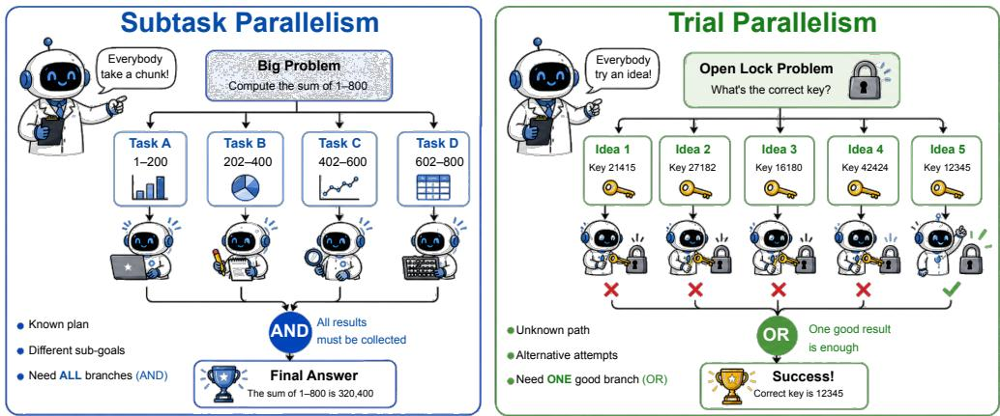
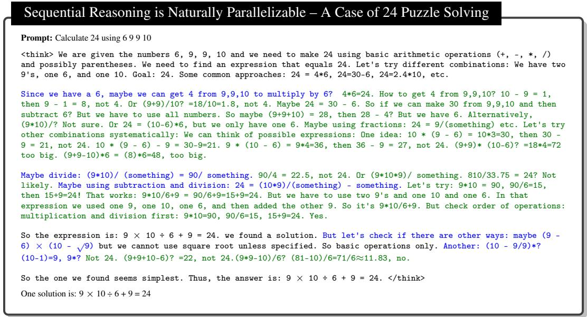
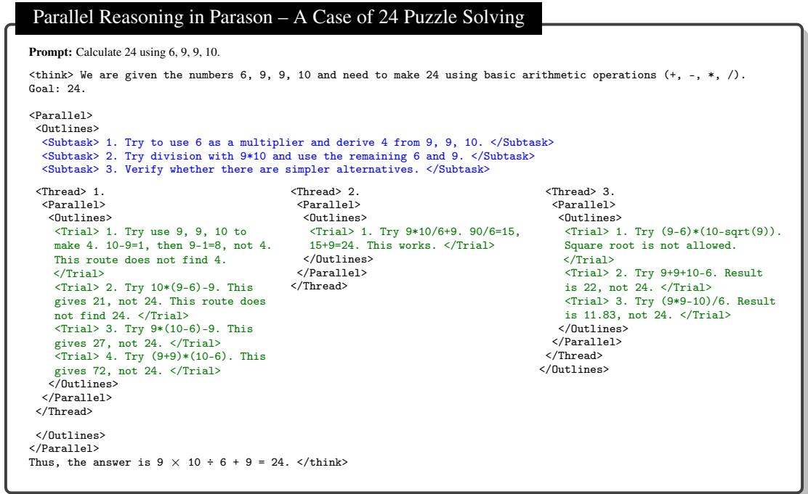
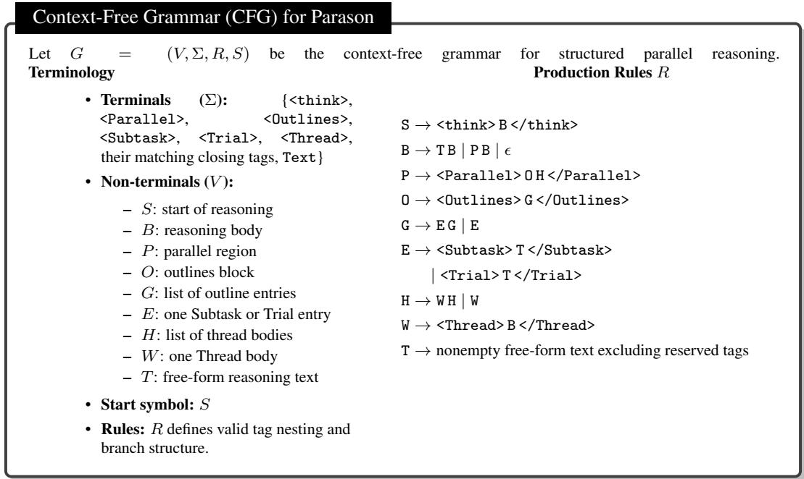

# Parason: Revealing Subtask- and Trial Parallelism in LLM Reasoning

Zhengyang Zhang<sup>1</sup> Zijian Zhang<sup>1</sup> <sup>4</sup> Jiaxuan Gao<sup>1</sup> Shusheng Xu<sup>2</sup> Yi Wu<sup>1</sup> Song Han<sup>3</sup> <sup>4</sup> Ligeng Zhu<sup>4</sup> <sup>∗</sup>

<sup>1</sup> Tsinghua University <sup>2</sup>Independent Researcher <sup>3</sup>Massachusetts Institute of Technology <sup>4</sup> NVIDIA

## Abstract

Scaling test-time reasoning has substantially improved the problem-solving ability of large language models (LLMs), but standard autoregressive decoding still executes long reasoning traces sequentially, creating severe latency for difficult tasks (up to days and weeks). Parallel reasoning offers a natural remedy. However, prior systems primarily focus on Subtask Parallelism, where the model learns to decompose a high-level task into smaller chunks that can be solved independently. This approach overlooks another pervasive form of parallelism: Trial Parallelism, where multiple speculative attempts explore, verify, and aggregate competing hypotheses in parallel. In this paper, we introduce Parason, which reveals and learns both forms of parallelism in LLM reasoning. Our analysis identifies Trial Parallelism as the majority of parallelizable reasoning computation (65.5% in DeepSeek-V4’s reasoning steps in HLE), and it becomes increasingly dominant on hard problems. Guided by this taxonomy, Parason converts sequential reasoning traces into structured parallel trajectories with a context-free grammar, then trains models with Parallelism-Aware Group Relative Policy Optimization (PA-GRPO), whose reward jointly balances accuracy, latency, and the two parallelism ratios. At inference time, Parason executes the learned parallel structure through tool calls, translating theoretical savings to real-world wall-clock acceleration. Experiments on mathematical reasoning benchmarks including AIME24 and AIME25 show that Parason achieves an average acceleration about 1.7× while maintaining competitive accuracy.

Website | Code | Dataset

## 1 Introduction

Recent advances in large language model (LLM) reasoning have made a simple recipe increasingly effective: spend more test-time compute, and obtain better answers. Chain-of-Thought prompting [Wei et al., 2022] and reasoning-oriented systems such as OpenAI o1 [OpenAI et al., 2024] and DeepSeek R1 [DeepSeek-AI et al., 2025] show that long, deliberate reasoning traces can substantially improve performance on mathematical and logical tasks. Yet this recipe has an immediate systems bottleneck. Standard autoregressive decoding serializes every token and every intermediate thought, so stronger reasoning often translates directly into longer waiting time. On difficult problems, reasoning traces can grow to hundreds of thousands or even millions of tokens [Hubert et al., 2025, Luong et al., 2025], making the usual “think longer” strategy impractical for interactive agents, coding assistants, and other latency-sensitive applications. For example, Google’s AlphaProof [DeepMind, 2024] requires up to three days to solve challenging problems from the International Mathematical Olympiad (IMO) 2024, highlighting the extreme latency inherent in current sequential reasoning systems.

  
Figure 1: Overview of two types of parallelism. The figure contrasts Subtask Parallelism, where all decomposed branches are needed for the final answer, with Trial Parallelism, where multiple uncertain paths are explored as alternative (OR) branches. Despite this OR relation, the outputs of all Trial branches are concatenated into the subsequent context, making every branch’s content available for final synthesis. While previous work mainly focuses on Subtask Parallelism, our analysis shows that Trial Parallelism accounts for the majority of parallelizable reasoning on HLE for every model we study, and exceeds 58% for DeepSeek-R1 and DeepSeek-V4 across both datasets.

A natural response is to make reasoning parallel: let multiple reasoning branches proceed concurrently instead of decoding every thought in sequence. Existing methods explore this direction through independent sampling, such as self-consistency and Best-of-N [Wang et al., 2022, Hu et al., 2026], or adaptive branching frameworks [Yang et al., 2025b, Jin et al., 2025, Zheng et al., 2025, Lian et al., 2025, Wang et al., 2025]. However, methods such as Multiverse [Yang et al., 2025b], ThreadWeaver [Lian et al., 2025], and APR [Pan et al., 2025] mainly exploit subtask-style parallelism: splitting a high-level task into smaller chunks and merging their results. Trial-style exploration, which tries uncertain paths and incorporates diverse trajectories, is less discussed.

In this work, we argue that the key missing piece is a semantic taxonomy of parallel reasoning. As illustrated in Figure 1, we identify two complementary forms of parallelism. Subtask Parallelism applies when a problem can be decomposed into independent steps: each branch solves a distinct sub-goal, and the final answer combines all branch results. This is the form emphasized by most prior adaptive parallel systems. Trial Parallelism applies when the model is uncertain about which path will work: multiple branches test competing hypotheses, and the final trajectory keeps the useful results. These modes have different execution semantics. Subtask branches are usually all necessary, while trial branches are speculative and most useful when the reasoning path is uncertain. Our empirical analysis shows that this distinction is practical, not merely conceptual. Trial Parallelism accounts for the majority of analyzed parallelizable steps on Humanity’s Last Exam for every model we study, including 73.8% and 65.5% for DeepSeek-R1 and DeepSeek-V4, respectively. On OpenMath, it remains the majority for most models and reaches 68.5% and 58.1% for the same two open-source models. This suggests that hard reasoning is not only decomposition, but also trying and refining uncertain solution paths. Systems that focus solely on subtask decomposition therefore miss much of the computation in hard cases.

Guided by this observation, we introduce Parason, a training-and-inference codesign framework for revealing and exploiting both Subtask Parallelism and Trial Parallelism. Parason converts sequential reasoning traces into structured parallel trajectories without changing their final semantics, and uses a context-free grammar to mark parallel regions, individual branches, and summaries in an engine-parseable format. We then train the model with Parallelism-Aware Group Relative Policy Optimization (PA-GRPO), which augments outcome-based reinforcement learning with rewards for lower latency along the longest token path and balanced use of the two parallelism types. At inference time, the generated structure is executed through tool calls, allowing Parason to dispatch independent workers with subtasks and competing trial branches. Across mathematical reasoning benchmarks including AIME24 and AIME25, Parason preserves competitive accuracy while reducing effective reasoning latency. Our contributions are summarized as follows:

  
Figure 2: Visualization of Trial and Subtask Parallelism. The 24 Puzzle trace generated by DeepSeek-R1 [DeepSeek-AI et al., 2025] highlights Subtask Parallelism in blue and Trial Parallelism in green. Subtask branches implement divide-and-conquer execution, while Trial branches explore and verify competing hypotheses; Trial steps occupy the majority of reasoning tokens.

• A taxonomy of parallel reasoning. We distinguish Subtask Parallelism and Trial Parallelism, identifying Trial Parallelism as the missing component. Based on this taxonomy, we introduce Parason, which converts sequential reasoning data into grammar-constrained parallel trajectories that can be parsed and executed by inference engines.

• Parallelism-aware reinforcement learning. We propose PA-GRPO, a multi-objective RL objective that jointly optimizes answer accuracy, latency along the longest token path, and the model’s use of the two parallelism modes.

• Empirical speedups with competitive accuracy. Experiments across challenging math benchmarks demonstrate that Parason improves the latency–accuracy Pareto frontier, achieving an average acceleration about 1.7× while maintaining competitive accuracy. Under latency-constrained settings, Parason matches the performance of an 8k-token latency budget using only 25% of the budget.

• Seamless inference engine support. We define a CFG that marks parallel regions as tool calls and integrate Parason into SGLang [Zheng et al., 2023]. This makes parallel reasoning directly executable in a real inference engine, while prior work either reports only theoretical speedups that are hard to translate into actual latency reduction, or introduces complicated designs that require deep modifications to modern inference engines.

## 2 Related Work

Test-time scaling for LLM reasoning. Scaling inference-time computation has become a central recipe for improving LLM reasoning. CoT prompting [Wei et al., 2022] elicits intermediate derivations, while recent reasoning models such as OpenAI o1 [OpenAI et al., 2024] and DeepSeek R1 [DeepSeek-AI et al., 2025] further improve performance by producing longer and more deliberate reasoning traces. This sequential scaling is powerful but expensive: autoregressive decoding generates every token one after another, so longer reasoning directly increases latency. Parallel reasoning is an attractive direction for preserving test-time compute while shortening the longest token path.

Independent parallel sampling and majority voting. A simple form of parallel reasoning is to sample multiple complete solutions and aggregate their answers. Self-consistency [Wang et al.,

<table><tr><td rowspan="2">Model</td><td colspan="2">Dataset: OpenMath</td><td colspan="2">Dataset: HLE</td></tr><tr><td>Subtask (%)</td><td>Trial (%)</td><td>Subtask (%)</td><td>Trial (%)</td></tr><tr><td>Open Source Models</td><td></td><td></td><td></td><td></td></tr><tr><td>DeepSeek-R1 [DeepSeek-AI et al., 2025]</td><td>31.5</td><td> $6 8 . 5 _ { + 3 7 . 0 0 }$ </td><td>26.2</td><td> $7 3 . 8 _ { + 4 7 . 6 0 }$ </td></tr><tr><td>Qwen3-30B-A3B [Yang et al., 2025a]</td><td>43.6</td><td> $5 6 . 3 _ { + 1 2 . 7 0 }$ </td><td>38.8</td><td> $6 1 . 2 _ { + 2 2 . 4 0 }$ </td></tr><tr><td>MiniMax 2.7 [MiniMax AI, 2025]</td><td>47.7</td><td> $5 2 . 3 _ { + 4 . 6 0 }$ </td><td>38.2</td><td> $6 1 . 8 _ { + 2 3 . 6 0 }$ </td></tr><tr><td>Kimi-2.6 [Moonshot AI, 2025]</td><td>43.0</td><td> $5 7 . 0 _ { + 1 4 . 0 0 }$ </td><td>42.1</td><td> $5 7 . 9 _ { + 1 5 . 8 0 }$ </td></tr><tr><td>DeepSeek-V4 [DeepSeek-AI, 2026]</td><td>41.9</td><td> $5 8 . 1 _ { + 1 6 . 2 0 }$ </td><td>34.5</td><td> $6 5 . 5 _ { + 3 1 . 0 0 }$ </td></tr><tr><td>Commercial Models</td><td></td><td></td><td></td><td></td></tr><tr><td>Gemini-2.5-Pro [Google, 2025]</td><td>62.9</td><td> $3 7 . 1 _ { - 2 5 . 8 0 }$ </td><td>49.4</td><td> $5 0 . 6 _ { + 1 . 2 0 }$ </td></tr><tr><td>Claude-Opus-4.5 [Anthropic, 2025b]</td><td>44.9</td><td> $5 5 . 1 _ { + 1 0 . 2 0 }$ </td><td>29.9</td><td> $7 0 . 1 _ { + 4 0 . 2 0 }$ </td></tr><tr><td>Gemini-3-Pro [Google DeepMind, 2025]</td><td>57.4</td><td> $4 2 . 6 _ { - 1 4 . 8 0 }$ </td><td>46.9</td><td> $5 3 . 1 _ { + 6 . 2 0 }$ </td></tr><tr><td>GPT-5.5 [OpenAI, 2026]</td><td>34.4</td><td> $6 5 . 6 _ { + 3 1 . 2 0 }$ </td><td>23.9</td><td> $7 6 . 1 _ { + 5 2 . 2 0 }$ </td></tr></table>

Table 1: Trial Parallelism dominates on harder reasoning datasets. We report Subtask and Trial ratios in reasoning traces from OpenMathReasoning [Moshkov et al., 2025] and Humanity’s Last Exam (HLE) [Phan et al., 2025]. Ratios are computed on the first 100 problems of each dataset, and annotation details are provided in Appendix A. For closed-source models, the original thinking trace is hidden, thus we counted summary statistics instead.

2022], verifier-guided Best-of-N sampling [Cobbe et al., 2021], and confidence-based variants such as DeepConf [Fu et al., 2025] improve robustness by exploring several candidate trajectories. These methods implicitly use trial-style computation, since different samples may try different solution paths. However, these samples are independent full traces. They do not share intermediate work, expose branch structure inside a trace, or tell an inference engine where parallel execution should begin and end. As a result, they improve accuracy at the cost of redundant computation with little control over latency.

Structured and adaptive parallel reasoning. Another line of work introduces explicit structures for parallel reasoning. Tree-of-Thoughts [Yao et al., 2023], Graph-of-Thoughts [Besta et al., 2023], Skeleton-of-Thought [Ning et al., 2023], and agentic decomposition methods split reasoning into trees, graphs, outlines, or sub-agents. More recent adaptive systems, including PASTA [Jin et al., 2025], Multiverse [Yang et al., 2025b], Parallel-R1 [Zheng et al., 2025], APR [Pan et al., 2025], ThreadWeaver [Lian et al., 2025], and PaCoRe [Hu et al., 2026], train or prompt models to create parallel branches and merge their outputs. PaCoRe further scales test-time compute with multiple rounds of coordinated parallel exploration and message passing. Figure 2 visualizes the same broader opportunity: LLM reasoning can be parallelized.

Yet their main mechanism is still subtask-centric: the model decomposes a high-level task into smaller chunks, runs the chunks in parallel, and merges the results. This is effective when the problem admits a clean divide-and-conquer structure, but it misses a common behavior in difficult reasoning: trying uncertain paths, rejecting failed attempts, and keeping the path that works. Our analysis shows that this missing Trial Parallelism is not rare; it accounts for most parallelizable reasoning steps in hard cases. Parason therefore separates Subtask Parallelism from Trial Parallelism and trains the model to exploit both forms explicitly.

## 3 Methodology

Parason turns long sequential reasoning traces into executable parallel programs, which is critical for long-horizon tasks such as Google’s AlphaProof [DeepMind, 2024], OpenAI’s IMO reasoning efforts [Luong et al., 2025], and recent agentic coding workflows such as Claude Code [Anthropic, 2025a] and OpenAI Codex [OpenAI, 2025]. The framework has three parts. First, we define two semantic forms of parallel reasoning: Subtask Parallelism decomposes a problem into independent required parts, while Trial Parallelism explores competing uncertain attempts and incorporates the diverse exploration into the final reasoning path. Second, we define a context-free grammar (CFG) that gives Parason a formal syntax, helps data generation, processing, and rollouts avoid syntax errors, and makes later system integration simple. Third, we propose Parallelism-Aware GRPO (PA-GRPO), a training algorithm that teaches the model to use parallelism effectively while preserving final-answer correctness.

  
Figure 3: Solving the 24 Puzzle in Parason format. This example is adapted from a real 24 Puzzle reasoning trace. The blue region gives the Subtask plan, splitting the problem into three independent subtasks. The green regions show Trial Parallelism, where each subtask explores candidate routes in parallel. The correct solution appears in the first Trial branch of the second subtask.

## 3.1 Parallelism in Reasoning

A reasoning trace is not uniformly sequential, as shown by the visualization of Trial and Subtask Parallelism in Figure 2. Some steps derive independent facts that will all be used later; other steps try uncertain ideas, explore multiple paths, and aggregate their findings. Following the overview and examples in Figures 1, 2, and 3, Parason treats these behaviors as two semantic forms of parallelism with different merge rules.

Subtask Parallelism is an AND-branch form of parallelism. A problem is split into independent sub-goals $g _ { 1 } , \dotsc , g _ { k }$ , each branch computes a necessary result r , and the main trajectory aggregates all results $\{ r _ { i } \} _ { i = 1 } ^ { k }$ to continue the derivation. These branches are parallel because they do not depend on one another, but all of them are mandatory: dropping one branch would remove the information required for generating the final answer. For example, a geometry solution may compute two distances independently before combining them in a final formula. This is the dominant form assumed by prior adaptive parallel systems [Yang et al., 2025b, Lian et al., 2025, Pan et al., 2025, Hu et al., 2026].

Trial Parallelism is an OR-branch form of parallelism. Given an uncertain state, the model launches competing attempts $a _ { 1 } , \ldots , a _ { k }$ that test different hypotheses, heuristics, or solution routes. The merge step concatenates the branches to incorporate the exploratory trajectories into the reasoning history, rather than selecting a single branch. Thus, Trial Parallelism is parallel search inside a single reasoning trace, rather than decomposition into mandatory parts. This mirrors how strong reasoning models often behave on hard problems: they try a path, detect a dead end, and revise. Our empirical analysis in Table 1 shows that Trial Parallelism accounts for more than 50% of parallelizable steps for every model on HLE [Phan et al., 2025] and for most models on OpenMath, with higher Trial shares on HLE across all listed models.

  
Figure 4: Context-Free Grammar for Parason. Each parallel region contains an Outlines block with one or more correctly matched Subtask or Trial entries, followed by one or more Thread bodies. As in Figure 3, each Thread may contain free-form reasoning or a nested parallel region.

## 3.2 Parallel Tracjectory Format

To make these two modes executable, Parason represents reasoning traces with a grammar-constrained format. We extend ordinary <think> traces with parallel tags: <Parallel> marks a parallel region, <Outlines> describes the purpose of the region, <Subtask> and <Trial> mark branch type, <Thread> stores branch outcome. The full CFG is shown in Figure 4. While real-world reasoning often exhibits mixed dependencies (e.g., a subtask internally spawning trial branches), our training data keeps a strict separation for simplicity. However, we observe that the model can generalize to these complex compositions during evaluation.

The format is designed around two requirements. First, it is semantic: the tags indicate whether a branch is a necessary subtask or a speculative trial branch, not merely that it can run in parallel. This matters because prior parallel-reasoning methods often mix the two forms under a single branching interface, making it hard to decide whether branches should be all merged or aggregated as exploration history. Second, it is engine-parseable: each branch has explicit start and stop tags, so an inference runtime can dispatch workers without modifying the model architecture. Compared with free-form summaries or prompt-only, the CFG gives the training and inference infra a shared contract.

## 3.3 Parallelism-Aware Reinforcement Learning

Supervised conversion teaches the model to imitate parallel traces, but it does not directly optimize latency or decide when and what parallelism is worth using. We therefore RL fine-tune with Parallelism-Aware Group Relative Policy Optimization (PA-GRPO). The reward keeps correctness as the primary objective, while shaping the model toward useful parallel branches. For a sampled trajectory i, let $T _ { i }$ denote its token-level latency, and let $R _ { \mathrm { s u b t a s k } } ^ { i }$ and $R _ { \mathrm { t r i a l } } ^ { i }$ be the ratios of tokens placed in Subtask and Trial branches. We define:

Definition 3.1. Parallel RL Reward

$$
\begin{array} { r l } & { R _ { i } = - 1 + 2 \times 1 ( \mathrm { c o r r e c t } _ { i } ) } \\ & { \qquad \times \left( 1 - \alpha f \left( \frac { T _ { i } - \mu _ { T } } { \sigma _ { T } } \right) + \beta _ { \mathrm { s u b t a s k } } f \left( \frac { R _ { \mathrm { s u b t a s k } } ^ { i } - \mu _ { s } } { \sigma _ { s } } \right) \right. } \\ & { \qquad \left. + \beta _ { \mathrm { t r i a l } } f \left( \frac { R _ { \mathrm { t r i a l } } ^ { i } - \mu _ { r } } { \sigma _ { r } } \right) + \operatorname* { m i n } ( \rho \cdot \eta ( s ) , \rho _ { \mathrm { c l i p } } ) \right) . } \end{array}
$$

The symbols in Eq. 3.1 are defined as follows:

$R _ { i } { : }$ final reward for sampled trajectory i.

• 1(correct<sub>i</sub>): correctness indicator; incorrect answers receive the base negative reward.

• T<sub>i</sub>: token-level latency of trajectory i, measured by its critical-path token count.

• α: coefficient controlling the normalized latency penalty.

$R _ { \mathrm { s u b t a s k } } ^ { i } \colon$ Number of tokens placed in Subtask Parallelism branches/Total generated tokens

• η(s): $\begin{array} { r } { \eta ( s ) = 1 - \frac { L _ { \mathrm { l a t e n c y } } } { L _ { \mathrm { t o t a l } } } } \end{array}$ , where $L _ { \mathrm { l a t e n c y } }$ and $L _ { \mathrm { t o t a l } }$ denote the number of latency tokens and the total number of tokens, respectively.

$\rho , \rho _ { c l i p } .$ Parameters for controlling acceleration reward.

$R _ { \mathrm { t r i a l } } ^ { i } { \mathrm { : } }$ Number of tokens placed in Trial Parallelism branches/Total generated tokens

$\beta _ { \mathrm { s u b t a s k } }$ and $\beta _ { \mathrm { t r i a l } } \colon$ incentives for Subtask and Trial Parallelism.

• f: shaping function applied to normalized reward signals; here we use the linear function $y = x$

• µ<sub>T</sub> , $\mu _ { s } , \mu _ { r }$ and $\sigma _ { T } , \sigma _ { s } , \sigma _ { r } \mathrm { : }$ means and standard deviations used to normalize latency, Subtask ratio, and Trial ratio, respectively.

The first term makes correctness the primary signal by assigning a negative base reward to incorrect answers and a positive base reward to correct answers. The latency term, weighted by α, penalizes trajectories with high normalized critical-path latency. The Subtask and Trial incentives, weighted by $\beta _ { \mathrm { s u b t a s k } }$ and $\beta _ { \mathrm { t r i a l } } .$ , encourage useful parallel structure, while the clipped acceleration reward directly favors reductions in the critical path relative to total generation length. It is important to note that $\beta _ { \mathrm { s u b t a s k } }$ and $\beta _ { \mathrm { t r i a l } }$ target fundamentally different optimization goals: Trial Parallelism improves accuracy by trading total tokens for search width, while Subtask Parallelism reduces latency by compressing the longest token path. In practice, this reward lets us separately tune these two dimensions, as detailed in Section 4.2.

## 3.4 Integration into Modern Inference Engine

Parason integrates with modern inference engines by treating parallel branches as tool calls rather than requiring deep runtime changes. Following the CFG in Figure 4, the runtime decodes normally until a <Parallel> region appears, parses the <Outlines>, dispatches each <Subtask> or <Trial> as an independent worker, and returns the resulting <Thread> outputs to the main trajectory; Figure 3 shows this format on the 24 Puzzle. XGrammar [Dong et al., 2024] enforces valid tags, and we implement this tool-call execution in SGLang [Zheng et al., 2023].

## 4 Experiments

We provide details on training data curation, training framework, and evaluation below, and will open-source our implementation to facilitate reproducibility.

Training Data Curation. We build parallel training data from the 964 annotated Qwen3-8B traces released by ThreadWeaver [Lian et al., 2025]. Gemini-3-Flash labels each parallel stage as Subtask or Trial; for Trial stages, Qwen3-8B samples extra branches and Gemini-3-Flash generates their <Trial> goals. For reinforcement learning (RL), we use Polaris-53k [An et al., 2025], a collection of about 53,000 complex reasoning problems.

Training Framework. We use a two-stage post-training pipeline. First, we fine-tune the model with TRL [von Werra et al., 2020] on the curated parallel trajectories. Second, we train with VeRL [Sheng et al., 2024] using Parallelism-Aware GRPO (PA-GRPO). Unless otherwise noted, RL uses learning rate 1e−6, batch size 128, 8 rollouts, lower clip ratio 0.2, and upper clip ratio 0.28; SFT uses learning rate 1e−5, batch size 16, 8 epochs, and a cosine learning-rate scheduler.

<table><tr><td>Method</td><td>AIME24</td><td>AIME25</td><td>Math500</td><td>AMC</td><td>Avg</td><td>Avg. Latency #Tokens</td></tr><tr><td>Parallel-R1 (4B)</td><td>19.4</td><td>19.2</td><td>=</td><td>=</td><td>=</td><td>=</td></tr><tr><td>ShorterBetter (7B)</td><td>53.3</td><td></td><td>1</td><td>=</td><td>=</td><td>=</td></tr><tr><td>ThinkPrune (32B)</td><td>72.5</td><td></td><td>93.8</td><td>95.9</td><td>=</td><td></td></tr><tr><td>DYNASOR-COT (32B)</td><td>78.0</td><td></td><td>93.0</td><td>94.0</td><td></td><td></td></tr><tr><td>Dynamic Early Exit (32B)</td><td>70.0</td><td></td><td>94.8</td><td>95.0</td><td></td><td></td></tr><tr><td>AdaptThink (7B)</td><td>55.6</td><td></td><td>92.0</td><td>-</td><td></td><td></td></tr><tr><td>Multiverse (32B)</td><td>53.8</td><td>45.8</td><td>91.8</td><td></td><td></td><td></td></tr><tr><td>ThreadWeaver (8B)</td><td>79.9</td><td>60.5</td><td>92.3</td><td>91.4</td><td>81.0</td><td>14.8k</td></tr><tr><td>Parason-8B (w/vanilla SFT)</td><td>73.5</td><td>67.9</td><td>93.4</td><td>93.9</td><td>82.2</td><td>13.2k</td></tr><tr><td> $+ \mathrm { P A } \mathrm { - G R P O } \left( \beta _ { \mathrm { s u b t a s k } } = 0 . 0 2 5 \right)$ </td><td>75.1</td><td>69.7</td><td>93.8</td><td>96.6</td><td>83.8</td><td>13.8k</td></tr><tr><td> $+ \mathrm { P A } \mathrm { - G R P O } \left( \beta _ { \mathrm { s u b t a s k } } = 0 . 0 5 0 \right)$ </td><td>76.3</td><td>70.0</td><td>94.6</td><td>95.0</td><td>84.0</td><td>15.6k</td></tr><tr><td> $+ \mathrm { P A - G R P O } ( \beta _ { \mathrm { s u b t a s k } } = 0 . 1 0 0 )$ </td><td>77.3</td><td>68.5</td><td>94.6</td><td>96.3</td><td>84.2</td><td>14.1k</td></tr><tr><td> $+ \mathrm { P A - G R P O } \ ( \beta _ { \mathrm { t r i a l } } = 0 . 0 2 5 )$ </td><td>75.5</td><td>69.9</td><td>94.4</td><td>96.3</td><td>84.0</td><td>14.2k</td></tr><tr><td> $+ \mathrm { P A - G R P O } \left( \beta _ { \mathrm { t r i a l } } = 0 . 0 5 0 \right)$ </td><td>76.5 78.2</td><td>70.6 68.9</td><td>94.0</td><td>96.9</td><td>84.5</td><td>14.5k</td></tr><tr><td> $+ \mathrm { P A - G R P O } \ ( \beta _ { \mathrm { t r i a l } } = 0 . 1 0 0 )$ </td><td></td><td></td><td>94.2</td><td>97.5</td><td>84.7</td><td>14.5k</td></tr><tr><td> $A d d i t i o n a l r u n s w i t h \alpha = 0 . 1$ </td><td></td><td></td><td></td><td></td><td></td><td></td></tr><tr><td> $+ \mathrm { P A } \mathrm { - G R P O } \left( \beta _ { \mathrm { s u b t a s k } } = 0 . 0 2 5 \right)$ </td><td>75.7</td><td>67.6</td><td>93.6</td><td>95.9</td><td>83.2</td><td>12.2k</td></tr><tr><td> $+ \mathrm { P A } \mathrm { - G R P O } \left( \beta _ { \mathrm { s u b t a s k } } = 0 . 0 5 0 \right)$ </td><td>74.2</td><td>66.1</td><td>93.8</td><td>95.9</td><td>82.5</td><td>12.2k</td></tr><tr><td> $+ \mathrm { P A - G R P O } ( \beta _ { \mathrm { s u b t a s k } } = 0 . 1 0 0 )$ </td><td>75.5</td><td>65.9</td><td>92.6</td><td>97.5</td><td>82.9</td><td>13.2k</td></tr><tr><td> $+ \mathrm { P A - G R P O } \ ( \beta _ { \mathrm { t r i a l } } = 0 . 0 2 5 )$ </td><td>76.9</td><td>66.6</td><td>94.6</td><td>97.2</td><td>83.8</td><td>12.1k</td></tr><tr><td> $+ \mathrm { P A - G R P O } \left( \beta _ { \mathrm { t r i a l } } = 0 . 0 5 0 \right)$ </td><td>77.3</td><td>67.3</td><td>93.4</td><td>96.6</td><td>83.7</td><td>12.5k</td></tr><tr><td> $+ \mathrm { P A - G R P O } \ ( \beta _ { \mathrm { t r i a l } } = 0 . 1 0 0 )$ </td><td>78.2</td><td>69.2</td><td>93.4</td><td>95.6</td><td>84.1</td><td>13.4k</td></tr></table>

Table 2: Trial rewards improve accuracy, while Subtask rewards reduce latency. We compare Parason with prior systems and ablate $\beta _ { \mathrm { s u b t a s k } }$ and $\beta _ { \mathrm { t r i a l } } .$ . Avg and Token Latency average AIME24, AIME25, Math500, and AMC for each $\mathrm { P A - G R P O }$ row. Bold and underlined values mark the highest and second-highest PA-GRPO results, except Token Latency, where lower is better.

Evaluation. We evaluate on AIME 2024 [Mathematical Association of America, 2024], AIME 2025 [Mathematical Association of America, 2025], AMC [Mathematical Association of America, 2023], Math500 [Hendrycks et al., 2021], and Minerva Math [Lewkowycz et al., 2022], and compare against sequential baselines trained from the same base model and data source as well as external parallel and efficient-reasoning systems. We report final-answer accuracy and executable latency. For Parason, model latency is the token length of the longest generation path: sequential tokens are counted normally, while each <Parallel> block contributes the maximum branch length rather than the sum of all branches. This metric captures the wall-clock benefit available to an inference engine that runs branches concurrently.

## 4.1 Main Results

Parason improves accuracy over prior parallel reasoning systems. Table 2 compares Parason with existing parallel and efficient-reasoning methods. Parason gives the best reported AIME25 and AMC results among the listed systems, reaches the best Parason four-benchmark average accuracy of 84.7%, and stays close to ThreadWeaver on AIME24. Across the original settings and the additional α = 0.1 runs, PA-GRPO reaches 70.6% on AIME25, 97.5% on AMC, and 94.6% on Math500. These gains show that Parason improves both accuracy and average benchmark coverage over prior parallel work, even though it uses an 8B model rather than several 32B baselines.

Parason gives a better token-latency–accuracy trade-off under constraints. Table 3 shows that Parason is most useful when the model has a small thinking budget on the longest token path. At 2048 tokens, the best Subtask-aware PA-GRPO model reaches 34.7% AIME24 accuracy, compared with 16.8% for SFT only. At 8192 tokens, it reaches 60.3%, compared with 41.8% for SFT only at the same budget. Thus, Parason does not simply spend more tokens; it moves useful work into parallel branches and keeps the longest path short.

<table><tr><td rowspan="2">Model</td><td colspan="4">AIME24 Accuracy (%)</td></tr><tr><td> $B = 2 { , } 0 4 8$ </td><td> $B = 8 , 1 9 2$ </td><td> $B = 1 6 { , } 3 8 4$ </td><td> $B = 2 4 { , } 5 7 6$ </td></tr><tr><td>SFT only</td><td>16.8</td><td>41.8</td><td>66.8</td><td>70.2</td></tr><tr><td>PA-GRPO  $( \beta _ { \mathrm { s u b t a s k } } = 0 . 0 2 5 )$ </td><td> $1 6 . 7 _ { - 0 . 1 0 }$ </td><td> $4 5 . 2 _ { + 3 . 4 0 }$ </td><td> $6 8 . 0 _ { + 1 . 2 0 }$ </td><td> $7 3 . 2 _ { + 3 . 0 0 }$ </td></tr><tr><td>PA-GRPO  $( \beta _ { \mathrm { s u b t a s k } } = 0 . 0 5 0 )$ </td><td> $2 6 . 8 _ { + 1 0 . 0 0 }$ </td><td> $6 0 . 0 _ { + 1 8 . 2 0 }$ </td><td> $7 2 . 2 _ { + 5 . 4 0 }$ </td><td> $7 4 . 8 _ { + 4 . 6 0 }$ </td></tr><tr><td> $\mathrm { P A } { \cdot } \mathrm { G R P O } \left( \beta _ { \mathrm { s u b t a s k } } = 0 . 1 0 0 \right)$ </td><td> $3 4 . 7 _ { + 1 7 . 9 0 }$ </td><td> ${ \bf 6 0 . 3 _ { + 1 8 . 5 0 } }$ </td><td> $7 4 . 4 _ { + 7 . 6 0 }$ </td><td> $7 5 . 7 _ { + 5 . 5 0 }$ </td></tr></table>

Table 3: Accuracy under token-latency budgets. Each column reports AIME24 accuracy for a fixed thinking budget B on the longest token path. Subscripts show absolute accuracy-point gains relative to SFT only under the same budget; red indicates a decrease. Subtask-aware PA-GRPO provides the largest gains in low-budget regimes: at $B = 2 , 0 4 8 , \beta _ { \mathrm { s u b t a s k } } = 0 . 1 0 0$ reaches 34.7% accuracy, compared with 16.8% for SFT only.
<table><tr><td>Method</td><td>Trigger Ratio</td><td>Token Latency</td><td>Acceleration Ratio</td><td>Avg. Math Acc.</td></tr><tr><td>ThreadWeaver (8B)</td><td>83.7</td><td>13.3k</td><td>1.18x</td><td>77.6</td></tr><tr><td>Multiverse (32B)</td><td>65.6</td><td>10.3k</td><td>1.16x</td><td>63.8</td></tr><tr><td>Parason-8B (w/ SFT only)</td><td>69.3</td><td>14.1k</td><td>1.27x</td><td>1 78.3</td></tr><tr><td> $O r i g i n a l r u n s w i t h \alpha = 0 . 0 0 0$ </td><td></td><td></td><td></td><td></td></tr><tr><td> $+ \mathrm { P A } – \mathrm { G R P O } \left( \beta _ { \mathrm { t r i a l } } = 0 . 0 2 5 , \alpha = 0 . 0 0 0 \right)$ </td><td>77.3</td><td>15.2k</td><td>1.46x</td><td>79.9</td></tr><tr><td> $+ \mathrm { P A } – \mathrm { G R P O } \left( \beta _ { \mathrm { t r i a l } } = 0 . 0 5 0 , \alpha = 0 . 0 0 0 \right)$ </td><td>84.0</td><td>15.8k</td><td>1.61x</td><td>80.4</td></tr><tr><td> $+ \mathrm { P A - G R P O } \left( \beta _ { \mathrm { t r i a l } } = 0 . 1 0 0 , \alpha = 0 . 0 0 0 \right)$ </td><td>98.8</td><td>15.7k</td><td>1.71x</td><td>80.4</td></tr><tr><td> $+ \mathrm { P A } – \mathrm { G R P O } \left( \beta _ { \mathrm { s u b t a s k } } = 0 . 0 2 5 , \alpha = 0 . 0 0 0 \right)$ </td><td>70.1</td><td>14.9k</td><td>1.48x</td><td>79.5</td></tr><tr><td> $+ \mathrm { P A } – \mathrm { G R P O } \left( \beta _ { \mathrm { s u b t a s k } } = 0 . 0 5 0 , \alpha = 0 . 0 0 0 \right)$ </td><td>79.3</td><td>16.6k</td><td>1.75x</td><td>80.3</td></tr><tr><td> $+ \mathrm { P A } – \mathrm { G R P O } \left( \beta _ { \mathrm { s u b t a s k } } = 0 . 1 0 0 , \alpha = 0 . 0 0 0 \right)$ </td><td>89.6</td><td>15.4k</td><td>1.73x</td><td>80.1</td></tr><tr><td>Additional runs with α = 0.100</td><td></td><td></td><td></td><td></td></tr><tr><td> $+ \mathrm { P A } – \mathrm { G R P O } \left( \beta _ { \mathrm { t r i a l } } = 0 . 0 2 5 , \alpha = 0 . 1 0 0 \right)$ </td><td>62.3</td><td>13.2k</td><td>1.46x</td><td>79.4</td></tr><tr><td> $+ \mathrm { P A } – \mathrm { G R P O } \left( \beta _ { \mathrm { t r i a l } } = 0 . 0 5 0 , \alpha = 0 . 1 0 0 \right)$ </td><td>79.7</td><td>13.6k</td><td>1.50x</td><td>79.3</td></tr><tr><td> $+ \mathrm { P A - G R P O } \left( \beta _ { \mathrm { t r i a l } } = 0 . 1 0 0 , \alpha = 0 . 1 0 0 \right)$ </td><td>95.3</td><td>14.5k</td><td>1.72x</td><td>80.3</td></tr><tr><td> $+ \mathrm { P A } – \mathrm { G R P O } \ ( \beta _ { \mathrm { s u b t a s k } } = 0 . 0 2 5 , \alpha = 0 . 1 0 0 )$ </td><td>53.7</td><td>13.4k</td><td>1.34x</td><td>79.0</td></tr><tr><td> $+ \mathrm { P A } – \mathrm { G R P O } \left( \beta _ { \mathrm { s u b t a s k } } = 0 . 0 5 0 , \alpha = 0 . 1 0 0 \right)$ </td><td>81.3</td><td>13.2k</td><td>1.60x</td><td>78.0</td></tr><tr><td> $+ \mathrm { P A } – \mathrm { G R P O } \left( \beta _ { \mathrm { s u b t a s k } } = 0 . 1 0 0 , \alpha = 0 . 1 0 0 \right)$ </td><td>96.5</td><td>14.3k</td><td>1.74x</td><td>78.0</td></tr></table>

Table 4: PA-GRPO produces usable parallelism across latency-penalty settings. For PA-GRPO, Trigger Ratio and Avg. Math Acc. are averaged over AIME24, AIME25, and Math500. Acceleration ratio is total tokens / longest-path tokens, and trigger ratio is the fraction of samples containing at least one <Parallel> block. Bold and underlined values mark the best and second-best PA-GRPO results among available measurements.

## 4.2 Insights and Findings

Trial rewards give the clearest accuracy gains, while the latency penalty shortens the critical path. Table 2 compares PA-GRPO with ThreadWeaver, which obtains 81.0% average accuracy with a four-benchmark token latency of 14.8k. The original $\beta _ { \mathrm { t r i a l } } = 0 . 1 0 0$ setting gives the best average accuracy (84.7%), while $\beta _ { \mathrm { t r i a l } } = 0 . 0 5 0$ gives the best AIME25 result (70.6%). The best AIME24 result (78.2%) is shared by the original and additional $\beta _ { \mathrm { t r i a l } } = 0 . 1 0 0$ settings, and the best AMC result (97.5%) is shared by the original $\beta _ { \mathrm { t r i a l } } = 0 . 1 0 0$ model and the additional $\alpha = 0 . 1 , \beta _ { \mathrm { s u b t a s k } } = 0 . 1 0 0$ model. Among the additional runs, $\beta _ { \mathrm { t r i a l } } = 0 . 0 2 5$ gives the lowest four-benchmark token latency at 12.1k. The additional sweep spans 12.1–13.4k, below ThreadWeaver’s 14.8k average latency.

PA-GRPO turns more parallel structure into executable acceleration. Table 4 shows that the learned parallel regions are usable by the runtime. SFT alone already triggers parallel execution on 69.3% of samples and yields 1.27× token-level acceleration. Under the original $\alpha = 0 . 0 0 0$ setting, the Trial sweep raises the trigger ratio from 77.3% to 98.8% and the acceleration ratio from $1 . 4 6 \times \mathrm { t o } \ 1 . 7 1 \times$ , while maintaining 79.9–80.4% average math accuracy. Subtask incentives provide another route to high acceleration, with $\beta _ { \mathrm { s u b t a s k } } = 0 . 0 5 0$ reaching the best acceleration ratio of $1 . 7 5 \times$ and 80.3% average accuracy. In the additional $\alpha = 0$ .100 runs, acceleration rises with the parallelism coefficient: $\dot { \beta } _ { \mathrm { s u b t a s k } } = \mathrm { \dot { 0 } } . 1 0 0$ reaches $1 . 7 4 \times$ and $\beta _ { \mathrm { t r i a l } } = 0 . 1 0 0$ reaches 1.72×. The lowest three-benchmark token latency is 13.2k, reached by $\beta _ { \mathrm { t r i a l } } = 0 . 0 2 5$ and $\beta _ { \mathrm { s u b t a s k } } = 0 . 0 5 0$ after rounding.

<table><tr><td rowspan="2"></td><td colspan="5">Token-Level Metrics</td><td colspan="2">Wall-Clock Metrics</td></tr><tr><td>Difficulty #Problems</td><td>Generated #Tokens</td><td>Latency #Tokens</td><td>Acceleration Ratio</td><td>Saved #Tokens</td><td>(s)</td><td>Parallel Sequential (s)</td></tr><tr><td>Easy</td><td>13</td><td>21.3k</td><td>12.5k</td><td>1.70×</td><td>8.8k</td><td>188.3</td><td>304.2</td></tr><tr><td>Medium</td><td>11</td><td>36.8k</td><td>21.2k</td><td>1.74×</td><td>15.6k</td><td>336.2</td><td>464.7</td></tr><tr><td>Hard</td><td>6</td><td>50.3k</td><td>29.0k</td><td>1.73×</td><td>21.3k</td><td>487.3</td><td>716.3</td></tr></table>

Table 5: Harder questions save more tokens, while parallel execution reduces wall-clock latency across all difficulty levels. We break down AIME24 thinking tokens and measured wall-clock time by difficulty. Latency #Tokens denotes the length of the longest token path, Acceleration Ratio is generated tokens divided by latency tokens, and Saved #Tokens is generated tokens minus latency tokens. The experiment is executed on A800 GPUs.

Harder questions create more parallelizable work, not less acceleration. Table 5 breaks down the step-200 AIME24 run by difficulty. Generated tokens grow sharply with difficulty, from 21.3k on easy problems to 36.8k on medium problems and 50.3k on hard problems. The longest token path also grows, but much more slowly: 12.5k, 21.2k, and 29.0k tokens, respectively. As a result, Parason keeps a stable 1.70–1.74× token-level acceleration ratio across all three difficulty groups. This translates into measured wall-clock speedups of 1.62× on easy, 1.38× on medium, and 1.47× on hard problems. The absolute number of saved tokens increases from 8.8k on easy problems to 21.3k on hard problems, showing that harder questions expose more branch-level work that can be moved off the critical path. This supports the central motivation of Parason: difficult reasoning still requires long and diverse computation, but much of that computation does not need to remain serial.

## 5 Conclusion

In this work, we introduced Parason, an algorithm-system co-design framework that brings parallel processing to sequential LLM reasoning. Parason distinguishes deterministic Subtask Parallelism from speculative Trial Parallelism, and provides a stable pipeline for data curation, CFG-based structure, PA-GRPO training, and inference-engine execution. This design enables efficient parallel reasoning and improves the responsiveness of interactive agents, coding assistants, and scientific problem-solving tools. Our findings show that Trial Parallelism is a key mechanism for complex mathematical reasoning, although prior work has mainly focused on subtask decomposition. Across benchmarks, Parason reduces token latency by about 1.7× while maintaining comparable accuracy. We hope Parason raises the community’s awareness of parallel reasoning and its two parallelism schemes, and inspires future work on more efficient and scalable reasoning systems. We include limitations and the impact statement in Appendix A, and will open-source our implementation to support reproducibility.

## Acknowledgments and Disclosure of Funding

## References

Chenxin An, Zhihui Xie, Xiaonan Li, Lei Li, Jun Zhang, Shansan Gong, Ming Zhong, Jingjing Xu, Xipeng Qiu, Mingxuan Wang, and Lingpeng Kong. Polaris: A post-training recipe for scaling reinforcement learning on advanced reasoning models, 2025. URL https://hkunlp.github. io/blog/2025/Polaris.

Anthropic. Claude code: Deep coding at terminal velocity. https://www.anthropic.com/ claude-code, 2025a.

Anthropic. Introducing claude opus 4.5. https://www.anthropic.com/news/ claude-opus-4-5, 2025b.

Maciej Besta, Nils Blach, Ales Kubicek, Robert Gerstenberger, Lukas Gianinazzi, Joanna Gajda, Tomasz Lehmann, Michal Podstawski, Hubert Nuelle, Niklas Hoffra, et al. Graph of thoughts: Solving elaborate problems with large language models. arXiv preprint arXiv:2308.09687, 2023.

Karl Cobbe, Vineet Kosaraju, Mohammad Bavarian, Mark Chen, Heewoo Jun, Lukasz Kaiser, Matthias Plappert, Jerry Tworek, Jacob Hilton, Reiichiro Nakano, Christopher Hesse, and John Schulman. Training verifiers to solve math word problems. CoRR, abs/2110.14168, 2021. URL https://arxiv.org/abs/2110.14168.

Google DeepMind. Ai solves imo problems at silver medal level. https://deepmind.google/ blog/ai-solves-imo-problems-at-silver-medal-level/, 2024. Accessed: 2024-07-25.

DeepSeek-AI. Deepseek-v4: Towards highly efficient million-token context intelligence, 2026. URL https://huggingface.co/deepseek-ai/DeepSeek-V4-Pro/blob/main/ DeepSeek\_V4.pdf.

DeepSeek-AI, Daya Guo, Dejian Yang, Haowei Zhang, Junxiao Song, Ruoyu Zhang, Runxin Xu, Qihao Zhu, Shirong Ma, Peiyi Wang, Xiao Bi, Xiaokang Zhang, Xingkai Yu, Yu Wu, Z. F. Wu, Zhibin Gou, Zhihong Shao, Zhuoshu Li, Ziyi Gao, Aixin Liu, Bing Xue, Bingxuan Wang, Bochao Wu, Bei Feng, Chengda Lu, Chenggang Zhao, Chengqi Deng, Chenyu Zhang, Chong Ruan, Damai Dai, Deli Chen, Dongjie Ji, Erhang Li, Fangyun Lin, Fucong Dai, Fuli Luo, Guangbo Hao, Guanting Chen, Guowei Li, H. Zhang, Han Bao, Hanwei Xu, Haocheng Wang, Honghui Ding, Huajian Xin, Huazuo Gao, Hui Qu, Hui Li, Jianzhong Guo, Jiashi Li, Jiawei Wang, Jingchang Chen, Jingyang Yuan, Junjie Qiu, Junlong Li, J. L. Cai, Jiaqi Ni, Jian Liang, Jin Chen, Kai Dong, Kai Hu, Kaige Gao, Kang Guan, Kexin Huang, Kuai Yu, Lean Wang, Lecong Zhang, Liang Zhao, Litong Wang, Liyue Zhang, Lei Xu, Leyi Xia, Mingchuan Zhang, Minghua Zhang, Minghui Tang, Meng Li, Miaojun Wang, Mingming Li, Ning Tian, Panpan Huang, Peng Zhang, Qiancheng Wang, Qinyu Chen, Qiushi Du, Ruiqi Ge, Ruisong Zhang, Ruizhe Pan, Runji Wang, R. J. Chen, R. L. Jin, Ruyi Chen, Shanghao Lu, Shangyan Zhou, Shanhuang Chen, Shengfeng Ye, Shiyu Wang, Shuiping Yu, Shunfeng Zhou, Shuting Pan, S. S. Li, Shuang Zhou, Shaoqing Wu, Shengfeng Ye, Tao Yun, Tian Pei, Tianyu Sun, T. Wang, Wangding Zeng, Wanjia Zhao, Wen Liu, Wenfeng Liang, Wenjun Gao, Wenqin Yu, Wentao Zhang, W. L. Xiao, Wei An, Xiaodong Liu, Xiaohan Wang, Xiaokang Chen, Xiaotao Nie, Xin Cheng, Xin Liu, Xin Xie, Xingchao Liu, Xinyu Yang, Xinyuan Li, Xuecheng Su, Xuheng Lin, X. Q. Li, Xiangyue Jin, Xiaojin Shen, Xiaosha Chen, Xiaowen Sun, Xiaoxiang Wang, Xinnan Song, Xinyi Zhou, Xianzu Wang, Xinxia Shan, Y. K. Li, Y. Q. Wang, Y. X. Wei, Yang Zhang, Yanhong Xu, Yao Li, Yao Zhao, Yaofeng Sun, Yaohui Wang, Yi Yu, Yichao Zhang, Yifan Shi, Yiliang Xiong, Ying He, Yishi Piao, Yisong Wang, Yixuan Tan, Yiyang Ma, Yiyuan Liu, Yongqiang Guo, Yuan Ou, Yuduan Wang, Yue Gong, Yuheng Zou, Yujia He, Yunfan Xiong, Yuxiang Luo, Yuxiang You, Yuxuan Liu, Yuyang Zhou, Y. X. Zhu, Yanhong Xu, Yanping Huang, Yaohui Li, Yi Zheng, Yuchen Zhu, Yunxian Ma, Ying Tang, Yukun Zha, Yuting Yan, Z. Z. Ren, Zehui Ren, Zhangli Sha, Zhe Fu, Zhean Xu, Zhenda Xie, Zhengyan Zhang, Zhewen Hao, Zhicheng Ma, Zhigang Yan, Zhiyu Wu, Zihui Gu, Zijia Zhu, Zijun Liu, Zilin Li, Ziwei Xie, Ziyang Song, Zizheng Pan, Zhen Huang, Zhipeng Xu, Zhongyu Zhang, and Zhen Zhang. Deepseek-r1: Incentivizing reasoning capability in llms via reinforcement learning, 2025. URL https://arxiv.org/abs/2501.12948.

Yixin Dong, Charlie F Ruan, Yaxing Cai, Ruihang Lai, Ziyi Xu, Yilong Zhao, and Tianqi Chen. Xgrammar: Flexible and efficient structured generation engine for large language models. arXiv preprint arXiv:2411.15100, 2024. URL https://arxiv.org/abs/2411.15100.

Yichao Fu, Xuewei Wang, Yuandong Tian, and Jiawei Zhao. Deep think with confidence. arXiv preprint arXiv:2508.15260, 2025.

Google. Gemini 2.5: Our most intelligent ai model, March 2025. URL https://blog.google/ technology/google-deepmind/gemini-model-thinking-updates-march-2025/ #gemini-2-5-thinking.

Google DeepMind. Introducing gemini 3 pro. https://deepmind.google/technologies/ gemini/, 2025.

Dan Hendrycks, Collin Burns, Saurav Kadavath, Akul Arora, Steven Basart, Eric Tang, Dawn Song, and Jacob Steinhardt. Measuring mathematical problem solving with the math dataset, 2021. URL https://arxiv.org/abs/2103.03874.

Jingcheng Hu, Yinmin Zhang, Shijie Shang, Xiaobo Yang, Yue Peng, Zhewei Huang, Hebin Zhou, Xin Wu, Jie Cheng, Fanqi Wan, Xiangwen Kong, Chengyuan Yao, Kaiwen Yan, Ailin Huang, Hongyu Zhou, Qi Han, Zheng Ge, Daxin Jiang, Xiangyu Zhang, and Heung-Yeung Shum. Pacore: Learning to scale test-time compute with parallel coordinated reasoning, 2026. URL https: //arxiv.org/abs/2601.05593.

Thomas Hubert, Rishi Mehta, Laurent Sartran, Miklós Z. Horváth, Goran Žužic, Eric Wieser,´ Aja Huang, Julian Schrittwieser, Yannick Schroecker, Hussain Masoom, Ottavia Bertolli, Tom Zahavy, Amol Mandhane, Jessica Yung, Iuliya Beloshapka, Borja Ibarz, Vivek Veeriah, Lei Yu, Oliver Nash, Paul Lezeau, Salvatore Mercuri, Calle Sönne, Bhavik Mehta, Alex Davies, Daniel Zheng, Fabian Pedregosa, Yin Li, Ingrid von Glehn, Mark Rowland, Samuel Albanie, Ameya Velingker, Simon Schmitt, Edward Lockhart, Edward Hughes, Henryk Michalewski, Nicolas Sonnerat, Demis Hassabis, Pushmeet Kohli, and David Silver. Olympiad-level formal mathematical reasoning with reinforcement learning. Nature, November 2025. ISSN 1476-4687. doi: 10.1038/ s41586-025-09833-y. URL http://dx.doi.org/10.1038/s41586-025-09833-y.

Tian Jin, Ellie Y Cheng, Zack Ankner, Nikunj Saunshi, Blake M Elias, Amir Yazdanbakhsh, Jonathan Ragan-Kelley, Suvinay Subramanian, and Michael Carbin. Learning to keep a promise: Scaling language model decoding parallelism with learned asynchronous decoding. arXiv preprint arXiv:2502.11517, 2025.

Aitor Lewkowycz, Anders Andreassen, David Dohan, Ethan Dyer, Henryk Michalewski, Vinay Ramasesh, Ambrose Slone, Cem Anil, Imanol Schlag, Theo Gutman-Solo, Yuhuai Wu, Behnam Neyshabur, Guy Gur-Ari, and Vedant Misra. Solving quantitative reasoning problems with language models, 2022. URL https://arxiv.org/abs/2206.14858.

Long Lian, Sida Wang, Felix Juefei-Xu, Tsu-Jui Fu, Xiuyu Li, Adam Yala, Trevor Darrell, Alane Suhr, Yuandong Tian, and Xi Victoria Lin. Threadweaver: Adaptive threading for efficient parallel reasoning in language models. arXiv preprint arXiv:2501.00000, 2025.

Thang Luong, Dawsen Hwang, Hoang H. Nguyen, Golnaz Ghiasi, Yuri Chervonyi, Insuk Seo, Junsu Kim, Garrett Bingham, Jonathan Lee, Swaroop Mishra, Alex Zhai, Clara Huiyi Hu, Henryk Michalewski, Jimin Kim, Jeonghyun Ahn, Junhwi Bae, Xingyou Song, Trieu H. Trinh, Quoc V. Le, and Junehyuk Jung. Towards robust mathematical reasoning, 2025. URL https://arxiv. org/abs/2511.01846.

Mathematical Association of America. American Mathematics Competitions 2023, 2023. URL https://maa.org/student-programs/amc/. Accessed: 2026-05-07.

Mathematical Association of America. American Invitational Mathematics Examination 2024, 2024. URL https://artofproblemsolving.com/wiki/index.php/American\_Invitational\_ Mathematics\_Examination. Accessed: 2025-05-14.

Mathematical Association of America. American Invitational Mathematics Examination 2025, 2025. URL https://artofproblemsolving.com/wiki/index.php/American\_Invitational\_ Mathematics\_Examination. Accessed: 2025-05-14.

MiniMax AI. Minimax m2: Open weight large language model. https://www.minimax.io/ news/minimax-m2, 2025.

Moonshot AI. Kimi k2: Open agentic intelligence. https://moonshotai.github.io/Kimi-K2/, 2025.

Ivan Moshkov, Darragh Hanley, Ivan Sorokin, Shubham Toshniwal, Christof Henkel, Benedikt Schifferer, Wei Du, and Igor Gitman. Aimo-2 winning solution: Building state-of-the-art mathematical reasoning models with openmathreasoning dataset, 2025. URL https://arxiv.org/abs/2504. 16891.

Xuefei Ning, Zinan Lin, Zixuan Zhou, Zifu Wang, Huazhong Yang, and Yu Wang. Skeleton-ofthought: Large language models can do parallel decoding. Proceedings ENLSP-III, 2023.

OpenAI. Codex: Ai coding partner from openai. https://openai.com/codex, 2025.

OpenAI. Gpt-5.5. https://openai.com/, 2026.

OpenAI, Lama Ahmad, Amanda Askell, Pamela Mishkin, Thomas O’Keefe, et al. Openai o1 system card. arXiv preprint arXiv:2412.16720, 2024. URL https://arxiv.org/abs/2412.16720.

Jiayi Pan, Xiuyu Li, Long Lian, Charlie Snell, Yifei Zhou, Adam Yala, Trevor Darrell, Kurt Keutzer, and Alane Suhr. Learning adaptive parallel reasoning with language models. arXiv preprint arXiv:2504.15466, 2025.

Long Phan, Alice Gatti, Ziwen Han, Nathaniel Li, Josephina Hu, Hugh Zhang, Chen Bo Calvin Zhang, Mohamed Shaaban, John Ling, Sean Shi, Michael Choi, Anish Agrawal, Arnav Chopra, Adam Khoja, Ryan Kim, Richard Ren, Jason Hausenloy, Oliver Zhang, Mantas Mazeika, Dmitry Dodonov, Tung Nguyen, Jaeho Lee, Daron Anderson, Mikhail Doroshenko, Alun Cennyth Stokes, Mobeen Mahmood, Oleksandr Pokutnyi, Oleg Iskra, Jessica P. Wang, John-Clark Levin, Mstyslav Kazakov, Fiona Feng, Steven Y. Feng, Haoran Zhao, Michael Yu, Varun Gangal, Chelsea Zou, Zihan Wang, Serguei Popov, Robert Gerbicz, Geoff Galgon, Johannes Schmitt, Will Yeadon, Yongki Lee, Scott Sauers, Alvaro Sanchez, Fabian Giska, Marc Roth, Søren Riis, Saiteja Utpala, Noah Burns, Gashaw M. Goshu, Mohinder Maheshbhai Naiya, Chidozie Agu, Zachary Giboney, Antrell Cheatom, Francesco Fournier-Facio, Sarah-Jane Crowson, Lennart Finke, Zerui Cheng, Jennifer Zampese, Ryan G. Hoerr, Mark Nandor, Hyunwoo Park, Tim Gehrunger, Jiaqi Cai, Ben McCarty, Alexis C Garretson, Edwin Taylor, Damien Sileo, Qiuyu Ren, Usman Qazi, Lianghui Li, Jungbae Nam, John B. Wydallis, Pavel Arkhipov, Jack Wei Lun Shi, Aras Bacho, Chris G. Willcocks, Hangrui Cao, Sumeet Motwani, Emily de Oliveira Santos, Johannes Veith, Edward Vendrow, Doru Cojoc, Kengo Zenitani, Joshua Robinson, Longke Tang, Yuqi Li, Joshua Vendrow, Natanael Wildner Fraga, Vladyslav Kuchkin, Andrey Pupasov Maksimov, Pierre Marion, Denis Efremov, Jayson Lynch, Kaiqu Liang, Aleksandar Mikov, Andrew Gritsevskiy, Julien Guillod, Gözdenur Demir, Dakotah Martinez, Ben Pageler, Kevin Zhou, Saeed Soori, Ori Press, Henry Tang, Paolo Rissone, Sean R. Green, Lina Brüssel, Moon Twayana, Aymeric Dieuleveut, Joseph Marvin Imperial, Ameya Prabhu, Jinzhou Yang, Nick Crispino, Arun Rao, Dimitri Zvonkine, Gabriel Loiseau, Mikhail Kalinin, Marco Lukas, Ciprian Manolescu, Nate Stambaugh, Subrata Mishra, Tad Hogg, Carlo Bosio, Brian P Coppola, Julian Salazar, Jaehyeok Jin, Rafael Sayous, Stefan Ivanov, Philippe Schwaller, Shaipranesh Senthilkuma, Andres M Bran, Andres Algaba, Kelsey Van den Houte, Lynn Van Der Sypt, Brecht Verbeken, David Noever, Alexei Kopylov, Benjamin Myklebust, Bikun Li, Lisa Schut, Evgenii Zheltonozhskii, Qiaochu Yuan, Derek Lim, Richard Stanley, Tong Yang, John Maar, Julian Wykowski, Martí Oller, Anmol Sahu, Cesare Giulio Ardito, Yuzheng Hu, Ariel Ghislain Kemogne Kamdoum, Alvin Jin, Tobias Garcia Vilchis, Yuexuan Zu, Martin Lackner, James Koppel, Gongbo Sun, Daniil S. Antonenko, Steffi Chern, Bingchen Zhao, Pierrot Arsene, Joseph M Cavanagh, Daofeng Li, Jiawei Shen, Donato Crisostomi, Wenjin Zhang, Ali Dehghan, Sergey Ivanov, David Perrella, Nurdin Kaparov, Allen Zang, Ilia Sucholutsky, Arina Kharlamova, Daniil Orel, Vladislav Poritski, Shalev Ben-David, Zachary Berger, Parker Whitfill, Michael Foster, Daniel Munro, Linh Ho, Shankar Sivarajan, Dan Bar Hava, Aleksey Kuchkin, David Holmes, Alexandra Rodriguez-Romero, Frank Sommerhage, Anji Zhang, Richard Moat, Keith Schneider, Zakayo Kazibwe, Don Clarke, Dae Hyun Kim, Felipe Meneguitti Dias, Sara Fish, Veit Elser, Tobias Kreiman, Victor Efren Guadarrama Vilchis, Immo Klose, Ujjwala Anantheswaran, Adam Zweiger, Kaivalya Rawal, Jeffery Li, Jeremy Nguyen, Nicolas Daans, Haline Heidinger, Maksim Radionov, Václav Rozhon, Vincent Ginis, Christian Stump, Niv Cohen, Rafał Poˇ swiata, Josef´ Tkadlec, Alan Goldfarb, Chenguang Wang, Piotr Padlewski, Stanislaw Barzowski, Kyle Montgomery, Ryan Stendall, Jamie Tucker-Foltz, Jack Stade, T. Ryan Rogers, Tom Goertzen, Declan Grabb, Abhishek Shukla, Alan Givré, John Arnold Ambay, Archan Sen, Muhammad Fayez Aziz, Mark H Inlow, Hao He, Ling Zhang, Younesse Kaddar, Ivar Ängquist, Yanxu Chen, Harrison K Wang, Kalyan Ramakrishnan, Elliott Thornley, Antonio Terpin, Hailey Schoelkopf, Eric Zheng, Avishy Carmi, Ethan D. L. Brown, Kelin Zhu, Max Bartolo, Richard Wheeler, Martin Stehberger, Peter Bradshaw, JP Heimonen, Kaustubh Sridhar, Ido Akov, Jennifer Sandlin, Yury Makarychev, Joanna Tam, Hieu Hoang, David M. Cunningham, Vladimir Goryachev, Demosthenes Patramanis, Michael Krause, Andrew Redenti, David Aldous, Jesyin Lai, Shannon Coleman, Jiangnan Xu, Sangwon Lee, Ilias Magoulas, Sandy Zhao, Ning Tang, Michael K. Cohen, Orr Paradise, Jan Hen drik Kirchner, Maksym Ovchynnikov, Jason O. Matos, Adithya Shenoy, Michael Wang, Yuzhou Nie, Anna Sztyber-Betley, Paolo Faraboschi, Robin Riblet, Jonathan Crozier, Shiv Halasyamani, Shreyas Verma, Prashant Joshi, Eli Meril, Ziqiao Ma, Jérémy Andréoletti, Raghav Singhal, Jacob Platnick, Volodymyr Nevirkovets, Luke Basler, Alexander Ivanov, Seri Khoury, Nils Gustafsson,

Marco Piccardo, Hamid Mostaghimi, Qijia Chen, Virendra Singh, Tran Quoc Khánh, Paul Rosu, Hannah Szlyk, Zachary Brown, Himanshu Narayan, Aline Menezes, Jonathan Roberts, William Alley, Kunyang Sun, Arkil Patel, Max Lamparth, Anka Reuel, Linwei Xin, Hanmeng Xu, Jacob Loader, Freddie Martin, Zixuan Wang, Andrea Achilleos, Thomas Preu, Tomek Korbak, Ida Bosio, Fereshteh Kazemi, Ziye Chen, Biró Bálint, Eve J. Y. Lo, Jiaqi Wang, Maria Inês S. Nunes, Jeremiah Milbauer, M Saiful Bari, Zihao Wang, Behzad Ansarinejad, Yewen Sun, Stephane Durand, Hossam Elgnainy, Guillaume Douville, Daniel Tordera, George Balabanian, Hew Wolff, Lynna Kvistad, Hsiaoyun Milliron, Ahmad Sakor, Murat Eron, Andrew Favre D. O., Shailesh Shah, Xiaoxiang Zhou, Firuz Kamalov, Sherwin Abdoli, Tim Santens, Shaul Barkan, Allison Tee, Robin Zhang, Alessandro Tomasiello, G. Bruno De Luca, Shi-Zhuo Looi, Vinh-Kha Le, Noam Kolt, Jiayi Pan, Emma Rodman, Jacob Drori, Carl J Fossum, Niklas Muennighoff, Milind Jagota, Ronak Pradeep, Honglu Fan, Jonathan Eicher, Michael Chen, Kushal Thaman, William Merrill, Moritz Firsching, Carter Harris, Stefan Ciobâca, Jason Gross, Rohan Pandey, Ilya Gusev, Adam Jones, Shashank˘ Agnihotri, Pavel Zhelnov, Mohammadreza Mofayezi, Alexander Piperski, David K. Zhang, Kos tiantyn Dobarskyi, Roman Leventov, Ignat Soroko, Joshua Duersch, Vage Taamazyan, Andrew Ho, Wenjie Ma, William Held, Ruicheng Xian, Armel Randy Zebaze, Mohanad Mohamed, Julian Noah Leser, Michelle X Yuan, Laila Yacar, Johannes Lengler, Katarzyna Olszewska, Claudio Di Fratta, Edson Oliveira, Joseph W. Jackson, Andy Zou, Muthu Chidambaram, Timothy Manik, Hector Haffenden, Dashiell Stander, Ali Dasouqi, Alexander Shen, Bita Golshani, David Stap, Egor Kretov, Mikalai Uzhou, Alina Borisovna Zhidkovskaya, Nick Winter, Miguel Orbegozo Rodriguez, Robert Lauff, Dustin Wehr, Colin Tang, Zaki Hossain, Shaun Phillips, Fortuna Samuele, Fredrik Ekström, Angela Hammon, Oam Patel, Faraz Farhidi, George Medley, Forough Mohammadzadeh, Madellene Peñaflor, Haile Kassahun, Alena Friedrich, Rayner Hernandez Perez, Daniel Pyda, Taom Sakal, Omkar Dhamane, Ali Khajegili Mirabadi, Eric Hallman, Kenchi Okutsu, Mike Battaglia, Mohammad Maghsoudimehrabani, Alon Amit, Dave Hulbert, Roberto Pereira, Simon Weber, Handoko, Anton Peristyy, Stephen Malina, Mustafa Mehkary, Rami Aly, Frank Reidegeld, Anna-Katharina Dick, Cary Friday, Mukhwinder Singh, Hassan Shapourian, Wanyoung Kim, Mar iana Costa, Hubeyb Gurdogan, Harsh Kumar, Chiara Ceconello, Chao Zhuang, Haon Park, Micah Carroll, Andrew R. Tawfeek, Stefan Steinerberger, Daattavya Aggarwal, Michael Kirchhof, Linjie Dai, Evan Kim, Johan Ferret, Jainam Shah, Yuzhou Wang, Minghao Yan, Krzysztof Burdzy, Lixin Zhang, Antonio Franca, Diana T. Pham, Kang Yong Loh, Joshua Robinson, Abram Jackson, Paolo Giordano, Philipp Petersen, Adrian Cosma, Jesus Colino, Colin White, Jacob Votava, Vladimir Vinnikov, Ethan Delaney, Petr Spelda, Vit Stritecky, Syed M. Shahid, Jean-Christophe Mourrat, Lavr Vetoshkin, Koen Sponselee, Renas Bacho, Zheng-Xin Yong, Florencia de la Rosa, Nathan Cho, Xiuyu Li, Guillaume Malod, Orion Weller, Guglielmo Albani, Leon Lang, Julien Laurendeau, Dmitry Kazakov, Fatimah Adesanya, Julien Portier, Lawrence Hollom, Victor Souza, Yuchen Anna Zhou, Julien Degorre, Yigit Yalın, Gbenga Daniel Obikoya, Rai, Filippo Bigi, M. C. Boscá, Oleg˘ Shumar, Kaniuar Bacho, Gabriel Recchia, Mara Popescu, Nikita Shulga, Ngefor Mildred Tanwie, Thomas C. H. Lux, Ben Rank, Colin Ni, Matthew Brooks, Alesia Yakimchyk, Huanxu, Liu, Stefano Cavalleri, Olle Häggström, Emil Verkama, Joshua Newbould, Hans Gundlach, Leonor Brito-Santana, Brian Amaro, Vivek Vajipey, Rynaa Grover, Ting Wang, Yosi Kratish, Wen-Ding Li, Sivakanth Gopi, Andrea Caciolai, Christian Schroeder de Witt, Pablo Hernández-Cámara, Emanuele Rodolà, Jules Robins, Dominic Williamson, Vincent Cheng, Brad Raynor, Hao Qi, Ben Segev, Jingxuan Fan, Sarah Martinson, Erik Y. Wang, Kaylie Hausknecht, Michael P. Brenner, Mao Mao, Christoph Demian, Peyman Kassani, Xinyu Zhang, David Avagian, Eshawn Jessica Scipio, Alon Ragoler, Justin Tan, Blake Sims, Rebeka Plecnik, Aaron Kirtland, Omer Faruk Bodur, D. P. Shinde, Yan Carlos Leyva Labrador, Zahra Adoul, Mohamed Zekry, Ali Karakoc, Tania C. B. Santos, Samir Shamseldeen, Loukmane Karim, Anna Liakhovitskaia, Nate Resman, Nicholas Farina, Juan Carlos Gonzalez, Gabe Maayan, Earth Anderson, Rodrigo De Oliveira Pena, Elizabeth Kelley, Hodjat Mariji, Rasoul Pouriamanesh, Wentao Wu, Ross Finocchio, Ismail Alarab, Joshua Cole, Danyelle Ferreira, Bryan Johnson, Mohammad Safdari, Liangti Dai, Siriphan Arthornthurasuk, Isaac C. McAlister, Alejandro José Moyano, Alexey Pronin, Jing Fan, Ange Ramirez-Trinidad, Yana Malysheva, Daphiny Pottmaier, Omid Taheri, Stanley Stepanic, Samuel Perry, Luke Askew, Raúl Adrián Huerta Rodríguez, Ali M. R. Minissi, Ricardo Lorena, Krishnamurthy Iyer, Arshad Anil Fasiludeen, Ronald Clark, Josh Ducey, Matheus Piza, Maja Somrak, Eric Vergo, Juehang Qin, Benjámin Borbás, Eric Chu, Jack Lindsey, Antoine Jallon, I. M. J. McInnis, Evan Chen, Avi Semler, Luk Gloor, Tej Shah, Marc Carauleanu, Pascal Lauer, Tran Ðuc Huy, Hossein Shahrtash, Emilien Duc, Lukas Lewark, Assaf Brown, Samuel Albanie, Brian Weber, Warren S. Vaz, Pierre Clavier, Yiyang Fan, Gabriel Poesia Reis e Silva, Long, Lian, Marcus

Abramovitch, Xi Jiang, Sandra Mendoza, Murat Islam, Juan Gonzalez, Vasilios Mavroudis, Justin Xu, Pawan Kumar, Laxman Prasad Goswami, Daniel Bugas, Nasser Heydari, Ferenc Jeanplong, Thorben Jansen, Antonella Pinto, Archimedes Apronti, Abdallah Galal, Ng Ze-An, Ankit Singh, Tong Jiang, Joan of Arc Xavier, Kanu Priya Agarwal, Mohammed Berkani, Gang Zhang, Zhehang Du, Benedito Alves de Oliveira Junior, Dmitry Malishev, Nicolas Remy, Taylor D. Hartman, Tim Tarver, Stephen Mensah, Gautier Abou Loume, Wiktor Morak, Farzad Habibi, Sarah Hoback, Will Cai, Javier Gimenez, Roselynn Grace Montecillo, Jakub Łucki, Russell Campbell, Asankhaya Sharma, Khalida Meer, Shreen Gul, Daniel Espinosa Gonzalez, Xavier Alapont, Alex Hoover, Gun jan Chhablani, Freddie Vargus, Arunim Agarwal, Yibo Jiang, Deepakkumar Patil, David Outevsky, Kevin Joseph Scaria. Raiat Maheshwari. Abdelkader Dendane. Priti Shukla. Ashley Cartwright Sergei Bogdanov, Niels Mündler, Sören Möller, Luca Arnaboldi, Kunvar Thaman, Muhammad Re han Siddiqi, Prajvi Saxena, Himanshu Gupta, Tony Fruhauff, Glen Sherman, Mátyás Vincze, Siranut Usawasutsakorn, Dylan Ler, Anil Radhakrishnan, Innocent Enyekwe, Sk Md Salauddin, Jiang Muzhen, Aleksandr Maksapetyan, Vivien Rossbach, Chris Harjadi, Mohsen Bahaloohoreh, Claire Sparrow, Jasdeep Sidhu, Sam Ali, Song Bian, John Lai, Eric Singer, Justine Leon Uro, Greg Bateman, Mohamed Sayed, Ahmed Menshawy, Darling Duclosel, Dario Bezzi, Yashaswini Jain, Ashley Aaron, Murat Tiryakioglu, Sheeshram Siddh, Keith Krenek, Imad Ali Shah, Jun Jin, Scott Creighton, Denis Peskoff, Zienab EL-Wasif, Ragavendran P V, Michael Richmond, Joseph McGowan, Tejal Patwardhan, Hao-Yu Sun, Ting Sun, Nikola Zubic, Samuele Sala, Stephen Ebert,´ Jean Kaddour, Manuel Schottdorf, Dianzhuo Wang, Gerol Petruzella, Alex Meiburg, Tilen Medved, Ali ElSheikh, S Ashwin Hebbar, Lorenzo Vaquero, Xianjun Yang, Jason Poulos, Vilém Zouhar, Sergey Bogdanik, Mingfang Zhang, Jorge Sanz-Ros, David Anugraha, Yinwei Dai, Anh N. Nhu, Xue Wang, Ali Anil Demircali, Zhibai Jia, Yuyin Zhou, Juncheng Wu, Mike He, Nitin Chandok, Aarush Sinha, Gaoxiang Luo, Long Le, Mickaël Noyé, Michał Perełkiewicz, Ioannis Pantidis, Tianbo Qi, Soham Sachin Purohit, Letitia Parcalabescu, Thai-Hoa Nguyen, Genta Indra Winata, Edoardo M. Ponti, Hanchen Li, Kaustubh Dhole, Jongee Park, Dario Abbondanza, Yuanli Wang, Anupam Nayak, Diogo M. Caetano, Antonio A. W. L. Wong, Maria del Rio-Chanona, Dániel Kondor, Pieter Francois, Ed Chalstrey, Jakob Zsambok, Dan Hoyer, Jenny Reddish, Jakob Hauser, Francisco-Javier Rodrigo-Ginés, Suchandra Datta, Maxwell Shepherd, Thom Kamphuis, Qizheng Zhang, Hyunjun Kim, Ruiji Sun, Jianzhu Yao, Franck Dernoncourt, Satyapriya Krishna, Sina Rismanchian, Bonan Pu, Francesco Pinto, Yingheng Wang, Kumar Shridhar, Kalon J. Overholt, Glib Briia, Hieu Nguyen, David, Soler Bartomeu, Tony CY Pang, Adam Wecker, Yifan Xiong, Fanfei Li, Lukas S. Huber, Joshua Jaeger, Romano De Maddalena, Xing Han Lù, Yuhui Zhang, Claas Beger, Patrick Tser Jern Kon, Sean Li, Vivek Sanker, Ming Yin, Yihao Liang, Xinlu Zhang, Ankit Agrawal, Li S. Yifei, Zechen Zhang, Mu Cai, Yasin Sonmez, Costin Cozianu, Changhao Li, Alex Slen, Shoubin Yu, Hyun Kyu Park, Gabriele Sarti, Marcin Brianski, Alessandro Stolfo,´ Truong An Nguyen, Mike Zhang, Yotam Perlitz, Jose Hernandez-Orallo, Runjia Li, Amin Shabani, Felix Juefei-Xu, Shikhar Dhingra, Orr Zohar, My Chiffon Nguyen, Alexander Pondaven, Abdurrahim Yilmaz, Xuandong Zhao, Chuanyang Jin, Muyan Jiang, Stefan Todoran, Xinyao Han, Jules Kreuer, Brian Rabern, Anna Plassart, Martino Maggetti, Luther Yap, Robert Geirhos, Jonathon Kean, Dingsu Wang, Sina Mollaei, Chenkai Sun, Yifan Yin, Shiqi Wang, Rui Li, Yaowen Chang, Anjiang Wei, Alice Bizeul, Xiaohan Wang, Alexandre Oliveira Arrais, Kushin Mukherjee, Jorge Chamorro-Padial, Jiachen Liu, Xingyu Qu, Junyi Guan, Adam Bouyamourn, Shuyu Wu, Martyna Plomecka, Junda Chen, Mengze Tang, Jiaqi Deng, Shreyas Subramanian, Haocheng Xi, Haoxuan Chen, Weizhi Zhang, Yinuo Ren, Haoqin Tu, Sejong Kim, Yushun Chen, Sara Vera Marjanovic, Junwoo Ha, Grzegorz Luczyna, Jeff J. Ma, Zewen Shen, Dawn Song, Cedegao E.´ Zhang, Zhun Wang, Gaël Gendron, Yunze Xiao, Leo Smucker, Erica Weng, Kwok Hao Lee, Zhe Ye, Stefano Ermon, Ignacio D. Lopez-Miguel, Theo Knights, Anthony Gitter, Namkyu Park, Boyi Wei, Hongzheng Chen, Kunal Pai, Ahmed Elkhanany, Han Lin, Philipp D. Siedler, Jichao Fang, Ritwik Mishra, Károly Zsolnai-Fehér, Xilin Jiang, Shadab Khan, Jun Yuan, Rishab Kumar Jain, Xi Lin, Mike Peterson, Zhe Wang, Aditya Malusare, Maosen Tang, Isha Gupta, Ivan Fosin, Timothy Kang, Barbara Dworakowska, Kazuki Matsumoto, Guangyao Zheng, Gerben Sewuster, Jorge Pretel Villanueva, Ivan Rannev, Igor Chernyavsky, Jiale Chen, Deepayan Banik, Ben Racz, Wenchao Dong, Jianxin Wang, Laila Bashmal, Duarte V. Gonçalves, Wei Hu, Kaushik Bar, Ondrej Bohdal, Atharv Singh Patlan, Shehzaad Dhuliawala, Caroline Geirhos, Julien Wist, Yuval Kansal, Bingsen Chen, Kutay Tire, Atak Talay Yücel, Brandon Christof, Veerupaksh Singla, Zijian Song, Sanxing Chen, Jiaxin Ge, Kaustubh Ponkshe, Isaac Park, Tianneng Shi, Martin Q. Ma, Joshua Mak, Sherwin Lai, Antoine Moulin, Zhuo Cheng, Zhanda Zhu, Ziyi Zhang, Vaidehi Patil, Ketan Jha, Qiutong Men, Jiaxuan Wu, Tianchi Zhang, Bruno Hebling Vieira, Alham Fikri Aji, Jae-Won Chung,

Mohammed Mahfoud, Ha Thi Hoang, Marc Sperzel, Wei Hao, Kristof Meding, Sihan Xu, Vassilis Kostakos, Davide Manini, Yueying Liu, Christopher Toukmaji, Jay Paek, Eunmi Yu, Arif Engin Demircali, Zhiyi Sun, Ivan Dewerpe, Hongsen Qin, Roman Pflugfelder, James Bailey, Johnathan Morris, Ville Heilala, Sybille Rosset, Zishun Yu, Peter E. Chen, Woongyeong Yeo, Eeshaan Jain, Ryan Yang, Sreekar Chigurupati, Julia Chernyavsky, Sai Prajwal Reddy, Subhashini Venugopalan, Hunar Batra, Core Francisco Park, Hieu Tran, Guilherme Maximiano, Genghan Zhang, Yizhuo Liang, Hu Shiyu, Rongwu Xu, Rui Pan, Siddharth Suresh, Ziqi Liu, Samaksh Gulati, Songyang Zhang, Peter Turchin, Christopher W. Bartlett, Christopher R. Scotese, Phuong M. Cao, Ben Wu, Jacek Karwowski, Davide Scaramuzza, Aakaash Nattanmai, Gordon McKellips, Anish Cheraku, Asim Suhail, Ethan Luo, Marvin Deng, Jason Luo, Ashley Zhang, Kavin Jindel, Jay Paek, Kasper Halevy, Allen Baranov, Michael Liu, Advaith Avadhanam, David Zhang, Vincent Cheng, Brad Ma, Evan Fu, Liam Do, Joshua Lass, Hubert Yang, Surya Sunkari, Vishruth Bharath, Violet Ai, James Leung, Rishit Agrawal, Alan Zhou, Kevin Chen, Tejas Kalpathi, Ziqi Xu, Gavin Wang, Tyler Xiao, Erik Maung, Sam Lee, Ryan Yang, Roy Yue, Ben Zhao, Julia Yoon, Sunny Sun, Aryan Singh, Ethan Luo, Clark Peng, Tyler Osbey, Taozhi Wang, Daryl Echeazu, Hubert Yang, Timothy Wu, Spandan Patel, Vidhi Kulkarni, Vijaykaarti Sundarapandiyan, Ashley Zhang, Andrew Le, Zafir Nasim, Srikar Yalam, Ritesh Kasamsetty, Soham Samal, Hubert Yang, David Sun, Nihar Shah, Abhijeet Saha, Alex Zhang, Leon Nguyen, Laasya Nagumalli, Kaixin Wang, Alan Zhou, Aidan Wu, Jason Luo, Anwith Telluri, Summer Yue, Alexandr Wang, and Dan Hendrycks. Humanity’s last exam, 2025. URL https://arxiv.org/abs/2501.14249.

Guangming Sheng, Chi Zhang, Zilingfeng Ye, Xibin Wu, Wang Zhang, Ru Zhang, Yanghua Peng, Haibin Lin, and Chuan Wu. Hybridflow: A flexible and efficient rlhf framework. arXiv preprint arXiv: 2409.19256, 2024.

Leandro von Werra, Younes Belkada, Lewis Tunstall, Edward Beeching, Tristan Thrush, Nathan Lambert, Shengyi Huang, Kashif Rasul, and Quentin Gallouédec. TRL: Transformers Reinforcement Learning, 2020. URL https://github.com/huggingface/trl.

Xuezhi Wang, Jason Wei, Dale Schuurmans, Quoc Le, Ed Chi, Sharan Narang, Aakanksha Chowdhery, and Denny Zhou. Self-consistency improves chain of thought reasoning in language models. arXiv preprint arXiv:2203.11171, 2022.

Ziqi Wang, Boye Niu, Zipeng Gao, Zhi Zheng, Tong Xu, Linghui Meng, Zhongli Li, Jing Liu, Yilong Chen, Chen Zhu, et al. A survey on parallel reasoning. arXiv preprint arXiv:2510.12164, 2025.

Jason Wei, Xuezhi Wang, Dale Schuurmans, Maarten Bosma, Brian Ichter, Fei Xia, Ed Chi, Quoc V Le, and Denny Zhou. Chain-of-thought prompting elicits reasoning in large language models. In Advances in Neural Information Processing Systems, volume 35, pages 24824–24837, 2022.

An Yang, Anfeng Li, Baosong Yang, Beichen Zhang, Binyuan Hui, Bo Zheng, Bowen Yu, Chang Gao, Chengen Huang, Chenxu Lv, et al. Qwen3 technical report. arXiv preprint arXiv:2505.09388, 2025a.

Xinyu Yang, Yuwei An, Hongyi Liu, Tianqi Chen, and Beidi Chen. Multiverse: Your language models secretly decide how to parallelize and merge generation. arXiv preprint arXiv:2506.09991, 2025b.

Shunyu Yao, Dian Yu, Jeffrey Zhao, Izhak Shafran, Tom Griffiths, Yuan Cao, and Karthik Narasimhan. Tree of thoughts: Deliberate problem solving with large language models. Advances in neural information processing systems, 36:11809–11822, 2023.

Lianmin Zheng, Liangsheng Yin, Zhiqiang Xie, Chuyue Sun, Jeff Huang, Cody Hao Yu, Shiyi Cao, Christos Kozyrakis, Ion Stoica, Joseph E Gonzalez, Clark Barrett, and Ying Sheng. Sglang: Efficient execution of structured language model programs. arXiv preprint arXiv:2312.07104, 2023. URL https://arxiv.org/abs/2312.07104.

Tong Zheng, Hongming Zhang, Wenhao Yu, Xiaoyang Wang, Xinyu Yang, Runpeng Dai, Rui Liu, Huiwen Bao, Chengsong Huang, Heng Huang, et al. Parallel-r1: Towards parallel thinking via reinforcement learning. arXiv preprint arXiv:2509.07980, 2025.

## A Limitations and Future Work

Parason’s training and evaluation mainly focus on mathematical reasoning. It remains unclear how well the same taxonomy, data curation pipeline, and PA-GRPO objective transfer to other domains, such as real-world agents. Second, our current experiments focus on 8B-scale models. This setting provides a controlled testbed for studying parallel reasoning, but it does not fully show how Parason behaves across model families and sizes. In future work, we will scale Parason to more backbones and larger models to study whether the same parallelism patterns and latency gains hold at broader scales.

## B Prompts Used for Data Curation

We use the following prompts to identify Trial and Subtask steps in LLM reasoning trajectories.

For open-source models, we first split each reasoning trajectory by \n\n. The first prompt reconstructs logical steps by deciding whether each segment starts a new subproblem or continues a previous one. The second prompt then classifies each logical step as either a Trial step or a Subtask step.

For commercial models, the released reasoning summaries already mark steps with “\*\*\*Step i\*\*\*”.   
We therefore apply the second prompt directly to classify each marked step as Trial or Subtask.

```csv
Reconstruction by Logical Steps
SYSTEM:
You are a helpful assistant that analyzes chain-of-thought traces from
,→ reasoning models.
The chain of thought has been split into multiple steps. For each step, decide
,→ whether it starts a new subproblem or continues the previous one.
Use the content of each step to make the decision. If a step introduces a new
concept, question, or task that is distinct from previous steps, it likely,→
starts a new subproblem. If it builds on previous steps by adding details,,→
explanations, reflections, or calculations about the same concept, it,→
likely continues the previous subproblem.,→
More specifically, steps that start with "Alternatively", "Wait", or "But" are
likely to start a new subproblem, while steps that start with "Therefore",,→
"Thus", or "Consequently" are likely to continue the previous subproblem.,→
Your output should be in the following format:
Step i: [New Subproblem|Continue Previous Subproblem]
If a step continues a previous subproblem, report where that subproblem
starts. For example, if Step 5 continues the subproblem that started at,→
Step 3, output:,→
Step 5: Continue Previous Subproblem (started at Step 3)
IMPORTANT: Output the analysis in the specified format. Use one line per step.
,→ Do not include additional explanations or text.
Example:
Step 1: New Subproblem
Step 2: Continue Previous Subproblem (started at Step 1)
Step 3: New Subproblem
Step 4: Continue Previous Subproblem (started at Step 3)
Step 5: Continue Previous Subproblem (started at Step 3)
```

Parallel Stage Identification   
SYSTEM:   
You are given a series of mathematical reasoning steps. Classify each step   
,→ into one of the following categories:   
1. Trial Step: A step that introduces a new idea, approach, or line of thought   
,→ whose success is uncertain but worth exploring.   
2. Subtask Step: A step that belongs to a known solution path and directly   
,→ contributes to the final solution.   
Your output should be in the following format:   
Step i: [Trial Step|Subtask Step] [Reason]   
The number of output steps should match the number of input steps. Each step   
has its own number and is separated by ",→   
,→ ====". Ignore the content under   
,→ "Content after </think> tag:   
11   
Give the reason for each classification after the step type.

## C AIME 2024 Problem Indices

Table 6 lists the AIME 2024 validation problems used for the difficulty-based analysis in Table 5. We group problems into Easy, Mid, and Hard subsets according to their difficulty labels, and report the corresponding zero-based problem indices for reproducibility.

Difficulty Problem Indices   
Hard 2, 3, 13, 21, 28, 29   
Mid 1, 4, 5, 10, 16, 17, 18, 20, 25, 26, 27   
Easy 0, 6, 7, 8, 9, 11, 12, 14, 15, 19, 22, 23, 24   
Table 6: AIME 2024 Problem Classification by Difficulty.