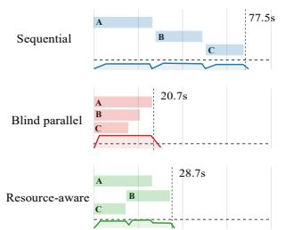
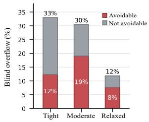
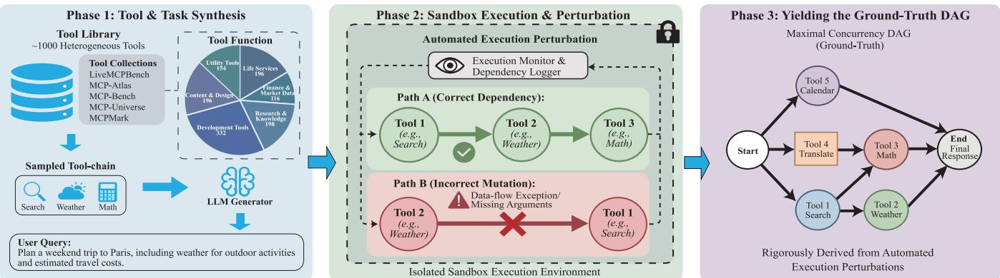
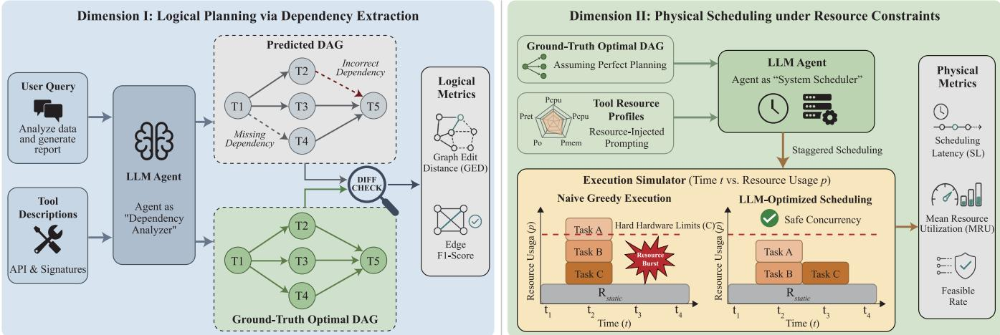
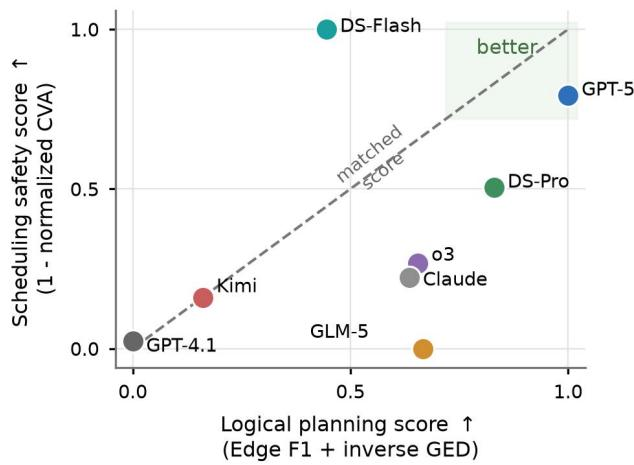
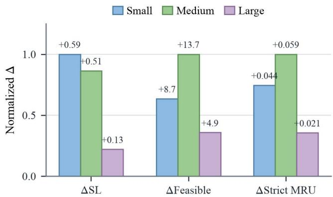

# PeakBench: Benchmarking Resource-Aware Tool Invocation in LLM Agents

Zhi-Kai Chen1,2, Xu-Xiang Zhong1,2, Song-Yan Li3, De-Chuan Zhan1,2, Han-Jia Ye1,2∗

1School of Artificial Intelligence, Nanjing University, China 2National Key Laboratory for Novel Software Technology, Nanjing University, China 3Nanjing University, China

## Abstract

LLM agents increasingly solve tasks by invoking multiple tools, where parallel execution is essential for low latency but dificult to manage safely. Existing agent benchmarks primarily evaluate tool selection, argument generation, and end-toend success under mostly serial execution, largely overlooking valid parallelization and resource-constrained scheduling. This missing scheduling dimension creates a practical failure mode: serial execution is safe but slow, while resourceagnostic parallel execution is fast but prone to avoidable resource overflows. To address this gap, we introduce Peak-Bench, a benchmark of executable multi-tool workflows with execution-grounded dependency annotations and measured resource profiles. A central challenge in evaluating such workflows is attribution: failures and ineficiencies may arise from incorrect dependency planning, poor resource-constrained scheduling, or both. PeakBench addresses this challenge with a two-part evaluation framework that disentangles logical planning from physical scheduling, with dedicated metrics for each dimension. Using this framework, we show that strong logical planning does not reliably translate into safe or eficient execution under resource constraints. We further show that exposing resource information can reduce avoidable overflows and improve resource utilization, making PeakBench a useful testbed for diagnosing resource-aware agent behavior. Code is available at https://github.com/Czzzk/Staggering-the-Peaks.

## Introduction

Large Language Models (LLMs) have undergone a paradigm shift, transitioning from passive conversationalists to autonomous “task-solvers” capable of interacting with the physical and digital worlds (Wang et al. 2024; Park et al. 2023; Xi et al. 2025). At the heart of this evolution lies the mechanism of tool invocation, which enables agents to extend their reasoning capabilities through external APIs, databases, and computational engines. (Schick et al. 2023; Patil et al. 2024; Yao et al. 2022) As agents are increasingly deployed in complex, real-world workflows—ranging from automated software engineering (Jimenez et al. 2024) to open-ended embodied or environment-interactive tasks (Wang et al. 2023)— the ability to interact with tools has become the definitive characteristic of “agentic” intelligence.

As task complexity escalates, modern agentic workflows demand concurrent execution to overcome the latency bottlenecks of sequential (step-by-step) models (Wei et al. 2022;

  
Figure 1: Motivating tradeof. Left: completion time and peak overflow for one workflow show that sequential execution is safe but slow, blind parallelism is fast but unsafe, and resource-aware scheduling preserves speedup without overflow. Right: blind-parallel overflows are decomposed across capacity profiles; avoidable overflow can be removed by a dependency-valid alternative schedule.

Ning et al. 2023). Safe concurrency first requires understanding step-level prerequisite and concurrency relations: which tool calls must wait for prior outputs, and which calls can run independently (Besta et al. 2024; Liu et al. 2023). Current agents may hallucinate false dependencies (needlessly serializing tasks and degrading throughput) or miss critical prerequisites (leading to execution-blocking errors) (Valmeekam et al. 2023, 2022). Yet these logical relations only define what may run in parallel; they do not determine whether those parallel calls can safely share finite infrastructure.

Furthermore, even when agents identify or are given valid dependency and concurrency structure, a critical systemic vulnerability emerges. Current frameworks conflate “logical independence” with “execution readiness.” Because they are fundamentally resource-agnostic, they operate under the naive assumption of infinite infrastructure capacity (Kwon et al. 2023; Yu et al. 2022; Aminabadi et al. 2022; Mei et al. 2024). Once independent tasks are identified, agents greedily dispatch all parallelizable tool invocations simultaneously without any physical scheduling awareness. As depicted in Figure 1, this unmanaged translation from logical parallelism to physical execution triggers massive “Resource Bursts.” Heavy, resource-intensive tools compete for finite hardware, leading to sharp spikes in infrastructure strain (Li et al. 2023b; Patel et al. 2024), severe queuing delays, and catastrophic service outages—a systemic bottleneck we formalize as the “peak load” problem.

  
Figure 2: PeakBench dataset construction pipeline. Left: benchmark-seeded workflow synthesis samples MCP tools and generates executable multi-tool queries. Middle: sandbox execution observes step-level behavior and validates inter-step relations. Right: execution-order perturbation recovers prerequisite and concurrency structure used by both benchmark dimensions.

Despite the severity of these parallelization and physicalscheduling bottlenecks, the evaluation of LLM agents remains overwhelmingly “accuracy-centric.” Existing benchmarks (Fan et al. 2025; Li et al. 2023a; Liu et al. 2024; Zhou et al. 2024; Mialon et al. 2024; Srivastava et al. 2023), such as ToolBench and APIBank, primarily evaluate tool selection, argument generation, and end-to-end success under mostly serial execution. While task success is a necessary condition, this narrow focus creates a critical research gap: these frameworks largely overlook valid parallelization and implicitly operate under the assumption of infinite and instantaneous resources. They ignore the temporal congestion and hardware footprint of tool-calling. In real-world deployments, an agent that reaches the correct answer but triggers a systemwide crash due to unmanaged request spikes is efectively unusable. Yet, current methodologies lack the vocabulary and metrics to quantify such operational failures.

End-to-end tool-agent execution makes failure attribution dificult. A slow or failed workflow may reflect incorrect tool selection, invalid arguments, missing dependencies, unnecessary serialization, unsafe parallelism, or resource overload under a particular machine capacity. Treating these outcomes as a single task-success score therefore obscures whether the agent failed to recover the step-level dependency structure, failed to schedule otherwise valid tool calls under resource constraints, or failed for unrelated tool-use reasons. This motivates a decoupled benchmark design in which executable workflows provide a validated task substrate, executiongrounded dependency and concurrency relations isolate logical planning, and measured resource profiles make physical scheduling observable.

Following this design, PeakBench constructs executable multi-tool workflows, derives execution-grounded dependency and concurrency annotations, and attaches empirically measured resource profiles to tool invocations. Dimension I evaluates logical planning by asking the agent to recover which workflow steps are prerequisites and which can run concurrently. Dimension II evaluates physical scheduling by giving this verified structure and asking the agent to assign execution timestamps under finite resource budgets. This separation makes failures attributable: a model may fail because it misunderstands dependencies, because it overloads resources, or because it does both.

Our evaluations using PeakBench reveal a new failure mode: agents that appear competent at logical workflow planning can be “resource-blind” when translating the workflow into physical execution. To test whether this failure is diagnosable, we include Resource-Aware Scheduling Context (RASC), a simple baseline that exposes resource metadata before scheduling and tests whether models can use such information to reduce avoidable overflow and improve utilization. Our core contributions are summarized as follows:

• We identify logical planning and resource-constrained physical scheduling as distinct evaluation targets often conflated in current LLM-agent benchmarks, and formalize the “peak load” failure mode that arises when logically valid parallel tool calls exceed finite resource capacity.

• We introduce PeakBench, a decoupled benchmark with executable multi-tool workflows, execution-grounded dependency and concurrency annotations, measured resource profiles, and separate protocols for logical planning and physical scheduling.

• Across representative LLMs, we show that planning strength does not reliably imply safe scheduling, while the RASC baseline yields measurable but model-dependent gains when resource information is exposed.

## Preliminary: Agentic Workflows as Constrained Scheduling Problems

We view multi-tool agent execution as a constrained workflow execution problem. Beyond selecting tools and producing a final answer, an agent must preserve step-level dataflow validity while scheduling invocations under finite infrastructure capacity. Let $\mathcal { V } \doteq \{ v _ { 1 } , v _ { 2 } , \ldots , v _ { n } \}$ denote the tool invocations in a workflow and $S = \{ t _ { 1 } , t _ { 2 } , \ldots , t _ { n } \}$ their activation schedule. A slow or unsafe run may result from an invalid prerequisite structure, a poor resource-constrained schedule in practice, or both.

  
Figure 3: PeakBench evaluation pipeline. Dimension I evaluates the model as a “Dependency Analyzer” by comparing its predicted prerequisite structure against the execution-grounded structure using dependency metrics. Dimension II gives the model the verified structure and evaluates it as a “System Scheduler” under measured resource profiles, using Scheduling Latency, Capacity Violation Area, and strict MRU.

Overall Execution Objective. Given a benchmark task $x ,$ available tool descriptions, and candidate invocations $\nu ,$ the agent must produce an executable plan and assign activation timestamps S. The plan must preserve data-flow prerequisites, and the schedule must keep concurrent resource demand within machine capacity. Because the prerequisite structure is not assumed to be given, it is implicit in whether the resulting execution can correctly use intermediate outputs and complete the task. Resource-aware agentic execution can therefore be formulated as:

$$
\begin{array} { r l } { \underset { \boldsymbol { \nu } , \boldsymbol { s } } { \operatorname* { m i n } } } & { \mathrm { S L } ( \boldsymbol { \mathcal { S } } ) \quad \mathrm { s . t . } \quad \boldsymbol { \Phi } ( \boldsymbol { x } ; \boldsymbol { \nu } , \boldsymbol { S } ) = 1 , } \\ & { \mathbf { L } _ { \boldsymbol { s } } ( \boldsymbol { \tau } ) \preceq \mathbf { C } , \quad \forall \boldsymbol { \tau } . } \end{array}\tag{1}
$$

Here $\Phi ( x ; \gamma , S ) = 1$ denotes logical execution success: the selected invocations, arguments, and intermediate data dependencies are suficient to complete the task. The second constraint is physical execution feasibility: $\mathbf { L } _ { S } ( \tau )$ is the aggregate resource load induced by S and must remain within capacity C. Equation 1 captures the central coupling: successful agentic execution requires both a valid dependency structure and a resource-feasible schedule. The equation intentionally leaves both constraints abstract; the two stages below instantiate them for evaluation.

Decoupled Evaluation. A monolithic end-to-end score cannot tell whether a violation of Equation 1 comes from a wrong dependency structure, a poor physical schedule, or both. PeakBench therefore turns the two constraints in Equation 1 into two separate benchmark dimensions. To do so, it derives an execution-grounded prerequisite relation $\mathcal { R } ^ { \star }$ over workflow steps and evaluates:

$$
\begin{array} { r l } & { \Phi ( x ; \mathcal { V } , S ) = 1 \implies \mathrm { E v a l } _ { \mathrm { p l a n } } ( \hat { \mathcal { R } } , \mathcal { R } ^ { \star } ) , } \\ & { \qquad \mathrm { \mathbf { L } } _ { S } ( \tau ) \preceq \mathbf { C } \implies \mathrm { E v a l } _ { \mathrm { s c h e d } } ( S ; \mathcal { R } ^ { \star } , \mathbf { r } , \mathbf { C } ) . } \end{array}\tag{2}
$$

Thus, Dimension I evaluates the logical-success constraint by comparing the predicted prerequisite structure with $\mathcal { R } ^ { \star }$ while Dimension II evaluates the resource-feasibility constraint by fixing $\mathcal { R } ^ { \star }$ and replaying S under r and C. This decomposition preserves the structure of the overall execution problem while making the source of failure attributable. We next detail the two subproblems.

Stage 1: Logical Planning (Dependency Extraction). Before execution, an agent must infer which tool calls can run concurrently and which must be sequential. We formalize this as a prerequisite relation $\mathcal { R } \subseteq \mathcal { V } \times \mathcal { V }$ over workflow steps. A pair $( v _ { i } , v _ { j } ) \in \mathcal { R }$ means that $v _ { i }$ must complete before $v _ { j }$ can begin because $v _ { j }$ depends on $v _ { i } \mathrm { { ' } s }$ output or side efect. The complement of the transitive prerequisite relation determines which step pairs are validly concurrent:

$$
\mathcal { C } ( \mathcal { R } ) = \left\{ \{ v _ { i } , v _ { j } \} : ( v _ { i } , v _ { j } ) \not \in \mathcal { R } ^ { + } , ( v _ { j } , v _ { i } ) \not \in \mathcal { R } ^ { + } \right\}\tag{3}
$$

where $\mathcal { R } ^ { + }$ denotes transitive closure. Let $\hat { \mathcal { C } } = \mathcal { C } ( \hat { \mathcal { R } } )$ and ${ \mathcal C } ^ { \star } = { \mathcal C } ( { \mathcal R } ^ { \star } )$ . PeakBench instantiates the logical-success constraint as $\mathrm { E v a l } _ { \mathrm { p l a n } } ( \hat { \mathcal { R } } , \mathcal { R } ^ { \star } )$

$$
\left. D _ { \mathrm { d e p } } ( \hat { \mathcal { R } } , \mathcal { R } ^ { \star } ) , A _ { \mathrm { c o n c } } ( \hat { \mathcal { C } } , \mathcal { C } ^ { \star } ) \right. .\tag{4}
$$

Here $D _ { \mathrm { d e p } }$ captures discrepancy in required prerequisite relations, while $A _ { \mathrm { { c o n c } } }$ captures agreement on which step pairs can run concurrently.

Stage 2: Physical Scheduling (Resource Allocation). While R dictates what can be parallelized, the infrastructure capacity C dictates how much can be parallelized safely. Each invocation $v _ { i }$ has duration $d _ { i }$ and measured resource footprint $\mathbf { r } _ { i } ,$ and any candidate schedule induces the resourceload vector:

$$
\mathbf { L } ( \tau ) = \sum _ { i = 1 } ^ { n } \mathbf { r } _ { i } \nVdash ( \tau \in [ t _ { i } , t _ { i } + d _ { i } ) )\tag{5}
$$

where $\nVdash ( \cdot )$ is an indicator function for active execution. Given a prerequisite relation R and resource footprints $\{ { \bf r } _ { i } \} _ { i = 1 } ^ { n } ,$ , a schedule must respect prerequisite order $( t _ { j } ~ \geq$

$t _ { i } + d _ { i }$ for all $( v _ { i } , v _ { j } ) ~ \in ~ \mathcal { R } )$ while keeping aggregate load within capacity. PeakBench instantiates the resourcefeasibility constraint as $\mathrm { E v a l } _ { \mathrm { s c h e d } } ( S ; \mathcal { R } ^ { \star } , { \bf r } , { \bf C } )$ :

$$
\left. T _ { \mathrm { e n d } } ( S ) , V _ { \mathrm { c a p } } ( S ; { \mathbf { r } } , { \mathbf { C } } ) , U _ { \mathrm { s a f e } } ( S ; { \mathbf { r } } , { \mathbf { C } } ) \right. .\tag{6}
$$

Here $T _ { \mathrm { e n d } }$ captures completion time, $V _ { \mathrm { c a p } }$ captures the severity of capacity breaches, and $U _ { \mathrm { s a f e } }$ captures resource utilization only when the schedule remains feasible. $\preceq$ denotes element-wise comparison across resource dimensions.

The “Resource-Blind” Bottleneck. A resource-blind scheduler observes prerequisite structure but not $\mathbf { r } _ { i }$ or $\mathbf { C } .$ Even with correct logical structure, it may therefore launch all ready steps as early as possible and violate $\mathbf { L } ( \tau ) \preceq \mathbf { C }$ which PeakBench isolates in Dimension II.

## PeakBench

PeakBench evaluates whether LLM agents can act as resource-aware workflow executors, not only functional tool selectors. It couples a large catalog of MCP-compatible tools with semantically plausible, executable multi-tool workflows whose dependencies and resource footprints are empirically grounded. Each instance supports two linked evaluations: predicting the execution-grounded dependency structure for logical planning, and scheduling the same structure under resource constraints for physical execution.

## Benchmark Construction

PeakBench operationalizes this design through sandboxvalidated workflows, execution-grounded step relations, empirical resource profiling, and a two-part evaluation protocol.

Tool Catalog and Resource Characterization. Peak-Bench builds on approximately 1.2K MCP-compatible tools spanning about 130 servers, aggregated from representative MCP-based tool-use ecosystems and agentic benchmarks, including LiveMCPBench (Mo et al. 2025), MCP-Atlas (Bandi et al. 2026), MCP-Bench (Wang et al. 2025), MCP-Universe (Luo et al. 2025), and MCPMark (Wu et al. 2025). The catalog covers common agentic capabilities such as retrieval, code execution, file manipulation, database access, web interaction, multimodal processing, and model-inthe-loop computation.

We characterize these tools along functional and operational axes. The former captures agentic roles and application domains, while the latter summarizes the dominant bottlenecks shown in Table 1. This distinction matters because functionally similar tools can impose very diferent system costs, so resource-aware scheduling cannot be inferred from tool semantics alone. Each tool is further associated with an empirically measured resource profile; the profiling protocol is detailed in Appendix B.

Benchmark-Seeded Workflow Synthesis. Workflow synthesis starts from task domains, question styles, and toolusage patterns observed in existing API/MCP benchmarks. Given these seeds, PeakBench samples MCP tools and generates semantically nearby executable workflows over the sampled components. This preserves benchmark-grounded task intent and tool-composition patterns while allowing controlled variation in invocation scale, dependency depth, parallel branch width, and resource heterogeneity.

<table><tr><td>Functional</td><td>#</td><td>Resource Tag</td><td>#</td></tr><tr><td>Life Services</td><td>196</td><td>Lightweight</td><td>436</td></tr><tr><td>Finance &amp; Market Data</td><td>116</td><td>Memory-heavy</td><td>632</td></tr><tr><td>Research &amp; Knowledge</td><td>198</td><td>CPU-heavy</td><td>201</td></tr><tr><td>Development Tools</td><td>332</td><td>Network-heavy</td><td>417</td></tr><tr><td>Content &amp; Design</td><td>196</td><td>Disk-I/O-heavy</td><td>64</td></tr><tr><td>Utility Tools</td><td>154</td><td>Process-fanout</td><td>7</td></tr></table>

Table 1: PeakBench tool catalog taxonomy. Functional categories are mutually exclusive; resource-cost tags are multilabel over profiling-eligible tools.

We define dificulty through workflow structure rather than linguistic complexity. PeakBench contains 300 executable workflows, stratified into 150 easy, 100 medium, and 50 hard tasks, with tier definitions reported in Appendix C. For each tier, we sample MCP servers and tools from benchmarkderived domains, then prompt an LLM to synthesize an executable user query that requires the selected components and induces a concrete multi-step workflow. Figure 2 (Left) illustrates this benchmark-seeded synthesis stage.

Execution-Grounded Step Relation Annotation. After a workflow query is synthesized, we execute its tool invocations inside a controlled containerized sandbox exposing the sampled MCP tools and servers. This stage is used to observe and annotate step-level relations rather than merely to check whether the query is executable. We first collect execution traces showing which steps consume prior outputs and which can proceed independently. We then perturb candidate execution orders inside the sandbox and monitor data-flow failures, such as missing inputs or violated prerequisites. These observations identify required prerequisite relations and feasible concurrent groups, producing the execution-grounded structure used by both benchmark dimensions, as illustrated in Figure 2 (Middle, Right).

This execution-grounded structure plays a dual role in PeakBench’s decoupled evaluation paradigm. In the first dimension, it serves as the structural ground truth against which an agent’s predicted dependency structure is evaluated. In the second dimension, it is provided directly to the agent as an oracle workflow specification, thereby isolating resource-aware scheduling from uncertainty in logical planning.

## Decoupled Evaluation Protocol

Traditional agent benchmarks primarily evaluate whether a model can iteratively select tools to reach a correct final answer. PeakBench instead evaluates whether a validated multi-tool workflow can be executed eficiently under finite infrastructure constraints. To avoid conflating workflowunderstanding errors with scheduling errors, we separate the evaluation into two dimensions: Dimension I tests dependency recovery, while Dimension II fixes the executiongrounded prerequisite structure and tests resource-aware scheduling. The following subsections specify the inputs, outputs, and metrics for each dimension.

Dimension I: Logical Planning via Dependency Extraction. The first evaluation dimension treats the agent as a Dependency Analyzer. Its objective is to test whether the model can recover the intrinsic data-flow constraints of a multi-tool workflow before physical execution. This capability is foundational: without a sound structure, later parallelization or resource allocation would rest on flawed and unsafe assumptions.

Given a user query together with the descriptions of the relevant tools and servers, the agent must output a prerequisite structure indicating which tool invocations must precede others and which can be safely executed in parallel. For metric computation, this prerequisite structure is represented as a DAG. To establish ground truth without exhaustive human annotation, we use the execution-grounded structure recovered through sandbox perturbation, as described above. This procedure yields an empirical structural target derived from actual tool behavior rather than manual interpretation alone.

We compare the agent’s predicted prerequisite structure against this execution-derived target using two metrics. First, Graph Edit Distance (GED) measures the minimum number of graph operations required to transform the predicted structure into the ground-truth structure. Second, Edge F1 evaluates the precision and recall of the predicted prerequisite edges, penalizing both hallucinated dependencies and missing constraints. Together, these metrics quantify whether the agent can recover the logical structure necessary to maximize concurrency.

Dimension II: Physical Scheduling under Resource Constraints. The second evaluation dimension treats the agent as a System Scheduler. While dependency extraction identifies the potential for concurrency, realizing that potential requires physical orchestration under finite infrastructure budgets. This dimension therefore evaluates whether an agent can flatten latency without triggering resource contention, peak overload, or system-level failure.

Unlike Dimension I, the goal here is not to infer workflow structure. Instead, we directly provide the executiongrounded prerequisite structure as an oracle input, thereby removing ambiguity about precedence constraints and isolating the agent’s scheduling ability. Given this verified structure together with historical resource profiles, the agent must decide when each tool invocation should be activated so as to balance parallel throughput against physical feasibility.

To ground this task in system reality, we use the measured resource profiles defined above and adopt a dual-state cost model to capture temporal resource behavior. The total consumption for invocation v with input x is defined as

$$
\mathbf { r } _ { \mathrm { t o t a l } } ( v , x ) = \mathbf { r } _ { \mathrm { s t a t i c } } ( v ) + \mathbf { r } _ { \mathrm { d y n a m i c } } ( v , x ) ,\tag{7}
$$

where $\mathbf { r } _ { \mathrm { s t a t i c } } ( v )$ represents the persistent baseline overhead required to keep a tool ready (e.g., loaded model weights in GPU memory), and $\mathbf { r } _ { \mathrm { d y n a m i c } } ( v , x )$ captures the transient surge triggered during active execution. We estimate these quantities through high-frequency system telemetry collected across diverse instructions $\mathcal { X } _ { i }$

The agent must assign execution timestamps to minimize end-to-end latency while preventing overlapping tool activations from breaching hard physical limits. We evaluate schedules using three metrics: Scheduling Latency (SL), Capacity Violation Area (CVA), and strict mean resource utilization (strict MRU). Because resource dimensions have diferent physical units, we first normalize each dimension by its machine capacity. For a replayed schedule, let segment k have duration $\Delta _ { k }$ and dimensionless utilization ratio $u _ { k , m } = L _ { k , m } / C _ { m }$ on resource dimension m. We compute

$$
\mathrm { C V A } = \sum _ { k } \Delta _ { k } \sum _ { m } [ u _ { k , m } - 1 ] _ { + } ,\tag{8}
$$

where $[ x ] _ { + } = \operatorname* { m a x } ( x , 0 )$ , so CVA is zero exactly when the schedule never exceeds capacity in any dimension. Mean resource utilization (MRU) is the duration-weighted average of the composite normalized load, and strict MRU equals MRU only for zero-CVA schedules. Thus, CVA measures violation severity, while strict MRU rewards high utilization only when the schedule is physically safe. In this sense, Dimension II evaluates not whether an agent understands workflow logic, but whether it can translate a verified workflow structure into a safe, eficient execution schedule.

## Human Quality Audit

Although PeakBench derives its workflow structure through execution perturbation, we also conduct a manual quality audit on approximately 100 sampled workflows. Annotators compare each generated structure against an optimal structure derived from the query, tool descriptions, and execution trace. About 94% of the audited samples match the optimal structure. Since each workflow typically requires about 4–5 minutes to audit manually, this agreement supports the reliability of our execution-grounded construction pipeline while illustrating why exhaustive manual annotation is impractical.

## Resource-Aware Scheduling Context (RASC)

The decoupled protocol exposes a natural diagnostic question: given the correct workflow structure, can an agent use explicit resource information to schedule more safely? Resource-Aware Scheduling Context (RASC) answers this question by augmenting the scheduling input with preexecution resource metadata. Before execution, the agent sees not only which tool calls are ready, but also how expensive those calls are and what capacity limits they must share. This lets the model reason about physical contention before committing to an invocation order.

Concretely, RASC takes four inputs: the user question, the verified workflow structure, the target machine capacity C, and a structured resource profile for every tool invocation. Each profile records the estimated execution duration and measured resource footprint of the invocation. The context also states the execution semantics: tool calls whose dependencies are satisfied may run concurrently, but the aggregate load of all active calls should remain below the machine capacity. The model is then asked to output an execution schedule, i.e., a start time or scheduling delay for each workflow node.

Formally, for a workflow question q and verified prerequisite structure $\mathcal { R } ^ { \star }$ , the resource-blind scheduler observes only the logical planning context, whereas RASC additionally exposes the invocation profiles $\mathcal { P } = \{ ( d _ { i } , { \bf r } _ { i } ) \}$ and machine capacity:

$$
\pi _ { \boldsymbol { \theta } } ^ { \mathrm { b a s e } } = \pi _ { \boldsymbol { \theta } } ( \boldsymbol { q } , \mathcal { R } ^ { \star } ) , \qquad \pi _ { \boldsymbol { \theta } } ^ { \mathrm { R A S C } } = \pi _ { \boldsymbol { \theta } } ( \boldsymbol { q } , \mathcal { R } ^ { \star } , \mathcal { P } , { \bf C } ) .\tag{9}
$$

Thus, RASC changes only the scheduling context supplied to the model at decision time, not the model parameters or the verified workflow structure.

This changes the agent’s decision criterion from “launch every ready tool as early as possible” to “launch ready tools only when their combined resource pressure is acceptable.” RASC therefore targets peak load by preserving parallelism where capacity permits while discouraging resource bursts. It requires no retraining or external optimizer; the JSON-style context schema is shown in Appendix E.

## Experiment

## Experimental Setup

Models. We evaluate eight frontier API models on Peak-Bench: DeepSeek-V4-Flash, DeepSeek-V4-Pro, GLM-5, Kimi-K2.5, Claude Sonnet 4.6, GPT-4.1, GPT-5, and o3. All models are accessed through their public API interfaces and evaluated under the same prompting and parsing protocol.

Benchmark and scheduling protocol. Both benchmark dimensions use the same PeakBench questions and execution-grounded workflows. Dimension I asks the model to recover the dependency structure from the task and tool descriptions. Dimension II gives the model the verified structure and asks it to assign start timestamps to all tool invocations under three machine profiles (small, medium, and large); the profile construction is reported in Appendix D.

We compare two model settings. The no-profile setting provides the verified structure but hides tool-level resource telemetry. RASC additionally provides structured resource profiles and machine capacities. We also include non-LLM baselines: ASAP, serial topological execution, and resourceconstrained list schedulers ordered by duration, critical-path length, or normalized resource pressure. The same simulator replays all schedules and computes the Dimension II metrics.

Metrics. We use the Dimension I and Dimension II metrics defined above: GED and Edge F1 for dependency recovery, and Scheduling Latency (SL), Capacity Violation Area (CVA), and strict mean resource utilization (strict MRU) for scheduling. Arrows in the tables indicate whether lower or higher values are better.

## Benchmark Results

Table 2 reports PeakBench’s two benchmark dimensions. The Baseline row gives the shared earliest-ready execution state before model scheduling, while each model row reports the no-profile schedule produced by that model. Dimension II uses the verified structure and evaluates Scheduling Latency, CVA, and strict MRU under resource limits before applying RASC. Relative to the Baseline, models can reduce CVA and improve strict MRU without resource telemetry, but mainly by adding conservative delays, which raises Scheduling Latency. This reveals the resource-blind scheduling regime that

  
Figure 4: Planning–scheduling decoupling across models. Both axes are normalized higher-better. The x-axis averages Edge F1 and inverse normalized GED; the y-axis uses one minus normalized CVA. The dashed diagonal indicates matched planning and scheduling scores.

RASC later targets: models know the workflow structure, but not which concurrent calls compete for the same resources.

The contrast between Dimension I and Dimension II shows that strong logical planning does not imply strong resourceaware scheduling. GPT-5 and DeepSeek-V4-Pro achieve the strongest dependency-extraction results, yet their no-profile scheduling results remain close to weaker logical planners under the physical metrics. PeakBench evaluates two complementary capabilities: recovering the workflow structure and executing that structure under finite resource budgets.

The case-level correlation analysis in Appendix F.3 further validates this separation. Figure 4 shows the same decoupling at the model level: models do not concentrate near the upperright or along the matched-score diagonal. Across models, dependency-extraction success for a workflow only weakly predicts whether the same workflow will be scheduled safely under finite resources.

## RASC Results

Providing resource information changes the scheduling behavior rather than only the input surface. We evaluate this efect from two angles: against classical scheduling rules, and against each model’s no-profile schedule.

We also compare RASC against classical scheduling rules, including earliest-ready scheduling (ASAP), serial execution, and resource-constrained list scheduling. Table 3 reports the best RASC setting using DeepSeek-V4-Pro, the strongest complete model under RASC in our runs. ASAP is consistently fastest but incurs many resource violations, while serial execution reduces CVA at a large latency cost. RASC nearly matches the best rule-based scheduler in CVA while achieving higher strict MRU, without external optimization. This comparison positions RASC as a context-level diagnostic baseline: it does not replace hand-crafted schedulers, but shows that capable LLMs can use explicit resource metadata when deciding tool timing, or expose structured workflow and resource information to an external scheduler.

<table><tr><td></td><td colspan="2">Dimension I: Logical Planning</td><td colspan="3">Dimension II: Scheduling Benchmark</td></tr><tr><td>Model</td><td>GED↓</td><td>Edge F1 ↑</td><td>SL (s) ↓</td><td>CVA↓</td><td>Strict MRU ↑</td></tr><tr><td>GPT-5 (Singh et al. 2025)</td><td>0.42</td><td>0.839</td><td>13.28</td><td>3.698</td><td>0.125</td></tr><tr><td>DeepSeek-V4-Pro (Xu et al. 2026a)</td><td>0.54</td><td>0.807</td><td>12.63</td><td>4.032</td><td>0.120</td></tr><tr><td>OpenAI o3 (OpenAI 2025b)</td><td>0.66</td><td>0.771</td><td>12.98</td><td>4.307</td><td>0.127</td></tr><tr><td>GLM-5 (Zeng et al. 2026)</td><td>0.65</td><td>0.772</td><td>11.81</td><td>4.616</td><td>0.119</td></tr><tr><td>Claude Sonnet 4.6 (Anthropic 2026)</td><td>0.67</td><td>0.764</td><td>13.20</td><td>4.358</td><td>0.126</td></tr><tr><td>DeepSeek-V4-Flash (Xu et al. 2026a)</td><td>0.81</td><td>0.733</td><td>12.62</td><td>3.458</td><td>0.124</td></tr><tr><td>Kimi-K2.5 (Team et al. 2026)</td><td>1.02</td><td>0.688</td><td>11.16</td><td>4.431</td><td>0.120</td></tr><tr><td>GPT-4.1 (OpenAI 2025a)</td><td>1.14</td><td>0.663</td><td>13.13</td><td>4.588</td><td>0.121</td></tr><tr><td>Baseline</td><td>一</td><td>一</td><td>8.62</td><td>5.865</td><td>0.080</td></tr></table>

Table 2: PeakBench benchmark results across logical planning and physical scheduling on the same PeakBench evaluation questions. Baseline denotes the earliest-ready execution state before model scheduling and is not ranked against model outputs. Bold and underline mark the best and second-best model values within each metric; ties are marked consistently. Dimension II reports no-profile model scheduling before applying RASC.

<table><tr><td>Method</td><td>SL (s) ↓</td><td>CVA↓</td><td>Strict MRU ↑</td></tr><tr><td>ASAP</td><td>8.62</td><td>5.865</td><td>0.080</td></tr><tr><td>Serial</td><td>15.19</td><td>2.925</td><td>0.097</td></tr><tr><td>Best Rule</td><td>9.13</td><td>2.925</td><td>0.141</td></tr><tr><td>RASC</td><td>9.11</td><td>2.938</td><td>0.165</td></tr></table>

Table 3: RASC compared with classical scheduling baselines on Dimension II, averaged over three machine profiles. Bold and underline mark the best and second-best values within each metric; ties are marked consistently.

<table><tr><td>Model</td><td>∆SL (s) ↓</td><td>∆CVA↓</td><td>∆MRU↑</td></tr><tr><td>GPT-5</td><td>-4.31</td><td>-0.534</td><td>+0.040</td></tr><tr><td>DeepSeek-V4-Pro</td><td>-3.51</td><td>-1.094</td><td>+0.045</td></tr><tr><td>OpenAI o3</td><td>-3.95</td><td>-1.053</td><td>+0.039</td></tr><tr><td>GLM-5</td><td>-2.67</td><td>-1.457</td><td>+0.041</td></tr><tr><td>Claude Sonnet 4.6</td><td>-3.91</td><td>-1.092</td><td>+0.021</td></tr><tr><td>DeepSeek-V4-Flash</td><td>-3.49</td><td>+0.034</td><td>+0.039</td></tr><tr><td>Kimi-K2.5</td><td>-2.04</td><td>-0.305</td><td>-0.014</td></tr><tr><td>GPT-4.1</td><td>-4.29</td><td>-0.423</td><td>-0.028</td></tr></table>

Table 4: Efect of resource-aware scheduling context. Values are RASC minus no-profile scheduling, averaged over three machine profiles. For ∆SL and ∆CVA, lower is better; for ∆MRU, higher is better. Bold and underline mark the best and second-best values within each metric.

Table 4 isolates the RASC efect by comparing RASC with each model’s no-profile schedule. For most models, RASC reduces Scheduling Latency while lowering CVA and improving strict MRU, suggesting that resource profiles help replace conservative delays with targeted staggering. DeepSeek-V4-Flash is the exception on CVA, where RASC lowers latency and improves strict MRU but slightly increases violation area, indicating that resource telemetry must still be translated into a valid temporal schedule.

Additional analyses in Appendix F provide case-level support for these results. Appendix Figure 5 shows that RASC gains are largest under tighter capacity profiles. The model-level breakdown shows that GLM-5, DeepSeek-V4- Pro, Claude Sonnet 4.6, and o3 obtain the largest CVA reductions, while DeepSeek-V4-Flash slightly increases CVA. Appendix Tables 7, 8, and 9 show that logical planning success only weakly predicts physical scheduling safety, RASC remains beneficial under noisy resource profiles, and the gain comes primarily from CPU and memory profiles rather than generic latency awareness.

Main findings. Taken together, Table 2, Table 3, Table 4, and the analyses in Appendix F support four main findings. First, strong logical planning does not imply strong resourceaware scheduling. Second, no-profile models are not merely earliest-ready schedulers: they often add conservative delays that reduce CVA and improve strict MRU, but at substantially higher Scheduling Latency. Third, RASC turns this coarse caution into more targeted staggering, lowering latency while usually reducing CVA and improving strict MRU. Fourth, RASC nearly matches the best rule-based scheduler in CVA while achieving higher strict MRU, but the benefit remains model-dependent, showing that resource-aware orchestration is a distinct capability rather than an automatic consequence of exposing resource metadata.

## Conclusion

We introduced PeakBench, a decoupled benchmark for evaluating LLM agents’ ability to recover workflow dependencies and schedule tool invocations under finite infrastructure constraints. By separating logical planning from physical scheduling, PeakBench makes peak-load failures measurable and attributable beyond accuracy-centric tool-use evaluation. Our experiments show that RASC reduces capacity violations and overload, while models still vary in how they translate resource profiles into eficient execution plans.

## References

Aminabadi, R. Y.; Rajbhandari, S.; Awan, A. A.; Li, C.; Li, D.; Zheng, E.; Ruwase, O.; Smith, S.; Zhang, M.; Rasley, J.; et al. 2022. Deepspeed-inference: enabling eficient inference of transformer models at unprecedented scale. In SC22: International Conferencefor High Performance Computing, Networking, Storage and Analysis, 1–15. IEEE.

Anthropic. 2026. Claude Sonnet 4.6 System Card. https: //www.anthropic.com/claude-sonnet-4-6-system-card. Accessed: 2026-07-28.

Bandi, C.; Dumitru, R.-G.; Hertzberg, B.; Agarwal, D.; Boo, G.; Polakam, T.; Hassaan, S.; Da, J.; Kim, H.; Gupta, V.; et al. 2026. Mcp-atlas: A large-scale benchmark for tooluse competency with real mcp servers. arXiv preprint arXiv:2602.00933.

Besta, M.; Blach, N.; Kubicek, A.; Gerstenberger, R.; Podstawski, M.; Gianinazzi, L.; Gajda, J.; Lehmann, T.; Niewiadomski, H.; Nyczyk, P.; et al. 2024. Graph of thoughts: Solving elaborate problems with large language models. In Proceedings of the AAAI conference on artificial intelligence, volume 38, 17682–17690.

Fan, S.; Ding, X.; Zhang, L.; and Mo, L. 2025. Mcptoolbench++: A large scale ai agent model context protocol mcp tool use benchmark. arXiv preprint arXiv:2508.07575.

Jain, R.; and Wetter, M. 2025. R-ConstraintBench: Evaluating LLMs on NP-Complete Scheduling. arXiv preprint arXiv:2508.15204.

Jimenez, C. E.; Yang, J.; Wettig, A.; Yao, S.; Pei, K.; Press, O.; and Narasimhan, K. 2024. Swe-bench: Can language models resolve real-world github issues? In International Conference on Learning Representations, volume 2024, 54107–54157.

Kwon, W.; Li, Z.; Zhuang, S.; Sheng, Y.; Zheng, L.; Yu, C. H.; Gonzalez, J.; Zhang, H.; and Stoica, I. 2023. Eficient memory management for large language model serving with pagedattention. In Proceedings of the 29th symposium on operating systems principles, 611–626.

Li, M.; Zhao, Y.; Yu, B.; Song, F.; Li, H.; Yu, H.; Li, Z.; Huang, F.; and Li, Y. 2023a. Api-bank: A comprehensive benchmark for tool-augmented llms. In Proceedings of the 2023 conference on empirical methods in natural language processing, 3102–3116.

Li, Z.; Zheng, L.; Zhong, Y.; Liu, V.; Sheng, Y.; Jin, X.; Huang, Y.; Chen, Z.; Zhang, H.; Gonzalez, J. E.; et al. 2023b. {AlpaServe}: Statistical multiplexing with model parallelism for deep learning serving. In 17th USENIX Symposium on Operating Systems Design and Implementation (OSDI 23), 663–679.

Liu, B.; Jiang, Y.; Zhang, X.; Liu, Q.; Zhang, S.; Biswas, J.; and Stone, P. 2023. Llm+ p: Empowering large language models with optimal planning proficiency. arXiv preprint arXiv:2304.11477.

Liu, J.; Qian, C.; Su, Z.; Zong, Q.; Huang, S.; He, B.; and Fung, Y. R. 2026. Costbench: Evaluating multi-turn costoptimal planning and adaptation in dynamic environments for llm tool-use agents. In Proceedings of the 64th Annual

Meeting of the Association for Computational Linguistics (Volume 1: Long Papers), 12826–12858.

Liu, X.; Yu, H.; Zhang, H.; Xu, Y.; Lei, X.; Lai, H.; Gu, Y.; Ding, H.; Men, K.; Yang, K.; et al. 2024. Agentbench: Evaluating llms as agents. In International Conference on Learning Representations, volume 2024, 52989–53046.

Luo, Z.; Shen, Z.; Yang, W.; Zhao, Z.; Jwalapuram, P.; Saha, A.; Sahoo, D.; Savarese, S.; Xiong, C.; and Li, J. 2025. Mcp-universe: Benchmarking large language models with real-world model context protocol servers. arXiv preprint arXiv:2508.14704.

Mei, K.; Zhu, X.; Xu, W.; Hua, W.; Jin, M.; Li, Z.; Xu, S.; Ye, R.; Ge, Y.; and Zhang, Y. 2024. Aios: Llm agent operating system. arXiv preprint arXiv:2403.16971.

Mialon, G.; Fourrier, C.; Wolf, T.; LeCun, Y.; and Scialom, T. 2024. Gaia: a benchmark for general ai assistants. In International Conference on Learning Representations, volume 2024, 9025–9049.

Mo, G.; Zhong, W.; Chen, J.; Yuan, Q.; Chen, X.; Lu, Y.; Lin, H.; He, B.; Han, X.; and Sun, L. 2025. Livemcpbench: Can agents navigate an ocean of mcp tools? arXiv preprint arXiv:2508.01780.

Ning, X.; Lin, Z.; Zhou, Z.; Wang, Z.; Yang, H.; and Wang, Y. 2023. Skeleton-of-thought: Large language models can do parallel decoding. Proceedings ENLSP-III.

OpenAI. 2025a. Introducing GPT-4.1 in the API. https: //openai.com/index/gpt-4-1/. Accessed: 2026-07-28.

OpenAI. 2025b. OpenAI o3 and o4-mini System Card. https: //openai.com/index/o3-o4-mini-system-card/. Accessed: 2026-07-28.

Park, J. S.; O’Brien, J.; Cai, C. J.; Morris, M. R.; Liang, P.; and Bernstein, M. S. 2023. Generative agents: Interactive simulacra of human behavior. In Proceedings of the 36th annual acm symposium on user interface software and technology, 1–22.

Patel, P.; Choukse, E.; Zhang, C.; Shah, A.; Goiri, Í.; Maleki, S.; and Bianchini, R. 2024. Splitwise: Eficient generative llm inference using phase splitting. In 2024 ACM/IEEE 51st Annual International Symposium on Computer Architecture (ISCA), 118–132. IEEE.

Patil, S. G.; Zhang, T.; Wang, X.; and Gonzalez, J. E. 2024. Gorilla: Large language model connected with massive apis. Advances in Neural Information Processing Systems, 37: 126544–126565.

Qin, T.; Bai, F.; Hu, T.-Y.; Vemulapalli, R.; Koppula, H. S.; Xu, Z.; Jin, B.; Cemri, M.; Lu, J.; Wang, Z.; et al. 2025. COM-PASS: Benchmarking Constrained Optimization in LLM Agents. arXiv preprint arXiv:2510.07043.

Schick, T.; Dwivedi-Yu, J.; Dessì, R.; Raileanu, R.; Lomeli, M.; Hambro, E.; Zettlemoyer, L.; Cancedda, N.; and Scialom, T. 2023. Toolformer: Language models can teach themselves to use tools. Advances in neural information processing systems, 36: 68539–68551.

Singh, A.; Fry, A.; Perelman, A.; Tart, A.; Ganesh, A.; El-Kishky, A.; McLaughlin, A.; Low, A.; Ostrow, A.; Ananthram, A.; et al. 2025. Openai gpt-5 system card. arXiv preprint arXiv:2601.03267.

Srivastava, A.; Rastogi, A.; Rao, A.; Shoeb, A. A. M.; Abid, A.; Fisch, A.; Brown, A. R.; Santoro, A.; Gupta, A.; Garriga-Alonso, A.; et al. 2023. Beyond the imitation game: Quantifying and extrapolating the capabilities of language models. Transactions on machine learning research.

Team, K.; Bai, T.; Bai, Y.; Bao, Y.; Cai, S.; Cao, Y.; Charles, Y.; Che, H.; Chen, C.; Chen, G.; et al. 2026. Kimi K2. 5: Visual Agentic Intelligence. arXiv preprint arXiv:2602.02276.

Valmeekam, K.; Marquez, M.; Olmo, A.; Sreedharan, S.; and Kambhampati, S. 2023. Planbench: An extensible benchmark for evaluating large language models on planning and reasoning about change. Advances in Neural Information Processing Systems, 36: 38975–38987.

Valmeekam, K.; Olmo, A.; Sreedharan, S.; and Kambhampati, S. 2022. Large language models still can’t plan (a benchmark for LLMs on planning and reasoning about change). In NeurIPS 2022 Foundation Models for Decision Making Workshop.

Wang, G.; Xie, Y.; Jiang, Y.; Mandlekar, A.; Xiao, C.; Zhu, Y.; Fan, L.; and Anandkumar, A. 2023. Voyager: An openended embodied agent with large language models. arXiv preprint arXiv:2305.16291.

Wang, L.; Ma, C.; Feng, X.; Zhang, Z.; Yang, H.; Zhang, J.; Chen, Z.; Tang, J.; Chen, X.; Lin, Y.; et al. 2024. A survey on large language model based autonomous agents. Frontiers ofComputer Science, 18(6): 186345.

Wang, Z.; Chang, Q.; Patel, H.; Biju, S.; Wu, C.-E.; Liu, Q.; Ding, A.; Rezazadeh, A.; Shah, A.; Bao, Y.; et al. 2025. Mcp-bench: Benchmarking tool-using llm agents with complex real-world tasks via mcp servers. arXiv preprint arXiv:2508.20453.

Wei, J.; Wang, X.; Schuurmans, D.; Bosma, M.; Xia, F.; Chi, E.; Le, Q. V.; Zhou, D.; et al. 2022. Chain-of-thought prompting elicits reasoning in large language models. Advances in neural information processing systems, 35: 24824–24837.

Wu, Z.; Liu, X.; Zhang, X.; Chen, L.; Meng, F.; Du, L.; Zhao, Y.; Zhang, F.; Ye, Y.; Wang, J.; et al. 2025. Mcpmark: A benchmark for stress-testing realistic and comprehensive mcp use. arXiv preprint arXiv:2509.24002.

Xi, Z.; Chen, W.; Guo, X.; He, W.; Ding, Y.; Hong, B.; Zhang, M.; Wang, J.; Jin, S.; Zhou, E.; et al. 2025. The rise and potential of large language model based agents: A survey. Science China Information Sciences, 68(2): 121101.

Xiang, D.; Chu, K.; Xu, W.; Zhang, W.; and Zhang, W. 2026. LLM-as-Scheduler: Agentic Workflow Dynamic Scheduling. In Proceedings of the 64th Annual Meeting of the Associationfor Computational Linguistics (Volume 1: Long Papers), 12752–12763.

Xu, A.; Lin, B.; Xue, B.; Wang, B.; Xu, B.; Wu, B.; Zhang, B.; Lin, C.; Dong, C.; Ling, C.; et al. 2026a. Deepseek-v4: Towards highly eficient million-token context intelligence. arXiv preprint arXiv:2606.19348.

Xu, H.; Huang, X.; Liu, Y.; and Deng, Z. 2026b. TPS-Bench: Evaluating AI agents’ tool planning & scheduling abilities in compounding tasks. In Proceedings of the 64th Annual Meeting of the Association for Computational Linguistics (Volume 1: Long Papers), 34949–34961.

Yao, S.; Zhao, J.; Yu, D.; Du, N.; Shafran, I.; Narasimhan, K.; and Cao, Y. 2022. React: Synergizing reasoning and acting in language models. arXiv preprint arXiv:2210.03629.

Ye, J.; Zhang, G.; Fu, W.; Gui, T.; Zhang, Q.; and Huang, X. 2026. CCTU: A Benchmark for Tool Use under Complex Constraints. arXiv preprint arXiv:2603.15309.

Yu, G.-I.; Jeong, J. S.; Kim, G.-W.; Kim, S.; and Chun, B.-G. 2022. Orca: A distributed serving system for {Transformer-Based} generative models. In 16th USENIX symposium on operating systems design and implementation (OSDI 22), 521–538.

Zeng, A.; Lv, X.; Hou, Z.; Du, Z.; Zheng, Q.; Chen, B.; Yin, D.; Ge, C.; Huang, C.; Xie, C.; et al. 2026. Glm-5: from vibe coding to agentic engineering. arXiv preprint arXiv:2602.15763.

Zhou, S.; Xu, F. F.; Zhu, H.; Zhou, X.; Lo, R.; Sridhar, A.; Cheng, X.; Ou, T.; Bisk, Y.; Fried, D.; et al. 2024. Webarena: A realistic web environment for building autonomous agents. In International Conference on Learning Representations, volume 2024, 15585–15606.

## A Additional Related Work

LLM Agents and Tool-Augmented Reasoning. Toolaugmented LLM agents interleave reasoning with external actions through APIs, environments, and specialized tools. ReAct (Yao et al. 2022) and Toolformer (Schick et al. 2023) established tool use as a core agent capability, while systems such as Voyager (Wang et al. 2023) and SWE-bench (Jimenez et al. 2024) show that agents increasingly execute multistep workflows rather than only generate text. These works demonstrate tool-use capability, but they do not evaluate whether concurrent tool invocations are physically scheduled under finite resources.

Evaluation Frameworks for LLM Agents. Agent benchmarks such as API-Bank (Li et al. 2023a), GAIA (Mialon et al. 2024), BIG-bench (Srivastava et al. 2023), LiveMCP-Bench (Mo et al. 2025), MCP-bench (Wang et al. 2025), MCP-Universe (Luo et al. 2025), MCP-Atlas (Bandi et al. 2026), MCPToolBench++ (Fan et al. 2025), and MCP-Mark (Wu et al. 2025) evaluate API use, tool selection, and task completion over increasingly broad tool ecosystems. TPS-Bench (Xu et al. 2026b) is closest to our setting because it studies whether agents can plan and schedule tool calls eficiently in compounding tasks, mainly through task success and execution-eficiency measures such as time, tool-call turns, and cost. PeakBench instead isolates physical scheduling under measured resource profiles, evaluating whether logically valid parallel tool invocations violate finite infrastructure capacity. More broadly, existing benchmarks are essential for measuring functional capability and tool-orchestration eficiency, but they largely abstract away resource contention.

Constraint- and Cost-Aware Agent Evaluation. Recent benchmarks also study whether agents can satisfy constraints or optimize costs during tool use. CCTU (Ye et al. 2026) evaluates tool use under explicit constraints spanning resource, behavior, toolset, and response categories, COMPASS (Qin et al. 2025) studies constrained preference optimization in multi-turn travel planning, and CostBench (Liu et al. 2026) evaluates cost-optimal planning and adaptation in dynamic tool-use environments. R-ConstraintBench (Jain and Wetter 2025) similarly stresses reasoning under interacting planning and allocation constraints. PeakBench is complementary: instead of treating resources primarily as semantic task constraints or monetary costs, it attaches empirical infrastructure profiles to tool invocations and measures whether the resulting concurrent execution exceeds finite capacities.

Resource Eficiency and System Scheduling in AI. Classical scheduling and modern AI serving systems study how to allocate limited compute resources. Systems such as vLLM (Kwon et al. 2023) and DeepSpeed-Inference (Aminabadi et al. 2022) optimize inference throughput and memory management, while AIOS (Mei et al. 2024) explores operating-system abstractions for LLM agents. Workflowlevel systems such as LLM-as-Scheduler (Xiang et al. 2026) dynamically route queries among alternative agent workflows to reduce latency and token cost. These works optimize infrastructure or workflow choice once requests arrive, whereas PeakBench asks whether the agent-side workflow itself exposes enough dependency and resource information to avoid creating avoidable peak load.

## B Detailed Resource Characterization of Agentic Tools

To accurately quantify the infrastructure strain caused by agentic tool-use, we characterize each tool invocation through a structured 5-dimensional resource footprint: $\mathbf { r } =$ $\langle \rho _ { \mathrm { c p u } } , \rho _ { \mathrm { m e m } } , \rho _ { \mathrm { g p u } } , \rho _ { \mathrm { n e t } } , \rho _ { \mathrm { i o } } \rangle$ . These dimensions are strategically selected to cover the complete hardware stack utilized by modern LLM-driven agents:

General-Purpose Computing (CPU & RAM). We monitor CPU core utilization $( \rho _ { \mathrm { c p u } } )$ and memory residency $\left( \rho _ { \mathrm { m e m } } \right)$ to capture the baseline algorithmic overhead. These dimensions represent the primary costs of general logic execution and the volatile storage required for tool runtimes and intermediate data structures.

Specialized Hardware Acceleration (GPU & VRAM). Recognizing the prevalence of “model-in-the-loop” tools, we explicitly track GPU/VRAM allocation $( \rho _ { \mathrm { g p u } } )$ . Unlike general-purpose memory, VRAM is a highly scarce resource in agentic clusters; tracking this dimension is critical for identifying bottlenecks in AI-intensive tasks such as image generation, local tensor operations, or specialized embedding retrievals.

Connectivity and Persistence (Network & Disk I/O). We measure network throughput $( \rho _ { \mathrm { n e t } } )$ and disk I/O intensity $( \rho _ { \mathrm { i o } } )$ to account for tools that are “environmentinteractive.” This includes data-intensive operations such as large-scale web scraping, external API communications, or heavy read/write tasks in database management.

Resource Profile Measurement Protocol. For each profiling-eligible tool, we generate three semantically diferent valid inputs with an LLM, conditioned on the tool schema and description. This input set is intended to cover typical argument patterns for the tool rather than a single hand-picked example. We execute the tool once per generated input under an instrumented sandbox and record wall-clock duration together with CPU, memory, GPU, network, and disk-I/O telemetry.

We explicitly distinguish cold-start and warm-start profiles. A cold-start run starts from an unloaded tool or server state and therefore captures persistent setup costs such as process initialization, model loading, cache creation, or connection setup. A warm-start run reuses the initialized tool state and captures the transient cost of active invocation after the tool is ready. The resulting profile stores both components: $\mathbf { r } _ { \mathrm { s t a t i c } }$ for the persistent baseline footprint and $\mathbf { r } _ { \mathrm { d y n a m i c } }$ for the per-invocation surge. Unless otherwise stated, scheduling simulations use the aggregated profile obtained from the three inputs, while retaining the cold-/warm-start distinction for tools whose setup cost materially afects capacity pressure.

## C Construction Details of PeakBench

PeakBench is constructed to stress both dependency reasoning and physical scheduling. We do not claim that the workflow set reproduces the full distribution of real user requests. Instead, we use existing API/MCP agent benchmarks to seed task domains and tool-use patterns, then synthesize nearby executable workflows whose structure can be controlled and verified. As summarized in Table 5, the workflow set is stratified by dificulty. Easy cases contain short, shallow workflows over a small number of servers, while medium and hard cases increase both the number of servers and the number of tool invocations. This design prevents the benchmark from being dominated by either trivial single-server calls or unrealistically large workflows, and creates a controlled progression from simple dependency extraction to multi-server scheduling pressure.

<table><tr><td>Difficulty</td><td># Servers</td><td># Invocations</td><td># Workflows</td></tr><tr><td>Easy</td><td>1-2</td><td>2-4</td><td>150</td></tr><tr><td>Medium</td><td>3-5</td><td>5-8</td><td>100</td></tr><tr><td>Hard</td><td>6-10</td><td>10-15</td><td>50</td></tr><tr><td>Total</td><td>一</td><td>一</td><td>300</td></tr></table>

Table 5: PeakBench workflow composition by dificulty tier.

<table><tr><td>Profile</td><td>Capacity rule</td><td>No-prof. CVA</td></tr><tr><td>Small</td><td>max(step p95, layer p65)</td><td>11.924</td></tr><tr><td>Medium</td><td>max(step p98, layer p80)</td><td>5.068</td></tr><tr><td>Large</td><td>max(step p99, layer p95)</td><td>0.602</td></tr></table>

Table 6: Machine profiles used in Dimension II simulation. Capacities are derived from observed single-step and earliestlayer loads, not fixed hardware specifications.

Table 1 describes the tool catalog used to instantiate these workflows. The functional taxonomy ensures coverage across common agent use cases such as development, research, finance, content generation, and utility services. The resource-cost taxonomy is deliberately multi-label: tools can be memory-heavy, CPU-heavy, network-heavy, or disk-I/O-heavy at the same time. This matters for Dimension II because scheduling failures often come from overlapping heterogeneous costs rather than from a single tool type. Together, Tables 5 and 1 show that PeakBench combines controlled workflow complexity with diverse resource profiles.

## D Simulated Machine Profiles

Dimension II evaluates schedules under three resource regimes derived from the validated PeakBench workflows. For each resource, the small profile uses the maximum of the 95th percentile single-step load and the 65th percentile earliest-layer load; medium uses step p98 and layer p80; large uses step p99 and layer p95. This construction creates progressively relaxed capacities while keeping all profiles grounded in observed MCP tool costs.

## E RASC Scheduling Context Format

RASC exposes the scheduling objective and resource metadata to the model in a structured JSON-style block. The following template summarizes the fields used in the scheduling context; concrete benchmark instances fill in the question, steps, dependency structure, machine profile, and per-step resource measurements.

{   
"task": "<question>",   
"steps": {   
"<step\_id>": "<tool call>"   
},   
"dependency\_structure": {   
"<step\_id>": ["<prereq>", "..."]   
},   
"earliest\_depth": {   
"<step\_id>": "<layer>"   
},   
"scheduling\_objective": {   
"primary": "obey dependencies",   
"capacity\_constraint":   
"stay within capacity",   
"latency\_constraint":   
"minimize safe makespan",   
"execution\_semantics":   
"same-depth steps are concurrent"   
},   
"machine": {   
"cpu\_capacity": "<cpu cores>",   
"memory\_mb\_capacity": "<memory MB>"   
},   
"resource\_costs": {   
"schema\_version": "resource\_cost\_v1",   
"steps": {   
"<step\_id>": {   
"tool": "<tool\_name>",   
"server": "<server\_name>",   
"duration\_s": "<duration>",   
"cpu\_avg\_cores": "<avg CPU>",   
"cpu\_peak\_cores": "<peak CPU>",   
"memory\_mb": "<peak memory>",   
"relative\_to\_case": {   
"duration\_norm": "<duration>",   
"cpu\_peak\_norm": "<CPU>",   
"memory\_norm": "<memory>",   
"pressure\_norm": "<pressure>"   
},   
"relative\_to\_machine": {   
"cpu\_capacity\_ratio": "<CPU/cap>",   
"mem\_capacity\_ratio": "<mem/cap>",   
"fits\_cpu": "<bool>",   
"fits\_memory": "<bool>"   
},   
"classes": ["<class>", "..."]   
}   
},   
"required\_output": {   
"requested\_delay": {   
"<step\_id>": "<delay>"   
},   
"reasoning\_summary": ["short rationale"]   
}   
}

  
Figure 5: Efect of RASC across machine profiles. Each group reports the change from no-profile scheduling to RASC; text labels show raw ∆ values.

## F Additional Experimental Results

## F.1 Capacity-Profile Sensitivity

Figure 5 breaks down the efect of RASC by machine profile. The gains are largest on the small and medium profiles, where resource conflicts are more common, and smaller on the large profile, where many workflows are already feasible. This supports the interpretation that RASC mainly helps when dependency-valid schedules still need physical resource coordination.

## F.2 Model-Level RASC Gains

Averaged over machine profiles, RASC reduces CVA most strongly for GLM-5 (-1.457), DeepSeek-V4-Pro (- 1.094), Claude Sonnet 4.6 (-1.092), and o3 (-1.053), while DeepSeek-V4-Flash shows a slight CVA increase.

## F.3 Relationship between Logical Planning and Scheduling

Table 7 reports per-model, case-level correlations between Dimension I planning outcomes and Dimension II scheduling metrics for the no-profile schedules in Table 2. CVA and strict MRU are averaged over the three machine profiles for the same case. The weak correlations indicate that a model’s success on dependency extraction for a specific workflow does not reliably predict whether it will produce a safe and eficient physical schedule for that workflow.

## F.4 Resource-Profile Noise Robustness

Table 8 reports robustness to noisy resource profiles. RASC remains beneficial under 10–50% perturbations, but the feasible-rate gain decreases as profile noise increases. This analysis uses the seven model runs with complete noiserobustness results. Feasible rate is used here as an auxiliary binary safety diagnostic; the main text reports CVA and strict MRU as the primary Dimension II metrics.

## F.5 RASC Input Ablation

Table 9 isolates which parts of the RASC input are responsible for the scheduling improvement. The main phenomenon is that latency awareness alone is not enough: providing only duration information does not improve feasibility over the no-profile setting. The improvement appears once CPU and memory profiles are exposed, which indicates that the method works by helping the model reason about capacity conflicts rather than by simply encouraging shorter or longer schedules. We report feasible rate here as a compact auxiliary safety diagnostic for this ablation.

The remaining rows in Table 9 further show that CPU and memory account for nearly all of the observed gain in the current benchmark. Adding the full profile or machinenormalized ratios changes the result only marginally, suggesting that the dominant scheduling bottleneck is the coarse capacity conflict captured by CPU and memory pressure. We therefore use the full structured RASC format in the main experiments for completeness, while interpreting its efect primarily as resource-capacity awareness rather than generic context enrichment.

<table><tr><td>Model</td><td colspan="2">CVA↓</td><td colspan="2">strict MRU ↑</td></tr><tr><td></td><td>Exact r</td><td>Edge F1 r</td><td>Exact r</td><td>Edge F1 r</td></tr><tr><td>GPT-5</td><td>-0.097</td><td>-0.003</td><td>+0.049</td><td>+0.027</td></tr><tr><td>DeepSeek-V4-Pro</td><td>-0.115</td><td>-0.023</td><td>+0.094</td><td>+0.067</td></tr><tr><td>OpenAI o3</td><td>-0.102</td><td>-0.028</td><td>+0.030</td><td>+0.001</td></tr><tr><td>GLM-5</td><td>-0.098</td><td>-0.036</td><td>+0.098</td><td>+0.102</td></tr><tr><td>Claude Sonnet 4.6</td><td>-0.063</td><td>-0.000</td><td>+0.054</td><td>+0.062</td></tr><tr><td>DeepSeek-V4-Flash</td><td>-0.093</td><td>-0.022</td><td>+0.036</td><td>+0.031</td></tr><tr><td>Kimi-K2.5</td><td>-0.105</td><td>-0.045</td><td>+0.053</td><td>+0.047</td></tr><tr><td>GPT-4.1</td><td>-0.053</td><td>-0.004</td><td>-0.052</td><td>-0.063</td></tr></table>

Table 7: Per-model case-level Pearson correlation between logical planning and physical scheduling. CVA and strict MRU are averaged over three machine profiles for each case.
<table><tr><td>Machine</td><td>Noise</td><td>Feasible ∆</td><td>Violation reduction</td><td>SL overhead</td></tr><tr><td>Large</td><td>10%</td><td>+4.4</td><td>0.279</td><td>+0.14s</td></tr><tr><td>Large</td><td>25%</td><td>+4.1</td><td>0.305</td><td>+0.14s</td></tr><tr><td>Large</td><td>50%</td><td>+3.2</td><td>0.354</td><td>+0.14s</td></tr><tr><td>Medium</td><td>10%</td><td>+10.4</td><td>2.488</td><td>+0.49s</td></tr><tr><td>Medium</td><td>25%</td><td>+8.4</td><td>2.601</td><td>+0.50s</td></tr><tr><td>Medium</td><td>50%</td><td>+6.0</td><td>2.792</td><td>+0.50s</td></tr><tr><td>Small</td><td>10%</td><td>+6.2</td><td>4.536</td><td>+0.59s</td></tr><tr><td>Small</td><td>25%</td><td>+4.8</td><td>4.804</td><td>+0.60s</td></tr><tr><td>Small</td><td>50%</td><td>+3.5</td><td>5.282</td><td>+0.60s</td></tr></table>

Table 8: Resource-profile noise robustness. We perturb resource profiles before scheduling and report averages over seven complete model runs. Feasible ∆ is the RASC improvement over no-profile scheduling.

<table><tr><td>Input</td><td>Feas.</td><td>∆</td><td>Viol. red.</td></tr><tr><td>No profile</td><td>74.9%</td><td></td><td></td></tr><tr><td>Duration only</td><td>74.9%</td><td>+0.0</td><td>-0.0%</td></tr><tr><td>CPU+memory</td><td>87.6%</td><td>+12.7</td><td>48.5%</td></tr><tr><td>Full profile</td><td>87.8%</td><td>+12.9</td><td>48.1%</td></tr><tr><td>Full + ratio</td><td>87.6%</td><td>+12.7</td><td>45.8%</td></tr></table>

Table 9: RASC input ablation using DeepSeek-V4-Flash on the PeakBench evaluation set and three machine profiles.