# Pivot-and-Station Multi-Agent Path Finding: Solvability, Complexity, and Algorithms

Andrea Di Nezza<sup>1∗</sup>, Mihir Patel<sup>2∗</sup>, Fabio Fagnani<sup>1</sup>, Sara Bernardini<sup>2</sup>

<sup>1</sup>D<sub>epar</sub>t<sub>men</sub>t <sub>o</sub>f M<sub>a</sub>th<sub>ema</sub>ti<sub>ca</sub>l S<sub>c</sub>i<sub>ences,</sub> P<sub>o</sub>lit<sub>ecn</sub>i<sub>co</sub> di T<sub>or</sub>i<sub>no,</sub> T<sub>ur</sub>i<sub>n,</sub> It<sub>a</sub>l<sub>y</sub> <sup>2</sup>D<sub>epar</sub>t<sub>men</sub>t <sub>o</sub>f C<sub>ompu</sub>t<sub>er</sub> S<sub>c</sub>i<sub>ence,</sub> U<sub>n</sub>i<sub>vers</sub>it<sub>y</sub> <sub>o</sub>f O<sub>x</sub>f<sub>or</sub>d<sub>,</sub> O<sub>x</sub>f<sub>or</sub>d<sub>,</sub> U<sub>n</sub>it<sub>e</sub>d Ki<sub>ng</sub>d<sub>om</sub>

## Abstract

Automated hi<sub>g</sub>h-densit<sub>y</sub> stora<sub>g</sub>e s<sub>y</sub>stems (warehouses, robotic <sub>p</sub>arkin<sub>g</sub>, <sub>p</sub>lant lo<sub>g</sub>istics, etc.) require fleets of a<sub>g</sub>ents to move th<sub>roug</sub>h <sub>scarce</sub> t<sub>as</sub>k<sub>-cr</sub>iti<sub>ca</sub>l <sub>resources an</sub>d th<sub>en par</sub>k <sub>w</sub>ith<sub>ou</sub>t obstructing future operations. We introduce Pivot-and-Station Multi-Agent Path Finding (PS-MAPF), a MAPF variant in <sub>w</sub>hi<sub>c</sub>h <sub>a su</sub>b<sub>se</sub>t <sub>o</sub>f t<sub>as</sub>k<sub>e</sub>d <sub>agen</sub>t<sub>s mus</sub>t <sub>eac</sub>h <sub>v</sub>i<sub>s</sub>it <sub>one o</sub>f <sub>a se</sub>t of interchan<sub>g</sub>eable <sub>p</sub>ivots (e.<sub>g</sub>., workstations) before the entire fl<sub>ee</sub>t t<sub>erm</sub>i<sub>na</sub>t<sub>es</sub> <sub>a</sub>t <sub>anonymous</sub> <sub>s</sub>t<sub>a</sub>ti<sub>ons,</sub> <sub>one</sub> <sub>agen</sub>t <sub>per</sub> <sub>s</sub>t<sub>a</sub>ti<sub>on.</sub> W<sub>e c</sub>h<sub>arac</sub>t<sub>er</sub>i<sub>ze so</sub>l<sub>va</sub>bilit<sub>y comp</sub>l<sub>e</sub>t<sub>e</sub>l<sub>y: every</sub> i<sub>ns</sub>t<sub>ance on a</sub> 2<sub>-</sub> <sub>e</sub>d<sub>ge-connec</sub>t<sub>e</sub>d <sub>grap</sub>h i<sub>s so</sub>l<sub>va</sub>bl<sub>e, an</sub>d<sub>, on ar</sub>bit<sub>rary connec</sub>t<sub>e</sub>d <sub>grap</sub>h<sub>s,</sub> <sub>a</sub> <sub>s</sub>t<sub>ruc</sub>t<sub>ura</sub>l <sub>e</sub>f<sub>ec</sub>ti<sub>ve-</sub>di<sub>s</sub>t<sub>ance</sub> <sub>measure</sub> <sub>re</sub>l<sub>a</sub>ti<sub>ve</sub> t<sub>o</sub> th<sub>e</sub> <sub>num</sub>b<sub>er o</sub>f <sub>unoccup</sub>i<sub>e</sub>d <sub>ver</sub>ti<sub>ces g</sub>i<sub>ves a necessary an</sub>d <sub>su</sub>fi<sub>-</sub> <sub>c</sub>i<sub>en</sub>t <sub>con</sub>diti<sub>on.</sub> W<sub>e prove</sub> th<sub>a</sub>t <sub>m</sub>i<sub>n</sub>i<sub>m</sub>i<sub>z</sub>i<sub>ng s</sub>t<sub>a</sub>ti<sub>on-ma</sub>k<sub>espan</sub> <sub>or s</sub>t<sub>a</sub>ti<sub>on-</sub>fl<sub>ow</sub>ti<sub>me</sub> i<sub>s</sub> NP<sub>-</sub>h<sub>ar</sub>d <sub>a</sub>l<sub>rea</sub>d<sub>y w</sub>ith <sub>a s</sub>i<sub>ng</sub>l<sub>e p</sub>i<sub>vo</sub>t<sub>.</sub> W<sub>e</sub> <sub>presen</sub>t th<sub>ree a</sub>l<sub>gor</sub>ith<sub>ms, a comp</sub>l<sub>e</sub>t<sub>e</sub> b<sub>ase</sub>li<sub>ne, a</sub> SAT<sub>-</sub>b<sub>ase</sub>d o<sub>p</sub>timal solver, and Pivot-Prioritized Plannin<sub>g</sub> (PPP), the last <sub>so</sub>l<sub>v</sub>i<sub>ng</sub> 74<sub>-</sub>89% <sub>o</sub>f b<sub>enc</sub>h<sub>mar</sub>k i<sub>ns</sub>t<sub>ances w</sub>ith <sub>ma</sub>k<sub>espan an</sub>d fl<sub>ow</sub>ti<sub>me or</sub>d<sub>ers o</sub>f <sub>magn</sub>it<sub>u</sub>d<sub>e</sub> b<sub>e</sub>l<sub>ow</sub> th<sub>e</sub> b<sub>ase</sub>li<sub>ne.</sub>

## 1 Introduction and Related Work

I<sub>n</sub>f<sub>ras</sub>t<sub>ruc</sub>t<sub>ure-</sub>b<sub>ase</sub>d hi<sub>g</sub>h<sub>-</sub>d<sub>ens</sub>it<sub>y au</sub>t<sub>oma</sub>t<sub>e</sub>d <sub>s</sub>t<sub>orage sys</sub>t<sub>ems</sub> (warehouses, robotic <sub>p</sub>arkin<sub>g</sub>, <sub>p</sub>lant lo<sub>g</sub>istics; e.<sub>g</sub>., Ocado, Amazon Sequoia, Versatile, Robotic Parkin<sub>g</sub>, WPS) move fleets of agents (robots, shuttles, or motorized cells) through <sub>a</sub> fi<sub>xe</sub>d <sub>mec</sub>h<sub>an</sub>i<sub>ca</sub>l t<sub>opo</sub>l<sub>ogy o</sub>f <sub>ra</sub>il<sub>s,</sub> lift<sub>s, conveyors, or gr</sub>id cells. At any moment, some agents are moving toward apivot: <sub>a</sub> t<sub>as</sub>k<sub>-cr</sub>iti<sub>ca</sub>l <sub>resource</sub> th<sub>a</sub>t <sub>mus</sub>t b<sub>e v</sub>i<sub>s</sub>it<sub>e</sub>d<sub>, suc</sub>h <sub>as a wor</sub>k<sub>s</sub>t<sub>a-</sub> ti<sub>on, a p</sub>i<sub>c</sub>k<sub>up or</sub> d<sub>rop-o</sub>f <sub>po</sub>i<sub>n</sub>t<sub>, or a c</sub>h<sub>arg</sub>i<sub>ng</sub> i<sub>n</sub>t<sub>er</sub>f<sub>ace;</sub> i<sub>n a</sub> <sub>g</sub>i<sub>ven</sub> <sub>sys</sub>t<sub>em,</sub> <sub>p</sub>i<sub>vo</sub>t<sub>s</sub> f<sub>orm</sub> <sub>a</sub> <sub>s</sub>i<sub>ng</sub>l<sub>e</sub> <sub>c</sub>l<sub>ass</sub> <sub>o</sub>f f<sub>unc</sub>ti<sub>ona</sub>ll<sub>y</sub> i<sub>n</sub>t<sub>er-</sub> chan<sub>g</sub>eable resources (s<sub>y</sub>stems with several classes <sub>g</sub>ive rise to t<sub>yp</sub>ed <sub>p</sub>ivots; we treat one). The other a<sub>g</sub>ents, havin<sub>g</sub> visited a workstation or not needing one, must park at a station: an admissible terminal <sub>p</sub>osition (stora<sub>g</sub>e cell, sta<sub>g</sub>in<sub>g</sub> area) f<sub>rom w</sub>hi<sub>c</sub>h th<sub>ey rema</sub>i<sub>n ava</sub>il<sub>a</sub>bl<sub>e</sub> f<sub>or</sub> f<sub>u</sub>t<sub>ure</sub> t<sub>as</sub>k<sub>s w</sub>ith<sub>ou</sub>t <sub>o</sub>b<sub>s</sub>t<sub>ruc</sub>ti<sub>ng</sub> t<sub>ra</sub>fi<sub>c;</sub> <sub>any</sub> <sub>agen</sub>t <sub>may</sub> t<sub>erm</sub>i<sub>na</sub>t<sub>e</sub> <sub>a</sub>t <sub>any</sub> <sub>s</sub>t<sub>a</sub>ti<sub>on,</sub> <sup>one</sup> <sup>a</sup>g<sup>ent</sup> p<sup>er</sup> <sup>station</sup>. <sup>Poor</sup> <sup>terminal</sup> p<sup>lacement</sup> p<sup>ro</sup>p<sup>a</sup>g<sup>ates</sup> <sub>conges</sub>ti<sub>on, an</sub>d <sub>poor</sub>l<sub>y coor</sub>di<sub>na</sub>t<sub>e</sub>d <sub>p</sub>i<sub>vo</sub>t <sub>access causes ac-</sub> ti<sub>ve agen</sub>t<sub>s</sub> t<sub>o queue;</sub> th<sub>e</sub> t<sub>wo s</sub>h<sub>ou</sub>ld th<sub>ere</sub>f<sub>ore</sub> b<sub>e op</sub>ti<sub>m</sub>i<sub>ze</sub>d jointly: a locally good route to a pivot may leave agents <sub>o</sub>b<sub>s</sub>t<sub>ruc</sub>ti<sub>ng</sub> <sub>o</sub>th<sub>ers</sub>’ <sub>pa</sub>th<sub>s</sub> <sub>or</sub> bl<sub>oc</sub>ki<sub>ng</sub> t<sub>erm</sub>i<sub>na</sub>l <sub>p</sub>l<sub>acemen</sub>t<sub>s,</sub> <sub>w</sub>hil<sub>e conven</sub>i<sub>en</sub>t <sub>s</sub>t<sub>a</sub>ti<sub>on ass</sub>i<sub>gnmen</sub>t<sub>s may</sub> i<sub>gnore upcom</sub>i<sub>ng</sub> access to scarce resources.

We call the combined problem Pivot-and-Station Multi-Agent Path Finding (PS-MAPF), a new variant of Multi-A<sub>g</sub>ent Path Findin<sub>g</sub> (MAPF) (Stern et al. 2019): on a <sub>g</sub>ra<sub>p</sub>h <sub>w</sub>h<sub>ose ver</sub>ti<sub>ces</sub> i<sub>nc</sub>l<sub>u</sub>d<sub>e p</sub>i<sub>vo</sub>t<sub>s an</sub>d <sub>s</sub>t<sub>a</sub>ti<sub>ons, a su</sub>b<sub>se</sub>t <sub>o</sub>f <sub>agen</sub>t<sub>s</sub> is tasked and must visit at least one pivot (any pivot serves an<sub>y</sub> tasked a<sub>g</sub>ent) before reachin<sub>g</sub> its terminal <sub>p</sub>osition; the remaining untasked agents have no pivot requirement but <sub>s</sub>till <sub>occupy space an</sub>d i<sub>n</sub>t<sub>erac</sub>t <sub>w</sub>ith t<sub>as</sub>k<sub>e</sub>d <sub>agen</sub>t<sub>s</sub> th<sub>roug</sub>h<sub>ou</sub>t<sub>.</sub> E<sub>very agen</sub>t <sub>mus</sub>t t<sub>erm</sub>i<sub>na</sub>t<sub>e a</sub>t <sub>a</sub> di<sub>s</sub>ti<sub>nc</sub>t <sub>s</sub>t<sub>a</sub>ti<sub>on, an</sub>d <sub>a so</sub>l<sub>u</sub>ti<sub>on</sub> i<sub>s a se</sub>t <sub>o</sub>f <sub>co</sub>lli<sub>s</sub>i<sub>on-</sub>f<sub>ree pa</sub>th<sub>s sa</sub>ti<sub>s</sub>f<sub>y</sub>i<sub>ng</sub> b<sub>o</sub>th th<sub>e p</sub>i<sub>vo</sub>t<sub>-access</sub> <sub>an</sub>d t<sub>erm</sub>i<sub>na</sub>l<sub>-s</sub>t<sub>a</sub>ti<sub>on requ</sub>i<sub>remen</sub>t<sub>s.</sub>

In classical MAPF (Stern et al. 2019), feasibilit<sub>y</sub> is <sub>p</sub>ol<sub>y</sub>nomial-time decidable via <sub>p</sub>ebble motion (Kornhauser, Miller, and S<sub>p</sub>irakis 1984), whereas o<sub>p</sub>timizin<sub>g</sub> makes<sub>p</sub>an or flowtime is NP-hard (Yu and LaValle 2013b). Optimal solvers are search-based, e.<sub>g</sub>., CBS (Sharon et al. 2015), or reduction-based, encodin<sub>g</sub> MAPF as SAT (Sur<sub>y</sub>nek et al. 2016), which often dominates in dense settin<sub>g</sub>s (Asín Achá et al. 2022; Sur<sub>y</sub>nek 2019); scalable subo<sub>p</sub>timal methods include rule-based al<sub>g</sub>orithms (Luna and Bekris 2011; Sur<sub>y</sub>nek 2009), <sub>p</sub>rioritized <sub>p</sub>lannin<sub>g</sub> (Erdmann and Lozano-Pérez 1987), whose modern variants tune a<sub>g</sub>ent orderin<sub>g</sub>s (Silver 2005; Ma et al. 2019), the near-o<sub>p</sub>timal LaCAM\* (Okumura 2024), and MAPF-HD (Makino and Ito 2026) for hi<sub>g</sub>hd<sub>ens</sub>it<sub>y se</sub>tti<sub>ngs.</sub> O<sub>ur op</sub>ti<sub>ma</sub>l <sub>so</sub>l<sub>ver</sub> b<sub>u</sub>ild<sub>s on</sub> th<sub>e</sub> SAT li<sub>ne,</sub> <sub>an</sub>d <sub>our</sub> f<sub>as</sub>t <sub>me</sub>th<sub>o</sub>d i<sub>s</sub> <sub>a</sub> <sub>pr</sub>i<sub>or</sub>iti<sub>ze</sub>d <sub>p</sub>l<sub>anner.</sub>

PS<sub>-</sub>MAPF <sub>cap</sub>t<sub>ures a coor</sub>di<sub>na</sub>ti<sub>on s</sub>t<sub>ruc</sub>t<sub>ure no</sub>t f<sub>u</sub>ll<sub>y a</sub>d<sub>-</sub> dressed b<sub>y</sub> existin<sub>g</sub> variants (Ma et al. 2016). In Anon<sub>y</sub>mous MAPF (AMAPF), destinations are unassi<sub>g</sub>ned and makes<sub>p</sub>an o<sub>p</sub>timization is <sub>p</sub>ol<sub>y</sub>nomial (Yu and LaValle 2013a); in Tar-<sub>g</sub>et Assi<sub>g</sub>nment and Path Findin<sub>g</sub> (TAPF), destinations are interchangeable only within subgroups, which is NP-hard (Ma and Koeni<sub>g</sub> 2016); neither models mandator<sub>y</sub> access to scarce intermediate resources. Generalized TAPF (N<sub>g</sub>u<sub>y</sub>en et al. 2017) and Multi-Goal MAPF (Sur<sub>y</sub>nek 2021) assi<sub>g</sub>n eac<sup>h</sup> a<sub>g</sub>ent or <sub>g</sub>rou<sub>p</sub> a s<sub>p</sub>ec<sup>ifi</sup>c se<sub>q</sub>uence o<sup>f</sup> tar<sub>g</sub>ets, w<sup>h</sup>ereas PS<sub>-</sub>MAPF t<sub>rea</sub>t<sub>s p</sub>i<sub>vo</sub>t<sub>s as unass</sub>i<sub>gne</sub>d<sub>,</sub> i<sub>n</sub>t<sub>erc</sub>h<sub>angea</sub>bl<sub>e re-</sub> sources. Multi-A<sub>g</sub>ent Combinatorial Path Findin<sub>g</sub> (MCPF) (Ren, Rathinam, and Choset 2021, 2022) is the nearest, combi<sub>n</sub>i<sub>ng</sub> i<sub>n</sub>t<sub>erme</sub>di<sub>a</sub>t<sub>e</sub> t<sub>arge</sub>t<sub>s</sub> <sub>w</sub>ith <sub>anonymous</sub> t<sub>erm</sub>i<sub>na</sub>l <sub>ass</sub>i<sub>gn-</sub> ment, but the requirement <sub>p</sub>oints the o<sub>pp</sub>osite wa<sub>y</sub> (in MCPF <sub>eve</sub>r<sub>y</sub> t<sub>a</sub>r<sub>ge</sub>t m<sub>us</sub>t b<sub>e v</sub>i<sub>s</sub>it<sub>e</sub>d b<sub>y so</sub>m<sub>e age</sub>nt<sub>;</sub> in PS<sub>-</sub>MAPF <sub>ev-</sub> <sub>ery</sub> t<sub>as</sub>k<sub>e</sub>d <sub>agen</sub>t <sub>mus</sub>t <sub>v</sub>i<sub>s</sub>it <sub>some</sub> <sub>p</sub>i<sub>vo</sub>t<sub>,</sub> <sub>an</sub>d <sub>a</sub> <sub>p</sub>i<sub>vo</sub>t <sub>no</sub> <sub>agen</sub>t needs is never visited). MCPF treats a<sub>g</sub>ents s<sub>y</sub>mmetricall<sub>y</sub>, <sub>w</sub>hil<sub>e</sub> PS<sub>-</sub>MAPF di<sub>s</sub>ti<sub>ngu</sub>i<sub>s</sub>h<sub>es</sub> t<sub>as</sub>k<sub>e</sub>d/<sub>un</sub>t<sub>as</sub>k<sub>e</sub>d <sub>agen</sub>t<sub>s an</sub>d <sub>p</sub>laces the entire fleet. MAPF with Unassi<sub>g</sub>ned A<sub>g</sub>ents (Felner and Stern 2026) distin<sub>g</sub>uishes tasked and untasked a<sub>g</sub>ents b<sub>u</sub>t d<sub>oes no</sub>t <sub>requ</sub>i<sub>re anonymous</sub> t<sub>erm</sub>i<sub>na</sub>l <sub>recon</sub>fi<sub>gura</sub>ti<sub>on o</sub>f the whole fleet. Multi-A<sub>g</sub>ent Picku<sub>p</sub> and Deliver<sub>y</sub> (Ma et al. 2017) shares the intermediate requirement but is lifelon<sub>g</sub> with <sub>ass</sub>i<sub>gne</sub>d <sub>p</sub>i<sub>c</sub>k<sub>up an</sub>d d<sub>e</sub>li<sub>very</sub> l<sub>oca</sub>ti<sub>ons, w</sub>h<sub>ereas</sub> PS<sub>-</sub>MAPF i<sub>s one-s</sub>h<sub>o</sub>t <sub>w</sub>ith <sub>anonymous p</sub>i<sub>vo</sub>t<sub>s an</sub>d <sub>s</sub>t<sub>a</sub>ti<sub>ons.</sub>

This paper makes the following contributions. (i) A new MAPF variant, PS-MAPF, motivated by high-density automated storage systems (Sec. 2). (ii) A complete characterization of solvability checkable in polynomial time: sufi-<sub>c</sub>i<sub>ency</sub> <sub>v</sub>i<sub>a</sub> 2<sub>-e</sub>d<sub>ge</sub> <sub>connec</sub>ti<sub>v</sub>it<sub>y</sub> <sub>an</sub>d<sub>,</sub> <sub>on</sub> <sub>ar</sub>bit<sub>rary</sub> <sub>connec</sub>t<sub>e</sub>d <sub>grap</sub>h<sub>s,</sub> <sub>a</sub> <sub>necessary</sub> <sub>an</sub>d <sub>su</sub>fi<sub>c</sub>i<sub>en</sub>t <sub>con</sub>diti<sub>on</sub> <sub>compar</sub>i<sub>ng</sub> <sub>an</sub> <sub>e</sub>f<sub>ec</sub>ti<sub>ve-</sub>di<sub>s</sub>t<sub>ance measure w</sub>ith th<sub>e num</sub>b<sub>er o</sub>f <sub>unoccup</sub>i<sub>e</sub>d vertices (Sec. 3). (iii) A sharp complexity threshold: minimizing station-makespan and station-flowtime is NP-hard already for a single pivot (Sec. 4). (iv) Algorithms and experiments: a complete baseline derived from our constructi<sub>ve so</sub>l<sub>va</sub>bilit<sub>y proo</sub>f<sub>, a re</sub>d<sub>uc</sub>ti<sub>on-</sub>b<sub>ase</sub>d <sub>op</sub>ti<sub>ma</sub>l <sub>so</sub>l<sub>ver, an</sub>d Pivot-Prioritized Plannin<sub>g</sub> (PPP), incom<sub>p</sub>lete but fast (<sub>p</sub>rioritized <sub>p</sub>ivot routin<sub>g p</sub>lus flow-based station assi<sub>g</sub>nment), <sub>so</sub>l<sub>v</sub>i<sub>ng</sub> 74<sub>–</sub>89% <sub>o</sub>f b<sub>enc</sub>h<sub>mar</sub>k i<sub>ns</sub>t<sub>ances a</sub>t <sub>or</sub>d<sub>ers-o</sub>f<sub>-mag-</sub> nitude lower cost than the baseline (Sec. 5 and 6).

## 2 Problem Statement

W<sub>e cons</sub>id<sub>er a connec</sub>t<sub>e</sub>d<sub>, un</sub>di<sub>rec</sub>t<sub>e</sub>d <sub>grap</sub>h $\mathcal { G } = ( \nu , \mathcal { E } )$ <sub>w</sub>ith<sub>-</sub> out self-loops, with a set of pivots $\mathcal { P } \subseteq \mathcal { V }$ , a set of stations $\mathcal { S } \subseteq \mathcal { V }$ <sub>, an</sub>d <sub>a se</sub>t $\mathcal { A }$ of agents moving on the graph. A con-$f i g$ uration is an injective function $\mathbf { c } : { \mathcal { A } }  { \bar { \mathcal { V } } }$ ass<sup>i</sup><sub>g</sub>n<sup>i</sup>n<sub>g</sub> to each a<sub>g</sub>ent a distinct vertex (hence $| \nu | \geq | A | )$ <sub>.</sub> A<sub>gen</sub>t<sub>s</sub>’ i<sub>n</sub>iti<sub>a</sub>l positions are specified by a configuration o $: A  \mathcal { V } .$ <sub>,</sub> <sub>ca</sub>ll<sub>e</sub>d the origin configuration; we refer to ${ \mathbf o } ( i )$ as the origin of agent i. Agents are partitioned into tasked agents $\mathcal { A } ^ { t }$ <sub>, w</sub>hi<sub>c</sub>h <sub>mus</sub>t <sub>pass</sub> th<sub>roug</sub>h <sub>one</sub> <sub>o</sub>f th<sub>e</sub> <sub>p</sub>i<sub>vo</sub>t<sub>s</sub> i<sub>n</sub> $\mathcal { P }$ b<sub>e</sub>f<sub>ore</sub> <sub>reac</sub>hi<sub>ng</sub> <sub>a</sub> station, and untasked agents $\bar { \mathcal { A } } ^ { u }$ <sub>,</sub> <sub>w</sub>hi<sub>c</sub>h <sub>can</sub> <sub>go</sub> di<sub>rec</sub>tl<sub>y</sub> t<sub>o</sub> a stat<sup>i</sup>on. <sup>A</sup>n<sub>y</sub> <sub>p</sub><sup>i</sup>vot serves an<sub>y</sub> tas<sup>k</sup>e<sup>d</sup> a<sub>g</sub>ent, an<sup>d</sup> an<sub>y</sub> a<sub>g</sub>ent ma<sub>y</sub> term<sup>i</sup>nate at an<sub>y</sub> stat<sup>i</sup>on.

Definition 1. Given a graph $\mathcal { G } = ( \nu , \mathcal { E } )$ <sub>,</sub> <sub>a</sub> <sub>se</sub>t <sub>o</sub>f <sub>p</sub>i<sub>vo</sub>t<sub>s</sub> $\mathcal { P } \subseteq \mathcal { V }$ <sub>, a se</sub>t <sub>o</sub>f <sub>s</sub>t<sub>a</sub>ti<sub>ons</sub> $s \subseteq \nu ,$ <sub>a se</sub>t <sub>o</sub>f t<sub>as</sub>k<sub>e</sub>d <sub>agen</sub>t<sub>s</sub> $\mathcal { A } ^ { t } ,$ <sub>,</sub> <sub>a</sub> <sub>se</sub>t <sub>o</sub>f <sub>un</sub>t<sub>as</sub>k<sub>e</sub>d <sub>agen</sub>t<sub>s</sub> $A ^ { u } .$ <sub>,</sub> <sub>an</sub>d <sub>an</sub> <sub>or</sub>i<sub>g</sub>i<sub>n</sub> f<sub>unc</sub>ti<sub>on</sub> $\mathbf { o } : { \mathcal { A } }  \mathcal { V } ,$ <sub>w</sub>h<sub>ere</sub> $\mathcal { A } \subseteq \mathcal { A } ^ { t } \cup \mathcal { A } ^ { u } , \mathcal { A } ^ { t } \cap \mathcal { A } ^ { \overline { { u } } } = \emptyset$ , o is injective and $| { \cal S } | \ge | { \cal A } |$ , we define a PS-MAPF Instance as th<sub>e</sub> t<sub>up</sub>l<sub>e</sub> $\mathcal { T } = \dot { ( \mathcal { G } , \mathcal { P } , \mathcal { S } , \mathcal { A } ^ { t } , \mathcal { A } ^ { u } , \mathbf { o } ) }$

Example 1. Figure 1a illustrates instance $\begin{array} { r l } { \mathcal { T } } & { { } = } \end{array}$ $( \mathcal { G } , \mathcal { P } , \mathcal { S } , \mathcal { A } ^ { t } , \mathcal { A } ^ { u } , \mathbf { \bar { o } } )$ , where G is a grid graph with black cells representing obstacles; pivots $\bar { \mathcal { P } } \overset { = } { = } \lbrace \bar { p } _ { 1 } , \bar { p } _ { 2 } \rbrace$ (orange), stations $\boldsymbol { S } = \{ \boldsymbol { s } _ { 1 } , . . , \boldsymbol { s } _ { 6 } \}$ (yellow), tasked agents $\mathcal { A } ^ { t } = \bar { \{ } 1 , { 2 } , { 3 } \}$ (red circles) and untasked agents $\mathcal { A } ^ { u } \overset { \cdot } { = } \left\{ 4 \right\}$ (blue circle), with each agent starting at the indicated position.

A path in $\mathcal { G } = ( \nu , \mathcal { E } )$ f<sub>rom</sub> $x \in \nu$ to $y \in \mathcal V$ i<sub>s a</sub> f<sub>unc</sub>ti<sub>on</sub> $\pi : \lceil 0 . . T \rceil  \mathcal { V } , T \in \mathbb { N }$ <sub>,</sub> <sub>w</sub>ith $\pi ( 0 ) = x , \pi ( T ) = y$ <sub>,</sub> <sub>an</sub>d<sub>,</sub> <sup>f</sup>or ever<sub>y</sub> ${ t } \in [ 0 . . T - 1 ] , ( \pi ( t ) , \pi ( t + 1 ) ) \in \dot { \mathcal { E } }$ (movin<sub>g</sub>) or $\pi ( t { + } 1 ) = \pi ( t )$ (waiting); T is the path’s length. The distance $d ( x , y )$ between two vertices x and y is the minimum length <sub>among</sub> <sub>a</sub>ll <sub>pa</sub>th<sub>s</sub> b<sub>e</sub>t<sub>ween</sub> th<sub>em.</sub> Gi<sub>ven</sub> $\mathcal { W } \subseteq \mathcal { V }$ , the subgraph induced by W is $\mathcal { G } [ \mathcal { W } ] = ( \mathcal { W } , \mathcal { E } \cap ( \mathcal { W } \times \overline { { \mathcal { W } } } ) )$ ).

(a)  
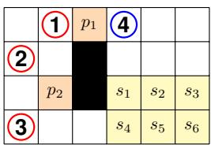

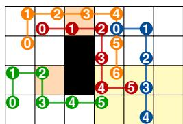  
(b)  
Fi<sub>g</sub>ure 1: Exam<sub>p</sub>le of a PS-MAPF instance I and its solution Π on a grid graph with black obstacles. Pivots $\mathcal { P } = \{ p _ { 1 } , p _ { 2 } \}$ <sub>an</sub>d <sub>s</sub>t<sub>orage</sub> d<sub>es</sub>ti<sub>na</sub>ti<sub>ons</sub> $\boldsymbol { S } = \{ \boldsymbol { s } _ { 1 } , . . , \boldsymbol { s } _ { 6 } \}$ <sub>are</sub> hi<sub>g</sub>hli<sub>g</sub>ht<sub>e</sub>d i<sub>n</sub> <sub>orange</sub> <sub>an</sub>d <sub>ye</sub>ll<sub>ow,</sub> <sub>respec</sub>ti<sub>ve</sub>l<sub>y.</sub> I<sub>n</sub> 1<sub>a,</sub> th<sub>e</sub> <sub>pro</sub>bl<sub>em</sub> i<sub>ns</sub>t<sub>ance,</sub> <sub>s</sub>h<sub>ow</sub>i<sub>ng</sub> th<sub>e</sub> l<sub>a</sub>b<sub>e</sub>l<sub>e</sub>d <sub>pos</sub>iti<sub>ons o</sub>f <sub>p</sub>i<sub>vo</sub>t<sub>s an</sub>d d<sub>es</sub>ti<sub>na</sub>ti<sub>ons,</sub> alon<sub>g</sub> with the startin<sub>g</sub> <sub>p</sub>ositions of tasked a<sub>g</sub>ents (red circles 1, 2, 3) and the untasked a<sub>g</sub>ent (blue circle 4). In 1b, the <sub>correspon</sub>di<sub>ng</sub> <sub>so</sub>l<sub>u</sub>ti<sub>on,</sub> <sub>s</sub>h<sub>ow</sub>i<sub>ng</sub> th<sub>e</sub> <sub>non-con</sub>fli<sub>c</sub>ti<sub>ng</sub> <sub>pa</sub>th<sub>s</sub> $\Pi = \left( \pi _ { 1 } , \pi _ { 2 } , \pi _ { 3 } , \pi _ { 4 } \right)$ t<sub>owar</sub>d th<sub>e</sub>i<sub>r</sub> t<sub>arge</sub>t<sub>s, w</sub>ith ti<sub>me mar</sub>k<sub>ers</sub> i<sub>n</sub>di<sub>ca</sub>ti<sub>ng</sub> th<sub>e</sub> <sub>agen</sub>t <sub>pos</sub>iti<sub>ons</sub> <sub>a</sub>t <sub>eac</sub>h ti<sub>me</sub> <sub>s</sub>t<sub>ep.</sub>

Movements must avoid two types of conflicts between <sub>p</sub>at<sup>h</sup>s $\pi _ { i } , \pi _ { j } : [ 0 . . T ]  \mathcal { V } .$ A vertex conflict occurs at time $t \in [ 0 . . T ] \operatorname { i f } \pi _ { i } ( \dot { \boldsymbol { t } } ) = \bar { \pi } _ { j } ( t ) ;$ a swapping conflict occurs at time $t \in [ 0 . . { \bar { T } } - 1 ] { \mathrm { ~ i f ~ } } \pi _ { i } ( t ) { \bar { = \pi } } _ { j } ( t + 1 )$ <sub>an</sub>d $\pi _ { i } ( t + 1 ) = \pi _ { j } ( t )$ <sub>w</sub>ith $\pi _ { i } ( t ) \neq \pi _ { i } ( t + 1 )$ <sub>an</sub>d $\bar { \pi } _ { j } ( t ) \neq \pi _ { j } ( t + 1 )$ (the two a<sub>g</sub>ents traverse the same ed<sub>g</sub>e in o<sub>pp</sub>osite directions). Paths $\pi _ { i }$ <sub>an</sub>d $\pi _ { j }$ are conflict-free if neither conflict occurs at any time step; th<sub>e</sub> d<sub>e</sub>fi<sub>n</sub>iti<sub>ons</sub> <sub>ex</sub>t<sub>en</sub>d t<sub>o</sub> <sub>pa</sub>th<sub>s</sub> <sub>o</sub>f dif<sub>eren</sub>t l<sub>eng</sub>th<sub>s</sub> b<sub>y</sub> <sub>pa</sub>ddi<sub>ng</sub> th<sub>e s</sub>h<sub>or</sub>t<sub>er one w</sub>ith <sub>wa</sub>it <sub>ac</sub>ti<sub>ons.</sub>

F<sub>o</sub>r <sub>a</sub>n <sub>age</sub>nt’<sub>s pa</sub>th $\pi : [ 0 . . T ]  \mathcal { V }$ , the time-at-pivot is th<sub>e</sub> fi<sub>rs</sub>t ti<sub>me</sub> <sub>a</sub>t <sub>w</sub>hi<sub>c</sub>h th<sub>e</sub> <sub>agen</sub>t <sub>reac</sub>h<sub>es</sub> <sub>a</sub> <sub>p</sub>i<sub>vo</sub>t<sub>,</sub> $t _ { \mathcal { P } } ( \pi ) =$ min $\{ t \in [ 0 . . T ] \mid \pi ( t ) \in \mathcal { P } \}$ , and the time-at-station is the fi<sub>rs</sub>t ti<sub>me a</sub>t <sub>w</sub>hi<sub>c</sub>h th<sub>e agen</sub>t <sub>reac</sub>h<sub>es a s</sub>t<sub>a</sub>ti<sub>on ver</sub>t<sub>ex an</sub>d <sub>never</sub> l<sub>eaves</sub> it<sub>,</sub> $t _ { S } ( \pi ) = \mathrm { { m i n } } \{ t \in [ 0 . . T ] \mid \exists q \in S \forall \tau \in$ $[ t . . T ] , \pi ( \tau ) = q \}$ ; for both, min $\varnothing = \infty$ <sub>.</sub> A<sub>n un</sub>t<sub>as</sub>k<sub>e</sub>d <sub>agen</sub>t $i \in \mathcal { A } ^ { u } \mathfrak { s }$ s path π is successful if $\pi ( 0 ) = \mathbf { o } ( i )$ <sub>an</sub>d $t _ { \cal S } ( \pi ) < \infty ;$ <sub>a</sub> t<sub>as</sub>k<sub>e</sub>d <sub>agen</sub>t $i \in \mathcal { A } ^ { t } \dag \mathrm { s }$ path π is successful i $\dot { \mathbf { \eta } } \pi ( 0 ) = \mathbf { o } ( i )$ $t _ { \mathcal { P } } ( \pi ) < \infty$ <sub>an</sub>d $t _ { S } ( \pi ) < \infty$

Definition 2. Given a PS-MAPF instance $\begin{array} { r l } { \mathcal { T } } & { { } = } \end{array}$ $( \mathcal { G } , \mathcal { P } , \mathcal { S } , \mathcal { A } ^ { t } , \mathcal { A } ^ { u } , \mathbf { o } )$ <sub>,</sub> <sub>a</sub> t<sub>up</sub>l<sub>e</sub> <sub>o</sub>f <sub>pa</sub>th<sub>s</sub> $\Pi = \{ \pi _ { i } \} _ { i \in \mathcal { A } } ,$ <sub>a</sub>ll <sub>o</sub>f th<sub>e</sub> <sub>same</sub> l<sub>eng</sub>th $T$ <sub>,</sub> i<sub>s</sub> <sub>ca</sub>ll<sub>e</sub>d $\mathbf { a } f e a s i b l e$ motion of length $T$ if all paths are pairwise conflict-free, and a successful motion if<sub>, moreover, a</sub>ll <sub>pa</sub>th<sub>s are success</sub>f<sub>u</sub>l<sub>.</sub> A <sub>success</sub>f<sub>u</sub>l <sub>mo</sub>ti<sub>on</sub> Π is also called a solution for I. We denote the set of all solutions for I by $S o l ( \mathcal { T } )$

Gi<sub>ven a</sub> f<sub>eas</sub>ibl<sub>e mo</sub>ti<sub>on</sub> $\Pi = \{ \pi _ { i } \} _ { i \in \mathcal { A } }$ <sub>o</sub>f l<sub>eng</sub>th $T , \Pi ( t )$ i<sub>s</sub> th<sub>e con</sub>fi<sub>gura</sub>ti<sub>on</sub> $i \mapsto \pi _ { i } ( t )$ (well-defined since Π is conflictfree); a feasible motion need not start at o.

Example 2. Figure 1b depicts a solution $\Pi \ = \ ( \pi _ { 1 } , \pi _ { 2 }$ $\pi _ { 3 } , \pi _ { 4 } )$ for the instance I introduced in Figure 1a. The nonconflicting paths are illustrated by the colored trajectories, with time markers indicating the time steps. Tasked agents $I , 2 ,$ , and 3 successfully reach a pivot with $t _ { \mathcal { P } }$ values of 1, $^ { 3 , }$ and 2, respectively, before reaching their storage destinations with t<sub>D</sub> values of5, 6, and 5, respectively. The untasked agent 4 reaches its storage destination with a $t _ { \mathcal { S } }$ value of4.

B<sub>e</sub>l<sub>ow, we</sub> d<sub>e</sub>fi<sub>ne</sub> t<sub>wo cos</sub>t f<sub>unc</sub>ti<sub>ons</sub> b<sub>ase</sub>d <sub>on</sub> th<sub>e</sub> ti<sub>me a</sub>ll <sub>agen</sub>t<sub>s reac</sub>h th<sub>e</sub>i<sub>r s</sub>t<sub>a</sub>ti<sub>ons.</sub>

Definition 3. Given a PS-MAPF instance I and a soluti<sub>on</sub> $\Pi = \{ \pi _ { i } \} _ { i \in \mathcal { A } }$ , the Station-Makespan and the Station-Flowtime of Π are $M _ { S } ^ { \mathbb { Z } } ( \Pi ) = \operatorname* { m a x } _ { i \in A } t _ { S } ( \pi _ { i } )$ <sub>an</sub>d $\Sigma _ { S } ^ { \underline { { \tau } } } ( \Pi ) =$ $\textstyle \sum _ { i \in A } t _ { S } ( \pi _ { i } )$

Example 3. The example solution in Figure 1b has $M _ { S } ^ { \underline { { \tau } } } ( \Pi ) =$ 6 and $\Sigma _ { S } ^ { \underline { { \tau } } } ( \Pi ) = 2 0 ,$ , which are all minimalfor this instance. W<sub>e a</sub>i<sub>m</sub> t<sub>o</sub> fi<sub>n</sub>d <sub>op</sub>ti<sub>ma</sub>l <sub>so</sub>l<sub>u</sub>ti<sub>ons w.r.</sub>t<sub>.</sub> th<sub>ese</sub> f<sub>unc</sub>ti<sub>ons.</sub>

## 3 Solvability

W<sub>e ana</sub>l<sub>yze w</sub>h<sub>en a</sub> PS<sub>-</sub>MAPF i<sub>ns</sub>t<sub>ance a</sub>d<sub>m</sub>it<sub>s a so</sub>l<sub>u</sub>ti<sub>on.</sub> Wh<sub>en no agen</sub>t i<sub>s</sub> t<sub>as</sub>k<sub>e</sub>d $( A ^ { t } = \varnothing$ <sub>an</sub>d $\mathcal { A } = \mathcal { A } ^ { u } )$ <sub>,</sub> PS<sub>-</sub>MAPF coincides with anonymous MAPF (Yu and LaValle 2013a), and we call the instance pivot-free. The following proposition follows from classical results on the unlabeled pebble motion <sub>p</sub>roblem (Kornhauser, Miller, and S<sub>p</sub>irakis 1984).

Proposition 1. A pivot-free PS-MAPF instance $\begin{array} { r l } { { \mathcal { Z } } } & { { } = } \end{array}$ $( \mathcal { G } , \mathcal { \hat { P } } , \mathcal { S } , \emptyset , \mathcal { A } ^ { u } , \mathbf { o } )$ <sub>a</sub>l<sub>ways a</sub>d<sub>m</sub>it<sub>s a so</sub>l<sub>u</sub>ti<sub>on</sub> $( S o l ( \mathcal { I } ) \neq \emptyset )$

P<sub>rop.</sub> 1 i<sub>mp</sub>li<sub>es</sub> th<sub>a</sub>t <sub>so</sub>l<sub>va</sub>bilit<sub>y never</sub> d<sub>epen</sub>d<sub>s on w</sub>h<sub>ere</sub> th<sub>e s</sub>t<sub>a</sub>ti<sub>ons</sub> li<sub>e: once</sub> th<sub>e</sub> t<sub>as</sub>k<sub>e</sub>d <sub>agen</sub>t<sub>s</sub> h<sub>ave comp</sub>l<sub>e</sub>t<sub>e</sub>d th<sub>e</sub>i<sub>r</sub> <sub>p</sub>ivot visits, routin<sub>g</sub> the whole fleet onto S is a <sub>p</sub>ivot-free i<sub>ns</sub>t<sub>ance.</sub> O<sub>n</sub>l<sub>y</sub> th<sub>e p</sub>i<sub>vo</sub>t <sub>requ</sub>i<sub>remen</sub>t <sub>can o</sub>b<sub>s</sub>t<sub>ruc</sub>t <sub>so</sub>l<sub>va</sub>bilit<sub>y,</sub> <sup>e</sup>.g., <sup>on</sup> <sup>a</sup> p<sup>ath</sup> g<sup>ra</sup>p<sup>h</sup>, <sup>no</sup> <sup>t</sup>w<sup>o</sup> <sup>a</sup>g<sup>ents</sup> <sup>can</sup> <sup>e</sup>v<sup>er</sup> <sup>exchan</sup>g<sup>e</sup> <sup>their</sup> <sub>re</sub>l<sub>a</sub>ti<sub>ve or</sub>d<sub>er, so</sub> if <sub>a s</sub>i<sub>ng</sub>l<sub>e p</sub>i<sub>vo</sub>t i<sub>s</sub> l<sub>oca</sub>t<sub>e</sub>d <sub>a</sub>t <sub>an en</sub>d<sub>po</sub>i<sub>n</sub>t<sub>,</sub> <sub>an</sub>d th<sub>ere are</sub> t<sub>wo</sub> t<sub>as</sub>k<sub>e</sub>d <sub>agen</sub>t<sub>s,</sub> th<sub>e</sub> f<sub>ar</sub>th<sub>er one can never</sub> <sub>reac</sub>h th<sub>e</sub> <sub>p</sub>i<sub>vo</sub>t<sub>,</sub> <sub>no</sub> <sub>ma</sub>tt<sub>er</sub> h<sub>ow</sub> <sub>many</sub> <sub>ver</sub>ti<sub>ces</sub> <sub>are</sub> <sub>unoccup</sub>i<sub>e</sub>d (see Fi<sub>g</sub>ure 2).

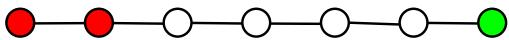  
Fi<sub>gure</sub> 2<sub>:</sub> A<sub>n unso</sub>l<sub>va</sub>bl<sub>e</sub> i<sub>ns</sub>t<sub>ance: re</sub>d <sub>ver</sub>ti<sub>ces are or</sub>i<sub>g</sub>i<sub>ns o</sub>f t<sub>as</sub>k<sub>e</sub>d <sub>agen</sub>t<sub>s,</sub> th<sub>e</sub> <sub>green</sub> <sub>ver</sub>t<sub>ex</sub> i<sub>s</sub> th<sub>e</sub> <sub>on</sub>l<sub>y</sub> <sub>p</sub>i<sub>vo</sub>t<sub>,</sub> <sub>every</sub> <sub>ver</sub>t<sub>ex</sub> i<sub>s a s</sub>t<sub>a</sub>ti<sub>on.</sub>

T<sub>o presen</sub>t th<sub>e resu</sub>lt<sub>s, we</sub> fi<sub>rs</sub>t i<sub>n</sub>t<sub>ro</sub>d<sub>uce some pre</sub>li<sub>m-</sub> i<sub>nary no</sub>t<sub>a</sub>ti<sub>on.</sub> A <sub>pa</sub>th $\gamma : [ 0 . . T ] \ \to \ \mathcal { V }$ is called simple if $\dot { \gamma ( t ) } \neq \gamma ( t ^ { \prime } )$ <sup>f</sup>or ever<sub>y</sub> $t , \dot { t } ^ { \prime } \in [ 0 . . T ]$ <sub>w</sub>ith $t \neq t ^ { \prime }$ <sub>an</sub>d $\{ t , t ^ { \prime } \} \ne \{ 0 , T \}$ . A simple path is called a cycle if $T > 2$ <sub>an</sub>d $\dot { \gamma } ( 0 ) \stackrel { \cdot } { = } \gamma ( \dot { T } )$ . Often, a cycle γ is identified with the set <sub>o</sub>f <sub>e</sub>d<sub>ges</sub> $\{ ( \gamma ( \dot { t } ) , \gamma ( t + 1 ) ) | \dot { t } = [ 0 . . T - 1 ] \}$ <sub>.</sub> We can a<sub>ss</sub>oc<sup>i</sup>ate ever<sub>y</sub> c<sub>y</sub>c<sup>l</sup>e $\gamma : [ 0 . . \dot { T } ] \to \mathcal { V }$ <sub>w</sub>ith $T \geq 3$ <sub>w</sub>ith <sub>a</sub> f<sub>eas</sub>ibl<sub>e</sub> length-one motion rotation, $\Pi ^ { \gamma } = \{ \pi _ { i } ^ { \gamma } \} _ { i \in \mathcal { A } } .$ <sub>,</sub> d<sub>e</sub>fi<sub>ne</sub>d b<sub>y a</sub> <sub>sync</sub>h<sub>ron</sub>i<sub>ze</sub>d <sub>ro</sub>t<sub>a</sub>ti<sub>on</sub> <sub>o</sub>f <sub>a</sub>ll <sub>agen</sub>t<sub>s</sub> <sub>presen</sub>t i<sub>n</sub> th<sub>e</sub> <sub>ver</sub>ti<sub>ces</sub> <sub>o</sub>f th<sub>e cyc</sub>l<sub>e.</sub> F<sub>orma</sub>ll<sub>y,</sub> f<sub>or</sub> $i \in { \mathcal { A } }$ i<sub>n pos</sub>iti<sub>on</sub> $\gamma ( t _ { i } )$ f<sub>or some</sub> $t _ { i } \in [ 0 . . T - 1 ]$ , w<sup>e</sup> pu<sup>t</sup> $( \pi _ { i } ^ { \gamma } ( 0 ) , \pi _ { i } ^ { \gamma } ( \bar { 1 } ) ) = ( \gamma ( \dot { t } _ { i } ) , \gamma ( t _ { i } + 1 ) )$ F<sub>or</sub> th<sub>e</sub> <sub>rema</sub>i<sub>n</sub>i<sub>ng</sub> $i \in \mathcal A$ <sub>w</sub>h<sub>ose</sub> l<sub>oca</sub>ti<sub>on</sub> i<sub>s ou</sub>t<sub>s</sub>id<sub>e</sub> th<sub>e cyc</sub>l<sub>e,</sub> <sub>we</sub> i<sub>ns</sub>t<sub>ea</sub>d <sub>pu</sub>t $\pi _ { i } ^ { \tilde { \gamma } } ( 0 ) = \pi _ { i } ^ { \gamma } ( 1 ) = \mathbf { o } ( i )$ <sub>.</sub> Fi<sub>na</sub>ll<sub>y, we</sub> i<sub>n</sub>t<sub>ro</sub>d<sub>uce</sub> t<sub>wo opera</sub>ti<sub>ons on mo</sub>ti<sub>ons.</sub> If $\Pi = \{ \pi _ { i } \} _ { i \in \mathcal { A } }$ i<sub>s a mo</sub>ti<sub>on o</sub>f l<sub>eng</sub>th $T ,$ , the inversion of Π is the motion $\Pi ^ { - } = \{ \pi _ { i } ^ { - } \} _ { i \in { \mathcal { A } } }$ <sub>o</sub>f l<sub>eng</sub>th $T$ <sub>w</sub>h<sub>ere</sub> $\pi _ { i } ^ { - } ( t ) = \pi _ { i } ( T - t )$ f<sub>or</sub> $t = 0 . . T$ <sub>.</sub> We <sub>a</sub>l<sub>so</sub> h<sub>ave a na</sub>t<sub>ura</sub>l <sub>concep</sub>t <sub>o</sub>f <sub>mo</sub>ti<sub>on conca</sub>t<sub>ena</sub>ti<sub>on.</sub> T<sub>wo</sub> t<sub>up</sub>l<sub>es</sub> <sub>o</sub>f <sub>pa</sub>th<sub>s</sub> $\Pi ^ { 1 } = \{ \pi _ { i } ^ { \bar { 1 } } \} _ { i \in \mathcal { A } }$ <sub>an</sub>d $\Pi ^ { 2 } = \{ \pi _ { i } ^ { 2 } \} _ { i \in \mathcal { A } }$ <sub>w</sub>ith $\pi _ { i } ^ { \hat { r } } : [ 0 . . \dot { T _ { r } } ]  \mathcal { V }$ for i ∈ A and $r = 1 , 2$ , are called concatenable if $\pi _ { i } ^ { 1 } ( T _ { 1 } ) = \pi _ { i } ^ { 2 } ( 0 )$ <sup>f</sup>or ever<sub>y</sub> $i \in { \mathcal { A } }$ <sub>.</sub> W<sub>e</sub> d<sub>e</sub>fi<sub>ne</sub> th<sub>e</sub>i<sub>r conca</sub>t<sub>ena</sub>ti<sub>on</sub> $\Pi ^ { 2 } \circ \dot { \Pi } ^ { 1 ^ { ^ { \prime } } } = \lbrace \pi _ { i } ^ { 2 } \circ \pi _ { i } ^ { 1 } \rbrace _ { i \in \cal { A } }$ <sup>b</sup>y pu<sup>ttin</sup>g $( \pi _ { i } ^ { 2 } \circ \pi _ { i } ^ { 1 } ) ( t ) = \pi _ { i } ^ { 1 } ( t ) \mathrm { f o r } t \leq T _ { 1 }$ <sub>an</sub>d $( \bar { \pi } _ { i } ^ { 2 } \circ \pi _ { i } ^ { \bar { 1 } } ) ( t ) = \pi _ { i } ^ { 2 } ( t { - } T _ { 1 } )$ f<sub>or</sub> $T _ { 1 } < t \le T _ { 1 } + T _ { 2 }$ <sub>.</sub> Th<sub>e</sub> i<sub>nvers</sub>i<sub>on o</sub>f <sub>a</sub> f<sub>eas</sub>ibl<sub>e mo</sub>ti<sub>on or</sub> th<sub>e</sub> <sub>conca</sub>t<sub>ena</sub>ti<sub>on</sub> <sub>o</sub>f <sub>conca</sub>t<sub>ena</sub>bl<sub>e</sub> f<sub>eas</sub>ibl<sub>e</sub> <sub>mo</sub>ti<sub>ons</sub> i<sub>s</sub> <sub>a</sub>l<sub>ways</sub> f<sub>eas</sub>ibl<sub>e.</sub>

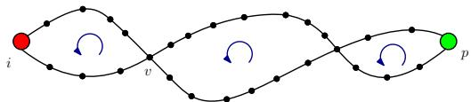  
Fi<sub>gure</sub> 3<sub>:</sub> T<sub>wo e</sub>d<sub>ge-</sub>i<sub>n</sub>d<sub>epen</sub>d<sub>en</sub>t <sub>pa</sub>th<sub>s</sub> li<sub>n</sub>ki<sub>ng</sub> th<sub>e or</sub>i<sub>g</sub>i<sub>n o</sub>f<sub>an</sub> a<sub>g</sub>ent (in red) to a <sub>p</sub>ivot (in <sub>g</sub>reen). Concatenation of rotation along the obtained cycles eventually leads i in p.

W<sub>e a</sub>l<sub>so reca</sub>ll <sub>a c</sub>l<sub>ass</sub>i<sub>ca</sub>l <sub>concep</sub>t f<sub>rom grap</sub>h th<sub>eory.</sub> Gi<sub>ven</sub> <sup>a</sup> g<sup>ra</sup>p<sup>h</sup> $\mathcal { G } = ( \nu , \mathcal { E } )$ <sub>, we say</sub> th<sub>a</sub>t t<sub>wo ver</sub>ti<sub>ces</sub> $u , v \in \mathcal { V }$ are $2 \mathit { - e d g e }$ connected if the removal of any single edge from G does not disconnect u from v. By Menger’s theorem (Diestel 2017), this condition is equivalent to sa<sub>y</sub>in<sub>g</sub> that there are two paths with no common edge linking u to v (such paths are called edge-independent). Moreover, G is 2-edge connected if <sub>any</sub> <sub>pa</sub>i<sub>r</sub> <sub>o</sub>f <sub>ver</sub>ti<sub>ces</sub> i<sub>s</sub> 2<sub>-e</sub>d<sub>ge</sub> <sub>connec</sub>t<sub>e</sub>d<sub>.</sub>

## 3.1 Existence on 2-Edge-Connected Graphs

Grids, warehouses, and similar layouts are 2-edge connected, th<sub>e case</sub> d<sub>om</sub>i<sub>na</sub>ti<sub>ng</sub> i<sub>n prac</sub>ti<sub>ce;</sub> th<sub>ere, so</sub>l<sub>va</sub>bilit<sub>y</sub> i<sub>s a</sub>l<sub>ways</sub> <sub>guaran</sub>t<sub>ee</sub>d<sub>:</sub> Th<sub>m.</sub> 1’<sub>s per-agen</sub>t h<sub>ypo</sub>th<sub>es</sub>i<sub>s</sub> h<sub>o</sub>ld<sub>s</sub> f<sub>or every</sub> instance on a 2-edge-connected graph with $\mathcal { P } \neq \emptyset$

Theorem 1. Let $\mathcal { T } = ( \mathcal { G } , \mathcal { P } , \mathcal { S } , \mathcal { A } ^ { t } , \mathcal { A } ^ { u } , \mathbf { o } )$ b<sub>e a</sub> PS<sub>-</sub>MAPF instance in which, for every tasked agent i, there exists a pivot $p \in \mathcal P$ <sub>suc</sub>h th<sub>a</sub>t $\mathbf { o } ( i )$ and p are 2-edge connected. Then, the i<sub>ns</sub>t<sub>ance a</sub>d<sub>m</sub>it<sub>s a so</sub>l<sub>u</sub>ti<sub>on</sub> $( S o l ( \mathcal { T } ) \bar { \neq } \emptyset )$

Proof. Consider any tasked agent $i \in \mathcal { A } ^ { t }$ <sub>an</sub>d <sub>assume</sub> th<sub>a</sub>t ${ \mathbf o } ( i )$ <sub>an</sub>d $p \in \mathcal P$ are 2-edge connected. By assumption, there <sub>ex</sub>i<sub>s</sub>t t<sub>wo e</sub>d<sub>ge</sub> i<sub>n</sub>d<sub>epen</sub>d<sub>en</sub>t <sub>s</sub>i<sub>mp</sub>l<sub>e pa</sub>th<sub>s</sub> $\gamma ^ { \prime } = ( \dot { \gamma } _ { 0 } ^ { \prime } . . . \gamma _ { l ^ { \prime } } ^ { \prime } )$ <sub>an</sub>d $\gamma ^ { \prime \prime } = ( \gamma _ { 0 } ^ { \prime \prime } . . \check { \gamma } _ { l ^ { \prime \prime } } ^ { \prime \prime } )$ i<sub>n</sub> $\bar { \boldsymbol { \mathcal { G } } }$ <sub>suc</sub>h th<sub>a</sub>t $\gamma _ { 0 } ^ { \prime } \stackrel { - } { = } \gamma _ { 0 } ^ { \prime \prime } = \mathbf { o } ( \stackrel { . } { i } )$ <sub>an</sub>d $\dot { \gamma } _ { l ^ { \prime } } ^ { \prime } =$ $\gamma _ { l ^ { \prime \prime } } ^ { \prime \prime } = p .$ <sub>.</sub> If th<sub>e</sub> t<sub>wo pa</sub>th<sub>s</sub> h<sub>ave no</sub> i<sub>n</sub>t<sub>erme</sub>di<sub>a</sub>t<sub>e ver</sub>t<sub>ex</sub> i<sub>n</sub> <sub>common,</sub> th<sub>en</sub> th<sub>e conca</sub>t<sub>ena</sub>ti<sub>on o</sub>f $\gamma ^ { \prime }$ <sub>w</sub>ith th<sub>e reverse o</sub>f $\gamma ^ { \prime \prime }$ <sub>y</sub>i<sub>e</sub>ld<sub>s a cyc</sub>l<sub>e.</sub> A <sub>conca</sub>t<sub>ena</sub>ti<sub>on o</sub>f $l ^ { \prime }$ <sub>ro</sub>t<sub>a</sub>ti<sub>ons, mov</sub>i<sub>ng</sub> i along $\gamma ^ { \prime } ,$ , yields a motion bringing i into $p .$ If i<sub>ns</sub>t<sub>ea</sub>d th<sub>e</sub> t<sub>wo</sub> <sub>pa</sub>th<sub>s</sub> h<sub>ave</sub> <sub>common</sub> i<sub>n</sub>t<sub>erme</sub>di<sub>a</sub>t<sub>e</sub> <sub>ver</sub>ti<sub>ces,</sub> <sub>we</sub> <sub>cons</sub>id<sub>er</sub> th<sub>e one o</sub>f th<sub>em c</sub>l<sub>oses</sub>t t<sub>o</sub> ${ \bf o } ( i )$ a<sup>l</sup>on<sub>g</sub> $\gamma ^ { \prime } ,$ , <sup>sa</sup>y $v = \gamma _ { h ^ { \prime } } ^ { \prime } = \gamma _ { h ^ { \prime \prime } } ^ { \prime \prime }$ <sub>an</sub>d <sub>argu</sub>i<sub>ng as</sub> b<sub>e</sub>f<sub>ore, we cons</sub>t<sub>ruc</sub>t <sub>a mo</sub>ti<sub>on compose</sub>d <sub>o</sub>f rotations bringing i into v. A direct inductive argument based <sub>on</sub> th<sub>e</sub> <sub>common</sub> i<sub>n</sub>t<sub>erme</sub>di<sub>a</sub>t<sub>e</sub> <sub>po</sub>i<sub>n</sub>t<sub>s</sub> b<sub>e</sub>t<sub>ween</sub> $\breve { \gamma ^ { \prime } }$ <sub>an</sub>d $\gamma ^ { \prime \prime }$ now permits us to construct a motion bringing i to p (see Figure 3). Fi<sub>na</sub>ll<sub>y,</sub> <sub>no</sub>ti<sub>ce</sub> th<sub>a</sub>t <sub>a</sub>ll <sub>agen</sub>t<sub>s</sub> <sub>w</sub>h<sub>ose</sub> <sub>s</sub>t<sub>ar</sub>ti<sub>ng</sub> <sub>po</sub>i<sub>n</sub>t<sub>s</sub> <sub>are</sub> <sub>w</sub>ithi<sub>n</sub> th<sub>e</sub> <sub>ver</sub>ti<sub>ces</sub> b<sub>e</sub>l<sub>ong</sub>i<sub>ng</sub> t<sub>o</sub> th<sub>e</sub> t<sub>wo</sub> <sub>pa</sub>th<sub>s</sub> $\gamma ^ { \prime }$ <sub>an</sub>d $\gamma ^ { \prime \prime }$ remain 2- <sub>e</sub>d<sub>ge connec</sub>t<sub>e</sub>d t<sub>o</sub> $p$ <sub>un</sub>d<sub>er suc</sub>h <sub>ro</sub>t<sub>a</sub>ti<sub>ons.</sub> Th<sub>e rema</sub>i<sub>n</sub>i<sub>ng</sub> agents have not moved and thus remain 2-edge connected to <sub>some p</sub>i<sub>vo</sub>t <sub>ver</sub>t<sub>ex.</sub> W<sub>e can</sub> it<sub>era</sub>t<sub>e</sub> thi<sub>s cons</sub>t<sub>ruc</sub>ti<sub>on</sub> f<sub>or eac</sub>h t<sub>as</sub>k<sub>e</sub>d <sub>agen</sub>t <sub>an</sub>d<sub>,</sub> b<sub>y conca</sub>t<sub>ena</sub>ti<sub>ng a</sub>ll <sub>suc</sub>h f<sub>eas</sub>ibl<sub>e mo</sub>ti<sub>ons,</sub> obtain a motion Π of length $T$ b<sub>y w</sub>hi<sub>c</sub>h <sub>a</sub>ll t<sub>as</sub>k<sub>e</sub>d <sub>agen</sub>t<sub>s</sub> <sub>p</sub>ass t<sup>h</sup>rou<sub>g</sub><sup>h</sup> a <sub>p</sub><sup>i</sup>vot.

W<sub>e now cons</sub>id<sub>er</sub> th<sub>e p</sub>i<sub>vo</sub>t<sub>-</sub>f<sub>ree</sub> i<sub>ns</sub>t<sub>ance</sub> $\begin{array} { r l } { \mathcal { T } ^ { \prime } } & { { } = } \end{array}$ $( \mathcal { G } , \mathcal { P } , \mathcal { S } , \emptyset , \mathcal { A } , \Pi ( T ) )$ <sub>.</sub> B<sub>y</sub> P<sub>rop.</sub> 1<sub>, a so</sub>l<sub>u</sub>ti<sub>on ex</sub>i<sub>s</sub>t<sub>s</sub> f<sub>or</sub> $\mathcal { T } ^ { \prime }$ call it Π<sup>′</sup>. The concatenation Π<sup>′</sup>◦Π is finally, by construction, a successful feasible motion for I. □

## 3.2 Existence on General Graphs

For arbitrary connected graphs, solvability admits a complete, polynomial-time-checkable characterization based on th<sub>e num</sub>b<sub>er an</sub>d di<sub>s</sub>t<sub>r</sub>ib<sub>u</sub>ti<sub>on o</sub>f t<sub>as</sub>k<sub>e</sub>d <sub>an</sub>d <sub>un</sub>t<sub>as</sub>k<sub>e</sub>d <sub>agen</sub>t<sub>s,</sub> <sub>as</sub> <sub>we</sub>ll <sub>as</sub> <sub>on</sub> th<sub>e</sub> t<sub>opo</sub>l<sub>ogy</sub> <sub>o</sub>f $\mathcal { G }$

Gi<sub>ven any su</sub>b<sub>se</sub>t <sub>o</sub>f <sub>ver</sub>ti<sub>ces</sub> $\mathcal { W } \subseteq \mathcal { V }$ <sub>an</sub>d <sub>a con</sub>fi<sub>gura</sub>ti<sub>on</sub> $\mathbf { c } ,$ <sub>we</sub> d<sub>e</sub>fi<sub>ne</sub> $H ( \mathcal { W } , \mathbf { c } ) = \mathcal { W } \setminus \mathbf { c } ( \mathcal { A } )$ <sub>,</sub> i<sub>.e.</sub> th<sub>e</sub> <sub>se</sub>t <sub>o</sub>f $\mathcal { W } \mathrm { s }$ <sub>unoccup</sub>i<sub>e</sub>d <sub>ver</sub>ti<sub>ces w</sub>h<sub>en</sub> th<sub>e agen</sub>t<sub>s are</sub> i<sub>n con</sub>fi<sub>gura</sub>ti<sub>on</sub> $\mathbf { c . }$ W<sub>e a</sub>l<sub>so</sub> d<sub>e</sub>fi<sub>ne</sub> $h ( \mathcal { W } , \mathbf { c } ) = | H ( \bar { \mathcal { W } } , \mathbf { c } ) |$

Th<sub>e</sub> f<sub>o</sub>ll<sub>ow</sub>i<sub>ng</sub> l<sub>emma</sub> <sub>s</sub>h<sub>ows</sub> th<sub>a</sub>t<sub>,</sub> <sub>on</sub> <sub>any</sub> <sub>connec</sub>t<sub>e</sub>d <sub>su</sub>b<sub>-</sub> g<sup>ra</sup>p<sup>h</sup> $\mathcal { G } ^ { \prime }$ <sub>,</sub> f<sub>eas</sub>ibl<sub>e</sub> <sub>mo</sub>ti<sub>ons</sub> <sub>can</sub> <sub>ar</sub>bit<sub>rar</sub>il<sub>y</sub> <sub>move</sub> th<sub>e</sub> <sub>se</sub>t <sub>o</sub>f <sub>unoccup</sub>i<sub>e</sub>d <sub>ver</sub>ti<sub>ces</sub> i<sub>n</sub> $\mathcal { V } ^ { \prime }$ <sub>,</sub> <sub>w</sub>hil<sub>e</sub> k<sub>eep</sub>i<sub>ng</sub> <sub>a</sub>t <sub>res</sub>t <sub>a</sub>ll <sub>agen</sub>t<sub>s</sub> <sub>ou</sub>t<sub>s</sub>id<sub>e o</sub>f it<sub>.</sub>

Lemma 1. Let $\mathcal { T } = ( \mathcal { G } , \mathcal { P } , \mathcal { S } , \mathcal { A } ^ { t } , \mathcal { A } ^ { u } , \mathbf { o } )$ b<sub>e a</sub> PS<sub>-</sub>MAPF i<sub>ns</sub>t<sub>ance, an</sub>d l<sub>e</sub>t $\mathcal { G } ^ { \prime } \doteq ( \mathcal { V } ^ { \prime } , \mathcal { E } ^ { \prime } )$ b<sub>e a connec</sub>t<sub>e</sub>d i<sub>n</sub>d<sub>uce</sub>d sub<sub>g</sub>ra<sub>p</sub>h of G. Let $\mathcal { D } \subseteq \mathcal { V } ^ { \prime }$ b<sub>e suc</sub>h th<sub>a</sub>t $| \mathscr { D } | = h ( \mathscr { V } ^ { \prime } , \mathbf { o } )$ Then, there exists a feasible motion Π of length $T$ <sub>suc</sub>h th<sub>a</sub>t $\Pi ( 0 ) = \mathbf { o } , H ( \mathcal { V } ^ { \prime } , \Pi ( T ) ) = \mathcal { D }$ <sub>, an</sub>d $\pi _ { i } ( t ) = \mathbf { o } ( i )$ for every t if $\mathbf { o } ( i ) \not \in \mathcal { V } ^ { \prime } .$

Proof. Consider the pivot-free sub-instance restricted to the set o<sup>f</sup> a<sub>g</sub>ents $\mathcal { A } ^ { \prime }$ <sub>curren</sub>tl<sub>y</sub> i<sub>n</sub> $\mathcal { G } ^ { \prime }$ <sub>,</sub> d<sub>e</sub>fi<sub>n</sub>i<sub>ng</sub> $\mathcal { V } ^ { \prime } \setminus \mathcal { D }$ <sub>as</sub> th<sub>e se</sub>t <sub>o</sub>f th<sub>e</sub>i<sub>r s</sub>t<sub>a</sub>ti<sub>ons:</sub> $\mathcal { T } ^ { \prime } = ( \dot { \mathcal { G } } ^ { \prime } , \mathcal { P } , \mathcal { V } ^ { \prime } \setminus \mathcal { D } , \emptyset , \dot { \mathcal { A } } ^ { \prime } , \mathbf { o } \dot { | } _ { A ^ { \prime } } )$ <sub>.</sub> Si<sub>nce</sub> $\mathcal { G } ^ { \prime }$ i<sub>s</sub> <sub>connec</sub>t<sub>e</sub>d <sub>an</sub>d<sub>,</sub> b<sub>y</sub> <sub>cons</sub>t<sub>ruc</sub>ti<sub>on,</sub> $| \mathcal { A } ^ { \prime } | = | \mathcal { V } ^ { \prime } | - h ( \mathcal { V } ^ { \prime } , \mathbf { o } ) =$ $| \nu ^ { \prime } \rangle \langle { \cal D } |$ <sub>,</sub> P<sub>rop.</sub> 1 <sub>guaran</sub>t<sub>ees</sub> <sub>a</sub> <sub>so</sub>l<sub>u</sub>ti<sub>on</sub> t<sub>o</sub> thi<sub>s</sub> <sub>anonymous</sub> MAPF <sub>pro</sub>bl<sub>em.</sub> B<sub>y ex</sub>t<sub>en</sub>di<sub>ng</sub> th<sub>e pa</sub>th<sub>s o</sub>f <sub>a</sub>ll <sub>agen</sub>t<sub>s ou</sub>t<sub>s</sub>id<sub>e</sub> $\mathcal { G } ^ { \prime }$ <sub>w</sub>ith <sub>wa</sub>it <sub>ac</sub>ti<sub>ons,</sub> thi<sub>s y</sub>i<sub>e</sub>ld<sub>s</sub> th<sub>e</sub> d<sub>es</sub>i<sub>re</sub>d f<sub>eas</sub>ibl<sub>e mo</sub>ti<sub>on</sub> on the entire <sub>g</sub>ra<sub>p</sub>h G. □

W<sub>e now</sub> i<sub>nves</sub>ti<sub>ga</sub>t<sub>e mo</sub>ti<sub>on cons</sub>t<sub>ra</sub>i<sub>n</sub>t<sub>s</sub> i<sub>n ar</sub>bit<sub>rary</sub> t<sub>opo</sub>l<sub>o-</sub> gies. We notice that 2-edge connectivity is an equivalence relation that decomposes the set of vertices V into disjoint <sub>su</sub>b<sub>se</sub>t<sub>s</sub> $C _ { 1 } . . C _ { s }$ <sub>,</sub> i<sub>n</sub>d<sub>uc</sub>i<sub>ng su</sub>b<sub>grap</sub>h<sub>s</sub> th<sub>a</sub>t <sub>are max</sub>i<sub>ma</sub>ll<sub>y</sub> $2 \AA ^ { - }$ edge connected. We call such subsets the 2-edge connected components of G. We indicate with $\mathbb { T } = ( \mathcal { N } , \breve { \mathcal { F } } )$ the 2-edge condensation tree of G: the tree with vertices $\mathcal { N } \overset { \cdot } { = } \{ C _ { 1 } . . \overset { \cdot } { C _ { s } } \}$ <sub>an</sub>d <sub>w</sub>ith <sub>an e</sub>d<sub>ge</sub> $( C _ { i } , C _ { j } )$ if in G there exists an ed<sub>g</sub>e bet<sub>ween a no</sub>d<sub>e</sub> i<sub>n</sub> $C _ { i }$ <sub>an</sub>d <sub>a no</sub>d<sub>e</sub> i<sub>n</sub> $C _ { j }$ (we refer to such ed<sub>g</sub>es as bridges).

I<sub>n our ana</sub>l<sub>ys</sub>i<sub>s, we nee</sub>d t<sub>o</sub> di<sub>s</sub>ti<sub>ngu</sub>i<sub>s</sub>h <sub>among</sub> th<sub>e var</sub>i<sub>ous</sub> 2-edge connected components. To this aim, we decompose th<sub>e</sub> <sub>se</sub>t $\mathcal { N }$ as $\mathcal { N } = \mathcal { N } _ { 1 } ^ { 0 } \cup \mathcal { N } _ { 1 } ^ { 1 } \cup \mathcal { N } _ { > 1 } . \mathcal { N } _ { 1 } ^ { 0 }$ <sub>an</sub>d $\mathcal { N } _ { 1 } ^ { 1 }$ i<sub>n</sub>di<sub>ca</sub>t<sub>e</sub> th<sub>e</sub> <sub>se</sub>t <sub>o</sub>f <sub>s</sub>i<sub>ng</sub>l<sub>e</sub>t<sub>on</sub> <sub>componen</sub>t<sub>s</sub> <sub>o</sub>f d<sub>egree</sub> <sub>no</sub>t l<sub>arger</sub> th<sub>an</sub> 2 and above ${ \bar { 2 , } }$ <sub>respec</sub>ti<sub>ve</sub>l<sub>y,</sub> <sub>w</sub>hil<sub>e</sub> $\mathcal { N } _ { > 1 }$ i<sub>n</sub>di<sub>ca</sub>t<sub>es</sub> th<sub>e se</sub>t <sub>o</sub>f non-sin<sub>g</sub>leton com<sub>p</sub>onents (thus of cardinalit<sub>y</sub> at least $3 )$ W<sub>e</sub> <sub>re</sub>f<sub>er</sub> t<sub>o</sub> th<sub>e</sub> <sub>componen</sub>t<sub>s</sub> i<sub>n</sub> $\mathcal { N } _ { 1 } ^ { 1 }$ as singleton branching. It <sub>w</sub>ill b<sub>e use</sub>f<sub>u</sub>l t<sub>o cons</sub>id<sub>er con</sub>fi<sub>gura</sub>ti<sub>ons</sub> i<sub>n w</sub>hi<sub>c</sub>h <sub>a</sub>ll <sub>unoc-</sub> <sub>cup</sub>i<sub>e</sub>d <sub>ver</sub>ti<sub>ces</sub> f<sub>orm</sub> <sub>a</sub> <sub>s</sub>i<sub>ng</sub>l<sub>e</sub> <sub>connec</sub>t<sub>e</sub>d <sub>reg</sub>i<sub>on</sub> <sub>con</sub>t<sub>a</sub>i<sub>n</sub>i<sub>ng</sub> <sub>p;</sub> i<sub>n</sub>t<sub>u</sub>iti<sub>ve</sub>l<sub>y,</sub> th<sub>e</sub> f<sub>ree space</sub> i<sub>s ga</sub>th<sub>ere</sub>d <sub>a</sub>t th<sub>e p</sub>i<sub>vo</sub>t <sub>ra</sub>th<sub>er</sub> th<sub>an</sub> di<sub>sperse</sub>d th<sub>roug</sub>h th<sub>e</sub> <sub>grap</sub>h<sub>.</sub>

Definition 4. The configuration o is called p-adapted if the <sub>se</sub>t <sub>o</sub>f <sub>unoccup</sub>i<sub>e</sub>d <sub>ver</sub>ti<sub>ces</sub> $H ( \nu , \mathbf o )$ i<sub>s</sub> <sub>e</sub>ith<sub>er</sub> <sub>emp</sub>t<sub>y</sub> <sub>or</sub> it <sub>con-</sub> tains p and the induced subgraph $\dot { \mathcal { G } } [ H ( \nu , \mathbf { o } ) ]$ ] is connected.

Th<sub>e</sub> f<sub>o</sub>ll<sub>ow</sub>i<sub>ng resu</sub>lt <sub>s</sub>h<sub>ows</sub> th<sub>a</sub>t th<sub>e agen</sub>t<sub>s can a</sub>l<sub>ways</sub> b<sub>e</sub> brought to a p-adapted configuration, for any pivot p.

Proposition 2. Let $\mathcal { T } = ( \mathcal { G } , \mathcal { P } , \mathcal { S } , \mathcal { A } ^ { t } , \mathcal { A } ^ { u } , \mathbf { o } )$ b<sub>e a</sub> PS<sub>-</sub>MAPF i<sub>ns</sub>t<sub>ance an</sub>d l<sub>e</sub>t $p \in { \mathcal { P } } .$ . There exists a feasible motion Π of l<sub>eng</sub>th $T$ <sub>suc</sub>h th<sub>a</sub>t $\Pi ( T )$ is a p-adapted configuration.

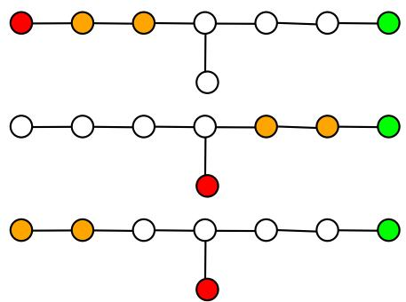  
Figure 4: In the top figure, a tasked agent i is positioned at the red vertex, at distance 6 from the pivot p in green. Des<sub>p</sub>ite there bein<sub>g</sub> onl<sub>y</sub> 4 unoccu<sub>p</sub>ied vertices (in white), a feasible motion that brings i to $p$ <sub>ex</sub>i<sub>s</sub>t<sub>s an</sub>d <sub>can</sub> b<sub>e eas</sub>il<sub>y</sub> <sub>cons</sub>t<sub>ruc</sub>t<sub>e</sub>d b<sub>y s</sub>t<sub>ar</sub>ti<sub>ng</sub> f<sub>rom</sub> th<sub>e</sub> i<sub>n</sub>iti<sub>a</sub>l <sub>con</sub>diti<sub>on an</sub>d th<sub>en</sub> <sub>p</sub>assin<sub>g</sub> throu<sub>g</sub>h the two intermediate confi<sub>g</sub>urations (central and bottom fi<sub>g</sub>ures).

Proof. Consider any set of vertices $\mathcal { W }$ <sub>o</sub>f <sub>car</sub>di<sub>na</sub>lit<sub>y</sub> $h ( \nu , \mathbf o )$ that contains p and such that the induced subgraph is con-<sub>nec</sub>t<sub>e</sub>d<sub>.</sub> L<sub>emma</sub> 1 <sub>y</sub>i<sub>e</sub>ld<sub>s a mo</sub>ti<sub>on</sub> l<sub>ea</sub>di<sub>ng</sub> t<sub>o a con</sub>fi<sub>gura</sub>ti<sub>on</sub> $\mathbf { o } ^ { \prime }$ <sub>suc</sub>h th<sub>a</sub>t $H ( \mathcal { V } , { \bf \dot { o } } ^ { \prime } ) = \mathcal { W }$ <sub>.</sub> Thi<sub>s proves</sub> th<sub>e resu</sub>lt<sub>.</sub> □

We now consider a fixed (tasked) a<sub>g</sub>ent i and a <sub>p</sub>ivot vertex $p$ i<sub>n</sub> ${ \mathcal P } ,$ <sub>an</sub>d i<sub>nves</sub>ti<sub>ga</sub>t<sub>e</sub> th<sub>e ex</sub>i<sub>s</sub>t<sub>ence o</sub>f <sub>a</sub> f<sub>eas</sub>ibl<sub>e mo</sub>ti<sub>on</sub> that brings agent i from $\mathbf { o } ( i )$ to $p .$ W<sub>e w</sub>ill <sub>g</sub>i<sub>ve an exp</sub>li<sub>c</sub>it <sub>c</sub>h<sub>arac</sub>t<sub>er</sub>i<sub>za</sub>ti<sub>on o</sub>f th<sub>e ex</sub>i<sub>s</sub>t<sub>ence, assum</sub>i<sub>ng</sub> th<sub>e s</sub>t<sub>ar</sub>ti<sub>ng po</sub>i<sub>n</sub>t is a p-adapted configuration. A clear suficient condition for th<sub>e ex</sub>i<sub>s</sub>t<sub>ence o</sub>f <sub>suc</sub>h <sub>a</sub> f<sub>eas</sub>ibl<sub>e mo</sub>ti<sub>on</sub> i<sub>s</sub> th<sub>a</sub>t $d ( \mathbf { o } ( i ) , p ) \leq$ $h ( \nu , o )$ <sub>.</sub> I<sub>n</sub>d<sub>ee</sub>d<sub>,</sub> i<sub>n</sub> thi<sub>s</sub> <sub>case,</sub> <sub>as</sub> th<sub>e</sub> <sub>or</sub>i<sub>g</sub>i<sub>na</sub>l <sub>con</sub>fi<sub>gura</sub>ti<sub>on</sub> is p-adapted, one can distribute the unoccupied vertices to f<sub>o</sub>ll<sub>ow exac</sub>tl<sub>y a m</sub>i<sub>n</sub>i<sub>ma</sub>l <sub>pa</sub>th f<sub>rom</sub> ${ \mathbf o } ( i )$ (excluded) to $p$ without moving i. Then, a direct motion, in which only agent i moves along the empty path, leads it to $p .$ <sub>.</sub> H<sub>owever,</sub> thi<sub>s</sub> i<sub>s no</sub>t <sub>a</sub>t <sub>a</sub>ll <sub>a necessary con</sub>diti<sub>on, as s</sub>h<sub>own</sub> i<sub>n</sub> th<sub>e</sub> i<sub>ns</sub>t<sub>ance</sub> <sub>presen</sub>t<sub>e</sub>d i<sub>n</sub> Fi<sub>gure</sub> 4<sub>.</sub>

B<sub>e</sub>l<sub>ow,</sub> <sub>we</sub> d<sub>escr</sub>ib<sub>e</sub> <sub>a</sub> <sub>compu</sub>t<sub>a</sub>bl<sub>e</sub> <sub>me</sub>th<sub>o</sub>d f<sub>or</sub> d<sub>e</sub>t<sub>erm</sub>i<sub>n</sub>i<sub>ng</sub> <sub>w</sub>h<sub>e</sub>th<sub>er</sub> f<sub>eas</sub>ibl<sub>e mo</sub>ti<sub>ons ex</sub>i<sub>s</sub>t th<sub>a</sub>t l<sub>ea</sub>d <sub>a</sub> t<sub>as</sub>k<sub>e</sub>d <sub>agen</sub>t t<sub>o a</sub> <sub>p</sub><sup>i</sup>vot $p .$ It <sub>app</sub>li<sub>es</sub> <sub>on</sub>l<sub>y</sub> t<sub>o</sub> i<sub>n</sub>iti<sub>a</sub>l <sub>con</sub>fi<sub>gura</sub>ti<sub>ons</sub> th<sub>a</sub>t <sub>are</sub> $p \textmd { - }$ <sub>a</sub>d<sub>ap</sub>t<sub>e</sub>d<sub>, so our c</sub>h<sub>arac</sub>t<sub>er</sub>i<sub>za</sub>ti<sub>on o</sub>f th<sub>e ex</sub>i<sub>s</sub>t<sub>ence o</sub>f <sub>so</sub>l<sub>u</sub>ti<sub>ons</sub> is not fully explicit. However, since the reduction to p-adapted <sub>con</sub>fi<sub>gura</sub>ti<sub>ons</sub> i<sub>s ac</sub>hi<sub>eve</sub>d <sub>v</sub>i<sub>a po</sub>l<sub>ynom</sub>i<sub>a</sub>l <sub>a</sub>l<sub>gor</sub>ith<sub>ms,</sub> it i<sub>s</sub> i<sub>n</sub>d<sub>ee</sub>d f<sub>u</sub>ll<sub>y compu</sub>t<sub>a</sub>bl<sub>e.</sub>

W<sub>e</sub> i<sub>n</sub>di<sub>ca</sub>t<sub>e w</sub>ith $C ^ { \prime }$ <sub>an</sub>d $C ^ { \prime \prime }$ the 2-edge connected com-<sub>ponen</sub>t<sub>s</sub> t<sub>o w</sub>hi<sub>c</sub>h ${ \bf o } ( i )$ <sub>an</sub>d $p$ <sub>respec</sub>ti<sub>ve</sub>l<sub>y</sub> b<sub>e</sub>l<sub>ong.</sub> W<sub>e</sub> th<sub>en</sub> consider the unique path in the 2-edge condensation tree $\mathbb { T }$ f<sub>rom</sub> $C ^ { \prime }$ to $C ^ { \prime \prime }$ , <sup>sa</sup>y $\mathbf { \bar {  { C } } ^ { \prime } } = C _ { 0 } , C _ { 1 } , \dots , C _ { l } = C ^ { \prime \prime }$ <sub>.</sub> F<sub>ur</sub>th<sub>er-</sub> <sub>more, we</sub> l<sub>e</sub>t $0 = m _ { 0 } < m _ { 1 } < m _ { 2 } < \cdots < m _ { r } = l$ b<sub>e</sub> <sub>suc</sub>h th<sub>a</sub>t $C _ { m _ { h } } \in \mathcal { N } _ { 1 } ^ { 1 } \cup \mathcal { N } _ { > 1 }$ <sup>f</sup>or ever<sub>y</sub> $h = 1 , \ldots , r - 1$ <sub>w</sub>hil<sub>e</sub> $C _ { k } \in \dot { \mathcal { N } } _ { 1 } ^ { 0 }$ f<sub>or a</sub>ll $k \in \{ 1 , \ldots , l \} \setminus \{ m _ { 1 } , \ldots , m _ { r } \}$ <sub>.</sub> F<sub>or</sub> $h = 0 , \ldots , r$ <sub>,</sub> th<sub>e</sub> bi<sub>nary var</sub>i<sub>a</sub>bl<sub>e</sub> $\rho _ { h }$ is set to 1 exactly when $0 < h < r$ <sub>an</sub>d $C _ { m _ { h } } \in \mathcal { N } _ { 1 } ^ { 1 }$ <sub>, name</sub>l<sub>y w</sub>h<sub>en we are no</sub>t <sub>con-</sub> <sub>s</sub>id<sub>er</sub>i<sub>ng</sub> th<sub>e</sub> i<sub>n</sub>iti<sub>a</sub>l <sub>or</sub> fi<sub>na</sub>l <sub>componen</sub>t <sub>an</sub>d th<sub>e</sub> <sub>componen</sub>t i<sub>s</sub> <sub>a s</sub>i<sub>ng</sub>l<sub>e</sub>t<sub>on o</sub>f d<sub>egree grea</sub>t<sub>er</sub> th<sub>an</sub> t<sub>wo.</sub> W<sub>e</sub> fi<sub>na</sub>ll<sub>y</sub> d<sub>e</sub>fi<sub>ne</sub> th<sub>e</sub> efective distance of agent i to $p$ as t<sup>h</sup>e <sub>q</sub>uant<sup>i</sup>t<sub>y</sub>

$$
d _ { p } ^ { \mathrm { e f f } } ( \mathbf { o } ( i ) ) : = \operatorname* { m a x } _ { 0 \leq h \leq r - 1 } ( m _ { h + 1 } - m _ { h } + \rho _ { h } + \rho _ { h + 1 } )\tag{1}
$$

assuming, by convention, the maximum is 0 on empty sets. In th<sub>e</sub> d<sub>e</sub>fi<sub>n</sub>iti<sub>on o</sub>f $d _ { p } ^ { \mathrm { e f f } } ( \mathbf { o } ( i ) )$ <sub>, we are cons</sub>id<sub>er</sub>i<sub>ng</sub> th<sub>e max</sub>i<sub>mum</sub> di<sub>s</sub>t<sub>ance</sub> b<sub>e</sub>t<sub>ween</sub> t<sub>wo su</sub>b<sub>sequen</sub>t <sub>componen</sub>t<sub>s</sub> th<sub>a</sub>t <sub>are no</sub>t d<sub>egree</sub> t<sub>wo s</sub>i<sub>ng</sub>l<sub>e</sub>t<sub>ons, augmen</sub>t<sub>e</sub>d b<sub>y one or</sub> t<sub>wo,</sub> d<sub>epen</sub>di<sub>ng</sub> <sub>on w</sub>h<sub>e</sub>th<sub>er one or</sub> b<sub>o</sub>th <sub>componen</sub>t<sub>s are s</sub>i<sub>ng</sub>l<sub>e</sub>t<sub>ons.</sub> N<sub>o</sub>ti<sub>ce</sub> th<sub>a</sub>t<sub>,</sub> b<sub>y cons</sub>t<sub>ruc</sub>ti<sub>on,</sub> $d _ { p } ^ { \mathrm { e f f } } ( \mathbf { o } ( i ) ) \leq d ( \mathbf { o } ( i ) , p )$

Fi<sub>g</sub>ure 4 (to<sub>p</sub>) de<sub>p</sub>icts a p-ada<sub>p</sub>ted confi<sub>g</sub>uration with a <sub>pa</sub>th <sub>o</sub>f $l = 6 :$ 2-edge connected components from ${ \bf o } ( i )$ to $p .$ N<sub>o</sub>ti<sub>ce</sub> th<sub>a</sub>t i<sub>n</sub> thi<sub>s case</sub> $m _ { 1 } = 3 , m _ { 2 } = 6$ <sub>an</sub>d $\rho _ { 1 } = 1$ <sub>so</sub> th<sub>a</sub>t $d _ { p } ^ { \mathrm { e f f } } \big ( \mathbf { o } ( i ) \big ) = \operatorname* { m a x } \{ 3 + 1 , 3 + 1 \} = 4 .$

A<sub>s</sub> th<sub>e nex</sub>t <sub>resu</sub>lt <sub>s</sub>h<sub>ows,</sub> thi<sub>s</sub> di<sub>s</sub>t<sub>ance</sub> i<sub>s o</sub>f f<sub>un</sub>d<sub>amen</sub>t<sub>a</sub>l i<sub>mpor</sub>t<sub>ance, as</sub> it d<sub>e</sub>t<sub>erm</sub>i<sub>nes</sub> th<sub>e m</sub>i<sub>n</sub>i<sub>mum num</sub>b<sub>er o</sub>f <sub>un-</sub> <sub>occup</sub>i<sub>e</sub>d <sub>ver</sub>ti<sub>ces</sub> <sub>requ</sub>i<sub>re</sub>d f<sub>or</sub> <sub>a</sub> f<sub>eas</sub>ibl<sub>e</sub> <sub>mo</sub>ti<sub>on</sub> th<sub>a</sub>t b<sub>r</sub>i<sub>ngs</sub> agent i to p to exist.

Lemma 2. Let $\mathcal { T } = ( \mathcal { G } , \mathcal { P } , \mathcal { S } , \mathcal { A } ^ { t } , \mathcal { A } ^ { u } , \mathbf { o } )$ b<sub>e a</sub> PS<sub>-</sub>MAPF instance and assume that o is p-adapted with respect to some pivot p. Given an agent $i \in \mathcal { A } ^ { t }$ <sub>,</sub> th<sub>ere ex</sub>i<sub>s</sub>t<sub>s a</sub> f<sub>eas</sub>ibl<sub>e mo</sub>ti<sub>on</sub> that brings i to p if and only if the following condition holds:

$$
d _ { p } ^ { \mathrm { e f f } } ( \mathbf { o } ( i ) ) \leq h ( \mathcal { V } , \mathbf { o } ) = | \mathcal { V } | - | \mathcal { A } |\tag{2}
$$

Proof. Consider the unique path in the 2-edge condensation g<sup>ra</sup>p<sup>h</sup> $C _ { 0 } , C _ { 1 } , \ldots , C _ { l }$ connect<sup>i</sup>n<sub>g</sub> $C _ { 0 } .$ , the 2-edge connected com<sub>p</sub>onent conta<sup>i</sup>n<sup>i</sup>n<sub>g</sub> $\mathbf { o } ( i )$ , to $C _ { l }$ the 2-edge connected com-<sub>p</sub>onent conta<sup>i</sup>n<sup>i</sup>n<sub>g</sub> $p .$ <sub>.</sub> W<sub>e</sub> <sub>prove</sub> b<sub>o</sub>th di<sub>rec</sub>ti<sub>ons</sub> b<sub>y</sub> i<sub>n</sub>d<sub>uc</sub>ti<sub>on</sub> on $l . \mathrm { I f } l = 0 , \mathbf { o } ( i )$ <sub>an</sub>d $p$ lie in the same 2-edge connected <sub>componen</sub>t <sub>an</sub>d th<sub>e</sub> <sub>resu</sub>lt f<sub>o</sub>ll<sub>ows</sub> f<sub>rom</sub> Th<sub>m.</sub> 1 <sub>an</sub>d i<sub>s</sub> i<sub>n</sub>d<sub>e-</sub> <sub>pen</sub>d<sub>en</sub>t <sub>o</sub>f $h ( \nu , \mathbf o )$ <sub>.</sub> F<sub>rom now on, we assume</sub> th<sub>a</sub>t $l \geq 1$

We assume that condition (2) holds. If $| C _ { 0 } | > 1$ <sub>an</sub>d $C _ { 0 }$ <sub>con</sub>t<sub>a</sub>i<sub>ns a</sub>t l<sub>eas</sub>t <sub>one unoccup</sub>i<sub>e</sub>d <sub>ver</sub>t<sub>ex,</sub> th<sub>en agen</sub>t $i ,$ b<sub>y</sub> fi<sub>rs</sub>t <sub>repos</sub>iti<sub>on</sub>i<sub>ng</sub> it<sub>se</sub>lf i<sub>n</sub> th<sub>e un</sub>i<sub>que ver</sub>t<sub>ex</sub> $v _ { 0 } \in C _ { 0 }$ connect<sup>i</sup>n<sub>g</sub> $C _ { 1 }$ <sub>an</sub>d th<sub>en</sub> f<sub>ree</sub>l<sub>y</sub> f<sub>o</sub>ll<sub>ow</sub>i<sub>ng</sub> th<sub>e</sub> <sub>pa</sub>tt<sub>ern</sub> <sub>o</sub>f <sub>unoccup</sub>i<sub>e</sub>d <sub>ver</sub>ti<sub>ces, can reac</sub>h $p .$ <sub>.</sub> W<sub>e now assume</sub> th<sub>a</sub>t <sub>a</sub>ll <sub>ver</sub>ti<sub>ces</sub> i<sub>n</sub> $C _ { 0 }$ <sub>are occup</sub>i<sub>e</sub>d<sub>.</sub> W<sub>e a</sub>l<sub>so assume</sub> th<sub>a</sub>t $\mathbf { o } ( i ) = v _ { 0 } ,$ <sub>as</sub> it <sub>can a</sub>l<sub>ways</sub> b<sub>e</sub> <sub>reac</sub>h<sub>e</sub>d <sub>w</sub>ith <sub>a</sub> <sub>mo</sub>ti<sub>on</sub> <sub>on</sub>l<sub>y</sub> i<sub>nvo</sub>l<sub>v</sub>i<sub>ng</sub> <sub>agen</sub>t<sub>s</sub> i<sub>n</sub> $C _ { 0 }$ th<sub>an</sub>k<sub>s</sub> t<sub>o</sub> Th<sub>m.</sub> 1<sub>, an</sub>d th<sub>a</sub>t $d ( v _ { 0 } , p ) \stackrel { . } { > } h ( \mathcal { V } , \mathbf { o } )$ <sub>;</sub> if <sub>no</sub>t<sub>,</sub> b<sub>y</sub> <sub>se</sub>tti<sub>ng</sub> th<sub>e</sub> <sub>unoccup</sub>i<sub>e</sub>d <sub>ver</sub>ti<sub>ces</sub> <sub>a</sub>l<sub>ong</sub> <sub>a</sub> <sub>m</sub>i<sub>n</sub>i<sub>ma</sub>l <sub>pa</sub>th f<sub>rom</sub> $v _ { 0 }$ to $p ,$ we <sub>aga</sub>i<sub>n wou</sub>ld di<sub>rec</sub>tl<sub>y cons</sub>t<sub>ruc</sub>t th<sub>e wan</sub>t<sub>e</sub>d f<sub>eas</sub>ibl<sub>e mo</sub>ti<sub>on.</sub>

C<sub>ons</sub>id<sub>er now</sub> th<sub>e un</sub>i<sub>que pa</sub>th i<sub>n</sub> $\mathcal { G } , v _ { 0 } , v _ { 1 } . . v _ { m _ { 1 } }$ <sub>w</sub>h<sub>ere</sub> $v _ { k } \in$ $C _ { k }$ f<sub>or</sub> $k = 0 , 1 . . m _ { 1 }$ <sub>.</sub> R<sub>e</sub>m<sub>ov</sub>in<sub>g</sub> $C _ { 0 } .$ <sub>, cons</sub>id<sub>er now</sub> th<sub>e se</sub>t <sub>o</sub>f all vertices W belon<sub>g</sub>in<sub>g</sub> to the connected com<sub>p</sub>onent of $\mathcal { G }$ <sub>con</sub>t<sub>a</sub>i<sub>n</sub>i<sub>ng</sub> $p .$ <sub>.</sub> B<sub>y cons</sub>t<sub>ruc</sub>ti<sub>on, we</sub> k<sub>now</sub> th<sub>a</sub>t <sub>a</sub>ll <sub>unoccup</sub>i<sub>e</sub>d vertices are in W: $h = h ( \mathcal { V } , \mathbf { o } ) = h ( \mathcal { W } , \mathbf { o } )$

A<sub>ssume</sub> fi<sub>rs</sub>t th<sub>a</sub>t $\rho _ { 1 } = 0$ . Consider an<sub>y</sub> subset D of W of cardinality h and possessing the property that $\left\{ v _ { 1 } . . v _ { m _ { 1 } } \right\} \subseteq \subseteq$ $\mathcal { D }$ <sub>, w</sub>hil<sub>e</sub> th<sub>e</sub> $h - m _ { 1 }$ leftover vertices of D form a connected <sub>se</sub>t <sub>o</sub>f <sub>ver</sub>ti<sub>ces con</sub>t<sub>a</sub>i<sub>n</sub>i<sub>ng</sub> $p .$ Assum<sub>p</sub>tion (2) <sub>y</sub>ields $h \geq m _ { 1 } .$ <sub>w</sub>hi<sub>c</sub>h t<sub>oge</sub>th<sub>er w</sub>ith th<sub>e case assump</sub>ti<sub>on</sub> $d ( \mathbf { o } ( i ) , p ) ~ > ~ h$ ensures such a choice ofD is <sub>p</sub>ossible. It follows from Lemma 1 th<sub>a</sub>t th<sub>ere ex</sub>i<sub>s</sub>t<sub>s a mo</sub>ti<sub>on</sub> b<sub>r</sub>i<sub>ng</sub>i<sub>ng</sub> th<sub>e unoccup</sub>i<sub>e</sub>d <sub>ver</sub>ti<sub>ces</sub> into D while maintainin<sub>g</sub> fixed all a<sub>g</sub>ents j with $\mathbf { o } ( j ) \notin \mathcal { W } .$ so, in particular, agent i. Afterward, agent i can move to vertex $v _ { m _ { 1 } }$ <sub>a</sub>l<sub>ong</sub> th<sub>e pa</sub>th <sub>o</sub>f <sub>emp</sub>t<sub>y ver</sub>ti<sub>ces.</sub> If $r = 1 , v _ { m _ { 1 } }$ <sub>an</sub>d $p$ are in the same 2-edge connected component, and <sub>we</sub> <sub>conc</sub>l<sub>u</sub>d<sub>e</sub> <sub>us</sub>i<sub>ng</sub> Th<sub>m.</sub> 1 <sub>aga</sub>i<sub>n.</sub> Oth<sub>erw</sub>i<sub>se,</sub> $\left. \bar { C } _ { m _ { 1 } } \right. > 1$ If th<sub>ere</sub> <sub>are</sub> <sub>unoccup</sub>i<sub>e</sub>d <sub>ver</sub>ti<sub>ces</sub> <sub>w</sub>ithi<sub>n</sub> $C _ { m _ { 1 } }$ <sub>,</sub> th<sub>en</sub> th<sub>ere</sub> i<sub>s</sub> <sub>a</sub> <sub>pa</sub>th <sub>o</sub>f <sub>unoccup</sub>i<sub>e</sub>d <sub>ver</sub>ti<sub>ces</sub> l<sub>ea</sub>di<sub>ng</sub> t<sub>o</sub> $p$ <sub>an</sub>d<sub>,</sub> <sub>as</sub> <sub>a</sub>b<sub>ove,</sub> we could find a feasible motion bringing i to $p .$ If <sub>no</sub>t<sub>,</sub> l<sub>e</sub>t $v _ { m _ { 1 } } ^ { + } \in C _ { m _ { 1 } }$ b<sub>e</sub> th<sub>e</sub> <sub>un</sub>i<sub>que</sub> <sub>po</sub>i<sub>n</sub>t i<sub>n</sub> $C _ { m _ { 1 } }$ th<sub>a</sub>t i<sub>s connec</sub>t<sub>e</sub>d th<sub>roug</sub>h <sub>an e</sub>d<sub>ge</sub> t<sub>o some no</sub>d<sub>e</sub> i<sub>n</sub> $C _ { m _ { 1 } + 1 \cdot 2 \cdot }$ <sub>-e</sub>d<sub>ge connec</sub>ti<sub>v</sub>it<sub>y</sub> i<sub>mp</sub>li<sub>es</sub> th<sub>a</sub>t th<sub>ere</sub> <sub>ex</sub>i<sub>s</sub>t<sub>s</sub> $\boldsymbol { v ^ { \prime } } \in C _ { m } .$ th<sub>a</sub>t i<sub>s connec</sub>t<sub>e</sub>d <sub>w</sub>ith an e<sup>d</sup><sub>g</sub>e to $v _ { m } .$ <sub>an</sub>d <sub>w</sub>h<sub>ose remova</sub>l d<sub>oes no</sub>t di<sub>sconnec</sub>t $v _ { m }$ f<sub>rom</sub> $v _ { m _ { 1 } \cdot } ^ { + }$ motion within the 2-edge connected component $C _ { m _ { 1 } }$ leads agent i to $v ^ { \prime }$ <sub>an</sub>d<sub>, a</sub>ft<sub>erwar</sub>d<sub>, unoccup</sub>i<sub>e</sub>d <sub>ver</sub>ti<sub>ces</sub> <sub>can</sub> b<sub>e aga</sub>i<sub>n</sub> di<sub>s</sub>t<sub>r</sub>ib<sub>u</sub>t<sub>e</sub>d t<sub>o</sub> f<sub>orm a connec</sub>t<sub>e</sub>d <sub>se</sub>t <sub>con</sub>t<sub>a</sub>i<sub>n</sub>i<sub>ng</sub> $p$ while leaving agent i still in node $v ^ { \prime } .$ <sub>.</sub> W<sub>e are</sub> th<sub>us now</sub> <sub>aga</sub>i<sub>n</sub> i<sub>n a</sub> $p \mathrm { . }$ <sub>-a</sub>d<sub>ap</sub>t<sub>e</sub>d <sub>con</sub>fi<sub>gura</sub>ti<sub>on, an</sub>d th<sub>e num</sub>b<sub>er o</sub>f $2 \AA ^ { - }$ edge connected components between the position of i and $p$ i<sub>s equa</sub>l t<sub>o</sub> $l - m _ { 1 } < l$ <sub>.</sub> I<sub>n</sub>d<sub>uc</sub>ti<sub>on</sub> th<sub>en app</sub>li<sub>es.</sub>

If i<sub>ns</sub>t<sub>ea</sub>d $\rho _ { 1 } = 1$ <sub>so</sub> th<sub>a</sub>t $C _ { m } .$ i<sub>s</sub> <sub>a</sub> b<sub>ranc</sub>hi<sub>ng</sub> <sub>componen</sub>t<sub>,</sub> <sub>cons</sub>id<sub>er</sub> <sub>any</sub> <sub>ver</sub>t<sub>ex</sub> $v ^ { \prime } \notin \{ v _ { m _ { 1 } - 1 } , v _ { m _ { 1 } + 1 } \}$ <sub>connec</sub>t<sub>e</sub>d t<sub>o</sub> $v _ { m _ { 1 } }$ Consider now an<sub>y</sub> subset D of W of cardinalit<sub>y</sub> $h ( \mathcal { W } , \mathbf { o } )$ <sub>an</sub>d p<sup>ossessin</sup>g <sup>the</sup> p<sup>ro</sup>p<sup>ert</sup>y <sup>that</sup> $\{ v _ { 1 } . . . v _ { m _ { 1 } } , v ^ { \prime } \} \subseteq { \mathcal { D } } _ { \mathrm { { } } }$ <sub>, w</sub>hil<sub>e</sub> th<sub>e</sub> <sub>rema</sub>i<sub>n</sub>i<sub>ng ver</sub>ti<sub>ces</sub> f<sub>orm a connec</sub>t<sub>e</sub>d <sub>se</sub>t <sub>con</sub>t<sub>a</sub>i<sub>n</sub>i<sub>ng</sub> $p . { \mathrm { ~ A s - } }$ sum<sub>p</sub>tion (2) <sub>y</sub>ields $h \geq m _ { 1 } + 1$ <sub>, w</sub>hi<sub>c</sub>h t<sub>oge</sub>th<sub>er w</sub>ith th<sub>e</sub> case assum<sub>p</sub>t<sup>i</sup>on $d ( \mathbf { o } ( i ) , p ) > h$ ensures such a choice of D i<sub>s poss</sub>ibl<sub>e.</sub> t f<sub>o</sub>ll<sub>ows</sub> f<sub>rom</sub> L<sub>emma</sub> 1 th<sub>a</sub>t th<sub>ere ex</sub>i<sub>s</sub>t<sub>s a mo</sub>ti<sub>on</sub> brin<sub>g</sub>in<sub>g</sub> the unoccu<sub>p</sub>ied vertices into D while maintainin<sub>g</sub> fi<sub>xe</sub>d <sub>a</sub>ll <sub>agen</sub>t<sub>s</sub> $j$ <sub>w</sub>ith $\mathbf { o } ( j ) \notin \mathcal { W } _ { : }$ <sub>, so,</sub> i<sub>n par</sub>ti<sub>cu</sub>l<sub>ar, agen</sub>t i. Afterward, agent i can move to vertex $v ^ { \prime }$ <sub>a</sub>l<sub>ong</sub> th<sub>e pa</sub>th <sub>o</sub>f <sub>emp</sub>t<sub>y ver</sub>ti<sub>ces.</sub> If <sub>we now remove ver</sub>t<sub>ex</sub> $v ^ { \prime }$ <sub>, we no</sub>ti<sub>ce</sub> th<sub>a</sub>t<sub>,</sub> b<sub>y cons</sub>t<sub>ruc</sub>ti<sub>on, a</sub>ll <sub>emp</sub>t<sub>y ver</sub>ti<sub>ces are</sub> i<sub>n</sub> th<sub>e compo-</sub> <sub>nen</sub>t <sub>con</sub>t<sub>a</sub>i<sub>n</sub>i<sub>ng</sub> $p$ (in the line $\left\{ v _ { 0 } . . v _ { m _ { 1 } } \right\}$ <sub>an</sub>d i<sub>n a connec</sub>t<sub>e</sub>d <sub>su</sub>b<sub>se</sub>t <sub>con</sub>t<sub>a</sub>i<sub>n</sub>i<sub>ng</sub> $p )$ <sub>.</sub> Thi<sub>s</sub> i<sub>mp</sub>li<sub>es</sub> th<sub>a</sub>t th<sub>ere ex</sub>i<sub>s</sub>t<sub>s a</sub> f<sub>eas</sub>ibl<sub>e</sub> motion leading again to a p-adapted configuration without moving agent i currently in $v ^ { \prime }$ <sub>.</sub> N<sub>ow,</sub> th<sub>e new</sub> di<sub>s</sub>t<sub>ance</sub> i<sub>n</sub> th<sub>e</sub> condensation tree between the components containing i and $p$ i<sub>s equa</sub>l t<sub>o</sub> $l - m _ { 1 } + 1$ <sub>.</sub> If $m _ { 1 } > 1$ <sub>,</sub> thi<sub>s</sub> i<sub>s s</sub>t<sub>r</sub>i<sub>c</sub>tl<sub>y</sub> l<sub>ess</sub> than l. In the case when $m _ { 1 } = 1$ , we cannot <sup>di</sup>rect<sup>l</sup><sub>y</sub> a<sub>pp</sub><sup>l</sup><sub>y</sub> th<sub>e</sub> i<sub>n</sub>d<sub>uc</sub>ti<sub>ve</sub> <sub>reason</sub>i<sub>ng.</sub> H<sub>owever,</sub> <sub>no</sub>ti<sub>ce</sub> th<sub>a</sub>t<sub>,</sub> i<sub>n</sub> thi<sub>s</sub> <sub>case,</sub> $d _ { p } ^ { \mathrm { e f f } } ( \mathbf { o } ( i ) ) \geq m _ { 2 } - m _ { 1 } + \rho _ { 2 } + \rho _ { 1 } = m _ { 2 } + \rho _ { 2 }$ <sub>.</sub> Thi<sub>s</sub> i<sub>mp</sub>li<sub>es</sub> th<sub>a</sub>t<sub>,</sub> i<sub>n</sub> thi<sub>s case, we can wor</sub>k di<sub>rec</sub>tl<sub>y w</sub>ith th<sub>e pa</sub>th f<sub>rom</sub> ${ \bf o } ( i )$ to $C _ { m _ { 2 } }$ <sub>,</sub> <sub>om</sub>itti<sub>ng</sub> th<sub>e</sub> i<sub>n</sub>t<sub>erme</sub>di<sub>a</sub>t<sub>e</sub> <sub>s</sub>t<sub>ep</sub> $C _ { m 1 }$ <sub>.</sub> I<sub>n</sub> b<sub>o</sub>th cases $\rho _ { 2 } = 0$ <sub>an</sub>d $\rho _ { 2 } = 1$ <sub>, prev</sub>i<sub>ous cons</sub>id<sub>era</sub>ti<sub>ons a</sub>ll<sub>ow us</sub> t<sub>o app</sub>l<sub>y</sub> th<sub>e</sub> i<sub>n</sub>d<sub>uc</sub>ti<sub>ve argumen</sub>t <sub>an</sub>d th<sub>us conc</sub>l<sub>u</sub>d<sub>e</sub> th<sub>e proo</sub>f<sub>.</sub>

C<sub>onverse</sub>l<sub>y, suppose</sub> th<sub>a</sub>t th<sub>ere ex</sub>i<sub>s</sub>t<sub>s a</sub> f<sub>eas</sub>ibl<sub>e mo</sub>ti<sub>on</sub> $\Pi = \{ \pi _ { j } \} _ { j \in { \mathcal A } }$ that brings i to $p .$ . Necessarily, agent i will need to touch all 2-edge-connected components along the <sub>p</sub>at<sup>h</sup> $C _ { 0 } , C _ { 1 } , \ldots , C _ { l }$ d<sub>ur</sub>i<sub>ng</sub> it<sub>s mo</sub>ti<sub>on.</sub> L<sub>e</sub>t $v _ { 0 } \in C _ { 0 }$ b<sub>e</sub> th<sub>e</sub> <sub>on</sub>l<sub>y</sub> <sub>no</sub>d<sub>e</sub> th<sub>a</sub>t i<sub>s</sub> <sub>connec</sub>t<sub>e</sub>d t<sub>o</sub> $C _ { 1 }$ th<sub>roug</sub>h <sub>an</sub> <sub>e</sub>d<sub>ge.</sub> C<sub>ons</sub>id<sub>er</sub> th<sub>en</sub> th<sub>e un</sub>i<sub>que pa</sub>th i<sub>n</sub> $\mathcal { G } , v _ { 0 } , v _ { 1 } . . v _ { m _ { 1 } }$ <sub>w</sub>h<sub>ere</sub> $v _ { k } \in C _ { k }$ f<sub>or</sub> $k = 0 , 1 . . m _ { 1 }$ <sub>.</sub> L<sub>e</sub>t $t _ { 1 }$ be the first time i visits $v _ { m _ { 1 } }$ <sub>an</sub>d l<sub>e</sub>t $t _ { 0 }$ b<sub>e</sub> th<sub>e</sub> l<sub>as</sub>t ti<sub>me</sub> b<sub>e</sub>l<sub>ow</sub> $t _ { 1 }$ that i visits $v _ { 0 } .$ <sub>.</sub> Th<sub>en,</sub> <sub>a</sub>t <sub>every</sub> i<sub>ns</sub>t<sub>an</sub>t $t \in [ t _ { 0 } , t _ { 1 } ]$ , agent i will be in one of the vertices $v _ { k ( t ) }$ f<sub>or</sub> $k ( t ) \in 0 . . m _ { 1 }$

I<sub>n</sub>di<sub>ca</sub>t<sub>e w</sub>ith $h _ { 0 } \ \leq \ h ( \mathcal { V } , { \bf o } )$ th<sub>e num</sub>b<sub>er o</sub>f <sub>unoccup</sub>i<sub>e</sub>d <sub>ver</sub>ti<sub>ces a</sub>t ti<sub>me</sub> $t _ { 0 }$ <sub>presen</sub>t i<sub>n</sub> th<sub>e connec</sub>t<sub>e</sub>d <sub>componen</sub>t <sub>con-</sub> taining p when $v _ { 0 }$ i<sub>s</sub> <sub>remove</sub>d<sub>.</sub> W<sub>e</sub> i<sub>n</sub>di<sub>ca</sub>t<sub>e</sub> <sub>w</sub>ith $h ( t )$ th<sub>e</sub> number of unoccupied vertices at time t present in the connected component containing p when the node $v _ { k ( t ) }$ <sub>con</sub>t<sub>a</sub>i<sub>n-</sub> ing i is removed. A direct inductive reasoning shows that $h ( \bar { t } ) = h _ { 0 } - k ( t )$ <sub>.</sub> I<sub>n</sub> <sub>par</sub>ti<sub>cu</sub>l<sub>ar,</sub> $0 \leq h ( t _ { 1 } ) = \bar { h } _ { 0 } - m _ { 1 }$ th<sub>a</sub>t <sub>y</sub>i<sub>e</sub>ld<sub>s</sub> $h _ { 0 } \geq m _ { 1 }$ <sub>.</sub> I<sub>n</sub> <sub>case</sub> $\rho _ { 1 } = 1$ <sub>an</sub>d $h _ { 0 } = m _ { 1 }$ <sub>,</sub> th<sub>ere</sub> i<sub>s</sub> <sub>no</sub> <sub>unoccup</sub>i<sub>e</sub>d <sub>pos</sub>iti<sub>on</sub> i<sub>n</sub> th<sub>e</sub> <sub>connec</sub>t<sub>e</sub>d <sub>componen</sub>t <sub>con</sub>t<sub>a</sub>i<sub>n</sub>i<sub>ng</sub> $p$ <sub>w</sub>h<sub>en</sub> th<sub>e no</sub>d<sub>e</sub> $v _ { m _ { 1 } }$ i<sub>s</sub> <sub>remove</sub>d<sub>,</sub> <sub>an</sub>d th<sub>us,</sub> <sub>s</sub>i<sub>nce</sub> <sub>a</sub>ll <sub>e</sub>d<sub>ges</sub> connect<sup>i</sup>n<sub>g</sub> $v _ { m _ { 1 } }$ t<sub>o no</sub>d<sub>es</sub> dif<sub>eren</sub>t f<sub>rom</sub> $v _ { m _ { 1 } - 1 }$ <sub>are</sub> b<sub>r</sub>id<sub>ges,</sub> no further motion is possible. We assume that Π is a solution, so eventually i must move further, contradicting the assumpti<sub>on</sub> <sub>ma</sub>d<sub>e.</sub> Thi<sub>s</sub> i<sub>mp</sub>li<sub>es</sub> th<sub>a</sub>t $h _ { 0 } \geq m _ { 1 } + 1$ <sub>.</sub> I<sub>n</sub> <sub>any</sub> <sub>case,</sub> thi<sub>s</sub> <sub>p</sub>roves t<sup>h</sup>at

$$
h ( \mathcal { V } , { \mathbf o } ) \ge m _ { 1 } + \rho _ { 1 }\tag{3}
$$

A<sub>s</sub> i<sub>n</sub> th<sub>e</sub> di<sub>rec</sub>t i<sub>mp</sub>li<sub>ca</sub>ti<sub>on,</sub> i<sub>n</sub> th<sub>e case</sub> $m _ { 1 } = 1$ <sub>an</sub>d $\rho _ { 1 } = 1$ <sub>we can no</sub>t di<sub>rec</sub>tl<sub>y app</sub>l<sub>y</sub> th<sub>e</sub> i<sub>n</sub>d<sub>uc</sub>ti<sub>ve argumen</sub>t <sub>on</sub> di<sub>s</sub>t<sub>ance,</sub> as when i reaches $v ^ { \prime } .$ <sub>,</sub> it i<sub>s a</sub>t th<sub>e same</sub> di<sub>s</sub>t<sub>ance</sub> f<sub>rom</sub> $p$ <sub>as</sub> it <sub>was</sub> i<sub>n</sub> $v _ { 0 }$ <sub>.</sub> I<sub>n</sub> thi<sub>s case, we argue</sub> th<sub>a</sub>t <sub>a</sub>l<sub>so</sub> th<sub>e con</sub>diti<sub>on</sub>

$$
h ( \gamma , \mathbf { o } ) \geq m _ { 2 } + \rho _ { 2 }\tag{4}
$$

h<sub>o</sub>ld<sub>s.</sub> Thi<sub>s can</sub> b<sub>e seen as</sub> f<sub>o</sub>ll<sub>ows.</sub> L<sub>e</sub>t $s _ { 2 }$ b<sub>e</sub> th<sub>e</sub> fi<sub>rs</sub>t ti<sub>me</sub> i visits $v _ { m _ { 2 } }$ <sub>an</sub>d l<sub>e</sub>t $s _ { 1 }$ b<sub>e</sub> th<sub>e</sub> l<sub>as</sub>t ti<sub>me</sub> b<sub>e</sub>l<sub>ow</sub> $s _ { 2 }$ that i <sub>v</sub>i<sub>s</sub>it<sub>s</sub> $v _ { 1 } ~ = ~ v _ { m _ { 1 } }$ <sub>.</sub> C<sub>ons</sub>id<sub>er,</sub> <sub>moreover,</sub> $s _ { 1 } ^ { - } ~ = ~ \operatorname* { m a x } \{ t ~ \leq$ $s _ { 1 } | \pi ( t ) \neq v _ { m _ { 1 } } \}$ <sub>.</sub> B<sub>y</sub> <sub>cons</sub>t<sub>ruc</sub>ti<sub>on,</sub> <sub>we</sub> h<sub>ave</sub> th<sub>a</sub>t<sub>,</sub> <sub>a</sub>t <sub>every</sub> i<sub>ns</sub>t<sub>an</sub>t $t \in [ s _ { 1 } ^ { - } + 1 , s _ { 2 } ]$ , agent i will be in one of the verti<sub>ces</sub> $v _ { k ( t ) }$ f<sub>or</sub> $k ( t ) \ \in \ m _ { 1 } . . m _ { 2 }$ <sub>.</sub> I<sub>n</sub>di<sub>ca</sub>t<sub>e now w</sub>ith $h _ { 1 }$ th<sub>e</sub> <sub>num</sub>b<sub>er o</sub>f <sub>unoccup</sub>i<sub>e</sub>d <sub>ver</sub>ti<sub>ces a</sub>t ti<sub>me</sub> $s _ { 1 } ^ { - } + 1$ <sub>presen</sub>t i<sub>n</sub> th<sub>e</sub> connected component containing p when $v _ { m } .$ i<sub>s</sub> <sub>remove</sub>d<sub>.</sub> Notice that the motion of i at time $s _ { 1 } ^ { - }$ h<sub>as</sub> l<sub>e</sub>ft <sub>a</sub>t l<sub>eas</sub>t <sub>one</sub> <sub>emp</sub>t<sub>y</sub> <sub>no</sub>d<sub>e</sub> i<sub>n</sub> <sub>one</sub> <sub>o</sub>f th<sub>e</sub> <sub>componen</sub>t<sub>s</sub> <sub>no</sub>t <sub>con</sub>t<sub>a</sub>i<sub>n</sub>i<sub>ng</sub> $p .$ <sub>.</sub> Thi<sub>s</sub> <sub>y</sub>i<sub>e</sub>ld<sub>s</sub> $h ( \mathcal { V } , \mathbf { o } ) \geq h _ { 1 } + 1$ <sub>.</sub> A<sub>s a</sub>b<sub>ove, we</sub> i<sub>n</sub>di<sub>ca</sub>t<sub>e w</sub>ith $h ( t )$ the number of unoccupied vertices at time t present in the connected component containing p when the node $v _ { k ( t ) }$ containing i is removed. Direct inductive reasoning shows that $h ( t ) \stackrel { - } { = } h _ { 1 } - k ( t ) + 1$ <sub>.</sub> I<sub>n</sub> <sub>par</sub>ti<sub>cu</sub>l<sub>ar,</sub> $0 \leq h ( s _ { 2 } ) = \bar { h } _ { 1 } - m _ { 2 } + 1$ th<sub>a</sub>t <sub>y</sub>i<sub>e</sub>ld<sub>s</sub> $h _ { 1 } \geq m _ { 2 } - 1$ <sub>.</sub> With th<sub>e same argumen</sub>t <sub>as a</sub>b<sub>ove,</sub> <sub>we</sub> <sub>can</sub> i<sub>mprove</sub> th<sub>e</sub> <sub>es</sub>ti<sub>ma</sub>ti<sub>on</sub> t<sub>o</sub> $h _ { 1 } \ge m _ { 2 } - 1 + \rho _ { 2 }$ th<sub>a</sub>t<sub>,</sub> t<sub>oge</sub>th<sub>er w</sub>ith $h ( \mathcal { V } , \mathbf { o } ) \geq h _ { 1 } + 1$ , <sub>y</sub>ields (4).

In both cases (either (3) or, when $m _ { 1 } = \rho _ { 1 } = 1 , ( 4 ) )$ , us<sup>i</sup>n<sub>g</sub> the direct im<sub>p</sub>lication (i.e. that condition (2) is suficient for existence), we can bring i, through a feasible motion $\Pi ^ { \prime }$ <sub>o</sub>f l<sub>eng</sub>th $T ^ { \prime }$ <sub>,</sub> i<sub>n</sub>t<sub>o a new pos</sub>iti<sub>on</sub> $\mathbf { o } ^ { \prime } ( \breve { i } ) = \pi _ { i } ^ { \prime } ( T )$ <sub>w</sub>h<sub>ose</sub> di<sub>s</sub>t<sub>ance</sub> i<sub>n</sub> th<sub>e con</sub>d<sub>ensa</sub>ti<sub>on grap</sub>h t<sub>o</sub> $p$ i<sub>s s</sub>t<sub>r</sub>i<sub>c</sub>tl<sub>y re</sub>d<sub>uce</sub>d<sub>, an</sub>d th<sub>e</sub> <sub>con</sub>fi<sub>gura</sub>ti<sub>on</sub> ${ \mathbf o } ^ { \prime } = \pi ^ { \prime } ( T )$ is still p-adapted. Notice that from $\mathbf { o } ^ { \prime }$ there exists a feasible motion bringing i to p: it is suficient to consider the concatenation of the inversion of Π<sup>′</sup> with Π, namely the feasible motion $\Pi \circ ( \Pi ^ { \prime } ) ^ { - }$ <sub>.</sub> B<sub>y</sub> i<sub>n</sub>d<sub>uc</sub>ti<sub>on,</sub> $d _ { p } ^ { \mathrm { e f f } } ( \mathbf { o } ^ { \prime } ( i ) ) \leq h ( \mathcal { V } , \mathbf { o } ^ { \prime } ) = h ( \mathcal { V } , \mathbf { o } )$ <sub>an</sub>d <sub>s</sub>i<sub>nce,</sub> b<sub>y</sub> th<sub>e</sub> <sub>way</sub> $\mathbf { o } ^ { \prime }$ <sub>was</sub> d<sub>e</sub>fi<sub>ne</sub>d<sub>,</sub>

$$
d _ { p } ^ { \mathrm { e f f } } ( \mathbf { o } ^ { \prime } ( i ) ) = \operatorname* { m a x } _ { 1 \leq h \leq r - 1 } ( m _ { h + 1 } - m _ { h } + \rho _ { h } + \rho _ { h + 1 } )
$$

<sub>com</sub>bi<sub>ne</sub>d <sub>w</sub>ith $h ( \mathcal { V } , \mathbf { o } ) \geq h _ { 0 } \geq m _ { 1 } + \rho _ { 1 }$ <sub>y</sub>i<sub>e</sub>ld<sub>s</sub> th<sub>e</sub> <sub>va</sub>lidit<sub>y</sub> of relation (2). □

The efective distance defined in (1) de<sub>p</sub>ends on the <sub>p</sub>articular p-adapted configuration we choose. However, the statement itself of Lemma 2 im<sub>p</sub>lies that condition (2) is a char-<sub>ac</sub>t<sub>er</sub>i<sub>za</sub>ti<sub>on o</sub>f <sub>ex</sub>i<sub>s</sub>t<sub>ence an</sub>d th<sub>us</sub> it d<sub>oes no</sub>t d<sub>epen</sub>d <sub>on</sub> th<sub>e</sub> particular p-adapted configuration.

L<sub>emma</sub> 2 <sub>y</sub>i<sub>e</sub>ld<sub>s</sub> th<sub>e</sub> f<sub>o</sub>ll<sub>ow</sub>i<sub>ng</sub> <sub>resu</sub>lt<sub>.</sub>

Theorem 2. A PS-MAPF instance $\mathcal { T } = ( \mathcal { G } , \mathcal { P } , \mathcal { S } , \mathcal { A } ^ { t } , \mathcal { A } ^ { u } , \mathbf { o } )$ i<sub>s so</sub>l<sub>va</sub>bl<sub>e</sub> if <sub>an</sub>d <sub>on</sub>l<sub>y</sub> if<sub>,</sub> f<sub>or every</sub> t<sub>as</sub>k<sub>e</sub>d <sub>agen</sub>t $i \in \mathcal { A } ^ { t }$ <sub>,</sub> th<sub>ere</sub> <sub>ex</sub>i<sub>s</sub>t <sub>a p</sub>i<sub>vo</sub>t $p \in \mathcal P$ and a p-adapted configuration c, reachable from o by a feasible motion, such that

$$
d _ { p } ^ { \mathrm { e f f } } ( \mathbf { c } ( i ) ) \leq h ( \mathcal { V } , \mathbf { o } ) = | \mathcal { V } | - | \mathcal { A } | .\tag{5}
$$

Proof. ’If’: Proposition 2 and Lemma 2 (using condition (5)) guarantee, for every tasked agent i, the existence of a feasible <sub>mo</sub>ti<sub>on</sub> $\Pi ^ { i }$ bringing agent i to touch a pivot. The concatenations of all such motions with their inversions (i.e., for a<sub>g</sub>ent i, we create a motion that reaches $\mathbf { c } ( i )$ <sub>,</sub> <sub>v</sub>i<sub>s</sub>it<sub>s</sub> $p ,$ <sub>an</sub>d i<sub>nver</sub>t<sub>s</sub> b<sub>ac</sub>k t<sub>o</sub> $\mathbf { o } ( i )$ <sub>, an</sub>d th<sub>en we conca</sub>t<sub>ena</sub>t<sub>e</sub> th<sub>ese mo</sub>ti<sub>ons across</sub> agents) <sub>y</sub>ield a feasible motion Π allowing all tasked agents t<sub>o</sub> t<sub>ouc</sub>h <sub>a p</sub>i<sub>vo</sub>t<sub>.</sub> W<sub>e now cons</sub>id<sub>er</sub> th<sub>e p</sub>i<sub>vo</sub>t<sub>-</sub>f<sub>ree</sub> i<sub>ns</sub>t<sub>ance</sub> $\mathcal { T } ^ { \prime } = ( \mathcal { G } , \mathcal { P } , \mathcal { S } , \emptyset , \mathcal { A } , \Pi ( T ) )$ ). By Prop. 1, a solution Π<sup>′</sup> exists for I<sup>′</sup>. The concatenation $\Pi ^ { \prime } \circ$ Π is finally, by construction, a successful feasible motion for I.

’O<sub>n</sub>l<sub>y</sub> if’<sub>:</sub> S<sub>uppose</sub> $\Pi = \{ \pi _ { i } \} _ { i \in \mathcal { A } }$ is a solution of len th T. <sup>For</sup> <sup>e</sup>v<sup>er</sup>y <sup>a</sup>g<sup>ent</sup> $i \in \mathcal { A } ^ { t }$ , let p be a pivot such that $\pi _ { i } ( t _ { i } ) = p$ f<sub>or some</sub> $t _ { i } \leq T$ <sub>.</sub> C<sub>ons</sub>id<sub>er</sub> th<sub>e res</sub>t<sub>r</sub>i<sub>c</sub>ti<sub>on</sub> $\Pi _ { | [ 0 , t _ { i } ] }$ of Π to th<sub>e</sub> ti<sub>me</sub> i<sub>n</sub>t<sub>erva</sub>l $[ 0 , t _ { i } ]$ <sub>.</sub> L<sub>e</sub>t $\{ \tilde { \Pi } ^ { i }$ b<sub>e a mo</sub>ti<sub>on o</sub>f l<sub>eng</sub>th $T ^ { i }$ th<sub>a</sub>t b<sub>r</sub>i<sub>ngs</sub> th<sub>e</sub> <sub>sys</sub>t<sub>em,</sub> <sub>or</sub>i<sub>g</sub>i<sub>na</sub>ll<sub>y</sub> i<sub>n</sub> <sub>con</sub>fi<sub>gura</sub>ti<sub>on</sub> $\mathbf { o } ,$ i<sub>n</sub>t<sub>o</sub> <sub>a</sub> p-adapted configuration c. Then, $\Pi _ { | [ 0 , t _ { i } ] } \circ \tilde { \Pi } ^ { i - }$ i<sub>s a</sub> f<sub>eas</sub>ibl<sub>e</sub> motion from configuration c that leads i to pivot $p .$ Th<sub>an</sub>k<sub>s</sub> t<sub>o</sub> L<sub>emma</sub> $^ { 2 , }$ condition (5) holds true. □

Al<sub>gor</sub>ith<sub>m</sub>i<sub>ca</sub>ll<sub>y,</sub> th<sub>e c</sub>h<sub>ec</sub>k <sub>o</sub>f <sub>necessary con</sub>diti<sub>ons</sub> i<sub>n</sub> Th<sub>m.</sub> 2 <sub>can</sub> <sub>procee</sub>d <sub>as</sub> f<sub>o</sub>ll<sub>ows.</sub> F<sub>or</sub> <sub>every</sub> <sub>p</sub>i<sub>vo</sub>t $p \in \mathcal P$ we bring the system into any p-adapted configuration, and <sub>we</sub> l<sub>e</sub>t $\bar { \mathcal { A } } ^ { t } ( p )$ b<sub>e</sub> th<sub>e se</sub>t <sub>o</sub>f t<sub>as</sub>k<sub>e</sub>d <sub>agen</sub>t<sub>s</sub> f<sub>or w</sub>hi<sub>c</sub>h <sub>con</sub>diti<sub>on</sub> (2) is satisfied. Existence of a solution is then equivalent to $\cup _ { p \in \mathcal { P } } A ^ { t } ( p ) = \mathcal { A } ^ { t }$ <sub>.</sub> Th<sub>e comp</sub>l<sub>ex</sub>it<sub>y</sub> i<sub>s</sub> b<sub>oun</sub>d<sub>e</sub>d<sub>,</sub> i<sub>n</sub> th<sub>e wors</sub>t case, <sup>b</sup><sub>y</sub> $| \mathcal { P } |$ | polynomial reductions to pivot adapted config-<sub>ura</sub>ti<sub>ons,</sub> <sub>an</sub>d f<sub>or</sub> <sub>eac</sub>h <sub>o</sub>f th<sub>em,</sub> th<sub>e</sub> <sub>c</sub>h<sub>ec</sub>k <sub>o</sub>f $| \mathcal { A } ^ { i } |$ <sub>con</sub>diti<sub>ons</sub> as (5).

Fi<sub>na</sub>ll<sub>y, a s</sub>i<sub>mp</sub>l<sub>e s</sub>t<sub>ruc</sub>t<sub>ura</sub>l <sub>con</sub>diti<sub>on guaran</sub>t<sub>ees so</sub>l<sub>va</sub>bil<sub>-</sub> it<sub>y an</sub>d <sub>un</sub>d<sub>er</sub>li<sub>es our exper</sub>i<sub>men</sub>t<sub>a</sub>l i<sub>ns</sub>t<sub>ances.</sub>

Definition 5. A PS-MAPF instance $\begin{array} { r l r l } { \mathcal { T } } & { { } } & { = } \end{array}$ $( \mathcal { G } , \mathcal { P } , \mathcal { S } , \mathcal { A } ^ { t } , \mathcal { A } ^ { u } , \mathbf { o } )$ is well-formed if, for every tasked agent $i \in \mathcal { A } ^ { t }$ <sub>,</sub> th<sub>ere</sub> i<sub>s</sub> <sub>a</sub> <sub>pa</sub>th f<sub>rom</sub> $\mathbf { o } ( i )$ to some <sub>p</sub><sup>i</sup>vot $p \in \mathcal P$ none <sub>o</sub>f <sub>w</sub>h<sub>ose</sub> <sub>ver</sub>ti<sub>ces,</sub> <sub>o</sub>th<sub>er</sub> th<sub>an</sub> th<sub>e</sub> <sub>s</sub>t<sub>ar</sub>t ${ \mathbf o } ( i )$ <sub>,</sub> i<sub>s</sub> th<sub>e</sub> <sub>or</sub>i<sub>g</sub>i<sub>n</sub> $\mathbf { o } ( j )$ <sub>o</sub>f <sub>ano</sub>th<sub>er agen</sub>t $j \neq i$

Proposition 3. Every well-formed instance is solvable.

Proof. Let $\mathcal { T } = ( \mathcal { G } , \mathcal { P } , \mathcal { S } , \mathcal { A } ^ { t } , \mathcal { A } ^ { u } , \mathbf { o } )$ b<sub>e a we</sub>ll<sub>-</sub>f<sub>orme</sub>d i<sub>n-</sub> <sub>s</sub>t<sub>ance an</sub>d <sub>cons</sub>id<sub>er a</sub> t<sub>as</sub>k<sub>e</sub>d <sub>agen</sub>t $i \in \mathcal { A } ^ { t }$ . Since I is wellf<sub>orme</sub>d<sub>,</sub> th<sub>ere ex</sub>i<sub>s</sub>t<sub>s a p</sub>i<sub>vo</sub>t $p \in \mathcal P$ <sub>an</sub>d <sub>a pa</sub>th $\gamma$ f<sub>rom</sub> ${ \bf o } ( i )$ to p such that all vertices along $\gamma ,$ <sub>w</sub>ith th<sub>e excep</sub>ti<sub>on o</sub>f $\mathbf { o } ( i )$ are unoccu<sub>p</sub><sup>i</sup>e<sup>d b</sup><sub>y</sub> an<sub>y</sub> ot<sup>h</sup>er a<sub>g</sub>ent.

C<sub>ons</sub>id<sub>er</sub> th<sub>e su</sub>b<sub>grap</sub>h $\mathcal { G } ^ { \prime }$ i<sub>n</sub>d<sub>uce</sub>d b<sub>y</sub> th<sub>e ver</sub>ti<sub>ces o</sub>f $\gamma ,$ $\mathcal { V } ^ { \prime } { } .$ <sub>, an</sub>d th<sub>e correspon</sub>di<sub>ng res</sub>t<sub>r</sub>i<sub>c</sub>t<sub>e</sub>d <sub>su</sub>b<sub>-</sub>i<sub>ns</sub>t<sub>ance</sub> f<sub>or agen</sub>t $i \colon \mathcal { T } = ( \mathcal { G } ^ { \prime } , \{ p \} , \mathcal { \hat { V } } ^ { \prime } , i , \varnothing , \overset { \sim } { \mathbf { o } } ( i ) )$ ). In this restricted setting, the initial configuration is trivially p-adapted and clearly satisfies condition (2). Thus, we can obtain a feasible motion $\Pi _ { i } ^ { i }$ th<sub>a</sub>t routes agent i from o(i) to p within $\mathcal { G } ^ { \prime }$

W<sub>e can</sub> th<sub>en cons</sub>t<sub>ruc</sub>t <sub>a</sub> f<sub>eas</sub>ibl<sub>e mo</sub>ti<sub>on</sub> $\Pi ^ { i }$ f<sub>or</sub> th<sub>e</sub> f<sub>u</sub>ll i<sub>ns</sub>t<sub>ance</sub> $\mathcal { T }$ <sup>b</sup><sub>y</sub> a<sub>pp</sub><sup>l</sup><sub>y</sub><sup>i</sup>n<sub>g</sub> t<sup>h</sup>e movements o<sup>f</sup> $\Pi _ { i } ^ { i }$ to agent i <sub>w</sub>hil<sub>e ass</sub>i<sub>gn</sub>i<sub>ng wa</sub>it <sub>ac</sub>ti<sub>ons</sub> t<sub>o a</sub>ll <sub>o</sub>th<sub>er agen</sub>t<sub>s.</sub> Thi<sub>s mo-</sub> tion is strictl<sub>y</sub> feasible because onl<sub>y</sub> agent i moves (precludin<sub>g</sub> swa<sub>pp</sub>in<sub>g</sub> conflicts), and it does so exclusivel<sub>y</sub> throu<sub>g</sub>h unoccu<sub>p</sub>ied vertices (<sub>p</sub>recludin<sub>g</sub> vertex conflicts).

<sup>B</sup><sub>y</sub> concatenat<sup>i</sup>n<sub>g</sub> $\Pi ^ { i }$ <sub>w</sub>ith it<sub>s</sub> i<sub>nvers</sub>i<sub>on</sub> $\Pi ^ { i ^ { - } }$ , agent i visits $p$ <sub>an</sub>d th<sub>e</sub> <sub>sys</sub>t<sub>em</sub> <sub>su</sub>b<sub>sequen</sub>tl<sub>y</sub> <sub>re</sub>t<sub>urns</sub> t<sub>o</sub> th<sub>e</sub> i<sub>n</sub>iti<sub>a</sub>l <sub>con</sub>fi<sub>g-</sub> uration o. Iterating this construction sequentially across all tasked agents yields a concatenated feasible motion Π of length T that allows every tasked agent to touch a pivot.

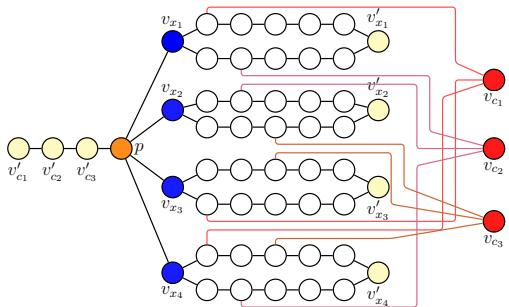  
Fi<sub>g</sub>ure 5: Construction of PS-MAPF instance I from 3SAT f<sub>ormu</sub>l<sub>a</sub> $( x _ { 1 } \vee \overline { { x _ { 3 } } } \vee x _ { 4 } ) \wedge ( \overline { { x _ { 1 } } } \vee x _ { 2 } \vee \overline { { x _ { 4 } } } ) \wedge ( \overline { { x _ { 2 } } } \vee x _ { 3 } \vee x _ { 4 } )$ R<sub>e</sub>d/bl<sub>ue</sub> <sub>ver</sub>ti<sub>ces</sub> <sub>are</sub> t<sub>as</sub>k<sub>e</sub>d/<sub>un</sub>t<sub>as</sub>k<sub>e</sub>d <sub>agen</sub>t <sub>or</sub>i<sub>g</sub>i<sub>ns,</sub> <sub>respec-</sub> ti<sub>ve</sub>l<sub>y.</sub> Y<sub>e</sub>ll<sub>ow</sub> <sub>ver</sub>ti<sub>ces</sub> <sub>are</sub> <sub>s</sub>t<sub>a</sub>ti<sub>ons;</sub> <sub>orange</sub> <sub>ver</sub>ti<sub>ces</sub> <sub>are</sub> <sub>p</sub>i<sub>vo</sub>t<sub>s.</sub>

W<sub>e now cons</sub>id<sub>er</sub> th<sub>e p</sub>i<sub>vo</sub>t<sub>-</sub>f<sub>ree</sub> i<sub>ns</sub>t<sub>ance</sub> $\begin{array} { r l } { \mathcal { T } ^ { \prime } } & { { } = } \end{array}$ $( \mathcal { G } , \mathcal { P } , \mathcal { S } , \emptyset , \mathcal { A } , \Pi ( T ) )$ . By Proposition 1, a solution Π<sup>′</sup> exists f<sub>or</sub> $\mathcal { T } ^ { \prime }$ <sub>.</sub> Th<sub>e conca</sub>t<sub>ena</sub>ti<sub>on</sub> $\Pi ^ { \prime }  { c }$ Π is finally, by construction, a successful feasible motion for I. □

## 4 Complexity Analysis

We prove the NP-hardness of minimum station-makespan (MSM) and station-flowtime (MSF) decision <sub>p</sub>roblems.

Problem 1. Given a PS-MAPF instance I and $k \in \mathbb N ,$ i<sub>s</sub> there a solution Π with $F _ { S } ^ { \underline { { { \tau } } } } ( \Pi ) \leq k $ <sub>,</sub> <sub>w</sub>h<sub>ere</sub> $F \in \{ M , \Sigma \} \colon$ We refer to the MSM decision problem when $F = M$ <sub>,</sub> <sub>an</sub>d to the MSF decision problem when $F = \Sigma$

We reduce from 3SAT (Cook 1971) in a similar fashion to Yu and LaValle (2013b). Our ke<sub>y</sub> additional insi<sub>g</sub>ht is that <sub>s</sub>t<sub>ra</sub>t<sub>eg</sub>i<sub>ca</sub>ll<sub>y pos</sub>iti<sub>on</sub>i<sub>ng</sub> th<sub>e p</sub>i<sub>vo</sub>t i<sub>n our cons</sub>t<sub>ruc</sub>t<sub>e</sub>d i<sub>ns</sub>t<sub>ance</sub> f<sub>orces every agen</sub>t t<sub>o a pre</sub>d<sub>e</sub>t<sub>erm</sub>i<sub>ne</sub>d <sub>s</sub>t<sub>a</sub>ti<sub>on,</sub> th<sub>ere</sub>b<sub>y ma</sub>ki<sub>ng</sub> th<sub>e ana</sub>l<sub>ys</sub>i<sub>s s</sub>i<sub>m</sub>il<sub>ar</sub> t<sub>o c</sub>l<sub>ass</sub>i<sub>ca</sub>l MAPF<sub>.</sub>

L<sub>e</sub>t $( { \bar { X } } , C )$ be a 3SAT instance with n variables and m clauses, in conjunctive normal form (Si<sub>p</sub>ser 2012) with at <sub>mos</sub>t th<sub>ree</sub> lit<sub>era</sub>l<sub>s per c</sub>l<sub>ause.</sub> F<sub>or eac</sub>h <sub>var</sub>i<sub>a</sub>bl<sub>e</sub> $x _ { i }$ , create <sub>ver</sub>ti<sub>ces</sub> $v _ { x _ { i } }$ <sub>an</sub>d $v _ { x { i } } ^ { \prime }$ joined by two internally disjoint paths <sub>o</sub>f l<sub>eng</sub>th $m + 3 ,$ , the “u<sub>pp</sub>er” and the “lower” <sub>p</sub>ath (Fi<sub>g</sub>. 5); f<sub>or</sub> <sub>eac</sub>h <sub>c</sub>l<sub>ause</sub> $c _ { j } .$ <sub>,</sub> <sub>crea</sub>t<sub>e</sub> <sub>ver</sub>ti<sub>ces</sub> $v _ { c _ { j } }$ <sub>an</sub>d $v _ { c _ { j } } ^ { \prime }$ <sub>,</sub> <sub>connec</sub>ti<sub>ng</sub> th<sub>e</sub> $v _ { c , i } ^ { \prime }$ <sub>as a pa</sub>th f<sub>rom</sub> $v _ { c _ { 1 } } ^ { \prime }$ to $v _ { c _ { m } } ^ { \prime }$ ; create a vertex p adjacent to $v _ { c _ { m } } ^ { \prime ^ { \prime } }$ <sub>an</sub>d t<sub>o a</sub>ll th<sub>e</sub> ${ \boldsymbol { v } } _ { x _ { i } }$ <sub>.</sub> Fi<sub>na</sub>ll<sub>y,</sub> f<sub>or eac</sub>h $c _ { j }$ <sub>an</sub>d <sub>eac</sub>h lit<sub>era</sub>l $x _ { i } \in c _ { j }$ , connect ${ { v } _ { c } } _ { i }$ t<sub>o</sub> th<sub>e</sub> $j ^ { t h }$ <sub>ver</sub>t<sub>ex</sub> f<sub>rom</sub> $v _ { x _ { i } }$ <sup>on</sup> <sup>the</sup> upp<sup>er</sup> path if x<sub>i</sub> is unnegated in $c _ { j } .$ <sub>,</sub> <sub>an</sub>d <sub>on</sub> th<sub>e</sub> l<sub>ower</sub> <sub>pa</sub>th if <sub>nega</sub>t<sub>e</sub>d<sub>.</sub> Th<sub>e s</sub>t<sub>a</sub>ti<sub>ons are</sub> $\mathsf { \bar { S } } = \mathsf { S } ^ { c } \cup \mathsf { \bar { S } } ^ { x }$ <sub>w</sub>ith $S ^ { c } = \{ v _ { c _ { i } } ^ { \prime } | j \in [ 1 . . m ] \}$ <sub>an</sub>d $S ^ { x } = \{ v _ { x _ { i } } ^ { \prime } | i \in [ 1 . . n ] \}$ ; the agents are m tasked “clause a<sub>g</sub>ents<sup>”</sup> $\boldsymbol { a } _ { c _ { j } }$ <sub>w</sub>ith $\mathbf { o } ( a _ { c _ { j } } ) ~ = ~ v _ { c _ { j } }$ and n untasked “variable a<sub>g</sub>ents<sup>”</sup> $\boldsymbol { a } _ { x _ { i } }$ <sub>w</sub>ith $\mathbf { o } ( a _ { x _ { i } } ) = v _ { x _ { i } }$ <sub>,</sub> <sub>y</sub>i<sub>e</sub>ldi<sub>ng</sub> th<sub>e</sub> i<sub>ns</sub>t<sub>ance</sub> $\mathcal { Z } =$ $( \bar { \mathcal { G } } , \{ p \} , S , \bar { \mathcal { A } } ^ { t } , \mathcal { A } ^ { u } , \mathbf { \dot { o } } )$

Proposition 4. If $( X , C ) \in 3 \mathrm { S A T }$ <sub>,</sub> th<sub>en</sub> th<sub>ere</sub> i<sub>s a so</sub>l<sub>u</sub>ti<sub>on</sub> Π with station-makespan $M _ { S } ^ { \underline { { \tau } } } ( \Pi )$ at most $m + 3$

Proof. For each $x _ { i } \in X , { \mathrm { i f ~ } } x _ { i }$ i<sub>s</sub> <sub>se</sub>t t<sub>o</sub> t<sub>rue</sub> i<sub>n</sub> th<sub>e</sub> <sub>sa</sub>ti<sub>s</sub>f<sub>y</sub>i<sub>ng</sub> <sub>ass</sub>i<sub>gnmen</sub>t<sub>,</sub> l<sub>e</sub>t $\boldsymbol { a } _ { x _ { i } }$ <sub>use</sub> th<sub>e</sub> l<sub>ower</sub> <sub>pa</sub>th t<sub>o</sub> $v _ { x { i } } ^ { \prime }$ <sub>.</sub> If <sub>se</sub>t t<sub>o</sub> f<sub>a</sub>l<sub>se,</sub> l<sub>e</sub>t it <sub>use</sub> th<sub>e</sub> <sub>upper</sub> <sub>pa</sub>th<sub>.</sub> B<sub>ecause</sub> thi<sub>s</sub> i<sub>s</sub> <sub>a</sub> <sub>sa</sub>ti<sub>s</sub>f<sub>y</sub>i<sub>ng</sub> <sub>ass</sub>i<sub>gnmen</sub>t<sub>,</sub> <sub>eac</sub>h $c _ { j } \in C$ <sub>con</sub>t<sub>a</sub>i<sub>ns</sub> <sub>a</sub>t l<sub>eas</sub>t <sub>one</sub> t<sub>rue</sub> lit<sub>era</sub>l<sub>,</sub> <sub>say</sub> <sub>correspon</sub>d<sub>-</sub> i<sub>ng</sub> t<sub>o</sub> th<sub>e var</sub>i<sub>a</sub>bl<sub>e</sub> $x _ { i } . \operatorname { I f } x _ { i }$ i<sub>s unnega</sub>t<sub>e</sub>d i<sub>n</sub> $c _ { j }$ <sub>,</sub> th<sub>en</sub> $x _ { i }$ i<sub>s se</sub>t t<sub>o</sub> t<sub>rue, an</sub>d <sub>we</sub> h<sub>ave rou</sub>t<sub>e</sub>d $a _ { x _ { i } }$ <sub>on</sub> th<sub>e</sub> l<sub>ower pa</sub>th<sub>.</sub> B<sub>y our</sub> <sub>cons</sub>t<sub>ruc</sub>ti<sub>on,</sub> $v _ { c _ { j } }$ <sub>connec</sub>t<sub>s</sub> t<sub>o</sub> th<sub>e upper pa</sub>th<sub>, w</sub>hi<sub>c</sub>h i<sub>s now</sub> <sub>guaran</sub>t<sub>ee</sub>d t<sub>o</sub> b<sub>e uno</sub>b<sub>s</sub>t<sub>ruc</sub>t<sub>e</sub>d<sub>.</sub> Alt<sub>erna</sub>ti<sub>ve</sub>l<sub>y,</sub> ${ \mathrm { i f } } \ x _ { i }$ i<sub>s nega</sub>t<sub>e</sub>d i<sub>n</sub> $c _ { j }$ <sub>,</sub> th<sub>en</sub> $x _ { i }$ i<sub>s</sub> f<sub>a</sub>l<sub>se</sub> <sub>an</sub>d th<sub>us</sub> $\boldsymbol { a } _ { x _ { \mathrm { : } } }$ <sub>uses</sub> th<sub>e</sub> <sub>upper</sub> <sub>pa</sub>th<sub>.</sub> I<sub>n</sub> thi<sub>s</sub> <sub>case, we wou</sub>ld h<sub>ave connec</sub>t<sub>e</sub>d $v _ { c _ { j } }$ t<sub>o</sub> th<sub>e</sub> l<sub>ower pa</sub>th<sub>, w</sub>hi<sub>c</sub>h i<sub>s aga</sub>i<sub>n uno</sub>b<sub>s</sub>t<sub>ruc</sub>t<sub>e</sub>d f<sub>or</sub> $\boldsymbol { a } _ { c _ { j } }$ <sub>.</sub> I<sub>n s</sub>h<sub>or</sub>t<sub>, eac</sub>h $\boldsymbol { a } _ { c _ { j } }$ <sub>w</sub>ill h<sub>ave an</sub> <sub>uno</sub>b<sub>s</sub>t<sub>ruc</sub>t<sub>e</sub>d <sub>pa</sub>th t<sub>o a</sub> $v _ { x _ { i } }$

F<sub>ur</sub>th<sub>ermore,</sub> b<sub>ecause</sub> <sub>eac</sub>h <sub>c</sub>l<sub>ause</sub> <sub>or</sub>i<sub>g</sub>i<sub>n</sub> <sub>connec</sub>t t<sub>o</sub> <sub>up-</sub> <sub>per</sub>/l<sub>ower pa</sub>th<sub>s a</sub>t <sub>a un</sub>i<sub>que</sub> i<sub>n</sub>d<sub>ex,</sub> th<sub>e c</sub>l<sub>ause agen</sub>t<sub>s arr</sub>i<sub>ve</sub> t<sub>o</sub> th<sub>e</sub> ${ \boldsymbol { v } } _ { x _ { i } }$ vert<sup>i</sup>ces at sta<sub>gg</sub>ere<sup>d</sup> t<sup>i</sup>mes, <sub>p</sub>revent<sup>i</sup>n<sub>g</sub> vertex confli<sub>c</sub>t<sub>s.</sub> S<sub>pec</sub>ifi<sub>ca</sub>ll<sub>y,</sub> $\boldsymbol { a } _ { c _ { 1 } }$ <sub>w</sub>ill <sub>arr</sub>i<sub>ve</sub> fi<sub>rs</sub>t<sub>, procee</sub>di<sub>ng</sub> t<sub>o</sub> $p \in V$ <sub>an</sub>d th<sub>en</sub> t<sub>o</sub> $v _ { c _ { 1 } } ^ { \prime }$ <sub>,</sub> f<sub>o</sub>ll<sub>owe</sub>d <sub>sequen</sub>ti<sub>a</sub>ll<sub>y</sub> b<sub>y</sub> th<sub>e rema</sub>i<sub>n</sub>i<sub>ng c</sub>l<sub>ause</sub> <sub>agen</sub>t<sub>s, w</sub>hi<sub>c</sub>h <sub>w</sub>ill filt<sub>er</sub> i<sub>n</sub>t<sub>o</sub> th<sub>e</sub>i<sub>r respec</sub>ti<sub>ve s</sub>t<sub>a</sub>ti<sub>ons.</sub> W<sub>e</sub> h<sub>ave</sub> now described a solution Π where all agents traverse $m + 3$ <sub>e</sub>d<sub>ges w</sub>ith<sub>ou</sub>t <sub>s</sub>t<sub>opp</sub>i<sub>ng,</sub> th<sub>us</sub> $M _ { S } ^ { \mathbb { Z } } ( \Pi ) \le m + 3$ □

T<sub>o</sub> <sub>prove</sub> th<sub>e</sub> <sub>converse</sub> <sub>s</sub>t<sub>a</sub>t<sub>emen</sub>t<sub>,</sub> <sub>we</sub> fi<sub>rs</sub>t <sub>es</sub>t<sub>a</sub>bli<sub>s</sub>h <sub>severa</sub>l <sub>pre</sub>li<sub>m</sub>i<sub>nary</sub> <sub>resu</sub>lt<sub>s.</sub>

Lemma 3. The graph G has the following properties:

```perl
(i) $d ( v _ { x _ { i } } , v _ { x _ { i } } ^ { \prime } ) = m + 3 \ \mathrm { f o r } \mathrm { e v e r y } i \mathrm { i n } [ 1 . . n ] ;$
(ii) $d ( v _ { x _ { i } } , v _ { x _ { \ell } } ^ { \prime } ) \geq m + 5 { \mathrm { ~ f o r ~ e v e r y ~ } } i , \ell { \mathrm { ~ i n ~ } } [ 1 . . n ]$ <sub>w</sub>ith $i \neq \ell ;$
(iii) $d ( p , v _ { x _ { i } } ^ { \prime } ) = m + 4$ for every i in [1..n];
(iv) d(p, v<sup>′</sup> ) = m − j + 1 for every j in $[ 1 . . m ] ;$
(v) $d ( p , v _ { c _ { j } } ) = j + 2$ for every j in [1..m];
```

Proof. Direct consequences of the way $\mathcal { G }$ i<sub>s</sub> d<sub>e</sub>fi<sub>ne</sub>d<sub>.</sub>

A <sub>so</sub>l<sub>u</sub>ti<sub>on</sub> $\Pi = \{ \pi _ { i } \} _ { i \in \mathcal { A } }$ is called non-crossing if $\pi _ { a } ( T ) \in$ $S ^ { c }$ <sub>w</sub>h<sub>en</sub> $a \in \mathcal A ^ { t }$ <sub>an</sub>d $\bar { \pi } _ { a } ( T ) \in \mathcal { S } ^ { x }$ <sub>w</sub>h<sub>en</sub> $a \in \mathcal { A } ^ { u }$ <sub>.</sub> Th<sub>e</sub> f<sub>o</sub>ll<sub>ow</sub>i<sub>ng resu</sub>lt h<sub>o</sub>ld<sub>s.</sub>

Lemma 4. Suppose $\Pi = \{ \pi _ { i } \} _ { i \in \mathcal { A } }$ is a solution of I such th<sub>a</sub>t $M _ { S } ^ { \underline { { { \tau } } } } ( \Pi ) \leq { \overline { { { m } } } } + 3$ . Then, Π is non-crossing.

Proof. Suppose to the contrary that there is a $. j \in [ 1 . . m ]$ <sub>suc</sub>h th<sub>a</sub>t $\dot { \pi } _ { a _ { c , i } } ( \hat { T } ) \in S ^ { x }$ <sub>.</sub> Si<sub>nce</sub> <sub>c</sub>l<sub>ause</sub> <sub>agen</sub>t<sub>s</sub> <sub>mus</sub>t <sub>pass</sub> th<sub>roug</sub>h $p ,$ items (iii) and (v) of Lemma 3 im<sub>p</sub>l<sub>y</sub> that

$$
t _ { \mathcal { S } } ( \pi _ { a _ { c _ { j } } } ) \geq m + 6 + j > m + 3 ,
$$

<sub>con</sub>t<sub>ra</sub>di<sub>c</sub>ti<sub>ng</sub> th<sub>e</sub> <sub>assump</sub>ti<sub>on</sub> th<sub>a</sub>t $M _ { S } ^ { \underline { { { \tau } } } } ( \Pi ) \leq m + 3$ □

Lemma 5. Suppose $\Pi = \{ \pi _ { i } \} _ { i \in \mathcal { A } }$ is a solution for I of length T such that $M _ { S } ^ { \cal Z } ( \Pi ) \stackrel { . } { \leq } m + 3$ <sub>.</sub> Th<sub>en,</sub>

$$
\pi _ { a _ { x _ { i } } } ( T ) = v _ { x _ { i } } ^ { \prime } \forall i \in [ 1 . . n ] , \quad \pi _ { a _ { c _ { j } } } ( T ) = v _ { c _ { j } } ^ { \prime } \forall j \in [ 1 . . m ] .
$$

Proof. Considering the variable agents, Lemma 4 tells us that Π is non-crossin<sub>g</sub> and, because of (i) and (ii) of Lemma 3<sub>, we mus</sub>t h<sub>ave</sub> th<sub>a</sub>t $\pi _ { a _ { x _ { i } } } ( T ) = v _ { x _ { i } } ^ { \prime }$ <sup>f</sup>or ever<sub>y</sub> $i \in \left\lceil 1 . . n \right\rceil$ R<sub>egar</sub>di<sub>ng</sub> th<sub>e c</sub>l<sub>ause agen</sub>t<sub>s,</sub> l<sub>e</sub>t $\Omega = \dot { \{ j \ : \vert \pi _ { a _ { c _ { j } } } ( T ) \neq v _ { c _ { j } } ^ { \prime } \} }$ <sub>.</sub> If Ω is empty, the proof is complete. Otherwise, for h<sup>¯</sup> = max $\Omega ,$ <sub>we mus</sub>t h<sub>ave</sub> $\bar { \pi } _ { a _ { c _ { h } } } ( T ) = \bar { v } _ { c _ { h } } ^ { \prime }$ <sub>w</sub>ith <sub>some</sub> $h < \bar { h }$ <sub>.</sub> It th<sub>en</sub> follows from items (iv) and (v) of Lemma 3 that

$$
t _ { S } ( \pi _ { a _ { c _ { \bar { h } } } } ) \geq m + 3 + \bar { h } - h > m + 3 ,
$$

<sub>a</sub> <sub>con</sub>t<sub>ra</sub>di<sub>c</sub>ti<sub>on.</sub>

Proposition 5. If there is a solution Π with $M _ { S } ^ { \mathbb { Z } } ( \Pi ) \le m + 3$ th<sub>en</sub> $( X , C ) \in 3 \mathrm { S A T }$

Proof. It follows from Lemmas 3 and 5 that each agent a f<sub>o</sub>ll<sub>ows a s</sub>h<sub>or</sub>t<sub>es</sub>t <sub>pa</sub>th $\pi _ { a }$ t<sub>o</sub> it<sub>s s</sub>t<sub>a</sub>ti<sub>on</sub> d<sub>es</sub>ti<sub>na</sub>ti<sub>on w</sub>ith<sub>ou</sub>t <sub>wa</sub>it <sub>ac</sub>ti<sub>ons.</sub> I<sub>n par</sub>ti<sub>cu</sub>l<sub>ar, s</sub>i<sub>nce upper an</sub>d l<sub>ower pa</sub>th<sub>s are</sub> internally disjoint, a shortest path between $v _ { x _ { i } }$ <sub>an</sub>d $\bar { v } _ { x _ { i } } ^ { \prime }$ i<sub>s</sub> <sub>one</sub> <sub>o</sub>f th<sub>ese</sub> t<sub>wo pa</sub>th<sub>s exc</sub>l<sub>us</sub>i<sub>ve</sub>l<sub>y.</sub> C<sub>onsequen</sub>tl<sub>y,</sub> th<sub>e var</sub>i<sub>a</sub>bl<sub>e</sub> <sup>a</sup>g<sup>ent</sup> $\boldsymbol { a } _ { x _ { i } }$ <sub>occup</sub>i<sub>es on</sub>l<sub>y one o</sub>f th<sub>ese pa</sub>th<sub>s</sub> t<sub>o reac</sub>h $v _ { x _ { i } } ^ { \prime } ,$ <sub>ensur</sub>i<sub>ng</sub> th<sub>e o</sub>th<sub>er pa</sub>th i<sub>s</sub> f<sub>ree o</sub>f <sub>var</sub>i<sub>a</sub>bl<sub>e agen</sub>t<sub>s an</sub>d <sub>ava</sub>il<sub>a</sub>bl<sub>e</sub> f<sub>or c</sub>l<sub>ause agen</sub>t<sub>s</sub> t<sub>o move</sub> l<sub>e</sub>ft <sub>on uno</sub>b<sub>s</sub>t<sub>ruc</sub>t<sub>e</sub>d<sub>.</sub>

W<sub>e ex</sub>t<sub>rac</sub>t <sub>a sa</sub>ti<sub>s</sub>f<sub>y</sub>i<sub>ng ass</sub>i<sub>gnmen</sub>t f<sub>or</sub> $( X , C )$ b<sub>ase</sub>d <sub>on</sub> th<sub>e pa</sub>th<sub>s</sub> th<sub>a</sub>t th<sub>e c</sub>l<sub>ause agen</sub>t<sub>s</sub> t<sub>a</sub>k<sub>e.</sub> S<sub>uppose</sub> $\boldsymbol { a } _ { c _ { j } }$ <sub>uses</sub> th<sub>e</sub> upp<sup>er</sup> p<sup>ath of</sup> $v _ { x _ { i } \cdot \mathrm { B y } }$ <sub>cons</sub>t<sub>ruc</sub>ti<sub>on,</sub> $v _ { c _ { j } }$ <sup>connects to the</sup> upp<sup>er</sup> <sub>pa</sub>th <sub>o</sub>f ${ \boldsymbol { v } } _ { x _ { i } }$ <sub>on</sub>l<sub>y</sub> if $x _ { i }$ i<sub>s</sub> <sub>unnega</sub>t<sub>e</sub>d i<sub>n</sub> ${ \mathrm { ~  ~ \bar { ~ } ~ } } c _ { j } . \ { \mathrm { ~ S o , ~ } }$ <sub>,</sub> i<sub>n</sub> thi<sub>s case, we</sub> set $x _ { i }$ t<sub>o</sub> t<sub>rue an</sub>d th<sub>us</sub> $c _ { j }$ i<sub>s sa</sub>ti<sub>s</sub>fi<sub>e</sub>d<sub>.</sub> Alt<sub>erna</sub>ti<sub>ve</sub>l<sub>y,</sub> if $\boldsymbol { a } _ { c _ { j } }$ uses th<sub>e</sub> l<sub>ower pa</sub>th<sub>,</sub> th<sub>en</sub> $x _ { i }$ <sub>mus</sub>t b<sub>e nega</sub>t<sub>e</sub>d i<sub>n</sub> $c _ { j } ,$ so we set $x _ { i }$ to f<sub>a</sub>l<sub>se.</sub> E<sub>ac</sub>h <sub>c</sub>l<sub>ause agen</sub>t <sub>mus</sub>t <sub>go</sub> th<sub>roug</sub>h <sub>some uno</sub>b<sub>s</sub>t<sub>ruc</sub>t<sub>e</sub>d <sub>upper</sub>/l<sub>ower</sub> <sub>pa</sub>th<sub>,</sub> <sub>so</sub> <sub>we</sub> <sub>can</sub> <sub>use</sub> thi<sub>s</sub> <sub>process</sub> t<sub>o</sub> <sub>sa</sub>ti<sub>s</sub>f<sub>y</sub> <sub>eac</sub>h <sub>c</sub>l<sub>ause.</sub> Th<sub>us,</sub> $( X , C )$ h<sub>as</sub> <sub>a</sub> <sub>sa</sub>ti<sub>s</sub>f<sub>y</sub>i<sub>ng</sub> <sub>ass</sub>i<sub>gnmen</sub>t<sub>.</sub> □

Theorem 3. The MSM decision problem is NP-hard.

Proof. Direct consequence of Prop. 4 and 5.

F<sub>or</sub> th<sub>e</sub> MSF d<sub>ec</sub>i<sub>s</sub>i<sub>on pro</sub>bl<sub>em, we s</sub>h<sub>ow</sub> th<sub>a</sub>t $\Sigma _ { S } ^ { \underline { { \tau } } } ( \Pi ) \leq$ $( m + n ) ( m + 3 )$ i<sub>s equ</sub>i<sub>va</sub>l<sub>en</sub>t t<sub>o</sub> $M _ { S } ^ { \underline { { \tau } } } ( \Pi ) \leq m + \breve { 3 }$ <sub>on</sub> th<sub>e</sub> <sub>cons</sub>t<sub>ruc</sub>t<sub>e</sub>d i<sub>ns</sub>t<sub>ance.</sub>

Lemma 6. Given a solution $\Pi = \{ \pi _ { i } \} _ { i \in \mathcal { A } }$ of the instance I of length T, the following facts hold.

(i) if an agent a¯ is such that $\pi _ { \bar { a } } ( T ) \in { \mathcal { S } } ^ { c }$ <sub>,</sub> th<sub>en</sub> $t s ( \pi _ { \bar { a } } ) \geq$ $m + 1 .$

(ii) if Π is non-crossin<sub>g</sub>, $t s ( \pi _ { a } ) \geq m + 3$ <sup>f</sup>or ever<sub>y</sub> $a \in A .$

Proof. Suppose a¯ is an agent such that $\pi _ { \bar { a } } ( T ) = v _ { c _ { j } } ^ { \prime }$ f<sub>or some</sub> $j \in [ 1 . . m ]$ ]. Let A<sup>′</sup> be the set of agents (tasked or untasked) $a ^ { \prime }$ <sub>suc</sub>h th<sub>a</sub>t $\pi _ { a ^ { \prime } } ( T ) \in \{ v _ { c _ { 1 } } ^ { \prime } , \ldots , v _ { c _ { j - 1 } } ^ { \prime } \}$ <sub>.</sub> A<sub>s every pa</sub>th f<sub>rom</sub> <sub>or</sub>i<sub>g</sub>i<sub>ns</sub> t<sub>o</sub> <sub>any</sub> <sub>c</sub>l<sub>ause-s</sub>t<sub>a</sub>ti<sub>ons</sub> <sub>passes</sub> th<sub>roug</sub>h $p ,$ <sup>e</sup>v<sup>er</sup>y <sup>a</sup>g<sup>ent</sup> $a \in \mathcal { A } ^ { \prime } \cup \{ \bar { a } \}$ must necessarily pass through p in their motion $\pi _ { a }$ <sub>.</sub> M<sub>oreover,</sub> if <sub>we</sub> l<sub>e</sub>t $\tau _ { a } = \operatorname* { m a x } \{ t \in [ \bar { 0 . . T } ] | \pi _ { a } ( t ) = p \}$ to be the last time that agent a visits the pivot node $p ,$ we must h<sub>ave</sub>

$$
\tau _ { \bar { a } } > \tau _ { a ^ { \prime } } \forall a ^ { \prime } \in \mathcal { A } ^ { \prime }\tag{6}
$$

Thi<sub>s can</sub> b<sub>e seen</sub> f<sub>orma</sub>ll<sub>y as</sub> f<sub>o</sub>ll<sub>ows.</sub> C<sub>ons</sub>id<sub>er</sub> th<sub>e na</sub>t<sub>ura</sub>l t<sub>o</sub>t<sub>a</sub>l <sub>or</sub>d<sub>er on</sub> th<sub>e</sub> li<sub>ne grap</sub>h i<sub>n</sub>d<sub>uce</sub>d b<sub>y</sub> th<sub>e ver</sub>ti<sub>ces</sub> ${ \mathcal { S } } ^ { c } \cup \{ p \}$ i<sub>ncreas</sub>i<sub>ng</sub> f<sub>rom</sub> l<sub>e</sub>ft t<sub>o r</sub>i<sub>g</sub>ht<sub>.</sub> Th<sub>en,</sub> $\pi _ { a } ( t ) \in S ^ { c }$ <sub>an</sub>d $\pi _ { a } ( t ) < p$ <sup>f</sup>or ever<sub>y</sub> $t > \tau _ { a }$ for every a in $\mathcal { A } ^ { \prime } \cup \{ \bar { a } \} . \mathrm { I f } \tau _ { \bar { a } } < \tau _ { a ^ { \prime } }$ <sub>′</sub> f<sub>or</sub> <sub>some</sub> $a ^ { \prime } \in { \mathcal { A } } ^ { \prime } .$ , then, both agents a¯ and $a ^ { \prime }$ <sub>are</sub> i<sub>n</sub> $S ^ { c } \cup \{ p \}$ f<sub>rom</sub> $\tau _ { a ^ { \prime } }$ <sub>on.</sub> Si<sub>nce,</sub> b<sub>y cons</sub>t<sub>ruc</sub>ti<sub>on,</sub> $\pi _ { \bar { a } } ( \tau _ { a ^ { \prime } } ) < \pi _ { a ^ { \prime } } ( \tau _ { a ^ { \prime } } ) = p ,$ <sub>,</sub> th<sub>e</sub> t<sub>wo agen</sub>t<sub>s mus</sub>t <sub>ma</sub>i<sub>n</sub>t<sub>a</sub>i<sub>n suc</sub>h <sub>or</sub>d<sub>er o</sub>f <sub>pos</sub>iti<sub>on a</sub>t <sub>any</sub> f<sub>u</sub>t<sub>ure</sub> times (as we are assumin<sub>g</sub> the absence of vertex or ed<sub>g</sub>e conflicts). However, this contradicts the fact that $\pi _ { a ^ { \prime } } ( T ) <$ $v _ { c _ { i } } ^ { \prime } = \pi _ { \bar { a } } ( T )$

A<sub>s</sub> th<sub>e a</sub>b<sub>sence o</sub>f <sub>con</sub>fli<sub>c</sub>t<sub>s</sub> i<sub>mp</sub>li<sub>es</sub> th<sub>a</sub>t $a \mapsto \tau _ { a }$ is injective amon<sub>g</sub> the a<sub>g</sub>ents <sub>p</sub>assin<sub>g</sub> throu<sub>g</sub>h p, inequalit<sub>y</sub> (6) <sub>y</sub>ields $\tau _ { \bar { a } } \geq j$ <sub>.</sub> Fi<sub>na</sub>ll<sub>y,</sub>

$$
t _ { S } ( \pi _ { \bar { a } } ) \geq \tau _ { \bar { a } } + d ( p , v _ { c _ { i } } ^ { \prime } ) \geq j + m - j + 1 = m + 1 ,
$$

<sub>p</sub>rovin<sub>g</sub> (i). If Π is non-crossin<sub>g</sub>, in the above considerations, <sub>we</sub> h<sub>ave</sub> th<sub>a</sub>t $\mathcal { A } ^ { \prime } \subseteq \mathcal { A } ^ { t }$ <sub>an</sub>d th<sub>e s</sub>t<sub>ronger</sub> i<sub>nequa</sub>lit<sub>y</sub> $\tau _ { a ^ { \prime } } \geq 3$ <sup>f</sup>or ever<sub>y</sub> $a ^ { \prime } \in { \mathcal { A } } ^ { \prime }$ <sub>.</sub> Th<sub>e es</sub>ti<sub>ma</sub>ti<sub>on a</sub>b<sub>ove now rea</sub>d<sub>s</sub>

$$
t _ { S } ( \pi _ { \bar { a } } ) \geq \tau _ { \bar { a } } + d ( p , v _ { c _ { j } } ^ { \prime } ) \geq j + 2 + m - j + 1 = m + 3 .
$$

Fi<sub>na</sub>ll<sub>y</sub> if $a \in \mathcal { A } ^ { u } , t _ { S } ( \pi _ { a } ) \geq m + 3$ b<sub>ecause o</sub>f <sub>es</sub>ti<sub>ma</sub>ti<sub>ons</sub> (i) and (ii) in Lemma 3. This <sub>p</sub>roves (ii). □

Lemma 7. Given any solution $\Pi = \{ \pi _ { i } \} _ { i \in \mathcal { A } }$ <sub>o</sub>f th<sub>e con-</sub> <sub>s</sub>t<sub>ruc</sub>t<sub>e</sub>d i<sub>ns</sub>t<sub>ance</sub> $\mathcal { T } , \operatorname { i f } \sum _ { S } ^ { \mathcal { Z } } ( \Pi ) \leq ( m + \bar { n } ) ( \bar { m } + 3 )$ ), then Π is non-cross<sup>i</sup>n<sub>g</sub>.

Proof. Let $\mathcal { A } ^ { u } ( \Pi ) = \{ a \in \mathcal { A } ^ { u } | \pi _ { a } ( T ) \in \mathcal { S } ^ { c } \} , \mathcal { A } ^ { t } ( \Pi ) =$ $\{ a ~ \stackrel { \cdot } { \in } ~ \mathcal { A } ^ { t } ~ | ~ \pi _ { a } ( \stackrel { \cdot } { T } ) ~ \in ~ \stackrel { \cdot } { \mathcal { S } ^ { x } } \} , ~ \mathcal { A } ^ { u } ( \stackrel { \cdot } { \Pi } ) ^ { c } ~ = ~ \mathcal { A } ^ { u } ~ \backslash ~ \mathcal { A } ^ { u } ( \Pi )$ <sub>, an</sub>d $\mathcal { \dot { A } } ^ { t } ( \Pi ) ^ { c } = \dot { \mathcal { A } } ^ { t } \backslash \mathcal { A } ^ { t } ( \Pi )$ <sub>.</sub> Si<sub>nce</sub> $| { \mathcal { A } } | = | S |$ <sub>, necessar</sub>il<sub>y,</sub> $q =$ $| \mathcal { A } ^ { i } ( \hat { \Pi } ) | = | \mathcal { A } ^ { t } \dot { ( } \Pi ) |$ |. For every tasked agent $a _ { c _ { i } } \in A ^ { \mathit { \hat { t } } } ( { \bar { \Pi } } ) ^ { c }$ <sub>we</sub> l<sub>e</sub>t $\ell _ { j } \in [ 1 . . m ]$ t<sub>o</sub> b<sub>e</sub> th<sub>e</sub> i<sub>n</sub>d<sub>ex suc</sub>h th<sub>a</sub>t $\pi _ { a _ { c _ { j } } } ( T ) = v _ { c _ { \ell _ { i } } } ^ { \prime }$ W<sub>e now es</sub>ti<sub>ma</sub>t<sub>e</sub> th<sub>e s</sub>t<sub>a</sub>ti<sub>on-</sub>fl<sub>ow</sub>ti<sub>me as</sub> f<sub>o</sub>ll<sub>ows:</sub>

$$
\begin{array} { r c l } { \frac { \sqrt { 2 } } { \sqrt { 3 } } ( \mathrm { I I } ) } & { = } & { \displaystyle \sum _ { \ell \leq i \leq j } \frac { 1 } { \ell ( s _ { \ell } ) } \left( \pi _ { \alpha } \right) } \\ & { = } & { \displaystyle \frac { \epsilon } { \omega \epsilon } } \\ & { = } & { \displaystyle \frac { \alpha \epsilon ^ { \prime } ( \mathrm { I I I } ) } { \epsilon ^ { 2 } + ( 1 - \epsilon ) ^ { 4 } ( 1 + \epsilon ) ^ { 4 } } \left. \delta ( \pi _ { \alpha } ) + \sum _ { \ell \leq i \leq i \leq i \leq n } \ell _ { \ell } ( \pi _ { \alpha } ) \right. } \\ & { + } & { \displaystyle \frac { \epsilon } { \omega \epsilon } \frac { \epsilon ^ { \prime } ( \mathrm { I I I } ) } { \epsilon ^ { 2 } + ( 1 + \epsilon ) ^ { 4 } } \left. \delta ( \pi _ { \alpha } ) + \sum _ { \ell \leq i \leq n } \ell _ { \ell } ( \pi _ { \alpha } ) \right. } \\ & { \geq } & { \displaystyle \frac { \epsilon } { \omega \epsilon } \left( \left( m + 1 \right) + ( m - \epsilon ) \left( m + 3 \right) \right. } \\ & & { + } & { \displaystyle \left. \sum _ { \ell \leq j \leq i \leq n } ( \frac { \ell + 2 + m + 4 } { \epsilon ^ { 2 } + ( m + 1 ) ^ { 4 } } ) \right. } \\ & { + } & { \displaystyle \left. \alpha _ { \ell \leq j \leq i \leq n } ( m + 3 + j - \ell _ { j } ) \right. } \\ & { = } & { \left. \ell ( m + 1 ) + ( m - \epsilon ) ( m + 3 ) \right. } \\ & { + } & { \displaystyle \left. \left( m + 6 \right) q + ( m + 3 ) ( m - q ) \right. } \\ & { + } & { \displaystyle \sum _ { \ell \leq j \leq i \leq n } \epsilon \frac { \ell } { \epsilon ^ { 2 } + ( m + 4 ) } \epsilon _ { \ell } } \\ & { \geq } & { \displaystyle ( m + n ) ( m + 3 ) + q , } \end{array}\tag{7}
$$

<sub>w</sub>h<sub>ere we</sub> h<sub>ave use</sub>d L<sub>emmas</sub> 3 <sub>an</sub>d 6 i<sub>n</sub> th<sub>e</sub> fi<sub>rs</sub>t i<sub>nequa</sub>lit<sub>y,</sub> <sub>an</sub>d th<sub>e</sub> f<sub>ac</sub>t th<sub>a</sub>t $j \mapsto \ell _ { j }$ is an injective map in the second i<sub>nequa</sub>lit<sub>y.</sub> Th<sub>us,</sub> th<sub>e</sub> <sub>assump</sub>ti<sub>on</sub> i<sub>mp</sub>li<sub>es</sub> th<sub>a</sub>t $q = 0$ <sub>,</sub> t<sub>e</sub>lli<sub>ng</sub> us Π is non-crossing. 口

Proposition 6. Given any solution $\Pi = \{ \pi _ { i } \} _ { i \in \mathcal { A } }$ <sub>o</sub>f th<sub>e</sub> <sub>cons</sub>t<sub>ruc</sub>t<sub>e</sub>d i<sub>ns</sub>t<sub>ance</sub> $\mathcal { Z } , \Sigma _ { S } ^ { \mathsf { \bar { Z } } } ( \Pi ) \leq ( m + n ) \lfloor m + 3 \rfloor$ if <sub>an</sub>d <sub>on</sub>l<sub>y</sub> if $M _ { S } ^ { \underline { { \tau } } } ( \Pi ) \le m + 3$

Proof. We only need to show the “only $\mathrm { i f } ^ { \flat }$ <sub>par</sub>t<sub>.</sub> A<sub>ssume</sub> th<sub>a</sub>t $\Sigma _ { s } ^ { \mathcal { T } } ( \bar { \Pi } ) \leq ( m + n ) ( m + 3 )$ . We know from Lemma 7 that Π is <sub>non-cross</sub>i<sub>ng.</sub> Th<sub>en,</sub> L<sub>emma</sub> 6 i<sub>mp</sub>li<sub>es</sub> th<sub>a</sub>t $t _ { \mathcal { S } } ( \pi _ { a } ) \geq m + 3$ for every agent a. Consequently, $t _ { S } ( \pi _ { a } ) = m + 3$ <sup>f</sup>or ever<sub>y</sub> $a \in { \mathcal { A } }$ <sub>an</sub>d th<sub>us</sub> $M _ { S } ^ { \underline { { { \tau } } } } ( \Pi ) \stackrel { . } { = } m + 3 .$ □

Theorem 4. The MSF decision problem is NP-hard.

Proof. Consequence of Theorem 3 and Proposition 6.

Thms. 3 and 4 highlight a sharp complexity jump: pivotf<sub>ree</sub> PS<sub>-</sub>MAPF i<sub>s</sub> <sub>anonymous</sub> MAPF<sub>,</sub> h<sub>ence</sub> <sub>po</sub>l<sub>ynom</sub>i<sub>a</sub>l<sub>-</sub>ti<sub>me</sub> <sub>so</sub>l<sub>va</sub>bl<sub>e,</sub> <sub>ye</sub>t <sub>our</sub> <sub>re</sub>d<sub>uc</sub>ti<sub>on</sub> <sub>uses</sub> <sub>a</sub> <sub>s</sub>i<sub>ng</sub>l<sub>e</sub> <sub>p</sub>i<sub>vo</sub>t<sub>,</sub> <sub>so</sub> <sub>com</sub>bi<sub>n</sub>i<sub>ng</sub> <sub>anonymous</sub> d<sub>es</sub>ti<sub>na</sub>ti<sub>ons w</sub>ith <sub>even one p</sub>i<sub>vo</sub>t<sub>-v</sub>i<sub>s</sub>it <sub>requ</sub>i<sub>re-</sub> <sub>men</sub>t <sub>ma</sub>k<sub>es</sub> b<sub>o</sub>th <sub>pro</sub>bl<sub>ems</sub> i<sub>n</sub>t<sub>rac</sub>t<sub>a</sub>bl<sub>e.</sub>

## 5 Algorithms

B<sub>u</sub>ildi<sub>ng</sub> <sub>on</sub> S<sub>ecs.</sub> 3 <sub>an</sub>d 4<sub>,</sub> <sub>we</sub> d<sub>eve</sub>l<sub>op</sub> th<sub>ree</sub> <sub>a</sub>l<sub>gor</sub>ith<sub>ms:</sub> <sub>a</sub> complete baseline (BA, Sec. 5.1) derived from the constructi<sub>ve</sub> <sub>so</sub>l<sub>va</sub>bilit<sub>y</sub> <sub>ana</sub>l<sub>ys</sub>i<sub>s,</sub> <sub>w</sub>hi<sub>c</sub>h <sub>so</sub>l<sub>ves</sub> <sub>every</sub> <sub>so</sub>l<sub>va</sub>bl<sub>e</sub> i<sub>ns</sub>t<sub>ance</sub> but with very poor quality; a SAT-based solver (Sec. 5.3) <sub>compu</sub>ti<sub>ng</sub> <sub>ma</sub>k<sub>espan-op</sub>ti<sub>ma</sub>l <sub>so</sub>l<sub>u</sub>ti<sub>ons</sub> <sub>a</sub>t <sub>wors</sub>t<sub>-case</sub> <sub>expo-</sub> nential cost; and, between the two, polynomial-time Pivot-Prioritized Planning (PPP, Sec. 5.2), of far higher quality th<sub>an</sub> BA <sub>a</sub>t th<sub>e pr</sub>i<sub>ce o</sub>f <sub>comp</sub>l<sub>e</sub>t<sub>eness:</sub> it <sub>may</sub> f<sub>a</sub>il <sub>on so</sub>l<sub>va</sub>bl<sub>e</sub> i<sub>ns</sub>t<sub>ances,</sub> b<sub>u</sub>t <sub>any so</sub>l<sub>u</sub>ti<sub>on</sub> it <sub>re</sub>t<sub>urns</sub> i<sub>s correc</sub>t<sub>.</sub>

## 5.1 Baseline Algorithm (BA)

O<sub>ur so</sub>l<sub>va</sub>bilit<sub>y ana</sub>l<sub>ys</sub>i<sub>s</sub> i<sub>n</sub> S<sub>ec</sub>ti<sub>on</sub> 3 i<sub>s cons</sub>t<sub>ruc</sub>ti<sub>ve an</sub>d di<sub>-</sub> <sub>rec</sub>tl<sub>y y</sub>i<sub>e</sub>ld<sub>s a comp</sub>l<sub>e</sub>t<sub>e a</sub>l<sub>gor</sub>ith<sub>m, w</sub>hi<sub>c</sub>h <sub>we a</sub>d<sub>op</sub>t <sub>as a</sub> baseline and call BA. The algorithm processes tasked agents <sub>one a</sub>t <sub>a</sub> ti<sub>me:</sub> f<sub>or eac</sub>h t<sub>as</sub>k<sub>e</sub>d <sub>agen</sub>t<sub>,</sub> it fi<sub>rs</sub>t b<sub>r</sub>i<sub>ngs</sub> th<sub>e</sub> fl<sub>ee</sub>t into a p-ada<sub>p</sub>ted confi<sub>g</sub>uration (Pro<sub>p</sub>osition 2) and then routes th<sub>e agen</sub>t t<sub>o a p</sub>i<sub>vo</sub>t <sub>v</sub>i<sub>a</sub> th<sub>e mo</sub>ti<sub>on cons</sub>t<sub>ruc</sub>t<sub>e</sub>d i<sub>n</sub> th<sub>e proo</sub>f <sub>o</sub>f L<sub>emma</sub> 2<sub>.</sub> O<sub>nce</sub> <sub>a</sub>ll t<sub>as</sub>k<sub>e</sub>d <sub>agen</sub>t<sub>s</sub> h<sub>ave</sub> <sub>passe</sub>d th<sub>roug</sub>h <sub>a</sub> <sub>p</sub>i<sub>vo</sub>t<sub>,</sub> th<sub>e</sub> <sub>res</sub>id<sub>ua</sub>l i<sub>ns</sub>t<sub>ance</sub> i<sub>s</sub> <sub>p</sub>i<sub>vo</sub>t<sub>-</sub>f<sub>ree</sub> <sub>an</sub>d i<sub>s</sub> <sub>so</sub>l<sub>ve</sub>d <sub>as</sub> an anon<sub>y</sub>mous MAPF <sub>p</sub>roblem (Pro<sub>p</sub>osition 1). Concatenati<sub>ng</sub> th<sub>ese</sub> f<sub>eas</sub>ibl<sub>e mo</sub>ti<sub>ons y</sub>i<sub>e</sub>ld<sub>s a so</sub>l<sub>u</sub>ti<sub>on w</sub>h<sub>enever one</sub> exists (Theorem 2), makin<sub>g</sub> the al<sub>g</sub>orithm com<sub>p</sub>lete. BA, h<sub>owever,</sub> <sub>pr</sub>i<sub>or</sub>iti<sub>zes</sub> <sub>comp</sub>l<sub>e</sub>t<sub>eness</sub> <sub>over</sub> <sub>so</sub>l<sub>u</sub>ti<sub>on</sub> <sub>qua</sub>lit<sub>y:</sub> it<sub>s</sub> <sub>sequen</sub>ti<sub>a</sub>l<sub>, one-agen</sub>t<sub>-a</sub>t<sub>-a-</sub>ti<sub>me cons</sub>t<sub>ruc</sub>ti<sub>on y</sub>i<sub>e</sub>ld<sub>s s</sub>t<sub>a</sub>ti<sub>on-</sub> <sub>ma</sub>k<sub>espan an</sub>d <sub>s</sub>t<sub>a</sub>ti<sub>on-</sub>fl<sub>ow</sub>ti<sub>me va</sub>l<sub>ues</sub> th<sub>a</sub>t l<sub>eave su</sub>b<sub>s</sub>t<sub>an</sub>ti<sub>a</sub>l <sub>room</sub> f<sub>or</sub> i<sub>mprovemen</sub>t<sub>.</sub>

In Phase 1, tasked agents sequentially compute and exe-<sub>cu</sub>t<sub>e pa</sub>th<sub>s</sub> t<sub>o a p</sub>i<sub>vo</sub>t<sub>, su</sub>b<sub>sequen</sub>tl<sub>y rew</sub>i<sub>n</sub>di<sub>ng</sub> th<sub>e sys</sub>t<sub>em s</sub>t<sub>a</sub>t<sub>e</sub> to ensure inde<sub>p</sub>endent solvabilit<sub>y</sub> (lines 4-32). The <sub>p</sub>rocedure <sub>re</sub>li<sub>es on</sub> th<sub>e grap</sub>h’<sub>s</sub> 2<sub>-e</sub>d<sub>ge con</sub>d<sub>ensa</sub>ti<sub>on</sub> t<sub>ree, w</sub>hi<sub>c</sub>h i<sub>s com-</sub> <sub>p</sub>uted (line 2) and <sub>p</sub>artitioned into distinct com<sub>p</sub>onent t<sub>yp</sub>es (line 3): non-sin<sub>g</sub>letons, branchin<sub>g</sub> sin<sub>g</sub>letons, and de<sub>g</sub>reet<sub>wo</sub> <sub>s</sub>i<sub>ng</sub>l<sub>e</sub>t<sub>ons.</sub> F<sub>or</sub> <sub>a</sub> <sub>g</sub>i<sub>ven</sub> t<sub>as</sub>k<sub>e</sub>d <sub>agen</sub>t $a \in \mathcal { A } ^ { t }$ <sub>,</sub> th<sub>e a</sub>l<sub>go-</sub> rithm identifies an activatable <sub>p</sub>ivot p (line 6) and determines th<sub>e</sub> <sub>s</sub>h<sub>or</sub>t<sub>es</sub>t <sub>pa</sub>th <sub>o</sub>f <sub>componen</sub>t<sub>s</sub> i<sub>n</sub> th<sub>e</sub> <sub>con</sub>d<sub>ensa</sub>ti<sub>on</sub> t<sub>ree</sub> l<sub>ea</sub>d<sub>-</sub> in<sub>g</sub> to it (lines 9-10). The core of the <sub>p</sub>ivot-routin<sub>g</sub> lo<sub>g</sub>ic (lines 11-23) iterativel<sub>y</sub> <sub>p</sub>re<sub>p</sub>ares the <sub>g</sub>ra<sub>p</sub>h for the a<sub>g</sub>ent’s <sub>p</sub>ro<sub>g</sub>ression: it re<sub>p</sub>ositions the unoccu<sub>p</sub>ied vertices (holes) to "clear" th<sub>e way</sub> t<sub>o</sub> th<sub>e nex</sub>t <sub>componen</sub>t <sub>a</sub>l<sub>ong</sub> th<sub>e sequence.</sub> Thi<sub>s</sub> i<sub>s</sub> <sub>ac</sub>hi<sub>eve</sub>d <sub>us</sub>i<sub>ng spec</sub>ifi<sub>c su</sub>b<sub>rou</sub>ti<sub>nes</sub> d<sub>epen</sub>di<sub>ng on w</sub>h<sub>e</sub>th<sub>er</sub> th<sub>e</sub> <sub>curren</sub>t <sub>componen</sub>t i<sub>s</sub> <sub>a</sub> <sub>non-s</sub>i<sub>ng</sub>l<sub>e</sub>t<sub>on</sub> 2<sub>-e</sub>d<sub>ge</sub> <sub>componen</sub>t or a branchin<sub>g</sub> sin<sub>g</sub>leton (lines 13-17), before advancin<sub>g</sub> the a<sub>g</sub>ent into it (lines 19-21). A final advance ste<sub>p</sub> is <sub>p</sub>erformed if the <sub>p</sub>ivot lies within a non-sin<sub>g</sub>leton com<sub>p</sub>onent (lines 24- 28). Cruciall<sub>y</sub>, to <sub>p</sub>revent a<sub>g</sub>ents from blockin<sub>g</sub> each other, the algorithm inverts the agent’s entire motion sequence Π<sup>′</sup> i<sub>n</sub>t<sub>o</sub> $\breve { \Pi } ^ { \prime - }$ (line 29). A<sub>pp</sub>l<sub>y</sub>in<sub>g</sub> this inverse motion (line 30) completely rewinds the global state σ back to the initial configuration o. The concatenated forward and reverse motions are a<sub>pp</sub>ended to the <sub>g</sub>lobal solution (line 31), <sub>g</sub>uaranteein<sub>g</sub> t<sup>h</sup>at ever<sub>y</sub> su<sup>b</sup>se<sub>q</sub>uent a<sub>g</sub>ent o<sub>p</sub>erates un<sup>d</sup>er t<sup>h</sup>e exact same i<sub>n</sub>iti<sub>a</sub>l <sub>con</sub>diti<sub>ons w</sub>ith<sub>ou</sub>t i<sub>n</sub>t<sub>er</sub>f<sub>erence.</sub>

In Phase 2, after all tasked agents have visited their desi<sub>gna</sub>t<sub>e</sub>d <sub>p</sub>i<sub>vo</sub>t<sub>s</sub> <sub>an</sub>d th<sub>e</sub> <sub>g</sub>l<sub>o</sub>b<sub>a</sub>l <sub>s</sub>t<sub>a</sub>t<sub>e</sub> h<sub>as</sub> b<sub>een</sub> <sub>sa</sub>f<sub>e</sub>l<sub>y</sub> <sub>res</sub>t<sub>ore</sub>d to $\sigma = \mathbf { o } ,$ th<sub>e pro</sub>bl<sub>em re</sub>d<sub>uces</sub> t<sub>o a p</sub>i<sub>vo</sub>t<sub>-</sub>f<sub>ree</sub> i<sub>ns</sub>t<sub>ance.</sub> Th<sub>e</sub> al<sub>g</sub>orithm executes an anon<sub>y</sub>mous MAPF routin<sub>g</sub> (line 33) to direct the entire fleet to the final station vertices in S. Because <sub>a</sub>ll <sub>p</sub>i<sub>vo</sub>t <sub>requ</sub>i<sub>remen</sub>t<sub>s are a</sub>l<sub>rea</sub>d<sub>y sa</sub>ti<sub>s</sub>fi<sub>e</sub>d i<sub>n</sub> Ph<sub>ase</sub> 1<sub>,</sub> thi<sub>s</sub> fi<sub>na</sub>l <sub>s</sub>t<sub>ep</sub> l<sub>everages c</sub>l<sub>ass</sub>i<sub>ca</sub>l fl<sub>ow-</sub>b<sub>ase</sub>d t<sub>ec</sub>h<sub>n</sub>i<sub>ques</sub> t<sub>o move</sub> th<sub>e agen</sub>t<sub>s</sub> t<sub>o</sub> th<sub>e</sub>i<sub>r</sub> d<sub>es</sub>ti<sub>na</sub>ti<sub>ons w</sub>ith<sub>ou</sub>t t<sub>rac</sub>ki<sub>ng</sub> th<sub>e</sub>i<sub>r</sub> id<sub>en-</sub> titi<sub>es.</sub> Th<sub>e resu</sub>lti<sub>ng mo</sub>ti<sub>on</sub> $\pi _ { f i n a l }$ i<sub>s</sub> <sub>appen</sub>d<sub>e</sub>d t<sub>o</sub> <sub>comp</sub>l<sub>e</sub>t<sub>e</sub> the global solution Π (lines $3 \dot { 4 } \ – 3 6 )$

Al<sub>g</sub>orithm A: Baseline Al<sub>g</sub>orithm (BA)   
Input: Feasible Instance $\mathcal { T } = ( \mathcal { G } , \mathcal { P } , \mathcal { S } , \mathcal { A } ^ { t } , \mathcal { A } ^ { u } , \mathbf { o } )$   
Output: Global Solution Π   
1<sub>:</sub> $\mathbf { \bar { I } } \mathbf {  } \emptyset , \sigma \gets \mathbf { o }$   
2<sub>:</sub> $\{ \mathcal { N } , \mathcal { F } \} \gets \mathrm { ~ 2 ~ }$ 2EdgeCondensationTree(G)   
3<sub>:</sub> $\{ \mathcal { N } _ { 1 } ^ { 0 } , \dot { \mathcal { N } } _ { 1 } ^ { 1 } , \mathcal { N } _ { > 1 } \} \gets \mathbb { D } \mathrm { { e c o u p o s e } } ( \mathcal { N } )$   
4: for all $\bar { a \in \mathcal { A } } ^ { t }$ do   
5<sub>:</sub> $\Pi ^ { \prime }  \emptyset$   
6<sub>:</sub> $p , \pi _ { s e t u p } $ S<sub>elect</sub>A<sub>ctivatable</sub>P<sub>ivot</sub> $\cdot ( a , \sigma , \mathcal { P } , \mathcal { G } )$   
7<sub>:</sub> $\mathbf { A P P L Y M o T I O N } \left( \pi _ { s e t u p } , \sigma \right)$   
8<sub>:</sub> <sup>a</sup>pp<sup>end</sup> $\pi _ { s e t u p } \tan \Pi ^ { \prime }$   
9: $\hat { P } \gets \mathrm { S H O R T E S T P A T H } ( \sigma ( a ) , p , ( \mathcal { N } , \mathcal { F } ) )$   
10<sub>:</sub> $\{ m _ { 0 } , \ldots , m _ { r } \} \gets \dot { \mathrm { D E C O M P O S E P A T H } } ( \tilde { P } , \mathcal { N } _ { 1 } ^ { 1 } \cup \mathcal { N } _ { > 1 } )$   
11<sub>:</sub> for all $h = 0$ to $r - 1$ do   
12<sub>:</sub> u $\cdot  m _ { h } , v  m _ { h + 1 }$   
13<sub>:</sub> if $u \in \mathcal { N } _ { > 1 }$ then   
14<sub>:</sub> $\pi _ { c l e a r } \gets \mathbf { C _ { L E A R 2 E C } } ( u , v , \mathcal { G } , \sigma , a )$   
15<sub>:</sub> else   
16<sub>:</sub> π ← ClearBranching $( u , v , \mathcal { G } , \sigma , a )$   
17<sub>:</sub> end if   
18<sub>:</sub> A<sub>pply</sub>M<sub>otion</sub> $( \pi _ { c l e a r } , \sigma )$   
19<sub>:</sub> <sup>a</sup>pp<sup>end</sup> $\pi _ { c l e a r }$ to Π<sup>′</sup>   
20<sub>:</sub> $\pi _ { a d v }  \mathrm { A D v A N C E } ( u , v , \mathcal { G } , \sigma , a )$   
21<sub>:</sub> $\mathbf { A P P L Y M o T I O N } ( \pi _ { a d v } , \sigma )$   
22<sub>:</sub> <sup>a</sup>pp<sup>end</sup> $\pi _ { a d v }$ to Π<sup>′</sup>   
23<sub>:</sub> end for   
24<sub>:</sub> if $m _ { r } \in \mathcal { N } _ { > 1 }$ then   
25<sub>:</sub> $\pi _ { a d v } \gets \mathrm { A D v A N C E } ( m _ { r } , p , \mathcal { G } , \sigma , a )$   
26<sub>:</sub> $\mathbf { A P P L Y M o T I O N } ( \pi _ { a d v } , \sigma )$   
27<sub>:</sub> <sup>a</sup>pp<sup>end</sup> $\pi _ { a d v }$ to Π<sup>′</sup>   
28<sub>:</sub> end if   
29<sub>:</sub> $\Pi ^ { \prime - } $ InvertMotion(Π<sup>′</sup>)   
30<sub>:</sub> A<sub>pply</sub>M<sub>otion</sub> $( \Pi ^ { \prime - } , \sigma )$   
31<sub>:</sub> append Π<sup>′</sup> followed by $\Pi ^ { \prime - }$ to Π   
32: end for   
33<sub>:</sub> $\pi _ { f i n a l }  \mathrm { A R o u T I N G } ( \mathcal { G } , \sigma , S )$   
<sup>34</sup>: <sup>a</sup>pp<sup>end</sup> $\pi _ { f i n a l }$ to Π   
35: return Π

Complexity Analysis. Let $n = | \mathcal { V } | , m = | \mathcal { E } |$ . <sup>C</sup>om<sub>p</sub>ut<sup>i</sup>n<sub>g</sub> the 2-ed<sub>g</sub>e condensation tree and its decom<sub>p</sub>osition (lines 2-3) takes $O ( n + m )$ ti<sub>me.</sub> I<sub>n</sub> Ph<sub>ase</sub> 1<sub>,</sub> th<sub>e ou</sub>t<sub>er</sub> l<sub>oop pro-</sub> cesses $| { \mathcal { A } } ^ { t } | \leq n$ t<sub>as</sub>k<sub>e</sub>d <sub>agen</sub>t<sub>s.</sub> F<sub>or eac</sub>h <sub>agen</sub>t<sub>,</sub> S<sub>elect</sub>A<sub>c-</sub> tivatablePivot (line 6) evaluates at most $\left. \mathcal { P } \right. \leq n$ <sub>p</sub><sup>i</sup>vots. For each candidate, verif<sub>y</sub>in<sub>g</sub> condition (2) requires reducing the system to a p-adapted configuration. Because this sub-problem is anonymous, we only need to route at most n unoccu<sub>p</sub>ied vertices (holes). Re<sub>p</sub>ositionin<sub>g</sub> these holes alon<sub>g</sub> <sup>a</sup> <sup>s</sup>p<sup>annin</sup>g <sup>tree</sup> <sup>re</sup>qu<sup>ires</sup> <sup>at</sup> <sup>most</sup> $\mathcal { O } ( n ^ { 2 } )$ o<sub>p</sub>erations (Yu and LaValle 2013a). Cruciall<sub>y</sub>, because the <sub>g</sub>lobal state is rewound to o after each agent, this evaluation can be computed <sub>once</sub> <sub>o</sub>fli<sub>ne</sub> f<sub>or</sub> <sub>a</sub>ll <sub>p</sub>i<sub>vo</sub>t<sub>s</sub> <sub>an</sub>d <sub>cac</sub>h<sub>e</sub>d<sub>,</sub> t<sub>a</sub>ki<sub>ng</sub> $\mathcal { O } ( | \mathcal { P } | n ^ { 2 } )$ ti<sub>me</sub> <sub>g</sub>l<sub>o</sub>b<sub>a</sub>ll<sub>y</sub> <sub>across</sub> th<sub>e</sub> <sub>en</sub>ti<sub>re</sub> <sub>a</sub>l<sub>gor</sub>ith<sub>m.</sub> D<sub>e</sub>t<sub>erm</sub>i<sub>n</sub>i<sub>ng</sub> th<sub>e</sub> <sub>s</sub>h<sub>or</sub>t<sub>es</sub>t <sub>p</sub>ath in the condensation tree (line 9) takes ${ \mathcal { O } } ( n )$ <sub>.</sub> Th<sub>e</sub> i<sub>nner</sub> loo<sub>p</sub> (lines 11-23) advances the a<sub>g</sub>ent across at most n com-<sub>p</sub>onents. At each ste<sub>p</sub>, re<sub>p</sub>ositionin<sub>g</sub> the holes (Clear2EC, ClearBranching) reduces to an anon<sub>y</sub>mous MAPF <sub>p</sub>robl<sub>em cos</sub>ti<sub>ng</sub> $\mathcal { O } ( n ^ { 2 } )$ o<sub>p</sub>erations (Yu and LaValle 2013a). Ad-<sub>vanc</sub>i<sub>ng</sub> th<sub>e agen</sub>t th<sub>roug</sub>h <sub>a</sub> 2<sub>-e</sub>d<sub>ge-connec</sub>t<sub>e</sub>d <sub>componen</sub>t (as established in Theorem 1) requires findin<sub>g</sub> two ed<sub>g</sub>ei<sub>n</sub>d<sub>epen</sub>d<sub>en</sub>t <sub>pa</sub>th<sub>s an</sub>d <sub>per</sub>f<sub>orm</sub>i<sub>ng sync</sub>h<sub>ronous cyc</sub>l<sub>e ro</sub>t<sub>a-</sub> tions; this moves at most n agents along a path of length at most $n ,$ t<sub>a</sub>ki<sub>ng</sub> $\mathcal { O } ( n ^ { 2 } )$ ti<sub>me.</sub> Th<sub>us, c</sub>l<sub>ear</sub>i<sub>ng an</sub>d <sub>a</sub>d<sub>vanc</sub>i<sub>ng</sub> costs $\mathcal { O } ( n ^ { 2 } )$ <sub>p</sub>er com<sub>p</sub>onent, <sup>l</sup>ea<sup>di</sup>n<sub>g</sub> to $\mathcal { O } ( \overset { \sim } { n } ^ { 3 } )$ f<sub>or</sub> th<sub>e en</sub>ti<sub>re</sub> inner loo<sub>p</sub>. Generatin<sub>g</sub> and a<sub>pp</sub>l<sub>y</sub>in<sub>g</sub> the inverse motion (lines 29-30) traces back this sequence, takin<sub>g</sub> another $\mathcal { O } ( n ^ { 3 } )$ <sub>.</sub> P<sub>ro-</sub> <sub>cess</sub>i<sub>ng a s</sub>i<sub>ng</sub>l<sub>e agen</sub>t th<sub>ere</sub>f<sub>ore</sub> t<sub>a</sub>k<sub>es</sub> $\bar { \mathcal { O } ( n ^ { 3 } ) }$ ti<sub>me, an</sub>d <sub>over a</sub>ll t<sub>as</sub>k<sub>e</sub>d <sub>agen</sub>t<sub>s,</sub> Ph<sub>ase</sub> 1 <sub>cos</sub>t<sub>s</sub> $\mathcal { O } ( | \mathcal { A } ^ { t } | n ^ { 3 } ) \leq \mathcal { O } ( n ^ { 4 } )$ <sub>.</sub> I<sub>n</sub> Ph<sub>ase</sub> 2, ARouting (line 33) solves a final <sub>p</sub>ivot-free instance; a<sub>p</sub>- <sub>p</sub>l<sub>y</sub>i<sub>ng</sub> fl<sub>ow-</sub>b<sub>ase</sub>d <sub>anonymous</sub> <sub>rou</sub>ti<sub>ng</sub> <sub>requ</sub>i<sub>res</sub> ti<sub>me</sub> <sub>a</sub>t <sub>mos</sub>t $\mathcal { \bar { O } } ( n ^ { 3 } )$ <sub>.</sub> Th<sub>ere</sub>f<sub>ore,</sub> Ph<sub>ase</sub> 1 d<sub>om</sub>i<sub>na</sub>t<sub>es, an</sub>d th<sub>e</sub> B<sub>ase</sub>li<sub>ne</sub> Al<sub>go-</sub> <sub>r</sub>ith<sub>m runs</sub> i<sub>n</sub> $\mathcal { O } ( | \mathcal { A } ^ { t } | n ^ { 3 } ) \leq \mathcal { O } ( n ^ { 4 } )$ worst-case t<sup>i</sup>me, <sub>p</sub>rov<sup>i</sup>n<sub>g</sub> it i<sub>s s</sub>t<sub>r</sub>i<sub>c</sub>tl<sub>y po</sub>l<sub>ynom</sub>i<sub>a</sub>l i<sub>n</sub> th<sub>e</sub> i<sub>ns</sub>t<sub>ance s</sub>i<sub>ze.</sub>

## 5.2 Pivot-Prioritized Planning (PPP)

PPP t<sub>ra</sub>d<sub>es comp</sub>l<sub>e</sub>t<sub>eness</sub> f<sub>or so</sub>l<sub>u</sub>ti<sub>on qua</sub>lit<sub>y an</sub>d <sub>spee</sub>d<sub>,</sub> working in two phases: tasked agents are first routed to a <sub>p</sub>i<sub>vo</sub>t<sub>;</sub> th<sub>e res</sub>id<sub>ua</sub>l <sub>con</sub>fi<sub>gura</sub>ti<sub>on</sub> i<sub>s</sub> th<sub>en an anonymous</sub> MAPF <sub>pro</sub>bl<sub>em</sub> i<sub>n w</sub>hi<sub>c</sub>h <sub>a</sub>ll <sub>agen</sub>t<sub>s move</sub> t<sub>o</sub> th<sub>e s</sub>t<sub>a</sub>ti<sub>ons.</sub>

Al<sub>g</sub>orithm B: Pivot-Prioritized Plannin<sub>g</sub> (PPP)   
Require: Instance $\mathcal { T } = ( \mathcal { G } , \mathcal { P } , \mathcal { S } , \mathcal { A } ^ { t } , \mathcal { A } ^ { u } , \mathbf { o } )$ <sub>,</sub> P<sub>r</sub>i<sub>or</sub>it<sub>y or</sub>d<sub>er</sub> $\sigma =$   
(σ<sub>1</sub>, . . . , σ<sub>|A</sub>t<sub>|</sub>)   
Ensure: Valid solution Π, or ∅ if failure   
1: R ← {(o(a), t) | a ∈ A<sup>t</sup>, t ∈ [0, ∞)}   
2: for j = 1 to |A<sup>t</sup>| do   
3: a ← σ<sub>j</sub>   
4<sub>:</sub> R ← R \ {(o(a), t) | t ∈ [0, ∞)}   
5<sub>:</sub> π<sub>a</sub> ← ST-A<sup>∗</sup>o(a), P, G, R, max {0}∪ {τ<sub>σ</sub> }<sub>i<j</sub>)+|V|   
6<sub>:</sub> if π<sub>a</sub> is ∅ then   
7<sub>:</sub> return ∅   
8<sub>:</sub> end if   
9: τ<sub>a</sub> ← arrival\_time $( \pi _ { a } , \mathcal { P } )$   
10<sub>:</sub> R ← R ∪ Reserve(π<sub>a</sub>)   
11: end for   
12: τ<sub>max</sub> ← max {0} ∪ {τ<sub>a</sub> | a ∈ A<sup>t</sup>}   
13: for T = τ<sub>max</sub> to τ<sub>max</sub> + 2|V| do   
15: if |f| == |A| then   
16<sub>:</sub> Π ← ReconstructPaths(f, {π<sub>a</sub>})   
17<sub>:</sub> return Π   
18: end if   
19: end for   
20: return ∅

In Phase 1, tasked agents sequentially compute conflictfree <sub>p</sub>aths to a <sub>p</sub>ivot in <sub>p</sub>riorit<sub>y</sub> order σ (lines 2-11), <sub>p</sub>lannin<sub>g</sub> <sub>as</sub> if <sub>un</sub>t<sub>as</sub>k<sub>e</sub>d <sub>agen</sub>t<sub>s were a</sub>b<sub>sen</sub>t<sub>: mov</sub>i<sub>ng</sub> th<sub>em ou</sub>t <sub>o</sub>f th<sub>e</sub> <sub>way</sub> i<sub>s</sub> d<sub>e</sub>f<sub>erre</sub>d <sub>en</sub>ti<sub>re</sub>l<sub>y</sub> t<sub>o</sub> Ph<sub>ase</sub> 2<sub>.</sub> Th<sub>e s</sub>t<sub>ar</sub>t l<sub>oca</sub>ti<sub>ons o</sub>f l<sub>ower-pr</sub>i<sub>or</sub>it<sub>y</sub> t<sub>as</sub>k<sub>e</sub>d <sub>agen</sub>t<sub>s</sub> <sub>are</sub> <sub>s</sub>t<sub>a</sub>ti<sub>c</sub> <sub>o</sub>b<sub>s</sub>t<sub>ac</sub>l<sub>es:</sub> li<sub>ne</sub> 1 <sub>p</sub>l<sub>aces</sub> <sub>an</sub> i<sub>n</sub>fi<sub>n</sub>it<sub>e-</sub>h<sub>or</sub>i<sub>zon reserva</sub>ti<sub>on on every</sub> t<sub>as</sub>k<sub>e</sub>d <sub>or</sub>i<sub>g</sub>i<sub>n</sub> i<sub>n</sub> th<sub>e</sub> table R, and line 4 lifts onl<sub>y</sub> the current a<sub>g</sub>ent’s own reser-<sub>va</sub>ti<sub>on</sub> b<sub>e</sub>f<sub>ore</sub> it<sub>s</sub> S<sub>pace-</sub>Ti<sub>me</sub> $\mathbf { A } ^ { * }$ search (Silver 2005) (line 5); R stores occu<sub>p</sub>ied (vertex, time) and traversed (ed<sub>g</sub>e, time) <sub>p</sub>airs, <sub>p</sub>reventin<sub>g</sub> both vertex and swa<sub>pp</sub>in<sub>g</sub> conflicts. If <sub>a</sub> t<sub>as</sub>k<sub>e</sub>d <sub>agen</sub>t’<sub>s pa</sub>th t<sub>raverses</sub> th<sub>e</sub> i<sub>n</sub>iti<sub>a</sub>l l<sub>oca</sub>ti<sub>on o</sub>f <sub>an</sub> <sub>un</sub>t<sub>as</sub>k<sub>e</sub>d <sub>agen</sub>t <sub>a</sub>t <sub>some</sub> $t > 0$ <sub>,</sub> th<sub>e cross</sub>i<sub>ng s</sub>i<sub>mp</sub>l<sub>y</sub> b<sub>ecomes</sub> <sub>a</sub> <sub>cons</sub>t<sub>ra</sub>i<sub>n</sub>t <sub>on</sub> Ph<sub>ase</sub> 2<sub>,</sub> <sub>w</sub>hi<sub>c</sub>h <sub>mus</sub>t <sub>move</sub> th<sub>a</sub>t <sub>agen</sub>t <sub>away</sub> before time t or fail. To guarantee termination even when a <sub>p</sub>i<sub>vo</sub>t i<sub>s unreac</sub>h<sub>a</sub>bl<sub>e,</sub> th<sub>e searc</sub>h h<sub>or</sub>i<sub>zon</sub> i<sub>s</sub> b<sub>oun</sub>d<sub>e</sub>d b<sub>y</sub> th<sub>e</sub> latest arrival time of any previously routed agent plus |V| ste<sub>p</sub>s; if no <sub>p</sub>ath is found within it, the al<sub>g</sub>orithm fails (lines 6-8). Otherwise, $\pi _ { a }$ <sub>an</sub>d it<sub>s arr</sub>i<sub>va</sub>l ti<sub>me</sub> $\tau _ { a }$ are stored, and R is u<sub>p</sub>dated (lines 9-10) with all reservations induced b<sub>y</sub> $\pi _ { a } ,$ <sub>eac</sub>h t<sub>raverse</sub>d <sub>e</sub>d<sub>ge</sub> <sub>recor</sub>d<sub>e</sub>d i<sub>n</sub> b<sub>o</sub>th di<sub>rec</sub>ti<sub>ons.</sub>

In Phase 2, all a ents must reach the stations in S without <sub>co</sub>lli<sub>s</sub>i<sub>ons;</sub> <sub>exp</sub>l<sub>o</sub>iti<sub>ng</sub> <sub>anonym</sub>it<sub>y,</sub> <sub>we</sub> <sub>mo</sub>d<sub>e</sub>l thi<sub>s</sub> <sub>as</sub> <sub>a</sub> <sub>max</sub>i<sub>-</sub> mum flow (line 14) on a customized time-ex<sub>p</sub>anded <sub>g</sub>ra<sub>p</sub>h for <sub>a</sub> h<sub>or</sub>i<sub>zon</sub> $\begin{array} { r } { T \geq \tau _ { \operatorname* { m a x } } = \operatorname* { m a x } _ { a \in \mathcal { A } ^ { t } } \tau _ { a } \left( \tau _ { \operatorname* { m a x } } \right) = 0 \mathrm { ~ i f ~ } \bar { \mathcal { A } ^ { t } } = \emptyset . } \end{array}$ line 12). As in Yu and LaValle (2013a), our <sub>g</sub>ra<sub>p</sub>h $\mathcal { G } _ { e x t . } ^ { ( T ) }$ un is built from the time-ex<sub>p</sub>anded <sub>g</sub>ra<sub>p</sub>h of G for horizon $\overrightarrow { T } ,$ <sub>a</sub>ddi<sub>ng</sub> <sub>a</sub> <sub>super-source</sub> <sub>an</sub>d <sub>a</sub> <sub>super-s</sub>i<sub>n</sub>k<sub>.</sub> W<sub>e</sub> <sub>prune</sub> <sub>a</sub>ll <sub>re-</sub> <sub>serve</sub>d <sub>no</sub>d<sub>es an</sub>d th<sub>e</sub>i<sub>r</sub> i<sub>nc</sub>id<sub>en</sub>t <sub>e</sub>d<sub>ges excep</sub>t f<sub>or</sub> th<sub>e</sub> fi<sub>na</sub>l <sub>arr</sub>i<sub>va</sub>l <sub>no</sub>d<sub>es o</sub>f t<sub>as</sub>k<sub>e</sub>d <sub>agen</sub>t<sub>s, name</sub>l<sub>y a</sub>ll $( v , t ) \in \mathcal { R } \backslash J ,$ <sub>w</sub>h<sub>ere</sub> $J = \{ ( \pi _ { a } ( \tau _ { a } ) , \tau _ { a } ) | a \in A ^ { t } \}$ <sub>.</sub> Thi<sub>s preven</sub>t<sub>s con-</sub> fli<sub>c</sub>t<sub>s</sub> b<sub>e</sub>t<sub>ween</sub> th<sub>e</sub> t<sub>wo</sub> <sub>p</sub>h<sub>ases.</sub> Th<sub>e</sub> <sub>super-source</sub> <sub>connec</sub>t<sub>s,</sub> th<sub>roug</sub>h <sub>un</sub>it<sub>-capac</sub>it<sub>y arcs,</sub> t<sub>o</sub> th<sub>e s</sub>t<sub>ar</sub>t l<sub>oca</sub>ti<sub>ons o</sub>f <sub>un</sub>t<sub>as</sub>k<sub>e</sub>d <sup>a</sup>g<sup>ents</sup> <sup>at</sup> $t = 0$ <sub>an</sub>d t<sub>o</sub> th<sub>e</sub> <sub>p</sub>i<sub>vo</sub>t l<sub>oca</sub>ti<sub>ons</sub> <sub>o</sub>f t<sub>as</sub>k<sub>e</sub>d <sub>agen</sub>t<sub>s</sub> <sub>a</sub>t th<sub>e</sub>i<sub>r arr</sub>i<sub>va</sub>l ti<sub>mes</sub> $t = \tau _ { a }$ (the injection nodes); the supersink connects to all station vertices at time T. If a flow of <sub>va</sub>l<sub>ue</sub> $| { \cal A } |$ is found (line 15), the <sub>p</sub>aths are extracted (line 16): tasked a<sub>g</sub>ents concatenate their Phase 1 and flow <sub>p</sub>aths, <sub>un</sub>t<sub>as</sub>k<sub>e</sub>d <sub>agen</sub>t<sub>s use</sub> th<sub>e</sub> fl<sub>ow pa</sub>th<sub>; o</sub>th<sub>erw</sub>i<sub>se</sub> th<sub>e</sub> h<sub>or</sub>i<sub>zon</sub> i<sub>s</sub> incremented, failin<sub>g</sub> once the window is exhausted (line 20). Th<sub>e w</sub>i<sub>n</sub>d<sub>ow searc</sub>h<sub>e</sub>d i<sub>n</sub> li<sub>ne</sub> 13 i<sub>s s</sub>t<sub>r</sub>i<sub>c</sub>tl<sub>y su</sub>fi<sub>c</sub>i<sub>en</sub>t<sub>:</sub>

Lemma 8. If a Phase 2 flow of value |A| exists for some h<sub>or</sub>i<sub>zon</sub> $T ^ { \prime } \geq \tau _ { \operatorname* { m a x } }$ <sub>,</sub> th<sub>en one ex</sub>i<sub>s</sub>t<sub>s</sub> f<sub>or some</sub> $T \leq \tau _ { \operatorname* { m a x } { } } +$ $2 | \mathcal { V } | - 1$

Proof. We first analyze the temporal extent of the reservations stored in R at the conclusion of Phase 1. Initiall<sub>y</sub>, line 1 <sub>ass</sub>i<sub>gns</sub> i<sub>n</sub>fi<sub>n</sub>it<sub>e-</sub>h<sub>or</sub>i<sub>zon reserva</sub>ti<sub>ons</sub> t<sub>o</sub> th<sub>e s</sub>t<sub>ar</sub>ti<sub>ng</sub> l<sub>oca</sub>ti<sub>ons</sub> <sub>o</sub>f <sub>a</sub>ll t<sub>as</sub>k<sub>e</sub>d <sub>agen</sub>t<sub>s.</sub> H<sub>owever,</sub> d<sub>ur</sub>i<sub>ng</sub> th<sub>e execu</sub>ti<sub>on o</sub>f th<sub>e</sub> loo<sub>p</sub> (lines 3-11), line 4 s<sub>y</sub>stematicall<sub>y</sub> removes this infinitehorizon reservation for each agent a $\in \mathcal { A } ^ { t }$ p<sup>rior</sup> <sup>to</sup> <sup>com</sup>pu<sup>tin</sup>g its <sub>p</sub>ath. The onl<sub>y</sub> reservations subse<sub>q</sub>uentl<sub>y</sub> added to R (line 10) are those strictl<sub>y</sub> induced b<sub>y</sub> the s<sub>p</sub>atial and tem<sub>p</sub>oral t<sub>raversa</sub>l <sub>o</sub>f th<sub>e compu</sub>t<sub>e</sub>d <sub>pa</sub>th<sub>s</sub> $\pi _ { a } .$ <sup>B</sup>ecause ever<sub>y p</sub>at<sup>h</sup> $\pi _ { a }$ t<sub>erm</sub>i<sub>na</sub>t<sub>es a</sub>t ti<sub>me</sub> $\tau _ { a }$ <sub>, an</sub>d b<sub>y</sub> d<sub>e</sub>fi<sub>n</sub>iti<sub>on</sub> $\tau _ { \operatorname* { m a x } } = \operatorname* { m a x } _ { a \in \mathcal { A } ^ { t } } \tau _ { a } .$ it f<sub>o</sub>ll<sub>ows</sub> th<sub>a</sub>t f<sub>or a</sub>ll $t > \tau _ { \mathrm { m a x } } .$ <sub>, no reserva</sub>ti<sub>ons ex</sub>i<sub>s</sub>t i<sub>n</sub> $\mathcal { R }$

Now, assume that a valid Phase 2 flow of value |A| exists f<sub>or some</sub> h<sub>or</sub>i<sub>zon</sub> ${ T } ^ { \prime } \ge \tau _ { \mathrm { m a x } }$ <sub>.</sub> Thi<sub>s</sub> i<sub>mp</sub>li<sub>es</sub> th<sub>a</sub>t th<sub>e</sub> ti<sub>me-</sub> ex<sub>p</sub>an<sup>d</sup>e<sup>d</sup> <sub>g</sub>ra<sub>p</sub><sup>h</sup> $\mathcal { G } _ { e x t , u n } ^ { ( T ^ { \prime } ) }$ <sub>suppor</sub>t<sub>s a co</sub>lli<sub>s</sub>i<sub>on-</sub>f<sub>ree rou</sub>ti<sub>ng,</sub> <sub>mean</sub>i<sub>ng</sub> th<sub>a</sub>t <sub>a</sub>t ti<sub>me</sub> $\tau _ { \mathrm { m a x } } ,$ <sub>a</sub>ll $| { \cal A } |$ a<sub>g</sub>ents (both tasked and untasked) are <sub>p</sub>ositioned at distinct vertices in $\mathcal { G }$ <sub>w</sub>ith<sub>ou</sub>t <sub>any</sub> <sub>ver</sub>t<sub>ex or swapp</sub>i<sub>ng con</sub>fli<sub>c</sub>t<sub>s.</sub> L<sub>e</sub>t thi<sub>s va</sub>lid <sub>con</sub>fi<sub>gura</sub>ti<sub>on a</sub>t ti<sub>me</sub> $\tau _ { \mathrm { m a x } }$ b<sub>e</sub> d<sub>eno</sub>t<sub>e</sub>d <sub>as</sub> $\mathbf { c } _ { \tau _ { \mathrm { m a x } } }$

Because R im<sub>p</sub>oses no constraints for $t > \tau _ { \mathrm { m a x } }$ <sub>,</sub> th<sub>e</sub> ti<sub>me-</sub> <sub>expan</sub>d<sub>e</sub>d <sub>grap</sub>h f<sub>or</sub> $t > \tau _ { \mathrm { m a x } }$ <sub>co</sub>i<sub>nc</sub>id<sub>es exac</sub>tl<sub>y w</sub>ith th<sub>e</sub> <sub>uncons</sub>t<sub>ra</sub>i<sub>ne</sub>d ti<sub>me-expan</sub>d<sub>e</sub>d <sub>grap</sub>h <sub>o</sub>f ${ \mathcal { G } } .$ C<sub>o</sub>n<sub>seque</sub>ntl<sub>y,</sub> th<sub>e</sub> <sub>rou</sub>ti<sub>ng pro</sub>bl<sub>em</sub> f<sub>rom</sub> th<sub>e</sub> i<sub>n</sub>t<sub>erme</sub>di<sub>a</sub>t<sub>e con</sub>fi<sub>gura</sub>ti<sub>on</sub> $\mathbf { c } _ { \tau _ { \mathrm { m a x } } }$ to the set of stations S over the interval $[ \tau _ { \operatorname* { m a x } } , T ^ { \prime } ]$ <sub>re</sub>d<sub>uces</sub> t<sub>o</sub> <sub>a s</sub>t<sub>an</sub>d<sub>ar</sub>d<sub>, uncons</sub>t<sub>ra</sub>i<sub>ne</sub>d <sub>anon mous</sub> MAPF i<sub>ns</sub>t<sub>ance.</sub>

A<sub>ccor</sub>di<sub>ng</sub> t<sub>o c</sub>l<sub>ass</sub>i<sub>ca</sub>l b<sub>oun</sub>d<sub>s on anonymous mu</sub>lti<sub>-agen</sub>t <sub>p</sub>ath findin<sub>g</sub> (Yu and LaValle 2013a), if such an instance is <sub>so</sub>l<sub>va</sub>bl<sub>e,</sub> it <sub>can</sub> b<sub>e comp</sub>l<sub>e</sub>t<sub>e</sub>d i<sub>n a</sub>t <sub>mos</sub>t $| \mathcal { A } | + | \mathcal { V } | - 1$ <sup>ste</sup>p<sup>s</sup>. Gi<sub>ven</sub> th<sub>a</sub>t th<sub>e num</sub>b<sub>er o</sub>f <sub>agen</sub>t<sub>s</sub> i<sub>s s</sub>t<sub>r</sub>i<sub>c</sub>tl<sub>y</sub> b<sub>oun</sub>d<sub>e</sub>d b<sub>y</sub> th<sub>e</sub> <sub>num</sub>b<sub>er o</sub>f <sub>ver</sub>ti<sub>ces</sub> $( | \ r { A } | \le | \ r { \bar { \mathcal { V } } } | )$ <sub>,</sub> th<sub>e</sub> <sub>num</sub>b<sub>er</sub> <sub>o</sub>f <sub>s</sub>t<sub>eps</sub> <sub>requ</sub>i<sub>re</sub>d f<sub>rom</sub> $\tau _ { \mathrm { m a x } }$ t<sub>o reac</sub>h th<sub>e s</sub>t<sub>a</sub>ti<sub>ons canno</sub>t <sub>excee</sub>d $2 | \mathcal { V } | - 1$ Th<sub>ere</sub>f<sub>ore,</sub> if <sub>a</sub> fl<sub>ow ex</sub>i<sub>s</sub>t<sub>s</sub> f<sub>or</sub> $T ^ { \prime }$ <sub>, a va</sub>lid fl<sub>ow o</sub>f <sub>va</sub>l<sub>ue</sub> $| { \cal A } |$ i<sub>s</sub> <sub>guaran</sub>t<sub>ee</sub>d t<sub>o</sub> <sub>ex</sub>i<sub>s</sub>t f<sub>or</sub> <sub>a</sub> t<sub>o</sub>t<sub>a</sub>l h<sub>or</sub>i<sub>zon</sub> $T$ <sub>sa</sub>ti<sub>s</sub>f<sub>y</sub>i<sub>ng</sub> $T \leq$ $\tau _ { \mathrm { m a x } } + 2 | \mathcal { V } | - 1$ □

Ph<sub>ase</sub> 2 f<sub>eas</sub>ibilit<sub>y</sub> i<sub>s a</sub>l<sub>so mono</sub>t<sub>one</sub> i<sub>n</sub> $T$ <sub>so</sub> th<sub>e re</sub>t<sub>urne</sub>d h<sub>or</sub>i<sub>zon</sub> i<sub>s</sub> th<sub>e m</sub>i<sub>n</sub>i<sub>mum a</sub>d<sub>m</sub>itti<sub>ng a con</sub>fli<sub>c</sub>t<sub>-</sub>f<sub>ree comp</sub>l<sub>e</sub>ti<sub>on</sub> <sub>o</sub>f th<sub>e</sub> Ph<sub>ase</sub> 1 <sub>mo</sub>ti<sub>ons.</sub>

Proposition 7. Given a PS-MAPF instance $\mathcal { T } ,$ if PPP (Al<sub>g</sub>orithm B) returns a set of paths Π $\neq \emptyset .$ <sub>,</sub> th<sub>en</sub> $\Pi \in S o l ( \mathcal { I } )$ .

Proof. To prove that Π is a solution for $\mathcal { T } ,$ <sub>we mus</sub>t <sub>s</sub>h<sub>ow</sub> th<sub>a</sub>t $\Pi = \{ \pi _ { i } \} _ { i \in \mathcal { A } }$ i<sub>s a</sub> f<sub>eas</sub>ibl<sub>e mo</sub>ti<sub>on o</sub>f l<sub>eng</sub>th $T$ <sub>an</sub>d th<sub>a</sub>t <sub>a</sub>ll <sub>pa</sub>th<sub>s are success</sub>f<sub>u</sub>l<sub>.</sub> Fi<sub>rs</sub>t<sub>,</sub> th<sub>e a</sub>l<sub>gor</sub>ith<sub>m</sub> t<sub>erm</sub>i<sub>na</sub>t<sub>es success-</sub> fully only if an integral maximum flow of value |A| is found <sub>a</sub>t <sub>some</sub> h<sub>or</sub>i<sub>zon</sub> $T .$ S<sub>uc</sub>h <sub>a</sub> fl<sub>ow</sub> d<sub>ecomposes</sub> i<sub>n</sub>t<sub>o</sub> $| { \cal A } |$ arcdisjoint unit paths from the super-source to the super-sink; <sub>s</sub>i<sub>nce eac</sub>h <sub>super-source arc</sub> h<sub>as un</sub>it <sub>capac</sub>it<sub>y an</sub>d t<sub>arge</sub>t<sub>s a</sub> distinct injection node, each unit path is unambiguously assigned to one agent. Every path in Π has length exactly $T \colon$ f<sub>or a</sub> t<sub>as</sub>k<sub>e</sub>d <sub>agen</sub>t $^ { a , }$ th<sub>e</sub> Ph<sub>ase</sub> 1 <sub>pa</sub>th <sub>on</sub> $[ 0 . . \tau _ { a } ]$ i<sub>s conca</sub>t<sub>e-</sub> <sub>na</sub>t<sub>e</sub>d <sub>w</sub>ith it<sub>s</sub> fl<sub>ow pa</sub>th <sub>on</sub> $[ \tau _ { a } . . T ]$ <sub>, an</sub>d th<sub>e</sub> t<sub>wo agree a</sub>t th<sub>e</sub> h<sub>an</sub>d<sub>over no</sub>d<sub>e</sub> $( \pi _ { a } ( \tau _ { a } ) , \tau _ { a } )$ <sub>, so</sub> th<sub>e conca</sub>t<sub>ena</sub>ti<sub>on</sub> i<sub>s we</sub>ll d<sub>e</sub>fi<sub>ne</sub>d<sub>.</sub>

W<sub>e ver</sub>if<sub>y con</sub>fli<sub>c</sub>t<sub>-</sub>f<sub>ree</sub>d<sub>om separa</sub>t<sub>e</sub>l<sub>y</sub> f<sub>or eac</sub>h ki<sub>n</sub>d <sub>o</sub>f <sub>pa</sub>i<sub>r</sub> of path segments. (i) Two Phase 1 paths. Each Space-Time $\mathbf { A } ^ { * }$ <sub>searc</sub>h <sub>respec</sub>t<sub>s a</sub>ll <sub>ver</sub>t<sub>ex an</sub>d <sub>e</sub>d<sub>ge reserva</sub>ti<sub>ons accu-</sub> mulated in R b<sub>y</sub> hi<sub>g</sub>her-<sub>p</sub>riorit<sub>y</sub> a<sub>g</sub>ents, while the ori<sub>g</sub>ins of l<sub>ower-pr</sub>i<sub>or</sub>it<sub>y</sub> t<sub>as</sub>k<sub>e</sub>d <sub>agen</sub>t<sub>s rema</sub>i<sub>n s</sub>t<sub>a</sub>ti<sub>ca</sub>ll<sub>y</sub> bl<sub>oc</sub>k<sub>e</sub>d <sub>un</sub>til th<sub>e</sub>i<sub>r</sub> t<sub>urn;</sub> h<sub>ence, no ver</sub>t<sub>ex or swapp</sub>i<sub>ng con</sub>fli<sub>c</sub>t <sub>ar</sub>i<sub>ses among</sub> Phase 1 paths. (ii) Two Phase 2 paths. The unit vertex ca-<sub>pac</sub>iti<sub>es</sub> <sub>o</sub>f $\mathcal { G } _ { e x t } ^ { ( T ) }$ make the flow paths vertex-disjoint at every ti<sub>me s</sub>t<sub>ep, an</sub>d it<sub>s e</sub>d<sub>ge ga</sub>d<sub>ge</sub>t f<sub>or</sub>bid<sub>s s</sub>i<sub>mu</sub>lt<sub>aneous oppos</sub>it<sub>e</sub> t<sub>raversa</sub>l<sub>s o</sub>f th<sub>e same e</sub>d<sub>ge, exc</sub>l<sub>u</sub>di<sub>ng swapp</sub>i<sub>ng con</sub>fli<sub>c</sub>t<sub>s.</sub> (iii) A Phase 1 path of agent a and a Phase $^ 2$ path of a distinct agent $b .$ E<sub>very ver</sub>t<sub>ex-</sub>ti<sub>me pa</sub>i<sub>r occup</sub>i<sub>e</sub>d b<sub>y a</sub> Ph<sub>ase</sub> 1 <sub>mo</sub>ti<sub>on</sub> b<sub>e</sub>l<sub>ongs</sub> t<sub>o</sub> $\mathcal { R }$ <sub>an</sub>d<sub>, un</sub>l<sub>ess</sub> it li<sub>es</sub> i<sub>n</sub> $^ { J , }$ i<sub>s</sub> d<sub>e</sub>l<sub>e</sub>t<sub>e</sub>d f<sub>rom</sub> $\mathcal { G } _ { e x t , u n } ^ { ( T ) } ;$ the flow path of b could therefore meet a Phase 1 motion only at an injection node. An integral flow of value $| { \cal A } |$ <sub>sa</sub>t<sub>ura</sub>t<sub>es a</sub>ll $| { \cal A } |$ un<sup>i</sup>t-ca<sub>p</sub>ac<sup>i</sup>t<sub>y</sub> su<sub>p</sub>er-source arcs, so eac<sup>h</sup> injection node already carries the unit injected by the super-<sub>source, an</sub>d it<sub>s un</sub>it <sub>ver</sub>t<sub>ex capac</sub>it<sub>y a</sub>d<sub>m</sub>it<sub>s no</sub> f<sub>ur</sub>th<sub>er un</sub>it<sub>;</sub> hence b’s flow path visits no injection node other than its own. S<sub>wapp</sub>i<sub>ng</sub> <sub>con</sub>fli<sub>c</sub>t<sub>s</sub> b<sub>e</sub>t<sub>ween</sub> th<sub>e</sub> t<sub>wo</sub> <sub>p</sub>h<sub>ases</sub> <sub>are</sub> <sub>exc</sub>l<sub>u</sub>d<sub>e</sub>d b<sub>e-</sub> <sub>cause reserve</sub>d <sub>e</sub>d<sub>ge</sub> t<sub>raversa</sub>l<sub>s are prune</sub>d i<sub>n</sub> b<sub>o</sub>th di<sub>rec</sub>ti<sub>ons.</sub> C<sub>onsequen</sub>tl<sub>y,</sub> th<sub>e</sub> <sub>on</sub>l<sub>y</sub> <sub>ver</sub>t<sub>ex-</sub>ti<sub>me</sub> <sub>pa</sub>i<sub>r</sub> <sub>s</sub>h<sub>are</sub>d b<sub>e</sub>t<sub>ween</sub> <sub>a</sub> Ph<sub>ase</sub> 1 <sub>mo</sub>ti<sub>on an</sub>d <sub>a</sub> fl<sub>ow pa</sub>th i<sub>s</sub> th<sub>e</sub> h<sub>an</sub>d<sub>over no</sub>d<sub>e o</sub>f <sub>one</sub> <sub>an</sub>d th<sub>e same</sub> t<sub>as</sub>k<sub>e</sub>d <sub>agen</sub>t<sub>, w</sub>hi<sub>c</sub>h i<sub>s no</sub>t <sub>a con</sub>fli<sub>c</sub>t<sub>.</sub> Th<sub>ere</sub>f<sub>ore,</sub> Π is a feasible motion.

S<sub>econ</sub>d<sub>, we ver</sub>if<sub>y</sub> th<sub>a</sub>t <sub>every pa</sub>th i<sub>s success</sub>f<sub>u</sub>l<sub>.</sub> $\boldsymbol { \mathrm { B y } }$ th<sub>e</sub> i<sub>n</sub>iti<sub>a</sub>li<sub>za</sub>ti<sub>on o</sub>f th<sub>e searc</sub>h <sub>spaces an</sub>d <sub>super-source,</sub> $\pi _ { i } ( 0 ) =$ ${ \bf o } ( i )$ h<sub>o</sub>ld<sub>s</sub> f<sub>or a</sub>ll $i \in { \mathcal { A } } .$ F<sub>o</sub>r <sub>a</sub>n<sub>y</sub> <sub>u</sub>nt<sub>as</sub>k<sub>e</sub>d <sub>age</sub>nt $i \in \mathcal { A } ^ { u }$ th<sub>e</sub> fl<sub>ow</sub> i<sub>n</sub> Ph<sub>ase</sub> 2 <sub>connec</sub>t<sub>s</sub> it<sub>s</sub> <sub>or</sub>i<sub>g</sub>i<sub>n</sub> <sub>a</sub>t $t = 0$ to t<sup>h</sup>e su<sub>p</sub>ersink re<sub>p</sub>resentin<sub>g</sub> the stations S at time T. Thus, there exists <sub>a</sub> fi<sub>n</sub>it<sub>e</sub> ti<sub>me-a</sub>t<sub>-s</sub>t<sub>a</sub>ti<sub>on</sub> $t _ { S } ( \pi _ { i } ) \le T < \infty$ <sub>, ma</sub>ki<sub>ng</sub> th<sub>e pa</sub>th <sub>success</sub>f<sub>u</sub>l<sub>.</sub> F<sub>or any</sub> t<sub>as</sub>k<sub>e</sub>d <sub>agen</sub>t $i \in \mathcal { A } ^ { t }$ <sub>,</sub> Ph<sub>ase</sub> 1 <sub>exp</sub>li<sub>c</sub>itl<sub>y</sub> <sub>rou</sub>t<sub>es</sub> th<sub>e agen</sub>t t<sub>o a p</sub>i<sub>vo</sub>t i<sub>n</sub> $\mathcal { P }$ <sub>a</sub>t <sub>some</sub> ti<sub>me</sub> $\tau _ { i } \ \leq \ \tau _ { \operatorname* { m a x } } .$ Th<sub>us,</sub> th<sub>ere ex</sub>i<sub>s</sub>t<sub>s a</sub> fi<sub>n</sub>it<sub>e</sub> ti<sub>me-a</sub>t<sub>-p</sub>i<sub>vo</sub>t $t _ { \mathcal { P } } ( \pi _ { i } ) \leq \tau _ { \operatorname* { m a x } } < \infty .$ Ph<sub>ase</sub> 2 th<sub>en rou</sub>t<sub>es</sub> thi<sub>s agen</sub>t f<sub>rom</sub> it<sub>s p</sub>i<sub>vo</sub>t l<sub>oca</sub>ti<sub>on</sub> t<sub>o</sub> th<sub>e</sub> su<sub>p</sub>er-s<sup>i</sup>n<sup>k</sup> re<sub>p</sub>resent<sup>i</sup>n<sub>g</sub> $\bar { s }$ <sub>a</sub>t ti<sub>me</sub> $T ,$ <sub>guaran</sub>t<sub>ee</sub>i<sub>ng a</sub> fi<sub>n</sub>it<sub>e</sub> ti<sub>me-a</sub>t<sub>-s</sub>t<sub>a</sub>ti<sub>on</sub> $t _ { S } ( \pi _ { i } ) \le T < \infty$ <sub>.</sub> Si<sub>nce a</sub>ll <sub>con</sub>diti<sub>ons are</sub> met, every path in Π is successful.

Because Π is a feasible motion and all its paths are successful, Π is a successful motion. Hence, $\Pi \in S o l ( \mathbb { Z } )$ .□

Complexity Analysis. Let $n = | \mathcal { V } | , m = | \mathcal { E } |$ <sub>.</sub> I<sub>n</sub>d<sub>uc</sub>ti<sub>on</sub> <sub>on</sub> th<sub>e</sub> li<sub>ne-</sub>5 h<sub>or</sub>i<sub>zon</sub> b<sub>oun</sub>d i<sub>e</sub>ld $\tau _ { a } \leq | \mathcal { A } ^ { t } | \dot { n } \leq n ^ { 2 }$ , so Ph<sub>ase</sub> 1 <sub>cos</sub>t<sub>s</sub> $\mathcal { O } ( \vert \mathcal { A } ^ { t } \vert m ( \tau _ { \mathrm { m a x } } + n )$ log n) over its Space-Ti<sub>me</sub> $\mathbf { A } ^ { * }$ <sub>searc</sub>h<sub>es.</sub> Ph<sub>ase</sub> 2 t<sub>r</sub>i<sub>es</sub> ${ \mathcal { O } } ( n )$ h<sub>or</sub>i<sub>zons;</sub> f<sub>or</sub> <sub>eac</sub>h<sub>,</sub> $\mathcal { G } _ { e x t , u n } ^ { ( T ) }$ h<sub>as</sub> $\mathcal { O } ( m T )$ <sub>arcs an</sub>d <sub>a max</sub>i<sub>mum</sub> fl<sub>ow nee</sub>d<sub>s a</sub>t <sub>mos</sub>t $| { \mathcal { A } } | \leq$ n augmenting-path computations of cost $\mathcal { O } ( m T )$ <sub>g</sub><sup>i</sup>v<sup>i</sup>n<sub>g</sub> $\mathcal { O } ( n ^ { 2 } \bar { m } ( \tau _ { \mathrm { m a x } } + n ) )$ ) overall, which dominates. Since $\bar { \tau } _ { \operatorname* { m a x } } \bar { = } \mathcal { O } ( n ^ { 2 } )$ <sub>,</sub> PPP <sub>runs</sub> i<sub>n</sub> $\mathcal { O } ( n ^ { 4 } m )$ worst-case t<sup>i</sup>me, <sub>p</sub>o<sup>l</sup><sub>y</sub>- <sub>nom</sub>i<sub>a</sub>l i<sub>n</sub> th<sub>e</sub> i<sub>ns</sub>t<sub>ance s</sub>i<sub>ze.</sub>

## 5.3 SAT-Based Optimal Solver

R<sub>e</sub>d<sub>uc</sub>ti<sub>on-</sub>b<sub>ase</sub>d <sub>a</sub>l<sub>gor</sub>ith<sub>ms o</sub>ft<sub>en emp</sub>i<sub>r</sub>i<sub>ca</sub>ll<sub>y ou</sub>t<sub>per</sub>f<sub>orm</sub> <sub>searc</sub>h<sub>-</sub>b<sub>ase</sub>d f<sub>or c</sub>l<sub>ass</sub>i<sub>ca</sub>l MAPF i<sub>n</sub> d<sub>ense</sub>l<sub>y occup</sub>i<sub>e</sub>d <sub>en-</sub> vironments (Sur<sub>y</sub>nek 2017; Stern 2019), the ver<sub>y</sub> re<sub>g</sub>ime m<sub>o</sub>ti<sub>va</sub>tin<sub>g</sub> PS<sub>-</sub>MAPF<sub>.</sub> C<sub>o</sub>n<sub>seque</sub>ntl<sub>y, ou</sub>r <sub>op</sub>tim<sub>a</sub>l <sub>so</sub>l<sub>ve</sub>r f<sub>o</sub>l<sub>-</sub> l<sub>ows</sub> th<sub>e</sub> <sub>c</sub>l<sub>ass</sub>i<sub>ca</sub>l <sub>re</sub>d<sub>uc</sub>ti<sub>on-</sub>b<sub>ase</sub>d <sub>s</sub>t<sub>ra</sub>t<sub>egy</sub> <sub>o</sub>f <sub>sequen</sub>ti<sub>a</sub>ll<sub>y</sub> increasin<sub>g</sub> time horizons (Kautz and Selman 1992; Sur<sub>y</sub>nek 2017). We first use BA to determine if $\mathcal { T }$ i<sub>s so</sub>l<sub>va</sub>bl<sub>e an</sub>d<sub>,</sub> if $\mathbf { s o } ,$ <sub>o</sub>bt<sub>a</sub>i<sub>n</sub> <sub>an</sub> <sub>upper</sub> b<sub>oun</sub>d <sub>on</sub> $T ^ { * }$ <sub>w</sub>hi<sub>c</sub>h <sub>preven</sub>t<sub>s an</sub> i<sub>n</sub>fi<sub>-</sub> <sub>n</sub>it<sub>e searc</sub>h<sub>.</sub> Th<sub>en, we</sub> i<sub>n</sub>iti<sub>a</sub>li<sub>ze</sub> $T$ <sub>w</sub>ith th<sub>e</sub> l<sub>ower</sub> b<sub>oun</sub>d <sub>o</sub>f Thm. 6 (see below) and construct a <sub>p</sub>seudo-Boolean formula $\Phi ( T )$ that is satisfiable if and onl<sub>y</sub> if I admits a solution with <sub>s</sub>t<sub>a</sub>ti<sub>on-ma</sub>k<sub>espan</sub> <sub>a</sub>t <sub>mos</sub>t $T$ (Thm. 5 below). We quer<sub>y</sub> an <sub>o</sub>f<sub>-</sub>th<sub>e-s</sub>h<sub>e</sub>lf <sub>so</sub>l<sub>ver w</sub>ith $\Phi ( T )$ ), incrementing $T$ an<sup>d</sup> re<sub>p</sub>eati<sub>ng</sub> if $\Phi ( T )$ is unsatisfiable. The first satisfiable T equals $T ^ { * }$ <sub>an</sub>d th<sub>e sa</sub>ti<sub>s</sub>f<sub>y</sub>i<sub>ng ass</sub>i<sub>gnmen</sub>t <sub>y</sub>i<sub>e</sub>ld<sub>s an op</sub>ti<sub>ma</sub>l <sub>so</sub>l<sub>u</sub>ti<sub>on.</sub>

The standard “direct” encodin<sub>g</sub> (Sur<sub>y</sub>nek 2022; Stern 2019) introduces a Boolean variable $\chi _ { a , v , t }$ <sup>for e</sup>v<sup>er</sup>y <sup>a</sup>g<sup>ent</sup>, <sub>ver</sub>t<sub>ex,</sub> <sub>an</sub>d ti<sub>me</sub> <sub>s</sub>t<sub>ep.</sub> H<sub>owever,</sub> <sub>we</sub> <sub>e</sub>li<sub>m</sub>i<sub>na</sub>t<sub>e</sub> th<sub>e</sub> d<sub>epen</sub>d<sub>ency</sub> on $| { \cal { A } } |$ b<sub>y o</sub>b<sub>serv</sub>i<sub>ng</sub> th<sub>a</sub>t t<sub>as</sub>k<sub>e</sub>d <sub>agen</sub>t<sub>s are</sub> id<sub>en</sub>ti<sub>ca</sub>l t<sub>o un-</sub> t<sub>as</sub>k<sub>e</sub>d <sub>agen</sub>t<sub>s once</sub> th<sub>ey</sub> h<sub>ave v</sub>i<sub>s</sub>it<sub>e</sub>d <sub>a p</sub>i<sub>vo</sub>t<sub>, an</sub>d th<sub>a</sub>t <sub>con-</sub> <sub>s</sub>t<sub>ra</sub>i<sub>n</sub>t<sub>s nee</sub>d <sub>no</sub>t <sub>spec</sub>if<sub>y agen</sub>t id<sub>en</sub>titi<sub>es</sub> d<sub>ue</sub> t<sub>o</sub> th<sub>e anonym</sub>it<sub>y</sub> of pivots and stations. Therefore, we say an agent is pivotoriented $( q = \mathcal { P } )$ if it i<sub>s</sub> t<sub>as</sub>k<sub>e</sub>d <sub>an</sub>d h<sub>as no</sub>t <sub>ye</sub>t <sub>v</sub>i<sub>s</sub>it<sub>e</sub>d <sub>a</sub> pivot, and station-oriented $( q = S )$ <sub>o</sub>th<sub>erw</sub>i<sub>se.</sub> W<sub>e ca</sub>ll thi<sub>s</sub> encoding anonymized, with decision variables $x _ { v , t } ^ { q } = 1$ if <sup>an</sup>y <sup>a</sup>g<sup>ent in state</sup> $q$ occupies vertex v at time $t \in [ 0 . . T ]$ <sub>an</sub>d $y _ { u , v , t } ^ { \bar { q } } = 1$ if <sub>an agen</sub>t i<sub>n s</sub>t<sub>a</sub>t<sub>e</sub> $q$ moves from u to v b<sub>e</sub>t<sub>ween</sub> ti<sub>mes</sub> $t - 1$ <sub>an</sub>d $t \in [ 1 . . T ]$ <sub>;</sub> th<sub>e</sub> l<sub>a</sub>tt<sub>er</sub> i<sub>s</sub> d<sub>e</sub>fi<sub>ne</sub>d f<sub>or</sub> <sub>a</sub>ll $( u , v ) \in \mathcal { E }$ <sub>an</sub>d f<sub>or</sub> $u = v$ (wait actions). Since reachi<sub>ng</sub> <sub>a</sub> <sub>p</sub>i<sub>vo</sub>t i<sub>mme</sub>di<sub>a</sub>t<sub>e</sub>l<sub>y</sub> t<sub>rans</sub>iti<sub>ons</sub> <sub>an</sub> <sub>agen</sub>t t<sub>o</sub> <sub>s</sub>t<sub>a</sub>t<sub>e</sub> $s ,$ a <sub>p</sub>i<sub>vo</sub>t<sub>-or</sub>i<sub>en</sub>t<sub>e</sub>d <sub>agen</sub>t <sub>never occup</sub>i<sub>es a p</sub>i<sub>vo</sub>t<sub>:</sub> f<sub>or</sub> $q = \mathcal { P } , x _ { v , t } ^ { q }$

$$
\bigwedge _ { v \notin \mathcal { P } } \bigwedge _ { t = 0 } ^ { T } \neg x _ { v , t } ^ { \mathcal { P } } \vee \neg x _ { v , t } ^ { \mathcal { S } }\tag{C1a}
$$

$$
\bigwedge _ { t = 1 } \bigwedge _ { \substack { i , \dots , i \subsetneq } } ( \neg y _ { u , v , t } ^ { \mathcal { P } } \wedge \neg y _ { u , v , t } ^ { S } ) \vee ( \neg y _ { v , u , t } ^ { \mathcal { P } } \wedge \neg y _ { v , u , t } ^ { S } )\tag{C1b}
$$

$$
\bigwedge _ { t = 0 } ^ { \cdot } \bigwedge _ { v \notin \mathcal { P } } ( x _ { v , t } ^ { \mathcal { P } } = \sum _ { u \in N [ v ] } y _ { v , u , t + 1 } ^ { \mathcal { P } } )\tag{C2a}
$$

$$
\bigwedge _ { t = 1 } ^ { \cdot } \bigwedge _ { v \notin \mathcal { P } } ( x _ { v , t } ^ { \mathcal { P } } = \sum _ { u \in N [ v ] \setminus \mathcal { P } } y _ { u , v , t } ^ { \mathcal { P } } )\tag{C2b}
$$

$$
\bigwedge _ { t = 0 } ^ { } \bigwedge _ { v \in \mathcal { V } } ( x _ { v , t } ^ { S } = \sum _ { u \in N [ v ] } y _ { v , u , t + 1 } ^ { S } )\tag{C2c}
$$

$$
\bigwedge _ { t = 1 } ^ { i } \bigwedge _ { v \notin \mathcal { P } } ( x _ { v , t } ^ { S } = \sum _ { u \in N [ v ] } y _ { u , v , t } ^ { S } )\tag{C2d}
$$

$$
\bigwedge _ { t = 1 } ^ { i } \bigwedge _ { v \in \mathcal { P } } ( x _ { v , t } ^ { S } = \sum _ { u \in N [ v ] \setminus \mathcal { P } } y _ { u , v , t } ^ { \mathcal { P } } + \sum _ { u \in N [ v ] } y _ { u , v , t } ^ { S } )\tag{C2e}
$$

$$
\bigwedge \quad x _ { v , 0 } ^ { S } \qquad \wedge \quad \bigwedge \quad \neg x _ { v , 0 } ^ { \mathcal { P } }\tag{C3a}
$$

$$
\bigwedge _ { v \in \mathbf { o } ( A ^ { t } ) \cap \mathcal { P } } x _ { v , 0 } ^ { S } \qquad \land \qquad \bigwedge _ { v \in \mathbf { o } ( A ^ { t } ) \backslash \mathcal { P } } ( x _ { v , 0 } ^ { \mathcal { P } } \land \neg x _ { v , 0 } ^ { S } )\tag{C3b}
$$

(C3c)

$$
\bigwedge _ { v \notin { S } } \neg { x _ { v , T } ^ { S } } \qquad \land \bigwedge _ { v \notin { \mathcal { P } } } \neg { x _ { v , T } ^ { \mathcal { P } } }\tag{C3d}
$$

## Fi<sub>gure</sub> 6<sub>:</sub> P<sub>seu</sub>d<sub>o-</sub>B<sub>oo</sub>l<sub>ean</sub> f<sub>ormu</sub>l<sub>a</sub> $\Phi ( T )$

i<sub>s</sub> d<sub>e</sub>fi<sub>ne</sub>d <sub>on</sub>l<sub>y</sub> f<sub>or</sub> $v \not \in { \mathcal { P } }$ <sub>an</sub>d $y _ { u , v , t } ^ { q }$ <sub>on</sub>l<sub>y</sub> f<sub>or</sub> $u \notin \mathcal { P }$ . <sup>A</sup>n<sub>y</sub> variable outside its defined domain is 0. With these vari-<sub>a</sub>bl<sub>es,</sub> $\Phi ( T )$ is the conjunction of the constraints in Fig. 6, <sub>w</sub>h<sub>ere</sub> $\dot { N [ v ] } = \{ u \in \dot { \mathcal { V } } \mid ( u , v ) \in \mathcal { E } \} \cup \{ v \}$ i<sub>s</sub> th<sub>e c</sub>l<sub>ose</sub>d neighborhood of v.

Th<sub>e anonym</sub>i<sub>ze</sub>d <sub>enco</sub>di<sub>ng canno</sub>t <sub>represen</sub>t t<sub>wo agen</sub>t<sub>s</sub> at the same (state, vertex, time), and the flow conservation constraints (C2a)–(C2e) forbid a<sub>g</sub>ent <sub>p</sub>aths from mer<sub>g</sub>es or <sub>sp</sub>lit<sub>s.</sub> Thi<sub>s preven</sub>t<sub>s ver</sub>t<sub>ex con</sub>fli<sub>c</sub>t<sub>s w</sub>ithi<sub>n eac</sub>h <sub>s</sub>t<sub>a</sub>t<sub>e, an</sub>d constraint (C1a) is the relevant, cross-state/non-<sub>p</sub>ivot case. Constraint (C1b) excludes swa<sub>pp</sub>in<sub>g</sub> conflicts b<sub>y</sub> forbiddin<sub>g</sub> <sub>s</sub>i<sub>mu</sub>lt<sub>aneous, oppos</sub>it<sub>e</sub> t<sub>raversa</sub>l<sub>s o</sub>f <sub>an e</sub>d<sub>ge</sub> i<sub>n any com</sub>bi<sub>na-</sub> tion of states. Constraints (C2a)–(C2e) tie vertex occu<sub>p</sub>anc<sub>y</sub> to agent movement (an agent is at a vertex at time t if exactl<sub>y</sub> one incoming movement variable equals 1 at t and exactly one outgoing variable at t + 1) across pivot-/station-oriented and <sub>p</sub>ivot/non-<sub>p</sub>ivot vertex cases. Notabl<sub>y</sub>, (C2e) models an a<sub>g</sub>ent’s transition between states. Since (C2d) contains no $y ^ { \mathcal { P } }$ t<sub>erms,</sub> th<sub>e</sub> t<sub>rans</sub>iti<sub>on</sub> <sub>can</sub> <sub>occur</sub> <sub>on</sub>l<sub>y</sub> <sub>a</sub>t <sub>a</sub> <sub>p</sub>i<sub>vo</sub>t <sub>w</sub>hi<sub>c</sub>h<sub>,</sub> <sub>com-</sub> bined with (C3d), forces ever<sub>y p</sub>ivot-oriented a<sub>g</sub>ent throu<sub>g</sub>h a <sub>p</sub>ivot b<sub>y</sub> time T. Constraints (C3a)–(C3c) set the $t = 0$ states <sub>o</sub>f <sub>un</sub>t<sub>as</sub>k<sub>e</sub>d <sub>or</sub>i<sub>g</sub>i<sub>ns,</sub> t<sub>as</sub>k<sub>e</sub>d <sub>or</sub>i<sub>g</sub>i<sub>ns, an</sub>d <sub>unoccup</sub>i<sub>e</sub>d <sub>ver</sub>ti<sub>ces.</sub> (C3d) requires that, at time $\bar { T }$ <sub>,</sub> <sub>a</sub>ll <sub>non-s</sub>t<sub>a</sub>ti<sub>on</sub> <sub>ver</sub>ti<sub>ces</sub> <sub>are</sub> <sub>unoccup</sub>i<sub>e</sub>d <sub>an</sub>d <sub>no agen</sub>t i<sub>s p</sub>i<sub>vo</sub>t<sub>-or</sub>i<sub>en</sub>t<sub>e</sub>d<sub>.</sub>

Proposition 8. If Φ(T) is satisfiable, then there exists Π <sub>w</sub>ith $M _ { S } ^ { \underline { { \tau } } } ( \Pi ) \le T$

Proof. Given a satisfying assignment for $\Phi ( T )$ , w<sup>e</sup> g<sup>enerate</sup> a <sub>p</sub>at<sup>h</sup> $\pi _ { a }$ f<sub>or eac</sub>h $a \in { \mathcal { A } }$ <sub>as</sub> f<sub>o</sub>ll<sub>ows.</sub> Fi<sub>rs</sub>t<sub>, se</sub>t $\pi _ { a } ( 0 ) =$ $\mathbf { o } ( a )$ <sub>.</sub> Si<sub>nce</sub> ${ \mathbf o } ( a )$ is injective, this gives us $| { \mathcal { A } } |$ di<sub>s</sub>ti<sub>nc</sub>t <sub>or</sub>i<sub>g</sub>i<sub>n</sub> l<sub>oca</sub>ti<sub>ons,</sub> i<sub>.e. pa</sub>th<sub>s.</sub> N<sub>ex</sub>t<sub>,</sub> f<sub>or eac</sub>h $t \in [ 0 . . \dot { T } - 1 ] , \mathrm { i f } \pi _ { a } ( t ) \overset { \vartriangle } { = }$ u, find the unique v such that $y _ { u , v , t } ^ { \mathcal { P } }$ or $y _ { u , v , t } ^ { S }$ equals 1. Then set $\pi _ { a } ( t + 1 ) = v$ <sub>an</sub>d <sub>repea</sub>t <sub>un</sub>til <sub>we</sub> h<sub>ave</sub> id<sub>en</sub>tifi<sub>e</sub>d $\pi _ { a } ( T )$ T<sub>o s</sub>h<sub>ow</sub> th<sub>a</sub>t $\Pi = \{ \pi _ { a } \} _ { a \in \mathcal { A } }$ is a solution for I with $M _ { S } ^ { \underline { { \tau } } } ( \Pi ) \le T$ <sub>,</sub> <sub>we</sub> <sub>w</sub>ill fi<sub>rs</sub>t <sub>s</sub>h<sub>ow</sub> th<sub>a</sub>t <sub>eac</sub>h $\pi _ { a }$ i<sub>s</sub> i<sub>n</sub> f<sub>ac</sub>t <sub>a</sub> <sub>va</sub>lid <sub>pa</sub>th f<sub>rom</sub> $\pi _ { a } ( 0 )$ to $\pi _ { a } ( T )$ ). Then, we will show that Π meets all the criteria for a solution to I set out in Definition 2. As each path in Π is of length at most $T ,$ <sub>,</sub> thi<sub>s ac</sub>hi<sub>eves</sub> th<sub>e</sub> d<sub>es</sub>i<sub>re</sub>d <sub>resu</sub>lt<sub>.</sub>

Claim. Each $\pi _ { a }$ is a valid path, Π is conflict-free.

We first demonstrate that Π is free of vertex conflicts. Suppose two distinct paths occupy a vertex v at time t. This would <sub>requ</sub>i<sub>re e</sub>ith<sub>er</sub> t<sub>wo agen</sub>t<sub>s</sub> i<sub>n</sub> dif<sub>eren</sub>t <sub>s</sub>t<sub>a</sub>t<sub>es or</sub> t<sub>wo agen</sub>t<sub>s</sub> i<sub>n</sub> the same state converging on v. The former directly violates constraint (C1a). The latter is im<sub>p</sub>ossible due to the flow conservation constraints (C2b, C2d, C2e). Because variables are restricted to {0, 1} and the vertex variable is constrained to th<sub>e</sub> <sub>sum</sub> <sub>o</sub>f it<sub>s</sub> i<sub>ncom</sub>i<sub>ng</sub> <sub>e</sub>d<sub>ge</sub> <sub>var</sub>i<sub>a</sub>bl<sub>es,</sub> <sub>a</sub>t <sub>mos</sub>t <sub>one</sub> i<sub>ncom</sub>i<sub>ng</sub> edge variable can equal 1 for any given state. Thus paths can-<sub>no</sub>t <sub>merge,</sub> i<sub>mp</sub>l<sub>y</sub>i<sub>ng</sub> th<sub>a</sub>t t<sub>wo pa</sub>th<sub>s o</sub>f th<sub>e same s</sub>t<sub>a</sub>t<sub>e canno</sub>t <sup>occ</sup>upy <sup>the</sup> <sup>same</sup> v<sup>ertex</sup>.

B<sub>ecause we</sub> h<sub>ave es</sub>t<sub>a</sub>bli<sub>s</sub>h<sub>e</sub>d th<sub>a</sub>t <sub>exac</sub>tl<sub>y one agen</sub>t <sub>occu-</sub> pies v at t, at most one of the outgoing flow constraints $( { \bf C } 2 { \bf a } ,$ C2c) can be activated. Consequentl<sub>y</sub>, constraints (C2a)-(C2e) enforce that a vertex variable equals 1 if and only if exactly one incoming and exactly one outgoing edge variable equal 1. Th<sub>us</sub> <sub>pa</sub>th<sub>s</sub> d<sub>o</sub> n<sub>o</sub>t br<sub>a</sub>n<sub>c</sub>h <sub>o</sub>r <sub>spo</sub>nt<sub>a</sub>n<sub>eous</sub>l<sub>y</sub> <sub>appea</sub>r/di<sub>sappea</sub>r<sub>,</sub> <sub>ma</sub>ki<sub>ng eac</sub>h $\pi _ { a }$ <sub>a va</sub>lid<sub>, con</sub>ti<sub>nuous pa</sub>th<sub>.</sub>

Finally, suppose a swapping conflict occurs between u and v at time t. This requires simultaneous traversals in <sub>oppos</sub>it<sub>e</sub> di<sub>rec</sub>ti<sub>ons, mean</sub>i<sub>ng</sub> $( y _ { u , v , t } ^ { \mathcal { P } } \vee y _ { u , v , t } ^ { \mathcal { S } } ) ~ = ~ 1$ <sub>an</sub>d $( y _ { v , u , t } ^ { \mathcal { P } } \vee y _ { v , u , t } ^ { S } ) = 1$ , which directl<sub>y</sub> violates constraint (C1b). Thus, Π is entirely conflict-free.

Claim. For all $a \in \mathcal { A } , \pi _ { a } ( 0 ) = \mathbf { o } ( a )$ <sub>an</sub>d $\pi _ { a } ( T ) \in S$

B<sub>y cons</sub>t<sub>ruc</sub>ti<sub>on,</sub> $\pi _ { a } ( 0 ) = \mathbf { o } ( a )$ f<sub>or a</sub>ll <sub>agen</sub>t<sub>s.</sub> S<sub>uppose</sub> th<sub>ere</sub> was $a \in { \mathcal { A } }$ <sub>suc</sub>h th<sub>a</sub>t $\pi _ { a } ( T ) = v$ <sub>w</sub>ith $v \not \in { \mathcal { S } }$ <sub>.</sub> Gi<sub>ven</sub> h<sub>ow</sub> <sub>we</sub> t<sub>race</sub>d $\pi _ { a }$ f<sub>rom</sub> th<sub>e</sub> <sub>sa</sub>ti<sub>s</sub>f<sub>y</sub>i<sub>ng</sub> <sub>ass</sub>i<sub>gnmen</sub>t<sub>,</sub> thi<sub>s</sub> <sub>wou</sub>ld i<sub>mp</sub>l<sub>y</sub> th<sub>a</sub>t <sub>e</sub>ith<sub>er</sub> $y _ { u , v , T } ^ { \mathcal { P } }$ or $y _ { u , v , T } ^ { \bar { S } }$ equals 1 for some $u \in$ $N [ v ]$ <sub>.</sub> C<sub>onsequen</sub>tl<sub>y, e</sub>ith<sub>er</sub> $x _ { v , T } ^ { \mathcal { P } } \mathrm { o r } x _ { v , T } ^ { \mathcal { S } }$ equals 1, due to the i<sub>ncom</sub>i<sub>ng</sub> fl<sub>ow cons</sub>t<sub>ra</sub>i<sub>n</sub>t<sub>s</sub> $( \mathrm { C } 2 \mathrm { b } , \mathrm { C } 2 \mathrm { d } , \mathrm { C } 2 \mathrm { e } )$ <sub>.</sub> Eith<sub>er case wou</sub>ld violate (C3d) since v $\notin S$ <sub>,</sub> <sub>con</sub>t<sub>ra</sub>di<sub>c</sub>ti<sub>ng</sub> th<sub>e</sub> <sub>assump</sub>ti<sub>on</sub> th<sub>a</sub>t <sub>we</sub> h<sub>ave</sub> <sub>a</sub> <sub>sa</sub>ti<sub>s</sub>f<sub>y</sub>i<sub>ng</sub> <sub>ass</sub>i<sub>gnmen</sub>t<sub>.</sub>

Claim. For all $a \in \mathcal { A } ^ { t }$ <sub>,</sub> th<sub>ere ex</sub>i<sub>s</sub>t<sub>s</sub> $p \in \mathcal P$ <sub>an</sub>d $t \in [ 0 . . T ]$ <sub>suc</sub>h th<sub>a</sub>t $\pi _ { a } ( t ) = p$

S<sub>uppose</sub> th<sub>e</sub>r<sub>e ex</sub>i<sub>s</sub>t<sub>s</sub> $a \in \mathcal { A } ^ { t }$ <sub>w</sub>ith $\pi _ { a } ( t ) \notin \mathcal { P }$ f<sub>or a</sub>ll $t \in$ $[ 0 . . \dot { T } ] . \mathrm { A s } \pi _ { a } ( 0 )$ i<sub>s se</sub>t $\mathbf { t o o } ( a ) \not \in \mathcal { P }$ <sub>,</sub> <sub>we</sub> k<sub>now</sub> th<sub>a</sub>t $x _ { \mathbf { o } ( a ) , 0 } ^ { \mathcal { P } } = 1$ Since a never occu<sub>p</sub>ies a <sub>p</sub>ivot, (C2e) is never “activated”. That is to say, the flow and vertex variables associated with a <sub>are</sub> <sub>a</sub>l<sub>ways</sub> <sub>p</sub>i<sub>vo</sub>t<sub>-or</sub>i<sub>en</sub>t<sub>e</sub>d<sub>,</sub> i<sub>mp</sub>l<sub>y</sub>i<sub>ng</sub> th<sub>a</sub>t $x _ { v , T } ^ { \mathcal { P } } = 1$ <sub>w</sub>h<sub>ere</sub> $v =$ $\pi _ { a } ( T )$ . However, this violates (C3d), a contradiction. □

Proposition 9. If there exists Π with $M _ { S } ^ { \underline { { \tau } } } ( \Pi ) \ \leq \ T$ <sub>,</sub> th<sub>en</sub> $\Phi ( { \bar { T } } )$ i<sub>s sa</sub>ti<sub>s</sub>fi<sub>a</sub>bl<sub>e.</sub>

Proof. To construct a satisfying assignment for $\Phi ( T )$ , we use <sub>eac</sub>h $\pi _ { a } \in \Pi$ t<sub>o</sub> d<sub>e</sub>t<sub>erm</sub>i<sub>ne w</sub>hi<sub>c</sub>h d<sub>ec</sub>i<sub>s</sub>i<sub>on var</sub>i<sub>a</sub>bl<sub>es</sub> t<sub>o se</sub>t t<sub>o</sub> 1, with all other variables set to 0. Using $\tau _ { a }$ t<sub>o</sub> <sub>a</sub>bb<sub>rev</sub>i<sub>a</sub>t<sub>e</sub> th<sub>e</sub> ti<sub>me-a</sub>t<sub>-p</sub>i<sub>vo</sub>t $t _ { \mathcal { P } } ( \pi _ { a } )$ <sub>, ass</sub>i<sub>gn va</sub>l<sub>ues as</sub> f<sub>o</sub>ll<sub>ows:</sub>

$$
\begin{array} { r l } & { x _ { v , t } ^ { \mathcal { P } } = 1 \iff \exists a \in \mathcal { A } ^ { t } \mid \pi _ { a } ( t ) = v , t < \tau _ { a } } \\ & { x _ { v , t } ^ { S } = 1 \iff \exists a \in \mathcal { A } ^ { u } \mid \pi _ { a } ( t ) = v \vee } \\ & { \qquad \exists a \in \mathcal { A } ^ { t } \mid \pi _ { a } ( t ) = v , t \geq \tau _ { a } } \\ & { y _ { u , v , t } ^ { \mathcal { P } } = 1 \iff \exists a \in \mathcal { A } ^ { t } \mid \pi _ { a } ( t - 1 ) = u , \pi _ { a } ( t ) = v , t \leq \tau _ { a } } \\ & { y _ { u , v , t } ^ { S } = 1 \iff \exists a \in \mathcal { A } ^ { u } \mid \pi _ { a } ( t - 1 ) = u , \pi _ { a } ( t ) = v \vee } \\ & { \qquad \exists a \in \mathcal { A } ^ { t } \mid \pi _ { a } ( t - 1 ) = u , \pi _ { a } ( t ) = v , t > \tau _ { a } } \end{array}
$$

W<sub>e now ver</sub>if<sub>y</sub> thi<sub>s ass</sub>i<sub>gnmen</sub>t <sub>sa</sub>ti<sub>s</sub>fi<sub>es a</sub>ll <sub>cons</sub>t<sub>ra</sub>i<sub>n</sub>t<sub>s o</sub>f $\Phi ( T )$

Claim. (C1a),(C1b) are satisfied.

Since Π has no vertex conflicts, at most one agent occupies v at time t for all $v \in \mathcal V$ <sub>an</sub>d $t \in [ 0 . . T ]$ <sub>.</sub> Thi<sub>s s</sub>i<sub>ng</sub>l<sub>e agen</sub>t <sub>canno</sub>t b<sub>e s</sub>i<sub>mu</sub>lt<sub>aneous</sub>l<sub>y</sub> t<sub>as</sub>k<sub>e</sub>d <sub>an</sub>d <sub>un</sub>t<sub>as</sub>k<sub>e</sub>d<sub>, nor</sub> b<sub>e</sub>f<sub>ore</sub> <sub>an</sub>d <sub>a</sub>ft<sub>er</sub> it<sub>s</sub> ti<sub>me-a</sub>t<sub>-p</sub>i<sub>vo</sub>t<sub>,</sub> th<sub>us our var</sub>i<sub>a</sub>bl<sub>e mapp</sub>i<sub>ng w</sub>ill <sub>se</sub>t <sub>a</sub>t <sub>mos</sub>t <sub>one o</sub>f $x _ { v , t } ^ { \mathcal { P } }$ <sub>an</sub>d $x _ { v , t } ^ { S }$ to 1, satisf<sub>y</sub>in<sub>g</sub> (C1a). Similarl<sub>y</sub>, <sub>no</sub> t<sub>wo agen</sub>t<sub>s s</sub>i<sub>mu</sub>lt<sub>aneous</sub>l<sub>y</sub> t<sub>raverse</sub> th<sub>e same e</sub>d<sub>ge</sub> $( u , v )$ i<sub>n oppos</sub>it<sub>e</sub> di<sub>rec</sub>ti<sub>ons</sub> f<sub>or a</sub>ll $( u , v ) \in \mathcal { E }$ <sub>.</sub> Th<sub>ere</sub>f<sub>ore,</sub> th<sub>e con-</sub> diti<sub>ons</sub> i<sub>n our mapp</sub>i<sub>ng</sub> f<sub>or e</sub>ith<sub>er</sub> $y _ { u , v , t } ^ { \mathcal { P } }$ or $y _ { u , v , t } ^ { S }$ to be 1, and th<sub>e con</sub>diti<sub>ons</sub> f<sub>or e</sub>ith<sub>er</sub> $y _ { v , u , t } ^ { \mathcal { P } }$ or $y _ { v , u , t } ^ { S }$ to be 1, cannot both b<sub>e sa</sub>ti<sub>s</sub>fi<sub>e</sub>d<sub>.</sub> Th<sub>us a</sub>t <sub>mos</sub>t <sub>one o</sub>f $( y _ { u , v , t } ^ { \mathcal { P } } \mathrm { o r } y _ { u , v , t } ^ { S } )$ <sub>an</sub>d $( y _ { v , u , t } ^ { \mathcal { P } }$ or $y _ { v , u , t } ^ { S } )$ can be 1, satisf<sub>y</sub>in<sub>g</sub> (C1b).

Claim. (C2a)-(C2e) are satisfied.

As Π is a solution, all $\pi _ { a } \in \Pi$ <sub>are con</sub>ti<sub>nuous, con</sub>fli<sub>c</sub>t<sub>-</sub>f<sub>ree</sub> paths without vertex conflicts. Therefore, a vertex v is visited by an agent a at time t if and only if it is preceded by exactly one ed<sub>g</sub>e traversal (or wait action) from some u $\in \dot { N } [ v ]$ at t $( \mathrm { f o r } t \geq 1 )$ , and succeeded b<sub>y</sub> exactl<sub>y</sub> one ed<sub>g</sub>e traversal (or wait action) to some $w \in N [ v ]$ at t + 1 (for $t \overset { \vartriangle } { \le } T - 1 )$ <sub>.</sub> We show this fact satisfies (C2a)-(C2e) b<sub>y</sub> lookin<sub>g</sub> at the three cases for the state of vertex v at time t.

First, if no agent occupies v at time t, then our mapping will assign 0 to $x _ { v , t } ^ { \mathcal { P } } , x _ { v , t } ^ { \mathcal { S } ^ { \mathbf { \Upsilon } } } .$ <sub>, as we</sub>ll <sub>as</sub> t<sub>o any</sub> fl<sub>ow var</sub>i<sub>a</sub>bl<sub>e</sub> containing v as an endpoint (incoming at time t, outgoing at ti<sub>me</sub> $t + 1 )$ . Thus both sides of each of (C2a)-(C2e) are 0, and satisfied. Second, if a pivot-oriented agent occupies v $\notin \mathcal { P }$ at time t, then the mapping sets $x _ { v , t } ^ { \mathcal { P } } = 1$ <sub>an</sub>d $x _ { v , t } ^ { \dot { S } } = 0$ <sub>.</sub> Th<sub>e</sub> i<sub>ncom</sub>i<sub>ng</sub> fl<sub>ow mus</sub>t th<sub>ere</sub>f<sub>ore</sub> b<sub>e p</sub>i<sub>vo</sub>t<sub>-or</sub>i<sub>en</sub>t<sub>e</sub>d<sub>, no</sub>t <sub>s</sub>t<sub>a</sub>ti<sub>on</sub> <sub>or</sub>i<sub>en</sub>t<sub>e</sub>d<sub>, as</sub> $a \in \mathcal { A } ^ { t }$ <sub>an</sub>d thi<sub>s</sub> t<sub>raversa</sub>l h<sub>appens</sub> b<sub>e</sub>f<sub>ore</sub> $\tau _ { a } .$ Thus (C2b) evaluates to $1 = 1$ and (C2d) to $0 = 0 .$ Th<sub>e</sub> out<sub>g</sub>oin<sub>g</sub> flow must similarl<sub>y</sub> be <sub>p</sub>ivot oriented, thus (C2a) and (C2c) are satisfied at $1 = 1 { , } 0 = 0$ res<sub>p</sub>ect<sup>i</sup>ve<sup>l</sup><sub>y</sub>.

Third, if a station-oriented agent a occupies v at t, we set $x _ { v , t } ^ { \mathcal { P } } = 0$ <sub>an</sub>d $x _ { v , t } ^ { S } = 1$ <sub>.</sub> F<sub>or</sub> i<sub>ncom</sub>i<sub>ng</sub> fl<sub>ow,</sub> if $v \not \in { \mathcal { P } }$ <sub>,</sub> th<sub>en</sub> the incomin<sub>g</sub> flow was alread<sub>y</sub> station-oriented. Thus (C2b) <sub>eva</sub>l<sub>ua</sub>t<sub>es</sub> t<sub>o</sub> $0 = 0$ and (C2d) to $1 = 1$ <sub>.</sub> If $v \in \mathcal { P }$ <sub>,</sub> <sub>e</sub>ith<sub>er</sub> $a \in \mathcal { A } ^ { t }$ and (C2e) is $1 = 1 + 0$ or $a \in \mathcal { A } ^ { u }$ <sub>an</sub>d it i<sub>s</sub> $1 =$ $0 + 1$ <sub>.</sub> W<sub>e</sub> k<sub>now</sub> th<sub>a</sub>t th<sub>e</sub> <sub>p</sub>i<sub>vo</sub>t<sub>-or</sub>i<sub>en</sub>t<sub>e</sub>d i<sub>ncom</sub>i<sub>ng</sub> fl<sub>ow</sub> $( a \in$ $\mathcal { A } ^ { t } )$ <sub>can on</sub>l<sub>y come</sub> f<sub>rom non-p</sub>i<sub>vo</sub>t<sub>s</sub> b<sub>ecause o</sub>th<sub>erw</sub>i<sub>se</sub> th<sub>e</sub> fl<sub>ow wou</sub>ld <sub>no</sub>t b<sub>e p</sub>i<sub>vo</sub>t<sub>-or</sub>i<sub>en</sub>t<sub>e</sub>d<sub>.</sub> O<sub>u</sub>t<sub>go</sub>i<sub>ng</sub> fl<sub>ow w</sub>ill <sub>a</sub>ll b<sub>e</sub> station-oriented (as a is alread<sub>y</sub> station-oriented at time t), so (C2c) and (C2a) are satisfied at $1 = 1 , 0 = 0$ res<sub>p</sub>ect<sup>i</sup>ve<sup>l</sup><sub>y</sub>. Claim. (C3a)-(C3d) are satisfied.

<sup>F</sup>or an<sub>y</sub> $v \in \mathbf { o } ( \mathcal { A } ^ { u } )$ <sub>, an un</sub>t<sub>as</sub>k<sub>e</sub>d <sub>agen</sub>t b<sub>eg</sub>i<sub>ns a</sub>t $v ,$ th<sub>us our</sub> <sub>cons</sub>t<sub>ruc</sub>ti<sub>on</sub> <sub>ass</sub>i<sub>gns</sub> $x _ { v , 0 } ^ { S } = 1$ <sub>an</sub>d $\begin{array} { r } { x _ { v , 0 } ^ { \mathcal { P } } = \dot { 0 } } \end{array}$ , satisf<sub>y</sub>in<sub>g</sub> (C3a). <sup>F</sup>or an<sub>y</sub> $v \in \mathbf { o } ( \mathcal { A } ^ { t } )$ <sub>,</sub> if $v \in { \mathcal { P } } _ { : }$ , then the agent a with $\mathbf { o } ( a ) = v$ i<sub>mme</sub>di<sub>a</sub>t<sub>e</sub>l<sub>y</sub> h<sub>as</sub> $\tau _ { a } = 0$ <sub>.</sub> Th<sub>us</sub> <sub>we</sub> <sub>ass</sub>i<sub>gn</sub> $x _ { v , 0 } ^ { S } = 1$ . If v /∈ $\mathcal { P } _ { \cdot }$ th<sub>en</sub> $\tau _ { a } > 0$ <sub>an</sub>d <sub>we se</sub>t $x _ { v , 0 } ^ { \mathcal { P } } = 1$ <sub>an</sub>d $x _ { v , 0 } ^ { S } = 0$ <sub>.</sub> I<sub>n e</sub>ith<sub>er</sub> case, (C3b) is satisfied. If $v \in \mathcal V$ conta<sup>i</sup>ns no a<sub>g</sub>ent at $t = 0 .$ we set $x _ { v , 0 } ^ { \mathcal { P } } = x _ { v , 0 } ^ { \mathcal { S } } = 0$ , satisf<sub>y</sub>in<sub>g</sub> (C3c). Finall<sub>y</sub>, for (C3d), b<sub>ecause</sub> $M _ { S } ^ { \mathbb { Z } } ( \Pi ) \le T ,$ , ever<sub>y</sub> a<sub>g</sub>ent term<sup>i</sup>nates <sup>i</sup>ts <sub>p</sub>at<sup>h</sup> at a <sub>s</sub>t<sub>a</sub>ti<sub>on</sub> $s \in S$ by time T. Thus no agent occupies any $v \not \in { \mathcal { S } }$ at ti<sub>me</sub> $T _ { \ast }$ , so we ass<sup>i</sup><sub>g</sub>n $x _ { v , T } ^ { S } = 0$ f<sub>or</sub> <sub>a</sub>ll <sub>o</sub>f th<sub>em.</sub> F<sub>ur</sub>th<sub>ermore,</sub> s<sup>i</sup>nce ever<sub>y</sub> $a \in \mathcal { A } ^ { t }$ <sub>reac</sub>h<sub>e</sub>d <sub>a</sub> <sub>p</sub>i<sub>vo</sub>t <sub>a</sub>t <sub>some</sub> ti<sub>me</sub> $\tau _ { a } \leq T .$ , no $\boldsymbol { x } _ { v , T } ^ { \mathcal { P } }$ will be set to 1. □

Thi<sub>s proves eac</sub>h di<sub>rec</sub>ti<sub>on, g</sub>i<sub>v</sub>i<sub>ng us</sub> th<sub>e</sub> d<sub>es</sub>i<sub>re</sub>d <sub>equ</sub>i<sub>va-</sub> l<sub>ence.</sub>

Theorem 5. Let $\mathcal { T } = ( \mathcal { G } , \mathcal { P } , \mathcal { S } , \mathcal { A } ^ { t } , \mathcal { A } ^ { u } , \mathbf { o } )$ b<sub>e a</sub> PS<sub>-</sub>MAPF i<sub>ns</sub>t<sub>ance an</sub>d $T \in \mathbb { N } .$ Th<sub>e</sub> f<sub>ormu</sub>l<sub>a</sub> $\Phi ( T )$ i<sub>s sa</sub>ti<sub>s</sub>fi<sub>a</sub>bl<sub>e</sub> if <sub>an</sub>d onl<sub>y</sub> if I admits a solution Π with $M _ { S } ^ { \underline { { \tau } } } ( \Pi ) \le T$

While (C2a)–(C2e) could be reduced to <sub>p</sub>ro<sub>p</sub>ositional lo<sub>g</sub>ic with cardinalit<sub>y</sub> constraints (Cai et al. 2019; Frisch and Giannaros 2010) for a traditional SAT solver, doin<sub>g</sub> so ma<sub>y</sub> <sub>cause a s</sub>i<sub>gn</sub>ifi<sub>can</sub>t i<sub>ncrease</sub> i<sub>n</sub> th<sub>e num</sub>b<sub>er o</sub>f <sub>c</sub>l<sub>auses.</sub> W<sub>e</sub> th<sub>us ma</sub>i<sub>n</sub>t<sub>a</sub>i<sub>n</sub> th<sub>e pseu</sub>d<sub>o-</sub>B<sub>oo</sub>l<sub>ean s</sub>t<sub>ruc</sub>t<sub>ure o</sub>f $\Phi ( T )$ <sub>an</sub>d <sub>re</sub>l<sub>y on a so</sub>l<sub>ver w</sub>ith l<sub>azy c</sub>l<sub>ause genera</sub>ti<sub>on, w</sub>hi<sub>c</sub>h d<sub>ynam</sub>i<sub>-</sub> <sub>ca</sub>ll<sub>y</sub> <sub>genera</sub>t<sub>es</sub> B<sub>oo</sub>l<sub>ean</sub> <sub>con</sub>fli<sub>c</sub>t <sub>c</sub>l<sub>auses</sub> f<sub>rom</sub> th<sub>e</sub> <sub>sums</sub> <sub>on</sub>l<sub>y</sub> when necessar<sub>y</sub> (Ohrimenko, Stucke<sub>y</sub>, and Codish 2026).

## 5.4 Lower Bounds

Th<sub>e num</sub>b<sub>er o</sub>f <sub>var</sub>i<sub>a</sub>bl<sub>es</sub> i<sub>n</sub> th<sub>e anonym</sub>i<sub>ze</sub>d <sub>enco</sub>di<sub>ng</sub> d<sub>oes</sub> <sub>no</sub>t d<sub>epen</sub>d <sub>on</sub> $| { \cal A } |$ <sub>, so we expec</sub>t it t<sub>o ou</sub>t<sub>per</sub>f<sub>orm a</sub> di<sub>rec</sub>t <sub>enco</sub>di<sub>ng</sub> i<sub>n</sub> d<sub>ense</sub> i<sub>ns</sub>t<sub>ances.</sub> H<sub>owever,</sub> th<sub>e</sub> <sub>a</sub>l<sub>gor</sub>ith<sub>m</sub>’<sub>s</sub> <sub>e</sub>fi<sub>-</sub> <sub>c</sub>i<sub>ency</sub> d<sub>epen</sub>d<sub>s</sub> h<sub>eav</sub>il<sub>y on a</sub> ti<sub>g</sub>ht l<sub>ower</sub> b<sub>oun</sub>d f<sub>or</sub> $T ^ { * }$ , as <sub>every</sub> <sub>unsa</sub>ti<sub>s</sub>fi<sub>a</sub>bl<sub>e</sub> <sub>query</sub> i<sub>s</sub> <sub>a</sub> f<sub>u</sub>ll SAT <sub>ca</sub>ll<sub>.</sub> W<sub>e</sub> d<sub>er</sub>i<sub>ve</sub> <sub>one</sub> f<sub>rom</sub> th<sub>e</sub> <sub>p</sub>i<sub>vo</sub>t b<sub>o</sub>ttl<sub>enec</sub>k<sub>,</sub> <sub>assum</sub>i<sub>ng</sub> th<sub>a</sub>t $\mathcal { A } ^ { t } \neq \emptyset$ <sub>,</sub> <sub>o</sub>th<sub>erw</sub>i<sub>se</sub> th<sub>e</sub> i<sub>ns</sub>t<sub>ance re</sub>d<sub>uces</sub> t<sub>o</sub> A<sub>nonymous</sub> MAPF <sub>an</sub>d <sub>can</sub> b<sub>e so</sub>l<sub>ve</sub>d o<sub>p</sub>timall<sub>y</sub> in <sub>p</sub>ol<sub>y</sub>nomial time (Yu and LaValle 2013a). For <sub>eac</sub>h $a \in \mathcal { A } ^ { \bar { t } }$ <sub>,</sub> l<sub>e</sub>t $\begin{array} { r } { \delta ( a ) = \operatorname* { m i n } _ { p \in \mathcal { P } } d ( \mathbf { o } ( a ) , p ) } \end{array}$ <sub>,</sub> th<sub>e</sub> di<sub>s</sub>t<sub>ance</sub> f<sub>rom</sub> it<sub>s or</sub>i<sub>g</sub>i<sub>n</sub> t<sub>o</sub> it<sub>s c</sub>l<sub>oses</sub>t <sub>p</sub>i<sub>vo</sub>t<sub>.</sub> S<sub>or</sub>t th<sub>e</sub> $\delta ( a )$ di<sub>s</sub>t<sub>ances</sub> i<sub>n</sub> <sub>ascen</sub>di<sub>ng or</sub>d<sub>er</sub> t<sub>o crea</sub>t<sub>e</sub> th<sub>e sequence</sub> $\left( \delta _ { 1 } , \ldots , \delta _ { | A ^ { t } | } \right)$

Lemma 9. Let I be a PS-MAPF instance with $\mathcal { A } ^ { t } \neq 0$ For any solution Π of $\begin{array} { r } { \mathcal { Z } , } \end{array}$ l<sub>e</sub>t $( t _ { 1 } , t _ { 2 } , \dots , t _ { | A ^ { t } | } )$ b<sub>e</sub> th<sub>e</sub> ti<sub>me-a</sub>t<sub>-</sub> <sub>p</sub>i<sub>vo</sub>t<sub>s</sub> f<sub>or</sub> t<sub>as</sub>k<sub>e</sub>d <sub>agen</sub>t<sub>s</sub> <sub>sor</sub>t<sub>e</sub>d i<sub>n</sub> <sub>ascen</sub>di<sub>ng</sub> <sub>or</sub>d<sub>er.</sub> Th<sub>en,</sub>

$$
\begin{array} { r l r l } & { t _ { i } \geq \delta _ { i } } & & { \forall i \in \{ 1 , 2 , \dots | { \cal A } ^ { t } | \} } \\ & { t _ { i } \geq t _ { i - | \mathcal { P } | } + 1 } & & { \forall i \in \{ | \mathcal { P } | + 1 , \dots | { \cal A } ^ { t } | \} . } \end{array}
$$

Proof. For the first statement, consider a fixed $\textit { i } \in$ $\{ 1 , \dot { 2 } , \hdots | \mathcal { A } ^ { t } | \}$ } and suppose that $t _ { i } < \delta _ { i }$ <sub>.</sub> C<sub>er</sub>t<sub>a</sub>i<sub>n</sub>l<sub>y</sub> th<sub>e</sub> ti<sub>me-</sub> at-pivot of any agent a is at least $\delta ( a )$ , <sup>as</sup> <sup>an</sup> <sup>a</sup>g<sup>ent</sup> <sup>can</sup> <sup>onl</sup>y t<sub>rave</sub>l <sub>across one e</sub>d<sub>ge per</sub> ti<sub>me s</sub>t<sub>ep.</sub> F<sub>ur</sub>th<sub>ermore,</sub> th<sub>ere are</sub> $i - 1$ ti<sub>me-a</sub>t<sub>-p</sub>i<sub>vo</sub>t<sub>s sma</sub>ll<sub>er</sub> th<sub>an</sub> $t _ { i \cdot }$ <sub>,</sub> b<sub>y</sub> d<sub>e</sub>fi<sub>n</sub>iti<sub>on.</sub> Th<sub>ere</sub>f<sub>ore,</sub> i of the $\delta ( a )$ <sub>va</sub>l<sub>ues</sub> <sub>are</sub> <sub>sma</sub>ll<sub>er</sub> th<sub>an</sub> $t _ { i }$ (and $\delta _ { i }$ <sub>as</sub> <sub>we</sub>ll<sub>,</sub> b<sub>y</sub> extension). However, this contradicts the definition of $\delta _ { i }$

F<sub>or</sub> th<sub>e secon</sub>d <sub>s</sub>t<sub>a</sub>t<sub>emen</sub>t<sub>, o</sub>b<sub>serve</sub> th<sub>a</sub>t th<sub>e se</sub>t <sub>o</sub>f <sub>p</sub>i<sub>vo</sub>t<sub>s can</sub> “<sub>process</sub>” <sub>a</sub>t <sub>mos</sub>t $| \mathcal { P } |$ <sub>agen</sub>t<sub>s</sub> <sub>per</sub> ti<sub>me</sub> <sub>s</sub>t<sub>ep,</sub> <sub>e</sub>l<sub>se</sub> th<sub>ere</sub> <sub>wou</sub>ld b<sub>e a ver</sub>t<sub>ex con</sub>fli<sub>c</sub>t<sub>.</sub> Th<sub>us</sub> $| \bar { \mathcal { P } } | + 1$ <sub>agen</sub>t<sub>s canno</sub>t <sub>s</sub>h<sub>are</sub> th<sub>e</sub> exact same time-at-pivot, i.e. the i-th agent to arrive at a pivot <sub>mus</sub>t <sub>arr</sub>i<sub>ve s</sub>t<sub>r</sub>i<sub>c</sub>tl<sub>y</sub> l<sub>a</sub>t<sub>er</sub> th<sub>an</sub> th<sub>e</sub> $( i - | \mathcal { P } | )$ -t<sup>h</sup> a<sub>g</sub>ent. □

Th<sub>ese</sub> l<sub>ower</sub> b<sub>oun</sub>d<sub>s</sub> d<sub>epen</sub>d <sub>recurs</sub>i<sub>ve</sub>l<sub>y on</sub> th<sub>e ac</sub>t<sub>ua</sub>l ti<sub>me-</sub> <sub>a</sub>t<sub>-p</sub>i<sub>vo</sub>t<sub>s,</sub> <sub>ma</sub>ki<sub>ng</sub> th<sub>em</sub> difi<sub>cu</sub>lt t<sub>o</sub> <sub>app</sub>l<sub>y</sub> di<sub>rec</sub>tl<sub>y.</sub> T<sub>o</sub> <sub>cons</sub>t<sub>ruc</sub>t <sub>an</sub> <sub>exp</sub>li<sub>c</sub>it<sub>,</sub> i<sub>n</sub>d<sub>epen</sub>d<sub>en</sub>tl<sub>y</sub> <sub>compu</sub>t<sub>a</sub>bl<sub>e</sub> l<sub>ower</sub> b<sub>oun</sub>d<sub>,</sub> <sub>we</sub> d<sub>e-</sub> fi<sub>ne</sub> th<sub>e sequence</sub> $l _ { i }$ f<sub>or</sub> $\dot { i } \in [ 1 . . | \mathcal { A } ^ { t } | ]$ as $l _ { i } = \delta _ { i } \mathrm { i f } i \leq | \mathcal { P } |$ <sub>an</sub>d $l _ { i } = \operatorname* { m a x } ( \delta _ { i } , l _ { i - | \mathcal { P } | } + 1 ) \mathrm { \ i f \ } i > | \mathcal { P } |$

Lemma 10. Let I be a PS-MAPF instance with $\mathcal { A } ^ { t } \neq 0$ <sub>.</sub> F<sub>or</sub> any solution Π, let $( t _ { 1 } , t _ { 2 } , \dots , t _ { | A ^ { t } | } )$ b<sub>e</sub> th<sub>e</sub> ti<sub>me-a</sub>t<sub>-p</sub>i<sub>vo</sub>t<sub>s</sub> f<sub>or</sub> t<sub>as</sub>k<sub>e</sub>d <sub>agen</sub>t<sub>s sor</sub>t<sub>e</sub>d i<sub>n ascen</sub>di<sub>ng or</sub>d<sub>er.</sub> Th<sub>en</sub> $t _ { i } \geq l _ { i }$ f<sub>or a</sub>ll $i \in \{ 1 , \bar { 2 } , \ldots , | \mathcal { A } ^ { t } | \}$

Proof. We proceed by induction on i. The base cases $( i \leq$ |P|) follow from Lemma 9 and the fact that $l _ { i } = \delta _ { i }$ i<sub>n</sub> thi<sub>s</sub> <sub>case.</sub> N<sub>ow</sub> fi<sub>x some</sub> $j > | \mathcal { P } |$ <sub>,</sub> <sub>an</sub>d <sub>assume</sub> th<sub>a</sub>t $t _ { i } \geq l _ { i }$ f<sub>or</sub> <sub>a</sub>ll $i < j ;$ <sub>we w</sub>ill <sub>s</sub>h<sub>ow</sub> th<sub>a</sub>t $t _ { j } \geq l _ { j }$ <sub>.</sub> B<sub>y</sub> L<sub>emma</sub> 9<sub>, we</sub> h<sub>ave</sub> th<sub>a</sub>t $t _ { j } \geq \delta _ { j }$ <sub>an</sub>d $t _ { j } \geq t _ { j - | \mathcal { P } | } + 1 . \check { \mathrm { A s } } t _ { j - | \mathcal { P } | } \geq l _ { j - | \mathcal { P } | }$ b<sub>y</sub> th<sub>e</sub> i<sub>n</sub>d<sub>uc</sub>ti<sub>ve</sub> h<sub>ypo</sub>th<sub>es</sub>i<sub>s,</sub>

$$
\begin{array} { r } { t _ { j } \ge \operatorname* { m a x } ( \delta _ { j } , l _ { j - | \mathcal { P } | } + 1 ) = l _ { j } . } \end{array}
$$

Theorem 6. For every solution Π of a PS-MAPF instance $\mathcal { T }$ <sub>w</sub>ith $\mathcal { A } ^ { t } \neq \emptyset$

$$
M _ { S } ^ { \underline { { \mathcal { Z } } } } ( \Pi ) \geq l _ { | { \cal { A } } ^ { t } | } + \operatorname* { m i n } _ { p \in { \mathcal { P } } , s \in { \mathcal { S } } } d ( p , s ) .
$$

Proof. First, we show that $l _ { i }$ i<sub>s</sub> <sub>an</sub> <sub>mono</sub>t<sub>one</sub> <sub>non-</sub>d<sub>ecreas</sub>i<sub>ng</sub> <sub>sequence.</sub> Thi<sub>s</sub> i<sub>mp</sub>li<sub>es no e</sub>l<sub>emen</sub>t i<sub>n</sub> th<sub>e sequence</sub> i<sub>s</sub> l<sub>arger</sub> th<sub>an</sub> $l _ { \lvert A ^ { t } \rvert }$ <sub>,</sub> th<sub>us some</sub> t<sub>as</sub>k<sub>e</sub>d <sub>agen</sub>t h<sub>as a</sub> ti<sub>me-a</sub>t<sub>-p</sub>i<sub>vo</sub>t <sub>o</sub>f <sub>a</sub>t l<sub>eas</sub>t $\dot { l } _ { | \mathcal { A } ^ { t } | }$ . So suppose instead that i is the first index <sub>a</sub>t <sub>w</sub>hi<sub>c</sub>h $l _ { i } ~ > ~ l _ { i + 1 }$ <sub>.</sub> Th<sub>e</sub> $\delta _ { i }$ <sub>sequence</sub> i<sub>s</sub> <sub>sor</sub>t<sub>e</sub>d<sub>,</sub> <sub>mean</sub>i<sub>ng</sub> $\delta _ { i } ~ \leq ~ \delta _ { i + 1 }$ <sub>,</sub> l<sub>eav</sub>i<sub>ng</sub> th<sub>e case</sub> th<sub>a</sub>t $i > | \mathcal { P } |$ <sub>.</sub> W<sub>e</sub> k<sub>now</sub> th<sub>a</sub>t $l _ { i } = \operatorname* { m a x } ( \delta _ { i } , l _ { i - | \mathcal { P } | } + 1 )$ <sub>mus</sub>t t<sub>a</sub>k<sub>e</sub> th<sub>e va</sub>l<sub>ue</sub> $l _ { i - | \mathcal { P } | } + 1$ <sub>,</sub> <sub>e</sub>l<sub>se</sub> $l _ { i + 1 } \geq \delta _ { i + 1 }$ <sub>wou</sub>ld b<sub>e</sub> <sub>grea</sub>t<sub>er</sub> th<sub>an</sub> <sub>or</sub> <sub>equa</sub>l t<sub>o</sub> it<sub>.</sub> Th<sub>a</sub>t i<sub>s,</sub>

$$
l _ { i - | \mathcal { P } | } + 1 = l _ { i } > l _ { i + 1 } \geq l _ { i + 1 - | \mathcal { P } | } + 1 .
$$

S<sub>u</sub>bt<sub>rac</sub>ti<sub>ng one</sub> f<sub>rom</sub> b<sub>o</sub>th <sub>s</sub>id<sub>es g</sub>i<sub>ves us</sub> th<sub>a</sub>t $l _ { i - | \mathcal { P } | } \mathrm { ~ > ~ }$ $\displaystyle l _ { i + 1 - | \mathcal { P } | }$ , contradicting the assumption that i is the first de-<sub>creas</sub>i<sub>ng</sub> i<sub>n</sub>d<sub>ex, as</sub> d<sub>es</sub>i<sub>re</sub>d<sub>.</sub>

Th<sub>e</sub> t<sub>as</sub>k<sub>e</sub>d <sub>agen</sub>t <sub>w</sub>hi<sub>c</sub>h fi<sub>rs</sub>t <sub>reac</sub>h<sub>es a p</sub>i<sub>vo</sub>t <sub>no ear</sub>li<sub>er</sub> th<sub>an</sub> $l _ { \lvert A ^ { t } \rvert }$ <sub>mus</sub>t <sub>s</sub>till <sub>reac</sub>h th<sub>e s</sub>t<sub>a</sub>ti<sub>on a</sub>t <sub>w</sub>hi<sub>c</sub>h it t<sub>erm</sub>i<sub>na</sub>t<sub>es,</sub> <sub>requ</sub>i<sub>r</sub>i<sub>ng</sub> <sub>a</sub>t l<sub>eas</sub>t $\begin{array} { r } { \operatorname* { m i n } _ { p \in \mathcal { P } , s \in \mathcal { S } } d ( p , s ) } \end{array}$ f<sub>ur</sub>th<sub>er s</sub>t<sub>eps.</sub> □

## 6 Experimental Study

O<sub>ur exper</sub>i<sub>men</sub>t<sub>s a</sub>dd<sub>ress</sub> t<sub>wo ques</sub>ti<sub>ons: on sma</sub>ll <sub>gr</sub>id i<sub>n-</sub> <sub>s</sub>t<sub>ances w</sub>h<sub>ere</sub> th<sub>e op</sub>ti<sub>ma</sub>l <sub>so</sub>l<sub>ver</sub> i<sub>s v</sub>i<sub>a</sub>bl<sub>e, we map</sub> th<sub>e em-</sub> <sub>p</sub>i<sub>r</sub>i<sub>ca</sub>l <sub>sources</sub> <sub>o</sub>f difi<sub>cu</sub>lt<sub>y</sub> <sub>o</sub>f PS<sub>-</sub>MAPF<sub>,</sub> th<sub>e</sub> ti<sub>g</sub>ht<sub>ness</sub> <sub>o</sub>f th<sub>e</sub> l<sub>ower</sub> b<sub>oun</sub>d <sub>o</sub>f Th<sub>m.</sub> ${ \dot { 6 } } ,$ <sub>an</sub>d PPP’<sub>s so</sub>l<sub>u</sub>ti<sub>on qua</sub>lit<sub>y; on</sub> <sub>s</sub>t<sub>an</sub>d<sub>ar</sub>d MAPF b<sub>enc</sub>h<sub>mar</sub>k<sub>s pro</sub>bi<sub>ng</sub> th<sub>ose reg</sub>i<sub>mes a</sub>t <sub>sca</sub>l<sub>e,</sub> <sub>we</sub> <sub>co</sub>m<sub>pa</sub>r<sub>e</sub> PPP <sub>aga</sub>in<sub>s</sub>t BA <sub>ac</sub>r<sub>oss</sub> fi<sub>ve</sub> <sub>p</sub>ri<sub>o</sub>rit<sub>y</sub> <sub>o</sub>rd<sub>e</sub>rin<sub>gs</sub> <sub>an</sub>d <sub>c</sub>h<sub>arac</sub>t<sub>er</sub>i<sub>ze</sub> PPP’<sub>s</sub> f<sub>a</sub>il<sub>ure mo</sub>d<sub>es.</sub>

Th<sub>e op</sub>ti<sub>ma</sub>l <sub>so</sub>l<sub>ver was</sub> i<sub>mp</sub>l<sub>emen</sub>t<sub>e</sub>d <sub>us</sub>i<sub>ng</sub> th<sub>e</sub> C++ i<sub>n</sub>t<sub>er-</sub> face of CP-SAT (Perron and Didier 2025), while PPP and BA <sub>were</sub> <sub>programme</sub>d i<sub>n</sub> P<sub>y</sub>th<sub>on</sub> 3<sub>.</sub>11<sub>.</sub> E<sub>xper</sub>i<sub>men</sub>t<sub>s</sub> <sub>were</sub> <sub>run</sub> on a Linux cluster, with each Slurm job allocated 16 cores <sub>an</sub>d 64 GB <sub>o</sub>f RAM<sub>.</sub> S<sub>ource</sub> <sub>co</sub>d<sub>e,</sub> <sub>preprocess</sub>i<sub>ng</sub> <sub>scr</sub>i<sub>p</sub>t<sub>s,</sub> <sub>an</sub>d <sub>genera</sub>t<sub>e</sub>d i<sub>ns</sub>t<sub>ances w</sub>ill b<sub>e ma</sub>d<sub>e pu</sub>bli<sub>c</sub>l<sub>y ava</sub>il<sub>a</sub>bl<sub>e.</sub>

## 6.1 The SAT-Based Optimal Solver

I<sub>ns</sub>t<sub>ances are genera</sub>t<sub>e</sub>d b<sub>y ran</sub>d<sub>om</sub>l<sub>y ass</sub>i<sub>gn</sub>i<sub>ng ver</sub>ti<sub>ces on a</sub> $1 6 \times 1 6$ <sub>gr</sub>id t<sub>o sa</sub>ti<sub>s</sub>f<sub>y</sub> fi<sub>ve parame</sub>t<sub>ers:</sub> th<sub>e percen</sub>t<sub>age o</sub>f <sub>gr</sub>id vertices that are blocked (Obstacle%=0.2), the <sub>p</sub>ercenta<sub>g</sub>e of unblocked vertices containin<sub>g</sub> an a<sub>g</sub>ent ori<sub>g</sub>in (A<sub>g</sub>ent%), the <sub>p</sub>ercenta<sub>g</sub>e of tasked a<sub>g</sub>ents (Tasked%), and the <sub>p</sub>ercenta<sub>g</sub>es of unblocked vertices desi<sub>g</sub>nated as stations (Station%, at least A<sub>g</sub>ent%) and as <sub>p</sub>ivots (Pivot%). To understand the im-<sub>pac</sub>t <sub>o</sub>f <sub>agen</sub>t d<sub>ens</sub>it<sub>y, we genera</sub>t<sub>e</sub> 10 f<sub>eas</sub>ibl<sub>e</sub> i<sub>ns</sub>t<sub>ances per</sub> confi<sub>g</sub>uration, maintainin<sub>g</sub> Station% ≥ A<sub>g</sub>ent% b<sub>y</sub> settin<sub>g</sub> th<sub>em equa</sub>l<sub>.</sub> W<sub>e eva</sub>l<sub>ua</sub>t<sub>e on</sub>l<sub>y</sub> th<sub>e op</sub>ti<sub>ma</sub>l <sub>a</sub>l<sub>gor</sub>ith<sub>m</sub> h<sub>ere,</sub> <sub>as genera</sub>ti<sub>ng</sub> th<sub>e we</sub>ll<sub>-</sub>f<sub>orme</sub>d i<sub>ns</sub>t<sub>ances requ</sub>i<sub>re</sub>d b<sub>y</sub> PPP b<sub>e-</sub> <sub>comes</sub> <sub>pro</sub>hibiti<sub>ve</sub>l<sub>y</sub> difi<sub>cu</sub>lt <sub>a</sub>t hi<sub>g</sub>h <sub>agen</sub>t d<sub>ens</sub>iti<sub>es.</sub> F<sub>or</sub> <sub>p</sub>i<sub>vo</sub>t d<sub>ens</sub>it<sub>y, we compare</sub> th<sub>e per</sub>f<sub>ormance o</sub>f <sub>a</sub>ll th<sub>ree so</sub>l<sub>vers an</sub>d fi<sub>x</sub> $\mathrm { A g e n t \% } = \bar { \mathrm { S t a t i o n \% } } = 0 . 1 5$ <sub>so</sub> th<sub>a</sub>t it i<sub>s eas</sub>i<sub>er</sub> t<sub>o</sub> fi<sub>n</sub>d <sub>we</sub>ll<sub>-</sub>f<sub>orme</sub>d i<sub>ns</sub>t<sub>ances</sub> f<sub>or</sub> PPP<sub>.</sub> W<sub>e sweep p</sub>i<sub>vo</sub>t d<sub>ens</sub>it<sub>y ge-</sub> <sub>ome</sub>t<sub>r</sub>i<sub>ca</sub>ll<sub>y</sub> f<sub>rom</sub> 0<sub>.</sub>1% t<sub>o</sub> 30%<sub>, genera</sub>ti<sub>ng</sub> 20 <sub>we</sub>ll<sub>-</sub>f<sub>orme</sub>d i<sub>ns</sub>t<sub>ances</sub> <sub>per</sub> d<sub>a</sub>t<sub>a</sub> <sub>po</sub>i<sub>n</sub>t <sub>an</sub>d <sub>exc</sub>l<sub>u</sub>di<sub>ng</sub> i<sub>ns</sub>t<sub>ances</sub> <sub>unso</sub>l<sub>ve</sub>d b<sub>y</sub> PPP fr<sub>o</sub>m th<sub>e</sub> m<sub>a</sub>k<sub>espa</sub>n <sub>ave</sub>r<sub>ages.</sub> W<sub>e use a</sub> 60<sub>-sec</sub> tim<sub>eou</sub>t<sub>.</sub>

I<sub>ns</sub>t<sub>ances w</sub>ith <sub>a</sub> l<sub>arge gap</sub> b<sub>e</sub>t<sub>ween</sub> $T ^ { * }$ <sub>an</sub>d th<sub>e</sub> b<sub>oun</sub>d <sub>o</sub>f Th<sub>m.</sub> 6 <sub>are</sub> lik<sub>e</sub>li<sub>er</sub> t<sub>o</sub> ti<sub>me ou</sub>t<sub>;</sub> di<sub>scar</sub>di<sub>ng</sub> th<sub>em wou</sub>ld i<sub>n</sub>fl<sub>a</sub>t<sub>e</sub> th<sub>e</sub> b<sub>oun</sub>d’<sub>s apparen</sub>t ti<sub>g</sub>ht<sub>ness, so unso</sub>l<sub>ve</sub>d i<sub>ns</sub>t<sub>ances are</sub> plotted at the highest T reached before timeout.

In the a<sub>g</sub>ent-densit<sub>y</sub> ex<sub>p</sub>eriment, Fi<sub>g</sub>ure 7(a) shows that <sub>per</sub>f<sub>ormance</sub> d<sub>epen</sub>d<sub>s on</sub> th<sub>e com</sub>bi<sub>na</sub>ti<sub>on o</sub>f A<sub>gen</sub>t% <sub>an</sub>d T<sub>as</sub>k<sub>e</sub>d%<sub>: run</sub>ti<sub>mes sp</sub>ik<sub>e a</sub>t 50% <sub>agen</sub>t d<sub>ens</sub>it<sub>y w</sub>h<sub>en a</sub>ll <sub>agen</sub>t<sub>s are</sub> t<sub>as</sub>k<sub>e</sub>d<sub>, w</sub>hil<sub>e</sub> i<sub>ns</sub>t<sub>ances w</sub>ith 25% t<sub>as</sub>k<sub>e</sub>d <sub>agen</sub>t<sub>s</sub> <sub>rema</sub>i<sub>n</sub> t<sub>rac</sub>t<sub>a</sub>bl<sub>e up</sub> t<sub>o</sub> 90% d<sub>ens</sub>it<sub>y.</sub> A<sub>n</sub> i<sub>ns</sub>t<sub>ance w</sub>ith 90% d<sub>ens</sub>it<sub>y an</sub>d 25% t<sub>as</sub>k<sub>e</sub>d <sub>agen</sub>t<sub>s</sub> h<sub>as s</sub>i<sub>gn</sub>ifi<sub>can</sub>tl<sub>y</sub> hi<sub>g</sub>h<sub>er av-</sub> <sub>erage run</sub>ti<sub>me</sub> th<sub>an one w</sub>ith 30% d<sub>ens</sub>it<sub>y an</sub>d 75% t<sub>as</sub>k<sub>e</sub>d <sub>agen</sub>t<sub>s,</sub> d<sub>esp</sub>it<sub>e</sub> b<sub>o</sub>th h<sub>av</sub>i<sub>ng</sub> 22<sub>.</sub>5% <sub>o</sub>f <sub>un</sub>bl<sub>oc</sub>k<sub>e</sub>d <sub>ver</sub>ti<sub>ces as</sub> tasked ori<sub>g</sub>ins: the number of untasked a<sub>g</sub>ents (67.5% vs. 7.5%) does, in fact, afect dificult<sub>y</sub>.

We similarl<sub>y</sub> anal<sub>y</sub>ze non-a<sub>g</sub>ent or <sub>p</sub>i<sub>v</sub>ot <sub>p</sub>arameters<sub>.</sub> Un-<sub>surpr</sub>i<sub>s</sub>i<sub>ng</sub>l<sub>y,</sub> hi<sub>g</sub>h<sub>er</sub> <sub>o</sub>b<sub>s</sub>t<sub>ac</sub>l<sub>e</sub> d<sub>ens</sub>iti<sub>es</sub> i<sub>ncrease</sub> difi<sub>cu</sub>lt<sub>y.</sub> G<sub>enera</sub>ti<sub>ng</sub> f<sub>eas</sub>ibl<sub>e</sub> i<sub>ns</sub>t<sub>ances</sub> b<sub>ecomes pro</sub>hibiti<sub>ve</sub>l<sub>y</sub> difi<sub>-</sub> cult beyond 30% obstacles on 16 × 16 grids. Algorithm <sub>so</sub>l<sub>ve ra</sub>t<sub>es</sub> h<sub>o</sub>ld <sub>a</sub>t 100% f<sub>or o</sub>b<sub>s</sub>t<sub>ac</sub>l<sub>e</sub> d<sub>ens</sub>iti<sub>es up</sub> t<sub>o</sub> 15%<sub>,</sub> but decline sharply to just 40% at 30% density. Conversely, i<sub>ncreas</sub>i<sub>ng s</sub>t<sub>a</sub>ti<sub>on</sub> d<sub>ens</sub>it<sub>y re</sub>d<sub>uces pro</sub>bl<sub>em</sub> difi<sub>cu</sub>lt<sub>y.</sub> With Obstacle% = 0.1 and Agent% = 0.4, we solve all instances f<sub>or s</sub>t<sub>a</sub>ti<sub>on</sub> d<sub>ens</sub>iti<sub>es</sub> f<sub>rom</sub> 40% t<sub>o</sub> 100%<sub>.</sub> R<sub>un</sub>ti<sub>mes rema</sub>i<sub>n</sub> l<sub>ow</sub> th<sub>roug</sub>h<sub>ou</sub>t<sub>, an</sub>d th<sub>e average op</sub>ti<sub>ma</sub>l <sub>ma</sub>k<sub>espan</sub> d<sub>ecreases</sub> li<sub>n-</sub> earl<sub>y</sub> from 9.8 (at 40% densit<sub>y</sub>) to 8.4 (at 100% densit<sub>y</sub>). In t<sub>erms o</sub>f <sub>sca</sub>l<sub>a</sub>bilit<sub>y, our a</sub>l<sub>gor</sub>ith<sub>m e</sub>fi<sub>c</sub>i<sub>en</sub>tl<sub>y so</sub>l<sub>ves</sub> 100% <sub>o</sub>f 5 f<sub>eas</sub>ibl<sub>e</sub> i<sub>ns</sub>t<sub>ances</sub> <sub>on</sub> <sub>gr</sub>id<sub>s</sub> <sub>up</sub> t<sub>o</sub> $2 0 \times 2 0$ <sub>, an</sub>d <sub>ma</sub>i<sub>n</sub>t<sub>a</sub>i<sub>ns an</sub> 80% success rate on 28 × 28 grids.

A<sub>n</sub> i<sub>ncrease</sub> i<sub>n p</sub>i<sub>vo</sub>t d<sub>ens</sub>it<sub>y</sub> i<sub>s mos</sub>t i<sub>mpac</sub>tf<sub>u</sub>l f<sub>or sma</sub>ll |P| (1–10% density), as the gains in success rate and the <sub>re</sub>d<sub>uc</sub>ti<sub>ons</sub> i<sub>n</sub> <sub>ma</sub>k<sub>espan</sub> l<sub>eve</sub>l <sub>o</sub>f <sub>pas</sub>t th<sub>a</sub>t <sub>po</sub>i<sub>n</sub>t<sub>.</sub> BA f<sub>a</sub>il<sub>e</sub>d t<sub>o</sub> <sub>so</sub>l<sub>ve</sub> <sub>any</sub> i<sub>ns</sub>t<sub>ance</sub> <sub>w</sub>ithi<sub>n</sub> th<sub>e</sub> 60<sub>-sec</sub> li<sub>m</sub>it<sub>,</sub> lik<sub>e</sub>l<sub>y</sub> b<sub>o</sub>ttl<sub>enec</sub>k<sub>e</sub>d b<sub>y repea</sub>t<sub>e</sub>d <sub>max</sub>i<sub>mum-</sub>fl<sub>ow reso</sub>l<sub>u</sub>ti<sub>ons</sub> d<sub>ur</sub>i<sub>ng</sub> it<sub>s cons</sub>t<sub>ruc-</sub> tive phases. However, PPP excelled across all jointly solved instances, averaging a runtime of just 0.359 sec compared t<sub>o</sub> 14<sub>.</sub>185 <sub>sec</sub> f<sub>or</sub> th<sub>e</sub> SAT <sub>so</sub>l<sub>ver</sub> <sub>an</sub>d <sub>ma</sub>i<sub>n</sub>t<sub>a</sub>i<sub>n</sub>i<sub>ng</sub> <sub>an</sub> <sub>average</sub> <sub>ma</sub>k<sub>espan gap s</sub>t<sub>r</sub>i<sub>c</sub>tl<sub>y</sub> b<sub>e</sub>t<sub>ween</sub> 0<sub>.</sub>55 <sub>an</sub>d 2<sub>.</sub>73 <sub>s</sub>t<sub>eps.</sub>

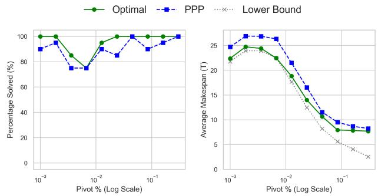

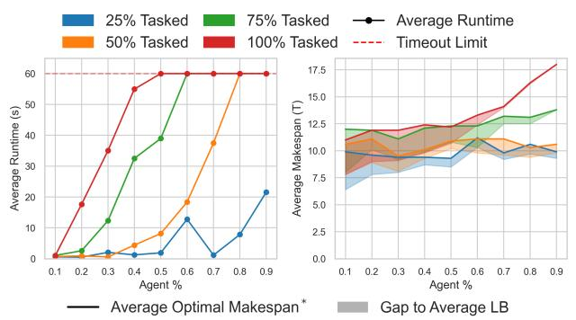  
(a)

(b)  
Fi<sub>g</sub>ure 7: (a) O<sub>p</sub>timal-solver <sub>p</sub>erformance over 10 feasible $1 6 \times 1 6$ instances (Obstacle% = 0.2) vs. agent density, by tasked percentage (Station% = Agent%, Pivot% = 0.05); (b) Optimal-solver and PPP performances over 20 well-formed $1 6 \times 1 6$ instances (Obstacle% = 0.2) vs. pivot density $( \mathrm { A g e n t \% } = \mathrm { S t a t i o n \% } = 0 . 1 5 ,$ Tasked% = 0.5). 60-sec timeout.
<table><tr><td rowspan="2">Solver</td><td colspan="4">empty-48-48</td><td colspan="4">random-64-64-10</td><td colspan="4">warehouse-10-20-10-2-1</td></tr><tr><td>Runtime</td><td> $\mathbf { M } _ { s } ^ { \mathbb { Z } }$ </td><td> $\Sigma _ { s } ^ { \boldsymbol { \tau } }$ </td><td>Success</td><td>Runtime</td><td> $\mathbf { M } _ { s } ^ { \mathbb { Z } }$ </td><td> $\Sigma _ { s } ^ { \boldsymbol { \tau } }$ </td><td>Success</td><td>Runtime</td><td> $\mathbf { M } _ { s } ^ { \mathbb { Z } }$ </td><td> $\Sigma _ { s } ^ { \boldsymbol { \tau } }$ </td><td>Success</td></tr><tr><td>BA</td><td>22.29</td><td>3859.72</td><td>391533.70</td><td>100.0</td><td>64.78</td><td>6326.42</td><td>750692.14</td><td>100.0</td><td>282.32</td><td>23933.24</td><td>5740934.78</td><td>100.0</td></tr><tr><td>LH</td><td>8.76</td><td>31.33</td><td>2428.33</td><td>87.0</td><td>25.33</td><td>42.54</td><td>3855.11</td><td>84.0</td><td>141.53</td><td>91.90</td><td>17000.67</td><td>81.0</td></tr><tr><td>SH</td><td>8.67</td><td>30.88</td><td>2387.69</td><td>86.5</td><td>25.08</td><td>42.85</td><td>3844.63</td><td>85.0</td><td>151.12</td><td>92.17</td><td>16681.59</td><td>78.5</td></tr><tr><td>RND</td><td>8.42</td><td>30.98</td><td>2365.56</td><td>83.5</td><td>24.70</td><td>42.35</td><td>3811.54</td><td>82.0</td><td>148.66</td><td>91.22</td><td>16876.49</td><td>78.0</td></tr><tr><td>LC</td><td>8.91</td><td>31.17</td><td>2383.30</td><td>84.5</td><td>25.41</td><td>42.90</td><td>3773.30</td><td>81.0</td><td>143.45</td><td>90.00</td><td>15983.05</td><td>74.5</td></tr><tr><td>MC</td><td>8.82</td><td>31.38</td><td>2452.07</td><td>89.0</td><td>23.44</td><td>42.25</td><td>3842.34</td><td>83.5</td><td>137.76</td><td>91.74</td><td>16915.78</td><td>80.5</td></tr></table>

Table 1: Avera<sub>g</sub>e Runtime (s), Station-Makes<sub>p</sub>an $( M _ { S } ^ { \underline { { \tau } } } )$ <sub>,</sub> St<sub>a</sub>ti<sub>on-</sub>Fl<sub>ow</sub>ti<sub>me</sub> $( \Sigma _ { S } ^ { \mathcal { Z } } )$ and Success Rate (%); for fairness, avera<sub>g</sub>es are <sub>over</sub> i<sub>ns</sub>t<sub>ances</sub> <sub>so</sub>l<sub>ve</sub>d b<sub>y</sub> <sub>a</sub>ll <sub>s</sub>i<sub>x</sub> <sub>a</sub>l<sub>gor</sub>ith<sub>ms.</sub> B<sub>es</sub>t <sub>resu</sub>lt<sub>s</sub> <sub>among</sub> th<sub>e</sub> PPP <sub>or</sub>d<sub>er</sub>i<sub>ngs</sub> <sub>are</sub> i<sub>n</sub> b<sub>o</sub>ld<sub>.</sub> N<sub>o</sub> ti<sub>me</sub> li<sub>m</sub>it <sub>was</sub> i<sub>mpose</sub>d<sub>.</sub>

## 6.2 PPP vs. Baseline Algorithm

PPP <sub>uses a g</sub>i<sub>ven pr</sub>i<sub>or</sub>it<sub>y or</sub>d<sub>er</sub> f<sub>or</sub> th<sub>e</sub> t<sub>as</sub>k<sub>e</sub>d <sub>agen</sub>t<sub>s, an</sub>d <sub>we</sub> evaluate several well-known orderin<sub>g</sub> heuristics (Ma et al. 2019; Bennewitz, Burgard, and Thrun 2001): SH (Shortest path first) prioritizes agents with shorter shortest paths to a pivot, LH (Longest path first) the opposite, and RND (Random) orders agents uniformly at random (fixed seed 42 for re<sub>p</sub>roducibilit<sub>y</sub>). We also evaluate two conflict-based orderi<sub>ngs:</sub> f<sub>or</sub> <sub>eac</sub>h t<sub>as</sub>k<sub>e</sub>d <sub>agen</sub>t<sub>,</sub> <sub>we</sub> <sub>genera</sub>t<sub>e</sub> <sub>a</sub> <sub>s</sub>t<sub>a</sub>ti<sub>c,</sub> <sub>s</sub>h<sub>or</sub>t<sub>es</sub>t <sub>pa</sub>th to a <sub>p</sub>ivot and count the s<sub>p</sub>atio-tem<sub>p</sub>oral (vertex and ed<sub>g</sub>e) collisions it shares with the others’ static paths; LC (Least Conflicts first) prioritizes agents with fewer initial conflicts, MC (Most Conflictsfirst) those with more.

W<sub>e per</sub>f<sub>orm exper</sub>i<sub>men</sub>t<sub>s on</sub> th<sub>ree maps</sub> f<sub>rom</sub> th<sub>e</sub> M<sub>ov</sub>i<sub>ng</sub> AI benchmark (Stern et al. 2019): empty 48 × 48 grids, 64 × 64 grids with 10% obstacle density, and warehouse maps, <sub>cover</sub>i<sub>ng</sub> di<sub>verse</sub> t<sub>opo</sub>l<sub>og</sub>i<sub>es an</sub>d <sub>conges</sub>ti<sub>on</sub> l<sub>eve</sub>l<sub>s.</sub> F<sub>or eac</sub>h <sub>map, we genera</sub>t<sub>e</sub>d 200 <sub>we</sub>ll<sub>-</sub>f<sub>orme</sub>d i<sub>ns</sub>t<sub>ances w</sub>ith <sub>num</sub>b<sub>er</sub> of pivots in {1, 5, 10, 20, 30}, proportion of tasked agents in {10%, 25%, 50%, 75%, 100%}, and total number of a<sub>g</sub>ents <sub>over</sub> <sub>e</sub>i<sub>g</sub>ht <sub>even</sub>l<sub>y</sub> <sub>space</sub>d <sub>va</sub>l<sub>ues,</sub> f<sub>rom</sub> 1% <sub>o</sub>f th<sub>e</sub> <sub>map</sub>’<sub>s</sub> f<sub>ree</sub> <sub>ce</sub>ll<sub>s</sub> t<sub>o</sub> th<sub>e</sub> <sub>max</sub>i<sub>mum</sub> <sub>mu</sub>lti<sub>p</sub>l<sub>e</sub> <sub>o</sub>f 10 <sub>y</sub>i<sub>e</sub>ldi<sub>ng</sub> <sub>a</sub> <sub>we</sub>ll<sub>-</sub>f<sub>orme</sub>d instance: 150 (em<sub>p</sub>t<sub>y</sub>), 170 (random), 340 (warehouse).

T<sub>a</sub>bl<sub>e</sub> 1 <sub>presen</sub>t<sub>s</sub> th<sub>e</sub> <sub>eva</sub>l<sub>ua</sub>t<sub>e</sub>d <sub>cos</sub>t <sub>me</sub>t<sub>r</sub>i<sub>cs</sub> <sub>an</sub>d <sub>success</sub> <sub>ra</sub>t<sub>es.</sub> BA i<sub>s comp</sub>l<sub>e</sub>t<sub>e</sub> b<sub>u</sub>t i<sub>ncurs pro</sub>hibiti<sub>ve compu</sub>t<sub>a</sub>ti<sub>ona</sub>l <sub>an</sub>d <sub>qua</sub>lit<sub>a</sub>ti<sub>ve cos</sub>t<sub>s;</sub> PPP <sub>sacr</sub>ifi<sub>ces comp</sub>l<sub>e</sub>t<sub>eness</sub> f<sub>or mas-</sub> <sub>s</sub>i<sub>ve e</sub>fi<sub>c</sub>i<sub>ency ga</sub>i<sub>ns, ma</sub>i<sub>n</sub>t<sub>a</sub>i<sub>n</sub>i<sub>ng a</sub> 74<sub>–</sub>89% <sub>success ra</sub>t<sub>e</sub> <sub>w</sub>hil<sub>e</sub> d<sub>ras</sub>ti<sub>ca</sub>ll<sub>y ou</sub>t<sub>per</sub>f<sub>orm</sub>i<sub>ng</sub> BA <sub>across a</sub>ll <sub>me</sub>t<sub>r</sub>i<sub>cs an</sub>d <sub>so</sub>l<sub>v</sub>i<sub>ng ware</sub>h<sub>ouse</sub> i<sub>ns</sub>t<sub>ances</sub> i<sub>n</sub> h<sub>a</sub>lf th<sub>e</sub> ti<sub>me w</sub>ith <sub>or</sub>d<sub>ers-o</sub>f<sub>-</sub> <sub>magn</sub>it<sub>u</sub>d<sub>e</sub> l<sub>ower ma</sub>k<sub>espan an</sub>d fl<sub>ow</sub>ti<sub>me.</sub> A<sub>mong</sub> th<sub>e</sub> h<sub>eur</sub>i<sub>s-</sub> tics, no ordering dominates, but MC is the strongest overall, <sub>ac</sub>hi<sub>ev</sub>i<sub>ng</sub> th<sub>e</sub> l<sub>owes</sub>t <sub>average run</sub>ti<sub>mes on</sub> th<sub>e</sub> t<sub>wo</sub> d<sub>enser</sub> <sub>maps</sub> <sub>an</sub>d th<sub>e</sub> hi<sub>g</sub>h<sub>es</sub>t <sub>success</sub> <sub>ra</sub>t<sub>e</sub> <sub>on</sub> th<sub>e</sub> <sub>emp</sub>t<sub>y</sub> <sub>map,</sub> <sub>w</sub>hil<sub>e</sub> <sub>rema</sub>i<sub>n</sub>i<sub>ng compe</sub>titi<sub>ve on every me</sub>t<sub>r</sub>i<sub>c e</sub>l<sub>sew</sub>h<sub>ere.</sub> PPP’<sub>s</sub> f<sub>a</sub>il<sub>-</sub> ures concentrate in extreme bottleneck scenarios (e.<sub>g</sub>., 1–5 <sub>p</sub>ivots, 75–100% tasked a<sub>g</sub>ents): Phase 1 alwa<sub>y</sub>s com<sub>p</sub>letes on our instances but saturates R, and this <sub>p</sub>revents the Phase 2 fl<sub>ow</sub> f<sub>rom rou</sub>ti<sub>ng a</sub>ll <sub>agen</sub>t<sub>s w</sub>ithi<sub>n</sub> th<sub>e a</sub>ll<sub>owe</sub>d h<sub>or</sub>i<sub>zon,</sub> <sub>ma</sub>ki<sub>ng a</sub>ll h<sub>eur</sub>i<sub>s</sub>ti<sub>cs</sub> f<sub>a</sub>il <sub>s</sub>i<sub>mu</sub>lt<sub>aneous</sub>l<sub>y a</sub>t <sub>cr</sub>iti<sub>ca</sub>l d<sub>ens</sub>it<sub>y</sub> thresholds, though MC resolves borderline instances where th<sub>e o</sub>th<sub>ers ge</sub>t <sub>s</sub>t<sub>uc</sub>k<sub>.</sub>

## 7 Conclusion and Future Work

W<sub>e</sub> i<sub>n</sub>t<sub>ro</sub>d<sub>uce</sub>d PS<sub>-</sub>MAPF<sub>, a</sub> MAPF <sub>var</sub>i<sub>an</sub>t i<sub>n w</sub>hi<sub>c</sub>h t<sub>as</sub>k<sub>e</sub>d <sub>agen</sub>t<sub>s mus</sub>t <sub>reac</sub>h <sub>an anonymous p</sub>i<sub>vo</sub>t b<sub>e</sub>f<sub>ore</sub> th<sub>e en</sub>ti<sub>re</sub> fl<sub>ee</sub>t t<sub>erm</sub>i<sub>na</sub>t<sub>es a</sub>t <sub>anonymous s</sub>t<sub>a</sub>ti<sub>ons.</sub> W<sub>e c</sub>h<sub>arac</sub>t<sub>er</sub>i<sub>ze</sub>d <sub>so</sub>l<sub>va</sub>bil<sub>-</sub> it<sub>y comp</sub>l<sub>e</sub>t<sub>e</sub>l<sub>y, prove</sub>d th<sub>a</sub>t <sub>m</sub>i<sub>n</sub>i<sub>m</sub>i<sub>z</sub>i<sub>ng s</sub>t<sub>a</sub>ti<sub>on-ma</sub>k<sub>espan an</sub>d station-flowtime is NP-hard already with a single pivot, and <sub>presen</sub>t<sub>e</sub>d th<sub>ree</sub> <sub>a</sub>l<sub>gor</sub>ith<sub>ms:</sub> <sub>a</sub> <sub>comp</sub>l<sub>e</sub>t<sub>e,</sub> l<sub>ow-qua</sub>lit<sub>y</sub> b<sub>ase</sub>li<sub>ne,</sub> <sub>a</sub> SAT<sub>-</sub>b<sub>ase</sub>d <sub>ma</sub>k<sub>espan-op</sub>ti<sub>ma</sub>l <sub>so</sub>l<sub>ver, an</sub>d th<sub>e</sub> i<sub>ncomp</sub>l<sub>e</sub>t<sub>e</sub> but fast Pivot-Prioritized Plannin<sub>g</sub> (PPP), with solutions ord<sub>ers o</sub>f <sub>magn</sub>it<sub>u</sub>d<sub>e</sub> b<sub>e</sub>tt<sub>er</sub> th<sub>an</sub> th<sub>e</sub> b<sub>ase</sub>li<sub>ne.</sub> F<sub>u</sub>t<sub>ure wor</sub>k i<sub>n-</sub> cludes pivot-based objectives, domain-specific solvers, and <sub>a</sub>d<sub>ap</sub>tin<sub>g s</sub>t<sub>a</sub>t<sub>e-o</sub>f<sub>-</sub>th<sub>e-a</sub>rt MAPF t<sub>ec</sub>hni<sub>ques</sub> t<sub>o</sub> PS<sub>-</sub>MAPF<sub>.</sub>

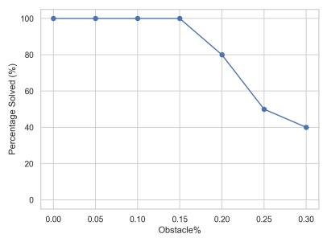

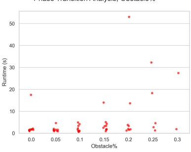  
(a) Performance vs Obstacle %.

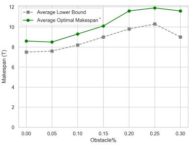

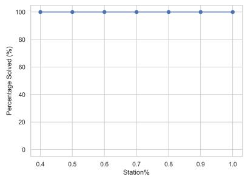

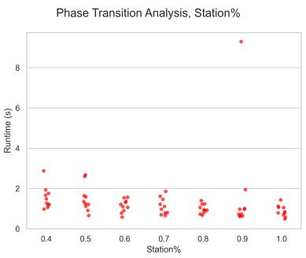

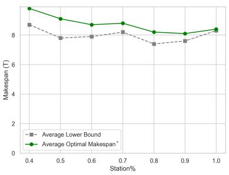  
(b) Performance vs Station %.

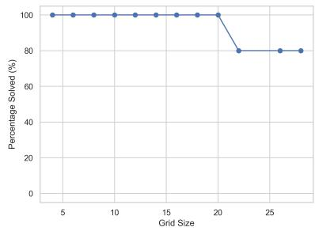

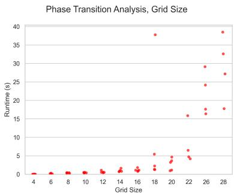  
(c) Performance vs Grid Size

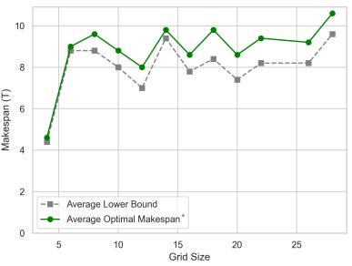

## References

A<sub>s</sub>í<sub>n</sub> A<sub>c</sub>há<sub>,</sub> R<sub>.;</sub> Ló<sub>pez,</sub> R<sub>.;</sub> H<sub>age</sub>d<sub>orn,</sub> S<sub>.;</sub> <sub>an</sub>d B<sub>a</sub>i<sub>er,</sub> J<sub>.</sub> A<sub>.</sub> 2022<sub>.</sub> M<sub>u</sub>lti<sub>-</sub>A<sub>gen</sub>t P<sub>a</sub>th Fi<sub>n</sub>di<sub>ng:</sub> A N<sub>ew</sub> B<sub>oo</sub>l<sub>ean</sub> E<sub>nco</sub>di<sub>ng.</sub> Journal ofArtificial Intelligence Research, 75: 597–624.

B<sub>e</sub>nn<sub>ew</sub>it<sub>z,</sub> M<sub>.;</sub> B<sub>u</sub>r<sub>ga</sub>rd<sub>,</sub> W<sub>.; a</sub>nd Thr<sub>u</sub>n<sub>,</sub> S<sub>.</sub> 2001<sub>.</sub> O<sub>p</sub>timi<sub>z-</sub> i<sub>ng</sub> S<sub>c</sub>h<sub>e</sub>d<sub>u</sub>l<sub>es</sub> f<sub>or</sub> P<sub>r</sub>i<sub>or</sub>iti<sub>ze</sub>d P<sub>a</sub>th Pl<sub>ann</sub>i<sub>ng</sub> <sub>o</sub>f M<sub>u</sub>lti<sub>-</sub>R<sub>o</sub>b<sub>o</sub>t Systems. In Proceedings of the IEEE International Conference on Robotics and Automation, volume 1, 271–276. Pi<sub>sca</sub>t<sub>away,</sub> NJ<sub>:</sub> IEEE<sub>.</sub>

C<sub>a</sub>i<sub>,</sub> J<sub>.;</sub> S<sub>u,</sub> Y<sub>.;</sub> Y<sub>a</sub>n<sub>g,</sub> X<sub>.;</sub> Min<sub>,</sub> J<sub>.; a</sub>nd L<sub>a</sub>i<sub>,</sub> Y<sub>.</sub> 2019<sub>.</sub> A N<sub>ew</sub> SAT Encoding Scheme for Exactly-One Constraints. Journal ofPhysics: Conference Series, 1288: 012035.

C<sub>oo</sub>k<sub>,</sub> S<sub>.</sub> A<sub>.</sub> 1971<sub>.</sub> Th<sub>e</sub> C<sub>o</sub>m<sub>p</sub>l<sub>ex</sub>it<sub>y</sub> <sub>o</sub>f Th<sub>eo</sub>r<sub>e</sub>m<sub>-</sub>Pr<sub>ov</sub>in<sub>g</sub> Procedures. In Proceedings of the Third Annual ACM Symposium on Theory of Computing, 151–158. New York, NY: A<sub>ssoc</sub>i<sub>a</sub>ti<sub>on</sub> f<sub>or</sub> C<sub>ompu</sub>ti<sub>ng</sub> M<sub>ac</sub>hi<sub>nery.</sub>

Diestel, R. 2017. Graph Theory, volume 173 of Graduate

Texts in Mathematics. Berlin, Heidelberg: Springer, 5th editi<sub>on.</sub>

Erdm<sub>a</sub>nn<sub>,</sub> M<sub>.; a</sub>nd L<sub>oza</sub>n<sub>o-</sub>Pér<sub>ez,</sub> T<sub>.</sub> 1987<sub>.</sub> On M<sub>u</sub>lti<sub>p</sub>l<sub>e</sub> M<sub>ov-</sub> ing Objects. Algorithmica, 2: 477–521.

F<sub>e</sub>l<sub>ner,</sub> A<sub>.;</sub> <sub>an</sub>d St<sub>ern,</sub> R<sub>.</sub> 2026<sub>.</sub> M<sub>u</sub>lti<sub>-</sub>A<sub>gen</sub>t P<sub>a</sub>th Fi<sub>n</sub>di<sub>ng</sub> with Unassigned Agents (MAPFUA). In Proceedings of the AAAI Conference on Artificial Intelligence, volume 40, 39691<sub>–</sub>39698<sub>.</sub> M<sub>e</sub>nl<sub>o</sub> P<sub>a</sub>rk<sub>,</sub> CA<sub>:</sub> AAAI Pr<sub>ess.</sub>

F<sub>r</sub>i<sub>sc</sub>h<sub>,</sub> A<sub>.</sub> M<sub>.; an</sub>d Gi<sub>annaros,</sub> P<sub>.</sub> A<sub>.</sub> 2010<sub>.</sub> SAT E<sub>nco</sub>di<sub>ngs</sub> <sub>o</sub>f th<sub>e</sub> At<sub>-</sub>M<sub>os</sub>t<sub>-</sub>k C<sub>ons</sub>t<sub>ra</sub>i<sub>n</sub>t<sub>:</sub> S<sub>ome</sub> Old<sub>,</sub> S<sub>ome</sub> N<sub>ew,</sub> S<sub>ome</sub> Fast, Some Slow. In Proceedings of the Tenth International Workshop ofConstraint Modelling and Reformulation, 36.

K<sub>au</sub>t<sub>z,</sub> H<sub>.</sub> A<sub>.; an</sub>d S<sub>e</sub>l<sub>man,</sub> B<sub>.</sub> 1992<sub>.</sub> Pl<sub>ann</sub>i<sub>ng as</sub> S<sub>a</sub>ti<sub>s</sub>fi<sub>a</sub>bilit<sub>y.</sub> In Proceedings of the 10th European Conference on Artificial Intelligence, 359–363. Chichester: John Wiley and Sons.

K<sub>o</sub>rnh<sub>ause</sub>r<sub>,</sub> D<sub>.;</sub> Mill<sub>e</sub>r<sub>,</sub> G<sub>.</sub> L<sub>.; a</sub>nd S<sub>p</sub>ir<sub>a</sub>ki<sub>s,</sub> P<sub>.</sub> G<sub>.</sub> 1984<sub>.</sub> C<sub>oo</sub>r<sub>-</sub> di<sub>na</sub>ti<sub>ng</sub> P<sub>e</sub>bbl<sub>e</sub> M<sub>o</sub>ti<sub>on on</sub> G<sub>rap</sub>h<sub>s,</sub> th<sub>e</sub> Di<sub>ame</sub>t<sub>er o</sub>f P<sub>ermu-</sub>

tation Groups, and Applications. In Proceedings of the 25th Annual Symposium on Foundations of Computer Science, 241<sub>–</sub>250<sub>.</sub> W<sub>as</sub>hi<sub>ng</sub>t<sub>on,</sub> DC<sub>:</sub> IEEE C<sub>ompu</sub>t<sub>er</sub> S<sub>oc</sub>i<sub>e</sub>t<sub>y.</sub>

L<sub>una,</sub> R<sub>.; an</sub>d B<sub>e</sub>k<sub>r</sub>i<sub>s,</sub> K<sub>.</sub> E<sub>.</sub> 2011<sub>.</sub> P<sub>us</sub>h <sub>an</sub>d S<sub>wap:</sub> F<sub>as</sub>t C<sub>o-</sub> <sub>opera</sub>ti<sub>ve</sub> P<sub>a</sub>th<sub>-</sub>Fi<sub>n</sub>di<sub>ng</sub> <sub>w</sub>ith C<sub>omp</sub>l<sub>e</sub>t<sub>eness</sub> G<sub>uaran</sub>t<sub>ees.</sub> I<sub>n</sub> Proceedings of the Twenty-Second International Joint Conference on Artificial Intelligence, 294–300. Menlo Park, CA: IJCAI Or<sub>ga</sub>ni<sub>za</sub>ti<sub>o</sub>n<sub>.</sub>

M<sub>a,</sub> H<sub>.;</sub> H<sub>a</sub>r<sub>a</sub>b<sub>o</sub>r<sub>,</sub> D<sub>.;</sub> St<sub>uc</sub>k<sub>ey,</sub> P<sub>.</sub> J<sub>.;</sub> Li<sub>,</sub> J<sub>.; a</sub>nd K<sub>oe</sub>ni<sub>g,</sub> S<sub>.</sub> 2019<sub>.</sub> S<sub>earc</sub>hi<sub>ng w</sub>ith C<sub>ons</sub>i<sub>s</sub>t<sub>en</sub>t P<sub>r</sub>i<sub>or</sub>iti<sub>za</sub>ti<sub>on</sub> f<sub>or</sub> M<sub>u</sub>lti<sub>-</sub> Agent Path Finding. In Proceedings ofthe Thirty-ThirdAAAI Conference onArtificial Intelligence, volume 33, 7643–7650. M<sub>en</sub>l<sub>o</sub> P<sub>ar</sub>k<sub>,</sub> CA<sub>:</sub> AAAI P<sub>ress.</sub>

M<sub>a,</sub> H<sub>.; a</sub>nd K<sub>oe</sub>ni<sub>g,</sub> S<sub>.</sub> 2016<sub>.</sub> O<sub>p</sub>tim<sub>a</sub>l T<sub>a</sub>r<sub>ge</sub>t A<sub>ss</sub>i<sub>g</sub>nm<sub>e</sub>nt and Path Finding for Teams of Agents. In Proceedings of the 2016 International Conference on Autonomous Agents & Multiagent Systems, 1144–1152. Richland, SC: International F<sub>oun</sub>d<sub>a</sub>ti<sub>on</sub> f<sub>or</sub> A<sub>u</sub>t<sub>onomous</sub> A<sub>gen</sub>t<sub>s an</sub>d M<sub>u</sub>lti<sub>agen</sub>t S<sub>ys</sub>t<sub>ems.</sub>

M<sub>a,</sub> H<sub>.;</sub> K<sub>oen</sub>i<sub>g,</sub> S<sub>.;</sub> A<sub>yan</sub>i<sub>an,</sub> N<sub>.;</sub> C<sub>o</sub>h<sub>en,</sub> L<sub>.;</sub> Hö<sub>n</sub>i<sub>g,</sub> W<sub>.;</sub> K<sub>umar,</sub> T<sub>.</sub> K<sub>.</sub> S<sub>.;</sub> U<sub>ras,</sub> T<sub>.;</sub> X<sub>u,</sub> H<sub>.;</sub> T<sub>ovey,</sub> C<sub>.;</sub> <sub>an</sub>d Sh<sub>aron,</sub> G<sub>.</sub> 2016<sub>.</sub> O<sub>verv</sub>i<sub>ew:</sub> G<sub>enera</sub>li<sub>za</sub>ti<sub>ons o</sub>f M<sub>u</sub>lti<sub>-</sub>A<sub>gen</sub>t P<sub>a</sub>th Finding to Real-World Scenarios. In Proceedings of the IJCAI Workshop on Multi-Agent Path Finding.

M<sub>a,</sub> H<sub>.;</sub> Li<sub>,</sub> J<sub>.;</sub> K<sub>u</sub>m<sub>a</sub>r<sub>,</sub> T<sub>.</sub> K<sub>.</sub> S<sub>.;</sub> <sub>a</sub>nd K<sub>oe</sub>ni<sub>g,</sub> S<sub>.</sub> 2017<sub>.</sub> Lif<sub>e</sub>l<sub>o</sub>n<sub>g</sub> M<sub>u</sub>lti<sub>-</sub>A<sub>gen</sub>t P<sub>a</sub>th Fi<sub>n</sub>di<sub>ng</sub> f<sub>or</sub> O<sub>n</sub>li<sub>ne</sub> Pi<sub>c</sub>k<sub>up</sub> <sub>an</sub>d D<sub>e</sub>li<sub>very</sub> Tasks. In Proceedings of the 16th International Conference on Autonomous Agents and Multiagent Systems, 837– 845<sub>.</sub> Ri<sub>c</sub>hl<sub>an</sub>d<sub>,</sub> SC<sub>:</sub> I<sub>n</sub>t<sub>erna</sub>ti<sub>ona</sub>l F<sub>oun</sub>d<sub>a</sub>ti<sub>on</sub> f<sub>or</sub> A<sub>u</sub>t<sub>onomous</sub> A<sub>ge</sub>nt<sub>s</sub> <sub>a</sub>nd M<sub>u</sub>lti<sub>age</sub>nt S<sub>ys</sub>t<sub>e</sub>m<sub>s.</sub>

M<sub>a</sub>ki<sub>no,</sub> H<sub>.; an</sub>d It<sub>o,</sub> S<sub>.</sub> 2026<sub>.</sub> MAPF<sub>-</sub>HD<sub>:</sub> M<sub>u</sub>lti<sub>-</sub>A<sub>gen</sub>t P<sub>a</sub>th Finding in High-Density Environments. IEEE Robotics & Automation Magazine, 2–12.

N<sub>guye</sub>n<sub>,</sub> V<sub>.;</sub> Ob<sub>e</sub>rm<sub>e</sub>i<sub>e</sub>r<sub>,</sub> P<sub>.;</sub> S<sub>o</sub>n<sub>,</sub> T<sub>.</sub> C<sub>.;</sub> S<sub>c</sub>h<sub>au</sub>b<sub>,</sub> T<sub>.; a</sub>nd Y<sub>eo</sub>h<sub>,</sub> W<sub>.</sub> 2017<sub>.</sub> G<sub>enera</sub>li<sub>ze</sub>d T<sub>arge</sub>t A<sub>ss</sub>i<sub>gnmen</sub>t <sub>an</sub>d P<sub>a</sub>th Fi<sub>n</sub>d<sub>-</sub> ing Using Answer Set Programming. In Proceedings of the Twenty-Sixth International Joint Conference on Artificial Intelligence, 1216–1223. Menlo Park, CA: IJCAI Organization.

Oh<sub>r</sub>i<sub>men</sub>k<sub>o,</sub> O<sub>.;</sub> St<sub>uc</sub>k<sub>ey,</sub> P<sub>.; an</sub>d C<sub>o</sub>di<sub>s</sub>h<sub>,</sub> M<sub>.</sub> 2026<sub>.</sub> L<sub>azy</sub> Clause Generation in Retrospect. Constraints.

Ok<sub>umura,</sub> K<sub>.</sub> 2024<sub>.</sub> E<sub>ng</sub>i<sub>neer</sub>i<sub>ng</sub> L<sub>a</sub>CAM\*<sub>:</sub> T<sub>owar</sub>d<sub>s</sub> R<sub>ea</sub>l<sub>-</sub> Ti<sub>me,</sub> L<sub>arge-</sub>S<sub>ca</sub>l<sub>e, an</sub>d N<sub>ear-</sub>O<sub>p</sub>ti<sub>ma</sub>l M<sub>u</sub>lti<sub>-</sub>A<sub>gen</sub>t P<sub>a</sub>thfi<sub>n</sub>d<sub>-</sub> ing. In Proceedings of the 23rd International Conference on Autonomous Agents and Multiagent Systems, 1501–1509. Ri<sub>c</sub>hl<sub>an</sub>d<sub>,</sub> SC<sub>:</sub> I<sub>n</sub>t<sub>erna</sub>ti<sub>ona</sub>l F<sub>oun</sub>d<sub>a</sub>ti<sub>on</sub> f<sub>or</sub> A<sub>u</sub>t<sub>onomous</sub> A<sub>ge</sub>nt<sub>s a</sub>nd M<sub>u</sub>lti<sub>age</sub>nt S<sub>ys</sub>t<sub>e</sub>m<sub>s.</sub>

Perron, L.; and Didier, F. 2025. CP-SAT (Version 9.12). htt<sub>p</sub>s://develo<sub>p</sub>ers.<sub>g</sub>oo<sub>g</sub>le.com/o<sub>p</sub>timization/c<sub>p</sub>/c<sub>p</sub>\_ <sub>so</sub>l<sub>ver</sub>/<sub>.</sub> A<sub>ccesse</sub>d<sub>:</sub> 2026<sub>-</sub>07<sub>-</sub>24<sub>.</sub>

R<sub>en,</sub> Z<sub>.;</sub> R<sub>a</sub>thi<sub>nam,</sub> S<sub>.; an</sub>d Ch<sub>ose</sub>t<sub>,</sub> H<sub>.</sub> 2021<sub>.</sub> MS\*<sub>:</sub> A N<sub>ew</sub> E<sub>xac</sub>t Al<sub>gor</sub>ith<sub>m</sub> f<sub>or</sub> M<sub>u</sub>lti<sub>-</sub>A<sub>gen</sub>t Si<sub>mu</sub>lt<sub>aneous</sub> M<sub>u</sub>lti<sub>-</sub>G<sub>oa</sub>l Sequencing and Path Finding. In Proceedings of the IEEE International Conference on Robotics andAutomation, 11560– 11565<sub>.</sub> Pi<sub>sca</sub>t<sub>away,</sub> NJ<sub>:</sub> IEEE<sub>.</sub>

R<sub>en,</sub> Z<sub>.;</sub> R<sub>a</sub>thi<sub>nam,</sub> S<sub>.; an</sub>d Ch<sub>ose</sub>t<sub>,</sub> H<sub>.</sub> 2022<sub>.</sub> C<sub>on</sub>fli<sub>c</sub>t<sub>-</sub>B<sub>ase</sub>d St<sub>e</sub>i<sub>ner</sub> S<sub>earc</sub>h f<sub>or</sub> M<sub>u</sub>lti<sub>-</sub>A<sub>gen</sub>t C<sub>om</sub>bi<sub>na</sub>t<sub>or</sub>i<sub>a</sub>l P<sub>a</sub>th Fi<sub>n</sub>di<sub>ng.</sub> In Proceedings ofRobotics: Science and Systems. New York, NY<sub>:</sub> R<sub>o</sub>b<sub>o</sub>ti<sub>cs:</sub> S<sub>c</sub>i<sub>e</sub>n<sub>ce a</sub>nd S<sub>ys</sub>t<sub>e</sub>m<sub>s</sub> F<sub>ou</sub>nd<sub>a</sub>ti<sub>o</sub>n<sub>.</sub>

Sh<sub>a</sub>r<sub>o</sub>n<sub>,</sub> G<sub>.;</sub> St<sub>e</sub>rn<sub>,</sub> R<sub>.;</sub> F<sub>e</sub>ln<sub>e</sub>r<sub>,</sub> A<sub>.; a</sub>nd St<sub>u</sub>rt<sub>eva</sub>nt<sub>,</sub> N<sub>.</sub> R<sub>.</sub> 2015<sub>.</sub> C<sub>on</sub>fli<sub>c</sub>t<sub>-</sub>B<sub>ase</sub>d S<sub>earc</sub>h f<sub>or</sub> O<sub>p</sub>ti<sub>ma</sub>l M<sub>u</sub>lti<sub>-</sub>A<sub>gen</sub>t P<sub>a</sub>thfi<sub>n</sub>di<sub>ng.</sub> Artificial Intelligence, 219: 40–66.

Silver, D. 2005. Cooperative Pathfinding. In Proceedings of the First AAAI Conference on Artificial Intelligence and Interactive Digital Entertainment, 117–122. Menlo Park, CA: AAAI P<sub>ress.</sub>

Sipser, M. 2012. Introduction to the Theory of Computation. B<sub>os</sub>t<sub>o</sub>n<sub>,</sub> MA<sub>:</sub> C<sub>e</sub>n<sub>gage</sub> L<sub>ea</sub>rnin<sub>g,</sub> 3rd <sub>e</sub>diti<sub>o</sub>n<sub>.</sub>

St<sub>ern,</sub> R<sub>.</sub> 2019<sub>.</sub> M<sub>u</sub>lti<sub>-</sub>A<sub>gen</sub>t P<sub>a</sub>th Fi<sub>n</sub>di<sub>ng</sub> <sub>–</sub> A<sub>n</sub> O<sub>verv</sub>i<sub>ew.</sub> In O<sub>s</sub>i<sub>pov,</sub> G<sub>.</sub> S<sub>.;</sub> P<sub>a</sub>n<sub>ov,</sub> A<sub>.</sub> I<sub>.;</sub> <sub>a</sub>nd Y<sub>a</sub>k<sub>ov</sub>l<sub>ev,</sub> K<sub>.</sub> S<sub>.,</sub> <sub>e</sub>d<sub>s.,</sub> Artificial Intelligence: 5th RAAI Summer School, 96–115. Ch<sub>am:</sub> S<sub>pr</sub>i<sub>nger</sub> I<sub>n</sub>t<sub>erna</sub>ti<sub>ona</sub>l P<sub>u</sub>bli<sub>s</sub>hi<sub>ng.</sub>

St<sub>ern,</sub> R<sub>.;</sub> St<sub>ur</sub>t<sub>evan</sub>t<sub>,</sub> N<sub>.</sub> R<sub>.;</sub> F<sub>e</sub>l<sub>ner,</sub> A<sub>.;</sub> K<sub>oen</sub>i<sub>g,</sub> S<sub>.;</sub> M<sub>a,</sub> H<sub>.;</sub> W<sub>a</sub>lk<sub>er,</sub> T<sub>.</sub> T<sub>.;</sub> Li<sub>,</sub> J<sub>.;</sub> At<sub>zmon,</sub> D<sub>.;</sub> C<sub>o</sub>h<sub>en,</sub> L<sub>.;</sub> K<sub>umar,</sub> T<sub>.</sub> K<sub>.</sub> S<sub>.;</sub> B<sub>oyars</sub>ki<sub>,</sub> E<sub>.; an</sub>d B<sub>ar</sub>t<sub>a</sub>k<sub>,</sub> R<sub>.</sub> 2019<sub>.</sub> M<sub>u</sub>lti<sub>-</sub>A<sub>gen</sub>t P<sub>a</sub>thfi<sub>n</sub>di<sub>ng:</sub> Definitions, Variants, and Benchmarks. In Proceedings of the Twelfth Annual Symposium on Combinatorial Search, <sub>vo</sub>l<sub>ume</sub> 10<sub>,</sub> 151<sub>–</sub>158<sub>.</sub> M<sub>en</sub>l<sub>o</sub> P<sub>ar</sub>k<sub>,</sub> CA<sub>:</sub> AAAI P<sub>ress.</sub>

S<sub>u</sub>r<sub>y</sub>n<sub>e</sub>k<sub>,</sub> P<sub>.</sub> 2009<sub>.</sub> A N<sub>ove</sub>l A<sub>pp</sub>r<sub>oac</sub>h t<sub>o</sub> P<sub>a</sub>th Pl<sub>a</sub>nnin<sub>g</sub> f<sub>o</sub>r Multiple Robots in Bi-connected Graphs. In Proceedings of the IEEE International Conference on Robotics andAutomation, 3613–3619. Piscataway, NJ: IEEE.

S<sub>uryne</sub>k<sub>,</sub> P<sub>.</sub> 2017<sub>.</sub> Ti<sub>me-expan</sub>d<sub>e</sub>d <sub>grap</sub>h<sub>-</sub>b<sub>ase</sub>d <sub>propos</sub>iti<sub>ona</sub>l <sub>enco</sub>di<sub>ngs</sub> f<sub>or</sub> <sub>ma</sub>k<sub>espan-op</sub>ti<sub>ma</sub>l <sub>so</sub>l<sub>v</sub>i<sub>ng</sub> <sub>o</sub>f <sub>coopera</sub>ti<sub>ve</sub> <sub>pa</sub>th finding problems. Annals of Mathematics and Artificial Intelligence, 81(3–4): 329–375.

S<sub>uryne</sub>k<sub>,</sub> P<sub>.</sub> 2019<sub>.</sub> U<sub>n</sub>if<sub>y</sub>i<sub>ng</sub> S<sub>earc</sub>h<sub>-</sub>B<sub>ase</sub>d <sub>an</sub>d C<sub>omp</sub>il<sub>a</sub>ti<sub>on-</sub> B<sub>ase</sub>d A<sub>pproac</sub>h<sub>es</sub> t<sub>o</sub> M<sub>u</sub>lti<sub>-</sub>A<sub>gen</sub>t P<sub>a</sub>th Fi<sub>n</sub>di<sub>ng</sub> Th<sub>roug</sub>h S<sub>a</sub>t<sub>-</sub> isfiability Modulo Theories. In Proceedings of the Twenty-Eighth International Joint Conference on Artificial Intelligence, 1177–1183. Menlo Park, CA: IJCAI Organization.

S<sub>uryne</sub>k<sub>,</sub> P<sub>.</sub> 2021<sub>.</sub> M<sub>u</sub>lti<sub>-</sub>G<sub>oa</sub>l M<sub>u</sub>lti<sub>-</sub>A<sub>gen</sub>t P<sub>a</sub>th Fi<sub>n</sub>di<sub>ng v</sub>i<sub>a</sub> Decoupled and Integrated Goal Vertex Ordering. In Proceedings of the AAAI Conference on Artificial Intelligence, <sub>vo</sub>l<sub>ume</sub> 35<sub>,</sub> 12409<sub>–</sub>12417<sub>.</sub> M<sub>en</sub>l<sub>o</sub> P<sub>ar</sub>k<sub>,</sub> CA<sub>:</sub> AAAI P<sub>ress.</sub>

S<sub>uryne</sub>k<sub>,</sub> P<sub>.</sub> 2022<sub>.</sub> P<sub>ro</sub>bl<sub>em</sub> C<sub>omp</sub>il<sub>a</sub>ti<sub>on</sub> f<sub>or</sub> M<sub>u</sub>lti<sub>-</sub>A<sub>gen</sub>t P<sub>a</sub>th Finding: A Survey. In Proceedings of the Thirty-First International Joint Conference on Artificial Intelligence, 5615– 5622<sub>.</sub> M<sub>en</sub>l<sub>o</sub> P<sub>ar</sub>k<sub>,</sub> CA<sub>:</sub> IJCAI O<sub>rgan</sub>i<sub>za</sub>ti<sub>on.</sub>

S<sub>uryne</sub>k<sub>,</sub> P<sub>.;</sub> F<sub>e</sub>l<sub>ner,</sub> A<sub>.;</sub> St<sub>ern,</sub> R<sub>.; an</sub>d B<sub>oyars</sub>ki<sub>,</sub> E<sub>.</sub> 2016<sub>.</sub> Efi<sub>c</sub>i<sub>en</sub>t SAT A<sub>pproac</sub>h t<sub>o</sub> M<sub>u</sub>lti<sub>-</sub>A<sub>gen</sub>t P<sub>a</sub>th Fi<sub>n</sub>di<sub>ng</sub> U<sub>n</sub>d<sub>er</sub> the Sum of Costs Objective. In Proceedings of the Twenty-Second European Conference on Artificial Intelligence, 810– 818<sub>.</sub> Am<sub>s</sub>t<sub>e</sub>rd<sub>a</sub>m<sub>,</sub> N<sub>e</sub>th<sub>e</sub>rl<sub>a</sub>nd<sub>s:</sub> IOS Pr<sub>ess.</sub>

Y<sub>u,</sub> J<sub>.; a</sub>nd L<sub>a</sub>V<sub>a</sub>ll<sub>e,</sub> S<sub>.</sub> M<sub>.</sub> 2013<sub>a.</sub> M<sub>u</sub>lti<sub>-age</sub>nt P<sub>a</sub>th Pl<sub>a</sub>nnin<sub>g</sub> and Network Flow. In Algorithmic Foundations ofRobotics X, 157–173. Berlin, Heidelberg: Springer.

Y<sub>u,</sub> J<sub>.; an</sub>d L<sub>a</sub>V<sub>a</sub>ll<sub>e,</sub> S<sub>.</sub> M<sub>.</sub> 2013b<sub>.</sub> St<sub>ruc</sub>t<sub>ure an</sub>d I<sub>n</sub>t<sub>rac</sub>t<sub>a</sub>bilit<sub>y</sub> of Optimal Multi-Robot Path Planning on Graphs. In Proceedings of the Twenty-Seventh AAAI Conference on Artificial Intelligence, 1443–1449. Menlo Park, CA: AAAI Press.